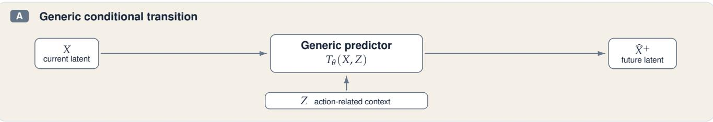
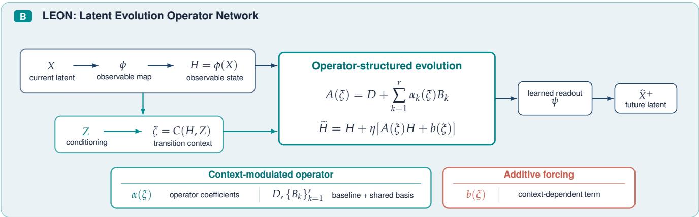
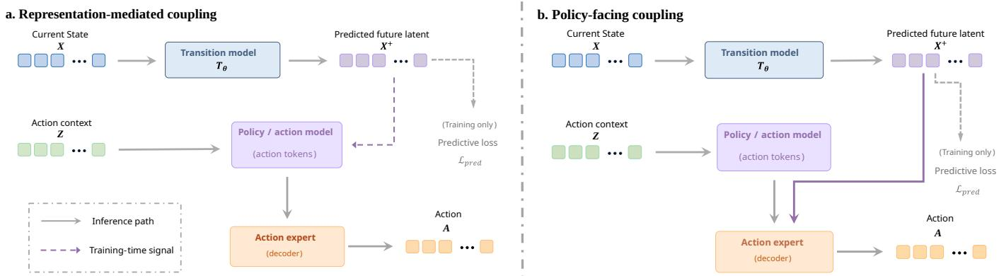
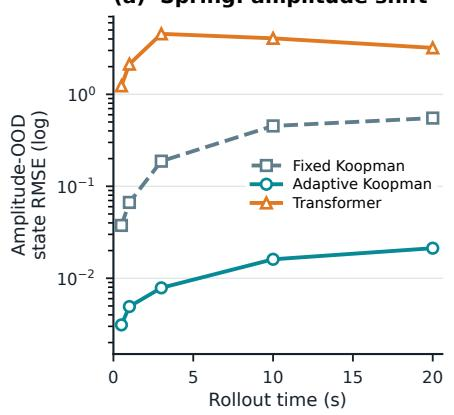
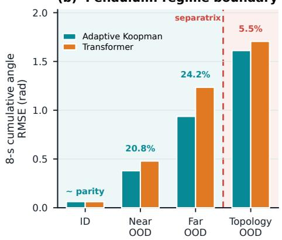
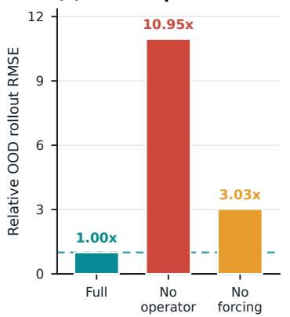

# Making Latent Evolution Explicit

Operator-Structured Transitions for World Action Models

Xiaoxiao Lu1, Yunlong Dong2, Jiahao Shi1, Ye Yuan1,\*

1School of Artificial Intelligence and Automation, Huazhong University of Science and Technology 2Principia AI 1{xiaolu, jiahaoshi, yye}@hust.edu.cn 2yunlongdong@outlook.com

## ABSTRACT

World Action Models (WAMs) augment robot policies by predicting how task-relevant scene states may evolve under interaction. Recent WAMs increasingly perform such prediction in latent representation spaces, avoiding full appearance-level generation while preserving control-relevant information. Yet latent transitions are commonly realized with Transformer-based predictors whose inductive structure is centered on token interaction rather than temporal evolution. We study transition realization as an architectural choice distinct from predictive representation and prediction–policy coupling. We introduce the Latent Evolution Operator Network (LEON), which models latent evolution in a learned observable space through context-modulated operator-based propagation and additive forcing. Grounded in the controlled Koopman generator view of evolution, LEON organizes context-dependent transition variation around a shared evolution-operator structure while retaining a complementary path for additive change. Controlled dynamical systems verify the resulting evolution-specific inductive bias and the complementary roles of operator propagation and forcing. Across two WAM formulations that integrate latent prediction into the policy differently, LEON improves closed-loop performance and robustness while remaining effective under full transition replacement. These results establish transition realization as a consequential architectural choice in latent WAMs.

  
Figure 1: Overview of LEON’s operator-structured transition realization. LEON maps the state to learned observables $H = \phi ( X )$ and constructs transition context $\xi = C ( H , Z )$ . The context modulates coefficients over a shared operator basis, organizing context-dependent evolution within a common operator subspace, while $b ( \xi )$ provides complementary additive change. A learned readout returns the updated observables to the WAM prediction space. The predictive representation and prediction–policy coupling are preserved, isolating transition realization as the architectural variable.

## 1 Introduction

Vision–language–action (VLA) policies provide strong semantic grounding for robot control [1–3], but effective action generation can also benefit from anticipating how the scene may evolve under interaction. World Action Models (WAMs) incorporate such future prediction into robot policy learning and control [4–8]. Recent work increasingly performs this prediction in latent rather than pixel space, avoiding full appearancelevel generation while preserving control-relevant information [7–11]. Recent latent WAMs differ prominently along two architectural dimensions: predictive representation—what future information is predicted—and prediction–policy coupling— how the resulting prediction contributes to action generation. These dimensions specify the target and functional role of prediction, but do not determine how the transition from the current latent representation to its predicted future is parameterized. We study this separate architectural dimension, which we term transition realization.

The role of transition realization becomes clearer by expressing latent prediction in a common form:

$$
\widehat { X } ^ { + } = T _ { \theta } ( X , Z ) ,\tag{1}
$$

where X denotes the current visual latent, $Z$ provides learned semantic and action-related context, and ${ \bar { X } } ^ { + }$ is the future target defined by each WAM. Representative latent WAM architectures instantiate $T _ { \theta }$ with Transformer-based predictors, realizing the transition through repeated content-dependent interactions and transformations among latent and conditioning tokens [7, 8, 12]. This provides a powerful and broadly applicable inductive structure for flexible, content-dependent information aggregation, including selective use of temporal context when available. From a dynamical-systems perspective, however, a transition is more than a generic conditional mapping from inputs to targets: it represents how the current state evolves under a condition-dependent transition law. Transformers can learn such regularities, but the evolution law remains implicit in the resulting token transformations rather than being represented explicitly in the transition parameterization. This distinction concerns inductive organization rather than expressive capacity, and motivates treating the structure of latent evolution itself as a first-class object in the design of WAM transition models.

Across related manipulation settings, scene content and control conditions may vary, while the underlying law governing how states evolve can remain shared. Koopman operator theory provides a principled mathematical formulation of this idea by representing the law of evolution as an operator acting on observables of the state, making common structure across transitions explicit [13, 14]. For control-affine dynamics, the Koopman generator further characterizes how this evolution structure varies with control: a shared set of generator components defines the underlying dynamics, while the control input modulates their contributions [15–17]. Latent transition modeling in WAMs presents a related structural question: the current latent state evolves toward a future state under learned semantic and action-related context. This motivates extending the operator-based view from physical control to learned transition context, allowing the context to modulate a shared family of latent evolution operators.

Building on this operator view, we introduce the Latent Evolution Operator Network (LEON). Given the current visual latent X and conditioning representation $Z ,$ LEON maps X into learned observable coordinates $H = \phi ( X )$ and constructs a transition context $\xi = C ( H , Z )$ that integrates the actionrelated information that conditions its evolution. LEON realizes the observable-space transition through a contextmodulated evolution operator:

$$
\begin{array} { r } { A ( \xi ) = D + U \operatorname { D i a g } \bigl ( \alpha ( \xi ) \bigr ) V ^ { \top } , } \\ { \widetilde { H } = H + \eta \bigl ( A ( \xi ) H + b ( \xi ) \bigr ) , } \end{array}\tag{2}
$$

where $\eta$ controls the residual update scale. The diagonal term D provides a context-independent baseline, while U and $V \operatorname { p a - }$ rameterize a shared low-rank operator subspace through rankone basis elements. The context-dependent coefficients $\alpha ( \xi )$ determine the coordinates of the evolution operator within this subspace. Consequently, transition context modulates the evolution law by changing its composition within a fixed operator subspace, while the underlying operator basis remains shared across contexts. The additive forcing term $b ( \xi )$ provides a complementary path for context-dependent change beyond this operator-based state propagation. Together, these components realize latent evolution through structured operator propagation with flexible additive forcing.

We first examine this inductive bias in controlled dynamical systems, where the governing dynamics are explicit and the behavior induced by the transition architecture can be evaluated directly. In a damped spring, Koopman-structured predictors and a Transformer baseline are trained on trajectories within a bounded state range and evaluated at unseen amplitudes governed by the same linear dynamics; the structured models achieve substantially stronger prediction beyond the training range. A nonlinear pendulum extends this comparison to nonlinear dynamics and shows that the same advantage persists beyond the linear setting. A driven oscillator then examines the mechanism underlying the structured transition itself. Interventions on the operator and forcing branches show that operator-based propagation carries essential predictive structure, while the additive forcing path provides a complementary contribution. Together, these studies support the architectural premise that temporal prediction can benefit from organizing the transition around an explicit evolution mechanism, rather than representing temporal change solely through a general conditional transformation. We next evaluate this principle in WAMs, where latent evolution must be learned from complex visual representations under semantic and action-related context.

We evaluate LEON in two WAMs with distinct prediction– policy couplings. In representation-mediated coupling, exemplified by VLA-JEPA, future prediction shapes policy-relevant representations during training but is not directly consumed by the action generator at inference [7]. In policy-facing coupling, exemplified by LaWAM, the predicted future latent remains part of the inference process and directly conditions action generation [8]. In both settings, we replace the Transformer-based transition realization with LEON while keeping the predictive representation, conditioning information, and prediction–policy coupling unchanged. This design isolates transition realization as the principal architectural variable and tests whether the same evolution-oriented structure remains effective under fundamentally different uses of latent prediction for policy learning and control.

The WAM-level results show that transition realization materially affects closed-loop policy performance. VLA-JEPA + LEON reaches 99.05% average success on LIBERO [18], improving the corresponding Transformer-based realization by 1.85 percentage points. On LIBERO-Plus [19], it achieves 80.6% aggregate success compared with 79.5% for VLA-JEPA, with improvements concentrated in several visual and environmental perturbations. Under policy-facing LaWAM [8], replacing the original Transformer-based transition realization with LEON preserves near-baseline performance on the evaluated four-task RoboTwin subset [20], achieving 84.13% aggregate success compared with 84.50%. Together, these results establish transition realization as a consequential architectural choice in WAMs: an evolution-oriented transition can improve policy performance while remaining effective across distinct prediction–policy couplings.

Our contributions are threefold:

• We identify latent transition realization as a first-class architectural choice in WAMs, distinct from predictive representation and prediction–policy coupling. We formulate an evolution-specific view of latent transition modeling in which the structure governing temporal evolution is represented explicitly rather than remaining implicit within a general conditional predictor.

• We introduce LEON, which realizes this principle in a learned observable space through context-modulated operator-based propagation and additive forcing. LEON represents context-dependent variation of the evolution operator within a shared low-rank operator subspace, while retaining a complementary forcing path for additional context-dependent change. Its architectural organization is grounded in the controlled Koopman generator view of evolution and extends this principle to learned semantic and action-related transition context.

• We provide controlled and WAM-level evidence for this transition principle. Controlled dynamical systems characterize the extrapolation behavior induced by the structured evolution architecture and verify the complementary functional roles of operator-based propagation and additive forcing. Across representation-mediated VLA-JEPA and policy-facing LaWAM, replacing the Transformer-based transition realization with LEON yields strong closed-loop performance across distinct prediction–policy couplings: VLA-JEPA + LEON reaches 99.05% average success on LIBERO and 80.6% on LIBERO-Plus, while full LEON replacement in LaWAM preserves near-baseline aggregate performance on the evaluated RoboTwin subset.

## 2 Background and Related Work

## 2.1 Predictive Representations in World Action Models

Vision–language–action models (VLAs) provide strong semantic grounding for robot control [1–3, 21], but semantic understanding alone does not explicitly model how the scene may evolve under embodied interaction. World Action Models (WAMs) augment robot policies with predictive context, allowing action generation to condition on anticipated scene evolution rather than relying solely on reactive perception [4–8]. Pixel-space WAMs instantiate such foresight through predicted future images or videos, providing an explicit description of physical evolution but introducing substantial computation and appearance-level redundancy [4–6, 22]. Recent work increasingly shifts future prediction from pixel space to latent space, aiming to retain control-relevant future information without reconstructing full visual observations [7–11]. Accordingly, substantial work has investigated how future information should be represented—in pixel space or latent space—to most effectively support downstream action generation [4, 5, 7–9]. We focus on the latter setting and study latent world models throughout this work.

## 2.2 Prediction–Policy Coupling in Latent WAMs

Latent WAMs differ substantially in how future predictions are incorporated into downstream action generation, as illustrated in Figure 2. Two representative uses of latent prediction are particularly relevant to our study. In representationmediated designs, future prediction shapes policy-relevant representations through the training objective, while the predicted future itself is not consumed by the action generator at inference time. VLA-JEPA exemplifies this design: its latent world model predicts future V-JEPA states from latentstate histories and VLM-produced latent-action tokens, using future-state prediction to encourage the latent actions to encode transition semantics [7]. In policy-facing designs, the predicted future remains in the inference graph and directly conditions action generation. LaWAM exemplifies this design by predicting a spatially structured future DINO feature from the current visual state and a policy-predicted latent action, which is then used to condition its action expert [8]. Despite these different uses of prediction, both ultimately rely on the same latent transition primitive: an action-conditioned mapping from a current latent state to a future latent state.

## 2.3 Transition Realization and Structured Latent Dynamics

Representative latent WAMs commonly realize actionconditioned future prediction with Transformer-based predictors [7, 8, 12]. In these models, current-state tokens and conditioning tokens are jointly transformed through attention and feed-forward mixing to directly produce the future latent. This provides a general-purpose mechanism for conditional prediction, but it does not single out temporal, actionconditioned state evolution as a distinct modeling object. In a WAM, however, the future latent is not merely another prediction target: it represents how the current state evolves over time under action and semantic context. This motivates modeling the transition around this evolution relation itself, rather than expressing it only through generic token transformations. We therefore treat transition realization—the architectural form used to represent temporal, action-conditioned evolution from the current latent state to its future—as a distinct design problem in WAMs.

Related work on latent dynamics has explored representations and transition forms that make temporal evolution more directly tractable for prediction and control. Locally linear latent models learn state representations together with locally linear transition maps, enabling short-horizon dynamics to be propagated directly in the learned state space [23]. Deep Koopman methods learn observable coordinates in which nonlinear temporal dynamics can be approximated through linear operator evolution [14, 24–26]. Controlled Koopman formulations extend this operator view to input-dependent systems, allowing external controls to modulate the operator governing observable-state evolution [15–17]. These formulations typically consider dynamical-system states and explicit control inputs, rather than high-dimensional WAM representations conditioned by learned semantic and action-related context. More recently, Koopman Dreamer [27, 28] introduces operator-structured deterministic dynamics into a Dreamerstyle world model to improve the stability of long-horizon imagination in model-based reinforcement learning; its focus is recurrent latent imagination rather than transition realization for predictive representations inside VLA-based WAMs.

## 3 Latent Evolution Operator Network

## 3.1 Transition Realization in Latent WAMs

Let $X \in \mathbb { R } ^ { N _ { x } \times d _ { x } }$ denote the current visual latent, Z the learned representation providing semantic and action-related context, and $X ^ { + }$ the future latent target specified by the WAM. The predictive transition takes the form

$$
\widehat { X } ^ { + } = T _ { \theta } ( X , Z ) ,\tag{3}
$$

where predictive representation specifies the representation spaces of $X$ and $X ^ { \dagger }$ , while prediction–policy coupling determines how ${ \widehat { X } } ^ { + }$ influences action generation. We define transition realization as the architectural form of $T _ { \theta } .$ . Our intervention changes only this realization, while preserving the predictive representation, future target, conditioning pathway, and downstream policy interface of each WAM.

LEON treats $T _ { \theta }$ as a model of temporal, action-conditioned latent evolution. It realizes this transition in learned observable coordinates, where semantic and action-related transition context modulates the coefficients of an evolution operator acting on the current latent representation. The op erator is organized through a shared low-rank basis, thus context-dependent transition variation is expressed through modulation of a common set of operator components. A complementary additive branch provides additional transition change beyond the multiplicative operator action.

## 3.2 The LEON Transition Principle

Controlled-generator basis. The LEON transition structure is grounded in controlled Koopman generator theory, which provides a precise formulation of how external conditions can modulate state evolution. We consider the canonical controlaffine system

$$
\dot { s } = f _ { 0 } ( s ) + \sum _ { j = 1 } ^ { m } u _ { j } f _ { j } ( s ) ,\tag{4}
$$

where s denotes the physical state and $u = ( u _ { 1 } , \ldots , u _ { m } ) ^ { \top } \in$ $\mathbb { R } ^ { m }$ denotes the control input. This setting is particularly relevant because it makes explicit how external conditions modulate state evolution.

For a differentiable observable $g ,$ the Koopman generator describes its instantaneous evolution along the controlled vector field. Owing to the control-affine form of Equation (4), the generator decomposes exactly as

$$
\begin{array} { r } { \mathcal { L } _ { u } = \mathcal { L } _ { 0 } + \displaystyle \sum _ { j = 1 } ^ { m } u _ { j } \mathcal { L } _ { j } , } \\ { \mathcal { L } _ { j } g ( s ) = \nabla g ( s ) ^ { \top } f _ { j } ( s ) , } \end{array}\tag{5}
$$

where $\mathcal { L } _ { u }$ denotes the Koopman generator associated with control $u , { \mathcal { L } } _ { 0 }$ corresponds to the drift field $f _ { 0 } ,$ , and $\mathcal { L } _ { j }$ denotes the generator component induced by the controlled vector field $f _ { j }$

For a vector of observables $h ( s ) = [ g _ { 1 } ( s ) , \ldots , g _ { c } ( s ) ] ^ { \top } \in$ $\mathbb { R } ^ { c }$ whose span is invariant under $\mathcal { L } _ { 0 } , \ldots , \mathcal { L } _ { m } ,$ , the generator action admits the finite-dimensional representation

$$
\dot { h } = G ( u ) h , \qquad G ( u ) = G _ { 0 } + \sum _ { j = 1 } ^ { m } u _ { j } G _ { j } ,\tag{6}
$$

where $G _ { j } \in \mathbb { R } ^ { c \times c }$ is the matrix representation of $\mathcal { L } _ { j }$ on the invariant observable subspace, and $G ( u )$ is the resulting control-dependent generator matrix [15–17]. This indicates that control changes the composition of the evolution generator through coefficients over shared operator components.

This operator factorization provides the theoretical basis for LEON. In latent WAMs, however, Z is a learned representation carrying semantic and action-related context rather than an explicit physical control input. LEON therefore adopts the operator-modulation principle: learned transition context modulates the composition of an operator family with shared basis components, while the prescribed affine dependence on physical control is replaced by learned context-dependent modulation constructed from the WAM representations.

Learned observable coordinates and transition context. To instantiate the operator-structured transition for latent WAMs, we first define the representation to be evolved and the context that modulates its evolution. Let

$$
\begin{array} { r } { Y = \left[ \overset { \mathcal { Y } _ { 1 } ^ { \top } } { \underset { \left\{ \vphantom { \mathcal { Y } _ { N } ^ { \top } } } } { \vd\right\ots } } \right] \in \mathbb { R } ^ { N \times d } , \qquad y _ { i } \in \mathbb { R } ^ { d } , } \end{array}\tag{7}
$$

denote the current transition-state representation, where N is the number of state tokens and $d$ is their feature dimension. LEON maps each state token into learned observable coordinates,

$$
h _ { i } = \phi ( y _ { i } ) \in \mathbb { R } ^ { c } , \qquad H = \left[ \vdots _ { \ast } ^ { h _ { 1 } ^ { \top } } \right] \in \mathbb { R } ^ { N \times c } ,\tag{8}
$$

where $\phi : \mathbb { R } ^ { d }  \mathbb { R } ^ { c }$ is a learned observable map. The resulting representation H provides the coordinates in which LEON explicitly models latent evolution.

The conditioning representation Z is then combined with each current observable to construct a learned transition context,

$$
\xi _ { i } = C ( h _ { i } , Z ) \in \mathbb { R } ^ { d _ { \xi } } ,\tag{9}
$$

where C is a learned context function. The context $\xi _ { i }$ integrates the semantic and action-related information used to

  
Figure 2: Prediction–policy coupling in latent WAMs. Both formulations use an action-conditioned latent transition $T _ { \theta } ( X , Z )$ to predict a future latent $X ^ { + }$ , but differ in how the prediction contributes to action generation. (a) In representation-mediated coupling, future prediction provides a training-time signal that shapes policy-relevant representations, while the predicted future is not consumed at inference. (b) In policy-facing coupling, the predicted future remains in the inference path and directly conditions the action expert. Solid arrows denote inference-time computation, and dashed arrows denote training-only predictive signals.

modulate the evolution of $h _ { i }$ . The implementation of C follows the conditioning interface of each WAM and is detailed in Section 3.3.

Context-modulated latent evolution. Given the current observable $h _ { i }$ and transition context $\xi _ { i } ,$ LEON defines the observable-space update as

$$
\Delta h _ { i } = A ( \xi _ { i } ) h _ { i } + b ( \xi _ { i } ) , \qquad \widetilde { h } _ { i } = h _ { i } + \eta \Delta h _ { i } ,\tag{10}
$$

where $A \left( \xi _ { i } \right) \in \mathbb { R } ^ { c \times c }$ is a context-modulated evolution operator, $b ( \xi _ { i } ) \in \mathbb { R } ^ { c }$ is a learned additive forcing term, and $\eta > 0$ controls the residual update scale.

The two terms define complementary components of the latent transition. The operator term $A ( \xi _ { i } ) h _ { i }$ models statedependent evolution by applying a context-modulated transformation directly to the current observable. The forcing term $b \big ( \xi _ { i } \big )$ provides additional context-dependent change that is not constrained to act multiplicatively on $h _ { i } .$ . Together, they separate explicit multiplicative evolution from flexible additive change.

Structured evolution operator. To realize the operator–state structure above, LEON gives the evolution operator in Equation (10) a compact context-dependent form:

$$
\begin{array} { l } { { \displaystyle { \cal A } ( \xi ) = D + \sum _ { k = 1 } ^ { r } \alpha _ { k } ( \xi ) B _ { k } } } \\ { { \displaystyle ~ = D + U \operatorname * { D i a g } \bigl ( \alpha ( \xi ) \bigr ) V ^ { \top } . } } \end{array}\tag{11}
$$

Here, $\begin{array} { r c l } { D } & { = } & { \operatorname { D i a g } ( \delta ) } \end{array}$ with $\delta \in \mathbb { R } ^ { c } .$ , defines a contextindependent baseline operator. The coefficient map $\alpha : \mathbb { R } ^ { d _ { \xi } } $ $\mathbb { R } ^ { r }$ determines how the evolution operator changes with transition context. Each $B _ { k } = \ : p _ { k } q _ { k } ^ { \top }$ , with $p _ { k } , q _ { k } \in \mathbb { R } ^ { c } ,$ , is a basis operator; collecting these vectors as $\dot { U } = [ p _ { 1 } , \dotsc , p _ { r } ]$ and $V = [ q _ { 1 } , \dots , q _ { r } ]$ gives the factorized form in Equation (11). Thus, the transition context changes the coefficients of the evolution operator, while the basis operators themselves are independent of the current context.

More importantly, this parameterization makes LEON’s structural hypothesis explicit: the dependence of latent evolution on context is organized within a compact operator subspace rather than represented by unrelated context-specific operators. Define

$$
S = \operatorname { s p a n } \{ B _ { 1 } , \dots , B _ { r } \} , \quad A ( \xi ) - D \in { \mathcal { S } } , \quad \dim ( { \mathcal { S } } ) \leq r .\tag{12}
$$

Thus, for every transition context $\xi ,$ the context-dependent component $A { \dot { ( } } { \boldsymbol { \xi } } { ) } - D$ lies in the operator subspace ${ \mathit { \Sigma } } _ { \mathcal { S } . }$ Context therefore changes the evolution operator through the coefficients $\alpha ( \xi )$ over a fixed set of basis operators, while D provides a context-independent baseline. The family of context-dependent operator variations is consequently organized within a subspace of dimension at most r. The factor width r therefore upper-bounds the number of independent operator directions available for this variation.

Transition composition. The update in Equation (10) defines latent evolution in the learned observable space. A learned readout ψ maps the updated observable representation back to the representation space required by the WAM transition. A complete LEON transition composes this transformation across network depth to realize the predictive mapping $T _ { \theta }$ defined in Equation (3). The specific readout and composition interfaces for VLA-JEPA and LaWAM are described in Section 3.3.

## 3.3 Instantiation Across Prediction–Policy Couplings

We instantiate LEON under the two prediction–policy couplings defined in Section 2.2: representation-mediated VLA-JEPA and policy-facing LaWAM. In both systems, the predictive representation and prediction–policy coupling are preserved, while the Transformer-based latent transition is replaced by LEON. The two instantiations differ primarily in the form of the conditioning representation Z and the construction of the transition context $\xi ,$ while following the same observable-space evolution and readout principle.

Representation-mediated VLA-JEPA. VLA-JEPA uses representation-mediated predictive coupling: the world model predicts future V-JEPA representations from a history of visual states conditioned on latent-action tokens produced by the VLM, while the predicted future itself is not an inference-time input to the action generator [7]. We replace the Transformer transition stack used for future-state prediction with eight LEON layers, while preserving the V-JEPA representation and prediction target, the VLM-produced latent-action tokens, and the flow-matching action head.

For the LEON transition, let $Y \in \mathbb { R } ^ { B \times T \times N \times 1 0 2 4 }$ denote the visual-state representation entering a transition layer, where B is the batch size, T the number of visual timesteps, and N the number of visual tokens per timestep. The observable map ϕ transforms each 1024-dimensional state token into $H \overset { ^ { \cdot } } { = } \dot { \phi } ( Y ) \in \mathbb { R } ^ { B \times T \times N \times 7 6 8 }$ . The conditioning representation consists of the VLM latent-action tokens $\breve { Z } \ \in \ \bar { \mathbb { R } } ^ { B \times T \times K \times d _ { z } }$ where K is the number of latent-action tokens associated with each timestep.

In this instantiation, the context function C is implemented using visual-to-action cross-attention in the observable space. For each timestep t and visual token $i ,$ the observable $h _ { t , i }$ queries only the K latent-action tokens $Z _ { t }$ from the same timestep: $q _ { t , i } = \mathrm { C r o s s A t t n } ( h _ { t , i } , Z _ { t } , Z _ { t } )$ . The resulting actionconditioned feature $q _ { t , i }$ is fused with a summary vector $\bar { z } _ { t }$ computed from the latent-action tokens at timestep $t , \xi _ { t , i } =$ $\mathrm { F u s e } ( q _ { t , i } , \bar { z } _ { t } )$ , to form the transition context. Thus, $\xi _ { t , i }$ contains both token-specific conditioning obtained from crossattention and timestep-level action information. The context then determines the operator coefficients $\alpha \big ( \xi _ { t , i } \big )$ and additive forcing $b \big ( \xi _ { t , i } \big )$ , yielding the observable update $\Delta h _ { t , i } =$ $A ( \xi _ { t , i } ) h _ { t , i } + b ( \xi _ { t , i } )$

The cross-attention above is used only to construct the transition context: it does not mix visual tokens with one another or propagate information across timesteps. Accordingly, the eight-layer LEON transition stack introduces no visual–visual self-attention or cross-timestep Transformer attention. After the LEON updates, the readout ψ maps the observable representation back to the predictor representation space, and the original VLA-JEPA normalization and output projection produce the predicted future V-JEPA representation.

Policy-facing LaWAM. LaWAM follows policy-facing predictive coupling: the policy predicts a latent action from which the world model predicts a horizon DINO feature, and this predicted future feature directly conditions the downstream action expert together with the current visual feature [8]. We replace all 12 Transformer decoder blocks instantiated by the released runtime configuration with LEON transition layers, while preserving the DINOv3 representation and horizon target, the latent-action prior, the decoder input/output projections, and the downstream action expert. We follow the released 12-block runtime configuration.

The frozen DINOv3 encoder produces N = 256 globally contextualized patch features of width 768, which the retained decoder input projection maps to a 1024-dimensional transition-state representation. At LEON layer $\ell ,$ let $Y ^ { ( \ell ) } \in$ $\mathbb { R } ^ { N \times 1 0 2 4 }$ denote this representation, with tokens $y _ { i } ^ { ( \ell ) } \in \mathbb { R } ^ { 1 0 2 4 }$ The observable map $\phi _ { \ell }$ transforms each token into $h _ { i } ^ { ( \ell ) } =$ $\phi _ { \ell } ( y _ { i } ^ { ( \ell ) } ) ~ \in ~ \mathbb { R } ^ { 7 6 8 }$ . In the generic formulation of Section $3 . 2 ,$ the conditioning representation Z is instantiated here by the policy-predicted global latent action z. After projection, this latent action is combined with each observable through an MLP context function, $\xi _ { i } ^ { ( \ell ) } = C _ { \ell } ( h _ { i } ^ { ( \ell ) } , z )$ . The resulting context determines the operator coefficients and additive forcing for that patch, giving $\Delta h _ { i } ^ { ( \ell ) } = A _ { \ell } ( \xi _ { i } ^ { ( \ell ) } ) h _ { i } ^ { ( \ell ) } + b _ { \ell } ( \xi _ { i } ^ { ( \ell ) } )$ ). Because the context function is applied independently to each patch, the LEON stack introduces no additional patch–patch attention.

The observable state is then updated according to Equation (10). The readout $\psi _ { \ell }$ maps the updated 768-dimensional observable representation back to the 1024-dimensional transition-state representation used by the next LEON layer. After the final layer, the retained output normalization and projection produce the predicted horizon DINO feature consumed by the action expert.

Training objectives and intervention scope. To isolate transition realization, LEON is trained under the original predictive and policy objectives of each WAM. VLA-JEPA retains its joint future-state prediction and flow-matching action-generation objectives, while LaWAM retains latent-action distillation, horizon-feature supervision, and conditional action learning. LEON introduces no additional predictive target and requires no separate pretraining stage for the replacement transition model. The main architectural configurations of the two LEON instantiations, including transition depth, observable dimensions, operator factor width, residual scale, conditioning interface, and state-update scheme, are summarized in Table 1.

## 4 Experiments

We evaluate LEON along three complementary dimensions. First, we examine whether changing transition realization affects closed-loop control across WAMs with different prediction–policy couplings. We then evaluate how the resulting transition architecture behaves under distribution shift. Finally, we use controlled dynamical systems to characterize the inductive behavior and functional mechanism of the proposed evolution-oriented transition.

## 4.1 Experimental Setup

Across the WAM experiments, our principal intervention is a full replacement of the original Transformer-based transition realization with LEON, while preserving the predictive representation, conditioning information, and prediction–policy coupling of each model. This design evaluates transition realization as a complete architectural module while keeping the predictive target and downstream policy interface unchanged.

Representation-mediated VLA-JEPA. We evaluate VLA-JEPA + LEON on LIBERO [18] and LIBERO-Plus [19]. LIBERO contains the Spatial, Object, Goal, and LIBERO-10 suites. The first three emphasize spatial, object, and goal-conditioned generalization, respectively, while LIBERO-10 comprises longhorizon, multi-step manipulation tasks with more complex task composition. We report the closed-loop success rate for each suite together with the average across all four. LIBERO-Plus evaluates robustness under seven perturbation families: camera, robot, language, lighting, background, noise, and layout, for which we report both category-wise and aggregate success rates. Published benchmark comparisons are reproduced from the VLA-JEPA and LaWAM reports [7, 8].

Policy-facing LaWAM. We evaluate full LEON transition replacement in LaWAM [8] on RoboTwin 2.0 [20]. The evaluation covers four tasks—Lift Pot, Beat Block Hammer, Dump Bin Bigbin, and Hanging Mug—under both clean and randomized conditions. This subset spans diverse manipulation patterns and difficulty levels, including bimanual object handling, tool-mediated interaction, container manipulation, and the comparatively challenging Hanging Mug task. For the di rect transition-realization comparison, we retrain the original LaWAM on the same four tasks following the training configuration specified in the original work, and apply the same training and evaluation protocol to LaWAM + LEON, so that the principal architectural difference is the transition realization. We additionally report the corresponding four-task slice from the published LaWAM results, whose model is trained on the full RoboTwin multi-task mixture. We include this result as a broader-training reference, since the larger multi-task training regime may provide additional cross-task transfer and generalization beyond the matched four-task setting.

Table 1: LEON configurations in VLA-JEPA and LaWAM. The predictive target and policy coupling are preserved; only transition realization is replaced.
<table><tr><td>Design component</td><td>VLA-JEPA + LEON</td><td>LaWAM + LEON</td></tr><tr><td>Prediction-policy coupling</td><td>Representation-mediated</td><td>Policy-facing</td></tr><tr><td>Transition depth</td><td>8 LEON layers</td><td>12 LEON layers</td></tr><tr><td>Transition-state / observable dimensions</td><td>1024 / 768</td><td>1024 / 768</td></tr><tr><td>Operator factor width r</td><td>96</td><td>96</td></tr><tr><td>Residual scale η</td><td>0.35</td><td>0.10</td></tr><tr><td>Conditioning representation Z</td><td>Timestep-wise latent-action tokens</td><td>Global latent-action vector</td></tr><tr><td>Context construction C</td><td>Visual-to-action cross-attention</td><td>Per-patch MLP conditioning</td></tr></table>

## 4.2 Policy Performance Across Prediction–Policy Couplings

We evaluate whether an evolution-specific transition realization remains effective when latent prediction contributes to policy learning and control through different prediction– policy couplings. We compare LEON with the corresponding Transformer-based transition realization within each WAM, together with representative methods on the same benchmarks.

Representation-mediated VLA-JEPA. Replacing the Transformer-based transition realization in VLA-JEPA with LEON raises the average LIBERO success rate from 97.2% to 99.05% (+1.85 points). The largest improvements occur on Spatial (96.2% to 99.0%), Goal (97.2% to 99.4%), and LIBERO-10 (95.8% to 98.0%), while Object is already near saturation and increases slightly from 99.6% to 99.8%. These suites stress complementary aspects of manipulation: Spatial varies spatial relations and state configurations, Goal varies the task objective under similar scene configurations, and LIBERO-10 contains long-horizon, multi-step tasks [18]. The consistent improvements across these settings indicate that the benefit of the evolution-specific transition persists across variations in spatial configuration and semantic goals, while remaining effective over long-horizon, multi-step task execution. In particular, the gain on Goal is consistent with LEON’s use of semantic and action-related transition context to modulate latent evolution, while the improvement on LIBERO-10 fur ther shows that this advantage is retained in tasks requiring extended, multi-step execution.

VLA-JEPA + LEON also reaches the highest average success rate among the methods listed in Table 2. It achieves the strongest reported performance on Goal while remaining near ceiling on Spatial and Object. Thus, replacing the transition realization not only improves the corresponding Transformerbased VLA-JEPA model, but also yields the strongest average policy performance among the methods compared in Table 2.

Policy-facing LaWAM. Under the matched four-task training setting, full replacement of the Transformer-based transition with LEON preserves the overall policy performance of LaWAM [8]. LEON achieves 85.00% success under the clean condition and 83.25% under randomization, compared with 84.50% in both conditions for the corresponding LaWAM retraining, resulting in closely matched aggregate performance (84.13% versus 84.50%). Performance is retained across the diverse manipulation tasks in the subset: LEON maintains perfect or near-perfect performance on Lift Pot, preserves performance on Beat Block Hammer under randomization, and improves clean success on the comparatively challenging Hanging Mug task from 51% to 55%.

This result is particularly relevant to the architectural comparison because LaWAM uses the predicted future latent directly for action generation at inference [8]. Full transition replacement therefore changes a predictive component that remains explicitly involved in policy execution, yet the resulting policy retains near-baseline performance. Together with the improvement observed in VLA-JEPA, this shows that LEON is not specific to a representation-mediated use of future prediction and can realize latent transitions when prediction is also directly consumed by the action generator.

For additional context, the four-task LaWAM + LEON model also remains competitive with the corresponding published four-task slice of LaWAM [8] trained on the full 50-task mixture, achieving 84.13% versus 83.50% in combined performance. Because the training mixtures differ, we use this result only as a broader-training reference rather than for transitionlevel attribution.

## 4.3 Performance Under Distribution Shift

We examine how transition realization affects policy performance when the observation, environment, semantic conditioning, or robot initial state shifts from the training distribution [19].

Replacing the Transformer-based transition realization with LEON increases the aggregate LIBERO-Plus success rate from 79.5% to 80.6%. The gains are concentrated in camera (+2.9 points), lighting (+3.3), background (+4.4), noise (+2.3), and layout (+2.6). The first four primarily alter the visual observation of the scene, while layout changes its spatial configuration; in all five cases, the task semantics and robot embodiment remain unchanged. The improvement therefore indicates that the choice of transition realization has a measurable effect on policy performance when the visual state or environmental configuration shifts, even when the underlying task specification is preserved. The concentration of gains in these categories suggests that LEON is particularly effective at maintaining useful latent transition predictions across changes in scene appearance and spatial configuration.

Table 2: LIBERO closed-loop success rate (%). Published baseline values are reproduced from the benchmark tables reported in VLA-JEPA and LaWAM [7, 8].
<table><tr><td>Family</td><td>Method</td><td>Libero-Spatial</td><td>Libero-Object</td><td>Libero-Goal</td><td>Libero-10</td><td>Avg.</td></tr><tr><td rowspan="6">Mainstream VLA</td><td>OpenVLA-OFT [29]</td><td>97.6</td><td>98.4</td><td>97.9</td><td>94.5</td><td>97.1</td></tr><tr><td>π0 [2]</td><td>98.0</td><td>96.8</td><td>94.4</td><td>88.4</td><td>94.4</td></tr><tr><td>π0.5 [21]</td><td>98.8</td><td>98.2</td><td>98.0</td><td>92.4</td><td>96.9</td></tr><tr><td>GR00T-N1.6</td><td>97.7</td><td>98.5</td><td>97.5</td><td>94.4</td><td>97.0</td></tr><tr><td>GR00T N1 [3]</td><td>94.4</td><td>97.6</td><td>93.0</td><td>90.6</td><td>93.9</td></tr><tr><td>π0-Fast [30]</td><td>96.4</td><td>96.8</td><td>88.6</td><td>60.2</td><td>85.5</td></tr><tr><td rowspan="7">Predictive / latent action</td><td>LAPA [31]</td><td>73.8</td><td>74.6</td><td>58.8</td><td>55.4</td><td>65.7</td></tr><tr><td>UniVLA [32]</td><td>96.5</td><td>96.8</td><td>95.6</td><td>92.0</td><td>95.2</td></tr><tr><td>Mantis [33]</td><td>98.8</td><td>99.2</td><td>94.4</td><td>94.2</td><td>96.7</td></tr><tr><td>CoT-VLA [34]</td><td>87.5</td><td>91.6</td><td>87.6</td><td>69.0</td><td>81.1</td></tr><tr><td>WorldVLA [4]</td><td>87.6</td><td>96.2</td><td>83.4</td><td>60.0</td><td>81.8</td></tr><tr><td>villa-X [35]</td><td>97.5</td><td>97.0</td><td>91.5</td><td>74.5</td><td>90.1</td></tr><tr><td>VLA-JEPA [7]</td><td>96.2</td><td>99.6</td><td>97.2</td><td>95.8</td><td>97.2</td></tr><tr><td rowspan="5">Pixel-space WAM</td><td>F1 [22]</td><td>98.2</td><td>97.8</td><td>95.4</td><td>91.3</td><td>95.7</td></tr><tr><td>Motus [10]</td><td>96.8</td><td>99.8</td><td>96.6</td><td>97.6</td><td>97.7</td></tr><tr><td>Cosmos-Policy [5]</td><td>98.1</td><td>100.0</td><td>98.2</td><td>97.6</td><td>98.5</td></tr><tr><td>LingBot-VA [6]</td><td>98.5</td><td>99.6</td><td>97.2</td><td>98.5</td><td>98.5</td></tr><tr><td>Fast-WAM [36]</td><td>98.2</td><td>100.0</td><td>97.0</td><td>95.2</td><td>97.6</td></tr><tr><td rowspan="2">Latent WAM</td><td>LaWAM [8]</td><td>99.4</td><td>99.6</td><td>98.4</td><td>97.0</td><td>98.6</td></tr><tr><td> $\mathbf { V L A - J E P A + L E O N }$ </td><td>99.0</td><td>99.8</td><td>99.4</td><td>98.0</td><td>99.05</td></tr></table>

Table 3: Success rates on the four-task RoboTwin 2.0 evaluation subset (%). The published reference reports the corresponding four-task results of LaWAM [8] trained on the full 50-task mixture. The matched comparison uses the same four-task training and evaluation protocol for LaWAM and LaWAM + LEON.
<table><tr><td>Method</td><td>Training scope</td><td>Evaluation</td><td>Lift Pot</td><td>Beat Block Hammer</td><td>Dump Bin Bigbin</td><td>Hanging Mug</td><td>Avg.</td></tr><tr><td rowspan="2">LaWAM</td><td rowspan="2">Published 50-task mixture</td><td>Clean</td><td>100</td><td>90</td><td>97</td><td>51</td><td>84.50</td></tr><tr><td>Randomized</td><td>99</td><td>93</td><td>95</td><td>43</td><td>82.50</td></tr><tr><td rowspan="2">LaWAM</td><td rowspan="2">Matched 4-task protocol</td><td>Clean</td><td>100</td><td>90</td><td>97</td><td>51</td><td>84.50</td></tr><tr><td>Randomized</td><td>99</td><td>93</td><td>95</td><td>51</td><td>84.50</td></tr><tr><td rowspan="2"> $\mathbf { L a W A M + L E O N }$ </td><td rowspan="2">Matched 4-task protocol</td><td>Clean</td><td>100</td><td>91</td><td>94</td><td>55</td><td>85.00</td></tr><tr><td>Randomized</td><td>100</td><td>93</td><td>93</td><td>47</td><td>83.25</td></tr></table>

In contrast, the same advantage does not extend uniformly to robot and language perturbations, which respectively alter the robot’s initial state and the semantic conditioning of the policy [19]. This pattern indicates that LEON’s robustness gains are concentrated in visual and environmental variation rather than extending uniformly to changes in the robot’s initial configuration or language conditioning. At the benchmark level, VLA-JEPA + LEON achieves the highest aggregate success among the methods reported in Table 4, together with the strongest performance on camera, lighting, background, and layout perturbations.

## 4.4 Controlled Analysis of the Evolution-Specific Inductive Bias

The WAM experiments establish the policy-level consequences of transition realization, but they do not directly reveal the inductive behavior of the transition architecture or the functional roles of its components. We therefore study three controlled dynamical systems in which the governing dynamics, distribution shifts, and targeted interventions can be specified explicitly. The damped spring tests extrapolation beyond the training-state range under an unchanged linear evolution law; the nonlinear pendulum examines whether the structural advantage extends beyond linear dynamics and how it changes across dynamical regimes; and the driven oscillator directly tests whether operator-based propagation and additive forcing are functionally used by the structured transition.

Extrapolation under unchanged linear dynamics. The damped spring provides the most direct test of the evolutionspecific inductive bias. The predictors are trained on trajectories within a bounded amplitude range and evaluated at unseen amplitudes governed by the same linear dynamics. We compare a Transformer with fixed and adaptive Koopmanstructured predictors [12, 14, 26]. Panel (a) of Figure 3 shows that the structured predictors maintain substantially lower amplitude-OOD state error than the Transformer over the rollout, with Adaptive Koopman remaining stable over long horizons.

Table 4: LIBERO-Plus success rate under seven perturbation families (%). Published baselines are reproduced from VLA-JEPA [7]; VLA-JEPA + LEON is evaluated using the same seven-category protocol.
<table><tr><td>Method</td><td>Camera</td><td>Robot</td><td>Language</td><td>Light</td><td>Background</td><td>Noise</td><td>Layout</td><td>Avg.</td></tr><tr><td>UniVLA [32]</td><td>1.8</td><td>46.2</td><td>69.6</td><td>69.0</td><td>81.0</td><td>21.2</td><td>31.9</td><td>42.9</td></tr><tr><td>OpenVLA-OFT [29]</td><td>56.4</td><td>31.9</td><td>79.5</td><td>88.7</td><td>93.3</td><td>75.8</td><td>74.2</td><td>69.6</td></tr><tr><td>π0 [2]</td><td>13.8</td><td>6.0</td><td>58.8</td><td>85.0</td><td>81.4</td><td>79.0</td><td>68.9</td><td>53.6</td></tr><tr><td>π0-Fast [30]</td><td>65.1</td><td>21.6</td><td>61.0</td><td>73.2</td><td>73.2</td><td>74.4</td><td>68.8</td><td>61.6</td></tr><tr><td>WorldVLA [4]</td><td>0.1</td><td>27.9</td><td>41.6</td><td>43.7</td><td>17.1</td><td>10.9</td><td>38.0</td><td>25.0</td></tr><tr><td>VLA-JEPA [7]</td><td>63.3</td><td>67.1</td><td>85.4</td><td>95.6</td><td>93.6</td><td>66.3</td><td>85.1</td><td>79.5</td></tr><tr><td> $\mathbf { V L A - J E P A + L E O N }$ </td><td>66.2</td><td>63.0</td><td>81.5</td><td>98.9</td><td>98.0</td><td>68.6</td><td>87.7</td><td>80.6</td></tr></table>

(a) Spring: amplitude shift  

(b) Pendulum: regime boundary  

(c) Driven: path knockout  
  
Figure 3: Controlled tests of extrapolation, regime dependence, and transition-path usage. (a) Damped spring under an amplitude shift: amplitude-OOD state RMSE versus rollout time on a logarithmic scale; curves show means over five seeds. (b) Nonlinear pendulum across energy regimes: 8-s cumulative angle RMSE over the complete rollout; error bars denote mean ± SD over three seeds, and the dashed line marks the separatrix $( E \approx 1 9 . 6 2 )$ . (c) Driven oscillator post-hoc path intervention: relative OOD rollout RMSE after removing either the operator or forcing path, normalized by the full-model mean; bars show means over ten seeds. Lower is better in all panels.

Table 5: Damped spring: physical fidelity under an amplitude shift. Metrics are evaluated on amplitude-OOD rollouts; lower is better.
<table><tr><td>Model</td><td>Scale-equiv. error</td><td>20-s energy MAE</td><td>Energy-balance residual</td></tr><tr><td>Transformer</td><td> $6 . 2 0 \times 1 0 ^ { - 2 }$ </td><td>5.3546</td><td>0.0387</td></tr><tr><td>Fixed Koopman</td><td> $\mathbf { 4 . 6 0 \times 1 0 ^ { - 8 } }$ </td><td>3.0315</td><td>0.0223</td></tr><tr><td>Adaptive Koopman</td><td> $8 . 6 6 \times 1 0 ^ { - 5 }$ </td><td>0.0554</td><td>0.0018</td></tr></table>

The complementary physical diagnostics in Table 5 distinguish exact structural consistency from long-horizon predictive fidelity. Fixed Koopman achieves nearly exact scale equivariance, but Adaptive Koopman reduces the 20-s energy MAE from 3.0315 to 0.0554 and the energy-balance residual from 0.0223 to 0.0018. These results show that explicit evolution structure provides a favorable inductive bias for extrapolation beyond the observed state range when the governing law is unchanged. They further show that exact satisfaction of a fixed structural property alone is insufficient for accurate long-horizon evolution, whereas adaptive operator modulation substantially improves predictive fidelity.

Nonlinear dynamics and regime dependence. The nonlinear pendulum tests whether the same structural advantage persists beyond linear dynamics. We first vary pendulum length L and damping c individually and jointly, and evaluate prediction accuracy at the end of an 8-s rollout. Table 6 therefore reports terminal angle RMSE, rather than trajectoryaveraged error. At least one Koopman-structured predictor achieves lower terminal error than the Transformer in each of the eight parameter-shift settings, with Fixed Koopman and Adaptive Koopman each attaining the lowest error in four cases.

Panel (b) of Figure 3 provides a complementary regimelevel analysis using the cumulative angle RMSE over the full 0–8-s trajectory. The structured predictor is approximately comparable to the Transformer in distribution and exhibits a clearer advantage as the initial state moves further beyond the training distribution while remaining within the oscillatory regime. Once trajectories cross the separatrix and enter continuous rotation, the margin contracts substantially. Together, the terminal and cumulative evaluations show that the benefit of explicit evolution structure extends to nonlinear dynamics, while also identifying its regime dependence: the structural advantage is strongest when test trajectories remain dynamically related to those observed during training and becomes weaker after a qualitative change in the underlying motion.

Condition dependence and transition-path intervention. The driven oscillator directly examines whether the structured transition functionally uses its condition-dependent operator and additive forcing components. We compare the full operator-structured transition with a fixed-operator variant, a Transformer, and a residual MLP. The Transformer and residual MLP use parameter budgets matched to the full structured transition. We evaluate prediction under the matched condition and its paired swapped condition, and measure both the resulting error increase and the ability to identify the correct condition. We quantify condition sensitivity by the bidirectional swap penalty, defined as the difference between the symmetric cross-condition and matched-condition trajectory RMSE averaged over 10 seeds: $P _ { \mathrm { s w a p } } = R _ { \mathrm { c r o s s } } ^ { \mathrm { s y m } } - R _ { \mathrm { m a t c h e d } } ^ { \mathrm { s y m i } } =$ $\begin{array} { r } { \frac { 1 } { 2 S } \sum _ { s = 1 } ^ { S } \left[ \left( \bar { e } _ { b a , s } - \bar { e } _ { a a , s } \right) + \left( \bar { e } _ { a b , s } - \bar { e } _ { b b , s } \right) \right] , S = 1 0 } \end{array}$ . Here, a and b denote the paired conditions, and $\bar { e } _ { u v , s }$ is the mean trajectory RMSE for seed s when predicting under condition u against the reference trajectory under condition v. Condition retrieval is counted as correct when the prediction under each condition is closer to its matched reference trajectory than to the paired swapped reference, i.e., $e _ { a a } < e _ { a b }$ for condition a and $e _ { b b } < e _ { b a }$ for condition b.

Table 6: Nonlinear pendulum: terminal prediction error under parameter shifts. We report 8-s terminal angle RMSE (rad) under individual and joint shifts in pendulum length L and damping c. Lower is better.
<table><tr><td></td><td colspan="4">Single-parameter shifts</td><td colspan="4">Joint shifts  $\left( L , c \right)$ </td></tr><tr><td>Model</td><td>c = 0.06</td><td>c = 0.24</td><td>L = 0.7</td><td>L = 1.3</td><td>(0.7,0.06)</td><td>(0.7,0.24)</td><td>(1.3,0.06)</td><td>(1.3,0.24)</td></tr><tr><td>Transformer</td><td>0.3637</td><td>0.3360</td><td>0.6351</td><td>1.0508</td><td>0.9096</td><td>0.3871</td><td>1.1981</td><td>0.7583</td></tr><tr><td>Fixed Koopman</td><td>0.3792</td><td>0.2834</td><td>0.6066</td><td>1.0356</td><td>0.8638</td><td>0.3763</td><td>1.1776</td><td>0.7446</td></tr><tr><td>Adaptive Koopman</td><td>0.3344</td><td>0.3238</td><td>0.5707</td><td>1.0559</td><td>0.8440</td><td>0.3616</td><td>1.2068</td><td>0.7582</td></tr></table>

Table 7: Driven oscillator: condition sensitivity and identification. The metrics use symmetric averaging over paired condition swaps.
<table><tr><td>Model</td><td>Matched RMSE↓</td><td>Cross-condition RMSE</td><td>Swap Penalty ↑</td><td>Condition Retrieval ↑</td></tr><tr><td>Fixed structured</td><td>0.84688</td><td>0.84688</td><td>0.00000</td><td>50.0%</td></tr><tr><td>Transformer</td><td>0.68908</td><td>0.71303</td><td>0.02395</td><td>54.5%</td></tr><tr><td>Residual MLP</td><td>0.22717</td><td>0.24707</td><td>0.01990</td><td>50.3%</td></tr><tr><td>Full structured</td><td>0.08434</td><td>0.24944</td><td>0.16510</td><td>81.4%</td></tr></table>

As shown in Table 7, the full structured transition achieves the lowest matched-condition RMSE (0.08434). Under crosscondition evaluation, its RMSE increases to 0.24944, yielding the largest swap penalty (0.16510), while condition-retrieval accuracy reaches 81.4%, compared with values near chance for the fixed structured transition and residual MLP. These measurements indicate that the condition-dependent component is functionally represented by the structured transition rather than being ignored by the predictor.

Panel (c) of Figure 3 provides a direct intervention on the two transition paths of the same fully trained structured transition. Removing operator-based propagation increases the RMSE of the OOD rollout to 10.95× the level of the fullmodel, while removing additive forcing increases it to 3.03×. Operator-based propagation therefore carries the dominant predictive contribution in this controlled system, while additive forcing provides a complementary contribution.

## 5 Discussion and Conclusion

This work identifies transition realization as a distinct architectural choice in latent World Action Models, alongside predictive representation and prediction–policy coupling.

Rather than leaving temporal evolution implicit within tokeninteraction-based prediction, LEON introduces an evolutionspecific realization in learned observable coordinates, combining context-modulated operator-based propagation with complementary additive forcing. This distinction concerns the inductive organization of the transition rather than the expressive capacity of the predictor.

The WAM experiments show that this transition realization remains effective under different prediction–policy couplings. Full transition replacement in VLA-JEPA increases the average LIBERO success rate from 97.2% to 99.05%, while full replacement in policy-facing LaWAM preserves near-baseline performance under matched four-task training (84.13% versus 84.50%). On LIBERO-Plus, LEON further improves the aggregate score from 79.5% to 80.6%, with gains concentrated in visual and environmental perturbations rather than uniformly across all distribution shifts. The controlled studies provide complementary evidence for the underlying inductive bias: explicit evolution structure supports extrapolation under an unchanged evolution law, retains an advantage in nonlinear dynamics while weakening across a qualitative regime change, and relies primarily on operator-based propagation with additive forcing providing a complementary contribution.

These controlled results characterize the intended behavior of the architecture, but do not imply that learned WAM representations follow the corresponding physical dynamics or admit an exact Koopman description. Taken together, the results show that how latent evolution is parameterized is consequential for both prediction and downstream policy performance. Transition realization should therefore be treated as a first-class architectural dimension in the design of latent WAMs.

## References

[1] Moo Jin Kim, Karl Pertsch, Siddharth Karamcheti, Ted Xiao, Ashwin Balakrishna, Suraj Nair, Rafael Rafailov, Ethan Foster, Grace Lam, Pannag Sanketi, et al. Openvla: An open-source vision-language-action model. arXiv preprint arXiv:2406.09246, 2024.

[2] Kevin Black, Noah Brown, Danny Driess, Adnan Esmail, Michael Equi, Chelsea Finn, Niccolo Fusai, Lachy Groom, Karol Hausman, Brian Ichter, et al. π : A vision-language-action flow model for general robot control. arXiv preprint arXiv:2410.24164, 2024.

[3] Johan Bjorck, Fernando Castañeda, Nikita Cherniadev, Xingye Da, Runyu Ding, Linxi Fan, Yu Fang, Dieter Fox, Fengyuan Hu, Spencer Huang, et al. Gr00t n1: An open foundation model for generalist humanoid robots. arXiv preprint arXiv:2503.14734, 2025.

[4] Jun Cen, Chaohui Yu, Hangjie Yuan, Yuming Jiang, Siteng Huang, Jiayan Guo, Xin Li, Yibing Song, Hao Luo, Fan Wang, et al. Worldvla: Towards autoregressive action world model. arXiv preprint arXiv:2506.21539, 2025.

[5] Moo Jin Kim, Yihuai Gao, Tsung-Yi Lin, Yen-Chen Lin, Yunhao Ge, Grace Lam, Percy Liang, Shuran Song, Ming-Yu Liu, Chelsea Finn, et al. Cosmos policy: Fine-tuning video models for visuomotor control and planning. arXiv preprint arXiv:2601.16163, 2026.

[6] Lin Li, Qihang Zhang, Yiming Luo, Shuai Yang, Ruilin Wang, Fei Han, Mingrui Yu, Zelin Gao, Nan Xue, Xing Zhu, et al. Causal world modeling for robot control. arXiv preprint arXiv:2601.21998, 2026.

[7] Jingwen Sun, Wenyao Zhang, Zekun Qi, Shaojie Ren, Zezhi Liu, Hanxin Zhu, Guangzhong Sun, Xin Jin, and Zhibo Chen. Vla-jepa: Enhancing vision-language-action model with latent world model. arXiv preprint arXiv:2602.10098, 2026.

[8] Jialei Chen, Kai Wang, Kang Chen, Shuaihang Chen, Feng Gao, Wenhao Tang, Zhiyuan Li, Weilin Liu, Zhuyu Yao, Boxun Li, et al. Lawam: Latent world action models for efficient dynamics-aware robot policies. arXiv preprint arXiv:2606.15768, 2026.

[9] Gaoyue Zhou, Hengkai Pan, Yann LeCun, and Lerrel Pinto. Dino-wm: World models on pre-trained visual features enable zero-shot planning. arXiv preprint arXiv:2411.04983, 2024.

[10] Hongzhe Bi, Hengkai Tan, Shenghao Xie, Zeyuan Wang, Shuhe Huang, Haitian Liu, Ruowen Zhao, Yao Feng, Chendong Xiang, Yinze Rong, et al. Motus: A unified latent action world model. In Proceedings of the IEEE/CVF Conference on Computer Vision and Pattern Recognition, pages 35101–35113, 2026.

[11] Fuxiang Yang, Donglin Di, Lulu Tang, Xuancheng Zhang, Lei Fan, Hao Li, Wei Chen, Tonghua Su, and Baorui Ma. Chain of world: World model thinking in latent motion. In Proceedings of the IEEE/CVF Conference on Computer Vision and Pattern Recognition, pages 6675–6684, 2026.

[12] Ashish Vaswani, Noam Shazeer, Niki Parmar, Jakob Uszkoreit, Llion Jones, Aidan N Gomez, Łukasz Kaiser, and Illia Polosukhin. Attention is all you need. Advances in neural information processing systems, 30, 2017.

[13] Igor Mezi´c. Spectral properties of dynamical systems, model reduction and decompositions. Nonlinear Dynamics, 41(1):309–325, 2005.

[14] Steven L Brunton, Bingni W Brunton, Joshua L Proctor, and J Nathan Kutz. Koopman invariant subspaces and finite linear representations of nonlinear dynamical systems for control. PloS one, 11(2):e0150171, 2016.

[15] Joshua L Proctor, Steven L Brunton, and J Nathan Kutz. Generalizing koopman theory to allow for inputs and control. SIAM Journal on Applied Dynamical Systems, 17(1):909–930, 2018.

[16] Sebastian Peitz, Samuel E Otto, and Clarence W Rowley. Data-driven model predictive control using interpolated koopman generators. SIAM Journal on Applied Dynamical Systems, 19(3):2162–2193, 2020.

[17] Samuel Otto, Sebastian Peitz, and Clarence Rowley. Learning bilinear models of actuated koopman generators from partially observed trajectories. SIAM Journal on Applied Dynamical Systems, 23(1):885–923, 2024.

[18] Bo Liu, Yifeng Zhu, Chongkai Gao, Yihao Feng, Qiang Liu, Yuke Zhu, and Peter Stone. Libero: Benchmarking knowledge transfer for lifelong robot learning. Advances in Neural Information Processing Systems, 36:44776–44791, 2023.

[19] Senyu Fei, Siyin Wang, Junhao Shi, Zihao Dai, Jikun Cai, Pengfang Qian, Li Ji, Xinzhe He, Shiduo Zhang, Zhaoye Fei, et al. Libero-plus: A progressive robustness benchmark for visual-language-action models. In Proceedings of the IEEE/CVF Conference on Computer Vision and Pattern Recognition, pages 38574–38583, 2026.

[20] Tianxing Chen, Zanxin Chen, Baijun Chen, Zijian Cai, Yibin Liu, Zixuan Li, Qiwei Liang, Xianliang Lin, Yiheng Ge, Zhenyu Gu, et al. Robotwin 2.0: A scalable data generator and benchmark with strong domain randomization for robust bimanual robotic manipulation. arXiv preprint arXiv:2506.18088, 2025.

[21] Physical Intelligence, Kevin Black, Noah Brown, James Darpinian, Karan Dhabalia, Danny Driess, Adnan Esmail, Michael Equi, Chelsea Finn, Niccolo Fusai, et al. π0.5: a vision-language-action model with open-world generalization. arXiv preprint arXiv:2504.16054, 2025.

[22] Qi Lv, Weijie Kong, Hao Li, Jia Zeng, Zherui Qiu, Delin Qu, Haoming Song, Qizhi Chen, Xiang Deng, and Jiangmiao Pang. F1: A vision-language-action model bridging understanding and generation to actions. arXiv preprint arXiv:2509.06951, 2025.

[23] Manuel Watter, Jost Springenberg, Joschka Boedecker, and Martin Ried miller. Embed to control: A locally linear latent dynamics model for control from raw images. Advances in neural information processing systems, 28, 2015.

[24] Bethany Lusch, J Nathan Kutz, and Steven L Brunton. Deep learning for universal linear embeddings of nonlinear dynamics. Nature communications, 9(1):4950, 2018.

[25] Jeremy Morton, Freddie D Witherden, and Mykel J Kochenderfer. Deep variational koopman models: Inferring koopman observations for uncertaintyaware dynamics modeling and control. arXiv preprint arXiv:1902.09742, 2019.

[26] Naoya Takeishi, Yoshinobu Kawahara, and Takehisa Yairi. Learning koopman invariant subspaces for dynamic mode decomposition. Advances in neural information processing systems, 30, 2017.

[27] Jiaqi Li, Xinglong Zhang, Haibin Xie, Yixing Lan, Wei Pan, and Xin Xu. Koopman dreamer: Spectrally constrained latent dynamics for stable worldmodel imagination. arXiv preprint arXiv:2607.19719, 2026.

[28] Danijar Hafner, Timothy Lillicrap, Jimmy Ba, and Mohammad Norouzi. Dream to control: Learning behaviors by latent imagination. arXiv preprint arXiv:1912.01603, 2019.

[29] Moo Jin Kim, Chelsea Finn, and Percy Liang. Fine-tuning visionlanguage-action models: Optimizing speed and success. arXiv preprint arXiv:2502.19645, 2025.

[30] Karl Pertsch, Kyle Stachowicz, Brian Ichter, Danny Driess, Suraj Nair, Quan Vuong, Oier Mees, Chelsea Finn, and Sergey Levine. Fast: Efficient action tokenization for vision-language-action models. arXiv preprint arXiv:2501.09747, 2025.

[31] Seonghyeon Ye, Joel Jang, Byeongguk Jeon, Se June Joo, Jianwei Yang, Baolin Peng, Ajay Mandlekar, Reuben Tan, Yu-Wei Chao, Bill Yuchen Lin, et al. Latent action pretraining from videos. In International Conference on Learning Representations, volume 2025, pages 28213–28239, 2025.

[32] Qingwen Bu, Yanting Yang, Jisong Cai, Shenyuan Gao, Guanghui Ren, Maoqing Yao, Ping Luo, and Hongyang Li. Univla: Learning to act anywhere with task-centric latent actions. arXiv preprint arXiv:2505.06111, 2025.

[33] Yi Yang, Xueqi Li, Yiyang Chen, Jin Song, Yihan Wang, Zipeng Xiao, Jiadi Su, You Qiaoben, Pengfei Liu, and Zhijie Deng. Mantis: A versatile visionlanguage-action model with disentangled visual foresight. In Proceedings of the IEEE/CVF Conference on Computer Vision and Pattern Recognition, pages 42505–42515, 2026.

[34] Qingqing Zhao, Yao Lu, Moo Jin Kim, Zipeng Fu, Zhuoyang Zhang, Yecheng Wu, Zhaoshuo Li, Qianli Ma, Song Han, Chelsea Finn, et al. Cotvla: Visual chain-of-thought reasoning for vision-language-action models. In 2025 IEEE/CVF Conference on Computer Vision and Pattern Recognition (CVPR), pages 1702–1713. IEEE, 2025.

[35] Xiaoyu Chen, Hangxing Wei, Pushi Zhang, Chuheng Zhang, Kaixin Wang, Yanjiang Guo, Rushuai Yang, Yucen Wang, Xinquan Xiao, Li Zhao, et al. Villa-x: enhancing latent action modeling in vision-language-action models. In International Conference on Learning Representations, volume 2026, pages 70673–70703, 2026.

[36] Tianyuan Yuan, Zibin Dong, Yicheng Liu, and Hang Zhao. Fast-wam: Do world action models need test-time future imagination? arXiv preprint arXiv:2603.16666, 2026.