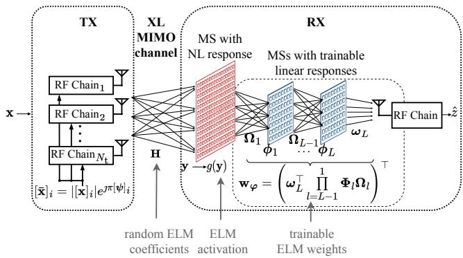
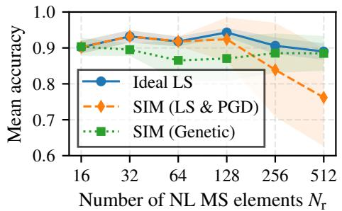
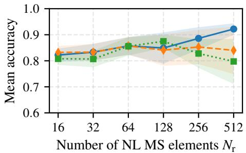
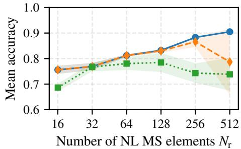
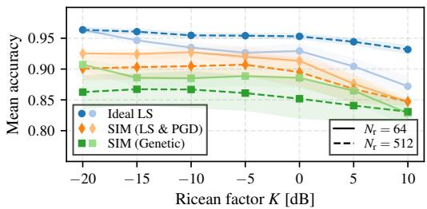
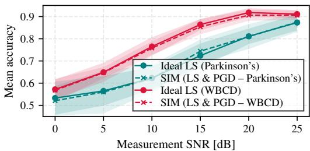

# Over-The-Air Extreme Learning Machines with Nonlinear Stacked Intelligent Metasurfaces

Kyriakos Stylianopoulos1, Mattia Fabiani2,3, Giulia Torcolacci2,3, Davide Dardari2,3, George C. Alexandropoulos1 1Department of Informatics and Telecommunications, National and Kapodistrian University of Athens, Greece 2DEI, University of Bologna, Italy; 3National Laboratory of Wireless Communications (WiLab), CNIT, Italy e-mails: {kstylianop, alexandg}@di.uoa.gr, {mattia.fabiani5, g.torcolacci, davide.dardari}@unibo.it

Abstract—The recently envisioned goal-oriented communications paradigm requires machine learning inference to be performed directly on wirelessly transferred data. This paper presents an eXtremely Large (XL) Multiple-Input Multiple-Output (MIMO) system that operates as an Extreme Learning Machine (ELM) to execute Over-The-Air (OTA) binary classification. To reduce hardware complexity, the receiver is equipped with cascaded metasurfaces terminating in a single radio-frequency chain. A front metasurface layer applies a fixed nonlinear response to the incoming signal, acting as the ELM’s activation function. Subsequent tunable linear metasurface layers physically approximate the trained network weights directly in the wave domain. Numerical evaluations across diverse datasets showcase that our XL MIMO architecture achieves classification accuracy comparable to idealized digital models, thereby proving. the viability of low-complexity, wave-domain OTA learning. Index Terms—Over-the-air inference, extreme learning machines, nonlinear signal processing, XL MIMO, SIM.

## I. INTRODUCTION

Future wireless networks will leverage Edge Inference (EI) to jointly train transceiver pairs as end-to-end Machine Learning (ML) models for efficient sensory data inference [1]. By exchanging task-specific representations through the channel, EI overcomes the inefficiencies of conventional decoupled designs in terms of data rate and computational burden, since. feature extraction is performed alongside encoding at the Transmitter (TX), while the Receiver (RX) directly infers the target values instead of reconstructing the input data [2], [3]. To further improve computational efficiency, Over-The-Air (OTA) computing exploits the wireless propagation domain by performing computations directly through the superposition of traveling Radio-Frequency (RF) signals [4]. The OTA paradigm has recently attracted interest in wireless ML applications. Specifically, hardware platforms based on Meta-Surfaces (MSs) have been proposed to emulate Deep artificial Neural Network (DNN) layers [2], [3], [5], [6] for OTA inference, which are trained through backpropagation, or to approximate digitally trained DNN weight matrices OTA [7], [8]. Nevertheless, many existing systems still rely on digital processing and lack theoretical foundations. Crucially, most MS-based DNN implementations are limited to performing

linear operations [9], which significantly constrains the approximation capability of the resulting ML models.

Addressing some of these limitations, the work of [10] proposed an eXtremely Large (XL) Multiple-Input Multiple-Output (MIMO) architecture that operates as an Extreme Learning Machine (ELM) [11], enabling the partial execution of DNN computations OTA. In this framework, the wireless channel is exploited as a source of random hidden-layer weights, while the RX analog combiner implements the output layer. This approach ensures rapid training and efficient reconfiguration under channel variations, while retaining the universal function approximation capability. However, it faces practical limitations and scalability concerns due to real-valued signal constraints and hardware complexity induced by the use of NonLinear (NL) power amplifiers and numerous RF chains.

In this paper, capitalizing on the complex-domain ELM framework [12] and building upon recent NL metamaterial advancements [9], [13], [14], we present an XL-MIMO-ELM system with an RX structure comprising Stacked Intelligent Metasurfaces (SIM) [15], followed by a single antenna and its respective RF chain. The first MS layer interfacing with the MIMO channel is composed of unit cells exhibiting identical fixed NL responses and implements the ELM activation function, while the subsequent linear MS layers realize trainable OTA combining, effectively approximating the digital ELM output weights. The proposed OTA-ELM system enables fast training and minimizes digital processing at the reception side, while significantly reducing the hardware complexity with respect to the XL-MIMO-ELM of [10]. To configure the linear MS layers, we propose two distinct OTA training strategies. The first relies on Projected Gradient Descent (PGD) to approximate the ideal Least-Squares (LS) solution when the received signal at each NL unit cell can be measured. Alternatively, we introduce a black-box Genetic Optimization (GO) approach that only requires the final scalar output at the RF chain, significantly reducing the measurement overhead. The proposed architecture is numerically validated on standard datasets, demonstrating that it approaches the accuracy of idealized digital models while being robust to system variations.

## II. THE PROPOSED XL MIMO SYSTEM MODEL

Consider a narrowband XL MIMO system with an Nt- antenna TX and an RX comprising a diffractive receiving MS, followed by an analog combining stage (detailed subsequently) and a single reception RF chain. Instead of performing conventional wireless communications, the system is trained end-toend to act as an OTA function approximator [10]. In particular, given a prior dataset $\begin{array} { r } { \mathcal { D } \triangleq \{ ( \mathbf { x } ^ { ( i ) } , z ^ { ( i ) } ) \} _ { i = 1 } ^ { D } } \end{array}$ of D input-target pairs, the XL MIMO system is designed to approximate the $\mathrm { ~ \bf ~ x ~ } \to \mathrm { ~ \boldsymbol ~ z ~ }$ mapping so that the TX observes the input data x (not necessarily belonging to ) and the RX estimates its (unobserved) target value z. The system is thus intended to perform EI, with all computational processing performed exclusively OTA, i.e., in the analog/RF domain.

We assume that $\mathbf { x } ^ { ( i ) } \in ( 0 , 1 ) ^ { N _ { \mathrm { t } } }$ and, without loss of generality, $z ^ { ( i ) } \in \{ 0 , 1 \}$ , that is, the dimension of the data observations are equal to the number of TX antennas and the dataset is used for real-valued binary classification. Note that the TX may incorporate a trainable feature extraction module to reduce the dimensionality of x [2], [3]; however, this aspect is left for future investigation. For reasons that will be clarified later, the data symbols are subject to Amplitude Modulation $( \mathsf { A M } ) ;$ accordingly, each element of the transmitted signal $\bar { \mathbf { x } } \in \mathbb { C } ^ { N _ { \mathrm { t } } \times 1 }$ is defined $\forall i = 1 , \ldots , N _ { \mathrm { t } }$ as follows:

$$
[ \bar { \mathbf { x } } ] _ { i } \triangleq [ \mathbf { x } ] _ { i } \exp ( \ j \pi [ \psi ] _ { i } ) ,\tag{1}
$$

where the elements of $\psi$ may be chosen arbitrarily. The baseband representation of the impinging signal at the MS layer of the RX, which is composed of $N _ { \mathrm { r } }$ metamaterial elements, can be expressed as (baseband representation):

$$
\mathbf { y } \triangleq \mathbf { H } \bar { \mathbf { x } } \in \mathbb { C } ^ { N _ { \mathrm { r } } \times 1 } ,\tag{2}
$$

where $\textbf { H } ~ \in ~ \mathbb { C } ^ { N _ { \mathrm { r } } \times N _ { \mathrm { t } } }$ represents the XL MIMO channel response. For the subsequent theoretical analysis, we consider the case where H follows a Ricean fading distribution [16] and remains quasi-static for the duration of the training process:

$$
\mathbf { H } = \sqrt { P _ { L } } \left( \sqrt { \frac { K } { 1 + K } } \mathbf { H } _ { \mathrm { L o S } } + \sqrt { \frac { 1 } { 1 + K } } \mathbf { H } _ { \mathrm { N L o S } } \right) ,\tag{3}
$$

where $\mathbf { H } _ { \mathrm { L o S } }$ is a rank-1 matrix of steering modeling for the Line-of-Sight (LoS) component, while ${ \bf H } _ { \mathrm { N L o S } } \mathrm { ~ \sim ~ }$ $\mathcal { C N } ( \mathbf { 0 } , 1 / \sqrt { N _ { \mathrm { t } } N _ { \mathrm { r } } } \mathbf { I } )$ , and K is the Ricean factor that controls the dominance of either component.

We consider a diffractive MS layer at the RX composed of unit elements applying a memoryless NL transformation. Denoting with $F ( \cdot )$ the bandpass response of the generic element of the NL MS, the baseband-equivalent output $g ( \cdot )$ preserves the phase of the input, while transforming its envelope through the first-order harmonic extraction. The resulting element-wise mapping of the MS is expressed as $g ( \mathbf { y } ) \begin{array} { l } { \underline { { \underline { { \Delta } } } } } \end{array}$ $C ( | \mathbf { y } | ) \exp ( \ j \mathrm { a r g } \{ \mathbf { y } \} )$ ), where $C ( \cdot )$ denotes the AM/AM characteristic derived as follows [13]:

$$
C ( v ) = \frac { 2 } { \pi } \int _ { 0 } ^ { \pi } F ( v \cos ( \phi ) ) \cos ( \phi ) \mathrm { d } \phi .\tag{4}
$$

In this paper, we consider an element-wise thresholding device characterized overall by the positive bias b $\mathbf { \mathbb { E } } \mathbb { R } _ { + } ^ { N _ { \mathrm { r } } \times 1 }$ , whose elements are drawn from an appropriate distribution during

fabrication, hence ensuring low complexity. From (4), the transform yields the following piecewise mapping for each element $j = 1 , \ldots , N _ { \mathrm { r } }$ of the diffractive MS layer:

$$
C ( | [ \mathbf { y } ] _ { j } | ) = \left\{ \begin{array} { l l } { \mathbf { 0 } , } & { | [ \mathbf { y } ] _ { j } | \leq [ \mathbf { b } ] _ { j } } \\ { \displaystyle \frac { 1 } { \pi } \left( | [ \mathbf { y } ] _ { j } | \operatorname { a r c c o s } \left( \frac { [ \mathbf { b } ] _ { j } } { | [ \mathbf { y } ] _ { j } | } \right) \right. } \\ { \displaystyle \left. - [ \mathbf { b } ] _ { j } \sqrt { 1 - \left( \frac { [ \mathbf { b } ] _ { j } } { | [ \mathbf { y } ] _ { j } | } \right) ^ { 2 } } \right) , } & { | [ \mathbf { y } ] _ { j } | > [ \mathbf { b } ] _ { j } } \end{array} \right. .\tag{5}
$$

While this expression captures the exact physical behavior of the MS elements, the transcendental terms are computationally demanding for practical optimization. By approximating the transition for $| [ \mathbf { y } ] _ { j } | > [ \mathbf { b } ] _ { j }$ as a continuous quasi-linear slope, the response of the MS layer can be expressed as the wellknown softplus activation function [17]:

$$
g ( [ \mathbf { y } ] _ { j } ) \simeq 0 . 2 \log \left( 1 + e ^ { 5 ( | [ \mathbf { y } ] _ { j } | - [ \mathbf { b } ] _ { j } ) } \right) \exp \left( j \mathrm { a r g } \{ [ \mathbf { y } ] _ { j } \} \right) .\tag{6}
$$

Once processed through (6), the resulting signal is linearly combined via the controllable weight vector $\mathbf { w } \in \mathbb { C } ^ { N _ { \mathrm { r } } \times 1 }$ prior to its feeding to the RF chain, yielding the scalar output:

$$
\hat { z } \triangleq \mathbf { w } ^ { \top } g ( \mathbf { y } ) + \tilde { n } ,\tag{7}
$$

where $\tilde { n } ~ \in ~ \mathbb { C }$ denotes the Additive White Gaussian Noise (AWGN) introduced at the RX. Herein, the physical implementation of (7) is based on SIM and is detailed in Section II-B.

## A. XL MIMO as an ELM

The previously presented XL MIMO system may be regarded as a form of an ELM, where the transformations (2) and (6) implement the random hidden layer (with random coefficients $\pmb { \theta } \triangleq \{ \mathbf { H } , \mathbf { b } \} )$ and the combining weights w of (7) play the role of the trainable weights of the output layer. We thus leverage the developed mathematical framework [10], [11], [18] for ML inference, which accounts for random parameters alongside trainable weights, enabling both the training procedure and its theoretical guarantees to be rigorously described. To find the optimal weight vector for a given dataset , let us first define the ELM activation matrix $\mathbf { \bar { G } } \in \mathbb { C } ^ { D \times N _ { \mathrm { r } } }$ as the transpose of the activated signals at the aforedescribed NL MS layer at the RX front:

$$
\mathbf { G } \triangleq [ g ( \mathbf { y } ^ { 1 } ) , \dots , g ( \mathbf { y } ^ { D } ) ] ^ { \top } .\tag{8}
$$

By further denoting the vector of target values for the whole dataset as $\mathbf { z } \triangleq [ z ^ { 1 } , \dots , z ^ { D } ] ^ { \intercal } \in \mathbb { C } ^ { D \times 1 }$ , w can be optimized to minimize the LS error between the target and output values, following the standard ELM formulation:

$$
\mathbf { w } ^ { * } \triangleq \arg \operatorname* { m i n } _ { \mathbf { w } } \| \mathbf { z } - \mathbf { G } \mathbf { w } \| _ { 2 } ^ { 2 } .\tag{9}
$$

This yields the closed-form solution:

$$
\mathbf { w } ^ { * } = \left( \mathbf { G } ^ { \mathrm { H } } \mathbf { G } + \ell \mathbf { I } \right) ^ { - 1 } \mathbf { G } ^ { \mathrm { H } } \mathbf { z } \in \mathbb { C } ^ { N _ { \mathrm { r } } \times 1 } ,\tag{10}
$$

which accounts for L2 regularization, controlled by the hyperparameter $\ell \ > \ 0$ , to ensure generalization beyond the training dataset . A key advantage of ELMs is their universal approximation property, expressed for the proposed ELM as follows (a full proof with additional analysis has been deferred for the journal version of this work):

Proposition 1. Consider a dataset $\mathcal { D } \triangleq \{ ( \mathbf { x } ^ { ( i ) } , z ^ { ( i ) } ) \} _ { i = 1 } ^ { D }$ and the system defined by (1), (2), (6), and (7). In the $h i g h – S i g n a l -$ to-Noise Ratio (SNR) regime $( \tilde { n }  0 ) ,$ , assuming H follows the Ricean model in (3) and b is drawn from a continuous distribution with positive support, there exists a weight vector $\mathbf { w } ^ { * }$ such that $\lVert \mathbf { z } - \mathbf { G } \mathbf { w } ^ { * } \rVert _ { 2 } ^ { 2 } = 0 f o r \ N _ { \mathrm { r } } = D$ with probability 1.

Sketch of proof. To show that (9) admits a zero-error solution, it suffices to show that $f _ { \cal D } ( \theta ) \triangleq \operatorname* { d e t } ( \bf G ) \neq 0$ with probability 1. To that end, the following corollary of the Identity Theorem for real analysis can be used, stating that, for a real analytic function $f _ { \mathcal { D } } ( { \boldsymbol { \theta } } )$ on an open connected domain of the isomorphic space $\mathbb { R } ^ { 2 ( N _ { \mathrm { r } } D + \dot { N } _ { \mathrm { r } } ) }$ in which $f _ { \mathcal { D } } ( { \boldsymbol { \theta } } )$ is not identically zero, the zero set has zero Lebesgue measure [19]. Since it consists of a composition of real analytic functions, $f _ { \mathcal { D } } ( { \boldsymbol { \theta } } )$ is real analytic, as long as $| [ \mathbf { H } \bar { \mathbf { x } } ] _ { j } | \neq 0 \forall j = 1 , \ldots , N _ { r }$ . Such H values have zero probability of occurring under Ricean fading, since they are embedded in a lower-dimensional manifold. Moreover, they form a closed set with co-dimension compared to the full parameter space of $^ { 2 , }$ therefore, excluding it, leaves the domain of $f _ { \mathcal { D } } ( { \boldsymbol { \theta } } )$ connected and open. Finally, $f _ { \mathcal { D } } ( { \boldsymbol { \theta } } )$ is not identically zero, as shown by the counterexample in which ${ \mathfrak { I m } } ( \mathbf { H } ) = \mathbf { 0 } .$ . By performing AM transmission of $\mathbf { x } ^ { ( i ) }$ with $\psi = 0$ , the proposed framework reduces to a standard realvalued ELM, for which, G is invertible [11, Theorem 2.2].

## B. OTA Analog Combining using SIM

Up to this point, the physical implementation of the combining operation has been left unspecified to focus on theoretical analysis. We now describe the RX architecture that performs this combining OTA. Specifically, we consider that the outputs $g ( \mathbf { y } )$ of the diffractive NL MS layer are fed into a SIM of L diffractive linear MSs. Each l-th layer $( l = 1 , \ldots , L )$ comprises a square grid of $N _ { l }$ elements spaced by $\lambda / 2$ , with $\lambda = c / f _ { 0 }$ denoting the wavelength at the carrier frequency $f _ { 0 } ,$ and c is the speed of light. Let $\Omega _ { l } \in \mathbb { C } ^ { N _ { l } \times N _ { l - } }$ 1 denote the signal propagation coefficients between the $( l - 1 )$ -th and the l-th MS layers, where $N _ { 0 } = N _ { \mathrm { r } }$ indicates the number of elements of the aforedescribed NL MS, and $\boldsymbol { \omega } _ { L } \in \mathbb { C } ^ { N _ { L } \times 1 }$ represents the propagation between the last MS layer and the single-antenna element attached to the RX RF chain. Typical works leveraging SIM technology [15] assume free-space propagation between the MS layers, i.e., considering an anechoic enclosure, and model the element-to-element propagation through geometric optics [2], [5], [6], [15]. In this work, we model each $\Omega _ { l }$ as a full-rank pseudo-random matrix [9], which presumes a reverberating enclosure featuring a non-uniform, non-planar distribution of elements [20], [21]. Arguably, this choice is more realistic as it accounts for multipath components arising from imperfections of the enclosure and allows for the MS layers to be placed arbitrarily close. Moreover, the richer propagation diversity compared to geometric optics provides substantial gains for the optimization framework.

  
Fig. 1: The proposed XL MIMO system for implementing the proposed OTA-ELM framework using linear and NL MSs. The channel and MS responses are used as components of the ELM algorithm to realize OTA inference. The flow of computation during the forward pass is also sketched in this figure.

The responses of each l-th MS layer are expressed as $\phi _ { l } \triangleq \pmb { \alpha } _ { l } \exp \left( \jmath \pi \varphi _ { l } \right)$ , with the amplitudes ${ \pmb { \alpha } } _ { l } \in [ 0 , \bar { 1 } ] ^ { N _ { l } \times 1 }$ and the phase shifts $\dot { \varphi } _ { l } \in [ 0 , 2 ] ^ { N _ { l } \times 1 }$ being controllable parameters. Setting $\Phi _ { l } \ \triangleq \ \mathrm { d i a g } ( \mathbf { \dot { \phi } } _ { l } )$ and $\varphi \triangleq \{ \phi _ { l } \} _ { l = L - 1 } ^ { 1 }$ , the overall transfer function of the L linear MSs is given by (as in Fig. 1):

$$
\mathbf { w } _ { \varphi } \triangleq \left( \boldsymbol { \omega } _ { L } ^ { \top } \prod _ { l = L - 1 } ^ { 1 } \boldsymbol { \Phi } _ { l } \boldsymbol { \Omega } _ { l } \right) ^ { \top } \in \mathbb { C } ^ { N _ { \mathrm { r } } \times 1 } .\tag{11}
$$

Thus, the SIM response is used to perform OTA combining by substituting w in (7) with $\mathbf { w } _ { \varphi }$

## III. TRAINING APPROACHES WITH A SIM

## A. Approximation of the LS Solution

Since the optimal digital weights $\mathbf { w } ^ { * }$ are known from (10), the SIM responses can be optimized so that $\mathbf { w } _ { \varphi }$ closely approximates $\mathbf { w } ^ { * }$ , leading to the following optimization problem with respect to the SIM parameters:

$$
\varphi ^ { \mathrm { G D } } \triangleq \{ \phi _ { l } ^ { * } \} _ { l = 1 } ^ { L } \triangleq \arg \operatorname* { m i n } _ { \varphi } \| \mathbf { w } ^ { * } - \mathbf { w } _ { \varphi } \| _ { 2 } ^ { 2 } ,\tag{12}
$$

which can be solved via PGD. Since automatic differentiation may be applied, and due to a lack of space, the gradient derivations are omitted. However, we note that this approach relies on the knowledge of G [10], which involves measuring the impinging signal at each element of the front NL MS while using a single RF chain. To this end, a time-division measurement procedure can be employed, where, at each time slot $t = 1 , \ldots , N _ { \mathrm { r } }$ , only the t-th metamaterials is active while all others are turned off (equivalently, setting $[ { \bf w } ] _ { j } \mathrm { ~ } \mathbf { o r } [ { \bf w } _ { \varphi } ] _ { j }$ to $\mathbb { 1 } _ { j = t }$ in (7)). Since MSs can be reconfigured with subµs latency, G can be measured, and the optimization can be performed within the channel coherence time, provided the channels exhibit reasonably slow fading. Furthermore, using multiple RX RF chains solely for training allows parallel measurements, resulting in a linear speedup. More details on the hardware realization of this approach will be provided in the journal version of this work.

  
(a) WBCD.

  
(b) Parkinson’s.

  
(c) MNIST.

Fig. 2: Classification accuracy the proposed OTA-ELM approaches versus the number of metamaterials $N _ { \mathrm { r } }$ (corresponding to the number of trainable parameters) at the RX’s NL MS layer, considering three distinct datasets.  
  
Fig. 3: Classification accuracy of the OTA-ELM approaches over different Ricean factors, considering the WBCD dataset.

## B. Direct SIM Training via Genetic Optimization

Alternatively, we further apply a black-box optimization approach that does not rely on the observation of G. Specifically, we employ a GO approach as follows. Starting from a population of $k _ { \mathrm { p o p } }$ candidate weight vectors $\varphi ^ { \mathrm { G O } } \triangleq \mathsf { \bar { \{ } }  \phi _ { l } \} _ { l = 1 } ^ { L }$ we evaluate the following maximization objective:

$$
\mathcal { L } ( \boldsymbol { \varphi } ^ { \mathrm { G O } } ) \triangleq - \Big \| \mathbf { z } - \underbrace { \mathbf { G } \left( \omega _ { L } ^ { \top } \prod _ { l = L - 1 } ^ { 1 } \Phi _ { l } \Omega _ { l } \right) ^ { \top } } _ { \hat { \mathbf { z } } \overset { \Delta } { = } [ \hat { z } ^ { 1 } , \hdots , \hat { z } ^ { D } ] ^ { \top } \in \mathbb { C } ^ { D \times 1 } } \Big \| _ { 2 } ^ { 2 } .\tag{13}
$$

The $k _ { \mathrm { t o p } }$ top-performing candidates are admissible for offspring generation. To create each offspring through uniform crossover, two parents are selected through random 3-way tournaments. Mutations are applied with $\Delta = \pm 0 . 2 \pm \jmath 0 . 2$ to each $[ \varphi ^ { \mathrm { G O } } ] _ { j }$ . The process is repeated for $k _ { \mathrm { g e n } }$ generations, after which the best $\bar { \varphi } ^ { \mathrm { G O } }$ is kept; therefore, $k _ { \mathrm { g e n } } \times k _ { \mathrm { p o p } }$ total evaluations of the objective are needed. This makes the latency of this approach also dependent on the switching time of the SIM layers configuration. Note, however, that only the output zˆ at the RF chain is required, rather than the full matrix G.

## IV. NUMERICAL RESULTS AND DISCUSSION

We have evaluated the proposed EI approaches on several standard small-to-medium-size binary classification datasets under a range of system settings and channel conditions. The considered datasets are the Parkinson’s and the Wisconsin Breast Cancer Dataset (WBCD) of 22 and 30 numerical features (corresponding to $N _ { \mathrm { t } }$ values) with 240 and 700 datapoints for disease diagnosis [22], respectively, as well as the MNIST dataset of handwritten digit image recognition [23] (of $6 \times 1 0 ^ { 4 }$ points subsampled to 100 pixels and converted the objective to even/odd digit classification). Per-feature standardization was applied during preprocessing. To determine the predicted class, we have set a threshold of 0.5 on $\mathfrak { R e } ( \hat { z } )$ of (7), and we report in the performance figures that follow the mean and standard deviation of accuracy values over 100 random initializations. For convenience, the phases ψ of the AM signals were set identically to 0, and b was sampled from a Rayleigh distribution with scale parameter $\mathbb { E } [ \| \mathbf { H } \| _ { \mathrm { F } } ] / ( 2 N _ { \mathrm { r } } N _ { \mathrm { t } } )$ for it to be in the same order as y .

  
Fig. 4: Performance of the ideal LS benchmark and the approximate SIM solution trained through PGD versus different levels of the measurement SNR, introduced by the observation of the received signals to compute the LS solution.

Unless otherwise specified, the channel parameters were set as $P _ { L } ~ = ~ - 5 0$ dB and $K \ = \ 0$ dB. Since zˆ contains one bit of information, the receive SNR has negligible effect and was therefore set to 15 dB. For the SIM, we employed L = 2 linear layers, each consisting of 32 32 diffractive elements. We considered $\Omega _ { l } \sim \mathcal { C } \mathcal { N } ( \mathbf { 0 } , P _ { L } ^ { \prime } \mathbf { I } )$ with $P _ { L } ^ { \prime }$ set to 10 dB. The regularization weight was set as $\ell \ = \ 1 0 ^ { - 6 }$ to avoid severe overfitting, and we allowed a maximum of T = 2000 iterations of the employed PGD procedure with step size 0.01, irrespective of the number of training parameters for fairness, although convergence was achieved far earlier for most scenarios. For the presented GO approach, we set $k _ { \mathrm { p o p } } = 1 0 0 , k _ { \mathrm { g e n } } = 2 0 0$ , and $k _ { \mathrm { t o p } } = 3 0$ . The idealized LS solution (which can be seen as an extension of the proposed framework of [10]) was used as an upper bound. This idealized weighting can be realized either with digital (requiring $N _ { \mathrm { r } }$ RF chains) or analog (where a single RF chain suffices) combining. For the latter case, phase shifters [10] or MS structures with lossless waveguides [24] may be used.

The performance of the proposed training approaches for an increasing number of elements $N _ { \mathrm { r } }$ at the RX’s front MS layer is displayed in Fig. 2. Note that $N _ { \mathrm { r } }$ also corresponds to the number of trainable ELM parameters. It is observed that, as $N _ { \mathrm { r } }$ increases, the classification accuracy generally improves (except for slight overfitting in the simplest WBCD case), a trend that is consistent with the theoretical analysis as $N _ { \mathrm { r } }  D$ Both approximate SIM solutions achieve performance close to the ideal case; however, for the largest $N _ { \mathrm { r } }$ values, a noticeable degradation occurs due to an insufficient number of training iterations. Indicatively, the execution of Ideal LS, LS & PGD, and GO algorithms takes, respectively, 0.32, 6.21, 178.5 secs for the MNIST case when $N _ { \mathrm { r } } = 6 4$ and 2.37, 10.28, 242.18 secs for $N _ { \mathrm { r } } = 5 1 2$ using unoptimized Python code running on a standard desktop computer.

In the previous investigation, we have assumed perfect knowledge of G during training. However, measuring $g ( \mathbf { y } )$ requires one or more RF chains, which introduces measurement noise. To model this, we have included an AWGN term $\tilde { \mathbf { n } } _ { 0 } \sim \mathcal { C N } ( \mathbf { 0 } , 1 / R \mathrm { d i a g } ( | \mathbf { y } | ^ { 2 } ) )$ in (2), present only during the collection of signals for computing G and the LS solution in (10), in which R denotes the target measurement SNR in linear scale. Figure 4 reports the performance across different measurement SNR levels. It is shown that, while performance degrades at low measurement SNR, the SIM approximation achieves results comparable to the ideal LS case. At sufficiently high measurement SNR, both approaches converge to the noise-free performance, validating the idealized assumptions of our theoretical analysis.

Similarly, so far, we have assumed rich scattering $( K = 0 )$ in the TX-RX channel, ensuring that H is a full-rank matrix. This improves the universal approximation capability of our framework, as the condition number of G decreases, yielding better conditioning for the LS solution. Figure 3 illustrates the impact of channel scattering, considering various Ricean factors. As depicted, both the ideal and SIM-approximate methods maintain stable performance under sufficiently diverse channels. However, as the channel becomes LoS-dominant, classification accuracy degrades because the columns of G become linearly dependent, and therefore, the conditions for universal approximation are no longer satisfied.

## V. CONCLUSION

This paper showcased that XL MIMO systems with properly designed MS components at the RX can perform computations equivalent to a complex-valued ELM, enabling fully OTA MLbased inference on the transmitted data. The channel coefficients serve as random hidden-layer weights, while the RX’s SIM implements the activation function, bias, and trainable weights. Theoretical analysis confirmed universal approximation. Two practical approaches, one approximating the ideal LS solution and the other based on GO without requiring perelement signal observations, achieved performance close to the ideal LS case under a range of system parameters.

We further note that the novelty of the proposed architecture lies in the joint use of a fixed NL-MS layer to physically realize the ELM activation and of a cascaded linear SIM to implement the trainable output layer within a single-RF-chain receiver, a combination not addressed by prior XL-MIMO-ELM [10] (which requires multiple analog beamformers and lacks an NL layer). Future work will provide a comparative analysis further positioning the proposed NL-SIM architecture against digital and over-the-air ELM implementations, thereby clarifying the novelty of the proposed solution and its associated benefits in terms of hardware complexity, energy consumption, and training/measurement overhead.

## REFERENCES

[1] A. Li et al., “Toward goal-oriented semantic communications: New metrics, framework, and open challenges,” IEEE Wireless Commun., vol. 31, no. 5, pp. 238–245, 2024.

[2] G. Huang et al., “Stacked intelligent metasurfaces for task-oriented semantic communications,” IEEE Wireless Commun. Lett., vol. 14, no. 2, pp. 2310–314, 2024.

[3] K. Stylianopoulos et al., “Over-the-air edge inference via end-to-end metasurfaces-integrated artificial neural networks,” IEEE Trans. Wireless Commun., vol. 25, pp. 13 818–13 834, 2026.

[4] A. ¸Sahin and R. Yang, “A survey on over-the-air computation,” IEEE Commun. Surveys & Tuts., vol. 25, no. 3, pp. 1877–1908, 2023.

[5] X. Lin et al., “All-optical machine learning using diffractive deep neural networks,” Science, vol. 361, no. 6406, pp. 1004–1008, 2018.

[6] A. Momeni and R. Fleury, “Electromagnetic wave-based extreme deep learning with nonlinear time-floquet entanglement,” Nature Commun., vol. 13, no. 1, p. 2651, May 2022.

[7] M. Hua et al., “Implementing neural networks over-the-air via reconfigurable intelligent surfaces,” IEEE Trans. Wireless Commun., vol. 25, pp. 11 562–11 576, 2026.

[8] M. E. Pandolfo et al., “Over-the-air semantic alignment with stacked intelligent metasurfaces,” arXiv preprint arXiv:2512.05657, 2025.

[9] K. Stylianopoulos et al., “Metasurfaces-integrated wireless neural networks for lightweight over-the-air edge inference,” IEEE Wireless Commun., to appear, 2026.

[10] K. Stylianopoulos and G. C. Alexandropoulos, “Universal approximation with XL MIMO systems: OTA classification via trainable analog combining,” arXiv preprint:2504.12758, 2025.

[11] G.-B. Huang et al., “Extreme learning machine: Theory and applications,” Neurocomput., vol. 70, no. 1, pp. 489–501, 2006.

[12] ——, “Incremental extreme learning machine with fully complex hidden nodes,” Neurocomput., vol. 71, no. 4, pp. 576–583, 2008.

[14] O. Abbas et al., “Nonlinear stacked intelligent surfaces for wireless systems,” arXiv preprint arXiv:2510.23780, 2025.

[15] J. An et al., “Stacked intelligent metasurfaces for efficient holographic MIMO communications in 6G,” IEEE J. Sel. Areas Commun., vol. 41, no. 8, pp. 2380–2396, 2023.

[16] M. Matthaiou et al., “Analytic framework for the effective rate of MISO fading channels,” IEEE Trans. Commun., vol. 60, no. 6, pp. 1741–1751, 2012.

[17] P. F. V. Wiemann et al., “Using the softplus function to construct alternative link functions in generalized linear models and beyond,” Stat. Papers, vol. 65, no. 5, pp. 3155–3180, 2024.

[18] M.-B. Li et al., “Fully complex extreme learning machine,” Neurocomput., vol. 68, pp. 306–314, 2005.

[19] B. S. Mityagin, “The zero set of a real analytic function,” Math. Notes, vol. 107, no. 3, pp. 529–530, 2020.

[20] A. Rabault et al., “On the tacit linearity assumption in common cascaded models of RIS-parametrized wireless channels,” IEEE Trans. Wireless Commun., vol. 23, no. 8, pp. 10 001–10 014, 2024.

[21] H. Niu et al., “Flexible intelligent layered metasurfaces for downlink multi-user MISO communications,” arXiv preprint arXiv:2510.24190, 2025.

[22] D. Dua and C. Graff, “UCI machine learning repository,” University of California, Irvine, School of Information and Computer Sciences, 2017. [Online]. Available: http://archive.ics.uci.edu/ml

[23] L. Deng, “The MNIST database of handwritten digit images for machine learning research,” IEEE Signal Process. Mag., vol. 29, no. 6, pp. 141– 142, 2012.

[24] N. Shlezinger et al., “Dynamic metasurface antennas for 6G extreme massive MIMO communications,” IEEE Wireless Commun., vol. 28, no. 2, pp. 106–113, 2021.