# Packora: Systematic Design for Generative Molecular Crystal Structure Prediction

Nayoung Kim<sup>1</sup>, Kiyoung Seong<sup>1</sup>, Sungsoo Ahn<sup>1</sup>

<sup>1</sup>Korea Advanced Institute of Science and Technology (KAIST)

Molecular crystal structure prediction (CSP) is important in pharmaceuticals, agrochemicals, and organic electronics, where subtle diferences in molecular conformation and packing can strongly afect material properties. We present Packora, a flow-based generative model for molecular CSP that jointly predicts atomic coordinates and the lattice from molecular graphs. Packora supports multi-component and organometallic crystals and can condition on any subset of molecular conformers, stereochemical labels, and space-group information within a single model. Inspired by the CCDC CSP blind test, we evaluate generation and ranking separately, using generation to isolate generator quality and ranking to measure end-to-end performance under a common relaxation and ranking pipeline. We also systematically study architecture, training, conditioning, inference, and scaling, identifying an efective design based on cacheable pairwise reasoning, training objective and numerical solver choices, conditioning dropout, and balanced scaling of pairwise and single representations. Packora outperforms the baselines on both structure generation and ranking benchmarks, achieving the best matched-budget coverage across all six generation benchmarks, as well as higher experimental-form recovery, lower experimental-form ranks, and faster convergence in ranking.

Project Page: https://nayoung10.github.io/packora/

Correspondence: nayoungkim@kaist.ac.kr, sungsoo.ahn@kaist.ac.kr

SPML

OXtal (90M) CLARI-M (88M) CLARI-L (173M) CLARI-H (354M) Packora-M (88M) Packora-L (187M)  
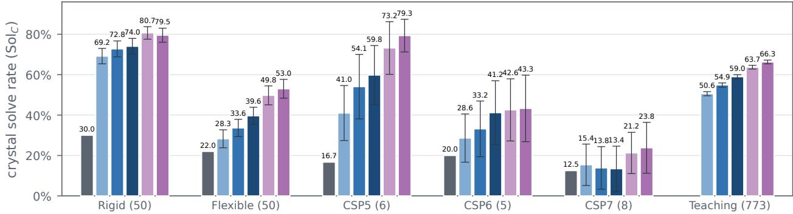  
Figure 1 Crystal coverage with 30 candidates per target. We report the crystal-level solve rate Sol<sub>C</sub> at a generation budget of 30 candidates per target. Numbers in parentheses indicate the number of targets in each benchmark. For OXtal, we report the published results obtained from 30 generated candidates per target. For CLARI and Packora, we generate 1,000 candidates per target and report the mean over 5,000 bootstrap resamples of 30 candidates; error bars show one standard deviation across resamples. Packora achieves the highest solve rate on all six benchmarks.

## 1 Introduction

Molecular crystals are widely used in pharmaceuticals, agrochemicals, and organic electronics (Beran, 2023). Their properties depend strongly on molecular conformation and packing, and diferent polymorphs of the same chemical system can exhibit distinct solubility, stability, bioavailability, charge transport, and mechanical properties (Price, 2014; Jin et al., 2025; Gharakhanyan et al., 2025). Molecular crystal structure prediction (CSP) aims to predict possible crystal structures given the molecular components, accelerating drug development and functional materials design.

Molecular CSP generally involves two complementary stages: structure generation and structure ranking (Hunnisett et al., 2024a,b). Traditional workflows generate candidate packings using random, quasi-random, or evolutionary search (Li et al., 2018; Curtis et al., 2018), then relax and rank them using computationally expensive energy calculations, often based on density functional theory (Price, 2014; Reilly et al., 2016; Hunnisett et al., 2024a,b). FastCSP primarily accelerates structure ranking by using a machine-learning interatomic potential (MLIP) for structure relaxation and energy calculation, while obtaining initial candidates from a random structure generator (Gharakhanyan et al., 2025).

Generative models ofer a faster approach to structure generation by learning from experimentally observed crystal structures and concentrating a finite candidate budget on plausible packings. Despite recent progress (Jin et al., 2025; Zeng et al., 2026; Subramanian et al., 2026; Lo et al., 2026), several gaps remain. Existing methods difer in the molecular information they require and the chemical systems they support, while evaluation protocols vary in candidate budgets and downstream processing, making generation and ranking performance dificult to compare directly. Moreover, the efects of key design choices in architecture, training, conditioning, inference, and scaling remain only partially understood.

In this work, we present Packora, an all-atom generative model for molecular CSP that jointly predicts atomic coordinates and the unit cell from molecular graphs containing atom types, bond types, and formal charges. Packora supports multi-component and organometallic crystals and explicitly models hydrogen atoms. A single model can also condition on additional structural information that is often available or readily derivable, such as molecular templates, stereochemical labels, and space-group information, allowing it to adapt to diferent levels of prior knowledge.

We also introduce a matched two-track evaluation that separates structure generation from structure ranking, following the CCDC CSP blind tests (Hunnisett et al., 2024a,b). The generation track measures whether a fixed candidate set contains the experimental structure, without relaxation or energy-based ranking, thereby isolating generator coverage. The ranking track instead processes candidates from each generator through the same relaxation, filtering, deduplication, and lattice-energy ranking pipeline and measures whether the experimental form is ranked near the top. This separation enables direct comparison of generator quality and the downstream utility of generated candidates in practical CSP workflows.

Finally, we systematically study key design choices in architecture, training recipe, conditioning, inference, and scaling. We directly compare DiT with pair-bias attention (Peebles and Xie, 2023), Pairformer (Abramson et al., 2024), and Pairmixer (Ouyang-Zhang et al., 2025), and ablate training choices such as time sampling, translation augmentation, and loss design. These studies show that cacheable pairwise reasoning substantially improves generation quality, careful training and sampling choices matter, and balanced scaling of pairwise and single representations preserves coverage at larger model sizes.

For structure generation, across six benchmarks, Packora-M or Packora-L achieves the best coverage across candidate budgets and evaluation criteria, with up to a 77.6% relative improvement over CLARI-H (Table 11). When combined with downstream relaxation and ranking, Packora achieves higher recovery, faster convergence, and lower experimental-form ranks than CLARI-H on both the single-form and polymorph FastCSP benchmarks (Gharakhanyan et al., 2025).

In summary, our contributions are:

• A flexible all-atom generative model for molecular CSP. Packora jointly generates atomic coordinates and unit cells for diverse molecular systems while supporting optional conditioning on molecular templates, stereochemistry, and space groups.

• A matched evaluation of generation and ranking. We separately measure finite-budget generator coverage and downstream performance under a common relaxation-and-ranking pipeline.

• A systematic study of molecular CSP generative modeling. We investigate architecture, training, conditioning, inference, and scaling under a common evaluation protocol and derive an evidence-backed design recipe.

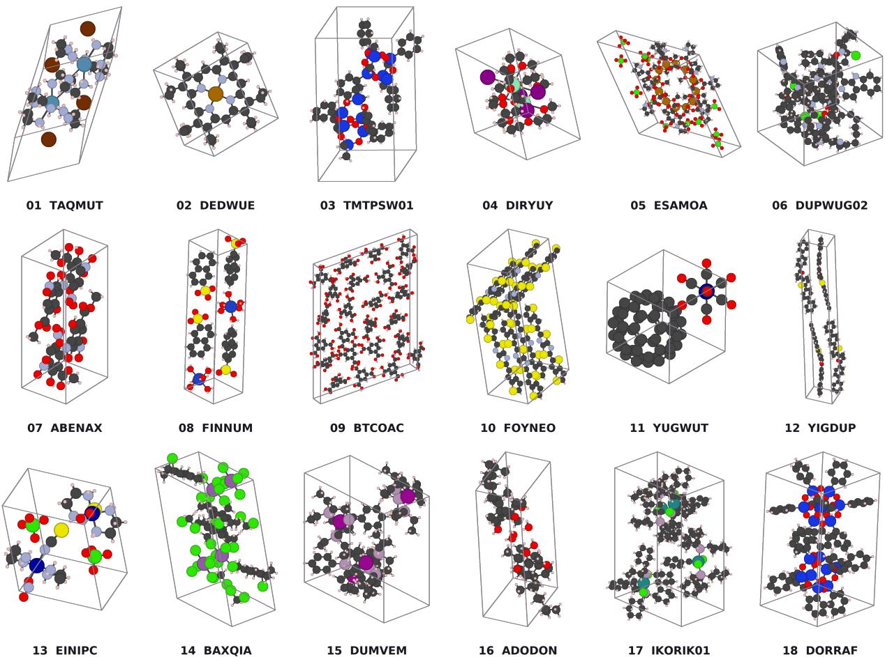  
Figure 2 Crystal structures predicted by Packora. Each example is a collision-free prediction from Packora-L that matches all 15 molecules of the experimental reference with $\mathrm { R M S D } _ { 1 5 } < 2 \mathring { \mathrm { A } }$ . These 18 examples illustrate Packora’s ability to generate diverse crystal structures across molecular sizes, compositions, packing motifs, and unit-cell geometries. Panel labels indicate the corresponding CSD refcodes.

## 2 Related Work

Search-based molecular CSP. Search-based molecular CSP typically involves exploring molecular conformations and crystal packings, followed by geometry relaxation and energy ranking. Structure generation and ranking have long been central components of molecular CSP, with the seventh CCDC blind test explicitly evaluating them in separate phases (Reilly et al., 2016; Hunnisett et al., 2024a,b). Candidate structures are commonly generated across selected space groups by sampling unit-cell parameters and molecular positions and orientations, with flexible molecules requiring additional sampling of intramolecular degrees of freedom (Day et al., 2009; Reilly et al., 2016). Generated structures are then deduplicated or clustered and evaluated hierarchically, often using force fields for initial relaxation and screening followed by dispersion-corrected density functional theory for refinement and ranking (Beran, 2023; Hunnisett et al., 2024a). Genarris uses constrained random generation followed by diversity-based down-selection (Li et al., 2018), whereas GAtor uses a first-principles genetic algorithm with molecular-crystal breeding operators and structural niching (Curtis et al., 2018). FastCSP accelerates relaxation and ranking stage using a machine-learning interatomic potential, while retaining random structure generation for initial candidates (Gharakhanyan et al., 2025).

Generative molecular CSP. Generative molecular CSP instead learns a distribution over experimental crystal structures. OXtal is an all-atom difusion model trained on lattice-free molecular crops and adapts the AlphaFold3 Pairformer trunk (Abramson et al., 2024) to atom-level representations (Jin et al., 2025). Mol-CrystalFlow represents each molecule as a rigid body and learns geodesic flows over molecular centroids, orientations, and lattice parameters (Zeng et al., 2026). PackFlow applies reinforcement-learning post-training guided by MLIP energies and forces, improving physical validity and concentrating proposals in low-energy basins (Subramanian et al., 2026). CLARI generates explicit unit cells and replaces triangle layers with pair-bias attention, yielding a reported 15–30× speedup over OXtal (Lo et al., 2026). However, none of these methods provides a single model in which molecular conformers, stereochemical labels, and space-group information can each be supplied or omitted at inference time (Jin et al., 2025; Lo et al., 2026; Subramanian et al., 2026; Zeng et al., 2026). The capabilities of our model and prior approaches are summarized in Table 1.

Table 1 Capabilities and scope of generative molecular CSP models. We compare explicit hydrogen generation, chemical scope, and conditioning inputs. ✓ and ✗ denote supported and unsupported capabilities. For local 3D input, ▲, ✓, and ✗ denote required, optional, and unsupported conditioning, respectively.
<table><tr><td rowspan="2">Method</td><td>Generation</td><td colspan="2">Chemical/data scope</td><td colspan="3">Conditioning inputs</td></tr><tr><td>Explicit H output</td><td>Multi- component</td><td>Organo- metallics</td><td>Local 3D input</td><td>Stereo labels</td><td>Space group</td></tr><tr><td>OXtal (Jin et al., 2025)</td><td>X</td><td>J</td><td>√</td><td>4</td><td>X</td><td>X</td></tr><tr><td>PackFlow (Subramanian et al., 2026)</td><td>X</td><td>X</td><td>X</td><td>x</td><td>X</td><td>X</td></tr><tr><td>MolCrystalFlow (Zeng et al., 2026)</td><td>√</td><td>X</td><td>X</td><td>▲</td><td>x</td><td>X</td></tr><tr><td>CLARI (Lo et al., 2026)</td><td>√</td><td>√</td><td>√</td><td>x</td><td>x</td><td>X</td></tr><tr><td>PACKORA</td><td></td><td></td><td></td><td></td><td>√</td><td></td></tr></table>

Generative CSP. A related line of work studies crystal generation and structure prediction for inorganic materials. CDVAE combines a variational autoencoder with difusion-based coordinate generation, whereas DifCSP jointly difuses fractional coordinates and lattice conditioned on a given composition (Xie et al., 2022; Jiao et al., 2024). Subsequent approaches formulate periodic crystal generation using flow matching, as in FlowMM and CrystalFlow (Miller et al., 2024; Luo et al., 2025); stochastic interpolants, as in OMatG (Höllmer et al., 2025); or Bayesian flows over periodic variables (Wu et al., 2025).

Generative CSP has also been extended to metal-organic frameworks (MOFs), where metal nodes and organic linkers can be treated as modular building blocks. MOFFlow (Kim et al., 2025b) and MOF-BFN (Jiao et al., 2025) generate lattices and rigid-body poses of known building blocks using Riemannian and Bayesian flows, respectively, while MOFFlow-2 (Kim et al., 2025a) additionally generates building blocks and models linker torsions. AtomMOF (Kim et al., 2026) removes the rigid-body assumption by directly generating MOF and MOF–adsorbate structures at all-atom resolution.

## 3 Method

Packora predicts atomic coordinates and a unit cell from a molecular specification, a formula-unit count Z, and optional auxiliary information using a conditional coordinate–lattice flow. We describe the selected Packora configuration below, with design choices justified by the controlled studies in Section 5.

## 3.1 Problem Formulation

Crystal representation. We represent a crystal with N atoms by atom types $\mathbf { A } = ( A _ { 1 } , \ldots , A _ { N } ) \in \mathcal { A } ^ { N }$ Cartesian coordinates $\mathbf { X } = ( { \bf x } _ { 1 } , . . . , { \bf x } _ { N } ) ^ { \top } \in \bar { \mathbb { R } } ^ { N \times 3 }$ , and a lattice cell $\mathbf { L } \in \mathbb { R } ^ { 3 \times 3 }$ whose rows are lattice vectors. Integer translations along these lattice vectors define the corresponding infinite periodic crystal.

Since the same lattice can be represented by diferent basis vectors and global rotations, we canonicalize the cell in two steps. First, we Niggli-reduce (Křivý and Gruber, 1976; Grosse-Kunstleve et al., 2004) each crystal to obtain a reduced basis $\begin{array} { r } { \widetilde { \mathbf L } , } \end{array}$ reducing the ambiguity among equivalent lattice bases. Second, we remove the remaining global rotational freedom by forming the rotation-invariant Gram matrix $\widetilde { \mathbf { L } } \widetilde { \mathbf { L } } ^ { \top }$ and taking its unique lower-triangular Cholesky factor with positive diagonal:

$$
\mathbf { L } = \mathrm { c h o l } \Big ( \widetilde { \mathbf { L } } \widetilde { \mathbf { L } } ^ { \top } \Big ) = \left( \begin{array} { c c c } { e ^ { \ell _ { 1 } } } & { 0 } & { 0 } \\ { \ell _ { 2 } } & { e ^ { \ell _ { 3 } } } & { 0 } \\ { \ell _ { 4 } } & { \ell _ { 5 } } & { e ^ { \ell _ { 6 } } } \end{array} \right) .
$$

We further parameterize the canonical cell by an unconstrained vector $\ell = ( \ell _ { 1 } , \dots , \ell _ { 6 } ) \in \mathbb { R } ^ { 6 }$ following Veljković et al. (2026).

Molecular crystal structure prediction (CSP). We formulate molecular CSP as conditional generation of Cartesian coordinates X and the lattice latent ℓ from a chemical specification, a supplied formula-unit count $Z ,$ , and optional auxiliary information. The chemical specification consists of K distinct molecular graphs $\mathcal { G } = \{ G _ { k } \} _ { k = 1 } ^ { K }$ and a stoichiometry vector $\mathbf { r } = \left( r _ { 1 } , \ldots , r _ { K } \right)$ , where $r _ { k }$ denotes the number of copies of component $G _ { k }$ in one formula unit. For example, a binary 2:1 cocrystal has $\mathbf { r } = ( 2 , 1 )$ . Each molecular graph specifies atom types, bond types, and formal charges. To be specific, if component $G _ { k }$ contains $N _ { k }$ atoms, a unit cell with Z formula units contains

$$
N = Z \sum _ { k = 1 } ^ { K } r _ { k } N _ { k }
$$

atoms. Optional information O may include molecular templates, stereochemical annotations, and a spacegroup label. A molecular template is a reference 3D conformer, generated for example with RDKit (Landrum et al., 2006), that provides local molecular geometry without specifying crystal packing. Given the complete condition ${ \mathcal { C } } = ( { \mathcal { G } } , \mathbf { r } , Z , { \mathcal { O } } )$ , the generator models $p _ { \theta } ( \mathbf { X } , \ell \mid \mathcal { C } )$

## 3.2 Variational Flow Matching for Molecular CSP

We use variational flow matching (VFM; Eijkelboom et al., 2024), which generalizes flow matching (Lipman et al., 2023) through a flexible choice of the variational posterior (Zaghen et al., 2025).

Training objective. Let $( \mathbf { y } _ { 1 } , \mathcal { C } )$ denote a crystal state and its condition, and let $\mathbf { y } _ { 0 } \sim p _ { 0 }$ be a prior sample. We use the linear conditional path to interpolate between the prior and data endpoints:

$$
\mathbf { y } _ { t } = ( 1 - t ) \mathbf { y } _ { 0 } + t \mathbf { y } _ { 1 } .\tag{1}
$$

Given a noisy state $\mathbf { y } _ { t } .$ , VFM learns a variational posterior $q _ { \theta } ( \mathbf { y } _ { 1 } \mid \mathbf { y } _ { t } , t , \mathcal { C } )$ that approximates the true posterior by minimizing the expected negative log-likelihood,

$$
{ \mathcal { L } } _ { \mathrm { V F M } } ( \theta ) = - \mathbb { E } _ { { \mathbf { y } } _ { 1 } , { \mathbf { y } } _ { t } , t } [ \log q _ { \theta } ( { \mathbf { y } } _ { 1 } \mid { \mathbf { y } } _ { t } , t , { \mathcal { C } } ) ] .\tag{2}
$$

The variational family determines the form of this objective. We model the posterior as a fully factorized Laplace distribution with a fixed scale, which yields a component-weighted $L ^ { 1 }$ loss on the predicted endpoints.

The model parameterizes the mean of the variational posterior, which is equivalent to predicting the clean endpoint $\mathbf { y } _ { 1 }$ from the noisy state $\mathbf { y } _ { t }$ and condition C as $\widehat { \mathbf { X } } _ { 1 } , \widehat { \ell } _ { 1 } = \mu _ { t } ^ { \theta } ( \mathbf { y } _ { t } , \mathcal { C } )$ . The equation then simplifies to

$$
\mathcal { L } _ { \mathrm { V F M } } ( \theta ) = \mathbb { E } _ { { \mathbf { y } _ { 1 } } , { \mathbf { y } _ { t } } , t } \bigg [ \frac { \lambda _ { \mathrm { c o o r d } } } { 3 N } \left\| \widehat { { \mathbf { X } } } _ { 1 } - { \mathbf { X } } _ { 1 } \right\| _ { 1 } + \frac { \lambda _ { \mathrm { l a t t i c e } } } { 6 } \left\| \widehat { \ell } _ { 1 } - \ell _ { 1 } \right\| _ { 1 } \bigg ] ,\tag{3}
$$

where $\lambda _ { \mathrm { c o o r d } }$ and $\lambda _ { \mathrm { l a t t i c e } }$ are loss weights for the coordinate and lattice components, respectively.

Sampling. After training $\mu _ { t } ^ { \theta }$ , we generate samples by solving the ordinary diferential equation (ODE) or the corresponding stochastic diferential equation (SDE) (Eijkelboom et al., 2024; Albergo et al., 2025):

$$
d \mathbf { y } _ { t } = \mathbf { v } _ { t } ^ { \theta } ( \mathbf { y } _ { t } ) d t , \qquad d \mathbf { y } _ { t } = \left[ \mathbf { v } _ { t } ^ { \theta } ( \mathbf { y } _ { t } ) + \frac { g _ { t } ^ { 2 } } { 2 } \mathbf { s } _ { t } ^ { \theta } ( \mathbf { y } _ { t } ) \right] d t + g _ { t } d \mathbf { W } _ { t } .\tag{4}
$$

For the linear path, $\mathbf v _ { t } ^ { \theta } ( \mathbf y _ { t } ) = ( \mu _ { t } ^ { \theta } ( \mathbf y _ { t } , \mathcal C ) - \mathbf y _ { t } ) / ( 1 - t )$ and $\mathbf { s } _ { t } ^ { \theta } ( \mathbf { y } _ { t } ) = ( t \mathbf { v } _ { t } ^ { \theta } ( \mathbf { y } _ { t } ) - \mathbf { y } _ { t } ) / ( 1 - t )$ . Here, $g _ { t }$ is the difusion coeficient controlling the stochasticity, and $\mathbf { W } _ { t }$ is a standard Wiener process.

## 3.3 Model Architecture

Our model $\mu _ { t } ^ { \theta }$ mainly employs a Pairmixer-based architecture (Ouyang-Zhang et al., 2025) with trunk-head modularization (Abramson et al., 2024; Team et al., 2025). As shown in Figure 3, the model first constructs condition-only single and pair representations, refines the pair representation with Pairmixer, injects the noisy crystal state into the single representation, and processes it with a Difusion Transformer (DiT) (Peebles and

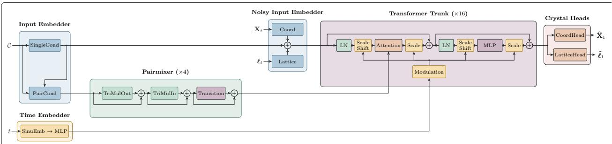  
Figure 3 Model architecture of Packora. The condition C is embedded into single and pair representations, with the pair representation refined by four Pairmixer blocks (Ouyang-Zhang et al., 2025). Because this computation depends only on ${ \mathcal { C } } ,$ it can be cached across denoising steps. Noisy coordinate $\mathbf { X } _ { t }$ and lattice $\ell _ { t }$ embeddings are then added to the single representation and processed by a DiT trunk, with the refined pair representation providing attention biases throughout. Separate heads predict the coordinate and lattice endpoints $\widehat { \mathbf { X } } _ { 1 }$ and $\widehat { \ell } _ { 1 }$

Xie, 2023). Separate output heads predict the coordinate and lattice endpoints. The complete architecture is specified algorithmically in Section $\mathrm { A } .$

Condition embedding. The input embedder embeds the condition ${ \mathcal { C } } = ( { \mathcal { G } } , \mathbf { r } , Z , { \mathcal { O } } )$ into a per-atom single representation $\mathbf { S } _ { \mathcal { C } }$ and an initial per-atom-pair representation $\mathbf { P } ^ { ( 0 ) }$

$$
{ \bf S } _ { \mathcal { C } } = E _ { \mathrm { s i n g l e } } ( \mathcal { C } ) , \qquad { \bf P } ^ { ( 0 ) } = E _ { \mathrm { p a i r } } ( { \bf S } _ { \mathcal { C } } , \mathcal { C } ) ,
$$

where $E _ { \mathrm { s i n g l e } }$ and $E _ { \mathrm { p a i r } }$ are learned single and pair embedding networks. The single representation combines atom identity, periodic-table descriptors, formal charge, optional template coordinates, chirality, and space group. The pair representation combines projected single features with intramolecular bond types, bond stereochemistry, template displacements, and template distances. Availability masks and learned null states distinguish unavailable optional conditions from provided values.

Pairmixer. Pairmixer is a streamlined alternative to Pairformer that retains incoming and outgoing triangle multiplication and pair transitions while omitting triangle attention. Each block updates the current pair representation P through sequential residual operations,

$$
\mathbf { P } \gets \mathbf { P } + \mathrm { T r i M u l } _ { \mathrm { o u t } } ( \mathbf { P } ) , \qquad \mathbf { P } \gets \mathbf { P } + \mathrm { T r i M u l } _ { \mathrm { i n } } ( \mathbf { P } ) , \qquad \mathbf { P } \gets \mathbf { P } + \mathrm { T r a n s i t i o n } ( \mathbf { P } ) ,
$$

where $\mathrm { T r i M u l _ { o u t } }$ and $\mathrm { T r i M u l _ { i n } }$ denote outgoing and incoming triangle multiplication, respectively. The transition is a gated feed-forward network applied independently to each atom pair. Pairmixer leaves the single representation unchanged and produces a refined pair representation $\mathbf { P } ^ { \star }$

Noisy-state injection. The noisy crystal state is injected into the single representation $\mathbf { S } _ { \mathcal { C } }$ . Coordinate features are encoded using Fourier features (Tancik et al., 2020), while the lattice is embedded globally and broadcast to all atoms. The resulting single representation is

$$
\mathbf { S } _ { t } = \mathbf { S } _ { \mathcal { C } } + E _ { X } ( \mathbf { X } _ { t } ) + \mathrm { B r o a d c a s t } ( E _ { L } ( \boldsymbol { \ell } _ { t } ) ) ,
$$

where $E _ { X }$ and $E _ { L }$ denote the coordinate and lattice embedding networks, respectively. A sinusoidal embedding of the flow time t provides a separate global condition to the transformer.

DiT trunk. The trunk follows the DiT architecture, alternating between self-attention and feed-forward updates to the single representation. In each attention layer, the refined pair representation $\mathbf { P } ^ { \star }$ is projected to a head-specific bias and added to the attention logits:

$$
a _ { i j } ^ { ( h ) } = \frac { \left. \mathbf { q } _ { i } ^ { ( h ) } , \mathbf { k } _ { j } ^ { ( h ) } \right. } { \sqrt { d _ { h } } } + b _ { h } \big ( \mathbf { P } _ { i j } ^ { \star } \big ) ,
$$

where $\mathbf { q } _ { i } ^ { ( h ) }$ and $\mathbf { k } _ { i } ^ { ( h ) }$ are the query and key vectors for atoms i and $j$ in attention head $h , \ d _ { h }$ is the head dimension, and $\bar { b _ { h } } \bar { }$ maps the pair representation to a scalar attention bias. The time embedding modulates the normalization and residual gates of both self-attention and feed-forward updates (Peebles and Xie, 2023).

Prediction heads. The DiT output $\mathbf { S } ^ { \mathrm { o u t } }$ is decoded by separate coordinate and lattice endpoint heads. For the set V of valid atoms, the coordinate head predicts an atomwise vector $\mathbf { r } _ { i }$ and subtracts its mean over valid atoms, while the lattice head applies an MLP to the mean-pooled single representation:

$$
\mathbf { r } _ { i } = W _ { X } \mathrm { N o r m } ( \mathbf { S } _ { i } ^ { \mathrm { o u t } } ) , \qquad \widehat { \mathbf { X } } _ { 1 , i } = \mathbf { r } _ { i } - \frac { 1 } { | \mathcal { V } | } \sum _ { j \in \mathcal { V } } \mathbf { r } _ { j } , \qquad \widehat { \ell } _ { 1 } = \mathrm { M L P } \left( \frac { 1 } { | \mathcal { V } | } \sum _ { i \in \mathcal { V } } \mathrm { N o r m } ( \mathbf { S } _ { i } ^ { \mathrm { o u t } } ) \right) ,
$$

where $W _ { X }$ is the coordinate projection and $\widehat { \mathbf { X } } _ { 1 }$ and $\widehat { \ell } _ { 1 }$ denote the predicted coordinate and lattice endpoints.

## 4 Benchmark Evaluation

Inspired by the CSP blind tests (Hunnisett et al., 2024a,b), we evaluate models along two complementary axes: structure generation and structure ranking. Structure generation (Section 4.2) measures unranked coverage at a fixed candidate budget, testing whether a generator can recover the experimental structure. Structure ranking (Section 4.3) measures whether generated candidates remain useful after downstream relaxation and ranking, by evaluating how highly the experimental form is ranked. Unlike the CSP blind-test ranking track, which fixes the candidate pool and varies the ranking method, we fix the downstream evaluator and vary the generator, thereby measuring end-to-end generator–evaluator compatibility.

## 4.1 Experimental Setup

Dataset. We use the oficial CLARI training and validation split (Lo et al., 2026), derived from the Cambridge Structural Database (CSD) (Groom et al., 2016). The held-out test set comprises the OXtal Rigid and Flexible benchmarks (Jin et al., 2025), CSP5 (Bardwell et al., 2011), CSP6 (Reilly et al., 2016), CSP7 (Hunnisett et al., 2024a,b), and the CSD Teaching Subset (Battle et al., 2010; Lo et al., 2026). To prevent leakage, CLARI excludes all entries from test refcode families and training structures that share an RDKit-sanitizable molecular component with more than seven heavy atoms, then holds out 1,000 refcode families for validation.

CLARI limits training and validation unit cells to 512 atoms, yielding 917,014 training and 1,048 validation entries. Because we add missing hydrogens with the CSD Python API (Sykes et al., 2024) before counting atoms, we reapply the 512-atom limit after hydrogen completion, leaving 912,807 training and 1,047 validation entries. Section B provides detailed dataset statistics.

Training and sampling configuration. We train Packora-M (88M parameters) and Packora-L (187M parameters) using Muon (Liu et al., 2025) for hidden matrix parameters and AdamW (Loshchilov and Hutter, 2019) for all remaining parameters. Both models use a learning rate of $1 0 ^ { - 4 }$ , an efective batch size of 128, and an EMA decay of 0.9999; weight decay is 0 for Packora-M and $1 0 ^ { - 2 }$ for Packora-L. We also use bfloat16 and train on eight NVIDIA H200 GPUs.

At inference, we condition on stereochemistry when available and on RDKit-generated molecular conformers, reflecting information that is either specified in CSP blind tests (Reilly et al., 2016) or readily derived from molecular graphs (Landrum et al., 2006). We do not use space-group conditioning because space groups are generally not provided in CSP blind tests. We generate candidates with the EDM–Heun sampler (Karras et al., 2022), using stochastic churn, $\rho = 7$ , and 200 sampling steps. Complete hyperparameters are provided in Section C.

Two-stage training. To enable faster iteration before scaling to larger structures, we follow the two-stage training of SeedFold (Yi et al., 2025). In the first stage, we train on crystals with at most 300 atoms; in the second, we expand to all crystals with at most 512 atoms. We save checkpoints every 50 epochs and select the model with the best validation Sol .

## 4.2 Structure Generation

We first evaluate structure generation alone, following the structure generation phase of the seventh CCDC CSP blind test (Hunnisett et al., 2024b). We measure whether each generative model can recover the experimental structure within a fixed candidate budget, without energy evaluation, relaxation, or ranking.

Benchmarks. We evaluate on six benchmarks: the OXtal Rigid and Flexible sets, with 50 targets each (Jin et al., 2025); CSP5, CSP6, and CSP7, with 6, 5, and 8 targets, respectively (Bardwell et al., 2011; Reilly et al., 2016; Hunnisett et al., 2024b); and CLARI’s CSD Teaching Subset, with 773 targets (Battle et al., 2010; Lo et al., 2026).

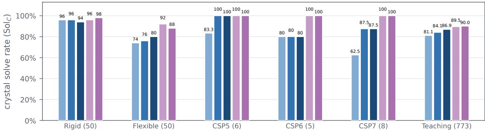  
Figure 4 Crystal coverage with 1,000 candidates per target. We report the crystal-level solve rate Sol at a generation budget of 1,000 candidates per target. Numbers in parentheses indicate the number of targets in each benchmark. Packora achieves the highest solve rate on all six benchmarks.

Metric and protocol. Following OXtal (Jin et al., 2025) and CLARI (Lo et al., 2026), we report the crystal-level approximate solve rate Sol<sub>C</sub> at candidate budgets of 30 and 1,000. A target is considered solved if any candidate is collision-free, at least 8 of 15 molecules are matched, and $\mathrm { R M S D } _ { 1 5 } < 2 \mathring { \mathrm { A } }$ with COMPACK (Chisholm and Motherwell, 2005). $\mathrm { S o l } _ { C }$ is the fraction of solved targets. We also report the stricter $\mathrm { S o l } _ { C } ^ { 1 5 / 1 5 }$ , which requires all 15 molecules to match. For the 30-candidate budget, we follow CLARI’s bootstrapping protocol (Lo et al., 2026): from each fixed pool of 1,000 candidates, we draw 5,000 resamples of 30 candidates and average the resulting Sol<sub>C</sub>. Full metric definitions are provided in Section D.

Baselines. We compare against OXtal and three CLARI variants: CLARI-M, CLARI-L, and CLARI-H (Jin et al., 2025; Lo et al., 2026). For a consistent comparison, we re-evaluate the oficial CLARI checkpoints using the OXtal evaluation protocol, since the two evaluators difer in collision detection and reference-structure selection. See Section D for details.

Results. Across all six benchmarks, Packora achieves the highest solve rate at both 30- and 1,000-candidate budgets under the standard and strict criteria (Figures 1, 4, 5 and 6), outperforming the strongest baseline in 23 of 24 settings and tying on the saturated CSP5 result. At 30 candidates, the relative gain reaches 54.5% on CSP7 under the standard criterion and 188.0% on CSP6 under the strict criterion. Figure 2 further demonstrates accurate recovery across diverse molecules and packing motifs. Full tables are provided in Section E, results with Z sampled from an empirical prior in Section F, and aligned structure overlays in Section G.

## 4.3 Structure Ranking

Benchmarks. We evaluate two benchmarks derived from FastCSP (Gharakhanyan et al., 2025). The singlepolymorph benchmark contains 23 semi-rigid and three flexible systems, each with one experimental form. The multi-polymorph benchmark contains five semi-rigid and three flexible systems, comprising 29 experimental forms from 28 distinct CSD entries. We exclude BEDMIG, UNOGIN, BISMEV, and BIYSEH from the multi-polymorph benchmark because their CSD families appear in the CLARI training split.

Relaxation and ranking workflow. For each CSD entry, each generator produces 1,000 independent candidates. We generally follow the FastCSP post-generation workflow, relaxing candidates using UMA-S-1.2 with the OMC task (Wood et al., 2025) and the ASE BFGS optimizer (Larsen et al., 2017). We use a maximum-force threshold of $0 . 0 2 \ \mathrm { e V } , \mathring { \mathrm { A } } ^ { - 1 }$ and up to 500 optimization steps. We discard candidates that fail to converge, change molecular connectivity or $Z ,$ or have densities outside $0 . 5 { - } 3 . 0 \ \mathrm { g } , \mathrm { c m } ^ { - 3 }$ . We then retain structures within $1 0 \ \mathrm { k J , m o l ^ { - 1 } }$ of the minimum energy and deduplicate equivalent relaxed structures. For each multi-polymorph system, we pool candidates generated from all constituent CSD entries before energy filtering, deduplication, and ranking, so that all experimental forms are evaluated within a shared energy ordering.

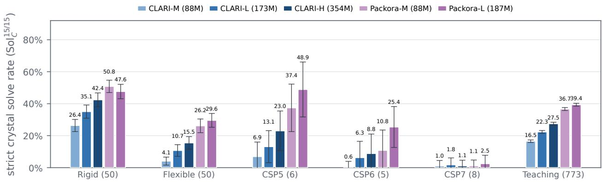  
Figure 5 Crystal coverage with 30 candidates per target under the strict criterion. We report the crystal-level solve rate $\mathrm { S o l } _ { C } ^ { 1 5 / 1 \bar { 5 } }$ at a generation budget of 30 candidates per target. $\mathrm { S o l } _ { C } ^ { 1 5 / 1 5 }$ requires all 15 molecules to match using COMPACK (Bardwell et al., 2011). Numbers in parentheses indicate the number of targets in each benchmark. We generate 1,000 candidates per target and report the mean over 5,000 bootstrap resamples of 30 candidates; error bars show one standard deviation across resamples. Packora achieves the highest solve rate on all six benchmarks.

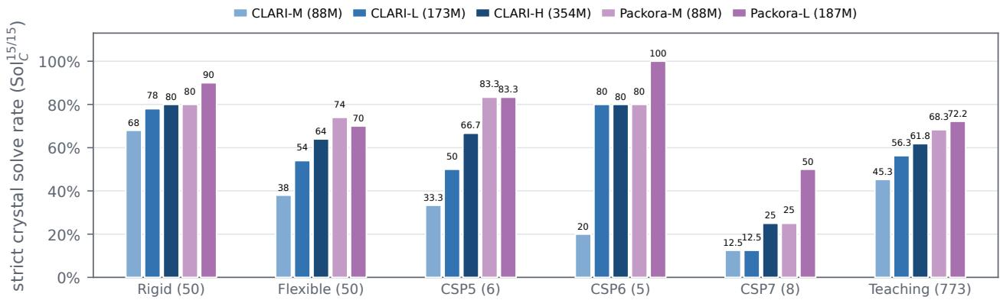  
Figure 6 Crystal coverage with 1,000 candidates per target under the strict criterion. We report the crystal-level solve rate $\mathrm { S o l } _ { C } ^ { 1 5 / 1 5 }$ at a generation budget of 1,000 candidates per target. $\mathrm { S o l } _ { C } ^ { 1 5 / 1 5 }$ requires all 15 molecules to match under COMPACK (Bardwell et al., 2011). Numbers in parentheses indicate the number of targets in each benchmark. Packora achieves the highest solve rate on all six benchmarks.

Metrics. We rank the remaining unique candidates by increasing lattice energy (Gharakhanyan et al., 2025). For candidate ${ \cal { S } } _ { i } = ( { \bf { A } } _ { i } , { \bf { X } } _ { i } , { \bf { L } } _ { i } )$ , we compute the lattice energy per formula unit as

$$
E _ { \mathrm { l a t t } } ( S _ { i } ) = \frac { E _ { \mathrm { U M A } } ( S _ { i } ) } { Z _ { i } } - E _ { \mathrm { m o l } } ,\tag{5}
$$

where $Z _ { i }$ is the number of formula units in the cell and $E _ { \mathrm { m o l } }$ is the isolated-component reference energy for one formula unit.

A candidate matches an experimental CSD form under COMPACK (Chisholm and Motherwell, 2005) if 30 molecules match with $\mathrm { R M S D } _ { 3 0 } < 1 \mathrm { ~ \AA ~ }$ . For each experimental form, we record the best energy rank among all matching candidates. We report overall recovery at any rank, Top-k recovery for $k \in { 1 , 5 , 2 0 }$ , and the mean best rank among recovered forms.

Baseline. We compare Packora-M and Packora-L with CLARI-H. We do not include FastCSP as a baseline because its random structure generator uses a substantially larger search budget: approximately 53,000–300,000 raw structures per target, with 10,000–176,000 retained for relaxation after deduplication, compared with 1,000 candidates per CSD entry in our evaluation (Gharakhanyan et al., 2025).

Single-polymorph results. Packora-M and Packora-L recover 17 and 19 of the 26 targets, respectively, compared with 16 for CLARI-H, while reducing the mean rank among recovered targets from 4.25 to 2.00 and

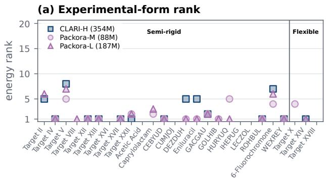

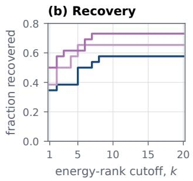

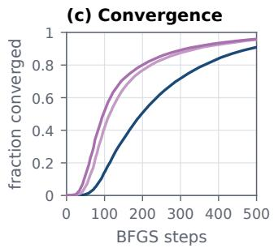  
Figure 7 FastCSP single-polymorph benchmark. We generate 1,000 candidates for each of the 26 targets, relax them with UMA-S-1.2 (Wood et al., 2025), and rank them by increasing energy. (a) Best energy rank of the experimental target form for CLARI-H, Packora-M, and Packora-L; lower is better, with rank 1 denoting the predicted minimum-energy structure. Packora-L and Packora-M recover 19 and 17 targets within the top 20, respectively, compared with 15 for CLARI-H. (b) Fraction of targets recovered by energy-rank cutof k; Packora achieves higher recovery across cutofs. (c) Cumulative fraction of the generated candidates converged by BFGS step; Packora candidates converge faster throughout relaxation. Relaxing all candidates on eight NVIDIA H200 GPUs takes 16.8, 11.4, and 10.2 h for CLARI-H, Packora-M, and Packora-L, respectively.

Table 2 Experimental-form recovery on FastCSP single-polymorph benchmark. We generate 1,000 candidates for each of the 26 targets, relax them with UMA-S-1.2 (Wood et al., 2025), and rank the relaxed structures by increasing energy. Recovered denotes the fraction of targets with an experimental-form match at any rank, while Top-k denotes the fraction whose best match appears within the top k ranks. Mean rank is computed over recovered targets only, with lower values indicating better ranking. Bold marks the best result. Packora achieves both higher recovery across rank cutofs and lower experimental-form ranks.
<table><tr><td>Method</td><td>Recovered ↑</td><td>Top-1 ↑</td><td> $\mathrm { T o p - 5 ~ \uparrow }$ </td><td> $\mathrm { T o p \mathrm { - } 2 0 \uparrow }$ </td><td>Mean rank ↓</td></tr><tr><td>CLARI-H</td><td>16/26</td><td>9/26</td><td>13/26</td><td>15/26</td><td>4.25</td></tr><tr><td>PACKORA-M</td><td>17/26</td><td>10/26</td><td>17/26</td><td>17/26</td><td>2.00</td></tr><tr><td>PACKORA-L</td><td>19/26</td><td>13/26</td><td>16/26</td><td>19/26</td><td>2.05</td></tr></table>

2.05 (Table 2 and Figure 7). The recovery advantage persists across all evaluated rank cutofs. Packora candidates also relax faster: Packora-L reaches 50% convergence after 98 BFGS steps, compared with 198 for CLARI-H. On eight NVIDIA H200 GPUs, relaxing all candidates takes 11.4 h for Packora-M and 10.2 h for Packora-L, compared with 16.8 h for CLARI-H. Per-target ranks and $\mathrm { R M S D _ { 3 0 } }$ values are reported in Section H.

Multi-polymorph results. The advantage remains in the multi-polymorph setting. Packora-M and Packora-L recover 19 and 21 of the 29 forms, respectively, compared with 18 for CLARI-H, and reduce the mean recovered rank from 102.17 to 47.11 and 54.62 (Table 3 and figure 8). Also, both Packora variants recover at least one polymorph for all 8 of 8 systems, whereas CLARI-H recovers 7. Relaxation is also faster: after 100 BFGS steps, 41.4% and 57.3% of Packora-M and Packora-L candidates have converged, compared with 13.0% for CLARI-H. Total relaxation takes 10.6 h and 8.9 h, respectively, versus 16.8 h for CLARI-H on eight NVIDIA H200 GPUs. Per-form ranks and $\mathrm { R M S D _ { 3 0 } }$ values are reported in Section H.

## 5 Building the Recipe

We construct the final Packora recipe through five controlled studies of the design space:

• Architecture: Which backbone—DiT with pairwise bias, Pairformer, or PairMixer—is most efective? Where should the noisy crystal state enter the network, and do additional single-track or geometry modules help? (Figures 9 and 10)

• Training: Which choices of time distribution, augmentation, endpoint objective, loss weighting, auxiliary supervision, and optimizer improve structure generation? (Figure 11)

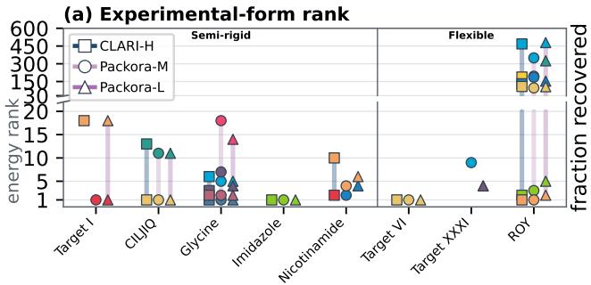

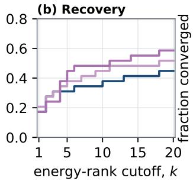

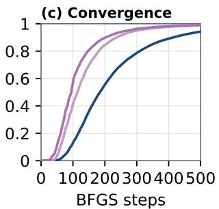  
Figure 8 FastCSP multi-polymorph benchmark. We generate 1,000 candidates for each of the 29 target structures across eight systems, relax them with UMA-S-1.2 (Wood et al., 2025), and rank them by increasing energy within each system. (a) Best energy rank of each of the 29 polymorphs for CLARI-H, Packora-M, and Packora-L; lower is better, with rank 1 denoting the predicted minimum-energy structure. Marker color identifies the polymorph across systems. Packora-L and Packora-M recover 21 and 19 polymorphs, respectively, compared with 18 for CLARI-H. (b) Fraction of polymorphs recovered by energy-rank cutof k; Packora achieves higher recovery across cutofs. (c) Cumulative fraction of the generated candidates converged by BFGS step; Packora candidates converge faster throughout relaxation. Relaxing all candidates on eight NVIDIA H200 GPUs takes 16.8, 10.6, and 8.9 h for CLARI-H, Packora-M, and Packora-L, respectively.

Table 3 Experimental-form recovery on FastCSP multiple-polymorph benchmark. We generate 1,000 candidates for each of the 29 targets, relax them with UMA-S-1.2 (Wood et al., 2025), and rank the relaxed structures by increasing energy. Recovered denotes the fraction of targets with an experimental-form match at any rank, while Top-k denotes the fraction whose best match appears within the top k ranks. Mean rank is computed over recovered targets only, with lower values indicating better ranking. Bold marks the best result. Packora achieves both higher recovery across rank cutofs and lower experimental-form ranks.
<table><tr><td>Method</td><td>Recovered ↑</td><td>Top-1 ↑</td><td>Top-5 ↑</td><td>Top-20 ↑</td><td>Mean rank ↓</td></tr><tr><td>CLARI-H</td><td>18/29</td><td>5/29</td><td>9/29</td><td>13/29</td><td>102.17</td></tr><tr><td>PACKORA-M</td><td>19/29</td><td>6/29</td><td>11/29</td><td>15/29</td><td>47.11</td></tr><tr><td>PACKORA-L</td><td>21/29</td><td>5/29</td><td>13/29</td><td>17/29</td><td>54.62</td></tr></table>

• Conditioning: How should optional inputs be dropped during training so that a single model remains efective across diferent combinations of stereochemistry, molecular templates, and space-group information? (Figure 12)

• Inference: Which sampler and solver settings work best, and does autoguidance provide further gains? (Figure 13)

• Scaling: How does scaling single-track and pair-track widths afect per-sample success and coverage across targets, and which allocation best balances the two? (Figure 14; Table 4)

## 5.1 Ablation Protocol

Dataset preprocessing. Following OXtal (Jin et al., 2025), we construct the dataset from CSD entries deposited by May 1, 2025. We require three-dimensional coordinates, an R-factor of at most 9%, single-crystal X-ray difraction at ambient pressure, a non-polymeric structure, and a known space group. We add missing hydrogens using the CSD API (Sykes et al., 2024) and retain unit cells with at most 512 atoms, including hydrogens. To prevent benchmark leakage, we remove all entries belonging to a test CSD family or containing an eligible CSD-provided component SMILES found in the test sets. Within each remaining CSD family, we deduplicate equivalent structures using pymatgen StructureMatcher (Ong et al., 2013) with ltol = 0.2, stol = 0.3, and $\mathrm { a n g l e \_ t o l = 5 ^ { \circ } }$ , retaining the entry with the lowest R-factor. The complete preprocessing pipeline and dataset statistics are provided in Section I.

Setup. To make controlled ablations feasible under a fixed compute budget, we train each configuration for 300 epochs on structures with at most 300 atoms per unit cell, saving checkpoints every 50 epochs. We evaluate each checkpoint on a fixed subset of 8,192 validation crystals, generating 30 candidates per target with the 200-step EDM–Heun sampler, and report $\mathrm { S o l } _ { C }$ as defined in Section 4.2. Architecture, training, conditioning, and scaling studies follow this protocol; inference studies instead vary the sampler and function-evaluation budget. Within each study, we vary one design choice at a time.

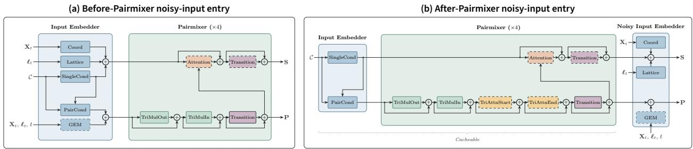  
Figure 9 Model variants for architecture ablations. (a) In the pre-entry variant, noisy coordinate and lattice embeddings and optional geometric enhancement module (GEM) features are injected before Pairmixer. (b) In the post-entry variant, the condition-only Input Embedder and Pairmixer are evaluated before noisy-state injection, allowing their outputs to be cached across denoising steps. Modules with dotted outlines denote optional components. Both variants produce single and pair representations S and P, which are passed to the same DiT trunk.

## 5.2 Architecture: A Cacheable Pairmixer Design

Explored designs. We compare three backbones: (1) DiT with pair-bias attention, as used by CLARI (Lo et al., 2026); (2) Pairformer, as used by AlphaFold3 and OXtal (Abramson et al., 2024; Jin et al., 2025); and (3) Pairmixer, a lighter Pairformer variant without triangle attention (Ouyang-Zhang et al., 2025). We also test a single-track update and the geometric enhancement module (GEM) (Veljković et al., 2026), which injects periodic minimum-image pair geometry from the noisy structure. Finally, we compare a pre-entry design, inspired by Proteina (Gefner et al., 2025), where noisy coordinate and lattice features enter before pair refinement, with a post-entry design, following AlphaFold3 (Abramson et al., 2024), where they enter afterward so that the pair representation can be cached.

Results and selection. Pairmixer outperforms Pairformer and DiT with pair-bias attention (0.479 vs. 0.462 vs. 0.421; Figure 10a–b). Pairformer performs better early in training but later degrades and is substantially more expensive than Pairmixer. GEM improves DiT with pair-bias attention, whereas neither GEM nor the single-track update improves Pairmixer (Figure 10c–d). Pre-entry Pairmixer slightly outperforms postentry Pairmixer (0.479 vs. 0.474), but caching the post-entry design yields a 20.1× reduction in 200-step sampling time in a synthetic [64, 300] benchmark, with peak memory increasing slightly from 21.3 to 28.0 GiB (Figure 10e–f). We therefore select post-entry Pairmixer without additional modules. We report parameter count and GFLOPs of each architecture variant in Section J.

## 5.3 Training: Selecting the Flow-Matching Recipe

Explored designs. We ablate each training choice separately. For time sampling, we compare uniform, logit-normal, Beta, and the Beta–uniform mixture proposed by Gefner et al. (2025). We also test random translations in fractional coordinates, wrapping each molecule into the unit cell by its centroid (Gruver et al., 2024). We compare $L ^ { 1 }$ and $L ^ { 2 }$ losses and vary the coordinate-to-lattice weighting in Equation (3).

We further test auxiliary supervision on periodic pair distances. Let $\mathcal { P } = \{ ( i , j ) : i \neq j , \ d _ { i j } < 1 5 \mathrm { \AA } \}$ , where $d _ { i j }$ and $\hat { d } _ { i j }$ denote target and predicted minimum-image distances. We consider an $L ^ { 1 }$ loss following CLARI (Lo et al., 2026) and a periodic adaptation of AlphaFold 3 smooth-LDDT (Abramson et al., 2024):

$$
\mathcal { L } _ { \mathrm { p a i r } } ^ { L ^ { 1 } } = \frac { 1 } { | \mathcal { P } | } \sum _ { ( i , j ) \in \mathcal { P } } \left| \hat { d } _ { i j } - d _ { i j } \right| , \qquad \mathcal { L } _ { \mathrm { p a i r } } ^ { \mathrm { s m o o t h } } = 1 - \frac { 1 } { 4 | \mathcal { P } | } \sum _ { ( i , j ) \in \mathcal { P } } \sum _ { \tau \in \{ 0 . 5 , 1 , 2 , 4 \} } \sigma \Bigl ( \tau - \Bigl | \hat { d } _ { i j } - d _ { i j } \Bigr | \Bigr ) ,\tag{6}
$$

where σ is the sigmoid function and distances are in angstroms. Finally, we compare AdamW (Loshchilov and Hutter, 2019) with Muon (Liu et al., 2025) and evaluate raw versus EMA parameters.

Results and selection. The Beta–uniform mixture outperforms pure Beta, logit-normal, and uniform time distributions (Figure 11a). Random translation augmentation improves Sol<sub>C</sub> from 0.466 to 0.486, while $L ^ { 1 }$ substantially outperforms $L ^ { 2 } ~ ( 0 . 4 8 6 ~ \mathrm { v s . ~ } 0 . 4 0 7 ; \mathrm { F i g u r e ~ 1 1 b } )$ . Increasing the coordinate-to-lattice weight ratio improves performance from 0.412 at 1:1 to 0.486 at 10:1, after which performance declines (Figure 11c). Auxiliary pair supervision provides little benefit: the best smooth-LDDT setting improves Sol by only 0.004 while requiring 1.37× more training GPU-hours (599 vs. 436). Muon outperforms AdamW (0.486 vs. 0.447), and an EMA decay of 0.9999 outperforms both raw weights and a decay of 0.999 (Figure 11e–f). We therefore select Beta–uniform time sampling, random translation augmentation, $L ^ { 1 }$ endpoint regression with a 10:1 coordinate-to-lattice weight ratio, no auxiliary pair loss, Muon, and an EMA decay of 0.9999.

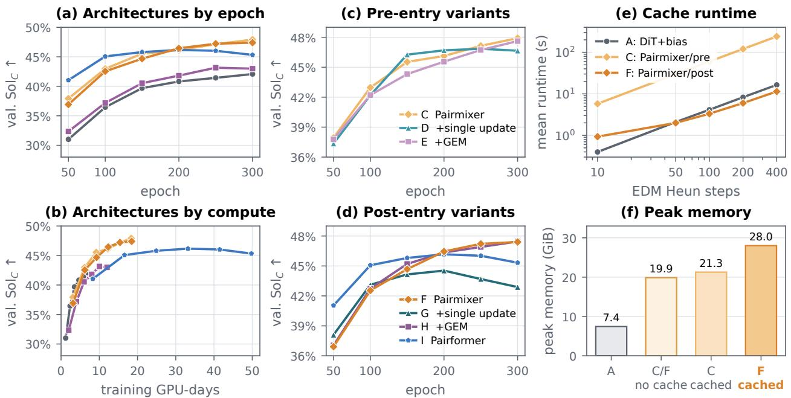  
Figure 10 Architecture selection, extensions, and caching. Panels (a)–(d) report validation Sol on the ≤300-atom subset with a generation budget of 30 candidates under EDM Heun 200. Pairmixer gives the dominant gain; post-entry Config. (F) remains close to Config. (C), while single updates and GEM do not improve final coverage. Panel (e) reports runtime for synthetic [64, 300] EDM Heun inputs, including cache construction, and panel (f) reports peak memory. Caching post-entry condition-only pair states removes the per-step Pairmixer cost at a fixed memory increase.

## 5.4 Conditioning: Robustness Through Template Dropout

Explored designs. Because available conditioning information varies across targets, a single model should handle diferent subsets of optional inputs. We vary the template-coordinate dropout probability $p _ { \mathrm { t p l } } \in \{ 0 , 0 . 5 , 1 \}$ and evaluate each model under five inference-time conditioning settings: none, stereochemistry only, template only, stereochemistry plus template, and all three conditions including space group.

Results and selection. Moderate template dropout $( p _ { \mathrm { t p l } } = 0 . 5 )$ is the most robust across conditioning settings, achieving the highest mean $\mathrm { S o l } _ { C }$ over the five settings (0.487, compared with 0.483 and 0.264 for $p _ { \mathrm { t p l } } = 0$ and 1, respectively). Notably, exposure to templates during training also improves performance when no optional conditioning is provided: $p _ { \mathrm { t p l } } = 0 . 5$ reaches 0.459, compared with 0.442 for a model that never observes templates. We therefore select $p _ { \mathrm { t p l } } = 0 . 5$ (Figure 12).

## 5.5 Inference: Efficient Sampling with EDM–Heun

Explored designs. We compare flow ODE with Euler integration, flow SDE with Euler–Maruyama, and EDM–Heun (Karras et al., 2022) at matched numbers of function evaluations (NFE), and sweep the EDM discretization exponent $\rho .$ For template conditioning, we compare random rotation and translation, rotation only, and no augmentation at inference to test whether reducing template randomness improves performance. Finally, we evaluate autoguidance (Karras et al., 2024), using earlier training checkpoints as degraded models following Gefner et al. (2025).

(f) EMA decay  
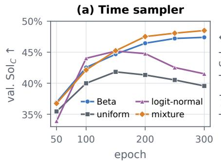

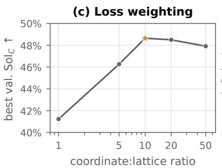

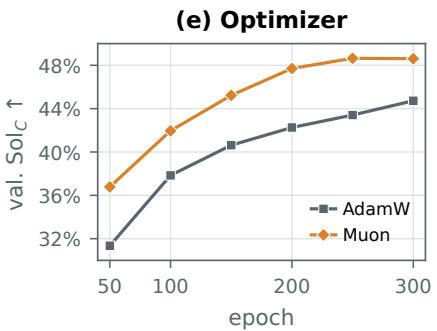

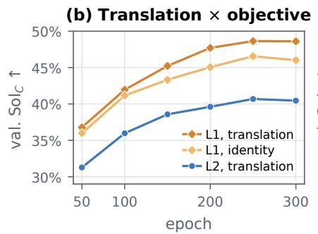

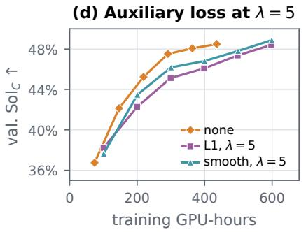

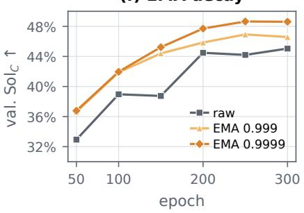  
Figure 11 Training recipe selection. All panels report validation Sol<sub>C</sub> under EDM Heun 200 with a generation budget of 30 candidates. (a) The Beta–uniform mixture gives the strongest completed score. (b) With L1 regression, crystal translation improves the best score from 0.466 to 0.486; under translation, L1 outperforms L2 (0.486 vs. 0.407). (c) A 10:1 coordinate-to-lattice ratio is optimal. (d) $\mathrm { A t } ~ \lambda { = } 5$ , smooth-LDDT improves the best score by only 0.004 while increasing training cost from 436 to 599 GPU-hours. (e) Muon outperforms AdamW. (f) EMA decay 0.9999 outperforms raw weights and decay 0.999.

$$
= \ p _ { \mathrm { t p l } } = 0 . 0 \quad = \quad p _ { \mathrm { t p l } } = 0 . 5 \quad = \ p _ { \mathrm { t p l } } = 1 . 0
$$

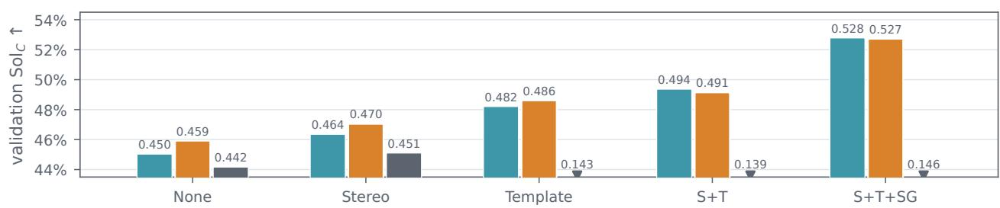  
Figure 12 Moderate template dropout is most robust across conditioning settings. Validation Sol at epoch 300 using EDM–Heun with 200 steps and 30 candidates per target. S, T, and SG denote stereochemistry, template coordinates, and space-group conditioning, respectively. Among models trained with $p _ { \mathrm { t p l } } \in \{ 0 , 0 . 5 , 1 \} , p _ { \mathrm { t p l } } { = } 0 . 5$ achieves the highest average performance across the five inference-time conditioning settings and is therefore selected. Template-conditioned results for $p _ { \mathrm { t p l } } { = } 1$ fall below the plotted range and are shown as downward triangles

Results and selection. At 400 NFE, EDM–Heun achieves $\mathrm { S o l } _ { C } = 0 . 4 8 2$ , compared with 0.430 for flow SDE and 0.408 for flow ODE. Increasing EDM–Heun from 400 to 1000 NFE improves Sol by only 0.005, so we retain 400 NFE. Performance is similar for $\rho \in [ 5 , 1 0 ] ;$ following Karras et al. (2022), we select $\rho = 7 .$ . Reducing template augmentation does not improve performance, with all three variants reaching 0.485–0.487, so we retain the training-matched rotation and translation. Autoguidance also provides no benefit: the best guided setting reaches 0.470, compared with 0.487 without guidance. We therefore select EDM–Heun at 400 NFE with $\rho = 7 ,$ template rotation and translation, and no autoguidance.

## 5.6 Scaling: Balancing Single- and Pair-Track Widths

Explored designs. We study how the single-track width $d _ { s }$ and pair-track width $d _ { p }$ afect performance when scaled independently or together. All other settings, including depth, Pairmixer placement, conditioning, validation split, and sampler, are held fixed. We report both the single-sample solve rate $\mathrm { S o l } _ { S }$ and the 30-sample crystal-level solve rate $\mathrm { S o l } _ { C }$ , capturing per-sample success and coverage across targets, respectively. Starting from the base configuration W0 with $( d _ { s } , d _ { p } ) = ( 5 1 2 , 1 2 8 )$ , we consider:

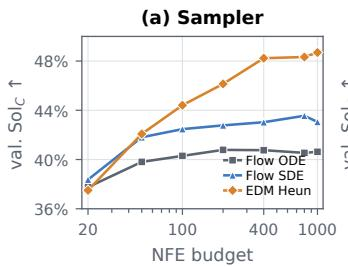

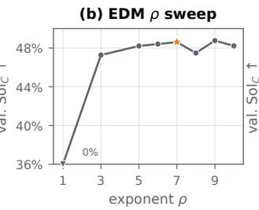

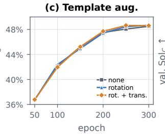

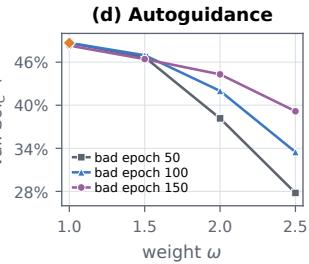  
Figure 13 Inference ablations. (a) Validation $\mathrm { S o l } _ { C }$ versus NFE budget for flow ODE, flow $\mathrm { S D E } ,$ and EDM–Heun. (b) EDM–Heun with 400 NFEs across discretization exponents $\rho ;$ the failed $\rho = 1$ result is shown at the lower boundary, and the star marks the selected $\rho = 7$ . (c) Validation trajectories with no template augmentation, rotation only, and rotation plus translation at inference. (d) Autoguidance using degraded checkpoints from epochs 50, 100, and 150 across guidance weights ω.

Table 4 Width-scaling ablation. All rows keep depth, Pairmixer placement, conditioning, validation split, and sampler fixed while varying the single width $d _ { s }$ and pair width $d _ { p }$ . Sol and Sol are evaluated at epoch 300 with 30 candidates per target and 200-step EDM–Heun sampling (400 NFE). GFLOPs denote analytical denoiser-forward costs at $N { = } 3 0 0$ Teal rows mark the selected width configurations: W0 defines Packora-M, while W4 defines the width of Packora-L before applying weight decay as selected in Figure 14.
<table><tr><td>ID</td><td> $d _ { s }$ </td><td> $d _ { p }$ </td><td>Heads</td><td>Params (M)</td><td> $\mathrm { G F L O P s }$ </td><td> $\mathrm { S o l } _ { S } \uparrow$ </td><td> $\mathrm { S o l } _ { C } \uparrow$ </td></tr><tr><td>WO</td><td>512</td><td>128</td><td>8</td><td>87.56</td><td>379.6</td><td>0.088</td><td>0.486</td></tr><tr><td>W1</td><td>512</td><td>192</td><td>8</td><td>89.65</td><td>762.6</td><td>0.084</td><td>0.490</td></tr><tr><td>W2</td><td>512</td><td>256</td><td>8</td><td>92.54</td><td>1287.2</td><td>0.087</td><td>0.480</td></tr><tr><td>W3</td><td>768</td><td>128</td><td>12</td><td>184.79</td><td>421.0</td><td>0.100</td><td>0.462</td></tr><tr><td>W4</td><td>768</td><td>192</td><td>12</td><td>186.91</td><td>804.7</td><td>0.100</td><td>0.487</td></tr><tr><td>W5</td><td>1024</td><td>128</td><td>16</td><td>330.79</td><td>483.8</td><td>0.111</td><td>0.454</td></tr></table>

• Pair scaling (W1, W2): increase $d _ { p }$ to 192 and 256, respectively, while keeping $d _ { s } = 5 1 2$

• Single scaling (W3, W5): increase $d _ { s }$ to 768 and 1024, respectively, while keeping $d _ { p } = 1 2 8$

• Balanced scaling (W4): increase both widths to $( d _ { s } , d _ { p } ) = ( 7 6 8 , 1 9 2 )$ , preserving $d _ { s } / d _ { p } = 4$

Scaling either width alone is insufficient. The epoch sweeps reveal distinct limitations of the two isolated scaling paths. Increasing only the single width improves $\mathrm { S o l } _ { S }$ but eventually reduces $\mathrm { S o l } _ { C }$ , suggesting that the added capacity makes successes more repeatable on already-solvable targets rather than expanding coverage. Increasing only the pair width, in contrast, yields no consistent improvement in either metric. Thus, neither isolated scaling path provides a uniformly better trade-of across sampling budgets (Figure 14; Table 4).

Balanced scaling reaches the sampling-budget Pareto frontier. Jointly scaling both widths allows W4 to maintain single-sample success while recovering crystal-level coverage, yielding a better trade-of than scaling either width alone. Adding weight decay of $1 0 ^ { - 2 }$ shifts W4 toward greater coverage, trading some success at k=1 for improved coverage at $k { = } 3 0$ . We prioritize coverage because CSP workflows generate multiple candidates for subsequent ranking; a structure absent from the candidate set cannot be recovered downstream (Hunnisett et al., 2024a,b). We therefore retain W0 as Packora-M and select W4 with weight decay $1 0 ^ { - 2 }$ as Packora-L (Figure 14).

## 6 Conclusion

We present Packora, a flexible all-atom generator for molecular CSP based on variational flow matching. Packora supports multi-component and organometallic crystals and optional conditioning on molecular templates, stereochemistry, and space-group information. Controlled studies of architecture, training, conditioning, inference, and scaling yield a practical recipe based on cacheable Pairmixer representations, $L ^ { 1 }$ endpoint regression, EDM–Heun sampling, and balanced single- and pair-track capacity. Inspired by the CCDC CSP blind tests, we introduce a two-track evaluation that separates generator-only coverage from end-to-end performance under a common downstream relaxation and ranking pipeline. Across six benchmarks, Packora achieves the best matched-budget coverage, while under the shared downstream pipeline it achieves higher experimental-form recovery, lower ranks, and faster convergence than the baselines.

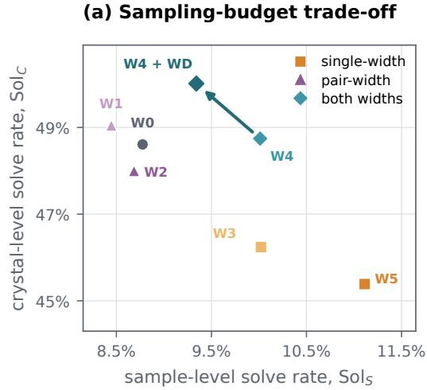

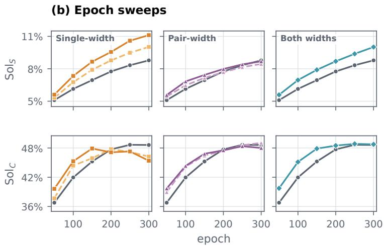  
Figure 14 Balanced width scaling reaches the sampling-budget Pareto frontier. (a) Single-sample solve rate Sol<sub>S</sub> (k=1) versus crystal-level solve rate Sol at k=30 at epoch 300. Marker shape and color indicate the width-scaling family. Scaling either the single or pair width alone does not consistently improve the trade-of between per-sample success and target coverage, whereas jointly scaling both widths reaches the Pareto frontier. Adding weight decay of $1 0 ^ { - 2 }$ further shifts the balanced model toward higher k=30 coverage. W0 is selected as Packora-M, and W4 with weigh decay (W4 + WD) as Packora-L. (b) Epoch sweeps for single-width scaling (W0, W3, W5), pair-width scaling (W0, W1, W2), and balanced scaling (W0, W4). Top and bottom rows report Sol<sub>S</sub> and Sol<sub>C</sub>, respectively. All metrics use the shared validation protocol with 30 candidates per target and 200-step EDM–Heun sampling.

Limitations and discussion. First, our controlled ablations vary design choices one at a time, and therefore do not capture interactions among architecture, training, conditioning, inference, and scaling; the selected recipe is not guaranteed to be globally optimal. Second, our ablations and model selection primarily use k=30 candidates, although the best model may depend on the candidate budget. Our scaling results show a trade-of between small-budget success and larger-budget coverage, suggesting that model selection may benefit from larger candidate pools. Determining an appropriate selection budget therefore remains an important question for generative CSP.

## Acknowledgements

This research was supported by the NVIDIA Academic Grant Program and by the Advanced GPU Utilization Support Program, funded by the Government of the Republic of Korea through the Ministry of Science and ICT. This work was also supported by the Basic Science Research Program through the National Research Foundation of Korea (NRF), funded by the Ministry of Education (RS-2025-25435147); grants from the Institute for Information & Communications Technology Planning & Evaluation (IITP), funded by the Korean government (MSIT), including the Artificial Intelligence Graduate School Program (KAIST; RS-2019-II190075) and the AI Star Fellowship (KAIST; RS-2025-02304967); a grant from the Korea Health Industry Development Institute (KHIDI), funded by the Ministry of Health & Welfare (MOHW), for Developing a Highly Multimodal (Drug, Protein, Gene, Cell Imaging, Literature) Foundation Model for ADMET Property Prediction (No. N0425208); and an NRF grant funded by MSIT (No. RS-2022-NR072184). We also acknowledge the use of OpenAI’s ChatGPT and Codex (OpenAI, 2022, 2025) for assistance with research code development, figure preparation, and manuscript revision.

## References

J. Abramson, J. Adler, J. Dunger, R. Evans, T. Green, A. Pritzel, O. Ronneberger, L. Willmore, A. J. Ballard, J. Bambrick, S. W. Bodenstein, D. A. Evans, C.-C. Hung, M. O’Neill, D. Reiman, K. Tunyasuvunakool, Z. Wu, A. Žemgulyt˙e, E. Arvaniti, C. Beattie, O. Bertolli, A. Bridgland, A. Cherepanov, M. Congreve, A. I. Cowen-Rivers, A. Cowie, M. Figurnov, F. B. Fuchs, H. Gladman, R. Jain, Y. A. Khan, C. M. R. Low, K. Perlin, A. Potapenko, P. Savy, S. Singh, A. Stecula, A. Thillaisundaram, C. Tong, S. Yakneen, E. D. Zhong, M. Zielinski, A. Žídek, V. Bapst, P. Kohli, M. Jaderberg, D. Hassabis, and J. M. Jumper. Accurate structure prediction of biomolecular interactions with AlphaFold 3. Nature, 630(8016):493–500, 2024. doi: 10.1038/s41586-024-07487-w.

M. S. Albergo, N. M. Bofi, and E. Vanden-Eijnden. Stochastic interpolants: A unifying framework for flows and difusions. Journal of Machine Learning Research, 26(209):1–80, 2025.

D. A. Bardwell, C. S. Adjiman, Y. A. Arnautova, E. Bartashevich, S. X. M. Boerrigter, D. E. Braun, A. J. Cruz-Cabeza, G. M. Day, R. G. Della Valle, G. R. Desiraju, et al. Towards crystal structure prediction of complex organic compounds: a report on the fifth blind test. Acta Crystallographica Section B: Structural Science, Crystal Engineering and Materials, 67(6):535–551, 2011. doi: 10.1107/S0108768111042868.

G. M. Battle, G. M. Ferrence, and F. H. Allen. Applications of the Cambridge Structural Database in chemical education. Journal of Applied Crystallography, 43(5):1208–1223, 2010. doi: 10.1107/S0021889810024155.

G. J. O. Beran. Frontiers of molecular crystal structure prediction for pharmaceuticals and functional organic materials. Chemical Science, 14(46):13290–13312, 2023. doi: 10.1039/D3SC03903J.

J. A. Chisholm and S. Motherwell. COMPACK: a program for identifying crystal structure similarity using distances. Journal of Applied Crystallography, 38(1):228–231, 2005. doi: 10.1107/S0021889804027074.

F. Curtis, X. Li, T. Rose, Á. Vázquez-Mayagoitia, S. Bhattacharya, L. M. Ghiringhelli, and N. Marom. GAtor: A first-principles genetic algorithm for molecular crystal structure prediction. Journal of Chemical Theory and Computation, 14(4):2246–2264, 2018. doi: 10.1021/acs.jctc.7b01152.

G. M. Day, T. G. Cooper, A. J. Cruz-Cabeza, K. E. Hejczyk, H. L. Ammon, S. X. M. Boerrigter, J. S. Tan, R. G. Della Valle, E. Venuti, K. V. J. Jose, et al. Significant progress in predicting the crystal structures of small organic molecules—a report on the fourth blind test. Acta Crystallographica Section B: Structural Science, 65(2):107–125, 2009. doi: 10.1107/S0108768109004066.

F. Eijkelboom, G. Bartosh, C. Andersson Naesseth, M. Welling, and J.-W. van de Meent. Variational flow matching for graph generation. Advances in Neural Information Processing Systems, 37:11735–11764, 2024.

T. Gefner, K. Didi, Z. Zhang, D. Reidenbach, Z. Cao, J. Yim, M. Geiger, C. Dallago, E. Kucukbenli, A. Vahdat, and K. Kreis. Proteina: Scaling flow-based protein structure generative models. In International Conference on Learning Representations (ICLR), 2025.

V. Gharakhanyan, Y. Yang, L. Barroso-Luque, M. Shuaibi, D. S. Levine, K. Michel, et al. FastCSP: Accelerated molecular crystal structure prediction with universal model for atoms. arXiv preprint arXiv:2508.02641, 2025.

C. R. Groom, I. J. Bruno, M. P. Lightfoot, and S. C. Ward. The Cambridge Structural Database. Acta Crystallographica Section B: Structural Science, Crystal Engineering and Materials, 72(2):171–179, 2016. doi: 10.1107/S2052520616003954.

R. W. Grosse-Kunstleve, N. K. Sauter, and P. D. Adams. Numerically stable algorithms for the computation of reduced unit cells. Acta Crystallographica Section A: Foundations of Crystallography, 60(1):1–6, 2004.

N. Gruver, A. Sriram, A. Madotto, A. G. Wilson, C. L. Zitnick, and Z. Ulissi. Fine-tuned language models generate stable inorganic materials as text. In International Conference on Learning Representations, 2024.

P. Höllmer, T. Egg, M. Martirossyan, E. Fuemmeler, Z. Shui, A. Gupta, P. Prakash, A. Roitberg, M. Liu, G. Karypis, et al. Open materials generation with stochastic interpolants. In Forty-second International Conference on Machine Learning, 2025.

L. M. Hunnisett, N. Francia, J. Nyman, N. S. Abraham, S. Aitipamula, T. Alkhidir, M. Almehairbi, A. Anelli, D. M. Anstine, J. E. Anthony, et al. The seventh blind test of crystal structure prediction: structure ranking methods. Acta Crystallographica Section B: Structural Science, Crystal Engineering and Materials, 80(6):548–574, 2024a. doi: 10.1107/S2052520624008679.

L. M. Hunnisett, J. Nyman, N. Francia, N. S. Abraham, C. S. Adjiman, S. Aitipamula, T. Alkhidir, M. Almehairbi, A. Anelli, D. M. Anstine, et al. The seventh blind test of crystal structure prediction: structure generation methods.

Acta Crystallographica Section B: Structural Science, Crystal Engineering and Materials, 80(6):517–547, 2024b. doi: 10.1107/S2052520624007492.

R. Jiao, W. Huang, P. Lin, J. Han, P. Chen, Y. Lu, and Y. Liu. Crystal structure prediction by joint equivariant difusion. Advances in Neural Information Processing Systems, 36, 2024.

R. Jiao, H. Wu, W. Huang, Y. Song, Y. Ouyang, Y. Rong, T. Xu, P. Wang, H. Zhou, W.-Y. Ma, et al. MOF-BFN: Metal-organic frameworks structure prediction via bayesian flow networks. In The Thirty-ninth Annual Conference on Neural Information Processing Systems, 2025.

E. Jin, A. C. Nica, M. Galkin, J. Rector-Brooks, K. L. K. Lee, S. Miret, F. H. Arnold, M. Bronstein, A. J. Bose, A. Tong, and C.-H. Liu. OXtal: An all-atom difusion model for organic crystal structure prediction. arXiv preprint arXiv:2512.06987, 2025.

T. Karras, M. Aittala, T. Aila, and S. Laine. Elucidating the design space of difusion-based generative models. In Advances in Neural Information Processing Systems, volume 35, pages 26565–26577, 2022.

T. Karras, M. Aittala, T. Kynkaanniemi, J. Lehtinen, T. Aila, and S. Laine. Guiding a difusion model with a bad version of itself. arXiv preprint arXiv:2406.02507, 2024.

N. Kim, S. Kim, and S. Ahn. Flexible MOF generation with torsion-aware flow matching. In Advances in Neural Information Processing Systems, 2025a. URL https://openreview.net/forum?id=cLJfumTWLI.

N. Kim, S. Kim, M. Kim, J. Park, and S. Ahn. MOFFlow: Flow matching for structure prediction of metalorganic frameworks. In The Thirteenth International Conference on Learning Representations, 2025b. URL https://openreview.net/forum?id=dNT3abOsLo.

N. Kim, H. Kim, S. Yu, M. Kim, S. Kim, and S. Ahn. AtomMOF: All-atom flow matching for MOF-adsorbate structure prediction. arXiv preprint arXiv:2602.07351, 2026. URL https://arxiv.org/abs/2602.07351.

I. Křivý and B. Gruber. A unified algorithm for determining the reduced (Niggli) cell. Acta Crystallographica Section A, 32(2):297–298, 1976. doi: 10.1107/S0567739476000636.

G. Landrum et al. Rdkit: Open-source cheminformatics, 2006.

A. H. Larsen, J. J. Mortensen, J. Blomqvist, I. E. Castelli, R. Christensen, M. Dułak, J. Friis, M. N. Groves, B. Hammer, C. Hargus, et al. The atomic simulation environment: a python library for working with atoms. Journal of Physics: Condensed Matter, 29(27):273002, 2017.

X. Li, F. S. Curtis, T. Rose, C. Schober, Á. Vázquez-Mayagoitia, K. Reuter, H. Oberhofer, and N. Marom. Genarris: Random generation of molecular crystal structures and fast screening with a Harris approximation. The Journal of Chemical Physics, 148(24):241701, 2018. doi: 10.1063/1.5014038.

Y. Lipman, R. T. Q. Chen, H. Ben-Hamu, M. Nickel, and M. Le. Flow matching for generative modeling. In The Eleventh International Conference on Learning Representations, 2023. URL https://openreview.net/forum?id= PqvMRDCJT9t.

J. Liu, J. Su, X. Yao, Z. Jiang, G. Lai, Y. Du, Y. Qin, W. Xu, E. Lu, J. Yan, Y. Chen, H. Zheng, Y. Liu, S. Liu, B. Yin, W. He, H. Zhu, Y. Wang, J. Wang, M. Dong, Z. Zhang, Y. Kang, H. Zhang, X. Xu, Y. Zhang, Y. Wu, X. Zhou, and Z. Yang. Muon is scalable for llm training, 2025.

A. Lo, L. Mucko, A. H. Cheng, A. Cai, A. J. A. Price, W. Matusik, and A. Aspuru-Guzik. Fast organic crystal structure prediction with unit cell flow matching. arXiv preprint arXiv:2606.03199, 2026.

I. Loshchilov and F. Hutter. Decoupled weight decay regularization. In International Conference on Learning Representations, 2019.

X. Luo, Z. Wang, Q. Wang, X. Shao, J. Lv, L. Wang, Y. Wang, and Y. Ma. CrystalFlow: A flow-based generative model for crystalline materials. Nature Communications, 16:9267, 2025. doi: 10.1038/s41467-025-64364-4.

B. K. Miller, R. T. Chen, A. Sriram, and B. M. Wood. Flowmm: Generating materials with riemannian flow matching. In Forty-first International Conference on Machine Learning, 2024.

S. P. Ong, W. D. Richards, A. Jain, G. Hautier, M. Kocher, S. Cholia, D. Gunter, V. Chevrier, K. A. Persson, and G. Ceder. Python materials genomics (pymatgen): A robust, open-source python library for materials analysis. Computational Materials Science, 68:314–319, 2013. doi: 10.1016/j.commatsci.2012.10.028.

OpenAI. ChatGPT: Optimizing language models for dialogue. https://openai.com/index/chatgpt/, 2022. Accessed: 2026-08-23.

OpenAI. Introducing Codex. https://openai.com/index/introducing-codex/, 2025. Accessed: 2026-08-23.

J. Ouyang-Zhang, P. Murugan, D. J. Diaz, G. Scarpellini, R. S. Bowen, N. Gruver, A. Klivans, P. Krähenbühl, A. Faust, and M. Al-Shedivat. Triangle multiplication is all you need for biomolecular structure representations. arXiv preprint arXiv:2510.18870, 2025.

W. Peebles and S. Xie. Scalable difusion models with transformers. In Proceedings of the IEEE/CVF international conference on computer vision, pages 4195–4205, 2023.

S. L. Price. Predicting crystal structures of organic compounds. Chemical Society Reviews, 43:2098–2111, 2014. doi: 10.1039/C3CS60279F.

N. Rego and D. Koes. 3Dmol.js: molecular visualization with WebGL. Bioinformatics, 31(8):1322–1324, 2015. doi: 10.1093/bioinformatics/btu829.

A. M. Reilly, R. I. Cooper, C. S. Adjiman, S. Bhattacharya, A. D. Boese, J. G. Brandenburg, P. J. Bygrave, R. Bylsma, J. E. Campbell, R. Car, et al. Report on the sixth blind test of organic crystal structure prediction methods. Acta Crystallographica Section B: Structural Science, Crystal Engineering and Materials, 72(4):439–459, 2016. doi: 10.1107/S2052520616007447.

A. Subramanian, E. Pan, J. Nam, M. Weiler, S. Qu, C. W. Park, T. S. Jaakkola, E. Olivetti, and R. Gomez-Bombarelli. PackFlow: Generative molecular crystal structure prediction via reinforcement learning alignment. arXiv preprint arXiv:2602.20140, 2026.

R. A. Sykes, N. T. Johnson, C. J. Kingsbury, J. Harter, A. G. P. Maloney, I. J. Sugden, S. C. Ward, I. J. Bruno, S. A. Adcock, P. A. Wood, P. McCabe, A. A. Moldovan, F. Atkinson, I. Giangreco, and J. C. Cole. What has scripting ever done for us? The CSD Python application programming interface (API). Journal of Applied Crystallography, 57(4):1235–1250, 2024. doi: 10.1107/S1600576724005934.

M. Tancik, P. P. Srinivasan, B. Mildenhall, S. Fridovich-Keil, N. Raghavan, U. Singhal, R. Ramamoorthi, J. T. Barron, and R. Ng. Fourier features let networks learn high frequency functions in low dimensional domains. In Advances in Neural Information Processing Systems, volume 33, 2020.

B. A. A. Team, X. Chen, Y. Zhang, C. Lu, W. Ma, J. Guan, C. Gong, J. Yang, H. Zhang, K. Zhang, et al. Protenixadvancing structure prediction through a comprehensive AlphaFold 3 reproduction. BioRxiv, pages 2025–01, 2025.

T. H. Veljković, J. Rosenthal, I. Lončarić, and J.-W. van de Meent. Crystalite: A lightweight transformer for eficient crystal modeling. arXiv preprint arXiv:2604.02270, 2026.

S. Wang, J. Witek, G. A. Landrum, and S. Riniker. Improving conformer generation for small rings and macrocycles based on distance geometry and experimental torsional-angle preferences. Journal of chemical information and modeling, 60(4):2044–2058, 2020.

B. M. Wood, M. Dzamba, X. Fu, M. Gao, M. Shuaibi, L. Barroso-Luque, K. Abdelmaqsoud, V. Gharakhanyan, J. R. Kitchin, D. S. Levine, et al. Uma: A family of universal models for atoms. In Advances in Neural Information Processing Systems, 2025. URL https://openreview.net/forum?id=SvopaNxYWt.

H. Wu, Y. Song, J. Gong, Z. Cao, Y. Ouyang, J. Zhang, H. Zhou, W.-Y. Ma, and J. Liu. A periodic bayesian flow for material generation. In The Thirteenth International Conference on Learning Representations, 2025.

T. Xie, X. Fu, O.-E. Ganea, R. Barzilay, and T. S. Jaakkola. Crystal difusion variational autoencoder for periodic material generation. In International Conference on Learning Representations, 2022. URL https://openreview.net/ forum?id=03RLpj-tc\_

Z. Yi, L. Chan, M. Yiming, Q. Wei, Y. Fei, Z. Kexin, W. Lan, G. Minrui, and G. Quanquan. Seedfold: Scaling biomolecular structure prediction. arXiv preprint arXiv:2512.24354, 2025.

O. Zaghen, F. Eijkelboom, A. Pouplin, C. Liu, M. Welling, J.-W. van de Meent, and E. J. Bekkers. Riemannian variational flow matching for material and protein design. arXiv preprint arXiv:2502.12981, 2025.

C. Zeng, H. W. Sullivan, T. Egg, M. M. Martirossyan, P. Höllmer, J. Jin, R. G. Hennig, A. Roitberg, S. Martiniani, E. B. Tadmor, and M. Liu. MolCrystalFlow: Molecular crystal structure prediction via flow matching. arXiv preprint arXiv:2602.16020, 2026.

## A Model Architecture Details

Notation. This section specifies the Packora forward pass in algorithmic form. Indices $i , j ,$ k denote atoms, and h denotes an attention head. We use S and P for single and pair representations, respectively. Symbols E, W, and MLP denote learned embedding functions, linear maps, and multilayer perceptrons, respectively, while Norm denotes normalization. Split and Concat partition and concatenate feature channels, respectively. We use $\sigma$ for the sigmoid function, ϕ for the configured activation function, ⊙ for elementwise multiplication, and $d _ { h }$ for the dimension of one attention head.

Overall forward pass. Algorithm 1 summarizes the complete forward pass: the model embeds the condition, refines pair features, injects the noisy crystal state, applies the DiT trunk, and predicts coordinate and lattice.

Algorithm 1 Model forward pass   
Require: Noisy state $( \mathbf { X } _ { t } , \boldsymbol { \ell } _ { t } )$ , time $t ,$ condition ${ \mathcal { C } } ,$ and valid-atom mask m   
Ensure: Posterior mean $( \widehat { \mathbf { X } } _ { 1 } , \widehat { \boldsymbol { \ell } } _ { 1 } )$   
# 1. Encode the condition and refine pair features   
1: $( \mathbf { S } _ { C } , \mathbf { P } ) \gets$ ConditionEmbed(C, m)   
2: for each Pairmixer block do   
3: P ← PairmixerBlock(P, m)   
4: end for   
5: $\mathbf { P ^ { \star } }  \mathbf { P }$   
# 2. Inject the noisy state   
6: (S, c<sub>t</sub>) ← NoisyStateEmbed $( \mathbf { S } _ { \mathcal { C } } , \mathbf { X } _ { t } , \ell _ { t } , t )$   
# 3. Propagate and decode   
7: for each DiT block do   
8: S ← DiTBlock(S, c<sub>t</sub>, P<sup>⋆</sup>, m)   
9: end for   
10: $( \widehat { \mathbf { X } } _ { 1 } , \widehat { \pmb { \ell } } _ { 1 } ) \gets$ PredictionHeads(S, m)   
11: return $( \widehat { \mathbf { X } } _ { 1 } , \widehat { \boldsymbol { \ell } } _ { 1 } )$

Condition embedding. For Algorithm 2, ${ \bf a } _ { i }$ contains the atomic number, periodic-table descriptors, formal charge, and chirality of atom i. Template coordinates are denoted by $\widetilde { \mathbf { x } } _ { i } .$ , with availability indicator $m _ { \mathrm { T } }$ Molecular membership, bond type, and bond stereochemistry are denoted by $u _ { i } , \tau _ { i j }$ , and $\zeta _ { i j }$ , respectively; unavailable categorical conditions use learned null categories. The global condition contains the space-group embedding. Bond, stereochemistry, and template features are restricted to atom pairs within the same molecular component, and stereochemistry features are zero for nonbonded pairs.

```tcl
Algorithm 2 Condition embedding
Require: Condition C and valid-atom mask m
Ensure: Condition-only single representation $\mathbf { S } _ { C }$ and ordered pair representation $\mathbf { P }$
# 1. Embed atom-level and global conditions
1: $\mathbf { S } _ { \mathcal { C } , i } \gets E _ { \mathrm { a t o m } } ( \mathbf { a } _ { i } ) + m _ { \mathrm { T } } E _ { \mathrm { t e m p } } ( \widetilde { \mathbf { x } } _ { i } ) + m _ { i } E _ { \mathrm { g l o b a l } } ( \mathcal { C } )$
# 2. Construct intramolecular pair features
2: ${ \cal M } _ { i j } ^ { \mathrm { m o l } }  m _ { i } m _ { j } { \bf 1 } [ u _ { i } = u _ { j } ]$
3: $\delta _ { i j } { } ^ { \prime }  \widetilde { \mathbf { x } } _ { i } - \widetilde { \mathbf { x } } _ { j } , \rho _ { i j }  ( \overset { \cdot } { 1 } + \| \delta _ { i j } \| _ { 2 } ^ { 2 } ) _ { , \ \cdot } ^ { - 1 }$
$\overline { { \mathbf { P } } } _ { i j } ^ { \circ }  W _ { Q } \mathbf { S } _ { \mathcal { C } , i } ^ { \circ } + W _ { K } \dot { \mathbf { S } } _ { \mathcal { C } , j } + \dot { M } _ { i j } ^ { \mathrm { m o l } } \big [ E _ { \mathrm { b o n d } } ( \tau _ { i j } ) + E _ { \mathrm { s t e r e o } } ( \zeta _ { i j } ) + m _ { \mathrm { T } } ( W _ { \delta } \delta _ { i j } + W _ { \rho } \rho _ { i j } ) \big ]$
# 3. Refine each pair independently
4: $\mathbf { P } _ { i j }  \overline { { \mathbf { P } } } _ { i j } + \mathrm { M L P } _ { P } ^ { - } \big ( \mathrm { N o r m } _ { P } \overline { { ( \mathbf { P } } } _ { i j } ) \big )$
5: return $( \mathbf { S } _ { \mathcal { C } } , \mathbf { P } )$
```

Pairmixer block. Algorithm 3 updates only the pair representation using outgoing and incoming triangle multiplication followed by a gated pair transition. The mask m restricts all pair operations to valid atoms.

Algorithm 3 Pairmixer block   
Require: Pair representation P and valid-atom mask m   
Ensure: Updated pair representation P   
1: $M _ { i j } \gets m _ { i } m _ { j }$   
# 1. Aggregate information over outgoing and incoming triangles   
Contrac $\mathrm { { \boldsymbol ~ \sigma ~ } } _ { \mathrm { o u t } } ( \mathbf { A } , \mathbf { B } ) _ { i j } \gets \sum \mathbf { A } _ { i k } \odot \mathbf { B } _ { j k } , \qquad \mathrm { C o n t r a c t } _ { \mathrm { i n } } ( \mathbf { A } , \mathbf { B } ) _ { i j } \gets \sum \mathbf { A } _ { k i } \odot \mathbf { B } _ { k j }$   
k k   
2: for d in the ordered sequence (out, in) do   
3: $\overline { { \mathbf { P } } }  \mathrm { N o r m } _ { d } ( \mathbf { P } )$   
$[ \mathbf { A } , \mathbf { B } ] \gets \mathrm { S p l i t } \big ( \dot { W } _ { p } ^ { d } \overline { { \mathbf { P } } } \odot \sigma ( W _ { g } ^ { d } \overline { { \mathbf { P } } } ) \big ) \odot \mathbf { M }$   
4: $\mathbf { U } \gets \mathrm { C o n t r a c i } _ { d } ( \mathbf { A } , \mathbf { B } )$   
$\mathbf { P } \gets \mathbf { P } + W _ { o } ^ { d } \operatorname { N o r m } _ { d } ^ { \prime } ( \mathbf { U } ) \odot \sigma ( W _ { g o } ^ { d } \mathbf { \overline { { P } } } )$   
5: end for   
# 2. Mix feature channels within each pair   
6: $\overline { { \mathbf { P } } }  \mathrm { N o r m } _ { \mathrm { t r } } ( \mathbf { P } )$   
$\mathbf { P }  \mathbf { P } + W _ { \mathrm { t r } } [ \operatorname { S i L U } ( W _ { a } \mathbf { \overline { { P } } } ) \odot W _ { b } \mathbf { \overline { { P } } } ]$   
7: return P

Noisy-state and time embedding. In Algorithm 4, Ω and η are fixed random Fourier frequencies and phases for encoding the coordinates, while ω contains the fixed frequencies used for the sinusoidal time embedding.

Algorithm 4 Noisy-state and time embedding   
Require: Condition-only single representation $\mathbf { S } _ { C }$ , noisy coordinates $\mathbf { X } _ { t } ,$ , noisy lattice $\ell _ { t } .$ , and time t   
Ensure: DiT input S and time condition $\mathbf { c } _ { t }$   
# 1. Embed noisy coordinates into the single track   
1: $\Phi _ { i } \gets \sqrt { 2 } \cos ( \Omega \odot \mathbf { \dot { X } } _ { t , i } + \pmb { \eta } )$ ▷ fixed random Fourier features   
2: ${ \bf e } _ { i } ^ { X }  \mathrm { M L P } _ { X } ( \mathrm { v e c } ( \Phi _ { i } ) )$   
# 2. Embed and broadcast the noisy lattice   
3: $\mathbf { e } ^ { L }  \mathrm { M L P } _ { L } ( \ell _ { t } )$   
4: $\mathbf { S } _ { i } \gets \mathbf { S } _ { \mathcal { C } , i } + \mathbf { e } _ { i } ^ { X } + \mathbf { e } ^ { L }$ ▷ $\mathbf { e } ^ { L }$ is broadcast over atoms   
# 3. Embed flow time   
5: $\psi ( t ) \gets [ \cos ( \omega t ) , \sin ( \omega t ) ]$ ▷ fixed sinusoidal frequencies   
6: $\mathbf { c } _ { t } \gets \mathrm { M L P } _ { t } ( \psi ( t ) )$   
7: return $( \mathbf { S } , \mathbf { c } _ { t } )$

DiT block. In Algorithm $5 , \beta , \alpha ,$ , and $\gamma$ denote the adaptive shift, scale, and residual-gate vectors, respectively.   
Subscripts A and F distinguish modulation parameters for the attention and feed-forward updates.

Algorithm 5 Pair-biased DiT block   
Require: Single representation S, time condition $\mathbf { c } _ { t } ,$ , refined pair representation $\mathbf { P } ^ { \star }$ , and mask m   
Ensure: Updated single representation S   
# 1. Generate time-dependent modulation   
$[ \beta _ { A } , \alpha _ { A } , \gamma _ { A } , \beta _ { F } , \alpha _ { F } , \gamma _ { F } ] \gets W _ { c } \phi ( \mathbf { c } _ { t } )$   
1: $\mathbf { U } _ { i } \gets ( 1 + \alpha _ { A } ) \odot \mathrm { N o r m } _ { 1 } ( \mathbf { S } _ { i } ) + \boldsymbol { \beta } _ { A }$   
2: $\widetilde { \mathbf { U } } _ { i } \gets \mathrm { N o r m } _ { A } ( \mathbf { U } _ { i } )$   
# 2. Apply self-attention with pair bias   
3: $\mathbf { q } _ { i } ^ { h }  \tilde { \mathrm { N o r m } _ { q } } ( W _ { q } ^ { h } \widetilde { \mathbf { U } } _ { i } ) , \mathbf { k } _ { i } ^ { h }  \mathrm { N o r m } _ { k } ( W _ { k } ^ { h } \widetilde { \mathbf { U } } _ { i } ) , \mathbf { v } _ { i } ^ { h }  W _ { v } ^ { h } \widetilde { \mathbf { U } } _ { i }$   
4: $b _ { i j } ^ { h }  W _ { P } ^ { h } \mathrm { N o r m } _ { P } ( \mathbf { P } _ { i j } ^ { \star } )$   
$a _ { i j } ^ { h }  \mathrm { s o f t m a x } _ { j } ( \frac { \langle \mathbf { q } _ { i } ^ { h } , \mathbf { k } _ { j } ^ { h } \rangle } { \sqrt { d _ { h } } } + b _ { i j } ^ { h } - \infty ( 1 - m _ { j } ) )$   
5: $\begin{array} { r } { \mathbf { o } _ { i } ^ { h }  \sum _ { j } a _ { i j } ^ { h } \mathbf { v } _ { j } ^ { h } } \end{array}$   
$\mathbf { o } _ { i }  W _ { o } \Big [ \sigma ( W _ { g } \widetilde { \mathbf { U } } _ { i } ) \odot \mathrm { C o n c a t } _ { h } ( \mathbf { o } _ { i } ^ { h } ) \Big ]$   
6: $\mathbf { S } _ { i }  \mathbf { S } _ { i } \bar { + } \gamma _ { A } \odot \mathbf { o } _ { i }$   
# 3. Apply the gated feed-forward update   
7: $\mathbf { H } _ { i } \gets ( 1 + \alpha _ { F } ) \odot \mathrm { N o r m } _ { 2 } ( \mathbf { S } _ { i } ) + \boldsymbol { \beta } _ { F }$   
$\mathbf { f } _ { i }  W _ { \mathrm { d o w n } } [ \phi ( W _ { \mathrm { g a t e } } \mathbf { H } _ { i } ) \odot W _ { \mathrm { u p } } \mathbf { H } _ { i } ]$   
8: $\mathbf { S } _ { i }  \mathbf { S } _ { i } + \gamma _ { F } \odot \mathbf { f } _ { i }$   
9: return S

Prediction heads. Algorithm 6 maps the final single representation to centered Cartesian coordinates and a pooled lattice prediction over valid atoms.

Algorithm 6 Coordinate and lattice prediction heads   
Require: Final single representation S and valid-atom mask m   
Ensure: Coordinate endpoint $\widehat { \mathbf { X } } _ { 1 }$ and lattice endpoint $\widehat { \ell } _ { 1 }$   
1: $N \gets \sum _ { i } m _ { i }$   
# 1. Predict centered atomic coordinates   
2: $\mathbf { r } _ { i }  \mathrm { L i n e a r } _ { X } ( \mathrm { N o r m } _ { X } ( \mathbf { S } _ { i } ) )$   
3: $\widehat { \mathbf { X } } _ { 1 , i } \gets \mathbf { r } _ { i } - \frac { 1 } { N } \sum _ { j } m _ { j } \mathbf { r } _ { j }$   
# 2. Pool atom features and predict the lattice   
4: $\overline { { \mathbf { s } } }  \frac { 1 } { N } \sum _ { i } m _ { i } \operatorname { N o r m } _ { L } ( \mathbf { S } _ { i } )$   
5: $\widehat { \ell _ { 1 } } \gets \mathrm { M L P } _ { L } ( \overline { { \mathbf { s } } } )$   
6: return $( \widehat { \mathbf { X } } _ { 1 } , \widehat { \boldsymbol { \ell } } _ { 1 } )$

## B Dataset Statistics

We report statistics for the CLARI training and validation splits used in our benchmark experiments (Section 4). Our preprocessing adds missing hydrogens using the CSD Python API (Sykes et al., 2024) before applying the 512-atom limit. This reduces the training split from 917,014 to 912,807 structures and the validation split from 1,048 to 1,047. We report both statistics for completeness.

Table 5 Size statistics for the CLARI training and validation splits. Statistics are reported before and after applying the 512-atom unit-cell limit following hydrogen completion.
<table><tr><td></td><td colspan="4">Unfiltered</td><td colspan="4">≤ 512 atoms</td></tr><tr><td>Property</td><td>Min</td><td>Mean</td><td>Median</td><td>Max</td><td>Min</td><td>Mean</td><td>Median</td><td>Max</td></tr><tr><td>Training</td><td></td><td></td><td></td><td></td><td></td><td></td><td></td><td></td></tr><tr><td>Atoms / unit cell</td><td>5</td><td>203.65</td><td>180</td><td>3,558</td><td>5</td><td>201.71</td><td>180</td><td>512</td></tr><tr><td>Molecules / unit cell</td><td>1</td><td>5.42</td><td>4</td><td>246</td><td>1</td><td>5.35</td><td>4</td><td>160</td></tr><tr><td>Atoms / molecule</td><td>1.06</td><td>48.96</td><td>42.00</td><td>682.00</td><td>1.06</td><td>48.89</td><td>42.00</td><td>512.00</td></tr><tr><td>Formula-unit count Z</td><td>1</td><td>3.34</td><td>4</td><td>40</td><td>1</td><td>3.33</td><td>4</td><td>40</td></tr><tr><td>Validation</td><td></td><td></td><td></td><td></td><td></td><td></td><td></td><td></td></tr><tr><td>Atoms / unit cell</td><td>10</td><td>205.95</td><td>185</td><td>617</td><td>10</td><td>205.56</td><td>184</td><td>512</td></tr><tr><td>Molecules / unit cell</td><td>1</td><td>5.51</td><td>4</td><td>99</td><td>1</td><td>5.42</td><td>4</td><td>52</td></tr><tr><td>Atoms / molecule</td><td>5.00</td><td>48.42</td><td>42.10</td><td>242.00</td><td>5.00</td><td>48.46</td><td>42.20</td><td>242.00</td></tr><tr><td>Formula-unit count Z</td><td>1</td><td>3.39</td><td>4</td><td>16</td><td>1</td><td>3.39</td><td>4</td><td>16</td></tr></table>

We additionally report chemical composition, molecular flexibility, and the availability of optional conditioning information. Similar to Jin et al. (2025), we label a structure as rigid if every molecular component contains at most three rotatable bonds and as flexible if any component contains more than three. This provides a simple heuristic rather than a complete description of molecular flexibility. Table 6 summarizes these properties before and after the 512-atom filtering.

Table 6 Composition, flexibility, and conditioning availability in the CLARI splits. Entries report the number of structures before and after applying the 512-atom unit-cell limit.
<table><tr><td></td><td colspan="2">Training</td><td colspan="2">Validation</td></tr><tr><td>Property</td><td>Unfiltered</td><td>≤ 512 atoms</td><td>Unfiltered</td><td>≤ 512 atoms</td></tr><tr><td colspan="5">Composition</td></tr><tr><td>Organic</td><td>491,219</td><td>490,475</td><td>573</td><td>573</td></tr><tr><td>Organometallic</td><td>425,795</td><td>422,332</td><td>475</td><td>474</td></tr><tr><td colspan="5">Molecular flexibility</td></tr><tr><td>Rigid</td><td>194,017</td><td>193,620</td><td>226</td><td>226</td></tr><tr><td>Flexible</td><td>722,997</td><td>719,187</td><td>822</td><td>821</td></tr><tr><td colspan="5">Conditioning availability</td></tr><tr><td>Template</td><td>598,141</td><td>596,447</td><td>683</td><td>683</td></tr><tr><td>Stereochemistry</td><td>917,014</td><td>912,807</td><td>1,048</td><td>1,047</td></tr><tr><td>Space group</td><td>917,012</td><td>912,805</td><td>1,048</td><td>1,047</td></tr></table>

## C Training and Sampling Hyperparameters

We summarize the hyperparameters used for Packora-M and Packora-L. Unless noted, all settings are shared between the two model sizes.

Architecture. Table 7 specifies model capacity and backbone configuration; the two models difer only in width, head count, and parameter count.

Table 7 Architecture hyperparameters. Model capacity and backbone configuration for Packora-M and Packora-L.

<table><tr><td>Parameter</td><td>PACKORA-M</td><td>PACKORA-L</td></tr><tr><td>Capacity</td><td></td><td></td></tr><tr><td>Parameters</td><td>88M</td><td>187M</td></tr><tr><td>Single width</td><td>512</td><td>768</td></tr><tr><td>Pair width</td><td>128</td><td>192</td></tr><tr><td>Attention heads</td><td>8</td><td>12</td></tr><tr><td>Backbone</td><td></td><td></td></tr><tr><td>Pairmixer blocks</td><td>4</td><td>4</td></tr><tr><td>DiT blocks</td><td>16</td><td>16</td></tr><tr><td>MLP ratio</td><td>4</td><td>4</td></tr><tr><td>QK normalization</td><td>On</td><td>On</td></tr><tr><td>Feed-forward network</td><td>SwiGLU</td><td>SwiGLU</td></tr><tr><td>Dropout</td><td>0</td><td>0</td></tr></table>

Training. Table 8 summarizes the flow-matching, optimization, conditioning, and checkpoint-selection settings.

Table 8 Training hyperparameters. Flow-matching, optimization, conditioning, and model-selection settings. All settings are shared between Packora-M and Packora-L unless noted.

<table><tr><td>Parameter</td><td>Value</td></tr><tr><td>Flow matching</td><td></td></tr><tr><td>Priors</td><td>Centered Gaussian fpr X; standard Gaussian for l</td></tr><tr><td>Interpolant</td><td>Linear  $( x _ { t } = ( 1 - t ) x _ { 0 } + t x _ { 1 } )$ </td></tr><tr><td>Time distribution</td><td>0.98 Beta(1.9, 1.0) + 0.02 Uniform(0, 1)</td></tr><tr><td>Objective</td><td>L¹ coordinate-lattice loss</td></tr><tr><td>Loss weights</td><td>Coordinates 10; lattice 1</td></tr><tr><td>Optimization</td><td></td></tr><tr><td>Optimizer</td><td>Muon for hidden matrices; AdamW otherwise</td></tr><tr><td>Learning rate</td><td> $1 0 ^ { - 4 }$ </td></tr><tr><td>Weight decay</td><td>0 (PACKORA-M);  $1 0 ^ { - 2 }$  (PACKORA-L)</td></tr><tr><td>Muon settings</td><td>Momentum 0.95; Nesterov; 5 Newton-Schulz steps</td></tr><tr><td>AdamW settings</td><td> $\beta _ { 1 } = 0 . 9 , \beta _ { 2 } = 0 . 9 9 9 , { \epsilon } = 1 0 ^ { - 8 }$ </td></tr><tr><td>Schedule</td><td>10,000-step linear warmup from zero</td></tr><tr><td>Gradient clipping</td><td>Global norm, 1.0</td></tr><tr><td>EMA decay</td><td>0.9999</td></tr><tr><td>Conditioning and augmentation</td><td></td></tr><tr><td>Condition dropout</td><td>Template 0.5; stereochemistry 0.5; space group 0.9</td></tr><tr><td>Augmentation</td><td>Crystal translation; template rotation and translation</td></tr><tr><td>Runtime and selection</td><td></td></tr><tr><td>Precision</td><td>bfloat16 mixed precision</td></tr><tr><td>Checkpoint interval</td><td>Every 50 epochs</td></tr><tr><td>Checkpoint selection</td><td>Highest validation  $\mathrm { S o l } _ { C }$ </td></tr></table>

Curriculum and batching. We use two-stage training with fixed-shape batches to enable torch.compile. Each structure is assigned to the smallest atom-count bucket that contains it and padded to that bucket size.

Table 9 Two-stage training curriculum and batching. Atom-count buckets and batch sizes used for fixed-shape training across eight GPUs.

<table><tr><td>Parameter</td><td>Value</td></tr><tr><td colspan="2">Stage 1</td></tr><tr><td>Maximum atoms</td><td>300</td></tr><tr><td>Bucket caps</td><td>32, 64, 96, 128, 160, 192, 224, 256, 288, 300</td></tr><tr><td>Per-GPU batch</td><td>16 for every bucket</td></tr><tr><td>Global batch</td><td>128</td></tr><tr><td colspan="2">Stage 2</td></tr><tr><td>Maximum atoms</td><td>512</td></tr><tr><td>Additional bucket caps</td><td>320, 352, 384, 416, 448, 480, 512</td></tr><tr><td>Per-GPU batch</td><td>16 (≤ 300), 14 (320), 11 (352), 9 (384), 8 (416), 7 (448), 6 (480), 5 (512)</td></tr><tr><td>Global batch</td><td>128, 112, 88, 72, 64, 56, 48, and 40, respectively</td></tr></table>

Sampling. Both model sizes use the same sampling and conditioning configuration for benchmark generation.

Table 10 Sampling hyperparameters. Sampling and conditioning configuration used for benchmark generation.

<table><tr><td>Parameter</td><td>Value</td></tr><tr><td colspan="2">Numerical solver</td></tr><tr><td>Solver</td><td>EDM-Heun with stochastic churn</td></tr><tr><td>Noise schedule</td><td>Karras</td></tr><tr><td>Sampling steps</td><td>200</td></tr><tr><td>Sigma range</td><td> $\sigma _ { \mathrm { m i n } } = 0 . 0 0 2 , \sigma _ { \mathrm { m a x } } = 8 0$ </td></tr><tr><td>Schedule exponent</td><td>ρ= 7</td></tr><tr><td>Churn settings</td><td> $S _ { \mathrm { c h u r n } } = 6 0 , S _ { \mathrm { m i n } } = 0 , S _ { \mathrm { m a x } } = 9 9 9 , S _ { \mathrm { n o i s e } } = 1 . 0 0 3$ </td></tr><tr><td colspan="2">Generation protocol</td></tr><tr><td>Weights</td><td>EMA</td></tr><tr><td>Conditioning</td><td>Template and available stereochemistry on; space group off</td></tr><tr><td>Template augmentation</td><td>Random rotation and translation</td></tr><tr><td>Candidates per target</td><td>1,000</td></tr><tr><td>Random seed</td><td>42</td></tr></table>

## D Structure Generation Evaluation

This section details the evaluation protocol for structure generation. We formalize the crystal solve rate $\mathrm { S o l } _ { C }$ (Jin et al., 2025), including COMPACK (Chisholm and Motherwell, 2005) matching, collision detection, and experimental-reference selection. We also summarize the diferences between the released OXtal and CLARI evaluators that motivate our re-evaluation of CLARI.

Definition of crystal solve rate. Let $c \in \{ 1 , \ldots , C \}$ index targets and $s \in \{ 1 , \ldots , n _ { c } \}$ index generated candidates for target c. The crystal-level solve rate is

$$
\operatorname { S o l } _ { C } = \frac { 1 } { C } \sum _ { c = 1 } ^ { C } \operatorname* { m a x } _ { 1 \leq s \leq n _ { c } } \operatorname { s o l } _ { c , s } ,\tag{7}
$$

where $\mathrm { s o l } _ { c , s }$ indicates whether candidate $x _ { c , s }$ solves target c:

$$
\mathrm { s o l } _ { c , s } = \mathbf { 1 } \bigl [ \mathrm { c o l } _ { c , s } = 0 \ \wedge \ n _ { 1 5 } \bigl ( x _ { c , s } , t _ { c , s } ^ { \star } \bigr ) \geq 8 \ \wedge \ r _ { 1 5 } \bigl ( x _ { c , s } , t _ { c , s } ^ { \star } \bigr ) < 2 \tilde { \mathrm { A } } \bigr ] ,\tag{8}
$$

where $\mathrm { c o l } _ { c , s }$ is the collision indicator; $n _ { \mathrm { 1 5 } }$ and $r _ { \mathrm { 1 5 } }$ denote the number of matched molecules and RMSD, respectively, returned by COMPACK at packing size 15; and $t _ { c , s } ^ { \star }$ is the selected experimental reference.

Intuitively, a candidate is collision-free $\left( \mathrm { c o l } _ { c , s } = 0 \right)$ if all nonbonded heavy-atom pairs are separated beyond the collision threshold. Specifically,

$$
\mathrm { c o l } _ { c , s } = \mathbf { 1 } \Big [ \exists ( i , j ) : r _ { i } ^ { \mathrm { v d W } } + r _ { j } ^ { \mathrm { v d W } } - d _ { i j } ^ { ( c , s ) } \geq 0 . 7 \mathring \mathrm { A } \Big ] ,\tag{9}
$$

where $d _ { i j } ^ { ( c , s ) }$ is the distance between a nonbonded heavy-atom pair $( i , j )$ , and $r _ { i } ^ { \mathrm { v d W } }$ and $r _ { j } ^ { \mathrm { v d W } }$ are their van der Waals radii.

For targets with multiple experimental references, we select the best-matching reference as $t _ { c , s } ^ { \star }$ . Let $T ( c )$ denote the reference set for target c and define

$$
P _ { c , s } = \{ t \in T ( c ) : n _ { 1 5 } ( x _ { c , s } , t ) \geq 8 \} .\tag{10}
$$

OXtal selects

$$
t _ { c , s } ^ { \star } = \left\{ \begin{array} { l l } { \arg \underset { t \in P _ { c , s } } { \operatorname* { m i n } } \ r _ { 1 5 } ( x _ { c , s } , t ) , } & { P _ { c , s } \neq \infty , } \\ { \arg \underset { t \in T ( c ) } { \operatorname* { m a x } } \ n _ { 1 5 } ( x _ { c , s } , t ) , } & { P _ { c , s } = \infty . } \end{array} \right.\tag{11}
$$

Differences between the OXtal and CLARI evaluators. The released CLARI evaluator difers from the OXtal evaluator in two aspects: (1) collision detection, including the treatment of intermolecular collisions, and (2) selection of the best experimental reference for targets with multiple reference structures. For a consistent comparison, we therefore re-evaluate CLARI-M, CLARI-L, and CLARI-H using the OXtal definitions.

## E Detailed Structure-Generation Results

This appendix provides tabular results for the structure-generation benchmarks (Section 4) across candidate budgets and evaluation criteria

Table 11 reports the standard $\mathrm { S o l } _ { C }$ and strict $\mathrm { S o l } _ { C } ^ { 1 5 / 1 5 }$ at budgets of 30 and 1,000 candidates, with resampling standard deviations reported at the 30-candidate budget. Table 12 provides additional collision, packing, and recovery metrics for Packora-M and Packora-L at the matched 30-candidate budget.

Table 11 Tabular results for structure generation benchmark. We report standard $\mathrm { S o l } _ { C }$ and strict $\mathrm { S o l } _ { C } ^ { 1 5 / 1 5 }$ at 30 and 1,000 candidates per target. At 30 candidates, CLARI and Packora results are mean ± standard deviation over 5,000 resamples from 1,000-candidate pools; other baselines are reported as provided in Jin et al. (2025). Results at 1,000 candidates use the full pool. Bold and underline denote the best and second-best generative results, respectively.
<table><tr><td>Method</td><td>Rigid (50)</td><td>Flexible (50)</td><td>CSP5 (6)</td><td>CSP6 (5)</td><td>CSP7 (8)</td><td>Teaching (773)</td></tr><tr><td colspan="7">Solc at 30-candidate budget</td></tr><tr><td>A-Transformer</td><td>0.060</td><td>0.000</td><td>0.000</td><td>0.000</td><td>0.000</td><td></td></tr><tr><td>AssembleFlow</td><td>0.000</td><td>0.000</td><td>0.000</td><td>0.000</td><td>0.000</td><td></td></tr><tr><td>OXtal</td><td>0.300</td><td>0.220</td><td>0.167</td><td>0.200</td><td>0.125</td><td></td></tr><tr><td>CLARI-M</td><td> $0 . 6 9 2 \pm 0 . 0 3 8$ </td><td> $0 . 2 8 3 \pm 0 . 0 4 4$ </td><td> $0 . 4 1 0 \pm 0 . 1 3 6$ </td><td> $0 . 2 8 6 \pm 0 . 1 1 9$ </td><td> $0 . 1 5 4 \pm 0 . 1 0 2$ </td><td> $0 . 5 0 6 \pm 0 . 0 1 0$ </td></tr><tr><td>CLARI-L</td><td> $0 . 7 2 8 \pm 0 . 0 3 9$ </td><td> $0 . 3 3 6 \pm 0 . 0 4 3$ </td><td> $0 . 5 4 1 \pm 0 . 1 6 0$ </td><td> $0 . 3 3 2 \pm 0 . 1 3 8$ </td><td> $0 . 1 3 8 \pm 0 . 1 0 5$ </td><td> $0 . 5 4 9 \pm 0 . 0 1 0$ </td></tr><tr><td>CLARI-H</td><td> $0 . 7 4 0 \pm 0 . 0 3 9$ </td><td> $0 . 3 9 6 \pm 0 . 0 4 2$ </td><td> $0 . 5 9 8 \pm 0 . 1 4 6$ </td><td> $0 . 4 1 2 \pm 0 . 1 5 8$ </td><td> $0 . 1 3 4 \pm 0 . 1 1 2$ </td><td> $0 . 5 9 0 \pm 0 . 0 1 0$ </td></tr><tr><td>PACKORA-M</td><td> $\mathbf { 0 . 8 0 7 \pm 0 . 0 3 1 }$ </td><td> $\underline { { 0 . 4 9 8 } } \pm 0 . 0 4 7$ </td><td> $\underline { { 0 . 7 3 2 } } \pm 0 . 1 3 0$ </td><td> $\underline { { 0 . 4 2 6 } } \pm 0 . 1 5 4$ </td><td> $0 . 2 1 2 \pm 0 . 1 0 2$ </td><td> $\underline { { 0 . 6 3 7 } } \pm 0 . 0 0 9$ </td></tr><tr><td>PACKORA-L</td><td> $0 . 7 9 5 \pm 0 . 0 3 5$ </td><td> ${ \bf 0 . 5 3 0 \pm 0 . 0 4 7 }$ </td><td> ${ \bf 0 . 7 9 3 \pm 0 . 0 8 1 }$ </td><td> $\mathbf { 0 . 4 3 3 \pm 0 . 1 6 5 }$ </td><td> ${ \bf 0 . 2 3 8 \pm 0 . 1 2 6 }$ </td><td> $\mathbf { 0 . 6 6 3 \pm 0 . 0 0 9 }$ </td></tr><tr><td colspan="7"> $\mathrm { S o l } _ { C } ^ { 1 5 / 1 5 }$  at 30-candidate budget</td></tr><tr><td>CLARI-M</td><td> $0 . 2 6 4 \pm 0 . 0 3 8$ </td><td> $0 . 0 4 1 \pm 0 . 0 2 5$ </td><td> $0 . 0 6 9 \pm 0 . 0 9 1$ </td><td> $0 . 0 0 6 \pm 0 . 0 3 3$ </td><td> $0 . 0 1 0 \pm 0 . 0 3 4$ </td><td> $0 . 1 6 5 \pm 0 . 0 0 8$ </td></tr><tr><td>CLARI-L</td><td> $0 . 3 5 1 \pm 0 . 0 4 1$ </td><td> $0 . 1 0 7 \pm 0 . 0 3 7$ </td><td> $0 . 1 3 1 \pm 0 . 1 0 0$ </td><td> $0 . 0 6 3 \pm 0 . 1 0 2$ </td><td> $\underline { { 0 . 0 1 8 } } \pm 0 . 0 4 3$ </td><td> $0 . 2 2 3 \pm 0 . 0 0 9$ </td></tr><tr><td>CLARI-H</td><td> $0 . 4 2 4 \pm 0 . 0 4 3$ </td><td> $0 . 1 5 5 \pm 0 . 0 3 9$ </td><td> $0 . 2 3 0 \pm 0 . 1 2 4$ </td><td>0.088 ± 0.122</td><td> $0 . 0 1 1 \pm 0 . 0 3 6$ </td><td> $0 . 2 7 5 \pm 0 . 0 0 9$ </td></tr><tr><td>PACKORA-M</td><td> ${ \bf 0 . 5 0 8 \pm 0 . 0 3 9 }$ </td><td> $\underline { { 0 . 2 6 2 } } \pm 0 . 0 4 3$ </td><td> $\underline { { 0 . 3 7 4 } } \pm 0 . 1 4 9$ </td><td> $\underline { { 0 . 1 0 8 } } \pm 0 . 1 2 7$ </td><td> $0 . 0 1 1 \pm 0 . 0 3 6$ </td><td> $\underline { { 0 . 3 6 7 } } \pm 0 . 0 0 9$ </td></tr><tr><td>PACKORA-L</td><td> $0 . 4 7 6 \pm 0 . 0 4 5$ </td><td> ${ \bf 0 . 2 9 6 \pm 0 . 0 4 3 }$ </td><td> $\mathbf { 0 . 4 8 9 \pm 0 . 1 7 2 }$ </td><td>0.254±0.128</td><td> $\mathbf { 0 . 0 2 5 \pm 0 . 0 5 3 }$ </td><td> $\mathbf { 0 . 3 9 4 \pm 0 . 0 0 9 }$ </td></tr><tr><td colspan="7">Solc at 1,000-candidate budget</td></tr><tr><td>CLARI-M</td><td>0.960</td><td>0.740</td><td>0.833</td><td>0.800</td><td>0.625</td><td>0.811</td></tr><tr><td>CLARI-L</td><td>0.960</td><td>0.760</td><td>1.000</td><td>0.800</td><td>0.875</td><td>0.841</td></tr><tr><td>CLARI-H</td><td>0.940</td><td>0.800</td><td>1.000</td><td>0.800</td><td>0.875</td><td>0.869</td></tr><tr><td>PACKORA-M</td><td>0.960</td><td>0.920</td><td>1.000</td><td>1.000</td><td>1.000</td><td>0.895</td></tr><tr><td>PACKORA-L</td><td>0.980</td><td>0.880</td><td>1.000</td><td>1.000</td><td>1.000</td><td>0.900</td></tr><tr><td colspan="7"> $\mathrm { S o l } _ { C } ^ { 1 5 / 1 5 }$  at 1,000-candidate budget</td></tr><tr><td>CLARI-M</td><td>0.680</td><td>0.380</td><td>0.333</td><td>0.200</td><td>0.125</td><td>0.453</td></tr><tr><td>CLARI-L</td><td>0.780</td><td>0.540</td><td>0.500</td><td>0.800</td><td>0.125</td><td>0.563</td></tr><tr><td>CLARI-H</td><td>0.800</td><td>0.640</td><td>0.667</td><td>0.800</td><td>0.250</td><td>0.618</td></tr><tr><td>PACKORA-M</td><td>0.800</td><td>0.740</td><td>0.833</td><td>0.800 1.000</td><td>0.250</td><td>0.683</td></tr><tr><td>PACKORA-L</td><td>0.900</td><td>0.700</td><td>0.833</td><td></td><td>0.500</td><td>0.722</td></tr></table>

Table 12 Full metrics at a 30-candidate budget. We report per-sample collision, packing, and recovery rates (Col<sub>S</sub>, Pac<sub>S</sub>, Rec<sub>S</sub>) and crystal-level packing, recovery, and solve rates (Pac<sub>C</sub>, Rec<sub>C</sub>, Sol<sub>C</sub>), following the definitions in Jin et al. (2025). Other baselines use their exact 30-candidate pools, while Packora-M and Packora-L report means over 5,000 seeded draws of 30 candidates from their 1,000-candidate pools. CLARI is omitted because only $\mathrm { S o l } _ { C }$ is available.
<table><tr><td>Dataset</td><td>Method</td><td>Cols ↓</td><td> $\operatorname { P a c } _ { S }$  个</td><td> $\operatorname { P a c } _ { C _ { } C _ { } }$  ←</td><td>Recs ↑</td><td> $\operatorname { R e c } _ { C }$  ←</td><td> $\mathrm { S o l } _ { C } \uparrow$ </td></tr><tr><td rowspan="3">Rigid</td><td>A-Transformer</td><td>0.731</td><td>0.015</td><td>0.060</td><td>0.033</td><td>0.120</td><td>0.060</td></tr><tr><td>AssembleFlow</td><td>0.524</td><td>0.001</td><td>0.040</td><td>0.211</td><td>0.760</td><td>0.000</td></tr><tr><td>OXtal</td><td>0.011</td><td>0.873</td><td>1.000</td><td>0.737</td><td>0.960</td><td>0.300</td></tr><tr><td rowspan="2"></td><td>PACKORA-M</td><td>0.036</td><td>0.433</td><td>0.876</td><td>0.860</td><td>0.978</td><td>0.807</td></tr><tr><td>PACKORA-L</td><td>0.028</td><td>0.405</td><td>0.872</td><td>0.847</td><td>0.979</td><td>0.795</td></tr><tr><td rowspan="3">Flexible</td><td>A-Transformer</td><td>0.900</td><td>0.001</td><td>0.020</td><td>0.000</td><td>0.000</td><td>0.000</td></tr><tr><td>AssembleFlow</td><td>0.883</td><td>0.000</td><td>0.000</td><td>0.021</td><td>0.140</td><td>0.000</td></tr><tr><td>OXtal</td><td>0.097</td><td>0.291</td><td>0.900</td><td>0.048</td><td>0.400</td><td>0.220</td></tr><tr><td rowspan="2"></td><td>PACKORA-M</td><td>0.030</td><td>0.099</td><td>0.578</td><td>0.346</td><td>0.879</td><td>0.498</td></tr><tr><td>PACKORA-L</td><td>0.031</td><td>0.099</td><td>0.605</td><td>0.371</td><td>0.920</td><td>0.530</td></tr><tr><td rowspan="3">CSP5</td><td>A-Transformer</td><td>0.833</td><td>0.000</td><td>0.000</td><td>0.000</td><td>0.000</td><td>0.000</td></tr><tr><td>AssembleFlow</td><td>0.717</td><td>0.000</td><td>0.000</td><td>0.150</td><td>0.500</td><td>0.000</td></tr><tr><td>OXtal</td><td>0.006</td><td>0.667</td><td>0.833</td><td>0.572</td><td>0.833</td><td>0.167</td></tr><tr><td rowspan="2"></td><td>PACKORA-M</td><td>0.023</td><td>0.251</td><td>0.808</td><td>0.784</td><td>0.915</td><td>0.732</td></tr><tr><td>PACKORA-L</td><td>0.018</td><td>0.328</td><td>0.797</td><td>0.792</td><td>0.902</td><td>0.793</td></tr><tr><td rowspan="3">CSP6</td><td>A-Transformer</td><td>0.967</td><td>0.000</td><td>0.000</td><td>0.000</td><td>0.000</td><td>0.000</td></tr><tr><td>AssembleFlow</td><td>0.800</td><td>0.000</td><td>0.000</td><td>0.073</td><td>0.200</td><td>0.000</td></tr><tr><td>OXtal</td><td>0.013</td><td>0.660</td><td>1.000</td><td>0.160</td><td>0.600</td><td>0.200</td></tr><tr><td rowspan="2"></td><td>PACKORA-M</td><td>0.070</td><td>0.177</td><td>0.607</td><td>0.559</td><td>0.851</td><td>0.426</td></tr><tr><td>PACKORA-L</td><td>0.052</td><td>0.193</td><td>0.661</td><td>0.578</td><td>0.902</td><td>0.433</td></tr><tr><td rowspan="3">CSP7</td><td>A-Transformer</td><td>0.950</td><td>0.000</td><td>0.000</td><td>0.000</td><td>0.000</td><td>0.000</td></tr><tr><td>AssembleFlow</td><td>0.808</td><td>0.000</td><td>0.000</td><td>0.063</td><td>0.250</td><td>0.000</td></tr><tr><td>OXtal</td><td>0.021</td><td>0.483</td><td>0.875</td><td>0.129</td><td>0.375</td><td>0.125</td></tr><tr><td rowspan="2"></td><td>PACKORA-M</td><td>0.178</td><td>0.041</td><td>0.396</td><td>0.251</td><td>0.656</td><td>0.212</td></tr><tr><td>PACKORA-L</td><td>0.174</td><td>0.035</td><td>0.469</td><td>0.278</td><td>0.681</td><td>0.238</td></tr><tr><td rowspan="2">Teaching</td><td>PACKORA-M</td><td>0.057</td><td>0.281</td><td>0.704</td><td>0.536</td><td>0.842</td><td>0.637</td></tr><tr><td>PACKORA-L</td><td>0.050</td><td>0.288</td><td>0.730</td><td>0.554</td><td>0.859</td><td>0.663</td></tr></table>

## F End-to-End Generation with Empirical Z Sampling

The main structure-generation experiments in Section 4 assume known formula-unit count Z for comparison with CLARI. Here, we evaluate an end-to-end setting in which Z is unknown and sampled from an empirical prior estimated from the training set

Prior construction. For each training crystal, we group identical molecular components by exact component SMILES. Let $n _ { k }$ denote the number of copies of distinct component $G _ { k }$ in the unit cell. We recover the formula-unit count Z and reduced stoichiometry r as

$$
Z = \operatorname* { g c d } ( n _ { 1 } , \ldots , n _ { K } ) , \qquad r _ { k } = { \frac { n _ { k } } { Z } } .
$$

We apply this procedure to all 912,807 structures in the CLARI training split after the 512-atom filter. If $c _ { z }$ denotes the number of structures with $Z = z$ , the empirical prior is

$$
\widehat { p } _ { \mathrm { t r a i n } } ( Z = z ) = \frac { c _ { z } } { \sum _ { z ^ { \prime } } c _ { z ^ { \prime } } } .
$$

The resulting support is {1, 2, 3, 4, 5, 6, 7, 8, 9, 10, 12, 14, 15, 16, 18, 20, 24, 26, 27, 28, 30, 32, 34, 40}.

Sampling formula-unit count Z. Let $\begin{array} { r } { N _ { \mathrm { f u } } = \sum _ { k } r _ { k } N _ { k } } \end{array}$ denote the number of atoms in one formula unit for a benchmark target. To bound inference cost, we restrict Z to values that yield at most $N _ { \mathrm { m a x } } = 4 0 9 6$ atoms and renormalize the empirical prior:

$$
\widehat { p } _ { \mathrm { t r u n c } } ( Z = z ) = \frac { \widehat { p } _ { \mathrm { t r a i n } } ( Z = z ) \mathbf { 1 } [ N _ { \mathrm { f u } } z \leq N _ { \mathrm { m a x } } ] } { \sum _ { z ^ { \prime } } \widehat { p } _ { \mathrm { t r a i n } } ( Z = z ^ { \prime } ) \mathbf { 1 } [ N _ { \mathrm { f u } } z ^ { \prime } \leq N _ { \mathrm { m a x } } ] } .
$$

For each candidate, we sample Z from $\widehat { p } _ { \mathrm { t r u n c } }$ , replicate the formula unit accordingly, and pass the resulting unit-cell composition to Packora. All other settings match the main benchmark

Results. We evaluate Packora-M and Packora-L with empirical Z sampling and find that both remain competitive in this end-to-end setting. Figures 15, 16, 17 and 18 compare empirical-Z sampling with the main supplied-Z setting at efective 30-candidate and exact 1,000-candidate budgets under both standard and strict criteria. Figure 19 shows how the supplied and empirical performance gap changes with candidate budget on the Rigid and Flexible benchmarks.

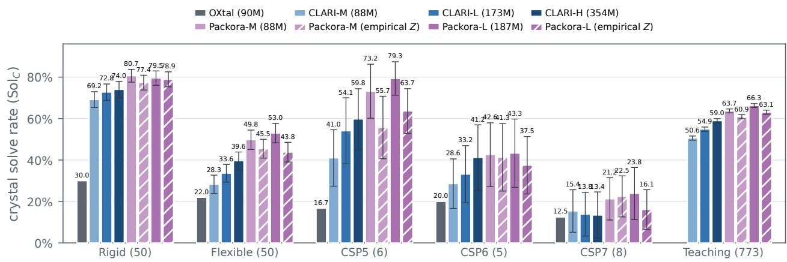  
Figure 15 Crystal coverage with empirical unit-cell Z sampling at 30 candidates per target. The solid bars reproduce Figure 1; diagonally hatched bars represent results with Z sampled from an empirical prior. Bars report mean Sol<sub>C</sub>, and error bars show one standard deviation across 5,000 resamples with replacement from each 1,000-candidate pool.

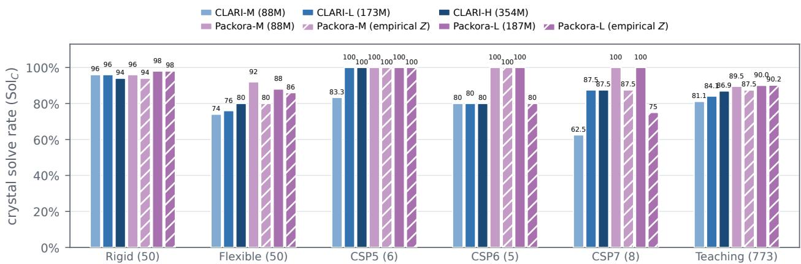  
Figure 16 Crystal coverage with empirical unit-cell Z sampling at 1,000 candidates per target. The solid bars reproduce Figure 4; diagonally hatched bars represent results with Z sampled from an empirical prior. Bars report exact Sol over the full 1,000-candidate pools.

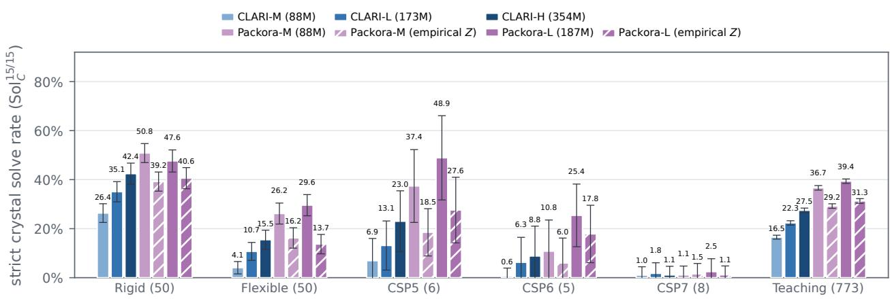  
Figure 17 Strict crystal coverage with empirical unit-cell Z sampling at 30 candidates per target. The solid bars reproduce Figure 5; diagonally hatched bars represent results with Z sampled from an empirical prior. Bars report mean $\mathrm { S o l } _ { C } ^ { 1 5 / 1 5 }$ and error bars show one standard deviation across 5,000 resamples with replacement from each 1,000-candidate pool

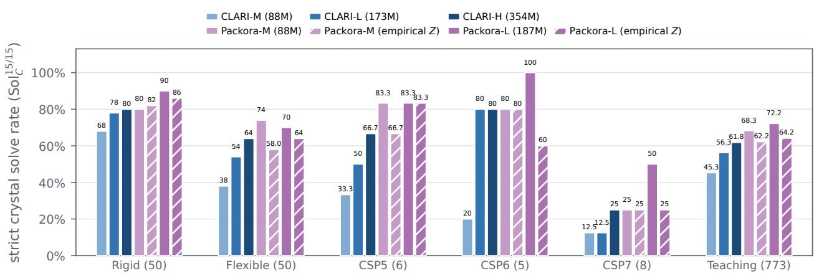  
Figure 18 Strict crystal coverage with empirical unit-cell Z sampling at 1,000 candidates per target. The solid bars reproduce Figure 6; diagonally hatched bars represent results with Z sampled from an empirical prior. Bars report exact $\mathrm { S o l } _ { C } ^ { 1 5 / 1 5 }$ over the full 1,000-candidate pools.

(a) Packora-M Rigid  
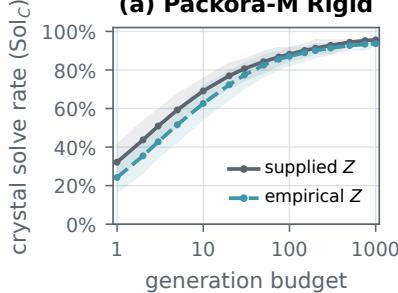

(b) Packora-M Flexible  
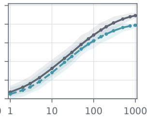  
generation budget

(c) Packora-L Rigid  
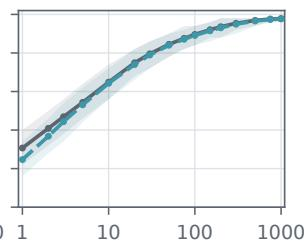  
generation budget

(d) Packora-L Flexible  
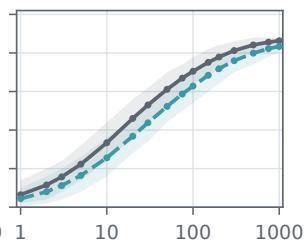  
generation budget  
Figure 19 Effect of empirical unit-cell Z sampling across candidate budgets. Curves show mean Sol<sub>C</sub> for Packora-M and Packora-L on the Rigid and Flexible benchmarks over 5,000 resamples, and shaded bands show the 2.5th–97.5th percentiles. The gray solid lines denote supplied Z, and the teal dotted lines denote empirical Z. The two settings remain close across candidate budgets.

## G Structure Overlay Visualizations

We visualize 18 representative strict matches by overlaying Packora-L predictions with their experimental references. Experimental structures are shown as wider gray sticks and Packora-L predictions as narrower green sticks; hydrogen atoms are omitted for clarity. The overlays are rendered with py3Dmol using the 3Dmol.js WebGL backend (Rego and Koes, 2015).

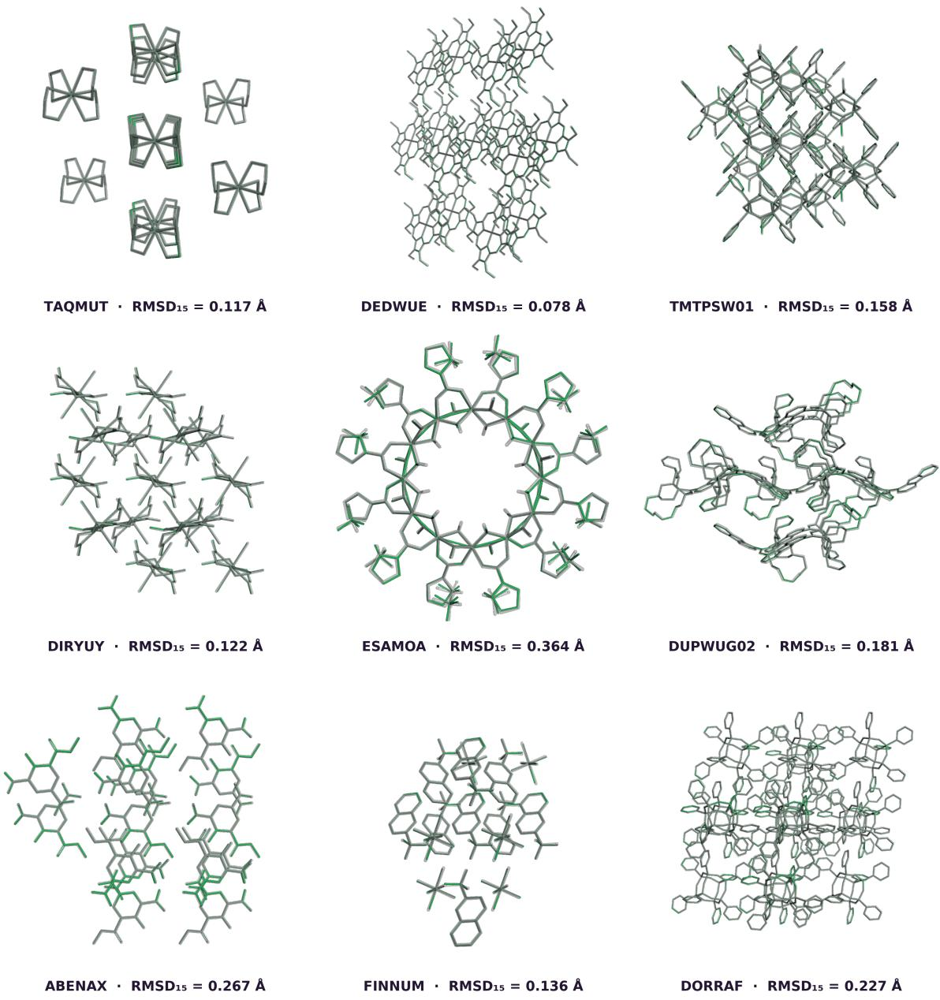  
Figure 20 Structure overlays for Packora-L predictions. Experimental structures are shown in gray and Packora-L predictions in green. Labels report the CSD refcode and corresponding RMSD<sub>15</sub>.

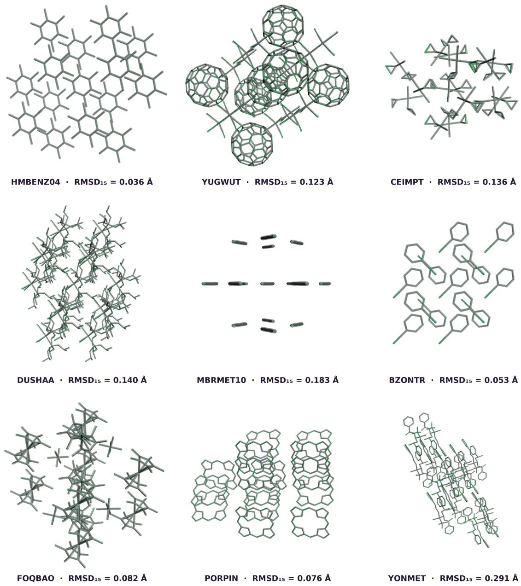  
Figure 21 Structure overlays for Packora-L predictions. Experimental structures are shown in gray and Packora-L predictions in green. Labels report the CSD refcode and corresponding RMSD .

## H Detailed Structure-Ranking Results

This appendix reports the complete tabular results underlying the FastCSP structure-ranking benchmarks in Section 4.3. Each table gives the energy rank and $\mathrm { R M S D _ { 3 0 } }$ of the best candidate matching each experimental form; NR denotes that no match was recovered.

Table 13 Complete FastCSP single-polymorph results. Each method reports the energy rank and $\mathrm { R M S D _ { 3 0 } \ ( \AA ) }$ of the best candidate matching the experimental form. NR denotes no recovery, with the corresponding $\mathrm { R M S D _ { 3 0 } }$ unavailable.
<table><tr><td></td><td></td><td colspan="2">CLARI-H</td><td colspan="2">PACKORA-M</td><td colspan="2">PACKORA-L</td></tr><tr><td>Target</td><td>Subset</td><td>Rank</td><td> $\mathrm { R M S D _ { 3 0 } }$ </td><td>Rank</td><td>RMSD30</td><td>Rank</td><td>RMSD30</td></tr><tr><td>Target II</td><td>Semi-rigid</td><td>5</td><td>0.55</td><td>NR</td><td></td><td>6</td><td>0.58</td></tr><tr><td>Target IV</td><td>Semi-rigid</td><td>1</td><td>0.16</td><td>1</td><td>0.14</td><td>1</td><td>0.18</td></tr><tr><td>Target V</td><td>Semi-rigid</td><td>8</td><td>0.33</td><td>5</td><td>0.18</td><td>7</td><td>0.12</td></tr><tr><td>Target VIII</td><td>Semi-rigid</td><td>NR</td><td></td><td>NR</td><td></td><td>1</td><td>0.22</td></tr><tr><td>Target XII</td><td>Semi-rigid</td><td>1</td><td>0.25</td><td>1</td><td>0.25</td><td>1</td><td>0.28</td></tr><tr><td>Target XIII</td><td>Semi-rigid</td><td>1</td><td>0.09</td><td>1</td><td>0.10</td><td>1</td><td>0.09</td></tr><tr><td>Target XVI</td><td>Semi-rigid</td><td>NR</td><td></td><td>NR</td><td></td><td>NR</td><td>一</td></tr><tr><td>Target XVII</td><td>Semi-rigid</td><td>1</td><td>0.12</td><td>1</td><td>0.14</td><td>1</td><td>0.18</td></tr><tr><td>Target XXII</td><td>Semi-rigid</td><td>1</td><td>0.17</td><td>2</td><td>0.19</td><td>2</td><td>0.25</td></tr><tr><td>Acetic Acid</td><td>Semi-rigid</td><td>NR</td><td></td><td>NR</td><td></td><td>NR</td><td></td></tr><tr><td>Caprylolactam</td><td>Semi-rigid</td><td>NR</td><td></td><td>2</td><td>0.15</td><td>3</td><td>0.11</td></tr><tr><td>CEBYUD</td><td>Semi-rigid</td><td>1</td><td>0.14</td><td>1</td><td>0.14</td><td>1</td><td>0.14</td></tr><tr><td>CUMJOJ</td><td>Semi-rigid</td><td>NR</td><td></td><td>NR</td><td></td><td>NR</td><td></td></tr><tr><td>DEZDUH</td><td>Semi-rigid</td><td>5</td><td>0.44</td><td>1</td><td>0.06</td><td>1</td><td>0.04</td></tr><tr><td>Eniluracil</td><td>Semi-rigid</td><td>5</td><td>0.63</td><td>1</td><td>0.11</td><td>1</td><td>0.10</td></tr><tr><td>GACGAU</td><td>Semi-rigid</td><td>2</td><td>0.12</td><td>2</td><td>0.12</td><td>2</td><td>0.17</td></tr><tr><td>GOLHIB</td><td>Semi-rigid</td><td>NR</td><td></td><td>1</td><td>0.10</td><td>1</td><td>0.09</td></tr><tr><td>HURYUQ</td><td>Semi-rigid</td><td>27</td><td>0.13</td><td>5</td><td>0.09</td><td>1</td><td>0.15</td></tr><tr><td>IHEPUG</td><td>Semi-rigid</td><td>NR</td><td></td><td>NR</td><td></td><td>NR</td><td>一</td></tr><tr><td>LECZOL</td><td>Semi-rigid</td><td>NR</td><td></td><td>NR</td><td></td><td>NR</td><td>一</td></tr><tr><td>ROHBUL</td><td>Semi-rigid</td><td>1</td><td>0.08</td><td>1</td><td>0.05</td><td>1</td><td>0.04</td></tr><tr><td>6-Fluorochromone</td><td>Semi-rigid</td><td>7</td><td>0.16</td><td>4</td><td>0.72</td><td>6</td><td>0.25</td></tr><tr><td>WEXREY</td><td>Semi-rigid</td><td>1</td><td>0.45</td><td>1</td><td>0.19</td><td>1</td><td>0.45</td></tr><tr><td>Target X</td><td>Flexible</td><td>NR</td><td></td><td>4</td><td>0.16</td><td>NR</td><td></td></tr><tr><td>Target XIV</td><td>Flexible</td><td>1</td><td>0.38</td><td>NR</td><td></td><td>1</td><td>0.18</td></tr><tr><td>Target XVIII</td><td>Flexible</td><td>NR</td><td></td><td>NR</td><td></td><td>NR</td><td></td></tr></table>

Table 14 Complete FastCSP multi-polymorph results. Each method reports the energy rank and $\mathrm { R M S D _ { 3 0 } }$ (Å) of the best candidate matching each experimental form. NR denotes no recovery, with the corresponding $\mathrm { R M S D _ { 3 0 } }$ unavailable.
<table><tr><td colspan="4"></td><td colspan="2">CLARI-H</td><td colspan="2">PACKORA-M</td><td colspan="2">PACKORA-L</td></tr><tr><td>System</td><td>Refcode</td><td>Form</td><td>Rank</td><td> $\mathrm { R M S D _ { 3 0 } }$ </td><td>Rank</td><td> $\mathrm { R M S D _ { 3 0 } }$ </td><td>Rank</td><td> $\mathrm { R M S D _ { 3 0 } }$ </td></tr><tr><td>Target I</td><td>XULDUD01</td><td>Monoclinic</td><td>NR</td><td>一</td><td>1</td><td>0.297</td><td>1</td><td>0.267</td></tr><tr><td>Target I</td><td>XULDUD</td><td>Orthorhombic</td><td>18</td><td>0.308</td><td>NR</td><td></td><td>18</td><td>0.270</td></tr><tr><td>CILJIQ</td><td>CILJIQ</td><td>Form I</td><td>1</td><td>0.200</td><td>1</td><td>0.252</td><td>1</td><td>0.256</td></tr><tr><td>CILJIQ</td><td>CILJIQ01</td><td>Form II</td><td>13</td><td>0.165</td><td>11</td><td>0.118</td><td>11</td><td>0.117</td></tr><tr><td>Glycine</td><td>GLYCIN16</td><td>gamma</td><td>6</td><td>0.191</td><td>5</td><td>0.183</td><td>5</td><td>0.187</td></tr><tr><td>Glycine</td><td>GLYCIN20</td><td>alpha</td><td>1</td><td>0.128</td><td>1</td><td>0.115</td><td>1</td><td>0.121</td></tr><tr><td>Glycine</td><td>GLYCIN32</td><td>beta</td><td>3</td><td>0.177</td><td>7</td><td>0.191</td><td>4</td><td>0.194</td></tr><tr><td>Glycine</td><td>GLYCIN67</td><td>delta</td><td>2</td><td>0.279</td><td>2</td><td>0.280</td><td>2</td><td>0.281</td></tr><tr><td>Glycine</td><td>GLYCIN68</td><td>epsilon</td><td>NR</td><td></td><td>18</td><td>0.393</td><td>14</td><td>0.379</td></tr><tr><td>Imidazole</td><td>IMAZOL06</td><td>alpha</td><td>1</td><td>0.220</td><td>1</td><td>0.174</td><td>1</td><td>0.284</td></tr><tr><td>Imidazole</td><td>IMAZOL25</td><td>beta</td><td>NR</td><td></td><td>NR</td><td></td><td>NR</td><td></td></tr><tr><td>Nicotinamide</td><td>NICOAM03</td><td>alpha</td><td>NR</td><td></td><td>2</td><td>0.894</td><td>4</td><td>0.842</td></tr><tr><td>Nicotinamide</td><td>NICOAM07</td><td>epsilon</td><td>2</td><td>0.234</td><td>NR</td><td></td><td>NR</td><td></td></tr><tr><td>Nicotinamide</td><td>NICOAM17</td><td>iota</td><td>10</td><td>0.781</td><td>4</td><td>0.449</td><td>6</td><td>0.585</td></tr><tr><td>Target VI</td><td>UJIRIO</td><td>Form I</td><td>1</td><td>0.147</td><td>1</td><td>0.224</td><td>1</td><td>0.185</td></tr><tr><td>Target VI</td><td>UJIRIO05</td><td>Form III</td><td>NR</td><td>一</td><td>NR</td><td></td><td>NR</td><td>一</td></tr><tr><td>Target XXXI</td><td>ZEHFUR</td><td>Form B</td><td>NR</td><td></td><td>9</td><td>0.374</td><td>NR</td><td></td></tr><tr><td>Target XXXI</td><td>ZEHFUR02</td><td>Form A major</td><td>NR</td><td>一</td><td>NR</td><td></td><td>4</td><td>0.204</td></tr><tr><td>Target XXXI</td><td>ZEHFUR02</td><td>Form A minor</td><td>NR</td><td>一</td><td>NR</td><td></td><td>4</td><td>0.204</td></tr><tr><td>ROY</td><td>QAXMEH01</td><td>Y</td><td>NR</td><td>一</td><td>NR</td><td></td><td>NR</td><td>一</td></tr><tr><td>ROY</td><td>QAXMEH12</td><td>YT04</td><td>NR</td><td></td><td>NR</td><td></td><td>NR</td><td>一</td></tr><tr><td>ROY</td><td>QAXMEH81</td><td>R</td><td>2</td><td>0.446</td><td>3</td><td>0.473</td><td>5</td><td>0.565</td></tr><tr><td>ROY</td><td>QAXMEH03</td><td>OP</td><td>188</td><td>0.121</td><td>195</td><td>0.247</td><td>NR</td><td></td></tr><tr><td>ROY</td><td>QAXMEH32</td><td>ON</td><td>131</td><td>0.597</td><td>187</td><td>0.605</td><td>153</td><td>0.570</td></tr><tr><td>ROY</td><td>QAXMEH04</td><td>YN</td><td>883</td><td>0.555</td><td>NR</td><td></td><td>NR</td><td></td></tr><tr><td>ROY</td><td>QAXMEH05</td><td>ORP</td><td>1</td><td>0.354</td><td>1</td><td>0.154</td><td>2</td><td>0.120</td></tr><tr><td>ROY</td><td>QAXMEH59</td><td>PO13</td><td>108</td><td>0.211</td><td>96</td><td>0.176</td><td>106</td><td>0.165</td></tr><tr><td>ROY</td><td>QAXMEH53</td><td>Y04</td><td>NR</td><td>一</td><td>NR</td><td></td><td>325</td><td>0.423</td></tr><tr><td>ROY</td><td>QAXMEH60</td><td>Y19</td><td>468</td><td>0.203</td><td>350</td><td>0.134</td><td>479</td><td>0.190</td></tr></table>

## I Ablation Dataset Preprocessing

This section describes the dataset preprocessing used for our ablation studies in Section 5. Because public split refcodes were not available at the time, we constructed the dataset independently. The preprocessing consists of four stages: filtering, structure processing, benchmark exclusion, and deduplication. Table 15 reports the number of structures remaining after each stage.

Filtering. Following OXtal (Jin et al., 2025), we use CSD entries deposited by May 1, 2025 and retain structures with three-dimensional coordinates, an R-factor of at most 9%, single-crystal X-ray difraction at ambient pressure, a non-polymeric structure, and a known space group. We Niggli-reduce each crystal, add missing hydrogens with the CSD Python API (Sykes et al., 2024), and apply the 512-atom limit.

Structure processing. For entries with incomplete bond labels, we infer missing bond types and standardize aromatic and delocalized bonds with the CSD Python API (Sykes et al., 2024). For each crystal, we store Cartesian coordinates, the unit cell, atomic numbers, bonds and bond types, formal charges, stereochemical annotations, and the space-group label. We generate an independent 3D conformer for each molecular component using RDKit ETKDGv3 (Landrum et al., 2006; Wang et al., 2020). If conformer generation fails, we retain the crystal and mark the template as unavailable.

Benchmark exclusion. To prevent leakage, we exclude structures overlapping with the OXtal Rigid and Flexible benchmarks (Jin et al., 2025), CSP5–7 (Bardwell et al., 2011; Reilly et al., 2016; Hunnisett et al., 2024b), and the CSD Teaching Subset (Battle et al., 2010; Lo et al., 2026). We first remove entries whose six-letter CSD refcode family matches a benchmark family. We then remove entries containing a molecular component found in the benchmark set, using the CSD-provided component SMILES. Following CLARI (Lo et al., 2026), we exclude recognized solvents and components with fewer than eight heavy atoms from this overlap check.

Deduplication. We group the remaining entries by six-letter CSD refcode family and cluster equivalent structures using pymatgen StructureMatcher (Ong et al., 2013) with ltol= 0.2, stol= 0.3, and angle\_tol= 5<sup>◦</sup>. Within each cluster, we retain the entry with the lowest reported R-factor.

Table 15 Ablation dataset preprocessing counts. We report the number of structures remaining after each stage.
<table><tr><td>Stage</td><td># Structures</td></tr><tr><td>Raw CSD entries Filtering and structure preprocessing</td><td>1,451,367 833,033</td></tr><tr><td>Benchmark-family exclusion</td><td>831,018</td></tr><tr><td>Benchmark-component exclusion</td><td>798,459</td></tr><tr><td>Deduplication</td><td>766,391</td></tr><tr><td></td><td></td></tr><tr><td>Training split</td><td>751,023</td></tr><tr><td>Validation split</td><td>15,368</td></tr></table>

## J Detailed Architecture Ablation Results

We report the parameter count, GFLOPs, and best validation $\mathrm { S o l } _ { C }$ for each architecture variant evaluated in Section 5.2.

Table 16 Architecture ablation with model size and compute. We report parameter count and GFLOPs for each architecture variant, together with its best validation Sol under the shared ≤ 300-atom, 30-candidate protocol with 200-step EDM–Heun sampling. Config. (F) is the selected cacheable post-entry design.
<table><tr><td>Config.</td><td>Entry</td><td>TriMul</td><td>TriAtt</td><td>SU</td><td>GEM</td><td>Solc ↑</td><td>Params (M)</td><td>GFLOPs</td></tr><tr><td>(A)</td><td></td><td></td><td></td><td></td><td></td><td>0.421</td><td>85.98</td><td>41.2</td></tr><tr><td>(B)</td><td></td><td></td><td></td><td></td><td>√</td><td>0.432</td><td>86.01</td><td>45.7</td></tr><tr><td>(C)</td><td>pre</td><td>√</td><td></td><td></td><td></td><td>0.479</td><td>87.56</td><td>379.6</td></tr><tr><td>(D)</td><td>pre</td><td>√</td><td></td><td>V</td><td></td><td>0.469</td><td>105.40</td><td>391.8</td></tr><tr><td>(E)</td><td>pre</td><td>V</td><td></td><td></td><td>V</td><td>0.476</td><td>87.59</td><td>384.2</td></tr><tr><td>(F)</td><td>post</td><td>√</td><td>一</td><td>一</td><td>一</td><td>0.474</td><td>87.56</td><td>379.6</td></tr><tr><td>(G)</td><td>post</td><td>√</td><td></td><td>√</td><td></td><td>0.445</td><td>105.40</td><td>391.8</td></tr><tr><td>(H)</td><td>post</td><td>√</td><td></td><td></td><td>√</td><td>0.474</td><td>87.59</td><td>384.2</td></tr><tr><td>(I)</td><td>post</td><td>√</td><td>√</td><td>√</td><td></td><td>0.462</td><td>106.07</td><td>621.1</td></tr></table>