# Performance Foundations of Parallel & Distributed Reasoning Language Models

Maciej Besta†∗, Leonard Schmidt∗, Lara Nonino, Robert Gerstenberger, Pierre Pang, Patrik Okanovic, Ales Kubicek, Tiancheng Chen, Baraq Lipshitz, Torsten Hoefler

ETH Zurich †Corresponding author ∗Core contributions

Abstract—Reinforcement Learning with Verifiable Rewards (RLVR) and other RL-style post-training paradigms have been used for aligning large language models (LLMs) with reasoning standards. The resulting recent Reasoning Language Models (RLMs) such as DeepSeek-R1, o3, and Kimi k1.5 show that such RL-style post-training (“RL-for-LLMs”) can substantially improve chain-of-thought reasoning, long-horizon planning, and self-correction. However, the computational footprint of these systems is massive: state-of-the-art RLM training requires millions of GPU-hours and tightly coupled multi-model pipelines that stress modern hardware far beyond classical supervised LLM training. This makes RLM training as much a parallel and distributed systems problem as an algorithmic one. In this work, to facilitate developing RLMs that are simultaneously high-performance, scalable, and cost-effective, we first systematize the RL-for-LLM paradigm and provide a compute-centric analysis of prominent post-training algorithmic frameworks: Proximal Policy Optimization (PPO), Group Relative Policy Optimization (GRPO), as well as their variants. Second, we develop a taxonomy of intra- and inter-model parallelism strategies for RL-for-LLMs, covering both traditional techniques (data, tensor, pipeline, sequence, context, and expert parallelism) as well as novel forms of parallelism and optimization techniques for multi-model RLM training, for example disaggregated placement, stage fusion, hybrid parallelism, and asynchronous execution. We harness the work–depth model of parallel computing to make our taxonomy and its insights rigorous and portable. Finally, we analyze existing RLM frameworks and we distill practical guidelines and outline open research directions for building scalable, fast, and cost-effective RLMs.

Index Terms—Parallel Reasoning Language Models, Distributed Reasoning Language Models, Parallel RLVR, Distributed RLVR, Asynchronous Reasoning Language Models, Asynchronous RLVR.

## 1 INTRODUCTION

Reinforcement learning (RL) is now the computationally dominant post-training paradigm for aligning large language models (LLMs) with reasoning standards. After pretraining and supervised fine-tuning (SFT), RL optimizes a policy against learned reward models or other feedback signals to improve task-specific performance beyond nexttoken prediction [20, 192]. The resulting frontier Reasoning Language Models (RLMs), such as DeepSeek-R1 [107], OpenAI’s o3 [188], and Kimi k1.5 [86], demonstrate that carefully designed preference learning and policy optimization over Chain-of-Thought trajectories can produce substantially stronger reasoning, long-horizon planning, and selfcorrection than SFT alone. A key paradigm behind this trend is RL with Verifiable Rewards (RLVR), in which reward signals are obtained from automatically checkable outcomes, such as exact-answer verification in mathematics, unit tests in code, or other task-specific verifiers [118, 173, 243].

The computational footprint of RLMs is enormous [156]. For example, OpenAI reports that in developing o3 it scaled RL by an additional order of magnitude in both train-time RL compute and inference-time reasoning compute, while still observing clear gains from further scaling [187]. More broadly, cost analyses of frontier model training indicate that end-to-end training runs for leading systems already cost tens to hundreds of millions of US dollars in compute alone, and they may reach more than \$1B by 2027 [73].

In contrast to classical supervised LLM training, RLM pipelines [26] couple several large models and stages. A standard Proximal Policy Optimization (PPO)-style setup maintains four distinct LLMs (actor (policy), reward, critic (value), and a reference model) and repeatedly executes them across three stages (Generation, Assessment1, Training) with complex data dependencies. Recent reasoningoriented systems often use critic-free Group Relative Policy Optimization (GRPO)-style training in practice, largely because removing the critic reduces memory pressure and simplifies large-scale rollout training [107, 213]. Nevertheless, PPO-style actor–critic training remains a key and relevant design point as its learned value baseline reduces gradient variance and stabilizes policy updates, providing more faithful token-level credit assignment than criticfree alternatives such as GRPO [79, 239]. PPO has been used or revived in reasoning-focused RL systems such as VAPO [268]. Overall, both PPO and GRPO as well as their variants are crucial RLM training frameworks.

Systems used for RL post-training, for each ReaL [169], RLHFuse [282], and OpenRLHF [117], have shown that naively reusing supervised-training parallelization strategies for RLMs yields suboptimal GPU utilization. Instead, the RLM workflow demands joint reasoning about model placement, inter-model scheduling, and heterogeneous workload characteristics. This combination of massive scale and multi-model RL pipelines makes RLMs fundamentally a parallel and distributed systems problem.

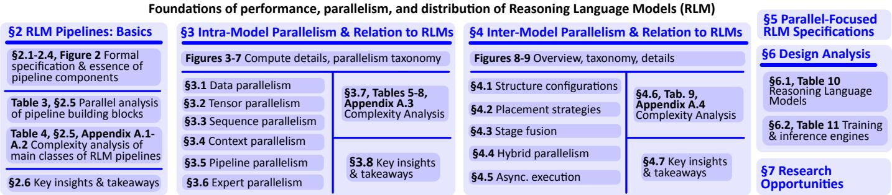  
Fig. 1: Overview of the contributions and analyses in this work.

To facilitate the development of next-generation scalable and cost-effective RLMs, we conduct an in-depth investigation into the foundations of their parallel and distributed computational characteristics; a roadmap of the paper can be found in Figure 1. First, we systematize the RL-for-LLM paradigm and provide a compute-centric analysis of several prominent post-training frameworks (contribution 1), including PPO-style [279] and GRPO-like methods [213]. We also consider preference-gradient approaches such as Direct Preference Optimization (DPO) [250] – while these methods do not use RL, they have been shown to also enhance reasoning capabilities [134, 238, 242, 252].

Next, we develop a taxonomy of parallelism for RLMs (contribution 2). The first part focuses on intra-model parallelism, instantiated by LLM-based policies, critics, rewards, and references. For this, we analyze traditional forms of parallelism and how they interact with the RL pipeline, for instance which RL stage benefits most from which form of intra-model parallelism. Here, we consider data parallelism (DP) [146], tensor parallelism (TP, also referred to as operator parallelism [25, 219], pipeline parallelism (PP) [120, 176], sequence parallelism (SP) [132], context parallelism (CP) [160], and expert parallelism (EP) [141]).

The second part of our taxonomy targets inter-model parallelism: opportunities to run different models and RL stages concurrently, and system-level optimizations that reduce end-to-end iteration time by reshaping how these components interact. We show that the available forms of intermodel parallelism are largely determined by a small set of concrete design choices: model structure configurations, which can eliminate redundant model executions (e.g., critic– reward merging), model placement strategies, which enable component-level concurrency by co-locating models on the same devices or disaggregating them onto separate device groups/services; stage and sub-task fusion, which introduces stage-level overlap (e.g., overlapping long-tailed generation with reward/value evaluation, or pipelining actor and critic updates) to remove serialization between stages; hybrid intra-model configurations across components, where different models and stages use different mixtures of intra-model parallelism; and asynchronous execution, which decouples rollout generation from learning via bounded staleness. Our taxonomy provides a common performance-oriented language for formulating, comparing, and implementing new optimizations for large-scale RLM training.

To ensure that all the insights are portable across different architectures, we use work/depth/memory complexities for all the parts of the taxonomy (contribution 4).

We then use the taxonomy to conduct a systematic analysis of existing RLM models and frameworks and analyze them through the lens of the parallelism and optimization strategies they implement (contribution 5). Concretely, we examine general-purpose libraries such as TRL [231], ColossalChat [267], DeepSpeed-Chat [261], OpenRLHF [117], HybridFlow [217], and NeMo RL [184, 214], as well as more specialized systems including ReaL [169], RLHFuse [282], FlexRLHF [251], StreamRL [281], Asynchronous RLHF [180], AReaL [92], and Pipe-RLHF [262]. For each framework, we catalogue which intra- and inter-model techniques are supported. This enables practitioners to make informed choices about which framework best matches their needs, and it reveals systematic gaps where our taxonomy suggests additional optimizations (for example, underexplored stagefusion and placement policies for multi-model PPO-style pipelines). In this way, our study not only describes the current ecosystem but also points to concrete directions for enhancing existing RL frameworks and designing new ones.

## 1.1 Complementary Analyses & Related Work

There exist general studies on the blueprint for RLMs [26] and broad surveys on LLM-enhanced RL [61, 237]. Other works provide comprehensive analyses of specific components of the RL pipeline [232, 250, 279].

Some surveys detail techniques for resource-efficient LLMs, covering algorithms, model compression, and systems [17, 83, 253]. More broadly, [25] offers a foundational concurrency analysis of parallel and distributed deep learning. However, these works do not focus on the unique demands of RLM pipelines.

Closer to our work, Liu et al. explore acceleration techniques for deep RL [162] and Chen et al. survey the effects of scaling LLM’s reasoning capabilities [68]. However, these works do not explain the underlying performance foundations of the parallel and distributed systems that enable RLMs to scale. Specifically, the latter focuses on how reasoning capabilities emerge with scale, not on the concurrency and system bottlenecks of the RLM training loop. Similarly, the former analyzes acceleration for general deep RL, not the specific parallel architectures required by modern RLM pipelines.

We complement these studies by providing the first indepth analysis to demystify the performance foundations of parallel and distributed RLMs.

## 1.2 Analysis of Parallel Algorithms

We use formal models for reasoning about parallelism. Specifically, we use the work-depth (WD) analysis, an established approach for bounding runtimes of parallel algorithms. The work (W) of an algorithm is the total number of operations and the depth (D) is defined as the longest sequential chain of execution in the algorithm, and it forms the lower bound on the algorithm execution time [53, 56]. One usually wants to minimize depth while preventing work from increasing too much. Finally, Memory accounts for model parameters, gradients, optimizer state (Adam first and second order moments), and stored activation tensors during a single training iteration.

## 2 OVERVIEW & FOUNDATIONS OF RLMS

We first overview basic RLM post-training concepts.

## 2.1 RL Post-Training Pipeline: Overview

The essence of RL for LLM can be captured as a simple three-stage loop that iterates continuously: Generation → Assessment → Training → Generation → . . . . These stages operate over a batch of input prompts, denoted by $X \overset { \cdot } { = } \{ \overset { \cdot } { x _ { 1 } } , \overset { \cdot } { x _ { 2 } } , \overset { \cdot } { \dots } , \overset { \cdot } { x _ { B } } \}$ , where B is the batch size. Starting from a language model that has typically been pre-trained and then fine-tuned via supervised learning (SFT), this loop further improves this model (referred to as the policy model $\pi _ { \boldsymbol { \theta } } )$ through RL-based optimization. In each iteration, the Generation stage produces candidate responses to input prompts using the current policy $\pi _ { \theta } .$ Then, Assessment evaluates those responses and produces feedback (which can be both scalar and vector). Finally, Training uses the resulting feedback to update the policy $\pi _ { \theta } .$ Both Assessment and Training stages may invoke one or more auxiliary models that provide the feedback signals used to improve the policy π , i.e., the reward model $R _ { \varphi } ,$ the critic model $V _ { \psi } ,$ and the reference model $\pi _ { \mathrm { r e f } }$ . This iterative process continues until convergence criteria are met or a predetermined number of training loops are completed, with the updated $\pi _ { \theta }$ model from each training stage serving as the starting point for the next cycle. We overview this process in Figure 2; additional mathematical details are in Appendix A and in Table 1.

## 2.2 Terminology: RLVR, RLHF, RLAIF & Others

We use RL-style reasoning post-training as the umbrella term for reasoning-oriented post-training pipelines that use feedback beyond next-token prediction. This term is broader than strict online RL: it includes (1) RLVR, where online RL algorithms such as PPO and GRPO-style methods use verifiers as rewards; (2) online RL-based post-training with model-based assessment, including RL from Human Feedback (RLHF), RL from AI Feedback (RLAIF), direct RLAIF (d-RLAIF), and learned reward methods; and (3) offline preference-optimization methods such as DPO, which are not RL in their basic form but have also been used to enhance reasoning. This broader umbrella is also reflected in systems practice: frameworks originally named after RLHF are now used for broader reasoning post-training. For example, OpenRLHF [117] supports PPO- and GRPO-style training, while RLHFuse [282] optimizes the same staged workflow used by both RLHF and RLVR systems.

Strict RLVR denotes online RL with rewards produced by an automatic verifier rather than a learned reward model. Examples include exact-answer matching in mathematics, unit-test execution or compilation in code, theorem proving, and other programmatic correctness checks [107, 213].

A second class uses model-based assessment. In classical RLHF, rewards are derived from human preference data, typically through a learned reward model [192]. In canonical RLAIF, human preference labels are replaced by AI-generated preferences or critiques, which are then used to train a reward model; Constitutional AI is a canonical example [21, 140]. A closely related variant is direct RLAIF (d-RLAIF), where an LLM directly evaluates policy outputs and provides rewards during RL, without training a separate reward model [140]. Thus, LLM-as-a-judge reward schemes can naturally be viewed as instances of d-RLAIF rather than a separate feedback class. Neither RLAIF nor d-RLAIF is strict RLVR because their Assessment signal is an AI-generated judgment rather than an externally verifiable correctness check.

Learned assessment models are nevertheless important for reasoning. Process-supervised reward models improve mathematical reasoning [155]; Math-Shepherd trains a process reward model and uses step-level PPO to improve GSM8K and MATH performance [235]; there are further similar examples [76, 103, 138]. These examples motivate retaining reward-model terms in our complexity analysis. When Assessment is implemented by a learned outcome or process reward model, it requires LLM forward passes; when process-level feedback is used, the evaluator may be invoked at many reasoning steps. Such learnedassessment pipelines can therefore be more compute-heavy than lightweight exact-match RLVR, even though both instantiate the same Assessment role.

A third class consists of offline preference-optimization methods. DPO is not RL in its basic form: it inherits the preference-learning objective of RLHF but optimizes static preference pairs without online rollout generation or explicit reward-model inference [200]. Yet, DPO-style methods have also been adapted to reasoning, for example through iterative reasoning preference optimization and step-wise DPO [134,238,242,252]. We include them because they share parts of the same post-training staged dataflow with policy/reference forward passes and policy backpropagation.

Overall, all these methods build upon all or part of the same systems abstraction: Generation → Assessment → Training. Online RL methods such as RLHF, RLAIF/d-RLAIF, and RLVR execute the full loop: the policy samples trajectories, Assessment maps them to rewards, model judgments, verifier outcomes, advantages, or other learning signals, and Training updates the policy and potentially critic. Offline preference methods such as DPO remove online Generation and explicit reward Assessment from the inner loop, but retain the policy/reference comparison and Training components. Our analysis therefore targets the broad class of RL-style reasoning post-training systems, where the Assessment stage may be instantiated by a learned reward model, an LLM evaluator, an automatic verifier, or an offline preference signal.

<table><tr><td colspan="2">Models &amp; training signals used in the RL pipeline</td></tr><tr><td>πθ</td><td>Policy (Actor) model: the trainable LLM being optimized.</td></tr><tr><td> $\pi _ { \mathrm { r e f } }$ </td><td>Reference model: the frozen baseline policy (usually a checkpoint right after SFT).</td></tr><tr><td> $R _ { \varphi }$ </td><td>Reward model: an assessment tool that maps prompt-response pairs to scalar rewards.</td></tr><tr><td> $V _ { \psi } ^ { ' }$ </td><td>Critic model (Value function): an assessment tool that estimates expected future returns from the reward model.</td></tr><tr><td> $r _ { b } ^ { ( i ) } , A _ { b , t } ^ { ( i ) } , \hat { G } _ { b , t } ^ { ( i ) }$ </td><td>Reward for the i-th candidate of prompt b, advantage at token step t, and discounted return estimated at token step t.</td></tr><tr><td colspan="2">Data &amp; Dimensions</td></tr><tr><td rowspan="3">χ, y  $X = \{ x _ { 1 } , \dots , x _ { B } \}$ </td><td></td></tr><tr><td>Space of input prompts and token sequences, respectively</td></tr><tr><td>Batch of B input prompts;  $X \subset { \mathcal { X } } .$  A response sequence consisting of T tokens  $( y \in { \mathcal { V } } ) .$ </td></tr><tr><td rowspan="2"> $\underset { K } { y = ( y _ { 1 } , \dots , y _ { T } ) }$   $S , T$ </td><td>Number of candidate responses generated per prompt (in the Generation stage).</td></tr><tr><td>The average prompt length and the average response length.</td></tr><tr><td colspan="2">LLM &amp; system design  $N , L , V , B$  Number of parallel devices, number of layers, vocabulary size, batch size, respectively.</td></tr></table>

TABLE 1: Overview of basic mathematical notation and concepts used in the paper. Notation specific to the complexity analyses is detailed separately in Table 3.

## 2.3 Auxiliary Models in the RL-LLM Pipeline

We now investigate the functional and execution characteristics of models used in the RL pipeline, see Table 2 and Figure 2 (top). While conceptually distinct, in practical settings, they share similar LLM-based architectures.

<table><tr><td>Model</td><td>State</td><td>Used in</td><td>System design remarks</td></tr><tr><td>Policy (Actor) πθ</td><td>Trainable</td><td>Generation, Training</td><td>Bottleneck: Sequential decoding dominates wall-clock time.</td></tr><tr><td>Reward  $R _ { \varphi }$  (Outcome)</td><td>Frozen</td><td>Assessment</td><td>Efficient parallel evaluation; no backward pass. Easy to offload.</td></tr><tr><td>Reward  $R _ { \varphi } ^ { \mathrm { p r } }$  (Process)</td><td>Frozen</td><td>Assessment</td><td>High overhead; sequential decod- ing if using sequential verification (e.g., MCTS).</td></tr><tr><td>Critic (Value)  $V _ { \psi }$ </td><td></td><td>Trainable Assessment, Training</td><td>Doubles training compute (fwd+bwd). High memory pressure (optimizer states).</td></tr><tr><td>Reference  $\pi _ { \mathrm { r e f } }$ </td><td>Frozen</td><td>Assessment</td><td>Required for KL/DPO. Forward- only; often quantized to save mem- ory.</td></tr></table>

TABLE 2: Overview of models used in the RLM pipeline.

## 2.3.1 Reward Model

The reward model is a function $R _ { \varphi } : \mathcal { X } \times \mathcal { Y } $ R that maps a prompt–response pair $( x , y )$ to a scalar reward $r ,$ i.e., $R _ { \varphi } ( x , y ) \ = \ r ,$ , representing overall response quality, helpfulness, or alignment with desired behavior. These rewards are typically learned from human preference data and serve as the principal alignment signal for the policy. During the Assessment stage, the reward model performs a single forward pass per full sequence to produce $r _ { b } ^ { ( i ) }$ . It is a frozen model (no gradients computed). Moreover, as scalar rewards are usually single-token, its execution is usually non-autoregressive, which makes its evaluation considerably cheaper than autoregressive policy generation.

There are two types of reward models: outcome-based and process-based reward models $( R _ { \varphi } ^ { \mathrm { p r o c } } )$ . The former is a standard mechanism that assigns a single scalar score r to a completed sequence. Process-based reward models provide feedback at intermediate steps of reasoning. Formally, it maps a sequence to a vector of rewards. While this provides a richer supervision signal, it significantly increases computational cost (as it may require multiple forward passes or Monte Carlo Tree Search (MCTS) integration) and is difficult to train [26, 107].

## 2.3.2 Critic Model

The critic model is a function defined as $V _ { \psi } : \mathcal { X } \times \mathcal { V } _ { \leq t } \to \mathbb { R }$ It estimates the expected future reward from a partial sequence, i.e., $V _ { \psi } ( \bar { x , } y _ { < t } ) ~ = ~ v _ { t }$ . Given a prompt x and prefix $y _ { < t } ,$ the critic predicts $v _ { t }$ as an estimate of the return that the policy can expect from that point onward, i.e., $V _ { \psi } ( x , y _ { < t } ) ~ \approx ~ \mathbb { E } _ { \pi _ { \theta } } \left[ \sum _ { \tau = t } ^ { T } \gamma ^ { \tau - t } r _ { \tau } ~ | ~ x , y _ { < t } \right]$ . When r comes from a learned reward model, we have $\dot { r } _ { T } = R _ { \varphi } ( x , y _ { 1 : T } )$ and $r _ { t } = 0$ for $t < T , \gamma = 1$ . Unlike the reward model, the critic provides token-level information, producing value estimates for all positions t in a single forward pass over the full sequence. During the Assessment stage, these predictions are combined with observed rewards to compute advantage estimates $A _ { t } .$ These advantage estimates are then used in Training to guide gradient updates of the policy model. The critic runs a full forward pass per sampled sequence and a backward pass for its parameter update, often in parallel with the policy gradient computation.

Unlike reward models, the critic is trainable. The reward model $R _ { \varphi }$ acts as a fixed proxy for task quality; keeping it fixed during policy optimization provides a stationary reward objective. The critic $V _ { \psi } ,$ however, estimates the expected return under the current policy. As $\pi _ { \theta }$ changes, the distribution of rollouts and their expected returns changes as well. Therefore, PPO-style methods update $V _ { \psi }$ after each rollout batch by minimizing a value-regression loss 2 $\begin{array} { r } { \frac { 1 } { | B | } \sum _ { ( x , y ) \in B } \sum _ { t } \left( V _ { \psi } ( x , y _ { < t } ) - \hat { G } _ { t } \right) ^ { : } } \end{array}$ , where $\hat { G } _ { t }$ is a Monte-Carlo or GAE-style return target computed from the rewards collected on that batch. In this way, the critic tracks the return function induced by the evolving policy.

## 2.3.3 Reference Model

The reference model $\pi _ { \mathrm { r e f } }$ is a frozen policy $\pi _ { \mathrm { r e f } } : \mathcal { X } \times \mathcal { Y } $ [0, 1] that serves as a fixed baseline to stabilize optimization. It is typically a snapshot of the policy after SFT and before any RL. During the Assessment stage, it provides pertoken log-probabilities log $\pi _ { \mathrm { r e f } } ( y _ { t } \mid x , y _ { < t } )$ used to measure deviation from the current policy. During the Training stage, these outputs are reused for regularization, $\mathrm { e . g . }$ , through a KL-divergence penalty $D _ { \mathrm { K L } } ( \pi _ { \boldsymbol { \theta } } \Vert \pi _ { \mathrm { r e f } } )$ or preference deltas in DPO. Since it remains frozen, $\pi _ { \mathrm { r e f } }$ requires only forward passes, but it can still be expensive to evaluate at scale because it performs a full-sequence teacher-forced forward pass over every rollout.

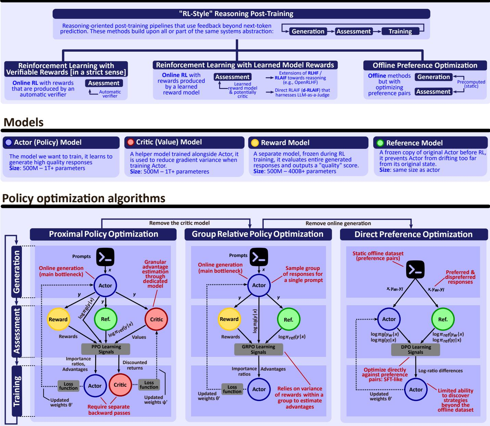  
Fig. 2: Overview of policy optimization algorithms and used models. No AI was used to conceive or to draw the figure.

## 2.4 Auxiliary Models vs. Algorithmic RL Frameworks

Depending on what auxiliary models are used, there are PPO-like methods, GRPO-like methods, and DPO-like methods, with distinct computational trade-offs. PPO [208] uses all four models, requiring both forward and backward passes for $\pi _ { \theta }$ and $V _ { \psi } .$ , and additional forward-only evaluation for $R _ { \varphi }$ and $\pi _ { \mathrm { r e f } } .$ . GRPO [107, 156, 213] omits the critic, saving backward passes but still requiring reward inference. DPO [200] relies solely on two models (π and $\pi _ { \mathrm { r e f } } )$ , resulting in an offline teacher-forced forward/backward pipeline (without online Generation or explicit reward-model inference) that is computationally lightweight and easier to scale; however, it also takes as input the pre-computed preference dataset. Thus, the combination of these models not only defines the algorithmic behavior of the RL method but also determines its computational profile, parallelism potential, and system-level design.

## 2.4.1 Variants and Emerging Frameworks

There are numerous variants of PPO, GRPO, and DPO-like methods, we now summarize most important ones, focusing on their computational characteristics.

Within the PPO family, VAPO [268] retains the value model but improves value-based training efficiency and stability through value pretraining and decoupled GAE, so its compute remains recognizably actor–critic rather than critic-free. RTO [280] shifts supervision toward tokenlevel rewards and advantages, increasing per-token bookkeeping during training. Safe-RLHF [75] extends PPOlike RLHF with a separate cost model and a Lagrangian safety constraint, thereby adding another assessment model while making helpfulness–harmlessness trade-offs explicit. Other PPO-style trust-region variants include divergencebased DPPO [198], which replaces ratio clipping with direct divergence estimates while preserving the basic online actor–critic profile, and mirror-descent formulations such as MDPO [228], which largely preserve the actor–critic compute structure while changing the policy update from PPO’s clipped-ratio surrogate to a Bregman- or KL-regularized mirror-descent step around the previous policy.

Within the GRPO family, DAPO [265] improves sample and FLOP efficiency through asymmetric clipping, dynamic sampling, token-level losses, and better handling of overlong trajectories, while pruning-based extensions such as DPPO [286] reduce wasted decoding and training work by pruning unpromising trajectories with unbiased correction. Other GRPO-like extensions such as Graph-GRPO [60], RiskPO [203], GBMPO [266], MicroCoder-GRPO [154], and PIPO [233] mostly preserve the same critic-free online compute profile while changing the regularizer, feedback signal, or application setting. Related critic-free online methods such as RLOO [6] and ReMax [153] also avoid valuemodel training, but replace learned critics with leave-oneout, sample-based, or greedy-response baselines rather than GRPO’s group-relative normalization.

DPO-style variants typically preserve the offline, SFTlike compute profile in which the policy is updated by batched teacher-forced passes over preference data. IPO [96] changes the pairwise objective without materially changing this profile; ORPO [114] combines the SFT term with an odds-ratio preference penalty and removes the explicit reference model; SimPO [170] also removes the reference model and thus reduces memory and forward cost; KTO [87] uses binary desirability signals instead of paired preferences; and AlphaDPO [246] introduces adaptive margins while keeping the basic offline scaling behavior. Reward-aware preference objectives [223] partially reintroduce reward information into this family: they add quality-aware signals to the preference loss without returning to the full online actor–critic loop.

Finally, emerging likelihood-oriented methods such as MaxRL [224] target reasoning-heavy settings with computeindexed sampling objectives that interpolate between standard RL and maximum-likelihood optimization as additional sampling compute is allocated. Overall, these variants do not change the main systems distinction: online methods are dominated by rollout generation, critic-free methods remove $V _ { \psi }$ -dependent costs, and offline preference methods trade exploration for cheaper batched training.

## 2.5 Computational Analysis of RL-LLM

We now analyze computational complexities of RL-LLMs.   
Mathematical derivations are detailed in Appendix B.

We first derive the computational costs of building blocks, see Table 3. Namely, each harnessed model comes with forward and backward pass costs (work, depth, and memory consumption). These costs are similar or identical (in the asymptotic sense) across different models, because all models are based on the transformer architecture.

Next, we obtain the complexities for PPO, GRPO, and DPO, see Table 4. Overall, the work–depth expressions make the ordering precise. Among the online methods, PPO is the most expensive because its per-iteration work contains all major terms, and its training memory also includes both trainable models. GRPO removes the critic $V _ { \psi } ,$ so it eliminates the additional $\Theta ( B K ( S + T ) [ C _ { f } ^ { \mathrm { t o k } } ( V _ { \psi } ) ^ { ' } + C _ { b } ^ { \mathrm { t o k } } ( V _ { \psi } ) ] )$ work and the corresponding $\Theta ( | V _ { \psi } | ) ^ { \vee }$ model-state memory, but it retains the same dominant online bottleneck as PPO, namely the autoregressive generation depth $D _ { \mathrm { g e n } } =$ $\Theta ( T \cdot D _ { f } ( \dot { \pi _ { \theta } } ) )$ . By contrast, DPO removes online rollout generation and explicit reward/critic evaluation from the inner loop, leaving only batched forward/backward passes over preference pairs. Thus, unlike PPO and GRPO, DPO has no T-step autoregressive term in its inner-loop depth, which explains why its systems profile is much closer to standard SFT. The trade-off is algorithmic: because DPO optimizes over a fixed preference dataset rather than fresh online rollouts, it cannot directly explore behavior outside that dataset.

Later in Section 5, we also present detailed algorithmic parallelism-focused specifications (Algorithms 1, 2, 3, and 4) that explicitly annotate most relevant parallel execution.

## 2.6 Key Insights & Takeaways

We summarize key takeaways.

Autoregressive generation imposes an irreducible perrollout dependency. For PPO and GRPO, each rollout is generated token by token, yielding a per-trajectory depth of $\mathsf { \tilde { O } } ( T D _ { f } ( \pi _ { \theta } ; S + \dot { T } ) )$ . Parallelizing Assessment or Training cannot remove this sequential dependency within an individual trajectory. Consequently, efficient decoding kernels remain central to reducing rollout latency and increasing generation throughput.

Generation is not necessarily the end-to-end system bottleneck. The sequential depth of an individual rollout does not imply that the entire Generation stage must dominate iteration time. Through inter-stage fusion, completed samples or rollout subbatches can be streamed into Assessment while longer trajectories or later rollout waves are still being generated. This overlap is useful when completion lengths are skewed or when finite generation capacity forces the rollout batch to be processed in multiple waves. It trades additional memory $( \mathrm { e . g . }$ , through live KV-cache and communication buffers) for reduced pipeline idle time.

Auxiliary models define the systems profile. PPO uses $\{ \pi _ { \mathrm { r e f } } , R _ { \varphi } , V _ { \psi } \}$ , GRPO removes $V _ { \psi } ,$ and DPO removes both $R _ { \varphi }$ and $V _ { \psi }$ from the inner loop. Hence the PPO–GRPO gap is precisely the critic cost $\Theta \Big ( B K ( S + T ) [ C _ { f } ^ { \mathrm { t o k } } ( V _ { \psi } ) + \bar { C } _ { b } ^ { \mathrm { t o k } } ( \bar { V _ { \psi } } ) ] \Big )$ plus critic modelstate memory. The GRPO–DPO gap is more structural: DPO also removes online rollout generation from the optimization loop, eliminating the T-step generation depth term.

Frozen models are placement opportunities. The reward and reference models are forward-only. They require no gradients or optimizer state, so they can be replicated, quantized, offloaded, or served as independent inference services. By contrast, trainable models $\pi _ { \theta }$ and $V _ { \psi }$ dominate memory through activations, gradients, and optimizer state.

<table><tr><td>Cat.</td><td>Symbol</td><td>Meaning and remarks</td><td>Mathematical expression</td></tr><tr><td rowspan="3">Work</td><td> $C _ { f } ^ { \mathrm { t o k } } ( M )$ </td><td>Forward-pass FLOPs per token for model M on a context of length  $S +$  T (input prompt length + response length). The reference policy  $\pi _ { \mathrm { r e f } }$  is architecturally identical to the actor  $\pi _ { \theta } .$  Unembedding FLOPs per token are  $2 V d _ { \pi }$  (policy only). The reward model  $R _ { \varphi }$  adds a projection head applied to the final token only, contributing  $\frac { 2 d _ { R } } { S + T }$  FLOPs per token, whereas the value</td><td> $C _ { f } ^ { \mathrm { t o k } } ( \pi _ { \theta } ) \ = 2 L _ { \pi } \Big [ 4 d _ { \pi } ^ { 2 } + 2 d _ { \pi } d _ { \pi \mathrm { f f } } + ( S + T ) d _ { \pi } \Big ] + 2 V d _ { \pi }$   $C _ { f } ^ { \mathrm { t o k } } ( \pi _ { \mathrm { r e f } } ) { = } C _ { f } ^ { \mathrm { t o k } } ( \pi _ { \theta } )$   $\begin{array} { r } { C _ { f } ^ { \mathrm { t o k } } ( R _ { \varphi } ) = 2 L _ { R } \left[ 4 d _ { R } ^ { 2 } + 2 d _ { R } d _ { R \mathrm { f f } } + ( S + T ) d _ { R } \right] + \frac { 2 d _ { R } } { S + T } } \end{array}$ </td></tr><tr><td> $C _ { b } ^ { \mathrm { t o k } } ( M )$   $C _ { \mathrm { g e n } } ^ { \mathrm { r o l l } } ( \pi _ { \theta } )$ </td><td>model  $V _ { \psi }$  applies a projection head to every token, contributing 2dy FLOPs per token. Backward-pass FLOPs per token for model M on a context of length  $S + T$  (input prompt length + response length). Autoregressive generation  $\mathbf { F L O P s }$  per rollout for generating T tokens (re- sponse length) from a context of length S (input prompt length) with KV</td><td> $C _ { f } ^ { \mathrm { t o k } } ( V _ { \psi } ) = 2 L _ { V } \left[ 4 d _ { V } ^ { 2 } + 2 d _ { V } d _ { V \mathrm { f f } } + ( S + T ) d _ { V } \right] + 2 d _ { V }$   $C _ { b } ^ { \mathrm { t o k } } ( M ) ~ \approx 2 \cdot C _ { f } ^ { \mathrm { t o k } } ( M )$   $C _ { \mathrm { g e n } } ^ { \mathrm { r o l l } } ( \pi _ { \theta } ) = C _ { \mathrm { p f } } ^ { \mathrm { r o l l } } ( \pi _ { \theta } ) + C _ { \mathrm { d e c } } ^ { \mathrm { r o l l } } ( \pi _ { \theta } )$ </td></tr><tr><td></td><td>caching (policy only). It is decomposed into prefill and decode. Prefill FLOPs are for processing the prompt of length S once and initializing the KV cache before autoregressive decoding begins. Prefill attention is assumed to be dense; as it is causal only half of the full MM product are needed, giving ≈  $S ^ { 2 } d _ { \pi }$  FLOPs for both  $Q K ^ { T }$  and for  $P V ; { \dot { O } } ( S ^ { 2 } )$  and  $O ( S d )$  for lower-order contributions (respectively – softmax and scaling by as well as RoPE and layer norms). Decode FLOPs are for generating the remaining  $T - 1$  tokens autoregressively with KV caching. At decode step t, the model attends to context length  $S + t .$  Forward-pass depth of model M on a context of length</td><td> $C _ { \mathrm { p f } } ^ { \mathrm { r o l l } } ( \pi _ { \theta } ) = 2 L _ { \pi } S \Bigl ( 4 d _ { \pi } ^ { 2 } + 2 d _ { \pi } d _ { \pi \mathrm { f f } } + S d _ { \pi } \Bigr )$   $+ L _ { \pi } \left( O ( S ^ { 2 } ) + O ( S d _ { \pi } ) \right) + 2 V d _ { \pi }$   $C _ { \mathrm { d e c } } ^ { \mathrm { r o l l } } ( \pi _ { \theta } ) = \sum _ { t = 1 } ^ { T - 1 } \Bigl [ 2 L _ { \pi } \bigl ( 4 d _ { \pi } ^ { 2 } + 2 d _ { \pi } d _ { \pi \mathrm { f f } } + 2 ( S + t ) d _ { \pi } \bigr ) + 2 V d _ { \pi } \Bigr ]$   $+ L _ { \pi } \left( O ( S + t ) + O ( d _ { \pi } ) \right)$ </td></tr><tr><td rowspan="3">Depth</td><td></td><td> $S + T ,$  defined as the length of the critical path assuming unbounded parallelism. The policy πθ includes an additional unembedding (output projection) step, which contributes a log dπ term to the depth. For the reward model  ${ \cal R } _ { \varphi } ^ { \mathrm { ~ \tiny ~ . ~ } }$  and the critic  $V _ { \psi } ,$  the additional projection head contributes an extra log d term to the depth.</td><td> $D _ { f } ( \pi _ { \theta } ) \ = O \left( L _ { \pi } \left[ \log d _ { \pi } + \log ( S + T ) \right] + \log d _ { \pi } \right)$   $D _ { f } \left( \pi _ { \mathrm { r e f } } \right) = D _ { f } \left( \pi _ { \theta } \right)$   $D _ { f } ( R _ { \varphi } ) = O \left( L _ { R } \left[ \log d _ { R } + \log ( S + T ) \right] + \log d _ { R } \right)$   $D _ { f } ( V _ { \psi } ) = O \left( L _ { V } \left[ \log d _ { V } + \log ( S + T ) \right] + \log d _ { V } \right)$ </td></tr><tr><td> $D _ { f } ^ { \mathrm { T P } } ( M )$ </td><td>Forward-pass depth of model M with tensor parallelism degree  $P _ { t }$  on a context of length  ${ \bf \dot { \boldsymbol { S } } } + { \boldsymbol { T } } .$  Backward-pass depth of model M on a context of length  $S + T .$  It equals</td><td> $\begin{array} { r } { D _ { f } ^ { \mathrm { T P } } ( M ) { = } O \left( L _ { M } \left[ \log \frac { d _ { M } } { P _ { t } } + \log ( S + T ) \right] + \log \frac { d _ { M } } { P _ { t } } \right) } \end{array}$ </td></tr><tr><td> $D _ { b } ( M )$ </td><td>the depth of the forward pass for the corresponding model M (which entails computing the gradients with respect to activations), plus the additional term  $O ( \log ( B ( S + \breve { T } ) ) )$  coming from computing the gradients with respect to model weights, where one has to accumulate gradients across batch (as these two branches can overlap, the expression given is a conservative bound).</td><td> $D _ { b } ( M ) \ = D _ { f } ( M ) + O ( \log ( B ( S + T ) ) )$ </td></tr><tr><td rowspan="2">Memory</td><td> $D _ { \mathrm { g e n } } ( \pi _ { \theta } )$ </td><td>Autoregressive generation depth for generating T tokens given a prompt of length  ${ \bf \nabla } \cdot \breve { S } .$  Prefill contributes one forward-pass depth (over context of length S); decode contributes one sequential forward-pass depth per generated token (i.e., over context of length  $S + t$  for the t-th token).</td><td> $D _ { \mathrm { g e n } } ( \pi _ { \theta } ) = D _ { f } ( \pi _ { \theta } ; S ) + \sum _ { t = 1 } ^ { T - 1 } D _ { f } ( \pi _ { \theta } ; S + t )$   $= O \big ( T \cdot D _ { f } ( \pi _ { \theta } ; S + T ) \big )$ </td></tr><tr><td></td><td>the parameters from query, key, value and output projections  $( 4 d ^ { 2 } ) ,$  two FFN projections  $( 2 d d _ { f f } ) ,$  and the final logit computation  $( V d ) .$  For reward and critic models, there are also d parameters in the final head that outputs the score(s). Training activation memory per processed token for model M. Under</td><td> $| \pi _ { \theta } | \ = L _ { \pi } ( 4 d _ { \pi } ^ { 2 } + 2 d _ { \pi } d _ { \pi \mathrm { f f } } ) + V d _ { \pi } , | \pi _ { \mathrm { r e f } } | = | \pi _ { \theta } |$   $| \pi _ { \mathrm { a c } } | = L _ { s } ( 4 d _ { \mathrm { a c } } ^ { 2 } + 2 d _ { \mathrm { a c } } d _ { \mathrm { a c , f f } } ) + V d _ { \mathrm { a c } } + d _ { \mathrm { a c } }$   $| R _ { \varphi } | = L _ { R } ( 4 d _ { R } ^ { 2 } + 2 d _ { R } d _ { R \mathrm { f f } } ) + V d _ { R } + d _ { R }$   $| V _ { \psi } | = L _ { V } \big ( 4 d _ { V } ^ { 2 } + 2 d _ { V } d _ { V \mathrm { f f } } \big ) + V d _ { V } + d _ { V }$   $M _ { \mathrm { { A c t } } } = \Theta ( L _ { M } d _ { M } )$ </td></tr><tr><td rowspan="3"></td><td> $M _ { \mathrm { { A c t } } }$ </td><td>the leading-order activation model used throughout the paper, activations required for backpropagation scale with the number of layers and hidden width. Constant factors from  $\mathrm { Q } / \mathrm { K } / \mathrm { V }$  tensors, FFN intermediates, normaliza- tion, residual, and other temporary tensors are suppressed. This assumes no activation checkpointing.</td><td></td></tr><tr><td> $M _ { \mathrm { I n f } }$ </td><td>Forward-only inference-buffer memory per processed token for model M. Because intermediate layer buffers can be reused across layers and the attention matrix is assumed not to be fully materialized, the leading-order buffer scales with hidden width rather than layer count.</td><td> $M _ { \mathrm { I n f } } ( M ) = \Theta ( d _ { M } )$ </td></tr><tr><td> $M _ { \mathrm { K V } }$ </td><td>KV-cache memory required for one rollout of prompt length S and response length T during generation. If all B K rollouts are generated concurrently, the peak KV-cache memory is  $B K \cdot M _ { \mathrm { K V } } ;$  if rollouts are generated sequentially across the K samples per prompt, the peak reduces accordingly but the generation depth increases.</td><td> $M _ { \mathrm { K V } } = 2 ( S + T ) L _ { \pi } d _ { \pi }$ </td></tr><tr><td>Framework</td><td>PPO (Online)</td><td>GRPO (Online)</td><td>DPO (Offline)</td></tr><tr><td colspan="4">Work (Total FLOPs)</td></tr><tr><td>Generation Assessment</td><td> $O ( B K \cdot C _ { \mathrm { g e n } } ^ { \mathrm { r o l l } } ( \pi _ { \theta } ) )$   $\begin{array} { r } { \mathcal { O } ( B K ( S + T ) \cdot [ C _ { f } ^ { \mathrm { r i k } } ( \pi _ { \mathrm { r e f } } ) ^ { \sharp } + C _ { f } ^ { \mathrm { r i k } } ( R _ { \mathrm { s e } } ) + C _ { f } ^ { \mathrm { r i k } } ( V _ { \mathrm { s e } } ) ] ) ) \quad \mathcal { O } ( B K ( S + T ) \cdot [ C _ { f } ^ { \mathrm { r i k } ^ { \sharp } } ( \pi _ { \mathrm { r e f } } ) + C _ { f } ^ { \mathrm { r i k } } ( R _ { \mathrm { s e } } ) ] ) \quad \ \mathcal { O } ( B _ { \mathrm { p a b s } } ( S + T ) \cdot [ C _ { f } ^ { \mathrm { r i k } } ( \pi _ { \mathrm { r e f } } ) + C _ { f } ^ { \mathrm { r i k } } ( \pi _ { \mathrm { s e } } ) ] ) } \end{array}$ </td><td> $O ( B K \cdot C _ { \mathrm { g e n } } ^ { \mathrm { r o l l } } ( \pi _ { \theta } ) )$ </td><td>- t</td></tr><tr><td>Training</td><td> $O ( B K ( S + T ) \cdot [ C _ { \mathrm { t r } } ^ { \mathrm { t o k } } ( \pi _ { \theta } ) + C _ { \mathrm { t r } } ^ { \mathrm { t o k } } ( V _ { \psi } ) ] )$ </td><td> $O ( B K ( S + T ) \cdot C _ { \mathrm { t r } } ^ { \mathrm { t o k } } ( \pi _ { \theta } ) )$ </td><td> $O ( B _ { \mathrm { p a i r s } } ( S + T ) \cdot C _ { \mathrm { t r } } ^ { \mathrm { t o k } } ( \pi _ { \theta } ) )$ </td></tr><tr><td colspan="4">Depth (Critical Path Latency)</td></tr><tr><td>Generation</td><td> $O ( D _ { \mathrm { g e n } } ( \pi _ { \theta } ) )$ </td><td> $O ( D _ { \mathrm { g e n } } ( \pi _ { \theta } ) )$ </td><td></td></tr><tr><td>Assessment</td><td> $O ( \operatorname * { m a x } \{ D _ { f } ( \pi _ { \mathrm { r e f } } ) , \ \bar { D } _ { f } ( R _ { \varphi } ) , D _ { f } ( V _ { \psi } ) \} ) ^ { \sharp }$   $O ( \operatorname* { m a x } \{ D _ { \mathrm { t r } } ( \pi _ { \theta } ) , D _ { \mathrm { t r } } ( V _ { \psi } ) \} )$ </td><td> $O ( \operatorname* { m a x } \{ D _ { f } ( \pi _ { \mathrm { r e f } } ) , D _ { f } ( R _ { \varphi } ) \} ) ^ { \sharp }$  O(Dtr(πθ))</td><td>O(max{D f (πθ), Df(πref)}) O(Dtr(πθ))</td></tr><tr><td colspan="4">Training</td></tr><tr><td>Memory Cost</td><td></td><td></td><td></td></tr><tr><td>Generation</td><td> $O ( | \pi _ { \theta } | + B K \cdot M _ { \mathrm { K V } } )$ </td><td> $O ( | \pi _ { \theta } | + B K \cdot M _ { \mathrm { K V } } )$ </td><td></td></tr><tr><td>Assessment</td><td> $O ( | \pi _ { \mathrm { r e f } } | + | R _ { \varphi } | + | V _ { \psi } | + B K ( S + T ) M _ { \mathrm { I n f } } )$ </td><td> $O ( | \pi _ { \mathrm { r e f } } | + | R _ { \varphi } | + B K ( S + T ) M _ { \mathrm { I n f } } )$ </td><td> $O ( | \pi _ { \theta } | + | \pi _ { \mathrm { r e f } } | + B _ { \mathrm { p a i r s } } ( S + T ) M _ { \mathrm { A c t } } )$ </td></tr></table>

TABLE 3: Computational building blocks used across the paper. We assume canonical multi-head attention and two-projection FFN. For computing FLOP costs, an addition and a multiplication count as two separate FLOPs (i.e., a dot product of vectors of dimensionalities d results in $d + ( d - 1 )$ ≈ 2d FLOPs under this model). $C _ { f } ^ { \mathrm { t o k } } , C _ { b } ^ { \mathrm { t o k } } , C _ { \mathrm { g e n } } ^ { \mathrm { r o l l } }$ are the costs of (respectively) forward pass, backward pass, and autoregressive generation; defining them per token and per rollout effectively clarifies the notation for the subsequent analyses. The explicit depth expressions count the selected GEMM reduction chains and parametergradient accumulation; they suppress the additional logarithmic reductions from normalization, attention/vocabulary softmax, sampling, and distributed collectives. For generation, we explicitly distinguish prefill and decode. Prefill processes the prompt once, while decode generates tokens sequentially with KV caching. This decomposition is important because rollout generation is the dominant online bottleneck and is not equivalent to a single teacher-forced forward pass over a sequence of length $S + T ,$

TABLE 4: Asymptotic Work, Depth, and Memory analysis of PPO, GRPO, and DPO. S is prompt length, T is response length. We denote parameter counts by $| \mathbf { \nabla } \cdot \mathbf { \nabla } | . \mathbf { \mu } ^ { \prime \prime } \mathbf { t r } ^ { \prime \prime }$ subscript: For conciseness, for training-stage model invocations, we define $C _ { \mathrm { t r } } ^ { \mathrm { t o } \ddot { \mathrm { k } } } ( M ) : = C _ { f } ^ { \mathrm { t o k } } ( M ) + C _ { b } ^ { \mathrm { t o k } } ( M ) \approx 3 C _ { f } ^ { \mathrm { t o k } } ( \dot { M } )$ and $D _ { \operatorname { t r } } ( M ) \bar { : } = D _ { f } ( M ) + D _ { b } ( M )$ , because a parameter update requires a forward pass followed by backpropagation. Note on Work: $C _ { f } ^ { \mathrm { t o k } }$ and $C _ { b } ^ { \mathrm { t o k } }$ are the cost of forward and backward passes per token and $C _ { \mathrm { g e n } } ^ { \mathrm { r o l l } }$ is the autoregressive generation cost per rollout; these are derived in Table 3. Work scales with total tokens $( S { + } \overline { { T } } )$ . Note on Depth: Generation is depth-bound by $T$ (sequential), while in Assessment/Training there is no outer linear $T \cdot$ -step autoregressive chain. † DPO is offline; generation occurs prior to the training loop. ‡ Max depth assumes parallel (disaggregated) execution; sequential co-located execution is additive. $M _ { \mathrm { K V } }$ is Key-Value cache memory; $M _ { \mathrm { A c t } } ^ { \star }$ is activation memory (training); $M _ { \mathrm { { I n f } } }$ is inference buffer (assessment). Note that $\pi _ { \mathrm { r e f } }$ never requires $\dot { M } _ { \mathrm { A c t } }$

Reward granularity is a compute–credit-assignment trade-off. Outcome rewards are cheap: one scalar per completion. Process rewards can improve reasoning supervision but may require step-level annotations, verifier calls, or search, turning Assessment from one batched forward pass into a much heavier verification workload.

DPO is SFT-like, but not free. DPO still performs $W _ { \mathrm { D P O } } ~ = ~ \Theta \Bigl ( { \cal B } _ { \mathrm { p a i r s } } ( S + T ) [ C _ { f } ^ { \mathrm { t o k } } ( \pi _ { \theta } ) + C _ { f } ^ { \mathrm { t o k } } ( \pi _ { \mathrm { r e f } } ) + C _ { b } ^ { \mathrm { t o k } } ( \pi _ { \theta } ) ] \Bigr )$ but these are teacher-forced passes over static preference pairs. Its systems advantage is therefore the removal of online generation and reward/critic inference; its algorithmic limitation is that it cannot directly explore beyond the support of the preference dataset.

## 3 INTRA-MODEL PARALLELISM

We detail the computational aspects of the intra-model execution Figure 3 (mathematical details and flow diagrams), Figure 4 (forward pass), Figure 5 (backward pass), and in Figures 6-7 (details on intra-model parallelism and taxonomy).

Efficient training and inference for each individual model in the RL-LLM pipeline is essential. Intra-model parallelism denotes established techniques that allow a single model to be trained or served across multiple devices by partitioning its parameters, activations, or computation graph. The main families are: (i) data parallelism, (ii) tensor/operator parallelism, (iii) sequence and context parallelism, (iv) pipeline parallelism, (v) expert parallelism, and (vi) memory-centric optimizations such as optimizer sharding and activation checkpointing. These techniques are typically combined into hybrid schemes (e.g., ZeRO-style sharded data parallelism plus tensor parallelism) to balance memory footprint, communication cost, and compute utilization. As these techniques are well-known [120, 132, 141, 146, 160, 176, 219], we summarize them and instead focus on implications for RL– LLM pipelines.

## 3.1 Data Parallelism

Data parallelism (DP) replicates the model across N devices and shards the input batch across replicas. Each replica performs a local forward and backward pass on its shard, followed by a gradient synchronization step (typically an all-reduce [63, 227]) to keep parameters identical across devices. This strategy is conceptually simple and scales throughput almost linearly when the model fits into a single device and communication is not a bottleneck.

Naive DP quickly becomes memory-limited for very large models because each device must store a full copy of parameters, gradients, and optimizer state. Hence, DP is most effective when combined with memory-centric optimizations (e.g., ZeRO/FSDP [201]) so that parameters, gradients, and optimizer state are partially sharded rather than fully replicated. Moreover, the all-reduce step can become a major source of overhead as the number of devices grows or when interconnect bandwidth is limited. Here, modern systems apply several communication optimizations, such as overlap of computation and communication, gradient bucketing, and gradient accumulation [146].

## 3.1.1 Implications for RL-LLM Pipelines

In RL-LLM pipelines, a crucial point for DP is whether a given model or stage requires gradients or is forward-only.

Forward-only models. If a model is not updated in a given stage, DP reduces to independent batched inference with replicated weights and scales almost linearly in the number of devices until limited by input or network $\mathrm { I } / \mathrm { O } .$ This is the typical regime for the actor during Generation (sampling rollouts), the actor during Assessment when only forward log-probabilities and KL terms are needed, the reward model during Assessment, and the reference model during Assessment. OpenRLHF, for example, uses Ray and vLLM to run actor, reward, and reference as largescale batched inference services, separate from training loops [117]. Here, DP is highly effective and typically the first choice.

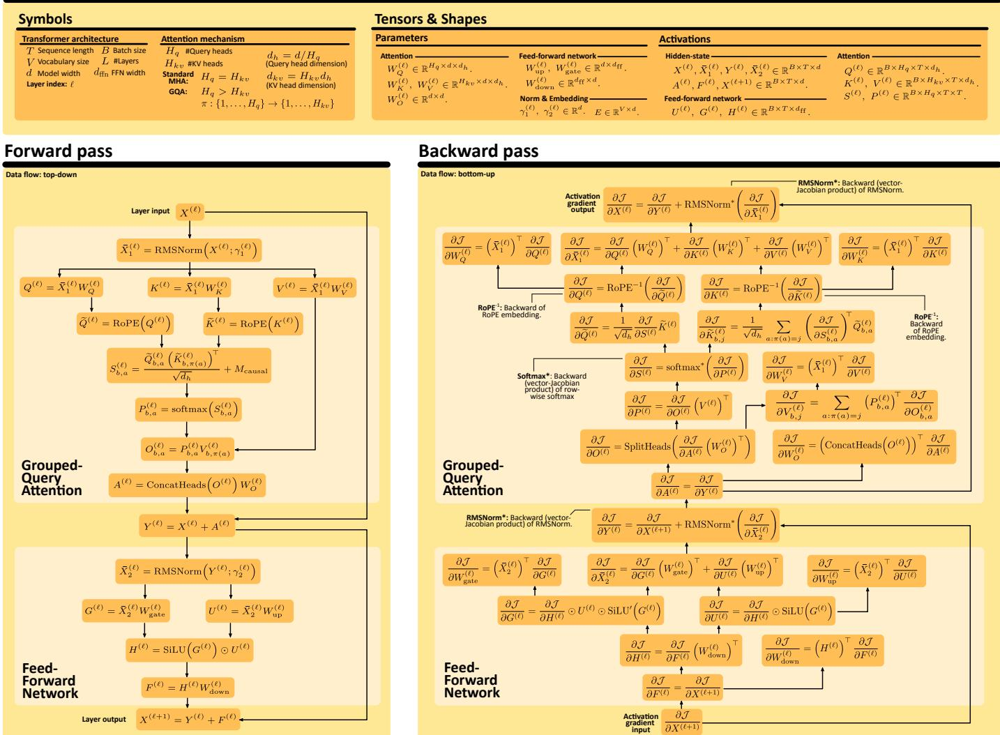  
Fig. 3: Mathematical notation and equations for the forward and backward passes of each decoder block. Further details on computational aspects are in Figures 4-5 while parallelization details are in Figures 6-7. No AI was used to conceive or to draw the figure.

Trainable models. Here, DP must all-reduce gradients across workers and thus benefits from sharded data-parallel variants such as ZeRO-2/3 or FSDP. This applies to the actor in the Training stage (PPO/GRPO/DPO updates) and to the critic in actor–critic methods. Frameworks such as OpenRLHF explicitly apply ZeRO-3/FSDP-style sharded data parallelism to actor and critic training while keeping forward-only models replicated [117, 201].

In RLM pipelines, a common pattern is therefore: DP + ZeRO for trainable components; pure DP for forward-only components.

## 3.2 Tensor Parallelism

Tensor (or operator) parallelism (TP) partitions individual layers across devices by sharding their parameters along hidden dimensions, so that each device computes only a slice of the layer. Synchronization via all-reduce or all-gather then reconciles partial results.

In Transformer blocks, TP is commonly applied to both feed-forward networks (FFNs) and to the multi-head attention (MHA). For FFN, the first linear projection (e.g., XA) is split column-wise across devices, and the second projection (e.g., Y B) is split row-wise. Each device holds a shard of A or B and computes a partial result. For MHA, query/key/value projections are sharded column-wise, assigning subsets of heads to devices. The output projection is sharded row-wise, mirroring the FFN pattern. TP is typically combined with DP (and sometimes pipeline parallelism) to form 2D, 3D, or 5D parallelism configurations capable of training trillion parameter models [176, 219].

Megatron-LM and related systems implement TP using communication operators that behave differently in forward and backward passes, e.g., an operator f that is identity in the forward pass and all-reduce in the backward, and an operator g that is all-reduce in the forward and identity in the backward [219]. This enables communication-computation overlap and reduces idle time.

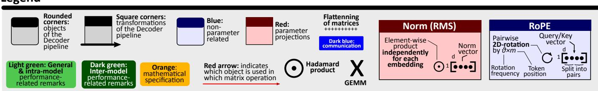

Pipeline overview (inference, forward pass)  
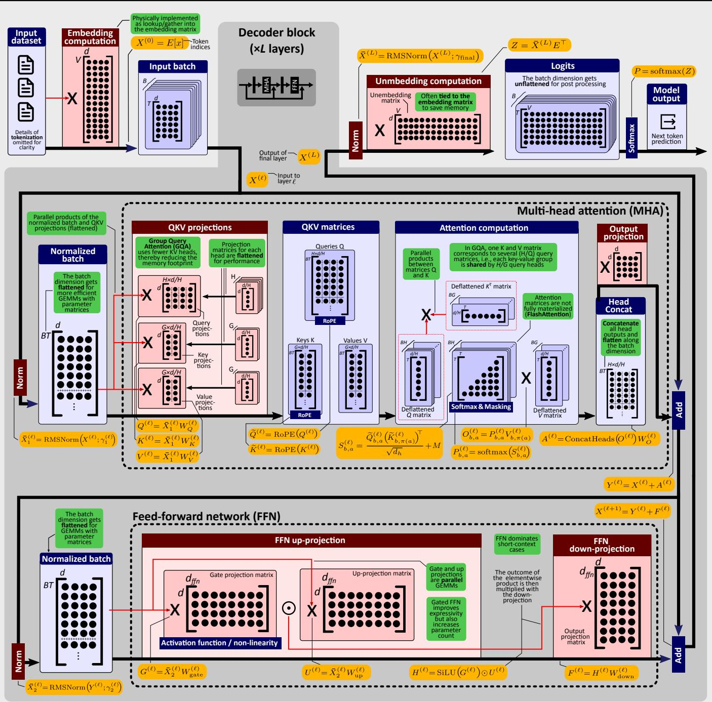  
Fig. 4: Intra-model execution details (forward pass) for each RLM model execution. The design details are based on Llama-3. Further details on parallelization and the corresponding taxonomy are provided in Figures 6-7. No AI was used to conceive or to draw the figure.

Pipeline overview (training, backward pass)  
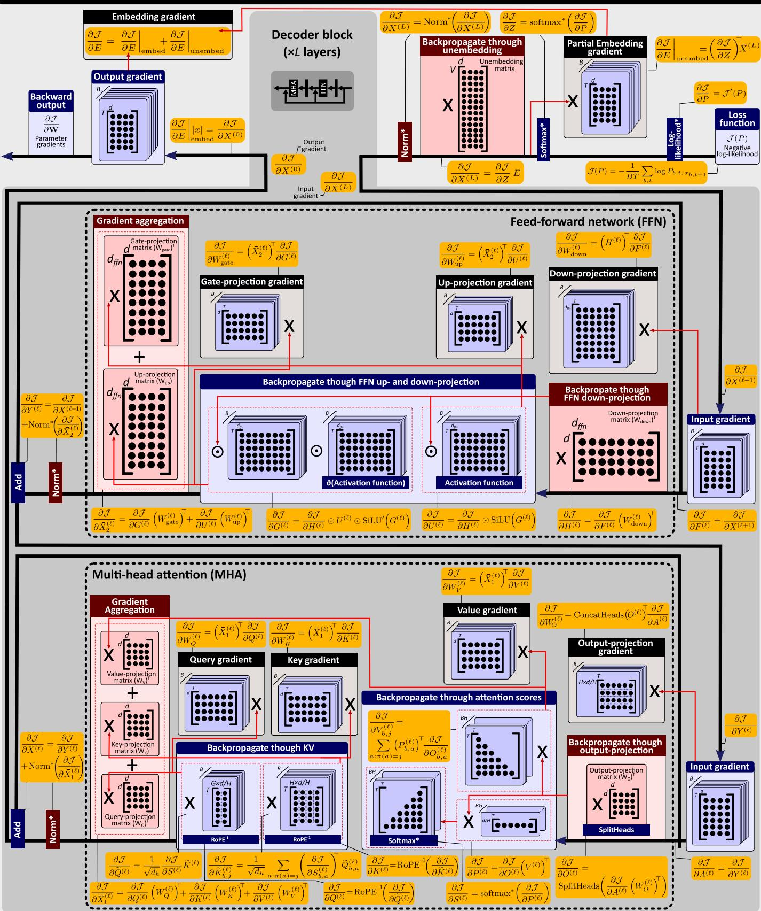  
Fig. 5: Intra-model execution details (backward pass) for each RLM model execution. Legend is provided in Figure 4. The design details are based on Llama-3. Further details on parallelization and the corresponding taxonomy are provided in Figures 6-7. No AI was used to conceive or to draw the figure.

Data parallelism (DP)  
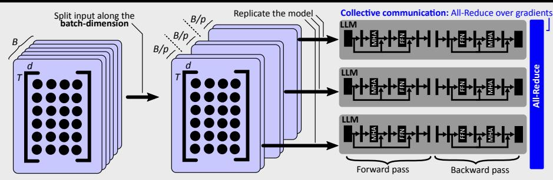

Pipeline parallelism (PP)  
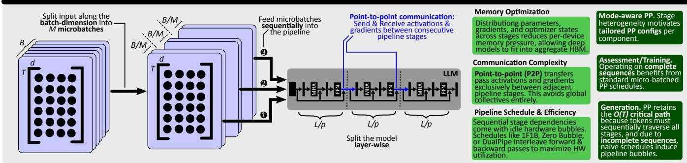

Tensor parallelism (TP)  
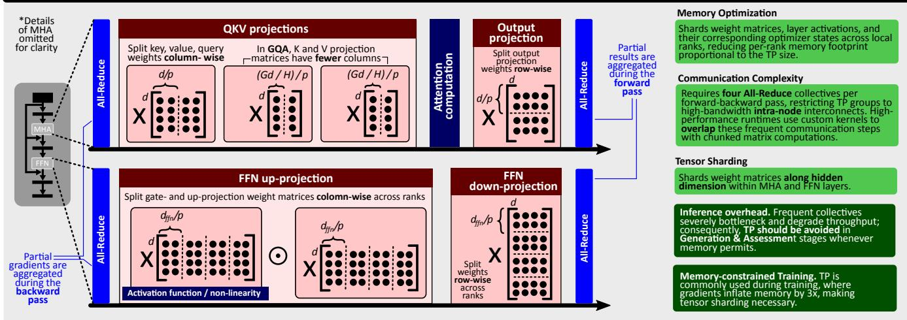

Expert parallelism (EP)  
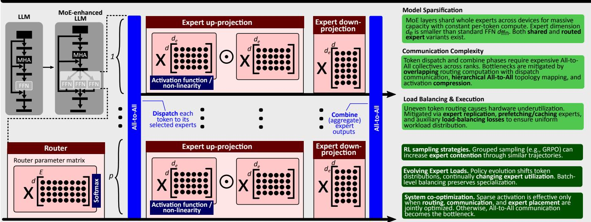  
Fig. 6: Intra-model parallelism (data, pipeline, tensor, and expert parallelism) details for each RLM model execution; legend is provided in Figure 4. No AI was used to conceive or to draw the figure.

## Sequence parallelism (SP)

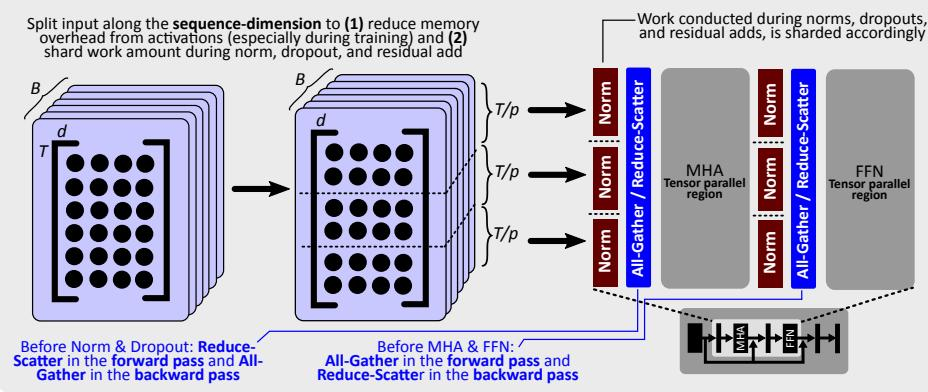

## Context parallelism (CP)

Standard TP replicates token‐wise opera�ons (Norm/Dropout), bo�lenecking ac�va�on memory. SP par��ons Norm/Dropout along the sequence dimension via TP↔SP converters while keeping MHA/FFN tensor‐parallelized. This reduces ac�va�on memory footprint linearly by the TP group size.

TP requires four All‐Reduces per forwardbackward pass. TP+SP replaces these with four All‐Gathers and four Reduce‐Sca�ers. Since All Reduce = All‐Gather + Reduce‐Sca�er, SP introduces zero net communica�on overhead.

Long reasoning traces. Ac�va�on sharding reduces memory during policy and cri�c training, enabling longer reasoning traces or larger batches.

Both shard the sequence dimension, but for diferent purposes

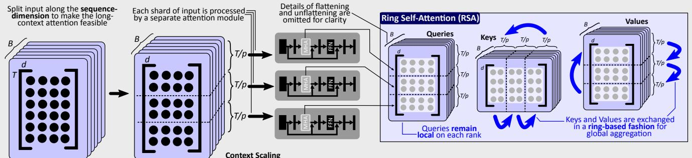

Communica�on Complexity   
Ring‐style P2P (Send/Recv) block transfers are   
overlapped with computa�on. The next KV block is fetched while the current QK GEMM executes, hiding communica�on overhead.

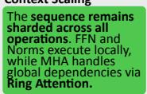

## Memory Op�miza�on

Block‐by‐block a�en�on computa�on restricts peak a�en�on ac�va�on memory from O(T2) to O(T2/p2) per rank.

## Prefill vs. Decode

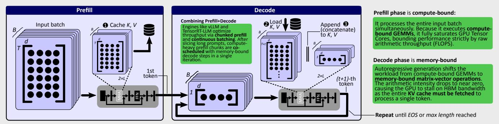

## FlashA�en�on

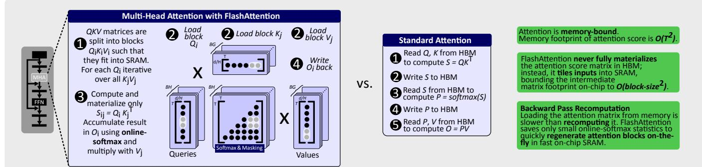  
Fig. 7: Intra-model parallelism (sequence & context parallelism, as well as prefill vs. decode and flash attention) details for each RLM model execution; legend is provided in Figure 4. No AI was used to conceive or to draw thefigure.

## 3.2.1 Implications for RL–LLM pipelines

Tensor parallelism is essential when a single model does not fit on one device even after applying memory optimizations (e.g., ZeRO, mixed precision, quantization). However, for many RLHF workloads, inference dominates runtime. For example, OpenRLHF reports that rollout generation and forward Assessment account for more than 90% of wallclock time in RLHF loops [117]. Here, TP can hurt throughput when not strictly necessary. For instance, Megatronstyle TP introduces two all-reduces per Transformer block during inference and four during training [176, 219]. When a model (actor, reward, or reference) fits on a single device, empirical studies from vLLM and DeepSpeed show that enabling TP reduces total tokens-per-second because collective communication becomes the bottleneck [201, 230]. AMD’s Qwen2-7B RLHF experiments on MI300X (192 GB) similarly report that disabling TP gives 2.3–4.3× higher rollout throughput than when sharding with TP by 2 or 4 for the same model, as communication is negligible in the single-device setting [263].

The resulting rule-of-thumb for using TP in RLM pipelines is: (1) use TP only when a model does not fit on a single device even with ZeRO/FSDP and mixed precision; (2) prefer no TP for inference-heavy stages (Generation, forward-only Assessment) whenever memory allows; and (3) tolerate TP overhead more readily in training stages, where gradient storage already inflates memory by ≈ 3× and TP may be necessary to fit the model [219]. In practice, large RLM deployments often use TP inside highbandwidth device groups and combine it with pipeline and data parallelism across nodes [176].

## 3.3 Sequence Parallelism

TP shards heavyweight projections but leaves token-wise operations such as layer normalization and dropout replicated on each TP shard, leading to duplicated activations and higher memory use, especially for long sequences. Sequence parallelism (SP) [132] addresses this by partitioning activations along the sequence dimension. Because layer norm and dropout operate independently per token, their activations can be split across devices without changing the model’s semantics. This reduces per-device activation memory at essentially no additional computation cost.

Sequence parallelism has been adopted in large-scale stacks such as Megatron-LM, DeepSpeed, and ColossalAI for long-context or high-batch training [125, 132, 147, 219], where activation memory is a primary limiter.

## 3.3.1 Implications for RL-LLM Pipelines

Sequence parallelism is primarily beneficial in training stages where activations must be stored or recomputed for every token, such as policy/critic updates over long responses and reasoning traces. Sharding activations by sequence length reduces per-GPU memory and allows larger T or batch sizes under fixed memory budgets. Because SP reuses the same collective bandwidth as TP (by switching all-reduce to reduce-scatter/all-gather pairs), its net communication volume stays similar, with modest changes in latency due to additional synchronization points [132, 219].

## 3.4 Context Parallelism

Context parallelism extends sequence-based partitioning further by maintaining the sequence split throughout the entire Transformer layer, including attention and FFN blocks [256]. Most operations remain token-wise and are naturally compatible; the main challenge is attention, which requires access to keys and values from all sequence partitions. Recent implementations address this using Ring Attention [160], which pipelines key/value communication in a ring topology to reduce latency and memory pressure. CP enables training and inference with very long contexts (hundreds of thousands or millions of tokens) by combining tensor, sequence, and context partitioning without replicating activations or weights unnecessarily [256].

## 3.4.1 Implications for RL-LLM Pipelines

Context parallelism is most useful when RLM training is dominated by long prompt–trajectory contexts (e.g., long CoT traces, tool histories, verifier outputs, etc.). In this regime, the bottleneck is often not only model size but also attention and activation memory over the full context. CP directly targets this axis by partitioning the sequence dimension across devices while preserving exact attention through cross-device KV exchange [125,160,183]. This yields concrete implications for RLMs. First, CP can make long-CoT rollouts feasible when the actor’s context length exceeds single-device memory. Second, in verifier- or toolaugmented RL, CP allows prompts to include larger execution traces, retrieved evidence, and interaction histories without truncating the reasoning state.

However, CP does not remove the autoregressive dependence of online Generation: it reduces per-device context memory and attention work, but tokens are still sampled sequentially. Thus, CP is primarily a feasibility and longcontext scaling mechanism; online rollout latency still requires complementary methods such as TP, efficient KVcache exchange, continuous batching, or stage-level overlap. Recent long-context systems validate this direction: Ring Attention overlaps KV-block communication with blockwise attention, DeepSpeed-Ulysses uses sequence partitioning and all-to-all communication for long-sequence training, and CP-style inference systems report near-linear scaling for million-token prefill workloads [125, 160, 256].

## 3.5 Pipeline Parallelism

Pipeline parallelism (PP) partitions the layers of a model into stages, each placed on a different device. Mini-batches are further split into micro-batches that flow through the pipeline stages. This allows models that are too deep to fit on a single device to be trained, at the cost of pipeline bubbles (periods where some stages are idle). PP is often combined with DP and TP, yielding 3D/5D parallelism that supports extremely large models [176].

Numerous pipeline scheduling strategies have been proposed, examples include AFAB [120] (all-forward-allbackward, all micro-batches complete forward passes before any backward pass starts – simple but bubble-heavy), 1F1B [175] (forward and backward passes interleave, improving memory efficiency and reducing bubbles), Interleaved 1F1B [176] (devices host multiple non-contiguous pipeline stages to further overlap computation and communication), Zero Bubble [197] (decomposes the backward pass into B-steps (gradients w.r.t. activations) and W-steps (gradients w.r.t. weights) scheduling them separately to eliminate bubbles without increasing peak memory), and DualPipe [156] (runs two pipelines in opposite directions across the same devices, overlapping forward and backward streams to improve utilization).

## 3.5.1 Implications for RL-LLM Pipelines

The relevance of PP to RL-LLM heavily depends on the considered stage. In Generation, the actor performs autoregressive decoding, so tokens must traverse all pipeline stages sequentially; thus, PP helps fit large actors but does not remove the ${ \dot { O } } ( T )$ critical path, and naive schedules can suffer from large pipeline bubbles and poor utilization [251, 262]. By contrast, Assessment and Training operate on complete sequences and therefore benefit more directly from standard micro-batched PP schedules such as GPipe- or 1F1B-style execution. This heterogeneity makes mode-aware PP especially important in RLHF systems. The best sharding and scheduling strategy for low-latency Generation need not match the best one for high-throughput Training. Recent systems therefore decouple configurations across stages and overlap different RL iterations, e.g., by letting one batch generate while another is being assessed or trained [117, 261, 262]. Such inter-batch pipelining can substantially reduce idle time. In large reasoning-oriented systems, this design is often combined with explicit communication–computation overlap to reduce pipeline bubbles further [156].

PP also interacts with optimization stability. Interleaved or asynchronous schedules may introduce weight staleness, where forward and backward passes for a microbatch observe different parameter versions. In RLHF, where gradients are already noisy, this can destabilize training unless explicit versioning or consistency mechanisms are used [251, 262]. Finally, PP strengthens the case for disaggregated placement: placing actor, critic, reward, and reference on separate device groups allows each component to use a PP configuration matched to its role, instead of forcing a single compromise configuration for the whole pipeline [117, 251].

## 3.6 Expert Parallelism

Expert parallelism (EP) is the standard way to scale Mixtureof-Experts (MoE) models by distributing whole experts across devices. Unlike DP, which replicates the full model, or TP, which shards individual operators, EP assigns different experts to different GPUs or nodes. Since only a small subset of experts is activated per token, EP enables very large model capacity with much smaller per-token compute than an equally sized dense model [74,156]. Modern MoE designs also separate shared and routed experts. Shared experts are activated for all tokens and capture common linguistic features, while routed experts specialize in narrower domains such as mathematics or code. In practice, EP is rarely used alone; it is typically combined with TP, PP, and DP in hybrid multi-dimensional layouts [74, 156].

Formally, an MoE layer contains E experts and a router G(x) that selects the top-k experts for each token representation $x ,$ with $k \ll E$ . The output can be written as $\begin{array} { r } { y \ = \ \sum _ { i = 1 } ^ { k } g _ { i } ( x ) f _ { i } ( x ) } \end{array}$ , where $f _ { i }$ is the transformation of the i-th selected expert and $g _ { i } ( x )$ is its routing weight. EP exploits this sparsity by storing experts on different devices and executing only the selected ones [74].

EP’s main systems cost is communication. Each MoE layer typically requires two all-to-all phases: dispatch, which sends token activations to the devices hosting the selected experts, and combine, which returns expert outputs to their originating ranks. As expert count and cluster size increase, this communication can dominate runtime, so practical EP deployments rely on hierarchical collectives, locality-aware routing, and communication-computation overlap [264].

## 3.6.1 Implications for RL-LLM Pipelines

EP can adapt a very large model while activating and updating only a small subset of parameters per token. This is particularly valuable for long reasoning trajectories, where dense models would make both rollout generation and policy updates prohibitively expensive [74, 156].

However, RL post-training makes routing harder. As the policy evolves, the token distribution shifts, so expert loads can become highly imbalanced. Load balancing schemes can help hardware efficiency, but they may also blur expert specialization by forcing artificially uniform routing [108]. For this reason, recent reasoning-oriented MoE systems increasingly prefer auxiliary-loss-free or bias-based balancing mechanisms that preserve specialization while correcting large load skew at the batch level [108, 156]. More broadly, EP in RLHF requires joint optimization of routing quality, communication cost, and systems balance: if routing is good but overloaded experts are poorly placed, all-to-all communication and straggler effects can erase the theoretical gains from sparse activation [178, 264].

EP also interacts strongly with RL framework design. Grouped sampling methods such as GRPO may create many structurally similar trajectories for the same prompt, which can stress the same experts simultaneously. Thus, efficient RL-MoE training often requires combining EP with dynamic load-balancing policies [117, 156, 178].

## 3.7 Complexity Analysis

We now analyze how intra-model parallelism changes the work, depth, and memory of the Transformer invocations inside RL-LLM pipelines; detailed derivations are in $\mathsf { A p - }$ pendix B.3. The same local formulas apply to the actor in Generation, the reward/reference/critic models in Assessment, and the policy or critic in Training; the RL-specific consequences come from whether the invocation is autoregressive, forward-only, or trainable.

Generation uses the actor in an autoregressive loop, so reducing the depth of one model invocation helps but cannot remove the outer $T \cdot$ -step dependence. Assessment is teacher-forced and forward-only for frozen models, so it is mainly a batched-inference and memory-placement problem. Training requires backward passes, activations, gradients, and optimizer state, so memory sharding becomes central. Tables 5–8 therefore should be read as architectureindependent scaling laws for the individual model calls that compose the RL-LLM loop, not as hardware-calibrated throughput predictions.

A logical model invocation may be distributed across N participating ranks according to one or more parallelism dimensions. Depending on the parallelization strategy, each rank may operate on a partition of the input, parameters, layers, activations, or experts while other components remain replicated. We report both per-rank costs, which characterize local device pressure, and global costs, which aggregate costs across all N ranks participating in the complete logical model invocation. Global work is the sum of arithmetic FLOPs executed across these ranks, including replicated computation on every rank where it occurs. Global memory analogously sums resident state across all participating ranks. Depth denotes the critical path of the complete distributed execution.

Throughout Tables 5–8, we use an idealized arithmetic work–depth–memory model intended to expose scaling laws rather than predict hardware runtime. Unless stated otherwise, we exclude communication, synchronization, kernel-launch and scheduling overheads, finite-device utilization, load imbalance, and temporary communication workspaces. Pipeline parallelism assumes an approximately uniform partition of the L layers and does not model the number of microbatches, pipeline schedules, fill/drain bubbles, or inter-stage activation transfers. Training activation memory is represented by the leading-order term $B ( S { + } T ) L d ,$ , suppressing constant-factor storage for $\mathrm { Q } / \mathrm { K } / \mathrm { V }$ tensors, FFN intermediates, normalization temporaries, and other implementation-specific buffers; activation checkpointing is treated separately. The Adam model-state expressions count parameters, gradients, and first and second moments using a common element-size abstraction, omitting precision-specific byte factors and transient buffers. The TP activation terms use an idealized shardable-activation model; replicated token-wise components are suppressed. Attention is assumed not to materialize the full attention matrix, as in FlashAttention-style execution. For MoE models, the tables retain the dominant shared-Transformer and expert-FFN terms; router projection, softmax/top-k, auxiliary load-balancing operations, and their relatively small parameter state are omitted. Finally, the isolated EP row assumes that only expert FFNs are partitioned across $P _ { e }$ ranks while shared dense computation is replicated; the combined 5D row instead assumes a coupled execution in which EP ranks also process disjoint token/batch shards for the shared path, so dense arithmetic is not redundantly executed across the EP dimension.

Each parallelism strategy partitions a different dimension. DP splits the batch, reducing per-group work and activation memory but leaving the critical path unchanged. PP splits layers, reducing per-stage work, memory, and architectural depth by replacing L with $L / P _ { p } ,$ though realized runtime also depends on microbatch bubbles. TP splits hidden-dimensional operators, reducing per-device GEMM work and replacing hidden-dimension depth terms by $\log ( d / P _ { t } )$ . CP splits the sequence dimension, reducing context-dependent attention and activation memory, which is crucial for long reasoning traces. EP splits MoE experts, reducing per-device expert memory and compute while leaving dense attention largely unchanged. Finally, 3D/5D parallelism combines data, pipeline, and tensor sharding, giving the strongest per-device memory reduction but also the most communication and scheduling constraints.

For RL-LLMs, this means DP is usually best for throughput-oriented batched Generation or Assessment when models fit per device; TP/PP are needed for large actors, critics, or low-latency single invocations; CP is most useful for long-context reasoning; and 3D/5D/ZeRO-style sharding is most important during Training, where optimizer state and activations dominate memory.

Note that pipeline parallelism does not reduce the global depth layer-wise dependency from L to $L / P _ { p } ;$ the $L / \bar { P _ { p } }$ factor appears only in the per-rank depth. This is because, for global end-to-end critical path, the microbatch still passes through all $P _ { p }$ pipeline stages, so it traverses all L layers.

Context parallelism reduces the number of query positions and stored activations per device, but each query still depends on the global key/value context. Therefore, under the work–depth model, CP does not replace the global attention reduction length S by $S / P _ { c } ;$ its principal benefits are reduced per-rank work and memory. Distributed attention additionally incurs communication-round dependencies, which are outside the present FLOP-based depth abstraction.

## 3.7.1 ZeRO & FSDP

The memory expressions in Tables 5–8 use a simplified Adam model-state factor consisting of parameters, gradients, and first and second moments. ZeRO [201] and FSDP [277] refine this term without changing the layerwise Transformer computation. If $P$ denotes the parameter count of the trainable model and $P _ { z }$ the sharding degree, then standard data parallelism stores approximately 4P modelstate elements per replica. ZeRO-1 shards only optimizer states, giving $\bar { P } + \bar { P _ { z } } ;$ ZeRO-2 shards optimizer states and gradients, giving $P + 3 P / P _ { z } ;$ and ZeRO-3/FSDP shards parameters, gradients, and optimizer states, giving approximately $4 P / P _ { z } ,$ up to transient all-gather buffers.

## 3.7.2 Activation Checkpointing

The activation terms in the tables correspond to stored training activations without checkpointing. Activation checkpointing reduces this term by storing only a subset of intermediate activations and recomputing the missing ones during backpropagation. In our notation, this replaces $M _ { \mathrm { { A c t } } }$ by $\kappa _ { \mathrm { c k p t } } M _ { \mathrm { A c t } }$ for some $0 ~ < ~ \kappa _ { \mathrm { c k p t } } ~ < ~ 1$ , while increasing training work and depth by the extra forward recomputation required during the backward pass. This trade-off is most relevant for actor and critic training, especially for long reasoning trajectories.

## 3.8 Key Insights & Takeaways

The main lesson is stage-aware hybridization: no single intramodel strategy is best for the whole RL-LLM loop. Generation, Assessment, and Training invoke similar Transformer building blocks, but they stress different dimensions of the system. Generation is autoregressive and latency-sensitive; Assessment is mostly teacher-forced, forward-only, and throughput-oriented; Training is memory-intensive as it uses activations, gradients, and optimizer state.

DP scales throughput, not single-sample latency. Data parallelism is ideal for increasing the number of prompts, completions, or preference pairs processed per unit time. In online Generation, it can process more prompts or candidates in parallel, but each replica still executes the full autoregressive chain $D _ { \mathrm { g e n } } ( \pi _ { \theta } ; \tilde { S , T } ) = O ( T D _ { f } ( \pi _ { \theta } ; S + T ) )$ . Thus, DP does not shorten the critical path of one rollout trajectory or one model invocation.

<table><tr><td>Parallelism</td><td>Work</td><td>Depth</td><td></td><td>Memory</td></tr><tr><td>None†</td><td> $O \big ( B m L ( d ^ { 2 } + m d ) \big )$ </td><td> $O ( L [ \log d + \log m ] + \log ( B m ) )$ </td><td></td><td> $O \left( L d ^ { 2 } + V d + B m L d \right)$ </td></tr><tr><td>Data</td><td> $\begin{array} { r } { O \left( \frac { B m L ( d ^ { 2 } + m d ) } { P _ { d } } \right) } \end{array}$ </td><td> $\begin{array} { r } { O \Big ( L [ \log d + \log m ] + \log \Big ( \frac { B } { P _ { d } } m \Big ) \Big ) } \end{array}$ </td><td></td><td> $\begin{array} { r } { O \left( L d ^ { 2 } + V d + \frac { B m L d } { P _ { d } } \right) } \end{array}$ </td></tr><tr><td>Pipeline*</td><td> $\begin{array} { r } { O \left( \frac { B m L ( d ^ { 2 } + m d ) } { P _ { p } } \right) } \end{array}$ </td><td> $\begin{array} { r } { O \biggl ( \frac { L } { P _ { p } } [ \log d + \log m ] + \log ( B m ) \biggr ) } \end{array}$ </td><td></td><td> $\begin{array} { r } { O \biggl ( \frac { L d ^ { 2 } } { P _ { p } } + V d + \frac { B m L d } { P _ { p } } \biggr ) } \end{array}$ </td></tr><tr><td>Tensor</td><td> $\begin{array} { r } { O \left( \frac { B m L ( \dot { d } ^ { 2 } + m d ) } { P _ { t } } \right) } \end{array}$ </td><td> $\begin{array} { r } { O \Big ( L \Big [ \log \frac { d } { P _ { t } } + \log m \Big ] + \log ( B m ) \Big ) } \end{array}$ </td><td></td><td> $\begin{array} { r } { O \biggl ( \frac { L d ^ { 2 } + V d } { P _ { t } } + \frac { B m L d } { P _ { t } } \biggr ) } \end{array}$ </td></tr><tr><td>Context</td><td> $\begin{array} { r } { O \biggl ( \frac { B m L ( d ^ { \overset { . } { 2 } } + m d ) } { P _ { c } } \biggr ) } \end{array}$ </td><td> $\begin{array} { r } { O \Bigl ( L [ \log d + \log m ] + \log \Bigl ( \frac { B m } { P _ { c } } \Bigr ) \Bigr ) } \end{array}$ </td><td></td><td> $\begin{array} { r } { O \Big ( L d ^ { 2 } + V d + \frac { B m L d } { P _ { c } } \Big ) } \end{array}$ </td></tr><tr><td>Expert</td><td> $\begin{array} { r } { O \Big ( B m L \Big [ ( d ^ { 2 } + m d ) + \frac { E _ { a } d d _ { e } } { P _ { e } } \Big ] \Big ) } \end{array}$ </td><td> $O ( L [ \log d + \log m ] + \log ( B m ) )$ </td><td></td><td> $\begin{array} { r } { O \left( L \left[ \hat { d ^ { 2 } } + \frac { E d d _ { e } } { P _ { e } } \right] + V d + B m L d \right) } \end{array}$ </td></tr><tr><td>3D</td><td> $\begin{array} { r } { O \biggl ( \frac { B m L ( d ^ { 2 } + m d ) } { P _ { d } P _ { p } P _ { t } } \biggr ) } \end{array}$ </td><td> $\begin{array} { r } { O \Big ( \frac { L } { P _ { p } } \left[ \log \frac { d } { P _ { t } } + \log m \right] + \log \Big ( \frac { B } { P _ { d } } m \Big ) \Big ) } \end{array}$ </td><td></td><td> $\begin{array} { r } { \dot { O } \Big ( \frac { L d ^ { 2 } + V d } { P _ { p } P _ { t } } + \frac { B m L d } { P _ { d } P _ { p } P _ { t } } \Big ) } \end{array}$ </td></tr><tr><td>5D</td><td> $\begin{array} { r } { O \bigg ( \frac { B m L } { P _ { d } P _ { e } P _ { c } P _ { p } P _ { t } } \left[ d ^ { 2 } + m d + E _ { a } d d _ { e } \right] \bigg ) } \end{array}$ </td><td>0 ( [log pt + log m]</td><td>+ log Bm PdPePc</td><td> $\begin{array} { r } { O \Big ( \frac { L d ^ { 2 } } { P _ { p } P _ { t } } + \frac { L E d d _ { e } } { P _ { p } P _ { t } P _ { e } } + \frac { V d } { P _ { t } } + \frac { B m L d } { P _ { d } P _ { e } P _ { c } P _ { p } P _ { t } } \Big ) } \end{array}$ </td></tr></table>

TABLE 5: Complexity Analysis (Per rank). Asymptotic work, depth, and memory for a single Transformer training iteration (forward and backward pass), expressed in Big-O notation. For clarity, we use $m : = { \dot { S } } + T$ . The work expressions use the regime where $d _ { f f } = O ( d )$ . †: Baseline configuration without parallelism. ∗For PP, the V d memory term denotes the embedding/output state resident on boundary pipeline ranks; interior ranks need not store this state. Thus, this term represents the boundary/peak per-rank footprint rather than replication across all $P _ { p }$ ranks. ‡: 3D and 5D parallelism combine data, pipeline, tensor (3D), context, and expert (5D) parallelism, with $P _ { d } P _ { p } P _ { t } = N$ (3D) and $P _ { d } P _ { p } P _ { t } P _ { c } P _ { e } = N ^ { \mathrm { ' } } ( 5 \mathrm { D } )$ total devices. For the combined 5D configuration, we assume the EP dimension also partitions source-token ownership for shared-layer computation. Training memory assumes Adam without activation checkpointing.

<table><tr><td>Parallelism</td><td>Work</td><td>Depth</td><td>Memory</td></tr><tr><td>None</td><td> $O \big ( B m L ( d ^ { 2 } + m d ) \big )$ </td><td> $O ( L [ \log d + \log m ] + \log ( B m ) )$ </td><td> $O \left( L d ^ { 2 } + V d + B m L d \right)$ </td></tr><tr><td>Data</td><td> $O \big ( B m L ( d ^ { 2 } + m d ) \big )$ </td><td> $O ( L [ \log d + \log m ] + \log ( B m ) )$ </td><td> $O \big ( \dot { P d } [ L d ^ { 2 } + V d ] + B m \dot { L } d \big )$ </td></tr><tr><td>Pipeline</td><td> $O \big ( B m L ( d ^ { 2 } + m d ) \big )$ </td><td> $O ( L [ \log d + \log m ] + \log ( B m ) )$ </td><td> $\dot { O } ( \dot { L } d ^ { 2 } + V d + B m L d )$ </td></tr><tr><td>Tensor</td><td> $O \big \langle B m L ( d ^ { 2 } + m d ) \big \rangle$ </td><td> $O ( L [ \log d + \log m ] + \log ( B m ) )$ </td><td> $O \big ( L d ^ { 2 } + V d + B m L d \big )$ </td></tr><tr><td>Context</td><td> $O \big ( B m L ( d ^ { 2 } + m d ) \big )$ </td><td> $O ( L [ \log d + \log m ] + \log ( B m ) )$ </td><td> $O \big ( \dot { P _ { c } } [ L d ^ { 2 } + V d ] + B m \dot { L } d \big )$ </td></tr><tr><td>Expert</td><td> $O \big ( B m L \big [ P _ { e } ( d ^ { 2 } + m d ) + \big ] _ { a } ^ { \prime } d { d } _ { e } \big ] \big )$ </td><td> $O ( L [ \log d + \log m ] + \log ( B m ) )$ </td><td> $O \big ( P _ { e } [ \dot { L } d ^ { 2 } + V d + \dot { B m } L d ] + L \dot { E } d d _ { e } \big )$ </td></tr><tr><td>3D</td><td> $O \big [ B m L ( d ^ { 2 } + m d ) \big ]$ </td><td> $O ( L \left[ \log d + \log m \right] + \log ( B m ) )$ </td><td> $\dot { O } \left( P _ { d } [ L d ^ { 2 } + V d ] + \dot { B } m L d \right)$ </td></tr><tr><td>5D</td><td> $O \big ( B m \dot { L } \left[ d ^ { 2 } + m d + E _ { a } \dot { d } d _ { e } \right] \big )$ </td><td> $O ( L \left[ \log d + \log m \right] + \log ( B m ) )$ </td><td> $O \big ( P _ { d } P _ { c } P _ { e } [ \dot { L } d ^ { 2 } + V d ] + \dot { P _ { d } } P _ { c } L E d \dot { d _ { e } } + B m L d \big )$ </td></tr></table>

TABLE 6: Complexity Analysis (Global). Asymptotic work, depth, and memory for a single Transformer training iteration (forward & backward pass). For clarity, we use m $: = S + T$ . The work expressions use the regime where $d _ { f f } = O ( d )$

<table><tr><td>Parallelism</td><td>Work</td><td>Depth</td><td>Memory</td></tr><tr><td>None</td><td> $6 B m L \left( 4 d ^ { 2 } + 2 d d _ { \mathrm { f f } } + m d \right)$ </td><td> $\begin{array} { r } { 2 L \log \left( \frac { d ^ { 4 } d _ { \# } m } { h } \right) + \log ( B m ) } \end{array}$ </td><td> $L ( 1 6 d ^ { 2 } + 8 d d _ { \mathrm { f f } } ) + 4 V d + B m L d$ </td></tr><tr><td>Data</td><td> $\begin{array} { r } { 6 \frac { B } { P _ { d } } m L \left( 4 d ^ { 2 } + 2 d d _ { \mathrm { f f } } + m d \right) } \end{array}$ </td><td> $\begin{array} { r } { 2 L \log \left( \frac { d ^ { 4 } d _ { \mathrm { f f } } m } { h } \right) + \log \left( \frac { B } { P _ { d } } m \right) } \end{array}$ </td><td> $\begin{array} { r } { L ( 1 6 d ^ { 2 } + 8 d d _ { \mathrm { f f } } ) + 4 V d + \frac { B } { P _ { d } } m L d } \end{array}$ </td></tr><tr><td>Pipeline</td><td> $\begin{array} { r } { 6 B m { \frac { L } { P _ { v } } } \left( 4 d ^ { 2 } + 2 d d _ { \mathrm { f f } } + m d \right) } \end{array}$ </td><td> $\begin{array} { r } { 2 \frac { L } { P _ { p } } \log \biggr ( \frac { d ^ { 4 } d _ { \mathrm { f f } } m } { h } \biggr ) + \log ( B m ) } \end{array}$ </td><td> $\begin{array} { r } { \frac { L } { P _ { p } } ( 1 6 d ^ { 2 } + 8 d d _ { \mathrm { f f } } ) + 4 V d + B m \frac { L } { P _ { p } } d } \end{array}$ </td></tr><tr><td>Tensor</td><td> $\begin{array} { r } { 6 B m L { \left( \frac { 4 d ^ { 2 } + 2 d d _ { \mathrm { f f } } + m d } { P _ { t } } \right) } } \end{array}$ </td><td> $\begin{array} { r } { 2 L \log \Bigl ( \frac { d ^ { 4 } d _ { \# } m } { P _ { t } ^ { 2 } h } \Bigr ) + \log ( B m ) } \end{array}$ </td><td> $\begin{array} { r } { \frac { L ( 1 6 d ^ { 2 } + 8 d d _ { \mathrm { f f } } ) } { P _ { t } } + \frac { 4 V d } { P _ { t } } + \frac { B m L d } { P _ { t } } } \end{array}$ </td></tr><tr><td>Context</td><td> $\begin{array} { r } { 6 B \frac { S + T } { P _ { c } } L \left( 4 d ^ { 2 } + 2 d d _ { \mathrm { f f } } + m d \right) } \end{array}$ </td><td> $\begin{array} { r } { 2 L \log \biggl ( \frac { d ^ { 4 } d _ { \mathrm { f f } } m } { h } \biggr ) + \log \biggl ( \frac { B m } { P _ { c } } \biggr ) } \end{array}$ </td><td> $\begin{array} { r } { L ( 1 6 d ^ { 2 } + 8 d d _ { \mathrm { f f } } ) + 4 V d + B \frac { S + T } { P _ { c } } L d } \end{array}$ </td></tr><tr><td>Expert</td><td> $\begin{array} { r } { 6 B m L \left( 4 d ^ { 2 } + \frac { 2 E _ { a } d d _ { e } } { P _ { e } } + m d \right) } \end{array}$ </td><td> $\begin{array} { r } { 2 L \log \left( \frac { d ^ { 4 } d _ { e } m } { h } \right) + \log ( B m ) } \end{array}$ </td><td> $L \left( 1 6 d ^ { 2 } + \frac { 8 E d d _ { e } } { P _ { e } } \right) + 4 V d + B m L d$ </td></tr><tr><td>3D</td><td> $\begin{array} { r } { 6 \frac { B } { P _ { d } } m \frac { L } { P _ { p } } \frac { 4 d ^ { 2 } + 2 d d _ { \mathrm { f f } } + m d } { P _ { t } } } \end{array}$ </td><td> $\begin{array} { r } { 2 \frac { L } { P _ { p } } \log \left( \frac { d ^ { 4 } d _ { \mathrm { f f } } m } { P _ { t } ^ { 2 } h } \right) + \log \left( \frac { B } { P _ { d } } m \right) } \end{array}$ </td><td> $\begin{array} { r } { \frac { L ( 1 6 d ^ { 2 } + 8 d d _ { \mathrm { f f } } ) } { P _ { p } P _ { t } } + \frac { 4 V d } { P _ { t } } + \frac { B m L d } { P _ { d } P _ { p } P _ { t } } } \end{array}$ </td></tr><tr><td>5D</td><td> $\begin{array} { r } { 6 \frac { B } { P _ { d } P _ { e } } \frac { m } { P _ { c } } \frac { L } { P _ { p } } \left( \frac { 4 d ^ { 2 } + 2 E _ { a } d d _ { e } + m d } { P _ { t } } \right) } \end{array}$ </td><td> $\begin{array} { r } { 2 \frac { L } { P _ { p } } \log \left( \frac { d ^ { 4 } d _ { e } m } { P _ { t } ^ { 2 } h } \right) + \log \left( \frac { B m } { P _ { d } P _ { e } P _ { c } } \right) } \end{array}$ </td><td> $\begin{array} { r } { \frac { 1 6 L d ^ { 2 } } { P _ { p } P _ { t } } + \frac { 8 L E d d _ { e } } { P _ { p } P _ { t } P _ { e } } + \frac { 4 V d } { P _ { t } } + \frac { B m L d } { P _ { d } P _ { e } P _ { c } P _ { p } P _ { t } } } \end{array}$ </td></tr></table>

TABLE 7: Complexity Analysis (Per rank). Explicit leading-order costs under our simplified Transformer cost model, for a single Transformer training iteration (forward and backward pass), including explicit constant factors. For clarity, we use $m : = { \cal { S } } + \breve { T } .$

<table><tr><td>Parallelism</td><td>Work</td><td>Depth</td><td>Memory</td></tr><tr><td>None</td><td> $6 B m L \left( 4 d ^ { 2 } + 2 d d _ { \mathrm { f f } } + m d \right)$ </td><td> $2 L \log \left( d ^ { 4 } d _ { \mathrm { f f } } m / h \right) + \log ( B m )$ </td><td> $L ( 1 6 d ^ { 2 } + 8 d d _ { \mathrm { f f } } ) + 4 V d + B m L d$ </td></tr><tr><td>Data</td><td> $6 B m L \left( 4 d ^ { 2 } + 2 d d _ { \mathrm { f f } } + m d \right)$ </td><td> $2 L \log \left( d ^ { 4 } d _ { \mathrm { f f } } m / h \right) + \log ( B m )$ </td><td> $P _ { d } \left[ L ( 1 6 d ^ { 2 } + 8 d d _ { \mathrm { f f } } ) + 4 V d \right] + B m L d$ </td></tr><tr><td>Pipeline</td><td> $6 B m L \left( 4 d ^ { 2 } + 2 d d _ { \mathrm { f f } } + m d \right)$ </td><td> $2 L \log \left( d ^ { 4 } d _ { \mathrm { f f } } m / h \right) + \log ( B m )$ </td><td> $\bar { L } ( 1 6 d ^ { 2 } + 8 d d _ { \mathrm { f f } } ) + 4 V d + \bar { B } m L d$ </td></tr><tr><td>Tensor</td><td> $6 B m L \left( 4 d ^ { 2 } + 2 d d _ { \mathrm { f f } } + m d \right)$ </td><td> $2 L \log \left( d ^ { 4 } d _ { \mathrm { f f } } m / h \right) + \log ( B m )$ </td><td> $L ( 1 6 d ^ { 2 } + 8 d d _ { \mathrm { f f } } ) + 4 V d + B m L d$ </td></tr><tr><td>Context</td><td> $6 B m L \left( 4 d ^ { 2 } + 2 d d _ { \mathrm { f f } } + m d \right)$ </td><td> $2 L \log \left( d ^ { 4 } d _ { \mathrm { f f } } m / h \right) + \log ( B m )$ </td><td> $P _ { c } \left[ L ( 1 6 d ^ { 2 } + 8 d d _ { \mathrm { f f } } ) + 4 V d \right] + B m L d$ </td></tr><tr><td>Expert</td><td> $6 B m L \left( P _ { e } \left( 4 d ^ { 2 } + m d \right) + 2 E _ { a } d d _ { e } \right)$ </td><td> $2 L \log \left( d ^ { 4 } d _ { e } m / h \right) + \log ( B m )$ </td><td> $P _ { e } \left( \bar { 1 } 6 L d ^ { 2 } + 4 V d + B m L d \right) + 8 L E d d _ { e }$ </td></tr><tr><td>3D</td><td> $6 B m L \left( 4 d ^ { 2 } + 2 d d _ { \mathrm { f f } } + m d \right)$ </td><td> $2 L \log \left( d ^ { 4 } d _ { \mathrm { f f } } m / h \right) + \log ( B m )$ </td><td> $P _ { d } \left[ L ( 1 6 d ^ { 2 } + 8 d d _ { \mathrm { f f } } ) + 4 V d \right] + B m L d$ </td></tr><tr><td>5D</td><td> $6 B m L \left( 4 d ^ { 2 } + 2 E _ { a } d d _ { e } + m d \right)$ </td><td> $2 L \log \left( d ^ { 4 } d _ { e } m / h \right) + \log ( B m )$ </td><td> $P _ { d } P _ { c } P _ { e } \left( \bar { 1 } 6 L d ^ { 2 } + 4 V d \right) + 8 P _ { d } P _ { c } L E d d _ { e } + B m L d$ </td></tr></table>

TABLE 8: Complexity Analysis (Global). Explicit leading-order costs under our simplified Transformer cost model, for a single Transformer training iteration (forward and backward pass), including explicit constant factors. For clarity, we use m $: = S + { \check { T } } .$

TP and PP are capacity/latency tools with communication costs. Tensor and pipeline parallelism are useful when a model does not fit on one device or when the latency of a single invocation must be reduced. In Generation, they reduce the cost of each actor invocation but do not remove the outer token-by-token dependence. In Assessment and Training, they help execute larger reward, reference, actor, or critic models. Their benefit must be balanced against TP collectives, PP activation transfers, pipeline bubbles, and resharding overheads.

▲ SP/CP matter increasingly for reasoning. Long CoT traces, tool histories, retrieved documents, verifier outputs, and multi-turn interaction histories increase $S + T .$ , making activation and attention memory central bottlenecks. Sequence and context parallelism directly target this regime by partitioning the sequence/context dimension. They are especially useful for long-context Assessment and Training, and for actor Generation when the rollout context exceeds single-device memory.

Frozen and trainable models prefer different layouts. Reward and reference models are usually frozen and forwardonly, so they often scale best as replicated batched-inference services when they fit per device. The actor and critic are trainable, and therefore dominate memory through activations, gradients, and optimizer state. Consequently, actor/critic Training benefits most from ZeRO/FSDP-style sharding, TP/PP, and 3D/5D combinations. PPO is the most demanding case because it may train both $\pi _ { \theta }$ and $V _ { \psi } ,$ whereas GRPO and DPO train only $\pi _ { \theta }$

EP scales capability but can create systems skew. MoE policies can increase reasoning capacity at limited per-token compute by activating only a subset of experts. However, dense attention remains on the critical path, and expert routing introduces all-to-all communication. RL posttraining further complicates EP because the evolving policy changes the token distribution, which can create expertload imbalance. Efficient EP for RLMs therefore requires routing-aware load balancing and communication-aware expert placement.

Practical RLM systems should specialize by model and stage. Actor Generation may prioritize KV-cache memory, rollout latency, and batching; reward/reference Assessment may use cheap replicated inference; actor/critic Training may require 3D parallelism and optimizer-state sharding. This intra-model specialization is precisely what motivates the inter-model placement, stage fusion, hybrid execution, and asynchronous strategies discussed next.

## 4 INTER-MODEL PARALLELISM

We organize inter-model parallelism into five categories. Model structure configurations decide whether trainable components such as the actor and critic share parameters. Model placement strategies decide whether model roles are co-located, partially co-located, or disaggregated across device groups. Stage fusion removes coarse barriers between stages or sub-stages by streaming partial outputs downstream. Hybrid execution allows different invocations of the same model to use different intra-model layouts, often requiring resharding or automated planning. Finally, asynchronous execution overlaps different RL iterations by allowing bounded-stale parameter reads. These categories are often combined in high-performance systems such as ReaL, RLHFuse, HybridFlow/verl, OpenRLHF, StreamRL, and AReaL [92, 117, 169, 217, 281, 282]. Figures 8 and 9 illustrate this taxonomy.

## 4.1 Model Structure Configurations

Model structure configurations determine the architectural relation between the trainable model components in the RL-LLM loop. The central question is whether the actor $\pi _ { \theta }$ and critic $V _ { \psi }$ are implemented as independent models, as a shared actor–critic network, or whether the critic is removed by the learning algorithm. PPO-style RLHF uses an actor and a value model, so this choice directly affects work, memory, and optimization stability [208, 279]. Critic-free methods such as GRPO remove $V _ { \psi }$ and replace value-based advantage estimation by group-relative normalization or related baselines, changing both the algorithm and the systems profile [107, 213].

In a shared actor–critic configuration, a single Transformer backbone $f _ { \omega }$ produces hidden states that feed two task-specific heads: a policy head $h _ { \pi }$ for token logits and a value head $h _ { V }$ for scalar value estimates $( \mathrm { i . e . , ~ } \pi _ { \theta } ( \cdot ~ |$ $x , y _ { < t } ) = h _ { \pi } ( f _ { \omega } ( x , y _ { < t } ) )$ and $V _ { \psi } ( x , y _ { < t } ) = h _ { V } ( f _ { \omega } ( x , y _ { < t } ) ) )$ The main systems benefit is that the actor and critic no longer require two separate backbones. This reduces parameter, gradient, optimizer-state, and activation memory, and can replace separate actor/critic forward passes by one shared backbone pass followed by two small heads. In a PPO-style pipeline, this is an inter-model decision: it changes the number of trainable model invocations in ${ \mathrm { A s } } -$ sessment and Training, not merely the internal architecture of one model.

The trade-off is optimization coupling. The policygradient loss and value loss both update $f _ { \omega } ,$ so their gradients may pull the shared representation in different directions. A single backbone must serve both action selection and return prediction, and a shared optimizer schedule must accommodate losses with different scales and curvature. In practice, this often requires careful value loss weighting, separate learning rates for heads, or partial sharing in which only lower layers are shared and upper layers remain task-specific. Shared actor–critic is therefore most attractive when memory is scarce or when the critic is close in scale to the actor; it is less attractive when value learning requires substantially different representations or optimization dynamics.

With independent actor and critic models, $\pi _ { \theta }$ and $V _ { \psi }$ have separate backbones, optimizer states, and hyperparameters. This avoids gradient interference and allows the critic to be sized differently from the actor, for example by using a smaller critic to reduce memory and compute. The cost is a larger model-state footprint and a separate critic forward/backward path. In the work–depth analysis of Section 2.5, this is exactly the additional PPO cost

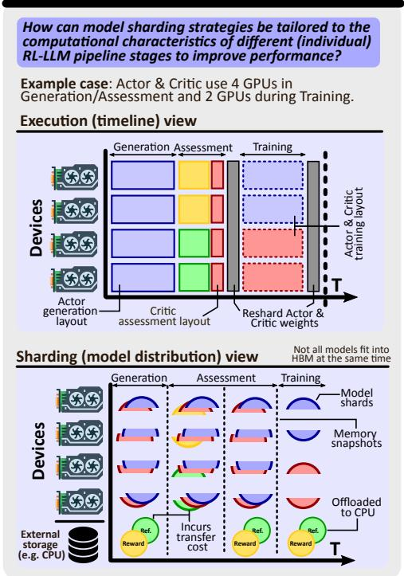  
Legend & color code

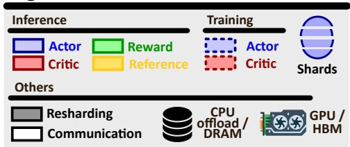

## Hybrid execu�on

## Asynchronous execu�on

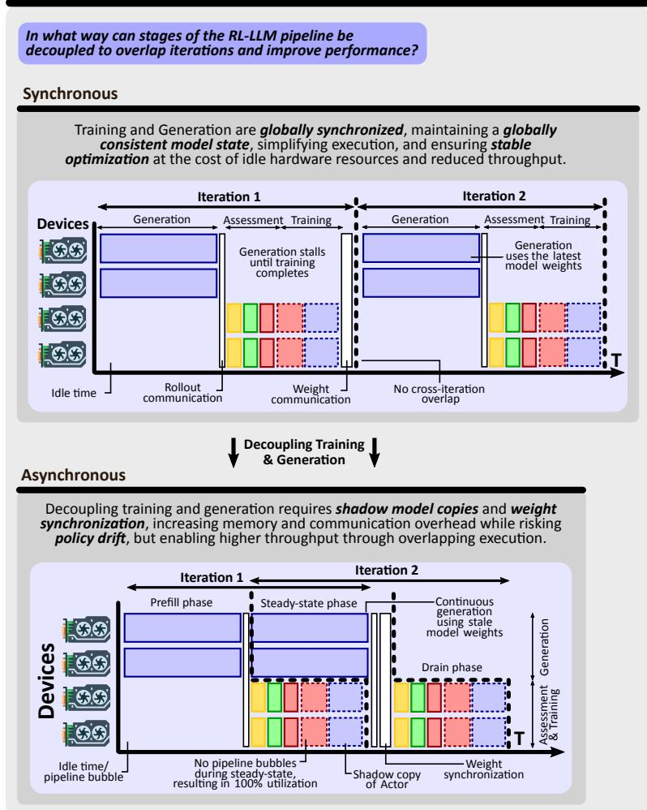

## Stage fusion

In what way can diferent stages of the RL‐LLM pipeline be fused together to enhance performance?

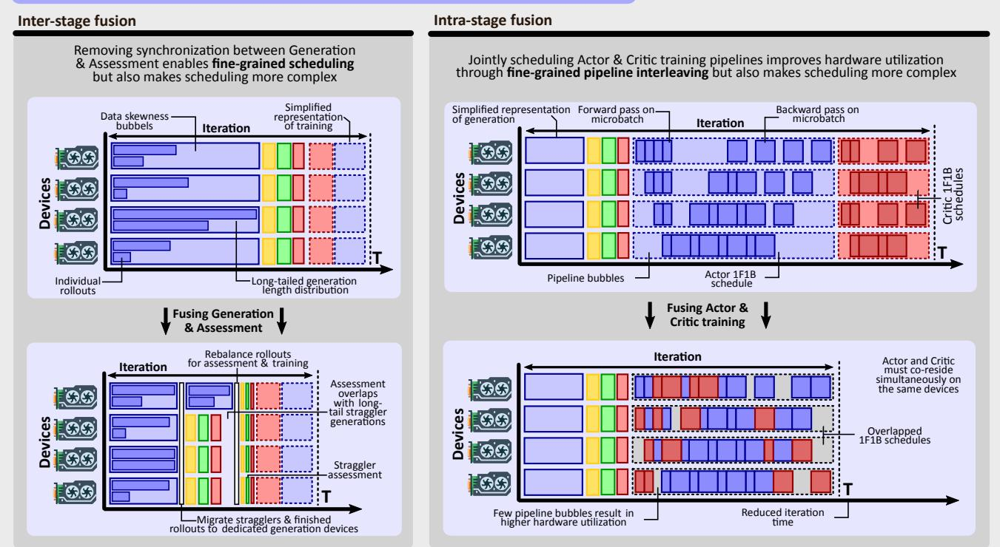  
Fig. 8: Inter-model parallelism details (asynchronous execution, hybrid execution, stage fusion). No AI was used to conceive or to draw the figure.

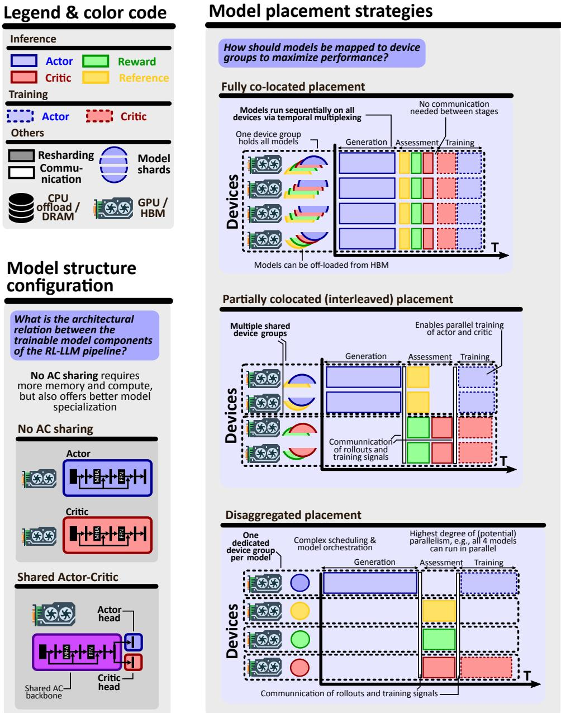  
Fig. 9: Inter-model parallelism details (placement strategies, model structure configurations). No AI was used to conceive or to draw the figure.

Θ $\bigl ( B K ( S + T ) [ C _ { f } ^ { \mathrm { t o k } } ( V _ { \psi } ) + C _ { b } ^ { \mathrm { t o k } } ( V _ { \psi } ) ] \bigr )$ plus the corresponding critic model-state memory.

Finally, critic-free methods move this trade-off from architecture to algorithm design. GRPO removes the learned value model and computes relative advantages from groups of completions sampled for the same prompt, while DPO removes the online actor–critic loop altogether and optimizes over preference pairs.

## 4.2 Model Placement Strategies

Model placement specifies the mapping from model execution to device groups. A device group is a set of GPUs that jointly stores and executes one or more model invocations, possibly using an intra-model strategy internally. The placement decision controls aspects such as memory co-residency, inter-stage communication, and the amount of concurrency available across model roles.

In fully co-located placement, all model roles share one device group and execute through temporal multiplexing. The same pool of GPUs first performs actor generation, then reward/reference/critic inference, and then actor/critic training. This maximizes locality: intermediate tensors can remain within the same device group, and no inter-group communication is needed to pass rollouts, logprobabilities, values, or rewards. It also simplifies orchestration because the runtime schedules one device pool rather than multiple distributed services.

The cost is co-resident memory pressure and poor role specialization. The device group must be provisioned for the largest memory requirement, often Training, yet it is also used for Generation, which has different arithmetic intensity and is often memory-bandwidth or latency dominated. Moreover, “redundant memory” in this context means that the same devices must hold the resident state for multiple model roles even when only one role is active. If the system uses data parallelism, this co-residency may be replicated across data-parallel groups: each replica may need actor, critic, reward, and reference state or the ability to materialize them. To mitigate this, one can employ techniques such as offloading, loading and unloading idle models, or weight gathering from sharded states. These techniques reduce memory pressure but introduce context-switching and datamovement overheads. As a result, fully co-located execution is simple and locality-friendly, but it often leaves hardware idle because the stage service times and resource needs are highly imbalanced.

Partially co-located, or interleaved, placement sits between full colocation and full disaggregation. Selected models or stages share a device group; others are placed separately. For example, actor generation and training may share a group to avoid repeated actor-weight transfers, while reward and reference inference run on smaller inferenceoriented groups. Alternatively, reward and reference models may be co-located because both are frozen and forwardonly, while the trainable actor and critic are separated.

This design is useful when some model pairs benefit from locality while others benefit from concurrency. It reduces the worst co-residency pressure of full colocation without requiring every stage boundary to become a network boundary. Yet, it also complicates scheduling: groups that share some but not all models must coordinate execution order, memory residency, and data handoff. The best interleaving depends on model sizes, stage service times, cluster topology, and whether a given edge carries small metadata, token IDs, activations, or large parameter shards.

In disaggregated placement, different model roles or stages run on dedicated, disjoint device groups. The actor group stores and executes the actor, the reward group stores the reward model, the critic group stores the value model, and the reference group stores the frozen reference model. This eliminates cross-model co-residency: a reward-model GPU no longer needs actor or critic weights, and a training GPU no longer needs to keep frozen reward/reference models resident. It also enables heterogeneous hardware specialization. Large trainable actors can be assigned to high-memory GPUs, while smaller frozen reward or reference models can run on cheaper or inference-optimized devices. StreamRL explicitly argues for such disaggregation because colocated generation and training couple resources with very different compute and memory profiles, while disaggregated stream generation enables flexible resource allocation, heterogeneous training setups, and even crossdatacenter deployment [281].

Disaggregation is a prerequisite for many forms of intermodel concurrency, but it is not by itself a speedup. If the stages still execute strictly Generation → Assessment → Training, then the iteration latency remains the sum of stage times and some groups will wait idle. The benefit appears when disaggregation is combined with stage fusion, streaming, or asynchronous execution. The price is explicit communication: rollouts, token IDs, log-probabilities, rewards, values, and sometimes updated parameters must cross device-group boundaries. Systems such as OpenRLHF, HybridFlow/verl, ReaL, FlexRLHF, and StreamRL explore different points in this placement space, using Ray-style orchestration, hierarchical APIs, parameter reallocation, or streaming data paths to manage the additional complexity [117, 169, 217, 251, 281].

## 4.3 Stage Fusion

Stage fusion removes coarse barriers between consecutive stages or between subtasks within a stage. In the baseline RLHF loop, the Assessment stage waits until the entire Generation batch has completed, and Training waits until all assessment outputs are ready. This barrier structure is inefficient for RLMs because generation lengths are longtailed: short trajectories may finish much earlier than the longest ones, yet their reward/reference/value inference is delayed by stragglers. Stage fusion decomposes stages into finer-grained subtasks and schedules downstream work as soon as its input is available.

There are two common forms. In inter-stage fusion, completed samples are streamed from Generation into Assessment without waiting for the whole rollout batch. A short completion can be scored by the reward model and processed by the reference or critic while the actor is still decoding longer completions. This turns generation-length skewness into useful overlap. In intra-stage fusion, operators within the same stage interleave microbatches or pipeline schedules. For example, actor and critic training pipelines may be interleaved so that one model’s bubble time is filled by another model’s forward or backward microbatch.

RLHFuse is a canonical example: it splits generation and assessment into sample-level subtasks for inter-stage fusion and splits training into microbatch-level subtasks for intrastage fusion, enhancing throughput by up to 3.7× by mitigating long-tail generation skew and pipeline bubbles [282]. Related overlap-oriented work such as OPPO also targets PPO-style serialization and long-tail response lengths by overlapping pipeline stages [255]. The key point is that fusion does not reduce total work; it reduces depth and idle time by changing when ready subtasks may execute.

Fusion is throughput-oriented and can increase singlesample latency. A sample that finishes early may wait in a queue until enough samples form an efficient microbatch, or it may be delayed by backpressure from a downstream stage. Thus, the steady-state time per batch can improve even if the time from one sample’s generation to its training update increases. Fusion also increases peak memory because multiple stages are live simultaneously: model weights, KV caches, activations, queues, and communication buffers may coexist. The design problem is therefore to choose a granularity that is fine enough to hide skew and bubbles but not so fine that scheduling overhead, fragmentation, or memory pressure dominates.

## 4.4 Hybrid Parallelism and Adaptive Scheduling

Hybrid parallelism means that different model invocations in the same RL-LLM pipeline may use different intra-model strategies, device allocations, or execution modes. This is distinct from ordinary 3D parallelism inside one model: the same actor πθ may be invoked once for autoregressive generation and later for training, and these two invocations have different optimal layouts. Generation favors lowlatency inference and efficient KV-cache use while Training favors higher memory capacity, efficient gradient synchronization, activation checkpointing, or optimizer-state sharding. A single static layout forces a compromise; hybrid execution allows each role to use a matched layout.

For example, if the actor is stored in a ZeRO/FSDP-style sharded training layout, generation may require gathering or resharding the weights into an inference-centered layout. Conversely, after generation, the system may need to redistribute weights or optimizer state back into the training layout. DeepSpeed-Chat’s Hybrid Engine is an early example of this idea, combining training-mode memory optimizations with inference-mode kernel and parallelism optimizations [261]. ReaL generalizes the idea as parameter reallocation: an execution plan chooses role-specific allocations and parallelization strategies, and the runtime redistributes parameters between them [169]. HybridFlow/verl’s 3D-HybridEngine similarly targets efficient actor resharding between training and generation with low redundancy, while NeMo RL exposes a mode that can train with pipeline parallelism but run TensorRT-LLM inference in a tensorparallel layout [184, 214, 217].

The cost is resharding. When two invocations of the same model use incompatible layouts or different device groups, parameter shards must be communicated and repartitioned. During the transfer, the system may need extra memory for source and destination layouts, and the transfer may sit on the critical path unless it is overlapped with unrelated work. Hybrid execution is profitable only when the per-stage gains from using specialized layouts exceed the resharding cost.

Pipe-RLHF is an example of computation-mode-aware parallelism: it uses stage-specific parallelization to improve resource utilization [262]. ReaL and HybridFlow also move in this direction by representing the RLHF pipeline as a dataflow or execution plan rather than a fixed sequence of scripts [169, 217]. The trade-off is engineering complexity: an adaptive scheduler requires profiling, cost modeling, memory feasibility checks, and robust orchestration. It is most valuable at scales where a static hand-designed layout leaves substantial hardware idle.

## 4.5 Asynchronous Execution

Stage fusion overlaps work within an iteration. Asynchronous execution overlaps different RL iterations by relaxing cross-iteration parameter freshness. In a synchronous loop, iteration k+1 cannot generate data until iteration k has completed Training and published updated parameters. In an asynchronous loop, Generation or Assessment may read a bounded-stale snapshot while Training from the previous iteration has still not completed.

Bounded asynchrony introduces a systems–algorithm trade-off. Systems benefit because rollout workers and learners no longer wait for one another. This can substantially improve utilization when generation is long-tailed or much slower than training. Asynchronous RLHF explicitly studies this off-policy setting and shows that generation and learning can be decoupled for better efficiency, while AReaL further develops a fully asynchronous RL system with a staleness-aware PPO [92, 180]. Laminar pushes the systems side further through trajectory-level asynchrony and a distributed parameter relay tier, while StaleFlow explicitly coordinates rollouts under staleness constraints to balance convergence and throughput [145, 216].

The algorithmic risk is policy drift. A trajectory may have been sampled from a behavior policy $\pi _ { \mathrm { b e h . } }$ , while the learner updates a newer policy $\pi _ { \theta }$ . To alleviate this, systems can track statistics such as staleness, token-level KL, ratio variance, clip fraction, effective sample size, and reward/advantage shifts. Standard PPO tolerates small drift because clipped importance ratios limit the update, but large staleness can move the trust-region center toward an outdated low-quality policy. AReaL addresses this by separating the behavior policy used for off-policy correction from the proximal policy used as the trust-region center.

Asynchrony also changes memory accounting. If generation and training run on disjoint device groups and must proceed concurrently, generation needs a stable readonly snapshot while training updates another copy. This creates a shadow pair: a training copy with optimizer state and a generation copy used for inference. In the worst case, this roughly doubles the parameter memory for each asynchronously consumed trainable model. The factor is not necessarily a full 2× increase in total training memory, because optimizer states usually remain only on the training side and the shadow copy may be BF16, quantized, or offloaded; nevertheless, any table or memory model for asynchronous execution should include an additional persistent inference-side parameter copy whenever trainable models are disaggregated across stale readers and writers.

## 4.6 Complexity Analysis

We now rigorously quantify the inter-model strategies. The analysis is conducted for a PPO-style online RL-LLM pipeline, which is the most demanding common setting; GRPO and DPO can be recovered by deleting the critic and/or online assessment components. Detailed derivations are in Appendix B.4.

We first define stage-level terms. Generation comes with

$$
\begin{array} { l r } { { \cal W } _ { G } = B K C _ { \mathrm { g e n } } ( \pi _ { \theta } ) \qquad } & { { \mathrm { ( w o r k ) } } , } \\ { { \cal D } _ { G } = { \cal D } _ { \mathrm { g e n } } ( \pi _ { \theta } ) \qquad } & { { \mathrm { ( d e p t h ) , } } } \\ { { \cal M } _ { G } = | \pi _ { \theta } | + B K { \cal M } _ { \mathrm { K V } } \qquad } & { { \mathrm { ( m e m o r y ) } } . } \end{array}
$$

Here $C _ { \mathrm { g e n } }$ and $D _ { \mathrm { { g e n } } }$ include the prefill–decode decomposition from Table 3.

Next, the work of the assessment stage is

$$
W _ { A } = B K ( S + T ) [ C _ { f } ^ { \mathrm { t o k } } ( \pi _ { \mathrm { r e f } } ) + C _ { f } ^ { \mathrm { t o k } } ( R _ { \varphi } ) + C _ { f } ^ { \mathrm { t o k } } ( V _ { \psi } ) ] .
$$

For depth, we distinguish co-located sequential execution

$$
D _ { A } ^ { \Sigma } = D _ { f } ( \pi _ { \mathrm { r e f } } ) + D _ { f } ( R _ { \varphi } ) + D _ { f } ( V _ { \psi } ) ,
$$

from disaggregated execution

$$
D _ { A } ^ { \operatorname* { m a x } } = \operatorname* { m a x } \{ D _ { f } ( \pi _ { \mathrm { r e f } } ) , D _ { f } ( R _ { \varphi } ) , D _ { f } ( V _ { \psi } ) \} .
$$

Similarly, training work is

$$
W _ { T } = B K ( S + T ) [ C _ { \mathrm { t r } } ^ { \mathrm { t o k } } ( \pi _ { \theta } ) + C _ { \mathrm { t r } } ^ { \mathrm { t o k } } ( V _ { \psi } ) ] ,
$$

with sequential and disaggregated depths

$$
D _ { T } ^ { \Sigma } = D _ { \mathrm { t r } } ( \pi _ { \theta } ) + D _ { \mathrm { t r } } ( V _ { \psi } ) , \quad D _ { T } ^ { \mathrm { m a x } } = \operatorname * { m a x } \{ D _ { \mathrm { t r } } ( \pi _ { \theta } ) , D _ { \mathrm { t r } } ( V _ { \psi } ) \} .
$$

For memory, we use $M _ { A } ^ { \Sigma }$ for the co-resident assessment footprint, $\check { M } _ { T } ^ { \Sigma }$ for the co-resident actor–critic training footprint, and $M _ { T } ^ { \mathrm { { m a x } } }$ for the maximum over disaggregated actor

<table><tr><td>Config</td><td>Stage</td><td>Global Work</td><td>Global Depth</td><td>Peak Memory per-device group</td></tr><tr><td rowspan="4">Baseline</td><td>Gen.</td><td> $B K \cdot C _ { \mathrm { g e n } } ( \pi _ { \theta } )$ </td><td> $D _ { \mathrm { g e n } } ( \pi _ { \theta } )$ </td><td> $| \pi _ { \theta } | + B K \cdot M _ { \mathrm { K V } }$   $| \pi _ { \mathrm { r e f } } | + | R _ { \varphi } | + | V _ { \psi } |$ </td></tr><tr><td>Assess.</td><td> $B K ( S + T )$   $\cdot [ C _ { f } ^ { \mathrm { t o k } } ( \pi _ { \mathrm { r e f } } ) + C _ { f } ^ { \mathrm { t o k } } ( R _ { \varphi } ) + C _ { f } ^ { \mathrm { t o k } } ( V _ { \psi } ) ]$ </td><td> $D _ { f } ( \pi _ { \mathrm { r e f } } ) + D _ { f } ( R _ { \varphi } ) + D _ { f } ( V _ { \psi } )$ </td><td> $+ B K ( { \dot { S } } + T )$   $\cdot \operatorname* { m a x } \{ M _ { \mathrm { I n f } } ( \pi _ { \mathrm { r e f } } ) , M _ { \mathrm { I n f } } ( R _ { \varphi } ) , M _ { \mathrm { I n f } } ( V _ { \psi } ) \}$ </td></tr><tr><td>Train.</td><td> $B K ( S + T ) { \cdot } [ C _ { \mathrm { t r } } ^ { \mathrm { t o k } } ( \pi _ { \theta } ) + C _ { \mathrm { t r } } ^ { \mathrm { t o k } } ( V _ { \psi } ) ]$ </td><td> $D _ { \mathrm { t r } } ( \pi _ { \theta } ) + D _ { \mathrm { t r } } ( V _ { \psi } )$ </td><td> $4 \cdot ( | \pi _ { \theta } | + | V _ { \psi } | )$   $+ B K ( S + T ) ( L _ { \pi } d _ { \pi } + L _ { \psi } d _ { \psi } )$ </td></tr><tr><td>Gen.</td><td> $B K \cdot C _ { \mathrm { g e n } } ( \pi _ { \mathrm { S H } } )$ </td><td> $D _ { \mathrm { g e n } } ( \pi _ { \mathrm { S H } } )$ </td><td> $| \pi _ { \mathrm { S H } } | + B K \cdot M _ { \mathrm { K V } }$ </td></tr><tr><td rowspan="3">AC shared</td><td></td><td> $B K ( S + T )$ </td><td></td><td> $| \pi _ { \mathrm { r e f } } | + | R _ { \varphi } | + | \pi _ { \mathrm { S H } } |$   $+ B K ( S + T )$ </td></tr><tr><td>Assess.</td><td> $\cdot [ C _ { f } ^ { \mathrm { t o k } } ( \pi _ { \mathrm { r e f } } ) + C _ { f } ^ { \mathrm { t o k } } ( R _ { \varphi } ) + C _ { f } ^ { \mathrm { t o k } } ( \pi _ { \mathrm { S H } } ) ]$ </td><td> $D _ { f } ( \pi _ { \mathrm { r e f } } ) + D _ { f } ( R _ { \varphi } ) + D _ { f } ( \pi _ { \mathrm { S H } } )$ </td><td> $\cdot \ \mathrm { m a x } \{ M _ { \mathrm { I n f } } ( \pi _ { \mathrm { r e f } } ) , M _ { \mathrm { I n f } } ( R _ { \varphi } ) , M _ { \mathrm { I n f } } ( \pi _ { \mathrm { S H } } ) \}$ </td></tr><tr><td>Train. Gen.</td><td> $B K ( S + T ) \cdot C _ { \mathrm { t r } } ^ { \mathrm { t o k } } ( \pi _ { \mathrm { S H } } )$   $B K \cdot C _ { \mathrm { g e n } } ( \pi _ { \theta } )$ </td><td> $D _ { \mathrm { t r } } ( \pi _ { \mathrm { S H } } )$ </td><td> $4 \cdot | \pi _ { \mathrm { S H } } | + B K ( S + T ) L _ { \mathrm { S H } } d _ { \mathrm { S H } }$   $| \pi _ { \theta } | + B K \cdot M _ { \mathrm { K V } }$ </td></tr><tr><td rowspan="3"></td><td></td><td> $B K ( S + T )$ </td><td> $D _ { \mathrm { g e n } } ( \pi _ { \theta } )$ </td><td> $\operatorname* { m a x } \{ | \pi _ { \mathrm { r e f } } | + B K ( S + T ) M _ { \mathrm { I n f } } ( \pi _ { \mathrm { r e f } } ) ,$   $| R _ { \varphi } | + B K ( S + T ) { \cal M } _ { \mathrm { I n f } } ( R _ { \varphi } ) ,$ </td></tr><tr><td>Assess.</td><td> $\cdot [ C _ { f } ^ { \mathrm { t o k } } ( \pi _ { \mathrm { r e f } } ) + C _ { f } ^ { \mathrm { t o k } } ( R _ { \varphi } ) + C _ { f } ^ { \mathrm { t o k } } ( V _ { \psi } ) ]$   $B K ( S + T ) { \cdot } [ C _ { \mathrm { t r } } ^ { \mathrm { t o k } } ( \pi _ { \theta } ) + C _ { \mathrm { t r } } ^ { \mathrm { t o k } } ( V _ { \psi } ) ]$ </td><td> $\operatorname* { m a x } \{ D _ { f } ( \pi _ { \mathrm { r e f } } ) , D _ { f } ( R _ { \varphi } ) , D _ { f } ( V _ { \psi } ) \}$ </td><td> $| V _ { \psi } | + B K ( S + T ) { \cal M } _ { \mathrm { I n f } } ( V _ { \psi } ) \}$   $\operatorname* { m a x } \{ 4 | \pi _ { \theta } | + B K ( S + T ) L _ { \pi } d _ { \pi } ,$ </td></tr><tr><td>Train. Gen.</td><td></td><td> $\operatorname* { m a x } \{ D _ { \mathrm { t r } } ( \pi _ { \theta } ) , D _ { \mathrm { t r } } ( V _ { \psi } ) \}$ </td><td> $4 | V _ { \psi } | + B K ( S + T ) L _ { \psi } d _ { \psi } \big \}$ </td></tr><tr><td rowspan="3"></td><td></td><td> $B K \cdot C _ { \mathrm { g e n } } ( \pi _ { \theta } )$   $B K ( S + T )$ </td><td> $D _ { \mathrm { g e n } } ^ { \mathrm { T P } } ( \pi _ { \theta } )$ </td><td> $| \pi _ { \theta } | + B K \cdot M _ { \mathrm { K V } }$   $| \pi _ { \mathrm { r e f } } | + | R _ { \varphi } | + | V _ { \psi } |$  +BK(S + T)</td></tr><tr><td>Assess. Train.</td><td> $\cdot [ C _ { f } ^ { \mathrm { t o k } } ( \pi _ { \mathrm { r e f } } ) + C _ { f } ^ { \mathrm { t o k } } ( R _ { \varphi } ) + C _ { f } ^ { \mathrm { t o k } } ( V _ { \psi } ) ]$   $B K ( S + T ) { \cdot } [ C _ { \mathrm { t r } } ^ { \mathrm { t o k } } ( \pi _ { \theta } ) + C _ { \mathrm { t r } } ^ { \mathrm { t o k } } ( V _ { \psi } ) ]$ </td><td> $D _ { f } ^ { \mathrm { T P } } ( \pi _ { \mathrm { r e f } } ) + D _ { f } ^ { \mathrm { T P } } ( R _ { \varphi } ) + D _ { f } ^ { \mathrm { T P } } ( V _ { \psi } )$ </td><td> $\cdot \operatorname* { m a x } \{ M _ { \mathrm { I n f } } ( \pi _ { \mathrm { r e f } } ) , M _ { \mathrm { I n f } } ( R _ { \varphi } ) , M _ { \mathrm { I n f } } ( V _ { \psi } ) \}$   $4 \cdot ( | \pi _ { \theta } | + | V _ { \psi } | )$ </td></tr><tr><td></td><td> $B K C _ { \mathrm { g e n } } ( \pi _ { \theta } ) + B K ( S + T )$ </td><td> $D _ { \mathrm { t r } } ( \pi _ { \theta } ) + D _ { \mathrm { t r } } ( V _ { \psi } )$ </td><td> $+ B K ( S + T ) ( L _ { \pi } d _ { \pi } + L _ { \psi } d _ { \psi } )$ </td></tr><tr><td rowspan="2">Stage F.</td><td>Inter</td><td> $\cdot [ C _ { f } ^ { \mathrm { t o k } } ( \pi _ { \mathrm { r e f } } { \bar { ) } } + C _ { f } ^ { \mathrm { t o k } } ( R _ { \varphi } ) + C _ { f } ^ { \mathrm { t o k } } ( V _ { \psi } ) ]$ </td><td> $\operatorname* { m a x } \{ D _ { \mathrm { g e n } } ( \pi _ { \theta } ) , D _ { f } ( \pi _ { \mathrm { r e f } } ) ,$   $D _ { f } ( R _ { \varphi } ) , D _ { f } ( V _ { \psi } ) \}$ </td><td> $\operatorname* { m a x } \{ | \pi _ { \theta } | + B K M _ { \mathrm { K V } } , | \pi _ { \mathrm { r e f } } | + | R _ { \varphi } | + | V _ { \psi } | \}$ </td></tr><tr><td>Intra</td><td> $B K ( S + T ) { \cdot } [ C _ { \mathrm { t r } } ^ { \mathrm { t o k } } ( \pi _ { \theta } ) + C _ { \mathrm { t r } } ^ { \mathrm { t o k } } ( V _ { \psi } ) ]$   $B K C _ { \mathrm { g e n } } ( \pi _ { \theta } ) + B K ( S + T )$ </td><td> $\operatorname* { m a x } \{ D _ { \mathrm { t r } } ( \pi _ { \theta } ) , D _ { \mathrm { t r } } ( V _ { \psi } ) \}$ </td><td> $4 \cdot ( | \pi _ { \theta } | + | V _ { \psi } | )$   $+ B K ( S + T ) ( L _ { \pi } d _ { \pi } + L _ { \psi } d _ { \psi } )$   $\mathrm { m a x } \{ | \pi _ { \theta } | + B K M _ { \mathrm { K V } } + M _ { \mathrm { s h } } ( \pi _ { \theta } ) ,$ </td></tr><tr><td>Async</td><td>Aggr.</td><td> $\cdot [ C _ { f } ^ { \mathrm { t o k } } ( \pi _ { \mathrm { r e f } } ) + C _ { f } ^ { \mathrm { t o k } } ( R _ { \varphi } ) + C _ { f } ^ { \mathrm { t o k } } ( V _ { \psi } )$   $+ C _ { \mathrm { t r } } ^ { \mathrm { t o k } } ( \pi _ { \theta } ) + C _ { \mathrm { t r } } ^ { \mathrm { t o k } } ( V _ { \psi } ) ]$ </td><td> $\operatorname* { m a x } \left\{ D _ { \mathrm { g e n } } ( \pi _ { \theta } ) + \right.$  max  $\{ D _ { f } ( \pi _ { \mathrm { r e f } } ) , D _ { f } ^ { \sim } ( R _ { \varphi } ) , D _ { f } ( V _ { \psi } ) \}$   $\operatorname* { m a x } \{ D _ { \mathrm { t r } } ( \pi _ { \theta } ) , D _ { \mathrm { t r } } ( V _ { \psi } ) \} \}$ </td><td> $| \pi _ { \mathrm { r e f } } | , | R _ { \varphi } | , | V _ { \psi } | ,$   $4 | \pi _ { \theta } | + B K ( \dot { S } + T ) L _ { \pi } d _ { \pi } ,$   $4 | V _ { \psi } | + B K ( S + T ) L _ { \psi } d _ { \psi } \big \}$ </td></tr><tr><td>Combined</td><td> $\operatorname { A g g r } .$ </td><td> $B K C _ { \mathrm { g e n } } ( \pi _ { \theta } ) + B K ( S + T )$   $\cdot [ C _ { f } ^ { \mathrm { t o k } } ( \pi _ { \mathrm { r e f } } ) + C _ { f } ^ { \mathrm { t o k } } ( R _ { \varphi } ) + C _ { f } ^ { \mathrm { t o k } } ( V _ { \psi } )$   $+ C _ { \mathrm { t r } } ^ { \mathrm { t o k } } ( \pi _ { \theta } ) + C _ { \mathrm { t r } } ^ { \mathrm { t o k } } ( V _ { \psi } ) ]$ </td><td> $\operatorname* { m a x } \Big \{ \operatorname* { m a x } \{ D _ { \mathrm { g e n } } ^ { \mathrm { T P } } ( \pi _ { \theta } ) , D _ { f } ( \pi _ { \mathrm { r e f } } ) ,$   $D _ { f } ( R _ { \varphi } ) , D _ { f } ( V _ { \psi } ) \} ,$   $\operatorname* { m a x } \{ D _ { \mathrm { t r } } ( \pi _ { \theta } ) , D _ { \mathrm { t r } } ( V _ { \psi } ) \} \}$ </td><td> $\mathrm { m a x } \{ | \pi _ { \theta } | + B K M _ { \mathrm { K V } } + M _ { \mathrm { s h } } ( \pi _ { \theta } ) ,$   $| \pi _ { \mathrm { r e f } } | , | R _ { \varphi } | , | V _ { \psi } | ,$   $4 | \pi _ { \theta } | + B K ( S + T ) L _ { \pi } d _ { \pi } ,$   $4 | V _ { \psi } | + B K ( S + T ) L _ { \psi } d _ { \psi } \big \}$ </td></tr></table>

TABLE 9: Inter-model parallelism. Global work, global depth, and peak memory per device group reported for the Generation, Assessment, and Training stages of a single RL iteration within one epoch under different inter-model parallelism techniques Global work and depth report total FLOPs and the critical-path length per stage. Peak memory is measured per device group and taken as the maximum over all groups active within a stage; in configurations without disaggregation, all models share the same device group and execute through temporal multiplexing, where different models become active at different stages. ${ \bf \mu ^ { \prime \prime } } \mathbf { T P ^ { \prime \prime } }$ superscript $\& \ ^ { \prime }$ subscript: A TP superscript denotes tensor-parallel execution; $\pi _ { \mathrm { S H } }$ denotes the shared actor–critic configuration. $" \mathrm { \mathbf { t r } } ^ { \prime \prime }$ subscript: For conciseness, for training-stage model invocations, we define $C _ { \mathrm { t r } } ^ { \mathrm { t o k } } ( M ) : = C _ { f } ^ { \mathrm { t o k } } ( M ) + C _ { b } ^ { \mathrm { t o k } } ( M )$ ≈ $3 C _ { f } ^ { \mathrm { t o k } } ( M )$ and $D _ { \mathrm { t r } } ( M ) : = \bar { D } _ { f } ( M ) + D _ { b } ( M )$ because a parameter update requires a forward pass followed by backpropagation. $M _ { \mathrm { s h } } ^ { \prime } ( \pi _ { \theta } )$ denotes the persistent inference-side shadow copy of the actor required when asynchronous consumers use a boundedstale snapshot. Also, sample-time actor log-probabilities are assumed to be computed on the fly during Generation from the same logits used for sampling; therefore they do not add a separate actor forward pass. Baselines: The Baseline configuration sequentially (i.e., one device group) executes all RL components, resulting in additive depth terms. AC shared uses a shared Transformer backbone for actor and critic. All models run sequentially in a single device group. Disaggregated execution assigns models to distinct device groups, allowing concurrent execution. The Hybrid configuration applies TP to Generation, $\mathrm { T P / P P }$ to Assessment, and ${ \mathrm { Z e R O } } { - 3 }$ to Training. All models share the same device group. Stage F. applies inter-stage fusion to Generation and Assessment and intra-stage fusion to Training. Asynchronous execution overlaps Generation and Assessment with Training by allowing bounded weight staleness. Combined execution combines asynchronous overlap with disaggregated model placement and hybrid intra-model parallelism, following the RLHFuse execution model. Training memory assumes the Adam optimizer without activation checkpointing, accounting for parameters, gradients, optimizer states, and activations.

and critic training groups. When asynchronous execution requires a persistent inference-side copy of a trainable model, we write this shadow-copy cost as $M _ { \mathrm { s h } }$

Table 9 summarizes the resulting work, depth, and peak per-device-group memory. The most important point is that most inter-model techniques do not reduce total work: they reduce depth by replacing sequential sums with maxima, or reduce peak memory by eliminating co-residency. The main exception is shared actor–critic, which also reduces work and model state by replacing two trainable backbones with one shared backbone.

The baseline has critical path $D _ { G } + D _ { A } ^ { \Sigma } + D _ { T } ^ { \Sigma }$ . Disaggregation preserves work but changes within-stage composition from sums to maxima, giving $D _ { G } + D _ { A } ^ { \mathrm { m a x } } + D _ { T } ^ { \mathrm { m a x } }$ Stage fusion further overlaps Generation and Assessment, resulting in $\operatorname * { m a x } \{ D _ { G } , D _ { A } ^ { \operatorname * { m a x } } \} + D _ { T } ^ { \operatorname * { m a x } } \approx D _ { G } + D _ { T } ^ { \operatorname * { m a x } }$ whenever generation dominates assessment. Bounded asynchrony overlaps generation/assessment of one iteration with training of another, yielding a steady-state recurrence depth max $\{ \breve { D } _ { G } + D _ { A } ^ { \mathrm { m a x } } , \bar { D } _ { T } ^ { \mathrm { m a x } } \}$ . The strongest configuration combines intra-model sharding, disaggregated placement, stage fusion, and bounded asynchrony. Its idealized depth is max $\{ D _ { G } ^ { \mathrm { T P } } , D _ { T } ^ { \mathrm { s h a r d } } \}$ , up to any unhidden assessment tail, resharding, and communication overheads. This expression makes the central limitation explicit: inter-model parallelism can hide or overlap non-generation work, but it cannot remove the autoregressive decode chain inside $D _ { G }$ . Reducing that term requires intra-model inference parallelism, faster decoding kernels, batching, or algorithmic changes that shorten generated trajectories.

## 4.7 Key Insights & Takeaways

The inter-model analysis yields several lessons.

Most inter-model schemes reduce depth, not work. Placement, fusion, hybrid execution, and asynchrony mainly change the critical path by replacing sequential sums with maxima or by overlapping stages. The total FLOP work remains essentially unchanged. Shared actor–critic is the main exception because it removes a separate critic backbone and therefore reduces both work and trainable model-state memory.

Disaggregation is a memory and concurrency enabler, not a standalone speedup. Moving actor, critic, reward, and reference models to separate device groups reduces coresident memory and turns independent subcomputations into max-depth terms. However, if the pipeline still executes strict Generation → Assessment → Training barriers, disaggregation only moves idle time to different device groups. It must be combined with fusion, streaming, or asynchrony to reduce iteration depth.

Stage fusion and asynchrony attack different barriers. Stage fusion removes within-iteration barriers, especially the barrier between long-tailed Generation and Assessment. Asynchrony removes cross-iteration barriers by allowing bounded-stale parameter reads. Fusion gives max $\{ D _ { G } , D _ { A } ^ { \mathrm { m a x } } \} + D _ { T } ^ { \mathrm { m a x } }$ , while asynchrony gives max $\{ D _ { G } + D _ { A } ^ { \mathrm { m a x } } , D _ { T } ^ { \mathrm { m a x } } \}$ . They can be combined.

The actor remains the dominant bottleneck. Even the combined configuration cannot remove the autoregressive decode chain in $D _ { G } ~ = ~ D _ { \mathrm { g e n } } ( \pi _ { \theta } ) ~ = ~ O ( T D _ { f } ( \pi _ { \theta } ) )$ . Intermodel scheduling can hide reward, reference, critic, and training work around actor generation, but reducing $D _ { G }$ itself requires better inference parallelism (most notably tensor parallelism), batching, KV-cache management, shorter trajectories, or algorithmic changes.

Asynchrony trades freshness for hardware utilization and memory. Bounded staleness can reduce steady-state depth from a sum to a max, but it introduces policy drift and may require shadow copies. Thus, the relevant control variables are not only throughput and memory, but also staleness, KL drift between behavior and current policies, PPO clip fraction, and others.

The best systems are stage- and role-aware. A scalable RLM system should not assign one global execution mode to all models. Actor Generation, reward/reference Assessment, critic inference, actor Training, and critic Training have different bottlenecks. The strongest designs therefore combine shared or critic-free structure when appropriate, disaggregated placement for memory and concurrency, stage fusion for long-tail overlap, hybrid layouts for stagespecific efficiency, and bounded asynchrony when the learning rule tolerates stale data.

Shared actor–critic is effective under resource constraints. Shared actor–critic architectures are particularly effective when device groups and memory are scarce and inter-model concurrency is limited thanks to sharing a single backbone between the policy and value functions.

## 5 PARALLELISM-FOCUSED SPECIFICATIONS

We present a unified algorithmic and mathematical formulation of PPO (Algorithm 2) and GRPO (Algorithm 3), which share a common rollout-generation routine (Algorithm 1), together with the offline counterpart DPO (Algorithm 4). The goal is to expose where the RL-LLM pipeline admits intra- and inter-model parallelism, and this to facilitate the development of more efficient RLM architectures.

We use a notation in which boldface denotes a per-token vector and a non-bold letter with a t subscript denotes one of its per-token components. For example, $\bar { V _ { n } }  \bar { V _ { \psi } } ( \pmb { x } _ { n } , \pmb { y } _ { n } )$ abbreviates $( V _ { n , t } ) _ { t = 1 } ^ { | { \pmb y } _ { n } | }  ( V _ { \psi } ( { \pmb x } _ { n } , { \pmb y } _ { n , < t } ) ) _ { t = 1 } ^ { | { \pmb y } _ { n } | }$ , with all $| y _ { n } |$ entries produced by a single teacher-forced forward pass. A plain letter without a t subscript is a scalar $( \mathbf { e . g . } , r _ { n } \gets$ $R _ { \varphi } ( \pmb { x } _ { n } , \pmb { y } _ { n } ) )$ . The unit basis vector $e _ { t }$ has 1 at position t and 0 elsewhere. The all-ones vector 1 has 1 at every position, with length inferred from context.

If the actor and critic share a backbone, the PPO actor/- critic two invocations should instead be read as a single shared-model invocation with two heads. For DPO, the reference path may be omitted from the online training loop if $\ell _ { \mathrm { r e f } , w } ^ { ( n ) }$ and $\ell _ { \mathrm { r e f } , l } ^ { ( n ) ^ { \bullet } }$ are precomputed and stored with the preference dataset.

Background colors indicate model roles. The label [intermodel concurrency] marks following fork–join (colored) regions in which distinct model invocations have no data dependency and may run concurrently when placed on separate device groups. The label [DP] (data parallelism) marks independent sample-level work, such as prompts, completions, rollouts, or preference pairs. The tags [TP], [PP], [SP], [CP], and [EP] indicate intra-model parallel strategies that can be used for the corresponding invocation. Boldface (e.g., TP) indicates a usual use, non-bold font (e.g.,

SP) is a possible but not a necessarily common use case.   
Each tag describes the next following line or code block.

TP/PP are mainly capacity or single-invocation latency tools, SP is mainly useful for trainable teacher-forced passes with large activation memory, CP is useful for long-context invocations, and EP applies only to MoE models.

Algorithm 1: A common part of Generation, used by PPO and GRPO   
Input: Batch of prompts $X = \{ \pmb { x } _ { b } \} _ { b = 1 } ^ { B } ,$ , candidates/prompt K.   
Output: Set $B _ { \mathrm { r o l l } }$ of generated samples paired with per-token rollout   
log-probabilities.   
1 Initialize $B _ { \mathrm { r o l l } }  \emptyset ;$   
2 [DP] foreach prompt x $\in X$ do   
3 [DP] for candidate $i = 1$ to K do   
4 Initialize $\mathbf { \Delta } _ { \mathbf { \mathcal { Y } } _ { b } ^ { ( i ) } } \gets \mathbb { I }$ and $\ell _ { \mathrm { o l d } , b } ^ { ( i ) } \gets [ ] ;$   
actor path   
for $t { \dot { = } } 1 , 2 , \dots$ until EOS or max length do   
[TP, PP, SP, CP, EP]   
Sample next token $\mathbf { \Phi } _ { y _ { b , t } ^ { ( i ) } } ^ { ( i ) } \sim \pi _ { \theta } \left( \cdot \mid \mathbf { x } _ { b } , \mathbf { \Phi } _ { \mathbf { } \mathbf { } \mathbf { , } \mathbf { \Lambda } ^ { ( i ) } } ^ { ( i ) } \right)$ via   
5 stochastic decoding;   
Actor log-prob $\ell _ { \mathrm { o l d } , b , t } ^ { ( i ) } \gets 1$ log πθ $\left( \boldsymbol { y } _ { b , t } ^ { ( i ) } \mid \boldsymbol { x } _ { b } , \boldsymbol { y } _ { b , < t } ^ { ( i ) } \right)$   
Append $y _ { b , t } ^ { ( i ) }$ to $\pmb { y } _ { b } ^ { ( i ) }$ and $\ell _ { \mathrm { o l d } , b , t } ^ { ( i ) } \mathrm { t o } \ell _ { \mathrm { o l d } , b } ^ { ( i ) } ;$   
end   
Append $\left( \pmb { x } _ { b } , \pmb { y } _ { b } ^ { ( i ) } , \pmb { \ell } _ { \mathrm { o l d } , b } ^ { ( i ) } \right)$ to $B _ { \mathrm { r o l l } } ;$   
6 end   
7 end

The intra-model annotations are attached only to operations that invoke a Transformer model or backpropagate through one. For independent samples, prompts, candidates, rollouts, or preference pairs, DP is the natural default because these units have no semantic dependency and can be assigned to different replicas with only later reductions for losses, statistics, or gradients. For model invocations, TP and PP are marked whenever the actor, critic, reward, or reference model may need to be sharded to fit memory or reduce single-invocation latency; however, they are conditional because their collectives, activation transfers, and pipeline bubbles can hurt throughput when the model already fits on one device. CP is marked on long-context forward or training invocations, including autoregressive decode, because KV/attention memory of RLM rollouts may exceed single-device capacity. SP is marked only on trainable teacher-forced forward/backward paths, not on ordinary forward-only Assessment or decode-time Generation, because its main benefit is reducing stored activation memory during Training. EP is marked only as an MoEdependent option: it applies if the corresponding actor, critic, reward, or reference model contains routed experts, where it reduces per-device expert storage and compute but introduces routing and all-to-all communication.

## 6 ANALYSIS OF EXISTING MODELS & DESIGNS

We also analyze existing models and frameworks.

## 6.1 Reasoning Language Models

We compare representative post-trained LLMs and RLMs in Table 10. We classify a model as a general aligned LLM if post-training primarily improves instruction-following, helpfulness, safety, or general assistant behavior, even when the model can solve reasoning tasks. We classify a model as an RLM if its training or inference pipeline explicitly targets reasoning trajectories, verifiable rewards, long CoT, search, tool use, or controllable test-time computation. This distinction is often blurred in practice: recent systems increasingly unify fast response modes and slow reasoning modes inside a single routed or hybrid model family.

Algorithm 2: Algorithmic and Mathematical Specification of PPO   
Input: GAE discount γ and smoothing λ, KL coefficient β, PPO clip   
range ε, entropy coefficient $c _ { H } ;$ set of prompts $X ,$ , prompt batch   
size $B ,$ candidates/prompt K, training epochs EPPO.   
Output: Trained parameters $( \theta , { \overset { \cdot } { \psi } } ) .$   
[DP] foreach prompt batch $\{ \pmb { x } _ { b } \} _ { b = 1 } ^ { B } \subset X$ do   
Generation (Online)   
Generate completions $\mathcal { B } _ { \mathrm { r o l l } }  \{ ( \boldsymbol { x } _ { b } , \boldsymbol { y } _ { b } ^ { ( i ) } , \boldsymbol { \ell } _ { \mathrm { o l d } , b } ^ { ( i ) } ) \} _ { b = 1 , i = 1 } ^ { B , K }$ via   
Algorithm 1;   
Flatten $\begin{array} { r l } { } & { { \cal B } _ { \mathrm { r o l l } }  \Big \{ \Big ( { \pmb x } _ { n } , { \pmb y } _ { n } , { \pmb \ell } _ { \mathrm { o l d } } ^ { ( n ) } \Big ) \Big \} _ { n = 1 } ^ { B K } ; } \end{array}$   
Assessment   
[DP] foreach $\left( \pmb { x } _ { n } , \pmb { y } _ { n } , \pmb { \ell } _ { \mathrm { o l d } } ^ { ( n ) } \right) \in \mathcal { B } _ { \mathrm { r o l l } }$ do   
[inter-model concurrency]   
reward path   
[TP, PP, SP, CP, EP]   
Compute scalar reward $\begin{array} { r } { s _ { n }  R _ { \varphi } ( \pmb { x } _ { n } , \pmb { y } _ { n } ) ; } \end{array}$   
critic path   
[TP, PP, SP, CP, EP]   
Compute values $\begin{array} { r } { V _ { n }  V _ { \psi } ( { \pmb x } _ { n } , { \pmb y } _ { n } ) ; } \end{array}$   
EOS terminal value $V _ { n , | y _ { n } | + 1 } \gets 0 ;$   
reference path   
10 [TP, PP, SP, CP, EP]   
Compute reference log-probs $\ell _ { \mathrm { r e f } } ^ { ( n ) }  \log \pi _ { \mathrm { r e f } } ( \pmb { y } _ { n } \mid \pmb { x } _ { n } ) ;$   
11 Per-token KL-shaped rewards   
$r _ { n } \gets - \beta \left( \pmb { \ell } _ { \mathrm { o l d } } ^ { ( n ) } - \pmb { \ell } _ { \mathrm { r e f } } ^ { ( n ) } \right) + s _ { n } e _ { | y _ { n } | }$ (KL penalty enters via   
reward and propagates through GAE; no KL term in PPO loss)   
12 Initialize $\begin{array} { r } { A _ { n } ^ { ' }  \tilde { \mathbb { I } } , \hat { G } _ { n }  \Breve { \mathbb { I } } , } \end{array}$ and EOS terminal advantage   
$A _ { n , \mid { \pmb y } _ { n } \mid + 1 }$ ← 0;   
13 for $t = | \boldsymbol { y } _ { n } |$ to 1 do   
14 Temporal difference residual   
$\dot { \delta } _ { n , t } \dot { \epsilon } \gets r _ { n , t } + \gamma V _ { n , t + 1 } - V _ { n , t } ;$   
15 Compute advantage (GAE) $\begin{array} { r } { A _ { n , t }  \delta _ { n , t } + \gamma \lambda A _ { n , t + 1 } ; } \end{array}$   
16 Compute discounted return $\hat { G } _ { n , t } \gets V _ { n , t } + A _ { n , t } ;$   
17 Prepend $A _ { n , t }$ to $A _ { n }$ and $\hat { G } _ { n , t } \ \mathrm { t o } \ \hat { G } _ { n } ;$   
18 end   
19 Augment rollout n in $B _ { \mathrm { r o l l } }$ with $\left( A _ { n } , \hat { G } _ { n } \right)$   
20 end   
Training via PPO   
for $e = 1$ to EPPO do   
Shuffle $B _ { \mathrm { r o l l } }$ and partition into minibatches {B};   
[DP] foreach minibatch B do   
[DP] foreach rollout n ∈ B do   
[inter-model concurrency]   
actor path   
[TP, PP, SP, CP, EP]   
27 Current log-probs $\bar { \ell } _ { \theta } ^ { ( n ) } \gets \log \pi _ { \theta } ( \pmb { y } _ { n } \mid \pmb { x } _ { n } ) ;$   
Importance ratios $\begin{array} { r } { \dot { \rho _ { n } } \gets \exp \left( \ell _ { \theta } ^ { ( n ) } - \ell _ { \mathrm { o l d } } ^ { ( n ) } \right) } \end{array}$   
critic path   
28 [TP, PP, SP, CP, EP]   
Current values $\tilde { V _ { n } ^ { \prime } }  V _ { \psi } ( { \pmb x } _ { n } , { \pmb y } _ { n } ) ;$   
29 30 end   
Number of tokens in batch $\begin{array} { r } { Z  \sum _ { n \in B } | { \pmb y } _ { n } | ; } \end{array}$   
31 [inter-model concurrency]   
actor path   
Compute PPO loss:   
$\begin{array} { r } { \mathcal { L } _ { \mathrm { P P O } } = - \frac { 1 } { Z } \sum _ { n \in \mathcal { B } } \sum _ { t = 1 } ^ { | y _ { n } | } } \end{array}$ min $( \rho _ { n , t } A _ { n , t } ,$   
$\mathrm { c l i p } ( \rho _ { n , t } , 1 \pm \varepsilon ) A _ { n , t } ) ;$   
(Optional) Entropy bonus; $H ( \cdot )$ is the actor’s   
32 per-token Shannon entropy $( \dot { c } H = 0$ disables)   
$\begin{array} { r } { \dot { \mathcal { L } } _ { H } = - \frac { 1 } { Z } \sum _ { n \in \mathcal { B } } \sum _ { t = 1 } ^ { | \dot { \pmb { y } } _ { n } | } H \left( \pi _ { \theta } \left( \cdot \ | \ \pmb { x } _ { n } , \pmb { y } _ { n , \le t } \right) \right) ; } \end{array}$   
Define actor objective: LPPO ← LPPO + cH $\scriptstyle { \mathcal { L } } _ { H } ;$   
[TP, PP, SP, CP, EP]   
Backpropagate & update on θ to minimize $\scriptstyle { \mathcal { L } } _ { \mathrm { P P O } } ;$   
critic path   
Compute critic loss:   
33 $\begin{array} { r } { \underset { { \tau } \mathrm { c r i t i c } } { \dot { \mathbf { \theta } } } = \frac { 1 } { Z } \sum _ { n \in { \cal { B } } } \sum _ { t = 1 } ^ { | y _ { n } | } ( V _ { n , t } ^ { \prime } - \hat { G } _ { n , t } ) ^ { 2 } ; } \end{array}$   
[TP, PP, SP, CP, EP]   
Backpropagate & update on ψ to minimize $\mathcal { L } _ { \mathrm { c r i t i c } } ;$   
34 35 end   
end   
36 end

Algorithm 3: Algorithmic and Mathematical Specification of GRPO   
Input: KL coefficient β, GRPO clip range ε; set of prompts $X ,$ prompt   
batch size B, candidates/prompt K, training epochs EGRPO.   
Output: Trained parameters θ.   
1 foreach prompt batch $\{ \pmb { x } _ { b } \} _ { b = 1 } ^ { B } \subset X$ do   
2 Generation (Online)   
3 Generate completions $\mathcal { B } _ { \mathrm { r o l l } }  \{ ( \boldsymbol { x } _ { b } , \boldsymbol { y } _ { b } ^ { ( i ) } , \boldsymbol { \ell } _ { \mathrm { o l d } , b } ^ { ( i ) } ) \} _ { b = 1 , i = 1 } ^ { B , K }$ via   
Algorithm 1;   
4 Assessment   
5 [DP] for prompt $b = 1$ to B do   
6 [DP] for candidate $i = 1$ to K do   
7 [inter-model concurrency]   
reward path   
8 Compute scalar reward [TP, PP, SP, CP, EP] $\begin{array} { r } { r _ { b } ^ { ( i ) }  R _ { \varphi } ( \pmb { x } _ { b } , \pmb { y } _ { b } ^ { ( i ) } ) ; } \end{array}$   
reference path   
[TP, PP, SP, CP, EP]   
9 Compute reference log-probs   
$\pmb { \ell } _ { \mathrm { r e f } , b } ^ { ( i ) }  \log \pi _ { \mathrm { r e f } } ( \pmb { y } _ { b } ^ { ( i ) } \mid \pmb { x } _ { b } )$   
10 end   
11 Group mean $\begin{array} { r } { \mu _ { b }  \frac { 1 } { K } \sum _ { i = 1 } ^ { K } r _ { b } ^ { ( i ) } ; } \end{array}$   
12 Group std $\begin{array} { r } { \sigma _ { b } \gets \left( \frac { 1 } { K } \sum _ { i = 1 } ^ { K } \Big ( r _ { b } ^ { ( i ) } - \mu _ { b } \Big ) ^ { 2 } \right) ^ { 1 / 2 } ; } \end{array}$   
13 [DP] for candidate ${ \dot { i } } = 1$ to K do   
14 Per-token advantage (broadcast across tokens)   
$\begin{array} { r } { A _ { b } ^ { ( i ) }  \frac { r _ { b } ^ { ( i ) } - \mu _ { b } } { \sigma _ { b } + 1 0 ^ { - 8 } } { \bf 1 } ; } \end{array}$   
15 Augment rollout $( b , i )$ in $B _ { \mathrm { r o l l } }$ with $\left( A _ { b } ^ { ( i ) } , \ell _ { \mathrm { r e f } , b } ^ { ( i ) } \right)$   
16 end   
17 end   
18 Flatten $\begin{array} { r } { \mathcal { B } _ { \mathrm { r o l l } }  \Big \{ \Big ( \pmb { x } _ { n } , \pmb { y } _ { n } , \pmb { \ell } _ { \mathrm { o l d } } ^ { ( n ) } , \pmb { A } _ { n } , \pmb { \ell } _ { \mathrm { r e f } } ^ { ( n ) } \Big ) \Big \} _ { n = 1 } ^ { B K } ; } \end{array}$   
19 Training via GRPO   
20 for $e = 1$ to $E _ { \mathrm { G R P O } }$ do   
21 Shuffle $B _ { \mathrm { r o l l } }$ and partition into minibatches $\{ B \} ;$   
22 [DP] foreach minibatch B do   
23 [DP] foreach rollout $n \in { \mathfrak { B } }$ do   
actor path   
[TP, PP, SP, CP, EP]   
24 Current log-probs $\dot { \ell } _ { \theta } ^ { ( n ) } \gets \log \pi _ { \theta } ( \pmb { y } _ { n } \mid \pmb { x } _ { n } ) ;$   
Importance ratios $\rho _ { n } \gets \exp \Big ( \ell _ { \theta } ^ { ( n ) } - \ell _ { \mathrm { o l d } } ^ { ( n ) } \Big )$   
25 Per-token KL approximation   
$\begin{array} { r } { d _ { n } \gets \exp \Big ( \Big \langle _ { \mathrm { r e f } } ^ { s } - \pmb { \ell } _ { \theta } ^ { ( n ) } \Big \rangle - \Big ( \pmb { \ell } _ { \mathrm { r e f } } ^ { ( n ) } - \pmb { \ell } _ { \theta } ^ { ( n ) } \Big ) - 1 ; } \end{array}$   
26 end   
27 Number of tokens in batch $\begin{array} { r } { Z  \sum _ { n \in B } | { \pmb y } _ { n } | ; } \end{array}$   
actor path   
Compute GRPO loss:   
28 $\begin{array} { r } { \dot { \mathcal { L } } _ { \mathrm { G R P O } } = - \frac { 1 } { Z } \sum _ { n \in \mathcal { B } } \sum _ { t = 1 } ^ { | y _ { n } | } \Big [ \operatorname* { m i n } ( \rho _ { n , t } A _ { n , t } , } \end{array}$ $\mathrm { c l i p } ( \rho _ { n , t } , \dot { 1 } \pm \varepsilon ) A _ { n , t } ) - \beta d _ { n , t } \Big ] ;$   
[TP, PP, SP, CP, EP]   
Backpropagate & update on θ to minimize LGRPO;   
29 end   
30 end   
31 end

Overall, the comparison shows a shift from referencedriven alignment as preference optimization to alignment as reasoning-time computation. Early RL-enhanced LLMs primarily used PPO-like RLHF or more lightweight DPOstyle preference optimization to improve instruction following, safety, and general assistant quality, whereas RLMs increasingly optimize or allocate compute to long-CoT trajectories, RLVR, search, tools, agentic environments, or hybrid fast/thinking modes. The training signal is often more predictive of reasoning gains than parameter count alone: exact-answer rewards, unit tests, process/preference models, MCTS, or environment feedback can make smaller specialized models competitive on narrow math/code tasks, while frontier systems retain broader coverage through scale, data diversity, and tool integration. Architecturally, sparse MoE has become central for open frontier models because it increases total capacity at moderate activeparameter cost, but it shifts systems pressure toward expert parallelism, routing balance, all-to-all communication, and memory placement; dense models remain simpler and more predictable for deployment.

Algorithm 4: Algorithmic and Mathematical Specification of DPO   
Input: KL coefficient β, training epochs E ; preference dataset   
$\begin{array} { r } { \mathcal { D } = \biggl \{ \left( \pmb { x } _ { n } , \pmb { y } _ { w } ^ { ( n ) } , \pmb { y } _ { l } ^ { ( n ) } \right) \biggr \} _ { n = 1 } ^ { \setminus } . } \end{array}$   
Output: Trained parameters θ.   
1 Training via DPO   
2 for $e = 1$ to $E _ { \mathrm { D P O } }$ do   
3 Shuffle D and partition into minibatches $\{ B \} ;$   
4 [DP] foreach minibatch B do   
5 [DP] foreach $\left( \pmb { x } _ { n } , \pmb { y } _ { w } ^ { ( n ) } , \pmb { y } _ { l } ^ { ( n ) } \right) \in \mathcal { B }$ do   
6 [inter-model concurrency]   
actor path   
[TP, PP, SP, CP, EP] Actor log-probs:   
7 $\ell _ { \theta , w } ^ { ( n ) }  \log \pi _ { \theta } ( \pmb { y } _ { w } ^ { ( n ) } \mid \pmb { x } _ { n } )$ (preferred completion);   
$\ell _ { \theta , l } ^ { ( n ) } \gets \log \pi _ { \theta } \left( \pmb { y } _ { l } ^ { ( n ) } \mid \pmb { x } _ { n } \right)$ (dispreferred completion);   
reference path   
[TP, PP, SP, CP, EP] Reference log-probs:   
8 $\pmb { \ell } _ { \mathrm { r e f } , w } ^ { ( n ) }  \log \pi _ { \mathrm { r e f } } ( \pmb { y } _ { w } ^ { ( n ) } \mid \pmb { x } _ { n } )$ (preferred completion);   
$\pmb { \ell } _ { \mathrm { r e f } , l } ^ { ( n ) }  \log \pi _ { \mathrm { r e f } } ( \mathbf { \dot { y } } _ { l } ^ { ( n ) } \mid \mathbf { x } _ { n } ) ^ { \prime }$ (dispreferred   
completion);   
Trajectory-level log-ratio difference:   
$\stackrel { \prime } { h _ { n } } ^ { \prime }  \mathbf { 1 } ^ { \top } ( \pmb { \ell } _ { \theta , w } ^ { ( n ) } - \pmb { \ell } _ { \mathrm { r e f } , w } ^ { ( n ) } ) - \mathbf { 1 } ^ { \top } ( \pmb { \ell } _ { \theta , l } ^ { ( n ) } - \pmb { \ell } _ { \mathrm { r e f } , l } ^ { ( n ) } ) ;$   
9 end   
actor path   
Compute DPO loss, where σ(·) is the sigmoid:   
10 $\begin{array} { r } { \mathcal { L } _ { \mathrm { D P O } } = - \frac { 1 } { | \mathcal { B } | } \sum _ { n \in \mathcal { B } } \log \sigma \big ( \hat { \beta } h _ { n } \big ) ; } \end{array}$   
[TP, PP, SP, CP, EP]   
Backpropagate & update on θ to minimize LDPO;   
11 end   
12 end

## 6.2 Training & Inference Frameworks for RLMs

Table 11 shows that modern RL-LLM frameworks differ primarily by how aggressively they separate, specialize, and overlap the rollout and training workloads. In practice, wall-clock time is often dominated by rollout/generation under long-output reasoning settings, while gradient updates are comparatively more parallelizable; consequently, the highest-throughput frameworks either (a) maximize rollout throughput via inference engines and stage-specific parallelism, or (b) overlap generation with evaluation and training via stage fusion or asynchronous execution.

Library-centric stacks such as TRL [231], DeepSpeed-Chat [261], and ColossalChat [267] are easiest to use and rely mainly on DP/ZeRO/FSDP-style sharding [201, 277] plus optional fast rollout engines such as vLLM [133], but they expose limited inter-model scheduling. Orchestrator-centric stacks such as OpenRLHF [117], HybridFlow/verl [217], SkyRL [181], NeMo RL [184, 214], slime [287], ROLL [240] and ReaL [169] treat RLHF as a multi-role dataflow. They provide explicit placement and resource management for actor, rollout, reward, reference, critic, and data-buffer components, and commonly combine training backends such as DeepSpeed ZeRO, PyTorch FSDP/FSDP2, or Megatron-Core that support TP/PP/CP/DP/EP [125, 160, 176, 219], with rollout engines such as vLLM, SGLang, or TensorRT-LLM [133, 185, 278]. These systems often support heterogeneous parallelism across roles, weight synchronization, and resharding between training and rollout with explicit weight synchronization or resharding [169, 217]. Scheduling-centric systems such as RLHFuse [282], Pipe-RLHF [262], StreamRL [281], AReaL [92], AsyncFlow [111], Laminar [216], StaleFlow [145], and MindSpeed RL [89] are best viewed as emphasizing scheduling policies rather than defining a disjoint framework class. In practice, many orchestrator-centric frameworks can also manually schedule workloads or incorporate similar optimizations. These systems target the dominant bottlenecks of long-tailed autoregressive rollout by improving utilization by stage fusion [282], streaming and disaggregation [281], dynamic load balancing [111], and bounded-stale asynchronous execution [92, 145, 180], at the cost of more complex queues, weight-version management, and convergence validation.

<table><tr><td>Model / family</td><td>Access Scale / arch.</td><td>Post-training signal</td><td>Selected system details</td></tr><tr><td colspan="4">General aligned large language models (LLMs)</td></tr><tr><td>InstructGPT [192]</td><td>Closed 1.3B, 6B, 175B dense</td><td>PPO-like (SFT + RM + PPO)</td><td>Canonical actor-reward-reference PPO loop.</td></tr><tr><td>GPT-4 [4]</td><td>Closed Undisclosed</td><td>PPO-like (rule-based rewards)</td><td>Frontier-scale alignment; limited public systems detail.</td></tr><tr><td>Gemini 1.x [12]</td><td>Closed Undisclosed</td><td>PPO-like (iterative RM refinement)</td><td>Repeated RM/RL cycles increase assessment cost.</td></tr><tr><td>Claude 3 [13,21]</td><td>Closed Undisclosed</td><td>PPO-like (RLAIF / Constitutional AI)</td><td>AI-generated preference labels from written principles.</td></tr><tr><td>Reka [191]</td><td>Mixed 7B, 21B dense</td><td>PPO-like (multi-round RLHF)</td><td>Standard PPO-style alignment at moderate scale.</td></tr><tr><td>InternLM2 [59]</td><td>Open 1.8B, 7B, 20B dense</td><td>PPO-like (conditional RM)</td><td>Multiple domain-specific reward heads.</td></tr><tr><td>Zephyr [114,229]</td><td>Open MoE variant reported</td><td>DPO-like (ORPO)</td><td>No explicit reward model or PPO loop.</td></tr><tr><td>Phi-3 [2]</td><td>Open 3.8B, 7B, 14B dense</td><td>DPO-like</td><td>SFT-like alignment cost.</td></tr><tr><td>Phi-4 [3]</td><td>Open 7B, 14B dense</td><td>DPO-like (RLAIF data)</td><td>Preference tuning over AI/human feedback data.</td></tr><tr><td>ChatGLM [284]</td><td>Open 6B, 9B dense</td><td>Mixed (PPO-like vs. DPO-like)</td><td>Controlled comparison of online vs. DPO training.</td></tr><tr><td>Gemma 2 [204]</td><td>Open 2B, 9B, 27B dense</td><td>PPO-like (Bradley-Terry RM)</td><td>Reward-model alignment.</td></tr><tr><td>Starling-7B [285]</td><td>Open 7B dense</td><td>PPO-like (RLAIF; Plackett-Luce RM)</td><td>Ranking-based RM; partial model updates reduce memory.</td></tr><tr><td>Hermes 3 [226]</td><td>Open 8B, 70B, 405B dense</td><td>DPO-like (LoRA-DPO)</td><td>Only LoRA/adapters are trained; optimizer memory is small.</td></tr><tr><td>Athene-70B [91]</td><td>Open 70B dense</td><td>PPO-like (details limited)</td><td>A model with preference/safety tuning.</td></tr><tr><td>Llama 3 &amp; 3.1 [104]</td><td>Open 8B, 70B, 405B dense</td><td>DPO-like (RM + rejection sampling)</td><td></td></tr><tr><td>Qwen2 &amp; Qwen2.5 [258]</td><td>Open 0.5B–72B dense; 57B MoE (14B active)</td><td>DPO-like (offline + online refresh)</td><td>New preference pairs are created from online model samples.</td></tr><tr><td>Nemotron-4 340B [5]</td><td>Open</td><td>DPO-like (RPO)</td><td>Quality-aware preference optimization without PPO</td></tr><tr><td>DeepSeek-V3 [156]</td><td>340B-class model Open 671B MoE (~37B active)</td><td>Hybrid alignment</td><td>MoE, MLA, FP8, MTP, and DualPipe.</td></tr><tr><td>Llama 4 Scout [171]</td><td>Open ~109B MoE (17B active)</td><td>Hybrid alignment</td><td>Long context.</td></tr><tr><td>Llama 4 Maverick [171]</td><td>Open ～400B MoE (17B active)</td><td>Hybrid alignment</td><td>MoE and multimodality.</td></tr><tr><td colspan="4"></td></tr><tr><td>OpenAI o1 [186]</td><td>Closed Undisclosed</td><td>Hybrid RL (CoT)</td><td>&quot;Reasoning tokens&quot; become inference-time cost.</td></tr><tr><td>OpenAI o3 [188]</td><td>Closed Undisclosed</td><td>Hybrid RL (CoT + tools)</td><td>Training-time RL and tool-using inference both dominate.</td></tr><tr><td>OpenAI o4-mini [188]</td><td>Closed Undisclosed</td><td>Hybrid RL (CoT + tools)</td><td>Lower-cost reasoning model; latency/quality trade-off.</td></tr><tr><td>GPT-5 [220]</td><td>Closed Undisclosed</td><td>Hybrid (fast/thinking router)</td><td>Runtime routes between fast and reasoning modes.</td></tr><tr><td>GPT-5.4 Thinking [190] Closed Undisclosed</td><td></td><td>Hybrid (coding + agents)</td><td>Agentic workflow.</td></tr><tr><td>GPT-5.5 Thinking [189] Closed Undisclosed</td><td></td><td>Hybrid (agentic reasoning)</td><td>Higher autonomy increases orchestration cost.</td></tr><tr><td>Claude 3.7 Sonnet [14]</td><td>Closed Undisclosed</td><td>PPO-like/RLAIF + thinking mode</td><td>Same model supports quick and extended reasoning.</td></tr><tr><td>Claude 4 family [15]</td><td>Closed Undisclosed</td><td>PPO-like/RLAIF + thinking mode</td><td>Reasoning budget is a user/system cost knob.</td></tr><tr><td>Gemini 2.5 Pro [71]</td><td>Closed Sparse MoE; multimodal</td><td>Hybrid RL (thinking mode)</td><td>Long context.</td></tr><tr><td>Gemini 2.5 Flash [71]</td><td>Closed Sparse MoE with a lower-latency variant</td><td>Hybrid RL (low-cost thinking)</td><td>Cheaper reasoning.</td></tr><tr><td>Gemini 2.5 Deep Think [102]</td><td>Closed Gemini 2.5 family</td><td>Search-like, parallel reasoning</td><td>Multiple reasoning paths increase per-query compute.</td></tr><tr><td>DeepSeek-R1 [107]</td><td>Open 671B MoE / ~37B active</td><td>GRPO-like (RLVR; no critic)</td><td>Removes Vψ; generation remains bottleneck.</td></tr><tr><td>DAPO [265]</td><td>Open 32B dense</td><td>GRPO-like (DAPO; no critic)</td><td>Critic-free long-CoT RL.</td></tr><tr><td>Qwen3 [257]</td><td>Open Dense/MoE, 0.6B–235B</td><td>Hybrid (thinking/non-thinking)</td><td>Variable reasoning length.</td></tr><tr><td>Kimi k1.5 [86]</td><td>Closed Undisclosed; long-context multimodal</td><td>DPO-like/custom RL (KL-DPO)</td><td>Long trajectories dominate training and serving cost.</td></tr><tr><td>Kimi K2 [19]</td><td>Open 1T MoE (32B active)</td><td>Agentic RL-like (tool environments)</td><td></td></tr><tr><td>Kimi K2.5 [18]</td><td>Open MoE; multimodal agentic extension</td><td>Agentic RL-like (visual tools)</td><td>Adds multimodal environment overheads.</td></tr><tr><td>Phi-4-reasoning [1]</td><td>Open 14B dense</td><td>DPO-like (RLVR)</td><td>Small strong STEM model at low serving cost.</td></tr><tr><td>rStar-Math [106]</td><td>Open 7B-scale policy/reward</td><td>Search/RLVR-like (MCTS + PRM)</td><td>Search improves math but increases inference compute.</td></tr><tr><td>Grok 4 [249]</td><td>components Closed Undisclosed</td><td>Hybrid RL</td><td></td></tr><tr><td>Grok 4 Heavy [249]</td><td>Closed Undisclosed; multi-agent variant</td><td>Agentic / parallel reasoning</td><td>Parallel agents increase inference compute.</td></tr></table>

TABLE 10: A comparison of representative general aligned LLMs and RLMs. The upper block lists general aligned LLMs, which primarily target instruction following, safety, preference alignment, and broad assistant quality. The lower block lists RLMs, which explicitly target reasoning trajectories, long-CoT, RLVR/verifiable rewards, search, tools, multi-agent inference, or controllable test-time computation. The “Post-training signal” column follows the taxonomy used in this paper: PPO-like methods use reward-model- or RLAIF-based policy optimization; GRPO-like methods use critic-free grouped RL/RLVR; DPO-like methods use direct preference optimization; Hybrid denotes mixed or undisclosed pipelines; Search/Agentic denotes explicit search, tools, environments, or multi-agent reasoning. Proprietary details are based on public reports and should be treated as approximate.

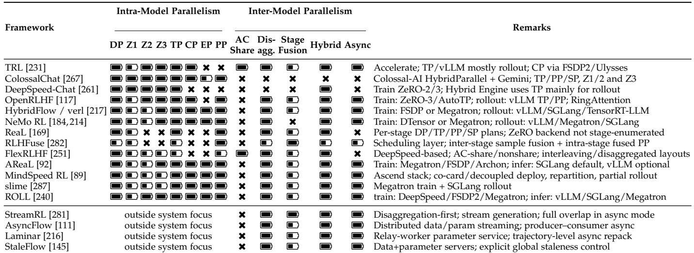  
TABLE 11: Comparison of public training / inference frameworks for LLM and RLM post-training under the systems taxonomy. Intra-Model Parallelism: DP=data parallel; Z1/Z2/Z3=ZeRO/FSDP-like sharding levels (optimizer / optimizer+gradients / parameters+gradients+optimizer; FSDP2 is counted under Z3); TP=tensor parallel; CP=context or long-sequence parallelism; EP=expert parallelism; PP=pipeline parallelism. Inter-Model Parallelism: AC Share=shared actor/critic parameters or valuehead mode; Disagg.=separate services or device groups for rollout, reward, or training; Stage Fusion=explicit overlap or fusion across normally sequential RL stages or subtasks; Hybrid=stage-specific backends/layouts or runtime resharding/refit; Async=asynchronous or bounded-stale execution. Symbols: – documented support; ˜ indirect, partial, backend-specific, or train-vs-rollout-specific support; é no documented public support; ? undocumented or unclear in public materials.

Practically, small experiments should favor librarycentric stacks; memory-bounded large-model runs should favor mature state-sharding backends such as FSDP/ZeRO or Megatron [201, 219, 277]; RL post-training workloads whose wall-clock time is dominated by rollout/generation should favor disaggregated vLLM/SGLang-style rollout [133, 278, 281]; and frontier-scale reasoning RL increasingly requires async or streaming systems that explicitly control staleness and generation-length skew [92, 145, 216].

Across frameworks, data parallelism remains a common outer abstraction, but modern RL post-training stacks increasingly compose multiple forms of parallelism across roles and stages. FSDP/ZeRO-style state sharding and Megatron-FSDP occupy the same broad design space for sharding optimizer states, gradients, and parameters, while Megatron-style backends can further combine DP with TP, PP, CP, and EP when model size, sequence length, or MoE require it. Thus, the main systems issue is not a fixed choice between FSDP/ZeRO and Megatron, but how the framework places heterogeneous roles, synchronizes or reshards weights between the trainer and rollout workers, and balances optimizer-state memory, communication, KVcache pressure, and variable rollout lengths. In this sense, orchestrator-centric and scheduling-centric systems are better viewed as different emphases within the same design space: the former provides the multi-role execution substrate, while the latter emphasizes utilization policies for long-tailed generation workloads.

## 7 RESEARCH OPPORTUNITIES

We briefly outline potential opportunities for future research in the performance aspects of RLMs.

Resource-aware test-time compute. RLMs increasingly trade inference-time compute for accuracy through long-CoT generation, self-consistency, search, tool use, and other strategies, exploring different scaling regimes and tradeoffs [71, 115, 115, 130, 188, 221, 225, 247, 270]. Future systems could treat reasoning as a constrained optimization problem: maximize expected utility subject to token, latency, memory, tool-call, and energy budgets. This opens the door to interesting research into making reasoning budget a firstclass scheduling variable, and into online predictors of task difficulty, verifier value, branch utility, and stopping time.

Efficient RLM execution structures beyond chains. RLM reasoning is usually represented as a linear token sequence. Prior works such as Tree of Thoughts, Graph of Thoughts, and Hypergraph-of-Thoughts work shows that nonlinear reasoning structures can improve search and aggregation in-context [26, 33, 45, 179, 259, 260]. Some efforts to distill this behavior into weights have been made into this direction by harnessing aggregation during finetuning [8, 150, 151, 275]. Efficient and effective integration of such structures and ideas in the RL execution pipeline is an interesting novel direction in the science of RLM performance and parallel design.

Automatic selection of parallelization schemes. One concrete idea of how to enhance the parallel design of RLM pipelines, is to provide an effective way of automating the intra-parallelization of each model invocation based on the available hardware and cluster conditions. There have been works into this direction, for example AutoDDL [65] and PyTorch/XLA SPMD [127], but they focus on an individual Transformer invocations and not whole pipelines [65, 127].

Automatic derivation of reasoning topologies and schedules. In the RLM designs that harness explicit structures such as MCTS, most methods still use hand-designed chains, trees, beams, and others [26]. A potential direction is to automatically derive both the reasoning topology and the execution schedule from aspects such as task difficulty, model uncertainty, verifier availability, hardware availability and performance properties, and others. Dynamic graph representations and algorithms could offer useful templates for such planners in terms of performance-focused aspects such as algorithm design [32], effective task graph decompositions and partitioning [58, 101], scheduling [27, 77], and others. Example questions to pursuit would be how many branches to explore, when to prune a branch, when to call a verifier, when to merge thoughts, how to map the resulting DAG to device groups, and others.

RLVR beyond final-answer rewards. RLVR scales reasoning post-training through exact-answer checks, unit tests, and task-specific verifiers, but its mechanisms remain incompletely understood; for example, weak or spurious rewards can sometimes still improve reasoning, and outcomes are model-family dependent [212]. Future work could focus on developing reliable and efficient process-level rewards, building upon existing work [69, 129, 149, 165, 241, 271, 273], and potentially even extend them to consider the structural aspects of the reasoning process beyond chains. Since process rewards create many assessment nodes, their usefulness will depend on performance-oriented policies that involve caching, batching, placement, and overlap with generation.

Harnessing data analytics for enhanced reasoning. A rich landscape of research opportunities exist at the overlap of reasoning and data analytics. One could delegate certain parts of reasoning tasks that are hard to instill into model weights to existing algorithms and frameworks; examples are graph mining and analytics [16, 36, 46, 99, 193]. One could also harness graph learning for reasoning supervision, i.e., graph neural networks (GNNs) [50, 131, 248, 274, 283] and broader graph representation learning methods [28, 57, 62, 100, 110] may help score branches, help constructing process rewards, or predict useful tool calls, based on learning useful reasoning patterns. The systems challenge is to integrate such designs efficiently [40, 49] without adding bottlenecks to the Generation–Assessment–Training loop or broader MCTS.

Enhancing data analytics pipelines. On the other hand, data analytics frameworks [31, 32, 52, 54, 95, 109, 137, 236] as well as databases [10, 11, 33, 35, 41, 78] could also integrate reasoning LLMs and agents for more effective data processing, especially at the user–framework interface. Different designs have already been proposed to integrate LLMs into analytics architectures [42, 55, 64, 67, 85, 139, 199, 244, 269]. This includes document analysis (e.g., Aryn [9], DocETL [211], Palimpzest [158], PalimpChat [159]), tabular data (e.g., InsightPilot [164], CoddLLM [272], Pneuma [23], Chat2data [276], LOTUS [194], DB-GPT [254]), video processing [167], and others [80]. Here, harnessing RLMs and their efficient integration into such frameworks is an interesting novel research direction.

Asynchronous and stale-data RL. Online RLM training is limited by long-tailed autoregressive generation. Asynchronous systems such as AReaL, AsyncFlow, Laminar, StreamRL, and StaleFlow show that bounded staleness and streaming rollouts can improve utilization [92, 111, 145, 216, 281]. The open problem is to characterize in a more rigorous way when and to what degree involve staleness – for example, when stale rollouts remain useful, how to correct policy drift, and how to trade staleness against throughput without degrading reasoning quality.

Retrieval, tools, and external state as operators. Effective and efficient integration of tools into the reasoning process is another interesting research opportunity [161, 215]. Various tool calls (e.g., retrieval [44, 93, 126, 142, 206], simulators, verifiers [47, 105], agent calls [29, 48, 70, 119, 245], etc.) could be modeled as operators in the same execution graph as actor generation, reward evaluation, and training. Retrieval-augmented and graph-based LLM methods such as Topologies of Reasoning provide starting points for such integration [45].

Harnessing HPC architectures as well as emerging hardware. RLMs stress hardware through aspects such as – among others – its long outputs [177], large KV caches [144, 157, 218], repeated verifier calls, tool use, and many samples per prompt. Beyond established forms of parallelism, promising directions include harnessing emerging hardware such as processing-in-memory [7, 43, 97, 174, 209], RDMA and SmartNICs [38, 39, 81, 82, 94, 207, 222], serverless architectures [72, 112, 128, 152, 152, 168, 210], next-generation interconnects [30, 51, 135, 136], chiplets [90, 121, 124, 148, 163, 166, 172], and others [34, 37, 98, 122, 123].

Reasoning for discovering novel optimizations. Inspired by the schemes such as AlphaTensor [88] and enabled by the emergence of RLMs with their innate coding capabilities [22, 66, 84, 202, 205, 234], such models could also help discover novel kernels and other performance-centric schemes, including collectives, placement heuristics, and routing policies, following recent LLM-driven algorithmdiscovery systems such as AlphaEvolve [182].

Evaluation and reproducibility. The evaluation of RLMs involves a plethora of aspects such as reasoning budget, sampling strategy, rollout length, staleness, and metrics associated with whole RLM components and subsystems such as tools, retrieval, and verification. It poses an opportunity for designing effective evaluation pipelines, reusing and extending evaluation methodologies for other domains such as parallel programming [24, 113].

Shared-weight RLHF and snapshot-consistent rollout workers. Another example concrete systems opportunity is to reduce the cost of synchronizing actor weights in disaggregated or asynchronous RLHF pipelines. Current systems often push full policy snapshots from the learner to rollout workers, which creates latency, bandwidth pressure, and synchronization stalls at large model scale. A promising alternative is a shared-weight design in which rollout actors access versioned trainer-resident parameter slots, switching only at rollout boundaries to preserve snapshot consistency. Such a system could use read-copy-update-style double or triple buffering, version counters, and publication fences so that actors never observe partially written parameters. On a single node, this suggests CUDA IPC [195] or peer-to-peer refresh over NVLink or PCIe [143]; across nodes, one can harness GPUDirect RDMA [196] or NVSHMEM-style onesided communication [116].

## 8 CONCLUSION

Reasoning Language Models (RLMs) and their underlying paradigms such as Reinforcement Learning with Verifiable Rewards (RLVR) are not only an algorithmic advance, but also an enormous parallel and distributed systems challenge due to their compute requirements. Our work systematizes the RL-for-LLM pipeline, analyzes PPO-, GRPO-, and DPOlike frameworks through work–depth–memory complexity, and develops a taxonomy of intra- and inter-model parallelism strategies for scalable RLM training and inference. The result is a unified performance vocabulary for understanding where computation, memory, and criticalpath bottlenecks arise, and for offering opportunities for performance optimizations while considering performancecritical aspects such as autoregressive rollout generation, auxiliary-model assessment, trainable actor/critic updates, long-context memory, model-state sharding, placement, fusion, and bounded-stale execution. By making these tradeoffs explicit, our analysis provides a foundation for designing the next generation of RLM systems.

## ACKNOWLEDGEMENTS

We thank Hussein Harake, Colin McMurtrie, Mark Klein, Angelo Mangili, and the whole CSCS team granting access to the Ault and Alps machines, and for their excellent technical support. We gratefully acknowledge Polish high-performance computing infrastructure PLGrid (HPC Center: ACK Cyfronet AGH) for providing compute facilities within computational grant no. PLG/2026/019437; we also thank Łukasz Flis and the whole Cyfronet team for their excellent technical support. We thank Timo Schneider for help with infrastructure at SPCL. This project received funding from the European Research Council (Project PSAP, No. 101002047), and the European High-Performance Computing Joint Undertaking (JU) under grant agreement No. 955513 (MAELSTROM). This project was supported by the ETH Future Computing Laboratory (EFCL), financed by a donation from Huawei Technologies. We acknowledge the Swiss AI Initiative for the computational grant. A language model served as an editorial tool for this manuscript, while ideas and content are original work of the authors.

## REFERENCES

[1] M. Abdin, S. Agarwal, A. Awadallah, V. Balachandran, H. Behl, L. Chen, G. de Rosa, S. Gunasekar, M. Javaheripi, N. Joshi et al., “Phi-4-reasoning Technical Report,” Apr. 2025, arXiv:2504.21318. [Online]. Available: https://arxiv.org/abs/2504.21318

[2] M. Abdin, J. Aneja, H. Awadalla, A. Awadallah, A. A. Awan, N. Bach, A. Bahree, A. Bakhtiari, J. Bao, H. Behl et al., “Phi-3 Technical Report: A Highly Capable Language Model Locally on Your Phone,” Aug. 2024, arXiv:2404.14219. [Online]. Available: https://arxiv.org/abs/2404.14219

[3] M. Abdin, J. Aneja, H. Behl, S. Bubeck, R. Eldan, S. Gunasekar, M. Harrison, R. J. Hewett, M. Javaheripi, P. Kauffmann et al., “Phi-4 Technical Report,” Dec. 2024, arXiv:2412.08905. [Online]. Available: https://arxiv.org/abs/2412.08905

[4] J. Achiam, S. Adler, S. Agarwal, L. Ahmad, I. Akkaya, F. L. Aleman, D. Almeida, J. Altenschmidt, S. Altman et al., “GPT-4 Technical Report,” Mar. 2024, arXiv:2303.08774. [Online]. Available: https://arxiv.org/abs/2303.08774

[5] B. Adler, N. Agarwal, A. Aithal, D. H. Anh, P. Bhattacharya, A. Brundyn, J. Casper, B. Catanzaro, S. Clay, J. Cohen et al., “Nemotron-4 340B Technical Report,” Aug. 2024, arXiv:2406.11704. [Online]. Available: https://arxiv.org/abs/24 06.11704

[6] A. Ahmadian, C. Cremer, M. Galle, M. Fadaee, J. Kreutzer, ´ O. Pietquin, A. Ust ¨ un, and S. Hooker, “Back to Basics: Revisiting¨ REINFORCE-Style Optimization for Learning from Human Feedback in LLMs,” in Proceedings of the 62nd Annual Meeting of the Association for Computational Linguistics (Volume 1: Long Papers), ser. ACL ’24, L.-W. Ku, A. Martins, and V. Srikumar, Eds. Bangkok, Thailand: Association for Computational Linguistics, Aug. 2024, pp. 12 248–12 267. [Online]. Available: https://aclanthology.org/2024.acl-long.662/

[7] J. Ahn, S. Yoo, O. Mutlu, and K. Choi, “PIM-Enabled Instructions: A Low-Overhead, Locality-Aware Processing-In-Memory Architecture,” SIGARCH Comput. Archit. News, vol. 43, no. 3S, pp. 336–348, Jun. 2015. [Online]. Available: https://doi.org/10.1145/2872887.2750385

[8] R. Ai, Y. Pan, D. Simchi-Levi, M. Tambe, and H. Xu, “Beyond Majority Voting: LLM Aggregation by Leveraging Higher-Order Information,” May 2026, arXiv:2510.01499. [Online]. Available: https://arxiv.org/abs/2510.01499

[9] E. Anderson, J. Fritz, A. Lee, B. Li, M. Lindblad, H. Lindeman, A. Meyer, P. Parmar, T. Ranade, M. A. Shah, B. Sowell, D. Tecuci, V. Thapliyal, and M. Welsh, “The Design of an LLM-Powered Unstructured Analytics System,” in Proceedings of the 15th Annual Conference on Innovative Data Systems Research, ser. CIDR ’25. Amsterdam, Netherlands: VLDB Endowment, Jan. 2025, pp. 1–10. [Online]. Available: https://vldb.org/cidrdb/2025/the-d esign-of-an-llm-powered-unstructured-analytics-system.html

[10] R. Angles and C. Gutierrez, “Survey of Graph Database Models,” ACM Comput. Surv., vol. 40, no. 1, pp. 1:1–1:39, Feb. 2008. [Online]. Available: https://doi.org/10.1145/1322432.1322433

[11] ——, “An Introduction to Graph Data Management,” in Graph Data Management: Fundamental Issues and Recent Developments, ser. Data-Centric Systems and Applications (DCSA), G. Fletcher, J. Hidders, and J. L. Larriba-Pey, Eds. Berlin, Germany: Springer, Nov. 2018, pp. 1–32. [Online]. Available: https: //link.springer.com/chapter/10.1007/978-3-319-96193-4 1

[12] R. Anil, S. Borgeaud, J.-B. Alayrac, R. S. Jiahui Yu, J. Schalkwyk, A. M. Dai, A. Hauth, K. Millican, D. Silver et al., “Gemini: A Family of Highly Capable Multimodal Models,” May 2025, arXiv:2312.11805. [Online]. Available: https://arxiv.org/abs/2312.11805

[13] Anthropic, “Claude, Large Language Model Conversational AI,” https://claude.ai/new, 2024, [Accessed June 11, 2026].

[14] ——, “Claude 3.7 Sonnet and Claude Code,” https://www.anth ropic.com/news/claude-3-7-sonnet, Feb. 2025, [Accessed June 12, 2026].

[15] ——, “Building with Extended Thinking,” https://platform.cla ude.com/docs/en/build-with-claude/extended-thinking, 2026, [Accessed June 12, 2026].

[16] G. Atluri, A. Karpatne, and V. Kumar, “Spatio-Temporal Data Mining: A Survey of Problems and Methods,” ACM Comput. Surv., vol. 51, no. 4, pp. 83:1–83:41, Aug. 2018. [Online]. Available: https://doi.org/10.1145/3161602

[17] G. Bai, Z. Chai, C. Ling, S. Wang, J. Lu, N. Zhang, T. Shi, Z. Yu, M. Zhu, Y. Zhang, X. Song, C. Yang, Y. Cheng, and L. Zhao, “Beyond Efficiency: A Systematic Survey of Resource-Efficient Large Language Models,” Dec. 2024, arXiv:2401.00625. [Online]. Available: https://arxiv.org/abs/2401.00625

[18] T. Bai, Y. Bai, Y. Bao, S. Cai, Y. Cao, Y. Charles, H. Che, C. Chen, G. Chen, H. Chen et al., “Kimi K2.5: Visual Agentic Intelligence,” Feb. 2026, arXiv:2602.02276. [Online]. Available: https://arxiv.org/abs/2602.02276

[19] Y. Bai, Y. Bao, Y. Charles, C. Chen, G. Chen, H. Chen, H. Chen, J. Chen, N. Chen, R. Chen et al., “Kimi K2: Open Agentic Intelligence,” Feb. 2026, arXiv:2507.20534. [Online]. Available: https://arxiv.org/abs/2507.20534

[20] Y. Bai, A. Jones, K. Ndousse, A. Askell, A. Chen, N. DasSarma, D. Drain, S. Fort, D. Ganguli, T. Henighan, N. Joseph et al., “Training a Helpful and Harmless Assistant with Reinforcement Learning from Human Feedback,” Apr. 2022, arXiv:2204.05862. [Online]. Available: https://arxiv.org/abs/2204.05862

[21] Y. Bai, S. Kadavath, S. Kundu, A. Askell, J. Kernion, A. Jones, A. Chen, A. Goldie, A. Mirhoseini, C. McKinnon et al., “Constitutional AI: Harmlessness from AI Feedback,” Dec. 2022, arXiv:2212.08073. [Online]. Available: https://arxiv.org/abs/22 12.08073

[22] R. Bairi, A. Sonwane, A. Kanade, V. D. C., A. Iyer, S. Parthasarathy, S. Rajamani, B. Ashok, and S. Shet, “CodePlan: Repository-Level Coding using LLMs and Planning,” Proc. ACM Softw. Eng., vol. 1, no. FSE, pp. 31:1–31:24, Jul. 2024. [Online]. Available: https://doi.org/10.1145/3643757

[23] M. I. L. Balaka, D. Alexander, Q. Wang, Y. Gong, A. Krisnadhi, and R. Castro Fernandez, “Pneuma: Leveraging LLMs for Tabular Data Representation and Retrieval in an End-to-End System,” Proc. ACM Manag. Data, vol. 3, no. 3, pp. 200:1–200:28, Jun. 2025. [Online]. Available: https://doi.org/10.1145/3725337

[24] T. Ben-Nun, M. Besta, S. Huber, A. N. Ziogas, D. Peter, and T. Hoefler, “A Modular Benchmarking Infrastructure for High-Performance and Reproducible Deep Learning,” in Proceedings of the IEEE 33rd International Parallel and Distributed Processing Symposium, ser. IPDPS ’19. Rio de Janeiro, Brazil: IEEE Press, May 2019, pp. 66–77. [Online]. Available: https://ieeexplore.ieee.org/document/8821020

[25] T. Ben-Nun and T. Hoefler, “Demystifying Parallel and Distributed Deep Learning: An In-Depth Concurrency Analysis,” ACM Comput. Surv., vol. 52, no. 4, pp. 65:1–65:43, Aug. 2019. [Online]. Available: https://doi.org/10.1145/3320060

[26] M. Besta, J. Barth, E. Schreiber, A. Kubicek, A. Catarino, R. Gerstenberger, P. Nyczyk, P. Iff, Y. Li, S. Houliston, T. Sternal, M. Copik, G. Kwasniewski, J. M ´ uller, Łukasz Flis, H. Eberhard,¨ Z. Chen, H. Niewiadomski, and T. Hoefler, “Reasoning Language Models: A Blueprint,” Jun. 2025, arXiv:2501.11223. [Online]. Available: https://arxiv.org/abs/2501.11223

[27] M. Besta, A. Carigiet, K. Janda, Z. Vonarburg-Shmaria, L. Gianinazzi, and T. Hoefler, “High-Performance Parallel Graph Coloring with Strong Guarantees on Work, Depth, and Quality,” in Proceedings of the International Conference for High Performance Computing, Networking, Storage and Analysis, ser. SC ’20. Atlanta, GA, USA: IEEE Press, Nov. 2020, pp. 99:1–99:17. [Online]. Available: https://ieeexplore.ieee.org/document/9355236

[28] M. Besta, A. C. Catarino, L. Gianinazzi, N. Blach, P. Nyczyk, H. Niewiadomski, and T. Hoefler, “HOT: Higher-Order Dynamic Graph Representation Learning with Efficient Transformers,” in Proceedings of the Second Learning on Graphs Conference (LOG ’23), ser. Proceedings of Machine Learning Research, S. Villar and B. Chamberlain, Eds., vol. 231. Virtual Event: PMLR, Nov. 2023, pp. 15:1–15:20. [Online]. Available: https://proceedings.mlr.press/v231/besta24a.html

[29] M. Besta, S. Chandran, R. Gerstenberger, M. Lindner, M. Chrapek, S. H. Martschat, T. Ghandi, P. Iff, H. Niewiadomski, P. Nyczyk, J. Muller, and T. Hoefler, “Psychologically Enhanced¨ AI Agents,” Sep. 2025, arXiv:2509.04343. [Online]. Available: https://arxiv.org/abs/2509.04343

[30] M. Besta, J. Domke, M. Schneider, M. Konieczny, S. Di Girolamo, T. Schneider, A. Singla, and T. Hoefler, “High-Performance Routing with Multipathing and Path Diversity in Ethernet and HPC Networks,” IEEE Transactions on Parallel and Distributed Systems, vol. 32, no. 4, pp. 943–959, Apr. 2021. [Online]. Available: https://ieeexplore.ieee.org/document/9248644

[31] M. Besta, M. Fischer, T. Ben-Nun, D. Stanojevic, J. D. F.

Licht, and T. Hoefler, “Substream-Centric Maximum Matchings on FPGA,” ACM Trans. Reconfigurable Technol. Syst., vol. 13, no. 2, pp. 8:1–8:33, Apr. 2020. [Online]. Available: https: //doi.org/10.1145/3377871

[32] M. Besta, M. Fischer, V. Kalavri, M. Kapralov, and T. Hoefler, “Practice of Streaming Processing of Dynamic Graphs: Concepts, Models, and Systems,” IEEE Transactions on Parallel and Distributed Systems, vol. 34, no. 6, pp. 1860–1876, Jun. 2023. [Online]. Available: https://ieeexplore.ieee.org/document/962 9281

[33] M. Besta, R. Gerstenberger, M. Fischer, M. Podstawski, N. Blach, B. Egeli, G. Mitenkov, W. Chlapek, M. Michalewicz, H. Niewiadomski, J. Mueller, and T. Hoefler, “The Graph Database Interface: Scaling Online Transactional and Analytical Graph Workloads to Hundreds of Thousands of Cores,” in Proceedings of the International Conference for High Performance Computing, Networking, Storage and Analysis, ser. SC ’23. Denver, CO, USA: Association for Computing Machinery, Nov. 2023, pp. 22:1–22:18. [Online]. Available: https://doi.org/10.1145/358178 4.3607068

[34] M. Besta, R. Gerstenberger, P. Iff, P. Sonawane, J. G. Luna, R. Kanakagiri, R. Min, O. Mutlu, T. Hoefler, R. Appuswamy, and A. O Mahony, “Hardware Acceleration for Knowledge Graph Processing: Challenges & Recent Developments,” Nov. 2024, arXiv:2408.12173. [Online]. Available: https://arxiv.org/abs/24 08.12173

[35] M. Besta, R. Gerstenberger, E. Peter, M. Fischer, M. Podstawski, C. Barthels, G. Alonso, and T. Hoefler, “Demystifying Graph Databases: Analysis and Taxonomy of Data Organization, System Designs, and Graph Queries,” ACM Comput. Surv., vol. 56, no. 2, pp. 31:1–31:40, Sep. 2023. [Online]. Available: https://doi.org/10.1145/3604932

[36] M. Besta, R. Grob, C. Miglioli, N. Bernold, G. Kwasniewski, G. Gjini, R. Kanakagiri, S. Ashkboos, L. Gianinazzi, N. Dryden, and T. Hoefler, “Motif Prediction with Graph Neural Networks,” in Proceedings of the 28th ACM SIGKDD Conference on Knowledge Discovery and Data Mining, ser. KDD ’22. Washington, DC, USA: Association for Computing Machinery, Aug. 2022, pp. 35–45. [Online]. Available: https://doi.org/10.1145/3534678.3539343

[37] M. Besta, S. M. Hassan, S. Yalamanchili, R. Ausavarungnirun, O. Mutlu, and T. Hoefler, “Slim NoC: A Low-Diameter On-Chip Network Topology for High Energy Efficiency and Scalability,” SIGPLAN Not., vol. 53, no. 2, pp. 43–55, Mar. 2018. [Online]. Available: https://doi.org/10.1145/3296957.3177158

[38] M. Besta and T. Hoefler, “Fault Tolerance for Remote Memory Access Programming Models,” in Proceedings of the 23rd International Symposium on High-Performance Parallel and Distributed Computing, ser. HPDC ’14. Vancouver, BC, Canada: Association for Computing Machinery, Jun. 2014, pp. 37–48. [Online]. Available: https://doi.org/10.1145/2600212.2600224

[39] ——, “Active Access: A Mechanism for High-Performance Distributed Data-Centric Computations,” in Proceedings of the 29th ACM on International Conference on Supercomputing, ser. ICS ’15. Newport Beach, CA, USA: Association for Computing Machinery, Jun. 2015, pp. 155–164. [Online]. Available: https://doi.org/10.1145/2751205.2751219

[40] —, “Parallel and Distributed Graph Neural Networks: An In-Depth Concurrency Analysis,” IEEE Transactions on Pattern Analysis and Machine Intelligence, vol. 46, no. 5, pp. 2584–2606, May 2024. [Online]. Available: https://ieeexplore.ieee.org/docu ment/10443519

[41] M. Besta, P. Iff, F. Scheidl, K. Osawa, N. Dryden, M. Podstawski, T. Chen, and T. Hoefler, “Neural Graph Databases,” in Proceedings of the First Learning on Graphs Conference, ser. Proceedings of Machine Learning Research, B. Rieck and R. Pascanu, Eds., vol. 198. Virtual Event: PMLR, Dec. 2022. [Online]. Available: https://proceedings.mlr.press/v198/besta22a.html

[42] M. Besta, Ł. Jarmocik, O. Hrycyna, S. Klaiman, K. Maczka, R. Gerstenberger, J. Muller, P. Nyczyk, H. Niewiadomski,¨ and T. Hoefler, “GraphSeek: Next-Generation Graph Analytics with LLMs,” Mar. 2026, arXiv:2602.11052. [Online]. Available: https://arxiv.org/abs/2602.11052

[43] M. Besta, R. Kanakagiri, G. Kwasniewski, R. Ausavarungnirun, ´ J. Beranek, K. Kanellopoulos, K. Janda, Z. Vonarburg-´ Shmaria, L. Gianinazzi, I. Stefan, J. G. Luna, J. Golinowski, M. Copik, L. Kapp-Schwoerer, S. Di Girolamo, N. Blach, M. Konieczny, O. Mutlu, and T. Hoefler, “SISA: Set-

Centric Instruction Set Architecture for Graph Mining on Processing-in-Memory Systems,” in Proceedings of the 54th Annual IEEE/ACM International Symposium on Microarchitecture, ser. MICRO ’21. Virtual Event: Association for Computing Machinery, Oct. 2021, pp. 282–297. [Online]. Available: https://doi.org/10.1145/3466752.3480133

[44] M. Besta, A. Kubicek, R. Gerstenberger, M. Chrapek, R. Niggli, P. Okanovic, Y. Zhu, P. Iff, M. Podstawski, L. Weitzendorf, M. Chi, J. Gajda, P. Nyczyk, J. Muller, H. Niewiadomski, and¨ T. Hoefler, “Multi-Head RAG: Solving Multi-Aspect Problems with LLMs,” Sep. 2025, arXiv:2406.05085. [Online]. Available: https://arxiv.org/abs/2406.05085

[45] M. Besta, F. Memedi, Z. Zhang, R. Gerstenberger, G. Piao, N. Blach, P. Nyczyk, M. Copik, G. Kwasniewski, J. M ´ uller,¨ L. Gianinazzi, A. Kubicek, H. Niewiadomski, A. O’Mahony, O. Mutlu, and T. Hoefler, “Demystifying Chains, Trees, and Graphs of Thoughts,” IEEE Transactions on Pattern Analysis and Machine Intelligence, vol. 47, no. 12, pp. 10 967–10 989, Dec. 2025. [Online]. Available: https://ieeexplore.ieee.org/document/111 23142

[46] M. Besta, C. Miglioli, P. S. Labini, J. Tetek, P. Iff,ˇ R. Kanakagiri, S. Ashkboos, K. Janda, M. Podstawski, G. Kwasniewski, N. Gleinig, F. Vella, O. Mutlu, and T. Hoefler,´ “ProbGraph: High-Performance and High-Accuracy Graph Mining with Probabilistic Set Representations,” in Proceedings of the International Conference on High Performance Computing, Networking, Storage and Analysis, ser. SC ’22. Dallas, TX, USA: IEEE Press, Nov. 2022, pp. 43:1–43:17. [Online]. Available: https://ieeexplore.ieee.org/document/10046121

[47] M. Besta, L. Paleari, M. Copik, R. Gerstenberger, A. Kubicek, P. Nyczyk, P. Iff, E. Schreiber, T. Srindran, T. Lehmann, H. Niewiadomski, and T. Hoefler, “CheckEmbed: Effective Verification of LLM Solutions to Open-Ended Tasks,” Jul. 2025, arXiv:2406.02524. [Online]. Available: https://arxiv.org/abs/24 06.02524

[48] M. Besta, L. Paleari, J. H. A. Jiang, R. Gerstenberger, Y. Wu, J. G. Hannesson, P. Iff, A. Kubicek, P. Nyczyk, D. Khimey et al., “Affordable AI Assistants with Knowledge Graph of Thoughts,” Oct. 2025, arXiv:2504.02670. [Online]. Available: https://arxiv.org/abs/2504.02670

[49] M. Besta, P. Renc, R. Gerstenberger, P. Sylos Labini, A. Ziogas, T. Chen, L. Gianinazzi, F. Scheidl, K. Szenes, A. Carigiet, P. Iff, G. Kwasniewski, R. Kanakagiri, C. Ge, S. Jaeger, J. Was,´ F. Vella, and T. Hoefler, “High-Performance and Programmable Attentional Graph Neural Networks with Global Tensor Formulations,” in Proceedings of the International Conference for High Performance Computing, Networking, Storage and Analysis, ser. SC ’23. Denver, CO, USA: Association for Computing Machinery, Nov. 2023, pp. 66:1–66:16. [Online]. Available: https://doi.org/10.1145/3581784.3607067

[50] M. Besta, F. Scheidl, L. Gianinazzi, G. Kwasniewski, S. Klaiman,´ J. Muller, and T. Hoefler, “Demystifying Higher-Order Graph¨ Neural Networks,” IEEE Transactions on Pattern Analysis and Machine Intelligence, vol. 48, no. 3, pp. 2544–2565, Mar. 2026. [Online]. Available: https://ieeexplore.ieee.org/document/112 67259

[51] M. Besta, M. Schneider, M. Konieczny, K. Cynk, E. Henriksson, S. Di Girolamo, A. Singla, and T. Hoefler, “FatPaths: Routing in Supercomputers and Data Centers When Shortest Paths Fall Short,” in Proceedings of the International Conference for High Performance Computing, Networking, Storage and Analysis, ser. SC ’20. Atlanta, GA, USA: IEEE Press, Nov. 2020, pp. 27:1–27:18. [Online]. Available: https://ieeexplore.ieee.org/document/935 5307

[52] M. Besta, Z. Vonarburg-Shmaria, Y. Schaffner, L. Schwarz, G. Kwasniewski, L. Gianinazzi, J. Beranek, K. Janda,´ T. Holenstein, S. Leisinger, P. Tatkowski, E. Ozdemir, A. Balla, M. Copik, P. Lindenberger, M. Konieczny, O. Mutlu, and T. Hoefler, “GraphMineSuite: Enabling High-Performance and Programmable Graph Mining Algorithms with Set Algebra,” Proc. VLDB Endow., vol. 14, no. 11, pp. 1922–1935, Jul. 2021. [Online]. Available: https://doi.org/10.14778/3476249.3476252

[53] G. Bilardi and A. Pietracaprina, “Models of Computation, Theoretical,” in Encyclopedia of Parallel Computing, D. Padua, Ed. Boston, MA, USA: Springer, Sep. 2011, pp. 1150–1158. [Online]. Available: https://link.springer.com/rwe/10.1007/978-0-387-0 9766-4 218

[54] S. M. Birjandi and S. H. Khasteh, “A Survey on Data Mining Techniques Used in Medicine,” Journal of Diabetes & Metabolic Disorders, vol. 20, no. 2, pp. 2055–2071, Dec. 2021. [Online]. Available: https://link.springer.com/article/10.1007/s40200-0 21-00884-2

[55] A. Biswal, L. Patel, S. Jha, A. Kamsetty, S. Liu, J. E. Gonzalez, C. Guestrin, and M. Zaharia, “Text2SQL is Not Enough: Unifying AI and Databases with TAG,” in Proceedings of the 15th Annual Conference on Innovative Data Systems Research, ser. CIDR ’25. Amsterdam, Netherlands: VLDB Endowment, Jan. 2025, pp. 1–10. [Online]. Available: https://vldb.org/cidrdb/2025/text2sq l-is-not-enough-unifying-ai-and-databases-with-tag.html

[56] G. E. Blelloch and B. M. Maggs, “Parallel Algorithms,” ACM Comput. Surv., vol. 28, no. 1, pp. 51–54, Mar. 1996. [Online]. Available: https://doi.org/10.1145/234313.234339

[57] M. M. Bronstein, J. Bruna, Y. LeCun, A. Szlam, and P. Vandergheynst, “Geometric Deep Learning: Going Beyond Euclidean Data,” IEEE Signal Processing Magazine, vol. 34, no. 4, pp. 18–42, Jul. 2017. [Online]. Available: https: //ieeexplore.ieee.org/document/7974879

[58] A. Buluc¸, H. Meyerhenke, I. Safro, P. Sanders, and C. Schulz, “Recent Advances in Graph Partitioning,” in Algorithm Engineering: Selected Results and Surveys, ser. Lecture Notes in Computer Science, L. Kliemann and P. Sanders, Eds. Springer Nature, Nov. 2016, vol. 9220, pp. 117–158. [Online]. Available: ht tps://link.springer.com/chapter/10.1007/978-3-319-49487-6 4

[59] Z. Cai, M. Cao, H. Chen, K. Chen, K. Chen, X. Chen, X. Chena, Z. Chen, Z. Chen, P. Chu et al., “InternLM2 Technical Report,” Mar. 2024, arXiv:2403.17297. [Online]. Available: https://arxiv.org/abs/2403.17297

[60] Y. Cang, X. Zhang, E. Zhao, Z. Ji, Y. Liu, Y. He, Z. Ning, Y. Chen, W. Que, and L. Shi, “Graph-GRPO: Stabilizing Multi-Agent Topology Learning via Group Relative Policy Optimization,” Mar. 2026, arXiv:2603.02701. [Online]. Available: https://arxiv.org/abs/2603.02701

[61] Y. Cao, H. Zhao, Y. Cheng, T. Shu, Y. Chen, G. Liu, G. Liang, J. Zhao, J. Yan, and Y. Li, “Survey on Large Language Model-Enhanced Reinforcement Learning: Concept, Taxonomy, and Methods,” IEEE Transactions on Neural Networks and Learning Systems, vol. 36, no. 6, pp. 9737–9757, Jun. 2025. [Online]. Available: https://ieeexplore.ieee.org/document/10766898

[62] I. Chami, S. Abu-El-Haija, B. Perozzi, C. Re, and K. Murphy,´ “Machine Learning on Graphs: A Model and Comprehensive Taxonomy,” Journal of Machine Learning Research, vol. 23, pp. 89:1–89:64, May 2022. [Online]. Available: http://jmlr.org/paper s/v23/20-852.html

[63] E. Chan, M. Heimlich, A. Purkayastha, and R. van de Geijn, “Collective Communication: Theory, Practice, and Experience,” Concurrency and Computation: Practice and Experience, vol. 19, no. 13, pp. 1749–1783, Jul. 2007. [Online]. Available: https://onlinelibrary.wiley.com/doi/10.1002/cpe.1206

[64] J. Chang and F. Nargesian, “Approximating Opaque Top-k Queries,” Proc. ACM Manag. Data, vol. 3, no. 3, pp. 129:1–129:25, Jun. 2025. [Online]. Available: https://doi.org/10.1145/3725266

[65] J. Chen, S. Li, R. Guo, J. Yuan, and T. Hoefler, “AutoDDL: Automatic Distributed Deep Learning With Near-Optimal Bandwidth Cost,” IEEE Transactions on Parallel and Distributed Systems, vol. 35, no. 8, pp. 1331–1344, Aug. 2024. [Online]. Available: https://ieeexplore.ieee.org/document/10521778

[66] J. Chen, Z. Li, X. Hu, and X. Xia, “NLPerturbator: Studying the Robustness of Code LLMs to Natural Language Variations,” ACM Trans. Softw. Eng. Methodol., vol. 35, no. 4, pp. 89:1–89:20, Mar. 2026. [Online]. Available: https://doi.org/10.1145/3745764

[67] L. Chen, B. Acun, N. Ardalani, Y. Sun, F. Kang, H. Lyu, Y. Kwon, R. Jia, C.-J. Wu, M. Zaharia, and J. Zou, “Data Acquisition: A New Frontier in Data-Centric AI,” Journal of Data-Centric Machine Learning Research, vol. 2, Jan. 2025. [Online]. Available: https://data.mlr.press/assets/pdf/v02-11.pdf

[68] Z. Chen, S. Wang, Z. Tan, X. Fu, Z. Lei, P. Wang, H. Liu, C. Shen, and J. Li, “A Survey of Scaling in Large Language Model Reasoning,” Apr. 2026, arXiv:2504.02181. [Online]. Available: https://arxiv.org/abs/2504.02181

[69] S. Choudhury, “Process Reward Models for LLM Agents: Practical Framework and Directions,” Feb. 2025, arXiv:2502.10325. [Online]. Available: https://arxiv.org/abs/2502.10325

[70] Z. Chu, S. Wang, J. Xie, T. Zhu, Y. Yan, J. Ye, A. Zhong, X. Hu, J. Liang, P. S. Yu, and Q. Wen, “LLM Agents

for Education: Advances and Applications,” in Findings of the Association for Computational Linguistics: EMNLP 2025, C. Christodoulopoulos, T. Chakraborty, C. Rose, and V. Peng, Eds. Suzhou, China: Association for Computational Linguistics, Nov. 2025, pp. 13 782–13 810. [Online]. Available: https: //aclanthology.org/2025.findings-emnlp.743/

[71] G. Comanici, E. Bieber, M. Schaekermann, I. Pasupat, N. Sachdeva, I. Dhillon, M. Blistein, O. Ram, D. Zhang, E. Rosen et al., “Gemini 2.5: Pushing the Frontier with Advanced Reasoning, Multimodality, Long Context, and Next Generation Agentic Capabilities,” Dec. 2025, arXiv:2507.06261. [Online]. Available: https://arxiv.org/abs/2507.06261

[72] M. Copik, G. Kwasniewski, M. Besta, M. Podstawski, and´ T. Hoefler, “SeBS: A Serverless Benchmark Suite for Functionas-a-Service Computing,” in Proceedings of the 22nd International Middleware Conference, ser. Middleware ’21. Quebec City,´ Canada: Association for Computing Machinery, Dec. 2021, pp. 64–78. [Online]. Available: https://doi.org/10.1145/3464298.34 76133

[73] B. Cottier, R. Rahman, L. Fattorini, N. Maslej, T. Besiroglu, and D. Owen, “The Rising Costs of Training Frontier AI Models,” Feb. 2025, arXiv:2404.05952. [Online]. Available: https://arxiv.org/abs/2405.21015

[74] D. Dai, C. Deng, C. Zhao, R. Xu, H. Gao, D. Chen, J. Li, W. Zeng, X. Yu, Y. Wu, Z. Xie, Y. Li, P. Huang, F. Luo, C. Ruan, Z. Sui, and W. Liang, “DeepSeekMoE: Towards Ultimate Expert Specialization in Mixture-of-Experts Language Models,” in Proceedings of the 62nd Annual Meeting of the Association for Computational Linguistics (Volume 1: Long Papers), ser. ACL ’24, L.-W. Ku, A. Martins, and V. Srikumar, Eds. Bangkok, Thailand: Association for Computational Linguistics, Aug. 2024, pp. 1280–1297. [Online]. Available: https://aclanthology.org/2024.acl-long.70/

[75] J. Dai, X. Pan, R. Sun, J. Ji, X. Xu, M. Liu, Y. Wang, and Y. Yang, “Safe RLHF: Safe Reinforcement Learning from Human Feedback,” in Proceedings of the Twelfth International Conference on Learning Representations, ser. ICLR ’24, B. Kim, Y. Yue, S. Chaudhuri, K. Fragkiadaki, M. Khan, and Y. Sun, Eds., Vienna, Austria, May 2024, pp. 50 750–50 777. [Online]. Available: https://proceedings.iclr.cc/paper files/paper/2024/hash/dd1 577afd396928ed64216f3f1fd5556-Abstract-Conference.html

[76] N. Dai, Z. Wu, R. Zheng, Z. Wei, W. Shi, X. Jin, G. Liu, C. Dun, L. Huang, and L. Yan, “Process Supervision-Guided Policy Optimization for Code Generation,” Feb. 2025, arXiv:2410.17621. [Online]. Available: https://arxiv.org/abs/2410.17621

[77] A. Dandashi and M. Al-Mouhamed, “Graph Coloring for Class Scheduling,” in Proceedings of the ACS/IEEE International Conference on Computer Systems and Applications, ser. AICCSA ’10. Hammamet, Tunisia: IEEE Press, May 2010, pp. 1–4. [Online]. Available: https://ieeexplore.ieee.org/document/5586963

[78] A. Davoudian, L. Chen, and M. Liu, “A Survey on NoSQL Stores,” ACM Comput. Surv., vol. 51, no. 2, pp. 40:1–40:43, Apr. 2018. [Online]. Available: https://doi.org/10.1145/3158661

[79] B. L. M. de Oliveira, F. V. Frujeri, M. P. C. M. Queiroz, L. G. B. Martins, T. W. de L. Soares, and L. C. Melo, “Learning Without Critics? Revisiting GRPO in Classical Reinforcement Learning Environments,” Nov. 2025, arXiv:2511.03527. [Online]. Available: https://arxiv.org/abs/2511.03527

[80] S. Devunuri and L. Lehe, “TransitGPT: A Generative AI-Based Framework for Interacting with GTFS Data Using Large Language Models,” Public Transport, vol. 17, no. 2, pp. 319–345, Jun. 2025. [Online]. Available: https://link.springer.com/articl e/10.1007/s12469-025-00395-w

[81] S. Di Girolamo, D. De Sensi, K. Taranov, M. Malesevic, M. Besta, T. Schneider, S. Kistler, and T. Hoefler, “Building Blocks for Network-Accelerated Distributed File Systems,” in Proceedings of the International Conference on High Performance Computing, Networking, Storage and Analysis, ser. SC ’22. Dallas, TX, USA: IEEE Press, Nov. 2022, pp. 10:1–10:14. [Online]. Available: https://doi.org/10.1109/SC41404.2022.00015

[82] S. Di Girolamo, K. Taranov, A. Kurth, M. Schaffner, T. Schneider, J. Beranek, M. Besta, L. Benini, D. Roweth,´ and T. Hoefler, “Network-Accelerated Non-Contiguous Memory Transfers,” in Proceedings of the International Conference for High Performance Computing, Networking, Storage and Analysis, ser. SC ’19. Denver, CO, USA: Association for Computing

Machinery, Nov. 2019, pp. 56:1–56:14. [Online]. Available: https://doi.org/10.1145/3295500.3356189

[83] T. Ding, T. Chen, H. Zhu, J. Jiang, Y. Zhong, J. Zhou, G. Wang, Z. Zhu, I. Zharkov, and L. Liang, “The Efficiency Spectrum of Large Language Models: An Algorithmic Survey,” Apr. 2024, arXiv:2312.00678. [Online]. Available: https://arxiv.org/abs/23 12.00678

[84] Y. Dong, X. Jiang, J. Qian, T. Wang, K. Zhang, Z. Jin, and G. Li, “A Survey on Code Generation with LLM-Based Agents,” Sep. 2025, arXiv:2508.00083. [Online]. Available: https://arxiv.org/abs/2508.00083

[85] A. Dorbani, S. Yasser, J. Lin, and A. Mhedhbi, “Beyond Quacking: Deep Integration of Language Models and RAG into DuckDB,” Proc. VLDB Endow., vol. 18, no. 12, pp. 5415–5418, Sep. 2025. [Online]. Available: https://doi.org/10.14778/3750601.3750685

[86] A. Du, B. Gao, B. Xing, C. Jiang, C. Chen, C. Li, C. Xiao, C. Du, C. Liao, C. Tang et al., “Kimi k1.5: Scaling Reinforcement Learning with LLMs,” Jun. 2025, arXiv:2501.12599. [Online]. Available: https://arxiv.org/abs/2501.12599

[87] K. Ethayarajh, W. Xu, N. Muennighoff, D. Jurafsky, and D. Kiela, “Model Alignment as Prospect Theoretic Optimization,” in Proceedings of the 41st International Conference on Machine Learning (ICML ’24), ser. Proceedings of Machine Learning Research, R. Salakhutdinov, Z. Kolter, K. Heller, A. Weller, N. Oliver, J. Scarlett, and F. Berkenkamp, Eds., vol. 235. Vienna, Austria: PMLR, Jul. 2024, pp. 29 634–29 651. [Online]. Available: https://proceedings.mlr.press/v235/ethayarajh24a.html

[88] A. Fawzi, M. Balog, A. Huang, T. Hubert, B. Romera-Paredes, M. Barekatain, A. Novikov, F. J. R. Ruiz, J. Schrittwieser, G. Swirszcz, D. Silver, D. Hassabis, and P. Kohli, “Discovering Faster Matrix Multiplication Algorithms with Reinforcement Learning,” Nature, vol. 610, no. 7930, pp. 47–53, Oct. 2022. [Online]. Available: https://www.nature.com/articles/s41586-0 22-05172-4

[89] L. Feng, C. Pan, X. Guo, F. Mei, B. Ning, J. Zhang, X. Liu, B. Zhou, Z. Shu, C. Liu, G. Yang, Z. Han, J. Wang, and B. Wang, “MindSpeed RL: Distributed Dataflow for Scalable and Efficient RL Training on Ascend NPU Cluster,” Jul. 2025, arXiv:2507.19017. [Online]. Available: https://arxiv.org/abs/2507.19017

[90] Y. Feng and K. Ma, “Chiplet Actuary: A Quantitative Cost Model and Multi-Chiplet Architecture Exploration,” in Proceedings of the 59th ACM/IEEE Design Automation Conference, ser. DAC ’22. San Francisco, CA, USA: Association for Computing Machinery, Jul. 2022, pp. 121–126. [Online]. Available: https://doi.org/10.1145/3489517.3530428

[91] E. Frick, P. Jin, T. Li, K. Ganesan, J. Zhang, J. Jiao, and B. Zhu, “Athene-70B,” https://huggingface.co/Nexusflow/Athene-70B, Jul. 2024, [Accessed June 11, 2026].

[92] W. Fu, J. Gao, S. Xu, Z. Mei, C. Zhu, X. Shen, C. He, G. Wei, J. Mei, W. Jiashu, T. Yang, B. Yuan, and Y. Wu, “AREAL: A Large-Scale Asynchronous Reinforcement Learning System for Language Reasoning,” in Proceedings of the 3rd Workshop on Efficient Systems for Foundation Models, ser. ES-FoMo ’25. Vancouver, Canada: OpenReview, Jul. 2025, pp. 1–11. [Online]. Available: https://openreview.net/forum?id=qJ0okaW9Z9

[93] Y. Gao, Y. Xiong, X. Gao, K. Jia, J. Pan, Y. Bi, Y. Dai, J. Sun, M. Wang, and H. Wang, “Retrieval-Augmented Generation for Large Language Models: A Survey,” Mar. 2024, arXiv:2312.10997. [Online]. Available: https://arxiv.org/abs/2312.10997

[94] R. Gerstenberger, M. Besta, and T. Hoefler, “Enabling Highly-Scalable Remote Memory Access Programming with MPI-3 One Sided,” in Proceedings of the International Conference on High Performance Computing, Networking, Storage and Analysis, ser. SC ’13. Denver, CO, USA: Association for Computing Machinery, Nov. 2013, pp. 53:1–53:12. [Online]. Available: https://doi.org/10.1145/2503210.2503286

[95] M. Gheisari, H. Hamidpour, Y. Liu, P. Saedi, A. Raza, A. Jalili, H. Rokhsati, and R. Amin, “Data Mining Techniques for Web Mining: A Survey,” Artificial Intelligence and Applications, vol. 1, no. 1, pp. 3–10, Jan. 2023. [Online]. Available: https: //ojs.bonviewpress.com/index.php/AIA/article/view/290

[96] M. Gheshlaghi Azar, Z. Daniel Guo, B. Piot, R. Munos, M. Rowland, M. Valko, and D. Calandriello, “A General Theoretical Paradigm to Understand Learning from Human Preferences,” in Proceedings of the 27th International Conference on Artificial Intelligence and Statistics (AISTATS ’24), ser. Proceedings of Machine Learning Research, S. Dasgupta,

S. Mandt, and Y. Li, Eds., vol. 238. Valencia, Spain: PMLR, May 2024, pp. 4447–4455. [Online]. Available: https: //proceedings.mlr.press/v238/gheshlaghi-azar24a.html

[97] S. Ghose, A. Boroumand, J. S. Kim, J. Gomez-Luna,´ and O. Mutlu, “Processing-in-Memory: A Workload-Driven Perspective,” IBM Journal of Research and Development, vol. 63, no. 6, pp. 3:1–3:19, Nov. 2019. [Online]. Available: https: //ieeexplore.ieee.org/document/8792187

[98] L. Gianinazzi, T. Ben-Nun, M. Besta, S. Ashkboos, Y. Baumann, P. Luczynski, and T. Hoefler, “The Spatial Computer: A Model for Energy-Efficient Parallel Computation,” Jan. 2023, arXiv:2205.04934. [Online]. Available: https://arxiv.org/abs/22 05.04934

[99] L. Gianinazzi, M. Besta, Y. Schaffner, and T. Hoefler, “Parallel Algorithms for Finding Large Cliques in Sparse Graphs,” in Proceedings of the 33rd Symposium on Parallelism in Algorithms and Architectures, ser. SPAA ’21. Virtual Event: Association for Computing Machinery, Jul. 2021, pp. 243–253. [Online]. Available: https://doi.org/10.1145/3409964.3461800

[100] L. Gianinazzi, M. Fries, N. Dryden, T. Ben-Nun, M. Besta, and T. Hoefler, “Learning Combinatorial Node Labeling Algorithms,” May 2022, arXiv:2106.03594. [Online]. Available: https://arxiv.org/abs/2106.03594

[101] L. Gianinazzi, P. Kalvoda, A. De Palma, M. Besta, and T. Hoefler, “Communication-Avoiding Parallel Minimum Cuts and Connected Components,” SIGPLAN Not., vol. 53, no. 1, pp. 219–232, Feb. 2018. [Online]. Available: https://doi.org/10.114 5/3200691.3178504

[102] Google DeepMind, “Gemini 2.5 Deep Think,” https://blog.goo gle/products-and-platforms/products/gemini/gemini-2-5-dee p-think/, Aug. 2025, [Accessed June 15, 2026].

[103] P. Gorinski, M. Zimmer, G. Lampouras, D. G. X. Deik, and I. Iacobacci, “Automatic Unit Test Data Generation and Actor-Critic Reinforcement Learning for Code Synthesis,” in Findings of the Association for Computational Linguistics: EMNLP 2023, H. Bouamor, J. Pino, and K. Bali, Eds. Singapore: Association for Computational Linguistics, Dec. 2023, pp. 370–384. [Online]. Available: https://aclanthology.org/2023.findings-emnlp.28/

[104] A. Grattafiori, A. Dubey, A. Jauhri, A. Pandey, A. Kadian, A. Al-Dahle, A. Letman, A. Mathur, A. Schelten, A. Vaughan et al., “The Llama 3 Herd of Models,” Nov. 2024, arXiv:2407.21783. [Online]. Available: https://arxiv.org/abs/2407.21783

[105] J. Gu, X. Jiang, Z. Shi, H. Tan, X. Zhai, C. Xu, W. Li, Y. Shen, S. Ma, H. Liu, S. Wang, K. Zhang, Z. Lin, B. Zhang, L. Ni, W. Gao, Y. Wang, and J. Guo, “A Survey on LLM-as-a-Judge,” The Innovation, vol. 7, no. 6, pp. 101 253:1–101 253:30, Jun. 2026. [Online]. Available: https://www.sciencedirect.com/science/ar ticle/pii/S2666675825004564

[106] X. Guan, L. L. Zhang, Y. Liu, N. Shang, Y. Sun, Y. Zhu, F. Yang, and M. Yang, “rStar-Math: Small LLMs Can Master Math Reasoning with Self-Evolved Deep Thinking,” in Proceedings of the 42nd International Conference on Machine Learning (ICML ’25), ser. Proceedings of Machine Learning Research, A. Singh, M. Fazel, D. Hsu, S. Lacoste-Julien, F. Berkenkamp, T. Maharaj, K. Wagstaff, and J. Zhu, Eds., vol. 267. Vancouver, Canada: PMLR, Jul. 2025, pp. 20 640–20 661. [Online]. Available: https://proceedings.mlr.press/v267/guan25f.html

[107] D. Guo, D. Yang, H. Zhang, J. Song, P. Wang, Q. Zhu, R. Xu, R. Zhang, S. Ma, X. Bi et al., “DeepSeek-R1 Incentivizes Reasoning in LLMs Through Reinforcement Learning,” Nature, vol. 645, no. 8081, pp. 633–638, Sep. 2025. [Online]. Available: https://www.nature.com/articles/s41586-025-09422-z

[108] H. Guo, H. Lu, G. Nan, B. Chu, J. Zhuang, Y. Yang, W. Che, X. Cao, S. Leng, Q. Cui, and X. Jiang, “Advancing Expert Specialization for Better MoE,” in Proceedings of the Thirty-Ninth Annual Conference on Neural Information Processing Systems (NeurIPS ’25), ser. Advances in Neural Information Processing Systems, D. Belgrave, C. Zhang, H. Lin, R. Pascanu, P. Koniusz, M. Ghassemi, and N. Chen, Eds., vol. 38. San Diego, CA, USA: Curran Associates, Dec. 2025, pp. 48 767–48 809. [Online]. Available: https: //proceedings.neurips.cc/paper files/paper/2025/hash/4598d e7d243d528e38eb0c5d8155fb52-Abstract-Conference.html

[109] M. K. Gupta and P. Chandra, “A Comprehensive Survey of Data Mining,” International Journal of Information Technology, vol. 12, no. 4, pp. 1243–1257, Dec. 2020. [Online]. Available: https://link.springer.com/article/10.1007/s41870-020-00427-7

[110] W. L. Hamilton, R. Ying, and J. Leskovec, “Representation Learning on Graphs: Methods and Applications,” Bulletin of the Technical Committee on Data Engineering, vol. 40, no. 3, pp. 52–74, Sep. 2017. [Online]. Available: http: //sites.computer.org/debull/A17sept/p52.pdf

[111] Z. Han, A. You, H. Wang, K. Luo, G. Yang, W. Shi, M. Chen, S. Zhang, Z. Lan, C. Deng et al., “AsyncFlow: An Asynchronous Streaming RL Framework for Efficient LLM Post-Training,” Jul. 2025, arXiv:2507.01663. [Online]. Available: https://arxiv.org/abs/2507.01663

[112] H. B. Hassan, S. A. Barakat, and Q. I. Sarhan, “Survey on Serverless Computing,” Journal of Cloud Computing, vol. 10, no. 1, pp. 39:1–39:29, Jul. 2021. [Online]. Available: https: //link.springer.com/article/10.1186/s13677-021-00253-7

[113] T. Hoefler and R. Belli, “Scientific Benchmarking of Parallel Computing Systems: Twelve Ways to Tell the Masses When Reporting Performance Results,” in Proceedings ofthe International Conference for High Performance Computing, Networking, Storage and Analysis, ser. SC ’15. Austin, TX, USA: Association for Computing Machinery, Nov. 2015, pp. 73:1–73:12. [Online]. Available: https://doi.org/10.1145/2807591.2807644

[114] J. Hong, N. Lee, and J. Thorne, “ORPO: Monolithic Preference Optimization Without Reference Model,” in Proceedings of the 2024 Conference on Empirical Methods in Natural Language Processing, ser. EMNLP ’24, Y. Al-Onaizan, M. Bansal, and Y.-N. Chen, Eds. Miami, FL, USA: Association for Computational Linguistics, Nov. 2024, pp. 11 170–11 189. [Online]. Available: https://aclanthology.org/2024.emnlp-main.626/

[115] Z. Hou, P. Du, Y. Niu, Z. Du, A. Zeng, X. Liu, M. Huang, H. Wang, J. Tang, and Y. Dong, “Does RLHF Scale? Exploring the Impacts From Data, Model, and Method,” Dec. 2024, arXiv:2412.06000. [Online]. Available: https://arxiv.org/abs/2412.06000

[116] C.-H. Hsu, N. Imam, A. Langer, S. Potluri, and C. J. Newburn, “An Initial Assessment of NVSHMEM for High Performance Computing,” in Proceedings of the IEEE International Parallel and Distributed Processing Symposium Workshops, ser. IPDPSW ’20. New Orleans, LA, USA: IEEE Press, May 2020, pp. 1–10. [Online]. Available: https://ieeexplore.ieee.org/document/9150438

[117] J. Hu, X. Wu, W. Shen, J. K. Liu, W. Wang, S. Jiang, H. Wang, H. Chen, B. Chen, W. Fang, Xianyu, Y. Cao, H. Xu, and Y. Liu, “OpenRLHF: A Ray-Based Easy-to-Use, Scalable and High-Performance RLHF Framework,” in Proceedings of the 2025 Conference on Empirical Methods in Natural Language Processing: System Demonstrations, ser. EMNLP ’25, I. Habernal, P. Schulam, and J. Tiedemann, Eds. Suzhou, China: Association for Computational Linguistics, Nov. 2025, pp. 656–666. [Online]. Available: https://aclanthology.org/2025.emnlp-demos.48/

[118] J. Hu, Y. Zhang, Q. Han, D. Jiang, X. Zhang, and H.-Y. Shum, “Open-Reasoner-Zero: An Open Source Approach to Scaling Up Reinforcement Learning on the Base Model,” in Proceedings of the Thirty-Ninth Annual Conference on Neural Information Processing Systems (NeurIPS ’25), ser. Advances in Neural Information Processing Systems, D. Belgrave, C. Zhang, H. Lin, R. Pascanu, P. Koniusz, M. Ghassemi, and N. Chen, Eds., vol. 38. San Diego, CA, USA: Curran Associates, Dec. 2025, pp. 162 239–162 262. [Online]. Available: https://proceedings.neurips.cc/paper files/paper/2025/hash /ed873d79e7c268c020c4b4db13a2812a-Abstract-Conference.html

[119] X. Huang, W. Liu, X. Chen, X. Wang, H. Wang, D. Lian, Y. Wang, R. Tang, and E. Chen, “Understanding the Planning of LLM Agents: A Survey,” Feb. 2024, arXiv:2402.02716. [Online]. Available: https://arxiv.org/abs/2402.02716

[120] Y. Huang, Y. Cheng, A. Bapna, O. Firat, D. Chen, M. Chen, H. Lee, J. Ngiam, Q. V. Le, Y. Wu, and Z. Chen, “GPipe: Efficient Training of Giant Neural Networks using Pipeline Parallelism,” in Proceedings of the Thirty-Third Annual Conference on Neural Information Processing Systems (NeurIPS ’19), ser. Advances in Neural Information Processing Systems, H. Wallach, H. Larochelle, A. Beygelzimer, F. d'Alche-Buc,´ E. Fox, and R. Garnett, Eds., vol. 32. Vancouver, Canada: Curran Associates, Dec. 2019, pp. 103–112. [Online]. Available: https://proceedings.neurips.cc/paper files/paper/2019/hash /093f65e080a295f8076b1c5722a46aa2-Abstract.html

[121] P. Iff, M. Besta, M. Cavalcante, T. Fischer, L. Benini, and T. Hoefler, “HexaMesh: Scaling to Hundreds of Chiplets with an Optimized Chiplet Arrangement,” in Proceedings of the 60th ACM/IEEE Design Automation Conference, ser. DAC ’23, San

Francisco, CA, USA, Jul. 2023, pp. 1–6. [Online]. Available: https://ieeexplore.ieee.org/document/10248006

[122] ——, “Sparse Hamming Graph: A Customizable Network-on-Chip Topology,” in Proceedings of the 2023 60th ACM/IEEE Design Automation Conference, ser. DAC ’23. San Francisco, CA, USA: IEEE Press, Jul. 2023, pp. 1–6. [Online]. Available: https://doi.org/10.1109/DAC56929.2023.10247754

[123] P. Iff, T. Bonato, M. Besta, L. Benini, and T. Hoefler, “Network Design for Wafer-Scale Systems with Wafer-on-Wafer Hybrid Bonding,” Mar. 2026, arXiv:2603.05266. [Online]. Available: https://arxiv.org/abs/2603.05266

[124] P. Iff, B. Bruggmann, M. Besta, L. Benini, and T. Hoefler, “PlaceIT: Placement-Based Inter-Chiplet Interconnect Topologies,” Feb. 2025. [Online]. Available: https://arxiv.org/abs/2502.01449

[125] S. A. Jacobs, M. Tanaka, C. Zhang, M. Zhang, R. Y. Aminadabi, S. L. Song, S. Rajbhandari, and Y. He, “System Optimizations for Enabling Training of Extreme Long Sequence Transformer Models,” in Proceedings of the 43rd ACM Symposium on Principles of Distributed Computing, ser. PODC ’24. Nantes, France: Association for Computing Machinery, Jun. 2024, pp. 121–130. [Online]. Available: https://doi.org/10.1145/3662158.3662806

[126] Z. Jiang, F. Xu, L. Gao, Z. Sun, Q. Liu, J. Dwivedi-Yu, Y. Yang, J. Callan, and G. Neubig, “Active Retrieval Augmented Generation,” in Proceedings of the 2023 Conference on Empirical Methods in Natural Language Processing, ser. EMNLP ’23, H. Bouamor, J. Pino, and K. Bali, Eds. Singapore: Association for Computational Linguistics, Dec. 2023, pp. 7969–7992. [Online]. Available: https://aclanthology.org/2023.emnlp-main.495/

[127] N. M. Johnson and J. Cao, “Announcing PyTorch/XLA 2.3: Distributed Training, Dev Improvements, and GPUs,” https: //cloud.google.com/blog/products/ai-machine-learning/ introducing-pytorch-xla-2-3, Apr. 2024, [Accessed June 16, 2026].

[128] E. Jonas, J. Schleier-Smith, V. Sreekanti, C.-C. Tsai, A. Khandelwal, Q. Pu, V. Shankar, J. Carreira, K. Krauth, N. Yadwadkar, J. E. Gonzalez, R. A. Popa, I. Stoica, and D. A. Patterson, “Cloud Programming Simplified: A Berkeley View on Serverless Computing,” Feb. 2019, arXiv:1902.03383. [Online]. Available: https://arxiv.org/abs/1902.03383

[129] M. Khalifa, R. Agarwal, L. Logeswaran, J. Kim, H. Peng, M. Lee, H. Lee, and L. Wang, “Process Reward Models That Think,” Transactions on Machine Learning Research, pp. 1–37, Mar. 2026, j2C Certification. [Online]. Available: https://openreview.net/forum?id=FPVCb0WMuN

[130] J. Kim, E. Ewer, T. Moon, J. Park, and D. Papailiopoulos, “Not All Bits Are Equal: Scale-Dependent Memory Optimization Strategies for Reasoning Models,” in Proceedings of the Fourteenth International Conference on Learning Representations, ser. ICLR ’26. Rio de Janeiro, Brazil: OpenReview, Apr. 2026, pp. 1–24. [Online]. Available: https://openreview.net/forum?id=b6qQmQ2F13

[131] T. N. Kipf and M. Welling, “Semi-Supervised Classification with Graph Convolutional Networks,” in Proceedings of the International Conference on Learning Representations, ser. ICLR ’17. Toulon, France: OpenReview, Apr. 2017, pp. 1–14. [Online]. Available: https://openreview.net/forum?id=SJU4ayYgl

[132] V. A. Korthikanti, J. Casper, S. Lym, L. McAfee, M. Andersch, M. Shoeybi, and B. Catanzaro, “Reducing Activation Recomputation in Large Transformer Models,” in Proceedings of the Sixth Conference on Machine Learning and Systems (MLSys ’23), ser. Proceedings of Machine Learning and Systems, D. Song, M. Carbin, and T. Chen, Eds., vol. 5. Miami Beach, FL, USA: Curran Associates, Jun. 2023, pp. 341–353. [Online]. Available: https://proceedings.mlsys.org/paper files/paper/2023/hash /80083951326cf5b35e5100260d64ed81-Abstract-mlsys2023.html

[133] W. Kwon, Z. Li, S. Zhuang, Y. Sheng, L. Zheng, C. H. Yu, J. Gonzalez, H. Zhang, and I. Stoica, “Efficient Memory Management for Large Language Model Serving with PagedAttention,” in Proceedings of the 29th Symposium on Operating Systems Principles, ser. SOSP ’23. Koblenz, Germany: Association for Computing Machinery, Oct. 2023, pp. 611–626. [Online]. Available: https://doi.org/10.1145/3600006.3613165

[134] X. Lai, Z. Tian, Y. Chen, S. Yang, X. Peng, and J. Jia, “Step-DPO: Step-Wise Preference Optimization for Long-Chain Reasoning of LLMs,” Jun. 2024, arXiv:2406.18629. [Online]. Available: https://arxiv.org/abs/2406.18629

[135] K. Lakhotia, M. Besta, L. Monroe, K. Isham, P. Iff, T. Hoefler, and F. Petrini, “PolarFly: A Cost-Effective and Flexible Low-Diameter Topology,” in Proceedings of the International Conference on High

Performance Computing, Networking, Storage and Analysis, ser. SC ’22. Dallas, TX, USA: IEEE Press, Nov. 2022, pp. 12:1–12:15. [Online]. Available: https://ieeexplore.ieee.org/document/100 46084

[136] K. Lakhotia, L. Monroe, K. Isham, M. Besta, N. Blach, T. Hoefler, and F. Petrini, “PolarStar: Expanding the Horizon of Diameter-3 Networks,” in Proceedings of the 36th ACM Symposium on Parallelism in Algorithms and Architectures, ser. SPAA ’24. Nantes, France: Association for Computing Machinery, Jun. 2024, pp. 345–357. [Online]. Available: https: //doi.org/10.1145/3626183.3659975

[137] K. Lan, D.-t. Wang, S. Fong, L.-s. Liu, K. K. Wong, and N. Dey, “A Survey of Data Mining and Deep Learning in Bioinformatics,” Journal of Medical Systems, vol. 42, no. 8, p. 139, Jun. 2018. [Online]. Available: https://link.springer.com/article/10.1007/s10916-018-1003-9

[138] H. Le, Y. Wang, A. D. Gotmare, S. Savarese, and S. C. H. Hoi, “CodeRL: Mastering Code Generation through Pretrained Models and Deep Reinforcement Learning,” in Proceedings of the Thirty-Sixth Annual Conference on Neural Information Processing Systems (NeurIPS ’22), ser. Advances in Neural Information Processing Systems, S. Koyejo, S. Mohamed, A. Agarwal, D. Belgrave, K. Cho, and A. Oh, Eds., vol. 35. New Orleans, LA, USA: Curran Associates, Dec. 2022, pp. 21 314–21 328. [Online]. Available: https://proceedings.neurips.cc/paper files/paper/2 022/hash/8636419dea1aa9fbd25fc4248e702da4-Abstract-Confe rence.html

[139] A. W. Lee, J. Chan, M. Fu, N. Kim, A. Mehta, D. Raghavan, and U. C¸ etintemel, “Semantic Integrity Constraints: Declarative Guardrails for AI-Augmented Data Processing Systems,” Proc. VLDB Endow., vol. 18, no. 11, pp. 4073–4080, Sep. 2025. [Online]. Available: https://doi.org/10.14778/3749646.3749677

[140] H. Lee, S. Phatale, H. Mansoor, T. Mesnard, J. Ferret, K. R. Lu, C. Bishop, E. Hall, V. Carbune, A. Rastogi, and S. Prakash, “RLAIF vs. RLHF: Scaling Reinforcement Learning from Human Feedback with AI Feedback,” in Proceedings of the 41st International Conference on Machine Learning (ICML ’24), ser. Proceedings of Machine Learning Research, R. Salakhutdinov, Z. Kolter, K. Heller, A. Weller, N. Oliver, J. Scarlett, and F. Berkenkamp, Eds., vol. 235. Vienna, Austria: PMLR, Jul. 2024, pp. 26 874–26 901. [Online]. Available: https://proceedings.mlr.press/v235/lee24t.html

[141] D. Lepikhin, H. Lee, Y. Xu, D. Chen, O. Firat, Y. Huang, M. Krikun, N. Shazeer, and Z. Chen, “GShard: Scaling Giant Models with Conditional Computation and Automatic Sharding ,” in Proceedings of the Ninth International Conference on Learning Representations, ser. ICLR ’21. Virtual Event: OpenReview, May 2021, pp. 1–23. [Online]. Available: https: //openreview.net/forum?id=qrwe7XHTmYb

[142] P. Lewis, E. Perez, A. Piktus, F. Petroni, V. Karpukhin, N. Goyal, H. Kuttler, M. Lewis, W.-t. Yih, T. Rockt ¨ aschel,¨ S. Riedel, and D. Kiela, “Retrieval-Augmented Generation for Knowledge-Intensive NLP Tasks,” in Proceedings of the Thirty-Fourth Annual Conference on Neural Information Processing Systems (NeurIPS ’20), ser. Advances in Neural Information Processing Systems, H. Larochelle, M. Ranzato, R. Hadsell, M. Balcan, and H. Lin, Eds., vol. 33. Virtual Event: Curran Associates, Dec. 2020, pp. 9459–9474. [Online]. Available: https://proceedings.neurips.cc/paper files/paper/2020/hash /6b493230205f780e1bc26945df7481e5-Abstract.html

[143] A. Li, S. L. Song, J. Chen, J. Li, X. Liu, N. R. Tallent, and K. J. Barker, “Evaluating Modern GPU Interconnect: PCIe, NVLink, NV-SLI, NVSwitch and GPUDirect,” IEEE Transactions on Parallel and Distributed Systems, vol. 31, no. 1, pp. 94–110, Jan. 2020. [Online]. Available: https: //ieeexplore.ieee.org/document/8763922

[144] H. Li, Y. Li, A. Tian, T. Tang, Z. Xu, X. Chen, N. HU, W. Dong, L. Qing, and L. Chen, “A Survey on Large Language Model Acceleration Based on KV Cache Management,” Transactions on Machine Learning Research, pp. 1–61, May 2025. [Online]. Available: https://openreview.net/forum?id=z3JZzu9EA3

[145] H. Li, S. Lin, F. Fu, Y. Zhou, X. Ji, Y. Zhao, L. Wang, J. Jiang, and B. Cui, “Unleashing Efficient Asynchronous RL Post-Training via Staleness-Constrained Rollout Coordination,” Jan. 2026, arXiv:2601.12784. [Online]. Available: https://arxiv.or g/abs/2601.12784

[146] S. Li, Y. Zhao, R. Varma, O. Salpekar, P. Noordhuis, T. Li,

A. Paszke, J. Smith, B. Vaughan, P. Damania, and S. Chintala, “PyTorch Distributed: Experiences on Accelerating Data Parallel Training,” Proc. VLDB Endow., vol. 13, no. 12, pp. 3005–3018, Aug. 2020. [Online]. Available: https://doi.org/10.14778/34154 78.3415530

[147] S. Li, H. Liu, Z. Bian, J. Fang, H. Huang, Y. Liu, B. Wang, and Y. You, “Colossal-AI: A Unified Deep Learning System for Large-Scale Parallel Training,” in Proceedings of the 52nd International Conference on Parallel Processing, ser. ICPP ’23. Salt Lake City, UT, USA: Association for Computing Machinery, Aug. 2023, pp. 766–775. [Online]. Available: https://doi.org/10.1145/3605573.3605613

[148] T. Li, J. Hou, J. Yan, R. Liu, H. Yang, and Z. Sun, “Chiplet Heterogeneous Integration Technology–Status and Challenges,” Electronics, vol. 9, no. 4, pp. 670:1–670:12, Apr. 2020. [Online]. Available: https://www.mdpi.com/2079-9292/9/4/670

[149] W. Li and Y. Li, “Process Reward Model with Q-Value Rankings,” in Proceedings of the Thirteenth International Conference on Learning Representations, ser. ICLR ’25, Y. Yue, A. Garg, N. Peng, F. Sha, and R. Yu, Eds., Singapore, Apr. 2025, pp. 14 708–14 726. [Online]. Available: https://proceedings.iclr.cc/paper files/paper/2025/ hash/26494b66ae1114d314673e25b4967288-Abstract-Conference. html

[150] Y. Li, Z. Wang, T. Fu, G. Cui, S. Yang, and Y. Cheng, “From Drafts to Answers: Unlocking LLM Potential via Aggregation Fine-Tuning,” Jan. 2025, arXiv:2501.11877. [Online]. Available: https://arxiv.org/abs/2501.11877

[151] Z. Li, X. Feng, Y. Cai, Z. Zhang, T. Liu, C. Liang, W. Chen, H. Wang, and T. Zhao, “LLMs Can Generate a Better Answer by Aggregating Their Own Responses,” Apr. 2025, arXiv:2503.04104. [Online]. Available: https://arxiv.org/abs/2503.04104

[152] Z. Li, L. Guo, J. Cheng, Q. Chen, B. He, and M. Guo, “The Serverless Computing Survey: A Technical Primer for Design Architecture,” ACM Comput. Surv., vol. 54, no. 10s, pp. 220:1–220:34, Sep. 2022. [Online]. Available: https://doi.org/10.1145/3508360

[153] Z. Li, T. Xu, Y. Zhang, Z. Lin, Y. Yu, R. Sun, and Z.-Q. Luo, “ReMax: A Simple, Effective, and Efficient Reinforcement Learning Method for Aligning Large Language Models,” in Proceedings of the 41st International Conference on Machine Learning (ICML ’24), ser. Proceedings of Machine Learning Research, R. Salakhutdinov, Z. Kolter, K. Heller, A. Weller, N. Oliver, J. Scarlett, and F. Berkenkamp, Eds., vol. 235. Vienna, Austria: PMLR, Jul. 2024, pp. 29 128–29 163. [Online]. Available: https://proceedings.mlr.press/v235/li24cd.html

[154] Z. Li, S. Huang, Z. Chi, Y. Su, L. Zhou, L. Dong, N. Collier, and F. Wei, “Breaking Training Bottlenecks: Effective and Stable Reinforcement Learning for Coding Models,” Mar. 2026, arXiv:2603.07777. [Online]. Available: https://arxiv.org/abs/2603.07777

[155] H. Lightman, V. Kosaraju, Y. Burda, H. Edwards, B. Baker, T. Lee, J. Leike, J. Schulman, I. Sutskever, and K. Cobbe, “Let’s Verify Step by Step,” in Proceedings of the Twelfth International Conference on Learning Representations, ser. ICLR ’24, B. Kim, Y. Yue, S. Chaudhuri, K. Fragkiadaki, M. Khan, and Y. Sun, Eds., Vienna, Austria, May 2024, pp. 39 578–39 601. [Online]. Available: https://proceedings.iclr.cc/paper files/paper/2024/hash/aca 97732e30bcf1303bc22ac3924fd16-Abstract-Conference.html

[156] A. Liu, B. Feng, B. Xue, B. Wang, B. Wu, C. Lu, C. Zhao, C. Deng, C. Zhang, C. Ruan et al., “DeepSeek-V3 Technical Report,” Feb. 2025, arXiv:2412.19437. [Online]. Available: https://arxiv.org/abs/2412.19437

[157] A. Liu, J. Liu, Z. Pan, Y. He, G. Haffari, and B. Zhuang, “MiniCache: KV Cache Compression in Depth Dimension for Large Language Models,” in Proceedings of the Thirty-Eighth Annual Conference on Neural Information Processing Systems (NeurIPS ’24), ser. Advances in Neural Information Processing Systems, A. Globerson, L. Mackey, D. Belgrave, A. Fan, U. Paquet, J. Tomczak, and C. Zhang, Eds., vol. 37. Vancouver, Canada: Curran Associates, Dec. 2024, pp. 139 997–140 031. [Online]. Available: https://proceedings.neurips.cc/paper files /paper/2024/hash/fd0705710bf01b88a60a3d479ea341d9-Abstr act-Conference.html

[158] C. Liu, M. Russo, M. Cafarella, L. Cao, P. B. Chen, Z. Chen, M. Franklin, T. Kraska, S. Madden, R. Shahout, and G. Vitagliano, “Palimpzest: Optimizing AI-Powered Analytics with Declarative Query Processing,” in Proceedings

of the 15th Annual Conference on Innovative Data Systems Research, ser. CIDR ’25. Amsterdam, Netherlands: VLDB Endowment, Jan. 2025, pp. 1–7. [Online]. Available: https: //www.vldb.org/cidrdb/2025/palimpzest-optimizing-ai-pow ered-analytics-with-declarative-query-processing.html

[159] C. Liu, G. Vitagliano, B. Rose, M. Printz, D. A. Samson, and M. Cafarella, “PalimpChat: Declarative and Interactive AI Analytics,” in Companion of the 2025 International Conference on Management of Data, ser. SIGMOD/PODS ’25. Berlin, Germany: Association for Computing Machinery, Jun. 2025, pp. 183–186. [Online]. Available: https://doi.org/10.1145/3722212.3725122

[160] H. Liu, M. Zaharia, and P. Abbeel, “RingAttention with Blockwise Transformers for Near-Infinite Context,” in Proceedings of the Twelfth International Conference on Learning Representations, ser. ICLR ’24, B. Kim, Y. Yue, S. Chaudhuri, K. Fragkiadaki, M. Khan, and Y. Sun, Eds., Vienna, Austria, May 2024, pp. 3992–4008. [Online]. Available: https://proceedings.iclr.cc/pa per files/paper/2024/hash/1119587863e78451f080da2a768c493 5-Abstract-Conference.html

[161] W. Liu, X. Huang, X. Zeng, X. Hao, S. Yu, D. Li, S. Wang, W. Gan, Z. Liu, Y. Yu, Z. Wang, Y. Wang, W. Ning, Y. Hou, B. Wang, C. Wu, W. Xinzhi, Y. Liu, Y. Wang, D. Tang, D. Tu, L. Shang, X. Jiang, R. Tang, D. Lian, Q. Liu, and E. Chen, “ToolACE: Winning the Points of LLM Function Calling,” in Proceedings of the Thirteenth International Conference on Learning Representations, ser. ICLR ’25, Y. Yue, A. Garg, N. Peng, F. Sha, and R. Yu, Eds., Singapore, Apr. 2025, pp. 41 359–41 381. [Online]. Available: https://proceedings.iclr.cc/paper files/paper/2025/hash/663 865ea167425c6c562cb0b6bcf76c7-Abstract-Conference.html

[162] Z. Liu, X. Xu, P. Qiao, and D. Li, “Acceleration for Deep Reinforcement Learning using Parallel and Distributed Computing: A Survey,” ACM Comput. Surv., vol. 57, no. 4, pp. 91:1–91:35, Dec. 2024. [Online]. Available: https://doi.org/10.1 145/3703453

[163] G. H. Loh, S. Naffziger, and K. Lepak, “Understanding Chiplets Today to Anticipate Future Integration Opportunities and Limits,” in Proceedings of the Design, Automation & Test in Europe Conference & Exhibition, ser. DATE ’21. Grenoble, France: IEEE Press, Feb. 2021, pp. 142–145. [Online]. Available: https://ieeexplore.ieee.org/document/9474021

[164] P. Ma, R. Ding, S. Wang, S. Han, and D. Zhang, “InsightPilot: An LLM-Empowered Automated Data Exploration System,” in Proceedings of the 2023 Conference on Empirical Methods in Natural Language Processing: System Demonstrations, ser. EMNLP ’23, Y. Feng and E. Lefever, Eds. Singapore: Association for Computational Linguistics, Dec. 2023, pp. 346–352. [Online]. Available: https://aclanthology.org/2023.emnlp-demo.31/

[165] Q. Ma, H. Zhou, T. Liu, J. Yuan, P. Liu, Y. You, and H. Yang, “Let’s Reward Step by Step: Step-Level Reward Model as the Navigators for Reasoning,” Oct. 2023, arXiv:2310.10080. [Online]. Available: https://arxiv.org/abs/2310.10080

[166] X. Ma, Y. Wang, Y. Wang, X. Cai, and Y. Han, “Survey on Chiplets: Interface, Interconnect and Integration Methodology,” CCF Transactions on High Performance Computing, vol. 4, no. 1, pp. 43–52, Mar. 2022. [Online]. Available: https: //link.springer.com/article/10.1007/s42514-022-00093-0

[167] S. Madden, M. Cafarella, M. Franklin, and T. Kraska, “Databases Unbound: Querying All of the World’s Bytes with AI,” Proc. VLDB Endow., vol. 17, no. 12, pp. 4546–4554, Aug. 2024. [Online]. Available: https://doi.org/10.14778/3685800.3685916

[168] G. McGrath and P. R. Brenner, “Serverless Computing: Design, Implementation, and Performance,” in Proceedings of the IEEE 37th International Conference on Distributed Computing Systems Workshops, ser. ICDCSW ’17. Atlanta, GA, USA: IEEE Press, Jun. 2017, pp. 405–410. [Online]. Available: https://ieeexplore.ieee.org/document/7979855

[169] Z. Mei, W. Fu, K. Li, G. Wang, H. Zhang, and Y. Wu, “ReaL: Efficient RLHF Training for Large Language Models through Parameter Reallocation,” in Proceedings of the Eighth Annual Conference on Machine Learning and Systems (MLSys ’25), ser. Proceedings of Machine Learning and Systems, M. Zaharia, G. Joshi, and Y. Lin, Eds., vol. 7, Santa Clara, CA, USA, May 2025, pp. 1–20. [Online]. Available: https://proceedings.mlsys.org/paper files/paper/2025/hash /3b3889d313ba9476c12c2d77ea66b24f-Abstract-Conference.html

[170] Y. Meng, M. Xia, and D. Chen, “SimPO: Simple Preference Optimization with a Reference-Free Reward,” in Proceedings

of the Thirty-Eighth Annual Conference on Neural Information Processing Systems (NeurIPS ’24), ser. Advances in Neural Information Processing Systems, A. Globerson, L. Mackey, D. Belgrave, A. Fan, U. Paquet, J. Tomczak, and C. Zhang, Eds., vol. 37. Vancouver, Canada: Curran Associates, Dec. 2024, pp. 124 198–124 235. [Online]. Available: https://proceedings.neurip s.cc/paper files/paper/2024/hash/e099c1c9699814af0be873a17 5361713-Abstract-Conference.html

[171] Meta AI, “The Llama 4 Herd: The Beginning of a New Era of Natively Multimodal AI Innovation,” https://ai.meta.com/blog /llama-4-multimodal-intelligence/, Apr. 2025, [Accessed June 15, 2026].

[172] G. Mounce, J. Lyke, S. Horan, W. Powell, R. Doyle, and R. Some, “Chiplet Based Approach for Heterogeneous Processing and Packaging Architectures,” in Proceedings of the IEEE Aerospace Conference, ser. AERO ’16. Big Sky, MT, USA: IEEE Press, Mar. 2016, pp. 1–12. [Online]. Available: https://ieeexplore.ieee.org/document/7500830

[173] Y. Mroueh, “Reinforcement Learning with Verifiable Rewards: GRPO’s Effective Loss, Dynamics, and Success Amplification,” Oct. 2025, arXiv:2503.06639. [Online]. Available: https://arxiv.or g/abs/2503.06639

[174] O. Mutlu, S. Ghose, J. Gomez-Luna, and R. Ausavarungnirun,´ “A Modern Primer on Processing in Memory,” in Emerging Computing: From Devices to Systems - Looking Beyond Moore and Von Neumann, ser. Computer Architecture and Design Methodologies (CADM), M. M. S. Aly and A. Chattopadhyay, Eds. Springer Nature, Jul. 2022, pp. 171–243. [Online]. Available: https: //link.springer.com/chapter/10.1007/978-981-16-7487-7 7

[175] D. Narayanan, A. Phanishayee, K. Shi, X. Chen, and M. Zaharia, “Memory-Efficient Pipeline-Parallel DNN Training,” in Proceedings of the 38th International Conference on Machine Learning (ICML ’21), ser. Proceedings of Machine Learning Research, M. Meila and T. Zhang, Eds., vol. 139. Virtual Event: PMLR, Jul. 2021, pp. 7937–7947. [Online]. Available: https://proceedings.mlr.press/v139/narayanan21a.html

[176] D. Narayanan, M. Shoeybi, J. Casper, P. LeGresley, M. Patwary, V. Korthikanti, D. Vainbrand, P. Kashinkunti, J. Bernauer, B. Catanzaro, A. Phanishayee, and M. Zaharia, “Efficient Large-Scale Language Model Training on GPU Clusters Using Megatron-LM,” in Proceedings of the International Conference for High Performance Computing, Networking, Storage and Analysis, ser. SC ’21. St. Louis, MO, USA: Association for Computing Machinery, Nov. 2021, pp. 58:1–58:15. [Online]. Available: https://doi.org/10.1145/3458817.3476209

[177] S. Nayab, G. Rossolini, M. Simoni, A. Saracino, G. Buttazzo, N. Manes, and F. Giacomelli, “Concise Thoughts: Impact of Output Length on LLM Reasoning and Cost,” Jan. 2025, arXiv:2407.19825. [Online]. Available: https://arxiv.org/abs/24 07.19825

[178] X.-P. Nguyen, S. Pandit, A. Xu, C. Xiong, and S. Joty, “Least-Loaded Expert Parallelism: Load Balancing an Imbalanced Mixture-of-Experts,” Jan. 2026, arXiv:2601.17111. [Online]. Available: https://arxiv.org/abs/2601.17111

[179] X. Ning, Z. Lin, Z. Zhou, Z. Wang, H. Yang, and Y. Wang, “Skeleton-of-Thought: Prompting LLMs for Efficient Parallel Generation,” in Proceedings of the Twelfth International Conference on Learning Representations, ser. ICLR ’24, B. Kim, Y. Yue, S. Chaudhuri, K. Fragkiadaki, M. Khan, and Y. Sun, Eds., Vienna, Austria, May 2024, pp. 917–967. [Online]. Available: https://proceedings.iclr.cc/paper files/paper/2024/hash/03d 7e13f0092405804f3a381ade8f3f0-Abstract-Conference.html

[180] M. Noukhovitch, S. Huang, S. Xhonneux, A. Hosseini, R. Agarwal, and A. Courville, “Asynchronous RLHF: Faster and More Efficient Off-Policy RL for Language Models,” Singapore, pp. 4003–4029, Apr. 2025. [Online]. Available: https://proceedings.iclr.cc/paper files/paper/2025/hash/0b9 9315234cc95e6ef281f9155b68832-Abstract-Conference.html

[181] NovaSky-AI, “SkyRL: A Modular Full-Stack RL Library for LLMs,” https://github.com/novasky- ai/skyrl, Apr. 2026, [Accessed June 12, 2026].

[182] A. Novikov, N. Vu, M. Eisenberger, E. Dupont, P.-S.˜ Huang, A. Z. Wagner, S. Shirobokov, B. Kozlovskii, F. J. Ruiz, A. Mehrabian, M. P. Kumar, A. See, S. Chaudhuri, G. Holland, A. Davies, S. Nowozin, P. Kohli, and M. Balog, “AlphaEvolve: A Coding Agent for Scientific and Algorithmic

Discovery,” Jun. 2025, arXiv:2506.13131. [Online]. Available: https://arxiv.org/abs/2506.13131

[183] NVIDIA, “Context Parallelism Overview,” https://docs.nvidia. com/megatron-core/developer-guide/latest/user-guide/featu res/context parallel.html, 2026, [Accessed June 17, 2026].

[184] ——, “NeMo RL: Scalable Toolkit for Efficient Model Reinforcement,” https://github.com/nvidia-nemo/rl, Apr. 2026, [Accessed June 12, 2026].

[185] ——, “TensorRT-LLM,” https://github.com/NVIDIA/TensorRT -LLM, Apr. 2026, [Accessed June 12, 2026].

[186] OpenAI, “OpenAI o1,” https://openai.com/o1/, Dec. 2024, [Accessed June 11, 2026].

[187] ——, “OpenAI o3,” https://openai.com/index/introducing-o 3-and-o4-mini/, Apr. 2025, [Accessed June 11, 2026].

[188] ——, “OpenAI o3 and o4-mini System Card,” https://openai.c om/index/o3-o4-mini-system-card/, Apr. 2025, [Accessed June 15, 2026].

[189] ——, “GPT-5.5 in ChatGPT,” https://help.openai.com/en/art icles/11909943-gpt-55-in-chatgpt, Jun. 2026, [Accessed June 12, 2026].

[190] ——, “Introducing GPT-5.4,” https://openai.com/index/intro ducing-gpt-5-4/, Mar. 2026, [Accessed June 12, 2026].

[191] A. Ormazabal, C. Zheng, C. de Masson d’Autume, D. Yogatama, D. Fu, D. Ong, E. Chen, E. Lamprecht, H. Pham, I. Ong et al., “Reka Core, Flash, and Edge: A Series of Powerful Multimodal Language Models,” Apr. 2024, arXiv:2404.12387. [Online]. Available: https://arxiv.org/abs/2404.12387

[192] L. Ouyang, J. Wu, X. Jiang, D. Almeida, C. Wainwright, P. Mishkin, C. Zhang, S. Agarwal, K. Slama, A. Ray et al., “Training Language Models to Follow Instructions with Human Feedback,” in Proceedings of the Thirty-Sixth Annual Conference on Neural Information Processing Systems (NeurIPS ’22), ser. Advances in Neural Information Processing Systems, S. Koyejo, S. Mohamed, A. Agarwal, D. Belgrave, K. Cho, and A. Oh, Eds., vol. 35. New Orleans, LA, USA: Curran Associates, Dec. 2022, pp. 27 730–27 744. [Online]. Available: https://proceedings.neurips.cc/paper files/paper/2022/hash /b1efde53be364a73914f58805a001731-Abstract-Conference.html

[193] D. Papakyriakou and I. S. Barbounakis, “Data Mining Methods: A Review,” International Journal of Computer Applications, vol. 183, no. 48, pp. 5–19, Jan. 2022. [Online]. Available: https://ijca online.org/archives/volume183/number48/32253-2022921884/

[194] L. Patel, S. Jha, M. Pan, H. Gupta, P. Asawa, C. Guestrin, and M. Zaharia, “Semantic Operators and Their Optimization: Enabling LLM-Based Data Processing with Accuracy Guarantees in LOTUS,” Proc. VLDB Endow., vol. 18, no. 11, pp. 4171–4184, Sep. 2025. [Online]. Available: https://doi.org/10.14778/37496 46.3749685

[195] S. Potluri, H. Wang, D. Bureddy, A. Singh, C. Rosales, and D. K. Panda, “Optimizing MPI Communication on Multi-GPU Systems Using CUDA Inter-Process Communication,” in Proceedings of the IEEE 26th International Parallel and Distributed Processing Symposium Workshops & PhD Forum, ser. IPDPSW ’12. Shanghai, China: IEEE Press, May 2012, pp. 1848–1857. [Online]. Available: https://ieeexplore.ieee.org/document/6270863

[196] S. Potluri, K. Hamidouche, A. Venkatesh, D. Bureddy, and D. K. Panda, “Efficient Inter-Node MPI Communication Using GPUDirect RDMA for InfiniBand Clusters with NVIDIA GPUs,” in Proceedings of the 42nd International Conference on Parallel Processing, ser. ICPP ’13. Lyon, France: IEEE Press, Oct. 2013, pp. 80–89. [Online]. Available: https: //ieeexplore.ieee.org/document/6687341

[197] P. Qi, X. Wan, G. Huang, and M. Lin, “Zero Bubble (Almost) Pipeline Parallelism,” in Proceedings of the Twelfth International Conference on Learning Representations, ser. ICLR ’24, B. Kim, Y. Yue, S. Chaudhuri, K. Fragkiadaki, M. Khan, and Y. Sun, Eds., Vienna, Austria, May 2024, pp. 48 869–48 884. [Online]. Available: https://proceedings.iclr.cc/paper files/paper/2024/hash/d5a 8e37f38a08c68162452dcba89ae9c-Abstract-Conference.html

[198] P. Qi, X. Zhou, Z. Liu, T. Pang, C. Du, M. Lin, and W. S. Lee, “Rethinking the Trust Region in LLM Reinforcement Learning,” Jun. 2026, arXiv:2602.04879. [Online]. Available: https://arxiv.org/abs/2602.04879

[199] Z. Qiu, C. Li, Y. Peng, G. He, B. Yuan, and C. Wang, “TQA-Bench: Evaluating LLMs for Multi-Table Question Answering,” Jun. 2026, arXiv:2411.19504. [Online]. Available: https://arxiv.org/abs/2411.19504

[200] R. Rafailov, A. Sharma, E. Mitchell, C. D. Manning, S. Ermon, and C. Finn, “Direct Preference Optimization: Your Language Model is Secretly a Reward Model,” in Proceedings of the Thirty-Seventh Annual Conference on Neural Information Processing Systems (NeurIPS ’23), ser. Advances in Neural Information Processing Systems, A. Oh, T. Naumann, A. Globerson, K. Saenko, M. Hardt, and S. Levine, Eds., vol. 36. New Orleans, LA, USA: Curran Associates, Dec. 2023, pp. 53 728–53 741. [Online]. Available: https://proceedings.neurips.cc/paper files/paper/2023/hash /a85b405ed65c6477a4fe8302b5e06ce7-Abstract-Conference.html

[201] S. Rajbhandari, J. Rasley, O. Ruwase, and Y. He, “ZeRO: Memory Optimizations Toward Training Trillion Parameter Models,” in Proceedings of the International Conference for High Performance Computing, Networking, Storage and Analysis, ser. SC ’20. Atlanta, GA, USA: IEEE Press, Nov. 2020, pp. 20:1–20:16. [Online]. Available: https://ieeexplore.ieee.org/document/9355301

[202] S. Rando, L. Romani, A. Sampieri, L. Franco, J. Yang, Y. Kyuragi, F. Galasso, and T. Hashimoto, “LongCodeBench: Evaluating Coding LLMs at 1M Context Windows,” in Proceedings of the Second Conference on Language Modeling, ser. COLM ’25. Montreal, Canada: OpenReview, Oct. 2025, pp. 1–17. [Online]. Available: https://openreview.net/forum?id=GFPoM8Ylp8

[203] T. Ren, J. Jiang, H. Yang, W. Tian, M. Zou, G. Li, Z. Zhang, Q. Wang, S. Qin, Y. Zhao, R. Tao, H. Shao, and Y. Peng, “RiskPO: Risk-Based Policy Optimization with Verifiable Reward for LLM Post-Training,” in Proceedings of the Fourteenth International Conference on Learning Representations, ser. ICLR ’26. Rio de Janeiro, Brazil: OpenReview, Apr. 2026, pp. 1–20. [Online]. Available: https://openreview.net/forum?id=KjHB7rebQO

[204] M. Riviere, S. Pathak, P. G. Sessa, C. Hardin, S. Bhupatiraju, L. Hussenot, T. Mesnard, B. Shahriari, A. Rame, J. Ferret´ et al., “Gemma 2: Improving Open Language Models at a Practical Size,” Oct. 2024, arXiv:2408.00118. [Online]. Available: https://arxiv.org/abs/2408.00118

[205] M. Robeyns, M. Szummer, and L. Aitchison, “A Self-Improving Coding Agent,” in Proceedings of the Workshop on Scaling Self-Improving Foundation Models, ser. SSI-FM ’25. Singapore: OpenReview, Apr. 2025, pp. 1–18. [Online]. Available: https://openreview.net/forum?id=rShJCyLsOr

[206] A. Salemi and H. Zamani, “Evaluating Retrieval Quality in Retrieval-Augmented Generation,” in Proceedings of the 47th International ACM SIGIR Conference on Research and Development in Information Retrieval, ser. SIGIR ’24. Washington, DC, USA: Association for Computing Machinery, Jul. 2024, pp. 2395–2400. [Online]. Available: https://doi.org/10.1145/3626772.3657957

[207] P. Schmid, M. Besta, and T. Hoefler, “High-Performance Distributed RMA Locks,” in Proceedings of the 25th ACM International Symposium on High-Performance Parallel and Distributed Computing, ser. HPDC ’16. Kyoto, Japan: Association for Computing Machinery, Jun. 2016, pp. 19–30. [Online]. Available: https://doi.org/10.1145/2907294.2907323

[208] J. Schulman, F. Wolski, P. Dhariwal, A. Radford, and O. Klimov, “Proximal Policy Optimization Algorithms,” Aug. 2017, arXiv:1707.06347. [Online]. Available: https://arxiv.org/ab s/1707.06347

[209] V. Seshadri, D. Lee, T. Mullins, H. Hassan, A. Boroumand, J. Kim, M. A. Kozuch, O. Mutlu, P. B. Gibbons, and T. C. Mowry, “Ambit: In-Memory Accelerator for Bulk Bitwise Operations Using Commodity DRAM Technology,” in Proceedings of the 50th Annual IEEE/ACM International Symposium on Microarchitecture, ser. MICRO ’17. Cambridge, MA, USA: Association for Computing Machinery, Oct. 2017, pp. 273–287. [Online]. Available: https://doi.org/10.1145/3123939.3124544

[210] H. Shafiei, A. Khonsari, and P. Mousavi, “Serverless Computing: A Survey of Opportunities, Challenges, and Applications,” ACM Comput. Surv., vol. 54, no. 11s, pp. 239:1–239:32, Nov. 2022. [Online]. Available: https://doi.org/10.1145/3510611

[211] S. Shankar, T. Chambers, T. Shah, A. G. Parameswaran, and E. Wu, “DocETL: Agentic Query Rewriting and Evaluation for Complex Document Processing,” Proc. VLDB Endow., vol. 18, no. 9, pp. 3035–3048, Sep. 2025. [Online]. Available: https://doi.org/10.14778/3746405.3746426

[212] R. Shao, S. S. Li, R. Xin, S. Geng, Y. Wang, S. Oh, S. S. Du, N. Lambert, S. Min, R. Krishna et al., “Spurious Rewards: Rethinking Training Signals in RLVR,” Feb. 2026, arXiv:2506.10947. [Online]. Available: https://arxiv.org/abs/25 06.10947

[213] Z. Shao, P. Wang, Q. Zhu, R. Xu, J. Song, X. Bi, H. Zhang, M. Zhang, Y. Li, Y. Wu, D. Guo et al., “DeepSeekMath: Pushing the Limits of Mathematical Reasoning in Open Language Models,” Apr. 2024, arXiv:2402.03300. [Online]. Available: https://arxiv.org/abs/2402.03300

[214] G. Shen, Z. Wang, O. Delalleau, J. Zeng, Y. Dong, D. Egert, S. Sun, J. J. Zhang, S. Jain, A. Taghibakhshi, M. S. Ausin, A. Aithal, and O. Kuchaiev, “NeMo-Aligner: Scalable Toolkit for Efficient Model Alignment,” in Proceedings of the First Conference on Language Modeling, ser. COLM ’24. Philadelphia, PA, USA: OpenReview, Oct. 2024, pp. 1–16. [Online]. Available: https://openreview.net/forum?id=yK2eGE8QVW

[215] Z. Shen, “LLM With Tools: A Survey,” Sep. 2024, arXiv:2409.18807. [Online]. Available: https://arxiv.org/ab s/2409.18807

[216] G. Sheng, Y. Tong, B. Wan, W. Zhang, C. Jia, X. Wu, Y. Wu, X. Li, C. Zhang, Y. Peng, H. Lin, X. Liu, and C. Wu, “Laminar: A Scalable Asynchronous RL Post-Training Framework,” Oct. 2025, arXiv:2510.12633. [Online]. Available: https://arxiv.org/abs/2510.12633

[217] G. Sheng, C. Zhang, Z. Ye, X. Wu, W. Zhang, R. Zhang, Y. Peng, H. Lin, and C. Wu, “HybridFlow: A Flexible and Efficient RLHF Framework,” in Proceedings ofthe Twentieth European Conference on Computer Systems, ser. EuroSys ’25. Rotterdam, The Netherlands: Association for Computing Machinery, Apr. 2025, pp. 1279–1297. [Online]. Available: https://doi.org/10.1145/3689031.3696075

[218] L. Shi, H. Zhang, Y. Yao, Z. Li, and H. Zhao, “Keep the Cost Down: A Review on Methods to Optimize LLM’s KV-Cache Consumption,” in Proceedings of the First Conference on Language Modeling, ser. COLM ’24. Philadelphia, PA, USA: OpenReview, Oct. 2024, pp. 1–19. [Online]. Available: https://openreview.net/forum?id=8tKjqqMM5z

[219] M. Shoeybi, M. Patwary, R. Puri, P. LeGresley, J. Casper, and B. Catanzaro, “Megatron-LM: Training Multi-Billion Parameter Language Models Using Model Parallelism,” Mar. 2020, arXiv:1909.08053. [Online]. Available: https://arxiv.org/abs/19 09.08053

[220] A. Singh, A. Fry, A. Perelman, A. Tart, A. Ganesh, A. El-Kishky, A. McLaughlin, A. Low, A. Ostrow, A. Ananthram et al., “OpenAI GPT-5 System Card,” May 2026, arXiv:2601.03267. [Online]. Available: https://arxiv.org/abs/2601.03267

[221] C. Snell, J. Lee, K. Xu, and A. Kumar, “Scaling LLM Test-Time Compute Optimally Can be More Effective than Scaling Parameters for Reasoning,” in Proceedings of the Thirteenth International Conference on Learning Representations, ser. ICLR ’25, Y. Yue, A. Garg, N. Peng, F. Sha, and R. Yu, Eds., Singapore, Apr. 2025, pp. 10 131–10 165. [Online]. Available: https://proceedings.iclr.cc/paper files/paper/2025/hash/1b6 23663fd9b874366f3ce019fdfdd44-Abstract-Conference.html

[222] A. Strausz, F. Vella, S. Di Girolamo, M. Besta, and T. Hoefler, “Asynchronous Distributed-Memory Triangle Counting and LCC with RMA Caching,” in Proceedings of the IEEE International Parallel and Distributed Processing Symposium, ser. IPDPS ’22. Lyon, France: IEEE Press, May 2022, pp. 291–301. [Online]. Available: https://ieeexplore.ieee.org/document/9820724

[223] S. Sun, Y. Zhang, A. Bukharin, D. Mosallanezhad, J. Zeng, S. Singhal, G. Shen, A. Renduchintala, T. Konuk, Y. Dong et al., “Reward-Aware Preference Optimization: A Unified Mathematical Framework for Model Alignment,” Feb. 2025, arXiv:2502.00203. [Online]. Available: https://arxiv.org/abs/25 02.00203

[224] F. Tajwar, G. Zeng, Y. Zhou, Y. Song, D. Arora, Y. Jiang, J. Schneider, R. Salakhutdinov, H. Feng, and A. Zanette, “Maximum Likelihood Reinforcement Learning,” Feb. 2026, arXiv:2602.02710. [Online]. Available: https://arxiv.org/abs/26 02.02710

[225] Z. Tan, H. Geng, X. Yu, M. Zhang, G. Wan, Y. Zhou, Q. He, X. Xue, H. Zhou, Y. Fan et al., “Scaling Behaviors of LLM Reinforcement Learning Post-Training: An Empirical Study in Mathematical Reasoning,” Apr. 2026, arXiv:2509.25300. [Online]. Available: https://arxiv.org/abs/2509.25300

[226] R. Teknium, J. Quesnelle, and C. Guang, “Hermes 3 Technical Report,” Aug. 2024, arXiv:2408.11857. [Online]. Available: https://arxiv.org/abs/2408.11857

[227] R. Thakur, R. Rabenseifner, and W. Gropp, “Optimization of Collective Communication Operations in MPICH,” The International Journal of High Performance Computing Applications,

vol. 19, no. 1, pp. 49–66, Feb. 2005. [Online]. Available: https://journals.sagepub.com/doi/10.1177/1094342005051521

[228] M. Tomar, L. Shani, Y. Efroni, and M. Ghavamzadeh, “Mirror Descent Policy Optimization,” in Proceedings of the Tenth International Conference on Learning Representations, ser. ICLR ’22. Virtual Event: OpenReview, Apr. 2022, pp. 1–24. [Online]. Available: https://openreview.net/forum?id=aBO5SvgSt1

[229] L. Tunstall, E. E. Beeching, N. Lambert, N. Rajani, K. Rasul, Y. Belkada, S. Huang, L. V. Werra, C. Fourrier, N. Habib et al., “Zephyr: Direct Distillation of LM Alignment,” in Proceedings of the First Conference on Language Modeling, ser. COLM ’24. Philadelphia, PA, USA: OpenReview, Oct. 2024, pp. 1–15. [Online]. Available: https://openreview.net/forum?id=aKkA wZB6JV

[230] vLLM Contributors, “Parallelism and Scaling,” https://docs.v llm.ai/en/stable/serving/parallelism scaling/, May 2026, [Accessed June 11, 2026].

[231] L. von Werra, Y. Belkada, L. Tunstall, E. Beeching, T. Thrush, N. Lambert, S. Huang, K. Rasul, and Q. Gallouedec, “TRL –´ Transformer Reinforcement Learning,” https://github.com/h uggingface/trl, May 2026, [Accessed June 11, 2026].

[232] B. Wang, R. Zheng, L. Chen, Y. Liu, S. Dou, C. Huang, W. Shen, S. Jin, E. Zhou, C. Shi et al., “Secrets of RLHF in Large Language Models Part II: Reward Modeling,” Jan. 2024, arXiv:2401.06080. [Online]. Available: https://arxiv.org/abs/2401.06080

[233] H. Wang, X. Li, D. Wang, H. Zhou, Z. Huang, Y. Yang, J. Li, and Y. Ban, “Policy Improvement Reinforcement Learning,” Jun. 2026, arXiv:2604.00860. [Online]. Available: https://arxiv.org/abs/2604.00860

[234] J. Wang and Y. Chen, “A Review on Code Generation with LLMs: Application and Evaluation,” in Proceedings of the IEEE International Conference on Medical Artificial Intelligence, ser. MedAI ’23. Beijing, China: IEEE Press, Nov. 2023, pp. 284–289. [Online]. Available: https://ieeexplore.ieee.org/document/10403378

[235] P. Wang, L. Li, Z. Shao, R. Xu, D. Dai, Y. Li, D. Chen, Y. Wu, and Z. Sui, “Math-Shepherd: Verify and Reinforce LLMs Step-by-Step without Human Annotations,” in Proceedings of the 62nd Annual Meeting ofthe Associationfor Computational Linguistics (Volume 1: Long Papers), ser. ACL ’24, L.-W. Ku, A. Martins, and V. Srikumar, Eds. Bangkok, Thailand: Association for Computational Linguistics, Aug. 2024, pp. 9426–9439. [Online]. Available: https://aclanthology.org/2024.acl-long.510/

[236] S. Wang, J. Cao, and P. S. Yu, “Deep Learning for Spatio-Temporal Data Mining: A Survey,” IEEE Transactions on Knowledge and Data Engineering, vol. 34, no. 8, pp. 3681–3700, Aug. 2022. [Online]. Available: https://ieeexplore.ieee.org/document/9204396

[237] S. Wang, S. Zhang, J. Zhang, R. Hu, X. Li, T. Zhang, J. Li, F. Wu, G. Wang, and E. Hovy, “Reinforcement Learning Enhanced LLMs: A Survey,” Feb. 2025, arXiv:2412.10400. [Online]. Available: https://arxiv.org/abs/2412.10400

[238] T. Wang, S. Li, and W. Lu, “Self-Training with Direct Preference Optimization Improves Chain-of-Thought Reasoning,” in Proceedings of the 62nd Annual Meeting of the Association for Computational Linguistics (Volume 1: Long Papers), ser. ACL ’26, L.-W. Ku, A. Martins, and V. Srikumar, Eds. Bangkok, Thailand: Association for Computational Linguistics, Aug. 2024, pp. 11 917–11 928. [Online]. Available: https://aclanthology.org/2024.acl-long.643/

[239] T. Wang, Y. Li, L. Li, Y. Chen, S. Huang, Y. Chen, P. Li, Y. Liu, and G. Chen, “SPPO: Sequence-Level PPO for Long-Horizon Reasoning Tasks,” in Proceedings of the 64th Annual Meeting of the Association for Computational Linguistics (Volume 1: Long Papers), ser. ACL ’26, M. Liakata, V. P. Moreira, J. Zhang, and D. Jurgens, Eds. San Diego, CA, USA: Association for Computational Linguistics, Jul. 2026, pp. 7831–7853. [Online]. Available: https://aclanthology.org/2026.acl-long.356/

[240] W. Wang, S. Xiong, G. Chen, W. Gao, S. Guo, Y. He, J. Huang, J. Liu, Z. Li, X. Li et al., “Reinforcement Learning Optimization for Large-Scale Learning: An Efficient and User-Friendly Scaling Library,” Jun. 2025, arXiv:2506.06122. [Online]. Available: https://arxiv.org/abs/2506.06122

[241] W. Wang, Z. Gao, L. Chen, Z. Chen, J. Zhu, X. Zhao, Y. Liu, Y. Cao, S. Ye, X. Zhu et al., “VisualPRM: An Effective Process Reward Model for Multimodal Reasoning,” Mar. 2025, arXiv:2503.10291. [Online]. Available: https://arxiv.org/abs/2503.10291

[242] Z. Wang, C. Li, Y. Zhang, H. Liu, B. Wang, D. Chu, and D. Sui, “VPO: Reasoning Preferences Optimization Based on

V-Usable Information,” in Proceedings of the Thirty-Ninth Annual Conference on Neural Information Processing Systems (NeurIPS ’25), ser. Advances in Neural Information Processing Systems, D. Belgrave, C. Zhang, H. Lin, R. Pascanu, P. Koniusz, M. Ghassemi, and N. Chen, Eds., vol. 38. Mexico City, Mexico: Curran Associates, Dec. 2025, pp. 171 903–171 928. [Online]. Available: https://proceedings.neurips.cc/paper files/paper/2 025/hash/fad622800f1d8ed14ef2e917469f443a-Abstract-Confere nce.html

[243] X. Wen, Z. Liu, S. Zheng, S. Ye, Z. Wu, Y. Wang, Z. Xu, X. Liang, J. Li, Z. Miao, J. Bian, and M. Yang, “Reinforcement Learning with Verifiable Rewards Implicitly Incentivizes Correct Reasoning in Base LLMs,” in Proceedings of the Fourteenth International Conference on Learning Representations, ser. ICLR ’26. Rio de Janeiro, Brazil: OpenReview, Apr. 2026, pp. 1–34. [Online]. Available: https://openreview.net/forum?id=jGbRWwIidy

[244] L. Weng, X. Wang, J. Lu, Y. Feng, Y. Liu, H. Feng, D. Huang, and W. Chen, “InsightLens: Augmenting LLM-Powered Data Analysis with Interactive Insight Management and Navigation,” IEEE Transactions on Visualization and Computer Graphics, vol. 31, no. 6, pp. 3719–3732, Jun. 2025. [Online]. Available: https://ieeexplore.ieee.org/document/10989518

[245] G. Wolflein, D. Ferber, D. Truhn, O. Arandjelovic, and¨ J. N. Kather, “LLM Agents Making Agent Tools,” in Proceedings of the 63rd Annual Meeting of the Association for Computational Linguistics (Volume 1: Long Papers), ser. ACL ’25, W. Che, J. Nabende, E. Shutova, and M. T. Pilehvar, Eds. Vienna, Austria: Association for Computational Linguistics, Jul. 2025, pp. 26 092–26 130. [Online]. Available: https://aclanthology.org/2025.acl-long.1266/

[246] J. Wu, X. Wang, Z. Yang, J. Wu, J. Gao, B. Ding, X. Wang, and X. He, “AlphaDPO: Adaptive Reward Margin for Direct Preference Optimization,” in Proceedings of the 42nd International Conference on Machine Learning (ICML ’25), ser. Proceedings of Machine Learning Research, A. Singh, M. Fazel, D. Hsu, S. Lacoste-Julien, F. Berkenkamp, T. Maharaj, K. Wagstaff, and J. Zhu, Eds., vol. 267. Vancouver, Canada: PMLR, Jul. 2025, pp. 67 793–67 809. [Online]. Available: https://proceedings.mlr.press/v267/wu25af.html

[247] Y. Wu, Z. Sun, S. Li, S. Welleck, and Y. Yang, “Inference Scaling Laws: An Empirical Analysis of Compute-Optimal Inference for LLM Problem-Solving,” in Proceedings of the Thirteenth International Conference on Learning Representations, ser. ICLR ’25, Y. Yue, A. Garg, N. Peng, F. Sha, and R. Yu, Eds., Singapore, Apr. 2025, pp. 55 824–55 845. [Online]. Available: https://proceedings.iclr.cc/paper files/paper/2025/hash/8c3 caae2f725c8e2a55ecd600563d172-Abstract-Conference.html

[248] Z. Wu, S. Pan, F. Chen, G. Long, C. Zhang, and P. S. Yu, “A Comprehensive Survey on Graph Neural Networks,” IEEE Transactions on Neural Networks and Learning Systems, vol. 32, no. 1, pp. 4–24, Jan. 2021. [Online]. Available: https://ieeexplore.ieee.org/document/9046288

[249] xAI, “Grok 4,” https://x.ai/news/grok-4, Jul. 2025, [Accessed June 12, 2026].

[250] W. Xiao, Z. Wang, L. Gan, S. Zhao, Z. Li, R. Lei, W. He, L. A. Tuan, L. Chen, H. Jiang, Z. Zhao, and F. Wu, “A Comprehensive Survey of Direct Preference Optimization: Datasets, Theories, Variants, and Applications,” Jun. 2026, arXiv:2410.15595. [Online]. Available: https://arxiv.org/abs/2410.15595

[251] Y. Xiao, Z. Zhou, F. Mao, W. Wu, S. Zhao, L. Ju, L. Liang, X. Zhang, and J. Zhou, “FlexRLHF: A Flexible Placement and Parallelism Framework for Efficient RLHF Training,” in Proceedings of the IEEE International Parallel and Distributed Processing Symposium, ser. IPDPS ’25. Milano, Italy: IEEE Press, Jun. 2025, pp. 358–369. [Online]. Available: https://ieeexplore.ieee.org/document/11078517

[252] H. Xu, X. Mao, F.-L. Li, X. Wu, W. Chen, W. Zhang, and A. T. Luu, “Full-Step-DPO: Self-Supervised Preference Optimization with Step-Wise Rewards for Mathematical Reasoning,” in Findings of the Association for Computational Linguistics: ACL 2025, W. Che, J. Nabende, E. Shutova, and M. T. Pilehvar, Eds. Vienna, Austria: Association for Computational Linguistics, Jul. 2025, pp. 24 343–24 356. [Online]. Available: https://aclanthology.org/2025.findings-acl.1249/

[253] M. Xu, D. Cai, W. Yin, S. Wang, X. Jin, and X. Liu, “Resource-Efficient Algorithms and Systems of Foundation Models: A

Survey,” ACM Comput. Surv., vol. 57, no. 5, pp. 110:1–110:39, Jan. 2025. [Online]. Available: https://doi.org/10.1145/3706418

[254] S. Xue, D. Qi, C. Jiang, F. Cheng, K. Chen, Z. Zhang, H. Zhang, G. Wei, W. Zhao, F. Zhou, H. Yi, S. Liu, H. Yang, and F. Chen, “Demonstration of DB-GPT: Next Generation Data Interaction System Empowered by Large Language Models,” Proc. VLDB Endow., vol. 17, no. 12, pp. 4365–4368, Aug. 2024. [Online]. Available: https://doi.org/10.14778/3685800.3685876

[255] K. Yan, Y. Yu, Y. Yu, H. Zheng, and F. Lai, “OPPO: Accelerating PPO-Based RLHF via Pipeline Overlap,” Mar. 2026, arXiv:2509.25762. [Online]. Available: https://arxiv.org/abs/25 09.25762

[256] A. Yang, J. Yang, A. Ibrahim, X. Xie, B. Tang, G. Sizov, J. Park, and J. Huang, “Context Parallelism for Scalable Million-Token Inference,” in Proceedings of the Eighth Annual Conference on Machine Learning and Systems (MLSys ’25), ser. Proceedings of Machine Learning and Systems, M. Zaharia, G. Joshi, and Y. Lin, Eds., vol. 7, Santa Clara, CA, USA, May 2025, pp. 1–16. [Online]. Available: https://proceedings.mlsys.org/paper files/paper/2 025/hash/78834433edc3291f4c6cbbd2759324db-Abstract-Confe rence.html

[257] A. Yang, A. Li, B. Yang, B. Zhang, B. Hui, B. Zheng, B. Yu, C. Gao, C. Huang, C. Lv et al., “Qwen3 Technical Report,” May 2025, arXiv:2505.09388. [Online]. Available: https://arxiv.org/abs/2505.09388

[258] A. Yang, B. Yang, B. Hui, B. Zheng, B. Yu, C. Zhou, C. Li, C. Li, D. Liu, F. Huang et al., “Qwen2 Technical Report,” Sep. 2024, arXiv:2407.10671. [Online]. Available: https://arxiv.org/abs/2407.10671

[259] F. Yao, C. Tian, J. Liu, Z. Zhang, Q. Liu, L. Jin, S. Li, X. Li, and X. Sun, “Thinking Like an Expert: Multimodal Hypergraph-of-Thought (HoT) Reasoning to Boost Foundation Modals,” Aug. 2023, arXiv:2308.06207. [Online]. Available: https://arxiv.org/abs/2308.06207

[260] S. Yao, D. Yu, J. Zhao, I. Shafran, T. Griffiths, Y. Cao, and K. Narasimhan, “Tree of Thoughts: Deliberate Problem Solving with Large Language Models,” in Proceedings of the Thirty-Seventh Annual Conference on Neural Information Processing Systems (NeurIPS ’23), ser. Advances in Neural Information Processing Systems, A. Oh, T. Naumann, A. Globerson, K. Saenko, M. Hardt, and S. Levine, Eds., vol. 36. New Orleans, LA, USA: Curran Associates, Dec. 2023, pp. 11 809–11 822. [Online]. Available: https://proceedings.neurips.cc/paper files/paper/2023/hash /271db9922b8d1f4dd7aaef84ed5ac703-Abstract-Conference.html

[261] Z. Yao, R. Y. Aminabadi, O. Ruwase, S. Rajbhandari, X. Wu, A. A. Awan, J. Rasley, M. Zhang, C. Li, C. Holmes, Z. Zhou, M. Wyatt, M. Smith, L. Kurilenko, H. Qin, M. Tanaka, S. Che, S. L. Song, and Y. He, “DeepSpeed-Chat: Easy, Fast and Affordable RLHF Training of ChatGPT-Like Models at All Scales,” Aug. 2023, arXiv:2308.01320. [Online]. Available: https://arxiv.org/abs/2308.01320

[262] X. Ying, W. Mengdi, C. Long, L. Lian, Z. Shixin, Z. Lei, and W. Ying, “Pipe-RLHF: A Computation Mode-Aware Parallel Framework for RLHF,” Journal of Computer Research and Development, vol. 62, no. 6, pp. 1513–1529, Jun. 2025. [Online]. Available: https://crad.ict.ac.cn/en/article/doi/10.7544/issn10 00-1239.202550127

[263] Yotta Labs, “Performance Optimization for Reinforcement Learning on AMD GPUs,” https://www.yottalabs.ai/post/performa nce-optimization-for-reinforcement-learning-on-amd-gpus, Oct. 2025, [Accessed June 11, 2026].

[264] F. Yu, T. Liu, and K. Sun, “Optimizing Communication for Mixture-of-Experts Training with Hybrid Expert Parallel,” https: //developer.nvidia.com/blog/optimizing-communication-for -mixture-of-experts-training-with-hybrid-expert-parallel/, Feb. 2026, [Accessed June 17, 2026].

[265] Q. Yu, Z. Zhang, R. Zhu, Y. Yuan, X. Zuo, Y. Yue, W. Dai, T. Fan, G. Liu, J. Liu et al., “DAPO: An Open-Source LLM Reinforcement Learning System at Scale,” in Proceedings of the Thirty-Ninth Annual Conference on Neural Information Processing Systems (NeurIPS ’25), ser. Advances in Neural Information Processing Systems, D. Belgrave, C. Zhang, H. Lin, R. Pascanu, P. Koniusz, M. Ghassemi, and N. Chen, Eds., vol. 38. San Diego, CA, USA: Curran Associates, Dec. 2025, pp. 113 222–113 244. [Online]. Available: https://proceedings.neurips.cc/paper files/paper/2025/hash /a4277440d50f1f15d2cb4c14f7e0c0d2-Abstract-Conference.html

[266] R. Yuan, M. Khandoga, and V. K. Sankarapu, “Beyond KL Divergence: Policy Optimization with Flexible Bregman Divergences for LLM Reasoning,” Feb. 2026, arXiv:2602.04380. [Online]. Available: https://arxiv.org/abs/2602.04380

[267] Y. Yue, “ColossalChat: An Open-Source Solution for Cloning ChatGPT with a Complete RLHF Pipeline,” https://medium.c om/pytorch/5edf08fb538b, Mar. 2023, [Accessed June 11, 2026].

[268] Y. Yue, Y. Yuan, Q. Yu, X. Zuo, R. Zhu, W. Xu, J. Chen, C. Wang, T. Fan, Z. Du et al., “VAPO: Efficient and Reliable Reinforcement Learning for Advanced Reasoning Tasks,” Apr. 2025, arXiv:2504.05118. [Online]. Available: https: //arxiv.org/abs/2504.05118

[269] S. Zeighami, Y. Lin, S. Shankar, and A. Parameswaran, “LLM-Powered Proactive Data Systems,” Bulletin of the Technical Committee on Data Engineering, vol. 49, no. 1, pp. 90–103, Mar. 2025. [Online]. Available: http://sites.computer.org/debull/A2 5mar/p90.pdf

[270] L. Zeng, L. Zhong, L. Zhao, T. Wei, L. Yang, J. He, C. Cheng, R. Hu, Y. Liu, S. Yan, H. Fang, and Y. Zhou, “Skywork-Math: Data Scaling Laws for Mathematical Reasoning in Large Language Models–The Story Goes On,” Jul. 2024. [Online]. Available: https://arxiv.org/abs/2407.08348

[271] H. Zhang, P. Wang, S. Diao, Y. Lin, R. Pan, H. Dong, D. Zhang, P. Molchanov, and T. Zhang, “Entropy-Regularized Process Reward Model,” Transactions on Machine Learning Research, pp. 1–22, Jun. 2025. [Online]. Available: https: //openreview.net/forum?id=cSxDH7N3x9

[272] J. Zhang, H. Zhang, R. Chakravarti, Y. Hu, P. Ng, A. Katsifodimos, H. Rangwala, G. Karypis, and A. Halevy, “CoddLLM: Empowering Large Language Models for Data Analytics,” Feb. 2025. [Online]. Available: https://doi.org/10.48550/arXiv.2502.00329

[273] Z. Zhang, C. Zheng, Y. Wu, B. Zhang, R. Lin, B. Yu, D. Liu, J. Zhou, and J. Lin, “The Lessons of Developing Process Reward Models in Mathematical Reasoning,” in Findings of the Association for Computational Linguistics: ACL 2025, W. Che, J. Nabende, E. Shutova, and M. T. Pilehvar, Eds. Vienna, Austria: Association for Computational Linguistics, Jul. 2025, pp. 10 495–10 516. [Online]. Available: https://aclanthology.org /2025.findings-acl.547/

[274] Z. Zhang, P. Cui, and W. Zhu, “Deep Learning on Graphs: A Survey,” IEEE Transactions on Knowledge and Data Engineering, vol. 34, no. 1, pp. 249–270, Jan. 2022. [Online]. Available: https://ieeexplore.ieee.org/document/9039675

[275] W. Zhao, P. Aggarwal, S. Saha, A. Celikyilmaz, J. Weston, and I. Kulikov, “The Majority Is Not Always Right: RL Training for Solution Aggregation,” Sep. 2025, arXiv:2509.06870. [Online]. Available: https://arxiv.org/abs/2509.06870

[276] X. Zhao, X. Zhou, and G. Li, “Chat2Data: An Interactive Data Analysis System with RAG, Vector Databases and LLMs,” Proc. VLDB Endow., vol. 17, no. 12, pp. 4481–4484, Aug. 2024. [Online]. Available: https://doi.org/10.14778/3685800.3685905

[277] Y. Zhao, A. Gu, R. Varma, L. Luo, C.-C. Huang, M. Xu, L. Wright, H. Shojanazeri, M. Ott, S. Shleifer, A. Desmaison, C. Balioglu, P. Damania, B. Nguyen, G. Chauhan, Y. Hao, A. Mathews, and S. Li, “PyTorch FSDP: Experiences on Scaling Fully Sharded Data Parallel,” Proc. VLDB Endow., vol. 16, no. 12, pp. 3848–3860, Aug. 2023. [Online]. Available: https://doi.org/10.14778/3611540.3611569

[278] L. Zheng, L. Yin, Z. Xie, C. Sun, J. Huang, C. H. Yu, S. Cao, C. Kozyrakis, I. Stoica, J. E. Gonzalez, C. Barrett, and Y. Sheng, “SGLang: Efficient Execution of Structured Language Model Programs,” in Proceedings ofthe Thirty-Eighth Annual Conference on Neural Information Processing Systems (NeurIPS ’24), ser. Advances in Neural Information Processing Systems, A. Globerson, L. Mackey, D. Belgrave, A. Fan, U. Paquet, J. Tomczak, and C. Zhang, Eds., vol. 37. Vancouver, Canada: Curran Associates, Dec. 2024, pp. 62 557–62 583. [Online]. Available: https://proceedings.neurips.cc/paper files/paper/2024/hash /fd0705710bf01b88a60a3d479ea341d9-Abstract-Conference.html

[279] R. Zheng, S. Dou, S. Gao, Y. Hua, W. Shen, B. Wang, Y. Liu, S. Jin, Q. Liu, Y. Zhou, L. Xiong, L. Chen, Z. Xi, N. Xu, W. Lai, M. Zhu, C. Chang, Z. Yin, R. Weng, W. Cheng, H. Huang, T. Sun, H. Yan, T. Gui, Q. Zhang, X. Qiu, and X. Huang, “Secrets of RLHF in Large Language Models Part I: PPO,” Jul. 2023, arXiv:2307.04964. [Online]. Available: https://arxiv.org/abs/2307.04964

[280] H. Zhong, Z. Shan, G. Feng, W. Xiong, X. Cheng, L. Zhao,

D. He, J. Bian, and L. Wang, “DPO Meets PPO: Reinforced Token Optimization for RLHF,” in Proceedings of the 42nd International Conference on Machine Learning (ICML ’25), ser. Proceedings of Machine Learning Research, A. Singh, M. Fazel, D. Hsu, S. Lacoste-Julien, F. Berkenkamp, T. Maharaj, K. Wagstaff, and J. Zhu, Eds., vol. 267. Vancouver, Canada: PMLR, Jul. 2025, pp. 78 498–78 521. [Online]. Available: https://proceedings.mlr.press/v267/zhong25b.html

[281] Y. Zhong, Z. Zhang, X. Song, H. Hu, C. Jin, B. Wu, N. Chen, Y. Chen, Y. Zhou, C. Wan, H. Zhou, Y. Jiang, Y. Zhu, and D. Jiang, “StreamRL: Scalable, Heterogeneous, and Elastic RL for LLMs with Disaggregated Stream Generation,” Apr. 2025, arXiv:2504.15930. [Online]. Available: https://arxiv.org/abs/25 04.15930

[282] Y. Zhong, Z. Zhang, B. Wu, S. Liu, Y. Chen, C. Wan, H. Hu, L. Xia, R. Ming, Y. Zhu, and X. Jin, “Optimizing RLHF Training for Large Language Models with Stage Fusion,” in Proceedings of the 22nd USENIX Symposium on Networked Systems Design and Implementation, ser. NSDI ’25. Philadelphia, PA, USA: USENIX Association, Apr. 2025, pp. 489–503. [Online]. Available: https: //www.usenix.org/conference/nsdi25/presentation/zhong

[283] J. Zhou, G. Cui, S. Hu, Z. Zhang, C. Yang, Z. Liu, L. Wang, C. Li, and M. Sun, “Graph Neural Networks: A Review of Methods and Applications,” AI Open, vol. 1, pp. 57–81, 2020. [Online]. Available: https://www.sciencedirect.com/science/article/pii/ S2666651021000012

[284] P. Zhou, C. Liu, J. Ren, X. Zhou, Y. Xie, M. Cao, Z. Rao, Y.-L. Huang, D. Chong, J. Liu, J. B. Kim, S. Wang, R. C.-W. Wong, and S. Kim, “When Large Vision Language Models Meet Multimodal Sequential Recommendation: An Empirical Study,” in Proceedings of the ACM on Web Conference, ser. WWW ’25. Sydney, Australia: Association for Computing Machinery, Apr. 2025, pp. 275–292. [Online]. Available: https://doi.org/10.1145/3696410.3714764

[285] B. Zhu, E. Frick, T. Wu, H. Zhu, K. Ganesan, W.-L. Chiang, J. Zhang, and J. Jiao, “Starling-7B: Improving Helpfulness and Harmlessness with RLAIF,” in Proceedings of the First Conference on Language Modeling, ser. COLM ’24. Philadelphia, PA, USA: OpenReview, Oct. 2024, pp. 1–26. [Online]. Available: https://openreview.net/forum?id=GqDntYTTbk

[286] H. Zhu, Y. Ren, Y. Li, M. Lin, L. Yang, X. Liu, X. Zhen, H. Liu, and B. Zhang, “Unbiased Dynamic Pruning for Efficient Group-Based Policy Optimization,” Mar. 2026, arXiv:2603.04135. [Online]. Available: https://arxiv.org/abs/2603.04135

[287] Z. Zhu, C. Xie, X. Lv, and slime Contributors, “slime: An LLM Post-Training Framework for RL Scaling,” https://github.com /THUDM/slime, May 2026, [Accessed June 15, 2026].

## APPENDIX A

## RLM PIPELINE: FUNCTIONAL DESCRIPTION

In the RLM pipeline, each stage can be understood as a function acting on batches, with clearly defined inputs and outputs. We now describe these stages in more detail.

## A.1 Generation Stage

The Generation stage takes as input a batch of prompts $X = \{ x _ { 1 } , \ldots , x _ { B } \} \bar { \subset } \mathcal { X }$ and the behavior policy $\pi _ { \theta _ { \mathrm { o l d } } } .$ , which either comes from the previous RL iteration, or – for the 1st iteration – is the base model. Here, X is the space of input prompts. For each input prompt $x _ { b } \in \mathcal { X } _ { . }$ , the policy model $\pi _ { \boldsymbol { \theta } } ( \boldsymbol { y } \mid \boldsymbol { x } _ { b } )$ generates a set of K candidate completions $\mathrm { G e n } _ { \theta } ( x _ { b } ) \stackrel {  } { = } \{ y _ { b } ^ { ( i ) } \} _ { i = 1 } ^ { K }$ . The i-th candidate response to a prompt $x _ { b }$ is denoted as $y _ { b } ^ { ( i ) } \in \mathcal { V }$ and it is a sequence of $T$ tokens $\left( y _ { b , 1 } ^ { ( i ) } , \ldots , y _ { b , T } ^ { ( i ) } \right)$ , where $y _ { b , t } ^ { ( i ) }$ represents a token at time-step $\dot { t ; } \mathcal { V }$ is the space of token sequences. The output is thus the rollout batch ${ \cal B } _ { \mathrm { r o l l } } = \Big \{ \Big ( x _ { b } , y _ { b } ^ { ( i ) } \Big ) \Big \} _ { b , i }$ . Along with the sampled outputs, PPO-like methods often also compute per-token actor log-probabilities log πθ $\left( y _ { b , t } ^ { ( i ) } \mid x _ { b } , y _ { b , < t } ^ { ( i ) } \right) ^ { s }$ for each step $t \in \{ 1 , \ldots , T \}$ , for use in the training stage.

## A.2 Assessment Stage

The Assessment stage takes the rollout batch $B _ { \mathrm { r o l l } }$ and evaluates it with the auxiliary models required by the algorithm. In PPO-like methods, this usually includes the reward model $R _ { \varphi } \ : ,$ , reference policy $\pi _ { \mathrm { r e f } }$ , and critic $V _ { \psi }$ that are used to transform Generation’s output into numerical learning signals. The most important such signals are sequence-level scalar rewards $r _ { b } ^ { ( i ) }$ : a single quality score assigned to each complete sequence $y _ { b } ^ { ( i ) }$ , typically computed by the frozen reward model $R _ { \varphi } \left( \bar { x } _ { b } , y _ { b } ^ { ( \bar { i } ) } \right)$ . These scores quantify alignment with human preferences, such as helpfulness or safety. Moreover, the stage also produces token-level training targets $A _ { b } ^ { ( i ) } = \left( A _ { b , 1 } ^ { ( i ) } A _ { b , 2 } ^ { ( i ) } . . . \dot { A } _ { b , T } ^ { ( i ) } \right)$ ; each such target is a dense vector of values for each token position $t ~ \in ~ \{ 1 , \ldots , T \}$ These values, commonly referred to as advantages, enable granular credit assignment by comparing the empirical return $\hat { G } _ { b , t } ^ { ( i ) }$ against the estimate return by the critic model $V _ { \psi } \left( x _ { b } , y _ { b , < t } ^ { ( i ) } \right)$ . They are constructed from returns/rewards and, for PPO-like actor–critic methods, and critic value estimates, e.g., $A _ { b , t } ^ { ( i ) } = \hat { G } _ { b , t } ^ { ( i ) } - v _ { b , t , i }$ . In critic-free methods such as GRPO, no $V _ { \psi }$ pass is performed; advantages are computed from group-normalized rewards instead. Finally, the Assessment stage also involves computing reference log-probabilities log $\pi _ { \mathrm { r e f } } \left( y _ { b , t } ^ { ( i ) } \mid x _ { b } , y _ { b , < t } ^ { ( i ) } \right)$

## A.3 Training Stage

The Training stage takes the rollout batch and the learning signals from Assessment: rewards, reference logprobabilities, stored sample-time actor log-probabilities, and, when applicable, advantages and value targets. It updates the trainable model components required by the algorithm. In PPO, the actor uses policy-ratio terms such as πθ $\left( y _ { b , t } ^ { ( i ) } \mid x _ { b } , y _ { b , < t } ^ { ( i ) } \right) / \pi _ { \theta _ { \mathrm { o l d } } } \left( y _ { b , t } ^ { ( i ) } \mid \hat { x _ { b } } , y _ { b , < t } ^ { ( i ) } \right)$ , while the critic is updated with a value-regression loss. In GRPO, only the actor is updated because no learned critic is used. In DPO, Training operates on preference pairs rather than online rollouts and updates only the policy using teacher-forced likelihoods of preferred and dispreferred responses. Thus, Training outputs the next policy $\pi _ { \theta ^ { \prime } } ,$ and updated critic parameters $\hat { \psi } ^ { \prime }$ only for algorithms that train a critic.

## A.4 Iterative Loop

This process is repeated in an iterative loop: after the policy update, the new parameters $\theta ^ { \prime }  \theta$ are used in the next Generation stage. The full loop therefore evolves as $\theta \to \operatorname { G e n } _ { \theta } ( X ) \to { \tilde { \operatorname { A s s e s s } } } ( X , Y ) \to ^ { \bullet } \operatorname { T r a i n } ( \cdot ) \to \theta ^ { \prime } \to \cdot \cdot \cdot$ and continues until convergence or until a predetermined number of iterations is reached.

## APPENDIX B

## DETAILS OF MATHEMATICAL DERIVATIONS

We offer details of mathematical derivations. To simplify equations, we use $C _ { f } ^ { \mathrm { t o k } } \equiv C _ { f } , C _ { b } ^ { \mathrm { t o k } } \equiv C _ { b }$ , and $C _ { \mathrm { g e n } } ^ { \mathrm { r o l l } } \equiv C _ { \mathrm { g e n } } ^ { \mathrm { ^ { \scriptstyle . } } } .$

## B.1 Results for Building Blocks

We now derive the model-specific building blocks used in Table 3 for forward and backward passes in terms of architectural parameters such as the number of layers $L ,$ hidden size $d ,$ feed-forward width $d _ { \mathrm { f f } } .$ , vocabulary size $V ,$ and sequence lengths $S , T$ . We parameterize these values with a given model M in question, i.e., hidden size $d _ { M } .$ feed-forward width $d _ { M , \mathrm { f f } }$ , and $L _ { M }$ layers.

## B.1.1 Forward-Pass FLOPs

We begin with a standard dense Transformer layer. For a model $M ,$ one layer contains four dense attention projections: $W _ { Q } , \bar { W _ { K } } , \bar { W _ { V } } , \bar { W _ { O } } \in \mathbb { R } ^ { d _ { M } \times d _ { M } }$ , contributing $4 d _ { M } ^ { 2 }$ parameters, and two FFN projections, $W _ { \mathrm { u p } } ~ \in ~ \mathbb { R } ^ { d _ { M } \times d _ { M , \mathrm { f f } } }$ and $W _ { \mathrm { d o w n } } \ \in \ \mathbb { R } ^ { d _ { M , \mathrm { f f } } \times d _ { M } }$ , contributing $2 d _ { M } d _ { M , \mathrm { f f } }$ parameters. Thus, one layer contains

$$
4 d _ { M } ^ { 2 } + 2 d _ { M } d _ { M , \mathrm { f f } }
$$

trainable projection parameters.

Under the standard FLOP accounting for matrix multiplication, each parameter contributes approximately two FLOPs per processed token in the forward pass (one multiply and one add). Hence, the parameter-dependent forward FLOPs per token per layer are

$$
2 \big ( 4 d _ { M } ^ { 2 } + 2 d _ { M } d _ { M , \mathrm { f } } \big ) .
$$

Across $L _ { M }$ layers, this becomes

$$
2 L _ { M } \big ( 4 d _ { M } ^ { 2 } + 2 d _ { M } d _ { M , \mathrm { f } } \big ) .
$$

In addition, self-attention performs parameter-free token-mixing operations, namely score computation and value aggregation. Under the same coarse cost model used throughout the paper, these contribute

$$
2 L _ { M } ( S + T ) d _ { M }
$$

FLOPs per token on a sequence of total length $S + T$

Therefore, the base forward-pass cost per token for model M is

$$
C _ { f } ( M ) = 2 L _ { M } \big ( 4 d _ { M } ^ { 2 } + 2 d _ { M } d _ { M , \mathrm { f } } + ( S + T ) d _ { M } \big ) ,
$$

up to model-specific output heads.

B.1.1.1 Policy and reference model: We parameterize $M \in \{ \pi , \mathrm { r e f } \}$ . For the policy model $\pi _ { \theta } ,$ one additionally computes logits over the vocabulary, i.e. an unembedding/output projection of size $d _ { \pi } \ \to \ V$ . Under the same multiply–add accounting, this contributes

$$
2 V d _ { \pi }
$$

FLOPs per token. Hence

$$
C _ { f } ( \pi _ { \theta } ) = 2 L _ { \pi } ( 4 d _ { \pi } ^ { 2 } + 2 d _ { \pi } d _ { \mathrm { f } } ^ { \pi } + ( S + T ) d _ { \pi } ) + 2 V d _ { \pi } .
$$

Because the reference model $\pi _ { \mathrm { r e f } }$ is architecturally identical to the actor,

$$
C _ { f } ( \pi _ { \mathrm { r e f } } ) = C _ { f } ( \pi _ { \theta } ) .
$$

$$
2 L _ { R } \big ( 4 d _ { R } ^ { 2 } + 2 d _ { R } d _ { \mathrm { f f } } ^ { R } + ( S + T ) d _ { R } \big ) .
$$

B.1.1.2 Reward model: Now, $M = R$ . The reward model $R _ { \varphi }$ processes the full sequence but produces a single scalar score from the final hidden state. Its transformer backbone therefore costs

The scalar reward head is a projection $d _ { R } \to 1$ applied once per sequence, i.e. $2 d _ { R }$ FLOPs per sequence, or equivalently

$$
\frac { 2 d _ { R } } { S + T }
$$

FLOPs per token when normalized by sequence length. Thus,

$$
C _ { f } ( R _ { \varphi } ) = 2 L _ { R } \big ( 4 d _ { R } ^ { 2 } + 2 d _ { R } d _ { \mathrm { f f } } ^ { R } + ( S + T ) d _ { R } \big ) + \frac { 2 d _ { R } } { S + T } .
$$

B.1.1.3 Value model / critic: Finally, $M = V$ . The critic $V _ { \psi }$ outputs one scalar value per token. Its transformer backbone contributes

$$
2 L _ { V } \big ( 4 d _ { V } ^ { 2 } + 2 d _ { V } d _ { \mathrm { f f } } ^ { V } + ( S + T ) d _ { V } \big ) ,
$$

and its value head $d _ { V } \ \to \ 1$ is applied at every token position, contributing

$$
2 d _ { V }
$$

FLOPs per token. Hence

$$
C _ { f } ( V _ { \psi } ) = 2 L _ { V } \left( 4 d _ { V } ^ { 2 } + 2 d _ { V } d _ { \mathrm { f } } ^ { V } + ( S + T ) d _ { V } \right) + 2 d _ { V } .
$$

## B.1.2 Backward-pass FLOPs

For dense Transformer training, a standard approximation is that the backward pass costs about twice the forward pass, because gradients must be propagated both with respect to activations and with respect to weights. Accordingly, for any trainable model M we use

$$
C _ { b } ( M ) \approx 2 C _ { f } ( M ) .
$$

This is the approximation used throughout the paper when deriving training-stage costs.

## B.1.3 Autoregressive generation: prefill and decode

For policy generation, it is important to distinguish prefill from decode.

B.1.3.1 Prefill: Given a prompt of length $S ,$ the prefill pass processes the prompt once, initializes the KV cache, and produces the logits needed to begin generation. Therefore, its cost is simply the forward cost evaluated at sequence length S:

$$
\begin{array} { r } { C _ { \mathrm { p r e f i l l } } ( \pi _ { \theta } ; S ) = 2 L _ { \pi } S \big ( 4 d _ { \pi } ^ { 2 } + 2 d _ { \pi } d _ { \mathrm { f f } } ^ { \pi } + S d _ { \pi } \big ) + 2 V d _ { \pi } } \\ { L _ { \pi } \left[ O ( S ^ { 2 } ) + O ( S d _ { \pi } ) \right] . } \end{array}
$$

B.1.3.2 Decode: After prefill, the model generates tokens autoregressively. At decode step $t ,$ the current token attends to a context of length $S + t ,$ consisting of the prompt plus the t previously generated tokens. Hence the cost of the full decode phase is

$$
C _ { \mathrm { d e c } } ( \pi _ { \theta } ; S , T ) = \sum _ { t = 1 } ^ { T - 1 } \left[ 2 L _ { \pi } \left( 4 d _ { \pi } ^ { 2 } + 2 d _ { \pi } d _ { \mathrm { f f } } ^ { \pi } + ( S + t ) d _ { \pi } \right) + 2 V d _ { \pi } \right] .
$$

Using

$$
\sum _ { t = 1 } ^ { T - 1 } ( S + t ) = ( T - 1 ) S + { \frac { ( T - 1 ) T } { 2 } } ,
$$

this can be written as

$$
\begin{array} { l } { { \displaystyle C _ { \mathrm { d e c } } ( \pi _ { \theta } ; S , T ) = 2 ( T - 1 ) L _ { \pi } \big ( 4 d _ { \pi } ^ { 2 } + 2 d _ { \pi } d _ { \mathrm { f } } ^ { \pi } \big ) } } \\ { ~ + 4 L _ { \pi } d _ { \pi } \bigg ( ( T - 1 ) S + \frac { ( T - 1 ) T } { 2 } \bigg ) }  \\ { ~ + ~ 2 ( T - 1 ) V d _ { \pi } . } \end{array}
$$

B.1.3.3 Total generation cost: The total generation cost is therefore

$$
C _ { \mathrm { g e n } } ( \pi _ { \theta } ; S , T ) = C _ { \mathrm { p r e f i l l } } ( \pi _ { \theta } ; S ) + C _ { \mathrm { d e c } } ( \pi _ { \theta } ; S , T ) .
$$

This is the quantity that should be used in the most detailed generation accounting. For more compact asymptotic comparisons, one may further summarize it as

$$
C _ { \mathrm { g e n } } ( \pi _ { \theta } ; S , T ) = O \bigl ( ( S + T ) C _ { f } ( \pi _ { \theta } ; S + T ) \bigr ) ,
$$

but this coarser form should be understood as an upperlevel abstraction of the explicit prefill+decode decomposition above.

## B.1.4 Depth

We now derive the depth terms used in Table 3. Here, depth means the critical-path length under unbounded parallelism.

B.1.4.1 Single forward pass: Within one Transformer layer, the dense projections in the FFN contribute reduction depth

$$
\log d _ { M } + \log d _ { M , \mathrm { f f } } .
$$

For the multi-head attention block, the depth comes from the sequential dependencies among the projection, attention, aggregation, and output-projection subcomputations. The query, key, and value projections are independent and can be computed in parallel; therefore, they contribute only log $d _ { M }$ to the critical path. Once $Q$ and $K$ are available, the attention-score computation within each head reduces over the per-head hidden dimension $d _ { M } / h _ { M } ,$ , contributing

$$
\log ( d _ { M } / h _ { M } ) = \log d _ { M } - \log h _ { M } .
$$

The subsequent weighted aggregation of values reduces over the sequence length, contributing log $( S + T )$ . Finally, the attention output projection maps the concatenated heads back to the hidden dimension and contributes another log $d _ { M }$ . Thus, suppressing constant factors, the multi-head attention depth is

$$
\begin{array} { c } { { \log d _ { M } + \log ( d _ { M } / h _ { M } ) + \log ( S + T ) + \log d _ { M } = } } \\ { { 3 \log d _ { M } + \log ( S + T ) - \log h _ { M } . } } \end{array}
$$

Since layers are sequential, the total forward depth scales linearly with $L _ { M }$ . In the simplified cost model used in Table 3, this is summarized as

$$
D _ { f } ( M ) = O \bigl ( L _ { M } [ \log d _ { M } + \log ( S + T ) ] \bigr ) ,
$$

plus model-specific output-head terms.

For the policy/reference model, the additional vocabulary projection contributes one more logarithmic reduction, yielding

$$
\begin{array} { r l } & { ~ D _ { f } ( \pi _ { \theta } ) = O \bigl ( L _ { \pi } [ \log d _ { \pi } + \log ( S + T ) ] + \log d _ { \pi } \bigr ) , } \\ & { ~ D _ { f } ( \pi _ { \mathrm { r e f } } ) = D _ { f } ( \pi _ { \theta } ) . } \end{array}
$$

For the reward and value models, the scalar head contributes an additional log d term:

$$
\begin{array} { r } { D _ { f } ( R _ { \varphi } ) = O \bigl ( L _ { R } [ \log d _ { R } + \log ( S + T ) ] + \log d _ { R } \bigr ) , } \\ { D _ { f } ( V _ { \psi } ) = O \bigl ( L _ { V } [ \log d _ { V } + \log ( S + T ) ] + \log d _ { V } \bigr ) . } \end{array}
$$

B.1.4.2 Tensor-parallel forward depth: If tensor parallelism of degree $P _ { t }$ shards the hidden dimension, the corresponding reduction depth decreases accordingly, $\mathrm { g i v ^ { - } }$ ing

$$
D _ { f } ^ { \mathrm { T P } } ( M ) = O \bigl ( L _ { M } [ \log ( d _ { M } / P _ { t } ) + \log ( S + T ) ] + \log ( d _ { M } / P _ { t } ) \bigr ) .
$$

B.1.4.3 Backward depth: Under the same coarsegrained model, the backward pass has a different dependency structure to that of the forward pass. Namely, for any product of activations with model weights, one must consider computing gradients with respect to both the activations and the weights. Computing the gradients with respect to activations has the same asymptotic dependency structure as in the forward pass. Computing the gradients with respect to model weights, however, has to accumulate gradients across the whole batch. Thus

$$
\begin{array} { c } { { D _ { b } ( M ) = D _ { f } ( M ) + O ( \log ( B ( S + T ) ) ) } } \\ { { = O ( L ( \log d _ { M } + \log ( S + T ) ) + \log ( B ( S + T ) ) ) . } } \end{array}
$$

As gradients with respect to weights do not need to be backpropagated to the previous layer, log $( B ( S + T ) )$ does not have to be multiplied with L.

B.1.4.4 Generation depth: Autoregressive generation has two components: one prefill pass plus a sequence of sequential decode steps. Therefore,

$$
D _ { \mathrm { g e n } } ( \pi _ { \theta } ; S , T ) = D _ { f } ( \pi _ { \theta } ; S ) + \sum _ { t = 1 } ^ { T - 1 } D _ { f } ( \pi _ { \theta } ; S + t ) .
$$

In compact asymptotic form, this is

$$
D _ { \mathrm { g e n } } ( \pi _ { \theta } ; S , T ) = O \bigl ( T \cdot D _ { f } ( \pi _ { \theta } ; S + T ) \bigr ) ,
$$

which makes explicit that the dominant sequential dependence comes from the T decode steps.

## B.1.5 Parameter counts

We finally derive the parameter-count and memory expressions used in Table 3.

B.1.5.1 Policy/reference model: Ignoring biases and layer-norm parameters, the actor contains

$$
| \pi _ { \theta } | = L _ { \pi } \big ( 4 d _ { \pi } ^ { 2 } + 2 d _ { \pi } d _ { \mathrm { f } } ^ { \pi } \big ) + V d _ { \pi }
$$

parameters: the first term comes from the stacked Transformer blocks, and the second from token embeddings / output vocabulary projection. Since the reference model shares the same architecture,

$$
| \pi _ { \mathrm { r e f } } | = | \pi _ { \theta } | .
$$

B.1.5.2 Shared actor–critic backbone: For a shared actor–critic model with backbone width $d _ { \mathrm { a c } }$ and $L _ { \mathrm { a c } }$ layers, plus a policy head of size $V d _ { \mathrm { a c } }$ and a scalar value head of size $d _ { \mathrm { a c } } ,$ we obtain

$$
| \pi _ { \mathrm { a c } } | = L _ { \mathrm { a c } } ( 4 d _ { \mathrm { a c } } ^ { 2 } + 2 d _ { \mathrm { a c } } d _ { \mathrm { f } } ^ { \mathrm { a c } } ) + V d _ { \mathrm { a c } } + d _ { \mathrm { a c } } .
$$

B.1.5.3 Reward model: The reward model consists of a Transformer backbone plus a scalar reward head:

$$
| R _ { \varphi } | = L _ { R } ( 4 d _ { R } ^ { 2 } + 2 d _ { R } d _ { \mathrm { f } } ^ { R } ) + V d _ { R } + d _ { R } .
$$

B.1.5.4 Value model / critic: Similarly, the value model consists of a Transformer backbone plus a scalar head:

$$
| V _ { \psi } | = L _ { V } \big ( 4 d _ { V } ^ { 2 } + 2 d _ { V } d _ { \mathrm { f f } } ^ { V } \big ) + V d _ { V } + d _ { V } .
$$

B.1.5.5 KV-cache memory: During generation, each layer stores both keys and values for every processed token. For one rollout of total length $S + T ,$ this yields

$$
M _ { \mathrm { K V } } = 2 ( { \cal S } + { \cal T } ) L _ { \pi } d _ { \pi } ,
$$

where the factor 2 accounts for keys and values. If all BK rollouts are generated concurrently, the corresponding peak KV-cache memory is

$$
B K \cdot M _ { \mathrm { K V } } .
$$

If fewer rollouts are generated concurrently, the peak memory decreases proportionally, at the cost of reduced concurrency.

B.1.5.6 Optimizer state: For trainable models, optimizer-state memory is approximated by a factor of four times the parameter count, corresponding to parameters, gradients, and Adam first and second moments.

B.1.5.7 Training activations and inference buffers: For a trainable model M, backpropagation requires intermediate activations from the forward pass. Under the leadingorder activation model used throughout the paper, we retain one hidden-state-sized contribution per layer and processed token:

$$
M _ { \mathrm { { A c t } } } ( M ) = \Theta ( L _ { M } d _ { M } )
$$

per token. Hence, for a batch of Q sequences of length $S { + } T _ { \mathbf { \delta } }$

$$
M _ { \mathrm { A c t , t o t a l } } ( M ) = \Theta ( Q ( S + T ) L _ { M } d _ { M } ) .
$$

This expression suppresses constant-factor storage for $\mathrm { Q } / \mathrm { K } / \mathrm { V }$ tensors, FFN intermediates, normalization and residual temporaries, and other implementation-specific buffers, and assumes no activation checkpointing.

For a frozen forward-only model, intermediate layer buffers need not be retained for backpropagation and can be reused across layers. Assuming the attention matrix is not fully materialized, the leading-order inference buffer is

$$
M _ { \mathrm { I n f } } ( M ) = \Theta ( d _ { M } )
$$

per processed token, or

$$
M _ { \mathrm { I n f , t o t a l } } ( M ) = \Theta ( Q ( S + T ) d _ { M } )
$$

for Q sequences. Model parameters and autoregressive KVcache storage are accounted for separately.

## B.2 Results for RL-LLM Frameworks

We start with derivations for results in Section 2.5.

## B.2.1 Online Frameworks

Online methods such as PPO and GRPO repeatedly execute the full Generation → Assessment → Training loop, so their per-iteration cost is the sum of these three stages.

B.2.1.1 Generation: Generation is dominated by autoregressive sampling with the current policy $\pi _ { \boldsymbol { \theta } } .$ . For each of the B prompts, the policy generates K candidate responses, yielding BK rollouts in total. The cost of one rollout should be decomposed into a prefill pass over the prompt of length S and a sequence of T decode steps:

$$
C _ { \mathrm { g e n } } ( \pi _ { \theta } ) = C _ { \mathrm { p r e f i l l } } ( \pi _ { \theta } ; S ) + \sum _ { t = 1 } ^ { T - 1 } C _ { \mathrm { d e c o d e } } ( \pi _ { \theta } ; S + t ) .
$$

Here, the prefill initializes the KV cache from the prompt, while decode step t produces the next token while attending to a context of length $S + t .$ Thus, the total generation work over the whole batch is

$$
W _ { \mathrm { g e n } } = \Theta \left( B K \cdot C _ { \mathrm { g e n } } ( \pi _ { \theta } ) \right) .
$$

The critical path is determined by the autoregressive dependence across generated tokens: token $t + 1$ cannot be produced before token t has been generated. Therefore, the generation depth scales linearly in T:

$$
D _ { \mathrm { g e n } } = \Theta \left( T \cdot D _ { f } ( \pi _ { \theta } ) \right) .
$$

This sequential dependence makes generation the primary wall-clock bottleneck in online RL-LLM pipelines.

B.2.1.2 Assessment: After generation, the completed prompt–response pairs are evaluated by auxiliary models such as the reward model $R _ { \varphi } ,$ , the critic $\dot { V } _ { \psi } ,$ , and the reference policy $\pi _ { \mathrm { r e f } } .$ . For PPO, all three are used; for GRPO, the critic is omitted. Each model processes the full sampled sequences in teacher-forced, non-autoregressive mode, so the work per model scales as

$$
W _ { \mathrm { a s s e s s } } ( M ) = \Theta \bigl ( B K ( S + T ) C _ { f } ( M ) \bigr ) .
$$

Unlike generation, this stage does not incur a factor-T sequential dependence across output tokens. Its critical path is therefore the depth of a single forward pass through the corresponding model:

$$
D _ { \mathrm { a s s e s s } } ( M ) = \Theta ( D _ { f } ( M ) ) .
$$

If the assessment models are placed on disjoint device groups and executed concurrently, the stage depth is the maximum of their forward-pass depths; if they are colocated and executed sequentially, these depths add.

B.2.1.3 Training: In the training stage, the policy and, for actor–critic methods, the critic are updated by backpropagation over the sampled sequences. Since training is performed in teacher-forced mode on the complete prompt– response sequences, the work per updated model and per optimization epoch scales as

$$
W _ { \mathrm { t r a i n } } ( M ) = \Theta \bigl ( B K ( S + T ) C _ { t r } ( M ) \bigr ) .
$$

Again, there is no autoregressive factor-T dependence across tokens in the critical path; instead, the depth is that of a single backward pass:

$$
D _ { \operatorname { t r a i n } } ( M ) = \Theta \bigl ( D _ { t r } ( M ) \bigr ) .
$$

Thus, PPO incurs updates for both $\pi _ { \theta }$ and $V _ { \psi . }$ , whereas GRPO updates only πθ.

## B.2.2 Offline Frameworks

Offline frameworks such as DPO decouple generation from optimization. Instead of sampling fresh rollouts inside the training loop, they optimize the policy πθ on a static dataset of preference pairs $( x , y _ { w } , y _ { l } )$ . As a result, the inner loop contains only batched forward and backward passes over fixed data.

For a batch of $B _ { \mathrm { p a i r s } }$ preference pairs, the forward work is

$$
W _ { \mathrm { f o r w a r d } } = \Theta \bigl ( B _ { \mathrm { p a i r s } } ( S + T ) \left[ C _ { f } ( \pi _ { \theta } ) + C _ { f } ( \pi _ { \mathrm { r e f } } ) \right] \bigr ) ,
$$

while the backward work is

$$
W _ { \mathrm { b a c k w a r d } } = \Theta \bigl ( B _ { \mathrm { p a i r s } } ( S + T ) C _ { b } ( \pi _ { \theta } ) \bigr ) .
$$

The critical path is therefore the depth of a single batched forward/backward evaluation rather than an autoregressive decode chain:

$$
D _ { \mathrm { D P O } } = \Theta \big ( \operatorname* { m a x } \{ D _ { f } ( \pi _ { \theta } ) , D _ { f } ( \pi _ { \mathrm { r e f } } ) , D _ { b } ( \pi _ { \theta } ) \} \big ) .
$$

## B.3 Results for Intra-Model Parallelism

We now derive the results for Section 3.7 (Tables 5, 6, 7, and 8). The goal is to expose how standard intra-model parallelism strategies transform the work, depth, and memory terms derived in Appendix B.1.

## B.3.1 Baseline Cost Model

Appendix B.1 derives the forward and backward costs of Transformer-based models in terms of layer count, hidden dimension, FFN width, vocabulary size, and sequence length. For the present intra-model analysis, we consider a dense Transformer training iteration with L layers, hidden dimension $d ,$ FFN dimension $d _ { \mathrm { f f } } .$ , vocabulary size $V ,$ prompt length $S ,$ response length $T ,$ , and batch size B. The complete teacher-forced training sequence therefore has length $\bar { S _ { \mathrm { + } \bar { T } \mathrm { . } } }$ Since Tables 5–8 analyze a generic Transformer training step rather than a role-specific actor, critic, reward, or reference model, we ignore small model-specific head differences and use the common dense Transformer body.

From Appendix B.1, the forward-pass cost per token of the dense Transformer body is

$$
C _ { f } = 2 L \left( 4 d ^ { 2 } + 2 d d _ { \mathrm { f } } + ( S + T ) d \right) ,
$$

where $4 d ^ { 2 }$ comes from the query, key, value, and output projections, $2 d d _ { \mathrm { f f } }$ from the two FFN projections, and $( { \dot { S } } + { \dot { T } } ) d$ from the sequence-dependent attention score/value operations. Using the same approximation as in Table 3,

$$
C _ { b } \approx 2 C _ { f } .
$$

Thus, the forward-plus-backward work per token is

$$
C _ { f } + C _ { b } \approx 3 C _ { f } = 6 L \left( 4 d ^ { 2 } + 2 d d _ { \mathrm { f f } } + ( S + T ) d \right) .
$$

For $B ( S + T )$ processed tokens, the baseline work is

$$
W _ { \mathrm { b a s e } } = 6 B ( S + T ) L \left( 4 d ^ { 2 } + 2 d d _ { \mathrm { f f } } + ( S + T ) d \right) ,
$$

which gives the asymptotic summary

$$
W _ { \mathrm { b a s e } } = O \big ( B ( S + T ) L ( d ^ { 2 } + ( S + T ) d ) \big )
$$

in the parameter-dominated regime.

We next refine the depth expression. A single forward Transformer layer has reduction depth

$$
4 \log d + \log d _ { \mathrm { f } } + \log ( S + T ) - \log h ,
$$

where h is the number of attention heads. Hence,

$$
D _ { f } = L \left( 4 \log d + \log d _ { \mathrm { f f } } + \log ( S + T ) - \log h \right) .
$$

The activation-gradient path in the backward pass has a comparable layerwise dependency structure. However, trainable projections also require parameter gradients. For a projection $\overset { \cdot } { Y } = X W$ , with the batch and sequence dimensions flattened into $B ( S + T )$ rows,

$$
\nabla _ { X } \mathcal { L } = \nabla _ { Y } \mathcal { L } W ^ { \top } , \qquad \nabla _ { W } \mathcal { L } = X ^ { \top } \nabla _ { Y } \mathcal { L } .
$$

The second product accumulates contributions to each shared parameter over the $B ( S + T )$ batch-token positions and therefore introduces a reduction of depth

$$
\log ( B ( S + T ) ) .
$$

These parameter-gradient reductions branch from the activation-gradient backward path and can overlap with propagation through preceding layers; therefore they are not multiplied by L. We conservatively account for this additional critical-path contribution as

$$
D _ { b } = O ( L [ \log d + \log ( S + T ) ] + \log ( B ( S + T ) ) ) .
$$

Under the explicit reduction-depth model used in Tables $7 -$ $^ { 8 , }$ we therefore use

$$
\begin{array} { r l } & { D _ { \mathrm { b a s e } } = 2 L \left( 4 \log d + \log d _ { \mathrm { f f } } + \log ( S + T ) - \log h \right) } \\ & { \qquad + \log ( B ( S + T ) ) } \\ & { \qquad = 2 L \log \left( \frac { d ^ { 4 } d _ { \mathrm { f f } } ( S + T ) } h \right) + \log ( B ( S + T ) ) . } \end{array}
$$

The corresponding asymptotic form is

$$
D _ { \mathrm { b a s e } } = O ( L [ \log d + \log ( S + T ) ] + \log ( B ( S + T ) ) ) .
$$

Finally, the memory model follows the same parametercounting convention as Appendix B.1. The dominant modelstate terms are parameters, gradients, and Adam first and second moments, giving a factor of four over the parameter count:

$$
4 L ( 4 d ^ { 2 } + 2 d d _ { \mathrm { f } } ) + 4 V d = L ( 1 6 d ^ { 2 } + 8 d d _ { \mathrm { f } } ) + 4 V d .
$$

Stored activations contribute

$$
B ( S + T ) L d .
$$

Therefore,

$$
M _ { \mathrm { b a s e } } = L ( 1 6 d ^ { 2 } + 8 d d _ { \mathrm { f } } ) + 4 V d + B ( S + T ) L d ,
$$

or asymptotically

$$
M _ { \mathrm { b a s e } } = O \big ( L d ^ { 2 } + V d + B ( S + T ) L d \big ) .
$$

The remaining derivations apply each intra-model parallelism strategy as a partitioning transformation of these baseline work, depth, and memory terms.

## B.3.2 Data Parallelism

Data parallelism of degree $P _ { d }$ partitions the batch dimension. Each rank processes $B / P _ { d }$ sequences but stores a full model replica. Therefore, the per-rank work is

$$
\begin{array} { l } { { \displaystyle W _ { \mathrm { D P , r a n k } } = \frac { 1 } { P _ { d } } W _ { \mathrm { b a s e } } } } \\ { { \displaystyle \quad = 6 \frac { B } { P _ { d } } ( S + T ) L \left( 4 d ^ { 2 } + 2 d d _ { \mathrm { f f } } + ( S + T ) d \right) , } } \end{array}
$$

while the global work remains

$$
W _ { \mathrm { D P , g l o b a l } } = W _ { \mathrm { b a s e } } .
$$

The layerwise forward/backward dependency is unchanged. Locally, however, each rank forms parameter gradients from only $\textstyle { \frac { B } { P _ { d } } } ( S + T )$ batch-token positions. Hence,

$$
D _ { \mathrm { D P , r a n k } } = 2 L \log \left( \frac { d ^ { 4 } d _ { \mathrm { f f } } ( S + T ) } h \right) + \log \left( \frac B { P _ { d } } ( S + T ) \right) .
$$

The globally aggregated parameter gradient still depends on all $\check { B ( S + T ) }$ positions, so, ignoring communication latency while retaining the logical gradient-reduction dependency,

$$
D _ { \mathrm { D P , g l o b a l } } = D _ { \mathrm { b a s e } } .
$$

The per-rank activation memory is reduced by $P _ { d } ,$ but model-state memory is replicated:

$$
M _ { \mathrm { D P , r a n k } } = L ( 1 6 d ^ { 2 } + 8 d d _ { \mathrm { f f } } ) + 4 V d + \frac { B } { P _ { d } } ( S + T ) L d .
$$

At the global level, the activation term sums back to $B ( S +$ $T ) L d ,$ while the model-state term is replicated $P _ { d }$ times:

$$
M _ { \mathrm { D P , g l o b a l } } = P _ { d } \big [ L ( 1 6 d ^ { 2 } + 8 d d _ { \mathrm { f f } } ) + 4 V d \big ] + B ( S + T ) L d .
$$

Thus, DP reduces per-rank work and activation memory, while the full logical model update retains the global batchgradient dependency.

## B.3.3 Pipeline Parallelism

Pipeline parallelism of degree $P _ { p }$ partitions the layer dimension. Each pipeline stage stores and computes approximately $L / P _ { p }$ layers. Applying

$$
L \mapsto { \frac { L } { P _ { p } } }
$$

to the baseline per-rank formulas gives

$$
W _ { \mathrm { P P , r a n k } } = 6 B ( S + T ) \frac { L } { P _ { p } } \left( 4 d ^ { 2 } + 2 d d _ { \mathrm { f f } } + ( S + T ) d \right) ,
$$

and

$$
D _ { \mathrm { P P , r a n k } } = 2 \frac { L } { P _ { p } } \log \biggl ( \frac { d ^ { 4 } d _ { \mathrm { f f } } ( S + T ) } { h } \biggr ) + \log ( B ( S + T ) ) .
$$

The layer-dependent memory terms are similarly divided across pipeline stages:

$$
M _ { \mathrm { P P , r a n k } } = \frac { L } { P _ { p } } ( 1 6 d ^ { 2 } + 8 d d _ { \mathrm { f f } } ) + 4 V d + B ( S + T ) \frac { L } { P _ { p } } d .
$$

The vocabulary term $4 V d$ is written separately because embeddings and output heads are commonly pinned to boundary stages rather than evenly partitioned across all stages.

Globally, pipeline parallelism preserves total work and total model-state memory up to boundary-stage effects:

$$
W _ { \mathrm { P P , g l o b a l } } = W _ { \mathrm { b a s e } } , \qquad M _ { \mathrm { P P , g l o b a l } } \approx M _ { \mathrm { b a s e } } .
$$

For global depth, a microbatch still traverses all $P _ { p }$ stages and hence all L layers. Therefore,

$$
D _ { \mathrm { { P P , g l o b a l } } } = D _ { \mathrm { { b a s e } } } .
$$

Realized runtime additionally depends on the microbatch schedule, pipeline fill/drain bubbles, and whether one counts the latency of a single microbatch or steady-state throughput. Those hardware-schedule effects are outside the present work–depth abstraction.

## B.3.4 Tensor Parallelism

Tensor parallelism of degree $P _ { t }$ partitions hiddendimensional operators within each layer. In the simplified work–depth model, this shards the dominant GEMM work, model-state memory, and activation memory by $P _ { t }$ . Thus,

$$
W _ { \mathrm { T P , r a n k } } = 6 B ( S + T ) L \left( \frac { 4 d ^ { 2 } + 2 d d _ { \mathrm { f f } } + ( S + T ) d } { P _ { t } } \right) ,
$$

and

$$
M _ { \mathrm { T P , r a n k } } = { \frac { L ( 1 6 d ^ { 2 } + 8 d d _ { \mathrm { f f } } ) } { P _ { t } } } + { \frac { 4 V d } { P _ { t } } } + { \frac { B ( S + T ) L d } { P _ { t } } } .
$$

The hidden-dimensional reductions are correspondingly shortened on each tensor shard, while the parametergradient accumulation still spans all $B ( S + T )$ batch-token positions. Under the explicit model used in the tables,

$$
D _ { \mathrm { T P } } = 2 L \log \biggl ( \frac { d ^ { 4 } d _ { \mathrm { f f } } ( S + T ) } { P _ { t } ^ { 2 } h } \biggr ) + \log \bigl ( B ( S + T ) \bigr ) .
$$

Asymptotically,

$$
D _ { \mathrm { T P } } = O \big ( L \big [ \log ( d / P _ { t } ) + \log ( S + T ) \big ] + \log ( B ( S + T ) ) \big ) .
$$

Globally, TP preserves total work and total memory order:

$$
W _ { \mathrm { T P , g l o b a l } } = W _ { \mathrm { b a s e } } , \qquad M _ { \mathrm { T P , g l o b a l } } \approx M _ { \mathrm { b a s e } } ,
$$

ignoring communication buffers and collective overheads. Thus, TP primarily reduces per-device pressure and hiddendimensional critical-path reductions, at the cost of layerwise communication not modeled in these tables.

## B.3.5 Context Parallelism

Context parallelism of degree $P _ { c }$ partitions the sequence dimension. Each rank owns a local query/context shard of length $( S + T ) / P _ { c }$ . Each local query, however, still depends on keys and values from the global context of length $S + T$ . Thus, CP partitions sequence-local work and activations without replacing the global attention-reduction length $S + T$ by $( S + \bar { T } ) / P _ { c }$

The per-rank work is

$$
W _ { \mathrm { C P , r a n k } } = 6 B \frac { S + T } { P _ { c } } L \left( 4 d ^ { 2 } + 2 d d _ { \mathrm { f f } } + ( S + T ) d \right) .
$$

The per-rank memory is

$$
M _ { \mathrm { C P , r a n k } } = L ( 1 6 d ^ { 2 } + 8 d d _ { \mathrm { f f } } ) + 4 V d + B \frac { S + T } { P _ { c } } L d .
$$

Under the computation-only depth abstraction, the attention part retains the global $\dot { S } + T$ reduction dependency. The local parameter-gradient reduction is over $B ( \bar { S } { + } T ) / \bar { P } _ { c }$ token instances, giving

$$
D _ { \mathrm { C P , r a n k } } = 2 L \log \left( \frac { d ^ { 4 } d _ { \mathrm { f f } } ( S + T ) } h \right) + \log \left( \frac { B ( S + T ) } { P _ { c } } \right) .
$$

Globally, the partial parameter gradients span all sequence partitions, so

$$
D _ { \mathrm { C P , g l o b a l } } = D _ { \mathrm { b a s e } } .
$$

Distributed attention additionally introduces communication-round dependencies, which are outside the present FLOP-based depth abstraction.

Globally, model parameters are replicated across context partitions, while the activation term sums back to the original order:

$$
\begin{array} { c } { W _ { \mathrm { C P , g l o b a l } } = W _ { \mathrm { b a s e } } , } \\ { M _ { \mathrm { C P , g l o b a l } } = P _ { c } \bigl [ L ( 1 6 d ^ { 2 } + 8 d d _ { \mathrm { f f } } ) + 4 V d \bigr ] + B ( S + T ) L d . } \end{array}
$$

Thus, CP is primarily a sequence-work, memory, and longcontext feasibility technique; it does not reduce the global exact-attention reduction from $S + T  { \mathrm { t o } } ( S + T ) / P _ { c }$

## B.3.6 Expert Parallelism

Expert parallelism applies to MoE layers. Suppose the model has $E$ experts, $E _ { a }$ active experts per token, expert hidden dimension $d _ { e } ,$ and expert-parallel degree $P _ { e }$

For the isolated EP results in Tables 5–8, we assume that EP is the only partitioning mechanism: the non-expert Transformer computation is replicated across the $P _ { e }$ ranks, while expert FFN parameters and routed expert computation are partitioned across them. Thus, no additional DP, TP, PP, or CP partitioning is assumed outside the expert FFN.

The per-rank work is therefore

$$
W _ { \mathrm { E P , r a n k } } = 6 B ( S + T ) L \left( 4 d ^ { 2 } + \frac { 2 E _ { a } d d _ { e } } { P _ { e } } + ( S + T ) d \right) .
$$

Because the dense/shared computation is replicated, while expert computation is partitioned, global executed work is

$$
W _ { \mathrm { E P , g l o b a l } } = 6 B ( S + T ) L \left( P _ { e } [ 4 d ^ { 2 } + ( S + T ) d ] + 2 E _ { a } d d _ { e } \right) .
$$

Since experts are selected inside the same layer position, EP does not remove the dense Transformer critical path. The dense parameter-gradient reduction also spans all ${ \mathsf { \bar { B } } } ( S + T )$ token instances. Thus,

$$
D _ { \mathrm { E P } } = 2 L \log \left( \frac { d ^ { 4 } d _ { e } ( S + T ) } { h } \right) + \log ( B ( S + T ) ) ,
$$

or asymptotically,

$$
D _ { \mathrm { E P } } = O ( L [ \log d + \log ( S + T ) ] + \log ( B ( S + T ) ) ) .
$$

The per-rank memory is

$$
M _ { \mathrm { E P , r a n k } } = L \left( 1 6 d ^ { 2 } + \frac { 8 E d d _ { e } } { P _ { e } } \right) + 4 V d + B ( S + T ) L d .
$$

Globally, the dense model state and dense activations are replicated across the $P _ { e }$ ranks, while expert parameters sum across expert partitions:

$$
M _ { \mathrm { E P , g l o b a l } } = P _ { e } \left( 1 6 L d ^ { 2 } + 4 V d + B ( S + T ) L d \right) + 8 L E d d _ { e } ,
$$

up to the same optimizer-state convention used in the baseline memory model.

## B.3.7 3D Parallelism

3D parallelism combines data, pipeline, and tensor parallelism with degrees $( P _ { d } , P _ { p } , P _ { t } )$ . It applies the substitutions

$$
B \mapsto { \frac { B } { P _ { d } } } , \qquad L \mapsto { \frac { L } { P _ { p } } } , \qquad d { \mathrm { - s h a r d e d ~ G E M M ~ t e r m s } } \mapsto { \frac { 1 } { P _ { t } } }
$$

to the corresponding baseline terms. Therefore, the per-rank work is

$$
W _ { \mathrm { 3 D , r a n k } } = 6 \frac { B } { P _ { d } } ( S + T ) \frac { L } { P _ { p } } \left( \frac { 4 d ^ { 2 } + 2 d d _ { \mathrm { f f } } + ( S + T ) d } { P _ { t } } \right) .
$$

The per-rank depth combines pipeline and tensor reductions, while the local parameter-gradient reduction spans the ${ \frac { \dot { B } } { P _ { d } } } ( S + T )$ batch-token positions assigned to the dataparallel replica:

$$
D _ { \mathrm { 3 D , r a n k } } = 2 \frac { L } { P _ { p } } \log \left( \frac { d ^ { 4 } d _ { \mathrm { f f } } ( S + T ) } { P _ { t } ^ { 2 } h } \right) + \log \left( \frac { B } { P _ { d } } ( S + T ) \right) ,
$$

or asymptotically,

$$
\begin{array} { l } { { \displaystyle { \cal D } _ { \mathrm { 3 D , r a n k } } = { \cal O } \bigg ( \frac { L } { P _ { p } } [ \log ( d / P _ { t } ) + \log ( S + T ) ] } } \\ { { \displaystyle ~ + \log \bigg ( \frac { B } { P _ { d } } ( S + T ) \bigg ) \bigg ) . } } \end{array}
$$

The memory expression combines layer partitioning, tensor partitioning, and batch partitioning:

$$
M _ { \mathrm { { 3 D , r a n k } } } = { \frac { L { \bigl ( } 1 6 d ^ { 2 } + 8 d d _ { \mathrm { { f f } } } { \bigr ) } } { P _ { p } P _ { t } } } + { \frac { 4 V d } { P _ { t } } } + { \frac { B { \bigl ( } S + T { \bigr ) } L d } { P _ { d } P _ { p } P _ { t } } } .
$$

Globally, the dominant work remains the baseline work, while model-state memory is replicated across data-parallel groups:

$$
W _ { \mathrm { 3 D , g l o b a l } } = W _ { \mathrm { b a s e } } ,
$$

$$
M _ { \mathrm { { 3 D , g l o b a l } } } = P _ { d } \left[ L ( 1 6 d ^ { 2 } + 8 d d _ { \mathrm { { f f } } } ) + 4 V d \right] + B ( S + T ) L d .
$$

The global depth restores the full L-layer pipeline path and the full batch-gradient dependency, while retaining the tensor-parallel hidden reduction:

$$
D _ { \mathrm { 3 D , g l o b a l } } = 2 L \log \biggl ( \frac { d ^ { 4 } d _ { \mathrm { f f } } ( S + T ) } { P _ { t } ^ { 2 } h } \biggr ) + \log ( B ( S + T ) ) ,
$$

or

$$
\begin{array} { r } { D _ { \mathrm { 3 D , g l o b a l } } = O \big ( L [ \log ( d / P _ { t } ) + \log ( S + T ) ] } \\ { + \log ( B ( S + T ) ) \big ) . } \end{array}
$$

This explains the main role of 3D parallelism in the tables: it gives strong per-device memory reduction because it simultaneously partitions batch, layers, and hiddendimensional computation. Its realized runtime, however, depends on communication, pipeline scheduling, and microbatching, which are deliberately outside the work– depth–memory abstraction used here.

## B.3.8 5D Parallelism

We finally consider a combined configuration using data, pipeline, tensor, context, and expert parallelism with degrees $( P _ { d } , P _ { p } , P _ { t } , P _ { c } , P _ { e } )$ , where

$$
P _ { d } P _ { p } P _ { t } P _ { c } P _ { e } = N .
$$

An important distinction from the isolated EP analysis above is required. The isolated EP row is intentionally a conceptual abstraction designed to expose the effect of expert partitioning alone: only expert FFNs are partitioned across the $P _ { e }$ ranks, while the same shared dense Transformer computation is executed on the same token set by every EP rank. Consequently, its global work contains $P _ { e }$ copies of the shared dense arithmetic. This should not be interpreted as the execution strategy necessarily used in a practical multidimensional MoE system.

For the 5D configuration, we instead model a practically motivated coupled execution in which the ranks participating in the EP dimension also own disjoint source-token shards for the shared Transformer path. Expert parallelism itself determines where expert parameters reside; the additional source-token partition specifies where tokens reside before expert dispatch. These are distinct notions. Formally, if U denotes the $B ( S + T )$ batch-token positions of the global training invocation, then we assume

$$
\mathcal { U } = \bigcup _ { r _ { d } = 1 } ^ { P _ { d } } \bigcup _ { r _ { c } = 1 } ^ { P _ { c } } \bigcup _ { r _ { e } = 1 } ^ { P _ { e } } \mathcal { U } _ { r _ { d } , r _ { c } , r _ { e } } ,
$$

with approximately balanced partitions

$$
| \mathcal { U } _ { r _ { d } , r _ { c } , r _ { e } } | \approx \frac { B ( S + T ) } { P _ { d } P _ { c } P _ { e } } .
$$

Thus, a shared dense parameter may be replicated across the EP dimension, but each source token is processed by the shared path on only one EP rank. After routing, token representations are redistributed by the expert-parallel allto-all to the ranks hosting the selected experts, and expert outputs are subsequently returned to the corresponding source-token ranks. We assume balanced routing, so the resulting token–expert assignments are approximately uniformly distributed across the $P _ { e }$ expert ranks. Tensor parallelism is applied to both shared dense and expert GEMMs.

Under these assumptions, the per-rank work is

$$
W _ { \mathrm { 5 D , r a n k } } = 6 \frac { B } { P _ { d } P _ { e } } \frac { S + T } { P _ { c } } \frac { L } { P _ { p } } \left( \frac { 4 d ^ { 2 } + 2 E _ { a } d d _ { e } + ( S + T ) d } { P _ { t } } \right)
$$

The factors have distinct origins: $P _ { d }$ partitions the batch, $P _ { c }$ partitions source sequence positions, $P _ { e }$ further partitions source-token ownership across the expert-parallel ranks, $P _ { p }$ partitions layers, and $P _ { t }$ partitions intra-layer matrix operations. The $1 / P _ { e }$ factor is therefore applied to the source-token workload rather than separately to the expert term; under balanced routing, each EP rank already receives approximately $1 / P _ { e }$ of the global token–expert assignments.

Summing executed arithmetic across all $\begin{array} { r l } { N } & { { } = } \end{array}$ $P _ { d } P _ { p } P _ { t } P _ { c } P _ { e }$ ranks gives

$$
W _ { \mathrm { 5 D , g l o b a l } } = 6 B ( S + T ) L \left( 4 d ^ { 2 } + 2 E _ { a } d d _ { e } + ( S + T ) d \right) .
$$

In particular, the shared dense term is not multiplied by $P _ { e } ,$ unlike in the isolated EP abstraction. The reason is that the execution mapping assigns disjoint source-token subsets to the EP ranks, so the same dense token computation is not redundantly executed on every EP rank. This illustrates the distinction between parameter replication and arithmetic replication: shared dense parameters may remain replicated across the EP dimension even though the corresponding FLOPs are evaluated on disjoint token subsets.

The per-rank depth is

$$
D _ { \mathrm { 5 D , r a n k } } = 2 \frac { L } { P _ { p } } \log \left( \frac { d ^ { 4 } d _ { e } ( S + T ) } { P _ { t } ^ { 2 } h } \right) + \log \left( \frac { B ( S + T ) } { P _ { d } P _ { e } P _ { c } } \right) .
$$

The first term combines pipeline and tensor partitioning of the layerwise critical path while retaining the global attention span $S { \mathrel { + } } T$ . The second term is the local parametergradient reduction over the source batch-token positions assigned to the rank. $\mathrm { A s }$ in the other tables, communication, including the expert dispatch/combine all-to-all and distributed-attention collectives, is outside the arithmeticdepth abstraction.

At the global level, the complete invocation traverses all L pipeline layers and its parameter gradients depend on all $\tilde { B ( S + T ) }$ batch-token positions. Hence,

$$
D _ { \mathrm { 5 D , g l o b a l } } = 2 L \log \biggl ( \frac { d ^ { 4 } d _ { e } ( S + T ) } { P _ { t } ^ { 2 } h } \biggr ) + \log ( B ( S + T ) ) .
$$

The corresponding per-rank memory is

$$
M _ { \mathrm { 5 D , r a n k } } = { \frac { 1 6 L d ^ { 2 } } { P _ { p } P _ { t } } } + { \frac { 8 L E d d _ { e } } { P _ { p } P _ { t } P _ { e } } } + { \frac { 4 V d } { P _ { t } } } + { \frac { B ( S + T ) L d } { P _ { d } P _ { e } P _ { c } P _ { p } P _ { t } } } .
$$

Shared dense model state is partitioned by PP and TP but remains replicated across the DP, CP, and EP dimensions. Expert model state is additionally partitioned across $P _ { e } ,$ while the leading-order activation term follows the combined source-token, layer, and tensor partitioning assumed above. Consequently, aggregate global memory is

$$
\begin{array} { r } { M _ { 5 \mathrm { D } , \mathrm { g l o b a l } } = P _ { d } P _ { c } P _ { e } \left( 1 6 L d ^ { 2 } + 4 V d \right) \qquad } \\ { + 8 P _ { d } P _ { c } L E d d _ { e } + B ( S + T ) L d , } \end{array}
$$

up to the same boundary-stage and embedding-placement conventions used for PP and TP.

Isolated EP provides a clean limiting case in which only expert FFNs are partitioned, making the cost of replicated shared computation explicit. The 5D configuration instead captures a more practically relevant multidimensional MoE execution in which expert placement is combined with source-token distribution and other intra-model parallelism dimensions. As a result, shared dense arithmetic is partitioned rather than replicated across the EP dimension, whereas replicated shared state can still contribute a factor $P _ { e }$ to global memory.

## B.4 Results for Inter-Model Parallelism

We provide derivations for results in Section 4.6 and in Table 9. The analysis uses the building blocks from Table 3: forward costs $\check { C _ { f } } ( \cdot )$ , backward costs $\dot { C } _ { b } ( \cdot )$ , autoregressive generation cost $C _ { \mathrm { g e n } } ( \cdot ) ,$ forward/backward depths $D _ { f } ( \cdot )$ $\bar { D } _ { b } ( \cdot )$ , and generation depth $D _ { \mathrm { g e n } } ( \cdot )$ . Communication, kernel efficiency, and scheduling overheads are outside the work–depth abstraction; they are represented only indirectly through memory buffers such as $\bar { M } _ { \mathrm { r e s h a r d } }$ and shadow copies $M _ { \mathrm { s h } }$

## B.4.1 Stage Primitives

For a PPO-style iteration with B prompts, K rollouts per prompt, prompt length S, and response length T, Generation invokes the actor autoregressively. Using the prefill– decode decomposition from Table 3,

$$
\begin{array} { r l } & { W _ { G } = B K C _ { \mathrm { g e n } } ( \pi _ { \theta } ) , } \\ & { D _ { G } = D _ { \mathrm { g e n } } ( \pi _ { \theta } ) , } \\ & { M _ { G } = | \pi _ { \theta } | + B K M _ { \mathrm { K V } } . } \end{array}
$$

This assumes the rollout-time actor log-probabilities are stored during generation. If an implementation recomputes old actor log-probabilities in a teacher-forced pass, an additional $B K ( \Breve { S } + T ) C _ { f } ( \pi _ { \theta } )$ work term and $D _ { f } ( \bar { \pi _ { \theta } } )$ depth term should be added to Assessment or Training, depending on where the recomputation is performed.

Assessment consists of teacher-forced forward passes through $\pi _ { \mathrm { r e f } } , R _ { \varphi } ,$ and $V _ { \psi } \colon$

$$
W _ { A } = B K ( S + T ) [ C _ { f } ( \pi _ { \mathrm { r e f } } ) + C _ { f } ( R _ { \varphi } ) + C _ { f } ( V _ { \psi } ) ] .
$$

If these models are co-located and executed sequentially, the depth is

$$
D _ { A } ^ { \Sigma } = D _ { f } ( \pi _ { \mathrm { r e f } } ) + D _ { f } ( R _ { \varphi } ) + D _ { f } ( V _ { \psi } ) .
$$

If they are placed on disjoint device groups and executed concurrently, the depth becomes

$$
D _ { A } ^ { \operatorname* { m a x } } = \operatorname* { m a x } \{ D _ { f } ( \pi _ { \mathrm { r e f } } ) , D _ { f } ( R _ { \varphi } ) , D _ { f } ( V _ { \psi } ) \} .
$$

The corresponding co-located memory footprint is

$$
M _ { A } ^ { \Sigma } = | \pi _ { \mathrm { r e f } } | + | R _ { \varphi } | + | V _ { \psi } | + B K ( S + T ) M _ { \mathrm { I n f } } .
$$

Training updates the actor and critic. For a trainable model $M ,$ we define

$$
\begin{array} { r l } & { C _ { \mathrm { t r } } ( M ) : = C _ { f } ( M ) + C _ { b } ( M ) \approx 3 C _ { f } ( M ) , } \\ & { D _ { \mathrm { t r } } ( M ) : = D _ { f } ( M ) + D _ { b } ( M ) , } \end{array}
$$

since a parameter update requires a forward pass followed by backpropagation. Thus,

$$
W _ { T } = B K ( S + T ) [ C _ { \mathrm { t r } } ( \pi _ { \theta } ) + C _ { \mathrm { t r } } ( V _ { \psi } ) ] .
$$

Sequential co-located training has depth

$$
D _ { T } ^ { \Sigma } = D _ { \mathrm { t r } } ( \pi _ { \theta } ) + D _ { \mathrm { t r } } ( V _ { \psi } ) ,
$$

whereas disaggregated actor/critic training has depth

$$
\begin{array} { r } { D _ { T } ^ { \mathrm { m a x } } = \operatorname* { m a x } \{ D _ { \mathrm { t r } } ( \pi _ { \theta } ) , D _ { \mathrm { t r } } ( V _ { \psi } ) \} . } \end{array}
$$

Under the Adam memory model without activation checkpointing, the co-located training footprint is

$$
M _ { T } ^ { \Sigma } = 4 ( | \pi _ { \theta } | + | V _ { \psi } | ) + B K ( S + T ) ( L _ { \pi } d _ { \pi } + L _ { V } d _ { V } ) .
$$

For disaggregated training, the peak per device group is

$$
\begin{array} { c } { { M _ { T } ^ { \mathrm { m a x } } = \operatorname* { m a x } \{ 4 | \pi _ { \theta } | + B K ( S + T ) L _ { \pi } d _ { \pi } , } } \\ { { \phantom { M _ { T } ^ { \mathrm { m a x } } = m a x } 4 | V _ { \psi } | + B K ( S + T ) L _ { V } d _ { V } \} . } } \end{array}
$$

## B.4.2 Baseline Co-Located Execution

The baseline uses separate actor and critic models and a fully co-located device group. All stages execute sequentially. Therefore,

$$
\begin{array} { r } { W _ { \mathrm { b a s e } } = W _ { G } + W _ { A } + W _ { T } , } \\ { D _ { \mathrm { b a s e } } = D _ { G } + D _ { A } ^ { \Sigma } + D _ { T } ^ { \Sigma } , } \end{array}
$$

and

$$
M _ { \mathrm { b a s e } } = \operatorname* { m a x } \{ M _ { G } , M _ { A } ^ { \Sigma } , M _ { T } ^ { \Sigma } \} .
$$

The maximum appears because the stages are temporally multiplexed on the same device group: the peak is the largest stage footprint, not the sum over all stages. If an implementation keeps all models resident simultaneously, then the persistent part of the memory expression should instead sum the resident model states.

## B.4.3 Shared Actor–Critic

With a shared actor–critic model $\pi _ { \mathrm { a c } , }$ , the actor and value heads share a Transformer backbone. Generation uses $\pi _ { \mathrm { a c } }$ as the policy:

$$
W _ { G } ^ { \mathrm { a c } } = B K C _ { \mathrm { g e n } } ( \pi _ { \mathrm { a c } } ) , \qquad D _ { G } ^ { \mathrm { a c } } = D _ { \mathrm { g e n } } ( \pi _ { \mathrm { a c } } ) .
$$

Assessment no longer requires an independent critic model; instead, value estimates are produced by the shared model:

$$
W _ { A } ^ { \mathrm { a c } } = B K ( S + T ) [ C _ { f } ( \pi _ { \mathrm { r e f } } ) + C _ { f } ( R _ { \varphi } ) + C _ { f } ( \pi _ { \mathrm { a c } } ) ] .
$$

Training performs one forward pass followed by backpropagation through the shared backbone:

$$
W _ { T } ^ { \mathrm { a c } } = B K ( S + T ) C _ { \mathrm { t r } } ( \pi _ { \mathrm { a c } } ) .
$$

Thus, shared actor–critic is the only inter-model configuration in Table 9 that reduces global work relative to the separate-backbone PPO baseline. Its training memory becomes

$$
M _ { T } ^ { \mathrm { a c } } = 4 | \pi _ { \mathrm { a c } } | + B K ( S + T ) L _ { \mathrm { a c } } d _ { \mathrm { a c } } ,
$$

up to the small policy/value head activations. The benefit is largest when $| \bar { V _ { \psi } } |$ is comparable to $| \pi _ { \boldsymbol { \theta } } | ;$ it is smaller when the critic is already much smaller than the actor.

## B.4.4 Disaggregated Placement

Disaggregated placement assigns actor, reference, reward, and critic operators to separate device groups. It does not change total work:

$$
W _ { \mathrm { d i s a g g } } = W _ { G } + W _ { A } + W _ { T } .
$$

It changes depth by replacing independent sequential subcomputations with parallel fork–join regions:

$$
D _ { \mathrm { d i s a g g } } = D _ { G } + D _ { A } ^ { \mathrm { m a x } } + D _ { T } ^ { \mathrm { m a x } } .
$$

It also changes memory from co-resident memory to pergroup memory:

$$
M _ { \mathrm { d i s a g g } } = \operatorname* { m a x } \{ M _ { G } , M _ { \pi _ { \mathrm { r e f } } } , M _ { R _ { \varphi } } , M _ { V _ { \psi } } , M _ { T , \pi } , M _ { T , V } \} .
$$

This captures the main memory advantage of disaggregation: reward-model devices need not hold actor or critic state, and actor-training devices need not hold frozen reward/reference models. Disaggregation alone does not remove the Generation → Assessment → Training dependency; it only enables concurrency where the dataflow graph has independent branches.

## B.4.5 Hybrid Execution and Resharding

Hybrid execution allows the same model to use different intra-model layouts in different stages. Let $D _ { G } ^ { \mathrm { i n f } }$ and $M _ { G } ^ { \mathrm { i n f } }$ denote Generation depth and memory under an inferenceoriented layout, and let $D _ { T } ^ { \mathrm { t r a i n } }$ and $\dot { M } _ { T } ^ { \mathrm { t r a i n } }$ denote Training depth and memory under a training-oriented layout such as ZeRO/FSDP or 3D parallelism. The FLOP work is unchanged:

$$
W _ { \mathrm { h y b } } = W _ { G } + W _ { A } + W _ { T } ,
$$

but the stage depths become layout-specific:

$$
D _ { \mathrm { h y b } } = D _ { G } ^ { \mathrm { i n f } } + D _ { A } ^ { \mathrm { i n f , \Sigma } } + D _ { T } ^ { \mathrm { t r a i n } } ,
$$

assuming the same device group is temporally multiplexed and therefore provides no inter-model concurrency by itself.

The cost of hybrid execution is resharding. If two invocations of the same model use incompatible layouts, weights or optimizer state must be redistributed. This does not change FLOP work in the work–depth table, but it affects realized runtime and may require an additional transient buffer:

$$
M _ { \mathrm { h y b } } = \operatorname* { m a x } \{ M _ { G } ^ { \mathrm { i n f } } , M _ { A } ^ { \mathrm { i n f } } , M _ { T } ^ { \mathrm { t r a i n } } \} + M _ { \mathrm { r e s h a r d } } .
$$

Hybrid execution is useful only when the per-stage gains from specialized layouts exceed the resharding and orchestration costs.

## B.4.6 Stage Fusion

Stage fusion preserves total work:

$$
W _ { \mathrm { f u s i o n } } = W _ { G } + W _ { A } + W _ { T } .
$$

Its effect is on depth. Inter-stage fusion streams completed generations into Assessment, so the fused Generation– Assessment depth is

$$
D _ { G / A } ^ { \mathrm { f u s e d } } = \operatorname* { m a x } \{ D _ { G } , D _ { A } ^ { \mathrm { m a x } } \}
$$

under ideal overlap. Training remains downstream, so

$$
D _ { \mathrm { f u s i o n } } = \operatorname* { m a x } \{ D _ { G } , D _ { A } ^ { \operatorname* { m a x } } \} + D _ { T } ^ { \operatorname* { m a x } } .
$$

When generation dominates assessment, this simplifies to

$$
D _ { \mathrm { f u s i o n } } \approx D _ { G } + D _ { T } ^ { \mathrm { m a x } } .
$$

Intra-stage fusion similarly replaces sequential actor/critic training pipelines with a max term when the two pipelines can be overlapped:

$$
D _ { T } ^ { \Sigma } \to D _ { T } ^ { \mathrm { m a x } } .
$$

The memory footprint may increase because multiple stage fragments are live simultaneously:

$$
M _ { \mathrm { f u s i o n } } = \operatorname* { m a x } \{ M _ { G / A } ^ { \mathrm { f u s e d } } , M _ { T } ^ { \mathrm { m a x } } \} .
$$

Here $M _ { G / A } ^ { \mathrm { f u s e d } }$ includes the live generation KV cache, the assessment model states, and any queues or communication buffers needed to stream completed samples.

## B.4.7 Asynchronous Execution

Bounded asynchrony overlaps generation/assessment of one iteration with training of another. Total work is unchanged:

$$
W _ { \mathrm { a s y n c } } = W _ { G } + W _ { A } + W _ { T } .
$$

The steady-state recurrence depth becomes

$$
D _ { \mathrm { a s y n c } } = \operatorname* { m a x } \{ D _ { G } + D _ { A } ^ { \operatorname* { m a x } } , D _ { T } ^ { \operatorname* { m a x } } \} ,
$$

assuming disaggregated generation/assessment and training groups. If assessment is also fused with generation, then the first term can be replaced by max $\{ D _ { G } , \breve { D } _ { A } ^ { \mathrm { m a x } } \}$

Asynchrony requires parameter snapshots. If a trainable model is read by a stale consumer on a disjoint device group, the consumer needs a stable inference-side copy while the training side updates another copy. We denote this additional persistent copy by

$$
M _ { \mathrm { { s h } } } ( m ) .
$$

For actor asynchrony, $M _ { \mathrm { s h } } ( \pi _ { \theta } )$ is typically a BF16, possibly quantized, inference copy of the actor. Thus,

$$
M _ { \mathrm { a s y n c } } = \operatorname* { m a x } \{ M _ { G / A } ^ { \mathrm { a s y n c } } + M _ { \mathrm { s h } } ( \pi _ { \theta } ) , M _ { T } ^ { \mathrm { m a x } } \} .
$$

This exposes the memory trade-off: asynchrony reduces depth by overlapping iterations, but it may require roughly one extra parameter copy for each asynchronously consumed trainable model. This is not necessarily a full $2 \times$ increase in total memory, because optimizer states remain on the training side and the shadow copy may be lower precision or sharded, but it must be accounted for.

## B.4.8 Combined Configuration

The combined configuration composes the strongest ingredients: stage-specific intra-model sharding, disaggregated model placement, stage fusion, and bounded asynchrony. The total FLOP work is still

$$
W _ { \mathrm { c o m b } } = W _ { G } + W _ { A } + W _ { T } ,
$$

unless the model structure is also changed, for example by using a shared actor–critic backbone. With ideal fusion and bounded asynchrony, the recurrence depth is

$$
D _ { \mathrm { c o m b } } = \operatorname* { m a x } \{ D _ { G } ^ { \mathrm { T P } } , D _ { T } ^ { \mathrm { s h a r d } } \} ,
$$

where $D _ { G } ^ { \mathrm { T P } }$ denotes actor generation depth under an inference-oriented sharded layout, and $D _ { T } ^ { \mathrm { s h a r d } }$ denotes the depth of the sharded training layout. A more conservative expression keeps the unhidden assessment tail:

$$
D _ { \mathrm { c o m b } } = \operatorname* { m a x } \{ \operatorname* { m a x } ( D _ { G } ^ { \mathrm { T P } } , D _ { A } ^ { \mathrm { m a x } } ) , D _ { T } ^ { \mathrm { s h a r d } } \} .
$$

The memory expression is

$$
M _ { \mathrm { c o m b } } = \operatorname* { m a x } \{ M _ { G } ^ { \mathrm { T P } } + M _ { \mathrm { s h } } ( \pi _ { \theta } ) , M _ { \pi _ { \mathrm { r e f } } } , M _ { R _ { \varphi } } , M _ { V _ { \psi } } , M _ { T } ^ { \mathrm { s h a r d } } \} .
$$

Thus, the combined strategy gives the smallest idealized depth and peak per-device-group memory in Table 9, but only under sufficient hardware, careful scheduling, and acceptable staleness.