# Physics-Informed Stochastic Configuration Machine: A Backpropagation-Free Neural Network with Fast Training for Nonlinear Differential Equations

Yuehao Song, Zhong Chen, Lihui Cen, Liang Wu, and Kai Zhang

Abstract—While Physics-Informed Neural Networks (PINNs) have emerged as a transformative paradigm for solving complex differential equations, their reliance on backpropagation-based gradient descent and automatic differentiation (AD) imposes significant computational bottlenecks and severe non-convex optimization challenges. To overcome these fundamental limitations, we propose the Physics-Informed Stochastic Configuration Machine (PI-SCM), a novel backpropagation-free framework for both forward and inverse problems in differential equations. The core mathematical contribution lies in the analytical evaluation of local Jacobians for nonlinear differential operators, which facilitates a linearized representation of the physical loss and projects it into a unified, linearized algebraic subspace. This reformulation allows for the explicit determination of optimal network weights via a sequence of generalized linear least squares solvers, effectively bypassing the iterative traps of traditional nonlinear optimizers. We develop a progressive algorithmic suite—comprising localized construction (PI-SC-I), sliding-window updating (PI-SC-II), and global updating (PI-SC-III)—and rigorously establish their universal approximation properties. Extensive experiments demonstrate that PI-SCM achieves high-fidelity predictive accuracy and robust parameter identification while accelerating the training process by orders of magnitude compared to standard PINNs. Our work provides a highly efficient and scalable foundation for next-generation, real-time Scientific Machine Learning applications.

Index Terms—Nonlinear Differential Equations, Scientific Machine Learning, Physics-Informed Neural Networks, Stochastic Configuration Networks, Backpropagation-free.

## I. INTRODUCTION

ONLINEAR differential equations, encompassing both ordinary differential equations (ODEs) and partial dif  
ferential equations (PDEs), serve as the fundamental mathe  
matical language for describing complex dynamical systems   
across diverse scientific and engineering disciplines. Tradi  
tionally, solving these governing equations relies on classical   
numerical techniques, such as the finite element method (FEM)   
and high-order Runge-Kutta solvers. While mathematically   
rigorous, these traditional solvers often encounter significant

computational bottlenecks when confronted with the “curse of dimensionality” or complex geometric domains.

To circumvent these limitations, Scientific Machine Learning (SciML) has emerged as a transformative computational paradigm. As a burgeoning field, SciML seeks to integrate machine learning-derived methodologies into traditional engineering frameworks, thereby leveraging domain knowledge and known physical constraints to inform and regularize the learning process [1]. At the forefront of this revolution are Physics-Informed Neural Networks (PINNs) [2]. By embedding the physical governing equations directly into the loss function of deep neural networks, PINNs utilize established physical laws to drive the optimization process, enabling robust, mesh-free approximations. Consequently, PINNs have seen widespread and highly successful applications across varied engineering domains. For instance, Schiassi et al. [3] employed PINNs to learn the state–costate dynamics satisfying optimality conditions, enabling efficient solutions to complex optimal control problems such as orbital transfers. Shukla et al. [4] utilized PINNs to identify and characterize surfacebreaking cracks in metal plates. Berkhahn et al. [5] utilized PINNs to model COVID-19 infection and hospitalization scenarios. Diao et al. [6] applied PINNs to tackle intricate boundary conditions in multi-material problems within solid mechanics.

However, despite these remarkable successes, the standard PINN architecture is fundamentally constrained by severe computational bottlenecks. Relying heavily on backpropagation-based gradient descent algorithms—such as Adam and L-BFGS [7]—to minimize a composite loss function, this optimization paradigm encounters two critical mathematical challenges when applied to highly nonlinear dynamical systems.

First, from an optimization perspective, the incorporation of nonlinear differential operators induces a highly nonconvex optimization landscape [8]. This intricate topology frequently triggers severe gradient pathologies, where competing gradient magnitudes and directions from different loss components hinder effective weight updates. Consequently, iterative gradientbased optimizers are highly susceptible to becoming trapped in sub-optimal local minima, manifesting as residual stagnation and degraded predictive accuracy.

Second, from a computational perspective, the inherent mechanics of backpropagation impose a severe efficiency bottleneck. Evaluating the physical loss necessitates computing derivatives with respect to the spatio-temporal coordinates via automatic differentiation (AD). Continuously traversing the deep computational graph backward to update weights entails a massive memory footprint and incurs an exorbitant computational cost per iteration [8]. This fundamental limitation results in slow convergence speeds and prohibitive overall training times, rendering standard PINNs impractical for realtime applications or large-scale parametric studies.

Therefore, developing a robust, backpropagation-free learning paradigm that bypasses non-convex optimization traps and the heavy computational overhead imposed by iterative gradient updates and AD to guarantee numerical stability and efficiency remains an urgent challenge in the SciML community.

In this context, randomized learning methods have emerged as a promising alternative, offering a fundamental departure from the gradient descent paradigms used in conventional neural networks. These models typically rely on a two-step training strategy: first, hidden-layer weights and biases are randomly assigned; second, the output weights are determined through analytical computation. Early manifestations of this concept include the Random Vector Functional Link Network (RVFLN) [9] and feed forward neural networks with random weights proposed by Schmidt et al. [10]. Subsequently, Extreme Learning Machines (ELM) [11] gained widespread traction in machine vision and industrial processes due to their remarkable learning speed and ease of implementation.

To address the issues of node quality and network scale configuration inherent in static randomized networks, incremental construction methods such as Incremental Random Weight Neural Networks (IRWNN) [12] were developed to build architectures node by node. Building upon these foundations, Stochastic Configuration Networks (SCNs) [13] introduced a rigorous supervisory mechanism for parameter allocation. Unlike earlier randomized models, SCNs randomly configure hidden parameters within data-dependent adaptive ranges under an inequality constraint, which guarantees the universal approximation property. By combining this constructive strategy with an analytical linear least squares solver for output weights, SCNs enable exceptionally fast modeling while maintaining strong generalization capabilities. The efficacy of this framework has inspired numerous advancements, including DeepSCN [14], algorithmic optimizations via genetic algorithms [15] or Monte Carlo tree search [16], [17], and successful applications across diverse domains [18], [19], [20], [21], [22].

However, standard SCNs are inherently purely data-driven architectures, limiting their direct applicability in SciML scenarios where high-quality data is scarce and systems are governed by strict physical laws. To bridge this gap, Xu et al. [23] introduced a Physics-Informed Stochastic Configuration Network (PISCN). Yet, this framework suffers from two fundamental limitations. First, during the critical hidden node configuration phase, the node selection process does not incorporate physical information constraints. Second, the subsequent training process reverts to traditional gradient descent, abandoning the analytical linear least squares solver of the original SCN framework. This significantly degrades its modeling efficiency and negates the primary computational advantage of randomized networks.

In addition, operator-theoretic learning approaches, such as Koopman operator theory, provide computationally efficient methods for modeling large-scale nonlinear systems. Within this framework, Wu et al. proposed a parallelizable multi-step EDMD method that decomposes the least-squares identification problem across prediction horizons and state coordinates, enabling efficient offline modeling [24]. However, the method remains data-driven and does not incorporate physical constraints.

To retain the computational efficiency of SCNs in unsupervised and semi-supervised physics-informed learning, this paper proposes a novel, backpropagation-free framework: the Physics-Informed Stochastic Configuration Machine (PI-SCM). Our approach fundamentally restructures the optimization paradigm for solving complex differential equations. The main contributions of this work are summarized as follows:

1) At the core of PI-SCM is a local linearization of the nonlinear differential operator. The operator Jacobians with respect to the state variables and their derivatives are evaluated analytically, allowing the physical residual to be expressed in terms of increments in the network approximation. The resulting linearized physical equations are then combined with the observational constraints to form a unified linearized algebraic system.

2) At each construction or update step, the output coefficients are computed using a pseudoinverse-based linear leastsquares solver. Because the required derivatives are evaluated analytically, the procedure does not rely on automatic differentiation. PI-SCM therefore provides a backpropagation-free training mechanism while retaining the governing equations as explicit constraints on the learned solution.

3) The framework comprises three progressive algorithms. PI-SC-I performs a localized update when a new hidden node is added, PI-SC-II updates the nodes within a sliding window, and PI-SC-III globally updates all constructed nodes. These algorithms offer different trade-offs between computational cost and approximation accuracy. Under the stated assumptions and acceptance conditions, their update rules ensure monotonic residual reduction, while the accompanying universal approximation property provides a theoretical foundation for the framework.

4) The same linearized formulation is also extended to inverse problems. By updating physical parameters together with the network approximation, PI-SCM supports state reconstruction and parameter identification without introducing a separate backpropagation-based optimization procedure.

The remainder of this paper is organized as follows. Section II introduces the preliminary concepts, defining the network architecture and formulating the forward and inverse physical problems. Section III establishes the theoretical and algorithmic foundations of the PI-SCM framework, rigorously proving its universal approximation property and outlining the hyperparameter configuration strategy. Section IV presents comprehensive numerical experiments to validate the predictive accuracy and computational efficiency of the proposed framework against backpropagation-based PINNs on benchmark physical systems. Finally, Section V summarizes the core findings of this study and discusses potential avenues for future research.

## II. PRELIMINARIES OF THE PI-SCM FRAMEWORK AND PROBLEM STATEMENT

## A. Network Architecture of PI-SCM

The fundamental distinction between the proposed Physics-Informed Stochastic Configuration Machine (PI-SCM) and conventional backpropagation-based networks lies in its constructive, backpropagation-free architecture. Unlike standard deep neural networks with fixed topologies, PI-SCM constructs a single-hidden-layer neural network incrementally node-by-node.

Suppose the network has generated L hidden nodes. For a given input coordinate vector $\mathbf { x } = ( x _ { 1 } , x _ { 2 } , \ldots , x _ { n } ) ^ { \top }$ , the output of the k-th hidden node $( k = 1 , 2 , \ldots , L )$ is defined as

$$
h _ { k } ( { \bf x } ) = g ( { \bf w } _ { k } ^ { \top } { \bf x } + b _ { k } ) ,\tag{1}
$$

where $g ( \cdot )$ denotes an activation function, $\mathbf { w } _ { k } \in \mathbb { R } ^ { n }$ are the hidden weights, and $b _ { k } \in \mathbb { R }$ is the corresponding hidden bias. Let $\beta _ { k } \in \mathbb { R } ^ { m }$ denote the output weights. The global state approximation of the PI-SCM with L hidden nodes, denoted as ${ \bf u } _ { L } ( { \bf x } )$ , is computed as:

$$
\mathbf { u } _ { L } ( \mathbf { x } ) = \sum _ { k = 1 } ^ { L } \beta _ { k } h _ { k } ( \mathbf { x } ) .\tag{2}
$$

In standard PINNs, the parameters $\{ \mathbf { w } _ { k } , b _ { k } , \beta _ { k } \}$ are updated simultaneously via gradient descent. In contrast, the $\mathrm { P I } _ { - }$ SCM framework randomly assigns the hidden parameters ${ \bf w } _ { k }$ and $b _ { k }$ within a problem-dependent adaptive range $[ - \tau , \tau ]$ These parameters are fixed once assigned. The optimal output weights $\beta _ { k }$ are determined analytically via pseudo-inverse solvers. This architecture serves as the foundation for solving the problems defined below.

## B. Forward Problem

We formulate the proposed framework for a general nonlinear differential system of order $q \geq 1$

Consider an open bounded domain $\Omega \ \subset \ \mathbb { R } ^ { n }$ governing the underlying physical mechanisms, and let ∂Ω denote its boundary. The physical state of the system is characterized by an unknown vector-valued function u $: \Omega \to \mathbb { R } ^ { m }$ . To represent its high-order differential state, we introduce a multi-index $\gamma = ( \gamma _ { 1 } , \gamma _ { 2 } , \ldots , \gamma _ { n } ) \in \mathbb { N } _ { 0 } ^ { n }$ , with $\textstyle | \gamma | = \sum _ { j = 1 } ^ { n } \gamma _ { j }$ , and define:

$$
D ^ { \gamma } \mathbf { u } ( \mathbf { x } ) = \frac { \partial ^ { | \gamma | } \mathbf { u } ( \mathbf { x } ) } { \partial x _ { 1 } ^ { \gamma _ { 1 } } \partial x _ { 2 } ^ { \gamma _ { 2 } } \cdot \cdot \cdot \partial x _ { n } ^ { \gamma _ { n } } } , \qquad D ^ { 0 } \mathbf { u } ( \mathbf { x } ) = \mathbf { u } ( \mathbf { x } ) .\tag{3}
$$

For any nonnegative integer s, let $\mathcal { T } _ { s } = \{ \gamma \in \mathbb { N } _ { 0 } ^ { n } : | \gamma | \leq s \}$ denote the set of all derivative indices up to order s. The corresponding generalized differential state is defined as

$$
\mathscr { D } ^ { ( s ) } \mathbf { u } ( \mathbf { x } ) : = \{ D ^ { \gamma } \mathbf { u } ( \mathbf { x } ) \} _ { \gamma \in \mathbb { Z } _ { s } } .\tag{4}
$$

Consequently, the generalized mapping of the nonlinear high-order physical system can be formulated as

$$
\begin{array} { r } { \mathbf { F } \Big ( \mathbf { x } , \mathcal { D } ^ { ( q ) } \mathbf { u } ( \mathbf { x } ) \Big ) = \mathbf { 0 } , \quad \forall \mathbf { x } \in \Omega , } \end{array}\tag{5}
$$

subject to the initial/boundary conditions

$$
\begin{array} { r } { B \Big ( \mathbf { x } , \mathcal { D } ^ { ( q _ { b } ) } \mathbf { u } ( \mathbf { x } ) \Big ) = \mathbf { 0 } , \quad \forall \mathbf { x } \in \partial \Omega , } \end{array}\tag{6}
$$

where $0 \leq q _ { b } \leq q ,$ F is a nonlinear differential operator, and B represents the specific boundary or initial constraint operators.

Evaluating these continuous residuals computationally requires discretization. Let $\Omega _ { p } ~ \subset ~ \Omega$ denote the finite set of interior physical collocation points, $\Omega _ { b } ~ \subset ~ \partial \Omega$ denote the boundary/initial training points, and $\Omega _ { d } \subset \Omega$ denote the set of observational data points (in semi-supervised scenarios).

Consequently, the objective of the forward problem is to determine the optimal set of network parameters $\{ \mathbf { w } _ { k } , b _ { k } , \beta _ { k } \} _ { k = 1 } ^ { L }$ such that the state approximation ${ \bf u } _ { L } ( { \bf x } )$ simultaneously satisfies the governing physical equations (Eq. (5)) over $\Omega _ { p } ,$ the initial/boundary conditions (Eq. (6)) over $\Omega _ { b } ,$ , and the empirical measurements over $\Omega _ { d } .$

## C. Inverse Problem

In many practical scientific and engineering scenarios, the governing differential equations are characterized by unknown physical parameters that need to be inferred from empirical measurements. This constitutes the inverse problem.

To formulate the inverse physical system, we modify the nonlinear high-order differential operator to explicitly incorporate an unknown parameter vector $\lambda \in \mathbb { R } ^ { n _ { p } }$ . The governing equation is extended as:

$$
\begin{array} { r } { \mathbf { F } \Big ( \mathbf { x } , \mathcal { D } ^ { ( q ) } \mathbf { u } ( \mathbf { x } ) ; \lambda \Big ) = \mathbf { 0 } , \quad \forall \mathbf { x } \in \Omega . } \end{array}\tag{7}
$$

Accordingly, the inverse problem tasks the network with simultaneously determining the optimal network parameters $\{ \mathbf { w } _ { k } , b _ { k } , \beta _ { k } \} _ { k = 1 } ^ { L }$ and identifying the underlying physical parameter λ. The optimal joint configuration must ensure that the state approximation satisfies the parameterized physical laws governing the system while accurately fitting the empirical measurements.

## III. PHYSICS-INFORMED STOCHASTIC CONFIGURATION MACHINE

## A. Forward Problem

The fundamental challenge in optimizing standard PINNs lies in the highly non-convex loss landscape induced by nonlinear differential operators. PI-SCM circumvents this bottleneck by decoupling the nonlinearity through local Taylor expansions, transforming the optimization into a sequence of linear least squares problems.

We begin with the base localized optimization algorithm, denoted as PI-SC-I. Suppose the network has generated $L - 1$ hidden nodes, and the current state approximation is given by $\begin{array} { r } { \mathbf { u } _ { L - 1 } ( \mathbf { x } ) \ = \ \sum _ { k = 1 } ^ { L - 1 } \beta _ { k } h _ { k } ( \mathbf { x } ) } \end{array}$ , where $\beta _ { k } \in \mathbb { R } ^ { m }$ denotes the output weight vector, $h _ { k } ( \mathbf { x } ) = g ( \mathbf { w } _ { k } ^ { \top } \mathbf { x } + b _ { k } )$ represents the output of the k-th hidden node, $g ( \cdot )$ is the activation function, and $\mathbf { w } _ { k } , b _ { k }$ are the randomly configured input weights and bias, respectively. When evaluating the addition of the L-th node $h _ { L } ( \mathbf { x } )$ , the updated state becomes ${ \bf u } _ { L } ( { \bf x } ) = { \bf u } _ { L - 1 } ( { \bf x } ) +$ $\beta _ { L } h _ { L } ( \mathbf { x } )$

Evaluating at the unified collocation points denoted by x, let us define the physical residual at the L-th step as:

$$
\mathbf { e } _ { L } ^ { p } : = \mathbf { F } \Big ( \mathbf { x } , \mathcal { D } ^ { ( q ) } \mathbf { u } _ { L } \Big ) .\tag{8}
$$

Similarly, the corresponding initial/boundary condition residual evaluated at x is defined as:

$$
\mathbf { e } _ { L } ^ { b } : = \mathcal { B } \Big ( \mathbf { x } , \mathcal { D } ^ { ( q _ { b } ) } \mathbf { u } _ { L } \Big ) .\tag{9}
$$

By examining the residual difference between step L and step $L - 1$ , we obtain:

$$
\begin{array} { r l } & { \mathbf { e } _ { L } ^ { p } - \mathbf { e } _ { L - 1 } ^ { p } = \mathbf { F } \Big ( \mathbf { x } , \mathcal { D } ^ { ( q ) } ( \mathbf { u } _ { L - 1 } + \beta _ { L } h _ { L } ) \Big ) } \\ & { \qquad - \mathbf { F } \Big ( \mathbf { x } , \mathcal { D } ^ { ( q ) } \mathbf { u } _ { L - 1 } \Big ) , } \\ & { \mathbf { e } _ { L } ^ { b } - \mathbf { e } _ { L - 1 } ^ { b } = \mathcal { B } \Big ( \mathbf { x } , \mathcal { D } ^ { ( q _ { b } ) } ( \mathbf { u } _ { L - 1 } + \beta _ { L } h _ { L } ) \Big ) } \\ & { \qquad - \mathcal { B } \Big ( \mathbf { x } , \mathcal { D } ^ { ( q _ { b } ) } \mathbf { u } _ { L - 1 } \Big ) . } \end{array}\tag{10}
$$

It becomes evident that if the underlying PDE system F is nonlinear with respect to any component of the generalized differential state $\mathcal { D } ^ { ( q ) } \mathbf { u } ,$ the residual difference in the above equation is inherently nonlinear with respect to the newly added output weight $\beta _ { L }$ . This nonlinearity directly precludes the use of standard linear least squares algorithms for explicitly determining $\beta _ { L }$

To decouple this nonlinearity and project it into a linear subspace, we apply the functional first-order Taylor expansion around the previously established generalized state $\mathcal { D } ^ { ( q ) } \mathbf { u } _ { L - 1 }$ By analytically evaluating the local Jacobians of the differential operator with respect to every derivative component up to order $q ,$ the physical residual is linearized as

$$
\begin{array} { r l } & { \mathbf { e } _ { L } ^ { p } = \mathbf { F } \Big ( \mathbf { x } , \mathcal { D } ^ { ( q ) } \mathbf { u } _ { L } \Big ) \approx \mathbf { F } \Big ( \mathbf { x } , \mathcal { D } ^ { ( q ) } \mathbf { u } _ { L - 1 } \Big ) } \\ & { \quad + \displaystyle \sum _ { \gamma \in \mathcal { T } _ { q } } \mathcal { I } _ { D ^ { \gamma } \mathbf { u } } \big ( \mathbf { u } _ { L - 1 } \big ) \big ( D ^ { \gamma } \mathbf { u } _ { L } - D ^ { \gamma } \mathbf { u } _ { L - 1 } \big ) , } \end{array}\tag{11}
$$

where the local Jacobian matrices evaluated at the complete previous differential state are mathematically denoted as:

$$
\mathcal { I } _ { D ^ { \gamma } \mathbf { u } } ( \mathbf { u } _ { L - 1 } ) = \frac { \partial \mathbf { F } } { \partial ( D ^ { \gamma } \mathbf { u } ) } \Bigg | _ { \substack { \mathcal { D } ^ { ( q ) } \mathbf { u } = \mathcal { D } ^ { ( q ) } \mathbf { u } _ { L - 1 } } } , \qquad \gamma \in \mathcal { I } _ { q } ,\tag{12}
$$

each yielding a matrix in $\mathbb { R } ^ { m \times m }$ . In particular, the zero-order case $\gamma = 0$ gives $\mathcal { I } _ { D ^ { \mathbf { 0 } } \mathbf { u } } = \mathcal { I } _ { \mathbf { u } }$

Because $\beta _ { L }$ is independent of x, the differential increment associated with every multi-index satisfies:

$$
D ^ { \gamma } \mathbf { u } _ { L } - D ^ { \gamma } \mathbf { u } _ { L - 1 } = \beta _ { L } D ^ { \gamma } h _ { L } ( \mathbf { x } ) , \qquad \gamma \in  { \mathbb { Z } } _ { q } .\tag{13}
$$

Substituting (13) into the linearized expansion yields

$$
\mathbf { e } _ { L } ^ { p } \approx \mathbf { e } _ { L - 1 } ^ { p } + \mathbf { A } _ { L } ( \mathbf { x } ) \beta _ { L } ,\tag{14}
$$

where

$$
\mathbf { A } _ { L } ( \mathbf { x } ) = \sum _ { \gamma \in \mathbb { Z } _ { q } } \mathcal { I } _ { D ^ { \gamma } \mathbf { u } } ( \mathbf { u } _ { L - 1 } ) D ^ { \gamma } h _ { L } ( \mathbf { x } ) .\tag{15}
$$

The highly nonlinear high-order local residual evaluation is thus reduced to a purely linear mapping with respect to $\beta _ { L }$

Regarding the initial/boundary conditions, we assume B can be formulated as a generalized high-order boundary operator:

$$
\mathcal { B } \Big ( \mathbf { x } , \mathcal { D } ^ { ( q _ { b } ) } \mathbf { u } \Big ) = \sum _ { \gamma \in \mathcal { T } _ { q _ { b } } } \mathbf { P } _ { \gamma } ( \mathbf { x } ) D ^ { \gamma } \mathbf { u } - \mathbf { g } _ { b c } ( \mathbf { x } ) = \mathbf { 0 } ,\tag{16}
$$

where $\mathbf { P } _ { \gamma } ( \mathbf { x } )$ denotes the coefficient matrix associated with the derivative $D ^ { \gamma } { \bf u }$ , and ${ \bf g } _ { b c } ( { \bf x } )$ represents the prescribed boundary data. For $q _ { b } \ = \ 1$ , selecting the derivative coefficients along the outward normal direction yields the standard Robin condition. Taking the difference between the boundary residuals of step L and step $L - 1$ , we have:

$$
\mathbf { e } _ { L } ^ { b } - \mathbf { e } _ { L - 1 } ^ { b } = \left( \sum _ { \gamma \in \mathcal { T } _ { q _ { b } } } \mathbf { P } _ { \gamma } ( \mathbf { x } ) D ^ { \gamma } h _ { L } ( \mathbf { x } ) \right) \boldsymbol { \beta } _ { L } .\tag{17}
$$

It is evident that this formulation is strictly linear with respect to $\beta _ { L }$ , which yields

$$
\mathbf { e } _ { L } ^ { b } = \mathbf { e } _ { L - 1 } ^ { b } + \mathbf { C } _ { L } ( \mathbf { x } ) \beta _ { L } ,\tag{18}
$$

where $\begin{array} { r } { \mathbf { C } _ { L } ( \mathbf { x } ) = \sum _ { \gamma \in \mathbb { Z } _ { a _ { k } } } \mathbf { P } _ { \gamma } ( \mathbf { x } ) D ^ { \gamma } h _ { L } ( \mathbf { x } ) . } \end{array}$

Furthermore, to empower the framework with semisupervised learning capabilities by integrating sparse observational data, the data residual evaluated at the points denoted by x is defined as

$$
\mathbf { e } _ { L } ^ { d } : = \mathbf { u } _ { d a t a } ( \mathbf { x } ) - \mathbf { u } _ { L } ( \mathbf { x } ) ,\tag{19}
$$

where ${ \mathbf { u } } _ { d a t a } ( { \mathbf { x } } )$ denotes the observations. The difference between the data residuals at step L and step L − 1 is computed as:

$$
\begin{array} { r l } & { { \mathbf { e } } _ { L } ^ { d } - { \mathbf { e } } _ { L - 1 } ^ { d } = \mathbf { u } _ { d a t a } ( \mathbf { x } ) - \mathbf { u } _ { L - 1 } ( \mathbf { x } ) - \beta _ { L } h _ { L } ( \mathbf { x } ) } \\ & { \quad \quad \quad - \left( \mathbf { u } _ { d a t a } ( \mathbf { x } ) - \mathbf { u } _ { L - 1 } ( \mathbf { x } ) \right) } \\ & { \quad \quad \quad = - h _ { L } ( \mathbf { x } ) \mathbf { I } _ { m } \beta _ { L } . } \end{array}\tag{20}
$$

Thus, we have:

$$
\mathbf { e } _ { L } ^ { d } = \mathbf { e } _ { L - 1 } ^ { d } + \mathbf { D } _ { L } ( \mathbf { x } ) \boldsymbol { \beta } _ { L } ,\tag{21}
$$

where $\mathbf { D } _ { L } ( \mathbf { x } ) = - h _ { L } ( \mathbf { x } ) \mathbf { I } _ { m } .$

Assuming that at the L-th incremental step, we aim to simultaneously minimize the physical residual $\mathbf { e } _ { L } ^ { p }$ , the boundary residual $\dot { \mathbf { e } } _ { L } ^ { b }$ , and the data residual $\mathbf { e } _ { L } ^ { d }$ , the comprehensive optimization objective for the PI-SC-I algorithm is formulated as the following linear least squares loss function:

$$
\begin{array} { r l r } {  { \mathcal { L } ( \boldsymbol { \beta } _ { L } ) = \frac { 1 } { N _ { p } } \| \mathbf { A } _ { L } ( \mathbf { x } ) \boldsymbol { \beta } _ { L } + \mathbf { e } _ { L - 1 } ^ { p } \| _ { \Omega _ { p } } ^ { 2 } } } \\ & { } & { +  \frac { \omega _ { b c } } { N _ { b } } \| \mathbf { C } _ { L } ( \mathbf { x } ) \boldsymbol { \beta } _ { L } + \mathbf { e } _ { L - 1 } ^ { b } \| _ { \Omega _ { b } } ^ { 2 } } \\ & { } & { +  \frac { \omega _ { d a t a } } { N _ { d } } \| \mathbf { D } _ { L } ( \mathbf { x } ) \boldsymbol { \beta } _ { L } + \mathbf { e } _ { L - 1 } ^ { d } \| _ { \Omega _ { d } } ^ { 2 } , } \end{array}\tag{22}
$$

where $\omega _ { b c }$ and $\omega _ { d a t a }$ are the penalty parameters balancing the initial/boundary conditions and the observational data against the physical domain. The notations $\| \cdot \| _ { \Omega _ { p } } ^ { 2 } , \| \cdot \| _ { \Omega _ { b } } ^ { 2 }$ , and $\| \cdot \| _ { \Omega _ { d } } ^ { 2 }$ represent the standard discrete squared $\mathbf { \dot { L } } _ { 2 }$ norms evaluated over $\Omega _ { p } = \{ \mathbf { x } _ { i } ^ { p } \} _ { i = 1 } ^ { N _ { p } } , \Omega _ { b } = \{ \mathbf { x } _ { i } ^ { b } \} _ { i = 1 } ^ { N _ { b } }$ , and $\Omega _ { d } ~ = ~ \{ \mathbf { x } _ { i } ^ { d } \} _ { i = 1 } ^ { N _ { d } }$ respectively, where $N _ { p } , \ N _ { b }$ , and $N _ { d }$ are the corresponding numbers of physical, boundary, and data points.

At the L-th step, the weighted generalized residual vector is defined as

$$
\tilde { \mathbf { e } } _ { L } = \left[ \begin{array} { l } { \displaystyle \frac { 1 } { \sqrt { N _ { p } } } \boldsymbol { \mathrm { i } } _ { = 1 , \dots , N _ { p } } ^ { \mathrm { c o l } } \left( \mathbf { e } _ { L } ^ { p } ( \mathbf { x } _ { i } ^ { p } ) \right) } \\ { \displaystyle \sqrt { \frac { \omega _ { b c } } { N _ { b } } } \boldsymbol { \mathrm { c o l } } _ { \dots , N _ { b } } \left( \mathbf { e } _ { L } ^ { b } ( \mathbf { x } _ { i } ^ { b } ) \right) } \\ { \displaystyle \sqrt { \frac { \omega _ { d a t a } } { N _ { d } } } \boldsymbol { \mathrm { c o l } } _ { \dots , N _ { d } } \left( \mathbf { e } _ { L } ^ { d } ( \mathbf { x } _ { i } ^ { d } ) \right) } \end{array} \right] .\tag{23}
$$

where col(·) denotes the vertical concatenation operator.

The three residual blocks in (22) can be combined into a unified linear least squares system. Let us define the weighted design matrix ${ \bf M } _ { L }$ and the corresponding target vector $\mathbf { v } _ { L }$ as

$$
\mathbf { M } _ { L } = \left[ \begin{array} { l } { \displaystyle \frac { 1 } { \sqrt { N _ { p } } } \underset { i = 1 , \ldots , N _ { p } } { \mathrm { c o l } } \left( \mathbf { A } _ { L } ( \mathbf { x } _ { i } ^ { p } ) \right) } \\ { \displaystyle \sqrt { \frac { \omega _ { b c } } { N _ { b } } } \underset { i = 1 , \ldots , N _ { b } } { \mathrm { c o l } } \left( \mathbf { C } _ { L } ( \mathbf { x } _ { i } ^ { b } ) \right) } \\ { \displaystyle \sqrt { \frac { \omega _ { d a t a } } { N _ { d } } } \underset { i = 1 , \ldots , N _ { d } } { \mathrm { c o l } } \left( \mathbf { D } _ { L } ( \mathbf { x } _ { i } ^ { d } ) \right) } \end{array} \right] , \quad \mathbf { v } _ { L } = - \tilde { \mathbf { e } } _ { L - 1 } .\tag{24}
$$

Accordingly, the objective in (22) can be written as

$$
\begin{array} { r } { \mathcal { L } ( \boldsymbol { \beta } _ { L } ) = \| \mathbf { M } _ { L } \boldsymbol { \beta } _ { L } - \mathbf { v } _ { L } \| _ { 2 } ^ { 2 } . } \end{array}\tag{25}
$$

Consequently, the minimum-norm solution of the linearized least squares problem is explicitly computed as $\widehat { \beta } _ { L } = \mathbf { M } _ { L } ^ { \dagger } \mathbf { v } _ { L }$ To control the Taylor truncation error of the true nonlinear high-order residual, the adopted output-weight increment is defined as

$$
\beta _ { L } ^ { * } = \alpha \mathbf { M } _ { L } ^ { \dagger } \mathbf { v } _ { L } ,\tag{26}
$$

where † denotes the Moore-Penrose pseudo-inverse operator, and $\alpha ~ \in ~ ( 0 , 1 ]$ acts as a damping factor. When $\alpha \ = \ 1$ (26) coincides with the optimal linearized solution; when $\alpha < 1$ , it represents a damped step along the same analytical direction. As will be rigorously established in the subsequent theoretical analysis, introducing this parameter guarantees the existence of a feasible parameter configuration that enforces strict monotonic descent of the true residual.

Furthermore, to ensure numerical stability against potential ill-conditioning of the localized Jacobian evaluations, we compute the pseudo-inverse via the Truncated Singular Value Decomposition (TSVD). By dynamically filtering out unstable singular components below a relative condition threshold η $( \mathrm { e . g . , ~ } \eta = 1 0 ^ { - 1 0 } )$ , this approach effectively circumvents the numerical instability induced by matrix ill-conditioning.

To rigorously guarantee the effectiveness of the configured nonlinear parameters and the asymptotic convergence of the algorithm, we introduce a supervisory node selection mechanism. Using the weighted residual vector defined in (23), the comprehensive residual norm at the L-th step is given by $\mathcal { E } _ { L } ^ { 2 } \ = \ \| \tilde { \mathbf { e } } _ { L } \| ^ { 2 }$ . In the PI-SC-I algorithm, we establish a contraction evaluation metric $\xi _ { L }$ :

$$
\xi _ { L } = ( r + \mu _ { L } ) \xi _ { L - 1 } ^ { 2 } - \xi _ { L } ^ { 2 } ,\tag{27}
$$

where $r \in ( 0 , 1 )$ , and $\begin{array} { r } { \mu _ { L } = \frac { 1 - r } { L + 1 } } \end{array}$ . During the generation of the L-th hidden node, we perform $T _ { m a x }$ independent trials by randomly sampling the hidden parameters $( \mathbf { w } _ { L } , b _ { L } )$ and calculating their corresponding optimal output weights $\beta _ { L } ^ { * } .$

Full candidate configurations satisfying $\xi _ { L } > 0$ are deposited into a feasible pool. The algorithm ultimately selects the optimal parameter set that maximizes $\xi _ { L }$ , thereby completing the algorithm of PI-SC-I and enforcing the steepest residual descent.

Remark 1: It is imperative to emphasize that the physical residual $\mathbf { e } _ { L } ^ { p }$ utilized in computing $\mathcal { E } _ { L } ^ { 2 }$ represents the true physical residual, rather than its linearized Taylor approximation. As will be rigorously proven in Theorem 1, adhering to this true residual is the fundamental prerequisite for guaranteeing the universal approximation property of the PI-SC-I framework.

In the original SCN framework [13], a global evaluation of the output weights was designed after the local node selection to overcome the slow convergence caused by the strictly local constructive scheme. Here, we adopt an analogous global updating mechanism for the proposed framework, establishing the PI-SC-III algorithm. Let ${ \bf H } _ { L } ( { \bf x } ) { \bf \phi } = { \bf \phi }$ $[ \mathbf { h } _ { 1 } ( \mathbf { x } ) \mathbf { I } _ { m } , \mathbf { h } _ { 2 } ( \mathbf { x } ) \mathbf { I } _ { m } , \ldots , \mathbf { h } _ { L } ( \mathbf { x } ) \mathbf { I } _ { m } ]$ denote the global hidden layer output matrix, and the global output weight vector is denoted as $\beta _ { g l o b } = [ \beta _ { 1 } ^ { \top } , \beta _ { 2 } ^ { \top } , \cdot \cdot \cdot , \beta _ { L } ^ { \top } ] ^ { \top }$ . The globally updated state approximation is denoted as $\mathbf { u } _ { L } ( \mathbf { x } ) = \mathbf { H } _ { L } ( \mathbf { x } ) \boldsymbol { \beta } _ { q l o b }$

The physical residual at the L-th step is thus given by:

$$
{ \bf e } _ { L } ^ { p } = { \bf F } \Big ( { \bf x } , \mathcal { D } ^ { ( q ) } ( { \bf H } _ { L } ( { \bf x } ) \beta _ { g l o b } ) \Big ) .\tag{28}
$$

Similarly, considering the nonlinearity of the differential operator F with respect to $\beta _ { g l o b } .$ , we apply the first-order Taylor expansion around the locally constructed generalized baseline state $\mathcal { D } ^ { ( q ) } \mathbf { u } _ { l o c }$ . Specifically, let $\beta _ { l o c } ^ { * } = [ \beta _ { 1 } ^ { \top } , \beta _ { 2 } ^ { \top } , . . . , ( \beta _ { L } ^ { * } ) ^ { \top } ] ^ { \top }$ denote the configuration achieved by the PI-SC-I algorithm at the current step, yielding the local state approximation $\mathbf { u } _ { l o c } ( \mathbf { x } ) = \mathbf { H } _ { L } ( \mathbf { x } ) \beta _ { l o c } ^ { * }$ and its corresponding physical residual $\mathbf { e } _ { l o c } ^ { p }$

Recalling the local Jacobian matrices defined in Eq. (12), we evaluate them directly at the current localized configuration $\mathbf { u } _ { l o c } ( \mathbf { x } )$ . The physical residual is thereby linearized via these Jacobian operators as

$$
\begin{array} { l } { { \displaystyle { \bf e } _ { L } ^ { p } \approx { \bf e } _ { l o c } ^ { p } + \sum _ { \gamma \in \mathcal { T } _ { q } } \mathcal { I } _ { D ^ { \gamma } { \bf u } } ( { \bf u } _ { l o c } ) \left( D ^ { \gamma } { \bf H } _ { L } ( { \bf x } ) \beta _ { g l o b } - D ^ { \gamma } { \bf u } _ { l o c } ( { \bf x } ) \right) } \ ~ } \\ { { \displaystyle ~ = { \bf A } _ { g l o b } ( { \bf x } ) \beta _ { g l o b } - { \bf b } ( { \bf x } ) } , } \end{array}\tag{29}
$$

where

$$
\begin{array} { r l r } {  { \mathbf { A } _ { g l o b } ( \mathbf { x } ) = \sum _ { \gamma \in \mathcal { T } _ { q } } \mathcal { I } _ { D ^ { \gamma } \mathbf { u } } ( \mathbf { u } _ { l o c } ) D ^ { \gamma } \mathbf { H } _ { L } ( \mathbf { x } ) , } } \\ & { } & { \mathbf { b } ( \mathbf { x } ) = \displaystyle \sum _ { \gamma \in \mathcal { T } _ { q } } \mathcal { I } _ { D ^ { \gamma } \mathbf { u } } ( \mathbf { u } _ { l o c } ) D ^ { \gamma } \mathbf { u } _ { l o c } ( \mathbf { x } ) - \mathbf { e } _ { l o c } ^ { p } . } \end{array}\tag{30}
$$

Following the same rationale, the initial/boundary condition residual is globally formulated as

$$
\begin{array} { l } { { \displaystyle { \bf e } _ { L } ^ { b } = \sum _ { \gamma \in \mathcal { T } _ { q _ { b } } } { \bf P } _ { \gamma } ( { \bf x } ) D ^ { \gamma } { \bf H } _ { L } ( { \bf x } ) \beta _ { g l o b } - { \bf g } _ { b c } ( { \bf x } ) } \ ~ } \\ { { \displaystyle ~ = { \bf C } _ { g l o b } ( { \bf x } ) \beta _ { g l o b } - { \bf g } _ { b c } ( { \bf x } ) } , } \end{array}\tag{31}
$$

where $\begin{array} { r } { \mathbf { C } _ { g l o b } ( \mathbf { x } ) = \sum _ { \gamma \in \mathbb { Z } _ { a } , } \mathbf { P } _ { \gamma } ( \mathbf { x } ) D ^ { \gamma } \mathbf { H } _ { L } ( \mathbf { x } ) . } \end{array}$

bThe data residual is globally formulated as:

$$
\begin{array} { r l } & { { \mathbf { e } } _ { L } ^ { d } = \mathbf { u } _ { d a t a } ( \mathbf { x } ) - \mathbf { H } _ { L } ( \mathbf { x } ) \beta _ { g l o b } } \\ & { \quad \quad = \mathbf { u } _ { d a t a } ( \mathbf { x } ) - \mathbf { D } _ { g l o b } ( \mathbf { x } ) \beta _ { g l o b } , } \end{array}\tag{32}
$$

where $\mathbf { D } _ { q l o b } ( \mathbf { x } ) = \mathbf { H } _ { L } ( \mathbf { x } )$

Building upon these global algebraic formulations, the comprehensive objective function for the PI-SC-III algorithm is constructed as a linear least squares problem:

$$
\begin{array} { r l } { \displaystyle \mathcal { L } _ { g l o b } \big ( \beta _ { g l o b } \big ) = \frac { 1 } { N _ { p } } \left\| \mathbf { A } _ { g l o b } ( \mathbf { x } ) \beta _ { g l o b } - \mathbf { b } ( \mathbf { x } ) \right\| _ { \Omega _ { p } } ^ { 2 } } & { } \\ { + \left. \frac { \omega _ { b c } } { N _ { b } } \right\| \mathbf { C } _ { g l o b } ( \mathbf { x } ) \beta _ { g l o b } - \mathbf { g } _ { b c } ( \mathbf { x } ) \big \| _ { \Omega _ { b } } ^ { 2 } } & { } \\ { + \left. \frac { \omega _ { d a t a } } { N _ { d } } \right\| \mathbf { D } _ { g l o b } ( \mathbf { x } ) \beta _ { g l o b } - \mathbf { u } _ { d a t a } ( \mathbf { x } ) \big \| _ { \Omega _ { d } } ^ { 2 } . } \end{array}\tag{33}
$$

The three terms in (33) can be combined into a unified linear least squares system. The corresponding weighted global design matrix $\mathbf { M } _ { g l o b }$ and target vector $\mathbf { v } _ { g l o b }$ are given below:

$$
\mathbf { M } _ { g l o b } = \left[ \begin{array} { l } { \displaystyle \frac { 1 } { \sqrt { N _ { p } } } \displaystyle { \mathrm { i } } _ { = 1 , \dots , N _ { p } } ^ { \mathrm { c o l } } \left( \mathbf { A } _ { g l o b } ( \mathbf { x } _ { i } ^ { p } ) \right) } \\ { \displaystyle \sqrt { \frac { \omega _ { b c } } { N _ { b } } } \displaystyle { \mathrm { c o l } } _ { - 1 , \dots , N _ { b } } ^ { \mathrm { c o l } } \left( \mathbf { C } _ { g l o b } ( \mathbf { x } _ { i } ^ { b } ) \right) } \\ { \displaystyle \sqrt { \frac { \omega _ { d a t a } } { N _ { d } } } \displaystyle { \mathrm { c o l } } _ { i = 1 , \dots , N _ { d } } ^ { \mathrm { c o l } } \left( \mathbf { D } _ { g l o b } ( \mathbf { x } _ { i } ^ { d } ) \right) } \end{array} \right] .\tag{34a}
$$

$$
{ \bf v } _ { g l o b } = \left[ \begin{array} { c } { \displaystyle \frac { 1 } { \sqrt { N _ { p } } } \displaystyle \frac { \mathrm { c o l } } { i = 1 , . . . , N _ { p } } \left( { \bf b } ( { \bf x } _ { i } ^ { p } ) \right) } \\ { \displaystyle \sqrt { \frac { \omega _ { b c } } { N _ { b } } } \displaystyle \frac { \mathrm { c o l } } { i = 1 , . . . , N _ { b } } \left( { \bf g } _ { b c } ( { \bf x } _ { i } ^ { b } ) \right) } \\ { \displaystyle \sqrt { \frac { \omega _ { d a t a } } { N _ { d } } } \displaystyle \frac { \mathrm { c o l } } { i = 1 , . . . , N _ { d } } \left( { \bf u } _ { d a t a } ( { \bf x } _ { i } ^ { d } ) \right) } \end{array} \right] .\tag{34b}
$$

Accordingly, the objective in (33) can be written as

$$
\mathcal { L } _ { g l o b } ( \beta _ { g l o b } ) = \left| \left| \mathbf { M } _ { g l o b } \beta _ { g l o b } - \mathbf { v } _ { g l o b } \right| \right| _ { 2 } ^ { 2 } .\tag{35}
$$

In practice, as the hidden layer incrementally expands, the global design matrix $\mathbf { M } _ { g l o b }$ becomes increasingly susceptible to severe ill-conditioning. Consequently, the output weights for the entire PI-SC-III network are determined by extending the aforementioned TSVD strategy to evaluate the global pseudoinverse:

$$
\tilde { \boldsymbol { \beta } } _ { g l o b } ^ { * } = \mathbf { M } _ { g l o b } ^ { \dagger } \mathbf { v } _ { g l o b } .\tag{36}
$$

This unified pseudo-inverse approach thoroughly recalculates the entire hidden layer’s output configuration. However, because ${ \tilde { \boldsymbol { \beta } } } _ { g l o b } ^ { * }$ is analytically optimal exclusively within the linearized subspace, the nonlinear nature of the underlying PDE operator might occasionally induce a severe Taylor truncation penalty. Applying this full step blindly could lead to an unexpected surge in the true nonlinear residual.

To guarantee the monotonic convergence of the network within PI-SC-III, we introduce a discrete line search mechanism. We define the global search direction as $\Delta \beta = \tilde { \boldsymbol { \beta } } _ { g l o b } ^ { * } -$ $\beta _ { l o c } ^ { * } ,$ yielding a parameterized weight trajectory for a scaling factor $\alpha \in [ 0 , 1 ]$

$$
\beta ( \alpha ) = \beta _ { l o c } ^ { * } + \alpha \Delta \beta .\tag{37}
$$

Let $\mathcal { E } _ { L } ^ { 2 } ( \alpha )$ denote the comprehensive true residual norm evaluated with the candidate weights $\beta ( \alpha )$ . The algorithm computes in parallel a discrete set of uniformly distributed candidate step sizes, denoted as $\mathcal { A } \subset [ 0 , 1 ]$ , which includes the boundary limits 1.0 and 0.0.

The best scaling factor $\alpha ^ { * }$ within A is selected as

$$
\alpha ^ { * } = \arg \operatorname* { m i n } _ { \alpha \in \mathcal { A } } \mathcal { E } _ { L } ^ { 2 } ( \alpha ) .\tag{38}
$$

The configuration corresponding to this $\alpha ^ { * }$ is then adopted as the final updated weight vector $\beta ^ { * } = \beta ( \alpha ^ { * } )$

Although the global updating mechanism of PI-SC-III achieves higher accuracy, the computational complexity grows rapidly with the number of hidden nodes. Consequently, for large-scale data analysis or complex physical simulations requiring dense node configurations, this exhaustive recalculation incurs substantial computational overhead. To strike a balance between approximation accuracy and computational efficiency, a sliding-window strategy, as originally proposed in the SCN literature [13], can be integrated into the framework to formulate the PI-SC-II algorithm.

Specifically, given a window size $W < L ,$ the update in PI-SC-II is restricted to the most recent W nodes while freezing the preceding $L - W$ nodes. Following the conventional SC-II partitioning scheme, we decompose the hidden layer matrix and weights as $\mathbf { H } _ { L } ( \mathbf { x } ) \ : = \ : [ \mathbf { H } _ { p r e } ( \mathbf { x } ) , \mathbf { H } _ { w i n } ( \mathbf { x } ) ]$ and $\beta _ { g l o b } =$ $[ \beta _ { p r e } ^ { \top } , \beta _ { w i n } ^ { \top } ] ^ { \top }$ , respectively. The frozen state is thus fixed as $\begin{array} { r } { \dot { \mathbf { u } _ { L - W } } ( \mathbf { x } ) = \mathbf { H } _ { p r e } ( \mathbf { x } ) \beta _ { p r e } . } \end{array}$

To extend this block-wise projection principle to our physics-informed setting, we first systematically analyze the remaining discrepancies across the computational domains. Instead of re-evaluating the entire network, the active window aims to fit the gap between the global targets (b, $\mathbf { g } _ { b c } , \mathbf { u } _ { d a t a } )$ and the contributions already provided by the frozen state ${ \mathbf { u } } _ { L - W }$ . These residual target vectors are explicitly evaluated over their respective domains as:

$$
\begin{array} { r l } & { { \mathbf { r } _ { L - W } ^ { p } ( { \mathbf { x } } ) } = { \mathbf { b } ( { \mathbf { x } } ) } - \displaystyle \sum _ { \gamma \in \mathcal { T } _ { q } } \mathcal { I } _ { D ^ { \gamma } { \mathbf { u } } } ( { \mathbf { u } } _ { l o c } ) D ^ { \gamma } { \mathbf { u } } _ { L - W } ( { \mathbf { x } } ) , } \\ & { { \mathbf { r } _ { L - W } ^ { b } ( { \mathbf { x } } ) } = { \mathbf { g } } _ { b c } ( { \mathbf { x } } ) - \displaystyle \sum _ { \gamma \in \mathcal { T } _ { q _ { b } } } { \mathbf { P } } _ { \gamma } ( { \mathbf { x } } ) D ^ { \gamma } { \mathbf { u } } _ { L - W } ( { \mathbf { x } } ) , } \\ & { { \mathbf { r } _ { L - W } ^ { d } ( { \mathbf { x } } ) } = { \mathbf { u } } _ { d a t a } ( { \mathbf { x } } ) - { \mathbf { u } } _ { L - W } ( { \mathbf { x } } ) . } \end{array}\tag{39}
$$

Concurrently, applying the linearized operators exclusively to the windowed hidden nodes ${ \mathbf { H } } _ { w i n }$ yields:

$$
\begin{array} { r l } & { \mathbf { A } _ { W } ( \mathbf { x } ) = \displaystyle \sum _ { \gamma \in \mathcal { Z } _ { q } } \mathcal { I } _ { D ^ { \gamma } \mathbf { u } } ( \mathbf { u } _ { l o c } ) D ^ { \gamma } \mathbf { H } _ { w i n } ( \mathbf { x } ) , } \\ & { \mathbf { C } _ { W } ( \mathbf { x } ) = \displaystyle \sum _ { \gamma \in \mathcal { Z } _ { q _ { b } } } \mathbf { P } _ { \gamma } ( \mathbf { x } ) D ^ { \gamma } \mathbf { H } _ { w i n } ( \mathbf { x } ) , } \\ & { \mathbf { D } _ { W } ( \mathbf { x } ) = \mathbf { H } _ { w i n } ( \mathbf { x } ) . } \end{array}\tag{40}
$$

The comprehensive objective function is constructed as a unified least squares problem:

$$
\begin{array} { r l } { \displaystyle \mathcal { L } _ { w i n } \big ( \pmb { \beta } _ { w i n } \big ) = \frac { 1 } { N _ { p } } \left. \mathbf { A } _ { W } ( \mathbf { x } ) \pmb { \beta } _ { w i n } - \mathbf { r } _ { L - W } ^ { p } ( \mathbf { x } ) \right. _ { \Omega _ { p } } ^ { 2 } } & { } \\ { + \left. \frac { \omega _ { b c } } { N _ { b } } \right. \mathbf { C } _ { W } ( \mathbf { x } ) \pmb { \beta } _ { w i n } - \mathbf { r } _ { L - W } ^ { b } ( \mathbf { x } ) \right. _ { \Omega _ { b } } ^ { 2 } } & { } \\ { + \left. \frac { \omega _ { d a t a } } { N _ { d } } \left. \mathbf { D } _ { W } ( \mathbf { x } ) \pmb { \beta } _ { w i n } - \mathbf { r } _ { L - W } ^ { d } ( \mathbf { x } ) \right. _ { \Omega _ { d } } ^ { 2 } . } \end{array}\tag{41}
$$

The three terms in (41) can be combined into a unified linear least squares system. The corresponding weighted windowed design matrix ${ \bf { M } } _ { W }$ and target vector $\mathbf { v } _ { W }$ are given below:

$$
\mathbf { M } _ { W } = \left[ \begin{array} { l } { \displaystyle \frac { 1 } { \sqrt { N _ { p } } } \phantom { \displaystyle } _ { i = 1 , \dots , N _ { p } } ^ { \mathrm { c o l } } \left( \mathbf { A } _ { W } ( \mathbf { x } _ { i } ^ { p } ) \right) } \\ { \displaystyle \sqrt { \frac { \omega _ { b c } } { N _ { b } } } \phantom { \displaystyle } _ { i = 1 , \dots , N _ { b } } ^ { \mathrm { c o l } } \left( \mathbf { C } _ { W } ( \mathbf { x } _ { i } ^ { b } ) \right) } \\ { \displaystyle \sqrt { \frac { \omega _ { d a t a } } { N _ { d } } } \phantom { \displaystyle } _ { i = 1 , \dots , N _ { d } } ^ { \mathrm { c o l } } \left( \mathbf { D } _ { W } ( \mathbf { x } _ { i } ^ { d } ) \right) } \end{array} \right] .\tag{42a}
$$

$$
\mathbf { v } _ { W } = \left[ \begin{array} { l } { \displaystyle \frac { 1 } { \sqrt { N _ { p } } } \underset { i = 1 , \ldots , N _ { p } } { \mathrm { c o l } } \left( \mathbf { r } _ { L - W } ^ { p } ( \mathbf { x } _ { i } ^ { p } ) \right) } \\ { \displaystyle \sqrt { \frac { \omega _ { b c } } { N _ { b } } } \underset { i = 1 , \ldots , N _ { b } } { \mathrm { c o l } } \left( \mathbf { r } _ { L - W } ^ { b } ( \mathbf { x } _ { i } ^ { b } ) \right) } \\ { \displaystyle \sqrt { \frac { \omega _ { d a t a } } { N _ { d } } } \underset { i = 1 , \ldots , N _ { d } } { \mathrm { c o l } } \left( \mathbf { r } _ { L - W } ^ { d } ( \mathbf { x } _ { i } ^ { d } ) \right) } \end{array} \right] .\tag{42b}
$$

Accordingly, the objective in (41) can be written as

$$
\begin{array} { r } { \mathcal { L } _ { w i n } ( \boldsymbol { \beta } _ { w i n } ) = \left. \mathbf { M } _ { W } \boldsymbol { \beta } _ { w i n } - \mathbf { v } _ { W } \right. _ { 2 } ^ { 2 } . } \end{array}\tag{43}
$$

Consistent with our strategy to suppress potential illconditioning, the output weights for the current window are evaluated via the TSVD pseudo-inverse:

$$
\beta _ { w i n } ^ { * } = \mathbf { M } _ { W } ^ { \dagger } \mathbf { v } _ { W } .\tag{44}
$$

Finally, the complete window-updated weight vector is explicitly reassembled as:

$$
\tilde { \beta } _ { w i n } ^ { * } = \left[ \beta _ { p r e } \right] .\tag{45}
$$

This sliding-window scheme bounds the number of columns of the design matrix ${ \bf { M } } _ { W }$ to mW, regardless of the total network width L. By dynamically replacing the full-batch recalculation with this windowed block-wise pseudo-inverse, the PI-SC-II framework reduces the computational burden while still reliably preserving the accelerated convergence benefits. However, similar to the global approach in PI-SC-III, because $\tilde { \beta } _ { w i n } ^ { * }$ is analytically optimal exclusively within the linearized subspace, applying this windowed step blindly could induce a severe Taylor truncation penalty.

To guarantee the monotonic convergence of the network within PI-SC-II, we introduce the same discrete line search mechanism. The search direction and its associated weight trajectory are defined as

$$
\Delta \beta = \tilde { \boldsymbol { \beta } } _ { w i n } ^ { * } - \boldsymbol { \beta } _ { l o c } ^ { * } , \qquad \boldsymbol { \beta } ( \alpha ) = \boldsymbol { \beta } _ { l o c } ^ { * } + \alpha \Delta \boldsymbol { \beta } .\tag{46}
$$

Once this windowed direction is constructed, the step size $\alpha ^ { * }$ and the final updated weight vector $\beta ^ { * } ~ = ~ \beta ( \alpha ^ { * } )$ are determined using the same method described for PI-SC-III.

## B. Inverse Problem

To extend the PI-SCM framework to inverse problems, we define the governing equation as $\mathbf { F } ( \mathbf { x } , \mathcal { D } ^ { ( q ) } \mathbf { u } ; \lambda ) = \mathbf { 0 }$ . Within the localized construction phase (PI-SC-I), the incremental updating objective is formulated to jointly estimate the local output weight $\beta _ { L }$ and the physical parameter λ.

To achieve this joint evaluation, we build upon the highorder linearization strategy established in Section III-A. By performing a simultaneous first-order Taylor expansion with respect to both $\mathcal { D } ^ { ( q ) } \mathbf { u }$ and λ around the previous configuration $( \mathcal { D } ^ { ( q ) } \mathbf { u } _ { L - 1 } , \lambda _ { L - 1 } )$ , the linearized physical equation governing the current step is explicitly derived as

$$
\mathbf { A } _ { L } ( \mathbf { x } ) { \boldsymbol { \beta } } _ { L } + \mathbf { J } _ { \lambda } ( \mathbf { x } ; \mathbf { u } _ { L - 1 } , \lambda _ { L - 1 } ) ( \lambda _ { L } - \lambda _ { L - 1 } ) \approx - \mathbf { e } _ { L - 1 } ^ { p } ,\tag{47}
$$

where $\mathbf { e } _ { L - 1 } ^ { p }$ and $\mathbf { A } _ { L }$ are defined in (14) and (15), and the parameter Jacobian evaluated at the previous generalized state is defined as $\begin{array} { r } { { \bf J } _ { \lambda } ( { \bf x } ; { \bf u } _ { L - 1 } , \lambda _ { L - 1 } ) = \frac { \partial { \bf F } } { \partial \lambda } \Big | _ { \mathcal { D } ^ { ( q ) } { \bf u } = \mathcal { D } ^ { ( q ) } { \bf u } _ { L - 1 } , \lambda = \lambda _ { L - 1 } } . } \end{array}$

To evaluate the parameter increment directly, we define $\Delta \lambda _ { L } = \lambda _ { L } - \lambda _ { L - 1 }$ . This yields the linearized unified system:

$$
\begin{array} { r } { \mathbf { A } _ { L } ( \mathbf { x } ) \beta _ { L } + \mathbf { J } _ { \lambda } ( \mathbf { x } ; \mathbf { u } _ { L - 1 } , \lambda _ { L - 1 } ) \Delta \lambda _ { L } \approx - \mathbf { e } _ { L - 1 } ^ { p } . } \end{array}\tag{48}
$$

We define the localized joint update vector as $\begin{array} { r l } { \pmb { \theta } _ { L } } & { { } = } \end{array}$ $[ \beta _ { L } ^ { \top } , \Delta \lambda _ { L } ^ { \top } ] ^ { \top }$ . Casting the equation into a unified matrix-vector product yields the augmented design matrix ${ \bf A } _ { L , a u g } ( { \bf x } ) =$ $\left[ { \bf A } _ { L } ( { \bf x } ) , { \bf J } _ { \lambda } ( { \bf x } ; { \bf u } _ { L - 1 } , \lambda _ { L - 1 } ) \right]$ . Since the boundary constraints and observational data are inherently independent of the physical parameters, their forward design matrices $( \mathbf { C } _ { L }$ and $\mathbf { D } _ { L } .$ , inherited from (18) and (21)) are systematically zeropadded, yielding $\mathbf { C } _ { L , a u g } ( \mathbf { x } ) = [ \mathbf { C } _ { L } ( \mathbf { x } ) , \mathbf { 0 } ]$ and $\mathbf { D } _ { L , a u g } ( \mathbf { x } ) =$ $[ { \bf D } _ { L } ( { \bf x } ) , { \bf 0 } ]$ . The joint parameter identification is rigorously formulated as a linear least-squares minimization problem:

$$
\begin{array} { r l r } {  { \mathcal { L } ( \pmb { \theta } _ { L } ) = \frac { 1 } { N _ { p } } \| \mathbf { A } _ { L , a u g } ( \mathbf { x } ) \pmb { \theta } _ { L } + \mathbf { e } _ { L - 1 } ^ { p } \| _ { \Omega _ { p } } ^ { 2 } } } \\ & { } & { + \frac { \omega _ { b c } } { N _ { b } } \| \mathbf { C } _ { L , a u g } ( \mathbf { x } ) \pmb { \theta } _ { L } + \mathbf { e } _ { L - 1 } ^ { b } \| _ { \Omega _ { b } } ^ { 2 } } \\ & { } & { + \frac { \omega _ { d a t a } } { N _ { d } } \| \mathbf { D } _ { L , a u g } ( \mathbf { x } ) \pmb { \theta } _ { L } + \mathbf { e } _ { L - 1 } ^ { d } \| _ { \Omega _ { d } } ^ { 2 } . } \end{array}\tag{49}
$$

Solving this linear least squares problem via TSVD yields the candidate joint solution $\widehat { \pmb { \theta } } _ { L }$ . Consistent with the forward PI-SC-I algorithm, the adopted configuration is damped as $\pmb { \theta } _ { L } ^ { * } = \alpha \widehat { \pmb { \theta } } _ { L }$ , from which $\beta _ { L } ^ { * }$ and ${ \Delta \lambda _ { L } ^ { * } }$ are extracted.

Subsequently, these candidate configurations are rigorously filtered through the established supervisory node selection mechanism to guarantee monotonic residual descent. Upon successful addition of the L-th node, the absolute local baseline is established as $\left( \mathbf { u } _ { l o c } , \lambda _ { l o c } \right)$ , where $\lambda _ { l o c } = \lambda _ { L - 1 } + \Delta \lambda _ { L } ^ { * }$

Updating λ strictly based on a localized node addition restricts identification accuracy. To overcome this limitation, we extend the established PI-SC-III algorithm for the precise joint identification of global output weights and parameters.

Specifically, we perform the Taylor expansion around the newly established intermediate baseline $( \mathcal { D } ^ { ( q ) } \mathbf { u } _ { l o c } , \lambda _ { l o c } )$ . Let $\Delta \lambda _ { g l o b } = \lambda - \lambda _ { l o c }$ denote the parameter increment. The global augmented joint vector is defined as $\pmb { \theta } _ { g l o b } = [ \beta _ { g l o b } ^ { \top } , \Delta \lambda _ { g l o b } ^ { \top } ] ^ { \top }$ Building upon the algebraic formulations derived in the forward PI-SC-III algorithm, the expanded global linearized physical equation becomes:

$$
\begin{array} { r } { { \bf A } _ { g l o b } ( { \bf x } ) \beta _ { g l o b } + { \bf J } _ { \boldsymbol { \lambda } } ( { \bf x } ; { \bf u } _ { l o c } , \boldsymbol { \lambda } _ { l o c } ) \Delta \boldsymbol { \lambda } _ { g l o b } \approx { \bf b } ( { \bf x } ) , } \end{array}\tag{50}
$$

where $\mathbf { A } _ { g l o b }$ and b are defined in (29) and (30), and $\begin{array} { r }  { \bf J } _ { \lambda } ( { \bf x } ; { \bf u } _ { l o c } , \lambda _ { l o c } ) = \frac { \partial { \bf F } } { \partial \lambda } \Big | _  \mathcal { D } ^ { ( q ) } { \bf u } = \mathcal { D } ^ { ( q ) } { \bf u } , \mathrm { ~ \lambda ~ } \mathrm  ~ \} \mathrm  ~ \} \mathrm  ~ \} \mathrm  ~ \} \mathrm { ~ \} \mathrm { ~ \ } \mathrm { ~ \ } \mathrm { ~ \ } } \end{array}$

Let ${ \bf J } _ { \lambda , l o c } ( { \bf x } ) = { \bf J } _ { \lambda } ( { \bf x } ; \bar { { \bf u } } _ { l o c } , \lambda _ { l o c } ^ { - \ldots } ) .$ . We define the global lo augmented matrices as $\mathbf { A } _ { g l o b , a u g } ( \mathbf { x } ) = [ \mathbf { A } _ { g l o b } ( \mathbf { x } ) , \mathbf { J } _ { \lambda , l o c } ( \mathbf { x } ) ]$ $\begin{array} { r l r } { { \bf C } _ { g l o b , a u g } ( { \bf x } ) } & { { } = } & { [ { \bf C } _ { g l o b } ( { \bf x } ) , { \bf 0 } ] } \end{array}$ , and $\mathbf { D } _ { g l o b , a u g } ( \mathbf { x } )$ =

$[ { \bf D } _ { g l o b } ( { \bf x } ) , { \bf 0 } ]$ . The joint update is formulated as the following linear least-squares problem:

$$
\begin{array} { r l r } {  { \mathcal { L } _ { g l o b } ( \pmb { \theta } _ { g l o b } ) = \frac { 1 } { N _ { p } } \| \mathbf { A } _ { g l o b , a u g } ( \mathbf { x } ) \pmb { \theta } _ { g l o b } - \mathbf { b } ( \mathbf { x } ) \| _ { \Omega _ { p } } ^ { 2 } } } \\ & { } & { + \ \frac { \omega _ { b c } } { N _ { b } } \| \mathbf { C } _ { g l o b , a u g } ( \mathbf { x } ) \pmb { \theta } _ { g l o b } - \mathbf { g } _ { b c } ( \mathbf { x } ) \| _ { \Omega _ { b } } ^ { 2 } } \\ & { } & { + \ \frac { \omega _ { d a t a } } { N _ { d } } \| \mathbf { D } _ { g l o b , a u g } ( \mathbf { x } ) \pmb { \theta } _ { g l o b } - \mathbf { u } _ { d a t a } ( \mathbf { x } ) \| _ { \Omega _ { d } } ^ { 2 } . } \end{array}\tag{51}
$$

Solving this linear least squares problem via TSVD yields the candidate joint solution $\begin{array} { r } { \hat { \pmb { \theta } } _ { g l o b } ^ { * } = [ ( \tilde { \pmb { \beta } } _ { g l o b } ^ { * } ) ^ { \top } , ( \Delta \tilde { \mathbf { \lambda } } _ { g l o b } ^ { * } ) ^ { \top } ] ^ { \top } } \end{array}$

To alleviate the computational bottleneck of this full-batch joint inversion, the PI-SC-II algorithm is similarly adapted. Given a predefined window size W, we define the windowed parameter increment as $\Delta \lambda _ { w i n } ~ = ~ \lambda - \lambda _ { l o c }$ and construct $\begin{array} { r c l } { \mathbf { \bar { \theta } } _ { w i n } } & { = } & { [ \beta _ { w i n } ^ { \top } , \Delta \boldsymbol { \lambda } _ { w i n } ^ { \top } ] ^ { \top } } \end{array}$ . By extracting ${ \bf A } _ { W } , \ { \bf C } _ { W }$ , and ${ \bf D } _ { W }$ defined in (40), we construct the windowed augmented matrices as $\mathbf { A } _ { W , a u g } ( \mathbf { x } ) = [ \mathbf { A } _ { W } ( \mathbf { x } ) , \mathbf { J } _ { \lambda , l o c } ( \mathbf { x } ) ] , \mathbf { C } _ { W , a u g } ( \mathbf { x } ) =$ $[ { \bf C } _ { W } ( { \bf x } ) , { \bf 0 } ]$ , and $\mathbf { D } _ { W , a u g } ( \mathbf { x } ) = [ \mathbf { D } _ { W } ( \mathbf { x } ) , \mathbf { 0 } ]$ . The joint update is formulated as the following linear least-squares problem:

$$
\begin{array} { r l } {  { \mathcal { L } _ { w i n } ( \pmb { \theta } _ { w i n } ) = \frac { 1 } { N _ { p } } \| \mathbf { A } _ { W , a u g } ( \mathbf { x } ) \pmb { \theta } _ { w i n } - \mathbf { r } _ { L - W } ^ { p } ( \mathbf { x } ) \| _ { \Omega _ { p } } ^ { 2 } } } \\ & { + \ \frac { \omega _ { b c } } { N _ { b } } \| \mathbf { C } _ { W , a u g } ( \mathbf { x } ) \pmb { \theta } _ { w i n } - \mathbf { r } _ { L - W } ^ { b } ( \mathbf { x } ) \| _ { \Omega _ { b } } ^ { 2 } } \\ & { + \ \frac { \omega _ { d a t a } } { N _ { d } } \| \mathbf { D } _ { W , a u g } ( \mathbf { x } ) \pmb { \theta } _ { w i n } - \mathbf { r } _ { L - W } ^ { d } ( \mathbf { x } ) \| _ { \Omega _ { d } } ^ { 2 } . } \end{array}\tag{52}
$$

Solving this linear least squares problem via TSVD yields the candidate joint solution $\begin{array} { r } { \bar { \pmb { \theta } } _ { w i n } ^ { * } = [ ( \pmb { \beta } _ { w i n } ^ { * } ) ^ { \top } , ( \Delta \tilde { \mathbf { \lambda } } _ { w i n } ^ { * } ) ^ { \top } ] ^ { \top } } \end{array}$

To guarantee the monotonic decrease of the residual sequence during this joint parameter-weight update, we extend the discrete line search mechanism to the inverse problem. We define the absolute joint configuration vector as $\Theta =$ $[ \beta ^ { \top } , \lambda ^ { \top } ] ^ { \top }$ . Let $\Theta _ { l o c } ^ { * } ~ = ~ [ \beta _ { l o c } ^ { * \top } , \lambda _ { l o c } ^ { \top } ] ^ { \top }$ denote the absolute baseline joint configuration secured by PI-SC-I.

Depending on the utilized algorithm, $\tilde { \Theta } ^ { * }$ is explicitly reassembled as:

$$
\tilde { \boldsymbol { \Theta } } ^ { * } = \{ [ \begin{array} { c c } { \tilde { \boldsymbol { \beta } } _ { g l o b } ^ { * } } \\ { \lambda _ { l o c } + \Delta \boldsymbol { \tilde { \lambda } } _ { g l o b } ^ { * } ] , } & { \mathrm { f o r ~ P I - S C - I I I } } \\ { \beta _ { p r e } } \\ { \beta _ { w i n } ^ { * } } \\ { \lambda _ { l o c } + \Delta \boldsymbol { \tilde { \lambda } } _ { w i n } ^ { * } ] , } & { \mathrm { f o r ~ P I - S C - I I } } \end{array}  .\tag{53}
$$

We then establish a linear search path governed by a scaling factor $\alpha \in [ 0 , 1 ]$ as:

$$
\Theta ( \alpha ) = \Theta _ { l o c } ^ { * } + \alpha ( \tilde { \Theta } ^ { * } - \Theta _ { l o c } ^ { * } ) .\tag{54}
$$

By computing in parallel the comprehensive true residual norm $\mathcal { E } _ { L } ^ { 2 } ( \alpha )$ across the discrete candidate set ${ \mathcal { A } } ,$ the optimal scaling factor $\alpha ^ { * }$ is determined via explicit minimization:

$$
\alpha ^ { * } = \arg \operatorname* { m i n } _ { \alpha \in \mathcal { A } } \mathcal { E } _ { L } ^ { 2 } ( \alpha ) .\tag{55}
$$

The optimally scaled absolute configuration is then adopted as the final updated vector $\Theta ^ { * } = \Theta ( \alpha ^ { * } )$ ).

To synthesize the mathematical formulations derived for both forward and inverse learning tasks, the comprehensive training strategies of the PI-SCM framework are summarized in the following algorithms. Algorithm 1 details the fundamental localized construction process (PI-SC-I), while Algorithm 2 and Algorithm 3 describe the advanced sliding-window (PI-SC-II) and global updating (PI-SC-III) mechanisms, respectively.

## C. Universal Approximation Property

Building upon the algorithmic formulations established in Section III-A and Section III-B, this section constructs a unified theoretical foundation for the PI-SCM framework. We rigorously establish the universal approximation property of the proposed algorithms, proving that PI-SC-I, PI-SC-II, and PI-SC-III inherently guarantee the asymptotic convergence of the nonlinear residuals to zero.

While the ensuing explicit proofs are formulated within the context of the forward problem, the residual-convergence guarantees extend to the inverse problem under the same augmented-feature conditions. As established in Section III-B, defining $\pmb { \theta } _ { L }$ maps the joint parameter identification into an identical linearized subspace. This algebraic structure preserves the underlying contraction argument, provided that the augmented Jacobian satisfies the required non-orthogonality condition. Unique recovery of λ additionally requires the conventional local identifiability condition on the parameter Jacobian.

Before proceeding, we formally articulate a standard regularity assumption regarding the differential operator.

Assumption 1: Let

$$
\mathbf { z } = \operatorname * { c o l } _ { \gamma \in \mathcal { T } _ { q } } \left( D ^ { \gamma } \mathbf { u } \right) = \mathrm { c o l } \Big ( D ^ { \left( q \right) } \mathbf { u } \Big ) .\tag{56}
$$

The activation function satisfies $g \in C ^ { q } ( \mathbb { R } )$ . The differential operator F is assumed to be twice continuously Frechet´ differentiable $( C ^ { 2 } )$ with respect to z. Consequently, its second Frechet derivative is locally bounded.´

As the convergence of entire PI-SCM architecture relies on the stability of incremental node additions, we initially prove the universal approximation property for the PI-SC-I algorithm, which serves as the convergent baseline for all subsequent schemes.

To facilitate a concise derivation, we recall the weighted generalized residual vector $\tilde { \mathbf { e } } _ { L }$ , its comprehensive norm $\mathcal { E } _ { L } ^ { 2 }$ the weighted design matrix $\mathbf { M } _ { L }$ , and the target vector ${ \bf v } _ { L } =$ $- \tilde { \mathbf { e } } _ { L - 1 }$ established in Section III-A.

By applying the first-order Taylor expansion to $\tilde { \mathbf { e } } _ { L } ,$ we have $\tilde { \mathbf { e } } _ { L } = \tilde { \mathbf { e } } _ { L - 1 } + \mathbf { M } _ { L } \boldsymbol { \beta } _ { L } + \mathbf { r } _ { v e c } ( \boldsymbol { \beta } _ { L } ) = \mathbf { M } _ { L } \boldsymbol { \beta } _ { L } - \mathbf { v } _ { L } + \mathbf { r } _ { v e c } ( \boldsymbol { \beta } _ { L } ) .$ The Taylor truncation error originates exclusively from the nonlinear physical residual. The true nonlinear residual norm at the L-th step is thus given by:

$$
\mathcal { E } _ { L } ^ { 2 } = \| \mathbf { M } _ { L } \pmb { \beta } _ { L } - \mathbf { v } _ { L } \| ^ { 2 } + \mathcal { R } _ { T a y l o r } ( \pmb { \beta } _ { L } ) ,\tag{57}
$$

where $\mathcal { R } _ { T a y l o r } ( \beta _ { L } )$ is defined as:

$$
\mathcal { R } _ { T a y l o r } ( \beta _ { L } ) = 2 ( \mathbf { M } _ { L } \beta _ { L } - \mathbf { v } _ { L } ) ^ { \top } \mathbf { r } _ { v e c } ( \beta _ { L } ) + \| \mathbf { r } _ { v e c } ( \beta _ { L } ) \| ^ { 2 } .\tag{58}
$$

As shown in (58), $\mathcal { R } _ { T a y l o r } ( \beta _ { L } )$ represents the omitted second-order Taylor remainder. Beyond operator regularity, convergence requires the admissible hidden-node family Γ to provide a nonorthogonal linearized direction for every nonzero discrete residual, as formalized below.

Algorithm 1 Training strategy of PI-SC-I Algorithm 2 Training strategy of PI-SC-II   
Input: Given coordinates ${ \mathbf x } = ( x _ { 1 } , \ldots , x _ { n } ) ^ { \top }$ partitioned into Input: The inputs of Algorithm 1; Window size $\overline { { W < L _ { m a x } ; } }$   
collocation sets $\Omega _ { p } , \Omega _ { b } , \Omega _ { d } ;$ Sparse observational target $\mathcal { A } _ { 2 } = \{ \alpha _ { 2 , 1 } : \Delta \alpha _ { 2 } : \alpha _ { 2 , e n d } \}$   
${ \bf u } _ { d a t a } ;$ The differential operator F and initial/boundary Output: Hidden parameters $\{ \mathbf { w } _ { L } ^ { * } , b _ { L } ^ { * } \} _ { L = 1 } ^ { L _ { e n d } }$ , output weights   
operator $\begin{array} { r } { B ; { } } \end{array}$ Initialized $\bar { L _ { m a x } } , T _ { m a x } ;$ Error tolerance $\epsilon ;$ $\hat { \{ \beta _ { L } ^ { * } \} } _ { L = 1 } ^ { L _ { e n d } }$ (and identified parameter $\lambda ^ { * }$ for inverse tasks).   
Three sets of scalars $\begin{array} { r l r } { \Upsilon } & { { } = } & { \{ \tau _ { 1 } , \ldots , \tau _ { e n d } \} , \mathcal { R } \quad = } \end{array}$ 1: Initialize $L = 1 , \mathbf { u } _ { 0 } = \mathbf { 0 }$ . If inverse problem, initialize $\lambda _ { 0 } .$   
$\{ r _ { 1 } , \ldots , r _ { e n d } \} , A _ { 1 } \ = \ \{ \alpha _ { 1 , 1 } \ : \ \Delta \alpha _ { 1 } \ : \ \alpha _ { 1 , e n d } \} \nonumber$ ; Penalty   
weights $\omega _ { b c } , \omega _ { d a t a } .$ 2: Evaluate initial residuals $\mathbf { e } _ { 0 } ^ { p } , \mathbf { e } _ { 0 } ^ { b } , \mathbf { e } _ { 0 } ^ { d }$ and comprehensive   
Output: Hidden parameters $\{ \mathbf { w } _ { L } ^ { * } , b _ { L } ^ { * } \} _ { L = 1 } ^ { L _ { e n d } }$ , output weights norm $\mathcal { E } _ { 0 } ^ { 2 } .$   
$\bar { \{ \beta _ { L } ^ { * } \} } _ { L = 1 } ^ { L _ { e n d } }$ (and identified physical parameter $\lambda ^ { * }$ for in- 3: while $\dot { L } \leq L _ { m a x }$ and $\mathcal { E } _ { L - 1 } ^ { 2 } > \epsilon$ do   
verse tasks). 4: Execute Step 4-27 of Algorithm 1 to secure $\mathbf { w } _ { L } ^ { * } , b _ { L } ^ { * }$ and   
1: Initialize $L = 1 , \mathbf { u } _ { 0 } = \mathbf { 0 }$ . If inverse problem, initialize $\lambda _ { 0 } .$ $\beta _ { l o c } ^ { * } ~ ( \mathrm { o r } ~ \Theta _ { l o c } ^ { * }$ for inverse tasks).   
$5 { : }$ if $L \leq W$ then   
2: Evaluate initial residuals $\mathbf { e } _ { 0 } ^ { p } , \mathbf { e } _ { 0 } ^ { b } , \mathbf { e } _ { 0 } ^ { d }$ and comprehensive $_ { 6 ; }$ For forward tasks, assemble $\mathbf { M } _ { g l o b } , \mathbf { v } _ { g l o b }$ by (34) and   
norm $\mathcal { E } _ { 0 } ^ { 2 } .$ compute $\tilde { \boldsymbol { \beta } } ^ { * }$ by (36). For inverse tasks, solve (51) via   
3: while $\dot { L } \leq L _ { m a x }$ and $\mathcal { E } _ { L - 1 } ^ { 2 } > \epsilon$ do TSVD to obtain $\tilde { \theta } _ { g l o b } ^ { * } .$   
4: Initialize two empty sets $\mathcal { P }$ and $\Omega _ { 1 }$ 7: else   
5: for $\alpha _ { 1 } \in \mathcal { A } _ { 1 }$ do 8: Retrieve $\beta _ { p r e } = [ \beta _ { . } ^ { * } { } ^ { \top } , . . . , \beta _ { L - W } ^ { * } ] ^ { \top } .$   
6: for $\tau \in \Upsilon$ do 9: Calculate $\dot { \mathbf { r } } _ { L - W } ^ { p } , \mathbf { r } _ { L - W } ^ { b } , \mathbf { r } _ { L - W } ^ { d }$ by (39).   
7: for $k = 1 , 2 , \ldots , T _ { m a x }$ do 10: For forward tasks, assemble M , v by (42) and   
8: Randomly sample hidden parameters $\mathbf { w } _ { L } \sim$ compute $\beta _ { w i n } ^ { * }$ by (44).   
$[ - \tau , \tau ] ^ { n }$ and $b _ { L } \sim [ - \tau , \tau ] .$ 11: For inverse tasks, solve (52) via TSVD to obtain   
9: For forward tasks, assemble $\mathbf { M } _ { L } , \mathbf { v } _ { L }$ by (24) $\theta _ { w i n } ^ { * }$   
and compute $\beta _ { L } ^ { * }$ by (26). For inverse tasks, 12: For forward tasks, let $\tilde { \boldsymbol { \beta } } ^ { * } = [ \beta _ { p r e } ^ { \top } , ( \beta _ { w i n } ^ { * } ) ^ { \top } ] ^ { \top }$   
solve (49) via TSVD to obtain $\widehat { \pmb { \theta } } _ { L } ,$ and set 13: end if   
$\pmb { \theta } _ { L } ^ { * } = \alpha _ { 1 } \widehat { \pmb { \theta } } _ { L }$ 14: Initialize an empty set $\Omega _ { 2 } .$   
10: Extract $\beta _ { L } ^ { * }$ (and $\Delta \lambda ^ { * }$ for inverse tasks). 15: Obtain $\Delta \beta = \tilde { \beta } ^ { * } - \beta _ { l o c } ^ { * }$ (or obtain $\tilde { \Theta } ^ { * }$ by (53), $\Delta \Theta =$   
11: Update $\mathbf { u } _ { L } = \mathbf { u } _ { L - 1 } + \beta _ { L } ^ { * } h _ { L }$ $\tilde { \Theta } ^ { * } - \Theta _ { l o c } ^ { * }$ for inverse tasks).   
12: Evaluate $\mathcal { E } _ { L } ^ { 2 }$ 16: for $\alpha _ { 2 } \in \mathcal { A } _ { 2 }$ do   
13: Calculate $\dot { \xi _ { L } } = ( r + \mu _ { L } ) \xi _ { L - 1 } ^ { 2 } - \mathcal { E } _ { L } ^ { 2 }$ , where $\mu _ { L } =$ 17: Calculate $\beta ( \alpha _ { 2 } ) = \beta _ { l o c } ^ { * } + \alpha _ { 2 } \Delta \beta$ (or $\Theta ( \alpha _ { 2 } )$ for in-  
$( 1 - r ) / ( L + 1 )$ verse tasks) and corresponding $\mathcal { E } _ { L } ^ { 2 } ( \alpha _ { 2 } )$ . Save $\mathcal { E } _ { L } ^ { 2 } ( \alpha _ { 2 } )$   
14: if $\xi _ { L } > 0$ then to $\Omega _ { 2 } .$   
15: Save $\mathbf { w } _ { L } , b _ { L } , \beta _ { L } ^ { * }$ (and $\Delta \lambda ^ { * }$ for inverse tasks) 18: end for   
in $\mathcal { P } , \xi _ { L }$ in $\Omega _ { 1 }$ 19: Find $\alpha _ { 2 } ^ { * }$ that minimizes $\mathcal { E } _ { L } ^ { 2 } ( \alpha _ { 2 } )$ in $\Omega _ { 2 }$ and adopt $\beta ^ { * } =$   
16: end if $\beta ( \alpha _ { 2 } ^ { * } )$ (or $\Theta ^ { * } = \Theta ( \alpha _ { 2 } ^ { * } )$ for inverse tasks).   
17: end for 20: Extract $\beta ^ { * }$ (and $\lambda ^ { * }$ for inverse tasks).   
18: if $\mathcal { P }$ is not empty then 21: Update $\mathbf { u } _ { L } , \mathbf { e } _ { L } ^ { p } , \mathbf { e } _ { L } ^ { b } , \mathbf { e } _ { L } ^ { d } , \mathcal { E } _ { L } ^ { 2 }$ (and set $\lambda _ { L } ^ { * } = \lambda ^ { * } )$   
19: Find $\mathbf { w } _ { L } , b _ { L } , \beta _ { L } ^ { * }$ (and $\Delta \lambda ^ { * }$ for inverse tasks) 22: $L \gets L + 1 .$   
that maximize $\xi _ { L }$ in $\Omega _ { 1 }$ 23: end while   
20: Update ${ \mathbf u } _ { L } , \ { \mathbf e } _ { L } ^ { \bar { p } } , { \mathbf e } _ { L } ^ { b } , { \mathbf e } _ { L } ^ { d } , \ { \mathcal E } _ { L } ^ { 2 }$ (and set $\begin{array} { r l } { \lambda _ { L } ^ { * } } & { { } = } \end{array}$ 24: return $\{ \mathbf { w } _ { L } ^ { * } , b _ { L } ^ { * } \} _ { L = 1 } ^ { L _ { e n d } } , \{ \beta _ { L } ^ { * } \} _ { L = 1 } ^ { L _ { e n d } }$ (and $\lambda ^ { * }$ for inverse   
$\lambda _ { L - 1 } + \Delta \lambda _ { L } ^ { * } ) .$ tasks).   
21: Break (go to Step 27).   
22: else   
23: Update $r$ to the subsequent value in $\mathcal { R } .$   
Assumption 2: At each incremental step L, the admissible   
24: Continue hidden-node family Γ is residual-complete in the sense that,   
25: end if for every nonzero vector e˜ in the discrete generalized residual   
26: end for space, there exists an $h \in \Gamma$ whose weighted design matrix   
27: end for ${ { \mathbf { M } } _ { L } } ( h )$ satisfies   
28: $L \gets L + 1 .$   
29: end while ML(h)⊤e˜ ̸= 0. (59)   
30: return $\{ \mathbf { w } _ { L } ^ { * } , b _ { L } ^ { * } \} _ { L = 1 } ^ { L _ { e n d } } , \{ \beta _ { L } ^ { * } \} _ { L = 1 } ^ { L _ { e n d } }$ (and $\lambda ^ { * }$ for inverse   
tasks). Under these assumptions, we now establish the universal   
erty of the PI-SC-I algorithm

Theorem 1: Suppose that Assumptions 1 and 2 hold, and the generalized residuals are bounded. Given $r \in ( 0 , 1 )$ and a nonnegative real number sequence $\{ \mu _ { L } \}$ with lim $\mathrm { \Delta } ^ { 1 } L \to + \infty \mu _ { L } =$ 0 and $\mu _ { L } \leq ( 1 - r )$ , let the threshold sequence be defined as $\delta _ { L } = ( 1 - r - \mu _ { L } ) \mathcal { E } _ { L - 1 } ^ { 2 }$ . Then, there exists a candidate hidden node $h _ { L } \in \Gamma$ and a scaling factor $\bar { \alpha } \in ( 0 , 1 ]$ , such that for any $\alpha \in ( 0 , \bar { \alpha } )$ , the output weight vector, defined as

Algorithm 3 Training strategy of PI-SC-III   
Input: The inputs of Algorithm 1; $\mathcal { A } _ { 2 } = \{ \alpha _ { 2 , m i n } : \Delta \alpha _ { 2 } :$   
$\alpha _ { 2 , m a x } \}$   
Output: Hidden parameters $\{ \mathbf { w } _ { L } ^ { * } , b _ { L } ^ { * } \} _ { L = 1 } ^ { L _ { e n d } }$ , output weights   
$\bar { \{ \beta _ { L } ^ { * } \} } _ { L = 1 } ^ { L _ { e n d } }$ (and identified parameter $\lambda ^ { * }$ for inverse tasks).   
1: Initialize $L = 1 , \mathbf { u } _ { 0 } = \mathbf { 0 }$ . If inverse problem, initialize $\lambda _ { 0 } .$   
2: Evaluate initial residuals $\mathbf { e } _ { 0 } ^ { p } , \mathbf { e } _ { 0 } ^ { b } , \mathbf { e } _ { 0 } ^ { d }$ and comprehensive   
norm $\mathcal { E } _ { 0 } ^ { 2 } .$   
3: while $\dot { L } \leq L _ { m a x }$ and $\mathcal { E } _ { L - 1 } ^ { 2 } > \epsilon$ do   
4: Execute Step 4-27 of Algorithm 1 to secure $\mathbf { w } _ { L } ^ { * } , b _ { L } ^ { * }$ and   
$\beta _ { l o c } ^ { * }$ (or $\Theta _ { l o c } ^ { * }$ for inverse tasks).   
5: For forward tasks, assemble $\mathbf { M } _ { g l o b } , \mathbf { v } _ { g l o b }$ by (34) and   
compute ${ \tilde { \boldsymbol { \beta } } _ { g l o b } } ^ { * }$ by (36). For inverse tasks, solve (51) via   
TSVD to obtain $\tilde { \theta } _ { g l o b } ^ { * } .$   
6: Initialize an empty set $\Omega _ { 2 } .$   
7: Obtain $\Delta \beta = \tilde { \beta } _ { g l o b } ^ { * } - \beta _ { l o c } ^ { * }$ (or obtain $\tilde { \Theta } ^ { * }$ by (53),   
$\Delta \Theta = \tilde { \Theta } ^ { * } - \Theta _ { l o c } ^ { * }$ for inverse tasks).   
8: for $\alpha _ { 2 } \in \mathcal { A } _ { 2 }$ do   
9: Calculate $\beta ( \alpha _ { 2 } ) = \beta _ { l o c } ^ { * } + \alpha _ { 2 } \Delta \beta$ (or $\Theta ( \alpha _ { 2 } )$ for in  
verse tasks) and corresponding $\mathcal { E } _ { L } ^ { 2 } ( \alpha _ { 2 } )$ . Save $\mathcal { E } _ { L } ^ { 2 } ( \alpha _ { 2 } )$   
to $\Omega _ { 2 } .$   
10: end for   
11: Find $\alpha _ { 2 } ^ { * }$ that minimizes $\mathcal { E } _ { L } ^ { 2 } ( \alpha _ { 2 } )$ in $\Omega _ { 2 }$ and adopt $\beta ^ { * } =$   
$\beta ( \alpha _ { 2 } ^ { * } )$ (or $\Theta ^ { * } = \Theta ( \alpha _ { 2 } ^ { * } )$ for inverse tasks).   
12: Extract $\beta ^ { * }$ (and $\lambda ^ { * }$ for inverse tasks).   
13: Update $\mathbf { u } _ { L } , \mathbf { e } _ { L } ^ { p } , \mathbf { e } _ { L } ^ { b } , \mathbf { e } _ { L } ^ { d } , \mathcal { E } _ { L } ^ { 2 }$ (and set $\boldsymbol { \lambda } _ { L } ^ { * } = \boldsymbol { \lambda } ^ { * } )$   
14: $L \gets L + 1 .$   
15: end while   
16: return $\{ \mathbf { w } _ { L } ^ { * } , b _ { L } ^ { * } \} _ { L = 1 } ^ { L _ { e n d } } , \{ \beta _ { L } ^ { * } \} _ { L = 1 } ^ { L _ { e n d } }$ (and $\lambda ^ { * }$ for inverse   
tasks).

$$
\beta _ { L } ( \alpha ) = \alpha \mathbf { M } _ { L } ^ { \dagger } \mathbf { v } _ { L } ,\tag{60}
$$

guarantees that the following inequality holds:

$$
\mathcal E _ { L - 1 } ^ { 2 } - \mathcal E _ { L } ^ { 2 } \geq \delta _ { L } .\tag{61}
$$

By accepting the node and the output weights that satisfy (61), the sequence of $\{ \mathcal { E } _ { L } ^ { 2 } \}$ monotonically decreases, satisfying lim $_ { \cdot \cdot \to + \infty } \mathcal { E } _ { L } ^ { 2 } = 0 .$

Proof: If $\tilde { \mathbf { e } } _ { L - 1 } = \mathbf { 0 }$ , the desired residual convergence has already been achieved. Otherwise, $\tilde { \mathbf { e } } _ { L - 1 } \neq \mathbf { 0 }$ . According to Assumption 2, there exists an admissible hidden node $h _ { L } \in \Gamma$ such that $\mathbf { M } _ { L } ^ { \top } \tilde { \mathbf { e } } _ { L - 1 } \neq \mathbf { 0 }$ . Since $\mathbf { v } _ { L } = - \tilde { \mathbf { e } } _ { L - 1 }$ , it follows that $\mathbf { M } _ { L } ^ { \top } \mathbf { v } _ { L } \neq \mathbf { 0 }$

Then, we consider the output weight vector $\beta _ { L } ( \alpha )$ defined in (60) and define $\mathbf { P } _ { L } \ = \ \mathbf { M } _ { L } \mathbf { M } _ { L } ^ { \dagger }$ . It satisfies $\mathbf { P } _ { L } ^ { \top } = \mathbf { P } _ { L }$ and $\mathbf { P } _ { L } ^ { 2 } = \mathbf { P } _ { L }$ . Hence, ${ \bf M } _ { L } \beta _ { L } ( \alpha \overline { { { \bf \alpha } } } ) - { \bf v } _ { L } = ( \alpha { \bf P } _ { L } - { \bf I } ) { \bf v } _ { L }$ Substituting this relation into the true residual expansion, we define $\Delta \mathcal { E } ^ { 2 } ( \alpha )$ as the reduction in the true residual norm:

$$
\begin{array} { r l r } {  { \Delta \mathcal { E } ^ { 2 } ( \alpha ) = \mathcal { E } _ { L - 1 } ^ { 2 } - \mathcal { E } _ { L } ^ { 2 } } } \\ & { } & { = \alpha ( 2 - \alpha ) \| \mathbf { P } _ { L } \mathbf { v } _ { L } \| ^ { 2 } - \mathcal { R } _ { T a y l o r } ( \alpha \mathbf { M } _ { L } ^ { \dagger } \mathbf { v } _ { L } ) . } \end{array}\tag{62}
$$

Because $\mathbf { M } _ { L } ^ { \top } \mathbf { v } _ { L } \neq \mathbf { 0 } , \mathbf { P } _ { L } \mathbf { v } _ { L }$ is nonzero, guaranteeing that $\| \mathbf { P } _ { L } \mathbf { v } _ { L } \| ^ { 2 } > 0 \dot { }$

According to Assumption 1, the remainder is bounded. Since the generalized residuals are assumed to be globally bounded, the absolute magnitude of the expanded scalar penalty, denoted as $\left| \mathcal { R } _ { T a y l o r } \right|$ , inherently inherits this quadratic bound. Thus, for every accepted hidden node there exists a finite constant $\tilde { C } _ { L } > 0$ yielding $| \mathcal { R } _ { T a y l o r } | \leq \alpha ^ { 2 } \tilde { C } _ { L } \| \mathbf { M } _ { L } ^ { \dagger } \mathbf { v } _ { L } \| ^ { 2 }$ We apply $- \mathcal { R } _ { T a y l o r } \geq - | \mathcal { R } _ { T a y l o r } |$ to (62), yielding:

$$
\Delta \mathcal { E } ^ { 2 } ( \alpha ) \geq \alpha ( 2 - \alpha ) \| \mathbf { P } _ { L } \mathbf { v } _ { L } \| ^ { 2 } - \alpha ^ { 2 } \tilde { C } _ { L } \| \mathbf { M } _ { L } ^ { \dag } \mathbf { v } _ { L } \| ^ { 2 } .\tag{63}
$$

Since $\alpha > 0 ,$ to guarantee $\Delta \mathcal { E } ^ { 2 } ( \alpha ) \ > \ 0$ , the inequality requires:

$$
( 2 - \alpha ) \| \mathbf { P } _ { L } \mathbf { v } _ { L } \| ^ { 2 } - \alpha \tilde { C } _ { L } \| \mathbf { M } _ { L } ^ { \dag } \mathbf { v } _ { L } \| ^ { 2 } > 0 .\tag{64}
$$

Because we have $\| \mathbf { P } _ { L } \mathbf { v } _ { L } \| ^ { 2 } > 0 , \| \mathbf { P } _ { L } \mathbf { v } _ { L } \| ^ { 2 } + \tilde { C } _ { L } \| \mathbf { M } _ { L } ^ { \dagger } \mathbf { v } _ { L } \| ^ { 2 }$ is guaranteed to be positive. Thus, we can obtain the upper bound for α, denoted as α¯:

$$
\bar { \alpha } = \operatorname* { m i n } \left\{ 1 , \frac { 2 \| { \bf P } _ { L } { \bf v } _ { L } \| ^ { 2 } } { \| { \bf P } _ { L } { \bf v } _ { L } \| ^ { 2 } + \tilde { C } _ { L } \| { \bf M } _ { L } ^ { \dagger } { \bf v } _ { L } \| ^ { 2 } } \right\} , \qquad 0 < \alpha < \bar { \alpha } .\tag{65}
$$

This construction inherently ensures $\bar { \alpha } > 0 .$ . Consequently, for any assigned α within the constructed interval $\alpha \in ( 0 , \bar { \alpha } )$ we have $\Delta \bar { \mathcal { E } } ^ { 2 } ( \alpha ) = c > 0 .$

As the relaxation parameter r approaches 1, the threshold $\delta _ { L } = ( 1 - r - \mu _ { L } ) \mathcal { E } _ { L - 1 } ^ { 2 }$ approaches 0. Thus, since $c > 0 .$ , there always exists an $r \in ( 0 , 1 )$ such that $\delta _ { L } \leq c$ . This ensures that the descent inequality $\Delta \dot { \mathcal { E } } ^ { 2 } ( \alpha ) \geq \delta _ { L }$ can always be rigorously satisfied.

Consequently, we obtain:

$$
\mathcal { E } _ { L } ^ { 2 } \leq \mathcal { E } _ { L - 1 } ^ { 2 } - \delta _ { L } = ( r + \mu _ { L } ) \mathcal { E } _ { L - 1 } ^ { 2 } .\tag{66}
$$

Note that lim $_ { \cdot L  + \infty } \mu _ { L } = 0$ . By utilizing (66), it strictly follows that lim $1 _ { L  + \infty } \mathcal { E } _ { L } ^ { 2 } = 0$

Remark 2: In PI-SC-I, explicitly computing α¯ is unnecessary. Instead, $\alpha$ can be dynamically adapted utilizing a decay strategy analogous to the relaxation parameter r. Notably, in most empirical scenarios—particularly during the initial phases of training—the first-order linear descent heavily dominates the second-order remainder bound, yielding $\| \mathbf { \dot { P } } _ { L } \mathbf { v } _ { L } \| ^ { 2 } \gg \tilde { C } _ { L } \| \mathbf { M } _ { L } ^ { \dagger } \mathbf { v } _ { L } \| ^ { 2 }$ . Under this condition, the optimal α converges to 1. Consequently, the framework simply initializes $\alpha = 1$ and decays it exclusively when the candidate nodes fail to achieve residual descent, thereby guaranteeing feasible node configuration with minimal computational overhead.

Building upon the universal approximation property of the PI-SC-I algorithm established in Theorem 1, we now extend our theoretical analysis to the globally updated PI-SC-III algorithm.

Recalling the optimal localized configuration $\beta _ { l o c } ^ { * }$ and the global configuration ${ \tilde { \boldsymbol { \beta } } _ { g l o b } } ^ { * }$ established in Section III-A, let $\overline { { \mathcal { E } _ { L } ^ { 2 } ( \beta ) } } ~ = ~ \lVert \tilde { \bf e } _ { L } ( \beta ) \rVert ^ { 2 }$ denote the comprehensive true residual norm evaluated at any candidate configuration $\beta .$ Consequently, the local residual norm is explicitly defined as $\bar { \mathcal { E } } _ { L , l o c } ^ { 2 } = \bar { \mathcal { E } } _ { L } ^ { 2 } ( \beta _ { l o c } ^ { * } )$

Theorem 2: Suppose the conditions of Theorem 1 hold. We define the global search direction as $\Delta \beta = \tilde { \boldsymbol { \beta } } _ { g l o b } ^ { * } - \beta _ { l o c } ^ { * } .$

Then, there exists a scaling factor $\bar { \alpha } \in [ 0 , 1 ]$ such that for any $\alpha \in [ 0 , \bar { \alpha } ]$ , the adopted configuration, defined as

$$
\beta = \beta _ { l o c } ^ { * } + \alpha \Delta \beta ,\tag{67}
$$

guarantees that the following inequality holds:

$$
\mathcal { E } _ { L } ^ { 2 } ( \beta ) \leq \mathcal { E } _ { L , l o c } ^ { 2 } .\tag{68}
$$

By accepting the configuration that satisfies this inequality, the sequence of $\{ \mathcal { E } _ { L } ^ { 2 } \}$ monotonically decreases, satisfying lim $1 _ { L  + \infty } \mathcal { E } _ { L } ^ { 2 } = 0$

Proof: If $\tilde { \boldsymbol { \beta } } _ { g l o b } ^ { * } = \boldsymbol { \beta } _ { l o c } ^ { * }$ , we have $\Delta \beta = { \bf 0 } .$ . Consequently, the step size inherently yields $\mathcal { E } _ { L } ^ { 2 } ( \beta ) = \mathcal { E } _ { L , l o c } ^ { 2 }$ for any assigned α. In this scenario, taking $\alpha ^ { * } = 0$ constitutes a valid trivial solution that satisfies the acceptance criterion.

If $\tilde { \boldsymbol { \beta } } _ { q l o b } ^ { * } \neq \boldsymbol { \beta } _ { l o c } ^ { * } , \Delta \boldsymbol { \beta }$ constitutes a strict descent direction for the linearized least-squares objective. Analogous to the proof of Theorem 1, the first-order linear descent dominates the bounded second-order remainder for sufficiently small $\alpha >$ 0. This guarantees the existence of a positive upper bound $\bar { \alpha } \in$ (0, 1] such that for all $\alpha \in ( 0 , \bar { \alpha } ]$ , we have $\bar { \mathcal { E } } _ { L } ^ { 2 } ( \beta ) < \mathcal { E } _ { L , l o c } ^ { 2 } .$ If the two configurations attain the same minimum value of the linearized objective, taking $\bar { \alpha } = 0$ satisfies the acceptance criterion. Since the boundary case $\alpha = 0$ inherently satisfies the equality $\mathcal { E } _ { L } ^ { 2 } ( \beta ) = \mathcal { E } _ { L , l o c } ^ { 2 } ,$ the inequality described in (68) holds for all $\alpha \in [ 0 , \bar { \alpha } ]$

Recalling from (66) that $\mathcal { E } _ { L , l o c } ^ { 2 } \leq ( r + \mu _ { L } ) \mathcal { E } _ { L - 1 } ^ { 2 }$ . Thus, we have:

$$
\mathcal { E } _ { L } ^ { 2 } \leq \mathcal { E } _ { L , l o c } ^ { 2 } \leq ( r + \mu _ { L } ) \mathcal { E } _ { L - 1 } ^ { 2 } .\tag{69}
$$

Using the same arguments established in the proof of Theorem 1, we conclude that lim $\begin{array} { r } { \mathbb { 1 } _ { L \to + \infty } \mathcal { E } _ { L } ^ { 2 } = 0 } \end{array}$

Following the theoretical guarantees of PI-SC-III, we now extend our theoretical analysis to the PI-SC-II algorithm. Since this algorithm employs an identical discrete line search mechanism, for brevity, we omit the proof and directly present its universal approximation theorem.

We recall the windowed configuration $\tilde { \beta } _ { w i n } ^ { * }$ defined in Section III-A.

Theorem 3: Suppose the conditions of Theorem 1 hold. We define the windowed search direction as $\Delta \beta = \tilde { \beta } _ { w i n } ^ { * } - \beta _ { l o c } ^ { * } .$ Then, there exists a scaling factor $\bar { \alpha } \in [ 0 , 1 ]$ such that for any $\alpha \in [ 0 , \bar { \alpha } ]$ , the adopted configuration, defined as

$$
\beta = \beta _ { l o c } ^ { * } + \alpha \Delta \beta ,\tag{70}
$$

guarantees that the following inequality holds:

$$
\mathcal { E } _ { L } ^ { 2 } ( \beta ) \leq \mathcal { E } _ { L , l o c } ^ { 2 } .\tag{71}
$$

By accepting the configuration that satisfies this inequality, the sequence of $\{ \mathcal { E } _ { L } ^ { 2 } \}$ monotonically decreases, satisfying lim $\begin{array} { r } { \mathbb { 1 } _ { L \to + \infty } \mathcal { E } _ { L } ^ { 2 } = 0 } \end{array}$

## D. Hyperparameter Configuration Strategy

Implementing the PI-SCM framework relies on the appropriate configuration of the hyperparameter sets, particularly the candidate pool for the stochastic parameter sampling range $\Upsilon = \{ \tau _ { 1 } , \tau _ { 2 } , . . . , \tau _ { e n d } \}$ . Unlike conventional backpropagationbased deep learning where weight initialization merely dictates the starting point of optimization, the sampling bounds $\mathbf { w } _ { L } \sim [ - \tau , \tau ] ^ { n }$ and $b _ { L } \sim [ - \tau , \tau ]$ govern the basis function space generated at each incremental step.

Consistent with the original SCN theory [13], adopting a progressively larger $\tau$ empowers the randomized parameters ${ \bf w } _ { L }$ and $b _ { L }$ to explore a broader configuration space, thereby generating basis functions with stronger nonlinear expressivity. However, extending this mechanism to PI-SCM introduces a structural bottleneck absent in purely data-driven configurations.

Taking the localized PI-SC-I algorithm as an illustrative example, the construction of ${ \bf A } _ { L } ( { \bf x } )$ in (14) necessitates the analytical evaluation of the hidden-node derivatives up to order $q .$ Given the node output $h _ { L } ( { \bf x } ) \ = \ g ( { \bf w } _ { L } ^ { \top } { \bf x } + b _ { L } )$ and an arbitrary multi-index $\gamma \in \mathcal { T } _ { q }$ , repeated application of the chain rule yields:

$$
D ^ { \gamma } h _ { L } ( \mathbf { x } ) = g ^ { ( | \gamma | ) } ( \mathbf { w } _ { L } ^ { \top } \mathbf { x } + b _ { L } ) \prod _ { j = 1 } ^ { n } w _ { L , j } ^ { \gamma _ { j } } ,\tag{72}
$$

where $w _ { L , j }$ is the j-th component of the hidden weights ${ \bf w } _ { L }$ , and $g ^ { ( | \gamma | ) }$ denotes the corresponding activation derivative. Recalling (15), we have:

$$
\mathbf { A } _ { L } ( \mathbf { x } ) = \sum _ { \gamma \in \mathbb { Z } _ { q } } \mathcal { I } _ { D ^ { \gamma } \mathbf { u } } \big ( \mathbf { u } _ { L - 1 } \big ) g ^ { ( | \gamma | ) } \big ( \mathbf { w } _ { L } ^ { \top } \mathbf { x } + b _ { L } \big ) \prod _ { j = 1 } ^ { n } w _ { L , j } ^ { \gamma _ { j } } .\tag{73}
$$

For the smooth bounded activation functions adopted in this work, the magnitude of each derivative contribution within ${ \bf A } _ { L } ( { \bf x } )$ is governed primarily by the product $\begin{array} { r } { \prod _ { j = 1 } ^ { n } w _ { L , j } ^ { \gamma _ { j } } . } \end{array}$ Consequently, a derivative block of order $| \gamma |$ scales as $\mathcal { O } ( \tau ^ { | \gamma | } )$ When a disproportionately large τ is assigned, the highestorder derivative terms can dominate the lower-order statedependent terms. This column-wise magnitude disparity inflates the condition number of ${ \bf M } _ { L }$ defined in (24), and the effect becomes progressively stronger as q increases.

Consequently, a large τ exacerbates matrix ill-conditioning. While the TSVD approach introduced in Section III-A mitigates the adverse effects of matrix ill-conditioning, feeding it highly ill-conditioned matrices forces the truncation of excessive singular components, destroying the physical information embedded within the Jacobian operators.

Conversely, restricting τ to small values guarantees wellconditioned matrices but restricts the expressive capacity of the network. For complex problems, relying exclusively on such constrained spaces requires a large number of hidden nodes to achieve acceptable accuracy, leading to slow convergence and structural redundancy.

To resolve the tension among convergence rate, structural exploratory capacity, and numerical matrix stability, the candidate pool is formulated as a parametrically scaled monotonically increasing sequence, defined as $\mathrm { ~  ~ r ~ } = \mathrm { ~  ~ a ~ } \times \mathrm { ~  ~ \Omega ~ }$ $\{ 1 , 2 , 4 , 8 , 1 6 , 3 2 , 6 4 \}$ . Here, $a \ > \ 0$ serves as a problemdependent characteristic scaling factor. The magnitude of a is specifically tailored to the governing differential equations to equilibrate the numerical magnitudes among the statedependent Jacobian $\mathcal { I } _ { \bf u }$ and the derivative-dependent Jacobians $\mathcal { I } _ { D \Upsilon _ { \mathbf { u } } }$ for $1 \leq | \gamma | \leq q .$

PI-SCM processes this scaled sequence in ascending order. The framework samples from the narrowest bounds first, escalating to the subsequent broader candidate range only when the current configuration space fails to secure a valid residual descent. This strategy effectively balances numerical stability with the structural expressivity required for complex physical dynamics.

## IV. EXPERIMENTAL RESULTS

This section evaluates PI-SCM along three complementary axes. First, forward problems assess state approximation for the Van der Pol oscillator, the two-dimensional Helmholtz equation, and the Allen–Cahn equation. Second, inverse problems assess joint state reconstruction and parameter identification on the Van der Pol and Helmholtz systems. Third, an activation-function study isolates the effect of the hidden-node basis.

## A. Experimental Systems

1) Van der Pol oscillator: The Van der Pol oscillator [25] is a nonlinear, non-conservative dynamical system used in circuit modeling, seismology, biological neuron modeling, and optimal control [26]. We consider the controlled second-order equation

$$
u _ { t t } - \mu ( 1 - u ^ { 2 } ) u _ { t } + u - U = 0 , \qquad ( t , U ) \in [ 0 , 5 ] \times [ 0 , 1 ] ,\tag{74}
$$

where $\mu$ is the nonlinear damping coefficient and U is the exogenous input. The initial conditions are $u ( 0 , U ) = - 0 . 2 5$ and $u _ { t } ( 0 , U ) = - 2 . 0$ . The value $\mu = 1$ is prescribed in the forward task, whereas $\mu$ is identified in the inverse task.

2) Two-dimensional Helmholtz equation: The Helmholtz equation is a canonical elliptic model of time-harmonic wave propagation. The benchmark is

$$
u _ { x x } + u _ { y y } + k ^ { 2 } u - q ( x , y ) = 0 , \qquad ( x , y ) \in [ - 1 , 1 ] \times [ - 1 , 1 ] ,\tag{75}
$$

with homogeneous Dirichlet conditions

$$
u ( - 1 , y ) = u ( 1 , y ) = u ( x , - 1 ) = u ( x , 1 ) = 0 .\tag{76}
$$

A manufactured source is used:

$$
\begin{array} { r l } & { q ( x , y ) = - ( a _ { 1 } \pi ) ^ { 2 } \sin ( a _ { 1 } \pi x ) \sin ( a _ { 2 } \pi y ) } \\ & { \phantom { a } - ( a _ { 2 } \pi ) ^ { 2 } \sin ( a _ { 1 } \pi x ) \sin ( a _ { 2 } \pi y ) } \\ & { \phantom { a } + \sin ( a _ { 1 } \pi x ) \sin ( a _ { 2 } \pi y ) , } \end{array}\tag{77}
$$

where $a _ { 1 } = 1$ and $a _ { 2 } = 4 .$ . The value $k ^ { 2 } = 1$ is prescribed in the forward task, whereas $k ^ { 2 }$ is identified in the inverse task.

The corresponding analytical solution is

$$
u ( x , y ) = \sin ( a _ { 1 } \pi x ) \sin ( a _ { 2 } \pi y ) .\tag{78}
$$

3) Allen–Cahn equation: The Allen–Cahn equation models phase separation and presents a challenging combination of a stiff reaction term and sharp moving interfaces. We consider

$$
u _ { t } - \epsilon u _ { x x } + 5 u ^ { 3 } - 5 u = 0 , \qquad ( x , t ) \in [ - 1 , 1 ] \times [ 0 , 0 . 5 ] ,\tag{79}
$$

where $\epsilon = 1 0 ^ { - 4 } , u ( x , 0 ) = x ^ { 2 } \cos ( \pi x ) $ , and the periodic boundary constraints are $u ( - 1 , t ) = u ( 1 , t )$ and $u _ { x } ( - 1 , t ) =$ $u _ { x } ( 1 , t )$ . Because the small diffusion coefficient produces a large scale disparity between the derivative and reaction terms, we define $X = \omega _ { n } x$ with $\omega _ { n } = 1 / \sqrt { \epsilon } = 1 0 0$ . The transformed equation is

$$
\frac { \partial u } { \partial t } - \epsilon \omega _ { n } ^ { 2 } \frac { \partial ^ { 2 } u } { \partial X ^ { 2 } } + 5 u ^ { 3 } - 5 u = 0 .\tag{80}
$$

Since $\epsilon \omega _ { n } ^ { 2 } = 1$ , the coordinate stretching balances the state- and derivative-dependent Jacobian contributions in (73) and improves the conditioning of ${ \bf { M } } _ { L }$ without changing the underlying physical solution.

For each system, state accuracy is measured by the root mean square error (RMSE) over $N _ { \mathrm { t e s t } }$ test inputs:

$$
\mathrm { R M S E } = \sqrt { \frac { 1 } { N _ { \mathrm { t e s t } } } \sum _ { i = 1 } ^ { N _ { \mathrm { t e s t } } } \| \mathbf { u } _ { \mathrm { p r e d } } ( \zeta _ { i } ) - \mathbf { u } _ { \mathrm { t r u e } } ( \zeta _ { i } ) \| _ { 2 } ^ { 2 } } ,\tag{81}
$$

where $\zeta _ { i }$ denotes the ith test input, and $\mathbf { u } _ { \mathrm { p r e d } }$ and $\mathbf { u } _ { \mathrm { t r u e } }$ denote the predicted and reference states, respectively. All methods are implemented in Python and evaluated on a workstation equipped with an NVIDIA RTX 4060 Ti GPU, an Intel Core i5-14600KF CPU, and 16 GB of RAM.

## B. Forward Problems: Experimental Setup

We consider both unsupervised and semi-supervised settings. For the Van der Pol system, we sample $N _ { p } = 1 0 0 0$ interior points and $N _ { i } ~ = ~ 1 0 0$ initial points, with an additional $N _ { d } ~ = ~ 1 0 0$ Runge–Kutta observations in the semisupervised setting. The penalty weights are set to $\omega _ { b c } = 1$ and $\omega _ { d a t a } = 1$ . The constructive parameters are $\Upsilon = 1 5 \times$ {1, 2, 4, 8, $1 6 , 3 2 , 6 4 \} , T _ { m a x } = 5 0 , L _ { m a x } = 3 0 0 ,$ , and $W =$ 200, with $\mathcal { A } _ { 1 } = \{ 1 . 0 , 0 . 9 , \hdots , 0 . 1 \} , \mathcal { A } _ { 2 } = \{ 1 . 0 , 0 . 9 , \hdots , 0 \}$ and $\mathcal { R } = \{ 1 - 1 0 ^ { - k } \ | \ k = 1 , \ldots , 7 \}$

For the two-dimensional Helmholtz equation, we use $N _ { p } =$ 2000 interior collocation points, $N _ { b c } = 1 0 0 0$ boundary points, and $L _ { m a x } ~ = ~ 4 0 0$ . The remaining PI-SCM settings follow those of the Van der Pol experiment. The baselines include shallow and deep PINNs with architectures 1×400 and $4 \times 6 4$ respectively, together with the physics-informed extreme learning machine (PIELM) [27], which uses the same $1 \times 4 0 0$ architecture as PI-SCM.

For the Allen–Cahn equation, we set $L _ { m a x } = 5 0 0$ , while the other PI-SCM settings follow those of the Van der Pol experiment. The corresponding variable-scaling physics-informed neural network (VS-PINN) baselines [28] use shallow and deep architectures of $1 \times 5 0 0$ and $4 \times 6 4$ , respectively.

Across all forward experiments, each PINN-based baseline uses the same physics collocation, initial/boundary, and observational points as the corresponding PI-SCM experiment. All PINN-based baselines employ the hyperbolic tangent activation and are trained with Adam for 5,000 epochs, with an initial learning rate of $1 0 ^ { - 2 }$ for the Van der Pol and Helmholtz equations and $1 0 ^ { - 3 }$ for the Allen–Cahn equation. For the Van der Pol equation, we additionally compare with PISCN [23], which adopts the same constructive settings as PI-SCM and is subsequently optimized with Adam for 100 epochs using a learning rate of $5 \times 1 0 ^ { - 3 }$ . Since PISCN requires labeled data during construction, it is evaluated only in the semisupervised setting. PI-SCM and PISCN use the sine activation. Each configuration is repeated 100 times.

TABLE I  
FORWARD RESULTS FOR THE VAN DER POL OSCILLATOR.
<table><tr><td>Algorithm</td><td>Paradigm</td><td>Time (s)</td><td>RMSE</td></tr><tr><td>PINN (1 × 300)</td><td>Unsupervised</td><td> $2 1 . 3 \pm 0 . 5 7$ </td><td> $3 . 6 9 e - 1 \pm 9 . 1 8 e - 2$ </td></tr><tr><td></td><td>Semi-supervised</td><td> $2 7 . 5 \pm 0 . 8 9$ </td><td> $8 . 0 5 e - 2 \pm 4 . 0 2 e - 3$ </td></tr><tr><td> $\mathrm { P I N N } \ ( 4 \times 6 4 )$ </td><td>Unsupervised</td><td> $4 0 . 0 \pm 1 . 0 2$ </td><td> $5 . 4 9 e - 3 \pm 3 . 0 3 e - 3$ </td></tr><tr><td rowspan="2">PISCN</td><td>Semi-supervised</td><td> $5 0 . 8 \pm 1 . 0 8$ </td><td> $1 . 3 4 e { - 3 } \pm 5 . 2 2 e { - 4 }$ </td></tr><tr><td>Unsupervised Semi-supervised</td><td> $1 3 . 8 \pm 0 . 3 7$ </td><td></td></tr><tr><td>PI-SC-I</td><td></td><td></td><td> $7 . 5 8 e - 2 \pm 2 . 5 9 e - 2$ </td></tr><tr><td rowspan="2"></td><td>Unsupervised</td><td> $0 . 5 3 \pm 0 . 0 2$ </td><td> $3 . 8 8 e - 1 \pm 1 . 4 1 e - 1$ </td></tr><tr><td>Semi-supervised</td><td> $0 . 6 0 \pm 0 . 0 1$ </td><td> $1 . 2 3 e - 1 \pm 3 . 8 2 e - 2$ </td></tr><tr><td rowspan="2">PI-SC-II</td><td>Unsupervised</td><td> $1 . 3 7 \pm 0 . 0 4$ </td><td> $1 . 3 0 e { - 2 } \pm 5 . 7 3 e { - 3 }$ </td></tr><tr><td>Semi-supervised</td><td> $1 . 5 7 \pm 0 . 0 5$ </td><td> $5 . 2 7 e - 3 \pm 2 . 6 3 e - 3$ </td></tr><tr><td rowspan="2">PI-SC-III</td><td>Unsupervised</td><td> $1 . 4 4 \pm 0 . 0 4$ </td><td> $1 . 9 3 e - 3 \pm 9 . 8 6 e - 4$ </td></tr><tr><td>Semi-supervised</td><td> $1 . 6 4 \pm 0 . 0 4$ </td><td> $5 . 9 2 e - 4 \pm 1 . 7 6 e - 4$ </td></tr></table>

TABLE II

FORWARD RESULTS FOR THE TWO-DIMENSIONAL HELMHOLTZ EQUATION.
<table><tr><td>Algorithm</td><td>Paradigm</td><td>Time (s)</td><td>RMSE</td></tr><tr><td>PINN (1 × 400)</td><td>Unsupervised</td><td> $4 0 . 5 \pm 1 . 2 3$ </td><td> $2 . 6 2 e - 2 \pm 1 . 9 7 e - 2$ </td></tr><tr><td></td><td>Semi-supervised</td><td> $5 3 . 2 \pm 1 . 5 1$ </td><td> $1 . 1 3 e - 2 \pm 4 . 5 0 e - 3$ </td></tr><tr><td>PINN (4 × 64)</td><td>Unsupervised</td><td> $7 5 . 6 \pm 1 . 1 1$ </td><td> $3 . 2 8 e - 2 \pm 1 . 4 3 e - 2$ </td></tr><tr><td rowspan="2">PIELM</td><td>Semi-supervised</td><td> $1 0 5 \pm 1 . 3 8$ </td><td> $1 . 4 4 e - 2 \pm 5 . 0 6 e - 3$ </td></tr><tr><td>Unsupervised</td><td> $0 . 0 2 \pm 0 . 0 0$ </td><td> $9 . 0 9 e - 3 \pm 3 . 8 3 e - 3$ </td></tr><tr><td></td><td>Semi-supervised</td><td> $0 . 0 2 \pm 0 . 0 0$ </td><td> $6 . 6 1 e { - 3 } \pm 3 . 8 4 e { - 3 }$ </td></tr><tr><td rowspan="2">PI-SC-I</td><td>Unsupervised</td><td> $0 . 5 7 \pm 0 . 0 1$ </td><td> $1 . 9 1 e - 1 \pm 9 . 8 2 e - 2$ </td></tr><tr><td>Semi-supervised</td><td> $0 . 6 6 \pm 0 . 0 1$ </td><td> $1 . 5 7 e - 1 \pm 7 . 2 5 e - 2$ </td></tr><tr><td rowspan="2">PI-SC-II</td><td>Unsupervised</td><td> $1 . 9 9 \pm 0 . 0 5$ </td><td> $5 . 1 9 e - 3 \pm 2 . 0 5 e - 3$ </td></tr><tr><td>Semi-supervised</td><td> $2 . 2 0 \pm 0 . 0 6$ </td><td> $4 . 7 1 e - 3 \pm 1 . 7 8 e - 3$ </td></tr><tr><td rowspan="2">PI-SC-III</td><td>Unsupervised</td><td> $2 . 3 1 \pm 0 . 0 4$ </td><td> $1 . 0 2 e - 6 \pm 4 . 7 9 e - 7$ </td></tr><tr><td>Semi-supervised</td><td> $2 . 5 4 \pm 0 . 0 5$ </td><td> $1 . 0 4 e { - } 6 \pm 8 . 7 5 e { - } 7$ </td></tr></table>

## C. Forward Problems: Results

All tabulated values are reported as mean ± standard deviation, and predictive accuracy is evaluated on 10,000 randomly sampled test coordinates. For each system, the table reports training time and RMSE under the unsupervised and semisupervised paradigms, while the accompanying figure presents the semi-supervised PI-SC-III prediction, absolute error, and representative cross-sectional profiles.

1) Van der Pol oscillator: The corresponding results are presented in Table I and Fig. 1, respectively.

2) Two-dimensional Helmholtz equation: The corresponding results are presented in Table II and Fig. 2, respectively.

3) Allen–Cahn equation: The corresponding results are presented in Table III and Fig. 3, respectively.

## D. Forward Problems: Result Analysis

The forward results in Tables I–III reveal a consistent accuracy–efficiency hierarchy across the three forward benchmarks. PI-SC-I provides the lowest construction cost but may underfit problems involving strong oscillations, high spatial frequencies, or sharp transitions. Extending the correction scope in PI-SC-II substantially improves predictive accuracy, while the global correction in PI-SC-III consistently achieves the lowest errors among the three variants. Importantly, this gain preserves the main computational advantage of the framework, with PI-SC-III remaining substantially faster than the deep gradient-based baselines while achieving comparable or better accuracy.

TABLE III  
FORWARD RESULTS FOR THE ALLEN–CAHN EQUATION.
<table><tr><td>Algorithm</td><td>Paradigm</td><td>Time (s)</td><td>RMSE</td></tr><tr><td>VS-PINN (1 × 500)</td><td>Unsupervised</td><td> $3 1 . 8 \pm 0 . 7 9$ </td><td> $5 . 4 0 e - 1 \pm 2 . 6 3 e - 2$ </td></tr><tr><td rowspan="3"> $\mathrm { V S - P I N N } ~ ( 4 ~ \times ~ 6 4 )$ </td><td>Semi-supervised</td><td> $3 6 . 2 \pm 0 . 9 4$ </td><td> $4 . 6 5 e - 1 \pm 4 . 6 7 e - 2$ </td></tr><tr><td>Unsupervised</td><td> $6 5 . 0 \pm 1 . 0 6$ </td><td> $5 . 2 3 e - 1 \pm 4 . 1 4 e - 2$ </td></tr><tr><td>Semi-supervised</td><td> $7 1 . 6 \pm 1 . 3 5$ </td><td> $7 . 7 5 e - 2 \pm 1 . 0 6 e - 1$ </td></tr><tr><td>PI-SC-I</td><td>Unsupervised</td><td> $1 . 5 9 \pm 0 . 0 4$ </td><td> $5 . 2 8 e - 1 \pm 3 . 5 0 e - 3$ </td></tr><tr><td rowspan="2">PI-SC-II</td><td>Semi-supervised</td><td> $1 . 7 3 \pm 0 . 0 3$ </td><td> $3 . 1 6 e - 1 \pm 2 . 4 7 e - 2$ </td></tr><tr><td>Unsupervised</td><td> $3 . 1 3 \pm 0 . 0 7$ </td><td> $1 . 7 1 e - 1 \pm 4 . 4 4 e - 2$ </td></tr><tr><td rowspan="2">PI-SC-III</td><td>Semi-supervised</td><td> $3 . 4 1 \pm 0 . 0 6$ </td><td> $2 . 2 5 e - 2 \pm 1 . 0 4 e - 2$ </td></tr><tr><td>Unsupervised</td><td> $3 . 4 9 \pm 0 . 1 4$ </td><td> $6 . 1 6 e - 3 \pm 2 . 0 7 e - 3$ </td></tr><tr><td></td><td>Semi-supervised</td><td> $3 . 7 0 \pm 0 . 0 7$ </td><td> $1 . 5 7 e - 3 \pm 2 . 8 8 e - 4$ </td></tr></table>

This trend is consistent across both ODE and PDE problems. For the unsupervised Van der Pol problem, PI-SC-III reduces the RMSE from $5 . 4 9 \times 1 0 ^ { - 3 }$ for the deep PINN to $1 . 9 3 \times 1 0 ^ { - 3 } .$ , while reducing the training time from 40.0 s to 1.44 s. For the Helmholtz equation, it achieves an RMSE on the order of $1 0 ^ { - 6 }$ under both training paradigms. On the semi-supervised Allen–Cahn problem, PI-SC-III reaches an RMSE of $1 . 5 7 \times 1 0 ^ { - 3 }$ , reducing the error by approximately a factor of 49 while being 19× faster than the corresponding deep VS-PINN. The particularly high accuracy observed for the Helmholtz problem can be attributed to its linear operator structure. Because the governing equation is linear in both u and its derivatives $u _ { x x }$ and $u _ { y y } ,$ , the state-space linearization used in PI-SCM is exact for this operator and introduces no nonlinear truncation error. This enables the global leastsquares correction in PI-SC-III to recover the solution with very high precision. For the same reason, PIELM is considered only for the Helmholtz benchmark, since it is restricted to differential equations that are linear in the state and its derivatives. Although PIELM is faster for this problem, its RMSE remains more than three orders of magnitude higher than that of PI-SC-III.

Sparse observations provide additional benefits when the physics constraints alone pose a challenging approximation problem, as demonstrated by the Van der Pol and Allen– Cahn results. Their contribution is limited for the Helmholtz problem because the unsupervised model already achieves a very low error level. Overall, the forward experiments demonstrate that PI-SCM provides the most favorable balance among predictive accuracy, computational efficiency, and the ability to incorporate sparse observations.

## E. Inverse Problems: Experimental Setup

The inverse experiments jointly recover the state and one scalar physical coefficient. Each system compares the two PINN architectures with PI-SC-I, PI-SC-II, and PI-SC-III.

For both inverse benchmarks, the unknown physical parameter has a ground-truth value of 1.0 and is initialized at 0.1: $\mu _ { t r u e } = 1 . 0$ and $\mu ^ { ( 0 ) } = 0 . 1$ for Van der Pol, and $k _ { t r u e } ^ { 2 } = 1 . 0$ and $\left( k ^ { 2 } \right) ^ { ( 0 ) } = 0 . 1$ for Helmholtz. Each experiment uses $N _ { d } =$ 100 observations, while all other sampling, construction, and baseline settings match the corresponding forward experiment. Each method is evaluated over 100 independent trials

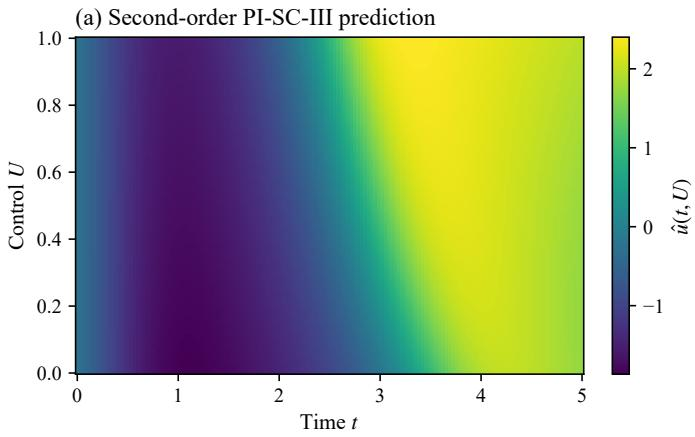  
(c) Slice at U = 0.3

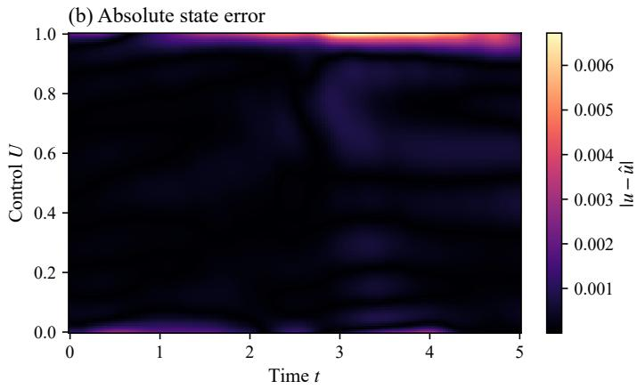

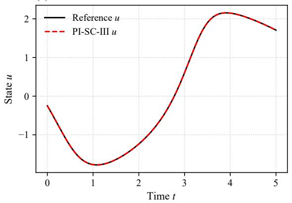

(d) Slice at U= 0.6  
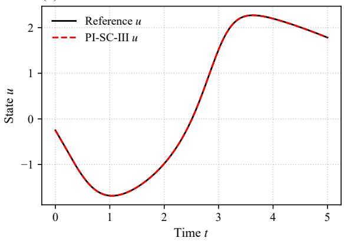  
Fig. 1. Forward solution of the Van der Pol oscillator obtained by semi-supervised PI-SC-III. Top left: predicted state over (t, U). Top right: absolute pointwise error. Bottom: cross-sectional trajectories at $U = 0 . 3$ and $U = 0 . 6$  
TABLE V

TABLE IV  
INVERSE RESULTS FOR THE VAN DER POL OSCILLATOR.  
INVERSE RESULTS FOR THE TWO-DIMENSIONAL HELMHOLTZ EQUATION.
<table><tr><td>Algorithm</td><td> $| \mu _ { p r e d } - \mu _ { t r u e } |$ </td><td>Time (s)</td><td>State RMSE</td></tr><tr><td> $\mathrm { P I N N } \left( 1 \times 3 0 0 \right)$ </td><td> $2 . 8 8 e - 1 \pm 1 . 0 9 e - 1$ </td><td> $2 2 . 0 \pm 0 . 5 1$ </td><td> $5 . 8 5 e - 2 \pm 1 . 3 5 e - 2$ </td></tr><tr><td> $\mathrm { P I N N } \ ( 4 \times 6 4 )$ </td><td> $2 . 3 5 e - 4 \pm 2 . 0 1 e - 4$ </td><td> $5 1 . 8 \pm 0 . 9 4$ </td><td> $9 . 5 1 e - 4 \pm 3 . 4 2 e - 4$ </td></tr><tr><td>PI-SC-I</td><td> $4 . 0 1 e - 1 \pm 4 . 6 9 e - 2$ </td><td> $0 . 7 1 \pm 0 . 0 2$ </td><td> $1 . 0 8 e - 1 \pm 2 . 0 5 e - 2$ </td></tr><tr><td>PI-SC-II</td><td> $1 . 9 1 e - 3 \pm 1 . 5 9 e - 3$ </td><td> $1 . 6 4 \pm 0 . 0 3$ </td><td> $4 . 8 0 e - 3 \pm 2 . 1 0 e - 3$ </td></tr><tr><td>PI-SC-III</td><td> $5 . 0 8 e - 4 \pm 2 . 7 5 e - 4$ </td><td> $1 . 9 5 \pm 0 . 0 4$ </td><td> $5 . 9 6 e - 4 \pm 2 . 0 0 e - 4$ </td></tr></table>

## F. Inverse Problems: Results

All tabulated values are reported as mean ± standard deviation, and state predictive accuracy is evaluated on 10,000 randomly sampled test coordinates. For each system, the table reports parameter identification error, state RMSE, and training time.

1) Van der Pol oscillator: The corresponding results are presented in Table IV.

2) Two-dimensional Helmholtz equation: The corresponding results are presented in Table V.

## G. Inverse Problems: Result Analysis

The inverse results in Tables IV and V show the same update-scope hierarchy as in the forward experiments. PI-

<table><tr><td>Algorithm</td><td> $| k _ { p r e d } ^ { 2 } - k _ { t r u e } ^ { 2 } |$ </td><td>Time (s)</td><td>State RMSE</td></tr><tr><td>PINN  $( 1 \times 4 0 0 )$ </td><td> $1 . 0 9 e + 1 \pm 2 . 8 7 e + 0$ </td><td> $5 0 . 6 \pm 1 . 1 9$ </td><td> $2 . 8 2 e - 1 \pm 1 . 2 7 e - 1$ </td></tr><tr><td>PINN  $( 4 \times 6 4 )$ </td><td> $6 . 7 2 e - 1 \pm 6 . 2 7 e - 1$ </td><td> $1 0 1 \pm 2 . 1 3$ </td><td> $2 . 3 6 e - 2 \pm 1 . 2 2 e - 2$ </td></tr><tr><td>PI-SC-I</td><td> $3 . 7 2 e + 1 \pm 1 . 9 3 e + 1$ </td><td> $1 . 4 9 \pm 0 . 0 3$ </td><td> $2 . 1 7 e - 1 \pm 9 . 9 0 e - 2$ </td></tr><tr><td>PI-SC-II</td><td> $7 . 1 4 e - 1 \pm 7 . 5 5 e - 1$ </td><td> $3 . 1 4 \pm 0 . 0 7$ </td><td> $5 . 0 4 e - 3 \pm 2 . 2 1 e - 3$ </td></tr><tr><td>PI-SC-III</td><td> $8 . 4 2 e - 4 \pm 1 . 6 0 e - 3$ </td><td> $3 . 5 1 \pm 0 . 1 0$ </td><td> $6 . 7 0 e - 5 \pm 1 . 1 5 e - 4$ </td></tr></table>

SC-I is less effective for joint state and parameter recovery, while PI-SC-II improves the reconstruction accuracy through windowed correction. PI-SC-III provides the most accurate overall recovery.

Across both inverse benchmarks, PI-SC-III provides parameter-identification accuracy comparable to or better than that of the deep PINN. It also improves state reconstruction and requires substantially less training time. Overall, these results demonstrate that PI-SCM retains high predictive accuracy and computational efficiency in inverse problems.

## H. Activation-Function Study: Experimental Setup

We isolate the influence of the hidden-node basis on the semi-supervised Van der Pol forward problem. PI-SC-III is evaluated with sine, hyperbolic tangent, and sigmoid activations. $L _ { m a x }$ is set to 1,000, while the sampling points, penalty weights, candidate ranges, and remaining constructive settings are kept identical to the semi-supervised Van der Pol configuration described above. Each activation is evaluated over 100 independent trials.

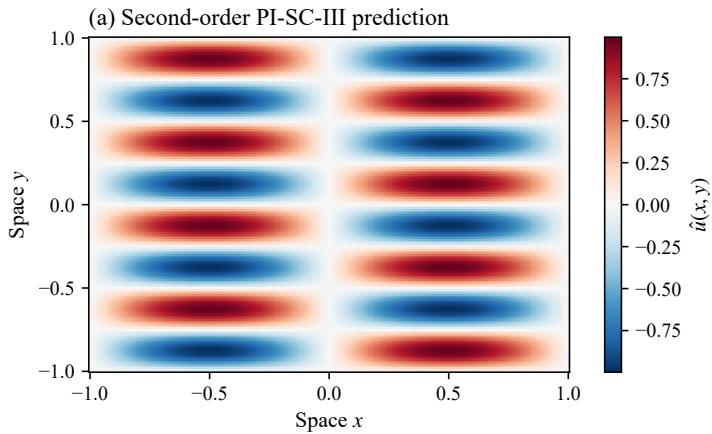  
(c) Slice at x = −0.5

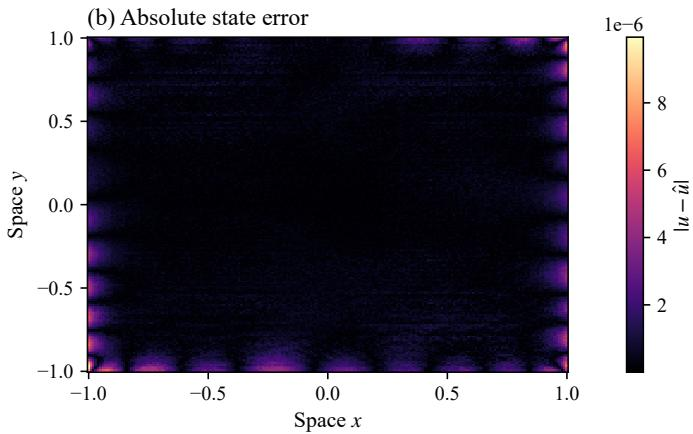

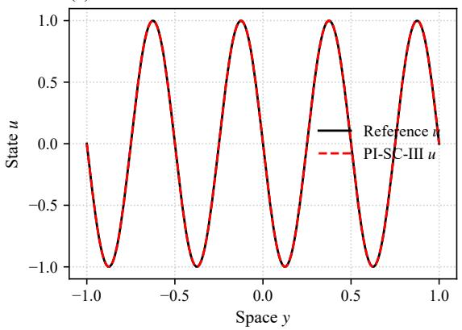

(d) Slice at x = 0.5  
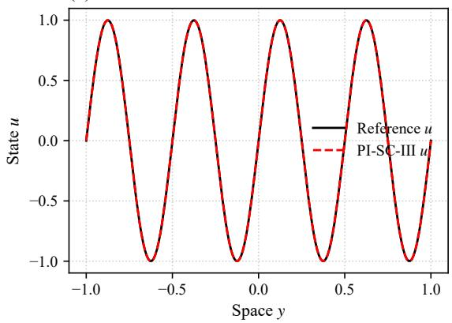  
Fig. 2. Forward solution of the two-dimensional Helmholtz equation obtained by PI-SC-III. Top left: predicted state over $( x , y )$ . Top right: absolute pointwise error. Bottom: cross-sectional profiles at $x = - 0 . 5$ and $x = \bar { 0 . 5 }$

TABLE VI  
SEMI-SUPERVISED PI-SC-III RESULTS WITH DIFFERENT ACTIVATION FUNCTIONS.
<table><tr><td colspan="2">Activation RMSE</td></tr><tr><td>Sine</td><td> $5 . 6 6 e - 4 \pm 3 . 5 9 e - 4$ </td></tr><tr><td>Hyperbolic tangent</td><td> $2 . 7 1 e - 3 \pm 8 . 9 2 e - 4$ </td></tr><tr><td>Sigmoid</td><td> $1 . 6 8 e { - 2 } \pm 7 . 9 6 e { - 3 }$ </td></tr></table>

## I. Activation-Function Study: Results

Table VI summarizes the state RMSE , while Fig. 4 shows the evolution of the average true residual $\mathcal { E } _ { L } ^ { 2 }$ with the number of accepted hidden nodes.

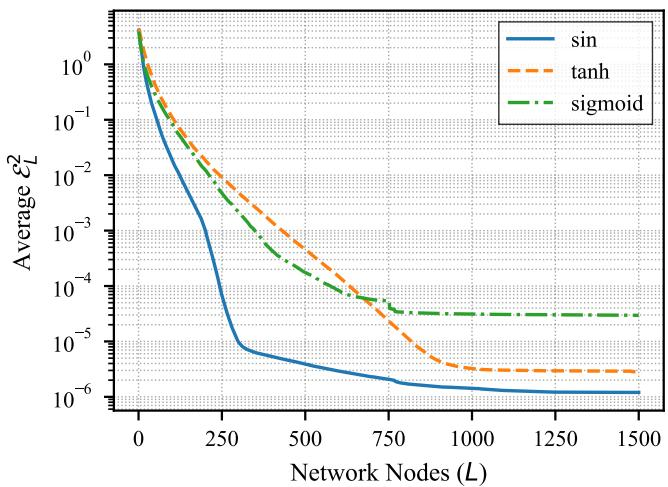  
Fig. 4. Evolution of the average true residual $\mathcal { E } _ { L } ^ { 2 }$ with the number of accepted hidden nodes for three activation functions.

## J. Activation-Function Study: Result Analysis

Sine activation achieves the highest predictive accuracy and the fastest residual convergence among the tested activation functions. As shown in Fig. 4, it reduces the nonlinear residual more rapidly and converges to the lowest residual level, supporting its use as the default activation in the reported PI-SCM experiments.

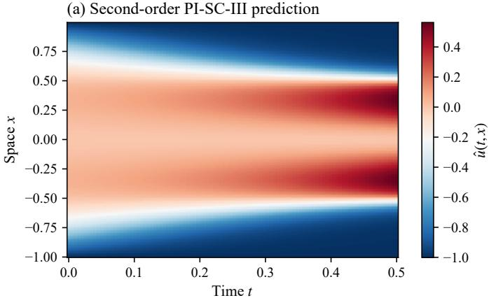  
(c) Slice at t = 0.1

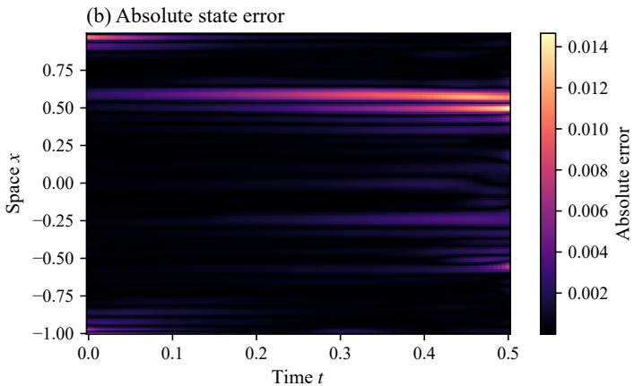

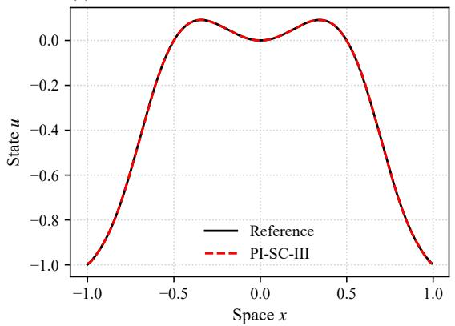

(d) Slice at t = 0.4  
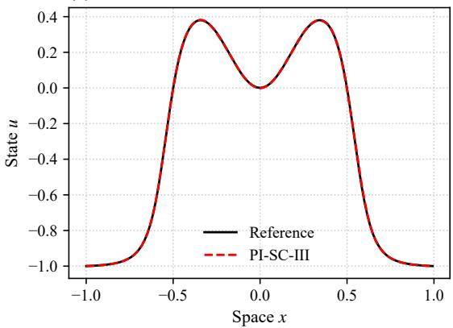  
Fig. 3. Forward solution of the Allen–Cahn equation obtained by semi-supervised PI-SC-III. Top left: predicted state over $( t , x )$ . Top right: absolute pointwise error. Bottom: spatial profiles at $t = 0 . 1$ and $t = 0 . 4$

## V. CONCLUSION

This paper introduced PI-SCM, a backpropagation-free framework for nonlinear differential equations. Its progressive algorithmic suite, ranging from localized construction (PI-SC-I) through windowed correction (PI-SC-II) to global correction (PI-SC-III), converts nonlinear physics-informed learning into a sequence of analytically solvable least-squares problems. The universal approximation analysis establishes the theoretical basis for residual convergence, while the inverse formulation enables state reconstruction and physical-parameter identification within the same framework.

The empirical study considered forward approximation on the Van der Pol, two-dimensional Helmholtz, and stiff Allen–Cahn systems; inverse identification on the Van der Pol and Helmholtz systems; and an activation-function ablation. Across these tasks, PI-SC-III consistently provided the strongest accuracy–efficiency trade-off among the proposed variants. It achieved competitive or lower errors than deep gradient-based PINNs while reducing training time by one to two orders of magnitude. The semi-supervised results also showed that PI-SCM can assimilate sparse observations when the physical constraints alone are insufficient, and the activation study identified sine as the most effective basis for the oscillatory benchmark.

Future work should examine scalability to higherdimensional geometries, more severe multiscale stiffness, noisy parameter-identification settings, and adaptive selection of the candidate range and update scope. Extending the current shallow constructive architecture while retaining analytical training and numerical stability is another important direction toward real-time scientific machine-learning applications.

## REFERENCES

[1] Baker N, Alexander F, Bremer T, et al. Workshop report on basic research needs for scientific machine learning: Core technologies for artificial intelligence[R]. USDOE Office of Science (SC), Washington, DC (United States), 2019.

[2] Raissi M, Perdikaris P, Karniadakis G E. Physics-informed neural networks: A deep learning framework for solving forward and inverse problems involving nonlinear partial differential equations[J]. Journal of Computational Physics, 2019, 378: 686-707.

[3] Schiassi E , D’Ambrosio A , Drozd K ,et al. Physics-Informed Neural Networks for Optimal Planar Orbit Transfers[J]. Journal of Spacecraft and Rockets, 2022, 59(3):16.DOI:10.2514/1.A35138.

[4] Shukla K, Di Leoni P C, Blackshire J, et al. Physics-informed neural network for ultrasound nondestructive quantification of surface breaking cracks[J]. Journal of Nondestructive Evaluation, 2020, 39(3): 61.

[5] Berkhahn S, Ehrhardt M. A physics-informed neural network to model COVID-19 infection and hospitalization scenarios[J]. Advances in Continuous and Discrete Models, 2022, 2022(1): 61.

[6] Diao Y, Yang J, Zhang Y, et al. Solving multi-material problems in solid mechanics using physics-informed neural networks based on domain decomposition technology[J]. Computer Methods in Applied Mechanics and Engineering, 2023, 413: 116120.

[7] Wang S, Sankaran S, Wang H, et al. An expert’s guide to training physics-informed neural networks. arXiv preprint arXiv:2308.08468, 2023.

[8] Cuomo S, Di Cola V S, Giampaolo F, et al. Scientific machine learning through physics–informed neural networks: Where we are and what’s next[J]. Journal of Scientific Computing, 2022, 92(3): 88.

[9] Pao Y H, Takefuji Y. Functional-link net computing: theory, system architecture, and functionalities[J]. Computer, 1992, 25(5): 76-79.

[10] Schmidt W F, Kraaijveld M A, Duin R P W. Feed forward neural networks with random weights[C]//International Conference on Pattern Recognition. IEEE Computer Society Press, 1992: 1-4.

[11] Huang G B, Zhu Q Y, Siew C K. Extreme learning machine: theory and applications[J]. Neurocomputing, 2006, 70(1-3): 489-501.

[12] Liu D, Chang T S, Zhang Y. A constructive algorithm for feedforward neural networks with incremental training[J]. IEEE Transactions on Circuits and Systems I: Fundamental Theory and Applications, 2002, 49(12): 1876-1879.

[13] Wang D, Li M. Stochastic configuration networks: Fundamentals and algorithms[J]. IEEE Transactions on Cybernetics, 2017, 47(10): 3466- 3479.

[14] Wang D, Li M. Deep stochastic configuration networks with universal approximation property[C]//2018 International Joint Conference on Neural Networks (IJCNN). IEEE, 2018: 1-8.

[15] Li K, Wang W, Lin S. Soft measurement of ammonia nitrogen concentration based on GA-SCN[C]. IEEE Symposium on Product Compliance Engineering-Asia (ISPCE-CN), IEEE, 2018: 1-4.

[16] Felicetti M J, Wang D. Deep stochastic configuration networks with optimised model and hyper-parameters[J]. Information Sciences, 2022, 600: 431-441.

[17] Felicetti M J, Wang D. Deep stochastic configuration networks with different random sampling strategies[J]. Information Sciences, 2022, 607: 819-830.

[18] Pan J, Luan F, Gao Y, et al. FPGA-based implementation of stochastic configuration network for robotic grasping recognition[J]. IEEE Access, 2020, 8: 139966-139973.

[19] Li W, Tao H, Li H, Chen K, et al. Greengage grading using stochastic configuration networks and a semi-supervised feedback mechanism[J]. Information Sciences, 2019, 488: 1-12.

[20] Li W, Zhang Q, Wang D, et al. Stochastic configuration networks for self-blast state recognition of glass insulators with adaptive depth and multi-scale representation[J]. Information Sciences, 2022, 604: 61-79.

[21] Chen K, An J, Fang Y, et al. Research on solid waste plastic bottle cognitive based on YOLOv5s and deep stochastic configuration network[C]. International Conference on Automation, Control and Robotics Engineering, 2022: 275-280.

[22] Liu W, Ren C, Xu Y. PV generation forecasting with missing input data: a super-resolution perception approach[J]. IEEE Transactions on Sustainable Energy, 2021, 12(2): 1493-1496.

[23] Xu L, Yang C, Xu X, et al. Physics-informed stochastic configuration network promoted model predictive control with multi-objective optimization[J]. Artificial Intelligence Review, 2025, 58(9): 281.

[24] Wu L, Tan W G Y, Zhou L, Braatz R D, Drgona J. Least-squares multi-ˇ step Koopman operator learning for model predictive control. arXiv preprint arXiv:2601.11901, 2026.

[25] Hafeez H Y, Ndikilar C E, Isyaku S. Analytical study of the van der pol equation in the autonomous regime[J]. Progress in Physics, 2015, 11: 252.

[26] Andersson J, Akesson J, Diehl M. Dynamic optimization with˚ CasADi[C]//2012 IEEE 51st IEEE Conference on Decision and Control (CDC). IEEE, 2012: 681-686.

[27] Dwivedi V, Srinivasan B. Physics-informed extreme learning machine (PIELM): A rapid method for the numerical solution of partial differential equations[J]. Neurocomputing, 2020, 391: 96-118.

[28] Ko S, Park S. VS-PINN: A fast and efficient training of physics-informed neural networks using variable-scaling methods for solving PDEs with stiff behavior[J]. Journal of Computational Physics, 2025, 529: 113860.