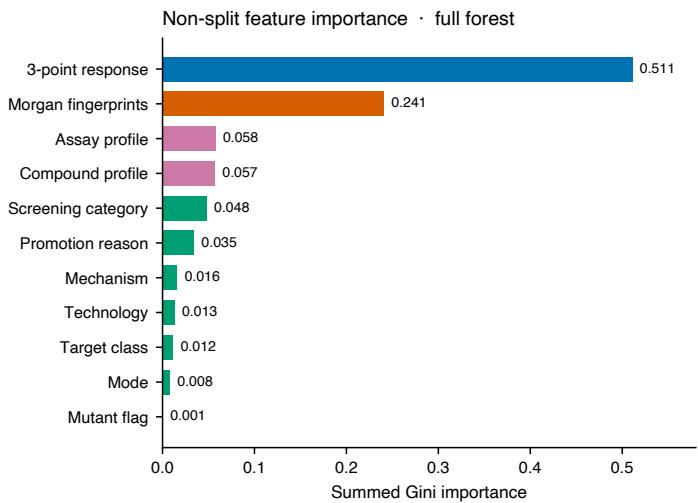
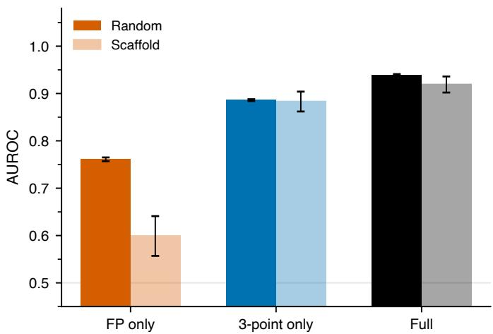
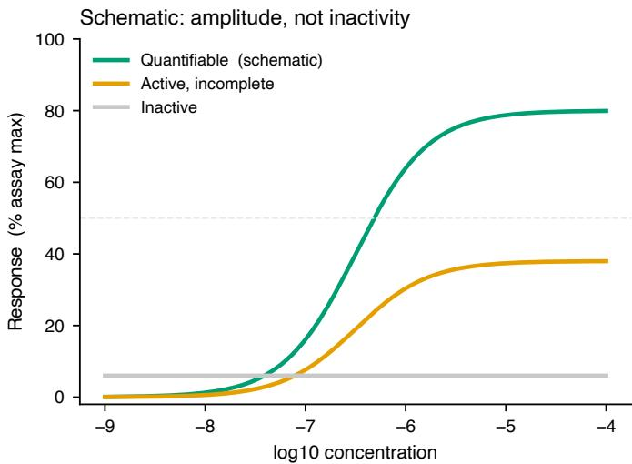
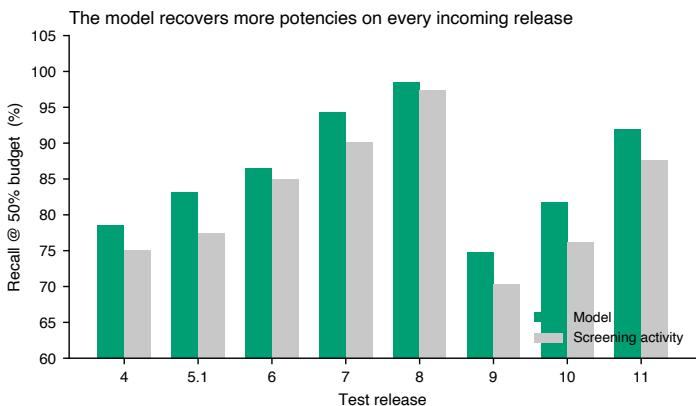
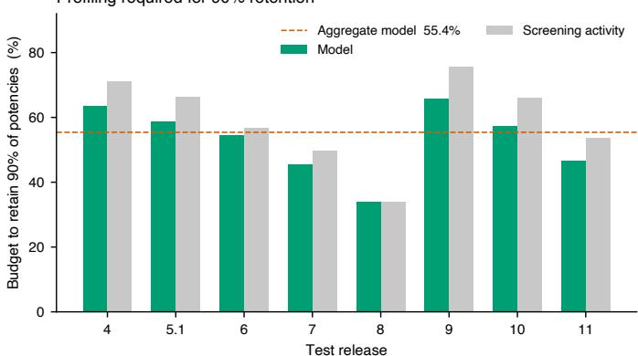
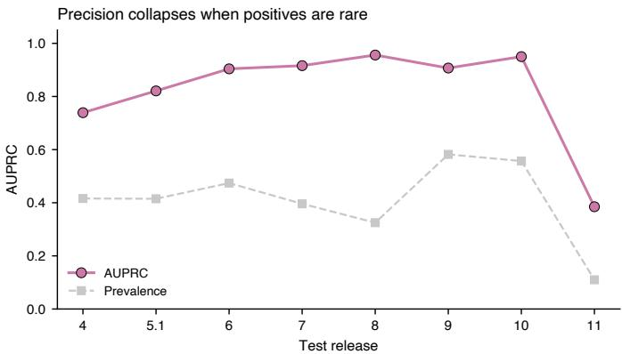

# Predicting Quantifiability from Primary Screens to Prioritize Dose-Response Profiling

Sean Lim1

1Department of Natural Science, Rice University, Houston, TX, USA .

## Abstract

High-throughput drug screening relies on low-cost primary assays to prioritize compounds for more expensive dose–response profiling, where potency is ultimately quantified. Current screening strategies largely focus on identifying compounds that will confirm biological activity on follow-up, implicitly assuming that confirmed activity will also yield a usable potency estimate. However, confirmed biological activity in screening does not necessarily translate into a quantifiable potency, because active compounds can still fail to produce a reportable dose–response estimate. We therefore present a framework for modeling quantifiability, whether follow-up testing will yield a usable potency estimate, as a distinct triage objective from biological activity. Quantifiability was strongly predictable from the preceding low-cost screen, with most predictive information arising from the observed screening features rather than molecular structure. Response-based predictors remained robust on previously unseen chemical scafolds and generalized across held-out assay-mechanism families, while the probability of successful quantification varied strongly with response amplitude and assay context. These findings establish experimental measurability, distinct from biological activity, as a predictable property of screening outcomes and show that quantifiability-aware triage can improve the allocation of costly dose–response profiling capacity.

## 1 Introduction

In early drug discovery, potency of the compound is a central unit of account. Structure–activity relationships, selectivity profiles, and progression decisions commonly depend on potency estimates derived from concentration–response experiments, typically reported as IC50, EC50, or their logarithmic forms such as pXC50 [1, 2].

Obtaining those values, however, requires multi-concentration dose–response experiments that are substantially more resource-intensive than the primary screens used to identify candidate hits. High-throughput screening campaigns therefore commonly operate as a multi-stage or multi-fidelity funnel: a relatively inexpensive primary screen is performed across a large compound set, followed by higher-fidelity concentration– response characterization of a much smaller selected subset [1, 3]. The critical decision is which compound–assay pairs to promote from the screening stage to profiling.

That promotion decision is conventionally made by assessing whether the initial screening signal represents genuine biological activity, noise, or assay interference. Existing hit-triage approaches therefore emphasize activity prediction from chemical or historical screening information [3, 4], identification of frequent hitters and assay-interfering compounds [5–7], and replicate-aware statistical procedures for distinguishing reliable hits from experimental variation [8]. Although these approaches difer substantially in methodology, they share an emphasis on reducing false-positive activity calls before expensive follow-up. This framing implicitly assumes that a profiling experiment is wasted mainly when the promoted pair turns out to be inactive. In the screening campaign analyzed here, however, inactivity explains less than two-thirds of unsuccessful profiles. Of 32,971 promoted compound–assay pairs, 18,299 produced no reported potency. Among these, 6,750 were clearly active across the 11-point dose– response experiment but still failed to yield a curve that could be fit to a reportable pXC . In other words, even a perfect activity filter would not have prevented more than one-third of the unsuccessful profiling experiments.

The problem is therefore not always that the screen identifies a false hit. In many cases, the activity is real, but the response is too weak or incomplete for the subsequent dose–response experiment to produce a reliable Hill fit and a reportable pXC50. This distinction is consistent with established concentration–response analysis: reliable midpoint estimation requires the experimental data to suficiently define the response transition, and uncertainty can become large when the concentration range does not adequately constrain the relevant portions or asymptotes of the curve [9, 10]. This changes the triage objective. Rather than asking only whether a compound–assay pair will be active, the more useful question is whether profiling that pair will actually yield a quantifiable potency. If failure is driven by insuficient response amplitude, then the warning signal may already be present in the inexpensive screening measurements. Quantifiability could therefore be predicted before profiling, using data that are already collected as part of the standard screening workflow and without requiring any additional experiment.

Here, we formulate quantifiability as the triage target and test whether it can be predicted from screening data before dose–response profiling. We evaluate this formulation on 32,971 promoted compound–assay pairs spanning successive releases and five assay-mechanism families of the EvE Bio compound–assay matrix. Three results follow. First, quantifiability is predictable, and the prediction comes primarily from the screening curve rather than the molecule. Sixteen simple features derived from the three-point response outperformed every traditional screening heuristic. Morgan fingerprints also rank below them and lose most of their apparent predictive signal under a scafold-disjoint holdout. Second, quantifiability is driven primarily by signal amplitude, but the required threshold depends on the assay format. The amplitude required for quantification difers markedly across assay formats, with failure rates ranging from 18.8% to 81.6%. Third, we evaluate the policy under a leakage-safe rolling design that approximates routine laboratory deployment, in which each release is predicted using only chronologically prior releases. Under this evaluation, ranking pairs by predicted quantifiability substantially reduces the number of dose–response experiments required to recover most reportable potencies. The same relationship between screening amplitude and subsequent quantification is also observed independently in external datasets.

## 2 Methods

## 2.1 Study design and outcome definition

We analyzed successive releases of the EvE Bio compound–assay matrix, using compound–assay pairs that had been promoted from a three-point screen to an 11- point dose–response experiment. The analysis comprised 32,971 promoted pairs and was therefore conditional on the historical promotion policy. The primary prediction target was quantifiability. For each promoted pair $i ,$

$$
y _ { i } = { \left\{ \begin{array} { l l } { 1 } & { { \mathrm { i f ~ } } { \mathrm { p r o f l i n g ~ p r o d u c e d ~ a ~ r e p o r t a b l e ~ p o t e n c y ~ ( p X C _ { 5 0 } ) } } , } \\ { 0 } & { { \mathrm { o t h e r w i s e } } . } \end{array} \right. }\tag{1}
$$

Pairs labeled Active–Quantified by EvE Bio were assigned $y _ { i } = 1 ;$ all other promoted pairs were assigned $y _ { i } = 0$ . For descriptive analyses of failure modes, non-quantifiable pairs were further distinguished as inactive during profiling or active but lacking a reportable Hill fit. EvE Bio’s Active-Poor curation label was used only to characterize active but unquantifiable profiles and was not used as a predictive feature. Predictive variables were restricted to information treated as available before 11-point profiling.

## 2.2 Screening-stage feature representation

From the three-point screen, we derived 16 response features summarizing signal amplitude, response shape, and variability: mean, median, maximum, minimum, range, and standard deviation of activity; mean activity at the lowest and highest screening concentrations, $\bar { a } ( c _ { \mathrm { m i n } } )$ and $\bar { a } ( c _ { \operatorname* { m a x } } )$ ; a slope proxy $\bar { a } ( c _ { \operatorname* { m a x } } ) - \bar { a } ( c _ { \operatorname* { m i n } } )$ ; mean and maximum replicate standard deviation; number of measurements and unique concentrations; binary indicators that maximum activity exceeded 30% or 50%; and the reported screening maximum. Molecular structure was represented by 1,024-bit Morgan fingerprints (radius 2). Historical screening context comprised six compound-level statistics (activity count and fraction, mean and maximum observed screening amplitude, and the number of distinct target classes and mechanism families in which the compound had been screened) and three assay-level statistics (activity count, activity fraction, and mean observed amplitude). Assay metadata encoded mechanism family, target class, mode, technology, screening category, promotion reason, and mutant status as dummy variables. Together these blocks formed the 1,074-feature full representation, denoted $x _ { i }$ . In random-split analyses, the nine compound- and assay-level historical features were computed from the full screening matrix. In chronological evaluation they were recomputed as described below.

## 2.3 Predictive models and comparative analyses

The principal multivariable predictor was a class-balanced random forest (500 trees) trained on $y _ { i }$ . Mean three-point activity was the principal screening heuristic; maximum three-point activity and random ranking were additional baselines. Logistic regression with class balancing, trained on standardized values of the full screeningstage feature set, provided a linear comparator. Isolated random forests were also trained on the 16 three-point features alone or on Morgan fingerprints alone.

To rank the contribution of successive information sources, feature groups were added nestedly, starting from the three-point block and then adding fingerprints, historical compound and assay profiles, and assay metadata. For that ablation, and for scafold-disjoint evaluation, random forests used 300 trees with class balancing; isolated blocks were evaluated by five-fold stratified cross-validation and nested models by three-fold stratified cross-validation. Target-class and screening-category subgroup analyses used a gradient-boosted tree on a held-out fold. Molecular weight, LogP, hydrogen-bond donor and acceptor counts, rotatable-bond count, and topological polar surface area were compared between quantifiable and active-unquantifiable pairs. Assay-level summaries of plate-control quality, derived from 516,894 control wells across 16,212 plates, were tested as additional predictors.

## 2.4 Cross-validation and generalization analyses

Primary model comparison used five-fold stratified random cross-validation, with the principal forest fit on the full training portion of each fold. Generalization beyond related chemical series was evaluated by five-fold Bemis–Murcko scafolddisjoint splitting (787 scafolds), so that test compounds did not share a scafold with training compounds. Transfer across experimental contexts was assessed by leave-onemechanism-family-out evaluation: each of the five assay-mechanism families was held out in turn, and random forests were trained on fingerprints alone, fingerprints plus the three-point block, or fingerprints plus the three-point block plus mechanism-family indicators.

Prospective use was approximated with a leakage-safe rolling evaluation. Releases 1–3 supplied the initial training history. Each subsequent release (4, 5.1, 6, 7, 8, 9, 10, and 11) was scored using only promoted pairs from earlier releases, yielding 30,120 pairs across eight chronological test windows. There is no release 5.0. For each window, the nine compound- and assay-level historical features were recomputed from screening results strictly prior to the test release; unseen compounds or assays received traininghistory priors. Discrimination AUROC used the direct quantifiability forest (500 trees). Recall-at-budget and budget-at-retention used the two-stage ranking

$$
{ \hat { s } } _ { i } = { \hat { P } } ( A _ { i } = 1 \mid x _ { i } ) { \hat { P } } ( y _ { i } = 1 \mid A _ { i } = 1 , x _ { i } ) ,\tag{2}
$$

where $A _ { i }$ denotes activity in the 11-point experiment (300 trees per stage). Because a reportable potency occurs only among actives, this product is a factorization of $P ( y _ { i } = 1 \mid x _ { i } )$ . It changed five-fold AUROC by 0.001 relative to a forest trained directly on $y _ { i }$ and is reported as an operational ranking, not as a calibrated probability or as a separate methodological contribution. Within each release, ranking by screening maximum activity was the comparator for those budget metrics. Predictions were evaluated as within-release rankings rather than as fixed probability thresholds.

## 2.5 Performance and profiling-policy metrics

Let $\pi$ be a ranking of n pairs in a test set (highest score first) and let $k = \lfloor f n \rfloor$ for a profiling fraction $f .$ Recall at budget $f$ is the fraction of all quantifiable pairs recovered among the top $k .$

$$
\mathrm { R e c a l l @ } f = \frac { \sum _ { i = 1 } ^ { k } y _ { \pi ( i ) } } { \sum _ { j = 1 } ^ { n } y _ { j } } ,\tag{3}
$$

and $_ \mathrm { y }$ ield is the precision of that same prefix,

$$
\mathrm { Y i e l d @ } f = \frac { 1 } { k } \sum _ { i = 1 } ^ { k } y _ { \pi ( i ) } .\tag{4}
$$

We report Recall@50% $( f = 0 . 5 0 )$ and Yield@25% $( f = 0 . 2 5 )$ . The profiling budget required to retain a fraction r of all reportable potencies is

$$
B ( r ) = \operatorname* { m i n } \left\{ { \frac { k } { n } } : \sum _ { i = 1 } ^ { k } y _ { \pi ( i ) } \geq r \sum _ { j = 1 } ^ { n } y _ { j } \right\} ,\tag{5}
$$

with $r = 0 . 9 0$ as the operating point for the chronological analysis. Discrimination was also summarized by AUROC and AUPRC (mean $\pm$ standard deviation under cross-validation). Expected calibration error and the Brier score

$$
\mathrm { B S } = \frac { 1 } { n } \sum _ { i = 1 } ^ { n } ( \hat { p } _ { i } - y _ { i } ) ^ { 2 }\tag{6}
$$

were computed from two-stage out-of-fold predicted probabilities on the promoted set.

## 2.6 External validation

External validation used U.S. EPA ToxCast/Tox21 data from invitroDB version 4.3. Analyses were restricted to 43,242 matched compound–endpoint pairs that had both a representative screening measurement and a later multi-concentration series across 361 endpoints. Because 42,479 of those pairs (98.2%) were measured at a single screening concentration, the EvE Bio 16-feature three-point representation could not be reconstructed and the EvE-trained model was not transferred. Screening maximum activity was instead evaluated as a one-concentration ranking variable under five-fold random cross-validation and under endpoint-held-out evaluation. This analysis tests the amplitude–quantifiability association on an independent platform. It is not a validation of the EvE three-point model or of the profiling-budget reductions estimated from EvE Bio.

## 3 Results

## 3.1 Quantifiability and potency can be predicted from the three-point screen

Across the analyzed EvE Bio releases, 32,971 compound–assay pairs were promoted from the three-point screen to an 11-point dose–response experiment. Only 14,672 (44.5%) yielded a reportable potency. Of the remaining 18,299 profiles, 11,549 (35.0% of all promoted pairs) were inactive at 11 points, whereas 6,750 (20.5%) were active but still failed to produce a reportable Hill fit. Thus, more than one-third of unsuccessful profiling experiments involved genuine activity but still could not be quantified.

Among pairs confirmed active during profiling, 31.5% failed to yield a potency estimate. We therefore asked whether quantifiability could be predicted from information already available after the three-point screen.

Table 1 Five-fold random cross-validation performance for predicting whether a promoted compound–assay pair yields a reportable potency. Values are mean ± standard deviation. Recall@50% is the fraction of quantifiable pairs recovered when the top-ranked 50% of pairs are profiled. Yield@25% is the fraction of profiled pairs that are quantifiable when the top-ranked 25% are selected. Fingerprint-only and three-point-only random forests use a single feature block. Logistic regression and the full random forest use the complete screening-stage feature set.
<table><tr><td>Policy</td><td>AUROC</td><td>AUPRC</td><td>Recall@50%</td><td>Yield@25%</td></tr><tr><td>Random</td><td> $0 . 5 0 2 \pm 0 . 0 0 3$ </td><td> $0 . 4 4 9 \pm 0 . 0 0 5$ </td><td> $0 . 5 0 0 \pm 0 . 0 0 3$ </td><td> $0 . 4 5 0 \pm 0 . 0 0 9$ </td></tr><tr><td>Random forest (fingerprints only)</td><td> $0 . 6 8 8 \pm 0 . 0 1 0$ </td><td> $0 . 6 2 8 \pm 0 . 0 1 0$ </td><td> $0 . 6 4 5 \pm 0 . 0 0 8$ </td><td> $0 . 6 6 6 \pm 0 . 0 1 1$ </td></tr><tr><td>Maximum three-point activity</td><td> $0 . 8 4 8 \pm 0 . 0 0 3$ </td><td> $0 . 7 8 1 \pm 0 . 0 0 5$ </td><td> $0 . 8 0 7 \pm 0 . 0 0 5$ </td><td> $0 . 8 5 0 \pm 0 . 0 0 7$ </td></tr><tr><td>Random forest (three-point only)</td><td> $0 . 8 5 0 \pm 0 . 0 0 5$ </td><td> $0 . 8 2 5 \pm 0 . 0 0 5$ </td><td> $0 . 7 9 6 \pm 0 . 0 0 6$ </td><td> $0 . 8 5 8 \pm 0 . 0 0 4$ </td></tr><tr><td>Mean three-point activity</td><td> $0 . 8 6 3 \pm 0 . 0 0 2$ </td><td> $0 . 8 2 9 \pm 0 . 0 0 3$ </td><td> $0 . 8 1 4 \pm 0 . 0 0 2$ </td><td> $0 . 8 8 8 \pm 0 . 0 0 3$ </td></tr><tr><td>Logistic regression (full features)</td><td> $0 . 8 8 0 \pm 0 . 0 0 6$ </td><td> $0 . 8 4 9 \pm 0 . 0 0 5$ </td><td> $0 . 8 3 3 \pm 0 . 0 0 6$ </td><td> $0 . 9 0 0 \pm 0 . 0 0 6$ </td></tr><tr><td>Random forest (full features)</td><td> $\mathbf { 0 . 9 3 9 \pm 0 . 0 0 2 }$ </td><td> $\mathbf { 0 . 9 2 7 \pm 0 . 0 0 2 }$ </td><td> $\mathbf { 0 . 8 9 4 \mathop { \pm } 0 . 0 0 4 }$ </td><td> $\mathbf { 0 . 9 6 1 \pm 0 . 0 0 3 }$ </td></tr></table>

Under five-fold random cross-validation, simple screening activity was already informative: ranking pairs by maximum three-point activity achieved an AUROC of $0 . 8 4 8 \pm 0 . 0 0 3$ , while mean three-point activity achieved $0 . 8 6 3 \pm 0 . 0 0 2$ . We used the latter as the principal screening baseline.

We extracted 16 features from the three-point screen, all available before 11-point profiling: amplitude statistics (mean, median, maximum, minimum, range, and standard deviation), activity at the lowest and highest screening concentrations, a slope proxy, replicate-noise summaries, the number of measurements and unique concentrations, binary flags for strong activity, and the reported screening maximum. We then combined this block with 1,024-bit Morgan fingerprints of the compound, historical compound- and assay-level screening profiles (how often the compound had been active across assays, and how often the assay had yielded activity across compounds), and assay metadata encoding mechanism family, target class, technology, screening category, promotion reason, and a mutant flag.

Logistic regression on the full screening-stage set reached $0 . 8 8 0 \pm 0 . 0 0 6$ . A random forest trained on the full set achieved an AUROC of $0 . 9 3 9 \pm 0 . 0 0 2$ and an AUPRC of $0 . 9 2 7 { \scriptstyle \pm 0 . 0 0 2 }$ , recovering 89.4% of quantifiable pairs at a 50% profiling budget (Table 1).

Performance varied less across model classes than across feature sets, suggesting that predictive performance was driven primarily by information contained in the screening data rather than by the choice of learning algorithm.

## 3.2 Predictive information is concentrated in the screening response rather than molecular structure

We next examined which sources of information accounted for the predictability of quantification. Holding the model fixed, a random forest using just the 16 features derived from the three-point screen achieved an AUROC of $0 . 8 5 0 { \pm } 0 . 0 0 5$ , whereas the same model using 1,024-bit Morgan fingerprints alone achieved $0 . 6 8 8 { \pm } 0 . 0 1 0$ (Table 1). The three-point feature block therefore matched ranking by maximum three-point activity without using molecular structural information.

Table 2 Feature-group ablation for a random forest trained on the quantified label $( n _ { \mathrm { e s t i m a t o r s } } = 3 0 0 _ { \mathrm { : } }$ class-balanced). Isolated blocks were evaluated by five-fold stratified cross-validation. Nested models added groups cumulatively and were evaluated by three-fold stratified cross-validation. The three-point block contains 15 response summaries plus the reported screening maximum (16 features). Compound and assay profiles comprise six compound-level and three assay-level historical screening statistics (9 features). The final nested step restores assay metadata, mechanism family, target class, technology, screening category, promotion reason, and a mutant flag, to recover the full 1,074-feature matrix. Share of nested gain is the fraction of the AUROC increase from the three-point block (0.886) to the full model (0.938). Isolated fingerprint-only performance in this table uses the same 300-tree forest as the nested models and is therefore not identical to the fingerprint-only row in Table 1.
<table><tr><td>Feature set</td><td>Contents</td><td>N</td><td>AUROC</td><td>AUPRC</td><td>Rec@50%</td><td>∆AUROC</td></tr><tr><td colspan="7">Isolated blocks (five-fold)</td></tr><tr><td>Three-point only 3pt block</td><td></td><td>16</td><td> $0 . 8 8 6 \pm 0 . 0 0 2$ </td><td> $0 . 8 6 7 \pm 0 . 0 0 2$ </td><td> $0 . 8 3 5 \pm 0 . 0 0 6$ </td><td></td></tr><tr><td>Fingerprints only</td><td>Morgan bits</td><td>1,024</td><td> $0 . 7 6 1 \pm 0 . 0 0 4$ </td><td> $0 . 6 9 0 \pm 0 . 0 0 6$ </td><td> $0 . 7 1 1 \pm 0 . 0 0 3$ </td><td></td></tr><tr><td>Full model</td><td>all blocks</td><td>1,074</td><td> $0 . 9 3 9 \pm 0 . 0 0 2$ </td><td> $0 . 9 2 6 \pm 0 . 0 0 3$ </td><td> $0 . 8 9 4 \pm 0 . 0 0 3$ </td><td></td></tr><tr><td colspan="7">Nested addition (three-fold)</td></tr><tr><td>Three-point only</td><td>3pt block</td><td>16</td><td> $0 . 8 8 6 \pm 0 . 0 0 3$ </td><td></td><td></td><td></td></tr><tr><td>+ fingerprints</td><td>+ Morgan bits</td><td>1,040</td><td> $0 . 9 1 8 \pm 0 . 0 0 1$ </td><td></td><td></td><td>+0.032</td></tr><tr><td>+ profiles</td><td>+ compound/assay history</td><td>1,049</td><td> $0 . 9 2 9 \pm 0 . 0 0 1$ </td><td></td><td></td><td>+0.011</td></tr><tr><td>+ metadata (full)</td><td>+ assay metadata</td><td>1,074</td><td> $0 . 9 3 8 \pm 0 . 0 0 1$ </td><td></td><td></td><td>+0.009</td></tr></table>

Nested feature-group ablation showed the same ordering (Table 2). Starting from the three-point block, adding Morgan fingerprints produced the largest subsequent gain (∆AUROC +0.032; 62% of the remaining lift). Historical compound and assay profiles added +0.011, and residual assay metadata added +0.009. Isolated fingerprints under the same forest reached an AUROC of $0 . 7 6 1 \pm 0 . 0 0 4$ , well below the three-point block alone. Thus molecular structure and historical context contributed additional information, but the largest predictive component was already contained in the threepoint response (Fig. 1).

The diference became more pronounced under scafold-disjoint evaluation. When test compounds were separated from training compounds by Bemis–Murcko scafold, the full model decreased from an AUROC of $0 . 9 3 9 \pm 0 . 0 0 2$ under random splitting to $0 . 9 1 9 \pm 0 . 0 1 7$ . The three-point-only model was nearly unchanged, decreasing from $0 . 8 8 6 \pm 0 . 0 0 2$ to $0 . 8 8 3 \pm 0 . 0 2 1$ . In contrast, the fingerprint-only model decreased from $0 . 7 6 1 \pm 0 . 0 0 4$ to $0 . 5 9 9 \pm 0 . 0 4 2$ (Fig. 1). Screening-response features therefore retained most of their predictive performance on unseen scafolds, whereas structural features were substantially less stable under chemotype separation.

We also tested whether quantifiability could be recovered from compound–assay identity and historical afinity structure without observing the three-point response for the pair being ranked. A matrix-completion model using fingerprints and assay descriptors but no three-point measurements reached an AUROC of 0.842, compared with 0.939 for the full per-pair model. Together, these analyses identify the observed screening response as the dominant transferable source of information for predicting whether a later dose–response profile will yield a reportable potency.

## 3.3 Active but unquantifiable profiles are characterized by weak response amplitude

We next examined what distinguishes active responses that yield a reportable potency from active responses that do not. Bulk physicochemical properties provided little separation between the two groups. Molecular weight, LogP, hydrogen-bond donors and acceptors, rotatable bonds, and topological polar surface area showed no significant diferences between quantifiable and active-unquantifiable pairs. Plate-level control metrics likewise added little predictive information: incorporating measurements derived from 516,894 control wells across 16,212 plates increased AUROC from $0 . 9 3 9 \pm 0 . 0 0 2$ to $0 . 9 4 3 \pm 0 . 0 0 2$

Response amplitude, in contrast, difered strongly across the three profiling outcomes (Fig. 2). Mean maximum activity observed in the three-point screen was 68.0% for pairs that later yielded a quantifiable potency, 42.6% for active but unquantifiable pairs, and 19.0% for pairs that were inactive during profiling. The separation between quantifiable and active-unquantifiable pairs remained visible in the subsequent 11- point experiment, where maximum activity averaged 75.9% and 52.0%, respectively. Weak responses were particularly enriched among active profiles that failed quantification. Among active-unquantifiable pairs, 59.9% had a maximum profiling response below 40%, compared with 11.9% of quantifiable pairs. Consistent with this pattern, 4,225 of the 6,750 active-unquantifiable pairs (62.6%) carried EvE Bio’s Active-Poor curation label, indicating detectable activity that did not satisfy the criteria required for a reported potency.

The relationship between amplitude and quantification difered substantially across assay-mechanism families. Among pairs confirmed active in the 11-point experiment,

Scaffold holdout · 5-fold  

  
Fig. 1 Predictive information is concentrated in the screening response. Top: summed Gini importance by feature group for a random forest trained on the full screening-stage matrix. The 16 three-point features account for the largest share, followed by Morgan fingerprints; historical profiles and assay metadata contribute smaller amounts. Bottom: AUROC under random versus Bemis– Murcko scafold-disjoint splitting for fingerprint-only, three-point-only, and full models. Bars are five-fold means; error bars are one standard deviation. The three-point block is nearly unchanged on unseen scafolds, whereas fingerprint-only performance declines substantially.

Hill-fitting failure ranged from 18.8% in G-protein activation assays to 81.6% in heterodimer assays (Table 3).

An interpretable model containing screening amplitude together with assaymechanism and target-class interactions achieved an AUROC of 0.816 without using molecular fingerprints. Interaction terms accounted for 36.8% of feature importance, with the interaction between assay mechanism and screening maximum providing the largest individual contribution.

  
Fig. 2 Schematic 11-point responses illustrating the amplitude distinction among outcomes. Quantifiable profiles reach a high plateau from which a Hill midpoint can be reported. Active but unquantifiable profiles show a real concentration-dependent response that remains too incomplete or too weak for a reportable fit. Inactive profiles remain near baseline. The dashed line marks 50% of assay maximum. Curves are schematic and are not fitted EvE Bio traces.

Table 3 Hill-fitting failure among compound–assay pairs that were active in the 11-point experiment, by assay-mechanism family. Failure is the fraction of active pairs that did not yield a reportable potency. Totals match the 21,422 pairs confirmed active during profiling, of which 6,750 (31.5%) were unquantifiable.
<table><tr><td>Mechanism family</td><td>N active</td><td>Quantifiable</td><td>Unquantifiable</td><td>Failure (%)</td></tr><tr><td>G-protein activation</td><td>6,824</td><td>5,542</td><td>1,282</td><td>18.8</td></tr><tr><td>Competition binding</td><td>4,199</td><td>3,038</td><td>1,161</td><td>27.6</td></tr><tr><td>Barr2 recruitment</td><td>8,375</td><td>5,394</td><td>2,981</td><td>35.6</td></tr><tr><td>Co-factor recruitment</td><td>890</td><td>489</td><td>401</td><td>45.1</td></tr><tr><td>Heterodimer</td><td>1,134</td><td>209</td><td>925</td><td>81.6</td></tr><tr><td>All active pairs</td><td>21,422</td><td>14,672</td><td>6,750</td><td>31.5</td></tr></table>

Predictive performance also varied across assay subgroups (Table 4). AUROC reached 0.975 for kinase competition-binding assays, 0.920 for 7TM assays, and 0.944 for nuclear-receptor assays, while screening categories characterized by inconsistent responses were more dificult to rank. Residual errors were concentrated among weak responses: at a 50% profiling budget, missed quantifiable pairs had a mean screening maximum of 31.1%, compared with 71.2% among those recovered. Of 316 missed quantifiable pairs, 173 occurred in Barr2 recruitment assays.

Together, these results show that failure to obtain a potency from an active pair is strongly associated with weak or partial response amplitude and that the amplitude associated with successful quantification depends on assay context.

Table 4 Subgroup ranking and residual errors on a held-out fold of 6,595 promoted pairs. Target-class and screening-category metrics are from a gradient-boosted tree trained on the remaining pairs. N is the number of held-out pairs in the subgroup; Pos. is the fraction that were quantifiable; Rec@50% is recall when the top-ranked half of that subgroup is profiled. Missed-pair counts and screening maxima are from a random forest evaluated at a 50% budget over the full held-out fold (2,619 of 2,935 quantifiable pairs recovered). Kinase and competition-binding rows coincide because the kinase pairs in this dataset are the competition-binding assays.
<table><tr><td>Subgroup</td><td>N</td><td>Pos. (%)</td><td>AUROC</td><td>Rec@50%</td></tr><tr><td>Target class</td><td></td><td></td><td></td><td></td></tr><tr><td>Kinase (competition binding)</td><td>1,547</td><td>37.8</td><td>0.975</td><td>0.974</td></tr><tr><td>Nuclear receptor</td><td>704</td><td>19.9</td><td>0.944</td><td>0.964</td></tr><tr><td>7TM</td><td>4,344</td><td>50.9</td><td>0.920</td><td>0.828</td></tr><tr><td>Screening category</td><td></td><td></td><td></td><td></td></tr><tr><td>Compound of interest</td><td>2,710</td><td>73.5</td><td>0.923</td><td>0.665</td></tr><tr><td>Inconsistent, high</td><td>689</td><td>48.0</td><td>0.916</td><td>0.840</td></tr><tr><td>Inactive</td><td>1,780</td><td>7.2</td><td>0.906</td><td>0.969</td></tr><tr><td>Unmeasurable pXC50</td><td>994</td><td>35.9</td><td>0.871</td><td>0.866</td></tr><tr><td>Low activity</td><td>103</td><td>19.4</td><td>0.831</td><td>0.900</td></tr><tr><td>Inconsistent, low</td><td>191</td><td>41.9</td><td>0.765</td><td>0.738</td></tr><tr><td>Inconsistent, random</td><td>128</td><td>20.3</td><td>0.736</td><td>0.692</td></tr><tr><td colspan="5">Missed quantifiable pairs at a 50% budget</td></tr><tr><td></td><td>N missed</td><td>Share of misses (%)</td><td>Mean 3-pt max (%)</td><td></td></tr><tr><td>Recovered quantifiable</td><td>2,619</td><td></td><td>71.2</td><td></td></tr><tr><td>Missed quantifiable</td><td>316</td><td>100</td><td>31.1</td><td></td></tr><tr><td>Barr2 recruitment</td><td>173</td><td>54.7</td><td></td><td></td></tr><tr><td>G-protein activation</td><td>53</td><td>16.8</td><td></td><td></td></tr><tr><td>Competition binding</td><td>53</td><td>16.8</td><td></td><td></td></tr><tr><td>Co-factor recruitment</td><td>20</td><td>6.3</td><td></td><td></td></tr><tr><td>Heterodimer</td><td>17</td><td>5.4</td><td></td><td></td></tr></table>

## 3.4 Chronological evaluation quantifies the profiling-budget trade-of

Random cross-validation measures interpolation among compounds and assays already represented elsewhere in the dataset. We therefore evaluated the ranking procedure chronologically across successive EvE Bio releases, to simulate how the policy would be used in a laboratory that trains on completed campaigns and then ranks the next incoming release. For each test release from release 4 through release 11, models were trained using only promoted compound–assay pairs from earlier releases, and all historical compound- and assay-level features were recomputed using that prior history alone. Releases 1–3 were used only as initial training history, leaving 30,120 compound–assay pairs across eight chronological test windows.

Under this rolling evaluation, the model ranked each incoming release very well. Random-forest AUROC ranged from 0.814 to 0.977, with a median of 0.902. At a 50% profiling budget, it recovered a greater fraction of quantifiable pairs than ranking by screening activity on all eight releases (Table 5; Fig. 3).

Table 5 Leakage-safe rolling evaluation. For each test release, the model was trained only on promoted pairs from earlier releases, and historical compound- and assay-level features were recomputed from that prior history. AUROC is from a random forest trained on the quantified label. Rec@50% is the fraction of quantifiable pairs recovered when the top-ranked 50% of that release is profiled, compared with ranking by screening activity. Release 5.1 is the first test window after release 4 (there is no release 5.0). The eight windows contain 30,120 pairs in total.
<table><tr><td>Release</td><td>Test N</td><td>Quantifiable</td><td>Pos. (%)</td><td>AUROC</td><td>Rec@50% (model)</td><td>Rec@50% (screening)</td></tr><tr><td>4</td><td>4,731</td><td>1,966</td><td>41.6</td><td>0.814</td><td>0.785</td><td>0.751</td></tr><tr><td>5.1</td><td>4,462</td><td>1,851</td><td>41.5</td><td>0.867</td><td>0.832</td><td>0.774</td></tr><tr><td>6</td><td>2,739</td><td>1,297</td><td>47.4</td><td>0.918</td><td>0.865</td><td>0.850</td></tr><tr><td>7</td><td>2,722</td><td>1,079</td><td>39.6</td><td>0.944</td><td>0.943</td><td>0.902</td></tr><tr><td>8</td><td>2,475</td><td>805</td><td>32.5</td><td>0.977</td><td>0.985</td><td>0.974</td></tr><tr><td>9</td><td>3,571</td><td>2,077</td><td>58.2</td><td>0.885</td><td>0.748</td><td>0.703</td></tr><tr><td>10</td><td>7,077</td><td>3,942</td><td>55.7</td><td>0.941</td><td>0.818</td><td>0.762</td></tr><tr><td>11</td><td>2,343</td><td>258</td><td>11.0</td><td>0.827</td><td>0.919</td><td>0.876</td></tr></table>

Recall at a fixed profiling fraction depended strongly on the prevalence of quantifiable pairs. Release 9, in which 58.2% of promoted pairs were quantifiable, had an AUROC of 0.885 but recovered 74.8% of quantifiable pairs at a 50% budget. Release 11 contained only 11.0% quantifiable pairs and had a lower AUROC of 0.827, but recovered 91.9% of quantifiable pairs at the same budget. For this reason, fixed-budget recall was interpreted within each release relative to the corresponding screening policy rather than compared directly across releases.

The retrospective budget–retention curves showed that, across the eight chronological test releases, 90% of the potencies obtained by exhaustive profiling could be recovered while profiling 55.4% of promoted pairs (Fig. 3). This corresponds to 13,429 fewer 11-point experiments across the 30,120 chronologically evaluated pairs, or 44.6% of the profiling experiments. At the same 90% retention target, the model required a smaller profiling budget than the screening heuristic on seven of eight releases and tied it on the remaining release.

The chronological results also showed substantial variation in achievable savings across releases. Release 11 was the most imbalanced test window, with only 258 quantifiable pairs among 2,343 promoted pairs. Its AUPRC fell to 0.385 against an 11.0% positive rate, despite recall of 0.919 at a 50% profiling budget (Fig. 4). Thus, the amount of profiling that can be withheld at a given retention target depends on the composition and prevalence of quantifiable responses in the incoming release rather than being a fixed property of the model.

Model scores were more reliable as rankings than as calibrated probabilities. Across the full evaluation, expected calibration error was 0.059 and the Brier score was 0.113.

Profiling required for 90% retention  
  
Fig. 3 Leakage-safe rolling evaluation across eight incoming releases. Top: fraction of quantifiable pairs recovered when the top-ranked 50% of each release is profiled, compared with ranking by screening activity. The model recovers more potencies on every release. Bottom: fraction of each release that must be profiled to retain 90% of the potencies obtained by exhaustive profiling. The dashed line is the aggregate model budget of 55.4%. The model required a smaller budget than screening activity on seven of eight releases and tied it on release 8.

## 3.5 The predictive signal generalizes across assay-mechanism families and an independent platform

We next tested whether the screening-stage signal persisted when entire assaymechanism families were excluded from model training. In leave-one-mechanismfamily-out evaluation, a fingerprint-only model transferred poorly to held-out families, with a mean AUROC of 0.578. Adding the three-point screening response increased the mean AUROC to 0.862. Adding an explicit encoding of the assay-mechanism label on top of the screening features produced little further change, yielding a mean AUROC of 0.863.

Performance remained above chance for every held-out mechanism family, although the magnitude varied. AUROC was 0.966 for held-out kinase competition-binding assays, 0.863 for G-protein activation, 0.867 for co-factor recruitment, 0.813 for heterodimer assays, and 0.800 for Barr2 recruitment. Thus, screening-response information remained predictive even when the model had not been trained on examples from the test assay-mechanism family.

  
Fig. 4 Precision–recall performance tracks the prevalence of quantifiable pairs across chronological test releases. AUPRC remains high while the positive rate is moderate, then falls to 0.385 on release 11, where only 11.0% of promoted pairs were quantifiable. Fixed-budget recall is therefore interpreted within each release relative to the corresponding screening policy rather than compared directly across releases.

Finally, we asked whether the amplitude–quantifiability relationship could be checked on an independent platform. The matched EPA ToxCast/Tox21 screens are not a three-point design: 42,479 of 43,242 compound–endpoint pairs (98.2%) were measured at a single screening concentration, so the 16 three-point features could not be reconstructed and the EvE-trained model was not transferred. What this dataset can test, and does externally validate, is the one-concentration version of the same relationship: higher screening amplitude is associated with a higher chance that later multi-concentration profiling yields a reportable potency. Across 361 endpoints, ranking by screening maximum activity separated pairs that later produced a potency from those that did not (AUROC $0 . 8 1 5 \pm 0 . 0 0 7$ under random cross-validation and $0 . 8 1 6 \pm 0 . 0 2 9$ with endpoints held out; Table 6). At a 50% multi-concentration budget, that single screening amplitude recovered approximately 91% of potency-producing pairs. Missed potencies were again concentrated among weak screening responses. This is therefore external validation of the amplitude–quantifiability association under a one-concentration screen, not of the three-point model.

## 4 Discussion

The main finding of this study is that unsuccessful dose–response profiling is not simply a false-hit problem. More than one-third of unsuccessful profiles in this campaign were active when tested at 11 concentrations but nevertheless failed to yield a reportable potency. These experiments would not have been prevented by better activity prediction alone. By instead treating quantifiability, whether the downstream experiment will return a usable $\mathrm { p X C } _ { 5 0 }$ , as the triage target, we found that much of this failure is predictable from measurements already available in the initial screen. This reframes promotion as a decision about the expected information returned by the next experiment, rather than only about whether the underlying biological activity is real.

The predictive signal was concentrated in the observed screening response. Threepoint features substantially outperformed molecular fingerprints alone and retained their performance when chemical scafolds were separated between training and testing, whereas fingerprint-only performance declined markedly. Active but unquantifiable profiles also occupied a distinct response regime: their amplitudes were substantially lower than those of quantifiable profiles, both in the initial screen and in the subsequent dose–response experiment. Importantly, however, there was no universal amplitude threshold for successful quantification. Failure among active profiles varied from 18.8% to 81.6% across assay-mechanism families, and interactions between screening amplitude and assay context contributed substantially to prediction. These observations are consistent with established properties of concentration–response fitting: midpoint estimates become poorly constrained when the measured responses do not adequately define the transition between the lower and upper portions of the curve, and weak signal relative to the efective assay window can produce large uncertainty in Hill-model parameters [2, 9, 10]. The model therefore appears to be capturing a simple but assay-dependent measurement problem: a genuine response may still fail to traverse enough of the assay’s efective dynamic range for a reliable Hill midpoint to be reported. Molecular structure and historical assay information refine that prediction, but the immediate experimental response provides the most transferable evidence about whether a particular pair is likely to be measurable.

The practical value of this formulation is therefore best understood as allocation of profiling capacity. In the leakage-safe chronological evaluation, each incoming release was ranked using only information available from previous releases, an evaluation structure intended to approximate prospective use and avoid the optimistic estimates that can arise when future observations are allowed to inform model development [11]. Across these test windows, 90% of the potencies obtained by exhaustive profiling could retrospectively be retained while profiling 55.4% of promoted pairs. The precise reduction should not be interpreted as a universal savings rate: the achievable budget depended substantially on the prevalence and composition of quantifiable pairs in each release. Rather, the model defines a budget–retention trade-of that can be chosen according to the cost of profiling and the tolerance for missed potencies. This distinction also argues against using the score as a hard activity filter. Low-scoring pairs can still be biologically interesting, and the residual errors were concentrated precisely among weak screening responses that occasionally became quantifiable under denser profiling. In practice, predicted quantifiability is therefore most naturally combined with chemical novelty, target rationale, selectivity, and other program-specific considerations when prioritizing experiments.

Several analyses indicate that the relationship is broader than interpolation within the historical compound–assay matrix. Screening-response performance was preserved on unseen chemical scafolds and remained informative when entire assay-mechanism families were excluded from training. The independent ToxCast/Tox21 analysis provides a narrower external test. The ToxCast processing framework explicitly distinguishes single-concentration screening, which may be used to identify potentially active chemicals, from multiple-concentration screening, from which modeled potency and eficacy can be estimated [12]. Because the external subset analyzed here was overwhelmingly based on single-concentration screening measurements, it cannot validate the EvE three-point model itself or the estimated profiling savings. It does, however, reproduce the underlying association that stronger screening responses are more likely to be followed by multi-concentration experiments yielding reportable potency. Taken together, these evaluations make memorization of particular chemotypes or assay families an insuficient explanation for the observed predictability and instead support screening amplitude as a transferable indicator of downstream quantifiability.

There are important limits to this conclusion. The analysis is retrospective and conditional on the historical promotion policy: the model was trained and evaluated among pairs that had already been selected for profiling, and its behavior on the much larger population of non-promoted pairs is unknown. Quantifiability is also defined by the reporting rules, concentration ranges, normalization procedures, and curve-fitting practices of the experimental workflow; established guidance likewise makes clear that whether an $\mathrm { I C _ { 5 0 } / E C _ { 5 0 } }$ estimate is considered reportable depends on properties of the experimental concentration range and the resulting fitted response [9]. A model transferred to another laboratory would therefore require local validation and potentially recalibration. Finally, retrospective ranking cannot establish realized experimental savings or determine whether model-guided selection systematically changes the chemical or biological diversity of retained hits. A prospective evaluation in which ranking is performed before profiling is the appropriate next test.

More broadly, the results identify a distinction that is easy to overlook in screening cascades: biological activity and experimental measurability are diferent properties. An experiment can fail to return the desired parameter even when the underlying efect is real. Because the early screen already contains information about that downstream measurability, it can be used not only to identify likely hits but also to decide where more expensive measurement is most likely to be informative. For dose–response profiling, explicitly optimizing for quantifiability therefore provides a direct way to concentrate experimental efort on compound–assay pairs most likely to yield the potency values on which subsequent drug-discovery decisions depend.

Acknowledgements. The author thanks EvE Bio, LLC for making its compound– assay screening and concentration–response data publicly available, and the U.S. Environmental Protection Agency and the Tox21 consortium for making the ToxCast/- Tox21 high-throughput screening data available through the invitroDB database.

Data Availability. The data analyzed in this study were obtained from two publicly available sources. The primary analyses used EvE Bio Data Releases #1–#11, comprising compound–assay three-point screening and 11-point concentration–response data. These data are publicly available through the EvE Bio Data portal under the Creative Commons CC BY-NC-SA 4.0 license. External validation used publicly available U.S. Environmental Protection Agency ToxCast/Tox21 high-throughput screening and concentration–response data from the invitroDB database (version 4.3). No new experimental data were generated in this study.

Author Contributions. S.L. conceived the study, designed and performed the analyses, interpreted the results, prepared the figures and tables, and wrote and revised the manuscript.

Competing Interests. The author declares no competing interests.

## References

[1] Hughes, J. P., Rees, S., Kalindjian, S. B. & Philpott, K. L. Principles of early drug discovery. British Journal of Pharmacology 162, 1239–1249 (2011).

[2] Srinivasan, B. & Lloyd, M. D. Dose–response curves and the determination of ic50 and ec50 values. Journal of Medicinal Chemistry 67, 17931–17934 (2024).

[3] Buterez, D., Janet, J. P., Kiddle, S. J. & Li\`o, P. MF-PCBA: Multifidelity high-throughput screening benchmarks for drug discovery and machine learning. Journal of Chemical Information and Modeling 63, 2667–2678 (2023).

[4] Riniker, S., Wang, Y., Jenkins, J. L. & Landrum, G. A. Using information from historical high-throughput screens to predict active compounds. Journal of Chemical Information and Modeling 54, 1880–1891 (2014).

[5] Baell, J. B. & Holloway, G. A. New substructure filters for removal of pan assay interference compounds (PAINS) from screening libraries and for their exclusion in bioassays. Journal of Medicinal Chemistry 53, 2719–2740 (2010).

[6] Dahlin, J. L. et al. PAINS in the assay: Chemical mechanisms of assay interference and promiscuous enzymatic inhibition observed during a sulfhydryl-scavenging HTS. Journal of Medicinal Chemistry 58, 2091–2113 (2015).

[7] Tan, L., Hirte, S., Palmacci, V., Stork, C. & Kirchmair, J. Tackling assay interference associated with small molecules. Nature Reviews Chemistry 8, 319–339 (2024).

[8] Malo, N. et al. Experimental design and statistical methods for improved hit detection in high-throughput screening. Journal of Biomolecular Screening 15, 990–1000 (2010).

[9] Sebaugh, J. L. Guidelines for accurate ec50/ic50 estimation. Pharmaceutical Statistics 10, 128–134 (2011).

[10] Shockley, K. R. Quantitative high-throughput screening data analysis: Challenges and recent advances. Drug Discovery Today 20, 296–300 (2015).

[11] Sheridan, R. P. Time-split cross-validation as a method for estimating the goodness of prospective prediction. Journal of Chemical Information and Modeling 53, 783–790 (2013).

[12] Feshuk, M. et al. The ToxCast pipeline: Updates to curve-fitting approaches and database structure. Frontiers in Toxicology 5, 1275980 (2023).