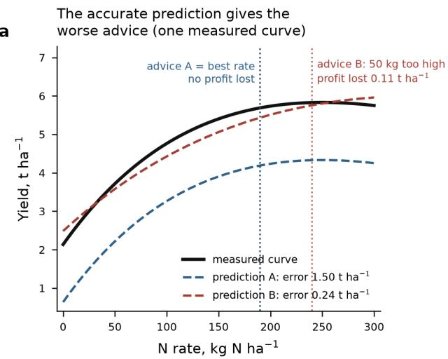
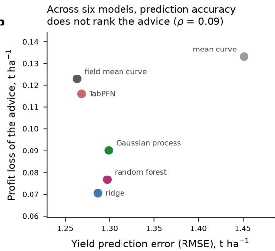
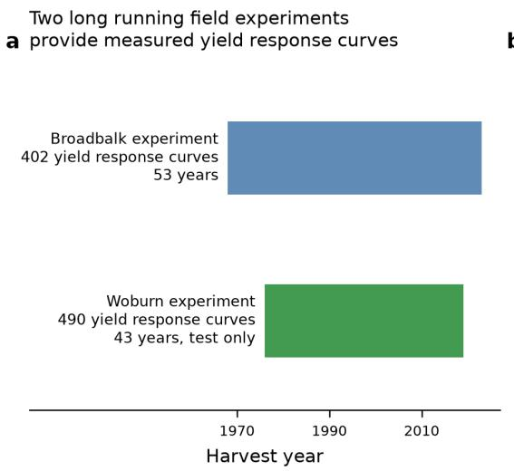
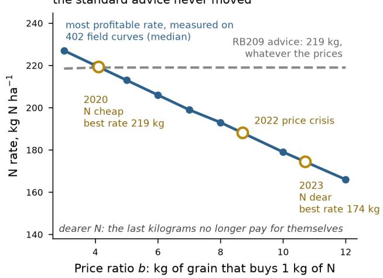
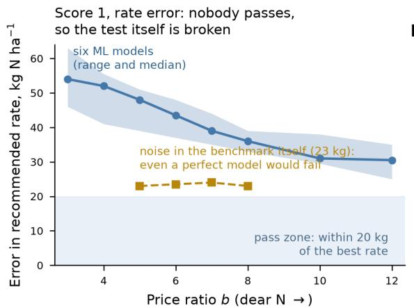
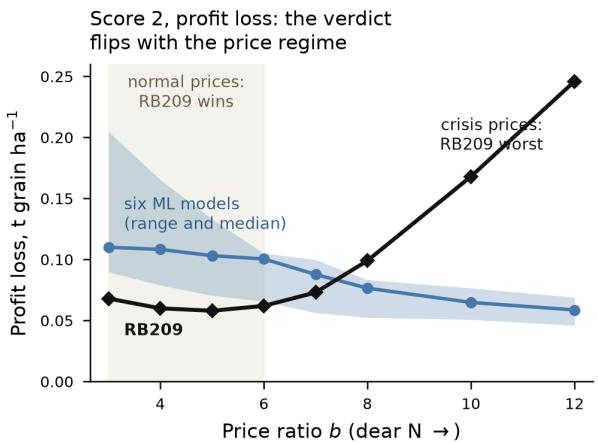
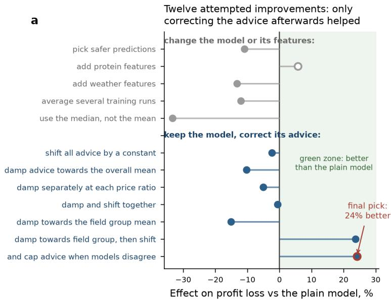
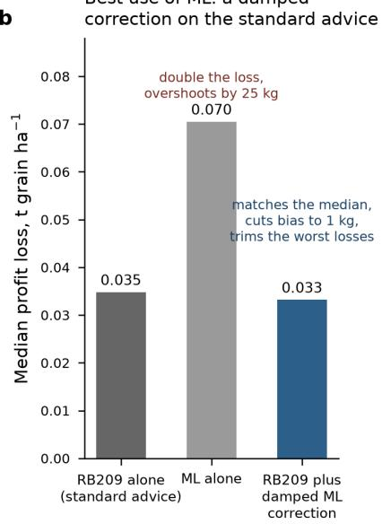
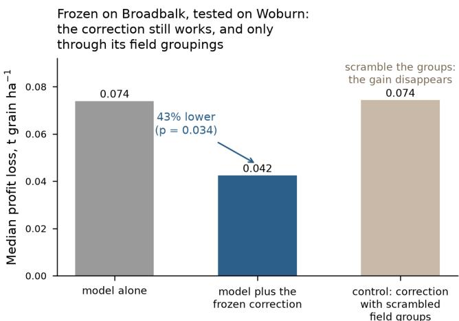
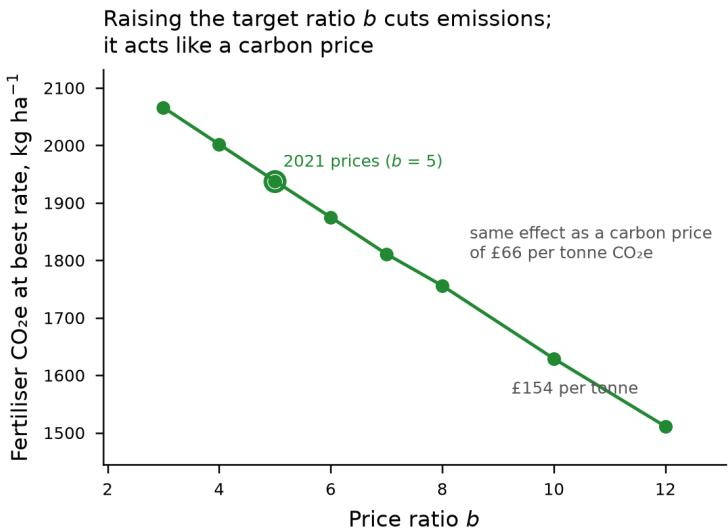

# Profit based evaluation of machine learning for nitrogen recommendations in winter wheat

Xulong Wang1 and Po Yang∗1

1University of Shefield

## Abstract

Nitrogen rates for winter wheat are set before the season, under unknown prices and weather. The standard UK advice does not respond to prices, yet recent price swings moved the most profitable rate by tens of kilograms per hectare. Machine learning is often proposed as the fix. However, it is usually judged on prediction accuracy, and accurate prediction does not by itself make the recommended rate more profitable. Our insight is to score nitrogen advice directly by the profit it forgoes on measured yield response curves. We build a test bench on 892 such curves from two long running UK experiments, and sweep the nitrogen to grain price ratio to cover all price scenarios. On this bench, machine learning fails as a predictor. No model recovers the best rate within farm tolerance, and the benchmark noise shows none can. At normal prices, every model also loses to the standard advice on profit. The gain sits elsewhere. A simple correction step applied after the model cuts profit losses by a quarter, while better models and extra features give no gain. The same frozen correction cuts losses by 43% at the second site without any retraining. A hybrid of standard advice plus a damped correction removes bias and trims rare large losses. The same price sweep also prices emission cuts, at a cost comparable to current carbon prices. Machine learning therefore pays as a profit scored correction to standard advice, not as its replacement.

## 1 Introduction

Choosing a nitrogen (N) rate is the largest input decision in UK wheat growing. Winter wheat covers about 1.6 million hectares, and N fertiliser is usually the largest purchased input. The rate is committed before the season, when weather is unknown. Prices are unknown too, and they moved violently in recent years. Between January 2020 and January 2023, UK ammonium nitrate went from £234 to a peak of £841 per tonne. Feed wheat moved between £165 and £280 per tonne (Table 1). One number captures both prices at once. The price ratio b is the grain needed to pay for one kilogram of N. It went from 4.1 to 10.7 in three years. On measured yield curves, that move shifts the most profitable rate by about 45 kg/ha (Fig. 2b).

The standard advice cannot follow that moving target. UK growers use the AHDB Nutrient Management Guide, RB209. It adjusts for soil, previous crop, and expected yield, but not for prices. In 2022 it needed an emergency revision to cover crisis prices [AHDB, 2023]. That revision is an oficial admission of the gap.

Machine learning (ML) is the obvious candidate to fill the gap, but it is judged on the wrong score. Most studies ask whether a model predicts yield, or the best rate, accurately. Accuracy is then scored in yield error or in kg N ha−1 [Tanaka et al., 2024]. Neither score measures the consequence of following the advice. A rate error that costs nothing is punished. A rare error that costs £900 per hectare is averaged away. The decision needs a decision score.

b  
  
Figure 1: Accurate prediction is not profitable advice. a, A measured yield curve from Broadbalk (black) and two synthetic predictions. Prediction A is of by $1 . 5 0 \mathrm { ~ t h a } ^ { - 1 }$ everywhere, but it matches the slope, so its advice lands exactly on the best rate. Prediction B matches the yields closely (error $0 . 2 4 ~ \mathrm { t h a } ^ { - 1 } )$ but bends too gently, so its advice is 50 kg too high and loses $0 . 1 1 \mathrm { \ t h a } ^ { - 1 }$ of profit. Prices at $b = 5$ . b, The same decoupling in our six trained models: yield prediction error (leave one year out) against the median profit loss of the resulting advice at $b = 5$ . Accuracy does not rank the advice (Spearman $\rho = 0 . 0 9 )$

Worse, accurate prediction does not by itself make the advice more profitable. Figure 1 shows why, on a measured curve from our data. The best rate depends only on the slope of the yield curve, the point where one more kilogram of N stops paying for itself. A prediction can be far of in level yet match the slope, and its advice is then perfect (prediction A). A prediction can match the yields closely yet bend too gently, and its advice is then 50 kg too high (prediction B). The same decoupling holds across our six trained models: their yield accuracy does not rank their advice quality (Fig. 1b, Spearman $\rho = 0 . 0 9 )$ . Chasing accuracy therefore optimises the wrong target.

Our insight is simple. Score N advice by the profit it forgoes on measured yield curves, under every price scenario. Long running field experiments make this possible. They give hundreds of measured yield response curves, each with a known best rate at each price ratio. Any advice can be scored against them, in the unit that matters.

The contributions of this work are summarised as follows:

• We propose a profit based evaluation framework for nitrogen recommendations. It scores any method by lost profit on 892 measured yield response curves, and a single sweep of the price ratio builds price uncertainty into the score itself (§3).

• We show that rate error, the standard score in prior work, is ill posed: the measured benchmark carries about 23 kg $\mathrm { N h a } ^ { - 1 }$ of noise, so no model can pass a farm tolerance test. We further show that on profit, six ML model families all lose to the standard advice at normal prices (§4).

• We localise the gain of ML to a post hoc correction step. It yields the entire 24% improvement while model and feature changes yield none, and it transfers frozen to a second site with a 43% improvement $( p = 0 . 0 3 4 )$ . Building on this, a hybrid of standard advice plus a damped ML correction removes bias and trims rare large losses (§5, §6).

• We demonstrate that the price ratio doubles as a carbon price, turning the same optimiser into an emission control with a worked abatement cost of £32 to 72 per tonne of $\mathrm { C O _ { 2 } e }$

b  
  
When N got dear, the best rate fell 45 kg; the standard advice never moved

  
Figure 2: Two field experiments; one moving target. a, The two data sources. Broadbalk gives 402 measured yield response curves over 53 years. Woburn gives 490 curves over 43 years and is used for testing only. b, The most profitable N rate, measured on the Broadbalk curves (blue, median). It falls as N gets dearer relative to grain. Gold rings mark the observed UK price ratios of 2020, 2022, and 2023. Those prices alone moved the best rate from 219 to 174 kg. The RB209 advice (grey) stays at 219 kg throughout.

(§7).

## 2 Data

Two long running UK experiments supply the measured curves. Both datasets are published open access by the electronic Rothamsted Archive, e-RA [Glendining and Poulton, 2023, Glendining et al., 2022]. Broadbalk at Rothamsted is the oldest fertiliser experiment in the world. Its plots receive fixed N rates every year. For each field section and year, we fit a yield response curve through three points. The points are the yields at 0, 144, and 288 kg N ha−1. The fits share one curvature parameter and must not bend downwards. Quality screening keeps 402 curves across 53 harvest years, 1968 to 2022. Nine features accompany each curve, covering weather, previous crop, cultivar era, and field section. Woburn Ley Arable is a separate experiment on lighter soil. The same fitting rules keep 490 curves across 43 years. Woburn is never used for training or tuning. It is a pure test of transfer.

## 3 A profit based test bench

## 3.1 Profit in grain terms

We express profit in grain terms, which removes all absolute prices. The profit of rate N on a field with measured curve $Y ( \cdot )$ is

$$
\pi _ { b } ( N ) = Y ( N ) - { \frac { b } { 1 0 0 0 } } N ,\tag{1}
$$

where b is the price ratio defined above. One sweep of b from 3 to 12 brackets every observed UK price scenario (Table 1). The observed range was 4.1 to 10.7. A piece of advice $\hat { N }$ is scored by its profit loss. That is the profit at the best rate minus the profit at $\hat { N }$ . Scoring always uses curves from held out years.

a  
Table 1: Observed UK prices and the implied price ratio b. AN is ammonium nitrate, 34.5 % N. Sources: AHDB fertiliser price series; RB209 2022 revision reference prices.
<table><tr><td>Period</td><td>AN, £/t Wheat, £/t</td><td>N price, £/kg</td><td>b</td></tr><tr><td>2020 (Jan)</td><td>234</td><td>165 0.68</td><td>4.1</td></tr><tr><td>2021 (RB209 ref.)</td><td>345</td><td>200</td><td>1.00 5.0</td></tr><tr><td>2021 (Sep)</td><td>395</td><td>200</td><td>1.14 5.7</td></tr><tr><td>2022 2 (Jul peak)</td><td>841</td><td>280</td><td>2.44 8.7</td></tr><tr><td>2023 (Jan)</td><td>700</td><td>190</td><td>2.03 10.7</td></tr><tr><td>2023 (May)</td><td>390</td><td>185</td><td>1.13 6.1</td></tr></table>

## Same models, same predictions. Two scores, two different verdicts

  
b

  
Figure 3: Same models, same predictions, two verdicts. The blue band spans our six ML models: mean curve, field mean curve, ridge regression, Gaussian process, random forest, and TabPFN. The blue line is their median. Each point covers 317 to 402 held out curves. a, Scored by rate error, the whole band sits above the 20 kg pass zone. The gold squares show the benchmark’s own noise, about 23 kg. Even a perfect model would therefore fail. The test, not the models, is broken. b, Scored by profit loss, the verdict depends on prices. RB209 (black) beats the whole band at normal prices $( b \leq 6 )$ . At crisis prices $\left( b \ge 8 \right)$ it becomes the worst option.

## 3.2 Why rate error is the wrong score

Two facts rule out rate error as the main score. First, the benchmark itself is noisy. Each measured curve rests on a handful of plot yields. Refitting a curve with one observation removed moves its own best rate. The median move is about 23 kg/ha (Fig. 3a). A pass line of 20 kg would therefore fail a perfect model. Second, profit is flat near the best rate. A 20 kg rate error costs a median of only 0.023 t ha−1 at $b = 5$ . A 30 kg error costs 0.052 t ha−1. Rate error thus punishes harmless disagreement and hides the rare expensive misses. Profit loss prices both correctly.

## 4 Machine learning alone does not clear the bar

This section states the negative result plainly. Six model families were trained to predict the three curve points. They are a mean curve, a field mean curve, ridge regression, a Gaussian process, a random forest, and TabPFN [Hollmann et al., 2025]. Scoring held out each of the 53 years in turn.

Table 2: Three designs on held out Broadbalk curves. Numbers are medians over the b grid; n is 338 to 345 per design. Large errors are curves losing more than 0.3 t ha−1. The hybrid’s median edge over RB209 (0.033 vs 0.035) is small and untested statistically; read it as “no worse”. The hybrid’s real gains are the bias and tail columns.
<table><tr><td>Design</td><td>Median loss, t ha−1</td><td>Worst 10%</td><td>Bias, kg N ha−1</td><td>Large errors</td></tr><tr><td>RB209 alone</td><td>0.035</td><td>0.562</td><td>+6</td><td>42</td></tr><tr><td>ML alone</td><td>0.070</td><td>0.872</td><td>+25</td><td>62</td></tr><tr><td>Hybrid: RB209 + damped ML</td><td>0.033</td><td>0.518</td><td>+1</td><td>37</td></tr></table>

b  
  
Figure 4: Where the gain comes from. a, We tried twelve improvements to one ML pipeline. Each was scored with every year held out in turn. Bars to the right mean lower profit loss than the plain model. Grey group: better models and extra features; none helped reliably. Blue group: keep the model and correct its advice afterwards; only these reached the green zone. The open ring improved here but not in the original run. b, The three way comparison of Table 2. ML alone doubles the loss of the standard advice. Adding a damped ML correction to RB209 matches its median. It also removes bias and trims the worst losses.

At normal prices, every family loses to the standard advice. For $b \leq 6$ , the median profit loss of every ML family exceeds RB209’s (Fig. 3b). This covers the price regime RB209 was built for. The ML curves cross below RB209 only at crisis prices, $b \geq 7 .$ . Advice that wins only in a crisis is not yet a deployable product. This motivates the designs of $\ S 5$

Unconstrained ML is worse than its parts. We let the best single family, ridge, predict the curve points freely. Its advice loses 0.070 t ha−1 at the median, double RB209’s 0.035 (Table 2). It also overshoots the best rate by 25 kg $\mathrm { N h a } ^ { - 1 }$ on average. One byproduct is still useful. Disagreement across the six models (median 13.6%) sits at the low end of published values, 13.3 to 31.5% [Tanaka et al., 2024]. Disagreement also tracks the true error (Spearman $\rho = 0 . 4 8 )$ , so it serves as a warning signal.

Table 3: The twelve attempted improvements, in the order of Fig. 4a. Efect is the change in profit loss against the plain model. Positive means better.
<table><tr><td>Change tested</td><td>What the operation does</td><td>Effect</td></tr><tr><td colspan="2">Change the model or its features</td><td></td></tr><tr><td>Pick safer predictions</td><td>Choose the rate with the smallest predicted -10.9 % downside, not the highest mean profit.</td><td></td></tr><tr><td>Add protein features</td><td>Add grain protein measurements as extra +5.7% model inputs.</td><td></td></tr><tr><td>Add weather features</td><td>Add season rainfall, temperature, and radi- -13.2 % ation as extra inputs.</td><td></td></tr><tr><td>Average several training runs</td><td>Train the model several times with different -12.0% seeds; average the predictions.</td><td></td></tr><tr><td>Use the median, not the mean</td><td>Combine those runs by median instead of -33.4% mean.</td><td></td></tr><tr><td colspan="2">Keep the model, correct its advice</td><td></td></tr><tr><td></td><td>Shift all advice by a constant Learn one offset from training years; add it to every advice.</td><td>-2.3%</td></tr><tr><td>mean</td><td>Damp towards the overall Pull each advice part way towards the average -10.3 % advice.</td><td></td></tr><tr><td>ratio</td><td>Damp separately at each price As above, with the damping strength tuned -5.1 % per price ratio.</td><td></td></tr><tr><td>Damp and shift together</td><td>Combine the damping and the constant shift. -0.6 % Damp towards the field group Pull each advice towards the average of its own -15.1 %</td><td></td></tr><tr><td>mean</td><td>field group. Damp towards field group, Field group damping plus the constant shift. +23.7 %</td><td></td></tr><tr><td>then shift</td><td></td><td></td></tr><tr><td>agree</td><td>Cap advice when models dis- Where the six models disagree widely, limit +24.1 % the correction. The final pick.</td><td></td></tr></table>

## 5 The gain lives in the correction step

## 5.1 The exploration ledger

We tested twelve pipeline changes under one locked protocol. The baseline is TabPFN with an evaluation loss of 0.080 t ha−1. The protocol held out every year in turn. Truth tables were locked by checksum, and the evaluator ran separately from the candidate author. Table 3 lists every change and its efect. The changes fall into two groups. One group changes the model or its features. The other group leaves the model alone. It corrects the model’s advice afterwards, using three simple tools. Damping pulls each advice part way towards a group average. Shifting adds one constant ofset, learned from training years. Capping limits the correction where the six models disagree.

## 5.2 Results, stated with care

The whole gain came from the correction group. Figure 4a shows the ledger. Model and feature changes gave no reliable gain. The final correction pick scores 0.061, which is 24% below baseline. Three qualifications matter. First, the planned mean tests do not reach significance (Wilcoxon $p = 0 . 7 0 )$ , because a few extreme years dominate yearly means. Second, a bootstrap over years gives ∆ = 0.019 with CI [−0.001, 0.057] and one sided $p = 0 . 0 3 7$ . Third, one feature change (open ring) improved here but not in the original run. We report that reversal rather than hide it. Our claim is therefore narrow. The largest gain, and the only gain that transfers, is the correction step. The strongest evidence is the transfer test below.

One misreading should be closed of. The correction does not make the model redundant.

  
Figure 5: Transfer with no retraining. The pipeline was frozen on Broadbalk and applied to 490 Woburn curves unchanged. Middle bar: the correction cuts the median profit loss by 43% $( p = 0 . 0 3 4 )$ . Right bar, the control: scramble which field group each curve belongs to, keeping everything else. The whole gain disappears. So the correction works through real field groupings, not luck.

The tuned damping pulls each advice only part way towards its group average. Damping all the way would discard the model entirely. That variant scored 15% worse than the plain model (Table 3). The model therefore supplies real field to field diferences worth keeping. The uncertainty cap also needs the model ensemble, since it reads their disagreement. The model must be good enough to capture the curve’s slope. Beyond that point, further modelling efort stopped paying; using its output well did.

## 6 The correction transfers to a new site

The frozen correction works at a site it never saw. Woburn difers in soil, rotations, and experimental design. Nothing was retrained or tuned there. The frozen pipeline cut the median loss from 0.074 to $0 . 0 4 2 \mathrm { \ t h a } ^ { - 1 }$ , a 43% drop (Wilcoxon $p = 0 . 0 3 4 )$ . The original study reported 42% on the same test.

A control confirms the mechanism. Recall how the correction works: it pulls each curve’s advice towards its field group average. The control repeats the whole test with one change. We deliberately mismatch the curves and the group labels. Each advice is then pulled towards the average of the wrong group. Everything else stays identical: same model, same damping, same shift. If the gain were a generic averaging efect, it would survive this. It does not. The loss returns to the uncorrected level (0.074, Fig. 5, right bar). So the field groups carry real agronomic information, and the correction works through it. This transfer is the strongest single piece of evidence in the paper. It is independent of the data that selected the method.

An architectural point explains why correction beats prediction, and it is the same decoupling shown in Fig. 1. The advice depends on the slope of the yield curve, not its height. Adding a constant to every yield prediction changes no advice. A correction step targets the slope; better prediction mostly fixes the height.

  
Figure 6: The price ratio is also a carbon dial. Fertiliser emissions at the best measured rate, across the price ratio b. The factor is 9.10 kg $\mathrm { C O _ { 2 } e }$ per kg N: manufacture 3.42 [Brentrup et al., 2018] plus field nitrous oxide 5.68 [IPCC, 2019, 2021]. Raising the target from $b = 5$ to $b = 8$ has the same efect as a £66 per tonne carbon price and saves about 180 kg $\mathrm { C O _ { 2 } e }$ per hectare.

Table 4: Headline results converted to £ per hectare. The conversion multiplies grain terms by the grain price.
<table><tr><td>Quantity</td><td> $\tan \mathrm { { a } ^ { - 1 } }$  grain</td><td>@160</td><td>@200</td><td>@240</td><td>@280</td></tr><tr><td>RB209 median loss, b=5</td><td>0.058</td><td>9</td><td>12</td><td>14</td><td>16</td></tr><tr><td>RB209 median loss, b=12</td><td>0.246</td><td>39</td><td>49</td><td>59</td><td>69</td></tr><tr><td>RB209 worst 10%, b=3</td><td>3.45</td><td>553</td><td>691</td><td>829</td><td>967</td></tr><tr><td>Hybrid vs ML alone</td><td>0.037</td><td>6</td><td>7</td><td>9</td><td>10</td></tr><tr><td>Correction step gain</td><td>0.019</td><td>3</td><td>4</td><td>5</td><td>5</td></tr><tr><td>Woburn transfer gain</td><td>0.032</td><td>5</td><td>6</td><td>8</td><td>9</td></tr></table>

## 7 Profit, prices, and emissions on one dial

## 7.1 What the flat profit curve means

The economic case does not live in the median gain. Profit is flat near the best rate, so the median gain of any advice over RB209 is single digit pounds per hectare (Table 4). The case rests on three legs instead.

1. Rare large losses. RB209’s worst 10% of losses reach 1.7 to $3 . 5 \mathrm { \ t h a } ^ { - 1 }$ , depending on b. That is £275 to 970 per hectare. The hybrid trims the count of large errors from 42 to 37 while its median stays level with RB209. The insurance comes at no premium.

2. Price response. At 2023 prices $( b \approx 1 0 . 7 )$ , the best rate sits about 38 kg $\mathrm { N h a } ^ { - 1 }$ below the $b = 5$ rate. Following that shift saves about £82 per hectare of fertiliser spend. Profit barely moves, because the curve is flat. Fixed advice captures none of this.

3. Emissions. The same downshift cuts fertiliser emissions. The cost per tonne saved is quantified below.

## 7.2 A worked carbon cost

The price ratio converts directly into a carbon price. Each kilogram of fertiliser N carries about $9 . 1 0 \mathrm { k g } \mathrm { C O _ { 2 } e }$ . Manufacture contributes 3.42 for modern European ammonium nitrate [Brentrup et al., 2018]. Field nitrous oxide contributes 5.68 under IPCC default factors [IPCC, 2019], using the AR6 warming value of 273 [IPCC, 2021]. A carbon price c on these emissions raises the efective N price by c times 9.10 divided by 1000. At grain £200 per tonne, £66 per tonne $\mathrm { C O _ { 2 } e }$ moves b from 5 to 8, and £154 moves it to 12 (Fig. 6).

The measured curves then price the emission cut for the farmer. We take true prices at $b = 5$ and follow the $b = 8$ advice. The median across 335 curves loses $0 . 0 3 9 \mathrm { \ t h a } ^ { - 1 }$ , or £7.9 per hectare at £200 grain. It saves about 246 kg $\mathrm { C O _ { 2 } e }$ per hectare. The cost is £32 per tonne of $\mathrm { C O _ { 2 } e }$ saved. The deeper cut to $b = 1 2$ costs £72 per tonne. Both sit at or below recent UK carbon price levels. No separate optimiser is needed. Emission cuts are a position on the price dial the model already has.

## 7.3 Scale

The stakes are national. UK winter wheat covers about 1.6 million hectares. The price response leg alone is worth order £100M in a high price year.

## 8 Limitations

• Training data come from one site, Broadbalk. Woburn tests transfer; it is not a second training site.

• The hybrid’s median edge over RB209 is untested statistically. Read it as “no worse”. Its case rests on bias and tail risk.

• The correction gain fails the planned mean tests at 53 years. The bootstrap interval just touches zero in our rerun. The Woburn transfer $( p = 0 . 0 3 4 )$ carries the statistical weight.

• One ledger entry reversed direction between runs, and six of thirteen moved. The final ranking and the main conclusion held in every rerun.

• Emission factors are defaults, not field measurements.

• Grain terms omit application costs, protein premiums, and storage. The pound conversions are rescalings, not farm budgets.

## 9 Conclusion

Does machine learning pay for nitrogen advice? Posed as prediction, no. Every model failed on rate error, and the benchmark noise shows any model would. At normal prices, every model also lost to the standard advice on profit. Posed as a decision aid, yes, under three conditions. Score it in profit, on measured curves. Use it as a damped correction on the standard advice. Sweep the price ratio, so the advice responds to prices. Under these conditions the gains are real. Bias falls from 6 to 1 kg $\mathrm { N h a } ^ { - 1 }$ . Rare large losses shrink. The correction transfers to a new site unchanged, 43% better. The same price dial cuts emissions at £32 to 72 per tonne. The answer is a conditional yes.

## Reproducibility

The evaluation used locked truth tables and held out years throughout. Curve tables, ledgers, per curve losses, and scripts will be released.

## Data availability

Both field datasets are open access under a CC BY 4.0 licence. Broadbalk wheat yields, 1968 to 2022: Glendining and Poulton [2023], doi:10.23637/rbk1-yld6822-01. Woburn Ley arable wheat yields, 1976 to 2018: Glendining et al. [2022], doi:10.23637/wrn3-wheat7618-01. Both are published by the electronic Rothamsted Archive (e-RA), Rothamsted Research, Harpenden, UK.

## Acknowledgements

We thank Rothamsted Research and the e-RA curators for access to the Broadbalk and Woburn Ley arable data. The Rothamsted Long Term Experiments National Bioscience Research Infrastructure is supported by UKRI-BBSRC and the Lawes Agricultural Trust.

## References

AHDB. Nutrient Management Guide (RB209), Section 4: Arable crops. Agriculture and Horticulture Development Board, 2023 edition; economic adjustment tables revised 2022.

Tanaka, T. S. T., Heuvelink, G. B. M., Mieno, T., and Bullock, D. S. Can machine learning models provide accurate fertilizer recommendations? Precision Agriculture 25:1839–1856, 2024. doi:10.1007/s11119- 024-10136-x.

IPCC. 2019 Refinement to the 2006 IPCC Guidelines for National Greenhouse Gas Inventories, Vol. 4, Ch. 11: $\mathrm { N _ { 2 } O }$ emissions from managed soils. IPCC, 2019.

IPCC. Climate Change 2021: The Physical Science Basis (AR6 WG1), Ch. 7 Supplementary Material, Table 7.SM.7. IPCC, 2021.

Brentrup, F., Lammel, J., Stephani, T., and Christensen, B. Updated carbon footprint values for mineral fertilizer from diferent world regions. In Proc. 11th Int. Conf. on Life Cycle Assessment of Food, 2018.

Hollmann, N., M¨uller, S., Purucker, L., et al. Accurate predictions on small data with a tabular foundation model. Nature 637:319–326, 2025.

Glendining, M. and Poulton, P. Dataset: Broadbalk Wheat annual grain and straw yields 1968–2022. Electronic Rothamsted Archive, Rothamsted Research, Harpenden, UK, 2023. doi:10.23637/rbk1-yld6822- 01.

Glendining, M., Poulton, P., Macdonald, A., MacLaren, C., and Clark, S. Dataset: Woburn Ley-arable experiment: yields of wheat as first test crop, 1976–2018. Electronic Rothamsted Archive, Rothamsted Research, Harpenden, UK, 2022. doi:10.23637/wrn3-wheat7618-01.