# PuRo-2B: Poor Lab’s Qwen2-1.5B Trained on RTX 5090 within \$5090

Kairong Luo1∗, Jiarui Cui1∗, Yaorui Yin1∗, Shengqi Chen1∗, Yiming Yang1, Linxiang Gao1,   
Yanmohan Wang1, Chengxia Li1, Mingzhe Zhang1, Kaifeng Lyu1†, Wenguang Chen1,2†   
1Tsinghua University 2Pengcheng Laboratory   
lkr24@mails.tsinghua.edu.cn {klyu,cwg}@tsinghua.edu.cn

## Abstract

Language model pretraining has become almost synonymous with prohibitive cost, placing it out of reach for much of the academic and open-source communities. Although strong opensource eforts already exist, including open-weight models and open-source training recipes, a cost-eficient, hardware-accessible, and open-source pretraining recipe has long been missing. Even at a small scale, training Llama-3.2-3B costs over \$1.5M, and reproducing SmolLM3-3B needs over \$700K. In this report, we present an open pretraining recipe designed to lower this barrier. Using this recipe, we train a collection of PuRo-2B (普罗-2B) models from scratch on up to 1.4 trillion tokens with FP8 precision on consumer-grade RTX 5090 GPUs1. The models in the collection difer in token budgets and selected recipe variants. Our best model is trained at a compute cost of less than \$6.9K and approaches Qwen2.5-1.5B performance under our evaluation protocol. This cost eficiency is enabled by a combination of approaches, including hardware selection, low-precision training, hyperball optimization, curriculum model averaging, and the data recipe. Beyond the recipe itself, we provide two additional results. First, across the PuRo-2B collection, we derive a Puro Cost Scaling Law that relates training cost to average model performance; the fited law suggests that about \$4.4K, less than \$5,090, is suficient to reach the performance of Qwen2-1.5B. Second, as an end-to-end case study, we examine how pretraining data curricula shape downstream performance after post-training. Such controlled studies are enabled by having access to the full pretraining pipeline rather than model weights alone. We release the full training recipe for PuRo-2B, including data, code, and model weights under Apache 2.0 at https://huggingface.co/collections/thu-pacman/puro-2b.

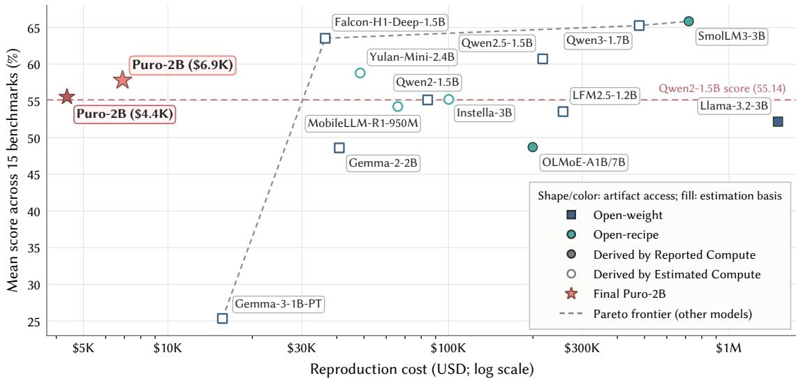  
Figure 1: Model performance versus reproduction cost under the accounting protocol in Sections 2.2 and 4.3.2. Performance is measured by the average scores over the 15 mathematics, code, reasoning, and knowledge benchmarks in Tables 4 and 5. The cost summary of two PuRo-2B runs can be found in Table 1.

## Contents

1 Introduction 4   
2 Overview 6   
2.1 Pipeline at a Glance . 7   
2.2 Reproduction-Cost Boundary . 8   
3 Training Recipe 8   
3.1 Training Infrastructure 8   
3.1.1 RTX 5090 as a Cost-Efective GPU Choice 8   
3.1.2 Hardware Setup and Tweaks . 9   
3.1.3 Eficient Training System 10   
3.2 FP8 Mixed-Precision Training 11   
3.3 Hyperball Optimization . 11   
3.3.1 Efective Learning Rate 12   
3.3.2 Learning Rate Schedule Design 14   
3.4 Curriculum Model Averaging . 15   
3.5 Post-Training Recipe 16   
3.6 Data Recipe 17   
3.6.1 How Do We Select a Good Data Recipe? 17   
3.6.2 How Do We Preprocess Data and Reproduce the Shards? . 19   
4 Evaluation 19   
4.1 Evaluation Setup . 19   
4.1.1 Model Selection . 19   
4.1.2 Benchmarks . 20   
4.1.3 Implementation Details 20   
4.2 Resulting Performance 21   
4.3 Cost Estimation 22   
4.3.1 Cost-Saving Factors 22   
4.3.2 Cross-Model Reproduction Cost . 24   
5 Post-Training 24   
5.1 Focused Mathematics 24   
5.2 Scaled Mathematics . 24   
5.3 Broad Instruction Transfer 25   
6 Related Works 25   
6.1 Open-Recipe Language Models . 25   
6.2 Low-Cost Language Model Pretraining 26   
7 Conclusion and Future Direction 26   
8 Acknowledgments 27   
A Limitations 38   
B Cost Assumptions 38   
C Training Details 40   
D Scaling Ladder 42   
E Post-Training Details 45   
F LR Schedule Analysis 47   
F.1 Multi-Power Law for Efective Learning Rate Schedules 47   
F.2 WSD Sweeps and Limited-Compute Schedule Estimation 48   
F.3 Hyperball . 50   
G Scaling Checkpoint Ledger 51   
H Curriculum and CMA 53   
H.1 Scalable Construction of Component-Local Curriculum Buckets 53   
H.2 Phase Transition and Uniform-Order Control . 54   
H.3 Constant-LR Continuation and Checkpoint Averaging . 55   
H.4 Scope of the Available Comparison 55   
I Data Recipe 56   
I.1 Proxy-Measurement Protocol . 59   
I.2 Proxy Capability Aggregation and PCA Audit 59   
I.3 Proxy-to-Mixture Decision Audit 61

## 1 Introduction

Scaling model parameters and training data has substantially improved the capabilities of large language models (LLMs) [42, 44]. However, the cost of pretraining limits the ability of academic and open-source researchers to study training behavior, reproduce complete pipelines, and test alternatives at meaningful scales. Lowering this barrier requires not only open model weights, but also reproducible data, software, infrastructure, training details, and transparent cost accounting.

Existing model releases span three levels of openness. Closed models, including proprietary families such as GPT, Claude, and Gemini [71, 30], expose capabilities through hosted services and technical reports but do not release model weights or the artifacts required to inspect pretraining. Open-weight models, including the Qwen, Gemma, and Llama families [101, 102, 100, 80, 31, 60], release checkpoints that enable local evaluation, deployment, and post-training, but generally withhold the exact pretraining data, sample order, and complete training state. Open-recipe models go further by releasing reconstructible data mixtures, training code, configurations, and checkpoints. Projects such as OLMo and OLMoE, SmolLM, YuLan, Marin, and Instella therefore make the pretraining process itself available for scientific study [93, 64, 2, 7, 106, 52, 37].

Greater openness, however, does not by itself make pretraining afordable to reproduce. Even at a small scale, the compute cost of pretraining can be prohibitive. Under the rental-equivalent accounting in Figure 1 and § B, training Llama3.2-3B costs over \$1.5M in our estimation. For open-recipe models, reproducing OLMoE-1B-7B would cost \$200K, and for SmolLM3-3B, the estimated reproduction cost rises to \$719K. These cost budgets are derived from reported or estimated compute of these models. Therefore, even transparent open-recipe releases can remain open to the world but out ofreach for many small and resource-constrained research labs — the poor labs, leaving a practical gap between reproducibility and accessibility.

To bridge this gap, we present a systematic reproducibility recipe covering system, algorithm, and data design for training a collection of PuRo-2B (普罗-2B) checkpoints2. The recipe targets low-cost, accessible infrastructure for dense billion-parameter/trillion-token pretraining and produces a 2B model with performance matched against Qwen2-1.5B and Qwen2.5-1.5B under our protocol. These checkpoints share the same 2B-parameter architecture but difer in training budget and recipe variants. Training uses predominantly open-source datasets and runs on a cluster of consumer-grade RTX 5090 GPUs. Figure 1 compares counterpart models under a common cost-accounting protocol. PuRo-2B atains competitive performance at the lowest reproduction cost among the ploted models under the stated accounting protocol, placing it beyond the baseline cost–performance frontier. Our best checkpoint surpasses Qwen2-1.5B overall and approaches Qwen2.5-1.5B. Detailed accounting is discussed in Sections B and 4.3 As shown in Table 1, the production schedule uses 438.8B Phase 1 tokens and 960.0B Phase 2 tokens. These stages total 1.4T scheduled tokens and 22,514 active-training GPU-hours, corresponding to a compute cost of about \$6.9K and 17.6 elapsed days. The pipeline covers the data recipe, hardware infrastructure, supporting software, and training strategy.

We have released the following artifacts under the Apache 2.0 license unless otherwise noted separately; upstream data terms remain component-specific.

• Model weights: https://huggingface.co/thu-pacman/Puro-2B-Base and variants (10 diferent versions of checkpoints in total for beter transparency and reproducibility)

• Data manifests and materialized components3: https://huggingface.co/datasets/thu-pacman/ Puro-2B

• Training code: https://github.com/thu-pacman/Puro-Megatron

• Data-processing code (Kaiyuan-SpaRK): https://github.com/thu-pacman/Kaiyuan-Spark

The recipe is built around five eficiency-oriented components spanning hardware, numerical precision, optimization, data ordering, and data selection.

1. We use consumer-grade RTX 5090 GPUs as an accessible training platform that provides a favorable cost-eficiency trade-of in our seting (Section 3.1.1).

2. Blockwise FP8 training reduces per-token execution time while maintaining comparable model quality to bfloat16 (BF16) training (Section 3.2).

3. We apply the MuonH optimizer, which extends the Muon optimizer with hyperball constraints on parameter weights and updates, together with a carefully designed learning rate schedule (Section 3.3).

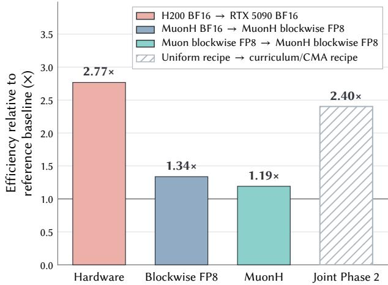  
(a) Relative Cost-Eficiency Improvement.

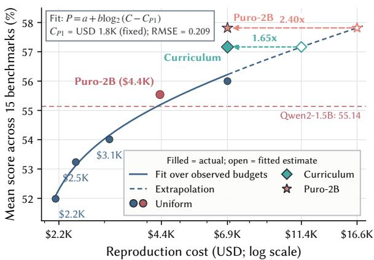  
(b) Puro Cost Scaling Law (scale-down)  
Figure 2: (a) Relative cost-eficiency improvement for hardware, FP8 precision, MuonH, and various Phase 2 designs. The gains come from diferent sources but are all converted into equivalent savings in USD. Each bar uses its own baseline, so the numbers should not be directly multiplied together. (b) Puro Cost Scaling Law fited from Phase 2 training results with uniform data at diferent token budgets. The \$4.4K checkpoint exceeds Qwen2- 1.5B in average performance. At the \$6.9K reproduction cost, using a data curriculum in Phase 2 training achieves cost-eficiency gains of 1.65× the uniform data recipe. Incorporating more joint designs in Phase 2 results in our canonical Puro-2B, ataining cost-eficiency gains of 2.40× relative to the uniform scaling curve (Section 3.4). Filled markers denote actual reproduction costs, while hollow markers denote fited uniform-equivalent costs. See Section 3.4 and tables 16 and 17 for details.

4. Curriculum Model Averaging (CMA) organizes training over coarse-grained data chunks according to configured source-local preferences and averages selected checkpoints [56] (Section 3.4).

5. Proxy experiments provide empirical signals for dataset selection and mixture design under a large candidate data pool (Section 3.6).

Furthermore, we conduct targeted ablations over the first four design choices and report cost-eficiency estimates (Figure 2 and § 4.3). Our systematic recipe covers the full eficiency stack of pretraining: data selection reduces the required token budget, MuonH and curriculum improve token eficiency by extracting more capability from training tokens, FP8 improves hardware utilization by increasing computational throughput, and hardware selection reduces the cost per unit of computation. Together, these choices optimize diferent botlenecks across the training pipeline rather than targeting a single part.

Importantly, these components are not independent optimizations combined in isolation; they form a co-designed training system with interactions across diferent layers of the pipeline. For example, the Blackwell architecture of RTX 5090 provides the hardware foundation for eficient FP8 training. Both MuonH and CMA involve careful learning rate schedule design, and curriculum training relies on data preprocessing decisions that determine the ordering ofsource-local data chunks. Therefore, the efectiveness ofour recipe comes from the coordinated design of data, optimization, algorithmic, and system-level choices as an integrated approach to afordable pretraining.

In addition, we formulate the Puro Cost Scaling Law, a recipe-specific scale-down relationship between rentalequivalent training budget and model capability. The law is designed for scale-down scenarios, serving users with limited compute and time budgets. The scale-down recipe uses a uniform data recipe without CMA. We resume training from the same Phase 1 checkpoints and adopt diferent Phase 2 token budgets. We then evaluate the resulting checkpoints and fit the trend of model performance as a function of total training cost. This scaling curve provides a reference for estimating the model capability achievable under a limited budget with our recipe. Interestingly, the Puro Cost Scaling Law suggests that our recipe can cross the Qwen2-1.5B performance aggregate at a cost of USD 4.4K. Its accounting assumptions and recipe-level interpretation are detailed in Figure 2b and § 4.3. Moreover, the CMA adoption can provide a further speedup compared to the Puro scaling-law trends.

Furthermore, the following post-training reveals that the diference between the curriculum/CMA and uniform Phase 2 recipes persists after matched supervised adaptation. In a focused mathematics seting and a larger mathematics seting, curriculum initialization yields higher GSM8K accuracy in repeated runs. A broad instruction seting also improves the 15-task aggregate and most component evaluations. Our Puro-2B recipes make these kinds of end-to-end comparisons possible at a meaningful scale and within an afordable budget.

In summary, our contributions are:

1. We provide a cost-efective, from-scratch pretraining recipe and train a Puro-2B model collection. The model in this collection exceeds Qwen2-1.5B at about \$4.4K, and its best model checkpoint approaches Qwen2.5-1.5B with \$6.9K. More broadly, our main contribution is to show that afordable, open pretraining is practical today; we expect future eforts to push this frontier toward even lower cost and higher eficiency.

2. We evaluate the main recipe choices: RTX 5090 infrastructure, blockwise FP8, MuonH, and curriculum model averaging with supporting ablation experiments. Moreover, we formulate the Puro Cost Scaling Law for the recipe’s scale-down budget capability trend.

3. We release the datasets, model weights, intermediate checkpoints, training configurations, and implementation provided to reproduce and inspect this pretraining recipe, along with a post-training case study to show how this recipe helps end-to-end comparison for one pretraining design.

## 2 Overview

Before discussing individual design choices in detail, we first provide an overview of the complete training recipe. The pipeline starts with constructing the training corpus from publicly accessible sources and selecting cost-eficient, widely accessible hardware. It then proceeds through two phases of pretraining, including our optimization and data-curriculum designs, followed by model averaging, post-training, and evaluation. We also define the cost-accounting protocol and its boundary to illustrate the reported training costs. The following sections then discuss the motivation, implementation, and evidence for each major design choice.

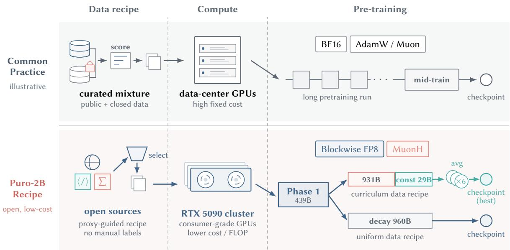  
Figure 3: Puro-2B pipeline for poor-lab design. The upper row presents the work flow in common practice, and the lower row shows our open, low-cost Puro-2B recipe. We collect and select publicly accessible datasets to build a training dataset (Section 3.6), without elaborative data scoring and curation. We use an RTX 5090 cluster, which consists of consumer-grade GPUs and features higher cost-eficiency (Section 3.1), in contrast to costly data-center GPUs. Our pretraining process consists of two phases, and there are two recipe variants for Phase 2. The uniform data recipe trains on a shufled dataset and adopts linear LR decay. The curriculum data recipe trains on a coarse-grained sorted dataset, uses linear decay except for a constant LR for the last 29B tokens, and averages the last 6 checkpoints to obtain the final checkpoint (Section 3.4). Both recipes use 960B tokens in Phase 2. As a comparison, common practice goes through a long pretraining phase and a shorter mid-training phase with LR annealing to get the final checkpoint. To further improve cost eficiency, we adopt blockwise FP8 training (Section 3.2) and Muon with Hyperball optimizer (Section 3.3) throughout Phase 1 and Phase 2.

## 2.1 Pipeline at a Glance

Table 1: We summarize two Puro-2B run cost accounts in Figure 1. Both runs share Phase 1 and use diferent Phase 2 recipe variants. The \$4.4K run uses uniform data ordering, while the canonical \$6.9K run uses curriculum model averaging (Section 3.4). We use 24 GPUs for Phase 1 and extend our compute resources to 96 GPUs in Phase 2. We compute the cost from GPU-hours and the unit compute cost specified in Section 2.2.
<table><tr><td rowspan="2">Checkpoint</td><td colspan="4">Phase 1 (shared)</td><td colspan="4">Phase 2</td><td colspan="2">Total</td></tr><tr><td>GPUs</td><td>Tokens</td><td>Wall time</td><td>Cost</td><td>GPUs</td><td>Tokens</td><td>Wall time</td><td>Cost</td><td>Active GPU-h</td><td>Cost</td></tr><tr><td>Puro-2B ($4.4K uniform)</td><td>24</td><td>438.84B</td><td>10.43d</td><td>$1.84K</td><td>96</td><td>480.00B</td><td>3.58d</td><td>$2.53K</td><td>14,262</td><td>$4.37K</td></tr><tr><td>Puro-2B ($6.9K canonical)</td><td>24</td><td>438.84B</td><td>10.43d</td><td>$1.84K</td><td>96</td><td>959.99B</td><td>7.16d</td><td>$5.05K</td><td>22,514</td><td>$6.89K</td></tr></table>

Model architecture and pretraining system (Section 3.1). We train a dense decoder-only Transformer from scratch through two consecutive pretraining phases. The model adopts the Qwen3-1.7B architectural configuration, but unties the input embedding matrix from the output language-model head. This yields approximately 2B parameters in total. The Qwen3 architecture is familiar to the community and broadly supported. The model scale is also compatible with our replication budget. Our training is implemented in Megatron Core and adapted to an RTX 5090 cluster. To exploit the GPUs’ Blackwell FP8 support, the main Transformer linear-layer GEMMs use blockwise FP8, while numerically sensitive operations and persistent training states, including master weights and optimizer states, remain in BF16 or FP32 (Section 3.2). Phase 1 runs on 24 GPUs, and Phase 2 continues from the Phase 1 endpoint on 96 GPUs 4. The distributed parallel configuration is adjusted for the larger GPU count. The detailed low-precision compute flow, RTX 5090 system adaptations, and phase-specific parallel configurations are provided in Sections 3.1.1 and 3.1.3.

Two-phase pretraining, curriculum, and optimization (Section 3). Using the architecture and training system above, we pretrain PuRo-2B in two phases. Phase 1 processes 438.8B tokens using the Phase 1 mixture, while Phase 2 consumes 960.0B tokens in total. The canonical run applies a data curriculum over the Phase 2 data pool (Section 3.4), to present the more preferred portion of each scored source later in training. Rather than defining a global quality score across datasets, we primarily use the quality labels provided by source datasets. Within each dataset with usable score labels, examples are ordered from lower to higher score and partitioned into coarse chunks. Datasets without usable scores are instead randomly ordered and partitioned in the same way. Chunks from diferent sources are then aligned by their normalized within-source ranks, so that Phase 2 progresses from lower to higher configured ranks while approximately preserving the cross-component mixture. An illustration of this curriculum design is provided in Figure 7.

To preserve the influence of data presented late in the curriculum, we jointly design the late-stage learning rate schedule and checkpoint averaging, following the curriculum-aware averaging principle of Luo et al. [56], and use the averaged weights as the final model. For comparison, we also train a uniform Phase 2 variant from the same Phase 1 checkpoint and Phase 2 data. This variant globally reshufles the Phase 2 data instead of following the curriculum ordering.

Across both phases, we use Hyperball optimization for selected approximately scale-invariant matrices. MuonH updates these matrices and projects each one back to its initial Frobenius radius after every step, while AdamW updates the remaining parameters (Section 3.3). Both parameter groups share a base LR schedule. MuonH group uses a 10 times base LR schedule as Hyperball weight LR. The base schedule follows a power schedule [85] in Phase 1 and continues from its terminal Phase 1 value with linear decay along the main Phase 2 trajectory. The late CMA continuation instead holds the base LR fixed at its resume-point value before checkpoint averaging (Section 3.4). Both phases use a sequence length of 4,096 tokens and a global batch size of 1,536 sequences. The optimizer configuration, learning rate multipliers, curriculum construction, transition schedule, checkpointaveraging rule, and exact token accounting are reported in Sections C, 3.3 and 3.4 and table 8.

Data acquisition, filtering, and mixture (Section 3.6). We construct the training corpus from publicly accessible datasets with licenses or terms that permit their use, enabling the corpus to be reproducibly reconstructed from the original sources. The corpus spans web text, code, and mathematics, and also includes synthetic examples. We first use our Kaiyuan-SpaRK framework (Section 3.6.2) to deduplicate the large-scale web portion. Because the available data far exceeds our training budget, we must select source datasets, filter samples within each source, and combine the retained portions to improve overall data utility and match the desired capability profile. However, it is dificult to design a single sample-level quality score that is comparable across domains, apply it to every sample, and use it to determine which samples to retain. Instead, we run proxy experiments on candidate sources and representative data slices (Section 3.6.1). Specifically, we train controlled small-scale models on these sources or slices and evaluate the resulting models on downstream tasks. The resulting vector of benchmark scores defines the proxy profile of each source or slice, which guides source selection and mixture design (Section 3.6.1). For example, when stronger mathematical capability is desired, we can assign higher weights to datasets whose proxy profiles show stronger performance on mathematics benchmarks. Some open-source datasets also provide sample-level quality scores. Although these scores are not directly comparable across sources, they can support within-source filtering. For each such dataset, we sample proxy slices from diferent score ranges, compare their proxy profiles, and use the results to select a dataset-specific threshold for retaining high-scoring samples. The final domain-level recipe for the two pretraining phases is summarized in Table 3 and fig. 8, while Table 20 reports family-level retained token counts, selection modes, assigned phases, source identifiers, and license terms rather than a complete component-level manifest.

Evaluation and post-training (Sections 4 and 5). Our evaluation combines a broad pretrained-model comparison with controlled tests of downstream adaptation. We first evaluate PuRo-2B against open-weight and reproducible open-recipe models of comparable scale on general reasoning, mathematics, and coding. Under the report’s common budget accounting, PuRo-2B surpasses Qwen2-1.5B and Gemma-2-2B while using less than one sixth of the stated training cost of comparable open recipes. We then use SFT as a probe of how the two Phase 2 recipes transfer through post-training. Within each paired experiment, the curriculum and uniform initializations receive identical supervised data and optimization; mathematics checkpoints use one frozen generation and extraction protocol, while broad tasks use benchmark-appropriate prompts and scorers. The three setings progress from focused mathematics to scaled mathematics and broad instruction tuning, with complete definitions and results in Sections 3.5 and E.

## 2.2 Reproduction-Cost Boundary

Throughout this report, reproduction cost refers specifically to the compute cost of rerunning the finalized twophase pretraining recipe once. The accounting boundary begins after the phase-specific training shards have been materialized and includes only the compute time of the Phase 1 and Phase 2 production runs. We report measured GPU-hours separately and convert them using the normalized RTX 5090 rental-equivalent rate specified in Sections B and 4.3. The ledger retains CNY(RMB) for traceability, while the main cost figures use the corresponding USD values. Both are reproducible cost proxies under the stated rate, not the authors’ total cash expenditure.

We do not estimate costs outside these production pretraining runs. The headline therefore excludes data acquisition and preprocessing, proxy-model experiments, scaling and ablation studies, failed or exploratory runs, post-training, evaluation, checkpoint averaging, and research labor. It also excludes non-accelerator resources such as CPU processing, storage, and networking, as well as taxes, depreciation, and other ownership costs not represented by the rental-equivalent rate. These exclusions do not imply that the activities are free; they mean that the reported number should be interpreted as a narrowly defined marginal accelerator cost for reproducing the final pretraining run, rather than as the total cost of developing the model or reconstructing every artifact from scratch.

## 3 Training Recipe

We organize the training recipe as follows. We first describe the infrastructure design that supports our training setup. We then present the pretraining recipe, focusing on optimization and data curriculum. Next, we explain how the training dataset is constructed. Finally, we present a post-training case study to demonstrate how our recipe enables end-to-end approach comparison.

## 3.1 Training Infrastructure

## 3.1.1 RTX 5090 as a Cost-Efective GPU Choice

To make our recipe cost-eficient and the hardware accessible to the broader community, we made a non-standard infrastructure choice: we run all pretraining and post-training on a cluster equipped with consumer-grade GPUs (RTX 5090), instead of renting conventional data-center-oriented accelerators. Although data-center GPUs are generally expected to be more stable and compute-eficient, our cost analysis showed that RTX 5090 is a beter fit for this workload.

Table 2: Peak hardware capability and cost eficiency of candidate NVIDIA GPUs.
<table><tr><td rowspan="2">GPU Model</td><td colspan="3">Peak tensor performance (TFLOPS)a</td><td rowspan="2">Memory capacity</td><td rowspan="2">Memory bandwidth</td><td rowspan="2">TDP</td><td rowspan="2">Intra-node P2P BW (Bi-Di)</td><td rowspan="2">Single-GPU priceb</td><td colspan="3">Peak compute/$ (EFLOP/USD)</td></tr><tr><td>BF16</td><td>FP8 NVFP4</td><td></td><td></td><td>BF16 FP8</td><td>FP4</td></tr><tr><td>A100 SXM4</td><td>312</td><td>N/A</td><td>N/A</td><td>80 GB</td><td>2 TB/s</td><td>400 W</td><td>600 GB/s</td><td>$1.79/h</td><td>0.63</td><td>N/A</td><td>N/A</td></tr><tr><td>H200 SXM5</td><td>989.5</td><td>1979 c</td><td>N/A</td><td>141 GB</td><td>4.8 TB/s</td><td>700 W</td><td>900 GB/s</td><td>$4.00/h</td><td>0.89</td><td>1.78</td><td>N/A</td></tr><tr><td>RTX PRO 6000</td><td>503.8</td><td>1007.6</td><td>2015.2</td><td>96 GB</td><td>1.8 TB/s</td><td>600 W</td><td> $1 2 8 \ : \mathrm { G B } / s ^ { \mathrm { ~ d ~ } }$ </td><td>$1.89/h</td><td>0.96</td><td>1.92</td><td>3.85</td></tr><tr><td>RTX 5090</td><td>209.5</td><td>419</td><td>1676</td><td>32 GB</td><td>1.8 TB/s</td><td>575 W</td><td> $1 2 8 \ : \mathrm { G B } / s ^ { \mathrm { ~ d ~ } }$ </td><td>$0.31/h</td><td>2.43</td><td>4.87</td><td>19.46</td></tr></table>

a All performance numbers are from oficial NVIDIA documentation / datasheets / blog posts [4, 22, 23, 24] and refer to dense matrix operations with FP32 accumulation.  
b The prices do not include CPU / storage / network, as they are marginal and often free on GPU rental platforms. A100, H200, and RTX PRO 6000 prices were collected from a public GPU rental platform on 16 Aug 2026. RTX 5090 has no widely available public rental channel due to NVIDIA EULA restrictions; we estimate its efective price by amortizing our hardware and electricity costs over five years. An 8-GPU node costs approximately 12,000 CNY (\$1763) per month for our setup. Some private compute providers confirmed similar rental pricing for RTX 5090.  
c Hopper FP8 Tensor Cores use a reduced-precision path for nominal FP32 accumulation, with 22 efective precision bits [110], which may afect numerical accuracy.  
d PCIe Gen5 × 16 provides approximately 64 GB/s of theoretical bandwidth per direction, or approximately 128 GB/s of aggregate bidirectional bandwidth. Driver tweaks needed to achieve this bandwidth are discussed in Section 3.1.2.

Table 2 shows the features and prices of diferent generations of NVIDIA GPUs. RTX 5090 has a clear gap in absolute peak throughput compared with data-center GPUs, especially because its Tensor Cores are artificially limited to half of actual peak performance when using FP32 accumulation. However, its much lower efective price gives substantially higher compute per dollar: its BF16 and FP8 cost eficiency is about 2.7× that of H200. Moreover, because policy and cost constraints made Blackwell data-center accelerators such as GB200 unavailable to us, RTX 5090 is also the most practical option with FP4 support.

RTX 5090 still has significant hardware limitations, including smaller memory capacity and the lack of NVLink for high-bandwidth GPU-to-GPU scaling. These drawbacks cannot be ignored. Nevertheless, our target model is small enough that, with the hardware configuration and parallel training setup described below, the RTX 5090 cluster reaches a mixed-precision efective MFU of approximately 73% under the stated precision-weighted peak convention. Section 3.1.3 defines the convention and measurement boundary; this is not a BF16-only full-scale result. Its cost advantage therefore remains valid for our seting.

## 3.1.2 Hardware Setup and Tweaks

Our training cluster consists of multiple x86 GPU servers. Each server is equipped with dual CPUs, eight RTX 5090 GPUs (four in each CPU socket), and suficient host memory. The performance numbers in Section 3.1.1 are single-GPU metrics; for multi-GPU training, both intra-node P2P bandwidth and inter-node network bandwidth must be considered to sustain training throughput.

Intra-node bandwidth. Since RTX 5090 does not provide NVLink, the only intra-node interconnect is PCIe. NVIDIA disables PCIe P2P on non-data-center GPUs, which forces GPU communication trafic to be staged through host memory, also known as “ping-pong” transfer, which can substantially reduce communication eficiency. However, this restriction appears to be enforced by the NVIDIA GPU driver rather than the limitation of GPU hardware. We used a modified version of the open-source NVIDIA driver [1], along with the necessary platform configuration changes [14], including disabling IOMMU and PCIe ACS as well as adjusting NPS (NUMA Per Socket, also known as Sub-NUMA Clustering on some platforms) to enable GPU P2P on our servers.

On our hardware, enabling P2P improved one-way bandwidth from 31.5 GB/s to 56 GB/s. The former is bounded by halfofthe PCIe 5.0 ×16 bandwidth, i.e., 32 GB/s, because ping-pong transfer requires two host-memory copies; the later approaches the 64 GB/s PCIe link limit. Bidirectional bandwidth increased from 32 GB/s to 111 GB/s, compared with theoretical limits of 128 GB/s. Communication latency decreased drastically from 14.3 µs to 0.4 µs. The eight-GPU AllReduce bandwidth over PCIe, measured as busbw reported by nccl-tests, increased from 14.75 GB/s to 27.34 GB/s. When the test was restricted to the four GPUs atached to a single CPU socket, the gain was larger, from 16.33 GB/s to 46.31 GB/s, about 2.8×. Adding a PLX PCIe switch between the GPUs and the root complex might further improve P2P bandwidth toward the link limit; this is a prospective topology change, not a configuration used in the reported run.

Inter-node bandwidth. To scale training beyond a single server, the inter-node network must provide bandwidth comparable to the intra-node communication path. We set up a 400 Gbps InfiniBand network among our servers, i.e., 100 GB/s bidirectional bandwidth: one dual-port Mellanox ConnectX-7 host card adapter (HCA) is installed in each server, with both ports connected to a 200 Gbps InfiniBand HDR switch. Half of the GPUs in the server could communicate with the HCA directly, while the other half must route through the inter-socket link to reach the HCA.

Even after PCIe P2P is enabled, non-data-center NVIDIA GPUs still do not support GPUDirect RDMA (shortened as GDR), another performance-critical feature for inter-node communication. GDR builds on P2P and allows a GPU to access remote GPU memory over RDMA NICs without staging through host memory. Through testing, we found that this restriction is also software-enforced: a minimal binary modification to the CUDA user-space driver can enable GDR on RTX 5090 [13]. Due to EULA constraints, we are not able to disclose the details in this report. When this configuration is unavailable, the same training recipe can be run with the stock NVIDIA driver, falling back to the standard communication path at lower inter-node bandwidth. In end-to-end tests, enabling GDR improved the 24-GPU (3 servers) AllReduce bandwidth, measured as busbw, from approximately 8.87 GB/s to 19.93 GB/s. We believe that if a more balanced network topology is used (e.g., one InfiniBand HCA on each socket), the performance gain could be even higher.

Caveats. These modifications should be used with caution. First, modifying drivers is unsupported by the vendor and must be done at the user’s own risk. Second, these changes cannot exceed the physical PCIe bandwidth limit. Third, P2P and GDR should not be enabled blindly; the optimal seting depends on the actual hardware topology and platform capability. For example, if the PCIe root complex of a CPU has limited peer-switching capability (which is often the case on low-end models), heavy P2P trafic among many devices may become congested, and host-memory ping-pong transfer can be faster.

## 3.1.3 Eficient Training System

We build our training system on Megatron Core [87], specifically release v0.16.0 [68], together with its Transformer Engine dependency. This software stack provides native support for blockwise FP8 training and the Muon optimizer, making it a suitable basis for a model at our scale. Nevertheless, the combination of consumer GPUs, a mixed-precision training recipe, and our model architecture still requires careful system-level tuning.

Communication-aware parallelism. The limited communication bandwidth of RTX 5090 motivates us to use only parallel dimensions with modest communication demands. We combine data parallelism (DP), whose dominant collectives are gradient ReduceScatter and parameter AllGather around optimization, with pipeline parallelism (PP), which exchanges hidden-state tensors only at stage boundaries [66]. We do not use tensor parallelism (TP), which introduces frequent collectives within every Transformer layer. Compared with datacenter-class systems, our communication disadvantage is substantially more pronounced within a node. We therefore depart from Megatron Core’s default rank ordering and use a pp-dp ordering that places each PP group on topologically closer GPUs within a node, thereby reducing sensitivity to communication latency.

Appropriate micro-batch size. FP8 kernels complete their arithmetic more quickly while introducing additional quantization operations, so they become memory-bound more readily than BF16 kernels. This efect is amplified by the relatively small hidden dimension of our model. Increasing the micro-batch size (MBS) improves the arithmetic intensity and Tensor Core utilization, but an excessive MBS exhausts device memory: DP does not partition activations; and 1F1B pipeline schedule [66] helps control the number of simultaneously resident microbatches, but it does not eliminate the per-microbatch activation-memory growth caused by increasing MBS. We therefore extend Megatron-LM’s analytical FLOP estimator to report the invocation shapes of GEMM and FlashAtention kernels. For each shape induced by our model configuration, we benchmark the corresponding Transformer Engine kernel and select the smallest MBS beyond which achieved FLOP/s no longer increases materially, analogous to locating the knee of a roofline curve.

Overcoming load imbalance. Although our model is relatively small, its vocabulary is large; consequently, the embedding and LM head account for a non-negligible fraction ofboth computation and memory. FP8 GEMMs accelerate the internal Transformer layers, further increasing their performance gap with the LM head. As a result, the LM head alone entails computation comparable to several Transformer layers, creating substantial pipeline imbalance. Guided by our extended FLOP estimator, which atributes theoretical work by layer, submodule, operator, and precision, we assign fewer Transformer layers to the stage containing the LM head. This balances pipeline computation at the cost of greater memory pressure on the first stage. Tensors assigned to Muon are preferably kept intact rather than sharded. We replace the zigzag placement policy of the layer-wise distributed optimizer in this version of Megatron Core, which over-concentrates the embedding and LM-head tensors, with a memory-aware allocation [27]: Muon tensors are greedily assigned by memory footprint like bin packing, after which flatened Adam tensors fill the remaining per-device capacity as evenly as possible. This hybrid placement balances optimizer memory across GPUs and is important for fiting the training state into the 32 GB memory available on each RTX 5090.

These principles yield the same fastest configuration as an exhaustive enumeration of the candidate parallel strategies. Together with the hardware optimizations described above and standard Megatron Core options such as the [T,H,D] layout for packed-sequence atention, the Phase 1 production run sustains a median 238 TFLOP/s per GPU with global batch size 1536 on 24 GPUs across three nodes. The best configuration is $\mathrm { M B S } = 2 , \mathrm { P P } = 2$ with layout $( 1 \bar { 8 } | 1 0 ) ^ { 5 }$ , and $\mathrm { D P } = 1 2$ . The measured throughput corresponds to an equivalent $M F U ^ { 6 }$ of approximately 73%. For larger-scale Phase 2 training, strong scaling is limited by Amdahl’s law, and gradient synchronization accounts for a larger fraction of the step time. We consequently use $\mathrm { P P } = 4$ with layout (9|9|9|1) and $\mathrm { D P } = 2 4$ on 96 GPUs, while still achieving median throughput 192 TFLOP/s per GPU. The run-level setup and final losses are reported in Table 8.

## 3.2 FP8 Mixed-Precision Training

We use FP8 mixed precision from random initialization onward, without a BF16 warm-up stage or a later precision switch, using our training stack [68] and its blockwise FP8 support [69]. The training state and numerically sensitive operations retain the standard BF16/FP32 mixed-precision path, while Transformer linear layers use E4M3 operands. FP8 is therefore an online compute and activation-storage format rather than the persistent dtype of the whole model.

E4M3 [63] provides more mantissa bits than E5M2 but has a narrower dynamic range. With one scale for an entire tensor, a few outliers can enlarge the quantization interval and reduce the efective precision of ordinary values [26]. We instead compute scales online for local groups: activations and activation gradients use one-dimensional groups of 128 consecutive values along the GEMM reduction dimension, while weights use two-dimensional 128 × 128 blocks [99]. This fine-grained numerical design follows the recipe introduced and validated at scale by DeepSeek-V3 [26].

On our RTX 5090 (SM 120) [23], each logical block scale is constrained to a power of two and therefore has the exponent-only expressiveness of E8M0. Transformer Engine [69] implements these blocks through Blackwell’s native MXFP8 path. Thus, our logical block sizes follow DeepSeek-V3 [26], while the scaling-factor representation and execution path follow MXFP8; the fact that DeepSeek-V3 was trained on Hopper GPUs may account for this implementation diference.

The complete precision flow is shown in Figure 14. Here, Transformer linear layers include the QKV projections, atention output projection, and MLP projections; their Fprop, Dgrad, and Wgrad GEMMs all use the FP8 path [26]. Core atention refers only to the FlashAtention/SDPA computation between these projections and remains in BF16 [99]. A linear layer quantizes its BF16 inputs and weights immediately before GEMM and materializes a BF16 output for the surrounding model. Its quantized input is retained for Wgrad, reducing the dominant saved-activation footprint [99]. FP8-accelerated operations account for 72% of the overall computation; the cost impact and net benefit of FP8 are analyzed in Figure 2.

The model-weight portion of each training checkpoint consequently remains BF16; the desired release or deployment representation is produced by a separate post-training conversion. In the matched 20-token-per-parameter scaling ladder, blockwise FP8 increases validation loss by 0.0031–0.0039 relative to BF16 across the five tested model sizes. The shared-shape fit maps this diference to 98.0% BF16-equivalent compute retention. At the 1.7B scale, however, blockwise FP8 improves median training throughput by 1.36×, yielding a quality-adjusted net gain of 1.34×. The complete setup, fiting procedure, and size-wise results are reported in Section 4.3.1.

## 3.3 Hyperball Optimization

In our recipe, we adopt Muon with the Hyperball wrapper (MuonH), introduced by Wen et al. [97], as the training optimizer for selected weight matrices. We apply MuonH to approximately scale-invariant weights, including atention and MLP matrices, while embeddings, normalization layers, the language-model head, and the remaining parameters use AdamW. Following Wen et al. [97], MuonH normalizes the Muon update and constrains each wrapped matrix to a fixed-radius sphere. More specifically, for each wrapped matrix $\bar { W _ { t } }$ , MuonH fixes the radius at $R = \| W _ { 0 } \| _ { F }$ and normalizes the Muon update $u _ { t }$ as $\widehat { \boldsymbol { u } } _ { t } = \boldsymbol { u } _ { t } / \| \boldsymbol { u } _ { t } \| _ { F }$ . It then applies

$$
\widetilde { \cal W } _ { t + 1 } = { \cal W } _ { t } - \eta _ { t } { \cal R } \widehat { u } _ { t } , \qquad { \cal W } _ { t + 1 } = { \cal R } \mathrm { ~ N o r m a l i z e } ( \widetilde { \cal W } _ { t + 1 } ) ,\tag{1}
$$

where Normalize $( A ) = A / \| A \| _ { F }$ b. The first operation normalizes the update scale, while the second projects the updated weight matrix back to its initial Frobenius radius.

We vary the learning rate $\eta _ { t }$ according to a two-phase learning rate schedule. The design of this schedule is motivated by an analysis of how the loss gap between MuonH and Muon arises from the perspective of efective learning rate, as we elaborate below.

## 3.3.1 Efective Learning Rate

First, we briefly revisit the rationale behind Hyperball optimization and explain how it makes the efective LR schedule explicit [97]. We then examine the loss gap between ordinary Muon and MuonH runs and find that the efective LR schedule strongly afects the loss convergence rate. This observation leads us to focus on learning rate schedule design for the MuonH optimizer.

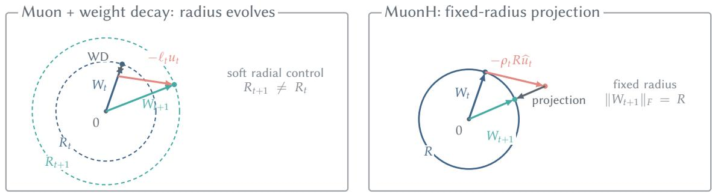

<table><tr><td></td><td>Muon + weight decay</td><td>MuonH</td></tr><tr><td>Weight radius</td><td>Evolves under weight decay and optimizer updates</td><td>Fixed at  $R = \| \boldsymbol { W } _ { 0 }$  F after each step</td></tr><tr><td>Displacement norm</td><td> $\eta _ { t } \lVert u _ { t } \rVert _ { F }$  (state dependent)</td><td> $\rho _ { t } R$  (scheduled)  $\rho _ { t }$ </td></tr><tr><td>Effective LR</td><td> $\dot { \eta } _ { t } \big | \big | u _ { t } \big | \big | _ { F } / \big | \big | W _ { t } \big | \big | _ { F }$  (indirect)</td><td>(explicit)</td></tr></table>

Figure 4: Efective-LR control for one matrix. Ordinary Muon (left) applies a scalar learning rate to a statedependent update norm, so both its efective LR and matrix radius emerge indirectly. MuonH (right) normalizes the update, prescribes a displacement of length $\rho _ { t } R _ { : }$ , and projects the result back to the fixed-radius sphere.

Scale invariance motivates the efective learning rate. Hyperball is motivated by approximately scaleinvariant parameter matrices. For a selected weight matrix W, we call the parameter approximately scale invariant when positively rescaling it has litle efect on the model function or loss,

$$
\begin{array} { r } { \mathcal { L } ( c W ) \approx \mathcal { L } ( W ) , \qquad c > 0 , } \end{array}\tag{2}
$$

with the remaining parameters held fixed [97]. Normalization in modern Transformers makes this approximation relevant for several atention and MLP weight matrices. In this regime, the update magnitude is naturally interpreted relative to the current weight scale. We therefore consider the matrix-wise efective LR, also called the efective learning rate (ELR). For ordinary Muon, with Muon update $u _ { t } ,$ scalar learning rate $\begin{array} { r } { \eta _ { t } , } \end{array}$ , and decoupled weight-decay coeficient λ,

$$
\begin{array} { r } { W _ { t + 1 } = \left( 1 - \lambda \eta _ { t } \right) W _ { t } - \eta _ { t } u _ { t } , } \end{array}\tag{3}
$$

and, ignoring the radial shrinkage from weight decay, the efective LR is

$$
\rho _ { t } ( W ) = \frac { \eta _ { t } \| u _ { t } \| _ { F } } { \| W _ { t } \| _ { F } } .\tag{4}
$$

Thus, ordinary Muon’s efective LR is not determined by the scalar learning rate alone, because both the weight norm and the Muon-update norm evolve during training.

MuonH makes the efective LR schedule explicit. Under the Hyperball update in Equation (1), the preprojection displacement $\eta _ { t } R { \widehat { u } } _ { t }$ has norm $\eta _ { t } R ,$ while the wrapped matrix has norm R. Its efective LR is therefore numerically equal to the Hyperball weight learning rate, $\rho _ { t } = \eta _ { t }$ , and the subsequent projection restores the fixed radius. Thus, ordinary Muon induces its efective LR indirectly through the scalar learning rate and evolving norms, whereas MuonH directly controls the efective LR schedule through its learning rate schedule. This explicit control is the property of Hyperball that is most relevant to our subsequent schedule design.

In our experiments, we use diferent learning rates for the MuonH-wrapped and AdamW-optimized parameter groups. We define a base learning rate schedule $\eta _ { t } ^ { \mathrm { b a s e } }$ for the AdamW parameter groups and set the Hyperball weight learning rate to a fixed multiple, $\eta _ { t } ^ { H } = m \dot { \eta } _ { t } ^ { \mathrm { b a s e } }$ . For MuonH-wrapped matrices, $\eta _ { t } ^ { H }$ is numerically equal to the prescribed efective LR. In the production run, we use $m = 1 0$ , while the remaining parameter groups follow $\eta _ { t } ^ { \mathrm { b a s e } }$ directly with AdamW.

Matching the efective LR schedule also aligns validation loss. The MuonH optimizer can make training more eficient than the ordinary Muon optimizer, and we find that the eficiency gap can be atributed to the diference in their efective LR schedule. We compare three 170M-parameter BF16 runs with the same architecture, batch size, sequence length, seed, and evaluation protocol. The MuonH run uses a predefined efective LR schedule $\rho _ { t } ^ { H }$ . The ordinary-LR run uses the base LR schedule of the MuonH run as the LR schedule and does not compensate for the evolving weight and update norms. Then, as shown in Figure 5, the ordinary-LR Muon run produces an efective LR trace that decays rapidly early in training and finishes close to zero. The MuonH run instead follows the predefined linear-decay efective-LR schedule. Although the ordinary-LR Muon run achieves lower validation loss early in training, MuonH overtakes it near the end. The MuonH run finishes at a validation loss of 3.029, compared with 3.073 for ordinary-LR Muon.

For comparison, we conduct an efective-LR-aligned run, which uses the ordinary Muon optimizer but adjusts its scalar learning rate online to follow the same efective LR curve,

$$
\eta _ { t } = \rho _ { t } ^ { H } \frac { \| W _ { t } \| _ { F } } { \| u _ { t } \| _ { F } } ,\tag{5}
$$

so that the efective LR $\rho _ { t } ( W ) = \rho _ { t } ^ { H }$ without projecting $W _ { t + 1 }$ back to a fixed-radius sphere. As shown in Figure $^ { 5 , }$ efective-LR-aligned Muon follows the prescribed linear post-warmup LR decay and reaches a final validation loss of 3.030, close to MuonH at 3.029. Thus, in this selected diagnostic, ordinary Muon largely recovers the MuonH loss curve when its efective LR schedule is aligned. This comparison supports the efective-LR schedule as an important factor in MuonH’s training behavior. It also suggests that beter control of the efective-LR schedule can improve loss convergence. Recent work also discusses related behavior from the perspective of angular update size [118, 98]. We provide an additional ordinary Muon control in Section F.3 that can even use a counterintuitive hill-like scalar learning rate schedule to achieve loss convergence while maintaining the prescribed efective LR trajectory.

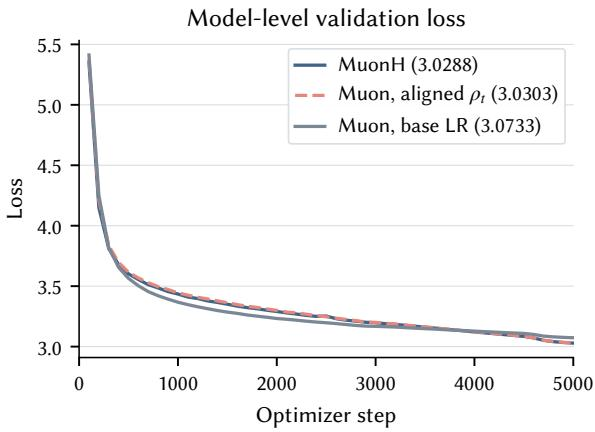

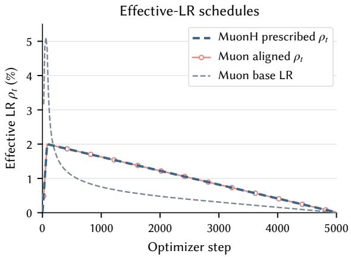  
Figure 5: 170M BF16 comparison ofMuonH, efective-LR-aligned Muon, and ordinary-LR Muon. Left: validation loss. Right: efective LR traces for the selected MLP down-projection matrices. The training run with alignedefective-LR and the normal Muon optimizer follows the predefined MuonH efective LR schedule. This run reaches a similar final loss, whereas ordinary-LR Muon produces a faster early decay of its induced efective LR and finishes with higher loss.

Efective LR provides a more informative descriptor of the loss trend. The experiments above show a close relationship between efective LR and loss dynamics. We further test whether efective LR provides a more informative descriptor than the raw optimizer learning rate. We apply the Multi-Power Law (MPL), a LR-schedule scaling law that predicts loss-curve shape from the LR schedule, to both the efective-LR schedule and the raw learning rate schedule [57]. For the two ordinary-Muon runs above, we fit the post-warmup validation curves using either the scalar learning rate or the induced efective LR, while holding out the final 20% of validation targets. As shown in Figure 16, using the efective LR reduces the mean held-out RMSE across the two runs from 0.0265 to 0.0210. The improvement is driven mainly by the base-Muon run; for efective-LR-aligned Muon, the two LR signals are comparably predictive. This small diagnostic therefore supports efective LR as a more informative descriptor for schedule-dependent training dynamics. The MPL formulation and fiting results are provided in Section F.1.

Efective LR MPL helps interpret the late-stage crossover. In the selected 170M diagnostic, MuonH and efective-LR-aligned Muon converge more slowly at the beginning but outperform ordinary Muon near the end of training. This patern is consistent with the learning rate analysis in Section F. In particular, the MPL fit [57] provides a simple diagnostic relationship: a decrease in learning rate can induce an approximately proportional reduction in loss, with the loss decrease taking efect over subsequent training steps. Applying this view to the efective LR, ordinary Muon decays its efective LR more aggressively early in training, which is consistent with its faster early loss reduction but leaves less efective LR decay for the later stage. MuonH and aligned Muon instead follow a more gradual, approximately linear efective LR decay, giving up some early convergence speed while retaining more decay toward the end of training. This view provides additional motivation for using a linear-decay schedule in our production design.

Together, these diagnostics motivate treating efective LR as the primary hyperparameter for MuonH-wrapped weights. They also suggest that the placement of its decay can afect where loss reduction occurs during training. We therefore next study the practical design of the LR schedule for production run.

## 3.3.2 Learning Rate Schedule Design

Continual training motivates an open-ended schedule followed by a controlled terminal decay. In practice, the total token budget is commonly undetermined in the beginning [43, 85, 2]. Hence, continual pretraining is a practical seting and may change the data mixture after the initial horizon. We therefore want to retain an open-ended schedule before applying a controlled terminal decay. Warmup-Stable-Decay (WSD) schedule provides a testbed for choosing the decay duration [43]. Motivated by the previous section’s experiments, we use a linear decay function in WSD. All sweeps use a 0.6B model with the Qwen3-0.6B architecture and global batch size 512. At 20 tokens per parameter (TPP), or 11.3B tokens, we vary the efective peak from 0.008 to 0.024 in increments of 0.004 and the WSD decay ratio from 0.2 to 1.0 in increments of 0.2. At peaks 0.008 and 0.012, we additionally test TPP 50 and 100.

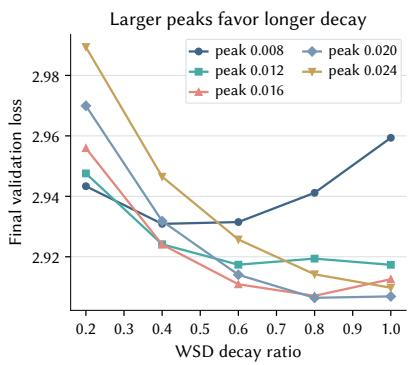

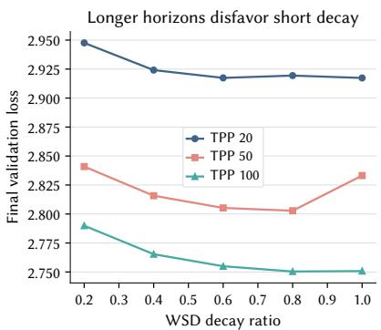

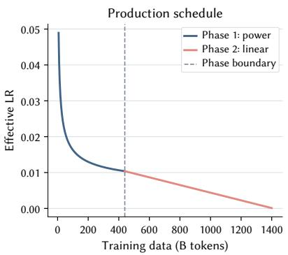  
Figure 6: Experiments that support our observations. Left: At TPP 20, larger efective peaks increasingly penalize short WSD decay. Center: At fixed efective peak 0.012, longer horizons make short decay less competitive. Each sweep curve reports final validation loss from one run per configuration. Right: The production efective LR schedule uses an open-ended power-decay phase followed by a long linear-decay phase.

Observation 1: a larger peak LR calls for a longer decay. In the left panel of Figure 6, the best grid points at efective peaks 0.008, 0.012, 0.016, 0.020, and 0.024 are decay ratios 0.4, 1.0, 0.8, 0.8, and 1.0. These point optima fluctuate because the long-decay region is broad. A more stable summary is the lower edge of the region within 0.01 validation loss of the minimum: it moves nondecreasingly as 0.4, 0.4, 0.6, 0.6, and 0.8, as shown in Figure 18. At peaks 0.020 and 0.024, ratios 0.8 and 1.0 difer by only 0.0005 and 0.0044 loss. Thus an almost fully linear decay is already competitive near the high end ofthe tested peak range. The two-anchor interpolation in Figure 17 provides a complementary check: using only ratios 0.2 and 1.0 at peak 0.024, it places the estimated minimum at ratio 0.85 within the same long-decay region.

Observation 2: a longer training horizon also calls for a longer decay. At efective peak 0.012, the center panel of Figure 6 shows the competitive region shifting toward longer decay. Its lower edge moves from 0.4 at TPP 20 to 0.6 at TPP 50 and 100, while the point optima are 1.0, 0.8, and 0.8. At peak 0.008, the lower edge remains 0.4, although the point optimum moves from 0.4 to 0.6. The later TPP100 grid lacks ratio 0.2, so we treat it only as supporting evidence. The complete peak-0.012 lower-edge trace appears in Figure 18; the conclusion is a broad shift toward longer decay, not a precise monotone point optimum.

The production schedule combines these three practical features. The right panel of Figure 6 shows the complete production efective-LR schedule. Here, we present the Hyperball weight LR, which is numerically the efective LR for wrapped matrices, instead of the base LR. Phase 1 uses the open-ended power schedule in Equation (10), decreasing from approximately $5 \times 1 0 ^ { - 2 }$ to $1 . 0 4 \times 1 0 ^ { - 2 }$ over 438.8B. Its tail preserves a continuation path as the data distribution evolves [85]. Phase 2 joins near 10−2 and uses a long linear decay over 960.0B rather than spending most of training in a stable segment followed by a short terminal drop. The design therefore combines continual trainability, a high initial efective LR, and a long final decay.

Multi-power law provides a back-of-the-envelope, cross-schedule estimator under limited compute. Before a long run, exhaustively sweeping every decay ratio is impractical. Therefore, we fit a multi-power law (MPL) [57] as a diagnostic, using only the two endpoint schedules. The runs are at TPP 20 and with decay ratios 0.2 and 1.0. Two curves per efective peak recover the increasing peak-to-decay trend: the estimated ratio rises from 0.33 at peak 0.008 to 0.85 at peak 0.024. Although it is not a certificate of optimality, we use this result as a back-of-the-envelope trend diagnostic. The fiting protocol, unseen schedules, and errors are reported in Section F.

## 3.4 Curriculum Model Averaging

Curriculum ordering and late-stage optimization must be designed together. Across diferent opensource datasets with score labels, a higher score mostly indicates beter quality for the data samples. Our Phase 2 curriculum is intended to expose the model to the more preferred part of each scored component later in training. This is intended to improve the data eficiency for the high-quality tokens. Here, we use these score labels in open-source datasets as a data-quality proxy metric when available, and target an arrangement from lowquality to high-quality within each source component. This objective can conflict with a conventional terminal learning rate decay: examples presented near the end ofthe curriculum are also processed when parameter updates have become small [56]. Curriculum Model Averaging (CMA) [56] addresses this interaction by combining an ascending data curriculum with constant-LR training and averaging late checkpoints. Our production recipe adopts this principle in a late-stage form. Phase 2 first follows its scheduled learning rate trajectory; we then resume from a selected late checkpoint, hold the base learning rate fixed, and average six checkpoints from the continuation. The complete data and optimization flow is summarized in Figure 7, while the implementation details are provided in Sections H.1 and H.3. In the following paragraphs, we first discuss how we make data curriculum, and how we perform constant-LR continuation in the late training stage. And then we will provide ablation results on diferent components.

The data curriculum arranges the order within each component while keeping the target mixture weight. We first establish a reproducible order separately for every retained component. If a component provides a usable sample-level quality signal, we sort its examples according to that source’s score and configured direction, placing less preferred score ranges earlier and more preferred ranges later. Components without a usable score instead follow a fixed random order. We then assign each example a normalized within-component rank according to its position in this ordered sequence, measured by cumulative token mass. Intuitively, this rank indicates which source-local score range an example falls into. For example, a rank of 0.25 means that approximately one quarter of the component’s tokens appear earlier in its ordered sequence.

We divide the normalized rank range into 376 intervals and construct the k-th curriculum bucket by taking the corresponding interval from every component. Each bucket therefore receives approximately 1/376 of the tokens from every component, preserving the selected cross-component mixture. As training advances through the buckets, scored components move toward their more preferred score ranges, while unscored components advance through their fixed random orders. The buckets target approximately 2.5B tokens each. Since scores are interpreted only within their own sources and are not compared across components, this construction is not a global quality ranking. The scalable approximation used to construct the 376 buckets and the exact transition schedule are given in Sections H.1 and H.2 and table 18.

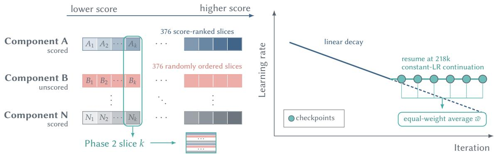  
(a) Rank within each component and merged by progress  
(b) Constant-LR continuation & Model Average  
Figure 7: CMA-inspired data and optimization flow in the production Phase 2 recipe. Component-local ordering, transition, late constant-LR continuation, and six-checkpoint averaging are shown together. Exact bucket construction, transition, and averaging details are given in Sections H.1 to H.3.

The canonical run uses the best-performing late-stage continuation with model averaging. We compare three late-stage training strategies: averaging checkpoints directly from the existing trajectory, and two constant-LR continuations resumed from steps 215,000 and 218,000. Among these configurations, the continuation from step 218,000 gives the strongest observed performance and is therefore selected for the production model. Starting from this checkpoint, we resume training while holding the learning rates fixed at their step-218,000 values. Specifically, the base learning rate is fixed at $4 . 0 8 \times 1 0 ^ { - 5 }$ . With the production Hyperball multiplier $m = 1 0 ,$ , the Hyperball weight LR is therefore fixed at $4 . 0 8 \times 1 0 ^ { - 4 }$ , which is also the efective LR for the MuonH-wrapped matrices. During the late stage of this continuation, we save checkpoints at approximately regular intervals and form the released model by equally averaging the parameters of six such checkpoints. Neighboring checkpoints are typically separated by 100 optimizer steps, or approximately 0.63B tokens under the production batch configuration. Full resume, checkpoint-spacing, and averaging details are provided in Section H.3.

Ablation study on curriculum, model average, and const-LR continuation. The six endpoints in Figure 13b support a structured comparison of the three jointly selected recipe ingredients. First, curriculum ordering improves over uniform ordering by 1.18 points without model averaging (57.17 versus 55.99) and by 1.61 points when comparing the model averages of corresponding decay trajectories (57.18 versus 55.57). Second, model averaging is not independently beneficial in both ordering conditions. Model averaging changes the uniform endpoint by −0.42 points (55.57 versus 55.99) and the curriculum endpoint by +0.01 points (57.18 versus 57.17) without a constant-LR continual training; Third, proper constant-LR continuation helps. For the constant-LR continuation, the six-checkpoint average resumed from step 218,000 reaches 57.81, exceeding both the corresponding branch resumed from step 215,000 by 1.01 points (56.80) and the averaged curriculum endpoint without constant-LR continuation by 0.63 points (57.18). Thus, the selected combination of curriculum ordering, the step-218,000 constant-LR continuation, and six-checkpoint averaging produces the strongest endpoint among these runs. Part of the observed advantage of curriculum over uniform ordering could be atributed to benchmark contamination in the later-stage data, as discussed in Section A. But the remaining advantage is observed after post-training in Section 5, and the contamination alone is unlikely to explain the persistent improvement. We report the exact base LR and Hyperball efective LR, checkpoint IDs, and export convention in Section H.3. The evidence scope is detailed in Section H.4.

## 3.5 Post-Training Recipe

Motivation and question. We use SFT both to improve selected capabilities and to test whether the diference between the two pretraining endpoints persists after identical supervised adaptation. The curriculum and uniform variants use the same model architecture and data sources, but difer in the ordering used during the later pretraining phase and in the resulting checkpoint construction. Similar final pretraining losses do not imply identical internal states. We therefore ask whether the diference between the two pretraining recipes remains observable after both checkpoints receive the same supervised adaptation: Does the curriculum pretraining recipe improve the post-trained model on targeted domains like mathematics, and does any improvement transfer beyond these specific areas?

Three experimental setups. We report three setups with diferent purposes. The focused mathematics setup, our clean GSM8K configuration, is a comparatively basic SFT seting: it does not use pretraining replay and focuses on the mathematical SFT target. The scaled mathematics setup, our larger-scale mathematical configuration, uses a larger mixture and training budget, with a small replay component. The broad instruction setup, our general Tulu configuration, replaces the math-dominated mixture with the Tulu-3 SFT source and tests transfer across knowledge, reasoning, code, and instruction-following tasks. Exact data accounting, seeds, and run boundaries are given in Section E.

Data construction. The focused mathematics setup uses a mixture dominated by GSM8K, with small instruction and general-purpose components, and does not use pretraining replay. The scaled mathematics setup builds on the focused mathematics mixture by adding deduplicated MetaMathQA and OpenMathInstruct examples, filtered code instruction data, and a small replay stream. The broad instruction setup uses the Tulu-3 SFT source as its broad instruction distribution. For every setup, source records are converted to a common conversation schema, duplicate queries are removed within the stated source or shard, and examples are packed. Evaluation questions and reference answers are not used to construct the SFT data.

Implementation. Within each of the three SFT setings, the curriculum and uniform variants use the same paired setup; the data mixture, budget, and evaluation boundary are intentionally adjusted between focused, scaled, and broad setings, with details in Section E. We still use the MuonH optimizer. In the focused mathematics setup, the base LR follows a cosine schedule and decays from $1 \times 1 0 ^ { - 5 } \mathrm { t o } 1 \times \bar { 1 } 0 ^ { - 7 }$ . The MuonH-managed matrix parameters use a 10× multiplier to obtain their Hyperball weight LR. This setup uses a batch size of 160 and applies a document mask to avoid cross-document atention. More setup details can be found in Section E.

Evaluation protocol. GSM8K is the primary target because it supplies a clear mathematical correctness signal and a deterministic answer-extraction rule. We evaluate both variants at the same checkpoint steps across repeated runs, then report average accuracy. Checkpoint selection is fixed before inspecting the broad benchmark results. For the broad instruction setup, we evaluate the step-300 checkpoint on the 15-task OpenCompass core suite and report the macro-average of its component accuracies as well as per-benchmark scores.

Analysis protocol. SFT results can be sensitive to the evaluation protocol. For GSM8K, we compare the sets of examples answered correctly by curriculum and uniform models. Their intersection-over-union (IoU) measures how much of the solved set is shared; curriculum-only and uniform-only counts show the direction of the asymmetric gains. We also inspect answer termination and extraction failures to distinguish correctness gains from formating efects. For general benchmarks, we report the macro-average alongside per-task deltas, including negative transfer.

## 3.6 Data Recipe

Building the training data from open-source corpora involves two distinct problems. The first is recipe selection: given a candidate collection far larger than a limited token budget, we choose which sources to keep, how to filter each one, and how to allocate tokens across them, aiming at beter downstream performance. The second is preprocessing and shard reconstruction: given a recipe, we turn raw datasets into fixed, reconstructible training shards. These two problems both mater: a recipe is only as trustworthy as the operations recorded well enough to reproduce it. We answer the two questions in turn; the measurement protocol and the component-level log (counts, selection modes, licenses) appear in Section I.

## 3.6.1 How Do We Select a Good Data Recipe?

The goal is to filter a small set of high-quality, mutually consistent sources while preserving approximate domain coverage. Because no sample-level quality score is comparable across sources, there is no global document ranking. Instead, we use proxy benchmarking: we continue a shared Qwen3-0.6B proxy checkpoint on the tokens of a candidate source or slice, evaluate it on a fixed 15-benchmark suite, and read the resulting score vector as that candidate’s capability profile (Figure 9. Protocol details in Section I.1). The following paragraphs discuss how we make the proxy experiments more informative and provide heuristics for our data selection.

<table><tr><td rowspan="2">Domain</td><td colspan="2">Phase 1</td><td colspan="2">Phase 2</td></tr><tr><td>Tokens</td><td>Share</td><td>Tokens</td><td>Share</td></tr><tr><td>English</td><td>321.31B</td><td>73.2%</td><td>557.52B</td><td>59.4%</td></tr><tr><td>Math</td><td>31.56B</td><td>7.2%</td><td>171.29B</td><td>18.3%</td></tr><tr><td>Chinese</td><td>51.34B</td><td>11.7%</td><td>88.48B</td><td>9.4%</td></tr><tr><td>Code</td><td>34.62B</td><td>7.9%</td><td>108.11B</td><td>11.5%</td></tr><tr><td>SFT / instruction</td><td>1</td><td>0.0%</td><td>12.66B</td><td>1.3%</td></tr><tr><td>Total</td><td>438.84B</td><td>100.0%</td><td>938.06B</td><td>100.0%</td></tr></table>

Table 3: Domain composition of the two pretraining phases. Token counts are measured from the materialized training components; the code-only MegaMath-Code partition is counted under Code.

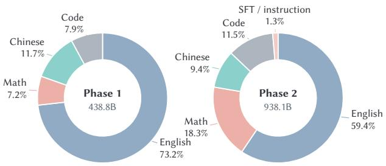

Figure 8: Domain composition of the two pretraining phases. Phase 1 emphasizes broad coverage; Phase 2 allocates a larger share to mathematics and introduces instruction-like data. Here, the Phase 2 token budget shows the pool volume and does not include the Phase 1 replay budget. See Section 3.6.2 for details.  
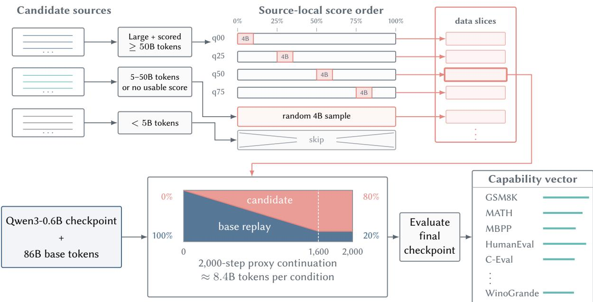  
Figure 9: Proxy benchmarking protocol. Every retained slice is evaluated using the same base checkpoint, continuation-training schedule, and evaluation suite. We construct candidate data slices according to the following protocol: (1) if a dataset contains more than 50B tokens and provides usable score labels, we sample four local subsets around the top 0%, 25%, 50%, and 75% score quantile points; (2) if the dataset contains between 5B and 50B tokens, or does not provide usable score labels, we randomly sample 4B tokens; and (3) we do not evaluate the remaining datasets. For each candidate slice, we continue training from the same base checkpoint for 2,000 steps. The sampling ratio of the candidate data is gradually increased and reaches 80% during the final training steps, while the proportion of replay data from the base mixture is decreased accordingly. We then evaluate the final checkpoint and obtain a capability vector for each candidate data slice.

Finer granularity. For a source that provides sample-level quality scores, we sort its examples by that score, and call a position in the resulting within-source ordering a percentile. Percentile granularity maters most for large sources, because examples at diferent percentiles behave very diferently: we probe suficiently large scored sources with approximately token-matched windows anchored at the 0th, 25th, 50th, and 75th percentiles (q00– q75) and benchmark each window separately, while smaller or unscored sources receive coarser treatment or are skipped (Section I.1). Slice-level benchmarking turns one source-level score into a fine-grained, within-source decision signal.

Goal-based selection. The domain emphasis is goal-driven: because the training goal is to strengthen mathematical reasoning, and math-data pretraining is reported to extrapolate to broader reasoning [58], Phase 2 makes mathematics its largest specialist allocation (18.3% of its 938.1B), broadens code separately, and introduces instruction-formated data (1.3%), while Phase 1 keeps broad coverage with English at 73.2% of 438.8B (Table 3 and fig. 8). A supplementary PCA view helps explain the relative emphasis: General aligns with PC1 while Code opposes it, whereas Math aligns with PC2 and is slightly positive on PC1. This supports allocating more of the specialist budget to mathematics than to code, while MegaMath-Code and the other code sources preserve a complementary Code direction (Section I.2). These projections are descriptive, ex-post evidence rather than causal gains.

Within-domain filtering. When a domain’s candidate supply exceeds its token budget, we retain the slices with higher proxy scores. For example, MegaMath-Web-Pro achieves the highest Math and General point estimates among the measured mathematics conditions. Accordingly, in Phase 2, we remove FineMath and allocate 13.5B tokens to MegaMath-Web-Pro, while reducing the allocation to the Nemotron-CC-Math slice with quality score ≥ 4. In addition, we include the axis-leading datasets FineWeb-Edu-CN, DCLM, and MegaMath-Code for the Chinese, General, and Code axes, respectively, to balance capability across these dimensions (Section I.3).

## 3.6.2 How Do We Preprocess Data and Reproduce the Shards?

The recipe is realized by a Spark-based data preprocessing framework, Kaiyuan-SpaRK [55]. The pipeline turns the candidate collection into fixed training shards in four stages. Within-source deduplication removes repeated documents from web components such as DCLM Baseline and FineWeb-Edu; we do not deduplicate across sources because our analysis found litle additional volume reduction. Proxy benchmarking evaluates each eligible candidate source or within-source slice under the shared protocol described above, producing a multidimensional capability profile. Heuristic filtering combines these profiles with domain coverage, language balance, and token-budget constraints to determine each source’s retained portion and mixture weight. Final materialization freezes the source revisions, retention rules, mixture weights, and random seeds, then merges the retained components into fixed shards that training reads sequentially, without online mixing or sampling.

The Kaiyuan-SpaRK is designed for eficient large-scale data processing. For compute-intensive operations such as MinHash deduplication, it uses native C++ kernels through the Chukonu integration. This implementation is inherited from Chukonu, whose original Spark benchmark reports an approximately 2.5× speedup over the corresponding JVM implementation [107]. The Kaiyuan-SpaRK additionally supports the curriculum bucket materialization required by the Phase 2 design. Given a fixed component pool and mixture, it assigns normalized progress within each component, aligns the resulting slices into token-sized buckets, and materializes their order with recorded random seeds. The same component pool can therefore produce either the ordered curriculum stream or a uniformly ordered stream by changing only the materialization order. These two diferent data streams support the uniform-ordering recipe and curriculum recipe in Phase 2 (Section 3.4).

All training data are materialized as static shards and manifests before training; production runs therefore do not rely on online scoring or dynamic mixture sampling. The Phase 1-to-Phase 2 transition spans approximately 43.9B training tokens. During this transition, the sampling weight of the Phase 1 replay mixture decreases linearly, while that of the Phase 2 mixture increases linearly. Consequently, the transition consumes approximately 21.9B tokens from the Phase 1 replay data and 21.9B tokens from the beginning of the Phase 2 data pool. The full Phase 2 component pool contains approximately 938.1B tokens, including the 21.9B tokens consumed during the transition. After the transition, the remaining 916.1B Phase 2 tokens are consumed without Phase 1 replay. Thus, the Phase 2 training stage consumes approximately 960.0B tokens in total: 21.9B tokens of Phase 1 replay and 938.1B tokens from the Phase 2 pool. Together with Phase 1 training, the complete pretraining run consumes approximately 1.4T tokens.

## 4 Evaluation

## 4.1 Evaluation Setup

## 4.1.1 Model Selection

We compare PuRo-2B with recent language models of comparable size, primarily in the 1B–3B parameter range. We group these baselines according to the scope of their public releases. Open-weight models make their weights publicly available but do not release the complete training data or recipe, whereas open-recipe models additionally release the data and training artifacts needed to study or reproduce training.

Open-weight models.

• Qwen series [101, 102, 100, 79]: We include Qwen2-1.5B, Qwen2.5-1.5B, Qwen3-1.7B-Base, and Qwen3.5-2B-Base, which provide successive generations of strong compact foundation models in the 1.5B–2B range.

• Gemma series [80, 31, 32]: We select Gemma-2-2B, Gemma-3-1B-PT, and Gemma-4-E2B-Base to cover three generations of Google’s lightweight open models.

• Llama 3.2 [60]: We include Llama-3.2-3B, the latest pretrained Llama checkpoint available in the compact 1B–3B range.

• LFM2.5 [50]: We include LFM2.5-1.2B-Base as a recent compact base model designed for eficient ondevice deployment.

• Falcon-H1 [119]: We evaluate the standard and deeper 1.5B base variants as eficiency-oriented hybridmodel baselines.

## Open-recipe models.

• Instella [52]: Instella-3B was trained entirely on openly available data, with model weights, training data, configurations, and code released to support reproducibility. Despite using fewer pretraining tokens than many contemporary models, it is reported to remain competitive with leading open-weight models at a similar scale.

• OLMoE [64]: OLMoE-1B-7B-0125 is a sparse model with 1B active and 7B total parameters. Its release includes intermediate checkpoints, training data, code, logs, and evaluation resources. The model is positioned as a strong performance–eficiency baseline among fully-open mixture-of-experts models.

• Yulan-Mini-2.4B [106]: Yulan-Mini-2.4B is a 2.4B model trained on 1.1T tokens, with its training recipe and phase-wise data composition publicly documented. It emphasizes data-eficient pretraining and reports competitive performance against similarly sized models trained with substantially more data.

• SmolLM3 [7]: SmolLM3-3B-Base was pretrained on approximately 11T tokens, with the public data mixture and training configurations released alongside the model. It is presented as a strong fully-open model at the 3B scale, with performance competitive with several larger compact models.

• MiniCPM5 [72]: MiniCPM5-1B-Base is a compact dense model developed for local and resourceconstrained deployment. Its associated web and mathematical training corpora are publicly released, while the MiniCPM5 family targets strong reasoning, coding, and mathematical capabilities within a small deployment footprint.

For a fair comparison, we consistently evaluate the pretrained/base versions of all models.

## 4.1.2 Benchmarks

Our evaluation covers 15 benchmarks, organized into two groups: mathematics and code, and reasoning and knowledge. For mathematical reasoning, we use GSM8K [18] and the original MATH benchmark [41], which measure grade-school arithmetic and competition-level mathematics, respectively. For code generation, we use sanitized-MBPP [6] and HumanEval [12], where generated Python programs are verified by unit tests. For reasoning and knowledge, we use MMLU [40], MMLU-Pro [95], ARC-Challenge and ARC-Easy [17], BoolQ [16], CommonsenseQA (CSQA) [91], HellaSwag [109], PIQA [11], SocialIQA (SIQA) [82], WinoGrande [81], and Big-Bench Hard (BBH) [90]. Together, these benchmarks assess mathematical reasoning, code generation, academic knowledge, reading comprehension, commonsense understanding, and general multi-step reasoning.

## 4.1.3 Implementation Details

We evaluate every model with OpenCompass [21] using a fixed checkpoint and tokenizer revision, dataset snapshot, benchmark-specific prompt, shot examples, generation configuration, and answer postprocessor. GSM8K, MATH, sanitized-MBPP, HumanEval, MMLU-Pro, and BBH use generation-based (GEN) evaluation: the mode produces a free-form response from which the final answer or executable code is parsed. GEN decoding is greedy with fixed maximum output and stopping rules. The remaining nine benchmarks use perplexity-based (PPL) evaluation, which ranks the provided candidate answers by their fixed token log-likelihoods and therefore introduces no generation randomness. For GSM8K, a shared deterministic postprocessor prioritizes explicit final-answer markers and boxed answers, preserves signs and fractions, and uses the final numeric expression only when no explicit answer is present.

Following the OLMES [36] convention, for tasks supporting both cloze formulation (CF) and multiple-choice formulation (MCF), we evaluate both formulations for each model and use the beter-performing formulation when computing the reported aggregate. This selection is performed independently for each model. All scores are percentages, and the Avg column is the unweighted arithmetic mean over the displayed benchmarks. Every score in our tables is produced by this common, deterministic pipeline.

## 4.2 Resulting Performance

Table 4: Core capabilities in mathematics and code generation. All scores are produced by the same evaluation pipeline and reported as percentages. Avg is the unweighted arithmetic mean over the four benchmarks.
<table><tr><td rowspan="2">Model Name</td><td rowspan="2">Params</td><td colspan="2">Math</td><td colspan="2">Code</td><td rowspan="2">Avg</td></tr><tr><td>GSM8K 4-shot</td><td>MATH 4-shot</td><td>sanitized-MBPP 3-shot</td><td>HumanEval 3-shot</td></tr><tr><td>Open-Weight Models</td><td></td><td></td><td></td><td></td><td></td><td></td></tr><tr><td>Qwen2-1.5B</td><td>1.5B</td><td>59.82</td><td>23.70</td><td>50.19</td><td>27.44</td><td>40.29</td></tr><tr><td>Qwen2.5-1.5B</td><td>1.5B</td><td>67.70</td><td>32.28</td><td>58.37</td><td>31.71</td><td>47.52</td></tr><tr><td>Qwen3-1.7B-Base</td><td>1.7B</td><td>76.04</td><td>42.44</td><td>64.20</td><td>51.22</td><td>58.48</td></tr><tr><td>Qwen3.5-2B-Base</td><td>2B</td><td>69.83</td><td>35.82</td><td>43.58</td><td>32.32</td><td>45.39</td></tr><tr><td>Gemma-2-2B</td><td>2B</td><td>33.81</td><td>14.84</td><td>38.52</td><td>20.12</td><td>26.82</td></tr><tr><td>Gemma-3-1B-PT</td><td>1B</td><td>2.58</td><td>0.94</td><td>9.34</td><td>8.54</td><td>5.35</td></tr><tr><td>Gemma-4-E2B-Base</td><td>E2B</td><td>30.71</td><td>9.68</td><td>47.86</td><td>24.39</td><td>28.16</td></tr><tr><td>Llama-3.2-3B</td><td>3B</td><td>28.20</td><td>8.14</td><td>50.19</td><td>31.10</td><td>29.41</td></tr><tr><td>LFM2.5-1.2B-Base</td><td>1.2B</td><td>53.22</td><td>28.00</td><td>38.13</td><td>25.61</td><td>36.24</td></tr><tr><td>Falcon-H1-1.5B-Base</td><td>1.5B</td><td>74.68</td><td>42.60</td><td>61.09</td><td>28.05</td><td>51.61</td></tr><tr><td>Falcon-H1-Deep-1.5B-Base</td><td>1.5B</td><td>53.53</td><td>41.28</td><td>63.04</td><td>32.93</td><td>47.70</td></tr><tr><td>Open-Recipe Models</td><td></td><td></td><td></td><td></td><td></td><td></td></tr><tr><td>Instella-3B</td><td>3B</td><td>64.44</td><td>13.30</td><td>41.25</td><td>14.63</td><td>33.41</td></tr><tr><td>OLMoE-1B-7B-0125</td><td>A1B/7B</td><td>54.59</td><td>15.48</td><td>33.46</td><td>12.80</td><td>29.08</td></tr><tr><td>Yulan-Mini-2.4B</td><td>2.4B</td><td>68.99</td><td>27.18</td><td>62.26</td><td>50.00</td><td>52.11</td></tr><tr><td>SmolLM3-3B-Base</td><td>3B</td><td>81.73</td><td>56.12</td><td>60.31</td><td>37.80</td><td>58.99</td></tr><tr><td>MiniCPM5-1B-Base</td><td>1B</td><td>39.88</td><td>23.34</td><td>46.30</td><td>29.27</td><td>34.70</td></tr><tr><td>MobileLLM-R1-950M-base</td><td>950M</td><td>68.31</td><td>27.24</td><td>50.58</td><td>43.29</td><td>47.36</td></tr><tr><td>Ours</td><td></td><td></td><td></td><td></td><td></td><td></td></tr><tr><td>Puro-2B ($4.4K)</td><td>2B</td><td>56.03</td><td>27.86</td><td>49.81</td><td>20.73</td><td>38.61</td></tr><tr><td>Puro-2B</td><td>2B</td><td>59.67</td><td>30.30</td><td>52.92</td><td>31.10</td><td>43.50</td></tr></table>

Mathematics and code. As shown in Table 4, PuRo-2B obtains an average score of 43.50 across the four generative benchmarks. It exceeds Qwen2-1.5B by 3.21 points and is within 4.02 points of Qwen2.5-1.5B. Among the open-recipe baselines, PuRo-2B outperforms Instella-3B, OLMoE-A1B/7B, and MiniCPM5-1B-Base, while Yulan-Mini-2.4B, SmolLM3-3B-Base, and the newly included MobileLLM-R1-950M-base achieve higher averages. MobileLLM-R1 is a strong math/code-oriented compact baseline in this panel, exceeding PuRo-2B by 3.86 points on the four-task average. Given these diferences in model size and capability emphasis, PuRo-2B remains a competitive open-recipe model for mathematics and code generation at a comparatively small scale.

Reasoning and knowledge. Table 5 shows that PuRo-2B achieves a mean score of 63.02 over the eleven reasoning and knowledge benchmarks. It outperforms Qwen2-1.5B by 2.48 points and is within 2.51 points of Qwen2.5-1.5B. Within the open-recipe group, PuRo-2B surpasses OLMoE-A1B/7B, Yulan-Mini-2.4B, MiniCPM5- 1B-Base, and MobileLLM-R1-950M-base, while trailing the larger Instella-3B by only 0.11 points. SmolLM3- 3B-Base achieves a higher average, but it is also a larger model. These aggregate results show that PuRo-2B remains competitive with larger open-recipe models and retains a 6.29-point reasoning/knowledge advantage over MobileLLM-R1. Together with the reduced training cost enabled by low-precision training, this performance indicates a favorable balance between broad capability and replication cost.

Table 5: Reasoning and knowledge capabilities. All scores are produced by the same evaluation pipeline and reported as percentages. Avg is the unweighted arithmetic mean over all eleven benchmarks.
<table><tr><td rowspan="3">Model Name</td><td rowspan="3">Params</td><td colspan="10">Reasoning &amp; Knowledge</td><td rowspan="3">Avg</td></tr><tr><td>MMLU</td><td>MMLU-Pro</td><td>ARC-C</td><td>ARC-E</td><td>BoolQ</td><td>CSQA HSwag</td><td></td><td>PIQA</td><td>SIQA</td><td>Wino</td><td>BBH</td></tr><tr><td>5-shot</td><td>5-shot CoT</td><td>5-shot</td><td>5-shot</td><td>5-shot</td><td>5-shot</td><td>5-shot</td><td></td><td>5-shot 5-shot 5-shot 4-shot</td><td></td><td></td></tr><tr><td>Open-Weight Models</td><td></td><td></td><td></td><td></td><td></td><td></td><td></td><td></td><td></td><td></td><td></td><td></td><td></td></tr><tr><td>Qwen2-1.5B</td><td>1.5B</td><td>56.39</td><td>23.62</td><td>69.83</td><td>83.77</td><td>71.90</td><td>70.52</td><td>59.91</td><td>75.19</td><td>63.36</td><td>59.67</td><td>31.73</td><td>60.54</td></tr><tr><td>Qwen2.5-1.5B</td><td>1.5B</td><td>61.56</td><td>30.43</td><td>79.32</td><td>90.48</td><td>76.39</td><td>75.10</td><td>64.18</td><td>76.17</td><td>64.94</td><td>59.67</td><td>42.64</td><td>65.53</td></tr><tr><td>Qwen3-1.7B-Base</td><td>1.7B</td><td>65.47 63.95</td><td>37.60</td><td>80.34</td><td>91.89</td><td>79.63</td><td>74.69</td><td>60.47</td><td>76.06</td><td>68.68</td><td>59.19</td><td>51.18</td><td>67.75</td></tr><tr><td>Qwen3.5-2B-Base Gemma-2-2B</td><td>2B</td><td></td><td>37.34</td><td>83.73</td><td>93.12</td><td>85.63</td><td>73.05</td><td>63.52</td><td>76.50</td><td>69.14</td><td>58.80</td><td>60.37</td><td>69.56</td></tr><tr><td>Gemma-3-1B-PT</td><td>2B</td><td>55.22</td><td>24.40</td><td>66.44</td><td>82.54</td><td>71.83</td><td>66.18</td><td>35.22</td><td>66.10</td><td>65.86</td><td>52.01</td><td>35.88</td><td>56.52</td></tr><tr><td>Gemma-4-E2B-Base</td><td>1B</td><td>26.17 59.72</td><td>11.77</td><td>26.78</td><td>26.46</td><td>62.91</td><td>20.56</td><td>25.65</td><td>49.40</td><td>32.55</td><td>49.57</td><td>26.89</td><td>32.61</td></tr><tr><td>Llama-3.2-3B</td><td>E2B 3B</td><td>57.55</td><td>25.55</td><td>73.56</td><td>86.24</td><td>77.28</td><td>65.77</td><td>44.38</td><td>67.79</td><td>65.66</td><td>52.64</td><td>39.69</td><td>59.84</td></tr><tr><td>LFM2.5-1.2B-Base</td><td>1.2B</td><td>57.50</td><td>27.71 17.74</td><td>72.88</td><td>84.83</td><td>76.02</td><td>66.91</td><td>48.12</td><td>76.06</td><td>64.28</td><td>52.57</td><td>38.01</td><td>60.45</td></tr><tr><td>Falcon-H1-1.5B-Base</td><td>1.5B</td><td>65.32</td><td>36.44</td><td>82.03</td><td>87.83 90.30</td><td>74.40 78.84</td><td>59.13</td><td>54.20</td><td>74.97 75.73</td><td>59.26</td><td>57.54</td><td>33.54</td><td>59.83</td></tr><tr><td>Falcon-H1-Deep-1.5B-Base</td><td>1.5B</td><td>68.74</td><td>42.99</td><td>81.02 85.08</td><td>93.12</td><td>85.23</td><td>71.25 72.40</td><td>62.24 65.24</td><td>76.61</td><td>67.30 70.83</td><td>57.77</td><td>45.35</td><td>66.51</td></tr><tr><td></td><td></td><td></td><td></td><td></td><td></td><td></td><td></td><td></td><td></td><td></td><td>60.14</td><td>41.86</td><td>69.29</td></tr><tr><td>Open-Recipe Models Instella-3B</td><td></td><td>58.55</td><td></td><td></td><td></td><td></td><td></td><td></td><td></td><td></td><td></td><td></td><td></td></tr><tr><td>OLMoE-1B-7B-0125</td><td>3B A1B/7B</td><td>54.11</td><td>25.32 19.67</td><td>74.92 66.44</td><td>87.30</td><td>76.76 72.97</td><td>75.43 62.82</td><td>59.92 36.54</td><td>73.23</td><td>69.91</td><td>53.99</td><td>39.11</td><td>63.13</td></tr><tr><td>Yulan-Mini-2.4B</td><td>2.4B</td><td>51.74</td><td>23.68</td><td>65.08</td><td>84.30 82.54</td><td>78.47</td><td>66.18</td><td>59.92</td><td>71.16 76.22</td><td>65.15 63.31</td><td>50.28 62.35</td><td>30.74 44.12</td><td>55.83</td></tr><tr><td>SmolLM3-3B-Base</td><td>3B</td><td>62.24</td><td>39.02</td><td>79.32</td><td>89.95</td><td>84.80</td><td>72.73</td><td>70.23</td><td>81.12</td><td>70.62</td><td>64.25</td><td>37.52</td><td>61.24 68.35</td></tr><tr><td>MiniCPM5-1B-Base</td><td>1B</td><td>45.01</td><td>21.98</td><td>46.44</td><td>70.90</td><td>73.12</td><td>56.92</td><td>51.51</td><td>71.87</td><td>50.15</td><td>54.06</td><td>36.51</td><td>52.59</td></tr><tr><td>MobileLLM-R1-950M-base</td><td>950M</td><td>48.24</td><td>21.95</td><td>58.31</td><td>78.13</td><td>78.87</td><td>61.59</td><td>54.16</td><td>73.50</td><td>59.77</td><td>55.33</td><td>34.15</td><td>56.73</td></tr><tr><td>Ours</td><td></td><td></td><td></td><td></td><td></td><td></td><td></td><td></td><td></td><td></td><td></td><td></td><td></td></tr><tr><td>Puro-2B ($4.4K)</td><td>2B</td><td>54.82</td><td>24.02</td><td>66.78</td><td>84.66</td><td>77.34</td><td>67.65</td><td>63.62</td><td>75.84</td><td>62.90</td><td>59.91</td><td>41.14</td><td></td></tr><tr><td>Puro-2B</td><td>2B</td><td>57.44</td><td>25.81</td><td>74.24</td><td>86.07</td><td>76.85</td><td>67.81</td><td>63.21</td><td>75.52</td><td>63.61</td><td>60.62</td><td>42.05</td><td>61.70 63.02</td></tr></table>

## 4.3 Cost Estimation

## 4.3.1 Cost-Saving Factors

We estimate four cost factors separately: hardware price eficiency, FP8 throughput, MuonH quality-equivalent compute, and the joint Phase 2 recipe. Each factor uses its own reference comparison, so the reported values are not measurements of one sequential end-to-end speedup. The product of these components can only be treated as illustrative transfers. Hardware uses a specification-and-price accounting proxy, blockwise FP8 uses qualityadjusted throughput with MuonH fixed, and the complete MuonH recipe uses quality-equivalent compute with blockwise FP8 fixed. Phase 2 uses the fited uniform-equivalent cost ofthe curriculum/CMA endpoint to measure the speedup from the CMA approach. These comparisons do not form a joint factorial ablation due to diferent references, so their products are accounting estimates rather than directly measured end-to-end speedups7.

For the ladder evidence below, C = 6ND denotes theoretical training compute, where N is the scaling parameter count and D is the number of training tokens. A compute-equivalent multiplier κ means that a variant trained with C/κ reaches the fited loss of its baseline at C. For precision, we define BF16-equivalent compute retention as $\rho _ { C } = C _ { \mathrm { B F 1 6 } } / C _ { \mathrm { F P 8 } }$ at matched fited loss; this converts the vertical precision gap into a horizontal compute adjustment.

RTX 5090 exhibits a high cost-performance ratio and utilization. Under the specifications and prices in Table 2, the RTX 5090 proxy provides 2.77× the peak BF16 compute per unit price of H200 and 2.74× the peak FP8 compute per unit price ofH200. Moreover, with training configuration tuning, as shown in Section 3.1.3, our recipe can achieve 73% MFU in mixed-precision training, making good use of the RTX 5090’s capability.

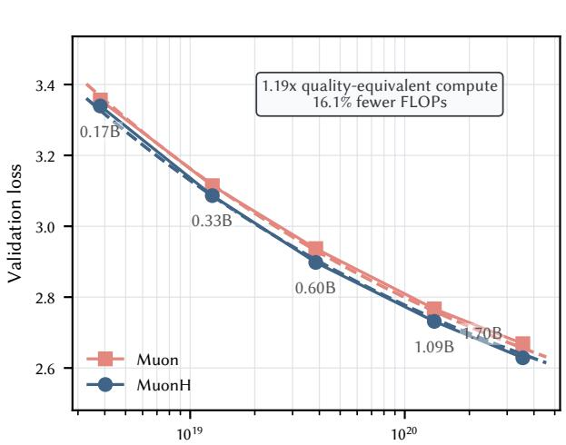  
Training compute, C = 6ND (FLOPs; log scale)  
(a) Complete MuonH versus the tuned Muon baseline.

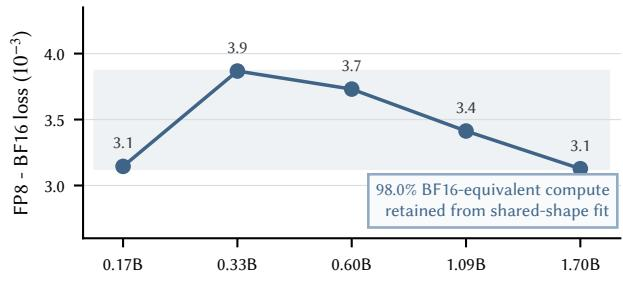

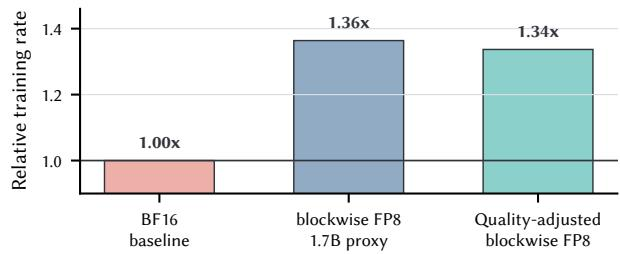  
(b) Blockwise FP8 quality and throughput. The upper figure shows the FP8 validation loss penalty across 5 scales; the lower figure shows wall-time speedup and net benefit of FP8 after considering the loss penalty.

Figure 10: Matched scaling-ladder evidence behind two cost factors. Left: Validation loss versus theoretical compute for tuned Muon and MuonH recipes with blockwise FP8 fixed; dashed curves are the shared-floor, shared-exponent fit. The boxed note reports a fited quality-equivalent compute multiplier. Right: With MuonH fixed, the FP8-minus-BF16 validation-loss gap remains within 0.0031–0.0039 across five scales. Only the 1.7B throughput ratio is used as the 2B proxy; its 1.36× measured gain is multiplied by 98.0% fited BF16-equivalent compute retention to obtain a 1.34× matched-quality speedup, where $\rho _ { C } = C _ { \mathrm { B F 1 6 } } / C _ { \mathrm { F P 8 } }$ is derived from the shared-shape loss fit. Complete setups and fit diagnostics remain in Section D.

MuonH provides a quality-equivalent compute shift in the matched ladder. Under the definition above, the quality-equivalent compute reduction is ${ \bar { 1 } } - 1 / \kappa$ . The matched scaling ladder in Figure 10a estimates a 1.19× compute-equivalent multiplier for the complete MuonH recipe relative to Muon, corresponding to 16.1% less theoretical compute at matched validation loss. The scaling estimation is performed over TPP=20 ladder with a shared-shape fit to transfer to production run. At 2B parameters and 1.4T tokens, this is $1 . 6 8 \times 1 0 ^ { 2 2 }$ FLOPs; transferring only the fited horizontal multiplier gives $\bar { 1 . 4 1 } \times 1 0 ^ { 2 2 }$ FLOPs for MuonH to match the Muon baseline. This is a counterfactual quality-equivalent saving: when both optimizers receive the full token budget, MuonH instead uses the same nominal compute to obtain a lower validation loss.

Blockwise FP8 retains a stable quality fraction while accelerating the 2B proxy. A precision format may change both execution rate and model quality, so its net eficiency multiplier is the product of throughput speedup and efective-compute retention. As summarized in Figure 10b, blockwise FP8 has a small validation-loss gap at all five ladder scales. The shared-shape fit gives $\rho _ { C } = 9 8 . 0 \%$ . Matching BF16 quality therefore requires approximately 2.0% additional nominal compute. At 1.7B, the closest throughput proxy to the 2B production model, median throughput improves by 1.36×; charging the quality penalty yields a 1.34× net speedup, or 25.2% fewer GPU-hours at matched quality. A hypothetical 2B/1.4T-token run would consequently require approximately 30,286 BF16 GPU-hours versus 22,654 quality-adjusted FP8 GPU-hours. These are ladder-derived counterfactuals, not measured full-horizon BF16 GPU-hours. Treating the MuonH and FP8 estimates as independent gives 1.59× (37.2% fewer GPU-hours), but the factor summary keeps their evidence sources visible.

The Puro Cost Scaling Law summarizes recipe-specific scale-down behavior. Starting from the same Phase 1 checkpoint, we continue Phase 2 training with the uniform recipe at several budgets and use these runs to characterize the empirical cost–performance relationship, which we refer to as the Puro Cost Scaling Law. It is a scale-down relationship for this recipe, not a universal law across model families. Here, we focus on the scale-down trend to help the community with limited compute and time budgets decide a feasible performance target. We fit $P = a + \bar { b } \log _ { 2 } ( C - C _ { \mathrm { P 1 } } )$ , where P is the fixed evaluation aggregate, C is total reproduction cost, and a and b are the fited intercept and slope. Costs shown in the figure use the USD conversion in Table 6. We set $C _ { \mathrm { P 1 } } = \mathrm { U S D } 1 . 8 4 \mathrm { K }$ from the measured Phase 1 active-training GPU-hours and hold it fixed while fiting performance against the incremental Phase 2 cost. The observed uniform checkpoint at approximately \$4.4K already exceeds Qwen2-1.5B without CMA. This shifted fit reduces in-sample RMSE from 0.452 for the unshifted log-cost fit to 0.209. Inverting it at the curriculum-decay endpoint score places its uniform-recipe cost equivalent at approximately \$11.36K, or 1.65× the production recipe’s \$6.89K rental-equivalent estimate from measured active-training GPU-hours. Inverting the same fit at the reported Puro-2B aggregate, which additionally includes a constant-LR continuation and averages the last six checkpoints, gives approximately \$16.55K, or 2.40× the production cost. The curriculum endpoint changes ordering, continuation, and checkpoint averaging together. We therefore report its fited cost equivalent as a recipe-level point estimate rather than as a curriculum-only gain or a universal cost law.

## 4.3.2 Cross-Model Reproduction Cost

Estimation protocol. For Figure 1, we prioritize reported monetary cost or accelerator usage. We use reported GPU-hours, or GPU-hours precisely derived from other reported statistics, and convert them with the reference rental rates listed in Table 6 in the appendix. When no such GPU-hour basis is available, we use the tokenbased route and estimate compute as $\dot { C } = 6 N D$ , using the reported accelerator and MFU when available and H100-equivalent GPU-hours at 70% MFU otherwise. MobileLLM-R1 is a special compute-derived case: its report gives accelerator usage but not the accelerator model, so we infer a comparable accelerator from historical model reports and apply the corresponding reference rate. Models that disclose neither source are omited. The PuRo-2B point instead uses measured active-training iteration times (6,009.46 GPU-hours in Phase 1 and 16,504.95 GPUhours in Phase 2) and the RTX 5090 rate in Table 6. This hierarchy distinguishes reported-resource costs from compute-derived estimates rather than presenting all points as reported training bills. The complete coordinate construction and Pareto-frontier procedure are given in Section B.

Pareto-frontier result. Under the stated accelerator-cost assumptions, Figure 1 places PuRo-2B above and to the left of the frontier formed by the comparison models. Its rental-equivalent cost–performance point, derived from measured GPU-hours, is therefore more favorable than this comparator frontier under our accounting protocol. The separation is especially pronounced among the fully-open comparators.

## 5 Post-Training Results and Analysis

The post-training results compare the same two pretraining initializations under increasingly broad supervised setings: the uniform Phase 2 global-reshufle endpoint and the curriculum/CMA Phase 2 endpoint, which includes late constant-LR continuation and six-checkpoint averaging. The focused mathematics experiment provides the controlled target-domain comparison, the scaled experiment tests persistence with a larger mathematics SFT recipe, and the broad instruction experiment measures transfer beyond the target domain.

## 5.1 Focused Mathematics

The focused mathematics experiment compares those two pretraining endpoints without pretraining replay: the uniform Phase 2 endpoint is the uniform global-reshufle checkpoint, while the curriculum endpoint is the curriculum/CMA checkpoint described above. At the fixed SFT endpoint (step 172), uniform initialization reaches 66.89% mean GSM8K accuracy and curriculum initialization reaches 68.66%, a gain of 1.77 percentage points (Figure 11a and table 12). Curriculum is higher across repeated runs and at the predeclared intermediate checkpoint. This result is consistent across the tested SFT data orders. The curriculum endpoint solves more examples that the uniform endpoint misses, while most correct examples are shared. The same mean advantage remains under explicit-answer-only scoring, indicating that the paired diference is not driven solely by answer formating.

## 5.2 Scaled Mathematics

The scaled mathematics experiment uses the same pair of pretraining endpoints, but applies a larger mathematical SFT mixture, a small replay component, and a longer budget. At its fixed endpoint (step 2,431), uniform initialization reaches 74.10% mean GSM8K accuracy and curriculum initialization reaches 76.12%, a gain of 2.02 percentage points, with curriculum ahead in every run (Figure 11a and table 13). The absolute scores should not be compared directly with the focused seting because the SFT mixture and budget difer; the paired curriculumminus-uniform diference is the intended comparison. Figure 11a compares the final results from both focused and scaled mathematics SFT; its focused and scaled bars should be read against the per-run tables (Tables 12 and 13), and error bars show the observed range across repeated runs. The scaled seting extends the same endpoint comparison to a broader mathematics SFT recipe.

## 5.3 Broad Instruction Transfer

The broad instruction experiment extends the curriculum (as well as the joint recipe on model average) advantage beyond mathematics-focused SFT. The 15-task macro-average increases from 54.99% to 56.58%, and curriculum initialization improves 13 of the 15 component evaluations. Additional evaluation on IFEval, BBH, and MMLU-Pro brings the total to 15 improvements among 18 reported evaluations. The gains span several capability families, and individual regressions are reported in the appendix.

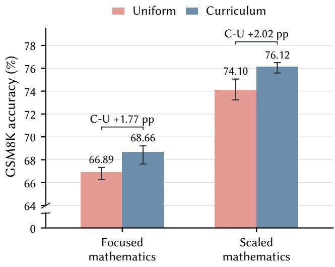

<table><tr><td>Evaluation</td><td></td><td>Uniform Curriculum</td><td>C-U (pp)</td></tr><tr><td>15-task macro-average</td><td>54.99</td><td>56.58</td><td>+1.59</td></tr><tr><td>IFEval/BBH macro-average</td><td>42.10</td><td>43.66</td><td>+1.56</td></tr><tr><td>MMLU-Pro</td><td>25.58</td><td>26.08</td><td>+0.50</td></tr></table>

(b) Broad instruction SFT summary. The IFEval/BBH macro-average denotes the average over IFEval and BBH only, rather than the macro-average over the full broad evaluation suite.  
(a) Focused and scaled mathematics SFT. Bars report the mean final GSM8K accuracy over three repeated runs, with error bars span ning the minimum and maximum. Uniform and Curriculum denote SFT initialized from the corresponding pretraining endpoints.  
Figure 11: Post-training results. (a) Final GSM8K results under focused and scaled mathematics SFT. Bars show the mean across three repeated runs, error bars span the observed minimum and maximum, and labels report the curriculum-minus-uniform diference in percentage points (pp); the vertical axis is broken between 0 and 64% to make the diferences legible. (b) Broad instruction SFT summary; scores are percentages, with detailed task-level results in Tables 14 and 15.

The three studies jointly show that the pretraining recipe diference survives supervised adaptation at increasing scope. The curriculum initialization improves GSM8K in both a focused seting and a larger mathematics seting, with all three repetitions supporting the same direction in each experiment. It also improves the aggregate and most component evaluations after broad instruction tuning. Together, these findings establish that the complete curriculum recipe retains a post-training advantage across focused mathematics, scaled mathematics, and broad instruction tuning.

## 6 Related Works

## 6.1 Open-Recipe Language Models

The core science and engineering of large-scale pretraining remain dificult to study when leading systems are either closed or release weights without the data and training recipe needed to reconstruct the run [55]. The term “open model” therefore covers substantially diferent release practices. Widely used model families such as Qwen [101, 102, 100, 79], Gemma [80, 31, 32], Llama [60], LFM [50], and Falcon [119] publish model weights and enough implementation information for evaluation and deployment. However, their exact pretraining corpora, sample order, and complete training state are not released, so an independent group cannot reconstruct the original training run. We refer to these releases as open-weight. In contrast, a open-recipe release aims to expose the model weights, training data or a reconstructible data recipe, training and evaluation code, and suficiently detailed configurations and intermediate artifacts to support scientific inspection and reproduction [35, 93]. Such releases turn a final checkpoint into a reproducible account of how the model was built, making controlled study possible for resource-limited research communities.

Open-recipe projects provide the broader experimental stack needed to study pretraining itself. Pythia releases ordered data and dense intermediate checkpoints; OLMo and OLMoE release data, training and evaluation code, checkpoints, and logs; and projects such as SmolLM3, Yulan-Mini-2.4B, and Instella provide public data mixtures and reproducible training configurations [10, 35, 64, 7, 106, 52]. These resources allow other researchers to investigate learning dynamics, data selection, scaling, and optimization without relying on undocumented industrial pipelines. Open-recipe models can also be competitive: as shown in Tables 4 and 5, models such as SmolLM3-3B, Yulan-Mini-2.4B, and Instella-3B match or surpass several open-weight models of comparable scale on parts of our evaluation, making this direction important beyond reproducibility alone.

This openness and capability have nevertheless often required substantial resources. Yulan-Mini-2.4B was trained on 48 A800 GPUs, SmolLM3 on 384 H100 GPUs, and the first stage of Instella-3B on 128 MI300X GPUs [106, 7, 52]. Kaiyuan-2B, our previous work, provides a more resource-conscious example by improving data and training eficiency on Ascend 910A hardware [55]. These examples expose a remaining gap between openness and practical accessibility: a training pipeline may be fully reproducible yet remain too costly for small research groups to rerun. Addressing this gap requires considering training workload, numerical precision, hardware accessibility, and explicit cost accounting together.

## 6.2 Low-Cost Language Model Pretraining

Training cost is meaningful only under an explicit accounting boundary. Token count and FLOPs alone capture only part of pretraining cost. End-to-end replication cost also depends on the workload required to reach a target quality, realized hardware throughput, and hardware price. We therefore consider cost jointly with model quality rather than using any single measure of compute or hardware eficiency as a proxy for low-cost training.

Low-precision training primarily reduces the cost of executing a fixed workload. FP8 mixed precision accelerates the matrix multiplications that dominate Transformer training while retaining higher precision where needed. DeepSeek-V3 shows that this design can remain stable at large scale [63, 26]. Quartet II extends this direction to NVFP4 and improves its numerical behavior [73]. These methods improve execution eficiency for a given training workload, but do not by themselves reduce the token or nominal FLOP budget required to reach a target quality.

A complementary line of work reduces the training workload through model architecture, data selection, staged training, and systems optimization. TinyLlama, JetMoE, Yulan-Mini-2.4B, and Kaiyuan-2B explore diferent combinations of these techniques [111, 84, 106, 55]. Collectively, these projects show that useful small-model capability can be obtained under substantially smaller compute budgets than those of large-scale foundation models. The reported runs, however, generally rely on specialized data-center accelerators, so the hardware barrier for a small research group remains.

Hardware accessibility introduces a separate constraint. QLoRA reduces the memory required to fine-tune a pretrained model, leaving the original pretraining cost unchanged [28]. LLMQ studies full-model pretraining on RTX 4090 GPUs using FP8, recomputation, sharding, and CPU ofloading [83], while Quartet II measures the throughput benefit of NVFP4 on a single RTX 5090 [73]. The studies considered here establish the feasibility of relevant training operations on consumer GPUs, but focus primarily on systems feasibility or throughput rather than on releasing a trillion-token-scale base model with an explicit replication-cost boundary.

PuRo-2B lies at the intersection of these directions. It is a from-scratch 2B base model trained on more than 1.4T tokens using FP8 on a multi-node RTX 5090 cluster, with measured accelerator usage and an explicit replicationcost boundary. We therefore evaluate the training recipe and hardware platform end to end, measuring both the resulting model quality and replication cost. Together, these components provide researchers with a reproducible and cost-accessible end-to-end pipeline for studying pretraining behavior and testing alternative methods at meaningful scales.

## 7 Conclusion and Future Direction

In this report, we present a cost-eficient, hardware-accessible reproducibility recipe for language model pretraining, and use it to train the PuRo-2B model collection from scratch on consumer-grade RTX 5090 GPUs. Across diferent training budgets and recipe variants, the collection provides a direct view of the cost–performance tradeof of our pipeline. A model from this collection reaches the performance of Qwen2-1.5B at about \$4.4K, while our best checkpoint approaches Qwen2.5-1.5B at the canonical accelerator-only cost of about \$6.9K. Based on these runs, we further formulate the Puro Cost Scaling Law to characterize how model capability scales down with training cost under our recipe. More broadly, these results demonstrate that useful from-scratch pretraining at the billion-parameter scale is feasible with modest budgets and accessible hardware.

Beyond model performance and cost, a fully inspectable pretraining pipeline enables questions that cannot be studied from model weights alone. As a case study, we follow diferent Phase 2 pretraining recipes through supervised post-training and find that their diferences remain measurable after adaptation: curriculum initialization improves focused-mathematics endpoint accuracy by 1.77 percentage points on average, a larger mathematics recipe yields a 2.02-point mean gain, and broad instruction tuning raises the 15-task macro-average by 1.59 points. By releasing the datasets, model weights, intermediate checkpoints, training configurations, and implementation, we aim to provide a common experimental foundation for studying how choices in data, optimization, training schedule, and post-training interact across the full model development pipeline.

There remain several directions for extending this foundation. First, we plan to extend the reproducibility recipe beyond pretraining to post-training, with particular emphasis on developing and studying agentic capabilities. Second, we plan to broaden the architectural space beyond standard dense Transformers, including looped Transformers, linear-atention models, mixture-of-experts architectures, and other emerging designs. Third, we aim to expand the hardware recipes beyond RTX 5090 GPUs and cover a wider range of training budgets, making it easier to study how the optimal system and training choices change across hardware and scale. We view PuRo-2B not as an endpoint, but as evidence that afordable and inspectable model training is practical today, and as a baseline for future eforts to push the frontier toward lower cost, broader accessibility, and higher eficiency.

## 8 Acknowledgments

The authors would like to thank Yanfu Investments for providing computational resources. Zhenbo Sun and Chenyi Dang contributed during the early stages of this work. The authors also thank Kaiyue Wen, Kexian Tang, Minxing Yang, Zhan Ling, Haodong Wen, Shaowen Wang, Huaqing Zhang and Shuo Huang for their valuable feedback and insightful discussions, and Yanzheng Cai, Yuanwei Wang, Zhixuan Pan, and Rui Chen for their assistance with proofreading and manuscript revision. Multiple LLM-based tools were used to assist with drafting, proofreading, and language refinement.

## References

[1] aikitoria. 2026. NVIDIA Linux open GPU with P2P support. https://github.com/aikitoria/ open-gpu-kernel-modules.

[2] Loubna Ben Allal, Anton Lozhkov, Elie Bakouch, Gabriel Martín Blázquez, Guilherme Penedo, Lewis Tunstall, Andrés Marafioti, Hynek Kydlícek, Agustín Piqueres Lajarín, Vaibhav Srivastav, Joshua Lochner, Caleb Fahlgren, Xuan-Son Nguyen, Clémentine Fourrier, Ben Burtenshaw, Hugo Larcher, Haojun Zhao, Cyril Zakka, Mathieu Morlon, Colin Rafel, Leandro von Werra, and Thomas Wolf. 2025. SmolLM2: When Smol Goes Big - Data-Centric Training of a Small Language Model. CoRR abs/2502.02737 (2025). arXiv:2502.02737 doi:10.48550/ARXIV.2502.02737

[3] AMD. 2025. Instella-3B Model Card. https://huggingface.co/amd/Instella-3B Accessed: 2026- 08-20.

[4] Michael Andersch, Greg Palmer, Ronny Krashinsky, Nick Stam, Vishal Mehta, Gonzalo Brito, and Sridhar Ramaswamy. 2022. NVIDIA Hopper Architecture In-Depth. https://developer.nvidia.com/blog/ nvidia-hopper-architecture-in-depth/.

[5] Alpay Ariyak, Junda Zhang, Junxiong Wang, Shang Zhu, Federico Bianchi, Sanjana Srivastava, Ashwinee Panda, Siddhant Bharti, Chenfeng Xu, John Heo, Xiaoxia Shirley Wu, James Zhou, Percy Liang, Leon Song, Ce Zhang, Ben Athiwaratkun, Zhongzhu Zhou, and Qingyang Wu. 2026. CoderForge-Preview: SOTA Open Dataset for Training Eficient Agents. https://www.together.ai/blog/coderforge-preview Project core leads: Alpay Ariyak; Zhongzhu Zhou; Qingyang Wu.

[6] Jacob Austin, Augustus Odena, Maxwell I. Nye, Maarten Bosma, Henryk Michalewski, David Dohan, Ellen Jiang, Carrie J. Cai, Michael Terry, Quoc V. Le, and Charles Suton. 2021. Program Synthesis with Large Language Models. CoRR abs/2108.07732 (2021). arXiv:2108.07732 https://arxiv.org/abs/2108. 07732

[7] Elie Bakouch, Loubna Ben Allal, Anton Lozhkov, Nouamane Tazi, Lewis Tunstall, Carlos Miguel Patiño, Edward Beeching, Aymeric Roucher, Aksel Joonas Reedi, Quentin Gallouédec, Kashif Rasul, Nathan Habib, Clémentine Fourrier, Hynek Kydlicek, Guilherme Penedo, Hugo Larcher, Mathieu Morlon, Vaibhav Srivastav, Joshua Lochner, Xuan-Son Nguyen, Colin Rafel, Leandro von Werra, and Thomas Wolf. 2025. SmolLM3: smol, multilingual, long-context reasoner. https://huggingface.co/blog/smollm3.

[8] Aarti Basant, Abhijit Khairnar, Abhijit Paithankar, Abhinav Khatar, Adithya Renduchintala, Aditya Malte, Akhiad Bercovich, Akshay Hazare, Alejandra Rico, Aleksander Ficek, Alex Kondratenko, Alex Shaposh nikov, Alexander Bukharin, Ali Taghibakhshi, Amelia Barton, Ameya Sunil Mahabaleshwarkar, Amy Shen, Andrew Tao, Ann Guan, Anna Shors, Anubhav Mandarwal, Arham Mehta, Arun Venkatesan, Ashton Sharabiani, Ashwath Aithal, Ashwin Poojary, Ayush Datagupta, Balaram Buddharaju, Banghua Zhu, Barnaby Simkin, Bilal Kartal, Bita Darvish Rouhani, Bobby Chen, Boris Ginsburg, Brandon Norick, Brian Yu, Bryan Catanzaro, Charles Wang, Charlie Truong, Chetan Mungekar, Chintan Patel, Chris Alexiuk, Christian Munley, Christopher Parisien, Dan Su, Daniel Afrimi, Daniel Korzekwa, Daniel Rohrer, Daria Gitman, David Mosallanezhad, Deepak Narayanan, Dima Rekesh, Dina Yared, Dmytro Pykhtar, Dong Ahn, Duncan Riach, Eileen Long, Elliot Ning, Eric Chung, Erick Galinkin, Evelina Bakhturina, Gargi Prasad, Gerald Shen, Haifeng Qian, Haim Elisha, Harsh Sharma, Hayley Ross, Helen Ngo, Herman Sahota, Hexin Wang, Hoo Chang Shin, Hua Huang, Iain Cunningham, Igor Gitman, Ivan Moshkov, Jaehun Jung, Jan Kautz, Jane Polak Scowcroft, Jared Casper, Jian Zhang, Jiaqi Zeng, Jimmy Zhang, Jinze Xue, Jocelyn Huang, Joey Conway, John Kamalu, Jonathan M. Cohen, Joseph Jennings, Julien Veron Vialard, Junkeun Yi, Jupinder Parmar, Kari Briski, Katherine Cheung, Katherine Luna, Keith W. Ross, Keshav Santhanam, Kezhi Kong, Krzysztof Pawelec, and Kumar Anik. 2025. NVIDIA Nemotron Nano 2: An Accurate and Eficient Hybrid Mamba-Transformer Reasoning Model. CoRR abs/2508.14444 (2025). arXiv:2508.14444 doi:10.48550/ARXIV.2508.14444

[9] Loubna Ben Allal, Anton Lozhkov, Guilherme Penedo, Thomas Wolf, and Leandro von Werra. 2024. SmolLM-Corpus. https://huggingface.co/datasets/HuggingFaceTB/smollm-corpus

[10] Stella Biderman, Hailey Schoelkopf, Quentin Gregory Anthony, Herbie Bradley, Kyle O’Brien, Eric Hallahan, Mohammad Aflah Khan, Shivanshu Purohit, USVSN Sai Prashanth, Edward Raf, et al. 2023. Pythia: A suite for analyzing large language models across training and scaling. In International Conference on Machine Learning (Proceedings of Machine Learning Research, Vol. 202). PMLR, 2397–2430. https://proceedings.mlr.press/v202/biderman23a.html

[11] Yonatan Bisk, Rowan Zellers, Ronan Le Bras, Jianfeng Gao, and Yejin Choi. 2020. PIQA: Reasoning about Physical Commonsense in Natural Language. In The Thirty-Fourth AAAI Conference on Artificial Intelligence, AAAI 2020, The Thirty-Second Innovative Applications of Artificial Intelligence Conference, IAAI 2020, The Tenth AAAI Symposium on Educational Advances in Artificial Intelligence, EAAI 2020, New York, NY, USA, February 7-12, 2020. AAAI Press, 7432–7439. doi:10.1609/AAAI.V34I05.6239

[12] Mark Chen, Jerry Tworek, Heewoo Jun, Qiming Yuan, Henrique Pondé de Oliveira Pinto, Jared Kaplan, Harri Edwards, Yuri Burda, Nicholas Joseph, Greg Brockman, Alex Ray, Raul Puri, Gretchen Krueger, Michael Petrov, Heidy Khlaaf, Girish Sastry, Pamela Mishkin, Brooke Chan, Scot Gray, Nick Ryder, Mikhail Pavlov, Alethea Power, Lukasz Kaiser, Mohammad Bavarian, Clemens Winter, Philippe Tillet, Felipe Petroski Such, Dave Cummings, Mathias Plappert, Fotios Chantzis, Elizabeth Barnes, Ariel Herbert-Voss, William Hebgen Guss, Alex Nichol, Alex Paino, Nikolas Tezak, Jie Tang, Igor Babuschkin, Suchir Balaji, Shantanu Jain, William Saunders, Christopher Hesse, Andrew N. Carr, Jan Leike, Joshua Achiam, Vedant Misra, Evan Morikawa, Alec Radford, Mathew Knight, Miles Brundage, Mira Murati, Katie Mayer, Peter Welinder, Bob McGrew, Dario Amodei, Sam McCandlish, Ilya Sutskever, and Wojciech Zaremba. 2021. Evaluating Large Language Models Trained on Code. CoRR abs/2107.03374 (2021). arXiv:2107.03374 https://arxiv.org/abs/2107.03374

[13] Shengqi Chen. 2026. 在 RTX 5090 上启用 GPUDirect RDMA 通信支持 - Harry Chen’s Blog. https://harrychen.xyz/2026/05/20/enable-gpudirect-rdma-on-rtx-5090/. Accessed: 2026-08-27.

[14] Shengqi Chen. 2026. 在 RTX 5090 上启用 PCIe P2P 通信支持 - Harry Chen’s Blog. https://harrychen.xyz/2026/03/22/enable-pcie-p2p-on-rtx-5090/. Accessed: 2026-08-27.

[15] Yukang Chen, Shaozuo Yu, Shengju Qian, Haotian Tang, Xin Lai, Zhijian Liu, Song Han, and Jiaya Jia. 2023. Long Alpaca: Long-context Instruction-following models. https://github.com/dvlab-research/ LongLoRA.

[16] Christopher Clark, Kenton Lee, Ming-Wei Chang, Tom Kwiatkowski, Michael Collins, and Kristina Toutanova. 2019. BoolQ: Exploring the Surprising Dificulty of Natural Yes/No Questions. In Proceedings of the 2019 Conference of the North American Chapter of the Association for Computational Linguistics: Human Language Technologies, Volume 1 (Long and Short Papers), Jill Burstein, Christy Doran, and Thamar Solorio (Eds.). Association for Computational Linguistics, Minneapolis, Minnesota, 2924–2936. doi:10.18653/v1/N19-1300

[17] Peter Clark, Isaac Cowhey, Oren Etzioni, Tushar Khot, Ashish Sabharwal, Carissa Schoenick, and Oyvind Tafjord. 2018. Think you have Solved Question Answering? Try ARC, the AI2 Reasoning Challenge. CoRR abs/1803.05457 (2018). arXiv:1803.05457 http://arxiv.org/abs/1803.05457

[18] Karl Cobbe, Vineet Kosaraju, Mohammad Bavarian, Mark Chen, Heewoo Jun, Lukasz Kaiser, Mathias Plappert, Jerry Tworek, Jacob Hilton, Reiichiro Nakano, Christopher Hesse, and John Schulman. 2021. Training Verifiers to Solve Math Word Problems. CoRR abs/2110.14168 (2021). arXiv:2110.14168 https: //arxiv.org/abs/2110.14168

[19] Baptiste Colle, Hanna Yukhymenko, and Leandro von Werra. 2025. Jupyter Agent Dataset.

[20] Together Computer. 2023. RedPajama: An Open Source Recipe to Reproduce LLaMA training dataset. https: //github.com/togethercomputer/RedPajama-Data

[21] OpenCompass Contributors. 2023. OpenCompass: A Universal Evaluation Platform for Foundation Models. https://github.com/open-compass/opencompass.

[22] NVIDIA Corporation. 2024. NVIDIA H200 Tensor Core GPU. https://resources.nvidia.com/ en-us-hopper-architecture/hpc-datasheet-sc23.

[23] NVIDIA Corporation. 2025. NVIDIA RTX Blackwell GPU Architecture. https://images.nvidia.com/ aem-dam/Solutions/geforce/blackwell/nvidia-rtx-blackwell-gpu-architecture.pdf.

[24] NVIDIA Corporation. 2025. NVIDIA RTX Pro Blackwell GPU Architecture. https://www.nvidia. com/content/dam/en-zz/Solutions/design-visualization/quadro-product-literature/ NVIDIA-RTX-Blackwell-PRO-GPU-Architecture-v1.0.pdf.

[25] Yiming Cui, Ziqing Yang, and Xin Yao. 2023. Eficient and Efective Text Encoding for Chinese LLaMA and Alpaca. arXiv preprint arXiv:2304.08177 (2023). https://arxiv.org/abs/2304.08177

[26] DeepSeek-AI, Aixin Liu, Bei Feng, Bing Xue, Bingxuan Wang, Bochao Wu, Chengda Lu, Chenggang Zhao, Chengqi Deng, Chenyu Zhang, Chong Ruan, Damai Dai, Daya Guo, Dejian Yang, Deli Chen, Dongjie Ji, Erhang Li, Fangyun Lin, Fucong Dai, Fuli Luo, Guangbo Hao, Guanting Chen, Guowei Li, H. Zhang, Han Bao, Hanwei Xu, Haocheng Wang, Haowei Zhang, Honghui Ding, Huajian Xin, Huazuo Gao, Hui Li, Hui Qu, J. L. Cai, Jian Liang, Jianzhong Guo, Jiaqi Ni, Jiashi Li, Jiawei Wang, Jin Chen, Jingchang Chen, Jingyang Yuan, Junjie Qiu, Junlong Li, Junxiao Song, Kai Dong, Kai Hu, Kaige Gao, Kang Guan, Kexin Huang, Kuai Yu, Lean Wang, Lecong Zhang, Lei Xu, Leyi Xia, Liang Zhao, Litong Wang, Liyue Zhang, Meng Li, Miaojun Wang, Mingchuan Zhang, Minghua Zhang, Minghui Tang, Mingming Li, Ning Tian, Panpan Huang, Peiyi Wang, Peng Zhang, Qiancheng Wang, Qihao Zhu, Qinyu Chen, Qiushi Du, R. J. Chen, R. L. Jin, Ruiqi Ge, Ruisong Zhang, Ruizhe Pan, Runji Wang, Runxin Xu, Ruoyu Zhang, Ruyi Chen, S. S. Li, Shanghao Lu, Shangyan Zhou, Shanhuang Chen, Shaoqing Wu, Shengfeng Ye, Shirong Ma, Shiyu Wang, Shuang Zhou, Shuiping Yu, Shunfeng Zhou, Shuting Pan, T. Wang, Tao Yun, Tian Pei, Tianyu Sun, W. L. Xiao, and Wangding Zeng. 2024. DeepSeek-V3 Technical Report. CoRR abs/2412.19437 (2024). arXiv:2412.19437 doi:10.48550/ARXIV.2412.19437

[27] DeepSeek-AI, Anyi Xu, Bangcai Lin, Bing Xue, Bingxuan Wang, Bingzheng Xu, Bochao Wu, Bowei Zhang, Chaofan Lin, Chen Dong, Chenchen Ling, Chengda Lu, Chenggang Zhao, Chengqi Deng, Chengyu Hou, Chenhao Xu, Chenze Shao, Chong Ruan, Conner Sun, Damai Dai, Daya Guo, Dejian Yang, Deli Chen, Donghao Li, Dongjie Ji, Erhang Li, Fang Wei, Fangyun Lin, Fangzhou Yuan, Feiyu Xia, Fucong Dai, Guangbo Hao, Guanting Chen, Guoai Cao, Guolai Meng, Guowei Li, Han Yu, Han Zhang, Hanwei Xu, Hao Li, Haofen Liang, Haoling Zhang, Haoming Luo, Haoran Wei, Haotian Yuan, Haowei Zhang, Haowen Luo, Haoyu Chen, Haozhe Ji, Hengqing Zhang, Honghui Ding, Hongxuan Tang, Huanqi Cao, Huazuo Gao, Hui Qu, Hui Zeng, J Yang, JQ Zhu, Jia Luo, Jia Song, Jia Yu, Jialiang Huang, Jialu Cai, Jian Liang, Jiangting Zhou, Jiasheng Ye, Jiashi Li, Jiaxin Xu, Jiewen Hu, Jieyu Yang, Jin Chen, Jin Yan, Jingchang Chen, Jingli Zhou, Jingting Xiang, Jingyang Yuan, Jingyuan Cheng, Jingzi Zhou, Jinhua Zhu, Jiping Yu, Joseph Sun, Jun Ran, Junguang Jiang, Junjie Qiu, Junlong Li, Junmin Zheng, Junxiao Song, Kai Dong, Kaige Gao, Kang Guan, Kexing Zhou, Kezhao Huang, Kuai Yu, Lean Wang, Lecong Zhang, Lei Wang, Leyi Xia, Li Zhang, Liang Zhao, Lihua Guo, Lingxiao Luo, Linwang Ma, Linyan Zhu, Litong Wang, Liyu Cai, Liyue Zhang, Longhao Chen, MS Di, MY Xu, Max Mei, Miaojun Wang, Mingchuan Zhang, Minghua Zhang, Minghui Tang, Mingming Li, Mingxu Zhou, Minmin Han, Ning Wang, Panpan Huang, Panpan Wang, Peixin Cong, Peiyi Wang, Peng Zhang, Qiancheng Wang, Qihao Zhu, Qingyang Li, Qinyu Chen, Qiushi Du, Qiwei Jiang, Rui Tian, Ruifan Xu, Ruijie Lu, Ruiling Xu, Ruiqi Ge, Ruisong Zhang, Ruizhe Pan, Runji Wang, Runqian Chen, Runqiu Yin, Runxin Xu, Ruomeng Shen, Ruoyu Zhang, Ruyi Chen, SH Liu, Shanghao Lu, Shangmian Sun, Shangyan Zhou, Shanhuang Chen, Shaofei Cai, Shaoheng Nie, Shaoqing Wu, Shaoyuan Chen,

Shengding Hu, Shengyu Liu, Shiqiang Hu, Shirong Ma, Shiyu Wang, Shuiping Yu, Shunfeng Zhou, Shuting Pan, Shuying Yu, Songyang Zhou, Tao Ni, Tao Yun, Tian Jin, Tian Pei, Tian Ye, Tianle Lin, Tianran Ji, Tianyi Cui, Tianyuan Yue, Tingting Yu, Tun Wang, W Zhang, WL Xiao, Wangding Zeng, Wei An, Weilin Zhao, Wen Liu, Wenfeng Liang, Wenjie Pang, Wenjing Luo, Wenjing Yao, Wenjun Gao, Wenkai Yang, Wenlve Huang, Wenqing Hou, Wentao Zhang, Wenting Ma, Xi Gao, Xiang He, Xiangwen Wang, Xianzu Wang, Xiao Bi, Xiaodong Liu, Xiaohan Wang, Xiaokang Chen, Xiaokang Zhang, Xiaotao Nie, Xiaowen Sun, Xiaoxiang Wang, Xin Cheng, Xin Liu, Xin Xie, Xingchao Liu, Xingchen Liu, Xingkai Yu, Xingyou Li, Xinyu Yang, Xinyu Zhang, Xu Chen, Xuanyu Wang, Xuecheng Su, Xueyin Chen, Xuheng Lin, Xuwei Fu, YC Yan, YQ Wang, YW Ma, Yanfeng Luo, Yang Zhang, Yanhong Xu, Yanru Ma, Yanwen Huang, Yao Li, Yao Li, Yao Xu, Yao Zhao, Yaofeng Sun, Yaohui Wang, Yi Qian, Yi Shao, Yi Yu, Yichao Zhang, Yifan Ding, Yifan Shi, Yijia Wu, Yiliang Xiong, Yiling Ma, Ying He, Ying Tang, Ying Zhou, Yingjia Luo, Yinmin Zhong, Yishi Piao, Yisong Wang, Yixiang Zhang, Yixiao Chen, Yixuan Tan, Yixuan Wei, Yiyang Ma, Yiyuan Liu, Yonglun Yang, Yongqiang Guo, Yongtong Wu, Yu Wu, YuKun Li, Yuan Cheng, Yuan Ou, Yuanfan Xu, Yuanhao Li, Yuduan Wang, Yuehan Yang, Yuer Xu, Yuhan Wu, Yuhao Meng, Yuheng Zou, Yukun Zha, Yunfan Xiong, Yupeng Chen, Yuping Lin, Yuqian Cao, Yuqian Wang, Yushun Zhang, Yuting Yan, Yutong Lin, Yuxian Gu, Yuxiang Luo, Yuxiang You, Yuxuan Liu, Yuxuan Zhou, Yuyang Zhou, Yuzhen Huang, ZF Wu, Zehao Wang, Zehua Zhao, Zehui Ren, Zekai Zhang, Zhangli Sha, Zhe Fu, Zhe Ju, Zhean Xu, Zhenda Xie, Zhengyan Zhang, Zheren Gao, Zhewen Hao, Zhibin Gou, Zhicheng Ma, Zhigang Yan, Zhihong Shao, Zhixian Huang, Zhixuan Chen, Zhiyu Wu, Zhizhou Ren, Zhongyu Wu, Zhuoshu Li, Zhuping Zhang, Zian Xu, Zihao Wang, Zihua Qu, Zihui Gu, Zijia Zhu, Zilin Li, Zipeng Zhang, Ziwei Xie, Ziyi Gao, Ziyi Wan, Zizheng Pan, and Zongqing Yao. 2026. DeepSeek-V4: Towards Highly Eficient Million-Token Context Intelligence. arXiv:2606.19348 [cs.CL] https://arxiv.org/abs/2606.19348

[28] Tim Detmers, Artidoro Pagnoni, Ari Holtzman, and Luke Zetlemoyer. 2023. QLoRA: Efficient Finetuning of Quantized LLMs. In Advances in Neural Information Processing Systems, Vol. 36. https://proceedings.neurips.cc/paper\_files/paper/2023/hash/ 1feb87871436031bdc0f2beaa62a049b-Abstract-Conference.html

[29] Kazuki Fujii, Yukito Tajima, Sakae Mizuki, Hinari Shimada, Taihei Shiotani, Koshiro Saito, Masanari Ohi, Masaki Kawamura, Taishi Nakamura, Takumi Okamoto, Shigeki Ishida, Kakeru Hatori, Youmi Ma, Hiroya Takamura, Rio Yokota, and Naoaki Okazaki. 2025. Rewriting Pre-Training Data Boosts LLM Performance in Math and Code. arXiv:2505.02881 [cs.LG] https://arxiv.org/abs/2505.02881

[30] Gemini Team. 2025. Gemini 2.5: Pushing the Frontier with Advanced Reasoning, Multimodality, Long Context, and Next Generation Agentic Capabilities. CoRR abs/2507.06261 (2025). arXiv:2507.06261 doi:10. 48550/ARXIV.2507.06261

[31] Gemma Team. 2025. Gemma 3 Technical Report. CoRR abs/2503.19786 (2025). arXiv:2503.19786 doi:10. 48550/ARXIV.2503.19786

[32] Gemma Team. 2026. Gemma 4 Technical Report. CoRR abs/2607.02770 (2026). arXiv:2607.02770 doi:10. 48550/ARXIV.2607.02770

[33] Google. 2024. Gemma 2 Model Card. https://ai.google.dev/gemma/docs/core/model\_card\_2 Accessed: 2026-08-20.

[34] Google. 2025. Gemma 3 Model Card. https://ai.google.dev/gemma/docs/core/model\_card\_3 Accessed: 2026-08-20.

[35] Dirk Groeneveld, Iz Beltagy, Evan Walsh, Akshita Bhagia, Rodney Kinney, Oyvind Tafjord, Ananya Jha, Hamish Ivison, Ian Magnusson, Yizhong Wang, Shane Arora, David Atkinson, Russell Authur, Khyathi Chandu, Arman Cohan, Jennifer Dumas, Yanai Elazar, Yuling Gu, Jack Hessel, Tushar Khot, William Merrill, Jacob Morrison, Niklas Muennighof, Aakanksha Naik, Crystal Nam, Mathew Peters, Valentina Pyatkin, Abhilasha Ravichander, Dustin Schwenk, Saurabh Shah, William Smith, Emma Strubell, Nishant Subramani, Mitchell Wortsman, Pradeep Dasigi, Nathan Lambert, Kyle Richardson, Luke Zetlemoyer, Jesse Dodge, Kyle Lo, Luca Soldaini, Noah Smith, and Hannaneh Hajishirzi. 2024. OLMo: Accelerating the Science of Language Models. In Proceedings of the 62nd Annual Meeting of the Association for Computational Linguistics (Volume 1: Long Papers), Lun-Wei Ku, Andre Martins, and Vivek Srikumar (Eds.). Association for Computational Linguistics, Bangkok, Thailand, 15789–15809. doi:10.18653/v1/2024.acl-long.841

[36] Yuling Gu, Oyvind Tafjord, Bailey Kuehl, Dany Haddad, Jesse Dodge, and Hannaneh Hajishirzi. 2025. OLMES: A Standard for Language Model Evaluations. In Findings of the Association for Computational Linguistics: NAACL 2025, Albuquerque, New Mexico, USA, April 29 - May 4, 2025, Luis Chiruzzo, Alan Riter,

and Lu Wang (Eds.). Association for Computational Linguistics, 5020–5048. doi:10.18653/V1/2025. FINDINGS-NAACL.282

[37] David Hall, Ahmed Ahmed, Christopher Chou, Abhinav Garg, Rohith Kuditipudi, Will Held, Nikil Ravi, Herumb Shandilya, Jason Wang, Jason Bolton, Siddharth Karamcheti, Suhas Kotha, Tony Lee, Nelson Liu, Joel Niklaus, Ashwin Ramaswami, Kamyar Salahi, Kaiyue Wen, Chi Heem Wong, Sherry Yang, Ivan Zhou, and Percy Liang. 2025. Introducing Marin: An Open Lab for Building Foundation Models. Marin Community Blog. https://marin.community/blog/2025/05/19/announcement/ Blog post.

[38] Conghui He, Zhenjiang Jin, Chao Xu, Jiantao Qiu, Bin Wang, Wei Li, Hang Yan, Jiaqi Wang, and Dahua Lin. 2023. WanJuan: A Comprehensive Multimodal Dataset for Advancing English and Chinese Large Models. arXiv:2308.10755 [cs.CL] https://arxiv.org/abs/2308.10755

[39] Conghui He, Wei Li, Zhenjiang Jin, Chao Xu, Bin Wang, and Dahua Lin. 2024. OpenDataLab: Empowering General Artificial Intelligence with Open Datasets. arXiv:2407.13773 [cs.DL] https://arxiv.org/abs/ 2407.13773

[40] Dan Hendrycks, Collin Burns, Steven Basart, Andy Zou, Mantas Mazeika, Dawn Song, and Jacob Steinhardt. 2021. Measuring Massive Multitask Language Understanding. In 9th International Conference on Learning Representations, ICLR 2021, Virtual Event, Austria, May 3-7, 2021. OpenReview.net. https: //openreview.net/forum?id=d7KBjmI3GmQ

[41] Dan Hendrycks, Collin Burns, Saurav Kadavath, Akul Arora, Steven Basart, Eric Tang, Dawn Song, and Jacob Steinhardt. 2021. Measuring Mathematical Problem Solving With the MATH Dataset. In Proceedings of the Neural Information Processing Systems Track on Datasets and Benchmarks 1, NeurIPS Datasets and Benchmarks 2021, December 2021, virtual, Joaquin Vanschoren and Sai-Kit Yeung (Eds.). https://datasets-benchmarks-proceedings.neurips.cc/paper/2021/hash/ be83ab3ecd0db773eb2dc1b0a17836a1-Abstract-round2.html

[42] Jordan Hofmann, Sebastian Borgeaud, Arthur Mensch, Elena Buchatskaya, Trevor Cai, Eliza Rutherford, Diego de Las Casas, Lisa Anne Hendricks, Johannes Welbl, Aidan Clark, Thomas Hennigan, Eric Noland, Katherine Millican, George van den Driessche, Bogdan Damoc, Aurelia Guy, Simon Osindero, Karén Simonyan, Erich Elsen, Oriol Vinyals, Jack Rae, and Laurent Sifre. 2022. An empirical analysis of compute-optimal large language model training. In Advances in Neural Information Processing Systems, S. Koyejo, S. Mohamed, A. Agarwal, D. Belgrave, K. Cho, and A. Oh (Eds.), Vol. 35. Curran Associates, Inc., 30016–30030. https://proceedings.neurips.cc/paper\_files/paper/2022/file/ c1e2faff6f588870935f114ebe04a3e5-Paper-Conference.pdf

[43] Shengding Hu, Yuge Tu, Xu Han, Ganqu Cui, Chaoqun He, Weilin Zhao, Xiang Long, Zhi Zheng, Yewei Fang, Yuxiang Huang, Xinrong Zhang, Zhen Leng Thai, Chongyi Wang, Yuan Yao, Chenyang Zhao, Jie Zhou, Jie Cai, Zhongwu Zhai, Ning Ding, Chao Jia, Guoyang Zeng, dahai li, Zhiyuan Liu, and Maosong Sun. 2024. MiniCPM: Unveiling the Potential of Small Language Models with Scalable Training Strategies. In First Conference on Language Modeling. https://openreview.net/forum?id=3X2L2TFr0f

[44] Jared Kaplan, Sam McCandlish, Tom Henighan, Tom B. Brown, Benjamin Chess, Rewon Child, Scot Gray, Alec Radford, Jefrey Wu, and Dario Amodei. 2020. Scaling Laws for Neural Language Models. CoRR abs/2001.08361 (2020). arXiv:2001.08361 https://arxiv.org/abs/2001.08361

[45] Vijay Anand Korthikanti, Jared Casper, Sangkug Lym, Lawrence McAfee, Michael Andersch, Mohammad Shoeybi, and Bryan Catanzaro. 2023. Reducing Activation Recomputation in Large Transformer Models. In Proceedings of the Sixth Conference on Machine Learning and Systems, MLSys 2023, Miami, FL, USA, June 4-8, 2023, Dawn Song, Michael Carbin, and Tianqi Chen (Eds.). mlsys.org. https://proceedings.mlsys.org/paper\_files/paper/2023/hash/ 80083951326cf5b35e5100260d64ed81-Abstract-mlsys2023.html

[46] Nathan Lambert, Jacob Morrison, Valentina Pyatkin, Shengyi Huang, Hamish Ivison, Faeze Brahman, Lester James V. Miranda, Alisa Liu, Nouha Dziri, Shane Lyu, Yuling Gu, Saumya Malik, Victoria Graf, Jena D. Hwang, Jiangjiang Yang, Ronan Le Bras, Oyvind Tafjord, Chris Wilhelm, Luca Soldaini, Noah A. Smith, Yizhong Wang, Pradeep Dasigi, and Hannaneh Hajishirzi. 2024. Tülu 3: Pushing Frontiers in Open Language Model Post-Training. CoRR abs/2411.15124 (2024). arXiv:2411.15124 doi:10.48550/arXiv. 2411.15124

[47] Haoyang Li, Zhanchao Xu, Yiming Li, Xuejia Chen, Darian Li, Anxin Tian, Qingfa Xiao, Cheng Deng, Jun Wang, Qing Li, Lei Chen, and Mingxuan Yuan. 2025. LoopServe: An Adaptive Dual-phase LLM Inference Acceleration System for Multi-Turn Dialogues. arXiv:2507.13681 [cs.CL] https://arxiv.org/abs/ 2507.13681

[48] Jia LI, Edward Beeching, Lewis Tunstall, Ben Lipkin, Roman Soletskyi, Shengyi Costa Huang, Kashif Rasul, Longhui Yu, Albert Jiang, Ziju Shen, Zihan Qin, Bin Dong, Li Zhou, Yann Fleureau, Guillaume Lample, and Stanislas Polu. 2024. NuminaMath. [https://huggingface.co/AI-MO/NuminaMath-CoT](https: //github.com/project-numina/aimo-progress-prize/blob/main/report/numina\_dataset. pdf).

[49] Jefrey Li, Alex Fang, Georgios Smyrnis, Maor Ivgi, Mat Jordan, Samir Yitzhak Gadre, Hritik Bansal, Etash Kumar Guha, Sedrick Scot Keh, Kushal Arora, Saurabh Garg, Rui Xin, Niklas Muennighof, Reinhard Heckel, Jean Mercat, Mayee F. Chen, Suchin Gururangan, Mitchell Wortsman, Alon Albalak, Yonatan Biton, Marianna Nezhurina, Amro Abbas, Cheng-Yu Hsieh, Dhruba Ghosh, Josh Gardner, Maciej Kilian, Hanlin Zhang, Rulin Shao, Sarah M. Prat, Sunny Sanyal, Gabriel Ilharco, Giannis Daras, Kalyani Marathe, Aaron Gokaslan, Jieyu Zhang, Khyathi Raghavi Chandu, Thao Nguyen, Igor Vasiljevic, Sham M. Kakade, Shuran Song, Sujay Sanghavi, Fartash Faghri, Sewoong Oh, Luke Zetlemoyer, Kyle Lo, Alaaeldin El-Nouby, Hadi Pouransari, Alexander Toshev, Stephanie Wang, Dirk Groeneveld, Luca Soldaini, Pang Wei Koh, Jenia Jitsev, Thomas Kollar, Alex Dimakis, Yair Carmon, Achal Dave, Ludwig Schmidt, and Vaishaal Shankar. 2024. DataComp-LM: In search of the next generation of training sets for language models. In Advances in Neural Information Processing Systems 38: Annual Conference on Neural Information Processing Systems 2024, NeurIPS 2024, Vancouver, BC, Canada, December 10 - 15, 2024, Amir Globersons, Lester Mackey, Danielle Belgrave, Angela Fan, Ulrich Paquet, Jakub M. Tomczak, and Cheng Zhang (Eds.). http://papers.nips.cc/paper%5Ffiles/paper/2024/hash/ 19e4ea30dded58259665db375885e412-Abstract-Datasets%5Fand%5FBenchmarks%5FTrack. html

[50] Liquid AI. 2025. LFM2 Technical Report. CoRR abs/2511.23404 (2025). arXiv:2511.23404 doi:10.48550/ ARXIV.2511.23404

[51] Liquid AI. 2026. Introducing LFM2.5: The Next Generation of On-device AI. https://www.liquid.ai/ blog/introducing-lfm2-5-the-next-generation-of-on-device-ai Accessed: 2026-08-20.

[52] Jiang Liu, Jialian Wu, Xiaodong Yu, Yusheng Su, Prakamya Mishra, Gowtham Ramesh, Sudhanshu Ranjan, Chaitanya Manem, Ximeng Sun, Ze Wang, Pratik Prabhanjan Brahma, Zicheng Liu, and Emad Barsoum. 2025. Instella: Fully Open Language Models with Stellar Performance. CoRR abs/2511.10628 (2025). arXiv:2511.10628 doi:10.48550/ARXIV.2511.10628

[53] Shayne Longpre, Le Hou, Tu Vu, Albert Webson, Hyung Won Chung, Yi Tay, Denny Zhou, Quoc V. Le, Barret Zoph, Jason Wei, and Adam Roberts. 2023. The Flan Collection: Designing Data and Methods for Efective Instruction Tuning. arXiv:2301.13688 [cs.AI] https://arxiv.org/abs/2301.13688

[54] Anton Lozhkov, Raymond Li, Loubna Ben Allal, Federico Cassano, Joel Lamy-Poirier, Nouamane Tazi, Ao Tang, Dmytro Pykhtar, Jiawei Liu, Yuxiang Wei, Tianyang Liu, Max Tian, Denis Kocetkov, Arthur Zucker, Younes Belkada, Zijian Wang, Qian Liu, Dmitry Abulkhanov, Indraneil Paul, Zhuang Li, Wen-Ding Li, Megan Risdal, Jia Li, Jian Zhu, Terry Yue Zhuo, Evgenii Zheltonozhskii, Nii Osae Osae Dade, Wenhao Yu, Lucas Krauß, Naman Jain, Yixuan Su, Xuanli He, Manan Dey, Edoardo Abati, Yekun Chai, Niklas Muennighof, Xiangru Tang, Muhtasham Oblokulov, Christopher Akiki, Marc Marone, Chenghao Mou, Mayank Mishra, Alex Gu, Binyuan Hui, Tri Dao, Armel Zebaze, Olivier Dehaene, Nicolas Patry, Canwen Xu, Julian McAuley, Han Hu, Torsten Scholak, Sebastien Paquet, Jennifer Robinson, Carolyn Jane Anderson, Nicolas Chapados, Mostofa Patwary, Nima Tajbakhsh, Yacine Jernite, Carlos Mu noz Ferrandis, Lingming Zhang, Sean Hughes, Thomas Wolf, Arjun Guha, Leandro von Werra, and Harm de Vries. 2024. StarCoder 2 and The Stack v2: The Next Generation. arXiv:2402.19173 [cs.SE] https://arxiv.org/ abs/2402.19173

[55] Kairong Luo, Zhenbo Sun, Xinyu Shi, Shengqi Chen, Bowen Yu, Yunyi Chen, Chenyi Dang, Hengtao Tao, Hui Wang, Fangming Liu, Kaifeng Lyu, and Wenguang Chen. 2025. PCMind-2.1-Kaiyuan-2B Technical Report. arXiv:2512.07612 [cs.CL] https://arxiv.org/abs/2512.07612

[56] Kairong Luo, Zhenbo Sun, Haodong Wen, Xinyu Shi, Jiarui Cui, Chenyi Dang, Kaifeng Lyu, and Wenguang Chen. 2026. How Learning Rate Decay Wastes Your Best Data in Curriculum-Based LLM Pretraining. In The Fourteenth International Conference on Learning Representations. https://openreview.net/forum? id=T5wkZJqzkz

[57] Kairong Luo, Haodong Wen, Shengding Hu, Zhenbo Sun, Zhiyuan Liu, Maosong Sun, Kaifeng Lyu, and Wenguang Chen. 2025. A Multi-Power Law for Loss Curve Prediction Across Learning Rate Schedules. In The Thirteenth International Conference on Learning Representations, ICLR 2025, Singapore, April 24-28, 2025. OpenReview.net. https://openreview.net/forum?id=KnoS9XxIlK

[58] Rabeeh Karimi Mahabadi, Sanjeev Satheesh, Shrimai Prabhumoye, Mostofa Patwary, Mohammad Shoeybi, and Bryan Catanzaro. 2025. Nemotron-cc-math: A 133 billion-token-scale high quality math pretraining dataset. arXiv preprint arXiv:2508.15096 (2025).

[59] Meta AI. 2024. Llama 3.2 Model Card. https://github.com/meta-llama/llama-models/blob/ main/models/llama3\_2/MODEL\_CARD.md Accessed: 2026-08-20.

[60] Meta AI. 2024. Llama 3.2: Revolutionizing edge AI and vision with open, customizable models. https: //ai.meta.com/blog/llama-3-2-connect-2024-vision-edge-mobile-devices/

[61] Meta AI. 2024. MobileLLM: Optimizing Sub-billion Parameter Language Models for On-Device Use Cases. https://github.com/facebookresearch/MobileLLM Accessed: 2026-08-20.

[62] Meta AI. 2025. MobileLLM-R1 Oficial Recipe. https://github.com/facebookresearch/ MobileLLM-R1 Accessed: 2026-08-20.

[63] Paulius Micikevicius, Dusan Stosic, Neil Burgess, Marius Cornea, Pradeep Dubey, Richard Grisenthwaite, Sangwon Ha, Alexander Heinecke, Patrick Judd, John Kamalu, Naveen Mellempudi, Stuart Oberman, Mohammad Shoeybi, Michael Siu, and Hao Wu. 2022. FP8 Formats for Deep Learning. CoRR abs/2209.05433 (2022). arXiv:2209.05433 doi:10.48550/ARXIV.2209.05433

[64] Niklas Muennighof, Luca Soldaini, Dirk Groeneveld, Kyle Lo, Jacob Morrison, Sewon Min, Weijia Shi, Evan Pete Walsh, Oyvind Tafjord, Nathan Lambert, Yuling Gu, Shane Arora, Akshita Bhagia, Dustin Schwenk, David Wadden, Alexander Wetig, Binyuan Hui, Tim Detmers, Douwe Kiela, Ali Farhadi, and et al. 2025. OLMoE: Open Mixture-of-Experts Language Models. In The Thirteenth International Conference on Learning Representations, ICLR 2025, Singapore, April 24-28, 2025. OpenReview.net. https: //openreview.net/forum?id=xXTkbTBmqq

[65] Subhabrata Mukherjee, Arindam Mitra, Ganesh Jawahar, Sahaj Agarwal, Hamid Palangi, and Ahmed Awadallah. 2023. Orca: Progressive Learning from Complex Explanation Traces of GPT-4. arXiv:2306.02707 [cs.CL] https://arxiv.org/abs/2306.02707

[66] Deepak Narayanan, Mohammad Shoeybi, Jared Casper, Patrick LeGresley, Mostofa Patwary, Vijay Korthikanti, Dmitri Vainbrand, Prethvi Kashinkunti, Julie Bernauer, Bryan Catanzaro, Amar Phanishayee, and Matei Zaharia. 2021. Eficient Large-Scale Language Model Training on GPU Clusters Using Megatron-LM. In Proceedings of the International Conference for High Performance Computing, Networking, Storage and Analysis. ACM, 1–15. doi:10.1145/3458817.3476209

[67] NVIDIA. 2025. NVIDIA Data Agreement for Model Training. https://huggingface.co/datasets/ nvidia/Nemotron-Pretraining-Dataset-sample/blob/main/LICENSE.md. [Accessed 03-12-2025].

[68] NVIDIA Corporation. 2026. Megatron Core. https://github.com/NVIDIA/Megatron-LM/ releases/tag/core\_v0.16.0 Oficial release published 2026-02-26; Git tag core\_v0.16.0, commit 3bec9aa97dda898d16f5a89bac0ed2b6682b172.

[69] NVIDIA Corporation. 2026. Using FP8 and FP4 with Transformer Engine. https://docs.nvidia. com/deeplearning/transformer-engine/user-guide/examples/fp8\_primer.html Transformer Engine 2.17.0 documentation, accessed 2026-08-09.

[70] Beijing Academy of Artificial Intelligence. 2023. Chinese Corpus Internet Usage Agreement. https: //data.baai.ac.cn/resources/agreement/cci\_usage\_aggrement.pdf. [Accessed 03-12-2025].

[71] OpenAI. 2023. GPT-4 Technical Report. CoRR abs/2303.08774 (2023). arXiv:2303.08774 doi:10.48550/ ARXIV.2303.08774

[72] OpenBMB Team. 2026. MiniCPM5-1B-Base Model Card. https://huggingface.co/openbmb/ MiniCPM5-1B-Base

[73] Andrei Panferov, Erik Schultheis, Soroush Tabesh, and Dan Alistarh. 2026. Quartet II: Accurate LLM Pre-Training in NVFP4 by Improved Unbiased Gradient Estimation. CoRR abs/2601.22813 (2026). arXiv:2601.22813 doi:10.48550/ARXIV.2601.22813

[74] Keiran Paster, Marco Dos Santos, Zhangir Azerbayev, and Jimmy Ba. 2023. OpenWebMath: An Open Dataset of High-Quality Mathematical Web Text. arXiv:2310.06786 [cs.AI] https://arxiv.org/abs/ 2310.06786

[75] Guilherme Penedo. 2025. FineWiki. https://huggingface.co/datasets/HuggingFaceFW/finewiki Source: Wikimedia Enterprise Snapshot API (htps://api.enterprise.wikimedia.com/v2/snapshots). Text licensed under CC BY-SA 4.0 with atribution to Wikipedia contributors..

[76] Guilherme Penedo, Anton Lozhkov, Hynek Kydlíček, Loubna Ben Allal, Edward Beeching, Agustín Piqueres Lajarín, Quentin Gallouédec, Nathan Habib, Lewis Tunstall, and Leandro von Werra. 2025. Code-Forces CoTs. https://huggingface.co/datasets/open-r1/codeforces-cots.

[77] Renjie Pi, Grace Lam, Mohammad Shoeybi, Pooya Jannaty, Bryan Catanzaro, and Wei Ping. 2026. On Data Engineering for Scaling LLM Terminal Capabilities. arXiv:2602.21193 [cs.CL] https://arxiv.org/abs/ 2602.21193

[78] Yujia Qin, Shihao Liang, Yining Ye, Kunlun Zhu, Lan Yan, Yaxi Lu, Yankai Lin, Xin Cong, Xiangru Tang, Bill Qian, Sihan Zhao, Runchu Tian, Ruobing Xie, Jie Zhou, Mark Gerstein, Dahai Li, Zhiyuan Liu, and Maosong Sun. 2023. ToolLLM: Facilitating Large Language Models to Master 16000+ Real-world APIs. arXiv:2307.16789 [cs.AI]

[79] Qwen Team. 2026. Qwen3.5: Towards Native Multimodal Agents. https://qwen.ai/blog?id=qwen3.5

[80] Morgane Rivière, Shreya Pathak, Pier Giuseppe Sessa, Cassidy Hardin, Surya Bhupatiraju, Léonard Hussenot, Thomas Mesnard, Bobak Shahriari, Alexandre Ramé, Johan Ferret, Peter Liu, Pouya Tafti, Abe Friesen, Michelle Casbon, Sabela Ramos, Ravin Kumar, Charline Le Lan, Sammy Jerome, Anton Tsitsulin, Nino Vieillard, Piotr Stanczyk, Sertan Girgin, Nikola Momchev, Mat Hofman, Shantanu Thakoor, Jean-Bastien Grill, Behnam Neyshabur, Olivier Bachem, Alanna Walton, Aliaksei Severyn, Alicia Parrish, Aliya Ahmad, Allen Hutchison, Alvin Abdagic, Amanda Carl, Amy Shen, Andy Brock, Andy Coenen, Anthony Laforge, Antonia Paterson, Ben Bastian, Bilal Piot, Bo Wu, Brandon Royal, Charlie Chen, Chintu Kumar, Chris Perry, Chris Welty, Christopher A. Choquete-Choo, Danila Sinopalnikov, David Weinberger, Dimple Vijaykumar, Dominika Rogozinska, Dustin Herbison, Elisa Bandy, Emma Wang, Eric Noland, Erica Moreira, Evan Senter, Evgenii Eltyshev, Francesco Visin, Gabriel Rasskin, Gary Wei, Glenn Cameron, Gus Martins, Hadi Hashemi, Hanna Klimczak-Plucinska, Harleen Batra, Harsh Dhand, Ivan Nardini, Jacinda Mein, Jack Zhou, James Svensson, Jef Stanway, Jetha Chan, Jin Peng Zhou, Joana Carrasqueira, Joana Iljazi, Jocelyn Becker, Joe Fernandez, Joost van Amersfoort, Josh Gordon, Josh Lipschultz, Josh Newlan, Juyeong Ji, Kareem Mohamed, Kartikeya Badola, Kat Black, Katie Millican, Keelin McDonell, Kelvin Nguyen, Kiranbir Sodhia, Kish Greene, Lars Lowe Sjösund, Lauren Usui, Laurent Sifre, Lena Heuermann, Leticia Lago, and Lilly McNealus. 2024. Gemma 2: Improving Open Language Models at a Practical Size. CoRR abs/2408.00118 (2024). arXiv:2408.00118 doi:10.48550/ARXIV.2408.00118

[81] Keisuke Sakaguchi, Ronan Le Bras, Chandra Bhagavatula, and Yejin Choi. 2020. WinoGrande: An Adversarial Winograd Schema Challenge at Scale. In The Thirty-Fourth AAAI Conference on Artificial Intelligence, AAAI 2020, The Thirty-Second Innovative Applications of Artificial Intelligence Conference, IAAI 2020, The Tenth AAAI Symposium on Educational Advances in Artificial Intelligence, EAAI 2020, New York, NY, USA, February 7-12, 2020. AAAI Press, 8732–8740. doi:10.1609/AAAI.V34I05.6399

[82] Maarten Sap, Hannah Rashkin, Derek Chen, Ronan Le Bras, and Yejin Choi. 2019. Social IQa: Commonsense Reasoning about Social Interactions. In Proceedings ofthe 2019 Conference on Empirical Methods in Natural Language Processing and the 9th International Joint Conference on Natural Language Processing (EMNLP-IJCNLP), Kentaro Inui, Jing Jiang, Vincent Ng, and Xiaojun Wan (Eds.). Association for Computational Linguistics, Hong Kong, China, 4463–4473. doi:10.18653/v1/D19-1454

[83] Erik Schultheis and Dan Alistarh. 2025. LLMQ: Eficient Lower-Precision Pretraining for Consumer GPUs. CoRR abs/2512.15306 (2025). arXiv:2512.15306 doi:10.48550/ARXIV.2512.15306

[84] Yikang Shen, Zhen Guo, Tianle Cai, and Zengyi Qin. 2024. JetMoE: Reaching Llama2 Performance with 0.1M Dollars. CoRR abs/2404.07413 (2024). arXiv:2404.07413 doi:10.48550/ARXIV.2404.07413

[85] Yikang Shen, Mathew Stallone, Mayank Mishra, Gaoyuan Zhang, Shawn Tan, Aditya Prasad, Adriana Meza Soria, David D Cox, and Rameswar Panda. 2024. Power scheduler: A batch size and token number agnostic learning rate scheduler. arXiv preprint arXiv:2408.13359 (2024).

[86] Xiaofeng Shi, Lulu Zhao, Hua Zhou, and Donglin Hao. 2024. IndustryCorpus2. Hugging Face dataset. doi:10.57967/hf/3488

[87] Mohammad Shoeybi, Mostofa Patwary, Raul Puri, Patrick LeGresley, Jared Casper, and Bryan Catanzaro. 2019. Megatron-LM: Training Multi-Billion Parameter Language Models Using Model Parallelism. CoRR abs/1909.08053 (2019). arXiv:1909.08053 http://arxiv.org/abs/1909.08053

[88] Skywork-AI. 2023. Skywork Community License. https://huggingface.co/datasets/Skywork/ SkyPile-150B/blob/main/Skywork%20Community%20License.pdf. [Accessed 03-12-2025].

[89] Dan Su, Kezhi Kong, Ying Lin, Joseph Jennings, Brandon Norick, Markus Kliegl, Mostofa Patwary, Mohammad Shoeybi, and Bryan Catanzaro. 2025. Nemotron-CC: Transforming Common Crawl into a Refined Long-Horizon Pretraining Dataset. In Proceedings ofthe 63rd Annual Meeting ofthe Association for Computational Linguistics (Volume 1: Long Papers), ACL 2025, Vienna, Austria, July 27 - August 1, 2025, Wanxiang Che, Joyce Nabende, Ekaterina Shutova, and Mohammad Taher Pilehvar (Eds.). Association for Computational Linguistics, 2459–2475. https://aclanthology.org/2025.acl-long.123/

[90] Mirac Suzgun, Nathan Scales, Nathanael Schärli, Sebastian Gehrmann, Yi Tay, Hyung Won Chung, Aakanksha Chowdhery, Quoc Le, Ed Chi, Denny Zhou, and Jason Wei. 2023. Challenging BIG-Bench Tasks and Whether Chain-of-Thought Can Solve Them. In Findings of the Association for Computational Linguistics: ACL 2023. Association for Computational Linguistics, Toronto, Canada, 13003–13051. doi:10.18653/v1/2023.findings-acl.824

[91] Alon Talmor, Jonathan Herzig, Nicholas Lourie, and Jonathan Berant. 2019. CommonsenseQA: A Question Answering Challenge Targeting Commonsense Knowledge. In Proceedings of the 2019 Conference of the North American Chapter of the Association for Computational Linguistics: Human Language Technologies, Volume 1 (Long and Short Papers), Jill Burstein, Christy Doran, and Thamar Solorio (Eds.). Association for Computational Linguistics, Minneapolis, Minnesota, 4149–4158. doi:10.18653/v1/N19-1421

[92] OpenThoughts-Agent Team. 2025. OpenThoughts-Agent. https://www.open-thoughts.ai/blog/ agent.

[93] Evan Pete Walsh, Luca Soldaini, Dirk Groeneveld, Kyle Lo, Shane Arora, Akshita Bhagia, Yuling Gu, Shengyi Huang, Mat Jordan, Nathan Lambert, Dustin Schwenk, Oyvind Tafjord, Taira Anderson, David Atkinson, Faeze Brahman, Christopher Clark, Pradeep Dasigi, Nouha Dziri, Allyson Etinger, Michal Guerquin, David Heineman, Hamish Ivison, Pang Wei Koh, Jiacheng Liu, Saumya Malik, William Merrill, Lester James Validad Miranda, Jacob Morrison, Tyler Murray, Crystal Nam, Jake Poznanski, Valentina Pyatkin, Aman Rangapur, Michael Schmitz, Sam Skjonsberg, David Wadden, Christopher Wilhelm, Michael Wilson, Luke Zetlemoyer, Ali Farhadi, Noah A. Smith, and Hannaneh Hajishirzi. 2025. 2 OLMo 2 Furious (COLM’s Version). In Second Conference on Language Modeling. https://openreview.net/forum?id= 2ezugTT9kU

[94] Liangdong Wang, Bo-Wen Zhang, Chengwei Wu, Hanyu Zhao, Xiaofeng Shi, Shuhao Gu, Jijie Li, Quanyue Ma, TengFei Pan, and Guang Liu. 2024. CCI3.0-HQ: a large-scale Chinese dataset of high quality designed for pre-training large language models. arXiv:2410.18505 [cs.CL] https://arxiv.org/abs/ 2410.18505

[95] Yubo Wang, Xueguang Ma, Ge Zhang, Yuansheng Ni, Abhranil Chandra, Shiguang Guo, Weiming Ren, Aaran Arulraj, Xuan He, Ziyan Jiang, Tianle Li, Max Ku, Kai Wang, Alex Zhuang, Rongqi Fan, Xiang Yue, and Wenhu Chen. 2024. MMLU-Pro: A More Robust and Challenging Multi-Task Language Understanding Benchmark. In Advances in Neural Information Processing Systems, Vol. 37. Curran Associates, Inc., 95266– 95290. doi:10.52202/079017-3018

[96] Tianwen Wei, Liang Zhao, Lichang Zhang, Bo Zhu, Lijie Wang, Haihua Yang, Biye Li, Cheng Cheng, Weiwei Lü, Rui Hu, Chenxia Li, Liu Yang, Xilin Luo, Xuejie Wu, Lunan Liu, Wenjun Cheng, Peng Cheng, Jianhao Zhang, Xiaoyu Zhang, Lei Lin, Xiaokun Wang, Yutuan Ma, Chuanhai Dong, Yanqi Sun, Yifu Chen, Yongyi Peng, Xiaojuan Liang, Shuicheng Yan, Han Fang, and Yahui Zhou. 2023. Skywork: A More Open Bilingual Foundation Model. arXiv:2310.19341 [cs.CL] https://arxiv.org/abs/2310.19341

[97] Kaiyue Wen, Xingyu Dang, Kaifeng Lyu, Tengyu Ma, and Percy Liang. 2026. Fantastic Pretraining Optimizers and Where to Find Them II: Hyperball Optimization. arXiv preprint arXiv:2606.16899 (2026). https://arxiv.org/abs/2606.16899

[98] Yihao Xiao, Jialong Sun, Zitian Gao, Zeming Wei, Chutian Wang, Ran Tao, Jiaye Teng, and Bryan Dai. 2026. Hyperball May Not Be a Free Lunch. arXiv:2607.22444 [cs.LG] https://arxiv.org/abs/2607.22444

[99] Zijie Yan, Hongxiao Bai, Xin Yao, Dennis Liu, Tong Liu, Hongbin Liu, Pingtian Li, Evan Wu, Shiqing Fan, L Tao, et al. 2026. Scalable Training ofMixture-of-Experts Models with Megatron Core. CoRR abs/2603.07685 (2026). arXiv:2603.07685 https://arxiv.org/abs/2603.07685 Technical report, version 2.

[100] An Yang, Anfeng Li, Baosong Yang, Beichen Zhang, Binyuan Hui, Bo Zheng, Bowen Yu, Chang Gao, Chengen Huang, Chenxu Lv, Chujie Zheng, Dayiheng Liu, Fan Zhou, Fei Huang, Feng Hu, Hao Ge, Haoran Wei, Huan Lin, Jialong Tang, Jian Yang, Jianhong Tu, Jianwei Zhang, Jian Yang, Jiaxi Yang, Jingren Zhou, Junyang Lin, Kai Dang, Keqin Bao, Kexin Yang, Le Yu, Lianghao Deng, Mei Li, Mingfeng Xue, Mingze Li, Pei Zhang, Peng Wang, Qin Zhu, Rui Men, Ruize Gao, Shixuan Liu, Shuang Luo, Tianhao Li, Tianyi Tang, Wenbiao Yin, Xingzhang Ren, Xinyu Wang, Xinyu Zhang, Xuancheng Ren, Yang Fan, Yang Su, Yichang Zhang, Yinger Zhang, Yu Wan, Yuqiong Liu, Zekun Wang, Zeyu Cui, Zhenru Zhang, Zhipeng Zhou, and Zihan Qiu. 2025. Qwen3 Technical Report. CoRR abs/2505.09388 (2025). arXiv:2505.09388 doi:10.48550/ARXIV.2505.09388

[101] An Yang, Baosong Yang, Binyuan Hui, Bo Zheng, Bowen Yu, Chang Zhou, Chengpeng Li, Chengyuan Li, Dayiheng Liu, Fei Huang, Guanting Dong, Haoran Wei, Huan Lin, Jialong Tang, Jialin Wang, Jian Yang, Jianhong Tu, Jianwei Zhang, Jianxin Ma, Jianxin Yang, Jin Xu, Jingren Zhou, Jinze Bai, Jinzheng He, Junyang Lin, Kai Dang, Keming Lu, Keqin Chen, Kexin Yang, Mei Li, Mingfeng Xue, Na Ni, Pei Zhang, Peng Wang, Ru Peng, Rui Men, Ruize Gao, Runji Lin, Shijie Wang, Shuai Bai, Sinan Tan, Tianhang Zhu, Tianhao Li, Tianyu Liu, Wenbin Ge, Xiaodong Deng, Xiaohuan Zhou, Xingzhang Ren, Xinyu Zhang, Xipin Wei, Xuancheng Ren, Xuejing Liu, Yang Fan, Yang Yao, Yichang Zhang, Yu Wan, Yunfei Chu, Yuqiong Liu, Zeyu Cui, Zhenru Zhang, Zhifang Guo, and Zhihao Fan. 2024. Qwen2 Technical Report. CoRR abs/2407.10671 (2024). arXiv:2407.10671 doi:10.48550/ARXIV.2407.10671

[102] An Yang, Baosong Yang, Beichen Zhang, Binyuan Hui, Bo Zheng, Bowen Yu, Chengyuan Li, Dayiheng Liu, Fei Huang, Haoran Wei, Huan Lin, Jian Yang, Jianhong Tu, Jianwei Zhang, Jianxin Yang, Jiaxi Yang, Jingren Zhou, Junyang Lin, Kai Dang, Keming Lu, Keqin Bao, Kexin Yang, Le Yu, Mei Li, Mingfeng Xue, Pei Zhang, Qin Zhu, Rui Men, Runji Lin, Tianhao Li, Tingyu Xia, Xingzhang Ren, Xuancheng Ren, Yang Fan, Yang Su, Yichang Zhang, Yu Wan, Yuqiong Liu, Zeyu Cui, Zhenru Zhang, and Zihan Qiu. 2024. Qwen2.5 Technical Report. CoRR abs/2412.15115 (2024). arXiv:2412.15115 doi:10.48550/ARXIV.2412.15115

[103] Chen Yang, Ran Le, Yun Xing, Zhenwei An, Zongchao Chen, Wayne Xin Zhao, Yang Song, and Tao Zhang. 2025. ToolMind Technical Report: A Large-Scale, Reasoning-Enhanced Tool-Use Dataset. arXiv:2511.15718 [cs.AI] https://arxiv.org/abs/2511.15718

[104] Chen Yang, Guangyue Peng, Jiaying Zhu, Ran Le, Ruixiang Feng, Tao Zhang, Xiyun Xu, Yang Song, Yiming Jia, Yuntao Wen, Yunzhi Xu, Zekai Wang, Zhenwei An, Zhicong Sun, and Zongchao Chen. 2026. Nanbeige4.1-3B: A Small General Model that Reasons, Aligns, and Acts. arXiv:2602.13367 [cs.AI] https://arxiv.org/abs/2602.13367

[105] Xi Ye, Fangcong Yin, Yinghui He, Joie Zhang, Howard Yen, Tianyu Gao, Greg Durret, and Danqi Chen. 2025. Longproc: Benchmarking long-context language models on long procedural generation. arXiv preprint arXiv:2501.05414 (2025).

[106] Hu Yiwen, Huatong Song, Jie Chen, Jia Deng, Jiapeng Wang, Kun Zhou, Yutao Zhu, Jinhao Jiang, Zican Dong, Yang Lu, Xu Miao, Xin Zhao, and Ji-Rong Wen. 2025. YuLan-Mini: Pushing the Limits of Open Data-eficient Language Model. In Proceedings of the 63rd Annual Meeting of the Association for Computational Linguistics (Volume 1: Long Papers), Wanxiang Che, Joyce Nabende, Ekaterina Shutova, and Mohammad Taher Pilehvar (Eds.). Association for Computational Linguistics, Vienna, Austria, 5374–5400. doi:10.18653/v1/2025.acl-long.268

[107] Bowen Yu, Guanyu Feng, Huanqi Cao, Xiaohan Li, Zhenbo Sun, Haojie Wang, Xiaowei Zhu, Weimin Zheng, and Wenguang Chen. 2021. Chukonu: A Fully-Featured Big Data Processing System by Eficiently Integrating a Native Compute Engine into Spark. Proc. VLDB Endow. 15, 4 (2021), 872–885. doi:10.14778/ 3503585.3503596

[108] Yijiong Yu, Ziyun Dai, Zekun Wang, Wei Wang, Ran Chen, and Ji Pei. 2025. OpenCSG Chinese Corpus: A Series of High-quality Chinese Datasets for LLM Training. arXiv:2501.08197 [cs.CL] https://arxiv. org/abs/2501.08197

[109] Rowan Zellers, Ari Holtzman, Yonatan Bisk, Ali Farhadi, and Yejin Choi. 2019. HellaSwag: Can a Machine Really Finish Your Sentence?. In Proceedings of the 57th Annual Meeting of the Association for Computational Linguistics, Anna Korhonen, David Traum, and Lluís Màrquez (Eds.). Association for Computational Linguistics, Florence, Italy, 4791–4800. doi:10.18653/v1/P19-1472

[110] Jintao Zhang, Haofeng Huang, Pengle Zhang, Jia Wei, Jun Zhu, and Jianfei Chen. 2025. SageAtention2: Eficient Atention with Thorough Outlier Smoothing and Per-thread INT4 Quantization. In Proceedings of the 42nd International Conference on Machine Learning (Proceedings ofMachine Learning Research, Vol. 267). PMLR, 75097–75119. https://proceedings.mlr.press/v267/zhang25ae.html

[111] Peiyuan Zhang, Guangtao Zeng, Tianduo Wang, and Wei Lu. 2024. Tinyllama: An open-source small language model. arXiv preprint arXiv:2401.02385 (2024).

[112] Wanyue Zhang, Ziyong Li, Wen Yang, Chunlin Leng, Yinan Bai, Qianlong Du, Chengqing Zong, and Jiajun Zhang. 2024. ChineseWebText 2.0: Large-Scale High-quality Chinese Web Text with Multi-dimensional and fine-grained information. arXiv:2411.19668 [cs.CL] https://arxiv.org/abs/2411.19668

[113] Yifan Zhang, Yifan Luo, Yang Yuan, and Andrew C Yao. 2025. Autonomous Data Selection with Zeroshot Generative Classifiers for Mathematical Texts. In Findings ofthe Association for Computational Linguistics: ACL 2025, Wanxiang Che, Joyce Nabende, Ekaterina Shutova, and Mohammad Taher Pilehvar (Eds.). Association for Computational Linguistics, Vienna, Austria, 4168–4189. doi:10.18653/v1/2025. findings-acl.216

[114] Zhengyan Zhang, Yuxian Gu, Xu Han, Shengqi Chen, Chaojun Xiao, Zhenbo Sun, Yuan Yao, Fanchao Qi, Jian Guan, Pei Ke, Yanzheng Cai, Guoyang Zeng, Zhixing Tan, Zhiyuan Liu, Minlie Huang, Wentao Han, Yang Liu, Xiaoyan Zhu, and Maosong Sun. 2021. CPM-2: Large-scale cost-efective pre-trained language models. AI Open 2 (2021), 216–224. doi:10.1016/j.aiopen.2021.12.003

[115] Zhengyan Zhang, Xu Han, Hao Zhou, Pei Ke, Yuxian Gu, Deming Ye, Yujia Qin, Yusheng Su, Haozhe Ji, Jian Guan, Fanchao Qi, Xiaozhi Wang, Yanan Zheng, Guoyang Zeng, Huanqi Cao, Shengqi Chen, Daixuan Li, Zhenbo Sun, Zhiyuan Liu, Minlie Huang, Wentao Han, Jie Tang, Juanzi Li, Xiaoyan Zhu, and Maosong Sun. 2021. CPM: A large-scale generative Chinese Pre-trained language model. AI Open 2 (2021), 93–99. doi:10.1016/j.aiopen.2021.07.001

[116] Chuyue Zhou, Hongya Lyu, Xinle Lin, Hengyu Zhao, Junshao Guo, Xueren Zhang, Shuaikang Xue, Qiang Ma, Jie Zhou, Yudong Wang, and Zhiyuan Liu. 2026. UltraData-Math. https://huggingface.co/ datasets/openbmb/UltraData-Math

[117] Fan Zhou, Zengzhi Wang, Nikhil Ranjan, Zhoujun Cheng, Liping Tang, Guowei He, Zhengzhong Liu, and Eric P. Xing. 2025. MegaMath: Pushing the Limits of Open Math Corpora. CoRR abs/2504.02807 (2025). arXiv:2504.02807 doi:10.48550/ARXIV.2504.02807

[118] Zhanpeng Zhou, Wenjie Zhou, Yufei Gu, Juqiu Wang, Guanwei Zhang, Ruobing Xie, Xianbiao Qi, Yushi Bai, Kaifeng Lyu, and Shunyu Yao. 2026. From LR to ELR: A Beter Heuristic for Pretraining Dynamics. https://hy.tencent.ai/research/elr

[119] Jingwei Zuo, Maksim Velikanov, Ilyas Chahed, Younes Belkada, Dhia Eddine Rhayem, Guillaume Kunsch, Hakim Hacid, Hamza Yous, Brahim Farhat, Ibrahim Khadraoui, Mugariya Farooq, Giulia Campesan, Ruxandra Cojocaru, Yasser Djilali, Shi Hu, Iheb Chaabane, Puneesh Khanna, Mohamed El Amine Seddik, Ngoc Dung Huynh, Phuc Le Khac, Leen AlQadi, Billel Mokeddem, Mohamed Chami, Abdalgader Abubaker, Mikhail Lubinets, Kacper Piskorski, and Slim Frikha. 2025. Falcon-H1: A Family ofHybrid-Head Language Models Redefining Eficiency and Performance. CoRR abs/2507.22448 (2025). arXiv:2507.22448 doi:10.48550/ARXIV.2507.22448

# Appendices

## A Limitations

This section records limitations of the report’s claims that can be improved in the future.

Contamination and processed-data provenance. Most of the training mixture is assembled from already processed or filtered open datasets. Many upstream releases report some decontamination, but we do not provide a strict corpus-wide exact- or near-duplicate audit against every proxy and final benchmark. This limitation may afect the evidential strength of the curriculum comparison. In our post-training experiments, the advantage of curriculum over uniform data recipe persists beyond the base checkpoints, which can support its advantage beyond contamination. However, a corpus-wide contamination audit is still required to determine whether benchmark overlap contributes to that diference.

Chinese capability scope. The pretraining mixture includes Chinese data to provide a basic level of Chineselanguage coverage, but Chinese capability is not a primary target of this release and was not the main axis used for optimization or headline model selection. We therefore omit Chinese benchmark scores from the releasefacing model-comparison tables, while retaining the Chinese proxy axis used to audit data-mixture decisions The headline evaluation remains a mathematics, code, reasoning, and knowledge study. Future versions should make the intended language targets explicit before tuning the mixture and evaluation protocol.

Overtrained dense regime. Puro-2B is a dense 2B-parameter model trained on approximately 1.4T tokens, or about 700 tokens per parameter. This is an overtrained, data-rich regime: it is useful for studying data and recipe choices and for obtaining a compact model with low inference cost, but it is not presented as compute-optimal. The chosen point balances RTX 5090 memory and communication limits, atainable benchmark quality, and the level of community support for a dense base model.

Scale-up and architecture scope. The Puro Cost Scaling Law is a fixed-2B, recipe-specific scale-down curve. A larger model or a larger world size would require a new communication and memory design; for example, a smaller vocabulary or another embedding/LM-head partition could be needed before scale-up. The current report therefore does not claim a model-size scale-up law. Especially when scaling up model size, the HBM memory capacity of RTX 5090 can be a botleneck to deal with.

## B Reproduction-Cost Assumptions

Table 6: Reference rental rates used to convert reported or estimated accelerator usage to reproduction cost. The main figures report USD; RMB values are retained for ledger traceability and use an exchange rate of USD:CNY=6.8067 as of 1 July 2026.

<table><tr><td>Reference accelerator</td><td>USD/GPU-hour</td><td>RMB/GPU-hour</td></tr><tr><td>H200</td><td>4.00</td><td>27.23</td></tr><tr><td>H100</td><td>3.25</td><td>22.12</td></tr><tr><td>A100 80GB</td><td>1.79</td><td>12.18</td></tr><tr><td>A100 40GB</td><td>1.29</td><td>8.78</td></tr><tr><td>A800 80GB</td><td>1.79</td><td>12.18</td></tr><tr><td>RTX 5090</td><td>0.31</td><td>2.08</td></tr></table>

This section specifies how every coordinate and the comparison-model frontier in Figure 1 are constructed. The ploted points are determined by the benchmark scores, public source disclosures, and cost-accounting rules described below.

Construction of the cost–performance figure. The coordinates of diferent models are summarized in Table 7. Our PuRo-2B includes uniform (\$4.4K) and curriculum (\$6.9K, canonical one) endpoints. The cost accounting of these two runs is summarized in Table 1. More complete results of the Puro Cost Scaling Law, including diferent uniform training variants and curriculum runs, are summarized in Figure 13b. The implementation of curriculum model average can be found in Figure 7. The checkpoint lineage and scale-down run details of Puro Cost Scaling Law are provided in Tables 16 and 17 and the fited scaling law can be found in Figure 2b.

Table 7: Cost and performance coordinates used in Figure 1. GPU-hours and costs are rounded to the nearest unit for presentation; USD costs use the exchange rate in Table 6, and the figure uses the unrounded coordinates. Avg score is the unweighted mean over the 15 tasks used by the figure.
<table><tr><td>Model</td><td>Evidence</td><td>Price basis</td><td>GPU-hours</td><td>Cost (RMB)</td><td>Cost (USD)</td><td>Avg score</td></tr><tr><td>Qwen2-1.5B</td><td>6ND, model tokens</td><td>H100 equivalent</td><td>25,939</td><td>573,817</td><td>84,302</td><td>55.14</td></tr><tr><td>Qwen2.5-1.5B</td><td>6ND, family tokens</td><td>H100 equivalent</td><td>66,700</td><td>1,475,530</td><td>216,776</td><td>60.73</td></tr><tr><td>Qwen3-1.7B-Base</td><td>6ND, model tokens</td><td>H100 equivalent</td><td>147,261</td><td>3,257,664</td><td>478,597</td><td>65.27</td></tr><tr><td>Gemma-2-2B</td><td>6ND, model tokens</td><td>H100 equivalent</td><td>12,560</td><td>277,860</td><td>40,821</td><td>48.60</td></tr><tr><td>Gemma-3-1B-PT</td><td>6ND, model tokens</td><td>H100 equivalent</td><td>4,812</td><td>106,460</td><td>15,640</td><td>25.34</td></tr><tr><td>Llama-3.2-3B</td><td>Reported GPU-hours</td><td>H100</td><td>460,000</td><td>10,176,017</td><td>1,495,000</td><td>52.17</td></tr><tr><td>LFM2.5-1.2B-Base</td><td>6ND, family tokens</td><td>H100 equivalent</td><td>78,828</td><td>1,743,808</td><td>256,190</td><td>53.54</td></tr><tr><td>Falcon-H1-Deep-1.5B-Base</td><td>6ND, family tokens</td><td>H100 equivalent</td><td>11,189</td><td>247,519</td><td>36,364</td><td>63.53</td></tr><tr><td>Instella-3B</td><td>6ND, model tokens</td><td>H100 equivalent</td><td>30,851</td><td>682,470</td><td>100,265</td><td>55.20</td></tr><tr><td>OLMoE-1B-7B-0125</td><td>Reported count/time</td><td>H100</td><td>61,440</td><td>1,359,162</td><td>199,680</td><td>48.70</td></tr><tr><td>Yulan-Mini-2.4B</td><td>6ND, reported MFU</td><td>A100-80GB rate</td><td>27,073</td><td>329,857</td><td>48,461</td><td>58.80</td></tr><tr><td>SmolLM3-3B-Base</td><td>Reported count/time</td><td>H100</td><td>221,184</td><td>4,892,983</td><td>718,848</td><td>65.85</td></tr><tr><td>MobileLLM-R1-950M-base</td><td>Reported count/time</td><td>A100-80GB rate</td><td>36,864</td><td>449,151</td><td>65,987</td><td>54.23</td></tr><tr><td>Puro-2B</td><td>Measured GPU-hours</td><td>RTX 5090</td><td>22,514</td><td>46,905</td><td>6,891</td><td>57.81</td></tr></table>

Performance coordinate. For model m, the vertical coordinate is the unweighted arithmetic mean

$$
P _ { m } = \frac { 1 } { 1 5 } \sum _ { b \in B } s _ { m , b } ,\tag{6}
$$

where $s _ { m , b }$ is the percentage score on benchmark b. The benchmark set $\boldsymbol { B }$ contains GSM8K, MATH, sanitized-MBPP, HumanEval, MMLU, MMLU-Pro, ARC-Challenge, ARC-Easy, BoolQ, CommonsenseQA, HellaSwag, PIQA, SocialIQA, WinoGrande, and BBH. No benchmark is weighted by its number of examples. All 15 scores must be present for a ploted model.

Cost evidence hierarchy. We assign the horizontal coordinate (reproduction cost) using the following ordered rules. Reported monetary cost is used directly when it is available. Otherwise, reported GPU-hours are converted using the corresponding RMB/GPU-hour rate in Table 6. If a report gives only GPU count G and elapsed training time T, we first compute H = GT GPU-hours, with $T = 2 4 \bar { d }$ for a duration of d days. In all these cases, the converted cost is

$$
C _ { m } = H _ { m } r _ { a } ,\tag{7}
$$

where $r _ { a }$ is the reference RMB/GPU-hour price for accelerator a. The audit ledger retains this RMB value; Figure 1 divides it by 6.8067 to report the horizontal coordinate in USD.

If neither monetary cost nor accelerator-hours are reported but a usable training-token count is available, we estimate training compute with C = 6ND [44, 42]. For parameter count N, token count $D ,$ accelerator BF16 peak throughput $F _ { a }$ in TFLOP/s, and model FLOPs utilization (MFU) η, the estimate is

$$
H _ { m } = \frac { 6 N _ { m } D _ { m } } { 3 6 0 0 \times 1 0 ^ { 1 2 } \times \eta F _ { a } } , C _ { m } = H _ { m } r _ { a } .\tag{8}
$$

For token-only entries, we use an H100-equivalent estimate with $F _ { a } = 9 8 9 . 5 \mathrm { T F L O P } / s$ and $\eta = 0 . 7 0$ . Modelspecific token counts are preferred; when only a family-level training budget is disclosed, that use is marked as an estimate in the coordinate table. Models lacking both accelerator usage and a usable token count receive no cost coordinate and are omited from the figure. As we posit an ideal MFU assumption in our accounting, we estimate the cost lower bound of reproducing our counterpart models in most cases.

Public sources for Table 7. The Qwen rows use the public training-token disclosures in the Qwen2, Qwen2.5, and Qwen3 technical reports [101, 102, 100]. Gemma-2-2B and Gemma-3-1B-PT use Google’s Gemma report and model-card disclosures for the corresponding model sizes and token budgets [80, 33, 31, 34]. Llama-3.2- 3B uses the oficial Llama 3.2 model card, which reports the 3B checkpoint’s H100 GPU-hours directly [59]. LFM2.5-1.2B-Base uses Liquid AI’s LFM2.5 release note for the disclosed family-level training budget [51]. The Falcon-H1-Deep-1.5B-Base row uses the Falcon-H1 technical report for the token budget and H100 training pool disclosure [119]. Instella-3B uses the Instella report and model card for the two base-pretraining stages [52, 3]. OLMoE-1B-7B-0125 uses the OLMoE paper’s H100 count and elapsed-time disclosure [64]. SmolLM3-3B-Base uses the Hugging Face training report for the reported H100 count and duration [7].

Special cases. Our Puro-2B point uses measured active-training time rather than 6ND: 6,009.46 GPU-hours for Phase 1 plus 16,504.95 GPU-hours for Phase 2. Its local RTX 5090 rate is $1 2 , 0 0 0 / ( 8 \times 3 0 \times 2 4 ) = 2 . 0 8 3 3$ RMB/GPU-hour, giving $2 2 , 5 1 4 . 4 1 \times 2 . 0 8 3 3 = 4 6 , 9 0 5 . 0 3$ RMB, or \$6,891. Yulan-Mini-2.4B uses Equation (8) with its reported 51.57% MFU and the 312-TFLOP/s A800 BF16 peak [106]. Its GPU-hours are priced with the unified A100 80GB rental rate in place of the rarely published public A800 rental price. MobileLLM-R1 reports 128 GPUs but not their model [62]. We use the A100 80GB GPUs disclosed by the original MobileLLM training-cost report as the MobileLLM-series reference [61]. Two 4–5 day pretraining phases and two 1–2 day mid-training phases imply 30,720–43,008 accelerator-hours. We price this range with the A100 80GB rate and use the midpoint as its ploted coordinate.

Pareto frontier. To construct the dashed comparison frontier, we first remove Puro-2B. A comparison model m is Pareto-optimal if there is no other comparison model j such that

$$
C _ { j } \leq C _ { m } , \qquad P _ { j } \geq P _ { m } ,\tag{9}
$$

with at least one strict inequality. Operationally, at an identical cost we retain only the highest-scoring point, sort the remaining points by increasing cost, and retain a point only when its score is strictly larger than every lower-cost score seen so far. The retained comparison points are connected in cost order.

## C Production Training Details

Production run setup. Our canonical PuRo-2B run consists of two phases. Both phases use sequence length 4,096, global batch size 1,536, and micro-batch size 2. Selected matrix weights use MuonH with zero weight decay, while the remaining parameters use AdamW with weight decay 0.1; both phases use blockwise E4M3 FP8. The LR schedule below corresponds to the base learning rate, and the Hyperball weight LR is 10 times the base learning rate. Phase 1 trains on 438.8B with 24 GPUs and reaches validation loss 2.730; its median measured throughput is 238 TFLOP/s per GPU. From Phase 1 to Phase 2, we extend our compute resources, from 24 to 96 GPUs. Phase 2 resumes from this checkpoint, consumes 960.0B and continues to 1.4T cumulative tokens, and ends at validation loss 2.488 with median throughput 192 TFLOP/s per GPU. The learning rate decays from $5 \times 1 0 ^ { - 3 } \mathrm { t o } 1 . 0 4 \times 1 0 ^ { - 3 }$ in Phase 1 and from $1 . 0 4 \times 1 0 ^ { - 3 } \mathrm { t o } 1 \times 1 0 ^ { - 5 }$ in Phase 2, matching the power-thenlinear schedule shown in Figure 12. The Phase 2 token ledger is summarized in Table 16; the exact transition and pool accounting is frozen in Table 18. The materialized Phase 2 pool already includes the early transition range, while Phase 1 replay is an additional consumed stream.

Table 8: The resulting audit table combines the GPUs cluster, configuration, base learning rate schedule, and throughput.
<table><tr><td>Phase</td><td>Phase tokens</td><td>Cumulative</td><td>GPUs</td><td>TP/PP/DP</td><td>LR schedule</td><td>TFLOP/s/GPU</td></tr><tr><td>Phase 1</td><td>438.84B</td><td>438.84B</td><td>24</td><td>1/2/12</td><td> $5 . 0 0 \times 1 0 ^ { - 3 } \to 1 . 0 4 \times 1 0 ^ { - 3 }$ </td><td>238</td></tr><tr><td>Phase 2</td><td>959.99B</td><td>1.40T</td><td>96</td><td>1/4/24</td><td>(power)  $1 . 0 4 \times 1 0 ^ { - 3 } \to 1 . 0 0 \times 1 0 ^ { - 5 }$  (linear)</td><td>192</td></tr></table>

Table 9: Optimizer parameter groups used in both production pretraining phases. Learning rate entries are relative to the base schedule.
<table><tr><td>Parameter group</td><td>Optimizer</td><td>Weight decay</td><td>Learning rate</td></tr><tr><td>Selected attention and MLP matrices</td><td>MuonH</td><td>0</td><td>10× base schedule</td></tr><tr><td>Embeddings, normalization layers, LM head, and other parameters</td><td>AdamW</td><td>0.1</td><td>Base schedule</td></tr></table>

Phase 1 learning rate schedule. The scalar learning rate is the base rate. The MuonH-controlled matrix groups apply an optimizer multiplier of 10, while norm-variant parameters use their separately configured scalar optimizer. With optimizer step k, the Phase 1 base schedule is

$$
\eta _ { \mathrm { b a s e } } ( k ) = \left\{ \begin{array} { l l } { 5 \times 1 0 ^ { - 3 } k / 1 0 0 0 , } & { 0 \leq k \leq 1 0 0 0 , } \\ { 5 \times 1 0 ^ { - 4 } + 4 . 5 \times 1 0 ^ { - 3 } \left( 1 + \displaystyle \frac { k - 1 0 0 0 } { 1 0 0 0 } \right) ^ { - 1 / 2 } , } & { k > 1 0 0 0 . } \end{array} \right.\tag{10}
$$

Thus $p = 1 / 2 , \tau = 1 , 0 0 0$ steps, warmup is 1,000 steps (1,536,000 samples), and the $5 \times 1 0 ^ { - 4 }$ minimum is an asymptotic floor. The power decay shape follows the power schedule [85] and supports continual training in the first phase.

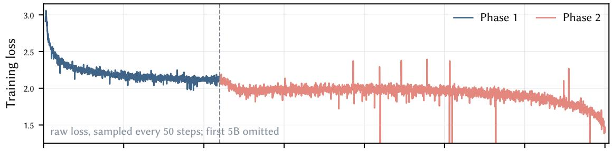

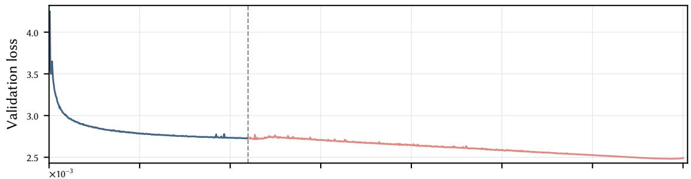

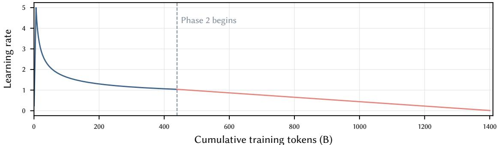  
Figure 12: Concatenated production traces. Training loss is raw (not smoothed) and sampled every 50 optimizer steps; the first 5B tokens are omited from that panel to keep the later trajectory legible. Every logged validation event is retained. The vertical line marks the Phase 1/Phase 2 run boundary; the Phase 2 run begins with the distribution transition. The learning rate schedule corresponds to the base LR and the Hyperball weight LR is 10 times base LR.

Phase 2 learning rate schedules. Each Phase 2 run loads the same Phase 1 endpoint and therefore starts from the same base learning rate, namely the terminal Phase 1 value $\eta _ { 0 } = 1 . 0 4 \times 1 0 ^ { - 3 }$ . We reset the Phase 2- local schedule coordinate at that shared checkpoint, $\ s 0 \ s = 0$ always means the Phase 1 endpoint, not the run’s recorded global optimizer step. Thus, for every run $j , \eta _ { \mathrm { b a s e } , j } ( 0 ) = \eta _ { 0 }$ ; the runs difer only in their linear decaysample budgets. With decay-sample budget $S _ { j }$ and terminal rate $\eta _ { \mathrm { m i n } }$ , the base schedule is

$$
\eta _ { \mathrm { b a s e } , j } ( s ) = \eta _ { 0 } + \left( \eta _ { \mathrm { m i n } } - \eta _ { 0 } \right) \frac { s } { S _ { j } } , \qquad 0 \le s \le S _ { j } .\tag{11}
$$

Here s is Phase 2 samples consumed after the common checkpoint. As in Phase 1, MuonH-controlled matrix groups multiply each base rate by 10. The five schedules share the same starting rate and $\eta _ { \mathrm { m i n } } = 1 0 ^ { - 5 }$ , but have diferent horizons of approximately 60.1, 120.1, 240.2, 480.5, and 960.9B tokens, as shown in Figure 13a. Our canonical run uses the curriculum model average and will replace the LR decay in the final steps (starting from step 218,000, lasting the last 29B tokens) of pretraining with constant-LR training. The details can be found in Section H.

FP8 implementation pipeline. The complete pipeline of our FP8 implementation is presented in Figure 14. The linear-layer GEMMs, including Fprop, Dgrad, Wgrad uses blockwise E4M3 for operands and activations. The hidden and residual flow, as well as LayerNorm and Embedding layers, use BF16. The gradient, optimizer-state accumulation and softmax remain FP32

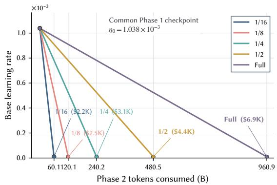  
(a) The five independent Phase 2 base learning rate schedules used in the uniform points of Figure 2b. All runs load the same Phase 1 checkpoint and therefore share the same starting base rate; they difer only in decay horizon and all decay linearly to $\dot { 1 } 0 ^ { - 5 }$

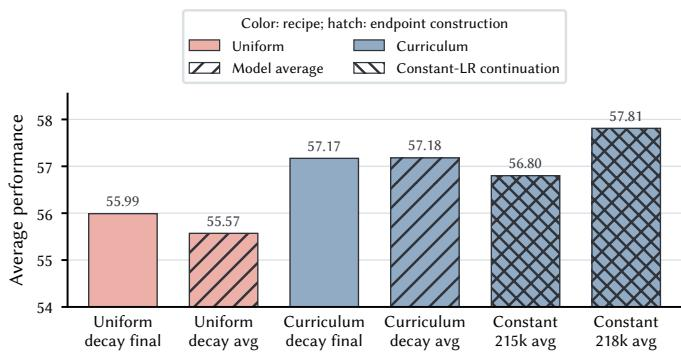  
(b) Endpoint scores for six Phase 2 configurations, ordered from left to right as the uniform decay final and model average, curriculum decay final and model average, and the model-averaged constant-LR continuations resumed from steps 215k and 218k. Colors identify data ordering: pink for uniform and blue for curriculum. The final two bars remain blue because they continue from curriculumtrained checkpoints. Forward hatching denotes model averaging, while backward hatching denotes constant-LR continuation; the final two bars are cross-hatched because they use both. The vertical axis is the fixed 15-task Avg15 aggregate.  
Figure 13: Phase 2 budget schedules and endpoint comparison. The schedule panel gives the common Phase 1 starting point and the independent uniform Phase 2 horizons; the endpoint panel compares the resulting uniform, curriculum, continuation, and averaging configurations.

## D MuonH Scaling-Ladder Analysis

Experimental setup. We construct a five-model ladder spanning model scales from 0.17B to 1.7B. Every model is trained from scratch for 20 tokens per scaling parameter (TPP=20), following the compute-optimal token-toparameter ratio reported in prior work [42]. All runs use the same data distribution, tokenizer, sequence length of 4,096, global batch size of 512, validation set, and linear learning rate decay with a 1% warmup. The validation set uses a subset ofthe Nemotron-CC corpus [89, 8]. The exact architecture and token budgets are shown in Table 11. We compare two paired recipes: (i) blockwise-FP8 MuonH against a tuned blockwise-FP8 Muon baseline to evaluate the complete optimizer recipes, and (ii) blockwise-FP8 MuonH against BF16 MuonH to isolate numerical precision. MuonH uses a base LR of $1 0 ^ { - 2 }$ and a Hyperball multiplier of 2, hence a Hyperball weight LR of ${ \bar { 2 } } \times 1 0 ^ { - 2 } .$ The updated ordinary-Muon baseline fixes weight decay at 0.8 and uses ordinary LRs ${ \bar { 5 } } \times 1 0 ^ { - 3 } ,$ $4 \times 1 0 ^ { - 3 } , 4 \times 1 0 ^ { \dot { - } 3 } , 3 \times 1 0 ^ { - 3 }$ , and $3 \times 1 0 ^ { - 3 }$ from 0.17B through 1.7B. The 0.17B and 0.33B choices are anchored by the reported LR/weight-decay searches; the larger points are conservative size-scaled extrapolations. The search results that motivate the first two LR/weight-decay anchors are tabulated in Table 10. The two precision runs use identical MuonH hyperparameters. Because the optimizer pair uses tuned, non-identical learning rate schedules, this is a complete-recipe comparison rather than an isolated hyperball-constraint ablation. These two experiment results are summarized in Figure 10.

Compute-equivalent fitting. For each run, we use the standard dense-transformer approximation

$$
C = 6 N D ,\tag{12}
$$

where D is the number of training tokens and $N = D / 2 0$ is the scaling parameter count implied by the ladder construction. To compare a baseline b and variant v, we jointly fit the ten observations with

$$
L _ { g } ( C ) = L _ { \infty } + A _ { g } \left( \frac { C } { C _ { 0 } } \right) ^ { - \alpha } , \qquad g \in \{ b , v \} ,\tag{13}
$$

sharing $L _ { \infty }$ and α while allowing a group-specific amplitude. The resulting horizontal multiplier is

$$
\kappa _ { v  b } = ( \frac { A _ { b } } { A _ { v } } ) ^ { 1 / \alpha } .\tag{14}
$$

Thus, the variant requires $C / \kappa _ { v  b }$ to match the fited baseline loss at compute C. This restricted shared-shape fit estimates a horizontal eficiency shift; it is not used to select a learning rate schedule or to predict the absolute loss of the 2B production run.

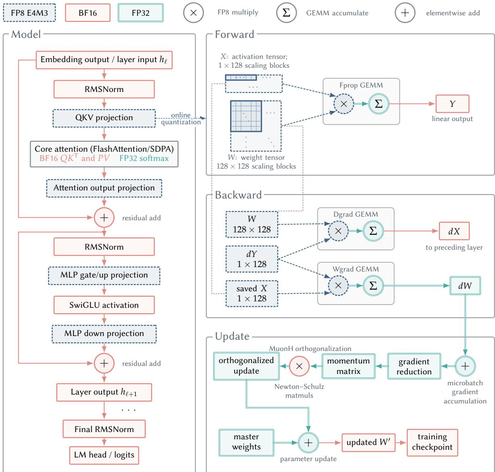  
Figure 14: Precision flow for the FP8 recipe. Linear-layer GEMMs use blockwise E4M3 for operands and saved activations. The surrounding outputs, communication tensors, and checkpoint weights remain BF16, while gradient and optimizer-state accumulation remains FP32.

As shown in Figure 10a, MuonH has a fited compute-equivalent multiplier of1.19× relative to the updated Muon baseline. Leaving out one model size at a time gives $\dot { 1 . 1 7 } – 1 . 2 8 \times$ , showing that the estimate is not determined by one endpoint. Applying this horizontal factor to the $1 . 6 8 \times 1 0 ^ { 2 2 } – \mathrm { F L O P }$ budget of a 2B/1.4T-token run gives $1 . 4 1 \times 1 0 ^ { 2 2 }$ FLOPs at matched Muon loss, corresponding to 16.1% less compute. This transfer assumes that the optimizer’s horizontal eficiency factor persists beyond the 20-TPP ladder; we therefore report it as an estimated compute-equivalent saving rather than an absolute large-run loss prediction. The leave-one-out range measures sensitivity to individual ladder points, not uncertainty from the selected functional form.

Precision and throughput decomposition. To compare training cost without including evaluation, checkpoint, or experiment-tracking intervals, we convert theoretical compute to GPU-hours using

$$
H = \frac { C } { 3 6 0 0 \times 1 0 ^ { 1 2 } \times \bar { p } } ,\tag{15}
$$

where $\bar { p }$ is the median per-GPU throughput in TFLOP/s over training-step history. Because H is measured in aggregate GPU-hours, the world-size factor cancels. Figure 10b reports the matched validation-loss gap across all five sizes but shows throughput only for the 1.7B run. Smaller models have smaller GEMMs and need not expose the throughput behavior relevant to the 2B production configuration, so their throughput ratios are omited from the main figure rather than treated as part of the production proxy.

Table 10: Completed LR–weight-decay search results used to select the updated blockwise-FP8 Muon baseline anchors. The search stages are labeled initial or extended. Bold rows mark the best completed seting at each anchor size.
<table><tr><td>Model</td><td>Search stage</td><td>Ordinary LR</td><td>Weight decay</td><td>Final validation loss</td></tr><tr><td>0.17B</td><td>initial</td><td> $2 \times 1 0 ^ { - 3 }$ </td><td>0.1</td><td>3.413030</td></tr><tr><td>0.17B</td><td>initial</td><td> $2 \times 1 0 ^ { - 3 }$ </td><td>0.2</td><td>3.406015</td></tr><tr><td>0.17B</td><td>initial</td><td> $2 \times 1 0 ^ { - 3 }$ </td><td>0.4</td><td>3.391572</td></tr><tr><td>0.17B</td><td>initial</td><td> $2 \times 1 0 ^ { - 3 }$ </td><td>0.8</td><td>3.375170</td></tr><tr><td>0.17B</td><td>initial</td><td> $3 \times 1 0 ^ { - 3 }$ </td><td>0.1</td><td>3.414363</td></tr><tr><td>0.17B</td><td>initial</td><td> $3 \times 1 0 ^ { - 3 }$ </td><td>0.2</td><td>3.405061</td></tr><tr><td>0.17B</td><td>initial</td><td> $3 \times 1 0 ^ { - 3 }$ </td><td>0.4</td><td>3.383846</td></tr><tr><td>0.17B</td><td>initial</td><td> $3 \times 1 0 ^ { - 3 }$ </td><td>0.8</td><td>3.361907</td></tr><tr><td>0.17B</td><td>initial</td><td> $4 \times 1 0 ^ { - 3 }$ </td><td>0.1</td><td>3.413549</td></tr><tr><td>0.17B</td><td>initial</td><td> $4 \times 1 0 ^ { - 3 }$ </td><td>0.2</td><td>3.398726</td></tr><tr><td>0.17B</td><td>initial</td><td> $4 \times 1 0 ^ { - 3 }$ </td><td>0.4</td><td>3.381147</td></tr><tr><td>0.17B</td><td>initial</td><td> $4 \times 1 0 ^ { - 3 }$ </td><td>0.8</td><td>3.357248</td></tr><tr><td>0.17B</td><td>extended</td><td> $4 \times 1 0 ^ { - 3 }$ </td><td>1.6</td><td>3.352910</td></tr><tr><td>0.17B</td><td>extended</td><td> $\mathbf { 5 \times 1 0 ^ { - 3 } }$ </td><td>0.8</td><td>3.349810</td></tr><tr><td>0.17B</td><td>extended</td><td> $5 \times 1 0 ^ { - 3 }$ </td><td>1.6</td><td>3.360720</td></tr><tr><td>0.17B</td><td>extended</td><td> $6 \times 1 0 ^ { - 3 }$ </td><td>0.8</td><td>3.356287</td></tr><tr><td>0.17B</td><td>extended</td><td> $6 \times 1 0 ^ { - 3 }$ </td><td>1.6</td><td>3.370632</td></tr><tr><td>0.33B</td><td>initial</td><td> $2 \times 1 0 ^ { - 3 }$ </td><td>0.2</td><td>3.156636</td></tr><tr><td>0.33B</td><td>initial</td><td> $2 \times 1 0 ^ { - 3 }$ </td><td>0.4</td><td>3.142686</td></tr><tr><td>0.33B</td><td>initial</td><td> $2 \times 1 0 ^ { - 3 }$ </td><td>0.8</td><td>3.122845</td></tr><tr><td>0.33B</td><td>initial</td><td> $3 \times 1 0 ^ { - 3 }$ </td><td>0.2</td><td>3.150765</td></tr><tr><td>0.33B</td><td>initial</td><td> $3 \times 1 0 ^ { - 3 }$ </td><td>0.8</td><td>3.116963</td></tr><tr><td>0.33B</td><td>extended</td><td> $3 \times 1 0 ^ { - 3 }$ </td><td>1.6</td><td>3.117189</td></tr><tr><td>0.33B</td><td>initial</td><td> $\mathbf { 4 } \times \mathbf { 1 0 } ^ { - 3 }$ </td><td>0.8</td><td>3.114583</td></tr><tr><td>0.33B</td><td>extended</td><td> $4 \times 1 0 ^ { - 3 }$ </td><td>1.6</td><td>3.130430</td></tr><tr><td>0.33B</td><td>initial</td><td> $5 \times 1 0 ^ { - 3 }$ </td><td>0.8</td><td>3.120008</td></tr><tr><td>0.33B</td><td>extended</td><td> $5 \times 1 0 ^ { - 3 }$ </td><td>1.6</td><td>3.139534</td></tr></table>

Table 11: Architecture and training setup of the MuonH scaling ladder. All models use a sequence length of 4,096, global batch size 512, 28 layers, and 20 training tokens per scaling parameter. $H _ { Q }$ and $H _ { K V }$ denote query and grouped-query KV heads; $d _ { \mathrm { c h } }$ is the configured atention channel width (kv\_channels), and $d _ { Q K }$ and d are the configured QK and value head dimensions.
<table><tr><td>Scale</td><td>L</td><td> $d _ { \mathrm { m o d e l } }$ </td><td> $d _ { \mathrm { f f } }$ </td><td> $H _ { Q }$ </td><td> $H _ { K V }$ </td><td> $d _ { \mathrm { c h } }$ </td><td> $d _ { Q K }$ </td><td> $d _ { V }$ </td><td>MBS</td><td>Steps</td><td>Tokens</td><td> $C = 6 N D$ </td></tr><tr><td>0.17B</td><td>28</td><td>512</td><td>1536</td><td>8</td><td>8</td><td>64</td><td>128</td><td>128</td><td>4</td><td>1700</td><td>3.57B</td><td> $3 . 8 1 \times 1 0 ^ { 1 8 }$ </td></tr><tr><td>0.33B</td><td>28</td><td>768</td><td>2304</td><td>16</td><td>8</td><td>64</td><td>128</td><td>128</td><td>4</td><td>3100</td><td>6.50B</td><td> $1 . 2 7 \times 1 0 ^ { 1 9 }$ </td></tr><tr><td>0.60B</td><td>28</td><td>1024</td><td>3072</td><td>16</td><td>8</td><td>128</td><td>128</td><td>128</td><td>2</td><td>5400</td><td>11.32B</td><td> $3 . 8 5 \times 1 0 ^ { 1 9 }$ </td></tr><tr><td>1.09B</td><td>28</td><td>1536</td><td>4608</td><td>16</td><td>8</td><td>128</td><td>128</td><td>128</td><td>1</td><td>10200</td><td>21.39B</td><td> $1 . 3 7 \times 1 0 ^ { 2 0 }$ </td></tr><tr><td>1.70B</td><td>28</td><td>2048</td><td>6144</td><td>16</td><td>8</td><td>128</td><td>128</td><td>128</td><td>1</td><td>16400</td><td>34.39B</td><td> $3 . 5 5 \times 1 0 ^ { 2 0 }$ </td></tr></table>

At fixed theoretical compute, blockwise FP8 is consistently 0.0031–0.0039 higher in validation loss than BF16 across the ladder. A BF16-versus-FP8 fit in theoretical-compute space estimates 98.0% efective-compute retention; leave-one-size-out fits range from 97.6–98.1%. This corresponds to a 2.0% nominal-compute penalty at matched quality. At 1.7B, median throughput increases by 1.36×. Using this largest-scale measured throughput ratio as a proxy for the 2B seting and accounting for the fited precision penalty, we obtain a ladder-derived, quality-adjusted speedup estimate of 1.34×, corresponding to an estimated 25.2% reduction in GPU-hours at matched quality. The FP8 speedup is a ladder-derived estimate. It combines the five-size quality fit with the measured 1.7B throughput ratio, then uses that ratio as a proxy for the 2B production seting.

MuonH diagnostic traces. To make the optimizer comparison more concrete, this appendix plots Figure 15, the learning rate and update diagnostics for the FC28 matrix in the 170M-parameter BF16 experiment used for Figure 5. The aligned and base Muon runs record per-group efective learning rates, weight norms, and raw update norms. The MuonH run records the shared base schedule rather than these per-group fields, so its efective LR target is reconstructed as $1 0 \eta _ { t } ^ { \mathrm { b a s e } }$ from the configured Hyperball multiplier. Its weight norm is therefore not drawn as an inferred measurement; projection keeps it at the prescribed initial radius.

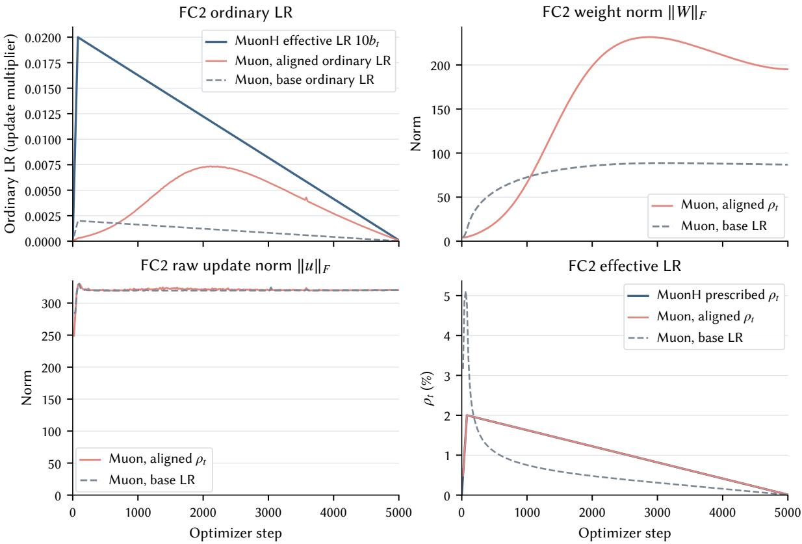  
Figure 15: FC2 represents the second layer of FFN. Here we present the FC2 diagnostics for the BF16 MuonH comparison in Figure 5. The upper-left panel shows the ordinary LR, namely the scalar coeficient that multiplies the ordinary-Muon optimizer update; the lower-right panel shows the induced efective LR. The MuonH curves in both panels are reconstructed from the shared schedule, while the norm panels show the aligned/base Muon traces.

## E Post-Training Details

Experimental scope. The three post-training setings cover complementary data scales and downstream objectives. The focused mathematics seting contains 191,767 packed records and 41.4M assistant-supervised tokens, excludes pretraining replay, and is repeated with three SFT data orders. The scaled mathematics seting contains 2,014,933 conversations, including 99,989 replay records, and runs for 2,431 optimizer steps with the same three-way repetition. The broad instruction seting contains 264,612 packed records and 82.2M supervised tokens, with its paired comparison reported at step 300.

Focused mathematics budget. The focused seting makes GSM8K the dominant supervised signal within a mixed training stream. Both initialization arms use the same materialized data order within each repetition and run for 172 optimizer steps. Steps 100 and 172 are predefined intermediate and endpoint measurements.

Focused mathematics repetitions. All six matched comparisons favor curriculum initialization, including all three endpoint runs. The endpoint advantage ranges from 1.36 to 2.12 percentage points and averages 1.77 points. This repeated direction is the primary uncertainty check for the focused experiment.

Table 12: Focused GSM8K results under the formal evaluation protocol. Each of the three repetitions reports a paired Uniform/Curriculum evaluation at the predefined intermediate step 100 and final step 172. Uniform and Curriculum are accuracies in percent, and ∆ is Curriculum minus Uniform in percentage points. For the corresponding correct-answer sets C and U, IoU is $| C \cap U | / | C \cup U | ; \mathbf { C }$ -only and U-only count questions solved only by the curriculum- and uniform-initialized models, respectively. The final two rows average the accuracies and ∆ across the three repetitions at each step; set-overlap statistics are not aggregated.
<table><tr><td>Run</td><td>Step</td><td>Uniform</td><td>Curriculum</td><td>∆</td><td>IoU</td><td>C-only</td><td>U-only</td></tr><tr><td>1</td><td>100</td><td>65.88</td><td>67.40</td><td>+1.52</td><td>.707</td><td>161</td><td>141</td></tr><tr><td>1</td><td>172</td><td>67.32</td><td>69.14</td><td>+1.82</td><td>.754</td><td>138</td><td>114</td></tr><tr><td>2</td><td>100</td><td>66.41</td><td>68.39</td><td>+1.97</td><td>.723</td><td>156</td><td>130</td></tr><tr><td>2</td><td>172</td><td>67.10</td><td>69.22</td><td>+2.12</td><td>.721</td><td>160</td><td>132</td></tr><tr><td>3</td><td>100</td><td>66.11</td><td>66.72</td><td>+0.61</td><td>.724</td><td>144</td><td>136</td></tr><tr><td>3</td><td>172</td><td>66.26</td><td>67.63</td><td>+1.36</td><td>.730</td><td>147</td><td>129</td></tr><tr><td>Mean</td><td>100</td><td>66.14</td><td>67.50</td><td>+1.36</td><td>一</td><td>一</td><td>一</td></tr><tr><td>Mean</td><td>172</td><td>66.89</td><td>68.66</td><td>+1.77</td><td>一</td><td>一</td><td>一</td></tr></table>

Training configuration. The focused experiment uses one node with eight RTX 5090 GPUs, tensor parallelism 1, pipeline parallelism 2, micro-batch size 1, global batch size 160, sequence length 4,096, and document-isolated packed atention. MuonH uses a base LR of $\bar { 1 0 } ^ { - 5 }$ for AdamW-managed parameters and a 10-times multiplier for the matrix-group Hyperball weight LR, with momentum $0 . 9 , \epsilon = 1 \bar { 0 } ^ { - 1 \bar { 2 } }$ , Adam betas (0.9, 0.95), and an ending base LR of $\bar { 1 } 0 ^ { - 7 }$ . Validation and checkpointing follow fixed step intervals. The scaled and broad setings retain the same matched-arm principle while adapting batch size and duration to their data budgets. The matched setup applies within each seting: for a given seting and repetition, the curriculum and uniform arms use the same tokenizer, packed records and data order, optimizer, learning rate schedule, and other training configuration; only the pretraining initialization difers. The focused, scaled, and broad setings intentionally difer in data mixture and supervised-token budget. These setings are therefore complementary probes rather than a direct comparison of training curves; the controlled contrast is curriculum versus uniform within each seting.

Formal GSM8K scoring. The reported score evaluates all 1,319 GSM8K test examples with zero-shot ChatML prompting, greedy BF16 generation, and a 512-token generation limit. The extractor truncates any generated continuation that begins a new user turn, prioritizes explicit final-answer phrases, and then extracts answers according to the established format. Exact numeric equivalence determines correctness after normalization.

Analysis of correct answers. The overlap statistics quantify whether curriculum changes which questions are solved. For correct sets C and U, IoU is $| C \cap U | / | C \cup { \dot { U } } |$ , while C-only and U-only count asymmetric successes. Every row in Table 12 has more C-only than U-only examples, which shows that the gain is not produced solely by averaging across conflicting runs. Manual response inspection further separates numerical correctness from answer termination and parsing behavior.

Scaled mathematics endpoint. The scaled seting reproduces the curriculum advantage after a longer and more diverse SFT schedule. Curriculum is ahead in all three endpoint runs, with a mean improvement of 2.02 percentage points and an observed range of 1.21 to 3.26 points.

Table 13: Scaled mathematics GSM8K endpoint results across three repetitions. Uniform and Curriculum are final accuracies in percent, and ∆ is Curriculum minus Uniform in percentage points. For the corresponding correct-answer sets C and U, IoU is $| C \cap U | / | C \cup U | ;$ C-only and U-only count questions solved only by the curriculum- and uniform-initialized models, respectively. The Mean row averages the accuracies and ∆ across the three repetitions; set-overlap statistics are not aggregated.
<table><tr><td>Run</td><td>Uniform</td><td>Curriculum</td><td>Δ</td><td>IoU</td><td> $\scriptstyle \mathrm { C - o n l y }$ </td><td>U-only</td></tr><tr><td>1</td><td>73.24</td><td>76.50</td><td>+3.26</td><td>.792</td><td>136</td><td>93</td></tr><tr><td>2</td><td>75.06</td><td>76.27</td><td>+1.21</td><td>.798</td><td>120</td><td>104</td></tr><tr><td>3</td><td>74.00</td><td>75.59</td><td>+1.59</td><td>.786</td><td>129</td><td>108</td></tr><tr><td>Mean</td><td>74.10</td><td>76.12</td><td>+2.02</td><td>一</td><td>一</td><td>一</td></tr></table>

Broad instruction aggregate. The broad instruction seting uses an unweighted macro-average over 15 task scores as its primary summary. This convention prevents benchmarks with more examples from dominating the aggregate and keeps the paired curriculum-minus-uniform diference interpretable. Curriculum improves the macro-average by 1.59 percentage points and is higher on 13 component evaluations.

Table 14: Detailed paired endpoint results for the broad instruction seting. Uniform and Curriculum are percentages, and C − U is their diference in percentage points. All 15 component tasks used by the fixed macro-average are shown, including C-Eval and CMMLU. The macro-average is computed from the underlying unrounded scores before the displayed rows are rounded to two decimal places.
<table><tr><td>Benchmark</td><td>Uniform</td><td>Curriculum</td><td>C − U (pp)</td></tr><tr><td>GSM8K</td><td>59.82</td><td>59.97</td><td>+0.15</td></tr><tr><td>MATH</td><td>21.70</td><td>25.56</td><td>+3.86</td></tr><tr><td>HumanEval</td><td>44.51</td><td>41.46</td><td>-3.05</td></tr><tr><td>MBPP</td><td>50.58</td><td>51.36</td><td>+0.78</td></tr><tr><td>C-Eval</td><td>43.96</td><td>45.78</td><td>+1.82</td></tr><tr><td>CMMLU</td><td>46.64</td><td>47.19</td><td>+0.54</td></tr><tr><td>MMLU</td><td>53.66</td><td>55.55</td><td>+1.89</td></tr><tr><td>ARC-C</td><td>61.02</td><td>66.44</td><td>+5.42</td></tr><tr><td>ARC-E</td><td>80.42</td><td>81.83</td><td>+1.41</td></tr><tr><td>BoolQ</td><td>73.30</td><td>70.37</td><td>-2.93</td></tr><tr><td>CommonsenseQA</td><td>65.77</td><td>68.39</td><td>+2.62</td></tr><tr><td>HellaSwag</td><td>43.72</td><td>49.59</td><td>+5.88</td></tr><tr><td>PIQA</td><td>67.85</td><td>70.08</td><td>+2.23</td></tr><tr><td>SIQA</td><td>60.49</td><td>62.64</td><td>+2.15</td></tr><tr><td>WinoGrande</td><td>51.46</td><td>52.57</td><td>+1.10</td></tr><tr><td>15-task macro-average</td><td>54.99</td><td>56.58</td><td>+1.59</td></tr></table>

Additional transfer evaluations. The additional tasks support a broader but non-uniform transfer interpretation. Curriculum improves IFEval and MMLU-Pro, while BBH decreases modestly; together with the primary suite, curriculum is higher on 15 of 18 reported evaluations. Each task uses its own prompts and scorers.

Table 15: Additional paired Uniform/Curriculum endpoint evaluations for the broad instruction seting. Scores are percentages, and $\mathbf { \partial } \cdot \mathbf { \partial } C - U$ is the curriculum-minus-uniform diference in percentage points. IFEval probes instruction following, BBH probes challenging reasoning, and MMLU-Pro probes knowledge and reasoning; these three diagnostics are reported separately and are not included in the primary 15-task macro-average.
<table><tr><td>Benchmark</td><td>Uniform</td><td>Curriculum</td><td>C − U (pp)</td></tr><tr><td>IFEval</td><td>49.26</td><td>53.14</td><td>+3.88</td></tr><tr><td>BBH</td><td>34.94</td><td>34.19</td><td>-0.75</td></tr><tr><td>MMLU-Pro</td><td>25.58</td><td>26.08</td><td>+0.50</td></tr></table>

## F Learning Rate Schedule Diagnostics

We provide more detailed diagnostics and fiting results for learning rate schedule diagnostics in this section.

## F.1 Multi-Power Law for Efective Learning Rate Schedules

Preliminary. The Multi-Power Law (MPL) was introduced to predict loss curves across learning rate schedules from a small number of training runs [57]. We adapt the same construction to an efective learning rate signal for one selected weight group. Let $q _ { t }$ denote either the scalar optimizer learning rate coeficient $\eta _ { t }$ or the induced efective LR $\rho _ { t }$ . We define its post-warmup trapezoidal exposure as

$$
S _ { q } ( t ) = \sum _ { k = t _ { \mathrm { w a r m } } + 1 } ^ { t } \frac { q _ { k - 1 } + q _ { k } } { 2 } \Delta t _ { k } ,
$$

and let $S _ { w }$ denote the corresponding exposure accumulated during warmup under the same choice of $q .$ The resulting model is

$$
\begin{array} { r l r } & { L ( t ) = L _ { 0 } + A \left[ S _ { q } ( t ) + S _ { w } \right] ^ { - \alpha } + B \underset { t _ { \mathrm { w a r m } } < k \leq t } { \sum } \Delta q _ { k } G ( x _ { k } ( t ) ) , \ } & { \Delta q _ { k } = q _ { k } - q _ { k - 1 } , } \\ & { x _ { k } ( t ) = C q _ { k } ^ { - \gamma } \left[ S _ { q } ( t ) - S _ { q } ( k - 1 ) \right] , \ } & { G ( x ) = 1 - ( 1 + x ) ^ { - \beta } . } \end{array}\tag{16}
$$

The intuition is to decompose loss evolution into an exposure-controlled baseline and a schedule-shape correction. The first power-law term is Chinchilla-like: it treats the cumulative q-exposure $S _ { q } ( t ) + S _ { w }$ as an efective optimization-time coordinate and captures the training progress expected from that accumulated exposure. This term alone, however, does not distinguish schedules that accumulate similar exposure through diferent decay paterns.

The summation term accounts for the additional loss reduction induced by decreasing the learning rate signal. For a decaying schedule, $\Delta q _ { k } < 0$ . A decrease at step k therefore contributes a negative correction

$$
B \Delta q _ { k } G ( x _ { k } ( t ) ) = - B \left( q _ { k - 1 } - q _ { k } \right) G ( x _ { k } ( t ) )
$$

to the loss at a later step t. This benefit is not assumed to appear instantaneously. Instead, $x _ { k } ( t )$ measures the exposure accumulated after the change, rescaled by the post-change signal level $q _ { k } .$ , while $G ( x _ { k } ( t ) )$ represents the fraction of the eventual loss reduction that has been realized by time t. As subsequent exposure accumulates, $G ( x )$ approaches one, with the unrealized fraction $1 - G ( x ) = ( 1 + x ) ^ { - \beta }$ decaying according to a power law. Finally, we approximate the total schedule-shape correction by superposing the delayed responses induced by all preceding changes in q. Thus, MPL combines one power law for cumulative training progress with a collection of power-law responses to reductions in the efective learning rate signal.

A useful analytical simplification assumes that every reduction is fully realized as soon as it occurs, corresponding to $G ( x ) = 1$ . The response-weighted sum then telescopes. With $q _ { \mathrm { w a r m } } = q _ { t _ { \mathrm { w a r m } } } ,$ , we obtain

$$
\begin{array} { r } { L _ { G = 1 } ( t ) = L _ { 0 } + A \left[ S _ { q } ( t ) + S _ { w } \right] ^ { - \alpha } + B \sum _ { t _ { \mathrm { w a r m } } < k \leq t } \Delta q _ { k } } \\ { = L _ { 0 } + A \left[ S _ { q } ( t ) + S _ { w } \right] ^ { - \alpha } + B \left( q _ { t } - q _ { \mathrm { w a r m } } \right) . } \end{array}\tag{17}
$$

For a decaying schedule and $B > 0 ,$ , the final term is non-positive and lowers the predicted loss relative to the accumulated-exposure baseline. This instantaneous-response approximation discards when the individual reductions occurred: beyond their contribution to $S _ { q } ( t )$ , the correction retains only the net decrease from qwarm to $q _ { t }$ . We therefore use it as a simplified interpretation of the full response model rather than as a claim that learning rate reductions take efect instantaneously in actual training.

We test this transfer on the two BF16 ordinary-Muon runs already used in Figures 5 and 15. For each run, we fit the post-warmup validation curve using either $q _ { t } = \eta _ { t } \ \mathrm { o r } \ q _ { t } = \rho _ { t } .$ , with the final 20% of validation targets held out. Because the two signals have diferent units, each is normalized by its own post-warmup peak before fiting; this only rescales the fited constants. The fit follows the three-stage MPL protocol: power-only, power plus a schedule-drop term, and the full response above. As a simpler comparison, we also fit the $G ( x ) = 1$ model in Equation (17); unlike the formal response, this simplification retains only the current change from the warmup endpoint.

The efective LR coordinate gives a lower mean held-out RMSE in this small FC2 diagnostic (0.0210 versus 0.0265 for ordinary LR), with the largest gain for base Muon (0.0270 versus 0.0422). For aligned Muon, the two representations are comparably predictive (0.0149 and 0.0108). The simplified $G ( x ) = 1$ efective LR fit has a mean held-out RMSE of 0.0207, with 0.0270 for base Muon and 0.0144 for aligned Muon, matching the vanilla MPL of efective LR on these two curves.

Then, from the perspective of Equation (17), the loss decreasing is strongly related to the efective LR decreasing. And as shown in Figure 5, the ordinary Muon run results in an LR schedule decay aggressively in the early phase, while the MuonH and aligned Muon runs use linear LR decay. The early efective LR decay in the ordinary Muon run results in the loss of potential to decay further near the end of training. Thus, the MuonH and aligned Muon runs finally surpass the ordinary run, which is not by coincidence from this diagnostic.

## F.2 WSD Sweeps and Limited-Compute Schedule Estimation

The controlled sweeps isolate peak, horizon, and terminal-decay length. The source runs use a 0.6B decoder-only model, BF16 training, sequence length 4,096, GBS 512, MuonH multiplier 3, linear WSD decay, and one seed per configuration. TPP 20, 50, and 100 correspond to 11.32, 28.31, and 56.62B tokens. At TPP 20, all five positive decay ratios $\{ 0 . 2 , 0 . 4 , 0 . 6 , 0 . 8 , 1 . 0 \}$ are complete for efective peaks {0.008, 0.012, 0.016, 0.020, 0.024}. Peaks 0.008 and 0.012 additionally cover TPP 50 and 100. Final loss is taken from the run summary at the nominal target step, which avoids replacing the endpoint with the last observation of a sparsely sampled history. GBS is fixed, but the two lower-peak TPP20 families use micro-batch size 2 whereas peaks 0.016–0.024 use microbatch size 4; the peak trend is therefore a practical design diagnostic rather than a perfectly isolated micro-batch ablation.

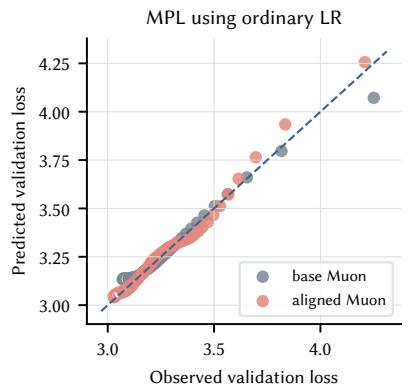

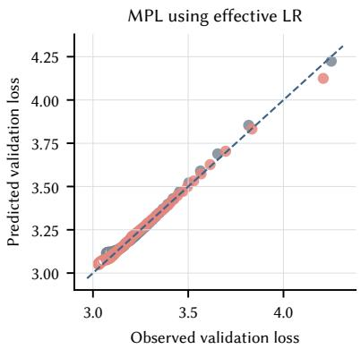

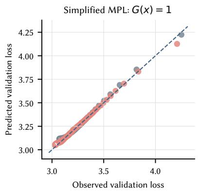  
Figure 16: MPL transfer to an efective learning rate signal for the FC2 group (MPL down-projection weight). All panels compare predicted with observed validation loss; filled markers are fiting targets and hollow markers are the final 20% holdout. Left: The formal MPL fit using the ordinary LR. Center: The formal MPL fit using the induced efective LR. Right: The simplified $G ( x ) = \breve { 1 }$ model in Equation (17), also using the induced efective LR. The two signals are normalized separately, and colors distinguish base and efective-LR-aligned Muon.

Formal MPL turns a few anchor schedules into a cross-schedule trend estimate. For the WSD experiments below, $q _ { t }$ is the post-warmup efective LR and the formal response is the one in Equation (16). Only post-warmup validation targets are fited. The three-stage procedure first fits $\left( L _ { 0 } , A , \alpha \right)$ on the first 25% of each anchor curve, then adds the instantaneous LR-drop coeficient B on the complete curves, and finally refines all formal-MPL parameters. Six initializations are compared; each curve contributes at most 16 fiting targets, while the final 10% receives weight 4. All reported WSD fits converged in all three stages.

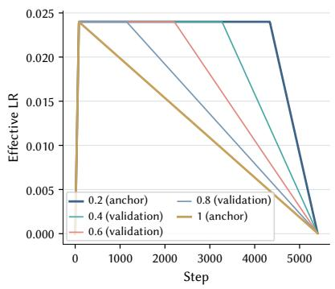

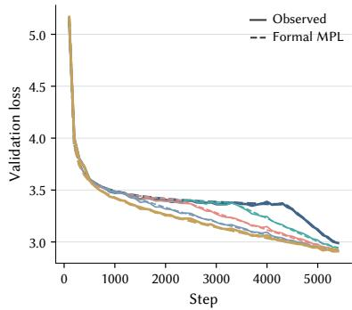

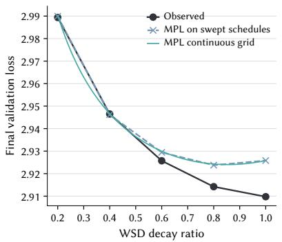  
Figure 17: A two-anchor MPL example at efective peak 0.024 and TPP 20. Only decay ratios 0.2 and 1.0 are fited; ratios 0.4, 0.6, and 0.8 are unseen validation schedules. Left: WSD schedules. Center: Held-out loss curves, with observations shown as solid lines and MPL predictions as dashed lines. Right: Final-loss ranking over the swept and continuous decay grids. The two anchors place the estimated minimum near ratio 0.85, consistent with the long-decay end of the direct sweep.

A two-anchor protocol recovers the peak-to-decay trend at fixed horizon. Each fixed-peak TPP20 fit sees only ratios 0.2 and 1.0, leaving 0.4, 0.6, and 0.8 unseen. Across these 15 unseen schedules, mean curve RMSE is 0.0157 and endpoint MAE is 0.0067. The predicted continuous-grid ratio rises as 0.33, 0.57, 0.67, 0.75, and 0.85 over peaks 0.008 through 0.024. This agrees with the monotone rise in the lower edge of the directly observed competitive region, although the individual observed grid minima remain noisy.

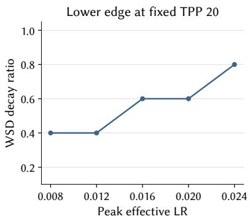

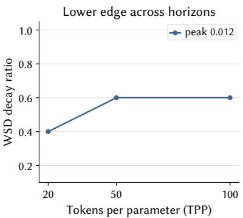

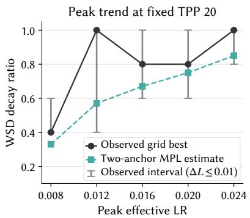  
Figure 18: WSD decay trends and the limited-compute diagnostic. Left: At fixed TPP 20, the lower edge ofthe region within 0.01 validation loss of the minimum rises nondecreasingly with efective peak LR. Center: The same lower edge across horizons for peak 0.012. Right: Black points are the best ratios on the observed TPP20 grid, gray capped intervals contain every ratio within 0.01 loss of the minimum, and green squares are continuousratio estimates from MPL fited only to ratios 0.2 and 1.0. The intervals describe competitive configurations, not uncertainty across seeds.

The estimator is a screening tool rather than an optimum certificate. The diagnostic helps choose which peak-rate and decay setings to test next. Broad plateaus, one seed per configuration, and noisy minima limit the precision of any inferred optimum. The continual-training role of the Phase 1 power schedule is likewise a design property of its open-ended tail; these WSD sweeps support the long-decay features, not the exact power exponent.

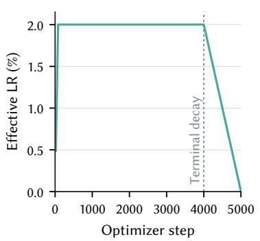  
(a) Predefined efective LR

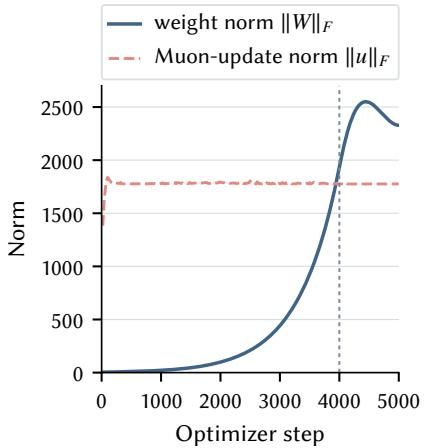  
(b) Weight and Muon-update norms

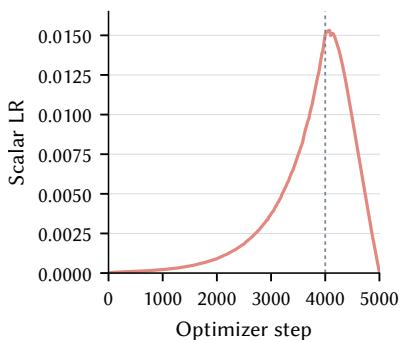  
(c) Scalar LR for ordinary Muon  
Figure 19: Indirect efective LR control in an ordinary-Muon WSD diagnostic, shown on linear axes. All quantities refer to MLP down-projection matrices. (a) The predefined efective LR holds near 2% after warmup. (b) The weight norm grows while the orthogonalized Muon-update norm stays roughly constant. (c) The scalar LR must therefore rise to maintain the efective LR before falling during terminal decay.

## F.3 Hyperball

Maintaining a prescribed efective LR without Hyperball can produce a hill-like scalar LR. The warmup–stable–decay (WSD) diagnostic in Figure 19 ramps the efective LR to 0.02, holds it there, and begins terminal decay at step 4,000. During the stable interval, the weight norm of the MLP down-projection matrices grows while the orthogonalized Muon-update norm remains roughly constant. Ordinary Muon must therefore increase its scalar LR to maintain the predefined efective LR, before reducing it during terminal decay. The run remains numerically stable and reaches validation loss 3.0678 after 5,000 steps. This constructed example shows why a scalar LR curve cannot be interpreted without its induced efective LR schedule; it demonstrates feasibility, not optimality or a universal requirement for ordinary Muon.

## G Puro-2B Scaling Checkpoint Ledger

The following ledger freezes the identifiers and accounting coordinates used by Figure 2(b). Phase 1 is shared by all rows. Phase 2 tokens are schedule consumption, so the production Phase 2 pool is not added a second time when the early transition range is listed. The endpoint comparison is visualized in Figures 7 and 13b.

Table 1 6 : Checkpoint lineage for the five uniform points in the Puro Cost Scaling Law the curriculum decay endpoint and the canonical averaged model. GPU-hours are total active-training GPU-hours and costs use the normalized RTX 5 090 rate and are reported in USD. Here SMA6 (simple moving average) denotes the equal weight average of model parameters from six late checkpoints on the step-2 1 8 000 constant-LR continuation; optimizer states are not averaged (details in Section H. 3) .
<table><tr><td>Released checkpoint ID</td><td>Phase 2 tokens</td><td>Total tokens</td><td>Phase 2 ordering</td><td>Model averaging</td><td>Total GPU-h</td><td>Cost (USD)</td></tr><tr><td>Puro-2B-Uniform-Phase2-1of16</td><td>60.00B</td><td>498.83B</td><td>Uniform global reshuffle</td><td>No</td><td>7,041</td><td>$2.16K</td></tr><tr><td>Puro-2B-Uniform-Phase2-1of8</td><td>120.00B</td><td>558.83B</td><td>Uniform global reshuffle</td><td>No</td><td>8,073</td><td>$2.47K</td></tr><tr><td>Puro-2B-Uniform-Phase2-1of4</td><td>240.00B</td><td>678.83B</td><td>Uniform global reshuffle</td><td>No</td><td>10,136</td><td>$3.10K</td></tr><tr><td>Puro-2B-Uniform-Phase2-1of2</td><td>480.00B</td><td>918.83B</td><td>Uniform global reshuffle</td><td>No</td><td>14,262</td><td>$4.37K</td></tr><tr><td>Puro-2B-Uniform</td><td>959.99B</td><td>1.40T</td><td>Uniform global reshuffle</td><td>No</td><td>22,514</td><td>$6.89K</td></tr><tr><td>Puro-2B-Curriculum-DecayFinal</td><td>959.99B</td><td>1.40T</td><td>Component-local curriculum; decay final</td><td>No</td><td>22,514</td><td>$6.89K</td></tr><tr><td>Puro-2B-Base</td><td>959.99B</td><td>1.40T</td><td>Curriculum + late constant LR</td><td>Yes (SMA6)</td><td>22,514</td><td>$6.89K</td></tr></table>

Table 1 7 : 1 5 -benchmark score sheet for the uniform and curriculum branches Scores are percentages and Avg 1 5 is the unweighted arithmetic mean over the 1 5 displayed benchmarks . The canonical Puro-2B row is the released six-checkpoint SMA endpoint; the other rows report the corresponding single-checkpoint or averaged branch evaluations.
<table><tr><td>Model</td><td>GSM8K</td><td>MATH</td><td>MBPP</td><td>HumanEval</td><td>MMLU</td><td>MMLU-Pro</td><td>ARC-C</td><td>ARC-E</td><td>BoolQ</td><td>CSQA</td><td>HSwag</td><td>PIQA</td><td>SIQA</td><td>WinoGrande</td><td>BBH</td><td>Avg15</td></tr><tr><td>Uniform 1/16</td><td>47.23</td><td>21.78</td><td>45.53</td><td>18.90</td><td>49.71</td><td>20.67</td><td>61.02</td><td>79.19</td><td>75.11</td><td>65.68</td><td>62.28</td><td>75.30</td><td>60.18</td><td></td><td>59.51 37.66</td><td>51.98</td></tr><tr><td>Uniform 1/8</td><td>48.22</td><td>24.64</td><td>46.69</td><td>25.00</td><td>51.37</td><td>22.29</td><td>63.39</td><td>79.54</td><td>77.16</td><td>64.78</td><td>61.25</td><td>75.90</td><td>60.24</td><td>59.98</td><td>38.09</td><td>53.24</td></tr><tr><td>Uniform 1/4</td><td>42.30</td><td>26.02</td><td>48.64</td><td>23.78</td><td>53.96</td><td>23.83</td><td>66.44</td><td>81.83</td><td>74.83</td><td>65.27</td><td>62.59</td><td>76.17</td><td>63.10</td><td>60.22</td><td>41.20</td><td>54.01</td></tr><tr><td>Uniform 1/2 ($4.4K)</td><td>56.03</td><td>27.86</td><td>49.81</td><td>20.73</td><td>54.82</td><td>24.02</td><td>66.78</td><td>84.66</td><td>77.34</td><td>67.65</td><td>63.62</td><td>75.84</td><td>62.90</td><td>59.91</td><td>41.14</td><td>55.54</td></tr><tr><td>Uniform decay avg</td><td>55.72</td><td>26.70</td><td>50.58</td><td>18.90</td><td>56.23</td><td>24.87</td><td>68.81</td><td>84.13</td><td>79.27</td><td>67.16</td><td>63.32</td><td>77.69</td><td>62.64</td><td>60.30</td><td>37.29</td><td>55.57</td></tr><tr><td>Uniform full</td><td>55.72</td><td>26.94</td><td>50.19</td><td>20.73</td><td>56.22</td><td>25.55</td><td>70.17</td><td>84.83</td><td>79.48</td><td>67.49</td><td>63.30</td><td>77.58</td><td>62.64</td><td>60.38</td><td>38.75</td><td>56.00</td></tr><tr><td>Curriculum decay final</td><td>57.77</td><td>29.68</td><td>52.14</td><td>25.00</td><td>57.11</td><td>25.56</td><td>73.56</td><td>85.89</td><td>76.24</td><td>68.88</td><td>63.38</td><td>75.46</td><td>64.43</td><td>60.93</td><td>41.45</td><td>57.17</td></tr><tr><td>Curriculum decay avg</td><td>57.32</td><td>29.30</td><td>51.75</td><td>26.22</td><td>57.12</td><td>26.50</td><td>73.56</td><td>86.07</td><td>76.18</td><td>69.29</td><td>62.96</td><td>75.63</td><td>64.33</td><td>60.69</td><td>40.80</td><td>57.18</td></tr><tr><td>Constant 215k avg</td><td>55.95</td><td>28.18</td><td>50.19</td><td>25.00</td><td>57.05</td><td>26.09</td><td>75.93</td><td>86.07</td><td>74.80</td><td>67.73</td><td>62.72</td><td>75.41</td><td>62.69</td><td>61.48</td><td>42.78</td><td>56.80</td></tr><tr><td>Canonical Puro-2B ($6.9K)</td><td>59.67</td><td>30.30</td><td>52.92</td><td>31.10</td><td>57.44</td><td>25.81</td><td>74.24</td><td>86.07</td><td>76.85</td><td>67.81</td><td>63.21</td><td>75.52</td><td>63.61</td><td>60.62</td><td>42.05</td><td>57.81</td></tr></table>

## H Curriculum Construction and Model Averaging

This appendix specifies our concrete Phase 2 curriculum and model-averaging configuration. The curriculum first assigns each example a component-local token-percentile coordinate under the configured preference order of its own component. Scores are therefore used only to order examples within a component; we do not assume that scores are comparable across components. Equal percentile ranges from all components are then aligned into production curriculum buckets, which approximately preserves the configured component mixture while allowing each scored component to progress through its own preference order.

The Phase 2 schedule begins with a transition that combines deterministic Phase 1 replay with the earliest ranges of the Phase 2 curriculum. The released endpoint subsequently uses a constant learning rate continuation and an equal-weight parameter average over six late checkpoints. We first describe the scalable construction of the curriculum coordinates and buckets, then specify the transition and uniform-order control, and finally document the continuation, averaging rule, and scope of the available comparisons.

## H.1 Scalable Construction of Component-Local Curriculum Buckets

For each component, the curriculum construction must determine where an example lies within that component’s ordered token range. An exact implementation could sort every document by

## (configured score, stable hash),

compute cumulative token counts over the sorted rows, and divide the resulting token range into 376 equalpercentile intervals. Applying document-level distributed sorts and cumulative windows to the full Phase 2 pool would, however, incur substantial Spark shufle and serialization overhead. We therefore approximate the same component-local token coordinate using a smaller collection of aggregated internal bins.

For a component with a usable score, preprocessing first applies the configured score direction so that the resulting sequence runs from the less-preferred to the more-preferred score range. Spark’s approximate-quantile operation then estimates 256 score intervals with relative error 0.01. Each interval is subdivided into 64 deterministic hash shards. The score intervals determine the coarse preference order, while the hash shards provide deterministic ordering and finer token-accounting granularity among examples with equal or nearly equal scores. Thus, a scored component contains up to 256 score-ordered strata, each with 64 deterministic subdivisions, although repeated score values can produce fewer distinct strata. Null scores are placed at the configured least-preferred end.

A component without a usable score instead uses 4096 deterministic random shards. These shards define a reproducible component-local order, but we do not interpret that order as a quality or dificulty ranking.

Preprocessing next aggregates the token count of every internal bin. For internal bin j in component $c ,$ let $T _ { c , j }$ be its token count and let

$$
T _ { c } = \sum _ { j } T _ { c , j }
$$

be the total number of tokens in the component. The token fraction preceding bin j is

$$
p _ { c , j } = { \frac { \sum _ { i < j } T _ { c , i } } { T _ { c } } } .\tag{18}
$$

The implementation additionally uses a deterministic within-bin position to spread examples over the token interval occupied by that bin. For exposition, let $u _ { c , j } ( x ) \in [ 0 , 1 \bar { ) }$ denote the resulting fractional position of example x within bin j. Its component-local token coordinate can then be writen as

$$
p ( x ) = \frac { \sum _ { i < j ( x ) } T _ { c , i } + u _ { c , j ( x ) } ( x ) T _ { c , j ( x ) } } { T _ { c } } .\tag{19}
$$

Thus, $p ( x ) = 0 . 2 5$ means that x appears after approximately 25% of the token mass of its own component, irrespective of how many documents produce those tokens. Using token mass rather than document count prevents a short document and a very long document from contributing equally to the curriculum coordinate.

Each example is mapped to one of 376 production curriculum buckets:

$$
b ( x ) = \operatorname* { m i n } \left\{ 3 7 5 , \ : \left\lfloor 3 7 6 \ : p ( x ) \right\rfloor \right\} .\tag{20}
$$

Equivalently, bucket k receives from every component the examples whose component-local token coordinates lie approximately in

$$
\left[ { \frac { k } { 3 7 6 } } , { \frac { k + 1 } { 3 7 6 } } \right) , \qquad k = 0 , \ldots , 3 7 5 .
$$

Consequently, each production bucket draws approximately the same token fraction from every component. This alignment approximately preserves the configured component mixture across the curriculum while allowing diferent components to follow their own source-local preference orders. In particular, the construction does not impose a single global quality ranking over examples from diferent sources.

The internal bins and the 376 production buckets serve distinct purposes. The internal score strata and hash shards provide scalable ordering resolution, handle repeated score values, and support token-based cumulative accounting without a document-level global sort. The 376 production buckets are the units consumed by the training schedule and contain approximately 2.5B tokens each. Their boundaries are determined by cumulative token mass rather than by combining a fixed number of internal bins.

## H.2 Phase Transition and Uniform-Order Control

The Phase 2 schedule begins with a transition from the Phase 1 mixture to the ordered Phase 2 pool. The materialized transition contains approximately 43.9B tokens: 21.9B tokens of deterministic Phase 1 replay and 21.9B tokens from the earliest 2.34% of the ordered Phase 2 range. The later is a subset of the frozen Phase 2 component pool rather than an additional copy of Phase 2 data. Therefore, only the Phase 1 replay is added to the component-pool total when computing the complete production schedule.

Table 18: Token ledger for the Phase 2 transition and production schedule. The Phase 2 early range is already included in the component pool; the production total adds only the Phase 1 replay.
<table><tr><td>Stream or quantity</td><td>Tokens</td><td>Definition</td></tr><tr><td>Phase 1 replay</td><td>21,933,027,646</td><td>Deterministic stable-hash sample from the Phase 1 mixture.</td></tr><tr><td>Phase 2 early range</td><td>21,933,020,221</td><td>Earliest approximately 2.34% of the ordered Phase 2 pool.</td></tr><tr><td>Realized transition</td><td>43,866,047,867</td><td>Phase 1 replay combined with the Phase 2 early range.</td></tr><tr><td>Remaining Phase 2 range</td><td>916,126,881,730</td><td>Portion of the Phase 2 pool following the early tran- sition range.</td></tr><tr><td>Phase 2 component pool Production Phase 2 schedule</td><td>938,059,901,951</td><td>Early range plus the remaining Phase 2 range.</td></tr><tr><td></td><td>959,992,929,597</td><td>Phase 2 component pool plus Phase 1 replay.</td></tr></table>

The aligned bucket construction approximately preserves the groups recorded in the frozen preprocessing manifest throughout the non-transition portion of Phase 2. These scheduler diagnostics use the manifest taxonomy rather than the semantic-domain taxonomy used in the main data tables. The two taxonomies difer for the code-only MegaMath-Code partition: the frozen preprocessing manifest retains its original Mathematics label, whereas Tables 3 and 20 reports that partition under Code.

Table 19: Observed manifest-group token-share ranges across non-transition Phase 2 curriculum buckets.
<table><tr><td>Manifest group</td><td>Observed token-share range</td></tr><tr><td>Chinese</td><td>9.25%-9.54%</td></tr><tr><td>Code</td><td>6.37%–8.73%</td></tr><tr><td>English</td><td>58.32%–59.79%</td></tr><tr><td>Mathematics</td><td>22.38%–22.98%</td></tr><tr><td>Instruction-formatted</td><td>1.30%-1.40%</td></tr></table>

Examples in the transition portion are deterministically shufled with seed 20260601, and the subsequent curriculum buckets use seed 20260602. The uniform-order stream is constructed from the same materialized Phase 2 component pool, but removes the aligned curriculum order through a deterministic global reshufle with seed 20260609. Thus, the curriculum and uniform streams match the Phase 2 token multiset at the pool level while difering in its presentation order.

All streams are materialized before training rather than generated by an online sampler. Reproducing their exact contents and order additionally requires the corresponding materialized manifests, source revisions, and checksums; the random seeds alone are not a complete specification.

## H.3 Constant-LR Continuation and Checkpoint Averaging

The available late-stage configurations include averaging without launching a new continuation, a constant-LR continuation resumed from step 215,000, and a constant-LR continuation resumed from step 218,000. The production export uses the branch resumed from step 218,000. These configurations were not constructed as a matched ablation over continuation entry points. Their comparison therefore motivates a production configuration choice but does not establish that step 218,000 is an optimal resume point.

At step 218,000, the logged base learning rate coeficient is $4 . 0 8 \times 1 0 ^ { - 5 }$ . The MuonH matrix-parameter group applies a multiplier of 10, yielding a group-level coeficient of $4 . 0 8 \times 1 0 ^ { - 4 }$ . The continuation holds these coefficients fixed instead of following the remaining terminal decay. For a MuonH-wrapped matrix, the group-level coeficient is the prescribed efective LR defined in Section 3.3.

The production model equally averages the model parameters stored at the following six optimizer steps:

222,100, 222,200, 222,300,

222,400, 222,500, 222,569.

The averaging window spans 469 optimizer steps, corresponding to approximately 2.95B training tokens under the production batch configuration. Most neighboring checkpoints are separated by 100 optimizer steps, or approximately 0.63B tokens, while the final interval contains 69 steps.

Only model parameters are averaged; optimizer moments and other optimizer states are not. The released model therefore contains the equal-weight arithmetic mean of the six checkpoints above rather than the parameters of the unaveraged final iterate. Our implementation uses this simple model average, whereas the reference CMA method evaluates several averaging rules and uses an exponential moving average over the final six checkpoints as its default configuration [56].

## H.4 Scope of the Available Comparison

The available evidence compares complete Phase 2 configurations rather than isolating the contribution of every constituent design choice. The curriculum and uniform streams use the same materialized Phase 2 component pool, but the available model runs do not form a complete factorial experiment over data ordering, constant-LR continuation, and checkpoint averaging.

A component-level atribution would require, at minimum, crossing curriculum and uniform ordering with averaging enabled and disabled under the same continuation learning rate. Isolating the continuation itself would additionally require matched runs that vary the continuation rate or branch point while holding the data pool, transition, token budget, and evaluation protocol fixed. Repeated training seeds would then be needed to quantify run-to-run uncertainty.

Because these controls are not available, we do not assign an isolated compute-equivalent gain to curriculum ordering, constant-LR continuation, or checkpoint averaging. We instead interpret the result as evidence about the joint curriculum-and-averaging configuration. The downstream analysis in Section 5 compares the resulting curriculum and uniform pretrained endpoints under a matched post-training protocol.

## I Data Recipe Details

Table 20 : Dataset-family accounting for the stationary Phase 1 and Phase 2 component pools .
<table><tr><td>Dataset / family</td><td>Domain</td><td>P1 tokens</td><td>P2 tokens</td><td>Materialization</td><td>Upstream source</td><td>Declared upstream termsª</td></tr><tr><td>FineWeb-Edu-CN</td><td>Chinese</td><td>19.73B</td><td>34.79B</td><td>Both: Score-filtered</td><td>opencsg/Fineweb-Edu-Chinese- V2.1 [108]</td><td>OpenCSG Community License and Apache 2.0</td></tr><tr><td>FineWeb-Edu-Chinese V2.2</td><td>Chinese</td><td>16.50B</td><td>28.11B</td><td>P1: Score-filtered; P2: No additional sampling</td><td>opencsg/Fineweb-Edu-Chinese- V2.2 [108]</td><td>Apache 2.0 metadata; web-source terms also apply</td></tr><tr><td>ChineseWebText2.0 (quality-filtered subset)</td><td>Chinese</td><td>11.05B</td><td>17.50B</td><td>Both: Score-filtered</td><td>CASIA- LM/ChineseWebText2.0 [112] CCI{,2,3}, SkyPile-150B,</td><td>Apache 2.0 metadata</td></tr><tr><td>Deduplicated merged Chinese web</td><td>Chinese</td><td></td><td>5.77B</td><td>P2: Score-filtered</td><td>WanJuan1.0, IndustryCorpus{,2}, and WuDaoCorpus2.0 [94, 96, 38, 39, 86, 114, 115]</td><td>Mixed upstream terms; see appendix license note</td></tr><tr><td>Baidu-Baike</td><td>Chinese</td><td>1.19B</td><td>1.19B</td><td>Both: No additional sampling</td><td>mohamedah/baidu_baike</td><td>MIT metadata; upstream content rights are not clarified</td></tr><tr><td>FineWiki-CN</td><td>Chinese</td><td>1.10B</td><td>1.10B</td><td>Both: No additional sampling</td><td>HuggingFaceFW/finewiki [75]</td><td>CC BY-SA 4.0; older Wikipedia content may also be GFDL</td></tr><tr><td>UNDL ZH-EN Aligned</td><td>Chinese</td><td>1.75B</td><td></td><td>P1: No additional sampling</td><td>bot-yaya/undl_zh2en_aligned</td><td>MIT metadata; underlying UN document terms also apply</td></tr><tr><td>Alpaca-Zh</td><td>Chinese</td><td>0.01B</td><td>0.01B</td><td>Both: No additional sampling</td><td>hfl/alpaca_zh_51k [25]</td><td>Apache 2.0</td></tr><tr><td>MegaMath-Code</td><td>Code</td><td></td><td>42.77B</td><td>P2: No additional sampling</td><td>LLM360/MegaMath [117]</td><td>ODC-By 1.0</td></tr><tr><td>Nemotron Synthetic Code</td><td>Code</td><td>17.09B</td><td>25.64B</td><td>Both: Random subsample</td><td>nvidia/Nemotron-Pretraining- Code-v1 (Synthetic-Code) [8]</td><td>NVIDIA Data Agreement for Model Training; gated, no raw-data redistribution</td></tr><tr><td>Swallow-Code-v2</td><td>Code</td><td>14.12B</td><td>9.30B</td><td>Both: Score-filtered</td><td>tokyotech-llm/swallow-code- v2 [29]</td><td>Apache 2.0 and original code licenses</td></tr><tr><td>CoderForge Trajectories</td><td>Code</td><td></td><td>15.78B</td><td>P2: No additional sampling</td><td>togethercomputer/CoderForge- Preview [5]</td><td>No dataset-level license declared; per-row licenses are provided</td></tr><tr><td>StackExchange</td><td>Code</td><td></td><td>5.54B</td><td>P2: Random subsample</td><td>togethercomputer/RedPajama- Data-1T [20]</td><td>CC BY-SA 2.5/3.0/4.0</td></tr><tr><td>Python Code Large</td><td>Code</td><td></td><td>4.37B</td><td>P2: No additional sampling</td><td>ajibawa-2023/Python-Code-Large</td><td>MIT metadata; upstream code provenance undocumented</td></tr><tr><td>Python-Edu</td><td>Code</td><td>3.41B</td><td></td><td>P1: No additional sampling</td><td>HuggingFaceTB/smollm- corpus [54, 9]</td><td>ODC-By 1.0 and original code licenses</td></tr><tr><td>Codeforces-CoTs</td><td>Code</td><td></td><td>2.93B</td><td>P2: No additional sampling</td><td>open-r1/codeforces-cots [76]</td><td>CC BY 4.0 metadata; upstream Codeforces terms also apply</td></tr><tr><td>GitHub Top Code</td><td>Code</td><td></td><td>1.55B</td><td>P2: No additional sampling</td><td>ronantakizawa/github-top-code</td><td>MIT metadata; original repository licenses apply</td></tr><tr><td>Jupyter Agent</td><td>Code</td><td></td><td>0.23B</td><td>P2: No additional sampling</td><td>jupyter-agent/jupyter-agent- dataset [19]</td><td>Apache 2.0; referenced source terms also apply</td></tr><tr><td>LongCodeU CU-DFA</td><td>Code</td><td></td><td>0.02B</td><td>P2: No additional sampling</td><td>longcodeu/longcodeu-dataset [105]</td><td>Apache 2.0</td></tr><tr><td>Nemotron HQ</td><td>English</td><td>107.51B</td><td>447.97B</td><td>Both: Score-filtered</td><td>nvidia/Nemotron-CC-v2 [89, 8]</td><td>NVIDIA Data Agreement for Model Training; gated, no raw-data redistribution</td></tr><tr><td>Nemotron HQ Synthetic</td><td>English</td><td>97.67B</td><td>39.64B</td><td>Both: Score-filtered</td><td>nvidia/Nemotron-CC-v2 [89, 8]</td><td>NVIDIA Data Agreement for Model Training; gated, no raw-data redistribution</td></tr><tr><td>FineWeb-Edu-EN</td><td>English</td><td>59.79B</td><td></td><td>P1: Score-filtered</td><td>HuggingFaceTB/smollm-corpus [9]</td><td>ODC-By 1.0; Common Crawl terms also apply</td></tr><tr><td>Cosmopedia-v2</td><td>English</td><td>27.41B</td><td>27.41B</td><td>Both: No additional sampling</td><td>HuggingFaceTB/smollm-corpus [9]</td><td>ODC-By 1.0</td></tr><tr><td>DCLM-Dedup</td><td>English</td><td></td><td>33.77B</td><td>P2: Score-filtered</td><td>mlfoundations/dclm-baseline- 1.0 [49]</td><td>CC BY 4.0; Common Crawl terms also apply</td></tr><tr><td>ArXiv</td><td>English</td><td>28.93B</td><td></td><td>P1: No additional sampling</td><td>togethercomputer/RedPajama- Data-1T [20]</td><td>Metadata CC0 1.0; article content has author-selected licenses</td></tr><tr><td>FineWiki-EN</td><td>English</td><td></td><td>8.74B</td><td>P2: No additional sampling</td><td>HuggingFaceFW/finewiki [75]</td><td>CC BY-SA 4.0; older Wikipedia content may also be GFDL</td></tr><tr><td>UltraData-Math</td><td>Math</td><td></td><td>118.33B</td><td>P2: No additional sampling</td><td>openbmb/UltraData-Math [116]</td><td>Apache 2.0 on the current dataset card</td></tr><tr><td>SwallowMath-v2</td><td>Math</td><td>9.99B</td><td>13.32B</td><td>Both: Random subsample</td><td>tokyotech-llm/swallow-math- v2 [29]</td><td>Apache 2.0</td></tr><tr><td>Nemotron-CC-Math</td><td>Math</td><td>11.48B</td><td>2.47B</td><td>Both: Score-filtered</td><td>nvidia/Nemotron-CC-Math-v1 [8]</td><td>NVIDIA Data Agreement/Open Data terms; production revision to pin</td></tr><tr><td>MegaMath-Web-Pro</td><td>Math</td><td></td><td>13.45B</td><td>P2: No additional sampling</td><td>LLM360/MegaMath [117]</td><td>ODC-By 1.0</td></tr><tr><td>OpenWebMath</td><td>Math</td><td></td><td>13.23B</td><td>P2: No additional sampling</td><td>open-web-math/open-web math [74]</td><td>ODC-By 1.0; Common Crawl terms also apply</td></tr><tr><td>FineMath</td><td>Math</td><td>10.10B</td><td></td><td>P1: No additional sampling</td><td>HuggingFaceTB/finemath [2]</td><td>ODC-By 1.0</td></tr><tr><td>AutoMathText</td><td>Math</td><td></td><td>8.71B</td><td>P2: No additional sampling</td><td>math-ai/AutoMathText [113]</td><td>CC BY-SA 4.0</td></tr><tr><td>STEM Reasoning Complex</td><td>Math</td><td></td><td>1.21B</td><td>P2: No additional sampling</td><td>galaxyMindAiLabs/stem- reasoning-complex</td><td>Apache 2.0</td></tr><tr><td>NuminaMath-CoT</td><td>Math</td><td></td><td>0.44B</td><td>P2: No additional sampling</td><td>AI-MO/NuminaMath-CoT [48]</td><td>Apache 2.0</td></tr><tr><td>FineProofs SFT</td><td>Math</td><td></td><td>0.13B</td><td>P2: No additional sampling</td><td>lm-provers/FineProofs-SFT</td><td>Apache 2.0</td></tr><tr><td>Nemotron Terminal Corpus</td><td>SFT / instruction</td><td></td><td>6.27B</td><td>P2: No additional sampling</td><td>nvidia/Nemotron-Terminal- Corpus [77]</td><td>CC BY 4.0 on the current dataset card; production revision to pin</td></tr><tr><td>JiuZhang3.0 PT-CoT</td><td>SFT / instruction</td><td></td><td>3.58B</td><td>P2: No additional sampling</td><td>ToheartZhang/JiuZhang3.0- Corpus-PT-CoT</td><td>Not specified on the upstream dataset card</td></tr><tr><td>Tulu-3 SFT</td><td>SFT / instruction</td><td></td><td>0.64B</td><td>P2: No additional sampling</td><td>allenai/tulu-3-sft-mixture [46]</td><td>ODC-By 1.0 mixture; stricter subset terms may apply</td></tr><tr><td>ToolMind</td><td>SFT / instruction</td><td></td><td>0.53B</td><td>P2: No additional sampling</td><td>Nanbeige/ToolMind [103]</td><td>Apache 2.0</td></tr><tr><td>ToolBench</td><td>SFT / instruction</td><td></td><td>0.47B</td><td>P2: No additional sampling</td><td>tuandunghcmut/toolbench-v1 [78]</td><td>Apache 2.0 metadata</td></tr><tr><td>ToolMind-Web-QA</td><td>SFT / instruction</td><td></td><td>0.43B</td><td>P2: No additional sampling</td><td>Nanbeige/ToolMind-Web-QA [104]</td><td>Apache 2.0</td></tr><tr><td>Multi-Turn Long Context</td><td>SFT / instruction</td><td></td><td>0.22B</td><td>P2: No additional sampling</td><td>TreeAILab/Multi-turn_Long- context_Benchmark_for_LLMs [47]</td><td>CC BY 4.0</td></tr><tr><td>SlimOrca</td><td>SFT / instruction</td><td></td><td>0.20B</td><td>P2: No additional sampling</td><td>Open-Orca/SlimOrca [65, 53]</td><td>MIT</td></tr><tr><td>LongAlpaca</td><td>SFT / instruction</td><td></td><td>0.12B</td><td>P2: No additional sampling</td><td>Yukang/LongAlpaca-12k [15]</td><td>No license declared on the current dataset card</td></tr><tr><td>Organic CoT</td><td>SFT / instruction</td><td></td><td>0.11B</td><td>P2: No additional sampling</td><td>CodonProject/Organic-Reasoning- 195k (ingested as A03HCY/Organic-CoT-Reasoning- SFT)</td><td>Apache 2.0</td></tr><tr><td>OpenThoughts Agent</td><td>SFT / instruction</td><td></td><td>0.11B</td><td>P2: No additional sampling</td><td>open-thoughts/OpenThoughts- Agent-v1-SFT [92]</td><td>Apache 2.0</td></tr></table>

a Token counts are tokenizer-dependent materialized exposure not necessarily unique upstream content; a family can aggregate overlapping configurations. They exclude the Phase 2 transition and replay The code-only MegaMath-Code partition is reported under Code although its raw scheduling manifest used the broader math label Terms describe current public metadata unless otherwise noted

Component accounting. Table 20 reports the materialized data components used in the two pretraining phases. Its token counts come from the component-level materialization records and therefore reflect the sampled, tokenized components actually used by the training recipe rather than upstream corpus sizes. The values are processed token exposure rather than unique-token estimates: a dataset-family row may aggregate overlapping configurations. In particular, the Codeforces-CoTs row contains original, decontaminated, short, and long configurations, while the local Jupyter Agent row count is consistent with including both thinking and non-thinking presentations.

License scope. The table identifies the upstream dataset or source family and states the current public license or terms that we could verify. A missing license is reported as “to verify” or “not specified,” not treated as permission to redistribute. Nemotron-CC-v2 and the Synthetic-Code partition of Nemotron-Pretraining-Code-v1 use NVIDIA’s data agreement, which permits model training but prohibits redistribution of the raw dataset [67]; we therefore disclose reconstruction identifiers and accounting rather than assert that every materialized component can be republished. The merged Chinese web component uses the same CCI, SkyPile-150B, WanJuan1.0, IndustryCorpus, and WuDaoCorpus2.0 source families documented by the Kaiyuan recipe and inherits their respective terms [94, 96, 38, 39, 86, 114, 115, 70, 88].

## I.1 Proxy-Measurement Protocol

We use a Qwen3-0.6B proxy model. Every condition starts from a checkpoint trained for 86B tokens on the same broad base mixture and then receives approximately 8.4B continuation tokens (2,000 steps, sequence length 4,096, and global batch size 1,024). The continuation difers only in its candidate source or within-source slice. We evaluate the final checkpoint on a fixed suite and aggregate the benchmark columns into Math, Code, Chinese, and General axes. Math combines GSM8K and MATH, Code combines MBPP and HumanEval, Chinese combines C-Eval and CMMLU, and General summarizes the remaining knowledge and commonsense tasks.

Sources with fewer than 5B available tokens are skipped. An unscored source, or a scored source containing between 5B and 50B tokens, receives one adaptive sample targeting approximately 4B tokens. Larger scored sources are probed at the 0th, 25th, 50th, and 75th score quantiles. If an adaptive sample contains fewer than 5B tokens, its range or sampling fraction is expanded and retried, for at most five atempts.

Let r(t) denote the candidate fraction at continuation step t. The candidate share follows

$$
r ( t ) = \operatorname* { m i n } \left( 0 . 8 , 0 . 8 \times \frac { t } { 1 6 0 0 } \right) , \qquad 0 \le t \le 2 0 0 0 ,
$$

so the candidate ramps from 0% to 80% during the first 1,600 steps and remains at 80% for the final 400 steps. This schedule controls the distribution shift to avoid abrupt changes in distribution for measurement. The resulting feature vector remains conditional on the proxy scale, continuation schedule, candidate share, and evaluation suite.

## I.2 Proxy Capability Aggregation and PCA Audit

The raw proxy scores in Table 24 cover 43 source or score-quantile conditions evaluated on 15 benchmarks. For each benchmark b, we compute a population z-score across the 43 conditions,

$$
z _ { i , b } = \frac { x _ { i , b } - \mu _ { b } } { \sigma _ { b } } .
$$

We then average the corresponding task columns: GSM8K and MATH form Math; MBPP and HumanEval form Code; C-Eval and CMMLU form Chinese; and the remaining nine knowledge and commonsense tasks form General. This reconstruction agrees with the previously exported four-axis values to within $1 0 ^ { - 4 }$

Although every task is standardized before aggregation, the four group means retain diferent variances because they average diferent numbers of correlated tasks. We therefore standardize the four aggregate axes once more before fiting PCA, i.e., use correlation PCA rather than covariance PCA. The first two components explain 34.5% and 28.1% ofthe standardized four-axis variance. Their loadings are reported in Table 23. PC1 primarily contrasts General with Code, while PC2 primarily contrasts Math with Chinese. The General–Math correlation is only 0.136 in this panel; Code–General is −0.337 and Math–Chinese is −0.098. Thus the component directions summarize co-variation but do not establish a universal capability ordering.

PCA coordinates are unsuitable as optimization objectives: component signs are arbitrary, and a rotation chosen to maximize variance is not a definition of utility. We therefore use the projection only to describe the observed capability conflicts. Source-level comparisons that inform the recipe are made on the original aggregate axes, as in the Math–General comparison in panel (c) of Figure 20. The complete aggregate values and PCA coordinates appear in Table 21.

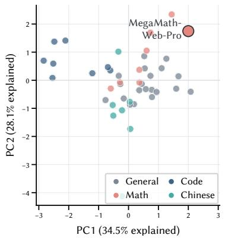  
(a) Candidate profiles

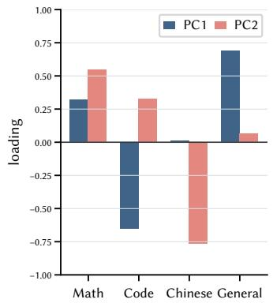  
(b) PCA loadings

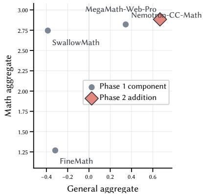  
(c) Math-source decision  
Figure 20: Proxy evidence used in recipe design: (a) Candidate profiles on the first two principal components, (b) The capability contrasts the loadings expose, and (c) MegaMath-Web-Pro against proxy-matched Phase 1 mathematics components. PCA is descriptive; the comparisons do not establish causal gains.

Table 21: Complete proxy capability and PCA coordinates. All four capability columns are averages of task-level population z-scores. PCA is fited after standardizing the four aggregate axes.
<table><tr><td>Source</td><td>Slice</td><td>Math</td><td>Code</td><td>Chinese</td><td>General</td><td>PC1</td><td>PC2</td></tr><tr><td>algebraic stack train</td><td>random</td><td>-0.51</td><td>-0.21</td><td>-0.17</td><td>-0.45</td><td>-0.59</td><td>-0.29</td></tr><tr><td>arxiv</td><td>random</td><td>-0.14</td><td>-0.44</td><td>-0.48</td><td>-0.48</td><td>-0.33</td><td>+0.16</td></tr><tr><td>automathtext</td><td>random</td><td>+0.04</td><td>+0.29</td><td>-0.19</td><td>+0.46</td><td>+0.36</td><td>+0.37</td></tr><tr><td>cosmopedia v2</td><td>random</td><td>-0.13</td><td>+0.16</td><td>+0.65</td><td>-0.00</td><td>-0.16</td><td>-0.65</td></tr><tr><td>dclm dedup 50b</td><td>q00</td><td>-0.49</td><td>-0.86</td><td>-0.67</td><td>+1.02</td><td>+1.67</td><td>+0.14</td></tr><tr><td>dclm dedup 50b</td><td>q25</td><td>-0.01</td><td>-0.36</td><td>-0.50</td><td>+0.70</td><td>+1.11</td><td>+0.43</td></tr><tr><td>dclm dedup 50b</td><td>q50</td><td>-0.07</td><td>-0.84</td><td>-0.24</td><td>-0.11</td><td>+0.44</td><td>-0.13</td></tr><tr><td>dclm dedup 50b</td><td>q75</td><td>-0.24</td><td>-0.59</td><td>+0.02</td><td>+0.36</td><td>+0.78</td><td>-0.34</td></tr><tr><td>DCLM</td><td>q00</td><td>+0.04</td><td>-0.60</td><td>+0.39</td><td>+1.33</td><td>+2.08</td><td>-0.41</td></tr><tr><td>DCLM</td><td>q25</td><td>+0.29</td><td>+0.36</td><td>-0.49</td><td>+0.56</td><td>+0.53</td><td>+0.86</td></tr><tr><td>DCLM</td><td>q50</td><td>-0.56</td><td>-0.68</td><td>-0.13</td><td>+0.54</td><td>+0.94</td><td>-0.42</td></tr><tr><td>DCLM</td><td>q75</td><td>+0.26</td><td>-0.29</td><td>+0.94</td><td>-0.11</td><td>+0.18</td><td>-0.85</td></tr><tr><td>flan</td><td>random</td><td>-0.35</td><td>-1.25</td><td>-0.38</td><td>-0.33</td><td>+0.36</td><td>-0.35</td></tr><tr><td>pes2o</td><td>random</td><td>-0.64</td><td>-0.29</td><td>+0.13</td><td>-0.61</td><td>-0.77</td><td>-0.71</td></tr><tr><td>finemath</td><td>random</td><td>+1.27</td><td>-0.72</td><td>-0.56</td><td>-0.32</td><td>+0.60</td><td>+1.05</td></tr><tr><td>FineWeb-Edu-CN</td><td>q00</td><td>-0.30</td><td>-0.42</td><td>+3.90</td><td>-0.38</td><td>-0.22</td><td>-4.13</td></tr><tr><td>FineWeb-Edu-CN</td><td>q25</td><td>-0.35</td><td>-0.15</td><td>+0.80</td><td>-0.17</td><td>-0.22</td><td>-1.07</td></tr><tr><td>FineWeb-Edu-CN</td><td>q50</td><td>-0.64</td><td>-0.21</td><td>+0.30</td><td>+0.10</td><td>+0.04</td><td>-0.77</td></tr><tr><td>FineWeb-Edu-CN</td><td>q75</td><td>+0.09</td><td>-0.03</td><td>-1.05</td><td>-0.31</td><td>-0.34</td><td>+1.02</td></tr><tr><td>FineWeb-Edu-EN</td><td>q00</td><td>-0.21</td><td>-0.45</td><td>+0.14</td><td>+1.10</td><td>+1.59</td><td>-0.30</td></tr><tr><td>FineWeb-Edu-EN</td><td>q25</td><td>-0.70</td><td>-0.29</td><td>-0.18</td><td>+0.52</td><td>+0.58</td><td>-0.32</td></tr><tr><td>FineWeb-Edu-EN</td><td>q50</td><td>+0.20</td><td>-0.45</td><td>-0.75</td><td>+0.72</td><td>+1.27</td><td>+0.77</td></tr><tr><td>FineWeb-Edu-EN</td><td>q75</td><td>-0.32</td><td>-0.36</td><td>+0.34</td><td>+0.52</td><td>+0.78</td><td>-0.60</td></tr><tr><td>FineWiki-EN</td><td>random</td><td>-0.04</td><td>+0.04</td><td>+0.11</td><td>-0.19</td><td>-0.27</td><td>-0.14</td></tr><tr><td>MegaMath-Code</td><td>random</td><td>+0.51</td><td>+3.05</td><td>+0.02</td><td>-0.39</td><td>-2.48</td><td>+1.37</td></tr><tr><td>megamath web</td><td>random</td><td>-0.10</td><td>-1.04</td><td>-0.48</td><td>-0.82</td><td>-0.29</td><td>-0.07</td></tr><tr><td>MegaMath-Web-Pro</td><td>random</td><td>+2.88</td><td>-0.14</td><td>+0.14</td><td>+0.67</td><td>+2.00</td><td>+1.75</td></tr><tr><td>Nemotron-CC-Math 4+</td><td>random</td><td>+2.82</td><td>+0.04</td><td>-0.50</td><td>+0.35</td><td>+1.44</td><td>+2.34</td></tr><tr><td>medium high quality</td><td>random</td><td>-0.03</td><td>-0.35</td><td>-0.27</td><td>+0.41</td><td>+0.73</td><td>+0.16</td></tr><tr><td>Nemotron HQ</td><td>random</td><td>-0.17</td><td>-0.03</td><td>-0.51</td><td>+0.48</td><td>+0.54</td><td>+0.42</td></tr><tr><td>Nemotron HQ Synthetic</td><td>random</td><td>-0.41</td><td>+0.49</td><td>+0.88</td><td>+0.44</td><td>+0.05</td><td>-0.87</td></tr><tr><td>Nemotron Synthetic Code</td><td>random</td><td>-0.53</td><td>+1.93</td><td>-0.47</td><td>-1.02</td><td>-2.84</td><td>+0.70</td></tr><tr><td>open web math</td><td>random</td><td>-0.21</td><td>-0.38</td><td>-0.18</td><td>+0.14</td><td>+0.36</td><td>-0.08</td></tr><tr><td>stackexchange</td><td>random</td><td>-0.71</td><td>+0.15</td><td>-0.81</td><td>-0.18</td><td>-0.61</td><td>+0.35</td></tr><tr><td>stack v2 smol</td><td>random</td><td>+0.14</td><td>+0.15</td><td>-0.23</td><td>-0.95</td><td>-1.21</td><td>+0.25</td></tr><tr><td>starcoder tokens</td><td>random</td><td>-0.50</td><td>+0.13</td><td>-0.81</td><td>-0.33</td><td>-0.69</td><td>+0.47</td></tr><tr><td>Swallow-Code-v2</td><td>q00</td><td>-0.31</td><td>+2.23</td><td>-0.87</td><td>-0.31</td><td>-2.11</td><td>+1.41</td></tr><tr><td>Swallow-Code-v2</td><td>q25</td><td>-0.69</td><td>+1.97</td><td>-0.41</td><td>-0.68</td><td>-2.52</td><td>+0.59</td></tr><tr><td>Swallow-Code-v2</td><td>q75</td><td>-0.55</td><td>+2.06</td><td>+0.24</td><td>-0.70</td><td>-2.54</td><td>+0.08</td></tr><tr><td>SwallowMath-v2</td><td>random</td><td>+2.75</td><td>-0.24</td><td>-0.07</td><td>-0.39</td><td>+0.73</td><td>+1.69</td></tr><tr><td>Dedup-Merged-PAC-CN</td><td>q00</td><td>-0.49</td><td>-0.69</td><td>+1.19</td><td>-0.23</td><td>+0.06</td><td>-1.73</td></tr><tr><td>Dedup-Merged-PAC-CN</td><td>q50</td><td>-0.22</td><td>-0.23</td><td>+0.62</td><td>-0.51</td><td>-0.53</td><td>-0.88</td></tr><tr><td>Dedup-Merged-PAC-CN</td><td>q75</td><td>-0.67</td><td>-0.45</td><td>+0.63</td><td>-0.49</td><td>-0.51</td><td>-1.26</td></tr></table>

## I.3 Proxy-to-Mixture Decision Audit

The most direct correspondence between the proxy panel and the recipe occurs within the measured mathematics sources. MegaMath-Web-Pro has point-estimate Math and General aggregates of 2.884 and 0.667, respectively, compared with (2.821, 0.345) for Nemotron-CC-Math 4+, (2.746, −0.387) for SwallowMath, and (1.269, −0.317) for FineMath. Phase 2 adds 13.5B MegaMath-Web-Pro tokens, removes FineMath, and reduces the total-mixture shares of Nemotron-CC-Math 4+ from 2.62% to 0.26%, and SwallowMath from 2.28% to 1.42%.

The broader coverage observation uses the same point estimates. DCLM q00, MegaMath-Web-Pro, MegaMath-Code, and FineWeb-Edu-CN q00 lead the General, Math, Code, and Chinese aggregates, respectively. Phase 2 adds the first three source families and retains FineWeb-Edu-CN. This is an ex post consistency audit rather than a selection rule: the production DCLM and FineWeb-Edu-CN ranges are not identical to the proxy slices, and neither the axis leaders nor the production mixture have repeated-seed uncertainty.

Table 22: Proxy comparison for the measured mathematics components discussed in the Phase 2 recipe decision. Math and General are point estimates under the fixed proxy protocol; shares refer to the complete materialized phase mixture.
<table><tr><td>Mathematics source</td><td>Math</td><td>General</td><td>P1 share</td><td>P2 share</td></tr><tr><td>MegaMath-Web-Pro</td><td>+2.88</td><td>+0.67</td><td>0.00%</td><td>1.43%</td></tr><tr><td>Nemotron-CC-Math 4+</td><td>+2.82</td><td>+0.35</td><td>2.62%</td><td>0.26%</td></tr><tr><td>SwallowMath-v2</td><td>+2.75</td><td>-0.39</td><td>2.28%</td><td>1.42%</td></tr><tr><td>FineMath</td><td>+1.27</td><td>-0.32</td><td>2.30%</td><td>0.00%</td></tr></table>

Table 23: Correlation-PCA loadings. Signs are oriented toward positive General on PC1 and positive Math on PC2; only relative directions are substantive.
<table><tr><td>Capability axis</td><td>PC1 (34.5%)</td><td>PC2 (28.1%)</td></tr><tr><td>Math</td><td>+0.321</td><td>+0.549</td></tr><tr><td>Code</td><td>-0.651</td><td>+0.328</td></tr><tr><td>Chinese</td><td>+0.012</td><td>-0.766</td></tr><tr><td>General</td><td>+0.688</td><td>+0.067</td></tr></table>

Table 24: Raw proxy benchmark scores (percentage points) before per-task standardization.
<table><tr><td rowspan=1 colspan=21>Source                Slice  GSM8KMATHMBPP HECEvalCMMLUMMLUARC-CARC-EBoolQCSQAHSwagPIQASIQAWinoG</td></tr><tr><td rowspan=1 colspan=8>algebraic stack train     random   0.38  0.96 3.11</td><td rowspan=1 colspan=7>5.4929.78   30.37 30.82 28.14 61.20</td><td rowspan=1 colspan=6>62.3247.91 38.7165.6143.14 52.41</td></tr><tr><td rowspan=1 colspan=2>arxiv</td><td rowspan=1 colspan=6>random   0.68  1.04  1.95</td><td rowspan=1 colspan=7>5.4929.06   30.53 30.85  26.44 58.91</td><td rowspan=1 colspan=3>62.2647.50 38.39</td><td rowspan=1 colspan=1>66.924</td><td rowspan=1 colspan=2>3.86 52.49</td></tr><tr><td rowspan=1 colspan=2>automathtext</td><td rowspan=1 colspan=6>random   0.61  1.44 6.61</td><td rowspan=1 colspan=1>4.88</td><td rowspan=1 colspan=3>29.58   30.47</td><td rowspan=1 colspan=1>31.03</td><td rowspan=1 colspan=2>29.15 65.08</td><td rowspan=1 colspan=1>57.40</td><td rowspan=1 colspan=1>49.63</td><td rowspan=1 colspan=1>38.70</td><td rowspan=1 colspan=1>67.304</td><td rowspan=1 colspan=2>4.98 52.57</td></tr><tr><td rowspan=1 colspan=2>cosmopedia v2</td><td rowspan=1 colspan=6>random   0.38  1.54 5.06</td><td rowspan=1 colspan=1>5.49</td><td rowspan=1 colspan=3>30.97   30.35</td><td rowspan=1 colspan=1>31.24</td><td rowspan=1 colspan=2>27.12 63.14</td><td rowspan=1 colspan=1>53.09</td><td rowspan=1 colspan=1>47.83</td><td rowspan=1 colspan=1>40.09</td><td rowspan=1 colspan=1>67.684</td><td rowspan=1 colspan=2>4.11  52.80</td></tr><tr><td rowspan=1 colspan=2>dclm dedup 50b</td><td rowspan=1 colspan=6>q00      0.53  0.76 2.33</td><td rowspan=1 colspan=1>3.66</td><td rowspan=1 colspan=3>28.55   30.67</td><td rowspan=1 colspan=1>30.99</td><td rowspan=1 colspan=2>31.86 63.49</td><td rowspan=1 colspan=1>60.61</td><td rowspan=1 colspan=1>50.45</td><td rowspan=1 colspan=1>40.65</td><td rowspan=1 colspan=1>68.504</td><td rowspan=1 colspan=2>4.42 52.72</td></tr><tr><td rowspan=1 colspan=2>dclm dedup 50b</td><td rowspan=1 colspan=6>q25      0.91  0.88 2.33</td><td rowspan=1 colspan=1>5.49</td><td rowspan=1 colspan=3>29.14  30.47</td><td rowspan=1 colspan=1>30.55</td><td rowspan=1 colspan=2>28.81 62.61</td><td rowspan=1 colspan=1>61.83</td><td rowspan=1 colspan=1>49.22</td><td rowspan=1 colspan=1>41.03</td><td rowspan=1 colspan=1>68.344</td><td rowspan=1 colspan=1>4.32</td><td rowspan=1 colspan=1>53.67</td></tr><tr><td rowspan=1 colspan=2>dclm dedup 50b</td><td rowspan=1 colspan=6>q50      0.99  0.66 1.56</td><td rowspan=1 colspan=1>4.27</td><td rowspan=1 colspan=3>29.47  30.49</td><td rowspan=1 colspan=1>30.32</td><td rowspan=1 colspan=1>25.76</td><td rowspan=1 colspan=1>59.26</td><td rowspan=1 colspan=1>59.05</td><td rowspan=1 colspan=1>49.30</td><td rowspan=1 colspan=1>40.98</td><td rowspan=1 colspan=1>68.444</td><td rowspan=1 colspan=1>4.11</td><td rowspan=1 colspan=1>52.01</td></tr><tr><td rowspan=1 colspan=2>dclm dedup 50b</td><td rowspan=1 colspan=5>q75      0.38  1.38</td><td rowspan=1 colspan=1>1.17</td><td rowspan=1 colspan=1>5.49</td><td rowspan=1 colspan=3>29.38  30.75</td><td rowspan=1 colspan=1>30.59</td><td rowspan=1 colspan=1>30.85</td><td rowspan=1 colspan=1>59.79</td><td rowspan=1 colspan=1>61.07</td><td rowspan=1 colspan=1>48.08</td><td rowspan=1 colspan=1>40.66</td><td rowspan=1 colspan=1>68.234</td><td rowspan=1 colspan=1>3.60</td><td rowspan=1 colspan=1>53.67</td></tr><tr><td rowspan=1 colspan=2>DCLM</td><td rowspan=1 colspan=5>q00      0.91  0.96</td><td rowspan=1 colspan=1>1.95</td><td rowspan=1 colspan=1>4.88</td><td rowspan=1 colspan=3>29.39  31.04</td><td rowspan=1 colspan=1>32.03</td><td rowspan=1 colspan=1>29.83</td><td rowspan=1 colspan=1>63.67</td><td rowspan=1 colspan=1>62.32</td><td rowspan=1 colspan=1>51.02</td><td rowspan=1 colspan=1>40.69</td><td rowspan=1 colspan=1>68.72</td><td rowspan=1 colspan=1>44.42</td><td rowspan=1 colspan=1>53.20</td></tr><tr><td rowspan=1 colspan=2>DCLM</td><td rowspan=1 colspan=1>q25</td><td rowspan=1 colspan=4>0.91  1.34</td><td rowspan=1 colspan=1>3.50</td><td rowspan=1 colspan=1>7.32</td><td rowspan=1 colspan=3>28.73   30.71</td><td rowspan=1 colspan=1>30.95</td><td rowspan=1 colspan=1>26.78</td><td rowspan=1 colspan=1>61.02</td><td rowspan=1 colspan=1>60.49</td><td rowspan=1 colspan=1>49.30</td><td rowspan=1 colspan=1>40.63</td><td rowspan=1 colspan=1>68.66</td><td rowspan=1 colspan=1>44.68</td><td rowspan=1 colspan=1>53.59</td></tr><tr><td rowspan=1 colspan=2>DCLM</td><td rowspan=1 colspan=1>q50</td><td rowspan=1 colspan=3>0.38</td><td rowspan=1 colspan=1>0.88</td><td rowspan=1 colspan=1>1.56</td><td rowspan=1 colspan=1>4.88</td><td rowspan=1 colspan=2>29.75</td><td rowspan=1 colspan=1>30.42</td><td rowspan=1 colspan=1>30.59</td><td rowspan=1 colspan=1>28.47</td><td rowspan=1 colspan=1>61.20</td><td rowspan=1 colspan=1>60.34</td><td rowspan=1 colspan=1>49.47</td><td rowspan=1 colspan=1>40.70</td><td rowspan=1 colspan=1>67.854</td><td rowspan=1 colspan=1>4.32</td><td rowspan=1 colspan=1>54.30</td></tr><tr><td rowspan=1 colspan=2>DCLM</td><td rowspan=1 colspan=1>q75</td><td rowspan=1 colspan=3>1.14</td><td rowspan=1 colspan=1>0.92</td><td rowspan=1 colspan=1>2.72</td><td rowspan=1 colspan=1>5.49</td><td rowspan=1 colspan=1>30.79</td><td></td><td rowspan=1 colspan=1>30.68</td><td rowspan=1 colspan=1>30.11</td><td rowspan=1 colspan=1>28.14</td><td rowspan=1 colspan=1>58.02</td><td rowspan=1 colspan=1>61.77</td><td rowspan=1 colspan=1>48.65</td><td rowspan=1 colspan=1>40.10</td><td rowspan=1 colspan=1>68.55</td><td rowspan=1 colspan=1>43.45</td><td rowspan=1 colspan=1>52.88</td></tr><tr><td rowspan=1 colspan=2>flan</td><td rowspan=1 colspan=1>random</td><td rowspan=1 colspan=3>0.61</td><td rowspan=1 colspan=1>0.84</td><td rowspan=1 colspan=1>1.17</td><td rowspan=1 colspan=1>3.05</td><td rowspan=1 colspan=1>29.28</td><td></td><td rowspan=1 colspan=1>30.49</td><td rowspan=1 colspan=1>30.37</td><td rowspan=1 colspan=1>28.14</td><td rowspan=1 colspan=1>60.14</td><td rowspan=1 colspan=1>60.15</td><td rowspan=1 colspan=1>47.91</td><td rowspan=1 colspan=1>39.46</td><td rowspan=1 colspan=1>67.19</td><td rowspan=1 colspan=1>43.76</td><td rowspan=1 colspan=1>52.17</td></tr><tr><td rowspan=1 colspan=2>pes2o</td><td rowspan=1 colspan=1>random</td><td rowspan=1 colspan=2>0.45</td><td rowspan=1 colspan=1></td><td rowspan=1 colspan=1>0.66</td><td rowspan=1 colspan=1>2.72</td><td rowspan=1 colspan=1>5.49</td><td rowspan=1 colspan=1>29.37</td><td rowspan=1 colspan=2>30.84</td><td rowspan=1 colspan=1>31.48</td><td rowspan=1 colspan=1>26.78</td><td rowspan=1 colspan=1>60.32</td><td rowspan=1 colspan=1>56.67</td><td rowspan=1 colspan=1>47.26</td><td rowspan=1 colspan=1>38.12</td><td rowspan=1 colspan=1>66.27</td><td rowspan=1 colspan=1>43.04</td><td rowspan=1 colspan=1>53.20</td></tr><tr><td rowspan=1 colspan=2>finemath</td><td rowspan=1 colspan=1>random</td><td rowspan=1 colspan=2>1.59</td><td rowspan=1 colspan=1></td><td rowspan=1 colspan=1>1.74</td><td rowspan=1 colspan=1>3.89</td><td rowspan=1 colspan=1>3.05</td><td rowspan=1 colspan=3>28.70   30.67</td><td rowspan=1 colspan=1>30.84</td><td rowspan=1 colspan=1>26.78</td><td rowspan=1 colspan=1>61.55</td><td rowspan=1 colspan=1>62.72</td><td rowspan=1 colspan=1>47.83</td><td rowspan=1 colspan=1>38.64</td><td rowspan=1 colspan=1>67.364</td><td rowspan=1 colspan=1>4.42</td><td rowspan=1 colspan=1>50.43</td></tr><tr><td rowspan=1 colspan=2>FineWeb-Edu-CN</td><td rowspan=1 colspan=1>q00</td><td rowspan=1 colspan=4>0.83  0.56</td><td rowspan=1 colspan=1>1.17</td><td rowspan=1 colspan=1>6.10</td><td rowspan=1 colspan=3>31.83   32.44</td><td rowspan=1 colspan=1>30.76</td><td rowspan=1 colspan=1>27.46</td><td rowspan=1 colspan=1>60.49</td><td rowspan=1 colspan=1>55.69</td><td rowspan=1 colspan=1>48.24</td><td rowspan=1 colspan=1>38.36</td><td rowspan=1 colspan=1>67.794</td><td rowspan=1 colspan=1>3.65</td><td rowspan=1 colspan=1>52.72</td></tr><tr><td rowspan=1 colspan=2>FineWeb-Edu-CN</td><td rowspan=1 colspan=1>q25</td><td rowspan=1 colspan=4>0.76  0.60</td><td rowspan=1 colspan=1>4.28</td><td rowspan=1 colspan=1>4.88</td><td rowspan=1 colspan=3>29.61   31.24</td><td rowspan=1 colspan=1>30.59</td><td rowspan=1 colspan=1>29.49</td><td rowspan=1 colspan=1>60.49</td><td rowspan=1 colspan=1>56.12</td><td rowspan=1 colspan=1>48.48</td><td rowspan=1 colspan=1>38.53</td><td rowspan=1 colspan=1>67.254</td><td rowspan=1 colspan=1>3.96</td><td rowspan=1 colspan=1>53.28</td></tr><tr><td rowspan=1 colspan=2>FineWeb-Edu-CN</td><td rowspan=1 colspan=5>q50      0.38  0.76</td><td rowspan=1 colspan=1>3.11</td><td rowspan=1 colspan=1>5.49</td><td rowspan=1 colspan=3>29.05  31.16</td><td rowspan=1 colspan=1>30.92</td><td rowspan=1 colspan=1>28.47</td><td rowspan=1 colspan=1>61.38</td><td rowspan=1 colspan=1>52.51</td><td rowspan=1 colspan=1>49.30</td><td rowspan=1 colspan=1>39.27</td><td rowspan=1 colspan=1>67.414</td><td rowspan=1 colspan=1>4.32</td><td rowspan=1 colspan=1>54.14</td></tr><tr><td rowspan=1 colspan=2>FineWeb-Edu-CN</td><td rowspan=1 colspan=5>q75      0.99  0.90</td><td rowspan=1 colspan=1>2.33</td><td rowspan=1 colspan=1>6.71</td><td rowspan=1 colspan=3>28.51   30.39</td><td rowspan=1 colspan=1>30.44</td><td rowspan=1 colspan=1>29.15</td><td rowspan=1 colspan=1>61.02</td><td rowspan=1 colspan=1>55.38</td><td rowspan=1 colspan=1>47.91</td><td rowspan=1 colspan=1>38.48</td><td rowspan=1 colspan=1>67.85</td><td rowspan=1 colspan=1>43.76</td><td rowspan=1 colspan=1>52.64</td></tr><tr><td rowspan=1 colspan=2>FineWeb-Edu-EN</td><td rowspan=1 colspan=4>q00      0.61</td><td rowspan=1 colspan=1>1.06</td><td rowspan=1 colspan=1>2.72</td><td rowspan=1 colspan=1>4.88</td><td rowspan=1 colspan=3>29.85   30.58</td><td rowspan=1 colspan=1>32.48</td><td rowspan=1 colspan=1>30.85</td><td rowspan=1 colspan=1>66.84</td><td rowspan=1 colspan=1>59.88</td><td rowspan=1 colspan=1>49.63</td><td rowspan=1 colspan=1>39.90</td><td rowspan=1 colspan=1>68.99</td><td rowspan=1 colspan=1>43.04</td><td rowspan=1 colspan=1>52.33</td></tr><tr><td rowspan=1 colspan=2>FineWeb-Edu-EN</td><td rowspan=1 colspan=1>q25</td><td rowspan=1 colspan=2>0.38</td><td rowspan=1 colspan=1></td><td rowspan=1 colspan=1>0.68</td><td rowspan=1 colspan=1>2.72</td><td rowspan=1 colspan=1>5.49</td><td rowspan=1 colspan=3>30.00   30.24</td><td rowspan=1 colspan=1>31.51</td><td rowspan=1 colspan=1>25.76</td><td rowspan=1 colspan=1>61.55</td><td rowspan=1 colspan=1>58.69</td><td rowspan=1 colspan=1>49.47</td><td rowspan=1 colspan=1>40.29</td><td rowspan=1 colspan=1>68.124</td><td rowspan=1 colspan=1>5.39</td><td rowspan=1 colspan=1>52.88</td></tr><tr><td rowspan=1 colspan=2>FineWeb-Edu-EN</td><td rowspan=1 colspan=1>q50</td><td rowspan=1 colspan=2>0.68</td><td rowspan=1 colspan=1></td><td rowspan=1 colspan=1>1.56</td><td rowspan=1 colspan=1>2.72</td><td rowspan=1 colspan=1>4.88</td><td rowspan=1 colspan=3>29.34   30.16</td><td rowspan=1 colspan=1>30.77</td><td rowspan=1 colspan=1>29.83</td><td rowspan=1 colspan=1>60.32</td><td rowspan=1 colspan=1>61.25</td><td rowspan=1 colspan=1>50.12</td><td rowspan=1 colspan=1>41.32</td><td rowspan=1 colspan=1>68.064</td><td rowspan=1 colspan=1>5.14</td><td rowspan=1 colspan=1>52.49</td></tr><tr><td rowspan=1 colspan=1>FineWeb-Edu-EN</td><td rowspan=1 colspan=1></td><td rowspan=1 colspan=1>q75</td><td rowspan=1 colspan=2>0.45</td><td rowspan=1 colspan=1></td><td rowspan=1 colspan=1>1.14</td><td rowspan=1 colspan=1>2.33</td><td rowspan=1 colspan=1>5.49</td><td rowspan=1 colspan=1>30.16</td><td></td><td rowspan=1 colspan=1>30.56</td><td rowspan=1 colspan=1>31.54</td><td rowspan=1 colspan=1>26.78</td><td rowspan=1 colspan=1>61.20</td><td rowspan=1 colspan=1>55.11</td><td rowspan=1 colspan=1>49.63</td><td rowspan=1 colspan=1>40.92</td><td rowspan=1 colspan=1>69.154</td><td rowspan=1 colspan=1>4.83</td><td rowspan=1 colspan=1>52.49</td></tr><tr><td rowspan=1 colspan=1>FineWiki-EN</td><td rowspan=1 colspan=1></td><td rowspan=1 colspan=1>random</td><td rowspan=1 colspan=1></td><td rowspan=1 colspan=1>0.99</td><td rowspan=1 colspan=1></td><td rowspan=1 colspan=1>0.70</td><td rowspan=1 colspan=1>2.72</td><td rowspan=1 colspan=1>6.71</td><td rowspan=1 colspan=1>30.17</td><td></td><td rowspan=1 colspan=1>30.37</td><td rowspan=1 colspan=1>29.98</td><td rowspan=1 colspan=1>28.14</td><td rowspan=1 colspan=1>63.49</td><td rowspan=1 colspan=1>61.68</td><td rowspan=1 colspan=1>48.32</td><td rowspan=1 colspan=1>38.77</td><td rowspan=1 colspan=1>66.594</td><td rowspan=1 colspan=1>4.63</td><td rowspan=1 colspan=1>51.62</td></tr><tr><td rowspan=1 colspan=1>MegaMath-Code</td><td rowspan=1 colspan=1></td><td rowspan=1 colspan=1>random</td><td rowspan=1 colspan=1></td><td rowspan=1 colspan=1>1.14</td><td rowspan=1 colspan=1></td><td rowspan=1 colspan=1>1.30</td><td rowspan=1 colspan=1>13.23</td><td rowspan=1 colspan=1>10.37</td><td rowspan=1 colspan=2>29.64</td><td rowspan=1 colspan=1>30.60</td><td rowspan=1 colspan=1>31.14</td><td rowspan=1 colspan=1>28.81</td><td rowspan=1 colspan=1>61.90</td><td rowspan=1 colspan=1>62.05</td><td rowspan=1 colspan=1>46.76</td><td rowspan=1 colspan=1>38.53</td><td rowspan=1 colspan=1>66.494</td><td rowspan=1 colspan=1>3.19</td><td rowspan=1 colspan=1>51.70</td></tr><tr><td rowspan=1 colspan=1>megamath web</td><td rowspan=1 colspan=1></td><td rowspan=1 colspan=1>random</td><td rowspan=1 colspan=1></td><td rowspan=1 colspan=1>0.99</td><td rowspan=1 colspan=1></td><td rowspan=1 colspan=1>0.62</td><td rowspan=1 colspan=1>3.11</td><td rowspan=1 colspan=1>2.44</td><td rowspan=1 colspan=2>29.68</td><td rowspan=1 colspan=1>30.18</td><td rowspan=1 colspan=1>30.73</td><td rowspan=1 colspan=1>28.47</td><td rowspan=1 colspan=1>62.96</td><td rowspan=1 colspan=1>50.61</td><td rowspan=1 colspan=1>47.67</td><td rowspan=1 colspan=1>38.30</td><td rowspan=1 colspan=1>66.49</td><td rowspan=1 colspan=1>43.30</td><td rowspan=1 colspan=1>51.30</td></tr><tr><td rowspan=1 colspan=1>MegaMath-Web-P</td><td rowspan=1 colspan=1>ro</td><td rowspan=1 colspan=1>random</td><td rowspan=1 colspan=1></td><td rowspan=1 colspan=1>3.03</td><td rowspan=1 colspan=1></td><td rowspan=1 colspan=1>1.90</td><td rowspan=1 colspan=1>3.50</td><td rowspan=1 colspan=1>5.49</td><td rowspan=1 colspan=1>29.93</td><td></td><td rowspan=1 colspan=1>30.53</td><td rowspan=1 colspan=1>31.86</td><td rowspan=1 colspan=1>30.51</td><td rowspan=1 colspan=1>63.14</td><td rowspan=1 colspan=1>62.78</td><td rowspan=1 colspan=1>49.80</td><td rowspan=1 colspan=1>39.64</td><td rowspan=1 colspan=1>67.034</td><td rowspan=1 colspan=1>4.47</td><td rowspan=1 colspan=1>51.54</td></tr><tr><td rowspan=1 colspan=2>Nemotron-CC-Math 4+</td><td rowspan=1 colspan=1>random</td><td rowspan=1 colspan=1></td><td rowspan=1 colspan=1>1.82</td><td rowspan=1 colspan=1></td><td rowspan=1 colspan=1>3.74</td><td rowspan=1 colspan=1>2.72</td><td rowspan=1 colspan=1>6.71</td><td rowspan=1 colspan=1>29.13</td><td rowspan=1 colspan=1></td><td rowspan=1 colspan=1>30.48</td><td rowspan=1 colspan=1>31.36</td><td rowspan=1 colspan=1>29.83</td><td rowspan=1 colspan=1>62.08</td><td rowspan=1 colspan=1>61.99</td><td rowspan=1 colspan=1>48.98</td><td rowspan=1 colspan=1>38.96</td><td rowspan=1 colspan=1>66.704</td><td rowspan=1 colspan=1>3.91</td><td rowspan=1 colspan=1>53.28</td></tr><tr><td rowspan=1 colspan=2>medium high quality</td><td rowspan=1 colspan=1>random</td><td rowspan=1 colspan=1></td><td rowspan=1 colspan=1>0.61</td><td rowspan=1 colspan=1></td><td rowspan=1 colspan=1>1.32</td><td rowspan=1 colspan=1>1.56</td><td rowspan=1 colspan=1>6.10</td><td rowspan=1 colspan=3>29.33   30.55</td><td rowspan=1 colspan=1>30.82</td><td rowspan=1 colspan=1>27.46</td><td rowspan=1 colspan=1>59.79</td><td rowspan=1 colspan=1>58.35</td><td rowspan=1 colspan=1>50.04</td><td rowspan=1 colspan=1>40.72</td><td rowspan=1 colspan=1>68.34</td><td rowspan=1 colspan=1>44.83</td><td rowspan=1 colspan=1>53.04</td></tr><tr><td rowspan=1 colspan=2>Nemotron HQ</td><td rowspan=1 colspan=1>random</td><td rowspan=1 colspan=1></td><td rowspan=1 colspan=1>0.53</td><td rowspan=1 colspan=1></td><td rowspan=1 colspan=1>1.24</td><td rowspan=1 colspan=1>2.33</td><td rowspan=1 colspan=1>6.71</td><td rowspan=1 colspan=1>29.17</td><td rowspan=1 colspan=2>30.45</td><td rowspan=1 colspan=1>30.80</td><td rowspan=1 colspan=1>31.53</td><td rowspan=1 colspan=1>62.26</td><td rowspan=1 colspan=1>60.21</td><td rowspan=1 colspan=1>48.08</td><td rowspan=1 colspan=1>41.31</td><td rowspan=1 colspan=1>68.174</td><td rowspan=1 colspan=1>3.30</td><td rowspan=1 colspan=1>52.80</td></tr><tr><td rowspan=1 colspan=2>Nemotron HQ Synthetic</td><td rowspan=1 colspan=1>random</td><td rowspan=1 colspan=1></td><td rowspan=1 colspan=1>0.38</td><td rowspan=1 colspan=1></td><td rowspan=1 colspan=1>1.12</td><td rowspan=1 colspan=1>5.06</td><td rowspan=1 colspan=1>6.71</td><td rowspan=1 colspan=1>30.60</td><td rowspan=1 colspan=2>30.74</td><td rowspan=1 colspan=1>31.22</td><td rowspan=1 colspan=1>27.80</td><td rowspan=1 colspan=1>63.67</td><td rowspan=1 colspan=1>60.40</td><td rowspan=1 colspan=1>47.50</td><td rowspan=1 colspan=1>40.94</td><td rowspan=1 colspan=1>68.934</td><td rowspan=1 colspan=1>3.81</td><td rowspan=1 colspan=1>52.25</td></tr><tr><td rowspan=1 colspan=2>Nemotron Synthetic Code</td><td rowspan=1 colspan=1>random</td><td rowspan=1 colspan=1></td><td rowspan=1 colspan=1>0.53</td><td rowspan=1 colspan=1></td><td rowspan=1 colspan=1>0.70</td><td rowspan=1 colspan=1>7.39</td><td rowspan=1 colspan=1>10.37</td><td rowspan=1 colspan=3>29.22   30.45</td><td rowspan=1 colspan=1>30.32</td><td rowspan=1 colspan=1>25.42</td><td rowspan=1 colspan=1>60.85</td><td rowspan=1 colspan=1>57.25</td><td rowspan=1 colspan=1>46.36</td><td rowspan=1 colspan=1>38.18</td><td rowspan=1 colspan=1>66.54</td><td rowspan=1 colspan=1>44.22</td><td rowspan=1 colspan=1>51.07</td></tr><tr><td rowspan=1 colspan=2>open web math</td><td rowspan=1 colspan=1>random</td><td rowspan=1 colspan=1></td><td rowspan=1 colspan=2>0.53</td><td rowspan=1 colspan=1>1.18</td><td rowspan=1 colspan=1>3.11</td><td rowspan=1 colspan=1>4.88</td><td rowspan=1 colspan=3>29.27   30.65</td><td rowspan=1 colspan=1>31.09</td><td rowspan=1 colspan=1>29.83</td><td rowspan=1 colspan=1>61.90</td><td rowspan=1 colspan=1>53.55</td><td rowspan=1 colspan=1>47.99</td><td rowspan=1 colspan=1>38.48</td><td rowspan=1 colspan=1>67.954</td><td rowspan=1 colspan=1>4.98</td><td rowspan=1 colspan=1>52.96</td></tr><tr><td rowspan=1 colspan=2>stackexchange</td><td rowspan=1 colspan=1>random</td><td rowspan=1 colspan=1></td><td rowspan=1 colspan=2>0.45</td><td rowspan=1 colspan=1>0.54</td><td rowspan=1 colspan=1>5.84</td><td rowspan=1 colspan=1>4.88</td><td rowspan=1 colspan=3>29.24   30.17</td><td rowspan=1 colspan=1>30.64</td><td rowspan=1 colspan=1>29.83</td><td rowspan=1 colspan=1>60.85</td><td rowspan=1 colspan=1>55.41</td><td rowspan=1 colspan=1>47.75</td><td rowspan=1 colspan=1>39.14</td><td rowspan=1 colspan=1>67.304</td><td rowspan=1 colspan=1>3.91</td><td rowspan=1 colspan=1>52.96</td></tr><tr><td rowspan=1 colspan=2>stack v2 smol</td><td rowspan=1 colspan=1>random</td><td rowspan=1 colspan=3>0.91</td><td rowspan=1 colspan=1>1.10</td><td rowspan=1 colspan=1>5.84</td><td rowspan=1 colspan=1>4.88</td><td rowspan=1 colspan=3>30.23   30.07</td><td rowspan=1 colspan=1>30.13</td><td rowspan=1 colspan=1>29.49</td><td rowspan=1 colspan=1>59.08</td><td rowspan=1 colspan=1>62.42</td><td rowspan=1 colspan=1>45.78</td><td rowspan=1 colspan=1>37.87</td><td rowspan=1 colspan=1>67.144</td><td rowspan=1 colspan=1>3.24</td><td rowspan=1 colspan=1>50.51</td></tr><tr><td rowspan=1 colspan=2>starcoder tokens</td><td rowspan=1 colspan=1>random</td><td rowspan=1 colspan=3>0.68</td><td rowspan=1 colspan=1>0.50</td><td rowspan=1 colspan=1>6.61</td><td rowspan=1 colspan=1>4.27</td><td rowspan=1 colspan=3>29.68   29.92</td><td rowspan=1 colspan=1>30.89</td><td rowspan=1 colspan=1>27.80</td><td rowspan=1 colspan=1>61.55</td><td rowspan=1 colspan=1>62.23</td><td rowspan=1 colspan=1>45.86</td><td rowspan=1 colspan=1>38.11</td><td rowspan=1 colspan=1>67.304</td><td rowspan=1 colspan=1>2.94</td><td rowspan=1 colspan=1>53.75</td></tr><tr><td rowspan=1 colspan=2>Swallow-Code-v2</td><td rowspan=1 colspan=1>q00</td><td rowspan=1 colspan=3>0.61</td><td rowspan=1 colspan=1>0.90</td><td rowspan=1 colspan=1>8.951</td><td rowspan=1 colspan=1>0.37</td><td rowspan=1 colspan=3>28.20   30.71</td><td rowspan=1 colspan=1>30.55</td><td rowspan=1 colspan=1>28.14</td><td rowspan=1 colspan=1>60.49</td><td rowspan=1 colspan=1>60.40</td><td rowspan=1 colspan=1>47.99</td><td rowspan=1 colspan=1>38.83</td><td rowspan=1 colspan=1>67.304</td><td rowspan=1 colspan=1>3.40</td><td rowspan=1 colspan=1>52.64</td></tr><tr><td rowspan=1 colspan=2>Swallow-Code-v2</td><td rowspan=1 colspan=1>q25</td><td rowspan=1 colspan=3>0.30</td><td rowspan=1 colspan=1>0.82</td><td rowspan=1 colspan=1>9.34</td><td rowspan=1 colspan=1>9.15</td><td rowspan=1 colspan=3>28.95  30.65</td><td rowspan=1 colspan=1>30.50</td><td rowspan=1 colspan=1>28.14</td><td rowspan=1 colspan=1>58.91</td><td rowspan=1 colspan=1>59.66</td><td rowspan=1 colspan=1>48.48</td><td rowspan=1 colspan=1>38.57</td><td rowspan=1 colspan=1>66.594</td><td rowspan=1 colspan=1>2.84</td><td rowspan=1 colspan=1>52.17</td></tr><tr><td rowspan=1 colspan=2>Swallow-Code-v2</td><td rowspan=1 colspan=1>q75</td><td rowspan=1 colspan=4>0.68  0.42</td><td rowspan=1 colspan=1>8.95</td><td rowspan=1 colspan=1>9.76</td><td rowspan=1 colspan=3>29.71   30.74</td><td rowspan=1 colspan=1>31.13</td><td rowspan=1 colspan=1>26.10</td><td rowspan=1 colspan=1>61.55</td><td rowspan=1 colspan=1>60.89</td><td rowspan=1 colspan=1>46.11</td><td rowspan=1 colspan=1>38.63</td><td rowspan=1 colspan=1>66.70</td><td rowspan=1 colspan=1>42.99</td><td rowspan=1 colspan=1>51.70</td></tr><tr><td rowspan=1 colspan=2>SwallowMath-v2</td><td rowspan=1 colspan=1>random</td><td rowspan=1 colspan=4>1.21  4.60</td><td rowspan=1 colspan=1>0.39</td><td rowspan=1 colspan=1>7.32</td><td rowspan=1 colspan=3>30.26  30.18</td><td rowspan=1 colspan=1>30.80</td><td rowspan=1 colspan=1>27.12</td><td rowspan=1 colspan=1>61.38</td><td rowspan=1 colspan=1>62.11</td><td rowspan=1 colspan=1>47.34</td><td rowspan=1 colspan=1>38.60</td><td rowspan=1 colspan=1>67.574</td><td rowspan=1 colspan=1>3.76</td><td rowspan=1 colspan=1>51.07</td></tr><tr><td rowspan=1 colspan=2>Dedup-Merged-PAC-CN</td><td rowspan=1 colspan=1>q00</td><td rowspan=1 colspan=5>0.53  0.76 2.33</td><td rowspan=1 colspan=1>4.27</td><td rowspan=1 colspan=3>30.65   30.96</td><td rowspan=1 colspan=1>30.77</td><td rowspan=1 colspan=1>27.46</td><td rowspan=1 colspan=1>59.61</td><td rowspan=1 colspan=1>59.05</td><td rowspan=1 colspan=1>47.91</td><td rowspan=1 colspan=1>38.33</td><td rowspan=1 colspan=1>67.79</td><td rowspan=1 colspan=1>44.37</td><td rowspan=1 colspan=1>52.72</td></tr><tr><td rowspan=1 colspan=2>Dedup-Merged-PAC-CN</td><td rowspan=1 colspan=1>q50</td><td rowspan=1 colspan=4>0.83  0.68</td><td rowspan=1 colspan=1>3.89</td><td rowspan=1 colspan=1>4.88</td><td rowspan=1 colspan=3>30.40  30.65</td><td rowspan=1 colspan=1>30.74</td><td rowspan=1 colspan=1>26.10</td><td rowspan=1 colspan=1>59.79</td><td rowspan=1 colspan=1>57.43</td><td rowspan=1 colspan=1>47.91</td><td rowspan=1 colspan=1>38.73</td><td rowspan=1 colspan=1>67.19</td><td rowspan=1 colspan=1>44.47</td><td rowspan=1 colspan=1>51.85</td></tr><tr><td rowspan=1 colspan=2>Dedup-Merged-PAC-CN</td><td rowspan=1 colspan=5>q75      0.45  0.60</td><td rowspan=1 colspan=1>2.72</td><td rowspan=1 colspan=1>4.88</td><td rowspan=1 colspan=3>29.74   31.03</td><td rowspan=1 colspan=1>30.82</td><td rowspan=1 colspan=1>27.12</td><td rowspan=1 colspan=1>60.14</td><td rowspan=1 colspan=1>57.74</td><td rowspan=1 colspan=1>47.26</td><td rowspan=1 colspan=1>38.97</td><td rowspan=1 colspan=1>67.14</td><td rowspan=1 colspan=1>44.06</td><td rowspan=1 colspan=1>51.93</td></tr></table>