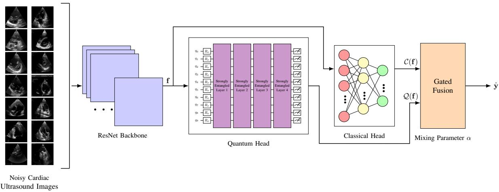
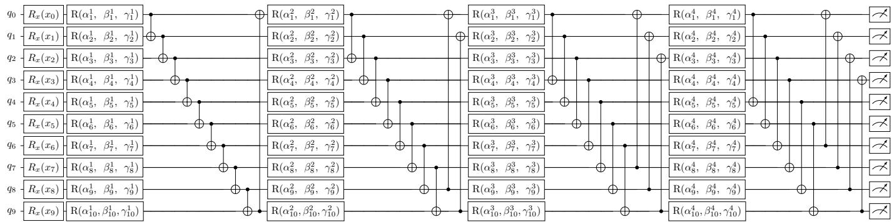
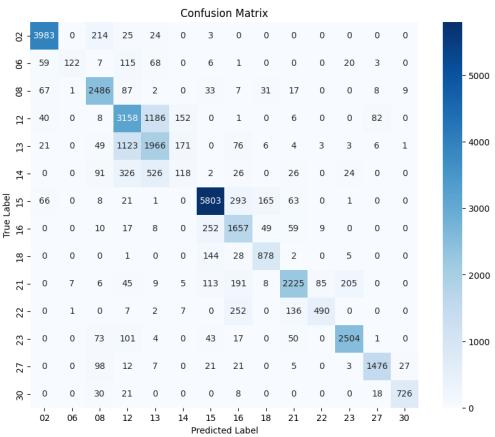
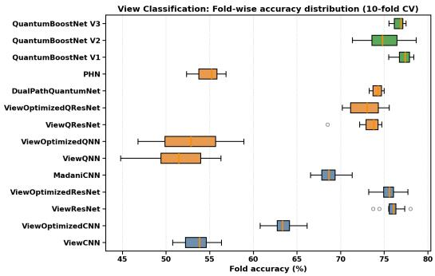

# QuantumBoostNet: A Hybrid Classical-Quantum Architecture for Enhanced Accuracy in Cardiac Ultrasound View Identification

Mihai Udrescu-Milosav

Department of Computers and Information Technology

Politehnica University Timis¸oara

Timis¸oara, Romania

mihai-alexandru.udrescu-milosav@student.upt.ro

Mihai Udrescu

Department of Computers and Information Technology

Politehnica University Timis¸oara

Timis¸oara, Romania

mihai.udrescu@cs.upt.ro

S¸tefan-Alexandru Jura

Department of Computers and Information Technology

Politehnica University Timis¸oara

Timis¸oara, Romania

stefan.jura@student.upt.ro

Gerhard-Paul Diller

Department of Cardiology & Angiology III

Adult Congenital & Valvular Heart Disease Center

University Hospital Muenster ¨

Munster, Germany¨

gerhard.diller@ukmuenster.de

Abstract—Accurate identification of the correct view or angle in cardiac ultrasound (echocardiogram) is a critical component of cardiologic imaging. This step is essential for precise anatomical interpretation, reliable measurement, and the reduction of clinical errors. Although computer vision has advanced significantly, most state-of-the-art models perform well on standard benchmarks but often yield suboptimal results in specialized medical imaging tasks due to the high level of noise present in the data. QuantumBoostNet, a hybrid classical-quantum architecture, is introduced to address these challenges. This model integrates a classical backbone with two heads: one classical and one quantum, with the quantum head implemented as a parametrized 10-qubit quantum circuit. Training occurs in two stages, with an adaptive transition between heads governed by a mixing parameter that monitors loss dynamics. Extensive experiments indicate that, despite the limited number of qubits that can be simulated, QuantumBoostNet consistently outperforms state-ofthe-art classical and hybrid classical-quantum models in cardiac ultrasound view identification, achieving a relative improvement over the best competitor. QuantumBoostNet also demonstrates superior performance on established image classification benchmarks and exhibits robustness to noise. These findings support the continued development of hybrid classical-quantum models for specialized medical imaging applications.

Index Terms—view identification, cardiac ultrasound, quantum machine learning, hybrid classical-quantum heads, mixing parameter

## I. INTRODUCTION

Accurate view identification is critical for meaningful echocardiographic interpretation because each standard imaging plane reveals a distinct subset of cardiac anatomy and enables specific quantitative measurements. Echocardiography guidelines link quantitative assessment to correct acquisition geometry. For example, linear left ventricular (LV) dimensions are recommended from the parasternal long-axis view, while LV volumes and ejection fraction come from apical fourchamber and two-chamber views. Off-axis or misidentified views can cause anatomical misinterpretation and measurement error [1] [2]. In machine learning pipelines, view recognition acts as the routing step for downstream segmentation, chamber quantification, and disease detection, not just as a preprocessing step [3] [4]. Recent multi-task systems also combine view classification with image-quality assessment, highlighting that a correct view is essential in cardiologic imaging [5].

View identification in ultrasound imaging is challenging because of speckle, low contrast, blurred tissue boundaries, attenuation, and operator-dependent variability in echocardiograms. These factors impair both human interpretation and deep-learning feature extraction [5] [6]. Such limitations are especially harmful for tasks requiring precise border localization or temporal tracking, like LV segmentation, Simpsonbased ejection-fraction estimation, and strain analysis [2] [6] [7]. Image quality degradation from reduced frame rate or lossy compression can remove motion information essential for speckle-tracking analysis and may cause misdiagnosis [7]. Moreover, performance in general cardiology cohorts does not always apply to specialized clinical settings. For example, in congenital or structural heart disease cases, a generic deeplearning view classifier showed significantly reduced accuracy, while a disease-specific model performed better. These findings highlight the need for noise-robust, population-specific training data and models in medical computer vision [5] [8].

Most state-of-the-art deep learning models achieve high performance in standard view identification on curated ultrasound images [3] but often produce suboptimal results in specialized medical imaging tasks, such as view identification in ultrasound images from patients with congenital or structural heart disease (C/SHD) [8]. This paper investigates whether hybrid classical-quantum machine learning methods can improve view identification accuracy in C/SHD ultrasound images and enhance image classification accuracy more broadly. Accordingly, this paper’s contributions are:

• A comprehensive analysis of view identification accuracy in C/SHD ultrasound images using both classical and hybrid classical-quantum methods.

• The introduction of a novel hybrid classical-quantum deep learning architecture, QuantumBoostNet, integrating a classical backbone with two heads: one classical and one quantum, implemented as a parametrized 10-qubit quantum circuit. QuantumBoostNet consistently outperforms all competing classical and hybrid models in view identification accuracy for C/SHD ultrasound images.

• An empirical evaluation demonstrating that Quantum-BoostNet achieves superior accuracy on standard image classification benchmarks compared to existing models.

The remainder of this paper is structured as follows. Section II reviews the relevant state-of-the-art. Section III introduces QuantumBoostNet. Section IV presents experimental results, and Section V provides conclusions.

## II. BACKGROUND

## A. Classical state-of-the-art models

Madani et al. [3] pioneered echocardiographic view classification with a convolutional neural network (CNN) that distinguishes 15 standard views from 267 transthoracic echocardiograms. Their model achieved 97.8% accuracy on video clips and 91.7% on still images, surpassing the performance of board-certified echocardiographers. Kusunose et al. [9] confirmed 98.1% accuracy on an independent cohort of five views using 5-fold cross-validation, establishing the clinical feasibility of CNN-based classifiers. Li et al. [5] introduced a multi-task model that performs view classification and image quality assessment across six standard views and an “others” category, achieving 97.8% accuracy on 170,311 images. These studies show that standard CNNs can achieve near-expert performance when sufficient labeled data are available.

A prominent architectural trend in the literature is the use of residual networks (ResNets) [10]. The introduction of skip connections enables gradients to propagate through deep architectures, allowing ResNets to address the vanishing gradient problem that affects conventional CNNs.

In echocardiographic analysis, CNN backbones are commonly used as feature extractors, though architectures may differ. For example, the EchoNet pipeline by Ghorbani et al. [11] used an Inception-ResNet-v1-based architecture instead of ResNet-18, showing that ResNet-based models can identify local cardiac structures, and estimate cardiac function.

A further development in echocardiographic analysis is the Modern Hopfield Layer proposed by Ramsauer et al. [12], which performs associative memory retrieval via an attention mechanism and can be integrated into deep learning architectures as a memory or association layer.

## B. Hybrid classical-quantum models

Parameterized quantum circuits (PQCs) have become a useful component in machine learning [13], [14], with applications in computer vision [15]. PQCs encode classical data into quantum states using angle or amplitude embedding. They implement sequences of trainable unitary gates, such as singlequbit rotations combined with entangling CNOT gates, and produce predictions through Pauli measurements. Trainable parameters optimization uses the parameter-shift rule [16], [17], which yields exact analytic gradients, and integrates with automatic differentiation frameworks, such as PennyLane [18].

The simplest hybrid paradigm is the sequential architecture. Here, a classical feature extractor is truncated and followed by a quantum component that produces the final class logits [19]. Mari et al. [19] demonstrated this classical-to-quantum transfer learning method by replacing the final layer of a pretrained ResNet-18 with a dressed quantum circuit. In contrast, Henderson et al. [20] proposed a paradigm where random quantum circuits act as convolutional filters, called quanvolutional layers, to preprocess image patches before classical layers.

Recent research has advanced the integration of classical and quantum representations. Alavi et al. [21] conceptualized hybrid learning as a multimodal fusion problem and introduced a cross-attention mid-fusion architecture with residual connectivity, arguing that direct concatenation does not fully leverage the distinct inductive biases of each branch. Anwar et al. [22] pursued a similar goal in multiclass image classification by reusing qubit states discarded during QCNN pooling and integrating them with retained-qubit measurements via shallow fully connected heads. Zhang et al. [23] tackled the measurement bottleneck by using a readout-side residual bypass that concatenates quantum features with raw inputs before classification, expanding the quantum-to-classical interface without increasing quantum complexity. Chaves et al. [24] incorporated a hybrid quantum-classical model into a mixture-ofexperts framework alongside a gradient-boosted tree, showing that routing mechanisms can make hybrid models competitive.

A second direction advances transfer learning within hybrid classical-quantum frameworks. Kim, Huh, and Park [25] expanded this concept for quantum convolutional neural networks (QCNNs), demonstrating that compact quantum convolutional models can leverage features transferred from pre trained classical convolutional neural networks (CNNs) under near-term circuit limitations. Mart´ın-Perez et al. [26] integrated´ variational quantum classifiers with frozen convolutional backbones and assessed their performance under ideal simulation, IBM-calibrated noise models, and actual quantum hardware. Hu et al. [27] argued that current classical-quantum transfer learning pipelines are underparameterized, and introduced amplitude-encoding-based models with multi-layer ansatze to¨ increase the quantum parameter space. Yogaraj et al. [28] proposed post-variational classical-quantum transfer learning, substituting fully variational quantum heads with modified observables and related post-variational architectures to reduce optimization complexity while maintaining performance.

Stabilizing hybrid optimization has become a key research focus. Orts et al. [29] introduced a two-phase hybrid model for Spanish hate-speech detection. First, the classical recurrentattention components are trained, then the quantum circuit is optimized; this staged approach improves optimization stability while remaining performant. As such, recent hybrid classical-quantum models are advancing in three complementary directions: developing more sophisticated fusion mechanisms between branches, adopting transfer-learning strategies to address qubit and data-dimensionality limits, and designing training curricula that enhance the stability and practical effectiveness of quantum optimization.

## C. Limitations of hybrid classical-quantum models

A significant limitation of sequential hybrid models is the information bottleneck: high-dimensional classical features must be compressed to fit the limited qubits on near-term quantum devices, potentially discarding discriminative information. To address this, Kordzanganeh et al. [30] proposed Parallel Hybrid Networks (PHNs). In PHNs, inputs are processed simultaneously by a variational quantum circuit and a classical multi-layer perceptron, and their outputs are combined using trainable weights. The authors argue that the quantum branch captures smooth periodic components of the target function, while the classical branch handles non-harmonic gaps, improving generalization compared to either branch alone.

Liu, Wen, and Wang [31] proposed the Lean Classical-Quantum Hybrid Neural Network (LCQHNN), which combines a classical multi-channel CNN feature extractor with a streamlined four-layer variational quantum circuit and reports strong performance on FashionMNIST [32], MNIST [33], and a CIFAR-10 [34] subset while reducing circuit complexity.

## III. QUANTUMBOOSTNET

## A. Model description

Addressing the limitations described above, QuantumBoost-Net has three variants (V1–V3), each using a two-phase training paradigm with both quantum and classical prediction paths, and a dynamic switching of phases. Depending on the variant and training phase, inference is either quantum only or uses fused dual-path predictions. All variants share a common architecture but differ in managing training phases and protocols; key differences include the order of training each prediction path, the timing of fusion activation, the parameterization and updating of the mixing coefficient, the role of the frozen path in the computation graph, and the conditioned phase switch. Figure 1 presents an overview of the QuantumBoostNet framework.

All variants share an identical ResNet-18 backbone operating on single-channel (grayscale) inputs $\mathbf { X } \in \mathbb { R } ^ { 1 \times H \times W }$ , where H and $W$ denote the input height and width, respectively. The initial feature map is:

$$
{ \bf h } _ { 0 } = \mathrm { M a x P o o l } _ { 3 \times 3 , s = 2 } \Big ( \mathrm { R e L U \big ( B N \big ( \mathrm { C o n v } _ { 7 \times 7 , s = 2 } ( { \bf X } ) \big ) \big ) } \Big ) ,
$$

where $\mathbf { h } _ { 0 } \in \mathbb { R } ^ { 6 4 \times \frac { H } { 4 } \times \frac { W } { 4 } }$

(1)

The residual backbone contains four stages, indexed by $r =$ $1 , \ldots , 4$ , each comprising two residual blocks; h is the output of residual stage r. A residual block with input z computes:

$$
\mathcal { F } ( \mathbf { z } ) = \mathrm { B N } \Big ( \mathrm { C o n v } _ { 3 \times 3 , s = 1 } \big ( \operatorname { R e L U } \big ( \mathrm { B N } \big ( \mathrm { C o n v } _ { 3 \times 3 , s } ( \mathbf { z } ) \big ) \big ) \big ) \Big ) ,\tag{2}
$$

$$
\operatorname { R e s B l o c k } ( \mathbf { z } ) = \operatorname { R e L U } \big ( \mathcal { F } ( \mathbf { z } ) + S ( \mathbf { z } ) \big ) ,\tag{3}
$$

where $\mathcal { F } ( \mathbf { z } )$ is the residual branch transformation, consisting of two $3 \times 3$ convolutions with batch normalization, with a ReLU nonlinearity inserted between them. The first convolution uses stride $s ,$ whereas the second always uses stride 1. For blocks that preserve spatial resolution, $s = 1 ;$ for the first block of stages $2 { - } 4 , s = 2$ . The shortcut mapping $S ( \mathbf { z } )$ is the identity when the input and output dimensions match; otherwise, it is implemented as $\textbf { a } 1 \times 1$ projection followed by batch normalization, using the same stride as the residual branch. Across the four stages, the channel dimensions progress as $6 4 \to 1 2 8 \to 2 5 6 \to 5 1 2$

The final backbone representation is obtained by globally pooling the output of the fourth residual stage and flattening it into a shared feature vector,

$$
\mathbf { f } = \mathrm { F l a t t e n } { \big ( } \mathrm { A d a p t i v e A v g P o o l } _ { 1 \times 1 } ( \mathbf { h } _ { 4 } ) { \big ) } \in \mathbb { R } ^ { 5 1 2 } .\tag{4}
$$

where $\mathbf { h } _ { 4 }$ is the output of the fourth residual stage. The adaptive average pooling operation aggregates each of the $^ { 5 1 2 }$ feature channels into a single scalar, yielding a $1 \times 1$ spatial representation per channel. Flattening this tensor produces the shared feature vector $\mathbf { f } \in \mathbb { R } ^ { 5 1 2 }$ , which is subsequently fed to both the quantum and classical branches.

The quantum path maps f through a classical dimensionality reduction, a variational quantum circuit, and a classical readout. The quantum branch first projects the shared backbone feature vector $\mathbf { f } \in \mathbb { R } ^ { 5 1 2 }$ into a circuit-input vector u $\in \mathbb { R } ^ { N }$ where N is the number of qubits $( N = 1 0 )$ . The projection is followed by a tanh squashing and scaling by $\pi ,$

$$
\mathbf { u } = \pi \operatorname { t a n h } \bigl ( \mathbf { W } _ { \mathrm { i n } } \mathbf { f } + \mathbf { b } _ { \mathrm { i n } } \bigr ) \in [ - \pi , \pi ] ^ { N } ,\tag{5}
$$

where $\mathbf { W } _ { \mathrm { i n } } \in \mathbb { R } ^ { N \times 5 1 2 }$ and $\mathbf { b } _ { \mathrm { i n } } \in \mathbb { R } ^ { N }$ are the learnable input projection parameters. Despite the information bottleneck, the classical ResNet backbone sufficiently condenses the relevant features before the quantum projection.

The variational quantum circuit acts on the initial state $| 0 \rangle ^ { \otimes N }$ . Since the embedding layer is implemented with the PennyLane function AngleEmbedding without specifying the rotation argument, the encoded features are applied as $R _ { X }$ rotations,

$$
\left| { \psi ^ { ( 0 ) } ( { \mathbf { u } } ) } \right. = \left( \prod _ { j = 0 } ^ { N - 1 } { R _ { X } ( u _ { j } ) } \right) | { 0 } \rangle ^ { \otimes N } ,\tag{6}
$$

where ${ \mathbf u } = [ u _ { 0 } , \dots , u _ { N - 1 } ] ^ { \top } \in \mathbb { R } ^ { N }$ is the vector of embedding angles produced by the classical input projection, $u _ { j }$ is its jth component applied to qubit j, and $\vert \bar { \psi } ^ { ( 0 ) } ( \mathbf { u } ) \rangle$ is the state obtained after angle embedding from the initial state $\left. 0 \right. ^ { \otimes N }$

After embedding, the circuit applies $\begin{array} { r l r l } { L } & { { } } & { = } & { { } 4 } \end{array}$ variational layers of the PennyLane function

  
Fig. 1. QuantumBoostNet overview: Feature vector f is routed in parallel to a quantum and a classical head, whose predictions are fused via $\alpha ;$ training proceeds in two phases, with the transition triggered by validation-accuracy plateau or exhaustion of the Phase 1 budget $T _ { 1 }$ , whichever occurs first.

StronglyEntanglingLayers. Let $\pmb { \Omega } \in \mathbb { R } ^ { L \times N \times 3 }$ denote the trainable template parameters, and let $( \phi _ { \ell , j } , \theta _ { \ell , j } , \omega _ { \ell , j } )$ be the three angles associated with qubit j in layer ℓ. Each layer first applies a single-qubit Ro $\cdot ( \phi _ { \ell , j } , \theta _ { \ell , j } , \omega _ { \ell , j } )$ gate to every wire, followed by a fixed entangling pattern,

$$
\left| \psi ^ { ( \ell ) } \right. = \mathcal { E } _ { \ell } \left( \prod _ { j = 0 } ^ { N - 1 } \mathrm { R o t } ( \phi _ { \ell , j } , \theta _ { \ell , j } , \omega _ { \ell , j } ) \right) \left| \psi ^ { ( \ell - 1 ) } \right. ,\tag{7}
$$

where $\ell = 1 , \ldots , L ,$ and

$$
\operatorname { R o t } ( \phi , \theta , \omega ) = R _ { Z } ( \omega ) R _ { Y } ( \theta ) R _ { Z } ( \phi ) .\tag{8}
$$

$\mathcal { E } _ { \ell }$ denotes the entangling sublayer composed of nonparametric two-qubit gates. In PennyLane’s default configuration for StronglyEntanglingLayers, these entanglers are CNOT gates applied according to the template-defined range pattern.

The quantum layer outputs one expectation value per qubit, obtained by measuring Pauli-Z on every wire,

$$
m _ { j } = \left. \psi ^ { ( L ) } \Big \vert \left. Z _ { j } \right. \psi ^ { ( L ) } \right. , \quad j = 0 , \dots , N - 1 ,\tag{9}
$$

which yields the measurement vector m $\in \mathbb { R } ^ { N }$ , where m = $[ m _ { 0 } , \ldots , m _ { N - 1 } ] ^ { \top }$

Finally, a classical linear readout maps these expectation values to class logits,

$$
\mathcal { Q } ( \mathbf { f } ) = \mathbf { W } _ { \mathrm { o u t } } \mathbf { m } + \mathbf { b } _ { \mathrm { o u t } } \in \mathbb { R } ^ { C } ,\tag{10}
$$

where $\mathbf { W _ { \mathrm { o u t } } } \in \mathbb { R } ^ { C \times N }$ and $\mathbf { b } _ { \mathrm { o u t } } \in \mathbb { R } ^ { C }$ are learnable output parameters, and C is the number of classes.

Fig. 2 shows the variational quantum circuit architecture that is shared by all variants of QuantumBoostNet.

The shared feature vector f is then processed by a classical classification head, separate from the quantum branch. The classical branch, denoted C(f), is a two-layer multilayer perceptron with an intermediate 256-dimensional hidden representation, followed by batch normalization, a ReLU nonlinearity, and dropout with probability 0.3,

$$
\mathbf { W } _ { 2 } \Big ( \operatorname { D r o p o u t } _ { p = 0 . 3 } \big ( \operatorname { R e L U } \big ( \operatorname { B N } \big ( \mathbf { W } _ { 1 } \mathbf { f } + \mathbf { b } _ { 1 } \big ) \big ) \big ) \Big ) + \mathbf { b } _ { 2 } .\tag{11}
$$

$\mathcal { C } ( \mathbf { f } ) \in \mathbb { R } ^ { C } , \mathbf { W } _ { 1 } \in \mathbb { R } ^ { 2 5 6 \times 5 1 2 }$ and $\mathbf { b } _ { 1 } \in \mathbb { R } ^ { 2 5 6 }$ are the weight matrix and bias vector of the first linear layer, $\mathbf { W } _ { 2 } \in \mathbb { R } ^ { C \times 2 5 6 }$ ${ \bf b } _ { 2 } \in \mathbb { R } ^ { C }$ are the weight matrix and bias vector of the output layer, and C denotes the number of classes.

The predictions of the quantum and classical branches are combined differently across the three QuantumBoostNet variants. Let $\mathcal { Q } ( \mathbf { f } ) \in \mathrm { ~ \bar { ~ } ~ } \mathrm { ~ \mathbb { R } ^ { \it C } ~ }$ denote the quantum logits and ${ \mathcal { C } } ( \mathbf { f } ) \in \mathbb { R } ^ { C }$ the classical logits. In V1 and V3 of Quantum-BoostNet, as well as in the boost phase of V2, the final logits are obtained by decision-level fusion,

$$
\hat { \mathbf { y } } = \alpha \mathcal { Q } ( \mathbf { f } ) + ( 1 - \alpha ) \mathcal { C } ( \mathbf { f } ) , \quad \alpha \in ( 0 , 1 ) ,\tag{12}
$$

where $\hat { \mathbf { y } } \in \mathbb { R } ^ { C }$ denotes the fused output logits.

Parameter α controls the relative contribution of the quantum and classical branches. In versions 1 and 3, α is induced by a learnable scalar gate through a sigmoid transformation, and is later steered during the boost phase according to the variant-specific schedule. In V2, fusion is inactive during the initial quantum-only phase,

$$
\hat { \mathbf { y } } = \mathcal { Q } ( \mathbf { f } ) ,\tag{13}
$$

and is introduced only in the second phase through an explicitly scheduled mixing coefficient α.

For our novel training protocol, we define the nominal total training budget as $T = T _ { 1 } + T _ { 2 }$ epochs, split into Phase 1 and Phase 2. Here and throughout the training description, t denotes the current training epoch. Let $t ^ { * }$ denote the actual transition epoch, triggered by whichever occurs first: (a) plateau detection (i.e., the validation-accuracy improvement falls below $\epsilon = 0 . 0 0 2$ , where ϵ is the minimum validationaccuracy improvement required to avoid declaring a plateau, for two consecutive epochs after a 5-epoch warm-up), or (b) exhaustion of the nominal Phase 1 budget $T _ { 1 }$ . Specifically,

$$
\Delta _ { t } = \mathrm { A c c } _ { \mathrm { v a l } } ^ { ( t ) } - \mathrm { A c c } _ { \mathrm { v a l } } ^ { ( t - 1 ) } ,\tag{14}
$$

and plateau is declared when $\Delta _ { t } \ < \ \epsilon$ for two consecutive epochs with $t > 5$

  
Fig. 2. Variational quantum circuit shared by the QuantumBoostNet models $( \mathrm { V } 1 , \mathrm { V } 2 ,$ , and V3), with $n = 1 0$ qubits and $L = 4$ layers. Classical features x are encoded using the AngleEmbedding function, using $R _ { x }$ gates, applying $R _ { x } ( x _ { i } )$ to each qubit i (where $i = 0 , 1 , \ldots , 9 ) .$ . Each variational layer applies a $R ( \alpha , \beta , \gamma ) = R _ { z } ( \dot { \gamma } ) R _ { y } ( \beta ) R _ { z } ( \dot { \alpha } )$ gate (three trainable parameters per qubit per layer). It is then followed by a ring of CNOT gates from the StronglyEntanglingLayers function. In layer $\ell ( \ell = 0 , \ldots , { \bar { 3 } } ) ,$ , each qubit i controls qubit $( i + r _ { \ell } )$ mod n with range $r _ { \ell } = ( \ell$ mod $\mathsf { \bar { ( } } n - 1 ) ) + 1 ,$ yielding $r \in \{ 1 , 2 , 3 , 4 \}$ . Each qubit is measured in the Pauli-Z basis, yielding the expectation values.

At $t = t ^ { * }$ , the optimizer is reinitialized as Adam with learning rate $\eta _ { 0 } = 1 0 ^ { - 3 }$ over all currently trainable parameters, and a fresh cosine-annealing schedule is started for Phase 2 over the nominal Phase 2 duration budget $T _ { 2 }$

## B. Variants description and implementation

We denote the parameter sets by $\Theta _ { \mathrm { b a c k b o n e } }$ for the shared ResNet-18-style feature extractor, $\Theta _ { Q }$ for the quantum path, $\Theta _ { \mathcal { C } }$ for the classical head, and $\{ g \}$ for the scalar gate parameter when applicable. Precisely, $\Theta _ { Q }$ comprises the input projection to the quantum register, the variational quantumcircuit parameters, and the quantum readout layer, while $\Theta _ { \mathcal { C } }$ contains the two linear layers of the classical head together with the batch-normalization parameters.

Although all three QuantumBoostNet variants share the same backbone, quantum path, and classical head, they differ in how the two prediction paths are activated, frozen, and fused over the course of training. In particular, the variants differ in four implementation-level design choices: (i) which branch is optimized first, (ii) whether fusion is active from the beginning or only after the phase transition, (iii) how the mixing coefficient α is represented and updated, and (iv) whether the frozen branch remains inside the computation graph or is explicitly detached. These differences define the three members of the QuantumBoostNet family.

QuantumBoostNet V1 starts from a quantum-dominant regime. The mixing coefficient is parameterized as $\alpha = \sigma ( g )$ where $g \in \mathbb { R }$ is a learnable scalar and σ denotes the sigmoid function. The initial gate value is set to $g _ { 0 } ~ = ~ 3 . 0$ , which yields $\alpha _ { 0 } = \sigma ( 3 . 0 ) \approx 0 . 9 5$ , so the fused prediction is initially dominated by the quantum branch.

The first phase uses the quantum head, with a frozen classical head; the shared backbone, the quantum path, and the gate parameter remain trainable. The active parameter set is $\Theta _ { \mathrm { b a c k b o n e } } \cup \Theta _ { Q } \cup \{ g \}$ . Although the final logits are already formed through fusion, the large initial value of α strongly biases the model toward the quantum prediction. During this phase, the gate is learned jointly with the backbone and quantum parameters through backpropagation, allowing the relative contribution of the quantum branch to adapt to the training signal.

The second phase deals with the classical head. Once the transition criterion is met, the quantum-specific path is frozen, and the classical head is activated. The active parameter set becomes $\Theta _ { \mathrm { b a c k b o n e } } \cup \Theta _ { C }$ . At this point, the role of the classical head is to improve upon the representation learned during the quantum-first stage. The fusion coefficient is no longer free, but steered through a linear annealing rule,

$$
\alpha ^ { ( t ) } = \alpha ^ { ( t ^ { * } ) } + \frac { t - t ^ { * } } { T - t ^ { * } } \big ( 0 . 2 - \alpha ^ { ( t ^ { * } ) } \big ) , \qquad t > t ^ { * } ,\tag{15}
$$

so that the contribution of the classical branch gradually increases throughout the second phase. Here, $\alpha ^ { ( t ^ { * } ) }$ denotes the value of the mixing coefficient at the moment the Phase 1 to Phase 2 transition is triggered. The corresponding gate value is injected through the inverse-logit transform,

$$
g ^ { ( t ) } = \log \frac { \alpha ^ { ( t ) } } { 1 - \alpha ^ { ( t ) } } .\tag{16}
$$

Accordingly, V1 employs a soft quantum-first curriculum. Training first prioritizes the quantum pathway, allowing the backbone to adapt to quantum-driven supervision. When progress plateaus, the classical head is added as a secondary corrective branch. The fusion schedule then gradually shifts decision-making from quantum logits to a more classically informed approach.

QuantumBoostNet V2 clearly separates stages. Unlike V1, the mixing coefficient is stored as a scalar and updated only by the training schedule, not by a learnable gate. The initial phase of V2 acts as a purely quantum classifier, with no classical contribution during the forward pass.

Phase 1 is a purely quantum, so the model uses only the quantum branch,

$$
\hat { \mathbf { y } } ^ { ( t ) } = \boldsymbol { \mathcal { Q } } ( \mathbf { f } ) , \qquad t \leq t ^ { * } .\tag{17}
$$

The classical head is neither evaluated nor updated, and the active parameter set is $\Theta _ { \mathrm { b a c k b o n e } } \cup \Theta _ { Q }$ . This phase is intended to train the shared feature extractor under purely quantum supervision, without any compensating classical correction.

Phase 2 handles the classical part. After the switch, the quantum path is frozen, while the classical head is unfrozen. The active parameter set becomes $\Theta _ { \mathrm { b a c k b o n e } } \cup \Theta _ { C }$ . The forward pass is then given by

$$
\hat { \mathbf { y } } ^ { ( t ) } = \alpha ^ { ( t ) } \cdot \boldsymbol { \mathcal { Q } } ( \mathbf { f } ) + \big ( 1 - \alpha ^ { ( t ) } \big ) \cdot \boldsymbol { \mathcal { C } } ( \mathbf { f } ) , \qquad t > t ^ { * } ,\tag{18}
$$

where Q(f) behaves like a fixed reference signal, not like a trainable path that still influences optimization through gradients, and the mixing coefficient follows the fixed linear schedule

$$
\alpha ^ { ( t ) } = 0 . 8 + \frac { t - t ^ { * } } { T - t ^ { * } } \big ( 0 . 2 - 0 . 8 \big ) , \qquad t > t ^ { * } .\tag{19}
$$

Thus, Phase 2 begins from a still quantum-favouring mixture, but progressively shifts weight toward the classical head.

V2 is a rigid two-stage boosting strategy. In the first stage, a quantum classifier is trained independently. The second stage uses the frozen quantum logits as a fixed auxiliary signal to train the classical head to refine or correct these outputs. Because the quantum branch is detached from the computation graph during Phase 2, gradients propagate only through the classical branch and the shared backbone. This prevents direct co-adaptation of the frozen quantum parameters.

QuantumBoostNet V3 mirrors the philosophy of V1, but reverses the order of the two branches. As in V1, the mixing coefficient is parameterized as $\alpha ~ = ~ \sigma ( g )$ with a learnable scalar gate. However, the gate is initialised as $g _ { 0 } ~ = ~ - 3 . 0$ which yields $\alpha _ { 0 } = \sigma ( - 3 . 0 ) \approx 0 . 0 5$ . Consequently, the fused prediction at the beginning of training is classical-dominant.

During the first phase, the quantum path is frozen, while the shared backbone, the classical head, and the gate remain trainable. The active parameter set is $\Theta _ { \mathrm { b a c k b o n e } } \cup \Theta _ { \mathcal { C } } \cup \{ g \}$ Since the quantum branch is frozen and its initial contribution is heavily suppressed by the small value of $\alpha ,$ the model behaves as a classical classifier during this phase. The gate is still learnable, so the precise fusion ratio may adjust slightly, but the forward pass remains dominated by the classical logits.

For the second phase, after the transition, the classical head is frozen and the quantum path is unfrozen. The active parameter set becomes $\Theta _ { \mathrm { b a c k b o n e } } \cup \Theta _ { Q }$ . The fusion coefficient is then annealed toward greater quantum emphasis,

$$
\alpha ^ { ( t ) } = \alpha ^ { ( t ^ { * } ) } + \frac { t - t ^ { * } } { T - t ^ { * } } \big ( 0 . 8 - \alpha ^ { ( t ^ { * } ) } \big ) , \qquad t > t ^ { * } ,\tag{20}
$$

with the corresponding gate value again set through the inverse-logit mapping.

V3 implements a classical-first curriculum. The backbone is first shaped by the more easily optimized classical branch. Then, the quantum path is activated as a secondary enhancement. In this framework, V3 acts as an implicit classical preconditioning mechanism for the shared representation; this is followed by introducing the quantum head to learn a complementary decision structure.

Taken together, V1 to V3 form a family of staged hybrid models that share structural components but use distinct training paradigms. V1 adopts a soft quantum-first strategy with learnable gating. V2 implements a strict transition from quantum-only to quantum-plus-classical phases. V3 inverts V1’s sequence by using a classical-first curriculum. All variants were implemented within a unified codebase, sharing the backbone, quantum layer, and classical head definitions; they differ only in branch-freezing logic, gate handling, and phasetransition schedules. The specific boundary values governing these phase-transition schedules were established via empirical tuning to optimize convergence stability and prevent abrupt gradient spikes during branch transitions.

## IV. EXPERIMENTAL RESULTS

## A. Experimental environment and tested models

Python (3.12.12) served as the primary programming language, managed with Conda. All experiments were developed and executed in Jupyter Notebook using ipykernel. The principal libraries employed included PennyLane 0.44.0, scikitlearn 1.8.0, torch 2.9.1, and torchvision 0.24.1. Experiments on the View Classification dataset were conducted on a personal computer equipped with an Intel(R) Core(TM) i9-14900K processor, an NVIDIA GeForce RTX 4070 Ti SUPER GPU, and 64 GB of RAM. Experiments on the FashionMNIST [32] and MNIST [33] datasets were performed on a separate server featuring an Intel(R) Xeon(R) Gold 6240 CPU at 2.60 GHz, an NVIDIA Tesla T4 GPU, and 64 GB of RAM.

1) Classical models: This study benchmarks five classical architectures of increasing complexity: ViewCNN, a lightweight three-block convolutional neural network (CNN); ViewOptimizedCNN, a four-block convolutional neural network incorporating batch normalization and dropout; ViewResNet [10], a ResNet-18 backbone with a two-layer fully connected head; ViewOptimizedResNet [10], a custom residual backbone with four stages of 64–512 channels; and MadaniCNN, our implementation of the CNN architecture specialized for view identification [3]. These models cover the classical design space from shallow to deep architectures, establishing a comprehensive baseline for comparison with hybrid classical-quantum models.

2) Hybrid classical-quantum models: Six hybrid classicalquantum model types were implemented and compared, each representing a distinct level of design sophistication. The first four models are direct hybridization approaches that adapt previously developed classical models. The same quantum circuit architecture is integrated into each of the following structures: ViewQNN, a shallow three-block CNN; ViewOptimizedQNN, a deeper four-block CNN with batch normalization and dropout; ViewQResNet, which replaces the classical head of a ResNet-18 backbone with the quantum circuit; and ViewOptimizedQResNet, a custom residual backbone that contains a BatchNorm sandwich bridge to stabilize angle encoding prior to the variational circuit.

The remaining two architecture-level hybrid models incorporate more advanced structural concepts identified in the literature: DualPathQuantumNet maintains parallel classical and quantum feature-extraction paths, with their outputs concatenated prior to a shared classifier. This model incorporates focal loss [35] and cosine-annealing scheduling. This model employs a quantum circuit architecture that is distinct from the previous four models. PHN, our implementation of the Parallel Hybrid Network proposed by Kordzanganeh et al. [30], adapted for image input through the addition of a lightweight CNN feature extractor. The resulting feature vector is processed in parallel by a Variational Quantum Circuit (VQC) branch and a Multi-Layer Perceptron (MLP) branch, with their outputs fused using trainable per-output scalar weights. PHN serves as a conceptual precursor to the gated fusion mechanism in the QuantumBoostNet architecture. While PHN trains both paths simultaneously with independent scalars, QuantumBoostNet decouples the optimization into two isolated training phases.

## B. Benchmarks and datasets

This study uses an extension of the echocardiographic dataset introduced by Wegner et al. [8], assembled to investigate view classification in altered cardiac anatomy. The dataset was collected at the Department of Cardiology III–Adult Congenital and Valvular Heart Disease, University Hospital Muenster, Germany, with local ethics approval (Arztekammer¨ Westfalen-Lippe, no. 2020-751-f-S). The dataset by Wegner et al. [8] was selected due to its demonstrated challenges for state-of-the-art methods.

The original dataset contained routine two-dimensional TTE studies from 262 patients with congenital or structural heart disease (C/SHD; mean age 49 ± 17 years, 60% male) and 62 structurally normal controls (mean age 45 years, 50% male). The C/SHD cohort deliberately spans a heterogeneous set of pathologies, including tetralogy of Fallot, transposition of the great arteries, congenitally corrected TGA, Ebstein anomaly, dilated cardiomyopathy, cardiac amyloidosis, Fabry disease, hypertrophic obstructive cardiomyopathy, non-compaction cardiomyopathy, hypoplastic left heart, tricuspid atresia, double outlet right ventricle, and multiple forms of septal defect. Studies were acquired by multiple echocardiographers on ultrasound platforms from two vendors–GE (Vivid 7, Vivid E9, Vivid E95) and Philips (EPIQ 7C, EPIQ 7G, iE33)–across both inpatient and outpatient settings, which introduces realistic variability in gain, depth, sector width, frame rate, and overall image quality.

Wegner et al. started from the 23-view taxonomy used by Zhang et al. [4], but pruned it to 17 view classes, as several of the rarer views had too few examples in the C/SHD cohort to support robust learning. The retained 17 classes cover the main acquisition windows of a comprehensive TTE examination as recommended by the American Society of Echocardiography [1], and are enumerated in Table I. These 17 classes represent a subset of standard TTE acquisition windows, broadly aligned with comprehensive adult TTE practice recommendations, but selected by Wegner et al. because several rarer views from the original 23-view taxonomy had too few examples in the C/SHD cohort to support robust learning.

The dataset was refined to include 14 view classes, each with an internal numeric label. The mapping between these labels and view names is not disclosed here due to dataset-

## TABLE I

THE SEVENTEEN TRANSTHORACIC ECHOCARDIOGRAPHY VIEW CLASSES RETAINED IN THE DATASET OF WEGNER ET AL. [8]. ABBREVIATIONS: PLAX = PARASTERNAL LONG AXIS, PSAX = PARASTERNAL SHORT AXIS, A2C = APICAL TWO CHAMBER, A3C = APICAL THREE CHAMBER, A4C = APICAL FOUR CHAMBER, MV = MITRAL VALVE, AV = AORTIC VALVE, RV = RIGHT VENTRICLE.
<table><tr><td>#</td><td>View class</td></tr><tr><td>1</td><td>PLAX left ventricle</td></tr><tr><td>2</td><td>PLAX zoomed MV</td></tr><tr><td>3</td><td>PLAX RV inflow</td></tr><tr><td>4</td><td>PSAX focus on AV</td></tr><tr><td>5</td><td>PSAX papillary muscles</td></tr><tr><td>6</td><td>PSAX apex</td></tr><tr><td>7</td><td>PSAX zoomed AV</td></tr><tr><td>8</td><td>PSAX MV</td></tr><tr><td>9</td><td>A4C</td></tr><tr><td>10</td><td>A4C zoomed left ventricle</td></tr><tr><td>11</td><td>Apical 5 chamber</td></tr><tr><td>12 13</td><td>A2C A2C zoomed left ventricle</td></tr><tr><td>14</td><td>A3C</td></tr><tr><td>15</td><td>A3C zoomed left ventricle</td></tr><tr><td>16</td><td>Subcostal 4 chamber</td></tr><tr><td>17</td><td>Suprasternal aortic arch</td></tr></table>

use restrictions, but is available upon request. The imaging loops were decomposed into 210,345 individual frames. DI-COM studies were anonymized, exported, and converted into individual grayscale PNG frames for automated analysis. A patient-level split ensured frames from any patient appeared only in the training or test partition, never both. This yielded 175,146 frames for training and validation, and 35,199 for testing. All frames were resized to 224 × 224 pixels and reduced to 256 grayscale before training.

We also aimed to show that our models surpass the state-of-the-art in standard image classification. Therefore, we evaluated our models using the FashionMNIST [32] and MNIST [33] datasets. FashionMNIST consists of 70,000 grayscale images of Zalando clothing articles, split into 60,000 training images and 10,000 test images. Each image has a resolution of 28 × 28 pixels and belongs to one of 10 fashion categories, such as T-shirts/tops, trousers, pullovers, dresses, coats, sandals, shirts, sneakers, bags, and ankle boots. MNIST consists of 70,000 grayscale images of handwritten digits, also split into 60,000 training images and 10,000 test images. Each image has a resolution of 28 × 28 pixels and belongs to one of 10 digit classes, from 0 to 9.

## C. Experimental setups

Four distinct settings (S1–S4) were used to comprehensively characterize and evaluate model behavior. With the exception of S2, each model from every setting was evaluated with 10-fold cross-validation; each training was performed for 15 epochs. All models, code, settings, and experimental results are available via GitHub.

Setting S1 uses the original View Classification dataset under clean conditions. The average test accuracy was recorded for each model. Then, the models were retrained to measure total training time and epoch duration.

TABLE II  
AVERAGE MODEL ACCURACY (10-FOLD CV), AVERAGE PER-EPOCH TRAINING TIME, AND AVERAGE MACROS ON THE VIEW CLASSIFICATION DATASET FOR S1. BEST SCORES, EXCLUDING TRAINING TIME, IN BOLD.
<table><tr><td>Model</td><td>Accuracy (%) Time (s) Precision (%) Precision (%)</td><td></td><td></td><td>Weighted</td><td>Recall (%) F1 (%)</td><td></td><td>Weighted F1 (%)</td></tr><tr><td>ViewCNN</td><td> $5 3 . 5 5 \pm 1 . 6 1$ </td><td>93.0</td><td>45.4</td><td>52.8</td><td>41.4</td><td>41.8</td><td>51.7</td></tr><tr><td>ViewOptimizedCNN</td><td> $6 3 . 4 4 \pm 1 . 3 9$ </td><td>125.5</td><td>56.8</td><td>64.6</td><td>52.7</td><td>52.3</td><td>62.1</td></tr><tr><td>ViewResNet</td><td> $7 5 . 9 5 \pm 1 . 1 8$ </td><td>124.8</td><td>72.9</td><td>75.7</td><td>68.8</td><td>69.5</td><td>75.5</td></tr><tr><td>ViewOptimizedResNet</td><td> $7 5 . 5 4 \pm 1 . 2 3$ </td><td>124.2</td><td>72.7</td><td>75.4</td><td>69.2</td><td>69.9</td><td>75.0</td></tr><tr><td>MadaniCNN</td><td> $6 8 . 7 6 \pm 1 . 3 5$ </td><td>253.4</td><td>61.6</td><td>68.1</td><td>58.7</td><td>59.3</td><td>68.2</td></tr><tr><td>ViewQNN</td><td> $5 1 . 2 8 \pm 3 . 2 5$ </td><td>410.3</td><td>43.8</td><td>51.3</td><td>39.3</td><td>39.7</td><td>50.0</td></tr><tr><td>ViewOptimizedQNN</td><td> $5 2 . 7 8 \pm 3 . 8 8$ </td><td>500.2</td><td>49.3</td><td>57.8</td><td>44.9</td><td>44.5</td><td>52.6</td></tr><tr><td>ViewQResNet</td><td> $7 3 . 2 3 \pm 1 . 7 5$ </td><td>492.9</td><td>70.3</td><td>73.3</td><td>65.8</td><td>66.3</td><td>72.3</td></tr><tr><td>ViewOptimizedQResNet</td><td> $7 2 . 9 4 \pm 1 . 8 3$ </td><td>490.9</td><td>68.0</td><td>73.0</td><td>64.4</td><td>64.8</td><td>72.6</td></tr><tr><td>DualPathQuantumNet</td><td> $7 4 . 2 1 \pm 0 . 5 7$ </td><td>492.9</td><td>78.3</td><td>75.5</td><td>58.9</td><td>59.8</td><td>71.1</td></tr><tr><td>PHN</td><td> $5 4 . 8 4 \pm 1 . 5 2$ </td><td>515.8</td><td>48.0</td><td>54.4</td><td>43.9</td><td>44.6</td><td>53.7</td></tr><tr><td>QuantumBoostNet V1</td><td> ${ \bf 7 7 . 1 9 \pm 0 . 8 9 }$ </td><td>426.9</td><td>75.1</td><td>76.8</td><td>70.8</td><td>71.8</td><td>76.7</td></tr><tr><td>QuantumBoostNet V2</td><td> $7 4 . 9 3 \pm 2 . 0 2$ </td><td>429.3</td><td>71.4</td><td>74.6</td><td>67.6</td><td>68.3</td><td>74.3</td></tr><tr><td>QuantumBoostNet V3</td><td> $7 6 . 6 3 \pm 0 . 6 7$ </td><td>410.9</td><td>74.6</td><td>76.3</td><td>69.1</td><td>70.2</td><td>75.9</td></tr></table>

Setting S2 uses the View Classification dataset to assess the QuantumBoostNet models in a Noisy Intermediate-Scale Quantum (NISQ) environment by introducing gate-level noise. Noise was injected after each eligible gate with a probability of $p _ { 1 q } ~ = ~ 0 . 0 0 5$ for 1-qubit gates and a probability of $p _ { 2 q } ~ = ~ 0 . 0 2$ for 2-qubit gates. Two types of noises were considered using PennyLane, namely Depolarizing and AmplitudeDamping. To this end, we used the PennyLane device known as default.mixed. The models are trained for 15 epochs. Due to computational limitations and to maintain computational feasibility, the classical-quantum hybrid models were limited to 4 qubits and 2 variational layers, while respecting Equations 6–9. In contrast to Setting S1, the noisy experiments were conducted once per model and per noise channel, with both test accuracy and training time recorded.

Settings S3 and S4 use the FashionMNIST [32] and the MNIST [33] datasets, respectively, to train the models. Apart from adapting the models to fit these datasets better, the training method is identical to S1.

## D. Performance comparison

1) Results for setting S1: Table II reports the mean test accuracy and standard deviation over 10-fold cross-validation for all 14 architectures on the cardiac ultrasound view classification dataset for S1. Average per-epoch training times, measured in a separate single-run experiment, are also provided.

Among the classical baselines in S1, ViewResNet achieves the highest accuracy at 75.95%. An important thing to note is that a simple quantum-head substitution does not uniformly improve performance. ViewQNN (51.28%) underperforms even the weakest classical baseline, indicating that shallow CNN backbones do not produce features amenable to lowqubit variational classification. By contrast, ResNet-backed hybrid models, ViewQResNet (73.23%), ViewOptimizedQRes-Net (72.94%), and DualPathQuantumNet (74.21%), approach classical performance, suggesting that a sufficiently expressive backbone is a prerequisite for effective hybrid classification.

All three QuantumBoostNet variants occupy the top three positions. QuantumBoostNet V1 achieves the best overall accuracy of $7 7 . 1 9 \pm 0 . 8 9 \%$ , representing a +1.24 percentage point (pp) absolute improvement over the best classical model (ViewResNet). QuantumBoostNet V3 follows at 76.63 ± 0.67% with the lowest standard deviation of all QuantumBoostNet models, indicating particularly stable fold-to-fold performance. QuantumBoostNet V2 reaches $7 4 . 9 3 \% \pm 2 . 0 2 \%$ ranking above all non-QuantumBoostNet hybrid models. Fig. 3 showcases the confusion matrix for the QuantumBoostNet V1 with the highest test accuracy, which is the sixth fold; all other confusion matrices are on GitHub.

  
Fig. 3. The confusion matrix of QuantumBoostNet V1’s sixth fold.

TABLE III  
AVERAGE PER-CLASS F1 SCORE (%) (10-FOLD CV) ON THE VIEW CLASSIFICATION DATASET FOR S1. BEST F1 SCORE PER CLASS IN BOLD.
<table><tr><td>Model</td><td>02</td><td>06</td><td>08</td><td>12</td><td>13</td><td>14</td><td>15</td><td>16</td><td>18</td><td>21</td><td>22</td><td>23</td><td>27</td><td>30</td></tr><tr><td>ViewCNN</td><td>77.0</td><td>2.9</td><td>47.1</td><td>47.8</td><td>40.7</td><td>0.9</td><td>67.5</td><td>38.7</td><td>3.8</td><td>49.2</td><td>23.1</td><td>55.4</td><td>71.7</td><td>59.2</td></tr><tr><td>ViewOptimizedCNN</td><td>82.9</td><td>7.3</td><td>63.3</td><td>56.1</td><td>44.5</td><td>8.9</td><td>76.6</td><td>60.7</td><td>22.2</td><td>62.1</td><td>18.0</td><td>69.4</td><td>87.5</td><td>72.4</td></tr><tr><td>ViewResNet</td><td>92.8</td><td>39.3</td><td>83.2</td><td>63.4</td><td>51.6</td><td>17.3</td><td>88.0</td><td>72.1</td><td>70.1</td><td>76.9</td><td>51.3</td><td>88.0</td><td>90.7</td><td>89.1</td></tr><tr><td>ViewOptimizedResNet</td><td>92.2</td><td>48.3</td><td>81.8</td><td>63.8</td><td>49.7</td><td>18.7</td><td>87.7</td><td>70.1</td><td>66.9</td><td>78.7</td><td>52.4</td><td>87.4</td><td>90.5</td><td>91.5</td></tr><tr><td>MadaniCNN</td><td>86.4</td><td>1.1</td><td>73.2</td><td>52.8</td><td>44.4</td><td>6.4</td><td>84.3</td><td>63.0</td><td>37.7</td><td>78.6</td><td>53.0</td><td>79.9</td><td>87.9</td><td>83.9</td></tr><tr><td>ViewQNN</td><td>72.6</td><td>1.2</td><td>47.7</td><td>47.1</td><td>40.9</td><td>4.0</td><td>67.5</td><td>27.0</td><td>8.2</td><td>49.7</td><td>22.6</td><td>51.7</td><td>60.3</td><td>54.7</td></tr><tr><td>ViewOptimizedQNN</td><td>72.8</td><td>2.1</td><td>48.5</td><td>43.9</td><td>41.8</td><td>7.7</td><td>69.4</td><td>50.5</td><td>18.2</td><td>43.6</td><td>27.3</td><td>57.1</td><td>72.9</td><td>66.5</td></tr><tr><td>ViewQResNet</td><td>88.5</td><td>29.8</td><td>75.7</td><td>60.2</td><td>47.7</td><td>11.4</td><td>86.0</td><td>70.3</td><td>61.9</td><td>78.2</td><td>62.5</td><td>85.4</td><td>87.6</td><td>84.1</td></tr><tr><td>ViewÖptimizedQResNet</td><td>90.0</td><td>16.4</td><td>79.4</td><td>60.9</td><td>47.3</td><td>11.1</td><td>86.5</td><td>71.7</td><td>57.7</td><td>77.3</td><td>59.8</td><td>85.5</td><td>84.3</td><td>79.5</td></tr><tr><td>DualPathQuantumNet</td><td>90.0</td><td>23.1</td><td>88.4</td><td>68.0</td><td>58.1</td><td>3.6</td><td>85.4</td><td>57.7</td><td>24.4</td><td>75.8</td><td>18.5</td><td>76.8</td><td>86.7</td><td>82.3</td></tr><tr><td>PHN</td><td>76.0</td><td>5.0</td><td>52.7</td><td>47.4</td><td>43.1</td><td>4.5</td><td>70.8</td><td>41.1</td><td>14.7</td><td>50.2</td><td>28.7</td><td>54.9</td><td>72.6</td><td>61.6</td></tr><tr><td>QuantumBoostNet V1</td><td>93.6</td><td>51.3</td><td>84.8</td><td>63.2</td><td>49.9</td><td>14.7</td><td>89.7</td><td>74.4</td><td>79.2</td><td>79.4</td><td>53.1</td><td>89.3</td><td>91.0</td><td>90.9</td></tr><tr><td>QuantumBoostNet V2</td><td>89.9</td><td>33.6</td><td>79.9</td><td>62.5</td><td>49.5</td><td>16.0</td><td>87.1</td><td>72.6</td><td>57.8</td><td>81.5</td><td>62.3</td><td>86.7</td><td>89.8</td><td>87.8</td></tr><tr><td>QuantumBoostNet V3</td><td>92.8</td><td>36.8</td><td>82.9</td><td>63.9</td><td>50.1</td><td>16.8</td><td>88.2</td><td>71.3</td><td>65.7</td><td>82.7</td><td>58.0</td><td>88.6</td><td>92.0</td><td>92.1</td></tr></table>

Regarding computational cost, classical models require 93– 253.4 s per epoch, whereas hybrid models range from 410.3 to 515.8 s per epoch. The QuantumBoostNet variants train at 410.9–429.3 s per epoch, placing them at the lower end of the hybrid range while delivering the highest accuracy, and representing a favorable accuracy–cost trade-off within the hybrid family.

Fig. 4 shows the fold-wise distribution of test accuracies for all models on the View Classification dataset in S1. The narrow interquartile ranges of QuantumBoostNet V1 and V3 confirm their consistency across folds, whereas models such as ViewOptimizedQNN and ViewQNN exhibit high variance, reflecting training instability.

Tables II and III showcase the macro scores for our models. While QuantumBoostNet V1 achieves the highest accuracy $( 7 7 . 1 9 \% \pm 0 . 8 9 \% )$ , macro recall (70.8%), macro F1 (71.8%), weighted precision (76.8%), and weighted F1 (76.7%), Dual-PathQuantumNet attains the highest macro precision (78.3%)

  
Fig. 4. Fold-wise accuracy distributions on the View Classification dataset (10-fold CV) in S1. Blue: classical; orange: hybrid; green: QuantumBoostNet.

TABLE IV  
TEST ACCURACY (%) OF THE QUANTUMBOOSTNET MODELS UNDER GATE-LEVEL NOISE ON THE VIEW CLASSIFICATION DATASET IN S2 (4 QUBITS, 2 VARIATIONAL LAYERS). BEST RESULT PER COLUMN IN BOLD.
<table><tr><td>Model</td><td>Dep.</td><td>AD</td><td>Avg.</td></tr><tr><td>QuantumBoostNet V1</td><td>77.01</td><td>78.25</td><td>77.63</td></tr><tr><td>QuantumBoostNet V2</td><td>74.49</td><td>72.45</td><td>73.47</td></tr><tr><td>QuantumBoostNet V3</td><td>78.18</td><td>77.32</td><td>77.75</td></tr></table>

despite a lower accuracy of $7 4 . 2 1 \% \pm 0 . 5 7 \%$ and lower macro recall (58.9%) and macro F1 (59.8%). The divergence reflects different operating points on the precision–recall trade-off across the 14 classes: macro-averaged metrics weight every class equally, so a conservative precision behaviour on rare classes inflates macro precision without proportionally affecting accuracy, whereas support-weighted metrics and accuracy are dominated by high-frequency classes. Consistent with this, QuantumBoostNet V1 and V3 attain the two highest weighted precisions (76.8% and 76.3%), indicating that the Quantum-BoostNet family excels on the dominant clinical views.

2) Results for setting S2: Table IV reports the test accuracy of all hybrid models under two gate-level noise channels, Depolarizing and AmplitudeDamping, applied to the View Classification in S2. As described in Section IV-C, these experiments use a reduced circuit configuration of 4 qubits and 2 variational layers, with noise probabilities $p _ { 1 q } = 0 . 0 0 5$ for single-qubit gates and $p _ { 2 q } = 0 . 0 2$ for two-qubit gates. Each entry represents a single training run.

QuantumBoostNet V3 (77.75%) and QuantumBoostNet V1 (77.63%) achieve the highest average accuracy across noise channels. During training, for QuantumBoost V1 and V3, both their respective quantum and classical heads perform well. However, QuantumBoostNet V2’s (73.47%) quantum head falls short, but the model manages to recover with the help of the classical head. These results suggest that the two-phase training protocol of QuantumBoostNet V1 and V3, combined with the dynamic phase switching, confers noise resilience. The classical head provides a stable correction signal that can compensate for quantum gate errors, while the phased training avoids the co-adaptation of noisy quantum and classical pathways that may occur when both branches are

TABLE V  
MEAN ACCURACY (%) ± SD ON FASHIONMNIST IN S3 AND MNIST IN S4 (10-FOLD CV). BEST RESULT PER COLUMN IN BOLD.
<table><tr><td>Model</td><td>FashionMNIST</td><td>MNIST</td></tr><tr><td>ViewCNN</td><td> $8 8 . 0 9 \pm 0 . 1 9$ </td><td> $9 8 . 4 2 \pm 0 . 1 1$ </td></tr><tr><td>ViewOptimizedCNN</td><td> $9 2 . 2 5 \pm 0 . 1 5$ </td><td> $9 9 . 3 0 \pm 0 . 0 6$ </td></tr><tr><td>ViewResNet</td><td> $9 3 . 0 3 \pm 0 . 2 3$ </td><td> $9 9 . 3 6 \pm 0 . 0 4$ </td></tr><tr><td>ViewOptimizedResNet</td><td> $0 . 3 \textcircled { 1 } 1 \textcircled { 1 } 1 \textcircled { 1 } 2 1$   $9 3 . 0 8 \pm 0 . 2 3$ </td><td> $9 9 . 4 1 \pm 0 . 0 4$ </td></tr><tr><td>MadaniCNN</td><td> $9 2 . 2 7 \pm 0 . 2 7$ </td><td> $9 9 . 4 4 \pm 0 . 0 5$ </td></tr><tr><td>ViewQNN</td><td> $8 8 . 0 1 \pm 0 . 5 4$ </td><td> $9 8 . 0 7 \pm 0 . 2 1$ </td></tr><tr><td>ViewOptimizedQNN</td><td> $9 1 . 6 2 \pm 0 . 3 7$ </td><td> $9 9 . 1 5 \pm 0 . 1 0$ </td></tr><tr><td>ViewQResNet</td><td> $9 1 . 8 0 \pm 0 . 7 4$ </td><td> $9 9 . 2 8 \pm 0 . 1 4$ </td></tr><tr><td>ViewOptimizedQResNet</td><td> $9 1 . 3 9 \pm 1 . 3 5$ </td><td> $9 9 . 2 2 \pm 0 . 1 0$ </td></tr><tr><td>DualPathQuantumNet</td><td> $9 0 . 2 3 \pm 0 . 1 7$ </td><td> $9 8 . 0 4 \pm 0 . 1 3$ </td></tr><tr><td>PHN</td><td> $8 9 . 3 1 \pm 0 . 3 6$ </td><td> $9 8 . 7 3 \pm 0 . 1 2$ </td></tr><tr><td>QuantumBoostNet V1</td><td> $9 3 . 5 5 \pm 0 . 2 7$ </td><td> $9 9 . 5 6 \pm 0 . 0 5$ </td></tr><tr><td>QuantumBoostNet V2</td><td> $9 2 . 7 1 \pm 0 . 4 2$ </td><td> $9 9 . 3 6 \pm 0 . 0 8$ </td></tr><tr><td>QuantumBoostNet V3</td><td> ${ \bf 9 3 . 9 6 \pm 0 . 2 4 }$ </td><td> ${ \bf 9 9 . 6 1 \pm 0 . 0 4 }$ </td></tr></table>

optimized simultaneously.

3) Results for settings S3 and S4: To verify that Quantum-BoostNet’s advantage is not dataset-specific, all 14 architectures were also evaluated on FashionMNIST [32] in S3 and on MNIST [33] in S4 under the same 10-fold cross-validation protocol. Table V summarizes the results.

On MNIST, QuantumBoostNet V3 achieves the highest accuracy of $9 9 . 6 1 \pm 0 . 0 4 \%$ , outperforming all classical models. On FashionMNIST, QuantumBoostNet V3 again ranks first at $9 3 . 9 6 ~ \pm ~ 0 . 2 4 \%$ . Across the settings S1, S3, and S4, the QuantumBoostNet family consistently occupies the top positions, with V3 and V1 alternating between first and second place.

Table II and Table V confirm the global dominance of the QuantumBoostNet variants and reveal the architecturedependence of the quantum advantage: simple hybrid models (ViewQNN, ViewOptimizedQNN) consistently rank among the weakest across all datasets, whereas ResNet-backed hybrids and the QuantumBoostNet family remain competitive.

4) Statistical analysis: To assess whether the observed performance differences are statistically meaningful, we conducted formal hypothesis tests on the fold-level accuracy vectors. For each dataset, the best classical model and the best QuantumBoostNet variant–evaluated on the same 10 crossvalidation folds–were compared using two complementary tests: the paired Student t-test and the Wilcoxon signedrank test. Effect sizes are reported as Cohen’s d on the paired differences and as the rank-biserial correlation r. The significance level is set at 0.05. Table VI summarizes the results.

On MNIST, the mean paired advantage of QuantumBoost-Net V3 over MadaniCNN is +0.18 pp. Both the paired ttest $( p _ { t } = 1 . 2 9 \times 1 0 ^ { - 5 } )$ and the Wilcoxon signed-rank test $( p _ { W } = 0 . 0 0 2 0 )$ indicate a highly significant difference. The paired Cohen’s $d = 2 . 7 1$ represents a very large effect; the Wilcoxon statistic $W ~ = ~ 0$ indicates QuantumBoostNet V3 outperformed the classical baseline on every fold.

TABLE VI  
PAIRED STATISTICAL COMPARISON BETWEEN THE BEST CLASSICAL MODEL AND THE BEST QuantumBoostNet VARIANT PER DATASET. POSITIVE ∆ INDICATES THAT THE QuantumBoostNet MODEL OUTPERFORMS THE CLASSICAL BASELINE.
<table><tr><td>Dataset</td><td>Best Classical</td><td>Best QuantumBoostNet</td><td>n</td><td>∆(pp)</td><td>t</td><td>pt</td><td>W</td><td>pw</td><td>Cohen&#x27;s d</td></tr><tr><td>View Classification</td><td>ViewResNet</td><td>QuantumBoostNet V1</td><td>10</td><td>+1.24</td><td>2.05</td><td>0.0711</td><td>11.0</td><td>0.1055</td><td>0.65</td></tr><tr><td>FashionMNIST</td><td>ViewOptimizedResNet</td><td>QuantumBoostNet V3</td><td>10</td><td>+0.89</td><td>8.84</td><td> $9 . 9 1 \times 1 0 ^ { - 6 }$ </td><td>0.0</td><td>0.0020</td><td>2.79</td></tr><tr><td>MNIST</td><td>MadaniCNN</td><td>QuantumBoostNet V3</td><td>10</td><td>+0.18</td><td>8.56</td><td> $1 . 2 9 \times 1 0 ^ { - 5 }$ </td><td>0.0</td><td>0.0020</td><td>2.71</td></tr></table>

TABLE VII

FRIEDMAN OMNIBUS TEST PER DATASET. ALL p-VALUES INDICATE THAT MODEL IDENTITY HAS A SIGNIFICANT EFFECT ON FOLD ACCURACY.
<table><tr><td>Dataset</td><td>k</td><td> $\chi ^ { 2 }$ </td><td>p-value</td></tr><tr><td>View Classification</td><td>14</td><td>117.45</td><td> $6 . 4 1 \times 1 0 ^ { - 1 9 }$ </td></tr><tr><td>FashionMNIST</td><td>14</td><td>120.45</td><td> $1 . 6 4 \times 1 0 ^ { - 1 9 }$ </td></tr><tr><td>MNIST</td><td>14</td><td>118.33</td><td> $4 . 3 0 \times 1 0 ^ { - 1 9 }$ </td></tr></table>

On FashionMNIST, the advantage is larger in absolute terms. QuantumBoostNet V3 exceeds ViewOptimizedResNet by $+ 0 . 8 9 \mathrm { p p }$ on average. Both tests again confirm significance $( p _ { t } = 9 . 9 1 \times 1 0 ^ { - 6 } , p _ { W } = 0 . 0 0 2 0 )$ , with Cohen’s d = 2.79.

On the View Classification dataset, the mean improvement of QuantumBoostNet V1 over ViewResNet is +1.24 pp. This difference does not reach statistical significance at 0.05 under either test $( p _ { t } = 0 . 0 7 1 , p _ { W } = 0 . 1 0 6 )$ , and the effect size is medium $( d = 0 . 6 5 )$ . The result is consistent with the higher fold-to-fold variance on this more challenging task. However, the p-values are close to the significance boundary, suggesting that modest increases in statistical power–through additional cross-validation folds, repeated random seeds, or variancereduction strategies–could resolve this question.

To assess whether model identity has a significant overall effect on fold accuracy, a Friedman test [36] was performed on each dataset, treating the 14 models as treatments and the 10 folds as blocks. The results are reported in Table VII.

In all three datasets, the Friedman test yields p-value $< ~ 1 0 ^ { - 1 8 }$ , decisively rejecting the null hypothesis that all models perform equally. This confirms that the performance differences reported in Tables II–V are not attributable to random fold-to-fold variation.

To summarize the global performance ordering, the average rank of each model was computed across all three datasets and all 30 folds (10 per dataset). Within each (dataset, fold) pair, models were ranked by accuracy, and the mean rank across all 30 evaluations was taken. The five highest-ranked models are: (1) QuantumBoostNet V3 with a mean rank of 1.63, (2) QuantumBoostNet V1 at 1.97, (3) ViewOptimizedResNet at 4.07, (4) ViewResNet at 4.40, and (5) QuantumBoostNet V2 at 4.97. The QuantumBoostNet family occupies the top two and the fifth position out of 14 models, further supporting its consistent superiority across benchmarks.

## V. CONCLUSIONS

The QuantumBoostNet family ranks among the top performers across benchmarks when supported by a principled training protocol. The proposed two-phase paradigm consistently surpasses all other models across multiple benchmarks. The leading competing model achieves 75.95% accuracy, while QuantumBoostNet attains 77.19%; this represents a relative improvement of 1.63% for cardiac ultrasound view identification. This improvement trend is statistically supported and consistent across folds and well-established benchmarks. These results offer empirical support for further development of structured hybrid training strategies in medical image analysis.

The backbone quality is a prerequisite for effective hybridization. The results suggest that the expressive power of the classical feature extractor is the primary bottleneck in hybrid classification, and that quantum heads are best deployed atop strong pretrained or co-trained representations.

The two-phase training protocol facilitates effective quantum integration. A key finding is that quantum circuit architecture alone does not determine classification performance; the training protocol is equally significant. The QuantumBoostNet framework employs the same 10-qubit circuit but separates training into two phases, enabling each branch to specialize prior to fusion, with the phase switch being dynamic. This approach mitigates gradient interference and co-adaptation issues that occur when classical and quantum parameters are optimized concurrently and also provides a noise-robust fallback mechanism: if the quantum branch is compromised by gate errors, the classical head maintains a well-trained representation that stabilizes the fused prediction.

The primary limitation of this study is the simulationbased evaluation of the quantum circuits. All experiments use the PennyLane default.qubit and default.mixed simulators, and the scalability of the observed advantages to real quantum hardware remains to be verified. Three promising directions for future research include evaluation on real quantum hardware and hardware-calibrated noise models, scaling the variational circuit beyond 10 qubits by reducing the feature-to-qubit compression ratio, and applying the twophase training protocol to additional medical imaging tasks where noise robustness is essential.

## ACKNOWLEDGEMENT

This work was supported by the EMAH Stiftung Karla VOLLM, Krefeld, Germany, and by RExQTCS: Romanian¨ Excellence Quantum Technologies Enhancing Cybersecurity, a grant of the Ministry of Education and Research, CCCDI - UEFISCDI, project number PN-IV-P6-6.1-CoEx-2024-0214, within PNCDI IV.

[1] C. Mitchell, P. S. Rahko, L. A. Blauwet, B. Canaday, J. A. Finstuen, M. C. Foster, K. Horton, K. O. Ogunyankin, R. A. Palma, and E. J. Velazquez, “Guidelines for performing a comprehensive transthoracic echocardiographic examination in adults: recommendations from the American Society of Echocardiography,” J. Am. Soc. Echocardiogr., vol. 32, no. 1, pp. 1–64, 2019.

[2] R. M. Lang, L. P. Badano, V. Mor-Avi, J. Afilalo, A. Armstrong, L. Ernande, et al., “Recommendations for cardiac chamber quantification by echocardiography in adults: an update from the American Society of Echocardiography and the European Association of Cardiovascular Imaging,” Eur. Heart J. Cardiovasc. Imaging, vol. 16, no. 3, pp. 233– 271, 2015.

[3] A. Madani, R. Arnaout, M. Mofrad, and R. Arnaout, “Fast and accurate view classification of echocardiograms using deep learning,” npj Digit. Med., vol. 1, 2018, Art. no. 6.

[4] J. Zhang, S. Gajjala, P. Agrawal, G. H. Tison, L. A. Hallock, L. Beussink-Nelson, et al., “Fully automated echocardiogram interpretation in clinical practice: feasibility and diagnostic accuracy,” Circulation, vol. 138, no. 16, pp. 1623–1635, 2018.

[5] X. Li, H. Zhang, J. Yue, L. Yin, W. Li, G. Ding, B. Peng, and S. Xie, “A multi-task deep learning approach for real-time view classification and quality assessment of echocardiographic images,” Sci. Rep., vol. 14, 2024, Art. no. 20484.

[6] Y. Wang, X. Ge, H. Ma, S. Qi, G. Zhang, and Y. Yao, “Deep learning in medical ultrasound image analysis: a review,” IEEE Access, vol. 9, pp. 54310–54324, 2021.

[7] M. Leitman, V. Tyomkin, and R. Beeri, “Pitfalls of echocardiographic image perception: how to overcome them?,” Front. Med., vol. 9, 2022, Art. no. 850555.

[8] F. K. Wegner, M. L. Benesch Vidal, P. Niehues, K. Willy, R. M. Radke, P. D. Garthe, L. Eckardt, H. Baumgartner, G.-P. Diller, and S. Orwat, “Accuracy of deep learning echocardiographic view classification in patients with congenital or structural heart disease: importance of specific datasets,” J. Clin. Med., vol. 11, no. 3, 2022, Art. no. 690.

[9] K. Kusunose, A. Haga, M. Inoue, D. Fukuda, H. Yamada, and M. Sata, “Clinically feasible and accurate view classification of echocardiographic images using deep learning,” Biomolecules, vol. 10, no. 5, 2020, Art. no. 665.

[10] K. He, X. Zhang, S. Ren, and J. Sun, “Deep residual learning for image recognition,” in Proc. IEEE Conf. Comput. Vis. Pattern Recognit. (CVPR), 2016, pp. 770–778.

[11] A. Ghorbani, D. Ouyang, A. Abid, B. He, J. H. Chen, R. A. Harrington, D. H. Liang, E. A. Ashley, and J. Y. Zou, “Deep learning interpretation of echocardiograms,” npj Digit. Med., vol. 3, 2020, Art. no. 10.

[12] H. Ramsauer, B. Schafl, J. Lehner, P. Seidl, M. Widrich, T. Adler, et¨ al., “Hopfield networks is all you need,” in Proc. Int. Conf. Learn. Representations (ICLR), 2021.

[13] M. Benedetti, E. Lloyd, S. Sack, and M. Fiorentini, “Parameterized quantum circuits as machine learning models,” Quantum Sci. Technol., vol. 4, no. 4, 2019, Art. no. 043001.

[14] M. Schuld, A. Bocharov, K. M. Svore, and N. Wiebe, “Circuit-centric quantum classifiers,” Phys. Rev. A, vol. 101, no. 3, 2020, Art. no. 032308.

[15] N. Kuete Meli, S. Wang, M. Seelbach Benkner, M. Sasdelli, T.-J. Chin, T. Birdal, M. Moeller, and V. Golyanik, “Quantum-enhanced computer vision: going beyond classical algorithms,” 2025, arXiv:2510.07317.

[16] K. Mitarai, M. Negoro, M. Kitagawa, and K. Fujii, “Quantum circuit learning,” Phys. Rev. A, vol. 98, no. 3, 2018, Art. no. 032309.

[17] M. Schuld, V. Bergholm, C. Gogolin, J. Izaac, and N. Killoran, “Evaluating analytic gradients on quantum hardware,” Phys. Rev. A, vol. 99, no. 3, 2019, Art. no. 032331.

[18] V. Bergholm, J. Izaac, M. Schuld, C. Gogolin, S. Ahmed, V. Ajith, et al., “PennyLane: automatic differentiation of hybrid quantum-classical computations,” 2022, arXiv:1811.04968.

[19] A. Mari, T. R. Bromley, J. Izaac, M. Schuld, and N. Killoran, “Transfer learning in hybrid classical-quantum neural networks,” Quantum, vol. 4, 2020, Art. no. 340.

[20] M. Henderson, S. Shakya, S. Pradhan, and T. Cook, “Quanvolutional neural networks: powering image recognition with quantum circuits,” Quantum Mach. Intell., vol. 2, no. 1, 2020, Art. no. 2.

[21] A. Alavi, F. Kouchmeshki, and A. Alavi, “Practical quantum-classical feature fusion for complex data classification,” 2025, arXiv:2512.19180.

[22] S. Anwar, S. Das, M. I. Hossain, and J. Mahmud, “Hybrid quantum-classical learning for multiclass image classification,” 2025, arXiv:2508.18161.

[23] G. Zhang, W. Guo, Z. Tan, H. He, Q. Guan, and H. Jiang, “Readoutside bypass for residual hybrid quantum-classical models,” 2025, arXiv:2511.20922.

[24] R. Chaves, K. Kumar, B. Chagas, R. Linerud, B. Sorem, J. Mancilla, and B. Bell, “A mixture-of-experts framework for practical hybrid-quantum models in credit card fraud detection,” 2026, arXiv:2603.06473.

[25] J. Kim, J. Huh, and D. K. Park, “Classical-to-quantum convolutional neural network transfer learning,” Neurocomputing, vol. 555, 2023, Art. no. 126643.

[26] D. Mart´ın-Perez, F. Rodr ´ ´ıguez-D´ıaz, D. Gutierrez-Avil ´ es, A. Troncoso,´ and F. Mart´ınez-Alvarez, “Hybrid classical-quantum transfer learning´ with noisy quantum circuits,” 2026, arXiv:2603.16973.

[27] S. Hu, X. Li, B. Ruan, and Z. Liu, “TLQNN and TLQCNN: enhanced classical–quantum transfer learning with amplitude encoding and multilayer ansatz,” Physica A, vol. 682, 2026, Art. no. 131155.

[28] K. Yogaraj, B. Quanz, T. Vikas, A. Mondal, and S. Mondal, “Postvariational classical quantum transfer learning for binary classification,” Sci. Rep., vol. 15, 2025, Art. no. 23682.

[29] F. Orts, L. M. Donaire, G. Ortega, and E. M. Garzon, “A quantum-´ classical hybrid neural network for hate speech detection in Spanish,” Expert Syst. Appl., vol. 305, 2026, Art. no. 130859.

[30] M. Kordzanganeh, D. Kosichkina, and A. Melnikov, “Parallel hybrid networks: an interplay between quantum and classical neural networks,” Intell. Comput., vol. 2, 2023, Art. no. 0028.

[31] A. Liu, C. Wen, and J. Wang, “Lean classical-quantum hybrid neural network model for image classification,” Adv. Quantum Technol., vol. 8, no. 10, 2025, Art. no. 2400703.

[32] H. Xiao, K. Rasul, and R. Vollgraf, “Fashion-MNIST: a novel image dataset for benchmarking machine learning algorithms,” 2017, arXiv:1708.07747.

[33] Y. LeCun, L. Bottou, Y. Bengio, and P. Haffner, “Gradient-based learning applied to document recognition,” Proc. IEEE, vol. 86, no. 11, pp. 2278– 2324, 1998.

[34] A. Krizhevsky, “Learning multiple layers of features from tiny images,” Univ. Toronto, Toronto, ON, Canada, Tech. Rep., 2009.

[35] T.-Y. Lin, P. Goyal, R. Girshick, K. He, and P. Dollar, “Focal loss for´ dense object detection,” in Proc. IEEE Int. Conf. Comput. Vis. (ICCV), 2017, pp. 2980–2988.

[36] M. Friedman, “The use of ranks to avoid the assumption of normality implicit in the analysis of variance,” J. Amer. Statist. Assoc., vol. 32, no. 200, pp. 675–701, 1937.