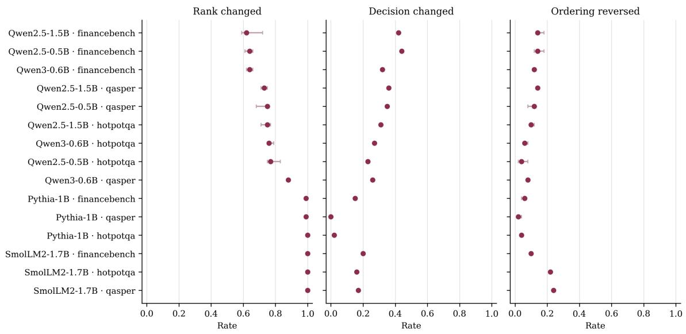
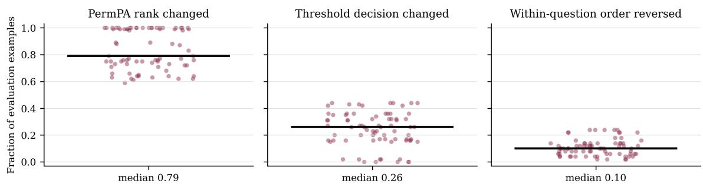
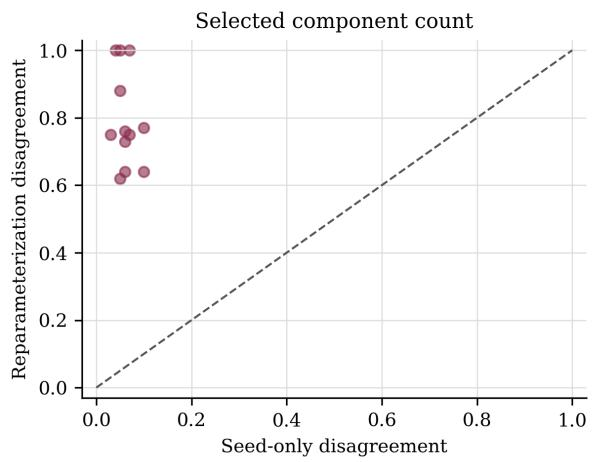
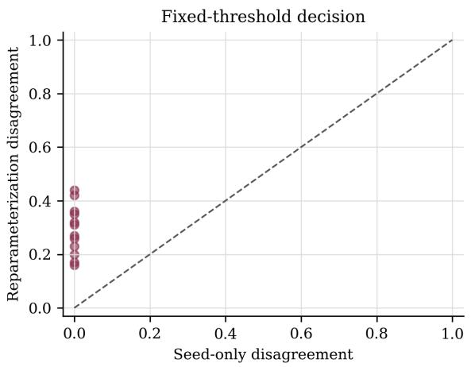
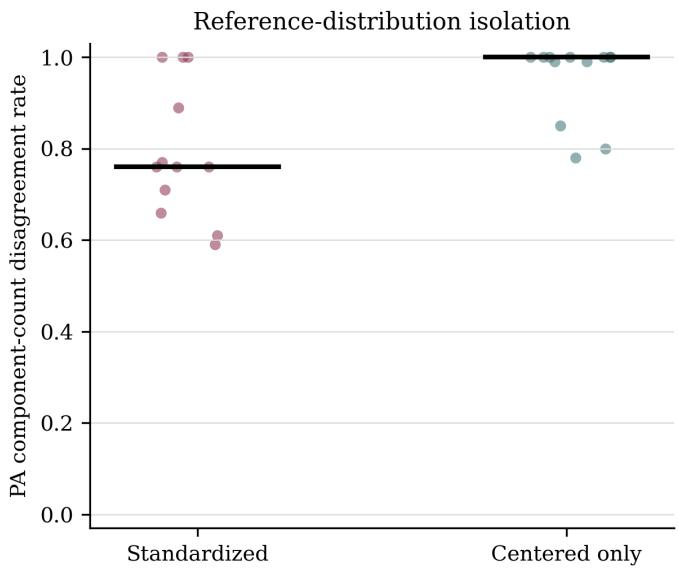
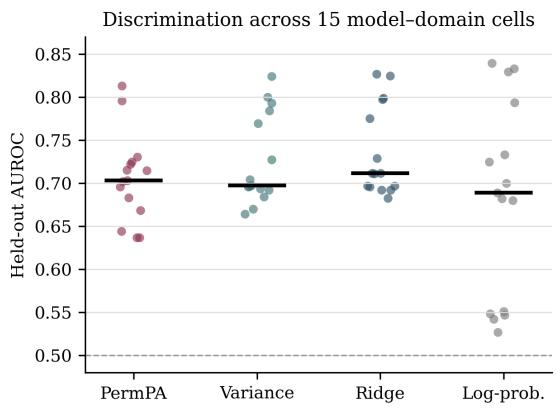
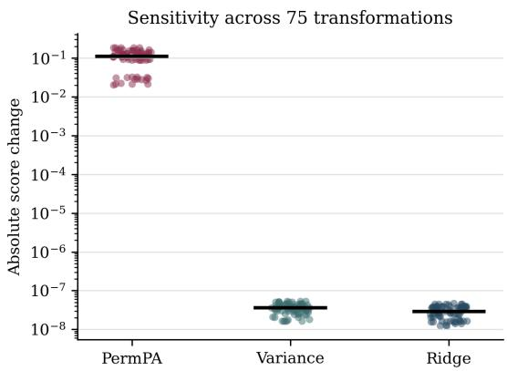
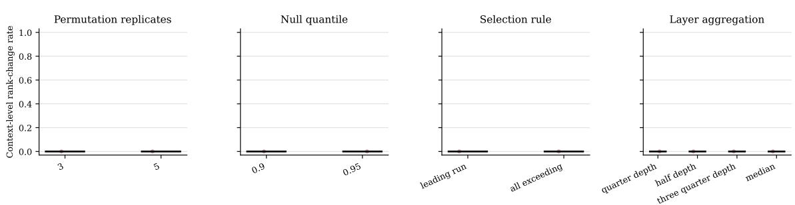

# Representation Measurements Under Function-Preserving Reparameterizations

Abdullah Karasan

akarasan@umbc.edu

University of Maryland, Baltimore County

1000 Hilltop Circle, Baltimore, MD 21250, USA

## Abstract

Hidden coordinates are not uniquely determined by a language model’s input–output function, so representation-derived measurements should be invariant to function-preserving changes of basis. This study shows that column-permutation parallel analysis violates function-preserving reparameterization invariance because its reference distribution and selected component count can change while the model function and observed covariance spectrum remain fixed. More generally, a data-internal reference procedure cannot simultaneously preserve every coordinate marginal, remain orthogonally equivariant, and remove cross-coordinate covariance. Empirically, across five models, three retrieval domains, and 75 transformations, median component-count disagreement is 0.79 and median fixed-threshold decision disagreement is 0.26. A centering-only control isolates the reference-driven efect, with 1,141 of 1,200 component counts changing despite an unchanged observed spectrum, whereas independent parallel analysis seeds change none of the corresponding decisions. By contrast, orthogonally invariant comparator scores remain numerically stable with similar held-out discrimination. Together, these results show that parallel analysis-derived component counts and decisions can reflect hidden-coordinate choice rather than a well-defined property of the model.

Keywords: Language model representations, neural network symmetries, functionpreserving reparameterization, parallel analysis, measurement validity

## 1 Introduction

Internal representations are routinely summarized by estimated ranks, subspaces, and projection scores. Such quantities are then interpreted as properties of a learned model or as evidence about downstream behavior. However, hidden coordinates are generally not unique. A model can often be reparameterized by an invertible change of basis while preserving its input–output function. Because these parameterizations describe the same model function, a representation statistic intended to characterize that function should return the same value for all of them.

These summaries are not inert descriptions. A selected component count fixes the subspace on which a probe is fitted, the dimension retained in a low-rank approximation, and, in the pipeline studied here, whether a retrieved context is classified as containing the evidence needed to answer a question. If the count reflects the coordinate system rather than the model, so do the decisions that follow from it.

This study examines that possibility in a retrieved-context measurement pipeline. Given token representations of a context and a fixed target answer, the pipeline uses columnpermutation parallel analysis (PA) to select a context subspace and scores the answer by its projection onto that subspace. The resulting score distinguishes evidence-containing contexts from matched evidence-ablated contexts. Column permutation is attractive because it preserves each coordinate’s empirical marginal distribution while disrupting cross-coordinate dependence. That is also its vulnerability: marginals are properties of the chosen basis, not of the model function.

The mismatch is sharp. An orthogonal reparameterization leaves the observed covariance spectrum exactly unchanged because XR and X have identical singular values. It nonetheless changes the diagonal of the covariance matrix, and the permutation reference is built from precisely that diagonal. The observed quantity and the reference against which it is compared therefore transform diferently under a change of basis that the model itself does not distinguish.

The central question is whether the PA-based measurement remains unchanged across functionally equivalent parameterizations of the same model. It is addressed at three levels. First, coordinate dependence is isolated in raw column-permutation PA without positing a unique “true” rank of language-model activations. Next, the analysis tests whether this dependence persists through the standardization and minimum-component rules of the implemented scorer. Finally, it determines whether changes in the resulting score alter fixed-threshold classifications of the two context conditions. The pipeline serves as a representative case study rather than a proposed retrieval evaluator. The requirement it is used to test, that a statistic interpreted as a property of a model function be well-defined across function-preserving hidden-coordinate systems, applies to representation-derived statistics more generally.

The analysis yields four contributions.

• A measurement-validity criterion for representation-derived statistics. I formalize the requirement at the exact-equality limit: a statistic interpreted as a property of a model function must be invariant under architecture-compatible, function-preserving reparameterization. Because such reparameterizations hold both the input and the model output fixed, they serve as controlled interventions in which any change in the statistic isolates dependence on the hidden coordinate system.

• A structural limitation of data-internal reference procedures. I prove that no randomized reference procedure constructed solely from the observed representation matrix can simultaneously preserve each coordinate’s empirical marginal distribution, remain equivariant under right-orthogonal transformations, and remove cross-coordinate covariance. Column-permutation PA is one instance of this broader incompatibility.

• A spectrum-conditioned range bound for column-permutation PA. I derive the expected permutation-reference covariance and show that the range of PA-selected component counts over the orthogonal orbit admits a lower bound computable from the observed spectrum, even though that spectrum is itself right-orthogonally invariant. Separate constructions cover the full orthogonal class used for the root mean square normalization (RMSNorm) models and the mean-preserving subgroup used for the LayerNorm model. Evaluated on 3,600 context–layer spectra, the bound certifies a nonzero orbit-wide range for 15.2% of contexts and is inconclusive, rather than contradicted, elsewhere; the bound is a suficient certificate rather than a sharp characterization.

• A controlled empirical study separating reference-driven instability from its alternatives. I show that, across five models, four architecture families, three retrieval domains, and five reparameterizations per model, function-preserving reparameterization changes fixed-threshold classification of the evidence-containing and evidence-ablated conditions at a median rate of 0.26, whereas an independent-seed rerun without reparameterization changes none of 1,200 matched decisions. A centering-only arm isolates the mechanism directly: the observed covariance spectrum is exactly invariant, yet 1,141 of 1,200 contexts change selected component count. The efect persists across 72 combinations of permutation budget, reference quantile, selection rule, and layer aggregation. Rightorthogonally invariant comparator scores remain numerically unchanged and attain comparable observed median AUROC across the 15 model–domain combinations.

## 2 Related Work

The relevant literature connects representation measurement to model symmetries, dimensionality estimation, and retrieval evaluation.

## 2.1 Representation Invariance and Measurement

Neural-network symmetries provide the first foundation for the invariance criterion. Model parameters are not unique descriptions of the input–output function. Hidden units can often be permuted, and positively homogeneous nonlinearities admit compensating rescalings of adjacent layers. These symmetries afect loss landscapes, Bayesian posteriors, and comparisons between independently trained networks (Dinh et al., 2017; Ainsworth et al., 2023; Godfrey et al., 2022). The sharpness construction of Dinh et al. (2017) is a particularly close precedent because a function-preserving rescaling changes a diagnostic quantity without changing generalization. The present setting extends that logic from a diagnostic of the loss landscape to a representation measurement whose variation propagates to downstream decisions. Recent compression methods exploit a stronger form of the same freedom in Transformers. QuaRot inserts fixed orthogonal transformations into the residual stream and absorbs them into adjacent weights (Ashkboos et al., 2024), while SpinQuant learns such transformations without changing the full-precision model function (Liu et al., 2025). Here, the same coordinate freedom is repurposed as a controlled intervention: because the input and model output are fixed, any change in the statistic isolates hidden-coordinate dependence.

A second foundation comes from representation comparison. Representational similarity analysis (RSA) compares pairwise stimulus relations rather than individual activation coordinates (Kriegeskorte et al., 2008). Centered kernel alignment (CKA) similarly compares example–example Gram matrices and is invariant to orthogonal transformations and isotropic scaling (Kornblith et al., 2019). Subsequent work has emphasized that a measure’s invariance class is part of its scientific meaning rather than a technical afterthought. Ding et al. (2021) evaluate similarity measures through sensitivity to functionally relevant changes and specificity to irrelevant ones, while Hayne et al. (2024) show that common similarity measures can track linearly decodable information more closely than information actually used by the network. The ReSi benchmark extends such comparisons across language, vision, and graph models using explicit groundings of similarity (Klabunde et al., 2025). This literature motivates the right-orthogonally invariant comparators used in the present study.

Identifiability and interpretability studies sharpen the same measurement concern. Learned representations may be determined only up to invertible linear transformations (Roeder et al., 2021), and models with nearly identical output distributions need not have nearby representations under the relevant equivalence class (Nielsen et al., 2025). Probe accuracy may reflect probe capacity rather than information uniquely attributable to a representation, motivating control tasks and explicit estimands (Hewitt and Liang, 2019; Pimentel et al., 2020). Likewise, individual-neuron conclusions can depend on the analysis procedure (Antverg and Belinkov, 2022), while sparse-autoencoder features need not form a unique or complete set of canonical units (Leask et al., 2025). The present study complements these concerns by showing that even an unsupervised spectral statistic can vary between exact reparameterizations of one model and that the variation can propagate to classification decisions.

Finally, statistical work on permutation methods makes clear that a permutation reference is valid only relative to its invariance or exchangeability assumptions. Standard permutation tests can lose validity when the tested null is weaker than equality of the underlying distributions, although appropriate studentization can restore asymptotic validity (Chung and Romano, 2013). Exactness with a finite set of randomly sampled permutations likewise depends on the transformation-group construction and the definition of the randomized test (Hemerik and Goeman, 2018). These studies concern hypothesis-test validity rather than representation reparameterization, but they establish the broader principle that a permutation distribution is not automatically neutral. The result developed here addresses a diferent requirement: whether a data-internal permutation reference transforms consistently when hidden coordinates are changed without altering the model function.

## 2.2 Dimensionality Estimation in Language Models

The possibility that a representation statistic depends on the hidden coordinate system is especially important for dimensionality estimation, because dimensionality has become a common descriptor of language-model representations. Recent work increasingly uses intrinsic dimension to characterize the geometry and development of language-model representations. Across several transformer families, Cheng et al. (2025) identify a high-dimensional middle-layer phase associated with linguistic abstraction, transferability, and cross-model predictability. Studying training trajectories, Lee et al. (2025) find that nonlinear intrinsic dimension tracks semantic compositionality, whereas linear dimensionality captures diferent, more superficial properties of the input. These studies suggest that dimensionality captures meaningful properties of language-model representations, but they also make the choice of estimator important. Intrinsic manifold dimension, covariance rank, efective rank, and factor count quantify diferent properties and need not agree. Whether each estimand is invariant to a change of hidden basis is a separate question, and the measurement-validity criterion developed here applies to each of them. This study targets the component count selected by permutation PA rather than nonlinear manifold dimension. The analysis therefore examines a prerequisite for interpreting that component count as a model-level quantity, namely invariance across exact reparameterizations of the same input–output function.

## 2.3 Context Suficiency and Retrieval Evaluation

This coordinate-dependence problem is examined in retrieval, where distinguishing useful evidence from inadequate context is practically important. Contemporary retrieval evaluation separates the quality of retrieved evidence from the generator’s ability to use it. ARES estimates context relevance, answer faithfulness, and answer relevance with calibrated modelbased judges (Saad-Falcon et al., 2024), while Ru et al. (2024) provide claim-level diagnostics for retrieval and generation and validate them against human judgments. Joren et al. (2025) define suficient context as retrieved text that contains enough information to answer a query and show that the evidence-suficiency distinction helps diagnose errors and guide abstention.

Guided by this evidence-centered view, evidence-containing contexts are treated as suficient and matched evidence-ablated contexts as insuficient. These operational labels do not independently establish semantic suficiency in the broader sense of Joren et al. (2025). A general evaluator for end-to-end retrieval systems is not proposed. Instead, the question is whether an internal-representation score that distinguishes the two conditions defined by the data construction constitute a well-defined measurement of a fixed model. Held-out AUROC measures discrimination, while invariance under function-preserving reparameterization measures dependence on the hidden coordinate system.

## 3 Setup and Theoretical Analysis

This section defines the representation matrices, admissible reparameterizations, and invariance criterion. It then analyzes column-permutation PA, establishes a limitation for marginal-preserving reference distributions, and introduces invariant comparator scores.

At layer $\ell ,$ let $X _ { \ell } \in \mathbb { R } ^ { n _ { \ell } \times d }$ contain the retrieved-context token representations and let $A _ { \ell } \in \mathbb { R } ^ { m _ { \ell } \times d }$ contain the representations of a fixed target answer. A change of hidden coordinates acts on both matrices as

$$
( X _ { \ell } , A _ { \ell } ) \longmapsto ( X _ { \ell } R , A _ { \ell } R ) , \qquad R \in O ( d ) .
$$

Here $O ( d ) = \{ R \in \mathbb { R } ^ { d \times d } : R ^ { \top } R = I _ { d } \}$ is the orthogonal group. Right-multiplying the hidden representations by R changes their coordinate system while preserving inner products and Euclidean geometry. If the adjacent model parameters are transformed accordingly, this change of coordinates leaves the model’s input–output function unchanged and therefore defines a function-preserving reparameterization. For the RMSNorm models considered here, coordinatewise gain parameters can be absorbed into adjacent linear maps, allowing any $R \in O ( d )$ . For the layer-normalization (LayerNorm) model, the transformation must also preserve the mean direction. Its admissible class is

$$
{ \mathcal { G } } _ { \mathrm { L N } } = \{ R \in O ( d ) : R \mathbf { 1 } = \mathbf { 1 } \} ,
$$

which is a proper subgroup of the full orthogonal class admitted by the RMSNorm models. Theorem 3 concerns the full group and therefore applies directly to the RMSNorm setting, whereas Theorem 2 below gives a separate construction within $\mathcal { G } _ { \mathrm { L N } }$ . This coordinate freedom is referred to as function-preserving reparameterization.

With these architecture-specific classes fixed, a statistic $T ( X , A )$ is called invariant under the specified function-preserving reparameterization class when

$$
T ( X R , A R ) = T ( X , A ) \qquad { \mathrm { f o r ~ e v e r y ~ } } R { \mathrm { ~ i n ~ t h e ~ s p e c i f i e d ~ a r c h i t e c t u r e - c o m p a t i b l e ~ c l a s s . } }
$$

Given a threshold $\tau _ { : }$ , the induced decision $D _ { \tau } ( X , A ) = \mathbf { 1 } \{ T ( X , A ) \geq \tau \}$ is invariant if it is unchanged under the same transformation class.

Function-preserving reparameterization invariance is necessary when $T$ is interpreted as a property of the input–output function or the retrieved evidence, rather than as a property of one chosen hidden-coordinate system.

## 3.1 Coordinate Dependence of Column-Permutation Parallel Analysis

Applying the function-preserving reparameterization invariance requirement to columnpermutation PA reveals a mismatch because the observed spectrum is right-orthogonally invariant, but the permutation reference distribution need not be.

PA is considered first because its mechanism can be analyzed explicitly within both normalization architectures. After establishing the PA-specific result, Section 3.2 shows that, under the full orthogonal group, the same issue reflects a broader incompatibility between exact marginal preservation and equivariance.

To see the source of the mismatch, let $X \in \mathbb { R } ^ { n \times d } , n \geq 2$ , have centered columns and define

$$
S = { \frac { 1 } { n } } X ^ { \top } X .
$$

Here, $\lambda _ { k } ( A )$ denotes the k-th largest eigenvalue of a symmetric matrix $A$ . For each feature $j$ , independently draw a uniform $n \times n$ permutation matrix $P _ { j }$ and set $X _ { \cdot j } ^ { \pi } = P _ { j } X _ { \cdot j }$ . The nonparametric column-permutation form of parallel analysis is considered (Horn, 1965; Buja and Eyuboglu, 1992; Dobriban, 2020). It compares the ordered eigenvalues of S with componentwise quantiles of

$$
S ^ { \pi } = \frac { 1 } { n } ( X ^ { \pi } ) ^ { \top } X ^ { \pi } .
$$

For ideal permutation-reference quantiles $t _ { k } ( X )$ , the estimator retains consecutive components from the largest eigenvalue onward and stops at the first failed comparison:

$$
\widehat { r } _ { \mathrm { P A } } ( X ) = \operatorname* { m a x } \{ r \in \{ 0 , \ldots , \operatorname* { m i n } ( n , d ) \} : \lambda _ { k } ( S ) > t _ { k } ( X ) \mathrm { ~ f o r ~ a l l ~ } 1 \leq k \leq r \} .
$$

Here ${ \widehat { r } } _ { \operatorname { P A } } ( X )$ denotes the number of leading components selected by PA, and $r$ is a candidate component count in the maximization.

Both lemmas below follow from elementary properties of sampling without replacement and are stated because the later results depend on their exact finite-sample form.

Lemma 1 (Expected Permutation Covariance) Conditionally on $X$

$$
\mathbb { E } _ { \pi } [ S ^ { \pi } ] = \mathrm { d i a g } ( S ) .
$$

For every $R \in O ( d )$ , X and XR have the same singular values, but

$$
\mathbb { E } _ { \pi } [ S _ { R } ^ { \pi } ] = \mathrm { d i a g } ( R ^ { \top } S R ) ,
$$

where $S _ { R } ^ { \pi }$ is generated by independently permuting the columns of XR. Thus the expected permutation-reference covariance depends on the hidden-coordinate system even though the observed covariance eigenvalues do not.

Proof Write $x _ { j } = X _ { \cdot j }$ . The diagonal entries satisfy

$$
\frac { 1 } { n } ( P _ { j } x _ { j } ) ^ { \top } ( P _ { j } x _ { j } ) = \frac { 1 } { n } \| x _ { j } \| _ { 2 } ^ { 2 } = S _ { j j } .
$$

For $j \neq k$ , independence of $P _ { j }$ and $P _ { k }$ , together with column centering, gives

$$
\mathbb { E } _ { \pi } [ ( P _ { j } x _ { j } ) ^ { \top } ( P _ { k } x _ { k } ) ] = 0 .
$$

This proves the first identity. Applying it to XR proves the second, whereas $( X R ) ^ { \top } ( X R ) / n =$ $R ^ { \top } S R$ is orthogonally similar to S.

Lemma 1 identifies the source of coordinate dependence at the level of the reference mean. To connect that mean to the componentwise PA thresholds, the next lemma controls the fluctuation of a realized permutation covariance around its coordinate-dependent center.

Lemma 2 (Permutation Covariance Bound) Define

$$
V ( S ) = ( \operatorname { t r } S ) ^ { 2 } - \sum _ { j = 1 } ^ { d } S _ { j j } ^ { 2 } .
$$

Then, conditionally on $X$

$$
\mathbb { E } _ { \boldsymbol \pi } \left[ \lVert \boldsymbol { S } ^ { \boldsymbol \pi } - \mathrm { d i a g } ( \boldsymbol { S } ) \rVert _ { \mathrm { F } } ^ { 2 } \right] = \frac { V ( \boldsymbol { S } ) } { n - 1 } .
$$

Consequently, for every $\delta \in ( 0 , 1 )$ , with conditional probability at least $1 - \delta$

$$
\| S ^ { \pi } - \mathrm { d i a g } ( S ) \| _ { \mathrm { o p } } \leq \varepsilon _ { \delta } ( S ) : = { \sqrt { \frac { V ( S ) } { ( n - 1 ) \delta } } } .
$$

$I f s _ { ( 1 ) } \geq \cdot \cdot \cdot \geq s _ { ( d ) }$ are the ordered diagonal entries of S, then simultaneously for all $k ,$

$$
\left| \lambda _ { k } ( S ^ { \pi } ) - s _ { ( k ) } \right| \leq \varepsilon _ { \delta } ( S ) .
$$

For a real-valued random variable Y , define the upper (1 − α)-quantile by

$$
Q _ { 1 - \alpha } ( Y ) = \operatorname* { i n f } \{ y \in \mathbb { R } : \mathbb { P } ( Y \leq y ) \geq 1 - \alpha \} .
$$

Here y is a candidate real-valued threshold. Then the ideal componentwise threshold $t _ { k } ( X ) =$ $Q _ { 1 - \alpha } \{ \lambda _ { k } ( S ^ { \pi } ) \}$ satisfies

$$
t _ { k } ( X ) \leq s _ { ( k ) } + \varepsilon _ { \alpha } ( S ) .
$$

The proof is provided in Appendix B.1. The $1 / \sqrt { \delta }$ factor comes from Markov’s inequality applied to the squared Frobenius norm; at $\delta = 0 . 0 5$ it is $\sqrt { 2 0 } \approx 4 . 4 7$ times the root-meansquare Frobenius fluctuation. The additional substitution $\| \cdot \| _ { \mathrm { o p } } \leq \| \cdot \| _ { \mathrm { F } }$ can only increase conservatism. Accordingly, the bound is a suficient finite-sample guarantee, not an estimate of the actual 95th-percentile deviation.

Having linked the permutation thresholds to the covariance diagonal, the analysis uses the Schur–Horn theorem to determine how much that diagonal can change under a rotation. If $S \succeq 0 , \operatorname { t r } ( S ) > 0$ , and $\bar { \lambda } = \mathrm { t r } ( S ) / d .$ then

$$
\operatorname* { m i n } _ { R \in O ( d ) } \lambda _ { 1 } ( \mathbb { E } _ { \pi } [ S _ { R } ^ { \pi } ] ) = \bar { \lambda } , \qquad \operatorname* { m a x } _ { R \in O ( d ) } \lambda _ { 1 } ( \mathbb { E } _ { \pi } [ S _ { R } ^ { \pi } ] ) = \lambda _ { 1 } ( S ) .
$$

The lower endpoint is attained by a basis with constant covariance diagonal; the upper endpoint is attained by aligning one coordinate with a leading eigenvector. Hence the largest eigenvalue of the expected reference covariance, not the mean or a quantile of the largest realized permutation-reference eigenvalue, can vary over an exact multiplicative range of

$$
{ \frac { d \lambda _ { 1 } ( S ) } { \operatorname { t r } ( S ) } } .
$$

Importantly, this expectation range alone does not establish that PA thresholds or selected component counts must vary. To obtain such a statement, the argument combines the Schur–Horn construction with the finite-sample quantile bound from Lemma 2. The resulting spectrum-dependent quantities are

$$
c _ { \alpha } ( S , n ) = \bar { \lambda } + \sqrt { \frac { ( \mathrm { t r } S ) ^ { 2 } - ( \mathrm { t r } S ) ^ { 2 } / d } { ( n - 1 ) \alpha } }
$$

and define

$$
m _ { \alpha } ( S , n ) = \operatorname* { m a x } \left( \{ 0 \} \cup \{ m \in \{ 1 , \dots , \operatorname* { m i n } ( n , d ) \} : \lambda _ { m } ( S ) > c _ { \alpha } ( S , n ) \} \right) .
$$

Here $m _ { \alpha } ( S , n )$ counts the leading observed eigenvalues that remain strictly above a conservative reference threshold in a constant-diagonal orientation. This gives the following orbit-wide guarantee.

Theorem 1 (Component-Count Range) Consider ideal PA based on independent column permutations. Use upper $1 - \alpha$ componentwise quantiles, selection from the largest component until the first failed comparison, and strict exceedance. Then

$$
\operatorname* { m a x } _ { R \in O ( d ) } \widehat { r } _ { \mathrm { P A } } ( X R ) - \operatorname* { m i n } _ { R \in O ( d ) } \widehat { r } _ { \mathrm { P A } } ( X R ) \geq m _ { \alpha } ( S , n ) .
$$

The left-hand side is the range of PA-selected component counts over all orthogonal coordinate systems $R \in O ( d )$ . In particular, an orientation aligned with a leading eigenvector has selected component count zero, while a constant-diagonal orientation retains at least $m _ { \alpha } ( S , n )$ components.

Appendix B.2 gives the proof. Because Lemma 2 is conservative, $m _ { \alpha } ( S , n )$ can be zero even when the actual PA count varies across orientations. For the main setting $d = 8 9 6$ $n = 1 9 2$ , and $\alpha = 0 . 0 5$ , the bound gives $c _ { \alpha } / \bar { \lambda } \approx 2 9 1$ . Thus a positive certificate requires approximately $\lambda _ { 1 } ( S ) \gtrsim 0 . 3 2 \operatorname { t r } ( S )$ , which explains why the suficient bound certifies only a subset of contexts. Whenever $m _ { \alpha } ( S , n ) > 0$ , the theorem nevertheless guarantees an orbit-wide range directly from the observed spectrum. The range result uses the full group $O ( d )$ . An explicit construction that also lies within the LayerNorm-compatible subgroup is given next.

Theorem 2 (Diferent PA Component Counts) Fix integers $n \geq 2$ and $d \ge 3 , \lambda > 0$ and $\alpha \in ( 0 , 1 )$ . Let $u \in \mathbb { R } ^ { n }$ be any centered unit vector, $e _ { 1 }$ the first coordinate vector, and

$$
\boldsymbol { w } = ( 2 / 3 , 2 / 3 , - 1 / 3 , 0 , \ldots , 0 ) ^ { \top } .
$$

Define

$$
X _ { \mathrm { l o c } } = \sqrt { n \lambda } u e _ { 1 } ^ { \top } , \qquad X _ { \mathrm { m i x } } = \sqrt { n \lambda } u w ^ { \top } .
$$

There exists $R \in \mathcal G _ { \mathrm { L N } }$ such that $X _ { \mathrm { m i x } } = X _ { \mathrm { l o c } } R ;$ hence the matrices are related by a LayerNormcompatible transformation and have the same singular values. Nevertheless, ideal PA with consecutive-from-largest selection and strict exceedance satisfies

$$
\widehat { r } _ { \mathrm { P A } } ( X _ { \mathrm { l o c } } ) = 0 .
$$

If

$$
n - 1 > \frac { 4 8 } { 2 5 \alpha } ,
$$

then

$$
\widehat { r } _ { \mathrm { P A } } ( X _ { \mathrm { m i x } } ) = 1 .
$$

The proof is provided in Appendix B.3. Together, the two theorems provide complementary conclusions. Theorem 1 gives a spectrum-dependent range guarantee over the full orthogonal orbit, whereas Theorem 2 gives a concrete count change within the LayerNorm-compatible subgroup. In both cases, the observed spectrum remains fixed while the permutation reference changes with the basis.

The theorems above analyze ideal PA with consecutive-from-largest selection and strict exceedance, a rule that may return zero. They establish coordinate dependence of the PA estimator rather than ambiguity in algebraic or covariance rank. Increasing the permutation budget estimates each coordinate-specific reference distribution more accurately but does not make those distributions equal.

The experimental scorer additionally standardizes each coordinate, enforces a minimum component count of one, and converts the selected subspace into a context–answer projection score. Thus reparameterization can propagate through standardization, component selection, projection, and fixed-threshold classification. Appendix A gives the complete score, including numerical safeguards and aggregation rules. The empirical analysis tests this full pipeline rather than only the centered-covariance setting of Lemma 1.

## 3.2 Limits of Marginal-Preserving Reference Distributions

The PA calculation raises a broader question. Can any reference procedure preserve the empirical distribution of every coordinate, remove cross-coordinate covariance, and still behave consistently under orthogonal changes of basis? This feasibility question is answered for procedures constructed solely from the observed representation matrix.

For a row matrix X, define its empirical row measure and projected empirical measures by

$$
{ \widehat { \mu } } _ { X } = { \frac { 1 } { n } } \sum _ { i = 1 } ^ { n } \delta _ { x _ { i } } , \qquad { \widehat { \mu } } _ { X v } = { \frac { 1 } { n } } \sum _ { i = 1 } ^ { n } \delta _ { x _ { i } ^ { \top } v } .
$$

Let $\kappa ( \boldsymbol { X } , \cdot )$ denote any randomized data-internal reference procedure that uses only X to produce an $n \times d$ reference matrix, and write $Z \sim { \mathcal { K } } ( X , \cdot )$ . This restriction distinguishes the procedure from methods that use paired data or an external control sample.

The procedure preserves coordinate marginals exactly if, for every fixed X,

$$
\widehat { \mu } _ { Z e _ { j } } = \widehat { \mu } _ { X e _ { j } } \quad \mathrm { a l m o s t ~ s u r e l y ~ f o r } \ j = 1 , \ldots , d .
$$

It is right-orthogonally equivariant if, for every fixed X and $R \in O ( d )$

$$
\mathcal { K } ( X R , \cdot ) = \mathcal { L } ( Z R \mid Z \sim \mathcal { K } ( X , \cdot ) ) .
$$

At first glance, exact marginal preservation and orthogonal equivariance may appear to constrain only one-dimensional projections. The next theorem shows that together they determine the entire empirical row distribution.

Theorem 3 (Marginal-Preservation Limit) Suppose a randomized data-internal reference procedure preserves every coordinate marginal. Suppose also that, for every input matrix and every $R \in O ( d )$ , its output distribution transforms from Z to $Z R$ . Then

$$
{ \widehat { \mu } } _ { Z } = { \widehat { \mu } } _ { X } a l m o s t s u r e l y .
$$

Equivalently, $Z = P X$ for a random row-permutation matrix $P = P ( X , Z )$ . Therefore,

$$
Z ^ { \top } Z = X ^ { \top } X
$$

almost surely.

The proof is provided in Appendix B.4. Its implication is stronger than covariance preservation alone. An equivariant procedure that preserves every coordinate marginal must reproduce the complete empirical row measure, up to row permutation. It therefore cannot serve as a dependence-destroying reference distribution.

Corollary 1 (Data-Internal Reference Limitation) A reference procedure constructed solely from X cannot satisfy all three requirements simultaneously: exact preservation of every coordinate’s empirical marginal distribution, right-orthogonal equivariance, and alteration of the covariance matrix $X ^ { \top } X$ . In particular, cross-coordinate covariances cannot be removed while the first two requirements are retained.

To clarify the theorem’s practical implications, Table 1 makes the available trade-ofs explicit. Column permutation obtains a changed covariance reference by giving up orthogonal equivariance. A trace-matched isotropic Gaussian reference can be equivariant and change covariance, but it gives up exact empirical marginal preservation. A common row permutation satisfies both invariance requirements only because it leaves the covariance unchanged.

Table 1: Assumptions and consequences for representative data-internal reference procedures. “Diferent covariance” asks whether the procedure can produce $Z ^ { \top } Z \neq X ^ { \top } X$
<table><tr><td>Reference procedure</td><td></td><td>Exact marginals O(d)-equivariant</td><td>Different covariance</td></tr><tr><td>Independent column permutations</td><td>Yes</td><td>No</td><td>Yes</td></tr><tr><td>Common row permutation</td><td>Yes</td><td>Yes</td><td>No</td></tr><tr><td>Trace-matched isotropic Gaussian</td><td>No</td><td>Yes</td><td>Yes</td></tr></table>

Two qualifications limit the scope of this impossibility result. First, the theorem concerns data-internal procedures with exact coordinate-marginal preservation; it does not exclude equivariant procedures that relax exact marginal preservation or use paired data or external information. Second, its proof requires the full group $O ( d )$ , whose rotations can map a fixed coordinate direction to any point on the unit sphere. It therefore applies directly to the RMSNorm reparameterizations in this study, but not to $\mathcal { G } _ { \mathrm { L N } }$ , which fixes the all-ones direction.

The results cover the two settings in complementary ways. The general theorem governs the full orthogonal class used for the RMSNorm models, while Theorem 2 establishes PA instability directly within the LayerNorm-compatible subgroup. The analysis now turns from the impossibility result to scores that are invariant by construction.

## 3.3 Invariant Context–Answer Scores

The comparators are constructed using row Gram matrices, a standard way to remove dependence on feature coordinates in representational similarity analysis and centered kernel alignment (Kriegeskorte et al., 2008; Kornblith et al., 2019). In particular, for $X , Y \in \mathbb { R } ^ { n \times d }$

$$
X X ^ { \top } = Y Y ^ { \top } \quad \Longleftrightarrow \quad Y = X R
$$

for some $R \in O ( d )$ . Thus $X X ^ { \top }$ characterizes X up to a right-orthogonal transformation. The comparator scores specialize this established Gram-matrix construction to the relation between retrieved context and a target answer within one model. This difers from CKA and RSA, which compare learned representations.

For the paired object (X, A), applying the same fact to the vertically concatenated matrix gives the block Gram matrix

$$
{ \big [ } X { \big ] } \left[ { \begin{array} { l } { X } \\ { A } \end{array} } \right] ^ { \top } = \left[ { \begin{array} { l l } { X X ^ { \top } } & { X A ^ { \top } } \\ { A X ^ { \top } } & { A A ^ { \top } } \end{array} } \right] .
$$

The comparator scores use $X X ^ { \top } , A X ^ { \top }$ , and answer norms, all of which are blocks or diagonal entries of the joint Gram matrix. The joint Gram-matrix construction makes their invariance explicit before their empirical discrimination is assessed.

The first comparator retains the smallest principal subspace explaining a fixed fraction of context variance and measures the answer projection onto that subspace. The second replaces the hard cutof with ridge shrinkage over all context directions. Both can be computed from the context Gram matrix, context–answer inner products, and answer norms. Their full definitions are provided in Appendix A. These constants are fixed design choices rather than theoretically privileged values. Specifically, $\eta = 0 . 9 , \rho _ { \ell } = 0 . 1 \bar { \lambda } _ { \ell } .$ , and top-quartile token aggregation were specified before evaluation and were not tuned to the reported results.

By construction, the resulting scores are jointly right-orthogonally invariant. Specifically, for every $R \in O ( d )$ , every finite collection of layers, and every fixed input pair,

$$
s _ { \mathrm { v a r i a n c e } } ( \{ X _ { \ell } R , A _ { \ell } R \} _ { \ell \in \mathcal { L } } ) = s _ { \mathrm { v a r i a n c e } } ( \{ X _ { \ell } , A _ { \ell } \} _ { \ell \in \mathcal { L } } ) ,
$$

and

$$
s _ { \mathrm { r i d g e } } ( \{ X _ { \ell } R , A _ { \ell } R \} _ { \ell \in \mathcal { L } } ) = s _ { \mathrm { r i d g e } } ( \{ X _ { \ell } , A _ { \ell } \} _ { \ell \in \mathcal { L } } ) .
$$

Orthogonal invariance follows directly from

$$
( X _ { \ell } ^ { c } R ) ( X _ { \ell } ^ { c } R ) ^ { \top } = X _ { \ell } ^ { c } ( X _ { \ell } ^ { c } ) ^ { \top } , \qquad ( A _ { \ell } ^ { c } R ) ( X _ { \ell } ^ { c } R ) ^ { \top } = A _ { \ell } ^ { c } ( X _ { \ell } ^ { c } ) ^ { \top } ,
$$

together with preservation of centered answer norms. The baseline correction, clipping, token aggregation, and cross-layer geometric mean are deterministic, so they preserve the equality.

Finally, eigenvalue ties are treated explicitly because numerical determinism alone does not define an invariant spectral projector. The ridge-shrinkage subspace score remains invariant with repeated eigenvalues. The cumulative-variance principal-subspace score is invariant under the tie-safe cutof stated above; if the cutof splits a repeated eigenspace, an ordered numerical eigendecomposition does not provide a basis-independent mathematica definition.

## 4 Empirical Analysis

The empirical analysis tests whether the theoretical coordinate dependence survives the full measurement pipeline. Specifically, the analysis asks whether reparameterization changes PA-based measurements, whether randomness or preprocessing can explain the observed instability, and whether invariant alternatives retain context discrimination.

## 4.1 Study Design

To follow this propagation from component selection to downstream decisions, the prespecified design includes five models from four architecture families. The models are Qwen2.5-0.5B, Qwen2.5-1.5B, Qwen3-0.6B, SmolLM2-1.7B, and Pythia-1B (Qwen Team, 2024, 2025; Ben Allal et al., 2025; Biderman et al., 2023). Table 2 states the transformation class used for each model.

To vary the form of retrieved evidence, FinanceBench, QASPER, and HotpotQA are used (Islam et al., 2023; Dasigi et al., 2021; Yang et al., 2018). FinanceBench pairs contrast evidence from the target filing with a same-company passage from a diferent reporting period; the evidence-ablated condition contains only the period-mismatched passage. For

Table 2: Models and exact residual-stream transformation classes. Parameter counts are those encoded in the public model identifiers.
<table><tr><td>Model</td><td>Architecture</td><td>Normalization</td><td>Transformation class</td></tr><tr><td>Qwen2.5-0.5B</td><td>Qwen2</td><td>RMSNorm</td><td>O(d)</td></tr><tr><td>Qwen2.5-1.5B</td><td>Qwen2</td><td>RMSNorm</td><td>O(d)</td></tr><tr><td>Qwen3-0.6B</td><td>Qwen3</td><td>RMSNorm</td><td>O(d)</td></tr><tr><td>SmolLM2-1.7B</td><td>Llama-style</td><td>RMSNorm</td><td>O(d)</td></tr><tr><td>Pythia-1B</td><td>GPT-NeoX</td><td>LayerNorm</td><td> $\{ R \in O ( d ) : R \mathbf { 1 } = \mathbf { 1 } \}$ </td></tr></table>

QASPER, the evidence-containing condition contains annotated evidence paragraphs plus three sampled non-evidence paragraphs from the same paper, while the evidence-ablated condition contains those same non-evidence paragraphs without the evidence. HotpotQA uses the analogous construction with supporting and distractor documents.

Despite these domain-specific constructions, the paired conditions always difer by the presence of annotated evidence, not by the question or evaluated answer. These conditions are used as operational labels for context suficiency; they do not constitute an independent semantic verification that every evidence-containing context is suficient.

Within each model–domain combination, 20 question pairs are assigned to calibration and 50 disjoint pairs to evaluation. The same target-answer tokens are teacher-forced under both contexts. Contexts are truncated to 192 tokens. Hidden states are probed at one-quarter, one-half, and three-quarters of model depth, and the three layer scores are aggregated with a geometric mean.

Alongside the representation-based scores, answer log-probability is included as a behavioral baseline. It is the mean teacher-forced log-probability across the fixed target-answer tokens; larger values indicate the evidence-containing condition. It uses the same model– domain-specific calibration and evaluation procedure as the representation-based scores.

To intervene on hidden coordinates while preserving model behavior, five transformations are generated for each model from fixed random seeds, and each transformation is reused across that model’s three domains. For an RMSNorm width $d = m b$ , where b is the largest power of two dividing $d ,$ the implemented matrix is

$$
R = ( Q _ { m } \otimes H _ { b } ) \Pi D .
$$

Here $H _ { b }$ is a normalized Hadamard matrix, $Q _ { m }$ is obtained by QR factorization of an $m \times m$ standard Gaussian matrix with the diagonal signs of the triangular factor absorbed into $Q _ { m } ,$ Π is a uniformly sampled coordinate permutation, and D contains independent Rademacher signs. Thus the RMSNorm intervention is a structured dense orthogonal draw, not a Haar draw from $O ( d )$ . For the studied LayerNorm model, $Q _ { \perp }$ is sampled Haar-uniformly from $O ( d - 1 )$ using the same sign-corrected Gaussian QR construction. The matrix diag(1, $Q _ { \perp } )$ is then embedded in a basis whose first vector is $\mathbf { 1 } / \sqrt { d }$ and conjugated back. The resulting matrix fixes 1 and is Haar-uniform on its orthogonal complement. The design contains 25 distinct model–transformation matrices and 75 dependent model–domain–transformation comparisons.

Before representation stability was measured, numerical verification confirmed that all 25 transformations preserved the evaluated behavior. Greedy output tokens were unchanged, the maximum absolute teacher-forced log-probability error was below $1 0 ^ { - 4 }$ , and relative logit $\ell _ { 2 }$ error was below $1 0 ^ { - 4 }$ on ten verification prompts. These checks establish numerical preservation of the evaluated input–output behavior.

Within each transformed or original representation, PA uses 50 column-permutation replicates and examines

$$
k = \operatorname* { m i n } \{ 6 4 , \operatorname* { m i n } ( n _ { \ell } , d ) - 1 \}
$$

components. The componentwise 0.95 cutof is estimated using linear interpolation of the empirical permutation quantiles. Consecutive-from-largest selection uses strict exceedance and stops at the first failure; if all k comparisons succeed, the selected count is k. The scoring implementation then enforces a minimum count of one. The reported context component count is the integer median of the three layer-specific selected counts. In the centering-only control, each original–transformed pair uses the same item-level permutation seed and the same 50 replicates. Thus its disagreement cannot be attributed to a seed change between orientations.

After the scores are computed, decision thresholds are selected to maximize accuracy over the 40 calibration contexts; if multiple cutofs maximize accuracy, their median is used. A threshold is selected separately for each score and model–domain combination on the original parameterization and is not recalibrated after reparameterization. AUROC is threshold free and is computed on the 100 evaluation contexts in each model–domain combination.

The four primary outcomes comprise context-level selected-component-count disagreement, absolute score change, fixed-threshold decision disagreement, and within-question ordering reversal. Because each question contributes matched evidence-containing and evidence-ablated contexts, questions rather than individual contexts are used as the resampling units. For the main stability analysis, uncertainty calculations condition on the five fixed transformations and use the question as the independent resampling unit; they quantify variation over questions, not over arbitrary transformations. Paired resampling retains the matched evidence-containing and evidence-ablated contexts. The control and discrimination intervals are descriptive empirical-combination bootstraps over the 12 and 15 observed model–domain combinations, respectively; because combinations share models and domains, they are not population-sampling intervals. The robustness analysis uses a question-level bootstrap within its four representative settings.

## 4.2 Reparameterization-Induced Instability

With the design fixed, instability is first examined under function-preserving reparameterization. Table 3 summarizes the 75 model–domain–transformation comparisons. The most consequential endpoint is the downstream decision. The median fixed-threshold disagreement rate is 0.26, whereas an independent-seed rerun without reparameterization changes none of the 1,200 decisions in the matched control. Pairwise ordering is more stable than absolute decisions but is not invariant, with a median reversal rate of 0.10. At the component-selection stage, the median comparison has a context-level disagreement rate of 0.79. Because this binary rate does not describe magnitude, the 7,500 matched context transformations are also pooled. The median absolute component-count change is 2 (IQR 1–4; range 0–12).

Conditional on a change, the median is 3 (IQR 1–5). Original component counts have median 39 (IQR 35–43; range 11–53), whereas reparameterized counts have median 37 (IQR 35–39; range 9–47).

Beyond the absolute magnitude, the signed shift is directional: 5,025 transformations decrease the count, 1,238 increase it, and 1,237 leave it unchanged. The directional asymmetry should be interpreted relative to the intervention. The RMSNorm transformations are structured randomized Hadamard–block rotations rather than Haar draws from O(d); they tend to redistribute coordinate concentration, and the observed 39-to-37 median shift and narrower transformed IQR are consistent with movement toward the constantdiagonal, difuse endpoint in Theorem 1. The theorem’s aligned and constant-diagonal orientations establish extremal reference configurations, not a prediction that arbitrary Haar transformations must decrease the selected count. Accordingly, the direction observed here is specific to the sampled transformation family, whereas disagreement under function preservation is the primary result.

To connect this empirical pattern back to the theory, the spectrum-conditioned lower bound from Theorem 1 is also evaluated at $\alpha = 0 . 0 5$ using the centered, unstandardized covariance $S = X _ { c } ^ { \top } X _ { c } / n$ for the 1,200 original contexts from the four $\mathrm { f u l l - } O ( d )$ RMSNorm models. Across 3,600 context–layer spectra, $m _ { \alpha } ( S , n ) = 1$ for 182 and $m _ { \alpha } ( S , n ) = 0$ for 3,418; the 182 positive cases occur in 182 distinct contexts. Thus the conservative theorem certifies an orbit-wide component-count range of at least one for 15.2% of contexts and is inconclusive, rather than contradicted, for the remaining 84.8%. The spectral range bound is not applied to Pythia because its LayerNorm-compatible transformation class is a proper subgroup of O(d).

Table 3: Stability under analytically function-preserving, numerically verified reparameterizations. The first three rows summarize 75 model–domain–transformation comparison-level rates. The final row pools 7,500 matched context transformations. IQR and range are descriptive, not confidence limits.
<table><tr><td>Endpoint</td><td>Median</td><td>IQR</td><td>Range</td></tr><tr><td>PA component-count disagreement</td><td>0.79</td><td>(0.725, 1.000)</td><td>(0.59, 1.00)</td></tr><tr><td>Decision disagreement</td><td>0.26</td><td>(0.160, 0.345)</td><td>(0.00, 0.44)</td></tr><tr><td>Within-question ordering reversal</td><td>0.10</td><td>(0.060, 0.140)</td><td>(0.02, 0.24)</td></tr><tr><td>Absolute component-count change</td><td>2</td><td>(1, 4)</td><td>(0, 12)</td></tr></table>

Figure 1 shows that the instability occurs across model–domain combinations rather than being driven by a single setting. Figure 2 complements this comparison by showing the distribution, magnitude, and decision-level consequences of the component-count changes.

As expected from their construction, the maximum absolute changes of the cumulativevariance principal-subspace and ridge-shrinkage scores are $5 . 4 1 \times 1 0 ^ { - 8 }$ and $4 . 6 8 \times 1 0 ^ { - 8 }$ 2 respectively, which are of numerical-error magnitude.

The PA-selected subspace score has the larger question-level absolute change than either invariant comparator for all 50 questions in every one of the 75 comparisons. This is a descriptive finite-sample statement; no hypothesis test is needed for the algebraically invariant comparators.

Instability varies across model-domain combinations  
  
Figure 1: Heterogeneity across the 15 model–domain combinations. Each point is the median across the five fixed transformations; horizontal bars show the minimum and maximum across those transformations. The ranges describe the five evaluated transformations and are not confidence intervals for an underlying transformation population.

Function-preserving reparameterizations alter PermPA measurements  
  
Figure 2: Distribution and downstream consequences of component-count changes. Top left. raw selected component counts for 1,500 original contexts and 7,500 matched reparameterized contexts. Top right. absolute changes for the 7,500 matched context transformations. Bottom. decision disagreement and within-question ordering reversal for each of the 75 model–domain–transformation comparisons; horizontal segments mark medians. Decisions use the score threshold selected on the original calibration split.

Importantly, no activation component count is treated as ground truth. Instead, these comparisons test the more basic requirement that the same input–output function receive the same measurement.

## 4.3 Randomness and Preprocessing Checks

The next analysis asks whether randomness or preprocessing can account for the observed efect. Because PA is randomized, a selected component count can change when the permutation reference distribution is recomputed even if the activations are held fixed. This baseline variability is quantified in a post-hoc control that covers the 12 model–domain combinations from the four RMSNorm models. For each combination, PA is recomputed on the original, untransformed activations using an independent permutation seed and the same 50 permutation-reference replicates. The comparison with reparameterization is paired by model and domain; the reparameterization rate is the median across the five fixed transformations.

The comparison in Table 4 shows that random-seed variability is much smaller than the coordinate efect. The median no-reparameterization seed-change rate is 0.06, whereas the corresponding reparameterization rate is 0.76. The median paired diference is 0.69, with a model–domain bootstrap 95% interval of (0.625,0.880). Reparameterization has the larger rate in all 12 model–domain combinations (two-sided sign-test $p = 4 . 8 8 \times 1 0 ^ { - 4 } )$ . Across the 1,200 seed-control contexts, the absolute component-count change has median 0 and IQR 0–0; only 74 contexts have a nonzero change. Changing only the permutation seed produces no fixed-threshold decision disagreement in any of the 1,200 contexts. By comparison, the median reparameterization-induced decision-disagreement rate across the same 12 model–domain combinations is 0.29. In this 12-combination, one-rerun control, finite-replicate Monte Carlo variation is therefore substantially smaller than the observed reparameterization efect.

Figure 3 visualizes the separation between the reparameterization efect and independentseed variability for both component counts and downstream decisions.

To isolate the reference-distribution mechanism from preprocessing, the analysis turns to the centering-only arm, which provides the cleanest empirical test of Lemma 1 and the PA component-count results in Theorems 1 and 2. It removes coordinatewise standardization and thereby separates the observed and reference spectra. If $X _ { c }$ denotes the centered context matrix, then the reparameterized centered matrix is exactly $X _ { c } R$ , and

$$
( X _ { c } R ) ^ { \top } ( X _ { c } R ) = R ^ { \top } X _ { c } ^ { \top } X _ { c } R .
$$

It follows that the observed eigenvalues are identical in exact arithmetic. Any change in the selected component count must arise from the column-permutation reference distribution, apart from numerical error. Direct numerical comparison across contexts and layers gives maximum relative observed-eigenvalue error $1 . 2 6 \times 1 0 ^ { - 6 }$ (maximum absolute error $4 . 6 9 \times 1 0 ^ { - 2 }$ on the unnormalized eigenvalue scale). Despite the unchanged observed spectrum, 1,141 of 1,200 contexts change selected component count; the median model–domain disagreement rate is 1.00 (range 0.78–1.00). The corresponding standardized-minus-centering-only median diference is −0.24 (model–domain bootstrap 95% interval $[ - 0 . 3 1 0 , 0 . 0 2 5 ] )$ . Coordinatewise standardization is therefore not required for the instability.

Table 4: Post-hoc controls across 12 model–domain combinations. Rates are fractions of 100 evaluation contexts. The reparameterization rate is summarized over five transformations for the seed comparison. The seed control uses one independent PA rerun. The preprocessing comparison uses the same single transformation (seed 101) and permutation seed in its standardized and centering-only arms.
<table><tr><td>Quantity</td><td>Median</td></tr><tr><td>Reparameterization component-count disagreement</td><td>0.76</td></tr><tr><td>No-reparameterization independent-seed rate Seed-only absolute component-count change</td><td>0.06 0 (IQR 0–0)</td></tr><tr><td>Paired reparameterization-minus-seed difference</td><td>0.69</td></tr><tr><td>Reparameterization decision disagreement</td><td>0.29</td></tr><tr><td>No-reparameterization seed-only decision disagreement Centering-only reparameterization rate</td><td>0.00</td></tr></table>

Reparameterization versus Monte Carlo variability  

  
Figure 3: Reparameterization-induced versus independent-seed no-reparameterization disagreement for selected component counts (left.) and fixed-threshold decisions (right.). Each point is one of 12 model–domain combinations; the dashed line denotes equality.

Having isolated the reference distribution under centering alone, the analysis uses the standardized arm to test a diferent mechanism. Let $\widetilde X = X _ { c } \bar { D } _ { X } ^ { - 1 }$ use the implementation’s n − 1-denominator sample standard deviations and let $\widetilde { S } = \widetilde { X } ^ { \top } \widetilde { X } / n$ . Every diagonal entry then equals $c _ { n } = ( n - 1 ) / n$ , so Lemma 1 gives

$$
\mathbb { E } _ { \pi } [ \widetilde { S } ^ { \pi } ] = c _ { n } I _ { d } , \qquad V ( \widetilde { S } ) = d ( d - 1 ) c _ { n } ^ { 2 }
$$

in every coordinate system. With 1/n-denominator standard deviations, these expressions reduce to $I _ { d }$ and $d ^ { 2 } - d ,$ respectively. Standardization therefore suppresses the first-order, diagonal-of-covariance mechanism isolated by centering alone. In the standardized arm, residual instability may reflect a changed observed spectrum because standardization is not orthogonally equivariant, coordinate-dependent higher moments of the finite permutation reference, or both. The current comparison establishes their combined efect but does not attribute it to one source. The two arms are nevertheless complementary: centering alone directly confirms reference-driven instability with a fixed observed spectrum, while the standardized arm shows that the complete implemented pipeline remains unstable after coordinate variances are equalized.

Figure 4 visualizes this mechanism. Disagreement remains high in the centering-only arm even though the observed covariance spectrum is unchanged.

  
Figure 4: Reference-distribution isolation across 12 model–domain combinations. Under centering alone, the observed covariance spectrum is exactly invariant to the orthogonal reparameterization, while the column-permutation reference changes. Points are model–domain disagreement rates under transformation seed 101; horizontal segments mark medians.

## 4.4 Context Discrimination

All four scores, including answer log-probability, have median held-out AUROC within a 0.023 band across the 15 model–domain combinations in Table 5. The ridge-shrinkage subspace score has the highest median AUROC, 0.712, compared with 0.703 for the PAselected subspace score and 0.689 for answer log-probability. The diference between the two representation-score marginal medians is 0.009. Across the 15 matched model–domain combinations, the ridge-shrinkage score is higher in 11, and the median paired diference is 0.028, with a model–domain bootstrap 95% interval of $[ - 0 . 0 0 3 , 0 . 0 5 1 ]$ and a range from −0.010 to 0.080. No score dominates across all model–domain combinations, and the representation-based scores do not consistently outperform answer log-probability. The relevant result is therefore not superiority: the tested right-orthogonally invariant scores remove reparameterization sensitivity without an observed loss in median discrimination.

Table 5: Held-out context discrimination across 15 model–domain combinations. Ranges show the minimum and maximum AUROC across combinations.
<table><tr><td>Score</td><td>Median AUROC</td><td>Range</td></tr><tr><td>PA-selected subspace score</td><td>0.703</td><td>(0.637, 0.813)</td></tr><tr><td>Cumulative-variance principal-subspace score</td><td>0.697</td><td>(0.664, 0.824)</td></tr><tr><td>Ridge-shrinkage subspace score</td><td>0.712</td><td>(0.683, 0.827)</td></tr><tr><td>Answer log-probability</td><td>0.689</td><td>(0.527, 0.839)</td></tr></table>

Figure 5 summarizes the central trade-of. The invariant scores remain numerically stable while retaining discrimination comparable to the PA-selected score.

## 4.5 Robustness Analysis

The randomness and preprocessing checks above assess alternative explanations for the main efect. The robustness analysis instead tests whether the instability persists across PA settings used in the primary analysis. This post-hoc sensitivity analysis uses one representative model–domain combination from each architecture family and one fixed function-preserving transformation per combination. Each combination contains the same 100 held-out contexts as the main analysis. The analysis varies the number of permutation replicates (50, 100, 200), the permutation-reference quantile (0.90, 0.95, 0.99), the selection rule (consecutive-fromlargest selection or counting all components exceeding their permutation-reference thresholds), and whether the selected component count is measured at each probed layer or by the median across layers. For eficiency and direct comparability, settings with fewer than 200 replicates use prefixes of the same set of 200 permutation-reference replicates. The complete $3 \times 3 \times 2 \times 4$ factorial grid contains 72 settings. All 72 settings reuse the same single fixed transformation within each representative model–domain combination; the sweep varies analysis choices, not the transformation draw.

The conclusion remains stable across the tested choices. At the original setting (50 replicates, the 0.95 quantile, consecutive-from-largest selection, and median-across-layer aggregation), the median disagreement rate across the four representative combinations is 0.87 (question-bootstrap 95% interval [0.825, 0.910]). Across the complete 72-setting grid, the median remains between 0.86 and 0.99. Increasing the permutation budget or changing the quantile, selection convention, or aggregation level does not materially reduce the observed instability. Table 6 reports baseline-centered one-factor slices, and Figure 6 shows between-setting heterogeneity.

  
Figure 5: Left. held-out discrimination. Each point is one of 15 model–domain combinations, and each horizontal segment is the median. Right. sensitivity to function-preserving reparameterization. Each point is one of 75 model–domain– transformation comparisons. PA-selected subspace values are median absolute score changes across evaluation contexts; the right-orthogonally invariant comparator-score values are maximum absolute changes and therefore provide a conservative numerical stability check.

Table 6: Baseline-centered slices of the full factorial sensitivity analysis in four representative model–domain settings. Each row varies one choice while holding the others at 50 replicates, the 0.95 permutation-reference quantile, consecutive-from-largest selection, and median-across-layer aggregation. Intervals are question-level bootstrap 95% intervals for the median across four representative model–domain combinations.
<table><tr><td>Choice</td><td>Values</td><td>Median rate</td></tr><tr><td>Permutation replicates</td><td>50 / 100 / 200</td><td>0.870 / 0.865 / 0.865</td></tr><tr><td>Reference quantile</td><td>0.90 / 0.95 / 0.99</td><td>0.880 / 0.870 / 0.885</td></tr><tr><td>Selection rule</td><td>Consecutive from largest / count all</td><td>0.870 / 0.870</td></tr><tr><td>Layer aggregation</td><td>Quarter / half / three-quarter / median</td><td>0.925 / 0.980 / 0.935 / 0.870</td></tr></table>

  
Figure 6: Context-level PA component-count disagreement rates across analysis choices. Points are the four representative model–domain–transformation settings; horizontal segments mark medians. In each panel, non-displayed choices are held at the main experimental setting.

## 5 Discussion and Limitations

The results support a measurement-validity interpretation rather than a claim that PA lacks descriptive value. Column-permutation PA can distinguish the two context conditions, but its selected component counts and downstream decisions also depend on hidden coordinates that are not fixed by the model’s input–output function. The invariant comparators remove this sensitivity while retaining similar observed discrimination. All four scores lie within 0.023 median AUROC, and the representation-based scores do not consistently outperform answer log-probability. The comparators therefore serve as methodological baselines rather than proposed optimal retrieval scores.

The empirical scope covers five small open-weight models, three question-answering domains, and the tested architecture-compatible transformations. The randomness and preprocessing checks use the four RMSNorm models. The seed control consists of one independent rerun and therefore does not estimate a distribution over permutation seeds, while the standardization ablation uses one fixed transformation (seed 101). The robustness grid uses one fixed transformation for each representative model–domain combination. These choices provide controlled evidence for the proposed mechanism but do not exhaust larger models, other tasks, or all function-preserving transformations. The general marginalpreservation limitation requires the full orthogonal group O(d) and has not been extended to the mean-preserving subgroup used for LayerNorm; the LayerNorm result is instead established by the separate PA construction in Theorem 2. Future work can extend the analysis to broader model families and develop invariant measures with stronger predictive utility.

## 6 Conclusion

This study shows that column-permutation PA is not invariant under function-preserving reparameterization. Although model behavior, total variance, and the observed covariance spectrum remain unchanged, the coordinate-dependent permutation reference can alter selected component counts, projection scores, and fixed-threshold decisions. The theoretical results establish this conflict for the full orthogonal class used with RMSNorm and through a separate construction for the LayerNorm-compatible subgroup.

The experiments demonstrate that the efect is larger than the measured seed variability and persists across the tested PA settings. The median fixed-threshold decision disagreement rate is 0.26 under reparameterization, compared with 0.00 in the independent-seed control. Under centering alone, 1,141 of 1,200 component counts change despite an unchanged observed spectrum. Right-orthogonally invariant comparators remove the tested sensitivity while retaining similar observed discrimination, although all four scores lie within 0.023 median AUROC and the representation-based scores do not consistently outperform answer log-probability. Representation-derived statistics should therefore be evaluated under architecture-compatible, function-preserving reparameterizations before being interpreted as properties of a model, its evidence, or its decisions.

## 7 Code and Data Availability

The protocols, analysis code, intermediate results, and figure-generation scripts are publicly available at github and can be found here1. The main experimental specification was fixed before the reported analyses and is recorded in publication protocol.json; the post-hoc controls and sensitivity grid are specified separately in missing controls protocol.json and robustness protocol.json, so that pre-specified and exploratory analyses remain distinguishable. These files document the models, data splits, token limit, probed layers, PA settings, and fixed random seeds used in each analysis. The accompanying scripts reproduce the function-preserving transformations, their numerical verification, the main experiments, the control analyses, the spectral-bound evaluation, the robustness analysis, and all figures. Context-level outputs and aggregate summaries are included, so the reported tables and figures can be regenerated without repeating model inference.

## Acknowledgments and Disclosure of Funding

No external funding supported this work. The author declares no competing interests.

## Appendix A. Complete Score Definitions

This appendix records the complete implemented definitions omitted from the main theoretical presentation.

## A.1 PA-Selected Subspace Score

The scorer used in the experiments additionally standardizes coordinates, enforces a minimum component count of one, and converts the selected subspace into a context–answer score. The complete pipeline is therefore defined before testing whether the theoretical mechanism survives these implementation choices.

Specifically, the implemented PA-selected subspace scorer first maps

$$
X \longmapsto S ( X ) = ( X - \mathbf { 1 } \bar { x } ^ { \top } ) D _ { X } ^ { - 1 } , 
$$

where $D _ { X }$ contains coordinatewise sample standard deviations, each floored at $1 0 ^ { - 6 }$ . In general,

$$
S ( X R ) \neq S ( X ) R .
$$

Consequently, under reparameterization, both the standardized observed spectrum and its permutation reference may change. The empirical study therefore tests stability of the complete scoring pipeline, not only the raw covariance version in Lemma 1.

To connect component selection to the empirical task, define the complete PA-selected subspace score as follows. At layer ℓ, let

$$
\begin{array} { r l r } { \widetilde { X } _ { \ell } = ( X _ { \ell } - \mathbf { 1 } \bar { x } _ { \ell } ^ { \top } ) D _ { X _ { \ell } } ^ { - 1 } , } & { } & { \widetilde { A } _ { \ell } = ( A _ { \ell } - \mathbf { 1 } \bar { x } _ { \ell } ^ { \top } ) D _ { X _ { \ell } } ^ { - 1 } . } \end{array}
$$

Let $r _ { \ell } ^ { \mathrm { P A } } \geq 1$ be the PA-selected component count after the implemented minimum-count rule, and let $V _ { \ell } ^ { \mathrm { P A } } \in \mathbb { R } ^ { d \times r _ { \ell } ^ { \mathrm { P A } } }$ contain the corresponding leading right singular vectors of $\widetilde { X } _ { \ell }$ For target-answer token i, define the projected squared-norm fraction

$$
q _ { \ell i } ^ { \mathrm { P A } } = \frac { | | \widetilde { a } _ { \ell i } V _ { \ell } ^ { \mathrm { P A } } | | _ { 2 } ^ { 2 } } { | | \widetilde { a } _ { \ell i } | | _ { 2 } ^ { 2 } } .
$$

The implementation floors the denominator at $1 0 ^ { - 1 2 }$ , assigning zero to a zero answer vector. Writing $\mathrm { A g g } _ { i }$ for the mean of the largest max $\{ 1 , \lceil m \ell / 4 \rceil \}$ token-level values, the layer score is

$$
e _ { \ell } ^ { \mathrm { P A } } = \mathrm { c l i p } _ { [ 0 , 1 ] } \left( \frac { \mathrm { A g g } _ { i } ( q _ { \ell i } ^ { \mathrm { P A } } ) - r _ { \ell } ^ { \mathrm { P A } } / d } { 1 - r _ { \ell } ^ { \mathrm { P A } } / d } \right) .
$$

If $r _ { \ell } ^ { \mathrm { P A } } = d _ { : }$ the score $e _ { \ell } ^ { \mathrm { P A } }$ is set to one. The reported PA-selected subspace score is

$$
s _ { \mathrm { P A } } = \exp \left\{ \frac { 1 } { | \mathcal { L } | } \sum _ { \ell \in \mathcal { L } } \log \left( \mathrm { c l i p } _ { [ 1 0 ^ { - 6 } , 1 ] } ( e _ { \ell } ^ { \mathrm { P A } } ) \right) \right\} .
$$

The definition of the PA-selected subspace score separates the PA-selected component count from the downstream projection score whose stability and discrimination are evaluated. It also exposes the propagation path tested empirically. Reparameterization may change standardization, component selection, the projection score, and the resulting fixed-threshold classification.

## A.2 Right-Orthogonally Invariant Comparator Scores

At each layer ℓ, both representation sets are centered using the context mean:

$$
X _ { \ell } ^ { c } = X _ { \ell } - { \bf 1 } _ { n _ { \ell } } \bar { x } _ { \ell } ^ { \top } , \qquad A _ { \ell } ^ { c } = A _ { \ell } - { \bf 1 } _ { m _ { \ell } } \bar { x } _ { \ell } ^ { \top } .
$$

Let

$$
G _ { \ell } = \frac { 1 } { n _ { \ell } } X _ { \ell } ^ { c } ( X _ { \ell } ^ { c } ) ^ { \top } = U _ { \ell } \Lambda _ { \ell } U _ { \ell } ^ { \top } ,
$$

where $\Lambda _ { \ell } = \mathrm { d i a g } ( \lambda _ { \ell 1 } , \ldots , \lambda _ { \ell p _ { \ell } } )$ contains the eigenvalues in decreasing order that exceed

$$
\epsilon _ { \mathrm { e i g } , \ell } = \epsilon _ { \mathrm { m a c h } } \operatorname* { m a x } \{ n _ { \ell } , d \} \operatorname* { m a x } \{ 1 , \lambda _ { \ell 1 } \} .
$$

If $p _ { \ell } = 0$ , both comparator layer scores are defined as zero. Otherwise, define

$$
\begin{array} { r } { Z _ { \ell } = A _ { \ell } ^ { c } ( X _ { \ell } ^ { c } ) ^ { \top } U _ { \ell } ( n _ { \ell } \Lambda _ { \ell } ) ^ { - 1 / 2 } . } \end{array}
$$

This is $A _ { \ell } ^ { c } V _ { \ell }$ , written using only the row Gram matrix and context–answer inner products. Let r be the smallest r such that $r _ { \ell , \eta }$

$$
\frac { \sum _ { j = 1 } ^ { r } \lambda _ { \ell j } } { \sum _ { j = 1 } ^ { p _ { \ell } } \lambda _ { \ell j } } \geq \eta .
$$

For the cumulative-variance principal-subspace score, the theoretical invariance statement assumes that the cutof does not split a repeated eigenvalue:

$$
\lambda _ { \ell , r _ { \ell , \eta } } > \lambda _ { \ell , r _ { \ell , \eta } + 1 } ,
$$

where $\lambda _ { \ell , p _ { \ell } + 1 } = 0$ . This condition makes the selected spectral projector uniquely defined; the numerical implementation uses the ordered eigendecomposition at the specified tolerance. For answer row $a _ { \ell i } ^ { c } .$ define

$$
h _ { \ell i } = \frac { \sum _ { j = 1 } ^ { r _ { \ell , \eta } } Z _ { \ell , i j } ^ { 2 } } { \Vert a _ { \ell i } ^ { c } \Vert _ { 2 } ^ { 2 } } , \qquad g _ { \ell i } = \frac { \sum _ { j = 1 } ^ { p _ { \ell } } \frac { \lambda _ { \ell j } } { \lambda _ { \ell j } + \rho _ { \ell } } Z _ { \ell , i j } ^ { 2 } } { \Vert a _ { \ell i } ^ { c } \Vert _ { 2 } ^ { 2 } } .
$$

As implemented, each denominator is floored at 10− $^ { - 1 2 } ;$ a zero centered-answer row therefore contributes zero rather than an undefined ratio. Here $\begin{array} { r } { \eta = 0 . 9 , \ : \rho _ { \ell } = 0 . 1 p _ { \ell } ^ { - 1 } \sum _ { j = 1 } ^ { p _ { \ell } } \lambda _ { \ell j } } \end{array}$ , and Agg denotes the mean of the largest max $\{ 1 , \lceil m \ell / 4 \rceil \}$ token-level values. The layer scores are

$$
e _ { \ell } = \mathrm { c l i p } _ { [ 0 , 1 ] } \left( { \frac { \mathrm { A g g } _ { i } ( h _ { \ell i } ) - r _ { \ell , \eta } / d } { 1 - r _ { \ell , \eta } / d } } \right) , \qquad g _ { \ell } ^ { \star } = \mathrm { c l i p } _ { [ 0 , 1 ] } ( \mathrm { A g g } _ { i } ( g _ { \ell i } ) ) .
$$

Thus $h _ { \ell i }$ uses a hard principal-subspace cutof, whereas $g _ { \ell i }$ applies a smooth ridge shrinkage across all context directions. The quantity $r \ell , \eta / d$ is the expected projected fraction for a Haar-uniform random $r _ { \ell , \eta } .$ dimensional subspace of $\mathbb { R } ^ { d } \colon$ ; it is not estimated from permuted data. The analysis assumes $r _ { \ell , \eta } < d ;$ if the selected subspace spans all d coordinates, define the cumulative-variance principal-subspace score as one and omit the baseline correction. For a fixed set of probed layers ${ \mathcal { L } } ,$ the reported scores are

$$
s _ { \mathrm { v a r i a n c e } } = \exp \left\{ \frac { 1 } { | \mathcal { L } | } \sum _ { \ell \in \mathcal { L } } \log \bigl ( \mathrm { c l i p } _ { [ \epsilon , 1 ] } ( e _ { \ell } ) \bigr ) \right\} ,
$$

$$
s _ { \mathrm { r i d g e } } = \exp \left\{ \frac { 1 } { | \mathcal { L } | } \sum _ { \ell \in \mathcal { L } } \log \bigl ( \mathrm { c l i p } _ { [ \epsilon , 1 ] } ( g _ { \ell } ^ { \star } ) \bigr ) \right\} , \qquad \epsilon = 1 0 ^ { - 6 } .
$$

## Appendix B. Proofs of the Main Technical Results

This appendix collects the longer proofs omitted from the main presentation.

## B.1 Proof of Lemma 2

Proof For $j \neq k$ , the $( j , k )$ entry of $S ^ { \pi }$ has the same distribution as $x _ { j } ^ { \top } P x _ { k } / n$ , where P is uniform. Sampling without replacement and column centering give

$$
\mathbb { E } _ { \pi } \left[ \left( \frac { x _ { j } ^ { \top } P x _ { k } } { n } \right) ^ { 2 } \right] = \frac { S _ { j j } S _ { k k } } { n - 1 } .
$$

The diagonal of $S ^ { \pi }$ equals that of S deterministically. Summing the of-diagonal second moments proves the identity. Since $\| M \| _ { \mathrm { o p } } \leq \| M \| _ { \mathrm { F } }$ , Markov’s inequality applied to the squared Frobenius norm proves the probability bound. Weyl’s inequality gives the simultaneous eigenvalue statement. Taking $\delta = \alpha$ under the quantile convention in Lemma 2 gives the threshold bound.

## B.2 Proof of Theorem 1

Proof Choose an orthogonal matrix $R _ { \mathrm { l o c } }$ whose first coordinate is a leading eigenvector of S. The first diagonal entry of $R _ { \mathrm { l o c } } ^ { \top } S R _ { \mathrm { l o c } }$ is then $\lambda _ { 1 } ( S )$ . Column permutation preserves every covariance diagonal entry exactly, so every reference realization has largest eigenvalue at least $\lambda _ { 1 } ( S )$ . Consequently $t _ { 1 } ( X R _ { \mathrm { l o c } } ) ~ \geq ~ \lambda _ { 1 } ( S )$ , the strict first comparison fails, and $\widehat { r } _ { \mathrm { P A } } ( X R _ { \mathrm { l o c } } ) = 0$

By the Schur–Horn theorem, there is also an orthogonal matrix $R _ { \mathrm { { f l a t } } }$ for which every diagonal entry of $R _ { \mathrm { f l a t } } ^ { \top } S R _ { \mathrm { f l a t } }$ equals $\bar { \lambda } = \mathrm { t r } ( S ) / d$ . At this orientation,

$$
V ( R _ { \mathrm { { f l a t } } } ^ { \top } S R _ { \mathrm { { f l a t } } } ) = ( \mathrm { t r } S ) ^ { 2 } - \frac { ( \mathrm { t r } S ) ^ { 2 } } { d } .
$$

Lemma 2 therefore gives $t _ { k } ( X R _ { \mathrm { f l a t } } ) \le c _ { \alpha } ( S , n )$ simultaneously for every componentwise threshold. The observed eigenvalues remain $\lambda _ { k } ( S )$ . By the definition of $m _ { \alpha } ( S , n )$ , the first $m _ { \alpha } ( S , n )$ observed eigenvalues strictly exceed their thresholds, so $\widehat { r } _ { \mathrm { P A } } ( X R _ { \mathrm { f l a t } } ) \geq m _ { \alpha } ( S , n )$ Combining the two orientations proves the result.

## B.3 Proof of Theorem 2

Proof Both observed covariance matrices have spectrum $( \lambda , 0 , \ldots , 0 )$ . Moreover, $\| e _ { 1 } \| =$ $\| w \| = 1$ and $\mathbf { 1 } ^ { \top } e _ { 1 } = \mathbf { 1 } ^ { \top } w = 1$ . The subgroup of orthogonal transformations that fixes 1 acts transitively on unit vectors having the same inner product with 1, so there is an $R \in \mathcal G _ { \mathrm { L N } }$ with $R ^ { \top } e _ { 1 } = w$

For $X _ { \mathrm { l o c } }$ , every reference realization has the same spectrum because its only nonzero column retains squared norm nλ. Thus $t _ { 1 } = \lambda$ , and the strict comparison fails.

For $X _ { \mathrm { m i x } }$ , the largest covariance diagonal entry is $4 \lambda / 9$ , and

$$
V ( S ) = \lambda ^ { 2 } \left( 1 - \sum _ { j = 1 } ^ { d } w _ { j } ^ { 4 } \right) = \frac { 1 6 } { 2 7 } \lambda ^ { 2 } .
$$

Lemma 2 gives

$$
t _ { 1 } \leq { \frac { 4 \lambda } { 9 } } + \lambda { \sqrt { \frac { 1 6 } { 2 7 ( n - 1 ) \alpha } } } .
$$

The sample-size condition makes this bound strictly smaller than λ, so the first component is retained. The second observed eigenvalue is zero and its reference threshold is nonnegative, so the procedure stops after one component.

## B.4 Proof of Theorem 3

Proof Fix a unit vector v and choose $R \in O ( d )$ such that $R e _ { 1 } = v$ . Exact marginal preservation applied to XR implies that the first projected empirical measure of a draw from $\kappa ( X R , \cdot )$ equals $\widehat { \mu } _ { X v }$ almost surely. Right-orthogonal equivariance transfers this degenerate distributional statement to

$$
\widehat { \mu } _ { Z v } = \widehat { \mu } _ { X v }
$$

for $Z \sim { \mathcal { K } } ( X , \cdot )$ . Apply the argument on a countable dense subset of the unit sphere and intersect the corresponding probability-one events. Continuity in v extends the identity to every direction. The Cram´er–Wold theorem then yields $\widehat { \mu } _ { Z } = \widehat { \mu } _ { X }$ . Equality of finite empirical measures with equal atom weights implies equality of their row multisets, hence $Z = P X$

## References

Samuel K. Ainsworth, Jonathan Hayase, and Siddhartha S. Srinivasa. Git re-basin: Merging models modulo permutation symmetries. In International Conference on Learning Representations, 2023. URL https://openreview.net/forum?id=CQsmMYmlP5T.

Omer Antverg and Yonatan Belinkov. On the pitfalls of analyzing individual neurons in language models. In International Conference on Learning Representations, 2022. URL https://openreview.net/forum?id=8uz0EWPQIMu.

Saleh Ashkboos, Amirkeivan Mohtashami, Maximilian L. Croci, Bo Li, Martin Jaggi, Dan Alistarh, Torsten Hoefler, and James Hensman. QuaRot: Outlier-free 4-bit inference in rotated LLMs. In Advances in Neural Information Processing Systems, volume 37, 2024. URL https://papers.nips.cc/paper\_files/paper/2024/hash/ b5b939436789f76f08b9d0da5e81af7c-Abstract-Conference.html.

Loubna Ben Allal, Anton Lozhkov, Elie Bakouch, Gabriel Mart´ın Bl´azquez, Guilherme Penedo, Lewis Tunstall, Andr´es Marafioti, Hynek Kydl´ıˇcek, Agust´ın Piqueres Lajar´ın, Vaibhav Srivastav, et al. SmolLM2: When smol goes big—data-centric training of a small language model, 2025.

Stella Biderman, Hailey Schoelkopf, Quentin Gregory Anthony, Herbie Bradley, Kyle O’Brien, Eric Hallahan, Mohammad Aflah Khan, Shivanshu Purohit, Usvsn Sai Prashanth, Edward

Raf, Aviya Skowron, Lintang Sutawika, and Oskar van der Wal. Pythia: A suite for analyzing large language models across training and scaling. In Proceedings of the 40th International Conference on Machine Learning, volume 202 of Proceedings of Machine Learning Research, pages 2397–2430. PMLR, 2023.

Andreas Buja and Nermin Eyuboglu. Remarks on parallel analysis. Multivariate Behavioral Research, 27(4):509–540, 1992. doi: 10.1207/s15327906mbr2704 2.

Emily Cheng, Diego Doimo, Corentin Kervadec, Iuri Macocco, Lei Yu, Alessandro Laio, and Marco Baroni. Emergence of a high-dimensional abstraction phase in language transformers. In International Conference on Learning Representations, 2025. URL https://openreview.net/forum?id=0fD3iIBhlV.

EunYi Chung and Joseph P. Romano. Exact and asymptotically robust permutation tests. The Annals of Statistics, 41(2):484–507, 2013. doi: 10.1214/13-AOS1090.

Pradeep Dasigi, Kyle Lo, Iz Beltagy, Arman Cohan, Noah A. Smith, and Matt Gardner. A dataset of information-seeking questions and answers anchored in research papers. In Proceedings of the 2021 Conference of the North American Chapter of the Association for Computational Linguistics: Human Language Technologies, pages 4599–4610. Association for Computational Linguistics, 2021. doi: 10.18653/v1/2021.naacl-main.365.

Frances Ding, Jean-Stanislas Denain, and Jacob Steinhardt. Grounding representation similarity through statistical testing. In Advances in Neural Information Processing Systems, volume 34, pages 1556–1568, 2021. URL https://proceedings.neurips.cc/ paper/2021/hash/0c0bf917c7942b5a08df71f9da626f97-Abstract.html.

Laurent Dinh, Razvan Pascanu, Samy Bengio, and Yoshua Bengio. Sharp minima can generalize for deep nets. In Proceedings of the 34th International Conference on Machine Learning, volume 70 of Proceedings of Machine Learning Research, pages 1019–1028. PMLR, 2017.

Edgar Dobriban. Permutation methods for factor analysis and PCA. The Annals of Statistics, 48(5):2824–2847, 2020. doi: 10.1214/19-AOS1907.

Charles Godfrey, Davis Brown, Tegan Emerson, and Henry Kvinge. On the symmetries of deep learning models and their internal representations. In Advances in Neural Information Processing Systems, volume 35, 2022. URL https://proceedings.neurips.cc/paper\_files/paper/2022/hash/ 4df3510ad02a86d69dc32388d91606f8-Abstract-Conference.html.

Lucas Hayne, Heejung Jung, and R. McKell Carter. Does representation similarity capture function similarity? Transactions on Machine Learning Research, 2024. URL https: //openreview.net/forum?id=YY2iA0hfia.

Jesse Hemerik and Jelle Goeman. Exact testing with random permutations. TEST, 27(4): 811–825, 2018. doi: 10.1007/s11749-017-0571-1.

John Hewitt and Percy Liang. Designing and interpreting probes with control tasks. In Proceedings of the 2019 Conference on Empirical Methods in Natural Language Processing and the 9th International Joint Conference on Natural Language Processing, pages 2733– 2743. Association for Computational Linguistics, 2019. doi: 10.18653/v1/D19-1275.

John L. Horn. A rationale and test for the number of factors in factor analysis. Psychometrika, 30(2):179–185, 1965. doi: 10.1007/BF02289447.

Pranab Islam, Anand Kannappan, Douwe Kiela, Rebecca Qian, Nino Scherrer, and Bertie Vidgen. FinanceBench: A new benchmark for financial question answering, 2023.

Hailey Joren, Jianyi Zhang, Chun-Sung Ferng, Da-Cheng Juan, Ankur Taly, and Cyrus Rashtchian. Suficient context: A new lens on retrieval-augmented generation systems. In International Conference on Learning Representations, 2025. URL https://openreview. net/forum?id=Jjr2Odj8DJ.

Max Klabunde, Tassilo Wald, Tobias Schumacher, Klaus Maier-Hein, Markus Strohmaier, and Florian Lemmerich. ReSi: A comprehensive benchmark for representational similarity measures. In International Conference on Learning Representations, 2025. URL https: //openreview.net/forum?id=PRvdO3nfFi.

Simon Kornblith, Mohammad Norouzi, Honglak Lee, and Geofrey Hinton. Similarity of neural network representations revisited. In Proceedings of the 36th International Conference on Machine Learning, volume 97 of Proceedings of Machine Learning Research, pages 3519–3529. PMLR, 2019.

Nikolaus Kriegeskorte, Marieke Mur, and Peter A. Bandettini. Representational similarity analysis—connecting the branches of systems neuroscience. Frontiers in Systems Neuroscience, 2:4, 2008. doi: 10.3389/neuro.06.004.2008.

Patrick Leask, Bart Bussmann, Michael T. Pearce, Joseph Isaac Bloom, Curt Tigges, Noura Al Moubayed, Lee Sharkey, and Neel Nanda. Sparse autoencoders do not find canonical units of analysis. In International Conference on Learning Representations, 2025. URL https://openreview.net/forum?id=9ca9eHNrdH.

Jin Hwa Lee, Thomas Jiralerspong, Lei Yu, Yoshua Bengio, and Emily Cheng. Geometric signatures of compositionality across a language model’s lifetime. In Proceedings of the 63rd Annual Meeting of the Association for Computational Linguistics, pages 5292–5320. Association for Computational Linguistics, 2025. doi: 10.18653/v1/2025.acl-long.265.

Zechun Liu, Changsheng Zhao, Igor Fedorov, Bilge Soran, Dhruv Choudhary, Raghuraman Krishnamoorthi, Vikas Chandra, Yuandong Tian, and Tijmen Blankevoort. SpinQuant: LLM quantization with learned rotations. In International Conference on Learning Representations, 2025. URL https://openreview.net/forum?id=ogO6DGE6FZ.

Beatrix M. G. Nielsen, Emanuele Marconato, Andrea Dittadi, and Luigi Gresele. When does closeness in distribution imply representational similarity? an identifiability perspective. In Advances in Neural Information Processing Systems, volume 38, 2025. doi: 10.52202/ 085713-3418.

Tiago Pimentel, Josef Valvoda, Rowan Hall Maudslay, Ran Zmigrod, Adina Williams, and Ryan Cotterell. Information-theoretic probing for linguistic structure. In Proceedings of the 58th Annual Meeting of the Association for Computational Linguistics, pages 4609–4622. Association for Computational Linguistics, 2020. doi: 10.18653/v1/2020.acl-main.420.

Qwen Team. Qwen2.5 technical report, 2024.

Qwen Team. Qwen3 technical report, 2025.

Geofrey Roeder, Luke Metz, and Diederik P. Kingma. On linear identifiability of learned representations. In Proceedings of the 38th International Conference on Machine Learning, volume 139 of Proceedings of Machine Learning Research, pages 9030–9039. PMLR, 2021.

Dongyu Ru, Lin Qiu, Xiangkun Hu, Tianhang Zhang, Peng Shi, Shuaichen Chang, Cheng Jiayang, Cunxiang Wang, Shichao Sun, Huanyu Li, Zizhao Zhang, Binjie Wang, Jiarong Jiang, Tong He, Zhiguo Wang, Pengfei Liu, Yue Zhang, and Zheng Zhang. RAGChecker: A fine-grained framework for diagnosing retrieval-augmented generation. In Advances in Neural Information Processing Systems, volume 37, 2024. doi: 10.52202/079017-0692.

Jon Saad-Falcon, Omar Khattab, Christopher Potts, and Matei Zaharia. ARES: An automated evaluation framework for retrieval-augmented generation systems. In Proceedings of the 2024 Conference of the North American Chapter of the Association for Computational Linguistics: Human Language Technologies, pages 338–354. Association for Computational Linguistics, 2024. doi: 10.18653/v1/2024.naacl-long.20.

Zhilin Yang, Peng Qi, Saizheng Zhang, Yoshua Bengio, William W. Cohen, Ruslan Salakhutdinov, and Christopher D. Manning. HotpotQA: A dataset for diverse, explainable multi-hop question answering. In Proceedings of the 2018 Conference on Empirical Methods in Natural Language Processing, pages 2369–2380. Association for Computational Linguistics, 2018. doi: 10.18653/v1/D18-1259.