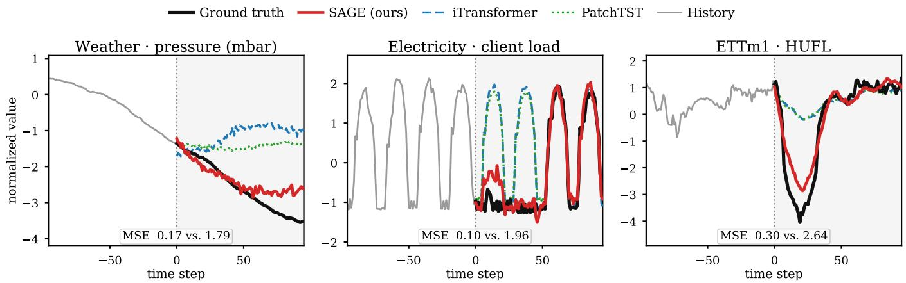
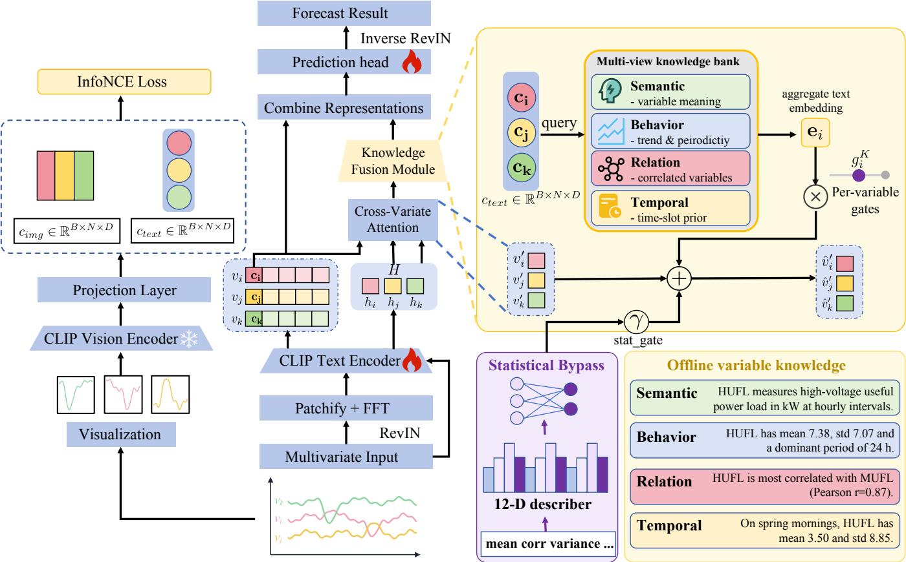

# SAGE: Variate-Wise Semantic Augmentation for Vision-Language Time Series Forecasting

Haizhao Fan1, Xinyi Le1

1Shanghai Jiao Tong University

Shanghai, China

sharp-ro@sjtu.edu.cn, lexinyi@sjtu.edu.cn

## Abstract

Time series forecasting models operate on raw numerical sequences, lacking the semantic knowledge that domain experts implicitly leverage, such as the physical meaning of each variable, its statistical behavior, and its temporal dynamics. Recent eforts to bridge this gap fall into two camps. Some rely on large language models at inference time, which is computationally expensive. Others apply uniform textual prompts at the dataset level, ignoring the heterogeneous semantics across individual variates. We propose SAGE (Seeing and Augmenting with Grounded Encoding), an end-to-end CLIPbased framework that jointly models temporal, cross-variable, textual, and visual information. The CLIP text encoder processes frequency-enhanced patches and variable tokens, while gated residual paths inject variable-specific descriptions and statistical descriptors. In parallel, the frozen CLIP vision encoder aligns rendered series with temporal representations through a training-only contrastive objective. This dual use of CLIP adds complementary semantic and visual supervision without placing an LLM in the forecasting loop. Across eight long-term benchmarks and M4, SAGE achieves state-of-theart accuracy. Ablations confirm complementary gains from multimodal alignment and variable-level knowledge.

## 1 Introduction

Time series forecasting is a fundamental task in data mining and machine learning, with wide-ranging applications in energy management, transportation planning, weather prediction, and financial analysis (Zhou et al. 2020; Wu et al. 2021). The advent of Transformer-based architectures has brought significant progress (Zhou et al. 2022; Liu et al. 2024), while the provocative finding that simple linear models can match or surpass many Transformer variants (Zeng et al. 2023) has spurred the community to rethink what inductive biases truly matter for temporal modeling.

More recently, two parallel trends have reshaped this landscape. The first is large-scale pre-training: foundation models such as TimesFM (Das et al. 2024), Chronos (Ansari et al. 2024), and Time-MoE (Shi et al. 2025) demonstrate that pretraining on billions of time points yields strong zero-shot and few-shot forecasting capabilities. The second is crossmodal knowledge transfer: methods such as GPT4TS (Zhou et al. 2023), Time-LLM (Jin et al. 2024), and TEST (Sun et al. 2024) repurpose pre-trained language models for time series tasks, exploiting their rich semantic and sequential knowledge. However, the LLM component in many of these methods can be replaced by simple attention layers without degrading performance (Tan et al. 2024), raising questions about whether language models truly contribute temporal understanding or merely serve as general-purpose feature extractors.

Meanwhile, an emerging body of work explores visionlanguage models (VLMs) for time series. A recent survey (Ni et al. 2025) highlights the natural compatibility between 2D visual representations and multi-scale temporal patterns, an insight previously demonstrated by Times-Net (Wu et al. 2022). Time-VLM (Zhong et al. 2025) fuses retrieval, vision, and text modalities for forecasting; Aurora (Wu et al. 2025) builds the first multimodal time series foundation model; and OccamVTS (Lyu et al. 2026) shows that distilling vision models to 1% of their parameters can match full-model forecasting performance. The CiK benchmark (Williams et al. 2024) further establishes that textual context can be essential for accurate prediction in many realworld scenarios.

Despite these advances, a fundamental gap remains: existing multimodal methods typically use language models as either frozen feature extractors or auxiliary prompt generators, without fully exploiting the dual structure of vision-language models. In CLIP (Radford et al. 2021), the text and vision encoders are jointly trained to produce aligned representations in a shared embedding space. This dual structure naturally suits time series. The text encoder can serve as a sequential backbone, while the vision encoder provides complementary supervision through rendered time series images. Moreover, existing knowledge-injection schemes (Jin et al. 2024; Pan et al. 2024) may require expensive LLM inference or reduce numerical sequences to limited textual representations. Figure 1 previews the payof of closing this gap: across real test windows from three diferent datasets, SAGE tracks the periodic and directional dynamics that strong Transformer forecasters collapse toward the recent mean.

In this paper, we propose SAGE, a multimodal semantic alignment framework for time series forecasting that addresses these limitations through three key contributions:

1. End-to-End CLIP Forecasting. We make CLIP part of the forecasting architecture rather than an external feature service. Its text encoder is adapted as the temporal backbone, and its frozen vision encoder provides bidirectional contrastive supervision during training. This design achieves higher forecasting accuracy with a compact trainable backbone instead of relying on a billionparameter model in the forecasting loop.

  
Figure 1: Representative 96-step forecasts on Weather, Electricity, and ETTm1. SAGE better captures regime changes by combining numerical history with multimodal knowledge. Each inset reports window-level MSE for SAGE and the strongest displayed baseline.

2. Template-based Knowledge Injection with Variablewise Gating. A lightweight ofline pipeline constructs semantic, behavioral, and relational descriptions from metadata and training-set statistics. An LLM may assist this preparation step, but it is not called inside training or forecasting. Gated cross-attention controls knowledge injection independently for each variable, while a separately gated statistical bypass preserves hard numerical cues.

3. Grounding Across Time, Variables, and Modalities. A frequency-enhanced patch embedding combines timedomain and spectral evidence. Cross-variate attention then incorporates dependencies among variables, while vision-language contrastive alignment regularizes the temporal representations. Together, these components integrate complementary temporal, relational, textual, and visual signals in one forecasting model.

## 2 Related Work

## 2.1 Multimodal and Knowledge-Enhanced Time Series Forecasting

Early work demonstrated that pre-trained language models can serve as efective time series backbones: GPT4TS (Zhou et al. 2023) fine-tunes only the layer normalization and positional embeddings of a frozen GPT-2, while LLMTime (Gruver et al. 2023) encodes numerical series as text strings for zero-shot forecasting. Subsequent methods introduce explicit cross-modal alignment: Time-LLM (Jin et al. 2024) reprograms input patches into text prototypes guided by declarative prompts, and TEST (Sun et al. 2024) aligns time series embeddings with interpretable text prototypes via contrastive losses. A recurring limitation is that the language component often acts as a generic feature extractor rather than a genuine source of temporal knowledge (Tan et al. 2024).

More recently, the community has moved toward true multimodal fusion. Time-VLM (Zhong et al. 2025) couples retrieval-, vision-, and text-augmented learners with frozen VLMs; Aurora (Wu et al. 2025) injects text and image knowledge via modality-guided attention and flow matching for zero-shot generative forecasting; and VLM4TS (He, Alnegheimish, and Reimherr 2026) applies VLMs to zero-shot anomaly detection through visual screening and multimodal verification. Despite these advances, most existing methods treat the language model as either a frozen feature extractor or an auxiliary prompt generator, without fully exploiting both branches of a vision-language model in a unified training framework.

## 2.2 Pre-trained Models for Time Series

In the supervised regime, Autoformer (Wu et al. 2021) pioneers deep decomposition with auto-correlation mechanisms; PatchTST (Nie et al. 2022) establishes a strong patchbased channel-independent baseline; iTransformer (Liu et al. 2024) treats each variate as a token to capture multivariate correlations; and TimesNet (Wu et al. 2022) transforms 1D series into 2D tensors, enabling vision backbones for temporal modeling. More recent architectures continue to refine this line: FredFormer (Piao et al. 2024) debiases frequencydomain representations, DUET (Qiu et al. 2025) jointly clusters temporal and channel dependencies, Amplifier (Fei et al. 2025) amplifies energy-scarce components, and SRSNet (Wu et al. 2026) learns a selective representation space; these are the strong recent baselines against which we benchmark SAGE. In the foundation model regime, TimesFM (Das et al. 2024) trains a decoder-only Transformer on 100B real-world time points; Chronos (Ansari et al. 2024) tokenizes values into a discrete vocabulary for T5-family models; MO-MENT (Goswami et al. 2024) pre-trains on the Time-series Pile via masked reconstruction; Moirai (Woo et al. 2024) introduces any-variate attention trained on 27B observations; and Time-MoE (Shi et al. 2025) scales to 2.4B parameters via sparse mixture-of-experts. These eforts demonstrate the efectiveness of scale, yet they require curating massive time series corpora. An alternative direction, exemplified by OccamVTS (Lyu et al. 2026), suggests that pre-trained visionlanguage representations already contain transferable temporal knowledge that can be leveraged without billion-scale pre-training.

## 2.3 Contrastive Learning for Time Series

Contrastive learning has proven efective for learning transferable time series representations: TS-TCC (Eldele et al. 2021) combines temporal and contextual contrasting over augmented views; TS2Vec (Yue et al. 2022) performs hierarchical contrastive learning at instance and temporal levels; CoST (Woo et al. 2022) disentangles seasonal and trend components via time- and frequency-domain losses; TF-C (Zhang et al. 2022) enforces time-frequency consistency in a joint embedding space; Soft-CL (Lee, Park, and Lee 2024) mitigates false negatives through soft assignments; and FACL (Wang and Zhang 2026) designs frequency-aware augmentations that respect spectral structure. All of these operate within the time series modality, constructing positive pairs from augmented views of the same data. A natural extension is cross-modal contrastive learning, where positive pairs couple temporal representations with their visual renderings, providing a complementary supervisory signal beyond intra-modal augmentation.

## 3 Methodology

We propose a multimodal framework for multivariate time series forecasting. Given an input multivariate time series $\mathbf { X } \in \mathbb { R } ^ { T \times N }$ with T time steps and N variates, the model outputs a forecast $\hat { \mathbf { Y } } \in \mathbb { R } ^ { H \times \mathbf { \bar { N } } }$ over a horizon of H steps. As illustrated in Figure 2, the normalized input is processed by two cooperating streams that share a single pretrained CLIP text encoder. A numerical stream converts each series into patch tokens and variate tokens and passes them through the CLIP text encoder, producing temporal and inter-variate representations that are further enriched with frequency information and with per-variate natural-language priors drawn from an ofline textual knowledge bank. A visual stream, active only for low-dimensional datasets, renders each series as an image, encodes it with the frozen CLIP vision encoder, and contrastively aligns it with the temporal representation during training. A forecast head then fuses these representations and de-normalizes them to produce the prediction. Concretely, the framework comprises five components that we describe in turn: a Frequency-Enhanced Language Module, an Inter-Variate Dependency Module, a Multi-View Textual Semantic Fusion Module, a Vision-Language Contrastive Alignment Module, and a Forecast Generator.

## 3.1 Frequency-Enhanced Language Module

This module treats time series patches as tokens for the pretrained CLIP text Transformer.

We first apply reversible instance normalization to mitigate distribution shift. For variable i, RevIN stores its mean $\mu ^ { ( i ) }$ and standard deviation $\boldsymbol { \sigma } ^ { ( i ) }$ for output de-normalization. We omit the batch index in per-variable equations for clarity.

The normalized sequence $\mathbf { x } ^ { ( i ) } \in \mathbb { R } ^ { T }$ is divided into $L _ { p }$ overlapping patches of length $P$ and stride S. Let $\mathbf { p } _ { i } ^ { ( i ) } \in \mathbb { R } ^ { \dot { P } }$ denote patch $j .$ A learnable tokenizer $\mathbf { W } _ { \mathrm { t o k } }$ maps it to the shared embedding width D:

$$
\mathbf { z } _ { j } ^ { ( i ) } = \mathbf { W } _ { \mathrm { t o k } } \mathbf { p } _ { j } ^ { ( i ) } .
$$

Time-domain tokens alone may inadequately represent periodic patterns. We apply a Hann-windowed $\mathrm { F F T }$ to every patch and project its real and imaginary components into a frequency token $\mathbf { f } _ { j } ^ { ( i ) } \in \mathbb { R } ^ { D }$ . The time token is the query, and the frequency token provides the key and value. A learnable scalar α, initialized at zero, controls this fusion:

$$
\mathbf { z } _ { j } ^ { ( i ) } \gets \mathbf { z } _ { j } ^ { ( i ) } + \alpha \operatorname { C r o s s A t t n } ( \mathbf { z } _ { j } ^ { ( i ) } , \mathbf { f } _ { j } ^ { ( i ) } , \mathbf { f } _ { j } ^ { ( i ) } ) ,
$$

where Cross $\mathrm { A t t n } ( Q , K , V )$ denotes cross-attention with query $Q ,$ key $K ,$ , and value V.

A learnable [CLS] token is prepended, and learnable positional embeddings are added to the patch sequence. The sequence then enters the CLIP text Transformer without using its word embedding layer. We replace the original positional embeddings with embeddings matched to the patch sequence. The Transformer blocks and final LayerNorm are fine-tuned at a reduced learning rate, while unused projection layers remain frozen. The encoder outputs patch representations $\mathbf { R } \in \mathbb { R } ^ { B \times N \times ( L _ { p } + 1 ) \times D }$ and temporal summaries $\mathbf { c } _ { \mathrm { t e x t } } \in \mathbb { R } ^ { B \times N \times D }$ from the [CLS] positions.

## 3.2 Cross-Variate Context Modeling Module

The temporal encoder processes each variable independently, but multivariate forecasting also requires dependencies across variables.

Each full normalized sequence $\mathbf { x } ^ { ( i ) }$ is mapped to the shared embedding width by a linear tokenizer and augmented with a learnable variable identifier. The N resulting tokens pass through the same CLIP text encoder used above. Its output $\breve { \mathbf { H } } \in \mathbb { R } ^ { B \times N \times D }$ contains contextual representations of all variables. Thus, the shared encoder processes patch sequences to capture temporal structure and variable sequences to capture cross-variable structure.

The temporal summaries query H through cross-attention. Layer normalization LN and a feed-forward network FFN form residual updates:

$$
\begin{array} { r } { \mathbf { v } ^ { \prime } = \mathrm { L N } \big ( \mathbf { c } _ { \mathrm { t e x t } } + \mathrm { C r o s s A t t n } \big ( \mathrm { L N } ( \mathbf { c } _ { \mathrm { t e x t } } ) , \mathrm { L N } ( \mathbf { H } ) , \mathrm { L N } ( \mathbf { H } ) \big ) \big ) , } \\ { \mathbf { v } ^ { \prime } = \mathrm { L N } ( \mathbf { v } ^ { \prime } + \mathrm { F F N } ( \mathbf { v } ^ { \prime } ) ) . \qquad } \end{array}
$$

The result $\mathbf { v } ^ { \prime } \in \mathbb { R } ^ { B \times N \times D }$ combines each variable’s temporal summary with information selected from all variables.

## 3.3 Multi-View Textual Semantic Fusion Module

This module is the central contribution of our work. It injects external semantic knowledge into the forecasting pipeline through three complementary mechanisms.

For each variable, we construct descriptions from domain metadata and training-split statistics. Table 1 summarizes the knowledge sources, while Figure 2 shows representative

  
Figure 2: Overview of SAGE. Shared CLIP text branches encode frequency-enhanced temporal tokens and cross-variable context. Variable-specific text views use gated attention, while hard statistics follow a separate residual bypass. During training, the frozen CLIP vision encoder provides contrastive supervision. Fused representations are decoded and inverse-normalized. The lower callout traces a real ETTh1/HUFL knowledge example.

Table 1: Ofline variable-specific knowledge resources. A real ETTh1/HUFL example is visualized in Figure 2.
<table><tr><td>Source</td><td>Information</td><td>Fusion</td></tr><tr><td>Semantic</td><td>Meaning, unit, sampling context</td><td>Attention</td></tr><tr><td></td><td>Behavioral Smoothness, volatility, periodicity</td><td>Attention</td></tr><tr><td>Relational</td><td>Cross-variate correlations</td><td>Attention</td></tr><tr><td>Temporal</td><td>Seasonal and time-of-day patterns</td><td>Extra view</td></tr><tr><td>Statistics</td><td>Distribution, trend, spectrum</td><td>MLP bypass</td></tr></table>

HUFL examples. The CLIP text encoder maps the descriptions to the shared embedding space. We also compute a 12- dimensional statistical vector $\mathbf { s } ^ { ( i ) } \in \mathbb { R } ^ { 1 2 }$ for variable i. All descriptions, embeddings, and statistical vectors are cached before model training.

Template-based Construction Pipeline. Each humanreadable template combines domain metadata with datadriven features. The metadata include the variable name, unit, and domain role from the dataset documentation. Trainingset features include distributional statistics, trend slope, dominant FFT period, and Pearson correlations with other variables. The templates may be authored or refined with optional LLM assistance during ofline preparation. The relational view names the most correlated variables, restoring context that a channel-independent encoder would otherwise omit. Table 5 evaluates five enhancement modes that control which feature groups are verbalized.

Let $\breve { \mathbf { E } } _ { \mathrm { m v } } \in \mathbb { R } ^ { N \times K \times D }$ contain K cached views for each variable. Variable-wise cross-attention uses $\mathbf { c } _ { \mathrm { t e x t } } ^ { ( b , i ) }$ as its query and produces an aggregated embedding $\mathbf { e } ^ { ( b , i ) } \in \mathbb { R } ^ { D }$ . When time-dependent text is available, the input timestamp selects the corresponding slot embedding and appends it as an additional view.

The aggregated embedding is fused with the cross-variate representation through a learnable gate $g ^ { ( i ) }$ for variable i:

$$
\begin{array} { r l } & { \mathbf { v } _ { \mathrm { t e x t } } ^ { \prime ( b , i ) } = \mathbf { v } ^ { \prime ( b , i ) } } \\ & { \qquad + \ : g ^ { ( i ) } \ : \mathrm { C r o s s A t t n } \Bigl ( \mathrm { L N } ( \mathbf { v } ^ { \prime ( b , i ) } ) , \mathrm { L N } ( \mathbf { e } ^ { ( b , i ) } ) , \mathbf { e } ^ { ( b , i ) } \Bigr ) } \end{array}
$$

The gate is initialized to a small positive value, allowing every variable to learn its own reliance on textual priors. Statistical features bypass attention. A two-layer network $\mathrm { M L P } _ { \mathrm { s t a t } } : \mathbb { R } ^ { 1 2 } \to \check { \mathbb { R } } ^ { \dot { D } }$ and a separate learnable gate γstat inject them after text attention:

$$
\begin{array} { r } { \hat { \mathbf { v } } ^ { \prime ( b , i ) } = \mathbf { v } _ { \mathrm { t e x t } } ^ { \prime ( b , i ) } + \gamma _ { \mathrm { s t a t } } \mathrm { ~ M L P } _ { \mathrm { s t a t } } \Big ( \mathbf { s } ^ { ( i ) } \Big ) . } \end{array}
$$

This bypass complements soft textual semantics with hard numerical evidence without consuming attention capacity.

We also align temporal and aggregated textual representations:

$$
\mathcal { L } _ { \mathrm { t e x t } } = 1 - \frac { 1 } { B N } \sum _ { b = 1 } ^ { B } \sum _ { i = 1 } ^ { N } \cos \Bigl ( \mathbf { c } _ { \mathrm { t e x t } } ^ { ( b , i ) } , \mathbf { e } ^ { ( b , i ) } \Bigr ) .
$$

## 3.4 Vision-Language Contrastive Alignment Module

When $N \leq 5 0$ , an auxiliary vision-language objective provides additional training supervision. Each normalized variable sequence is rendered as a color-coded line chart, encoded by the frozen CLIP vision encoder, and mapped to the shared width by a learnable projection $\mathbf { W } _ { \mathrm { p r o j } } { \mathrm { : } }$

$$
\mathbf { c } _ { \mathrm { i m g } } ^ { ( b , i ) } = \mathbf { W } _ { \mathrm { p r o j } } ~ \mathrm { C L I P - V i T } \Big ( \mathrm { R e n d e r } ( \mathbf { x } ^ { ( b , i ) } ) \Big ) , \quad \mathbf { c } _ { \mathrm { i m g } } ^ { ( b , i ) } \in \mathbb { R } ^ { D }
$$

Alignment is performed independently for each variate. For variate i, let $\bar { \mathbf { S } } _ { \mathrm { i m g } } ^ { ( i ) } , \mathbf { S } _ { \mathrm { t e x t } } ^ { ( i ) } \in \mathbb { R } ^ { \bar { B } \times D }$ stack the L2-normalized visual and temporal summaries of the B samples in the batch. A bidirectional InfoNCE loss matches each sample to its own rendering, using the remaining $B - 1$ same-variate samples as in-batch negatives, and the result is averaged over the N variates:

$$
\begin{array} { r l r } {  { \mathcal { L } _ { \mathrm { a l i g n } } = \frac { 1 } { N } \sum _ { i = 1 } ^ { N } \frac { 1 } { 2 } \Big [ \mathrm { C E } \Big ( \tau \mathbf { S } _ { \mathrm { i m g } } ^ { ( i ) } \mathbf { S } _ { \mathrm { t e x t } } ^ { ( i ) \top } , \mathbf { I } _ { B } \Big ) } } \\ & { } & { + \mathrm { C E } \Big ( \tau \mathbf { S } _ { \mathrm { t e x t } } ^ { ( i ) } \mathbf { S } _ { \mathrm { i m g } } ^ { ( i ) \top } , \mathbf { I } _ { B } \Big ) \Big ] , } \end{array}
$$

where $\mathbf { I } _ { B }$ denotes the batch-level matching-pair targets (the identity assignment over the B samples) and $\tau = \exp ( s )$ is the learnable logit scale.

A curriculum schedule gradually increases the concentration of hard negatives. This module is active only during training. For $N > 5 0$ , rendering hundreds of variable-wise images is impractical, so the vision loss is disabled and textual knowledge fusion remains active.

## 3.5 Forecast Generator and Training Objective

The augmented representation $\hat { \mathbf { v } } ^ { \prime }$ is added to the final position of R. This operation injects cross-variable and external knowledge without replacing earlier patch representations. The resulting token sequence is flattened and mapped to $T _ { \mathrm { p r e d } }$ forecast steps by a two-layer MLP with GELU activation. RevIN then restores the original scale.

For $N \ > \ 5 0 .$ , the full variable-wise patch path is replaced by a lightweight decoder for computational practicality. Cross-variate context modeling and textual semantic fusion remain active, and a linear layer maps each augmented variable representation to $T _ { \mathrm { p r e d } }$ outputs. When timedependent descriptions are available, the selected slot embedding supplies an additional gated correction at each forecast step.

Table 2: Long-term benchmark characteristics and SAGE pathways. All datasets use $T = 9 6$ and prediction horizons in {96, 192, 336, 720}.
<table><tr><td>Dataset</td><td>N Observations</td><td> Interval</td><td>Pathway</td></tr><tr><td>ETTh1</td><td>7</td><td>17,420 1 hour</td><td>Full</td></tr><tr><td>ETTh2</td><td>7</td><td>17,420 1 hour</td><td>Full</td></tr><tr><td>ETTm1</td><td>7</td><td>69,680 15 minutes</td><td>Full</td></tr><tr><td>ETTm2</td><td>7</td><td>69,680 15 minutes</td><td>Full</td></tr><tr><td>ECL</td><td>321</td><td>26,304 1 hour</td><td>Lightweight</td></tr><tr><td>Traffic</td><td>862</td><td>17,544 1 hour</td><td>Lightweight</td></tr><tr><td>Weather</td><td>21</td><td>52,696 10 minutes</td><td>Full</td></tr><tr><td>Exchange</td><td>8</td><td>7,588 3 1 day</td><td>Full</td></tr></table>

The total objective combines forecast MSE with the two alignment losses:

$$
\begin{array} { r } { \mathcal { L } = \mathcal { L } _ { \mathrm { M S E } } + \lambda _ { \mathrm { a l i g n } } \mathcal { L } _ { \mathrm { a l i g n } } + \lambda _ { \mathrm { t e x t } } \mathcal { L } _ { \mathrm { t e x t } } , } \end{array}
$$

where $\mathcal { L } _ { \mathrm { M S E } }$ is the error between $\hat { \mathbf Y }$ and the ground-truth future sequence.

The coeficients $\lambda _ { \mathrm { a l i g n } }$ and $\lambda _ { \mathrm { t e x t } }$ weight vision-language and text alignment, respectively. The CLIP text encoder is optimized at a reduced learning rate to preserve pretrained knowledge while allowing task-specific adaptation.

## 4 Experiments

## 4.1 Setup

Datasets. We evaluate SAGE on 8 widely-used long-term forecasting benchmarks and the M4 short-term forecasting competition. The long-term benchmarks include: ETTh1, ETTh2, ETTm1, ETTm2 (electricity transformer temperature, $N { = } 7 )$ (Zhou et al. 2020), Electricity (ECL, N=321), Trafic (N=862), Weather (N=21) (Wu et al. 2021), and Exchange (N=8) (Lai et al. 2017). For long-term forecasting, we use a fixed lookback window $T { \mathrm { = } } 9 { \bar { 6 } }$ and prediction horizons $T _ { \mathrm { p r e d } } \in \{ 9 6 , 1 9 2 , 3 3 6 , 7 2 0 \}$ . For short-term forecasting, we evaluate on the M4 dataset (Makridakis, Spiliotis, and Assimakopoulos 2020) comprising 100,000 time series across six frequencies (Yearly, Quarterly, Monthly, Weekly, Daily, Hourly).

Table 2 highlights the diversity of the evaluation suite. The four ETT datasets measure electricity-transformer behavior at hourly and 15-minute resolutions; ECL and Trafic stress scalability with hundreds of variables; Weather provides densely sampled meteorological signals; and Exchange contains daily financial series.

Metrics. Long-term forecasting is evaluated with Mean Squared Error (MSE) and Mean Absolute Error (MAE). Short-term forecasting follows the M4 competition protocol with SMAPE, MASE, and Overall Weighted Average (OWA).

Implementation. SAGE fine-tunes the CLIP ViT-B/32 text encoder and keeps its vision encoder frozen. RevINnormalized series use frequency-enhanced patches of length 16 and stride 8 (Kim et al. 2021); ofline descriptions are fused through per-variable gates. For N>50, a lightweight path bypasses patching. Training uses Adam, cosine scheduling, a reduced learning rate for the CLIP text encoder, and bidirectional InfoNCE alignment. We evaluate 651 configurations across all datasets, horizons, and five textenhancement modes.

Table 3: Dataset-averaged MSE / MAE comparison across prediction horizons {96, 192, 336, 720} with lookback T=96. Bold: best; underline: second best.
<table><tr><td rowspan="2">Dataset</td><td colspan="2">DLinear (2023)</td><td colspan="2">TimesNet (2022)</td><td colspan="2">PatchTST (2022)</td><td colspan="2">FredFormer (2024)</td><td colspan="2">iTransformer (2024)</td><td colspan="2">Amplifier (2025)</td><td colspan="2">DUET (2025)</td><td colspan="2">SRSNet (2026)</td><td colspan="2">SAGE Ours</td></tr><tr><td>MSE</td><td>MAE</td><td>MSE</td><td>MAE</td><td>MSE</td><td>MAE</td><td>MSE</td><td>MAE</td><td>MSE</td><td>MAE</td><td>MSE</td><td>MAE</td><td>MSE</td><td>MAE</td><td>MSE</td><td>MAE</td><td>MSE</td><td>MAE</td></tr><tr><td>ETTh1</td><td>0.456</td><td>0.449</td><td>0.458</td><td>0.450</td><td>0.469</td><td>0.450</td><td>0.449</td><td>0.442</td><td>0.454</td><td>0.442</td><td>0.449</td><td>0.442</td><td>0.443</td><td>0.438</td><td>0.442</td><td>0.437</td><td>0.440</td><td>0.447</td></tr><tr><td>ETTh2</td><td>0.559</td><td>0.515</td><td>0.414</td><td>0.421</td><td>0.387</td><td>0.404</td><td>0.378</td><td>0.405</td><td>0.383</td><td>0.404</td><td>0.389</td><td>0.405</td><td>0.376</td><td>0.405</td><td>0.376</td><td>0.406</td><td>0.373</td><td>0.403</td></tr><tr><td>ETTm1</td><td>0.403</td><td>0.406</td><td>0.400</td><td>0.407</td><td>0.387</td><td>0.400</td><td>0.385</td><td>0.402</td><td>0.407</td><td>0.412</td><td>0.385</td><td>0.402</td><td>0.390</td><td>0.403</td><td>0.385</td><td>0.402</td><td>0.384</td><td>0.400</td></tr><tr><td>ETTm2</td><td>0.350</td><td>0.377</td><td>0.291</td><td>0.338</td><td>0.281</td><td>0.332</td><td>0.281</td><td>0.332</td><td>0.288</td><td>0.337</td><td>0.280</td><td>0.331</td><td>0.280</td><td>0.331</td><td>0.284</td><td>0.334</td><td>0.283</td><td>0.334</td></tr><tr><td>ECL</td><td>0.212</td><td>0.295</td><td>0.192</td><td>0.289</td><td>0.205</td><td>0.292</td><td>0.178</td><td>0.271</td><td>0.178</td><td>0.274</td><td>0.173</td><td>0.267</td><td>0.172</td><td>0.266</td><td>0.188</td><td>0.281</td><td>0.165</td><td>0.260</td></tr><tr><td>Traffic</td><td>0.625</td><td>0.383</td><td>0.620</td><td>0.395</td><td>0.481</td><td>0.363</td><td>0.434</td><td>0.285</td><td>0.432</td><td>0.282</td><td>0.485</td><td>0.324</td><td>0.451</td><td>0.297</td><td>0.495</td><td>0.327</td><td>0.430</td><td>0.278</td></tr><tr><td>Weather</td><td>0.265</td><td>0.287</td><td>0.259</td><td>0.285</td><td>0.259</td><td>0.285</td><td>0.256</td><td>0.279</td><td>0.258</td><td>0.283</td><td>0.247</td><td>0.276</td><td>0.251</td><td>0.278</td><td>0.249</td><td>0.277</td><td>0.243</td><td>0.271</td></tr><tr><td>Exchange</td><td>0.353</td><td>0.411</td><td>0.416</td><td>0.445</td><td>0.367</td><td>0.420</td><td>0.374</td><td>0.408</td><td>0.360</td><td>0.410</td><td>0.361</td><td>0.402</td><td>0.341</td><td>0.399</td><td>0.343</td><td>0.395</td><td>0.332</td><td>0.393</td></tr><tr><td>1st Count</td><td>0</td><td>0</td><td>0</td><td>0</td><td>0</td><td>1</td><td>0</td><td>0</td><td>0</td><td>0</td><td>1</td><td>1</td><td>1</td><td>1</td><td>0</td><td>1</td><td>7</td><td>6</td></tr></table>

Environment and Computational Cost. All experiments are conducted on an Ubuntu 22.04 server with AMD EPYC 9654 processors, 768 GB RAM, and four NVIDIA A800 GPUs. Each run uses one GPU. The software stack comprises Python 3.11, PyTorch 2.5.1, and CUDA 12.1. Training cost depends on dataset dimensionality and the active pathway. One epoch takes roughly 17 s on ETTh1, 21 s on Exchange, 130 s on ECL, 250 s on Weather, and 230–290 s on Traffic. Early stopping typically yields convergence within 10 epochs, ranging from under 3 minutes on ETT datasets to under 45 minutes on Trafic. The complete 651-run sweep consumed approximately 1,000 single-GPU hours and was parallelized across the four GPUs. Ofline text construction takes only a few seconds per dataset and is amortized across all runs.

## 4.2 Main Results

As shown in Table 3, SAGE obtains the best average MSE on 7 of 8 datasets and the best average MAE on 6 of 8. Its overall average MSE is 0.331, a 4.1% reduction from the 0.345 achieved by iTransformer (Liu et al. 2024).

Amplifier (Fei et al. 2025) and DUET (Qiu et al. 2025) remain strongest on ETTm2, each reaching 0.280 MSE and 0.331 MAE. SRSNet (Wu et al. 2026) obtains the best MAE on ETTh1. Across the full table, SAGE maintains an overall average MSE of 0.331 and MAE of 0.348 with the fixed lookback T=96. The evaluated datasets range from 8 to 862 variables, showing that the gains extend across very diferent dimensionalities. Text resources are prepared ofline, so no LLM is invoked in the training or forecasting loop. The appendix provides MSE and MAE for all 32 datasethorizon combinations.

On the M4 short-term benchmark in Table 4, SAGE leads all three metrics with an OWA of 0.834. TimesNet and N-HiTS obtain OWA values of 0.851 and 0.861, respectively. The result extends SAGE beyond long-horizon forecasting: frequency-aware text descriptions complement patch representations at short horizons as well.

## 4.3 Text Enhancement Analysis

We conduct a systematic ablation over 5 text enhancement modes across all 8 datasets and 4 prediction horizons. For each dataset-horizon pair, all architectural and text-mode hyperparameters are selected using validation MSE. The selected configuration is then evaluated once on the held-out test split. The 5 modes progressively enrich the text description. +Stat adds mean, variance, skewness, and kurtosis. +Dyn adds moving averages and trend slopes. +Stat+Dyn, abbreviated as +S+D, combines both groups. +Dyn+Freq adds FFT-derived spectral features to dynamic descriptions. +Full includes statistical, dynamic, spectral, and crossvariable features.

As shown in Table 5, text enhancement improves forecasting in 31 of 32 dataset-horizon combinations, with an average MSE reduction of 2.8%. Among the modes, +Stat is the most reliable (78.1% win rate across all experiments, selected as the best mode in 45.2% of combinations), followed by +Dyn (22.6%). The combined mode +Stat+Dyn achieves the highest peak improvement (6.3% on Exchange), suggesting that statistical and dynamic features provide complementary information. Interestingly, modes incorporating frequency features (+Dyn+Freq, +Full) are less consistently beneficial, likely because the frequency-enhanced patch embedding already captures spectral structure.

Text gains tend to be larger on lower-dimensional datasets, although the relationship is not strictly monotonic.(Table 5, column N vs. ∆). Exchange (N=8) achieves 6.3% improvement, Weather (N=21) achieves 3.9%, ECL (N=321)

Table 4: M4 short-term forecasting. Lower is better; bold and underline mark the best and second-best results.
<table><tr><td>Method</td><td>SMAPE</td><td>MASE</td><td>OWA</td></tr><tr><td>TimesNet</td><td>11.800</td><td>1.591</td><td>0.851</td></tr><tr><td>N-HiTS</td><td>11.936</td><td>1.610</td><td>0.861</td></tr><tr><td>PatchTST</td><td>12.072</td><td>1.622</td><td>0.869</td></tr><tr><td>FEDformer</td><td>12.614</td><td>1.732</td><td>0.918</td></tr><tr><td>iTransformer</td><td>12.792</td><td>1.756</td><td>0.931</td></tr><tr><td>SAGE</td><td>11.593</td><td>1.556</td><td>0.834</td></tr></table>

Table 5: Average text-enhancement gains. “Mode” is the best enhancement family and ∆ is the relative MSE reduction.
<table><tr><td>Dataset</td><td>N</td><td>No Text</td><td>+Text</td><td>Mode</td><td>∆(%)↑</td></tr><tr><td>ETTh1</td><td>7</td><td>0.450</td><td>0.440</td><td>+Stat</td><td>2.2</td></tr><tr><td>ETTh2</td><td>7</td><td>0.381</td><td>0.373</td><td>+Dyn</td><td>2.1</td></tr><tr><td>ETTm1</td><td>7</td><td>0.395</td><td>0.384</td><td>+Stat</td><td>2.8</td></tr><tr><td>ETTm2</td><td>7</td><td>0.294</td><td>0.283</td><td>+Stat</td><td>3.7</td></tr><tr><td>ECL</td><td>321</td><td>0.167</td><td>0.165</td><td>+Stat</td><td>1.2</td></tr><tr><td>Traffic</td><td>862</td><td>0.434</td><td>0.430</td><td>+Dyn</td><td>0.9</td></tr><tr><td>Weather</td><td>21</td><td>0.253</td><td>0.243</td><td>+Stat</td><td>3.9</td></tr><tr><td>Exchange</td><td>8</td><td>0.354</td><td>0.332</td><td>+S+D</td><td>6.3</td></tr><tr><td>Average</td><td></td><td></td><td></td><td></td><td>2.8</td></tr></table>

achieves 1.2%, and Trafic (N=862) achieves 0.9%. This pattern reflects two complementary factors: (1) the per-variate gate can more precisely modulate text absorption when the number of channels is small, and (2) low-dimensional datasets have fewer cross-channel redundancies, making external text knowledge a proportionally larger information source. The per-variable gates can suppress unhelpful textua information, which limits degradation on high-dimensional datasets.

## 4.4 Vision Enhancement Analysis

We isolate the contribution of visual supervision by retraining SAGE with $\lambda _ { \mathrm { a l i g n } } = 0$ , while keeping the model architecture, textual knowledge, optimization settings, and all other loss terms unchanged. Because the visual branch is enabled only when $N \leq \bar { 5 } 0$ , the ablation is conducted on the six eligible datasets. Table 6 reports the test MSE averaged over the four prediction horizons.

Vision–temporal alignment improves forecasting on all six datasets, reducing the average MSE from 0.348 to 0.343, or 1.6% relatively. The largest gain is obtained on ETTm2 at 2.5%, followed by ETTh1 and ETTm1 at 1.9% and 1.8%. The ETT and Exchange series generally exhibit visually identifiable trends and periodic structures, allowing the rendered views to provide shape information complementary to the numerical encoder. These consistent gains indicate that the frozen CLIP vision encoder acts as an efective contrastive regularizer, encouraging temporal representations to preserve global trends, periodic geometry, and regime changes.

The smaller 0.4% gain on Weather can be related to its dataset characteristics. Weather contains 21 heterogeneous and strongly coupled indicators sampled every 10 minutes (Wu et al. 2021); thus, a lookback of 96 covers only 16 hours rather than a complete daily cycle. Moreover, rendering each variable independently omits interactions among temperature, humidity, pressure, wind, and radiation, while similar meteorological channels may act as false negatives in the identity-based InfoNCE objective. Consequently, the visual branch provides less additional information beyond the frequency-enhanced and cross-variate representations.

Importantly, the visual branch is used only during training and does not provide image features directly to the forecast head. Therefore, the observed improvements come from representation regularization rather than additional inference inputs, and introduce no visual computation at forecasting time.

Table 6: Average vision-enhancement gains. ∆ is the relative MSE reduction.
<table><tr><td>Dataset</td><td>N</td><td>No Vision</td><td>+Vision</td><td>∆(%)↑</td></tr><tr><td>ETTh1</td><td>7</td><td>0.448</td><td>0.440</td><td>1.9</td></tr><tr><td>ETTh2</td><td>7</td><td>0.378</td><td>0.373</td><td>1.3</td></tr><tr><td>ETTm1</td><td>7</td><td>0.391</td><td>0.384</td><td>1.8</td></tr><tr><td>ETTm2</td><td>7</td><td>0.290</td><td>0.283</td><td>2.5</td></tr><tr><td>Weather</td><td>21</td><td>0.244</td><td>0.243</td><td>0.4</td></tr><tr><td>Exchange</td><td>8</td><td>0.337</td><td>0.332</td><td>1.5</td></tr><tr><td>Average</td><td></td><td></td><td></td><td>1.6</td></tr></table>

## 5 Conclusion

We present SAGE, a vision-language framework that augments time series forecasting with template-based textual knowledge. SAGE repurposes a pre-trained CLIP ViT-B/32 as a dual-use backbone, freezing the vision encoder as a contrastive anchor while fine-tuning the text encoder. On this backbone, it injects statistical, dynamic, and spectral descriptions into the forecasting pipeline, with no language model in the forecasting loop. Three design choices are central to the framework: (1) a dual-use CLIP backbone, with a trainable text encoder and a frozen vision encoder for trainingonly contrastive supervision; (2) variable-specific multi-view knowledge injection with independent gates and a statistical bypass; and (3) frequency-enhanced temporal encoding combined with cross-variable context.

SAGE obtains the best average MSE on 7 of 8 long-term datasets, the best average MAE on 6 of 8, and the best M4 OWA of 0.834. Text enhancement improves 31 of 32 datasethorizon settings. These results show that aligned temporal, relational, textual, and visual evidence can improve a compact forecasting backbone.

Limitations and Future Work. Several directions remain open. First, the current text generation relies on hand-crafted templates; learning to compose descriptions end-to-end, potentially via a small language model distilled from domain experts, could further improve text quality and domain adaptability. Second, the text benefit diminishes on highdimensional datasets, suggesting that the per-variate gate may benefit from group-wise or hierarchical designs that share text representations across correlated channels. Third, the current descriptions are constructed from dataset metadata and training-split statistics, without incorporating external event or ontology information could unlock additional gains, particularly for datasets where external context drives regime changes. Finally, extending SAGE to multivariate-tomultivariate generation and probabilistic forecasting would broaden its applicability to real-world decision-making scenarios.

Ansari, A. F.; Stella, L.; Turkmen, C.; Zhang, X.; Mercado, P.; Shen, H.; Shchur, O.; Rangapuram, S. S.; Arango, S. P.; Kapoor, S.; et al. 2024. Chronos: Learning the language of time series. arXiv preprint arXiv:2403.07815.

Das, A.; Kong, W.; Sen, R.; and Zhou, Y. 2024. A decoderonly foundation model for time-series forecasting. In Fortyfirst international conference on machine learning.

Eldele, E.; Ragab, M.; Chen, Z.; Wu, M.; Kwoh, C. K.; Li, X.; and Guan, C. 2021. Time-series representation learning via temporal and contextual contrasting. arXiv preprint arXiv:2106.14112.

Fei, J.; Yi, K.; Fan, W.; Zhang, Q.; and Niu, Z. 2025. Amplifier: Bringing attention to neglected low-energy components in time series forecasting. In Proceedings of the AAAI conference on artificial intelligence, volume 39, 11645–11653.

Goswami, M.; Szafer, K.; Choudhry, A.; Cai, Y.; Li, S.; and Dubrawski, A. 2024. Moment: A family of open time-series foundation models. arXiv preprint arXiv:2402.03885.

Gruver, N.; Finzi, M.; Qiu, S.; and Wilson, A. G. 2023. Large language models are zero-shot time series forecasters. Advances in neural information processing systems, 36: 19622–19635.

He, Z.; Alnegheimish, S.; and Reimherr, M. 2026. Harnessing vision-language models for time series anomaly detection. In Proceedings of the AAAI Conference on Artificial Intelligence, volume 40, 21690–21698.

Jin, M.; Wang, S.; Ma, L.; Chu, Z.; Zhang, J.; Shi, X.; Chen, P.-Y.; Liang, Y.; Li, Y.-F.; Pan, S.; et al. 2024. Time-llm: Time series forecasting by reprogramming large language models. In International conference on learning representations, volume 2024, 23857–23880.

Kim, T.; Kim, J.; Tae, Y.; Park, C.; Choi, J.-H.; and Choo, J. 2021. Reversible instance normalization for accurate timeseries forecasting against distribution shift. In International conference on learning representations.

Lai, G.; Chang, W.-C.; Yang, Y.; and Liu, H. 2017. Modeling long-and short-term temporal patterns with deep neural networks. arXiv preprint arXiv:1703.07015.

Lee, S.; Park, T.; and Lee, K. 2024. Soft contrastive learning for time series. In International Conference on Learning Representations, volume 2024, 46815–46839.

Liu, Y.; Hu, T.; Zhang, H.; Wu, H.; Wang, S.; Ma, L.; and Long, M. 2024. itransformer: Inverted transformers are efective for time series forecasting. In International conference on learning representations, volume 2024, 11116–11140.

Lyu, S.; Zhong, S.; Ruan, W.; Liu, Q.; Wen, Q.; Xiong, H.; and Liang, Y. 2026. OccamVTS: Distilling Vision Models to 1% Parameters for Time Series Forecasting. In Proceedings ofthe AAAI Conference on Artificial Intelligence, volume 40, 24216–24225.

Makridakis, S.; Spiliotis, E.; and Assimakopoulos, V. 2020. The M4 Competition: 100,000 time series and 61 forecasting methods. International Journal of Forecasting, 36(1): 54– 74.

Ni, J.; Zhao, Z.; Shen, C.; Tong, H.; Song, D.; Cheng, W.; Luo, D.; and Chen, H. 2025. Harnessing vision models for time series analysis: A survey. arXiv preprint arXiv:2502.08869.

Nie, Y.; Nguyen, N. H.; Sinthong, P.; and Kalagnanam, J. 2022. A time series is worth 64 words: Long-term forecasting with transformers. arXiv preprint arXiv:2211.14730.

Pan, Z.; Jiang, Y.; Garg, S.; Schneider, A.; Nevmyvaka, Y.; and Song, D. 2024. s2 IP-LLM: Semantic space informed prompt learning with LLM for time series forecasting. In Forty-first International Conference on Machine Learning.

Piao, X.; Chen, Z.; Murayama, T.; Matsubara, Y.; and Sakurai, Y. 2024. Fredformer: Frequency debiased transformer for time series forecasting. In Proceedings of the 30th ACM SIGKDD conference on knowledge discovery and data mining, 2400–2410.

Qiu, X.; Wu, X.; Lin, Y.; Guo, C.; Hu, J.; and Yang, B. 2025. Duet: Dual clustering enhanced multivariate time series forecasting. In Proceedings of the 31st ACM SIGKDD Conference on Knowledge Discovery and Data Mining V. 1, 1185–1196.

Radford, A.; Kim, J. W.; Hallacy, C.; Ramesh, A.; Goh, G.; Agarwal, S.; Sastry, G.; Askell, A.; Mishkin, P.; Clark, J.; et al. 2021. Learning transferable visual models from natural language supervision. In International conference on machine learning, 8748–8763. PmLR.

Shi, X.; Wang, S.; Nie, Y.; Li, D.; Ye, Z.; Wen, Q.; and Jin, M. 2025. Time-moe: Billion-scale time series foundation models with mixture of experts. In International conference on learning representations, volume 2025, 34635–34667.

Sun, C.; Li, H.; Li, Y.; and Hong, S. 2024. TEST: Text prototype aligned embedding to activate LLM’s ability for time series. In International Conference on Learning Representations, volume 2024, 37854–37881.

Tan, M.; Merrill, M. A.; Gupta, V.; Althof, T.; and Hartvigsen, T. 2024. Are language models actually useful for time series forecasting? NeurIPS, 37: 60162–60191.

Wang, Z.; and Zhang, W. 2026. Frequency-aware Adaptive Contrastive Learning for Sequential Recommendation. arXiv preprint arXiv:2601.17057.

Williams, A. R.; Ashok, A.; Marcotte, É.; Zantedeschi, V.; Subramanian, J.; Riachi, R.; Requeima, J.; Lacoste, A.; Rish, I.; Chapados, N.; et al. 2024. Context is key: A benchmark for forecasting with essential textual information. arXiv preprint arXiv:2410.18959.

Woo, G.; Liu, C.; Kumar, A.; Xiong, C.; Savarese, S.; and Sahoo, D. 2024. Unified training of universal time series forecasting transformers. In Forty-first International Conference on Machine Learning.

Woo, G.; Liu, C.; Sahoo, D.; Kumar, A.; and Hoi, S. 2022. Cost: Contrastive learning of disentangled seasonal-trend representations for time series forecasting. arXiv preprint arXiv:2202.01575.

Wu, H.; Hu, T.; Liu, Y.; Zhou, H.; Wang, J.; and Long, M. 2022. Timesnet: Temporal 2d-variation modeling for general time series analysis. arXiv preprint arXiv:2210.02186.

Wu, H.; Xu, J.; Wang, J.; and Long, M. 2021. Autoformer: Decomposition transformers with auto-correlation for longterm series forecasting. Advances in neural information processing systems, 34: 22419–22430.

Wu, X.; Jin, J.; Qiu, W.; Chen, P.; Shu, Y.; Yang, B.; and Guo, C. 2025. Aurora: Towards universal generative multimodal time series forecasting. arXiv preprint arXiv:2509.22295.

Wu, X.; Qiu, X.; Cheng, H.; Li, Z.; Hu, J.; Guo, C.; and Yang, B. 2026. Enhancing time series forecasting through selective representation spaces: A patch perspective. Advances in Neural Information Processing Systems, 38: 23328–23354.

Yue, Z.; Wang, Y.; Duan, J.; Yang, T.; Huang, C.; Tong, Y.; and Xu, B. 2022. Ts2vec: Towards universal representation of time series. In Proceedings of the AAAI conference on artificial intelligence, volume 36, 8980–8987.

Zeng, A.; Chen, M.; Zhang, L.; and Xu, Q. 2023. Are transformers efective for time series forecasting? In Proceedings of the AAAI conference on artificial intelligence, volume 37, 11121–11128.

Zhang, X.; Zhao, Z.; Tsiligkaridis, T.; and Zitnik, M. 2022. Self-supervised contrastive pre-training for time series via time-frequency consistency. Advances in neural information processing systems, 35: 3988–4003.

Zhong, S.; Ruan, W.; Jin, M.; Li, H.; Wen, Q.; and Liang, Y. 2025. Time-vlm: Exploring multimodal vision-language models for augmented time series forecasting. arXiv preprint arXiv:2502.04395.

Zhou, H.; Zhang, S.; Peng, J.; Zhang, S.; Li, J.; Xiong, H.; and Zhang, W. 2020. Informer: Beyond eficient transformer for long sequence time-series forecasting. arXiv preprint arXiv:2012.07436.

Zhou, T.; Ma, Z.; Wen, Q.; Wang, X.; Sun, L.; and Jin, R. 2022. Fedformer: Frequency enhanced decomposed transformer for long-term series forecasting. In International conference on machine learning, 27268–27286. PMLR.

Zhou, T.; Niu, P.; Sun, L.; Jin, R.; et al. 2023. One fits all: Power general time series analysis by pretrained lm. Advances in neural informationprocessing systems, 36: 43322– 43355.

Table 7: Full per-horizon long-term forecasting results (MSE ↓ / MAE ↓). We compare with representative methods spanning 2023–2025 under lookback $\breve { T } { = } 9 6$ . Bold: best; underline: second best. “-”: not available from the source.
<table><tr><td rowspan=2 colspan=1> $T _ { \mathrm { p r e d } }$ </td><td rowspan=1 colspan=20>DLinear     TimesNet     PatchTST    FredFormer   iTransformer   Amplifier      DUET       SRSNet       SAGE(2023)        (2022)        (2022)        (2024)         (2024)        (2025)        (2025)        (2026)         Ours</td></tr><tr><td rowspan=1 colspan=1>MSE MAE</td><td rowspan=1 colspan=1>MSE MAE</td><td rowspan=1 colspan=5>MSE MAE</td><td rowspan=1 colspan=5>MSE MAE</td><td rowspan=1 colspan=1>MSE  MAE</td><td rowspan=1 colspan=2>MSE MAE</td><td rowspan=1 colspan=3>MSE MAE</td><td rowspan=1 colspan=1>MSE MAE</td><td rowspan=1 colspan=1>MSE MAE</td></tr><tr><td rowspan=2 colspan=1>96192</td><td rowspan=1 colspan=1>0.3860.400</td><td rowspan=1 colspan=1>0.3840.400</td><td rowspan=1 colspan=5>0.414 0.423</td><td rowspan=1 colspan=5>0.378 0.400</td><td rowspan=1 colspan=1>0.3860.407</td><td rowspan=1 colspan=2>0.3760.399</td><td rowspan=1 colspan=3>0.3770.399</td><td rowspan=1 colspan=1>0.383 0.402</td><td rowspan=1 colspan=1>0.3830.406</td></tr><tr><td rowspan=1 colspan=1>0.4370.432</td><td rowspan=1 colspan=1>0.4360.429</td><td rowspan=1 colspan=5>0.4600.444</td><td rowspan=1 colspan=5>0.4350.433</td><td rowspan=1 colspan=1>0.441 0.432</td><td rowspan=1 colspan=2>0.442 0.437</td><td rowspan=1 colspan=3>0.4290.429</td><td rowspan=1 colspan=1>0.433 0.432</td><td rowspan=1 colspan=1>0.4280.437</td></tr><tr><td rowspan=2 colspan=1>336720</td><td rowspan=1 colspan=1>0.481 0.459</td><td rowspan=1 colspan=1>0.4910.469</td><td rowspan=1 colspan=5>0.5010.469</td><td rowspan=1 colspan=5>0.4850.464</td><td rowspan=1 colspan=1>0.487 0.461</td><td rowspan=1 colspan=2>0.4780.459</td><td rowspan=1 colspan=3>0.471 0.454</td><td rowspan=1 colspan=1>0.4760.459</td><td rowspan=1 colspan=1>0.467 0.461</td></tr><tr><td rowspan=1 colspan=1>0.5190.506</td><td rowspan=1 colspan=1>0.521 0.500</td><td rowspan=1 colspan=5>0.5000.464</td><td rowspan=1 colspan=5>0.496 0.469</td><td rowspan=1 colspan=1>0.503 0.468</td><td rowspan=1 colspan=2>0.501 0.471</td><td rowspan=1 colspan=3>0.4960.468</td><td rowspan=1 colspan=1>0.4740.455</td><td rowspan=1 colspan=1>0.4830.484</td></tr><tr><td rowspan=2 colspan=1>96192</td><td rowspan=2 colspan=1>0.3330.3870.4770.476</td><td rowspan=1 colspan=1>0.340 0.382</td><td rowspan=1 colspan=5>0.302 0.348</td><td rowspan=1 colspan=5>0.291 0.347</td><td rowspan=1 colspan=1>0.297 0.349</td><td rowspan=1 colspan=2>0.298 0.346</td><td rowspan=1 colspan=3>0.300 0.354</td><td rowspan=1 colspan=1>0.296 0.350</td><td rowspan=1 colspan=1>0.2890.340</td></tr><tr><td rowspan=1 colspan=1>0.4020.414</td><td rowspan=1 colspan=5>0.388 0.404</td><td rowspan=1 colspan=5>0.3720.401</td><td rowspan=1 colspan=1>0.380 0.402</td><td rowspan=1 colspan=2>0.3780.399</td><td rowspan=1 colspan=3>0.3720.402</td><td rowspan=1 colspan=1>0.3700.402</td><td rowspan=1 colspan=1>0.3670.397</td></tr><tr><td rowspan=2 colspan=1>336720</td><td rowspan=2 colspan=1>0.5940.5410.831 0.657</td><td rowspan=2 colspan=1>0.4520.4400.4620.447</td><td rowspan=2 colspan=5>0.426 0.4310.432</td><td rowspan=2 colspan=5>0.419 0.4340.431 0.438</td><td rowspan=2 colspan=1>0.4280.4320.427 0.431</td><td rowspan=2 colspan=2>0.4280.4320.4520.444</td><td rowspan=2 colspan=3>0.4150.4320.4160.432</td><td rowspan=2 colspan=1>0.413 0.4330.4250.438</td><td rowspan=2 colspan=1>0.414 0.4310.4230.445</td></tr><tr><td rowspan=1 colspan=1>0.</td><td rowspan=1 colspan=2>0.43</td></tr><tr><td rowspan=2 colspan=1>96192</td><td rowspan=2 colspan=1>0.345 0.3720.3800.389</td><td rowspan=1 colspan=1>0.338 0.375</td><td rowspan=1 colspan=2>0.32</td><td rowspan=1 colspan=3>9 0.367</td><td rowspan=1 colspan=5>0.326 0.365</td><td rowspan=1 colspan=1>0.334 0.366</td><td rowspan=1 colspan=2>0.320 0.363</td><td rowspan=1 colspan=3>0.324 0.363</td><td rowspan=1 colspan=1>0.319 0.362</td><td rowspan=2 colspan=1>0.3180.3590.362 0.382</td></tr><tr><td rowspan=1 colspan=1>0.3740.387</td><td rowspan=1 colspan=4>0.367</td><td rowspan=1 colspan=2>0.385</td><td rowspan=1 colspan=3>0.36</td><td rowspan=1 colspan=2>0.363</td><td rowspan=1 colspan=1>3 0.386</td><td rowspan=1 colspan=1>0.377 0.392</td><td rowspan=1 colspan=2>0.3640.387</td><td rowspan=1 colspan=2>0.369</td><td rowspan=1 colspan=1>0.389</td><td rowspan=1 colspan=1>0.359 0.385</td></tr><tr><td rowspan=2 colspan=1>336720</td><td rowspan=2 colspan=1>0.4130.4130.4740.449</td><td rowspan=2 colspan=1>0.4100.4110.478 0.453</td><td rowspan=2 colspan=5>0.3990.4100.4540.439</td><td rowspan=1 colspan=3>0</td><td rowspan=2 colspan=2>0.4100.4560.445</td><td rowspan=1 colspan=1>0.395</td><td rowspan=2 colspan=2>0.4260.4260.491 0.463</td><td rowspan=1 colspan=3>0.3950.409</td><td rowspan=1 colspan=1>0.4040.413</td><td rowspan=1 colspan=1>13</td></tr><tr><td></td><td></td><td></td><td></td><td rowspan=1 colspan=2>0.462 0.450</td><td rowspan=1 colspan=3>0.463 0.448</td><td></td><td></td></tr><tr><td rowspan=1 colspan=1>96192</td><td rowspan=1 colspan=1>0.1930.2740.2840.339</td><td rowspan=1 colspan=1>0.187 0.2670.2490.311</td><td rowspan=1 colspan=5>0.1750.2590.241 0.305</td><td rowspan=1 colspan=5>0.177 0.2620.2430.306</td><td rowspan=1 colspan=1>0.1800.2640.2500.311</td><td rowspan=1 colspan=2>0.1780.2620.2430.306</td><td rowspan=1 colspan=3>0.1740.2580.243 0.305</td><td rowspan=1 colspan=1>0.181 0.2640.2430.307</td><td rowspan=1 colspan=1>0.1760.2680.243 0.305</td></tr><tr><td rowspan=2 colspan=1>336720</td><td rowspan=2 colspan=1>0.3690.3930.554 0.500</td><td rowspan=1 colspan=1>0.3210.360</td><td rowspan=1 colspan=5>0.3050.349</td><td rowspan=1 colspan=5>0.3020.347</td><td rowspan=1 colspan=1>0.3110.352</td><td rowspan=1 colspan=2>0.3050.348</td><td rowspan=1 colspan=3>0.3040.348</td><td rowspan=1 colspan=1>0.306 0.350</td><td rowspan=1 colspan=1>0.3080.347</td></tr><tr><td rowspan=1 colspan=1>0.408 0.414</td><td rowspan=1 colspan=5>0.402 0.416</td><td rowspan=1 colspan=4>0.404</td><td rowspan=1 colspan=2>0.414</td><td rowspan=1 colspan=1>0.412 0.420</td><td rowspan=1 colspan=2>0.393 0.409</td><td rowspan=1 colspan=3>0.3990.413</td><td rowspan=1 colspan=1>0.4070.416</td><td rowspan=1 colspan=1>0.4070.416</td></tr><tr><td rowspan=4 colspan=1>96EL  192336720</td><td rowspan=1 colspan=1>0.1970.282</td><td rowspan=1 colspan=1>0.168 0.272</td><td rowspan=1 colspan=5>0.181 0.269</td><td rowspan=1 colspan=3>0.1</td><td rowspan=2 colspan=2>0.148 0.2430.165 0.260</td><td rowspan=2 colspan=1>0.148 0.2470.162 0.257</td><td rowspan=2 colspan=2>0.149 0.2440.1650.259</td><td rowspan=1 colspan=3>0.145 0.240</td><td rowspan=2 colspan=1>0.161 0.2570.1720.265</td><td rowspan=2 colspan=1>0.136 0.2310.1570.249</td></tr><tr><td rowspan=1 colspan=1>0.1960.285</td><td rowspan=1 colspan=1>0.1840.278</td><td rowspan=1 colspan=5>0.199 0.289</td><td></td><td></td><td></td><td rowspan=1 colspan=3>0.1630.257</td></tr><tr><td rowspan=1 colspan=1>0.2090.296</td><td rowspan=1 colspan=1>0.198 0.296</td><td rowspan=1 colspan=5>0.212 0.300</td><td rowspan=1 colspan=5>0.180 0.274</td><td rowspan=1 colspan=1>0.178 0.275</td><td rowspan=1 colspan=2>0.176 0.270</td><td rowspan=1 colspan=3>0.1750.270</td><td rowspan=1 colspan=1>0.190 0.285</td><td rowspan=1 colspan=1>0.171 0.267</td></tr><tr><td rowspan=1 colspan=1>0.2450.319</td><td rowspan=1 colspan=1>0.2180.310</td><td rowspan=1 colspan=5>0.228 0.311</td><td rowspan=1 colspan=5>0.2180.307</td><td rowspan=1 colspan=1>0.225 0.317</td><td rowspan=1 colspan=2>0.2040.296</td><td rowspan=1 colspan=3>0.2040.296</td><td rowspan=1 colspan=1>0.231 0.318</td><td rowspan=1 colspan=1>0.1950.293</td></tr><tr><td rowspan=3 colspan=1>96Tratic 192336720</td><td rowspan=1 colspan=1>0.6500.396</td><td rowspan=1 colspan=1>0.593 0.388</td><td rowspan=2 colspan=5>0.469 0.3630.4670.355</td><td rowspan=2 colspan=5>0.403 0.2730.429 0.282</td><td rowspan=2 colspan=1>0.399 0.2680.421 0.276</td><td rowspan=2 colspan=2>0.450 0.3070.489</td><td rowspan=2 colspan=3>0.407 0.2720.431 0.284</td><td rowspan=2 colspan=1>0.471 0.3140.4800.316</td><td rowspan=2 colspan=1>0.3930.2590.422 0.274</td></tr><tr><td rowspan=1 colspan=1>0.5980.370</td><td rowspan=1 colspan=1>0.6170.396</td><td rowspan=1 colspan=1>489 0.325</td></tr><tr><td rowspan=1 colspan=1>0.6050.3730.6450.394</td><td rowspan=1 colspan=1>0.6290.3990.6400.396</td><td rowspan=1 colspan=5>0.4750.3580.5140.375</td><td rowspan=1 colspan=5>0.4410.2870.4630.297</td><td rowspan=1 colspan=1>0.4370.2840.471 0.300</td><td rowspan=1 colspan=2>0.4840.3190.517 0.345</td><td rowspan=1 colspan=3>0.4560.2990.5090.334</td><td rowspan=1 colspan=1>0.4960.3250.531 0.353</td><td rowspan=1 colspan=1>0.439 0.2810.468 0.298</td></tr><tr><td rowspan=2 colspan=1>96Weather  192336720</td><td rowspan=1 colspan=1>0.1960.2470.237 0.267</td><td rowspan=1 colspan=1>0.172 0.2140.2190.260</td><td rowspan=2 colspan=5>0.177 0.2280.2250.2650.2780.3000.3540.348</td><td rowspan=2 colspan=5>0.163 0.2070.2240.2600.278 0.3010.357 0.348</td><td rowspan=2 colspan=1>0.174 0.2170.2210.2610.2780.3020.358 0.352</td><td rowspan=2 colspan=2>0.165 0.2100.2120.2560.2670.2960.3440.343</td><td rowspan=2 colspan=3>0.1630.2070.218 0.2600.2740.2990.3490.346</td><td rowspan=2 colspan=1>0.167 0.2110.2150.2580.2700.2980.3460.343</td><td rowspan=2 colspan=1>0.157 0.2010.206 0.2480.2660.2920.343 0.341</td></tr><tr><td rowspan=1 colspan=1>0.2830.2980.3450.335</td><td rowspan=1 colspan=1>0.2800.3060.3650.359</td></tr><tr><td rowspan=2 colspan=1>Excane  96192336</td><td rowspan=2 colspan=1>0.0880.2180.1760.3150.3080.415</td><td rowspan=2 colspan=1>0.107 0.2340.2260.3440.431 0.487</td><td rowspan=1 colspan=5>0.086 0.2150.2050.335</td><td rowspan=2 colspan=5>0.084 0.2020.183 0.3020.3350.418</td><td rowspan=2 colspan=1>0.086 0.2180.177 0.3060.331 0.422</td><td rowspan=2 colspan=2>0.083 0.2020.175 0.2970.328 0.414</td><td rowspan=1 colspan=3>0.085 0.2020.1730.299</td><td rowspan=2 colspan=1>0.084 0.2010.1710.3030.3240.410</td><td rowspan=2 colspan=1>0.084 0.2050.1700.296</td></tr><tr><td rowspan=1 colspan=5>0.3850.459</td><td rowspan=1 colspan=3>0.322 0.408</td><td rowspan=2 colspan=1>0.7580.659</td></tr><tr><td rowspan=1 colspan=1>720</td><td rowspan=1 colspan=1>0.8390.695</td><td rowspan=1 colspan=1>0.901 0.714</td><td rowspan=1 colspan=5>0.7930.672</td><td rowspan=1 colspan=5>0.893 0.711</td><td rowspan=1 colspan=1>0.847 0.695</td><td rowspan=1 colspan=2>0.8580.696</td><td rowspan=1 colspan=3>0.7850.688</td><td rowspan=1 colspan=1>0.7920.667</td></tr><tr><td rowspan=1 colspan=1>1st Count</td><td rowspan=1 colspan=1>1     1</td><td rowspan=1 colspan=1>0    1</td><td rowspan=1 colspan=5>2    3</td><td rowspan=1 colspan=5>2    2</td><td rowspan=1 colspan=1>2     1</td><td rowspan=1 colspan=2>3    2</td><td rowspan=1 colspan=3>2    6</td><td rowspan=1 colspan=1>4    3</td><td rowspan=1 colspan=1>16   19</td></tr></table>