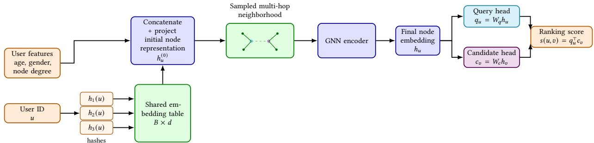
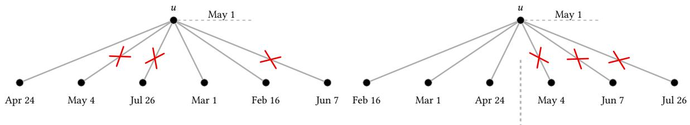
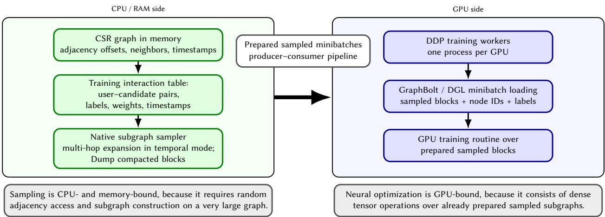
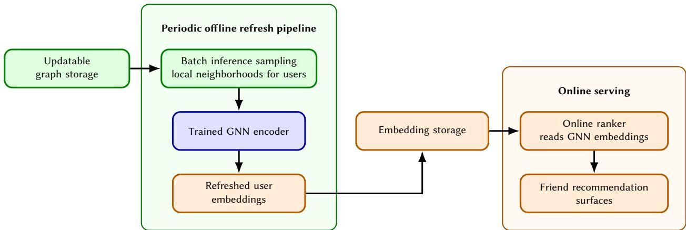

# SCALING GRAPH NEURAL NETWORKS FOR FRIEND RECOMMENDATION: MULTI-HASH USER EMBEDDINGS AND TEMPORAL NEIGHBOR SAMPLING∗

Maksim Utushkin AI VK Moscow, Russia mak.utushkin@gmail.com

Andrei Ovsiannikov AI VK Moscow, Russia andrey.ovsyannikov@vkteam.ru

Alexander D’yakonov   
AI VK   
Moscow, Russia   
djakonov@mail.ru

## ABSTRACT

Friend recommendation is inherently graph-structured: the relevance of a potential connection depends on multi-hop social context rather than user attributes alone. However, deploying messagepassing GNNs on a production-scale social graph with hundreds of millions of users and tens of billions of edges requires addressing numerous modeling and systems challenges. We present a scalable end-to-end GNN ranking system for production social graphs, focusing on two design choices that are critical in this setting: multi-hash ID embeddings and temporal neighbor sampling. Multi hash embeddings are common for high-cardinality features, but industrial GNN systems typically either ignore trainable IDs or accept full embedding tables — exceeding 200 GB for our graph. We integrate multi-hash as the primary node representation, reducing the ID-embedding table size by >98% while preserving ranking quality. Temporal neighbor sampling is well understood in principle, but existing implementations scan full adjacency lists — a non-starter for users with tens of thousands of friends. We implement timestamp-sorted CSR storage with binary search, reducing the per-node temporal sampling cost from O(deg(v) + k) to O(log deg(v) + k). Beyond these components, we show that this combination scales and yields measurable production impact. On a graph with 194M users and 28B edges, offline ablations isolate each design choice’s contribution. In an online A/B test, our system increases friend additions from recommendations by 16% and unique friend adders by 11.5% over a strong production baseline. We release our framework for distributed training and inference on large temporal graphs.

Keywords: friend recommendation, graph neural networks, industrial recommender systems, large-scale graph learning, social graph mining, multi-hash embeddings, temporal neighbor sampling.

## 1 Introduction

Friend recommendation, often surfaced to users as “People You May Know” (PYMK), is a core mechanic of any socia network: it drives growth and connectivity of the social graph and, indirectly, downstream content consumption. In production, the task is typically organized as a two-stage funnel of candidate generation followed by ranking, with the ranker applied across several recommendation surfaces. In this paper we focus on the ranking stage and treat it as a learning-to-rank problem over user–candidate pairs.

The signal that matters most for friend ranking lives in the structure of the social graph: who is connected to whom, how dense the local neighborhood around a user is, and how the neighborhoods of two users overlap. Graph neural networks (GNNs) are a natural fit, because message passing aggregates exactly this multi-hop information into a node representation. There is by now a sizable body of work on GNNs for recommendation, and several industrial systems have reported online wins from GNN-based rankers [1, 2, 3, 4].

In our experience, applying a GNN at this scale is less a question of which message-passing layer to use and more about a number of design decisions that dominate everything else in practice.

Three constraints shape the system in practice. (i) Scale: our graph has roughly 194M nodes and 28B edges, so storage and sampling are engineering problems in their own right. (ii) Weak node content: profile attributes carry little signal, but a trainable per-user ID table is not affordable — a 200M × 256 float32 table is itself ≈205 GB. (iii) Dynamic graph: training on time-ordered events while message-passing over the end-of-dataset graph leaks future edges; the obvious fix becomes bottleneck for hub users with deg $\mathrm { \sim 1 0 ^ { 4 } }$

Our approach. We tackle the three constraints with two design choices we found load-bearing in practice. User IDs enter the GNN through a multi-hash layer that maps every user into a shared table of size $B \ll | V |$ , replacing the infeasible $| V | \times d$ table at the cost of bounded hash collisions. Temporal neighbor sampling is implemented over timestamp-sorted CSR with a binary-search cutoff, so each sampling step becomes barely slower in practice. The encoder itself is a GATv2 with two role-specific heads (recipient and candidate), trained as binary classification over the impression log.

## Contributions. We make the following contributions:

• We integrate multi-hash ID embeddings as a first-class input layer for an industrial GNN ranker, reducing the ID-embedding table from >200 GB to 2 GB (<1%) while matching the quality of a full $| V | \times d$ table.

• We describe a binary-search-based temporal neighbor sampler over timestamp-sorted CSR, with $\mathcal { O } ( \log d _ { u } + K )$ per-call cost against $\mathcal { O } ( d _ { u } + K )$ for the naive scan used by mainstream GNN libraries, eliminating a ${ \approx } 2 . 5 \times$ overhead at training time.

• We describe the end-to-end pipeline — CSR storage, decoupled CPU sampling and GPU training, offline embedding refresh — that lets the system run on a single 8-GPU host despite a 225 GB graph and 28B edges.

• We report offline ablations isolating the contribution of each design choice and online A/B results on a production social network: +16% friend additions and +11.5% unique adders over a strong production baseline.

• We release the implementation of the training and inference framework described in this paper including the components needed to train and refresh GNN embeddings over large timestamped CSR graphs. The code is available at https://github.com/makut/VK-GNN.

## 2 Problem Formulation

## 2.1 Graph and task

We consider the friendship graph $G = ( V , E )$ of a large social network: nodes are active users, and an undirected edge $( u , v ) \in E$ records that u and v are mutual friends. The graph is dynamic — each edge carries a timestamp $t _ { u v }$ that records when the friendship was formed. Users are reindexed into a contiguous $[ 0 , | V | - 1 ]$ range during preprocessing, so the same integer ID is used both as a CSR index and as a hash input.

Friend recommendations appear on several product surfaces (sidebar, dedicated PYMK feed, onboarding), all driven by the same two-stage funnel: candidate generation — product-specific behavioral counters, Adamic–Adar [5], and learned retrieval [6] — followed by ranking. We focus on the ranking stage: given a user u and an upstream candidate set $\mathcal { C } _ { u } \subset V$ , the model scores each pair $( u , v ) , v \in \mathcal { C } _ { u }$ . The system described in this paper ranks friend candidates only; it is not part of the content-feed ranking stack. Feed-related metrics appear in Section 6.6 solely as downstream indicators of improved graph connectivity.

## 2.2 Training objective

The training signal comes from an interaction log D of recommendation impressions, where each record is a tuple $( u _ { i } , v _ { i } , y _ { i } , \tau _ { i } )$ . Here, $\tau _ { i }$ is the impression timestamp and $y _ { i }$ is positive if the impression resulted in a friend addition, negative on no-action impressions and on explicit hide events. The GNN score is consumed as a feature by a downstream gradient-boosted ranker, which is itself trained on impression-conditioned labels of the same form; we adopt this labelling for the GNN as a given, so that training and serving operate on the same distribution of pairs. The model is trained as binary classification with the standard cross-entropy loss

$$
\mathcal { L } = - \frac { 1 } { | D | } \sum _ { ( u , v , y , \tau ) \in D } \big [ y \log f ( u , v ; \tau ) + ( 1 - y ) \log \big ( 1 - f ( u , v ; \tau ) \big ) \big ] ,\tag{1}
$$

where $f ( u , v ; \tau )$ uses only information available up to time τ .

## 3 Related Work

Link prediction in social networks. The academic counterpart is the link prediction problem (LPP), introduced for social networks by Liben-Nowell and Kleinberg [7]: predict which edges will appear in a future snapshot. Our setting differs in three ways: positives are conditioned on the impression (we predict acceptance, not edge formation in the wild), candidates come from an upstream retrieval stage rather than all |V| nodes, and the system is evaluated on online product metrics rather than a held-out future-edge set.

Industrial graph-basedfriend recommendation. Friend recommendation has historically combined structural heuristics common neighbors, Adamic–Adar [5] — with learned embedding-based rankers, and several large social platform have described GNN-style approaches to it. GraFRank [2] applies graph attention over a multi-modal friendship graph at Snapchat. Another work [3] from the same group casts friend recommendation as embedding-based retrieval and focuses on the serving stack. SSNet [8] introduces a degree-aware re-scaling module for GNN-style friend ranking on Xbox. LiGNN [1] is an industrial GNN platform at LinkedIn behind a number of recommendation surfaces, including friending. Our system sits in the same family but focuses on two specific aspects that receive less attention in those papers: how to feed hundreds of millions of user IDs into the GNN without a giant embedding table, and how to keep temporal correctness without paying O(deg(v)) at every sampling step.

Graph neural networks and message passing. The mainstream GNN architectures we build on — GCN [9], Graph-SAGE [10], GAT [11, 12] — share a common message-passing template. LightGCN [13] simplifies the propagation step in collaborative-filtering settings; PinSage [4] scales GraphSAGE to web-scale recommendation by sampling neighborhoods via random walks. These models are typically described under the assumption that nodes either carry rich content features or have a trainable per-node embedding. For our task neither assumption is attractive: user content features are weak, and per-user embeddings require significant engineering solutions.

Compact identifier embeddings. Reducing the size of high-cardinality embedding tables is a recurring problem in recommender systems. Feature hashing and hash embeddings [14, 15] provide a multi-hash mechanism that maps a large identifier space into a much smaller shared table, trading exact identifiability for memory. Later work generalizes this idea, including DHE [16], compositional or quotient–remainder embeddings [17], and related compression techniques. In the graph context, position-based hash embeddings for GNNs [18] explore similar ideas on academic-scale graphs. We treat multi-hash as a first-class input layer for an industrial GNN and report its behavior at the scale of hundreds of millions of users.

Temporal graph learning. Temporal graph models such as TGAT [19] and TGN [20] compute node representations as functions of time and avoid using future interactions when making predictions. From an engineering standpoint, an efficient temporal neighborhood sampler is itself a nontrivial component; this is taken up by TGL [21], which proposes a temporal-CSR layout and parallel sampling routines for dynamic graphs. Our contribution on the temporal side is along the same lines: we describe a simple CSR-based sampler that uses timestamp sorting plus binary search to bound the sampling cost, and we measure its effect on training-time throughput in the context of friend ranking.

Industrial GNN systems. Beyond modeling, several recent papers describe end-to-end GNN platforms for very large graphs: GiGL [22] from Snap, GraphStorm [23] from Amazon, and LiGNN [1] from LinkedIn. These works emphasize neighbor sampling, distributed training, and the cost of refreshing representations, all of which are also central to our system. Our paper is complementary: rather than a full platform paper, we report on two specific design decisions and their effect at production scale.

## 4 Method

## 4.1 GNN usage

We use L stacked GATv2 [12] convolutions as the node encoder. At layer l, for each neighbor u of vertex $v ,$ attention scores

$$
e _ { v u } ^ { ( l ) } = a ^ { ( l ) \top } \mathrm { L e a k y R e L U } ( W _ { s } ^ { ( l ) } h _ { v } ^ { ( l ) } + W _ { t } ^ { ( l ) } h _ { u } ^ { ( l ) } )\tag{2}
$$

are mapped to weights with a softmax over set of neighbors of v, $\begin{array} { r } { \boldsymbol { \alpha _ { v u } ^ { ( l ) } } = \exp ( e _ { v u } ^ { ( l ) } ) / \sum _ { k \in \mathcal { N } ( v ) } \exp ( e _ { v k } ^ { ( l ) } ) } \end{array}$ , and the next-layer representation is $\begin{array} { r } { h _ { v } ^ { ( l + 1 ) } = \sigma \big ( \sum _ { u \in \mathcal { N } ( v ) } \alpha _ { v u } ^ { ( l ) } W _ { t } ^ { ( l ) } h _ { u } ^ { ( l ) } \big ) } \end{array}$

After L layers, the contextual representation $h _ { v } = h _ { v } ^ { ( L ) }$ is projected through two heads, $z _ { u } ^ { \mathrm { q } } = f _ { \mathrm { q } } ( h _ { u } )$ and $z _ { v } ^ { \mathrm { c } } = f _ { \mathrm { c } } ( h _ { v } )$ and the pair is scored by an inner product $s ( u , v ) = \left. z _ { u } ^ { \mathrm { q } } , z _ { v } ^ { \mathrm { c } } \right.$ . The two heads let the model treat “query” (the user receiving recommendations) and “candidate” roles asymmetrically: the same user appears in both roles in training data, and a single representation conflates them. Figure 1 shows the resulting model.

Figure 1: Model overview. User features and multi-hash user-ID representations are combined into the initial node embedding, processed by a sampled-neighborhood GNN encoder, and projected into separate query and candidate representations.  
  
Figure 2: Temporal neighbor sampling. Left: arbitrary-order neighbors require scanning. Right: timestamp-sorted neighbors allow a binary-search split into a valid past prefix and a future suffix.

## 4.2 Neighbor sampling

The representation of a vertex under a stacked GNN depends on its L-hop neighborhood. On our graph L-hop neighborhoods grow very quickly because of high-degree hubs: even $L = 2$ can reach tens of millions of nodes for a single seed. Following standard practice $[ 1 0 , 4 ] ,$ we cap the size of the computation graph by neighbor sampling: at every hop, we sample a bounded number K of neighbors per vertex, so the size of the computation graph is bounded by $\mathcal { O } ( \dot { K } ^ { L } )$

Each training example $( u , v , y , \tau )$ carries an event timestamp τ, and to avoid information leakage from edges that did not yet exist at time τ , we restrict message passing to the temporal neighborhood

$$
\mathcal { N } _ { < \tau } ( u ) = \{ v \in \mathcal { N } ( u ) : t _ { u v } < \tau - \Delta \} ,\tag{3}
$$

where $\Delta \geq 0$ is a safety offset: we exclude edges formed in the window $[ \tau - \Delta , \tau ]$ to be robust to delayed edge updates in the production pipeline.

The same cutoff τ is propagated to every of L hops: when we expand a sampled neighbor w of seed $u ,$ we again restrict to $\mathcal { N } _ { < \tau } ( w )$ , not to a cutoff shifted by the edge timestamp $t _ { u w }$ . The training example, not the intermediate edge, fixes the visible history.

The naive way to draw K neighbors from $\mathcal { N } _ { < \tau } ( u )$ is to scan the adjacency list, filter by timestamp, and sample. This is what mainstream open-source GNN libraries (DGL [24], PyTorch Geometric [25]) currently do when given a timestamp-aware sampler. For users with $\deg ( u )$ in the tens of thousands it is too slow.

We instead store, for each vertex $u ,$ two coordinated arrays nbrs $\mathbf { \Phi } _ { u } = ( v _ { 1 } , \dots , v _ { d _ { u } } )$ and $\mathrm { t s } _ { u } = ( t _ { u v _ { 1 } } , \ldots , t _ { u v _ { d } , \phantom { - } } )$ , sorted in ascending order of $t _ { u v _ { i } }$ . To draw a temporal sample we binary-search the prefix boundary p = lower\_bound $\big ( \mathrm { t s } _ { u } , \tau - \Delta \big )$ so that $t _ { u v _ { i } } < \tau - \Delta$ for all $i < p ,$ , and then sample K neighbors uniformly from the valid prefix $\left( v _ { 1 } , \ldots , v _ { p - 1 } \right)$ (Figure 2). In implementation, the naive sampler materializes the filtered candidate set by scanning the whole adjacency list, whereas the optimized sampler obtains the same candidate prefix by a single lower\_bound call and then samples from that prefix.

Let $d _ { u } = | \mathcal { N } ( u ) |$ and K the requested fanout. The binary-search sampler costs $\mathcal { O } ( \log d _ { u } + K )$ per call, against $\mathcal { O } ( d _ { u } + K )$ for the naive scan; the non-temporal lower bound is $\mathcal { O } ( K \bar { ) }$ . The per-call bound relies on a one-time preprocessing step: when the CSR is built, the adjacency list of every vertex is sorted by edge timestamp using a standard comparison sort, at a total cost of $\mathcal { O } \bigl ( \sum _ { u } \dot { d } _ { u } \log \dot { d } _ { u } \bigr ) = \mathcal { O } ( | \dot { E } | \log d _ { \operatorname* { m a x } } )$ over the whole graph. The sorted order is a static property of the snapshot: it is reused unchanged by every training epoch and every embedding refresh, and sampling itself never re-sorts. For a large graph the per-call gap matters in practice: a small number of very high-degree vertices are visited often as neighbors, and the $d _ { u }$ versus log $d _ { u }$ gap directly controls sampling throughput. We measure this in Section 6.

## 4.3 Node representation

What to feed into the bottom layer of the GNN is itself a design choice. Two approaches dominate: classical papers (NGCF [26], LightGCN [13]) use a learnable embedding table indexed by node ID, while industrial work often relies on pre-computed embeddings or content features (PinSage [4], GraFRank [2]); recent results [1] suggest that learnable ID embeddings can be highly valuable on industrial graphs. We use both sources: the input representation of a user u combines tabular user features and a trainable ID-based embedding.

Tabular features. We use a small set of m tabular user features $( m = 3$ in our system): gender, age, and graph degree, where the degree is computed in the friendship graph. Gender is treated as a categorical feature, while age and graph degree are first quantile-bucketed and then treated as categorical features, so that each feature $j \in \{ 1 , \dotsc , m \}$ takes one of $C _ { j }$ discrete values. Each feature is represented as a one-hot vector $x _ { u , j } \in \{ 0 , 1 \} ^ { C _ { j } }$ and projected through a feature-specific linear layer $( W _ { j } \in \mathbb { R } ^ { H \times C _ { j } } , b _ { j } \in \mathbb { R } ^ { H } )$ with LayerNorm into the hidden dimension H of the encoder $( H = 5 1 2$ in the base configuration, Table 2); the per-feature vectors are then summed,

$$
z _ { u , j } ^ { \mathrm { f e a t } } = \mathrm { L a y e r N o r m } ( W _ { j } x _ { u , j } + b _ { j } ) \in \mathbb { R } ^ { H } , \qquad z _ { u } ^ { \mathrm { f e a t } } = \sum _ { j = 1 } ^ { m } z _ { u , j } ^ { \mathrm { f e a t } }\tag{4}
$$

Multi-hash ID embedding. The structural signal in our task is commonly stronger than the feature signal, so we want a trainable per-user embedding on top of features. As discussed in Section 1, a naive $| V | \times d$ table usage is limited at our scale, and a embedding table would push the serving stack into more complex territory.

We avoid this with a multi-hash scheme, in the style of hash embeddings [15] and feature hashing [14]. A small shared table $T \in \mathbb { R } ^ { B \times d }$ with $B \ll | V |$ is indexed by k independent hash functions $r _ { i } ( u ) = h _ { i } ( u )$ mod B, $i = 1 , \ldots , k .$ . The rows $T _ { r _ { 1 } ( u ) } , \ldots , T _ { r _ { k } ( u ) }$ are concatenated and projected:

$$
e _ { u } ^ { \mathrm { h a s h } } = T _ { r _ { 1 } ( u ) } \parallel T _ { r _ { 2 } ( u ) } \parallel \cdots \parallel T _ { r _ { k } ( u ) } \in \mathbb { R } ^ { k d } ,\tag{5}
$$

$$
\boldsymbol { z } _ { u } ^ { \mathrm { e m b } } = \mathrm { L a y e r N o r m } ( \boldsymbol { W } _ { h } \boldsymbol { e } _ { u } ^ { \mathrm { h a s h } } + \boldsymbol { b } _ { h } ) \ \in \ \mathbb { R } ^ { H } .\tag{6}
$$

The bottom-layer node representation is then $h _ { u } ^ { ( 0 ) } = z _ { u } ^ { \mathrm { f e a t } } + z _ { u } ^ { \mathrm { e m b } }$

Under a uniform hash family, the probability that two fixed users collide on a single hash is $1 / B ,$ , so the probability of a full collision is $( 1 / B ) ^ { k }$ , which drops off quickly as $k$ grows. Partial collisions on individual hash slots are common and acceptable: each partial collision affects one of the k contributing rows, and the projection $W _ { h }$ can still separate users that share some of their hashes.

## 5 Training and Inference System

## 5.1 Two-stage pipeline

Training a GNN has two qualitatively different workloads: CPU-bound batch construction (multi-hop neighborhood sampling, temporal filtering, dominated by random CSR access and memory bandwidth) and GPU-bound training. We decouple them. A sampler (Java/C++ with Python binding) consumes the CSR graph and batch seeds and serializes minibatches into a bounded queue; each contains the sampled message-passing blocks (per-layer bipartite subgraphs), compacted node IDs for feature lookup, original user IDs for the multi-hash lookup, and per-example labels. A Python trainer on PyTorch and DGL/GraphBolt [24] reads from the queue and runs the optimizer. The two stages scale independently — CPU workers absorb sampling backlog, the prefetch buffer absorbs GPU stalls (Figure 3).

## 5.2 Hardware and runtime

Both training and inference run on a single host with 8 NVIDIA A100 80 GB GPUs, 512 GB of system RAM, and 64 CPU cores. The CSR graph and the tabular feature tables sit on the CPU side; the multi-hash table, model parameters, optimizer state, and activations sit on the GPU side. Under the base configuration (Section 6.1) the multi-hash table is about 2 GB, and the full GPU-side state fits comfortably into one device and is replicated across DDP ranks.

  
Figure 3: Training system overview. Batch construction is decoupled from GPU training: a CPU-side native sampler constructs sampled subgraphs, while GPU workers consume prepared minibatches and train the GNN model.

## 5.3 Graph storage

The graph is stored separately from the interaction log. After reindexing users to [0, |V | − 1], the graph is held in a CSR layout:

• indptr — the per-vertex offsets into the neighbor array;

• indices — the concatenated neighbor IDs;

• timestamps — timestamps aligned with indices.

Maximum value in indptr is bounded by |E| − 1, and in indices by |V| − 1. With |V| of order a few hundred million, the neighbor IDs fit in 32-bit integers, whereas indptr needs 64-bit because the total number of edges exceeds $2 ^ { 3 2 }$ . Using 32-bit indices cuts the memory footprint of the large array in half. timestamps are kept in 32-bit integers as well (Unix seconds with offset)

For the production graph, this gives a concrete CSR footprint of

• indices: 28 · 109 · 4 B ≈ 112 GB;

• timestamps: 28 · 109 · 4 B ≈ 112 GB;

• indptr: (|V | + 1) · 8 B ≈ 1.5 GB,

for a total of ≈ 225 GB. This fits in the RAM of the host (Section 5.2), which is the reason we can keep the entire graph in process.

For temporal sampling, neighbors inside each vertex’s adjacency list are sorted in ascending timestamp order during graph construction (see Section 4.2). The same CSR format is reused at inference.

## 5.4 Inference and embedding refresh

At inference time we reuse the same neighborhood expansion. For a batch of users, we materialize sampled local subgraphs and run the trained encoder, producing user embeddings consumed by the production ranker.

The refresh policy is dictated by the dependency structure of a GNN. Unlike a two-tower model, where a user embedding depends only on the user’s own features, a GNN representation depends on a sampled neighborhood, so a single new edge can affect many embeddings. We do not track such cascades online. Instead, the encoder periodically recomputes representations for a large active subset. Section 6 reports latency and refresh-cost numbers. Figure 4 shows the flow. The model is retrained from scratch in the same periodic manner; we discuss cold-start implications in Section 7.1.

  
Figure 4: Inference and embedding refresh. The periodic offline refresh pipeline samples local neighborhoods from the updatable graph storage, runs the trained GNN encoder, and writes refreshed user embeddings to the embedding storage. The online ranker reads these embeddings during serving.

Table 1: Dataset statistics.
<table><tr><td>Statistic</td><td>|V|</td><td>|E|</td><td>Train interactions</td><td>Test interactions</td></tr><tr><td>Value</td><td>194M</td><td>28B</td><td>1.4B</td><td>25M</td></tr></table>

## 6 Experiments

## 6.1 Setup

We use a snapshot of the production friendship graph and the matching impression log; Table 1 summarizes the scale. Interactions are split temporally on the impression timestamp, with the last three years used for training. The label is binary, as defined in Section 2.

Unless noted otherwise, every model is trained with the configuration in Table 2; ablations change one parameter at a time and keep the rest fixed.

## 6.2 Baselines

We compare against three baselines that span the range from a non-learned popularity prior to the previous production ranker:

• Top-pop. Candidates are ranked by their in-degree in the friendship graph. The model has no learnable parameters and serves as a sanity-check lower bound.

• MF. A matrix factorization model trained on the same interaction log as the GNN.

• WalkGNN. The previous production solution in our company, described in [6]. It scores user–candidate pairs by aggregating GNN-based relevance estimates over local ego-net contexts. We use it as the strongest production baseline. In contrast, our model precomputes user embeddings offline and reduces online pair scoring to an inner product, making the serving path simpler and cheaper than constructing ego-subgraphs per scored pair.

For the proposed model we report the best configuration from the ablations below.

## 6.3 Offline evaluation

Table 3 reports per-user ROC-AUC for all four models. Each step adds signal: MF captures collaborative patterns, WalkGNN adds local ego-network structure, and our model adds the largest increment by extending message passing to the full multi-hop neighborhood — a step enabled by the multi-hash and temporal-sampling choices ablated in Section 6.4.

Table 2: Base training configuration. All ablations are run with one parameter changed at a time; the rest are held fixed at the values below.
<table><tr><td>Component</td><td>Setting</td></tr><tr><td>GNN encoder</td><td>GATv2,  $L = 2$  layers, 8 attention heads</td></tr><tr><td>Hidden dimension</td><td> $H = 5 1 2$ </td></tr><tr><td>Head output dimension</td><td>128 (query, candidate)</td></tr><tr><td>Multi-hash slots</td><td> $k = 3$ </td></tr><tr><td>Shared hash table</td><td> $B = 2 ^ { 2 1 }$  rows, dim d = 256</td></tr><tr><td>Hash function</td><td>64-bit integer multiplicative hashing</td></tr><tr><td>Per-hop fanout</td><td> $K = 3 0$ </td></tr><tr><td>Temporal sampling</td><td>binary-search cutoff with shift  $\Delta = 3 0 \mathrm { { m i n } }$ </td></tr><tr><td>Optimizer</td><td>Adam, learning rate  $1 . 5 { \cdot } 1 0 ^ { - 3 }$ </td></tr><tr><td>Batch size</td><td>1024 user-candidate pairs per GPU</td></tr><tr><td>Parallelism</td><td>DDP on 8 A100 GPUs</td></tr><tr><td>Stopping rule</td><td>early stopping on validation ROC-AUC</td></tr></table>

Table 3: Offline ranking quality on the held-out test interactions, measured as per-user ROC-AUC (higher is better).
<table><tr><td></td><td>Top-pop</td><td>MF</td><td>WalkGNN</td><td>Ours</td></tr><tr><td>ROC-AUC</td><td>0.5050</td><td>0.5316</td><td>0.5572</td><td>0.6278</td></tr></table>

## 6.4 Ablations

We ablate each of the design choices in turn. The backbone is described in Table 2; each ablation varies one component at a time.

## 6.4.1 Input representations

We isolate the contributions of tabular features and the multi-hash ID embedding, and additionally compare against a full $| V | \times d$ trainable embedding table as a high-capacity reference point. The full table does not fit on a single host and is implemented offline via TorchRec [27] row-sharding across the 8 training GPUs; it is not a serving option but quantifies the quality cost of the multi-hash compression.

Two observations stand out. First, the structural signal alone outperforms the tabular signal alone by a wide margin, confirming that for friend ranking the graph carries more than the profile. Second, multi-hash matches the full $| V | \overset { \vartriangle } { \times } d$ table while using <1% of its memory; we hypothesize that the bounded sharing induced by multi-hash acts as an implicit regularizer that prevents overfitting on individual user rows.

## 6.4.2 Multi-hash table size

Table 5 sweeps the shared-table size B from $2 ^ { 1 7 }$ to $2 ^ { 2 2 }$ rows with $k = 3$ and $d = 2 5 6$ fixed.

Quality grows monotonically with B and has not yet flattened at $2 ^ { 2 2 }$ . We pick $B = 2 ^ { 2 1 }$ for the production configuration: at $2 ^ { 2 2 }$ the table doubles in size while quality changes only marginally.

## 6.4.3 Temporal sampling

Switching off temporal sampling lets the model aggregate over edges that did not yet exist at prediction time — a form of label leakage. Table 6 reports both the quality impact and the per-batch sampling cost.

The non-temporal model trains on a graph that includes post-impression edges and is 0.0371 ROC-AUC below the temporal version, quantifying the leakage. Both temporal samplers draw from the same $\mathcal { N } _ { < \tau } ( u )$ and yield identical quality; the binary-search sampler reaches it at essentially the same per-batch cost as the non-temporal one, while the naive scan is ${ \approx } 2 . 5 \times$ slower.

Table 4: Effect of the ID-representation scheme on offline ranking quality (per-user ROC-AUC).
<table><tr><td>ID scheme</td><td>Embedding table size</td><td>ROC-AUC</td></tr><tr><td>Features only</td><td></td><td>0.5244</td></tr><tr><td>Multi-hash IDs only (no features)</td><td>2 GB</td><td>0.5997</td></tr><tr><td>Features + full table</td><td>202.88 GB</td><td>0.6246</td></tr><tr><td>Features + multi-hash IDs (ours)</td><td>2 GB</td><td>0.6278</td></tr></table>

Table 5: Effect of the shared-table size B on offline ranking quality (per-user ROC-AUC) and on the memory required.
<table><tr><td>B</td><td> $2 ^ { 1 7 }$ </td><td> $2 ^ { 1 8 }$ </td><td> $2 ^ { 1 9 }$ </td><td> $2 ^ { 2 0 }$ </td><td> $2 ^ { 2 1 }$ </td><td> $2 ^ { 2 2 }$ </td></tr><tr><td>Hash table memory</td><td>128 MB</td><td>256MB</td><td>512 MB</td><td>1 GB</td><td>2 GB</td><td>4 GB</td></tr><tr><td>ROC-AUC</td><td>0.5952</td><td>0.6044</td><td>0.6092</td><td>0.6184</td><td>0.6278</td><td>0.6310</td></tr></table>

## 6.5 System scalability

Table 7 reports the operational numbers that matter for an industrial deployment, all measured under the base configuration of Table 2.

The graph occupies 225 GB but the trainable parameter set fits on a single GPU — a direct consequence of the multi-hash design.

## 6.6 Online A/B test

The model trained with the configuration in Table 2 was deployed as a ranking feature in the production friend recommendation pipeline. The treatment group used a ranker enriched with the GNN score; the control group used the previous production ranker. Table 8 summarizes the online effects.

The experiment was run on production traffic for two weeks. The two direct friending metrics improved by +16.0% and +11.5%, respectively, both statistically significant at $p < 0 . 0 1$ . We also observed a statistically significant +0.28% lift in total time spent in the content feed, which we consider as a purely downstream effect: users form more connections and therefore get more content.

Because the GNN signal is delivered as precomputed embeddings rather than computed at request time, ranker latency is within noise compared to the control group.

Table 6: Effect of temporal neighbor sampling on offline quality and on per-batch sampling cost. Sampling time is wall-clock cost per minibatch under the base configuration.
<table><tr><td>Sampler</td><td>ROC-AUC</td><td>Sampling time</td></tr><tr><td>Non-temporal</td><td>0.5907</td><td>581 ms</td></tr><tr><td>Temporal, naive scan</td><td>0.6278</td><td>1473 ms</td></tr><tr><td>Temporal, binary search (ours)</td><td>0.6278</td><td>595 ms</td></tr></table>

Table 7: End-to-end system numbers.
<table><tr><td colspan="2">Training time</td></tr><tr><td>GPU step (forward + backward per batch)</td><td>927 ms</td></tr><tr><td>Wall-clock time per epoch</td><td>43.4 h</td></tr><tr><td>Iterations to early stopping</td><td>252 k</td></tr><tr><td>Total training time to convergence</td><td>63 h</td></tr><tr><td colspan="2">Inference and memory</td></tr><tr><td>Embedding computation for all 194M users</td><td>6.57 h</td></tr><tr><td>CSR graph, CPU side</td><td>225 GB</td></tr><tr><td>Tabular feature tables, CPU side</td><td>2.18 GB</td></tr><tr><td>Multi-hash table, GPU side</td><td>2 GB</td></tr><tr><td>Model parameters + Adam state, GPU side</td><td>6.03 GB</td></tr></table>

Table 8: Online A/B test results against the previous production ranker.
<table><tr><td>Metric</td><td>Relative change</td></tr><tr><td>Friend additions from recommendations</td><td>+16.0%</td></tr><tr><td>Unique users adding a recommended friend</td><td>+11.5%</td></tr><tr><td>Total time spent in content feed</td><td>+0.28%</td></tr><tr><td>Ranker p50/p90/p99 latency</td><td>no regression</td></tr></table>

## 7 Discussion and Limitations

## 7.1 Cold start and new users

The multi-hash scheme is tied to the user cohort seen during training: a user who joined after the snapshot, or who was inactive at training time, has no incident edges in the graph and gets no learning signal. We handle this by retraining periodically on a fresh graph; between runs, such users are served by upstream candidate generation and the GNN re-ranker falls back to a representation whose only ID-side content comes from incidental hash collisions (the features-only ablation in Section 6.4.1 bounds that fallback). The retraining cadence sets the size of the cold window. Several directions are compatible with our system: inductive aggregation over the partial neighborhood (GraFRank [2]), continuous-memory updates between runs (TGN [20]), graph densification with synthetic edges (LiGNN [1]), and low-rank warm-start folding-in [28].

## 7.2 Non-real-time serving

A GNN embedding depends on an L-hop sampled neighborhood, so producing one online requires the same multi-hop expansion the trainer runs on the CPU — which does not fit the latency budget of a ranker call (two-tower models avoid this, since each side’s representation depends only on its own features). We therefore keep the GNN offline: embeddings are refreshed on a fixed schedule and exposed to the online ranker as features without raising ranker p99 latency. The price is staleness between refreshes. For friend recommendation this is favourable, since friendship is a slowly-changing signal compared to feed-style engagement; on surfaces with within-session interest shift, a continuously-updated memory module [20] at higher per-request cost would be a better fit.

## 7.3 Beyond the friendship graph

Both design choices transfer to heterogeneous graphs, where many recommender deployments live. The temporal sampler is unchanged: each edge type carries its own CSR sorted by timestamp, and a cutoff query is a binary search per edge type with the same $\mathcal { O } ( \log d _ { u } ^ { - } + K )$ cost. The multi-hash representation transfers more selectively — it need not be applied to every node type. In a user–item bipartite graph, for instance, items typically have strong content features while users have weak profile attributes, so it is natural to feed content features to items and multi-hash to users.

## 8 Conclusion

We described a production GNN ranking system for friend recommendation on a huge graph with 194M users and 28B edges. The two design choices we focused on — a multi-hash representation of user IDs as the primary input layer of the GNN, and a binary-search-based temporal neighbor sampler — are relatively simple, but together they cover the two parts of the problem that we found hardest to get right in practice. In an online A/B test, the system improved friend additions from recommendations by +16% and also increased total time spent in the content feed by +0.28%. By releasing the framework — including the native temporal neighbor sampler, the multi-hash embedding layer, and the training and inference pipeline — we hope to make these components useful to other teams building GNN rankers at industrial scale.

## GenAI Usage Disclosure

The authors used generative AI tools, including ChatGPT, Claude, and DeepSeek, during manuscript preparation for language editing, alternative phrasings, structural feedback, and assistance with LaTeX snippets. These tools were also used to assist with refactoring and adapting selected runtime components for open-source release, and with writing parts of the training-launch scripts. The core framework implementation was written manually by the authors. Generative AI tools were not used to generate experimental results, labels, production metrics, or the core technical claims of the paper. All AI-assisted text, code suggestions, and refactoring suggestions were reviewed, edited, tested where applicable, and verified by the authors, who take full responsibility for the final content.

## References

[1] F. Borisyuk, S. He, Y. Ouyang, M. Ramezani, P. Du, X. Hou, C. Jiang, N. Pasumarthy, P. Bannur, B. Tiwana et al., “Lignn: Graph neural networks at linkedin,” in Proceedings ofthe 30th ACM SIGKDD conference on knowledge discovery and data mining, 2024, pp. 4793–4803.

[2] A. Sankar, Y. Liu, J. Yu, and N. Shah, “Graph neural networks for friend ranking in large-scale social platforms,” in Proceedings of the web conference 2021, 2021, pp. 2535–2546.

[3] P. P.-H. Kung, Z. Fan, T. Zhao, Y. Liu, Z. Lai, J. Shi, Y. Wu, J. Yu, N. Shah, and G. Venkataraman, “Improving embedding-based retrieval in friend recommendation with ann query expansion,” in Proceedings of the 47th International ACM SIGIR Conference on Research and Development in Information Retrieval, 2024, pp. 2930– 2934.

[4] R. Ying, R. He, K. Chen, P. Eksombatchai, W. L. Hamilton, and J. Leskovec, “Graph convolutional neural networks for web-scale recommender systems,” in Proceedings of the 24th ACM SIGKDD international conference on knowledge discovery & data mining, 2018, pp. 974–983.

[5] L. A. Adamic and E. Adar, “Friends and neighbors on the web,” Social networks, vol. 25, no. 3, pp. 211–230, 2003.

[6] E. Zamyatin, “Gnn applied to ego-nets for friend suggestions,” arXiv preprint arXiv:2412.11888, 2024.

[7] D. Liben-Nowell and J. Kleinberg, “The link prediction problem for social networks,” in Proceedings ofthe twelfth international conference on Information and knowledge management, 2003, pp. 556–559.

[8] X. Song, J. Lian, H. Huang, M. Wu, H. Jin, and X. Xie, “Friend recommendations with self-rescaling graph neural networks,” in Proceedings of the 28th ACM SIGKDD conference on knowledge discovery and data mining, 2022, pp. 3909–3919.

[9] T. N. Kipf and M. Welling, “Semi-supervised classification with graph convolutional networks,” in 5th International Conference on Learning Representations, ICLR 2017, Toulon, France, April 24-26, 2017, Conference Track Proceedings. OpenReview.net, 2017. [Online]. Available: https://openreview.net/forum?id=SJU4ayYgl

[10] W. Hamilton, Z. Ying, and J. Leskovec, “Inductive representation learning on large graphs,” Advances in neural information processing systems, vol. 30, 2017.

[11] P. Velickovic, G. Cucurull, A. Casanova, A. Romero, P. Liò, and Y. Bengio, “Graph attention networks,” in 6th International Conference on Learning Representations, ICLR 2018, Vancouver, BC, Canada, April 30 - May 3, 2018, Conference Track Proceedings. OpenReview.net, 2018. [Online]. Available: https://openreview.net/forum?id=rJXMpikCZ

[12] S. Brody, U. Alon, and E. Yahav, “How attentive are graph attention networks?” in International Conference on Learning Representations, 2022. [Online]. Available: https://openreview.net/forum?id=F72ximsx7C1

[13] X. He, K. Deng, X. Wang, Y. Li, Y. Zhang, and M. Wang, “Lightgcn: Simplifying and powering graph convolution network for recommendation,” in Proceedings ofthe 43rd International ACM SIGIR conference on research and development in Information Retrieval, 2020, pp. 639–648.

[14] K. Weinberger, A. Dasgupta, J. Langford, A. Smola, and J. Attenberg, “Feature hashing for large scale multitask learning,” in Proceedings ofthe 26th annual international conference on machine learning, 2009, pp. 1113–1120.

[15] D. Tito Svenstrup, J. Hansen, and O. Winther, “Hash embeddings for efficient word representations,” Advances in neural information processing systems, vol. 30, 2017.

[16] W.-C. Kang, D. Z. Cheng, T. Yao, X. Yi, T. Chen, L. Hong, and E. H. Chi, “Learning to embed categorical features without embedding tables for recommendation,” in Proceedings ofthe 27th ACM SIGKDD Conference on Knowledge Discovery & Data Mining, 2021, pp. 840–850.

[17] H.-J. M. Shi, D. Mudigere, M. Naumov, and J. Yang, “Compositional embeddings using complementary partitions for memory-efficient recommendation systems,” in Proceedings ofthe 26th ACM SIGKDD International Conference on Knowledge Discovery & Data Mining, 2020, pp. 165–175.

[18] M. Kalantzi and G. Karypis, “Position-based hash embeddings for scaling graph neural networks,” in 2021 IEEE International Conference on Big Data (Big Data). IEEE, 2021, pp. 779–789.

[19] da Xu, chuanwei ruan, evren korpeoglu, sushant kumar, and kannan achan, “Inductive representation learning on temporal graphs,” in International Conference on Learning Representations, 2020. [Online]. Available: https://openreview.net/forum?id=rJeW1yHYwH

[20] E. Rossi, B. Chamberlain, F. Frasca, D. Eynard, F. Monti, and M. Bronstein, “Temporal graph networks for deep learning on dynamic graphs,” in ICML Workshop on Graph Representation Learning, 2020.

[21] H. Zhou, D. Zheng, I. Nisa, V. Ioannidis, X. Song, and G. Karypis, “Tgl: A general framework for temporal gnn training on billion-scale graphs,” arXiv preprint arXiv:2203.14883, 2022.

[22] T. Zhao, Y. Liu, M. Kolodner, K. Montemayor, E. Ghazizadeh, A. Batra, Z. Fan, X. Gao, X. Guo, J. Ren et al., “Gigl: Large-scale graph neural networks at snapchat,” in Proceedings ofthe 31st ACM SIGKDD Conference on Knowledge Discovery and Data Mining V. 2, 2025, pp. 5225–5236.

[23] D. Zheng, X. Song, Q. Zhu, J. Zhang, T. Vasiloudis, R. Ma, H. Zhang, Z. Wang, S. Adeshina, I. Nisa et al., “Graphstorm: All-in-one graph machine learning framework for industry applications,” in Proceedings ofthe 30th ACM SIGKDD Conference on Knowledge Discovery and Data Mining, 2024, pp. 6356–6367.

[24] M. Wang, D. Zheng, Z. Ye, Q. Gan, M. Li, X. Song, J. Zhou, C. Ma, L. Yu, Y. Gai et al., “Deep graph library: A graph-centric, highly-performant package for graph neural networks,” arXiv preprint arXiv:1909.01315, 2019.

[25] M. Fey and J. E. Lenssen, “Fast graph representation learning with pytorch geometric,” arXiv preprint arXiv:1903.02428, 2019.

[26] X. Wang, X. He, M. Wang, F. Feng, and T.-S. Chua, “Neural graph collaborative filtering,” in Proceedings of the 42nd international ACM SIGIR conference on Research and development in Information Retrieval, 2019, pp. 165–174.

[27] D. Ivchenko, D. Van Der Staay, C. Taylor, X. Liu, W. Feng, R. Kindi, A. Sudarshan, and S. Sefati, “Torchrec: a pytorch domain library for recommendation systems,” in Proceedings ofthe 16th ACM Conference on Recommender Systems, 2022, pp. 482–483.

[28] V. Yusupov, M. Rakhuba, and E. Frolov, “Ultra fast warm start solution for graph recommendations,” in Proceedings of the 34th ACM International Conference on Information and Knowledge Management, 2025, pp. 5469–5473.