# Shared Actors Need Not Share Critics: Effects of Value Mismatch in Parallel Reinforcement Learning

Zhenya Liu1∗, Yang Meng1, Zhuokai Zhao1, Xuefeng Liu2† & Yuxin Chen1†∗ 1University of Chicago 2University of Florida

Œ Project page ‡ Code

## Abstract

When a single policy is trained in parallel across multiple environments of the same task, such as procedurally generated levels, randomized dynamics, or curricula, implementations commonly use one critic across all sampled environments. Yet diferent environments can assign diferent expected returns to the same input visible to the critic. A critic without environment information must then reconcile distinct value targets, systematically shifting the sampled advantages within individual environments. Using illustrative bandit models with multiple environments and a common optimal arm, we characterize how this value mismatch redistributes sampled policy updates, reinforcing unhelpful actions while attenuating or even reversing useful ones. The oracle processes using no baseline, the shared value, or the value specific to the sampled environment have the same mean logit update at a fixed policy and converge to the same optimal policy, yet their realized learning paths can difer sharply. The analysis motivates a minimal intervention: give only a logged environment index to the critic so that it can separate the value targets. Controlled CartPole and MuJoCo experiments expose the predicted shifted values, advantages, and performance gaps. In the more complex BipedalWalker and Procgen settings, the same intervention yields more stable learning and higher returns. Across all 16 Procgen games, the multihead conditional critic improves aggregate normalized return on 600 unseen levels per game by 40.8%. In conclusion, the theory identifies value mismatch as a direct mechanism through which critic sharing can degrade stochastic learning dynamics, not captured by scalar estimator variance alone, and the experiments show that conditioning on an index is broadly efective in parallel reinforcement learning.

## 1 Introduction

Policy gradient methods optimize the expected return $J ( \theta ) : = \mathbb { E } _ { \tau \sim \pi _ { \theta } } [ G ( \tau ) ]$ by updating a stochastic policy from sampled trajectories (Williams, 1992; Sutton & Barto, 2018). A sampled update is proportional to $( \mathsf { \bar { G } } _ { t } - B _ { t } ) \dot { \nabla } _ { \theta } \log \pi _ { \theta } ( \bar { a } _ { t } \mid s _ { t } )$ , where $G _ { t }$ is the sampled return and $B _ { t }$ is an action-independent baseline. Subtracting such a baseline changes the realized update but leaves its expectation unchanged at a fixed policy (Weaver & Tao, 2001; Greensmith et al., 2004); a learned value function is the standard choice (Schulman et al., 2016; 2017). But training is a closed loop: the policy that generates a sample is also changed by that sample. Preserving the expected gradient does not preserve the law of the online learning process. Stochastic softmax policy gradient can therefore follow very diferent learning paths despite the same local expected direction (Mei et al., 2021). In particular, baseline choices alter the signs and aggressiveness of sampled updates, not merely their variance (Chung et al., 2021; Mei et al., 2022).

We study parallel learning across multiple environments within one task. Procedural generalization (Cobbe et al., 2020), dynamics randomization (Peng et al., 2018), and level curricula such as PLR, ACCEL, and PATH (Jiang et al., 2021; Parker-Holder et al., 2022; Liu & Chen, 2026) repeatedly sample environment variants while learning one policy that must work across them. A shared actor is therefore the objective. Standard Procgen and level replay implementations also use one value function across sampled levels (Cobbe et al., 2020; Jiang et al., 2021; Raileanu & Fergus, 2021).

The key counterintuitive point is that the same task does not imply the same state value. Let S denote the input or representation visible to the critic. For a fixed policy π, define the value in environment z as $\bar { V } _ { z } ^ { \pi } ( s ) : = \mathbb { E } _ { \pi } [ G \mid S = s , Z = z ]$ . A value function shared across environments but without access to $Z$ is associated with the marginalized value

$$
\bar { V } ^ { \pi } ( s ) : = \mathbb { E } _ { \pi } [ G \mid S = s ] = \sum _ { z } q _ { z } ^ { \pi } ( s ) V _ { z } ^ { \pi } ( s ) , \qquad q _ { z } ^ { \pi } ( s ) : = \mathbb { P } _ { \pi } ( Z = z \mid S = s ) .
$$

Diferent dynamics or horizons can therefore produce diferent continuation values even at comparable reward scales. We suppress the dependence of $q _ { z } ^ { \pi } ( s )$ on the rollout distribution when it is clear. The resulting value mismatch in environment z is $e _ { z } ^ { \pi } ( s ) : = V _ { z } ^ { \pi } ( s ) - \bar { V } ^ { \pi } ( s )$ Thus a shared value can be correct for the information available to the critic and remain unbiased as a baseline, yet systematically miscenter samples within individual environments. Figure 1 previews the resulting learning dynamics in the smallest setting that retains this mismatch. The three processes use the same shared actor and environment distribution; they difer only in how the sampled return is centered.

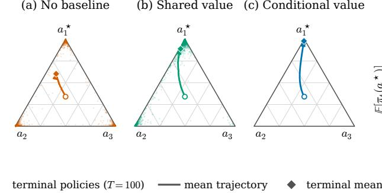

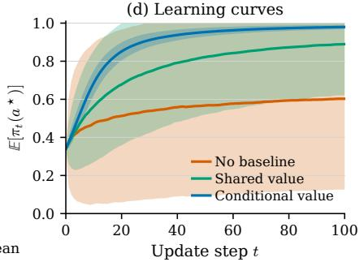  
Figure 1: Same destination, diferent sampled paths. A shared softmax actor is trained across two three-arm bandits with a common optimal arm. The panels compare raw returns (no baseline), the shared value $\bar { V } ^ { \pi _ { t } }$ , and the sampled environment’s value $\dot { V } _ { Z _ { t } } ^ { \pi _ { t } }$ (a–c) Policies after $T = 1 0 0$ updates and their mean trajectories. (d) Mean optimal-arm probability across 4,000 paired runs, with one standard deviation. Rewards are (1, 0.9, 0.8) and $( 0 . 4 , 0 . 2 , 0 ) , q _ { E } = q _ { H } = 1 / 2 , \eta = 2$ , and $\pi _ { 0 } = ( 0 . 3 4 , 0 . 3 3 , 0 . 3 3 )$ . Proposition 1 later shows that all three processes converge to the same optimal corner; the figure exposes their separation after only 100 updates.

Conditioning only the critic has close architectural and theoretical precedents. AACC supplies simulator factors only to the critic to support adaptation under changing dynamics (Yue et al., 2024), while PAMDP conditions a dual critic on profiles for persona alignment (Yang et al., 2026). Prior theory establishes conditional value identities, unbiased expected gradients, and aliasing benefits for privileged critics (Baisero & Amato, 2022; Li et al., 2024; Lambrechts et al., 2025; Ebi et al., 2026). Our question concerns a diferent consequence: when environment-specific values difer, how does their shared marginal redistribute realized updates along the closed-loop learning path? Our contributions are twofold. First, we explain value mismatch through the resulting learning dynamics. In illustrative bandits (Figure 1), the three baselines have the same expected update at a fixed policy and the same asymptotic destination but sharply diferent sampled paths. We characterize when shared value estimation reinforces suboptimal samples or attenuates and reverses optimal ones. Second, this account motivates a deliberately simple intervention: provide only an arbitrary logged environment index to the critic, allowing it to represent a distinct value for each environment without changing the actor. For instance, controlled CartPole and Mu-JoCo experiments exhibit value and advantage signatures consistent with the mechanism, and the conditioned critic consistently outperforms the shared one. In the more complex BipedalWalker and Procgen settings, conditioning also yields substantial empirical gains: the two designs of conditioned critics raise the final mean return on unseen BipedalWalker terrains from 90.7 (shared critic) to 155.6 and 190.4, and improve the aggregate normalized Procgen return on unseen levels over the shared critic by 21.2% and 40.8%, respectively. These results show that correcting value mismatch can be useful across several forms of parallel environment training.

## 2 Related work

What do baselines do? The classical account is variance reduction of the policy gradient estimator (Williams, 1992; Weaver & Tao, 2001; Greensmith et al., 2004), refined by control variates that depend on the action and Stein control variates (Gu et al., 2017; Liu et al., 2018; Wu et al., 2018). On common benchmarks, Tucker et al. (2018) found that the learned baselines that depend on the action did not reduce variance beyond a baseline conditioned only on state, and traced previously reported gains to implementation diferences. A second line studies the coupled process of sampling and updating: committal behavior (Chung et al., 2021), update aggressiveness (Mei et al., 2021; 2022), softmax policy gradient convergence (Mei et al., 2020; Li et al., 2021; Agarwal et al., 2021; Mei et al., 2023), and REINFORCE convergence at any fixed learning rate (Robertson et al., 2025). Our analysis builds directly on this view. Chung et al. (2021) show in a single environment that baseline placement, rather than variance alone, controls sampled signs and committal behavior. We show how sharing a value estimate creates a structured placement error across environments: one population value can be too low in environments with high values and too high in those with low values. This reintroduces rival reinforcement despite using a value baseline and also suppresses useful samples.

Multitask scaling and environment variation. PopArt normalizes heterogeneous value targets while preserving their unnormalized predictions (van Hasselt et al., 2016). Multitask PopArt combines a shared policy with value outputs indexed by task (Hessel et al., 2019), making it a direct architectural precedent for sharing an actor without fully sharing its critic. When a critic without task information is shared across tasks with widely diferent return scales, it must pool widely separated value targets, making scale heterogeneity an especially visible source of value mismatch. We isolate the subtler case in which environment variation creates diferent continuation values at comparable reward scales. Target normalization controls target magnitude, whereas critic conditioning separates environment-specific values; the two interventions address complementary aspects of the interference.

Conditional and asymmetric critics. Conditioned values and information available only to the critic are established designs (Schaul et al., 2015; Pinto et al., 2018; Hu et al., 2024). Under partial observability, Baisero & Amato (2022) establish a conditional value identity and an unbiased asymmetric policy gradient; DCRL combines a critic using only history with one using both history and state to study a variance tradeof (Li et al., 2024); and IAAC treats general privileged signals and studies expected gradient validity and informativeness (Ebi et al., 2026). In complementary theory for finite training horizons, privileged critics remove agent-state aliasing terms from linear actor–critic bounds (Lambrechts et al., 2025). These works explain validity, variance, or aliasing benefits. We instead study how environment-dependent value ofsets redistribute realized updates even when the expected direction at a fixed policy is unchanged.

AACC is a close precedent for conditioning the critic on environment information: it learns an encoding of continuous simulator factors for the critic and studies adaptation under changing dynamics (Yue et al., 2024). Its formulation also relates values conditioned on simulator factors to their marginal over observations alone. PAMDP instead uses a dual critic conditioned on profiles for persona alignment (Yang et al., 2026). We use an arbitrary categorical environment index, without physical parameters, ordering, or profile semantics, as a controlled intervention on value estimation. Our contribution is a complementary account of the learning dynamics: environment information changes how the same mean policy gradient update is distributed across sampled branches and thereby changes the realized path. When one critic prediction represents environments with diferent futures, the same bar can promote suboptimal samples in some environments and attenuate or reverse optimal samples in others. This is a structured instance of perceptual aliasing (Chrisman, 1992; Singh et al., 1994); we characterize its consequences for sampled paths and test the index intervention across parallel RL benchmarks.

Algorithm 1 Softmax Policy Gradient across Environments   
Require: q, rewards $\{ r _ { z } \}$ , step size $\eta ,$ , baseline $B \in \{ B ^ { 0 } , B ^ { \mathrm { s h a r e d } } , B ^ { \mathrm { c o n d } } \}$   
1: for $t = \bar { 0 } , 1 , 2 , \ldots$ do   
2: draw $Z _ { t } \sim q$ and $a _ { t } \sim \pi _ { \theta _ { t } }$   
3: observe $G _ { t } = r _ { Z _ { t } } ( a _ { t } )$ and evaluate the baseline $B _ { t }$   
4: $\theta _ { t + 1 }  \theta _ { t } + \eta ( \dot { G } _ { t } - B _ { t } ) ( \mathbf { e } _ { a _ { t } } - \pi _ { \theta _ { t } } )$   
Algorithm 1 is the complete stochastic process analyzed in the theory. For the full softmax   
logit parameterization, $\nabla _ { \theta } \log \pi _ { \theta } ( a _ { t } ) = \mathbf { e } _ { a _ { t } } - \pi _ { \theta }$ , so Line 4 is one sampled REINFORCE   
update with an action-independent baseline.   
The bandit is an explanatory abstraction. At a matched input visible to the critic in an   
MDP, $r _ { z } ( a )$ represents the return for action a in environment $z .$ The abstraction isolates   
value mismatch from state visitation, critic estimation error, and function approximation.   
Why convergence first. We first establish a common asymptotic result to isolate path   
efects over a finite horizon and to prove the two facts required below: entry into a near  
optimal region and infinite exploration.   
Proposition 1 (A common destination and a rate for time averages). Consider Algorithm 1   
with finite initial logits, the common strict optimal arm defined above, and any fixed learning   
rate $\eta \in ( 0 , \infty )$ . For each $B \in \{ B ^ { 0 } , B ^ { \mathrm { s h a r e d } } , B ^ { \mathrm { c o n d } } \}$   
P  lim πBt (a∗) = 1 = 1. (1)   
t→∞

## 3 Problem setting: one policy, many environments

An explanatory bandit model with multiple environments. We isolate the efect of critic sharing in the smallest model that retains a value that depends on the environment. Let Z be a finite collection of environments and A a finite set of $K \geq 2$ arms. At round $t ,$ an environment index $Z _ { t } \sim q$ is drawn independently, where $q _ { z } > 0$ and $\textstyle \sum _ { z } q _ { z } = 1$ . The actor is a single softmax actor $\pi _ { t } ( a ) \propto \exp { \theta _ { t } ( a ) }$ that samples $a _ { t } \sim \pi _ { t }$ without observing $Z _ { t }$ Environment z assigns a deterministic scalar reward $r _ { z } ( a )$ to arm $a ;$ because both sets are finite, the reward table is uniformly bounded.

We assume that the environments share one strict optimal arm: $r _ { z } ( a ^ { * } ) > r _ { z } ( i )$ for every $z \in { \mathcal { Z } }$ and $i \neq a ^ { * }$ . Because $a ^ { * }$ is optimal in every environment, any sampled update that decreases $\pi ( a ^ { * } )$ cannot be attributed to conflicting objectives across environments; it reflects how that sampled branch is centered and updated.

For a policy $\pi _ { \vdots }$ , define the environment-specific value $\begin{array} { r } { V _ { z } ^ { \pi } : = \mathbb E _ { a \sim \pi } [ r _ { z } ( a ) ] = \sum _ { a } \pi ( a ) r _ { z } ( a ) } \end{array}$ and its shared marginal $\begin{array} { r } { \bar { V } ^ { \pi } : = \mathbb { E } _ { Z \sim q } [ V _ { Z } ^ { \pi } ] = \sum _ { z } q _ { z } V _ { z } ^ { \pi } } \end{array}$ . At round t, we compare the three oracle baselines $B _ { t } ^ { 0 } = 0 , B _ { t } ^ { \mathrm { s h a r e d } } = \bar { V } ^ { \pi _ { t } }$ , and $B _ { t } ^ { \mathrm { c o n d } } = V _ { Z _ { t } } ^ { \pi _ { t } }$ . These oracle quantities isolate the efect of centering from critic fitting; the experiments study the same intervention with learned critics.

Moreover, given $\begin{array} { r } { \bar { r } ( a ) : = \sum _ { z } q _ { z } r _ { z } ( a ) } \end{array}$ , for each such $B ,$ almost surely there exist finite random constants $C _ { B }$ and $T _ { 0 , B }$ such that, for every integer $T \geq \operatorname* { m a x } \{ T _ { 0 , B } , 2 \}$ },

$$
\frac { 1 } { T } \sum _ { t = 0 } ^ { T - 1 } \left[ \bar { r } ( a ^ { * } ) - \sum _ { a } \pi _ { t } ^ { B } ( a ) \bar { r } ( a ) \right] \leq C _ { B } \frac { \log T } { T } .\tag{2}
$$

Proposition 1 serves two roles. First, from any initialization with finite logits and for any fixed finite $\eta > 0$ , all three processes reach the same optimal policy, and each has an $O ( \log T / T )$ upper bound on time-averaged suboptimality. Their separation under finite training budgets must therefore come from how they travel, not from their final destination. Second, the proposition and its proof establish entry into a near-optimal region and infinite exploration for Propositions 2 and $^ { 3 ; }$ under their stated conditions, the regimes of eventual ratcheting and recurring drawdowns are reached almost surely rather than merely characterized conditionally. These quantifiers also show that, whenever the mismatch condition holds, the resulting pathwise efect is not an artifact of a favorable initialization or of choosing a small step size. Learning rate can still control the severity over a finite horizon: in the fixed Appendix instance, larger η amplifies the updates on reversed branches without implying a general monotone ordering of return across learning rates (Figure 9).

At a fixed policy, averaging over the sampled arm within each environment cancels every action-independent baseline, and averaging over the environment leaves only the pooled reward vector $^ { \bar { r } , }$ Thus the three processes share the same expected update when evaluated at the same policy. Their sampled updates nevertheless place them at diferent policies, so later rounds evaluate that common mean direction at diferent points. The common arm $a ^ { * }$ is the unique maximizer of $^ { \bar { r } . }$ Appendix B derives the exact identity for the mean update and gives a self-contained proof of Proposition 1, while explaining its relation to Robertson et al. (2025). The rate is a statement about a time average within each process: it neither orders the last iterates at a finite $T$ nor forces the random entrance times and constants to agree across baselines. The realized stochastic processes can therefore difer sharply at any finite time. Figure 1 runs the exact process of Algorithm 1 on an instance with three arms and two environments: after $T = 1 0 0$ updates, the three schemes occupy sharply diferent regions of the simplex even though all converge to the same corner asymptotically. The rest of the theory explains this separation through realized update branches.

## 4 Baselines change the online update dynamics

Proposition 1 establishes the common destination and bounds an optimality gap averaged over time; it does not determine how Algorithm 1 travels. At a fixed policy, every actionindependent baseline yields the identical expected update, but the algorithm never takes that expected step: each round draws a single action and applies the realized update of that branch alone. Baselines that agree in expectation can therefore still difer in the magnitude and even the sign of individual realized updates. Because the policy determines which actions are sampled and those samples in turn update the policy, these branch diferences accumulate into distinct stochastic processes.

Variance gives the classical aggregate account of stochastic optimization. For unbiased estimators with the same mean, smaller variance tightens the smooth SGD lower bound on expected improvement after one step and, with standard continuity and boundedness conditions, yields sharper convergence guarantees (Bottou et al., 2018). Yet this account is weak as an explanation of the learning process in parallel RL: even in the elementary bandit, the exact minimum variance baseline can produce a slower and less stable approach over finitely many steps than the ordinary conditional value baseline (Appendix $\mathrm { A } )$ . The scalar variance does not record which sampled environment and action branches are reinforced. We therefore need a more interpretable theory that tracks the coupling between sampling by the policy and updates from individual samples. This coupling determines the realized optimization path and directly afects performance under the finite training budgets used in reinforcement learning.

## 4.1 One environment: an eventual ratchet

A value baseline is a moving bar: only an arm whose reward exceeds the current value is reinforced. In two arms, both possible samples therefore move the policy toward the better arm; without a baseline, sampling a rival with positive reward reinforces the mistake. The same distinction eventually holds for any finite number of arms. In the case of one environment, the shared and conditional baselines coincide, and we write $\pi ^ { V }$ and $\pi ^ { 0 }$ for the policies updated with the value baseline and without a baseline, respectively.

Proposition 2 (Eventual ratchet versus persistent drawdowns). Consider a deterministic finite bandit with finite initial logits, a unique optimal arm $a ^ { * }$ , and any fixed $\eta > 0$ . Under the oracle value baseline,

$$
\mathbb { P } \big ( \exists T < \infty : \ \pi _ { t + 1 } ^ { V } ( a ^ { * } ) > \pi _ { t } ^ { V } ( a ^ { * } ) \ f o r \ e v e r y \ t \geq T \big ) = 1 .\tag{3}
$$

If at least one rival has positive reward, the process without a baseline instead satisfies

$$
\mathbb { P } \big ( \pi _ { t + 1 } ^ { 0 } ( a ^ { * } ) < \pi _ { t } ^ { 0 } ( a ^ { * } ) \mathrm { ~ } i n f i n i t e l y \mathrm { ~ } o f t e n \big ) = 1 .\tag{4}
$$

Both chains converge to $a ^ { * }$ , but only value centering eventually turns every sample into progress. Appendix C gives the threshold, branch algebra, and argument based on infinite exploration behind these two probability statements.

## 4.2 Multiple environments: the shared offset

We now extend to multiple environments. Recall that S denotes the input or representation visible to the critic. Environment diferences hidden from this representation can change continuation values while forcing an unconditioned critic to assign them one marginalized value $\begin{array} { r } { \bar { V } ^ { \pi } ( s ) = \sum _ { z } q _ { z } ^ { \pi } ( s ) V _ { z } ^ { \pi } ( s ) } \end{array}$ , where $q _ { z } ^ { \pi } ( s ) = \mathbb { P } _ { \pi } ( Z = z \mid S = s )$ . In the bandit model, this conditional mixture reduces to the fixed environment weight $q _ { z }$ . Define the value mismatch by $e _ { z } ^ { \pi } ( s ) : = V _ { z } ^ { \pi } ( s ) - \bar { V } ^ { \pi } ( s )$ . For one sampled return $G ,$ the conditional and shared advantages satisfy

$$
A ^ { \mathrm { c o n d } } : = G - V _ { z } ^ { \pi } ( s ) , \qquad A ^ { \mathrm { s h a r e d } } : = G - \bar { V } ^ { \pi } ( s ) = A ^ { \mathrm { c o n d } } + e _ { z } ^ { \pi } ( s ) .
$$

Thus, for the same sampled environment and action, value mismatch shifts the scalar multiplying the score vector by $e _ { z } ^ { \pi } ( s )$ ; Appendix D gives the exact identity for the logit update. The ofset is agnostic to its source: heterogeneous reward scales and diferent dynamics can both produce value mismatch. Three facts make this ofset a genuine problem rather than a transient. First, it need not fade as the policy improves: for a fixed limiting mixture, the ofsets converge to constants that depend on the environment, with at least one nonzero whenever the limiting optimal values are not all equal; an ofset can even grow along training, so better training does not repair it. Second, it can systematically change update signs: environments above the average have $e _ { z } ^ { \pi } ( s ) > 0$ , so suboptimal draws can clear the bar and be reinforced — the feedback branch of Section 4.1 returns; environments below the average have $e _ { z } ^ { \pi } ( s ) < 0 _ { ; }$ , so even the optimal draw can fall below the bar and be suppressed. Third, it makes the shared baseline diferently aggressive across environments: the shared critic removes the value level averaged across environments, but within each environment it misplaces the bar by $e _ { z } ^ { \pi } ( s )$ . The conditional critic $V _ { z } ^ { \pi } ( s )$ removes this ofset. We illustrate these efects below.

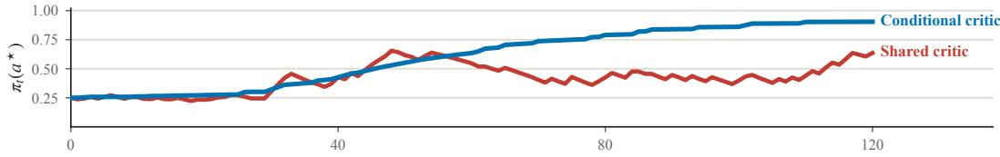  
Figure 2: A sample trajectory of Algorithm 1 under the shared and the conditional value baseline $\begin{array} { r } { ( q _ { E } = q _ { H } = \frac { 1 } { 2 } , r _ { E } = ( 1 , 0 . 8 , 0 . 6 ) , r _ { H } = ( 0 . 4 , 0 . 2 , 0 ) , \eta = 0 . 5 ) } \end{array}$ : the conditional path increases at every update after an early transient, while the shared path keeps stepping backward.

Proposition 3 (Conditional ratchet versus persistent shared drawdowns). Consider Algorithm 1 with finite initial logits and any fixed $\eta > 0$ . Under the oracle conditional baseline,

$$
\mathbb { P } \Big ( \exists T < \infty : \ \pi _ { t + 1 } ^ { B ^ { \mathrm { c o n d } } } ( a ^ { * } ) > \pi _ { t } ^ { B ^ { \mathrm { c o n d } } } ( a ^ { * } ) \ f o r \ e v e r y \ t \geq T \Big ) = 1 .\tag{5}
$$

If the reward $r _ { z } ( a ^ { * } )$ of the optimal arm is not identical across environments, the shared baseline process satisfies

$$
\begin{array} { r } { \mathbb { P } \bigg ( \pi _ { t + 1 } ^ { B ^ { \mathrm { s h a r e d } } } ( a ^ { * } ) < \pi _ { t } ^ { B ^ { \mathrm { s h a r e d } } } ( a ^ { * } ) ~ i n f i n i t e l y ~ o f t e n \bigg ) = 1 . } \end{array}\tag{6}
$$

The proposition concerns realized updates, not only expected drift. Conditional centering eventually makes every sample, regardless of its environment and arm, move the shared actor toward the optimum. Shared centering converges to the same policy but continues to step backward whenever an environment below the average supplies a sample of the optimal arm suficiently late. Those events have asymptotic frequency equal to the total sampling mass of environments below the average, while their magnitudes vanish near the limit. Mismatch severity controls when this regime begins and how strongly it acts: a larger negative ofset lets optimal samples from hard environments fall below the shared bar while the policy is still farther from its limit, and produces larger reversals thereafter; a larger positive ofset lets more rivals sampled in easy environments clear the bar. Appendix D gives the exact thresholds, magnitudes, and frequency statement. More generally, the efect over a finite training horizon depends jointly on the current policy, mismatch magnitude, and learning rate: larger mismatch can trigger reversals farther from optimality, while a larger η amplifies each reversed update and its efect on subsequent sampling. Through this sampling and update feedback, earlier reversals and their larger magnitudes can compound, producing a less favorable trajectory over a finite training horizon even though the asymptotic destination is unchanged (Figure 2).

Why the mechanism harms real RL. In Algorithm 1, each sampled score contribution reinforces its arm exactly when the centered return is positive — committal behavior in the sense of Chung et al. (2021). Minibatch PPO aggregates and transforms many such contributions, so this is a mechanism at the signal level rather than an exact claim about the net optimizer step. In real RL the bar is learned. The oracle shared value above is defined by marginalizing over the unobserved environment identity. Lemma 10 separately connects this quantity to value fitting: under regression with squared error, a critic that observes s but not z has $\bar { V } ^ { \pi } ( s )$ as its population target. Thus the shift across environments is present in the regression target itself rather than arising only from noise due to finite samples. Bootstrapping, approximation, and PPO transformations afect how closely a learned critic realizes that target. As mismatch grows, both sides worsen: mistakes in easy environments receive a larger positive lift, while useful updates in hard environments are attenuated earlier and more strongly. This attenuation matters even before an advantage changes sign: once the policy is suficiently close to the optimal corner, weakening its frequent positive updates can cost more probability than the stronger negative reinforcement of rare rivals recovers (Lemma 11 in Appendix D). In practice, easy environments can supply many plausible but inferior trajectories while useful trajectories from hard environments are rare; shared value estimation can reinforce the former and attenuate or reverse the latter. Conditioning removes this value ofset, though not genuine disagreement about the best action. Modern PPO commonly uses Generalized Advantage Estimation (GAE), which interpolates between one-step bootstrapping and Monte Carlo returns (Schulman et al., 2016; 2017). On the same rollout, define $D _ { t } ^ { \widehat { \lambda } } \overset { \cdot } { : } = \widehat { A } _ { t } ^ { \mathrm { s h a r e d } , \lambda } - \widehat { A } _ { t } ^ { \mathrm { c o n d } , \lambda }$ . Appendix D shows that $D _ { t } ^ { \lambda }$ is a temporal filter of the sequence of value mismatches. Thus GAE propagates and mixes mismatch across a rollout rather than removing it.

Figure 3 shows the mechanism in a minimal example with learned critics: two environments share one state (Figure 3A). The shared critic mean approaches the average across environments (Figure 3B), shifting mean advantages above zero in the easy environment and below zero in the hard environment (Figure $\mathrm { 3 \check { C } , D } )$ . The resulting policy trajectory appears in Figure 3E, while conditioning delivers advantages with the correct signs.

(C) advantages in E

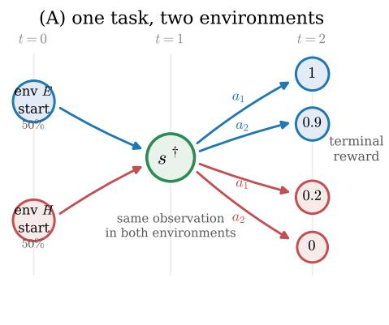

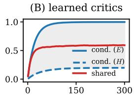

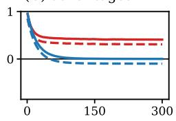

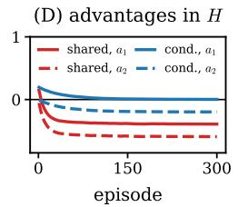

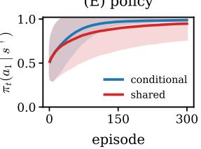  
Figure 3: A minimal tabular example with learned critics (2,000 seeds, $\eta = 1$ , critic learning rate $\beta = 0 . 1$ , common random numbers; logits and both critics initialized at zero, so the initial policy is uniform). (A) Two environments E and H, drawn 50% each, share exactly one state $s ^ { \dagger } ;$ ; the same actions lead to endpoints worth (1, 0.9) in $E$ and (0.2, 0) in $H _ { ; }$ so $a _ { 1 }$ is optimal in both. (B) The conditional critic means track each environment; the shared critic mean approaches their average $(  0 . 6 )$ . (C,D) Mean advantages in E and $H \colon$ sharing promotes $E \ ' \mathrm { s }$ wrong action (+0.3) and suppresses $\mathrm { \Delta } \dot { H } \mathrm { \Delta s }$ correct action $( - 0 . 4 )$ , while conditioning gives the correct signs. (E) $\smash { \dot { \pi } } _ { t } ( a _ { 1 } \mid s ^ { \dagger } )$ ${ \mathrm { m e a n } } \pm 1 { \mathrm { ~ s . d . } }$ : the conditional baseline dominates the shared one throughout training.

## 4.3 Method: condition only the critic

The analysis prescribes a minimal intervention on the critic: give only a logged environment index z to the critic and leave the actor and sampling process unchanged. The index is arbitrary and categorical; it does not explicitly provide geometry, ordering, dificulty, physical parameters, or behavioral semantics. It only identifies which value target for that environment the critic should fit. The intervention therefore directly tests the optimization efect of correcting value mismatch. We instantiate it with the two basic conditioning designs available for a fixed set of environments: FiLM (Perez et al., 2018), an afine scale and shift for each environment on shared critic features, and a multihead critic, a shared encoder with one value head per environment (Hessel et al., 2019). Both are standard components: FiLM introduces two additional vectors per environment, and a multihead critic introduces one environment-specific linear readout; the critic’s forward pass is otherwise unchanged, and no additional rollouts, updates, or inference machinery are required, since $z _ { t }$ is a logged index and requires no estimation. Both retain shared structure while allowing the critic to represent the ofset $e _ { z } ^ { \pi } ( s )$ identified above as the harmful object, and the actor never receives z during training. At deployment the critic and logged index are discarded, leaving the same shared actor.

In the oracle model, conditioning removes the ofset exactly. Learned critics only approximate these values for individual environments; the experiments test whether the same intervention improves the real RL optimization process.

## 5 Experiments

The experiments are organized around three roles. CartPole (Barto et al., 1983) provides a controlled, end-to-end identification of the value mismatch mechanism, from conflicting value targets to shifted advantages and the resulting learning behavior. MuJoCo tests whether the predicted advantage structure persists with continuous states, function approximation, and hidden dynamics variation. BipedalWalker (Brockman et al., 2016) and Procgen (Cobbe et al., 2020) then evaluate the practical value and scalability of critic conditioning across 100–200 procedural environments. All experiments use PPO with Generalized Advantage Estimation (GAE) (Schulman et al., 2016; 2017). In every main comparison, only the critic is modified: conditioned variants receive the logged environment index, while the actor, sampling protocol, and PPO pipeline remain shared. Full architectures, protocols, and hyperparameters are in Appendix E.

## 5.1 CartPole

CartPole uses two logged levels with the same observation space and reward function. In the heterogeneous setting their gravities are $g \in \{ 1 0 , 5 0 \}$ ; an identical control assigns $g = 1 0$ to both level identities. Figure $4 ( \mathrm { a - c } )$ shows why the heterogeneous pair creates value mismatch: the same state and action lead to diferent futures. Correspondingly, the learned multihead values separate by gravity, whereas the shared value lies between them (Figure 4d).

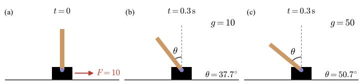

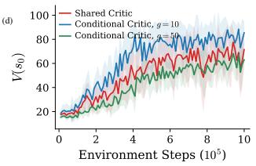  
Figure 4: CartPole with two gravities. $\left( \mathrm { a - c } \right)$ From the same initial state and the same push $( F = 1 0 )$ , 0.3 s of dynamics tilts the pole to $3 7 . 7 ^ { \circ }$ under $g = 1 0$ and $5 0 . 7 ^ { \circ }$ under $g = 5 0 \colon$ one observation, two futures. (d) Learned value of the initial state over training: the multihead critic means separate by gravity (blue: $g { = } 1 0$ above, green: $g { = } 5 0$ below), while the shared critic mean (red) settles between them — a signature consistent with the value mismatch mechanism. Curves in (d) show mean ± 1 s.d. over 20 seeds.

To identify what the critic must learn, we compare four variants: a shared critic; a multihead critic routed by the true level identity; the same multihead critic with every sample routed to head 0; and a shared critic augmented by one learned scalar bias for each level. All four begin with identical value predictions. The identical gravity control tests whether conditioning helps in the absence of mismatch, while the heterogeneous pair orders the variants by the environment information and correction they can represent.

The row with identical dynamics shows no systematic separation, as expected in the absence of value mismatch. Under heterogeneous gravity, the shared critic keeps the hard level’s mean advantage negative while its return remains lower and more variable across seeds (Figure 5). Conditioning does not supply an oracle value: each head must learn online from samples of its own level while the shared representation is changing. In this compact joint actor–critic model, the resulting fitting transient is clearly visible: the multihead loss on the hard level initially peaks near 780, and its mean advantage falls to roughly −22.

The contrast emerges once the hard head catches up. Its mean advantage recenters earlier and the multihead return rises to a narrow band near 200, while the shared critic and the critic given a constant index remain lower with wider variation. Routing every sample to the same head closely tracks the shared critic, showing that additional heads without informative level routing do not reproduce the gain. The critic with one learned scalar bias per level recovers only part of the performance, indicating that a substantial component of the required correction is state dependent. From mid to late training, the shared critic shifts the mean advantage upward on level 0 and sharply downward on level 1 relative to the multihead critic. The corresponding return gap matches the predicted pattern of positive and negative value mismatches.

## 5.2 MuJoCo

For HalfCheetah, Hopper, and Walker2d (Todorov et al., 2012), we vary body mass over ten levels without providing it explicitly in the observation, while keeping episodes at a fixed length; only the FiLM critic receives the level index. FiLM has higher mean return on all three tasks (Figure 6, right middle), with the largest gains on HalfCheetah (roughly 2600 vs. 2050) and Walker2d (2450 vs. 2000); Hopper shows a smaller gap in the end, but the conditional critic still dominates the shared one during training. More importantly, the advantage heatmaps show the predicted structure: the shared critic shifts light levels positive and heavy levels negative, whereas conditioning largely removes this ordering (Figure 6, right bottom).

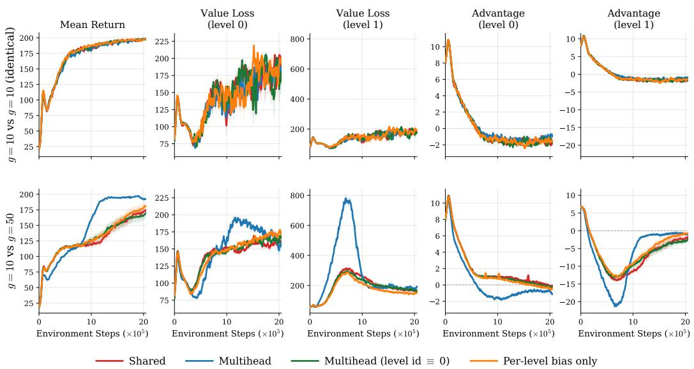  
Figure 5: Controlled identification of the CartPole mechanism, mean ± 1 s.e. across 20 seeds. The top row uses two labeled levels with identical dynamics (g = 10); the bottom row uses $g \in \{ 1 0 , 5 0 \}$ . Columns report mean return, value loss for levels 0 and 1, and the mean sampled raw GAE advantage for levels 0 and 1. With identical dynamics, all variants behave similarly. Under heterogeneous gravity, the multihead critic initially pays a larger fitting cost on the hard level, but its hard level advantage recenters as the loss falls and its return subsequently approaches 200. Routing every sample to the same head (level id ≡ 0) closely tracks the shared critic, while a learned scalar bias for each level provides only a partial correction.

## 5.3 BipedalWalker

BipedalWalker uses a training set of 100 pinned terrains dominated by hard terrains: 10 standard and 90 Hardcore (Figure 6, left a). Only the critic sees terrain identity, and evaluation uses 100 unseen terrains with the same 10/90 standard/Hardcore split. The shared critic plateaus below 100, while FiLM reaches roughly 150 and multihead 165–190, with visibly tighter bands (Figure 6, left b). Both conditioning architectures escape the same plateau, indicating that the efect is not specific to one architecture.

## 5.4 Procgen

Each of the 16 Procgen games is trained separately on 200 pinned training levels for 25M steps; the critic may see level identity, but the actor never does. This setting asks whether an intervention using only a level index remains useful when value mismatch is distributed across hundreds of procedurally distinct environments rather than a small ordered family.

Evaluation on unseen levels shows that the efect extends beyond the pinned training levels. FiLM or multihead has a higher final mean than the shared critic in all of the 16 games. Relative to the shared critic, their aggregate normalized returns on unseen levels improve by 21.2% and 40.8%, respectively (Table 1).

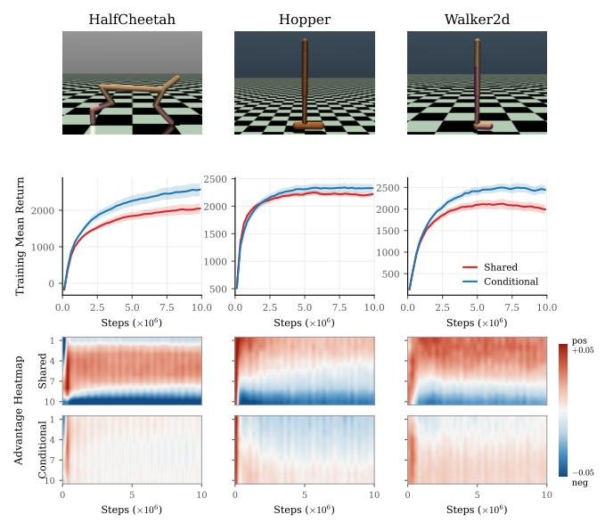

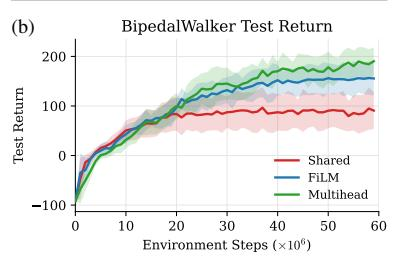

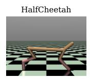

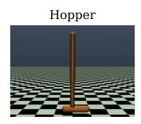

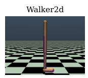

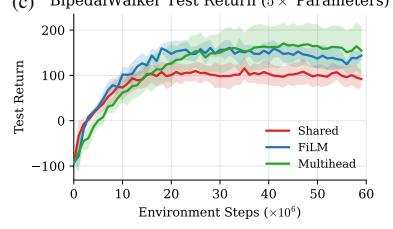

Figure 6: Continuous control benchmarks. Left: BipedalWalker with 100 pinned terrains: (a) terrain sample, (b) test return on 100 unseen terrains, and (c) the control with 5× as many parameters (Section 5.5); curves show mean ± 1 s.d. over 10 seeds. Right: MuJoCo with ten body mass levels not explicitly provided in the observation (10M steps). Columns are HalfCheetah, Hopper, and Walker2d; the middle row shows training return, $\mathrm { m e a n } \pm 1 \mathrm { s . d }$ over 30 seeds, and the bottom row shows continuous means across seeds of GAE advantages for each of 10 levels during training (light to heavy; red positive).  
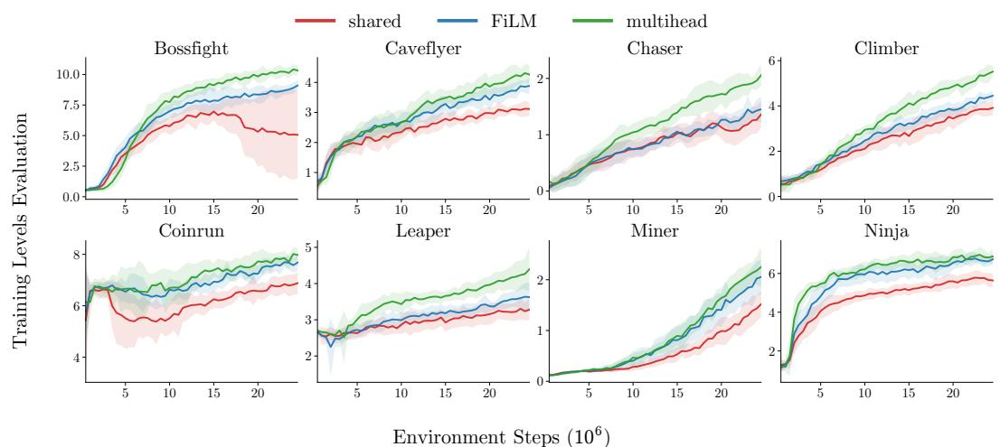  
Figure 7: An illustrative subset of eight Procgen games: evaluation return on the 200 pinned training levels over 25M steps, mean ± 1 s.d. over 10 seeds, shared (red) vs. FiLM (blue) vs. multihead (green). Conditioned critics train to higher returns broadly; in Bossfight the shared critic mean collapses after roughly 15M steps while the conditioned critic means keep climbing.

The training learning curves separately expose the optimization behavior. Improvements appear across navigation, control, and arcade games in the illustrative subset in Figure 7; the full set is in Appendix Figure 13. Complete training curves and final returns are in Appendix Table 7.

Table 1: Procgen, 16 games: final evaluation return on 600 unseen levels (25M steps; mean ± 1 s.d. over 10 seeds per method). Normalized returns per run are computed by dividing the average test return per run for each environment by the corresponding average test return of the shared critic baseline over all runs. Bold = best in the row.
<table><tr><td rowspan="2">Game</td><td colspan="4">evaluation return (600 unseen levels)</td></tr><tr><td>shared</td><td>FiLM</td><td>multihead</td><td> $+ { \mathrm { P o p A r t } }$ </td></tr><tr><td>Bigfish</td><td> $1 . 8 7 \pm 0 . 1 7$ </td><td> $2 . 8 8 \pm 0 . 5 7$ </td><td> $2 . 9 9 \pm 0 . 6 1$ </td><td> $\mathbf { 3 . 5 6 \pm 1 . 2 7 }$ </td></tr><tr><td>Bossfight</td><td> $4 . 4 4 \pm 2 . 5 6$ </td><td> $7 . 4 4 \pm 0 . 5 1$ </td><td> ${ \bf 8 . 9 7 \pm 0 . 2 9 }$ </td><td> $8 . 1 1 \pm 0 . 8 2$ </td></tr><tr><td>Caveflyer</td><td> $1 . 0 8 \pm 0 . 1 6$ </td><td> $1 . 9 0 \pm 0 . 2 3$ </td><td> $\mathbf { 2 . 6 5 \pm 0 . 4 3 }$ </td><td> $1 . 8 7 \pm 0 . 3 1$ </td></tr><tr><td>Chaser</td><td> $0 . 9 5 \pm 0 . 2 6$ </td><td> $0 . 9 4 \pm 0 . 1 9$ </td><td> ${ \bf 1 . 3 2 \pm 0 . 3 5 }$ </td><td> $0 . 7 5 \pm 0 . 1 7$ </td></tr><tr><td>Climber</td><td> $1 . 4 0 \pm 0 . 1 9$ </td><td> $1 . 7 4 \pm 0 . 2 7$ </td><td> $\mathbf { 2 . 7 5 \pm 0 . 2 2 }$ </td><td> $2 . 1 3 \pm 0 . 2 7$ </td></tr><tr><td>Coinrun</td><td> $5 . 7 6 \pm 0 . 2 9$ </td><td> $6 . 3 5 \pm 0 . 2 8$ </td><td> ${ \bf 6 . 8 0 \pm 0 . 3 7 }$ </td><td> $6 . 4 6 \pm 0 . 2 9$ </td></tr><tr><td>Dodgeball</td><td> $0 . 9 8 \pm 0 . 0 5$ </td><td> $0 . 9 1 \pm 0 . 1 4$ </td><td> $1 . 1 0 \pm 0 . 2 0$ </td><td> ${ \bf 1 . 3 2 \pm 0 . 1 8 }$ </td></tr><tr><td>Fruitbot</td><td> $7 . 3 9 \pm 1 . 5 8$ </td><td> $\mathbf { 8 . 9 5 \pm 0 . 7 0 }$ </td><td> $8 . 1 4 \pm 1 . 2 4$ </td><td> $8 . 3 1 \pm 1 . 0 1$ </td></tr><tr><td>Heist</td><td> $0 . 2 4 \pm 0 . 0 6$ </td><td> $\mathbf { 0 . 2 8 \pm 0 . 0 5 }$ </td><td> $0 . 2 0 \pm 0 . 0 3$ </td><td> $0 . 2 4 \pm 0 . 0 6$ </td></tr><tr><td>Jumper</td><td> $2 . 2 3 \pm 0 . 1 3$ </td><td> $\mathbf { 2 . 3 6 \pm 0 . 1 5 }$ </td><td> $2 . 3 2 \pm 0 . 1 2$ </td><td> $2 . 3 5 \pm 0 . 6 2$ </td></tr><tr><td>Leaper</td><td> $2 . 8 1 \pm 0 . 3 6$ </td><td> $3 . 0 2 \pm 0 . 2 4$ </td><td> $\mathbf { 3 . 2 5 \pm 0 . 4 6 }$ </td><td> $3 . 0 9 \pm 0 . 2 8$ </td></tr><tr><td>Maze</td><td> $1 . 2 3 \pm 0 . 1 3$ </td><td> $1 . 3 3 \pm 0 . 1 3$ </td><td> $1 . 4 9 \pm 0 . 1 8$ </td><td> $\mathbf { 1 . 4 9 \pm 0 . 1 5 }$ </td></tr><tr><td>Miner</td><td> $0 . 5 3 \pm 0 . 1 2$ </td><td> $0 . 5 8 \pm 0 . 0 8$ </td><td> $\mathbf { 0 . 8 0 \pm 0 . 1 4 }$ </td><td> $0 . 7 7 \pm 0 . 1 3$ </td></tr><tr><td> $\mathrm { N i n j a }$ </td><td> $3 . 3 9 \pm 0 . 2 1$ </td><td> $3 . 9 8 \pm 0 . 1 5$ </td><td> $\mathbf { 4 . 3 9 \pm 0 . 2 9 }$ </td><td> $4 . 1 0 \pm 0 . 4 1$ </td></tr><tr><td>Plunder</td><td> $2 . 3 7 \pm 0 . 3 3$ </td><td> $2 . 3 8 \pm 0 . 1 8$ </td><td> $2 . 2 8 \pm 0 . 1 8$ </td><td> $\mathbf { 2 . 4 2 \pm 0 . 2 9 }$ </td></tr><tr><td>Starpilot</td><td> $7 . 9 6 \pm 1 . 0 6$ </td><td> $1 0 . 2 2 \pm 1 . 1 1$ </td><td> $1 3 . 1 0 \pm 1 . 4 6$ </td><td> $\mathbf { 1 4 . 9 8 \pm 2 . 3 5 }$ </td></tr><tr><td>Normalized return (%)</td><td> $1 0 0 . 0 \pm 1 9 . 8 $ </td><td> $1 2 1 . 2 \pm 2 7 . 9$ </td><td> $\mathbf { 1 4 0 . 8 \pm 4 7 . 1 }$ </td><td> $1 3 3 . 3 \pm 4 1 . 7$ </td></tr></table>

Conditional value fitting is not a persistent bottleneck. The early fitting transient in the compact CartPole study does not persist systematically on the larger benchmarks. On BipedalWalker, the initially higher multihead loss falls to a comparable level late in training; on all three MuJoCo tasks, FiLM remains below the shared critic through most of training; and on Procgen, both FiLM and multihead finish below the shared critic in 11 of 16 games (Appendix Figures 14 and 15). Thus the return gains are not accompanied by a systematic deterioration in critic fitting.

## 5.5 Ablations

Conditioning, not value network capacity. Conditioning changes the parameter count, although the increase is modest in several settings (Appendix Table 2). More decisively, on BipedalWalker we widen each critic architecture to roughly five times its original size while holding its conditioning mechanism fixed. The enlarged shared critic still plateaus, whereas FiLM and multihead remain near 150 or above (Figure 6c). Parameter count alone therefore does not reproduce the conditioning gain.

Conditioning, not target normalization. A second possibility is that the gains come from correcting target scale rather than separating values by environment. FiLM and multihead improve both BipedalWalker and Procgen without PopArt. Adding PopArt (van Hasselt et al., 2016; Hessel et al., 2019) to the same multihead critic instead reduces the aggregate normalized training gain on the pinned levels from +24.2% to +10.0% (Table 7). Explicit target normalization is therefore not required for the conditioning gain and does not explain the multihead improvement. The consistent factor across the successful variants is the ability to fit a distinct value target for each environment.

Other conditioning. On BipedalWalker we test two further conditioning schemes (Appendix Figure 11). The first removes the shared representation entirely and assigns each environment its own value network: it learns much more slowly than FiLM and multihead, indicating that a shared critic representation remains useful even when value targets difer. The second asks whether conditioning the actor also helps training: supplying the environment index to the actor on top of the multihead critic collapses both training and test return. These results favor the minimal asymmetric intervention used in our experiments:

retain representation sharing in the critic, separate its environment-specific predictions, and leave the actor unconditioned.

## 6 Discussion, limitations, and conclusion

Statistical sharing versus target separation. Conditioning is most useful when environment identity explains substantial variation in value. At the population level, the conditional critic classes contain the shared critic as a special case, so their optimal squared prediction error cannot be larger under the same data distribution. With finite data, however, estimating environment-dependent components can increase estimation error when values are already similar or some environments are sampled infrequently. The practical tradeof is therefore between statistical sharing and separation of conflicting value targets. FiLM and multihead retain a shared representation while allowing the final prediction to separate. Empirically, the early transient in the compact CartPole study does not become a persistent fitting bottleneck on the larger benchmarks, as shown by the value loss curves in Appendix E.6.

Mismatch severity. The number of environments alone does not determine mismatch severity. At a state s visible to the critic, the average squared mismatch is $\mathbb { E } [ ( e _ { Z } ^ { \pi } ( s ) ) ^ { 2 } \mid S =$ $s ] = \operatorname { V a r } ( V _ { Z } ^ { \pi } ( s ) \mid S = s )$ : many tightly clustered environments may be benign, whereas two separated values can sufice. This average can also hide a rarely sampled environment with a large pointwise ofset, producing infrequent but large miscentered updates.

Scope of the theory. The propositions do not establish a uniform finite-horizon ordering in expected optimal-arm probability or return. Instead, under their stated conditions, they isolate a clean pathwise mechanism: shared centering produces recurrent reversed updates, whereas conditional centering eventually rules them out. We deliberately study illustrative deterministic bandits sampled across a fixed set of environments. First, their baselines are oracle: in practice, both the environment-specific values and their shared marginal must be learned from data. Second, deterministic rewards make the branch signs pathwise; stochastic returns preserve the ofset identity but not every realized sign. Third, the common optimal arm removes genuine conflict between environments, and the fixed environment mixture removes policy-dependent changes in environment sampling. Deep RL adds state visitation, function approximation, learned critics, GAE, and PPO transformations, so the experiments test whether the explanatory mechanism transfers rather than verify a general MDP convergence theorem. The mechanism itself is broader: it can arise whenever parallel environments produce diferent continuation values for inputs that the critic maps to the same representation.

Scope of the method. Our experiments use recurring environments with stable logged identifiers. This is a minimal diagnostic intervention, not a universal conditioning scheme: continuous or unseen variants may instead require simulator parameters or a learned or inferred representation (Rakelly et al., 2019). The actor never receives the identifier, so deployment remains unchanged. Conditioning addresses value mismatch, but not genuine task conflict, critic estimation error, or every possible cost of privileged information.

Conclusion. We introduced value mismatch as a direct cause of poorer sampled learning dynamics when one critic is shared across environments. Because the mechanism depends on value diferences rather than a particular domain, it motivates a simple intervention: condition only the critic on the environment index. Across four benchmark families, this intervention improves learning while preserving one shared actor. A promising direction is to identify where mismatch is large and condition the critic only there, combining accurate conditional value fitting with statistical sharing elsewhere.

## Acknowledgements

We thank Jincheng Mei for meaningful discussions. X. Liu thanks the Department of Medicine and the UF AI for Health Institute at the University of Florida for the support. We gratefully acknowledge the support of NSF IIS-2313131, IIS-2332475, IIS-2543755, and the NSF Simons AI-Institute for the Sky (SkAI) via grants NSF AST-2421845 and Simons Foundation MPS-AI00010513.

## AI use statement

Generative AI tools were used only to polish the writing of the manuscript and to assist in verifying the correctness of the mathematical proofs. All research ideas, claims, theoretical results, experiment designs, and analyses of results were conceived and carried out by the authors. The authors take full responsibility for all content and conclusions of the paper.

## Reproducibility statement

Section 3 specifies the theoretical setting, assumptions, and update rule. Complete proofs and auxiliary results appear in Appendices A–D. Appendix E.1 specifies the conditioning architectures and parameter counts, while Appendix E reports the environment pools for each benchmark, hyperparameters, seed counts, evaluation protocols, and aggregation rules. Figure and table captions state the number of seeds and the uncertainty convention used for the reported results.

## References

Alekh Agarwal, Sham M. Kakade, Jason D. Lee, and Gaurav Mahajan. On the theory of policy gradient methods: Optimality, approximation, and distribution shift. Journal of Machine Learning Research, 22(98):1–76, 2021. URL https://arxiv.org/abs/1908. 00261.

Andrea Baisero and Christopher Amato. Unbiased asymmetric reinforcement learning under partial observability. In Proceedings of the 21st International Conference on Autonomous Agents and Multiagent Systems, pp. 44–52, 2022. URL https://www.ifaamas. org/Proceedings/aamas2022/pdfs/p44.pdf.

Andrew G. Barto, Richard S. Sutton, and Charles W. Anderson. Neuronlike adaptive elements that can solve dificult learning control problems. IEEE Transactions on Systems, Man, and Cybernetics, SMC-13(5):834–846, 1983.

Léon Bottou, Frank E. Curtis, and Jorge Nocedal. Optimization methods for large-scale machine learning. SIAM Review, 60(2):223–311, 2018.

Greg Brockman, Vicki Cheung, Ludwig Pettersson, Jonas Schneider, John Schulman, Jie Tang, and Wojciech Zaremba. Openai gym. arXiv preprint arXiv:1606.01540, 2016. URL https://arxiv.org/abs/1606.01540.

Lonnie Chrisman. Reinforcement learning with perceptual aliasing: The perceptual distinctions approach. In Proceedings of the Tenth National Conference on Artificial Intelligence, pp. 183–188. AAAI Press, 1992. URL https://aaai.org/Papers/AAAI/1992/ AAAI92-029.pdf.

Wesley Chung, Valentin Thomas, Marlos C Machado, and Nicolas Le Roux. Beyond variance reduction: Understanding the true impact of baselines on policy optimization. In ICML, 2021.

Karl Cobbe, Chris Hesse, Jacob Hilton, and John Schulman. Leveraging procedural generation to benchmark reinforcement learning. In Proceedings of the 37th International Conference on Machine Learning, volume 119 of Proceedings of Machine Learning Research, pp. 2048–2056. PMLR, 2020. URL https://proceedings.mlr.press/v119/cobbe20a. html.

Daniel Ebi, Damien Ernst, Klemens Böhm, and Gaspard Lambrechts. Informed asymmetric actor-critic: Leveraging privileged signals beyond full-state access. In Proceedings of the 43rd International Conference on Machine Learning, Proceedings of Machine Learning Research. PMLR, 2026. URL https://icml.cc/virtual/2026/poster/66074.

Lasse Espeholt, Hubert Soyer, Remi Munos, Karen Simonyan, Vlad Mnih, Tom Ward, Yotam Doron, Vlad Firoiu, Tim Harley, Iain Dunning, Shane Legg, and Koray Kavukcuoglu. IMPALA: Scalable distributed deep-RL with importance weighted actorlearner architectures. In Proceedings of the 35th International Conference on Machine Learning, volume 80 of Proceedings of Machine Learning Research, pp. 1407–1416. PMLR, 2018. URL https://proceedings.mlr.press/v80/espeholt18a.html.

Evan Greensmith, Peter L. Bartlett, and Jonathan Baxter. Variance reduction techniques for gradient estimates in reinforcement learning. Journal of Machine Learning Research, 5:1471–1530, 2004. URL https://www.jmlr.org/papers/v5/greensmith04a.html.

Shixiang Gu, Timothy Lillicrap, Zoubin Ghahramani, Richard E. Turner, and Sergey Levine. Q-Prop: Sample-eficient policy gradient with an of-policy critic. In International Conference on Learning Representations, 2017. URL https://arxiv.org/abs/1611.02247.

Matteo Hessel, Hubert Soyer, Lasse Espeholt, Wojciech Czarnecki, Simon Schmitt, and Hado van Hasselt. Multi-task deep reinforcement learning with PopArt. In Proceedings of the AAAI Conference on Artificial Intelligence, volume 33, pp. 3796–3803, 2019. doi: 10.1609/aaai.v33i01.33013796. URL https://ojs.aaai.org/index.php/ AAAI/article/view/4266.

Edward S. Hu, James Springer, Oleh Rybkin, and Dinesh Jayaraman. Privileged sensing scafolds reinforcement learning. In International Conference on Learning Representations, 2024. URL https://proceedings.iclr.cc/paper\_files/paper/2024/hash 0b334c6419042e761051d82fc621679c-Abstract-Conference.html.

Minqi Jiang, Edward Grefenstette, and Tim Rocktäschel. Prioritized level replay. In International Conference on Machine Learning (ICML), 2021.

Gaspard Lambrechts, Damien Ernst, and Aditya Mahajan. A theoretical justification for asymmetric actor-critic algorithms. In Proceedings of the 42nd International Conference on Machine Learning, volume 267 of Proceedings of Machine Learning Research, pp. 32375–32405. PMLR, 2025. URL https://proceedings.mlr.press/v267/ lambrechts25a.html.

Gen Li, Yuting Wei, Yuejie Chi, Yuantao Gu, and Yuxin Chen. Softmax policy gradient methods can take exponential time to converge. In COLT, 2021.

Jinqiu Li, Enmin Zhao, Tong Wei, Junliang Xing, and Shiming Xiang. Dual critic reinforcement learning under partial observability. In Advances in Neural Information Processing Systems, volume 37, pp. 116676–116704, 2024. doi: 10.52202/ 079017-3704. URL https://proceedings.neurips.cc/paper\_files/paper/2024/ hash/d399b67fa017f0f7670102c88507720c-Abstract-Conference.html.

Hao Liu, Yihao Feng, Yi Mao, Dengyong Zhou, Jian Peng, and Qiang Liu. Action-dependent control variates for policy optimization via Stein identity. In International Conference on Learning Representations, 2018. URL https://arxiv.org/abs/1710.11198.

Zhenya Liu and Yuxin Chen. Active curriculum refinement for reinforcement learning. In Proceedings of the 43rd International Conference on Machine Learning (ICML), 2026. URL https://icml.cc/virtual/2026/poster/65627.

Jincheng Mei, Chenjun Xiao, Csaba Szepesvári, and Dale Schuurmans. On the global convergence rates of softmax policy gradient methods. In ICML, 2020.

Jincheng Mei, Bo Dai, Chenjun Xiao, Csaba Szepesvári, and Dale Schuurmans. Understanding the efect of stochasticity in policy optimization. In NeurIPS, 2021.

Jincheng Mei, Wesley Chung, Valentin Thomas, Bo Dai, Csaba Szepesvári, and Dale Schuurmans. The role of baselines in policy gradient optimization. In NeurIPS, 2022.

Jincheng Mei, Zixin Zhong, Bo Dai, Alekh Agarwal, Csaba Szepesvári, and Dale Schuurmans. Stochastic gradient succeeds for bandits. In Proceedings of the 40th International Conference on Machine Learning, volume 202 of Proceedings of Machine Learning Research, pp. 24325–24360. PMLR, 2023. URL https://proceedings.mlr.press/v202/ mei23a.html.

Jack Parker-Holder, Minqi Jiang, Michael Dennis, Mikayel Samvelyan, Jakob Foerster, Edward Grefenstette, and Tim Rocktäschel. Evolving curricula with regret-based environment design. In International Conference on Machine Learning (ICML), 2022.

Xue Bin Peng, Marcin Andrychowicz, Wojciech Zaremba, and Pieter Abbeel. Sim-to-real transfer of robotic control with dynamics randomization. In 2018 IEEE International Conference on Robotics and Automation (ICRA), pp. 3803–3810, 2018. doi: 10.1109/ ICRA.2018.8460528. URL https://arxiv.org/abs/1710.06537.

Ethan Perez, Florian Strub, Harm de Vries, Vincent Dumoulin, and Aaron Courville. FiLM: Visual reasoning with a general conditioning layer. In AAAI Conference on Artificial Intelligence, 2018. URL https://arxiv.org/abs/1709.07871.

Lerrel Pinto, Marcin Andrychowicz, Peter Welinder, Wojciech Zaremba, and Pieter Abbeel. Asymmetric actor critic for image-based robot learning. In Robotics: Science and Systems (RSS), 2018. doi: 10.15607/RSS.2018.XIV.008. URL https://www. roboticsproceedings.org/rss14/p08.html.

Roberta Raileanu and Rob Fergus. Decoupling value and policy for generalization in reinforcement learning. In Proceedings of the 38th International Conference on Machine Learning, volume 139 of Proceedings of Machine Learning Research. PMLR, 2021. URL https://arxiv.org/abs/2102.10330.

Kate Rakelly, Aurick Zhou, Chelsea Finn, Sergey Levine, and Deirdre Quillen. Eficient of-policy meta-reinforcement learning via probabilistic context variables. In Proceedings of the 36th International Conference on Machine Learning, volume 97 of Proceedings of Machine Learning Research, pp. 5331–5340. PMLR, 2019. URL https://proceedings. mlr.press/v97/rakelly19a.html.

Samuel Robertson, Thang Chu, Bo Dai, Dale Schuurmans, Csaba Szepesvári, and Jincheng Mei. REINFORCE converges to optimal policies with any learning rate. In Advances in Neural Information Processing Systems, volume 38, pp. 16010–16053, 2025. doi: 10.52202/085713-0541. URL https://proceedings.neurips.cc/paper\_files/paper/ 2025/hash/17a84369cf6e2803101294b5d74dd92c-Abstract-Conference.html.

Tom Schaul, Daniel Horgan, Karol Gregor, and David Silver. Universal value function approximators. In Proceedings of the 32nd International Conference on Machine Learning, volume 37 of Proceedings of Machine Learning Research, pp. 1312–1320. PMLR, 2015. URL http://proceedings.mlr.press/v37/schaul15.html.

John Schulman, Philipp Moritz, Sergey Levine, Michael I. Jordan, and Pieter Abbeel. Highdimensional continuous control using generalized advantage estimation. In International Conference on Learning Representations, 2016. URL https://arxiv.org/abs/1506. 02438.

John Schulman, Filip Wolski, Prafulla Dhariwal, Alec Radford, and Oleg Klimov. Proximal policy optimization algorithms. arXiv preprint arXiv:1707.06347, 2017. URL https: //arxiv.org/abs/1707.06347.

Satinder P. Singh, Tommi Jaakkola, and Michael I. Jordan. Reinforcement learning with soft state aggregation. In Advances in Neural Information Processing Systems 7, 1994. URL https://proceedings.neurips.cc/paper\_files/paper/1994/hash/ 287e03db1d99e0ec2edb90d079e142f3-Abstract.html.

Richard S Sutton and Andrew G Barto. Reinforcement Learning: An Introduction. MIT Press, 2nd edition, 2018.

Emanuel Todorov, Tom Erez, and Yuval Tassa. MuJoCo: A physics engine for model based control. In IEEE/RSJ International Conference on Intelligent Robots and Systems (IROS), pp. 5026–5033, 2012.

George Tucker, Surya Bhupatiraju, Shixiang Gu, Richard E. Turner, Zoubin Ghahramani, and Sergey Levine. The mirage of action-dependent baselines in reinforcement learning. In Proceedings of the 35th International Conference on Machine Learning, volume 80 of Proceedings of Machine Learning Research. PMLR, 2018. URL https://arxiv.org/abs/ 1802.10031.

Hado van Hasselt, Arthur Guez, Matteo Hessel, Volodymyr Mnih, and David Silver. Learning values across many orders of magnitude. In Advances in Neural Information Processing Systems, 2016. URL https://arxiv.org/abs/1602.07714.

Lex Weaver and Nigel Tao. The optimal reward baseline for gradient-based reinforcement learning. In Conference on Uncertainty in Artificial Intelligence (UAI), pp. 538–545, 2001. URL https://arxiv.org/abs/1301.2315.

Ronald J Williams. Simple statistical gradient-following algorithms for connectionist reinforcement learning. Machine Learning, 8:229–256, 1992.

Cathy Wu, Aravind Rajeswaran, Yan Duan, Vikash Kumar, Alexandre M. Bayen, Sham Kakade, Igor Mordatch, and Pieter Abbeel. Variance reduction for policy gradient with action-dependent factorized baselines. In International Conference on Learning Representations, 2018. URL https://arxiv.org/abs/1803.07246.

Zhe Yang, Yi Huang, Si Chen, Xiaoting Wu, Jingyu Yao, and Junlan Feng. PAMDP: Interact to persona alignment via a partially observable markov decision process. In International Conference on Learning Representations, 2026. URL https://openreview.net/forum? id=tNWZVoVPzZ.

Wangyang Yue, Yuan Zhou, Xiaochuan Zhang, Yuchen Hua, Minne Li, Zunlin Fan, Zhiyuan Wang, and Guang Kou. Asymmetric actor-critic for adapting to changing environments in reinforcement learning. In Artificial Neural Networks and Machine Learning – ICANN 2024, volume 15019 of Lecture Notes in Computer Science, pp. 325–339. Springer Nature Switzerland, 2024. doi: 10.1007/978-3-031-72341-4\_22. URL https://doi.org/10. 1007/978-3-031-72341-4\_22.

## A What variance can and cannot explain

Classical baseline theory asks how an action-independent baseline reduces the variance of a policy gradient estimator (Weaver & Tao, 2001; Greensmith et al., 2004). This view gives a valid aggregate guarantee: within a fixed information set, a score-weighted baseline minimizes the trace of the gradient estimator covariance and maximizes the standard smoothness lower bound. It does not identify which sampled combinations of environment and arm carry the update, however, or how those branches change future sampling. We first state the variance guarantee and then show that its exact optimum can produce a slower and less stable process over a finite horizon than the ordinary conditional value baseline used in the main text.

Fix a policy parameter θ. All expectations and covariances below are under the current on-policy joint law of $( S , Z , A , G )$ , where $A \mid ( S , Z ) \sim \pi _ { \theta } ( \cdot \mid S )$ . Let $J ( \theta )$ denote the policy objective and assume the policy gradient identity $\mathbb { E } [ G \psi ] \stackrel { \cdot } { = } \dot { \nabla } \dot { J } ( \theta )$ , where $\psi : = \nabla _ { \theta } \log \pi _ { \theta } ( A$ $S )$ and $w : = \| \psi \| _ { 2 } ^ { 2 }$ . Let $Y$ denote the information given to the baseline: $Y _ { s } : = S$ for a shared baseline and $\ddot { Y } _ { c } : = ( S , Z )$ for a conditional baseline. Because the actor does not receive $Z ,$ $\mathbb { E } [ \psi \mid Y _ { s } ] = \mathbb { E } [ \psi \mid Y _ { c } ] = 0 .$

For a baseline $B ( Y )$ , define ${ \widehat { g } } _ { B } : = ( G - B ( Y ) ) \psi$ . If J is $L _ { J }$ -smooth, the ascent lemma gives

$$
\mathbb { E } [ J ( \theta + \eta \widehat { g } _ { B } ) ] \geq J ( \theta ) + \eta \| \nabla J ( \theta ) \| _ { 2 } ^ { 2 } - \frac { L _ { J } \eta ^ { 2 } } { 2 } \mathbb { E } \big [ w ( G - B ( Y ) ) ^ { 2 } \big ] .
$$

We denote the right-hand side by $\operatorname { L B } _ { Y } ( B ; \eta )$ and write $\mathrm { L B } _ { s } : = \mathrm { L B } _ { Y _ { s } }$ and $\mathrm { L B } _ { c } : = \mathrm { L B } _ { Y _ { c } }$

Proposition 4 (Richer baseline information improves the variance certificate). Suppose $\mathbb { E } [ w \bar { G } ^ { 2 } ] < \infty$ and $0 < \mathbb { E } [ w \mid Y ] < \infty$ almost surely. Among all baselines measurable with respect to $Y$ and $s a t i s f y i n j \mathbb { E } [ w \bar { B } ( Y ) ^ { 2 } ] < \infty$ , the unique minimizer up to almost-sure equality $i s$

$$
B _ { Y } ^ { \mathrm { m v } } ( Y ) = { \frac { \mathbb { E } [ w G \mid Y ] } { \mathbb { E } [ w \mid Y ] } } .
$$

Equivalently, $B _ { Y } ^ { \mathrm { m v } }$ minimizes $\mathbb { E } [ w ( G - B ( Y ) ) ^ { 2 } ]$ , minimizes the covariance trace tr $\operatorname { C o v } ( \widehat { \boldsymbol { g } } _ { B } )$ and maximizes $\operatorname { L B } _ { Y } ( B ; \eta )$ for every $\eta > 0$ . Let $B _ { s } ^ { \mathrm { m v } }$ and $B _ { c } ^ { \mathrm { m v } }$ denote the optima under $Y _ { s }$ and $Y _ { c }$ . Then

$$
\mathrm { L B } _ { c } ( B _ { c } ^ { \mathrm { m v } } ; \eta ) - \mathrm { L B } _ { s } ( B _ { s } ^ { \mathrm { m v } } ; \eta ) = \frac { L _ { J } \eta ^ { 2 } } { 2 } \mathbb { E } \Big [ w \big ( B _ { c } ^ { \mathrm { m v } } ( S , Z ) - B _ { s } ^ { \mathrm { m v } } ( S ) \big ) ^ { 2 } \Big ] .
$$

Proof. The baseline has zero mean score contribution, so every admissible B gives $\mathbb { E } [ \widehat { \boldsymbol { g } } _ { B } ] =$ $\nabla J ( { \dot { \theta } } )$ . Conditional Cauchy–Schwarz gives

$$
\mathbb { E } [ w \mid Y ] ( B _ { Y } ^ { \mathrm { m v } } ) ^ { 2 } = \frac { \mathbb { E } [ w G \mid Y ] ^ { 2 } } { \mathbb { E } [ w \mid Y ] } \leq \mathbb { E } [ w G ^ { 2 } \mid Y ] ,
$$

so $B _ { Y } ^ { \mathrm { m v } }$ is admissible. Moreover, $\mathbb { E } [ w ( G - B _ { Y } ^ { \mathrm { m v } } ) \mid Y ] = 0$ . Completing the square conditionally gives

$$
\mathbb { E } [ w ( G - B ) ^ { 2 } \mid Y ] = \mathbb { E } [ w ( G - B _ { Y } ^ { \mathrm { m v } } ) ^ { 2 } \mid Y ] + \mathbb { E } [ w \mid Y ] ( B - B _ { Y } ^ { \mathrm { m v } } ) ^ { 2 } .
$$

This proves optimality and uniqueness. Because $Y _ { c }$ refines $Y _ { s }$ , the same orthogonality gives

$$
\mathbb { E } [ w ( G - B _ { s } ^ { \mathrm { m v } } ) ^ { 2 } ] = \mathbb { E } [ w ( G - B _ { c } ^ { \mathrm { m v } } ) ^ { 2 } ] + \mathbb { E } [ w ( B _ { c } ^ { \mathrm { m v } } - B _ { s } ^ { \mathrm { m v } } ) ^ { 2 } ] ,
$$

which proves the gap identity. Finally, all admissible estimators have the same mean, and therefore

$$
\begin{array} { r } { \operatorname { t r } \operatorname { C o v } ( \widehat { g } _ { B } ) = \operatorname { \mathbb { E } } [ w ( G - B ) ^ { 2 } ] - \| \nabla J ( \theta ) \| _ { 2 } ^ { 2 } . } \end{array}
$$

Relation to value mismatch. Consider the softmax policy with one logit per arm in Algorithm 1, two equally likely environments $Z \in \{ E , H \}$ , and two arms $( a ^ { * } , i )$ with $r _ { z } =$ $( d _ { z } , 0 )$ , where $d _ { E } , d _ { H } > 0 . { \mathrm { ~ W r i t e ~ } } p : = \pi ( a ^ { * } )$ . The squared score norms are $\stackrel { \cdot } { w } ( a ^ { * } ) = 2 ( 1 - p ) ^ { 2 }$ and $w ( i ) = 2 p ^ { 2 }$ . Put $\bar { d } : = ( d _ { E } + d _ { H } ) / 2$ . The average objective is $\boldsymbol { J } ( \boldsymbol { \theta } ) = \boldsymbol { \bar { d } } \boldsymbol { p }$ , and its Hessian with respect to the two logits is

$$
\nabla ^ { 2 } J ( \theta ) = \bar { d } p ( 1 - p ) ( 1 - 2 p ) \left[ \begin{array} { c c } { { 1 } } & { { - 1 } } \\ { { - 1 } } & { { 1 } } \end{array} \right] .
$$

Consequently,

$$
\operatorname* { s u p } _ { \theta } \| \nabla ^ { 2 } J ( \theta ) \| _ { \mathrm { o p } } = 2 \bar { d } \operatorname* { m a x } _ { p \in [ 0 , 1 ] } | p ( 1 - p ) ( 1 - 2 p ) | = \frac { \bar { d } } { 3 \sqrt { 3 } } .
$$

Thus $L _ { J } = \bar { d } / ( 3 \sqrt { 3 } )$ is the smallest global Euclidean smoothness constant for this parameterization. Proposition 4 then gives

$$
B _ { c } ^ { \mathrm { m v } } ( z ) = ( 1 - p ) d _ { z } , \qquad B _ { s } ^ { \mathrm { m v } } = ( 1 - p ) \bar { d } .
$$

The exact gain from the richer information set is

$$
\mathrm { L B } _ { c } ( B _ { c } ^ { \mathrm { m v } } ; \eta ) - \mathrm { L B } _ { s } ( B _ { s } ^ { \mathrm { m v } } ; \eta ) = \frac { \bar { d } \eta ^ { 2 } } { 1 2 \sqrt { 3 } } p ( 1 - p ) ^ { 3 } ( d _ { E } - d _ { H } ) ^ { 2 } .
$$

Here $V _ { z } ^ { \pi } = p d _ { z } , \bar { V } ^ { \pi } = p \bar { d } ,$ and $e _ { z } ^ { \pi } : = V _ { z } ^ { \pi } - \bar { V } ^ { \pi }$ . Hence the same diference equals $\frac { \bar { d } \eta ^ { 2 } } { 3 \sqrt { 3 } } \big ( ( 1 -$ $p ) ^ { 3 } / p ) \mathbb { E } [ ( e _ { Z } ^ { \pi } ) ^ { 2 } ]$ . At a fixed policy and data distribution, the variance certificate therefore improves quadratically with the value mismatch.

The exact baseline that minimizes the covariance trace is not generally the ordinary value prediction used by actor–critic methods:

$$
B _ { Y } ^ { \mathrm { m v } } = \mathbb { E } [ G \mid Y ] + { \frac { \operatorname { C o v } ( w , G \mid Y ) } { \mathbb { E } [ w \mid Y ] } } .
$$

The correction appears because $w = \| \mathbf { e } _ { A } - \boldsymbol { \pi } \| _ { 2 } ^ { 2 }$ gives more weight to actions with larger score norms. An ordinary value critic ignores this action-dependent weight and minimizes the simpler prediction error $\mathbb { E } [ ( G - B ( Y ) ) ^ { 2 } ]$ . It is therefore an unweighted surrogate for the exact minimizer of the covariance trace, but it still has a precise variance interpretation. Define $B ^ { \mathrm { s h a r e d } } ( S ) : = \mathbb { E } [ G \mid S ] , B ^ { \mathrm { c o n d } } ( S , Z ) : = V _ { Z } ^ { \pi } ( S ) : = \mathbb { E } [ \hat { G } \mid S , Z ]$ , and $e _ { Z } ^ { \pi } ( S ) : = V _ { Z } ^ { \pi } ( S ) -$ $B ^ { \mathrm { s h a r e d } } ( S )$ . Conditional expectation gives

$$
\begin{array} { r } { \mathbb { E } [ ( G - B ^ { \mathrm { s h a r e d } } ( S ) ) ^ { 2 } ] = \mathbb { E } [ ( G - B ^ { \mathrm { c o n d } } ( S , Z ) ) ^ { 2 } ] + \mathbb { E } [ ( e _ { Z } ^ { \pi } ( S ) ) ^ { 2 } ] . } \end{array}
$$

Moreover, $w \leq 2$ for this parameterization, so

$$
\begin{array} { r } { \mathbb { E } [ w ( G - B ) ^ { 2 } ] \leq 2 \mathbb { E } [ ( G - B ) ^ { 2 } ] . } \end{array}
$$

Within either information set, ordinary value prediction therefore minimizes a valid upper bound on the second moment in the smoothness certificate. Replacing the shared value by the conditional value tightens the resulting lower bound by exactly $L _ { J } \eta ^ { 2 } \mathbb { E } [ ( e _ { Z } ^ { \pi } ( S ) ) ^ { 2 } ]$ Larger mismatch thus strengthens the conventional variance argument for conditioning. This aggregate certificate, however, still does not reveal how the update is allocated across sampled branches or which stochastic process follows a better path over a finite horizon.

A numerical counterexample. Figure 8 uses two equally likely environments with three arms $( a ^ { * } , a _ { 2 } , a _ { 3 } )$ , rewards $r _ { E } ~ = ~ ( 1 , 0 . 8 , 0 )$ and $r _ { H } ~ = ~ ( 0 . 5 , 0 . 4 , \dot { 0 } )$ , common initialization $\pi _ { 0 } ^ { \mathrm { m v } } = \pi _ { 0 } ^ { \mathrm { c o n d } } = ( 0 . 5 , 0 . 4 , 0 . 1 )$ , and $\eta \ : = \ : 1 0$ . We run two copies of the score update in Algorithm 1. Each copy recomputes its own baseline from its current policy at every round:

$$
B _ { t } ^ { \mathrm { m v } } ( z ) = \frac { \sum _ { a } \pi _ { t } ^ { \mathrm { m v } } ( a ) w _ { t } ^ { \mathrm { m v } } ( a ) r _ { z } ( a ) } { \sum _ { a } \pi _ { t } ^ { \mathrm { m v } } ( a ) w _ { t } ^ { \mathrm { m v } } ( a ) } , \qquad B _ { t } ^ { \mathrm { c o n d } } ( z ) = V _ { z } ^ { \pi _ { t } ^ { \mathrm { c o n d } } } = \sum _ { a } \pi _ { t } ^ { \mathrm { c o n d } } ( a ) r _ { z } ( a ) ,
$$

where $w _ { t } ^ { \mathrm { m v } } ( a ) : = \lVert \mathbf { e } _ { a } - \boldsymbol { \pi } _ { t } ^ { \mathrm { m v } } \rVert _ { 2 } ^ { 2 }$ . With one logit per arm, the first baseline exactly minimizes the covariance trace; the second is the ordinary conditional value.

In environment $E ,$ their initial values are 0.704 and 0.820. The covariance trace minimizer therefore lies below $r _ { E } ( a _ { 2 } ) = 0 . 8$ and reinforces a sample of $a _ { 2 } .$ , whereas the conditional value lies above it and suppresses the same sample. That branch sends $\pi ( a ^ { * } )$ from 0.5 to 0.279 and 0.547, respectively. Yet the initial covariance trace is smaller under that baseline: 0.0423 versus 0.0472.

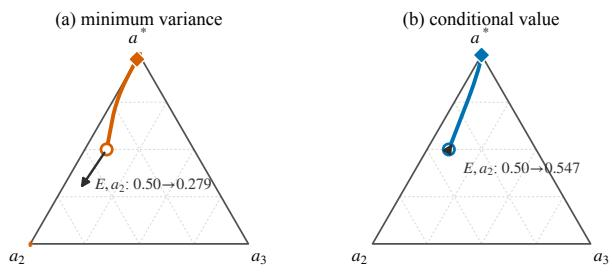

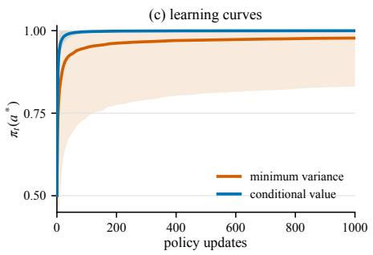  
Figure 8: Minimizing the covariance trace need not produce a better process over a finite horizon. The two environments share the same optimal arm and are sampled equally; $r _ { H } =$ $0 . 5 r _ { E } , \pi _ { 0 } = ( 0 . 5 , 0 . 4 , 0 . 1 )$ , and $\eta = 1 0$ . (a,b) Terminal policies at $T = \bar { 1 } , 0 0 0$ (light points; 4,000 of 20,000 shown) and ensemble mean trajectories (solid curves) from the common initialization (circle) to the terminal mean (diamond). The arrows show the same sampled branch at the initial policy: sampling $a _ { 2 }$ in the easy environment E moves away from $a ^ { * }$ under the baseline minimizing trace covariance but toward $a ^ { * }$ under the conditional value. The initial covariance traces are 0.0423 and 0.0472, respectively. (c) Optimal arm probability over all 20,000 trajectories (mean ± 1 s.d.; common random numbers). Both baselines are recomputed from their own current policies at every update. This compares the means at a fixed horizon and does not claim pathwise or asymptotic dominance.

Over 20,000 trajectories with common random numbers, after 1,000 updates the process using the covariance trace minimizer reaches $0 . 9 7 7 7 \pm 0 . 1 4 6 8$ , while the conditional value process reaches $0 . 9 9 9 8 \pm 0 . 0 0 0 4 ~ ( \mathrm { m e a n } \pm 1 ~ \mathrm { s . d . } )$ . The conditional ensemble mean crosses 0.99 after 38 updates; the mean under the covariance trace minimizer remains below 0.99 through update 1,000. The second arm remains the policy winner in 2.2% of runs using that baseline and in none of the conditional value runs. This is an ensemble comparison rather than pathwise dominance, but it shows that minimizing the local covariance trace can create a substantially longer and less stable committal transient.

The example exposes what the variance summary discards. At initialization, score weighting reduces the relative weight of the most probable optimal arm and more than doubles the relative weight of the rare arm with zero reward, pulling the covariance trace minimizer below $r _ { E } ( a _ { 2 } )$ . Baseline placement then changes which sampled arm is reinforced, and that change feeds back into future action sampling. The two processes still share the same asymptotic destination. Indeed, after averaging over $Z ,$ each has efective arm means $\bar { r } ( a ) - \bar { c } _ { t } ^ { B }$ , where $\begin{array} { r } { c _ { t } ^ { B } : = \sum _ { z } q _ { z } B _ { t } ^ { B } ( z ) } \end{array}$ is bounded and predictable; hence Lemma 8 applies. The example complements Chung et al. (2021), whose stronger convergence counterexample uses a natural policy gradient process with three arms. Variance remains a useful aggregate certificate, but it cannot explain the branch allocation that governs the sampled learning path.

## B Proof of Proposition 1

This section gives a complete convergence proof for the predictable reward laws that depend on the environment and are induced by Algorithm 1. The proof architecture is adapted from the exploration, barrier, and elimination arguments of Robertson et al. (2025), including their use of Freedman’s inequality to prove divergence. All ingredients needed here, including the rate for tail averages, are stated and proved directly in this appendix.

Proof convention. The shaded Comment boxes mark the steps at which we adapt the proof architecture of Robertson et al. (2025) to our multi-environment common-shift setting. The intervening probabilistic argument is reproduced self-contained.

Proof idea. The argument has three main steps. First, after averaging over the sampled environment, every baseline induces efective arm means of the form $\bar { r } ( a ) - c _ { t }$ , where the same predictable scalar $c _ { t }$ is subtracted from every arm. This shift changes the sampled noise but leaves every pairwise arm gap fixed, and all three baselines induce the same conditional mean update. Second, conditional Borel–Cantelli gives infinite exploration. The optimal logit has positive mean drift; infinite exploration makes its cumulative drift diverge, and stopped concentration prevents the noise from canceling that drift, so the optimal logit tends $\mathrm { t o } ~ + \infty$ Third, a barrier argument reaches an arbitrarily large simultaneous gap and then traps the process in a region where every rival has strictly negative mean drift. Continued exploration makes each accumulated negative drift diverge, driving every rival logit to −∞. Consequently, $\pi _ { t } ( a ^ { * } ) \to 1$ almost surely for all three baselines. Finally, the same compensator argument yields, without requiring $c _ { t }$ to settle, a pathwise $O ( ( 1 +$ log $N ) / N )$ bound on average suboptimality over a random tail after the transient; it is neither a last iterate nor an expected rate.

Efective reward law. Let $\mathcal { F } _ { t }$ contain the complete history before $( Z _ { t } , a _ { t } )$ is sampled, so $\pi _ { t }$ is $\mathcal { F } _ { t }$ -measurable. Because Algorithm 1 samples $Z _ { t }$ independently from q and the actor does not observe $Z _ { t }$ , conditionally on $\mathcal { F } _ { t }$ the draws $Z _ { t } \sim q$ and $a _ { t } \sim \pi _ { t }$ are independent. Define

$$
Y _ { t } ^ { B } : = r _ { Z _ { t } } ( a _ { t } ) - B _ { t } ^ { B } , \qquad { \bar { r } } ( a ) : = \sum _ { z } q _ { z } r _ { z } ( a ) , \qquad { \bar { V } } ^ { \pi _ { t } } : = \sum _ { a } \pi _ { t } ( a ) { \bar { r } } ( a ) .
$$

Also put $R : = \operatorname* { m a x } _ { z , a } | r _ { z } ( a ) | < \infty$

Lemma 5 (Exact reduction to a common shift). For $B \in \{ 0$ , shared, cond}, the conditional law $o f Y _ { t } ^ { B }$ given $( \mathcal { F } _ { t } , a _ { t } = a )$ is predictable, supported on $[ - 2 R , 2 R ]$ , and has mean

$$
m _ { t } ^ { B } ( a ) : = \mathbb { E } [ Y _ { t } ^ { B } \mid { \mathcal { F } } _ { t } , a _ { t } = a ] = { \bar { r } } ( a ) - c _ { t } ^ { B } , \quad c _ { t } ^ { 0 } = 0 , \quad c _ { t } ^ { \mathrm { s h a r e d } } = c _ { t } ^ { \mathrm { c o n d } } = { \bar { V } } ^ { \pi _ { t } } .\tag{7}
$$

Consequently, every pairwise gap is fixed, $m _ { t } ^ { B } ( a ) - m _ { t } ^ { B } ( i ) = \bar { r } ( a ) - \bar { r } ( i )$ , and

$$
\mathbb { E } [ \Delta \theta _ { t } ( a ) \mid { \mathcal F } _ { t } ] = \eta \pi _ { t } ( a ) \big ( \bar { r } ( a ) - \bar { V } ^ { \pi _ { t } } \big ) .\tag{8}
$$

Proof. The zero and shared cases follow directly from their definitions. For the conditional baseline, conditional independence of $Z _ { t }$ and $a _ { t }$ gives

$$
\mathbb { E } [ Y _ { t } ^ { \mathrm { c o n d } } \mid \mathcal { F } _ { t } , a _ { t } = a ] = \sum _ { z } q _ { z } \big ( r _ { z } ( a ) - V _ { z } ^ { \pi _ { t } } \big ) = \bar { r } ( a ) - \bar { V } ^ { \pi _ { t } } .
$$

Comment. The conditional oracle baseline is not a common shift on a realized environment branch. Independence of $Z _ { t }$ and a makes its mean conditional on the arm exactly the same predictable common shift after averaging over the environment index.

Substitution into the score update proves equation 8. Every oracle value is a convex combination of the finite reward table, so $| Y _ { t } ^ { B } | \leq 2 R$ in all three cases. □

Throughout the remainder of the proof, write $\mathbb { E } _ { t } [ \cdot ] : = \mathbb { E } [ \cdot \mid \mathcal { F } _ { t } ]$ and $\operatorname { V a r } _ { t } ( \cdot ) : = \operatorname { V a r } ( \cdot \mid \mathcal { F } _ { t } )$ for a stopping time $\tau , \mathbb { P } _ { \tau } ( \cdot ) : = \mathbb { P } ( \cdot \mid \mathcal { F } _ { \tau } )$

We first record a stopped concentration lemma that is uniform over time. It is a direct Freedman–Bernstein argument, included so that the bufers used below have explicit probabilities and do not depend on an external bandit result.

Lemma 6 (Stopped Freedman bound under drift dominance). Let τ be a stopping time finite almost surely and let $( X _ { t } ) _ { t \geq \tau }$ be an adapted process taking real values with

$$
X _ { t + 1 } - X _ { t } = s _ { t } + \xi _ { t + 1 } , \qquad \mathbb { E } [ \xi _ { t + 1 } \mid { \mathcal { F } } _ { t } ] = 0 , \qquad \left. \xi _ { t + 1 } \right. \leq b ,
$$

where $0 \leq b < \infty$ is deterministic. Suppose that, for some deterministic $0 \leq c < \infty$ with $b + c > 0$ , one of the following two conditions holds at every active step:

$$
s _ { t } = \nu _ { t } \geq 0 , \quad \quad \mathbb { E } [ \xi _ { t + 1 } ^ { 2 } \mid \mathcal { F } _ { t } ] \leq c \nu _ { t } ,\tag{9}
$$

$$
s _ { t } = - \nu _ { t } \leq 0 , \quad \quad \mathbb { E } [ \xi _ { t + 1 } ^ { 2 } \mid { \mathcal { F } } _ { t } ] \leq c \nu _ { t } ,\tag{10}
$$

where $\nu _ { t } \geq 0$ is predictable. For $q \in ( 0 , 1 )$ , define

$$
D _ { q } ( b , c ) : = 2 ( b + c ) \log ( 1 / q ) .\tag{11}
$$

Conditionally on $\mathcal { F } _ { \tau }$ , under equation $^ { g } ,$

$$
\mathbb { P } _ { \tau } \bigg ( \operatorname* { i n f } _ { n \geq \tau } \big ( X _ { n } - X _ { \tau } \big ) < - D _ { q } ( b , c ) \bigg ) \leq q ,\tag{12}
$$

whereas under equation 10,

$$
\mathbb { P } _ { \tau } \bigg ( \operatorname* { s u p } _ { n \geq \tau } ( X _ { n } - X _ { \tau } ) > D _ { q } ( b , c ) \bigg ) \leq q .\tag{13}
$$

Moreover, $\begin{array} { r } { i f \Lambda _ { n } : = \sum _ { t = \tau } ^ { n - 1 } \nu _ { t } \to \infty , } \end{array}$ , then $X _ { n } \to + \infty$ under equation 9 and $X _ { n } \to - \infty$ under equation 10, almost surely. More precisely, writing $\begin{array} { r } { M _ { n } : = \sum _ { t = \tau } ^ { n - 1 } \xi _ { t + 1 } } \end{array}$ , almost surely there is a finite random index N such that

$$
| M _ { n } | \leq { \frac { 1 } { 2 } } \Lambda _ { n } \qquad ( n \geq N ) .\tag{14}
$$

The conclusions remain valid up to a further stopping time after multiplying every increment by the predictable indicator that this stopping time has not yet occurred.

Proof. For $0 < \lambda < 3 / b$ , the conditional Bernstein bound for the martingale diference is

$$
\mathbb { E } _ { t } [ e ^ { \lambda \xi _ { t + 1 } } ] \le \exp \left( \frac { \lambda ^ { 2 } } { 2 ( 1 - \lambda b / 3 ) } \mathbb { E } _ { t } [ \xi _ { t + 1 } ^ { 2 } ] \right) ,\tag{15}
$$

and the same inequality holds for $- \xi _ { t + 1 }$ . Take $\lambda : = 1 / [ 2 ( b + c ) ]$ . Then $\lambda b \le 1 / 2 , \lambda c \le 1 / 2$ and, writing $\psi _ { b } ( \lambda ) : = \bar { \lambda } ^ { 2 } / [ 2 ( 1 - \lambda b / 3 ) ]$

$$
\psi _ { b } ( \lambda ) c \leq \frac { 3 } { 1 0 } \lambda < \frac { 1 } { 2 } \lambda .\tag{16}
$$

For $\begin{array} { r } { M _ { n } : = \sum _ { t = \tau } ^ { n - 1 } \xi _ { t + 1 } } \end{array}$ and $\textstyle \Lambda _ { n } : = \sum _ { t = \tau } ^ { n - 1 } \nu _ { t }$ , the exponential process

$$
\exp \left( \lambda M _ { n } - \psi _ { b } ( \lambda ) \sum _ { t = \tau } ^ { n - 1 } \mathbb { E } _ { t } [ \xi _ { t + 1 } ^ { 2 } ] \right)
$$

is a nonnegative supermartingale starting at one; so is the process with $M _ { n }$ replaced by $- M _ { n }$ . Ville’s inequality and equation 16 therefore give, for every $x > 0$

$$
\begin{array} { r } { \mathbb { P } _ { \tau } ( \exists n \geq \tau : M _ { n } \geq \Lambda _ { n } + x ) \leq e ^ { - \lambda x } , \qquad \mathbb { P } _ { \tau } ( \exists n \geq \tau : - M _ { n } \geq \Lambda _ { n } + x ) \leq e ^ { - \lambda x } . } \end{array}\tag{17}
$$

Since $X _ { n } - X _ { \tau } = \Lambda _ { n } + M _ { n }$ in the positive case and $X _ { n } - X _ { \tau } = - \Lambda _ { n } + M _ { n }$ in the negative case, taking $x = \lambda ^ { - 1 } \log ( 1 / q )$ proves both equation 12 and equation 13.

For the divergence statements, equation 16 leaves the deterministic slack $\kappa : = \lambda / 2 - \psi _ { b } ( \lambda ) c >$ 0. Ville’s inequality gives, for each sign,

$$
\mathbb { P } _ { \tau } \left( \exists n : \Lambda _ { n } \geq u , \ M _ { n } \geq \Lambda _ { n } / 2 \right) \leq e ^ { - \kappa u } , \qquad \mathbb { P } _ { \tau } \left( \exists n : \Lambda _ { n } \geq u , \ - M _ { n } \geq \Lambda _ { n } / 2 \right) \leq e ^ { - \kappa u } .
$$

for every $u > 0$ . Apply both bounds at $u = 1 , 2 , \ldots$ . Their failure probabilities are summable. By Borel–Cantelli, almost surely only finitely many integer levels u admit an index n with $\Lambda _ { n } \geq u$ and either displayed deviation. On $\Lambda _ { n }  \infty$ , such a deviation at arbitrarily late indices would cross arbitrarily large integer levels and contradict this conclusion. Thus eventually $| M _ { n } | < \Lambda _ { n } / 2$ . Hence $\Lambda _ { n } ^ { \mathrm { ~ - ~ } } + M _ { n } \stackrel { \mathrm { ~ - ~ } } {  } + \infty$ in the positive case and $- \Lambda _ { n } + M _ { n } \to - \infty$ in the negative case. Multiplying by a predictable stopping indicator preserves all conditional mean, variance, and increment bounds, proving the final assertion. □

Comment. For $G ( \pi ) : = \mathrm { D i a g } ( \pi ) - \pi \pi ^ { \top }$ , every predictable common shift satisfies

$$
G ( \pi _ { t } ) ( \mu - c _ { t } { \bf 1 } ) = G ( \pi _ { t } ) \mu , \qquad G ( \pi _ { t } ) { \bf 1 } = 0 .
$$

Thus the nonsettling ofset changes the martingale noise law but never the mean direction or an arm gap. The coordinate formulas and ofset-uniform variance bounds are derived below wherever they are used.

Lemma 7 (Elimination for general K under a predictable common shift). Assume $K \geq 2$ $0 < \eta < \infty$ , and

$$
\theta _ { t + 1 } = \theta _ { t } + \eta Y _ { t } ( \mathbf { e } _ { a _ { t } } - \pi _ { t } ) , \qquad \pi _ { t } = \mathrm { s o f t m a x } ( \theta _ { t } ) , \qquad | Y _ { t } | \leq C ,\tag{18}
$$

where $\mathbf { e } _ { a }$ is the ath standard basis vector, $a _ { t } \mid \mathcal { F } _ { t } \sim \pi _ { t } .$ , and

$$
\mathbb { E } [ Y _ { t } \mid \mathcal { F } _ { t } , a _ { t } = a ] = \mu ( a ) - c _ { t } .\tag{19}
$$

Here $\mu$ is fixed, $c _ { t }$ is predictable, and $\mu$ has the unique maximizer a∗. Suppose, almost surely, that

$$
\theta _ { t } ( a ^ { * } )  + \infty , \qquad \sum _ { t = 0 } ^ { \infty } \pi _ { t } ( i ) = \infty \quad ( i \neq a ^ { * } ) .\tag{20}
$$

Then

$$
\theta _ { t } ( i ) \to - \infty \quad ( i \neq a ^ { * } ) , \qquad \pi _ { t } ( a ^ { * } ) \to 1 \quad a l m o s t \ s u r e l y .\tag{21}
$$

Proof. Let $\mathcal { R } : = \{ 1 , \ldots , K \} \setminus \{ a ^ { * } \}$ and define the fixed optimal gaps

$$
d _ { i } : = \mu ( a ^ { * } ) - \mu ( i ) , \qquad \delta : = \operatorname* { m i n } _ { i \in \mathcal { R } } d _ { i } > 0 , \qquad L : = \operatorname* { m a x } _ { i \in \mathcal { R } } d _ { i } < \infty .
$$

Comment. Robertson et al. organize elimination by reward tiers so that ties and multiple optimal arms are allowed. Here the shared optimum is strict, so one simultaneous optimal–rival cone controls every rival without a tier induction. The proof below defines the required stopping times and good events explicitly.

Write $p _ { t } ^ { * } : = \pi _ { t } ( a ^ { * } )$ and $\begin{array} { r } { \bar { d } _ { t } : = \sum _ { i \in \mathcal { R } } \pi _ { t } ( i ) d _ { i } } \end{array}$ . The common shift cancels exactly, giving

$$
m _ { t } ( a ^ { * } ) : = \mathbb { E } _ { t } [ \Delta \theta _ { t } ( a ^ { * } ) ] = \eta p _ { t } ^ { * } \bar { d } _ { t } ,\tag{22}
$$

$$
m _ { t } ( i ) : = \mathbb { E } _ { t } [ \Delta \theta _ { t } ( i ) ] = \eta \pi _ { t } ( i ) ( \bar { d } _ { t } - d _ { i } ) .\tag{23}
$$

The score form and $| Y _ { t } | \leq C$ also give, for every arm a,

$$
| \Delta \theta _ { t } ( a ) | \leq B _ { 0 } : = \eta C ,\tag{24}
$$

$$
\begin{array} { r } { \mathbb { E } _ { t } | \Delta \theta _ { t } ( a ) | \leq 2 \eta C \pi _ { t } ( a ) ( 1 - \pi _ { t } ( a ) ) , } \end{array}
$$

$$
\begin{array} { r } { \mathrm { V a r } _ { t } ( \Delta \theta _ { t } ( a ) ) \leq \eta ^ { 2 } C ^ { 2 } \pi _ { t } ( a ) ( 1 - \pi _ { t } ( a ) ) . } \end{array}\tag{25}
$$

Step 1: arbitrary simultaneous gaps are reached. We claim that, for every deterministic $G > 0$ , almost surely there is a finite time $T _ { G }$ such that

$$
\theta _ { T _ { G } } ( a ^ { * } ) - \operatorname* { m a x } _ { i \in \mathcal { R } } \theta _ { T _ { G } } ( i ) \geq G .\tag{26}
$$

Fix $G > 0$ and $q \in ( 0 , 1 )$ . Choose a deterministic $M > 1$ satisfying

$$
M \ge \frac { 2 ( L - \delta ) } { \delta } , \qquad \frac { M ^ { 2 } } { 1 + 2 M } \ge \frac { 4 C } { \delta } ,\tag{27}
$$

and set

$$
U _ { 2 } : = B _ { 0 } + \log ( ( K - 1 ) M ) , \qquad U _ { 1 } : = U _ { 2 } + G .\tag{28}
$$

From equation 22 and equation 25,

$$
m _ { t } ( a ^ { * } ) \geq \eta \delta p _ { t } ^ { * } ( 1 - p _ { t } ^ { * } ) \geq 0 , \qquad \mathrm { V a r } _ { t } ( \Delta \theta _ { t } ( a ^ { * } ) ) \leq c _ { * } m _ { t } ( a ^ { * } ) , \quad c _ { * } : = \frac { \eta C ^ { 2 } } { \delta } .\tag{29}
$$

The centered optimal increment has magnitude at most $b : = 2 B _ { 0 }$ . Define $D _ { * } ( q ) : = D _ { q } ( b , c _ { * } )$ and the stopping time

$$
\tau : = \operatorname* { i n f } \{ t : \theta _ { t } ( a ^ { * } ) \geq U _ { 1 } + D _ { * } ( q ) \} .\tag{30}
$$

It is finite almost surely by equation 20. Lemma 6, restarted at τ, shows that

$$
\mathcal { E } _ { q } : = \{ \theta _ { t } ( a ^ { * } ) \geq U _ { 1 } \ \mathrm { f o r \ e v e r y } \ t \geq \tau \}\tag{31}
$$

has conditional probability at least $1 - q .$

Define $\begin{array} { r } { \Phi _ { t } : = \sum _ { i \in \mathcal { R } } [ \theta _ { t } ( i ) ] _ { + } } \end{array}$ , where $[ x ] _ { + } : = \operatorname* { m a x } \{ x , 0 \}$ . Consider a time $t \geq \tau$ at which $\theta _ { t } ( a ^ { * } ) \geq U _ { 1 }$ and at least one rival logit is at least $U _ { 2 }$ . Partition

$$
\begin{array} { r } { \mathcal { B } _ { t } : = \{ i \in \mathcal { R } : \theta _ { t } ( i ) \geq B _ { 0 } \} , \qquad \mathcal { C } _ { t } : = \mathcal { R } \setminus \mathcal { B } _ { t } , } \end{array}
$$

and write $P _ { B } : = \pi _ { t } ( B _ { t } )$ and $P _ { C } : = \pi _ { t } ( \mathcal { C } _ { t } )$ . For $i \in \mathcal { B } _ { t }$ , a step of magnitude at most $B _ { 0 }$ cannot cross below zero, so the expected increment of $\left[ \theta _ { t } ( i ) \right] _ { + }$ equals $m _ { t } ( i )$ . For $i \in \mathcal { C } _ { t } ,$ the 1-Lipschitz property of $[ \cdot ] _ { + }$ and equation 25 give an expected increase of at most $2 \eta C \pi _ { t } ( i )$ Furthermore, equation 23 gives

$$
\begin{array} { r l } & { \frac { 1 } { \eta } \displaystyle \sum _ { i \in { \mathcal { B } } _ { t } } m _ { t } ( i ) = - ( 1 - P _ { B } ) \displaystyle \sum _ { i \in { \mathcal { B } } _ { t } } \pi _ { t } ( i ) d _ { i } + P _ { B } \displaystyle \sum _ { i \in { \mathcal { C } } _ { t } } \pi _ { t } ( i ) d _ { i } } \\ & { \qquad \quad \le - \delta p _ { t } ^ { * } P _ { B } + ( L - \delta ) P _ { B } P _ { C } . } \end{array}\tag{32}
$$

If $P _ { C } = 0$ , this is nonpositive. Otherwise, at least one rival is above $U _ { 2 }$ , whereas all logits in $\mathcal { C } _ { t }$ are below $B _ { 0 }$ . Hence

$$
\frac { P _ { B } } { P _ { C } } \ge M , \qquad \frac { p _ { t } ^ { * } } { P _ { C } } \ge M .\tag{33}
$$

Indeed, each denominator has at most $K - 1$ terms, and $\theta _ { t } ( a ^ { * } ) \geq U _ { 1 } > U _ { 2 }$ . If $x : = p _ { t } ^ { * } / P _ { C }$ and $y : = P _ { B } / P _ { C }$ , normalization gives $P _ { C } = ( 1 + x + y ) ^ { - 1 }$ and therefore

$$
\frac { p _ { t } ^ { * } P _ { B } } { P _ { C } } = \frac { x y } { 1 + x + y } \geq \frac { M ^ { 2 } } { 1 + 2 M } \geq \frac { 4 C } { \delta } .\tag{34}
$$

The first condition in equation 27 also gives $( L - \delta ) P _ { B } P _ { C } \le ( \delta / 2 ) p _ { t } ^ { * } P _ { B }$ . Combining these bounds yields

$$
\begin{array} { r } { \mathbb { E } _ { t } [ \Phi _ { t + 1 } - \Phi _ { t } ] \le \eta [ - \delta p _ { t } ^ { * } P _ { B } + ( L - \delta ) P _ { B } P _ { C } + 2 C P _ { C } ] \le 0 . } \end{array}\tag{35}
$$

Let $\nu$ be the first $t \geq \tau$ at which either $\theta _ { t } ( a ^ { * } ) < U _ { 1 }$ or every rival logit is below $U _ { 2 }$ . The drift bound in equation 35 shows that $\begin{array} { r } { \Phi _ { t \wedge \nu } = \sum _ { i \in \mathcal { R } } [ \theta _ { t \wedge \nu } ( i ) ] _ { + } } \end{array}$ is a nonnegative supermartingale. To handle its random starting value formally, restrict to each event $\{ \tau = n , \Phi _ { n } \leq m \} \in$ $\mathcal { F } _ { n }$ for integers $n , m$ and then take their countable union. The convergence theorem for nonnegative supermartingales shows that the stopped process has a finite limit almost surely. On $\mathcal { E } _ { q } ,$ the first stopping condition never occurs. If the second occurs, equation 28 gives equation 26; if it never occurs, the positive parts of all rival logits are bounded while $\theta _ { t } \bar { ( a ^ { * } ) }  + \infty$ , and equation 26 again holds at a finite later time. Thus the probability of never attaining the gap is at most q. Letting $q \downarrow 0$ proves the claim.

Step 2: the process is eventually trapped in a cone where every rival has strictly negative drift. Choose

$$
\rho \in \left( \operatorname* { m a x } \left\{ 1 - \frac { \delta } { L } , \frac { 1 } { K } \right\} , 1 \right) , \qquad \gamma : = \delta - L ( 1 - \rho ) > 0 .\tag{36}
$$

Whenever $p _ { t } ^ { * } \geq \rho ,$ equation 22 and equation 23 imply

$$
m _ { t } ( a ^ { * } ) \geq 0 , \qquad m _ { t } ( i ) \leq - \eta \gamma \pi _ { t } ( i ) \quad ( i \in \mathcal { R } ) .\tag{37}
$$

Together with equation 25, these give

$$
\mathrm { V a r } _ { t } ( \Delta \theta _ { t } ( a ^ { * } ) ) \leq c _ { * } m _ { t } ( a ^ { * } ) , \qquad \mathrm { V a r } _ { t } ( \Delta \theta _ { t } ( i ) ) \leq c _ { R } [ - m _ { t } ( i ) ] , \quad c _ { R } : = \frac { \eta C ^ { 2 } } { \gamma } .\tag{38}
$$

Fix $\varepsilon \in ( 0 , 1 )$ , put $q : = \varepsilon / K$ , and define

$$
D _ { * } : = D _ { q } ( b , c _ { * } ) , \qquad D _ { R } : = D _ { q } ( b , c _ { R } ) , \qquad g _ { \rho } : = \log \frac { ( K - 1 ) \rho } { 1 - \rho } , \qquad G _ { \varepsilon } : = g _ { \rho } + D _ { * } + D _ { R } .
$$

By Step 1, the first time $T _ { \varepsilon }$ such that

(39)

$$
\theta _ { T _ { \varepsilon } } ( a ^ { * } ) - \theta _ { T _ { \varepsilon } } ( i ) \geq G _ { \varepsilon } \qquad ( i \in \mathcal { R } )\tag{40}
$$

is a stopping time finite almost surely. This inequality implies $p _ { T _ { \varepsilon } } ^ { * } \geq \rho .$ Let $\sigma : = \operatorname* { i n f } \{ t \geq$ $T _ { \varepsilon } : p _ { t } ^ { * } < \rho \}$ and define the stopped increments $\bar { \Delta \theta _ { t } ( a ) } : = \mathbf { 1 } \{ t < \sigma \} \Delta \theta _ { t } ( a )$ . The indicator is F -measurable, and every active update lies in the cone, so both equation 37 and equation 38 apply to the stopped process. Lemma 6, restarted at $T _ { \varepsilon }$ , and a union bound over all K arms give an event $\mathcal { G } _ { \varepsilon }$ of conditional probability at least $1 - \varepsilon$ on which, simultaneously for all $n \geq T _ { \varepsilon }$ and all rivals i,

$$
\theta _ { n \wedge \sigma } ( a ^ { * } ) \geq \theta _ { T _ { \varepsilon } } ( a ^ { * } ) - D _ { * } , \qquad \theta _ { n \wedge \sigma } ( i ) \leq \theta _ { T _ { \varepsilon } } ( i ) + D _ { R } .\tag{41}
$$

If $\sigma < \infty$ on this event, then equation 40 and equation 41 imply

$$
\begin{array} { r } { \theta _ { \sigma } ( { a } ^ { * } ) - \theta _ { \sigma } ( i ) \geq g _ { \rho } \quad ( i \in \mathcal { R } ) , } \end{array}
$$

and hence

$$
p _ { \sigma } ^ { * } = \frac { 1 } { 1 + \sum _ { i \in \mathcal { R } } e ^ { \theta _ { \sigma } ( i ) - \theta _ { \sigma } ( a ^ { * } ) } } \geq \frac { 1 } { 1 + ( K - 1 ) e ^ { - g _ { \rho } } } = \rho ,
$$

contradicting the definition of $\sigma .$ . Therefore, with probability at least $1 - \varepsilon$ , the process never leaves the cone after $T _ { \varepsilon }$ . If A denotes the event that there is no finite time after which the process remains in the cone, then $\mathbb { P } ( \mathcal { A } ) \le \varepsilon$ for every $\varepsilon > 0$ . Thus

$$
\begin{array} { r } { \mathbb P ( \exists T < \infty : \ p _ { t } ^ { * } \geq \rho \mathrm { ~ f o r ~ e v e r y ~ } t \geq T ) = 1 . } \end{array}\tag{42}
$$

Step 3: eliminate every rival from deterministic restart times. The last entrance time in equation 42 need not be a stopping time. For each deterministic integer $n \geq 0$ , define instead

$$
\sigma _ { n } : = \operatorname* { i n f } \{ t \geq n : p _ { t } ^ { * } < \rho \} .
$$

Fix $i \in \mathcal { R }$ and use the increments $\mathbf { 1 } \{ t < \sigma _ { n } \} \Delta \theta _ { t } ( i )$ from time n. On $\{ \sigma _ { n } = \infty \}$ , equation 37 and equation 38 give the case of negative drift in Lemma $6 ,$ and its compensator satisfies

$$
\sum _ { t = n } ^ { \infty } [ - m _ { t } ( i ) ] \geq \eta \gamma \sum _ { t = n } ^ { \infty } \pi _ { t } ( i ) = \infty
$$

by equation 20. Hence $\theta _ { t } ( i ) \to - \infty$ on $\{ \sigma _ { n } = \infty \}$ , almost surely. The event in equation 42 agrees almost surely with $\textstyle \bigcup _ { n > 0 } \{ \sigma _ { n } = { \overset { . } { \infty } } \}$ , whose probability is one; the countable union therefore proves the limit for this rival. There are finitely many rivals, so all limits hold simultaneously. Together with $\theta _ { t } ( a ^ { * } )  + \infty$ , every margin between the optimal arm and a rival diverges and $\pi _ { t } ( a ^ { * } ) \to 1$ □

The preceding rank-free barrier plays the role of the tier-elimination step in earlier proofs for softmax bandits. We can now prove the abstract convergence statement needed by Proposition 1.

Lemma 8 (Bounded predictable common shifts). Let $( \mathcal { F } _ { t } ) _ { t \geq 0 }$ be a filtration, let $\theta _ { t }$ be $\mathcal { F } _ { t } .$ measurable, and put $\pi _ { t } = \operatorname { s o f t m a x } ( \theta _ { t } )$ . Suppose $c _ { t }$ is $\mathcal { F } _ { t }$ -measurable, $( a _ { t } , Y _ { t } )$ and hence $\theta _ { t + 1 }$ are $\mathcal { F } _ { t + 1 }$ -measurable, $a _ { t } \mid \mathcal { F } _ { t } \sim \pi _ { t } ,$ , and the conditional law of Yt given $( \mathcal { F } _ { t } , a _ { t } = a )$ is an $\mathcal { F } _ { t }$ -measurable kernel. Consider

$$
\theta _ { t + 1 } = \theta _ { t } + \eta Y _ { t } ( \mathbf { e } _ { a _ { t } } - \pi _ { t } ) , \qquad | Y _ { t } | \leq C < \infty ,\tag{43}
$$

where

$$
\mathbb { E } [ Y _ { t } \mid \mathcal { F } _ { t } , a _ { t } = a ] = \mu ( a ) - c _ { t } .\tag{44}
$$

Here $\boldsymbol { \mu } \in \mathbb { R } ^ { K }$ is fixed, $c _ { t }$ is a predictable scala $^ { t r , }$ and $\mu$ has a unique maximizer $a ^ { * }$ . For every fixed finite $\eta > 0$ and finite initial logits,

$$
\pi _ { t } ( a ^ { * } ) \longrightarrow 1 \qquad a l m o s t \ s u r e l y .\tag{45}
$$

Proof. Put $p _ { t } : = \pi _ { t } ( a ^ { * } )$ . The case $K = 1$ is immediate, so suppose $K \geq 2$

Conservation and moment bounds. The score coordinates sum to zero, so $\textstyle \sum _ { a } \theta _ { t } ( a ) =$ $\textstyle \sum _ { a } \theta _ { 0 } ( a )$ pathwise. The predictable shift cancels from the drift:

$$
\mathbb { E } _ { t } [ \Delta \theta _ { t } ( a ) ] = \eta \pi _ { t } ( a ) \left( \mu ( a ) - \sum _ { j } \pi _ { t } ( j ) \mu ( j ) \right) ,\tag{46}
$$

$$
\begin{array} { r l } & { ~ | \Delta \theta _ { t } ( a ) | \leq \eta C , } \\ & { ~ \mathbb { E } _ { t } | \Delta \theta _ { t } ( a ) | \leq 2 \eta C \pi _ { t } ( a ) ( 1 - \pi _ { t } ( a ) ) , } \\ & { ~ \mathrm { V a r } _ { t } ( \Delta \theta _ { t } ( a ) ) \leq \eta ^ { 2 } C ^ { 2 } \pi _ { t } ( a ) ( 1 - \pi _ { t } ( a ) ) . } \end{array}\tag{47}
$$

Exploration of all arms. Lévy’s conditional Borel–Cantelli lemma gives, simultaneously for all arms,

$$
\{ a _ { t } = a { \mathrm { ~ o n l y ~ f i n i t e l y ~ o f t e n } } \} = \left\{ \sum _ { t } \pi _ { t } ( a ) < \infty \right\} \quad { \mathrm { a l m o s t ~ s u r e l y } } .\tag{48}
$$

Suppose an arm a were sampled only finitely often. After its last sample, $| \Delta \theta _ { t } ( a ) | \ \leq$ $\eta C \pi _ { t } ( a )$ , so equation 48 implies that $\mathsf { \bar { \theta } } _ { t } ( a )$ converges to a finite value. At the same time $\pi _ { t } ( a ) \to 0$ , hence maxj ${ \theta _ { t } ( j ) }  + \infty$ . Logit conservation then forces some arm b to have lim in $ \dot { \cdot } _ { t } \theta _ { t } ( b ) = - \infty$ . Every finitely sampled arm has a finite logit limit by the preceding argument, so b is sampled infinitely often. As there are finitely many arms, it is enough to fix a deterministic pair $( a , b )$ with these properties.

Conditional Borel–Cantelli gives $\begin{array} { r } { \sum _ { t } \pi _ { t } ( b ) = \infty } \end{array}$ and $\textstyle \sum _ { t } \pi _ { t } ( a ) < \infty$ . On the event $\{ \theta _ { t } ( b ) \leq$ $\theta _ { t } ( a ) \}$ , we have $\pi _ { t } ( b ) \leq \pi _ { t } ( a )$ ; hence

$$
\sum _ { t } \mathbb { P } ( a _ { t } = b , \ \theta _ { t } ( b ) \leq \theta _ { t } ( a ) \mid \mathcal { F } _ { t } ) \leq \sum _ { t } \pi _ { t } ( a ) < \infty .
$$

Only finitely many such samples occur. Fix $\varepsilon > 0$ . Choose T after the last sample of a and the last sample of b made while $\theta _ { t } ( b ) \leq \theta _ { t } ( a )$ , and so late that $\begin{array} { r } { \eta C \sum _ { t > T } \pi _ { t } ( a ) < \varepsilon . } \end{array}$ Since lim inf $ [ \theta _ { t } ( b ) - \theta _ { t } ( a ) ] = - \infty$ , choose $u \geq T$ with this margin below −2ε. Until the margin crosses zero, neither a nor b is sampled. A sample of any other arm can increase it by at most $\eta C \pi _ { t } ( a )$ , so the total possible increase after u is less than ε. The margin can never cross zero, contradicting the fact that b is sampled infinitely often but eventually never while its margin is nonpositive. Thus every arm is sampled infinitely often.

Divergence of the optimal logit. Let $\begin{array} { r } { \Delta _ { * } : = \operatorname* { m i n } _ { i \neq a ^ { * } } \left[ \mu ( a ^ { * } ) - \mu ( i ) \right] > 0 } \end{array}$ . From equation 46 and equation 47,

$$
\begin{array} { r } { \mathbb { E } _ { t } [ \Delta \theta _ { t } ( a ^ { * } ) ] \geq \eta \Delta _ { * } p _ { t } ( 1 - p _ { t } ) , } \end{array}\tag{49}
$$

$$
\mathrm { V a r } _ { t } ( \Delta \theta _ { t } ( a ^ { * } ) ) \leq \frac { \eta C ^ { 2 } } { \Delta _ { * } } \mathbb { E } _ { t } [ \Delta \theta _ { t } ( a ^ { * } ) ] .\tag{50}
$$

Exploration and equation 48 imply $\begin{array} { r } { \sum _ { t } p _ { t } = \sum _ { t } ( 1 - p _ { t } ) = \infty } \end{array}$ . If eventually $p _ { t } \leq 1 / 2$ , then $p _ { t } ( \bar { 1 } - p _ { t } ) \ge p _ { t } / 2 ;$ if eventually $p _ { t } \geq 1 / 2$ , then $\dot { p } _ { t } ( 1 - p _ { t } ) \geq ( 1 - p _ { t } ) / 2$ . Otherwise there are infinitely many upcrossings of $1 / 2$ . The aggregate log odds

$$
\log \frac { p _ { t } } { 1 - p _ { t } } = \theta _ { t } ( a ^ { * } ) - \log \sum _ { i \neq a ^ { * } } e ^ { \theta _ { t } ( i ) }
$$

changes by at most $2 \eta C$ in one step. An upcrossing therefore lands in the compact interval $[ 1 / 2 , e ^ { 2 \eta C } / ( 1 + e ^ { 2 \eta C } ) ]$ , on which $p ( 1 - p )$ is bounded away from zero. In all three cases,

$$
\sum _ { t } p _ { t } ( 1 - p _ { t } ) = \infty .\tag{51}
$$

Apply Lemma 6 to the optimal coordinate from time zero. Its compensator diverges by equation 49 and equation 51, its variance is self-bounded by equation 50, and its centered increments have magnitude at most $2 \eta C$ . The divergence conclusion of the lemma gives $\theta _ { t } ( a ^ { * } ) \to + \infty$ almost surely.

The equivalence in equation 48 now gives $\begin{array} { r } { \sum _ { t } \pi _ { t } ( i ) = \infty } \end{array}$ for every rival. All hypotheses of Lemma 7 hold, so every rival logit tends to −∞ and equation 45 follows. □

Comment. The rate proof in Theorem E.1 of Appendix E in Robertson et al. (2025) is driven by the optimal-logit compensator, not by stationarity of every realized reward law. Because ofset cancellation makes it exactly equal to the fixed-µ stationary bandit compensator, the same scalar mechanism can be proved directly without waiting for $c _ { t }$ to converge. The following argument also replaces the auxiliary deterministic recursion cited in that appendix by a direct exponential potential calculation.

Corollary 9 (Rate for tail averages under a common shift). Under Lemma 8, suppose $K \geq 2$ , and define

$$
\delta : = \operatorname* { m i n } _ { i \neq a ^ { * } } [ \mu ( a ^ { * } ) - \mu ( i ) ] > 0 , \qquad L : = \operatorname* { m a x } _ { i \neq a ^ { * } } [ \mu ( a ^ { * } ) - \mu ( i ) ] , \qquad \kappa : = \frac { \eta \delta } { 4 } .
$$

On an event of probability one, there is a finite random integer τ such that, simultaneously for every integer $T > \tau$

$$
\frac { 1 } { T - \tau } \sum _ { t = \tau } ^ { T - 1 } \left( \mu ( a ^ { * } ) - \sum _ { a } \pi _ { t } ( a ) \mu ( a ) \right) \leq \frac { L } { \kappa ( T - \tau ) } \log ( 1 + ( K - 1 ) ( e ^ { \kappa } - 1 ) ( T - \tau ) ) .\tag{52}
$$

Consequently, the left-hand side is $O ( ( 1 + \log ( 1 + T - \tau ) ) / ( T - \tau ) )$ pathwise. For $K = 1$ , it is identically zero.

Proof. The case $K = 1$ was separated in the statement, so assume $K \geq 2$ . Softmax and the score update are invariant under adding the same constant to every logit. Subtracting $\theta _ { 0 } ( a ^ { * } ) \mathbf { 1 }$ from the entire logit trajectory, we may therefore assume without loss of generality that $\theta _ { 0 } ( a ^ { * } ) = 0$

Put

$$
p _ { t } : = \pi _ { t } ( a ^ { * } ) , \qquad \varepsilon _ { t } : = 1 - p _ { t } , \qquad g _ { t } : = \mathbb { E } _ { t } [ \Delta \theta _ { t } ( a ^ { * } ) ] ,
$$

and define the cumulative conditional drift and its martingale remainder by

$$
\Xi _ { t } : = \sum _ { s = 0 } ^ { t - 1 } g _ { s } , \qquad M _ { t } : = \theta _ { t } ( a ^ { * } ) - \Xi _ { t } .
$$

The proof of Lemma 8 gives

$$
g _ { t } \geq \eta \delta p _ { t } \varepsilon _ { t } , \qquad \mathrm { V a r } _ { t } ( \Delta \theta _ { t } ( a ^ { * } ) ) \leq \frac { \eta C ^ { 2 } } { \delta } g _ { t } ,\tag{53}
$$

and equation 51 implies $\Xi _ { t } \to \infty$ . Applying the quantitative conclusion equation 14 of Lemma 6 from time zero therefore shows that, almost surely,

$$
M _ { t } \geq - { \frac { 1 } { 2 } } \Xi _ { t } \qquad { \mathrm { f o r ~ a l l ~ s u f f c i e n t l y ~ l a r g e ~ } } t .\tag{54}
$$

The convergence and elimination parts of Lemma $8$ prove $p _ { t } \to 1$ and $\theta _ { t } ( i ) \to - \infty$ for every $i \neq a ^ { * }$ . Hence, on the same event of probability one, choose a finite random integer τ such that, for every $t \geq \tau$ , equation 54 holds, $p _ { t } \geq 1 / 2$ , and ${ \theta _ { t } ( i ) \leq 0 }$ for all $i \neq a ^ { * }$ . Define

$$
S _ { t } : = \sum _ { s = \tau } ^ { t - 1 } \varepsilon _ { s } , \qquad t \geq \tau .
$$

Since $g _ { s } \geq 0 ,$ , equation 53 yields

$$
\Xi _ { t } \geq \sum _ { s = \tau } ^ { t - 1 } g _ { s } \geq \frac { \eta \delta } { 2 } S _ { t } .
$$

Using $\theta _ { 0 } ( a ^ { * } ) = 0$ and equation 54, we obtain

$$
\theta _ { t } ( a ^ { * } ) = \Xi _ { t } + M _ { t } \geq \frac { 1 } { 2 } \Xi _ { t } \geq \kappa S _ { t } .\tag{55}
$$

The softmax odds identity and ${ \theta _ { t } ( i ) \leq 0 }$ now give

$$
\begin{array} { l } { \displaystyle \varepsilon _ { t } \leq \frac { \varepsilon _ { t } } { p _ { t } } = \sum _ { i \neq a ^ { * } } \exp \{ \theta _ { t } ( i ) - \theta _ { t } ( a ^ { * } ) \} } \\ { \leq ( K - 1 ) e ^ { - \theta _ { t } ( a ^ { * } ) } \leq ( K - 1 ) e ^ { - \kappa S _ { t } } . } \end{array}\tag{56}
$$

Let $U _ { t } : = e ^ { \kappa S _ { t } }$ . For $x \in [ 0 , 1 ]$ , convexity gives the chord bound $e ^ { \kappa x } - 1 \leq x ( e ^ { \kappa } - 1 )$ . Thus

$$
U _ { t + 1 } - U _ { t } = U _ { t } ( e ^ { \kappa \varepsilon _ { t } } - 1 ) \leq ( e ^ { \kappa } - 1 ) U _ { t } \varepsilon _ { t } \leq ( K - 1 ) ( e ^ { \kappa } - 1 ) .
$$

Since $U _ { \tau } = 1$ , summing from $\tau$ to $T - 1 $ yields

$$
S _ { T } \le \frac { 1 } { \kappa } \log ( 1 + ( K - 1 ) ( e ^ { \kappa } - 1 ) ( T - \tau ) ) .\tag{57}
$$

Finally,

$$
\mu ( a ^ { * } ) - \sum _ { a } \pi _ { t } ( a ) \mu ( a ) = \sum _ { i \neq a ^ { * } } \pi _ { t } ( i ) [ \mu ( a ^ { * } ) - \mu ( i ) ] \leq L \varepsilon _ { t } .
$$

Summing this inequality and applying equation $^ { 5 7 }$ gives

$$
\sum _ { t = \tau } ^ { T - 1 } \left( \mu ( a ^ { * } ) - \sum _ { a } \pi _ { t } ( a ) \mu ( a ) \right) \leq \frac { L } { \kappa } \log ( 1 + ( K - 1 ) ( e ^ { \kappa } - 1 ) ( T - \tau ) ) .
$$

Dividing by $T - \tau$ proves equation 52. The stated order follows from $1 + \alpha N \le ( 1 + \alpha ) ( 1 + N )$ for $N \geq 1$ , with $\begin{array} { r } { \alpha : = ( K - 1 ) ( e ^ { \kappa } - 1 ) } \end{array}$ . 口

Comment. The final multi-environment bandit specialization depends only on the pooled mean vector.

Proof of Proposition 1. The common strict optimum implies

$$
\bar { r } ( a ^ { * } ) - \bar { r } ( i ) = \sum _ { z } q _ { z } \big ( r _ { z } ( a ^ { * } ) - r _ { z } ( i ) \big ) > 0 \qquad ( i \ne a ^ { * } ) .
$$

By Lemma $5 ,$ each of the three baseline processes satisfies the assumptions of Lemma $8$ with $C = 2 R$ and $\mu = \bar { r }$ . This proves the almost-sure convergence conclusion. Equation 8 records their common conditional mean update.

For each baseline process, Corollary $9 \mathrm { g i } $ ves an almost surely finite random integer $\tau _ { B }$ . Define

$$
\delta _ { \bar { r } } : = \operatorname* { m i n } _ { i \neq a ^ { * } } \bigl [ \bar { r } ( a ^ { * } ) - \bar { r } ( i ) \bigr ] > 0 , \qquad L _ { \bar { r } } : = \operatorname* { m a x } _ { i \neq a ^ { * } } \bigl [ \bar { r } ( a ^ { * } ) - \bar { r } ( i ) \bigr ] ,
$$

$$
\kappa _ { \bar { r } } : = \frac { \eta \delta _ { \bar { r } } } { 4 } , \qquad \alpha _ { \bar { r } } : = ( K - 1 ) \big ( e ^ { \kappa _ { \bar { r } } } - 1 \big ) ,
$$

and

$$
\mathcal { E } _ { t } ^ { B } : = \bar { r } ( a ^ { * } ) - \sum _ { a } \pi _ { t } ^ { B } ( a ) \bar { r } ( a ) .
$$

For every integer $T > \tau _ { B }$ , putting $N : = T - \tau _ { B }$ , the corollary gives

$$
\frac { 1 } { N } \sum _ { t = \tau _ { B } } ^ { T - 1 } \mathcal E _ { t } ^ { B } \le \frac { L _ { \bar { r } } } { \kappa _ { \bar { r } } N } \log ( 1 + \alpha _ { \bar { r } } N ) .
$$

The sum before $\tau _ { B }$

$$
C _ { B } ^ { \mathrm { p r e } } : = \sum _ { t = 0 } ^ { \tau _ { B } - 1 } \mathcal { E } _ { t } ^ { B }
$$

is finite almost surely. Hence, for every $T > \tau _ { B }$

$$
\frac { 1 } { T } \sum _ { t = 0 } ^ { T - 1 } \mathcal E _ { t } ^ { B } \le \frac { C _ { B } ^ { \mathrm { p r e } } } { T } + \frac { L _ { \bar { r } } } { \kappa _ { \bar { r } } T } \log ( 1 + \alpha _ { \bar { r } } ( T - \tau _ { B } ) ) .
$$

Set

and

$$
T _ { 0 , B } : = \operatorname* { m a x } \{ \tau _ { B } + 1 , 2 \}
$$

$$
C _ { B } : = \frac { C _ { B } ^ { \mathrm { p r e } } } { \log 2 } + \frac { L _ { \bar { r } } } { \kappa _ { \bar { r } } } \left( 1 + \frac { \log ( 1 + \alpha _ { \bar { r } } ) } { \log 2 } \right) .
$$

Both are finite almost surely. For every integer $T \geq T _ { 0 , B }$

$$
\log ( 1 + \alpha _ { \bar { r } } ( T - \tau _ { B } ) ) \leq \log ( 1 + \alpha _ { \bar { r } } ) + \log T ,
$$

and therefore

$$
{ \frac { 1 } { T } } \sum _ { t = 0 } ^ { T - 1 } { \mathcal { E } } _ { t } ^ { B } \leq C _ { B } { \frac { \log T } { T } } .
$$

This proves equation 2. The entrance time may difer across baseline processes, but the same deterministic bound applies after entrance as a function of the tail length. The argument does not require the shared or conditional ofset to converge. □

## C Proof of Proposition 2

Proof. Let $p : = \pi ( a ^ { * } ) , \pi _ { i } : = \pi ( i )$ , and $x _ { i } : = \theta ( a ^ { * } ) - \theta ( i )$ for $i \neq a ^ { * }$ . Finite logits and increments bounded over a single step imply that every softmax probability at finite time is strictly positive. Write $\begin{array} { r } { r _ { * } = r ( a ^ { * } ) , r _ { ( 2 ) } = \operatorname* { m a x } _ { i \neq a ^ { * } } r ( i ) , r _ { - } = \operatorname* { m i n } _ { a } r ( a ) } \end{array}$ , and define the finite threshold

$$
\bar { p } : = \operatorname* { m a x } \left\{ \frac { 1 } { 2 } , \frac { r _ { ( 2 ) } - r _ { - } } { r _ { * } - r _ { - } } \right\} < 1 .
$$

Value baseline. Suppose $p > \bar { p } .$ . Then $p > 1 / 2 ,$ so $p > \pi _ { i }$ for every rival, and

$$
\begin{array} { r } { V ^ { \pi } \geq p r _ { * } + ( 1 - p ) r _ { - } > r _ { ( 2 ) } . } \end{array}
$$

At any finite time, softmax has full support and $a ^ { * }$ is uniquely optimal, so also $V ^ { \pi } < r _ { * }$ Consequently $A ( a ^ { * } ) = r _ { * } - V ^ { \pi } > 0$ and $A ( i ) = r ( i ) - V ^ { \pi } < 0$ for every rival. If $a ^ { * }$ is sampled, then, for every $i \neq a ^ { * }$

$$
\Delta x _ { i } = \eta A ( a ^ { * } ) \big ( 1 - p + \pi _ { i } \big ) > 0 .\tag{58}
$$

If rival j is sampled, then

$$
\Delta x _ { j } = - \eta A ( j ) \big ( 1 + p - \pi _ { j } \big ) > 0 , \qquad \Delta x _ { i } = \eta A ( j ) ( \pi _ { i } - p ) > 0 \quad ( i \ne j ) .\tag{59}
$$

Thus every possible branch strictly increases every margin between the optimal arm and a rival. Since

$$
\pi ( a ^ { * } ) = \left( 1 + \sum _ { i \neq a ^ { * } } e ^ { - x _ { i } } \right) ^ { - 1 } ,
$$

it strictly increases as well. The set $\{ p > \bar { p } \}$ is therefore invariant under future updates. Proposition 1 gives $p _ { t } \to 1$ almost surely, so its first entrance time $\tau _ { V }$ is almost surely finite, proving equation 3. For $K = 2$ , the two displays reduce to the two familiar positive margin increments under value centering.

No baseline. Define the nonempty set of rivals with positive rewards $\mathcal { T } _ { + } : = \{ i \neq a ^ { * } : r ( i ) >$ 0}. Let $\textstyle M : = \sum _ { i \neq a ^ { * } } x _ { i }$ . For a sampled arm $^ { a , }$ direct summation of the score update gives the exact identity

$$
\Delta M = K \eta r ( a ) \bigl ( { \bf 1 } \{ a = a ^ { * } \} - p \bigr ) .\tag{60}
$$

Hence every draw $a = i \in \mathcal { I } _ { + }$ gives $\Delta M = - K \eta r ( i ) p < 0 .$ Conditional on the history before the action, its probability is $\begin{array} { r } { \sum _ { i \in \mathbb { Z } _ { + } } \pi _ { t } ( i ) > 0 } \end{array}$ at every finite time.

Again by Proposition 1, almost surely there is a finite time after which $p _ { t } > 1 / 2$ . Thereafter, if $i \in \mathcal { Z } _ { + }$ is sampled, then

$$
\Delta x _ { i } = - \eta r ( i ) ( 1 + p _ { t } - \pi _ { t } ( i ) ) < 0 , \qquad \Delta x _ { j } = \eta r ( i ) ( \pi _ { t } ( j ) - p _ { t } ) < 0 \quad ( j \neq i ) .
$$

All margins between the optimal arm and a rival, and therefore $p _ { t } .$ , strictly decrease. The exploration argument in the proof of Lemma 8 shows that softmax REINFORCE with bounded updates samples every arm infinitely often almost surely. Thus, on the intersection of the convergence and exploration events, which has probability one, every fixed $i \in \mathcal { Z } _ { + }$ produces infinitely many strict drawdowns. This proves the second claim and equation 4.

## D Proofs for Section 4.2

Lemma 10 (Population targets of shared and conditional critics). Assume $G \in L ^ { 2 }$ . Among square-integrable critics that observe $S$ but not $Z ,$ the minimizer of the population squared error $i s$

$$
{ \bar { V } } ^ { \pi } ( S ) : = \mathbb { E } [ G \mid S ] = \sum _ { z } q _ { z } ^ { \pi } ( S ) V _ { z } ^ { \pi } ( S ) \quad a l m o s t \ s u r e l y .
$$

Among critics that also observe $Z ,$ the corresponding minimizer is $V _ { Z } ^ { \pi } ( S ) : = \mathbb { E } [ G \mid S , Z ]$ Their optimal population risks $d i f f e r$ by

$$
\mathbb { E } \left[ ( V _ { Z } ^ { \pi } ( S ) - \bar { V } ^ { \pi } ( S ) ) ^ { 2 } \right] .
$$

Values outside the support of the data distribution are unconstrained.

Proof. For any shared critic $\widehat V ( S )$ , conditional expectation gives

$$
\mathbb { E } [ ( \widehat { V } ( S ) - G ) ^ { 2 } ] = \mathbb { E } [ ( \widehat { V } ( S ) - \mathbb { E } [ G \mid S ] ) ^ { 2 } ] + \mathbb { E } [ ( G - \mathbb { E } [ G \mid S ] ) ^ { 2 } ] .
$$

The first term is uniquely minimized almost surely by $\widehat V ( S ) = \bar { V } ^ { \pi } ( S )$ . Conditioning instead on $( S , Z )$ gives the conditional target $V _ { Z } ^ { \pi } ( S )$ . Finally, applying the same orthogonal decomposition to $V _ { Z } ^ { \pi } ( S )$ and $\bar { V } ^ { \pi } ( S )$ gives the stated risk gap. □

Proof of Proposition 3. Write $\pi _ { t } ^ { s } : = \pi _ { t } ^ { B ^ { \mathrm { s h a r e d } } }$ and $\pi _ { t } ^ { c } : = \pi _ { t } ^ { B ^ { \mathrm { c o n d } } }$ , with $p _ { t } ^ { B } : = \pi _ { t } ^ { B } ( a ^ { * } )$ . For the two processes, define

$$
A _ { s , t } ( z , a ) : = r _ { z } ( a ) - \bar { V } ^ { \pi _ { t } ^ { s } } , \qquad A _ { c , t } ( z , a ) : = r _ { z } ( a ) - V _ { z } ^ { \pi _ { t } ^ { c } } ,
$$

where $\begin{array} { r } { V _ { z } ^ { \pi } : = \sum _ { a } \pi ( a ) r _ { z } ( a ) } \end{array}$ and $\begin{array} { r } { \bar { V } ^ { \pi } : = \sum _ { z } q _ { z } V _ { z } ^ { \pi } } \end{array}$ . These are exactly the centered residuals induced by the shared and conditional oracle baselines defined in Section 3.

For the conditional process, put

$$
r _ { z } ^ { ( 2 ) } : = \operatorname* { m a x } _ { i \neq a ^ { * } } r _ { z } ( i ) , \qquad r _ { z } ^ { - } : = \operatorname* { m i n } _ { a } r _ { z } ( a ) , \qquad \bar { p } _ { c } : = \operatorname* { m a x } _ { z } \operatorname* { m a x } \left\{ \frac { 1 } { 2 } , \frac { r _ { z } ^ { ( 2 ) } - r _ { z } ^ { - } } { r _ { z } ( a ^ { * } ) - r _ { z } ^ { - } } \right\} < 1 .
$$

For the shared process, put

$$
\bar { r } _ { * } : = \sum _ { z } q _ { z } r _ { z } ( a ^ { * } ) , \qquad \mathcal { Z } _ { - } : = \{ z : r _ { z } ( a ^ { * } ) < \bar { r } _ { * } \} , \qquad q _ { - } : = \sum _ { z \in \mathcal { Z } _ { - } } q _ { z } ,
$$

and abbreviate $e _ { z } ^ { \star } : = r _ { z } ( a ^ { \ast } ) - \bar { r } _ { \ast }$ and $g _ { z } ( i ) : = r _ { z } ( a ^ { * } ) - r _ { z } ( i )$

Conditional ratchet. Let $p : = p _ { t } ^ { c } . \ \mathrm { H } p > \bar { p } _ { c } .$ , then, simultaneously for every environment $z ,$ $p > 1 / 2$ and

$$
V _ { z } ^ { \pi _ { t } ^ { c } } \geq p r _ { z } ( a ^ { * } ) + ( 1 - p ) r _ { z } ^ { - } > r _ { z } ^ { ( 2 ) } .
$$

Thus $A _ { c , t } ( z , a ^ { * } ) > 0 > A _ { c , t } ( z , i )$ for every rival. The branch calculations in equation 58 and equation 59, applied with the rewards of the sampled environment, show that every possible combination of environment and action strictly increases every margin between the optimal arm and a rival. Hence $p$ strictly increases and the region $\{ p > \bar { p } _ { c } \}$ is invariant under future updates. Proposition 1 gives $p _ { t } ^ { c }  1$ almost surely, so the first entrance time $\tau _ { c }$ is finite almost surely. This proves equation 5.

Limiting shared signs. Along the process with the shared baseline, Proposition 1 yields $\pi _ { t } ^ { s } ( a ^ { * } ) \stackrel { } { \to } 1$ almost surely. Consequently,

$$
\bar { V } ^ { \pi _ { t } ^ { s } } \longrightarrow \bar { r } _ { * } : = \sum _ { z } q _ { z } r _ { z } ( a ^ { * } ) .
$$

For each $z \in { \mathcal { Z } } _ { - }$ define $\delta _ { z } : = \bar { r } _ { * } - r _ { z } ( a ^ { * } ) > 0$ . Then

$$
A _ { s , t } ( z , a ^ { * } ) = r _ { z } ( a ^ { * } ) - \bar { V } ^ { \pi _ { t } ^ { s } } \longrightarrow - \delta _ { z } \qquad \mathrm { a l m o s t ~ s u r e l y } .
$$

More generally, for every rival $i ,$

$$
A _ { s , t } ( z , i ) = r _ { z } ( i ) - \bar { V } ^ { \pi _ { t } ^ { s } } \longrightarrow r _ { z } ( i ) - \bar { r } _ { * } = e _ { z } ^ { \star } - g _ { z } ( i ) .
$$

These limits give the signs of the optimal arm in hard environments and rival arms in easy environments discussed in Section 4.2.

Mismatch severity. Let $\begin{array} { r } { \bar { r } ( a ) : = \sum _ { z } q _ { z } r _ { z } ( a ) } \end{array}$ and define the suboptimality in average reward $\begin{array} { r } { \mathcal { E } _ { t } ^ { s } : = { \bar { r } _ { * } } - \sum _ { a } \pi _ { t } ^ { s } ( a ) \bar { r } ( a ) = { \bar { r } _ { * } } - \bar { V } ^ { \pi _ { t } ^ { s } } \ge 0 } \end{array}$ . For a hard environment $z ,$ , the identity $A _ { s , t } ( z , a ^ { * } ) =$ $\bar { \mathcal { E } } _ { t } ^ { s } - \delta _ { z }$ is exact. Hence its update to the optimal arm flips sign precisely when $\mathcal { E } _ { t } ^ { s } < \delta _ { z }$ and after the flip its residual magnitude is $\bar { \delta } _ { z } - \mathcal { E } _ { t } ^ { s }$ . A larger limiting mismatch therefore moves the boundary at which the sign flips to a larger remaining error in average reward and increases the drawdown magnitude at a fixed policy. Likewise, for an easy environment let $e _ { z } ^ { + } : = r _ { z } ( a ^ { * } ) - \bar { r } _ { * } > 0$ . Every rival i has the exact shared residual $A _ { s , t } ( z , i ) = e _ { z } ^ { + } - g _ { z } ( i ) + \mathscr { E } _ { t } ^ { s } ;$ increasing $e _ { z } ^ { + }$ lifts more rivals above zero and strengthens every promoted branch. These identities order onset by policy quality $\mathcal { E } _ { t } ^ { s }$ : along the same trajectory under the shared baseline, a larger $\delta _ { z }$ threshold is crossed no later than a smaller one. They do not, by themselves, order hitting times across separately trained processes. For a fixed set ${ \mathcal { Z } } _ { - } ,$ severity changes onset and magnitude, not the limiting trigger frequency $q _ { - }$ proved below; changing the ofsets can, of course, change membership in $\mathcal { Z } _ { - }$

Persistent shared drawdowns. $\mathrm { F i x } \ z \in { \mathcal { Z } } _ { - }$ . For every $\epsilon \in ( 0 , \delta _ { z } )$ , there is an almost surely finite time $T _ { z , \epsilon }$ such that $A _ { s , t } ( z , a ^ { * } ) \leq - ( \delta _ { z } - \epsilon )$ for all $t \geq T _ { z , \epsilon }$ . On a round with $\left( Z _ { t } , a _ { t } \right) =$ $( z , a ^ { * } )$ ), the softmax policy gradient update gives, for every $i \neq a ^ { * }$ ，

$$
\begin{array} { r l } & { \left[ \theta _ { t + 1 } ^ { s } ( a ^ { * } ) - \theta _ { t + 1 } ^ { s } ( i ) \right] - \left[ \theta _ { t } ^ { s } ( a ^ { * } ) - \theta _ { t } ^ { s } ( i ) \right] } \\ & { \qquad = \eta A _ { s , t } ( z , a ^ { * } ) \left[ ( 1 - \pi _ { t } ^ { s } ( a ^ { * } ) ) - ( - \pi _ { t } ^ { s } ( i ) ) \right] } \\ & { \qquad = \eta A _ { s , t } ( z , a ^ { * } ) \bigl ( 1 - \pi _ { t } ^ { s } ( a ^ { * } ) + \pi _ { t } ^ { s } ( i ) \bigr ) } \\ & { \qquad \le - \eta ( \delta _ { z } - \epsilon ) \bigl ( 1 - \pi _ { t } ^ { s } ( a ^ { * } ) + \pi _ { t } ^ { s } ( i ) \bigr ) < 0 . } \end{array}
$$

The optimal probability can be written as

$$
\pi _ { t } ^ { s } ( a ^ { * } ) = \left( 1 + \sum _ { i \neq a ^ { * } } \exp \{ - [ \theta _ { t } ^ { s } ( a ^ { * } ) - \theta _ { t } ^ { s } ( i ) ] \} \right) ^ { - 1 } ,
$$

which is strictly increasing in every margin between the optimal arm and a rival. Their simultaneous strict decrease therefore implies $\pi _ { t + 1 } ^ { s } ( a ^ { * } ) < \pi _ { t } ^ { s } ( a ^ { * } )$

Let $E _ { t } ^ { z } : = \{ Z _ { t } = z , a _ { t } = a ^ { * } \}$ . With $\mathcal { F } _ { t }$ denoting the history before the environment and arm are sampled (so $E _ { t } ^ { z } \in \mathcal { F } _ { t + 1 } \big )$ 2

$$
\mathbb { P } ( E _ { t } ^ { z } \mid { \mathcal { F } } _ { t } ) = q _ { z } \pi _ { t } ^ { s } ( a ^ { * } ) \longrightarrow q _ { z } > 0 \qquad { \mathrm { a l m o s t ~ s u r e l y } } .
$$

Thus $\begin{array} { r } { \sum _ { t } \mathbb { P } ( E _ { t } ^ { z } \mid \mathcal { F } _ { t } ) = \infty } \end{array}$ almost surely, and Lévy’s conditional Borel–Cantelli lemma gives $\mathbb { P } ( E _ { t } ^ { z } \ \bar { \mathrm { i . o . } } ) \stackrel { \cdot } { = } { 1 }$ . Every suficiently late occurrence is a strict drawdown.

For the frequency statement, let $J _ { t } : = \mathbf { 1 } \{ Z _ { t } \in \mathcal { Z } _ { - } , a _ { t } = a ^ { * } \}$ and $\begin{array} { r } { q _ { - } : = \sum _ { z \in \mathcal { Z } _ { - } } q _ { z } } \end{array}$ . Then

$$
\mathbb { E } [ J _ { t } \mid { \mathcal { F } } _ { t } ] = q _ { - } \pi _ { t } ^ { s } ( a ^ { * } ) \longrightarrow q _ { - } .
$$

The diferences $J _ { t } - \mathbb { E } [ J _ { t } \mid \mathcal { F } _ { t } ]$ are bounded martingale diferences, so the martingale strong law and Cesàro convergence imply

$$
{ \frac { 1 } { n } } \sum _ { t = 0 } ^ { n - 1 } J _ { t } \longrightarrow q _ { - } \qquad \mathrm { a l m o s t ~ s u r e l y } .
$$

Because $\mathcal { Z } _ { - }$ − is finite, the common time $\begin{array} { r } { T _ { - } : = \operatorname* { m a x } _ { z \in { \mathcal { Z } } _ { - } } T _ { z , \delta _ { z } / 2 } } \end{array}$ is almost surely finite. After $T _ { - }$ , every event counted by $J _ { t }$ is a strict drawdown. Conversely, if $Z _ { t } \notin { \mathcal { Z } } .$ − and $a _ { t } = a ^ { * }$ then $A _ { s , t } ( Z _ { t } , a ^ { * } ) = r _ { Z _ { t } } ( a ^ { * } ) - \bar { r } _ { * } + \mathcal { E } _ { t } ^ { s } > 0$ at every finite time, so that branch increases the optimal probability. Let $I _ { t } ^ { \downarrow } : = \mathbf { 1 } \{ \pi _ { t + 1 } ^ { s } ( a ^ { * } ) < \pi _ { t } ^ { s } ( a ^ { * } ) \}$ and $R _ { t } : = { \bf 1 } \{ a _ { t } \neq a ^ { * } \}$ . For every $t \geq T _ { - }$ ，

$$
J _ { t } \leq I _ { t } ^ { \downarrow } \leq J _ { t } + R _ { t } .
$$

The same martingale strong law gives $\begin{array} { r } { n ^ { - 1 } \sum _ { t < n } R _ { t } \to 0 } \end{array}$ almost surely because $\mathbb { E } [ R _ { t } \mid \mathcal { F } _ { t } ] =$ $1 - \pi _ { t } ^ { s } ( a ^ { * } ) \to 0$ . Therefore

$$
\frac { 1 } { n } \sum _ { t = 0 } ^ { n - 1 } I _ { t } ^ { \downarrow } \longrightarrow q _ { - } > 0 \qquad \mathrm { a l m o s t ~ s u r e l y } .
$$

This exact frequency statement implies the infinitely often conclusion in equation 6.

Branch comparisons for the same sample. Fix an interior policy π, write $p : = \pi ( a ^ { * } )$ and define each environment value $\begin{array} { r } { V _ { z } : = \sum _ { a } \pi ( a ) r _ { z } ( a ) } \end{array}$ Write $\begin{array} { r } { \bar { V } ^ { \pi } : = \sum _ { z } q _ { z } V _ { z } } \end{array}$ for the shared value, and let E and H denote environments satisfying $V _ { E } > \bar { V } ^ { \pi } > V _ { H }$ . Condition on the history before the update and compare the conditional and shared baselines on the same sampled tuple $( Z , \bar { a } , G )$ , where $G = r _ { Z } ( a )$ in the deterministic bandit. Writing $e _ { Z } ^ { \pi } : = V _ { Z } - \bar { V } ^ { \pi }$ , the score update with one logit per arm gives the following exact identity when both baselines are evaluated at the same policy and on the same sample:

$$
\Delta \theta ^ { \mathrm { s h a r e d } } - \Delta \theta ^ { \mathrm { c o n d } } = \eta e _ { Z } ^ { \pi } ( \mathbf { e } _ { a } - \pi ) .\tag{61}
$$

This comparison couples the two baselines for one branch; after their policies diverge, it does not equate their subsequent updates. For $x _ { i } : = \theta ( a ^ { * } ) - \theta ( i )$ , an update using baseline B gives

$$
\Delta x _ { i } ( B ) = \eta ( G - B ) \big ( { \mathbf 1 } \{ a = a ^ { * } \} - { \mathbf 1 } \{ a = i \} - p + \pi ( i ) \big ) .
$$

On the event in the easy environment where $Z = E , a = i \neq a ^ { * }$ , and $\bar { V } ^ { \pi } < G < V _ { E }$ , this becomes

$$
\begin{array} { l l } { \Delta x _ { i } ^ { c } = \eta ( V _ { E } - G ) ( 1 + p - \pi ( i ) ) > 0 , } \\ { \Delta x _ { i } ^ { s } = - \eta ( G - \bar { V } ^ { \pi } ) ( 1 + p - \pi ( i ) ) < 0 . } \end{array}
$$

Thus the same rival sample corrects the policy under conditional centering but moves it in the wrong direction under shared centering.

On the event in the hard environment where $Z = H , a = a ^ { * }$ , and $G > V _ { H }$ , it gives

$$
\begin{array} { l } { \Delta x _ { i } ^ { c } = \eta ( G - V _ { H } ) ( 1 - p + \pi ( i ) ) > 0 , } \\ { \Delta x _ { i } ^ { s } = \eta ( G - \bar { V } ^ { \pi } ) ( 1 - p + \pi ( i ) ) . } \end{array}
$$

Their diference is $\eta ( \bar { V } ^ { \pi } - V _ { H } ) ( 1 - p + \pi ( i ) )$ . If $V _ { H } < G < \bar { V } ^ { \pi }$ , the second line is negative, so shared centering reverses an otherwise helpful update to the optimal arm. If $G > \bar { V } ^ { \pi }$ , both updates have the correct sign, but their magnitude ratio is $( \hat { G } - \bar { V } ^ { \pi } ) / ( G - V _ { H } ) \in ( 0 , 1 )$ , so shared centering attenuates the helpful update.

Efect of the learning rate. For a fixed sampled branch, the logit discrepancy created by replacing the conditional value with the shared value is proportional to η. The resulting policy trajectory is nonlinear, so this local fact does not imply a general ordering of returns across learning rates. Figure 9 shows the corresponding efect at the same finite budget in the instance from Figure 1.

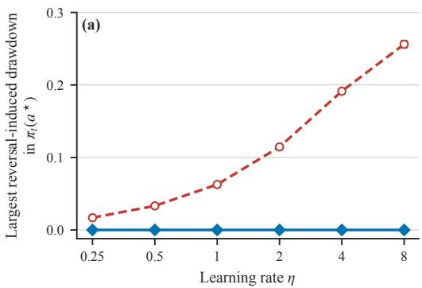

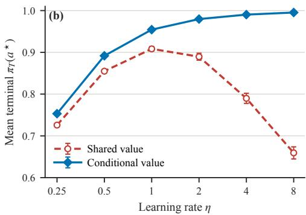  
Figure 9: At a fixed horizon, larger steps amplify the separation caused by reversed updates in the instance from Figure 1. For each learning rate, the shared and conditional value baselines reuse the same paired random streams. (a) Mean across 4,000 runs of the largest decrease in a single step in $\pi _ { t } ( a ^ { * } )$ on steps where $G - { \bar { V } } ^ { \pi _ { t } }$ and $G - V _ { Z _ { t } } ^ { \pi _ { t } }$ have opposite signs; the conditional reference is zero by construction. (b) Mean terminal probability of the optimal arm at $T = 1 0 0$ . Error bars are 95% confidence intervals. In this fixed instance, larger η magnifies reversed branches and widens the separation at this fixed budget; the plot is not a general monotonicity claim about learning rate or return.

Lemma 11 (Attenuation in a hard environment before a sign flip). Fix a deterministic bandit with $K \geq 2$ arms, unique optimal arm $a ^ { * }$ , gaps $\Delta _ { i } : = \bar { r ( a ^ { * } ) } - r ( i ) > 0$ , and learning rate $\eta > 0$ . There exists $\varepsilon _ { 0 } > 0$ , depending only on η and the reward gaps, with the following property. Write an interior frozen policy as $p _ { * } : = \pi ( a ^ { * } ) = 1 - \varepsilon$ and $\pi ( i ) = \varepsilon w _ { i }$ , where every sum over i below ranges over $i \neq a ^ { * }$ and $\textstyle \sum _ { i } w _ { i } = 1$ $I f 0 < \varepsilon < \varepsilon _ { 0 } { } _ { : }$ , let $\begin{array} { r } { V : = \sum _ { a } \pi ( a ) r ( a ) } \end{array}$ and compare the conditional bar V with a shared bar $V + d$ in a hard environment, where $0 < d < r ( a ^ { * } ) - V$ Every sampled branch still moves probability toward $a ^ { * }$ under both bars, and their expected logit updates are identical. Let $\pi _ { B } ^ { + } ( a ^ { * } )$ denote the probability of the optimal arm after one update using baseline B and a sampled arm $a \sim \pi$ . Then

$$
\begin{array} { r } { \mathbb { E } _ { a \sim \pi } \left[ \pi _ { V + d } ^ { + } ( a ^ { * } ) \right] < \mathbb { E } _ { a \sim \pi } \left[ \pi _ { V } ^ { + } ( a ^ { * } ) \right] . } \end{array}
$$

Proof. Put $\begin{array} { r } { \bar { \Delta } _ { w } : = \sum _ { i } w _ { i } \Delta _ { i } } \end{array}$ . The conditional advantages are $A _ { * } : = r ( a ^ { * } ) - V = \varepsilon \bar { \Delta } _ { w }$ and $A _ { i } : = r ( i ) - V = - \Delta _ { i } + \varepsilon \bar { \Delta } _ { w }$ Thus, after reducing $\varepsilon _ { \mathrm { 0 } }$ if necessary, $A _ { * } > 0 > A _ { i }$ for every rival and $p _ { * } > 1 / 2 > \pi _ { i }$ . Since $0 < d < A _ { * }$ , raising the bar by d preserves all signs; the corresponding score directions strictly increase every optimal–rival margin. Moreover, on a sampled arm a the diference between the two logit updates is $- \eta d ( \mathbf { e } _ { a } - \pi )$ , whose expectation is zero because $\begin{array} { r } { \sum _ { a } \pi ( a ) ( \mathbf { e } _ { a } - \pi ) = 0 } \end{array}$

It remains to compare the nonlinear probabilities. Interpolate the bar as $V + \lambda , 0 \leq \lambda \leq d ,$ and let $H ( \lambda )$ be the expected optimal probability after the update. On the optimal branch use direction $u _ { * } = { \mathbf e } _ { a ^ { * } } - \pi ;$ ; on a branch for rival i use $u _ { i } = \pi - { \bf e } _ { i } . \mathrm { ~ I f ~ } F _ { a } ( t ) : = [ \mathrm { s o f t m a x } ( \theta +$ $t u _ { a } ) ] _ { a ^ { * } }$ , then

$$
H ( \lambda ) = p _ { * } F _ { * } ( \eta ( A _ { * } - \lambda ) ) + \sum _ { i } \varepsilon w _ { i } F _ { i } ( \eta ( - A _ { i } + \lambda ) ) .
$$

The exact odds between the optimal arm and each rival $\mathrm { g i v e , }$ , uniformly over the vector w of rival masses and $\lambda \in [ 0 , A _ { * } ]$

$$
p _ { * } F _ { * } ^ { \prime } ( \eta ( A _ { * } - \lambda ) ) = \varepsilon ^ { 2 } \left( 1 + \sum _ { i } w _ { i } ^ { 2 } \right) + O ( \varepsilon ^ { 3 } ) ,
$$

$$
\sum _ { i } \varepsilon w _ { i } F _ { i } ^ { \prime } ( \eta ( - A _ { i } + \lambda ) ) = \varepsilon ^ { 2 } \sum _ { i } w _ { i } \big [ 2 w _ { i } e ^ { - 2 \eta \Delta _ { i } } + ( 1 - w _ { i } ) e ^ { - \eta \Delta _ { i } } \big ] + O ( \varepsilon ^ { 3 } ) .
$$

For completeness, these expansions follow by dividing the probability of each arm after the update by that of the optimal arm. On the optimal branch the rival-i odds are

$$
\frac { \varepsilon w _ { i } } { 1 - \varepsilon } \exp \{ - t \varepsilon ( 1 + w _ { i } ) \} ,
$$

where $t = O ( \varepsilon )$ ; on rival-i’s branch, its own odds acquire $e ^ { - 2 \eta \Delta _ { i } } + O ( \varepsilon )$ and every other rival’s odds acquire $e ^ { - \eta \Delta _ { i } } + O ( \varepsilon )$

Diferentiating H now yields

$$
H ^ { \prime } ( \lambda ) = \eta [ - \varepsilon ^ { 2 } \Gamma ( w ) + R _ { \varepsilon } ( w , \lambda ) ] , \qquad R _ { \varepsilon } ( w , \lambda ) = O ( \varepsilon ^ { 3 } ) ,
$$

where

$$
\Gamma ( w ) = \sum _ { i } \left[ 2 w _ { i } ^ { 2 } ( 1 - e ^ { - 2 \eta \Delta _ { i } } ) + w _ { i } ( 1 - w _ { i } ) ( 1 - e ^ { - \eta \Delta _ { i } } ) \right] .
$$

With $\Delta _ { \operatorname* { m i n } } : = \mathrm { m i n } _ { i } \Delta _ { i } , \Gamma ( w ) \geq g _ { 0 } : = 1 - e ^ { - \eta \Delta _ { \operatorname* { m i n } } } > 0 .$ , uniformly in w. To make the remainder uniform explicit, put $\ell : = \lambda / \varepsilon ;$ then $0 \leq \ell \leq \bar { \Delta } _ { w } \leq \Delta _ { \operatorname* { m a x } }$ . The odds expressions above extend to analytic functions $\mathrm { o f } \ ( \varepsilon , w , \ell )$ on a compact set, with denominators uniformly bounded away from zero. After factoring out $\varepsilon ^ { 2 }$ , the remaining coeficients are uniformly continuously diferentiable there. A uniform first-order Taylor bound therefore gives constants $C _ { 0 } \in \dot { ( 0 , \infty ) }$ and $\varepsilon _ { 1 } > 0$ , depending only on $K , \eta ,$ and the gaps, such that $\vert { \bar { R } } _ { \varepsilon } ( w , \lambda ) \vert \leq C _ { 0 } \varepsilon ^ { 3 }$ for all $w , 0 \leq \lambda \leq A _ { * }$ , and $0 < \varepsilon \le \varepsilon _ { 1 }$ . Taking, for example,

$$
\varepsilon _ { 0 } \leq \operatorname* { m i n } \left\{ \varepsilon _ { 1 } , \frac { 1 } { 2 } , \frac { \Delta _ { \operatorname* { m i n } } } { 2 \Delta _ { \operatorname* { m a x } } } , \frac { g _ { 0 } } { 2 C _ { 0 } } \right\} , \qquad \Delta _ { \operatorname* { m a x } } : = \operatorname* { m a x } _ { i } \Delta _ { i } ,
$$

makes every rival advantage negative and gives $H ^ { \prime } ( \lambda ) \leq - ( \eta g _ { 0 } / 2 ) \varepsilon ^ { 2 } < 0$ throughout $[ 0 , d ] .$ Integrating gives $H ( d ) < \bar { H } ( 0 )$ . When rival mass is small, the gain from strengthening all rare branches with negative reinforcement is therefore smaller than the loss from weakening the frequent optimal branch, even before any sign reversal. □

Large ε in hard environments. The attenuation mechanism in Lemma 11 need not be confined to a nearly deterministic policy. Consider the following instance with three arms and two environments:

$$
\begin{array} { c c c } { \displaystyle { q _ { H } = \frac { 1 } { 2 0 } , } } & { \boldsymbol { r _ { H } = ( 1 , 0 , 0 ) , } } & { \boldsymbol { q _ { E } = \frac { 1 9 } { 2 0 } , } } & { \boldsymbol { r _ { E } = ( 1 , \frac { 1 9 } { 2 0 } , \frac { 1 9 } { 2 0 } ) , } } \end{array}
$$

with $\eta = 3$ and $\pi _ { 0 } = ( 1 / 2 , 1 / 4 , 1 / 4 )$ , so the initial rival mass is already $\varepsilon = 1 / 2$ . In the hard environment, conditional centering gives optimal/rival residuals $( 0 . 5 , - 0 . 5 )$ , whereas sharing gives $( 0 . 0 4 8 7 5 , - 0 . 9 5 1 2 5 )$ . Sharing therefore buys stronger negative reinforcement by removing most of the much larger positive update to the optimal arm.

This comparison does not rely on a sign reversal: whenever $p = \pi ( a ^ { * } ) \geq 1 / 2$ , the shared optimal residual remains positive and every rival residual remains negative; each branch preserves this condition. Figure 10 shows that the conditional curve remains visibly above the shared curve over the displayed horizon. Thus the attenuation mechanism can hold when ε is bounded away from zero, not only arbitrarily close to the optimum.

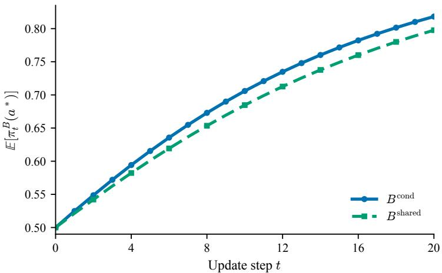  
Figure 10: Separation after finitely many steps without sign reversal. Algorithm 1 with $K = 3 , q _ { H } = 1 / 2 0 , q _ { E } = 1 9 / 2 0 , r _ { H } = ( 1 , 0 , 0 ) , r _ { E _ { - } } = ( 1 , 1 \bar { 9 } / 2 0 , 1 9 / 2 0 ) , \eta = 3$ , and $\pi _ { 0 } =$ $( 1 / 2 , 1 / 4 , 1 / 4 )$ . Curves are Monte Carlo means of $\pi _ { t } ^ { B } ( a ^ { * } )$ over 400,000 paired trajectories.

Derivation and closed form of the GAE mismatch recursion. Generalized Advantage Estimation (GAE) is a TD(λ) estimator built from bootstrapped temporal diference residuals (Schulman et al., 2016). Consider one rollout segment $( s _ { u } , r _ { u } , s _ { u + 1 } ) _ { u = t } ^ { T - 1 }$ from a fixed environment $z ,$ and put $n : = T - t .$ Let $m _ { u } \in \{ 0 , 1 \}$ be the continuation mask after transition u: it is zero when that transition terminates the episode and one otherwise. Along this rollout, write

$$
V _ { u } ^ { \mathrm { s h a r e d } } : = V ^ { \mathrm { s h a r e d } } ( s _ { u } ) , \qquad V _ { u } ^ { \mathrm { c o n d } } : = V ^ { \mathrm { c o n d } } ( s _ { u } , z ) , \qquad e _ { u } : = V _ { u } ^ { \mathrm { c o n d } } - V _ { u } ^ { \mathrm { s h a r e d } } .
$$

For each $u \in \{ t , . . . , T - 1 \}$ and $B \in$ {shared, cond}, define

$$
\delta _ { u } ^ { B } = r _ { u } + \gamma m _ { u } V _ { u + 1 } ^ { B } - V _ { u } ^ { B } , \qquad \widehat { A } _ { u } ^ { B , \lambda } = \sum _ { \ell = 0 } ^ { T - u - 1 } ( \gamma \lambda ) ^ { \ell } M _ { u , \ell } \delta _ { u + \ell } ^ { B } ,
$$

where $M _ { u , 0 } : = 1$ and $\begin{array} { r } { M _ { u , k } : = \prod _ { j = 0 } ^ { k - 1 } m _ { u + j } } \end{array}$ for $k \geq 1$ . Then

$$
\delta _ { u } ^ { \mathrm { s h a r e d } } - \delta _ { u } ^ { \mathrm { c o n d } } = e _ { u } - \gamma m _ { u } e _ { u + 1 } .
$$

Define the GAE mismatch by $D _ { u } ^ { \lambda } : = \widehat { A } _ { u } ^ { \mathrm { s l } }$ hared $, \lambda _ { \mathrm { ~ - ~ } } \widehat { A } _ { u } ^ { \mathrm { c o n d } , \lambda }$ for $u < T$ , with $D _ { T } ^ { \lambda } : = 0$ at the rollout boundary. The standard backward GAE recursion then gives, for $u = \mathsf { \bar { f } } , \dots , T - 1$ 2

$$
D _ { u } ^ { \lambda } = e _ { u } - \gamma m _ { u } e _ { u + 1 } + \gamma \lambda m _ { u } D _ { u + 1 } ^ { \lambda } , \qquad D _ { T } ^ { \lambda } = 0 .\tag{62}
$$

Unrolling this recursion, or equivalently substituting into the finite sum and reindexing its second term, gives

$$
D _ { t } ^ { \lambda } = \sum _ { \ell = 0 } ^ { n - 1 } ( \gamma \lambda ) ^ { \ell } M _ { t , \ell } e _ { t + \ell } - \sum _ { k = 1 } ^ { n } \gamma ( \gamma \lambda ) ^ { k - 1 } M _ { t , k } e _ { t + k } .
$$

Collecting the coeficient of each $e _ { t + k }$ yields the closed form

$$
D _ { t } ^ { \lambda } = e _ { t } - \gamma ( 1 - \lambda ) \sum _ { k = 1 } ^ { n - 1 } ( \gamma \lambda ) ^ { k - 1 } M _ { t , k } e _ { t + k } - \gamma ( \gamma \lambda ) ^ { n - 1 } M _ { t , n } e _ { t + n } .
$$

For a single TD step $( \lambda = 0 )$ , the recursion reduces to $D _ { t } ^ { 0 } = e _ { t } - \gamma m _ { t } e _ { t + 1 }$ . For $\lambda = 1$ , it telescopes to $D _ { t } ^ { 1 } = e _ { t } - \gamma ^ { n } \dot { M } _ { t , n } e _ { T }$ . At a genuine terminal endpoint, $m _ { T - 1 } = 0$ and hence $M _ { t , n } = 0 ;$ at a bootstrapped nonterminal truncation, $m _ { T - 1 } = 1$ and the final mismatch term remains. The identity compares the same rollout, rewards, evaluation states, and masks before batchwise advantage normalization and before entering PPO’s clipped objective. It shows that GAE linearly filters critic mismatch and therefore does not erase it in general, although particular ofset sequences can cancel. The environment index is fixed along the trajectory; if values vary over time, the stage is included in the state label.

## E Full experimental details

## E.1 Conditioning architectures: FiLM, multihead, and PopArt

Every main comparison changes only the value function; the diagnostic in Figure 11 that also conditions the actor is the sole exception. On the MLP benchmarks (CartPole, the MuJoCo suite, BipedalWalker) all trunks have two hidden layers of width 64 with tanh. CartPole shares one trunk between actor and critic, and its reported conditional critic uses a multihead value readout. The continuous control environments use separate actor and critic trunks, and FiLM modulates the critic trunk only. Continuous control actors output a Gaussian mean from the actor trunk with a learned log σ independent of state (initialized to 0); hidden layers use orthogonal initialization, with gain 0.01 on the policy mean head and 1.0 on the value head. Writing $h ( s ) \in \mathbb { R } ^ { 6 4 }$ for the critic trunk features, the three MLP critics are

$$
\begin{array} { r l } & { V _ { \mathrm { s h } } ( s ) = w ^ { \top } h ( s ) + b , } \\ & { V _ { \mathrm { F i L M } } ( s , z ) = w ^ { \top } \left( h ( s ) \odot ( 1 + \gamma _ { z } ) + \beta _ { z } \right) + b , \qquad \gamma _ { z } = W _ { \gamma } c _ { z } + u _ { \gamma } , \beta _ { z } = W _ { \beta } c _ { z } + u _ { \beta } , } \\ & { V _ { \mathrm { m h } } ( s , z ) = w _ { z } ^ { \top } h ( s ) + b _ { z } , } \end{array}
$$

where $c _ { z } \in \mathbb { R } ^ { d }$ is a learned embedding for each level. The reference count in Table 2 uses the minimal choice $d = 1$ for CartPole; the evaluated FiLM critics use $d = 4$ on the MuJoCo bodies and $d = 1 6$ on BipedalWalker, while the Procgen implementation below also uses $d = 1 6$ . The matrices $W _ { \gamma } , W _ { \beta } \colon \mathbb { R } ^ { d }  \mathbb { R } ^ { 6 4 }$ with biases $u _ { \gamma } , u _ { \beta }$ are shared generators (Perez et al., 2018). The multihead critic replaces the scalar readout by one readout row per level — the multitask value function of Hessel et al. (2019) with levels playing the role of tasks. The PopArt variant (van Hasselt et al., 2016; Hessel et al., 2019) augments the multihead critic with adaptive normalization of the value targets for each head: running first and second moments $( \mu _ { z } , \nu _ { z } )$ track head $z ^ { \prime } \mathrm { s }$ target distribution, the head predicts a normalized value, $V = \sigma _ { z } \cdot \mathrm { o u t } + \mu _ { z } .$ , the value loss is computed in normalized space, and row z is rescaled whenever the statistics change so the denormalized output is preserved. The statistics are bufers, not parameters, so the parameter count equals that of the multihead critic.

Identical initialization. Every conditioned critic is initialized to coincide exactly with the shared critic at step 0: $W _ { \gamma } , W _ { \beta } , u _ { \gamma } , u _ { \beta }$ are initialized to zero, so $\gamma _ { z } = \beta _ { z } = 0$ and $V _ { \mathrm { F i L M } } ( s , z ) = V _ { \mathrm { s h } } ( s ) ;$ every row $( w _ { z } , b _ { z } )$ of the multihead readout is initialized to the same values, so all levels return the same value. Any diference between variants is therefore produced by learning, not by a diferent initialization. The CartPole scalar bias control likewise starts from $\bar { \beta } _ { 0 } = \beta _ { 1 } \overset { \cdot } { = } 0$

The actor does not see z in the proposed intervention. In every main comparison, z is an arbitrary identity label rather than a vector of physical or procedural environment parameters. It is a privileged signal available only to the critic during training; the actor is architecturally identical to the baseline’s, and at deployment only the actor runs, so conditioning the critic costs nothing at test time. FiLM learns a lookup embedding for this label and multihead uses it only to select a value head; neither receives a structured descriptor from which environment dynamics could be inferred directly.

Procgen critics. On Procgen all variants share Procgen’s large CNN trunk in the IM-PALA style (Espeholt et al., 2018; Cobbe et al., 2020) with a final embedding ϕ(s) of dimension 256 and a categorical policy head over the 15 actions; the policy head always consumes the unmodulated ϕ(s). The value heads are

$$
\begin{array} { r l r l } & { ~ } & { V _ { \mathrm { s h } } ( s ) = w ^ { \top } \phi ( s ) + b , \qquad } & & { w \in \mathbb { R } ^ { 2 5 6 } , } \\ & { ~ } & { V _ { \mathrm { F i L M } } ( s , z ) = w ^ { \top } \left( \phi ( s ) + \gamma _ { z } \odot \phi ( s ) + \beta _ { z } \right) + b , \qquad } & & { c _ { z } \in \mathbb { R } ^ { 1 6 } , } \\ & { ~ } & { V _ { \mathrm { m h } } ( s , z ) = w _ { z } ^ { \top } \phi ( s ) + b _ { z } , \qquad } & & { W \in \mathbb { R } ^ { 2 0 0 \times 2 5 6 } . } \end{array}
$$

Here $\gamma _ { z } = W _ { \gamma } c _ { z } + u _ { \gamma }$ and $\beta _ { z } = W _ { \beta } c _ { z } + u _ { \beta }$ . FiLM’s cost for each level is the 16 embedding entries; $W _ { \gamma } , \dot { W } _ { \beta } \colon { \mathbb { R } } ^ { 1 6 } \to { \mathbb { R } } ^ { 2 5 6 }$ and their biases are initialized to zero as above. The rows of the multihead critic are initialized as copies of the shared head; its cost for each level is 257 free parameters.

FiLM versus multihead. The two architectures parameterize the same object — the correction $e _ { z } ^ { \pi } ( s )$ for each level identified in Section 4.2 — through opposite statistical tradeofs, and this is the point of running both. Each multihead readout row is an independent vector fit from only that level’s data, whereas FiLM routes an embedding with low dimension through a generator and readout fit from all levels jointly. For L levels and hidden width H, FiLM adds $L d + 2 H ( d + 1 )$ parameters, while multihead replaces one value head with $H + 1$ parameters by L such heads and therefore adds $( L - 1 ) ( \bar { H ^ { + } } 1 )$ parameters relative to the shared model. With 10 levels multihead is the cheaper of the two; with the 100 levels of BipedalWalker it becomes the more expensive one (+54.3% vs. +31.9%). Table 2 gives the corresponding counts for each architecture; the coverage paragraph below states which combinations were evaluated.

Table 2: Total trainable actor and critic parameter counts for the reference combinations of architecture and benchmark. Parentheses report increases relative to the shared model. FiLM retains the shared value head and adds a level embedding table and two afine generators; multihead replaces the shared value head by one head per level. The CartPole FiLM reference uses the minimal embedding dimension $d = 1$ , and the Procgen counts use the large PLR CNN (Jiang et al., 2021). PopArt has the same trainable count as multihead. The table includes parameterizations not used in the main comparisons; the coverage paragraph below states which variants were evaluated.
<table><tr><td>Environment</td><td>obs act</td><td>levels</td><td>shared</td><td></td><td>FiLM</td><td>multihead</td></tr><tr><td>CartPole</td><td>4/2</td><td>2</td><td></td><td>4,675</td><td>4,933 (+5.5%)</td><td> $4 , 7 4 0 \ ( + 1 . 4 \% )$ </td></tr><tr><td>BipedalWalker</td><td>24/4</td><td>100</td><td>11,849</td><td>15,625 (+31.9%)</td><td></td><td>18,284 (+54.3%)</td></tr><tr><td>Walker2d</td><td>17 / 6</td><td>10</td><td>11,085</td><td></td><td>11,765 (+6.1%)</td><td>11,670  $( + 5 . 3 \% )$ </td></tr><tr><td>Hopper</td><td>11 / 3</td><td>10</td><td>10,119</td><td>10,799</td><td> (+6.7%)</td><td>10,704 (+5.8%)</td></tr><tr><td>HalfCheetah</td><td>17 / 6</td><td>10</td><td>11,085</td><td>11,765</td><td>(+6.1%)</td><td>11,670 (+5.3%)</td></tr><tr><td>Procgen</td><td> $6 4 ^ { 2 } { \times } 3 / 1 5$ </td><td>200</td><td>626,256</td><td>638,160</td><td>(+1.9%)</td><td>677,399 (+8.2%)</td></tr></table>

PopArt configurations. On the MLP benchmarks the moment EMA rate is $\beta = 3 \times$ $1 0 ^ { - 3 }$ . On Procgen, where each estimate for a level sees roughly 1/200 of the batch, the statistics update once per minibatch with rate $\beta = 3 \times 1 0 ^ { - 4 }$ and the standard debiasing correction, with three stabilizers: a variance floor $\sigma _ { \mathrm { m i n } } = 1 0 ^ { - 2 }$ (PopArt with a single head uses $1 0 ^ { - 4 } )$ ; a head’s statistics update only when it has at least 8 samples in the minibatch; and normalization stays of (statistics still accumulating) for the first 50 updates — without this warmup the first update produced gradient spikes of order $1 0 ^ { 4 }$ from early returns.

Coverage. The experiments actually reported are as follows. The CartPole mechanism study reports a shared critic, a multihead critic, a multihead critic given a constant index, and a critic with scalar biases. The main MuJoCo return comparison reports shared and FiLM critics; the value loss diagnostic in Figure 14 additionally reports multihead. Bipedal-Walker additionally reports multihead, and Procgen reports shared, FiLM, multihead, and multihead+PopArt.

## E.2 CartPole

CartPole (Barto et al., 1983) is the classic cart–pole balancing task: a 4-dimensional observation, two discrete actions, reward +1 per step while the pole stays up. The mechanism study retains two distinct logged level identities in both settings. In the identical control, $( g _ { 0 } , \dot { g } _ { 1 } ) = ( 1 0 , 1 0 )$ ; in the heterogeneous setting, $( g _ { 0 } , g _ { 1 } ) = ( 1 0 , \bar { 5 } 0 )$ . Every other parameter (force magnitude, pole mass, pole length, cart mass) remains at its default. Gravity is not part of the observation, so the two levels cannot be distinguished from the current state alone. Episodes end when the pole falls (maximum 200 steps), so episode lengths can difer between levels.

Train and evaluation use the same two levels: the question is the learning signal, not generalization to unseen levels. Returns are averaged within each level before averaging the two levels with equal weight.

Mechanism variants. The shared critic is $V _ { \mathrm { s h } } ( s ) ~ = ~ w ^ { \top } h ( s ) + b .$ , and the multihead critic is $V _ { \mathrm { m h } } ( s , z ) = w _ { z } ^ { \top } h ( s ) + b _ { z }$ . The constant index control uses the same multihead parameterization but routes every sample to head 0. The scalar bias control uses

$$
V _ { \mathrm { b i a s } } ( s , z ) = V _ { \mathrm { s h } } ( s ) + \beta _ { z } , \qquad \beta _ { 0 } = \beta _ { 1 } = 0 \mathrm { a t \ i n i t i a l i z a t i o n . }
$$

Thus the two multihead variants have 4,740 trainable parameters, the shared critic has 4,675, and the critic with a scalar bias has 4,677. The actor, shared trunk, optimizer, data, and PPO pipeline are otherwise unchanged.

Diagnostics. At every logged update and for each level, value loss is the mean squared diference between the GAE return target and the value prediction. Advantage is the mean raw GAE estimate over transitions from that level. We compute these levelwise quantities

before PPO clipping. Figure 5 averages each metric across 20 seeds, with shading denoting one standard error. Table 3 lists the full configuration.

Table 3: CartPole mechanism study hyperparameters (20 seeds per variant and setting).
<table><tr><td>Parameter</td><td>Value</td></tr><tr><td>Algorithm</td><td>PPO (Schulman et al., 2017)</td></tr><tr><td>Parallel environments</td><td>16</td></tr><tr><td>Rollout length</td><td>128</td></tr><tr><td>Total environment steps</td><td>2,048,000 (1,000 updates)</td></tr><tr><td>PPO epochs / minibatches Clip parameter</td><td>4/4</td></tr><tr><td>Learning rate</td><td>0.2 3 × 10−4 (Adam, ∈ = 10−5)</td></tr><tr><td>Discount γ / GAE λ</td><td>0.99 / 0.95 (Schulman et al., 2016)</td></tr><tr><td>Value loss coefficient</td><td>0.5</td></tr><tr><td>Entropy coefficient</td><td>0.01</td></tr><tr><td>Max gradient norm</td><td>0.5</td></tr><tr><td>Advantage normalization</td><td>off (all variants)</td></tr><tr><td></td><td></td></tr><tr><td>Hidden width</td><td>64</td></tr><tr><td>Conditional readout</td><td>multihead with two value heads</td></tr><tr><td>Gravity pairs</td><td>(10, 10) and (10, 50)</td></tr><tr><td>Seeds</td><td>1-20</td></tr></table>

## E.3 MuJoCo suite: Walker2d, Hopper, HalfCheetah

The three standard MuJoCo locomotion bodies (Todorov et al., 2012) (Gym v4; Brockman et al., 2016) use an identical protocol so they can be compared directly:
<table><tr><td></td><td>Walker2d-v4</td><td>Hopper-v4</td><td>HalfCheetah-v4</td></tr><tr><td>Observation dim</td><td>17</td><td>11</td><td>17</td></tr><tr><td>Action dim</td><td>6</td><td>3</td><td>6</td></tr><tr><td>Episode length Mass multiplier</td><td>1000 (fixed) [0.5, 2.5]</td><td>1000 (fixed) [0.5, 2.5]</td><td>1000 (fixed) [0.5, 2.5]</td></tr></table>

Levels. Ten levels difer in body mass only: every body\_mass entry of the model is multiplied by a scale factor for each level. The factors are drawn from a distribution uniform in log space on [0.5, 2.5] and sorted, using the run seed as the RNG seed. Consequently the shared and conditional runs of a given seed face the identical collection (the comparison is properly paired), while diferent seeds see diferent collections (the result is not an artifact of one particular grid). Level 0 is always the lightest and level 9 the heaviest; the mass is not explicitly provided in the observation.

Train / test. Reported numbers are training returns on the ten training environments, averaged within each level over the last 25% of training and then across levels with equal weight. The advantage heatmaps for individual levels in Figure 6 plot the mean sampled GAE advantage for each level, with rows ordered from lightest to heaviest level.

## E.4 BipedalWalker

BipedalWalker (Brockman et al., 2016) is planar bipedal locomotion over procedurally generated terrain: a 24-dimensional lidar/proprioception observation and 4 continuous torque actions. The training collection contains 100 pinned terrains: 10 BipedalWalker-v3 terrains (levels 0–9) and 90 BipedalWalkerHardcore-v3 terrains (levels 10–99) — a collection dominated by hard terrains with stumps, pits, and stairs. Terrain is generated from the environment RNG at reset, so each environment is reseeded with its own fixed terrain seed before every reset and replays the same terrain for the whole run. Terrain identity is not explicitly included in the observation vector.

Table 4: MuJoCo suite hyperparameters (30 seeds per method and body).
<table><tr><td>Parameter</td><td>Value</td></tr><tr><td>Algorithm</td><td>PPO</td></tr><tr><td>Levels</td><td>10</td></tr><tr><td>Environments per level</td><td>2 (20 parallel)</td></tr><tr><td>Rollout length</td><td>256 (5,120 transitions per update)</td></tr><tr><td>Total environment steps</td><td>10,000,000</td></tr><tr><td>PPO epochs / minibatches</td><td>10 / 8</td></tr><tr><td>Clip parameter Learning rate</td><td>0.2</td></tr><tr><td></td><td> $3 \times 1 0 ^ { - 4 } ~ ( \mathrm { A d a m } , \epsilon = 1 0 ^ { - 5 } )$ </td></tr><tr><td>Discount γ / GAE λ</td><td>0.99 / 0.95</td></tr><tr><td>Value loss coefficient</td><td>0.5</td></tr><tr><td>Entropy coefficient</td><td>0.0</td></tr><tr><td>Max gradient norm</td><td>0.5</td></tr><tr><td>Advantage normalization</td><td>on</td></tr><tr><td>Hidden width</td><td>64</td></tr><tr><td>Level embedding dimension</td><td>4</td></tr><tr><td>Seeds</td><td>1-30</td></tr></table>

Train / test. Training uses the 100 pinned terrains, one parallel environment each. Testing uses 100 unseen terrains generated with seed ofset 500 — a fresh set with the same 10/90 normal/hardcore split that never appears in training — evaluated every 1M steps, one episode per terrain, reporting average returns.

Table 5: BipedalWalker hyperparameters (10 seeds per method).
<table><tr><td>Parameter</td><td>Value</td></tr><tr><td>Algorithm</td><td>PPO</td></tr><tr><td>Parallel environments</td><td>100 (one per terrain)</td></tr><tr><td>Rollout length Total environment steps</td><td>256</td></tr><tr><td>PPO epochs / minibatches</td><td>60,000,000 10/ 8</td></tr><tr><td>Clip parameter</td><td>0.2</td></tr><tr><td>Learning rate</td><td> $3 \times 1 0 ^ { - 4 } ~ ( \mathrm { A d a m } , \epsilon = 1 0 ^ { - 5 } )$ </td></tr><tr><td>Discount γ / GAE λ</td><td>0.99 / 0.95</td></tr><tr><td>Value loss coefficient</td><td>0.5</td></tr><tr><td>Entropy coefficient</td><td>0.0</td></tr><tr><td>Max gradient norm</td><td></td></tr><tr><td></td><td>0.5</td></tr><tr><td>Advantage normalization</td><td>on</td></tr><tr><td>Hidden width</td><td>64</td></tr><tr><td>Level embedding dimension</td><td>16</td></tr><tr><td>Evaluation interval</td><td>1,000,000 steps</td></tr><tr><td>Seeds</td><td>1-10</td></tr></table>

Capacity control. Figure 6(c) repeats the full comparison with each value network widened while its conditioning mechanism is held fixed, giving every critic variant roughly five times as many trainable parameters; all other settings are identical. The shared critic plateaus at the same level, and the conditioned critics again reach returns of roughly 150 and above — the gap is not a capacity artifact.

Other conditioning choices. Figure 11 compares two less successful ways to use the environment index. Assigning a separate value network to every terrain removes the shared value representation and learns substantially more slowly than FiLM and multihead. Supplying the index to the actor as well as the multihead critic instead collapses both training return and return on unseen terrains. Because unseen terrains carry no valid index, we evaluate this variant that conditions the actor by running the actor with each training index in turn and averaging the resulting returns. The successful intervention on this benchmark is therefore deliberately asymmetric: the actor and critic representation remain shared, while only value prediction is conditioned on the environment.

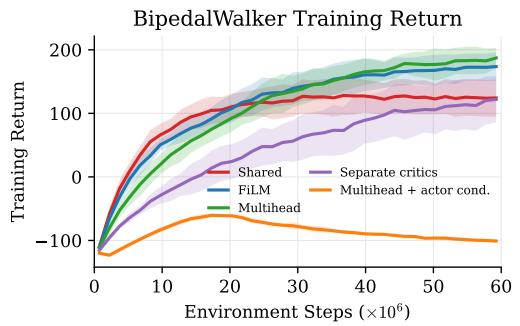

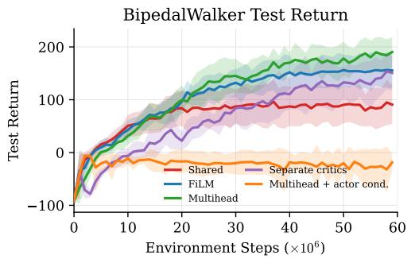  
Figure 11: Alternative conditioning choices on BipedalWalker. Training return on the 100 pinned terrains (left) and return on 100 unseen terrains (right), mean ± 1 s.d. over 10 seeds. Separate critics learn more slowly but approach FiLM’s final test mean; also conditioning the actor causes both returns to collapse in this setting.

## E.5 Procgen

Procgen (Cobbe et al., 2020) is a suite of 16 procedurally generated arcade games with 64 × 64 × 3 observations and a common 15-action discrete space; a level seed controls the layout, assets, entity locations and spawn times, and other details specific to each game. Each game is trained separately. Instead of sampling levels freely, every run trains on a fixed collection of $L = 2 0 0$ pinned levels under a hybrid dificulty split: parallel environment i is permanently assigned level seed i, with environments 0–99 drawn from the easy distribution and 100–199 from hard. The assignment never changes during training, so level identity is exactly the environment index and statistics for each level can be logged at every update. Levels are visited with uniform weighting (one parallel copy each); we refer to this as the uniform level sampling reference. Returns are normalized with the standard scaling based on the running return (discount 0.999); observations are only scaled by 1/255. Advantages are computed with GAE and normalized per update batch before the policy loss. Figure 12 gives a visual overview of the full benchmark.

  
Figure 12: Example observations from all 16 Procgen games: Bigfish, Bossfight, Caveflyer, Chaser, Climber, Coinrun, Dodgeball, Fruitbot, Heist, Jumper, Leaper, Maze, Miner, Ninja, Plunder, and Starpilot. Each game generates many visually and structurally distinct levels while retaining its own mechanics. Screenshots are adapted from the oficial Procgen release (Cobbe et al., 2020).

Table 6: Procgen PPO hyperparameters (per game and method).
<table><tr><td>Parameter</td><td>Value</td></tr><tr><td>Parallel environments</td><td>200 (one per pinned level)</td></tr><tr><td>Rollout length</td><td>256 steps per environment</td></tr><tr><td>Batch size per update</td><td>51,200</td></tr><tr><td>PPO epochs / minibatches</td><td> $3 ~ / ~ 8$ </td></tr><tr><td>Clip parameter</td><td>0.2</td></tr><tr><td>Learning rate</td><td> $5 \times 1 0 ^ { - 4 } ~ ( \mathrm { A d a m } , \epsilon = 1 0 ^ { - 5 } )$ </td></tr><tr><td>Discount  $\gamma ~ / \operatorname { G A E } \lambda$ </td><td>0.999 / 0.95</td></tr><tr><td>Entropy coefficient</td><td>0.01</td></tr><tr><td>Value loss coefficient</td><td>0.5</td></tr><tr><td>Max gradient norm</td><td>0.5</td></tr><tr><td>Total environment steps</td><td>25M (≈ 488 updates)</td></tr><tr><td>Trunk</td><td>Large CNN in the IMPALA style,  $\phi ( s ) \in \mathbb { R } ^ { 2 5 6 }$ </td></tr><tr><td>Level embedding dimension (FiLM) Advantage normalization</td><td>16 on (per update batch)</td></tr><tr><td>Evaluation interval</td><td></td></tr><tr><td></td><td> $5 \times 1 0 ^ { 5 }$  steps</td></tr><tr><td>Seeds per method</td><td>10</td></tr></table>

Evaluation protocol. Every $5 \times 1 0 ^ { 5 }$ environment steps, a separate, freshly reset evaluation copy of all 200 pinned levels is rolled out with the deterministic argmax policy for exactly one episode per level; the reported evaluation return is the unweighted mean over the 200 episode returns (easy/hard splits average levels 0–99 and 100–199). Because every level contributes exactly one episode, this metric weights levels equally and is unafected by bias caused by episode length in running averages collected under the policy. A run’s final evaluation return on pinned levels is the mean of its last 4 evaluations. We use evaluation return on the pinned training levels for this metric; the main Procgen learning curves, Appendix Figure 13, and Table 7 use it. The training curve reports the running mean return of the last 100 finished episodes under the stochastic behavior policy. The rows for individual games in Table 7 report raw, unscaled episodic scores. Normalized evaluation returns in its last row divide each run’s final evaluation return on pinned levels by the mean final evaluation return of the shared critic under uniform level sampling over all its runs, in percent. The last row aggregates the resulting 16 × 10 scores for each method and reports their mean ± 1 s.d.

Table 7: Procgen, 16 games: final evaluation return on the 200 pinned training levels (25M steps; mean ± 1 s.d. over 10 seeds per method). Normalized training returns per run are computed by dividing the average test return per run for each environment by the corresponding average test return of the shared critic baseline over all runs. Bold = best in the row.
<table><tr><td rowspan="2">Game</td><td colspan="4">Final evaluation return</td></tr><tr><td>shared</td><td>FiLM</td><td>multihead</td><td>+ PopArt</td></tr><tr><td>Bigfish</td><td>5.89 ±0.64</td><td>6.77 ±0.58</td><td>7.36 ±0.69</td><td>7.44 ±1.86</td></tr><tr><td>Bossfight</td><td>5.11 ±3.56</td><td>8.86 ±0.27</td><td>10.13 ±0.24</td><td>9.11 ±0.59</td></tr><tr><td>Caveflyer</td><td>3.11 ±0.17</td><td>3.83 ±0.21</td><td>4.18 ±0.21</td><td>3.03 ±0.39</td></tr><tr><td>Chaser</td><td>1.27 ±0.21</td><td>1.43 ±0.17</td><td>1.96 ±0.15</td><td>1.33 ±0.16</td></tr><tr><td>Climber</td><td>3.87 ±0.27</td><td>4.39 ±0.15</td><td>5.29 ±0.18</td><td>3.51 ±0.34</td></tr><tr><td>Coinrun</td><td>6.83 ±0.37</td><td>7.66 ±0.20</td><td>7.86 ±0.10</td><td>7.50 ±0.36</td></tr><tr><td>Dodgeball</td><td>3.08 ±0.20</td><td>3.42 ±0.15</td><td>3.66 ±0.12</td><td>3.57 ±0.25</td></tr><tr><td>Fruitbot</td><td>13.35 ±1.01</td><td>13.70 ±0.32</td><td>13.34 ±0.45</td><td>13.66 ±0.62</td></tr><tr><td>Heist</td><td>4.14 ±0.30</td><td>4.27 ±0.22</td><td>4.12 ±0.26</td><td>3.29 ±0.38</td></tr><tr><td>Jumper</td><td>5.44 ±0.22</td><td>5.75 ±0.12</td><td>5.41 ±0.10</td><td>3.88 ±1.11</td></tr><tr><td>Leaper</td><td>3.26 ±0.26</td><td>3.61 ±0.31</td><td>4.08 ±0.37</td><td>3.59 ±0.20</td></tr><tr><td>Maze</td><td>5.21 ±0.23</td><td>5.45 ±0.25</td><td>5.96 ±0.15</td><td>5.08 ±0.32</td></tr><tr><td>Miner</td><td>1.41 ±0.25</td><td>1.94 ±0.32</td><td>2.11 ±0.26</td><td>2.07 ±0.35</td></tr><tr><td>Ninja</td><td>5.71 ±0.30</td><td>6.67 ±0.16</td><td>6.73 ±0.31</td><td>6.73 ±0.68</td></tr><tr><td>Plunder</td><td>3.46 ±0.60</td><td>3.67 ±0.38</td><td>2.63 ±0.29</td><td>2.70 ±0.38</td></tr><tr><td>Starpilot</td><td>14.44 ±1.50</td><td>16.61 ±1.10</td><td>17.77 ±2.04</td><td>19.16 ±1.69</td></tr><tr><td>Normalized training return (%)</td><td>100.0 ±19.0</td><td>116.5 ±19.0</td><td>124.2 ±28.3</td><td>110.0 ±29.7</td></tr></table>

Evaluation on unseen levels. At the final checkpoint, we evaluate the deterministic policy for one episode on each of 600 unseen levels per game: seeds 1000–1299 under both the easy and hard modes. Levels receive equal weight. Table 1 reports mean ± 1 s.d. over the same 10 training seeds; its normalized row divides each score for a game and seed by that game’s shared critic mean and aggregates the resulting 16 × 10 normalized scores.

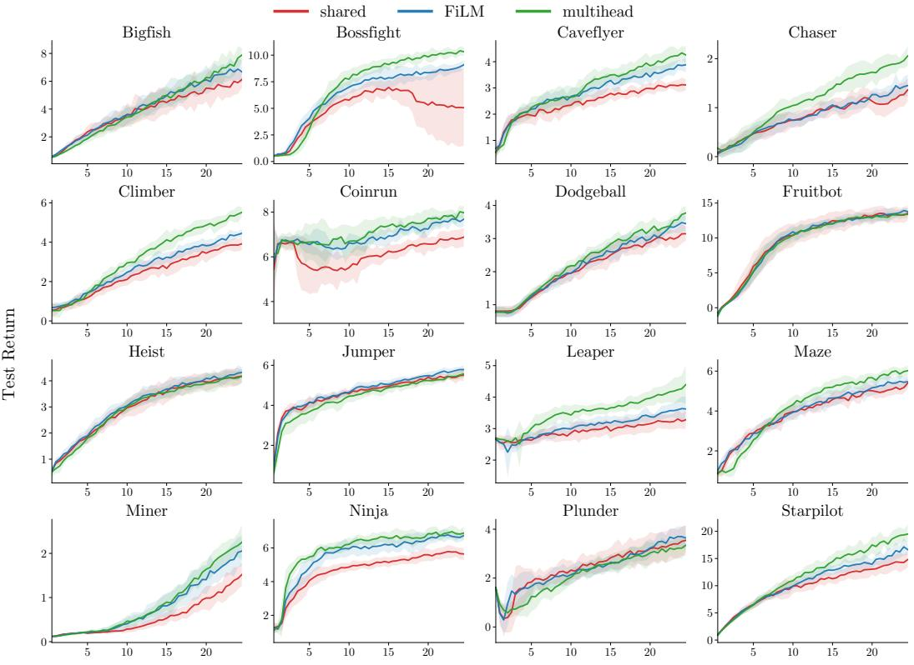  
Environment Steps (106)  
Figure 13: Complete Procgen learning curves for all 16 games. Evaluation return on the 200 pinned training levels over 25M environment steps, shown as mean ± 1 s.d. over 10 seeds for the shared, FiLM, and multihead critics. Figure 7 shows the subset of eight games in the main text.

## E.6 Value loss diagnostics

We report the clipped PPO value objective throughout training to test whether critic conditioning creates a sustained fitting cost beyond the early CartPole transient. At each minibatch this is one half of the larger of the two squared errors from the unclipped and clipped value predictions, averaged over PPO epochs and minibatches. The loss is measured on each method’s own training stream and therefore diagnoses the optimization burden encountered by that method. Across the larger benchmarks, conditioning does not impose a systematic penalty: the early multihead excess closes on BipedalWalker, conditioned losses are lower through most of training on all three MuJoCo tasks, and their ordering is game dependent but often favorable on Procgen.

Figure 14: Value loss diagnostics beyond CartPole. The clipped PPO value objective on BipedalWalker and the three MuJoCo tasks; each panel uses its own vertical scale. On BipedalWalker, FiLM reaches a slightly lower loss late in training and the early multihead excess closes to a comparable level. On HalfCheetah, Hopper, and Walker2d, the conditioned critics remain below the shared critic through most of training. Curves show mean ± 1 s.d. over 10 seeds on BipedalWalker and 30 seeds for each MuJoCo task.  
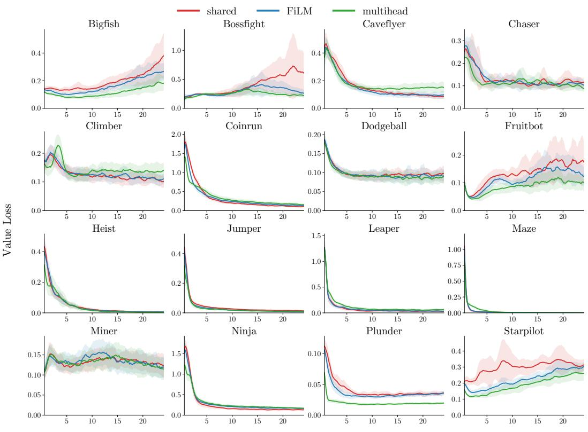  
Environment Steps (106)  
Figure 15: Procgen value loss trajectories. The clipped PPO value objective over 25M environment steps for all 16 games; each panel uses its own vertical scale. In late training, both the FiLM and multihead mean curves lie below the mean for the shared critic in 11 games. Curves show mean ± 1 s.d. over 10 seeds. The ordering varies by task, and conditioning does not increase the loss uniformly or create a systematic bottleneck in value fitting.