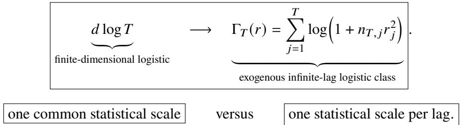

# Sharp Minimax Regret for Infinite-Memory Logistic Prediction

Vaneet Aggarwal Purdue University

## Abstract

We study online prediction for a specific finite-alphabet, exogenously driven source with infinite input memory. Independent Rademacher inputs $( U _ { t } )$ are observed sequentially, and the next binary mark has logit $\textstyle \sum _ { j = 1 } ^ { t } \theta _ { j } U _ { t + 1 - j }$ , where $| \theta _ { j } | \le r _ { j }$ and $\begin{array} { r } { \sum _ { j } r _ { j } \le B . } \end{array}$ . Regret is expected cumulative excess log loss. Lag � can afect prediction by scale $r _ { j }$ and enters only $n _ { T , j } = T - j + 1$ prediction rounds, leading to the lag-resolved spectrum $\begin{array} { r } { \Gamma _ { T } ( r ) = \sum _ { j = 1 } ^ { T } \log \Bigl ( 1 + n _ { T , j } r _ { j } ^ { 2 } \Bigr ) } \end{array}$ . For every summable envelope, a localized Bayesian mixture proves $\mathcal { R } _ { T } ( r ) \leq C \Gamma _ { T } ( r )$ . For exponential and polynomial envelopes, under the stated finite-sample dimension condition, a Toeplitz-design converse proves $\mathcal { R } _ { T } ( r ) \geq c \Gamma _ { T } ( r )$ , with constants allowed to depend on the fixed decay parameters and the logit bound. Thus $\Gamma _ { T } ( r )$ is the minimax cumulative-regret scale for this source class in these canonical regimes, giving $\Theta ( \alpha ^ { - 1 } \log ^ { 2 } T )$ for $r _ { j } = A e ^ { - \alpha j }$ and $\Theta ( T ^ { 1 / \bar { ( 2 s ) } } )$ for $r _ { j } = A j ^ { - s } , s > 1$ . The converse is specific to the exogenous lagged model and is not a profile-only theorem for arbitrary stationary infinite-memory sources. Retaining only the most recent ℎ inputs costs order $\begin{array} { r } { \sum _ { j > h } n _ { T , j } \theta _ { j } ^ { 2 } , } \end{array}$ yet the same worst-case truncation profile can correspond to polynomially diferent regret. A scaled online Newton predictor attains the spectrum upper bound.

## 1 Introduction

Many sequence predictors use a finite context even when the data-generating mechanism has no finite Markov order. This occurs in event streams, categorical time series with covariates, and recurrent filters: recent observations are retained explicitly, while older observations are discarded or compressed. The statistical question is not only how accurately a finite context approximates the full conditional law, but also how dificult it is to learn the unknown law acting on that context. These two costs need not have the same scale.

We study this question under logarithmic loss. At round $t ,$ a causal predictor observes $X _ { 1 : t }$ and assigns a conditional distribution $q _ { t } ( \cdot \mid X _ { 1 : t } )$ to $X _ { t + 1 }$ . If the true source law is $P _ { \cdot }$ , with conditional distribution $p _ { t } ^ { P } ( \cdot \mid X _ { 1 : t } )$ , its expected cumulative regret is

$$
{ \tt R e g } _ { T } ( Q ; P ) = \sum _ { t = 1 } ^ { T } \mathbb { E } _ { P } { \bf K L } \Big ( p _ { t } ^ { P } ( \cdot \mid X _ { 1 : t } ) \Big \| q _ { t } ( \cdot \mid X _ { 1 : t } ) \Big ) .\tag{1}
$$

Thus regret is the excess log loss relative to a predictor that knows the source parameter, not relative to the best constant or finite-window rule fitted in hindsight. By the chain rule for relative entropy, (1) equals KL $( P \| Q )$ for the joint law induced by the sequential predictor. Minimizing its worst-case value over a source class is therefore the average minimax redundancy of that class; see Clarke and Barron (1990), Merhav and Feder (1998), and Rissanen (1996). We state this identity formally in Proposition 3.1.

Markov order alone cannot determine this regret. An unrestricted binary order-ℎ Markov model has a separate transition parameter for every context, whereas a logistic model may use only ℎ coeficients shared across all contexts. Both condition on a length-ℎ binary history and therefore encounter $2 ^ { h }$ possible contexts, but their efective dimensions difer exponentially. This distinction is already visible in classical Markov redundancy and context-tree prediction (Willems, Shtarkov, and Tjalkens 1995; Atteson 1999), and becomes more consequential for unbounded-memory classes (Wu, Hosseini, and Santhanam 2018). Predictive-state and predictive rate–distortion theories likewise emphasize that useful memory is determined by conditiona

future laws rather than by literal lag length (Crutchfield and Young 1989; Shalizi and Crutchfield 2001;   
Marzen and Crutchfield 2016). Our aim is to quantify the additional cost of learning those laws online.

## 1.1 Model and minimax question

We use a finite-alphabet source in which the approximation and learning costs can both be calculated sharply. Let $U _ { 1 } , U _ { 2 } , . . .$ . be independent Rademacher inputs and let the observed symbol be $X _ { t } = ( U _ { t } , Y _ { t } ) \in$ $\{ - 1 , + 1 \} \times \{ 0 , 1 \}$ . For an unknown coeficient sequence $\theta = ( \theta _ { j } ) _ { j \geq 1 }$ , the next mark satisfies

$$
\mathbb { P } _ { \theta } \left( Y _ { t + 1 } = 1 ~ | ~ X _ { 1 : t } \right) = \sigma \left( \sum _ { j = 1 } ^ { t } \theta _ { j } U _ { t + 1 - j } \right) , \qquad \sigma ( z ) = \frac { 1 } { 1 + e ^ { - z } } .\tag{2}
$$

The fresh input $U _ { t + 1 }$ is uniform and known in distribution, so predicting $X _ { t + 1 }$ reduces to predicting $Y _ { t + 1 }$ . If infinitely many $\theta _ { j }$ are nonzero, the source has no finite input-memory order. Related infinite-order categorical models are studied from stationarity and ergodicity perspectives by Fokianos and Truquet (2019); here the exogenous inputs make the finite-horizon information geometry explicit.

Let $r = ( r _ { j } ) _ { j \geq 1 }$ be nonnegative and nonincreasing, with $\begin{array} { r } { \sum _ { j } r _ { j } \le B } \end{array}$ , and define

$$
\Theta ( r ) = \{ \theta : | \theta _ { j } | \leq r _ { j } { \mathrm { ~ f o r ~ a l l ~ } } j \} .
$$

The summability assumption keeps every logit in $[ - B , B ]$ . Write $P _ { \theta , T }$ for the law of $X _ { 1 : T + 1 }$ under (2). The quantity studied in this paper is

$$
{ \mathcal { R } } _ { T } ( r ) = \operatorname* { i n f } _ { Q } \operatorname* { s u p } _ { \theta \in \Theta ( r ) } { \mathrm { R e g } } _ { T } ( Q ; P _ { \theta , T } ) ,
$$

the minimax cumulative regret over � predictions. For $1 \leq j \leq T$ , lag � appears on $n _ { T , j } = T - j + 1$ rounds. The central complexity is the redundancy spectrum

$$
\Gamma _ { T } ( r ) = \sum _ { j = 1 } ^ { T } \log \left( 1 + n _ { T , j } r _ { j } ^ { 2 } \right) .\tag{3}
$$

Every lag has two sources of statistical dificulty: how much it can afect prediction, measured by $r _ { j } .$ , and how many rounds remain in which it can be learned, measured by $n _ { T , j }$ . Both decrease with $j ,$ and their product $n _ { T , j } r _ { j } ^ { 2 }$ is the coordinate’s dimensionless information scale. A weak coordinate contributes approximately this scale, while a strong coordinate contributes the logarithm of its attainable resolution.

## 1.2 Main results and technical novelty

The main theorems give the following direct answer. For every horizon and every summable envelope, Theorem 4.1 proves

$$
\boxed { \mathcal { R } _ { T } ( r ) \leq C \Gamma _ { T } ( r ) . }\tag{4}
$$

For the exponential and polynomial envelopes, the converse in Theorem 4.5 and Corollaries 4.8 and 4.9 gives, under the stated finite-sample dimension condition,

$$
\boxed { \mathcal { R } _ { T } ( r ) \geq c \Gamma _ { T } ( r ) . }\tag{5}
$$

Here and below, constants in the matching lower bound may depend on the fixed decay parameters and on �. Hence, in these regimes, $\Gamma _ { T } ( r )$ is the minimax cumulative-regret scale. The lower bound uses the exogenous

Rademacher inputs and their overlapping Toeplitz design. We do not claim that the same converse follows from a memory-decay profile alone, or that it holds for every stationary source with infinite memory.

The upper bound difers from selecting a window of length ℎ and paying ℎ log �: coordinates with $n _ { T , j } r _ { j } ^ { 2 } \ \leq \ 1$ are left unresolved and charged only at their total signal energy. The construction is the infinite-dimensional analogue of anisotropic parametric coding, and it complements finite-dimensional online logistic-regression bounds (Hazan, Agarwal, and Kale 2007; Foster et al. 2018; Shamir 2020; Jacquet, Shamir, and Szpankowski 2021). The mixture is an information-theoretic coding construction, not an eficiency claim. On the computational side, Theorem 5.1 gives an explicit online Newton predictor satisfying

$$
\operatorname* { s u p } _ { \theta \in \Theta ( r ) } \mathrm { R e g } _ { T } ( \mathrm { O N S } _ { r } ; P _ { \theta , T } ) \le C _ { B } \Gamma _ { T } ( r ) .
$$

The converse is the main technical step. Theorem 4.3 converts the mean-square error of a constrained lo istic maximum-likelihood estimator into a finite-sam le information lower bound whenever the em irical Gram matrix is well conditioned. The lagged design here is an overlapping Toeplitz matrix, so independent-row concentration does not apply. Lemma 4.4 instead represents every of-diagonal Gram sum by edge products on a forest; those products are independent Rademacher variables. Hoefding’s inequality and Gershgorin’s theorem then yield conditioning in dimension � when � is at least a constant multiple of $J ^ { 2 } \log T$ . Combining these ingredients, Theorem 4.5 gives, for every positive initial block with $J \le T / 2$ satisfying this dimension condition,

$$
\mathcal { R } _ { T } ( r ) \geq \operatorname* { m a x } \left\{ 0 , \frac { 1 } { 2 } \sum _ { j = 1 } ^ { J } \log \bigr ( ( T - J + 1 ) r _ { j } ^ { 2 } \bigr ) - C _ { B } J \right\} ,\tag{6}
$$

where $C _ { B }$ depends only on �. This route is nonasymptotic and does not assume local asymptotic normality or a black-box spectral theorem for random Toeplitz matrices. Evaluating the spectrum gives the sharp rates in Corollaries 4.7 to 4.9:

$$
\begin{array} { r l } { r _ { j } = 0 ( j > k ) \quad \Longrightarrow \quad \mathcal { R } _ { T } ( r ) = \Theta ( k \log T ) , } \\ { r _ { j } = A e ^ { - \alpha j } \quad \Longrightarrow \quad \mathcal { R } _ { T } ( r ) = \Theta ( \alpha ^ { - 1 } \log ^ { 2 } T ) , } \\ { r _ { j } = A j ^ { - s } , \quad s > 1 \quad \Longrightarrow \quad \mathcal { R } _ { T } ( r ) = \Theta ( T ^ { 1 / ( 2 s ) } ) . } \end{array}
$$

The polynomial result has no extra logarithmic factor. A hard-truncation analysis pays ℎ log � for all retained coordinates and yields the larger rate $T ^ { 1 / ( 2 s ) } ( \log T ) ^ { 1 - 1 / ( 2 s ) }$

## 1.3 Why memory decay does not determine regret

The approximation side is characterized in Theorem 3.3. Deleting inputs older than $h ,$ or using the Bayes-optimal rule restricted to the most recent ℎ inputs, incurs cumulative loss of order $\textstyle \sum _ { j > h } n _ { T , j } \theta _ { j } ^ { 2 }$ Nevertheless,

$$
\Big | \mathrm { t h e ~ s a m e ~ m e m o r y ~ p r o f l e ~ n e e d ~ n o t ~ i m p l y ~ t h e ~ s a m e ~ m i n i m a x ~ r e g r e t . } \Big |\tag{7}
$$

Indeed, the coordinate envelope $\Theta ( r )$ and the rank-one subclass in which $\theta = a r$ for one unknown amplitude $| a | \leq 1$ have the same worst-case truncation profile. For $r _ { j } = A j ^ { - s }$ , however, Theorem 4.10 gives regret $\Theta ( T ^ { 1 / ( 2 s ) } )$ for the envelope and only $\Theta ( \log T )$ for the rank-one subclass. Memory decay measures the cost of forgetting the past; regret also measures how many predictive laws remain to be learned.

## 1.4 Contributions

The contributions are summarized as follows.

1. We identify the lag-resolved spectrum $\Gamma _ { T } ( r )$ as an upper bound for every summable envelope and as the matching minimax scale for the canonical exponential and polynomial envelopes under the stated finite-sample condition. This yields the sharp rates $\Theta ( \alpha ^ { - 1 } \log ^ { 2 } T )$ and $\Theta ( T ^ { 1 / ( 2 s ) } )$ ).

2. We prove the converse through a finite-sample information bound for random-design logistic experiments and a new conditioning argument for the overlapping Toeplitz lag matrix. We also show that the same truncation profile can correspond to polynomially diferent regret.

3. We give a profile-scaled online Newton predictor attaining $O _ { B } ( \Gamma _ { T } ( r ) )$ , together with profile adaptation and compressed filter extensions.

## 2 Related Work

The closest bodies of work share one or two ingredients with this paper, such as sequential logarithmic loss, logistic prediction, or unbounded memory, but not the joint statistical problem. The distinction is easiest to state through the objective. We study the minimax expected cumulative excess log loss

$$
\mathcal { R } _ { T } ( r ) = \operatorname* { i n f } _ { Q } \operatorname* { s u p } _ { \theta \in \Theta ( r ) } \mathrm { R e g } _ { T } ( Q ; P _ { \theta , T } ) = \operatorname* { i n f } _ { Q } \operatorname* { s u p } _ { \theta \in \Theta ( r ) } \mathrm { K L } ( P _ { \theta , T } | | Q ) .\tag{8}
$$

Thus the metric is average minimax redundancy of the entire sequential law. It is neither worst-label comparator regret nor the KL risk of a single prediction after a training trajectory. Table 1 reports the nearest quantitative benchmarks. Its first two rows give the conventional cumulative log-loss scales in fixed-dimensional, regular regimes; their feature and source assumptions difer from ours as explained below.

Table 1: Quantitative comparison under cumulative logarithmic loss. The first two rows are standard fixed-dimensional benchmarks. The rates for this paper hold under the conditions in Corollaries 4.7 to 4.9 and Theorem 4.10.
<table><tr><td>Source class</td><td>Parameter structure</td><td>Cumulative minimax log-loss regret</td></tr><tr><td>Regular finite-dimensional logistic (Shamir 2020; Jacquet, Shamir, and Szpankowski 2021)</td><td>Fixed d free weights; nondegenerate design</td><td>Θ(d log T)</td></tr><tr><td>Binary order-k Markov (Atteson 1999)</td><td>Fixed  $k ; 2 ^ { k }$  interior transition parameters</td><td> $\Theta ( 2 ^ { k } \log T )$ </td></tr><tr><td>This paper: exogenous logistic, finite lag</td><td> $r _ { j } = 0 \mathrm { f o r } j > k ; k$  shared lag coefficients</td><td>Θ(k log T)</td></tr><tr><td>This paper: exogenous logistic, exponential envelope</td><td> $r _ { j } = A e ^ { - \alpha j }$ </td><td> $\boxed { \Theta ( \alpha ^ { - 1 } \log ^ { 2 } T ) }$ </td></tr><tr><td>This paper: exogenous logistic, polynomial envelope</td><td> $r _ { j } = A j ^ { - s } , s >$  1; coordinate-wise envelope</td><td> $\boxed { \Theta ( T ^ { 1 / ( 2 s ) } ) }$ </td></tr><tr><td>This paper: same polynomial profile, rank-one</td><td> $\theta = a r , | a | \leq 1$  ; one shared amplitude</td><td> $\boxed { \Theta ( \log T ) }$ </td></tr></table>

The centerpiece of the comparison is the replacement

(9)

The new issue is not the logistic link. Finite-dimensional logistic regret is already understood at the � log � scale (Shamir 2020; Jacquet, Shamir, and Szpankowski 2021). At horizon �, lag $j \leq T$ in the present class has its own admissible efect $r _ { j }$ and only $n _ { T , j } = T - j + 1$ opportunities to be learned. Our upper bound localizes at each resulting scale $n _ { T , j } r _ { j } ^ { 2 } ,$ , and the converse shows that their sum in (9) is unavoidable for the dependent Toeplitz design in the canonical fading regimes. To our knowledge, prior work has not established this lag-resolved minimax characterization, nor the polynomial regret separation between coeficient classes with the same truncation profile.

Finite-dimensional logistic prediction. Online logistic regression supplies strong finite-dimensional upper and lower bounds. Online Newton methods give logarithmic comparator regret on bounded domains (Hazan, Agarwal, and Kale 2007); norm-sensitive and minimax lower bounds are developed by Foster et al. (2018) and Shamir (2020); and precise asymptotics are known for categorical or fixed feature designs (Jacquet, Shamir, and Szpankowski 2021; Drmota et al. 2026). These results explain the first row of the table, but they do not yield the remaining rows by substituting an “efective dimension” for �. The number of relevant coordinates grows with �, the overlapping Toeplitz features are generated by the source, and the criterion in (8) is source-averaged redundancy rather than pathwise or worst-label regret. We use online Newton steps for the constructive bound in Theorem 5.1; the statistical work is the coordinate-localized spectrum and its matching source-specific converse.

Markov and context-tree models. This literature is closest in prediction metric but diferent in parameter structure. An unrestricted binary order-� Markov source assigns a separate Bernoulli parameter to each of $2 ^ { k }$ histories. Our finite-lag logistic source also uses a length-� binary history, but ties all context probabilities through only � coeficients. Hence the respective fixed-order redundancy scales are $\Theta ( 2 ^ { k } \log T )$ and Θ(� log �) under standard interiority conditions (Willems, Shtarkov, and Tjalkens 1995; Atteson 1999). The exponential diference is not caused by memory length; it is caused by how predictive laws are shared across histories.

For unbounded memory, continuity-rate models control how much the next-symbol distribution can chan e when two histories share a lon sufix (Wu, Hosseini, and Santhanam 2018). Such a rate measures sensitivity to the remote past, but it does not specify how many unknown directions generate that sensitivity. Context-parameterized models may retain many separately unknown transition laws, whereas our class has one globally shared coeficient per lag. This is why neither Markov order nor a continuity rate alone determines the spectrum in (9).

Prediction from compressed memory. Causal states and predictive rate–distortion characterize exact or lossy representations of the past through their conditional future laws (Crutchfield and Young 1989; Shalizi and Crutchfield 2001; Marzen and Crutchfield 2016). Recent compression-to-prediction results for Markov, hidden Markov, and renewal sources study the KL risk of a final next-symbol prediction and combine normalized redundancy with a conditional-mutual-information memory term (Han, Jana, and Wu 2023; Han, Jiang, and Wu 2024). Those results quantify what information about the past should be retained. Our cumulative objective charges the full redundancy in (8) and also asks how dificult the retained predictive law is to learn. Theorem 4.10 shows that a truncation curve alone cannot answer that second question.

Infinite-order time series and compressed filters. Infinite-order logistic and multinomial models have been studied for existence, stationarity, and ergodicity (Fokianos and Truquet 2019), and nonparametric $\operatorname { A R } ( \infty )$ models for estimation risk (Goldenshluger and Zeevi 2001). These objectives difer from cumulative minimax redundancy. Our exogenous finite-horizon construction is designed to expose the lag-wise information geometry and permit a matching nonasymptotic converse.

Exponential-sum approximation and state-space preconditioning provide useful ways to implement filters with slowly decaying kernels (Beylkin and Monzon´ 2010; Marsden and Hazan 2026). We use the same computational principle in Theorem 5.5, but do not identify filter approximation with statistical complexity: a compact realization controls the cost of representing the past, while the redundancy spectrum controls the cost of learning its unknown predictive efects.

## 3 Prediction Problem and Long Memory

This section fixes the prediction objective, introduces the canonical exogenously driven logistic source, and defines the loss caused by restricting prediction to recent inputs. All logarithms are natural, and $[ a ] _ { + } = \operatorname* { m a x } \{ a , 0 \}$ . For nonnegative quantities, $f \lesssim _ { \zeta }$ � means $f \leq C _ { \zeta } g , f \gtrsim _ { \zeta } g$ means $g \lesssim _ { \zeta } f$ , and $f \asymp _ { \zeta } g$ means both. Subscripts on comparison notation indicate the parameters on which the constants may depend.

## 3.1 Prediction objective and redundancy

Let � be a law on $X _ { 1 } , \ldots , X _ { T + 1 }$ over a finite alphabet, and write $\nu _ { 0 }$ for its known initial distribution. Its one-step conditional law is

$$
p _ { t } ^ { P } ( \cdot \mid X _ { 1 : t } ) = P ( X _ { t + 1 } \in \cdot \mid X _ { 1 : t } ) .
$$

A causal predictor � consists of conditionals $q _ { t } ( \cdot \mid X _ { 1 : t } )$ . We take its initial distribution to equal $\nu _ { 0 } ;$ all source classes considered below share this initial law. This convention only removes an irrelevant constant. The joint law induced by � is

$$
Q ( x _ { 1 : T + 1 } ) = \nu _ { 0 } ( x _ { 1 } ) \prod _ { t = 1 } ^ { T } q _ { t } ( x _ { t + 1 } \mid x _ { 1 : t } ) .
$$

The expected cumulative excess log loss of � under $P$ is

$$
\mathrm { R e g } _ { T } ( Q ; P ) = \mathbb { E } _ { P } \sum _ { t = 1 } ^ { T } \left[ - \log q _ { t } ( X _ { t + 1 } \mid X _ { 1 : t } ) + \log p _ { t } ^ { P } ( X _ { t + 1 } \mid X _ { 1 : t } ) \right] .\tag{10}
$$

Proposition 3.1 (Bayes decomposition and redundancy identity). For every � and every causal predictor $Q ,$ with both sides interpreted in the extended sense,

$$
\mathrm { R e g } _ { T } ( Q ; P ) = \sum _ { t = 1 } ^ { T } \mathbb { E } _ { P } \mathrm { K L } \Big ( p _ { t } ^ { P } ( \cdot \mid X _ { 1 : t } ) \Big \| q _ { t } ( \cdot \mid X _ { 1 : t } ) \Big ) = \mathrm { K L } ( P \| Q ) .\tag{11}
$$

Consequently,for a source class $\mathcal { P } _ { T }$ with a common known initial distribution,

$$
\operatorname* { i n f } _ { Q } \operatorname* { s u p } _ { P \in \mathcal { P } _ { T } } \mathrm { R e g } _ { T } ( Q ; P ) = \operatorname* { i n f } _ { Q } \operatorname* { s u p } _ { P \in \mathcal { P } _ { T } } \mathrm { K L } ( P \| Q ) ,\tag{12}
$$

which is the average minimax redundancy of $\mathcal { P } _ { T }$ .

The proof is the chain rule for relative entropy and is included in Appendix A for completeness. In contrast, the one-step risk studied by Han, Jiang, and Wu (2024) predicts only $X _ { T + 1 }$ after seeing a length-� trajectory; for that objective, redundancy is divided by the sample size and accompanied by a memory term. For the cumulative objective (10), redundancy is exactly the value of the game.

## 3.2 Canonical source and lag-wise information geometry

Let $( U _ { t } ) _ { t \geq 1 }$ be independent with $\mathbb { P } ( U _ { t } = 1 ) = \mathbb { P } ( U _ { t } = - 1 ) = 1 / 2$ . Set $Y _ { 1 } \sim \mathrm { B e r } ( 1 / 2 )$ independently and define the observed symbol

$$
X _ { t } = ( U _ { t } , Y _ { t } ) \in \mathcal { X } : = \{ - 1 , + 1 \} \times \{ 0 , 1 \} .
$$

For a coeficient sequence $\theta = ( \theta _ { j } ) _ { j \geq 1 }$ , the conditional law of the next mark is

$$
Y _ { t + 1 } \mid X _ { 1 : t } \sim \operatorname { B e r } ( \sigma ( \eta _ { t + 1 } ( \theta ) ) ) , \qquad \eta _ { t + 1 } ( \theta ) = \sum _ { j = 1 } ^ { t } \theta _ { j } U _ { t + 1 - j } .\tag{13}
$$

Write $P _ { \theta , T }$ for the resulting joint law of $X _ { 1 : T + 1 }$ . Conditional on the past, $U _ { t + 1 }$ is independent uniform and $Y _ { t + 1 }$ is independent of $U _ { t + 1 }$ . Hence the next-symbol law on X is

$$
P _ { \theta , T } ( X _ { t + 1 } = ( u , y ) \mid X _ { 1 : t } ) = \frac { 1 } { 2 } \sigma ( \eta _ { t + 1 } ( \theta ) ) ^ { y } \big ( 1 - \sigma ( \eta _ { t + 1 } ( \theta ) ) \big ) ^ { 1 - y } .\tag{14}
$$

The output history $Y _ { 1 : t }$ does not enter the conditional law; it is nonetheless part of the observed sequence and is available to the learner.

Let $r = ( r _ { j } ) _ { j \geq 1 }$ be a nonnegative, nonincreasing sequence satisfying

$$
\sum _ { j \ge 1 } r _ { j } \le B < \infty .\tag{15}
$$

The coordinate-wise envelope class is

$$
\Theta ( r ) = \{ \theta : | \theta _ { j } | \leq r _ { j } { \mathrm { ~ f o r ~ a l l ~ } } j \} .\tag{16}
$$

Condition (15) implies $| \eta _ { t + 1 } ( \theta ) | \le B$ for every � and every $\theta \in \Theta ( r )$ . Combining the regret definition with Proposition 3.1, the minimax cumulative regret of the envelope is

$$
\mathcal { R } _ { T } ( r ) = \operatorname* { i n f } _ { Q } \operatorname* { s u p } _ { \theta \in \Theta ( r ) } \mathrm { R e g } _ { T } ( Q ; P _ { \theta , T } ) = \operatorname* { i n f } _ { Q } \operatorname* { s u p } _ { \theta \in \Theta ( r ) } \mathrm { K L } ( P _ { \theta , T } | | Q ) .\tag{17}
$$

Thus $\mathrm { R e g } _ { T } ( Q ; P _ { \theta , T } )$ denotes the regret of one predictor against one source, whereas $\mathcal { R } _ { T } ( r )$ denotes the minimax value over the full coeficient envelope. Constants denoted by $C _ { B } , c _ { B }$ may depend on this fixed logit bound � but not on �, the active dimension, or the coeficient profile. The same symbol may denote diferent such constants in diferent statements.

Lag � appears in the logits for rounds $t = j , j + 1 , . . . , T$ , so its sample size is

$$
n _ { T , j } = ( T - j + 1 ) _ { + } .\tag{18}
$$

Every lag has two statistical limitations. Its coeficient can afect the logit by at most $r _ { j }$ , and it can be learned from only $n _ { T , j }$ rounds. Thus older lags generally have both smaller admissible efects and shorter statistical lifetimes. Their combined dimensionless scale is $n _ { T , j } r _ { j } ^ { 2 }$ . Define the coordinate information scale, redundancy spectrum, and efective dimension

$$
s _ { T , j } = n _ { T , j } r _ { j } ^ { 2 } , \qquad \Gamma _ { T } ( r ) = \sum _ { j = 1 } ^ { T } \log ( 1 + s _ { T , j } ) , \qquad d _ { T } ( r ) = \sum _ { j = 1 } ^ { T } \operatorname* { m i n } \{ 1 , s _ { T , j } \} .\tag{19}
$$

For a universal constant $c > 0$ , the elementary inequalities

$$
c d _ { T } ( r ) \leq \Gamma _ { T } ( r ) \leq d _ { T } ( r ) + \sum _ { j : s _ { T , j } > 1 } \log s _ { T , j }\tag{20}
$$

show that $d _ { T } ( r )$ counts statistically active directions while $\Gamma _ { T } ( r )$ also records their resolutions.

Quadratic information geometry. Let $\psi ( z ) = \log ( 1 + e ^ { z } )$ . The Bernoulli logistic family is a canonical exponential family with $\psi ^ { \prime } ( z ) = \sigma ( z )$ and $\psi ^ { \prime \prime } ( z ) = \sigma ( z ) ( 1 - \sigma ( z ) )$ . Set

$$
\kappa _ { B } = \operatorname* { m i n } _ { | z | \leq B } \psi ^ { \prime \prime } ( z ) = \sigma ( B ) ( 1 - \sigma ( B ) ) > 0 .\tag{21}
$$

Lemma 3.2 (Pairwise KL geometry). For any $\theta , \theta ^ { \prime } \in \Theta ( r )$

$$
\frac { \kappa _ { B } } { 2 } \sum _ { j = 1 } ^ { T } n _ { T , j } ( \theta _ { j } - \theta _ { j } ^ { \prime } ) ^ { 2 } \le \mathrm { K L } ( P _ { \theta , T } \| P _ { \theta ^ { \prime } , T } ) \le \frac { 1 } { 8 } \sum _ { j = 1 } ^ { T } n _ { T , j } ( \theta _ { j } - \theta _ { j } ^ { \prime } ) ^ { 2 } .\tag{22}
$$

The upper bound remains valid without the bounded-logit assumption.

The proof, given in Appendix A, combines the quadratic curvature of the Bernoulli log-partition function with

$$
\mathbb { E } \left( \sum _ { j = 1 } ^ { t } a _ { j } U _ { t + 1 - j } \right) ^ { 2 } = \sum _ { j = 1 } ^ { t } a _ { j } ^ { 2 } .
$$

This exact orthogonality is the reason the profile is anisotropic and additive across lags. It will power both the memory theorem and the localized-mixture upper bound.

## 3.3 Predictive memory: what truncation does and does not measure

This subsection isolates the approximation side of the problem. We study two related notions. The first compares the true source with the source obtained by deleting all coeficients after lag ℎ. The second is operational: it asks for the Bayes-optimal predictor among all rules that retain only the most recent ℎ inputs. Both are equivalent to the same weighted tail energy.

For a nonnegative integer $h ,$ let

$$
\boldsymbol { \theta } ^ { ( h ) } = ( \theta _ { 1 } , \dots , \theta _ { h } , 0 , 0 , \dots )
$$

and define the cumulative truncation bias

$$
\begin{array} { r } { \mathcal { B } _ { T } ( \theta , h ) = \mathrm { K L } ( P _ { \theta , T } \| P _ { \theta ^ { ( h ) } , T } ) . } \end{array}\tag{23}
$$

The associated weighted tail energy is

$$
V _ { T } ( \theta , h ) = \sum _ { j > h } n _ { T , j } \theta _ { j } ^ { 2 } .\tag{24}
$$

To define recent-input prediction, let

$$
\mathcal { G } _ { t , h } = \left\{ \begin{array} { l l } { \sigma \big ( U _ { ( t - h + 1 ) \vee 1 } , \ldots , U _ { t } \big ) , } & { h \geq 1 , } \\ { \{ \emptyset , \Omega \} , } & { h = 0 , } \end{array} \right.
$$

be the information in the most recent $h$ inputs before predicting $Y _ { t + 1 }$ . The Bayes-optimal ℎ-input predictor is

$$
\begin{array} { r } { p _ { \theta , t } ^ { \star , h } = \mathbb { P } _ { \theta } \left( Y _ { t + 1 } = 1 \mid \mathcal { G } _ { t , h } \right) = \mathbb { E } \left[ \sigma ( \eta _ { t + 1 } ( \theta ) ) \mid \mathcal { G } _ { t , h } \right] . } \end{array}\tag{25}
$$

Its cumulative information loss is

$$
\mathcal { D } _ { T } ( \theta , h ) = \sum _ { t = 1 } ^ { T } \mathbb { E } _ { \theta } \mathrm { K L } \Big ( \mathrm { B e r } ( \sigma ( \eta _ { t + 1 } ( \theta ) ) ) \Big \| \mathrm { B e r } ( p _ { \theta , t } ^ { \star , h } ) \Big ) .\tag{26}
$$

By conditional Bayes optimality, (26) is the smallest expected log-loss excess among all predictors measurable with respect to $\mathcal { G } _ { t , h }$ at round �.

Theorem 3.3 (Two-sided predictive-memory theorem). For every $\theta \in \Theta ( r )$ , every horizon �, and every nonnegative integer ℎ,

$$
\frac { \kappa _ { B } } { 2 } V _ { T } ( \theta , h ) \leq { \mathcal { B } } _ { T } ( \theta , h ) \leq \frac { 1 } { 8 } V _ { T } ( \theta , h ) ,\tag{27}
$$

$$
2 \kappa _ { B } ^ { 2 } V _ { T } ( \theta , h ) \leq \mathcal { D } _ { T } ( \theta , h ) \leq \frac { 1 } { 8 } V _ { T } ( \theta , h ) .\tag{28}
$$

In particular, truncating the parameter and optimally retaining only the last ℎ inputs have the same cumulative order ofpredictive distortion.

The proof is given in Appendix A. The truncation bound follows directly from Lemma 3.2. For recent-input prediction, the logit is split into retained and omitted terms. Logistic curvature gives the upper bound, while Pinsker’s inequality and the lower bound on the logistic slope over [−�, �] give the converse.

Remark 3.4 (Scope of the operational memory statement). The sigma-field $\mathcal { G } _ { t , h }$ contains the last ℎ exogenous inputs, not the last ℎ complete marked observations ${ \cal { X } } _ { s } ~ = ~ ( U _ { s } , Y _ { s } )$ . Recent marks can carry indirect information about older inputs, so Theorem 3.3 does not claim optimality among all compressed states of the full marked history. It gives an exact theorem for input-window truncation, which is the memory notion naturally paired with the convolutional predictor in (13).

For comparison with the coordinate envelope, define the rank-one, or ray, class

$$
\Theta _ { \mathrm { r a y } } ( r ) = \{ \theta = a r : | a | \leq 1 \} .\tag{29}
$$

Corollary 3.5 (Worst-case envelope profile). For the coordinate-wise envelope $\Theta ( r )$

$$
\operatorname* { s u p } _ { \theta \in \Theta ( r ) } \mathcal { B } _ { T } ( \theta , h ) \asymp _ { B } \operatorname* { s u p } _ { \theta \in \Theta ( r ) } \mathcal { D } _ { T } ( \theta , h ) \asymp _ { B } \sum _ { j > h } n _ { T , j } r _ { j } ^ { 2 } .\tag{30}
$$

The same statement holdsfor the rank-one class in (29).

Proof. The upper bounds follow from Theorem 3.3 and $\theta _ { j } ^ { 2 } \le r _ { j } ^ { 2 }$ . The lower bounds are attained, up to the constants in the theorem, by $\theta = r$ , which belongs to both classes. □

Remark 3.6 (Exact versus approximate memory). If infinitely many $\theta _ { j }$ are nonzero, the exact conditional law in (13) depends on arbitrarily old inputs. Nevertheless, Theorem 3.3 shows that finite-window prediction can be accurate whenever the weighted coeficient tail is small. For fixed �, the envelope $r _ { j } = A e ^ { - \alpha j }$ gives a window of order $\alpha ^ { - 1 } \log ( T / \varepsilon )$ for cumulative distortion at most �, whereas $r _ { j } = A j ^ { - s } , s > 1$ , gives a window of order $( T / \varepsilon ) ^ { 1 / ( 2 s - 1 ) }$ . These are approximation statements; Theorem 4.10 will show that they do not determine the minimax regret of the source class.

## 4 Information-Theoretic Minimax Regret and the Redundancy Spectrum

We now turn from the approximation loss in Theorem 3.3 to the cost of learning the unknown coeficients. By Proposition 3.1, this cost can be analyzed as either minimax cumulative regret or average minimax redundancy. The conclusions have distinct scopes:

$$
\begin{array} { r } { \mathcal { R } _ { T } ( r ) \leq C \Gamma _ { T } ( r ) \quad \mathrm { f o r e v e r y ~ s u m m a b l e ~ e n v e l o p e } , } \end{array}
$$

whereas the matching lower bound holds when the statistically active coordinates fit inside the nonasymptotic Toeplitz-design regime. In particular, the exponential and polynomial envelopes satisfy

$$
c \Gamma _ { T } ( r ) \leq \mathcal { R } _ { T } ( r ) \leq C \Gamma _ { T } ( r )
$$

under the conditions stated below, with constants that may depend on the fixed decay parameters and on �. Thus $\Gamma _ { T } ( r )$ is the minimax scale for the canonical envelopes in this exogenously driven lagged source. The converse is not asserted for arbitrary stationary processes that share only a memory-decay profile.

The proof has three parts. A localized Bayesian code gives information-theoretic achievability. A finite-sample logistic information bound and a Toeplitz concentration lemma together give one source-level converse, rather than two separate lower bounds. We then evaluate the spectrum and prove the memory-profile separation. Computationally explicit predictors are deferred to Section 5.

## 4.1 Information-theoretic achievability via Bayesian coding

Let $\pi = \bigotimes _ { j \ge 1 } \operatorname { U n i f } [ - r _ { j } , r _ { j } ]$ , with coordinates satisfying $r _ { j } = 0$ fixed at zero, and let $\pi _ { T }$ denote its first-� marginal. Since a horizon-� source law depends only on the first � coeficients, the corresponding Bayesian probability assignment is

$$
Q _ { \pi _ { T } } = \int P _ { \nu , T } \pi _ { T } ( d \nu ) .\tag{31}
$$

It is causal because every mixture of joint laws can be factorized into posterior predictive conditionals. The infinite product prior makes these finite-horizon assignments projectively consistent, so the same Bayesian predictor is anytime.

Theorem 4.1 (Anisotropic Bayesian coding bound). There is a universal constant � such that, for every � and every envelope �,

$$
\operatorname* { s u p } _ { \theta \in \Theta ( r ) } \mathrm { K L } ( P _ { \theta , T } \| Q _ { \pi _ { T } } ) \leq \frac { 1 } { 2 } \Gamma _ { T } ( r ) + C d _ { T } ( r ) \leq C \Gamma _ { T } ( r ) .\tag{32}
$$

Consequently,

$$
\begin{array} { r } { \mathcal { R } _ { T } ( r ) \leq C \Gamma _ { T } ( r ) . } \end{array}\tag{33}
$$

The constant does not depend on the logit bound �.

The proof uses the variational inequality

$$
\mathrm { K L } \left( P \Big \| \int Q _ { \nu } \pi ( d \nu ) \right) \leq \operatorname* { i n f } _ { \rho \ll \pi } \left\{ \int \mathrm { K L } ( P \| Q _ { \nu } ) \rho ( d \nu ) + \mathrm { K L } ( \rho \| \pi ) \right\} .\tag{34}
$$

For a coordinate with $s _ { T , j } \ \leq \ 1$ , we set the variational distribution equal to the prior and pay $O ( s _ { T , j } )$ approximation with zero localization cost. For $s _ { T , j } > 1$ , we restrict the coordinate to an interval of length $n _ { T , j } ^ { - 1 / 2 }$ adjacent to the true parameter. This costs $\frac { 1 } { 2 }$ log $s _ { T , j } + O ( 1 )$ nats and leaves �(1) pairwise KL. Summing the coordinate costs and applying Lemma 3.2 gives (32). The complete calculation appears in Appendix B.

Remark 4.2 (Why hard truncation is suboptimal). A truncation analysis with an ℎ-dimensional isotropic regret term gives

$$
h \log T + \sum _ { j > h } n _ { T , j } r _ { j } ^ { 2 } .
$$

The mixture theorem instead charges coordinate $j$ by $\log ( 1 + n _ { T , j } r _ { j } ^ { 2 } )$ . Coordinates below noise level are not localized; their total cost is their signal energy. This distinction removes the extra logarithm for polynomial envelopes.

## 4.2 Converse: conditioning the lagged design

The source-level lower bound is obtained in three steps. We first give a reusable information bound for a logistic experiment with an exogenous random design. We then verify its Gram-conditioning hypothesis for the overlapping lag matrix. Applying the first result with the second yields Theorem 4.5.

Ingredient 1: information from a conditioned logistic design. Let $Z \in \mathbb { R } ^ { N \times J }$ have rows $z _ { i } ^ { \top }$ , let $b \in \mathbb { R } ^ { N }$ and suppose the joint law of $( Z , b )$ does not depend on the parameter. Conditional on $( Z , b )$ , observe independent labels

$$
Y _ { i } \mid Z , b , \vartheta \sim \mathrm { B e r } \big ( \sigma ( b _ { i } + z _ { i } ^ { \top } \vartheta ) \big ) , \qquad i = 1 , \ldots , N .\tag{35}
$$

For positive radii $r _ { 1 } , \ldots , r _ { J }$ , define the rectangle

$$
K _ { J } = \prod _ { j = 1 } ^ { J } [ - r _ { j } / 2 , r _ { j } / 2 ] , \qquad \Delta _ { J } ^ { 2 } = \sum _ { j = 1 } ^ { J } r _ { j } ^ { 2 } ,\tag{36}
$$

write $P _ { \vartheta } ^ { ( N ) }$ for the joint law of $( Z , b , Y _ { 1 : N } )$ and

$$
\Re _ { N } ( K _ { J } ) = \operatorname* { i n f } _ { { \mathcal { Q } } } \operatorname* { s u p } _ { \vartheta \in K _ { J } } \mathrm { K L } ( P _ { \vartheta } ^ { ( N ) } \| { \mathcal { Q } } ) .\tag{37}
$$

Theorem 4.3 (Conditioned-design information bound). Fix $B _ { 0 } < \infty , \tau \geq 1 , \mu \in ( 0 , 1 ]$ , and $\delta \in [ 0 , 1 ]$ Suppose that

$$
\operatorname* { m a x } _ { 1 \leq i \leq N } \operatorname* { s u p } _ { \nu \in K _ { J } } | b _ { i } + z _ { i } ^ { \top } \nu | \leq B _ { 0 } \quad a l m o s t s u r e l y ,\tag{38}
$$

$$
\begin{array} { r } { \mathbb { E } \operatorname { t r } ( Z ^ { \top } Z ) \leq \tau N J , } \end{array}\tag{39}
$$

$$
\begin{array} { r } { \mathbb { P } \big ( \lambda _ { \operatorname* { m i n } } ( Z ^ { \top } Z ) \ge \mu N \big ) \ge 1 - \delta , } \end{array}\tag{40}
$$

and assume the bad-design contribution obeys

$$
\Delta _ { J } ^ { 2 } \delta \leq \frac { \tau J } { N } .\tag{41}
$$

If Θ is uniform on $K _ { J }$ and $\boldsymbol { D } = ( Z , b , Y _ { 1 : N } )$ , then, writing $I ( \Theta ; D )$ for mutual information,

$$
I ( \Theta ; D ) \geq \left[ \frac { 1 } { 2 } \sum _ { j = 1 } ^ { J } \log ( N r _ { j } ^ { 2 } ) - C _ { B _ { 0 } , \mu , \tau } J \right] _ { + } .\tag{42}
$$

Consequently, the same lower bound holdsfor $\Re _ { N } ( K _ { J } )$

The redundancy–capacity and estimation route in this theorem is classical; a closely related finite- dimensional argument is used for online logistic regression by Shamir (2020). The useful point is modularity. Once the logits are bounded, the converse reduces to a trace bound and a high-probability lower bound on the empirical Gram matrix. The proof uses a constrained maximum-likelihood estimator and an entropy–estimation inequality, with no local asymptotic normality assumption; see Appendix D.

Ingredient 2: conditioning the overlapping lag matrix. The lower bound uses the last $N = T - J + 1$ rounds on which the first � lags are all present. Define the $N \times J$ lag matrix

$$
Z _ { t , j } ^ { ( J ) } = U _ { J + t - j } , \qquad 1 \leq t \leq N , \quad 1 \leq j \leq J .\tag{43}
$$

Each row is a consecutive block of the input stream. The rows are dependent, but the of-diagonal Gram sums have a special structure.

Lemma 4.4 (Toeplitz Gram concentration). For every $J \le T$ and $N = T - J + 1$

$$
\mathbb { P } \Bigg ( \frac { N } { 2 } I _ { J } \preceq ( Z ^ { ( J ) } ) ^ { \top } Z ^ { ( J ) } \preceq \frac { 3 N } { 2 } I _ { J } \Bigg ) \geq 1 - 2 J ^ { 2 } \exp \left( - \frac { N } { 8 J ^ { 2 } } \right) .\tag{44}
$$

Here $I _ { J }$ is the $J \times J$ identity matrix.

For fixed $j \neq k$ , the corresponding Gram entry is a sum of variables of the form $U _ { s } U _ { s + d } .$ where $d = | j - k |$ The graph with vertices indexed by input times and edges $( s , s + d )$ is a forest. Choosing one root sign in each component and all edge products is a bijective reparameterization of the vertex signs; hence the edge products are jointly independent Rademachers. Hoefding controls each of-diagonal entry, and a union bound followed by Gershgorin’s theorem yields (44). A full proof is given in Appendix C.

## Source-level conclusion.

Theorem 4.5 (Spectrum lower bound for the lagged source). For every fixed $B < \infty ,$ , there is a constant $C _ { B } \geq 1$ with the following property. Let $1 \leq J \leq T / 2$ satisfy $r _ { J } > 0 ,$ , set $N = T - J + 1$ , and suppose

$$
N \geq C _ { B } J ^ { 2 } \log ( 2 N ) .\tag{45}
$$

Then

$$
\mathcal { R } _ { T } ( r ) \geq \left[ \frac { 1 } { 2 } \sum _ { j = 1 } ^ { J } \log ( N r _ { j } ^ { 2 } ) - C _ { B } J \right] _ { + } .\tag{46}
$$

Theorem 4.5 follows by applying Theorem 4.3 to the last � labels and the first � lag coordinates. For the Toeplitz matrix in (43), $\mathrm { t r } ( ( Z ^ { ( J ) } ) ^ { \top } Z ^ { ( J ) } ) = N J$ deterministically, while Lemma 4.4 gives $\mu = 1 / 2$ and failure probability $\delta \le 2 J ^ { 2 } \exp ( - N / ( 8 J ^ { 2 } ) )$ . On the half-envelope rectangle, every logit is bounded by $B / 2$ and $\Delta _ { J } ^ { 2 } \leq B ^ { 2 }$ . Enlarging $C _ { B }$ in (45) ensures $B ^ { 2 } \delta \leq J / N$ , so all hypotheses of the general converse hold. The selected logistic experiment is a measurable function of the full observed sequence, and the product-uniform prior is supported inside $\Theta ( r ) ;$ ; redundancy–capacity and data processing therefore give (46). The conditioning and information steps are written out in Appendix D.

Corollary 4.6 (Strongly active coordinates). There are constants $a _ { B } > 1 , c _ { B } > 0$ , and $C _ { B } \geq 1$ such that the following holds. Define

$$
J _ { T } ( a _ { B } ) = \operatorname* { m a x } \{ j \leq T / 2 : T r _ { j } ^ { 2 } \geq a _ { B } \} ,\tag{47}
$$

with the maximum equal to zero ifthe set is empty. If

$$
T \geq C _ { B } J _ { T } ( a _ { B } ) ^ { 2 } \log ( 2 T ) ,\tag{48}
$$

then

$$
\mathcal { R } _ { T } ( r ) \geq c _ { B } \sum _ { j = 1 } ^ { J _ { T } ( a _ { B } ) } \log ( 1 + T r _ { j } ^ { 2 } ) .\tag{49}
$$

Proof. If $J _ { T } ( a _ { B } ) = 0 .$ , the claim follows from nonnegativity of regret. Otherwise, apply Theorem 4.5 with $J =$ $J _ { T } ( a _ { B } )$ and use $N \ge T / 2$ . Choose $a _ { B }$ large enough that, for all $\begin{array} { r } { x \ge a _ { B } , \frac 1 2 \log ( x / 2 ) - C _ { B } \ge c _ { B } \log ( 1 + x ) } \end{array}$ □

The upper and lower bounds are deliberately stated in a form that exposes their domain of validity. For an arbitrary envelope, a large collection of barely active coordinates may not be covered by the finite-sample lower bound. For exponential and polynomial profiles with summable coeficients, however, the coordinates satisfying $T r _ { j } ^ { 2 } \gtrsim 1$ have cardinality $o ( \sqrt { T / \log T } )$ , and the strongly active part carries a constant fraction of $\Gamma _ { T } ( r )$ . The following subsection verifies this and obtains matching rates.

## 4.3 Consequences: sharp rates and memory-profile separation

The upper and lower bounds now reduce the minimax analysis to evaluating $\Gamma _ { T } ( r )$ . We first do so for finite-, exponential-, and polynomial-memory envelopes. We then compare these learning costs with their truncation profiles and show that memory decay alone cannot determine regret.

Sharp rates for canonical envelopes. The conditions in the following corollary are finite-sample versions of the requirement that the statistically active coordinates fit inside the Toeplitz-design regime of Theorem 4.5. The are automatic for fixed model arameters as $T \to \infty$

Corollary 4.7 (Finite memory). There are constants $a _ { B } > 1 , c _ { B } > 0 ,$ , and $C _ { B } \geq 1$ such that thefollowing holds. Suppose $r _ { j } = 0 f o r j > k . \ I f k \leq T / 2$

$$
T \geq C _ { B } k ^ { 2 } \log ( 2 T ) \quad a n d \quad T r _ { k } ^ { 2 } \geq a _ { B } ,\tag{50}
$$

then

$$
c _ { B } \sum _ { j = 1 } ^ { k } \log ( 1 + T r _ { j } ^ { 2 } ) \leq \mathcal { R } _ { T } ( r ) \leq C \sum _ { j = 1 } ^ { k } \log ( 1 + T r _ { j } ^ { 2 } ) .\tag{51}
$$

In particular, for fixed � and fixed positive radii $r _ { 1 } , \dots , r _ { k } , \mathcal { R } _ { T } ( r ) = \Theta ( k \log T )$

The fixed-� conclusion recovers the familiar parametric redundancy scale, but the model is not a context table: it shares � coeficients across all $2 ^ { k }$ input contexts. For fixed �, an unrestricted binary order-� Markov family instead has $2 ^ { k }$ free transition probabilities and, under interiority, redundancy of order $2 ^ { k }$ log � (Atteson 1999). Thus Markov order can overstate the prediction complexity exponentially even before one considers infinite memory.

Corollary 4.8 (Exponential envelope). Let

$$
r _ { j } = A e ^ { - \alpha j } , \qquad A > 0 , \quad \alpha > 0 , \qquad \sum _ { j \geq 1 } r _ { j } \leq B .\tag{52}
$$

Write $\Lambda _ { T } = \log ( A ^ { 2 } T )$ . There are constants $c _ { B } , C _ { B } > 0$ such that, whenever

$$
\Lambda _ { T } \ge C _ { B } ( 1 + \alpha ) , \qquad \left( \frac { \Lambda _ { T } } { \alpha } \right) ^ { 2 } \log ( 2 T ) \le c _ { B } T ,\tag{53}
$$

we have

$$
c _ { B } \frac { \Lambda _ { T } ^ { 2 } } { \alpha } \leq \mathcal { R } _ { T } ( r ) \leq C _ { B } \frac { \Lambda _ { T } ^ { 2 } } { \alpha } .\tag{54}
$$

Consequently, for fixed �, � satisfying (52),

$$
\mathcal { R } _ { T } ( r ) = \Theta _ { A , \alpha , B } ( \log ^ { 2 } T ) .\tag{55}
$$

The finite-sample bounds in (54) display the leading scale $\alpha ^ { - 1 } \log ^ { 2 } T$ when � and � are held fixed.

The number of active lags is only $\Theta ( \alpha ^ { - 1 } \log T )$ , but each active la must be learned to a resolution depending on its amplitude. Summing these resolutions produces the squared logarithm. The result is a cumulative-regret statement; it should not be confused with one-step prediction risk after observing a trajectory.

Corollary 4.9 (Polynomial envelope). Let

$$
r _ { j } = A j ^ { - s } , \qquad A > 0 , \quad s > 1 , \qquad \sum _ { j \geq 1 } r _ { j } \leq B ,\tag{56}
$$

and set $M _ { T } = ( A ^ { 2 } T ) ^ { 1 / ( 2 s ) }$ . There are constants $c _ { B , s } , C _ { B , s } > 0$ such that, whenever

$$
M _ { T } \geq C _ { B , s } , \qquad M _ { T } ^ { 2 } \log ( 2 T ) \leq c _ { B , s } T ,\tag{57}
$$

we have

$$
c _ { B , s } M _ { T } \leq \mathcal { R } _ { T } ( r ) \leq C _ { B , s } M _ { T } .\tag{58}
$$

For fixed � and $s > 1$ , the conditions hold for all suficiently large �, and therefore

$$
\begin{array} { r } { \mathcal { R } _ { T } ( r ) = \Theta _ { A , s , B } \Big ( T ^ { 1 / ( 2 s ) } \Big ) . } \end{array}\tag{59}
$$

The proof of all three corollaries is in Appendix E. For the polynomial case, the key calculation is

$$
\sum _ { j \ge 1 } \log \Bigl ( 1 + A ^ { 2 } T j ^ { - 2 s } \Bigr ) \asymp _ { s } ( A ^ { 2 } T ) ^ { 1 / ( 2 s ) } .\tag{60}
$$

A hard truncation bound of the form ℎ log $T + T A ^ { 2 } h ^ { 1 - 2 s }$ instead optimizes to

$$
T ^ { 1 / ( 2 s ) } ( \log T ) ^ { 1 - 1 / ( 2 s ) } ,\tag{61}
$$

which is strictly larger. The localized spectrum is therefore not merely a refined proof of the same oracle inequality; it changes the rate.

Why memory profiles do not determine regret. The regret rates above quantify the cost of learning the unknown lag coeficients. To compare that cost with the approximation error caused by finite memory, Corollary 3.5 gives the following cumulative truncation profiles. If $1 \leq h \leq T / 4$ , then

$$
\sum _ { j > h } n _ { T , j } A ^ { 2 } e ^ { - 2 \alpha j } \asymp _ { \alpha } T A ^ { 2 } e ^ { - 2 \alpha h } ,\tag{62}
$$

$$
\sum _ { j > h } n _ { T , j } A ^ { 2 } j ^ { - 2 s } \asymp _ { s } T A ^ { 2 } h ^ { 1 - 2 s } .\tag{63}
$$

The exact statements, including the finite-horizon edge terms, are given in Lemma E.1. These profiles quantify how much predictive information is lost by removing old lags, but not how many unknown directions generate the retained predictive law. To isolate this missing parameter geometry, consider the rank-one class $\Theta _ { \mathrm { r a y } } ( r )$ defined in (29). Every lag remains present with the same decay profile, but all coeficients share one scalar parameter. Thus the coordinate envelope $\Theta ( r )$ and the ray have the same extremal coeficient sequence �, while their numbers of independently unknown directions are entirely diferent. Let

$$
I _ { T } ( r ) = \sum _ { j = 1 } ^ { T } n _ { T , j } r _ { j } ^ { 2 } .\tag{64}
$$

Theorem 4.10 (Memory-profile impossibility). For every summable nonincreasing � with $r _ { 1 } > 0 ,$ , the coordinate envelope $\Theta ( r )$ and the ray $\Theta _ { \mathrm { r a y } } ( r )$ have equivalent worst-case truncation bias and worst-case recent-input distortion, up to constants depending only on $B ,$ as quantified by Theorem 3.3. In contrast, the minimax redundancy ofthe ray satisfies

$$
\left[ \frac { 1 } { 2 } \log ( T r _ { 1 } ^ { 2 } ) - C _ { B } \right] _ { + } \leq \mathcal { R } _ { T } ^ { \mathrm { r a y } } ( r ) \leq \frac { 1 } { 2 } \log ( 1 + I _ { T } ( r ) ) + C ,\tag{65}
$$

where $\mathcal { R } _ { T } ^ { \mathrm { r a y } } ( r )$ denotes (17) with the supremum restricted to (29). Hence,for everyfixed profile with $r _ { 1 } > 0 ,$

$$
\mathcal { R } _ { T } ^ { \mathrm { r a y } } ( r ) = \Theta _ { B , r _ { 1 } } ( \log T ) .\tag{66}
$$

In particular, for $r _ { j } = A j ^ { - s }$ with $s > 1$ and $1 \leq h \leq T / 4$

$$
\operatorname* { s u p } _ { \theta \in \Theta ( r ) } \mathcal { D } _ { T } ( \theta , h ) \asymp _ { B } \operatorname* { s u p } _ { \theta \in \Theta _ { \mathrm { r a y } } ( r ) } \mathcal { D } _ { T } ( \theta , h ) \asymp _ { B , s } T A ^ { 2 } h ^ { 1 - 2 s } ,\tag{67}
$$

while

$$
\mathcal { R } _ { T } ( r ) = \Theta \Big ( T ^ { 1 / ( 2 s ) } \Big ) , \qquad \mathcal { R } _ { T } ^ { \mathrm { r a y } } ( r ) = \Theta ( \log T ) .\tag{68}
$$

Proof. The equality of the worst-case memory profiles is Corollary 3.5. The redundancy bounds are proved in Appendix G. The upper bound is a one-dimensional localized mixture with predictable feature $\begin{array} { r } { z _ { t } = \sum _ { j \leq t } r _ { j } U _ { t + 1 - j } } \end{array}$ . For the lower bound, conditional on the earlier inputs, $z _ { t } = w _ { t } + r _ { 1 } U _ { t }$ and at least one of $\vert w _ { t } + r _ { 1 } \vert$ and $\vert w _ { t } - r _ { 1 } \vert$ | is at least $r _ { 1 }$ . A martingale argument therefore gives linear empirical Fisher information with high probability. A one-dimensional constrained-MLE entropy argument then yields the left side of (65). Finally, combine Corollary 4.9 with (66). □

Remark 4.11 (What a valid memory-complexity measure must retain). Theorem 4.10 rules out any minimax characterization that depends only on the scalar map $h \mapsto \operatorname* { s u p } _ { \theta } \mathcal { D } _ { T } ( \theta , h )$ . A valid characterization must also retain the metric or coding complexity of the predictive laws realizing each distortion level. In the present family, this information is captured by the anisotropic redundancy spectrum $\Gamma _ { T } ( r )$ , which is sharp for the canonical envelopes studied here; in a diferent family it may be a Shtarkov complexity (Shtar’kov 1987), a local metric entropy, an information radius, or another sequential coding quantity.

## 5 Computational Predictors Attaining the Redundancy Spectrum

Section 4 determines the minimax regret using unrestricted causal probability assignments. Its Bayesian code proves statistical achievability but is not presented as an eficient implementation. This section has two computational goals. First, it gives an explicit online Newton predictor attaining $O ( \Gamma _ { T } ( r ) )$ . Second, it treats adaptation over candidate envelopes and compressed filter implementations.

For the lagged source, we identify a mark prediction $\widehat { p _ { t } }$ with the joint next-symbol assignment

$$
q _ { t } ( ( u , y ) \mid X _ { 1 : t } ) = \frac { 1 } { 2 } \widehat { p } _ { t } ^ { y } ( 1 - \widehat { p } _ { t } ) ^ { 1 - y } .
$$

Thus the regret notation below is the joint-source regret in (10); the known factor $1 / 2$ for the fresh input cancels from the excess loss.

## 5.1 Spectrum-attaining online Newton predictor

Fix an envelope � and a horizon �. Since both $n _ { T , j }$ and $r _ { j }$ are nonincreasing in $j ,$ so is $s _ { T , j } = n _ { T , j } r _ { j } ^ { 2 }$ . Define the unit-signal cutof

$$
h _ { T } ( r ) = \operatorname* { m a x } \{ j \leq T : s _ { T , j } \geq 1 \} ,\tag{69}
$$

with $h _ { T } ( r ) = 0$ if the set is empty. For $h = h _ { T } ( r )$ , introduce normalized parameters $u _ { j } = \theta _ { j } / r _ { j } \in [ - 1 , 1 ]$ and, before predicting $Y _ { t + 1 }$ , the predictable feature vector

$$
\boldsymbol { x } _ { t } ^ { ( h ) } = \left( r _ { 1 } U _ { t } , r _ { 2 } U _ { t - 1 } , \ldots , r _ { h \wedge t } U _ { t + 1 - h \wedge t } , 0 , \ldots , 0 \right) \in \mathbb { R } ^ { h } .\tag{70}
$$

Every $u \in [ - 1 , 1 ] ^ { h }$ produces a logit in [−�, �]. Run Online Newton Step (ONS) on the logistic loss

$$
\ell _ { t } ( u ) = \psi ( \langle u , x _ { t } ^ { ( h ) } \rangle ) - Y _ { t + 1 } \langle u , x _ { t } ^ { ( h ) } \rangle .\tag{71}
$$

Set $\beta _ { B } = \kappa _ { B }$ . The algorithm predicts $\sigma ( \langle u _ { t } , x _ { t } ^ { ( h ) } \rangle )$ and projects each Newton update back to the box $[ - 1 , 1 ] ^ { h }$ in the current quadratic metric. A concrete version is displayed in Algorithm 1; any equivalent bounded-logit ONS tuning gives the same order. If $h = 0 ;$ , the algorithm simply predicts $1 / 2$ for every mark and performs no Newton updates. For a positive-definite matrix � and a closed convex set S, write $\Pi _ { S } ^ { H } ( \nu )$ for the minimizer of $( u - \nu ) ^ { \top } H ( u - \nu )$ over $u \in S$

Algorithm 1 Profile-scaled ONS for a known envelope   
Require: Envelope $r ,$ horizon �, logit bound �   
1: Set $\beta _ { B } = \kappa _ { B } = \sigma ( B ) ( 1 - \sigma ( B ) )$   
2: Set $h = h _ { T } ( r ) , u _ { 1 } = 0 \in \mathbb { R } ^ { h } .$ , and $H _ { 0 } = I _ { h }$   
3: Observe the initial symbol $X _ { 1 } = ( U _ { 1 } , Y _ { 1 } )$   
4: for $t = 1 , \dots , T$ do   
5: Form $x _ { t } ^ { ( h ) }$ from the observed inputs $U _ { 1 : t }$ using (70)   
6: Predict $\widehat { p _ { t } } = \sigma ( \langle u _ { t } , x _ { t } ^ { ( h ) } \rangle )$ for $Y _ { t + 1 }$ and probability $1 / 2$ for $U _ { t + 1 }$   
7: Observe $X _ { t + 1 } = ( U _ { t + 1 } , Y _ { t + 1 } )$ and set $g _ { t } = ( \widehat { p _ { t } } - Y _ { t + 1 } ) x _ { t } ^ { ( h ) }$   
8: $H _ { t } = H _ { t - 1 } + \beta _ { B } g _ { t } g _ { t } ^ { \top }$   
9: $u _ { t + 1 } = \Pi _ { [ - 1 , 1 ] ^ { h } } ^ { H _ { t } } \big ( u _ { t } - H _ { t } ^ { - 1 } g _ { t } \big )$

Theorem 5.1 (A spectrum-attaining online Newton predictor). There is a constant $C _ { B } > 0 ,$ , depending only on �, such that Algorithm 1 with $\beta _ { B } = \kappa _ { B }$ satisfies, for every $\theta \in \Theta ( r )$

$$
\mathrm { R e g } _ { T } ( \mathrm { O N S } _ { r } ; P _ { \theta , T } ) \leq C _ { B } \left[ h + \sum _ { j = 1 } ^ { h } \log ( 1 + n _ { T , j } r _ { j } ^ { 2 } ) \right] + \frac { 1 } { 8 } \sum _ { j > h } n _ { T , j } \theta _ { j } ^ { 2 }\tag{72}
$$

$$
\le C _ { B } \Gamma _ { T } ( r ) , \qquad h = h _ { T } ( r ) .\tag{73}
$$

The Newton matrix $H _ { t }$ and its inverse can be maintained in $O ( h ^ { 2 } )$ arithmetic operations per round and $O ( h ^ { 2 } )$ memory by a rank-one update. Each round additionally requires the convex quadratic projection onto $[ - 1 , 1 ] ^ { h }$ in the $H _ { t }$ metric; this is polynomial-time, and its exact cost depends on the projection solver.

Proof. The oracle inequality (72) is proved in Appendix F. ONS gives the pathwise comparison bound

$$
\sum _ { t = 1 } ^ { T } \ell _ { t } ( u _ { t } ) - \ell _ { t } ( u ) \leq C _ { B } \left[ h + \log \operatorname* { d e t } \biggl ( I _ { h } + \sum _ { t = 1 } ^ { T } x _ { t } ^ { ( h ) } ( x _ { t } ^ { ( h ) } ) ^ { \top } \biggr ) \right] .\tag{74}
$$

Hadamard’s inequality bounds the log determinant by $\begin{array} { r } { \sum _ { j \le h } \log ( 1 + n _ { T , j } r _ { j } ^ { 2 } ) } \end{array}$ . Com are with the normalized truncation $u _ { j } = \theta _ { j } / r _ { j }$ and invoke Theorem 3.3 for the omitted tail.

To derive (73) from (72), note that every $j \leq h$ has $s _ { T , j } \geq 1$ , hence $h \leq \Gamma _ { T } ( r ) / \log 2$ . Every $j > h$ has $s _ { T , j } < 1$ , and $s _ { T , j } \leq 2 \log ( 1 + s _ { T , j } )$ . Therefore both the dimension term and the worst-case tail term are bounded by a constant multiple of $\Gamma _ { T } ( r )$ □

Remark 5.2 (Horizon dependence). The cutof in (69) uses the horizon. The Bayesian mixture in Theorem 4.1, implemented with the infinite product prior described there, is anytime, but the displayed finite-dimensional ONS implementation is stated for known �. Naive geometric restarting can repeatedly repay the logarithmic resolution cost of an active coordinate and therefore need not preserve $\Gamma _ { T } ( r )$ within a constant factor. A horizon-free computational implementation can instead aggregate fixed-cutof learners, at the price of the corresponding prior penalty, or use a time-varying regularizer; obtaining the cleanest anytime complexity bound is separate from the statistical results here.

## 5.2 Adaptation and compressed implementations

Adaptation to an unknown profile. Suppose the learner is given a countable collection of candidate envelopes $\{ r ^ { ( k ) } : k \in \mathcal { K } \}$ , all satisfying a common $\ell _ { 1 }$ bound �, and prior masses $\pi _ { k } > 0$ with $\textstyle \sum _ { k } \pi _ { k } = 1$ Run the profile-scaled predictor for each candidate and combine their Bernoulli probabilities by the log-loss mixture. For any sequence of mark predictions $p = \left( p _ { t } \right)$ , write

$$
L _ { t } ( p ) = \sum _ { s = 1 } ^ { t } [ - Y _ { s + 1 } \log p _ { s } - ( 1 - Y _ { s + 1 } ) \log ( 1 - p _ { s } ) ] .
$$

Set $L _ { 0 } ( p ) = 0$ . For a finite collection this is a direct computational procedure; for a genuinely countable collection the statement is information-theoretic unless the prior and candidate family admit a lazy or truncated implementation. Let $L _ { t - 1 , k } = L _ { t - 1 } ( \widehat { p } _ { k } )$ and set

$$
w _ { t , k } = \frac { \pi _ { k } e ^ { - L _ { t - 1 , k } } } { \sum _ { \ell \in \mathcal { K } } \pi _ { \ell } e ^ { - L _ { t - 1 , \ell } } } , \qquad \widehat { p } _ { t } = \sum _ { k \in \mathcal { K } } w _ { t , k } \widehat { p } _ { t , k } .\tag{75}
$$

Corollary 5.3 (Profile adaptation). The mixture (75) satisfies, simultaneously for every � and every $\theta \in \Theta ( r ^ { ( k ) } )$ ,

$$
\mathrm { R e g } _ { T } ( \widehat { p } ; P _ { \theta , T } ) \leq C _ { B } \Gamma _ { T } ( r ^ { ( k ) } ) + \log \frac { 1 } { \pi _ { k } } .\tag{76}
$$

Consequently, a finite or implementable countable grid over memory cutofs or decay parameters adapts whenever one candidate contains the true coeficient sequence (or a dominating envelope), with the explicit additional cost log $( 1 / \pi _ { k } )$ . For example, a polynomially decaying prior on an integer grid index gives an $O ( \log k )$ selection penalty.

Proof. For log loss, a probability mixture satisfies $L _ { T } ( \widehat { p } ) \leq L _ { T } ( \widehat { p } _ { k } ) + \log ( 1 / \pi _ { k } )$ pathwise. Apply Theorem 5.1 to candidate �. □

Predictable-design extension. The lagged Rademacher model is essential for the matching minimax lower bound, but the algorithmic upper bound requires neither independent inputs nor Toeplitz structure. The following statement separates the deterministic online-learning part from the source-specific approximation calculation.

Let � be a law under which $\phi _ { t } \ \in \mathbb { R } ^ { d }$ is measurable before $Y _ { t + 1 }$ is revealed and the true conditional probability is $\sigma ( \eta _ { t + 1 } ^ { \star } )$ with $| \eta _ { t + 1 } ^ { \star } | \leq B$ . For a closed convex parameter set $\mathcal { U } \subset \mathbb { R } ^ { d }$ , let the comparison logits be $\eta _ { t + 1 } ( u ) = \langle u , \phi _ { t } \rangle$ , also bounded by � for $u \in { \mathcal { U } } .$ . Run ONS on the logistic loss with $u _ { 1 } \in \mathcal { U } , H _ { 0 } = I _ { d }$ , and $\beta _ { B } = \kappa _ { B }$ . For this general statement, $\mathrm { R e g } _ { T } ( \mathrm { O N S } ; P )$ denotes expected cumulative excess Bernoulli log loss for the marks.

Theorem 5.4 (Predictable-design oracle inequality). The ONS predictor satisfies

$$
\begin{array} { r l r } {  { \operatorname { R e g } _ { T } ( \operatorname { O N S } ; P ) \le \frac { 1 } { 2 \kappa _ { B } } \mathbb { E } \log \operatorname* { d e t } ( I _ { d } + \sum _ { t = 1 } ^ { T } \phi _ { t } \phi _ { t } ^ { \top } ) } } \\ & { } & { + \ \operatorname* { i n f } _ { u \in \mathcal { U } } \{ \displaystyle \frac { 1 } { 2 } \| u - u _ { 1 } \| _ { 2 } ^ { 2 } + \frac { 1 } { 8 } \sum _ { t = 1 } ^ { T } \mathbb { E } \big ( \eta _ { t + 1 } ^ { \star } - \langle u , \phi _ { t } \rangle \big ) ^ { 2 } \} . } \end{array}\tag{77}
$$

The feature sequence may be stochastic, adaptive, and history-dependent.

Proof. The ONS guarantee is deterministic conditional on the realized features and labels. Compare it with any fixed $u \in \mathcal { U }$ . The excess Bayes loss of that comparator is the Bernoulli logistic Bregman divergence between logits $\eta _ { t + 1 } ^ { \star }$ and $\left. u , \phi _ { t } \right.$ , which is at most one eighth of their squared diference. Taking expectations also places an expectation around the random log determinant. Finally optimize over �. □

Compressed filter dictionaries. The coordinate basis is natural for the full envelope because the coeficients can vary independently. When the coeficient sequence has additional structure, a filter dictionary can be much smaller. Let $g _ { 1 } , \ldots , g _ { K }$ be deterministic kernels with $g _ { k , j }$ the coeficient of lag $j ,$ and define the causal filter state

$$
z _ { t , k } = \sum _ { j = 1 } ^ { t } g _ { k , j } U _ { t + 1 - j } , \qquad z _ { t } = ( z _ { t , 1 } , \dots , z _ { t , K } ) .\tag{78}
$$

For $a \in \mathbb { R } ^ { K }$ , the readout $a ^ { \top } z _ { t }$ corresponds to the coeficient sequence $\begin{array} { r } { ( G a ) _ { j } = \sum _ { k = 1 } ^ { K } a _ { k } g _ { k , j } } \end{array}$

Theorem 5.5 (Low-rank filter approximation). Let $\mathcal { A } \subset \mathbb { R } ^ { K }$ be closed and convex, initialize at $a _ { 1 } \in { \mathcal { A } }$ , and suppose $| a ^ { \top } z _ { t } | \leq B$ for every $a \in { \mathcal { A } }$ , every history, and every �. Then an ONS readout over (78) satisfies,for every $\theta \in \Theta ( r )$

$$
\begin{array} { r l r } {  { \mathrm { R e g } _ { T } ( \mathrm { F i l t e r O N S } ; P _ { \theta , T } ) \le \frac { 1 } { 2 \kappa _ { B } } \mathbb { E } \log \operatorname* { d e t } ( I _ { K } + \sum _ { t = 1 } ^ { T } z _ { t } z _ { t } ^ { \top } ) } } \\ & { } & { + \displaystyle \operatorname* { i n f } _ { a \in \mathcal { A } } \{ \frac { 1 } { 2 } \| a - a _ { 1 } \| _ { 2 } ^ { 2 } + \frac { 1 } { 8 } \sum _ { j = 1 } ^ { T } n _ { T , j } \big ( \theta _ { j } - ( G a ) _ { j } \big ) ^ { 2 } \} . } \end{array}\tag{79}
$$

$I f \| z _ { t } \| _ { 2 } \leq G _ { z }$ deterministically, the log-determinant term is at most

$$
C _ { B } K \log \left( 1 + \frac { T G _ { z } ^ { 2 } } { K } \right) .\tag{80}
$$

Proof. Apply Theorem 5.4 with $\phi _ { t } = z _ { t }$ . Independence and centering of the Rademacher inputs give, for every fixed $^ { a , }$

$$
\begin{array} { r } { \displaystyle \sum _ { t = 1 } ^ { T } \mathbb E \big ( \eta _ { t + 1 } ( \theta ) - a ^ { \top } z _ { t } \big ) ^ { 2 } = \displaystyle \sum _ { t = 1 } ^ { T } \sum _ { j = 1 } ^ { t } \big ( \theta _ { j } - ( G a ) _ { j } \big ) ^ { 2 } } \\ { = \displaystyle \sum _ { j = 1 } ^ { T } n _ { T , j } \big ( \theta _ { j } - ( G a ) _ { j } \big ) ^ { 2 } . } \end{array}
$$

For (80), use log det $( I + M ) \le K \log ( 1 + \operatorname { t r } ( M ) / K )$ and $\begin{array} { r } { \mathrm { t r } \big ( \sum _ { t } z _ { t } z _ { t } ^ { \top } \big ) \leq T G _ { z } ^ { 2 } } \end{array}$

A useful special case is the exponential dictionary $g _ { k , j } = \lambda _ { k } ^ { j - 1 } , 0 \leq \lambda _ { k } < 1$ . Its features obey the scalar state-space recurrence

$$
z _ { t + 1 , k } = \lambda _ { k } z _ { t , k } + U _ { t + 1 } , \qquad z _ { 0 , k } = 0 ,\tag{81}
$$

so the filter bank is updated in $O ( K )$ time and $O ( K )$ state memory before the readout update. Bounds on approximation by exponential sums, such as those developed by Beylkin and Monzon (´ 2010), can therefore be inserted directly into (79). This is the precise role of a state-space realization in the present paper: it is a computational implementation of a low-rank predictive dictionary, not the definition of predictive memory and not an assumption that the source itself is a linear dynamical system.

## 6 Conclusion

For the exogenously driven lagged logistic class, $\mathcal { R } _ { T } ( r ) \leq C \Gamma _ { T } ( r )$ for every summable envelope and $\mathcal { R } _ { T } ( r ) \asymp \Gamma _ { T } ( r )$ for the canonical exponential and polynomial envelopes under the stated conditions, with constants depending on the fixed model parameters. Thus the respective regret rates are $\Theta ( \alpha ^ { - 1 } \log ^ { 2 } T )$ and $\Theta ( T ^ { 1 / ( 2 s ) } )$ , while a memory profile alone cannot determine regret. A scaled online Newton predictor attains the spectrum upper bound.

## Appendix A Proofs of Proposition 3.1, Lemma 3.2, and Theorem 3.3

This appendix proves the regret identity, the pairwise KL geometry, and the predictive-memory theorem from Section 3.

## A.1 Proof of Proposition 3.1: Bayes decomposition and redundancy identity

For every history $X _ { 1 : t }$ , conditioning gives

$$
\begin{array} { r l } { \left. { \mathbb { E } _ { P } \left[ - \log q _ { t } ( X _ { t + 1 } \ | \ X _ { 1 : t } ) + \log p _ { t } ^ { P } ( X _ { t + 1 } \ | \ X _ { 1 : t } ) \right| X _ { 1 : t }  } } \\ & \right]{ = \displaystyle \sum _ { x } p _ { t } ^ { P } ( x \mid X _ { 1 : t } ) \log \frac { p _ { t } ^ { P } ( x \mid X _ { 1 : t } ) } { q _ { t } ( x \mid X _ { 1 : t } ) } } \\ & { = \mathrm { K L } \Big ( p _ { t } ^ { P } ( \cdot \mid X _ { 1 : t } ) \Big \Vert q _ { t } ( \cdot \mid X _ { 1 : t } ) \Big ) . } \end{array}
$$

Taking expectations and summing proves the first equality in (11). The chain rule for relative entropy gives

$$
\begin{array} { r l } { \displaystyle \mathrm { K L } ( P | | Q ) = \mathbb { E } _ { P } \log \frac { P ( X _ { 1 : T + 1 } ) } { Q ( X _ { 1 : T + 1 } ) } ~ } & { } \\ { = \mathbb { E } _ { P } \sum _ { t = 1 } ^ { T } \log \frac { p _ { t } ^ { P } ( X _ { t + 1 } \mid X _ { 1 : t } ) } { q _ { t } ( X _ { t + 1 } \mid X _ { 1 : t } ) } , } \end{array}
$$

where the common initial distributions cancel by convention. This is exactly (10). Taking the infimum over � and the supremum over a source class with this common initial law proves (12).

## A.2 Logistic Bregman bounds used in Lemma 3.2

Let $\psi ( z ) = \log ( 1 + e ^ { z } )$ . For $p = \sigma ( a )$ and $q = \sigma ( b )$ , direct calculation gives

$$
\operatorname { K L } ( \operatorname { B e r } ( p ) \| \operatorname { B e r } ( q ) ) = \psi ( b ) - \psi ( a ) - \psi ^ { \prime } ( a ) ( b - a ) .\tag{82}
$$

By Taylor’s theorem with integral remainder,

$$
\psi ( b ) - \psi ( a ) - \psi ^ { \prime } ( a ) ( b - a ) = ( b - a ) ^ { 2 } \int _ { 0 } ^ { 1 } ( 1 - s ) \psi ^ { \prime \prime } ( a + s ( b - a ) ) d s .\tag{83}
$$

Since

$$
\psi ^ { \prime \prime } ( z ) = \sigma ( z ) ( 1 - \sigma ( z ) ) \leq \frac { 1 } { 4 }\tag{84}
$$

for every $z ,$ and $\psi ^ { \prime \prime } ( z ) \geq \kappa _ { B }$ for $z \in [ - B , B ]$ , we obtain

$$
\frac { \kappa _ { B } } { 2 } ( a - b ) ^ { 2 } \leq \mathrm { K L } ( \mathrm { B e r } ( \sigma ( a ) ) \| \mathrm { B e r } ( \sigma ( b ) ) ) \leq \frac { 1 } { 8 } ( a - b ) ^ { 2 }\tag{85}
$$

whenever $a , b \in [ - B , B ]$ . The upper bound is global.

## A.3 Proof of Lemma 3.2: Pairwise KL geometry

The input stream has the same law under $P _ { \theta , T }$ and $P _ { \theta ^ { \prime } , T }$ . Conditional on the inputs, the labels are independent, and the chain rule gives

$$
\mathrm { K L } ( P _ { \theta , T } \Vert P _ { \theta ^ { \prime } , T } ) = \sum _ { t = 1 } ^ { T } \mathbb { E } \mathrm { K L } ( \mathrm { B e r } ( \sigma ( \eta _ { t + 1 } ( \theta ) ) ) \Vert \mathrm { B e r } ( \sigma ( \eta _ { t + 1 } ( \theta ^ { \prime } ) ) ) ) .\tag{86}
$$

Set $\Delta _ { j } = \theta _ { j } - \theta _ { i } ^ { \prime }$ . By (85), each summand is between $\kappa _ { B } / 2$ and $1 / 8$ times

$$
\mathbb { E } \left( \sum _ { j = 1 } ^ { t } \Delta _ { j } U _ { t + 1 - j } \right) ^ { 2 } .\tag{87}
$$

The inputs are independent, centered, and have unit variance, so the cross terms vanish and (87) equals $\textstyle \sum _ { j = 1 } ^ { t } \Delta _ { j } ^ { 2 }$ . Therefore

$$
\begin{array} { r } { \displaystyle \sum _ { t = 1 } ^ { T } \sum _ { j = 1 } ^ { t } \Delta _ { j } ^ { 2 } = \sum _ { j = 1 } ^ { T } ( T - j + 1 ) \Delta _ { j } ^ { 2 } } \\ { = \displaystyle \sum _ { j = 1 } ^ { T } n _ { T , j } ( \theta _ { j } - \theta _ { j } ^ { \prime } ) ^ { 2 } . } \end{array}
$$

Substitution into (86) proves (22).

## A.4 Proof of Theorem 3.3: Predictive-memory bounds

ProofofTheorem 3.3. Equation (27) follows from Lemma 3.2 with $\theta ^ { \prime } = \theta ^ { ( h ) }$

For (28), fix a round � and write

$$
R _ { t , h } = \sum _ { j \leq h \land t } \theta _ { j } U _ { t + 1 - j } , \qquad W _ { t , h } = \sum _ { h < j \leq t } \theta _ { j } U _ { t + 1 - j } .
$$

The term $R _ { t , h }$ is the retained contribution of the most recent inputs, while $W _ { t , h }$ is the omitted contribution. Conditional on $\mathcal { G } _ { t , h } , R _ { t , h }$ is fixed and $W _ { t , h }$ is independent, centered, and has variance

$$
\mathbb { E } [ W _ { t , h } ^ { 2 } \mid \mathcal { G } _ { t , h } ] = \sum _ { h < j \leq t } \theta _ { j } ^ { 2 } .
$$

The optimal probability in (25) is ${ p } _ { \theta , t } ^ { \star , h } = \mathbb { E } [ \sigma ( R _ { t , h } + W _ { t , h } ) \mid \mathcal { G } _ { t , h } ]$

For the upper bound, compare with the feasible predictor $\sigma ( R _ { t , h } )$ . The global curvature bound $\psi ^ { \prime \prime } \leq 1 / 4$ gives

$$
\mathrm { K L } \big ( \mathrm { B e r } ( \sigma ( R _ { t , h } + W _ { t , h } ) ) \big | \big | \mathrm { B e r } ( \sigma ( R _ { t , h } ) ) \big ) \leq \frac { 1 } { 8 } W _ { t , h } ^ { 2 } .
$$

Conditional Bayes optimality can only reduce the loss. Taking expectations therefore gives the per-round upper bound

$$
\mathbb { E } _ { \theta } \mathrm { K L } \Big ( \mathrm { B e r } ( \sigma ( \eta _ { t + 1 } ( \theta ) ) ) \Big \| \mathrm { B e r } ( p _ { \theta , t } ^ { \star , h } ) \Big ) \le \frac { 1 } { 8 } \sum _ { h < j \le t } \theta _ { j } ^ { 2 } .
$$

For the lower bound, Pinsker’s inequality for Bernoulli distributions yields

$$
\begin{array} { r } { \mathbb { E } \Big [ \mathrm { K L } \Big ( \mathrm { B e r } ( \sigma ( R _ { t , h } + W _ { t , h } ) ) \Big | \Big | \mathrm { B e r } ( p _ { \theta , t } ^ { \star , h } ) \Big ) \Big | \mathcal { G } _ { t , h } \Big ] \geq 2 \mathrm { ~ V a r } \big ( \sigma ( R _ { t , h } + W _ { t , h } ) \mid \mathcal { G } _ { t , h } \big ) . } \end{array}
$$

Let $W _ { t , h } ^ { \prime }$ be an independent conditional copy of $W _ { t , h }$ . Since every possible value of $R _ { t , h } + W _ { t , h }$ lies in $[ - B , \dot { B } ]$ and $\sigma ^ { \prime } ( z ) \geq \kappa _ { B }$ on this interval, the mean-value theorem gives

$$
\begin{array} { r l } & { \mathrm { V a r } ( \sigma ( R _ { t , h } + W _ { t , h } ) \mid \mathcal { G } _ { t , h } ) = \cfrac { 1 } { 2 } \mathbb { E } \big [ ( \sigma ( R _ { t , h } + W _ { t , h } ) - \sigma ( R _ { t , h } + W _ { t , h } ^ { \prime } ) ) ^ { 2 } \big | \mathcal { G } _ { t , h } \big ] } \\ & { \qquad \geq \cfrac { \kappa _ { B } ^ { 2 } } { 2 } \mathbb { E } [ ( W _ { t , h } - W _ { t , h } ^ { \prime } ) ^ { 2 } \mid \mathcal { G } _ { t , h } ] } \\ & { \qquad = \kappa _ { B } ^ { 2 } \mathrm { V a r } ( W _ { t , h } \mid \mathcal { G } _ { t , h } ) . } \end{array}
$$

Thus the per-round distortion is at least $2 \kappa _ { B } ^ { 2 } \textstyle \sum _ { h < j \leq t } \theta _ { j } ^ { 2 }$ . Summing the upper and lower bounds over $t = 1 , \dots , T$ and reversing the order of summation gives (28). □

## Appendix B Proof of Theorem 4.1

The proof has two ingredients. Lemma B.1 first compares the Bayesian mixture with any localized distribution over parameters. We then choose that distribution separately in each coordinate, at a scale determined by $n _ { T , j } r _ { j } ^ { 2 } .$

## B.1 Auxiliary variational bound for Theorem 4.1

Lemma B.1 (Variational mixture bound). Let � and $( Q _ { \nu } ) _ { \nu \in \mathcal { V } }$ be probability measures dominated by a common measure, let � be a probability measure on $\mathcal { V } ,$ , and set $\begin{array} { r } { M = \int Q _ { \nu } \pi ( d \nu ) } \end{array}$ . Then,for every $\rho \ll \pi$

$$
\mathrm { K L } ( P \| M ) \leq \int \mathrm { K L } ( P \| Q _ { \nu } ) \rho ( d \nu ) + \mathrm { K L } ( \rho \| \pi ) .\tag{88}
$$

Proof. Write $p , q _ { \nu } , m$ for the corresponding densities and let $f = d \rho / d \pi$ . For �-almost every �,

$$
\begin{array} { l } { \displaystyle \log \frac { p ( x ) } { m ( x ) } \leq - \log \int _ { \{ f > 0 \} } \frac { q _ { \nu } ( x ) } { p ( x ) f ( \nu ) } \rho ( d \nu ) } \\ { \leq \displaystyle \int \log \biggl ( \frac { p ( x ) } { q _ { \nu } ( x ) } f ( \nu ) \biggr ) \rho ( d \nu ) , } \end{array}
$$

where the first inequality discards the contribution of $\{ f = 0 \}$ from the nonnegative �-integral, and the second applies Jensen’s inequality to the convex function − log. Integrating with respect to � and using Fubini proves the claim. The usual extended-value convention covers points at which a density vanishes. □

## B.2 Proof of Theorem 4.1: Coordinate localization

ProofofTheorem 4.1. We proceed in four steps: define the statistical scale of each coordinate, construct a localized product distribution, bound its approximation and localization costs, and compare the resulting sum with $\Gamma _ { T } ( r )$ .

Step 1: coordinate scales. Fix $\theta \in \Theta ( r )$ . A horizon-� source law depends only on $\theta _ { 1 } , \ldots , \theta _ { T }$ , and coordinates with $r _ { j } = 0$ are deterministic. For every remaining $1 \leq j \leq T$ , define

$$
n _ { j } = n _ { T , j } , \qquad s _ { j } = n _ { j } r _ { j } ^ { 2 } .\tag{89}
$$

Here $n _ { j }$ is exactly the number of prediction rounds on which lag � appears, while $s _ { j }$ is its squared parameter radius measured at the $n _ { i } ^ { - 1 / 2 }$ statistical resolution. Let $\pi _ { j }$ be uniform on $[ - r _ { j } , r _ { j } ] , \mathrm { s o } \pi _ { T } = \bigotimes _ { j = 1 } ^ { T } \pi _ { j }$ is the prior defining $Q _ { \pi _ { T } }$ in $( 3 \dot { 1 } )$ )

Step 2: localized variational distribution. We construct a product variational distribution $\rho = \bigotimes _ { j = 1 } ^ { T } \rho _ { j }$ If $s _ { j } \leq 1$ , set $\rho _ { j } = \pi _ { j }$ . If $s _ { j } > 1$ , then $\delta _ { j } = n _ { i } ^ { - 1 / 2 } < r _ { j }$ . Choose any interval $I _ { j } \subset [ - r _ { j } , r _ { j } ]$ of length $\delta _ { j }$ that contains $\theta _ { j }$ and let $\rho _ { j }$ be uniform on $I _ { j }$ . Such an interval always exists: use $[ \theta _ { j } , \theta _ { j } + \delta _ { j } ]$ when $\theta _ { j } \leq r _ { j } - \delta _ { j }$ and $[ \theta _ { j } - \delta _ { j } , \theta _ { j } ]$ otherwise.

For an active coordinate $s _ { j } ~ > ~ 1$ , every $\nu _ { j }$ in the localized interval lies within $n _ { j } ^ { - 1 / 2 }$ of $\theta _ { j }$ , and the prior-to-posterior volume ratio is $2 r _ { j } \sqrt { n _ { j } }$ . Therefore

$$
\mathbb { E } _ { \rho } { \left( \nu _ { j } - \theta _ { j } \right) } ^ { 2 } \le \delta _ { j } ^ { 2 } = \frac { 1 } { n _ { j } } , \qquad \mathrm { K L } ( \rho _ { j } \| \pi _ { j } ) = \log \frac { 2 r _ { j } } { \delta _ { j } } = \frac { 1 } { 2 } \log s _ { j } + \log 2 .\tag{90}
$$

For an inactive coordinate $s _ { j } \leq 1$ , no localization is needed. Since $\nu _ { j }$ is uniform on $[ - r _ { j } , r _ { j } ]$

$$
\mathbb { E } _ { \rho } ( \nu _ { j } - \theta _ { j } ) ^ { 2 } = \frac { r _ { j } ^ { 2 } } { 3 } + \theta _ { j } ^ { 2 } \le \frac { 4 } { 3 } r _ { j } ^ { 2 } \le 4 r _ { j } ^ { 2 } , \qquad \mathrm { K L } ( \rho _ { j } \| \pi _ { j } ) = 0 .\tag{91}
$$

Step 3: approximation and localization costs. The global upper half of Lemma 3.2 turns squared coordinate error into sequence-level KL divergence. Independence under $\rho$ then gives

$$
\begin{array} { l } { \displaystyle { \int \mathrm { K L } ( P _ { \theta , T } | | P _ { \nu , T } ) \rho ( d \nu ) \le \frac { 1 } { 8 } \sum _ { j = 1 } ^ { T } n _ { j } \mathbb { E } _ { \rho } ( \nu _ { j } - \theta _ { j } ) ^ { 2 } } } \\ { \displaystyle { \qquad \le \frac { 1 } { 8 } | \{ j : s _ { j } > 1 \} | + \frac { 1 } { 2 } \sum _ { j : s _ { j } \le 1 } s _ { j } } . } \end{array}\tag{92}
$$

Moreover,

$$
\mathrm { K L } ( \rho \| \pi _ { T } ) = \sum _ { j : s _ { j } > 1 } \left( \frac { 1 } { 2 } \log s _ { j } + \log 2 \right) .\tag{93}
$$

Apply Lemma B.1 with $P = P _ { \theta , T }$ and $Q _ { \nu } = P _ { \nu , T }$ . Combining (92) and (93) gives

$$
\begin{array} { r l r } {  { \mathrm { K L } ( P _ { \theta , T } \| Q _ { \pi _ { T } } ) \le \displaystyle \frac { 1 } { 2 } \sum _ { j : s _ { j } > 1 } \log s _ { j } + C ( | \{ j : s _ { j } > 1 \} | + \sum _ { j : s _ { j } \le 1 } s _ { j } ) } } \\ & { } & { \le \displaystyle \frac { 1 } { 2 } \sum _ { j = 1 } ^ { T } \log ( 1 + s _ { j } ) + C d _ { T } ( r ) . } \end{array}\tag{94}
$$

Step 4: comparison with the spectrum. For $s _ { j } > 1$ , the leading localization cost is $\frac { 1 } { 2 }$ log $s _ { j } ; $ for $s _ { j } \leq 1$ , the approximation cost is $O ( s _ { j } )$ . These two cases are simultaneously represented by $\log ( 1 + s _ { j } )$ . More explicitly,

$$
\operatorname* { m i n } \{ 1 , s \} \leq \left\{ { 2 \log ( 1 + s ) } , \quad \begin{array} { l l } { 0 \leq s \leq 1 , } \\ { ( \log 2 ) ^ { - 1 } \log ( 1 + s ) , } & { s > 1 , } \end{array}  \right.\tag{95}
$$

so $d _ { T } ( r ) \leq C \Gamma _ { T } ( r )$ . Equation (94) proves the first inequality in (32); the displayed comparison proves its second inequality. The bound is uniform over $\theta \in \Theta ( r )$ , so taking the supremum and then the infimum over all predictors proves (33). □

## Appendix C Proof of Lemma 4.4

We prove Lemma 4.4. The only probabilistic ingredient is the following elementary observation.

## C.1 Auxiliary forest-product lemma for Lemma 4.4

Lemma C.1 (Edge products on a forest). Let $G = ( V , E )$ be a finite forest and let $( U _ { \nu } ) _ { \nu \in V }$ be independent Rademacher random variables. Then the edge products

$$
W _ { \{ \nu , w \} } = U _ { \nu } U _ { w } , \qquad \{ \nu , w \} \in E ,\tag{96}
$$

are independent Rademacher random variables.

Proof. Choose one root in each connected component. The map

$$
( U _ { \nu } ) _ { \nu \in V } \longmapsto \left( ( U _ { \mathrm { r o o t } ( C ) } ) _ { C } , ( U _ { \nu } U _ { w } ) _ { \{ \nu , w \} \in E } \right)\tag{97}
$$

from vertex signs to root signs and edge products is bijective. Indeed, starting from a root sign, the sign at every other vertex is recovered uniquely by multiplying the edge products along the unique root-to-vertex path. Since the input vector is uniform on $\{ - 1 , + 1 \} ^ { | V | }$ , the output of the bijection is also uniform on a hypercube. In particular, all edge-product coordinates are independent Rademachers. □

## C.2 Proof of Lemma 4.4: Toeplitz Gram concentration

The diagonal entries of the Gram matrix are deterministic:

$$
\big ( ( Z ^ { ( J ) } ) ^ { \top } Z ^ { ( J ) } \big ) _ { j , j } = \sum _ { t = 1 } ^ { N } U _ { J + t - j } ^ { 2 } = N .\tag{98}
$$

Fix $j \neq k$ and put $d = | j - k | \geq 1$ . After relabeling the starting index, the of-diagonal entry has the form

$$
S _ { j , k } = \sum _ { s = a } ^ { a + N - 1 } U _ { s } U _ { s + d }\tag{99}
$$

for an integer �. Consider the graph whose vertices are the input indices appearing in (99) and whose edges are $\{ s , s + d \} , s = a , \ldots , a + N - 1$ . Edges preserve residue classes modulo $d ,$ and within each residue class they connect points in increasing order along the integer line. The graph is therefore a disjoint union of paths and in particular a forest. By Lemma C.1, the � summands in (99) are independent Rademacher variables.

Hoefding’s inequality consequently gives

$$
\mathbb { P } \left( | S _ { j , k } | > \frac { N } { 2 J } \right) \le 2 \exp \left( - \frac { N } { 8 J ^ { 2 } } \right) .\tag{100}
$$

There are fewer than $J ^ { 2 }$ ordered of-diagonal pairs. A union bound shows that, with probability at least the right side of (44), every of-diagonal entry has magnitude at most $N / ( 2 J )$ . On this event the sum of the absolute of-diagonal entries in any row is at most

$$
( J - 1 ) \frac { N } { 2 J } < \frac { N } { 2 } .\tag{101}
$$

Gershgorin’s circle theorem and (98) imply that every eigenvalue lies in $\left[ N / 2 , 3 N / 2 \right]$ . This is exactly (44). For $J = 1$ , the conclusion is deterministic.

## Appendix D Proofs of Theorems 4.3 and 4.5

This appendix proves the general exogenous-design converse and then specializes it to the lagged source.

## D.1 Auxiliary information inequalities for Theorems 4.3 and 4.5

Lemma D.1 (Bayesian information lower bound). Let $( P _ { \vartheta } ) _ { \vartheta \in \mathcal { V } }$ be any dominated family and let Π be a prior on V. $I f \Theta \sim \Pi$ and $D \mid \Theta = \vartheta \sim P _ { \vartheta }$ , then

$$
\operatorname* { i n f } _ { Q } \operatorname* { s u p } _ { \vartheta \in \mathcal { V } } \mathrm { K L } ( P _ { \vartheta } \| Q ) \geq I ( \Theta ; D ) .\tag{102}
$$

Proof. Let $\begin{array} { r } { P _ { \Pi } = \int P _ { \vartheta } \Pi ( d \vartheta ) } \end{array}$ be the mixture law. For every $Q$

$$
\begin{array} { r l } {  { \int \operatorname { K L } ( P _ { \vartheta } \| Q ) \Pi ( d \vartheta ) = \int \operatorname { K L } ( P _ { \vartheta } \| P _ { \Pi } ) \Pi ( d \vartheta ) + \operatorname { K L } ( P _ { \Pi } \| Q ) } } \\ & { = I ( \Theta ; D ) + \operatorname { K L } ( P _ { \Pi } \| Q ) } \\ & { \geq I ( \Theta ; D ) . } \end{array}
$$

The supremum is at least the prior average. Taking the infimum over � proves the claim.

Lemma D.2 (Entropy–MSE bound). Let Θ be uniform on the rectangle $\Pi _ { j = 1 } ^ { J } [ - r _ { j } / 2 , r _ { j } / 2 ]$ , with every $r _ { j } > 0$ and let $\widehat { \Theta }$ be any estimator constructed from data �. Then

$$
I ( \Theta ; D ) \geq \sum _ { j = 1 } ^ { J } \log r _ { j } - \frac { J } { 2 } \log \left( 2 \pi e ^ { \frac { \mathbb { E } \| \Theta - \widehat { \Theta } \| _ { 2 } ^ { 2 } } { J } } \right) .\tag{103}
$$

The inequality is understood in the extended sense when an error distribution is singular.

Proof. Data processing gives $I ( \Theta ; D ) \ge I ( \Theta ; \widehat { \Theta } )$ . Since the prior has diferential entropy $h ( \Theta ) = \textstyle \sum _ { j }$ log $r _ { j }$

$$
\begin{array} { r l } & { I ( \Theta ; \widehat { \Theta } ) = h ( \Theta ) - h ( \Theta \mid \widehat { \Theta } ) } \\ & { \qquad = h ( \Theta ) - h ( \Theta - \widehat { \Theta } \mid \widehat { \Theta } ) } \\ & { \qquad \geq h ( \Theta ) - h ( \Theta - \widehat { \Theta } ) . } \end{array}
$$

For any �-dimensional random vector �, Gaussian maximal entropy, the bound tr Cov $( W ) \leq \mathbb { E } \| W \| _ { 2 } ^ { 2 }$ , and the arithmetic–geometric mean inequality for covariance eigenvalues give

$$
h ( W ) \leq \frac { J } { 2 } \log \left( 2 \pi e \frac { \mathbb { E } \| W \| _ { 2 } ^ { 2 } } { J } \right) .\tag{104}
$$

Apply this with $W = \Theta - \widehat { \Theta }$

## D.2 Proof of Theorem 4.3: Conditioned-design information bound

Proof of Theorem 4.3. For $\nu \in K _ { J }$ , let

$$
\ell _ { N } ( \nu ) = \sum _ { i = 1 } ^ { N } \left[ \psi ( b _ { i } + z _ { i } ^ { \top } \nu ) - Y _ { i } ( b _ { i } + z _ { i } ^ { \top } \nu ) \right]\tag{105}
$$

be the conditional negative log likelihood. Choose a measurable minimizer

$$
\widehat { \Theta } \in \mathop { \mathrm { a r g } } _ { \nu \in K _ { J } } \ell _ { N } ( \nu ) ,
$$

breaking ties lexicographically. Let

$$
\mathcal { E } = \{ \lambda _ { \operatorname* { m i n } } ( Z ^ { \top } Z ) \geq \mu N \} .\tag{106}
$$

By the bounded-logit assumption and the definition $\begin{array} { r } { \kappa _ { B _ { 0 } } = \operatorname* { m i n } _ { | x | \leq B _ { 0 } } \psi ^ { \prime \prime } ( x ) > 0 , } \end{array}$

$$
\nabla ^ { 2 } \ell _ { N } \left( \boldsymbol { \nu } \right) = \sum _ { i = 1 } ^ { N } \psi ^ { \prime \prime } ( b _ { i } + z _ { i } ^ { \top } \boldsymbol { \nu } ) z _ { i } z _ { i } ^ { \top } \succeq \kappa _ { B _ { 0 } } Z ^ { \top } Z .\tag{107}
$$

Hence on $\mathcal { E } , \ell _ { N }$ is �-strongly convex over $K _ { J }$ with $m = \kappa _ { B _ { 0 } } \mu N$

Write $g = \nabla \ell _ { N } ( \Theta )$ . Since both Θ and $\widehat { \Theta }$ lie in $K _ { J }$ and $\ell _ { N } ( \widehat { \Theta } ) \leq \ell _ { N } ( \Theta )$ , strong convexity gives

$$
0 \geq g ^ { \top } ( \widehat { \Theta } - \Theta ) + \frac { m } { 2 } \| \widehat { \Theta } - \Theta \| _ { 2 } ^ { 2 } .\tag{108}
$$

Therefore, on $\mathcal { E } .$

$$
\lVert \widehat { \Theta } - \Theta \rVert _ { 2 } \leq \frac { 2 \lVert g \rVert _ { 2 } } { \kappa _ { B _ { 0 } } \mu N } .\tag{109}
$$

Conditional on (�, �, Θ),

$$
g = \sum _ { i = 1 } ^ { N } \left( \sigma ( b _ { i } + \boldsymbol { z } _ { i } ^ { \top } \Theta ) - Y _ { i } \right) \boldsymbol { z } _ { i }\tag{110}
$$

with independent centered summands. Thus

$$
\mathbb { E } [ \| g \| _ { 2 } ^ { 2 } \mid Z , b , \Theta ] = \sum _ { i = 1 } ^ { N } \operatorname { V a r } ( Y _ { i } \mid Z , b , \Theta ) \| z _ { i } \| _ { 2 } ^ { 2 } \leq \frac { 1 } { 4 } \operatorname { t r } ( Z ^ { \top } Z ) .\tag{111}
$$

Combining (109), (111), and (39) yields

$$
\mathbb { E } \bigg [ \| \widehat { \Theta } - \Theta \| _ { 2 } ^ { 2 } { \mathbf { 1 } } _ { \mathcal { E } } \bigg ] \leq \frac { \tau } { \kappa _ { B _ { 0 } } ^ { 2 } \mu ^ { 2 } } \frac { J } { N } .\tag{112}
$$

On $\varepsilon ^ { c }$ , the squared diameter of $K _ { J }$ is $\Delta _ { J } ^ { 2 }$ , so

$$
\mathbb { E } \bigg [ \| \widehat { \Theta } - \Theta \| _ { 2 } ^ { 2 } \mathbf { 1 } _ { \mathcal { E } ^ { c } } \bigg ] \leq \Delta _ { J } ^ { 2 } \delta \leq \frac { \tau J } { N } .\tag{113}
$$

Consequently,

$$
\mathbb { E } \Vert \widehat { \Theta } - \Theta \Vert _ { 2 } ^ { 2 } \leq C _ { B _ { 0 } , \mu , \tau } \frac { J } { N } .\tag{114}
$$

Apply Lemma D.2. Equation (114) gives

$$
\begin{array} { l } { { I ( \Theta ; D ) \ge \displaystyle \sum _ { j = 1 } ^ { J } \log r _ { j } + \frac { J } { 2 } \log N - C _ { B _ { 0 } , \mu , \tau } J } } \\ { { { } } } \\ { { { } = \displaystyle \frac { 1 } { 2 } \sum _ { j = 1 } ^ { J } \log ( N r _ { j } ^ { 2 } ) - C _ { B _ { 0 } , \mu , \tau } J . } } \end{array}\tag{115}
$$

Mutual information is nonnegative, which permits the positive part in (42). Finally, Lemma D.1 transfers the same bound to $\Re _ { N } ( K _ { J } )$ . □

## D.3 Proof of Theorem 4.5: Spectrum lower bound for the lagged source

ProofofTheorem 4.5. Because � is nonincreasing and $r _ { J } > 0$ , we have $r _ { j } > 0$ for every $1 \leq j \leq J$ . Restrict the source parameter to

$$
K _ { J } = \prod _ { j = 1 } ^ { J } [ - r _ { j } / 2 , r _ { j } / 2 ]\tag{116}
$$

and set every later coeficient to zero. Let Θ be uniform on $K _ { J }$ . Retain the input sequence and the labels from rounds $t = J , \ldots , T$ . With

$$
z _ { i } = ( U _ { J + i - 1 } , U _ { J + i - 2 } , \ldots , U _ { i } ) ^ { \top } , \qquad i = 1 , \ldots , N ,\tag{117}
$$

the selected labels satisfy, independently conditional on the inputs,

$$
Y _ { J + i } \mid U _ { 1 : T } , \Theta \sim \mathrm { B e r } ( \sigma ( z _ { i } ^ { \top } \Theta ) ) , \qquad i = 1 , \ldots , N .\tag{118}
$$

The matrix with rows $z _ { i } ^ { \top }$ is $Z ^ { ( J ) }$ in (43). It obeys

$$
\mathrm { t r } ( ( Z ^ { ( J ) } ) ^ { \top } Z ^ { ( J ) } ) = N J\tag{119}
$$

deterministically, and every $\nu \in K _ { J }$ satisfies

$$
| z _ { i } ^ { \top } \nu | \leq \frac { 1 } { 2 } \sum _ { j = 1 } ^ { J } r _ { j } \leq \frac { B } { 2 } .\tag{120}
$$

By Lemma 4.4, the conditioning assumption in Theorem 4.3 holds with $\mu = 1 / 2$ and

$$
\delta = 2 J ^ { 2 } \exp \left( - \frac { N } { 8 J ^ { 2 } } \right) .\tag{121}
$$

Also, $\begin{array} { r } { \Delta _ { J } ^ { 2 } = \sum _ { j \leq J } r _ { j } ^ { 2 } \leq B ^ { 2 } } \end{array}$ . Choosing the constant in (45) suficiently large as a function of � gives

$$
B ^ { 2 } \delta \leq \frac { J } { N } .\tag{122}
$$

Thus Theorem 4.3 implies

$$
I ( \Theta ; D _ { J } ) \ge \left[ \frac { 1 } { 2 } \sum _ { j = 1 } ^ { J } \log ( N r _ { j } ^ { 2 } ) - C _ { B } J \right] _ { + } ,\tag{123}
$$

where $D _ { J }$ denotes the selected inputs and labels.

The selected data $D _ { J }$ are a measurable function of the full observation $D \ = \ X _ { 1 : T + 1 }$ . Therefore $I ( \Theta ; D ) \ge I ( \Theta ; D _ { J } )$ . The prior is supported on a subclass of $\Theta ( r )$ , so Lemma D.1 applied to the full source family gives

$$
\mathcal { R } _ { T } ( r ) \geq I ( \Theta ; D ) \geq I ( \Theta ; D _ { J } ) ,\tag{124}
$$

which proves (46).

## Appendix E Proofs of Corollaries 4.7–4.9 and Memory-Profile Sum Bounds

We prove the rate corollaries and record the corresponding memory-profile sums.

## E.1 Proof of Corollary 4.7: Finite memory

If $r _ { j } = 0$ for $j > k$ , Theorem 4.1 and $n _ { T , j } \leq T$ give

$$
\mathcal { R } _ { T } ( r ) \leq C \sum _ { j = 1 } ^ { k } \log ( 1 + n _ { T , j } r _ { j } ^ { 2 } ) \leq C \sum _ { j = 1 } ^ { k } \log ( 1 + T r _ { j } ^ { 2 } ) .\tag{125}
$$

Under (50), all � coordinates belong to the strongly active set in Corollary 4.6; the condition there follows after changing $C _ { B }$ . This gives the lower half of (51). For fixed positive radii, every summand is log $T + O ( 1 )$ proving the final assertion of Corollary 4.7.

## E.2 Proof of Corollary 4.8: Exponential envelope

Put $\Lambda = \log ( A ^ { 2 } T )$ . For the upper bound, use $n _ { T , j } \leq T$ and monotonicity to obtain

$$
\begin{array} { l } { \displaystyle \Gamma _ { T } ( r ) \leq \sum _ { j = 1 } ^ { \infty } \log ( 1 + A ^ { 2 } T e ^ { - 2 \alpha j } ) } \\ { \displaystyle \qquad \leq \int _ { 0 } ^ { \infty } \log ( 1 + A ^ { 2 } T e ^ { - 2 \alpha x } ) d x } \\ { \displaystyle \qquad = \frac 1 { 2 \alpha } \int _ { 0 } ^ { \infty } \log ( 1 + e ^ { \Lambda - y } ) d y . } \end{array}\tag{126}
$$

For $0 \le y \le \Lambda , \log ( 1 + e ^ { \Lambda - y } ) \le \Lambda - y +$ + log 2; for $y > \Lambda$ , it is at most $e ^ { \Lambda - y }$ . Hence

$$
\Gamma _ { T } ( r ) \leq { \frac { 1 } { 2 \alpha } } \left( { \frac { \Lambda ^ { 2 } } { 2 } } + \Lambda \log 2 + 1 \right) \leq C { \frac { \Lambda ^ { 2 } } { \alpha } }\tag{127}
$$

whenever $\Lambda \geq 1$ . The upper half of (54) follows from Theorem 4.1.

For the lower bound, let

$$
J = \left\lfloor { \frac { \Lambda } { 8 \alpha } } \right\rfloor .\tag{128}
$$

The first condition in (53), with a suficiently large constant $C _ { B } .$ , ensures $J \geq 1$ and $\Lambda \geq 4 ( C _ { B } + \log 2 + 1 )$ After decreasing $c _ { B }$ if necessary, the second condition ensures $J \le T / 2$ and implies the dimension condition in Theorem 4.5. Since $N = T - J + 1 \geq T / 2$

$$
\begin{array} { c } { { \displaystyle \mathcal { R } _ { T } ( r ) \geq \left[ \frac { 1 } { 2 } \sum _ { j = 1 } ^ { J } \bigl ( \Lambda - \log 2 - 2 \alpha j \bigr ) - C _ { B } J \right] _ { + } } } \\ { { = \left[ \frac { J } { 2 } ( \Lambda - \log 2 ) - \frac { \alpha J ( J + 1 ) } { 2 } - C _ { B } J \right] _ { + } . } } \end{array}\tag{129}
$$

By (128), the first term is of order $\Lambda ^ { 2 } / \alpha$ , the quadratic term is at most a suficiently small constant times $\Lambda ^ { 2 } / \alpha$ , and the final two linear terms are absorbed because Λ is larger than a constant depending on �. Thus

$$
\mathcal { R } _ { T } ( r ) \geq c _ { B } \frac { \Lambda ^ { 2 } } { \alpha } .\tag{130}
$$

This proves Corollary 4.8. For fixed � and $\alpha , \Lambda = \log T + O ( 1 )$ and the dimension condition holds because (log $T ) ^ { 3 } = o ( T )$ .

## E.3 Proof of Corollary 4.9: Polynomial envelope

Let $M = ( A ^ { 2 } T ) ^ { 1 / ( 2 s ) }$ . As before,

$$
\Gamma _ { T } ( r ) \leq \sum _ { j = 1 } ^ { \infty } \log \Bigl ( 1 + ( M / j ) ^ { 2 s } \Bigr ) .\tag{131}
$$

The first condition in (57) may be taken to ensure $M \geq 2$ . Put $m = \lceil M \rceil$ . For $j \leq m$

$$
\log \left( 1 + ( M / j ) ^ { 2 s } \right) \leq \log 2 + 2 s \log ( m / j ) .\tag{132}
$$

Using $\log ( m ! ) \geq m$ log $m - m$

$$
\begin{array} { l } { \displaystyle \sum _ { j = 1 } ^ { m } \log \left( 1 + ( M / j ) ^ { 2 s } \right) \leq m \log 2 + 2 s \big ( m \log m - \log ( m ! ) \big ) } \\ { \leq C _ { s } m \leq C _ { s } M . } \end{array}\tag{133}
$$

For the tail, log $( 1 + x ) \leq x$ and the integral test give

$$
\begin{array} { r } { \displaystyle \sum _ { j > m } \log \Bigl ( 1 + ( M / j ) ^ { 2 s } \Bigr ) \leq M ^ { 2 s } \sum _ { j > m } j ^ { - 2 s } \qquad } \\ { \leq C _ { s } M ^ { 2 s } m ^ { 1 - 2 s } \leq C _ { s } M . } \end{array}\tag{134}
$$

Thus $\Gamma _ { T } ( r ) \leq C _ { s } M$ , and Theorem 4.1 proves the upper half of (58).

For the converse, choose a constant

$$
c _ { B , s } ^ { \star } \leq \frac { 1 } { 4 } a _ { B } ^ { - 1 / ( 2 s ) }\tag{135}
$$

and put $J = \bigl \lfloor c _ { B , s } ^ { \star } M \bigr \rfloor$ . For � larger than a constant, $J \geq 1$ . For every $j \leq J ,$

$$
T r _ { j } ^ { 2 } = ( M / j ) ^ { 2 s } \geq ( c _ { B , s } ^ { \star } ) ^ { - 2 s } \geq a _ { B } .\tag{136}
$$

The second condition in (57), with a suficiently small $_ { c _ { B , s } }$ , implies both $J \le T / 2$ and the dimension condition in Corollary 4.6. Therefore

$$
\mathcal { R } _ { T } ( r ) \geq c _ { B } \sum _ { j = 1 } ^ { J } \log \left( 1 + ( M / j ) ^ { 2 s } \right) .\tag{137}
$$

For $\lceil J / 2 \rceil \leq j \leq J ;$ , the ratio $M / j$ is at least $1 / c _ { B , s } ^ { \star } ,$ so every term in this sub-block is bounded below by a positive constant depending only on $B , s$ . There are $\Theta _ { B , s } ( M )$ such indices which roves the lower half of (58). For fixed � and $s > 1$

$$
M ^ { 2 } \log ( 2 T ) = A ^ { 2 / s } T ^ { 1 / s } \log ( 2 T ) = o ( T ) ,\tag{138}
$$

so (59) follows.

## E.4 Memory-profile sum bounds in Lemma E.1

Lemma E.1 (Exponential and polynomial tail sums). Let $1 \leq h \leq T / 4$

1. ${ \it I f r } _ { j } = A e ^ { - \alpha j }$ with $\alpha > 0 ,$ , then

$$
c _ { \alpha } T A ^ { 2 } e ^ { - 2 \alpha h } \leq \sum _ { j > h } n _ { T , j } r _ { j } ^ { 2 } \leq C _ { \alpha } T A ^ { 2 } e ^ { - 2 \alpha h } .\tag{139}
$$

2. I $f r _ { j } = A j ^ { - s }$ with $s > 1 / 2$ , then

$$
c _ { s } T A ^ { 2 } h ^ { 1 - 2 s } \leq \sum _ { j > h } n _ { T , j } r _ { j } ^ { 2 } \leq C _ { s } T A ^ { 2 } h ^ { 1 - 2 s } .\tag{140}
$$

Proof. For the exponential upper bound,

$$
\sum _ { j > h } n _ { T , j } A ^ { 2 } e ^ { - 2 \alpha j } \leq T A ^ { 2 } \frac { e ^ { - 2 \alpha ( h + 1 ) } } { 1 - e ^ { - 2 \alpha } } .\tag{141}
$$

The first omitted term has $n _ { T , h + 1 } = T - h \geq 3 T / 4$ , which gives the lower bound with a constant depending on �.

For the polynomial upper bound, the integral test gives

$$
\sum _ { j > h } n _ { T , j } A ^ { 2 } j ^ { - 2 s } \leq T A ^ { 2 } \sum _ { j > h } j ^ { - 2 s } \leq C _ { s } T A ^ { 2 } h ^ { 1 - 2 s } .\tag{142}
$$

For the lower bound, sum only over $j = h + 1 , \ldots , 2 h$ . Since $2 h \leq T / 2$ , every such lag has $n _ { T , j } \ge T / 2$ , and every coeficient satisfies $j ^ { - 2 \bar { s } } \ge ( 2 h ) ^ { - 2 s }$ . The ℎ terms give (140). □

Finally, optimizing the hard-truncation expression in the polynomial case is elementary. Balancing ℎ log � and $T A ^ { 2 } h ^ { 1 - 2 s }$ gives $h \asymp ( T / \log T ) ^ { 1 / ( 2 s ) }$ (with constants depending on $A , s )$ . For fixed �, � and suficiently large �, this choice lies below $T / 4$ , and rounding it to an integer changes only constants. Substitution yields (61).

## Appendix F Proof of Theorem 5.1

We prove a design-sensitive ONS inequality and then apply it to obtain the oracle bound in Theorem 5.1. The specialized argument keeps the dependence on the anisotropic design explicit.

## F.1 Auxiliary bounded-logit ONS lemma for Theorem 5.1

Let $K \subset \mathbb { R } ^ { d }$ be closed and convex, let $\boldsymbol { x } _ { t } \in \mathbb { R } ^ { d }$ , and let

$$
\ell _ { t } ( u ) = \psi ( x _ { t } ^ { \top } u ) - y _ { t } x _ { t } ^ { \top } u , \qquad y _ { t } \in \{ 0 , 1 \} .\tag{143}
$$

Assume

$$
| x _ { t } ^ { \top } u | \leq B \qquad { \mathrm { f o r e v e r y ~ } } u \in K { \mathrm { ~ a n d ~ e v e r y ~ } } t .\tag{144}
$$

Let ${ { g } _ { t } } = \nabla { { \ell } _ { t } } \left( { { u } _ { t } } \right)$ and set $\beta _ { B } = \kappa _ { B }$ . Starting from $H _ { 0 } = I _ { d }$ , define

$$
H _ { t } = H _ { t - 1 } + \beta _ { B } g _ { t } g _ { t } ^ { \top } , \qquad u _ { t + 1 } = \Pi _ { K } ^ { H _ { t } } ( u _ { t } - H _ { t } ^ { - 1 } g _ { t } ) ,\tag{145}
$$

where $\Pi _ { K } ^ { H } ( \nu )$ minimizes $\| u - \nu \| _ { H } ^ { 2 } = ( u - \nu ) ^ { \top } H ( u - \nu )$ over $u \in K$

Lemma F.1 (Design-sensitive ONS). For every $u \in K _ { : }$

$$
\sum _ { t = 1 } ^ { T } \bigl ( \ell _ { t } ( u _ { t } ) - \ell _ { t } ( u ) \bigr ) \leq \frac { 1 } { 2 } \| u _ { 1 } - u \| _ { 2 } ^ { 2 } + \frac { 1 } { 2 \beta _ { B } } \log \operatorname* { d e t } \biggl ( I _ { d } + \beta _ { B } \sum _ { t = 1 } ^ { T } g _ { t } g _ { t } ^ { \intercal } \biggr ) .\tag{146}
$$

Since $g _ { t } = ( \sigma ( x _ { t } ^ { \top } u _ { t } ) - y _ { t } ) x _ { t }$ and $\beta _ { B } \leq 1$

$$
\sum _ { t = 1 } ^ { T } \bigl ( \ell _ { t } ( u _ { t } ) - \ell _ { t } ( u ) \bigr ) \leq \frac { 1 } { 2 } \| u _ { 1 } - u \| _ { 2 } ^ { 2 } + \frac { 1 } { 2 \beta _ { B } } \log \operatorname* { d e t } \biggl ( I _ { d } + \sum _ { t = 1 } ^ { T } x _ { t } x _ { t } ^ { \top } \biggr ) .\tag{147}
$$

Proof. Fix $u , \nu \in K$ . Taylor’s theorem and (144) give

$$
\ell _ { t } ( \nu ) \geq \ell _ { t } ( u ) + \nabla \ell _ { t } ( u ) ^ { \top } ( \nu - u ) + \frac { \kappa _ { B } } { 2 } \big ( x _ { t } ^ { \top } ( \nu - u ) \big ) ^ { 2 } .\tag{148}
$$

Because $\nabla \ell _ { t } ( u ) = ( \sigma ( x _ { t } ^ { \top } u ) - y _ { t } ) x _ { t }$ and the scalar multiplier has magnitude at most one,

$$
\begin{array} { r } { \left( x _ { t } ^ { \top } ( \nu - u ) \right) ^ { 2 } \geq \left( \nabla \ell _ { t } ( u ) ^ { \top } ( \nu - u ) \right) ^ { 2 } . } \end{array}\tag{149}
$$

Apply (148) with $\boldsymbol { u } = \boldsymbol { u } _ { t }$ and $\nu = u$ to obtain

$$
\ell _ { t } ( u _ { t } ) - \ell _ { t } ( u ) \leq g _ { t } ^ { \top } ( u _ { t } - u ) - \frac { \beta _ { B } } { 2 } \big ( g _ { t } ^ { \top } ( u _ { t } - u ) \big ) ^ { 2 } .\tag{150}
$$

Metric projection is nonexpansive relative to every point in �, so (145) implies

$$
\begin{array} { r l } & { \left\| u _ { t + 1 } - u \right\| _ { H _ { t } } ^ { 2 } \leq \left\| u _ { t } - H _ { t } ^ { - 1 } g _ { t } - u \right\| _ { H _ { t } } ^ { 2 } } \\ & { \qquad = \left\| u _ { t } - u \right\| _ { H _ { t } } ^ { 2 } - 2 g _ { t } ^ { \top } ( u _ { t } - u ) + g _ { t } ^ { \top } H _ { t } ^ { - 1 } g _ { t } . } \end{array}\tag{151}
$$

Rearranging, and using

$$
\Vert u _ { t } - u \Vert _ { H _ { t } } ^ { 2 } = \Vert u _ { t } - u \Vert _ { H _ { t - 1 } } ^ { 2 } + \beta _ { B } \big ( g _ { t } ^ { \top } ( u _ { t } - u ) \big ) ^ { 2 } ,\tag{152}
$$

we get

$$
\begin{array} { r l } & { g _ { t } ^ { \top } ( u _ { t } - u ) - \displaystyle \frac { \beta _ { B } } { 2 } \big ( g _ { t } ^ { \top } ( u _ { t } - u ) \big ) ^ { 2 } } \\ & { \qquad \leq \displaystyle \frac { 1 } { 2 } \left( \| u _ { t } - u \| _ { H _ { t - 1 } } ^ { 2 } - \| u _ { t + 1 } - u \| _ { H _ { t } } ^ { 2 } \right) + \frac { 1 } { 2 } g _ { t } ^ { \top } H _ { t } ^ { - 1 } g _ { t } . } \end{array}\tag{153}
$$

Summing (150) and (153) telescopes the potential and yields

$$
\sum _ { t = 1 } ^ { T } ( \ell _ { t } ( u _ { t } ) - \ell _ { t } ( u ) ) \leq \frac { 1 } { 2 } \| u _ { 1 } - u \| _ { H _ { 0 } } ^ { 2 } + \frac { 1 } { 2 } \sum _ { t = 1 } ^ { T } g _ { t } ^ { \top } H _ { t } ^ { - 1 } g _ { t } .\tag{154}
$$

Let $\xi _ { t } = \beta _ { B } g _ { t } ^ { \top } H _ { t - 1 } ^ { - 1 } g _ { t }$ . The Sherman–Morrison and matrix-determinant lemmas give

$$
\beta _ { B } g _ { t } ^ { \top } H _ { t } ^ { - 1 } g _ { t } = \frac { \xi _ { t } } { 1 + \xi _ { t } } \leq \log ( 1 + \xi _ { t } ) = \log \frac { \operatorname* { d e t } H _ { t } } { \operatorname* { d e t } H _ { t - 1 } } .\tag{155}
$$

Summing (155) in (154) proves (146).

Finally, ${ { g } _ { t } } { { g } _ { t } } ^ { \top } \preceq { { x } _ { t } } { { x } _ { t } } ^ { \top }$ , and $0 < \beta _ { B } \le 1 / 4 < 1$ . Monotonicity of $M \mapsto \log \operatorname* { d e t } ( I + M )$ on the positive- semidefinite cone gives (147). □

## F.2 Proof of Theorem 5.1: Application to the profile-scaled predictor

Take $K = [ - 1 , 1 ] ^ { h } , u _ { 1 } = 0$ , and the features (70). The envelope condition gives

$$
{ | ( x _ { t } ^ { ( h ) } ) ^ { \top } u | } \leq \sum _ { j = 1 } ^ { h } r _ { j } \leq B\tag{156}
$$

for every $u \in K$ . For the normalized truncated comparator

$$
u _ { j } ^ { \star } = \theta _ { j } / r _ { j } , \qquad j \le h ,\tag{157}
$$

with the convention $u _ { j } ^ { \star } = 0$ when $r _ { j } = 0$ , we have $\begin{array} { r } { \| u ^ { \star } \| _ { 2 } ^ { 2 } \leq h } \end{array}$ . Thus Lemma F.1 gives

$$
\sum _ { t = 1 } ^ { T } \bigl ( \ell _ { t } ( u _ { t } ) - \ell _ { t } ( u ^ { \star } ) \bigr ) \leq C _ { B } \left[ h + \log \operatorname* { d e t } \biggl ( I _ { h } + \sum _ { t = 1 } ^ { T } x _ { t } ^ { ( h ) } ( x _ { t } ^ { ( h ) } ) ^ { \top } \biggr ) \right] .\tag{158}
$$

Hadamard’s inequality bounds the determinant by the product of the diagonal entries. Coordinate � is nonzero on exactly $n _ { T , j }$ rounds and has squared value $r _ { j } ^ { 2 } ,$ so

$$
\log \operatorname* { d e t } \left( I _ { h } + \sum _ { t = 1 } ^ { T } x _ { t } ^ { ( h ) } ( x _ { t } ^ { ( h ) } ) ^ { \top } \right) \leq \sum _ { j = 1 } ^ { h } \log ( 1 + n _ { T , j } r _ { j } ^ { 2 } ) .\tag{159}
$$

The comparator $u ^ { \star }$ predicts according to the truncated source $P _ { \theta ^ { ( h ) } , T }$ . Taking expectations in (158), subtracting the Bayes loss under $P _ { \theta , T }$ , and using the upper half of (27) yields

$$
\mathrm { R e g } _ { T } ( \mathrm { O N S } _ { r } ; P _ { \theta , T } ) \leq C _ { B } \left[ h + \sum _ { j = 1 } ^ { h } \log ( 1 + n _ { T , j } r _ { j } ^ { 2 } ) \right] + \frac { 1 } { 8 } \sum _ { j > h } n _ { T , j } \theta _ { j } ^ { 2 } .\tag{160}
$$

This is (72). The reduction to $C _ { B } \Gamma _ { T } ( r )$ is given in the proof in the main text.

## Appendix G Proof of Theorem 4.10

We prove the redundancy bounds in Theorem 4.10.

## G.1 Upper bound in Theorem 4.10

For $\theta = a r$ , define the predictable scalar feature

$$
z _ { t } = \sum _ { j = 1 } ^ { t } r _ { j } U _ { t + 1 - j } .\tag{161}
$$

Then the mark logit is $a z _ { t } , | z _ { t } | \leq B$ , and

$$
\sum _ { t = 1 } ^ { T } \mathbb { E } z _ { t } ^ { 2 } = \sum _ { t = 1 } ^ { T } \sum _ { j = 1 } ^ { t } r _ { j } ^ { 2 } = \sum _ { j = 1 } ^ { T } n _ { T , j } r _ { j } ^ { 2 } = I _ { T } ( r ) .\tag{162}
$$

By the global logistic KL upper bound, for $a , b \in [ - 1 , 1 ]$ ,

$$
\mathrm { K L } ( P _ { a r , T } | | P _ { b r , T } ) \leq \frac { 1 } { 8 } ( a - b ) ^ { 2 } I _ { T } ( r ) .\tag{163}
$$

Apply the variational-mixture construction from Appendix B in one dimension, with the uniform prior on $[ - 1 , 1 ]$ . If $I _ { T } ( r ) \leq 1$ , use the whole prior and pay at most $I _ { T } ( r ) / 2$ . If $I _ { T } ( r ) > 1$ , localize to an interva of length $I _ { T } ( r ) ^ { - 1 / 2 }$ adjacent to the true $^ { a ; }$ the pairwise cost is at most $1 / 8$ and the localization cost is $\frac { 1 } { 2 }$ log $I _ { T } ( r ) + \log 2$ . In both cases,

$$
\mathcal { R } _ { T } ^ { \mathrm { r a y } } ( r ) \leq \frac { 1 } { 2 } \log ( 1 + I _ { T } ( r ) ) + C .\tag{164}
$$

## G.2 Empirical feature-energy bound for Theorem 4.10

Let $\mathcal { F } _ { t - 1 } = \sigma ( U _ { 1 } , \dots , U _ { t - 1 } )$ . Decompose

$$
z _ { t } = w _ { t } + r _ { 1 } U _ { t } , \qquad w _ { t } = \sum _ { j = 2 } ^ { t } r _ { j } U _ { t + 1 - j } ,\tag{165}
$$

where $w _ { t }$ is $\mathcal { F } _ { t - 1 }$ -measurable. For every real $w ,$

$$
\operatorname* { m a x } \{ | w + r _ { 1 } | , | w - r _ { 1 } | \} \geq r _ { 1 } .\tag{166}
$$

Therefore, with $I _ { t } = \mathbf { 1 } \{ | z _ { t } | \geq r _ { 1 } \}$

$$
\mathbb { E } [ I _ { t } \mid { \mathcal { F } } _ { t - 1 } ] \geq { \frac { 1 } { 2 } } .\tag{167}
$$

The diferences $I _ { t } - \mathbb { E } [ I _ { t } \mid { \mathcal { F } } _ { t - 1 } ]$ form a martingale-diference sequence bounded by one in absolute value. Azuma–Hoefding gives

$$
\mathbb { P } \left( \sum _ { t = 1 } ^ { T } I _ { t } < \frac { T } { 4 } \right) \le e ^ { - T / 3 2 } .\tag{168}
$$

Consequently, on an event $\mathcal { H } _ { T }$ of probability at least $1 - e ^ { - T / 3 2 }$

$$
\sum _ { t = 1 } ^ { T } z _ { t } ^ { 2 } \geq \frac { T r _ { 1 } ^ { 2 } } { 4 } .\tag{169}
$$

## G.3 Lower bound in Theorem 4.10: One-dimensional entropy argument

Place the uniform prior on $a \in \left[ - 1 / 2 , 1 / 2 \right]$ . Conditional on the inputs, let

$$
\ell _ { T } ( a ) = \sum _ { t = 1 } ^ { T } \left[ \psi ( a z _ { t } ) - Y _ { t + 1 } a z _ { t } \right]\tag{170}
$$

be the negative log likelihood, and let $\widehat { a }$ minimize it over $[ - 1 / 2 , 1 / 2 ]$ . Since $| a z _ { t } | \le B / 2$ throughout the interval,

$$
\ell _ { T } ^ { \prime \prime } ( a ) \geq \kappa _ { B / 2 } \sum _ { t = 1 } ^ { T } z _ { t } ^ { 2 } .\tag{171}
$$

Write $\begin{array} { r } { S _ { T } = \sum _ { t = 1 } ^ { T } z _ { t } ^ { 2 } } \end{array}$ . Since both � and $\widehat { a }$ lie in the constraint interval and $\ell _ { T } ( \widehat { a } ) \leq \ell _ { T } ( a )$ , strong convexity gives

$$
0 \geq \ell _ { T } ^ { \prime } ( a ) ( \widehat { a } - a ) + \frac { \kappa _ { B / 2 } S _ { T } } { 2 } ( \widehat { a } - a ) ^ { 2 } .
$$

Therefore, on $\mathcal { H } _ { T }$

$$
| \widehat { a } - a | \leq \frac { 2 | \ell _ { T } ^ { \prime } ( a ) | } { \kappa _ { B / 2 } S _ { T } } .\tag{172}
$$

Conditional on the inputs and �, the score is centered and

$$
\mathbb { E } [ \ell _ { T } ^ { \prime } ( a ) ^ { 2 } \mid U _ { 1 : T } , a ] \leq \frac { 1 } { 4 } \sum _ { t = 1 } ^ { T } z _ { t } ^ { 2 } .\tag{173}
$$

Because $\mathcal { H } _ { T }$ is determined by the inputs, (172) and (173) imply

$$
\begin{array} { r l } & { \mathbb { E } \Big [ ( \widehat { a } - a ) ^ { 2 } \mathbf { 1 } _ { \mathcal { H } _ { T } } \mid U _ { 1 : T } , a \Big ] \leq \frac { 4 } { \kappa _ { B / 2 } ^ { 2 } S _ { T } ^ { 2 } } \mathbb { E } [ \ell _ { T } ^ { \prime } ( a ) ^ { 2 } \mid U _ { 1 : T } , a ] \mathbf { 1 } _ { \mathcal { H } _ { T } } } \\ & { \qquad \leq \frac { 1 } { \kappa _ { B / 2 } ^ { 2 } S _ { T } } \mathbf { 1 } _ { \mathcal { H } _ { T } } \leq \frac { 4 } { \kappa _ { B / 2 } ^ { 2 } T r _ { 1 } ^ { 2 } } . } \end{array}
$$

Together with the diameter bound $| { \widehat { a } } - a | \leq 1$ on $\mathcal { H } _ { T } ^ { c }$ , this yields

$$
\mathbb { E } ( \widehat { a } - a ) ^ { 2 } \leq \frac { C _ { B } } { T r _ { 1 } ^ { 2 } } + e ^ { - T / 3 2 } \leq \frac { C _ { B } } { T r _ { 1 } ^ { 2 } } .\tag{174}
$$

The last inequality uses $r _ { 1 } \leq B$ and the boundedness of $T e ^ { - T / 3 2 }$

The prior interval has length one, so $\boldsymbol { h } ( \boldsymbol { a } ) = 0$ . By data processing and the scalar Gaussian maximum- entropy inequality,

$$
\begin{array} { r l } & { I ( a ; X _ { 1 : T + 1 } ) \geq I ( a ; \widehat { a } ) } \\ & { \qquad = h ( a ) - h ( a \mid \widehat { a } ) } \\ & { \qquad \geq - h ( a - \widehat { a } ) } \\ & { \qquad \geq - \displaystyle \frac { 1 } { 2 } \log \left( 2 \pi e \mathbb { E } ( a - \widehat { a } ) ^ { 2 } \right) } \\ & { \qquad \geq \displaystyle \frac { 1 } { 2 } \log ( T r _ { 1 } ^ { 2 } ) - C _ { B } . } \end{array}\tag{175}
$$

The redundancy–capacity inequality Lemma D.1, together with nonnegativity, proves the lower half of (65).

Finally, for a fixed summable profile with $r _ { 1 } > 0$

$$
T r _ { 1 } ^ { 2 } \leq I _ { T } ( r ) \leq T \sum _ { j \geq 1 } r _ { j } ^ { 2 } \leq T B ^ { 2 } .\tag{176}
$$

The two sides of (65) are therefore both of order log �, proving (66).

## References

Atteson, K. (1999). “The Asymptotic Redundancy of Bayes Rules for Markov Chains”. In: IEEE Transactions on Information Theory 45.6, pp. 2104–2109. doi: 10.1109/18.782131.

Beylkin, G. and L. Monzon (2010). “Approximation by Exponential Sums Revisited”. In:´ Applied and Computational Harmonic Analysis 28.2, pp. 131–149. doi: 10.1016/j.acha.2009.08.011.

Clarke, B. S. and A. R. Barron (1990). “Information-Theoretic Asymptotics of Bayes Methods”. In: IEEE Transactions on Information Theory 36.3, pp. 453–471. doi: 10.1109/18.54897.

Crutchfield, J. P. and K. Young (1989). “Inferring Statistical Complexity”. In: Physical Review Letters 63.2, pp. 105–108. doi: 10.1103/PhysRevLett.63.105.

Drmota, M., P. Jacquet, C. Wu, and W. Szpankowski (2026). “Phase Transition of Regret for Logistic Regression with Large Weights”. In: Proceedings ofthe 37th International Conference on Algorithmic Learning Theory. Vol. 313. Proceedings of Machine Learning Research, pp. 1–28.

Fokianos, K. and L. Truquet (2019). “On Categorical Time Series Models with Covariates”. In: Stochastic Processes and their Applications 129.9, pp. 3446–3462. doi: 10.1016/j.spa.2018.09.012.

Foster, D. J., S. Kale, H. Luo, M. Mohri, and K. Sridharan (2018). “Lo istic Re ression: The Im ortance of Being Improper”. In: Proceedings ofthe 31st Conference on Learning Theory. Vol. 75. Proceedings of Machine Learning Research, pp. 167–208.

Goldenshluger, A. and A. Zeevi (2001). “Nonasymptotic Bounds for Autoregressive Time Series Modeling”. In: The Annals of Statistics 29.2, pp. 417–444. doi: 10.1214/aos/1009210547.

Han, Y., S. Jana, and Y. Wu (2023). “Optimal Prediction of Markov Chains With and Without Spectral Gap”. In: IEEE Transactions on Information Theory 69.6, pp. 3920–3959. doi: 10.1109/TIT.2023.3239508.

Han, Y., T. Jiang, and Y. Wu (2024). “Prediction from Compression for Models with Infinite Memory, with Applications to Hidden Markov and Renewal Processes”. In: Proceedings of the 37th Conference on Learning Theory. Vol. 247. Proceedings of Machine Learning Research, pp. 2270–2307.

Hazan, E., A. Agarwal, and S. Kale (2007). “Logarithmic Regret Algorithms for Online Convex Optimization”. In: Machine Learning 69.2–3, pp. 169–192. doi: 10.1007/s10994-007-5016-8.

Jacquet, P., G. I. Shamir, and W. Szpankowski (2021). “Precise Minimax Regret for Logistic Regression with Categorical Feature Values”. In: Proceedings ofthe 32nd International Conference on Algorithmic Learning Theory. Vol. 132. Proceedings of Machine Learning Research, pp. 755–771.

Marsden, A. and E. Hazan (2026). The Power of Second Order Methods for Sequence Preconditioning. arXiv: 2605.08390 [cs.LG].

Marzen S. E. and J. P. Crutchfield (2016). “Predictive Rate–Distortion for Infinite-Order Markov Processes”. In: Journal of Statistical Physics 163, pp. 1312–1338. doi: 10.1007/s10955-016-1520-1.

Merhav, N. and M. Feder (1998). “Universal Prediction”. In: IEEE Transactions on Information Theory 44.6, pp. 2124–2147. doi: 10.1109/18.720534.

Rissanen, J. (1996). “Fisher Information and Stochastic Complexity”. In: IEEE Transactions on Information Theory 42.1, pp. 40–47. doi: 10.1109/18.481776.

Shalizi, C. R. and J. P. Crutchfield (2001). “Computational Mechanics: Pattern and Prediction, Structure and Simplicity”. In: Journal ofStatistical Physics 104, pp. 817–879. doi: 10.1023/A:1010388907793.

Shamir, G. I. (2020). “Logistic Regression Regret: What’s the Catch?” In: Proceedings ofthe 33rd Conference on Learning Theory. Vol. 125. Proceedings of Machine Learning Research, pp. 3296–3319.

Shtar’kov, Y. M. (1987). “Universal sequential coding of single messages”. In: Problemy Peredachi Informatsii 23.3, pp. 3–17.

Willems, F. M. J., Y. M. Shtarkov, and T. J. Tjalkens (1995). “The Context-Tree Weighting Method: Basic Properties”. In: IEEE Transactions on Information Theory 41.3, pp. 653–664. doi: 10.1109/18.382012.

Wu, C., M. Hosseini, and N. Santhanam (2018). “Redundancy of Unbounded Memory Markov Classes with Continuity Conditions”. In: 2018 IEEE International Symposium on Information Theory, pp. 211–215. doi: 10.1109/ISIT.2018.8437650.