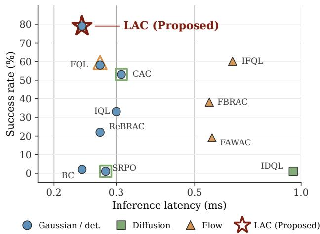
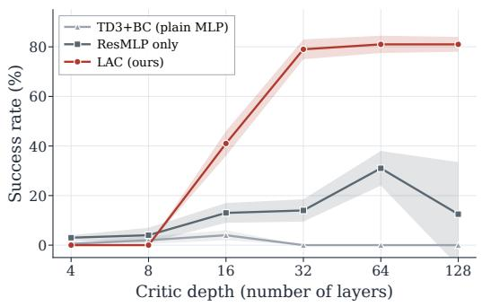
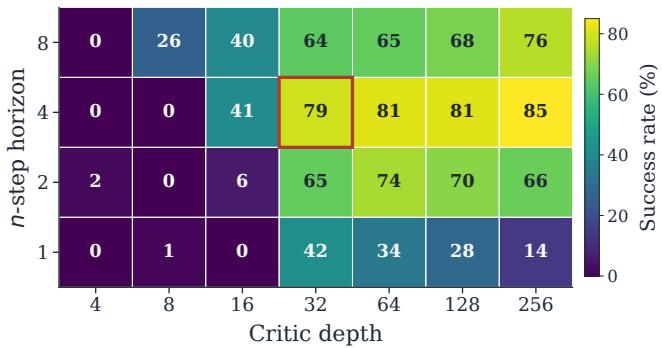
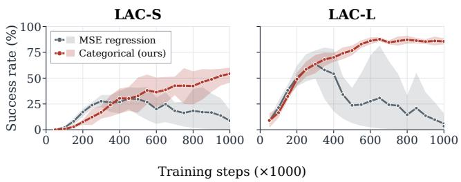
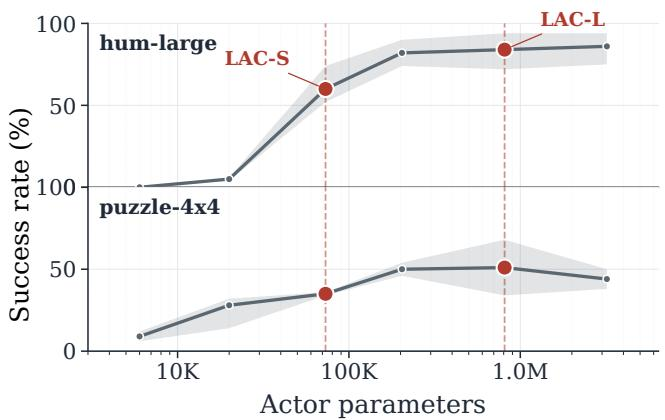
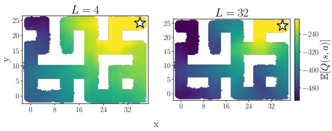
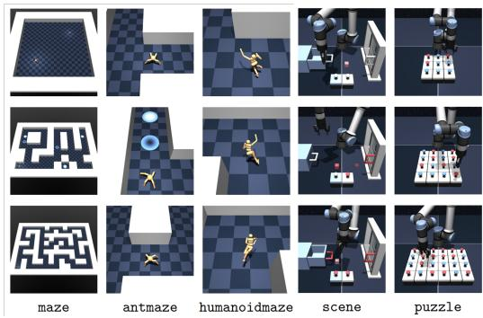

# Simple Actors and Deep Critics for Scalable Reinforcement Learning

Guhyeon Kang   
Sungkyunkwan University   
Republic of Korea   
guhyeon.kang@skku.edu   
Jaehwi Lee   
Soongsil University   
Republic of Korea   
jaehwilee@soongsil.ac.kr   
Minhae Kwon∗   
Sungkyunkwan University   
Republic of Korea   
minhae.kwon@skku.edu

## Abstract

Recent progress in ofline reinforcement learning (RL) has been driven by expressive generative actors such as difusion and flow- matchin olicies, which ca ture multimodal behavior in ofline datasets. However, these actors require multiple denoising or inte-gration steps per action and thus incur substantial overhead at every decision in deployment. In this work, we revisit where capacity should be invested in an ofline actor–critic method. Since the critic is used only during training and is discarded at deployment while the actor runs at every decision step, allocating capacity to the critic rather than the actor is more favorable for inference-time eficiency. However, scaling MLP critics in ofline RL is known to introduce several distinct instabilities that have, in practice, kept critics shallow. We identify three distinct failure modes that arise when critics are deepened in ofline RL—optimization, bootstrap-noise amplification, and value-range drift—and address each with a corresponding ingredient: a residual MLP backbone, �-step bootstrap targets, and a categorical cross-entropy loss. Combining these ingredients with a lightweight deterministic actor, we propose LAC (Light Actor, deep Critic). On OGBench, LAC matches the strongest difusion- and flow-matching baselines while achieving up to 4× lower inference latency, comparable to one-step distilled policies without distilla- tion. Its critic recipe also transfers across actor parametrizations. P t htt //9h 1225 ith b i /LAC/ rojec page: ps: yeon .g u . o

## CCS Concepts

• Computing methodologies → Reinforcement learning.

## Keywords

Ofline Reinforcement Learning, Deep Critic, Inference Eficiency, Actor-Critic Methods

## ACM Reference Format:

Guhyeon Kang, Jaehwi Lee, and Minhae Kwon. 2026. Simple Actors and Deep Critics for Scalable Reinforcement Learning. In Proceedings of the 35th ACM International Conference on Information and Knowledge Management (CIKM ’26), November 07–11, 2026, Rome, Italy. ACM, New York, NY, USA, 12 pages. https://doi.org/10.1145/3799682.3840726

  
Figure 1: Performance vs. inference latency on humanoidmaze-medium. Iterative generative actors (IDQL, IFQL, FBRAC, FAWAC) require multiple denoising or flow-integration steps per action.1LAC (star) acts in a single forward pass, reaching higher success rate at lower latency.

## 1 Introduction

Generative actors—difusion-based [13, 56] and flow-matching policies [25, 41, 49]—are reshaping ofline RL and increasingly serve as the backbone of agentic systems for robotics and physical artificial intelligence [1, 2, 7, 14, 17, 31, 34, 35, 38], as well as for informationdriven applications such as recommendation [10, 11]. Their strength is representational: they capture multimodal action distributions that Gaussian policies cannot, which translates into stronger performance on diverse ofline datasets. However, this gain comes with a structural cost that is rarely interrogated. Each action requires multiple denoising or integration steps through a high-capacity network, so every decision at deployment incurs the full cost of the actor architecture, which accumulates in resource-constrained de- ployments such as robotics and embedded control. The community has implicitly accepted this as the price of expressivity, but it raises a question that has not been put sharply enough.

## Is the architectural budget in ofline actor–critic methods allocated to the right network?

We revisit this assumption. The actor and the critic occupy funda-mentally asymmetric roles across the training–deployment bound- ary: the critic exists only to shape the policy gradient during training and is discarded once training ends, whereas the actor must run at every decision step in the deployed system. Capacity invested in a generative actor therefore pays a price that recurs at every action, while capacity invested in the critic pays it only once. Such deployment-time computational costs are particularly consequential for resource-constrained edge and IoT systems, where lightweight real-time inference is a key design consideration [30]. This suggests a complementary direction to the current generative actor trend: rather than scaling the network that must run at infer ence, scale the network that is free at inference. Concretely, pair a lightweight deterministic actor with a deep and well-trained critic, allowing the critic to provide a stronger learning signal while keep ing the deployed policy lightweight. A natural concern is whether a simple deterministic actor can remain competitive with expressive generative actors on datasets with multimodal behavior. We show that, when guided by a suficiently strong deep critic, a lightweight deterministic actor can remain competitive across standard ofline RL benchmarks.

This asymmetric allocation is not free to realize. Simply increasin the de th of an MLP critic is known to destabilise value-based RL, which is part of why ofline RL has traditionally kept critics shallow [6, 50, 51]. We attribute this to three distinct failure modes. The first is an optimization problem: gradients fail to propagate through many layers. The second is a bootstrap-noise problem: a deep critic with high representational capacity also has high capacity to fit noisy predictions, and the 1-step bootstrap update folds those predictions back into the target at every iteration, causing errors to compound. The third is a value-range drift problem: even when bootstrap noise is suppressed, a deep critic trained with unbounded Mean Squared Error (MSE) regression can slowly drift its outputs outside any reasonable scale, at which point a single anomalous sample is enough to push training into divergence— often after the run has already appeared to converge. Standard ingredients address only one of these axes at a time. We therefore combine three ingredients along complementary axes: (i) a residual MLP backbone with layer normalization, which restores gradient flow [16, 46, 51]; (ii) �-step bootstrap targets [27, 29, 52], which incorporate � observed rewards and change the bootstrap coefi- cient from � to ��, thereby reducing reliance on the critic’s own prediction, and (iii) a categorical cross-entropy critic loss over a bounded support [3, 20, 28], which restricts target values to a fixed range and converts regression into a classification problem over that range. Together, the three ingredients let the critic scale stably across two orders of magnitude in depth, providing a learning sig- nal strong enough that a lightweight deterministic actor sufices. Critically, we find that �-step is not a generic performance booster but an enabling condition for depth, and that the categorical loss is not interchangeable with MSE regression even when �-step is in place: removing either ingredient causes a distinct, depth-specific failure mode (Section 5.3). Figure 1 shows the result of putting all three together: matched against expressive flow-matching and difusion baselines, our design recovers comparable performance while reducing per-action inference cost by up to 4× over multi-step generative actors.

We instantiate these ideas in LAC, a simple ofline actor–critic recipe that integrates: (i) a deep residual MLP critic with layer normalization, (ii) a categorical cross-entropy critic loss with bounded support paired with �-step bootstrap targets, and (iii) a lightweight deterministic actor trained via the deterministic policy gradient with a behavior-cloning regularizer, so that producing an action at deployment requires only a single forward pass of a small network.

Our main contributions are as follows. 1) We articulate an asymmetry in ofline actor–critic methods that is implicit in the current literature: the critic is unused at deployment, which makes criticside capacity essentially free at inference and motivates a complementary alternative to scaling generative actors. 2) We identify three distinct failure modes of deep critics in ofline RL—an opti-mization problem, a bootstrap-noise problem, and a value-range drift problem—and show that addressing all three requires residual architecture, �-step bootstrap targets, and a categorical critic loss in combination; we directly evidence the bootstrap-noise mechanism via the interaction between � and critic depth, and the value-range mechanism via the mid-training collapse pattern that emerges when MSE regression replaces the categorical loss. 3) We pair this deep critic with a lightweight deterministic actor trained via the deterministic policy gradient, eliminating the multi-step generative sampling that difusion and flow-matching actors require at inference. 4) On the OGBench ofline RL benchmarks, LAC matches difusion- and flow-matching-based baselines while achieving up to 4× lower per-action inference latency than multi-step generative actors, with ablations showing that critic capacity can substantially compensate for limited actor expressivity. To the best of our knowl- edge, this is the first work to study asymmetric capacity allocation as a deliberate design axis for inference-eficient ofline RL.

## 2 Related Work

Generative Actors in Ofline RL. Recent ofline RL has increasingly relied on expressive generative parametrizations of the policy to capture multimodal action distributions in behavior data. Difusion-based actors include Difusion-QL [56], IDQL [25], and SRPO [8]. To reduce the multi-step sampling cost of difusion policies, two alternative classes of generative parametrizations have been explored. The first replaces the difusion model with a con- sistency model that directly maps noise to actions in a single step, as in CPQL [12] and CAC [15]. The second uses flow matching to learn a deterministic velocity field, as in FQL [49], which further distills the flow into a single-step policy at deployment. Shortcut models [19, 21] and distillation-free difusion objectives [9] obtain one-step policies without a separate distillation stage. While these approaches reduce the sampling cost of expressive generative policies, they still place the burden of modeling multimodal action distributions on the actor executed at every decision step—a cost that compounds when the policy is invoked repeatedly within hierarchical or agentic decision pipelines [48].

We pursue a complementary direction: rather than make expressive actors cheaper, we ask whether expressive actors are necessary at all when the critic is suficiently strong.

Critic Stabilization and Distributional Value Learning. The ingredients in the LAC critic have precedents in isolation. Residual MLP backbones and layer-normalized residual stacks have been studied for scaling online deep RL [6, 46, 51]. The �-step bootstrap is a standard variance-bias trade-of device [52] and is a core ingredient in Rainbow [27] and R2D2 [29] for online RL. Distributional value learning [4], in particular the categorical formulation of C51 [3], replaces the standard MSE regression target with a cross-entropy loss over a bounded support and has been shown to stabilize value learning in both online and ofline settings. Our contribution is to identify that none of these ingredients is individ-ually suficient in the ofline regime, with each addressing a distinct failure mode of deep critics, and that their combination is what allows critic depth to be scaled stably in ofline RL.

Capacity Scaling in Reinforcement Learning. A growing line of work on capacity scaling in online RL includes BBF [16] and recent studies pushing networks to hundreds of layers [46]. Ofline RL, by contrast, has historically kept both actor and critic small, with most published methods using two- or three-layer MLPs on both sides. Where ofline work has invested capacity, it has done so primarily on the actor side via difusion or flow-matching parametrizations for expressivity reasons. We are not aware of prior ofline RL work that frames the allocation of capacity between the actor and the critic as a deliberate design axis, or that empirically demonstrates that critic-side capacity can compensate for limited actor-side expressivity under matched inference budgets.

## 3 Preliminaries

Markov Decision Process (MDP). An RL problem can be formulated using an MDP, which is defined as a tuple $\boldsymbol { \mathcal { M } } = \langle \boldsymbol { S } , \boldsymbol { \mathcal { A } } , \boldsymbol { \rho } , \boldsymbol { r } , \boldsymbol { \gamma } \rangle$ Herein, $s _ { t } ~ \in ~ S$ is a state, $a _ { t } ~ \in ~ \mathcal { A }$ is an action, � (��+1 | ��, �� ) : $S \times { \mathcal { A } } \to \Delta ( S )$ is a state transition probability, $r _ { t } = R ( s _ { t } , a _ { t } , s _ { t + 1 } )$ $S \times \mathcal { A } \times S $ R is a reward function, and $\gamma \in \left[ 0 , 1 \right)$ is a temporal discount factor. The main objective of RL is to learn a policy $\pi : S \to \Delta ( { \mathcal { A } } )$ that maximizes the expected discounted return as follows.

$$
\mathcal { T } ( \pi ) = \mathbb { E } _ { \pi } \Bigg [ \sum _ { t \geq 0 } \gamma ^ { t } r _ { t } \Bigg ]\tag{1}
$$

Standard deep RL algorithms estimate this objective via value functions parameterized as deep networks [43].

Ofline RL. An ofline paradigm aims to learn a policy � by leveraging a fixed dataset $\boldsymbol { \mathcal { D } } = \{ ( s _ { t } , a _ { t } , r _ { t } , s _ { t + 1 } ) \} _ { t = 1 } ^ { N }$ collected by an arbitrary behavior policy, without further interaction with the environment. The absence of additional exploration introduces dis- tributional shift between � and the data-collecting policy, which is the central technical dificulty of ofline RL [5, 23, 36, 40, 55, 57, 58].

Actor–Critic Methods. A widely used approach to learning � in ofline RL is the actor–critic framework [18, 24, 37, 39, 42], which factorizes the problem into two networks: an actor and a critic. Specifically, the critic $Q _ { \theta } ( s , a )$ approximates the action-value function and predicts the expected return of executing action � at state � and following � thereafter, while the actor $\pi _ { \phi } ( s )$ denotes the param- eterized policy. The critic is trained by minimizing the temporaldiference (TD) loss as follows.

$$
\mathcal { L } ( \theta ) = \mathbb { E } _ { ( s _ { t } , a _ { t } , r _ { t } , s _ { t + 1 } ) \sim \mathcal { D } } \Big [ \ell \big ( \mathcal { T } Q _ { \theta } ( s _ { t } , a _ { t } ) , Q _ { \theta } ( s _ { t } , a _ { t } ) \big ) \Big ]\tag{2}
$$

Herein, ℓ(·) is a regression loss, typically the MSE, and $\mathcal { T }$ denotes the Bellman backup operator. The TD target in its standard 1-step form is defined as follows.

$$
\mathcal { T } Q _ { \theta } ( s _ { t } , a _ { t } ) = r _ { t } + \gamma Q _ { \theta ^ { - } } \bigl ( s _ { t + 1 } , \pi _ { \phi } ( s _ { t + 1 } ) \bigr )\tag{3}
$$

Herein, $\theta ^ { - }$ is a target network parameter that stabilizes training and is updated using the Polyak averaging method. The actor is trained to produce actions that the critic rates highly, i.e., the objective of the actor is to maximize the expected critic value as follows.

$$
\displaystyle \operatorname* { m a x } _ { \phi } \mathbb { E } _ { s \sim \mathcal { D } } \left[ Q _ { \theta } \big ( s , \pi _ { \phi } ( s ) \big ) \right]\tag{4}
$$

The critic supplies the learning signal used to update the actor through (4), while the trained actor $\pi _ { \phi }$ is what is used to act in the environment after training.

Behavior-Cloning Regularization. A direct application of (4) in the ofline setting is unstable because the critic $Q _ { \theta }$ is queried on actions $\pi _ { \phi } ( s )$ proposed by the current actor, which can drift outside the support of D and incur extrapolation errors. To mitigate this, a behavior-cloning (BC) term is widely adopted to keep the policy close to dataset actions, yielding the following actor loss.

$$
\begin{array} { r } { \mathcal { L } ( \phi ) = - \mathbb { E } _ { ( s , a ) \sim \mathcal { D } } \Big [ \lambda Q _ { \theta } \big ( s , \pi _ { \phi } ( s ) \big ) - \big \| \pi _ { \phi } ( s ) - a \big \| ^ { 2 } \Big ] } \end{array}\tag{5}
$$

Herein, $\lambda > 0$ is a coeficient that balances return maximization and proximity to the dataset. This template, which explicitly pe-nalizes deviation from dataset actions, underlies a broad family of ofline RL methods, including TD3+BC [22] and ReBRAC [53]. Related approaches such as IQL [33] and AWAC [44] instead employ advantage-weighted regression, which arises as the closed-form solution to a Kullback–Leibler-constrained variant of the return- maximization objective and can be viewed as an alternative real- ization of the same return-maximization-with-behavior-anchoring principle. We adopt the form in (5) for our actor in Section 4.

What is Used After Training. A property of the actor–critic frame-work that we exploit in this work is that the critic $Q _ { \theta }$ is essential during training to shape the actor via (4) and (5), but only the actor $\pi _ { \phi }$ is invoked at deployment to map states to actions. The computational cost of $Q _ { \theta }$ is incurred only during training, whereas the cost of $\pi _ { \phi }$ is incurred at every decision step during deployment. This observation is the design pivot of the proposed method.

## 4 LAC: Light Actor, Deep Critic

In this section, we propose LAC (Light Actor, deep Critic), an ofline actor–critic method that operationalizes the asymmetric roles of the actor and the critic. Specifically, LAC scales the critic to a deep network and airs it with a li htwei ht deterministic actor, so that capacity is invested in the network that is discarded after training and the network that is invoked at every decision step remains small. The remainder of this section describes why naively deepening the critic fails in ofline RL and how LAC addresses each failure.

## 4.1 Three Failure Modes of Deep Critics

A natural question raised by this asymmetry is why the ofline RL literature has not already scaled critics deep. The reason is that sim- ply increasing the depth of an MLP critic destabilizes value-based learning [6, 50, 51], and the underlying failure is not attributable to a single source. We identify three distinct failure modes that arise when critics are scaled in the ofline regime, each operating on a diferent axis and each requiring a diferent remedy.

(F1) Optimization Failure. A plain MLP critic exhibits the standard pathologies of deep feedforward networks, including van- ishing or exploding gradients, dead activations, and ill-conditioned Hessians. In an online setting, these can sometimes be alleviated by additional exploration; in the ofline setting, the dataset is fixed and a critic that fails to optimize cannot recover. As we will show empirically, a plain MLP critic fails to learn meaningful policies regardless of depth on our benchmarks.

(F2) Bootstrap-noise Amplification. A second failure arises specifically from the bootstrap structure of TD learning. The critic update in (2) uses the prediction of the critic itself at the next state as part of the target through (3). A deeper critic has strictly more capacity to fit noise, including the noise present in its own predictions, and the 1-step bootstrap folds the fitted noise back into the next target at every iteration. Errors therefore compound across updates rather than dissipating, and the failure scales with critic depth. This mechanism is invisible at shallow depths since a small critic cannot fit enough noise to make the loop dangerous; it appears only as the critic grows, producing a coupling between depth and bootstrap horizon.

(F3) Value-range Drift. A third failure occurs even when bootstrap noise is suppressed. The MSE regression target in (2) places no prior on the magnitude of �-values, so the critic is free to output any real number and a deep critic with substantial representational capacity can slowly drift its outputs outside any reasonable scale. Once the critic has drifted far enough, instabilities accumulate un- til training enters a divergent regime, producing a characteristic mid-training collapse pattern in which training appears healthy for hundreds of thousands of steps and then fails abruptly.

The three mechanisms address distinct failure modes: an archi- tectural problem (F1), a target-construction problem (F2), and a loss-function problem (F3). We find empirically that no single in-gredient is suficient to scale critic depth in the ofline regime. LAC therefore combines one ingredient against each failure, as described next.

## 4.2 LAC Critic: Three Complementary Ingredients

(I1) Residual MLP Backbone, against (F1). We replace the plain MLP critic with a residual MLP (ResMLP) Backbone with layer normalization [16, 46, 51]. Skip connections restore gradi-ent flow through depth, and layer normalization stabilizes activa- tions against the magnitude shifts induced by stacking many layers. With (I1) in place, the optimizer can train the network end-to-end; whether the trained critic produces useful predictions is a separate question addressed by (I2) and (I3).

(I2) �-step Bootstrap Targets, against (F2). We replace the 1-step TD target in (3) with an �-step target [27, 29, 52], defined as follows.

$$
{ \mathcal T } _ { n } ^ { { \mathbf { \alpha } } } Q _ { \theta } ( s _ { t } , a _ { t } ) = \sum _ { k = 0 } ^ { n - 1 } \gamma ^ { k } r _ { t + k } + \gamma ^ { n } Q _ { \theta ^ { - } } \bigl ( s _ { t + n } , \ : \pi _ { \phi ^ { - } } ( s _ { t + n } ) \bigr )\tag{6}
$$

Compared to (3), the �-step target incorporates � observed rewards and changes the bootstrap coeficient from � to $\gamma ^ { n } ;$ , thereby reducing reliance on the critic’s own prediction. A noisy deep critic therefore poisons its own targets less aggressively at each step. Importantly, (I2) is not a generic performance booster: at shallow critic depths it confers little benefit because (F2) is dormant, and its efect emerges only as depth grows, evidencing the coupling between depth and bootstrap noise.

(I3) Categorical Cross-Entropy Loss, against (F3). We replace the MSE regression loss with a categorical cross-entropy loss over a bounded, fixed support $\{ z _ { 1 } , . . . , z _ { I } \} ~ [ 3 , 2 7 ]$ . The critic outputs a categorical distribution $p ( \cdot \mid s , a )$ over the supports, and its expected value, used wherever a scalar � is required, is defined as follows.

$$
\mathbb { E } \big [ Q _ { \theta } ( s _ { t } , a _ { t } ) \big ] = \sum _ { i = 1 } ^ { I } z _ { i } \cdot p _ { i } ( s _ { t } , a _ { t } \mid \theta )\tag{7}
$$

The scalar target $\mathcal { T } n Q \theta ( s _ { t } , a _ { t } )$ in (6) is projected onto the cate-gorical support using a C51-style two-hot interpolation [3, 27] to produce a target distribution $\hat { p } ,$ against which the cross-entropy is taken. Two properties of (I3) matter for (F3). First, predictions are confined to the support range by construction, so the drift dy- namics of (2) cannot push outputs to arbitrarily large magnitudes. Second, the cross-entropy loss converts an unbounded regression problem into a bounded classification problem over a fixed range, which empirically blocks the abrupt mid-training collapse that MSE exhibits even with �-step in place.

The three ingredients are complementary, and removing any one re-introduces its corresponding failure mode. Together, they allow the critic to be scaled deep.

## 4.3 LAC Actor: Lightweight Deterministic

Given a critic strong enough to provide an accurate learning sig- nal, the role of the actor reduces to amortized inference of the policy gradient. We adopt the simplest parametrization available: a deterministic feedforward MLP $\pi _ { \phi } : S  \mathcal { A }$ trained with the standard ofline actor objective in (5), i.e., the deterministic policy gradient with a BC regularizer [22, 53]. We do not employ any expressive generative parametrization such as difusion or flowmatching: producing an action at deployment requires a single forward pass through a small MLP. We report two configurations, LAC-S and LAC-L, which difer only in actor width and depth.2 Both configurations share the same ResMLP categorical critic.

A natural concern is whether a lightweight deterministic actor can remain competitive with difusion- or flow-matching actors on datasets that exhibit multimodal behavior. We address this em- pirically in Section 5.5, where we show that a deterministic actor remains competitive when paired with the LAC critic, suggesting that a suficiently strong critic can substantially reduce the perfor- mance advantage of actor-side generative expressivity.

## 4.4 Critic Architecture

In this subsection, we provide a more formal description of the LAC critic.

Residual MLP Backbone. Let $x _ { 0 } \in \mathbb { R } ^ { d }$ denote the input em- bedding obtained by concatenating the state and action features and projecting them linearly to a hidden dimension �. The ResMLP critic is composed of � residual blocks $g _ { 1 } , \ldots , g _ { B }$ , each defined as follows.

$$
g _ { b } ( x ) = x + f _ { b } ( x ) , \quad f _ { b } ( x ) = \big ( \sigma \circ \mathrm { L N } \circ \mathrm { D e n s e } \big ) ^ { L } ( x )\tag{8}
$$

Herein, $f _ { b }$ is a sequence of � sub-layers, each composed of a dense projection followed by layer normalization (LN) and a non-linearity $\sigma ( \cdot )$ . The skip connection $x + f _ { b } ( x )$ ensures that the optimizer sees a path of unit Jacobian through every block at initialization, which is necessary for stable training of very deep critics [54]. Stacking � such blocks yields the trunk

$$
h ( x _ { 0 } ) = ( g _ { B } \circ \cdots \circ g _ { 1 } ) ( x _ { 0 } ) ,\tag{9}
$$

which is followed by a final LayerNorm and a linear head producing the categorical logits over the support $\{ z _ { 1 } , . . . , z _ { I } \}$

Categorical Target Projection. Given the �-step scalar target $y \ = \ \mathcal { T } _ { n } Q _ { \theta } ( s _ { t } , a _ { t } )$ in (6), we project � onto the fixed categorical support using a C51-style two-hot interpolation [3, 27]. Let

$$
\bar { y } = \mathrm { c l i p } ( y , v _ { \mathrm { m i n } } , v _ { \mathrm { m a x } } ) , \qquad b = \frac { \bar { y } - v _ { \mathrm { m i n } } } { \delta _ { z } } ,
$$

where $\delta _ { z } = ( v _ { \operatorname* { m a x } } - v _ { \operatorname* { m i n } } ) / ( I - 1 )$ , and let $l = \lfloor b \rfloor$ and $u = \left\lceil b \right\rceil$ . The target distribution is constructed as

$$
\begin{array}{c} \begin{array} { r } { \left\{ \hat { p } _ { l } = 1 , \quad \quad l = u , \right.} \\ { \hat { p } _ { l } = u - b , \quad \hat { p } _ { u } = b - l , l \neq u , } \end{array}   \end{array}\tag{10}
$$

with all other entries of $\hat { p }$ set to zero. The critic is trained by minimizing the cross-entropy between $\hat { p }$ and the predicted distribution $\boldsymbol { p } ( \cdot \mid s _ { t } , a _ { t } )$

Target Network Update. A target critic $Q _ { \theta ^ { - } }$ is maintained as a Polyak average of $Q _ { \theta }$ and is used to compute the next-state value in (6). The target parameters are updated at every gradient step as follows.

$$
\theta ^ { - }  \tau \theta + ( 1 - \tau ) \theta ^ { - }\tag{11}
$$

Herein, $\tau \in ( 0 , 1 ]$ is a small averaging coeficient. An analogous target $\pi _ { \phi ^ { - } }$ is maintained for the actor and is used only to compute the next-state action in the target (6), following the standard practice of TD3-style methods [22].

## 4.5 Algorithm Summary

The overall procedure of LAC is summarized in Algorithm 1. The critic combines (I1) a residual depth, (I2) �-step bootstrap targets, and (I3) a categorical cross-entropy loss, each addressing a distinct failure mode of deep critics in ofline RL. The actor is a lightweight deterministic MLP trained with the standard objective in (5). Infer-ence cost at deployment is determined by the actor alone, allowing LAC to achieve the performance of expressive generative actor baselines at substantially lower per-action latency.

## 5 Simulation Results

We empirically validate three claims that follow from the design principle articulated in Section 1: (i) LAC matches or exceeds gen-erative actor baselines on standard ofline RL benchmarks while reducing per-action inference cost by up to 4× over multi-step generative actors; (ii) critic-side capacity, when properly stabilized, is the productive axis for ofline RL scaling, whereas actor-side capacity saturates rapidly on most environments; and (iii) the criticside ingredients of LAC act as a drop-in improvement that benefits any actor parametrization, including difusion- and flow-matching actors.

## 5.1 Simulation Setup

Benchmarks. We follow the experimental protocol of recent flow-based ofline RL work [49] for direct comparability, and evaluate on 7 challenging environments from OGBench [47], a recent suite designed to stress-test ofline RL methods on long-horizon and high-dimensional continuous control. The environments span three categories.

• Ant navigation (8-DoF): ant-large and ant-giant, where a quadruped robot must navigate increasingly large maze layouts to a goal location.

• Humanoid navigation (21-DoF): hum-medium and humlarge, where a whole-body humanoid solves the same maze layouts under a much higher-dimensional action space.

• Manipulation: scene requires a sequence of pick-place and tool-use sub-actions, while puzzle-3x3 and puzzle-4x4 re-quire solving sliding-tile puzzles that combine continuous low-level control with discrete combinatorial task structure.

Each environment provides 5 evaluation goals (task1–task5), yielding 35 tasks in total. For ablation and analysis experiments (Sections $5 . 3 \substack { - 5 . 4 } )$ , we report results on the task1 variant of each envi-ronment unless stated otherwise. Further details on the environ- ments are provided in Appendix A.

Baselines. We compare against 11 ofline RL methods across three actor families.

• Gaussian / deterministic. BC, IQL [33], ReBRAC [53], and TD3+BC [22], the closest reference to our deterministic actor configuration.

• Difusion. IDQL [25], SRPO [8], and CAC [15]. SRPO and CAC retain the expressivity of difusion-based actors while reducing inference cost through single-step parametrizations.

• Flow. FAWAC, FBRAC, IFQL, and FQL [49]. FQL similarly distills a flow-matching actor into a single forward pass to accelerate inference.

Metrics and Implementation. We report binary success rate (%) on all OGBench tasks, averaged over 4 random seeds, following the OGBench evaluation protocol [47]. Inference latency is mea-sured as wall-clock time per action prediction on a single NVIDIA RTX 3090 with batch size 1. LAC uses a 32-layer ResMLP critic (≈ 2.15M parameters) with 51-atom categorical head and � = 4 bootstrap targets; LAC-S uses a [256, 256] actor (≈ 0.13M parameters) and LAC-L uses a [512, 512, 512, 512] actor matched in size to our flow-based baselines. Full hyperparameters are listed in Ap- pendix B.

Table 1: Success rates on 7 OGBench environments (5 task variants averaged). The best result in each row is shown in bold, and the second-best is underlined.
<table><tr><td></td><td colspan="4">Gaussian / Det.</td><td colspan="3">Diffusion</td><td colspan="4">Flow</td><td colspan="2">Ours</td></tr><tr><td>Environment</td><td>BC</td><td>TD3+BC</td><td>IQL</td><td>ReBRAC</td><td>|IDQL</td><td>SRPO</td><td>CAC</td><td>FAWAC</td><td>FBRAC</td><td>IFQL</td><td>FQL</td><td>|LAC-S</td><td>LAC-L</td></tr><tr><td>ant-large</td><td>11±1</td><td>82±6</td><td>53±3</td><td>81±5</td><td>21±5</td><td>11±4</td><td>33±4</td><td>6±1</td><td>60±6</td><td>28±5</td><td>79±3</td><td>92±5</td><td>96±1</td></tr><tr><td>ant-giant</td><td>0±0</td><td>3±4</td><td>4±1</td><td>26±8</td><td>0±0</td><td>0±0</td><td>0±0</td><td>0±0</td><td>4±4</td><td>3±2</td><td>9±6</td><td>35±23</td><td>79±13</td></tr><tr><td>hum-medium</td><td>2±1</td><td>12±9</td><td>33±2</td><td>22±8</td><td>1±0</td><td>1±1</td><td>53±8</td><td>19±1</td><td>38±5</td><td>60±14</td><td>58±5</td><td>79±10</td><td>76±38</td></tr><tr><td>hum-large</td><td>1±0</td><td>8±7</td><td>2±1</td><td>2±1</td><td>1±0</td><td>0±0</td><td>0±0</td><td>0±0</td><td>2±0</td><td>11±2</td><td>4±2</td><td>50±18</td><td>69±15</td></tr><tr><td>scene</td><td>5±1</td><td>0±0</td><td>28±1</td><td>41±3</td><td>46±3</td><td>20±1</td><td>40±7</td><td>30±3</td><td>45±5</td><td>30±3</td><td>56±2</td><td>29±37</td><td>41±39</td></tr><tr><td>puzzle-3x3</td><td>2±0</td><td>7±13</td><td>9±1</td><td>21±1</td><td>10±2</td><td>18±1</td><td>19±0</td><td>6±2</td><td>14±4</td><td>19±1</td><td>30±1</td><td>62±17</td><td>95±1</td></tr><tr><td>puzzle-4x4</td><td>0±0</td><td>2±3</td><td>7±1</td><td>14±1</td><td>29±3</td><td>10±3</td><td>15±3</td><td>1±0</td><td>13±1</td><td>25±5</td><td>17±2</td><td>15±9</td><td>32±19</td></tr><tr><td>Avg</td><td>3</td><td>16</td><td>19</td><td>30</td><td>15</td><td>9</td><td>23</td><td>9</td><td>25</td><td>25</td><td>36</td><td>52</td><td>70</td></tr></table>

Algorithm 1: LAC: Light Actor, Deep Critic   
1: Input: Dataset D with �-step transitions $( s _ { t } , a _ { t } , s _ { t + n } , G _ { t } ^ { ( n ) } )$   
deep ResMLP critic $Q _ { \theta }$ with categorical head over support   
$\{ z _ { i } \} _ { i = 1 } ^ { I } ,$ target critic ��− , MLP actor $\pi _ { \phi }$ with target ��− , �-step   
horizon �   
2: Hyperparameters: Learning rates $\alpha _ { Q } , \alpha _ { \pi } ,$ target update rate   
�, total gradient steps �   
3: for step = 1 to � do   
4: Sample mini-batch � from D   
5: Compute next-state value as the expectation of the categori   
cal critic:   
$\begin{array} { r } { q _ { \mathrm { n e x t } } = \sum _ { i = 1 } ^ { I } z _ { i } \cdot \phi _ { i } \big ( s _ { t + n } , \pi _ { \phi ^ { - } } \left( s _ { t + n } \right) \mid \theta ^ { - } \big ) } \end{array}$   
6: Compute scalar target: $y = G _ { t } ^ { ( n ) } + \gamma ^ { n }$ · �next   
7: Project � onto the categorical support via a C51-style two  
hot interpolation to obtain the target distribution �ˆ (see (10)).   
8: Update critic: $\theta \gets \theta - \alpha _ { Q } \nabla _ { \theta } \mathrm { C E } \big ( \hat { p } , Q _ { \theta } ( s _ { t } , a _ { t } ) \big )$   
9: Update actor: $\phi  \phi - \alpha _ { \pi } \nabla _ { \phi } \mathcal { L } ( \phi )$ using (5)   
10: Soft-update targets: $\theta ^ { - }  \tau \theta + ( 1 - \tau ) \theta ^ { - }$ and $\phi ^ { - }  \tau \phi +$   
$( 1 - \tau ) \phi ^ { - }$   
11: end for

## 5.2 Performance Comparison

Table 1 reports aggregated success rates over the 5 task variants of each environment.3 LAC-L achieves the highest average score across the suite, and LAC-S recovers most of that performance with an actor roughly one-tenth the size. LAC-S alone exceeds all generative actor baselines on the long-horizon locomotion environments. The humanoid suite is the most informative comparison point: its 21-dimensional action space yields substantially richer multimodal behavior, which is where generative parametrizations are most beneficial [49]—and indeed IFQL achieves the strongest baseline scores on hum-medium and hum-large. Despite operating with a deterministic actor, LAC matches or surpasses IFQL with out requiring multiple integration steps, indicating that a strong critic can substantially narrow the performance gap associated with using a simpler actor. LAC-L and LAC-S difer only in actor architecture. Their scores are close on several environments, but clear gaps remain on ant-giant and puzzle-3x3 (Section 5.3).

  
Figure 2: Critic depth scaling on hum-large. LAC scales stably with depth while baselines plateau or fail to learn.

## 5.3 Capacity Asymmetry Analysis

We analyze where capacity matters in ofline actor–critic methods, testing the hypothesis that critic capacity, when stabilized, is the binding constraint while actor capacity saturates rapidly. We study three axes: scaling the critic, scaling the actor, and varying the actor parametrization with a fixed deep critic.

Critic Capacity is Productive When Stabilized. Figure 2 plots success rate against critic depth for three configurations: (i) a TD3+BC-style plain MLP critic with 1-step MSE regression; (ii) the same critic with a residual MLP backbone and LayerNorm but still using 1-step MSE regression; and (iii) the full LAC critic recipe with �-step bootstrap and categorical cross-entropy.

The plain MLP baseline fails to learn meaningful policies across the entire 4–128 layer sweep, consistent with prior reports that naive depth scaling in ofline RL leads to gradient propagation failures and value divergence [50, 51]. The residual-only backbone reaches roughly 20% but does not improve with further depth and exhibits growing seed variance at depth 128, indicating that gradient flow alone is insuficient. The full recipe is also near zero at 4–8 layers, where a critic this small cannot represent the value landscape and the bounded categorical head constrains a capacity it does not yet have, but it is the only configuration that converts depth into performance, rising to ∼ 80% at depth 32 and saturating thereafter with small seed variance.

Figure 3: Success rate over critic depth × �-step horizon on hum-large, with residual backbone and categorical loss fixed. All horizons fail at shallow depth; beyond depth $^ { 1 6 , }$ only � = 1 degrades with further depth, while $n \geq 2$ remains stable and � = 4 is consistently strongest.  
  
Figure 4: Training curves on hum-large with a 32-layer resid ual critic and $n = 4 ,$ varying only the critic loss. The MSEregression critic collapses mid-training; the categorical critic of LAC remains stable. Shaded: ±1 std over 4 seeds.

�-Step Bootstrap is an Enabling Condition for Depth. To iso-late the role of �-step bootstrap, we sweep depth and � jointly with the residual backbone and categorical loss held fixed (Figure 3).

At shallow depths (≤ 8 layers), all horizons fail: a critic this small cannot learn the value landscape, so the choice of � is immaterial. The rows separate from depth 16 onward, and $n = 1$ is the only configuration that degrades with additional depth, peaking at 42% at depth 32 and decaying to 14% at depth 256, while every $n \geq 2$ configuration remains stable. This evidences the bootstrap-noise mechanism: a 1-step target folds more of the critic’s own fitted noise back into each subsequent target as depth grows, and the $\gamma ^ { n }$ attenuation breaks the loop. The benefit is not monotone in �, however, as $n = 4$ dominates beyond depth 16 while � = 8 falls back to the level of � = 2. Depth and �-step are therefore coupled by the bootstrap mechanism, not independent design choices.

�-Step Alone Is Not Enough: Categorical Targets Prevent Mid-Training Collapse. Figure 4 compares training curves when only the critic loss is varied, with the residual backbone and � = 4 held fixed. Both configurations rise along essentially identical trajectories for the first ∼ 300K steps. The MSE critic then collapses abruptly, with success rate dropping to near zero over roughly 100K steps and seed variance widening dramatically. The categorical critic exhibits no such collapse. MSE regression places no prior on the value range, so a deep critic drifts onto unbounded targets; instabilities accumulate until training enters a divergent regime. The categorical loss bounds the targets the bootstrap loop can generate, complementing the variance reduction of �-step.

  
Figure 5: Actor scaling on hum-large (top) and puzzle-4x4 (bottom) with the deep critic fixed. Performance saturates at modest actor sizes; LAC-S and LAC-L bracket the plateau.

Actor Capacity Saturates Rapidly. Figure 5 shows how perfor-mance varies with actor parameter count, holding the critic fixed to the 32-layer ResMLP configuration. Performance rises sharply up to roughly 105 parameters and plateaus thereafter; LAC-S and LAC-L bracket the plateau. This is the empirical counterpart ofthe capacity asymmetry: with the critic strong, the role of the actor reduces to amortized inference of the policy gradient, and additional actor ca- pacity brings little further benefit on these environments. Capacity invested in the actor incurs inference cost at every decision step for rapidly diminishing returns; the same capacity invested in the critic incurs cost only during training.

## 5.4 Ablation Studies and Mechanistic Analysis

We isolate which critic-side ingredients contribute and how they improve the learning signal received by the actor.

Component Ablation. Table 2 reports the efect of removing each critic-side ingredient individually while holding the rest fixed. The �-step and categorical ingredients exhibit the asymmetry ex-pected from the analyses above: removing �-step produces depth- dependent degradation consistent with Figure 3, while removing the categorical loss produces the mid-training collapse of Figure 4. The impact of each ingredient also varies with task properties. On ant-giant, the long horizon makes �-step particularly valuable independently of critic depth, so removing it causes the most severe drop $( 8 6 ~  ~ 3 8 )$ . The categorical loss, in contrast, matters most when the action space is high-dimensional: on hum-large (21-DoF) its removal causes near-total collapse $( 7 9  7 )$ , whereas on the lower-dimensional ant-giant (86 → 72) and puzzle-4x4 (55 → 32) the degradation is substantially milder. The two ingredi-ents address distinct failure modes—bootstrap-noise amplification and value-range drift—and both are required to scale critic depth.

Table 2: Component ablation on the task1 variant of each environment. Each row uses a 32-layer residual critic with diferent combinations of �-step bootstrap and categorical loss.
<table><tr><td>Configuration</td><td></td><td>H-large A-giant P-4x4</td><td></td><td> $\mathbf { A v } \mathbf { g }$ </td></tr><tr><td>LAC (n-step + categorical)</td><td> ${ \bf 7 9 \pm 6 }$ </td><td> ${ \bf 8 6 \pm 3 }$ </td><td> ${ \bf 5 5 \pm 6 }$ </td><td>73</td></tr><tr><td>− n-step (use 1-step TD)</td><td> $4 2 \pm 3$ </td><td> $3 8 \pm 1 5$ </td><td> $1 8 \pm 2$ </td><td>33</td></tr><tr><td>– Categorical (use MSE)</td><td> $7 \pm 1 2$ </td><td> $7 2 \pm 1 2$ </td><td> $3 2 \pm 1 5$ </td><td>37</td></tr><tr><td>− Both (1-step TD + MSE)</td><td> $1 5 \pm 5$ </td><td> $1 \pm 1$ </td><td> $1 2 \pm 3$ </td><td>9</td></tr></table>

  
Figure 6: Spatial value landscape on hum-large. For each spatial location (�, �), we average the predicted �-value over actions sampled at that location. The shallow 4-layer critic (left) yields a blurred landscape, whereas the 32-layer LAC critic (right) produces a sharper gradient aligned with the distance to the goal (star).

Spatial �-Value Resolution. Figure 6 provides a qualitative view ofwhy critic depth matters. For each dataset state on the hum-large maze, we evaluate the trained critic and average the predicted �- value over actions sampled at that state, producing a 2D heatmap over the spatial coordinates of the agent. This visualizes the value landscape the critic has learned, which is the quantity the actor relies on to extract goal-directed behavior. The shallow 4-layer critic produces a blurred landscape in which states at markedly diferent distances from the goal receive similar values, leaving the actor without a clear gradient to follow. The deep 32-layer LAC critic, by contrast, assigns visibly distinct values across the map, with a smooth gradient that aligns with the geometric distance to the goal. The lightweight deterministic actor benefits directly from this spatial resolution, suggesting that a suficiently informative critic can support strong policy learning without requiring the actor to explicitly model a multimodal action distribution.

## 5.5 Inference Eficiency and Drop-in Compatibility

Table 3 reports per-action wall-clock latency for all methods under identical hardware and measurement protocol. Generative actors incur per-action costs that scale with the number of denoising or integration steps: IDQL, FBRAC, FAWAC, and IFQL require multiple iterative steps at inference and are 2–4× slower than single-step baselines. FQL eliminates this cost via one-step distillation. Both configurations of LAC produce each action in a single forward pass: LAC-S achieves the fastest per-action latency at 0.24ms, matching or beating all single-step baselines, while LAC-L incurs only a modest overhead at 0.31ms despite using a larger actor. The 4× speedup is thus specific to multi-step actors, and the advantage over the one- step distilled baselines (FQL, SRPO, CAC) is marginal. Combined with the performance results, LAC-S occupies the top-left of the performance-latency plane.

Table 3: Per-action inference latency on a single NVIDIA RTX 3090, batch size 1. Speedup is relative to LAC-S.
<table><tr><td>Method</td><td>Actor (inference)</td><td>Latency (ms)</td><td>Speedup</td></tr><tr><td>IQL</td><td>Gaussian, 1 step</td><td>0.30</td><td>1.25×</td></tr><tr><td>ReBRAC</td><td>Deterministic, 1 step</td><td>0.27</td><td>1.13×</td></tr><tr><td>IDQL</td><td>Diffusion, 10 steps</td><td>0.95</td><td>3.96×</td></tr><tr><td>SRPO</td><td>Diffusion, 1 step</td><td>0.28</td><td>1.17×</td></tr><tr><td>CAC</td><td>Distilled Diffusion, 1 step</td><td>0.31</td><td>1.29×</td></tr><tr><td>FBRAC</td><td>Flow, 10 steps</td><td>0.55</td><td>2.29×</td></tr><tr><td>FAWAC</td><td>Flow, 10 steps</td><td>0.56</td><td>2.33×</td></tr><tr><td>IFQL</td><td>Flow, 10 steps</td><td>0.64</td><td>2.67×</td></tr><tr><td>FQL</td><td>Distilled Flow, 1 step</td><td>0.27</td><td>1.13×</td></tr><tr><td>LAC-L</td><td>Det. [512] × 4</td><td>0.31</td><td>1.29×</td></tr><tr><td>LAC-S</td><td>Det.  $\left[ 2 5 6 \right] \times 2$ </td><td>0.24</td><td>1.00×</td></tr></table>

Table 4: Replacing the critic of various ofline RL methods with the LAC critic, while keeping their actor parametrization and policy-extraction objective intact. Success rates (%) on the task1 variant of hum-medium.
<table><tr><td>Method</td><td>Baseline</td><td>+ LAC critic</td><td>Gain</td></tr><tr><td>TD3+BC (Deterministic)</td><td>10</td><td>46</td><td>+36</td></tr><tr><td>FAWAC (flow-matching)</td><td>6</td><td>30</td><td>+24</td></tr><tr><td>FQL (Distilled Flow)</td><td>19</td><td>57</td><td>+38</td></tr><tr><td>IDQL (Diffusion)</td><td>1</td><td>31</td><td>+30</td></tr><tr><td>CAC (Distilled Diffusion)</td><td>38</td><td>97</td><td>+59</td></tr></table>

To further demonstrate that the inference eficiency of LAC does not come at the cost of compatibility with existing methods, Table 4 shows the efect of replacing the critic of each baseline with the LAC critic, while keeping its original actor parametrization and policy-extraction objective intact.

Across all actor families, replacing the critic with the LAC critic yields consistent gains of +24 to +59 points under the identical protocol, indicating that the critic-side ingredients of LAC—residual backbone, �-step targets, categorical loss—function as a drop-in enhancement rather than a single-point algorithm. We regard this transferability as the central empirical result of this work. Actor parametrizations are nonetheless not interchangeable even under the LAC critic. The distilled-difusion actor of CAC reaches 97%, so the deterministic actor of LAC is best read as the most inference- eficient point on this spectrum rather than as evidence that actor expressivity is redundant. The implication is that the inference savings of LAC are not paid for by an algorithm restriction: the same critic recipe accelerates and improves a broad family of ofline RL methods regardless of their actor parametrization.

## 6 Conclusion

We proposed LAC, an ofline actor–critic method that operationalizes a simple observation: the critic shapes the actor during training but is discarded at deployment. Investing capacity in the critic therefore pays a one-time training cost, whereas investing capacity in the actor pays a recurring inference cost. Realizing this design in ofline RL requires resolving three distinct challenges that arise when critics are scaled deep: optimization, bootstrap-noise amplification, and value-range drift, which LAC addresses with a residual MLP back- bone, �-step bootstrap targets, and a categorical cross-entropy loss, respectively. Paired with a lightweight deterministic actor, LAC matches the strongest difusion- and flow-matching baselines on OGBench while reducing per-action inference latency by up to 4× over multi-step generative actors while matching one-step distilled policies without a distillation stage. The critic recipe transfers as a drop-in improvement to other actor parametrizations, which we view as the central empirical result. Asymmetric capacity allocation ofers a complementary direction to scaling generative actors.

Limitation. The present evaluation is restricted to state-based OGBench environments, in line with the protocol of recent offline RL work [47, 49], and to simulated benchmarks rather than real-robot deployment. Extending the analysis to pixel-based obser vations and to real-robot settings remains an interesting direction for future work.

## Appendices

## Appendix A: OGBench Benchmark Details

  
Figure 7: The 7 OGBench environments used in our experi ments.

We evaluate on 7 OGBench environments [47] across three cate-gories, with 5 goals (task1–task5) per environment, yielding 35 tasks in total. Figure 7 visualizes the suite.

Locomotion navigation. ant-large and ant-giant use an 8-DoF quadruped, while hum-medium and hum-large use a 21-DoF whole body humanoid in the same maze layouts. The giant variants require longer horizons, while the humanoid tasks have higher- dimensional actions and richer multimodal behavior, where gener- ative actors are particularly beneficial [49].

Table 5: LAC hyperparameters used across all OGBench environments.
<table><tr><td>Hyperparameter</td><td>Value</td></tr><tr><td colspan="2">Critic (ResMLP with categorical head)</td></tr><tr><td>Embedding dimension</td><td>256</td></tr><tr><td>Number of residual blocks</td><td>8</td></tr><tr><td>Sub-layers per block</td><td>4</td></tr><tr><td>Total dense layers</td><td>32</td></tr><tr><td>Activation</td><td>ReLU [45]</td></tr><tr><td>Normalization</td><td>LayerNorm</td></tr><tr><td>Categorical atoms (I)</td><td>51</td></tr><tr><td>Support range  $[ v _ { \operatorname* { m i n } } , v _ { \operatorname* { m a x } } ]$ </td><td> $[ - 1 / ( 1 - \gamma ) , 0 ]$ </td></tr><tr><td>Critic ensembles</td><td>1</td></tr><tr><td colspan="2">Actor (deterministic MLP)</td></tr><tr><td>LAC-S width × depth</td><td>[256]×2</td></tr><tr><td>LAC-L width × depth</td><td>[512] × 4</td></tr><tr><td>Activation</td><td>GELU [26]</td></tr><tr><td>Output activation</td><td>tanh</td></tr><tr><td colspan="2">Optimization</td></tr><tr><td>Optimizer</td><td>Adam [32]</td></tr><tr><td>Learning rate (critic and actor)</td><td> $3 \times 1 0 ^ { - 4 }$ </td></tr><tr><td>Batch size</td><td>256</td></tr><tr><td>Polyak rate τ</td><td> $5 \times 1 0 ^ { - 3 }$ </td></tr><tr><td>Discount factor γ</td><td> $0 . 9 9 \mathrm { ~ / ~ } 0 . 9 9 5 \mathrm { ~ / ~ } 0 . 9 9 9 ^ { \dagger }$ </td></tr><tr><td>Gradient steps</td><td>1M</td></tr><tr><td colspan="2">Bootstrap and BC</td></tr><tr><td>n-step horizon</td><td>4</td></tr><tr><td>BC coefficient λ</td><td>10 / 20 / 300 / 1000‡</td></tr></table>

† 0.99 for scene, 0.995 for ant-\*/ puzzle-\*, 0.999 for hum-\*.  
‡ 10 for ant-\*, 20 for hum-\*, 300 for scene, 1000 for puzzle-\*.

Multi-step manipulation. scene requires sequences of pick-place and tool-use sub-actions under sparse rewards, demanding tempo- rally extended planning.

Combinatorial-stitching manipulation. puzzle-3x3 and puzzle-4x4 require solving sliding-tile puzzles on 3×3 and 4×4 grids, combining continuous control with discrete combinatorial structure and many behavioral modes. puzzle-4x4 is among the hardest tasks in the suite.

## Appendix B: Experimental Details

Table 5 lists the architecture and training hyperparameters of LAC. Unless otherwise noted, the same values are used across all 7 OG- Bench environments.

Bootstrap sampling. �-step returns $\begin{array} { r } { G _ { t } ^ { ( n ) } = \sum _ { k = 0 } ^ { n - 1 } \gamma ^ { k } r _ { t + k } } \end{array}$ are com-puted on the fly in a vectorized pass at sampling time. Windows never cross trajectory ends, and the bootstrap term is zeroed when-ever a terminal state falls inside the window.

Table 6: Full OGBench success rates (%) on all 35 tasks. The best result in each row is shown in bold, and the second-best is underlined.
<table><tr><td></td><td>I</td><td colspan="4">Gaussian / Det.</td><td colspan="3">Diffusion</td><td colspan="4">Flow</td><td colspan="2">Ours</td></tr><tr><td>Env</td><td>Task |</td><td>BC</td><td>TD3+BC</td><td>IQL</td><td>ReBRAC |</td><td>IDQL</td><td>SRPO</td><td>CAC</td><td>| FAWAC</td><td>FBRAC</td><td>IFQL</td><td>FQL</td><td>L-S</td><td>L-L</td></tr><tr><td rowspan="4">ant-1</td><td>12345</td><td>0±0 6±3</td><td>86±2 77±3</td><td>48±9 42±6</td><td>91±10 88±4</td><td>0±0 14±8</td><td>0±0 4±4</td><td>42±7 1±1</td><td>1±1 0±1</td><td>70±20 35±12</td><td>24±17 8±3</td><td>80±8 57±10</td><td>92±4 83±3</td><td>96±0 94±2</td></tr><tr><td></td><td>29±5 8±3</td><td>92±0 79±3</td><td>72±7 51±9</td><td>51±18 84±7</td><td>26±8 62±25</td><td>3±2 45±19</td><td>49±10 17±6</td><td>12±4 10±3</td><td>83±15 37±18</td><td>52±17 18±8</td><td>93±3 80±4</td><td>97±2 91±3</td><td>98±2 95±0</td></tr><tr><td></td><td>10±3</td><td>78±3</td><td>54±22</td><td>90±2</td><td>2±2</td><td>1±1</td><td>55±6</td><td>9±5</td><td>76±8</td><td>38±18</td><td>83±4</td><td>95±1</td><td>97±1</td></tr><tr><td>12345 ant-g</td><td>0±0 0±0</td><td>0±0 2±1</td><td>0±0 1±1</td><td>27±22 16±17</td><td>0±0 0±0 0±0</td><td>0±0 0±0 0±0</td><td>0±0 0±0 0±0</td><td>0±0 0±0 0±0</td><td>0±1 4±7 0±0</td><td>0±0 0±0</td><td>4±5 9±7</td><td>32±12 63±7</td><td>86±3 92±3</td></tr><tr><td rowspan="5"></td><td></td><td>0±0</td><td>0±0</td><td>0±0</td><td>34±22</td><td></td><td></td><td></td><td></td><td></td><td>0±0</td><td>0±1</td><td>1±1</td><td>56±10 86±1</td></tr><tr><td></td><td>0±0</td><td>3±0</td><td>0±0</td><td>5±12</td><td>0±0</td><td>0±0</td><td>0±0</td><td>0±0</td><td>9±4</td><td>0±0</td><td>14±23</td><td>58±3</td><td></td></tr><tr><td></td><td>1±1</td><td>12±2</td><td>19±7</td><td>49±22</td><td>0±1</td><td>0±0</td><td>0±0</td><td>0±0</td><td>6±10</td><td>13±9</td><td>16±28</td><td>20±5</td><td>72±3</td></tr><tr><td></td><td></td><td></td><td></td><td>16±9</td><td>1±1</td><td></td><td></td><td>6±2</td><td>25±8</td><td></td><td></td><td></td><td>93±3</td></tr><tr><td>12345 hum-m</td><td>1±0</td><td>10±15 21±34</td><td>32±7 41±9</td><td>18±16</td><td>1±1</td><td>0±0 1±1</td><td>38±19</td><td></td><td></td><td>69±19</td><td>19±12</td><td>78±5</td><td></td></tr><tr><td rowspan="5"></td><td></td><td>1±0</td><td>25±31</td><td>25±5</td><td>36±13</td><td>0±1</td><td></td><td>47±35 83±18</td><td>40±2</td><td>76±10 27±11</td><td>85±11 49±49</td><td>94±3 74±18</td><td>94±2 72±4</td><td>96±2 96±3</td></tr><tr><td></td><td>6±2 0±0</td><td>5±4</td><td>0±1</td><td>15±16</td><td>1±1</td><td>2±1 1±1</td><td>5±4</td><td>19±2 1±1</td><td>1±2</td><td>1±1</td><td>3±4</td><td>67±28</td><td>0±0</td></tr><tr><td></td><td>2±1</td><td>1±1</td><td>66±4</td><td>24±20</td><td>1±1</td><td>3±3</td><td>91±5</td><td>31±7</td><td>63±9</td><td>98±2</td><td>97±2</td><td>85±11</td><td>98±1</td></tr><tr><td></td><td></td><td></td><td></td><td></td><td></td><td></td><td></td><td></td><td></td><td></td><td></td><td></td><td></td></tr><tr><td>12３45</td><td>0±0</td><td>13±12</td><td>3±1</td><td>2±1</td><td>0±0</td><td>0±0</td><td>1±1</td><td>0±0</td><td>0±1</td><td>6±2</td><td>7±6</td><td>57±3</td><td>79±6</td></tr><tr><td rowspan="5">hum-1</td><td></td><td>0±0</td><td>0±0</td><td>0±0</td><td>0±0</td><td>0±0</td><td>0±0</td><td>0±0</td><td>0±0</td><td>0±0</td><td>0±0</td><td>0±0</td><td>19±3</td><td>52±37</td></tr><tr><td></td><td>1±1</td><td>19±7</td><td>7±3</td><td>8±4</td><td>3±1</td><td>1±1</td><td>2±3</td><td>1±1</td><td>10±2</td><td>48±10</td><td>11±7</td><td>74±6</td><td>84±15</td></tr><tr><td></td><td>1±0</td><td>5±7</td><td>1±0</td><td>1±1</td><td>0±0</td><td>0±0</td><td>0±1</td><td>0±0</td><td>0±0</td><td>1±1</td><td>2±3</td><td>53±3</td><td>51±37</td></tr><tr><td></td><td>0±1</td><td>3±2</td><td>1±1</td><td>2±2</td><td>0±0</td><td>0±0</td><td>0±0</td><td>0±0</td><td>1±1</td><td>0±0</td><td>1±3</td><td>47±4</td><td>77±5</td></tr><tr><td>1</td><td></td><td></td><td></td><td>95±2</td><td></td><td></td><td></td><td></td><td></td><td></td><td></td><td></td><td></td></tr><tr><td rowspan="5">scene</td><td></td><td>19±6</td><td>0±1</td><td>94±3</td><td>50±13</td><td>100±0 33±14</td><td>94±4</td><td>100±1</td><td>87±8</td><td>96±8</td><td>98±3</td><td>100±0</td><td>98±1</td><td>96±3</td></tr><tr><td></td><td>1±1</td><td>0±0</td><td>12±3</td><td>55±16</td><td></td><td>2±2</td><td>50±40</td><td>18±8</td><td>46±10</td><td>0±0</td><td>76±9</td><td>12±10</td><td>36±14</td></tr><tr><td></td><td>1±1</td><td>0±0</td><td>32±7</td><td>3±3</td><td>94±4 4±3</td><td>4±4</td><td>49±16</td><td>38±9</td><td>78±14</td><td>54±19</td><td>98±1</td><td>37±5</td><td>75±3</td></tr><tr><td></td><td>2±2</td><td>0±0</td><td>0±1</td><td>0±0</td><td></td><td>0±0</td><td>0±0</td><td>6±1</td><td>4±4</td><td>0±0</td><td>5±1</td><td>0±0</td><td>0±0</td></tr><tr><td>2345</td><td>0±0</td><td>0±0</td><td>0±0</td><td></td><td>0±0</td><td>0±0</td><td>0±0</td><td>0±0</td><td>0±0</td><td>0±0</td><td>0±0</td><td>0±0</td><td>0±0</td></tr><tr><td rowspan="5">p-3x3</td><td></td><td></td><td></td><td></td><td></td><td></td><td></td><td></td><td></td><td></td><td></td><td></td><td></td><td></td></tr><tr><td>1</td><td>5±2</td><td>32±3</td><td>33±6</td><td>97±4</td><td>52±12</td><td>89±5</td><td>97±2</td><td>25±9</td><td>63±19</td><td>94±3</td><td>90±4</td><td>88±7</td><td>97±5</td></tr><tr><td></td><td>1±1</td><td>0±0</td><td>4±3</td><td>1±1 3±1</td><td>0±1 0±0 0±0</td><td>0±1 0±0</td><td>0±0 0±0</td><td>4±2 1±0</td><td>2±2 1±1</td><td>1±2 0±0</td><td>16±5 10±3</td><td>74±24 48±6</td><td>96±7 94±3</td></tr><tr><td>2345</td><td>1±1 1±1</td><td>0±0 0±0</td><td>3±2 2±1</td></table>

Target networks. Both the critic target ��− and the actor target � − are maintained by Polyak averaging at every gradient step. The actor target is used only to compute the next-state action that enters the �-step bootstrap target, following the standard practice of TD3-style methods [22].

Evaluation protocol. We follow the OGBench protocol [47, 49]: success rates are averaged across the last three evaluation epochs and over 4 random seeds, reducing single-epoch noise.

Hardware (training). All training runs are performed on a single NVIDIA RTX PRO 6000 GPU. A single training run of LAC takes approximately 1 hour; the full set of 35 tasks under 4 seeds amounts to roughly 6 GPU-days

Hardware (inference latency). For controlled comparability with prior reports on consumer-grade hardware, the per-action latency measurements in Table 3 are obtained on a separate NVIDIA RTX 3090 GPU. Each measurement uses batch size 1, 100 warm-up iterations to amortize JIT compilation, and is averaged over 10,000 measurement iterations. All baselines are measured under an iden- tical protocol on the same hardware.

## Appendix C: Full OGBench Results

Table 6 reports per-task success rates for all 35 OGBench tasks, cov- ering both locomotion (antmaze, humanoidmaze) and manipulation (scene, puzzle) domains. Each cell reports the mean and standard deviation over 4 random seeds, with 50 evaluation episodes per seed at the last three evaluation epochs. Baseline numbers other than TD3+BC are taken directly from the FQL paper [49] for fair comparison; TD3+BC is re-run under our codebase to ensure direct comparability with our deterministic-actor configurations (LAC-S, LAC-L).

## Acknowledgment

This work was partly supported by the Institute of Information & Communications Technology Planning & Evaluation (IITP) grant (No. RS-2026-25519475), the National Research Foundation of Korea (NRF) grants (RS-2023-00278812, RS-2025-02214082, RS-2026- 25522801) funded by the Korean government (MSIT), and Korea Institute of Police Technology (KIPoT) funded by the Korean National Police Agency & Korea Customs Service (RS-2026-25536784). The authors would like to thank Chanin Eom for his helpful discus- sions and comments during this research.

## Generative AI Usage Disclosure

We disclose how generative AI tools were used in the preparation of this work.

• Manuscript preparation: Large language model assistants were used to polish English phrasing and improve readabil-ity.

• Implementation: Large language model assistants were used to support coding and debugging during development of the LAC codebase.

• Experiments and analysis: All training runs, metric com-putations, and interpretations of the empirical findings were conducted solely by the authors.

## References

[1] Sanjay Agrawal, Srujana Merugu, and Vivek Sembium. 2023. Enhancing Ecommerce Product Search through Reinforcement Learning-Powered Query Reformulation. In Proceedings ofthe ACM International Conference on Information and Knowledge Management.

[2] Shivvrat Arya, Smita Ghosh, Bryan Maruyama, and Venkatesh Srinivasan. 2025. RELINK: Edge Activation for Closed Network Influence Maximization via Deep Reinforcement Learning. In Proceedings ofthe ACM International Conference on Information and Knowledge Management.

[3] Marc G. Bellemare, Will Dabney, and Rémi Munos. 2017. A Distributional Perspec tive on Reinforcement Learning. In Proceedings ofthe International Conference on Machine Learning.

[4] Marc G. Bellemare, Will Dabney, and Mark Rowland. 2023. Distributional Reinforcement Learning. MIT Press.

[5] Lingfeng Bian, Weidong Yang, Jingyi Xu, and Zijing Tan. 2024. Discovering Denial Constraints Based on Deep Reinforcement Learning. In Proceedings of the ACM International Conference on Information and Knowledge Management.

[6] Johan Björck, Carla P. Gomes, and Kilian Q. Weinberger. 2021. Towards Deeper Deep Reinforcement Learning with Spectral Normalization. In Advances in Neural Information Processing Systems.

[7] Kevin Black, Noah Brown, Danny Driess, Adnan Esmail, Michael Robert Equi, Chelsea Finn, Niccolo Fusai, Lachy Groom, Karol Hausman, Brian Ichter, Szy- mon Jakubczak, Tim Jones, Liyiming Ke, Sergey Levine, Adrian Li-Bell, Mohith Mothukuri, Suraj Nair, Karl Pertsch, Lucy Xiaoyang Shi, Laura Smith, James Tan ner, Quan Vuong, Anna Walling, Haohuan Wang, and Ury Zhilinsky. 2025. �0: A Vision-Language-Action Flow Model for General Robot Control. In Robotics: Science and Systems.

[8] Huayu Chen, Cheng Lu, Zhengyi Wang, Hang Su, and Jun Zhu. 2024. Score Regularized Policy Optimization through Difusion Behavior. In Proceedings of the International Conference on Learning Representations.

[9] Tianyu Chen, Zhendong Wang, and Mingyuan Zhou. 2024. Difusion Policies Creating a Trust Region for Ofline Reinforcement Learning. In Advances in Neural Information Processing Systems.

[10] Xiaocong Chen, Siyu Wang, and Lina Yao. 2025. Energy-Guided Difusion Sam-pling for Long-Term User Behavior Prediction in Reinforcement Learning-based Recommendation. In Proceedings ofthe ACM International Conference on Information and Knowledge Management.

[11] Xiaocong Chen, Siyu Wang, and Lina Yao. 2025. Maximum In-Support Return Modeling for Dynamic Recommendation with Language Model Prior. In Proceedings of the ACM International Conference on Information and Knowledge Management.

[12] Yuhui Chen, Haoran Li, and Dongbin Zhao. 2024. Boosting Continuous Control with Consistency Policy. In Proceedings ofthe International Conference on Autonomous Agents and Multiagent Systems.

[13] Cheng Chi, Siyuan Feng, Yilun Du, Zhenjia Xu, Eric Cousineau, Benjamin Burch fiel, and Shuran Song. 2023. Difusion Policy: Visuomotor Policy Learning via Action Difusion. In Robotics: Science and Systems.

[14] Dillon Davis, Huiji Gao, Thomas Legrand, Weiwei Guo, Malay Haldar, Alex Deng, Han Zhao, Liwei He, and Sanjeev Katariya. 2024. Transforming Location Retrieval at Airbnb: A Journey from Heuristics to Reinforcement Learning. In Proceedings ofthe ACM International Conference on Information and Knowledge Management.

[15] Zihan Ding and Chi Jin. 2024. Consistency Models as a Rich and Eficient Policy Class for Reinforcement Learning. In Proceedings of the International Conference on Learning Representations

[16] Pierluca D’Oro, Max Schwarzer, Evgenii Nikishin, Pierre-Luc Bacon, Marc G. Bellemare, and Aaron Courville. 2023. Bigger, Better, Faster: Human-level Atari with Human-level Eficiency. In Proceedings of the International Conference on Machine Learning.

[17] Chanin Eom and Minhae Kwon. 2026. Price of the Autonomous Strategy with Reinforcement Learning in Mixed-autonomy Trafic Networks. IEEE Transactions on Intelligent Transportation Systems 27, 2 (2026), 2741–2752.

[18] Chanin Eom, Dongsu Lee, and Minhae Kwon. 2024. Selective Imitation for Eficient Online Reinforcement Learning with Pre-collected Data. ICT Express 10, 6 (2024), 1308–1314.

[19] Nicolas Espinosa-Dice, Yiyi Zhang, Yiding Chen, Bradley Guo, Owen Oertell, Gokul Swamy, Kianté Brantley, and Wen Sun. 2025. Scaling Ofline RL via Eficient and Expressive Shortcut Models. In Advances in Neural Information Processing Systems.

[20] Jesse Farebrother, Jordi Orbay, Quan Vuong, Adrien Ali Taiga, Yevgen Chebotar, Ted Xiao, Alex Irpan, Sergey Levine, Pablo Samuel Castro, Aleksandra Faust, Aviral Kumar, and Rishabh Agarwal. 2024. Stop Regressing: Training Value Functions via Classification for Scalable Deep RL. In Proceedings of the International Conference on Machine Learning.

[21] Kevin Frans, Danijar Hafner, Sergey Levine, and Pieter Abbeel. 2025. One Step Difusion via Shortcut Models. In Proceedings ofthe International Conference on Learning Representations.

[22] Scott Fujimoto and Shixiang Shane Gu. 2021. A Minimalist Approach to Ofline Reinforcement Learning. In Advances in Neural Information Processing Systems.

[23] Scott Fujimoto, David Meger, and Doina Precup. 2019. Of-policy Deep Reinforcement Learning without Exploration. In Proceedings ofthe International Conference on Machine Learning.

[24] Scott Fujimoto, Herke van Hoof, and David Meger. 2018. Addressing Function Approximation Error in Actor-Critic Methods. In Proceedings ofthe International Conference on Machine Learning.

[25] Philippe Hansen-Estruch, Ilya Kostrikov, Michael Janner, Kuba Grudzien, and Sergey Levine. 2023. IDQL: Implicit Q-Learning as an Actor-Critic Method with Difusion Policies. Technical Re ort UCB/EECS-2023-62. EECS De artment, University of California, Berkeley.

[26] Dan Hendrycks and Kevin Gimpel. 2016. Gaussian Error Linear Units (GELUs). arXiv preprint arXiv:1606.08415.

[27] Matteo Hessel, Joseph Modayil, Hado van Hasselt, Tom Schaul, Georg Ostro-vski, Will Dabney, Dan Horgan, Bilal Piot, Mohammad Azar, and David Silver. 2018. Rainbow: Combining Improvements in Deep Reinforcement Learning. In Proceedings ofthe AAAI Conference on Artificial Intelligence.

[28] Ehsan Imani and Martha White. 2018. Improving Regression Performance with Distributional Losses. In Proceedings ofthe International Conference on Machine Learning.

[29] Steven Kapturowski, Georg Ostrovski, John Quan, Rémi Munos, and Will Dabney. 2019. Recurrent Experience Replay in Distributed Reinforcement Learning. In Proceedings of the International Conference on Learning Representations.

[30] Miru Kim, Heewon Park, and Minhae Kwon. 2025. Personalized Split Federated Learning with Early-exit: Pre-training and Online Learning Against Label Shifts. IEEE Internet ofThings Journal 12, 22 (2025), 47069–47082.

[31] Moo Jin Kim, Karl Pertsch, Siddharth Karamcheti, Ted Xiao, Ashwin Balakrishna, Suraj Nair, Rafael Rafailov, Ethan Foster, Grace Lam, Pannag Sanketi, Quan Vuong, Thomas Kollar, Benjamin Burchfiel, Russ Tedrake, Dorsa Sadigh, Sergey Levine, Percy Liang, and Chelsea Finn. 2024. OpenVLA: An Open-Source Vision-Language-Action Model. In Proceedings of the Conference on Robot Learning.

[32] Diederik P. Kingma andJimmy Ba. 2015. Adam: A Method for Stochastic Optimization. In Proceedings ofthe International Conference on Learning Representations.

[33] Ilya Kostrikov, Ashvin Nair, and Sergey Levine. 2022. Ofline Reinforcement Learning with Implicit Q-Learning. In Proceedings ofthe International Conference on Learning Representations.

[34] Dongsu Lee, Chanin Eom, and Minhae Kwon. 2024. AD4RL: Autonomous Driving Benchmarks for Ofline Reinforcement Learning with Value-based Dataset. In Proceedings ofthe IEEE International Conference on Robotics and Automation.

[35] Dongsu Lee and Minhae Kwon. 2022. ADAS-RL: Safety Learning Approach for Stable Autonomous Drivin . ICT Express 8, 3 (2022), 479–483.

[36] Dongsu Lee and Minhae Kwon. 2023. Foresighted Decisions for Inter-vehicle Interactions: An Ofline Reinforcement Learning Approach. In Proceedings ofthe IEEE International Conference on Intelligent Transportation Systems.

[37] Dongsu Lee and Minhae Kwon. 2024. Episodic Future Thinking Mechanism for Multi-agent Reinforcement Learning. In Advances in Neural Information Processing Systems.

[38] Dongsu Lee and Minhae Kwon. 2025. Episodic Future Thinking with Ofline Reinforcement Learning for Autonomous Driving. IEEE Internet ofThings Journal 12, 11 (2025), 17012–17023.

[39] Dongsu Lee and Minhae Kwon. 2025. Scenario-free Autonomous Driving with Multi-task Ofline-to-online Reinforcement Learning. IEEE Transactions on Intelligent Transportation Systems 26, 9 (2025), 13317–13330.

[40] Dongsu Lee and Minhae Kwon. 2025. Temporal Distance-aware Transition Augmentation for Ofline Model-based Reinforcement Learning. In Proceedings of the International Conference on Machine Learning.

[41] Qiyang Li, Zhiyuan Zhou, and Sergey Levine. 2025. Reinforcement Learning with Action Chunking. In Advances in Neural Information Processing Systems.

[42] Timothy P. Lillicrap, Jonathan J. Hunt, Alexander Pritzel, Nicolas Heess, Tom Erez, Yuval Tassa, David Silver, and Daan Wierstra. 2016. Continuous Control with Deep Reinforcement Learning. In Proceedings of the International Conference on Learning Representations.

[43] Volodymyr Mnih, Koray Kavukcuoglu, David Silver, Andrei A. Rusu, Joel Veness, Marc G. Bellemare, Alex Graves, Martin Riedmiller, Andreas K. Fidjeland, Georg Ostrovski, Stig Petersen, Charles Beattie, Amir Sadik, Ioannis Antonoglou, Helen King, Dharshan Kumaran, Daan Wierstra, Shane Legg, and Demis Hassabis. 2015. Human-level Control through Deep Reinforcement Learning. Nature 518, 7540 (2015), 529–533.

[44] Ashvin Nair, Abhishek Gupta, Murtaza Dalal, and Sergey Levine. 2020. AWAC: Accelerating Online Reinforcement Learning with Ofline Datasets. In Deep Reinforcement Learning Workshop at Advances in Neural Information Processing Systems.

[45] Vinod Nair and Geofrey E. Hinton. 2010. Rectified Linear Units Improve Restricted Boltzmann Machines. In Proceedings ofthe International Conference on Machine Learning.

[46] Michal Nauman, Mateusz Ostaszewski, KrzysztofJankowski, Piotr Miłoś, and Marek Cygan. 2024. Bigger, Regularized, Optimistic: Scaling for Compute and Sample-Eficient Continuous Control. In Advances in Neural Information Processing Systems.

[47] Seohong Park, Kevin Frans, Benjamin Eysenbach, and Sergey Levine. 2025. OG-Bench: Benchmarking Ofline Goal-Conditioned RL. In Proceedings ofthe International Conference on Learning Representations.

[48] San eun Park and Minhae Kwon. 2026. Multi2: Hierarchical Multi-A ent Decision-Making with LLM-Based Agents in Interactive Environments. In Proceedings of the International Conference on Machine Learning.

[49] Seohong Park, Qiyang Li, and Sergey Levine. 2025. Flow Q-Learning. In Proceedings of the International Conference on Machine Learning.

[50] Zhiyong Peng, Yadong Liu, and Zongtan Zhou. 2024. Deadly Triad Matters for Ofline Reinforcement Learnin . Knowledge-Based Systems 284 (2024), 111341.

[51] Samarth Sinha, Homanga Bharadhwaj, Aravind Srinivas, and Animesh Garg. 2020. D2RL: Deep Dense Architectures in Reinforcement Learning. In Deep Reinforcement Learning Workshop at Advances in Neural Information Processing Systems.

[52] Richard S. Sutton and Andrew G. Barto. 2018. Reinforcement Learning: An Introduction (2nd ed.). MIT Press.

[53] Denis Tarasov, Vladislav Kurenkov, Alexander Nikulin, and Sergey Kolesnikov. 2023. Revisiting the Minimalist Approach to Ofline Reinforcement Learning. In Advances in Neural Information Processing Systems.

[54] Kevin Wang, Ishaan Javali, Michał Bortkiewicz, Tomasz Trzciński, and Benjamin Eysenbach. 2025. 1000 Layer Networks for Self-Supervised RL: Scaling Depth Can Enable New Goal-Reaching Capabilities. In Advances in Neural Information Processing Systems.

[55] Siyu Wang, Xiaocong Chen, and Lina Yao. 2024. On Causally Disentangled State Representation Learning for Reinforcement Learning based Recommender Systems. In Proceedings of the ACM International Conference on Information and Knowledge Management.

[56] Zhendong Wang, Jonathan J. Hunt, and Mingyuan Zhou. 2023. Difusion Policies as an Expressive Policy Class for Ofline Reinforcement Learning. In Proceedings ofthe International Conference on Learning Representations.

[57] Xin Xin, Xiangyu Zhao, Jin Huang, Weinan Zhang, Li Zhao, Dawei Yin, and Grace Hui Yang. 2023. DRL4IR: 4th Workshop on Deep Reinforcement Learning for Information Retrieval. In Proceedings ofthe ACM International Conference on Information and Knowledge Management.

[58] Yi Zhang, Ruihong Qiu, Jiajun Liu, and Sen Wang. 2024. ROLeR: Efective Reward Shaping in Ofline Reinforcement Learning for Recommender Systems. In Proceedings ofthe ACM International Conference on Information and Knowledge Management.