# TABULAR DEEP LEARNING FOR ALGORITHMIC TRADING: CROSS-REGIME BAYESIAN OPTIMISATION FOR EQUITY SIGNAL GENERATION

Josh Le Grice∗ Department of Computer Science University of Exeter joshualegrice@gmail.com

## ABSTRACT

Algorithmic trading now represents a market exceeding \$20 billion, where even marginal gains in signal robustness can translate into economically significant returns. Existing evaluations of equity prediction models do not explicitly target regime robustness during hyperparameter selection. Five model classes are trained on daily observations from approximately 300 large-cap US equities over eleven years, with Bayesian optimisation configured to target trading performance across three statistically different market regimes. Regime-robust hyperparameter selection is associated with out-of-sample generalisation, as signal precision remains above the random baseline across all four quarters of the test period, and portfolio performance slowly degrades under simulated input noise before collapsing beyond a defined threshold. No individual tabular deep learning architecture outperforms gradient-boosted trees, but combining XGBoost and TabNet using rank aggregation produces a Hybrid ensemble with an annualised return of 51.26%, a Sharpe ratio of 2.44, and a statistically significant CAPM alpha of 0.423 (p = 0.011). A near-zero beta indicates this outperformance is driven by stock selection, not market exposure. Alternative data plays a secondary role once technical and fundamental features are accounted for, as well as contributing more strongly on the short side than the long, and varies by model class. An interactive application makes these results explorable in real time, with live data integration the remaining step toward practical deployment.

Keywords Algorithmic Trading · Tabular Deep Learning · Alternative Data · Financial Markets · Predictive Modeling

## 1 Introduction

Stock markets aggregate information about expected cash flows, risk, and investor beliefs, which translate into prices that influence how capital is allocated [1]. Understanding price behaviour dictates how efficiently that capital is distributed, altering investment decision-making and portfolio construction. More accurate return predictions improve these decisions [2, 3]. However, poor signals incur costs, including misallocated capital and underperforming portfolios.

Computational methods and machine learning (ML) have driven the development of prediction strategies [4, 5, 2], but regime instability frequently limits their profitability. Strategies that perform well in one market environment often fail in another as conditions shift, making consistent returns difficult to sustain [6, 7]. Algorithmic trading automates these strategies into live markets [8], and already represents a \$20.23 billion market in 2026, that is projected to reach \$29.54 billion by 2031 [9]. Marginal improvements in strategy robustness could therefore generate significant alpha. To capture this alpha, a novel cross-regime Bayesian optimisation framework is developed, examining whether such a framework produces configurations that generalise to unseen market conditions. We hypothesise that configurations selected under a cross-regime objective retain predictive performance across distinct regimes in the OOS period and remain stable under realistic input perturbation.

Cross-sectional equity prediction presents structural challenges beyond regime instability. Daily returns are highly stochastic, making prediction of continuous return magnitudes unreliable and necessitates a cross-sectional ranking approach. Built from stock-day observations containing firm characteristics, market variables, sentiment measures, and macroeconomic indicators [10], cross-sectional equity prediction is structurally different from time-series forecasting [11]. Deep learning models have underperformed tree-based methods on such inputs [12, 13], suggesting architectures designed for tabular structure may be more appropriate [14, 15, 16, 17], but their performance under regime-robust evaluation remains untested in the literature. Therefore, in what is, to our knowledge, the first such evaluation, we compare tabular deep learning (TDL) models with traditional ML baselines in daily trading signal generation and portfolio construction for US markets, the hypothesis being that their architectural inductive biases translate into consistent gains over tree-based methods.

Generating reliable signals may require source diversification to include alternative data alongside price and accounting variables. News sentiment and search-based attention proxies capture behaviour that conventional variables miss [18, 19, 20], and markets respond to attention shocks and sentiment dynamics that fundamental data cannot capture. If these sources improve forecasting in ways that hold up under realistic trading conditions is poorly understood. This introduces our final question of how alternative data contributes to model predictions and trading performance, and what SHAP analyses reveal about their relative importance. We hypothesise that these sources will account for at least 10% of mean SHAP attribution across both signal predictions, a threshold derived from the 18% variable share documented in the financial ML literature [10]. 10% is chosen as a conservative threshold to account for the fact that variable share is not a direct measure of predictive attribution.

Even where predictive signal exists, trading costs reduce returns that look promising under statistical evaluation [2, 21]. Predictive accuracy and trading performance are often conflicting objectives, and a model that ranks highly on classification metrics may not translate to a profitable trading strategy. Evaluating one as a proxy for the other produces systematically misleading conclusions [11, 22].

To answer the proposed questions, we conduct a series of experiments. TDL models are incorporated into a crosssectional trading strategy on US market constituents. Hyperparameters are selected via cross-regime Bayesian optimisation and strategies are evaluated on held-out 2025 data, with trading performance as the primary criterion. A robustness analysis on the top performing strategy provides a view of sensitivity to regime and input shifts, along with feature attributions calculated through SHAP values to determine the contribution of each source category. The key contributions are as follows:

• The Hybrid ensemble maintains performance across statistically distinct market regimes and realistic levels of input perturbation, providing evidence that cross-regime Bayesian optimisation leads to generalisation beyond the conditions under which hyperparameters were estimated. This approach to regime-robust tuning is not specific to equities or finance, and could extend to any asset class or task where verifiable regimes exist.

• TDL architectures do not provide consistent individual improvements over gradient-boosted trees in crosssectional equity prediction. Their value emerges within an ensemble, with XGBoost and TabNet producing an ensemble with significant OOS alpha.

• Alternative data contributes a supplementary role. Attribution varies by model architecture and contributes more to short signal generation than long in the ensemble constituents.

Figure 1 provides an overview of the complete framework developed to address these questions.

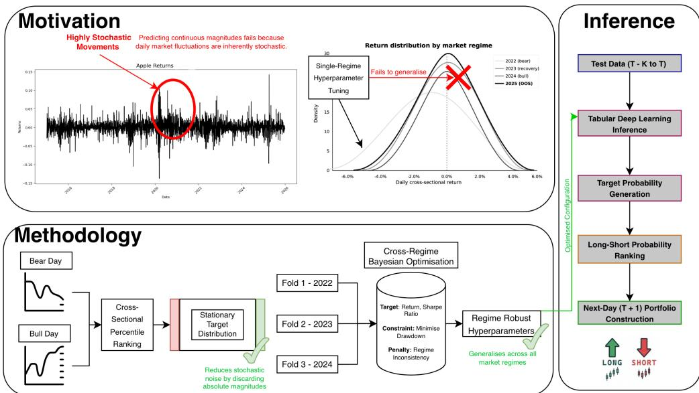  
Figure 1: Overview of motivation, methodology, and inference framework  
(Top-Left) Single-regime hyperparameter tuning fails to capture highly stochastic, regime-dependent return distributions. (Bottom-Left) Cross-sectional percentile ranking maps these heterogeneous environments into a stationary target distribution. Cross-regime Bayesian optimisation selects hyperparameters that generalise across them. (Right) The daily execution pipeline processes historical data via TDL models to generate target probabilities for OOS long-short portfolio construction

## 2 Literature Review

## 2.1 Traditional Methods

Financial modelling began with continuous-time methods such as geometric Brownian motion [23] and the Black-Scholes model [24], which provide the first mathematical approach to asset price forecasting. Reliance on assumptions of constant volatility and log-normality has limited the accuracy of their return series predictions [24]. ARIMA and GARCH improved forecasting by capturing autocorrelation and volatility clustering in univariate return series [25, 26]. Both are still useful benchmarks for univariate forecasting, but they were designed for individual temporal sequences, reducing their relevance for heterogeneous cross-sectional data. In current research, this leaves them as baseline models and highlights the need for more flexible methods that are limited by fewer assumptions [11, 22, 10, 2].

Classical ML offers this structural flexibility by addressing the linearity constraints of statistical forecasting and allowing for multivariate analysis. In contrast to traditional time-series models, ML is able to capture interactions among predictors that linear counterparts cannot. Research finds that Support Vector Machines [27] and tree-based ensembles such as Random Forests [28, 29], and XGBoost [30] improve forecasting over statistical baselines on financial applications. However, these models are limited by treating stocks as independent observations. As implied by Gu et al. [11], return predictability is driven by relative characteristics between equities, meaning that the most economically valuable component of the signal is discarded. Their predictive performance may also be dependent on manual feature engineering, requiring substantial domain expertise to construct informative inputs [31].

Deep learning reduced this need for feature engineering by learning complex feature representations from raw data [4, 3]. Multi-Layer Perceptrons (MLP) applied to asset pricing have improved OOS return prediction over linear benchmarks [11], but lack mechanisms for modelling temporal dependence or handling irregular feature interactions. Recurrent neural networks, including their variants, address the temporal limitation by modelling sequential dependence across observations [32] and Transformer-based models extend this to longer-range dependencies through self-attention [5]. Both sequential approaches are designed for homogeneous time-series data, making them poorly suited to the heterogeneous tabular feature sets that define cross-sectional equity panel data, where inputs cover continuous values, sentiment scores, and macroeconomic indicators with no inherent sequential structure.

## 2.2 Tabular Deep Learning

Grinsztajn et al. [12] identify two structural reasons why standard neural networks struggle on tabular data. Neural networks are biased toward smooth functions, while tabular target functions tend to be irregular and piecewise, favouring tree-based splits over gradient descent. MLPs are also disproportionately sensitive to uninformative features that are common in tabular datasets. Borisov et al. [33] reinforce this, outlining that standard MLPs have limited ability to identify features that dominate predictions or capture irregular interaction patterns, properties that tree-based methods handle naturally through their splitting structure. MLPs often require substantially more tuning and data to match what tree-based methods achieve [12, 13], helping explain the consistent strength of gradient-boosted trees on benchmark tabular tasks.

TabNet [14] approaches tabular learning through sequential attention for instance-wise feature selection. Its sparsemax layers selectively focus on the most relevant features at each prediction step, designed to address the sensitivity to uninformative features that limits MLP performance, as well as mimicking the node-splitting behaviour of decision trees. The Feature Tokeniser-Transformer (FT-Transformer) [15] takes a different approach, representing each feature as a distinct token and applying multi-head self-attention across the feature set. By treating each feature as a distinct token, attention computes how strongly features relate to one another separately for each input. Related models such as TabTransformer [16] and SAINT [17] extend the architectural space further, but require categorical feature structure or substantial label-scarce pretraining that are not suited to the continuous tabular inputs present in equity panel data. TabNet and the FT-Transformer are therefore more architecturally appropriate for this research.

Performance across TDL architectures is sensitive to dataset structure and tuning. Benchmark studies demonstrate these models frequently outperform standard MLPs but rarely surpass gradient-boosted trees when hyperparameters are not carefully selected [33, 13, 12]. In financial applications, this sensitivity is exacerbated by regime changes that make robust generalisation more difficult. A configuration selected on a single validation period may be well-suited to the return distribution of that regime but fail to generalise when market conditions shift, yet existing evaluations of TDL models rely on static benchmarks with stable feature distributions [33]. No existing study evaluates TabNet or FT-Transformer within a cross-sectional equity trading framework that explicitly targets regime robustness during hyperparameter selection.

## 2.3 Data Sources

The tabular inputs within equity panel data contain many different source types, each capturing dimensions of stock and investor behaviour. Kumbure et al. [10] reviewed 138 financial ML studies from 2000 to 2019. They identified 2173 unique variables covering technical indicators, macroeconomic factors, fundamental indicators, and alternative sources. Technical indicators are the focus of many studies despite criticism that their lagging behaviour reflects past price action [10]. Recent evidence confirms that alternative data sources are useful in investment practice, as big data inputs improve earnings forecasts and stock price prediction [34, 18], substantiating their inclusion.

Firm-level news sentiment is a widely reviewed alternative data source for equity prediction as it captures information separate to historical return dynamics. Atkins et al. [35] find that information extracted from news carries predictive content for equity and index volatility, outperforming price-based prediction of directional movements, with Allen et al. [36] extending this to prices. More recently, Gambarelli and Muzzioli [37] discuss that firm-level sentiment indicators are significantly priced in European stock returns, extending this evidence beyond the US market. The current literature, however, uses aggregate or index-level sentiment measures. Their relevance for cross-sectional prediction is limited, since the signal must differentiate between individual stocks on a given day.

Search volume data from Google Trends provides a proxy for investor attention that is not captured by other sources. Preis et al. [20] and Fan et al. [38] show that changes in frequency for finance-related search terms correlate with, and can serve as early indicators of, market movements. Szczygielski et al. [39] build on this by establishing that such search-based signals are systematically related to market uncertainty. This evidence remains predominantly market-level as stock-specific search behaviour that could support cross-sectional differentiation is scarce. Chen et al. [40] complicate this picture, showing that high-attention stocks experience short-term price pressure and that broad market-level indices may capture this signal despite their aggregation. This contrasts the granularity limitation raised above for sentiment measures, suggesting the value of aggregation may depend on the data source. Macroeconomic indicators provide a further view of the broader context. Variables such as inflation, monetary policy stance, and yield curve dynamics contain information separate to firm-specific signals, capturing conditions shared across all stocks simultaneously [10].

The construction of the dataset introduces risks that the literature has attempted to address. Survivorship bias inflates expected returns by excluding stocks delisted or removed from indices during the sample period [41]. Look-ahead bias arises from using data unavailable at prediction time. Fundamental data released with reporting lags and alternative sources with non-standard publication schedules need particular care to ensure only data available at the time are provided to the model [42]. The relative contribution of these source types remains unquantified across long and short signal directions in the cross-sectional equity setting, since feature attribution has not been applied separately by direction.

## 2.4 Performance Evaluation Under Regime Instability

Predictive accuracy and trading performance are not equivalent objectives in cross-sectional trading strategies. Classification accuracy weights every prediction equally regardless of the size or direction of the resulting return. Therefore, a model can achieve strong accuracy while its errors are concentrated in the highest-magnitude moves, producing poor trading performance independent of transaction costs. Applying realistic execution assumptions can magnify this, since apparent gains in returns can disappear entirely once transaction costs are applied [21, 2]. Fieberg et al. [22] confirm this, showing that models ranking highest on accuracy do not consistently produce the strongest long-short portfolio returns. Portfolio-level evaluation is therefore a necessary condition for meaningful model comparison [11, 43], but alone it does not guarantee reliable model selection, since a strategy validated on one market period may still fail once conditions shift.

Return distributions shift across market conditions, and a model tuned to one regime will often fail in another as the underlying signal changes [6, 44]. One method has been to use regime detection, identifying market states through models such as Hidden Markov Models and switching model parameters or training sets accordingly. Pagliaro [45] reports economically meaningful risk-adjusted performance in cross-sectional equity settings using a regime-aware LightGBM framework. The limitation is that regime detection introduces its own sources of error. Misclassification of the current regime propagates into model selection, and the additional tuning required for each detected state increases the risk of overfitting to historical regimes that may not recur.

Regime robustness can instead be built into the optimisation process itself, avoiding the need to detect regimes at inference time. Hyperparameters can be selected to perform well across multiple distinct environments simultaneously, without conditioning on a detected state, reducing sensitivity to any single regime’s return distribution. Wong and Barahona [46] treat distribution shift as a structural property of financial data supporting treating regime heterogeneity as a constraint within optimisation itself. Signal decay compounds this, as published predictive signals erode once market participants exploit them [47], so a configuration validated on a single historical regime is unlikely to hold going forward.

## 3 Methodology

## 3.1 Data

## 3.1.1 Dataset and Preprocessing

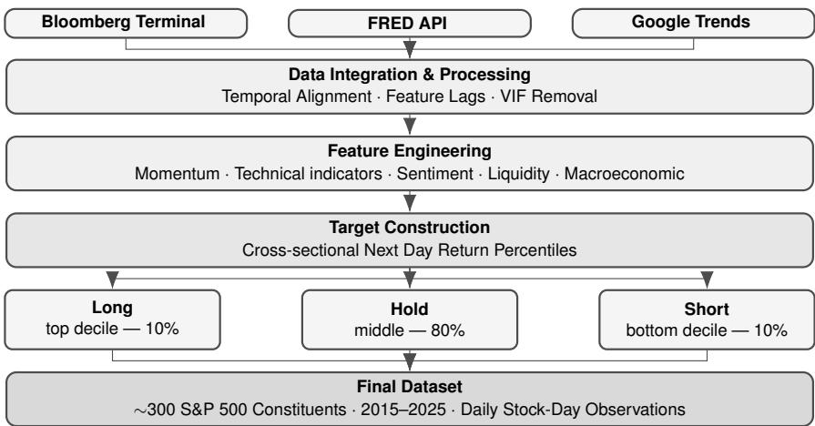  
Figure 2: Dataset Construction

Traditional market data, company fundamentals, and news sentiment from Bloomberg are integrated with Google Trends and FRED macroeconomic indicators. The processed data generates next-day cross-sectional return percentiles, establishing outer-decile (10%) long and short target classes for approximately 300 S&P 500 constituents

The collection universe contained 300 large-cap S&P 500 constituents from January 2015 to December 2025, as illustrated in Figure 2. Restricting the universe to large-cap constituents ensured sufficient liquidity to make backtested transaction cost assumptions realistic. In addition to price and company data, macroeconomic indicators from FRED [48] capture broader market conditions. Firm-level news sentiment [49] and Google Trends indices [50] provide signals of information content orthogonal to price dynamics and market-wide behavioural attention [35, 36, 40].

Data cleaning was conducted to ensure the integrity of the dataset. Companies with missing price observations were dropped, as imputing prices could introduce skew into return series, with fundamental values being forward-filled within each ticker to ensure the most recently reported figure was available. Days where no sentiment score was reported were assigned a sentiment score of zero, the assumption being neutrality where there is no coverage. All weekend news is aggregated into the following trading day to ensure the inclusion of its signal. No outlier removal was applied to return observations, as extreme values in financial data carry signal and their removal could discard tail events most relevant to a long-short strategy.

To prevent look-ahead bias, monthly macroeconomic indicators were shifted forward by 21 trading days, quarterly fundamentals by 63 days, weekly jobless claims by 5 days, and news and search volume data by one trading day, ensuring only information available at the point of prediction was used. Google Trends required additional handling, as each downloaded batch is independently normalised to a 0–100 scale, making consecutive batches incomparable. A chained normalisation approach corrected this by computing a median scaling factor from overlapping periods between consecutive windows to construct a continuous time series.

Finally, multicollinearity among features was assessed using the Variance Inflation Factor (VIF), with a threshold of 10 applied as a commonly used rule-of-thumb for feature removal [51]. Features exceeding this threshold were removed when redundant, although a small number of high-VIF features were retained where domain relevance outweighed collinearity concerns, since VIF thresholds are context-dependent and should not be treated as absolute decision rules [51, 52].

## 3.1.2 Feature Engineering

The collected features cover four categories: technical indicators, company fundamentals, macroeconomic factors and alternative data, reflecting the categories identified by Kumbure et al. [10]. Raw features are insufficient for cross-sectional prediction, as careful transformation of inputs can improve OOS return predictability [31]. Where possible, features were therefore constructed in relative terms. Return ranks, momentum, oscillators, and volume measures are expressed relative to either the cross-sectional distribution or each stock’s own recent history, since absolute values are not informative for a prediction task whose objective is to rank stocks relative to one another.

Alternative data sources required additional engineering beyond standard transformation due to the complexity of their relationships with returns. News sentiment was supplemented with a binary indicator flagging extreme observations, capturing potential non-linearity in the relationship between sentiment magnitude and returns that a linear feature would not represent. Equity market volatility was captured through a rolling quantile-based regime indicator, as the predictive content of volatility for cross-sectional returns derives from whether conditions are elevated relative to recent history.

$$
r _ { t + 1 } ^ { ( i ) } = \ln \left( \frac { P _ { t + 1 } ^ { ( i ) } } { P _ { t } ^ { ( i ) } } \right)
$$

$$
\mathrm { R a n k } _ { t + 1 } ^ { ( i ) } = \mathrm { P e r c e n t i l e R a n k } \left( r _ { t + 1 } ^ { ( i ) } \right)
$$

$$
y _ { t } ^ { ( i ) } = \left\{ \begin{array} { l l } { 2 } & { \mathrm { i f } \mathrm { R a n k } _ { t + 1 } ^ { ( i ) } > 0 . 9 0 , } \\ { 0 } & { \mathrm { i f } \mathrm { R a n k } _ { t + 1 } ^ { ( i ) } < 0 . 1 0 , } \\ { 1 } & { \mathrm { o t h e r w i s e } . } \end{array} \right.\tag{1}
$$

The target variable is defined in Equation (1). The prediction task was conducted as a cross-sectional classification problem, since predicting continuous returns is problematic given their high noise, heteroskedasticity, and nonstationarity. Next-day returns were ranked into deciles across the universe daily. The top and bottom deciles assigned long and short labels, respectively. The outer-decile threshold aligns with established cross-sectional equity ML studies [11, 22], concentrating positions in the highest-conviction signals and managing the class imbalance caused by using narrow threshold boundaries. UMAP projections of the training feature space, presented in Appendix A, show that long and short labels are intermixed without a clear structure, as well as structural groupings that reveal regime-related heterogeneity that is verified formally via KS tests in Section 3.2.

## 3.2 Experimental Setup

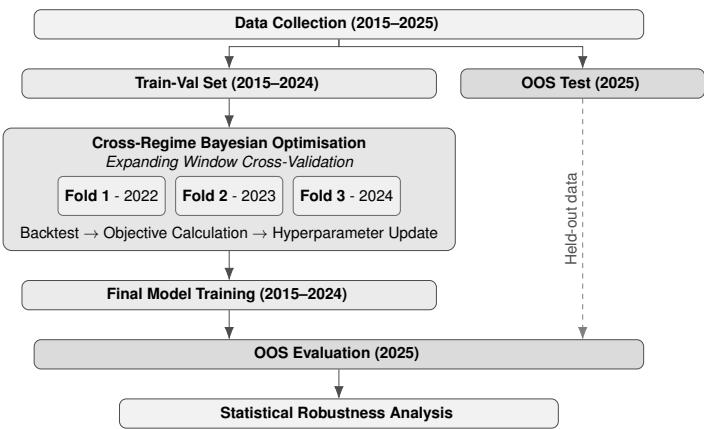  
Figure 3: Modelling Methods  
Data is split into a training and validation set and an out-of-sample (OOS) test set. Cross-regime Bayesian optimisation utilises an expanding window cross-validation across distinct market regimes before final model training and OOS evaluation

## 3.2.1 Data Partitioning and Regime Validation

The full dataset was divided into training and validation sets covering 2015 to 2024 and an OOS test set comprising 2025, as illustrated in Figure 3. The 2025 period was excluded from model development and hyperparameter selection to provide an uninfluenced estimate of real-world performance.

Three validation folds were defined within the training period, corresponding to 2022, 2023, and 2024, constructed using an expanding-window approach. Each fold trains on all data from 2015 through the preceding year and evaluates on the target year. This design was chosen instead of a rolling window, which discards older observations, since retaining the full historical training set reflects production conditions where all available data would be utilised. Standard k-fold cross-validation was excluded as random shuffling of time-series observations would introduce look-ahead bias, where future observations appear in the training set of earlier folds [21]. A one-day purge was applied at each fold boundary, removing the final training observation whose label window extended into the validation period. Pairwise two-sample Kolmogorov-Smirnov (KS) tests were applied to daily return and 5-day realised volatility distributions across all fold pairs to verify that each period is a different market regime. Distributional differences were found to be significant across all regimes $( p < 0 . 0 0 1 )$ ); full results are reported in Appendix B. A further KS test comparing the full training distribution against 2025 confirmed a meaningful distributional shift in the OOS period, reinforcing the need for multi-regime validation. Because this shift is present, any strong OOS performance that follows would provide evidence that the cross-regime framework enables model generalisation across market shifts.

A RobustScaler was fitted on the training portion of each fold and standardises all input features, with its learned parameters then applied to the validation sets to prevent data leakage. RobustScaler was implemented instead of standard normalisation due to the high skew and kurtosis of financial return distributions, as it scales features using the interquartile range. The three-class target distribution was highly imbalanced by construction, since the hold class contains approximately 80% of observations. Therefore, tree-based and linear models utilise balanced class weights and deep learning models use a class-weighted cross-entropy loss to penalise minority class errors proportionally.

## 3.2.2 Backtesting Framework and Portfolio Construction

During validation and final evaluation, each model produces a three-class probability vector for every stock-day observation, the full inference pipeline is illustrated in Figure 1. Daily trading signals were generated by ranking stocks cross-sectionally according to their predicted long and short class probabilities separately, with the top n long stocks assigned long positions and the top n short stocks assigned short positions. Separating the long and short rankings ensures each signal direction is evaluated on its own cross-sectional distribution, so a stock qualifies for each trading book on the strength of its probability relative to other stocks. The \$10 million initial capital was split evenly across the long and short books and equally across positions within each side. This gives a dollar-neutral, unlevered portfolio with 100% gross exposure and avoids amplifying the influence of any single holding. The portfolio was rebalanced daily and trades are executed at market-on-close prices. Features requiring same-day price information were constructed from a pre-close snapshot and orders are submitted ahead of the market-on-close cut-off. The closing price was used as an execution proxy, on the assumption that the difference between the pre-close and closing price is negligible. A fixed cost of 2.2 basis points per trade accounts for transaction costs and slippage, charged per leg on entry and exit, including both legs of a same-day flip. Hagstromer [53] reports a mean effective spread of 2.84 basis points for S&P 500 constituents, implying a one-way execution cost of 1.42 basis points. The assumption applied here therefore exceeds the spread component, leaving margin for commissions and fees. Strategy performance was benchmarked against a passive S&P 500 buy-and-hold strategy. This same portfolio construction procedure was applied during hyperparameter optimisation and final OOS evaluation across fixed random seeds to support reproducibility.

## 3.2.3 Bayesian Hyperparameter Optimisation

Hyperparameters for all models are selected using Bayesian optimisation via the Optuna framework [54], utilising a Tree-structured Parzen Estimator (TPE) [55] sampler with 30 trials per model. The objective function was designed to target trading performance across all three validation regimes simultaneously, in place of optimising for predictive accuracy in a single validation fold. This design targets the gap between classification performance and realised trading outcomes discussed by López de Prado [21] and Gu et al. [11]. For each Optuna trial, the model was trained and backtested, details shown in Section 3.2.2, on all three validation folds, and a composite score was computed as shown in Equation 2.

$$
\begin{array} { r l r } { \mathrm { S c o r e } = \underbrace { 0 . 4 \left( \frac { \bar { r } } { 0 . 1 5 } \right) + 0 . 4 \left( \frac { \bar { s } } { 1 . 5 } \right) - 0 . 2 \left( \frac { \bar { d } } { 0 . 1 0 } \right) } _ { \mathrm { B a s e ~ o b j e c t i v e } } - \underbrace { \left( P _ { r } + P _ { s } + P _ { d } + P _ { \mathrm { f l o o r } } \right) } _ { \mathrm { P e n a l i t s } } } & { } & \\ { P _ { r } = 1 . 5 \left( \frac { \operatorname* { m a x } _ { i } \mid \operatorname* { m i n } ( 0 , r _ { i } ) \mid } { 0 . 1 5 } \right) ^ { 2 } } & { P _ { s } = 1 . 5 \left( \frac { \operatorname* { m a x } _ { i } \mid \operatorname* { m i n } ( 0 , s _ { i } ) \mid } { 1 . 5 } \right) ^ { 2 } } & \\ { P _ { d } = 1 . 0 \left( \frac { \operatorname* { m a x } _ { i } \mid \operatorname* { m a x } ( 0 , d _ { i } - 0 . 1 5 ) \mid } { 0 . 1 5 } \right) ^ { 2 } } & { P _ { \mathrm { f l o o r } } = \left\{ 0 . 0 } & { \mathrm { i f } \equiv i : r _ { i } < - 0 . 2 0 \right. } \end{array}\tag{2}
$$

where r, ¯ s, ¯ d¯denote mean return, Sharpe ratio, and drawdown across all regimes.

The base objective combines three trading metrics. Mean annualised return and Sharpe ratio each receive 40% weight as the performance objectives, with maximum drawdown at 20% as a risk management constraint. Each metric is divided by a target value before weighting, 0.15 for return, 1.5 for Sharpe, and 0.10 for drawdown, so that a metric meeting its target contributes a ratio of one to the score. Without this, the differing magnitudes of the three metrics would distort the intended emphasis of the weights. All weights were fixed before experimentation began, since tuning them alongside the model would make the objective function itself a source of overfitting.

The targets are calibrated against S&P 500 benchmarks observed over the training period. A return target of 15% exceeds the mean annualised index return of 14.3%; the Sharpe target of 1.5 exceeds the benchmark Sharpe of 0.93; and the drawdown target of 10% improves upon the mean annual drawdown of 13.1%. In each case the threshold demands outperformance of the passive benchmark.

The main risk in cross-regime optimisation is that the optimiser identifies configurations that perform well on average by excelling in one regime and collapsing in another. Quadratic penalties are applied to prevent this. Return and Sharpe penalties are triggered by any negative fold, and a drawdown penalty triggered when any fold exceeds 15%. Configurations with drawdown between 10% and 15% are discouraged through the base score but not eliminated, preserving flexibility in the hyperparameter search. The quadratic penalty means a drawdown of 20% incurs four times the cost of one at 10%, making severe violations disproportionately expensive. A hard floor penalty of 10.0 eliminates any configuration returning below −20% in any single regime. Portfolio size n was tuned jointly with model hyperparameters within a search range of 5 to 8.

## 3.3 Model Architectures

Five models were implemented covering linear, tree-based, and deep learning approaches, with Table 1 summarising the architecture and training configuration for each. All hyperparameters were selected via the Bayesian optimisation framework described in Section 3.2 unless otherwise stated. Search bounds are informed by dataset scale, computational constraints, and established ranges in the literature.

## 3.3.1 Baseline Models

Three baseline models were implemented to establish performance benchmarks. Logistic Regression (LR) served as a linear baseline, providing a lower bound on the complexity required to generate predictive trading signals. Gradientboosted trees remain state of the art on tabular classification tasks [12], therefore XGBoost was included as a tree-based baseline and was expected to provide the most competitive non-deep-learning comparison. An MLP was included as a deep learning baseline to isolate the contribution of architecture-specific inductive biases in TabNet and FT-Transformer from the general benefit of deep learning over tree-based methods.

## 3.3.2 Models Under Evaluation

TabNet [14] and the FT-Transformer [15] were selected because each addresses a different MLP limitation identified in Section 2.2. TabNet’s sequential attention performs instance-wise feature selection, targeting the sensitivity to uninformative features, whereas the FT-Transformer’s per-feature tokenisation and self-attention allow feature interactions to be computed dynamically for each input. Including the MLP alongside both isolates if these mechanisms deliver gain beyond generic deep learning capacity.

A hybrid ensemble was constructed by combining the predictions of XGBoost and TabNet via rank aggregation, selected as the optimal combination from all ensembles of the models. Ensemble selection involved removing any combination producing negative returns in any validation regime and then surviving combinations are ranked using the composite scoring function described in Equation 2 applied across the three validation regimes. On each trading day, each model’s long and short signal probabilities were ranked, and the resulting ranks were averaged across models before applying the top-n selection logic. This approach is more robust to differences in probability calibration between models than averaging raw probabilities, ensuring that a poorly calibrated model cannot dominate the signal. The ensemble portfolio size n was set as the integer mean of the individual model portfolio sizes.

Table 1: Model Architecture and Training Configuration
<table><tr><td>Model</td><td>Key Architecture</td><td>ping</td><td>Early Stop- Hyperparameter Search Space</td></tr><tr><td>Logistic Regression</td><td>Linear model</td><td></td><td>Regularisation strength  $C \in [ 1 \mathrm { e } \mathrm { - } 5 , 1 \mathrm { e } 4 ]$ </td></tr><tr><td>XGBoost</td><td>Gradient boosted trees</td><td>30 rounds</td><td>Estimators ∈ [1000, 1300], learning rate  $\in [ 0 . 0 0 5 , 0 . 1 ]$  , max depth  $\in [ 3 , 5 ] .$  , min child weight ∈ [15, 50], γ ∈ [0.5, 2.0], λ ∈ [0.5, 3.0],  $\alpha \in [ 1 . 0 , 2 . 0 ]$  , subsample ∈ [0.7, 1.0], column sample  $\in [ \mathrm { { 0 . 5 } , 1 . 0 } ]$ </td></tr><tr><td>MLP</td><td>Halving layers, LayerNorm, 10 epochs ReLU</td><td></td><td>Hidden dimension ∈ {128, 256, 512}, layers ∈ [2, 3], dropout ∈ [0.1, 0.3], learning rate ∈ [1e-4, 5e-3], batch size ∈ {2048, 4096}, gradient clipping ∈ [0.5, 2.0], weight decay ∈ [1e-5, 1e-3]</td></tr><tr><td>TabNet</td><td>Sequential attention, sparsemax, ghost batch normalisation</td><td>10 epochs</td><td> ${ n _ { d } } = { n _ { a } } \in \{ 8 , 1 6 , 3 2 \}$  , decision steps ∈  $\{ 3 , 4 \} , \gamma \in [ 0 . 5 , 3 . 0 ]$  , learn- ing rate ∈ [5e-4, 1e-2], batch size ∈ {2048, 4096, 8192}, gradient  $\mathrm { { c l i p p i n g } \in [ 0 . 5 , 1 . 5 ] } ,$  , weight decay ∈ [5e-4, 1e-1]</td></tr><tr><td>FT- Transformer</td><td>Feature tokenisation, multi-head self-attention, linear head</td><td>10 epochs</td><td>Attention blocks ∈ {2, 3}, attention heads ∈ {2, 4, 8}, embedding dimension ∈ {32, 64}, head size ∈ {32, 64}, attention dropout  $\in \ [ 0 . 2 , 0 . 5 ]$  , feed-forward dropout ∈ [0.2, 0.5], learning rate ∈ [5e-4, 1e-2], batch  $\mathrm { s i z e } \in \{ 2 0 \overset { \cdot } { 4 } 8 , 4 0 9 6 , 8 1 9 2 \}$  , gradient clipping</td></tr></table>

All deep learning models trained with AdamW optimiser and ReduceLROnPlateau learning rate scheduler for 100 epochs with early stopping on the validation set. Class-weighted cross-entropy loss with label smoothing = 0.1 where applicable. TabNet uses a fixed virtual batch size of 256 for ghost batch normalisation.

## 3.4 Evaluation Framework

## 3.4.1 Out-of-Sample Performance and Statistical Significance Testing

After hyperparameter selection, the final configuration was retrained on the full 2015–2024 period and evaluated on the held-out 2025 set using the portfolio construction procedure described in Section 3.2.2. Final OOS evaluation provides the primary estimate of real-world strategy performance accompanied by classification metrics offering a diagnostic of signal quality.

Daily strategy returns were assessed for normality using the Shapiro-Wilk test. Non-Gaussian characteristics are observed, meaning a suite of non-parametric tests was applied to compare model performance, with results significant at $\alpha < 0 . 0 5$ . The KS test was used to compare the return distributions of competing strategies, the Friedman test was used to assess differences across models, and the Wilcoxon Signed-Rank test was used to compare individual models against the S&P 500. To further evaluate risk-adjusted performance, the Probabilistic Sharpe Ratio (PSR) [21] was computed against the S&P 500’s daily Sharpe ratio as the reference threshold, accounting for skewness and excess kurtosis in the return distribution. CAPM regression of daily strategy returns on S&P 500 benchmark returns was performed to estimate annualised alpha, beta, and $R ^ { 2 }$ , isolating the extent to which performance was attributable to stock selection skill. Pairwise cross-regressions between models were also conducted to examine the degree of similarity between their predictive outputs.

Classification-based metrics are reported alongside portfolio-level metrics. However, since the research objective is to evaluate trading performance, the main criteria for model comparison are annual return, Sharpe ratio, drawdown, and statistical significance relative to the benchmark.

## 3.4.2 Robustness and Temporal Stability Analysis

Two analyses test the regime robustness and input stability predicted by the hypothesis stated in Section 1. Aggregate OOS performance over a single year cannot separate a regime-robust configuration from one that happened to suit 2025, nor can it establish if the signal survives the input degradation that vendor inconsistencies or pipeline latency would introduce in production.

Input stability was assessed by injecting Gaussian noise into the standardised test features at four levels $( \sigma \in$ {0.05, 0.10, 0.20, 0.50}) across 20 random seeds. It was applied proportionally to each feature’s standard deviation so that σ reflects a fraction of each feature’s own variability. Jensen-Shannon divergence quantified the resulting shift in predicted probability distributions. Portfolio return, Sharpe ratio, and maximum drawdown were recorded a each level to assess practical trading impact. A null baseline replacing all features with Gaussian noise was included to determine if the model is learning signal or performance is due to chance.

Regime generalisation was assessed by dividing 2025 into four quarterly sub-periods. Pairwise KS tests confirmed each quarter of 2025 was a distinct market environment. Performance across quarters therefore reflects generalisation to conditions the model was not tuned on. Long and short signal precision were then evaluated separately within each quarter to determine whether predictive performance holds across changing conditions or degrades over time.

## 3.4.3 Interpretability and Operationalisation

Signals that drive the model predictions are often masked by the black box outputs of many ML models. To highlight valuable signals, SHAP values are computed for all five models using KernelExplainer with a k-means background of 100 cluster centres derived from the 2015–2024 training distribution. KernelExplainer was chosen over architecture-specific alternatives to ensure attributions are accurately comparable across models without introducing explainer-specific variance. Values were approximated over 5,000 training observations with 500 background samples per call, to balance computational costs.

Separate SHAP values were computed for both signal directions. This distinction matters because a model generating asymmetric signals may not rely on the same features; collapsing long and short attributions into a single importance ranking would obscure this. Attributions were aggregated by data source category following the categories outlined by Kumbure et al. [10]. This allows assessment of the relative contribution of technical, fundamental, macroeconomic, and alternative inputs to each signal direction. The hybrid ensemble is excluded from SHAP analysis as rank aggregation does not expose a differentiable output.

Static performance metrics resist interrogation of the conditions or reasons behind a strategy’s performance. To address this, an interactive research application was developed exposing backtest results, SHAP attributions, and input features through a REST API with a React frontend. Users can adjust position limits and examine model behaviour across regimes in real time. An AI research assistant grounded in the study’s results enables natural language queries over model performance and feature drivers, operationalising the outputs in a form closer to practical deployment.

## 3.5 Ethical Considerations

This project involved no human participants, personal data, or live capital, and did not require ethics approval. Bloomberg Terminal data was accessed under an institutional licence and not redistributed. The reliance on licensed data constrains independent verification, mitigated in part by the use of publicly available FRED and Google Trends sources alongside it.

The main ethical risk in backtested trading research is the reporting of performance that could not have been achieved in practice, since inflated results influence how capital is allocated. The lag schedule, fold purging, and per-fold scaler fitting described in Section 3.1.1 therefore serve to maintain integrity. ML-driven trading signals also have the potential to contribute to market instability if deployed at scale, a consideration returned to in Section 5.3.

## 4 Results

## 4.1 Trading Performance and Comparison

Table 2: Model Performance Across All Models and Market Regimes
<table><tr><td colspan="2"></td><td colspan="4">ML Classification Metrics</td><td colspan="5">Backtesting Performance</td></tr><tr><td>Year</td><td>Model</td><td>Acc</td><td>Pre</td><td>Rec</td><td>F1</td><td>Ret%</td><td>SR</td><td>Sor</td><td>Cal</td><td>DD%</td></tr><tr><td rowspan="7">2022</td><td>S&amp;P 500</td><td>一</td><td>一</td><td></td><td>一</td><td>-18.99</td><td>-0.90</td><td>-1.21</td><td>-0.78</td><td>-24.47</td></tr><tr><td>LogReg</td><td>0.792</td><td>0.434</td><td>0.368</td><td>0.369</td><td>-6.15</td><td>-0.56</td><td>-0.52</td><td>-0.50</td><td>-12.20</td></tr><tr><td>XGBoost</td><td>0.799</td><td>0.440</td><td>0.357</td><td>0.350</td><td>9.02</td><td>0.36</td><td>0.76</td><td>0.56</td><td>-16.01</td></tr><tr><td>MLP</td><td>0.794</td><td>0.404</td><td>0.349</td><td>0.337</td><td>2.56</td><td>0.05</td><td>0.38</td><td>0.19</td><td>-13.76</td></tr><tr><td>TabNet</td><td>0.786</td><td>0.397</td><td>0.353</td><td>0.346</td><td>7.62</td><td>0.33</td><td>0.88</td><td>0.95</td><td>-8.04</td></tr><tr><td>FT-Transformer</td><td>0.794</td><td>0.423</td><td>0.357</td><td>0.351</td><td>16.00</td><td>0.75</td><td>1.63</td><td>1.59</td><td>-10.09</td></tr><tr><td>Hybrid</td><td>0.795</td><td>0.431</td><td>0.359</td><td>0.354</td><td>5.92</td><td>0.22</td><td>0.75</td><td>0.49</td><td>-12.11</td></tr><tr><td rowspan="7">2023</td><td>S&amp;P 500</td><td></td><td></td><td></td><td>1</td><td>26.00</td><td>1.58</td><td>3.05</td><td>2.61</td><td>-9.97</td></tr><tr><td>LogReg</td><td>0.787</td><td>0.424</td><td>0.364</td><td>0.363</td><td>-13.48</td><td>-1.26</td><td>-1.37</td><td>-0.80</td><td>-16.87</td></tr><tr><td>XGBoost</td><td>0.796</td><td>0.439</td><td>0.356</td><td>0.348</td><td>8.02</td><td>0.33</td><td>0.85</td><td>0.59</td><td>-13.53</td></tr><tr><td>MLP</td><td>0.792</td><td>0.415</td><td>0.351</td><td>0.340</td><td>-0.55</td><td>-0.22</td><td>0.05</td><td>-0.04</td><td>-12.62</td></tr><tr><td>TabNet</td><td>0.787</td><td>0.418</td><td>0.359</td><td>0.354</td><td>2.14</td><td>-0.06</td><td>0.36</td><td>0.23</td><td>-9.21</td></tr><tr><td>FT-Transformer</td><td>0.791</td><td>0.423</td><td>0.356</td><td>0.350</td><td>2.62</td><td>0.03</td><td>0.34</td><td>0.20</td><td>-12.87</td></tr><tr><td>Hybrid</td><td>0.793</td><td>0.437</td><td>0.360</td><td>0.355</td><td>3.61</td><td>0.08</td><td>0.47</td><td>0.28</td><td>-12.88</td></tr><tr><td rowspan="7">2024</td><td>S&amp;P 500</td><td></td><td></td><td></td><td></td><td>25.28</td><td>1.58</td><td>2.43</td><td>3.01</td><td>-8.41</td></tr><tr><td>LogReg</td><td>0.790</td><td>0.438</td><td>0.368</td><td>0.369</td><td>-8.60</td><td>-0.75</td><td>-0.81</td><td>-0.42</td><td>-20.53</td></tr><tr><td>XGBoost</td><td>0.797</td><td>0.444</td><td>0.357</td><td>0.349</td><td>29.07</td><td>1.22</td><td>2.04</td><td>2.42</td><td>-12.03</td></tr><tr><td>MLP</td><td>0.794</td><td>0.426</td><td>0.353</td><td>0.343</td><td>7.64</td><td>0.30</td><td>0.75</td><td>0.52</td><td>-14.67</td></tr><tr><td>TabNet</td><td>0.789</td><td>0.420</td><td>0.359</td><td>0.355</td><td>6.54</td><td>0.28</td><td>0.81</td><td>0.87</td><td>-7.52</td></tr><tr><td>FT-Transformer</td><td>0.793</td><td>0.435</td><td>0.359</td><td>0.354</td><td>2.28</td><td>0.01</td><td>0.29</td><td>0.13</td><td>-17.29</td></tr><tr><td>Hybrid</td><td>0.794</td><td>0.442</td><td>0.361</td><td>0.356</td><td>25.99</td><td>1.32</td><td>2.17</td><td>2.53</td><td>-10.26</td></tr><tr><td rowspan="7">2025</td><td>S&amp;P 500</td><td></td><td></td><td></td><td></td><td>18.01</td><td>0.77</td><td>1.22</td><td>0.96</td><td>-18.76</td></tr><tr><td>LogReg</td><td>0.789</td><td>0.431</td><td>0.366</td><td>0.365</td><td>-5.69</td><td>-0.63</td><td>-0.62</td><td>-0.37</td><td>-15.23</td></tr><tr><td>XGBoost</td><td>0.794</td><td>0.430</td><td>0.354</td><td>0.344</td><td>33.61</td><td>1.37</td><td>2.92</td><td>3.92</td><td>-8.58</td></tr><tr><td>MLP</td><td>0.795</td><td>0.436</td><td>0.355</td><td>0.346</td><td>17.34</td><td>0.77</td><td>1.45</td><td>1.40</td><td>-12.35</td></tr><tr><td>TabNet</td><td>0.789</td><td>0.423</td><td>0.360</td><td>0.355</td><td>9.30</td><td>0.44</td><td>1.15</td><td>0.61</td><td>-15.24</td></tr><tr><td>FT-Transformer</td><td>0.792</td><td>0.430</td><td>0.358</td><td>0.351</td><td>3.08</td><td>0.06</td><td>0.46</td><td>0.22</td><td>-14.20</td></tr><tr><td>Hybrid</td><td>0.793</td><td>0.437</td><td>0.359</td><td>0.354</td><td>51.26</td><td>2.44</td><td>5.35</td><td>6.60</td><td>-7.76</td></tr></table>

<table><tr><td>Model</td><td>Long</td><td>Hold</td><td>Short</td></tr><tr><td>LogReg</td><td>0.233</td><td>0.821</td><td>0.240</td></tr><tr><td>XGBoost</td><td>0.239</td><td>0.814</td><td>0.239</td></tr><tr><td>MLP</td><td>0.247</td><td>0.815</td><td>0.247</td></tr><tr><td>TabNet</td><td>0.223</td><td>0.818</td><td>0.229</td></tr><tr><td>FT-Transformer</td><td>0.227</td><td>0.816</td><td>0.246</td></tr><tr><td>Hybrid</td><td>0.240</td><td>0.817</td><td>0.254</td></tr></table>

Note: 2025 is the out-of-sample period. Bold indicates the best model per period, excluding the benchmark. S&P 500 ML metrics are not applicable (–). Sharpe ratios use excess returns with a fixed annualised risk-free rate of 3.6% [48], applied identically to strategy and benchmark. Long and Short per-class precision exceed the 10% random baseline, with the Hybrid achieving the highest Short precision.  
Abbreviations: Acc = Accuracy, Pre = Precision, Rec = Recall, F1 = F1-Score, Ret% = Total Return, SR = Sharpe, Sor = Sortino, Cal = Calmar, DD% = Maximum Drawdown.

Table 2 presents model performance across all four periods. The cross-validation years are included for completeness but are not independent evaluation, as they were used for hyperparameter selection. Aggregate classification metrics vary little across models as accuracy ranges from 0.786 to 0.799 and F1 from 0.337 to 0.369. The validation regimes cover a bear, a recovery, and a bull year. The S&P 500 returns −18.99%, 26.00%, and 25.28%, respectively. XGBoost, TabNet, FT-Transformer and the Hybrid return positive in all three, whereas LR is negative throughout and MLP negative in 2023.

Only 2025 reflects OOS behaviour. The Hybrid ensemble is the strongest performer, returning 51.26% with a Sharpe ratio of 2.44 and the lowest maximum drawdown of any model at −7.76%, exceeding its constituents despite trailing XGBoost in 2023 and 2024. XGBoost is the strongest individual model at 33.61% and a Sharpe of 1.37. Long and Short precision sits between 0.223 and 0.254 across all models, with the Hybrid highest on the Short side at 0.254 and MLP highest on the Long. Confusion matrices in Appendix D show the underlying prediction counts. Most observations are assigned to the Hold class alongside above-random diagonal counts in both minority classes.

Table 3: Statistical Robustness and Distribution Analysis – OOS
<table><tr><td>Statistical Metric</td><td>LogReg</td><td>XGBoost</td><td>MLP</td><td>TabNet</td><td>FT-Trans.</td><td>Hybrid</td></tr><tr><td colspan="7">Risk-Adjusted Outperformance</td></tr><tr><td>CAPM  $\alpha _ { \mathrm { a n n } }$ </td><td>-0.071</td><td>0.276</td><td>0.208</td><td>0.107</td><td>0.037</td><td>0.423</td></tr><tr><td>CAPMβ</td><td>0.112</td><td>0.200</td><td>-0.154</td><td>-0.031</td><td>0.047</td><td>0.048</td></tr><tr><td>CAPM p-value (α vs S&amp;P 500)</td><td>0.603</td><td>0.171</td><td>0.264</td><td>0.479</td><td>0.833</td><td>0.011*</td></tr><tr><td>Prob. Sharpe Ratio (PSR)</td><td>0.083</td><td>0.740</td><td>0.499</td><td>0.369</td><td>0.238</td><td>0.960*</td></tr><tr><td colspan="7">Distribution &amp; Significance Tests</td></tr><tr><td>KS D-stat (vs S&amp;P 500)</td><td>0.121</td><td>0.072</td><td>0.112</td><td>0.100</td><td>0.125</td><td>0.084</td></tr><tr><td>KS p-value (vs S&amp;P 500)</td><td>0.054</td><td>0.534</td><td>0.086</td><td>0.163</td><td>0.042*</td><td>0.339</td></tr><tr><td>Wilcoxon p-value (vs S&amp;P 500)</td><td>0.073</td><td>0.939</td><td>0.862</td><td>0.243</td><td>0.212</td><td>0.682</td></tr><tr><td colspan="7">Global Significance Friedman Test p-value = 0.352</td></tr></table>

Benchmarks: CAPM, KS tests, and Wilcoxon signed-rank tests evaluate strategy returns against the S&P 500 baseline. The PSR utilises the S&P 500 daily Sharpe ratio as the target.

Table 3 tests if the Hybrid’s outperformance is statistically robust or a product of chance. The Hybrid is the only model to generate significant CAPM alpha $( \alpha _ { \mathrm { a n n } } = 0 . 4 2 3 , p \stackrel { . } { = } 0 . 0 1 1 )$ , with a near-zero beta $( \beta = 0 . 0 4 8 )$ . Other models’ alpha p-values range from 0.171 (XGBoost) to 0.833 (FT-Transformer), none reaching significance. The Hybrid’s PSR [21] of 0.960 supports this, indicating a 96% probability that its Sharpe ratio significantly exceeds the S&P 500’s.

Wilcoxon and KS tests largely fail to reject distributional equality against the S&P 500, the exception being the FT-Transformer (KS $p = 0 . 0 4 2 )$ , and the Friedman test $( p = 0 . 3 5 2 )$ does not reject equal rank distributions across the six strategies. Pairwise CAPM regressions between models are reported in Appendix E.

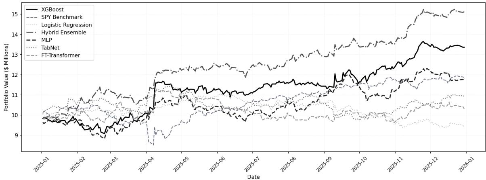  
Figure 4: Equity Curves of All Models vs S&P 500 Benchmark – OOS

Figure 4 plots the cumulative portfolio value for all models and the S&P 500 benchmark over the OOS period, starting from a \$10 million initial investment. The Hybrid ensemble separates from the field from April 2025 onwards, reaching approximately \$15.1 million by year end. XGBoost is the strongest individual model, ending near \$13.4 million, as MLP and TabNet diverge progressively through the year, finishing at approximately \$11.7 million and \$10.9 million respectively. LR and FT-Transformer underperform all other models, with LR the only model to end in a loss, finishing at approximately \$9.4 million.

A notable feature is the upward step visible across all models in early April 2025, coinciding with the S&P 500’s sharp decline following the US tariff announcements and its rapid recovery once a pause was announced. The Hybrid’s low maximum drawdown of −7.76%, reported in Table 2, holds despite this period of elevated volatility. The S&P 500 itself performs reasonably over the period but is surpassed by XGBoost and the Hybrid in absolute terms, and on a risk-adjusted basis only the Hybrid achieves statistically significant outperformance as established in Table 3.

## 4.2 Robustness and Temporal Stability

Table 4: Hybrid Model Robustness Analysis: Gaussian Noise Perturbation and Null Hypothesis Test
<table><tr><td></td><td colspan="4">Gaussian Noise (σ)</td><td colspan="2">Reference</td></tr><tr><td>Metric</td><td>0.05</td><td>0.10</td><td>0.20</td><td>0.50</td><td>Clean</td><td>Random Null</td></tr><tr><td>JS Divergence (Long)</td><td>0.0126</td><td>0.0179</td><td>0.0243</td><td>0.0350</td><td>一</td><td>一</td></tr><tr><td>JS Divergence (Short)</td><td>0.0102</td><td>0.0129</td><td>0.0171</td><td>0.0261</td><td></td><td></td></tr><tr><td>Total Return (%)</td><td>25.17</td><td>34.36</td><td>2.72</td><td>6.66</td><td>51.26</td><td>-8.21</td></tr><tr><td>Sharpe Ratio</td><td>1.13</td><td>1.53</td><td>0.04</td><td>0.26</td><td>2.44</td><td>-1.44</td></tr><tr><td>Max Drawdown (%)</td><td>-7.50</td><td>-9.00</td><td>-14.23</td><td>-9.76</td><td>-7.76</td><td>-8.47</td></tr></table>

Note: JS Divergence measures distributional shift between clean and perturbed predicted probabilities; not applicable (–) to Clean or Random Null. Portfolio metrics follow Section 3.2.2. Random Null replaces all features with Gaussian noise, confirming returns are attributable to learned signal.

Table 4 evaluates the sensitivity of the Hybrid model to input perturbation across Gaussian noise levels and a random null baseline. JS Divergence increases consistently with σ, rising from 0.0126 (Long) and 0.0102 (Short) at σ = 0.05 to 0.0350 and 0.0261 at $\sigma = 0 . 5 0 .$ . All values remain small in absolute terms, and predicted probability distributions are therefore relatively stable under moderate noise. Portfolio performance degrades slowly at low noise levels, with σ = 0.10 still producing a Sharpe ratio of 1.53 and a total return of 34.36%, before decreasing sharply at $\sigma = 0 . 2 0$ . The Random Null baseline yields a total return of −8.21% and a Sharpe ratio of −1.44. This rules out backtest mechanics and random chance as explanations for the Hybrid’s OOS performance. Full degradation and divergence curves are plotted in Appendix F.

Table 5: Quarterly Temporal Stability Analysis: Signal Precision Across 2025 Out-of-Sample Sub-Periods
<table><tr><td rowspan="2">Quarter</td><td colspan="4">Signal Precision (%)</td><td colspan="2">Observations</td></tr><tr><td>Long</td><td>Short</td><td>Long vs Baseline</td><td>Short vs Baseline</td><td>N Long</td><td>N Short</td></tr><tr><td>Q1 (Jan–Mar)</td><td>23.06</td><td>26.67</td><td>+13.06</td><td>+16.67</td><td>360</td><td>360</td></tr><tr><td>Q2 (Apr-Jun)</td><td>23.12</td><td>25.81</td><td>+13.12</td><td>+15.81</td><td>372</td><td>372</td></tr><tr><td>Q3 (Jul-Sep)</td><td>25.78</td><td>25.00</td><td>+15.78</td><td>+15.00</td><td>384</td><td>384</td></tr><tr><td>Q4 (Oct-Dec)</td><td>24.07</td><td>24.34</td><td>+14.07</td><td>+14.34</td><td>378</td><td>378</td></tr></table>

Note: Precision is the proportion of predicted Long/Short signals correctly identifying the true class. Random baseline is 10% (outer-decile construction). Long vs Baseline and Short vs Baseline show percentage-point improvement over the 10% random baseline. Results reported for the Hybrid model.

Table 5 examines whether the Hybrid model’s predictive signal is stable across the four quarters of the OOS period. Long and Short precision exceed the 10% random baseline by approximately 13–17 percentage points in every quarter, and no quarter shows a significant collapse in performance. The model does not rely on a single favourable market regime to generate its signal as long precision ranges narrowly from 23.06% (Q1) to 25.78% (Q3), and Short precision from 24.34% (Q4) to 26.67% (Q1). As KS tests confirm the quarterly return and volatility distributions are statistically distinct $( p < 0 . 0 0 1$ for all pairs), it suggests that the model may be capturing more generalisable patterns that are robust to changing market conditions, without overfitting to specific temporal dynamics. Quarterly precision is plotted against the random baseline in Appendix F.

## 4.3 Feature Importance and SHAP Analysis

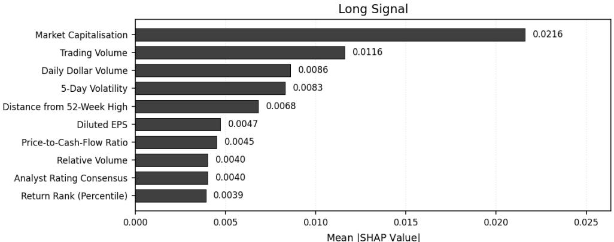

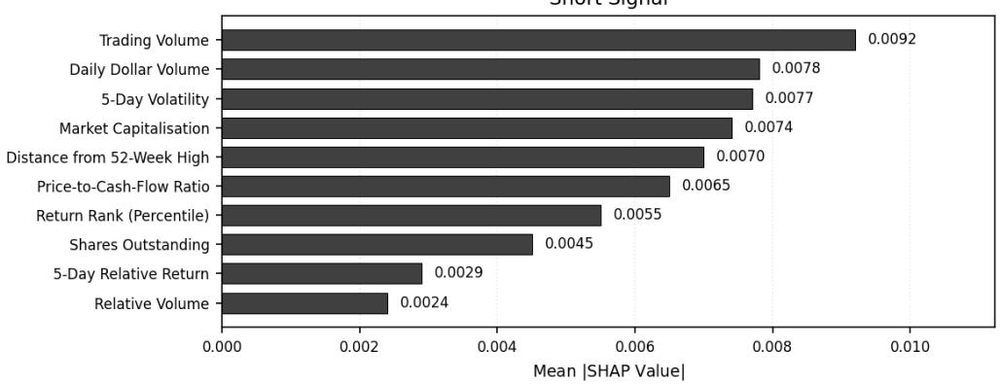  
Figure 5: Top 10 features by mean SHAP value for the long and short signals – XGBoost

Table 6: Total Mean SHAP Contribution by Feature Category Across All Models
<table><tr><td>Model</td><td>Signal</td><td>Technical</td><td>Fundamental</td><td>Macroeconomic</td><td>Alternative</td></tr><tr><td rowspan="2">XGBoost</td><td>Long</td><td>50.87%</td><td>43.73%</td><td>3.76%</td><td>1.63%</td></tr><tr><td>Short</td><td>59.45%</td><td>33.30%</td><td>4.36%</td><td>2.89%</td></tr><tr><td rowspan="2">LR</td><td>Long</td><td>55.93%</td><td>14.44%</td><td>15.56%</td><td>14.08%</td></tr><tr><td>Short</td><td>63.09%</td><td>11.89%</td><td>12.82%</td><td>12.20%</td></tr><tr><td rowspan="2">MLP</td><td>Long</td><td>40.94%</td><td>32.98%</td><td>13.52%</td><td>12.56%</td></tr><tr><td>Short</td><td>47.51%</td><td>27.17%</td><td>15.16%</td><td>10.16%</td></tr><tr><td rowspan="2">TabNet</td><td>Long</td><td>58.97%</td><td>18.41%</td><td>15.43%</td><td>7.19%</td></tr><tr><td>Short</td><td>57.79%</td><td>21.60%</td><td>12.12%</td><td>8.48%</td></tr><tr><td rowspan="2">FT-Transformer</td><td>Long</td><td>52.58%</td><td>30.30%</td><td>8.90%</td><td>8.22%</td></tr><tr><td>Short</td><td>55.94%</td><td>27.01%</td><td>9.43%</td><td>7.62%</td></tr></table>

Figure 5 reveals that XGBoost relies predominantly on technical and market-based features. Market Capitalisation leads the Long signal at 0.0216, nearly double Trading Volume’s 0.0116, but falls to fourth on the Short signal (0.0074) as Trading Volume takes first place, confirming the model has learned asymmetric decision boundaries rather than a simple signal reversal.

At the category level, technical features lead both directions, exceeding fundamentals by 7 percentage points on the Long signal and 26 points on the Short. Macroeconomic and alternative features together account for under 6% of attribution in both directions, indicating a supplementary role. Per-architecture SHAP breakdowns for all five base models are provided in Appendix G.

## 4.4 Research Application and Portfolio Sensitivity

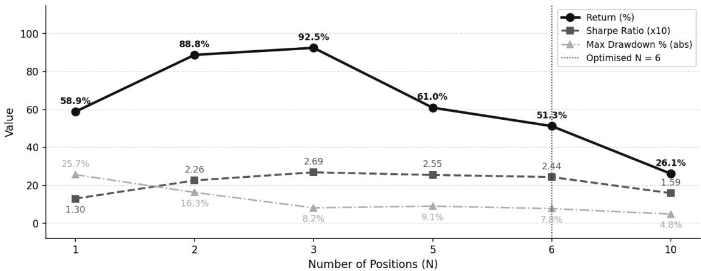  
Figure 6: Hybrid Ensemble Performance Sensitivity to Position Size – OOS

Figure 6 illustrates how portfolio performance varies with the number of stock positions N. Returns and Sharpe ratio peak at $N = 3 ,$ falling to 26.1% by $N = 1 0$ as signal dilution from lower-ranked positions outweighs diversification benefits. Maximum drawdown moves inversely, improving from −25.7% at $\bar { N } \ = \ 1 \ 1 0 \ - 4 . 8 \bar { \% }$ at $N = 1 0$ as concentration risk falls. The Bayesian-optimised configuration of $N = 6 ,$ , Sharpe 2.44, drawdown $- 7 . 7 6 \%$ , trades some peak return for stability across a broader set of positions. This sensitivity analysis is directly replicable within the interactive research application, shown in Appendix I.

## 5 Discussion

## 5.1 Model Comparison and Interpretation

Aggregate classification metrics are a poor indicator of model quality, as shown in Table 2. The structural class imbalance introduced by the outer-decile target construction is important to understanding why. 80% of observations are assigned to the Hold class, therefore accuracy and F1 are dominated by majority-class performance. A model predicting hold for every observation would achieve 80% accuracy without generating a trading signal. The narrow accuracy range of 0.786 to 0.799 and F1 scores of 0.337 to 0.369 observed across all models demonstrates this pattern. The practical consequence is most visible in the difference between LR and XGBoost, which report near-identical aggregate accuracy of 0.789 and 0.794, respectively, but produce trading returns of −5.69% and 33.61% in the OOS period. This disconnect arises because the hold class contributes nothing to portfolio returns by construction. Only the most confident long and short predictions are used to assign trading positions. A model’s aggregate accuracy therefore reflects its ability to identify stocks that will not be traded.

Even at the per-class level, LR achieves short precision of 0.240 and long precision of 0.233, both comparable to XGBoost’s 0.239 in each direction, indicating that even per-class precision cannot capture the signal quality differences that determine portfolio performance. This is potential evidence of the mechanism raised in Section 2.4, where precision weights every correct or incorrect position equally regardless of the magnitude of the return, whereas portfolio performance is magnitude-weighted. Two models can therefore share near-identical precision but one’s correct trades concentrate on the largest-magnitude moves and the other’s on marginal ones. Over time this can materialise as large differences in realised portfolio returns. This finding reinforces Lopez De Prado [21] and Fieberg et al’s [22] arguments that models ranking highest on predictive accuracy do not consistently produce the strongest long-short portfolio returns.

Within the individual models, XGBoost is the strongest single model in the OOS period with a return of 33.61% and a Sharpe ratio of 1.37. The dataset contains approximately 750,000 stock-day observations across only around 2,500 unique trading days, so the effective number of independent market environments available for learning is far smaller than the observation count suggests. The gradient-based optimisation embedded within deep learning models typically needs a larger effective sample to converge than tree-based methods, along with more tuning and computation to reach comparable performance [12, 33, 13]. These efficiency differences could plausibly explain part of XGBoost’s edge over the three deep learning architectures. The FT-Transformer illustrates this cost most clearly, achieving the weakest deep learning return at 3.08% despite its greater complexity. Its inconsistent cross-validation returns across the three regimes imply its attention mechanism likely identifies regime-specific correlation, the exact failure mode that cross-regime optimisation was designed to prevent. TabNet performs better than the FT-Transformer, but still falls short of XGBoost’s performance, indicating that architectural similarity in principle does not produce equivalent performance in deployment. TabNet’s sparsemax layers were designed to mimic tree-based node splitting, but this has not closed the performance gap with XGBoost’s boundary splits in this environment.

Each TDL model was allocated the same 30-trial budget as the baselines. Deep learning models are more sensitive to hyperparameter settings than gradient-boosted trees, so this budget may have been insufficient to identify a configuration that generalises across regimes. Grinsztajn et al. [12] examine this by evaluating performance across search budgets and find tree-based models are superior in each one, suggesting the ordering observed here is unlikely to reverse under a larger search. However, their benchmark was not related to this research so direct comparison is an avenue for future work.

The Hybrid ensemble is the only model to generate statistically significant OOS alpha, despite substantial differences in performance across the individual models. This advantage comes from combining models whose errors are uncorrelated. Each model’s mistakes are likely to be offset by the other’s correct prediction on the same stock-day, making the combined signal more often correct [56, 57]. The composite scoring function, described in Section 3.3.2, selected TabNet as XGBoost’s ensemble partner on this basis, despite MLP’s stronger performance. The pairwise CAPM R2 is 0.028 between XGBoost and TabNet, far lower than the 0.149 between XGBoost and MLP, shows that TabNet’s errors are less correlated with XGBoost’s than MLP’s are. Preserving this orthogonality in the combined signal depends on how the two models’ are aggregated. Averaging probabilities risks an overconfident but poorly calibrated model dominating the score. On the other hand, ranking each model’s output before averaging expresses every prediction on the same ordinal scale. That rank aggregation producing significant alpha without a trained meta-learner suggests simple combination can capture signal orthogonality. Regime-conditional weighting could improve on this in future research.

Statistical testing indicates the Hybrid’s outperformance is not due to chance. The CAPM alpha and near-zero beta indicate stock selection skill, separate from market exposure. The PSR’s 96% probability of genuine outperformance supports this, once skewness and kurtosis are accounted for. In contrast, the KS and Friedman tests do not detect this, finding the Hybrid’s daily return distribution not significantly different in shape from the S&P 500’s and no difference in daily rank ordering across strategies. These tests assess the typical day, so a strategy can pass both but still find its alpha from a small number of large-magnitude days. An example of this is the upward step visible in Figure 4 during the April 2025 US tariff volatility. The S&P 500 fell on the announcement, but the Hybrid’s near-zero beta meant it was not exposed to the market-wide decrease. Under dollar-neutral construction, a gain on the short book can cause a net portfolio increase. The Hybrid’s short precision of 0.254, sustained across the full OOS period, suggests this particular gain reflected short-side signal quality. More broadly, this short precision is the highest of any model and corresponds with the lowest maximum drawdown across all models at −7.76%, implying a relationship between short-side signal quality and downside protection, though the analysis here cannot isolate the precise contribution.

The robustness analysis shows the Hybrid tolerates realistic input degradation. Performance collapses at σ = 0.20, a level likely more severe than data quality issues that would typically stem from vendor inconsistencies or pipeline latency in production; this is discussed further in Section 5.3. The null baseline result is the more important finding here. When all input features are replaced with noise, the Hybrid’s Sharpe ratio falls to −1.44, compared to 2.44 on real data, ruling out backtest mechanics or random chance as an explanation for its OOS performance and leaving learned signal as the remaining explanation. Signal precision remains stable within a narrow range across all four distinct quarters of the OOS period, well above the 10% random baseline, with no quarter showing a significant collapse. Conversely, precision is an imperfect indicator of trading value, so the more meaningful observation is that this stability holds across conditions the model was not trained on. Input robustness and temporal stability together imply the Hybrid captures generalisable market structure, though future work evaluating longer OOS horizons could strengthen this conclusion.

TDL architectures do not provide individual improvements over gradient-boosted trees in this setting, reiterating the conclusions of Grinsztajn et al [12] and Borisov et al [33] in an equity context. TabNet’s contribution appears through signal orthogonality with XGBoost. The Hybrid’s statistically significant alpha and sustained quarterly precision provide evidence that cross-regime Bayesian optimisation is likely producing hyperparameters that generalise beyond the conditions under which they were estimated; robustness to realistic levels of input perturbation offers further support. These results also outperform Pagliaro [45], who reports a Sharpe of 1.18 using a regime-aware LightGBM framework. The performance gap suggests that an ensemble combination in the cross-regime framework may produce a more generalisable signal than a single regime-aware model. Further examination is required as the two studies use different datasets and evaluation periods. The single OOS year evaluated here limits the strength of any such comparison, a point returned to in Section 5.4.

## 5.2 Value of Alternative Data

SHAP analysis, presented in Figure 5 and Appendix G, reflects the category frequency found by Kumbure et al. [10]. Technical indicators dominate across all models at 40–63%, reiterating Gu et al. [11] who find momentum and pricebased features among the most important predictors. The split between remaining categories varies considerably by architecture. XGBoost shows 43.73% attribution to fundamental features but only 1.63% to alternative data, with LR showing a different balance at 14.44% and 14.08%, respectively. LR’s inability to extract non-linear interactions from technical and fundamental features means sentiment and macroeconomic signals receive attribution that those interactions would if present. Conversely, XGBoost captures the same information through interaction splits, leaving alternative data with little marginal contribution. The Unemployment Trend, a search-based uncertainty proxy, appearing in LR’s top features but not XGBoost’s illustrates this. LR relies on the linear component of search volume signals as a proxy for market conditions, a signal XGBoost handles through non-linear splits on technical and fundamental variables. This pattern suggests attribution results are not comparable across model classes, and conclusions about alternative data value derived from one architecture may not hold in another. Existing studies on alternative data value predominantly use linear or regression-based frameworks, as evidenced by the studies reviewed in Section 2.3 [36, 37], meaning the architecture-capacity effects identified here may not have been previously observable. The attribution figures reported here are themselves architecturally dependent and should be treated as a representation of signal importance within each model class. KernelExplainer with 5,000 samples and 100 k-means background centres approximates Shapley values, and low-attribution features in alternative and macroeconomic categories should be interpreted with this in mind. To discover whether the low attribution reflects genuine signal value or architectural capacity constraints, ablation studies testing category combinations across model classes are needed. Until then, alternative data attribution should be evaluated within the specific model class intended for deployment.

Low alternative data attribution in the strongest performing models does not imply these sources lack predictive value. XGBoost, the strongest individual model, falls well short of the 10% threshold, while LR and MLP comfortably exceed it, shown in Table 6. The hypothesis is therefore rejected for the best-performing architecture but not uniformly across model classes, reinforcing that alternative data’s apparent contribution is architecture-dependent. Sentiment and search attribution may also be understated because news typically moves prices on the day of release, so the one-day lag applied in preprocessing, discussed in Section 3.1.1, risks discarding same-day signal [58]. This effect could be analysed within further studies by moving to an intraday or high-frequency trading setting where sentiment and price data can be aligned at finer granularity. Even accounting for this, sentiment and search-based features capture information orthogonal to price dynamics and accounting fundamentals [18, 37, 35], meaning their contribution is additive even when small in absolute terms. This supplementary role is consistent with evidence that sentiment is priced in equity returns without displacing technical or fundamental signals [37], and suggests that alternative data sources should be evaluated for their diversifying properties. A marginal attribution in this range could influence which stocks sit at the boundaries of the top and bottom deciles, but quantifying this effect would require targeted ablation studies removing alternative features entirely.

Alternative data generally contributes more to short-side signals than long-side signals, as shown in Table 6. This is consistent with Tetlock [19], who shows that media pessimism predicts downward price pressure. Negative signals are more relevant to returns than equivalent positive ones, as investors discount good earnings news but react sharply to bad news when uncertainty is elevated [59], and rising search volumes are a marker of exactly this kind of uncertainty [39]. Stocks experiencing negative news therefore generate more identifiable signal from sentiment and search-based features than stocks experiencing positive news of equivalent magnitude, matching the greater alternative-data contribution to short-side relative to long-side predictions. Technical features show the same directional pattern, with short signal attribution consistently higher than long signal attribution. Hong and Stein [60] model gradual information diffusion producing short-run underreaction and momentum, an effect Hong et al. [61] find operates more strongly for past losers than past winners. If bad news diffuses more slowly through the market than good news, price trends among declining stocks should be more persistent and therefore more predictable than trends among rising stocks, explaining why technical features, built from recent price and momentum data, carry more weight in the models’ short-side predictions than their long-side predictions. However, this is contentious, as Gambarelli and Muzzioli find that negative news is incorporated into prices more quickly than positive news in European equities [37], suggesting that the asymmetry observed here may be specific to US equities in this OOS period. Future research examining if this asymmetry exists within different market regimes or alternative universes would determine how robust this finding is beyond the OOS period.

## 5.3 Practical Deployment Considerations

The sensitivity analysis in Figure 6 shows peak Sharpe at N = 3. In contrast, the Bayesian-optimised configuration selects N = 6. Concentrating capital into fewer positions amplifies high-conviction predictions when signal quality is high, but as N increases, stocks ranked lower in the model’s rankings are added to the portfolio and signal dilution outweighs any benefits from diversification. However, this peak at $N = 3$ is not practically accessible. Concentration at this level would breach conventional issuer concentration limits in traditional asset management mandates [62]. At institutional scale, executing a three-stock position would generate market impact sufficient to reduce the targeted returns [21, 63]. Even at $N \stackrel { - } { = } 6 .$ , the strategy exceeds concentration thresholds, making it more suitable for proprietary trading desks or hedge funds with flexible mandates than benchmark-constrained investors.

The robustness analysis identifies a performance threshold at $\sigma = 0 . 2 0 \mathrm { { ; } }$ , after which risk-adjusted performance collapses to a level not worth the operational cost of deployment, illustrated in Table 4. This marks the point where input quality impairs signal generation. However, the Gaussian noise injection likely understates the true risk. Real-world failures rarely appear as random noise. A vendor reformatting its data feed or returning null and incorrect values would each corrupt specific inputs while others would be unaffected. Structured missingness may be harder to detect and more damaging than the Gaussian perturbations simulated, since errors in specific inputs can silently distort the model’s predictions without triggering obvious warning signals. The distributional shift between the training period and OOS, shown in Appendix B, raises a related concern. The model was already operating on a shifted distribution when it reached the OOS period, and the quarterly distributional analysis confirms that regime transitions occur within the span of a single deployment year. Annual retraining is therefore likely insufficient under live conditions, particularly if market structure shifts mid-year in ways a fixed schedule cannot anticipate. A production system would require continuous monitoring for distributional drift, using statistical tests similar to those applied here for regime validation, triggering retraining when significant shifts are detected [64, 45]. Tuning and execution time also determine which retraining cadence is operationally viable. XGBoost’s full 30-trial tuning run completed in under 11 minutes, comfortably supporting daily retraining within a single overnight close, whereas TabNet’s took approximately 19.6 hours, fitting within the weekend market closure but ruling out daily retraining at this trial count. Full tuning, training, and inference times for all models are reported in Appendix H. Inference times reported there cover the full 252-day OOS period. Per trading day, this corresponds to under 60 milliseconds even for TabNet, the slowest model, which is well within the time available before market-on-close execution. This headroom suggests the modelling pipeline is fast enough to support higher-frequency signal generation, but this depends on data feed and feature computation latency, neither of which was evaluated here.

Most research presents findings as fixed outputs, preventing practitioners from testing assumptions or examining model behaviour. The interactive application addresses part of this. Position sizing sensitivity is explorable in real time. However, the simulated configurations do not account for the market impact that makes concentrated positions impractical at institutional scale, and transaction cost sensitivity remains fixed at 2.2 basis points. The SHAP attribution interface exposes why signals are generated across models and directions [65], supporting governance requirements in professional deployment [66]. Backtesting results and SHAP attribution are not straightforward for non-specialist users to understand. The AI research assistant addresses this by allowing natural language questions over both, without requiring technical expertise or pipeline access. The application runs on historical data and attribution derived from a fixed training distribution may not hold under the regime shifts confirmed between training and OOS. Widespread adoption of similar strategies could add to the market-impact effects discussed across institutions, potentially amplifying volatility during regime transitions, a risk relevant to any production deployment of this framework.

## 5.4 Limitations

Using S&P 500 constituents identified at the end of the sample period introduces survivorship bias. Stocks delisted or removed before 2025 are excluded, and as these tend to be underperformers, backtested returns are overstated relative to a point-in-time universe [41]. All six strategies trade the same universe, so the bias affects the absolute return level but the relative ordering across models is unaffected. However, its precise magnitude cannot be determined without reconstructing the universe using historical index membership data, providing an avenue for future research. Another limitation is that data was sourced through a Bloomberg Terminal, which requires an institutional licence, limiting independent replication of these results without equivalent access. Further studies could substitute publicly available sentiment and fundamental sources to test whether performance depends materially on this licensed data.

The OOS evaluation covers 252 trading days in 2025, limiting the statistical power available to determine if performance differences across models are significant. The Friedman test’s failure to reject equality across strategies partly demonstrates this, and a formal power calculation would clarify the minimum detectable effect size at this sample size. Also, reported figures reflect the selection of the best-performing configuration from approximately 161 trialled across the five model classes and their ensemble combinations. Deflated Sharpe Ratio [21] would correct for this, but was not applied here as per-trial Sharpe ratios were not retained during optimisation. The PSR reported in Table 3 should therefore be read as an upper bound on risk-adjusted significance. The scale of this effect is reduced because selection and reporting used different data, as configurations were chosen on the validation folds and all reported figures derived from the held-out period. Published predictive signals also tend to decay as market participants learn to exploit them [47], and the OOS results show a period before widespread adoption of this specific approach, meaning future performance cannot be assumed to remain at the same level. Rolling OOS evaluation across multiple years would provide a more robust test of if the strategy’s performance generalises beyond a single market environment.

No single-regime baseline was tuned under an identical objective function. This study therefore evaluates if configurations selected under a cross-regime objective generalise to unseen market conditions, rather than if they outperform conventional single-regime tuning. Establishing the latter requires the same search run under both conditions with trial count, search space, and evaluation protocol unchanged, and is a direct extension of this work.

Short selling introduces costs not captured in the 2.2 basis point assumption. Borrowing incurs fees that vary across stocks and over time, and availability constraints can prevent short positions from being established or maintained [21]. These costs tend to be highest in high-volatility regimes, exactly when short signals are likely to be strongest, meaning the strategy’s short-side returns are overstated relative to what would be achievable in practice. Modelling stock-specific borrow costs within the backtesting framework would give a more realistic estimate of net short-side performance.

As stated in Section 5.2, SHAP values were approximated due to computational constraints that introduce approximation error into the attribution estimates. Features with low mean absolute SHAP values, particularly in the alternative and macroeconomic categories, are most sensitive to this approximation and should be interpreted with caution. The background dataset was derived from the full training distribution, meaning attribution estimates reflect average feature importance across all regimes without a view on regime-specific patterns. Exact Shapley value computation would be more reliable but is computationally prohibitive at this scale, and future studies using TreeExplainer for tree-based models alongside KernelExplainer for deep learning models would reduce approximation error and maintain cross-architecture comparability.

## 6 Conclusion

Cross-regime Bayesian optimisation of a TDL ensemble provides statistically significant OOS alpha that no constituent model achieves, demonstrating that the value of these architectures in cross-sectional trading strategy is combinatorial. Beyond this performance result, the optimisation framework itself constitutes a methodological contribution, since treating regime heterogeneity as a constraint within hyperparameter selection offers a transferable protocol for model tuning under distribution shift that is independent of the specific architectures or asset class. The Hybrid ensemble’s returns are driven almost entirely by stock selection, and this risk-adjusted performance exceeds Pagliaro’s regime-aware LightGBM framework [45]. This suggests cross-regime ensemble combination captures a more generalisable signal than a single regime-aware model, though isolating this framework’s specific contribution from conventional tuning remains a direction for future work. Institutions evaluating tabular deep learning for trading should prioritise ensemble design and regime-aware tuning protocols.

TabNet and FT-Transformer do not produce significant improvements over gradient-boosted trees, aligning with Grinsztajn et al. [12] and Borisov et al. [33] as XGBoost remains the strongest individual model. TabNet is selected as the ensemble partner over the stronger-performing MLP due to signal orthogonality, extending Fieberg et al’s. [22] finding that no single model dominates. The Hybrid ensemble’s OOS performance is robust to realistic levels of input perturbation, as performance remains greater than the S&P 500. Signal precision also remains consistently above the random baseline across all four quarterly regimes, indicating the predictive edge does not decay within the test year.

Alternative data functions as a supplementary signal in this prediction setting despite the breadth of existing research suggesting otherwise. The strongest individual model relies on alternative features only marginally, falling short of the hypothesised threshold. Attribution varies considerably across architectures, with linear models leaning on alternative data far more heavily than tree-based methods. This indicates that alternative data’s usefulness depends more on how a model represents feature interactions than on the informational content of the data itself. Consistent with Bird and Yeung [59] and Hong and Stein [60], alternative data contributes more to short-side signals than long-side signals, reflecting behavioural asymmetries in how negative information is priced.

Finally, a strategy can be statistically indistinguishable from its peers and still be the most profitable in production, since classification metrics being consistent across models does not mean the strategies are equivalent in practice. Model selection should therefore be driven by portfolio-level backtesting, and ensemble construction should prioritise signal orthogonality over individual model performance.

## Acknowledgements

I would like to thank my supervisor, Dr Gaojie (Jay) Jin, for his guidance and feedback throughout this project. His input on the experimental design and the framing of the evaluation was invaluable, and this work is considerably stronger for it. I am also grateful to the Department of Computer Science at the University of Exeter for providing access to the computational resources and licensed data on which this research depends.

## References

[1] J. Wurgler, “Financial markets and the allocation of capital,” Journal of financial economics, vol. 58, no. 1, pp. 187–214, 2000, doi: https://doi.org/10.1016/S0304-405X(00)00070-2.

[2] Y. Ma, R. Han, and W. Wang, “Portfolio optimization with return prediction using deep learning and machine learning,” Expert systems with applications, vol. 165, pp. 113 973–, 2021, doi: https://doi.org/10.1016/j.eswa. 2020.113973.

[3] M. Babiak and J. Baruník, “Deep learning, predictability, and optimal portfolio returns,” Journal of empirical finance, vol. 87, pp. 101 705–, 2026, doi: https://doi.org/10.1016/j.jempfin.2026.101705.

[4] Z. Zhang and S. Zohren, Deep learning in quantitative trading, 1st ed., ser. Cambridge elements. Elements in quantitative finance. Cambridge: Cambridge University Press, 2025.

[5] S. Giantsidi and C. Tarantola, “Deep learning for financial forecasting: A review of recent trends,” International review ofeconomics &finance, vol. 104, 2025, doi: https://doi.org/10.1016/j.iref.2025.104719.

[6] A. Timmermann, “Elusive return predictability,” International journal offorecasting, vol. 24, no. 1, pp. 1–18, 2008, doi: https://doi.org/10.1016/j.ijforecast.2007.07.008.

[7] B. S. Paye and A. Timmermann, “Instability of return prediction models,” Journal ofempiricalfinance, vol. 13, no. 3, pp. 274–315, 2006, doi: https://doi.org/10.1016/j.jempfin.2005.11.001.

[8] P. Liu, Quantitative Trading Strategies Using Python: Technical Analysis, Statistical Testing, and Machine Learning, 1st ed. Berkeley, CA: Apress, 2023.

[9] Mordor Intelligence, “Algorithmic trading market size & share analysis - growth trends and forecast,” https: //www.mordorintelligence.com/industry-reports/algorithmic-trading-market, 2026, accessed: 2026-1-31.

[10] M. M. Kumbure, C. Lohrmann, P. Luukka, and J. Porras, “Machine learning techniques and data for stock market forecasting: A literature review,” Expert systems with applications, vol. 197, pp. 116 659–, 2022, doi: https://doi.org/10.1016/j.eswa.2022.116659.

[11] S. Gu, B. Kelly, and D. Xiu, “Empirical asset pricing via machine learning,” Review of Financial Studies, vol. 33, no. 5, pp. 2223–2273, 2020, doi: https://doi.org/10.1093/rfs/hhaa009.

[12] L. Grinsztajn, E. Oyallon, and G. Varoquaux, “Why do tree-based models still outperform deep learning on tabular data?” arXiv preprint, 2022, doi: https://doi.org/10.48550/arxiv.2207.08815.

[13] R. Shwartz-Ziv and A. Armon, “Tabular data: Deep learning is not all you need,” Informationfusion, vol. 81, pp. 84–90, 2022, doi: https://doi.org/10.1016/j.inffus.2021.11.011.

[14] S. O. Arik and T. Pfister, “Tabnet: Attentive interpretable tabular learning,” arXiv preprint, 2019, doi: https: //doi.org/10.48550/arxiv.1908.07442.

[15] Y. Gorishniy, I. Rubachev, V. Khrulkov, and A. Babenko, “Revisiting deep learning models for tabular data,” arXiv preprint, 2021, doi: https://doi.org/10.48550/arxiv.2106.11959.

[16] X. Huang, A. Khetan, M. Cvitkovic, and Z. Karnin, “Tabtransformer: Tabular data modeling using contextual embeddings,” arXiv preprint, 2020, doi: https://doi.org/10.48550/arxiv.2012.06678.

[17] G. Somepalli, M. Goldblum, A. Schwarzschild, C. B. Bruss, and T. Goldstein, “Saint: Improved neural networks for tabular data via row attention and contrastive pre-training,” arXiv preprint, 2021, doi: https://doi.org/10.48550/ arxiv.2106.01342.

[18] Y. Sun, L. Liu, Y. Xu, X. Zeng, Y. Shi, H. Hu, J. Jiang, and A. Abraham, “Alternative data in finance and business: emerging applications and theory analysis (review),” Financial innovation (Heidelberg), vol. 10, no. 1, pp. 127–32, 2024, doi: https://doi.org/10.1186/s40854-024-00652-0.

[19] P. C. Tetlock, “Giving content to investor sentiment: The role of media in the stock market,” The Journal offinance (New York), vol. 62, no. 3, pp. 1139–1168, 2007, doi: https://doi.org/10.1111/j.1540-6261.2007.01232.x.

[20] T. Preis, H. S. Moat, and H. E. Stanley, “Quantifying trading behavior in financial markets using google trends,” Scientific Reports, vol. 3, p. 1684, 2013, doi: https://doi.org/10.1038/srep01684.

[21] M. Lopez de Prado, Advances in Financial Machine Learning. Hoboken, NJ: Wiley, 2018.

[22] C. Fieberg, D. Metko, T. Poddig, and T. Loy, “Machine learning techniques for cross-sectional equity returns’ prediction,” OR Spectrum, vol. 45, no. 1, pp. 289–323, 2023, doi: https://doi.org/10.1007/s00291-022-00693-w.

[23] P. A. Samuelson, “Rational theory of warrant pricing,” Industrial Management Review, vol. 6, no. 2, pp. 13–, 1965.

[24] F. Black and M. Scholes, “The pricing of options and corporate liabilities,” The Journal of political economy, vol. 81, no. 3, pp. 637–654, 1973, doi: https://doi.org/10.1086/260062.

[25] G. E. Box and G. M. Jenkins, Time series analysis : forecasting and control, rev. ed. ed., ser. Holden-Day series in time series analysis. San Francisco: Holden-Day, 1976.

[26] T. Bollerslev, “Generalized autoregressive conditional heteroskedasticity,” Journal of econometrics, vol. 31, no. 3, pp. 307–327, 1986, doi: https://doi.org/10.1016/0304-4076(86)90063-1.

[27] W. Huang, Y. Nakamori, and S.-Y. Wang, “Forecasting stock market movement direction with support vector machine,” Computers & operations research, vol. 32, no. 10, pp. 2513–2522, 2005, doi: https://doi.org/10.1016/j. cor.2004.03.016.

[28] L. Khaidem, S. Saha, and S. R. Dey, “Predicting the direction of stock market prices using random forest,” arXiv preprint, 2016, doi: https://doi.org/10.48550/arxiv.1605.00003.

[29] C. Lohrmann and P. Luukka, “Classification of intraday s&p500 returns with a random forest,” International journal offorecasting, vol. 35, no. 1, pp. 390–407, 2019, doi: https://doi.org/10.1016/j.ijforecast.2018.08.004.

[30] S. Basak, S. Kar, S. Saha, L. Khaidem, and S. R. Dey, “Predicting the direction of stock market prices using tree-based classifiers,” The North Americanjournal ofeconomics andfinance, vol. 47, pp. 552–567, 2019, doi: https://doi.org/10.1016/j.najef.2018.06.013.

[31] B. Li, A. G. Rossi, X. S. Yan, and L. Zheng, “Machine learning from a “universe” of signals: The role of feature engineering,” Journal offinancial economics, vol. 172, pp. 104 138–, 2025, doi: https://doi.org/10.1016/j.jfineco. 2025.104138.

[32] T. Fischer and C. Krauss, “Deep learning with long short-term memory networks for financial market predictions,” European journal of operational research, vol. 270, no. 2, pp. 654–669, 2018, doi: https://doi.org/10.1016/j.ejor. 2017.11.054.

[33] V. Borisov, T. Leemann, K. Sebler, J. Haug, M. Pawelczyk, and G. Kasneci, “Deep neural networks and tabular data: A survey,” IEEE transaction on neural networks and learning systems, vol. 35, no. 6, pp. 7499–7519, 2024, doi: https://doi.org/10.1109/TNNLS.2022.3229161.

[34] F. Chi, B.-H. Hwang, and Y. Zheng, “The use and usefulness of big data in finance: Evidence from financial analysts,” Management science, vol. 71, no. 6, pp. 4599–4621, 2025, doi: https://doi.org/10.1287/mnsc.2022. 02659.

[35] A. Atkins, M. Niranjan, and E. Gerding, “Financial news predicts stock market volatility better than close price,” The Journal of finance and data science, vol. 4, no. 2, pp. 120–137, 2018, doi: https://doi.org/10.1016/j.jfds.2018. 02.002.

[36] D. E. Allen, M. McAleer, and A. K. Singh, “Daily market news sentiment and stock prices,” Applied economics, vol. 51, no. 30, pp. 3212–3235, 2019, doi: https://doi.org/10.1080/00036846.2018.1564115.

[37] L. Gambarelli and S. Muzzioli, “News sentiment indicators and the cross-section of stock returns in the european stock market,” International review ofeconomics &finance, vol. 101, pp. 104 207–, 2025, doi: https://doi.org/10. 1016/j.iref.2025.104207.

[38] M.-H. Fan, M.-Y. Chen, and E.-C. Liao, “A deep learning approach for financial market prediction: utilization of google trends and keywords,” Granular computing (Internet), vol. 6, no. 1, pp. 207–216, 2021, doi: https: //doi.org/10.1007/s41066-019-00181-7.

[39] J. J. Szczygielski, A. Charteris, P. R. Bwanya, and J. Brzeszczynski, “Google search trends and stock markets: ´ Sentiment, attention or uncertainty?” International review offinancial analysis, vol. 91, pp. 102 549–, 2024, doi: https://doi.org/10.1016/j.irfa.2023.102549.

[40] J. Chen, G. Tang, J. Yao, and G. Zhou, “Investor attention and stock returns,” Journal of financial and quantitative analysis, vol. 57, no. 2, pp. 455–484, 2022, doi: https://doi.org/10.1017/S0022109021000090.

[41] S. J. Brown, W. Goetzmann, R. G. Ibbotson, and S. A. Ross, “Survivorship bias in performance studies,” The Review offinancial studies, vol. 5, no. 4, pp. 553–580, 1992, doi: https://doi.org/10.1093/rfs/5.4.553.

[42] J. Yae, “Unintended look-ahead bias in out-of-sample forecasting,” Applied economics letters, vol. 31, no. 10, pp. 953–957, 2024, doi: https://doi.org/10.1080/13504851.2022.2159002.

[43] H. Xu, D. Katselas, and J. Drienko, “A portfolio-level, sum-of-the-parts approach to return predictability,” Journal ofempiricalfinance, vol. 78, pp. 101 525–, 2024, doi: https://doi.org/10.1016/j.jempfin.2024.101525.

[44] A. Ang and A. Timmermann, “Regime changes and financial markets,” Annual review offinancial economics, vol. 4, no. 1, pp. 313–337, 2012, doi: https://doi.org/10.1146/annurev-financial-110311-101808.

[45] A. Pagliaro, “Regime-aware lightgbm for stock market forecasting: A validated walk-forward framework with statistical rigor and explainable ai analysis,” Electronics (Basel), vol. 15, no. 6, pp. 1334–, 2026, doi: https: //doi.org/10.3390/electronics15061334.

[46] T. Wong and M. Barahona, “Deep incremental learning models for financial temporal tabular datasets with distribution shifts,” arXiv preprint, 2023, doi: https://doi.org/10.48550/arxiv.2303.07925.

[47] R. D. Mclean and J. Pontiff, “Does academic research destroy stock return predictability?” The Journal offinance (New York), vol. 71, no. 1, pp. 5–32, 2016, doi: https://doi.org/10.1111/jofi.12365.

[48] Federal Reserve Bank of St. Louis, “Fred economic data,” 2026, available at: https://fred.stlouisfed.org/docs/api/fred/ (Accessed: 18 March 2026).

[49] Bloomberg L.P., “Bloomberg terminal: Equity ohlcv, fundamentals, and company-specific news sentiment data,” 2026, available at: Bloomberg Terminal (Accessed: 7 February 2026).

[50] Google, “Google trends: Search volume indices for keywords,” 2026, available at: https://trends.google.com/trends/?geo=US (Accessed: 18 March 2026).

[51] R. M. O’Brien, “A caution regarding rules of thumb for variance inflation factors,” Quality & quantity, vol. 41, no. 5, pp. 673–690, 2007, doi: https://doi.org/10.1007/s11135-006-9018-6.

[52] A. Kalnins and K. Praitis Hill, “The vif score. what is it good for? absolutely nothing,” Organizational research methods, vol. 28, no. 1, pp. 58–75, 2025, doi: https://doi.org/10.1177/10944281231216381.

[53] B. Hagströmer, “Bias in the effective bid-ask spread,” Journal offinancial economics, vol. 142, no. 1, pp. 314–337, 2021, doi: https://doi.org/10.1016/j.jfineco.2021.04.018.

[54] T. Akiba, S. Sano, T. Yanase, T. Ohta, and M. Koyama, “Optuna: A next-generation hyperparameter optimization framework,” arXiv preprint, 2019, doi: https://doi.org/10.48550/arxiv.1907.10902.

[55] J. Bergstra, R. Bardenet, Y. Bengio, and B. Kégl, “Algorithms for hyper-parameter optimization,” in Advances in Neural Information Processing Systems, J. Shawe-Taylor, R. Zemel, P. Bartlett, F. Pereira, and K. Weinberger, Eds., vol. 24. Curran Associates, Inc., 2011. [Online]. Available: https://proceedings.neurips.cc/paper\_files/paper/2011/file/86e8f7ab32cfd12577bc2619bc635690-Paper.pdf

[56] T. G. Dietterich, F. Roli, and J. Kittler, “Ensemble methods in machine learning,” in Lecture notes in computer science, ser. Lecture Notes in Computer Science. Germany: Springer Berlin / Heidelberg, 2000, vol. 1857, pp. 1–15, doi: https://doi.org/10.1007/3-540-45014-9\_1.

[57] L. A. Ortega, R. Cabañas, and A. R. Masegosa, “Diversity and generalization in neural network ensembles,” 2021, doi: https://doi.org/10.48550/arxiv.2110.13786.

[58] M. Brière, K. Huynh, O. Laudy, and S. Pouget, “Stock market reaction to news: Do tense and horizon matter?” Finance research letters, vol. 58, pp. 104 630–, 2023, doi: https://doi.org/10.1016/j.frl.2023.104630.

[59] R. Bird and D. Yeung, “How do investors react under uncertainty?” Pacific-Basinfinance journal, vol. 20, no. 2, pp. 310–327, 2012, doi: https://doi.org/10.1016/j.pacfin.2011.10.001.

[60] H. Hong and J. C. Stein, “A unified theory of underreaction, momentum trading, and overreaction in asset markets,” The Journal offinance (New York), vol. 54, no. 6, pp. 2143–2184, 1999, doi: https://doi.org/10.1111/0022-1082. 00184.

[61] H. Hong, N. B. of Economic Research., T. Lim, and J. C. Stein, Bad News Travels Slowly: Size, Analyst Coverage and the Profitability of Momentum Strategies, ser. NBER working paper series no. w6553. Cambridge, Mass: National Bureau of Economic Research, 1998.

[62] H. Chen, “Diversification driven demand for large stock,” Journal of financial economics, vol. 172, pp. 104 109–, 2025, doi: https://doi.org/10.1016/j.jfineco.2025.104109.

[63] I. I. Zovko, “Matching in size: How market impact depends on the concentration of trading,” arXiv preprint, 2020, doi: https://doi.org/10.48550/arxiv.2012.10262.

[64] J. Klaise, A. Van Looveren, C. Cox, G. Vacanti, and A. Coca, “Monitoring and explainability of models in production,” arXiv preprint, 2020, doi: https://doi.org/10.48550/arxiv.2007.06299.

[65] S. Lundberg and S.-I. Lee, “A unified approach to interpreting model predictions,” arXiv preprint, 2017, doi: https://doi.org/10.48550/arxiv.1705.07874.

[66] FINRA, “Algorithmic trading regulations,” https://www.finra.org/rules-guidance/key-topics/algorithmic-trading, 2026, accessed: 2026-1-31.

## A UMAP Feature Space Projections

The following figures present UMAP projections of the training feature space, included as visual evidence for the methodological choices discussed in Section 3. Both figures display the same sample of approximately 6,000 observations, stratified by class and year across 2015–2024, with each subplot coloured by raw next-day return magnitude (left) and cross-sectional decile label (right).

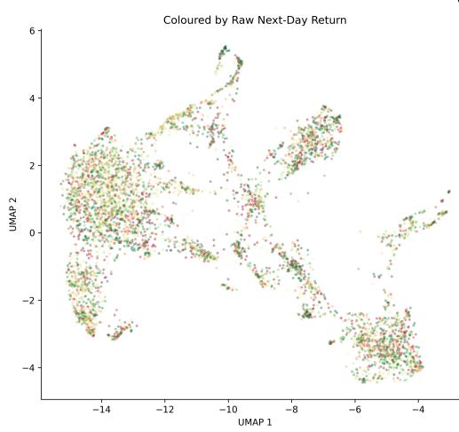

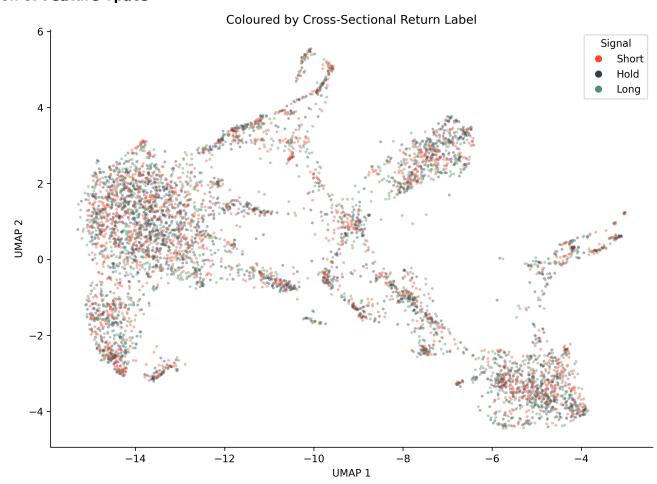  
Figure 7: UMAP 2D projection of the feature space coloured by raw next-day return (left) and daily crosssectional return decile label (right).

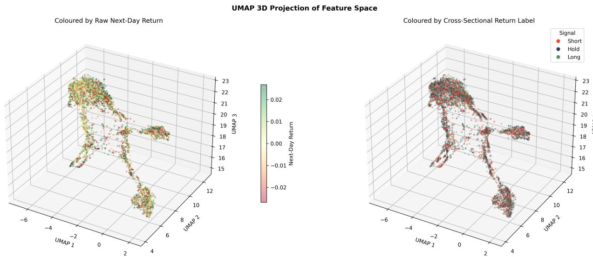  
Figure 8: UMAP 3D projection of the feature space coloured by raw next-day return (left) and daily crosssectional return decile label (right).

The absence of systematic colour organisation in both projections signal that absolute return magnitude and daily cross-sectional decile labels are not learnable from individual feature vectors in isolation, motivating the use of a cross-sectional ranking approach at the portfolio construction stage. The three structural clusters visible in the projection may correspond to bear, recovery, and bull market regimes, providing unsupervised geometric visualisation of the market regime structure identified statistically by KS testing in Section 3, and justifying the multi-regime validation framework.

## B Kolmogorov-Smirnov Tests and Distributional Analysis

To assess whether the validation folds correspond to distinct market environments, pairwise two-sample KS tests were conducted on daily cross-sectional return distributions and 5-day realised volatility distributions. The results are summarised in Table 7, while Figures 9 and 10 provide kernel density comparisons for the validation regimes and the full training-test split, respectively. Across all fold pairs, the null hypothesis of equal distributions is rejected at the 1% level, indicating regime separation and supporting the use of multi-regime validation.

Table 7: Pairwise Kolmogorov-Smirnov Test Results Across Market Regimes.
<table><tr><td rowspan="3">Regime A</td><td rowspan="3">Regime B</td><td colspan="2">Return</td><td colspan="2">Volatility (5-day)</td></tr><tr><td>KS Statistic</td><td>p-value</td><td>KS Statistic</td><td>p-value</td></tr><tr><td></td><td></td><td></td><td></td></tr><tr><td>2022</td><td>2023</td><td>0.087</td><td>&lt; 0.001</td><td>0.238</td><td>&lt; 0.001</td></tr><tr><td>2022</td><td>2024</td><td>0.101 0.077</td><td>&lt; 0.001</td><td>0.277</td><td>&lt; 0.001</td></tr><tr><td>2022 2023</td><td>2025 2024</td><td>0.015</td><td>&lt; 0.001 &lt; 0.001</td><td>0.178 0.048</td><td>&lt; 0.001</td></tr><tr><td>2023</td><td>2025</td><td>0.020</td><td>&lt; 0.001</td><td>0.061</td><td>&lt; 0.001 &lt; 0.001</td></tr><tr><td>2024</td><td>2025</td><td>0.033</td><td>&lt; 0.001</td><td>0.104</td><td>&lt; 0.001</td></tr><tr><td></td><td></td><td></td><td></td><td></td><td></td></tr><tr><td colspan="2">Training (2015–2024) vs OOS (2025)</td><td>0.022</td><td>&lt; 0.001</td><td>0.070</td><td>&lt; 0.001</td></tr></table>

Note: All tests are statistically significant at p < 0.001.

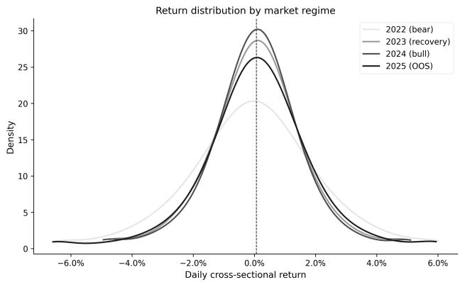

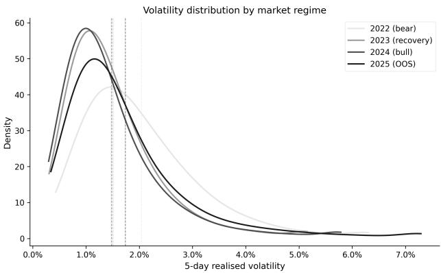  
Figure 9: Kernel Density Estimates of Return and Volatility Distributions Across Market Regimes (2022–2025).

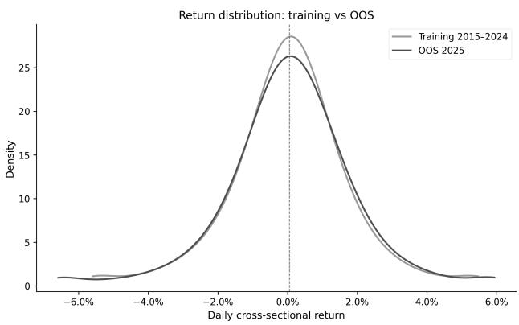

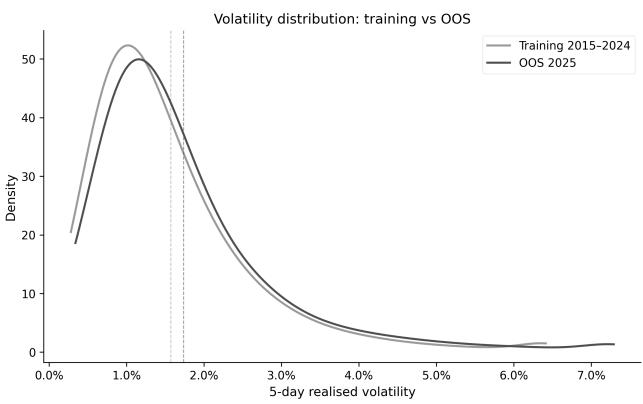  
Figure 10: Kernel Density Estimates Comparing Training (2015–2024) Against the OOS Period (2025).

## C Equity Curves

Figures 11–13 present equity curves for all models and the S&P 500 benchmark across the three validation regimes. All portfolios are initialised at \$10 million. The 2022 and 2023 periods correspond to the first and second Bayesian optimisation validation folds; 2024 is the final validation fold.

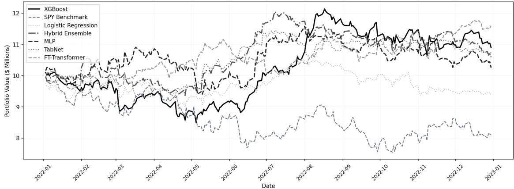  
Figure 11: Equity curves for all models vs S&P 500 benchmark, 2022 validation period.

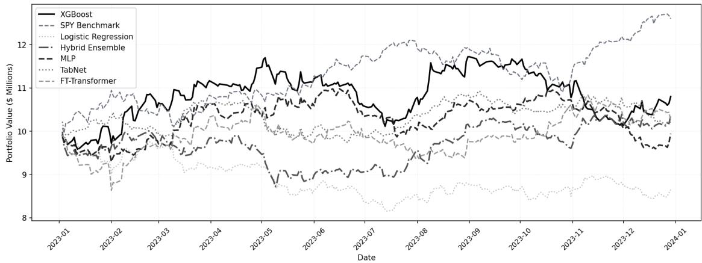  
Figure 12: Equity curves for all models vs S&P 500 benchmark, 2023 validation period.

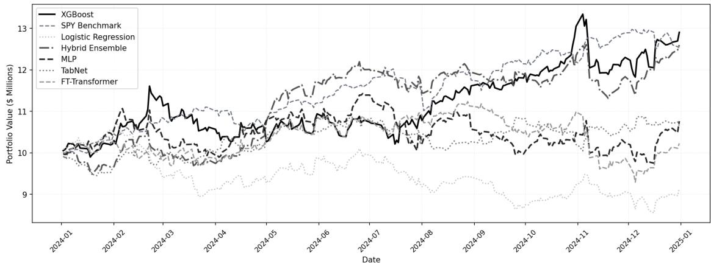  
Figure 13: Equity curves for all models vs S&P 500 benchmark, 2024 validation period.

## D Confusion Matrices

Figure 14 presents confusion matrices for all models evaluated on the OOS 2025 period. The pattern across all models is majority assignment to the Hold class, consistent with the 80% class imbalance and top rank selection. Long and Short diagonal counts confirm that all models retain above-random signal in the minority classes.

  
(a) Logistic Regression

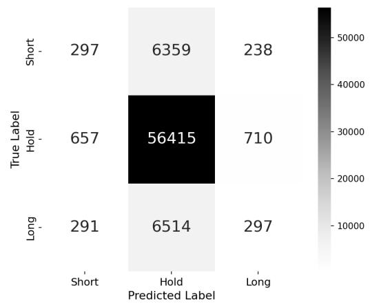  
(b) XGBoost

  
(c) MLP

  
(d) TabNet

  
(e) FT-Transformer

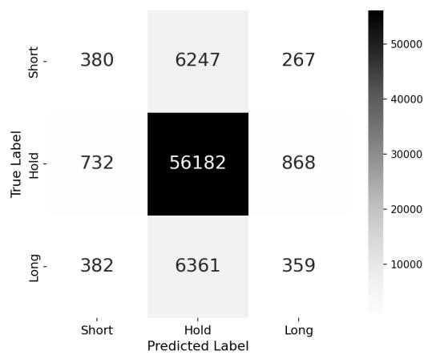  
(f) Hybrid Ensemble  
Figure 14: Confusion matrices for all models evaluated on the OOS period.

## E Statistical Test Results

## E.1 Shapiro–Wilk Normality Test

Table 8 reports Shapiro–Wilk test results for the daily returns of each model and the S&P 500 benchmark over the OOS period. Only LR $( W = 0 . 9 9 2 , p = 0 . 1 7 7 )$ and MLP $( W = 0 . 9 8 9 , p = 0 . 0 6 2 )$ fail to reject normality at the 5% significance level, so non-parametric tests are used for all models.

Table 8: Shapiro–Wilk normality test results for daily returns.
<table><tr><td>Model</td><td>W Statistic</td><td>p-value</td><td>Normal?</td></tr><tr><td>SPY</td><td>0.7831</td><td>&lt;0.001</td><td>No</td></tr><tr><td>Logistic Regression</td><td>0.9918</td><td>0.177</td><td>Yes</td></tr><tr><td>XGBoost</td><td>0.8739</td><td>&lt;0.001</td><td>No</td></tr><tr><td>MLP</td><td>0.9893</td><td>0.062</td><td>Yes</td></tr><tr><td>TabNet</td><td>0.9586</td><td>&lt;0.001</td><td>No</td></tr><tr><td>FT-Transformer</td><td>0.9404</td><td>&lt;0.001</td><td>No</td></tr><tr><td>Hybrid</td><td>0.9470</td><td>&lt;0.001</td><td>No</td></tr></table>

## E.2 Pairwise CAPM Regressions Between Models

Table 9 presents pairwise CAPM regressions across all model pairs, where relative alpha captures return generation beyond what a given comparison model explains. The Hybrid produces statistically significant relative alphas against MLP $( p = 0 . 0 1 5 )$ , TabNet $( p = 0 . 0 0 9 )$ , and FT-Transformer $( p = 0 . 0 0 5 )$ , indicating it generates excess returns that cannot be attributed to shared signal structure.

Table 9: Pairwise CAPM regression results between models. Ann. α is annualised relative alpha.
<table><tr><td>Pair</td><td>Ann. α</td><td> $p ( \alpha )$ </td><td> $\beta$ </td><td> $R ^ { 2 }$ </td></tr><tr><td>LogReg vs XGBoost LogReg vs Hybrid</td><td>-0.148</td><td>0.226</td><td>0.314</td><td>0.218 0.247</td></tr><tr><td>LogReg vs MLP LogReg vs TabNet</td><td>-0.230 -0.082 -0.067</td><td>0.059 0.542 0.621</td><td>0.416 0.177 0.169</td><td>0.059 0.034</td></tr><tr><td>LogReg vs FT-Transformer XGBoost vs Hybrid XGBoost vs MLP</td><td>-0.061 -0.022 0.238</td><td>0.645 0.894 0.209</td><td>0.236 0.776 0.420</td><td>0.088 0.388 0.149</td></tr><tr><td>XGBoost vs TabNet XGBoost vs FT-Transformer Hybrid vs MLP</td><td>0.291 0.285 0.373</td><td>0.151 0.102 0.015</td><td>0.226 0.625 0.331</td><td>0.028 0.279 0.144</td></tr><tr><td>Hybrid vs TabNet Hybrid vs FT-Transformer MLP vs TabNet 0.164</td><td>0.377 0.413</td><td>0.009 0.005</td><td>0.550 0.438</td><td>0.253 0.213 0.015</td></tr></table>

## F Robustness and Temporal Stability

Figure 15 presents the full Gaussian noise robustness analysis for the Hybrid model, showing strategy degradation, output distribution shift, and the probability distribution shift at $\sigma = 0 . 2 0$ . Figure 16 plots Long and Short signal precision across the four OOS quarters against the 10% random baseline.

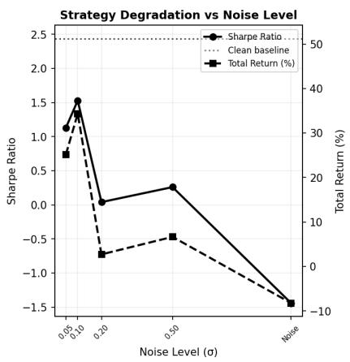

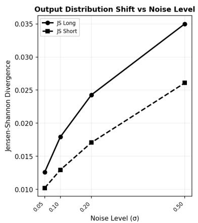

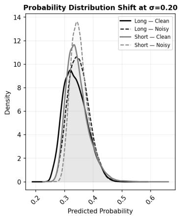  
Figure 15: Hybrid model Gaussian noise robustness analysis. Left: strategy degradation vs noise level. Centre: JS divergence vs noise level. Right: probability distribution shift at $\sigma = 0 . 2 0$

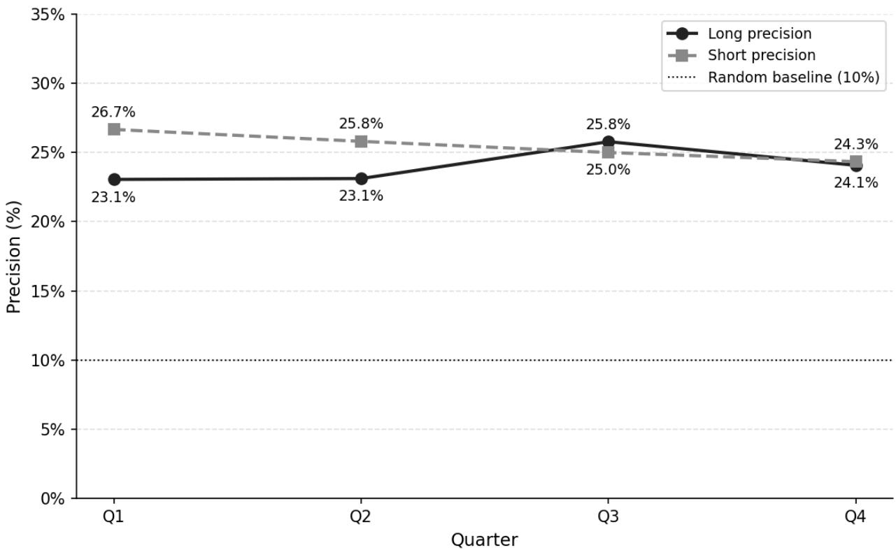  
Figure 16: Hybrid model quarterly signal precision across the 2025 OOS period. The dotted line indicates the 10% random baseline.

## G Feature Importances

This appendix presents the full per-architecture SHAP analysis from Section 4.3. Table 10 compares the four feature category contributions; Technical, Fundamental, Macroeconomic, Alternative across all five base models for both long and short signal directions. Tables 11–15 report each remaining model’s individual Top 10 features by mean absolute SHAP value, alongside its category breakdown.

Table 10: Feature Category SHAP Attribution Across All Base Models
<table><tr><td colspan="2">Model / Direction</td><td>Technical</td><td>Fundamental</td><td>Macroeconomic</td><td>Alternative</td></tr><tr><td rowspan="3">XGBoost</td><td>Long</td><td>50.87%</td><td>43.73%</td><td>3.76%</td><td>1.63%</td></tr><tr><td>Short</td><td>59.45%</td><td>33.30%</td><td>4.36%</td><td>2.89%</td></tr><tr><td>Long</td><td>55.93%</td><td>14.44%</td><td>15.56%</td><td>14.08%</td></tr><tr><td rowspan="2">Logistic Regression MLP</td><td>Short</td><td>63.09%</td><td>11.89%</td><td>12.82%</td><td>12.20%</td></tr><tr><td>Long</td><td>40.94%</td><td>32.98%</td><td>13.52%</td><td>12.56%</td></tr><tr><td rowspan="2">TabNet</td><td>Short</td><td>47.51%</td><td>27.17%</td><td>15.16%</td><td>10.16%</td></tr><tr><td>Long</td><td>58.97%</td><td>18.41%</td><td>15.43%</td><td>7.19%</td></tr><tr><td rowspan="2"></td><td>Short</td><td>57.79%</td><td>21.60%</td><td>12.12%</td><td>8.48%</td></tr><tr><td>Long</td><td>52.58%</td><td>30.30%</td><td>8.90%</td><td>8.22%</td></tr><tr><td>FT-Transformer</td><td>Short</td><td>55.94%</td><td>27.01%</td><td>9.43%</td><td>7.62%</td></tr></table>

Note: Each cell represents the percentage share of total mean absolute SHAP attribution assigned to that feature category across the full 50-feature set, for each model and signal direction.

Table 11: Top 10 Features by Mean Absolute SHAP Value — Logistic Regression
<table><tr><td colspan="2">Long Signal</td></tr><tr><td>Feature</td><td>Mean SHAP</td></tr><tr><td>Distance from 52-Week High</td><td>0.0208</td></tr><tr><td>Distance from 50-Day MA</td><td>0.0091</td></tr><tr><td>Analyst Rating Consensus</td><td>0.0065</td></tr><tr><td>Relative Volume</td><td>0.0064</td></tr><tr><td>5-Day Volatility</td><td>0.0064</td></tr><tr><td>Bollinger Band Width</td><td>0.0044</td></tr><tr><td>Core Inflation</td><td>0.0044</td></tr><tr><td>Unemployment Trend</td><td>0.0041</td></tr><tr><td>Yield Curve Slope</td><td>0.0037</td></tr><tr><td>Investment Trend</td><td>0.0029</td></tr></table>

<table><tr><td colspan="2">Short Signal</td></tr><tr><td>Feature</td><td>Mean SHAP</td></tr><tr><td>Distance from 52-Week High</td><td>0.0190</td></tr><tr><td>Distance from 50-Day MA</td><td>0.0086</td></tr><tr><td>5-Day Volatility</td><td>0.0073</td></tr><tr><td>Relative Volume</td><td>0.0066</td></tr><tr><td>Relative RSI</td><td>0.0043</td></tr><tr><td>Core Inflation</td><td>0.0040</td></tr><tr><td>Bollinger Band Width</td><td>0.0038</td></tr><tr><td>Return on Assets</td><td>0.0037</td></tr><tr><td>Unemployment Trend</td><td>0.0036</td></tr><tr><td>Return Rank (Percentile)</td><td>0.0035</td></tr></table>

Total Mean SHAP Contribution by Feature Category (All Features)
<table><tr><td>Category</td><td>Buy Signal</td><td></td></tr><tr><td>Technical</td><td>55.93%</td><td>63.09%</td></tr><tr><td>Fundamental</td><td>14.44%</td><td>11.89%</td></tr><tr><td>Macroeconomic</td><td>15.56%</td><td>12.82%</td></tr><tr><td>Alternative</td><td>14.08%</td><td>12.20%</td></tr></table>

Note: Top 10 features ranked by mean absolute SHAP value for buy and sell signal directions, shown for Logistic Regression. Features may differ between directions. Category totals represent each category’s share of total mean absolute SHAP attribution across the full 50-feature set for this model. Per-architecture breakdowns for all five base models are provided in Appendix G.

Table 12: Top 10 Features by Mean Absolute SHAP Value — XGBoost
<table><tr><td colspan="2">Long Signal</td></tr><tr><td>Feature</td><td>Mean SHAP</td></tr><tr><td>Market Capitalisation</td><td>0.0216</td></tr><tr><td>Trading Volume</td><td>0.0116</td></tr><tr><td>Daily Dollar Volume</td><td>0.0086</td></tr><tr><td>5-Day Volatility</td><td>0.0083</td></tr><tr><td>Distance from 52-Week High</td><td>0.0068</td></tr><tr><td>Diluted EPS</td><td>0.0047</td></tr><tr><td>Price-to-Cash-Flow Ratio</td><td>0.0045</td></tr><tr><td>Relative Volume</td><td>0.0040</td></tr><tr><td>Analyst Rating Consensus</td><td>0.0040</td></tr><tr><td>Return Rank (Percentile)</td><td>0.0039</td></tr></table>

<table><tr><td colspan="2">Short Signal</td></tr><tr><td>Feature</td><td>Mean SHAP</td></tr><tr><td>Trading Volume</td><td>0.0092</td></tr><tr><td>Daily Dollar Volume</td><td>0.0078</td></tr><tr><td>5-Day Volatility</td><td>0.0077</td></tr><tr><td>Market Capitalisation</td><td>0.0074</td></tr><tr><td>Distance from 52-Week High</td><td>0.0070</td></tr><tr><td>Price-to-Cash-Flow Ratio</td><td>0.0065</td></tr><tr><td>Return Rank (Percentile)</td><td>0.0055</td></tr><tr><td>Shares Outstanding</td><td>0.0045</td></tr><tr><td>5-Day Relative Return</td><td>0.0029</td></tr><tr><td>Relative Volume</td><td>0.0024</td></tr></table>

Total Mean SHAP Contribution by Feature Category (All Features)
<table><tr><td>Category</td><td>Buy Signal</td><td>Sell Signal</td></tr><tr><td>Technical</td><td>50.87%</td><td>59.45%</td></tr><tr><td>Fundamental</td><td>43.73%</td><td>33.30%</td></tr><tr><td>Macroeconomic</td><td>3.76%</td><td>4.36%</td></tr><tr><td>Alternative</td><td>1.63%</td><td>2.89%</td></tr></table>

Note: Top 10 features ranked by mean absolute SHAP value for buy and sell signal directions, shown for the best-performing individual model (XGBoost). Features may differ between directions. Category totals represent each category’s share of total mean absolute SHAP attribution across the full 50-feature set for this model. Per-architecture breakdowns for all five base models are provided in Appendix G.

Table 13: Top 10 Features by Mean Absolute SHAP Value — MLP
<table><tr><td colspan="2">Long Signal</td></tr><tr><td>Feature</td><td>Mean SHAP</td></tr><tr><td>Trading Volume</td><td>0.0230</td></tr><tr><td>Market Capitalisation</td><td>0.0215</td></tr><tr><td>Shares Outstanding</td><td>0.0132</td></tr><tr><td>Distance from 52-Week High</td><td>0.0087</td></tr><tr><td>Daily Dollar Volume</td><td>0.0083</td></tr><tr><td>Analyst Rating Consensus</td><td>0.0081</td></tr><tr><td>Investment Trend</td><td>0.0051</td></tr><tr><td>Price-to-Book Ratio</td><td>0.0046</td></tr><tr><td>Core Inflation</td><td>0.0042</td></tr><tr><td>5-Day Volatility</td><td>0.0039</td></tr></table>

<table><tr><td colspan="2">Short Signal</td></tr><tr><td>Feature</td><td>Mean SHAP</td></tr><tr><td>Daily Dollar Volume</td><td>0.0181</td></tr><tr><td>Shares Outstanding</td><td>0.0109</td></tr><tr><td>Market Capitalisation</td><td>0.0109</td></tr><tr><td>Trading Volume</td><td>0.0099</td></tr><tr><td>Distance from 52-Week High</td><td>0.0065</td></tr><tr><td>Distance from 50-Day MA</td><td>0.0043</td></tr><tr><td>Price-to-Sales Ratio</td><td>0.0040</td></tr><tr><td>5-Day Relative Return</td><td>0.0040</td></tr><tr><td>20-Day Relative Return</td><td>0.0037</td></tr><tr><td>Return on Assets</td><td>0.0036</td></tr></table>

Total Mean SHAP Contribution by Feature Category (All Features)
<table><tr><td colspan="2"></td></tr><tr><td>Category</td><td>Buy Signal Sell Signal</td></tr><tr><td>Technical</td><td>40.94% 47.51%</td></tr><tr><td>Fundamental</td><td>32.98% 27.17%</td></tr><tr><td>Macroeconomic</td><td>13.52% 15.16%</td></tr><tr><td>Alternative</td><td>12.56% 10.16%</td></tr></table>

Note: Top 10 features ranked by mean absolute SHAP value for buy and sell signal directions, shown for the MLP. Features may differ between directions. Category totals represent each category’s share of total mean absolute SHAP attribution across the full 50-feature set for this model. Per-architecture breakdowns for all five base models are provided in Appendix G.

Table 14: Top 10 Features by Mean Absolute SHAP Value — TabNet
<table><tr><td colspan="2">Long Signal</td></tr><tr><td>Feature</td><td>Mean SHAP</td></tr><tr><td>Distance from 52-Week High</td><td>0.0131</td></tr><tr><td>5-Day Volatility</td><td>0.0089</td></tr><tr><td>Relative Volume</td><td>0.0073</td></tr><tr><td>VIX Regime (High)</td><td>0.0057</td></tr><tr><td>Bollinger Band Width</td><td>0.0038</td></tr><tr><td>Diluted EPS</td><td>0.0034</td></tr><tr><td>Price-to-Sales Ratio</td><td>0.0029</td></tr><tr><td>Return on Assets</td><td>0.0027</td></tr><tr><td>Shares Outstanding</td><td>0.0016</td></tr><tr><td>Unemployment Trend</td><td>0.0013</td></tr></table>

<table><tr><td colspan="2">Short Signal</td></tr><tr><td>Feature</td><td>Mean SHAP</td></tr><tr><td>Distance from 52-Week High</td><td>0.0090</td></tr><tr><td>5-Day Volatility</td><td>0.0069</td></tr><tr><td>Relative Volume</td><td>0.0051</td></tr><tr><td>Return on Assets</td><td>0.0033</td></tr><tr><td>Bollinger Band Width</td><td>0.0025</td></tr><tr><td>Price-to-Sales Ratio</td><td>0.0024</td></tr><tr><td>VIX Regime (High)</td><td>0.0024</td></tr><tr><td>Diluted EPS</td><td>0.0022</td></tr><tr><td>Shares Outstanding</td><td>0.0020</td></tr><tr><td>Inflation Trend</td><td>0.0011</td></tr></table>

Total Mean SHAP Contribution by Feature Category (All Features)
<table><tr><td>Category</td><td>Buy Signal</td><td>Sell Signal</td></tr><tr><td>Technical</td><td>58.97%</td><td>57.79%</td></tr><tr><td>Fundamental</td><td>18.41%</td><td>21.60%</td></tr><tr><td>Macroeconomic</td><td>15.43%</td><td>12.12%</td></tr><tr><td>Alternative</td><td>7.19%</td><td>8.48%</td></tr></table>

Note: Top 10 features ranked by mean absolute SHAP value for buy and sell signal directions, shown for TabNet. Features may differ between directions. Category totals represent each category’s share of total mean absolute SHAP attribution across the full 50-feature set for this model. Per-architecture breakdowns for all five base models are provided in Appendix G.

Table 15: Top 10 Features by Mean Absolute SHAP Value — FT-Transformer
<table><tr><td colspan="2">Long Signal</td></tr><tr><td>Feature</td><td>Mean SHAP</td></tr><tr><td>Market Capitalisation</td><td>0.0197</td></tr><tr><td>Daily Dollar Volume</td><td>0.0161</td></tr><tr><td>Distance from 52-Week High</td><td>0.0090</td></tr><tr><td>Trading Volume</td><td>0.0079</td></tr><tr><td>Relative Volume</td><td>0.0046</td></tr><tr><td>5-Day Volatility</td><td>0.0042</td></tr><tr><td>Analyst Rating Consensus</td><td>0.0035</td></tr><tr><td>Core Inflation</td><td>0.0033</td></tr><tr><td>Shares Outstanding</td><td>0.0031</td></tr><tr><td>Return Rank (Percentile)</td><td>0.0031</td></tr></table>

<table><tr><td colspan="2">Short Signal</td></tr><tr><td>Feature</td><td>Mean SHAP</td></tr><tr><td>Daily Dollar Volume</td><td>0.0153</td></tr><tr><td>Market Capitalisation</td><td>0.0113</td></tr><tr><td>Distance from 52-Week High</td><td>0.0089</td></tr><tr><td>Return on Assets</td><td>0.0052</td></tr><tr><td>Trading Volume</td><td>0.0044</td></tr><tr><td>Distance from 50-Day MA</td><td>0.0041</td></tr><tr><td>5-Day Relative Return</td><td>0.0033</td></tr><tr><td>Price-to-Sales Ratio</td><td>0.0031</td></tr><tr><td>Return Rank (Percentile)</td><td>0.0031</td></tr><tr><td>Shares Outstanding</td><td>0.0028</td></tr></table>

Total Mean SHAP Contribution by Feature Category (All Features)
<table><tr><td>Category</td><td>Buy Signal</td><td>Sell Signal</td></tr><tr><td>Technical</td><td>52.58%</td><td>55.94%</td></tr><tr><td>Fundamental</td><td>30.30%</td><td>27.01%</td></tr><tr><td>Macroeconomic</td><td>8.90%</td><td>9.43%</td></tr><tr><td>Alternative</td><td>8.22%</td><td>7.62%</td></tr></table>

Note: Top 10 features ranked by mean absolute SHAP value for buy and sell signal directions, shown for the FT-Transformer. Features may differ between directions. Category totals represent each category’s share of total mean absolute SHAP attribution across the full 50-feature set for this model. Per-architecture breakdowns for all five base models are provided in Appendix G.

## H Tuning, Training, and Inference Time

Table 16 reports tuning, final training, and inference time for all models, relevant to the retraining cadence discussed in Section 5.3. Tuning time shows the full 30-trial Optuna search. Final training time represents retraining on the complete 2015–2024 period. Inference time reflects prediction on the full 2025 OOS set. The Hybrid ensemble is excluded from tuning and training figures as rank aggregation combines the pre-trained outputs of its constituent models without the need for a separate fitting step.

Table 16: Tuning, Training, and Inference Time by Model
<table><tr><td>Model</td><td>Tuning (30 trials)</td><td>Final Training</td><td>OOS Inference</td></tr><tr><td>LR</td><td>32.0 min</td><td>22.9 s</td><td>0.04 s</td></tr><tr><td>XGBoost</td><td>10.8 min</td><td>8.4 s</td><td>0.09 s</td></tr><tr><td>MLP</td><td>45.0 min</td><td>42.3 s</td><td>2.18 s</td></tr><tr><td>TabNet</td><td>19.6 hrs</td><td>15.5 min</td><td>14.0 s</td></tr><tr><td>FT-Transformer</td><td>2.9 hrs</td><td>3.2 min</td><td>8.8 s</td></tr></table>

## I Interactive Application

As described in Section 3.4.3, a React frontend served by a REST API was developed to operationalise the study’s outputs, the deployed application is accessible at https://m-sc-dissertation-dev.vercel.app/. The system exposes four primary views. Figure 17 shows a stock-level data view. Figure 18 illustrates an alternative data explorer presenting Google Trends indices and firm-level news sentiment across 2015–2025. Figure 19 provides an interactive backtesting environment supporting real-time strategy simulation across all six models. Figure 20 shows an AI research assistant grounded in the study’s results, enabling natural language queries over model performance and market conditions, with its architecture illustrated in Figure 21.

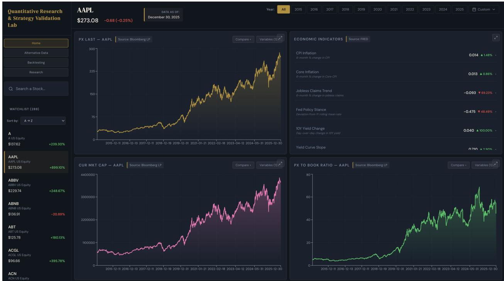  
Figure 17: Stock Data View  
Price history, market capitalisation, valuation ratios, and live macroeconomic indicators for a selected constituent.

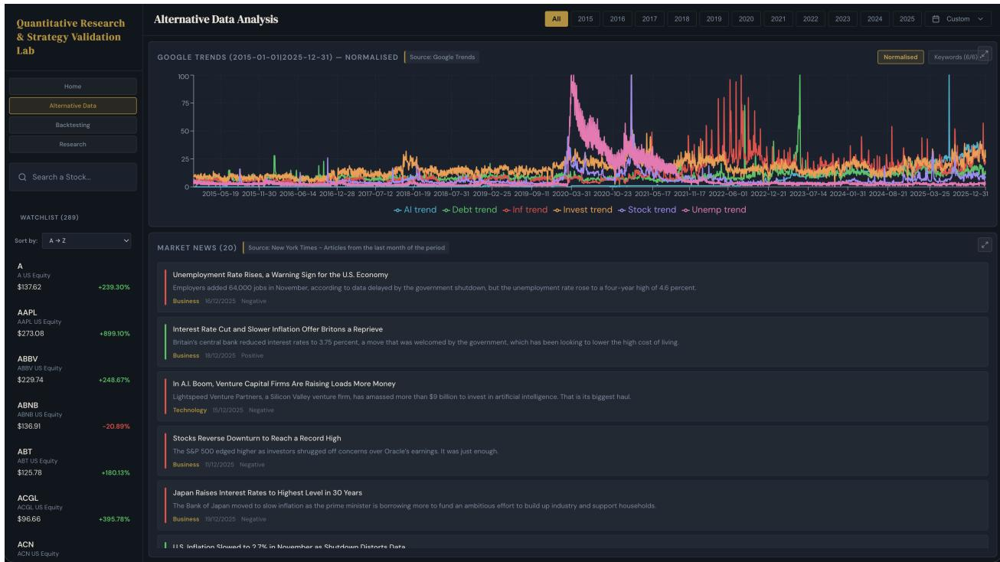  
Figure 18: Alternative Data Explorer  
Normalised Google Trends indices across the full 2015–2025 sample period, alongside firm-level news headlines with sentiment scores, sourced from the New York Times.

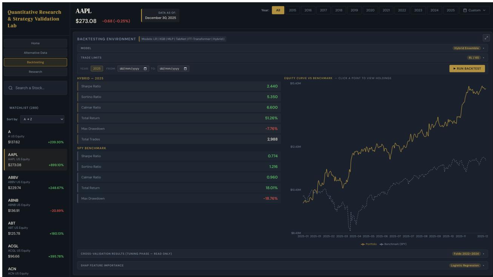  
Figure 19: Interactive Backtesting Environment  
Simulation of the long-short strategy across all six models with adjustable position limits and custom date ranges, shown here for the Hybrid Ensemble on the OOS period.

Tabular Deep Learning for Algorithmic Trading: Cross-Regime Bayesian Optimisation for Equity Signal Generation  
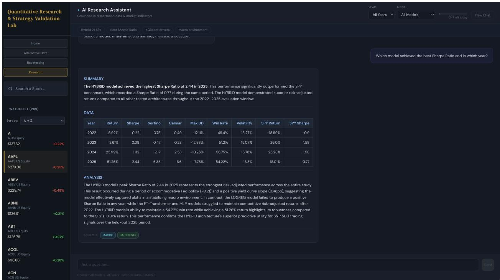  
Natural language query interface grounded in the study’s backtest results and macroeconomic data, shown responding to a query about best Sharpe Ratio across models and years.  
Figure 20: AI Research Assistant

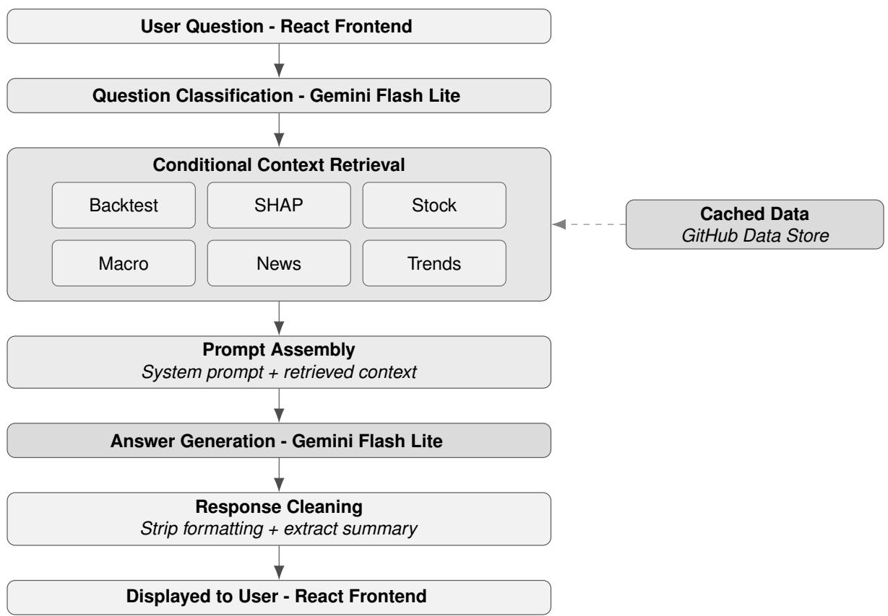  
The assistant classifies each question to determine which context types are required, retrieves only that context from the data store, and generates its response only using the assembled context before returning an answer to the frontend.

Figure 21: AI Research Assistant Architecture