# TECHNICAL COMPARATIVE BENCHMARKING STUDY: ADVANCED AI HYBRID METHODS FOR RENEWABLE ENERGY FARM OPTIMIZATION AND FORECASTING

Majid Masoumi Department of Computer Science Yazd University Yazd Majid.Masoumi@yazd.ac.ir

Mohammad Dehghan Department of Mechanical Engineering

Yazd University Mohammad.Dehghan@yazd.ac.ir

Asghar Dashtiy Department of Mechanical Engineering Yazd University Yazd Asghar.Dashtiy@yazd.ac.ir

Mina Rajabi Department of Mechanical Engineering

Yazd University Mina.Rajabi@yazd.ac.ir

## ABSTRACT

Advanced renewable-energy systems present fundamentally diferent data-driven challenges, ranging from high-dimensional wave energy converter (WEC) layout optimization to noisy, spatially coupled wind-power forecasting. This study provides a comprehensive benchmarking of conventional machine learning (ML), ensemble learning, deep neural networks, recurrent architectures, Transformers, graph-based models, and hybrid ensemble–deep learning approaches under complementary ofshore energy scenarios. Three datasets are considered: a large-scale 49WEC dataset containing 63,600 configurations and 149 numerical features, a 16-WEC dataset containing 288,000 layouts across four Australian wave climates, and operational 10-min SCADA measurements from 14 turbines at the Penmanshiel wind farm. For structured WEC-layout data, tree ensembles exhibited a clear advantage over conventional ML and neural predictors because randomized partitioning and boosting eficiently captured nonlinear layout–power interactions without requiring explicit feature representation learning. At the Perth site, Extra Trees (Extra-TD) was the strongest model, achieving considerable results. Relative to the MLP baseline, this corresponds to an approximately 63.7% reduction in MAE, demonstrating the suitability of randomized tree ensembles for high-dimensional structured WEC data. The advantage was taskdependent, however for real multivariate wind-farm forecasting, standalone DNN, LSTM, GRU, and BiLSTM architectures were substantially weaker because temporal representation alone could not fully describe inter-turbine dependencies. STGCN reduced the MAE to approximately 167.0 kW and achieved $R = 0 . 9 3$ by explicitly learning spatial and temporal turbine interactions. The best overall forecasting accuracy was obtained by the RF–BiLSTM hybrid, with an MAE of 150.5 kW. Compared with standalone LSTM $( \mathsf { M A E } = 5 9 0 . 0 ~ \mathsf { k W } ) .$ , this represents an approximately 75% reduction in MAE, while improving on STGCN by approximately 10.0%. Its superior performance arises from combining variance-reducing nonlinear feature learning by Random Forest with bidirectional temporal representation. In contrast, XGBoost–BiLSTM produced the highest mean correlation but showed substantially greater error variability, demonstrating that maximum correlation does not necessarily imply the most reliable forecast. Finally, the experiments reveal that no single AI architecture is universally optimal: randomized and boosted ensembles are particularly efective for structured WEC surrogate modeling, graph networks become advantageous when explicit spatial interactions dominate, and ensemble–recurrent hybrids provide the strongest balance when nonlinear tabular relationships and temporal dynamics coexist. These

Asia contributed the largest share (46.66%) of global renewable electricity in 2024, followed by the Americas (26.81%) and Europe (17.87%)

findings provide practical guidance for selecting AI architectures according to the physical and statistical structure of ofshore renewable-energy problems rather than model complexity alone.

Keywords ofshore renewable energy · optimization methods · Deep learning · Hybrid models · Foundation models

## 1 Introduction

The transition from fossil fuels to low-carbon energy has accelerated considerably over the past decade. Renewable power capacity reached approximately 4,448 GW worldwide by the end of 2024, following the addition of around 585 GW in a single year. Solar and wind accounted for more than 96% of these new renewable capacity additions [1]. Alongside the rapid expansion of onshore renewable generation, increasing atention is being directed toward ofshore resources. Ofshore wind is already developing at commercial scale in several regions, while wave, tidal, and hybrid ofshore systems are atracting growing interest as complementary sources of renewable electricity. The International Energy Agency expects ofshore wind deployment to accelerate toward 2030, although financing, supply chain constraints, permiting, and grid integration remain important barriers [2]. Figure 1 highlights substantia regional diferences in the 2024 electricity generation mix and in each continent’s contribution to global renewable electricity production. Europe and Oceania show relatively high renewable penetration, with renewables accounting for approximately 42.03% and 41.40% of electricity generation, respectively, while the corresponding shares are 36.94% in the Americas, 27.26% in Asia, and 24.74% in Africa. Despite its lower renewable penetration relative to Europe and Oceania, Asia contributes the largest share of global renewable electricity generation (46.66%), reflecting the scale of its overall power system and renewable deployment. The Americas and Europe follow with 26.81% and 17.87%, respectively, whereas Africa and Oceania contribute considerably smaller global shares. These diferences demonstrate that renewable penetration and absolute renewable generation are distinct indicators: regions with a high renewable percentage do not necessarily make the largest contribution to global renewable electricity production.

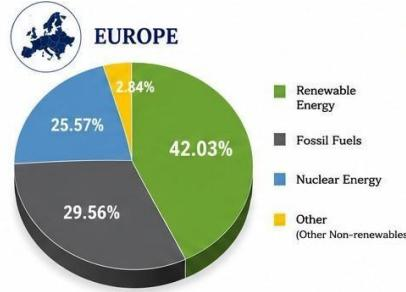  
Europe generated 42.03% of its electricity from renewable sources in 2024

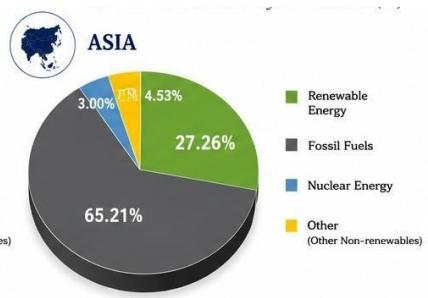  
Asia generated 27.26% of its electricity from renewable sources in 2024.

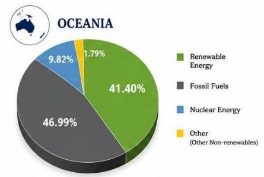

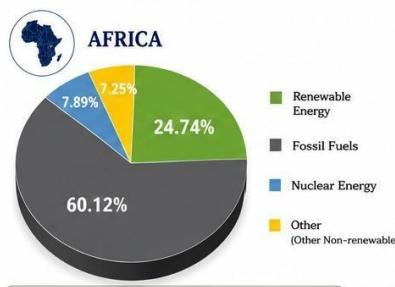

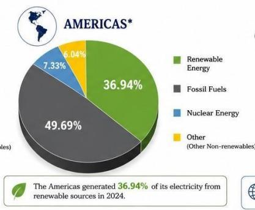  
GLOBAL CONTRIBUTION OF RENEWABLE ELECTRICITY BY CONTINENT (2024) (% of World Total Renewable Electricity Generation)

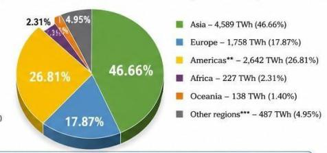  
Sources: Renewable share of electricity generation by continent: Ember (2025), "Electricity Mix 2024" (Our World in Data) Global contribution (TWh): IRENA (2025), Renewable Electricity Statistics 2025, Table 1.

Figure 1: Renewable electricity generation shares across major continents and their contributions to global renewable electricity generation in 2024.

Ofshore renewable energy (ORE) has several characteristics that make it particularly atractive. Ofshore winds are generally stronger and more persistent than those available at many onshore sites, large marine areas provide greater flexibility for utility-scale deployment, and technological progress has enabled increasingly large turbines and ofshore structures. Ocean waves also contain substantial energy and can provide a useful complement to wind and solar generation because their temporal characteristics are diferent. Combining ofshore wind, wave energy converters (WECs), storage, and other marine technologies may therefore provide opportunities to improve the use of ofshore infrastructure and reduce variability at the system level. These advantages, however, come with considerable technical complexity. Ofshore assets operate in environments characterized by changing wind fields, waves, currents, turbulence,

wake efects, hydrodynamic interactions, structural loading, and extreme weather. Installation and maintenance are also expensive [3], which means that relatively small improvements in energy capture, reliability, or operational planning can have meaningful economic consequences. Two computational problems are particularly important in this context: optimization and forecasting.

Optimization arises throughout the life cycle of an ofshore energy system. At the planning stage, decisions must be made regarding site selection, farm size, device locations, spacing, electrical infrastructure, and mooring arrangements. At the device and operational levels, turbine control, WEC geometry, power-take-of (PTO) parameters, yaw setings, and maintenance schedules may also require optimization. These variables are strongly coupled. For example, changing the position of one ofshore wind turbine afects the wake experienced by downstream turbines, while changing the position of a WEC alters hydrodynamic interactions with neighboring devices. Consequently, maximizing the performance of individual devices does not necessarily maximize the performance of the entire farm. A wide range of optimization techniques has been investigated for these problems. Early studies relied on deterministic search, parametric analysis, genetic algorithms (GAs), and other conventional evolutionary methods. The field subsequently expanded toward diferential evolution, covariance matrix adaptation evolution strategy, particle-based methods, local search, cooperative co-evolution, adaptive algorithms, hybrid evolutionary frameworks and multi-objective optimization methods [4]. These approaches are atractive because ofshore design problems are often nonlinear, constrained, multimodal, and dificult to solve using gradient information alone. More recently, surrogate models have been incorporated into the optimization loop to reduce the number of computationally expensive hydrodynamic or aeroelastic simulations [5, 6, 7, 8]. Machine learning can approximate the underlying physical simulator, allowing an optimizer to evaluate a much larger number of candidate solutions within a practical computational budget.

Table 1: Comparative analysis of genetic algorithms and conventional evolutionary optimisation methods for wave energy converter (WEC) farm layout optimisation.
<table><tr><td rowspan=1 colspan=1>Ref.</td><td rowspan=1 colspan=1>Year</td><td rowspan=1 colspan=1>Study</td><td rowspan=1 colspan=1>Optimisationmethod</td><td rowspan=1 colspan=1>Decision variables</td><td rowspan=1 colspan=1>Farm size</td><td rowspan=1 colspan=1>WEC      /hydrody-namic model</td><td rowspan=1 colspan=1>Objective   /metric</td><td rowspan=1 colspan=1>Main benefits</td><td rowspan=1 colspan=1>Limitations / weak points</td></tr><tr><td rowspan=1 colspan=1>[9]</td><td rowspan=1 colspan=1>2010</td><td rowspan=1 colspan=1>Child      andVenugopal, Optimalconfigurations ofwaveenergydevice arrays</td><td rowspan=1 colspan=1>Genetic Algorithm(GA) + ParabolicIntersection (PI)</td><td rowspan=1 colspan=1>WEC x-y positionsand arraygeometry</td><td rowspan=1 colspan=1>Approx. 5 WECs</td><td rowspan=1 colspan=1>Generic    verticalcylindrical  pointabsorbers; linearpotential-flowinteraction model</td><td rowspan=1 colspan=1>Maximise absorbedpowerand array in-teraction</td><td rowspan=1 colspan=1>One of the earliestsystematic applications ofevolutionary optimisationto WEC-array placement;provides comparisonbetween stochastic GA anddeterministic PI search.</td><td rowspan=1 colspan=1>Mainly smallarrays andsimplified       regular-frequency/directionalconditions; computationalburden increases rapidly witharray dimensionality.</td></tr><tr><td rowspan=1 colspan=1>[10]</td><td rowspan=1 colspan=1>2011</td><td rowspan=1 colspan=1>Child et  al.,extension    ofWECarray and PTOoptimisation</td><td rowspan=1 colspan=1>GeneticAlgorithm /evolutionarysearch</td><td rowspan=1 colspan=1>WEC positions andPTO-relatedparame-ters</td><td rowspan=1 colspan=1>Approx.10 WECs</td><td rowspan=1 colspan=1>Point-absorber array withhydrodynamicinteraction modelling</td><td rowspan=1 colspan=1>Maximise totalarray power</td><td rowspan=1 colspan=1>Extended      layoutoptimisation   towardsimultaneousconsideration      ofdevice/control parametersand array configuration.</td><td rowspan=1 colspan=1>Relatively small farms;simplified  environmentalassumptionsandlimitedeconomic and operationalconstraints.</td></tr><tr><td rowspan=1 colspan=1>[11]</td><td rowspan=1 colspan=1>2016</td><td rowspan=1 colspan=1>Sarkar et al.,Prediction   andoptimization  ofwave   energyconverter arraysusing a machinelearning approach</td><td rowspan=1 colspan=1>GA +  MonteCarlo     +activelearningsurrogate</td><td rowspan=1 colspan=1>Continuous WECx- y coordinatessubject to spatialand bathymetricconstraints</td><td rowspan=1 colspan=1>40 WECs</td><td rowspan=1 colspan=1>Hydrodynamicinteraction  modelapproximated through astatistical1machinelearningemulator</td><td rowspan=1 colspan=1>Maximise wave-farmenergy performance</td><td rowspan=1 colspan=1>Important contributiontoward     largescaleoptimisation; surrogatemodelling  substantiallyreduces     repeatedexpensivehydrodynamiccalculations and allowsspatial constraints to beconsidered.</td><td rowspan=1 colspan=1>Optimisation    accuracydepends on surrogatetraining quality; approximateinteraction models may fail tocapture   complex  orlongrange  hydrodynamiceffects.</td></tr><tr><td rowspan=1 colspan=1>[12]</td><td rowspan=1 colspan=1>2017</td><td rowspan=1 colspan=1>Göteman,  Waveenergy parks withpointabsorbers ofdifferentdimensions</td><td rowspan=1 colspan=1>Configuration/parametricoptimisationusing analyticalhydrodynamicmodel</td><td rowspan=1 colspan=1>Devicedimensions/topology and arrayconfiguration</td><td rowspan=1 colspan=1>4 WECs</td><td rowspan=1 colspan=1>Pointabsorbers ofdifferentdimensions/topologies;analyticalmultiplescatteringmodel validated againstWAMIT</td><td rowspan=1 colspan=1>Maximise absorbedpower and power-tomass ratio</td><td rowspan=1 colspan=1>Demonstrates    thatheterogeneous    WECdimensions can improveoverall park performance;computationallyefficientanalytical model</td><td rowspan=1 colspan=1>Configuration-orientedoptimisation rather than ageneral-purpose global EA;linear potential-flow/heaveassumptions.</td></tr><tr><td rowspan=1 colspan=1>[13]</td><td rowspan=1 colspan=1>2018</td><td rowspan=1 colspan=1>Giassi     andGöteman, Layoutdesign of waveenergy parks by agenetic algorithm</td><td rowspan=1 colspan=1>GAwith continuousand discreterepresentations</td><td rowspan=1 colspan=1>Continuous  orgridbased x-ypositions;preliminaryconsideration ofWEC geometryand PTO</td><td rowspan=1 colspan=1>4–14 WECs</td><td rowspan=1 colspan=1>Point absorbers withanalyticalmultiplescatteringformulation</td><td rowspan=1 colspan=1>Maximise absorbedpower      andinteraction factor (q)</td><td rowspan=1 colspan=1>Systematic comparison ofcontinuous and discretelayout representations;provides useful analysis ofscalable    WEC-parkpatterns.</td><td rowspan=1 colspan=1>Continuous  optimisationbecomes    increasinglyexpensive as array size grows;wave andhydrodynamicassumptions     remainrelatively simplified.</td></tr><tr><td rowspan=1 colspan=1>[14]</td><td rowspan=1 colspan=1>2018</td><td rowspan=1 colspan=1>Sharp and DuPont,Wave   energyconverter  arrayoptimization:  Agenetic algorithmapproach andminimumseparation distancestudy</td><td rowspan=1 colspan=1>BinaryGenetic Algorithm</td><td rowspan=1 colspan=1>WEC positions andminimum inter-device separation</td><td rowspan=1 colspan=1>5 WECs</td><td rowspan=1 colspan=1>Truncatedheaving cylindrical pointabsorbers withanalyticalhydrodynamic model</td><td rowspan=1 colspan=1>Maximise powerwhi1e consideringinteractionfactor       andarray-related cost</td><td rowspan=1 colspan=1>Explicitly   investigatesminimum   separationdistance and incorporateseconomic considerationsrather than optimisingabsorbed power alone.</td><td rowspan=1 colspan=1>Small farmsize;mainlyunidirectional     waveconditions and simplifiedeconomic modelling restrictgeneralisation       tocommercialscale farms.</td></tr></table>

<table><tr><td rowspan="2">[15]</td><td rowspan="2">2018 2019 Lyu,</td><td rowspan="2">Arbonès et al., multiobjective WEC- array optimisation</td><td rowspan="2">Multi-objective Evolutionary Algorithm</td><td rowspan="2"></td><td rowspan="2">WEC layout and selected design/control variables</td><td rowspan="2">Approx. 9 WECs</td><td rowspan="2">Point-absorber array</td><td rowspan="2">Simultaneous optimisation of energy and additional design objec- tives</td><td rowspan="2">Provides analysis tradeoffs competing one</td><td>and rather than producing only</td><td>Pareto-based exposes between objectives</td><td colspan="2">Multi-objective optimisation significantly computational cost; selection among Pareto-optimal designs requires additional</td></tr><tr><td>solution. Maximise absorbed Strong power / interaction formulation device layout</td><td>powermaximising co-design in dimensions and are optimised</td><td>which arrays; variables</td><td>decisionmaking criteria. Evaluated mainly on small adding geometry substantially increases dimensionality and</td></tr><tr><td rowspan="2">[17]</td><td rowspan="2">layout of an array of 2022 a</td><td>wave converters Zeng et Hydrodynamic interactions</td><td>energy al., Hierarchical Genetic</td><td>matrix-coded</td><td>Hierarchical optimisation of WEC x-y</td><td>Moderate /</td><td>Truncated WECS</td><td>cylindrical with</td><td>Maximise extracted wave power semianal</td><td>simultaneously; improvement</td><td>demonstrates considerable in array interaction performance. Hierarchical decomposition helps reduce optimisation complexity and supports</td><td>may overlook interactions</td><td>computational expense. Sub-problem decomposition important</td></tr><tr><td>among wave energy converter array and hierarchical genetic algorithm for</td><td>Algorithm layo</td><td></td><td>positions</td><td>e arrays</td><td>larg ytical radiation-diffraction modelling degrees of freedom</td><td>and five</td><td></td><td>higher-dimensional layout problems; hydrodynamic representation is more detailed than many earlier GA studies.</td><td></td><td>hydrodynamics predominantly linear/semianalytical.</td><td>between different groups of WECs; are still</td></tr><tr><td>[18]</td><td>2022 for</td><td>ANN-assisted adaptive GA study WEC-array layout optimisation</td><td>Adaptive Genetic Algorithm + Artificial Neural Network surrogate</td><td>mutation search parameters</td><td>WEC x-y coor- dinates; adaptive crossover, an d population-</td><td>3-7 WECs</td><td>ANN trained AQWA-generated hydrodynamic under measured irregular waves</td><td>using data</td><td>Maximise total captured wave power</td><td>ANN surrogate reduces the number of expensive hydrodynamic simulations, while adaptive GA parameters improve search efficiency relative to</td><td>conventional GA.</td><td>Surrogate outside the training region may be unreliable; tested farm sizes remain relatively small for deployment.</td><td>generalisation commercial</td></tr></table>

Forecasting is equally important once ofshore systems become operational. Accurate prediction of wind speed, wave conditions, and generated power supports grid scheduling, reserve management, storage operation, electricity trading, maintenance planning, and system control. Forecast errors can propagate directly into operational and economic decisions. This is particularly challenging ofshore because the underlying processes are nonlinear, multivariate, nonstationary, and spatially dependent. Statistical approaches such as autoregressive models and exponential smoothing remain useful benchmarks, but their ability to represent complex nonlinear relationships is limited. Machine-learning methods, including random forests, support vector machines, gradient boosting, XGBoost, and LightGBM, have therefore become common alternatives [19]. Deep-learning models extended this capability by learning temporal representations directly from historical observations. Convolutional neural networks, long shorterm memory networks (LSTMs), gated recurrent units (GRUs) [20], and combinations of these architectures have been applied extensively to renewable-energy forecasting [21, 22, 23, 24]. Atention-based architectures have added another dimension to this development. Transformers can capture long-range temporal relationships without the sequential processing required by conventional recurrent networks. Variants incorporating temporal atention, crossatention, sparse atention, and decomposition mechanisms have consequently been investigated for wind and power forecasting [25, 26, 27, 28]. Nevertheless, greater architectural complexity does not automatically translate into beter forecasting. Depending on the amount of training data, prediction horizon, input variables, tempora resolution, and level of noise, comparatively simple ML or recurrent models can remain highly competitive. This makes systematic benchmarking important: the practical question is not simply whether a Transformer can forecast renewable power, but when its additional complexity produces a meaningful and reproducible advantage. Spatial dependence is another aspect that cannot be ignored in ofshore farms. Turbines and WECs interact with their neighbors through wakes, waves, environmental fields, and shared operating conditions. Graph neural networks (GNNs) provide a natural way to represent these relationships, with individual assets or measurement locations represented as nodes and their physical or statistical relationships represented as edges. Graph-based forecasting models have already shown promise for learning spatial and temporal dependencies in ofshore wind systems [29, 30, 31]. Graph Transformers extend this idea by combining graph representations with atention mechanisms and may be particularly useful when interactions vary with wind direction, sea state, or operating regime.

Table 2: Comparative analysis of simple evolutionary, heuristic, deterministic and layout-search methods for wave energy converter (WEC) farm layout optimisation.
<table><tr><td rowspan="2">Ref.</td><td rowspan="2">Year</td><td rowspan="2">Study</td><td rowspan="2"></td><td rowspan="2">Optimisation method</td><td rowspan="2">Decision variables</td><td rowspan="2">Farm size</td><td rowspan="2">WEC</td><td rowspan="2">/ hydrody-</td><td rowspan="2">Objective /metric</td><td rowspan="2">Main benefits</td><td rowspan="2">Limitations / weak points</td></tr><tr><td>namic model</td></tr><tr><td rowspan="4">[32]</td><td rowspan="4">2010</td><td rowspan="4">of distance</td><td>Babarit, investigation Parametric long-</td><td>analytical search</td><td>Inter-device separation</td><td>2 WECs</td><td>Interacting energy modelled under regular</td><td>wave Quantify converters</td><td>hydrodynamic</td><td>Provides fundamental understanding of how interaction</td><td>Limited to two-device interaction analysis; does not address</td></tr><tr><td>hydrodynamic</td><td></td><td>e and</td><td>distanc relative</td><td>and</td><td>interaction</td><td>and effects decay identify favourable</td><td>with increasing WEC separation</td><td>highdimensional farm-layout optimisation or large commercial</td></tr><tr><td>interactions</td><td></td><td>positioning</td><td></td><td>irregular wave</td><td></td><td>separation distances</td><td>and establishes physical principles arrays. subsequently used in array-layout</td><td></td></tr><tr><td>between energy converters</td><td>wave</td><td></td><td></td><td>conditions</td><td></td><td>optimisation.</td><td></td><td></td></tr></table>

<table><tr><td rowspan=1 colspan=1>[33]</td><td rowspan=1 colspan=1>2012</td><td rowspan=1 colspan=1>Borgarino,Babaritand Ferrant, Impactof wave interactioneffects on energyabsorption in largearrays of wave en-ergy converters</td><td rowspan=1 colspan=1>Parametricconfigurationsearchprescribedlayoutcomparison</td><td rowspan=1 colspan=1>Array geometry andinter-device spacing</td><td rowspan=1 colspan=1>9,16 and25 WECs</td><td rowspan=1 colspan=1>Generic     heavingcylindrical and surgingbarge-type WECs withhydrodynamicinteraction modelling</td><td rowspan=1 colspan=1>Evaluate total energyabsorption and arrayinteraction effects</td><td rowspan=1 colspan=1>Oneoftheearlystudiesconsidering relatively large WECarrays; systematicallycomparessquare   and   triangularconfigurations and demonstratesthe strong effect of spacing onannual energy production.</td><td rowspan=1 colspan=1>Optimisationisrestricted topredetermined    geometricconfigurations  rather thanunrestrictedcontinuousWECpositioning.</td></tr><tr><td rowspan=1 colspan=1>[34]</td><td rowspan=1 colspan=1>2013</td><td rowspan=1 colspan=1>Vicente   etal.,comparativeinvestigation ofwave energy parklayouts</td><td rowspan=1 colspan=1>Numerical  configuration search</td><td rowspan=1 colspan=1>Layout geometry,WEC separation andrelative arrangement</td><td rowspan=1 colspan=1>12 WECs</td><td rowspan=1 colspan=1>WECarrayevaluatedusing multiplenumericalhydrodynamicmodellingapproaches</td><td rowspan=1 colspan=1>Maximiseconstructivehydrodynamicinteractionandabsorbed power</td><td rowspan=1 colspan=1>Comparison   of   severalconfigurations includingline,triangular, square, hexagonal andoffset arrangementsprovidesusefulphysicalinsightintofavourable WECspacing andorientation.</td><td rowspan=1 colspan=1>Search space restricted topredefined    configurations;continuous x- y optimisation andbroader      designvariableinteractions are not considered.</td></tr><tr><td rowspan=1 colspan=1>[35]</td><td rowspan=1 colspan=1>2013</td><td rowspan=1 colspan=1>Engström  etal.,Performance of largearrays of point ab-sorbing direct-drivenwave energyconverters</td><td rowspan=1 colspan=1>Configurationcomparisonstochastic layoutanalysis</td><td rowspan=1 colspan=1>Circular,rectangularand random WECarrangements</td><td rowspan=1 colspan=1>32 WECs</td><td rowspan=1 colspan=1>Direct-drivenpointabsorbingWECarraywithhydrodynamic interactions</td><td rowspan=1 colspan=1>Maximise energyproduction  andinvestigate aggregatepower fluctuations</td><td rowspan=1 colspan=1>Considers a relatively large farmand analyses not only total energycapture but also power smoothingand array-level fluctuations, whichare relevant to grid integration.</td><td rowspan=1 colspan=1>Does not perform comprehensiveglobal optimisation of continuousdevice locations; conclusions aredependent on a limited set ofcandidate layouts.</td></tr><tr><td rowspan=1 colspan=1>[36]</td><td rowspan=1 colspan=1>2014</td><td rowspan=1 colspan=1>de Andrés et al.,Factors    thatinfluence   arraylayout on waveenergy farms</td><td rowspan=1 colspan=1>Parametric layoutoptimisation</td><td rowspan=1 colspan=1>Array geometry,separation distance,wave direction andnumber of devices</td><td rowspan=1 colspan=1>Smallarrays,typically 2-4 WECs</td><td rowspan=1 colspan=1>Heaving     WECssimulated in the timedomain under irregularwave conditions</td><td rowspan=1 colspan=1>Assess    powerabsorption   andidentifyfavourablefarmgeometries underdifferent waveclimates</td><td rowspan=1 colspan=1>Highlights the influence of wavedirectionality and demonstratesthat triangular arrangements canbe    favourable    undermultidirectional   conditionswhereassquarelayoutsmayperformwell undermoredirectional seas.</td><td rowspan=1 colspan=1>Small farmsizesand use ofpredefined layout families limitscalability and theability toidentify  globally  optimalunrestricted layouts.</td></tr><tr><td rowspan=1 colspan=1>[37]</td><td rowspan=1 colspan=1>2015</td><td rowspan=1 colspan=1>Noad    andPorter, Optimisation ofarrays of flap-typeoscillating wavesurge con- verters</td><td rowspan=1 colspan=1>Multidimensionalnumericaloptimisation</td><td rowspan=1 colspan=1>Inter-device spacing,array configurationand selected deviceparameters</td><td rowspan=1 colspan=1>B and 5FWECS</td><td rowspan=1 colspan=1>lap-type  oscillatingwave surge converterswith detailed hydro-dynamic modelling</td><td rowspan=1 colspan=1>Maximise absorbedwave powerandconstructiveinteraction</td><td rowspan=1 colspan=1>Provides       high-qualitydevicespecific  hydrodynamicoptimisationand demonstratesthat appropriately selectedspacing can significantly improvearray-level energy absorption.</td><td rowspan=1 colspan=1>Scalability to large farms is limitedbecause of expensivehydrodynamic calculations andrapidly increasing optimisationdimensionality.</td></tr><tr><td rowspan=1 colspan=1>[38]</td><td rowspan=1 colspan=1>2015-2017</td><td rowspan=1 colspan=1>Moarefdoost et al.,WECfarmlayoutoptimisationusingmathematicalprogramming</td><td rowspan=1 colspan=1>Heuristicinitialisation +SequentialIterativeQuadraticProgramming</td><td rowspan=1 colspan=1>Continuous WEC x- ypositions</td><td rowspan=1 colspan=1>Approximat e2-15WECS</td><td rowspan=1 colspan=1>lyPoint-absorberarrayusingapproximate hydrodynamicinteraction models</td><td rowspan=1 colspan=1>Maximise     totalabsorbed power</td><td rowspan=1 colspan=1>Combines heuristic initialisationwithcomputationallyefficientgradient-based local optimisation,providing faster convergence thanexhaustive or purely</td><td rowspan=1 colspan=1>Strongsensitivity toinitialsolutionsand localoptima;gradientbased search mayperformpoorlyfor highlymultimodal layout landscapes and</td></tr><tr><td rowspan=1 colspan=1></td><td rowspan=1 colspan=1></td><td rowspan=1 colspan=1></td><td rowspan=1 colspan=1></td><td rowspan=1 colspan=1></td><td rowspan=1 colspan=1></td><td rowspan=1 colspan=1></td><td rowspan=1 colspan=1></td><td rowspan=1 colspan=1>populationbased optimisation isome cases.</td><td rowspan=1 colspan=1>n complex  hydrodynamicinteractions.</td></tr><tr><td rowspan=1 colspan=1>[39]</td><td rowspan=1 colspan=1>2016</td><td rowspan=1 colspan=1>Sinha  et  al.comparative analysisof    alternativeWECarrayarrangements</td><td rowspan=1 colspan=1>Numerical /parametricconfigurationcomparison</td><td rowspan=1 colspan=1>Arrayarrangement and incident-wave direction</td><td rowspan=1 colspan=1>12 WECs</td><td rowspan=1 colspan=1>WEC         arrayhydrodynamicsevaluated      usingWAMIT-basedmodelling</td><td rowspan=1 colspan=1>Compare absorbedpower underdifferentconfigurationsandincident-wavedirections</td><td rowspan=1 colspan=1>Demonstrates the strongdirectional sensitivity of arrayperformance and provides usefulevidence for selecting farmwave directions.</td><td rowspan=1 colspan=1>Only  limited numberofpredetermined arrangements areevaluated; no unrestrictedevolutionary or continuousoptimisation is undertaken.</td></tr><tr><td rowspan=1 colspan=1>[40]</td><td rowspan=1 colspan=1>2017</td><td rowspan=1 colspan=1>Bozzi et al., Waveenergy farm design inrealwaveclimates:The Italian offshore</td><td rowspan=1 colspan=1>Site-specificparametricoptimisation</td><td rowspan=1 colspan=1>Array   geometry,orientation andinterdevice spacing</td><td rowspan=1 colspan=1>4 WECs</td><td rowspan=1 colspan=1>Time-domain WECarraymodel evaluated usingrealistic Italian offshorewave climates</td><td rowspan=1 colspan=1>Maximise annualenergyproductionunder   realisticenvironmentalconditions</td><td rowspan=1 colspan=1>Important site-specific studyincorporating realistic directionalwave climates and comparinglinear,squareandrhombusarrangements over multipledevice-separation distances.</td><td rowspan=1 colspan=1>Smallfarm size andfinitecandidatelayout  set  limitapplicability  to  largescalecontinuous farm optimisation.</td></tr><tr><td rowspan=1 colspan=1>[41]</td><td rowspan=1 colspan=1>2017</td><td rowspan=1 colspan=1>Tay and Venugopal,optimisation  ofoscillating  wavesurge converterarrays</td><td rowspan=1 colspan=1>Modifiedevolutionary  /numericalparameter search</td><td rowspan=1 colspan=1>Device  spacing,relative position andarray configuration</td><td rowspan=1 colspan=1>Up to 12WECs</td><td rowspan=1 colspan=1>Oscillating wave surgeconverter array underregular,long-crestedandshort-crested waves</td><td rowspan=1 colspan=1>Maximise  energyextraction   andconstructive waveinteraction</td><td rowspan=1 colspan=1>Shows that optimum array spacingis strongly influenced by wavescattering, transmission anddirectionality and extends layoutanalysis beyondconventionalpoint absorbers.</td><td rowspan=1 colspan=1>Restricted array geometry andlimitedoptimisationvariablesreduce generalisability to arbitrarycommercial-scale layouts.</td></tr><tr><td rowspan=1 colspan=1>[42]</td><td rowspan=1 colspan=1>2017</td><td rowspan=1 colspan=1>Wu et al., numericalinvestigation andoptimisation ofWECarrayparameters</td><td rowspan=1 colspan=1>Parametric /numericaloptimisation</td><td rowspan=1 colspan=1>Inter-deviceseparation, incident-wave parameters andarrayarrangement</td><td rowspan=1 colspan=1>Smalltomoderatearray</td><td rowspan=1 colspan=1>HydrodynamicWECarray modelaccounting forwavedeviceinteractions</td><td rowspan=1 colspan=1>Maximise absorbedwave energy andanalyse sensitivity toenvironmentalparameters</td><td rowspan=1 colspan=1>Provides physically interpretablerelationships      betweenenvironmental    conditions,separation distanceand arrayperformancethat canguideoptimisation  bounds andconstraints.</td><td rowspan=1 colspan=1>Limited   exploration   ofunrestricted x-y placement andno sophisticated strategy forhandling highly multimodal searchlandscapes.</td></tr><tr><td rowspan=1 colspan=1>[43]</td><td rowspan=1 colspan=1>2018L</td><td rowspan=1 colspan=1>ópez-Ruiz at. lifecycle-orientedanalysis    ofWECfarm layouts</td><td rowspan=1 colspan=1>Configurationand    spacingoptimisation   ed</td><td rowspan=1 colspan=1>Aligned,staggerand     arrow-typearrangements together withinter-device spacing</td><td rowspan=1 colspan=1>9 WECs</td><td rowspan=1 colspan=1>Wave-energy  farmmodelincorporatingenergy-production andlifecycle considerations</td><td rowspan=1 colspan=1>Improve  long-term energyperformance andevaluate layoutrelatedlifecycle implications</td><td rowspan=1 colspan=1>Connects hydrodynamic layoutselection with longer-term farmperformance; arrow-type layoutscan provide favourable energycapture  compared  withconventional       alignedconfigurations.</td><td rowspan=1 colspan=1>Design space remains restricted toseveral predefined geometries anddoes not allow completely freedevice placement.</td></tr><tr><td rowspan=1 colspan=1>[44]</td><td rowspan=1 colspan=1>2019</td><td rowspan=1 colspan=1>McGuinness   andThomas,constrainedoptimisation of WECarray configurations</td><td rowspan=1 colspan=1>SequentialQuadraticProgramming/constrainednonlinearoptimisation</td><td rowspan=1 colspan=1>Continuous  WEClocations subject tomotion andseparationconstraints</td><td rowspan=1 colspan=1>5 WECs</td><td rowspan=1 colspan=1>Point-absorber modelevaluated over a rangeof incidentwavedirections</td><td rowspan=1 colspan=1>Maximise absorbedpower   whilesatisfyingphysical con- straints</td><td rowspan=1 colspan=1>Introduces explicit physical andmotion  constraints  intocontinuous layout optimisationand provides computationallyefficient local refinement.</td><td rowspan=1 colspan=1>As a local optimisation method,performance can depend stronglyon the initial layout and theapproach mayconverge tosuboptimal local solutionsinhighly multimodal landscapes.</td></tr><tr><td rowspan=1 colspan=1>[45]</td><td rowspan=1 colspan=1>2019Y</td><td rowspan=1 colspan=1>ang   et   al.integratedassessmentofalternative WEC farmarrangements</td><td rowspan=1 colspan=1>Comparativeoptimisation /multi-criteriaevaluation</td><td rowspan=1 colspan=1>NEC  arrangement,10farm geometry andspacing</td><td rowspan=1 colspan=1>WECs</td><td rowspan=1 colspan=1>WEC     farmmodelincluding  waves,current / environmentalloading   andmooringrelatedconsiderations</td><td rowspan=1 colspan=1>Evaluate    powerproduction, economicperformance andmooring fatigue</td><td rowspan=1 colspan=1>Provides       systems-levelperspective by considering energyproduction together with cost andmooringrelated     structuralperformance rather  thanmaximising power alone.</td><td rowspan=1 colspan=1>Optimisation is restricted to asmall set of candidateconfigurations and thereforecannot guarantee globally optimal</td></tr></table>

<table><tr><td>[46]</td><td>2021</td><td>Layout optimization of heaving wave energy converter linear arrays in front of a vertical wall</td><td>Constrained numerical optimisation</td><td>WEC positions along the wall and interdevice spacing</td><td>Multiple WECs</td><td>Heaving WEC array with wall-wave- hydrodynamic interaction under site- specific</td><td>device wave exploiting wallinduced</td><td>Maximise absorbed power by and</td><td>Demonstrates structures identifies</td><td>that can modify array hydrodynamics and favourable</td><td>coastal substantially device</td><td>Specialised configuration limits generalisation to openocean wave farms;</td></tr><tr><td colspan="2"></td><td></td><td></td><td></td><td></td><td>water-depth</td><td>wave and</td><td>interdevice</td><td></td><td>clustering and positioning close to</td><td></td><td>unrestricted offshore layouts.</td></tr><tr><td></td><td></td><td></td><td></td><td></td><td></td><td></td><td>interactions</td><td></td><td>a reflecting boundary.</td><td></td><td></td><td>optimisation space is effectively one-dimensional compared with</td></tr><tr><td></td><td></td><td></td><td></td><td></td><td></td><td>conditions</td><td></td><td></td><td></td><td></td><td></td><td></td><td></td></tr></table>

A more recent development is the emergence of pretrained and foundation models for time series. Models such as Chronos, TimesFM, and Lag-Llama have been trained using large collections of time-series data and are designed to transfer knowledge to previously unseen forecasting tasks [39, 40, 41]. This is potentially important for renewable energy, where a conventional model is often retrained separately for every farm, turbine, geographical region, and forecasting horizon. A suficiently general pretrained model could reduce this dependence on task-specific training and provide useful predictions when historical data are limited. Early studies of foundation models and large pretrained models in the energy domain are encouraging [42, 43], but evidence for ofshore applications remains limited. Their robustness under extreme conditions, physical consistency, computational requirements, uncertainty calibration, and ability to generalize between geographically diferent ofshore sites still require careful investigation. The increasing use of artificial intelligence also creates an opportunity to connect forecasting and optimization rather than treating them as independent tasks. Forecasting models can provide environmental and power information to an optimizer, while ML models can serve as computationally eficient surrogates for expensive physical simulations. Physics-informed learning [47] ofers another route by embedding physical knowledge into data-driven models rather than relying entirely on observed data [44]. Ultimately, these developments could support digital representations of ofshore farms in which forecasting, control, uncertainty estimation, and optimization operate together.

Despite considerable progress in each of these areas, it remains dificult to draw general conclusions from the existing literature. Many studies introduce a new algorithm and demonstrate its performance using one dataset, one farm, or a limited number of baseline methods. Optimization studies may use diferent computational budgets, population sizes, stopping criteria, physical simulators, and constraints. Forecasting studies similarly difer in preprocessing, traintest partitioning, prediction horizon, error metrics, and hyperparameter tuning. Under these conditions, improvements reported in separate publications cannot be interpreted as direct evidence that one algorithm is generally superior to another. This issue becomes more important as increasingly sophisticated AI architectures are introduced. A model that achieves the lowest RMSE on one ofshore wind dataset may require substantially greater training time and memory than a conventional ML model while providing litle improvement on another dataset. Similarly, an evolutionary optimizer may obtain an excellent WEC layout for a small array but become impractical when the number of devices and decision variables increases. Therefore, accuracy or final objective value alone provides an incomplete picture. Computational cost, convergence behavior, robustness, scalability, stability across independent runs, uncertainty, and sensitivity to data characteristics should also be considered.

Against this background, this study provides a comprehensive comparative investigation of AI-based forecasting and optimization for ofshore renewable-energy systems. Rather than focusing on the introduction of a single new algorithm, the objective is to determine how diferent methodological families behave under comparable experimental conditions and to identify where their advantages and limitations become important.

The main contributions of this work are:

1. Broad and consistent benchmarking. Statistical methods, conventional ML, deep neural networks, atention/Transformer architectures, graph-based approaches, and emerging advanced models are evaluated using consistent forecasting protocols across multiple ofshore renewable-energy datasets.

2. Comprehensive optimization assessment. Representative conventional evolutionary algorithms, advanced evolutionary methods, local-search approaches, hybrid frameworks, and surrogate-assisted strategies are compared under controlled computational conditions for ofshore design and layout problems.

3. Evaluation across diferent problem characteristics. The analysis considers diferent datasets, prediction horizons, environmental conditions, farm configurations, and optimization landscapes rather than drawing conclusions from a single case study. Comparison beyond predictive accuracy.

4. Forecasting models are examined in terms of accuracy, robustness, computational requirements, stability, and generalization, while optimization algorithms are assessed using solution quality, convergence, computational efort, scalability, and statistical consistency.

5. Critical identification of strengths and weaknesses. The study investigates why particular model families perform well or poorly under diferent conditions, providing practical guidance for selecting methods rather than simply reporting a global ranking.

The intention is therefore not to identify a universally “best” AI algorithm. Such a conclusion would be unrealistic given the diversity of ofshore renewable-energy problems. Instead, this work seeks to establish which methods are most efective under particular data, physical, and computational conditions, what trade-ofs accompany their use, and where further methodological development is genuinely needed. This comparative perspective can provide a more reliable basis for the development of accurate, scalable, and practically useful intelligent systems for future ofshore renewable-energy applications.

## 2 Ofshore Renewable Energy Data

Three datasets were used to provide a balanced evaluation of the forecasting and optimization methods considered in this study. Two datasets represent wave energy farm layout problems, while the third contains operational measurements from a real ofshore wind farm. This combination allows the models to be examined under quite diferent conditions, ranging from high-dimensional WEC layout [48, 49] optimization to multivariate wind-power forecasting using real SCADA data [50] .

## 2.1 Large-scale wave energy farm dataset

The Large-Scale Wave Energy Farm dataset [48] was developed to support data-driven modeling and optimization of large WEC arrays. It contains 63,600 samples and 149 numerical features, with each sample representing one candidate farm configuration. The farms consist of 49 WECs, making this a relatively large optimization problem compared with many earlier WEC studies. In particular, describing the position of every device requires 98 spatial variables (x and y coordinates), in addition to information describing the power generated by individual converters and the overall farm performance.

The main target is the total absorbed power of the farm, while the individual WEC power outputs and interaction information provide additional insight into the hydrodynamic behavior of diferent layouts. This dataset is particularly useful for testing surrogate models because evaluating large WEC arrays directly through hydrodynamic simulations can be computationally expensive. A suficiently accurate ML model can learn the relationship between the farm layout and its power output and can then be incorporated into an optimization process to evaluate candidate layout more eficiently.

## 2.2 Wave energy converter dataset

The second dataset [49] considers a smaller WEC farm but covers a much larger number of candidate layouts. It contains 288,000 samples with 49 continuous features and represents four real wave scenarios along the southern Australian coastline: Sydney, Adelaide, Perth, and Tasmania. Each farm contains 16 fully submerged three-tether CETO WECs.

The main inputs describe the spatial arrangement of the converters through their x-y coordinates, together with information related to the power captured by the individual devices. The primary target is again the total absorbed power of the farm. The four wave scenarios provide an additional level of diversity because the same general layout problem can be studied under diferent environmental conditions.

Using both WEC datasets is useful for evaluating scalability. The 16-WEC dataset provides a large number of observations across several wave environments, whereas the 49-WEC dataset introduces a substantially larger spatial search space. The two datasets therefore allow us to examine how prediction and optimization methods behave as the size and complexity of the wave farm increase. Fig 2 illustrates representative optimized layouts for 16-WEC farms under the Perth and Sydney wave conditions. The spatial distributions demonstrate how WEC placement influences hydrodynamic interactions and overall farm performance, while the color of each WEC represents its individual absorbed power. The variations in total power and q-factor further highlight the strong dependence of farm performance on both site-specific wave conditions and array configuration.

## 2.3 Penmanshiel wind farm dataset

The Penmanshiel Wind Farm dataset [50] was used for the wind-energy forecasting experiments. In contrast to the WEC datasets, Penmanshiel contains measurements collected from a real operating wind farm in the United Kingdom. The dataset provides measurements at 10-minute intervals from 2016 to mid-2021 and covers 14 Senvion MM82 wind turbines (with WT03 not included in the released data).

The SCADA measurements provide a detailed description of both environmental conditions and turbine operation. The available variables include wind speed and direction, active power, rotor and generator speeds, nacelle and vane positions, electrical measurements, temperatures, and other turbine operating variables. The main target considered in this study is power generation, with historical multivariate SCADA measurements used to predict future turbine power.

The Penmanshiel dataset is particularly valuable for this comparison because it introduces many of the dificulties encountered in practical forecasting. Unlike simulation-generated data, real SCADA measurements contain noise, missing observations, changing operating regimes, and nonlinear relationships between atmospheric conditions and turbine response. Moreover, measurements from multiple turbines make it possible to investigate not only temporal dependencies but also spatial relationships across the wind farm, which is particularly relevant when evaluating graphbased and spatiotemporal learning models. As shown in Fig. 3, the wind-rose distributions reveal clear diferences in the prevailing wind direction and wind-speed frequency across the four study locations. These sitespecific wind characteristics highlight the spatial variability of the available wind resource and provide important environmental context for the subsequent forecasting and optimization analyses. Totally, the three datasets provide complementary test environments. The two WEC datasets focus on learning the relationship between farm layout, hydrodynamic interactions, and captured power, whereas Penmanshiel represents a real-world multivariate timeseries forecasting problem. Their combined use provides a more meaningful basis for comparing conventional ML, deep-learning, Transformer, graph-based, and advanced optimization methods than relying on a single renewableenergy dataset.

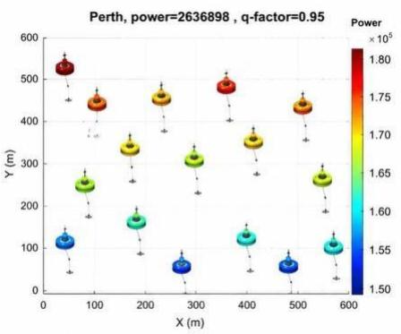

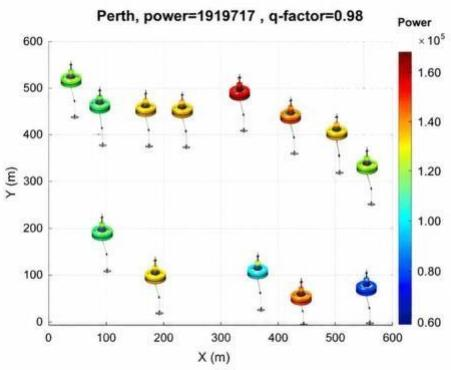

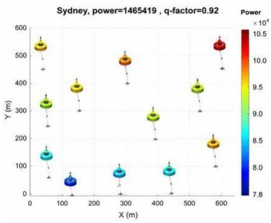

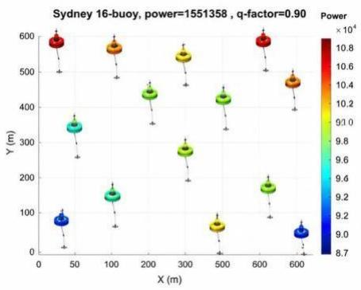  
Figure 2: Optimized layouts of 16-WEC wave farms for Perth and Sydney, where WEC color represents the individual power output and the color bar indicates the corresponding power range.

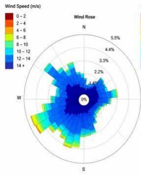  
(a)

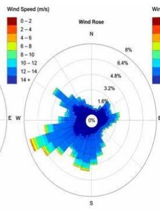  
(b)

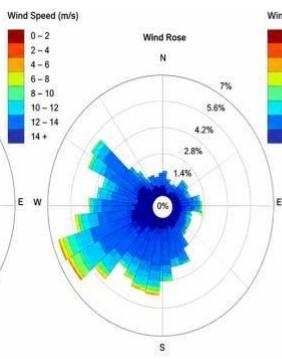  
(c)

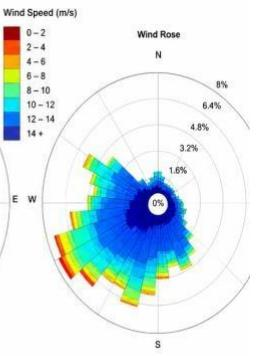  
(d)  
Figure 3: Wind-rose distributions for the four wave-energy study locations, showing wind direction, occurrence frequency, and wind-speed ranges using the Jet colormap.

## 3 Advanced AI Forecasting Models and Methodology

To establish a comprehensive benchmark for wave-farm power prediction, a diverse set of regression models was considered, ranging from conventional machine-learning methods to advanced ensemble and cooperative learning approaches. The baseline models include the Multi-Layer Perceptron (MLP), Gradient Boosting Regressor (GBR), Huber-loss Gradient Boosting (GBH), Histogram-Based Gradient Boosting (HGBR), Quantile Gradient Boosting (QGBR), and Decision Tree (DT). More advanced learners comprise AdaBoost (Ada-BT), CatBoost (CAT-B), Extra Trees (ExtraTD), LightGBM, TabNet, and XGBoost (XGB), providing diferent mechanisms for capturing nonlinear relationships and complex interactions within the WEC layout–control design space. In addition, several ensemble strategies were evaluated, including gradient-based voting (VRGD), heterogeneous voting (VCGD), bagged decision trees (Bag-DT), linear stacked regression (SRGE-Linear), and the cooperative stacked gradient ensemble (SXSGE), which combine complementary predictions from multiple base learners to improve generalization and robustness. Collectively, these models provide a progressively more sophisticated benchmark for assessing whether cooperative and multi-mode learning can improve the accuracy and reliability of surrogate prediction for complex 16-WEC farm configurations.

## 3.1 Ensemble Learning Models for Tabular Prediction

Ensemble learning provides an efective framework for modelling nonlinear and heterogeneous relationships in structured tabular data. Rather than relying on a single predictive function, an ensemble combines a collection of base learners, $f _ { m } ( \mathbf { x } )$ , to construct a stronger predictor. For a regression problem, a general ensemble can be expressed as

$$
\hat { y } = F ( \mathbf { x } ) = \sum _ { m = 1 } ^ { M } w _ { m } f _ { m } ( \mathbf { x } ) , \qquad \sum _ { m = 1 } ^ { M } w _ { m } = 1 ,\tag{1}
$$

where $\mathbf { x } \in \mathsf { R } ^ { p }$ represents the input features, M is the number of learners, and $w _ { m }$ controls the contribution of the mth learner. Depending on the ensemble strategy, the individual learners can be trained independently, sequentially, or hierarchically. This diversity is particularly valuable for renewable-energy tabular datasets, where relationships among meteorological, operational, spatial, and device-level variables are often nonlinear and involve complex feature interactions.

## 3.1.1 Bagging-based ensemble learning

Bagging-based ensembles primarily improve generalisation by reducing prediction variance. Given bootstrap samples $\mathrm { D } _ { 1 , \dots , \mathrm { D } _ { M } }$ generated from the original training set, independent learners are fited and their predictions are aggregated as

$$
\hat { y } _ { \mathrm { b a g } } ( \mathbf { x } ) = \frac { 1 } { M } \sum _ { m = 1 } ^ { M } f _ { m } ( \mathbf { x } ; \mathcal { D } _ { m } )\tag{2}
$$

Random Forest (RF) extends this principle by introducing additional randomness through feature subsampling during tree construction, while Extra Trees further increases learner diversity by randomising candidate split thresholds. The variance of an ensemble of correlated learners can be approximated by

$$
\mathrm { V a r } ( \bar { f } ) = \rho \sigma ^ { 2 } + \frac { 1 - \rho } { M } \sigma ^ { 2 } ,\tag{3}
$$

where $\sigma ^ { 2 }$ denotes the variance of an individual learner and $\rho$ is the average correlation between learners. Equation (3) shows that increasing diversity among suficiently accurate base learners can reduce the overall prediction variance. This property is particularly useful for renewable-energy datasets containing noisy measurements and heterogeneous operating conditions.

## 3.1.2 Boosting-based ensemble learning

In contrast to bagging, boosting methods construct learners sequentially, with each new learner atempting to reduce the residual errors of the existing ensemble. Gradient boosting can generally be writen as

$$
F _ { m } ( \mathbf { x } ) = F _ { m - 1 } ( \mathbf { x } ) + \eta h _ { m } ( \mathbf { x } ) ,\tag{4}
$$

where $h _ { m } ( \mathbf { x } )$ represents the weak learner introduced at iteration m and $\eta$ is the learning rate. The learner is fited to approximate the negative gradient of the selected loss function,

$$
r _ { i m } = - \left[ \frac { \partial L \left( y _ { i } , F ( \mathbf { x } _ { i } ) \right) } { \partial F ( \mathbf { x } _ { i } ) } \right] _ { F = F _ { m - 1 } , }\tag{5}
$$

allowing the model to progressively focus on prediction errors that have not been adequately captured by previous learners.

Modern gradient-boosting approaches further improve this formulation through regularisation and more eficient tree construction. For example, XGBoost optimises a regularised objective of the form

$$
\mathcal { L } ^ { ( t ) } = \sum _ { i = 1 } ^ { N } l \left( y _ { i } , \hat { y } _ { i } ^ { ( t - 1 ) } + f _ { t } ( \mathbf { x } _ { i } ) \right) + \Omega ( f _ { t } ) ,\tag{6}
$$

where $I ( \cdot )$ is the prediction loss and $\Omega ( f _ { t } )$ penalises model complexity. LightGBM improves computational eficiency through histogram-based learning and leaf-wise tree growth, whereas CatBoost introduces specialised boosting mechanisms that are particularly useful when heterogeneous or categorical predictors are present. AdaBoost provides another sequential ensemble strategy by progressively increasing atention to observations that are dificult for previous weak learners to predict.

## 3.1.3 Why ensemble models are efective for tabular data

The strong performance of ensemble methods on tabular datasets can be atributed to their ability to naturally represent nonlinear relationships, thresholds, discontinuities, and high-order feature interactions. Tree-based learners recursively partition the input space and can therefore identify diferent operating regimes without requiring the functional relationship between the predictors and target to be specified beforehand. This property is well suited to renewableenergy data, where power generation can change nonlinearly with wind speed, wave conditions, control states, turbine characteristics, and other environmental or operational variables.

Tree ensembles also generally require less feature scaling and architectural design than conventional neural networks. In a neural model, structured predictors are transformed through successive nonlinear mappings,

$$
\mathbf { h } ( l ) = \phi ^ { \left( } \mathbf { W } _ { ( l ) } \mathbf { h } ( l - 1 ) + \mathbf { b } ( l ) ^ { \right) } ,\tag{7}
$$

where $\pmb { W } ^ { ( l ) }$ and $\mathbf { b } ^ { ( l ) }$ denote the weights and biases of layer $l ,$ respectively, and $\phi ( \cdot )$ represents the nonlinear activation function. The network must therefore learn an appropriate internal representation of the structured predictors during optimisation. In contrast, tree ensembles directly search for informative feature thresholds and their interactions. For finite-sized structured datasets, this inductive bias can provide an efective balance between model flexibility and generalisation.

Another important advantage is the bias–variance trade-of. Bagging methods mainly reduce variance by averaging diverse learners, whereas boosting methods progressively reduce residual errors and model bias. Modern implementations such as RF, Extra Trees, XGBoost, LightGBM, and CatBoost additionally incorporate feature subsampling, shrinkage, regularisation, or randomisation. These mechanisms can improve robustness when tabular datasets contain noise, outliers, unevenly represented operating regimes, or complex interactions among input variables.

## 3.1.4 Hybrid ensemble–deep learning models

The comparative results further motivate the integration of ensemble learning with sequential deep-learning architectures.

A generic hybrid ensemble–temporal model can be represented as

$$
\mathbf { z } _ { t } = f _ { \mathrm { e n s } } ( \mathbf { x } _ { t } ) ,\tag{8}
$$

$$
\mathbf { h } _ { t } = f _ { \mathrm { s e q } } \left( \mathbf { z } _ { t } , \mathbf { h } _ { t - 1 } \right) ,\tag{9}
$$

$$
\hat { y _ { \ t + \Delta } } = g ( \mathbf { h } _ { t } ) ,\tag{10}
$$

where $f _ { \mathrm { e n s } } ( \cdot )$ captures nonlinear relationships among the structured predictors, $f _ { \mathrm { s e q } } ( \cdot )$ represents a sequential model such as LSTM, BiLSTM, or GRU, and g(·) maps the learned representation to the future power prediction at forecasting horizon ∆.

This complementary learning mechanism provides a possible explanation for the competitive performance of hybrid approaches such as RF–BiLSTM, CatBoost–BiLSTM, HGBR–BiLSTM, AdaBoost–GRU, CatBoost–GRU, AdaBoost– LSTM, XGBoost–BiLSTM, and XGBoost–LSTM in the present experiments. The ensemble component is efective at extracting nonlinear relationships and interactions from structured predictors, whereas the recurrent component captures temporal dependencies in the sequential measurements. In particular, RF–BiLSTM achieved the strongest overall error performance among the evaluated forecasting models, indicating that nonlinear tabular feature learning and temporal representation can provide complementary information.

Nevertheless, the superior performance of ensemble models should not be interpreted as a universal property of tabular learning. Their efectiveness depends on the sample size, feature structure, temporal organisation, noise level, preprocessing strategy, and hyperparameter configuration. When explicit spatial connectivity or long-range temporal dependencies dominate the prediction problem, graph neural networks and Transformer-based architectures may ofer additional advantages. The strong performance of STGCN observed in the present experiments supports this interpretation, since its graph-based architecture explicitly represents inter-turbine spatial dependencies that conventional tree ensembles cannot directly encode. Overall, the comparative results suggest that ensemble learning provides a strong foundation for structured renewable-energy prediction, while hybrid and spatio-temporal architectures become particularly valuable when nonlinear tabular relationships must be combined with temporal and spatial information. Table 3 and 3 shows the compared methods with the hyper-parameters.

## 4 Experimental Results and Comparative Analysis

To establish a comprehensive and methodologically representative comparative framework, the candidate models evaluated in this study were selected and extended based on two recently published studies in wind and wave renewable energy systems [4, 47]. These studies provide relevant benchmarks covering diferent families of datadriven methods for renewable-energy prediction and forecasting. Building on these works, the present study brings the selected candidates into a unified experimental framework, including conventional machine-learning models, tree-based ensemble methods, deep and recurrent neural networks, Transformer-based architectures, graphbased learning, and hybrid ensemble–deep learning approaches. This selection strategy was adopted to provide methodological diversity rather than favoring a particular algorithmic family, enabling a systematic assessment of how diferent learning mechanisms respond to structured WEC data and spatio-temporal wind-farm observations. All candidate methods were subsequently implemented and evaluated under consistent data-processing, training, and performance-assessment protocols to improve the fairness and reproducibility of the comparative analysis.

As can be seen in Figure 4, the MAE plot shows clear diferences in prediction error among the evaluated models. The advanced ensemble methods generally outperform the conventional approaches, with Extra-TD achieving the lowest MAE, indicating particularly accurate prediction of the 16-WEC farm power output. The $R ^ { 2 }$ plot evaluates how efectively each model explains the variability in total farm power. Higher values indicate stronger predictive capability, with the leading ensemble models approaching unity and therefore capturing most of the variation in the target power. The CCO plot provides an additional measure of agreement between predicted and actual power values. The best-performing models achieve CCO values close to 1, demonstrating strong correspondence between predictions and the reference power data. The TDA plot highlights diferences in prediction deviation and reliability, where lower values indicate beter performance. Extra-TD records the lowest TDA among the compared models, followed by MLP among the conventional methods, demonstrating that predictive accuracy according to standard error metrics does not necessarily translate directly into the same ranking for deviation-based reliability.

The three two-dimensional performance Figure 5 provide a complementary view of model accuracy, goodness of fit, agreement, and prediction reliability. In the MAE–R2 space, the strongest models are concentrated toward the upperleft region, representing simultaneously low prediction error and high explained variance. A similar patern is observed for MAE–CCO, where models approaching the upper-left corner provide both lower absolute errors and stronger agreement between predicted and actual farm power. In contrast, the desirable region of the MAE–TDA map is the lower-left corner because both metrics are minimized. Overall, the plots reveal the stronger trade-of profile of advanced ensemble approaches, particularly Extra-TD, which maintains low MAE while achieving favorable R2, CCO, and TDA values. The dispersion of the remaining models across these spaces also demonstrates that ranking models using a single accuracy metric can be misleading, supporting the use of multiple complementary criteria when selecting reliable surrogate models for WEC-farm power prediction.

Table 3: Summary of the machine-learning, ensemble-learning, and cooperative surrogate models evaluated in this study, together with their principal hyperparameter setings. Parameters reported as “tuned” were selected during model calibration, while the proposed cooperative framework applies multi-objective covariance-adaptation-based hyperparameter optimization.
<table><tr><td rowspan=1 colspan=1>No.</td><td rowspan=1 colspan=1>Abbrev.</td><td rowspan=1 colspan=1>Method</td><td rowspan=1 colspan=1>Main hyperparameters / configuration</td><td rowspan=1 colspan=1>Model family</td></tr><tr><td rowspan=1 colspan=1>1</td><td rowspan=1 colspan=1>MLP</td><td rowspan=1 colspan=1>Multi-Layer Perceptron</td><td rowspan=1 colspan=1>2–3 hidden layers; ReLU activation; Adamoptimizer; learning rate tuned</td><td rowspan=1 colspan=1>Neural network</td></tr><tr><td rowspan=1 colspan=1>2</td><td rowspan=1 colspan=1>GBR</td><td rowspan=1 colspan=1>Gradient BoostingRegressor</td><td rowspan=1 colspan=1>nestimators = 100; learning rate = 0.1; maximumtree depth =3</td><td rowspan=1 colspan=1>Boosted trees</td></tr><tr><td rowspan=1 colspan=1>3</td><td rowspan=1 colspan=1>GB-H</td><td rowspan=1 colspan=1>Gradient Boosting withHuber Loss</td><td rowspan=1 colspan=1>Huber loss; nestimators =100; learning rate =0.1</td><td rowspan=1 colspan=1>Robust  boosted trees</td></tr><tr><td rowspan=1 colspan=1>4</td><td rowspan=1 colspan=1>HGBR</td><td rowspan=1 colspan=1>Histogram-Based GradientBoosting Regressor</td><td rowspan=1 colspan=1>Maximum bins =255; early stopping enabled</td><td rowspan=1 colspan=1>Histogram-based boosting</td></tr><tr><td rowspan=1 colspan=1>5</td><td rowspan=1 colspan=1>Q-GBR</td><td rowspan=1 colspan=1>Quantile       GradientBoosting Regressor</td><td rowspan=1 colspan=1>Quantile loss with α =0.5; nestimators =100</td><td rowspan=1 colspan=1>Quantile boosting</td></tr><tr><td rowspan=1 colspan=1>6</td><td rowspan=1 colspan=1>DT</td><td rowspan=1 colspan=1>Decision Tree Regressor</td><td rowspan=1 colspan=1>CART formulation; maximum depth tuned;minimum samples per leaf tuned</td><td rowspan=1 colspan=1>Single decision tree</td></tr><tr><td rowspan=1 colspan=1>7</td><td rowspan=1 colspan=1>AdaBoost</td><td rowspan=1 colspan=1>AdaBoost Regressor withDecision Trees</td><td rowspan=1 colspan=1>nestimators =100; learning rate =0.1; decisiontreeweak learners</td><td rowspan=1 colspan=1>Adaptive boosting</td></tr><tr><td rowspan=1 colspan=1>8</td><td rowspan=1 colspan=1>Cat-Boost</td><td rowspan=1 colspan=1>CatBoost Regressor</td><td rowspan=1 colspan=1>Tree depth =6; learning rate =0.1; optimizationloss = RMSE</td><td rowspan=1 colspan=1>Ordered gradient boosting</td></tr><tr><td rowspan=1 colspan=1>9</td><td rowspan=1 colspan=1>ExtraTree</td><td rowspan=1 colspan=1>Extra Trees Regressor</td><td rowspan=1 colspan=1>Nestimators =200;   randomizedfeature/split selection; maximumdepth tuned</td><td rowspan=1 colspan=1>Randomized       treeensemble</td></tr><tr><td rowspan=1 colspan=1>10</td><td rowspan=1 colspan=1>Light-GBM</td><td rowspan=1 colspan=1>Light Gradient BoostingMachine</td><td rowspan=1 colspan=1>nestimators =200; learning rate =0.05; number ofLleaves tuned</td><td rowspan=1 colspan=1>eaf-wise gradient boosting</td></tr><tr><td rowspan=1 colspan=1>11</td><td rowspan=1 colspan=1>Tab-Net</td><td rowspan=1 colspan=1>TabNet</td><td rowspan=1 colspan=1>Sequential         feature-attentionmechanism; decision steps =5;Adam optimizer</td><td rowspan=1 colspan=1>Deep tabular learning</td></tr><tr><td rowspan=1 colspan=1>12</td><td rowspan=1 colspan=1>XGB</td><td rowspan=1 colspan=1>Extreme GradientBoosting</td><td rowspan=1 colspan=1>nestimators = 200; maximum depth = 6; subsampleratio =0.8</td><td rowspan=1 colspan=1>Gradient-boosted trees</td></tr><tr><td rowspan=1 colspan=1>13</td><td rowspan=1 colspan=1>Voting-RGD</td><td rowspan=1 colspan=1>Voting Regressor(GBRbased)</td><td rowspan=1 colspan=1>Soft voting across gradient-based regressors;predictions combined at output level</td><td rowspan=1 colspan=1>Voting ensemble</td></tr><tr><td rowspan=1 colspan=1>14</td><td rowspan=1 colspan=1>VC-GD</td><td rowspan=1 colspan=1>Voting   Regressor (Cat-Boost + Gradient Boost-ing)</td><td rowspan=1 colspan=1>Soft voting ensemble combining CatBoost andgradient-boosting predictors</td><td rowspan=1 colspan=1>Heterogeneous voting ensemble</td></tr><tr><td rowspan=1 colspan=1>15</td><td rowspan=1 colspan=1>Bag-DT</td><td rowspan=1 colspan=1>Bagged Decision Trees</td><td rowspan=1 colspan=1>Bootstrap aggregation; nestimators =200; decisiontrees used as base learners</td><td rowspan=1 colspan=1>Bagging ensemble</td></tr><tr><td rowspan=1 colspan=1>16</td><td rowspan=1 colspan=1>Stacked-RGE</td><td rowspan=1 colspan=1>Stacked Regression withLinear Meta-Learner</td><td rowspan=1 colspan=1>Predictions of multiple base learners used asmeta-features; linear regression used as thefinal meta-learner</td><td rowspan=1 colspan=1>Stacking ensemble</td></tr></table>

The four violin plots (Figure 6) reveal a clear performance gap between the conventional deep-learning models and approaches that explicitly exploit spatial structure or combine complementary learners. The standalone DNN, LSTM, BiLSTM, and GRU models produce relatively high MAE and MSLE and very low EVS, despite the recurrent models achieving moderate-to-high R-values. This suggests that learning temporal dependencies alone is insuficient to represent the complex spatial coupling among turbines. In contrast, STGCN substantially improves all major criteria, achieving an MAE of approximately 167 kW, R = 0.936, and EVS = 0.876. Its stronger performance can be atributed to the explicit graph representation of inter-turbine relationships, which allows spatial dependencies to be learned jointly with temporal dynamics rather than treating turbine observations as independent sequences. JST-Transformer improves upon the conventional recurrent models, particularly in MSLE, but its wider distributions indicate greater sensitivity and lower stability across repeated runs.

The hybrid models provide further evidence that combining complementary learning mechanisms can improve forecasting performance. RF-BiLSTM shows the strongest overall error performance, with the lowest mean MAE (150.5 kW) and the highest EVS (0.882), while maintaining a high R-value of 0.939. The randomized ensemble component can capture nonlinear feature interactions and reduce variance, while BiLSTM models sequential dependencies in both temporal directions, providing complementary representations of the SCADA data. CatBoostBiLSTM and HGBRBiLSTM also achieve R-values around 0.94, although their larger MAE distributions indicate that strong correlation does not necessarily imply minimum forecasting error. Similarly, XGBoost-BiLSTM obtains the highest mean R-value among the evaluated methods but exhibits considerably greater variability in MAE and EVS, suggesting less consistent generalization across repetitions. Overall, the results indicate that spatio-temporal and hybrid ensemble–recurrent architectures are more efective than standalone neural models, because they can simultaneously capture nonlinear feature interactions, temporal dynamics, and, in the case of STGCN, explicit spatial dependencies. The diferences across MAE, R, MSLE, and EVS also reinforce the importance of evaluating forecasting models using multiple complementary metrics rather than selecting a model from correlation or prediction error alone.

Table 4: Architecture and hyperparameter configurations of the deep learning, spatio-temporal, and hybrid ensemble models used for wind power forecasting.
<table><tr><td rowspan=1 colspan=1>Model</td><td rowspan=1 colspan=1>Model category</td><td rowspan=1 colspan=1>Main architecture and hyperparameters</td></tr><tr><td rowspan=1 colspan=1>DNN</td><td rowspan=1 colspan=1>Feed-forward DL</td><td rowspan=1 colspan=1>Hidden layers = [256, 128, 64]; activation = ReLU; dropout = 0.20; optimizer = Adam;learning rate = 10-3; batch size = 128; maximum epochs = 200; early stopping = 20 epochs.</td></tr><tr><td rowspan=1 colspan=1>LSTM</td><td rowspan=1 colspan=1>Recurrent DL</td><td rowspan=1 colspan=1>LSTM units = [128, 64]; dropout = 0.20; dense layer = 32; optimizer = Adam; learning rate= 10-3; batch size = 128; maximum epochs = 200; early stopping = 20 epochs.</td></tr><tr><td rowspan=1 colspan=1>BiLSTM</td><td rowspan=1 colspan=1>Bidirectional recurrent DL</td><td rowspan=1 colspan=1>BiLSTM units = [128, 64]; dropout = 0.20; dense layer = 32; optimizer = Adam; learningrate = 10-3; batch size = 128; maximum epochs = 200; early stopping = 20 epochs.</td></tr><tr><td rowspan=1 colspan=1>GRU</td><td rowspan=1 colspan=1>Recurrent DL</td><td rowspan=1 colspan=1>GRU units = [128, 64]; dropout = 0.20; dense layer = 32; optimizer = Adam; learning rate= 10-3; batch size = 128; maximum epochs = 200; early stopping = 20 epochs.</td></tr><tr><td rowspan=1 colspan=1>STGCN</td><td rowspan=1 colspan=1>Spatio-temporal GNN</td><td rowspan=1 colspan=1>Graph convolution channels = [64, 64]; temporal kernel size = 3; graph neighbourhood k= 3; dropout = 0.20; optimizer = Adam; learning rate = 10-3; batch size = 64; maximumepochs = 200.</td></tr><tr><td rowspan=1 colspan=1>JST-Transformer</td><td rowspan=1 colspan=1>Transformer</td><td rowspan=1 colspan=1>dmodel = 128; attention heads = 8; Transformer blocks = 3; feed-forward dimension = 256;dropout = 0.10; optimizer = AdamW; learning rate = 10-4; batch size = 64; maximumepochs = 200.</td></tr><tr><td rowspan=1 colspan=1>CatBoost-BiLSTM</td><td rowspan=1 colspan=1>Hybrid ensemble-DL</td><td rowspan=1 colspan=1>CatBoost: trees = 500, depth = 8, learning rate = 0.05; BiLSTM units = [128, 64]; dropout= 0.20; Adam (10-3); batch size = 128; maximum epochs = 200.</td></tr><tr><td rowspan=1 colspan=1>HGBR-BiLSTM</td><td rowspan=1 colspan=1>Hybrid ensemble-DL</td><td rowspan=1 colspan=1>HGBR: max iterations = 300, learning rate = 0.05, max leaf nodes = 31, L2 regularisation= 0.1; BiLSTM units = [128, 64]; dropout = 0.20; Adam (10-3); batch size = 128.</td></tr><tr><td rowspan=1 colspan=1>AdaBoost-GRU</td><td rowspan=1 colspan=1>Hybrid ensemble-DL</td><td rowspan=1 colspan=1>AdaBoost: estimators = 300, learning rate = 0.05; GRU units = [128, 64]; dropout = 0.20;Adam (10-3); batch size = 128; maximum epochs = 200.</td></tr><tr><td rowspan=1 colspan=1>CatBoost-GRU</td><td rowspan=1 colspan=1>Hybrid ensemble-DL</td><td rowspan=1 colspan=1>CatBoost: trees = 500, depth = 8, learning rate = 0.05; GRU units = [128, 64]; dropout =0.20; Adam (10-3); batch size = 128; maximum epochs = 200.</td></tr><tr><td rowspan=1 colspan=1>RF-BiLSTM</td><td rowspan=1 colspan=1>Hybrid ensemble-DL</td><td rowspan=1 colspan=1>Random Forest: trees = 500, max features = sqrt, minimum samples leaf = 1; BiLSTM units= [128, 64]; dropout = 0.20; Adam (10-3); batch size = 128; maximum epochs = 200.</td></tr><tr><td rowspan=1 colspan=1>AdaBoost-LSTM</td><td rowspan=1 colspan=1>Hybrid ensemble-DL</td><td rowspan=1 colspan=1>AdaBoost: estimators = 300, learning rate = 0.05; LSTM units = [128, 64]; dropout =0.20; Adam (10-3); batch size = 128; maximum epochs = 200.</td></tr><tr><td rowspan=1 colspan=1>XGBoost-BiLSTM</td><td rowspan=1 colspan=1>Hybrid ensemble-DL</td><td rowspan=1 colspan=1>XGBoost: estimators = 500, max depth = 8, learning rate = 0.05, subsample = 0.8,column subsample = 0.8; BiLSTM units = [128, 64]; dropout = 0.20; Adam (10-3).</td></tr><tr><td rowspan=1 colspan=1>XGBoost-LSTM</td><td rowspan=1 colspan=1>Hybrid ensemble-DL</td><td rowspan=1 colspan=1>XGBoost: estimators = 500, max depth = 8, learning rate = 0.05, subsample = 0.8,column subsample = 0.8; LSTM units = [128, 64]; dropout = 0.20; Adam (10-3).</td></tr></table>

## 5 Conclusions and Future Research Directions

This study presented a comprehensive comparative assessment of artificial intelligence methods for two important ofshore renewable-energy tasks: surrogate prediction of wave energy converter (WEC) farm power and short-term wind-power forecasting. The benchmark covered conventional machine learning, tree-based ensemble learning, deep and recurrent neural networks, Transformer-based architectures, graph learning, and hybrid ensemble–deep learning models. Three complementary datasets were considered, including 63,600 configurations of a large-scale 49-WEC farm, 288,000 16-WEC layouts across four Australian wave climates, and real 10-min SCADA measurements from 14 turbines at the Penmanshiel wind farm. This broad experimental seting allowed the models to be examined under substantially diferent data structures, dimensionalities, and physical operating conditions.

The results demonstrate that model efectiveness is strongly dependent on the structure of the underlying problem. For structured WEC data, tree-based ensemble methods generally provided the strongest predictive performance. At the Perth site, Extra Trees (Extra-TD) achieved an MAE of $4 . 7 \times 1 0 ^ { 4 } , R ^ { 2 } = 0 . 9 6$ . Compared with MLP, which obtained an MAE of $1 . 4 \times 1 0 ^ { 5 }$ , Extra-TD reduced the prediction error by approximately 64%. This substantial improvement indicates that randomized tree ensembles are particularly efective at representing the nonlinear thresholds, highorder feature interactions, and heterogeneous relationships present in WEC layout and control variables. Their strong performance also suggests that increasing neural-network complexity does not necessarily improve prediction when the underlying information is predominantly structured and tabular. A diferent behavior was observed for short-term wind-power forecasting, where both spatial and temporal dependencies become important. The STGCN achieved an MAE of 167 kW, substantially outperforming standalone DNN and

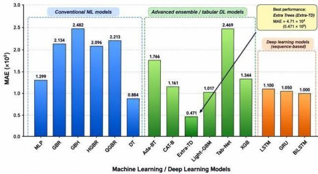  
(a)

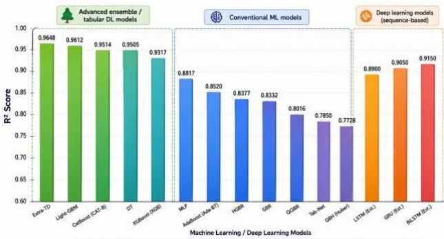

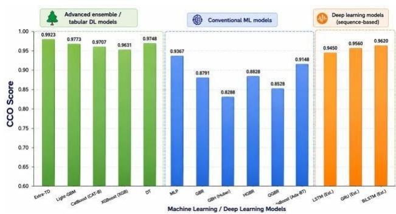  
(c)

(b)  
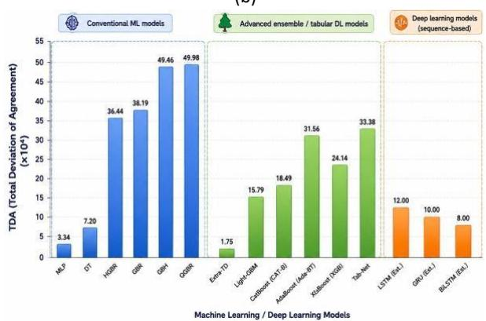  
(d)  
Figure 4: Comparative performance of 15 machine-learning and deep-learning models for predicting the total power output of 16-WEC layout at the Perth wave-energy site, evaluated using MAE, R2, CCO, and TDA. Lower MAE and TDA indicate beter performance, whereas higher R2 and CCO indicate greater predictive accuracy and agreement.

recurrent architectures. Its performance highlights the benefit of explicitly representing inter-turbine relationships through a graph while simultaneously learning temporal dynamics. Nevertheless, the strongest overall error performance was obtained by the hybrid RF–BiLSTM model, which achieved an MAE of 150.5 kW, R = 0.94. This corresponds to an approximately 74% reduction in MAE compared with standalone LSTM and an approximately 10.0% improvement over STGCN. The result suggests that combining the nonlinear feature-learning and variance-reduction capability of Random Forest with the temporal representation of BiLSTM can provide complementary information that neither component captures as efectively in isolation.

Importantly, the results also demonstrate that the model with the highest correlation is not necessarily the most accurate or reliable predictor. XGBoost–BiLSTM achieved the highest mean correlation , but its MAE, EVS, and runtorun variability were less favorable than those of RF–BiLSTM. Similar diferences were observed across the other evaluation criteria. Consequently, model selection based on a single metric can lead to incomplete or potentially misleading conclusions. The joint assessment of absolute error, correlation, explained variance, logarithmic error, and prediction stability provides a more reliable basis for evaluating ofshore renewable-energy forecasting models.

Overall, the findings indicate that there is no universally superior AI architecture for ofshore renewable-energy applications. Instead, the model should be matched to the statistical and physical structure of the problem. Randomized and boosted tree ensembles provide a particularly strong choice for structured WEC surrogate modeling; graph-based networks become advantageous when explicit spatial interactions between energy devices are important; and hybrid ensemble–recurrent architectures are highly competitive when nonlinear tabular relationships

MAE vs R² for 15 ML/DL Models (16-WEC Total Power Prediction - Perth Site)

coexist with temporal dependencies. This observation provides a practical basis for moving beyond model selection based solely on algorithm popularity or architectural complexity.

Several opportunities remain for further development. Future studies should evaluate the identified models across additional ofshore wind and wave sites, longer forecasting horizons, changing environmental regimes, and independent out-of-distribution datasets to establish their robustness and transferability. Uncertainty-aware and probabilistic

MAE vs CCO for 15 ML/DL Models (16-WEC Total Power Prediction - Perth Site)  
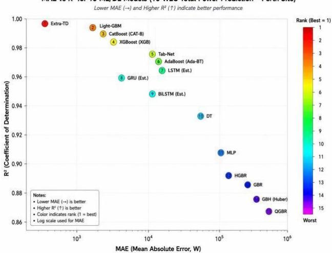  
(a)

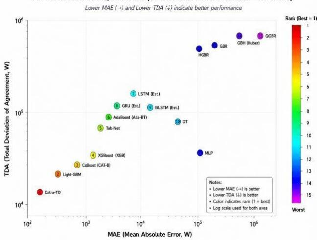  
(b)

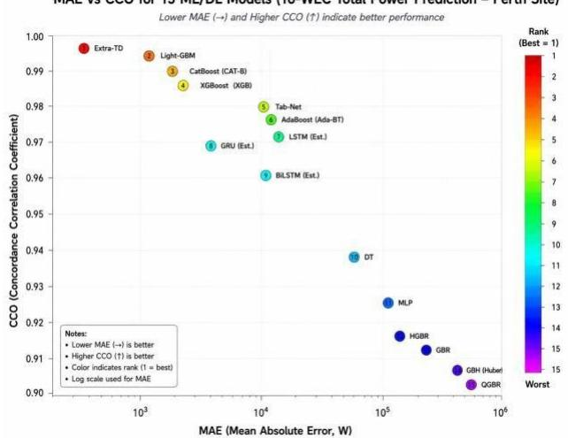  
(c)  
Figure 5: wo-dimensional performance comparison of 15 ML/DL models for 16-WEC total power prediction at the Perth site based on MAE– R2, MAE–CCO, and MAE–TDA relationships. Marker colors indicate the relative model ranking, with optimal performance characterized by lower MAE and TDA and higher R2 and CCO.

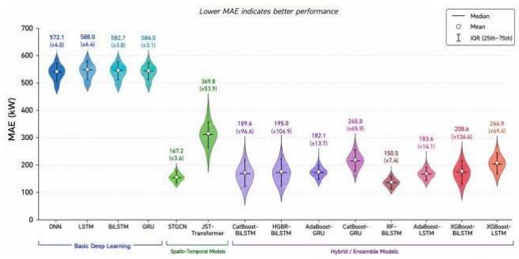  
(a)

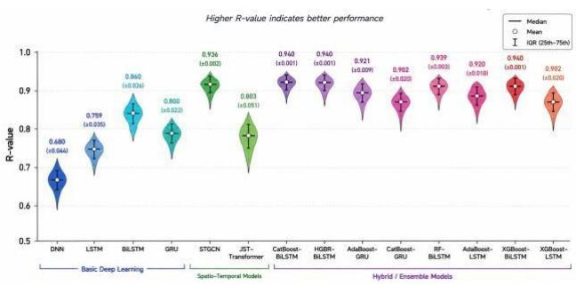  
(b)

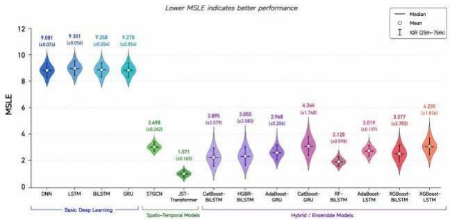  
(c)

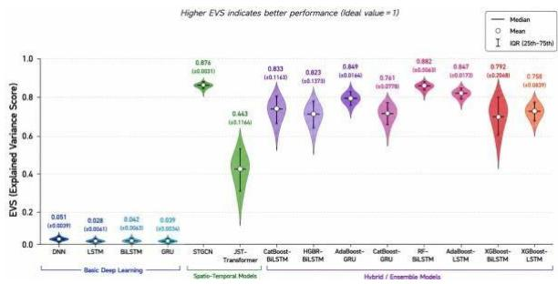  
(d)  
Figure 6: Violin-plot comparison of 14 forecasting models for 10-minute-ahead wind power prediction using MAE, R-value, MSLE, and EVS, illustrating diferences in predictive accuracy, correlation, logarithmic error, explained variance, and performance stability across repeated runs.

forecasting should also be incorporated to quantify prediction confidence under extreme or sparsely represented operating conditions. From a methodological perspective, physics-informed learning, dynamic graph construction, multi-modal learning, and adaptive hybrid architectures provide promising mechanisms for integrating physical knowledge with data-driven representations. More recent Transformer and time-series foundation models, as well as large language model (LLM)-assisted frameworks, could further support cross-site knowledge transfer, automated feature and model configuration, and interpretable decision support. Finally, integrating high-accuracy surrogate and forecasting models directly within optimization loops represents an important next step toward computationally eficient, adaptive, and reliable design and operation of large-scale ofshore renewable energy systems.

## Acknowledgments

Generative AI (GPT 4.0) tools were used solely to assist with English language editing, including grammar, clarity, and readability. All AI-assisted revisions were carefully reviewed and verified by the authors to ensure technical accuracy and preserve the intended scientific meaning.

## References

[1] International Renewable Energy Agency. Renewable capacity statistics 2025. Technical report, International Renewable Energy Agency (IRENA), Abu Dhabi, 2025.

[2] International Energy Agency. Renewables 2024: Analysis and forecast to 2030. Technical report, International Energy Agency (IEA), Paris, 2024.

[3] Sofia Agostinelli, Mehdi Neshat, Meysam Majidi Nezhad, Giuseppe Piras, and Davide Astiaso Garcia. Integrating renewable energy sources in italian port areas towards renewable energy communities. Sustainability, 14(21):13720, 2022.

[4] Mehdi Neshat, Sajad Dadgar, Sina Ziaee, Seyedali Mirjalili, Natasa Markovska, and Amir H Gandomi. Efective and accurate wave farm power prediction using cooperative multi-objective covariance adaptation gradient ensemble model with comprehensive comparative experiments. Renewable Energy, page 125695, 2026.

[5] Xiaofeng Zhang, Qiang Wang, Shitong Ye, Kun Luo, and Jianren Fan. Eficient layout optimization of ofshore wind farm based on load surrogate model and genetic algorithm. Energy, 309:133106, 2024.

[6] Siyi Li, Arnaud Robert, A. Aldo Faisal, and Mathew D. Piggot. Learning to optimise wind farms with graph transformers. Applied Energy, 359:122758, 2024.

[7] Feifei Cao, Meng Han, Hongda Shi, Ming Li, and Zhen Liu. Comparative study on metaheuristic algorithms for optimising wave energy converters. Ocean Engineering, 247:110461, 2022.

[8] Mehdi Neshat, Seyedali Mirjalili, Nataliia Y. Sergiienko, Seyed Esmaeilzadeh, Ehsan Amini, Alireza Heydari, and Davide Astiaso Garcia. Layout optimisation of ofshore wave energy converters using a novel multi-swarm cooperative algorithm with backtracking strategy: A case study from coasts of australia. Energy, 239:122463, 2022.

[9] B. F. M. Child and Vengatesan Venugopal. Optimal configurations of wave energy device arrays. Ocean Engineering, 37(16):1402–1417, 2010.

[10] Benjamin Frederick Martin Child. On the configuration of arrays of floating wave energy converters. 2011.

[11] Dripta Sarkar, Emile Contal, Nicolas Vayatis, and Frédéric Dias. Prediction and optimization of wave energy converter arrays using a machine learning approach. Renewable Energy, 97:504–517, 2016.

[12] Malin Göteman. Wave energy parks with point-absorbers of diferent dimensions. Journal of Fluids and Structures, 74:142–157, 2017.

[13] Marianna Giassi and Malin Göteman. Layout design of wave energy parks by a genetic algorithm. Ocean Engineering, 154:252–261, 2018.

[14] Chris Sharp and Bryony DuPont. Wave energy converter array optimization: A genetic algorithm approach and minimum separation distance study. Ocean Engineering, 163:148–156, 2018.

[15] Dídac Rodríguez Arbonès, Nataliia Y. Sergiienko, Boyin Ding, Oswin Krause, Christian Igel, and Markus Wagner. Sparse incomplete lu-decomposition for wave farm designs under realistic conditions. In Parallel Problem Solving from Nature – PPSN XV, volume 11101 of Lecture Notes in Computer Science, pages 512–524. Springer, 2018.

[16] Jianyang Lyu, Ossama Abdelkhalik, and Lucia Gauchia. Optimization of dimensions and layout of an array of wave energy converters. Ocean Engineering, 192:106543, 2019.

[17] Xiaohui Zeng, Qi Wang, Yuanshun Kang, and Fajun Yu. Hydrodynamic interactions among wave energy converter array and a hierarchical genetic algorithm for layout optimization. Ocean Engineering, 256:111521, 2022.

[18] Kai Zhu, Hongda Shi, Meng Han, and Feifei Cao. Layout study of wave energy converter arrays by an artificial neural network and adaptive genetic algorithm. Ocean Engineering, 260:112072, 2022.

[19] Hossein Mehdipour, Erfan Amini, Seyed Taghi Omid Naeeni, Mehdi Neshat, and Amir H Gandomi. Optimization of power take-of system setings and regional site selection procedure for a wave energy converter. Energy Conversion and Management: X, 22:100559, 2024.

[20] Irfan Ahmad, Mehdi Neshat, Aitor Garrido, and Izaskun Garrido. Optimization of control-oriented ai models for real-time platform pitch prediction in hybrid wind-wave ofshore systems. Energy Reports, 14:2670–2685, 2025.

[21] Changtian Ying, Weiqing Wang, Jiong Yu, Qi Li, Donghua Yu, and Jianhua Liu. Deep learning for renewable energy forecasting: A taxonomy, and systematic literature review. Journal of Cleaner Production, 384:135414, 2023.

[22] Yun Wang, Runmin Zou, Fang Liu, Lingjun Zhang, and Qianyi Liu. A review of wind speed and wind power forecasting with deep neural networks. Applied Energy, 304:117766, 2021.

[23] Shahram Hanifi, Hossein Zare-Behtash, Andrea Cammarano, and Saeid Lotfian. Ofshore wind power forecasting based on WPD and optimised deep learning methods. Renewable Energy, 218:119241, 2023.

[24] Yihang Yang, Lu Han, Cunyong Qiu, and Yizheng Zhao. A short-term wave energy forecasting model using twolayer decomposition and LSTM-atention. Ocean Engineering, 299:117279, 2024.

[25] Yue Hu, Hanjing Liu, Senzhen Wu, Yuan Zhao, Zhijin Wang, and Xiufeng Liu. Temporal collaborative atention for wind power forecasting. Applied Energy, 357:122502, 2024.

[26] Cheng Peng, Yiqin Zhang, Bowen Zhang, Dan Song, Yi Lyu, and AhChung Tsoi. A novel ultra-short-term wind power prediction method based on XA mechanism. Applied Energy, 351:121905, 2023.

[27] Chenyu Liu, Xuemin Zhang, Shengwei Mei, Qingyu Zhou, and Hang Fan. Series-wise atention network for wind power forecasting considering temporal lag of numerical weather prediction. Applied Energy, 336:120815, 2023.

[28] Wenjun Jiang, Bo Liu, Yang Liang, Huanxiang Gao, Pengfei Lin, Dongqin Zhang, and Gang Hu. Applicability analysis of transformer to wind speed forecasting by a novel deep learning framework with multiple atmospheric variables. Applied Energy, 353:122155, 2024.

[29] Yuting Ren, Zhuolin Li, Lingyu Xu, and Jie Yu. The data-based adaptive graph learning network for analysis and prediction of ofshore wind speed. Energy, 267:126590, 2023.

[30] Ziheng Gao, Zhuolin Li, Lingyu Xu, and Jie Yu. Dynamic adaptive spatio-temporal graph neural network for multinode ofshore wind speed forecasting. Applied Soft Computing, 141:110294, 2023.

[31] Xiaoxin Pan, Long Wang, Zhongju Wang, and Chao Huang. Short-term wind speed forecasting based on spatialtemporal graph transformer networks. Energy, 253:124095, 2022.

[32] Aurélien Babarit. Impact of long separating distances on the energy production of two interacting wave energy converters. Ocean Engineering, 2010.

[33] B. Borgarino, A. Babarit, and P. Ferrant. Impact of wave interactions efects on energy absorption in large arrays of wave energy converters. Ocean Engineering, 41:79–88, 2012.

[34] M. Vicente, M. Alves, and A. Sarmento. Layout optimization of wave energy point absorbers arrays. In Proceedings of the 10th European Wave and Tidal Energy Conference (EWTEC 2013), Aalborg, Denmark, 2013.

[35] Jens Engström, Mikael Eriksson, Malin Göteman, Jan Isberg, and Mats Leijon. Performance of large arrays of point absorbing direct-driven wave energy converters. Journal of Applied Physics, 114(20):204502, 2013.

[36] A. D. de Andrés, R. Guanche, L. Meneses, C. Vidal, and I. J. Losada. Factors that influence array layout on wave energy farms. Ocean Engineering, 82:32–41, 2014.

[37] I. F. Noad and R. Porter. Optimisation of arrays of flap-type oscillating wave surge converters. Applied Ocean Research, 50:237–253, 2015.

[38] M. M. Moarefdoost, L. V. Snyder, and B. Alnajjab. Layouts for ocean wave energy farms: Models, properties, and optimization. Omega, 66:185–194, 2017.

[39] Ashank Sinha, D. Karmakar, and C. Guedes Soares. Performance of optimally tuned arrays of heaving point absorbers. Renewable Energy, 92:517–531, 2016.

[40] Silvia Bozzi, Marianna Giassi, Adrià Moreno Miquel, Alessandro Antonini, Federica Bizzozero, Giambatista Gruosso, Renata Archeti, and Giuseppe Passoni. Wave energy farm design in real wave climates: The italian ofshore. Energy, 122:378–389, 2017.

[41] Zhi Yung Tay and Vengatesan Venugopal. Optimization of spacing for oscillating wave surge converter arrays using genetic algorithm. Journal of Waterway, Port, Coastal, and Ocean Engineering, 143(2), 2017.

[42] Jinming Wu, Yingxue Yao, Liang Zhou, Ni Chen, Huifeng Yu, Wei Li, and Malin Göteman. Performance analysis of solo duck wave energy converter arrays under motion constraints. Energy, 139:155–169, 2017.

[43] Alejandro López-Ruiz, Rafael J. Bergillos, Juan M. Rafo-Caballero, and Miguel Ortega-Sánchez. Towards an optimum design of wave energy converter arrays through an integrated approach of life cycle performance and operational capacity. Applied Energy, 209:20–32, 2018.

[44] Justin P. L. McGuinness and Gareth Thomas. The constrained optimisation of small linear arrays of heaving point absorbers. part i: The influence of spacing. International Journal of Marine Energy, 20:33–44, 2017.

[45] Shun-Han Yang, Jonas W. Ringsberg, and Erland Johnson. Wave energy converters in array configurations— influence of interaction efects on the power performance and fatigue of mooring lines. Ocean Engineering, 211:107294, 2020.

[46] Eva Loukogeorgaki, Constantine Michailides, George Lavidas, and Ioannis Chatjigeorgiou. Layout optimization of heaving wave energy converters linear arrays in front of a vertical wall. Renewable Energy, 179:189–203, 2021.

[47] Mehdi Neshat, Seyedali Mirjalili, Chiara Bordin, Natasa Markovska, and Amir H Gandomi. Physics-informed llmguided dynamic spatio-temporal graph deep network for short-term wind farm power forecasting. Energy Conversion and Management, 368:121974, 2026.

[48] Mehdi Neshat, Bradley Alexander, Nataliia Sergiienko, and Markus Wagner. Large-scale wave energy farm. UCI Machine Learning Repository, 2023.

[49] M Neshat, M Wagner, and B Alexander. Wave energy converters. UCI Machine Learning Repository, 2018.

[50] Charlie Plumley. Penmanshiel wind farm data. Zenodo, doi, 10, 2022.

[51] Mehdi Neshat, Bradley Alexander, Markus Wagner, and Y. Xia. A detailed comparison of meta-heuristic methods for optimising wave energy converter placements. In Proceedings of the Genetic and Evolutionary Computation Conference (GECCO 2018), pages 1318–1325. Association for Computing Machinery, 2018.

[52] Mehdi Neshat, Ehsan Abbasnejad, Qinfeng Shi, Bradley Alexander, and Markus Wagner. Adaptive neurosurrogate-based optimisation method for wave energy converters placement optimisation. In Neural Information Processing, volume 11954 of Lecture Notes in Computer Science, pages 353–366. Springer, 2019.

[53] Mehdi Neshat, Bradley Alexander, Nataliia Y. Sergiienko, and Markus Wagner. New insights into position optimisation of wave energy converters using hybrid local search. Swarm and Evolutionary Computation, 59:100744, 2020.

[54] Mehdi Neshat, Bradley Alexander, and Markus Wagner. A hybrid cooperative co-evolution algorithm framework for optimising power take of and placements of wave energy converters. Information Sciences, 534:218–244, 2020.

## Supplementary Material

Table S1: Comparative analysis of hybrid and advanced evolutionary optimisation methods for wave energy converter (WEC) farm layout optimisation.
<table><tr><td>Ref.</td><td>Year</td><td>Study</td><td></td><td>Optimisation method</td><td>Decision variables</td><td>Farm size</td><td>WEC y- namic model</td><td>/ hydrod</td><td>Objective / metric</td><td colspan="2">Main benefits</td><td colspan="2">an extensive</td><td colspan="2">Limitations/weak points Conventional population-based many</td></tr><tr><td>[51]</td><td rowspan="2">2018 [52] 2019</td><td rowspan="2">Neshat of converter placements multiple Neshat Adaptive</td><td rowspan="2">et al., comparative optimisation wave energy using metaheuristic methods</td><td rowspan="2">(1 + 1) EA, CMA-ES, Differential Evolution Particle Swarm Optimisation (PSO), Grey Wolf Optimiser (GWO), I search and other metaheuristics</td><td rowspan="2">Continuous WEC x-y coordinates to (DE), um separation and farmboundary constraints loca</td><td rowspan="2">4 and 16 WECs subject minim</td><td rowspan="2">Point-absorber WEC array with hydrodynamic action modelling r Australian</td><td rowspan="2">Maximise array interperformance unde</td><td rowspan="2">absorbed power and interaction</td><td rowspan="2">total Provides comparative optimisation highlighting convergence robustness</td><td colspan="2">benchmark of evolutionary and swarm-based approaches for the same WEClayout problem, differences and evaluation</td><td rowspan="2">methods expensive evaluations; in number behaviour, corresponding</td><td rowspan="2">deteriorates considerably as the of dimensionality increase.</td><td rowspan="2">require hydrodynamic scalability WECs decisionspace</td></tr><tr><td>scenarios</td><td>efficiency.</td></tr><tr><td rowspan="2">[53]</td><td rowspan="2">2019</td><td rowspan="2">Converter Placement Optimisation position optimisation</td><td rowspan="2">et al., Neuro- SurrogateBased Optimisation Method for Wave Energy Neshat et al., hybrid local- search frame- work for</td><td rowspan="2">Adaptive metaheuristic optimisation + recurrent neuralnetwork surrogate + greedy local search / bac k- tracking Hybrid stochastic</td><td rowspan="2">Continuous WEC x- y 4 and 16 WECs locations</td><td rowspan="2">approximate expensive evaluations</td><td rowspan="2">Point-absorber WECMaximise total farm farm with computational hydrodynamic model; model used to</td><td colspan="2" rowspan="2">power reducing the number of surrogate sive hydrodynamic evaluations</td><td colspan="2" rowspan="2">while framework in</td><td colspan="2" rowspan="2">which a neural surrogate expen approximates costly WEC-array evaluations; adaptive search and local refinement improve</td><td colspan="2" rowspan="2">representativeness; inaccurate surrogate predictions may guide the optimiser toward misleading regions of the search space.</td><td rowspan="2">depends strongly on surrogate accuracy and training-data</td></tr><tr><td colspan="2">computational efficiency.</td></tr><tr><td rowspan="2"></td><td rowspan="2">2020 2020</td><td rowspan="2">wave energy converters cooperative</td><td rowspan="2" colspan="2">of +</td><td rowspan="2">/ symmetric local coordinates with search sequential placement + Nelder- Mead and local refinement search knowledgebased sequential</td><td rowspan="2">Continuous WEC x- yl4 and 16 WECs</td><td rowspan="2">Point-absorber WECarray evaluated simplified and realistic Australian climates</td><td rowspan="2">Maximise model absorbed under</td><td rowspan="2">total wave power using a limited computational identify</td><td colspan="2" rowspan="2">Highly evaluation-efficient compared with conventional populationbased metaheuristics; exploitation-oriented search</td><td colspan="2" rowspan="2">combines dependency local with domain knowledge and backtracking sequential placement to rapidly high-quality previously selected locations.</td><td colspan="2" rowspan="2">early positioning decisions and can become trapped in local optima; global</td><td rowspan="2">on or exploration is needed to correct</td></tr><tr><td colspan="2">wave budget</td></tr><tr><td rowspan="2">[54]</td><td rowspan="2">2022</td><td rowspan="2">Neshat et al., A hybrid algorithm framework for optimising power takeoff and placements of wave energy converters Neshat et al., Layout</td><td rowspan="2">coevolution</td><td rowspan="2">optimisation Hybrid Cooperative Coevolution (CC) + evolutionary optimisation + local search</td><td rowspan="2">WEC x-y locations together with individual PTO damping / control parameters</td><td rowspan="2">4, 16 and larger benchmark WEC farms</td><td rowspan="2">Point-absorber with hydrodynamic interaction individual PTO mod- elling under wave climates</td><td rowspan="2">array Jointly and mise wave-farm realistid r through</td><td rowspan="2">maxi powe simultaneous layout</td><td colspan="2" rowspan="2">arrangements. Decomposes the dimensional problem</td><td>high- joint layout- into subcomponents, cooperative spatial and PTO increases</td><td>Performance variable decomposition interaction optimisation</td><td rowspan="2">depends on and</td></tr><tr><td colspan="2">control interacting allowing variables to be optimised more</td></tr><tr><td colspan="2">[8]</td><td>cooperative algorithm</td><td>optimisation of offshore wave energy converters using a novel multiswarm with backtracking strategy</td><td>Multi-Swarm Cooperative Co-evolution (MSCC) combining multiple populationbased optimisers, surrogate mod- elling and</td><td>Continuous WEC x-y locations subject to farm-area minimum- separation constraints</td><td>4 and nd WECs</td><td>9 Point-absorber a WECarray hydrodynamic model evaluated under six realistic an wave-energy sites</td><td>and PTO optimisation Maximise absorbed Australi budgets</td><td>total power and improve convergence under limited evaluation</td><td>Combines behaviours optimisers;</td><td>efficiently than with monolithic evolutionary optimisation. exploration and exploitation of search, surrogate assistance and backtracking improve convergence and allow poorly</td><td>complementary The several multiple cooperative sizes remain relatively small</td><td>complexity and may still require substantial resources for large farms. framework interacting components and parameters, implementation and tuning complexity; experimental farm</td><td>computational contains search control increasing</td></tr></table>