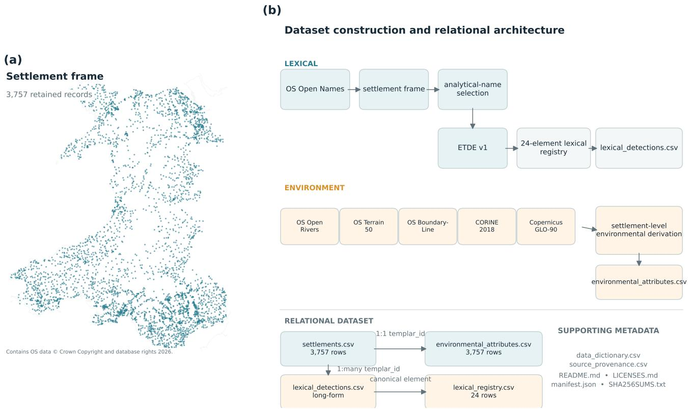
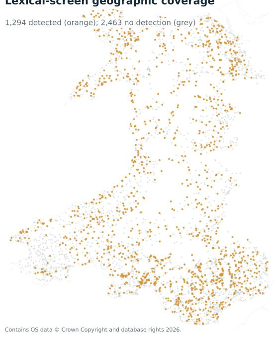
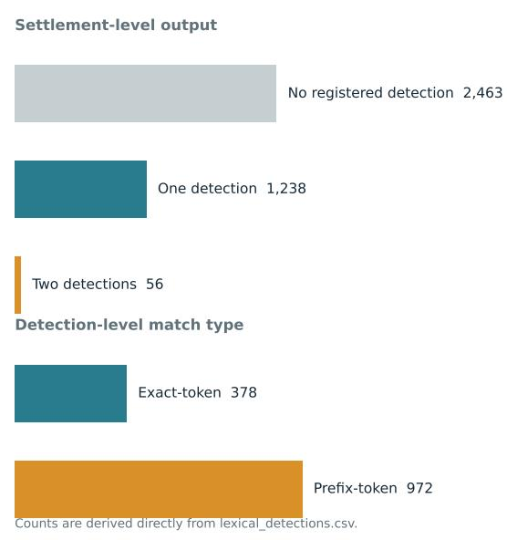
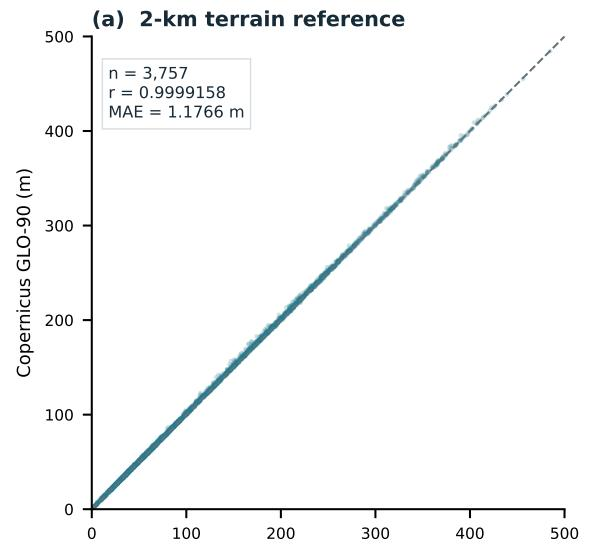
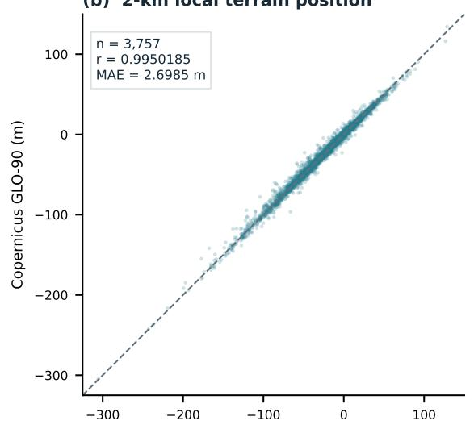
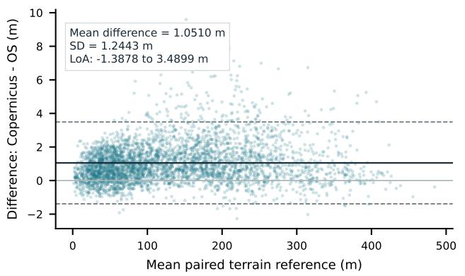
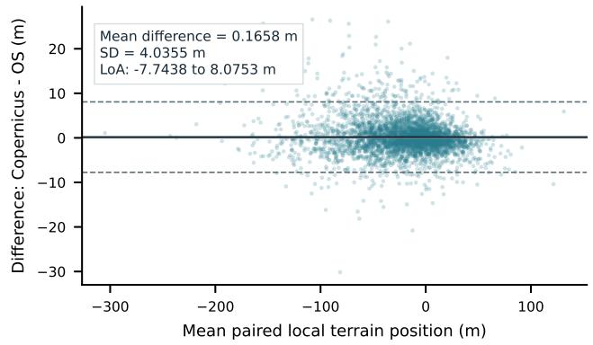

# TEMPLAR Wales: A georeferenced environmental and toponymic dataset of Welsh settlements

Oktay Karakuş1

Can Eyüpoğlu1,2

1Department of Computer Science and Informatics, Cardif University, Cardif CF24 4AG, UK 2Department of Computer Engineering, Turkish Air Force Academy, National Defence University, Istanbul 34149, Türkiye

Corresponding author: Oktay Karakuş (karakuso@cardif.ac.uk)

## Abstract

Place names provide persistent records of how landscapes have been described and organised, but their quantitative reuse requires explicit separation between mapped places, lexical annotations and environmental measurements. TEMPLAR Wales is a georeferenced environmental-toponymy dataset comprising 3,757 settlement records across Wales. The resource links a reproducible settlement frame to deterministic lexical screening and settlement-level environmental attributes through stable identifiers. It contains 1,350 lexical detections across 1,294 settlements, generated from a frozen registry of 24 Welsh place-name elements, while retaining exact- and prefix-token matches and their provenance separately. Environmental attributes describe river and coastal proximity, elevation and local terrain context at multiple spatial scales, land cover and neighbourhood woody cover, with parallel terrain measurements derived from independent elevation products. The dataset is distributed as four relationa tables accompanied by a field-level data dictionary, source-provenance register and licensing metadata. Technical validation confirms relational integrity, deterministic lexical reconstruction, documented environmental coverage, strong agreement between independent terrain sources and reproducible reconstruction of the frozen release. TEMPLAR Wales provides a reusable foundation for research in toponymy, linguistic geography, historical and environmental landscape studies, GIS and spatial data analysis without treating computational lexical detections as verified etymologies or contemporary environmental measurements as historical landscape reconstructions.

## 1 Background & Summary

Place names constitute a persistent form of cultural and geographic information. They encode ways in which landscapes have been described, distinguished and organised, while remaining visible in maps, gazetteers, administrative systems and everyday geographic reference long after the circumstances in which individual names originated may have changed [1, 2, 3]. Toponymic information has consequently been used across historical geography, landscape research and cultural-environmental studies to investigate relationships between naming, environmental characteristics and landscape change [4, 5, 6, 7, 8]. At the same time, place names are culturally and linguistically mediated records rather than direct environmental observations. Their interpretation can depend on historical forms, language, morphology, local usage and documentary evidence, making transparent representation of both lexical evidence and its limitations essential for quantitative reuse [2, 3].

Wales provides a particularly informative setting for constructing such a resource. Welsh settlement names occur within a geographically varied landscape, while the naming system itself reflects layered linguistic and historical processes. Welsh place-name scholarship emphasises the importance of historical forms, linguistic components and contextual interpretation, rather than assuming that contemporary written forms can be interpreted unambiguously from their surface appearance [9, 10]. These characteristics make Wales valuable for environmental-toponymy research, but they also expose a broader data problem: reproducible quantitative analysis requires a clear distinction between the mapped settlement record, the name selected for analysis, a computational lexical detection, the documented interpretation of a registered lexical element and the environmental measurements associated with the settlement location.

Existing studies demonstrate the potential of toponymic information for environmental and landscape research. Place names have been used to reconstruct past land use and disappearing landscape features [4, 5], to investigate associations between plant-related names and environmental and social conditions [6], to characterise rural and agrosilvopastoral landscapes [7, 8], and to examine relationships between toponymic diversity, vegetation and landscape characteristics [11, 12]. Recent work has further demonstrated the increasing role of GIS and geostatistical approaches in connecting toponymic information with spatially explicit landscape evidence [13, 14, 15]. Such studies establish the value of toponymic information as a research source, but the datasets underpinning individual analyses are commonly assembled around particular questions. Reusable resources that explicitly separate settlement observations, lexical annotations, environmental measurements and their respective provenance can therefore support broader comparative and methodological applications.

TEMPLAR Wales addresses this need by providing a versioned, georeferenced environmental-toponymy dataset for 3,757 settlement records across Wales. The resource integrates three conceptually distinct information layers. First, a settlement layer preserves mapped settlement identity, geographic location, source naming fields and the provenance of a deterministically selected analytical name, derived from OS Open Names [16]. Second, a lexical layer applies a frozen deterministic detector to those analytical names using a source-audited registry of 24 Welsh place-name elements. Third, an environmental layer describes hydrological, coastal, terrain and land-cover characteristics at the settlement locations using multiple geospatial products [17, 18, 19, 20, 21]. These layers are linked through stable project identifiers while remaining available as separate machine-readable records.

A central design principle of the resource is separation between observation, annotation and interpretation. The settlement frame represents mapped source records rather than unique written names. The analytical-name field records the single source name selected under a frozen processing rule rather than asserting a definitive linguistic classification. Lexical detections record reproducible string-level matches rather than validated individual-name etymologies, an important distinction given the historical and linguistic complexity of Welsh toponymy [9, 10]. Environmental variables describe contemporary or product-specific geographic conditions rather than reconstructed historical environments. These distinctions are represented explicitly through provenance, language-status, match-type, quality, coverage and eligibility fields rather than being left as implicit assumptions of a downstream analysis.

The released lexical component contains 1,350 detections across 1,294 settlements and retains exact- and prefix-token matches separately. Settlements without a registered detection remain part of the complete settlement frame, allowing users to define lexical contrasts appropriate to their own research questions rather than receiving a prefiltered analytical sample. The associated 24-element registry records canonical forms, concise project-authored glosses, semantic classifications, source identifiers and locators, and explicit limitations on interpretation. The registry is therefore both a computational input and a provenance record for the lexical annotations.

The environmental component provides settlement-level measurements derived from OS Open Rivers [17], OS Terrain 50 [18], OS Boundary-Line [19], CORINE Land Cover 2018 [20] and Copernicus DEM GLO-90 [21]. Core river, coastal, terrain and point-level land-cover attributes are represented across the complete settlement frame, while neighbourhood woody-cover measurements retain explicit coverage and eligibility information where measurements are unavailable. Terrain is represented at multiple neighbourhood scales, and independently derived OS Terrain 50 and Copernicus GLO-90 measurements are included to support source-sensitivity assessment. Raw provider geometries and raster products are not redistributed; the resource instead provides documented settlement-level observations and derived attributes together with field-level provenance.

The public release is organised around four principal records: settlements.csv, lexical\_detections.csv, environmental\_attributes.csv and lexical\_registry.csv. A field-level data dictionary, source prove nance register, licensing documentation, machine-readable manifest and cryptographic checksum inventory accompany these tables. The dataset is generated through a deterministic export procedure with automated checks for identifier integrity, table relationships, expected schema, lexical reconstruction, environmental coverage and exclusion of non-release material. This structure is intended to make the resource inspectable and reusable without requiring access to the research workflow from which it originated.

TEMPLAR Wales can support several classes of reuse. Researchers can examine the spatial distribution of registered place-name elements, develop or benchmark alternative lexical-detection approaches, link settlement naming to additional environmental or historical information, investigate geographic variation in toponymic composition, or use the environmental measurements independently of the lexical annotations. Such applications extend established uses of toponymic evidence in historical-landscape reconstruction, environmental interpretation and spatial landscape analysis [5, 6, 7, 8, 11, 12]. The stable settlement frame also provides a basis for enrichment with historical name forms, archival maps, geology, soils, hydrological or climatic information, historical land cover and independently curated linguistic annotations. Because the lexical detections and environmental attributes remain separate relational layers, extensions need not adopt the analytical categories or statistical design of the study that motivated the original dataset.

The resource was initially developed in connection with a preregistered study of environmental information in Welsh settlement names [22]. The dataset released here is deliberately broader than the inferential outputs of that application. It excludes coeficients, hypothesis-test results, model predictions, residuals and cross-validation outputs, retaining instead the reusable observations, annotations, environmental attributes and provenance from which alternative analyses can be constructed. The associated analytical study therefore represents one application of the resource rather than defining the limits of its use.

By releasing the settlement, lexical and environmental layers together with their construction rules and interpretative boundaries, TEMPLAR Wales provides a reusable bridge between traditional place-name evidence and computational spatial analysis. Its purpose is not to reduce Welsh toponymy to automated string matching or to treat contemporary environmental data as a direct record of naming history. Rather, it provides a transparent data structure in which those diferent forms of evidence can be linked, inspected and extended while their provenance and limitations remain explicit.

## 2 Methods

The TEMPLAR Wales dataset was constructed through a staged workflow that integrates settlement gazetteer information, reproducible lexical annotation and multiple contemporary environmental data sources. The workflow begins by defining a Wales-wide settlement frame and selecting a single analytical name for each retained record. A frozen, source-audited lexical registry is then applied to these names using a deterministic detection procedure. In parallel, settlement-level hydrological, coastal, terrain and land-cover attributes are derived from independent geospatial source products. These components are finally integrated through stable project identifiers into the four relational data records described in this Data Descriptor.

The following subsections document this construction from source data to public release. We first define the scope and relational design of the dataset and describe the upstream geographic and lexical sources. We then detail construction of the settlement frame and analytical names, followed by the lexical registry and ETDE detection procedure. The environmental-data workflow is described separately for river and coastal proximity, OS Terrain 50-derived terrain attributes, independent Copernicus DEM GLO-90 terrain measurements, and CORINE-derived land-cover and woody-cover attributes. The final subsection describes integration of these components, identifier relationships, deterministic export and dataset versioning. Together, these stages define the complete provenance chain from upstream records and source products to the released settlement-level resource.

## 2.1 Dataset design and scope

The dataset was designed as a settlement-level resource linking contemporary geographic and environmental attributes to reproducible lexical annotations of Welsh place names. The observational frame comprises 3,757 mapped settlement records in Wales. Each retained settlement is represented by a stable project-level identifier and can be linked to its naming metadata, deterministic lexical detections and environmental attributes.

The resource was constructed as four related data records rather than as a single analysis table. settlements.csv defines the settlement frame and analytical names; lexical\_detections.csv stores long-format lexical detections; environmental\_attributes.csv contains settlement-level environmental measurements and quality fields; and lexical\_registry.csv documents the frozen lexical elements used by the detection procedure. This separation preserves the distinction between source identity, derived lexical annotation and environmental measurement, and allows each component to be reused independently.

The released dataset contains observational and deterministically derived attributes only. Inferential statistics, fitted model quantities, residuals, permutation results, geographically held-out predictions and other outputs generated in subsequent analyses are not included.

## 2.2 Source datasets

Settlement locations and source naming fields were obtained from Ordnance Survey (OS) Open Names [16]. Environmental attributes were derived from OS Open Rivers [17], OS Terrain 50 [18], OS Boundary-Line High Water Mark [19], CORINE Land Cover 2018 [20] and Copernicus DEM GLO-90 [21]. The released data contain settlement-level source fields or derived measurements rather than redistributed copies of the underlying provider geometries, vector networks or raster products.

OS Open Names provided the source settlement records, names, language metadata, settlement classifications and mapped point locations. The retained local snapshot records an embedded source timestamp of 29 January 2026. OS Open Rivers supplied the mapped river network used to derive settlementto-river distance, with the retained local product carrying an October 2025 timestamp. Elevation and neighbourhood terrain attributes were derived from the May 2025 OS Terrain 50 package. Coastal distance was derived from the High Water Mark contained in the May 2026 OS Boundary-Line product.

Land-cover information was obtained from the 2018 CORINE Land Cover product (U2018\_CLC2018\_V2020\_20u1), and an independent terrain measurement layer was derived from Copernicus DEM GLO-90. Source-specific versions, snapshots, provenance qualifications, transformations and licensing conditions are recorded in source\_provenance.csv and LICENSES.md.

The lexical resource was constructed from a source-audited set of Welsh place-name elements. Lexicalsource alignment used the Royal Commission on the Ancient and Historical Monuments of Wales (RC-AHMW) Historic Place Names of Wales resources and Geiriadur Prifysgol Cymru Online (GPC) [23, 24]. The released registry contains concise project-authored summaries and source locators rather than reproduced dictionary definitions.

## 2.3 Settlement-frame construction

The settlement frame was constructed from OS Open Names point records located in Wales. Records were retained when their local\_type belonged to one of five settlement categories: Village, Hamlet, Suburban Area, Other Settlement or Town. The resulting frame contains 3,757 source records: 1,361 villages, 1,198 hamlets, 866 suburban areas, 190 other settlements and 142 towns.

The unit of observation is an upstream settlement record at a mapped point location, not a unique written place name. Settlements sharing the same normalised name were therefore retained as separate observations when they represented distinct source records. Similarly, coincident coordinates were not automatically deduplicated. The final frame contains 3,328 normalised analytical-name groups and 3,755 coordinate clusters. Four records occur as two pairs of coincident point locations and remain in the resource as distinct upstream records.

Each settlement was assigned a deterministic project identifier, templar\_id. The upstream OS identifier is retained separately as os\_open\_names\_id to support provenance and linkage to the source product. The project identifier is used as the primary relational key across the released settlement, lexical-detection

and environmental tables.

Source coordinates were retained in the British National Grid coordinate reference system (EPSG:27700). Geographic latitude and longitude were derived through the documented coordinate transformation and are supplied as additional reuse-oriented fields rather than as replacements for the source projected coordinates.

## 2.4 Analytical-name construction

A single analytical name was selected deterministically for each settlement before lexical detection. The purpose of this field is to provide a stable, reproducible string against which the lexical detector can operate; it is not intended to resolve the complete linguistic or historical identity of an individual place name [9, 10].

Where the available Open Names language metadata explicitly identified an appropriate Welsh-labelled source name, that name was selected according to the frozen name-selection rule. Otherwise, the primary Open Names name field was retained and its analytical language status was recorded as unresolved. This procedure selected the primary name1 field for 3,618 records, of which 203 carried an explicit Welsh label and 3,415 had unresolved analytical language status. For 139 records, a Welsh-labelled name2 field was selected instead.

Every settlement therefore has a non-missing analytical name and an explicit record of the source field from which that name was selected. The released metadata distinguish an unresolved language status from a positive classification into another language.

For reproducible matching and grouping, analytical names were additionally normalised using the frozen lexical-processing convention. Text was converted to lowercase, Unicode accents and diacritics were normalised through NFKD decomposition, hyphens and apostrophes were treated as token boundaries, and characters outside a–z were removed from the matching representation. The original selected analytical string remains available alongside its normalised representation and associated grouping fields.

## 2.5 Lexical resource

The lexical component comprises a frozen registry of 24 Welsh place-name elements selected and documented before construction of the released detection table. Each registry entry has a canonical form, concise project-authored gloss, semantic classification, source identifier and locator, and an explicit statement of interpretative alignment or limitation.

Where an element had a predefined role in the associated environmental-toponymy study, that role is retained as provenance metadata in the registry. This field records the historical analytical design of the resource; it does not encode the outcome of a statistical test and should not be interpreted as evidence that the corresponding environmental relationship holds for an individual settlement.

The registry was source-audited against RCAHMW and GPC resources [23, 24]. The objective was not to create a general Welsh etymological dictionary, but to define a small, versioned lexical system that could be applied reproducibly to the settlement frame. The released source fields therefore identify where the element-level alignment can be checked while avoiding reproduction of substantial source definitions.

Registry version information is retained in the released table so that future extensions can add or revise lexical elements without silently changing the meaning of detections produced by the frozen version.

## 2.6 Lexical detection

Lexical annotation was performed using the frozen ETDE v1 deterministic detection procedure. The detector operates on the normalised analytical name rather than on all available source-name variants, ensuring that each settlement is processed using the same predeclared name-selection and normalisation sequence.

Each analytical name was tokenised after normalisation. Registry elements were then evaluated using the frozen exact-token and prefix-token matching rules. Exact matches identify tokens equal to a registered element, whereas prefix matches retain cases satisfying the corresponding ETDE prefix rule. Match type is preserved in the released detection table rather than collapsing both forms into a single binary lexica indicator.

The complete procedure was applied to all 3,757 analytical names. The resulting long-format table contains one row per detected element–settlement relation and retains the matched token, token position, match type, canonical registry element, analytical-name source and relevant detector and registry versions.

A lexical detection establishes only that the frozen string-processing rule identified a registered form in the analytical name. It does not establish the historical etymology of the settlement, perform morphological parsing, determine language identity, or demonstrate that the detected element historically referred to the contemporary environmental attribute associated with its semantic category. These distinctions are retained explicitly in the dataset documentation to support appropriate downstream reuse.

## 2.7 River and coastal attributes

Hydrological context was represented by distance from each settlement point to the nearest mapped feature in OS Open Rivers. Distance was calculated in the projected British National Grid coordinate system so that the released settlement-level value is expressed as a metric spatial measurement. The underlying river network is not redistributed with the dataset.

The released river-distance field should be interpreted relative to the representation and generalisation of the source network. It measures proximity to the nearest feature represented in the retained Open Rivers product and is not a measure of historical hydrology, channel permanence, discharge or catchment membership.

Coastal context was represented by distance from the settlement point to the High Water Mark contained in OS Boundary-Line. The calculation was likewise performed in the projected coordinate system. Only the derived settlement-level distance and relevant provenance or validity information are released; the source Boundary-Line geometry is excluded from the dataset.

## 2.8 Terrain attributes

The principal terrain attributes were derived from OS Terrain 50. For each settlement, the resource contains point elevation and neighbourhood terrain summaries calculated at 1-km, 2-km and 5-km spatial scales.

For a settlement with elevation $z _ { i } ,$ local terrain position at neighbourhood scale r was represented as the diference between the settlement elevation and the mean valid terrain elevation within the corresponding neighbourhood:

$$
T _ { i , r } = z _ { i } - \bar { z } _ { i , r } ,\tag{1}
$$

where $\bar { z } _ { i , r }$ is the mean terrain elevation of raster-cell centres within a circular bufer of radius r metres centred on the settlement point, as defined by the frozen processing workflow. Positive values indicate that the settlement point lies above its surrounding terrain reference and negative values indicate that it lies below that reference. The dataset retains the underlying point elevation, neighbourhood means, local terrain-position values and associated validity fields rather than reducing the terrain information to a categorical label.

The 1-km, 2-km and 5-km attributes were generated using the same frozen construction procedure. These multiple scales are supplied to permit scale-aware reuse and sensitivity analysis; none should be interpreted as a universally preferred neighbourhood definition.

Raw Terrain 50 tiles and derived raster mosaics are not redistributed. The released data contain only settlement-level derived measurements and provenance information.

## 2.9 Independent Copernicus terrain attributes

A second terrain layer was generated from Copernicus DEM GLO-90 to provide an independently sourced elevation-based measurement for reuse and technical validation. OS Terrain 50 provides the principal terrain representation, whereas Copernicus DEM GLO-90 is distributed as a digital surface model rather than a bare-earth digital terrain model; it was used as an independent elevation surface to assess the source sensitivity of the derived settlement-level terrain attributes, rather than as an interchangeable product or ground-truth representation. GLO-90-derived attributes were calculated for all 3,757 settlements using a 2-km neighbourhood construction corresponding to the principal settlement-level terrain representation.

The released fields include the Copernicus-derived settlement elevation, neighbourhood terrain reference and local terrain-position measure, together with validity information required to interpret the derived values. The Copernicus fields are retained alongside, rather than substituted for, the OS Terrain 50 attributes because the two products difer in source, spatial resolution and production lineage.

Raw GLO-90 tiles and mosaics are not included in the release. Product-specific provenance, acknowledgement and licensing information is provided in the supporting metadata.

## 2.10 Land-cover and woody-cover attributes

Contemporary land-cover attributes were derived from CORINE Land Cover 2018. Each settlement was associated with the corresponding point-level CORINE class where the source coverage and assignment rules were satisfied. The dataset retains the resulting class information together with quality or assignmen fields needed to distinguish substantive categories from processing or coverage conditions.

Neighbourhood woody-cover attributes were additionally constructed at 500-m, 1-km and 2-km scales. The released variables describe the fractions of eligible neighbourhood area assigned to the frozen forest, shrub or combined woody-cover definitions, together with the corresponding coverage and eligibility information.

Missing woody-cover values were retained where the frozen coverage criteria were not satisfied. They were not replaced with zero, because absence of an eligible neighbourhood measurement is distinct from an observed woody-cover fraction of zero. Consequently, downstream users should evaluate the associated coverage and eligibility fields when selecting records for analyses involving these variables.

The source CORINE polygons are not redistributed. Only settlement-level class assignments, derived neighbourhood fractions and associated quality fields are included in the public resource.

## 2.11 Dataset integration and identifiers

The four scientific tables were assembled through explicit relational keys. templar\_id uniquely identifies a settlement in settlements.csv and occurs once for the corresponding record in environmental\_attributes.csv. The same identifier provides the one-to-many relationship to lexical\_detections.csv, because a settle ment can contain zero, one or more registered lexical detections.

Lexical detections are linked to lexical\_registry.csv through the canonical element field. Every released detection is required to resolve to exactly one entry in the frozen registry. Settlements without a registered lexical detection remain present in the settlement and environmental tables and have no corresponding row in the long-format detection table.

The public export was generated using a deterministic build procedure from the frozen project data products. Export validation checks enforce identifier uniqueness, relational integrity, expected table dimensions, categorical domains, required-field completeness, field-specific missing-value semantics and exclusion of non-release material. The released tables are accompanied by a field-level data dictionary, source-provenance register, licensing documentation, release manifest and checksum inventory.

Versioning is applied at the dataset level as well as to the lexical registry and detector. The initial public resource is designated version 1.0.0. This versioning structure is intended to allow future additions or corrections to be distinguished from the frozen data records described here.

## 3 Data Records

The TEMPLAR Wales dataset is organised as a relational, machine-readable resource centred on 3,757 settlement records in Wales. The published version 1.0.0 dataset is archived on Zenodo [25]. The dataset separates settlement identity and naming information, lexical detections, environmental attributes and lexical-registry metadata into four primary tables linked by stable project identifiers. Supporting files provide field-level definitions, source provenance, licensing information, release metadata and integrity checks.

The primary relational key is templar\_id, a deterministic project-level identifier assigned to each settlement record. The upstream Ordnance Survey Open Names identifier is retained as os\_open\_names\_id for traceability, but is not used as the primary identifier of the integrated resource. This design allows the dataset to retain a stable internal relational structure while preserving linkage to the source settlement record.

The dataset is distributed as four scientific tables:

• settlements.csv,

• lexical\_detections.csv,

• environmental\_attributes.csv and

• lexical\_registry.csv.

These are accompanied by

• data\_dictionary.csv,

• source\_provenance.csv,

• README.md,

• LICENSES.md,

• manifest.json and

• SHA256SUMS.txt.

Table 1 summarises the principal records. An overview of the settlement frame, construction streams and relational dataset architecture is provided in Fig. 1.

## 3.1 settlements.csv

The file settlements.csv contains one row for each of the 3,757 settlement records retained in the Wales-wide analytical frame. A record represents a unique Ordnance Survey Open Names settlement feature at a mapped point location rather than a unique settlement name. Consequently, repeated names are retained as separate geographic records.

The retained frame contains five settlement classes: Village, Hamlet, Suburban Area, Other Settlement and Town. Each record includes the project-level templar\_id, the upstream os\_open\_names\_id, source name fields and associated language metadata, the derived analytical name used by the lexical-processing pipeline, and fields identifying the source of that analytical name and its language status.

The analytical-name construction preserves an explicitly Welsh-labelled source name where one is available under the frozen name-selection rule; otherwise the primary Open Names field is retained and the analytical language status is recorded as unresolved. The dataset therefore distinguishes absence of an explicit language label from evidence that a name belongs to a particular language.

Table 1: Primary data records in the TEMPLAR Wales dataset.
<table><tr><td>File</td><td>Rows</td><td>ColumnsContent</td></tr><tr><td>settlements.csv</td><td>3,757 23</td><td>Settlement identity, source identifiers, orig- inal and analytical name fields, language- status metadata, settlement type, British Na- tional Grid coordinates, derived geographic</td></tr><tr><td>lexical_detections.csv</td><td>1,350 13</td><td>coordinates and grouping fields for repeated names and coincident locations. Long-format deterministic ETDE v1 lexical detections linked to settlement records, in- cluding canonical element, matched token, token position, match type, semantic clas-</td></tr><tr><td>environmental_attributes.csv</td><td>3,757 47</td><td>sification, preregistered role and analytical- name source. Settlement-level hydrological, coastal, terrain and land-cover attributes, including OS Ter- rain 50 measures at multiple neighbourhood scales, Copernicus GLO-90-derived terrain attributes, CORINE-derived land-cover and</td></tr><tr><td>lexical_registry.csv</td><td>24 11</td><td>woody-cover variables, and associated quality or eligibility fields. Frozen lexical registry containing canonical Welsh place-name elements, project-authored concise glosses, semantic domains, preregis- tered roles, source identifiers and locators, interpretation limitations and registry ver- sion information.</td></tr></table>

  
Figure 1: Dataset overview and construction architecture. (a) Geographic distribution of the 3,757 retained Welsh settlement records. (b) The lexical stream applies analytical-name selection, the 24-element lexical registry and ETDE v1 to generate lexical\_detections.csv; the environmental stream derives settlement-level attributes from OS Open Rivers, OS Terrain 50, OS Boundary-Line, CORINE 2018 and Copernicus GLO-90. The lower portion shows the four released scientific tables and their principal templar\_id and canonical-element relationships. Supporting metadata provide field definitions, provenance, licensing and release-integrity information. Contains OS data © Crown Copyright and database rights 2026.

Geographic location is provided in British National Grid coordinates (EPSG:27700), together with latitude and longitude derived through the documented coordinate transformation. The table also contains grouping variables used to describe repeated normalised names and coincident point locations. Across the 3,757 records there are 3,328 normalised analytical-name groups and 3,755 coordinate clusters. Four records form two pairs of coincident coordinates; these records are retained because they correspond to distinct upstream settlement records.

Additional derived naming fields describe the normalised analytical-name group, name length and token count. These attributes support reuse of the dataset for linguistic, spatial and data-quality analyses without requiring users to repeat the frozen analytical-name construction.

## 3.2 lexical\_detections.csv

The file lexical\_detections.csv contains the complete long-format output of the frozen ETDE v1 lexical-detection procedure applied to the analytical names of all 3,757 settlements. Each row represents one deterministic lexical detection and is linked to the corresponding settlement by templar\_id.

The table contains 1,350 detection records distributed across 1,294 settlements. Of these detections, 378 are exact-token matches and 972 are prefix-token matches under the frozen ETDE v1 matching rule. A total of 2,463 settlements have no detection from the 24-element registry, 1,238 settlements have exactly one detection and 56 have two detections; no settlement has more than two detections. Fifty-seven detections originate from analytical names selected from a Welsh-labelled secondary name field.

For each detection, the table records the canonical lexical element, the matched token, token index or position where defined, match type, semantic classification, the element’s preregistered analytical role where applicable, the source of the analytical name, and the relevant ETDE and lexical-registry versions.

The preregistered\_role field is a provenance annotation rather than an inferential result. It identifies whether an element participated in one of the prespecified analytical contrasts or had no preregistered role. The lexical detections themselves are reproducible string-level annotations and should not be interpreted as validated morphological analyses, language classifications or individual-name etymologies.

The geographic coverage and composition of the lexical-screen output are summarised in Fig. 2.

## 3.3 environmental\_attributes.csv

The file environmental\_attributes.csv contains one row for each templar\_id and provides 47 settlement-level environmental and quality-control fields. These attributes describe contemporary hydrological, coastal, terrain and land-cover conditions derived from the source products documented in source\_provenance.csv.

Hydrological fields include distance to the nearest mapped OS Open Rivers feature and associated processing or eligibility information. Coastal context is represented by distance to the mapped High Water Mark derived from OS Boundary-Line.

(a)  
  
(b)  
Lexical-screen composition

  
Figure 2: Geographic coverage and composition of the released lexical resource. (a) Settlements with one or more registered ETDE v1 detections are shown in orange (n = 1,294); settlements with no registered detection are shown in grey (n = 2,463). (b) At settlement level, 1,238 records have one detection and 56 have two detections. At detection level, the long-format table contains 378 exact-token and 972 prefix-token detections. These are descriptive properties of the released lexical resource; absence of a registered detection does not imply absence of Welsh etymology or historical linguistic significance. Contains OS data © Crown Copyright and database rights 2026.

Terrain attributes derived from OS Terrain 50 include point elevation, neighbourhood terrain summaries and local topographic-position measures at 1-km, 2-km and 5-km neighbourhood scales, together with retained validity or coverage information. Corresponding 2-km terrain attributes derived from Copernicus DEM GLO-90 provide an independently produced elevation-based measurement layer.

Land-cover fields derive from CORINE 2018 and include point-level class information, assignment or quality indicators and woody-cover summaries at 500-m, 1-km and 2-km neighbourhood scales where the frozen coverage criteria are satisfied. The environmental table retains missing values where the documented coverage or eligibility criteria are not met rather than replacing such values with zero.

The core hydrological, coastal, OS Terrain 50, Copernicus GLO-90 and point-level CORINE fields are available for all 3,757 settlements. Woody-cover summaries are available for 3,619 records at 500 m, 3,463 records at 1 km and 3,216 records at 2 km. Their corresponding coverage and eligibility fields should be used when interpreting missing values.

All environmental variables are observational or deterministically derived data attributes. Statistical coeficients, confidence intervals, significance tests, model predictions, residuals and spatial cross-validation results from subsequent analyses are deliberately excluded from the dataset.

## 3.4 lexical\_registry.csv

The file lexical\_registry.csv contains the frozen 24-element Welsh place-name registry used by ETDE v1. Each row represents one canonical lexical element and contains a concise project-authored general gloss, semantic domain, preregistered analytical role where applicable, source identifier and locator, and project-authored information describing alignment and limitations on interpretation.

The registry is designed as a documented lexical resource rather than a dictionary extract. Source references point users to the underlying RCAHMW and Geiriadur Prifysgol Cymru materials, while the released glosses and classification fields are concise TEMPLAR-authored summaries. The registry therefore supports reproducible lexical annotation without reproducing substantial dictionary definitions.

The canonical-element field provides the relational link between lexical\_detections.csv and the registry. Every detection in the released dataset maps to exactly one registry element.

## 3.5 Supporting metadata, provenance and integrity records

The four scientific tables are accompanied by six supporting files that define their interpretation and reproducibility.

data\_dictionary.csv provides field-level metadata for every released column, including description, data type, units, allowed categorical values, missing-value semantics, source, derivation, spatial scale, coordinate reference information, licensing family and validation rule.

source\_provenance.csv records the upstream products and lexical sources used to construct the resource, including provider, product or source name, version or dated snapshot where available, transformation into released fields, licensing or data-use terms and the level of provenance evidence retained for the source.

README.md describes the relational structure of the resource, identifier conventions, analytical-name selection, lexical annotation, environmental attributes, missingness and appropriate reuse. LICENSES.md documents the field-aware licensing model and required attributions for TEMPLAR-authored, Ordnance Survey-derived and Copernicus-derived content.

Finally, manifest.json records release-level metadata, file structure, versioning and build information, while SHA256SUMS.txt provides integrity hashes for the public release files.

## 4 Technical Validation

Technical validation was designed to assess the integrity, reproducibility and measurement consistency of the released data resource rather than to retest the environmental hypotheses for which the dataset was originally developed. We therefore evaluated the settlement frame, lexical annotations, relational structure and field constraints, environmental-data coverage, agreement between independently sourced terrain measurements, and deterministic reconstruction of the public release. Inferential results from subsequent applications of the dataset are not used as evidence of dataset validity.

## 4.1 Settlement-frame integrity

The settlement frame was validated against the frozen source-derived master frame before public export. The released settlements.csv contains 3,757 records and 3,757 unique templar\_id values. The retained upstream os\_open\_names\_id is also unique across the released frame, providing a secondary source-traceability key. Every settlement has a non-missing analytical name and mapped location, and all records belong to one of the five prespecified settlement classes used during frame construction.

Validation retained repeated names and coincident locations rather than treating either as automatic duplication errors. The 3,757 settlement records correspond to 3,328 normalised analytical-name groups and 3,755 coordinate clusters. Inspection of the latter identified two coincident-coordinate pairs, comprising four records in total. These records have distinct upstream settlement identifiers and were therefore retained as separate observations. The released record count should consequently be interpreted as the number of retained settlement features rather than the number of unique names or unique coordinate locations.

The analytical-name fields were additionally checked against the frozen name-selection rule. All 3,757 records resolve to exactly one analytical name: 3,618 use name1, including 203 records explicitly labelled as Welsh, whereas 139 use a Welsh-labelled name2. The remaining 3,415 name1-derived analytical names have unresolved language status rather than an inferred non-Welsh classification. These checks ensure that the released analytical-name field and its provenance fields reproduce the predefined selection procedure without missing or multiply assigned records.

Coordinate and categorical fields were subjected to release-level validation for completeness, expected coordinate reference system, permitted settlement classes and consistency of derived grouping fields. No settlement record failed the required identifier, name, location or settlement-class checks in the frozen v1.0.0 release.

## 4.2 Lexical-detection validation

The lexical-detection layer was validated at both the dataset and implementation levels. The frozen ETDE v1 procedure was reapplied to the analytical names of all 3,757 settlements, and the resulting records were compared with the released lexical\_detections.csv. The reconstruction produced 1,350 detection records across 1,294 settlements, reproducing the released table exactly at the level of settlement–element detections and their associated matching metadata.

Internal consistency checks confirmed the expected distribution of detection types. Of the 1,350 detections, 378 are exact-token matches and 972 are prefix-token matches. At settlement level, 2,463 records contain no registered detection, 1,238 contain one detection and 56 contain two detections; no settlement contains more than two detections. Fifty-seven detections originate from analytical names selected from the Welsh-labelled name2 field. Together, these counts account for the complete settlement frame and the complete released detection table without orphaned or multiply unresolved records.

The detector was also checked against fixed element-level counts preserved in the frozen analytical record. The four terrain-related elements reproduced exactly: bryn (84 detections), mynydd (17), cwm (100) and pant (39). Under the corresponding frozen registry classifications, these comprise 101 high-terrain and 139 low-terrain records, with no record assigned to both polarity groups. These quantities are used here solely as deterministic regression targets for validating the lexical export and should not be interpreted as evidence for an association between place names and terrain.

Validation additionally enforced referential integrity between the detection table and the frozen 24- element lexical registry [23, 24]. Every released canonical\_element resolves to exactly one registry entry, every detection is linked to a valid templar\_id, and each stored match\_type belongs to the exact- or prefix-token categories defined by ETDE v1. Detector and registry version fields are retained with the released records so that each annotation can be traced to the rules and lexical resource under which it was generated.

The implementation-level validation suite also checks the frozen text normalisation and matching behaviour, including lowercasing, Unicode NFKD decomposition and accent removal, conversion of hyphens and apostrophes to token boundaries, removal of characters outside a–z, and preservation of exact- versus prefix-token match types. These checks ensure that the public annotation table can be deterministically reconstructed from the released settlement names, lexical registry and ETDE implementation.

These validation procedures establish computational reproducibility and internal consistency of the lexical annotation layer, but they do not constitute independent etymological validation [9, 10]. ETDE is a deterministic lexical screen: a reproduced detection demonstrates that a registered string form satisfies the frozen matching rule in the selected analytical name. It does not establish that the detected form is the historically correct morphological component of that individual place name, determine the language or historical period in which the name was coined, or validate the environmental meaning of an individual settlement name. The lexical registry and its source-alignment metadata are therefore released alongside the detections so that these interpretative limits remain explicit for downstream users.

## 4.3 Relational and schema validation

The released tables were validated as a relational data resource rather than as independent flat files. The templar\_id field is unique and non-missing for all 3,757 records in settlements.csv, and the same set of identifiers occurs exactly once in environmental\_attributes.csv. The resulting relationship between these two tables is therefore one-to-one. In lexical\_detections.csv, templar\_id defines a one-to-many relationship with the settlement frame: every detection resolves to a valid settlement identifier, whereas settlements without a registered lexical detection legitimately have no corresponding detection row.

The second relational link connects lexical\_detections.csv to lexical\_registry.csv. Every canonical element occurring in the 1,350 detection records resolves to exactly one of the 24 entries in the frozen lexical registry. Validation found no orphaned settlement identifiers, unresolved lexical elements or duplicate primary records in the one-to-one tables. The retained os\_open\_names\_id values are also unique across the settlement frame, providing an additional source-traceability check independent of the project-level identifier.

Schema validation was performed against the expected structure of each released table. The frozen v1.0.0 release contains 3,757 rows and 23 columns in settlements.csv, 1,350 rows and 13 columns in lexical\_detections.csv, 3,757 rows and 47 columns in environmental\_attributes.csv, and 24 rows and 11 columns in lexical\_registry.csv. Validation checks enforce required column presence, expected data types and categorical domains, identifier constraints and table-specific structural rules. These checks are applied during generation of the public export rather than being performed only after release packaging.

Field-level interpretation is defined in the accompanying data\_dictionary.csv, which documents 94 released fields across the four scientific tables. Each dictionary record specifies the field definition and, where applicable, data type, units, permitted values, source or derivation, spatial scale, coordinate reference information and validation requirements. The dictionary is therefore treated as part of the released schema rather than as optional descriptive documentation.

Missingness was also validated at field level. Thirteen released fields are nullable under the frozen schema and have explicit field-specific missing-value semantics in the data dictionary. For these fields, a missing value can represent a documented condition such as unavailable source metadata or failure to satisfy an environmental coverage or eligibility criterion. For fields defined as non-nullable, a blank or missing value is treated as an export defect rather than as a substantive data category. This distinction prevents structural missingness from being silently conflated with measured values such as zero.

The export validation additionally checks for material that is not permitted in the public dataset. Raw provider geometries and raster data, local filesystem paths, credentials, model coeficients, fitted values, residuals, cross-validation outputs and other analysis-specific results are excluded from the four scientific tables. These structural and content checks passed for the frozen v1.0.0 release.

## 4.4 Environmental coverage and missingness

Environmental-field coverage was evaluated against the complete 3,757-record settlement frame and against the field-specific coverage and eligibility rules used during dataset construction. The purpose of these checks was to distinguish genuine absence of an eligible environmental measurement from missing values introduced by an incomplete export or failed table join.

The principal hydrological, coastal and terrain attributes are complete across the released settlement frame. Distance to the nearest mapped OS Open Rivers feature and distance to the OS Boundary-Line High Water Mark are available for all 3,757 settlements. The OS Terrain 50-derived point elevation, neighbourhood terrain-reference and local terrain-position fields at the released 1-km, 2-km and 5-km scales likewise have complete settlement-level coverage. The corresponding Copernicus DEM GLO-90- derived 2-km terrain fields are available for all 3,757 records. These completeness checks also verify that each environmental record resolves to the same settlement frame through templar\_id, so absence of an environmental value cannot be attributed to an unmatched settlement record.

Point-level CORINE 2018 land-cover information and its associated assignment and quality fields are also represented across the complete settlement frame. Neighbourhood woody-cover variables, however, were intentionally retained only where the frozen coverage and eligibility criteria were satisfied. Valid woody-cover fractions are available for 3,619 of 3,757 settlements at 500 m, 3,463 at 1 km and 3,216 at 2 km, corresponding to 96.3%, 92.2% and 85.6% of the settlement frame, respectively. Coverage therefore decreases as the neighbourhood scale increases, as a larger spatial support must satisfy the retained eligibility requirements.

Table 2: Coverage of the principal environmental attribute groups in the released settlement frame. Coverage refers to records with an eligible released measurement and should be interpreted together with the corresponding quality, coverage and eligibility fields.
<table><tr><td>Attribute group</td><td>Available records</td><td>Coverage (%)</td></tr><tr><td>Nearest-river distance (OS Open Rivers)</td><td>3,757 3,757</td><td>100.0</td></tr><tr><td>Coastal distance (OS Boundary-Line HWM)</td><td>3,757 /3,757</td><td>100.0</td></tr><tr><td>OS Terrain 50 attributes</td><td>3,757 /3,757</td><td>100.0</td></tr><tr><td>Copernicus GLO-90 2-km terrain attributes</td><td>3,757 /3,757</td><td>100.0</td></tr><tr><td>CORINE point-level land-cover attributes</td><td>3,757 /3,757</td><td>100.0</td></tr><tr><td>Woody-cover fraction, 500 m</td><td>3,619 /3,757</td><td>96.3</td></tr><tr><td>Woody-cover fraction, 1 km</td><td>3,463 /3,757</td><td>92.2</td></tr><tr><td>Woody-cover fraction, 2 km</td><td>3,216 /3,757</td><td>85.6</td></tr></table>

Missing woody-cover values are therefore an expected property of the released resource rather than evidence of failed processing. The corresponding coverage and eligibility fields preserve the reason that a neighbourhood-level value is or is not available. Missing fractions were not imputed and were not converted to zero: a zero value represents an eligible neighbourhood in which the specified cover fraction is measured as zero, whereas a missing value indicates that no eligible measurement is released under the frozen construction rule. This distinction is encoded in the data dictionary and should be preserved in downstream analyses.

Range and consistency checks were additionally applied to the derived environmental fields. Fractional land-cover variables were required to satisfy their documented numerical domains when present, and validity, coverage and eligibility indicators were checked for consistency with the presence or absence of their associated measurements. Required environmental fields were checked for unexpected missing values, and the final export contains no unexplained missingness in fields defined as complete by the frozen

schema.

These checks establish the completeness and internal consistency of the released environmental attributes under their documented construction rules. They do not establish that any particular environmental source is error-free or that measurements derived from diferent products are interchangeable. Agreement between the independently sourced OS Terrain 50 and Copernicus GLO-90 terrain representations is evaluated separately below.

## 4.5 Independent terrain-source agreement

The terrain attributes derived from OS Terrain 50 [18] were independently evaluated using Copernicus DEM GLO-90 [21] as an external measurement source. This comparison was designed to test whether the settlement-level terrain representation is robust to the choice of elevation product rather than to test an environmental-toponymy hypothesis. The two terrain products have independent production lineages and diferent native spatial resolutions, making agreement between their derived settlement-level measures informative about the stability of the terrain variables released with the dataset.

The comparison was performed for all 3,757 settlements at the 2-km analysis scale, for which corresponding terrain-reference and local-position measures were generated from both products. Two quantities were evaluated separately: the mean terrain elevation defining the local terrain reference and the settlement’s elevation relative to that reference. For paired measurements $x _ { i }$ and $y _ { i }$ from OS Terrain 50 and Copernicus GLO-90, respectively, agreement was summarised using Pearson correlation and the mean absolute error (MAE),

$$
\mathrm { M A E } = \frac { 1 } { n } \sum _ { i = 1 } ^ { n } \left| x _ { i } - y _ { i } \right| ,\tag{2}
$$

with the root mean squared error (RMSE) and mean signed diference additionally retained for the terrain-reference comparison. Agreement was additionally visualised using diference-versus-mean plots, with the mean paired diference and 95% limits of agreement defined as the mean diference ±1.96 standard deviations of the paired diferences.

Agreement between the independently derived 2-km terrain-reference measurements was high across the settlement frame (Pearson $r = 0 . 9 9 9 9 1 5 8 )$ . The mean signed diference between the two products was 1.05 m, with an MAE of 1.18 m and an RMSE of 1.63 m. These diferences are small relative to the between-settlement variation in local terrain elevation and indicate that the neighbourhood terrain reference is reproduced closely when calculated from the independent elevation product.

Agreement remained strong after converting the elevation surfaces into the local terrain-position measure used in the dataset. The OS Terrain 50- and Copernicus GLO-90-derived 2-km local-position values had a Pearson correlation of $r = 0 . 9 9 5 0 1 8 5$ and an MAE of 2.70 m. The slightly lower agreement for local position than for the underlying terrain reference is expected because this quantity combines the settlement elevation and its neighbourhood terrain reference, allowing product-specific diferences in both components to contribute to the resulting deviation.

Agreement between the independent terrain derivations is shown in Fig. 3.

The comparison is not intended to establish either elevation product as a ground-truth representation of terrain. Diferences can arise from native resolution, surface construction, resampling and other productspecific characteristics. Instead, the analysis evaluates whether the derived settlement-level quantities depend strongly on a single elevation source. The close correspondence of both the neighbourhood terrain reference and local terrain-position measure indicates that the released terrain representation is not an artefact of the OS Terrain 50 elevation product alone.

Table 3: Agreement between settlement-level terrain attributes independently derived from OS Terrain 50 and Copernicus DEM GLO-90. All comparisons use the complete 3,757-settlement frame at the 2-km analysis scale.
<table><tr><td>Terrain measure</td><td>Pearson r</td><td>Mean difference (m)</td><td></td><td>MAE (m)</td><td>RMSE (m)</td></tr><tr><td>Terrain reference</td><td>0.9999158</td><td></td><td>1.05</td><td>1.18</td><td>1.63</td></tr><tr><td>Local terrain position</td><td>0.9950185</td><td></td><td>0.17</td><td>2.70</td><td>4.04</td></tr></table>

(b) 2-km local terrain position  

  
Figure 3: Independent terrain-source technical validation. Agreement between terrain attributes independently derived from OS Terrain 50 and Copernicus DEM GLO-90 for all 3,757 settlements. (a) 2-km terrain reference and (b) 2-km local terrain position. In each column, the upper panel shows paired values with the 1:1 identity line; the lower panel shows the Copernicus-minus-OS diference against the paired mean. Solid horizontal lines show mean diferences and dashed lines show 95% limits of agreement (mean diference ±1.96 SD). Units are metres. This comparison is technical validation of independent terrain derivations and does not designate either source as absolute ground truth.

Both sets of terrain attributes are therefore retained in environmental\_attributes.csv. This allows downstream users to select a preferred source, reproduce the cross-source comparison or assess sourcedependent sensitivity in applications for which terrain measurement is important. The comparison provides technical validation of the measurement layer only and does not constitute evidence for any relationship between terrain and the lexical content of settlement names

## 4.6 Deterministic reconstruction and release integrity

The final stage of technical validation evaluated whether the public dataset could be reconstructed deterministically from the frozen project inputs and whether the resulting release preserved the approved scientific-table contents. The four scientific tables were generated through a versioned export procedure rather than assembled or edited manually. The same procedure also generates the accompanying dictionary, provenance, manifest and integrity information required for release validation.

A clean rebuild was compared with the approved v1.0.0 candidate at the scientific-table level. The reconstructed settlements.csv, lexical\_detections.csv, environmental\_attributes.csv and lexical\_registry.csv reproduced the frozen contents exactly. Their scientific-table hashes were identical to those of the approved candidate, demonstrating that repeated execution of the export procedure did not alter record ordering, identifiers, lexical annotations, environmental values or schema content.

Automated release tests were then applied to the frozen dataset package. These tests jointly check table dimensions, deterministic identifier construction, identifier uniqueness, relational joins, permitted settlement classes, lexical-detection totals and match types, fixed element-level regression targets, environmental-field completeness, documented woody-cover availability, schema constraints and exclusion of prohibited content. The final post-freeze validation suite completed successfully, with all six release tests passing.

Release integrity is additionally supported by cryptographic checksums. The public package contains SHA256SUMS.txt, which records SHA-256 hashes for the release files, and all recorded checksums were verified after the v1.0.0 freeze. The accompanying manifest.json records the dataset version and public inventory, providing a machine-readable description of the release against which file presence and version identity can be checked.

The release-validation procedure also tests the boundary between the reusable dataset and its upstream or downstream analytical materials. The public dataset contains no raw third-party vector geometries, raster products or provider data archives, and no local filesystem paths or credentials. Similarly, statistical coeficients, confidence intervals, hypothesis-test results, fitted values, residuals, permutation outputs and spatial cross-validation results are excluded. The resulting release therefore contains the settlement-leve resource, its lexical and environmental attributes, and the metadata required to interpret and validate those records, without incorporating analysis-specific outputs from subsequent applications.

These checks validate the integrity of the frozen v1.0.0 release rather than implying that the dataset is immutable. Future corrections or extensions can be issued as explicitly versioned releases, while the identifier, registry and detector version fields allow users to determine which construction rules apply to a particular record. The combination of deterministic export, automated validation, manifest information and file-level checksums provides a reproducible boundary around the dataset version described here.

## 5 Usage Notes

TEMPLAR Wales is intended as a reusable settlement-level resource for research at the intersection of toponymy, linguistic geography, environmental history, geographical information science and spatial data analysis. The four-table structure allows users to work with the settlement frame, lexical annotations and environmental measurements either jointly or independently. Appropriate reuse nevertheless requires attention to the observational unit, the scope of the lexical detector, source-specific environmenta measurements, spatial dependence and the documented missing-value conventions.

## 5.1 Joining and selecting data records

For analyses requiring one record per settlement, settlements.csv should normally be treated as the reference table. It can be joined one-to-one with environmental\_attributes.csv using templar\_id. The lexical\_detections.csv table has a one-to-many relationship with the settlement frame and should therefore not be joined directly without considering the resulting change in observational unit: a settlement with two detections will otherwise contribute two rows, whereas a settlement with no registered detection will contribute none.

Users requiring settlement-level lexical indicators can derive these from the long-format detection table according to their research question, while retaining settlements with no detections explicitly where appropriate. Canonical lexical elements can be joined to lexical\_registry.csv for semantic, provenance and source-alignment metadata. The project-level templar\_id is recommended for joins within TEMPLAR Wales; os\_open\_names\_id is retained principally for source traceability.

The accompanying data\_dictionary.csv should be consulted before selecting fields programmatically. In particular, units, spatial scales, categorical domains, nullable status and missing-value semantics are defined at field level rather than assumed to be common across variables.

## 5.2 Settlement records and place names

The 3,757 observations should not be interpreted as 3,757 unique place names. They are retained OS Open Names settlement records at mapped locations. The resource contains 3,328 normalised analyticalname groups and 3,755 coordinate clusters, and repeated names or coincident locations can therefore occur legitimately.

The appropriate unit of analysis depends on the reuse question. Studies of settlement locations can generally retain the source-record frame, whereas studies concerned with lexical diversity, unique written forms or name frequency may need to group or deduplicate records using the supplied normalised-name information. Such aggregation changes the observational unit and should be reported explicitly.

Likewise, the analytical name is a project-defined processing field rather than a replacement for the available source naming information. It identifies the single name selected under the frozen rule for deterministic lexical screening. Users interested in bilingual naming, name variants or individual historical toponymy should consult the original naming and language-status fields and, where necessary, appropriate historical or linguistic sources rather than treating the analytical name as a complete representation of the settlement’s naming history [9, 10].

## 5.3 Interpreting lexical detections

The lexical detections are reproducible string-level annotations produced by ETDE v1 against a frozen 24-element registry. They are suitable for applications that require a transparent and repeatable lexica screen, including settlement-level lexical grouping, spatial distributions of registered forms, comparison with environmental or cultural attributes, and methodological work on rule-based toponym detection.

A detection should not, however, be treated as a verified etymology. Exact- and prefix-token matches establish that a registered string form satisfies the documented ETDE rule in the selected analytical name; they do not independently demonstrate morphological identity, historical sense, linguistic origin or the circumstances in which an individual settlement was named. Prefix matches in particular should remain distinguishable from exact-token matches when the research question is sensitive to lexical specificity [9, 10].

The registry’s semantic classifications and concise glosses should similarly be interpreted as reproducible project annotations linked to documented lexical sources, not as exhaustive dictionary definitions. For research focused on individual place-name histories, the source locators supplied in lexical\_registry.csv provide starting points for further specialist verification.

The absence of a detection is also specific to the released registry and detector. A settlement with no row in lexical\_detections.csv has no match to one of the 24 registered elements under ETDE v1; it should not be described as lacking environmental, Welsh or otherwise meaningful lexical content.

## 5.4 Language-status information

Language metadata should be interpreted conservatively. The frozen analytical-name procedure distinguishes names carrying an explicit Welsh source label from names for which the relevant language status is unresolved. An unresolved status is not equivalent to a classification as English or non-Welsh.

Consequently, the language-status fields should not be used directly to estimate the prevalence of Welsh versus English settlement names without an additional, purpose-designed language-classification procedure. Researchers interested in language contact, bilingual naming or linguistic change should retain this distinction and may wish to enrich the dataset with independently validated historical and linguistic information [9, 10].

## 5.5 Using environmental attributes

Environmental attributes describe contemporary or product-specific geographic conditions around the released settlement locations. They should not be interpreted automatically as reconstructions of the landscape at the historical time when a place name was formed. This distinction is particularly important for land cover, river configuration and other environmental characteristics that may change through time.

The terrain variables are supplied at multiple neighbourhood scales because local topographic context depends on the spatial support over which it is defined. Users should select the 1-km, 2-km or 5-km representation according to their research question rather than treating the scales as interchangeable replicates. The parallel OS Terrain 50 and Copernicus GLO-90 2-km fields also permit source-sensitivity checks where terrain measurement is central to an analysis.

River and coastal distances are measurements relative to the mapped features represented by their respective source products. They should not be interpreted as measures of historical channel position, hydrological connectivity, catchment membership or past coastline configuration without additional data.

CORINE-derived land-cover classes and woody-cover fractions likewise represent the specified contemporary land-cover product and its construction rules. Researchers interested in historical vegetation or land use will require independent historical environmental sources.

## 5.6 Missing environmental values

Missing values should not be replaced automatically with zero. This is particularly important for the neighbourhood woody-cover variables, for which availability reflects the frozen coverage and eligibility criteria. A value of zero denotes an eligible neighbourhood with a measured fraction of zero, whereas a missing value denotes the absence of an eligible released measurement.

The corresponding coverage, eligibility and quality fields should therefore be included when constructing analytical subsets. Woody-cover measurements are available for 3,619 settlements at 500 m, 3,463 at 1 km and 3,216 at 2 km, and analyses comparing scales should account for the fact that the eligible record set can change with neighbourhood size. Field-specific missing-value semantics for all nullable variables are provided in data\_dictionary.csv.

## 5.7 Spatial analysis and statistical reuse

Settlement observations are geographically structured and should not generally be assumed to constitute independent random samples. Nearby settlements can share environmental conditions, regional naming traditions, settlement history and other unmeasured characteristics. Conventional random train–test splitting or statistical procedures that ignore spatial dependence can therefore produce overly optimistic predictive assessments or uncertainty estimates [26, 27, 28].

For predictive applications, spatially separated or geographically blocked validation is preferable when the intended claim concerns generalisation to new locations. For inferential applications, users should consider spatial dependence, clustering, appropriate null models and the geographic scale of the research question. The dataset deliberately does not prescribe a single statistical solution because the appropriate method depends on the intended application [27, 28, 29].

Repeated normalised names and the two coincident-coordinate pairs can also create dependence structures relevant to particular analyses. The supplied normalised-name and coordinate-cluster fields allow these relationships to be identified and incorporated into sampling, grouping or sensitivity procedures where required.

## 5.8 Extension and linkage

The stable relational structure is intended to support enrichment with additional settlement-level information. Potential extensions include historical map observations, archival name forms, alternative gazetteers, geology, soils, hydrological or climatic variables, historical land cover, administrative context and independently curated linguistic annotations. Additional attributes can be linked through geographic location or appropriate source identifiers while retaining templar\_id as the internal key for the released settlement frame.

Extensions to the lexical resource should be versioned separately from the frozen 24-element registry. Adding elements, changing normalisation rules or altering exact- or prefix-matching behaviour can change the resulting detection set and should therefore produce a new detector or registry version rather than silently modifying ETDE v1 annotations.

Similarly, users combining TEMPLAR Wales with newer versions of the upstream geospatial products should record those source versions explicitly. Diferences between derived values from diferent prod uct releases should not be assumed to represent environmental change unless the underlying product methodologies and temporal comparability have been established.

## 5.9 Citation, attribution and licensing

Users should cite the dataset version used in their analysis and retain the source-specific attribution requirements documented in LICENSES.md. TEMPLAR-authored integration, annotations and documen tation, OS-derived fields, CORINE-derived fields and Copernicus DEM-derived fields are accompanied by distinct provenance and licensing information; the presence of these materials in a single relational resource does not relicense third-party-derived content under a single project licence.

The released data should therefore be redistributed or incorporated into derived resources together with the applicable source acknowledgements and licensing conditions. source\_provenance.csv and LICENSES.md provide the release-specific provenance and attribution information needed for this purpose.

## 6 Data Availability

TEMPLAR Wales v1.0.0 is publicly available from Zenodo at https://doi.org/10.5281/zenodo. 22107776 [25].

The deposited dataset consists of the following files:

• settlements.csv

• lexical\_detections.csv

• environmental\_attributes.csv

• lexical\_registry.csv

• data\_dictionary.csv

• source\_provenance.csv

• README.md

• LICENSES.md

• manifest.json

• SHA256SUMS.txt

The separate Nature Communications reproducibility archive is available from Zenodo at https: //doi.org/10.5281/zenodo.22079109 and from the clean project reproducibility repository at https: //github.com/oktaykarakus/templar-wales-reproducibility. It is not the public deposition of the Scientific Data dataset.

## 7 Code Availability

Code supporting the deterministic construction and validation of TEMPLAR Wales is publicly available from the project reproducibility repository at

https://github.com/oktaykarakus/templar-wales-reproducibility.

The archived reproducibility materials are available from Zenodo at

https://doi.org/10.5281/zenodo.22079109.

The repository includes the dataset-construction code, lexical detection implementation, configuration and focused validation tests required to reconstruct and verify the released data products when used with the documented upstream source data. Raw third-party geospatial source data are not redistributed and must be obtained from their respective providers under the applicable terms described in the dataset provenance and licensing documentation.

## References

[1] Riesco Chueca, P. Names in the landscape: The toponymy, source of knowledge and esteem of the territory. Cuadernos Geográficos 46, 7–34 (2010). URL https://revistaseug.ugr.es/index.php/ cuadgeo/article/view/629.

[2] Reszegi, K. Toponyms and spatial representations. Onomastica 64 (2020). URL https://doi.org/ 10.17651/ONOMAST.64.4.

[3] Williamson, B. Historical geographies of place naming: Colonial practices and beyond. Geography Compass 17, e12687 (2023). URL https://doi.org/10.1111/gec3.12687.

[4] Conedera, M., Vassere, S., Nef, C., Meurer, M. & Krebs, P. Using toponymy to reconstruct past land use: A case study of brüsáda (burn) in southern Switzerland. Journal of Historical Geography 33, 729–748 (2007).

[5] Calvo-Iglesias, M. S., Díaz-Varela, R. A., Méndez-Martínez, G. & Fra-Paleo, U. Using place names for mapping the distribution of vanishing historical landscape features: The agras field system in northwest spain. Landscape Research 37, 501–517 (2012). URL https://doi.org/10.1080/01426397.2011. 604716.

[6] Fagúndez, J. & Izco, J. Diversity patterns of plant place names reveal connections with environmental and social factors. Applied Geography 74, 23–29 (2016). URL https://doi.org/10.1016/j.apgeog. 2016.06.012.

[7] Atik, M., Kanabakan, A., Ortaçeşme, V. & Yıldırım, E. Tracing landscape characters through place names in rural mediterranean. CATENA 210, 105912 (2022). URL https://doi.org/10.1016/j. catena.2021.105912.

[8] Hearn, R., Atik, M., Kanabakan, A. & Ortaçeşme, V. Discovering change in agrosilvopastoral landscapes with toponymy in the mediterranean region. Landscape and Urban Planning 243, 104955 (2024). URL https://doi.org/10.1016/j.landurbplan.2023.104955.

[9] Owen, H. W. The Place-Names of Wales (University of Wales Press, Cardif, 2015), revised and expanded edn. URL https://www.uwp.co.uk/book/place-names-of-wales/.

[10] Parry, R. Researching, promoting and protecting Welsh toponyms: Challenges and possible solutions. Onoma 58, 125–146 (2023).

[11] Valkó, O., Bede, Á., Rádai, Z. & Deák, B. “sense of place” and conservation: Toponym diversity helps to maintain vegetation naturalness. People and Nature 5, 1027–1033 (2023). URL https: //doi.org/10.1002/pan3.10476.

[12] Zhou, Z., Yin, B., Huang, M., Pan, X. & Yang, D. Exploring the spatial distribution of toponyms and its correlation with landscape characteristics: A case study in wuhan, china. Heritage 8, 213 (2025). URL https://doi.org/10.3390/heritage8060213.

[13] Fuchs, S. Toponymic GIS—role and potential of place names in the context of geographic information systems and GIS. KN - Journal of Cartography and Geographic Information 65, 330–337 (2015).

[14] Guo, Y., Wang, Z. & Huang, Z. Evolution of toponymic cultural landscapes in xinjiang’s yulongkashi river basin. npj Heritage Science 13 (2025). URL https://doi.org/10.1038/s40494-025-01993-4.

[15] Mitxelena-Hoyos, O. & Amaro-Mellado, J.-L. Toponymy as an environmental indicator: GIS and geostatistical approaches to cultural landscape dynamics. Applied Geomatics 18, 78 (2026). URL https://doi.org/10.1007/s12518-026-00726-x.

[16] Ordnance Survey. Os open names (2026). URL https://docs.os.uk/os-downloads/products/ addresses-and-names-portfolio/os-open-names. Product documentation and technical specification.

[17] Ordnance Survey. Os open rivers (2025). URL https://docs.os.uk/os-downloads/networks/ os-open-rivers/os-open-rivers-overview. Product overview and technical specification.

[18] Ordnance Survey. Os terrain 50 digital terrain model (2025). URL https: //docs.os.uk/os-downloads/products/land-and-terrain-portfolio/os-terrain-50/ os-terrain-50-overview. Product overview and technical documentation.

[19] Ordnance Survey. Boundary-line high water mark (2026). URL https:// docs.os.uk/os-downloads/products/areas-and-zones-portfolio/boundary-line/ boundary-line-product-information/the-coastline-and-associated-items. Product information and licensing pages.

[20] Copernicus Land Monitoring Service. Corine land cover 2018 (2018). URL https://land.copernicus. eu/en/products/corine-land-cover/clc2018. Dataset catalogue and DOI: 10.2909/71c95a07-e296- 44fc-b22b-415f42acfdf0.

[21] Copernicus Programme. Copernicus dem glo-90 (2026). URL https://doi.org/10.5270/ ESA-c5d3d65. Digital surface model; product DOI: 10.5270/ESA-c5d3d65.

[22] Karakus, O. Templar wales: Preregistered confirmatory analysis plan for environmental toponymy (2026). URL https://research-data.cardiff.ac.uk/articles/dataset/TEMPLAR\_ Wales\_Preregistered\_Confirmatory\_Analysis\_Plan\_for\_Environmental\_Toponymy/33271401. Dataset.

[23] Royal Commission on the Ancient and Historical Monuments of Wales. Glossary of welsh place-name elements. URL https://historicplacenames.rcahmw.gov.uk/glossary. Historic Place Names of Wales. Contributors: Hywel Wyn Owen, Geraint Wyn Jones, Grufudd Prys, Bangor University, and Ordnance Survey. Accessed 2026-08-14.

[24] University of Wales Centre for Advanced Welsh and Celtic Studies. Geiriadur prifysgol cymru. URL https://geiriadur.ac.uk/gpc/gpc.html. Online historical Welsh dictionary. Accessed 2026-08-14.

[25] Karakuş, O. & Eyüpoğlu, C. Templar wales: A georeferenced environmental-toponymy dataset for welsh settlements (2026). URL https://doi.org/10.5281/zenodo.22107776. Zenodo; Version 1.0.0.

[26] Legendre, P. Spatial autocorrelation: Trouble or new paradigm? Ecology 74, 1659–1673 (1993). URL https://doi.org/10.2307/1939924.

[27] Dormann, C. F. et al. Methods to account for spatial autocorrelation in the analysis of species distributional data: a review. Ecography 30, 609–628 (2007). URL https://doi.org/10.1111/j. 2007.0906-7590.05171.x.

[28] Roberts, D. R. et al. Cross-validation strategies for data with temporal, spatial, hierarchical, or phylogenetic structure. Ecography 40, 913–929 (2017). URL https://doi.org/10.1111/ecog.02881.

[29] Valavi, R., Elith, J., Lahoz-Monfort, J. J. & Guillera-Arroita, G. blockcv: An R package for generating spatially or environmentally separated folds for k-fold cross-validation of species distribution models. Methods in Ecology and Evolution 10, 225–232 (2019). URL https://doi.org/10.1111/2041-210X. 13107.

## Acknowledgements

The authors acknowledge Ordnance Survey for the OS Open Names, OS Open Rivers, OS Terrain 50 and Boundary-Line products used in constructing the dataset, and the European Union’s Copernicus programme for CORINE Land Cover 2018 and Copernicus DEM GLO-90. The authors also acknowledge the Royal Commission on the Ancient and Historical Monuments of Wales (RCAHMW) Historic Place Names of Wales resources and Geiriadur Prifysgol Cymru Online as lexical reference sources used in documenting the place-name element registry.

## Funding

The authors received no specific funding for this work.

## Author Contributions

O.K. conceived and led the study and dataset development, developed the methodology and computational framework, performed the investigation and data analysis, curated and integrated the data, developed the software, conducted validation and reproducibility testing, and wrote the original manuscript. C.E. contributed to conceptualisation, methodology, investigation, validation and data curation, and reviewed and edited the manuscript. Both authors reviewed and approved the final manuscript.

## Use of generative AI and AI-assisted technologies

OpenAI ChatGPT/Codex and GitHub Copilot were used to assist with software development, analysisworkflow support, and manuscript drafting and editing. All AI-assisted outputs were reviewed and verified by the authors; numerical results and bibliographic records were checked against the project evidence and

source records. All scientific decisions, interpretation and conclusions remain the responsibility of the authors.

Competing Interests

The authors declare no competing interests.