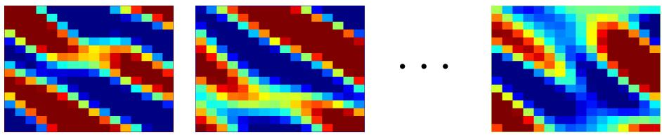
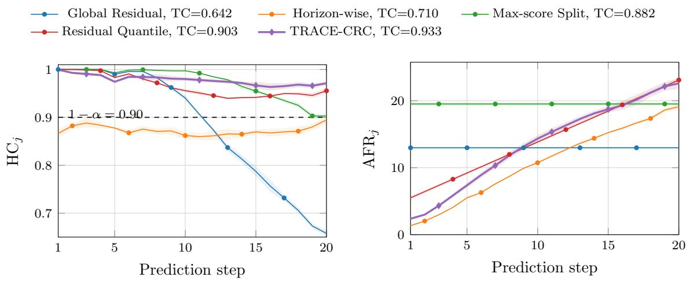
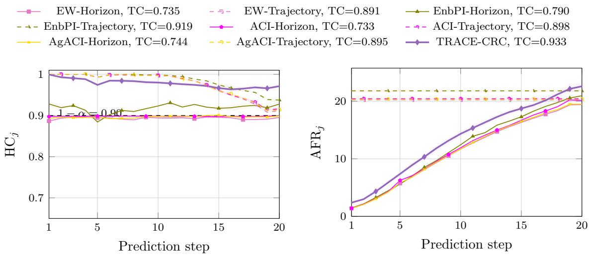
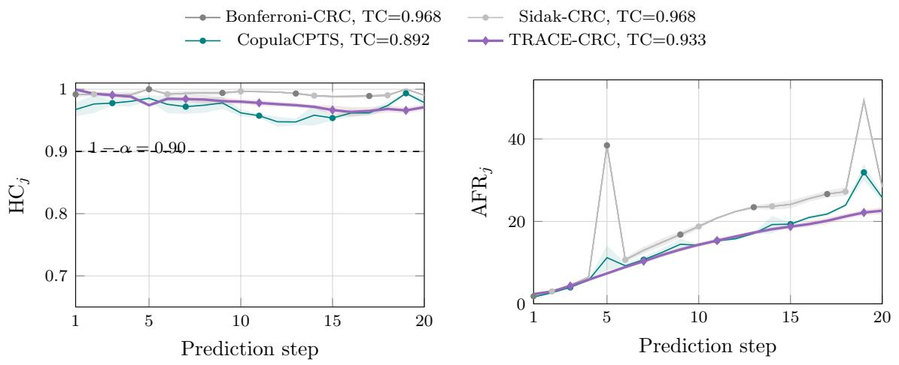
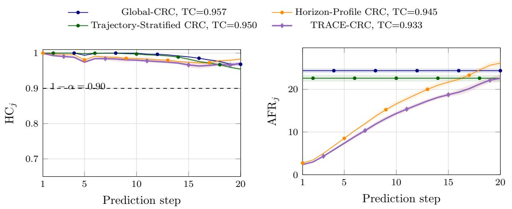

# TRACE-CRC: Trajectory-Adaptive Conformal Risk Control for Multi-Step Channel State Information Prediction

kiarashr@chalmers.se

mehdi.sattari@chalmers.se

javada@chalmers.se

tommy.svensson@chalmers.se

mpaolo@chalmers.se

carlos.natalino@chalmers.se

Department of Electrical Engineering, Chalmers University of Technology, Gothenburg, Sweden

Editor: Ernst Ahlberg, Ulf Johansson, Henrik Bostr¨om, Alberto Carlevaro, Johan Hallberg Szabadv´ary and Lars Carlsson

## Abstract

Reliable prediction of time-varying channel state information (CSI) is essential for eficient wireless communication. Each CSI frame is a matrix-valued representation of the wireless channel response, and a sequence of CSI frames forms a temporal channel trajectory. Modern deep learning-based CSI predictors, however, often provide only point predictions and lack calibrated uncertainty estimates. This limitation is particularly problematic in multi-step CSI prediction, where the target is a sequence of future CSI matrices, and downstream decisions such as beamforming or scheduling may fail if any part of the predicted trajectory is unreliable. We propose trajectory-adaptive calibration and error profiling with conformal risk control (TRACE-CRC), a method for trajectory-aware uncertainty quantification in multi-step CSI prediction. TRACE-CRC constructs Frobenius-norm uncertainty balls around predicted CSI matrices and controls the risk that at least one future frame is uncovered. Instead of calibrating each future step independently, TRACE-CRC combines future-step-dependent error profiling, trajectory dificulty stratification, and learn-then-test (LTT) risk control. Empirically, TRACE-CRC achieves reliable trajectory-level coverage with substantially smaller uncertainty balls than conservative multi-step corrections, while avoiding the trajectory undercoverage of compact stepwise and adaptive conformal base lines.

Keywords: conformal prediction, uncertainty quantification, multi-step forecasting, wireless communications, channel state information

## 1. Introduction

Recent advances in wireless technologies, such as massive multiple-input multiple-output (MIMO), have significantly improved the eficiency of wireless communication systems. In a MIMO system, multiple antennas are used at the transmitter and receiver so that several signal paths can be exploited simultaneously to improve data rate and reliability. Fully realizing these gains requires accurate channel state information (CSI), a high-dimensional complex-valued representation of the wireless channel response. CSI characterizes the strength and phase of the propagation paths and supports transmission decisions such as beamforming, precoding, and resource allocation. The ability to fully exploit these technologies critically depends on the accurate acquisition of CSI, a high-dimensional complex-valued representation of the wireless channel response. However, acquiring CSI remains challenging due to the high dimensionality, complex propagation environment, and multi-modality of wireless channels (Bj¨ornson et al., 2017).

The conventional approach for CSI acquisition relies on pilot transmission and channel estimation at the receiver. CSI prediction provides an alternative: future channel states are forecast from past observations, helping mitigate channel aging and reduce pilot overhead, which are key bottlenecks in next-generation wireless systems (Stenhammar et al., 2024; Kim et al., 2021). Traditional CSI prediction methods include Kalman filtering (Kim et al., 2021), autoregressive models (Baddour and Beaulieu, 2005), and linear extrapolation (Yin et al., 2020). While analytically tractable, these methods often fail to capture the complex nonlinear dynamics of wireless channels.

Recent deep learning methods, including recurrent neural networks (Jiang and Schotten, 2019), transformer-based architectures (Jin et al., 2025), and difusion models (Sattari et al., 2025), have significantly improved CSI prediction accuracy. Nevertheless, deep learning-based CSI predictors typically produce point estimates without calibrated uncertainty information. This limits reliability in deployment, since downstream decisions made by the wireless control plane, such as beamforming, scheduling, and link adaptation, depend not only on the predicted channel but also on the confidence associated with that prediction. In the multi-step setting considered here, the predictor outputs several future CSI frames; we refer to each future prediction step as a forecast horizon, or simply a horizon, and to the full sequence as a predicted CSI trajectory.

Conformal prediction (CP) provides a model-agnostic framework for constructing calibrated prediction sets around black-box model outputs (Vovk et al., 2005; Angelopoulos and Bates, 2022). This makes CP an appropriate candidate for uncertainty quantification in CSI prediction: instead of replacing the predictor, CP can wrap an existing CSI prediction model with uncertainty regions. Yet, multi-step CSI prediction poses challenges that standard split CP does not fully address. In other words, the prediction target is a trajectory of high-dimensional complex CSI matrices; errors can grow across the forecast horizon, and diferent channel-evolution patterns can exhibit varying levels of predictability. Moreover, for a wireless deployment, reliability should be assessed at the trajectory level, where a predicted CSI trajectory may be unreliable if any future CSI frame falls outside its uncertainty region.

Existing CP methods for wireless communications have mainly focused on classification, robust optimization, context-shift calibration, or uncertainty for specific channel prediction pipelines (Cohen et al., 2023b). In parallel, the broader time-series CP literature has developed tools for sequential adaptation, horizon dependence, and multi-step prediction, while conformal risk control (CRC) provides mechanisms for calibrating predictive systems under user-specified losses (Angelopoulos et al., 2022b). However, existing methods do not directly target the combination of matrix-valued CSI prediction, multi-step trajectory-level reliability, and explicit risk control certification considered in this work.

This paper proposes TRACE-CRC, a trajectory-adaptive CRC framework for multistep CSI prediction. It constructs Frobenius-norm uncertainty balls around predicted CSI matrices, adapts their radii using horizon-dependent error profiles and trajectory-level difficulty strata, and certifies trajectory-level risk using Learn-then-Test (LTT). The resulting framework aims to provide calibrated uncertainty estimates for the complete predicted CSI trajectory rather than only for isolated forecast horizons, shifting the calibration target from marginal per-step coverage to control of the full-trajectory failure event. This trajectorylevel perspective supports more informed downstream wireless decisions, where a single unreliable future CSI frame can afect beamforming, scheduling, precoding, or link adaptation across the predicted trajectory. The source code and scripts required to reproduce the experiments are publicly available at https://github.com/kiarashRezaei/trace-crc.

The main contributions of this work are summarized as follows:

• We formulate multi-step CSI reliability as a trajectory-level CRC problem, where a predicted CSI trajectory is considered unreliable if at least one future CSI matrix falls outside its uncertainty ball.

• We extend structured multi-step conformal prediction to matrix-valued CSI trajectories by constructing per-horizon Frobenius-norm uncertainty balls whose radii adapt to both horizon-dependent error growth and heterogeneous trajectory dificulty.

• We combine trajectory-adaptive conformal calibration with an LTT risk control layer that selects an uncertainty rule with a finite-sample trajectory-level risk control.

• We evaluate TRACE-CRC against horizon-wise, trajectory-level, online adaptive, weighted, joint multi-step, and conformal risk control baselines. TRACE-CRC achieves trajectory coverage 0.933 at target coverage 0.90, while substantially reducing the conservatism of simultaneous-correction baselines.

## 2. Related Work

## 2.1. Conformal Prediction for Marginal Coverage

Classical split conformal methods provide finite-sample marginal coverage under the exchangeability assumption by calibrating a nonconformity score on held-out data (Papadopoulos et al., 2002; Lei et al., 2018). Several extensions improve adaptivity or robustness under more complex data settings. Conformalized quantile regression (CQR) combines quantile regression with conformal calibration to obtain adaptive regression intervals (Romano et al., 2019). Weighted conformal methods address covariate shift and more general forms of nonexchangeability by reweighting calibration residuals (Tibshirani et al., 2019; Barber et al., 2023). These methods form the foundation for uncertainty calibration, but they primarily target marginal prediction-set validity rather than trajectory-level reliability over multiple forecast horizons.

## 2.2. Conformal Prediction for Time Series and Multi-Step Forecasting

Sequential and time-series prediction often violate the exchangeability assumptions underlying classical CP. This has motivated the development of conformal methods for temporally dependent, nonstationary, and distribution-shifting data. Ensemble batch prediction intervals (EnbPI) constructs bootstrap-based prediction intervals for dynamic time series and updates residuals sequentially during deployment (Xu and Xie, 2021, 2023a). Adaptive conformal inference (ACI) updates the miscoverage level online to maintain long-run coverage under distribution shift (Gibbs and Cand\`es, 2021), with related adaptive variants, aggregated adaptive conformal inference (AgACI), developed for time-series forecasting (Zafran et al., 2022). Other approaches exploit temporal structure in residuals or nonconformity scores: sequential predictive conformal inference (SPCI) estimates future residual quantiles using sequential residual quantile regression (Xu and Xie, 2023b), while kernel-based optimally weighted conformal prediction intervals (KOWCPI) uses kernel-based optimally weighted residual quantile regression for non-exchangeable time series (Lee et al., 2025). Multi-step forecasting introduces an additional challenge because uncertainty must be calibrated across multiple forecast horizons. CopulaCPTS models dependence among horizonwise conformity scores through an empirical copula to obtain valid multi-step uncertainty regions while avoiding overly conservative Bonferroni corrections (Sun and Yu, 2024); related multi-step conformal approaches include ConForME and online multi-step conformal forecasting methods (Galv˜ao Lopes et al., 2024; Wang and Hyndman, 2024).Several of these methods are adapted as baselines in our experiments where adaptive time-series methods are evaluated through separate horizon-wise and trajectory-wise variants, while multi-step methods address dependence across horizons without CRC-style risk certification. TRACE-CRC combines horizon-dependent structure and trajectory-level CRC certification in one framework.

## 2.3. Conformal Risk Control

Beyond coverage guarantees, conformal risk control (CRC) calibrates prediction sets with respect to user-specified losses. Distribution-free risk-controlling prediction sets provide finite-sample control of expected losses for set-valued predictions (Bates et al., 2021). The LTT framework casts calibration as a multiple-testing problem and provides high-confidence risk control for general predictive algorithms (Angelopoulos et al., 2022a). CRC further specializes this perspective to monotone losses and generalizes split CP from coverage control to broader risk control (Angelopoulos et al., 2022b). Recent work has extended risk control ideas to non-exchangeable data (Farinhas et al., 2024), localized and online guarantees (Zecchin and Simeone, 2024), fairness-aware calibration (Zhang et al., 2024), and application-oriented risk control for model alignment and eficient inference (Overman et al., 2024; Jazbec et al., 2024). A closely related line of work applies CRC to sequential prediction and control, including wireless networking applications (Zecchin et al., 2024). TRACE-CRC instead applies CRC to matrix-valued multi-step CSI prediction with a trajectory-level failure loss.

## 2.4. Conformal Prediction in Wireless Communications

CP has recently been explored in several wireless communication settings. Standard split CP and cross-validation-based CP have been used for wireless classification tasks such as few-shot demodulation and modulation classification (Cohen et al., 2023a,b). Online CP has been studied for channel prediction in wireless systems (Cohen et al., 2023b). To address the training-deployment mismatch, (Yoo et al., 2026) proposes a meta-learned weighted CP method for context-dependent covariate shift. For decision-oriented wireless optimization, (Su et al., 2025) use split CP to construct channel uncertainty sets for robust beamforming. Most closely related to CSI prediction, (Kim et al., 2026) use CQR within a deep conformal Bayes filter to obtain calibrated uncertainty for MIMO channel prediction. A broader overview of CP-based calibration for wireless AI is provided by Simeone et al. (2025). Compared with these works, TRACE-CRC difers in both the prediction object and the reliability target. It calibrates Frobenius-norm uncertainty balls for matrix-valued multi-step CSI trajectories and certifies trajectory-level failure risk, rather than focusing on classification, context-shift calibration, robust decision sets, or uncertainty for individual channel predictions.

## 3. Dataset and Problem Formulation

We study conformal uncertainty quantification for multi-step CSI prediction. In this setting, a pretrained CSI predictor observes past CSI frames and outputs a future CSI trajectory over multiple forecast horizons. Since downstream wireless decisions may depend on the consistency of the predicted channel evolution, our goal is not only to assess point-prediction accuracy, but also to construct Frobenius-norm uncertainty balls around predicted CSI matrices that provide trajectory-level reliability. We first describe the CSI dataset and prediction model, and then formalize the corresponding trajectory-level conformal prediction objective.

## 3.1. Dataset

We consider CSI trajectories generated from an underlying channel distribution. Informally, this distribution describes how the wireless channel evolves over time under random propagation conditions such as mobility, scattering, and multipath propagation efects. A CSI frame at time t is a complex-valued matrix

$$
\mathbf H _ { t } \in \mathbb C ^ { N _ { \mathrm { t } } \times N _ { \mathrm { c } } } ,
$$

where $N _ { \mathrm { t } }$ is the antenna dimension and $N _ { \mathrm { c } }$ is the subcarrier or frequency dimension. Thus, each CSI frame can be viewed as a high-dimensional matrix-valued observation of the channel at one time instant.

The finite dataset consists of sampled realizations of this channel process

$$
\mathcal { D } = \left\{ \left( \mathbf { H } _ { 1 } ^ { ( i ) } , \mathbf { H } _ { 2 } ^ { ( i ) } , \ldots , \mathbf { H } _ { T _ { i } } ^ { ( i ) } \right) \right\} _ { i = 1 } ^ { \mathrm { M } } ,
$$

where i indexes trajectories, $T _ { i }$ is the length of trajectory i, t indexes time within a trajectory, and M is the number of trajectories. We use the CSI dataset generation setup from Sattari et al. (2025). The dataset consists of 1,000 independent CSI samples, each with $N _ { t } = 1 6$ transmit antennas and $N _ { c } = 1 6$ subcarriers, operating at a carrier frequency of 28 GHz. User velocities are uniformly sampled between 30 and 120 km/h, while the channel model is randomly selected from the 3GPP-compliant CDL models (CDL-A–CDL-E) (3gp, 2022). Each sample contains 100 time steps (frames), with consecutive CSI frames separated by approximately 33.3 µs. Since the CSI is complex-valued, the real and imaginary components are stored as separate channels. Consequently, each sample is represented as a tensor of shape $1 0 0 \times 2 \times 1 6 \times 1 6$ , where the first dimension corresponds to the 100 time steps, the second dimension represents the real and imaginary components of the CSI, and the remaining two dimensions correspond to the antenna and subcarrier dimensions, respectively.

  
Figure 1: Snapshots of the real part of a CSI frame at diferent time steps.

The exchangeability assumption applies across complete CSI trajectories, not across frames within a trajectory. Hence, temporal dependence and channel evolution within each trajectory are allowed. In our simulation, trajectories are generated independently using the same channel-generation procedure and parameter distributions, making trajectorylevel exchangeability reasonable in this setting. Figure 1 shows example snapshots from one trajectory by visualizing the real part of the CSI matrices at diferent time horizons. The variation across snapshots illustrates the temporal evolution of the wireless channel.

## 3.2. CSI Prediction

Time-varying CSI prediction can be viewed as a matrix-valued time-series forecasting problem. Let $\mathbf { H } _ { \mathrm { p } }$ denote the past CSI frames used as input, and let $\mathbf { H } _ { \mathrm { f } }$ denote the future CSI frames to be predicted

$$
\mathbf { H } _ { \mathrm { p } } = \left( \mathbf { H } _ { t - N _ { \mathrm { p } } + 1 } , \mathbf { H } _ { t - N _ { \mathrm { p } } + 2 } , \dots , \mathbf { H } _ { t } \right) , \qquad \mathbf { H } _ { \mathrm { f } } = \left( \mathbf { H } _ { t + 1 } , \mathbf { H } _ { t + 2 } , \dots , \mathbf { H } _ { t + N _ { \mathrm { f } } } \right) .
$$

Here, $\mathbf { H } _ { \mathrm { p } }$ and $\mathbf { H } _ { \mathrm { f } }$ are random variables induced by the underlying channel distribution, while the dataset in Subsection 3.1 contains sampled realizations of these quantities.

Let G denote the class of admissible predictors mapping past CSI trajectories to future CSI trajectories. Under the mean squared error criterion, the population-optimal predictor $g ^ { * } ( \mathbf { H } _ { \mathrm { p } } )$ is

$$
\boldsymbol { g } ^ { * } ( \mathbf { H } _ { \mathrm { p } } ) = \arg \operatorname* { m i n } _ { \boldsymbol { g } \in \mathcal { G } } \mathbb { E } \left[ \| \mathbf { H } _ { \mathrm { f } } - \boldsymbol { g } ( \mathbf { H } _ { \mathrm { p } } ) \| ^ { 2 } \right] .\tag{1}
$$

The optimal prediction rule is the conditional mean estimator

$$
g ^ { * } ( \mathbf { H } _ { \mathrm { p } } ) = \mathbb { E } \left[ \mathbf { H } _ { \mathrm { f } } \mid \mathbf { H } _ { \mathrm { p } } \right] = \int \mathbf { h } _ { \mathrm { f } } \mathbb { P } \left( \mathbf { h } _ { \mathrm { f } } \mid \mathbf { H } _ { \mathrm { p } } \right) d \mathbf { h } _ { \mathrm { f } } .\tag{2}
$$

In practice, computing the minimum mean square error (MMSE) predictor is challenging because the conditional law of $\mathbf { H } _ { \mathrm { f } }$ given $\mathbf { H } _ { \mathrm { p } } .$ , denoted by $\mathbb { P } ( \mathbf { H } _ { \mathrm { f } } \mid \mathbf { H } _ { \mathrm { p } } )$ , is unknown and highdimensional. A deep learning-based predictor $g _ { \boldsymbol { \theta } }$ trained with mean square error (MSE) can be viewed as a data-driven approximation to this conditional mean. However, deterministic predictors do not explicitly capture the stochastic and potentially multi-modal evolution of future CSI trajectories.

Recent difusion-based CSI predictors address this limitation by modeling future CSI generation probabilistically. Following Sattari et al. (2025), we use a pretrained predictor based on a temporal encoder and difusion generator. The temporal encoder extracts representations from the past CSI frames, while the difusion generator produces future CSI samples. At inference time, the model is used autoregressively: each predicted CSI frame is fed back as input for predicting the next frame.

For a sampled trajectory i, the past CSI input is $\mathbf { H } _ { \mathrm { p } } ^ { ( i ) } = \left( \mathbf { H } _ { t - N _ { \mathrm { p } } + 1 } ^ { ( i ) } , \dots , \mathbf { H } _ { t } ^ { ( i ) } \right)$ . Let $g _ { \boldsymbol { \theta } }$ denote the trained difusion-based CSI predictor, where θ represents the learned parameters of the temporal encoder and difusion generator. At inference time, $g _ { \theta }$ generates a predicted future CSI trajectory from the past CSI window

$$
\widehat { \mathbf { H } } _ { \mathrm { f } } ^ { ( i ) } = g _ { \theta } \left( \mathbf { H } _ { \mathrm { p } } ^ { ( i ) } \right) = \left( \widehat { \mathbf { H } } _ { t + 1 } ^ { ( i ) } , \ldots , \widehat { \mathbf { H } } _ { t + N _ { \mathrm { f } } } ^ { ( i ) } \right) .
$$

While the autoregressive scheme provides a flexible prediction framework, it also induces horizon-dependent uncertainty. Prediction errors can propagate through the feedback loop and accumulate over future steps, so the reliability of the predicted CSI trajectory may deteriorate as the forecast horizon increases. This motivates the conformal uncertainty quantification problem considered next.

## 3.3. Conformal Problem Formulation

Building on the multi-step CSI prediction setup in Subsection 3.2, we now formulate trajectory-level conformal uncertainty quantification. Each future index $j \in \{ 1 , \ldots , N _ { \mathrm { f } } \}$ is a forecast horizon, and the collection of all $N _ { \mathrm { f } }$ future CSI frames forms the predicted CSI trajectory.

For trajectory i and forecast horizon $j ,$ we define the Frobenius residual as

$$
E _ { i , j } = \left\| \mathbf { H } _ { t + j } ^ { ( i ) } - \widehat { \mathbf { H } } _ { t + j } ^ { ( i ) } \right\| _ { F } , \qquad j = 1 , \ldots , N _ { \mathrm { f } } .\tag{3}
$$

The Frobenius residual is well-suited for CSI uncertainty quantification because each CSI frame is a high-dimensional complex-valued matrix whose entries jointly describe the channel response across the spatial-frequency domain. Thus, a Frobenius-norm radius defines an uncertainty ball around the predicted CSI matrix in the full spatial-frequency channel space

$$
\mathcal { B } _ { i , j } ( r _ { i , j } ) = \left\{ \mathbf { G } \in \mathbb { C } ^ { N _ { \mathrm { t } } \times N _ { \mathrm { c } } } : \left. \mathbf { G } - \widehat { \mathbf { H } } _ { t + j } ^ { ( i ) } \right. _ { F } \leq r _ { i , j } \right\} .\tag{4}
$$

Here, G is a generic candidate CSI matrix in the same spatial-frequency space as $\mathbf { H } _ { t + j } ^ { ( i ) } .$ The ball is centered at the predicted CSI frame $\widehat { \mathbf { H } } _ { t + j } ^ { ( i ) }$ . The radius $\boldsymbol { r } _ { i , j }$ may depend on the forecast horizon and on quantities computed from the past CSI input and the predicted future CSI trajectory, but not on the unobserved true future CSI frame.

Let $A _ { i , j }$ denote the event that trajectory i is covered at forecast horizon $j$

$$
A _ { i , j } = \left\{ \mathbf { H } _ { t + j } ^ { ( i ) } \in \mathcal { B } _ { i , j } ( r _ { i , j } ) \right\} = \{ E _ { i , j } \leq r _ { i , j } \} .\tag{5}
$$

Thus, membership in the Frobenius ball is equivalent to the residual being no larger than the assigned radius.

Let $\alpha _ { h } \in ( 0 , 1 )$ denote the target horizon-wise miscoverage level. A horizon-wise objective marginally controls these events.

$$
\mathbb { P } ( A _ { i , j } ) \ge 1 - \alpha _ { h } , \qquad j = 1 , \ldots , N _ { \mathrm { f } } .\tag{6}
$$

However, marginal horizon-wise coverage does not generally imply that the entire predicted CSI trajectory is covered. We therefore define the trajectory-level coverage event as ${ \mathcal { C } } _ { i } ^ { \mathrm { t r a j } } =$ $\cap _ { j = 1 } ^ { N _ { \mathrm { f } } } A _ { i , j }$ . Its complement corresponds to at least one uncovered horizon

$$
\left( \mathcal C _ { i } ^ { \mathrm { t r a j } } \right) ^ { c } = \{ \exists j \in \{ 1 , \dots , N _ { \mathrm { f } } \} : E _ { i , j } > r _ { i , j } \} .
$$

The population trajectory-level risk is

$$
\mathcal { R } _ { \mathrm { t r a j } } = \mathbb { P } \left( \left( \mathcal { C } _ { i } ^ { \mathrm { t r a j } } \right) ^ { c } \right) = \mathbb { P } \left( \exists j \in \{ 1 , \dots , N _ { \mathrm { f } } \} : E _ { i , j } > r _ { i , j } \right) .\tag{7}
$$

Equivalently, the trajectory failure indicator is defined as

$$
L _ { i } ^ { \mathrm { t r a j } } = \mathbf { 1 } \left\{ \exists j \in \{ 1 , \dots , N _ { \mathrm { f } } \} : E _ { i , j } > r _ { i , j } \right\} .\tag{8}
$$

Since the population trajectory-level risk $\left( \mathcal { R } _ { \mathrm { t r a j } } \right)$ is unknown, we formulate the goal as a CRC problem. The calibration procedure returns a data-dependent uncertainty rule ${ \widehat { B } } ,$ which assigns radii $\widehat { r } _ { i , j }$ using only the past CSI input and the predicted future CSI trajectory. Under trajectory-level exchangeability between the data used for risk control selection and future deployment trajectories, we seek a procedure such that

$$
\mathbb { P } \left( \mathcal { R } _ { \mathrm { t r a j } } ( { \widehat { \mathcal { B } } } ) \leq \alpha \right) \geq 1 - \delta .\tag{9}
$$

Here, α is the target trajectory failure level, δ is the allowed probability of certifying an uncertainty rule whose trajectory risk exceeds α, and the outer probability is over the data used by the CRC procedure. The guarantee requires exchangeability across complete CSI trajectories, as discussed in Section 3.1.

## 4. TRACE-CRC: Trajectory-Adaptive Conformal Risk Control

## 4.1. Method Overview

The trajectory-level objective in (9) requires a rule that the corresponding uncertainty bal cover the full future CSI trajectory, rather than isolated forecast horizons. A single-radius trajectory-level conformal method can be ineficient because it applies the same radius across all horizons, while copula-based approaches explicitly model dependence across horizons, as in CopulaCPTS (Sun and Yu, 2024). TRACE-CRC adopts a diferent approach: it avoids explicit dependence modeling and instead adapts the radius to both horizon profile and predicted trajectory dificulty.

For trajectory i assigned to dificulty group $g _ { i } \in \{ 0 , 1 \}$ , TRACE-CRC sets the radius at forecast horizon $j$ as

$$
r _ { i , j } ^ { \star } = r _ { g _ { i } , j } ^ { \star } = \lambda ^ { \star } q _ { g _ { i } } w _ { j } , \qquad j = 1 , \ldots , N _ { \mathrm { f } } ,\tag{10}
$$

where $w _ { j }$ is the horizon dificulty profile, $\{ q _ { 0 } , q _ { 1 } \}$ are the two group-wise conformal quantiles, $q _ { g _ { i } }$ selects the quantile for the assigned group, and $\lambda ^ { \star }$ is the global multiplier selected by LTT risk control.

The components $w _ { j } , \{ q _ { g } \} _ { g \in \{ 0 , 1 \} }$ , and $\lambda ^ { \star }$ are estimated using disjoint calibration splits. TRACE-CRC then returns the Frobenius uncertainty ball $B _ { i , j } ^ { \star }$ in (4) with radius $r _ { i , j } ^ { \star }$ . A future CSI trajectory is covered if every true future frame lies inside its corresponding horizon-wise uncertainty ball.

## 4.2. Three-Way Calibration Split

After splitting the available trajectory samples into calibration and test sets, TRACE-CRC further partitions the calibration CSI trajectories into three disjoint index subsets,

$$
\mathcal { D } _ { \mathrm { c a l } } = \mathcal { D } _ { \mathrm { p r o f } } \dot { \cup } \mathcal { D } _ { \mathrm { c p } } \dot { \cup } \mathcal { D } _ { \mathrm { v a l } } .
$$

Thus, $i \in \mathcal { D } _ { \mathrm { p r o f } } , i \in \mathcal { D } _ { \mathrm { c p } }$ , or $i \in \mathcal { D } _ { \mathrm { v a l } }$ indicates that trajectory i is assigned to the corresponding stage. For each calibration trajectory i, we obtain the multi-step prediction from the predictor described in Subsection 3.2 and compute the Frobenius residuals according to (3). These residuals provide the calibration scores used by TRACE-CRC.

The profile subset $\mathcal { D } _ { \mathrm { p r o f } }$ is used to estimate the horizon dificulty profile $w _ { j }$ and to fit the trajectory dificulty model that assigns each trajectory i to a group $g _ { i } \in \{ 0 , 1 \}$ . The conformal calibration subset $\mathcal { D } _ { \mathrm { c p } }$ is used to compute the group-wise conformal quantiles $q _ { g }$ Finally, the validation subset $\mathcal { D } _ { \mathrm { v a l } }$ is reserved for LTT risk control selection of the global multiplier $\lambda ^ { \star }$ . Because the three subsets are disjoint, the horizon profile, grouping rule, and group-wise quantiles are fixed before the LTT hypothesis tests are applied on $\mathcal { D } _ { \mathrm { v a l } }$ . This separation keeps the profiling, conformal calibration, and LTT testing stages statistically distinct, simplifying the validity argument. However, it may reduce sample eficiency when calibration trajectories are scarce. Cross-fitted or cross-conformal variants could improve data reuse, although retaining the same LTT risk-control guarantee would require additional analysis.

## 4.3. Horizon Dificulty Profile

Prediction errors in multi-step CSI forecasting are horizon dependent, often increasing or changing shape across future horizons. TRACE-CRC therefore estimates a relative horizon dificulty profile $w _ { 1 } , \ldots , w _ { N _ { \mathsf { f } } }$ using the profile split $\mathcal { D } _ { \mathrm { p r o f } }$

For each forecast horizon $j ,$ we first compute a raw horizon dificulty estimate as the empirical upper-quantile residual

$$
w _ { j } ^ { \mathrm { r a w } } = Q _ { 1 - \alpha _ { h } } \left( \{ E _ { i , j } : i \in \mathcal { D } _ { \mathrm { p r o f } } \} \right) .
$$

where $Q _ { 1 - \alpha _ { h } }$ denotes the empirical $( 1 - \alpha _ { h } ) – \mathrm { q u a n t i l e }$ . The parameter $\alpha _ { h }$ is used only to estimate the relative horizon dificulty profile and is distinct from the final trajectory-level risk target α. Since horizon-wise empirical quantiles can fluctuate under finite calibration data, we smooth the raw profile by a local moving average. Specifically,

$$
\widetilde { w } _ { j } = \frac { 1 } { \vert \mathcal { N } _ { K } ( j ) \vert } \sum _ { k \in \mathcal { N } _ { K } ( j ) } w _ { k } ^ { \mathrm { r a w } } ,
$$

where $\mathcal { N } _ { K } ( j ) = \{ k \in \{ 1 , \dots , N _ { \mathrm { f } } \} : | k - j | \leq \lfloor K / 2 \rfloor \}$ . In experiments, $K = 3 .$ , so each horizon is smoothed using itself and its immediate neighbors, with boundary horizons averaged over the available terms. We then stabilize the profile by imposing the lower floor $c _ { \operatorname* { m i n } } = \rho$ · median $( \widetilde { w } _ { 1 } , \dots , \widetilde { w } _ { N _ { \mathrm { f } } } )$ , where $\rho > 0$ is a stabilization parameter. The final profile is normalized to unit mean

$$
w _ { j } = \frac { \operatorname* { m a x } ( \widetilde { w } _ { j } , c _ { \mathrm { m i n } } ) } { N _ { \mathrm { f } } ^ { - 1 } \sum _ { \ell = 1 } ^ { N _ { \mathrm { f } } } \operatorname* { m a x } ( \widetilde { w } _ { \ell } , c _ { \mathrm { m i n } } ) } .\tag{11}
$$

The normalized profile satisfies $\begin{array} { r } { N _ { \mathrm { f } } ^ { - 1 } \sum _ { j = 1 } ^ { N _ { \mathrm { f } } } w _ { j } = 1 } \end{array}$ . Values $w _ { j } > 1$ correspond to harderthan-average forecast horizons, while $w _ { j } < 1$ correspond to easier horizons.

## 4.4. Trajectory Dificulty Stratification

TRACE-CRC stratifies predicted CSI trajectories according to estimated prediction difficulty. The goal is to learn a simple mapping from a trajectory-level feature vector ${ \bf x } _ { i } ,$ computed from the predicted trajectory, to a predicted dificulty score $\widehat { d } _ { i }$ . The resulting scores are used to form lower- and higher-dificulty groups.

For each profile index $i \in \mathcal { D } _ { \mathrm { p r o f } }$ , we define

$$
z _ { j } ^ { ( i ) } = \left\| \widehat { \mathbf { H } } _ { t + j } ^ { ( i ) } \right\| _ { F } , \qquad j = 1 , \ldots , N _ { \mathrm { f } } ,
$$

and construct the trajectory-level feature vector

$$
\begin{array} { r } { \mathbf { x } _ { i } = \left[ \mu _ { i } , \sigma _ { i } , z _ { \mathrm { m a x } } ^ { ( i ) } , z _ { \mathrm { m i n } } ^ { ( i ) } , \mathrm { r a n g e } _ { i } , \mathrm { s l o p e } _ { i } , \mathrm { T V } _ { i } , \mathrm { c u r v a t u r e } _ { i } , z _ { 1 } ^ { ( i ) } , z _ { N _ { \mathrm { f } } } ^ { ( i ) } \right] . } \end{array}\tag{12}
$$

Here, $\mu _ { i } , \ \sigma _ { i } , \ z _ { \operatorname* { m a x } } ^ { ( i ) }$ , and $z _ { \mathrm { m i n } } ^ { ( i ) }$ are the mean, standard deviation, maximum, and minimum of the sequence $\{ z _ { j } ^ { ( i ) } \} _ { j = 1 } ^ { N _ { \mathrm { f } } }$ , with ran $\mathrm { g e } _ { i } = z _ { \mathrm { m a x } } ^ { ( i ) } - z _ { \mathrm { m i n } } ^ { ( i ) }$ and slo $\mathrm { p e } _ { i } = z _ { N _ { \mathrm { f } } } ^ { ( i ) } - z _ { 1 } ^ { ( i ) }$ . The term $\mathrm { T V } _ { i }$ denotes trajectory variation, defined as the mean absolute first-order diference of the predicted norm sequence, while curvaturei denotes the mean absolute second-order diference:

$$
\mathrm { T V } _ { i } = \frac { 1 } { N _ { \mathrm { f } } - 1 } \sum _ { j = 1 } ^ { N _ { \mathrm { f } } - 1 } \left| z _ { j + 1 } ^ { ( i ) } - z _ { j } ^ { ( i ) } \right| , \qquad \mathrm { c u r v a t u r e } _ { i } = \frac { 1 } { N _ { \mathrm { f } } - 2 } \sum _ { j = 2 } ^ { N _ { \mathrm { f } } - 1 } \left| z _ { j + 1 } ^ { ( i ) } - 2 z _ { j } ^ { ( i ) } + z _ { j - 1 } ^ { ( i ) } \right| .
$$

These features summarize the magnitude, variability, trend, and local smoothness of the predicted CSI trajectory.

For the same profile index $i \in \mathcal { D } _ { \mathrm { p r o f } }$ , where the true future CSI is available for calibration, we define the residual-based trajectory dificulty target as

$$
d _ { i } = \operatorname* { m a x } _ { 1 \leq j \leq N _ { \mathrm { f } } } \frac { E _ { i , j } } { w _ { j } } .\tag{13}
$$

This score measures how dificult trajectory i is after accounting for the typical error scale at each forecast horizon. A large value of $d _ { i }$ indicates that the trajectory contains at least one unusually large residual relative to the expected horizon dificulty.

We then fit a ridge regression model $\hat { d } ( \mathbf { x } ) = \beta _ { 0 } + \beta ^ { \top } \mathbf { x } \ \mathrm { o n } \ \{ ( \mathbf { x } _ { i } , d _ { i } ) : i \in \mathcal { D } _ { \mathrm { p r o f } } \}$ , using regularization parameter $\eta .$ We use ridge regression to keep the stratification model low-variance and stable under limited calibration data. Afterwards, we apply it to the trajectories indexed by $\mathcal { D } _ { \mathrm { c p } }$ . For each $\ell \in \mathcal { D } _ { \mathrm { c p } }$ , this gives a predicted dificulty score $\widehat { d } _ { \ell } = \widehat { d } ( \mathbf { x } _ { \ell } )$ For two strata, we set $\tau =$ median $\{ \widehat { d } _ { \ell } : \ell \in \mathcal { D } _ { \mathrm { c p } } \}$ and assign each conformal calibration trajectory by $g _ { \ell } = { \bf 1 } \{ \widehat { d } _ { \ell } > \tau \}$ . Thus, $g _ { \ell } = 0$ denotes the lower-dificulty group and $g _ { \ell } = 1$ denotes the higher-dificulty group. The same fitted model and threshold are used to assign any validation or test trajectory i to a group,

$$
g _ { i } = \mathbf { 1 } \{ { \widehat { d } } ( \mathbf { x } _ { i } ) > \tau \} .\tag{14}
$$

## 4.5. Group-wise Conformal Calibration

Given the horizon profile in (11) and the group assignment rule in (14), TRACE-CRC calibrates a conformal scale within each dificulty stratum. For each conformal calibration index $\ell \in \mathcal { D } _ { \mathrm { c p } }$ , where the true future CSI is available, we compute the same trajectory dificulty score defined in (13),

$$
d _ { \ell } = \operatorname* { m a x } _ { 1 \le j \le N _ { \mathrm { f } } } \frac { E _ { \ell , j } } { w _ { j } } .
$$

On $\mathcal { D } _ { \mathrm { p r o f } }$ , this score was used to fit the trajectory dificulty model; on $\mathcal { D } _ { \mathrm { c p } }$ , it is used as the conformal calibration score. For each group $g \in \{ 0 , 1 \}$ , let

$$
S _ { g } = \{ d _ { \ell } : \ell \in \mathcal { D } _ { \mathrm { c p } } , g _ { \ell } = g \} , \qquad n _ { g } = | S _ { g } | .
$$

The group-wise conformal quantile $q _ { g }$ is

$$
q _ { g } = Q _ { 1 - \alpha _ { \mathrm { c p } } } ^ { + } ( S _ { g } ) ,
$$

where $Q _ { 1 - \alpha _ { \mathrm { c p } } } ^ { + }$ denotes the split-conformal empirical quantile at level $\lceil ( n _ { g } + 1 ) ( 1 - \alpha _ { \mathrm { c p } } ) \rceil / n _ { g }$ I $[ ( n _ { g } + 1 ) ( \mathrm { \ddot { 1 } } - \alpha _ { \mathrm { c p } } ) ] > n _ { g }$ , we set $q _ { g } = + \infty$ . Here, $\alpha _ { \mathrm { c p } }$ is the group-wise conformal calibration level. Thus, $q _ { g }$ is computed from the residual-based calibration scores of trajectories assigned to group $g .$

For a generic group $g \in \{ 0 , 1 \}$ , the preliminary horizon-dependent radius is

$$
r _ { g , j } = q _ { g } w _ { j } , \qquad j = 1 , \ldots , N _ { \mathrm { f } } .\tag{15}
$$

Thus a trajectory i assigned to group $g _ { i }$ uses $r _ { g _ { i } , j } = q _ { g _ { i } } w _ { j }$ . Since $d _ { \ell } \le q _ { g }$ implies $E _ { \ell , j } \leq q _ { g } w _ { j }$ for every horizon $j , q _ { g }$ controls the trajectory-level scale within each dificulty group, while $w _ { j }$ distributes that scale across forecast horizons.

## 4.6. Learn-then-Test Risk Control

The group-wise conformal calibration step produces preliminary radii ${ q _ { g } w _ { j } }$ . TRACE-CRC then applies LTT risk control to select a global multiplier λ for these radii. Let $\Lambda =$ $\{ \lambda _ { 1 } , \ldots , \lambda _ { m } \}$ be a finite grid of candidate multipliers. For a validation index $i \in \mathcal { D } _ { \mathrm { v a l } }$ , let $g _ { i } \in \{ 0 , 1 \}$ denote its assigned dificulty group. For each $\lambda \in \Lambda$ , the candidate radius at horizon j is

$$
r _ { i , j } ( \lambda ) = r _ { g _ { i } , j } ( \lambda ) = \lambda q _ { g _ { i } } w _ { j } .
$$

On the validation subset, we evaluate each candidate multiplier using the trajectorylevel failure loss $L _ { i } ( \lambda ) = \mathbf { 1 } \left\{ \exists j \in \{ 1 , \dots , N _ { \mathrm { f } } \} : E _ { i , j } > \lambda q _ { g _ { i } } w _ { j } \right\}$ . Thus, $L _ { i } ( \lambda ) = 1$ if at least one future CSI frame in trajectory i falls outside its corresponding Frobenius uncertainty ball. The empirical validation risk is

$$
\widehat { \mathcal { R } } _ { \mathrm { t r a j } } ( \lambda ) = \frac { 1 } { n _ { \mathrm { v a l } } } \sum _ { i \in \mathcal { D } _ { \mathrm { v a l } } } L _ { i } ( \lambda ) , \qquad n _ { \mathrm { v a l } } = | \mathcal { D } _ { \mathrm { v a l } } | ,
$$

and the corresponding population trajectory risk for a fresh CSI trajectory sample is $\mathcal { R } _ { \mathrm { t r a j } } ( \lambda ) = \mathbb { P } \left( L _ { i } ( \lambda ) = 1 \right)$ . For each candidate multiplier, TRACE-CRC tests

$$
H _ { 0 } ( \lambda ) : \mathcal { R } _ { \mathrm { t r a j } } ( \lambda ) > \alpha \qquad \mathrm { a g a i n s t } \qquad H _ { 1 } ( \lambda ) : \mathcal { R } _ { \mathrm { t r a j } } ( \lambda ) \leq \alpha ,
$$

where α is the target trajectory failure level. We test this hypothesis using a one-sided Hoefding–Bentkus (HB) p-value

$$
p ( \lambda ) = p _ { \mathrm { H B } } \left( \widehat { \mathcal { R } } _ { \mathrm { t r a j } } ( \lambda ) , n _ { \mathrm { v a l } } , \alpha \right)
$$

(Bentkus, 2004). Let ${ \mathcal { A } } \subseteq \Lambda$ be the set of accepted multipliers after correction. TRACE-CRC selects $\lambda ^ { \star } = \operatorname* { m i n } _ { \lambda \in \mathcal { A } } \lambda$ , which gives the smallest certified multiplier among the accepted candidates. If $A = \emptyset$ , no multiplier in the candidate grid is certified; in this case, the grid must be enlarged, or the method returns no certified radius on the grid.

For trajectory i, the final radius at horizon j is

$$
\begin{array} { r } { \boldsymbol { r } _ { i , j } ^ { \star } = \boldsymbol { r } _ { g _ { i } , j } ^ { \star } = \lambda ^ { \star } \boldsymbol { q } _ { g _ { i } } w _ { j } . } \end{array}\tag{16}
$$

## 4.7. Prediction Bands and Risk Control Guarantee

For a new CSI context, TRACE-CRC first computes the trajectory-level feature vector $\mathbf { x } _ { i }$ from the predicted future CSI trajectory, as defined in (12). It then assigns the trajectory to a dificulty group gi using (14) and applies the final radius $r _ { i , j } ^ { \star }$ from (16) at each forecast horizon. The resulting trajectory-level prediction band is the collection of horizon-wise Frobenius balls

$$
\widehat { B } _ { i } ^ { \star } = \left\{ B _ { i , j } ( \boldsymbol { r } _ { i , j } ^ { \star } ) \right\} _ { j = 1 } ^ { N _ { \mathrm { f } } } ,
$$

where each ball is centered at the corresponding predicted CSI frame $\widehat { \mathbf { H } } _ { t + j } ^ { ( i ) }$ , as defined in (4).

Under trajectory-level exchangeability between the validation losses used by LTT and future deployment losses, and with FWER controlled at level δ, the selected rule ${ \widehat { B } } ^ { \star }$ satisfies the CRC guarantee in (9), certifying trajectory-level risk at level α. As discussed in Section 3.1, this assumption concerns exchangeability across complete trajectories and does not require independence among frames within a trajectory.

## 5. Experimental Setup

We evaluate TRACE-CRC on the multi-step CSI prediction task using the pretrained difusion-based CSI predictor of Sattari et al. (2025); see Sections 3.1 and 3.2 for details. The predictor was trained on 10,000 trajectory-level samples following the training procedure described in Sattari et al. (2025). We use an inference SNR of 20 dB and 20 reverse-difusion sampling steps. TRACE-CRC is applied post hoc to the pretrained CSI predictor. Its calibration is performed ofline, while deployment requires only evaluation of the calibrated scaling rule and uncertainty radii. The online computational cost is therefore expected to be small relative to difusion inference. For the complex-valued CSI matrices, all residuals and uncertainty radii are computed using the Frobenius norm. From each 100-frame CSI sample described in Section 3.1, we extract a 30-frame trajectory for prediction. The predictor uses $N _ { p } = 1 0$ past frames as input and predicts $N _ { f } = 2 0$ future frames. Thus, conformal calibration and evaluation are performed over a forecast horizon of $N _ { f } = 2 0$

At inference time, the 1,000 prediction trajectories are partitioned using a fixed random holdout. We assign 30% of the trajectories to calibration and retain 70% for testing, yielding $n _ { \mathrm { c a l } } = 3 0 0$ and $n _ { \mathrm { t e s t } } = 7 0 0$ . This split is shared by all conformal methods and ensures that no CSI frames from the same trajectory are assigned to both calibration and test sets. We use a relatively small calibration set to evaluate TRACE-CRC in a limited-calibration regime while retaining a large independent test set for stable estimation of trajectory-leve performance. Since difusion inference is stochastic, the complete evaluation is repeated over five random inference seeds while keeping the same calibration and test split, and results are aggregated across runs. For online adaptive methods, test trajectories are processed in a fixed dataset-index order for reproducibility; this order does not represent temporal progression.

The calibration trajectories are further divided into three disjoint subsets required by TRACE-CRC: the profile subset $\mathcal { D } _ { \mathrm { p r o f } }$ , the conformal calibration subset $\mathcal { D } _ { \mathrm { c p } }$ , and the validation subset $\mathcal { D } _ { \mathrm { v a l } }$ . We allocate 10% of the calibration trajectories to profile learning, 15% of the remaining calibration trajectories to group-wise conformal calibration, and the rest to LTT validation, resulting in $n _ { \mathrm { p r o f } } = 3 0 , n _ { \mathrm { c p } } = 4 0$ , and $n _ { \mathrm { v a l } } = 2 3 0$ . We allocate the largest calibration split to LTT validation because the risk-control certificate depends directly on validation evidence. We set $\alpha = 0 . 1 0$ , corresponding to a target trajectory coverage of 0.90, and use $\alpha _ { \mathrm { c p } } = \alpha _ { h } = 0 . 1 0$ for group-wise conformal calibration and horizon-profile estimation. For LTT, we set $\delta = 0 . 1 0$ , corresponding to a 90% confidence level for the riskcontrol certificate. These values define a representative operating point and are kept fixed across methods to enable a controlled comparison of their calibration strategies. The LTT candidate family consists of 27 prespecified multipliers, including 10 uniformly spaced on [0.70, 1.30] and additional candidates on [1.40, 3.00]. The λ-grid allows both mild deflation and inflation of the preliminary conformal radii. Additional method-specific parameters are reported in Appendix B.

## 5.1. Baseline Methods

We compare TRACE-CRC with two groups of methods: conformal baselines from the literature and ablations of the proposed conformal risk control framework. Since the methods from the literature do not all target the same formal guarantee, we organize them into four categories: standard split-conformal baselines, time-series adaptive conformal baselines, structured multi-step baselines, and risk control ablations. Within each category, when applicable, we distinguish horizon-wise variants from trajectory-level variants according to whether calibration targets individual forecast steps or the full CSI trajectory. All methods are evaluated on the same held-out test trajectories using the reliability and eficiency metrics defined in Section 6.

Standard split-conformal baselines. We first include standard split-conformal regression baselines (Papadopoulos et al., 2002; Lei et al., 2018). Global Residual Conformal pools all calibration residuals $E _ { i , j }$ across samples and horizons and uses a single radius $R _ { i , j } = q$ . Horizon-wise conformal instead computes a separate quantile $q _ { j }$ for each forecast horizon, yielding $R _ { i , j } = q _ { j }$ . To represent trajectory-level split conformal calibration, we include Max-score split conformal, which uses the nonconformity score $\begin{array} { r } { S _ { i } = \operatorname* { m a x } _ { 1 \leq j \leq N _ { \mathrm { f } } } E _ { i , j } } \end{array}$ and applies the resulting quantile $q _ { \mathrm { m a x } }$ uniformly across all horizons. We also include a residual-quantile conformal baseline inspired by conformalized quantile regression (Romano et al., 2019). This baseline estimates a horizon-dependent residual quantile profile and then conformalizes it using the maximum residual excess over that profile.

Time-series adaptive conformal baselines. To compare against adaptive conformal methods designed for temporally ordered or nonstationary settings, we include exponentially weighted (EW) conformal variants. EW-Horizon conformal and EW-Trajectory conforma replace the unweighted empirical quantile with a recency-weighted quantile, assigning larger weights to more recent residuals. These baselines are motivated by conformal prediction under distribution shift and non-exchangeability (Tibshirani et al., 2019; Barber et al., 2023; Wang and Hyndman, 2024).

We also include EnbPI (Xu and Xie, 2021), ACI (Gibbs and Cand\`es, 2021), and $\mathrm { A g A C I }$ (Zafran et al., 2022) as established adaptive online conformal time-series baselines. For each method, we report both a horizon and a trajectory variant. The horizon variant calibrates separately at each prediction step $j ,$ while the trajectory variant first reduces each predicted CSI trajectory to a scalar score, typically $\mathrm { m a x } _ { 1 \le j \le N _ { f } } E _ { i , j }$ , and then calibrates this trajectory-level score. This distinction is important because horizon variants primarily target per-horizon reliability, whereas trajectory variants are more directly aligned with the trajectory-level objective considered in this work.

Structured multi-step baselines. We include two CRC baselines, Bonferroni-CRC and Sidak-CRC, which use classical multi-step corrections. Both apply simultaneous inference corrections across forecast horizons, using the Bonferroni (Bonferroni, 1936) and Sidak (Sid´akˇ , 1967) adjustments, respectively. Such corrections are commonly used to convert marginal intervals into simultaneous multi-step prediction intervals (Ravishanker et al., 1991). We also compare against CopulaCPTS, a joint multi-step conformal forecasting method that accounts for dependence across forecast horizons through an empirical copula construction (Sun and Yu, 2024).

risk control ablations. Finally, we include ablations of the proposed risk control framework to isolate the contribution of each component. Table 1 summarizes which methods use horizon profiling $w _ { j }$ , trajectory group-wise conformal quantiles $q _ { g } ,$ and LTT risk control calibration (Bates et al., 2021; Angelopoulos et al., 2022b). Global-CRC uses only the LTT multiplier $\lambda ^ { \star }$ . Horizon-Profile CRC adds $w _ { j }$ , Trajectory-Stratified CRC adds $q _ { g } ,$ and TRACE-CRC combines all three components. These ablations test whether LTT risk control alone is suficient, or whether eficiency improves when risk control is combined with horizon profiling and trajectory stratification.

Table 1: Ablation structure for TRACE-CRC components.
<table><tr><td>Method</td><td> $w _ { j }$ </td><td> $q _ { g }$ </td><td> $\lambda ^ { \star }$ </td></tr><tr><td>Global-CRC</td><td>X</td><td>X</td><td>√</td></tr><tr><td>Horizon-Profile CRC</td><td>V</td><td>X</td><td>√</td></tr><tr><td>Trajectory-Stratified CRC</td><td>X</td><td>V</td><td>√</td></tr><tr><td>TRACE-CRC</td><td>√</td><td>V</td><td>V</td></tr></table>

## 6. Results and Discussion

We evaluate all methods on the same held-out CSI test trajectories. Our primary reliability metric is trajectory coverage (TC), and our eficiency metric is the horizon-wise average Frobenius radius $\mathrm { A F R } _ { j }$

$$
\mathrm { T C } = \frac { 1 } { n _ { \mathrm { t e s t } } } \sum _ { i = 1 } ^ { n _ { \mathrm { t e s t } } } { \bf 1 } \left\{ \forall j \in \left\{ 1 , \dots , N _ { \mathrm { f } } \right\} : E _ { i , j } \leq r _ { i , j } \right\} , \qquad \mathrm { A F R } _ { j } = \frac { 1 } { n _ { \mathrm { t e s t } } } \sum _ { i = 1 } ^ { n _ { \mathrm { t e s t } } } r _ { i , j } .
$$

We also report horizon-wise coverage $\mathrm { H C } _ { j }$ and summarize it using mean horizon coverage (MHC) and worst-horizon coverage (WHC):

$$
\mathrm { H C } _ { j } = \frac { 1 } { n _ { \mathrm { t e s t } } } \sum _ { i = 1 } ^ { n _ { \mathrm { t e s t } } } \mathbf { 1 } \{ E _ { i , j } \leq r _ { i , j } \} , \qquad \mathrm { M H C } = \frac { 1 } { N _ { \mathrm { f } } } \sum _ { j = 1 } ^ { N _ { \mathrm { f } } } \mathrm { H C } _ { j } , \qquad \mathrm { W H C } = \operatorname* { m i n } _ { 1 \leq j \leq N _ { \mathrm { f } } } \mathrm { H C } _ { j } .
$$

Figures show the horizon-wise coverage $\mathrm { H C } _ { j }$ and average Frobenius radius $\operatorname { A F R } _ { j } .$ , averaged over five random difusion inference seeds; shaded regions denote one standard deviation across seeds. For each seed, MHC is the mean of $\mathrm { H C } _ { j }$ across horizons, WHC is its minimum, and AFR is the mean of $\mathrm { A F R } _ { j }$ . Tables report the mean ± standard deviation of these per-seed metrics. MHC, WHC, and TC measure reliability relative to the target coverage $1 - \alpha = 0 . 9 0$ , while AFR measures eficiency. Table 2 presents representative methods from each comparison category; complete results and tuning parameters are reported in Appendices A and B.

Horizon-wise methods produce compact uncertainty regions but insuficient trajectory coverage, with TC values of 0.710 for Horizon-wise conformal and 0.744 for AgACI-Horizon. Methods that explicitly target full-trajectory reliability generally improve TC but require larger radii; for example, EnbPI-Trajectory and Bonferroni-CRC attain TC values of 0.919 and 0.968, with AFR values of 21.80 and 20.00, respectively. TRACE-CRC achieves $\mathrm { T C } =$ $0 . 9 3 3 \pm 0 . 0 1 1$ and $\mathrm { A F R } = 1 3 . 6 4 \pm 0 . 4 1$ , exceeding the 0.90 target while remaining more eficient than the trajectory-level and simultaneous representatives. It also uses smaller radii than Residual Quantile and CopulaCPTS, while achieving higher trajectory coverage.

Standard split-conformal baselines. Figure 2 compares the standard split-conformal baselines with TRACE-CRC. Global Residual Conformal provides high coverage at early horizons but degrades sharply over the forecast path, resulting in low trajectory coverage. Horizon-wise Conformal produces the most compact uncertainty balls, but its horizon-wise coverage remains mostly below the target and its TC is only 0.710. Residual Quantile Conformal better captures horizon-dependent error growth and reaches the trajectory target, with $\mathrm { T C } = 0 . 9 0 3 .$ although at a larger average radius than TRACE-CRC. Max-score Split Conformal directly calibrates a trajectory-level score, but produces substantially wider balls while still falling below the target, with $\mathrm { T C } = 0 . 8 8 2$ . TRACE-CRC achieves the strongest reliability–eficiency trade-of in this group, attaining $\mathrm { T C } = 0 . 9 3 3$ with smaller radii than both trajectory-oriented split-conformal baselines.

Table 2: Representative conformal methods for CSI uncertainty under the fixed random trajectory-level split. The target trajectory coverage is 0.90. Results are reported as mean ± standard deviation across five difusion inference seeds. For each seed, MHC is the mean coverage across forecast horizons, WHC is the worst-horizon coverage, TC is full-trajectory coverage, and AFR is the mean Frobenius radius across forecast horizons and test trajectories.
<table><tr><td>Category</td><td>Method</td><td>MHC</td><td>WHC</td><td>TC</td><td>AFR</td></tr><tr><td rowspan="2">Standard split-conformal</td><td>Horizon-wise</td><td> $0 . 8 7 2 \pm 0 . 0 0 2$ </td><td> $0 . 8 5 5 \pm 0 . 0 0 6$ </td><td> $0 . 7 1 0 \pm 0 . 0 0 9$ </td><td> $1 0 . 7 3 \pm 0 . 0 6$ </td></tr><tr><td>Residual Quantile</td><td> $0 . 9 6 5 \pm 0 . 0 0 2$ </td><td> $0 . 9 3 9 \pm 0 . 0 0 3$ </td><td> $0 . 9 0 3 \pm 0 . 0 0 7$ </td><td> $1 4 . 3 0 \pm 0 . 2 1$ </td></tr><tr><td rowspan="2">Time-series adaptive</td><td>AgACI-Horizon</td><td> $0 . 8 9 6 \pm 0 . 0 0 1$ </td><td> $0 . 8 9 1 \pm 0 . 0 0 1$ </td><td> $0 . 7 4 4 \pm 0 . 0 0 6$ </td><td> $1 1 . 4 9 \pm 0 . 0 6$ </td></tr><tr><td>EnbPI-Trajectory</td><td> $0 . 9 8 4 \pm 0 . 0 0 1$ </td><td> $0 . 9 3 7 \pm 0 . 0 0 7$ </td><td> $0 . 9 1 9 \pm 0 . 0 0 8$ </td><td> $2 1 . 8 0 \pm 0 . 2 4$ </td></tr><tr><td rowspan="2">Structured multi-step</td><td>Bonferroni-CRC</td><td> $0 . 9 9 3 \pm 0 . 0 0 1$ </td><td> $0 . 9 8 5 \pm 0 . 0 0 3$ </td><td> $0 . 9 6 8 \pm 0 . 0 0 4$ </td><td> $2 0 . 0 0 \pm 0 . 2 9$ </td></tr><tr><td>CopulaCPTS</td><td> $0 . 9 6 9 \pm 0 . 0 0 4$ </td><td> $0 . 9 4 5 \pm 0 . 0 0 4$ </td><td> $0 . 8 9 2 \pm 0 . 0 1 2$ </td><td> $1 4 . 8 7 \pm 0 . 2 9$ </td></tr><tr><td rowspan="2">Risk control / ablation</td><td>Global-CRC</td><td> $0 . 9 9 2 \pm 0 . 0 0 1$ </td><td> $0 . 9 6 7 \pm 0 . 0 0 5$ </td><td> $0 . 9 5 7 \pm 0 . 0 0 7$ </td><td> $2 4 . 3 7 \pm 0 . 5 4$ </td></tr><tr><td>TRACE-CRC</td><td> $0 . 9 7 8 \pm 0 . 0 0 4$ </td><td>0.962 ± 0.006</td><td> $0 . 9 3 3 \pm 0 . 0 1 1$ </td><td> $1 3 . 6 4 \pm 0 . 4 1$ </td></tr></table>

Figure 2: Horizon-wise coverage $\mathrm { H C } _ { j }$ (left) and average Frobenius radius $\mathrm { A F R } _ { j }$ (right) for standard split-conformal baselines and TRACE-CRC. Curves show means over five difusion inference seeds, and shaded regions indicate ±1 standard deviation across seeds. The dashed line marks the target coverage $1 - \alpha = 0 . 9 0$ ; legend entries report trajectory coverage (TC).

  
Figure 3: Horizon-wise coverage and average Frobenius radius for time-series adaptive conformal baselines and TRACE-CRC. Dashed curves denote trajectory-level variants, solid curves denote horizon-wise variants, and the diamond-marked curve denotes TRACE-CRC.

Time-series adaptive conformal baselines. Figure 3 compares TRACE-CRC with adaptive time-series conformal baselines. Horizon-level adaptive methods remain relatively eficient, with AFR values between 11.40 and 12.13, but their trajectory coverage is well below the target, with TC ranging from 0.733 to 0.790. Trajectory-level variants improve full-path reliability, reaching TC values between 0.891 and 0.919, but their AFRs increase substantially to 20.25–21.80. Their horizon-wise coverage is high at early prediction steps but generally decreases toward later horizons, reflecting the increasing dificulty of longrange prediction. TRACE-CRC provides higher trajectory coverage than all adaptive baselines while remaining substantially more eficient than their trajectory-level variants. These results indicate that temporal adaptation alone is insuficient for eficient trajectory-level reliability.

Structured multi-step baselines. Figure 4 compares TRACE-CRC with structured multi-step baselines. Bonferroni-CRC and Sidak-CRC achieve high trajectory coverage, with TC = 0.968, but their simultaneous corrections are highly conservative, yielding an average AFR of 20.00 and sharp radius increases at several horizons. Their curves coincide because both corrections select the same split-conformal order statistic in this finite-sample setting. CopulaCPTS is less conservative, with AFR = 14.87, but remains below the trajectory target at TC = 0.892; its horizon-wise coverage also exhibits greater variability across difusion inference seeds at several prediction steps. TRACE-CRC attains TC = 0.933 with the smallest average radius in this group, AFR = 13.64, providing a more favorable reliability–eficiency trade-of than the structured baselines.

Risk control ablations. Figure 5 examines how horizon profiling and trajectory stratification afect the reliability–eficiency trade-of within the risk-control framework. Global-

  
Figure 4: Horizon-wise coverage and average Frobenius radius for structured multi-step baselines and TRACE-CRC.

  
Figure 5: Horizon-wise coverage and average Frobenius radius for TRACE-CRC and its risk-control ablations.

CRC is the most conservative variant, attaining $\mathrm { T C } = 0 . 9 5 7$ with a constant $\mathrm { A F R } = 2 4 . 3 7$ across horizons. Trajectory-Stratified CRC achieves similar trajectory coverage, $\mathrm { T C } =$ 0.950, while reducing the constant radius to 22.60. Horizon-Profile CRC yields horizondependent radii and lowers the average AFR to 15.78, with $\mathrm { T C } = 0 . 9 4 5$ . TRACE-CRC combines both adaptations and achieves $\mathrm { T C } = 0 . 9 3 3$ with the smallest average radius, $\mathrm { A F R } = 1 3 . 6 4$ . These results show that horizon profiling contributes most of the eficiency gain, while trajectory stratification provides an additional reduction in uncertainty radi when combined with horizon-aware calibration in TRACE-CRC.

Robustness to calibration partition. We evaluated TRACE-CRC over 50 runs using a fixed outer 300/700 calibration/test split while varying the internal allocation of the 300 calibration trajectories into $\mathcal { D } _ { \mathrm { p r o f } } , \mathcal { D } _ { \mathrm { c p } } ,$ and $\mathcal { D } _ { \mathrm { v a l } }$ , together with five difusion inference seeds. TRACE-CRC selected a formally certified multiplier in every run and achieved an average trajectory coverage of $0 . 9 4 0 \pm 0 . 0 1 5 .$ , exceeding the target level in every run. Variability was small and was driven primarily by the internal calibration partition rather than difusion inference (Appendix C), indicating robustness to the particular calibration allocation.

Overall reliability–eficiency trade-of. Overall, MHC alone is not suficient for evaluating multi-step CSI uncertainty: several methods achieve high MHC while their TC remains below the nominal target. Methods that explicitly target trajectory-level or simultaneous coverage improve TC but often increase AFR. TRACE-CRC provides a favorable trade-of by maintaining TC above the nominal target while reducing AFR relative to conservative simultaneous-correction baselines.

## 7. Conclusion

This work introduced TRACE-CRC, a trajectory-adaptive conformal risk control (CRC) framework for uncertainty quantification in multi-step CSI prediction. The central motivation is that standard marginal or horizon-wise coverage objectives are not suficient when downstream decisions depend on the full predicted channel trajectory. TRACE-CRC constructs per-horizon Frobenius-norm uncertainty balls and calibrates them under a trajectory-level failure criterion, while incorporating horizon profiling and trajectory stratification to account for structured variation in CSI prediction errors.

Empirically, TRACE-CRC achieved a favorable reliability–eficiency trade-of. Horizonwise and adaptive conformal baselines often produced compact uncertainty balls but failed to maintain reliable trajectory coverage, whereas conservative multi-step methods such as Bonferroni and Global-CRC improved trajectory coverage at the cost of substantially larger radii. The ablation study showed that combining horizon profiling with trajectory stratification reduces conservatism while maintaining trajectory-level reliability. More broadly, TRACE-CRC could serve as a foundation for trajectory-level uncertainty quantification in other complex time-series use cases in telecommunications. It may also have applications in areas that require reliability over an entire predicted sequence, including financial transaction monitoring, industrial sensing, and healthcare forecasting.

A limitation of the current study is that the risk-control certificate and the tightness of the resulting Frobenius-norm uncertainty balls depend on the available calibration and validation data, the forecast horizon length, and the assumption of trajectory-level exchangeability between validation and deployment. This assumption may fail when the distribution of complete trajectories changes, for example because SNR, mobility, or blockage regimes shift after calibration, in which case validation losses may no longer represent deployment losses. Future work should examine sensitivity to calibration-set size, validation-set size, prediction horizon length, and other distribution shifts inherent in wireless communications, in addition to shift-aware recalibration strategies.

## Acknowledgment

This work was supported in part by the EUREKA CELTIC-NEXT SUSTAINET-Advance project, funded by Vinnova (Sweden’s Innovation Agency) under Grant 2025-02987, in part by the Swedish Research Council (VR) through the 6G-NTN-E Research Environment under Grant 2024-06645.

## References

Study on channel model for frequencies from 0.5 to 100 GHz. Technical Report TR 38.901, 3GPP, Mar. 2022. Available: https://www.3gpp.org/ftp/Specs/archive/38\_series/ 38.901/.

Anastasios N. Angelopoulos and Stephen Bates. A gentle introduction to conformal prediction and distribution-free uncertainty quantification, 2022. URL https://arxiv.org/ abs/2107.07511.

Anastasios N. Angelopoulos, Stephen Bates, Emmanuel J. Cand\`es, Michael I. Jordan, and Lihua Lei. Learn then test: Calibrating predictive algorithms to achieve risk control, 2022a. URL https://arxiv.org/abs/2110.01052.

Anastasios N. Angelopoulos, Stephen Bates, Adam Fisch, Lihua Lei, and Tal Schuster. Conformal risk control, 2022b. URL https://arxiv.org/abs/2208.02814.

K. E. Baddour and N. C. Beaulieu. Autoregressive modeling for fading channel simulation. IEEE Trans. Wireless Commun., 4(4):1650–1662, 2005. doi: 10.1109/TWC.2005.850327.

Rina Foygel Barber, Emmanuel J. Cand\`es, Aaditya Ramdas, and Ryan J. Tibshirani. Conformal prediction beyond exchangeability. The Annals of Statistics, 51(2):816–845, 2023. doi: 10.1214/23-AOS2276. URL https: //projecteuclid.org/journals/annals-of-statistics/volume-51/issue-2/ Conformal-prediction-beyond-exchangeability/10.1214/23-AOS2276.full.

Stephen Bates, Anastasios Angelopoulos, Lihua Lei, Jitendra Malik, and Michael I. Jordan. Distribution-free, risk-controlling prediction sets. Journal of the ACM, 68(6):43:1–43:34, 2021. doi: 10.1145/3478535. URL https://doi.org/10.1145/3478535.

Vidmantas Bentkus. On hoefding’s inequalities. The Annals of Probability, 32(2), April 2004. ISSN 0091-1798. doi: 10.1214/009117904000000360. URL http://dx.doi.org/ 10.1214/009117904000000360.

Emil Bj¨ornson, Jakob Hoydis, and Luca Sanguinetti. Massive MIMO networks: Spectral, energy, and hardware eficiency. Foundations and Trends® in Signal Processing, 11(3-4): 154–655, 2017. ISSN 1932-8346. doi: 10.1561/2000000093. URL http://dx.doi.org/ 10.1561/2000000093.

Carlo Emilio Bonferroni. Teoria statistica delle classi e calcolo delle probabilit\`a. Pubblicazioni del R Istituto Superiore di Scienze Economiche e Commerciali di Firenze, 1936.

Kfir M. Cohen, Sangwoo Park, Osvaldo Simeone, and Shlomo Shamai Shitz. Calibrating ai models for few-shot demodulation via conformal prediction. In ICASSP 2023 - 2023 IEEE International Conference on Acoustics, Speech and Signal Processing (ICASSP), pages 1–5, 2023a. doi: 10.1109/ICASSP49357.2023.10096780.

Kfir M. Cohen, Sangwoo Park, Osvaldo Simeone, and Shlomo Shamai Shitz. Calibrating ai models for wireless communications via conformal prediction. IEEE Transactions on Machine Learning in Communications and Networking, 1:296–312, 2023b. doi: 10.1109 TMLCN.2023.3319282.

Ant´onio F. Farinhas, Dennis Ulmer, Chrysoula Zerva, and Andr´e F. T. Martins. Nonexchangeable conformal risk control. In International Conference on Learning Representations, 2024. URL https://openreview.net/forum?id=j511LaqEeP.

Aloysio Galv˜ao Lopes, Eric Goubault, Sylvie Putot, and Laurent Pautet. ConForME: Multihorizon conditional conformal time series forecasting. In Proceedings of the Thirteenth Symposium on Conformal and Probabilistic Prediction with Applications, volume 230 of Proceedings of Machine Learning Research, pages 345–365. PMLR, 2024. URL https: //proceedings.mlr.press/v230/galvao-lopes24a.html.

Isaac Gibbs and Emmanuel Cand\`es. Adaptive conformal inference under distribution shift. In Advances in Neural Information Processing Systems, volume 34, pages 1660–1672, 2021. URL https://proceedings.neurips.cc/paper/2021/hash/ 0d441de75945e5acbc865406fc9a2559-Abstract.html.

Metod Jazbec, Alexander Timans, Tin Hadˇzi Veljkovi´c, Kaspar Sakmann, Dan Zhang, Christian A. Naesseth, and Eric Nalisnick. Fast yet safe: Early-exiting with risk control. In Advances in Neural Information Processing Systems, volume 37, pages 129825–129854, 2024. URL https://proceedings.neurips.cc/paper\_files/paper/ 2024/hash/ea5a63f7ddb82e58623693fd1f4933f7-Abstract-Conference.html.

W. Jiang and H. D. Schotten. Recurrent neural network-based frequency-domain channel prediction for wideband communications. In Proc. IEEE Veh. Technol. Conf. (VTC Spring), pages 1–6, 2019. doi: 10.1109/VTCSpring.2019.8746352.

Y. Jin, Y. Wu, Y. Gao, S. Zhang, S. Xu, and C.-X. Wang. Linformer: A linear-based lightweight transformer architecture for time-aware MIMO channel prediction. IEEE Trans. Wireless Commun., pages 1–1, 2025. doi: 10.1109/TWC.2025.3558950.

Dongwon Kim, Jinu Gong, and Joonhyuk Kang. Mimo channel prediction via deep learningbased conformal bayes filter, 2026. URL https://arxiv.org/abs/2603.04764.

H. Kim, S. Kim, H. Lee, C. Jang, Y. Choi, and J. Choi. Massive MIMO channel prediction: Kalman filtering vs. machine learning. IEEE Trans. Commun., 69(1):518–528, 2021. doi: 10.1109/TCOMM.2020.3027882.

Jonghyeok Lee, Chen Xu, and Yao Xie. Kernel-based optimally weighted conformal timeseries prediction. In International Conference on Learning Representations, 2025. URL https://openreview.net/forum?id=oP7arLOWix.

Jing Lei, Max G’Sell, Alessandro Rinaldo, Ryan J. Tibshirani, and Larry Wasserman. Distribution-free predictive inference for regression. Journal of the American Statistical Association, 113(523):1094–1111, 2018. doi: 10.1080/01621459.2017.1307116. URL https://www.tandfonline.com/doi/abs/10.1080/01621459.2017.1307116.

William Overman, Jacqueline Jil Vallon, and Mohsen Bayati. Aligning model properties via conformal risk control. In Advances in Neural Information Processing Systems, volume 37, pages 110702–110722, 2024. URL https://proceedings.neurips.cc/paper\_files/ paper/2024/hash/c79625091a4f8b5d3abe29f3b14fa43a-Abstract-Conference. html.

Harris Papadopoulos, Kostas Proedrou, Volodya Vovk, and Alex Gammerman. Inductive confidence machines for regression. In Machine Learning: ECML 2002, pages 345–356. Springer, 2002. doi: 10.1007/3-540-36755-1 29.

Nalini Ravishanker, Dipak K. Dey, and George C. Tiao. Multiple prediction intervals for time series: Comparison of simultaneous and marginal intervals. International Journal of Forecasting, 7(4):445–463, 1991.

Yaniv Romano, Evan Patterson, and Emmanuel J. Cand\`es. Conformalized quantile regression. In Advances in Neural Information Processing Systems, volume 32, 2019. URL https://papers.neurips.cc/paper\_files/paper/2019/hash/ 5103c3584b063c431bd1268e9b5e76fb-Abstract.html.

Mehdi Sattari, Javad Aliakbari, Alexandre Graell i Amat, and Tommy Svensson. Csi prediction using difusion models, 2025. URL https://arxiv.org/abs/2510.11214.

Zbynˇek Sid´ak. Rectangular confidence regions for the means of multivariate normal distri-ˇ butions. Journal of the American Statistical Association, 62(318):626–633, 1967.

Osvaldo Simeone, Sangwoo Park, and Matteo Zecchin. Conformal calibration: Ensuring the reliability of black-box ai in wireless systems, 2025. URL https://arxiv.org/abs/ 2504.09310.

O. Stenhammar, G. Fodor, and C. Fischione. A comparison of neural networks for wireless channel prediction. IEEE Wireless Commun., 31(3):235–241, 2024. doi: 10.1109/MWC. 006.2300140.

Xin Su, Qiushuo Hou, Ruisi He, and Osvaldo Simeone. Conformal robust beamforming via generative channel models. In 2025 IEEE 26th International Workshop on Signal Processing and Artificial Intelligence for Wireless Communications (SPAWC), pages 1– 5, 2025. doi: 10.1109/SPAWC66079.2025.11143438.

Sophia Huiwen Sun and Rose Yu. Copula conformal prediction for multi-step time series forecasting. In International Conference on Learning Representations, 2024. URL https: //openreview.net/forum?id=ojIJZDNIBj.

Ryan J. Tibshirani, Rina Foygel Barber, Emmanuel J. Cand\`es, and Aaditya Ramdas. Conformal prediction under covariate shift. In Advances in Neural Information Processing Systems, volume 32, 2019. URL https://arxiv.org/abs/1904.06019.

Vladimir Vovk, Alex Gammerman, and Glenn Shafer. Algorithmic Learning in a Random World. Springer-Verlag, Berlin, Heidelberg, 2005. ISBN 0387001522.

Xiaoqian Wang and Rob J. Hyndman. Online conformal inference for multi-step time series forecasting, 2024. URL https://arxiv.org/abs/2410.13115.

Chen Xu and Yao Xie. Conformal prediction interval for dynamic time-series. In Proceedings of the 38th International Conference on Machine Learning, volume 139 of Proceedings of Machine Learning Research, pages 11559–11569. PMLR, 2021. URL https://proceedings.mlr.press/v139/xu21h.html.

Chen Xu and Yao Xie. Conformal prediction for time series. IEEE Transactions on Pattern Analysis and Machine Intelligence, 45(10):11575–11587, 2023a. doi: 10.1109/TPAMI. 2023.3272339. URL https://ieeexplore.ieee.org/document/10121511.

Chen Xu and Yao Xie. Sequential predictive conformal inference for time series. In Proceedings of the 40th International Conference on Machine Learning, volume 202 of Proceedings of Machine Learning Research, pages 38707–38727. PMLR, 2023b. URL https://proceedings.mlr.press/v202/xu23r.html.

H. Yin, H. Wang, Y. Liu, and D. Gesbert. Addressing the curse of mobility in massive MIMO with prony-based angular-delay domain channel predictions. IEEE J. Sel. Areas Commun., 38(12):2903–2917, 2020. doi: 10.1109/JSAC.2020.3005473.

Seonghoon Yoo, Sangwoo Park, Petar Popovski, Joonhyuk Kang, and Osvaldo Simeone. Calibrating wireless ai via meta-learned context-dependent conformal prediction. IEEE Transactions on Signal Processing, 74:423–438, 2026. doi: 10.1109/TSP.2026.3650912.

Margaux Zafran, Aymeric Dieuleveut, Olivier F´eron, Yannig Goude, and Julie Josse. Adaptive conformal predictions for time series. In Proceedings of the 39th International Conference on Machine Learning, volume 162 of Proceedings of Machine Learning Research, pages 25834–25866. PMLR, 2022. URL https://proceedings.mlr.press/v162/ zaffran22a.html.

Matteo Zecchin and Osvaldo Simeone. Localized adaptive risk control. In Advances in Neural Information Processing Systems, volume 37, pages 8165– 8192, 2024. URL https://proceedings.neurips.cc/paper\_files/paper/2024/hash/ 0f93c3e9b557980d93016671acd94bd2-Abstract-Conference.html.

Matteo Zecchin, Sangwoo Park, and Osvaldo Simeone. Forking uncertainties: Reliable prediction and model predictive control with sequence models via conformal risk control, 2024. URL https://arxiv.org/abs/2310.10299.

Lujing Zhang, Aaron Roth, and Linjun Zhang. Fair risk control: A generalized framework for calibrating multi-group fairness risks. In Proceedings of the 41st International Conference on Machine Learning, 2024. URL https://arxiv.org/abs/2405.02225.

## Appendix A. Complete Results

Table 3 reports the full set of evaluated conformal methods. This table includes all standard split-conformal baselines, adaptive time-series baselines, structured multi-step baselines, and risk control ablations.

Table 3: Validity and eficiency of all conformal methods under the fixed 300/700 calibration–test split. Results are reported as mean ± standard deviation over five random difusion inference seeds; the target trajectory coverage is 0.90.
<table><tr><td>Category</td><td>Method</td><td>MHC</td><td>WHC</td><td>TC</td><td>AFR</td></tr><tr><td rowspan="4">Standard split-conformal</td><td>Global Residual</td><td>0.880 ± 0.003</td><td>0.658 ± 0.006</td><td>0.642 ± 0.006</td><td> $1 2 . 9 8 \pm 0 . 1 3$ </td></tr><tr><td>Horizon-wise</td><td>0.872 ± 0.002</td><td>0.855 ± 0.006</td><td>0.710 ± 0.009</td><td> $1 0 . 7 3 \pm 0 . 0 6$ </td></tr><tr><td>Max-score Split</td><td>0.973 ± 0.001</td><td>0.901 ± 0.005</td><td>0.882 ± 0.005</td><td> $1 9 . 5 2 \pm 0 . 2 6$ </td></tr><tr><td>Residual Quantile</td><td>0.965 ± 0.002</td><td>0.939 ± 0.003</td><td>0.903 ± 0.007</td><td> $1 4 . 3 0 \pm 0 . 2 1$ </td></tr><tr><td rowspan="8">Time-series adaptive</td><td>EW-Horizon</td><td>0.893 ± 0.001</td><td>0.885 ± 0.001</td><td>0.735 ± 0.005</td><td> $1 1 . 4 0 \pm 0 . 0 3$ </td></tr><tr><td>EW-Trajectory</td><td>0.976 ± 0.001</td><td>0.908 ± 0.001</td><td>0.891 ± 0.002</td><td>20.25 ± 0.11</td></tr><tr><td>EnbPI-Horizon</td><td>0.918 ± 0.003</td><td>0.884 ± 0.003</td><td>0.790 ± 0.010</td><td>12.13 ± 0.18</td></tr><tr><td>EnbPI-Trajectory</td><td>0.984 ± 0.001</td><td>0.937 ± 0.007</td><td>0.919 ± 0.008</td><td>21.80 ± 0.24</td></tr><tr><td>ACI-Horizon</td><td>0.898 ± 0.000</td><td>0.896 ± 0.001</td><td>0.733 ± 0.005</td><td>11.74 ± 0.03</td></tr><tr><td>ACI-Trajectory</td><td>0.977 ± 0.001</td><td>0.912 ± 0.001</td><td>0.898 ± 0.001</td><td>20.46 ± 0.17</td></tr><tr><td>AgACI-Horizon</td><td>0.896 ± 0.001</td><td>0.891 ± 0.001</td><td>0.744 ± 0.006</td><td>11.49 ± 0.06</td></tr><tr><td>AgACI-Trajectory</td><td>0.977 ± 0.001</td><td>0.911 ± 0.003</td><td>0.895 ± 0.003</td><td>20.34 ± 0.15</td></tr><tr><td rowspan="3">Structured multi-step</td><td>Bonferroni-CRC</td><td>0.993 ± 0.001</td><td>0.985 ± 0.003</td><td>0.968 ± 0.004</td><td>20.00 ± 0.29</td></tr><tr><td>Sidak-CRC</td><td>0.993 ± 0.001</td><td>0.985 ± 0.003</td><td>0.968 ± 0.004</td><td>20.00 ± 0.29</td></tr><tr><td>CopulaCPTS</td><td>0.969 ± 0.004</td><td>0.945 ± 0.004</td><td>0.892 ± 0.012</td><td>14.87 ± 0.29</td></tr><tr><td rowspan="4">Risk control / ablation</td><td>Global-CRC</td><td>0.992 ± 0.001</td><td>0.967 ± 0.005</td><td>0.957 ± 0.007</td><td>24.37 ± 0.54</td></tr><tr><td>Horizon-Profile CRC</td><td>0.984 ± 0.002</td><td>0.970 ± 0.004</td><td>0.945 ± 0.004</td><td> $1 5 . 7 8 \pm 0 . 3 8$ </td></tr><tr><td>Trajectory-Stratified CRC</td><td>0.989 ± 0.002</td><td>0.954 ± 0.003</td><td>0.950 ± 0.005</td><td> $2 2 . 6 0 \pm 0 . 7 9$ </td></tr><tr><td>TRACE-CRC</td><td>0.978 ± 0.004 0.962 ± 0.006</td><td></td><td>0.933 ± 0.011</td><td> $1 3 . 6 4 \pm 0 . 4 1$ </td></tr></table>

## Appendix B. Method Parameters

Tables 4 and 5 report the selected baseline configurations and their validation performance, respectively. The search grids were fixed before evaluation. For each of the five random difusion inference seeds used in the main experiment, the fixed 300-trajectory calibration set was divided into 210 tuning-training and 90 tuning-validation trajectories; the 700 test trajectories were not used for selection.

Horizon-wise and trajectory-level candidates were first required to satisfy $\mathrm { M H C } \geq 0 . 9 0$ and $\mathrm { T C } \geq 0 . 9 0$ , respectively, for every inference seed. When no candidate met this allseed criterion, selection minimized the worst-seed coverage shortfall, followed by the mean shortfall and then the mean AFR. Such cases are marked by †. The exponentially weighted conformal baselines searched over β, EnbPI over ensemble size, window size, and centering rule, ACI and AgACI over their update-rate grids, and CopulaCPTS over calibration split and training epochs.

For the CRC variants, all 27 prespecified multipliers were included in a single Holm correction using one-sided Hoefding–Bentkus p-values, with no empirical fallback when

Table 4: Parameters used for the standard, adaptive, and structured conformal baselines.
<table><tr><td>Method</td><td>Parameters used</td></tr><tr><td>Global Residual Horizon-wise Max-score Split Residual Quantile</td><td>Pooled split-conformal residual quantile,  $\alpha = 0 . 1 0 .$  Per-horizon split-conformal residual quantiles,  $\alpha = 0 . 1 0 .$  Split conformal on  $\begin{array} { r } { S _ { i } = \operatorname* { m a x } _ { 1 \leq j \leq T } E _ { i , j } , \alpha = 0 . 1 0 . } \end{array}$ </td></tr><tr><td>EW-Horizon †</td><td> $5 0 / 5 0$  training/calibration split; QuantileRegressor with quantile = 0.90,  $\mathrm { r e g u l a r i z a t i o n } = 1 0 ^ { - 4 }$  , and  ${ \mathrm { s o l v e r } } = { \mathrm { h i g h s } } .$   $\beta ~ = ~ 0 . 0 2 ;$  horizon-wise exponentially weighted quantiles with online</td></tr><tr><td>EW-Trajectory †</td><td>residual-history updates.  $\beta = 0 . 0 2 ;$ </td></tr><tr><td>EnbPI-Horizon</td><td>exponentially weighted trajectory-max quantiles with online residual-history updates.  $B = 5 0 ;$  full residual history; mean center; Ridge base model with penalty</td></tr><tr><td>EnbPI-Trajectory</td><td> $= 1 ;$  online update.  $B = 5 0 ;$  window = 100; mean center; Ridge base model with penalty = 1;</td></tr><tr><td> $\mathrm { { A C I - H o r i z o n } ^ { \dagger } }$ </td><td>online update.</td></tr><tr><td> $\mathrm { { A C I - T r a j e c t o r y } ^ { \dagger } }$ </td><td> $\gamma = 0 . 0 5 ;$  horizon-wise adaptive levels with online updates.  $\gamma = 0 . 0 2 ;$  trajectory-max adaptive level with online updates.</td></tr><tr><td> $_ \mathrm { A g A C I - H o r i z o n } ^ { \dagger }$ </td><td> $\Gamma = \{ 0 , 0 . 0 0 5 , 0 . 0 1 , 0 . 0 2 , 0 . 0 3 , 0 . 0 5 \}$  。2  $\eta = 0 . 0 5 ;$  horizon-wise online aggre-</td></tr><tr><td> $_ \mathrm { A g A C I - T r a j e c t o r y } ^ { \dagger }$ </td><td>gation.  $\Gamma = \{ 0 , 0 . 0 0 5 , 0 . 0 1 , 0 . 0 2 , 0 . 0 3 , 0 . 0 5 \} ; \eta = 0 . 2 0 ;$  trajectory-level online ag-</td></tr><tr><td>Bonferroni-CRC</td><td>gregation. Per-horizon correction  $\alpha _ { j } = \alpha / T = 0 . 0 0 5 ,$  with  $T = 2 0 .$   $\alpha _ { j } = 1 - ( 1 - \alpha ) ^ { 1 / T } = 0 . 0 0 5 2 5 4 ,$ </td></tr></table>

formal certification was unavailable. Table 6 reports the calibrated quantities and selected LTT multipliers used in the final evaluation.

Table 5: Validation performance of the selected baseline configurations, reported as mean ± standard deviation across five difusion inference seeds.
<table><tr><td>Method</td><td>Val. MHC</td><td>Val. TC</td><td>Val. fail</td><td>Val. AFR</td></tr><tr><td>EW-Horizon†</td><td> $0 . 8 9 7 7 \pm 0 . 0 0 4 4$ </td><td> $0 . 7 5 1 1 \pm 0 . 0 1 5 1$ </td><td> $0 . 2 4 8 9 \pm 0 . 0 1 5 1$ </td><td> $1 0 . 9 3 9 7 \pm 0 . 0 9 0 1$ </td></tr><tr><td> $\mathrm { E W - T r a j e c t o r y } ^ { \dagger }$ </td><td> $0 . 9 7 6 0 \pm 0 . 0 0 1 0$ </td><td> $0 . 8 9 5 6 \pm 0 . 0 0 5 4$ </td><td> $0 . 1 0 4 4 \pm 0 . 0 0 5 4$ </td><td> $1 9 . 9 3 2 7 \pm 0 . 1 5 1 5$ </td></tr><tr><td>EnbPI-Horizon</td><td> $0 . 9 0 9 9 \pm 0 . 0 0 7 1$ </td><td> $0 . 8 2 0 0 \pm 0 . 0 2 2 7$ </td><td> $0 . 1 8 0 0 \pm 0 . 0 2 2 7$ </td><td> $1 1 . 0 9 6 6 \pm 0 . 0 8 3 5$ </td></tr><tr><td>EnbPI-Trajectory</td><td> $0 . 9 7 7 8 \pm 0 . 0 0 0 9$ </td><td> $0 . 9 0 4 4 \pm 0 . 0 0 5 4$ </td><td> $0 . 0 9 5 6 \pm 0 . 0 0 5 4$ </td><td> $2 0 . 2 1 1 1 \pm 0 . 1 5 7 7$ </td></tr><tr><td> $\mathrm { { A C I - H o r i z o n } ^ { \dagger } }$ </td><td> $0 . 8 9 9 6 \pm 0 . 0 0 1 4$ </td><td> $0 . 7 6 0 0 \pm 0 . 0 2 4 9$ </td><td> $0 . 2 4 0 0 \pm 0 . 0 2 4 9$ </td><td> $1 1 . 0 9 8 3 \pm 0 . 2 2 9 2$ </td></tr><tr><td> $\mathrm { { A C I - T r a j e c t o r y } ^ { \dagger } }$ </td><td> $0 . 9 7 7 1 \pm 0 . 0 0 1 3$ </td><td> $0 . 8 9 5 6 \pm 0 . 0 0 5 4$ </td><td> $0 . 1 0 4 4 \pm 0 . 0 0 5 4$ </td><td> $2 0 . 1 2 0 3 \pm 0 . 2 4 0 2$ </td></tr><tr><td> $_ \mathrm { A g A C I - H o r i z o n } ^ { \dagger }$ </td><td> $0 . 8 9 8 1 \pm 0 . 0 0 4 2$ </td><td> $0 . 7 7 5 6 \pm 0 . 0 1 6 3$ </td><td> $0 . 2 2 4 4 \pm 0 . 0 1 6 3$ </td><td> $1 0 . 8 7 8 8 \pm 0 . 1 0 7 7$ </td></tr><tr><td> $_ \mathrm { A g A C I - T r a j e c t o r y } ^ { \dagger }$ </td><td> $0 . 9 7 6 6 \pm 0 . 0 0 1 5$ </td><td> $0 . 8 9 5 6 \pm 0 . 0 0 5 4$ </td><td> $0 . 1 0 4 4 \pm 0 . 0 0 5 4$ </td><td> $1 9 . 9 9 3 7 \pm 0 . 2 3 2 0$ </td></tr><tr><td> $\mathrm { C o p u l a C P T S }$ </td><td> $0 . 9 7 8 0 \pm 0 . 0 0 1 5$ </td><td> $0 . 9 2 2 2 \pm 0 . 0 1 4 1$ </td><td> $0 . 0 7 7 8 \pm 0 . 0 1 4 1$ </td><td> $1 4 . 4 9 7 7 \pm 0 . 2 8 4 8$ </td></tr></table>

Table 6: Method-specific parameters, calibrated quantities, and LTT outcomes for the conformal risk-control variants. Reported values are mean ± standard deviation across five difusion inference seeds; brackets show the observed range of $\lambda ^ { \star }$
<table><tr><td>Method</td><td>Fixed parameters</td><td>Calibrated quantities</td><td>LTT outcome</td></tr><tr><td>Global-CRC</td><td>No method-specific hyperpa- rameters</td><td> $q _ { \mathrm { g l o b a l } } = 1 1 . 6 0 7 \pm 0 . 1 7 0$ </td><td> $\lambda ^ { \star } ~ = ~ 2 . 1 0 0 \pm 0 . 0 7 1$   $[ 2 . 0 0 0 , 2 . 2 0 0 ]$ </td></tr><tr><td>Horizon-Profile CRC Smoothing window</td><td> $K = 3 ;$  sta- bilization ratio  $\rho = 0 . 1 5$ </td><td> $q _ { \mathrm { g l o b a l } } = 1 1 . 6 0 7 \pm 0 . 1 7 0$ </td><td> $\lambda ^ { \star } ~ = ~ 1 . 3 6 0 \pm 0 . 0 5 5$   $[ 1 . 3 0 0 , 1 . 4 0 0 ]$ </td></tr><tr><td>CRC</td><td>Trajectory-Stratified Number of groups = 2; Ridge penalty  $\eta = 1 . 0$ </td><td> $q _ { 0 } ^ { \mathrm { r a w } } = 1 3 . 8 7 7 \pm 2 . 5 2 1 ;$   $q _ { 1 } ^ { \mathrm { r a w } } = 2 3 . 8 5 0 \pm 1 . 9 0 7$ </td><td> $\lambda ^ { \star } ~ = ~ 1 . 2 5 3 \pm 0 . 0 9 9$   $[ 1 . 1 6 7 , 1 . 4 0 0 ]$ </td></tr><tr><td>TRACE-CRC</td><td>Number of groups = 2; smooth- ing window  $K \ : = \ : 3 ;$  stabiliza- tion ratio  $\rho \quad = \quad 0 . 1 5 ;$  Ridge penalty  $\eta = 1 . 0$ </td><td> $q _ { 0 } = 1 0 . 8 5 7 \pm 0 . 3 8 6 ;$   $q _ { 1 } = 1 5 . 0 5 2 \pm 0 . 3 2 6$ </td><td> $\smash { \lambda ^ { \star } ~ = ~ 1 . 0 7 3 \pm 0 . 0 3 7 }$  [1.033, 1.100]</td></tr></table>

## Appendix C. Robustness to the Internal Calibration Partition

To assess the sensitivity of TRACE-CRC to the internal calibration partition, we fixed the outer $3 0 0 / 7 0 0$ trajectory-level calibration/test split and repeated the evaluation over 10 random reallocations of the 300 calibration trajectories into $\mathcal { D } _ { \mathrm { p r o f } } , \mathcal { D } _ { \mathrm { c p } } ,$ , and $\mathcal { D } _ { \mathrm { v a l } }$ . Each partition was evaluated using five difusion inference seeds, yielding 50 runs in total. Table 7 summarizes the resulting variability. Coverage remained stable across runs, and the internal calibration partition had a larger efect than difusion inference, although both sources of variability were modest.

Table 7: Variability of TRACE-CRC over 50 runs using 10 internal calibration partitions and five difusion inference seeds. Internal-split and inference-seed SDs are marginal standard deviations across the corresponding averaged levels.
<table><tr><td>Metric</td><td>Overall SD</td><td>Internal split SD</td><td>Inference-seed SD</td></tr><tr><td>MHC</td><td>0.0062</td><td>0.0051</td><td>0.0021</td></tr><tr><td>WHC</td><td>0.0081</td><td>0.0063</td><td>0.0025</td></tr><tr><td>TC</td><td>0.0155</td><td>0.0109</td><td>0.0058</td></tr><tr><td>AFR</td><td>0.9753</td><td>0.6691</td><td>0.3114</td></tr></table>