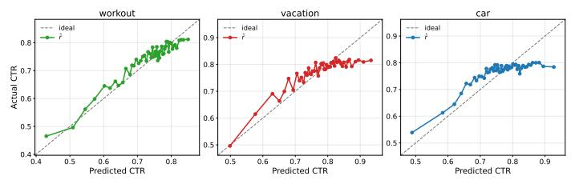
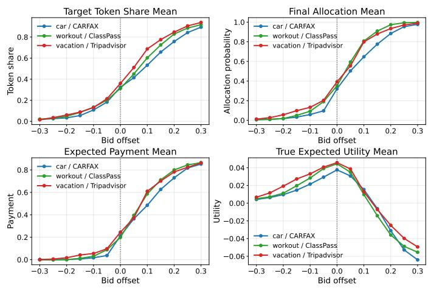

# Token-Level Advertising

Hanbing Liu   
Renmin University of China   
Beijing, China   
liuhanbing@ruc.edu.cn   
Bowei Zhang   
Renmin University of China   
Beijing, China   
2023201812@ruc.edu.cn   
Yinyu Ye   
Stanford University   
Stanford, CA, USA   
yinyu-ye@stanford.edu   
Changyuan Yu   
Baidu Inc.   
Beijing, China   
yuchangyuan@baidu.com   
Qi Qi✉   
Renmin University of China   
Beijing, China   
qi.qi@ruc.edu.cn

## Abstract

Generative AI is transforming how people access information, challenging traditional advertising mechanisms built around predefined slots. Towards generation-native advertising, we propose the Latent Advertiser Mixture Auction (LAMA), a token-level advertising mechanism that embeds advertiser influence directly into the gen eration process. Advertisers report local continuation values that induce advertiser-specific next-token policies, from which the plat form decodes through a latent mixture while updating an allocation posterior. We show that LAMA satisfies Markov DSIC and IR, and achieves near-optimal KL-regularized welfare. We further develop a learning-based implementation that reconstructs the required reports online from learned local advantages and root values. Proof- of-concept experiments on real-world commercial-search query splits show that LAMA improves platform welfare and revenue while maintaining user-facing response quality, providing initial evidence for the feasibility of generation-native advertising.

## CCS Concepts

• Theory of computation → Algorithmic mechanism design;   
• Information systems → Online advertising.

## Keywords

mechanism design, game theory, large language models, auction, computational advertising

## 1 Introduction

“The medium is the message.”

— Marshall McLuhan, Understanding Media (1964)

The medium through which people access online information is undergoing a fundamental transformation. For decades, internet in- terfaces have largely organized information by retrieving, ranking, and presenting content that already exists. Search engines return ranked results; recommendation systems select items from a col- lection. Generative AI introduces a diferent mode of information access. Rather than simply choosing what to present, AI-native interfaces synthesize responses dynamically around user intent, with the content itself taking shape as the interaction unfolds. The medium is no longer merely organizing information; it is generating it.

  
Figure 1: In generation-native advertising, ad opportunities are no longer predefined slots: when they emerge, which advertisers are shown, and how they are presented jointly shape user experience and marketing efectiveness.

Advertising has historically been built around the structure of the medium in which it appears. In traditional internet interfaces, this has led to a simple but powerful abstraction: the slot. Whether it is a sponsored-search position, a reserved display placement, or a promoted position in a recommendation feed, the commercial opportunity can typically be defined in advance and then assigned to advertisers. But this abstraction becomes less natural when the surrounding content is itself generated. As shown in Figure 1, a product may become relevant only as an answer develops in a particular direction, and an early generation choice can make a later brand mention either natural or jarring. In such settings, generation does more than fill an advertising opportunity—it can help create one. The advertising opportunity is no longer merely a slot inside generated content; it can be shaped by the generation process itself.

This shift calls for a corresponding change in mechanism design. Traditional advertising mechanisms largely separate two questions: what opportunities exist, and who should receive them? Auction theory has developed powerful tools for the latter, typically taking the former as given. This separation is natural when the advertising slot exists before the auction begins, but begins to break down when the generation trajectory itself determines whether and how an advertiser can be meaningfully incorporated. Thus, a mechanism that only allocates predefined opportunities leaves an important part of the generative medium outside the allocation process.

Recent work has begun to rethink what constitutes an advertis- ing opportunity in generative interfaces. Rather than relying only on fixed slots, some approaches define opportunities over segments or context-dependent positions within generated text, while others first construct complete candidate responses and then select, ag- gregate, or insert sponsored content at the response level. These abstractions make advertising substantially more adaptive to gener-ated context: where an ad can appear, or which sponsored response is appropriate, may now depend on the content produced by the model. Yet the mechanism typically operates on an opportunity that has already been identified—a segment, a position, or a completed response. Generation shapes the opportunity, but is not itself the allocation process.

In this paper, we take the next step and formulate a generationnative paradigm for computational advertising, in which advertising is directly embedded into the generation process. Advertisers are treated as strategic participants whose messages can influence how the response evolves, while the platform jointly determines generated content, advertising allocation, and payments. Within this broader paradigm, we study a particularly native instantiation at the token level: advertisers may influence the response at every generation step. A user query initializes a sequential process, and at each generated prefix, the platform combines advertiser messages with the reference language model and the current mechanism state to determine what token to generate next and how the advertising allocation should evolve. The goal is to incorporate advertiser incen- tives and platform monetization into generation while preserving the naturalness and usefulness of the generated content.

Making advertising a native part ofgeneration introduces several technical challenges. Most importantly, incentive design becomes inherently sequential: a report submitted at one prefix can change the future generation trajectory, which in turn changes the ad- vertiser’s subsequent opportunities and eventual payof. Truthful behavior must therefore remain optimal not only at the beginning of generation, but also after any reachable future states. Advertiser in- fluence must also be balanced against the reference language model so that monetization does not come at the expense of response quality. At the same time, language model inference already incurs substantial serving latency, requiring the mechanism to introduce only minimal additional overhead. Finally, a tractable mechanism should still admit a meaningful eficiency guarantee relative to an ideal welfare-maximizing benchmark.

To address these challenges, we propose the Latent Advertiser Mixture Auction (LAMA) for the fundamental single-winner setting. At each prefix, advertisers’ local reports induce advertiser-specific next-token policies, and LAMA generates next token from a latent mixture of these policies. The mixture weights evolve as a Bayesian allocation posterior as tokens are observed, linking the generation trajectory to the eventual advertising allocation. Once generation terminates, this posterior determines the final allocation, together with payments designed for the sequential setting. We show that LAMA satisfies Markov dominant-strategy incentive compatibil ity and individual rationality. Moreover, it achieves near-optimal KL-regularized welfare, with the optimality gap vanishing as the regularization diminishes.

We further develop a practical implementation that avoids ex- plicitly reasoning over the full token tree or requiring advertisers to compute complex reports themselves. The platform provides re- porting as a learned service: a shared advertiser-conditioned model recovers local signals along the realized generation path and an- chors them with an advertiser-specific root estimate, allowing the reports required by LAMA to be reconstructed online. This de- sign turns the theoretical sequential mechanism into a lightweight serving-time procedure that can operate over a small candidate set of advertisers with modest additional language-model computation.

We evaluate LAMA in simulation on real-world query splits with model-predicted impression values. We compare against heuristic mechanisms that allocate advertising either before or after genera- tion, as well as a representative response-level aggregation mecha-nism. Across the evaluated settings, LAMA achieves the strongest platform welfare and revenue while maintaining high advertiser value and user-side response quality. These results provide an initial proof of concept for the generation-native advertising paradigm: allowing advertisers to participate directly in the token-level generation process can improve monetization while preserving high-quality generated responses.

Our contributions are summarized as follows.

(1) Generation-native advertising. We develop a token-level formulation of generation-native advertising, where advertiser participation is embedded directly into the sequential generation process and jointly shapes the response and eventual allocation.

(2) Token-level mechanism design. We propose LAMA for the fundamental single-winner setting and establish Markov DSIC and IR, together with near-optimal KL-regularized welfare, with an additive gap of at most � log |N |.

(3) Practical implementation. We develop a learning-based implementation that reconstructs the reports required by LAMA online and supports eficient serving.

(4) Proof-of-concept evaluation. Experiments on real-world search query splits show that LAMA improves platform welfare and revenue while maintaining advertiser value and user-facing response quality.

## 2 Model

We model token-level advertising as a sequential mechanism em- bedded in the generation process of a language model. A user query initializes a token-level decision process. At each non-terminal prefix, advertisers may submit local reports based on the publicly observed state, and the platform uses these reports together with its privately observed history to choose the next token distribution, the advertising allocation, and payments. The central distinction from classical sponsored-search models is that the advertising opportu nity is not an exogenously given slot. Instead, it is endogenously shaped by the generated trajectory itself.

Context space and reference generation. Let V be the token vo-cabulary and let � be the maximum generation length1. The context space is $S : = \mathcal { V } ^ { \leq L } = \bigcup _ { t = 0 } ^ { L } \mathcal { V } ^ { t }$ , where $\mathcal { V } ^ { 0 } = \{ \boldsymbol { \emptyset } \}$ . For two contexts $x _ { 1 } , x _ { 2 } \in S _ { }$ , we write $[ x _ { 1 } , x _ { 2 } ]$ for their concatenation whenever the resulting sequence has length at most �. A user query $q \in S$ is drawn from a query distribution D and serves as the initial state.

The platform has an organic language-model policy $\pi _ { \mathrm { r e f } } ( \cdot \mid s )$ ∈ $\Delta _ { + + } ( \mathcal { V } ) , s \in S ,$ , which describes the next-token distribution in the absence of advertising intervention2. We also write $\pi _ { 0 }$ for $\pi _ { \mathrm { r e f } } . \mathrm { A }$ trajectory from query � is $\tau = ( s _ { 0 } = q , a _ { 0 } , s _ { 1 } , a _ { 1 } , . . . , s _ { T _ { \tau } } ) ,$ ��+1 = $\left[ s _ { t } , a _ { t } \right]$ . Let $\mathsf { E O S } \in \mathcal { N }$ denote the end-of-sequence token. A state is terminal if it contains EOS or reaches the maximum length. We denote the terminal set by $s _ { T }$ , and write $L ( s ) \subseteq S _ { T }$ for the set of terminal descendants of a non-terminal state �. For a trajectory �, its realized terminal state is denoted by $\ell ( \tau ) = s _ { T _ { \tau } }$

Advertisers and private types. There are $n \geq 2$ advertisers, indexed by $N = [ n ] = \{ 1 , . . . , n \}$ . Each advertiser � has a private termi-nal reward function $r _ { i } : S _ { T }  \mathbb { R } _ { \geq 0 }$ . The value $r _ { i } ( \ell )$ represents ad- vertiser $i ^ { \prime } s$ value from receiving the advertising opportunity when the generated response terminates at ℓ. We write $r = ( r _ { 1 } , \ldots . r _ { n } )$ for the type profile and $r _ { - i }$ for the profile excluding advertiser �.

The allocation of the advertising opportunity is represented by a vector $\lambda \in \Lambda \subseteq [ 0 , 1 ] ^ { n }$ , where Λ is an exogenously given feasible al location set. For example, Λ may encode slot-capacity constraints or exposure constraints. This paper focuses on the fundamental singlewinner setting: the advertising opportunity is endogenously shaped by the generation process, but the eventual sponsored outcome is assigned to a single advertiser. Thus, $\Lambda = \Delta ( N )$ . The realized gross value of advertiser � on trajectory � is therefore $\lambda _ { i } r _ { i } ( \ell ( \tau ) )$ ).

Platform histories. To describe a mechanism that operates during generation, we introduce the history privately observed by the platform. A platform history at time � is

$$
h _ { t } = ( s _ { 0 } , m _ { 0 } , a _ { 0 } , \ldots , s _ { t - 1 } , m _ { t - 1 } , a _ { t - 1 } , s _ { t } ) ,
$$

where $s _ { 0 } = q , a _ { t } \in \mathcal { V }$ is the token generated at time �, and $\begin{array} { r l } { m _ { t } } & { { } = } \end{array}$ $( m _ { 1 , t } , \ldots , m _ { n , t } )$ denotes the profile of messages submitted by the advertisers at time �. Advertisers observe only the current state $s _ { t } ,$ which is public, whereas the platform observes the entire history. The state evolves deterministically according to $s _ { t + 1 } = \left[ s _ { t } , a _ { t } \right]$ . Let H denote the set of non-terminal platform histories, and let $s ( h )$ be the current state at the end of history ℎ. A terminal platform history is denoted by $h _ { T } = ( s _ { 0 } , m _ { 0 } , a _ { 0 } , \ldots , s _ { T - 1 } , m _ { T - 1 } , a _ { T - 1 } , s _ { T } )$ , where $s _ { T } \in$ $\boldsymbol { s _ { T } }$ . We write $\tau ( h _ { T } )$ for the token trajectory induced by the terminal history $h _ { T } ,$ and $\ell ( h _ { T } ) = s _ { T }$ for its terminal state.

Sequential mechanisms. A sequential mechanism for token-level advertising is a tuple

$$
\Gamma = \big ( \{ M _ { i } ( h ) \} _ { i \in N , h \in \mathcal { H } } , x , \lambda , p \big ) .
$$

For each non-terminal platform history $h , \ M _ { i } ( h )$ is advertiser $i ^ { \prime } s$ feasible message space after that history. Given $h \in { \mathcal { H } }$ and a joint message $m = ( m _ { 1 } , . . . , m _ { n } ) \in \mathcal { M } ( h ) : = \prod _ { i \in \mathcal { N } } \mathcal { M } _ { i } ( h )$ , the next- token rule is $x ( \cdot \mid h , m ) \in \Delta ( \mathcal { V } )$ . The instantaneous payment rule is $p _ { i } ( h , m , a ) \ \in \ \mathbb { R } ,$ , which specifies advertiser �’s payment when token � is generated after history ℎ under report profile �. The final allocation rule is $\lambda ( h _ { T } ) \in \Lambda$ . Thus, the feasible message spaces, token-generation rule, payments, and final allocation may depend on the entire platform history3. In particular, history-dependent message spaces allow the platform to check a new report against values previously recorded in its report ledger.

The timing is as follows.

(1) The user query $q \sim \mathcal { D }$ initializes the process at $s _ { 0 } = q .$

(2) At each non-terminal state $s _ { t } ,$ each advertiser � submits a message $m _ { i , t } \in \mathcal { M } _ { i } ( h _ { t } )$ . Let $m _ { t } = ( m _ { 1 , t } , \ldots , m _ { n , t } )$

(3) The mechanism chooses a next-token distribution $x ( \cdot \ |$ $h _ { t } , m _ { t } )$ , draws $a _ { t } \sim x ( { \cdot } \mid h _ { t } , m _ { t } )$ , and charges $p _ { i } ( h _ { t } , m _ { t } , a _ { t } )$ for each $i \in N$

(4) The state updates deterministically as $s _ { t + 1 } ~ = ~ \left[ s _ { t } , a _ { t } \right]$ . If $s _ { t + 1 } \in S _ { T }$ , the process terminates and the mechanism im- plements the feasible allocation $\lambda ( h _ { T } ) \in \Lambda$

Direct mechanisms are a special case as the platform can ask each advertiser to submit its entire reward function. However, such mechanisms are impractical for online generation because full re- porting may be slow and may reveal private information about trajectories that are never realized. Our definition therefore em-phasizes lightweight reports, and we will see that they sufice to achieve strong performance for the platform.

Strategies and induced policies. Let $\Theta _ { i }$ denote advertiser �’s type space. A strategy ofadvertiser � maps its type and each non-terminal public state to a message: $\sigma _ { i } : \Theta _ { i } { \times } ( S \backslash S _ { T } ) \to \bigcup _ { h \in \mathcal { H } } M _ { i } ( h )$ . A strat- $\mathrm { e g y }$ is feasible if $\sigma _ { i } ( r _ { i } , s ( h ) ) \in M _ { i } ( h )$ at every history at which it is used. Given $\sigma = ( \sigma _ { 1 } , \ldots , \sigma _ { n } )$ and type profile �, the induced joint report at history ℎ is $m ^ { \sigma , r } ( h ) \ : = \ ( \sigma _ { 1 } ( r _ { 1 } , s ( h ) ) , \ldots , \sigma _ { n } ( r _ { n } , s ( h ) ) )$ Together with the mechanism Γ, these reports determine the continuation token policy $\pi _ { \sigma , r } ^ { \Gamma } ( a \mid h ) : = x \left( a \mid h , m ^ { \sigma , r } ( h ) \right) , a \in \mathcal { V }$ , and hence a distribution $\mathbb { P } _ { \sigma , r } ^ { \Gamma } ( \cdot \mid h )$ over terminal histories extending ℎ.

Utilities. Advertisers have standard quasi-linear utilities. At a terminal history $h _ { T } ,$ advertiser �’s realized utility is $u _ { i } ^ { \Gamma } ( h _ { T } ; r _ { i } ) =$ $\begin{array} { r } { \lambda _ { i } ( h _ { T } ) r _ { i } ( \ell ( h _ { T } ) ) - \sum _ { t = 0 } ^ { T - 1 } \ d p _ { i } ( h _ { t } , m _ { t } , a _ { t } ) } \end{array}$ . For a non-terminal platform history $h , \mathrm { ~ a ~ }$ type profile $r , \mathrm { a }$ strategy $\sigma _ { i : }$ , and opponent strategies $\sigma _ { - i }$ , the continuation expected utility $U _ { i } ^ { \Gamma } ( h ; r _ { i } , \sigma _ { i } , \sigma _ { - i } ; r _ { - i } )$ is

$$
\mathbb { E } _ { h _ { T } \sim \mathbb { P } _ { \sigma , r } ^ { \Gamma } ( \cdot | h ) } \left[ \lambda _ { i } ( h _ { T } ) r _ { i } ( \ell ( h _ { T } ) ) - \sum _ { t = t ( h ) } ^ { T - 1 } \mathfrak { p } _ { i } ( h _ { t } , m _ { t } , a _ { t } ) \right] .
$$

Truthful reporting. The truthful report is specified by a mechanismspecific type-related reporting rule $\eta _ { i } : \Theta _ { i } { \times } ( S \backslash S _ { T } )  \bigcup _ { h \in \mathcal { H } } \mathcal { M } _ { i } ( h )$ For example, the sub-tree reporting rule $\eta _ { i } ( r _ { i } , s ) = r _ { i } | _ { L ( s ) }$ and the value function reporting rule $\eta _ { i } ( s ; r _ { i } ) = ( V _ { r _ { i } } ^ { * } ( [ s , a ] ) ) _ { a \in \mathcal { V } }$ . It defines the truthful strategy $\sigma _ { i } ^ { \mathrm { t r } } ( \boldsymbol { r } _ { i } , \boldsymbol { s } ) : = \eta _ { i } ( \boldsymbol { s } ; \boldsymbol { r } _ { i } )$

Because a sequential mechanism allows advertisers to report information dynamically, incentive compatibility requires that an advertiser cannot wait for a favorable generated prefix and then manipulate its future reports. Formally,

Definition 1 (Markov DSIC and IR). The mechanism Γ is Markov dominant-strategy incentive compatible (Markov DSIC) if, for every advertiser �, type profile �, feasible opponent strategy pro-$\begin{array} { r l } {  { f i l e \sigma _ { - i } , } } \end{array}$ reachable platform history ℎ after advertiser � has reported truthfully along the prefix, and feasible continuation deviation $\sigma _ { i } ^ { \prime } ,$ $U _ { i } ^ { \Gamma } \left( h ; r _ { i } , \sigma _ { i } ^ { \mathrm { t r } } , \sigma _ { - i } ; r _ { - i } \right) \ge U _ { i } ^ { \Gamma } \left( h ; r _ { i } , \sigma _ { i } ^ { \prime } , \sigma _ { - i } ; r _ { - i } \right)$ . It is individually rational $( I R ) i f ,$ truthful participation from the initial state $s _ { 0 } = q$ gives nonnegative expected utility: $U _ { i } ^ { \Gamma } \left( q ; r _ { i } , \sigma _ { i } ^ { \mathrm { t r } } , \sigma _ { - i } ; r _ { - i } \right) \ge 0 \mathrm { ~ }$

KL-regularized social welfare. The platform’s objective is to generate native and useful content while allocating advertising opportunities eficiently. For a query �, type profile �, generation policy �, define the KL-regularized social welfare $\mathsf { S W } _ { \beta } ( \pi , \lambda \mid q , r )$ as

$$
\mathbb { E } _ { \tau \sim \pi ( \cdot | q ) } \left[ \sum _ { i \in N } \lambda _ { i } ( h _ { T } ) r _ { i } ( \ell ( \tau ) ) - \beta \sum _ { t = 0 } ^ { T _ { \tau } - 1 } \log \frac { \pi ( a _ { t } \mid s _ { t } ) } { \pi _ { \mathrm { r e f } } ( a _ { t } \mid s _ { t } ) } \right] .
$$

The first term is gross advertiser value under the generated content and realized allocation. The divergence term penalizes deviation from the organic policy, which optimizes user experience. 4 Thus $\beta > 0$ controls the balance between monetization and content naturalness. When the query is also random, the expected welfare is $\mathbb { E } _ { q \sim \mathcal { D } } \left[ \operatorname { S W } _ { \beta } ( \pi , \lambda \mid q , r ) \right]$

Mechanism design problem. For each query-type pair $( q , r )$ , a sequential mechanism Γ and its truthful reporting rule induce a token policy $\pi _ { q , r } ^ { \Gamma }$ and allocation rule $\lambda _ { q , r } ^ { \Gamma }$ from the initial state. The platform chooses the mechanism to maximize induced welfare:

$$
\operatorname* { m a x } _ { \Gamma } \quad \mathbb { E } _ { q \sim \mathcal { D } , r \sim F ( \cdot \vert q ) } \left[ \mathrm { S W } _ { \beta } \left( \pi _ { q , r } ^ { \Gamma } , \lambda _ { q , r } ^ { \Gamma } \mid q , r \right) \right]
$$

s.t. Γ is Markov DSIC and IR,

$$
\lambda _ { q , r } ^ { \Gamma } ( \tau ) \in \Lambda , \forall q , r , \tau .
$$

Here $F ( \cdot \mid q )$ denotes the conditional distribution over the type profiles of advertisers recalled for query $q .$ For ex-post analysis, the same objective can be studied pointwise for each realized $( q , r )$

## 3 Latent Advertiser Mixture Auction

We propose Latent Advertiser Mixture Auction (LAMA) to tackle this challenge. The key idea is to view the generation process as Bayesian sequential decision making that identifies the advertiser who values the generation opportunity most. As we will see, this perspective leads to a simple algorithm that is both fast and eficient.

Sequential reports. At a non-terminal state �, advertiser � reports a child-value vector $\widehat { V } _ { i } ^ { s } = ( \widehat { V } _ { i } ^ { s } ( [ s , a ] ) ) _ { a \in \mathcal { V } }$ . The intended truthful report is $\eta _ { i } ( s ; r _ { i } ) = \bigl ( V _ { i } ^ { * } ( [ s , a ] ) \bigr ) _ { a \in \mathcal { V } }$ , where $V _ { i } ^ { * }$ is the optimal soft value function induced by advertiser �’s terminal reward $r _ { i } { : }$

$$
V _ { i } ^ { * } ( s ) = \operatorname* { m a x } _ { \pi } \mathbb { E } _ { \tau \sim \pi ( \cdot \vert s ) } \left[ r _ { i } ( \ell ( \tau ) ) - \beta \sum _ { t = 0 } ^ { T _ { \tau } - 1 } \log \frac { \pi ( a _ { t } \mid s _ { t } ) } { \pi _ { \mathrm { r e f } } ( a _ { t } \mid s _ { t } ) } \right] .
$$

Given a reported child-value vector, define advertiser $i ^ { \prime } s$ induced local policy by

$$
{ \widehat { \pi } } _ { i } ( a \mid s ; { \widehat { V } } _ { i } ^ { s } ) : = { \frac { \pi _ { \mathrm { r e f } } ( a \mid s ) \exp \Big ( { \widehat { V } } _ { i } ^ { s } ( [ s , a ] ) / \beta \Big ) } { \sum _ { a ^ { \prime } \in { \mathcal { V } } } \pi _ { \mathrm { r e f } } ( a ^ { \prime } \mid s ) \exp \Big ( { \widehat { V } } _ { i } ^ { s } ( [ s , a ^ { \prime } ] ) / \beta \Big ) } } .
$$

This is the next-token policy that would be optimal if advertiser $i ^ { \prime } s$ reported truthfully.

Allocation posterior and next-token rule. The mechanism maintains an allocation posterior $\rho ( s ) \in \Delta ( N )$ . At the query �, after receiving the first child-value reports, initialize $\begin{array} { r } { Z _ { i } ( q ) : = \sum _ { a \in \mathcal { V } } \pi _ { \mathrm { r e f } } ( a \mid } \end{array}$ $q ) \exp ( \widehat { V } _ { i } ^ { q } ( [ q , a ] ) / \beta )$ , and set $\begin{array} { r } { \rho _ { i } ( q ) : = \frac { Z _ { i } ( q ) } { \sum _ { j \in N } Z _ { j } ( q ) } . } \end{array}$

At a reached non-terminal state �, after receiving reports $\widehat { V } ^ { s } =$ $( \widehat { V } _ { 1 } ^ { s } , \ldots , \widehat { V } _ { n } ^ { s } )$ , the mechanism samples hierarchically: first sample a latent advertiser $I \sim \rho ( s )$ and then generate the next token from that advertiser’s induced policy, $a \sim \widehat \pi _ { I } ( \cdot \mid s ; \widehat V _ { I } ^ { s } )$ . Marginally, this sampling rule induces the mixture next-token distribution

$$
x ( a \mid s , \widehat V ^ { s } , \rho ( s ) ) : = \sum _ { i \in N } \rho _ { i } ( s ) \widehat \pi _ { i } ( a \mid s ; \widehat V _ { i } ^ { s } ) .
$$

The subsequent posterior update is precisely Bayesian inference about this latent advertiser after observing the realized token. After token � is realized, the posterior is updated by Bayes’ rule:

$$
\rho _ { i } ( [ s , a ] ) = \frac { \rho _ { i } ( s ) \widehat \pi _ { i } ( a \mid s ; \widehat V _ { i } ^ { s } ) } { x ( a \mid s , \widehat V ^ { s } , \rho ( s ) ) } .
$$

Ifa terminal history $h _ { T }$ is reached, the final allocation rule is $\lambda ( h _ { T } ) =$ $\rho ( \ell ( h _ { T } ) ) \in \Delta ( N )$

Payment rule. The payment rule has two components. First, after the initial reports at the query prefix $q ,$ advertiser � pays an entry fee $p _ { i } ( q ; \widehat { V } )$ :

$$
\rho _ { i } ( q ) \widehat { V } _ { i } ( q ) - \beta \log \sum _ { j \in N } \exp ( \widehat { V } _ { j } ( q ) / \beta ) + \beta \log ( 1 + \sum _ { j \neq i } \exp ( \widehat { V } _ { j } ( q ) / \beta ) ) ,
$$

where $\widehat V _ { i } ( q ) = \beta \log Z _ { i } ( q )$ is the root value induced by the initial child-value report. Second, along the generated path, the mecha- nism charges advertisers according to the change in their posteriorweighted reported continuation value. At a transition $s  [ s , a ]$ define the instantaneous payment

$$
\begin{array} { r } { p _ { i } ( s , \widehat { V } ^ { s } , a ) : = \rho _ { i } ( [ s , a ] ) \widehat { V } _ { i } ^ { s } ( [ s , a ] ) - \rho _ { i } ( s ) \widehat { V } _ { i } ( s ) , } \end{array}
$$

where the parent value $\widehat { V } _ { i } ( s )$ is the value previously recorded in the platform ledger. Thus, the mechanism charges advertiser � when the realized token makes its continuation prospects more favorable, and subsidizes it when situation gets worse, preserving its incentive to continue participating after an unfavorable transition.

Feasible message space. We require reports to satisfy the soft Bellman recursion. This is easy to verify online: for each advertiser, the platform only needs to store a scalar, i,e. the value previously reported for the current state, and compare it with the soft Bellman aggregation of the newly reported child values. Formally,

Definition 2 (Bellman consistency). At a history ℎ with current state $s = s ( h )$ , let $\widehat { V } _ { i } ( s )$ be advertiser �’s value for � already stored in the ledger. The feasible message space is

$$
\begin{array} { r } { M _ { i } ( h ) : = \left\{ \begin{array} { l l } { \mathbb { R } ^ { | \mathcal { V } | } , } & { s = q , } \\ { \{ v \in \mathbb { R } ^ { | \mathcal { V } | } : \beta \log \sum _ { a \in \mathcal { V } } \pi _ { \mathrm { r e f } } ( a \mid s ) e ^ { v _ { a } / \beta } = \widehat { V } _ { i } ( s ) \} , } & { s \neq q . } \end{array} \right. } \end{array}
$$

Here $v _ { a }$ is the reported value ofthe child state [�, �] in $\widehat { V } _ { i } ^ { s }$

We now ready to show the main incentive guarantee.

Theorem 1 (Markov DSIC and IR of LAMA). The LAMA with Bellman-consistent message spaces is Markov DSIC and $I R f o r$ the truthful reporting rule $\eta _ { i } ( s ; r _ { i } ) = \bigl ( V _ { i } ^ { * } ( [ s , a ] ) \bigr ) _ { a \in \mathcal { V } }$

Proof sketch. First consider globally Bellman-consistent direct reports and write $z _ { i } ( s ) = \exp ( \widehat { V } _ { i } ( s ) / \beta )$ and $\begin{array} { r } { \overline { { z } } ( s ) = \sum _ { j } z _ { j } ( s ) } \end{array}$ Bellman consistency makes each $z _ { i }$ harmonic under $\pi _ { \mathrm { r e f } }$ . Substituting this identity into the Bayesian update yields $\rho _ { i } ( s ) = z _ { i } ( s ) / \overline { { z } } ( s )$ and $x ( a \mid s ) = \pi _ { \mathrm { r e f } } ( a \mid s ) { \overline { { z } } } ( [ s , a ] ) / { \overline { { z } } } ( s )$ . The factors telescope along a path, so the joint probability that terminal state ℓ is generated and allocated to advertiser � is

$$
\alpha _ { i , \ell } ( \widehat { V } ) = \frac { P _ { 0 } ( \ell \mid q ) \exp ( \widehat { V } _ { i } ( \ell ) / \beta ) } { \sum _ { \ell ^ { \prime } } P _ { 0 } ( \ell ^ { \prime } \mid q ) \sum _ { j } \exp ( \widehat { V } _ { j } ( \ell ^ { \prime } ) / \beta ) } .
$$

This is exactly the gradient, with respect to terminal reports, of the convex log-sum-exp potential $\Phi _ { q }$ defined in the appendix. The telescoping LAMA payment is the corresponding potential-based payment, so the convex supporting hyperplane inequality gives direct truthfulness. Nonnegative rewards imply $z _ { i } ^ { * } ( q ) \geq 1$ , which makes truthful utility nonnegative relative to the outside option.

It remains to connect online reports to this direct construction. Fix a reached state � after a truthful prefix. Any feasible continua- tion deviation defines a Bellman-consistent value function inside the subtree rooted at �. When � $; \neq q ,$ , feasibility forces its root value to equal the truthful value already stored at �; when $s = q ,$ there are no ancestors to preserve. Use the deviating values inside the subtree and $V _ { i } ^ { * }$ everywhere else. The result is a globally Bellman-consistent direct report with the same continuation policy, allocation, and pay ments as the online deviation. Direct DSIC and IR then immediately imply Markov DSIC and IR for the sequential mechanism. □

Eficiency. LAMA also provides strong eficiency guarantee. In tuitively, it implements two soft lotteries: one over generated responses through KL-regularized decoding and one over advertisers through entropy-regularized allocation. The resulting welfare loss is at most � log |N| relative to the optimal KL-regularized benchmark, and the mechanism approaches first-best welfare as $\beta \to 0 ^ { + }$

Theorem 2 (Optimization objective and asymptotic efficiency). Fix a query � and a type profile �. Let $( x ^ { \beta } , \lambda ^ { \beta } )$ be the truthful policy and terminal allocation induced by LAMA. Then $( x ^ { \beta } , \lambda ^ { \beta } )$ maximizes the entropy-relaxed welfare:

$$
\mathbb { E } _ { \tau \sim x ( \cdot \vert q ) } \left[ \sum _ { i \in N } \lambda _ { i } ( \tau ) r _ { i } ( \ell ( \tau ) ) + \beta \mathcal H ( \lambda ( \tau ) ) - \beta \sum _ { t = 0 } ^ { T _ { \tau } - 1 } \log \frac { x ( a _ { t } \mid s _ { t } ) } { \pi _ { \mathrm { r e f } } ( a _ { t } \mid s _ { t } ) } \right] .
$$

Moreover, relative to the optimal KL-regularized welfare in the simplex allocation setting, $\begin{array} { r } { \operatorname* { s u p } _ { \pi , \lambda } \mathrm { S W } _ { \beta } ( \pi , \lambda \mid q , r ) , } \end{array}$ , the welfare loss of the Latent Advertiser Mixture mechanism is bounded by

$$
0 \leq \operatorname* { s u p } _ { \pi , \lambda } \mathrm { S W } _ { \beta } ( \pi , \lambda \mid q , r ) - \mathrm { S W } _ { \beta } ( x ^ { \beta } , \lambda ^ { \beta } \mid q , r ) \leq \beta \log | N | .
$$

Thus, lim ${ } _ { \beta \to 0 ^ { + } } \operatorname { S W } _ { \beta } ( x ^ { \beta } , \lambda ^ { \beta } \mid q , r ) = \operatorname * { m a x } _ { \ell \in L ( q ) } \operatorname * { m a x } _ { i \in N } r _ { i } ( \ell )$ . The same welfare-gap bound holds after taking expectation over $q \sim \mathcal { D }$

## 4 Practical Implementation

In practice, computing the reports required by LAMA is gener-ally beyond the capabilities of individual advertisers. At each non- terminal state �, advertiser � would need to submit the continuation vector $\left( V _ { i } ^ { * } ( \left[ s , a \right] ) \right) _ { a \in \mathcal { V } }$ . Doing so requires both high-quality user feedback data and considerable computational resources. We there- fore provide reporting as a platform-side service analogous to autobidding [1, 17]: the platform learns value reports from advertising feedback and serves them on advertisers’ behalf.

As we will show, the platform can avoid learning the full soft value function through reinforcement learning by decomposing reporting into two simpler stages. It learns local soft advantages, which determine changes in value between adjacent prefixes, and a root value, which anchors the absolute scale. These two outputs are then assembled into the required report along the realized path. Both stages can use standard supervised signals and be implemented by advertiser-conditioned services shared across advertisers.

## 4.1 Value Decomposition

For a prefix � and next token �, the optimal soft advantage for advertiser � satisfies $A _ { i } ^ { * } ( s , a ) = V _ { i } ^ { * } ( [ s , a ] ) - V _ { i } ^ { * } ( s ) ^ { 5 }$ . For a completed response $y = \left( a _ { 0 } , \ldots , a _ { T _ { y } - 1 } \right) $ , let $s _ { t } = [ q , a _ { < t } ] , \ell _ { y } = [ q , y ]$ . Then the value of every prefix can be obtained from the root value by telescoping: $\begin{array} { r } { V _ { i } ^ { * } ( s _ { t } ) = V _ { i } ^ { * } ( q ) + \sum _ { k = 0 } ^ { t - 1 } A _ { i } ^ { * } ( s _ { k } , a _ { k } ) } \end{array}$ . Thus, to construct the truthful child-value report at any reachable state, it is enough to know the root value $V _ { i } ^ { * } ( q )$ and the local advantages $A _ { i } ^ { * } ( s , a )$

We now present the learning objectives for these two functions. Define $r _ { i } ( \ell _ { y } )$ as advertiser �’s population value for receiving the advertising impression opportunity from response �. Let D denote the population comparison distribution over $( i , q , y , y ^ { \prime } )$ , and use $\mathcal { D } ( \cdot \mid i , q )$ for its single-response marginal when only � is needed.

I. Local advantages. For any policy $\pi _ { i } ,$ define the cumulative re- sponse score as $\begin{array} { r } { \bar { G _ { i } ^ { \pi } } ( q , y ) : = \beta \log \frac { \pi _ { i } ( y \vert q ) } { \pi _ { \mathrm { r e f } } ( y \vert q ) } = \beta \sum _ { t = 0 } ^ { T _ { y } - 1 } \log \frac { \pi _ { i } ( a _ { t } \vert s _ { t } ) } { \pi _ { \mathrm { r e f } } ( a _ { t } \vert s _ { t } ) } . } \end{array}$ To learn these token-level log-ratios, the platform samples paired responses � and $y ^ { \prime }$ under the same advertiser-query pair $( i , q )$ . From their scalar rewards, it constructs the Bradley-Terry [5] win rate

$$
\omega _ { i } ( q ; y , y ^ { \prime } ) : = \operatorname* { P r } ( y \succ y ^ { \prime } \mid i , q ) = \sigma \big ( r _ { i } ( \ell _ { y } ) - r _ { i } ( \ell _ { y ^ { \prime } } ) \big ) .
$$

Let $\Delta _ { i } ^ { \pi } ( q ; y , y ^ { \prime } ) : = G _ { i } ^ { \pi } ( q , y ) - G _ { i } ^ { \pi } ( q , y ^ { \prime } )$ . The ideal local-advantage objective is therefore the binary cross-entropy,

$$
\begin{array} { r l } & { \mathcal { L } ( \pi ) : = - \mathbb { E } _ { ( i , q , y , y ^ { \prime } ) \sim \mathcal { D } } \Big [ \omega _ { i } ( q ; y , y ^ { \prime } ) \log \sigma \big ( \Delta _ { i } ^ { \pi } ( q ; y , y ^ { \prime } ) \big ) } \\ & { \qquad + \left. \left( 1 - \omega _ { i } ( q ; y , y ^ { \prime } ) \right) \log \sigma \big ( - \Delta _ { i } ^ { \pi } ( q ; y , y ^ { \prime } ) \big ) \ \right] . } \end{array}
$$

As we will show later, under the usual regularity conditions, the pop- ulation minimizer $\pi ^ { \dagger }$ matches the Bradley-Terry log-odds and there- fore identifies reward diferences between completed responses under the same $( i , q )$ . In the soft-control view, the corresponding local log-ratio $\widehat A _ { i } ^ { \dagger } ( s , a ) : = \beta \log \pi _ { i } ^ { \dagger } ( a \mid s ) / \pi _ { \mathrm { r e f } } ( a \mid s )$ recovers the local soft advantage $A _ { i } ^ { * } ( s , a )$

II. Root values. The root value is anchored separately from scalar rewards. Since a terminal state has value $V _ { i } ^ { * } ( \ell _ { y } ) = r _ { i } ( \ell _ { y } )$ , telescop- ing gives, for every completed response,

$$
V _ { i } ^ { * } ( q ) = r _ { i } ( \ell _ { y } ) - \sum _ { t = 0 } ^ { T _ { y } - 1 } A _ { i } ^ { * } ( s _ { t } , a _ { t } ) .
$$

Averaging this residual over population responses for the same $( i , q )$ recovers the root value. The two ideal learning tasks are therefore: learn local advantages from BT-weighted pairwise diferences, and thereby anchor the root value with terminal rewards.

The next theorem shows that the population local-advantage optimum identifies both the local soft advantages and a residual formula for the root value. The ledger recursion is then enabled to reconstruct the optimal soft value on every reached prefix, formally justifying the value decomposition above.

  
Figure 2: Overview of the Latent Advertiser Mixture Auction (LAMA). (1) Report: Advertisers report soft values for the current child states, and the platform verifies Bellman consistency against the value stored in its ledger. (2) Next-token generation: The platform samples an advertiser from its current belief, whose optimal policy generates the next token. (3) Update: After the context changes, the platform updates the ledger and its belief over the optimal advertiser via Bayes’ rule. (4) Settlement: Once the response is complete, the platform samples a winning advertiser from the posterior; the winner pays the corresponding charge and receives the hyperlink placement. See Figure 3 for additional impression formats.

Theorem 3 (Exact recovery). Suppose D has full comparison support6. Then the optimal token policy $\pi ^ { * }$ is the unique minimizer ofthe local-advantage objective L. Relatedly, the recovered log-ratio $\begin{array} { r } { \widehat { A } _ { i } ^ { \dagger } ( s , a ) : = \beta \log \pi _ { i } ^ { \dagger } ( a \mid s ) / \pi _ { \mathrm { r e f } } ( a \mid s ) } \end{array}$ equals $A _ { i } ^ { * } ( s , a )$ . Also, the root value $\begin{array} { r } { v _ { i } ^ { \dagger } ( q ) : = \mathbb { E } _ { y \sim \mathcal { D } ( \cdot | i , q ) } \left[ r _ { i } ( \ell _ { y } ) - \sum _ { t = 0 } ^ { T _ { y } - 1 } \widehat { A } _ { i } ^ { \dagger } ( s _ { t } , a _ { t } ) \right] } \end{array}$ equals $V _ { i } ^ { * } ( q )$ Finally, initialize $\widehat { V } _ { i } ( q ) : = v _ { i } ^ { \dagger } ( q )$ andrecursively define $\widehat { V } _ { i } ( [ s , a ] ) : =$ $\widehat { V } _ { i } ( s ) + \widehat { A } _ { i } ^ { \dagger } ( s , a )$ . Then $\widehat { V } _ { i } ( s ) = V _ { i } ^ { * } ( s )$ at every reachable prefix. Consequently, the resulting child-value vector is exactly the truthful softvalue report required by LAMA.

Shared report model. Motivated by this recovery result, and to reduce the cost of training and serving separate models, the plat form instantiates the two learned components with a single shared pretrained backbone. All advertisers share the parameters, while information specific to each advertiser � enters only through a con- ditioning prompt $\kappa _ { i } ,$ which contains its identity and campaign information, such as the creative, landing page, and targeting context. For any generation prefix $s ,$ the same model is run on the concate- nated context $[ \kappa _ { i } , s ]$ and produces next-token logits �� (� | [��, �]). The policy for advertiser � is the softmax of these logits:

$$
\pi _ { \theta , i } ( a \mid s ) : = { \mathrm { s o f t m a x } } _ { a } z _ { \theta } ( a \mid [ \kappa _ { i } , s ] ) = { \frac { \exp z _ { \theta } ( a \mid [ \kappa _ { i } , s ] ) } { \sum _ { b \in \mathcal { N } } \exp z _ { \theta } ( b \mid [ \kappa _ { i } , s ] ) } } .
$$

And the root anchor is produced by a fine-tuned scalar value head attached to the same shared representation:

$$
v _ { \phi , i } ( q ) : = v _ { \phi } ( [ \kappa _ { i } , q ] ) .
$$

The deployed object is therefore a single shared model that produces advertiser-specific outputs: next-token logits for local reports and a scalar root value for initializing the ledger. Appendix A gives the practical finite-sample training procedure in Algorithm 2.

## 4.2 Serving-time Procedure

Figure 2 provides an intuitive overview of LAMA. At serving time, the learned objects above are exposed as a single report service. For each query �, the platform first retrieves a small candidate set of advertisers through the standard advertising funnel. For each retrieved advertiser �, it builds the advertiser prefix $\kappa _ { i } ,$ evaluates the root value, and initializes the value ledger by $\widehat { V } _ { i } ( s _ { 0 } ) : = v _ { \phi , i } ( q )$ . The same root values initialize the allocation posterior. At each nonterminal prefix $s _ { t } ,$ , the service returns advertiser-conditioned logits. The platform converts them into local advantages $\widehat { A } _ { \theta , i } ( s _ { t } , a ) \ =$ $\beta \log ( \pi _ { \theta , i } ( \boldsymbol { a } \mid \boldsymbol { s } _ { t } ) / \pi _ { \mathrm { r e f } } ( \boldsymbol { a } \mid \boldsymbol { s } _ { t } ) )$ and therefore into child-value reports $\widehat { V } _ { i } ^ { s _ { t } } \big ( [ s _ { t } , a ] \big ) = \widehat { V } _ { i } ( s _ { t } ) + \widehat { A } _ { \theta , i } ( s _ { t } , a ) .$ 7 The remaining steps follow the theoretical mechanism directly. Since the candidate advertiser set is typically small, LAMA incurs only a small constant-factor overhead in language model forward passes relative to generating a reference answer, keeping online serving lightweight. Algorithm 1 formally summarizes the serving procedure.

Notably, the fractional form of LAMA may charge an advertiser that does not ultimately receive the advertising opportunity. We therefore use the equivalent randomized settlement in Algorithm 1: after the final posterior is formed, the platform samples the winner $I ^ { * } \sim \rho ( s _ { T } )$ , settles only with that winner, and charges zero to all non- winners. Because this preserves expected utilities, the incentive- compatibility guarantees carry over directly. It also yields outcome IR while preserving expected weak budget balance, even though individual payment transfers may have either sign.

Proposition 1 (Outcome IR and Expected WBB). Ifthe served reports are exact, then the winner-settled LAMA implementation in Algorithm 1 is outcome individually rational: for every realized terminal state and sampled winner, non-winners pay zero and the winning advertiser � obtains non-negative realized utility. Moreover, conditional on the query and candidate advertiser set, the platform is weakly budget balanced in expectation: $\begin{array} { r } { \mathbb { E } [ \sum _ { i \in N } P _ { i } ( s _ { T } , I ^ { * } ) ] \ge 0 } \end{array}$

Algorithm 1 Latent Advertiser Mixture Auction (LAMA)   
Require: Query $q ,$ Candidate advertisers $N = \{ 1 , \ldots , n \}$ , Refer-   
ence policy $\pi _ { \mathrm { r e f } } ,$ Shared report model $( \pi _ { \theta } , v _ { \phi } ) _ { : }$ , Temperature $\beta$   
1: Initialize: Context $s _ { 0 }  q ,$ Step $t \gets 0 ,$ Allocation posterior   
$\begin{array} { r } { \rho _ { i } ( s _ { 0 } ) \gets \frac { \exp ( v _ { \phi , i } ( q ) / \beta ) } { \sum _ { j \in N } \exp ( v _ { \phi , j } ( q ) / \beta ) } } \end{array}$ for all $i \in N$   
2: Initialize Ledger: $\hat { V } _ { i } ( s _ { 0 } ) \gets v _ { \phi , i } ( q )$ for all $i \in N$   
3: while $s _ { t }$ is not terminal do   
4: for each advertiser $i \in N$ do   
5: // Compute local advantage and consistent child  
value reports   
6: $\begin{array} { r } { \hat { A } _ { \theta , i } ( s _ { t } , a ) \gets \beta \log \frac { \pi _ { \theta , i } ( a \vert s _ { t } ) } { \pi _ { \mathrm { r e f } } ( a \vert s _ { t } ) } } \end{array}$ ∀� $\in \mathcal { V }$   
7: $\hat { V } _ { i } ^ { s t } ( [ s _ { t } , a ] ) \gets \hat { V } _ { i } ( s _ { t } ) + \hat { A } _ { \theta , i } ( s _ { t } , a )$ ∀� $\in \mathcal { V }$   
8: end for   
9: // Hierarchical Sampling Process   
10: Sample a latent advertiser $I \sim \rho ( s _ { t } ) \qquad \circ$ Choose guiding   
advertiser   
11: Sample next token $a _ { t } \sim \hat { \pi } _ { I } ( \cdot \mid s _ { t } )$ ⊲ Generate token from   
that advertiser’s policy   
12: // Update state and Bayesian allocation posterior   
13: $s _ { t + 1 } \gets [ s _ { t } , a _ { t } ]$   
14: for each advertiser $i \in N$ do   
15: $\begin{array} { r } { \rho _ { i } ( s _ { t + 1 } ) \gets \frac { \rho _ { i } ( s _ { t } ) \cdot \pi _ { \theta , i } ( a _ { t } | s _ { t } ) } { x ( a _ { t } | s _ { t } , \hat { V } ^ { s _ { t } } , \rho ( s _ { t } ) ) } } \end{array}$ ⊲ Posterior update   
16: $\hat { V } _ { i } ( s _ { t + 1 } ) \gets \hat { V } _ { i } ( s _ { t } ) + \hat { A } _ { \theta , i } ( s _ { t } , a _ { t } )$ ⊲ Update value ledger   
17: end for   
18: $t \gets t + 1$   
19: end while   
20: Terminal State Reached: Let $s _ { T }$ be the terminal state, Total   
tokens generated �   
21: // Winner-Pay Settlement: Sample a single winner from   
the final posterior   
22: Sample a winner $I ^ { * } \sim \rho ( s _ { T } )$   
23: for each advertiser $i \in N$ do   
24: $\mathbf { i } \mathbf { f } \ i = I ^ { * }$ then   
25: // Telescoped trajectory-level payment   
26: $\begin{array} { r l r } { P _ { i } } & { { }  } & { \rho _ { i } ( s _ { T } ) \hat { V } _ { i } ( s _ { T } ) - \beta \log \sum _ { j \in N } \exp ( \hat { V } _ { j } ( s _ { 0 } ) / \beta ) + } \end{array}$   
� log $\begin{array} { r } { \Big ( 1 + \sum _ { j \neq i } \exp ( \widehat { V } _ { j } ( s _ { 0 } ) / \beta ) \Big ) } \end{array}$   
27: $P _ { i } \gets \rho _ { i } ( s _ { T } ) ^ { - 1 } P _ { i } \qquad \mathsf { ~ \Rightarrow ~ A c }$ djust by winning probability   
28: else   
29: $P _ { i } \gets 0$ ⊲ Non-winners pay nothing   
30: end if   
31: end for   
32: return Generated sequence $s _ { T } ,$ Winner �∗, Payments   
$( P _ { 1 } , \ldots , P _ { n } )$

## 5 Experiments

In this section, we empirically evaluate the proposed LAMA in generation-native advertising settings. The goal is to test whether token-level participation of advertisers can improve monetization while preserving the quality and naturalness of generated responses.

## 5.1 Setup

We evaluate mechanisms across representative advertising verticals. Each vertical consists of a set of user queries, candidate advertisers and advertiser descriptions. We use a reference language model (Qwen3-14B [29]), advertiser-shared report models (trained LoRA heads [18]), and a prediction model for oracle impression value [21, 31]. The main experiments cover three verticals constructed from real-world commercial search query splits in the Webis Generated Native Ads 2024 dataset [24]: Workout, Vacation, and Car. Each vertical contains three heterogeneous advertisers.

Baselines. We first compare against six heuristic incentive com-patible baselines obtained by combining two auction rules with three generation rules. The auction rules are: (i) Before. The winner is chosen before generation uniformly at random, and the advertiser pays nothing. (ii) After. The candidate responses are generated first. Then advertisers are scored using predicted impression value, and a second-price auction is applied. The generation rules are: (i) Original. Generate only with the reference model. (ii) Edit. Use a no-ad reference response as the base and insert sponsored content of an advertiser through a fused editing process. (iii) Policy. Each advertiser submits its preferred response, i.e., the content it expects to maximize its impression value. We approximate this response using best-of-K sampling from the advertiser’s optimal policy, with candidates ranked by self-predicted impression value.

We also compare against MOSAIC [25], a representative responselevel aggregation mechanism. It generates � complete contextaware candidate responses, scores each candidate by aggregate advertiser value, and selects a final response via a weighted lottery.

Metrics. Our evaluation considers three perspectives: the platform, the advertiser, and the user. On the platform side, we report (i) Welfare, defined as the realized advertising value minus the KL regularization term that captures the user-experience cost, and (ii) Revenue, defined as the payment collected from the winning advertiser. On the advertiser side, we measure (i) Value, namely the impression value obtained by the winning advertiser. On the user side, we evaluate (i) Quality. Since the KL penalty alone does not fully reflect the actual user experience of the generated text, we adopt the evaluation rubrics from the GEM-Bench [19] to assess user utility. Specifically, Quality aggregates multiple dimen-sions, including answer relevance, informativeness, fluency and coherence, ad naturalness, ad factuality, and intrusiveness.

## 5.2 Main Results

Table 1 summarizes the main results. LAMA achieves the strongest overall performance among the compared methods, attaining the highest mean platform welfare (0.5205), revenue (0.8305), advertiser value (0.8568), and user quality (66.5239). Relative to the allocateafter policy baseline, LAMA delivers a clear improvement in rev-enue, together with further gains in welfare and advertiser value. At the same time, it preserves user-facing response quality, matching the best-performing baseline on this dimension. Appendix D pro-vides additional experimental evidence, including case studies and token-level analyses for complementary and competing advertisers, latency measurements, value prediction accuracy and calibration, and bid-ofset sweeps of allocation, payment, and advertiser utility.

Table 1: Main results on three representative verticals from Webis. Smaller gray values denote 95% bootstrap errors.
<table><tr><td rowspan="2">Method</td><td colspan="2">PLATFORM</td><td>USER</td><td>ADVERTISER</td></tr><tr><td>Wel. ↑</td><td>Rev. ↑</td><td>Qua. ↑</td><td>Val. ↑</td></tr><tr><td></td><td>Allocate before generation</td><td></td><td></td><td></td></tr><tr><td rowspan="2">Reference</td><td>0.2945</td><td>0.0000</td><td>52.9429</td><td>0.2945</td></tr><tr><td>± 0.0117</td><td>± 0.0000</td><td>± 0.2753</td><td>± 0.0116</td></tr><tr><td>Edit</td><td>0.0297</td><td>0.0000</td><td>65.7685</td><td>0.2598</td></tr><tr><td rowspan="2">Policy</td><td>± 0.0138</td><td>± 0.0000</td><td>± 0.2323</td><td>± 0.0133</td></tr><tr><td>0.4562</td><td>0.0000</td><td>65.1635</td><td>0.8225</td></tr><tr><td></td><td>± 0.0070</td><td>± 0.0000</td><td>± 0.2230</td><td>± 0.0045</td></tr><tr><td></td><td>Allocate after generation</td><td></td><td></td><td></td></tr><tr><td>Reference</td><td>0.3558</td><td>0.2875</td><td>53.8997</td><td>0.3558</td></tr><tr><td rowspan="2">Edit</td><td>± 0.0134</td><td>± 0.0112</td><td>±0.2642</td><td>± 0.0132</td></tr><tr><td>0.1772</td><td>0.2490</td><td>66.4785</td><td>0.4046</td></tr><tr><td></td><td>± 0.0135</td><td>± 0.0117</td><td>±0.2423</td><td>± 0.0132</td></tr><tr><td rowspan="2">Policy</td><td>0.5080</td><td>0.7501</td><td>65.5939</td><td>0.8253</td></tr><tr><td>± 0.0041</td><td>± 0.0053</td><td>± 0.2197</td><td>± 0.0044</td></tr><tr><td>MOSAIC</td><td>0.4390 ± 0.0118</td><td>0.5274 ± 0.0121</td><td>60.4100 ± 0.3236</td><td>0.5550 ± 0.0118</td></tr><tr><td rowspan="2"></td><td></td><td></td><td></td><td></td></tr><tr><td>0.5205</td><td>0.8305</td><td>66.5239</td><td>0.8568</td></tr><tr><td>LAMA (Ours)</td><td>±0.0053</td><td>±0.0049</td><td>±0.2278</td><td>±0.0043</td></tr></table>

Taken together, these results provide an initial proof of concept for LAMA: token-level advertiser participation can improve monetization without sacrificing response quality, suggesting the potential of generation-native advertising as a viable paradigm.

## 6 Related Work

Classical online advertising auctions typically allocate exogenously defined inventory, such as sponsored-search or display slots, through mechanisms including GSP and VCG [10, 27]. Subsequent work in-corporates cascade efects, ad externalities, and richer click-through rate structures [2, 7, 11], and studies the joint optimization of advertising and organic content across search, recommendation, ecommerce, and contextual advertising [3, 6, 12–14, 20]. Despite richer interactions with users and surrounding content, these mod- els largely retain a common abstraction: the mechanism allocates pre-existing slots, items, or positions whose advertising opportunities are defined before allocation.

Generative interfaces challenge this abstraction because adver- tising opportunities may depend on the response being generated. More broadly, recent work studies mechanisms in which strategic agents influence LLM outputs through next-token distributions or preferences, making generation itself part of the mechanism outcome [8, 9, 25]. In LLM advertising, some works define opportunities over discourse segments or context-dependent position– creative pairs [4, 15], while others study response-level ad insertion [28]. More LLM-native approaches incorporate response-quality constraints [16], allocate advertising through the model’s output distribution [32], or explore opportunities arising from retrieval decisions and internal model representations [26, 30]. Together, these works progressively move advertising allocation from fixed slots toward the generation process itself.

Our work takes a further step toward generation-native adver- tising by allowing advertisers to influence generation at tokenlevel granularity. Rather than allocating an opportunity identified before or after generation, LAMA operates along the generation trajectory: advertiser influence evolves with the current prefix, posterior beliefs, and continuation values. Thus, the advertising op- portunity itself emerges dynamically through generation, shifting the mechanism-design problem from allocating sponsored content within generated responses to governing how advertiser influence shapes the response-generation process.

## 7 Conclusion

In this work, we introduced generation-native advertising, where advertising opportunities are shaped during generation rather than allocated only after they have been formed. LAMA instantiates this idea at token level, achieving Markov DSIC and IR with bounded welfare loss, together with a practical learning-based implementa- tion. Proof-of-concept experiments show that LAMA can improve monetization while maintaining user-facing response quality. More broadly, our results point toward a new direction for advertising mechanism design in generative interfaces, where mechanisms govern not only who receives an advertising opportunity, but also how that opportunity emerges through generation.

## References

[1] Gagan Aggarwal, Ashwinkumar Badanidiyuru, and Aranyak Mehta. 2019. Autobidding with constraints. In International Conference on Web and Internet Economics. Springer, 17–30.

[2] Gagan Aggarwal, Jon Feldman, S. Muthukrishnan, and Martin Pál. 2008. Sponsored Search Auctions with Markovian Users. In Internet and Network Economics, 4th International Workshop, WINE 2008, Shanghai, China, December 17-20, 2008. Proceedings (Lecture Notes in Computer Science), Christos H. Papadimitriou and Shuzhong Zhang (Eds.). Springer, 621–628. doi:10.1007/978-3-540-92185-1\_68

[3] Nan An, Weian Li, Qi Qi, and Liang Zhang. 2025. Merging Mechanisms for Ads and Organic Items in E-commerce Platforms. Proceedings ofthe AAAI Conference on Artificial Intelligence 39, 13 (April 2025), 13547–13554. doi:10.1609/aaai.v39i13. 33479

[4] Santiago Balseiro, Kshipra Bhawalkar, Yuan Deng, Zhe Feng, Jieming Mao, Aranyak Mehta, Vahab Mirrokni, Renato Paes Leme, Di Wang, and Song Zuo. 2025. Position Auctions in AI-Generated Content. arXiv:2506.03309 [cs.GT] https://arxiv.org/abs/2506.03309

[5] Ralph Allan Bradley and Milton E Terry. 1952. Rank analysis of incomplete block designs: I. the method of paired comparisons. Biometrika 39, 3/4 (1952), 324–345.

[6] Carlos Carrion, Zenan Wang, Harikesh Nair, Xianghong Luo, Yulin Lei, Peiqin Gu, Xiliang Lin, Wenlong Chen, Junsheng Jin, Fanan Zhu, Changping Peng, Yongjun Bao, Zhangang Lin, Weipeng Yan, and Jingping Shao. 2023. Blending Advertising with Organic Content in E-commerce via Virtual Bids. Proceedings ofthe AAAI Conference on Artificial Intelligence 37, 13 (June 2023), 15476–15484. doi:10.1609/aaai.v37i13.26835

[7] Ruggiero Cavallo and Christopher A. Wilkens. 2014. GSP with General Independent Click-through-Rates. In Web and Internet Economics - 10th International Conference, WINE 2014, Beijing, China, December 14-17, 2014. Proceedings (Lecture Notes in Computer Science), Tie-Yan Liu, Qi Qi, and Yinyu Ye (Eds.). Springer, 400–416. doi:10.1007/978-3-319-13129-0\_32

[8] Avinava Dubey, Zhe Feng, Rahul Kidambi, Aranyak Mehta, and Di Wang. 2024. Auctions with LLM Summaries. In Proceedings ofthe 30th ACM SIGKDD Conference on Knowledge Discovery and Data Mining, KDD 2024, Barcelona, Spain, August 25-29, 2024, Ricardo Baeza-Yates and Francesco Bonchi (Eds.). ACM, 713–722. doi:10.1145/3637528.3672022

[9] Paul Dütting, Vahab Mirrokni, Renato Paes Leme, Haifeng Xu, and Song Zuo. 2024. Mechanism Design for Large Language Models. In Proceedings of the ACM on Web Conference 2024, WWW 2024, Singapore, May 13-17, 2024, Tat-Seng Chua, Chong-Wah Ngo, Ravi Kumar, Hady W. Lauw, and Roy Ka-Wei Lee (Eds.). ACM, 144–155. doi:10.1145/3589334.3645511

[10] Benjamin Edelman, Michael Ostrovsky, and Michael Schwarz. 2007. Internet Advertising and the Generalized Second-Price Auction: Selling Billions of Dollars Worth of Keywords. American Economic Review 97, 1 (Feb. 2007), 242–259. doi:10.1257/aer.97.1.242

[11] Nicola Gatti, Marco Rocco, Paolo Serafino, and Carmine Ventre. 2016. Towards Better Models of Externalities in Sponsored Search Auctions. In ECAI 2016 - 22nd European Conference on Artificial Intelligence, 29 August-2 September 2016, The Hague, The Netherlands - Including Prestigious Applications ofArtificial Intelligence (PAIS 2016) (Frontiers in Artificial Intelligence and Applications), Gal A. Kaminka, Maria Fox, Paolo Bouquet, Eyke Hüllermeier, Virginia Dignum, Frank Dignum, and Frank van Harmelen (Eds.). IOS Press, 1167–1175. doi:10.3233/978-1-61499- 672-9-1167

[12] Nicola Gatti, Marco Rocco, Paolo Serafino, and Carmine Ventre. 2018. Towards better models of externalities in sponsored search auctions. Theor. Comput. Sci. 745 (2018), 150–162. doi:10.1016/J.TCS.2018.06.011

[13] Arpita Ghosh and Mohammad Mahdian. 2008. Externalities in online advertising. In Proceedings ofthe 17th International Conference on World Wide Web, WWW 2008, Beijing, China, April 21-25, 2008, Jinpeng Huai, Robin Chen, Hsiao-Wuen Hon, Yunhao Liu, Wei-Ying Ma, Andrew Tomkins, and Xiaodong Zhang (Eds.). ACM, 161–168. doi:10.1145/1367497.1367520

[14] Ioannis Giotis and Anna R. Karlin. 2008. On the Equilibria and Eficiency of the GSP Mechanism in Keyword Auctions with Externalities. In Internet and Network Economics, 4th International Workshop, WINE 2008, Shanghai, China, December 17-20, 2008. Proceedings (Lecture Notes in Computer Science), Christos H. Papadimitriou and Shuzhong Zhang (Eds.). Springer, 629–638. doi:10.1007/978- 3-540-92185-1\_69

[15] MohammadTaghi Hajiaghayi, Sébastien Lahaie, Keivan Rezaei, and Suho Shin. 2024. Ad Auctions for LLMs via Retrieval Au mented Generation. In Advances in Neural Information Processing Systems, A. Globerson, L. Mackey, D. Belgrave, A. Fan, U. Paquet, J. Tomczak, and C. Zhang (Eds.), Vol. 37. Curran Associates, Inc., 18445–18480. doi:10.52202/079017-0585

[16] Jiale Han and Xiaowu Dai. 2026. Mechanism Design for Quality-Preserving LLM Advertising. arXiv:2605.10964 [cs.GT] https://arxiv.org/abs/2605.10964

[17] Yue He, Xiujun Chen, Di Wu, Junwei Pan, Qing Tan, Chuan Yu, Jian Xu, and Xiaoqiang Zhu. 2021. A unified solution to constrained bidding in online display advertising. In Proceedings of the 27th ACM SIGKDD Conference on Knowledge Discovery & Data Mining. 2993–3001.

[18] Edward J Hu, Yelong Shen, Phillip Wallis, Zeyuan Allen-Zhu, Yuanzhi Li, Shean Wang, Lu Wang, and Weizhu Chen. 2021. Lora: Low-rank adaptation of large language models. arXiv preprint arXiv:2106.09685 (2021).

[19] Silan Hu, Shiqi Zhang, Yimin Shi, and Xiaokui Xiao. 2026. GEM-Bench: A Benchmark for Ad-Injected Response Generation within Generative Engine Marketing. arXiv:2509.14221 [cs.IR] https://arxiv.org/abs/2509.14221

[20] Weian Li, Qi Qi, Changjun Wang, and Changyuan Yu. 2023. Optimally integrating ad auction into e-commerce platforms. Theoretical Computer Science 976 (Oct. 2023), 114141. doi:10.1016/j.tcs.2023.114141

[21] lv12. 2024. esci-ms-marco-MiniLM-L-12-v2. https://huggingface.co/lv12/escims-marco-MiniLM-L-12-v2. Cross-encoder fine-tuned on the Amazon ESCI dataset; based on cross-encoder/ms-marco-MiniLM-L12-v2.

[22] Marshall McLuhan. 1964. Understanding media. Vol. 2002. Routledge London.

[23] Long Ouyang, Jefrey Wu, Xu Jiang, Diogo Almeida, Carroll Wainwright, Pamela Mishkin, Chong Zhang, Sandhini Agarwal, Katarina Slama, Alex Ray, et al. 2022. Training language models to follow instructions with human feedback. Advances in neural information processing systems 35 (2022), 27730–27744.

[24] Sebastian Schmidt, Ines Zelch, Janek Bevendorf, Benno Stein, Matthias Hagen, and Martin Potthast. 2024. Detecting Generated Native Ads in Conversational Search. In Companion Proceedings ofthe ACM Web Conference 2024. ACM, 722– 725. doi:10.1145/3589335.3651489

[25] Ermis Soumalias, Michael J. Curry, and Sven Seuken. 2024. Truthful Aggregation of LLMs with an A lication to Online Advertisin . CoRR abs/2405.05905 (2024). arXiv:2405.05905 doi:10.48550/ARXIV.2405.05905

[26] Haoran Sun, Xinrui Song, Xinyu Zhang, Zhaohua Chen, Xu Chu, Zhilin Zhang, Chuan Yu, Jian Xu, Bo Zheng, and Xiaotie Deng. 2026. LERA: LLM-Enhanced RAG for Ad Auction in Generative Chatbots. arXiv:2605.16474 [cs.IR] htt s: //arxiv.org/abs/2605.16474

[27] Hal R. Varian. 2007. Position Auctions. International Journal ofIndustrial Organization 25, 6 (Dec. 2007), 1163–1178. doi:10.1016/j.ijindorg.2006.10.002

[28] Shen wei Xu, Zhaohua Chen, Xiaotie Den , Zhi i Huan , and Grant Schoenebeck. 2026. Ad Insertion in LLM-Generated Responses. arXiv:2601.19435 [cs.GT] https://arxiv.org/abs/2601.19435

[29] An Yang, Anfeng Li, Baosong Yang, Beichen Zhang, Binyuan Hui, Bo Zheng, Bowen Yu, Chang Gao, Chengen Huang, Chenxu Lv, et al. 2025. Qwen3 technical report. arXiv preprint arXiv:2505.09388 (2025).

[30] Peiran Yun, Wenxin Xu, Jiayuan Liu, Yihang Zhang, Liang Zeng, Lingkai Kong, and Tonghan Wang. 2026. LLM Advertisement based on Neuron Auctions. arXiv:2605.08326 [cs.LG] https://arxiv.org/abs/2605.08326

[31] Yanzhao Zhang, Mingxin Li, Dingkun Long, Xin Zhang, Huan Lin, Baosong Yang, Pengjun Xie, An Yang, Dayiheng Liu, Junyang Lin, Fei Huang, and Jingren Zhou.

2025. Qwen3 Embedding: Advancing Text Embedding and Reranking Through Foundation Models. arXiv preprint arXiv:2506.05176 (2025). doi:10.48550/arXiv. 2506.05176

[32] Chujie Zhao, Qun Hu, Shiping Song, Dagui Chen, Han Zhu, Jian Xu, and Bo Zheng. 2026. LLM-Auction: Generative Auction towards LLM-Native Advertising. arXiv:2512.10551 [cs.GT] https://arxiv.org/abs/2512.10551

## A Report-Model Training

Algorithm 2 gives a practical implementation of the decomposed two learning tasks in Section 4.1.

## B Potential Business Format

Figure 3 presents three representative business formats for applying LAMA in the single-winner setting: a hyperlink embedded in the generated response, a clickable response block, and a sponsored card displayed alongside the response.

## C Proofs

Lemma 1 (Optimal soft Bellman recursion). Consider a finitehorizon token MDP with deterministic transition $s _ { t + 1 } = \left[ s _ { t } , a _ { t } \right]$ , reference policy $\pi _ { \mathrm { r e f } }$ , and terminal reward $r : S _ { T } \to \mathbb { R }$ . For every state $s ,$ define the optimal KL-regularized continuation value

$$
V ^ { * } ( s ) : = \operatorname* { s u p } _ { \pi } \mathbb { E } _ { \tau \sim \pi ( \cdot \vert s ) } \left[ r ( s _ { T } ) - \beta \sum _ { t = 0 } ^ { T _ { \tau } - 1 } \log \frac { \pi ( a _ { t } \mid s _ { t } ) } { \pi _ { \mathrm { r e f } } ( a _ { t } \mid s _ { t } ) } \right] .
$$

Assume $\pi _ { \mathrm { r e f } } ( a \mid s ) > 0$ for every feasible action � at every nonterminal state �. Then $V ^ { * }$ satisfies the terminal boundary condition $V ^ { * } ( \ell ) = r ( \ell ) , \ell \in S _ { T } ,$ and the soft Bellman recursion

$$
V ^ { * } ( s ) = \beta \log \sum _ { a \in \mathcal { N } } \pi _ { \mathrm { r e f } } ( a \mid s ) \exp \left( \frac { V ^ { * } ( [ s , a ] ) } { \beta } \right) , s \notin S _ { T } .
$$

Moreover, the optimal continuation policy is

$$
\pi ^ { * } ( a \mid s ) = \frac { \pi _ { \mathrm { r e f } } ( a \mid s ) \exp \left( V ^ { * } ( [ s , a ] ) / \beta \right) } { \sum _ { a ^ { \prime } \in \mathcal { V } } \pi _ { \mathrm { r e f } } ( a ^ { \prime } \mid s ) \exp \left( V ^ { * } ( [ s , a ^ { \prime } ] ) / \beta \right) } .
$$

Proof. The terminal condition is immediate. ${ \mathrm { I f ~ } } s \ = \ \ell \ \in \ S _ { T }$ the process has already terminated and no further KL penalty is incurred, so

$$
V ^ { * } ( \ell ) = r ( \ell ) .
$$

Now fix a non-terminal state �. Any continuation policy can be decomposed into its first-step action distribution

$$
\mu ( a ) : = \pi ( a \mid s ) \in \Delta ( \mathcal { V } )
$$

and continuation policies after each child state [�, �]. Hence, by the principle of optimality,

$$
V ^ { * } ( s ) = \operatorname* { m a x } _ { \mu \in \Lambda ( \mathcal { V } ) } \left\{ \sum _ { a \in \mathcal { V } } \mu ( a ) V ^ { * } ( [ s , a ] ) - \beta \sum _ { a \in \mathcal { V } } \mu ( a ) \log \frac { \mu ( a ) } { \pi _ { \mathrm { r e f } } ( a \mid s ) } \right\} .
$$

This is a strictly concave optimization problem over the simplex. Introduce a Lagrange multiplier $\xi$ for the constraint $\begin{array} { r } { \sum _ { a } \mu ( a ) = 1 } \end{array}$ The Lagrangian is

$$
\begin{array} { l } { \displaystyle \mathcal { L } ( \mu , \xi ) = \sum _ { a \in \mathcal { V } } \mu ( a ) V ^ { * } ( [ s , a ] ) - \beta \sum _ { a \in \mathcal { V } } \mu ( a ) \log \frac { \mu ( a ) } { \pi _ { \mathrm { r e f } } ( a \mid s ) } } \\ { \displaystyle ~ + \xi \left( \sum _ { a \in \mathcal { V } } \mu ( a ) - 1 \right) . } \end{array}
$$

  
Figure 3: Potential commercialization formats for LAMA. (a) Hyperlink: the winning advertiser’s brand name in the generated response is hyperlinked to its landing page; this is the format used in our experiments. (b) Clickable Block: the entire response block links to the advertiser’s landing page. (c) Sponsored Card: an advertisement card is displayed below the generated response, a format currently adopted by platforms such as ChatGPT Go, Google AI Overviews, and Baidu AI Smart Answers.

For every action � with $\mu ( a ) > 0 ,$ the first-order condition gives

$$
\frac { \partial \mathcal { L } } { \partial \mu ( a ) } = V ^ { \ast } ( [ s , a ] ) - \beta \left( \log \frac { \mu ( a ) } { \pi _ { \mathrm { r e f } } ( a \mid s ) } + 1 \right) + \xi = 0 .
$$

Therefore

$$
\log \frac { \mu ( a ) } { \pi _ { \mathrm { r e f } } ( a \mid s ) } = \frac { V ^ { * } ( [ s , a ] ) + \xi - \beta } { \beta } ,
$$

or equivalently

$$
\mu ( a ) = \pi _ { \mathrm { r e f } } ( a \mid s ) \exp \left( { \frac { V ^ { * } ( [ s , a ] ) } { \beta } } \right) \exp \left( { \frac { \xi - \beta } { \beta } } \right) .
$$

The final exponential factor is independent of $^ { a , }$ so normalization gives

$$
\mu ^ { * } ( a ) = \frac { \pi _ { \mathrm { r e f } } ( a \mid s ) \exp \left( V ^ { * } ( [ s , a ] ) / \beta \right) } { \sum _ { a ^ { \prime } \in \mathcal { V } } \pi _ { \mathrm { r e f } } ( a ^ { \prime } \mid s ) \exp \left( V ^ { * } ( [ s , a ^ { \prime } ] ) / \beta \right) } .
$$

This is the optimal continuation policy $\pi ^ { * } ( a \mid s )$

It remains to compute the optimal value. Let

$$
Z ( s ) : = \sum _ { a \in \mathcal { V } } \pi _ { \mathrm { r e f } } ( a \mid s ) \exp \left( \frac { V ^ { \ast } ( [ s , a ] ) } { \beta } \right) .
$$

From the expression for $\mu ^ { * }$

$$
\log { \frac { \mu ^ { * } ( a ) } { \pi _ { \mathrm { r e f } } ( a \mid s ) } } = { \frac { V ^ { * } ( [ s , a ] ) } { \beta } } - \log Z ( s ) .
$$

Substituting this identity into the one-step objective gives

$$
\begin{array} { l } { { { \displaystyle V ^ { * } ( s ) = \sum _ { a } \mu ^ { * } ( a ) V ^ { * } ( [ s , a ] ) - \beta \sum _ { a } \mu ^ { * } ( a ) \log \frac { \mu ^ { * } ( a ) } { \pi _ { \mathrm { r e f } } ( a \mid s ) } } } } \\ { { { } } } \\ { { { = \displaystyle \sum _ { a } \mu ^ { * } ( a ) V ^ { * } ( [ s , a ] ) - \beta \sum _ { a } \mu ^ { * } ( a ) \left( \frac { V ^ { * } ( [ s , a ] ) } { \beta } - \log Z ( s ) \right) } } } \\ { { { } } } \\ { { { = \displaystyle \beta \log Z ( s ) . } } } \end{array}
$$

Hence

$$
V ^ { * } ( s ) = \beta \log \sum _ { \alpha \in \mathcal { V } } \pi _ { \mathrm { r e f } } ( a \mid s ) \exp \left( \frac { V ^ { * } ( [ s , a ] ) } { \beta } \right) ,
$$

which proves the soft Bellman recursion.

Lemma 2 (Convexity and gradient of weighted log-sum– exp). Let $\beta > 0 ,$ let K be a finite index set, and let $\{ w _ { k } \} _ { k \in \mathcal K }$ be nonnegative weights, not all zero. Define

$$
F _ { \beta } ( \boldsymbol { x } ) = \beta \log \left( \sum _ { k \in \mathcal { K } } w _ { k } \exp \left( \frac { x _ { k } } { \beta } \right) \right) , \qquad \boldsymbol { x } \in \mathbb { R } ^ { \mathcal { K } } .
$$

Then $F _ { \beta }$ is convex on $\mathbb { R } ^ { \mathcal { K } }$ . Moreover, $F _ { \beta }$ is diferentiable and, for each $k \in \mathcal { K } ,$

$$
\frac { \partial F _ { \beta } ( x ) } { \partial x _ { k } } = \frac { w _ { k } \exp ( x _ { k } / \beta ) } { \sum _ { k ^ { \prime } \in \mathcal { K } } w _ { k ^ { \prime } } \exp ( x _ { k ^ { \prime } } / \beta ) } .
$$

Proof. Let

$$
Z _ { \beta } ( x ) = \sum _ { k \in \mathcal K } w _ { k } \exp \left( \frac { x _ { k } } { \beta } \right) ,
$$

and define

$$
p _ { k } ( x ) = \frac { w _ { k } \exp ( x _ { k } / \beta ) } { Z _ { \beta } ( x ) } .
$$

Since the weights are nonnegative and not all zero, $Z _ { \beta } ( x ) > 0$ for every �. Hence $p ( x ) = ( p _ { k } ( x ) ) _ { k \in \mathcal K }$ is a probability vector over $\mathcal { K } .$ Direct diferentiation gives

$$
{ \frac { \partial F _ { \beta } ( x ) } { \partial x _ { k } } } = \beta \cdot { \frac { 1 } { Z _ { \beta } ( x ) } } \cdot w _ { k } \cdot { \frac { 1 } { \beta } } \exp \left( { \frac { x _ { k } } { \beta } } \right) = { \mathit { p } } _ { k } ( x ) .
$$

Therefore,

$$
\nabla F _ { \beta } ( x ) = p ( x ) .
$$

We next compute the Hessian. For any � $, k ^ { \prime } \in \mathcal { K } ,$

$$
\frac { \partial p _ { k } ( x ) } { \partial x _ { k ^ { \prime } } } = \frac { 1 } { \beta } p _ { k } ( x ) \left( 1 \{ k = k ^ { \prime } \} - p _ { k ^ { \prime } } ( x ) \right) .
$$

Thus

$$
\nabla ^ { 2 } F _ { \beta } ( x ) = \frac { 1 } { \beta } \left( \mathrm { d i a g } ( p ( x ) ) - p ( x ) p ( x ) ^ { \top } \right) .
$$

For any vector $\boldsymbol { v } \in \mathbb { R } ^ { \mathcal { K } }$

$$
v ^ { \top } \nabla ^ { 2 } F _ { \beta } ( x ) v = \frac { 1 } { \beta } \left[ \sum _ { k \in \mathcal { K } } \hat { p } _ { k } ( x ) v _ { k } ^ { 2 } - \left( \sum _ { k \in \mathcal { K } } \hat { p } _ { k } ( x ) v _ { k } \right) ^ { 2 } \right] .
$$

Algorithm 2 Practical Trainin of the Shared Re ort Model   
Require: Advertiser-Query pairs $\mathcal { D } _ { I Q }$ , Advertiser prefix $\{ \kappa _ { i } \} _ { i \in N } ,$   
Reference olic $\pi _ { \mathrm { r e f } } ,$ Rollout budget �, Temperature $\beta$   
1: // Construct pairwise comparison data   
2: $\widehat { \mathcal { D } } _ { \mathrm { p a i r } }  \emptyset , \widehat { \mathcal { D } } _ { \mathrm { r o o t } }  \emptyset$ ⊲ Initialize training datasets   
3: for each advertiser-query pair $( i , q ) \in \mathcal { D } _ { I Q }$ do   
4: for $b = 1 , \ldots , B$ do   
5: $y _ { i , q } ^ { ( b ) } \sim \pi _ { \mathrm { r e f } } ( . ~ | ~ [ \kappa _ { i } , q ] )$ ⊲ Sam le res onses   
6: $\begin{array} { r } { r _ { i } ( \ r _ { \mathscr { t } _ { y _ { i , q } ^ { ( b ) } } } ) \gets \mathrm { O n l i n e T e s t } ( i , q , y _ { i , q } ^ { ( b ) } ) } \end{array}$ ⊲ Estimate   
population impression value from online experiments   
7: end for   
8: for every $1 \leq b < b ^ { \prime } \leq B$ do ⊲ Full comparison   
9: $\omega _ { i } ^ { ( b , b ^ { \prime } ) } ( q ) \gets \sigma \Big ( r _ { i } ( \ell _ { y _ { i , q } ^ { ( b ) } } ) - r _ { i } ( \ell _ { y _ { i , q } ^ { ( b ^ { \prime } ) } } ) \Big )$   
10: $\begin{array} { r } { \widehat { \mathcal { D } } _ { \mathrm { p a i r } }  \widehat { \mathcal { D } } _ { \mathrm { p a i r } } \cup \{ \big ( i , q , y _ { i , q } ^ { ( b ) } , y _ { i , q } ^ { ( b ^ { \prime } ) } , \omega _ { i } ^ { ( b , b ^ { \prime } ) } ( q ) \big ) \} } \end{array}$   
11: end for   
12: end for   
13: $/ /$ Train local advantages   
14: $\pi _ { \theta }  \pi _ { \mathrm { r e f } }$ ⊲ Initialize advertiser-shared policy model   
$\Bigg \lceil \sum _ { t = 0 } ^ { T _ { y } - 1 } \log \frac { \pi _ { \theta , i } ( a _ { t } \mid [ \kappa _ { i } , s _ { t } ] ) } { \pi _ { \mathrm { r e f } } ( a _ { t } \mid [ \kappa _ { i } , s _ { t } ] ) }$   
15: $\Delta _ { i } ^ { \pi _ { \theta } } ( q ; y , y ^ { \prime } )  \beta$   
$\Bigg \vert \mathrm { ~ } - \sum _ { t = 0 } ^ { T _ { y ^ { \prime } } - 1 } \log \frac { \pi _ { \theta , i } ( a _ { t } ^ { \prime } \mid [ \kappa _ { i } , s _ { t } ^ { \prime } ] ) } { \pi _ { \mathrm { r e f } } ( a _ { t } ^ { \prime } \mid [ \kappa _ { i } , s _ { t } ^ { \prime } ] ) } \Bigg .$   
16: $\widehat { \mathcal { L } } ( \pi _ { \theta } ) \gets \frac { 1 } { | \widehat { \mathcal { D } } _ { \mathrm { p a i r } } | } \sum _ { ( i , q , y , y ^ { \prime } , \omega ) } \left[ { \omega \log \sigma \big ( \Delta _ { i } ^ { \pi _ { \theta } } ( q ; y , y ^ { \prime } ) \big ) } \right.$   
$\in \widehat { \mathcal { D } } _ { \mathrm { p a i r } }$   
17: ${ \boldsymbol { \theta } } ^ { \dagger } \gets$ arg min� $\widehat { \mathcal { L } } ( \pi _ { \theta } )$ ⊲ Optimize local advantages   
18: // Learn root values from residual targets   
19: for each advertiser-query pair $( i , q ) \in \mathcal { D } _ { I Q }$ do   
20: for $b = 1 , \ldots , B$ do   
21: $\widetilde { y } _ { i , q } ^ { ( b ) } \sim \pi _ { \theta ^ { \dagger } , i } ( \cdot \mid [ \kappa _ { i } , q ] )$ ⊲ Sample on-policy responses   
22: $r _ { i } ( \ r _ { \widetilde { y } _ { i , q } ^ { ( b ) } } ) \gets \mathrm { O n l i n e T e s t } ( i , q , \widetilde { y } _ { i , q } ^ { ( b ) } )$   
23: $\widetilde v _ { i , q } ^ { ( b ) } \gets r _ { i } ( \ell _ { \widetilde { y } _ { i , q } ^ { ( b ) } } ) - \beta \sum _ { t = 0 } ^ { I _ { \widetilde { y } } - 1 } \log \frac { \pi _ { \theta ^ { \dagger } , i } ( a _ { t } \mid [ \kappa _ { i } , s _ { t } ] ) } { \pi _ { \mathrm { r e f } } ( a _ { t } \mid [ \kappa _ { i } , s _ { t } ] ) }$   
24: $\widehat { \mathcal { D } } _ { \mathrm { r o o t } }  \widehat { \mathcal { D } } _ { \mathrm { r o o t } } \cup \Big \{ \big ( i , q , \widetilde { v } _ { i , q } ^ { ( b ) } \big ) \Big \}$   
25: end for   
26: end for   
27: � ← AtachValueHead $1 ( \pi _ { \theta ^ { \dagger } } )$ ⊲ Initialize root-value model   
28: $\phi ^ { \dagger }  \arg \operatorname* { m i n } _ { \phi } \frac { 1 } { | \widehat { \mathcal { D } } _ { \mathrm { r o o t } } | } \sum _ { ( i , q , \widetilde { v } ) \in \widehat { \mathcal { D } } _ { \mathrm { r o o t } } } ( v _ { \phi , i } ( q ) - \widetilde { v } ) ^ { 2 }$   
29: return Shared re ort mode $\left( \pi _ { \theta ^ { \dagger } } , v _ { \phi ^ { \dagger } } \right)$

The term inside the brackets is the variance of the random variable that takes value ${ \boldsymbol { v } } _ { k }$ with probability $p _ { k } ( x )$ . Hence it is nonnegative. Since $\beta > 0 ,$ we have

$$
v ^ { \top } \nabla ^ { 2 } F _ { \beta } ( x ) v \geq 0
$$

for every � ${ \bf \Pi } _ { 1 } \in \mathbb { R } ^ { \mathcal { K } }$ . Therefore,

$$
\nabla ^ { 2 } F _ { \beta } ( x ) \succeq 0 ,
$$

which implies that $F _ { \beta }$ is convex.

Lemma 3 (Desirability Representation). Fix an initial context   
$q .$ Let $\widehat { V } = \big ( \widehat { V } _ { i } ( u ) \big ) _ { i \in N , u \succeq q }$ be a globally Bellman-consistent report   
ledger on the subtree rooted at �. Define   
$\widehat { z } _ { i } ( u ) : = \exp \left( \frac { \widehat { V } _ { i } ( u ) } { \beta } \right) , \ : \overline { { z } } ( u ; \widehat { V } ) : = \sum _ { j \in N } \widehat { z } _ { j } ( u ) .$   
Then the online decision rule is equivalently represented by   
$\rho _ { i } ( u ; \widehat { V } ) = \frac { \widehat { z } _ { i } ( u ) } { \overline { { z } } ( u ; \widehat { V } ) } , x _ { \widehat { V } } ( a \mid u ) = \pi _ { \mathrm { r e f } } ( a \mid u ) \frac { \overline { { z } } ( [ u , a ] ; \widehat { V } ) } { \overline { { z } } ( u ; \widehat { V } ) }$   
for every reached non-terminal descendant $u \succeq q .$ In particular, ifthe   
rollout terminates at $\ell \in S _ { T }$ , then the terminal ad allocation is   
$\lambda _ { i } ( \ell ; \widehat { V } ) = \rho _ { i } ( \ell ; \widehat { V } ) = \frac { \widehat { z } _ { i } ( \ell ) } { \overline { { z } } ( \ell ; \widehat { V } ) } .$   
Proof. Global Bellman consistency implies that, for every non  
terminal descendant $u \succeq q ,$   
${ \widehat { z } } _ { i } ( u ) = \sum _ { a \in \mathcal { V } } \pi _ { \mathrm { r e f } } ( a \mid u ) { \widehat { z } } _ { i } ( [ u , a ] ) .$   
Hence the advertiser-s ecific token rule can be rewritten as   
${ \widehat { \pi } } _ { i } ( a \mid u ) = \pi _ { \mathrm { r e f } } ( a \mid u ) { \frac { { \widehat { z } } _ { i } ( [ u , a ] ) } { { \widehat { z } } _ { i } ( u ) } } .$   
We prove the representation by induction along the realized path.   
At the root, the initialization gives   
$\rho _ { i } ( q ; \widehat { V } ) = \frac { \widehat { z } _ { i } ( q ) } { \overline { { z } } ( q ; \widehat { V } ) } .$   
Suppose the claim holds at a reached non-terminal state �. Then   
$x _ { \widehat { V } } ( a \mid u ) = \sum _ { i \in N } \rho _ { i } ( u ; \widehat { V } ) \widehat { \pi } _ { i } ( a \mid u )$   
$= \sum _ { i \in N } \frac { \widehat { z } _ { i } ( u ) } { \overline { { z } } ( u ; \widehat { V } ) } \cdot \pi _ { \mathrm { r e f } } ( a \mid u ) \frac { \widehat { z } _ { i } ( [ u , a ] ) } { \widehat { z } _ { i } ( u ) }$   
$= \pi _ { \mathrm { r e f } } ( \boldsymbol { a } \mid \boldsymbol { u } ) \frac { \overline { { \boldsymbol { z } } } ( [ \boldsymbol { u } , \boldsymbol { a } ] ; \widehat { V } ) } { \overline { { \boldsymbol { z } } } ( \boldsymbol { u } ; \widehat { V } ) } .$   
The Bayesian posterior update then gives   
$\begin{array} { l } { \displaystyle { \rho _ { i } ( [ u , a ] ; \widehat { V } ) = \frac { \rho _ { i } ( u ; \widehat { V } ) \widehat \pi _ { i } ( a \mid u ) } { x _ { \widehat { V } } ( a \mid u ) } } } \\ { \displaystyle { = \frac { \widehat z _ { i } ( [ u , a ] ) } { \overline { { z } } ( [ u , a ] ; \widehat { V } ) } . } } \end{array}$   
Thus the representation is preserved after every realized transition.   
The terminal expression follows by applying the same posterior   
representation at ℓ. □

Lemma 4 (Joint Allocation Probability). For every globally Bellman-consistent report ledger ${ \widehat { V } } ,$ , advertiser ${ \mathfrak { i } } \in N ,$ and terminal state $\ell \in L ( q )$ , the joint allocation mass assigned to advertiser � at terminal state ℓ is

$$
\alpha _ { i , \ell } ( \widehat { V } ) : = \operatorname* { P r } _ { x _ { \widehat { V } } } ( s _ { T } = \ell \mid q ) \lambda _ { i } ( \ell ; \widehat { V } ) = P _ { 0 } ( \ell \mid q ) \frac { \exp ( \widehat { V } _ { i } ( \ell ) / \beta ) } { \overline { { z } } ( q ; \widehat { V } ) } ,
$$

where $P _ { 0 } ( \ell \mid q )$ is the probability of reaching ℓ from � under the reference policy $\pi _ { \mathrm { r e f } }$ . Equivalently,

$$
\alpha _ { i , \ell } ( \widehat { V } ) = \frac { P _ { 0 } ( \ell \mid q ) \exp ( \widehat { V } _ { i } ( \ell ) / \beta ) } { \sum _ { \ell ^ { \prime } \in L ( q ) } P _ { 0 } ( \ell ^ { \prime } \mid q ) \sum _ { j \in N } \exp ( \widehat { V } _ { j } ( \ell ^ { \prime } ) / \beta ) } .
$$

Proof. Let the unique path from $q = s _ { 0 }$ to $\ell = s _ { T }$ be

$$
s _ { t + 1 } = [ s _ { t } , a _ { t } ] , t = 0 , . . . , T - 1 .
$$

By Lemma 3,

$$
x _ { \widehat { V } } ( a _ { t } \mid s _ { t } ) = \pi _ { \mathrm { r e f } } ( a _ { t } \mid s _ { t } ) \frac { \overline { { { z } } } ( s _ { t + 1 } ; \widehat { V } ) } { \overline { { { z } } } ( s _ { t } ; \widehat { V } ) } .
$$

Therefore,

$$
\begin{array} { l } { { \displaystyle { \operatorname* { P r } _ { x } } ( s _ { T } = \ell \mid q ) = \prod _ { t = 0 } ^ { T - 1 } { x _ { \widehat { V } } ( a _ { t } \mid s _ { t } ) } } } \\ { { \displaystyle ~ = \prod _ { t = 0 } ^ { T - 1 } { \pi _ { \mathrm { r e f } } ( a _ { t } \mid s _ { t } ) \prod _ { t = 0 } ^ { T - 1 } { \overline { { { \frac { \tau } { z } ( s _ { t + 1 } ; \widehat { V } ) } } } } } } } \\ { { \displaystyle ~ = P _ { 0 } ( \ell \mid q ) \overline { { { \frac { z } { z ( q ; \widehat { V } ) } } } } . } } \end{array}
$$

The terminal allocation equals the final posterior:

$$
\lambda _ { i } ( \ell ; \widehat { V } ) = \rho _ { i } ( \ell ; \widehat { V } ) = \frac { \widehat { z } _ { i } ( \ell ) } { \overline { { z } } ( \ell ; \widehat { V } ) } = \frac { \exp ( \widehat { V } _ { i } ( \ell ) / \beta ) } { \overline { { z } } ( \ell ; \widehat { V } ) } .
$$

Multiplying the two identities gives

$$
\alpha _ { i , \ell } ( \widehat { V } ) = P _ { 0 } ( \ell \mid q ) \frac { \exp ( \widehat { V } _ { i } ( \ell ) / \beta ) } { \overline { { z } } ( q ; \widehat { V } ) } .
$$

Finally, Bellman consistency implies the leaf representation

$$
\overline { { z } } ( q ; \widehat { V } ) = \sum _ { j \in N } \widehat { z } _ { j } ( q ) = \sum _ { \ell ^ { \prime } \in L ( q ) } P _ { 0 } ( \ell ^ { \prime } \mid q ) \sum _ { j \in N } \exp ( \widehat { V } _ { j } ( \ell ^ { \prime } ) / \beta ) ,
$$

which gives the equivalent normalized form.

Lemma 5 (Gradient Representation). Define the soft potential

$$
\begin{array} { r } { \Phi _ { q } ( \widehat { V } ) : = \beta \log \overline { { z } } ( q ; \widehat { V } ) . } \end{array}
$$

Then the joint allocation rule is the gradient of this potential with respect to terminal reported values: $\nabla \Phi _ { q } ( \widehat { V } ) = \alpha ( \widehat { V } )$ , or equivalently, for every � ∈ N and $\begin{array} { r } { \ell \in L ( q ) , { \frac { \partial \Phi _ { q } ( \widehat { V } ) } { \partial \widehat { V } _ { i } ( \ell ) } } = \alpha _ { i , \ell } ( \widehat { V } ) } \end{array}$ . Consequently, � is cyclically monotone.

Proof. By the leaf representation of the induced desirability functions,

$$
\begin{array} { l } { \displaystyle \overline { { z } } ( { q } ; \widehat { V } ) = \sum _ { j \in N } \widehat { z } _ { j } ( { q } ) } \\ { = \displaystyle \sum _ { \ell \in L ( q ) } P _ { 0 } ( \ell \mid q ) \sum _ { j \in N } \exp \left( \frac { \widehat { V } _ { j } ( \ell ) } { \beta } \right) . } \end{array}
$$

Thus

$$
\Phi _ { q } ( \widehat { V } ) = \beta \log \left[ \sum _ { \ell \in L ( q ) } P _ { 0 } ( \ell \mid q ) \sum _ { j \in N } \exp \left( \frac { \widehat { V } _ { j } ( \ell ) } { \beta } \right) \right] .
$$

Diferentiating directly with respect to $\widehat { V } _ { i } ( \ell )$ gives

$$
\begin{array} { l } { \displaystyle \frac { \partial \Phi _ { q } ( \widehat { V } ) } { \partial \widehat { V } _ { i } ( \ell ) } = \beta \frac { P _ { 0 } ( \ell \mid q ) \frac { 1 } { \beta } \exp \Big ( \widehat { V } _ { i } ( \ell ) / \beta \Big ) } { \overline { { z } } ( q ; \widehat { V } ) } } \\ { = P _ { 0 } ( \ell \mid q ) \frac { \exp \big ( \widehat { V } _ { i } ( \ell ) / \beta \big ) } { \overline { { z } } ( q ; \widehat { V } ) } } \\ { = \alpha _ { i , \ell } ( \widehat { V } ) , } \end{array}
$$

where the last equality follows from Lemma 4.

Finally, $\Phi _ { q }$ is a positive scalar multiple of a log-sum-exp function, and by Lemma 2, it is therefore convex. Since $\alpha = \nabla \Phi _ { q } ,$ , the allocation rule � is cyclically monotone. □

Proposition 2 (Direct implementability of LAMA). For any prefix $q ,$ the direct latent-mixture allocation rule induced by globally Bellman-consistent reports is implementable with quasi-linear payments. Therefore truthful reporting $\widehat { V } _ { i } = V _ { i } ^ { * }$ is DSIC and IR.

Proof of Proposition 2. Fix advertiser �, true type $r _ { i } ,$ oppo- nent reports $\widehat { V } _ { - i }$ , and an arbitrary globally Bellman-consistent re- port ${ \widehat { V } } _ { i } .$ . Define the outside-option ofset

$$
\Phi _ { - i , q } ^ { 0 } ( \widehat { V } _ { - i } ) : = \beta \log \left( 1 + \sum _ { j \neq i } \widehat { z } _ { j } ( q ) \right) .
$$

The direct payment corresponding to the pathwise LAMA payment rule is the terminal-settled charge

$$
p _ { i } ( \ell ; \widehat { V } ) : = \lambda _ { i } ( \ell ; \widehat { V } ) \widehat { V } _ { i } ( \ell ) - \Phi _ { q } ( \widehat { V } ) + \Phi _ { - i , q } ^ { 0 } ( \widehat { V } _ { - i } ) .
$$

Indeed, the sequential entry fee equals $\rho _ { i } ( q ; \widehat { V } ) \widehat { V } _ { i } ( q ) - \Phi _ { q } ( \widehat { V } ) +$ $\Phi _ { - i , q } ^ { 0 } ( \widehat { V } _ { - i } )$ , while the subsequent continuation-value charges tele- scope to $\lambda _ { i } ( \ell ; \widehat { V } ) \widehat { V } _ { i } ( \ell ) - \lambda _ { i } ( q ; \widehat { V } ) \widehat { V } _ { i } ( q )$

Advertiser �’s expected utility under report $\widehat { V } _ { i }$ is therefore

$$
\begin{array} { l } { { U _ { i } ( q ; r _ { i } , \widehat { V } _ { i } , \widehat { V } _ { - i } ) = \displaystyle \sum _ { \ell \in L ( q ) } \operatorname* { P r } _ { x \widehat { V } } ( s _ { T } = \ell \mid q ) \lambda _ { i } ( \ell ; \widehat { V } ) \big ( r _ { i } ( \ell ) - \widehat { V } _ { i } ( \ell ) \big ) } } \\ { { \displaystyle \quad \quad + \Phi _ { q } ( \widehat { V } ) - \Phi _ { - i , q } ^ { 0 } ( \widehat { V } _ { - i } ) } } \\ { { \displaystyle \quad = \sum _ { \ell \in L ( q ) } \alpha _ { i , \ell } ( \widehat { V } ) \big ( r _ { i } ( \ell ) - \widehat { V } _ { i } ( \ell ) \big ) + \Phi _ { q } ( \widehat { V } ) - \Phi _ { - i , q } ^ { 0 } ( \widehat { V } _ { - i } ) . } } \end{array}
$$

By Lemma 5,

$$
\alpha _ { i , \ell } ( \widehat { V } ) = \frac { \partial \Phi _ { q } ( \widehat { V } ) } { \partial \widehat { V } _ { i } ( \ell ) } .
$$

Hence, with the inner product taken over terminal states $L ( q )$

$$
\begin{array} { r l } & { U _ { i } ( q ; r _ { i } , \widehat { V } _ { i } , \widehat { V } _ { - i } ) = \Phi _ { q } ( \widehat { V } _ { i } , \widehat { V } _ { - i } ) + \Big \langle \nabla _ { i } \Phi _ { q } \big ( \widehat { V } _ { i } , \widehat { V } _ { - i } \big ) , r _ { i } - \widehat { V } _ { i } \big | _ { L ( q ) } \Big \rangle } \\ & { \qquad - \Phi _ { - i , q } ^ { 0 } \big ( \widehat { V } _ { - i } \big ) . } \end{array}
$$

Since $\Phi _ { q }$ is convex in advertiser �’s terminal reported values when $\widehat { V } _ { - i }$ is fixed, and since the truthful Bellman-consistent report $V _ { i } ^ { * }$ satisfies $V _ { i } ^ { * } ( \ell ) = r _ { i } ( \ell )$ for every $\ell \in L ( q )$

$$
\Phi _ { q } ( V _ { i } ^ { * } , \widehat { V } _ { - i } ) \geq \Phi _ { q } ( \widehat { V } _ { i } , \widehat { V } _ { - i } ) + \left. \nabla _ { i } \Phi _ { q } ( \widehat { V } _ { i } , \widehat { V } _ { - i } ) , r _ { i } - \widehat { V } _ { i } | _ { L ( q ) } \right. .
$$

Therefore,

$$
U _ { i } ( q ; r _ { i } , \widehat { V } _ { i } , \widehat { V } _ { - i } ) \leq \Phi _ { q } ( V _ { i } ^ { * } , \widehat { V } _ { - i } ) - \Phi _ { - i , q } ^ { 0 } ( \widehat { V } _ { - i } ) .
$$

When $\widehat { V } _ { i } = V _ { i } ^ { * }$ , the inequality is tight, so truthful reporting is a dominant strategy.

The same argument also gives strict dominance under the full- support conditions. Since $| N | \ge 2$ and $P _ { 0 } ( \ell \mid q ) ~ > ~ 0$ for every $\ell \in L ( q )$ . Fixing ${ \widehat { V } } _ { - i } ,$ write

$$
B _ { - i } ( \widehat { V } _ { - i } ) : = \sum _ { \ell \in L ( q ) } P _ { 0 } ( \ell \mid q ) \sum _ { j \neq i } \exp ( \widehat { V } _ { j } ( \ell ) / \beta ) .
$$

Then $B _ { - i } ( \widehat { V } _ { - i } ) ~ > ~ 0$ , and as a function of advertiser �’s terminal report $y = ( y _ { \ell } ) _ { \ell \in L ( q ) }$

$$
\Phi _ { q } ( y , \widehat { V } _ { - i } ) = \beta \log \Biggl ( B _ { - i } ( \widehat { V } _ { - i } ) + \sum _ { \ell \in L ( q ) } P _ { 0 } ( \ell \mid q ) \exp ( y _ { \ell } / \beta ) \Biggr ) ,
$$

Following the proof of Lemma 2, its Hessian is $\begin{array} { r } { { \frac { 1 } { \beta } } ( \mathrm { d i a g } ( p ) - p p ^ { \top } ) } \end{array}$ where $\begin{array} { r } { \dot { p } _ { \ell } = \frac { P _ { 0 } ( \ell \vert q ) \exp ( y _ { \ell } / \beta ) } { B _ { - i } ( \widehat { V } _ { - i } ) + \sum _ { \ell ^ { \prime } } P _ { 0 } ( \ell ^ { \prime } \vert q ) \exp ( y _ { \ell ^ { \prime } } / \beta ) } } \end{array}$ . For any non-zero vector $\boldsymbol { z } = ( \boldsymbol { z } _ { \ell } ) _ { \ell \in L ( \boldsymbol { q } ) }$ , we have $\begin{array} { r } { z ^ { \top } ( \mathrm { d i a g } ( \boldsymbol { \hat { p } } ) - \boldsymbol { \hat { p } } \boldsymbol { p } ^ { \top } ) \boldsymbol { z } = \sum _ { \ell } \mathcal { P } \ell \boldsymbol { z } _ { \ell } ^ { 2 } - ( \sum _ { \ell } \mathcal { P } \ell \boldsymbol { z } _ { \ell } ) ^ { 2 } } \end{array}$ Let $\begin{array} { r } { s = \sum _ { \ell } \bar { p _ { \ell } } < 1 , \bar { p } _ { \ell } = \frac { \bar { p } _ { \ell } } { s } } \end{array}$ , then

$$
\begin{array} { l } { { \displaystyle \sum _ { \ell } \bar { p } _ { \ell } z _ { \ell } ^ { 2 } - \left( \sum _ { \ell } \bar { p } _ { \ell } z _ { \ell } \right) ^ { 2 } = s \sum _ { \ell } \bar { p } _ { \ell } z _ { \ell } ^ { 2 } - s ^ { 2 } \left( \sum _ { \ell } \bar { p } _ { \ell } z _ { \ell } \right) ^ { 2 } } } \\ { { \displaystyle \vphantom { \sum _ { \ell } \bar { p } _ { \ell } } } } \\ { { \displaystyle \vphantom { \sum _ { \ell } \bar { p } _ { \ell } } } } \end{array}
$$

Thus this Hessian is positive definite. Hence the convexity inequality above is strict whenever $\widehat { V } _ { i } | _ { L ( q ) } \neq r _ { i }$ . Since global Bellman consistency uniquely determines $V ^ { * }$ from terminal values, truth- ful reporting strictly dominates every distinct globally Bellmanconsistent report.

Finally, truthful utility is

$$
U _ { i } ( q ; r _ { i } , V _ { i } ^ { * } , \widehat { V } _ { - i } ) = \Phi _ { q } ( V _ { i } ^ { * } , \widehat { V } _ { - i } ) - \Phi _ { - i , q } ^ { 0 } ( \widehat { V } _ { - i } ) .
$$

Because $r _ { i } ( \ell ) \geq 0 _ { : }$ , Bellman consistency gives

$$
z _ { i } ^ { * } ( q ) = \sum _ { \ell \in L ( q ) } P _ { 0 } ( \ell \mid q ) \exp ( r _ { i } ( \ell ) / \beta ) \geq 1 .
$$

Thus

$$
\overline { { z } } ( q ; V _ { i } ^ { * } , \widehat { V } _ { - i } ) = z _ { i } ^ { * } ( q ) + \sum _ { j \neq i } \widehat { z } _ { j } ( q ) \geq 1 + \sum _ { j \neq i } \widehat { z } _ { j } ( q ) .
$$

Since $\beta \log ( \cdot )$ is increasing,

$$
\Phi _ { q } ( V _ { i } ^ { * } , \widehat { V } _ { - i } ) \geq \Phi _ { - i , q } ^ { 0 } ( \widehat { V } _ { - i } ) ,
$$

and truthful expected utility is nonnegative.

Lemma 6 (Subtree patching). Fix a reachable platform history ℎ with current non-terminal state �, after advertiser � has reported truthfully before ℎ. Every feasible continuation deviation $\boldsymbol { \sigma } _ { i } ^ { \prime }$ from ℎ can be embedded in a globally Bellman-consistent direct report $\widetilde { V _ { i } }$ on the full tree rooted at �: the report $\widetilde { V _ { i } }$ agrees with $V _ { i } ^ { * }$ outside the subtree rooted at � and reproduces $\boldsymbol { \sigma } _ { i } ^ { \prime }$ inside that subtree. Holding opponents fixed, conditional on $h ,$ the patched report induces the same continuation token distribution, terminal allocation, and future payments as $\sigma _ { i } ^ { \prime }$

Proof of Lemma 6. For every non-terminal� $\succeq s ,$ let $\widehat { V } _ { i } ^ { \sigma ^ { \prime } } ( [ u , a ] )$ be the �-component submitted by $\sigma _ { i } ^ { \prime }$ at $u ,$ and define the value at � by its soft Bellman aggregate. Feasibility implies that these val-ues are Bellman-consistent on the subtree rooted at $s . \mathrm { I f } s \neq q ,$ it also implies $\widehat { V } _ { i } ^ { \sigma ^ { \prime } } ( s ) = V _ { i } ^ { * } ( s )$ , because the latter is the value already stored in the ledger after the truthful prefix.

Now patch this subtree into the truthful direct report:

$$
\widetilde { V } _ { i } ( u ) : = \left\{ \begin{array} { l l } { \widehat { V } _ { i } ^ { \sigma ^ { \prime } } ( u ) , } & { u \succeq s , } \\ { V _ { i } ^ { * } ( u ) , } & { u \not \equiv s . } \end{array} \right.
$$

Lemma 1 gives Bellman consistency of $V _ { i } ^ { * }$ . When $s \neq q ,$ the equality at � leaves every ancestor’s Bellman equation unchanged; when $s =$ �, there are no ancestors. Feasibility gives every Bellman equation within the patched subtree. Hence $\dot { \widetilde { V _ { i } } }$ is globally Bellman-consistent on the tree rooted at �.

Before reaching �, the patched and truthful ledgers coincide. From � onward, the patched child values are exactly those submitted by $\sigma _ { i } ^ { \prime }$ . Therefore, against fixed opponent reports, the posterior at ℎ is unchanged, and Lemma 3 gives the same continuation token rule and terminal allocation. The instantaneous payment rule then gives the same payment on every continuation transition. This proves the claimed conditional equivalence. □

Proof of Theorem 1. Lemma 1 first shows that the truthful child-value reports are feasible. Fix advertiser �, opponents’ feasible strategies $\sigma _ { - i } .$ , and a reachable history ℎ with current state $s ,$ after � has reported truthfully before ℎ. Recursively recording the child val ues submitted by each opponent gives a globally Bellman-consistent direct ledger $\widehat { V } _ { - i }$ . By Lemma 3 and the telescoping payment rule, the sequential mechanism is pathwise equivalent to the direct im-plementation under these ledgers.

Let $\boldsymbol { \sigma } _ { i } ^ { \prime }$ be any feasible continuation deviation. By Lemma $^ { 6 , }$ it induces a globally Bellman-consistent direct report $\widetilde { V _ { i } }$ that difers from $V _ { i } ^ { * }$ only on the subtree rooted at �. Proposition 2 therefore implies

$$
\begin{array} { r l } & { 0 \leq U _ { i } ( q ; r _ { i } , V _ { i } ^ { * } , \widehat { V } _ { - i } ) - U _ { i } ( q ; r _ { i } , \widetilde { V } _ { i } , \widehat { V } _ { - i } ) } \\ & { \quad = \operatorname* { P r } ( h ) \left[ U _ { i } ^ { \Gamma } ( h ; r _ { i } , \sigma _ { i } ^ { \mathrm { t r } } , \sigma _ { - i } ; r _ { - i } ) - U _ { i } ^ { \Gamma } ( h ; r _ { i } , \sigma _ { i } ^ { \prime } , \sigma _ { - i } ; r _ { - i } ) \right] . } \end{array}
$$

Here $\mathrm { P r } ( h )$ is the common probability of reaching ℎ. The equality holds because the two direct reports coincide before ℎ and on every branch not passing through �; past payments cancel, and conditional on ℎ the patched report reproduces $\boldsymbol { \sigma } _ { i } ^ { \prime }$ . Since ℎ is reachable, $\operatorname* { P r } ( h ) >$ $0 ,$ so the bracketed continuation-utility diference is nonnegative. This proves Markov DSIC.

Finally, from the initial query, the truthful sequential outcome and payments are pathwise equivalent to the direct report $( V _ { i } ^ { * } , \widehat { V } _ { - i } )$ The IR part of Proposition 2 therefore gives $U _ { i } ^ { \Gamma } ( q ; r _ { i } , \bar { \sigma } _ { i } ^ { \mathrm { t r } } , \sigma _ { - i } ; \stackrel { . } { r _ { - i } } ) \geq$ 0, proving IR. □

Proof of Theorem 2. For every terminal state $\ell \in L ( q )$ , define

$$
G _ { \beta } ( \ell ) : = \beta \log \left( \sum _ { i \in N } \exp \left( \frac { r _ { i } ( \ell ) } { \beta } \right) \right) .
$$

We first characterize the terminal allocation induced by LAMA. Under truthful reporting, the terminal boundary condition of each advertiser-specific value function is

$$
V _ { i } ^ { * } ( \ell ) = r _ { i } ( \ell ) .
$$

Therefore, by Lemma 3, the terminal posterior, and hence the ter- minal allocation, is

$$
\lambda _ { i } ^ { \beta } ( \ell ) = \frac { \exp ( V _ { i } ^ { \ast } ( \ell ) / \beta ) } { \sum _ { j \in { \cal N } } \exp ( V _ { j } ^ { \ast } ( \ell ) / \beta ) } = \frac { \exp ( r _ { i } ( \ell ) / \beta ) } { \sum _ { j \in { \cal N } } \exp ( r _ { j } ( \ell ) / \beta ) } .
$$

This allocation is precisely the optimizer of the entropy-regularized terminal allocation problem. Indeed, relative to the uniform distri- bution on $N ,$

$$
\mathbb { D } _ { \mathrm { K L } } \big ( \lambda \| U ( N ) \big ) = \log | N | - \mathcal { H } ( \lambda ) ,
$$

and hence

$$
\sum _ { i \in N } \lambda _ { i } r _ { i } ( \ell ) + \beta \mathcal { H } ( \lambda ) = \sum _ { i \in N } \lambda _ { i } r _ { i } ( \ell ) - \beta \mathbb { D } _ { \mathrm { K L } } \big ( \lambda \| U ( N ) \big ) + \beta \log | N | .
$$

Thus the entropy-regularized objective difers by the constant � log $| N |$ from the KL-regularized one-step problem in Lemma 1, with action set N and terminal reward $r _ { i } ( \ell )$ for action �. Applying the lemma and adding the same constant to its optimal value gives

$$
\begin{array} { l } { \displaystyle G _ { \beta } ( \boldsymbol { \ell } ) = \operatorname* { m a x } _ { \lambda \in \Delta ( N ) } \left\{ \sum _ { i \in N } \lambda _ { i } r _ { i } ( \boldsymbol { \ell } ) + \beta \mathcal { H } ( \lambda ) \right\} , } \\ { \displaystyle G _ { \beta } ( \boldsymbol { \ell } ) = \sum _ { i \in N } \lambda _ { i } ^ { \beta } ( \boldsymbol { \ell } ) r _ { i } ( \boldsymbol { \ell } ) + \beta \mathcal { H } ( \lambda ^ { \beta } ( \boldsymbol { \ell } ) ) . } \end{array}\tag{1}
$$

The maximizer is unique because Shannon entropy is strictly con-cave on the simplex.

We next characterize the token policy. Define

$$
W _ { \beta } ( u ) : = \beta \log \left( \sum _ { i \in N } \exp \left( \frac { V _ { i } ^ { * } ( u ) } { \beta } \right) \right) .
$$

At a terminal state $\ell ,$ the terminal boundary condition gives

$$
W _ { \beta } ( \ell ) = G _ { \beta } ( \ell ) .
$$

Moreover, Lemma 1 implies, at every non-terminal state �,

$$
\exp \left( \frac { W _ { \beta } ( u ) } { \beta } \right) = \sum _ { a \in \mathcal { V } } \pi _ { \mathrm { r e f } } ( a \mid u ) \exp \left( \frac { W _ { \beta } ( [ u , a ] ) } { \beta } \right) .\tag{2}
$$

Indeed, this follows by exponentiating each advertiser-specific soft Bellman recursion and then summing over advertisers. By Lemma 3, the truthful LAMA token policy is

$$
x ^ { \beta } ( a \mid u ) = \frac { \pi _ { \mathrm { r e f } } ( a \mid u ) \exp ( W _ { \beta } ( [ u , a ] ) / \beta ) } { \sum _ { a ^ { \prime } \in \mathcal { V } } \pi _ { \mathrm { r e f } } ( a ^ { \prime } \mid u ) \exp ( W _ { \beta } ( [ u , a ^ { \prime } ] ) / \beta ) } .
$$

Together with the terminal boundary condition, Equation (2) identifies $W _ { \beta }$ as the optimal soft value function for terminal reward $G _ { \beta } .$ Hence Lemma 1 gives

$$
x ^ { \beta } \in \arg \operatorname* { m a x } _ { x } \mathbb { E } _ { \tau \sim x ( \cdot \vert q ) } \left[ G _ { \beta } ( \ell ( \tau ) ) - \beta \sum _ { t = 0 } ^ { T _ { \tau } - 1 } \log \frac { x ( a _ { t } \mid s _ { t } ) } { \pi _ { \mathrm { r e f } } ( a _ { t } \mid s _ { t } ) } \right] .\tag{3}
$$

Combining the terminal optimization with the outer token-control problem proves the first claim. Indeed, for any fixed token policy �, the choice of �(�) $\lambda ( \tau )$ is separable across terminal trajectories. By

Equation (1),

$$
\begin{array} { r l } & { \underset { \lambda } { \operatorname* { m a x } } \mathbb { E } _ { \tau \sim x ( \cdot \vert q ) } \left[ \overset { \sum } { i \in N } \lambda _ { i } ( \tau ) r _ { i } ( \ell ( \tau ) ) + \beta \mathcal { H } ( \lambda ( \tau ) ) \right] } \\ & { ~ = \mathbb { E } _ { \tau \sim x ( \cdot \vert q ) } \left[ \overset { T _ { \tau } - 1 } { - \beta } \underset { t = 0 } { \operatorname* { l o g } } \frac { x \left( a _ { t } \mid s _ { t } \right) } { \pi _ { \mathrm { r e f } } \left( a _ { t } \mid s _ { t } \right) } \right] } \\ & { ~ = \mathbb { E } _ { \tau \sim x ( \cdot \vert q ) } \left[ G _ { \beta } ( \ell ( \tau ) ) - \beta \overset { T _ { \tau } - 1 } { t = 0 } \log \frac { x \left( a _ { t } \mid s _ { t } \right) } { \pi _ { \mathrm { r e f } } \left( a _ { t } \mid s _ { t } \right) } \right] . } \end{array}
$$

The inner maximizer is $\lambda ^ { \beta } ,$ , while Equation (3) shows that the outer maximizer is $x ^ { \beta }$ . Hence $( x ^ { \beta } , \lambda ^ { \beta } )$ maximizes the stated entropy- regularized welfare.

We now prove the welfare bound. For every $\lambda \in \Delta ( N )$ , each term $- \lambda _ { i }$ log $\lambda _ { i }$ is nonnegative, while

$$
\log | N | - { \mathcal { H } } ( \lambda ) = \mathbb { D } _ { \mathrm { K L } } { \big ( } \lambda \| U ( N ) { \big ) } \geq 0 .
$$

Therefore, in particular,

$$
0 \leq \mathcal { H } ( \lambda ^ { \beta } ( \ell ) ) \leq \log | { \cal N } | .
$$

Moreover, for every $i \in N$

$$
\begin{array} { l } { \displaystyle { G _ { \beta } ( \ell ) = \beta \log \sum _ { j \in \cal N } \exp \left( \frac { r _ { j } ( \ell ) } \beta \right) } } \\ { \displaystyle \ \geq \beta \log \exp \left( \frac { r _ { i } ( \ell ) } \beta \right) = r _ { i } ( \ell ) . } \end{array}
$$

Taking the maximum over � gives $G _ { \beta } ( \ell ) \geq \operatorname* { m a x } _ { i \in N } r _ { i } ( \ell )$ . Using Equations (1) and (3), we obtain

$$
\begin{array} { r l } & { \quad \mathrm { S W } _ { p } ( x _ { i } ^ { 0 , \beta } ) ^ { l } \left\{ q _ { j } r \right\} } \\ & { = \sqrt { 1 - \kappa ( i \omega ) } \left[ \begin{array} { l } { C _ { i j } (( t ( i ) ) - \beta ) \displaystyle \sum _ { m = 1 } ^ { \tau - 1 } \log \frac { x \left( a _ { i } \left( s _ { i } \right) s _ { j } \right) } { \mathcal { K } _ { i j } \pi \left( a _ { i } \left( s _ { j } \right) s _ { j } \right) } } \\ { - \beta \displaystyle \sum _ { m = 1 } ^ { \tau } \exp ( a _ { i } \left( | a _ { i } ( s _ { i } ) | \right) ) } \end{array} \right] } \\ & { \quad - \beta \displaystyle \sum _ { c = \delta } \alpha _ { i } \left[ \gamma _ { i } ( a _ { i } ^ { 0 , \beta } ( \cdot ) ) \right] \frac { x } { \mathcal { K } _ { i j } \pi \left( a _ { i } \left( s _ { i } \right) - \beta \right) } \left[ \begin{array} { l } { C _ { i 1 } ^ { - 1 } } \\ { - 1 } \end{array} \right] } \\ & { \geq \mathrm { s u p } \displaystyle \sum _ { c = \delta } \log \frac { x } { \mathcal { K } _ { i j } \pi \left( a _ { i } \left( s _ { i } \right) - \beta \right) } \left[ \begin{array} { l } { 1 0 _ { c } \frac { x } { \mathcal { K } _ { i j } \pi \left( a _ { i } \left( s _ { i } \right) s _ { j } \right) } } \\ { - 1 } \end{array} \right] } \\ & { \quad - \beta \displaystyle \log ( \beta ) \Big [ 1 } \\ & { \geq \mathrm { s u p } \displaystyle \sum _ { c = \delta } \operatorname { t i m } _ { \tau } \left( \operatorname* { m a x } _ { i } ^ { 0 } r ( \cdot ) \right) - \beta \displaystyle \sum _ { m = 1 } ^ { \tau - 1 } \log \frac { x \left( a _ { i } \left( s _ { i } \right) s _ { j } \right) } { \mathcal { K } _ { i j } \pi \left( a _ { i } \left( s _ { i } \right) - \beta \right) } } \\ &  \quad - \beta \end{array}
$$

The last equality follows because, conditional on each terminal state, the simplex first-best assigns the opportunity to an advertiser with maximal value. Since $( x ^ { \beta } , \lambda ^ { \beta } )$ is itself feasible for the original simplex-allocation problem,

$$
\operatorname { S W } _ { \beta } ( x ^ { \beta } , \lambda ^ { \beta } \mid q , r ) \leq \operatorname* { s u p } _ { \pi , \lambda } { \operatorname { S W } _ { \beta } ( \pi , \lambda \mid q , r ) } .
$$

Combining the last two displays gives

$$
0 \leq \operatorname* { s u p } _ { \pi , \lambda } \mathrm { S W } _ { \beta } ( \pi , \lambda \mid q , r ) - \mathrm { S W } _ { \beta } ( x ^ { \beta } , \lambda ^ { \beta } \mid q , r ) \leq \beta \log \vert N \vert .
$$

Finally, let $\ell ^ { * }$ be a maximizing terminal state satisfying $P _ { 0 } ( \ell ^ { * } \mid$ $q ) > 0 .$ . Applying Lemma 1 to the terminal reward ma $\mathfrak { x } _ { i \in N } \mathfrak { r } _ { i } ( \ell )$

Token-Level Advertising

gives

$$
\operatorname* { s u p } _ { \pi , \lambda } \mathrm { S W } _ { \beta } ( \pi , \lambda \mid q , r ) = \beta \log \sum _ { \ell \in L ( q ) } P _ { 0 } ( \ell \mid q ) \exp \left( { \frac { \operatorname* { m a x } _ { i \in N } r _ { i } ( \ell ) } { \beta } } \right) .
$$

It follows that

$$
\begin{array} { r l } & { \underset { \ell \in L ( q ) } { \operatorname* { m a x } } \ \underset { i \in N } { \operatorname* { m a x } } r _ { i } ( \ell ) + \beta \log P _ { 0 } ( \ell ^ { * } \mid q ) } \\ & { \leq \underset { \pi , \lambda } { \operatorname* { s u p } } \mathrm { S W } _ { \beta } ( \pi , \lambda \mid q , r ) \leq \underset { \ell \in L ( q ) } { \operatorname* { m a x } } \ \underset { i \in N } { \operatorname* { m a x } } r _ { i } ( \ell ) . } \end{array}
$$

Both bounds converge to $\operatorname* { m a x } _ { \ell \in L ( q ) } \operatorname* { m a x } _ { i \in N } r _ { i } ( \ell )$ as $\beta \to 0 ^ { + }$ . To- gether with the welfare-gap bound, the squeeze theorem yields

$$
\operatorname { S W } _ { \beta } ( x ^ { \beta } , \lambda ^ { \beta } \mid q , r ) \to \operatorname* { m a x } _ { \ell \in L ( q ) } \operatorname* { m a x } _ { i \in N } r _ { i } ( \ell ) .
$$

The welfare-gap inequality is pointwise in $q ,$ so taking expectation over $q \sim \mathcal { D }$ preserves the same $\beta \log | N |$ bound. □

Proof of Theorem 3. Fix an advertiser-query pair $( i , q )$ , and let $\pi ^ { \dagger }$ be any population minimizer of the local-advantage objective. Define

$$
\widehat { A } _ { i } ^ { \dagger } ( s , a ) : = \beta \log \frac { \pi _ { i } ^ { \dagger } ( a \mid s ) } { \pi _ { \mathrm { r e f } } ( a \mid s ) } .
$$

For a completed response $y = \left( a _ { 0 } , \ldots , a _ { T _ { y } - 1 } \right)$ , where $s _ { 0 } = q , s _ { t + 1 } =$ $[ s _ { t } , a _ { t } ] ;$ , and $s _ { T _ { y } } = \ell _ { y } ,$ , define its cumulative score

$$
G _ { i } ^ { \dagger } ( q , y ) : = \sum _ { t = 0 } ^ { T _ { y } - 1 } \widehat { A } _ { i } ^ { \dagger } ( s _ { t } , a _ { t } ) .
$$

By autoregressive factorization,

$$
\begin{array} { r l } & { G _ { i } ^ { \dagger } ( q , y ) = \displaystyle \sum _ { t = 0 } ^ { T _ { y } - 1 } \beta \log \frac { \pi _ { i } ^ { \dagger } ( a _ { t } \mid s _ { t } ) } { \pi _ { \mathrm { r e f } } ( a _ { t } \mid s _ { t } ) } } \\ & { \qquad = \beta \log \frac { \pi _ { i } ^ { \dagger } ( y \mid q ) } { \pi _ { \mathrm { r e f } } ( y \mid q ) } . } \end{array}
$$

For a comparison pair $( y , y ^ { \prime } )$ , let

$$
\Delta _ { i } ^ { \dagger } ( q ; y , y ^ { \prime } ) : = G _ { i } ^ { \dagger } ( q , y ) - G _ { i } ^ { \dagger } ( q , y ^ { \prime } ) .
$$

The Bradley-Terry target is

$$
\omega _ { i } ( q ; y , y ^ { \prime } ) = \sigma \left( r _ { i } ( \ell _ { y } ) - r _ { i } ( \ell _ { y ^ { \prime } } ) \right) .
$$

For a predicted logit Δ, abbreviate $p : = \omega _ { i } ( q ; y , y ^ { \prime } )$ and ${ \widehat { p } } _ { \Delta } : = \sigma ( \Delta )$ . Since $\sigma ( - \Delta ) = 1 - \widehat { p } _ { \Delta } ,$ , the binary cross-entropy satisfies

$$
\begin{array} { r l } & { - \ p \log \widehat { \mathcal { P } } _ { \Delta } - ( 1 - \gamma ) \log ( 1 - \widehat { \mathcal { P } } _ { \Delta } ) } \\ & { = \left[ - p \log \mathcal { P } - ( 1 - \mathcal { P } ) \log ( 1 - \mathcal { P } ) \right] } \\ & { \quad + \ p \log \displaystyle \frac { \mathcal { P } } { \widehat { \mathcal { P } } _ { \Delta } } + ( 1 - \mathcal { P } ) \log \displaystyle \frac { 1 - \mathcal { P } } { 1 - \widehat { \mathcal { P } } _ { \Delta } } } \\ & { = \mathcal { H } \big ( \mathrm { B e r n } ( \mathcal { P } ) \big ) + \mathbb { D } _ { \mathrm { K L } } \big ( \mathrm { B e r n } ( \mathcal { P } ) \big | \big | \mathrm { B e r n } ( \widehat { \mathcal { P } } _ { \Delta } ) \big ) . } \end{array}
$$

The middle equality adds and subtracts the Bernoulli entropy terms. $\mathrm { B y }$ nonnegativity of the KL divergence, the loss is minimized exactly when $\widehat { \pmb { p } } _ { \Delta } = \pmb { p }$

By Lemma 1, the optimal policy satisfies

$$
\beta \log { \frac { \pi _ { i } ^ { * } ( a \mid s ) } { \pi _ { \mathrm { r e f } } ( a \mid s ) } } = V _ { i } ^ { * } ( [ s , a ] ) - V _ { i } ^ { * } ( s ) .
$$

Telescoping along a completed response gives

$$
\beta \log \frac { \pi _ { i } ^ { * } ( y \mid q ) } { \pi _ { \mathrm { r e f } } ( y \mid q ) } = r _ { i } ( \ell _ { y } ) - V _ { i } ^ { * } ( q ) .
$$

Hence $\pi _ { i } ^ { * }$ induces the target logit $r _ { i } ( \ell _ { y } ) - r _ { i } ( \ell _ { y ^ { \prime } } )$ . Because $\pi _ { i } ^ { * }$ is fea- sible, the pointwise lower bound is attainable, so every population minimizer satisfies

$$
\sigma \left( \Delta _ { i } ^ { \dagger } ( q ; y , y ^ { \prime } ) \right) = \sigma \left( r _ { i } ( \ell _ { y } ) - r _ { i } ( \ell _ { y ^ { \prime } } ) \right)
$$

for every pair of completed responses. Since � is injective,

$$
G _ { i } ^ { \dagger } ( q , y ) - G _ { i } ^ { \dagger } ( q , y ^ { \prime } ) = r _ { i } ( \ell _ { y } ) - r _ { i } ( \ell _ { y ^ { \prime } } ) .
$$

Therefore there exists a constant $c _ { i } ( \boldsymbol { q } )$ such that

$$
G _ { i } ^ { \dagger } ( q , y ) = r _ { i } ( \ell _ { y } ) + c _ { i } ( q ) .\tag{4}
$$

Equation (4) identifies cumulative scores up to the query-specific constant $c _ { i } ( \boldsymbol { q } )$ . We next determine this constant from token-policy normalization.

Normalization of $\pi _ { i } ^ { \dagger }$ implies, at every reachable non-terminal prefix �,

$$
\sum _ { a \in \mathcal { V } } \pi _ { \mathrm { r e f } } ( a \mid s ) \exp \left( \frac { \widehat { A } _ { i } ^ { \dagger } ( s , a ) } { \beta } \right) = \sum _ { a \in \mathcal { V } } \pi _ { i } ^ { \dagger } ( a \mid s ) = 1 .\tag{5}
$$

Because token states are prefixes, every reachable state has a unique path from the root. For $s _ { t } = \left[ q , a _ { < t } \right]$ , define

$$
\begin{array} { c } { { \displaystyle \widetilde { V } _ { i } ( s _ { t } ) : = - c _ { i } ( q ) + \sum _ { k = 0 } ^ { t - 1 } \widehat { A } _ { i } ^ { \dagger } ( s _ { k } , a _ { k } ) , } } \\ { { \widetilde { V } _ { i } ( [ s , a ] ) : = \widetilde { V } _ { i } ( s ) + \widehat { A } _ { i } ^ { \dagger } ( s , a ) . } } \end{array}\tag{6}
$$

At a terminal state $\ell _ { y } ,$ Equation (4) gives

$$
\widetilde { V } _ { i } ( \ell _ { y } ) = - c _ { i } ( q ) + G _ { i } ^ { \dagger } ( q , y ) = r _ { i } ( \ell _ { y } ) .
$$

For every non-terminal prefix �, Equations (5) and (6) imply

$$
\begin{array} { l } { { \displaystyle \beta \log \sum _ { a \in \mathcal { V } } \pi _ { \mathrm { r e f } } ( a \mid s ) \exp \left( \frac { \widetilde { V } _ { i } ( { \scriptstyle \lfloor s , a \rfloor } ) } { \beta } \right) } } \\ { { \displaystyle = \widetilde { V } _ { i } ( s ) + \beta \log \sum _ { a \in \mathcal { V } } \pi _ { \mathrm { r e f } } ( a \mid s ) \exp \left( \frac { \widehat { A } _ { i } ^ { \dagger } ( s , a ) } { \beta } \right) = \widetilde { V } _ { i } ( s ) } . } \end{array}
$$

Thus $\widetilde { V _ { i } }$ satisfies the soft Bellman system in Lemma 1. Its finite- horizon solution is unique by backward induction from the terminal boundary, so

$$
\widetilde { V } _ { i } ( s ) = V _ { i } ^ { * } ( s )
$$

at every reachable state. In particular,

$$
- c _ { i } ( q ) = \widetilde { V } _ { i } ( q ) = V _ { i } ^ { * } ( q ) .\tag{7}
$$

We can now identify the local scores. For a fixed pair $( s , a )$ , write a continuation trajectory from the child state as $\tau = ( u _ { 0 } , b _ { 0 } , \ldots . u _ { T _ { \tau } } )$ where $u _ { 0 } = [ s , a ]$ . The optimal soft advantage $A _ { i } ^ { * } ( s ,$ �)ofcommitting to � at � is commonly defined as

$$
\operatorname* { s u p } _ { \pi } \mathbb { E } _ { \tau \sim \pi ( \cdot | u _ { 0 } ) } \left[ r _ { i } ( u _ { T _ { \tau } } ) - \beta \sum _ { k = 0 } ^ { T _ { \tau } - 1 } \log \frac { \pi ( b _ { k } \mid u _ { k } ) } { \pi _ { \mathrm { r e f } } ( b _ { k } \mid u _ { k } ) } \right] - V _ { i } ^ { * } ( s ) .
$$

Because the transition is deterministic and there are no intermediate rewards, the supremum is $V _ { i } ^ { * } ( [ s , a ] )$ . Thus $A _ { i } ^ { * } ( s , a ) = V _ { i } ^ { * } ( [ s , a ] ) -$ $V _ { i } ^ { * } ( s )$ , and Equation (6) gives

$$
\widehat { A } _ { i } ^ { \dagger } ( s , a ) = \widetilde { V } _ { i } ( [ s , a ] ) - \widetilde { V } _ { i } ( s ) = V _ { i } ^ { * } ( [ s , a ] ) - V _ { i } ^ { * } ( s ) = A _ { i } ^ { * } ( s , a ) .\tag{8}
$$

Using the policy formula in Lemma 1, the definition of $\widehat { A } _ { i } ^ { \dagger }$ , and Equation (8),

$$
\begin{array} { l } { \pi _ { i } ^ { \dagger } ( a \mid s ) = \pi _ { \mathrm { r e f } } ( a \mid s ) \exp \left( \displaystyle { \frac { \widehat { A } _ { i } ^ { \dagger } ( s , a ) } { \beta } } \right) } \\ { = \pi _ { \mathrm { r e f } } ( a \mid s ) \exp \left( \displaystyle { \frac { A _ { i } ^ { * } ( s , a ) } { \beta } } \right) } \\ { = \pi _ { i } ^ { * } ( a \mid s ) . } \end{array}
$$

Thus $\pi _ { i } ^ { \dagger } = \pi _ { i } ^ { * }$ . Since $( i , q )$ was arbitrary, the population minimizer is unique in induced policy space.

It remains to identify the root value used to initialize the ledger. Combining Equations (4) and (7) gives, for every completed re-sponse �,

$$
r _ { i } ( \ell _ { y } ) - \sum _ { t = 0 } ^ { T _ { y } - 1 } \widehat { A } _ { i } ^ { \dagger } ( s _ { t } , a _ { t } ) = r _ { i } ( \ell _ { y } ) - G _ { i } ^ { \dagger } ( q , y ) = - c _ { i } ( q ) = V _ { i } ^ { * } ( q ) .
$$

The residual is pointwise equal to $V _ { i } ^ { * } ( q )$ . Taking its conditional expectation therefore gives

$$
\begin{array} { r } { v _ { i } ^ { \dagger } ( q ) = \mathbb { E } _ { y \sim \mathcal { D } ( \cdot | i , q ) } \left[ r _ { i } ( \ell _ { y } ) - \displaystyle \sum _ { t = 0 } ^ { T _ { y } - 1 } \widehat { A } _ { i } ^ { \dagger } ( s _ { t } , a _ { t } ) \right] = V _ { i } ^ { \ast } ( q ) . } \end{array}
$$

Thus the population root value is recovered on the training support.

With the root value identified, initialize the serving-time ledger by

$$
\widehat V _ { i } ( q ) : = v _ { i } ^ { \dagger } ( q ) = V _ { i } ^ { * } ( q )
$$

and update it recursively according to

$$
\widehat V _ { i } ( [ s , a ] ) : = \widehat V _ { i } ( s ) + \widehat A _ { i } ^ { \dagger } ( s , a ) .
$$

If $\widehat { V } _ { i } ( s ) = V _ { i } ^ { * } ( s )$ , then

$$
\begin{array} { r l } & { \widehat { V } _ { i } ( \left[ s , a \right] ) = \widehat { V } _ { i } ( s ) + \widehat { A } _ { i } ^ { \dagger } ( s , a ) } \\ & { \phantom { \widehat { V } _ { i } ( \left[ s , a \right] ) = \widehat { V } _ { i } ^ { * } ( } s \overline { { \upsilon } } + V _ { i } ^ { * } ( \left[ s , a \right] ) - V _ { i } ^ { * } ( s ) = V _ { i } ^ { * } ( \left[ s , a \right] ) . } \end{array}
$$

Induction over prefix length gives $\widehat { V } _ { i } ( s ) = V _ { i } ^ { * } ( s )$ at every reachable state, so the constructed child-value vector is the optimal soft-value report required by LAMA. □

Proof of Proposition 1. Fix a query � and candidate advertiser set N. Under exact reporting, specialize the desirability nota tion of Lemma 3 to the truthful value profile:

$$
z _ { i } ^ { * } ( q ) : = \exp \left( \frac { V _ { i } ^ { * } ( q ) } { \beta } \right) , \ : \overline { { { z } } } ( q ; V ^ { * } ) = \sum _ { j \in N } z _ { j } ^ { * } ( q ) .
$$

The initial allocation posterior therefore satisfies

$$
\rho _ { i } ( q ) = \frac { z _ { i } ^ { * } ( q ) } { \overline { { z } } ( q ; V ^ { * } ) } .
$$

For a realized terminal state $s T ,$ let

$$
P _ { i } ^ { \mathrm { f r a c } } ( s _ { T } ) : = \rho _ { i } ( s _ { T } ) r _ { i } ( s _ { T } ) - \beta \log \overline { { z } } ( q ; V ^ { * } ) + \beta \log \bigl ( 1 + \overline { { z } } ( q ; V ^ { * } ) - z _ { i } ^ { * } ( q ) \bigr )
$$

denote advertiser �’s telescoped fractional payment before the winner- probability adjustment in Algorithm 1. The winner-settled payment is therefore

$$
P _ { i } ( s _ { T } , I ^ { * } ) = 1 \{ I ^ { * } = i \} \frac { P _ { i } ^ { \mathrm { f r a c } } ( s _ { T } ) } { \rho _ { i } ( s _ { T } ) } , I ^ { * } \sim \rho ( s _ { T } ) .
$$

We first prove outcome individual rationality. Because terminal values are nonnegative, Lemma 1 gives

$$
\begin{array} { l } { { \displaystyle z _ { i } ^ { * } ( q ) = \exp \left( \frac { V _ { i } ^ { * } ( q ) } { \beta } \right) } } \\ { { \displaystyle \ = \sum _ { \ell \in L ( q ) } P _ { 0 } ( \ell \mid q ) \exp \left( \frac { r _ { i } ( \ell ) } { \beta } \right) \geq 1 . } } \end{array}
$$

Consequently, $\overline { { z } } ( q ; V ^ { * } ) \geq 1 + \overline { { z } } ( q ; V ^ { * } ) - z _ { i } ^ { * } ( q )$

Suppose advertiser � is the sampled winner at terminal state $s _ { T }$ By exactness of the terminal report, $V _ { i } ^ { * } ( s _ { T } ) = r _ { i } ( s _ { T } )$ , so its realized utility is

$$
r _ { i } ( s _ { T } ) - P _ { i } ( s _ { T } , i ) = \frac { \beta } { \rho _ { i } ( s _ { T } ) } \log \left( \frac { \overline { { z } } ( q ; V ^ { * } ) } { 1 + \overline { { z } } ( q ; V ^ { * } ) - z _ { i } ^ { * } ( q ) } \right) \geq 0 ,
$$

where the inequality follows from the preceding desirability bound. Thus the winner’s payment does not exceed its realized gain. If ad- vertiser � is not selected, it receives no advertising opportunity and pays zero, so its realized utility is also zero. Therefore outcome IR holds pointwise for every realized terminal state and every sampled winner.

We next prove expected weak budget balance. Conditional on a realized terminal state $s _ { T }$ , taking expectation only over the sampled winner gives

$$
\mathbb { E } _ { I ^ { * } \sim \rho ( s _ { T } ) } \left[ P _ { i } ( s _ { T } , I ^ { * } ) \mid s _ { T } \right] = \rho _ { i } ( s _ { T } ) \frac { P _ { i } ^ { \mathrm { f r a c } } ( s _ { T } ) } { \rho _ { i } ( s _ { T } ) } = P _ { i } ^ { \mathrm { f r a c } } ( s _ { T } ) .
$$

Thus it sufices to show that the expected fractional payments are nonnegative.

By the definition of $P _ { i } ^ { \mathrm { f r a c } }$

$$
\begin{array} { r l r } {  { \frac { 1 } { \beta } \mathbb { E } _ { s _ { T } \sim x ^ { \beta } } [ P _ { i } ^ { \mathrm { f r a c } } ( s _ { T } ) ] = \frac { 1 } { \beta } \mathbb { E } _ { s _ { T } \sim x ^ { \beta } } [ \rho _ { i } ( s _ { T } ) r _ { i } ( s _ { T } ) ] - \log \overline { { z } } ( q ; V ^ { * } ) } } \\ & { } & { + \log \bigl ( 1 + \overline { { z } } ( q ; V ^ { * } ) - z _ { i } ^ { * } ( q ) \bigr ) . } \end{array}
$$

The last two terms are deterministic, so the only random term that must be controlled is the expected allocation-weighted value. By Lemma 4,

$$
\begin{array} { l } { { \displaystyle { \mathbb E } _ { s _ { T } \sim x ^ { \beta } } \left[ \rho _ { i } ( s _ { T } ) r _ { i } ( s _ { T } ) \right] } } \\ { { \displaystyle \quad = \frac 1 { \overline { { z } } ( q ; V ^ { * } ) } \sum _ { \ell \in L ( q ) } P _ { 0 } ( \ell \mid q ) \exp \left( \frac { r _ { i } ( \ell ) } \beta \right) r _ { i } ( \ell ) } . } \end{array}
$$

To normalize this sum, define the terminal distribution

$$
\nu _ { i } ( \ell ) : = \frac { P _ { 0 } ( \ell \mid q ) \exp ( r _ { i } ( \ell ) / \beta ) } { z _ { i } ^ { * } ( q ) } .
$$

This is a probability distribution because the leaf representation above gives $\begin{array} { r } { z _ { i } ^ { * } ( q ) = \sum _ { \ell \in L ( q ) } P _ { 0 } ( \ell \mid q ) } \end{array}$ exp(�� (ℓ)/�). The expected allocation-weighted value can now be written as

$$
\mathbb { E } _ { s _ { T } \sim x ^ { \beta } } \left[ \rho _ { i } ( s _ { T } ) r _ { i } ( s _ { T } ) \right] = \frac { z _ { i } ^ { * } ( q ) } { \overline { { z } } ( q ; V ^ { * } ) } \mathbb { E } _ { \ell \sim \nu _ { i } } [ r _ { i } ( \ell ) ] .
$$

It remains to lower-bound the expectation under $\nu _ { i } .$ . For every ℓ with $\nu _ { i } ( \ell ) > 0$ , the definition of $\nu _ { i }$ implies

$$
\log \frac { \nu _ { i } ( \ell ) } { P _ { 0 } ( \ell \mid q ) } = \frac { r _ { i } ( \ell ) } { \beta } - \log z _ { i } ^ { * } ( q ) .
$$

Taking expectation under $\nu _ { i }$ and rearranging gives

$$
\begin{array} { r } { \mathbb { E } _ { \ell \sim \nu _ { i } } \left[ r _ { i } ( \ell ) \right] - \beta \mathbb { D } _ { \mathrm { K L } } \big ( \nu _ { i } \| P _ { 0 } ( \cdot \lfloor q ) \big ) = \beta \log z _ { i } ^ { * } ( q ) = V _ { i } ^ { * } ( q ) . } \end{array}
$$

Since the KL divergence is nonnegative,

$$
\begin{array} { r } { \mathbb { E } _ { \ell \sim \nu _ { i } } \left[ r _ { i } ( \ell ) \right] \geq V _ { i } ^ { \ast } ( q ) = \beta \log z _ { i } ^ { \ast } ( q ) . } \end{array}
$$

Combining the last inequality with the representation ofthe allocation-weighted value yields

$$
\mathbb { E } _ { s _ { T } \sim x ^ { \beta } } \left[ \rho _ { i } ( s _ { T } ) r _ { i } ( s _ { T } ) \right] \geq \beta \frac { z _ { i } ^ { * } ( q ) } { \overline { { z } } ( q ; V ^ { * } ) } \log z _ { i } ^ { * } ( q ) .
$$

Substituting this bound into the payment decomposition gives

$$
\begin{array} { r l r } & { \frac { 1 } { \beta } \mathbb { E } [ P _ { i } ^ { \mathrm { f r a c } } ( s _ { T } ) ] \ge \frac { z _ { i } ^ { * } ( q ) } { \overline { { z } } ( q ; V ^ { * } ) } \log z _ { i } ^ { * } ( q ) - \log \overline { { z } } ( q ; V ^ { * } ) } & \\ & { } & { + \log \bigl ( 1 + \overline { { z } } ( q ; V ^ { * } ) - z _ { i } ^ { * } ( q ) \bigr ) . } \end{array}
$$

It remains to show that the right-hand side is nonnegative. Since $0 < z _ { i } ^ { * } ( q ) / \overline { { z } } ( q ; V ^ { * } ) \leq 1$ , the weighted arithmic-geometric mean inequality gives

$$
\begin{array} { r l r } {  { \frac { 1 + \overline { { z } } ( q ; V ^ { * } ) - z _ { i } ^ { * } ( q ) } { \overline { { z } } ( q ; V ^ { * } ) } = ( 1 - \frac { z _ { i } ^ { * } ( q ) } { \overline { { z } } ( q ; V ^ { * } ) } ) \cdot 1 + \frac { z _ { i } ^ { * } ( q ) } { \overline { { z } } ( q ; V ^ { * } ) } \cdot \frac { 1 } { z _ { i } ^ { * } ( q ) } } } \\ & { } & { \geq 1 ^ { 1 ^ { 1 - z _ { i } ^ { * } ( q ) / \overline { { z } } ( q ; V ^ { * } ) } } ( \frac { 1 } { z _ { i } ^ { * } ( q ) } ) ^ { z _ { i } ^ { * } ( q ) / \overline { { z } } ( q ; V ^ { * } ) } } \\ & { } & { = z _ { i } ^ { * } ( q ) ^ { - z _ { i } ^ { * } ( q ) / \overline { { z } } ( q ; V ^ { * } ) } . } \end{array}
$$

Taking logarithms,

$$
\begin{array} { r } { \log \bigl ( 1 + \overline { { z } } ( q ; V ^ { * } ) - z _ { i } ^ { * } ( q ) \bigr ) - \log \overline { { z } } ( q ; V ^ { * } ) \geq - \frac { z _ { i } ^ { * } ( q ) } { \overline { { z } } ( q ; V ^ { * } ) } \log z _ { i } ^ { * } ( q ) . } \end{array}
$$

Therefore, $\mathbb { E } [ P _ { i } ^ { \mathrm { f r a c } } ( s _ { T } ) ] \geq 0$ for every $i \in N$

Finally, taking expectations in the conditional payment identity above and summing over advertisers gives

$$
\begin{array} { r l } & { \mathbb { E } _ { s _ { T } , I ^ { * } } \left[ \displaystyle \sum _ { i \in { \cal N } } { P _ { i } ( s _ { T } , I ^ { * } ) } \right] = \displaystyle \sum _ { i \in { \cal N } } \mathbb { E } _ { s _ { T } } { [ P _ { i } ^ { \mathrm { f r a c } } ( s _ { T } ) ] } } \\ & { \quad \quad \quad \quad \quad \quad \ge 0 . } \end{array}
$$

The expectation is over both token-generation randomness and the terminal winner draw, conditional on the query and candidate advertiser set. Hence the winner-settled implementation is weakly budget balanced in expectation. □

## D Additional Experiment Results

This appendix provides supporting experimental details and di-agnostics. Table 2 summarizes the evaluated verticals and their advertisers, and Tables 3–5 present representative generated re-sponses for each vertical. Tables 6 and 7 illustrate how the generated response changes with bids for complementary and competing advertiser pairs, respectively. Table 8 compares the end-to-end latency of LAMA with reference-answer generation. Table 9 and Figure 4 report the prediction and calibration errors of the learned shared report model, while Figure 5 empirically evaluates its monotonicity under bid perturbations.

Hanbing Liu, Bowei Zhang, Changyuan Yu, Yinyu Ye, and Qi Qi
<table><tr><td>Vertical</td><td># Queries</td><td>Description Fitness and workout-</td><td>Advertisers</td><td>Type</td><td>Qualities</td></tr><tr><td rowspan="3">Workout</td><td rowspan="3">291</td><td rowspan="3">intent search queries, covering supplements, gym routines, class dis- covery, and home exer- cise equipment.</td><td>Bowflex SelectTech 552Adjustable dumbbells</td><td></td><td>Replace a full rack of weights with adjustable dumbbells for home strength training.</td></tr><tr><td>C4 Sport</td><td>Pre-workout supplement</td><td>Prepare for demanding gym sessions with a fa- miliar pre-workout op- tion.</td></tr><tr><td>ClassPass</td><td>Gym and studio marketplace</td><td>Book gyms, barre, Pi- lates, boxing, and cy- cling classes with flexi- ble choices.</td></tr><tr><td rowspan="3">Vacation</td><td rowspan="3">456</td><td rowspan="3">queries, including destinations, packages, flights, hotels, cruises, resorts, and itinerary planning. Automotive search queries for vehicle research, used-car</td><td>Expedia</td><td>Travel booking platform</td><td>Compare flights, hotels, cars, and vacation pack- ages for flexible trip planning. Search travel deals</td></tr><tr><td>Priceline</td><td>Travel deal booking platform</td><td>across hotels, flights, rental cars, and vaca- tion packages. Compare destinations,</td></tr><tr><td>Tripadvisor</td><td>Travel review and planning platform</td><td>resorts, attractions, and traveler reviews while planning a trip. Check vehicle value</td></tr><tr><td rowspan="3">Car 492</td><td rowspan="3"></td><td rowspan="3">shopping, pricing/value checks, EV/hybrid comparison, and dealer- local intents.</td><td>Kelley Blue Book</td><td>Vehicle valuation and pricing research service</td><td>ranges, pricing guid- ance, and market information when comparing cars. Compare vehicle re-</td></tr><tr><td>Edmunds</td><td>Vehicle research and review platform</td><td>views, specs, pricing guidance, and own- ership factors when researching cars.</td></tr><tr><td>CARFAX</td><td>Vehicle history service</td><td>Review vehicle history details when evaluating used cars or comparing specific vehicles.</td></tr></table>

Table 2: Vertical overview and advertiser metadata used in the experiments.

Token-Level Advertising
<table><tr><td>Field</td><td>Content</td></tr><tr><td>Vertical</td><td>Workout</td></tr><tr><td>Query</td><td>best bicep exercises for mass</td></tr><tr><td>Reference</td><td>The best bicep exercises for mass typically include compound and isolation movements that target the biceps effectively. Common options are barbell curls, dumbbell curls, chin-ups, hammer curls, and concentration curls. These exercises vary in intensity and muscle engagement, allowing for progressive overload, which is essential for building mass. Key factors to consider include proper form, controlled movements, and sufficient resistance to challenge the muscles. It&#x27;s also important to incorporate a variety of exercises to stimulate different parts of the biceps and avoid plateaus. Training frequency, rest periods, and nutrition play crucial roles in muscle growth. For optimal results, pair these exercises with a well-rounded upper body routine and adequate protein intake. Always ensure that exercises are performed with correct technique to prevent injury, and consider consulting a fitness professional for personalized guidance.</td></tr><tr><td>LAMA</td><td>The best bicep exercises for mass focus on progressive overload and proper form to effectively build size and strength. Common effective moves include barbell curls, dumbbell curls, cable chin-ups or pull-downs, hammer curls, and concentration curls. These exercises target the biceps brachii from different angles, promoting muscle hypertrophy. Key factors to prioritize are using heavy enough weights for 6-12 reps, maintaining a full range of motion, and ensuring rest and nutrition support growth.For those with limited space, @Bowflex SelectTech 552@ can be an excellent choice as they offer adjustable weights that make performing a variety of bicep-focused lifts more convenient at home.Incorporating a mix of free weights and machine-based exercises can lead to more balanced development. Also, supersetting bicep workouts with opposing tricep movements may enhance muscle growth. Always warm up adequately to reduce injury risk and maximize performance.</td></tr><tr><td>Winner</td><td>Bowflex</td></tr></table>

Table 3: Case Study 1: Workout vertical. In the generated content, the winning advertiser is shown in bold, and the highlighted sentence is the span allocated to the hyperlink.

<table><tr><td rowspan=1 colspan=7>Field      Content</td></tr><tr><td rowspan=1 colspan=7>Vertical    Vacation</td></tr><tr><td rowspan=1 colspan=7>Query      best beach vacations in the world</td></tr><tr><td rowspan=7 colspan=7>Reference  The best beach vacations in the world offer a mix of pristine sands, clear waters, and unique cultural experiences, appealing to travelersseeking relaxation or adventure. Popular destinations include the Maldives for luxury overwater bungalows, Bali for vibrant culture andnatural beauty, and the Caribbean for family-friendly resorts and vibrant nightlife. Key factors to consider include travel timing, with peakseasons often running from late spring to early fall, and budget, which can vary greatly depending on whether you opt for all-inclusiveresorts, boutique hotels, or local guesthouses. Location preferences also play a role, with some travelers favoring secluded spots and othersprioritizing proximity to activities or nightlife. Flexibility in travel dates can lead to better deals and availability, while last-minute bookingsmay require more adaptable options. Practical considerations include researching visa requirements, health advisories, and weather patterns,and ensuring that travel insurance covers potential disruptions. Whether planning a romantic getaway, family trip, or solo adventure,comparing package deals, rental options, and local experiences can help tailor the perfect beach vacation to individual needs and constraints</td></tr><tr><td rowspan=1 colspan=1></td></tr><tr><td rowspan=1 colspan=1></td></tr><tr><td rowspan=1 colspan=2></td></tr><tr><td rowspan=1 colspan=2></td></tr><tr><td rowspan=1 colspan=1></td></tr><tr><td rowspan=1 colspan=2></td></tr><tr><td rowspan=1 colspan=7>LAMA     The best beach vacations in the world offer a mix of stunning scenery, clear waters, and diverse activities tailored to different preferences@Expedia@ highlights top options like the Maldives for luxury overwater bungalows, Bali for cultural richness and vibrant nightlife, andthe Caribbean for family-friendly resorts and cruise access. White-sand beaches in Greece, such as those in Santorini or Mykonos, appeal</td></tr><tr><td rowspan=2 colspan=7>to couples seeking romance, while Mexico&#x27;s Riviera Maya offers adventure and world-class resorts. Key factors include seasonality, withpeak times often from June to August, affecting budget and availability. Travelers should consider visa requirements, health advisories,and local conditions. For flexibility, all-inclusive resorts or cruise packages may suit families or solo travelers, while last-minute optionsabound through online travel agencies. Beach vacationers should also plan for sun protection, water activities, and transportation to remote</td></tr><tr><td rowspan=1 colspan=4></td><td rowspan=1 colspan=1></td></tr><tr><td rowspan=1 colspan=7>islands.@Tripadvisor@ can help compare destinations, read traveler reviews, and find the best accommodations and experiences that</td></tr><tr><td rowspan=1 colspan=7>match personal preferences and travel styles.Always verify current travel advisories and check with providers for the latest updates onservices and restrictions.</td></tr><tr><td rowspan=1 colspan=7>Winner    Tripadvisor</td></tr></table>

Table 4: Case Study 2: Vacation vertical. In the generated content, the winning advertiser is shown in bold, and the highlighted sentence is the span allocated to the hyperlink.

Token-Level Advertising
<table><tr><td>Field</td><td>Content</td></tr><tr><td>Vertical</td><td>Car</td></tr><tr><td>Query</td><td>cars for sale near me</td></tr><tr><td>Reference</td><td>Find cars for sale near you by checking local dealerships or online listings that highlight nearby inventory. Many dealers offer in-person visits, virtual tours, and flexible scheduling to help you explore options conveniently. When looking for cars for sale near me, consider visiting multiple dealers to compare available models, pricing, and financing options. Local dealers often carry a range of new and used vehicles, including popular brands like Toyota, Honda, and Ford, and can provide details about vehicle history, warranty coverage, and service records. It&#x27;s also a good idea to confirm current availability and pricing directly with the dealership, as inventory and offers can change frequently. Some dealers may offer test drives, maintenance packages, or special promotions to help you make an informed decision. Whether you&#x27;re looking for a new car, used car, hybrid, or electric vehicle, checking with local dealers can provide a personalized shopping experience tailored to your needs and preferences. Be sure to ask about any current incentives or financing deals that may be available to you.</td></tr><tr><td>LAMA</td><td>If you&#x27;re looking for cars for sale near you, checking with local dealers is the best way to find current inventory. @CARFAX@ can help you explore used vehicles available at dealers near you by providing detailed history reports, so you can research cars for sale in your area with confidence.Local dealers typically offer in-person visits, test drives, and financing options, making it easier to compare models and secure a deal. To locate nearby dealers with suitable options, you can use your device&#x27;s map service or the search function on automotive websites. Be sure to call ahead to confirm availability and set up a visit, as popular models may sell quickly. If you&#x27;re interested in a specific make or model, dealers often have multiple units on-site or can order one for you. Used cars for sale near you usually come with a range of options, including different years, trims, and mileage, so you can find a fit for your needs and budget. @Kelley Blue Book@ is another resource that can help you understand fair pricing for used vehicles at dealers near you. By combining these tools with direct contact to local dealers, you can streamline your search for the right car in your area.</td></tr><tr><td>Winner</td><td>CARFAX</td></tr></table>

Table 5: Case Study 3: Car vertical. In the generated content, the winning advertiser is shown in bold, and the highlighted sentence is the span allocated to the hyperlink.

<table><tr><td rowspan=1 colspan=5>Offset   λ Content</td></tr><tr><td rowspan=3 colspan=4>-0.2 0.007</td><td rowspan=1 colspan=1>Used cars are a popular choice for buyers seeking reliable transportation at a lower cost, offering a range of models, years, and conditions.</td></tr><tr><td rowspan=1 colspan=1>@CARFAX@ is a trusted resource that provides detailed insights into a used car&#x27;s history, including accident reports, service records, and</td></tr><tr><td rowspan=2 colspan=3></td><td rowspan=1 colspan=1>ownership changes, which can be especially helpful when you&#x27;re considering a specific used car.The key factors to consider include the</td></tr><tr><td rowspan=6 colspan=4></td><td rowspan=1 colspan=1></td></tr><tr><td rowspan=1 colspan=1>or Toyota Corolla, their reputation for reliability and fuel efficiency makes them top contenders. Buyers should also pay attention to the</td></tr><tr><td rowspan=1 colspan=1>seller type—whether it&#x27;s a private seller or a certified used dealer—as this can impact the car&#x27;s condition and included services. A thorough</td></tr><tr><td rowspan=1 colspan=1>inspection by an independent mechanic is recommended before finalizing a purchase. Additionally, checking for any outstanding liens or</td></tr><tr><td rowspan=1 colspan=1>hidden damages ensures a smoother transaction. Researching recent model-year versions can also help in comparing current market values</td></tr><tr><td rowspan=1 colspan=1>and features. Always verify the details directly with the seller or a local dealership to get the most accurate and up-to-date information.</td></tr><tr><td rowspan=1 colspan=4>0 0.074 If yo</td><td rowspan=1 colspan=1>u&#x27;re looking for used cars, start by evaluating models based on their mileage, condition, and pricing history, with a focus on popular</td></tr><tr><td rowspan=1 colspan=2></td><td rowspan=1 colspan=2></td><td rowspan=1 colspan=1>options like the Honda Civic, Toyota Corolla, and Hyundai Elantra, which typically offer strong resale value and long-term reliability. Used</td></tr><tr><td rowspan=1 colspan=4></td><td rowspan=1 colspan=1>cars from 2015 to 2020 are especially common and often provide a good balance of modern features and affordability. @CARFAX@ is a</td></tr><tr><td rowspan=1 colspan=4></td><td rowspan=1 colspan=1>valuable resource that can help you review the history of used cars, including accident reports, service records, and ownership details, which</td></tr><tr><td rowspan=4 colspan=4></td><td rowspan=1 colspan=1>can inform your decision-making.When shopping, consider the type of seller—dealerships often provide certified pre-owned vehicles with</td></tr><tr><td rowspan=1 colspan=1>warranties, while private sellers may offer lower prices but less protection. Be sure to inspect the car thoroughly, ideally with a professional</td></tr><tr><td rowspan=1 colspan=1>mechanic, and ask for a detailed vehicle history report. The best deals can be found by comparing listings across trusted platforms and</td></tr><tr><td rowspan=1 colspan=1>understanding the local market to identify fair pricing and hidden value.</td></tr><tr><td rowspan=1 colspan=4>+0.2 0.926 If you</td><td rowspan=1 colspan=1>&#x27;re looking for used cars, start by evaluating models based on their mileage, condition, and pricing history, with popular options</td></tr><tr><td rowspan=1 colspan=4></td><td rowspan=1 colspan=1>including the Honda Civic, Toyota Corolla, and Hyundai Elantra, which are known for their dependability and value in the pre-owned</td></tr><tr><td rowspan=1 colspan=4></td><td rowspan=1 colspan=1>market. Used cars typically range in price from a few thousand to over $30,000, depending on the year, trim, and features, and it&#x27;s essential</td></tr><tr><td rowspan=1 colspan=4></td><td rowspan=1 colspan=1>to review their complete vehicle history for any past accidents or maintenance records.@Kelley Blue Book@ is a helpful resource that</td></tr><tr><td rowspan=4 colspan=4></td><td rowspan=1 colspan=1>provides insights into used cars for buyers, offering tools to check fair market values, set realistic asking prices, and understand current</td></tr><tr><td rowspan=5 colspan=4></td><td></td></tr><tr><td rowspan=1 colspan=1></td><td></td></tr><tr><td rowspan=1 colspan=1>trends.When considering a used car, always inspect the vehicle thoroughly or have a qualified mechanic perform a pre-purchase inspection,</td></tr><tr><td rowspan=1 colspan=1>especially for models with higher mileage. @CARFAX@ can also provide a detailed look at a used car&#x27;s history, including title status and</td></tr><tr><td rowspan=1 colspan=1>service records, so you can make a more informed decision before finalizing a purchase.</td></tr><tr><td rowspan=3 colspan=5>Table 6: Car vertical, query &quot;used cars&quot;, with participating advertisers Kelley Blue Book (KBB) and CARFAX. KBB primarilycontributes used-car pricing and market-value guidance, while CARFAX contributes vehicle-history and title/service-recordevidence; the pair is mainly complementary for used-car shopping, with limited overlap as automotive information resources.KBB- and CARFAX-generated tokens are underlined in their respective colors. In the generated content, the winning advertiseris shown in bold, and the highlighted sentence is the span allocated to the hyperlink.</td></tr><tr><td rowspan=1 colspan=1>resources</td></tr><tr><td rowspan=1 colspan=3>KBB- and</td><td rowspan=1 colspan=1>advertiser</td></tr></table>

<table><tr><td rowspan=1 colspan=2>Offset   λ Content</td></tr><tr><td rowspan=8 colspan=1>-0.2 0.019</td><td rowspan=1 colspan=1>If you&#x27;re looking for used cars, start by evaluating models based on their mileage, condition, and pricing history, with popular options</td></tr><tr><td rowspan=1 colspan=1>including the Honda Civic, Toyota Corolla, and Hyundai Elantra, which are known for their reliability and affordability. Used cars from 2015</td></tr><tr><td rowspan=1 colspan=1>to 2020 typically offer a good balance of modern features and lower prices, and their value depends largely on maintenance records, accident</td></tr><tr><td rowspan=1 colspan=1>history, and overall exterior and interior condition.@Edmunds@ can help you explore detailed listings and pricing guidance for used cars,</td></tr><tr><td rowspan=1 colspan=1>providing insights into fair market value and common features across different years and trims.Be sure to check the vehicle history report</td></tr><tr><td rowspan=1 colspan=1>for any red flags and consider scheduling a pre-purchase inspection by a certified mechanic to ensure the car you&#x27;re buying is in solid shape.</td></tr><tr><td rowspan=1 colspan=1>When shopping for used cars, compare sellers like private individuals, dealerships, and certified pre-owned listings, as each offers different</td></tr><tr><td rowspan=1 colspan=1>levels of warranty and service support, and always test drive the vehicle to confirm it meets your expectations for performance and comfort.</td></tr><tr><td rowspan=8 colspan=1>0 0.546</td><td rowspan=1 colspan=1>If you&#x27;re looking for used cars, start by evaluating models based on their mileage, condition, and pricing history, with popular options</td></tr><tr><td rowspan=1 colspan=1>including the Honda Civic, Toyota Corolla, and Hyundai Elantra, which are known for their reliability and affordability. Used cars from 2015</td></tr><tr><td rowspan=1 colspan=1>to 2020 typically offer a good balance of modern features and lower prices, and their value depends on factors like maintenance records,</td></tr><tr><td rowspan=1 colspan=1>accident history, and service history.@Kelley Blue Book@ is a trusted resource that can help you understand the right price range for</td></tr><tr><td rowspan=1 colspan=1>used cars based on their year, model, trim, mileage, and location. @Edmunds@ can also assist in exploring detailed insights about used</td></tr><tr><td rowspan=1 colspan=1>cars, including common mechanical issues, repair costs, and owner reviews, so you can make a more informed decision. Be sure to get a</td></tr><tr><td rowspan=1 colspan=1>professional inspection before finalizing a purchase, especially for used cars with higher mileage, to ensure there are no hidden mechanical</td></tr><tr><td rowspan=1 colspan=1>problems that could increase your long-term costs.</td></tr><tr><td rowspan=7 colspan=1>+0.2 0.974</td><td rowspan=1 colspan=1>If you&#x27;re looking for used cars, start by evaluating models based on their mileage, condition, and pricing history, with popular options</td></tr><tr><td rowspan=1 colspan=1>including the Honda Civic, Toyota Corolla, and Hyundai Elantra, which are known for their dependability and value in the pre-owned</td></tr><tr><td rowspan=1 colspan=1>market. Used cars typically range in price from a few thousand to over $30,000, depending on the year, trim, and features, and it&#x27;s essential</td></tr><tr><td rowspan=1 colspan=1>to review a comprehensive vehicle history report to ensure there are no hidden issues.@Kelley Blue Book@ is a trusted resource that</td></tr><tr><td rowspan=1 colspan=1>provides detailed pricing guidance for used cars, offering insights into fair market values and what to expect when you&#x27;re ready to negotiate.</td></tr><tr><td rowspan=1 colspan=1>Be sure to inspect the car thoroughly or have a qualified mechanic do so, and consider the seller type—whether a private individual or a</td></tr><tr><td rowspan=1 colspan=1>certified dealer—as this can impact the overall reliability and warranty options available with the used cars you&#x27;re considering.</td></tr></table>

Table 7: Car vertical, query “used cars”, with participating advertisers Kelley Blue Book (KBB) and Edmunds. Both advertisers can answer used-car research and pricing-comparison intent, so the pair is more competitive than KBB–CARFAX; they are partially complementary because KBB emphasizes valuation while Edmunds emphasizes reviews, model research, and shopping guidance. KBB- and Edmunds-generated tokens are underlined in their respective colors. In the generated content, the winning advertiser is shown in bold, and the highlighted sentence is the span allocated to the hyperlink.

Table 8: Latency and seconds-per-token ratios (LAMA/Reference) across verticals. These ratios are close to the theoretical prediction (|N | + 1)
<table><tr><td>Vertical</td><td>Latency Mean</td><td>p50</td><td>p90</td><td>Sec/Token</td></tr><tr><td>Workout</td><td>3.87×</td><td>3.90×</td><td>4.31×</td><td>3.51×</td></tr><tr><td>Vacation</td><td>3.53×</td><td>3.47×</td><td>3.90×</td><td>3.53×</td></tr><tr><td>Car</td><td>3.94×</td><td>3.97×</td><td>4.56×</td><td>3.57×</td></tr></table>

Table 9: Impression-value prediction and calibration performance across verticals. In our experiments, impression values lie in [0, 1] and are defined as click-through rates multiplied by a unit cost per click. The current experimental setup (Qwen3-14B + LoRA fine-tuning) already yields reasonably good recovery accuracy.

<table><tr><td>Vertical</td><td>MAE</td><td>Rel. MAE</td><td>ECE</td></tr><tr><td>Workout</td><td>0.052</td><td>7.1%</td><td>0.0149</td></tr><tr><td>Vacation</td><td>0.065</td><td>8.5%</td><td>0.0300</td></tr><tr><td>Car</td><td>0.056</td><td>7.4%</td><td>0.0375</td></tr><tr><td>Macro Avg.</td><td>0.058</td><td>7.7%</td><td>0.0275</td></tr></table>

Figure 4: Quantile-binned calibration curves for the value model �ˆ across the three verticals. Each panel corresponds to one vertical, and each point represents one of 50 equal-frequency bins sorted by predicted impression value. The x-axis reports the mean predicted impression value within the bin, while the y-axis reports the mean ground-truth impression value for the same examples.  
  
Figure 5: Bid-ofset sweep for the LAMA token auction across the three verticals. For each vertical, we select one target advertiser and add a constant ofset to its truthful value $v ( q )$ while leaving the other advertisers’ bids unchanged. The target advertisers are CARFAX for car, ClassPass for workout, and Tripadvisor for vacation. The sweep ranges from −0.3 to +0.3, while the advantage model settings remain fixed to the vertical-specific configuration. The four panels report the mean target token share, final allocation probability, expected payment, and true expected utility. Across all three verticals, increasing the bid ofset monotonically increases token share, allocation, and payment. In contrast, true utility peaks at the truthful bid for all three verticals, then declines under overbidding as higher payments ofset the additional allocation. This pattern provides qualitative evidence that the mechanism rewards truthful bidding while still allowing bids to control token-level allocation.