# TraceBench: Controlled Evaluation of LLM Agents for Time-Series Root-Cause Attribution

Tommaso Bendinelli Department of Computer Science ETH Zürich, Switzerland CSEM SA, Switzerland

Artur Dox Independent Researcher

Christian Holz Department of Computer Science ETH Zürich, Switzerland

## Abstract

LLM agents are increasingly applied to anomaly detection and rootcause analysis in time-series observations collected from real-world systems; however, their performance on these tasks has not been systematically evaluated under controlled conditions. We introduce TraceBench, a simulation-based framework for generating controlled root-cause attribution tasks. In each generated task, an agent receives time-series observations produced by simulating a physical dynamical system and must determine whether a system parameter was altered during the simulation and, if so, which one. Using TraceBench, we generate tasks from three interpretable mechanical systems and systematically evaluate four LLM agents across controlled experimental conditions, yielding new insights into how these agents analyze time-series observations from dynamical systems. Our results show that agents benefit substantially from domain context and explore data primarily through numerical console output rather than visualizations. We also find that agents generally perform worse when required to produce a Python script that maps each time-series sample to a predicted root-cause label than when they submit predictions directly. We release our datasets, agent trajectories, experimental results, and a leaderboard on our website, tracebench.github.io.

## CCS Concepts

• Computing methodologies → Artificial intelligence; • Information systems → Data analytics; • Applied computing → Physical sciences and engineering.

## Keywords

agentic AI, benchmark, root-cause attribution, time series, LLM agents

## 1 Introduction

Real-world root-cause analysis requires combining observed data with knowledge of the system that generated them [9]. For example, an engineer investigating the cause of abnormal vibration traces from a machine must reason jointly about the observed measurements and the system that produced them. This interplay between data exploration and domain knowledge provides a useful setting for evaluating whether LLM agents can integrate system descriptions with iterative, tool-assisted time-series analysis.

A large body of work evaluates LLM agents on machine-learning engineering and data-analysis tasks [2, 3, 8, 11, 19], with a subset focusing on root-cause analysis over software telemetry, faultinjected cloud environments, and industrial asset-management workflows [4, 18, 27]. These benchmarks evaluate agents in realistic settings that require combining domain knowledge with data inspection, and therefore provide valuable evidence about end-to-end diagnostic capability. However, they do not systematically isolate an agent's ability to combine temporal and physical reasoning over multivariate time series with process-specific knowledge.

Existing language-time-series datasets span a broad range of reasoning tasks, but are not designed for controlled agentic root-cause attribution. They typically pair observations with questions, samplespecific or timestamp-aligned text, visualizations, or descriptions of visible patterns [12, 14, 16, 28], rather than with detailed mechanistic descriptions of the systems that generated the observations. Consequently, they do not directly test whether an LLM agent can use system-specific knowledge to formulate and refine diagnostic hypotheses through multi-step, tool-assisted analysis. In this paper, we introduce TraceBench, a simulation-based framework designed to generate controlled root-cause attribution tasks and systematically study these aspects.

Consider the following illustrative task: Suppose we drop a ball from a specified height with a specified initial velocity and observe its height and velocity. The ball's motion follows a trajectory governed by parameters such as the coefficient of restitution, the ball's mass, the drag coefficient, and gravitational acceleration. Now suppose we intervene by modifying the value of one of these parameters while the ball is still bouncing. This intervention changes the ball's motion and is reflected in the resulting time-series observations. We ask the agent to determine whether a parameter was modified and, if so, which parameter accounts for the observed change in trajectory. Figure 1 illustrates this example and provides an overview of the TraceBench framework.

Using TraceBench, we systematically evaluate four LLM agents under controlled conditions that vary observation noise, access to descriptions of the physical system and measured signals, and the availability of labeled time-series examples with known root causes. We further compare direct-answer submission, in which agents provide predictions directly, with programmatic submission, in which they produce a Python script that maps each time-series sample to a predicted root-cause label. We deliberately evaluate agents across three interpretable mechanical systems whose behavior can be understood using basic physics, thereby limiting dependence on specialized domain expertise. The resulting tasks test whether agents can interpret time-series observations in light of textual system descriptions, identify deviations from expected dynamics, and infer the mechanisms most consistent with the observed evidence.

In summary, our contributions are the following: First, we introduce TraceBench, a simulation-based framework for generating root-cause attribution tasks along four controllable axes: domain context, observation noise, labeled examples, and submission mode, as summarized in Figure 2. This controlled setting isolates whether an agent can combine temporal and physical reasoning over multivariate time-series observations with process-specific knowledge. Second, we instantiate the framework with three mechanical systems and systematically evaluate four LLM agents in both direct-answer and programmatic submission settings. Third, we analyze performance and agent behavior and find that agents rely primarily on console output rather than visualizations and perform worse when required to produce a Python script than when submitting predictions directly. We release the complete benchmark generated datasets, agent trajectories, and a public leaderboard at tracebench.github.io.

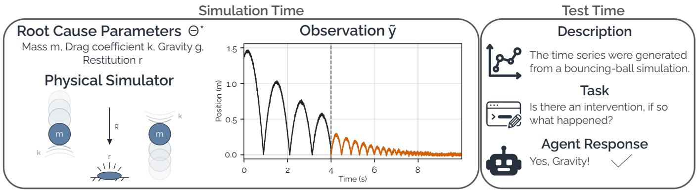  
Figure 1: Overview of the TraceBench framework using a bouncing-ball simulator. In this example, the black and orange segments show the position observation under the low-noise setting before and after an intervention at $t _ { \mathrm { i n t } } = 4 . 0$ .The intervention increases gravitational acceleration, and the dashed line marks the intervention time. At test time, the agent determines from the observed time-series channels whether an intervention occurred and, if so, which parameter changed.

## 2 Related Work

Our work studies agentic root-cause analysis of multivariate timeseries observations accompanied by system-specific textual descriptions. We position TraceBench relative to two main lines of work: (i) agentic systems and benchmarks for time-series analysis and diagnosis, and (ii) LLM benchmarks, datasets, and models for time-series understanding and reasoning with textual information, typically evaluated in single-turn settings without iterative tool use.

## 2.1 Agentic benchmarks for time-series analysis and diagnosis

Recent work evaluates systems on time-series tasks that require analytical decomposition, the use of computational tools, or iterative reasoning based on contextual information and execution feedback TimeSeriesGym [2] evaluates agents on machine-learning engineering tasks that involve time series and require them to produce multiple types of executable artifacts. TS-Reasoner [30] studies program-aided decomposition of compositional time-series inference tasks, while TSAIA [29] evaluates the construction of multistep analytical workflows drawn from scientific and engineering applications. TemporalBench [24] evaluates historical understanding, contextual reasoning, and event-conditioned prediction across multiple domains, including physical systems. A complementary line of work studies agentic root-cause analysis in operational and industrial environments. OpenRCA [27] benchmarks root-cause localization from heterogeneous software telemetry, while AIOpsLab [4] evaluates agents in interactive, fault-injected cloud environments. AssetOpsBench [18] broadens agent evaluation to industrial monitoring and maintenance workflows.

These works share TraceBench's emphasis on multi-step, contextinformed analysis and diagnosis. They differ, however, in evaluation scope: prior benchmarks address a broader range of analytical and operational tasks, often involving heterogeneous data, artifacts, or application-specific workflows, whereas TraceBench isolates root-cause attribution from multivariate time-series observations using controlled physical simulations with intervention-defined ground truth. Each sample corresponds either to no intervention or to a single change in one candidate simulator parameter, yielding a known ground-truth label by construction. This controlled setup enables systematic analysis of agent behavior by independently varying four task axes: domain context, observation noise, labeled examples, and submission mode.

## 2.2 LLM benchmarks and datasets for time-series reasoning with textual information

A large body of work probes time-series understanding and reasoning in single-turn settings without tool use. Merrill et al. [16] evaluate etiological reasoning, factual question answering, and contextaided forecasting; they also test whether a model can identify the scenario that most plausibly generated an observed series. Fons et al. [6] introduce a taxonomy and benchmark for time-series feature understanding, while TimeSeriesExam [1] evaluates pattern recognition, noise understanding, similarity, anomaly detection, and causal reasoning. TIME-RA [28] more directly studies anomaly diagnosis by combining raw time series, domain context, visualizations, finegrained anomaly categories, and generated explanations. Gruver et al. [7] demonstrate that LLMs can act as zero-shot time-series forecasters, while Tan et al. [21] analyze when language-model priors help or hurt forecasting. SciTS [25] studies scientific timeseries understanding and generation with LLMs. Time-MQA [13] introduces multitask question answering for time series and the TSQA dataset. TRQA [10] evaluates question answering for timeseries reasoning across multiple task families, including anomaly detection, classification, characterization, comparison, transformation, and reasoning about temporal relationships. ITFormer [23] proposes datasets and model interfaces for temporal-textual question answering, while ChatTS [26] demonstrates that synthetic alignment data can improve multimodal time-series understanding and reasoning. Time-MMD [14] aligns numerical time series with textual information for multimodal time-series analysis. The Time-Text Corpus, introduced alongside Multi-Modal Forecaster [12], provides timestamp-aligned textual and numerical data for forecasting. BEDTime [20] evaluates the automatic description of time series through recognition, differentiation, and natural-language generation tasks.

These resources provide important benchmarks linking signals and language, but their text is typically tied to the observed sample—for example, as a question, a timestamp-aligned annotation, or a description of visible patterns. TraceBench instead provides a sample-independent, mechanistic description of the data-generating system: what is measured, which parameters may change, and the physical dynamics governing the system. The benchmark therefore evaluates whether agents can use this prior system description to formulate hypotheses about the effects of candidate parameter changes and test those hypotheses against the observed trajectories.

## 3 TraceBench Framework

TraceBench is a simulation-based framework for generating controlled agentic root-cause attribution tasks. Each TraceBench task presents an agent with a test batch of time-series samples generated by simulating a dynamical system. The agent must, for each sample, identify which simulator parameter, if any, has changed. Depending on the experimental condition, the task may also include a description of the system and a labeled support batch.

In the following sections, we first describe the controllable task axes and define the structure of the TraceBench task. We then explain how TraceBench generates the samples contained in these tasks from physical simulators. Figure 1 provides an overview of the TraceBench framework with an illustrative example.

## 3.1 Controllable task axes

Each TraceBench task is instantiated by selecting one setting along each of four controllable axes: domain context, observation noise, labeled examples, and submission mode.

Domain context. This axis controls whether the agent receives domain context, including a detailed description of the system being analyzed, the meanings of the observed time-series channels, and information about the possible ground-truth classes. Removing domain context requires the agent to rely exclusively on patterns in the data.

Observation noise. This axis controls the level of noise added to the time-series observations. The noise level is parameterized by a scalar κ; increasing κ adds more noise to the measurements, making root-cause interventions harder to identify.

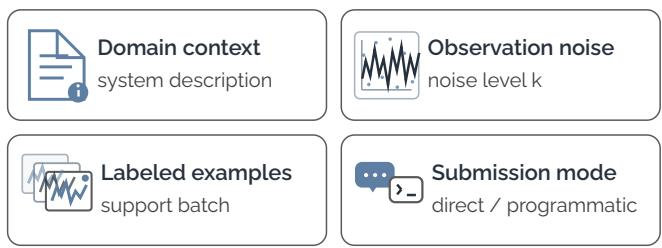  
Figure 2: The four controllable axes in TraceBench.

Labeled examples. This axis controls whether the task includes a labeled support batch in addition to the unlabeled test batch. The support batch contains an equal number of time-series samples from each class, all generated by the same simulator as the test samples and paired with their ground-truth labels. This axis tests whether agents can infer diagnostic patterns from the labeled examples and apply them to the test samples.

Submission mode. The instruction S determines the required submission mode. In direct-answer mode $S _ { \mathrm { d i r e c t } }$ , the agent must directly return a prediction for each time-series observation in the batch. In programmatic-submission mode $S _ { \mathrm { p r o g } } ,$ the agent must write a single reusable Python script that takes as input the timeseries observations and returns a class prediction for each timeseries observation. Because the submitted script can be evaluated on observations that were not available during the episode, this mode also enables measurement of out-of-sample generalization. This axis helps determine whether LLM agents can translate their decision-making strategies into a reusable program.

## 3.2 Root-cause task definition

A TraceBench task consists of three components:

(1) The initial prompt containing the task instructions and, depending on the experimental condition, a textual description of the simulated system, the observed channels, and the candidate ground-truth classes;

(2) An unlabeled test batch $B _ { \mathrm { t e s t } } = \{ \tilde { \bf y } _ { i } \} _ { i = 1 } ^ { n _ { \mathrm { t e s t } } }$ containing the timeseries samples for which the agent must return predictions.

(3) An optional labeled support batch $D _ { \mathrm { s u p } } = \{ ( \tilde { \mathbf { y } } _ { j } , c _ { j } ) \} _ { j = 1 } ^ { n _ { \mathrm { s u p } } }$ , where each $c _ { j }$ is the corresponding ground-truth label.

Each $\tilde { \mathbf { y } } _ { i } \in \mathbb { R } ^ { T \times C }$ is a multivariate time-series observation with T time steps and C observed channels, and constitutes one classification sample. Its associated class indicates either that no intervention occurred or that one candidate simulator parameter changed during the corresponding simulation.

At test time, the agent receives one instantiated task and either returns one prediction for each sample in the test batch in $S _ { \mathrm { d i r e c t } }$ mode or submits a single reusable Python script in $S _ { \mathrm { p r o g } }$ mode, which is applied independently to every sample in the batch. From a machine-learning perspective, each task is therefore a batched closed-set classification problem: one class label must be assigned to every sample in the test batch.

We refer to one complete agent interaction with an instantiated task as an evaluation episode. An episode begins when the agent receives the task prompt and associated files and ends when the agent returns control.

## 3.3 Physical simulator interface

TraceBench generates time-series observations from dynamical systems of the form

$$
\begin{array} { r } { \mathbf { y } = \mathrm { S i m } ( \theta , \mathbf { x } _ { 0 } ) , \qquad \tilde { \mathbf { y } } \sim p _ { \kappa } ( \cdot \mid \mathbf { y } ) . } \end{array}
$$

Sim denotes a physical simulator that generates a noise-free trajectory $\mathbf { y }$ from a parameter vector $\pmb \theta$ and an initial state $\mathbf { x } _ { 0 } .$ In the bouncing-ball simulator used as an illustrative example, θ comprises the coefficient of restitution, gravitational acceleration, drag coefficient, and mass, while $\mathbf { x } _ { 0 }$ comprises the initial velocity and initial height. The conditional distribution $p _ { \kappa } ( \cdot  { \mid }  { \mathbf { y } ) }$ defines the observation model from which the noisy time-series observation $\tilde { \mathbf { y } }$ is sampled. It is parameterized by $\kappa ,$ a scalar factor controlling the intensity of the measurement corruption.

To generate an intervention sample, we draw an initial state and parameter vector, an intervention time $t _ { \mathrm { i n t } }$ , a root-cause parameter $\theta _ { i : }$ and a post-intervention value $\theta _ { i } ^ { \prime } .$ We model the intervention as a single instantaneous step change. Formally, let $\theta ^ { ( i , + ) }$ denote the parameter vector obtained by replacing only the i-th component of θ with $\theta _ { i } ^ { \prime } .$

$$
\pmb \theta ^ { ( i ) } ( t ) = \left\{ \begin{array} { l l } { \pmb \theta , } & { t < t _ { \mathrm { i n t } } , } \\ { \pmb \theta ^ { ( i , + ) } , } & { t \geq t _ { \mathrm { i n t } } . } \end{array} \right.
$$

We denote the trajectory generated under this time-varying parameter schedule by $( \mathbf { y } ^ { ( i ) } )$ 1

To prevent agents from assuming that a parameter always changes, we also generate no-intervention (NI) samples. For these samples, all parameters remain fixed throughout the simulation, producing the corresponding no-intervention time-series observation $\tilde { \mathbf { y } } ^ { \mathrm { { N I } } }$ . Each generated sample therefore belongs either to the no-intervention class or to one intervention class associated with a parameter in $\theta .$ The sample label identifies the changed parameter for intervention samples and is NI otherwise.

## 3.4 Solvability filtering

To reduce the risk of retaining intervention samples whose root cause is ambiguous to infer from the observed trajectory, we apply a post-generation filtering procedure to each noise-free candidate trajectory. The procedure targets three sources of ambiguity: (i) the intervention produces no detectable effect; (ii) the observations do not establish that a parameter changed during the simulation, because the same trajectory can be generated using the post-intervention parameter value throughout the run; and (ii) an intervention on another candidate parameter can produce an indistinguishable trajectory.

For example, in the BallDrop simulator of Figure 1, changing the coefficient of restitution after the final bounce has no effect because restitution influences only subsequent impacts (i). Changing it before the first bounce can produce the same trajectory as using the post-intervention restitution value from the beginning, because the baseline value never affects an observed impact (ii). After the ball has settled into static contact, changes in gravity and mass can become observationally confounded because the ground-contact signal depends on the product mg (iii). Exhaustively identifying all such ambiguities would require solving, for every candidate trajectory, a global optimization problem over alternative initial conditions, parameter values, intervention targets, and intervention times. We therefore use a practical heuristic consisting of two generic probe trajectories and simulator-specific rejection rules. For each noise-free intervention trajectory $\mathbf { y } ^ { ( i ) }$ , generated by a known intervention on $\theta _ { i } ,$ we construct:

(1) the no-intervention probe, generated from the same initial state and baseline parameters but without an intervention;

(2) the static-change probe, generated using the post-intervention parameter vector $\theta ^ { ( i , + ) }$ throughout the simulation.

We reject the intervention sample when its trajectory is not sufficiently distinguishable from either probe. Specifically, in each channel, we divide the root mean squared difference between the intervention trajectory and the probe trajectory by the expected observation noise in that channel. We consider two trajectories distinguishable when this dimensionless effect-to-noise ratio exceeds the global threshold $\rho = 2$ in at least one observed channel. The no-intervention and static-change probes address cases (i) and (ii), respectively. To address case (iii), we apply manually specified, simulator-specific rejection rules derived from the known system dynamics and observed channels. These rules reject parameter and intervention configurations with known alternative root-cause explanations. We provide additional details in Appendix B. To prevent no-intervention samples from being classified trivially, we retain a no-intervention sample only if at least two distinct intervention root causes with the same initial parameter configuration pass the filtering procedure.

## 4 Experimental Setup

## 4.1 Physical simulators

For our experiments, we use the TraceBench framework to generate tasks from three simulators of interpretable physical systems:

• Bal1Drop: A ball moving vertically under gravity and bouncing on a ground surface.

• BounceBall: A damped mass moving on a tilted track between two rigid walls.

• MassSlide: A mass moving along a tilted plane under a periodically applied force.

The observation model $\scriptstyle { \mathcal { P } } \kappa$ is simulator-specific and combines multiple noise components, such as Gaussian noise with channel-specific heteroscedastic variance, smooth temporally correlated drift, and transition-localized noise. For each simulator, we define a reference noise scale, $\kappa _ { \mathrm { r e f } }$ , that jointly scales these noise components. We consider two noise regimes: $\kappa _ { \mathrm { l o w } } = \kappa _ { \mathrm { r e f } } \qquad \mathrm { a n d } \qquad \kappa _ { \mathrm { h i g h } } = 4 \kappa _ { \mathrm { r e f } }$

Figure 3 shows representative noise-free signals containing a single parameter intervention for each simulator. Appendix A provides, for each simulator, the simulator description, parameter sampling intervals, candidate root-cause parameters, observed channels, low-noise per-channel signal-to-noise ratios, and representative time-series examples.

## 4.2 Metrics

Our evaluation uses two complementary approaches. On the one hand, we measure predictive performance using accuracy; on the other hand, we extract quantitative metrics from the agentic log trace generated throughout each episode. For tasks using $S _ { \mathrm { d i r e c t } }$ we measure accuracy only on the episode batch, that ${ \mathrm { i } } s ,$ the test files visible to the agent. For tasks using $S _ { \mathrm { p r o g } } .$ we report accuracy both on the episode batch and on a held-out batch of additional samples that is inaccessible to the agent during the episode, thereby measuring generalization. From the agentic log traces, we extract metrics that characterize overall resource use and exploration behavior. Specifically, we measure episode token usage and its corresponding cost, episode time, and the number of tool calls. We additionally report fine-grained exploration and interaction metrics, including the numbers of Python calls and Python statements; the numbers of plots generated and inspected; the number of numeric values exposed through console output; and the cumulative console-output token share. The latter is defined as the estimated number of console-output tokens processed across all agent iterations, divided by the total number of input-context tokens processed across those iterations. Simulator-specific tables report the mean and standard deviation across repetition seeds. Aggregate tables report the pooled mean across simulators and repetition seeds. To summarize variability without conflating it with simulator-specific difficulty, we first subtract each simulator's mean and then compute the standard deviation of the pooled within-simulator residuals. Definitions and computation details for all metrics extracted from the agentic log trace are provided in Appendix G.

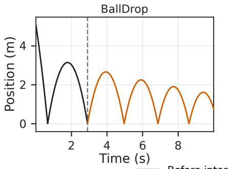

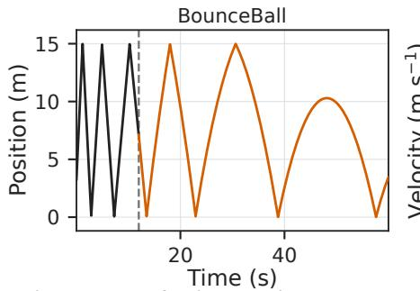

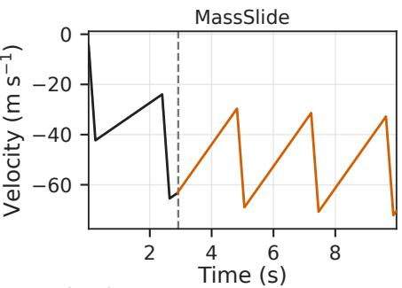  
Figure 3: Representative noise-free signals from one observed channel for each simulator. Black and orange segments show the trajectory before and after the intervention time, respectively, which is marked by a dashed vertical line. The panels show position for Bal1Drop and BounceBal1, and velocity for MassSlide. The interventions increase the coefficient of restitution in Bal1Drop and the inclination angle in BounceBal1, and decrease the plane inclination in MassSlide. Additional examples with observation noise and all observed channels are provided in Appendix A.

## 4.3 Evaluated LLM agents

Each evaluated configuration is an agent system comprising a language model, a terminal-based agent scaffold, and the associated inference settings. For readability, we refer to each complete agentsystem configuration using the name of its underlying model. Specifically, we pair gpt-5.5, gemini-3.1-pro, and claude-opus-4.6 with Codex, Gemini CLI, and Claude Code, respectively. We additionally evaluate the open-weight model minimax-m2.7 through OpenCode. For LLM agents with a reasoning-effort setting, we set the reasoning effort to high. All agents are evaluated under the same submission modes, file layout, and scoring procedure. Detailed information about the agent profiles, execution platforms, package versions, and reasoning settings is provided in Appendix C.3.

## 4.4 Runtime environment

Each evaluation episode is executed in an isolated containerized environment. The agent has access to a Bash terminal and a Python environment with a set of preinstalled libraries. The list of available Python packages is provided in Section C.5. Internet access is disabled. To ensure that our analysis reflects agents' abilities rather than infrastructure reliability, we restart episodes that terminate because of infrastructure-related failures, such as API outages, platform interruptions, or container initialization failures.

## 4.5 Experimental design

Each experimental condition is defined by its test set and its settings along four controllable task axes: domain context, observation noise, labeled examples, and submission mode. To support controlled comparisons when varying a task axis, matched experimental conditions use the same test samples. This ensures that differences between conditions are attributable to the setting being varied rather than to differences in the underlying test samples. Test batches are sampled from the available pool of samples that have passed the solvability filtering.

Our main experiment comprises four experimental conditions: low-noise direct answer $( \kappa _ { \mathrm { l o w } } , S _ { \mathrm { d i r e c t } } )$ , low-noise programmatic submission $( \kappa _ { \mathrm { l o w } } , S _ { \mathrm { p r o g } } )$ , high-noise direct answer $( \kappa _ { \mathrm { h i g h } } , S _ { \mathrm { d i r e c t } } )$ , and high-noise programmatic submission $( \kappa _ { \mathrm { h i g h } } , S _ { \mathrm { p r o g } } )$ . Each condition includes three labeled support samples per class and a detailed textual description of the system. For each simulator, condition, and repetition seed, we instantiate one task and evaluate one agent on it, yielding one evaluation episode. Each task contains 10 test samples. We use five repetition seeds for each simulator and condition. This yields 60 evaluation episodes per agent: 15 episodes for each of the four conditions, corresponding to 150 test samples per condition. We then conduct two orthogonal ablations at $\kappa _ { \mathrm { h i g h } }$ under both the $S _ { \mathrm { d i r e c t } }$ and $S _ { \mathrm { p r o g } }$ conditions. In the first ablation, we remove all domain context, including the process description, column names, and class names.¹ This setting provides a purely data-driven baseline. In the second ablation, we remove the labeled examples while retaining the domain context. Because of cost constraints, we evaluate these ablations only with gpt-5.5 and gemini-3.1-pro.

Table 1: Mean accuracy and exploration metrics per episode for the main experiment, aggregated across simulators. Accuracy values are reported as the mean ± within-simulator standard deviation; random-chance accuracy is 0.189. Python calls indicate the total number of Python interpreter invocations, while Python statements count statements across generated Python source versions. Plot counts report the number of generated | inspected plots. Console-output entries report the number of numeric values printed | the estimated percentage of tokens attributable to console output. See Appendix G for computation details.
<table><tr><td rowspan="3"></td><td colspan="3">Low Noise</td><td colspan="3">High Noise</td></tr><tr><td> $S _ { \mathrm { d i r e c t } }$ </td><td colspan="2"> $\underline { { S _ { \mathrm { p r o g } } } }$ </td><td> $S _ { \mathrm { d i r e c t } }$ </td><td colspan="2"> $\underline { { S _ { \mathrm { p r o g } } } }$ </td></tr><tr><td>Episode</td><td>Episode</td><td> $_ { \mathsf { H e l d - o u t } }$ </td><td>Episode</td><td>Episode</td><td>Held-out</td></tr><tr><td colspan="7">Accuracy</td></tr><tr><td>gpt-5.5</td><td> $\mathbf { 0 . 9 3 3 \pm 0 . 0 5 6 }$ </td><td> $\mathbf { 0 . 8 5 3 \pm 0 . 1 4 3 }$ </td><td> $0 . 6 7 1 \pm 0 . 0 9 6$ </td><td> $\mathbf { 0 . 8 3 3 \pm 0 . 1 9 4 }$ </td><td> $\mathbf { 0 . 7 3 3 \pm 0 . 2 2 7 }$ </td><td> $\mathbf { 0 . 5 4 7 \pm 0 . 1 3 8 }$ </td></tr><tr><td>gemini-3.1-pro</td><td> $0 . 7 6 0 \pm 0 . 1 1 5$ </td><td> $0 . 7 3 3 \pm 0 . 1 5 3$ </td><td> $0 . 6 0 4 \pm 0 . 1 2 8$ </td><td> $0 . 5 6 0 \pm 0 . 2 2 1$ </td><td> $0 . 5 4 7 \pm 0 . 1 6 9$ </td><td> $0 . 4 4 0 \pm 0 . 0 8 5$ </td></tr><tr><td>claude-opus-4.6</td><td> $0 . 8 5 3 \pm 0 . 1 1 5$ </td><td> $0 . 6 8 7 \pm 0 . 1 2 2$ </td><td> $0 . 6 1 4 \pm 0 . 0 8 4$ </td><td> $0 . 5 9 3 \pm 0 . 1 7 0$ </td><td> $0 . 5 9 3 \pm 0 . 1 9 0$ </td><td> $0 . 4 9 9 \pm 0 . 1 2 9$ </td></tr><tr><td>minimax-m2.7</td><td> $0 . 2 9 3 \pm 0 . 1 3 4$ </td><td> $0 . 2 8 0 \pm 0 . 1 2 6$ </td><td> $0 . 2 8 7 \pm 0 . 0 3 1$ </td><td> $0 . 3 0 0 \pm 0 . 1 6 5$ </td><td> $0 . 3 5 3 \pm 0 . 1 6 5$ </td><td> $0 . 2 9 9 \pm 0 . 0 4 5$ </td></tr><tr><td colspan="7">Python: calls | statements</td></tr><tr><td>gpt-5.5</td><td>12.800 | 326.600</td><td></td><td>16.067 | 638.267</td><td>13.867 | 377.333</td><td></td><td>17.600 | 641.400</td></tr><tr><td>gemini-3.1-pro</td><td>39.000 | 1339.400</td><td></td><td>43.333 | 1404.600</td><td>44.467 | 1220.800</td><td></td><td>48.333 | 1517.067</td></tr><tr><td>claude-opus-4.6</td><td>23.067 | 2120.933</td><td></td><td>29.867 | 1836.667</td><td>26.467 | 2065.333</td><td></td><td>33.267| 2467.867</td></tr><tr><td>minimax-m2.7</td><td>21.933 | 987.600</td><td>63.600</td><td>1766.800</td><td>20.133 | 1021.067</td><td></td><td>55.000 | 1706.133</td></tr><tr><td colspan="7">Plot counts: generated | inspected</td></tr><tr><td>gpt-5.5</td><td>2.067 | 0.400</td><td></td><td>0.000 | 0.000</td><td>2.333 | 0.733</td><td></td><td>0.000 | 0.000</td></tr><tr><td>gemini-3.1-pro</td><td>3.933 | 0.000</td><td></td><td>2.400 | 0.000</td><td>5.133 | 0.000</td><td></td><td>1.667 | 0.000</td></tr><tr><td>claude-opus-4.6</td><td>0.000 | 0.000</td><td></td><td>0.000 | 0.000</td><td>0.000 | 0.000</td><td></td><td>0.200 | 0.200</td></tr><tr><td>minimax-m2.7</td><td>0.000 | −</td><td></td><td>0.000 | −</td><td>0.000 | -</td><td>0.000 | -</td><td></td></tr><tr><td colspan="7">Console output: numeric values printed | token share (%)</td></tr><tr><td>gpt-5.5</td><td>3447 | 77.094</td><td></td><td>4775 | 77.682</td><td>4781 | 79.967</td><td>4737 | 77.722</td><td></td></tr><tr><td>gemini-3.1-pro</td><td>3024 | 46.984</td><td></td><td>2299 | 45.923</td><td>3631 | 51.802</td><td></td><td>4796 | 55.350</td></tr><tr><td>claude-opus-4.6</td><td>5416 | 39.871</td><td></td><td>5016 | 43.480</td><td>6630 | 45.256</td><td></td><td>6943 | 41.131</td></tr><tr><td>minimax-m2.7</td><td>1674 | 39.052</td><td></td><td>2679 | 29.277</td><td>1500 | 40.340</td><td></td><td>2546 | 30.067</td></tr></table>

Example prompts for the different settings are provided in Appendix I. We present the aggregate analysis in the following sections and report paired statistical comparisons and uncertainty estimates in Appendix H. We provide results with standard baselines in Appendix E.

## 5 Results

## 5.1 Main results

The first section of Table 1 reports accuracy averaged over simulators and repetition seeds. Overall, the gpt-5.5 configuration achieves the highest mean accuracy in all six reported accuracy columns. claude-opus-4.6 ranks second in five of the six columns while gemini-3.1-pro ranks second for low-noise programmatic episode accuracy. minimax-m2.7 performs substantially worse: averaged across the six reported accuracy columns, its accuracy is approximately 46.0 percentage points below that of gpt-5.5.

This large gap between gpt-5.5 and minimax-m2.7 contrasts with their relatively similar reported performance on SWE-Bench Pro [17], where minimax-m2.7 achieves 56.22% and gpt-5.5 achieves 58.6%. By contrast, Terminal-Bench 2.0 [15], which evaluates agents on long-horizon tasks in terminal environments, also shows a substantial performance gap: gpt-5.5 achieves 82.2%, whereas the highest-scoringlisted agent using minimax-m2.7 achieves 45.1%, a difference of 37.1 percentage points [22]. Although comparisons across SWE-Bench Pro, Terminal-Bench 2.0, and TraceBench are not fully controlled because the tasks and agent configurations differ, the similarly large performance gaps observed on Terminal-Bench 2.0 and TraceBench are consistent with the hypothesis that success on TraceBench depends not only on code-generation ability, but also on sustained, multi-turn, tool-assisted analysis.

For each of the three closed-weight LLM agents, observed mean episode accuracy decreases as noise increases from $\kappa _ { \mathrm { l o w } }$ to Khigh. Averaged across the two submission modes, the magnitude of this decrease is 11.0 percentage points for gpt-5.5, 17.7 points for claude-opus-4.6, and 19.3 points for gemini-3.1-pro. Averaged over noise levels, observed mean episode accuracy is also lower under $S _ { \mathrm { p r o g } }$ than under $S _ { \mathrm { d i r e c t } }$ for each configuration. This pattern suggests that agents struggle under the programmatic interface, which requires compressing their analysis into a reusable per-sample function and removes opportunities for sample-specific judgment. Within $S _ { \mathrm { p r o g } } ,$ held-out accuracy averaged over noise levels is lower than episode accuracy for all three closed-weight agents, suggesting that the submitted programs do not always capture stable physical signatures of the interventions.

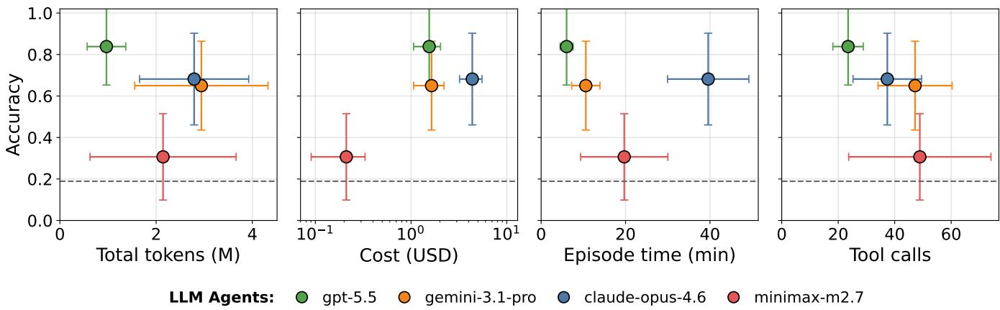  
Figure 4: Accuracy as a function of token usage, evaluation cost, episode time, and tool calls. Each point aggregates all episodes for one agent-system configuration across the four main-experiment conditions, three simulators, and five repetition seeds.

Higher resource use does not correspond monotonically to higher accuracy, as illustrated by Figure 4. The figure compares agentconfiguration-level mean accuracy with mean token usage, evaluation cost, episode time, and tool calls across all 60 main-experiment episodes for each configuration. The gpt-5. 5 configuration achieves the highest accuracy in every reported condition while using comparatively modest resources, a pattern consistent with more targeted exploration. The claude-opus-4.6 configuration, by contrast, reaches similar accuracy in some conditions but uses substantially more tokens and incurs much higher evaluation cost. Across conditions, its mean evaluation cost ranges from approximately USD 5.2 to USD 8.6 per episode, compared with USD 1.3 to USD 1.8 for gpt-5.5. Complete per-simulator cost results are provided in Appendix J, together with the corresponding accuracy-versus-cost plots in Appendix D.2.

Exploration and interaction metrics. To characterize the exploration strategies used by the evaluated agents, we additionally report in Table 1 Python-use, plotting, and console-output metrics. Several trends emerge. First, averaged across the three closedweight configurations and the four main-experiment conditions, more than 4,600 numeric values are exposed through console output per episode. These results indicate that numerical console output constitutes a substantial part of the evidence made available to the agents during their analyses. Interestingly, minimax-m2.7 exposes substantially fewer numeric values, suggesting less intensive use of numerical console evidence.

Plot inspection is rare among the configurations that support image inspection². gpt-5.5, the LLM agent that inspects the most plots, inspects fewer than one plot per episode on average in the direct-answer submission conditions and none in the programmaticsubmission conditions. Notably, gemini-3.1-pro generates 1.7–5.1 plots per episode but does not subsequently inspect them. This behavior contrasts with conventional exploratory data analysis, in which visualization is commonly used to inspect time-series data. In summary, these results show that, in contrast to prior work on zeroshot time-series reasoning [16], closed-weight agents can reason effectively over time-series data in a tool-assisted setting and rely primarily on numerical console output to guide their reasoning and predictions.

The Python-use metrics provide further evidence of differences in exploration behavior and help contextualize the combination of high accuracy and comparatively low token usage observed for gpt-5.5. Across all four conditions, the gpt-5.5 configuration makes substantially fewer Python calls and generates fewer Python statements than the other closed-weight configurations. minimax-m2.7 and gemini-3.1-pro are instead the models that make the most Python calls, while claude-opus-4.6 generates the most Python statements. Console-output shares also show substantial differences across agents. For gpt-5.5, console output accounts for 77–80% of its cumulative input context, compared with approximately 29–55% for the other configurations.

Taken together, these observations suggest that gpt-5.5 follows a more compact computational workflow, using Python more selectively while still exposing a substantial amount of numerical evidence through console output. A complete representative trajectory is provided in Appendix K, and the complete set of trajectories is available in the results section of our project website.

## 5.2 Ablations: removing labeled examples or domain context

We next examine two ablations: removing all labeled examples while retaining the domain context, and removing the domain context while retaining all labeled examples. Table 2 reports the results of both ablations, along with their differences from the corresponding non-ablated high-noise conditions, for both accuracy and token consumption. Removing the domain context reduces average accuracy by 20.0-32.0 percentage points across both LLM agents and both submission modes. By contrast, removing the labeled timeseries examples increases average accuracy by 4.2 percentage points for gpt-5.5 and by 6.6 percentage points for gemini-3.1-pro. Although removing the domain context shortens the input prompt, it increases total token usage in three of the four cases, suggesting that agents may compensate for the missing context with more extensive analysis. Removing the labeled examples, by contrast, consistently reduces token usage. In all cases, removing the examples results in a substantial cost reduction.

Table 2: Accuracy and token usage for the two high-noise ablation conditions, aggregated across simulators. Entries report the mean ± within-simulator standard deviation, followed in parentheses by the signed change relative to the corresponding non-ablated condition with three labeled examples per class and domain context. Accuracy changes are in percentage points; token values and changes are in millions.
<table><tr><td rowspan="2"></td><td> $S _ { \mathrm { d i r e c t } }$ </td><td colspan="2"> $\underline { { S _ { \mathrm { p r o g } } } }$ </td></tr><tr><td>Episode</td><td>Episode</td><td>Held-out</td></tr><tr><td colspan="4">Accuracy</td></tr><tr><td>gpt-5.5 (No labeled examples)</td><td> $0 . 8 8 7 \pm 0 . 1 2 5$  (+5.3)</td><td> $0 . 8 4 7 \pm 0 . 1 1 6 \ \left( + 1 1 . 3 \right)$ </td><td> $0 . 5 0 6 \pm 0 . 0 7 0$  (-4.1)</td></tr><tr><td>gemini-3.1-pro (No labeled examples)</td><td> $0 . 6 4 7 \pm 0 . 1 5 9$  (+8.7)</td><td> $0 . 6 5 3 \pm 0 . 1 7 6 ( + 1 0 . 7 )$ </td><td> $0 . 4 4 4 \pm 0 . 1 1 3$  (+0.4)</td></tr><tr><td>gpt-5.5 (No domain context)</td><td> $0 . 5 1 3 \pm 0 . 2 0 2$  (-32.0)</td><td> $0 . 4 5 3 \pm 0 . 2 0 9 \ \ : \ : ( - 2 8 . 0 )$ </td><td> $0 . 3 1 6 \pm 0 . 0 9 2$  (-23.2)</td></tr><tr><td>gemini-3.1-pro (No domain context)</td><td> $0 . 3 1 3 \pm 0 . 1 3 5$  (-24.7)</td><td> $0 . 3 4 7 \pm 0 . 1 5 4 \ \ : \left( - 2 0 . 0 \right)$ </td><td> $0 . 3 2 8 \pm 0 . 0 4 3$  (-11.3)</td></tr><tr><td colspan="4"></td></tr><tr><td>gpt-5.5 (No labeled examples)</td><td> $0 . 7 9 6 \pm 0 . 1 9 7$  (-0.177)</td><td>Total tokens (M)  $0 . 8 9 2 \pm 0 . 2 8 9$ </td><td>(-0.297)</td></tr><tr><td>gemini-3.1-pro (No labeled examples)</td><td> $1 . 8 3 2 \pm 0 . 7 8 8$  (-0.964)</td><td> $2 . 8 3 8 \pm 0 . 9 8 0$ </td><td>(-0.849)</td></tr><tr><td>gpt-5.5 (No domain context)</td><td> $1 . 7 9 6 \pm 0 . 5 1 0$  (+0.824)</td><td> $2 . 2 1 9 \pm 0 . 7 7 3$ </td><td>(+1.031)</td></tr><tr><td>gemini-3.1-pro (No domain context)</td><td> $2 . 5 0 6 \pm 1 . 0 5 9$  (-0.290)</td><td> $4 . 1 4 1 \pm 1 . 3 9 6$ </td><td>(+0.454)</td></tr></table>

These results suggest that LLM agents make effective use of domain context and that richer domain context may reduce token consumption, thereby making requests more efficient. In contrast, labeled time-series examples may be detrimental when the domain context is already well specified, as they increase costs without substantially improving performance.

## 6 Conclusion

In this paper, we introduced TraceBench, a framework for generating controlled time-series root-cause attribution tasks. These tasks evaluate how LLM agents analyze time series generated by dynamical systems, with or without accompanying textual descriptions of those systems. Our experiments yield several findings.

First, LLM agents explore the data by inspecting numerical console outputs and reasoning over them to guide subsequent analysis and final predictions. Among the evaluated agent configurations, gpt-5.5 achieves the highest accuracy across the main experimental conditions while using comparatively fewer computational resources. Second, performance generally decreases as observation noise increases and when agents are required to translate their analyses into reusable programs. Held-out results further indicate that submitted scripts have limited out-of-sample generalization. Finally, our ablation results show that agents can make effective use of domain context, whereas labeled support sets may increase costs with no reliable evidence of performance improvements.

Limitations. First, TraceBench uses a closed-ended label set to enable unambiguous evaluation and clean comparisons across conditions. However, this format does not fully capture the open-ended nature of root-cause analysis, in which analysts must often formulate hypotheses and communicate conclusions without predefined options. Second, due to the high cost of agent evaluations, we used a small number of repetitions per experimental condition, which limits statistical power. Third, each model is evaluated using a different agent scaffold. Hence, observed differences cannot be attributed solely to the underlying LLMs and may also reflect scaffold-specific effects.

Representativeness and intended scope. TraceBench is a controlled diagnostic testbed rather than a realistic replica of real-world rootcause analysis. It captures key structural properties of diagnostic time-series tasks, including multivariate observations, unknowntime interventions, nonlinear and event-driven dynamics, delayed and channel-dependent effects, and several forms of measurement noise. However, it is limited to regularly sampled, fully observed trajectories from low-dimensional mechanical systems with at most one instantaneous parameter change. Results should therefore be interpreted as evidence of controlled temporal and mechanistic reasoning, not of readiness for complex industrial deployment.

Data and code availability. We release the experimental code at github.com/TommasoBendinelli/TraceBench, the dataset at huggingface.co/datasets/eth-siplab/tracebench, and the project website, which includes a public leaderboard, at tracebench.github.io.

Acknowledgments. We thank Dominik Hollidt and Demirel Berken for helpful discussions and feedback. This work was partially supported by RIS Zentralschweiz and NVIDIA Corporation.

## References

[1] Yifu Cai, Arjun Choudhry, Mononito Goswami, and Artur Dubrawski. 2024. Timeseriesexam: A time series understanding exam. arXiv preprint arXiv:2410.14752 (2024).

[2] Yifu Cai, Xinyu Li, Mononito Goswami, Michał Wiliński, Gus Welter, and Artur Dubrawski. 2025. TimeSeriesGym: A Scalable Benchmark for (Time Series) Machine Learning Engineering Agents. arXiv preprint arXiv:2505.13291 (2025). doi:10.48550/arXiv.2505.13291

[3] Jun Shern Chan, Neil Chowdhury, Oliver Jaffe, James Aung, Dane Sherburn, Evan Mays, Giulio Starace, Kevin Liu, Leon Maksin, Tejal Patwardhan, Lilian Weng, and Aleksander Mądry. 2024. MLE-bench: Evaluating Machine Learning Agents on Machine Learning Engineering. arXiv preprint arXiv:2410.07095 (2024).

[4] Yinfang Chen, Manish Shetty, Gagan Somashekar, Minghua Ma, Yogesh Simmhan, Jonathan Mace, Chetan Bansal, Rujia Wang, and Saravan Rajmohan. 2025. AIOpsLab: A Holistic Framework to Evaluate AI Agents for Enabling Autonomous Clouds. In Eighth Conference on Machine Learning and Systems. https://openreview.net/forum?id=3EXBLwGxtq

[5] Angus Dempster, Daniel F. Schmidt, and Geoffrey I. Webb. 2021. MINIROCKET: A very fast almost deterministic transform for time series classification. In Proceedings of the 27th ACM SIGKDD Conference on Knowledge Discovery and Data Mining. 248-257. doi:10.1145/3447548.3467231

[6] Elizabeth Fons, Rachneet Kaur, Soham Palande, Zhen Zeng, Tucker Balch, Manuela Veloso, and Svitlana Vyetrenko. 2024. Evaluating Large Language Models on Time Series Feature Understanding: A Comprehensive Taxonomy and Benchmark. In Proceedings of the 2024 Conference on Empirical Methods in Natural Language Processing. Association for Computational Linguistics, Miami, Florida, USA, 21598-21634. doi:10.18653/v1/2024.emnlp-main.1204

[7] Nate Gruver, Marc Finzi, Shikai Qiu, and Andrew G Wilson. 2024. Large language models are zero-shot time series forecasters. Advances in Neural Information Processing Systems 36 (2024).

[8] Xueyu Hu, Ziyu Zhao, Shuang Wei, Ziwei Chai, Qianli Ma, Guoyin Wang, Xuwu Wang, Jing Su, Jingjing Xu, Ming Zhu, Yao Cheng, Jianbo Yuan, Jiwei Li, Kun Kuang, Yang Yang, Hongxia Yang, and Fei Wu. 2024. InfiAgent-DABench: Evaluating Agents on Data Analysis Tasks. arXiv preprint arXiv:2401.05507 (2024).

[9] Rolf Isermann. 2005. Model-based fault-detection and diagnosis—status and applications. Annual Reviews in Control 29, 1 (2005), 71–85. doi:10.1016/j.arcontrol. 2004.12.002

[10] Baoyu Jing, Sanhorn Chen, Lecheng Zheng, Boyu Liu, Zihao Li, Jiaru Zou, Tianxin Wei, Zhining Liu, Zhichen Zeng, Ruizhong Qiu, Xiao Lin, Yuchen Yan, Qi Yu, Dongqi Fu, Jingrui He, and Hanghang Tong. 2025. TRQA: Time Series Reasoning Question And Answering Benchmark. OpenReview. https://openreview.net/ forum?id=ULQt51DRug

[11] Liqiang Jing, Zhehui Huang, Xiaoyang Wang, Wenlin Yao, Wenhao Yu, Kaixin Ma, Hongming Zhang, Xinya Du, and Dong Yu. 2024. DSBench: How Far Are Data Science Agents to Becoming Data Science Experts? arXiv preprint arXiv:2409.07703 (2024).

[12] Kai Kim, Howard Tsai, Rajat Sen, Abhimanyu Das, Zihao Zhou, Abhishek Tanpure, Mathew Luo, and Rose Yu. 2024. Multi-Modal Forecaster: Jointly Predicting Time Series and Textual Data. arXiv preprint arXiv:2411.06735 (2024). doi:10.48550/arXiv.2411.06735

[13] Yaxuan Kong, Yiyuan Yang, Yoontae Hwang, Wenjie Du, Stefan Zohren, Zhangyang Wang, Ming Jin, and Qingsong Wen. 2025. Time-MQA: Time Series Multi-Task Question Answering with Context Enhancement. In Proceedings of the 63rd Annual Meeting of the Association for Computational Linguistics. doi:10.48550/arXiv.2503.01875

[14] Haoxin Liu, Shangqing Xu, Zhiyuan Zhao, Lingkai Kong, Harshavardhan Kamarthi, Aditya B. Sasanur, Megha Sharma, Jiaming Cui, Qingsong Wen, Chao Zhang, and B. Aditya Prakash. 2024. Time-MMD: Multi-Domain Multimodal Dataset for Time Series Analysis. arXiv preprint arXiv:2406.08627 (2024). doi:10.48550/arXiv.2406.08627

[15] Mike A. Merrill, Alexander G. Shaw, Nicholas Carlini, et al. 2026. Terminal-Bench: Benchmarking Agents on Hard, Realistic Tasks in Command Line Interfaces. arXiv preprint arXiv:2601.11868 (2026). doi:10.48550/arXiv.2601.11868

[16] Mike A. Merrill, Mingtian Tan, Vinayak Gupta, Thomas Hartvigsen, and Tim Althoff. 2024. Language Models Still Struggle to Zero-shot Reason about Time Series. In Findings of the Association for Computational Linguistics: EMNLP 2024. Association for Computational Linguistics, Singapore, 3512-3533. doi:10.48550/ arXiv.2404.11757

[17] MiniMax. 2026. MiniMax M2.7: Early Echoes of Self-Evolution. MiniMax News. https://www.minimax.io/news/minimax-m27-en

[18] Dhaval Patel, Shuxin Lin, James Rayfield, Nianjun Zhou, Roman Vaculin, Natalia Martinez, Fearghal O'donncha, and Jayant Kalagnanam. 2025. AssetOpsBench: Benchmarking AI Agents for Task Automation in Industrial Asset Operations and Maintenance. arXiv preprint arXiv:2506.03828 (2025). doi:10.48550/arXiv. 2506.03828

[19] Gaurav Sahu, Abhay Puri, Juan Rodriguez, Amirhossein Abaskohi, Mohammad Chegini, Alexandre Drouin, Perouz Taslakian, Valentina Zantedeschi, Alexandre

Lacoste, David Vazquez, et al. 2024. Insightbench: Evaluating business analytics agents through multi-step insight generation. arXiv preprint arXiv:2407.06423 (2024).

[20] Medhasweta Sen, Zachary Gottesman, Jiaxing Qiu, C. Bayan Bruss, Nam Nguyen, and Tom Hartvigsen. 2025. BEDTime: A Unified Benchmark for Automatically Describing Time Series. arXiv preprint arXiv:2509.05215 (2025). doi:10.48550/ arXiv.2509.05215

[21] Mingtian Tan, Mike A. Merrill, Vinayak Gupta, Tim Althoff, and Thomas Hartvigsen. 2024. Are Language Models Actually Useful for Time Series Forecasting?. In Advances in Neural Information Processing Systems 37 (NeurIPS 2024). doi:10.48550/arXiv.2406.16964 Spotlight.

[22] Terminal-Bench. 2026. Terminal-Bench 2.0 Leaderboard. https://www.tbench.ai/ leaderboard/terminal-bench/2.0. Accessed: 2026-07-20.

[23] Yilin Wang, Peixuan Lei, Jie Song, Yuzhe Hao, Tao Chen, Yuxuan Zhang, Lei Jia, Yuanxiang Li, and Zhongyu Wei. 2025. ITFormer: Bridging Time Series and Natural Language for Multi-Modal QA with Large-Scale Multitask Dataset. arXiv preprint arXiv:2506.20093 (2025).

[24] Muyan Weng, Defu Cao, Wei Yang, Yashaswi Sharma, and Yan Liu. 2026. TemporalBench: A Benchmark for Evaluating LLM-Based Agents on Contextual and Event-Informed Time Series Tasks. arXiv preprint arXiv:2602.13272 (2026). doi:10.48550/arXiv.2602.13272

[25] Wen Wu, Ziyang Zhang, Liwei Liu, Xuenan Xu, Junlin Liu, Ke Fan, Qitan Lv, Jimin Zhuang, Chen Zhang, Zheqi Yuan, Siyuan Hou, Tianyi Lin, Kai Chen, Bowen Zhou, and Chao Zhang. 2025. SciTS: Scientific Time Series Understanding and Generation with LLMs. arXiv preprint arXiv:2510.03255 (2025). doi:10.48550/ arXiv.2510.03255

[26] Zhe Xie, Zeyan Li, Xiao He, Longlong Xu, Xidao Wen, Tieying Zhang, Jianjun Chen, Rui Shi, and Dan Pei. 2024. Chatts: Aligning time series with llms via synthetic data for enhanced understanding and reasoning. arXiv preprint arXiv:2412.03104 (2024).

[27] Junjielong Xu, Qinan Zhang, Zhiqing Zhong, Shilin He, Chaoyun Zhang, Qingwei Lin, Dan Pei, Pinjia He, Dongmei Zhang, and Qi Zhang. 2025. Open-RCA: Can Large Language Models Locate the Root Cause of Software Failures?. In The Thirteenth International Conference on Learning Representations. https://openreview.net/forum?id=M4qNIzQYpd

[28] Yiyuan Yang, Zichuan Liu, Lei Song, Kai Ying, Stephen Wang, Joshua Thomas Bamford, Svitlana Vyetrenko, Jiang Bian, and Qingsong Wen. 2026. Time-RA: Towards Time Series Reasoning for Anomaly Diagnosis with LLM Feedback. In Findings of the Association for Computational Linguistics: ACL 2026. Association for Computational Linguistics, San Diego, California, United States, 11591–11616. doi:10.18653/v1/2026.findings-acl.562

[29] Wen Ye, Jinbo Liu, Defu Cao, Wei Yang, and Yan Liu. 2025. When LLM Meets Time Series: Can LLMs Perform Multi-Step Time Series Reasoning and Inference. arXiv preprint arXiv:2509.01822 (2025). doi:10.48550/arXiv.2509.01822

[30] Wen Ye, Wei Yang, Defu Cao, Yizhou Zhang, Lumingyuan Tang, Jie Cai, and Yan Liu. 2026. TS-Reasoner: Domain-Oriented Time Series Inference Agents for Reasoning and Automated Analysis. Transactions on Machine Learning Research (2026). https://openreview.net/forum?id=yhy7Vigjcf

## Appendix Contents

A Simulator Catalog 11   
B Additional Details on Solvability Filtering 17   
C Additional Details about Experimental Setup 18   
D Evaluation Costs 19   
E Classical Time-Series Baselines 20   
F Direct-Answer Confusion Matrices 21   
G Metric definitions and computation 24   
H Paired Statistical Analysis and Uncertainty 25   
I Example Prompts Across Experimental Settings 26   
J Per-simulator results tables 31   
K Representative gpt-5.5 BallDrop Low-Noise Direct   
Trajectory 33

## A Simulator Catalog

Bal1Drop   
Simulator page   
https://tracebench.github.io/environments/BallDrop/

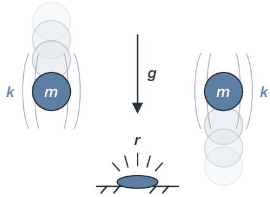

## System description

These time series were generated by simulating a 1D vertical point-mass ball model under gravity.

While the ball is above the ground, its motion is governed by gravity and quadratic air drag acting opposite the direction of travel, and the position evolves according to the current velocity.

Ground interaction is modeled with a restitution-based hard-stop law.

When the ball reaches the ground with impact speed equal or above a prescribed impact-speed cutoff 0.5 m/s, the impact is treated as instantaneous and the post-impact speed is set by the coefficient of restitution e in [0,1].

The rebound velocity points upward and its magnitude equals e times the pre-impact speed.

When the impact speed is below the threshold, the ball does not rebound and instead enters static contact at the ground.

Observed channels: position, velocity, and ground-contact impulse.

Candidate labels: coefficient of restitution, mass, drag coefficient, gravity acceleration, and no parameter change.

Table 3: BallDrop simulation settings used by the released trajectories.
<table><tr><td>Simulation End</td><td>10 s</td></tr><tr><td>Sampling Frequency</td><td>400 Hz</td></tr><tr><td>Number of Rows</td><td>3999</td></tr></table>

Table 4: Simulator-specific rejection rules for BallDrop.
<table><tr><td>Applies to</td><td>Rule</td></tr><tr><td>All interventions</td><td>The first apex after the first detected divergence must exceed 0.1 m in at least one of the intervention and baseline traces, and each trace must contain fewer than 25 qualifying rebounds.</td></tr><tr><td>Qualifying rebound The ground-contact signal must exceed 1, the</td><td>incoming speed must exceed 0.5 m s−1, and the rebound speed must exceed 0.1 m s−¹; events separated by less than 0.03 s are merged.</td></tr><tr><td>Drag, mass, and restitution</td><td>A qualifying rebound must occur both before and after the first detected divergence.</td></tr><tr><td>Drag</td><td>The normalized-DTW velocity distance over the following 0.2 s must exceed 0.1, or the terminal-velocity rule must hold.</td></tr><tr><td>Terminal-velocity rule</td><td>Accept a near-terminal descent after a rebound or one that ends above 0.1 m before the trace ends.</td></tr></table>

Table 5: Empirical BallDrop retained-pool variable summaries.
<table><tr><td>variable</td><td>min</td><td>median</td><td>max</td></tr><tr><td>initial_height</td><td>0.19122</td><td>3.0483</td><td>5.769</td></tr><tr><td>initial_velocity</td><td>-9.7276</td><td>-4.8861</td><td>1.1469</td></tr><tr><td>mass</td><td>0.5</td><td>3.2</td><td>19.434</td></tr><tr><td>drag_coeff</td><td>0</td><td>0.5</td><td>6</td></tr><tr><td>restitution</td><td>0.377</td><td>0.93</td><td>0.99</td></tr><tr><td>gravity</td><td>2</td><td>5</td><td>10</td></tr></table>

Empirical summaries are sample-weighted across every retained released sample.

Table 6: Exact BallDrop observation-noise coefficients.
<table><tr><td>Coefficient Kref</td></tr><tr><td>force_base_sigma_scale 0.002</td></tr><tr><td>force_event_sigma_scale 0.002</td></tr><tr><td>force_hetero_sigma_scale 0.002</td></tr><tr><td>position_base_sigma_scale 0.002</td></tr><tr><td>position_drift_sigma_scale 0.002</td></tr><tr><td>position_event_sigma_scale 0.002</td></tr><tr><td>position_quant_step_floor 0.0001</td></tr><tr><td>position_quant_step_scale 0.002</td></tr><tr><td>velocity_base_sigma_scale 0.002</td></tr><tr><td>velocity_drift_sigma_scale 0.002</td></tr><tr><td>velocity_event_sigma_scale 0.002</td></tr><tr><td>velocity_hetero_sigma_scale 0.002</td></tr></table>

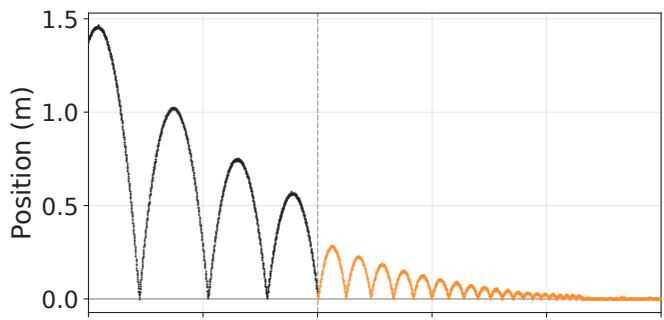

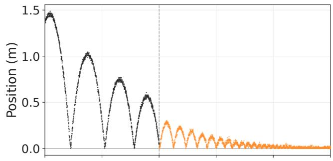

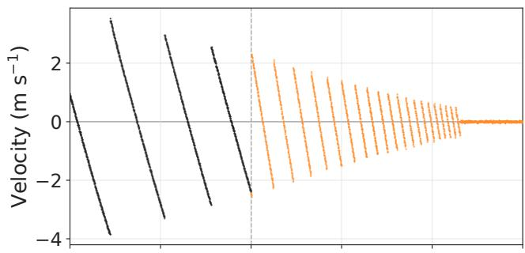

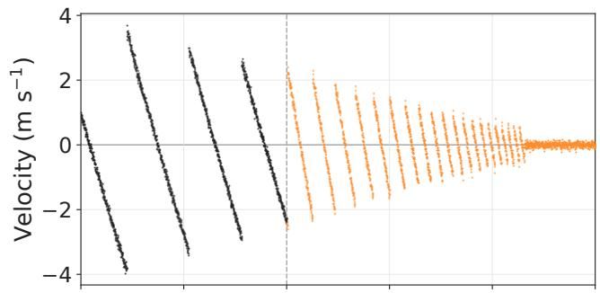

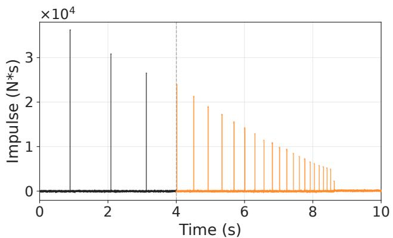  
(a) Low observation noise

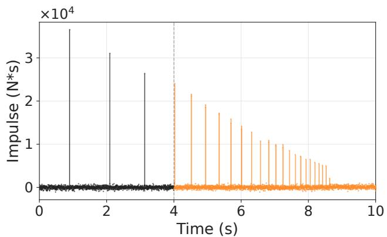  
(b) High observation noise

Figure 5: Position, velocity, and ground-contact impulse $( \mathbf { N } ^ { \star } \mathbf { s } )$ channels from BallDrop under (a) low and (b) high observation noise.  
Table 7: BallDrop released-trajectory SNR in dB as the mean and sample standard deviation.
<table><tr><td>Channel</td><td>Low Noise High Noise</td></tr><tr><td>Impulse  $2 1 . 0 7 \pm 2 . 5 5$ </td><td> $9 . 0 3 \pm 2 . 5 5$ </td></tr><tr><td>Position</td><td> $4 2 . 4 1 \pm 3 . 1 9$   $3 0 . 5 8 \pm 3 . 1 4$ </td></tr><tr><td>Velocity</td><td> $3 6 . 5 8 \pm 2 . 6 0$   $2 4 . 5 4 \pm 2 . 6 0$ </td></tr></table>

## BounceBal1

https://tracebench.github.io/environments/BounceBall/

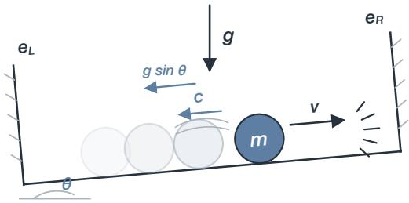

## System description

These time series were generated by simulating a damped mass moving along a one-dimensional rail between two rigid walls located at positions $\texttt { x \_ L }$ and $\mathsf { x { \_ R } }$

The rail may be tilted by a fixed inclination angle.

When the mass is not in contact with either wall, its motion along the rail is governed by viscous drag, proportional to velocity and opposite the direction of motion, and, when the inclination angle is nonzero, by the component of gravity along the rail.

When the mass hits a wall, the collision is modeled as an instantaneous impact: the direction of motion reverses and the post-impact speed is reduced according to that walls' restitution coefficient.

Observed channels: position, velocity, and right-wall contact force.

Candidate labels: inclination angle, mass, left restitution, right restitution, viscous damping, and no parameter change.

Table 8: BounceBall simulation settings used by the released trajectories.
<table><tr><td>Simulation End</td><td>60 s</td></tr><tr><td>Sampling Frequency</td><td>50 Hz</td></tr><tr><td>Number of Rows</td><td>2999</td></tr></table>

Table 9: Simulator-specific rejection rules for BounceBall.
<table><tr><td>Applies to</td><td>Rule</td></tr><tr><td>All interventions</td><td>Each usable intervention and baseline trace must contain fewer than 20 impacts. Impacts are counted from velocity reversals whose incoming speed exceeds 0.1 m s−¹; when velocity reversals cannot be computed, samples with absolute right-contact force</td></tr><tr><td>Mass and viscous damping</td><td>above  $1 0 ^ { - 9 }$  N are used. In the intervention trace, a qualifying velocity reversal must occur both before and after the intervention time, and right-contact force must</td></tr></table>

Table 10: Empirical BounceBall retained-pool variable summaries.
<table><tr><td>variable</td><td>min</td><td>median</td><td>max</td></tr><tr><td>initial_position</td><td>3</td><td>6.2</td><td>9.3</td></tr><tr><td>initial_velocity</td><td>-17.01</td><td>-8.2</td><td>10</td></tr><tr><td>mass</td><td>0.29498</td><td>15.435</td><td>99.287</td></tr><tr><td>viscous_damping</td><td>0.001</td><td>0.055</td><td>1.32</td></tr><tr><td>restitution_right</td><td>0.44813</td><td>0.74813</td><td>0.9999</td></tr><tr><td>restitution_left</td><td>0.25</td><td>0.79684</td><td>0.9999</td></tr><tr><td>inclination_angle</td><td>-0.67187</td><td>0</td><td>0.95367</td></tr></table>

Empirical summaries are sample-weighted across every retained released sample.

Table 11: Exact BounceBall observation-noise coefficients.
<table><tr><td>Coefficient  $\kappa _ { \mathrm { r e f } }$ </td></tr><tr><td>position_base_sigma_scale 0.0175</td></tr><tr><td>position_drift_sigma_scale 0.004</td></tr><tr><td>position_event_sigma_scale 0.04</td></tr><tr><td>position_quant_step_floor 0.0005</td></tr><tr><td>position_quant_step_scale 0.0025</td></tr><tr><td>right_force_base_sigma_scale 0.0001</td></tr><tr><td>right_force_event_sigma_scale 0.004</td></tr><tr><td>speed_base_sigma_scale 0.00088</td></tr><tr><td>speed_drift_sigma_scale 0.0001056</td></tr><tr><td>speed_event_sigma_scale 0.00704</td></tr><tr><td>speed_hetero_sigma_scale 0.0022</td></tr><tr><td>speed_post_event_sigma_scale 0.00308</td></tr></table>

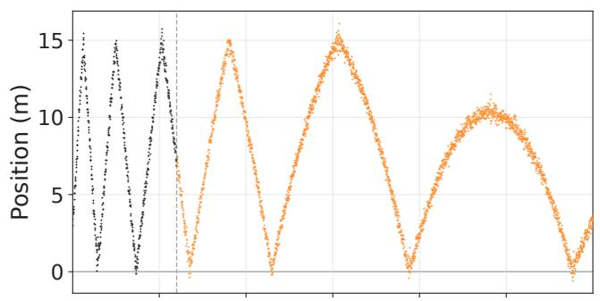

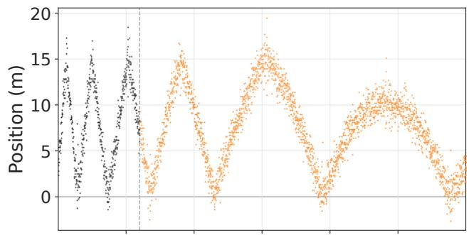

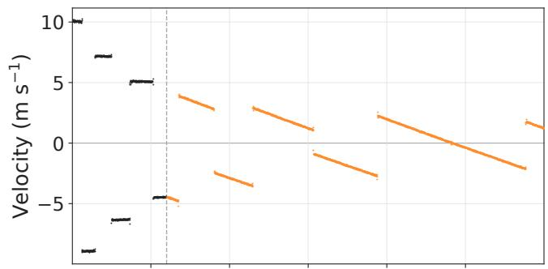

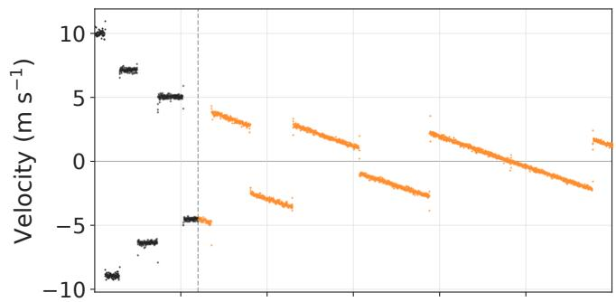

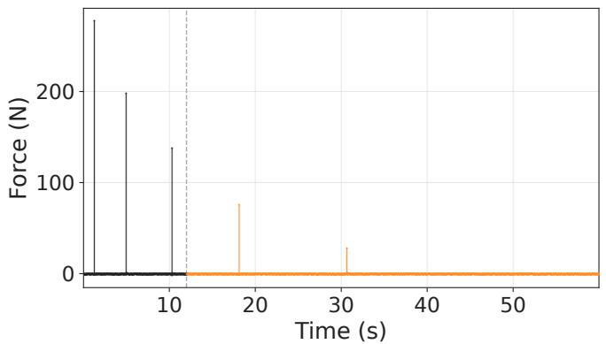  
(a) Low observation noise

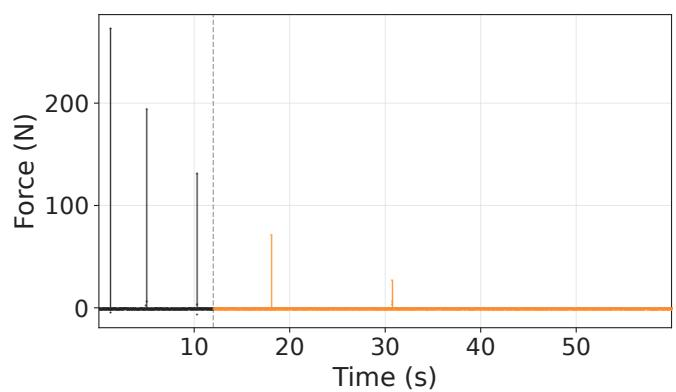  
(b) High observation noise

Figure 6: Position, velocity, and right-wall force channels from BounceBall under (a) low and (b) high observation noise.  
Table 12: BounceBall released-trajectory SNR in dB as the mean and sample standard deviation.
<table><tr><td>Channel</td><td>Low Noise High Noise</td></tr><tr><td>Position  $3 0 . 0 2 \pm 1 . 9 1$ </td><td> $1 7 . 9 7 \pm 1 . 9 1 $ </td></tr><tr><td>Velocity</td><td> $4 0 . 9 8 \pm 2 . 4 6$   $2 8 . 9 4 \pm 2 . 4 6$ </td></tr><tr><td>Force</td><td> $3 9 . 0 9 \pm 2 . 4 5$   $2 7 . 0 5 \pm 2 . 4 5$ </td></tr></table>

## MassSlide

Simulator page

https://tracebench.github.io/environments/MassSlide/

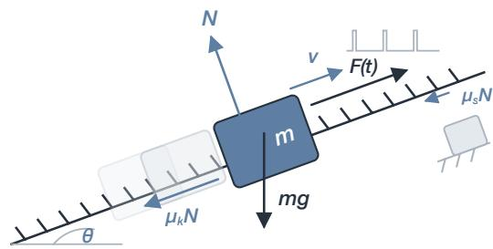

## System description

These time series were generated by simulating a block of mass m moving along an infinitely long rigid plane inclined at an angle theta under gravitational acceleration g and Coulomb friction.

The coordinate axis is aligned with the plane.

The block is also subject to an externally applied periodic force along the plane.

The friction force acts along the plane and opposes motion. When the block is moving, that is, when v(t) is nonzero,

friction is modeled as kinetic Coulomb friction.

A breakaway static-friction threshold is also modeled: when the block is at rest, motion starts only if the net driving force along the plane exceeds a breakaway limit.

Observed channels: velocity, friction force, and normal force.

Candidate labels: breakaway friction, Coulomb friction, gravity constant, plane inclination, and no parameter change.

Table 13: MassSlide simulation settings used by the released trajectories.
<table><tr><td>Simulation End</td><td>10 s</td></tr><tr><td>Sampling Frequency</td><td>50 Hz</td></tr><tr><td>Number of Rows</td><td>499</td></tr></table>

Table 14: Simulator-specific rejection rules for MassSlide.
<table><tr><td>Applies to</td><td>Rule</td></tr><tr><td></td><td>Breakaway friction At least one common non-time channel must have symmetric relative difference  $2 | y - y _ { 0 } | / ( | y | + | y _ { 0 } | + \epsilon _ { \mathrm { S R D } } ) > 0 . 2$  for five</td></tr><tr><td>Gravity</td><td>consecutive samples. At least one of the intervention and baseline traces must contain five finite, nonzero velocity samples before and five after the reference change time, taken as the intervention time or, if unavailable, the</td></tr><tr><td>All remaining classes</td><td>earliest detected divergence. No additional simulator-specific rule is applied.</td></tr></table>

Table 15: Empirical MassSlide retained-pool variable summaries.
<table><tr><td>variable</td><td>min</td><td>median</td><td>max</td></tr><tr><td>initial_velocity</td><td>-5</td><td>1</td><td>12</td></tr><tr><td>Amplitude</td><td>-352.94</td><td>-27.652</td><td>360</td></tr><tr><td>Period</td><td>0.68753</td><td>1.7104</td><td>2.8184</td></tr><tr><td>mass</td><td>0.5</td><td>2.2361</td><td>10</td></tr><tr><td>gravity_constant</td><td>4</td><td>6</td><td>18.432</td></tr><tr><td>plane_inclination</td><td>5</td><td>20.945</td><td>65.938</td></tr><tr><td>coulomb_friction_coefficient</td><td>0.08</td><td>0.7746</td><td>6.5425</td></tr><tr><td>breakaway_friction_coefficient</td><td>1.095</td><td>6</td><td>42.31</td></tr></table>

Empirical summaries are sample-weighted across every retained released sample

Table 16: Exact MassSlide observation-noise coefficients.
<table><tr><td>Coefficient Kref</td></tr><tr><td>friction_base_sigma_scale 0.001</td></tr><tr><td>friction_bias_sigma_scale 0.002</td></tr><tr><td>friction_drift_sigma_scale 0.001</td></tr><tr><td>friction_event_sigma_scale 0.02</td></tr><tr><td>normal_base_sigma_scale 0.001</td></tr><tr><td>normal_drift_sigma_scale 0.0002</td></tr><tr><td>velocity_base_sigma_scale 0.003</td></tr><tr><td>velocity_drift_sigma_scale 0.0005</td></tr><tr><td>velocity_event_sigma_scale 0.01</td></tr><tr><td>velocity_hetero_sigma_scale 0.003</td></tr></table>

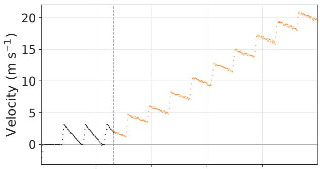

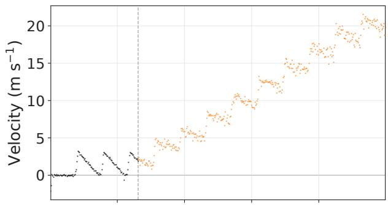

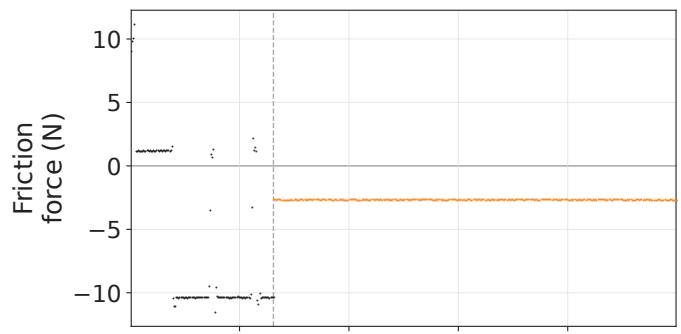

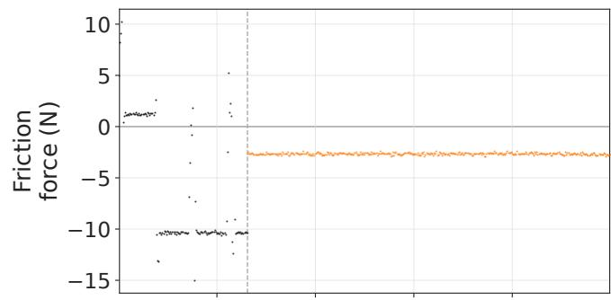

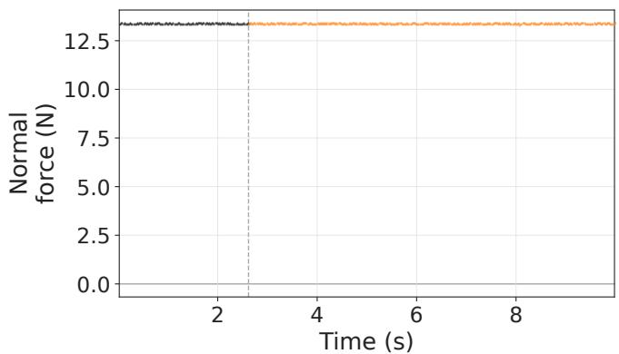  
(a) Low observation noise

  
(b) High observation noise

Figure 7: Velocity, friction-force, and normal-force channels from MassSlide under (a) low and (b) high observation noise.  
Table 17: MassSlide released-trajectory SNR in dB as the mean and sample standard deviation.
<table><tr><td>Channel</td><td>Low Noise High Noise</td></tr><tr><td>friction_force  $4 2 . 0 3 \pm 9 . 7 5$ </td><td> $2 9 . 9 9 \pm 9 . 7 5$ </td></tr><tr><td>mass_velocity</td><td> $3 5 . 6 4 \pm 6 . 5 8$   $2 3 . 6 0 \pm 6 . 5 8$ </td></tr><tr><td>normal_force</td><td> $5 9 . 9 0 \pm 0 . 4 0$   $4 7 . 8 6 \pm 0 . 4 0$ </td></tr></table>

## B Additional Details on Solvability Filtering

We apply the solvability filtering procedure to noise-free intervention trajectories before sampling observation noise. Let $\mathcal { T }$ denote the observed time indices, and let $q \in \{ \mathrm { N I } , \mathrm { S C } \}$ identify the nointervention and static-change probes. For non-impulse channels, we define the comparison window as

$$
\mathcal { I } _ { q } = \left\{ \begin{array} { l l } { \{ t \in \mathcal { T } : t \geq t _ { \mathrm { i n t } } \} , } & { q = \mathrm { N I } , } \\ { \mathcal { T } , } & { q = \mathrm { S C } , } \end{array} \right. \qquad T _ { q } = | \mathcal { I } _ { q } | .
$$

The no-intervention probe is compared only after the intervention, whereas the static-change probe is compared over the full trajectory. For each channel $c ,$ let $\mathcal { T } _ { c , q }$ denote its comparison window. For nonimpulse channels, we set $\begin{array} { r } { \mathcal { I } _ { c , q } = \mathcal { I } _ { q } . } \end{array}$

For impulse channels, such as the contact-force channels in Bal1Drop and BounceBal1, we instead use the portions of $\scriptstyle { \mathcal { T } } _ { q }$ lying within 30 ms of impacts detected in either the target or probe trajectory. Let

$$
\begin{array} { r } { T _ { c , q } = | { \cal I } _ { c , q } | . } \end{array}
$$

For channel c and probe $q ,$ the trajectory difference is

$$
\Delta _ { c , q } = \sqrt { \frac { 1 } { T _ { c , q } } \sum _ { t \in \bar { \cal I } _ { c , q } } \left( x _ { c , t } ^ { \mathrm { t a r g e t } } - x _ { c , t } ^ { \mathrm { p r o b e } , q } \right) ^ { 2 } } .
$$

We normalize this difference by the expected corruption produced by an observation model with noise level $\kappa ,$ evaluated on the same clean target trajectory and comparison window:

$$
\sigma _ { c , q } ( \kappa ) = \sqrt { \mathbb { E } _ { \tilde { \mathbf { x } } \sim p _ { \kappa } ( \cdot \vert \mathbf { x } ^ { \mathrm { t a r g e t } } ) } \left[ \frac { 1 } { T _ { c , q } } \sum _ { t \in \mathcal { I } _ { c , q } } \left( \tilde { x } _ { c , t } - x _ { c , t } ^ { \mathrm { t a r g e t } } \right) ^ { 2 } \right] } .
$$

The resulting dimensionless effect-to-noise ratio and its aggregation across the observed channels are

$$
R _ { c , q } ( \kappa ) = \frac { \Delta _ { c , q } } { \sigma _ { c , q } ( \kappa ) + \varepsilon } , \qquad R _ { q } ( \kappa ) = \operatorname* { m a x } _ { c } R _ { c , q } ( \kappa ) ,
$$

where $\varepsilon > 0$ provides numerical stability. We estimate the expectation with deterministic noise seeds $0 , \ldots , N - 1$ . Candidates are first screened using $N = 1 2 8$ high-noise realizations. Every screenpassing candidate is then recomputed using N = 1024 realizations, and it is retained only if it passes at both stages. For the filtering procedure, we evaluate this criterion at $\kappa = \kappa _ { \mathrm { h i g h } }$ and use the single global threshold $\rho = 2 .$ A target and probe $q$ are considered distinguishable when

$$
R _ { q } ( \kappa _ { \mathrm { h i g h } } ) > \rho ,
$$

meaning that, in at least one observed channel, the effect-to-noise ratio exceeds two.

For each intervention candidate, we evaluate the two probe comparisons independently and retain the candidate only when

$$
R _ { \mathrm { N I } } ( \kappa _ { \mathrm { h i g h } } ) > \rho \qquad \mathrm { a n d } \qquad R _ { \mathrm { S C } } ( \kappa _ { \mathrm { h i g h } } ) > \rho .
$$

The simulator-specific rejection rules described in Appendix A are applied in addition to this criterion.

## C Additional Details about Experimental Setup

## C.1 Data Generation and Sample Selection

Initial configurations, each comprising an initial state and a complete set of baseline parameter values, were constructed from the simulator-specific operating ranges reported in Appendix A. For each initial configuration, we generated multiple candidates by varying the intervention class, intervention time, and post-intervention parameter value. Each candidate was subsequently processed by the documented rejection pipeline.

To reduce the risk that the pre-intervention configuration alone reveals the ground-truth class, we retained an initial configuration only if at least two distinct root-cause interventions passed the filtering procedure. No-intervention samples were also generated from these retained initial configurations.

Additionally, test samples within the same batch and, where applicable, labeled support samples were selected from distinct initial configurations. Thus, no two samples in the same episode shared the same initial state and baseline parameter values, reducing the risk of biasing the agent.

The held-out test set comprises 142 samples per class. All datasets and sample assignments were frozen before any agent evaluation was conducted.

## C.2 Released-test-set accounting and construction

All statistics in this catalog are recomputed from the released questions.json, sample\_manifest.json, model\_record.json clean Parquet trajectories, and released noise implementations. Empirical parameter and intervention summaries use the full retained environment pool rather than an illustrative subset.

## C.3 Available Platforms

Table 18: Available platforms and their installation requirements.

<table><tr><td>Platform</td><td>Pinned npm package</td></tr><tr><td>codex</td><td>@openai/codex@0.124</td></tr><tr><td>gemini-cli</td><td>@google/gemini-cli@0.35.3</td></tr><tr><td>claude-code</td><td>@anthropic-ai/claude-code@2.1.96</td></tr><tr><td>opencode</td><td>opencode-ai@1.14.29</td></tr></table>

## C.4 Available Agents

Only the profiles used in the paper are shown.

Table 19: Agent profile catalog.
<table><tr><td>Agent</td><td>Platform</td><td>Reasoning Effort Img.</td><td></td></tr><tr><td>claude-opus-4.6</td><td>claude-code</td><td>high</td><td>Y</td></tr><tr><td>gemini-3.1-pro</td><td>gemini-cli</td><td>high</td><td>Y</td></tr><tr><td>gpt-5.5</td><td>codex</td><td>high</td><td>Y</td></tr><tr><td>minimax-m2.7</td><td>opencode</td><td>一</td><td>N</td></tr></table>

## C.5 Agentic Runtime Libraries

Agent episodes run in an isolated container based on ghcr. io/ laude-institute/t-bench/python-3-13:20250620.Internetaccess is disabled except for the model API proxy. The runtime also includes uv version 0.8.15 and the system utilities tmux, asciinema, and procps. The Python packages explicitly installed in the agent runtime are listed below.

Table 20: Python packages installed in the agent runtime.
<table><tr><td>Package</td><td>Version</td></tr><tr><td>contourpy</td><td>1.3.3</td></tr><tr><td>cycler</td><td>0.12.1</td></tr><tr><td>fonttools</td><td>4.61.1</td></tr><tr><td>iniconfig</td><td>2.3.0</td></tr><tr><td>joblib</td><td>1.5.3</td></tr><tr><td>kiwisolver</td><td>1.4.9</td></tr><tr><td>11vmlite</td><td>0.46.0</td></tr><tr><td>matplotlib</td><td>3.10.8</td></tr><tr><td>numba</td><td>0.63.1</td></tr><tr><td>numpy</td><td>2.3.5</td></tr><tr><td>packaging</td><td>26.0</td></tr><tr><td>pandas</td><td>3.0.0</td></tr><tr><td>pillow</td><td>12.1.0</td></tr><tr><td>pluggy</td><td>1.6.0</td></tr><tr><td>pyarrow</td><td>23.0.0</td></tr><tr><td>Pygments</td><td>2.19.2</td></tr><tr><td>pyparsing</td><td>3.3.2</td></tr><tr><td>pytest</td><td>8.4.1</td></tr><tr><td>python-dateutil</td><td>2.9.0.post0</td></tr><tr><td>ruptures</td><td>1.1.10</td></tr><tr><td>scikit-learn</td><td>1.8.0</td></tr><tr><td>scipy</td><td>1.17.0</td></tr><tr><td>six</td><td>1.17.0</td></tr><tr><td>threadpoolctl</td><td>3.6.0</td></tr><tr><td>tslearn</td><td>0.7.0</td></tr></table>

## D Evaluation Costs

## D.1 Agent Pricing

Table 21: Agent prices used to compute evaluation costs, in USD per 1M tokens.
<table><tr><td>Agent</td><td></td><td>Input Cached</td><td>Output</td></tr><tr><td>claude-opus-4.6</td><td>5</td><td>0.5</td><td>25</td></tr><tr><td>gemini-3.1-pro</td><td>2</td><td>0.2</td><td>12</td></tr><tr><td>gpt-5.5</td><td>5</td><td>0.5</td><td>30</td></tr><tr><td>minimax-m2.7</td><td>0.3</td><td>0.059</td><td>1.20</td></tr></table>

## D.2 Accuracy versus Evaluation Cost

Figures 8 to 10 show episode accuracy versus evaluation cost separately for each simulator and each main-experiment condition. Each point shows the mean episode accuracy and mean evaluation cost for one model across the five repetition seeds; horizontal and vertical error bars show the corresponding sample standard deviations.

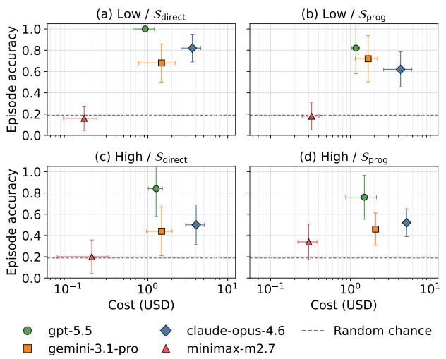  
Figure 8: Episode top-1 accuracy versus mean evaluation cost for Bal1Drop under the four main-experiment conditions.

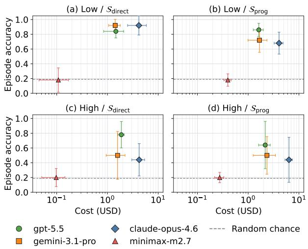  
Figure 9: Episode top-1 accuracy versus mean evaluation cost for BounceBall under the four main-experiment conditions.

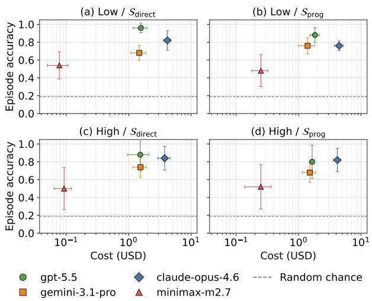  
Figure 10: Episode top-1 accuracy versus mean evaluation cost for MassSlide under the four main-experiment conditions.

## E Classical Time-Series Baselines

Table 22: Visible-test accuracy of six learned classical time-series baselines, including privileged variants that subtract the clean paired no-intervention trajectory; uniform-random-guessing accuracy for Bal1Drop/BounceBal1/MassSlide is 0.200/0.167/0.200 (aggregate: 0.189).
<table><tr><td>Method</td><td>BallDrop</td><td>BounceBal1</td><td>MassSlide</td><td>Aggregate</td></tr><tr><td colspan="5">Low noise  $( \kappa _ { \mathrm { l o w } } )$ </td></tr><tr><td>Euclidean 1-NN</td><td> $0 . 1 4 0 \pm 0 . 0 8 9$ </td><td> $0 . 3 4 0 \pm 0 . 1 5 2$ </td><td> $0 . 1 4 0 \pm 0 . 0 5 5$ </td><td> $0 . 2 0 7 \pm 0 . 0 9 9$ </td></tr><tr><td>Euclidean 1-NN (privileged)</td><td> $0 . 4 2 0 \pm 0 . 1 4 8$ </td><td> $0 . 3 6 0 \pm 0 . 1 1 4$ </td><td> $0 . 4 8 0 \pm 0 . 1 9 2$ </td><td> $0 . 4 2 0 \pm 0 . 1 4 3$ </td></tr><tr><td>DTW 1-NN</td><td> $0 . 2 2 0 \pm 0 . 1 4 8$ </td><td> $0 . 2 4 0 \pm 0 . 1 3 4$ </td><td> $0 . 2 2 0 \pm 0 . 1 1 0$ </td><td> $0 . 2 2 7 \pm 0 . 1 2 2$ </td></tr><tr><td>DTW 1-NN (privileged)</td><td> $0 . 5 2 0 \pm 0 . 1 3 0$ </td><td> $0 . 3 6 0 \pm 0 . 2 3 0$ </td><td> $0 . 5 8 0 \pm 0 . 1 9 2$ </td><td> $0 . 4 8 7 \pm 0 . 1 7 5$ </td></tr><tr><td>MiniRocket+ridge</td><td> $0 . 2 6 0 \pm 0 . 1 1 4$ </td><td> $0 . 3 2 0 \pm 0 . 1 1 0$ </td><td> $0 . 3 2 0 \pm 0 . 1 3 0$ </td><td> $0 . 3 0 0 \pm 0 . 1 1 0$ </td></tr><tr><td>MiniRocket+ridge (privileged)</td><td> $0 . 6 0 0 \pm 0 . 1 5 8$ </td><td> $0 . 7 2 0 \pm 0 . 1 9 2$ </td><td> $0 . 5 0 0 \pm 0 . 1 2 2$ </td><td> $0 . 6 0 7 \pm 0 . 1 4 8$ </td></tr><tr><td colspan="5">High noise  $( \kappa _ { \mathrm { h i g h } } )$ </td></tr><tr><td>Euclidean 1-NN</td><td> $0 . 1 4 0 \pm 0 . 0 8 9$ </td><td> $0 . 3 4 0 \pm 0 . 1 5 2$ </td><td> $0 . 1 4 0 \pm 0 . 0 5 5$ </td><td> $0 . 2 0 7 \pm 0 . 0 9 9$ </td></tr><tr><td>Euclidean 1-NN (privileged)</td><td> $0 . 4 2 0 \pm 0 . 1 4 8$ </td><td> $0 . 3 6 0 \pm 0 . 1 5 2$ </td><td> $0 . 4 6 0 \pm 0 . 1 6 7$ </td><td> $0 . 4 1 3 \pm 0 . 1 4 4$ </td></tr><tr><td>DTW 1-NN</td><td> $0 . 2 2 0 \pm 0 . 1 4 8$ </td><td> $0 . 2 6 0 \pm 0 . 1 1 4$ </td><td> $0 . 2 2 0 \pm 0 . 1 1 0$ </td><td> $0 . 2 3 3 \pm 0 . 1 1 6$ </td></tr><tr><td>DTW 1-NN (privileged)</td><td> $0 . 5 0 0 \pm 0 . 1 4 1$ </td><td> $0 . 3 8 0 \pm 0 . 1 7 9$ </td><td> $0 . 4 4 0 \pm 0 . 0 8 9$ </td><td> $0 . 4 4 0 \pm 0 . 1 3 1$ </td></tr><tr><td>MiniRocket+ridge</td><td> $0 . 2 8 0 \pm 0 . 1 1 0$ </td><td> $0 . 2 8 0 \pm 0 . 1 3 0$ </td><td> $0 . 2 8 0 \pm 0 . 1 4 8$ </td><td> $0 . 2 8 0 \pm 0 . 1 2 1$ </td></tr><tr><td>MiniRocket+ridge (privileged)</td><td> $0 . 6 0 0 \pm 0 . 2 1 2$ </td><td> $0 . 6 8 0 \pm 0 . 1 9 2$ </td><td> $0 . 4 0 0 \pm 0 . 0 7 1$ </td><td> $0 . 5 6 0 \pm 0 . 1 5 8$ </td></tr></table>

We compare the agent results with six learned non-agentic baselines and analytic uniform random guessing on the matched visibletest direct-answer episodes under low and high observation noise. For each simulator and seed, every learned baseline fits only the three labeled examples per class shown to the agents and predicts the same ten test trajectories. The six learned methods pair ordinary and privileged variants of Euclidean 1-nearest-neighbor (1-NN) multivariate dynamic time warping (DTW) 1-NN, and MiniRocket with a ridge classifier [5]. Each privileged input is the observed intervention trajectory minus its clean paired no-intervention trajectory, channel by channel. We retain each original time grid, exclude its time column, and perform no interpolation or standardization. After noise addition and privileged subtraction, we divide only Hard\_Stop\_f for Bal1Drop and Right\_Hard\_Stop\_f for BounceBall by that trajectory's maximum absolute impulse force when nonzero. Euclidean 1-NN uses root-mean-square distance on the flattened multichannel trajectory. DTW 1-NN uses dependent multivariate DTW with squared-Euclidean local cost and an unconstrained warping path. MiniRocket uses 10,000 kernels, a fixed random seed, and aeon's 10-7 constant-channel threshold, while ridge cross-validation is confined to the labeled support set. Ties for the nearest-neighbor methods are resolved deterministically by distance, class index, and support-sample identifier.

## F Direct-Answer Confusion Matrices

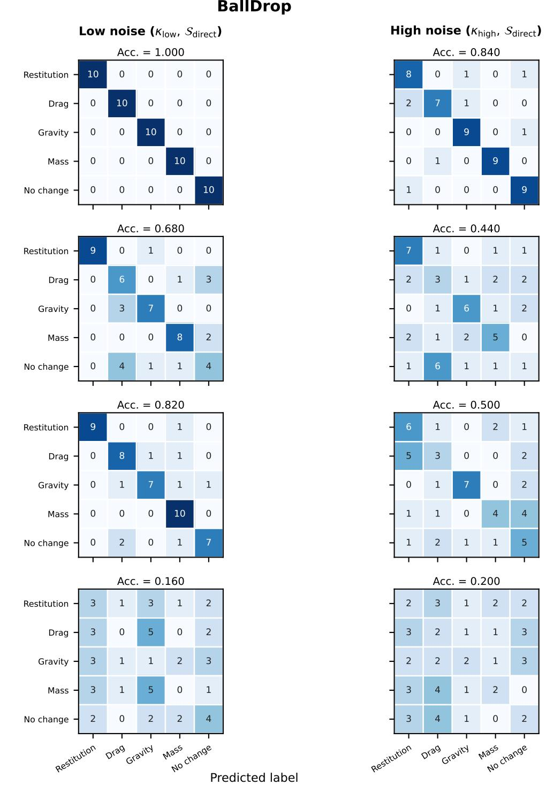  
Figure 11: BallDrop confusion matrices for $s _ { \mathrm { d i r e c t } } ,$ reported separately for every agent under $\kappa _ { \mathrm { l o w } }$ and $\kappa _ { \mathrm { h i g h } } .$

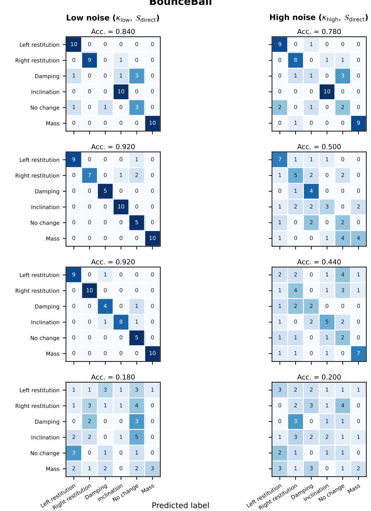  
Figure 12: BounceBall confusion matrices for $s _ { \mathrm { d i r e c t } } ,$ reported separately for every agent under $\kappa _ { \mathrm { l o w } }$ and $\kappa _ { \mathrm { h i g h } }$

MassSlide  
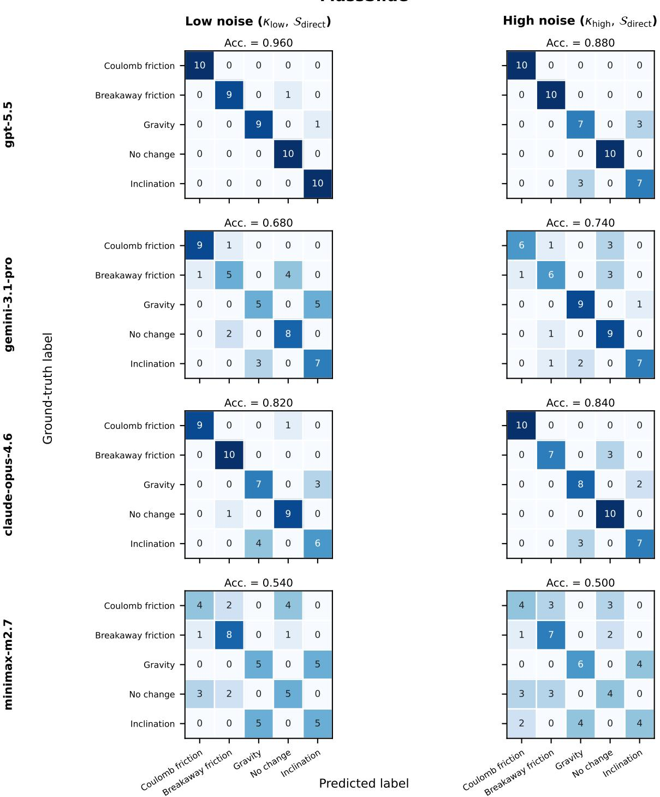  
Figure 13: MassSlide confusion matrices for $s _ { \mathrm { d i r e c t } } ,$ reported separately for every agent under $\kappa _ { \mathrm { l o w } }$ and $\kappa _ { \mathrm { h i g h } } .$

## G Metric definitions and computation

This section defines the trajectory-derived metrics reported in the main text.

Total time. Total time measures active agent-system wall-clock time, including model inference and tool execution.

## G.1 Interaction and Python-use metrics

Agent iterations. The number of LLM calls in a single trajectory. An iteration can contain text, reasoning, and zero or more tool calls.

Tool calls. The total number of well-formed tool calls in an episode.

Python calls. The total number of parsed Python interpreter invocations in tool commands. Inline python -c programs, Python heredocs, module invocations, and executions of . py files are counted; repeated executions of the same source are separate calls. Displaying Python source without executing it does not add a call.

Python statements. The total number of Python abstract-syntaxtree statement nodes across the distinct Python source versions first displayed in the trajectory.

## G.2 Plot and numerical-inspection metrics

Plots generated. The number of image-like artifacts created in the episode artifact directory, including common raster, vector, and PDF formats. Each distinct generated file contributes one, irrespective of how often it is later opened.

Plots inspected. The number of images generated by the LLM agent that are subsequently read, opened, or viewed successfully with an image-capable tool.

Numeric values printed. This metric counts the numeric literals exposed to the agent through tool output during an episode. It includes integers, decimals, scientific notation, numeric entries in arrays and tables, and non-finite forms such as nan and inf. It excludes numbers that occur in source code, tool-wrapper metadata, process identifiers, warnings and tracebacks, synthetic file-reader line numbers, sample and filesystem identifiers, and embedded image payloads. Consequently, this metric measures numerical evidence exposed through tool output rather than the number of values present in the input time-series files.

Console output token share. This metric estimates the percentage of cumulative input-context tokens attributable to console output.

## G.3 Token, cost, and context metrics

Total tokens. The total number of prompt tokens processed plus completion tokens generated across an episode.

Cost. Evaluation cost is reported in U.S. dollars and is computed from the recorded prompt, cached-prompt, and completion-token totals using the per-million-token prices configured for the corresponding agent profile:

$$
C = { \frac { ( T _ { \mathrm { p r o m p t } } - T _ { \mathrm { c a c h e d } } ) p _ { \mathrm { i n } } + T _ { \mathrm { c a c h e d } } { p _ { \mathrm { c a c h e d } } } + T _ { \mathrm { c o m p l e t i o n } } { p _ { \mathrm { o u t } } } } { 1 0 ^ { 6 } } } .\tag{1}
$$

The per-agent input, cached-input, and output prices used in this calculation are reported in Table 21.

## H Paired Statistical Analysis and Uncertainty

Table 23: Complete paired episode-level differences, reported in percentage points with confidence intervals obtained by exhaustive sign-flip inversion. For agent comparisons, differences are calculated within each simulator-seed pair and then averaged across the low- and high-noise conditions. For condition comparisons, differences are averaged across the three closed-weight agents; minimax-m2.7 is excluded. W/T/L (win/tie/loss) is determined from these paired differences.

<table><tr><td>Contrast</td><td>Effect [95% CI]</td><td>W/T/L</td></tr><tr><td colspan="3">Agent comparisons (low/high noise averaged)</td></tr><tr><td> $\mathrm { g p \tilde { t } - 5 . 5 \cdot g e n i n i - 3 . 1 \mathrm { - p r o } , } S _ { \mathrm { d i r e c t } } , \mathrm { e p i s o d e }$ </td><td>22.3 [10.7, 34.0]</td><td>12/0/3</td></tr><tr><td> ${ \mathrm { g p t } } { - } 5 . 5 - { \mathrm { g e m i n i } } { - } 3 . 1 { \mathrm { - p r o } } , S _ { \mathrm { p r o g } } , { \mathrm { e p i s o d e } }$ </td><td>15.3 [6.3, 24.3]</td><td>11/1/3</td></tr><tr><td> $\mathrm { g p t } { - } 5 . 5 \cdot \mathrm { g e m i n i } { - } 3 . 1 \mathrm { - p r o } , S _ { \mathrm { p r o g } } , \mathrm { h e l d } { - } \mathrm { o u t }$ </td><td>8.7 [1.9, 15.5]</td><td>12/0/3</td></tr><tr><td> $\mathrm { g p t { - } 5 . 5 \mathrm { - } c l a u d e { - } o p u s { - } 4 . 6 , } \tilde { S } _ { \mathrm { d i r e c t } } , \mathrm { e p i s o d e }$ </td><td>16.0 [6.7, 25.0]</td><td>12/0/3</td></tr><tr><td> $\mathrm { g \bar { p } t ^ { - 5 . 5 - c l a u d e - o \bar { p } u s - 4 . 6 , S _ { p r o g } , e \bar { p i } s o d e } }$ </td><td>15.3 [6.9, 24.0]</td><td>13/1/1</td></tr><tr><td> $\mathrm { g p t } { - } 5 . 5 \mathrm { - c l a u d e } \mathrm { - o p u s } { - } 4 . 6 , S _ { \mathrm { p r o g } } , \mathrm { h e l d } \mathrm { - o u t }$ </td><td>5.3 [-2.5, 12.9]</td><td>9/0/6</td></tr><tr><td> $\mathrm { g p t ^ { - 5 . 5 - m i n i m a x - m 2 . 7 , S _ { d i r e c t } , e p i s o d e } }$ </td><td>58.7 [46.7, 70.7]</td><td>15/0/0</td></tr><tr><td> $\mathrm { g \bar { p } t ^ { - 5 . 5 - \ m i n i m a x - m 2 . 7 , } } S _ { \mathrm { p r o g } } , \mathrm { e \bar { p i } s o d e }$ </td><td>47.7 [36.7, 58.6]</td><td>15/0/0</td></tr><tr><td> $\mathrm { g p t } { - } 5 . 5 \cdot \mathrm { m i n i m a x } { - } \mathrm { m } 2 . 7 , S _ { \mathrm { p r o g } } ^ { \mathrm { } } , \mathrm { h e l d - o u t }$ </td><td>31.6 [21.6, 41.6]</td><td>15/0/0</td></tr><tr><td colspan="3">Condition effects (closed-weight-agent averaged; minimax-m2.7 excluded)</td></tr><tr><td>Closed-weight-agent average: low - high noise,  $S _ { \mathrm { d i r e c t } } ,$  episode</td><td>18.7 [8.8, 28.7]</td><td>12/2/1</td></tr><tr><td>Closed-weight-agent average: low - high noise,  $S _ { \mathrm { p r o g } } ,$  episode heldout</td><td>13.3 [4.7, 21.9]</td><td>10/2/3</td></tr><tr><td>Closed-weight-agent average: low - high noise,  $S _ { \mathrm { p r o g } } ,$ </td><td>13.5 [7.2, 19.9]</td><td>13/0/2</td></tr><tr><td>Closed-weight-agent average:  $S _ { \mathrm { d i r e c t } } - \mathrm { \bar { \cal S } } _ { \mathrm { p r o g } } ,$  low noise, episode</td><td>9.1 [4.7, 13.3]</td><td>13/1/1</td></tr><tr><td>Closed-weight-agent average:  $S _ { \mathrm { d i r e c t } } - \tilde { S _ { \mathrm { p r o g } } } ,$  high noise, episode</td><td>3.8 [-2.7, 10.5]</td><td>8/2/5</td></tr><tr><td colspan="3">Matched ablations</td></tr><tr><td> $\mathrm { g p t } { - 5 . 5 } { \mathrm { : ~ w i t h - w i t h o u t ~ t e x t } } , S _ { \mathrm { d i r e c t } } , \mathrm { e p i s o d e }$ </td><td>32.0 [18.3, 45.7]</td><td>13/2/0</td></tr><tr><td> $\mathrm { g p t } { - 5 . 5 } \colon \mathrm { w i t h - w i t h o u t t e x t } , S _ { \mathrm { p r o g } } ,$  episode</td><td>28.0 [13.3, 42.5]</td><td>12/1/2</td></tr><tr><td> $\mathrm { g p t } { - 5 . 5 } { \mathrm { : ~ w i t h - w i t h o u t ~ t e x t } { , } } S _ { \mathrm { p r o g } } { , } \mathrm { h e l d } { - } { \mathrm { o u t } }$ </td><td>23.2 [14.1, 32.3]</td><td></td></tr><tr><td> $\mathrm { g p t } { - } 5 . 5 { : } ~ 3 { - } \mathrm { s h o t } - 0 { - } \mathrm { s h o t } , S _ { \mathrm { d i r e c t } } { , } ~ \mathrm { e p i s o d e }$ </td><td>-5.3 [-16.7, 6.7]</td><td>15/0/0</td></tr><tr><td> $\mathrm { g p t } { - } 5 . 5 { : } 3 { - } \mathrm { s h o t } - 0 { - } \mathrm { s h o t } , S _ { \mathrm { p r o g } } ^ { \mathrm { -- } } , \mathrm { e p i s o d e }$ </td><td>-11.3 [-26.0, 3.3]</td><td>5/4/6</td></tr><tr><td> $\mathrm { g p t } { - } 5 . 5 { : } 3 { - } \mathrm { s h o t } - 0 { - } \mathrm { s h o t } , S _ { \mathrm { p r o g } } ^ { \bullet } , \dot { \mathrm { h e l d } { - } \mathrm { o u t } }$ </td><td>4.1 [-4.5, 11.9]</td><td>4/4/7</td></tr><tr><td> $\mathrm { g e m i n i - } 3 . 1 \mathrm { - } \mathrm { p r o } \colon \mathrm { w i t h - w i t h o u t ~ t e x t } , S _ { \mathrm { d i r e c t } } , \mathrm { e p i s o d e }$ </td><td>24.7 [8.6, 40.0]</td><td>12/0/3</td></tr><tr><td> $\mathrm { \bar { g e m i n i - 3 . 1 \bar { - p r o : } w i t h - w i t h o u t t e x t , } } S _ { \mathrm { p r o g , ~ e p i s o d e } } ^  \mathrm  m e - \bar { \ n } . \bar { \ n } . \bar { \ n } . \bar { \ n } . \bar { \ n } . \bar { \ n } . \bar { \ n } . \bar { \ n } . \bar { \ n } . \bar { \ n } . \bar { \ n } . \bar { \ n } . \bar { \ n } . \bar { \ n } . \bar { \ n } . \bar { \ n } . \bar { \ n } . \bar { \ n } . \bar { \ n } . \bar { \ n } . \bar { \ n } . \bar { \ n } . \bar { \ n } . \bar { \ n } . \bar { \ n } . \bar { \ n } . \bar { \ n } . \bar { \ n } . \bar { \ n } .$ </td><td>20.0 [3.3, 36.0]</td><td>11/2/2</td></tr><tr><td> $\mathrm { g e m i n i - 3 . 1 \bar { - } p r o : w i t h - w i t h o u t t e x t } , S _ { \mathrm { p r o g } } ^ { \mathrm { r ^ { - } - \cdot o : } } , \mathrm { \bar { h e l d - } o u t }$ </td><td>11.3 [3.7, 18.9]</td><td>11/2/2 10/0/5</td></tr><tr><td> $\bar { \mathrm { g e m i n i - 3 . 1 \bar { \mathrm { - } p r o } : 3 \mathrm { - } s h o t - 0 \mathrm { - } s h o t , S _ { \mathrm { d i r e c t } } ; \mathrm { e p i s o d e } } }$ </td><td>-8.7 [-28.3, 11.4]</td><td>5/2/8</td></tr><tr><td> $\mathsf { \bar { g e m i n i - 3 . 1 \bar { - } p r o : 3 \bar { - } s h o t - 0 - s h o t , } } S _ { \mathrm { p r o g , } } \mathsf { e p i s o d e }$ </td><td>-10.7 [-27.5, 5.0]</td><td>5/3/7</td></tr><tr><td> $\mathrm { \bar { g e m i n i - 3 . 1 \bar { p r o } : 3 \mathrm { - } s h o t - 0 \mathrm { - } s h o t , } } S _ { \mathrm { p r o g } } ^ { \mathrm { ' } \mathrm { ~ \bar { } s } } , \mathrm { \bar { h e l d - o u t } \bar { ~ } }$ </td><td>-0.4 [-9.5, 8.7]</td><td>7/0/8</td></tr></table>

## I Example Prompts Across Experimental Settings

For concreteness, all examples use Bal1Drop. The subsections show the six prompt templates used across the main experiment and the two ablations, organized by domain context, submission mode, and availability of labeled examples.

## With Domain Context, Direct Answer, No Labeled Examples

The time series in the test\_samples/ folder were generated by simulating a 1D vertical point-mass ball model under gravity. While the ball is above the ground, its motion is governed by gravity and quadratic air drag acting opposite the direction of travel, and the position evolves according to the current velocity.

Ground interaction is modeled with a restitution-based hard-stop law.

When the ball reaches the ground with impact speed at or above 0.5 m/s, the impact is treated as instantaneous and the post-impact speed is set by the coefficient of restitution e in [0,1].

The rebound points upward and its magnitude equals e times the pre-impact speed.

When the impact speed is below the threshold, the ball does not rebound and instead enters static contact at the ground.

Observed Signals:

col1: ball height

col2: ball velocity

col3: contact impulse (N\*s)

col4: time

For each simulation, either no parameter changes occur, or exactly one parameter among the allowed labels changes during the observed simulation interval.

If a parameter changes, it undergoes a single instantaneous step change at an unknown time during the observed interval.

Allowed labels:

["coefficient of restitution", "mass", "drag coefficient", "gravity acceleration", "no parameter change"]

Use "no parameter change" if there is no evidence in the data of a parameter change during the observed interval.

Task:

Create a file named results.json in the current working directory.

For each file in test\_samples/, return a ranked list of labels.

The first label is your final top-1 prediction and should be the single label you think is most likely correct.

You may include additional labels only when the evidence is genuinely ambiguous.

Additional labels are treated as lower-confidence alternatives.

The output must be valid JSON with exactly this structure: {

"<filename\_1>": ["<top\_1\_label>"],

"<filename\_2>": ["<top\_1\_label>",

"<optional\_lower\_confidence\_label>"]

## 了

Requirements:

\- Include one entry for every Parquet file in test\_samples/. - Every returned label must exactly match one of the allowed labels.

\- The order of labels matters: the first label is the top-1 prediction.

\- Do not include duplicate labels for a sample.

\- Do not return all labels unless the evidence is genuinely ambiguous across all labels.

## Evaluation:

The primary evaluation metric is top-1 accuracy: the first label in each returned list is compared with the hidden correct label.

A secondary shortlist score may also be reported. For a returned list of length m, the sample receives score 1/m if the hidden correct label appears anywhere in the list, and 0 otherwise. Therefore, unnecessary extra labels reduce the secondary score.

## Additional requirements:

\- If you create intermediate files, images, scripts, or notes while solving the task, create them in the current working directory.

\- Internet access is disabled.

## With Domain Context, Programmatic Submission, No Labeled Examples

Context:

The time series in the test\_samples/ folder were generated by simulating a 1D vertical point-mass ball model under gravity. While the ball is above the ground, its motion is governed by gravity and quadratic air drag acting opposite the direction of travel, and the position evolves according to the current velocity.

Ground interaction is modeled with a restitution-based hard-stop law.

When the ball reaches the ground with impact speed at or above 0.5 m/s, the impact is treated as instantaneous and the post-impact speed is set by the coefficient of restitution e in [0,1].

The rebound points upward and its magnitude equals e times the pre-impact speed.

When the impact speed is below the threshold, the ball does not rebound and instead enters static contact at the ground.

Observed Signals:

col1: ball height

col2: ball velocity

col3: contact impulse (N\*s)

col4: time

For each simulation, either no parameter changes occur, or exactly one parameter among the allowed labels changes during the observed simulation interval.

If a parameter changes, it undergoes a single instantaneous step change at an unknown time during the observed interval.

## Allowed labels:

["coefficient of restitution", "mass", "drag coefficient", "gravity acceleration", "no parameter change"]

Use "no parameter change" if there is no evidence in the data of a parameter change during the observed interval.

## Task:

Create a Python script named rule.py in the current working directory.

The script must define exactly this function: def predict(df) -> list[str]:

The input df is a pandas DataFrame containing one sample with columns col1, col2, col3, and col4.

The function will be called on samples inside test\_samples/ and on additional held-out samples with the same schema and label set.

For each dataframe, predict(df) must return a ranked list of labels. The first label is the final top-1 prediction and should be the single label most likely to be correct.

Additional labels are optional lower-confidence alternatives and should only be included when the evidence is genuinely ambiguous.

Requirements for predict(df):

\- Return a Python list of strings.

\- Every returned label must exactly match one of the allowed labels.

\- The first returned label is the top-1 prediction.

\- Do not include duplicate labels.

\- Do not return all labels unless the evidence is genuinely ambiguous across all labels.

\- You may inspect any file while developing rule.py, but the final submitted rule.py must not read, open, import, or depend on any files at prediction time, including test\_samples/

\- The final rule.py must be able to run on a dataframe alone.

## Evaluation:

The primary evaluation metric is top-1 accuracy: the first label returned by predict(df) is compared with the hidden correct label.

A secondary shortlist score may also be reported. For a returned list of length m, the sample receives score 1/m if the hidden correct label appears anywhere in the list, and 0 otherwise. Therefore, unnecessary extra labels reduce the secondary score.

## Additional requirements:

\- If you create intermediate files, images, scripts, or notes while solving the task, create them in the current working directory.

\- Internet access is disabled.

## With Domain Context, Direct Answer, Three Labeled Examples per Class

The time series in the test\_samples/ and train\_samples/ folders were generated by simulating a 1D vertical point-mass ball model under gravity.

While the ball is above the ground, its motion is governed by gravity and quadratic air drag acting opposite the direction of travel, and the position evolves according to the current velocity.

Ground interaction is modeled with a restitution-based hard-stop law.

When the ball reaches the ground with impact speed at or above 0.5 m/s, the impact is treated as instantaneous and the post-impact speed is set by the coefficient of restitution e in [0,1].

The rebound points upward and its magnitude equals e times the pre-impact speed.

When the impact speed is below the threshold, the ball does not rebound and instead enters static contact at the ground.

Observed Signals:

col1: ball height

col2: ball velocity

col3: contact impulse (N\*s)

col4: time

For each simulation, either no parameter changes occur, or exactly one parameter among the allowed labels changes during the observed simulation interval.

If a parameter changes, it undergoes a single instantaneous step change at an unknown time during the observed interval.

## Allowed labels:

["coefficient of restitution", "mass", "drag coefficient", "gravity acceleration", "no parameter change"]

Use "no parameter change" if there is no evidence in the data of a parameter change during the observed interval.

## Task:

Create a file named results.json in the current working directory.

For each file in test\_samples/, return a ranked list of labels.

The first label is your final top-1 prediction and should be the single label you think is most likely correct.

You may include additional labels only when the evidence is genuinely ambiguous.

Additional labels are treated as lower-confidence alternatives.

The output must be valid JSON with exactly this structure: {

"<filename\_1>": ["<top\_1\_label>"],

"<filename\_2>": ["<top\_1\_label>",

"<optional\_lower\_confidence\_label>"]

##

To help with this task, you can use the labeled train\_samples/ directory. The corresponding labels are available in train\_labels.json file.

## Requirements:

\- Include one entry for every Parquet file in test\_samples/. - Every returned label must exactly match one of the allowed labels.

\- The order of labels matters: the first label is the top-1 prediction.

\- Do not include duplicate labels for a sample.

\- Do not return all labels unless the evidence is genuinely ambiguous across all labels.

## Evaluation:

The primary evaluation metric is top-1 accuracy: the first label in each returned list is compared with the hidden correct label.

A secondary shortlist score may also be reported. For a returned list of length m, the sample receives score 1/m if the hidden correct label appears anywhere in the list, and 0 otherwise. Therefore, unnecessary extra labels reduce the secondary score.

## Additional requirements:

\- If you create intermediate files, images, scripts, or notes while solving the task, create them in the current working directory.

\- Internet access is disabled.

## With Domain Context, Programmatic Submission, Three Labeled Examples per Class

## Context:

The time series in the test\_samples/ and train\_samples/ folders were generated by simulating a 1D vertical point-mass ball model under gravity.

While the ball is above the ground, its motion is governed by gravity and quadratic air drag acting opposite the direction of travel, and the position evolves according to the current velocity.

Ground interaction is modeled with a restitution-based hard-stop law.

When the ball reaches the ground with impact speed at or above 0.5 m/s, the impact is treated as instantaneous and the post-impact speed is set by the coefficient of restitution e in [0,1].

The rebound points upward and its magnitude equals e times the pre-impact speed.

When the impact speed is below the threshold, the ball does not rebound and instead enters static contact at the ground.

Observed Signals:

col1: ball height

col2: ball velocity

col3: contact impulse (N\*s)

col4: time

For each simulation, either no parameter changes occur, or exactly one parameter among the allowed labels changes during the observed simulation interval.

If a parameter changes, it undergoes a single instantaneous step change at an unknown time during the observed interval.

Allowed labels:

["coefficient of restitution", "mass", "drag coefficient", "gravity acceleration", "no parameter change"]

Use "no parameter change" if there is no evidence in the data of a parameter change during the observed interval.

## Task:

Create a Python script named rule.py in the current working directory.

The script must define exactly this function:

def predict(df) -> list[str]:

The input df is a pandas DataFrame containing one sample with columns col1, col2, col3, and col4.

The function will be called on samples inside test\_samples/ and on additional held-out samples with the same schema and label set.

For each dataframe, predict(df) must return a ranked list of labels. The first label is the final top-1 prediction and should be the single label most likely to be correct.

Additional labels are optional lower-confidence alternatives and should only be included when the evidence is genuinely ambiguous.

To help with this task, you can use the labeled train\_samples/ directory while developing rule.py. The corresponding labels are available in train\_labels.json.

Requirements for predict(df):

\- Return a Python list of strings.

\- Every returned label must exactly match one of the allowed labels.

\- The first returned label is the top-1 prediction.

\- Do not include duplicate labels.

\- Do not return all labels unless the evidence is genuinely ambiguous across all labels.

\- You may inspect train\_samples/ and train\_labels.json while developing rule.py, but the final submitted rule.py must not read, open, import, or depend on any files at prediction time, including train\_samples/, test\_samples/ or train\_labels.ison

\- The final rule.py must be able to run on a dataframe alone.

## Evaluation:

The primary evaluation metric is top-1 accuracy: the first label returned by predict(df) is compared with the hidden correct label.

A secondary shortlist score may also be reported. For a returned list of length m, the sample receives score 1/m if the hidden correct label appears anywhere in the list, and 0 otherwise. Therefore, unnecessary extra labels reduce the secondary score.

Additional requirements:

\- If you create intermediate files, images, scripts, or notes while solving the task, create them in the current working directory.

\- Internet access is disabled.

## No Domain Context, Direct Answer, Three Labeled Examples per Class

Context:

The time series in the test\_samples/ and train\_samples/ folders were generated by a simulator of an unknown physical phenomenon.

The column meanings are unknown, except for the last column, which represents time.

For each simulation, either no parameter changes occur, or exactly one parameter corresponding to one of the allowed changes during the observed simulation interval. If a parameter changes, it undergoes a single instantaneous step change at an unknown time during the observed interval.

["label\_0", "label\_1", "label\_2", "label\_3"] denote different parameter changes, while "label\_4" denotes that no parameter changed.

## Task:

Create a file named results.json in the current working directory.

For each file in test\_samples/, return a ranked list of labels.

The first label is your final top-1 prediction and should be the single label you think is most likely correct.

You may include additional labels only when the evidence is genuinely ambiguous.

Additional labels are treated as lower-confidence alternatives.

The output must be valid JSON with exactly this structure: {

"<filename\_1>": ["<top\_1\_label>"],

"<filename\_2>": ["<top\_1\_label>",

"<optional\_lower\_confidence\_label>"]

##

To help with this task, you can use the labeled train\_samples/ directory. The corresponding labels are available in train\_labels.json file.

## Requirements:

\- Include one entry for every Parquet file in test\_samples/. - Every returned label must exactly match one of the allowed labels.

\- The order of labels matters: the first label is the top-1 prediction.

\- Do not include duplicate labels for a sample.

\- Do not return all labels unless the evidence is genuinely ambiguous across all labels.

## Evaluation:

The primary evaluation metric is top-1 accuracy: the first label in each returned list is compared with the hidden correct label.

A secondary shortlist score may also be reported. For a returned list of length m, the sample receives score 1/m if the hidden correct label appears anywhere in the list, and 0 otherwise. Therefore, unnecessary extra labels reduce the secondary score.

## Additional requirements:

\- If you create intermediate files, images, scripts, or notes while solving the task, create them in the current working directory.

\- Internet access is disabled.

## No Domain Context, Programmatic Submission, Three Labeled Examples per Class

## Context:

The time series in the test\_samples/ and train\_samples/ folders were generated by a simulator of an unknown physical phenomenon.

The column meanings are unknown, except for the last column, which represents time.

For each simulation, either no parameter changes occur, or exactly one parameter corresponding to one of the allowed changes during the observed simulation interval. If a parameter changes, it undergoes a single instantaneous step change at an unknown time during the observed interval.

["label\_0", "label\_1", "label\_2", "label\_3"] denote different parameter changes, while "label\_4" denotes that no parameter changed.

## Task:

Create a Python script named rule.py in the current working directory.

The script must define exactly this function:

def predict(df) -> list[str]:

The input df is a pandas DataFrame containing one sample with columns col1, col2, col3, and col4.

The function will be called on samples inside test\_samples/ and on additional held-out samples with the same schema and label set.

For each dataframe, predict(df) must return a ranked list of labels. The first label is the final top-1 prediction and should be the single label most likely to be correct. Additional labels are optional lower-confidence alternatives and should only be included when the evidence is genuinely ambiguous.

To help with this task, you can use the labeled train\_samples/ directory while developing rule.py. The corresponding labels are available in train\_labels.json.

Requirements for predict(df):

\- Return a Python list of strings.

\- Every returned label must exactly match one of the allowed labels.

\- The first returned label is the top-1 prediction.

\- Do not include duplicate labels.

\- Do not return all labels unless the evidence is genuinely ambiguous across all labels.

\- You may inspect train\_samples/ and train\_labels.json while developing rule.py, but the final submitted rule.py must not read, open, import, or depend on any files at prediction time, including train\_samples/, test\_samples/ or +\~こ\~1\~h\~1～こ\~

train\_labels.json

\- The final rule.py must be able to run on a dataframe alone.

## Evaluation:

The primary evaluation metric is top-1 accuracy: the first label returned by predict(df) is compared with the hidden correct label.

A secondary shortlist score may also be reported. For a returned list of length m, the sample receives score 1/m if the hidden correct label appears anywhere in the list, and 0 otherwise. Therefore, unnecessary extra labels reduce the secondary score.

## Additional requirements:

\- If you create intermediate files, images, scripts, or notes while solving the task, create them in the current working directory.

\- Internet access is disabled.

## J Per-simulator results tables

Table 24: Per-simulator results for the main experiment under $\kappa _ { \mathrm { l o w } }$ and submission mode $S _ { \mathrm { d i r e c t } }$
<table><tr><td colspan="4">Episode Accuracy</td></tr><tr><td></td><td>Bal1Drop</td><td>BounceBall</td><td>MassSlide</td></tr><tr><td>gpt-5.5</td><td> $1 . 0 0 0 \pm 0 . 0 0 0$ </td><td> $0 . 8 4 0 \pm 0 . 0 8 9$ </td><td> $\mathbf { 0 . 9 6 0 \pm 0 . 0 5 5 }$ </td></tr><tr><td>gemini-3.1-pro</td><td> $0 . 6 8 0 \pm 0 . 1 7 9$ </td><td> $\mathbf { 0 . 9 2 0 \pm 0 . 0 8 4 }$ </td><td> $0 . 6 8 0 \pm 0 . 0 8 4$ </td></tr><tr><td>claude-opus-4.6</td><td> $0 . 8 2 0 \pm 0 . 1 3 0$ </td><td> $0 . 9 2 0 \pm 0 . 1 3 0$ </td><td> $0 . 8 2 0 \pm 0 . 1 1 0$ </td></tr><tr><td>minimax-m2.7</td><td> $0 . 1 6 0 \pm 0 . 1 1 4$ </td><td> $0 . 1 8 0 \pm 0 . 1 6 4$ </td><td> $0 . 5 4 0 \pm 0 . 1 5 2$ </td></tr></table>

Table 25: Per-simulator results for the main experiment under $\kappa _ { \mathrm { l o w } }$ and submission mode $S _ { \mathrm { p r o g } } .$
<table><tr><td colspan="4">Episode Accuracy</td></tr><tr><td></td><td>Bal1Drop</td><td>BounceBall</td><td>MassSlide</td></tr><tr><td>gpt-5.5</td><td> $0 . 8 2 0 \pm 0 . 2 3 9$ </td><td> $\mathbf { 0 . 8 6 0 \pm 0 . 0 8 9 }$ </td><td> $\mathbf { 0 . 8 8 0 \pm 0 . 0 8 4 }$ </td></tr><tr><td>gemini-3.1-pro</td><td> $0 . 7 2 0 \pm 0 . 2 1 7$ </td><td> $0 . 7 2 0 \pm 0 . 1 6 4$ </td><td> $0 . 7 6 0 \pm 0 . 0 8 9$ </td></tr><tr><td>claude-opus-4.6</td><td> $0 . 6 2 0 \pm 0 . 1 6 4$ </td><td> $0 . 6 8 0 \pm 0 . 1 4 8$ </td><td> $0 . 7 6 0 \pm 0 . 0 5 5$ </td></tr><tr><td>minimax-m2.7</td><td> $0 . 1 8 0 \pm 0 . 1 3 0$ </td><td> $0 . 1 8 0 \pm 0 . 0 8 4$ </td><td> $0 . 4 8 0 \pm 0 . 1 7 9$ </td></tr></table>

<table><tr><td colspan="4">Held-out Accuracy</td></tr><tr><td></td><td>BallDrop</td><td>BounceBall</td><td>MassSlide</td></tr><tr><td>gpt-5.5</td><td> ${ \bf 0 . 7 2 2 \pm 0 . 1 4 7 }$ </td><td> $\mathbf { 0 . 7 2 8 \pm 0 . 0 7 7 }$ </td><td> $0 . 5 6 4 \pm 0 . 0 7 0$ </td></tr><tr><td>gemini-3.1-pro</td><td> $0 . 6 0 6 \pm 0 . 1 2 3$ </td><td> $0 . 5 7 8 \pm 0 . 1 6 3$ </td><td> $0 . 6 2 9 \pm 0 . 1 2 4$ </td></tr><tr><td>claude-opus-4.6</td><td> $0 . 6 1 2 \pm 0 . 0 6 8$ </td><td> $0 . 5 3 4 \pm 0 . 1 2 8$ </td><td> $\mathbf { 0 . 6 9 7 \pm 0 . 0 5 9 }$ </td></tr><tr><td>minimax-m2.7</td><td> $0 . 2 2 3 \pm 0 . 0 4 4$ </td><td> $0 . 1 6 5 \pm 0 . 0 1 8$ </td><td> $0 . 4 7 4 \pm 0 . 0 3 4$ </td></tr></table>

Table 26: Per-simulator results for the main experiment under $\kappa _ { \mathrm { h i g h } }$ and submission mode $s _ { \mathrm { d i r e c t } } .$

<table><tr><td colspan="4">Episode Accuracy</td></tr><tr><td></td><td>Bal1Drop</td><td>BounceBall</td><td>MassSlide</td></tr><tr><td>gpt-5.5</td><td> $0 . 8 4 0 \pm 0 . 2 6 1$ </td><td> $\mathbf { 0 . 7 8 0 \pm 0 . 1 7 9 }$ </td><td> $\mathbf { 0 . 8 8 0 \pm 0 . 1 7 9 }$ </td></tr><tr><td>gemini-3.1-pro</td><td> $0 . 4 4 0 \pm 0 . 2 3 0$ </td><td> $0 . 5 0 0 \pm 0 . 3 2 4$ </td><td> $0 . 7 4 0 \pm 0 . 1 1 4$ </td></tr><tr><td>claude-opus-4.6</td><td> $0 . 5 0 0 \pm 0 . 1 8 7$ </td><td> $0 . 4 4 0 \pm 0 . 2 1 9$ </td><td> $0 . 8 4 0 \pm 0 . 1 3 4$ </td></tr><tr><td>minimax-m2.7</td><td> $0 . 2 0 0 \pm 0 . 1 5 8$ </td><td> $0 . 2 0 0 \pm 0 . 1 2 2$ </td><td> $0 . 5 0 0 \pm 0 . 2 3 5$ </td></tr></table>

Table 27: Per-simulator results for the main experiment under $\kappa _ { \mathrm { h i g h } }$ and submission mode $S _ { \mathrm { p r o g } } .$
<table><tr><td colspan="4">Episode Accuracy</td></tr><tr><td></td><td> ${ \mathsf { B a l l D r o p } }$ </td><td>BounceBall</td><td>MassSlide</td></tr><tr><td>gpt-5.5</td><td> $\mathbf { 0 . 7 6 0 \pm 0 . 2 0 7 }$ </td><td> $\mathbf { 0 . 6 4 0 \pm 0 . 3 2 1 }$ </td><td> $0 . 8 0 0 \pm 0 . 1 8 7$ </td></tr><tr><td>gemini-3.1-pro</td><td> $0 . 4 6 0 \pm 0 . 1 5 2$ </td><td> $0 . 5 0 0 \pm 0 . 2 5 5$ </td><td> $0 . 6 8 0 \pm 0 . 1 1 0$ </td></tr><tr><td>claude-opus-4.6</td><td> $0 . 5 2 0 \pm 0 . 1 3 0$ </td><td> $0 . 4 4 0 \pm 0 . 3 0 5$ </td><td> $0 . 8 2 0 \pm 0 . 1 3 0$ </td></tr><tr><td>minimax-m2.7</td><td> $0 . 3 4 0 \pm 0 . 1 6 7$ </td><td> $0 . 2 0 0 \pm 0 . 0 7 1$ </td><td> $0 . 5 2 0 \pm 0 . 2 4 9$ </td></tr><tr><td colspan="4">Held-out Accuracy</td></tr><tr><td></td><td>BallDrop</td><td>BounceBall</td><td>MassSlide</td></tr><tr><td>gpt-5.5</td><td> $\mathbf { 0 . 5 8 0 \pm 0 . 1 6 5 }$ </td><td> $\mathbf { 0 . 4 7 8 \pm 0 . 1 6 9 }$ </td><td> $0 . 5 8 4 \pm 0 . 1 0 4$ </td></tr><tr><td>gemini-3.1-pro</td><td> $0 . 3 9 9 \pm 0 . 0 6 0$ </td><td> $0 . 3 5 2 \pm 0 . 1 4 2$ </td><td> $0 . 5 6 9 \pm 0 . 0 4 3$ </td></tr><tr><td>claude-opus-4.6</td><td> $0 . 4 6 4 \pm 0 . 1 0 5$ </td><td> $0 . 3 9 5 \pm 0 . 1 9 0$ </td><td> $\mathbf { 0 . 6 3 9 \pm 0 . 1 0 4 }$ </td></tr><tr><td>minimax-m2.7</td><td> $0 . 2 1 5 \pm 0 . 0 3 0$ </td><td> $0 . 1 9 6 \pm 0 . 0 4 5$ </td><td> $0 . 4 8 6 \pm 0 . 0 6 4$ </td></tr></table>

## J.1 Ablation Results

Table 28: Per-simulator results for the ablation without labeled examples under $\kappa _ { \mathrm { h i g h } }$ and submission mode $s _ { \mathrm { d i r e c t } } .$
<table><tr><td colspan="4">Episode Accuracy</td></tr><tr><td></td><td>Bal1Drop</td><td>BounceBal1</td><td>MassSlide</td></tr><tr><td>gpt-5.5</td><td> ${ \bf 0 . 9 0 0 \pm 0 . 1 2 2 }$ </td><td> $\mathbf { 0 . 8 2 0 \pm 0 . 1 4 8 }$ </td><td> $\mathbf { 0 . 9 4 0 \pm 0 . 1 3 4 }$ </td></tr><tr><td>gemini-3.1-pro</td><td> $0 . 7 6 0 \pm 0 . 1 3 4$ </td><td> $0 . 4 4 0 \pm 0 . 1 6 7$ </td><td> $0 . 7 4 0 \pm 0 . 2 0 7$ </td></tr></table>

Table 29: Per-simulator results for the ablation without labeled examples under $\kappa _ { \mathrm { h i g h } }$ and submission mode $S _ { \mathrm { p r o g } } .$
<table><tr><td colspan="4">Episode Accuracy</td></tr><tr><td></td><td>Bal1Drop</td><td>BounceBall</td><td>MassSlide</td></tr><tr><td>gpt-5.5</td><td> $\mathbf { 0 . 8 8 0 \pm 0 . 0 4 5 }$ </td><td> $\mathbf { 0 . 7 2 0 \pm 0 . 1 6 4 }$ </td><td> $\mathbf { 0 . 9 4 0 \pm 0 . 1 3 4 }$ </td></tr><tr><td>gemini-3.1-pro</td><td> $0 . 6 4 0 \pm 0 . 1 1 4$ </td><td> $0 . 6 8 0 \pm 0 . 2 2 8$ </td><td> $0 . 6 4 0 \pm 0 . 2 0 7$ </td></tr></table>

<table><tr><td colspan="4">Held-out Accuracy</td></tr><tr><td></td><td>Bal1Drop</td><td>BounceBall</td><td>MassSlide</td></tr><tr><td>gpt-5.5</td><td> ${ \bf 0 . 6 2 9 \pm 0 . 0 4 2 }$ </td><td> $0 . 4 1 1 \pm 0 . 0 8 3$ </td><td> $\mathbf { 0 . 4 7 8 \pm 0 . 0 9 2 }$ </td></tr><tr><td>gemini-3.1-pro</td><td> $0 . 4 7 4 \pm 0 . 1 0 7$ </td><td> ${ \bf 0 . 4 3 3 \pm 0 . 1 6 7 }$ </td><td> $0 . 4 2 7 \pm 0 . 0 7 1$ </td></tr></table>

Table 30: Per-simulator results for the ablation without domain context under Khigh and submission mode $\kappa _ { \mathrm { h i g h } }$ $S _ { \mathrm { d i r e c t } } .$
<table><tr><td colspan="4">Episode Accuracy</td></tr><tr><td></td><td>Bal1Drop</td><td>BounceBall</td><td>MassSlide</td></tr><tr><td>gpt-5.5</td><td> ${ \bf 0 . 6 0 0 \pm 0 . 2 3 5 }$ </td><td> ${ \bf 0 . 4 0 0 \pm 0 . 1 8 7 }$ </td><td> $\mathbf { 0 . 5 4 0 \pm 0 . 2 3 0 }$ </td></tr><tr><td> $\mathtt { g e m i n i - 3 . 1 - p r o }$ </td><td> $0 . 2 2 0 \pm 0 . 0 4 5$ </td><td> $0 . 2 0 0 \pm 0 . 0 7 1$ </td><td> $0 . 5 2 0 \pm 0 . 2 3 9$ </td></tr><tr><td>claude-opus-4.6</td><td></td><td></td><td></td></tr><tr><td>minimax-m2.7</td><td></td><td></td><td></td></tr></table>

Table 31: Per-simulator results for the ablation without domain context under $\kappa _ { \mathrm { h i g h } }$ and submission mode $S _ { \mathrm { p r o g } } .$
<table><tr><td colspan="4">Episode Accuracy</td></tr><tr><td></td><td>Bal1Drop</td><td>BounceBall</td><td>MassSlide</td></tr><tr><td>gpt-5.5</td><td> $0 . 3 4 0 \pm 0 . 2 3 0$ </td><td> ${ \bf 0 . 4 4 0 \pm 0 . 2 4 1 }$ </td><td> $\mathbf { 0 . 5 8 0 \pm 0 . 2 0 5 }$ </td></tr><tr><td>gemini-3.1-pro</td><td> $0 . 2 4 0 \pm 0 . 1 1 4$ </td><td> $0 . 3 0 0 \pm 0 . 2 1 2$ </td><td> $0 . 5 0 0 \pm 0 . 1 5 8$ </td></tr><tr><td>claude-opus-4.6</td><td></td><td></td><td></td></tr><tr><td>minimax-m2.7</td><td>1</td><td>1</td><td></td></tr><tr><td colspan="4">Held-out Accuracy</td></tr><tr><td></td><td>Bal1Drop</td><td>BounceBall</td><td>MassSlide</td></tr><tr><td>gpt-5.5</td><td> ${ \bf 0 . 2 4 9 \pm 0 . 0 8 9 }$ </td><td> ${ \bf 0 . 2 5 0 \pm 0 . 1 2 8 }$ </td><td> $0 . 4 4 7 \pm 0 . 0 7 3$ </td></tr><tr><td> $\mathtt { g e m i n i - 3 . 1 - p r o }$ </td><td> $0 . 2 0 8 \pm 0 . 0 0 9$ </td><td> $0 . 1 9 9 \pm 0 . 0 5 6$ </td><td> $\mathbf { 0 . 5 7 5 \pm 0 . 0 5 8 }$ </td></tr><tr><td> ${ \mathsf { c l a u d e } } { - } { \mathsf { o p u s } } { - } 4 . 6$ </td><td></td><td></td><td></td></tr><tr><td> $\mathfrak { m i n i m a x { - } m } 2 . 7$ </td><td></td><td>-</td><td></td></tr></table>

## K Representative gpt-5.5 BallDrop Low-Noise Direct Trajectory

We summarize a representative agent trajectory from the main low-noise, direct-answer condition. The complete trajectory is provided in the ancillary file tracebench\_representative\_agent\_ trajectory.pdf.