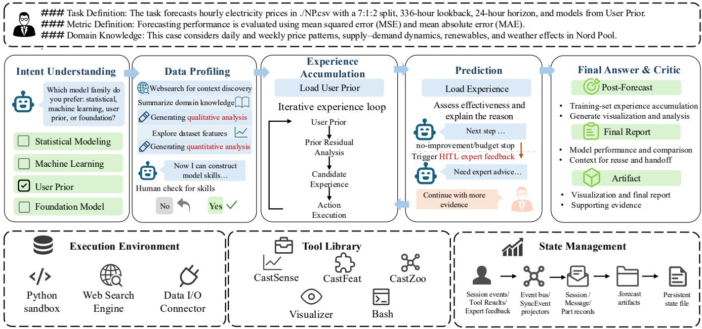
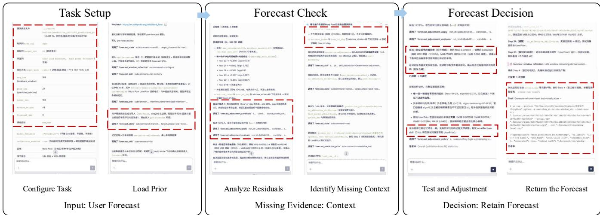

# A Human-in-the-Loop Autonomous Agent for Industry Time Series Forecasting

Xiaoyu Tao, Mingyue Cheng, Ze Guo, Bokai Pan, Qi Liu, Shijin Wang, and Enhong Chen State Key Laboratory of Cognitive Intelligence, University of Science and Technology of China, Hefei, China {mycheng, qiliuql, cheneh}@ustc.edu.cn

Abstract—Real-world time-series forecasting is rarely a oneshot model invocation: practitioners must formulate tasks, connect data and models, incorporate domain expertise, assess prediction plausibility, and communicate uncertainty. Specialized forecasting models provide strong numerical predictions but usually operate in fixed pipelines, while general-purpose large language model (LLM) agents often lack forecastingspecific checks, constraints, and stopping rules. We present CastClaw, a human-in-the-loop autonomous forecasting system built through forecasting-oriented harness engineering. CastClaw connects data, specialized models, analytical tools, user input, and a versioned execution record in one runtime. Users specify the target, horizon, constraints, and hypotheses in natural language. Starting from a supplied or model-generated forecast, CastClaw checks temporal patterns and user constraints; when evidence is missing, it retrieves context, runs an analysis or another model, or asks the user. It then keeps, revises, or escalates the result under explicit stopping conditions. The output contains the final forecast and an execution report recording inputs, evidence, actions, and revisions. In this five-dataset electricityprice setting, CastClaw reports the lowest point-estimate MSE and MAE among 16 baselines. A Nord Pool case demonstrates the inspectable workflow. CastClaw was also validated offline on provincial electricity-load data from North China covering January–June 2026.

Index Terms—time-series forecasting, autonomous agents, human-in-the-loop, tool use, forecasting systems.

## I. INTRODUCTION

Time-series research spans benchmark archives and diverse applications [1], [2]; forecasting maps historical observations and related variables to future values [3]–[5]. In practice, users must also define the target and horizon, connect data and models, inspect whether a prediction is plausible, obtain missing context, incorporate temporary domain knowledge, and communicate uncertainty. Reliable forecasting is therefore a system task rather than a single model call.

Existing methods cover only parts of this system-level process: conventional models follow fixed input–output pipelines. General-purpose agents and LLM forecasters add reasoning, tools, or numerical prediction [6]–[8]; recent work frames agentic forecasting, AlphaCast emphasizes human–LLM coreasoning, and TimeSeriesScientist is a general-purpose analysis agent [9], [10], [22]. CastClaw instead combines greater task autonomy with human oversight: it chooses forecasting checks and tool calls, records evidence, candidates, and interventions in a versioned execution record, gates every revision by validation and constraints, and exposes an explicit stopping decision. Users can still correct, constrain, or stop the run.

We present CastClaw, a human-in-the-loop autonomous forecasting system built through harness engineering. The harness connects registered forecasting models, analysis and retrieval tools, natural-language user input, and a versioned execution record. Users provide the target, horizon, constraints, and optional hypotheses. CastClaw obtains an initial forecast and checks it against recent patterns, available context, and user constraints. If support is insufficient, it retrieves context, runs another analysis or model, or asks the user; it then keeps, revises, or escalates the forecast under explicit stopping conditions. The returned execution report records the inputs, evidence, actions, forecast versions, and unresolved warnings.

CastClaw leaves numerical prediction to specialized forecasters. It invokes retrieval, analysis, another model, or the user only when a check identifies missing support; a candidate replaces the current forecast only after validation and constraint checks. The execution record preserves the request, data and model versions, tool outputs, user input, forecast versions, and stopping decision. A user can correct the task, add a time-limited hypothesis, request another check, or stop the run without bypassing validation. The evidence follows the same separation: public datasets support quantitative forecast comparisons, the Nord Pool run shows the recorded decision process, and the provincial-load dataset supports only offline workflow execution. The live demonstration exposes the inputs, checks, actions, and decisions behind the forecast.

Our contributions are: (1) System: CastClaw, an executable human-in-the-loop forecasting system that converts user requests into forecasts and inspectable execution reports; (2) Engineering: a forecasting-oriented harness that coordinates models, tools, user input, selective checks, and stopping decisions; and (3) Demonstration: quantitative comparison on five public electricity-price datasets, an inspectable Nord Pool run, and offline workflow validation on a provincial electricity-load dataset covering January–June 2026.

## II. CASTCLAW SYSTEM

Fig. 1 shows five stages from intent understanding to forecast delivery, supported by execution, tool, and statemanagement services. Registered forecasters remain interchangeable. CastClaw reads and updates a versioned record containing the request, data and model versions, constraints, evidence, candidates, and actions; user-supplied values and hard constraints cannot be overwritten silently.

  
Fig. 1. CastClaw’s forecasting workflow and its supporting execution, tool, and state-management services.

## A. Creating and updating a forecasting task

Users provide the target, horizon, granularity, history, constraints, and desired output in natural language. CastClaw asks for missing essentials rather than choosing hidden defaults, distinguishes hard requirements from hypotheses to test, and timestamps corrections. A superseded request marks its forecasts stale but retains compatible evidence.

## B. Reusing domain rules and past runs

Before prediction, CastClaw can retrieve rules and past runs filtered by target, granularity, horizon, and temporal regime. Each item retains its source and scope and is treated as a suggestion to check, not as current evidence. An item that conflicts with current data or a hard constraint is rejected.

## C. Checking and revising forecasts

CastClaw loads a user forecast or runs registered models, then checks the candidate against recent patterns, domain constraints, context changes, model disagreement, and user hypotheses. If support is insufficient, it retrieves context, inspects a similar period, runs an analysis or another model, tests a revision, or asks the user. The run stops when the forecast is supported, another action has little expected value, the budget is exhausted, or expert judgment is required.

Every call and affected forecast version is recorded. Cast-Claw repeats an action only when evidence changes. A revision replaces the current forecast only if it passes the task’s validation metric and hard constraints; otherwise, CastClaw retains the rejected candidate in its versioned execution record.

## D. Returning the forecast and execution report

The result contains the final values, applicable warnings, and an execution report covering inputs, versions, evidence, tool outputs, tested forecasts, and the stopping decision. Each item is labeled as user input, model output, retrieved context, or derived analysis. Both evaluations use the same interfaces with different resources: public experiments measure forecast accuracy, whereas the provincial-load validation demonstrates execution of the offline forecasting workflow.

## III. INTERACTIVE DEMONSTRATION

Install and try. Run npm install -g castclaw to install CastClaw, launch castclaw, and enter a naturallanguage request to start an interactive forecasting workflow.

The demonstration follows one end-to-end session through task setup, forecast checking, and forecast decision. An audience member can inspect the request and supplied forecast before execution, the evidence and tool outputs added during the run, and the retained or revised forecast with its execution report. The interface also exposes explicit points at which the user can correct or stop the run.

## A. Representative Nord Pool run

Fig. 2 shows one complete run rather than three conceptual workspaces. The request specifies Nord Pool electricity prices, a 168-hour history, a 24-hour horizon, a chronological split, and an existing 24-hour forecast supplied by the user. During task setup, CastClaw parses these fields, confirms the data configuration, and attaches the supplied values to the versioned run record. The forecast-check stage then profiles the data and residuals to identify missing contextual evidence.

Instead of replacing the forecast immediately, CastClaw records the missing context, retrieves relevant Nord Pool market information, and constructs one candidate adjustment. The candidate is evaluated on the validation period using the stated metric and constraints. In this run it performs worse, so the candidate is rejected and the supplied forecast remains active. The decision panel records the compared versions, rejection reason, stopping decision, and generated artifacts. The example therefore demonstrates selective tool use and an auditable decision to retain the supplied forecast.

TABLE I  
TEST-SET FORECASTING PERFORMANCE ON FIVE ELECTRICITY-PRICE DATASETS (BE, DE, FR, NP, AND PJM). LOWER IS BETTER. BEST RESULTS ARE IN BOLD; SECOND-BEST RESULTS ARE UNDERLINED.  
(a) Baselines (part I)
<table><tr><td rowspan="2">Dataset</td><td colspan="2">ARIMA</td><td colspan="2">Prophet</td><td colspan="2">DLinear</td><td colspan="2">ConvTimeNet</td><td colspan="2">PatchTST</td><td colspan="2">iTransformer</td><td colspan="2">TimeXer</td><td colspan="2">TimesFM</td></tr><tr><td>MSE</td><td>MAE</td><td>MSE</td><td>MAE</td><td>MSE</td><td>MAE</td><td>MSE</td><td>MAE</td><td>MSE</td><td>MAE</td><td>MSE</td><td>MAE</td><td>MSE</td><td>MAE</td><td>MSE</td><td>MAE</td></tr><tr><td>BE</td><td>1.978</td><td>0.814</td><td>2.321</td><td>0.918</td><td>1.697</td><td>0.677</td><td>1.482</td><td>0.581</td><td>1.905</td><td>0.647</td><td>1.684</td><td>0.569</td><td>1.437</td><td>0.502</td><td>1.349</td><td>0.510</td></tr><tr><td>DE</td><td>3.269</td><td>1.076</td><td>2.103</td><td>0.986</td><td>1.000</td><td>0.699</td><td>0.964</td><td>0.665</td><td>0.983</td><td>0.666</td><td>1.298</td><td>0.697</td><td>1.009</td><td>0.708</td><td>0.967</td><td>0.660</td></tr><tr><td>FR</td><td>6.410</td><td>1.189</td><td>6.831</td><td>1.280</td><td>6.369</td><td>1.000</td><td>5.376</td><td>0.800</td><td>5.021</td><td>0.740</td><td>6.066</td><td>0.869</td><td>5.578</td><td>0.827</td><td>4.580</td><td>0.651</td></tr><tr><td>NP</td><td>1.798</td><td>0.801</td><td>0.707</td><td>0.583</td><td>0.431</td><td>0.446</td><td>0.393</td><td>0.411</td><td>0.454</td><td>0.441</td><td>0.373</td><td>0.404</td><td>0.412</td><td>0.416</td><td>0.317</td><td>0.361</td></tr><tr><td>PJM</td><td>0.907</td><td>0.710</td><td>0.410</td><td>0.500</td><td>0.286</td><td>0.387</td><td>0.226</td><td>0.342</td><td>0.190</td><td>0.323</td><td>0.238</td><td>0.344</td><td>0.197</td><td>0.318</td><td>0.207</td><td>0.324</td></tr></table>

(b) Baselines (part II) and CastClaw
<table><tr><td rowspan="2">Dataset</td><td colspan="2">Sundial</td><td colspan="2">Time-LLM</td><td colspan="2">TokenCast</td><td colspan="2">S²IP-LLM</td><td colspan="2">PromptCast</td><td colspan="2">TimeReasoner</td><td colspan="2">TimeSeriesScientist</td><td colspan="2">AlphaCast</td><td colspan="2">CastClaw</td></tr><tr><td>MSE</td><td>MAE</td><td>MSE</td><td>MAE</td><td>MSE</td><td>MAE</td><td>MSE</td><td>MAE</td><td>MSE</td><td>MAE</td><td>MSE</td><td>MAE</td><td>MSE</td><td>MAE</td><td>MSE</td><td>MAE</td><td>MSE</td><td>MAE</td></tr><tr><td>BE</td><td>1.478</td><td>0.513</td><td>1.758</td><td>0.701</td><td>1.485</td><td>0.547</td><td>1.591</td><td>0.567</td><td>1.870</td><td>0.637</td><td>1.299</td><td>0.466</td><td>2.057</td><td>0.712</td><td>1.484</td><td>0.510</td><td>1.228</td><td>0.401</td></tr><tr><td>DE</td><td>1.155</td><td>0.700</td><td>1.025</td><td>0.707</td><td>0.973</td><td>0.702</td><td>1.315</td><td>0.722</td><td>1.229</td><td>0.708</td><td>1.082</td><td>0.760</td><td>1.028</td><td>0.673</td><td>1.043</td><td>0.662</td><td>0.674</td><td>0.522</td></tr><tr><td>FR</td><td>6.105</td><td>0.682</td><td>6.450</td><td>0.971</td><td>6.363</td><td>0.961</td><td>5.765</td><td>0.888</td><td>7.302</td><td>1.173</td><td>4.644</td><td>0.650</td><td>5.977</td><td>1.033</td><td>5.318</td><td>0.740</td><td>4.058</td><td>0.497</td></tr><tr><td>NP</td><td>0.362</td><td>0.378</td><td>0.422</td><td>0.447</td><td>0.412</td><td>0.411</td><td>0.389</td><td>0.391</td><td>0.565</td><td>0.449</td><td>0.368</td><td>0.386</td><td>0.606</td><td>0.476</td><td>0.316</td><td>0.365</td><td>0.260</td><td>0.276</td></tr><tr><td>PJM</td><td>0.201</td><td>0.324</td><td>0.253</td><td>0.368</td><td>0.215</td><td>0.319</td><td>0.237</td><td>0.339</td><td>0.316</td><td>0.454</td><td>0.207</td><td>0.328</td><td>0.302</td><td>0.439</td><td>0.176</td><td>0.292</td><td>0.159</td><td>0.259</td></tr></table>

## B. Human interaction during a run

Interaction is available both before and during execution. The user can correct the target or horizon, add a hard constraint or time-limited hypothesis, request another check, or stop the run. CastClaw stores each intervention with its source, time, and scope. A correction marks affected candidates as stale, whereas a hypothesis becomes a condition to test rather than a forced change to the forecast.

When an intervention calls for new evidence, CastClaw executes the relevant check and shows whether the resulting action changes the active forecast. During the live demonstration, the audience can compare the report before and after an intervention and inspect which evidence, warnings, and unresolved questions remain. Human input is therefore part of the recorded decision process rather than post-hoc feedback; validation and consistency checks govern forecast changes.

## IV. EVALUATION AND CASE STUDY

## A. Experimental settings

We use five public electricity-price datasets: BE, DE, FR, NP, and PJM. Each dataset is divided chronologically into training, validation, and held-out test periods using a 7:1:2 ratio. The comparison includes 16 baselines spanning statistical methods, specialized neural models, foundation models, LLMbased forecasters, and forecasting agents [3], [4], [8], [10]– [22]. We report test-set mean squared error (MSE) and mean absolute error (MAE), for which lower values are better. The CastClaw row denotes the forecast returned by the complete system after validation-based checks of supplied and systemgenerated candidates; it is not a new forecasting backbone.

## B. Main table analysis

CastClaw obtains the lowest MSE and MAE in all ten dataset–metric cells in Table I. Relative to the best competing result on each dataset, its MSE is lower by 5.5% on BE, 30.1% on DE, 11.4% on FR, 17.7% on NP, and 9.7% on PJM. The corresponding MAE reductions are 13.9%, 20.9%, 23.5%, 23.5%, and 11.3%. Across the five datasets, the unweighted mean reductions are 14.9% for MSE and 18.6% for MAE.

The strongest competing method differs across datasets, yet CastClaw remains first under both metrics. The largest MSE gain occurs on DE, while the smaller but positive gains on BE and PJM show that the result is not driven by a single dataset. Because MSE emphasizes large deviations and MAE reflects typical absolute error, their joint improvement provides a more complete view than either metric alone. Nevertheless, each CastClaw cell is the output of the complete system after validation-based candidate checking. Repeated, controlled runs are required to test significance and attribute gains to specific checks, tool calls, user interventions, or stopping rules; Table I reports only point estimates rather than causal effects.

## C. Case study and offline workflow validation

Inspectable Nord Pool case. The NP session in Fig. 2 records the request, supplied forecast, residual checks, retrieved context, tested adjustment, validation comparison, and stopping decision. The comparison explains the rejection.

Offline provincial-load validation. CastClaw also underwent offline workflow validation on provincial electricity-load data from North China covering January–June 2026. The validation uses the same task specification, model and tool interfaces, user-input mechanism, checks, and execution report with loadspecific resources. It establishes offline workflow execution only, not comparative accuracy, online deployment, production use, or measured business improvement.

Scope, ethics, and data use. The aggregate provincial-load measurements contain neither personal data nor human-subject records. They were used only for offline workflow validation under the provider’s authorization and confidentiality requirements. Excluded from Table I, they support no claim of comparative accuracy, deployment, production use, business impact, user-study findings, or component-level causal effects.

  
Fig. 2. A Nord Pool run. The user supplies a 24-hour price forecast (left), CastClaw checks residual patterns and missing context (center), and the system tests an adjustment and records the retained forecast (right).

## V. CONCLUSION

CastClaw is a human-in-the-loop autonomous forecasting system whose harness connects specialized models, analytical tools, user input, targeted checks, and an execution report without replacing the predictors. It reports the lowest pointestimate MSE and MAE in this five-dataset electricity-price setting. The Nord Pool case records rejection of an unsupported revision; the January–June 2026 provincial-load validation exercises the same workflow offline but provides neither comparative-performance nor deployment evidence. These results support CastClaw as an implemented system, while ablations and user studies remain future work.

## REFERENCES

[1] H. A. Dau, A. Bagnall, K. Kamgar, C.-C. M. Yeh, Y. Zhu, S. Gharghabi, C. A. Ratanamahatana, and E. Keogh, “The UCR time series archive,” IEEE/CAA J. Autom. Sinica, vol. 6, no. 6, pp. 1293–1305, 2019.

[2] F. Feng, X. He, X. Wang, C. Luo, Y. Liu, and T.-S. Chua, “Temporal relational ranking for stock prediction,” ACM Trans. Inf. Syst., vol. 37, no. 2, pp. 1–30, 2019.

[3] G. E. P. Box, G. M. Jenkins, G. C. Reinsel, and G. M. Ljung, Time Series Analysis: Forecasting and Control, 5th ed. Hoboken, NJ, USA: Wiley, 2015.

[4] S. J. Taylor and B. Letham, “Forecasting at scale,” The American Statistician, vol. 72, no. 1, pp. 37–45, 2018.

[5] V. Assimakopoulos and K. Nikolopoulos, “The theta model: A decomposition approach to forecasting,” International Journal of Forecasting, vol. 16, no. 4, pp. 521–530, 2000.

[6] S. Yao, J. Zhao, D. Yu, N. Du, I. Shafran, K. Narasimhan, and Y. Cao, “ReAct: Synergizing reasoning and acting in language models,” in Proc. Int. Conf. Learn. Representations (ICLR), 2023.

[7] T. Schick, J. Dwivedi-Yu, R. Dess\`ı, R. Raileanu, M. Lomeli, L. Zettlemoyer, N. Cancedda, and T. Scialom, “Toolformer: Language models can teach themselves to use tools,” in Proc. Adv. Neural Inf. Process. Syst. (NeurIPS), vol. 36, 2023.

[8] M. Jin et al., “Time-LLM: Time series forecasting by reprogramming large language models,” in Proc. Int. Conf. Learn. Representations (ICLR), 2024.

[9] M. Cheng, X. Tao, Q. Liu, Z. Guo, and E. Chen, “Position: Beyond model-centric prediction—agentic time series forecasting,” arXiv preprint arXiv:2602.01776, 2026.

[10] X. Zhang, T. Gao, M. Cheng, B. Pan, Z. Guo, Y. Liu, X. Tao, and Q. Liu, “AlphaCast: A human wisdom–LLM intelligence coreasoning framework for interactive time series forecasting,” arXiv preprint arXiv:2511.08947, 2025.

[11] Y. Nie, N. H. Nguyen, P. Sinthong, and J. Kalagnanam, “A time series is worth 64 words: Long-term forecasting with transformers,” in Proc. Int. Conf. Learn. Representations (ICLR), 2023.

[12] M. Cheng, J. Yang, T. Pan, Q. Liu, and Z. Li, “ConvTimeNet: A deep hierarchical fully convolutional model for multivariate time series analysis,” arXiv:2403.01493, 2024.

[13] Y. Liu, T. Hu, H. Zhang, H. Wu, S. Wang, L. Ma, and M. Long, “iTransformer: Inverted transformers are effective for time series forecasting,” in Proc. Int. Conf. Learn. Representations (ICLR), 2024.

[14] A. Zeng, M. Chen, L. Zhang, and Q. Xu, “Are transformers effective for time series forecasting?” in Proc. AAAI Conf. Artif. Intell., 2023.

[15] Y. Wang et al., “TimeXer: Empowering transformers for time series forecasting with exogenous variables,” in Advances in Neural Information Processing Systems, vol. 37, pp. 469–498, 2024.

[16] A. Das, W. Kong, R. Sen, and Y. Zhou, “A decoder-only foundation model for time-series forecasting,” in Proc. Int. Conf. Mach. Learn. (ICML), pp. 10148–10167, 2024.

[17] Y. Liu, G. Qin, Z. Shi, Z. Chen, C. Yang, X. Huang, J. Wang, and M. Long, “Sundial: A family of highly capable time series foundation models,” in Proc. Int. Conf. Mach. Learn. (ICML), 2025.

[18] Z. Pan, Y. Jiang, S. Garg, A. Schneider, Y. Nevmyvaka, and D. Song, “S2IP-LLM: Semantic space informed prompt learning with LLM for time series forecasting,” in Proc. Int. Conf. Mach. Learn. (ICML), 2024.

[19] H. Xue and F. D. Salim, “PromptCast: A new prompt-based learning paradigm for time series forecasting,” IEEE Trans. Knowl. Data Eng., vol. 36, no. 11, pp. 6851–6864, 2024.

[20] X. Tao, S. Zhang, M. Cheng, D. Wang, T. Pan, B. Pan, C. Zhang, and S. Wang, “From values to tokens: An LLM-driven framework for context-aware time series forecasting via symbolic discretization,” arXiv:2508.09191, 2025.

[21] M. Cheng, J. Wang, D. Wang, X. Tao, Q. Liu, and E. Chen, “Can slow-thinking LLMs reason over time? Empirical studies in time series forecasting,” in Proc. WSDM, 2026.

[22] H. Zhao, X. Zhang, J. Wei, Y. Xu, Y. He, S. Sun, and C. You, “Time-SeriesScientist: A general-purpose AI agent for time series analysis,” arXiv:2510.01538, 2025.