Aryan Vijay Bhosale1∗, Vaibhavi Lokegaonkar1∗, Vishnu Raj2, Gouthaman KV2 Sreyan Ghosh1, Ramani Duraiswami1, Lie Lu2, Dinesh Manocha1 1University of Maryland, College Park, USA 2Dolby Laboratories, USA {aryan.vi.bhosale, vaibhavilokegaonkar}@gmail.com À Project Page § Code

## Abstract

Current video-to-music (V2M) models lack semantic control and fail to penalize instruction violations, largely due to their reliance on reconstruction objectives and the representational bottleneck of static cross-modal conditioning in Diffusion Autoregressive (DAR) architectures. To resolve this, we introduce VIBE, a novel text-and-video-to-music (T+V2M) generation model that leverages: (1) Conditioning Connection, a depth-wise cross-layer conditioning mechanism that dynamically bridges the planning and diffusion refinement heads and (2) a comprehensive reward modeling taxonomy, optimizing for both hard, verifiable constraints (e.g., tempo, key) and soft, subjective qualities (e.g., musicality, multimodal alignment) with a structured 5-stage training curriculum. Upon evaluation using audio-visual alignment, instruction following, and audio quality metrics, along with a subjective human evaluation study, we observe that VIBE demonstrates enhanced controllability and instruction adherence while performing comparably to most evaluated baselines on generation fidelity and multimodal alignment.

## 1 Introduction

Music and imagery jointly shape the emotional experience of short-form video, driving creators to seek background scores that align rhythmically and semantically with their visual content. Background scores, added in post-production, have been shown to reinforce the emotional tone, narrative pacing, and aesthetic of a video (Huh et al., 2026). However, curating the perfect background score for a video is a highly nuanced task with no single correct answer (Hammad et al., 2025; Frid et al., 2020). The same video may be paired with acoustic guitar, chill lo-fi beats or suspenseful piano. Visual signals alone are insufficient to capture creator intent, and therefore, supplemental fine-grained textual prompts are required (Hammad et al., 2025; Melechovsky et al., 2024; Huang et al., 2023) to disambiguate and accurately capture creator intent.

Existing video-to-music (V2M) works such as video-only models (Tian et al., 2025; Zuo et al., 2025; Ji et al., 2025), models that accept minimal auxiliary inputs (Liu et al., 2024; Kang et al., 2024) and text+video-to-music models (Lokegaonkar et al., 2026; Kim et al., 2025, 2026), rely majorly on visual cues for music generation and provide limited semantic and stylistic controllability to the end user. Even when text is provided as input to Video-Robin (Lokegaonkar et al., 2026), it is used for high-level style steering only and not for finegrained attribute specification of tempo, key, musical genre and mood. This is because most existing models are trained on reconstruction objectives over paired video-music data with no mechanism to explicitly penalise misalignment in specific parts of the input text instruction. This lack of instruction following can be attributed to clear architectural and training limitations in such models. More specifically, this can be attributed to the architectural bottleneck of static cross-modal conditioning, especially in diffusion autoregressive models and the absence of a principled training framework for decomposed, fine-grained instruction adherence.

To overcome these issues, we present VIBE (Video Instruction-aligned Background music gEneration), a novel joint text+video-to-music multi-preference-optimised generation technique with a structured training curriculum that provides a mechanism for dynamic conditioning to the DiT, enabling highly controllable music generation that aligns seamlessly with the textual and visual prompts. To tackle static conditioning, we propose Conditioning Connection, a depth-wise conditioning mechanism that passes the intermediate hidden states from the Autoregressive-Head as multimodal context, along with the autoregressive audio generation history to each layer of the Refinement-Head. This provides a clear abstraction of global planning and refinement tasks across the architecture rather than collapsing the LM’s representational hierarchy into a single embedding. We also address the issue that no existing video-conditioned music generation system is explicitly trained to follow individual components of music instructions, such as tempo, key, genre, and mood, as specified in the input text prompts. Our approach audits the full spectrum of musical instruction components, partitions them into objectively verifiable aspects and subjective perceptual qualities, and develops dedicated reward models for each attribute class to directly supervise instruction adherence via reinforcement learning. We also introduce a verifiability-driven taxonomy of rewards for preference optimization combining hard signal-processing rewards for objective attributes with learned compositional multiand omni-modal reward models for subjective attributes.

Overall, our approach can generate music that semantically and rhythmically adheres to fine-grained text instructions while remaining temporally coherent with the input video. Our novel contributions include:

1. We propose VIBE, a text+video-to-music generation model for multimodally aligned, high fidelity music generation featuring Conditioning Connection, a novel depth-wise cross-layer conditioning mechanism that addresses the representational bottleneck of static conditioning by passing a learned linear combination of the multimodal LM’s hidden states to each layer of the LocDiT, enabling rich multimodal grounding and smoother propagation of multimodal context throughout the denoising hierarchy.

2. We introduce a systematic taxonomy of musical attributes and perform holistic reward modeling for each spanning hard, verifiable rewards for objective instructions and learned cross-modal and omni-modal reward models for subjective perceptual qualities.

3. We demonstrate how the compositional reward signal can be integrated with a DiffusionNFT-style reinforcement learning objective through a comprehensive, multistage training recipe and precise data mixtures for preference optimization of Diffusion Autoregressive architectures under multimodal instruction-following constraints. Multiple experiments across objective metrics on Reelbench benchmarks and human evaluation demonstrate consistent gains in fine-grained instruction adherence over prior text- and video-conditioned systems, while remaining competitive on generation fidelity.

## 2 Related Work

## 2.1 Video-to-Music Generation

Video-conditioned music generation has garnered significant research interest, with approaches centering on visual feature extraction and alignment with musical rhythm. Foundational works such as CMT (Di et al., 2021), and Video2Music (Kang et al., 2024), generate symbolic music in the MIDI format by using motion and semantic video features. Whereas VidMuse (Tian et al., 2025) generates high-fidelity music waveforms from video using local and global features, while MuMu-LLaMA (interchangeably referred to as M2UGen in literature) (Liu et al., 2024) broadens this with visual and textual encoders to allow text prompt conditioning. Works like GVMGen (Zuo et al., 2025), and Diff-V2M (Ji et al., 2025) address alignment through hierarchical attention over spatio-temporal features and specialized encoders for different aspects of music. More recently, Video-Robin (Lokegaonkar et al., 2026) and V2M-ZERO (Lin et al., 2026) have advanced the field by extending conditioning capabilities beyond discrete token spaces and eliminating the need for paired training data, respectively. A parallel line of work bridges vision and music explicitly rather than architecturally: Visuals-Music Bridge (VMB) (Wang et al., 2024) converts video into textual descriptions that condition a textto-music model, so every visual cue must survive a discrete textual bottleneck. Conditioning Connection bridges the two implicitly instead, propagating a fused multimodal representation through the depth of the diffusion stack. We test the assumption behind the VMB idea in Section E. Broader still, any-modality-to-audio systems such as AudioX (Tian et al., 2026) generate audio (including sound effects) from video, text or their combination, but target general audio plausibility rather than adherence to specified musical attributes, placing them adjacent to—rather than in competition with—the instruction-following setting we study. Despite these advances, none of these works optimize for human perceptual preferences during training, resulting in generated music that lacks the expressivity characteristic of human-composed music. Further, capturing relative quality across a broader candidate pool and reducing dependence on largescale preference datasets remain open challenges, as existing approaches rely on pairwise comparisons or fixed datasets. Furthermore, diffusionbased approaches such as Diff-V2M and Video-Robin suffer from static conditioning (Li et al., 2026), where the conditioning inputs do not adapt across the depth of the Diffusion Transformer. This causes a mismatch between the requirements of each layer and the fixed conditioning signal. In this work, we address these limitations by introducing Conditioning Connection for dynamic conditioning and DiffusionNFT-based online preference optimization.

## 2.2 Preference Optimization for Conditional Music Generation

Imbuing human preferences into the music generation process continues to be a prevalent challenge. CMI-Reward Bench (Ma et al., 2026) addresses the holistic nature of music quality evaluation by providing a reward ecosystem containing large-scale human-annotated preference datasets alongside trained reward models. Building on such foundations, recent works have explored popular preference optimisation techniques to directly align generative models with human judgement. MR-FlowDPO (Ziv et al., 2025) extends DPO to flow-matching text-to-music models using multidimensional automated rewards across text alignment, audio quality, and semantic consistency. LeVo (Lei et al., 2025) constructs a semi-automatic preference dataset of approximately 60K winlose pairs and applies interpolation-based multipreference DPO to jointly optimise all objectives without retraining. HeartMuLa (Yang et al., 2026) takes a different approach, constructing separate preference datasets scored by distinct music quality metrics, training independent DPO models on each, and linearly merging the resulting checkpoints to jointly optimise style adherence, lyric clarity, and audio quality. Beyond DPO, ACE-Step v1.5 (Gong et al., 2025) applies GRPO to a language model planner for intrinsic reward-based alignment, deriving rewards from the model’s own internal consistency, while SymphonyGen (He et al., 2026) applies GRPO with a cross-modal audio-perceptual reward to refine symbolic orchestral generation. In this work, we extend the paradigm of preferencealigned music generation conditioned on video and fine-grained text instructions.

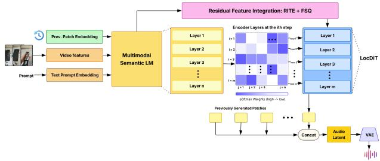  
Figure 1: VIBE Architecture. Video frames, text prompt, and previously generated patch embeddings are passed to the Multimodal Semantic LM. Layer-wise hidden states are linearly combined via learnable per-DiT-layer coefficients to form Conditioning Connectors, which are routed to every LocDiT layer alongside residual-integrated embeddings to generate each music patch.

## 3 Methodology

Generating music that simultaneously adheres to fine-grained textual instructions and aligns rhythmically with video requires solving two distinct problems. First, the architecture must propagate rich multimodal context throughout the entire denoising hierarchy. Second, the training objective must explicitly penalize violation of individual instruction attributes, a signal that reconstructionbased losses are blind to. We address both through VIBE: a Diffusion Autoregressive multimodal music generation model with Conditioning Connectors for depth-wise dynamic conditioning, trained via a structured 5-stage curriculum with diverse, composite reward formulation for preference optimization.

## 3.1 Architecture

VIBE adopts a Diffusion Autoregressive architecture (Lokegaonkar et al., 2026) that decomposes music generation into two global planning (AR-Head) and patch-wise refinement (Refinement-Head) as shown in Figure 1. The AR-Head performs global semantic planning and integrates video frames (encoded by a frozen CLIP encoder), fine-grained text instructions, and the autoregressive patch history through a Multimodal Semantic LM. The resulting representation is compressed via a Finite Scalar Quantization (FSQ) bottleneck and enriched with residual acoustic detail through a Residual Integration Transformer Encoder (RITE), producing a per-patch planning embedding. The Refinement-Head, implemented as a local Diffusion Transformer (LocDiT), denoises each latent patch conditioned on this embedding and the previously generated patch. Generated patches are re-encoded and fed back into the AR-Head autoregressively. Once all patches are complete, a pretrained VAE decoder reconstructs them as a full waveform.

In vanilla Diffusion Autoregressive models, the planning embedding is passed as a single static tensor to the LocDiT. This collapses the full representational hierarchy of the multimodal semantic LM into one embedding, ignoring the functional stratification of deep transformer stacks, wherein earlier layers encode global structural properties and later layers encode fine-grained local detail (Li et al., 2026).

Conditioning Connection. We address this bottleneck by introducing Conditioning Connection, an architectural mechanism that carries the learned, weighted representation conditioning vectors between the multimodal semantic LM and the LocDiT. At each generation step, we compute a linear combination of hidden states from all layers of the Multimodal Semantic LM, using learnable coefficients, and pass the result to each layer of the Refinement Head. We refer to these linearly combined vectors as Conditioning Connectors.

We compute a Conditioning Connector vector $\mathbf { c } _ { i } ^ { ( k ) }$ for each LocDiT layer k as a linear combination of hidden states across all LM layers using learnable coefficients:

$$
\mathbf { c } _ { i } ^ { ( k ) } = \mathbf { W } \sum _ { l = 1 } ^ { L } \alpha _ { l } ^ { ( k ) } \mathbf { h } _ { i } ^ { ( l ) } , \qquad \sum _ { l = 1 } ^ { L } \alpha _ { l } ^ { ( k ) } = 1\tag{1}
$$

where $\alpha _ { l } ^ { ( k ) } \in \mathbb { R }$ are learnable scalar weights specific to LocDiT layer k, and $\mathbf { W } \in \mathbb { R } ^ { d _ { D i T } \times d _ { L M } }$ is a learnable projection, $d _ { D i T }$ being the hidden dimension of the LocDiT and $d _ { L M }$ that for Multimodal Semantic LM. Since each autoregressive step also receives previously generated patches as input, the LocDiT layer k conditions on both current multimodal context $\mathbf { c } _ { i } ^ { ( k ) }$ & autoregressive musical patch history mi−1 at every layer, promoting patch-topatch continuity and strengthening rhythmic and semantic coherence across the generated sequence.

$$
\tilde { \mathbf { h } } _ { i } ^ { ( k ) } = \mathrm { L o c D i T } ^ { ( k ) } \Big ( \mathbf { x } ^ { t } , ~ \mathbf { c } _ { i } ^ { ( k ) } , ~ \mathbf { m } _ { i - 1 } , ~ t \Big )\tag{2}
$$

The combination coefficients are learned independently per DiT layer, allowing each layer to attend to the level of semantic abstraction most suited to its denoising responsibility, i.e. shallower LM representations for early LocDiT layers handling global structure and deeper representations for later layers handling fine acoustic detail. Conditioning Connectors replace static single-vector cross-head conditioning with a structured representational hierarchy that flows through the full depth of the diffusion stack.

## 3.2 Training Objectives

Pre-training and Supervised Finetuning (SFT). Both pre-training and SFT optimize the LocDiT via a flow-matching diffusion loss over the velocity field $\mathbf { v } _ { \theta } \colon$

$$
\mathcal { L } _ { \mathrm { d i f f } } = \mathbb { E } _ { t , \mathbf { x } ^ { 0 } , \epsilon } \left\| \mathbf { v } _ { \boldsymbol { \theta } } ( \mathbf { x } ^ { t } , \mathbf { E } _ { p } , \mathbf { m } _ { i - 1 } ) - \dot { \alpha } _ { t } \mathbf { x } ^ { 0 } - \dot { \sigma } _ { t } \epsilon \right\| _ { 2 } ^ { 2 }\tag{3}
$$

where ${ \bf x } ^ { t } = \alpha _ { t } { \bf x } ^ { 0 } + \sigma _ { t } \epsilon$ $\dot { p } _ { t }$ indicates $\frac { d p } { d t }$ for any $p ,$ $\epsilon \sim \mathcal { N } ( 0 , \bf { I } )$ , and $\mathbf { v } _ { \theta }$ is the LocDiT velocity field. See Table 6 for notation.

Preference Optimization. We adopt Diffusion-NFT (Zheng et al., 2026) to perform online RL directly on the forward diffusion process. At each iteration, G candidates $\{ \mathbf { x } _ { 0 } ^ { g } \} _ { g = 1 } ^ { G }$ are generated per conditioning input c and scored with an optimality probability $r \in [ 0 , 1 ]$

$$
\begin{array} { r } { \mathcal { L } _ { \mathrm { N F T } } = \mathbb { E } \underset { \mathbf { x } _ { 0 } \sim \pi ^ { 0 \mathrm { l d } } } { \mathbf { c } } \Big [ r \| \mathbf { v } _ { \theta } ^ { + } - \mathbf { v } \| _ { 2 } ^ { 2 } + ( 1 - r ) \| \mathbf { v } _ { \theta } ^ { - } - \mathbf { v } \| _ { 2 } ^ { 2 } \Big ] } \end{array}\tag{4}
$$

where the implicit positive and negative policies are:

$$
\mathbf { v } _ { \theta } ^ { + } ( \mathbf { x } ^ { t } , \mathbf { E } _ { p } , \mathbf { m } _ { i - 1 } , t ) : = \left( 1 - \beta \right) \mathbf { v } ^ { \mathrm { o l d } } + \beta \mathbf { v } _ { \theta }\tag{5}
$$

$$
\mathbf { v } _ { \theta } ^ { - } ( \mathbf { x } ^ { t } , \mathbf { E } _ { p } , \mathbf { m } _ { i - 1 } , t ) : = ( 1 + \beta ) \mathbf { v } ^ { \mathrm { o l d } } - \beta \mathbf { v } _ { \theta }\tag{6}
$$

with $\mathbf { v } = \dot { \alpha } _ { t } \mathbf { x } ^ { 0 } + \dot { \sigma } _ { t } \epsilon$ the flow-matching target, $\beta$ the guidance strength, and $\mathbf { v } ^ { \mathrm { o l d } }$ the frozen sampling policy. Refer to appendix for further training details.

## 3.3 Reward Modelling

We partition musical instruction attributes by verifiability into two classes: hard verifiable attributes (tempo and key) whose adherence is directly measurable from the audio signal, and soft perceptual attributes (musical genre and mood) which resist objective evaluation and require learned judgement. We develop dedicated reward models for each class and combine them into task-specific reward signals for preference optimization in text-to-music and video-to-music models respectively.

Hard Verifiable Rewards. These rewards are developed for instruction components (tempo and key) that have discrete values and can be objectively evaluated.

Tempo. We estimate the BPM $\hat { b }$ of the generated audio and parse the target tempo into one of three forms: exact value, range, or blanket descriptor (e.g. slow,fast). For exact targets we apply a Gaussian reward; for range and blanket targets a trapezoidal reward:

$$
r _ { \mathrm { t e m p } 0 } = \left\{ \begin{array} { l l } { \displaystyle \mathrm { e x p } \left( - \frac { ( \hat { b } - b ^ { * } ) ^ { 2 } } { 2 \sigma _ { b } ^ { 2 } } \right) } & { \quad e x a c t } \\ { \displaystyle \operatorname* { m a x } \left( 0 , \operatorname* { m i n } \left( 1 , 1 - \frac { e } { \delta } \right) \right) } & { \quad r a n g e } \end{array} \right.\tag{7}
$$

where $e = \operatorname* { m a x } ( b _ { \mathrm { l o } } - \hat { b } , \ \hat { b } - b _ { \mathrm { h i } } ,$ 0). To correct for octave errors common in BPM estimators, we evaluate $r _ { \mathrm { t e m p o } }$ at $\hat { b } , 2 \hat { b } ,$ and $\hat { b } / 2$ and take the maximum.

Key. We average two complementary tonal alignment signals.

The Circle-of-Fifths (CoF) reward detects the predicted key $k _ { \mathrm { p r e d } }$ and penalises arc distance $d _ { \mathrm { a r c } }$ from the target $k ^ { * }$ , incorporating a mode penalty for major/minor mismatch:

$$
\begin{array} { r l } & { \Delta _ { k } = d _ { \mathrm { a r c } } ( k _ { \mathrm { p r e d } } , k ^ { * } ) + { \bf 1 } [ \mathrm { m o d e } _ { \mathrm { p r e d } } \neq \mathrm { m o d e } ^ { * } ] , } \\ & { r _ { \mathrm { C o F } } = s \cdot \exp \left( - \frac { \Delta _ { k } ^ { 2 } } { 2 \sigma _ { k } ^ { 2 } } \right) } \end{array}\tag{8}
$$

where the reward is Gaussian weighted by the key detector confidence $s \in [ 0 , 1 ]$ and $\sigma _ { k } = 2 . 0$ which naturally downweights the reward when the detected key is ambiguous.

The Krumhansl-Schmuckler (KS) reward correlates the Harmonic Pitch Class Profile (HPCP) $\mathbf { h } \in \mathbb { R } ^ { 1 2 }$ against the psychoacoustically derived tonal hierarchy $\mathbf { p } ^ { * } \in \mathbb { R } ^ { 1 2 }$ for the target key.

The CoF reward is interpretable but depends on key detector accuracy whereas the KS reward operates directly on the spectrum and remains robust under detector failure.

$$
r _ { \mathrm { K S } } = \frac { \rho ( \mathbf { h } , \mathbf { p } ^ { * } ) + 1 } { 2 } \qquad r _ { \mathbf { k e y } } = \frac { r _ { \mathrm { C o F } } + r _ { \mathrm { K S } } } { 2 }\tag{10}
$$

Soft Rewards. These are developed to penalize subjective aspects of musical instruction (genre, mood) and multimodal alignment (text-music, video-music)

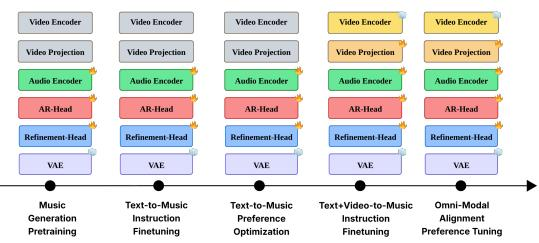  
Figure 2: Overview of our training curriculum

Cross-Modal Reward (Text-to-Music). We supervise musicality $r _ { m u s i c a l i t y }$ (genre, mood) and text-music alignment $r _ { T  M a l i g n }$ via CMI-RM (Ma et al., 2026), a cross-modal instruction-following reward model.

$$
R _ { \mathrm { s o f t } } ^ { \mathrm { C M } } = { \frac { r _ { \mathrm { m u s i c a l i t y } } + r _ { T  M a l i g n } } { 2 } }\tag{11}
$$

Omni-Modal Reward (Text+Video-to-Music). Since we need to simultaneously judge musicality and alignment between text, video and generated music, we develop an omni-modal reward extracted using Qwen2.5-Omni (Qwen et al., 2025) as a judge as follows:

$$
R _ { \mathrm { s o f t } } ^ { \mathrm { o m n i } } = \frac { r _ { \mathrm { m u s i c a l i t y } } + r _ { \mathrm { T }  \mathrm { M } a l i g n } + r _ { \mathrm { V }  \mathrm { M } a l i g n } } { 3 }
$$

## Resultant Composite Reward Signal

(12)

For the text-to-music (13) and text+video-to-music (14) task respectively may be formulated as follows:

$$
R ^ { \mathrm { T \to M } } = R _ { \mathrm { s o f t } } ^ { \mathrm { C M } } + \underbrace { r _ { \mathrm { t e m p o } } + r _ { \mathrm { k e y } } } _ { R ^ { \mathrm { h a r d } } }\tag{13}
$$

$$
R ^ { \mathrm { T + V  M } } = R _ { \mathrm { s o f t } } ^ { \mathrm { o m n i } } + \underbrace { r _ { \mathrm { t e m p o } } + r _ { \mathrm { k e y } } } _ { R ^ { \mathrm { h a r d } } }\tag{14}
$$

## 3.4 Training Curriculum

In this section, we describe each stage in our training curriculum. Figure 2 illustrates this curriculum. Stage 1 (Music generation pre-training) The model is trained on large-scale text-music pairs (JamendoMaxCaps (Roy et al., 2025)) without video conditioning, serving as a projector alignment phase where the AR-Head learns to map multimodal hidden states to musical latents via the Refinement-Head. This establishes a strong generative backbone for subsequent stages.

Stage 2 (Text-to-Music Instruction Finetuning). We finetune on a curated, instruction-rich data from

MusicBench (Melechovsky et al., 2024) to improve instruction-following and retain the architecture and training configuration as Stage 1.

Stage 3 (Text-to-Music Preference Optimization). We apply DiffusionNFT-based online RL using the composite reward $R ^ { \mathrm { { T }  M } }$ , combining CMI-RM(Ma et al., 2026) for subjective qualities with hard verifiable rewards for tempo and key on captions from the CMI-Pref Dataset (Ma et al., 2026). Multiple rollouts per prompt are scored and used for negative-aware finetuning, expanding the model’s controllability and musicality beyond what reconstruction-based training permits.

Stage 4 (Text+Video-to-Music Supervised Instruction Finetuning). We introduce visual conditioning through the video encoder (frozen) and trainable projection layer which can enable text+video-to-music generation. The inputs at this stage are primarily video + music pairs from HarmonySet (Zhou et al., 2025) and V2M (Tian et al., 2025) datasets with curated fine-grained textual prompts. The projection layer is initialized and trained from scratch and while all other layers are initialized and fine-tuned from the Stage 3 checkpoint.

Stage 5 (Omni-modal alignment preference tuning). Analogous to Stage 3, we apply Diffusion-NFT using the composite V2M reward $R ^ { \mathrm { { T + V } \to M } }$ which replaces CMI-RM with an omni-modal judge to additionally supervise video-music rhythmic and thematic alignment.

<table><tr><td>Stage</td><td>Training Dataset(s)</td><td>Size</td></tr><tr><td>Music Generation Pretraining</td><td>JamendoMaxCaps</td><td>≈1.6M</td></tr><tr><td>Text-to-Music Instruction SFT</td><td>MusicBench</td><td>52,768</td></tr><tr><td>Text-to-Music Preference Opt.</td><td>CMI-Pref</td><td>3,527</td></tr><tr><td>Text+Video-to-Music SFT</td><td>V2M + HarmonySet</td><td>60,000</td></tr><tr><td>Omni-Modal Preference Opt.</td><td>V2M + HarmonySet</td><td>8,000</td></tr></table>

Table 1: Training datasets used at each stage of the curriculum. All splits are training splits unless otherwise noted.

## 4 Experiments

## 4.1 Datasets

We summarise the datasets used during each training stage in Table 1. Pretraining uses Jamendo-MaxCaps (Roy et al., 2025), a large-scale instrumental music dataset. Text-to-Music Instruction Finetuning uses MusicBench (Melechovsky et al., 2024), whose tempo and key annotations support fine-grained instruction following; vocals are removed via Demucs (Rouard et al., 2023). Text-to-Music Preference Optimization uses CMI-Pref (Ma et al., 2026), a human-annotated preference dataset whose prompts lie in the CMI-RM training distribution. Text+Video-to-Music Instruction Finetuning samples 30,000 pairs each from V2M (Tian et al., 2025) and HarmonySet (Zhou et al., 2025); since neither provides instruction-level prompts, we use Gemini to extract tempo, key, instruments, genre, and atmosphere from each clip. Omni-Modal Alignment Preference Tuning resamples 8,000 unique videos in a 1:2 ratio of V2M to HarmonySet, providing each without its background score to Gemini-2.5-Flash to generate 4 diverse instructional prompts per video. For evaluation, we use ReelBench (Lokegaonkar et al., 2026), obtained directly from the authors.

## 4.2 Implementation Details

Our model operates in the latent space of a pretrained SongBloom (Yang et al., 2025) audio VAE at 48 kHz, frozen throughout training. The SemanticLM is initialised from MiniCPM4-0.5B (Team et al., 2025) with 24 transformer layers, hidden dimension 896, and 16 attention heads. Conditioning Connectors consist of 4 learnable routing vectors of size 24 and a shared 896→1024 linear projection, initialised to zeros. The AR-Head uses an FSQ bottleneck with latent dimension 256 followed by an 8-layer RITE transformer. The Refinement Head is a 4-layer LocDiT (Jia et al., 2025) trained with flow matching and a patch size of 4. We use frozen CLIP-ViT-Base (Radford et al., 2021) as the vision encoder. For SFT stages, we use AdamW with learning rate $1 \times 1 0 ^ { - 4 } .$ , weight decay 0.01, and warmup ratio 0.1. For preference optimization, we apply LoRA (r=8, α=16) on q\_proj and v\_proj of both LM and DiT, with learning rates $2 \times 1 0 ^ { - 7 }$ and $1 \times 1 0 ^ { - 7 }$ respectively, a group size of 8, $\beta { = } 0 . 5 .$ , and 20 inference timesteps. For Stage 5, we increase LoRA rank to 64 and use Qwen2.5- Omni-7B as the multimodal judge with 4 video frames per sample.

## 4.3 Evaluation Metrics

We evaluate using standard audio quality metrics: FAD, FD, KL (Zhang et al., 2023), IS (Salimans et al., 2016), Density, and Coverage (Naeem et al., 2020). Audio-visual alignment is measured via ImageBind Score (IB) (Girdhar et al., 2023) and Gemini as an omni-judge (Liang et al., 2026) across seven axes including rhythmic sync, emotion alignment, and overall alignment. For instruction following, we report Tempo Accuracy and Key Accuracy against ReelBench ground-truth annotations (see Appendix D).

<table><tr><td>Model</td><td>FAD (↓)</td><td>FD (↓)</td><td>KL (↓)</td><td>IS (↑)</td><td>IB (↑)</td><td>Density (↑)</td><td>Coverage (↑)</td></tr><tr><td>GT</td><td></td><td></td><td></td><td>一</td><td>0.1417</td><td>0.9900</td><td>0.8800</td></tr><tr><td colspan="6">Video-Only to Music</td><td></td><td></td></tr><tr><td>CMT (Di et al., 2021)</td><td>8.7522</td><td>37.7945</td><td>1.7329</td><td> $1 . 2 2 4 3 \pm 0 . 0 1 4 7$ </td><td>0.1119</td><td>0.1084</td><td>0.0614</td></tr><tr><td>GVMGen (Zuo et al., 2025)</td><td>3.5729</td><td>16.2638</td><td>1.5573</td><td> $1 . 7 0 8 5 \pm 0 . 0 2 8 1$ </td><td>0.0957</td><td>0.0835</td><td>0.3881</td></tr><tr><td>VidMuse (Tian et al., 2025)</td><td>2.3022</td><td>14.5385</td><td>1.3194</td><td> $1 . 4 5 4 9 \pm 0 . 0 2 8 1$ </td><td>0.1233</td><td>0.1377</td><td>0.5213</td></tr><tr><td colspan="6">Video + Auxiliary Inputs to Music</td><td></td><td></td></tr><tr><td>Video2Music (Kang et al., 2024)</td><td>22.6459</td><td>73.0670</td><td>1.8839</td><td> $1 . 0 2 3 3 \pm 0 . 0 0 1 4$ </td><td>0.0473</td><td>0.1647</td><td>0.0084</td></tr><tr><td>M2UGen (Liu et al., 2024)</td><td>4.5767</td><td>27.4208</td><td>1.5301</td><td> $1 . 6 4 9 9 \pm 0 . 0 5 6 7$ </td><td>0.0722</td><td>0.1094</td><td>0.2761</td></tr><tr><td colspan="6">Text + Video to Music</td><td></td><td></td></tr><tr><td>Video-Robin (Lokegaonkar et al., 2026)</td><td>1.5110</td><td>10.9020</td><td>1.2556</td><td> $2 . 0 5 8 6 \pm 0 . 0 4 7 2$ </td><td>0.1017</td><td>0.1384</td><td>0.5259</td></tr><tr><td>VIBE (Ours)</td><td>1.5829</td><td>10.1282</td><td>1.3205</td><td> $\mathbf { 2 . 3 5 7 8 \pm 0 . 0 7 9 8 }$ </td><td>0.0888</td><td>0.6741</td><td>0.6095</td></tr></table>

Table 2: Results on the ReelBench (Lokegaonkar et al., 2026) dataset. Bold indicates best and underline indicates second-best.
<table><tr><td rowspan="2"></td><td colspan="4">Components</td><td colspan="7">Metrics</td></tr><tr><td>Pre-train</td><td>CC</td><td>T2M RL</td><td>V2M RL</td><td>FAD↓</td><td>FD↓</td><td>KL↓</td><td>IS↑</td><td>IB↑</td><td>Den.↑</td><td>Cov.↑</td></tr><tr><td>Base architecture</td><td>x</td><td>x</td><td>x</td><td>x</td><td>3.044</td><td>22.592</td><td>1.343</td><td>1.588 ± 0.131</td><td>0.113</td><td>0.258</td><td>0.133</td></tr><tr><td>+ Pretraining</td><td>√</td><td>x</td><td>x</td><td>x</td><td>2.538</td><td>16.446</td><td>1.349</td><td> $1 . 7 4 3 \pm 0 . 0 5 7$ </td><td>0.0802</td><td>0.149</td><td>0.175</td></tr><tr><td>+ Conditioning Connection</td><td>√</td><td>√</td><td>x</td><td>x</td><td>1.724</td><td>10.199</td><td>1.346</td><td>1.833±0.069</td><td>0.0835</td><td>0.541</td><td>0.523</td></tr><tr><td>Preference optimization w/o CC</td><td>√</td><td>x</td><td>√</td><td>√</td><td>1.618</td><td>17.920</td><td>1.442</td><td>1.760 ± 0.039</td><td>0.0578</td><td>0.570</td><td>0.500</td></tr><tr><td>w/o V2M RL</td><td>√</td><td>x</td><td>√</td><td>x</td><td>1.728</td><td>11.372</td><td>1.354</td><td>1.763 ± 0.045</td><td>0.0794</td><td>0.290</td><td>0.309</td></tr><tr><td>+ CC &amp; preference optimization = VIBE (Ours)</td><td>✓</td><td>√</td><td>√</td><td>√</td><td>1.583</td><td>10.128</td><td>1.321</td><td>2.358 ± 0.080</td><td>0.0888</td><td>0.674</td><td>0.610</td></tr></table>

Table 3: Component analysis of VIBE on ReelBench. The first block isolates the architectural contribution, building the model up one component at a time with no preference optimization. The second block isolates the training contribution, applying the preference optimization stages (Stage 3 and Stage 5) without CC. VIBE proposes the architectural design additions and training paradigm together as a comprehensive solution for fine-grained instruction following in text+video-to-music generation. Bold indicates best.

## 4.4 Comparison Models

We compare against three categories of baselines. Video-only models include CMT (Di et al., 2021), GVMGen (Zuo et al., 2025), and VidMuse (Tian et al., 2025). Video + auxiliary input models include Video2Music (Kang et al., 2024) and M2UGen (Liu et al., 2024), for which we extract required attributes directly from our unified text prompt. Text + video models include Video-Robin (Lokegaonkar et al., 2026). Models that do not support detailed text input receive the generic prompt: “Generate background music that aligns with the visual content ofthe video.”

## 4.5 Performance Evaluation

In this section, we evaluate the performance of our model through ablations and comparisons to existing models detailed above.

## 4.5.1 Instruction Alignment

Figure 3 reports instruction-following results across tempo and key metrics on ReelBench. VIBE consistently outperforms both Video-Robin and the Stage 5 ablation (VIBE w/o S5) across all five metrics, confirming that omni-modal preference tuning is the primary driver of instruction adherence. Tempo accuracy improves progressively from Video-Robin to VIBE under both exact and octave-equivalent tolerances, while Tempo MAE decreases monotonically, indicating that preference optimization produces generations that are not only more frequently correct but also closer to the target BPM on average. Key accuracy follows the same trend, with VIBE achieving the highest exact and loose key accuracy among all three models.

## 4.5.2 Quantitative comparison with baselines.

Table 2 reports results on ReelBench. VIBE achieves the best IS, FD Density, and Coverage among all models, demonstrating strong perceptual quality and generative diversity. The marginal increase in FAD and KL and increase in IB relative to Video-Robin is expected, as RL finetuning trades distributional proximity for improved perceptual quality and instruction adherence. Among baselines, VidMuse achieves competitive audio fidelity but trails on diversity, while CMT and GVMGen lag across nearly all metrics due to their lack of fine-grained conditioning. M2UGen outperforms Video2Music but remains well below VIBE, highlighting the gap between structured auxiliary inputs and free-form text conditioning paired with preference optimization.

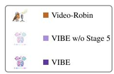

<table><tr><td>Model</td><td>Rhythm</td><td>Theme</td><td>Emotion</td><td>Culture</td><td>Temporal</td><td>Instr. Fit</td><td>Overall</td></tr><tr><td>MuMuLLaMa</td><td>2.490</td><td>2.731</td><td>3.000</td><td>3.255</td><td>2.143</td><td>3.100</td><td>2.724</td></tr><tr><td>Video2Music</td><td>2.622</td><td>2.744</td><td>2.744</td><td>3.293</td><td>2.268</td><td>3.090</td><td>2.677</td></tr><tr><td>Video-Robin</td><td>2.786</td><td>2.890</td><td>3.100</td><td>3.565</td><td>2.472</td><td>3.200</td><td>2.753</td></tr><tr><td>VIBE</td><td>2.816</td><td>2.910</td><td>3.028</td><td>3.581</td><td>2.589</td><td>3.240</td><td>2.843</td></tr></table>

Table 4: Gemini omni-modal judge results. Comparison to existing baselines along criteria defined in Table 13

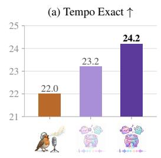  
(c) Key Exact ↑

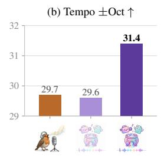

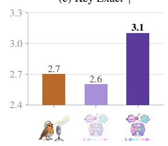

(d) Key Loose ↑  
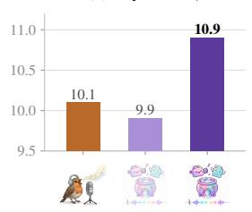

(e) Tempo MAE ↓  
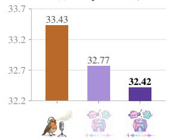  
Figure 3: Instruction-following evaluation across tempo and key metrics. Panels (a)-(d) are higher-isbetter, (e) is lower-is-better.

Given the limitations of the objective metrics, we resort to 7 distinct axes to adequately measure our model’s performance following Video-Robin (Lokegaonkar et al., 2026). VIBE outperforms baselines on 5 of the 6 ability axes and outperforms all evaluated baselines on overall omni-judge multimodal alignment as can be seen in Table 4. The definitions of the metrics may be found in Table 13. A recent study demonstrates that omni-modal models achieve correlations to human judgments comparable to or exceeding traditional metrics (ImageBind/CLAP) on semantic alignment axes such as audio-text alignment and tri-modal coherence, citing Qwen3-Omni as an example. That being said, we would like to note that we in no way imply that such omni-judges can perfectly represent human preference and also perform subjective human evaluation as presented in Table 5.

## 4.5.3 Human Evaluation: A/B Testing.

We conducted A/B testing (shown in Table 5) with 18 participants aged 18–30, representative of the short-form video audience. Each evaluator compared music from two randomly selected models paired with the same video across four criteria, yielding four binary judgements per comparison. Across 20 videos and 7 models, each pair was assessed by three judges with majority vote determining the win. The criteria, also adopted in (Tian et al., 2025) are: Audio Quality (signal fidelity and absence of artifacts), Musicality (standalone coherence of melody, harmony, and rhythm), Video-Music Alignment (temporal and semantic correspondence between music and video), and Overall Assessment (holistic audiovisual preference).

## 4.6 Ablations

Effect of removing Conditioning Connections. Table 3 demonstrates the importance of the conditioning connection. Adding it to the pretrained model reduces FAD by 32.07%. The base architecture attains a marginally higher IB, but its poor FAD indicates the model does not possess strong priors for high fidelity music generation.

Stage-based ablations. Table 3 shows the effects of removing certain training stages from the pipeline. The table shows that all the training stages combined with conditioning connection provide us with better performance on most audio quality metrics. Further, Table 12 shows our Stage 3 model, a text-to-music generation model, (text-tomusic Preference Optimization) outperforms ACE-Step v1.5 (Gong et al., 2025) when given video captions as input instructions.

(a) Audio quality  
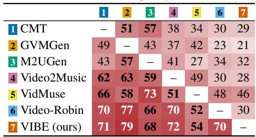  
(c) Video-music alignment

(b) Musicality  
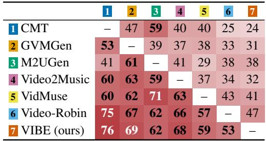

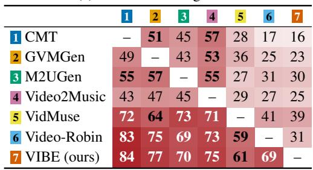

(d) Overall  
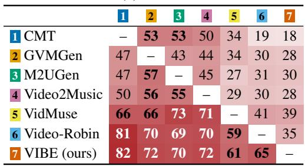  
Table 5: Results of the Human A/B evaluation. Win rates (%) from pairwise subjective comparisons across 4 criteria. Fleiss κ = 0.249, Krippendorff α = 0.245. Each cell is the win rate of the row model against the column model. Darker shade indicates higher win rate.

Visuals Music Bridge (VMB). To evaluate our omni-modal reward model for text+video-to-music generation, we compare it against a cross-modal baseline inspired by Visual-Music-Bridge (VMB) (Wang et al., 2024) due to the lack of dedicated reward models in this space. VMB generates detailed video-music alignment captions using Gemini-2.5- Flash and fine-tunes a text-to-music model on them, assuming the text fully captures the visual context. As shown in Table 10, our model trained using Qwen2.5-Omni judge clearly outperforms VMB across all qualitative metrics.

## 5 Conclusion

We presented VIBE, a text-and-video-to-music model that addresses static cross-modal conditioning and the absence of instruction-following supervision via Conditioning Connection and a structured 5-stage training curriculum with holistic reward modeling. Experiments demonstrate strong performance on perceptual quality, generative diversity, and instruction-following metrics, with human evaluation confirming preference for VIBE across all assessment axes.

## Limitations

VIBE inherits the frozen VAE and encoder constraints of its base architecture, which may limit expressivity in niche genres. ImageBind, used as an audio-visual alignment proxy, is not trained on music data and may not fully capture semantic correspondence between generated music and video. VIBE currently targets 10-second instrumental clips and does not support vocal music, longform scoring, or interactive editing. Finally, genre and mood rewards rely entirely on CMI-RM, whose own limitations propagate into the reward signal, and omni-modal reward extraction via Qwen2.5- Omni adds non-trivial inference overhead during Stage 5 training.

## Acknowledgement

The research at the University of Maryland is partially supported by Adobe, Amazon, NVIDIA, and Sesame.

## References

Shangzhe Di, Zeren Jiang, Si Liu, Zhaokai Wang, Leyan Zhu, Zexin He, Hongming Liu, and Shuicheng Yan.

2021. Video background music generation with controllable music transformer. In Proceedings of the 29th ACM International Conference on Multimedia, MM ’21, page 2037–2045. ACM.

Emma Frid, Celso Gomes, and Zeyu Jin. 2020. Music creation by example. In Proceedings of the 2020 CHI Conference on Human Factors in Computing Systems, CHI ’20, page 1–13, New York, NY, USA. Association for Computing Machinery.

Rohit Girdhar, Alaaeldin El-Nouby, Zhuang Liu, Mannat Singh, Kalyan Vasudev Alwala, Armand Joulin, and Ishan Misra. 2023. Imagebind: One embedding space to bind them all. Preprint, arXiv:2305.05665.

Junmin Gong, Sean Zhao, Sen Wang, Shengyuan Xu, and Joe Guo. 2025. Ace-step: A step towards music generation foundation model. Preprint, arXiv:2506.00045.

Noor Hammad, C. Ailie Fraser, Erik Harpstead, Jessica Hammer, and Mira Dontcheva. 2025. “it’s more of a vibe i’m going for”: Designing text-to-music generation interfaces for video creators. In Proceedings ofthe 2025 ACM Designing Interactive Systems Conference, DIS ’25, page 2738–2754, New York, NY, USA. Association for Computing Machinery.

Xuzheng He, Nan Nan, Zhilin Wang, Ziyue Kang, Zhuoru Mo, Ao Li, Yu Pan, Xiaobing Li, Feng Yu, and Xiaohong Guan. 2026. Symphonygen: 3d hierarchical orchestral generation with controllable harmony skeleton. Preprint, arXiv:2604.25498.

Qingqing Huang, Daniel S. Park, Tao Wang, Timo I. Denk, Andy Ly, Nanxin Chen, Zhengdong Zhang, Zhishuai Zhang, Jiahui Yu, Christian Frank, Jesse Engel, Quoc V. Le, William Chan, Zhifeng Chen, and Wei Han. 2023. Noise2music: Text-conditioned music generation with diffusion models. Preprint, arXiv:2302.03917.

Mina Huh, C. Ailie Fraser, Dingzeyu Li, Mira Dontcheva, and Bryan Wang. 2026. Vidtune: Creating video soundtracks with generative music and contextual thumbnails. Preprint, arXiv:2601.12180.

Shulei Ji, Zihao Wang, Jiaxing Yu, Xiangyuan Yang, Shuyu Li, Songruoyao Wu, and Kejun Zhang. 2025. Diff-v2m: A hierarchical conditional diffusion model with explicit rhythmic modeling for video-to-music generation. Preprint, arXiv:2511.09090.

Dongya Jia, Zhuo Chen, Jiawei Chen, Chenpeng Du, Jian Wu, Jian Cong, Xiaobin Zhuang, Chumin Li, Zhen Wei, Yuping Wang, and Yuxuan Wang. 2025. Ditar: Diffusion transformer autoregressive modeling for speech generation. Preprint, arXiv:2502.03930.

Jaeyong Kang, Soujanya Poria, and Dorien Herremans. 2024. Video2music: Suitable music generation from videos using an affective multimodal transformer model. Expert Systems with Applications, 249:123640.

Haven Kim, Zachary Novack, Julian McAuley, and Hao-Wen Dong. 2026. Dialogue-aware video-tomusic generation using public domain film collections. Preprint, arXiv:2608.11576.

Haven Kim, Zachary Novack, Weihan Xu, Julian McAuley, and Hao-Wen Dong. 2025. Video-guided text-to-music generation using public domain movie collections. ISMIR 2025.

Shun Lei, Yaoxun Xu, Zhiwei Lin, Huaicheng Zhang, Wei Tan, Hangting Chen, Jianwei Yu, Yixuan Zhang, Chenyu Yang, Haina Zhu, Shuai Wang, Zhiyong Wu, and Dong Yu. 2025. Levo: High-quality song generation with multi-preference alignment. Preprint, arXiv:2506.07520.

Bozhou Li, Yushuo Guan, Haolin Li, Bohan Zeng, Yiyan Ji, Yue Ding, Pengfei Wan, Kun Gai, Yuanxing Zhang, and Wentao Zhang. 2026. Semantic routing: Exploring multi-layer llm feature weighting for diffusion transformers. Preprint, arXiv:2602.03510.

Susan Liang, Chao Huang, Filippos Bellos, Yolo Yunlong Tang, Qianxiang Shen, Jing Bi, Luchuan Song, Zeliang Zhang, Jason Corso, and Chenliang Xu. 2026. Omni-judge: Can omni-llms serve as human-aligned judges for text-conditioned audio-video generation? Preprint, arXiv:2602.01623.

Yan-Bo Lin, Jonah Casebeer, Long Mai, Aniruddha Mahapatra, Gedas Bertasius, and Nicholas J. Bryan. 2026. V2m-zero: Zero-pair time-aligned video-tomusic generation. Preprint, arXiv:2603.11042.

Shansong Liu, Atin Sakkeer Hussain, Qilong Wu, Chenshuo Sun, and Ying Shan. 2024. Mumu-llama: Multimodal music understanding and generation via large language models. Preprint, arXiv:2412.06660.

Vaibhavi Lokegaonkar, Aryan Vijay Bhosale, Vishnu Raj, Gouthaman KV, Ramani Duraiswami, Lie Lu, Sreyan Ghosh, and Dinesh Manocha. 2026. Video-robin: Autoregressive diffusion planning for intent-grounded video-to-music generation. Preprint, arXiv:2604.17656.

Yinghao Ma, Haiwen Xia, Hewei Gao, Weixiong Chen, Yuxin Ye, Yuchen Yang, Sungkyun Chang, Mingshuo Ding, Yizhi Li, Ruibin Yuan, Simon Dixon, and Emmanouil Benetos. 2026. Cmi-rewardbench: Evaluating music reward models with compositional multimodal instruction. Preprint, arXiv:2603.00610.

Jan Melechovsky, Zixun Guo, Deepanway Ghosal, Navonil Majumder, Dorien Herremans, and Soujanya Poria. 2024. Mustango: Toward controllable textto-music generation. In Proceedings of the 2024 Conference of the North American Chapter of the Associationfor Computational Linguistics: Human Language Technologies (Volume 1: Long Papers), pages 8293–8316, Mexico City, Mexico. Association for Computational Linguistics.

Muhammad Ferjad Naeem, Seong Joon Oh, Youngjung Uh, Yunjey Choi, and Jaejun Yoo. 2020. Reliable fidelity and diversity metrics for generative models.

Qwen, :, An Yang, Baosong Yang, Beichen Zhang, Binyuan Hui, Bo Zheng, Bowen Yu, Chengyuan Li, Dayiheng Liu, Fei Huang, Haoran Wei, Huan Lin, Jian Yang, Jianhong Tu, Jianwei Zhang, Jianxin Yang, Jiaxi Yang, Jingren Zhou, and 25 others. 2025. Qwen2.5 technical report. Preprint, arXiv:2412.15115.

Alec Radford, Jong Wook Kim, Chris Hallacy, Aditya Ramesh, Gabriel Goh, Sandhini Agarwal, Girish Sastry, Amanda Askell, Pamela Mishkin, Jack Clark, Gretchen Krueger, and Ilya Sutskever. 2021. Learning transferable visual models from natural language supervision. Preprint, arXiv:2103.00020.

Simon Rouard, Francisco Massa, and Alexandre Dé- fossez. 2023. Hybrid transformers for music source separation. In ICASSP 23.

Abhinaba Roy, Renhang Liu, Tongyu Lu, and Dorien Herremans. 2025. Jamendomaxcaps: A large scale music-caption dataset with imputed metadata. In 2025 International Joint Conference on Neural Networks (IJCNN), pages 1–8. IEEE.

Tim Salimans, Ian Goodfellow, Wojciech Zaremba, Vicki Cheung, Alec Radford, and Xi Chen. 2016. Improved techniques for training gans. Preprint, arXiv:1606.03498.

MiniCPM Team, Chaojun Xiao, Yuxuan Li, Xu Han, Yuzhuo Bai, Jie Cai, Haotian Chen, Wentong Chen, Xin Cong, Ganqu Cui, Ning Ding, Shengda Fan, Yewei Fang, Zixuan Fu, Wenyu Guan, Yitong Guan, Junshao Guo, Yufeng Han, Bingxiang He, and 64 others. 2025. Minicpm4: Ultra-efficient llms on end devices. Preprint, arXiv:2506.07900.

Zeyue Tian, Zhaoyang Liu, Yizhu Jin, Ruibin Yuan, Liumeng Xue, Xu Tan, Qifeng Chen, Wei Xue, and Yike Guo. 2026. AudioX: A unified framework for anything-to-audio generation. In International Conference on Learning Representations (ICLR).

Zeyue Tian, Zhaoyang Liu, Ruibin Yuan, Jiahao Pan, Qifeng Liu, Xu Tan, Qifeng Chen, Wei Xue, and Yike Guo. 2025. Vidmuse: A simple video-to-music generation framework with long-short-term modeling. Preprint, arXiv:2406.04321.

Baisen Wang, Le Zhuo, Zhaokai Wang, Chenxi Bao, Wu Chengjing, Xuecheng Nie, Jiao Dai, Jizhong Han, Yue Liao, and Si Liu. 2024. Multimodal music generation with explicit bridges and retrieval augmentation. Preprint, arXiv:2412.09428.

Chenyu Yang, Shuai Wang, Hangting Chen, Wei Tan, Jianwei Yu, and Haizhou Li. 2025. Songbloom: Coherent song generation via interleaved autoregressive sketching and diffusion refinement. arXiv preprint arXiv:2506.07634.

Dongchao Yang, Yuxin Xie, Yuguo Yin, Zheyu Wang, Xiaoyu Yi, Gongxi Zhu, Xiaolong Weng, Zihan Xiong, Yingzhe Ma, Dading Cong, Jingliang Liu, Zihang Huang, Jinghan Ru, Rongjie Huang, Haoran

Wan, Peixu Wang, Kuoxi Yu, Helin Wang, Liming Liang, and 11 others. 2026. Heartmula: A family of open sourced music foundation models. Preprint, arXiv:2601.10547.

Yufeng Zhang, Wanwei Liu, Zhenbang Chen, Ji Wang, and Kenli Li. 2023. On the properties of kullbackleibler divergence between multivariate gaussian distributions. Preprint, arXiv:2102.05485.

Kaiwen Zheng, Huayu Chen, Haotian Ye, Haoxiang Wang, Qinsheng Zhang, Kai Jiang, Hang Su, Stefano Ermon, Jun Zhu, and Ming-Yu Liu. 2026. Diffusionnft: Online diffusion reinforcement with forward process. Preprint, arXiv:2509.16117.

Zitang Zhou, Ke Mei, Yu Lu, Tianyi Wang, and Fengyun Rao. 2025. Harmonyset: A comprehensive dataset for understanding video-music semantic alignment and temporal synchronization. Preprint, arXiv:2503.01725.

Alon Ziv, Sanyuan Chen, Andros Tjandra, Yossi Adi, Wei-Ning Hsu, and Bowen Shi. 2025. Mr-flowdpo: Multi-reward direct preference optimization for flow-matching text-to-music generation. Preprint, arXiv:2512.10264.

Heda Zuo, Weitao You, Junxian Wu, Shihong Ren, Pei Chen, Mingxu Zhou, Yujia Lu, and Lingyun Sun. 2025. Gvmgen: A general video-to-music generation model with hierarchical attentions. Preprint, arXiv:2501.09972.

## Appendix

## A Potential Risks

Potential Risks VIBE generates instrumental background music conditioned on video and text, which introduces several potential risks that warrant consideration. Misuse for Unauthorized Content. Automated music generation could be used to produce background scores for videos containing harmful, misleading, or manipulative content. Music is a powerful emotional amplifier, and pairing generated scores with propaganda, misinformation, or deceptive advertising could enhance the persuasive impact of such material. Copyright and Intellectual Property. Although VIBE generates novel audio rather than retrieving existing tracks, models trained on large-scale music corpora may inadvertently reproduce melodic fragments, harmonic progressions, or timbral characteristics closely resembling copyrighted works. Users may unknowingly deploy generated music that infringes on existing intellectual property, particularly in commercial contexts. Economic Displacement. Scalable, highquality background music generation may reduce demand for human composers and music licensors in the short-form video ecosystem. While the tool is intended to complement creative workflows, widespread adoption without appropriate safeguards could disproportionately affect independent musicians who rely on licensing income from stock music and background scoring. Bias in Reward Models. Our reward modeling framework relies on CMI-RM and Qwen2.5-Omni as judges for subjective musical qualities. These models may encode cultural, stylistic, or genre biases present in their training data, potentially favoring Western tonal music conventions and underrepresenting non-Western musical traditions. This could lead VIBE to systematically produce outputs that lack diversity in cultural representation. Deepfake and Deceptive Media. Combined with advances in video generation and voice synthesis, automated music scoring could lower the barrier to producing convincing synthetic audiovisual media. We encourage the development of provenance tracking and watermarking mechanisms for AI-generated music to mitigate this risk.

## B License of Artifacts

JamendoMaxCaps is derived from the Jamendo platform, where tracks are released under Creative Commons licenses permitting research use. MusicBench is released under a CC-BY 4.0 license. CMI-Pref and CMI-RM are released for research purposes by their authors. V2M and HarmonySet are publicly available research datasets; we use them in accordance with their stated terms. Reel-Bench was obtained directly from its authors with permission for benchmarking. Pre-trained model weights are used under their respective licenses: MiniCPM4-0.5B under the Apache License 2.0, CLIP under the MIT License, SongBloom under its research license, and Qwen2.5-Omni under the Qwen License Agreement. The source code released is extended from VoxCPM under it’s Apache License. All artifacts are used in compliance with their distribution terms for non-commercial academic research.

## C Use of AI Assistants

We used AI assistants at several stages of this work, detailed below. Data Preparation. In Stage 4 (Text+Video-to-Music Instruction Finetuning), we used Google Gemini to extract structured musical attributes — including tempo, key, instruments, genre, and atmosphere — from audio clips in the V2M and HarmonySet datasets, which do not provide instruction-level text prompts natively. In Stage 5 (Omni-Modal Alignment Preference Tuning), we used Gemini-2.5-Flash to generate 4 diverse instructional prompts per video for the 8,000 resampled training videos. All generated captions were used as training inputs and were not presented as human annotations. Reward Extraction. During preference optimization, we used Qwen2.5- Omni-7B as an omni-modal judge to extract reward signals for musicality, text-music alignment, and video-music alignment (Section 3.3). CMI-RM was used as a cross-modal reward model for text-tomusic quality assessment. Both models were used programmatically as scoring functions within the training loop, not for subjective editorial decisions. Visuals Music Bridge (VMB) Baseline. For the VMB ablation (Section 4.6), we used Gemini-2.5- Flash to generate diverse music captions containing video-music alignment details for each training video. Writing Assistance. We used AI language models (ChatGPT and Claude) for proofreading, grammar correction, and minor stylistic editing of the manuscript text. All scientific content, experimental design, analysis, and claims were produced entirely by the authors. No AI assistant was used to generate or fabricate experimental results.

## Training Objective Details

Notation. Table 6 defines all symbols used in Methodology.

Forward process. The noisy latent at timestep t follows ${ \bf x } ^ { t } = \alpha _ { t } { \bf x } ^ { 0 } + \sigma _ { t } \epsilon$ , with $\epsilon \sim \mathcal { N } ( 0 , \mathbf { I } )$ . The flow-matching target velocity is the time derivative $\mathbf { v } = \dot { \alpha } _ { t } \mathbf { x } ^ { 0 } + \dot { \sigma } _ { t } \boldsymbol { \epsilon }$

Optimality probability mapping. Given group rewards $\{ R ^ { g } \} _ { g = 1 } ^ { G }$ , we compute normalised advantages $\hat { R } ^ { g } = ( R ^ { g } - \mu ) / ( \sigma + \varepsilon )$ , clip to $[ - A , A ]$ , and map to $r ^ { g } = \hat { R } ^ { g } / ( 2 A ) + 0 . 5 \in [ 0 , 1 ]$

KL regularisation. The penalty $\lVert \mathbf { v } _ { \theta } - \mathbf { v } ^ { \mathrm { r e f } } \rVert _ { 2 } ^ { 2 }$ approximates a KL divergence in velocity space and prevents reward hacking without requiring full distribution estimation.

## D Instruction-Following Evaluation Protocol

In figure 3, Tempo is evaluated at exact (±10%) and octave-equivalent tolerances alongside mean

<table><tr><td>Symbol</td><td>Description</td></tr><tr><td> $\mathbf { x } ^ { 0 }$ </td><td>Clean latent patch</td></tr><tr><td> $\mathbf { x } ^ { t }$ </td><td>Noisy latent at timestep t</td></tr><tr><td> $\mathbf { v } _ { \theta }$ </td><td>LocDiT velocity field (training policy)</td></tr><tr><td> $\mathbf { v } ^ { \mathrm { o l d } }$ </td><td>Frozen sampling policy (EMA-updated)</td></tr><tr><td> $\mathbf { v } ^ { \mathrm { r e f } }$ </td><td>Frozen reference policy (for KL)</td></tr><tr><td> $\mathbf { E } _ { p }$ </td><td>Multimodal planning embedding</td></tr><tr><td> $\mathbf { m } _ { i - 1 }$ </td><td>Previously generated patch</td></tr><tr><td> $\alpha _ { t } , \sigma _ { t }$ </td><td>Flow schedule signal/noise coefficients</td></tr><tr><td> $\beta$ </td><td>NFT guidance strength</td></tr><tr><td> $r$ </td><td>Per-sample optimality probability</td></tr><tr><td> $A$ </td><td>Advantage clip threshold</td></tr><tr><td> $\lambda _ { \mathrm { K L } }$ </td><td>KL regularisation weight</td></tr></table>

Table 6: Notation used in Methodology

absolute error in BPM; key is evaluated at exact and loose tolerances, where the loose criterion additionally accepts relative and parallel key matches.

<table><tr><td>Note Name</td><td>Pitch Class</td></tr><tr><td>C</td><td>0</td></tr><tr><td>C#/ Db</td><td>1</td></tr><tr><td>D</td><td>2</td></tr><tr><td>D#/Eb</td><td>3</td></tr><tr><td>E</td><td>4</td></tr><tr><td>F</td><td>5</td></tr><tr><td>F# / Gb</td><td>6</td></tr><tr><td>G</td><td>7</td></tr><tr><td>G# / Ab</td><td>8</td></tr><tr><td>A</td><td>9</td></tr><tr><td>A#/ Bb</td><td>10</td></tr><tr><td>B</td><td>11</td></tr></table>

Table 7: Pitch class mapping used for key estimation. Enharmonic equivalents share the same pitch class index.

<table><tr><td>Mode</td><td>C</td><td>C#</td><td>D</td><td>D#</td><td>E</td><td>F</td><td>F#</td><td>G</td><td>G#</td><td>A</td><td>A#</td><td>B</td></tr><tr><td>Major</td><td>1</td><td>0</td><td>1</td><td>0</td><td>1</td><td>1</td><td>0</td><td>1</td><td>0</td><td>1</td><td>0</td><td>1</td></tr><tr><td>Minor</td><td>1</td><td>0</td><td>1</td><td>1</td><td>0</td><td>1</td><td>0</td><td>1</td><td>1</td><td>0</td><td>1</td><td>0</td></tr></table>

Table 8: Chromagram templates for major and minor modes used in key estimation. Each binary vector encodes the scale degrees present in the corresponding mode, rooted at C. For estimation in other keys, the template is circularly shifted by the target pitch class.

## Tempo Evaluation

We estimate the tempo of each generated clip in beats per minute (BPM) using librosa’s beat tracker. Given a ground-truth tempo $b ^ { * }$ and a predicted tempo ˆb, we evaluate correctness under two criteria. Exact Tempo Accuracy considers a prediction correct if $| \hat { b } - b ^ { * } | / b ^ { * } \leq 0 . 1 0 , \mathrm { i . e . }$ , within a 10% relative tolerance. Octave-Equivalent Tempo

Accuracy additionally accepts predictions at half or double the ground-truth tempo, accounting for common octave errors in BPM estimators; a prediction is accepted if any of $\hat { b } , 2 \hat { b } ,$ or $\hat { b } / 2$ falls within the 10% tolerance of $b ^ { * }$ . We also report Tempo MAE, the mean absolute error in BPM across all samples with valid ground-truth tempo annotations.

## Key Evaluation

We estimate the key of each generated clip by computing a chromagram using a constant-Q transform via librosa, averaging chroma energy across frames to obtain a 12-dimensional pitch class profile, and correlating it against major and minor key templates across all 12 pitch classes. The pitch class mapping used for parsing ground-truth key annotations is shown in Table 7, where enharmonic equivalents such as C# and D♭ are treated as identical. The chromagram templates for major and minor modes are shown in Table 8; for a key rooted at pitch class $p ,$ the template is circularly shifted by $p$ positions before computing cosine similarity against the predicted chroma profile. The key with the highest similarity is taken as the predicted key.

Given a predicted key $( k _ { \mathrm { p r e d } } , m _ { \mathrm { p r e d } } )$ and groundtruth key $( k ^ { * } , m ^ { * } )$ , where k denotes the pitch class and m ∈ {major, minor} denotes the mode, we evaluate under two criteria:

• Exact Key Accuracy: the prediction is correct if $k _ { \mathrm { p r e d } } = k ^ { * }$ and $m _ { \mathrm { p r e d } } = m ^ { * }$

• Loose Key Accuracy: the prediction is accepted under any of three conditions: (i) exact match, (ii) relative key match, where a predicted major key accepts a ground-truth minor key a minor third above $( ( k ^ { * } - k _ { \mathrm { p r e d } } )$ mod 12 = 9) or vice versa $( ( k ^ { * } - k _ { \mathrm { p r e d } } )$ mod $1 2 =$ 3), or (iii) parallel key match, where $k _ { \mathrm { p r e d } } =$ $k ^ { * }$ but $m _ { \mathrm { p r e d } } \neq m ^ { * }$

Both metrics are computed only over samples for which a valid ground-truth key annotation is available in ReelBench.

## E Further Ablations and associated details

## E.1 Importance of Hard and Soft Rewards

In each of the RL stages, we use the Hard Verifiable and Soft rewards for penalizing the specific musical attributes not followed from the music prompt into the rendered audio. Table 9 show that better audio quality is observed when both the kinds of rewards are used.

<table><tr><td></td><td colspan="7">Metrics</td></tr><tr><td>Ablation</td><td>FAD↓</td><td>FD↓</td><td>KL↓</td><td>IS↑</td><td>IB↑</td><td>Den.↑</td><td>Cov.↑</td></tr><tr><td>VIBE w/o Soft Rewards</td><td>1.6231</td><td>10.1979</td><td>1.3394</td><td> $1 . 6 6 0 7 \pm 0 . 0 3 8 8$ </td><td>0.0792</td><td>0.1431</td><td>0.2191</td></tr><tr><td>VIBE w/o Hard Rewards</td><td>1.6738</td><td>10.2975</td><td>1.3617</td><td> $1 . 6 3 1 7 \pm 0 . 0 3 5 2$ </td><td>0.0796</td><td>0.152</td><td>0.2132</td></tr><tr><td>VIBE</td><td>1.5829</td><td>10.1282</td><td>1.3205</td><td> ${ \bf 2 . 3 5 7 8 \pm 0 . 0 7 9 8 }$ </td><td>0.0888</td><td>0.6741</td><td>0.6095</td></tr></table>

Table 9: Ablation study on reward design in VIBE. We evaluate the contribution of soft and hard reward components to generation quality and alignment performance.
<table><tr><td></td><td colspan="7">Metrics</td></tr><tr><td>Model</td><td>FAD↓</td><td>FD↓</td><td>KL↓</td><td>IS↑</td><td>IB↑</td><td>Den.↑</td><td>Cov.↑</td></tr><tr><td>Visual Music Bridge</td><td>2.2713</td><td>18.8573</td><td>1.4181</td><td> $1 . 5 4 5 7 \pm 0 . 0 9 9 8$ </td><td>0.0163</td><td>0.0</td><td>0.0825</td></tr><tr><td>VIBE (Ours)</td><td>1.5829</td><td>10.1282</td><td>1.3205</td><td> $\mathbf { 2 . 3 5 7 8 \pm 0 . 0 7 9 8 }$ </td><td>0.0888</td><td>0.6741</td><td>0.6095</td></tr></table>

Table 10: Comparison between VIBE and the Visual Music Bridge Technique. We evaluate the impact of the visual bridging strategy on generation quality and video-music alignment metrics.

## E.2 Visuals Music Bridge (Wang et al., 2024)

$$
R _ { V M B } ^ { \mathrm { T + V  M } } = R _ { \mathrm { s o f t } } ^ { \mathrm { C M } } + \underbrace { r _ { \mathrm { t e m p o } } + r _ { \mathrm { k e y } } } _ { R ^ { \mathrm { h a r d } } }\tag{15}
$$

Each training video is captioned offline by Gemini-2.5-Flash into four diverse music prompts; at each RL step one caption is sampled per candidate and scored by CMI-RM, providing a text-grounded proxy for video-music alignment without invoking the video encoder during training.

## F Qualitative Comparisons and Failure Modes

Qualitative examples for music generation can be see at our project page. Further, we analyze instruction following ability of VIBE and discuss failure modes in Table 11

## G Human Study Instructions

Figure 4 depicts the sample shown to the participants for review. Participants were unpaid volunteers recruited from within our institution aged 18-30.

<table><tr><td>Spectrogram</td><td>Instruction (abridged)</td><td>Target Tempo</td><td>Measured Tempo</td><td>Target Key</td><td>Measured Key</td></tr><tr><td></td><td>120 BPM Chillwave in D Major; lush evolving pads, soft kicks, crisp hi-hats</td><td>120.0</td><td>119.7</td><td>D Major</td><td>D Major</td></tr><tr><td></td><td>Ambient-electronic, 136.36 BPM in A Major; evolving pads, delicate arpeg- gios</td><td>136.4</td><td>144.2</td><td>A Major</td><td>A Major</td></tr><tr><td>138</td><td>Progressive Trance, 125 BPM in F Major; four-on-the-floor kick, side- chained bass, arpeggiated leads</td><td>125.0</td><td>125.0</td><td>FMajor</td><td>E Major</td></tr><tr><td>I</td><td>Ethereal ambient-electronic, 150 BPM in B Major; evolving pads, arpeggiated electric guitar</td><td>150.0</td><td>133.9</td><td>B Major</td><td>B Major</td></tr><tr><td>181</td><td>Slow atmospheric ambient, ≈69.8 BPM in G minor; evolving pads, sus- tained bass</td><td>69.8</td><td>133.9</td><td>G Minor</td><td>A Major</td></tr></table>

Table 11: Qualitative case studies showing different failure modes of fine-grained instruction adherence on HarmonySet test videos, with mel spectrograms of the generated clips. Green cells: the generated clip matches the instructed attribute (tempo within ±10% of target; key requiring identical tonic and mode). Red cells: a miss. The two successful cases span the tolerance band (0.3% and 5.8% tempo error). The last row’s tempo matches only under octave equivalence and is marked as a miss under the exact criterion. Tempo (BPM) and key measured with the estimators of Appendix D.

<table><tr><td>Model</td><td>FAD↓</td><td>FD↓</td><td>KL↓</td><td>IS↑</td><td>IB↑</td><td>Density ↑</td><td>Coverage ↑</td></tr><tr><td>ACE-Step1.5</td><td>8.642</td><td>31.727</td><td>1.667</td><td> $1 . 7 9 9 \pm 0 . 0 5 6$ </td><td>0.083</td><td>0.140</td><td>0.061</td></tr><tr><td>VIBE (Stage 3) (Ours)</td><td>3.963</td><td>24.465</td><td>1.503</td><td> ${ \bf 1 . 9 0 0 \pm 0 . 0 7 9 }$ </td><td>0.097</td><td>0.325</td><td>0.094</td></tr></table>

Table 12: Ablation proving the importance of video conditioning. Comparing text-to-music models on the video-to-music generation task when given video captions as input. This is an essential experiment to understand whether visual signals from the video are truly necessary for multimodal music generation or the context provided by the video can be substituted in text form just as effectively. Our text-to-music (TTM) model outperforms current SOTA TTM model ACE-Step1.5.

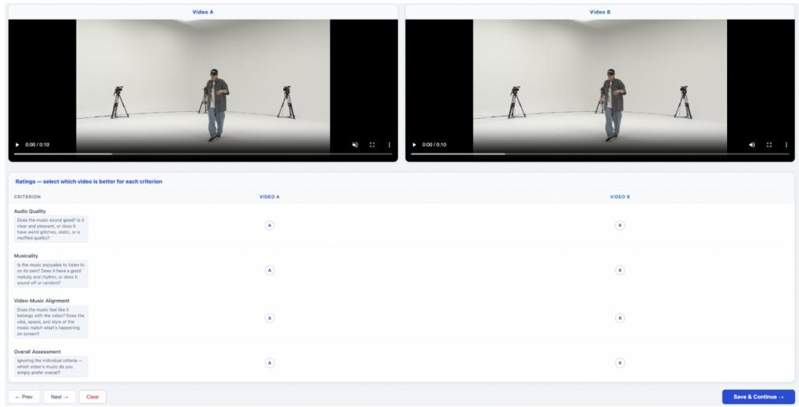  
Figure 4: Sample of the study shown to participants for A/B Testing results as shown in Table 5

System Prompt:   
You are an expert audio-visual coherence evaluator for generative AI models. You will be provided with a single video file containing both   
visual content and a generated music track. You may also receive the text prompt used to guide the music generation.   
Your task is to critically evaluate how well the generated music aligns with the video temporally, emotionally, and thematically   
You must respond exclusively with a valid JsoN obiect, Do not include markdown formatting like ison, explanations, or any text outside   
the JSoN structure.   
Evaluation Prompt:   
Evaluate the audio-visual alignment of the provided video file   
"The music was generated using this text prompt: \"{prompt}\""   
Rate each of the specific evaluation axes on a 1-5 scale:   
1 = Completely mismatched / heavily distracting   
2 = Poor fit / mostly inconsistent   
3 = Acceptable / partially consistent   
4 = Good fit / mostly consistent   
5 = Excellent / highly synchronized and coherent   
For axes marked [+binary], provide a boolean "match" field (true/false) indicating if the music meaningfully fits the video.   
For axes marked [+label], provide a single-word lowercase label representing the dominant trait in the video ("video\_label") and the audio   
("audio label").   
--- EVALUATION AXES --.   
1. Rhythmic Synchronization   
Does the music's beat, tempo, and rhythmic pattern align with the visual motion, cuts, and overall action pacing in the video?   
2. Thematic Coherence [+binary] [+label]   
Does the music's genre and style fit the video's visual subject matter and setting? (Labels: the dominant theme, e.g., "nature", "urban",   
"scifi", "historical", "abstract").   
3. Emotional Alignment [+binary] [+label]   
Does the music's emotional tone match the video's visual mood? (Labels: the dominant emotion, e.g., "happy", "tense", "melancholic",   
"energetic", "calm")   
4. Cultural Relevance [+binary]   
Is the instrumentation and musical style culturally appropriate and fitting for the specific context, locations, or subjects shown in the   
video?   
5. Temporal Dynamics   
Do structural changes in the music (transitions, builds, drops, fades) align with visual scene changes, camera movements, or climactic   
moments in the video?   
6. Instrumentation Fit   
Are the specific instruments, synthesizers, and timbres used appropriate for the visual aesthetic?   
7. Overall Audio-Visual Coherence   
Holistically, how well integrated do the audio and visual streams feel?   
REOUIRED JSON OUTPUT FORMAT   
{   
"global\_analysis": "<Provide a single, dense paragraph (max 3 sentences) analyzing the video's visual pacing and mood, the audio's musical   
pacing and mood, and specifically how well they interlock structurally. Do this BEFoRE assigning any scores.>",   
"rhythmic\_sync": {   
"score": <1-5>   
},   
"thematic\_coherence": {   
"score": <1-5>,   
"match": <bool>,   
"video\_label": "<word>",   
"audio\_label": "<word>"   
  
"emotional\_alignment": {   
"score": <1-5>,   
"match": <bool>,   
"video\_label": "<word>",   
"audio\_label": "<word>"   
},   
"cultural\_relevance": {   
"score": <1-5>,   
"match": <bool>   
"temporal\_dynamics": {   
"score": <1-5>   
"instrumentation fit": {   
"score": <1-5>   
},   
"overall\_coherence": {   
"score": <1-5>   
}   
1

Figure 5: System prompt and evaluation prompt used to configure Gemini as an Omni-Judge for audio-visual alignment evaluation (Lokegaonkar et al., 2026).
<table><tr><td>Axis</td><td>Definition</td></tr><tr><td>Rhythmic Sync</td><td>Whether beat structure, tempo and rhythmic patterns align with the motion dynamics, visual cuts and pacing of the video, i.e. low-level temporal synchronisation between musical rhythm and visual events.</td></tr><tr><td>Theme Coherence</td><td>Whether the genre and stylistic character of the music suit the subject matter and setting. The judge also predicts a dominant single-word theme per modality (e.g. nature, urban, sci-fi) and reports whether the two agree.</td></tr><tr><td>Emotion Alignment</td><td>Whether the emotional tone of the music matches the visual mood. The judge predicts a dominant emotion per modality (e.g. happy, tense, melancholic, calm) and reports whether they correspond.</td></tr><tr><td>Cultural Relevance</td><td>Whether instrumentation, musical style and sonic motifs are culturally appropriate to the setting shown; culturally specific scenes may call for regionally relevant styles or instruments.</td></tr><tr><td>Temporal Dynamics</td><td>Whether structural changes in the music—builds, drops, transitions, fades—coincide with salient visual events such as scene changes, camera movement or climactic moments.</td></tr><tr><td>Instrumentation Fit</td><td>Whether the particular instruments, synthesisers and timbres suit the visual aesthetic and narrative context of the video.</td></tr><tr><td>Overall Alignment</td><td>Holistic integration of the audio and visual streams: how naturally the music complements the video across temporal, thematic, emotional and structural correspondence.</td></tr></table>

Table 13: The seven axes along which Gemini scores audio–visual alignment as defined in Video-Robin (Lokegaonkar et al., 2026). Each axis is rated independently on the same scale; Overall Alignment is a separate holistic judgement rather than an aggregate of the preceding six.