# Aligning Multi-Trajectory Supervision with Policy Optimization for VLA Driving

Tian Zhang1,2, Zhuo Huang2, Hongrui Ye1,2, Yu Wu2,

Zengmao Wang1, Kaixuan Zhou2†

1School of Computer Science, Wuhan University, China 2Dongfeng Research & Development Institute {tianzhang, yehonngrui, wangzengmao}@whu.edu.cn {huangzhuo, dfrd-wuyu, tc-zhoukaixuan}@dfmc.com.cn

## Abstract

Vision-language-action (VLA) driving methods increasingly combine multi-trajectory imitation learning with grouprelative policy optimization (GRPO), making trajectory selection critical to final performance. However, some high- scoring trajectories that improve imitation can degrade subse-quent GRPO by inducing advantage estimates misaligned with the current policy’s feasible behavior distribution, driving up- dates away from safe and compliant behaviors. To address this, we propose a novel framework that aligns multi-trajectory supervision with policy optimization. To address the policy gradient bias induced by infeasible noisy trajectories outside the feasible region, augmented trajectories are constrained to a neighboring manifold of the ground-truth feasible region, and a Pareto-optimality criterion is adopted in place of the conventional aggregate score, retaining only non-dominated candidates and thereby filtering out conflicting samples at the source. To ensure that expanded trajectory supervision is effectively absorbed during policy optimization, we introduce two complementary mechanisms: feasibility-first advantage assignment and dynamic distillation. The former adapts Pareto credit to the feasibility composition of each rollout group and guides fully infeasible groups toward safe references. The lat- ter updates teacher trajectories across refinement rounds to continually transfer useful supervision. Together, they pro- gressively translate the benefits of expanded supervision into policy improvement. On NAVSIM v1 and v2, our method achieves 91.4 PDMS and 89.1 EPDMS, respectively, under single-trajectory inference, and recovers 440 of 658 initially failed scenes, 11.1% higher than the original GRPO baseline.

## Introduction

Vision-language-action (VLA) models are increasingly used in end-to-end driving to integrate visual scene understand- ing, high-level reasoning, and trajectory generation within a unified policy (Tian et al. 2025; Hwang et al. 2024; Wang et al. 2025b; Li et al. 2025d). Recent methods commonly learn an initial policy from logged demonstrations and then refine it through group-relative policy optimization (GRPO) with planning-oriented rewards (Li et al. 2025d; Jiang et al. 2025; Zou et al. 2025). Because a logged future represents only one valid response to a driving scene, multi-trajectory imitation is used to broaden the learned behavior distribution

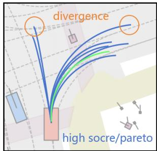

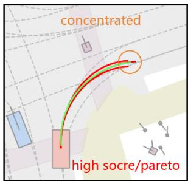

(a) Conventional and policy-compatible trajectory selection.  
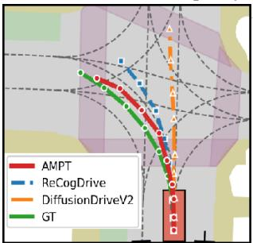

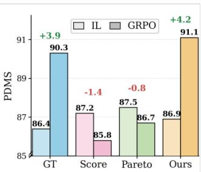  
(b) Representative trajectories and IL-to-GRPO performance.

Figure 1: Motivation for policy-compatible trajectory selection. (a) Conventional selection based on score, Pareto filtering, or geometric diversity may retain high-quality can- didates far from trajectories sampled by the frozen imitation policy, whereas our method selects candidates that are also compatible with the policy distribution. (b) Although scorebased and Pareto-based supervision improves the imitation- learning checkpoints over GT-only training, both policies de- teriorate after GRPO. The comparison shows that trajectory quality alone does not determine its value for downstream policy optimization.

before post-training (Liao et al. 2025; Chen et al. 2026; Ang et al. 2026). Additional trajectories are typically selected ac-cording to aggregate planning scores, physical validity, or geometric diversity. These criteria characterize the quality of a candidate as an isolated planning outcome, but do not indicate whether learning it produces a policy that can be improved efectively by subsequent GRPO.

We identify a supervision–optimization mismatch in this training paradigm. A high-scoring trajectory is not necessarily a useful supervision target because its value also depends on its compatibility with the policy being trained. As illustrated in Fig. 1(a), selection based on evaluator score, Pareto filtering, or geometric diversity may retain candidates far from trajectories sampled by the frozen imitation policy. Fig. 1(b) shows the resulting consequence: score-based and Pareto-based supervision improves the imitation checkpoints to 87.2 and 87.5 PDMS, but the corresponding policies de- teriorate to 85.8 and 86.7 after GRPO. In contrast, GT-only supervision and our policy-compatible selection continue to improve during post-training, reaching 90.3 and 91.1 PDMS. Distant targets can induce large shifts in the learned trajectory distribution, while their high nominal scores do not guaran- tee feasibility under prediction or sampling errors. Efective trajectory expansion should therefore consider both planning quality and compatibility with the current policy. This nat- urally motivates us consider that how can multi-trajectory supervision be constructed to support downstream policy optimization?

The same alignment problem also arises in GRPO credit assignment. Standard GRPO ranks rollouts using a scalar planning reward and increases the likelihood of samples that perform well relative to the group (Li et al. 2025d; Zou et al. 2025). Driving evaluation, however, combines safety and compliance requirements with objectives such as progress, time-to-collision margin, and comfort. A scalar score can conceal this structure: progress gains may compensate for safety regressions, and a rollout may receive positive credit even when another feasible sample performs no worse across all relevant objectives. The problem is more severe when ev-ery rollout in a group is infeasible, because relative ranking provides no reliable direction toward safe behavior. Efec- tive policy optimization should therefore establish or recover feasibility before improving driving eficiency within the fea- sible set.

Alignment must also be maintained as the policy evolves. On-policy GRPO may not fully absorb useful behaviors available in trajectories generated by diferent policy seeds, structured trajectory expanders, or policies specialized for safety and progress. At the same time, the value of these can- didates changes with the policy: a trajectory that improves an earlier checkpoint may become redundant after an update, while a previously unsuitable candidate may become use- ful. Reusing a fixed teacher set can therefore introduce out- dated supervision, whereas directly imitating distant teachers may disturb behaviors already acquired by the current pol- icy. Further refinement requires candidate trajectories to be reassessed against the latest policy and transferred through conservative updates.

We propose Aligned Multi-Trajectory Policy Training (AMPT), a unified framework that aligns multi-trajectory supervision, rollout credit assignment, and iterative policy refinement. First, policy-compatible multi-trajectory supervision (PC-MTS) retains candidates on the scene-wise Pareto front only when they are close to rollouts from a frozen GT- only policy and remain feasible under small trajectory devi-ations. Fine-tuning a copy of the frozen policy on the logged and accepted trajectories produces a policy-compatible initialization for GRPO, avoiding the degradation caused by individually strong but incompatible supervision. Second, feasibility-first Pareto GRPO (FF-PGRPO) penalizes unsafe rollouts and grants positive credit only to feasible rollouts that do not regress from a scene-specific reference and lie on the group Pareto front. When no feasible rollout is sam- pled, a safe reference provides recovery supervision, ensuring that driving eficiency is improved only after feasibility has been established. Third, adaptive Pareto refinement (APR) reassesses a multi-source teacher pool against the latest pol- icy, converts selected teachers into re-evaluated local targets, and transfers them through advantage-weighted distillation with policy retention. Rebuilding the teacher set after each round removes outdated supervision while preserving pre- viously learned behavior. Under single-trajectory inference, AMPT achieves 91.4 PDMS and 89.1 EPDMS on NAVSIM v1 and v2, respectively, and recovers 440 of 658 initially failed scenes, 73 more than the original GRPO baseline.

The main contributions can be summarized as:

• A structural supervision–optimization mismatch is identified in multi-trajectory VLA driving: trajectory sets that improve imitation-stage planning can reduce the avail- ability of feasible, high-quality rollouts during subsequent GRPO. This shows that individual trajectory scores are insuficient for assessing downstream optimization value.

• Policy-compatible multi-trajectory supervision (PC-MTS) is introduced to construct an optimization-oriented trajectory set. High-scoring candidates are screened by component-wise Pareto optimality and retained only when they remain close to rollouts from a frozen GT- only policy, filtering policy-mismatched supervision be- fore fine-tuning.

• Two complementary mechanisms are developed to exploit expanded supervision. Feasibility-first Pareto GRPO (FF-PGRPO) adapts credit assignment to rollout-group feasibility and guides fully infeasible groups toward safe refer- ences. Adaptive Pareto-guided policy refinement (APR) selects teacher trajectories that improve the current policy without degrading protected metrics and transfers them through advantage-weighted distillation with policy re- tention.

## Related Work

Multi-Trajectory Supervision for Driving Policies. VLA driving models connect scene understanding and high- level reasoning with trajectory generation through unified multimodal policies or language-conditioned action de- coders (Tian et al. 2025; Wang et al. 2025b; Hwang et al. 2024; Zhou et al. 2025a). Difusion-based planners repre-sent multiple plausible futures using motion anchors, pro- posal sets, learned scoring, or simulator-generated alterna- tives (Chi et al. 2023; Liao et al. 2025; Wang et al. 2025a, 2026). Although these methods improve trajectory cover-age and proposal quality, additional targets are still selected mainly by consistency with demonstrations, evaluator scores, or geometric diversity. Curious-VLA explicitly connects the imitation distribution to subsequent reinforcement learning and shows that an overly concentrated policy limits rollout exploration (Chen et al. 2026). Whereas Curious-VLA fo-cuses on broadening the policy distribution, we study which additional trajectories provide useful supervision for down-stream optimization. Our selection therefore considers plan- ning quality together with compatibility with rollouts sam- pled by the frozen imitation policy and local feasibility.

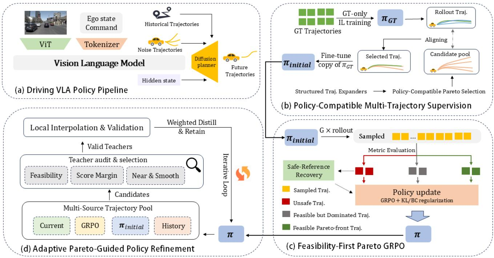  
Figure 2: Overview of AMPT.(a) A driveing VLA difusion policy predicts future trajectories.(b) PC-MTS selects high-quality candidates that are compatible with the frozen GT-only policy $\pi _ { G T }$ and locally feasible, yielding $\pi _ { \mathrm { i n i t i a l } }$ . (c) FF-PGRPO assigns rollout credit according to feasibility, reference-relative performance, and Pareto comparison, with safe-reference recovery for fully infeasible groups. (d) APR repeatedly validates and distills policy-relative improvements from a multi-source trajectory pool.

Reinforcement Post-Training and Policy Refinement. GRPO has been applied to both driving reasoning and con- tinuous trajectory policies (Li et al. 2025d; Jiang et al. 2025; Tang et al. 2025). DifusionDriveV2 structures comparisons within and across motion anchors (Zou et al. 2025), while HAD and EvaDrive expose metric-specific or multi-objective feedback during policy optimization (Yao et al. 2026; Jiao et al. 2025). Unlike reward decomposition or weighted scalarization, our method treats safety and compliance as prereq- uisites and applies Pareto comparison only among feasible rollouts to determine eligibility for positive credit. Our fi- nal stage is related to conservative policy improvement and trajectory distillation. Support-constrained, baseline-aware, and advantage-weighted methods limit policy shift while preserving prior behavior (Kumar et al. 2019; Laroche, Trichelair, and Tachet des Combes 2019; Nair et al. 2020). CLOVER constructs evaluator-filtered pseudo-experts and refines a generator toward scorer-selected Pareto targets, re- taining proposal ranking at inference (Ang et al. 2026). We instead treat teacher validity as policy-dependent: candidates are reassessed after every round, converted into locally val- idated targets, and distilled with behavior retention. The re- sulting policy predicts a single trajectory without a test-time scorer or candidate reranking.

## Preliminaries

Driving VLA policy. Given multi-view camera observations, a navigation command, and the ego-vehicle state, we denote the resulting multimodal scene context by o. A driving VLA policy maps o to a continuous future trajectory $\tau = \{ w _ { t } \} _ { t = 1 } ^ { H }$ , where $w _ { t }$ represents the planned ego motion at future step t. In our planner-based architecture, the VLM encodes the multimodal context into latent features, while a conditional difusion planner models the trajectory distribution πθ(τ | o). Following the common VLA training pipeline, the policy is first initialized through supervised imitation learning and subsequently improved through rein- forcement learning.

Imitation learning. The trajectory policy is first trained on logged driving demonstrations. Given a supervision target $\tau ^ { \star }$ , we sample a difusion step t and Gaussian noise ϵ, and construct the noisy trajectory $\bar { x } _ { t } = \sqrt { \bar { \alpha } _ { t } } \tau ^ { \star } + \sqrt { 1 - \bar { \alpha } _ { t } } \epsilon$ . The supervised fine-tuning objective is

$$
\begin{array} { r } { \mathcal { L } _ { \mathrm { S F T } } ( \theta ) = \mathbb { E } _ { ( o , \tau ^ { \star } ) , t , \epsilon } \left[ \| \epsilon - \epsilon _ { \theta } ( x _ { t } , t , o ) \| _ { 2 } ^ { 2 } \right] . } \end{array}\tag{1}
$$

Optimizing Eq. (1) on the logged trajectories produces the GT-only imitation policy $\pi _ { \mathrm { G T } }$ . After convergence, $\pi _ { \mathrm { G T } }$ is frozen and used to generate rollout samples for candidate selection. The same denoising objective is later used to learn selected candidate trajectories and distilled improvement targets.

Group-relative policy optimization. Starting from an imitation policy, GRPO samples a group of $\bar { G }$ trajectories $\{ \tau _ { i } \} _ { i = 1 } ^ { G }$ for the same scene and evaluates each trajectory with an aggregate planning reward $R _ { i } .$ . The trajectory-level policy objective is written compactly as

$$
\mathcal { L } _ { \mathrm { G R P O } } ( \theta ) = - \mathbb { E } \left[ \frac { 1 } { G } \sum _ { i = 1 } ^ { G } \widehat { A } _ { i } \log \pi _ { \theta } ( \tau _ { i } \mid o ) \right] + \beta \mathcal { L } _ { \mathrm { r e g } } ,\tag{2}
$$

where log $\pi _ { \boldsymbol { \theta } } ( \tau _ { i } \mid o )$ denotes the accumulated log-probability of the denoising transitions that generate $\tau _ { i }$ , and $\mathcal { L } _ { \mathrm { r e g } }$ denotes the behavior-cloning or KL regularization used to limit policy drift.

Standard GRPO avoids an additional value network by es- timating the advantage from the rewards within the sampled group:

$$
\widehat { A } _ { i } = \frac { R _ { i } - \mu _ { R } } { \sigma _ { R } + \varepsilon } ,\tag{3}
$$

where $\mu _ { R }$ and $\sigma _ { R }$ are the mean and standard deviation of $\{ R _ { i } \} _ { i = 1 } ^ { G }$ . Because Eq. (3) depends only on the aggregate re-ward, it does not distinguish safety violations from meaning- ful trade-ofs among feasible trajectories. Section therefore retains the same imitation and policy-optimization pipeline, but redesigns trajectory selection and rollout credit assignment to align multi-trajectory supervision with downstream optimization.

## Method

Our framework contains three stages, as shown in Fig. 2. We first train $\pi _ { \mathrm { G T } }$ using logged trajectories and freeze it for candidate selection. Policy-compatible multi-trajectory supervision (PC-MTS) then uses high-quality candidates compatible with this policy to fine-tune a trainable copy, producing the initialization $\pi _ { \mathrm { i n i t i a l } }$ for GRPO. Feasibility-first Pareto GRPO (FF-PGRPO) next improves this policy through feasibility- aware credit assignment. Finally, adaptive Pareto-guided pol- icy refinement (APR) repeatedly mines and distills improve-ments relative to the latest policy. The evaluator and candi- date pools are used only during training.

For clarity, we describe the metric hierarchy using NAVSIM. In v1, NC and DAC determine hard feasibility, DDC is used as an additional compliance guard, and EP, TTC, and comfort are compared within the feasible region. NAVSIM $\mathbf { v } 2$ follows the same principle, adding DDC and TLC to the feasibility and compliance checks and comparing its continuous planning metrics only after these checks are satisfied.

## Policy-Compatible Multi-Trajectory Supervision

We first filter the candidate pool by planning quality. Can- didates must satisfy the basic safety and compliance re- quirements, achieve a suficient aggregate score, and lie on the scene-wise Pareto front of the component metrics. For NAVSIM v1, the Pareto comparison uses EP, TTC, and com- fort, while NC and DAC must remain valid and DDC is protected. This retains high-quality alternatives with comple- mentary strengths, instead of allowing one strong component to conceal degradation in another.

Planning quality alone does not determine whether a can- didate is a suitable target for $\pi _ { \mathrm { G T } }$ . We therefore sample mul- tiple rollouts from the frozen policy and compare each candi- date with this rollout bank. Compatibility is measured by the average waypoint distance to the K nearest policy rollouts. The acceptance threshold is calibrated from held-out rollouts of the same policy and estimated separately for each naviga- tion command. This provides a sample-based compatibility test without estimating the exact difusion likelihood.

We additionally reject candidates with insuficient local feasibility. For each candidate, we generate a small number of temporally coherent nearby trajectories using the normal variation observed in $\pi _ { \mathrm { G T } }$ rollouts and require most of them to remain feasible. The logged trajectory is always retained. During fine-tuning, each scene contributes one target sam- pled from its logged trajectory and accepted candidates, re-gardless of the size of its candidate pool. Fine-tuning a copy of $\pi _ { \mathrm { G T } }$ with the standard difusion objective yields πinitial. The aim is not to maximize the imitation checkpoint alone, but to provide a policy from which GRPO can reliably sample useful trajectories.

## Feasibility-First Pareto GRPO

Starting from $\pi _ { \mathrm { i n i t i a l } }$ , GRPO samples G trajectories for each scene and evaluates their aggregate and component scores. We first construct a coherent scene reference $\boldsymbol { \tau } ^ { \mathrm { r e f } }$ from the logged trajectory, the retained candidates, and the singletrajectory prediction of $\pi _ { \mathrm { i n i t i a l } }$ . The highest-scoring feasible trajectory is selected, so all reference metrics come from the same executable plan rather than from an unattainable combination of diferent trajectories.

Credit assignment follows a feasibility-first hierarchy. In NAVSIM v1, a rollout must satisfy NC and DAC. DDC must meet an absolute or reference-relative guard, and a reference- relative EP floor prevents the policy from increasing TTC simply by slowing down. Among the rollouts that pass these checks, we construct the Pareto front over EP, TTC, and comfort. We denote this admissible Pareto front by P.

The group quality signal is based on PDMS. For groups containing both feasible and infeasible rollouts, we addition- ally penalize insuficient EP and joint regression in EP and TTC relative to the scene reference. When all rollouts are fea- sible, only the continuous component of PDMS is normalized because the binary feasibility terms are already satisfied. We continue to use $\widehat { A } _ { i }$ for the resulting group-normalized quality advantage.

When the group contains at least one feasible rollout, FF-

PGRPO assigns the advantage as

$$
\begin{array} { r } { A _ { i } = \left\{ \begin{array} { l l } { \operatorname* { m a x } ( \widehat { A } _ { i } , 0 ) , } & { \tau _ { i } \in \mathcal { P } , } \\ { \operatorname* { m i n } ( \widehat { A } _ { i } , 0 ) , } & { \tau _ { i } \mathrm { ~ i s ~ f e a s i b l e ~ b u t ~ } \tau _ { i } \notin \mathcal { P } , } \\ { - \lambda _ { \mathrm { u n s a f e } } + \operatorname* { m i n } ( \widehat { A } _ { i } , 0 ) , } & { \tau _ { i } \mathrm { ~ i s ~ i n f e a s i b l e . } } \end{array} \right. } \end{array}\tag{4}
$$

Feasible rollouts that fail the reference guards are therefore prevented from receiving positive credit, while unsafe roll- outs receive a stronger penalty. Aggregate quality controls the strength of an update; feasibility, reference-level perfor- mance, and Pareto comparison control whether a positive update is allowed. This prevents progress or aggregate-score gains from compensating for safety regression.

If the whole group is infeasible, no rollout is treated as a positive example. We assign non-positive credit according to violation severity and add weak difusion supervision from the safe scene reference, when available. These groups are downweighted so repeated failures do not dominate training. As in the baseline, the policy update is regularized toward πinitial with behavior-cloning or KL terms. The resulting policy first establishes or recovers feasibility and then improves eficiency within the feasible region.

## Adaptive Pareto-Guided Policy Refinement

A single GRPO run may not absorb useful behaviors avail- able from other policy seeds, structured trajectory expanders, or policies specialized for safety, progress, and trajectory regularity. We therefore build a multi-source trajectory pool and reassess it against the current policy at every refinement round.

For each scene, the current policy’s single-trajectory prediction is used as the baseline. A candidate can become a teacher only if it is feasible, improves the aggregate score by a margin, and does not degrade the protected component metrics. Among valid teachers, we prefer larger improve- ments with smaller behavioral distance and lower curvature or jerk, avoiding aggressive targets whose score gain comes with an unnecessarily large policy shift.

The selected teacher is then interpolated with the current prediction. We test a short descending list of interpolation ratios and re-evaluate the resulting trajectories. The largest local target that remains feasible, improves the aggregate score, preserves all protected metrics, and stays compatible with current-policy rollouts is retained. This step converts a potentially distant teacher into a verified local improvement.

Accepted targets are weighted by their verified score gains and learned with the same difusion objective. Training also includes policy retention on the current predictions and a distillation or KL term that limits excessive drift. Scenes without a valid teacher contribute only to retention. When safety-, progress-, and structure-oriented branches are trained separately, we consolidate their salient, anchor-aligned up- dates with a constrained task-vector merge; detailed merging rules are left to the supplementary material.

After validation, the refined checkpoint becomes the cur- rent policy for the next round. Its predictions and rollout bank are regenerated, and the teacher set is rebuilt. Outdated teachers are removed, while previously unsuitable candidates may enter after the policy becomes closer to them. Neither the evaluator, the candidate pool, nor the specialist branches are used at inference.

## Experiments

## Experimental Setup

Benchmarks and evaluation protocol. We evaluate on NAVSIM v1 and NAVSIM v2 (Dauner et al. 2024; Cao et al. 2025). NAVSIM v1 reports the Predictive Driver Model Score (PDMS), which combines no-at-fault collision (NC), drivable-area compliance (DAC), time to collision (TTC), comfort (C), and ego progress (EP). NAVSIM v2 extends the evaluation to EPDMS by including driving-direction com- pliance (DDC), trafic-light compliance (TLC), lane keeping (LK), history comfort (HC), and extended comfort (EC). We report the aggregate scores together with all component met-rics, since a scalar improvement alone cannot reveal whether progress is obtained at the expense of safety or compliance. We also selected 658 challenging scenarios (where colli-sions or exceeding the drivable area occurred in all 5 rounds of sampling, resulting in a PDMS of 0) based on the ReCog- Drive (Li et al. 2025d) IL policy, to quantitatively analyze the safety improvements of our method.

Implementation details. To ensure fair comparisons and highlight our method’s contribution to policy optimization, we reused the VLA backbone network InternVL3-2B (Zhu et al. 2025) and difusion planner from ReCogDrive. All controlled comparisons used the same initialization, trajectory representation, optimizer, training budget, and evalua- tion protocol. The GT-only policy and the multi-trajectory imitation variants are trained for 200 epochs. GRPO used 16 rollouts per scene for 10 epochs of optimization, and our method ultimately underwent 3 rounds of iterative op- timization. All experiments were performed on 8 NVIDIA A800 GPUs; complete hyperparameters are provided in the supplementary materials.

Compared variants. We denote policy-compatible multitrajectory supervision, feasibility-first Pareto GRPO, and adaptive Pareto-guided policy refinement by PC-MTS, FF-PGRPO, and APR, respectively. To isolate trajectory-set construction, Score retains candidates by aggregate score only, while Pareto additionally applies component-wise Pareto filtering. PC-MTS further removes candidates that are incompatible with the frozen GT-only policy. In the Score/Pareto/PC-MTS comparison, every imitation check- point is followed by the same original scalar GRPO.

## Main Results

NAVSIM v1. As shown in Table 1, AMPT achieves a PDMS score of 91.4, reaching state-of-the-art (SOTA) among all compared methods, 0.2 points higher than Dif- fusionDriveV2. The margin is modest, but the component profile is informative, and our method does not rely on an ad- ditional trained selector module to choose the optimal trajectory from multiple candidate trajectory outputs. Relative to DifusionDriveV2, our policy improves NC, DAC, and TTC, including a 1.2-point gain in TTC, while retaining competi- tive EP. The result is therefore not obtained by pushing the policy toward a more aggressive progress profile. Instead, it reflects a stronger balance between feasibility, safety margin, and driving eficiency, which is consistent with our proposed feasibility-first Pareto optimization philosophy.

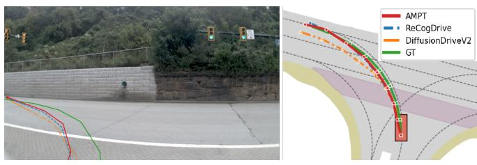  
(a) Driving command: Turn left.

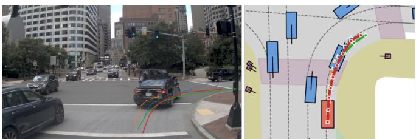  
(b) Driving command: Turn right.  
Fi ure 3: Qualitative com arison of trajectories b diferent models in front-facin camera and bird’s e e view on diferent driving scenarios.

Table 1: Single-trajectory planning results on NAVSIM v1. ↑ indicates that higher is better. The best and second-best results among the listed methods are shown in bold and underlined, respectively. Only the baselines selected for comparison are included.
<table><tr><td>Method</td><td>NC↑</td><td>DAC↑</td><td>TTC↑</td><td>C↑</td><td>EP↑</td><td>PDMS↑</td></tr><tr><td>LAW (Li et al. 2025b)</td><td>96.4</td><td>95.4</td><td>88.7</td><td>99.9</td><td>81.7</td><td>84.6</td></tr><tr><td>FSDrive (Zeng et al. 2026)</td><td>98.2</td><td>93.8</td><td>93.3</td><td>99.9</td><td>80.1</td><td>85.1</td></tr><tr><td>Hydra-MDP (Li et al. 2024)</td><td>98.3</td><td>96.0</td><td>94.6</td><td>100</td><td>78.7</td><td>86.5</td></tr><tr><td>DiffusionDrive (Liao et al. 2025)</td><td>98.2</td><td>96.2</td><td>94.7</td><td>100</td><td>82.2</td><td>88.1</td></tr><tr><td>PWM (Zhao et al. 2026)</td><td>98.6</td><td>95.9</td><td>95.4</td><td>100</td><td>81.8</td><td>88.1</td></tr><tr><td>AutoVLA (Zhou et al. 2025b)</td><td>98.4</td><td>95.6</td><td>98.0</td><td>99.9</td><td>81.9</td><td>89.1</td></tr><tr><td>DriveVLA-W0 (Li et al. 2025c)</td><td>98.7</td><td>99.1</td><td>95.3</td><td>99.3</td><td>83.3</td><td>90.2</td></tr><tr><td>GoalFlow (Xing et al. 2025)</td><td>98.4</td><td>98.3</td><td>94.6</td><td>100</td><td>85.0</td><td>90.3</td></tr><tr><td>Curious-VLA (Chen et al. 2026)</td><td>98.4</td><td>96.9</td><td>97.9</td><td>98.1</td><td>88.5</td><td>90.3</td></tr><tr><td>AdathinkDrive (Luo et al. 2025)</td><td>98.4</td><td>97.8</td><td>95.2</td><td>100</td><td>84.4</td><td>90.3</td></tr><tr><td>ReCogDrive (Li et al. 2025d)</td><td>97.9</td><td>97.3</td><td>94.9</td><td>100</td><td>87.3</td><td>90.8</td></tr><tr><td>DiffusionDriveV2 (Zou et al. 2025)</td><td>98.3</td><td>97.9</td><td>94.8</td><td>99.9</td><td>87.5</td><td>91.2</td></tr><tr><td>AMPT (Ours)</td><td>98.5</td><td>98.0</td><td>96.0</td><td>100</td><td>86.7</td><td>91.4</td></tr></table>

Table 2: Efect of trajectory-set construction. Every imitation checkpoint is followed by the same original scalar GRPO.
<table><tr><td>Data</td><td>IL</td><td>GRPO</td><td>∆</td></tr><tr><td>GT</td><td>86.4</td><td>90.3</td><td>+3.9</td></tr><tr><td>Score</td><td>87.2</td><td>85.8</td><td>-1.4</td></tr><tr><td>Pareto</td><td>87.5</td><td>86.7</td><td>-0.8</td></tr><tr><td>PC-MTS</td><td>86.9</td><td>91.1</td><td>+4.2</td></tr></table>

NAVSIM v2. Table 3 evaluates the same policy under the richer EPDMS protocol. AMPT reaches 89.1 EPDMS, im- proving over the strongest compared baseline, Drive-JEPA, by 1.3 points. The gain is primarily associated with higher EP and EC, while NC, DDC, TLC, and TTC remain close to their saturated ranges. Although the method does not maxi- mize every individual component, it obtains the strongest ag- gregate result under the expanded set of safety, compliance, progress, and comfort requirements. This confirms that the proposed approach is not specific to the metric composition of NAVSIM v1.

## Does Better Imitation Performance Lead to Better GRPO Initialization?

We examine whether a higher-scoring imitation policy also provides a better initialization for GRPO. We compare GT supervision with Score, Pareto, and PC-MTS. All variants use the same imitation objective and are subsequently optimized with the same scalar GRPO, isolating the efect of trajectory-set construction.

Table 2 shows a clear reversal between imitation and post- training. Score and Pareto improve the imitation checkpoint to 87.2 and 87.5, respectively, but degrade to 85.8 and 86.7 after GRPO. In contrast, PC-MTS reaches only 86.9 af- ter imitation yet improves to 91.1 after GRPO. Thus, the trajectory set that produces the best imitation checkpoint does not yield the best optimized policy. This result directly supports the supervision–optimization mismatch. Aggregate score and component-wise Pareto quality identify desirable plans, but not whether learning them preserves a feasible and improvable rollout distribution. Trajectory supervision should therefore be evaluated by its efect on downstream policy optimization rather than by imitation performance alone.

Table 3: Single-trajectory planning results on NAVSIM v2. ↑ indicates that higher is better. NC, DAC, DDC, and TLC are multiplicative compliance metrics, while TTC, EP, LK, HC, and EC form the weighted component of EPDMS. The best and second-best results among the listed methods are shown in bold and underlined, respectively.
<table><tr><td>Method</td><td>NC↑</td><td>DAC↑</td><td>DDC↑</td><td>TLC↑</td><td>TTC↑</td><td>EP↑</td><td>LK↑</td><td>HC↑</td><td>EC↑</td><td>EPDMS↑</td></tr><tr><td>TransFuser (Chitta et al. 2022)</td><td>97.7</td><td>92.8</td><td>98.3</td><td>99.9</td><td>92.8</td><td>79.2</td><td>67.6</td><td>100</td><td>95.3</td><td>77.8</td></tr><tr><td>ReCogDrive (Li et al. 2025d)</td><td>98.3</td><td>95.2</td><td>99.5</td><td>99.8</td><td>97.5</td><td>87.1</td><td>96.6</td><td>98.3</td><td>86.5</td><td>83.6</td></tr><tr><td>Hydra-MDP++ (Li et al. 2025a)</td><td>98.8</td><td>97.8</td><td>99.1</td><td>100</td><td>95.3</td><td>84.0</td><td>70.1</td><td>100</td><td>96.8</td><td>84.1</td></tr><tr><td>DiffusionDrive (Liao et al. 2025)</td><td>98.2</td><td>95.9</td><td>99.4</td><td>99.8</td><td>97.3</td><td>87.5</td><td>96.8</td><td>98.3</td><td>87.7</td><td>84.5</td></tr><tr><td>Curious-VLA (Chen et al. 2026)</td><td>98.4</td><td>96.9</td><td>99.2</td><td>99.8</td><td>97.9</td><td>88.5</td><td>96.9</td><td>98.1</td><td>81.5</td><td>85.3</td></tr><tr><td>DiffusionDriveV2 (Zou et al. 2025)</td><td>97.7</td><td>96.6</td><td>99.2</td><td>99.8</td><td>97.2</td><td>88.9</td><td>96.0</td><td>97.8</td><td>91.0</td><td>85.5</td></tr><tr><td>DriveVLA-W0 (Li et al. 2025c)</td><td>98.5</td><td>99.1</td><td>98.0</td><td>99.7</td><td>98.1</td><td>86.4</td><td>93.2</td><td>97.9</td><td>58.9</td><td>86.1</td></tr><tr><td>Drive-JEPA (Wang et al. 2026)</td><td>98.4</td><td>98.6</td><td>99.1</td><td>99.8</td><td>97.8</td><td>88.4</td><td>97.6</td><td>97.9</td><td>84.8</td><td>87.8</td></tr><tr><td>AMPT (Ours)</td><td>98.4</td><td>97.7</td><td>99.0</td><td>99.7</td><td>97.7</td><td>89.4</td><td>91.7</td><td>97.1</td><td>87.7</td><td>89.1</td></tr></table>

Table 4: Ablation of PC-MTS, FF-PGRPO, and APR on NAVSIM v1. Higher is better; the best and second-best val-ues are bold and underlined.
<table><tr><td colspan="2">Training Stage</td><td colspan="6">NAVSIM v1</td></tr><tr><td>PC-MTS</td><td>FF-PGRPO APR</td><td>NC↑</td><td>DAC↑</td><td>TTC↑</td><td>C↑</td><td>EP↑</td><td>PDMS↑</td></tr><tr><td>1</td><td>一</td><td>98.1</td><td>94.7</td><td>94.2</td><td>100</td><td>80.9</td><td>86.5</td></tr><tr><td>√</td><td></td><td>98.2</td><td>95.2</td><td>94.5</td><td>100</td><td>81.3</td><td>86.9</td></tr><tr><td>一</td><td>√</td><td>98.4</td><td>98.0</td><td>95.8</td><td>100</td><td>85.93</td><td>91.0</td></tr><tr><td>√</td><td>√</td><td>98.5</td><td>98.0</td><td>96.0</td><td>100</td><td>86.0</td><td>91.1</td></tr><tr><td>√</td><td>√</td><td>√</td><td>98.5 98.0</td><td>96.0</td><td>100</td><td>86.7</td><td>91.4</td></tr></table>

## Ablation and Further Analysis

Contribution of the three stages. Table 4 separates their roles. PC-MTS gives a modest direct gain, consistent with its role as an initialization mechanism. FF-PGRPO contributes most: relative to the GT-only policy, it raises DAC from 94.7 to 98.0, TTC from 94.2 to 95.8, and EP from 80.9 to 85.9, reaching 91.0 PDMS. Thejoint gains in safety-sensitive components and progress show that eficiency is not obtained by relaxing feasibility.

Adding PC-MTS reaches 91.1 PDMS. Together with Ta- ble 2, this shows that its main value is to prevent high-score expansion from producing a poor GRPO initialization. APR further raises PDMS to 91.45 by increasing EP from 86.0 to 86.7 while NC, DAC, TTC, and comfort remain unchanged, recovering residual eficiency without undoing the safety gains of GRPO.

Adaptive policy refinement. Starting from the PC-MTS+FF-PGRPO policy, three refinement rounds improve PDMS from 91.10 to 91.21, 91.37, and 91.45, respectively (Table 5). The increments are small, as expected for refine-ment of an already strong policy, but remain monotonic across the three rounds. This progression supports the use of dynamic teacher reconstruction: after each update, obso- lete teachers areremoved and the remaining candidate pool is searched for improvementsrelative to the new policy, rather than repeatedly fitting a static set.

Failure recovery. The aggregate score improvements also translate to a broader correction of dificult scenes. On the fixed set of 658 initial failures, the original scalar GRPO recovers 367 scenes, whereas AMPT recovers 440 . This increases the recovery rate from 55.8% to 66.9%, corre- sponding to 73 additional recovered scenes and an absolute gain of 11.1 percentage points. The improvement is therefore not limited to marginal score changes on already successful cases; it also reflects a larger ability to move failed scenes back into the feasible region.

Table 5: Performance across iterative refinement rounds. Round 0 is the PC-MTS+FF-PGRPO policy before APR.
<table><tr><td>Policy</td><td>PDMS</td><td>Gain per round</td></tr><tr><td>Round 0 (before APR)</td><td>91.10</td><td></td></tr><tr><td>Round 1</td><td>91.21</td><td>+0.11</td></tr><tr><td>Round 2</td><td>91.37</td><td>+0.16</td></tr><tr><td>Round 3</td><td>91.45</td><td>+0.08</td></tr></table>

Taken together, the experiments identify distinct but com- plementary roles for the three stages. PC-MTS prevents high- scoring trajectory expansion from creating a poor GRPO initialization; FF-PGRPO provides the main online gain by improving progress inside the feasible region; and APR con- tinues to extract policy-relative improvements after GRPO has converged. The failure-recovery analysis further shows that these gains extend to the hard tail of the evaluation set.

## Conclusion

We studied how multi-trajectory supervision can be made useful for subsequent policy optimization in VLA driving. Our results expose a supervision–optimization mismatch: trajectory sets that improve the imitation checkpoint can still produce a substantially worse GRPO initialization. We ad- dress this mismatch with AMPT, which combines PC-MTS, FF-PGRPO, and APR. The resulting single-trajectory policy achieves 91.4 PDMS on NAVSIM v1 and 89.1 EPDMS on NAVSIM v2, while recovering 440 of 658 initially failed scenes. These results indicate that expanded supervision should be judged by the policy distribution it induces for downstream optimization, rather than by trajectory scores in isolation. The current compatibility test relies on finite policy samples, and teacher validation depends on an ofline plan- ning evaluator. Future work will study learned compatibility estimates and extend the framework to interactive closed- loop environments.

## References

Ang, S.; Yang, Y.; Chen, C.; and Wang, Y. 2026. CLOVER: Closed-Loop Value Estimation & Ranking for End-to-End Autonomous Driving Planning. arXiv preprint arXiv:2605.15120.

Cao, W.; Hallgarten, M.; Li, T.; Dauner, D.; Gu, X.; Wang, C.; Miron, Y.; Aiello, M.; Li, H.; Gilitschenski, I.; et al. 2025. Pseudo-simulation for autonomous driving. arXiv preprint arXiv:2506.04218.

Chen, C.; Yang, Y.; Tan, Z.; Wang, Y.; Zhan, R.; Liu, H.; Mao, X.; Bao, J.; Tang, X.; Yang, L.; Sun, B.; Wang, Y.; and Zhang, B. 2026. Devil is in Narrow Policy: Unleashing Exploration in Driving VLA Models. arXiv preprint arXiv:2603.06049.

Chi, C.; Xu, Z.; Feng, S.; Cousineau, E.; Du, Y.; Burchfiel, B.; Tedrake, R.; and Song, S. 2023. Difusion Policy: Visuo- motor Policy Learning via Action Difusion. In Robotics: Science and Systems.

Chitta, K.; Prakash, A.; Jaeger, B.; Yu, Z.; Renz, K.; and Geiger, A. 2022. Transfuser: Imitation with transformer- based sensor fusion for autonomous driving. IEEE transactions on pattern analysis and machine intelligence, 45(11): 12878–12895.

Dauner, D.; Hallgarten, M.; Li, T.; Weng, X.; Huang, Z.; Yang, Z.; Li, H.; Gilitschenski, I.; Ivanovic, B.; Pavone, M.; Geiger, A.; and Chitta, K. 2024. NAVSIM: Data-Driven Non-Reactive Autonomous Vehicle Simulation and Bench- marking. In Advances in Neural Information Processing Systems, volume 37. Datasets and Benchmarks Track.

Hwang, J.-J.; Xu, R.; Lin, H.; Hung, W.-C.; Ji, J.; Choi, K.; Huang, D.; He, T.; Covington, P.; Sapp, B.; Zhou, Y.; Guo, J.; Anguelov, D.; and Tan, M. 2024. EMMA: End-to-End Multimodal Model for Autonomous Driving. arXiv preprint arXiv:2410.23262.

Jiang, B.; Chen, S.; Zhang, Q.; Liu, W.; and Wang, X. 2025. AlphaDrive: Unleashing the Power of VLMs in Autonomous Driving via Reinforcement Learning and Reasoning. arXiv preprint arXiv:2503.07608.

Jiao, S.; Qian, K.; Ye, H.; Zhong, Y.; Luo, Z.; Jiang, S.; Huang, Z.; Fang, Y.; Miao, J.; Fu, Z.; Wang, Y.; Jiang, K.; Yang, D.; Fan, R.; and Peng, B. 2025. EvaDrive: Evolu- tionary Adversarial Policy Optimization for End-to-End Au- tonomous Driving. arXiv preprint arXiv:2508.09158.

Kumar, A.; Fu, J.; Soh, M.; Tucker, G.; and Levine, S. 2019. Stabilizing Of-Policy Q-Learning via Bootstrapping Error Reduction. In Advances in Neural Information Processing Systems, volume 32, 11761–11771.

Laroche, R.; Trichelair, P.; and Tachet des Combes, R. 2019. Safe Policy Improvement with Baseline Bootstrap- ping. In Proceedings of the 36th International Conference on Machine Learning, volume 97 of Proceedings of Machine Learning Research, 3652–3661. PMLR.

Li, K.; Li, Z.; Lan, S.; Xie, Y.; Zhang, Z.; Liu, J.; Wu, Z.; Yu, Z.; and Alvarez, J. M. 2025a. Hydra-mdp++: Advancing end- to-end driving via expert-guided hydra-distillation. arXiv preprint arXiv:2503.12820.

Li, Y.; Fan, L.; He, J.; Wang, Y.; Chen, Y.; Zhang, Z.; and Tan, T. 2025b. Enhancing End-to-End Autonomous Driving with Latent World Model. In International Conference on Learning Representations.

Li, Y.; Shang, S.; Liu, W.; Zhan, B.; Wang, H.; Wang, Y.; Chen, Y.; Wang, X.; An, Y.; Tang, C.; et al. 2025c. DriveVLA-W0: World models amplify data scaling law in autonomous driving. arXiv preprint arXiv:2510.12796.

Li, Y.; Xiong, K.; Guo, X.; Li, F.; Yan, S.; Xu, G.; Zhou, L.; Chen, L.; Sun, H.; Wang, B.; Chen, G.; Ye, H.; Liu, W.; and Wang, X. 2025d. ReCogDrive: A Reinforced Cogni- tive Framework for End-to-End Autonomous Driving. arXiv preprint arXiv:2506.08052.

Li, Z.; Li, K.; Wang, S.; Lan, S.; Yu, Z.; Ji, Y.; Li, Z.; Zhu, Z.;Kautz, J.; Wu, Z.; et al. 2024. Hydra-mdp: End-to-end mul-timodal planning with multi-target hydra-distillation. arXivpreprint arXiv:2406.06978.

Liao, B.; Chen, S.; Yin, H.; Jiang, B.; Wang, C.; Yan, S.; Zhang, X.; Li, X.; Zhang, Y.; Zhang, Q.; and Wang, X. 2025. DifusionDrive: Truncated Difusion Model for End-to-End Autonomous Driving. In Proceedings of the IEEE/CVF Conference on Computer Vision and Pattern Recognition, 12037–12047.

Luo, Y.; Li, F.; Xu, S.; Lai, Z.; Yang, L.; Chen, Q.; Luo, Z.;Xie, Z.; Jiang, S.; Liu, J.; et al. 2025. Adathinkdrive: Adaptivethinking via reinforcement learning for autonomous driving.arXiv preprint arXiv:2509.13769.

Nair, A.; Gupta, A.; Dalal, M.; and Levine, S. 2020. AWAC: Accelerating Online Reinforcement Learning with Ofline Datasets. arXiv preprint arXiv:2006.09359.

Tang, X.; Kan, M.; Shan, S.; and Chen, X. 2025. Plan-R1: Safe and Feasible Trajectory Planning as Language Modeling. arXiv preprint arXiv:2505.17659.

Tian, X.; Gu, J.; Li, B.; Liu, Y.; Wang, Y.; Zhao, Z.; Zhan, K.; Jia, P.; Lang, X.; and Zhao, H. 2025. DriveVLM: The Conver- gence of Autonomous Driving and Large Vision-Language Models. In Proceedings of the 8th Conference on Robot Learning, volume 270 of Proceedings of Machine Learning Research, 4698–4726. PMLR.

Wang, B.; Li, P.; Liu, J.; Cheng, J.; Lei, H.; Rong, Y.; Gao, H.-a.; Chen, K.; Pan, X.; and Gu, W. 2025a. HMAD: Ad- vancing E2E Driving with Anchored Ofset Proposals and Simulation-Supervised Multi-Target Scoring. arXiv preprint arXiv:2505.23129.

Wang, L.; Yang, Z.; Bai, C.; Zhang, G.; Liu, X.; Zheng, X.; Long, X.-X.; Lu, C.-T.; and Lu, C. 2026. Drive-JEPA: Video JEPA Meets Multimodal Trajectory Distillation for End-to-End Driving. arXiv preprint arXiv:2601.22032.

Wang, S.; Yu, Z.; Jiang, X.; Lan, S.; Shi, M.; Chang, N.; Kautz, J.; Li, Y.; and Alvarez, J. M. 2025b. OmniDrive: A Holistic Vision-Language Dataset for Autonomous Driv- ing with Counterfactual Reasoning. In Proceedings of the

IEEE/CVF Conference on Computer Vision and Pattern Recognition, 22442–22452.

Xing, Z.; Zhang, X.; Hu, Y.; Jiang, B.; He, T.; Zhang, Q.; Long, X.; and Yin, W. 2025. Goalflow: Goal-driven flow matching for multimodal trajectories generation in end-toend autonomous driving. In Proceedings of the Computer Vision and Pattern Recognition Conference, 1602–1611.

Yao, W.; Sun, X.; Li, Z.; Lan, S.; Wang, Z.; Alvarez, J. M.; and Wu, Z. 2026. HAD: Combining Hierarchical Difusion with Metric-Decoupled RL for End-to-End Driving. arXiv preprint arXiv:2604.03581.

Zeng, S.; Chang, X.; Xie, M.; Liu, X.; Bai, Y.; Pan, Z.; Xu, M.; and Wei, X. 2026. Futuresightdrive: Thinking visually with spatio-temporal cot for autonomous driving. Advances in Neural Information Processing Systems, 38: 67299–67318.

Zhao, Z.; Fu, T.; Wang, Y.; Wang, L.; and Lu, H. 2026. From forecasting to planning: Policy world model for collabora- tive state-action prediction. Advances in Neural Information Processing Systems, 38: 134585–134611.

Zhou, X.; Han, X.; Yang, F.; Ma, Y.; and Knoll, A. C. 2025a. OpenDriveVLA: Towards End-to-End Autonomous Driving with Large Vision Language Action Model. arXiv preprint arXiv:2503.23463.

Zhou, Z.; Cai, T.; Zhao, S.; Zhang, Y.; Huang, Z.; Zhou, B.; and Ma, J. 2025b. AutoVLA: A Vision-Language-Action Model for End-to-End Autonomous Driving with Adaptive Reasoning and Reinforcement Fine-Tuning. In Advances in Neural Information Processing Systems, volume 38.

Zhu, J.; Wang, W.; Chen, Z.; Liu, Z.; Ye, S.; Gu, L.; Tian, H.; Duan, Y.; Su, W.; Shao, J.; et al. 2025. Internvl3: Explor- ing advanced training and test-time recipes for open-source multimodal models. arXiv preprint arXiv:2504.10479.

Zou, J.; Chen, S.; Liao, B.; Zheng, Z.; Song, Y.; Zhang, L.; Zhang, Q.; Liu, W.; and Wang, X. 2025. Difusion-DriveV2: Reinforcement Learning-Constrained Truncated Difusion Modeling in End-to-End Autonomous Driving. arXiv preprint arXiv:2512.07745.

Supplementary Material for “Aligning Multi-Trajectory Supervision with Policy Optimization for VLA Driving”

Scope of the Study. The proposed framework AMPT improves VLA driving from the perspectives of training-data construction and policy optimization. It introduces no additional external driving data, does not separately fine-tune the VLM backbone, and does not increase the deployed policy’s parameter count. The study focuses on how multi-trajectory candidates can be selected and exploited to improve trajectorypolicy optimization, rather than on feature extraction, representation learning, feature fusion, or multimodal semantic alignment. These research directions are orthogonal to and fully compatible with the proposed framework.

## A Additional Method Details

This supplement provides the complete implementation de- tails and extended analysis of the three stages in AMPT: policy-compatible multi-trajectory supervision (PC-MTS), feasibility-first Pareto GRPO (FF-PGRPO), and adaptive Pareto-guided policy refinement (APR). All reported evaluations use one predicted trajectory per scene and require no test-time scorer, candidate reranking, or model ensemble.

## Policy-Compatible Multi-Trajectory Supervision

Candidate quality and metric partition. The candidate pool combines trajectories generated by historical checkpoints, structured trajectory expanders, diferent GRPO seeds, and specialist policies. PC-MTS is source agnostic: every candidate is evaluated by the same planning scorer, and the logged trajectory is retained for every scene. Candidate admission follows three ordered tests. Hard safety and compliance violations are removed first, a minimum aggregate-quality requirement is then applied, and the scene- wise Pareto front is finally constructed over the continuous planning objectives. This order prevents a strong score in one component from compensating for a hard violation while preserving alternatives that express meaningful trade-ofs.

For NAVSIM $\mathrm { v } 2 , Q = \mathrm { ( L K + H C + E C ) } / 3$ is used as a compact Pareto axis during optimization, while the oficial evaluation reports LK, HC, and EC separately. The partition in Table 6 implements the same principle under both proto- cols: feasibility is non-compensable, whereas the remaining objectives are compared only inside the feasible region.

Compatibility with the frozen imitation policy. Planning quality alone does not establish that a target is appropriate for the learner. After GT-only imitation training, the resulting policy is frozen and used to sample a rollout bank R for each scene. Candidate compatibility is measured by the average normalized waypoint distance to its K nearest rollouts,

$$
d _ { \mathrm { P C } } ( \tau , \mathcal { R } ) = \frac { 1 } { K } \sum _ { \rho \in \mathrm { K N N } _ { K } ( \tau , \mathcal { R } ) } d ( \tau , \rho ) ,\tag{5}
$$

where d is computed in the normalized trajectory representation used by the difusion planner. The threshold is cali- brated on held-out rollouts of the same frozen policy and is estimated separately for each navigation command. The criterion therefore adapts to the trajectory scale and multi-modality of the learner instead of imposing a fixed geometric radius around the logged path.

Local feasibility and scene-balanced learning. A candidate may be close to the rollout bank yet occupy a narrow feasible region. PC-MTS therefore generates temporally co- herent nearby trajectories at the scale of the normal variation observed in frozen-policy rollouts. A candidate is retained only when the resulting local trajectories preserve feasibility and the protected metrics. Perturbations are applied to com- plete trajectory segments rather than independently jittering waypoints, which preserves temporal structure and avoids physically implausible diagnostic samples.

During fine-tuning, every scene contributes exactly one su- pervision target: either its logged trajectory or one accepted candidate. Consequently, scenes with more candidates do not receive greater loss weight. Score, Pareto, and PC-MTS vari- ants share the same candidate- eneration i eline, difusion objective, training schedule, and scene-sampling rule; only their admission criteria difer. PC-MTS therefore changes the trajectory distribution learned by the policy rather than the amount of optimization assigned to each scene. Its objective is to obtain an initialization whose sampled trajectories re-main feasible and informative for subsequent GRPO, rather than merely maximizing the intermediate imitation score.

## Feasibility-First Pareto GRPO

Coherent scene reference. For each scene, the reference is selected from the logged trajectory, the single-trajectory prediction of the PC-MTS policy, and the retained candidates. The highest-scoring feasible trajectory is used, so the aggre-gate score and all component values come from the same executable plan. This coherent reference avoids constructing an unattainable target by combining the best EP, TTC, or comfort values from diferent trajectories.

Group-adaptive credit assignment. Rollouts are divided by feasibility before quality comparison. In NAVSIM v1, NC and DAC define the hard feasible set, DDC is protected, and a reference-relative EP floor prevents higher TTC from being obtained merely by slowing down. Among rollouts that pass these guards, the Pareto front is formed over EP, TTC, and comfort. NAVSIM v2 applies the same rule with its extended compliance metrics.

Let $\widehat { A } _ { i }$ denote the group-normalized aggregate-quality ad- vantage and let P denote the reference-admissible Pareto front. Using $[ x ] _ { + } = \operatorname* { m a x } ( x , 0 )$ and $[ x ] _ { - } = \operatorname* { m i n } ( x , 0 )$ , the credit rule is

$$
\begin{array} { r } { A _ { i } ^ { \mathrm { F F } } = \left\{ \begin{array} { l l } { [ \widehat { A } _ { i } ] + , } & { \tau _ { i } \in \mathcal { P } , } \\ { [ \widehat { A } _ { i } ] - , } & { \tau _ { i } \mathrm { ~ i s ~ f e a s i b l e } , \tau _ { i } \notin \mathcal { P } , } \\ { - \lambda _ { \mathrm { u } } + [ \widehat { A } _ { i } ] - , } & { \tau _ { i } \mathrm { ~ i s ~ i n f e a s i b l e } . } \end{array} \right. } \end{array}\tag{6}
$$

Feasible rollouts that fail a reference guard fall into the sec- ond case and cannot receive positive credit. Aggregate qual- ity determines update strength, whereas feasibility, reference- level performance, and Pareto comparison decide whether positive reinforcement is permitted. The distinction is cen- tral: an EP gain cannot ofset a hard safety or compliance regression.

Table 6: Metric roles used throughout AMPT. Feasibility and protected conditions are checked before Pareto comparison.
<table><tr><td>Benchmark</td><td>Hard feasibility</td><td>Protected conditions</td><td>Pareto quality objectives</td><td>Aggregate</td></tr><tr><td>NAVSIM v1</td><td>NC, DAC</td><td>DDC guard; reference-relative EP and TTC protection</td><td>EP, TTC, comfort</td><td>PDMS</td></tr><tr><td>NAVSIM v2</td><td>NC, DAC, DDC, TLC</td><td>Reference-relative safety and EP, TTC, and quality term Q progress protection</td><td></td><td>EPDMS</td></tr></table>

Fully infeasible groups. When every rollout is infeasible, no sampled trajectory is used as a positive example. Non-positive advantages rank violation severity, while weak difusion supervision from the coherent safe reference gives an explicit direction back toward the feasible region. These groups are downweighted so repeated failures do not domi- nate the batch, and the policy loss retains the KL and behavior regularization of the underlying GRPO baseline. This branch separates the two roles that scalar ranking conflates: ranking failures by severity and restoring probability mass to a known feasible behavior.

Interpretation. FF-PGRPO performs scene-local and group-local Pareto comparison; it is not a global Pareto- policy solver. Its purpose is to prevent an unsafe, reference- regressing, or dominated rollout from receiving positive credit. Accordingly, safety recovery and performance im- provement are handled by diferent learning signals instead of being compressed into a single scalar ranking.

## Adaptive Pareto-Guided Policy Refinement

Multi-source teacher pool. APR starts from the PC-MTS+FF-PGRPO policy and forms a multi-source trajectory pool from current-policy trajectories, independent GRPO seeds, structured expansions, and policies specialized for safety, progress, or trajectory regularity. The current singletrajectory prediction is the scene baseline. A candidate is eligible only when it is feasible, improves the aggregate score by a margin, and does not degrade protected components. Among eligible candidates, APR favors larger gains with smaller behavioral distance, curvature, and jerk.

Table 7: Teacher-pool statistics for one APR construc- tion round. Exact re-evaluation after interpolation removes endpoint-valid candidates that do not remain valid local tar- gets.
<table><tr><td>Stage</td><td>Candidates</td><td>Retained</td></tr><tr><td>Teacher source A</td><td>25,402</td><td>25,402</td></tr><tr><td>Teacher source B</td><td>13,859</td><td>13,859</td></tr><tr><td>Merged strict union</td><td>39,261</td><td>39,261</td></tr><tr><td>Post-interpolation audit</td><td>39,261</td><td>28,910</td></tr></table>

The post-interpolation audit retains 73.6% of the strict union and rejects 10,351 candidates. This reduction is sub-stantial: endpoint validity alone does not guarantee that a target on the segment between the current prediction and the teacher will remain feasible and high-scoring. Exact re- evaluation is therefore part of teacher construction rather than a cosmetic post-processing step.

Local targets and exact re-evaluation. A distant teacher is converted into a local target by interpolation,

$$
\widetilde { \tau } ( \alpha ) = ( 1 - \alpha ) \tau _ { \mathrm { c u r } } + \alpha \tau _ { \mathrm { t e a c h } } .\tag{7}
$$

A short descending list of interpolation ratios is tested. The first target that remains feasible, improves the aggregate score, preserves all protected metrics, and passes the current- policy compatibility test is accepted. The actual interpolated trajectory is always scored again because valid endpoints do not imply a valid interior trajectory.

Advantage weighting and retention. Accepted targets are weighted by their verified score gain,

$$
w = \mathrm { c l i p } \left( \exp \left[ \frac { R ( \widetilde { \tau } ) - R ( \tau _ { \mathrm { c u r } } ) } { \beta } \right] , 1 , w _ { \mathrm { m a x } } \right) .\tag{8}
$$

Training combines weighted difusion learning on accepted teachers with retention on current-policy outputs and a policy-distance regularizer. Scenes without a valid teacher contribute only to retention. This composition allows APR to repair residual hard scenes without sacrificing the broad set of behaviors already handled by the current policy.

After every round, the refined checkpoint becomes the new reference policy. Its predictions and rollout bank are regener- ated, and teacher eligibility is recomputed. Teachers that have become redundant or regressive are removed, while candi- dates that were previously too distant can become admissible after the policy moves closer to them. Safety-, progress-, and structure-oriented branches are consolidated with an anchor- constrained task-vector merge, and the merged checkpoint remains a single policy at inference.

## B Implementation and Evaluation Protocol Architecture and Optimization Scope

The implementation reuses the InternVL3-2B VLA back- bone and the difusion planner interface of ReCogDrive. The VLM backbone is kept fixed throughout the three stages, and no additional trainable module is added to the deployed pol- icy. PC-MTS, FF-PGRPO, and APR modify the trajectory targets, rollout credit, and policy updates of the difusion planner while preserving the perception and language rep- resentation stack. The candidate trajectories are generated from the training data and training-time policies; no external driving dataset is added.

construction, group rollouts are used for credit assignment, and the teacher pool is used for refinement. None of these components changes the online inference graph.

This design isolates the contribution of data construction and policy optimization. Improvements in the reported re- sults therefore arise from how multi-trajectory candidates are selected and transferred, rather than from a larger back- bone, an enlarged training corpus, or a separately adapted VLM.

## Training Schedule and Hyperparameters

All four training stages are executed on eight NVIDIA A800 GPUs.

APR uses a score-gain temperature of 0.05, a maximum teacher weight of 5, a jerk penalty of 0.005, and one selected teacher per scene. The absolute and reference-relative safety guards use a DDC floor of0.99 with a maximum drop of0.01, and a TTC floor of 0.95 with a maximum drop of 0.02. These settings keep teacher selection conservative while allowing measurable progress improvements.

## Benchmark and Inference Protocol

NAVSIM v1 and v2 are evaluated with the oficial scorers. The v1 evaluation contains 12,138 valid scored scenes, and the v2 evaluation contains 12,146 scenes. Both protocols use exactly one predicted trajectory per scene. The rollout bank, group sampling, candidate pool, scorer, and specialist policies are training-only components.

The v1 component profile shows that the final score is supported jointly by NC, DAC, and TTC rather than by EP alone. Under the more detailed v2 protocol, DDC, TLC, and TTC remain near saturation while EP reaches 89.45. This consistency is important because v2 introduces additional compliance, lane-keeping, and comfort terms: the gain is preserved even when the evaluator exposes a richer set of ways in which aggressive planning can fail.

## Hard-Scene Recovery Protocol

The hard subset contains 658 scenes for which the initial ReCogDrive IL policy produces a collision or drivable-area failure in all five sampling rounds, resulting in zero PDMS. The recovery comparison uses the scalar-GRPO and AMPT checkpoints under the same single-trajectory protocol. A scene is counted as recovered when its evaluated trajectory obtains non-zero PDMS. The paired transition analysis in Sec. G reports both recovered and newly failed scenes.

## Closest-Method Protocols

Table 12: Inference protocol of the closest compared policies.
<table><tr><td>Method</td><td>Traj.</td><td>Scorer</td><td>Result source</td></tr><tr><td>AMPT</td><td>1</td><td>No</td><td></td></tr><tr><td>ReCogDrive</td><td>1</td><td>No</td><td>Published</td></tr><tr><td>DiffusionDriveV2</td><td>20</td><td>Yes</td><td>Published</td></tr><tr><td>Drive-JEPA</td><td>32</td><td>Yes</td><td>Published</td></tr></table>

AMPT preserves the deployment cost of the underlying single-trajectory policy. All additional computation is confined to training: candidate scoring is used for supervision

Table 8: Training schedule. Each stage passes a single policy checkpoint to the next stage.
<table><tr><td>Stage</td><td>Initialization</td><td>Training signal</td><td>Budget</td><td>Output</td></tr><tr><td>GT-only IL</td><td>sion planner</td><td>Pretrained VLA and diffu- One logged trajectory per scene</td><td>200 epochs</td><td>Frozen πGT</td></tr><tr><td>PC-MTS</td><td>Copy of πGT</td><td>Logged or accepted policy-compatible 20 epochs trajectory</td><td></td><td>πinitial</td></tr><tr><td>FF-PGRPO</td><td>πinitial</td><td>16 rollouts per scene; Pareto credit and 10 epochs safe-reference recovery</td><td></td><td>πFF</td></tr><tr><td>APR</td><td>πFF</td><td>Audited local teachers and policy reten- 3 rounds tion</td><td></td><td>Final AMPT policy</td></tr></table>

Table 9: Optimization hyperparameters used in the four training stages.
<table><tr><td>Setting</td><td>GT-only</td><td>PC-MTS</td><td>FF-PGRPO</td><td>APR</td></tr><tr><td>Optimizer</td><td>AdamW</td><td>AdamW</td><td>AdamW</td><td>AdamW</td></tr><tr><td>Peak learning rate</td><td> $1 0 ^ { - 4 }$ </td><td> $1 0 ^ { - 5 }$ </td><td> $1 0 ^ { - 4 }$ </td><td> $5 \times 1 0 ^ { - 7 }$ </td></tr><tr><td>Minimum learning rate</td><td> $1 0 ^ { - 6 }$ </td><td> $1 0 ^ { - 6 }$ </td><td> $1 0 ^ { - 6 }$ </td><td> $2 . 5 \times 1 0 ^ { - 7 }$ </td></tr><tr><td>Weight decay</td><td> $1 0 ^ { - 4 }$ </td><td> $1 0 ^ { - 4 }$ </td><td> $1 0 ^ { - 4 }$ </td><td> $1 0 ^ { - 4 }$ </td></tr><tr><td>Batch per GPU</td><td>8</td><td>8</td><td>2</td><td>8</td></tr><tr><td>Gradient accumulation</td><td>2</td><td>2</td><td>4</td><td>1</td></tr><tr><td>Precision</td><td>bf16</td><td>bf16</td><td>bf16</td><td>bf16</td></tr><tr><td>Gradient clipping</td><td>1.0</td><td>1.0</td><td>1.0</td><td>1.0</td></tr><tr><td>Policy regularization</td><td>一</td><td></td><td> $\mathrm { B C 0 . 1 0 {  } 0 . 0 5 ; K L 0 . 0 2 }$ </td><td>Retention 1.0; prior 0.02</td></tr></table>

Table 10: Final single-trajectory result on NAVSIM v1. The main-paper PDMS of 91.4 is the rounded form of 91.45.
<table><tr><td>Method</td><td>Scenes</td><td>NC</td><td>DAC</td><td>TTC</td><td>C</td><td>EP</td><td>PDMS</td></tr><tr><td>AMPT</td><td>12,138</td><td>98.53</td><td>97.99</td><td>96.00</td><td>100.00</td><td>86.75</td><td>91.45</td></tr></table>

Table 11: Final single-trajectory result on NAVSIM v2. The main-paper EPDMS of 89.1 is the rounded form of 89.12.
<table><tr><td>Method</td><td>Scenes</td><td>NC</td><td>DAC</td><td>DDC</td><td>TLC</td><td>TTC</td><td>EP</td><td>LK</td><td>HC</td><td>EC</td><td>EPDMS</td></tr><tr><td>AMPT</td><td>12,146</td><td>98.42</td><td>97.69</td><td>99.00</td><td>99.71</td><td>97.66</td><td>89.45</td><td>91.73</td><td>97.09</td><td>87.74</td><td>89.12</td></tr></table>

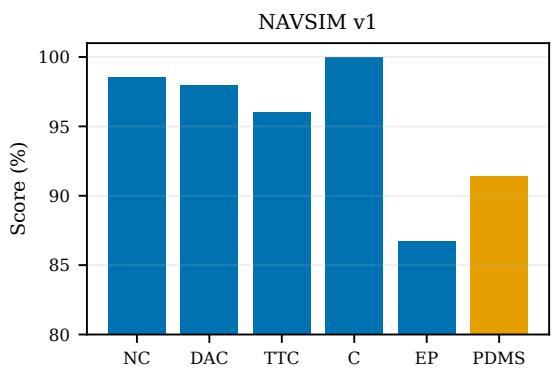

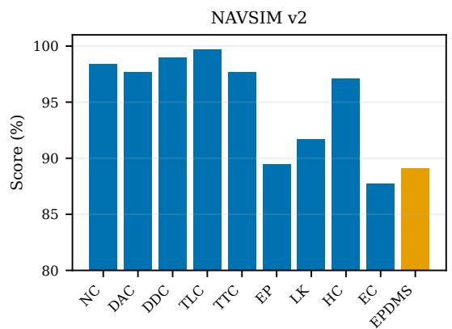  
Figure 4: Component profiles of the final AMPT policies under NAVSIM v1 and v2. The two protocols show the same operating pattern: high feasibility and compliance are maintained while progress is improved inside the feasible region.

## C Algorithms

Notation. For scene s, $O _ { s }$ is the multimodal input, $\tau _ { s } ^ { \mathrm { g t } }$ is its logged trajectory, and $\mathcal { C } _ { s }$ is the candidate pool. The planning evaluator returns an aggregate score $R ( \tau )$ , component metrics, and a feasibility indicator $\mathsf { \bar { F } } ( \tau ) \dot { \mathrm { ~ \in ~ } } \{ 0 , 1 \} . \mathrm { P F } ( \cdot )$ denotes the non-dominated subset under the active Pareto objectives. πGT, πinitial, and πFF denote the GT-only, PC-MTS, and FF-PGRPO policies, respectively. During $\mathbf { A P R } , \pi ^ { ( k ) }$ is the policy at refinement round $k . { \mathrm { G u a r d } } ( \tau , \tau ^ { \mathrm { r e f } } )$ denotes the reference-relative progress and compliance checks, and $\mathbf { \bar { A } u d i t } ( \bar { \tau } , \tau ^ { \mathrm { c u r } } )$ denotes feasibility, positive score margin, and non-regression of protected metrics.

Algorithm 1: Policy-Compatible Multi-Trajectory Supervision (PC-MTS)   
Input: Dataset $\mathcal { D } = \{ ( o _ { s } , \tau _ { s } ^ { \mathrm { g t } } ) \}$ , candidate pools $\{ \mathcal { C } _ { s } \}$ , planning evaluator.   
Parameter: Qualit threshold $\gamma _ { s }$ , rollout-bank size $G _ { \mathrm { r } }$ , nei hbors K, com atibilit threshold $\delta _ { c } ,$ , local-sam le count $M _ { \mathrm { p } }$ , feasibilit ratio $\eta .$   
Output: Accepted sets {Us} and πinitial.   
1: Train $\pi _ { \mathrm { G T } }$ on lo ed trajectories with difusion ${ \mathrm { s F T } } .$   
2: Freeze πGT and calibrate $\delta _ { c }$ for each command c.   
3: for each scene s do   
4: $\mathcal { Q } _ { s }  \mathrm { P F } ( \{ \tau \in \mathcal { C } _ { s } : F ( \tau ) = 1 , R ( \tau ) \geq \gamma _ { s } \} ) .$   
5: Sample $\mathcal { R } _ { s } \sim$ πGT $( \cdot \mid o _ { s } ) , \mid \mathcal { R } _ { s } \mid = G _ { \mathrm { r } } ;$ set $\mathcal { U } _ { s } \gets \emptyset .$   
6: for each $\tau \in \mathcal { Q } _ { s }$ do   
7: if $d _ { \mathrm { P C } } ( \tau , \mathcal { R } _ { s } ) \leq \delta _ { c _ { s } }$ then   
8: Generate $M _ { \mathrm { p } }$ temporally coherent nearby trajectories.   
9: Let $\kappa ( \tau )$ be the fraction that remain feasible.   
10: if $\kappa ( \tau ) \geq \eta$ then   
11: ${ \mathcal { U } } _ { s } \gets { \mathcal { U } } _ { s } \cup \{ \tau \}$   
12: end if   
13: end if   
14: end for   
15: end for   
16: $\pi _ { \mathrm { i n i t i a l } }  \mathrm { C o p y } ( \pi _ { \mathrm { G T } } )$   
17: for each multi-trajectory SFT update do   
18: for each scene s in the minibatch do   
19: Sample one target from $\{ \tau _ { s } ^ { \mathrm { g t } } \} \cup \mathcal { U } _ { s } .$   
20: Accumulate its difusion SFT loss.   
21: end for   
22: Update πinitial.   
23: end for   
24: return πinitial, $\{ \mathcal { U } _ { s } \}$

## Algorithm 2: Feasibility-First Pareto GRPO (FF-PGRPO)

Input: πinitial, dataset D, accepted sets $\{ \mathcal { U } _ { s } \}$ , planning evaluator.   
Parameter: Group size $G ,$ unsafe penalty $\lambda _ { \mathrm { u } } ,$ recovery weight $\lambda _ { \mathrm { { r e c } } } ,$ policy regularization $\beta .$   
Output: Pareto-optimized policy πFF.   
1: for each scene s do   
2: $\mathcal { H } _ { s } \gets \{ \tau _ { s } ^ { \mathrm { g t } }$ , Deploy $\cdot ( \pi _ { \mathrm { i n i t i a l } } , o _ { s } ) \}$ ∪ $\mathcal { U } _ { s }$   
3: $\mathrm { S e t } \tau _ { s } ^ { \mathrm { r e f } }$ to the highest-scoring feasible trajectory in $\mathcal { H } _ { s } .$   
4: end for   
$5 \colon \pi _ { \mathrm { F F } }  \mathrm { C o p y } ( \pi _ { \mathrm { i n i t i a l } } ) .$   
6: for each GRPO update do   
7: for each scene s in the minibatch do   
8: Sample $\{ \tau _ { i } \} _ { i = 1 } ^ { G } \sim \pi _ { \mathrm { F F } } ( \cdot \mid o _ { s } )$ and evaluate all metrics.   
9: Compute group-normalized quality advantages $\{ \widehat { A } _ { i } \}$   
10: i $\textstyle \cdot \sum _ { i } ^ { \cdot } F ( { \overline { { \tau _ { i } } } } ) \stackrel { \cdot } { > } 0$ then   
11: $\mathcal { V } _ { s } \gets \{ \tau _ { i } : F ( \tau _ { i } ) = 1 , \mathrm { G u a r d } ( \tau _ { i } , \tau _ { s } ^ { \mathrm { r e f } } ) = 1 \}$   
12: $\mathcal { P } _ { s } \gets \mathrm { P F } ( \mathcal { V } _ { s } ) .$   
13: for $i = 1 , \ldots , { \cal G }$ do   
14: if $\tau _ { i } \in \mathcal { P } _ { s }$ then   
15: $\overset { \cdot } { A } _ { i } \gets \operatorname* { m a x } ( \widehat { A } _ { i } , 0 ) .$   
16: else if $F ( \tau _ { i } ) = 1$ then   
17: $A _ { i } $ min $( \widehat { A } _ { i } , 0 )$   
18: else   
19: $\mathbf { \widetilde { A } } _ { i } \gets - \lambda _ { \mathrm { u } } + \operatorname* { m i n } ( \widehat { A } _ { i } , 0 ) .$   
20: end if   
21: end for   
22: $\mathcal { L } _ { \mathrm { r e c } }  0 .$   
23: else   
24: Assign violation-aware advantages $A _ { i } \leq 0 .$   
25: $\mathcal { L } _ { \mathrm { r e c } } \bf { \bar { \Pi } }  \mathcal { L } _ { \mathrm { S F T } } ( o _ { s } , \tau _ { s } ^ { \mathrm { r e f } } )$   
26: end if   
27: Accumulate ${ \mathcal { L } } _ { \mathrm { G R P O } } ( \{ A _ { i } \} ) + \lambda _ { \mathrm { r e c } } { \mathcal { L } } _ { \mathrm { r e c } } + \beta { \mathcal { L } } _ { \mathrm { r e g } } .$   
28: end for   
29: Update $\pi _ { \mathrm { F F } } .$   
30: end for   
31: return πFF.

## Algorithm 3: Adaptive Pareto-Guided Policy Refinement (APR)

Input: π , dataset $\mathcal { D } ,$ multi-source pools $\{ \mathcal { C } _ { s } \}$ , planning evaluator, development set.   
Parameter: Maximum rounds $K _ { \mathrm { A P R } } .$ , score mar in $\delta _ { R } ,$ , inter olation list A, tem erature $\beta _ { w } ,$ maximum weight $w _ { \mathrm { m a x } } ,$ retention weight $\lambda _ { \mathrm { { r e t } } }$   
Output: Refined policy $\pi ^ { \star }$   
1: $\pi ^ { ( 0 ) }  \pi _ { \mathrm { F F } } ; k  0 .$   
2: while $k < K _ { \mathrm { A P R } }$ do   
3: $\mathcal { T } ^ { ( k ) }  \emptyset .$   
4: for each scene s do   
5: $\tau _ { s } ^ { \mathrm { c u r } } \gets \mathrm { D e p l o y } ( \pi ^ { ( k ) } , o _ { s } )$   
6: Sam le rollout bank $\mathcal { R } _ { s } ^ { ( k ) }$ and recalibrate com atibilit .   
7: ${ \cal B } _ { s } \dot {  } \{ \tau \in \mathcal { C } _ { s } : \mathrm { A u d i t } ( \tau , \tau _ { s } ^ { \mathrm { c u r } } ) = 1 \}$   
8: Rank $\boldsymbol { B } _ { s }$ by score gain, distance, curvature, and jerk.   
9: accepted ← false.   
10: for each ranked teacher τteach do   
11: for each $\alpha \in { \mathcal { A } }$ in descending order do   
12: $\begin{array} { r } { \widetilde { \tau }  ( 1 - \alpha ) \tau _ { s } ^ { \mathrm { c u r } } + \alpha \tau ^ { \mathrm { t e a c h } } } \end{array}$   
13: Re-evaluate τ.   
14: if Audit $( \widetilde { \tau } , \tau _ { s } ^ { \mathrm { c u r } } ) = 1$ and $d \mathrm { P C } ( \widetilde { \tau } , \mathcal { R } _ { s } ^ { ( k ) } ) \leq \delta _ { c _ { s } } ^ { ( k ) }$ then   
15: $\begin{array} { r } { w \gets \mathrm { c l i p } \left( \exp \left[ \frac { R ( \widetilde { \tau } ) - R ( \tau _ { s } ^ { \mathrm { c u r } } ) } { \beta _ { w } } \right] , 1 , w _ { \mathrm { m a x } } \right) } \end{array}$   
16: ${ \mathcal { T } } ^ { ( k ) } \gets { \mathcal { T } } ^ { ( k ) } \cup \{ ( s , { \widetilde { \tau } } , w ) \} .$   
17: accepted ← true; break.   
18: end if   
19: end for   
20: if accepted then   
21: break.   
22: end if   
23: end for   
24: end for   
25: ${ \widetilde { \pi } } \gets \log ( \pi ^ { ( k ) } )$   
26: Train πe with weighted teacher SFT, policy retention, and policy-distance regularization.   
27: Consolidate specialist branches around $\pi ^ { ( k ) }$ with the anchor-constrained task-vector mer e.   
28: if π im roves the develo ment metric then   
29: $\pi ^ { ( k \hat { + } 1 ) }  \widetilde { \pi } ; k  k \hat { + } 1 .$   
30: Rebuild current-policy predictions and teacher sets.   
31: else   
32: break.   
33: end if   
34: end while   
35: $\pi ^ { \star }  \pi ^ { ( k ) } .$   
36: return $\underline { { \pi } } ^ { \star }$   
D Analysis of Policy-Compatible Supervision s) PC-MTS

## The Supervision–Optimization Reversal

Table 13: Efect of trajectory-set construction. Every imitation checkpoint is followed by the same original scalar GRPO.
<table><tr><td>Supervision</td><td>IL PDMS</td><td>Post-GRPO</td><td>Change</td></tr><tr><td>GT-only</td><td>86.4</td><td>90.3</td><td>+3.9</td></tr><tr><td>Score</td><td>87.2</td><td>85.8</td><td>-1.4</td></tr><tr><td>Pareto</td><td>87.5</td><td>86.7</td><td>-0.8</td></tr><tr><td>PC-MTS</td><td>86.9</td><td>91.1</td><td>+4.2</td></tr></table>

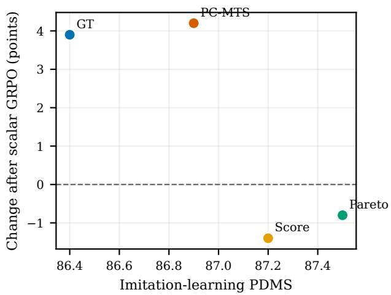  
Figure 5: Imitation performance and the change produced by scalar GRPO. Higher imitation performance does not predict a better optimization outcome.

Table 13 exposes a ranking reversal between imitation and post-training. Score and Pareto improve the imitation check- point by 0.8 and 1.1 points over GT-only training, yet the same scalar GRPO reduces their scores by 1.4 and 0.8 points. PC-MTS obtains a smaller direct imitation gain but receives a 4.2-point improvement from GRPO. Relative to Score and Pareto, the diference in GRPO response is 5.6 and 5.0 points, respectively. The magnitude of this reversal is considerably larger than the diferences between the imitation checkpoints themselves.

The result separates trajectory quality from optimization utility. Aggregate and component-wise Pareto quality iden- tify desirable plans, but they do not show whether fitting those plans preserves probability mass over feasible rollouts. PC-MTS changes the learned sampling distribution before GRPO: its benefit is therefore expressed primarily in the policy’s response to post-training. The one-target-per-scene rule is important here because it prevents a larger candidate set from mechanically increasing a scene’s gradient weight. The observed diference follows from which behaviors are learned, not from how many losses a scene contributes.

## Why Policy Compatibility Difers from GT Proximity

Candidate-to-GT distance and policy compatibility answer diferent questions. A difusion policy can represent a mul- timodal neighborhood around the logged trajectory. A candidate may be moderately distant from GT yet lie close to one of the policy’s sampled modes; conversely, a geomet- rically close candidate may lie in a direction to which the learned policy assigns little probability. Using the rollout bank as the reference therefore measures compatibility with the learner that will absorb the target, rather than similarity to one recorded future.

This policy-relative view also explains the relationship between PC-MTS and APR. PC-MTS favors local extensions that can be learned without destabilizing the initial policy. APR later recalibrates compatibility around the improved policy, allowing candidates that were previously too distant to enter the teacher set. The two stages form a curriculum whose boundary moves with policy capability.

## E Analysis of Feasibility-First Pareto GRPO Complementary Roles of the Three Stages

FF-PGRPO provides the largest direct policy gain. Relative to the GT-only row, it increases DAC by 3.3 points, TTC by 1.6 points, and EP by 5.03 points, raising PDMS from 86.5 to 91.0. The simultaneous improvement of DAC, TTC, and EP is the central result: eficiency is not obtained by relaxing feasibility or reducing the safety margin.

PC-MTS adds only 0.1 PDMS when placed before FF- PGRPO, but this aggregate diference understates its role. The selection study shows that conventional multi-trajectory supervision can reverse the benefit of GRPO altogether. PC- MTS therefore serves as a distributional safeguard for the policy-optimization stage, while FF-PGRPO provides the main on-policy improvement. APR then raises EP from 86.0 to 86.7 without changing the displayed NC, DAC, TTC, or comfort, recovering residual eficiency after the safety- sensitive metrics have stabilized.

## What the Credit Rule Changes

A direct diagnostic of credit semantics is the positive-credit violation rate,

$$
\mathrm { P C V R } = \frac { N _ { \mathrm { v i o l } } ^ { + } } { \operatorname* { m a x } ( N ^ { + } , 1 ) } ,\tag{9}
$$

where $N ^ { + }$ is the number of positive-advantage rollouts and $N _ { \mathrm { v i o l } } ^ { + }$ counts those violating a protected condition. Scalar GRPO can assign positive credit to such a rollout whenever its aggregate score is above the group mean. FF-PGRPO enforces $\mathrm { \bar { P } C V R = 0 }$ for the encoded feasibility and refer- ence conditions by construction. This property is stronger than simply adding another penalty term: protected viola- tions are excluded from positive reinforcement rather than traded against progress on a common scale.

The all-infeasible branch addresses a diferent failure of scalar ranking. A relative score can identify which sam- pled failure is less severe, but it cannot place a target inside the feasible region. Safe-reference supervision provides that missing direction. Downweighting the group then prevents a small number of hard scenes from dominating updates for the broader dataset. Together, the negative violation signal and positive recovery target turn fully infeasible groups from uninformative batches into structured recovery examples.

## F Analysis of Adaptive Policy Refinement Round-Wise Progression

Table 15: APR progression. Round 0 is the policy before refinement.
<table><tr><td>Policy</td><td>PDMS</td><td>Gain</td></tr><tr><td>Round 0</td><td>91.10</td><td></td></tr><tr><td>Round 1</td><td>91.21</td><td>+0.11</td></tr><tr><td>Round 2</td><td>91.37</td><td>+0.16</td></tr><tr><td>Round 3</td><td>91.45</td><td>+0.08</td></tr></table>

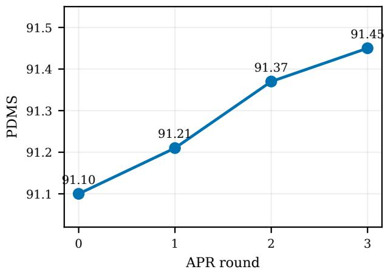  
Figure 6: PDMS across APR rounds.

Table 14: Ablation of PC-MTS, FF-PGRPO, and APR on NAVSIM v1.
<table><tr><td>Configuration</td><td>PC-MTS</td><td>FF-PGRPO</td><td>APR</td><td>NC</td><td>DAC</td><td>TTC</td><td>C</td><td>EP</td><td>PDMS</td></tr><tr><td>GT-only</td><td></td><td></td><td></td><td>98.1</td><td>94.7</td><td>94.2</td><td>100.0</td><td>80.9</td><td>86.5</td></tr><tr><td>PC-MTS</td><td>√</td><td></td><td></td><td>98.2</td><td>95.2</td><td>94.5</td><td>100.0</td><td>81.3</td><td>86.9</td></tr><tr><td>FF-PGRPO only</td><td></td><td>√</td><td></td><td>98.4</td><td>98.0</td><td>95.8</td><td>100.0</td><td>85.93</td><td>91.0</td></tr><tr><td>PC-MTS + FF-PGRPO</td><td>√</td><td>√</td><td></td><td>98.5</td><td>98.0</td><td>96.0</td><td>100.0</td><td>86.0</td><td>91.1</td></tr><tr><td>Full AMPT</td><td>√</td><td>√</td><td>√</td><td>98.5</td><td>98.0</td><td>96.0</td><td>100.0</td><td>86.7</td><td>91.4</td></tr></table>

APR starts from a policy that has already captured most of the online gain, so its role is residual refinement rather than broad recovery. The three rounds increase PDMS monotonically from 91.10 to 91.45. The final 0.35-point gain is concentrated in EP, while the displayed NC, DAC, TTC, and comfort values remain unchanged. This profile matches the teacher audit: APR accepts only candidates that improve the current policy without crossing the protected metric guards.

The distribution of per-round gains is also informative. The largest increment appears in Round 2 rather than Round 1, indicating that teacher reconstruction is not equivalent to repeatedly fitting a fixed set. The first update changes the policy neighborhood; the next audit can then expose im- provements that were previously too distant or insuficiently advantageous. The final round yields a smaller increment as the remaining teacher pool approaches the current policy’s performance frontier.

## Teacher Audit and Dynamic Validity

The teacher-pool audit in Table 7 rejects 26.4% of candidates after interpolation and exact re-evaluation. These can- didates satisfy the endpoint constraints but fail as actual local targets. This distinction justifies both interpolation and postinterpolation scoring: a teacher is useful only if the trajectory that the learner is asked to imitate is itself feasible and im- proving.

Teacher validity is recomputed after each round because it is defined relative to the current policy. A teacher can expire when its score advantage disappears, and a previously distant candidate can become admissible after the policy moves closer to it. Dynamic reconstruction therefore prevents stale supervision and turns the multi-source pool into an adaptive curriculum rather than a static pseudo-label set.

## G Failure Recovery and Qualitative Analysis

## Gross and Net Recovery

On the fixed 658-scene hard subset, scalar GRPO produces 367 positive and 291 zero outcomes, whereas AMPT pro- duces 440 positive and 218 zero outcomes. The recovery rate increases from 55.8% to 66.9%, an absolute gain of 11.1 percentage points.

Table 16: Recovery on the fixed 658-scene hard subset. In- tervals are Wilson 95% confidence intervals over scenes.
<table><tr><td>Method</td><td>Positive</td><td>Zero</td><td>Recovery rate</td></tr><tr><td>Scalar GRPO</td><td>367</td><td>291</td><td>55.8% [52.0, 59.5]</td></tr><tr><td>AMPT</td><td>440</td><td>218</td><td>66.9% [63.2, 70.4]</td></tr></table>

Table 17: Paired state transitions on the same 658 scenes.
<table><tr><td>Scalar GRPO</td><td>AMPT zero</td><td>AMPT positive</td><td>Total</td></tr><tr><td>Zero</td><td>198</td><td>93</td><td>291</td></tr><tr><td>Positive</td><td>20</td><td>347</td><td>367</td></tr></table>

The paired matrix separates gross recovery from net im- provement. AMPT repairs 93 scenes that scalar GRPO leaves at zero and introduces 20 regressions, giving a net repair of 73 scenes. Thus, 78.5% of the gross repairs remain after accounting for regressions. This net result is exactly the ad- ditional recovery reported in the main paper and shows that the gain is not produced by merely trading one set of failures for another.

## Failure-Type Breakdown

Table 18: Net repair by initial failure type.
<table><tr><td>Failure type</td><td>Scenes</td><td>Repairs</td><td>Regressions</td><td>Net</td></tr><tr><td>DAC-only</td><td>480</td><td>59</td><td>14</td><td>45</td></tr><tr><td>Collision-only</td><td>165</td><td>32</td><td>6</td><td>26</td></tr><tr><td>Collision + DAC</td><td>13</td><td>2</td><td>0</td><td>2</td></tr></table>

DAC-only failures contribute 45 of the 73 net repairs (61.6%), while collision-only scenes contribute 26 (35.6%). The corresponding net-repair rates are 9.4% and 15.8%, showing that the improvement is not restricted to the more common drivable-area failures. The mixed subset contributes the remaining two repairs. This decomposition is consistent with FF-PGRPO: its feasibility gate directly protects both collision and drivable-area compliance, while safe-reference recovery supplies a feasible target when the sampled group contains neither.

The 20 regressions clarify the role of policy retention in APR. A policy can produce a strong net recovery while still damaging a minority of scenes that were previously positive. Retention and checkpoint promotion are therefore necessary complements to targeted teacher distillation; they preserve the broad successful distribution while dificult scenes re- ceive additional supervision.

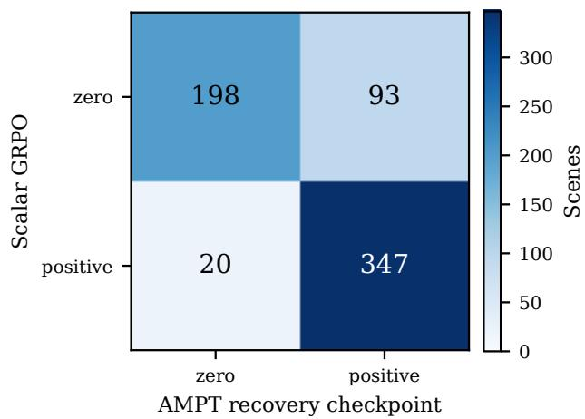  
(a) Paired state transitions.

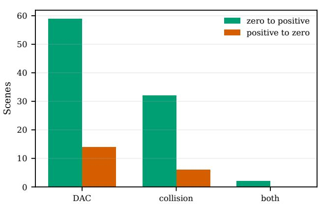  
(b) Repairs and regressions by initial failure type.  
Figure 7: Failure-recovery analysis on the fixed hard subset. The transition view separates repairs from regressions, and the cause breakdown identifies where the net recovery is obtained.

## Representative Transitions

• Full repair: 00fcad6d092c5e8e (left). PDMS changes from 0 to 1.000 as NC and TTC both change from 0 to 1, yielding complete component recovery.

• Drivable-area repair: 03aa8a0576a25b63 (right). PDMS changes from 0 to 0.963. DAC changes from 0 to 1 while NC and TTC remain feasible, showing that recovery does not require a more aggressive safety profile.

• Partial repair: 1148c72f141c532d (left). NC and DAC change from 0 to 1, while TTC remains 0. The re- sulting PDMS of 0.583 illustrates that restoring hard fea- sibility does not imply that every continuous component is solved.

• Persistent failure: 00016f8b45c25a1d (left). PDMS remains 0 because DAC and EP remain 0. This case illus- trates the residual ceiling imposed by candidate coverage and local policy capability.

• Regression: 4b4a268bee4c5ab5 (left). PDMS changes from 1 to 0 after DAC changes from 1 to 0. The case motivates retention and checkpoint-promotion checks and is included to avoid survivorship bias.

The repaired examples distinguish complete recovery from partial recovery: AMPT can restore all failed components, or it can first re-enter the feasible region while a continuous objective remains weak. The persistent and regressed cases complement the successful examples by showing that can- didate quality, policy locality, and behavior retention jointly determine the final outcome.

## H Discussion and Limitations

## Orthogonality to Representation Learning

AMPT operates after the visual and language representations have been defined. It neither changes the VLM architecture nor introduces an auxiliary feature encoder, cross-modal fu- sion module, representation objective, or semantic alignment loss. Its intervention is concentrated at the trajectory level: constructing the supervision set, assigning rollout credit, and validating policy-relative teachers. Consequently, advances in feature extraction, representation learning, multimodal fu- sion, or semantic alignment can be combined with AMPT by replacing the shared VLA backbone while retaining the same trajectory-selection and policy-optimization pipeline.

This orthogonality also sharpens the interpretation of the experiments. Because the backbone, training data, and pa- rameter count remain fixed, the reported improvements iso- late the value of coordinating multi-trajectory supervision with downstream optimization. AMPT is therefore com- plementary to model-scaling and representation-centric re- search rather than a competing replacement for those direc- tions.

## Relation to Conservative Policy Improvement

PC-MTS shares the support-aware motivation of conserva- tive policy improvement: BEAR constrains a policy toward the behavior distribution, SPIBB falls back to a baseline in uncertain regions, and AWAC weights behavior learn- ing by estimated advantage (Kumar et al. 2019; Laroche, Trichelair, and Tachet des Combes 2019; Nair et al. 2020). AMPT uses related principles at the trajectory level but addresses a diferent interface. Compatibility is applied before imitation fine-tuning, Pareto credit is restricted to the feasi- ble region, and teacher validity is recomputed as the policy changes. CLOVER is the closest evaluator-guided trajectory-refinement method, but it retains candidate scoring at in- ference, whereas AMPT produces one trajectory without a test-time scorer or reranking (Ang et al. 2026).

## Limitations

Finite policy samples. Compatibility is estimated from a finite rollout bank. Sparse navigation commands or highly multimodal scenes increase the sampling cost required to represent the local trajectory distribution accurately.

Evaluator dependence. All three stages use the NAVSIM evaluator for filtering, credit assignment, or teacher vali- dation. Evaluator bias can therefore propagate through the pipeline, and non-reactive simulation cannot establish a closed-loop safety guarantee.

Candidate-pool ceiling. APR can select only behaviors represented in its multi-source pool. If none of the sources proposes a feasible improvement, teacher reconstruction can- not repair the scene.

Locality versus long-horizon value. PC-MTS intention-ally favors learnable local targets. A distant behavior that requires a longer curriculum may be rejected at the initial stage, although dynamic teacher reconstruction can admit it after the policy has improved.

Benchmark-specific hierarchy. The feasibility gates, protected metrics, and Pareto objectives follow NAVSIM. Ap-plying the framework to another benchmark requires defining the corresponding metric hierarchy and calibration thresh- olds.

Parameter merging. Anchor-constrained task-vector merging limits parameter displacement and consolidates complementary specialist branches, but behavioral valid- ity remains determined by the trajectory evaluator and checkpoint-promotion protocol.

## Reproducibility Assets

The supplementary package contains the candidate and scene manifests, training configurations, rollout calibration proto- col, FF-PGRPO group and recovery settings, APR teacher and retention settings, scene-level NAVSIM v1/v2 exports, and the paired hard-scene transition data. These assets sup- port direct reproduction of the tables, figures, and analyses in this document.

Complete front camera frame (cam\_f0. 1920 × 1080)  
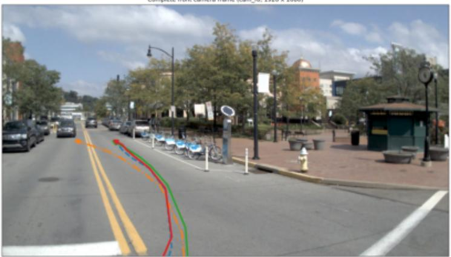

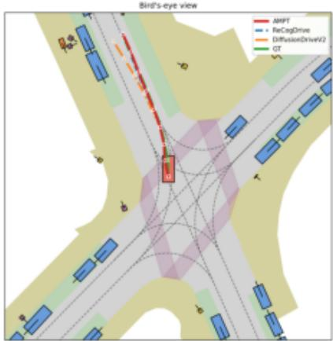  
Straight 1 nank 01 1 tolcen f9ed38d9ddfa531e

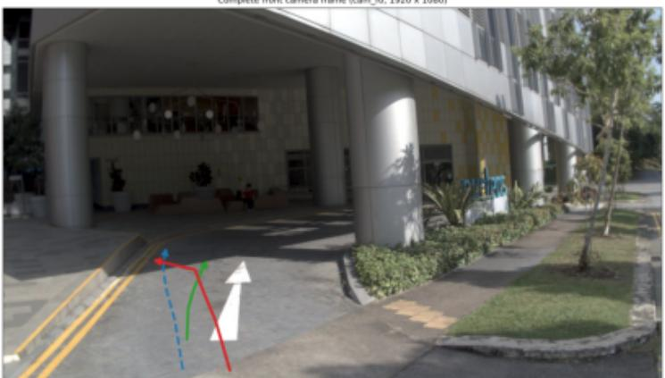

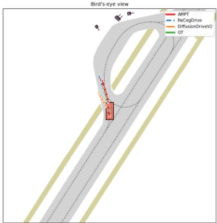  
PDMS AMPT 1.000 ReCogDrive 0.000  DifusionDriveV2 0.000

Camplete front camera frame (cam\_fo. 1920 × 1080  
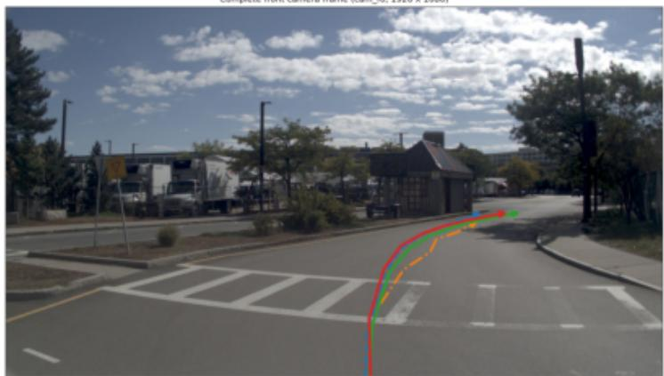

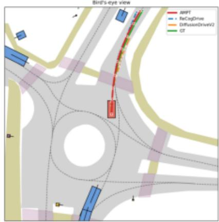  
Figure 8: Selected single-trajectory predictions from the final AMPT policy for left, straight, and right commands.