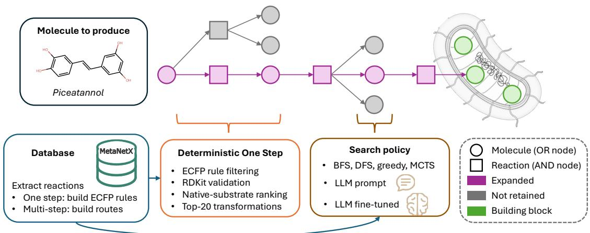

# An Agentic Retrobiosynthesis Framework with Learned Frontier Selection

Philippe Meyer <sup>∗1</sup>, Guillaume Gricourt <sup>1</sup>, Thomas Duigou <sup>1</sup>, Joan Hérisson <sup>1</sup>, and Jean-Loup Faulon <sup>1</sup>

<sup>1</sup>Université Paris-Saclay, INRAE, AgroParisTech, Micalis Institute, Jouy-en-Josas, France

## Abstract

Large language models are increasingly used as agents for multistep retrosynthesis, raising the question of how much their search policy contributes independently of the underlying reaction model. We investigate this question in a biological setting through rule-based retrobiosynthesis: a deterministic biochemical engine generates the same validated transitions for every method, searching for routes that terminate in metabolites available to an Escherichia coli chassis, while the policy only selects which frontier molecule to expand next. Prompted and LoRA-tuned Qwen2.5-7B policies use a strict choice-only interface. The fine-tuned policy reaches 65±1% solve rate at 10 expansions on LASER versus 59% for MCTS, and at 200 expansions reaches 78±1% versus 75% on LASER, 88±3% versus 80% on the RetroPath RL Golden benchmark, and 63 ± 2% versus 45% on the BioNavi-NP benchmark. Fine-tuning also consistently outperforms direct prompting. These results show that route-supervised frontier selection can improve budgeted search without altering biochemical generation, although performance remains dependent on frontier construction and reaction ranking.

## 1 Introduction

Retrobiosynthesis recursively decomposes target molecules through enzyme-catalyzed transformations. In metabolic engineering, RetroPath2.0, RetroPath RL, and BioNavi-NP search for routes terminating in metabolites available to a host chassis [1–3]. Other frameworks are not host-specific: RetroBioCat designs biocatalytic cascades from enzymatic rules and literature precedent [4], while EnzRetro couples enzymatic reaction generation and enzyme identification with MCTS [5]. Repeated biochemical expansion nevertheless remains a nontrivial multistep search problem [6].

Chemical retrosynthesis has recently become a test bed for LLM-based agents. Initial systems connected language models to chemistry tools [7], while more recent approaches have used LLMs to evaluate and steer candidate synthetic routes [8, 9]. A further shift gives the model a more direct role in the planning process: RETRO-R1 learns an interactive policy from environment feedback [10], Synthelite combines LLM-proposed synthesis strategies with MCTS [11], AOT\* couples LLM-generated pathways with AND–OR search [12], and RETROAGENT gives the model structured access to the search state and expansion decisions [13].

Comparable agentic control remains largely unexplored in retrobiosynthesis. This study isolates frontier selection as the only learned component while holding biochemical reaction generation fixed, and compares prompted and LoRA-fine-tuned Qwen2.5-7B-Instruct [14–16] against BFS, DFS, greedy sink similarity, and MCTS [17, 18]. Using a strict choice-only interface, the experiments test whether supervision from mined biochemical routes improves where a fixed expansion budget is spent, see Figure 1. Across three benchmarks, fine-tuning consistently improves over direct prompting and achieves higher solve rates than MCTS at the largest evaluated budget while leaving the underlying chemical transitions unchanged.

  
Figure 1: Overview of the agentic retrobiosynthesis framework. A target molecule is expanded through a deterministic MetaNetX-derived one-step engine, while the search policy selects which frontier molecule to expand next. The search proceeds toward the E. coli terminal metabolite set.

## 2 Framework

Deterministic biochemical expansion. The one-step retrosynthesis model uses a reactioncenter ECFP applicability criterion [19, 20] (Appendix B) to screen 80,116 biochemical reaction rules derived from MetaNetX [21, 22], discarding incompatible rules through inexpensive vector operations before graph-level application. Rules passing the filter are applied with RDKit [23], and graph-valid outcomes are retained. The model uses ECFP radius h = 1, with each rule represented by a radius-2 ECFP-compatible reaction template. Reactions are decomposed into mono-substrate transformations, and cofactors are removed from precursor sets. The resulting candidate disconnections are ranked by Tanimoto similarity between the query molecule and the native substrates from which their biochemical rules were derived, providing a simple biochemical-precedent prior similar to that used in RetroPath RL [2]. To control combinatorial branching during multistep search, only the first 20 distinct graph-validated disconnections are retained $( K _ { \mathrm { r x n } } = 2 0 )$

Budgeted AND–OR search. The search graph contains molecule OR-nodes and reaction AND-nodes, with shared intermediates deduplicated across the graph. A molecule is solved when it belongs to the terminal set or when one of its child reactions is solved, whereas a reaction is solved only when all of its precursor molecules are solved. The terminal set contains 753 Escherichia coli (E. coli) metabolites derived from the RetroPath RL iML1515 sink [2, 24] (Appendix D), together with cofactors (Appendix C). At step t, the search state is described by the graph $G _ { t }$ and the unsolved frontier F<sub>t</sub>. A policy selects a molecule $m _ { t } \in F _ { t }$ , which is then expanded by the deterministic model. The search budget N is defined as the number of molecule expansions.

Search policies. The non-LLM baselines are BFS, DFS, greedy sink similarity, and MCTS [17, 18] with a static sink-similarity evaluation. BFS and DFS prioritize minimum and maximum graph depth, respectively. Greedy sink similarity selects the frontier molecule with the highest Tanimoto similarity to any metabolite in the terminal sink. MCTS uses the same sink-similarity measure as a static value while accumulating search statistics through repeated root-to-frontier descent. Complete policy definitions and parameters are given in Appendix F.

Agent observation. Unlike the non-LLM policies, which act on the complete frontier $F _ { t }$ , the LLM receives a bounded observation $V _ { t } \subseteq F _ { t }$ with $| V _ { t } | \leq 2 0 \ ( K _ { \mathrm { o b s } } = 2 0 )$ , to keep prompt size and inference cost manageable as the frontier grows. Similar bounded candidate views have been used in agentic chemical retrosynthesis to control inference cost and context size [13]. The candidates included in $V _ { t }$ are selected from the frontier using pre-expansion ranking signals derived from the current search state and reaction-rule applicability. We compare alternative constructions of this bounded observation using mined biochemical routes, as described below and in Appendix E. The displayed candidates are randomly shufled before being passed to the LLM to mitigate systematic positional efects associated with option ordering [25].

Mined routes and corpus construction. Following Retro\* [26], which learns search guidance from previously constructed retrosynthetic routes, we mine 12,251 biochemical routes from MetaNetX by tracing targets back to the E. coli building-block set and replay them through the search engine. These routes are used only for design and training; the three evaluation benchmarks are disjoint by construction. They serve two purposes. First, 2,000 routes yielding 4,262 decisions (3,821 with frontier size > 20) are used to compare 26 frontier orderings for constructing $V _ { t } .$ , with coverage@20 as the selection criterion (Appendix E). Second, the selected observation scheme is used to construct the route-replay corpus for imitation learning. Leakage filtering removes 1,198 pairs whose target is an evaluation target and 7,710 whose observation contains one, leaving 27,795 state–choice pairs, split by target into 25,150 training and 2,645 validation examples.

LLM frontier policies. We compare two Qwen2.5-7B-Instruct [14, 15] frontier policies using the same observation and action interface: the base instruction-tuned model used through direct prompting, and the same model fine-tuned on route-derived decisions with LoRA [16]. The finetuning corpus is obtained by replaying the mined biochemical routes: each training example pairs a bounded frontier observation with the frontier molecule lying on the reference route, which is used as the target expansion choice. At each decision, both policies receive the target SMILES, a compact summary of the current search graph, and up to 20 frontier candidates represented by their SMILES and graph depth; no reaction rule, EC annotation, or search history is provided.

## 3 Experiments

Three retrobiosynthesis benchmarks are used. The RetroPath RL Golden benchmark contains 20 curated experimental pathways, corresponding to 70 reference one-step disconnections with known route lengths [2]. The LASER dataset contains 141 metabolic-engineering targets without reference routes [27]. BioNavi-NP provides an independent natural-product benchmark [3]. Due to computational cost, we uniformly sample 60 of its 388 usable test targets with a fixed seed (55 internal and 5 external cases), independently of model performance. All benchmarks are evaluated with the same E. coli terminal set and deterministic one-step model.

All policies use the same reaction rules, reaction-center filter, local native-substrate ranking, top-20 disconnection cap, terminal set, depth limit, graph update, and stopping condition. The LLM policies use the same $K _ { \mathrm { o b s } } = 2 0$ frontier observation on all three benchmarks. Performance is measured as solve rate against the number of molecule expansions. LLM policies are repeated across three diferent seeds, whereas deterministic policies are evaluated once.

## 4 Results

A four-signal portfolio maximizes coverage@20. Because the LLM can only act on displayed candidates, we select $V _ { t }$ using coverage@20 rather than MRR, prioritizing retention of at least one productive choice after truncation. Across 3,821 states with more than 20 frontier molecules, the selected four-signal portfolio reaches 84% coverage@20, versus 80% for depth stratification and 79% for native-substrate similarity alone, despite the latter having higher MRR (0.546 versus 0.505). In other words, the bounded observation retains at least one route-preserving frontier molecule in 84% of states where truncation is required. The portfolio, combining depth stratification, native-substrate similarity, reaction precedent, and molecular size, is therefore used throughout the LLM experiments (Appendix E).

Fine-tuning yields consistent gains across the large LASER benchmark. Table 1 reports solve rate as a function of the expansion budget. On LASER, the fine-tuned Qwen2.5- 7B policy reaches $6 5 \pm 1 \%$ at $N = 1 0$ , compared with 59% for MCTS, 55% for BFS, and 53% for greedy sink similarity. The advantage persists as the budget grows: $7 2 \pm 1 \%$ at $N = 5 0$ and $7 8 \pm 1 \%$ at $N = 2 0 0$ , compared with 70% and 75% for MCTS. Direct prompting reaches $5 5 \pm 1 \%$ at $N = 1 0$ and $6 9 \pm 1 \%$ at $N = 2 0 0$ . Among successful runs, the fine-tuned policy reaches a first solution after 12.6 expansions on average, compared with 17.8 for prompting and 11.9 for MCTS. Its returned routes average 2.4 steps, compared with 1.7 for prompting and 1.9 for MCTS.

Route supervision provides its strongest early-budget gain on Golden. On the 20 Golden targets, the fine-tuned policy reaches $6 8 \pm 8 \%$ at $N = 1 0$ , compared with $4 0 \pm 5 \%$ for prompting, 45% for MCTS, and 50% for BFS. The lead is maintained through the full budget curve, reaching $7 7 \pm 6 \%$ at $N = 5 0$ and $8 8 \pm 3 \%$ at $N = 2 0 0$ , compared with 75% and 80% for MCTS. At $N = 2 0 0$ , direct prompting reaches $7 0 \pm 5 \%$ . Among successful runs, the finetuned policy reaches the first solution after 18.3 expansions on average, compared with 26.6 for prompting and 21.1 for MCTS. Its solved routes average 3.3 steps, close to MCTS at 3.2 steps.

The learned policy transfers to the natural-product domain. On the BioNavi-NP target set, the fine-tuned policy reaches 43 ± 3%, 49 ± 3%, 55 ± 4%, 59 ± 3%, and 63 ± 2% for $N = 1 0 , 2 5 , 5 0 , 1 0 0 , 2 0 0$ . At $N = 2 0 0$ , this is a 24-point gain over direct prompting (39±2%) and an 18-point gain over MCTS (45%). The fine-tuned policy reaches the first solution after 21.3 expansions on average, compared with 38.6 for prompting and 25.0 for MCTS, while returning longer routes on average (3.7 steps versus 2.6 and 2.7, respectively). The gain therefore generalizes across the complementary natural-product benchmark and persists through the largest evaluated budget.

Matched observations preserve the strongest classical baselines on Golden. As a control, we restrict the classical policies to the same bounded observation $V _ { t }$ used by the LLM policies. On Golden at N = 200, BFS and MCTS retain the same solve rates (75% and 80%, respectively), while DFS improves from 45% to 50% and greedy sink similarity from 45% to 65% (Appendix I). This suggests that the performance gain of the fine-tuned policy cannot be explained simply by restricting the search frontier to $V _ { t }$

Fine-tuning substantially reduces LLM time per successful route. At N = 200, the fine-tuned policy requires 209, 168, and 417 seconds per obtained solution on LASER, Golden, and BioNavi-NP, respectively, compared with 854, 972, and 3069 seconds for direct prompting. Since both LLM policies use the same GPU/vLLM infrastructure, these values indicate a substantially lower campaign-level wall-clock cost for the fine-tuned policy. Comparisons with classical CPU-based policies should not be interpreted as intrinsic diferences in algorithmic speed.

Table 1: Search performance on LASER, Golden, and BioNavi-NP. Solve rate (%) is reported versus expansion budget. For LLM policies, solve rates are the mean ± standard deviation over three random seeds; classical policies are evaluated once. Exp.→sol. is the mean number of expansions required to reach the first solution over successful runs, and route len. is the mean length of returned solved routes; both are measured at $N = 2 0 0$ . Time/success is total wall-clock time, including failed runs, divided by the number of successes at $N = 2 0 0 \mathrm { : }$ wall-clock values are hardware-dependent.
<table><tr><td>Policy</td><td>N=10</td><td>N=25</td><td>N=50</td><td>N=100</td><td>N=200</td><td>Exp.→sol.</td><td>Route len.</td><td>Time/success (s)</td></tr><tr><td>LASER (141 targets)</td><td></td><td></td><td></td><td></td><td></td><td></td><td></td><td></td></tr><tr><td>BFS</td><td>55</td><td>69</td><td>69</td><td>72</td><td>74</td><td>12.4</td><td>1.9</td><td>362.0</td></tr><tr><td>DFS</td><td>55</td><td>56</td><td>56</td><td>56</td><td>57</td><td>4.0</td><td>1.7</td><td>482.1</td></tr><tr><td>Greedy sink similarity</td><td>53</td><td>55</td><td>56</td><td>57</td><td>57</td><td>3.8</td><td>1.7</td><td>973.8</td></tr><tr><td>MCTS</td><td>59</td><td>68</td><td>70</td><td>72</td><td>75</td><td>11.9</td><td>1.9</td><td>283.8</td></tr><tr><td>Qwen2.5-7B prompted</td><td>55±1</td><td>59±1</td><td>62±1</td><td>65±1</td><td>69±1</td><td>17.8</td><td>1.7</td><td>854.0</td></tr><tr><td>Qwen2.5-7B + LoRA</td><td>65±1</td><td>70±1</td><td>72±1</td><td>74±2</td><td>78±1</td><td>12.6</td><td>2.4</td><td>209.1</td></tr><tr><td>Golden (20 targets)</td><td></td><td></td><td></td><td></td><td></td><td></td><td></td><td></td></tr><tr><td>BFS</td><td>50</td><td>55</td><td>55</td><td>60</td><td>75</td><td>30.2</td><td>3.4</td><td>601.8</td></tr><tr><td>DFS</td><td>40</td><td>40</td><td>40</td><td>40</td><td>45</td><td>22.1</td><td>3.0</td><td>58.5</td></tr><tr><td>Greedy sink similarity</td><td>30</td><td>40</td><td>45</td><td>45</td><td>45</td><td>9.9</td><td>3.0</td><td>93.4</td></tr><tr><td>MCTS</td><td>45</td><td>65</td><td>75</td><td>75</td><td>80</td><td>21.1</td><td>3.2</td><td>23.1</td></tr><tr><td>Qwen2.5-7B prompted</td><td>40±5</td><td>48±3</td><td>57±8</td><td>65±0</td><td>70±5</td><td>26.6</td><td>2.7</td><td>972.0</td></tr><tr><td>Qwen2.5-7B + LoRA</td><td>68±8</td><td>75±9</td><td>77±6</td><td>83±3</td><td>88±3</td><td>18.3</td><td>3.3</td><td>168.2</td></tr><tr><td>BioNavi-NP (60 targets)</td><td></td><td></td><td></td><td></td><td></td><td></td><td></td><td></td></tr><tr><td>BFS</td><td>23</td><td>38</td><td>42</td><td>43</td><td>43</td><td>15.7</td><td>2.5</td><td>491.1</td></tr><tr><td>DFS</td><td>35</td><td>35</td><td>35</td><td>35</td><td>35</td><td>2.6</td><td>2.6</td><td>1046.1</td></tr><tr><td>Greedy sink similarity</td><td>17</td><td>17</td><td>18</td><td>18</td><td>18</td><td>6.6</td><td>3.1</td><td>7492.1</td></tr><tr><td>MCTS</td><td>25</td><td>32</td><td>38</td><td>43</td><td>45</td><td>25.0</td><td>2.7</td><td>1371.4</td></tr><tr><td>Qwen2.5-7B prompted</td><td>17±3</td><td>23±3</td><td>30±2</td><td>34±3</td><td>39±2</td><td>38.6</td><td>2.6</td><td>3069.0</td></tr><tr><td>Qwen2.5-7B + LoRA</td><td>43±3</td><td>49±3</td><td>55±4</td><td>59±3</td><td>63±2</td><td>21.3</td><td>3.7</td><td>416.9</td></tr></table>

## 5 Discussion and Conclusion

Holding biochemical reaction generation fixed isolates frontier selection as the only learned component. Across all three benchmarks, route-supervised Qwen2.5 consistently improves over direct prompting and remains competitive with or better than MCTS throughout the evaluated search budgets. The advantage is already visible under tight budgets, indicating that the learned policy does not merely recover additional routes given more search, but allocates early expansions more efectively. At N = 200, it reaches $7 8 \pm 1 \% , 8 8 \pm 3 \%$ , and $6 3 \pm 2 \%$ solve rates on LASER, Golden, and BioNavi-NP, respectively, versus 75%, 80%, and 45% for MCTS. The particularly strong gain on BioNavi-NP further indicates that the learned search strategy transfers beyond the MetaNetX-derived training routes to a complementary natural-product benchmark.

Training itself is important. All policies operate over the same observation and action space and use the same biochemical reaction model, so performance diferences reflect frontierselection strategies rather than diferences in reaction generation. Within the LLM policies, the fine-tuned and directly prompted variants additionally share the same base model, isolating the contribution of route supervision. Fine-tuning improves solve rate by 9–24 percentage points at $N = 2 0 0$ , with similarly substantial gains at smaller budgets, while also reducing the number of expansions required to reach a first solution.

This search-focused formulation is particularly relevant to synthetic biology. A solved retrobiosynthetic route is a design hypothesis connecting a target molecule to metabolites available in a host chassis, but its practical value additionally depends on enzyme availability and activity, thermodynamics, toxicity, flux, and compatibility with cellular physiology. Such biological information can also be incorporated during or after pathway generation: RetroPath RL combines chemical similarity with a biological score reflecting enzyme-sequence availability to guide and filter the search, BioNavi-NP supplements predicted routes with enzyme- and species-based annotations, RetroBioCat uses enzymatic precedent to rank biocatalytic pathways, and EnzRetro couples pathway prediction with enzyme identification [2–5]. Eficient search can therefore reduce the combinatorial space while biological criteria help prioritize pathways for more detailed assessment and, ultimately, experimental testing.

The separation between deterministic biochemical generation and learned search also suggests a natural role for agentic methods. More broadly, LLM agents have been used to interleave reasoning with actions in external environments [28] and to guide structured exploration through explicit planning and tree search [29, 30]. Feedback from previous trajectories can also improve subsequent decisions [31]. In retrobiosynthesis, such agents could use the biological signals described above directly during frontier selection, making search increasingly chassisand constraint-dependent. Recent agentic retrosynthesis systems similarly combine structured search with model-based reasoning and specialized tools [8, 13], while retaining explicit control over the underlying transformations.

Several limitations remain. Matched-observation controls indicate that the bounded frontier view does not explain the learned policy’s Golden advantage: strong classical policies are unaffected, while weaker heuristics can benefit from the restricted portfolio. Larger search budgets should nevertheless be investigated. Search success also depends on the reaction-rule system and chassis sink, while stereochemistry, thermodynamics, enzyme activity, yields, kinetics, and cellular physiology are not modelled. A solved route therefore establishes connectivity-level reachability to the selected E. coli chassis rather than an experimentally validated production pathway. Finally, while our experiments isolate the benefit of route supervision over prompting, comparisons with supervised non-LLM policies, as well as A\*-like search with a learned costto-go heuristic as in Retro\* and BioNavi-NP [3, 26], would help disentangle the contribution of the LLM architecture.

Overall, our results support a focused role for trained LLM agents in retrobiosynthesis: route supervision improves how a limited search budget is allocated without replacing the underlying biochemical model. More broadly, this suggests that the value of LLMs in pathway design may lie not only in their pretrained knowledge, but also in their ability to learn domain-specific planning strategies from successful scientific trajectories.

## References

[1] Baudoin Delépine, Thomas Duigou, Pablo Carbonell, and Jean-Loup Faulon. Retropath2. 0: a retrosynthesis workflow for metabolic engineers. Metabolic engineering, 45:158–170, 2018.

[2] Mathilde Koch, Thomas Duigou, and Jean-Loup Faulon. Reinforcement learning for bioretrosynthesis. ACS synthetic biology, 9(1):157–168, 2020.

[3] Shuangjia Zheng, Tao Zeng, Chengtao Li, Binghong Chen, Connor W Coley, Yuedong Yang, and Ruibo Wu. Deep learning driven biosynthetic pathways navigation for natural products with bionavi-np. Nature Communications, 13(1):3342, 2022.

[4] William Finnigan, Lorna J Hepworth, Sabine L Flitsch, and Nicholas J Turner. Retrobiocat as a computer-aided synthesis planning tool for biocatalytic reactions and cascades. Nature catalysis, 4(2):98–104, 2021.

[5] Yahui Cao, Haoshu Chen, Tao Zhang, Xin Zhao, Bingzhi Li, and Xiangrui Zheng. Enzretro: Enzymatic retrosynthetic planning with site-specific reaction edits based on sequence gen erative architecture. In Exploration, volume 6, page 70129. Wiley Online Library, 2026.

[6] Guillaume Gricourt, Philippe Meyer, Thomas Duigou, and Jean-Loup Faulon. Artificial intelligence methods and models for retro-biosynthesis: a scoping review. ACS Synthetic Biology, 13(8):2276, 2024.

[7] Chonghuan Zhang, Qianghua Lin, Biwei Zhu, Haopeng Yang, Xiao Lian, Hao Deng, Jiajun Zheng, and Kuangbiao Liao. Synask: unleashing the power of large language models in organic synthesis. Chemical science, 16(1):43–56, 2024.

[8] Andres M Bran, Theo A Neukomm, Daniel Armstrong, Zlatko Jončev, and Philippe Schwaller. Chemical reasoning in llms unlocks strategy-aware synthesis planning and reaction mechanism elucidation. Matter, 9(5), 2026.

[9] Frazier N. Baker, Daniel Adu-Ampratwum, Reza Averly, Botao Yu, Huan Sun, and Xia Ning. Larc: Towards human-level constrained retrosynthesis planning through an agentic framework, 2025. URL https://arxiv.org/abs/2508.11860.

[10] Wei Liu, Jiangtao Feng, Hongli Yu, Yuxuan Song, Yuqiang Li, Shufei Zhang, Lei Bai, Wei-Ying Ma, and Hao Zhou. Retro-r1: Llm-based agentic retrosynthesis. Advances in Neural Information Processing Systems, 38:70709–70737, 2026.

[11] Nguyen Xuan-Vu, Daniel Armstrong, Milena Wehrbach, Andres M Bran, Zlatko Jončev, and Philippe Schwaller. Synthelite: Chemist-aligned and feasibility-aware synthesis planning with llms, 2025. URL https://arxiv.org/abs/2512.16424.

[12] Xiaozhuang Song, Xuanhao Pan, Xinjian Zhao, Hangting Ye, Shufei Zhang, Jian Tang, and Tianshu Yu. Aot\*: Eficient synthesis planning via llm-empowered and-or tree search. In Findings of the Association for Computational Linguistics: ACL 2026, pages 34727–34758, 2026.

[13] Yanqiao Zhu, Jingru Gan, Xiaoqi Sun, Fang Sun, Yidan Shi, Md Mofijul Islam, Chao Shang, Wenhao Gao, Connor W. Coley, Yizhou Sun, and Wei Wang. Retroagent: Harnessing llms to search over structured memory for agentic retrosynthesis planning, 2026. URL https://arxiv.org/abs/2607.14512.

[14] Qwen Team. Qwen2.5: A party of foundation models, September 2024. URL https: //qwenlm.github.io/blog/qwen2.5/.

[15] An Yang, Baosong Yang, Binyuan Hui, Bo Zheng, Bowen Yu, Chang Zhou, Chengpeng Li, Chengyuan Li, Dayiheng Liu, Fei Huang, Guanting Dong, Haoran Wei, Huan Lin, Jialong Tang, Jialin Wang, Jian Yang, Jianhong Tu, Jianwei Zhang, Jianxin Ma, Jianxin Yang, Jin Xu, Jingren Zhou, Jinze Bai, Jinzheng He, Junyang Lin, Kai Dang, Keming Lu, Keqin Chen, Kexin Yang, Mei Li, Mingfeng Xue, Na Ni, Pei Zhang, Peng Wang, Ru Peng, Rui Men, Ruize Gao, Runji Lin, Shijie Wang, Shuai Bai, Sinan Tan, Tianhang Zhu, Tianhao Li, Tianyu Liu, Wenbin Ge, Xiaodong Deng, Xiaohuan Zhou, Xingzhang Ren, Xinyu Zhang, Xipin Wei, Xuancheng Ren, Xuejing Liu, Yang Fan, Yang Yao, Yichang Zhang, Yu Wan, Yunfei Chu, Yuqiong Liu, Zeyu Cui, Zhenru Zhang, Zhifang Guo, and Zhihao Fan. Qwen2 technical report, 2024. URL https://arxiv.org/abs/2407.10671.

[16] Edward J. Hu, Yelong Shen, Phillip Wallis, Zeyuan Allen-Zhu, Yuanzhi Li, Shean Wang, Lu Wang, and Weizhu Chen. Lora: Low-rank adaptation of large language models. In ICLR 2022, April 2022. URL https://www.microsoft.com/en-us/research/publication/ lora-low-rank-adaptation-of-large-language-models/.

[17] Levente Kocsis and Csaba Szepesvári. Bandit based monte-carlo planning. In European conference on machine learning, pages 282–293. Springer, 2006.

[18] Marwin HS Segler, Mike Preuss, and Mark P Waller. Planning chemical syntheses with deep neural networks and symbolic ai. Nature, 555(7698):604–610, 2018.

[19] David Rogers and Mathew Hahn. Extended-connectivity fingerprints. Journal of chemical information and modeling, 50(5):742–754, 2010.

[20] Philippe Meyer, Thomas Duigou, Guillaume Gricourt, and Jean-Loup Faulon. Representing chemical and enzymatic reactions in fingerprint space for applicability filtering and classification, 2026. URL https://chemrxiv.org/doi/abs/10.26434/chemrxiv.15006884/v1.

[21] Sébastien Moretti, Olivier Martin, T Van Du Tran, Alan Bridge, Anne Morgat, and Marco Pagni. Metanetx/mnxref–reconciliation of metabolites and biochemical reactions to bring together genome-scale metabolic networks. Nucleic acids research, 44(D1):D523–D526, 2016.

[22] Sébastien Moretti, Anne Niknejad, Marco Pagni, and Florence Mehl. Metanetx: a bridge between metabolic resources for enhanced curation and multi-omics data harmonization. Nucleic Acids Research, 54(D1):D617–D622, 2026.

[23] Greg Landrum et al. Rdkit documentation. Release, 1(1-79):4, 2013.

[24] Jonathan M Monk, Colton J Lloyd, Elizabeth Brunk, Nathan Mih, Anand Sastry, Zachary King, Rikiya Takeuchi, Wataru Nomura, Zhen Zhang, Hirotada Mori, et al. i ml1515, a knowledgebase that computes escherichia coli traits. Nature biotechnology, 35(10):904–908, 2017.

[25] Pouya Pezeshkpour and Estevam Hruschka. Large language models sensitivity to the order of options in multiple-choice questions. In Findings of the Association for Computational Linguistics: NAACL 2024, pages 2006–2017, 2024.

[26] Binghong Chen, Chengtao Li, Hanjun Dai, and Le Song. Retro\*: learning retrosynthetic planning with neural guided a\* search. In International conference on machine learning, pages 1608–1616. PMLR, 2020.

[27] James D Winkler, Andrea L Halweg-Edwards, and Ryan T Gill. The laser database: Formalizing design rules for metabolic engineering. Metabolic Engineering Communications, 2:30–38, 2015.

[28] Shunyu Yao, Jefrey Zhao, Dian Yu, Nan Du, Izhak Shafran, Karthik Narasimhan, and Yuan Cao. React: Synergizing reasoning and acting in language models, 2023. URL https://arxiv.org/abs/2210.03629.

[29] Shibo Hao, Yi Gu, Haodi Ma, Joshua Hong, Zhen Wang, Daisy Wang, and Zhiting Hu. Reasoning with language model is planning with world model. In Proceedings of the 2023 conference on empirical methods in natural language processing, pages 8154–8173, 2023.

[30] Andy Zhou, Kai Yan, Michal Shlapentokh-Rothman, Haohan Wang, and Yu-Xiong Wang. Language agent tree search unifies reasoning, acting, and planning in language models. In Ruslan Salakhutdinov, Zico Kolter, Katherine Heller, Adrian Weller, Nuria Oliver, Jonathan Scarlett, and Felix Berkenkamp, editors, Proceedings of the 41st International Conference on Machine Learning, volume 235 of Proceedings of Machine Learning Research, pages 62138–62160. PMLR, 21–27 Jul 2024.

[31] Noah Shinn, Federico Cassano, Ashwin Gopinath, Karthik Narasimhan, and Shunyu Yao. Reflexion: Language agents with verbal reinforcement learning. Advances in neural information processing systems, 36:8634–8652, 2023.

[32] Yves Grandjean, Sacha Rafaud, Annie M. Westerlund, Philippe Schwaller, Samuel Genheden, and Jean-Louis Reymond. Rxnmapperv2: updated validation and evaluation on expanded chemical space, 2026. URL https://chemrxiv.org/doi/abs/10.26434/ chemrxiv.15005247/v1.

[33] Thomas Duigou, Philippe Meyer, and Jean-Loup Faulon. Retrorules 2026: an expanded database combining biochemical and organic reaction templates for pathway discovery. Nucleic Acids Research, 54(D1):D1799–D1806, 2026.

[34] Stephen R Heller, Alan McNaught, Igor Pletnev, Stephen Stein, and Dmitrii Tchekhovskoi. Inchi, the iupac international chemical identifier. Journal of cheminformatics, 7(1):23, 2015.

## A Molecular representation and preprocessing

All molecular structures are parsed with RDKit [23] into two-dimensional molecular graphs and sanitized into canonical SMILES. Components containing wildcard atoms are discarded. Molecules are flattened to their two-dimensional graph representation, with stereochemical information removed. Unless stated otherwise, all molecular fingerprints, similarity computations, reaction-rule applications, and search operations use this representation.

## B Reaction-center ECFP applicability filter

The reaction representation and applicability filter follow the fingerprint-space construction of Meyer et al. [20]; we summarize here the construction used by the one-step model.

Biochemical reaction library. The one-step model is built from MetaNetX/MNXref version 4.5 compound and reaction tables [21, 22], which reconcile metabolites and metabolic reactions across multiple biochemical databases. As MetaNetX reaction equations are represented without an assigned direction, each equation is instantiated in both orientations before atom mapping with RXNMapper\_v2 [32]. Unchanged components are removed, and reactions are decomposed into mono-substrate transformations by pairing each substrate with products sharing mapped atoms with it. Cofactors are removed from precursor sets.

Reaction templates. A reaction template is a local graph-rewrite rule extracted from an atom-mapped reaction. It specifies the substrate pattern required for a transformation and the corresponding product pattern around the reaction center. The reaction center contains atoms whose local chemical signature changes between substrate and product, or that have no product counterpart. The signature accounts for formal charge, hydrogen count, valence, aromaticity, degree, ring membership, and neighboring bond orders. For molecular ECFP radius h, templates retain graph context up to radius 2h around the reaction center. The search engine uses h = 1, hence radius-2 reaction templates. Equivalent templates are merged, yielding 80,116 templates. Meyer et al. [20] report 70,037 templates for the same construction after additionally discarding templates whose native substrate contains fewer than five heavy atoms. This filter is not applied here because small metabolites are legitimate precursors in retrobiosynthetic search.

Vector-space applicability filter. Applying every template to every frontier molecule would require repeated subgraph matching over the full rule library. We therefore associate each reaction r with its reaction-center ECFP $\mathrm { E C F P } _ { \mathrm { r c } , h } ( r )$ , which encodes the local environments required around the reaction center. For a molecular system S, a reaction is retained when

$$
\mathrm { E C F P } _ { \mathrm { r c } , h } ( r ) + \mathrm { E C F P } _ { h } ( S ) \geq 0\tag{1}
$$

coordinate-wise. This is a necessary but not suficient condition for graph-level applicability: if an ECFP-compatible template applies to $S _ { i }$ its reaction-center ECFP necessarily passes this test, whereas the converse may fail because ECFPs do not preserve complete molecular connectivity.

The criterion is therefore used only as a fast prefilter. All retained templates are subsequently applied to the molecular graph with RDKit [23], and only graph-valid products are returned by the one-step engine. The filter reduces the number of expensive template applications without changing the graph-level definition of a valid retrosynthetic step.

## C Cofactors and their treatment in the search

Cofactors. Cofactors are auxiliary species participating in biochemical transformations that are not treated here as pathway-specific precursors to be synthesized. The experiments use the biochemical cofactor set distributed with RetroRules 2026 [33], comprising 68 entries with InChI [34], InChIKey connectivity prefixes, and compound names (Table 2). The set includes classical coenzymes and redox carriers, ubiquitous small molecules, and inorganic ions, such as ATP/ADP, NAD<sup>+</sup>/NADH, NADP<sup>+</sup>/NADPH, CoA, water, phosphate, and common metal ions.

Table 2: Representative entries from the biochemical cofactor list used in the search. The complete list contains 68 records.
<table><tr><td>Type</td><td>Representative entries</td></tr><tr><td>Redox carriers</td><td> $\mathrm { N A D ^ { + } / N A D H ; \ N A D P ^ { + } / N A D P H ; \ F A D / F A D H _ { 2 } ; \ F M N / F M N H _ { 2 } }$ </td></tr><tr><td></td><td>Energy / phosphate transfer ATP; ADP; AMP; GTP; UTP; phosphate; diphosphate</td></tr><tr><td>Group transfer</td><td>CoA; S-adenosyl-L-methionine; UDP; GDP; CDP</td></tr><tr><td>Small ubiquitous species Ions</td><td> $\mathrm { H ^ { + } ; H _ { 2 } O ; O _ { 2 } ; C O _ { 2 } ; N H _ { 3 } / N H _ { 4 } ^ { + } }$   $\mathrm { M g ^ { 2 + } ; F e ^ { 2 + / 3 + } ; Z n ^ { 2 + } ; M n ^ { 2 + / 3 + } ; N a ^ { + } ; K ^ { + } }$ </td></tr></table>

Treatment during search. When a validated reaction generates a pathway precursor together with a cofactor, the cofactor is not added as an unresolved molecule to the frontier. This prevents common species such as ATP, NADH, water, or phosphate from creating additional branches in the AND–OR graph. A solved route therefore assumes availability of the listed cofactors.

## D Escherichia coli metabolites used as terminal building blocks

Sink definition. A retrosynthetic branch is complete when all unresolved precursors belong to a set of compounds assumed to be available in the host organism. This set is referred to as the sink or terminal building-block set. Sink membership therefore represents an assumption about chassis availability rather than metabolite abundance under a particular growth condition.

Origin of the E. coli sink. The metabolite set is inherited from RetroPath RL [2], where organism-specific sinks are constructed from genome-scale metabolic models. Cytosolic metabolites are retained and dead-end compounds that cannot be produced in the steady-state model are removed using flux-variability analysis. Chemical structures are then recovered from database cross-references and standardized. The experiments use the sink derived from the E. coli iML1515 genome-scale model [24].

Processing. The initial collection contains 963 metabolite records, of which 809 produce a valid InChIKey connectivity block. Deduplication at this level gives 753 unique terminal metabolites. Search molecules are matched using the first 14-character InChIKey block rather than exact SMILES. This criterion is insensitive to stereochemistry, isotopes, and charge or protonation variants that are not explicitly modeled by the current search representation.

## E Frontier ranking diagnostics

The LLM acts on a bounded observation $V _ { t } \subseteq F _ { t }$ with $K _ { \mathrm { o b s } } = 2 0$ . We therefore evaluate alternative frontier orderings by how well they retain on-route molecules within this fixed 20- candidate observation; the diagnostic does not optimize the observation size.

Metrics. For each replay state $j ,$ let $r _ { j } \geq 1$ denote the best rank among its on-route frontier molecules. Let J be the number of replay states and $\mathcal { T } _ { k } = \{ j : | F _ { j } | > k \}$ the subset for which a top-k observation actually truncates the frontier. We define

$$
\mathrm { M R R } = \frac { 1 } { J } \sum _ { j = 1 } ^ { J } \frac { 1 } { r _ { j } } , \qquad \mathrm { c o v @ } k = \frac { 1 0 0 } { \left| \mathcal { T } _ { k } \right| } \sum _ { j \in \mathcal { T } _ { k } } \mathbf { 1 } [ r _ { j } \le k ] .\tag{2}
$$

Coverage@k is thus the percentage of truncated states in which at least one productive choice remains visible. MRR instead emphasizes how highly on-route choices are ranked across all replay states. Since the LLM can only select among the displayed candidates, coverage@20 is the primary selection criterion. We also report the median rank over all replay states.

Ordering signals. All tested signals are available before graph expansion. Shallow- and deep-depth orderings sort directly by graph depth. Depth stratification instead groups frontier molecules by depth and traverses these groups round-robin, preserving discovery order within each depth. A related ordering uses the same depth stratification but ranks molecules within each depth by native-substrate similarity.

Native-substrate similarity is the maximum Tanimoto similarity to the native substrates associated with applicable MetaNetX rules. We also consider the mean of the three highest such similarities and similarity breadth, defined as the number of rules whose similarity is at least 90% of the maximum. Reaction precedent is the largest number of source MetaNetX reactions supporting any applicable rule. Other signals include sink closeness, similarity to the original target, the number of applicable rules, and molecular size measured by heavy-atom count. The creation-order baseline simply preserves the order in which frontier nodes were added to the graph.

We compare 26 individual and composite orderings. Some composites combine scores algebraically, for example by penalizing native-substrate similarity with depth or target similarity. A second family combines complete ranked lists as portfolios. Given several orderings, the portfolio traverses them round-robin: it takes the first candidate from each list, then the second from each, and so forth. A molecule appearing in several lists is retained only at its first occurrence, and later-ranked candidates fill the resulting free positions. Thus, for the selected four-member portfolio, a 20-candidate view would contain five candidates from each ordering in the absence of overlap, but no fixed $5 / 5 / 5 / 5$ quota is imposed when the rankings select the same molecules. This construction allows complementary signals to contribute their highest-ranked candidates without collapsing them into a single global score.

The selected portfolio interleaves depth stratification, native-substrate similarity, reaction precedent, and increasing molecular size. These signals respectively favor diversity across search depths, similarity to known biochemical substrates, transformations with stronger MetaNetX precedent, and smaller intermediates.

Frontier ordering. The diagnostic replays 2,000 attested routes and records 4,262 frontier decisions. The replay always follows an on-route molecule independently of the ordering being evaluated, so all orderings are compared on the same search states. At $K _ { \mathrm { o b s } } = 2 0 , 3 , 8 2 1$ of these states satisfy $| F _ { t } | > 2 0 $ and therefore contribute to coverage@20.

Table 3 reports the complete diagnostic. The selected portfolio reaches 84% coverage@20. In contrast, the highest-MRR configurations reach only $7 7 - 7 8 \%$ coverage@20, showing that higher MRR does not necessarily retain more productive choices under top-20 truncation.

Depth stratification alone reaches 80% coverage@20. The creation-order baseline and shallowdepth ordering yield identical results (MRR 0.524 and 77% coverage@20), indicating that molecule creation already carries a shallow-depth bias. Sink closeness reaches only 43% coverage@20, further suggesting that proximity to the terminal metabolite set alone is a weak criterion for constructing the LLM frontier observation.

Table 3: Frontier-ordering diagnostic at $K _ { \mathrm { o b s } } = 2 0$ . MRR and median rank are computed over all 4,262 replay decisions; coverage@20 is computed over the 3,821 states with $| F _ { t } | > 2 0$ , for which the observation truncates the frontier.
<table><tr><td>Ordering</td><td>MRR</td><td>Median</td><td>Coverage@20</td></tr><tr><td>Depth / similarity / precedent / size portfolio</td><td>0.505</td><td>3</td><td>84%</td></tr><tr><td>Depth / similarity portfolio</td><td>0.533</td><td>2</td><td>83%</td></tr><tr><td>Depth-weighted similarity / precedent portfolio</td><td>0.518</td><td>2</td><td>82%</td></tr><tr><td>Depth / similarity / precedent portfolio</td><td>0.509</td><td>3</td><td>82%</td></tr><tr><td>Native similarity within depth strata</td><td>0.538</td><td>2</td><td>81%</td></tr><tr><td>Depth stratification</td><td>0.521</td><td>2</td><td>80%</td></tr><tr><td>Native-substrate similarity</td><td>0.546</td><td>2</td><td>79%</td></tr><tr><td>Similarity / (1+depth)</td><td>0.548</td><td>2</td><td>78%</td></tr><tr><td>Similarity - 0.05×depth</td><td>0.546</td><td>2</td><td>78%</td></tr><tr><td>Similarity × mean-3 similarity</td><td>0.553</td><td>2</td><td>77%</td></tr><tr><td>Shallow depth</td><td>0.524</td><td>2</td><td>77%</td></tr><tr><td>Creation order</td><td>0.524</td><td>2</td><td>77%</td></tr><tr><td>Mean-3 native similarity</td><td>0.550</td><td>2</td><td>77%</td></tr><tr><td>Similarity × deep-depth factor</td><td>0.438</td><td>3</td><td>71%</td></tr><tr><td>Small molecular size</td><td>0.328</td><td>8</td><td>66%</td></tr><tr><td>Similarity × sink closeness</td><td>0.320</td><td>7</td><td>65%</td></tr><tr><td>Deep depth</td><td>0.422</td><td>4</td><td>61%</td></tr><tr><td>Similarity breadth</td><td>0.294</td><td>12</td><td>54%</td></tr><tr><td>Target similarity</td><td>0.217</td><td>17</td><td>49%</td></tr><tr><td>Sink closeness</td><td>0.204</td><td>21</td><td>43%</td></tr><tr><td>Similarity — target similarity</td><td>0.221</td><td>22</td><td>43%</td></tr><tr><td>Reaction precedent</td><td>0.205</td><td>23</td><td>42%</td></tr><tr><td>Few applicable rules</td><td>0.146</td><td>26</td><td>37%</td></tr><tr><td>Similarity ×(1-target similarity)</td><td>0.191</td><td>36</td><td>34%</td></tr><tr><td>Many applicable rules</td><td>0.130</td><td>36</td><td>26%</td></tr><tr><td>Target dissimilarity</td><td>0.131</td><td>53</td><td>23%</td></tr></table>

## F Search policies and agent interface

Shared interface. All policies operate on the same evolving AND–OR graph. At step t, the engine constructs the frontier $F _ { t }$ of unsolved, unexpanded, non-terminal molecule nodes. The policy returns one molecule $m _ { t } \in F _ { t }$ for expansion. Reaction generation, applicability filtering, graph rewriting, chassis tests, and solved-status propagation are unchanged across policies. The common search budget is therefore the number of expanded molecules.

Classical traversal and sink-similarity policies. BFS selects a frontier molecule at minimum depth, whereas DFS selects one at maximum depth. Greedy sink similarity uses

$$
s _ { \mathrm { s i n k } } ( M ) = \operatorname* { m a x } _ { B \in \mathcal { B } } \mathrm { T a n } ( \phi ( M ) , \phi ( B ) ) ,\tag{3}
$$

where B is the terminal chassis set, and expands the molecule with maximum $s _ { \mathrm { s i n k } }$ . This baseline uses only structural proximity to an available chassis metabolite and does not account for the remaining explored route.

MCTS search. MCTS performs repeated root-to-frontier descent from the target through the explored AND–OR graph [17, 18]. For a child i of a parent visited N times, selection uses

$$
\bar { Q } _ { i } + c \sqrt { \frac { \log ( N + 1 ) } { 1 + n _ { i } } } ,\tag{4}
$$

with exploration constant c = 1.0, where $n _ { i }$ is the child visit count and ${ \bar { Q } } _ { i }$ its mean accumulated value. Each decision starts from the root and alternates molecule OR-nodes and reaction ANDnodes until an eligible frontier molecule is reached, with a maximum descent length of 64. Rootbased descent is necessary because molecule nodes are expanded at most once and then leave the frontier; applying the MCTS selection statistic directly to frontier nodes would therefore provide no meaningful visit statistics. Repeated root-to-frontier descent allows statistics to accumulate on shared search paths.

Table 4: Search policies and the frontier observation available to each method. Classical policies act on the complete frontier $F _ { t } ,$ whereas LLM policies select from the bounded observation $V _ { t }$
<table><tr><td>Policy</td><td>Selection signal</td><td>Observation</td></tr><tr><td>BFS</td><td>minimum graph depth</td><td> $F _ { t }$ </td></tr><tr><td>DFS</td><td>maximum graph depth</td><td> $F _ { t }$ </td></tr><tr><td>Greedy sink similarity</td><td>maximum sink similarity</td><td> $F _ { t }$ </td></tr><tr><td>MCTS</td><td>MCTS descent + sink value</td><td> $F _ { t }$ </td></tr><tr><td>Qwen2.5-7B prompted language-model ranking</td><td></td><td> $V _ { t }$ </td></tr><tr><td> $\mathrm { Q w e n 2 . 5 - 7 B + L o R A }$ </td><td>supervised language-model ranking</td><td> $V _ { t }$ </td></tr></table>

No rollout or learned value network is used. Instead, unvisited molecule nodes are initialized by their sink closeness, computed as the maximum counted Tanimoto similarity between their radius-1 ECFP and the metabolites in the terminal sink. At an OR-node, an unvisited reaction is initialized by the minimum sink closeness of its precursors, reflecting the AND requirement that all precursors must be solved. At an AND-node, solved and terminal precursors are skipped.

After the selected molecule is expanded by the common one-step engine, its value is evaluated from the newly exposed local graph and backpropagated only along the descent path. If the descent reaches a dead end without selecting an eligible frontier molecule, that path receives zero value and the policy falls back to the frontier molecule with maximum sink closeness.

Prompted and fine-tuned LLM policies. The LLM policies use the same action definition and do not generate reactions, select templates, or modify the graph. Because the complete frontier may be large, the model receives the bounded portfolio $V _ { t } \subseteq F _ { t }$ , constructed from depth stratification, native-substrate similarity, biochemical precedent, and molecular size. It then returns the index of one displayed molecule. Direct prompting uses Qwen2.5-7B-Instruct [14, 15] without additional training. The fine-tuned policy uses the same base model with LoRA adapters trained on replayed state–choice pairs [16]. Consequently, the comparison measures whether route-derived supervision improves frontier selection while leaving chemical generation unchanged.

## G LLM policy and supervised fine-tuning

Decision interface. The LLM is used exclusively as a search policy. At step t, the bounded frontier $V _ { t } \subseteq F _ { t }$ is rendered as a list of candidate molecules and the model returns only the index of the molecule selected for expansion, as the strict JSON object {"choice": N}. No justification or explanatory field is requested. Reaction generation, template application, graph updates, and terminal tests are performed by the deterministic engine. The model therefore cannot generate a reaction or directly modify the search graph. Prompted and fine-tuned policies use the same observation and action format.

Training examples. Training examples are obtained by replaying 12,251 biochemical routes mined from MetaNetX with the same search engine used for evaluation. Each example contains the rendered search state and a frontier decision that preserves an attested route. When several displayed molecules are compatible with the route, the branch with the largest remaining route cost is selected by a fixed convention. The target is therefore an imitation label rather than a claim of unique optimality.

The frontier representation materially changes how much supervision can be recovered from the same routes. The production four-signal portfolio yields 36,703 replay decisions, or 3.00 per mined route, and loses 26% of otherwise available decisions to truncation. Depth stratification alone yields 31,738 decisions (2.59 per route) and loses 37%. Complete route replays are retained for 56% and 47% of trajectories, respectively. The portfolio therefore provides 16% more replay decisions before benchmark filtering.

Table 5: Efect of the frontier view on supervision recovered from the same 12,251 mined routes, before benchmark-target filtering.
<table><tr><td>Frontier view</td><td>Pairs</td><td>Pairs/route</td><td>Truncated away</td><td>Complete routes</td></tr><tr><td>Portfolio</td><td>36,703</td><td>3.00</td><td>26%</td><td>56%</td></tr><tr><td>Depth stratification</td><td>31,738</td><td>2.59</td><td>37%</td><td>47%</td></tr></table>

Benchmark molecules are removed by molecular skeleton before training. Examples are also discarded when an evaluation target occurs in the displayed frontier, preventing indirect overlap through routes mined for other targets. After filtering, 27,795 state–choice pairs remain. Splitting by target gives 25,150 training examples and 2,645 validation examples over 709 heldout validation targets. Decisions from the same route target therefore do not occur in both sets.

Fine-tuning. Qwen2.5-7B-Instruct is fine-tuned using LoRA adapters of rank 16 on all linear layers (α = 32, dropout 0.05). Training is performed for one epoch with a learning rate of 10<sup>−4</sup>, bfloat16 precision, gradient checkpointing, a per-device batch size of 2, eight gradientaccumulation steps, and a maximum sequence length of 3072 tokens. The resulting efective batch size is 16. The loss is applied only to the assistant completion, while the frontier prompt is used as context. Only the strict {"choice": N} completion is supervised; no justification or explanatory reasoning is used as a training target.

On the held-out validation split, which is not used for optimization or model selection, the final model obtains a cross-entropy of 0.158 and a mean token-level accuracy of 0.946, close to the corresponding training values. These metrics assess imitation of the supervised frontier-choice format rather than end-to-end search performance.

Inference and prompting baseline. During inference, a new frontier observation is generated for every non-trivial decision and the model returns only {"choice": N}. No model call is required when only one frontier molecule is available. The prompting baseline uses the same Qwen2.5-7B-Instruct model and search interface without LoRA fine-tuning. The system message and user-turn format are identical for the prompted and fine-tuned policies; their exact text is given in Appendix H. The comparison therefore isolates the efect of route-derived supervision on frontier selection. No reinforcement-learning or PPO stage is used for the reported policy.

## H LLM prompts

The LLM acts only as the frontier-selection policy. For any molecule selected for expansion, the deterministic one-step engine generates the same successors irrespective of the policy driving the search. Training and inference use the same prompt structure, and the prompted and finetuned policies receive the same system message and user-turn format. The default observation contains the candidate SMILES and retrosynthetic graph depth; EC annotations and other engine-derived scores are not exposed to the model.

Table 6: Fine-tuning configuration and training/validation metrics for the learned frontier policy.
<table><tr><td colspan="2">Fine-tuning configuration</td></tr><tr><td>Component</td><td>Setting</td></tr><tr><td>Base model</td><td>Qwen2.5-7B-Instruct</td></tr><tr><td>Training objective</td><td>supervised frontier-choice imitation</td></tr><tr><td>Filtered corpus</td><td>27,795 state-choice pairs</td></tr><tr><td>Train / validation</td><td>25,150 / 2,645</td></tr><tr><td>Held-out validation targets</td><td>709</td></tr><tr><td>LoRA rank / alpha / dropout</td><td>16 / 32 / 0.05</td></tr><tr><td>Target modules</td><td>all linear layers</td></tr><tr><td>Epochs</td><td>1</td></tr><tr><td>Learning rate</td><td>10-4</td></tr><tr><td>Effective batch size</td><td>16</td></tr><tr><td>Maximum sequence length</td><td>3072 tokens</td></tr><tr><td>Training and validation metrics</td><td></td></tr><tr><td>Metric</td><td>Train Validation</td></tr><tr><td>Cross-entropy, final logged step</td><td>0.139 0.158</td></tr><tr><td>Cross-entropy, epoch mean</td><td>0.200</td></tr><tr><td>Mean token accuracy</td><td>0.950 0.946</td></tr><tr><td>Entropy</td><td>0.140 0.139</td></tr><tr><td>Runtime</td><td>6 h 28 min 12 min</td></tr></table>

System prompt.

You are the search policy of a retrobiosynthesis planner.

The planner works backwards from a target molecule toward metabolites available in the host organism. At each step, a deterministic reaction engine expands one frontier molecule using enzymatic reaction rules and adds the resulting precursors to the search graph.

Your only task is to choose which molecule from the current frontier should be expanded next. You do not propose reactions, select reaction rules, or evaluate their chemical validity; these operations are handled by the deterministic reaction engine.

The host organism is E. coli. Its sink contains roughly 750 metabolites, including central carbon intermediates such as pyruvate, succinate, and acetyl-CoA, amino acids, fatty acids, nucleobases, and precursors of secondary metabolism such as chorismate.

A molecule is solved when it belongs to the sink, or when every precursor of at least one reaction producing it is solved. There is no need to expand a molecule further once it belongs to the sink.

Each frontier candidate is listed as:

[i] SMILES | depth=d

‘depth‘ is the retrosynthetic graph depth of the candidate from the target.

The total number of expansions is limited and shared across the whole search graph. Choose the frontier molecule on which the next expansion should be spent.

Return only:

{"choice": N}

User-turn template. At each decision, the user turn is assembled from the current search graph:

Target molecule: <SMILES>

Search graph so far: <n> molecules, <n> reactions, <n> already reachable from the chassis.

Frontier candidates:

[i] <SMILES> | depth=<d>

```clojure
(<shown> of <total> frontier molecules shown)
```

Which candidate should be expanded next?

The depth field is the retrosynthetic graph depth of the candidate from the target and should not be confused with the global expansion budget. It is the only candidate-level quantity computed by the search engine and explicitly provided to the default LLM policy. The parenthetical truncation line is omitted when the complete frontier is displayed.

Expected assistant output. The completion is strict JSON with a single field:

```json
{"choice": <index>}
```

The response format is enforced through a JSON schema, so neither LLM arm can emit prose. An unparsable answer or an index outside the displayed candidate range is recorded as a fallback, after which the first displayed candidate is selected.

Compact example.

Target molecule: C=C(Cl)C(=O)[O-]

Search graph so far: 5 molecules, 4 reactions, 0 already reachable from the chassis.

Frontier candidates:

```javascript
[0] C=C(Cl)C(=O)OC | depth=1
```

[1] CC(O)(Cl)C(=O)[O-] | depth=1

[2] CC(Cl)C(=O)[O-] | depth=1

[3] C=C(Cl)C(=O)O | depth=1

Which candidate should be expanded next?

Assistant: {"choice": 3}

No reaction rule, EC annotation, native-substrate similarity, sink-closeness score, tool output, or interaction history is included in the default prompt. Each decision is a fresh exchange; the graph-summary line is the only global state summary provided to the model.

## I Matched-observation control

The LLM selects only among the portfolio-defined observation V<sub>t</sub> ⊆ F<sub>t</sub>, with |V<sub>t</sub>| ≤ 20, whereas the classical policies ordinarily act on the complete frontier. To test whether this asymmetry afects end-to-end solve rate, we rerun the four classical baselines on Golden at N = 200 while restricting every decision to the same 20-candidate view available to the agent. Reaction generation, graph updates, targets, expansion budget, and policy definitions are otherwise unchanged.

Table 7: Matched-observation control on Golden at N = 200. Classical policies are evaluated on the complete frontier $F _ { t }$ and on the portfolio-defined 20-candidate view $V _ { t }$ . Exp.→sol. is measured over successful restricted-view runs.
<table><tr><td>Policy</td><td>Full  $F _ { t }$ </td><td>Matched  $V _ { t }$ </td><td> $\Delta$ </td><td>Exp.→sol.</td></tr><tr><td>BFS</td><td>75%</td><td>75%</td><td>0</td><td>36.5</td></tr><tr><td>DFS</td><td>45%</td><td>50%</td><td>+5</td><td>9.3</td></tr><tr><td>Greedy sink similarity</td><td>45%</td><td>65%</td><td>+20</td><td>15.1</td></tr><tr><td>MCTS</td><td>80%</td><td>80%</td><td>0</td><td>11.9</td></tr></table>

The two strongest classical baselines are insensitive to the restriction: MCTS and BFS retain the same solve rates on V . By contrast, both weaker policies improve, with DFS gaining 5 percentage points and greedy sink similarity 20. The bounded observation therefore acts as more than a smaller frontier: the portfolio can filter out candidates favored by a poorly aligned selection criterion while leaving already efective policies unafected.

The large gain for greedy sink similarity is consistent with sink proximity being a weak guide to productive retrobiosynthetic search. Restricting this policy to the portfolio removes many of the alternatives that it would otherwise prioritize from the complete frontier. The matchedobservation control therefore provides no evidence that access to $F _ { t }$ disadvantages the classical baselines relative to the LLM; if anything, the curated view can benefit weaker selection policies. The control remains specific to Golden and N = 200.