# BCPPO: Bachelier-Inspired Constrained Proximal Policy Optimization for Tail-Risk-Aware Safe Reinforcement Learning

Dongsheng Hou∗ Yanqiao Chen∗ Yuhan Rui∗

Southern University of Science and Technology

{12410421,12412115}@mail.sustech.edu.cn, ruiyuhan0110@gmail.com

## Abstract

Expected-cost constraints can still permit rare, high-cost events. Monte Carlo conditional value at risk (CVaR) gradients can be noisy at high confidence, whereas critics that model an outcome distribution add complexity. We propose BCPPO (Bachelier-Inspired Constrained Proximal Policy Optimization), a proximal policy optimization (PPO) method. Separately initialized cost-prediction networks (critics), trained with random sample masks, produce disagreement that marks predictions sensitive to which state–action regions occur in the training data and to critic training. A Bachelier formula for the expected amount above a reference level converts this disagreement into a smooth policy-update penalty. Gradients from this penalty do not alter the critics, so temporal-diference (TD) critic learning is unchanged. A saturation-aware controller adjusts the mean-cost penalty and stops accumulated error from growing while that penalty is clipped. Deployment retains only the policy network. The disagreement penalty is neither a tail-event probability nor a guaranteed error bound, and it provides no safety guarantee. Across 175 runs with shared tasks, costs, budgets, training steps, and evaluation seeds, no comparator attains both higher mean return and lower mean CVaR than BCPPO in any task. On Push1, BCPPO has no lower return and no higher CVaR than every comparator, with at least one strict gain. These results support a practical balance among reward, caution around cost predictions that vary across trained critics, and policy-only deployment.

## 1 Introduction

Deploying reinforcement learning (RL) in safety-critical settings—autonomous driving, robot manipulation, medical treatment planning—demands more than reward maximization: it demands that harmful outcomes be rare. The constrained Markov decision process (CMDP) (Altman 1999) provides the standard framework, constraining the expected discounted cumulative cost:

$$
\operatorname* { m a x } _ { \pi } \ J _ { r } ( \pi ) = \mathbb { E } _ { \tau \sim \pi } \left[ \sum _ { t = 0 } ^ { \infty } \gamma ^ { t } r ( s _ { t } , a _ { t } ) \right]\tag{1}
$$

$$
\mathrm { s . t . } \quad J _ { c } ( \pi ) = \mathbb { E } _ { \tau \sim \pi } \left[ \sum _ { t = 0 } ^ { \infty } \gamma ^ { t } c ( s _ { t } , a _ { t } ) \right] \leq C _ { \mathrm { l i m } } .\tag{2}
$$

Here π is the policy, ${ \boldsymbol \tau } = ( s _ { 0 } , a _ { 0 } , s _ { 1 } , \dots )$ is a trajectory sampled from it, and $s _ { t } , a _ { t } , r , c , \gamma .$ and $C _ { \mathrm { l i m } }$ denote state, action, reward, nonnegative safety cost, discount, and expected-cost budget. Writing $\begin{array} { r } { C _ { \gamma } ( \tau ) \stackrel { } { = } \sum _ { t } \gamma ^ { t } c ( s _ { t } , a _ { t } ) } \end{array}$ and letting $C _ { \mathrm { h a r m } }$ be a harmful-cost threshold, Eq. (2) does not control the tail:

$$
J _ { c } ( \pi ) \le C _ { \mathrm { l i m } } ~ \Leftrightarrow ~ \mathbb { P } ( C _ { \gamma } ( \tau ) > C _ { \mathrm { h a r m } } ) \approx 0 .
$$

A policy with zero cost in 95% of trajectories and cost L otherwise still satisfies the budget whenever $0 . 0 5 L \leq C _ { \mathrm { l i m } } .$

Rare events also leave some state–action costs weakly supported by data. Existing methods emphasize sampled highcost trajectories, distributional quantiles, epistemic uncertainty from limited knowledge or model disagreement, or aleatoric uncertainty from irreducible outcome randomness. We instead retain mean-cost control while marking predictions sensitive to critic training, without interpreting that sensitivity as a tail probability.

To address this need, we propose BCPPO. Its contributions are:

• Mean–disagreement decomposition. Cost critics trained with independent random sample masks separate the mean prediction used by the standard cost branch from cross-critic disagreement.

• Bachelier-inspired policy-update shaping. A state– action-dependent reference level makes the expectedexcess penalty equal to a positive coeficient computed directly from the fixed risk parameters times ensemble spread, without counting mean cost twice. Blocking gradients from this penalty to the critics preserves critic learning; mean-cost control stops accumulated error from growing while its multiplier is clipped; and deployment uses only the policy.

• Shared-protocol performance and mechanism evidence. Across 175 runs, no comparator improves both mean reward and CVaR over BCPPO in any task, and BCPPO improves at least one without worsening the other against every comparator on Push1. Ablations test component efects; controlled critic retraining after deliberately removing a region of training data tests whether missing coverage raises disagreement beyond efects from sample count and artificial noise added to TD targets.

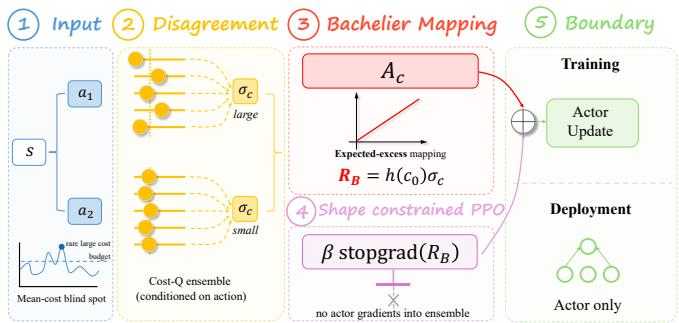  
(a) Motivation and disagreement-based cost shaping.

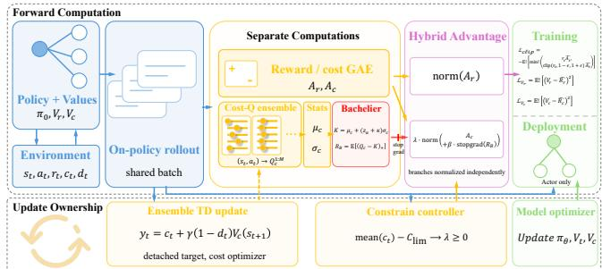  
(b) BCPPO training and deployment data flow.  
Figure 1: BCPPO overview. (a) Mean-cost control can miss rare high-cost outcomes. Action-conditioned cost-critic disagreement is mapped to the Bachelier-inspired penalty $\mathcal { R } _ { B }$ and, with gradients blocked from the ensemble, added to the cost branch. The standard reward branch, multiplier, and branch normalization are omitted from panel (a) for clarity. (b) Shared on-policy rollouts feed reward/cost advantage estimation and a separately optimized cost-Q ensemble. Normalized reward and shaped-cost branches form $A _ { \mathrm { B P } }$ for the PPO actor update; the ensemble receives only temporal-diference gradients, and deployment retains only the actor.

## 2 Related Work

Expectation-constrained safe reinforcement learning baselines. The CMDP framework (Altman 1999) underpins methods that constrain expected cost. Our maintained OmniSafe baselines are Constrained Policy Optimization (CPO) (Achiam et al. 2017), PPO-Lagrangian (PPO-Lag) (Ray, Achiam, and Amodei 2019), and First-Order Constrained Optimization in Policy Space (FOCOPS) (Zhang, Vuong, and Ross 2020). They use diferent updates to enforce the same mean-cost objective and are not tail-risk algorithms. BCPPO adopts proportional–integral–derivative (PID) Lagrangian control (Stooke, Achiam, and Abbeel 2020) with anti-windup, which stops integral accumulation when the projected multiplier saturates; related gradient-based variants also constrain expected cost (Yang et al. 2020; Liu et al. 2022; Sootla et al. 2022). Such constraints can improve tails indirectly but do not specify upper-tail behavior.

Sample-based and distributional tail risk. Utility-based risk-sensitive RL predates direct CVaR policy gradients (Mihatsch and Neuneier 2002). Such gradients identify high-cost trajectories through empirical tail samples and can become noisier in proportion to $( 1 - \alpha ) ^ { - 1 }$ (Tamar, Glassner, and Mannor 2014). CVaR-constrained dynamic programming and PPO provide direct alternatives (Chow et al. 2017; Ying et al. 2022). Our CVaR-weighted PPO comparison (CPPO) is a controlled Monte Carlo upper-tail comparison, not an external reference result. Distributional RL (Bellemare, Dabney, and Munos 2017; Dabney et al. 2017, 2018) models return variation explicitly, and distributional safety critics place implicit quantile network cost-return models inside CVaR constraints (Yang et al. 2023). Our quantile-regression PPO (QR PPO) comparison tests a quantile cost critic in place of uncertainty shaping. Worst-Case Soft Actor Critic (WCSAC), a Soft Actor-Critic (SAC) method that reuses stored transitions, (Yang et al. 2021) supplies the external tail-aware comparison through Gaussian cost-return modeling and a CVaR objective. Together these methods separate sampledtail, distributional-tail, and mean-cost mechanisms.

Epistemic uncertainty in safe RL. Bayesian uncertainty decomposition (Depeweg et al. 2018), deep ensembles (Lakshminarayanan, Pritzel, and Blundell 2017), and probabilistic ensembles with trajectory sampling (Chua et al. 2018) provide practical epistemic-uncertainty estimators. Ensemble Q-functions have also supported ofline out-of-distribution (OOD) conservatism and exploration guided by optimistic uncertainty bounds (An et al. 2021; Lee et al. 2021). Safe-RL methods use ensembles in diferent roles: Bayesian CPO propagates uncertainty through a learned transition model (As et al. 2022); Stachowicz and Levine (2024) apply CVaR to an ensemble of distributional return critics, jointly exposing the actor to aleatoric return variation and epistemic disagreement; and Uncertainty-Aware Safety Propagation Critics (USPC) (Demiray, Ceyani, and Oguz 2026) forms a conservative cost from a scalar ensemble’s mean and spread, then propagates safety labels from actions judged safe to nearby actions.

USPC and BCPPO therefore place uncertainty diferently. BCPPO keeps unmodified TD targets and the original cost advantage; its reference level cancels the ensemble mean from R , leaving critic disagreement as an actor-side penalty while PID controls mean cost. It neither replaces the cost estimate with an upper bound nor transfers safety labels across actions. The disagreement signal is used only during training; its numerical value is not an OOD probability or a strict tail-risk guarantee.

## 3 BCPPO: Method

BCPPO separates mean predicted cost from disagreement across trained critics (Figure 1). Disagreement enters the PPO-Lagrangian actor as a cautionary penalty; agreement does not certify correctness or safety. A Bachelier expectedexcess formula supplies the penalty coeficient, actor gradients are blocked from the critics, and anti-windup PID updates the mean-cost multiplier from observed cost error.

## 3.1 CMDP, CVaR, and the Bachelier Formula

We use the CMDP variables defined in Eqs. $( 1 ) ‐ ( 2 )$ . In experiments, the PID error and evaluation cost are lengthnormalized per-step rates; experimental $C _ { \mathrm { l i m } }$ is therefore a rate limit rather than the unnormalized discounted sum. For a random variable X and confidence level $\alpha \in ( 0 , 1 )$ ), its value at risk (VaR) is $\operatorname { V a R } _ { \alpha } ( X ) = \operatorname* { i n f } \{ z : \mathbb { P } ( X \leq z ) \geq \alpha \}$ , and its conditional value at risk (CVaR) is

$$
\operatorname { C V a R } _ { \alpha } ( X ) = \operatorname* { i n f } _ { \eta \in \mathbb { R } } \left\{ \eta + \frac { \mathbb { E } [ ( X - \eta ) _ { + } ] } { 1 - \alpha } \right\} .\tag{3}
$$

Here $( x ) _ { + } ~ = ~ \operatorname* { m a x } ( x , 0 )$ . For a continuous distribution, CVaR is the mean above VaR: $\mathbb { E } [ X \mid X \geq$ $\operatorname { V a R } _ { \alpha } ( X ) ]$ (Tamar et al. 2015). Hereafter, Φ and ϕ denote the cumulative distribution function and probability density function of a standard normal variable. For Gaussian $\boldsymbol { X } ^ { \circ } \sim \mathcal { N } ( \mu , \sigma ^ { 2 } ) , \operatorname { V a R } _ { \alpha } \ : = \ : \mu + \Phi ^ { - 1 } ( \alpha ) \sigma$ and $\mathrm { C V a R } _ { \alpha } \ =$ $\mu + \sigma \phi ( \Phi ^ { - 1 } ( \alpha ) ) / ( 1 - \alpha )$ . For $X \sim { \mathcal { N } } ( { \dot { \mu } } , \sigma ^ { 2 } )$ and reference level $K \in \mathbb { R }$ , the Bachelier expected positive excess (Bachelier 1900) is

$$
\begin{array} { l } { { \operatorname { C a l l } ( K ; \mu , \sigma ) = \operatorname { \mathbb { E } } [ ( X - K ) _ { + } ] } } \\ { { \mathrm { ~ } } } \\ { { \mathrm { ~ } = ( \mu - K ) \Phi ( d ) + \sigma \phi ( d ) , \qquad d = \displaystyle \frac { \mu - K } { \sigma _ { \mathrm { ~ } _ { \Lambda \setminus \Omega } } } . } } \end{array}\tag{4}
$$

Appendix $\mathrm { A } . 2$ gives its derivation, derivatives, and financial interpretation.

## 3.2 Critic Disagreement and Bachelier-Inspired Shaping

For a fixed state–action pair, separately initialized critics trained with bootstrap masks can produce diferent predictions of future cumulative cost. Their disagreement measures sensitivity to training data and critic optimization. It can reflect limited coverage or unstable training, but neither proves that an action is unsafe nor captures aleatoric uncertainty, the irreducible randomness in future outcomes. We use it only to mark predictions that warrant caution in the actor update.

Ensemble statistics. BCPPO trains M independently initialized, bootstrapped scalar cost critics $\{ Q _ { c } ^ { ( m ) } ( s , a ) \} _ { m = 1 } ^ { M }$ that take $( s , a )$ as input and estimate expected discounted future cost. They share the same scalar TD-target definition, but independent initialization and per-member binary bootstrap masks expose them to diferent selections of training samples: each mask randomly keeps or drops a sample from one member’s loss. Members share neither parameters nor gradients, and no extra loss forces their predictions apart; Appendix B.1 gives exact masking and architectures. For a given (s, a), the ensemble mean and variance are:

$$
\mu _ { c } ( s , a ) = \frac { 1 } { M } \sum _ { m = 1 } ^ { M } Q _ { c } ^ { ( m ) } ( s , a ) ,\tag{5}
$$

$$
\sigma _ { c } ^ { 2 } ( s , a ) = \frac { 1 } { M } \sum _ { m = 1 } ^ { M } \Big ( Q _ { c } ^ { ( m ) } ( s , a ) - \mu _ { c } ( s , a ) \Big ) ^ { 2 } .\tag{6}
$$

Each member produces one expected-cost prediction, not a return quantile or an environment sample. Thus $\sigma _ { c }$ measures disagreement across trained critics at fixed $( s , a )$ , not outcome variance. The cost advantage $A _ { c }$ and PID handle predicted and observed mean cost; only disagreement enters the actor penalty. To prevent numerical collapse when all critics do converge, we enforce $\sigma _ { c } \gets \operatorname* { m a x } ( \sigma _ { c } , \sigma _ { \operatorname* { m i n } } )$ with $\sigma _ { \mathrm { m i n } } = 1 0 ^ { - 6 }$

Bachelier expected-excess penalty. At each fixed $( s , a )$ we approximate the discrete critic outputs by $Q _ { c } ( s , \bar { a } ) \ \tilde { } ^ { }$ $\mathcal { N } ( \mu _ { c } , \sigma _ { c } ^ { 2 } )$ . We call this a local Gaussian surrogate; it approximates variation across trained critics, not randomness in environment outcomes. We then define a state–actiondependent reference level, called the strike in the Bachelier formula:

$$
K ( s , a ) = \mu _ { c } ( s , a ) + c _ { 0 } \sigma _ { c } ( s , a ) , \qquad c _ { 0 } = \Phi ^ { - 1 } ( \alpha ) + \kappa ,\tag{7}
$$

where $\Phi ^ { - 1 } ( \alpha )$ is the standard-normal α-quantile and $\kappa \geq 0$ shifts the reference farther into the upper tail. Thus $c _ { 0 }$ sets where excess begins within the Gaussian approximation. The Bachelier-inspired shaping penalty is the expected excess beyond this strike:

$$
\begin{array} { r l } & { { \mathcal { R } } _ { B } ( s , a ) = \operatorname { C a l l } ( K ; \mu _ { c } , \sigma _ { c } ) } \\ & { \quad \quad \quad = ( \mu _ { c } - K ) \Phi ( d _ { \kappa } ) + \sigma _ { c } \phi ( d _ { \kappa } ) , } \\ & { \quad \quad \quad d _ { \kappa } = - c _ { 0 } = - \Phi ^ { - 1 } ( \alpha ) - \kappa . } \end{array}\tag{8}
$$

Substituting Eq. (7) gives the implemented one-dimensional form:

$$
\begin{array} { r } { \mathcal { R } _ { B } ( s , a ) = \sigma _ { c } ( s , a ) \big [ \phi ( - c _ { 0 } ) - c _ { 0 } \Phi ( - c _ { 0 } ) \big ] , } \end{array}\tag{9}
$$

The mean cancels because $A _ { c }$ already supplies predicted cost, avoiding a second count of the same signal. For fixed $( \alpha , \kappa ) , h ( c _ { 0 } ) ^ { - } = \phi ( - c _ { 0 } ) - c _ { 0 } \Phi ( - c _ { 0 } )$ is a positive constant and

$$
\beta _ { \mathrm { e f f } } = \beta h ( c _ { 0 } ) , \qquad \beta \mathcal { R } _ { B } = \beta _ { \mathrm { e f f } } \sigma _ { c } ,\tag{10}
$$

so the implemented signal is an analytically scaled disagreement penalty. Settings with the same $\beta _ { \mathrm { e f f } }$ produce the same actor coeficient, so this update cannot distinguish separate efects of $\alpha , \kappa ,$ and $\beta .$ Bachelier supplies expected-excess and local Gaussian CVaR-excess interpretations, not another uncertainty statistic or a safety guarantee.

Before entering the actor update, $\mathcal { R } _ { B }$ is detached from the computation graph: $\overline { { \mathcal { R } _ { B } } } ( s , a ) \overline { { = \mathrm { s t o p g r a d } ( \mathcal { R } _ { B } ( s , a ) ) } }$ . Thus gradients from the actor loss do not update ensemble-critic parameters or alter their TD targets.

## 3.3 Actor-Critic Learning and Mean-Cost Control

BCPPO retains PPO’s state-value networks $V _ { r }$ and $V _ { c } ,$ which predict future reward and cost from a state and are used for Generalized Advantage Estimation (GAE). The actionconditioned critics $\{ Q _ { c } ^ { ( m ) } \}$ instead provide disagreement for a specific state–action pair.

Standard TD cost-critic learning. All ensemble critics are trained with standard TD targets, independent of the

Bachelier-inspired shaping penalty:

$$
y _ { t } = c _ { t } + \gamma ( 1 - d _ { t } ) \widehat { V } _ { c } ( s _ { t + 1 } ) ,\tag{11}
$$

$$
L _ { \mathrm { c o s t } } ^ { ( m ) } = \frac { \sum _ { t \in B } z _ { t } ^ { ( m ) } \left( Q _ { c } ^ { ( m ) } ( s _ { t } , a _ { t } ) - y _ { t } \right) ^ { 2 } } { \operatorname* { m a x } \{ 1 , \sum _ { t \in B } z _ { t } ^ { ( m ) } \} } .\tag{12}
$$

Here B is the minibatch and $z _ { t } ^ { ( m ) } \sim$ Bernoulli(0.8) is independently resampled for every member and sample at each minibatch update. The flag $d _ { t }$ marks termination, and $\widehat { V } _ { c }$ is the detached rollout-time cost-value prediction; no separate target network is maintained. All critics share $y _ { t }$ but have independent parameters, initializations, and masks.

Branch-normalized hybrid advantage. Let $A _ { r }$ and $A _ { c }$ denote the reward and cost advantages—estimates of how much better an action is than its state baseline—computed via GAE (Schulman et al. 2018). BCPPO constructs a branchnormalized hybrid advantage:

$$
{ A _ { \mathrm { B P } } } = \operatorname { n o r m } ( A _ { r } ) - \lambda \cdot \operatorname { n o r m } ( A _ { c } + \beta { \overline { { \mathcal { R } _ { B } } } } ) ,\tag{13}
$$

where norm(·) denotes batch zero-mean unit-variance normalization, $\dot { \lambda } \geq 0$ is the controller-set weight on the cost branch, and $\beta > 0$ weights disagreement within that branch. The branches are normalized independently so large reward magnitudes do not suppress the disagreement signal. Because λ multiplies the complete cost-plus-disagreement branch, disagreement afects the actor only when the mean-cost multiplier is positive. When $\lambda = 0$ , the actor update reduces to reward $\mathrm { P P O ; }$ when the mean-cost controller sets $\lambda > 0 ,$ , disagreement changes which sampled actions receive a stronger safety penalty. The spread term is therefore not an independent tail constraint. The actor is updated with the PPO clipped objective (Schulman et al. 2017):

$$
L _ { \mathrm { a c t o r } } = - \mathbb { E } [ \operatorname* { m i n } ( \rho _ { t } A _ { \mathrm { B P } } , \mathrm { c l i p } ( \rho _ { t } , 1 - \epsilon , 1 + \epsilon ) A _ { \mathrm { B P } } ) ] ,\tag{14}
$$

where $\rho _ { t } = \pi _ { \theta } ( a _ { t } \mid s _ { t } ) / \pi _ { \theta _ { \mathrm { o l d } } } ( a _ { t } \mid s _ { t } )$ . The scalar $\epsilon > 0$ is the PPO clipping radius.

Anti-windup PID Lagrangian controller. The mean-cost weight λ is updated after every batch of environment transitions collected by the current policy. Let $B _ { k }$ denote this rollout batch at cycle k and $e _ { k } = \mathrm { m e a n } ( c _ { t } \in B _ { k } ) - C _ { \mathrm { l i m } }$ its mean-cost error. The controller first forms a candidate integral and projected update:

$$
\begin{array} { r l } & { \widetilde { I } _ { k } = I _ { k - 1 } + e _ { k } , } \\ & { \widetilde { u } _ { k } = \lambda _ { k } + K _ { P } e _ { k } + K _ { I } \widetilde { I } _ { k } + K _ { D } ( e _ { k } - e _ { k - 1 } ) , } \\ & { \lambda _ { k + 1 } = \Pi _ { [ 0 , \lambda _ { \operatorname* { m a x } } ] } ( \widetilde { u } _ { k } ) . } \end{array}\tag{15}
$$

Here $K _ { P } , K _ { I }$ , and $K _ { D }$ are the proportional, integral, and derivative gains, and $\Pi _ { [ 0 , \lambda _ { \mathrm { m a x } } ] }$ clips its argument to the displayed interval. Integral wind-up occurs when λ reaches a boundary but its integral term keeps accumulating. BCPPO applies anti-windup: if $\widetilde { u } _ { k }$ lies beyond a projection boundary and $e _ { k }$ points farther outward, the stored state remains $I _ { k } = I _ { k - 1 } ;$ otherwise the candidate integral is accepted. If the multiplier is saturated and the error reverses direction, the stored integral is clipped to help it return to the allowed range. We set $\bar { \lambda } _ { \mathrm { m a x } } = 5 \bar { 0 }$

Algorithm 1 BCPPO Update Step   
1: Input: Policy πθ; value networks $V _ { r } , V _ { c } ;$ critics   
$\{ Q _ { c } ^ { ( m ) } \} _ { m = 1 } ^ { M } ;$ PID state; multiplier λ   
2: Collect rollout batch $\boldsymbol { B } = \{ ( \boldsymbol { \bar { s } } _ { t } , a _ { t } , \boldsymbol { r } _ { t } , c _ { t } , \boldsymbol { s } _ { t + 1 } , d _ { t } ) \}$ un  
der πθ   
3: Compute $A _ { r } , A _ { c }$ via GAE; compute $\hat { V } _ { c } ( s _ { t + 1 } )$ for TD   
targets   
4: Update multiplier: $e _ { k } \gets \mathrm { m e a n } ( c _ { t } ) { - } C _ { \mathrm { l i m } }$ ; apply Eq. (15)   
with anti-windup logic   
5: for each PPO epoch (one pass through the rollout data)   
and minibatch do   
6: Compute $\mu _ { c } , \sigma _ { c }$ from the current critics via Eqs. (5)–   
(6); clamp $\sigma _ { c } \gets \operatorname* { m a x } ( \sigma _ { c } , 1 0 ^ { - 6 } )$   
7: Compute $K$ and $\mathcal { R } _ { B }$ via Eqs. $( { \dot { 7 } } ) \ – ( 8 ) ;$ detach $\mathcal { R } _ { B }$   
8: Construct $A _ { \mathrm { B P } }$ and minimize $L _ { \mathrm { a c t o r } }$ via Eqs. (13)–   
(14)   
9: Compute TD target $y _ { t }$ via Eq. (11)   
10: for each critic $m = 1 , \ldots , M$ do   
11: Minimize its bootstrap-masked TD loss $L _ { \mathrm { { c o s t } } } ^ { ( m ) }$ via   
Eq. (12)   
12: end for   
13: end for

Algorithm 1 summarizes the full update; implementation choices and default hyperparameters are reported with the experimental setup.

## 3.4 Computational Complexity and Theoretical Takeaways

Computational cost. BCPPO uses the same actor-only forward pass as vanilla PPO at deployment; the ensemble is discarded after training. For batch size B, its training the overhead is $\mathcal { O } ( B M )$ scalar-critic evaluation, TD learning, and aggregation, with $\mathcal { O } ( M )$ critic storage. Since $\mathcal { R } _ { B } = \overline { { \sigma _ { c } h ( c _ { 0 } ) } }$ the Bachelier map itself is $\mathcal { O } ( B )$ and its scalar coeficient can be precomputed. This retains ordinary gradient-based PPO updates: unlike Monte Carlo CVaR it needs no trajectory sorting, unlike QR PPO it needs no $N _ { q } { \mathrm { - o u t p u t } }$ quantile loss, and unlike CPO it needs no second-order constraint solve. Under our defaults it uses $M = 5$ scalar outputs instead of QR PPO’s $N _ { q } = 3 2$ quantile outputs per transition. These operation counts do not claim that BCPPO is always faster in elapsed time; full operation counts and measured inference latency are reported together in Appendix B.3.

Theoretical takeaways. Full statements and proofs appear in Appendix A.1. They establish:

1. Smooth explicit sensitivity. The state–action-dependent reference level reduces the penalty to $\mathcal { R } _ { B } = \sigma _ { c } h ( c _ { 0 } )$ sensitivity to $\mu _ { c }$ vanishes and sensitivity to $\sigma _ { c }$ is finite (Proposition 1).

2. A Gaussian CVaR-excess interpretation. For $\kappa = 0$ $\mathcal { R } _ { B } = ( 1 - \alpha ) ( \mathrm { C V a R } _ { \alpha } - \mathrm { V a R } _ { \alpha } ) \overline { { { \vphantom { 1 } } } }$ under the local Gaussian approximation to critic outputs; $\kappa > 0$ shifts the excess threshold. This is not an exact trajectory-CVaR constraint (Proposition 2).

3. Scale separation. Branch normalization is invariant to independent positive rescaling of its two branches (Remark 1). Auxiliary results rely on stated approximations or idealized assumptions and do not establish numerical agreement with true error or risk, convergence, or safety.

## 4 Experiments

## 4.1 Setup

Implementation summary. Unless stated otherwise, BCPPO uses $M = 5$ critics, $( \alpha , \beta , \kappa ) = ( 0 . 9 5 , 0 . 1 5 , 0 . 1 5 )$ PPO clipping $\epsilon = 0 . 2$ , and $\lambda _ { \operatorname* { m a x } } = 5 0$ . Algorithm 1 specifies the update, while complete architectures, optimizer settings, and hyperparameters appear in Appendix B.1.

Environments and protocol. We evaluate on five continuous-control tasks spanning Safety-Gymnasium navigation (Goal1, Button1, Push1) and MuJoCo locomotion (Hopper-v4, Ant-v4). Every method is trained for 1M steps with five independent random seeds and evaluated under the same rare-event cost wrapper and, within each environment, the same cost limit. These shared tasks, costs, budgets, interaction counts, and evaluation seeds form the common comparison protocol; details are in Appendix B.1.

Rare-event cost wrapper. Rather than relying on built-in Safety-Gymnasium event costs, we use the controlled cost

$$
c ( s , a ) = c _ { a } \| a \| _ { 2 } ^ { 2 } + c _ { b } \Im \{ \| o ( s ) \| _ { 2 } > 1 5 \} ,\tag{16}
$$

where $c _ { a } , c _ { b } > 0$ are environment-specific coeficients and $o ( s )$ denotes the observation extracted from state s. The indicator adds an occasional bounded cost spike to the small action cost, so a policy can satisfy a mean-cost budget while still exhibiting a large upper tail. We use the common threshold as a controlled stress test, not as a physically identical boundary definition across the five observation spaces. Original environment costs are logged as diagnostics but are not optimized.

Baselines. Table 1 compares maintained mean-cost baselines (PPOLag, CPO, and FOCOPS), our PPO implementations of CPPO and QR PPO, and tail-aware WCSAC (Yang et al. 2021). CPPO uses Monte Carlo upper-tail weighting; QR PPO uses an action-conditioned quantile cost critic. For OmniSafe, we convert both the constraint statistic and costadvantage branch from episodic-cost units to the per-step units used by our wrapper, while leaving each maintained algorithm update unchanged. WCSAC is our PyTorch reproduction, checked against its published Gaussian equations and a fixed version of the public code; it is not an authorsupplied run. All methods follow the common comparison protocol.

Metrics. Return measures task performance (higher is better). Cost rate is episode-average step cost (lower is better). Safety Rate is the fraction satisfying the budget, $\mathbb { P } ( \mathrm { C o s t r a t e } \le C _ { \mathrm { l i m } } )$ , while CVaR@95 is the mean cost rate in the worst 5% tail. Worst $\mathbf { G a p } = \widehat { \mathrm { C V a R } } _ { 0 . 9 5 } - C _ { \mathrm { l i m } }$ measures tail severity relative to the budget. The main table reports Return, Cost rate, and CVaR@95; supplementary tables retain all metrics. Each policy uses 20 fixed evaluation seeds (10000–10019) and deterministic actions, so per-run CVaR@95 is the largest observed cost rate; tables aggregate over five trained policies.

## 4.2 Main Results

Table 1 reports the 175 runs; Figure 2 shows reward–CVaR positions, and Appendix C shows training. Because Eq. (16) can produce rare boundary costs despite an acceptable mean, we report the trade-of rather than one scalar winner.

Reward–CVaR pairs and trade-ofs. Here one method empirically dominates another if its five-seed mean has no lower Return and no higher CVaR, with at least one strict inequality. At the five-seed mean level, BCPPO is nondominated in all five tasks: it empirically dominates 13 of 30 comparator–task means and trades reward against CVaR in the other 17. It dominates all six comparators on Push1, four on Button1, two on Goal1, and WCSAC on Ant. Its navigation CVaR is below PPOLag, CPO, and FOCOPS, whereas Hopper and Ant baselines often exchange higher tail cost for higher return. WCSAC’s results characterize only our wrapper-specific reproduction. Push1 provides BCPPO’s clearest joint advantage.

Statistical scope. This frontier is descriptive: only Push1– FOCOPS, Push1–WCSAC, and Ant–WCSAC have 95% intervals, formed by resampling the five training seeds, that favor BCPPO on both axes. These intervals do not correct for simultaneous reward–CVaR testing or multiple comparisons. The supported claim is therefore a non-dominated five-seed mean pair in each task—not maximal reward, minimal CVaR, or universal superiority.

Mean cost versus the observed tail. Mean cost and CVaR move together in some cells but not enough to make one redundant. At the run level, 18 of 175 final policies satisfy the mean-cost budget while their empirical CVaR exceeds it, directly exhibiting the motivating gap under this wrapper. Conversely, most method–task cells do not show that pattern, and the table does not imply that every expectation-constrained method must have worse tail behavior. We therefore report Return, mean Cost, and CVaR separately.

Training and deployment cost. BCPPO trains five cost critics but deploys only the PPO actor. Appendix B.5 reports noisy, overlapping policy latencies; they do not establish a speed advantage over CPPO or QR PPO.

## 4.3 Ablation Summary

Five-seed, 500k-step ablations on Button1, Push1, and Hopper test component removal, uncertainty placement, the effective coeficient, and ensemble size; full results appear in Appendix D.

Spread penalty and placement. Removing the spread penalty changes the reward–CVaR trade-of rather than uniformly worsening risk: the full method favors return on Button1, lower CVaR on Push1, and improves both means on Hopper with large variation across seeds. Placement is more consistent. Turning disagreement into a reward bonus raises navigation CVaR, most clearly on Push1; Hopper is nearly unchanged. The penalty is therefore an environmentdependent conservative bias, not a universal tail reducer.

<table><tr><td>Method</td><td>Metric</td><td>Goal1</td><td>Button1</td><td>Push1</td><td>Hopper</td><td>Ant</td></tr><tr><td rowspan="3">BCPPO</td><td>Return</td><td> ${ \bf 1 7 . 3 7 \pm 6 . 4 8 }$ </td><td> ${ \bf 1 5 . 2 8 \pm 5 . 4 3 }$ </td><td> $\mathbf { 0 . 7 2 \pm 0 . 5 3 }$ </td><td> $7 7 2 . 5 3 \pm 2 2 9 . 8 1$ </td><td> $\mathbf { 1 2 8 6 . 9 7 \pm 3 2 0 . 4 0 }$ </td></tr><tr><td>Cost</td><td> $0 . 1 2 3 \pm 0 . 2 5 4$ </td><td> $0 . 1 5 2 \pm 0 . 0 8 3$ </td><td> $0 . 0 9 8 \pm 0 . 1 2 9$ </td><td> $0 . 0 1 2 \pm 0 . 0 0 2$ </td><td> $0 . 1 1 7 \pm 0 . 1 9 2$ </td></tr><tr><td>CVaR@95</td><td> $\mathbf { 0 . 1 7 3 \pm 0 . 3 6 1 }$ </td><td> $\mathbf { 0 . 2 5 4 \pm 0 . 1 2 5 }$ </td><td> $\mathbf { 0 . 1 9 8 \pm 0 . 2 0 3 }$ </td><td> $\mathbf { 0 . 0 1 3 \pm 0 . 0 0 2 }$ </td><td> $\mathbf { 0 . 1 5 9 \pm 0 . 2 3 6 }$ </td></tr><tr><td rowspan="3">CPPO</td><td>Return</td><td> ${ \bf 1 7 . 1 0 \pm 6 . 3 6 }$ </td><td> $1 4 . 1 6 \pm 4 . 5 7$ </td><td> $0 . 1 9 \pm 0 . 9 4$ </td><td> $\mathbf { 6 0 7 . 3 3 \pm 1 3 3 . 9 7 }$ </td><td> $\mathbf { 9 1 0 . 1 8 \pm 2 3 5 . 0 3 }$ </td></tr><tr><td>Cost</td><td> $0 . 0 2 1 \pm 0 . 0 2 1$ </td><td> $0 . 1 7 7 \pm 0 . 0 8 5$ </td><td> $0 . 1 2 8 \pm 0 . 1 2 1$ </td><td> $0 . 0 0 8 \pm 0 . 0 0 1$ </td><td> $0 . 0 2 5 \pm 0 . 0 1 8$ </td></tr><tr><td>CVaR@95</td><td> $\mathbf { 0 . 0 5 3 \pm 0 . 0 7 4 }$ </td><td> $0 . 2 7 5 \pm 0 . 0 9 3$ </td><td> $0 . 2 8 4 \pm 0 . 1 4 5$ </td><td> $\mathbf { 0 . 0 0 9 \pm 0 . 0 0 1 }$ </td><td> $\mathbf { 0 . 0 6 7 \pm 0 . 0 6 7 }$ </td></tr><tr><td rowspan="3">QR PPO</td><td>Return</td><td> $9 . 9 6 \pm 9 . 4 6$ </td><td> ${ \bf 1 8 . 6 0 } \pm 2 . 0 7$ </td><td> $0 . 3 2 \pm 0 . 4 0$ </td><td> $5 3 3 . 2 6 \pm 1 9 7 . 2 2$ </td><td> $7 9 7 . 3 6 \pm 1 3 4 . 5 0$ </td></tr><tr><td>Cost</td><td> $0 . 1 5 6 \pm 0 . 2 2 0$ </td><td> $0 . 2 7 3 \pm 0 . 1 7 4$ </td><td> $0 . 1 4 3 \pm 0 . 1 9 0$ </td><td> $0 . 0 1 0 \pm 0 . 0 0 1$ </td><td> $0 . 0 5 0 \pm 0 . 0 8 8$ </td></tr><tr><td>CVaR@95</td><td> $0 . 3 4 9 \pm 0 . 5 5 4$ </td><td> $\mathbf { 0 . 4 1 6 \pm 0 . 2 5 7 }$ </td><td> $0 . 2 8 2 \pm 0 . 3 3 6$ </td><td> $0 . 0 1 1 \pm 0 . 0 0 1$ </td><td> $0 . 1 2 3 \pm 0 . 2 3 8$ </td></tr><tr><td rowspan="3">PPOLag</td><td>Return</td><td> $1 8 . 7 5 \pm 7 . 0 4$ </td><td> $1 4 . 7 5 \pm 4 . 6 9$ </td><td> $0 . 4 1 \pm 0 . 3 3$ </td><td> $\mathbf { 3 4 9 8 . 4 8 \pm 1 1 8 . 0 0 }$ </td><td> $\mathbf { 3 9 4 3 . 4 1 \pm 6 4 7 . 4 8 }$ </td></tr><tr><td>Cost</td><td> $1 . 4 6 1 \pm 0 . 3 3 7$ </td><td> $0 . 9 9 7 \pm 0 . 2 4 6$ </td><td> $0 . 4 3 5 \pm 0 . 3 0 1$ </td><td> $0 . 0 8 9 \pm 0 . 0 6 3$ </td><td> $0 . 4 8 0 \pm 0 . 2 5 8$ </td></tr><tr><td>CVaR@95</td><td> $2 . 0 1 3 \pm 0 . 2 7 6$ </td><td> $1 . 3 5 3 \pm 0 . 2 8 3$ </td><td> $1 . 3 3 2 \pm 0 . 8 5 2$ </td><td> $\mathbf { 0 . 0 9 9 \pm 0 . 0 7 4 }$ </td><td> $\mathbf { 0 . 5 4 0 \pm 0 . 2 6 9 }$ </td></tr><tr><td rowspan="3">CPO</td><td>Return</td><td> ${ \pm \mathsf { \mathbf { 5 . 0 9 } } \pm \mathbf { 1 . 8 8 } }$ </td><td> ${ \bf 2 0 . 3 8 \pm 3 . 5 9 }$ </td><td> $0 . 3 1 \pm 0 . 3 1$ </td><td> $\mathbf { 2 3 4 1 . 0 7 \pm 1 3 5 3 . 4 0 }$ </td><td> ${ \bf 4 5 7 3 . 8 1 \pm 5 9 4 . 9 8 }$ </td></tr><tr><td>Cost</td><td> $1 . 1 1 7 \pm 0 . 8 6 5$ </td><td> $1 . 0 4 9 \pm 0 . 2 3 6$ </td><td> $0 . 6 9 1 \pm 0 . 4 2 8$ </td><td> $0 . 0 1 3 \pm 0 . 0 0 2$ </td><td> $0 . 6 5 2 \pm 0 . 2 4 2$ </td></tr><tr><td>CVaR@95</td><td> $\mathbf { 1 . 6 9 5 \pm 1 . 7 1 4 }$ </td><td> $\mathbf { 1 . 4 5 5 \pm 0 . 3 6 7 }$ </td><td> $1 . 4 6 4 \pm 0 . 7 4 7$ </td><td> $\mathbf { 0 . 0 1 5 \pm 0 . 0 0 4 }$ </td><td> $\mathbf { 0 . 7 4 9 \pm 0 . 2 2 9 }$ </td></tr><tr><td rowspan="3">FOCOPS Cost</td><td>Return</td><td> $1 6 . 3 3 \pm 7 . 4 5$ </td><td> $1 0 . 0 1 \pm 5 . 5 0$ </td><td> $- 0 . 2 9 \pm 0 . 5 2$ </td><td> $3 2 2 2 . 8 9 \pm 6 5 1 . 2 2$ </td><td> $3 7 9 2 . 3 0 \pm 4 6 1 . 5 7$ </td></tr><tr><td></td><td> $2 . 3 5 8 \pm 0 . 6 8 7$ </td><td> $1 . 6 0 9 \pm 0 . 3 0 7$ </td><td> $2 . 2 9 0 \pm 1 . 3 4 4$ </td><td> $0 . 1 3 8 \pm 0 . 0 5 9$ </td><td> $0 . 5 9 6 \pm 0 . 2 6 1$ </td></tr><tr><td>CVaR@95</td><td> $3 . 4 6 3 \pm 0 . 8 7 4$ </td><td> $2 . 4 5 7 \pm 1 . 1 1 9$ </td><td> $6 . 2 0 3 \pm 3 . 4 1 3$ </td><td> $0 . 1 8 0 \pm 0 . 0 6 8$ </td><td> $0 . 6 7 4 \pm 0 . 2 7 1$ </td></tr><tr><td rowspan="3"> $\mathrm { { W C S A C ^ { \dagger } } }$ </td><td>Return</td><td> $- \mathbf { 0 . 0 1 } \pm \mathbf { 0 . 1 6 }$ </td><td> $- 4 . 8 0 \pm 1 1 . 1 5$ </td><td> $- 2 . 2 5 \pm 3 . 0 3$ </td><td> $\mathbf { 3 1 2 8 . 7 1 \pm 6 6 6 . 1 3 }$ </td><td> $- 1 9 4 . 8 2 \pm 6 9 . 2 2$ </td></tr><tr><td>Cost</td><td> $0 . 0 0 6 \pm 0 . 0 0 1$ </td><td> $1 . 2 5 6 \pm 1 . 9 6 4$ </td><td> $0 . 6 0 8 \pm 0 . 6 2 8$ </td><td> $0 . 0 1 0 \pm 0 . 0 0 2$ </td><td> $3 . 9 0 6 \pm 0 . 3 2 0$ </td></tr><tr><td>CVaR@95</td><td> $\mathbf { 0 . 0 0 6 \pm 0 . 0 0 1 }$ </td><td> $1 . 3 8 4 \pm 2 . 1 3 8$ </td><td> $1 . 0 7 8 \pm 0 . 7 7 0$ </td><td> $\mathbf { 0 . 0 1 6 \pm 0 . 0 0 9 }$ </td><td> $4 . 4 4 3 \pm 0 . 2 4 4$ </td></tr></table>

Table 1: Shared-protocol final results over 175 runs (mean±standard deviation across five training seeds after 1M interactions; 20 fixed evaluation seeds). Higher Return is better, whereas lower Cost rate and CVaR@95 are better. Bold Return/CVaR entries are not jointly worse than another displayed mean. †WCSAC is our checked Gaussian reproduction, not an author-supplied run. Values are regenerated from raw episodes.

Normalization and mean-cost control. Removing branch normalization improves Button1 but produces the largest Push1 instability (CVaR@95 $0 . 9 3 4 \pm 1 . 4 7 9 )$ and degrades Hopper; its role is scale control, not universal CVaR reduction. Anti-windup is more consistent: disabling it raises mean CVaR in all three environments, most on Button1 (0.414 to 0.668). Overlapping five-seed variation prevents a significance claim.

Coeficient and ensemble sensitivity. The $\beta , \alpha ,$ and κ sweeps all change $\beta _ { \mathrm { e f f } } = \beta h ( \Phi ^ { - 1 } ( \alpha ) + \kappa )$ , not three independent mechanisms. Non-monotone Push1 results make the default a single shared coeficient choice, not an environment-specific optimum. With $M = 1$ spread stays at its numerical floor and CVaR variance is largest; $M = 1 0$ gives no clear gain over $M = 5 .$ . A direct $\sigma _ { c }$ penalty with its coeficient set to $\beta _ { \mathrm { e f f } }$ is algebraically identical. Keeping the same numerical $\beta$ instead makes the direct penalty 69.2× stronger and tests scale, not additional risk information.

Does disagreement respond to missing coverage? For 15 fixed policies, we retrain ensembles after structured data removal and equal-size controls. We use area under the receiver-operating-characteristic curve (AUC) to measure how well disagreement identifies the deliberately omitted region on separate evaluation episodes. The AUC gains are 0.168 and 0.099 (95% CIs [0.118, 0.218] and [0.044, 0.153]). Against matched one-standard-deviation target-noise controls, the gains remain 0.126 and 0.110. Missing coverage therefore raises disagreement in this test, but does not make it a general error score or tail-event probability; details appear in Appendix B.6.

Does the penalty steer actor updates? In a paired oneupdate test, we clone each actor; treatment enables the disagreement penalty and control disables it, while rollout, split, optimizer initialization, and minibatch order are matched. For five saved models with $\lambda > 0$ , larger- $\mathbf { \nabla } \cdot \mathcal { R } _ { B }$ actions receive lower treatment-minus-control log probability after removing the rank association with predicted mean cost (Spearman rank correlation, which compares monotone rank orderings, −0.119, 95% CI $[ - 0 . 2 1 \bar { 6 } , - 0 . 0 3 9 ] ;$ ; all five negative). Four saved models with $\lambda = 0$ and 72 both-disabled checks have exactly zero parameter diference. An ordinary linear-regression check is inconclusive, so this establishes the direction of one update, not lower final-policy CVaR; Appendix B.7 gives the protocol.

## 5 Discussion

## 5.1 Justification

BCPPO separates predicted cost, handled by the cost advantage and multiplier, from detached sensitivity to critic training; Bachelier supplies its expected-excess coeficient. The method has a non-dominated mean reward–CVaR pair, and controlled retraining identifies omitted regions more readily than equal-size controls. Mixed ablations and a multiplier positive in only 0.1% of logged Ant updates prevent attributing every frontier result to spread alone. The method targets sparse, costly, weakly covered violations when training can aford multiple critics but deployment requires one policy.

(a) Goal1  
(d) Hopper  
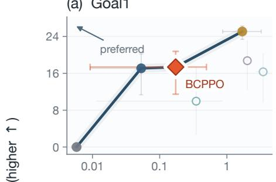

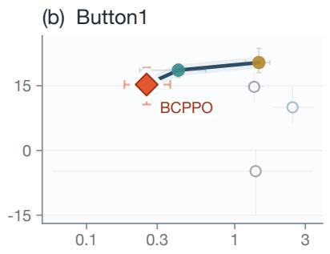

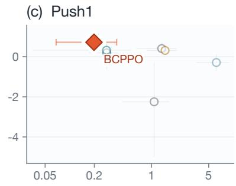

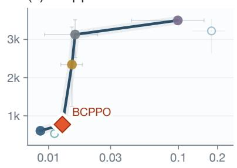

(e) Ant  
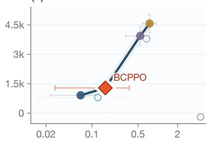  
Tail cost: CVaR0.95 rate (log scale; safer ← )

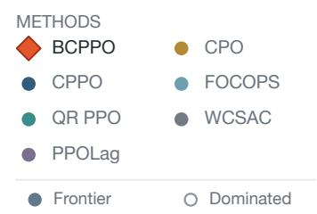  
Figure 2: Five-seed mean reward–CVaR trade-ofs; bars are 95% bootstrap CIs across training runs. Upper-left is preferred; filled markers and dark segments show the finite-set empirical frontier. Orange diamonds mark BCPPO; WCSAC is our checked Gaussian reproduction. Log axes preserve dominance.

## 5.2 Limitations

The Gaussian approximation can miss multimodal or heavytailed structure. Agreement can reflect shared bias, and disagreement can reflect benign instability. Its value is therefore a cautionary training signal, not an error probability, formal safety guarantee, or control for well-covered aleatoric hazards. Because the multiplier gates the full cost–disagreement branch, λ = 0 makes the actor update reward-only, so BCPPO provides no independent tail-risk pressure while the mean-cost constraint is inactive.

The wrapper is a controlled stress test, not a physical hazard model. With 20 evaluation episodes, CVaR@95 is the largest observed cost, and five seeds give coarse uncertainty estimates. CPPO and QR PPO span two optimizer settings, WCSAC is our reproduction, and shared hyperparameters are not task-optimal. OmniSafe cost-rate units are aligned, but controllers were not jointly retuned or budget-swept, so violations describe these configurations. The paired intervention tests one post-training update with a newly initialized optimizer, not downstream CVaR.

## 5.3 Future Work

Future work should combine disagreement with distributional cost critics and a separate constraint active when the mean-cost multiplier is zero. Controlled continuations could test downstream CVaR; broader evaluation should add physical hazards, wrapper sweeps, seeds, and episodes. Shared features or distillation could reduce cost, while analysis should connect coverage to realized tails.

## 6 Conclusion

BCPPO combines critic-disagreement shaping with antiwindup mean-cost control. Across five tasks, no tested comparator has both higher mean return and lower mean CVaR; deliberate data-removal controls also show increased disagreement in omitted regions. The evidence supports a practical reward–caution balance with policy-only deployment, not universal tail-risk reduction or a safety guarantee.

## References

Achiam, J.; Held, D.; Tamar, A.; and Abbeel, P. 2017. Constrained Policy Optimization. arXiv:1705.10528.

Altman, E. 1999. Constrained Markov Decision Processes. Chapman and Hall/CRC.

An, G.; Moon, S.; Kim, J.-H.; and Song, H. O. 2021. Uncertainty-Based Ofline Reinforcement Learning with Diversified Q-Ensemble. In Advances in Neural Information Processing Systems, volume 34, 7436–7447.

As, Y.; Usmanova, I.; Curi, S.; and Krause, A. 2022. Constrained Policy Optimization via Bayesian World Models. arXiv:2201.09802.

Bachelier, L. 1900. Théorie de la Spéculation. Annales scientifiques de l’École Normale Supérieure, 17: 21–86.

Bellemare, M. G.; Dabney, W.; and Munos, R. 2017. A Distributional Perspective on Reinforcement Learning. arXiv:1707.06887.

Chemingui, Y.; Fan, C.; Wei, H.; and Doppa, J. R. 2026. SteinGate: Tail-Sensitive Safe Reinforcement Learning via Stein Discrepancy. arXiv:2607.13175.

Chow, Y.; Ghavamzadeh, M.; Janson, L.; and Pavone, M. 2017. Risk-Constrained Reinforcement Learning with Percentile Risk Criteria. arXiv:1512.01629.

Chua, K.; Calandra, R.; McAllister, R.; and Levine, S. 2018. Deep Reinforcement Learning in a Handful of Trials using Probabilistic Dynamics Models. arXiv:1805.12114.

Dabney, W.; Ostrovski, G.; Silver, D.; and Munos, R. 2018. Implicit Quantile Networks for Distributional Reinforcement Learning. arXiv:1806.06923.

Dabney, W.; Rowland, M.; Bellemare, M. G.; and Munos, R. 2017. Distributional Reinforcement Learning with Quantile Regression. arXiv:1710.10044.

Demiray, K.; Ceyani, E. E.; and Oguz, O. S. 2026. Uncertainty-Aware Safety Propagation Critics for Safe Reinforcement Learning. Transactions on Machine Learning Research.

Depeweg, S.; Hernández-Lobato, J. M.; Doshi-Velez, F.; and Udluft, S. 2018. Decomposition of Uncertainty in Bayesian Deep Learning for Eficient and Risk-sensitive Learning. arXiv:1710.07283.

Gao, S.; Zhou, Y.; Shao, S.; Luo, H.; Bing, Y.; Ding, J.; Fu, L.; and Wang, X. 2025. Extreme Value Policy Optimization for Safe Reinforcement Learning. In Proceedings ofthe 42nd International Conference on Machine Learning, volume 267 of Proceedings ofMachine Learning Research, 18772–18793. PMLR.

Keswani, M.; Jain, S.; and Bhattacharyya, R. P. 2026. Safe Langevin Soft Actor Critic. arXiv:2602.00587.

Lakshminarayanan, B.; Pritzel, A.; and Blundell, C. 2017. Simple and Scalable Predictive Uncertainty Estimation using Deep Ensembles. arXiv:1612.01474.

Lee, K.; Laskin, M.; Srinivas, A.; and Abbeel, P. 2021. SUN-RISE: A Simple Unified Framework for Ensemble Learning in Deep Reinforcement Learning. In Proceedings of the 38th International Conference on Machine Learning, volume 139 of Proceedings of Machine Learning Research, 6131–6141. PMLR.

Liu, Z.; Cen, Z.; Isenbaev, V.; Liu, W.; Wu, Z. S.; Li, B.; and Zhao, D. 2022. Constrained Variational Policy Optimization for Safe Reinforcement Learning. arXiv:2201.11927.

Mihatsch, O.; and Neuneier, R. 2002. Risk-Sensitive Reinforcement Learning. Machine Learning, 49(2–3): 267–290.

Ray, A.; Achiam, J.; and Amodei, D. 2019. Benchmarking Safe Exploration in Deep Reinforcement Learning. OpenAI Technical Report.

Schulman, J.; Moritz, P.; Levine, S.; Jordan, M.; and Abbeel, P. 2018. High-Dimensional Continuous Control Using Generalized Advantage Estimation. arXiv:1506.02438.

Schulman, J.; Wolski, F.; Dhariwal, P.; Radford, A.; and Klimov, O. 2017. Proximal Policy Optimization Algorithms. arXiv:1707.06347.

Sootla, A.; Cowen-Rivers, A. I.; Jaferjee, T.; Wang, Z.; Mguni, D.; Wang, J.; and Bou-Ammar, H. 2022. Saute RL: Almost Surely Safe Reinforcement Learning Using State Augmentation. arXiv:2202.06558.

Stachowicz, K.; and Levine, S. 2024. RACER: Epistemic Risk-Sensitive RL Enables Fast Driving with Fewer Crashes. arXiv:2405.04714.

Stooke, A.; Achiam, J.; and Abbeel, P. 2020. Responsive Safety in Reinforcement Learning by PID Lagrangian Meth ods. arXiv:2007.03964.

Tamar, A.; Chow, Y.; Ghavamzadeh, M.; and Mannor, S. 2015. Policy Gradient for Coherent Risk Measures. arXiv:1502.03919.

Tamar, A.; Glassner, Y.; and Mannor, S. 2014. Optimizing the CVaR via Sampling. arXiv:1404.3862.

Yang, Q.; Simão, T. D.; Tindemans, S. H.; and Spaan, M. T. J. 2021. WCSAC: Worst-Case Soft Actor Critic for Safety-Constrained Reinforcement Learning. Proceedings of the AAAI Conference on Artificial Intelligence, 35(12): 10639– 10646.

Yang, Q.; Simão, T. D.; Tindemans, S. H.; and Spaan, M. T. J. 2023. Safety-Constrained Reinforcement Learning with a Distributional Safety Critic. Machine Learning, 112: 859– 887.

Yang, T.-Y.; Rosca, J.; Narasimhan, K.; and Ramadge, P. J. 2020. Projection-Based Constrained Policy Optimization. arXiv:2010.03152.

Ying, C.; Zhou, X.; Su, H.; Yan, D.; Chen, N.; and Zhu, J. 2022. Towards Safe Reinforcement Learning via Constraining Conditional Value-at-Risk. arXiv:2206.04436.

Zhang, Y.; Vuong, Q.; and Ross, K. W. 2020. First Order Constrained Optimization in Policy Space. arXiv:2002.06506.

## Appendix

## A Theoretical Properties and Proofs

## A.1 Proofs of Propositions

This appendix gives the formal statements and proofs of the three analytical properties referenced in the main text.

Proposition 1 (Explicit Smoothness and Bounded Local Sensitivity). Let Cal $( K ; \mu , \sigma )$ denote the Bachelier expected-excess term in Eq. (4) with $\sigma > 0$ . For a fixed strike K, its partial derivatives are

$$
\frac { \partial \mathrm { C a l l } } { \partial \mu } = \Phi ( d ) \in [ 0 , 1 ] , \qquad \frac { \partial \mathrm { C a l l } } { \partial \sigma } = \phi ( d ) \leq ( 2 \pi ) ^ { - 1 / 2 } .
$$

For the moving reference strike used by BCPPO, $K = \mu +$ c σ with $c _ { 0 } = \Phi ^ { - 1 } ( \alpha ) + \kappa ,$ , the penalty reduces to

$$
\begin{array} { r } { \mathcal { R } _ { B } ( \mu , \sigma ) = \sigma h ( c _ { 0 } ) , \qquad h ( c _ { 0 } ) = \phi ( - c _ { 0 } ) - c _ { 0 } \Phi ( - c _ { 0 } ) , } \end{array}
$$

so $\partial \mathcal { R } _ { B } / \partial \mu = 0$ and $\partial \mathcal { R } _ { B } / \partial \sigma = h ( c _ { 0 } )$ , a finite constant for fixed (α, κ).

Proof. For fixed K, diferentiating Eq. (4) gives $\partial \mathrm { C a l l } / \partial \mu =$ $\Phi ( d )$ and $\partial \mathrm { C a l l } / \partial \sigma = \phi ( d )$ after cancellation of the terms containing ∂d. For the implemented strike $K = \mu { + } c _ { 0 } \sigma , d =$ $- c _ { 0 }$ and $\mathcal { R } _ { B } = \sigma [ \phi ( - c _ { 0 } ) - c _ { 0 } \Phi ( - c _ { 0 } ) ]$ , so the sensitivity to $\mu$ is zero and the sensitivity to σ is the fixed scalar $h ( c _ { 0 } )$ □

Proposition 2 (Connection to CVaR Excess Under Gaussian Surrogate). Under the local Gaussian surrogate $Q _ { c } ( s , a ) \sim$ $\sqrt { ( \mu _ { c } , \sigma _ { c } ^ { 2 } ) }$ , when $\kappa = 0 ( i . e .$ , the strike equals $\operatorname { V a R } _ { \alpha } ) .$

$$
\begin{array} { r l } & { \mathcal { R } _ { B } \big | _ { \kappa = 0 } = \mathbb { E } [ ( Q _ { c } - \mathrm { V a R } _ { \alpha } ) _ { + } ] } \\ & { \qquad = ( 1 - \alpha ) \big ( \mathrm { C V a R } _ { \alpha } ( Q _ { c } ) - \mathrm { V a R } _ { \alpha } ( Q _ { c } ) \big ) . } \end{array}\tag{17}
$$

For $\kappa > 0 ,$ , the strike is shifted above $\operatorname { V a R } _ { \alpha } ,$ , so the expected excess is smaller than the VaR-strike excess while measuring exceedance beyond a higher reference threshold. This algebra alone does not imply that the learned policy becomes more conservative as κ increases.

Proof. For $X \sim { \mathcal { N } } ( \mu , \sigma ^ { 2 } )$

$$
\begin{array} { l } { \mathbb { E } [ ( X - \mathrm { V a R } _ { \alpha } ) _ { + } ] = \int _ { \mathrm { V a R } _ { \alpha } } ^ { \infty } ( x - \mathrm { V a R } _ { \alpha } ) f ( x ) d x } \\ { = \int _ { \mathrm { V a R } _ { \alpha } } ^ { \infty } x f ( x ) d x } \\ { \quad \quad - \mathrm { V a R } _ { \alpha } \int _ { \mathrm { V a R } _ { \alpha } } ^ { \infty } f ( x ) d x } \\ { = ( 1 - \alpha ) \mathrm { C V a R } _ { \alpha } ( X ) - \mathrm { V a R } _ { \alpha } ( 1 - \alpha ) } \\ { = ( 1 - \alpha ) \mathrm { C V a R } _ { \alpha } ( X ) } \\ { \quad \quad - ( 1 - \alpha ) \mathrm { V a R } _ { \alpha } ( X ) . } \end{array}
$$

Monotonicity in κ follows because K increases with $\kappa ,$ while

$$
{ \frac { \partial { \mathrm { C a l l } } } { \partial K } } = - \Phi ( d ) \leq 0 .
$$

Thus the expected excess decreases as the reference threshold increases. □

Remark 1 (Scale-Equivariance of Branch-Normalized ${ \mathrm { A d } } -$ vantage). Batch zero-mean unit-variance normalization satisfies norm $( c X ) \ = \ \operatorname { n o r m } ( X )$ for any $c > 0$ and nonconstant vector X. Hence, for ABP $= \ \mathrm { n o r m } ( A _ { r } ) - \lambda$ norm $( A _ { c } + \beta \overline { { \mathcal { R } _ { B } } } )$ and any $c _ { 1 } , c _ { 2 } > 0 ,$

$$
\operatorname { n o r m } ( c _ { 1 } A _ { r } ) = \operatorname { n o r m } ( A _ { r } ) ,
$$

$$
\operatorname { n o r m } ( c _ { 2 } ( A _ { c } + \beta \mathcal { R } _ { B } ) ) = \operatorname { n o r m } ( A _ { c } + \beta \mathcal { R } _ { B } ) .
$$

Thus $A _ { \mathrm { B P } }$ is invariant to independent rescaling ofthe reward and cost-risk branches, and the Lagrange weight λ retains a dimensionless interpretation as a relative priority between branches.

## A.2 Bachelier Formula: Derivation and Financial Interpretation

The Bachelier model (Bachelier 1900) was the first formal mathematical model for option pricing, assuming arithmetic (additive) Brownian motion for the underlying price process, as opposed to the later geometric Brownian motion assumption of Black-Scholes. The expected payof of a European call option under arithmetic Brownian motion with $\dot { X _ { T } } \sim \mathcal { N } ( \mu , \dot { \sigma } ^ { 2 } )$ is exactly Eq. (4). In BCPPO we repurpose this formula for a diferent domain: rather than modeling option payofs, we model the expected excess of an uncertain cost estimate over a moving reference threshold. The “strike price” K in Eq. (7) is a moving reference threshold, and the Bachelier call value quantifies expected excess under the critic-output surrogate. Because this threshold is tied to $( \mu _ { c } , \sigma _ { c } )$ , the resulting value is exactly $h ( c _ { 0 } ) \sigma _ { c }$ , not a separate estimate of trajectory-tail probability.

## A.3 Extended Theoretical Diagnostics

This section provides idealized analytical diagnostics for selected components of BCPPO. These statements are deliberately narrower than policy-safety or end-to-end convergence guarantees. We maintain notation: $\mathcal { R } _ { B } ( s , a )$ for the Bachelier-inspired shaping penalty, norm(·) for batch normalization, and $c _ { 0 } = \bar { \Phi ^ { - 1 } ( \alpha ) } + \kappa$ for the moving referencestrike coeficient. Table 2 summarizes the scope, limitations, and ways to check the results below.

Distribution-Free Critic-Output Bound The moving reference strike $K = \mu _ { c } + c _ { 0 } \sigma _ { c }$ used in Eq. (7) has an interpretation beyond the Gaussian surrogate through the following distribution-free bound.

Remark 2 (Distribution-Free Critic-Output Bound). At a fixed $( s , a )$ , let J be uniform on $\{ 1 , \ldots , { \bar { M } } \}$ and define the discrete surrogate variable $X = Q _ { c } ^ { ( J ) } ( s , a )$ . Its mean and standard deviation are exactly the implemented $\mu _ { c } ( s , a )$ and $\sigma _ { c } ( s , a )$ . For $\sigma _ { c } ( s , a ) > 0$ , Cantelli’s one-sided Chebyshev inequality gives, for any $c > 0$

$$
\mathbb { P } _ { J } ( X \geq \mu _ { c } + c \sigma _ { c } ) \leq \frac { 1 } { 1 + c ^ { 2 } } .\tag{18}
$$

Consequently, the BCPPO moving reference strike $K ( s , a ) = \mu _ { c } ( s , a ) + c _ { 0 } \sigma _ { c } ( s , a )$ with $c _ { 0 } = \Phi ^ { - 1 } ( \alpha ) + \kappa > 0$ satisfies

$$
\mathbb { P } _ { J } \big ( Q _ { c } ^ { ( J ) } ( s , a ) \ge K ( s , a ) \big ) \le \frac { 1 } { 1 + c _ { 0 } ^ { 2 } } .\tag{19}
$$

Under the separate Gaussian surrogate the corresponding exact probability is $\mathbb { P } ( Q _ { c } \geq K ) = { \bar { \Phi } } ( - c _ { 0 } )$ , which is generally much smaller than the Cantelli upper bound rather than making that bound tight. Both statements concern the surrogate distribution over critic outputs, not the realized trajectory-cost distribution, and therefore do not guarantee any upper bound on the probability of violating an environmental cost limit.

## Idealized Tail-Score Bias–Variance Diagnostic

Proposition 3 (Idealized Trajectory-Score Bias–Variance Diagnostic). $L e t p _ { \theta } ( \tau )$ be the trajectory density and $w ( \tau ) =$ $\begin{array} { r } { \nabla _ { \theta } \log p _ { \theta } ( \tau ) = \sum _ { t } \nabla _ { \theta } \log \pi _ { \theta } ( \dot { a } _ { t } ~ \vert ~ s _ { t } ) } \end{array}$ satisfy $\| w ( \tau ) \| \leq$ W. Let independent trajectory costs be bounded $C ( \tau ) \ \in$ $[ 0 , C _ { \mathrm { m a x } } ]$ . Assume a continuous cost distribution and let $\bar { z } _ { \alpha } = \bar { \mathrm { V a R } } _ { \alpha } ( C )$ be the population quantile. For the idealized score estimator

$$
\widehat { g } _ { \mathrm { C V a R } } = \frac { 1 } { N } \sum _ { i = 1 } ^ { N } \frac { w _ { i } ( C _ { i } - z _ { \alpha } ) _ { + } } { 1 - \alpha } ,
$$

standard score-function regularity gives $\mathbb { E } [ \widehat { g } _ { \mathrm { C V a R } } ] = g _ { * } =$ $\nabla _ { \theta } \mathrm { C V a R } _ { \alpha } ( C )$ , and

$$
\mathbb { E } [ \| \widehat { g } _ { \mathrm { C V a R } } - g _ { * } \| ^ { 2 } ] \leq \frac { W ^ { 2 } C _ { \operatorname* { m a x } } ^ { 2 } } { N ( 1 - \alpha ) } .\tag{20}
$$

Let $S ( \tau ) \geq 0$ be a detached trajectory-level aggregation of ensemble spread with finite second moment, and assume $c _ { 0 } = \Phi ^ { - 1 } ( \alpha ) + \kappa \ge 0 .$ . The corresponding spread-surrogate estimator

$$
{ \widehat g } _ { B } = { \frac { h ( c _ { 0 } ) } { N } } \sum _ { i = 1 } ^ { N } w ( \tau _ { i } ) S ( \tau _ { i } )
$$

has mean-squared error

$$
\mathbb { E } [ \| \widehat { g } _ { B } - g _ { * } \| ^ { 2 } ] = B ^ { 2 } + \mathrm { V a r } ( \widehat { g } _ { B } )\tag{21}
$$

$$
\leq B ^ { 2 } + \frac { h ( c _ { 0 } ) ^ { 2 } W ^ { 2 } } { N } \mathbb { E } [ S ( \tau ) ^ { 2 } ] .\tag{22}
$$

Here $\operatorname { V a r } ( Y ) = \mathbb { E } [ \Vert Y - \mathbb { E } Y \Vert ^ { 2 } ] f o r \ a$ vector-valued random variable $Y _ { i }$ , and $B = \| \vec { \mathbb { E } } [ \tilde { \mathcal { g } } _ { B } ] - g _ { * } \|$ is the generally unquantified biasfrom replacing trajectory-level CVaR with critic spread. Since $| h ( c _ { 0 } ) | \le ( \stackrel { \smile } { 2 } \pi ) ^ { - 1 / 2 }$ , the displayed variance contribution is boundedforfixed $( \alpha , \kappa )$ and carries no $( 1 - \alpha ) ^ { - 1 }$ factor.

Proof. Because $\lVert w ( \tau _ { i } ) \rVert \le W , ( C _ { i } - z _ { \alpha } ) _ { + } \le C _ { \operatorname* { m a x } }$ , and $\mathbb { P } ( C _ { i } \geq z _ { \alpha } ) = \mathbb { i } - \bar { \alpha }$ , the per-sample second moment is at most $W ^ { 2 } C _ { \mathrm { m a x } } ^ { 2 } / ( 1 - \alpha )$ . Independence, unbiasedness, and $\operatorname { V a r } ( Y ) \leq { \mathbb { E } } \| Y \| ^ { 2 }$ give the stated $1 / N$ bound.

For ${ \widehat { g } } _ { B } ,$ , the standard bias–variance decomposition yields $\mathbb { E } [ \| \widehat { g } _ { B } - g _ { * } \| ^ { 2 } ] = \| \mathbb { E } [ \widehat { g } _ { B } ] - g _ { * } \| ^ { 2 } + \mathrm { V a r } ( \widehat { g } _ { B } ) $ . The variance term is bounded as before by $\ddot { h } ( c _ { 0 } ) ^ { 2 } W ^ { \top } \mathbb { E } [ S ( \tau ) ^ { 2 } ] / N ;$ the bias B is the fixed surrogate mismatch between the Bachelier gradient and the true CVaR gradient. □

Remark 3. This comparison uses the population quantile and an unclipped score estimator. The implemented actor instead applies transition-level shaping inside a clipped, branch-normalized PPO update; it is not the trajectory estimator displayed above. The implemented CPPO comparison instead uses an empirical quantile and clipped weights and is generally biased; the proposition does not analyze it or the full clipped, branch-normalized PPO update. The absence of an explicit $( 1 - \alpha ) ^ { - 1 }$ term for gb must also be weighed against B, which can dominate and is not bounded here.

## Strike Monotonicity and Parameter Coupling

Lemma 1 (Strike Monotonicity and Parameter Coupling). Under the local Gaussian surrogate $Q _ { c } ( s , a ) \sim \mathcal { N } ( \bar { \mu } _ { c } , \bar { \sigma _ { c } ^ { 2 } } )$ with $\sigma _ { c } > 0 ,$ , the moving reference strike $K ( \kappa ) = \mu _ { c } +$ $c _ { 0 } ( \kappa ) \sigma _ { c }$ with $c _ { 0 } ( \kappa ) = \Phi ^ { - 1 } ( \stackrel { \cdot } { \alpha } ) + \kappa$ satisfies $\partial K / \partial \kappa = \sigma _ { c } >$ 0. The exceedance probability $p ( \kappa ) = \mathbb { P } ( Q _ { c } \geq K ( \kappa ) ) =$ $\Phi ( - c _ { 0 } ( \kappa ) )$ , and the raw penalty $\mathcal { R } _ { B } = \sigma _ { c } h ( c _ { 0 } )$ satisfy

$$
\frac { \partial p } { \partial \kappa } = - \phi ( c _ { 0 } ) < 0 , \qquad \frac { \partial \mathcal { R } _ { B } } { \partial \kappa } = - \sigma _ { c } \Phi ( - c _ { 0 } ) < 0 .\tag{23}
$$

Moreover, the actor-side shaping term depends on $( \alpha , \kappa , \beta )$ only through $\beta _ { \mathrm { e f f } } = \beta h ( \Phi ^ { - 1 } ( \alpha ) + \kappa )$ . Hence these parameters are coupled, and increasing κ at fixed $\beta$ weakens the raw disagreement shaping coeficient.

Proof. Since $\partial c _ { 0 } / \partial \kappa = 1$ , diferentiating the strike gives $\partial K / \partial \kappa = \sigma _ { c } .$ . Diferentiating $p ( \kappa ) ~ = ~ \Phi ( - c _ { 0 } )$ gives $\partial p / \partial \kappa = - \phi ( c _ { 0 } )$ . Finally, $\begin{array} { r c l } { h ^ { \prime } ( c _ { 0 } ) } & { = } & { - \Phi ( - c _ { 0 } ) } \end{array}$ , so $\partial \mathcal { R } _ { B } / \partial \kappa = \sigma _ { c } h ^ { \prime } ( c _ { 0 } )$ ; substituting the definition of h into $\beta \mathcal { R } _ { B }$ gives the stated $\beta _ { \mathrm { e f f } }$ □

The falling exceedance probability is partly definitional because the event threshold moves; neither it nor the smaller raw penalty implies that the learned policy becomes safer as κ increases.

## Critic-Error Propagation

Assumption 1 (Bounded Reference and Learned Critic Statistics). Let $( \mu _ { c } ^ { * } , \sigma _ { c } ^ { * } )$ denote reference statistics of an idealized critic-output distribution, not ground-truth environment risk, and let $( \hat { \mu } _ { c } , \hat { \sigma } _ { c } )$ be the learned finiteensemble statistics. Assume both are uniformly bounded over the compact state-action space $s \times A .$ That ${ \mathrm { i s } } ,$ max $( \| \mu _ { c } ^ { * } \| _ { \infty } , \| \hat { \mu } _ { c } \| _ { \infty } ) \leq Q _ { \mathrm { m a x } }$ and $\sigma _ { \mathrm { m i n } } ~ \le$ min $( \sigma _ { c } ^ { * } , \hat { \sigma } _ { c } ) \leq$ σmax.

Proposition 4 (Bounded Error Propagation from Critic Approximation). Under Assumption 1, let critic errors be bounded by $\| \hat { \mu } _ { c } - \mu _ { c } ^ { * } \| _ { \infty } \leq \epsilon _ { \mu }$ and $\| \hat { \sigma } _ { c } - \sigma _ { c } ^ { * } \| _ { \infty } \le \epsilon _ { \sigma }$ . Under the moving reference strike $K = \mu _ { c } + c _ { 0 } \sigma _ { c } ,$ the propagation ofcritic error into the Bachelier penalty satisfies

$$
\begin{array} { r l } & { | \mathcal { R } _ { B } ( \hat { \mu } _ { c } , \hat { \sigma } _ { c } ) - \mathcal { R } _ { B } ( { \mu } _ { c } ^ { * } , { \sigma } _ { c } ^ { * } ) | } \\ & { \qquad \leq L _ { \mu } \epsilon _ { \mu } + L _ { \sigma } \epsilon _ { \sigma } , } \end{array}\tag{24}
$$

where $L _ { \mu } = 0 a n d L _ { \sigma } = h ( c _ { 0 } ) \triangleq \phi ( - c _ { 0 } ) - c _ { 0 } \Phi ( - c _ { 0 } ) .$

Proof. Substituting $K = \mu _ { c } + c _ { 0 } \sigma _ { c }$ into the Bachelier formula yields $\mathcal { R } _ { B } ( \mu _ { c } , \sigma _ { c } ) = \sigma _ { c } h ( c _ { 0 } )$ , where $h ( c _ { 0 } )$ is a fixed positive scalar for constant (α, κ). The total diferential with

<table><tr><td>Result</td><td>Meaning</td><td>Main limitation</td><td>Can it be tested, and how?</td></tr><tr><td>Critic-output bound (Remark 2)</td><td>Bounds how often an ensemble member exceeds the moving strike without assuming Gaussian outputs.</td><td>The bound can be loose and concerns Yes: compare the observed critic outputs, not environment trajectory costs.</td><td>member-exceedance rate with the Cantelli and Gaussian values across saved model states and controlled</td></tr><tr><td>Bias-variance diagnostic (Proposition 3)</td><td>avoids the explicit  $( 1 - \alpha ) ^ { \frac { \cdot } { } - 1 }$  variance factor of a tail-indicator</td><td>Shows that the idealized spread score Uses a known population quantile and unclipped trajectory scores; the surrogate bias is unbounded.</td><td>Partly: estimate gradient variance and deviation from a high-sample CVaR reference while varying N and α.</td></tr><tr><td>Strike and coefficient coupling (Lemma 1)</td><td>Increasing κ raises the strike but lowers the raw penalty; only  $\beta _ { \mathrm { e f f } }$  controls its scale.</td><td>An algebraic statement at fixed spread; it does not predict the policy reached after learning.</td><td>Yes: run coefficient-matched  $( \alpha , \kappa , \beta )$  settings and compare update signals and learning curves.</td></tr><tr><td>Critic-error propagation (Proposition 4)</td><td>The moving-strike penalty is insensitive to common mean error and linear in spread error.</td><td>Assumes reference mean and spread from an idealized critic-output distribution, plus uniform estimation-error bounds; it does not show that spread numerically matches true error.</td><td>Yes: perturb held-out  $\mu _ { c }$  and  $\sigma _ { c }$  separately and compare the measured  $\Delta \bar { \mathcal { R } } _ { B }$  with the analytical sensitivity.</td></tr><tr><td>Anti-windup accumulation (Proposition 5)</td><td>The stored integral cannot grow while the multiplier is outward-saturated.</td><td>Does not establish joint actor-controller stability or convergence.</td><td>Yes: log saturation intervals and compare integral state and multiplier traces with and without anti-windup</td></tr><tr><td>Finite-ensemble concentration (Proposition 6)</td><td>Characterizes how idealized variance-estimation error contracts with ensemble size M.</td><td>Requires bounded independent and identically distributed outputs, whereas learned critics remain correlated.</td><td>Partly: subsample larger ensembles, vary bootstrap diversity, and measure spread error versus M and inter-critic correlation.</td></tr></table>

Table 2: Meaning, limitations, and empirical checks for the extended theoretical results. “Test” denotes a diagnostic of the stated result, not validation of an end-to-end safety guarantee.

respect to $( \mu _ { c } , \sigma _ { c } )$ gives

$$
\frac { \partial \mathcal { R } _ { B } } { \partial \mu _ { c } } = 0 ,
$$

$$
\frac { \partial \mathcal R _ { B } } { \partial \sigma _ { c } } = h ( c _ { 0 } ) .
$$

Applying the Mean Value Theorem on the convex domain of critic outputs,

$$
\begin{array} { r l } & { \| \mathcal { R } _ { B } ( \hat { \mu } _ { c } , \hat { \sigma } _ { c } ) - \mathcal { R } _ { B } ( \mu _ { c } ^ { * } , \sigma _ { c } ^ { * } ) | } \\ & { \quad \leq \left| \displaystyle \frac { \partial \mathcal { R } _ { B } } { \partial \mu _ { c } } \right| \epsilon _ { \mu } + \left| \displaystyle \frac { \partial \mathcal { R } _ { B } } { \partial \sigma _ { c } } \right| \epsilon _ { \sigma } } \\ & { \quad = h ( c _ { 0 } ) \epsilon _ { \sigma } . } \end{array}
$$

Setting $L _ { \mu } = 0$ and $L _ { \sigma } = h ( c _ { 0 } )$ completes the proof. Since $c _ { 0 } \geq 0 , h ( c _ { 0 } ) \leq ( 2 \pi ) ^ { - 1 / 2 }$ □

Remark 4 (Structural Decoupling). Proposition 4 formalizes the intended separation: this branch is insensitive to a common shift in critic means and depends only on disagreement. This sensitivity statement does not show that disagreement numerically tracks true error or that actor optimization is stable.

## Bounded Integral Accumulation under Anti-Windup

Proposition 5 (No Integral Accumulation during Outward Saturation). Let $\widetilde { I } _ { k } = I _ { k - 1 } + e _ { k }$ and $\widetilde { u } _ { k }$ be the candidate quantities in Eq. (15). Suppose that, throughout a consecutive interval, uek $> \lambda _ { \mathrm { m a x } }$ with $e _ { k } > 0 ,$ or uek < 0 with $e _ { k } < 0 .$ . The implemented anti-windup rule retains $I _ { k } = I _ { k - 1 }$ at every such step, while projection ensures $\lambda _ { k + 1 } \in [ 0 , \lambda _ { \operatorname* { m a x } } ]$ . Hence the integral contribution cannot grow during that outwardsaturated interval.

Proof. Under either stated condition, the anti-windup branch rejects $\widetilde { I _ { k } }$ and retains $I _ { k } = I _ { k - 1 }$ . Induction therefore makes the stored integral constant over the interval. The projected update places every $\lambda _ { k + 1 } \mathrm { i n } \left[ 0 , \lambda _ { \mathrm { m a x } } \right]$ □

Remark 5 (Scope). This result establishes the narrow property implemented by the anti-windup guard. It does not prove local or global convergence of the PID multiplier, actor, or non-convex CMDP optimization.

## Finite-Ensemble Concentration

Assumption 2 (Idealized Independent Ensemble Outputs). At a fixed $( s , a )$ , the random variables $\{ Q _ { c } ^ { ( m ) } ( s , a ) \} _ { m = 1 } ^ { M }$ are independent and identically distributed (i.i.d.) and bounded in $[ - Q _ { \mathrm { m a x } } , Q _ { \mathrm { m a x } } ]$ . This is an analytical idealization: the implemented critics share rollouts and TD targets, so independent initialization and bootstrap masks do not make their outputs exactly independent.

Proposition 6 (Finite-Sample Concentration of $\sigma _ { c } ^ { 2 } )$ . Under Assumption 2, let $\mu _ { c } ~ = ~ \mathbb { E } [ Q _ { c } ]$ and define the empirical variance $\begin{array} { r } { ( \sigma _ { c } ^ { ( M ) } ) ^ { 2 } = \frac { 1 } { M } \bar { \sum _ { m = 1 } ^ { M } } ( Q _ { c } ^ { ( m ) } - \hat { \mu } _ { c } ) ^ { 2 } } \end{array}$ with $\begin{array} { r } { \hat { \mu } _ { c } = \frac { 1 } { M } \sum _ { m = 1 } ^ { M } Q _ { c } ^ { ( m ) } } \end{array}$ . Let $( \sigma _ { c } ^ { \mathrm { t r u e } } ) ^ { 2 } = \operatorname { V a r } ( Q _ { c } )$ denote the population variance under this idealized critic-output distribution. Write $V = \mathrm { V a r } ( ( Q _ { c } - \mu _ { c } ) ^ { 2 } )$ and $L = \log ( 4 / \delta )$ . For any $\delta \in ( 0 , 1 )$

$$
\mathbb { P } \Bigg ( \Big | ( \sigma _ { c } ^ { ( M ) } ) ^ { 2 } - ( \sigma _ { c } ^ { \mathrm { t r u e } } ) ^ { 2 } \Big | \geq \sqrt { \frac { 2 V L } { M } } + \frac { 1 0 Q _ { \operatorname* { m a x } } ^ { 2 } L } { 3 M } \Bigg ) \leq \delta .\tag{25}
$$

Consequently, whenever $\sigma _ { c } ^ { \mathrm { t r u e } } > 0 ,$

$$
\begin{array} { r l } & { \mathbb { P } \Bigg ( \bigg | \sigma _ { c } ^ { ( M ) } - \sigma _ { c } ^ { \mathrm { t r u e } } \bigg | } \\ & { \quad \geq \frac { 1 } { \sigma _ { c } ^ { \mathrm { t r u e } } } \left( \sqrt { \frac { 2 V L } { M } } + \frac { 1 0 Q _ { \operatorname* { m a x } } ^ { 2 } L } { 3 M } \right) \Bigg ) \leq \delta . } \end{array}\tag{26}
$$

Proof. Write $\sigma ^ { 2 } = ( \sigma _ { c } ^ { \mathrm { t r u e } } ) ^ { 2 } , \hat { \mu } = \hat { \mu } _ { c } ,$ and $\hat { \sigma } ^ { 2 } = ( \sigma _ { c } ^ { ( M ) } ) ^ { 2 }$ Expanding the centered empirical variance gives

$$
\hat { \sigma } ^ { 2 } = \frac { 1 } { M } \sum _ { m = 1 } ^ { M } ( Q _ { c } ^ { ( m ) } - \mu _ { c } ) ^ { 2 } - ( \hat { \mu } - \mu _ { c } ) ^ { 2 } .
$$

Let $Z _ { m } = ( Q _ { c } ^ { ( m ) } - \mu _ { c } ) ^ { 2 }$ . Then $Z _ { m } \in [ 0 , 4 Q _ { \mathrm { m a x } } ^ { 2 } ] , \mathbb { E } [ Z _ { m } ] =$ $\sigma ^ { 2 }$ , and $\mathrm { V a r } ( Z _ { m } ) = \dot { V }$ . Bernstein’s inequality yields, with probability at least $1 - \delta / 2$

$$
\left| \frac { 1 } { M } \sum _ { m = 1 } ^ { M } Z _ { m } - \sigma ^ { 2 } \right| \leq \sqrt { \frac { 2 V L } { M } } + \frac { 4 Q _ { \operatorname* { m a x } } ^ { 2 } L } { 3 M } .
$$

Hoefding’s inequality yields, with probability at least $1 -$ $\delta / 2$

$$
| \hat { \mu } - \mu _ { c } | \leq Q _ { \mathrm { m a x } } \sqrt { \frac { 2 L } { M } } ,
$$

so $\begin{array} { r } { ( \hat { \mu } - \mu _ { c } ) ^ { 2 } \leq \frac { 2 Q _ { \mathrm { m a x } } ^ { 2 } L } { M } } \end{array}$ . A union bound over the two events gives the first display. The second display follows from $| \hat { \sigma } -$ $\overline { { \sigma } } | = | \hat { \sigma } ^ { 2 } - \sigma ^ { 2 } | / \overline { { ( \hat { \sigma } + \sigma ) } } \leq | \hat { \sigma } ^ { 2 } - \sigma ^ { 2 } | / \sigma$ □

Remark 6. Under the i.i.d. assumption, this controls only finite-ensemble estimation noise around the variance of the idealized critic-output distribution. It does not validate it as a Bayesian distribution over model uncertainty, establish OOD detection by itself, or apply unchanged to correlated learned critics. The empirical diagnostics in Appendix B.6 provide controlled evidence that missing coverage raises spread while showing that its numerical values do not generally track prediction error or tail-event probability.

## B Implementation Details and Auxiliary Diagnostics

## B.1 Implementation Details

Baseline implementation details. The main table includes our PPO implementations ofCPPO and QR PPO, three maintained OmniSafe implementations, and our checked reproduction of Gaussian WCSAC. CPPO computes the total cost $C _ { \mathrm { r o l l o u t } }$ of each rollout, estimates its empirical α-quantile $\eta = q _ { \alpha } ( C _ { \mathrm { r o l l o u t } } )$ , and forms a Monte Carlo (MC) cost advantage by

$$
A _ { c } ^ { \mathrm { M C } } = A _ { c } \mathrm { c l i p } \left( \frac { { \bf 1 } \{ C _ { \mathrm { r o l l o u t } } \geq \eta \} } { 1 - \alpha } , 0 , w _ { \mathrm { m a x } } \right) .\tag{27}
$$

where $w _ { \mathrm { m a x } }$ is the maximum multiplier applied after clipping. QR PPO is the distributional-critic diagnostic rather than a maintained safe-RL baseline: it trains an actionconditioned quantile cost critic with $N _ { q } = 3 2$ quantile heads and uses the mean of quantiles with $\tau \geq \alpha$ as a detached upper-tail signal added to the cost branch. The $\mathrm { P P O L a g , C P O } _ { \mathrm { 3 } }$ and FOCOPS rows use OmniSafe 0.5.0 under the same rareevent cost wrapper, cost limit, total-step budget, and seed count. Because OmniSafe’s maintained objectives are written in episodic-cost units, we divide the episodic-cost statistic by the observed mean episode length and rescale the costadvantage branch consistently. We still log the raw episodic cost. This conversion makes the optimizer’s units match the per-step rate used by every other row. The WCSAC row follows the public Gaussian WCSAC mean/variance safety critics and CVaR-weighted SAC actor objective using the fixed public-code revision eaeff3e7, with the per-step budget converted to its equivalent scale for a discounted cost-return critic. It is therefore labeled a reproduction, not an authorsupplied oficial run. Its near-zero Goal1 return and extreme Ant failure should be read only as outcomes of this reproduction under the synthetic wrapper. The retained runs cannot isolate whether Gaussian cost modeling, optimization that reuses stored transitions, or transferring published hyperparameters to our wrapper is responsible, so those outcomes are not generalized to WCSAC outside this protocol. Per-run configurations, protocol identifiers, raw episodes, and training curves accompany the released table data.

Ensemble critics. All $M \ = \ 5$ critics share the same multilayer-perceptron (MLP) architecture (two hidden layers of 256 units with Tanh activations) but have independently drawn initial parameters. They share the minibatch order and ordinary scalar TD target, which contains no disagreement penalty. Each member instead receives an independent binary mask that keeps each TD-loss entry with probability 0.8; this perturbs the data seen by each member while preserving the target $y _ { t } = c _ { t } + \gamma ( 1 - \dot { d } _ { t } ) V _ { c } ( s _ { t + 1 } )$ . No gradients or parameters are shared, and no auxiliary loss explicitly pushes the predictions apart. Thus $\sigma _ { c }$ reflects disagreement among separately trained cost predictors rather than an imposed diversity objective.

Numerical stability. $\sigma _ { c }$ is clamped to $\sigma _ { \mathrm { m i n } } = 1 0 ^ { - 6 }$ . The ratio $d _ { \kappa } = ( \mu _ { c } – K ) / \sigma _ { c }$ is clipped to $[ - 1 0 , 1 0 ]$ before passing to Φ and ϕ to prevent very small computer-represented values from rounding to zero.

PID controller. Anti-windup is implemented by freezing the integral term when the projected mean-cost multiplier is saturated and the current error would drive it deeper into saturation; when the error reverses, the integral term is allowed to unwind. The default PID gains used in the experiments are $K _ { P } = 0 . 2 , K _ { I } = 0 . 0 2$ , and $\mathrm { \tilde { \it K } } _ { D } = 0 . 0 5$

Cost-limit selection. All $C _ { \mathrm { l i m } }$ values are specified in perstep cost units and applied directly to the batch-mean cost mean $\left( c _ { t } \in B _ { k } \right)$ in the PID error signal, avoiding episodelength dependence. The final protocol uses $C _ { \mathrm { l i m } } = 0 . 6 5$ for Goal1, Button1, and Push1, 0.015898692 for Hopper, and 3.4 for Ant. These are environment-level cost-rate limits shared unchanged by all methods, not method-specific budgets. The three navigation values were inherited from the original production protocol; the Hopper value was set in an early 100kstep preliminary PPO run to 0.85 times that run’s seed-0 evaluation cost; and the Ant value was fixed in the archived Ant experiment grid before the shared-protocol OmniSafe and WCSAC comparisons. These records explain when the budgets were chosen; they are not a budget-selection study planned in advance on held-out runs. We therefore condition all claims on the listed limits and do not claim robustness to budget selection.

Hyperparameter selection record. The main BCPPO settings $( \bar { \alpha } , \beta , \kappa , M ) \ = \ ( 0 . 9 5 , 0 . 1 5 , 0 . 1 5 , 5 )$ and PID gains were fixed across environments before the final sharedprotocol baseline runs. The subsequent 500k sensitivity grid was analyzed only as a diagnostic and was not used to replace main-table policies. Development included earlier engineering preliminary engineering runs and no held-out tuning plan registered before the experiments; accordingly, the paper treats these values as shared defaults, not as uniquely optimal settings. In particular, the sensitivity table contains alternative Push1 mean points with both higher return and lower CVaR than the default at 500k steps.

Cost wrapper. For all main experiments, the wrapper computes the optimization cost using Eq. (16). Goal1 and Push1 use $c _ { a } = 0 . 0 0 5$ and $c _ { b } = 1 0 ;$ ; Button1, Hopper, and Ant use $c _ { a } = 0 . 0 1$ and $c _ { b } = 5$ . The observation threshold is fixed to 15 for all tasks. Because observation coordinates and dimensions difer across task families, this threshold defines a common synthetic stress test rather than the same physical boundary event in every environment. The same cost function, cost limit, and evaluation metrics are applied to every method in a given environment. If an environment implementation exposes a built-in safety cost, it is logged for reference but is not used by the policy update or the reported main cost metrics. Appendix or auxiliary runs under builtin Safety-Gymnasium costs are therefore reported separately and are not mixed with the controlled rare-event main table.

Reproducibility details. Table 3 summarizes the hardware and software snapshot used for the final main-table and ablation runs, and Table 4 records the main training protocol and key BCPPO hyperparameters. The inference benchmark protocol is described in Appendix B.5. CPU denotes central processing unit, RAM denotes random-access memory, and GiB/TiB denote gibibytes/tebibytes. In the tables below, “internal” denotes the BCPPO, CPPO, and QR PPO implementations from our codebase.

Released-material scope. The experiments do not consume a fixed dataset or require an ofline preprocessing stage: every method collects trajectories online from the named simulators. The accompanying release contains the training and analysis source, wrapper definitions, launch grids, retained per-run configurations, final episode records, and aggregation scripts. Table 4 and the optimizer-setting paragraph below explicitly identify the limited set of individual per-run configuration files that are no longer retained; we do not reconstruct those missing files.

PPO optimizer-setting record. The 25 early Button1/Push1 internal rows used the versioned launch-script defaults (rollout 256, minibatch 64, four update epochs), whereas the 50 runs with retained per-run configurations used the later setting (1024, 512, three). BCPPO uses one setting within each environment, but the Button1/Push1 CPPO and QR PPO seed sets contain a mixture of the two settings. All rows retain the same interaction budget, wrapper, training seeds, and fixed final-evaluation protocol. We release the exact 50 retained configuration files and document the other 25 through the versioned launch-script settings. This diference in optimizer settings is a limitation of our PPO comparison; no result value is missing or reconstructed.

Relation to contemporaneous tail methods. EVO fits extreme samples with extreme-value objectives (Gao et al. 2025); SL-SAC combines implicit-quantile cost critics with a CVaR-constrained Langevin SAC update (Keswani, Jain, and Bhattacharyya 2026); and SteinGate uses a Steindiscrepancy certificate to switch into recovery (Chemingui et al. 2026). These methods target outcome-tail modeling or distributional certification. BCPPO instead uses scalar-critic disagreement as a training-only reliability signal and does not claim the guarantees or outcome-distribution coverage of those approaches.

## B.2 Finite-Set Pareto Definition

Figure 2 treats the seven trained methods as a finite candidate set. Within each environment, a method is nondominated if no other candidate has weakly lower empirical CVaR@95 and weakly higher return, with one strict inequality. Solid segments order the observed non-dominated means by CVaR; they are visual guides, not interpolated policies. The logarithmic CVaR axes in Figure 2 are monotone transformations and thus do not change this finite-set membership. Frontier membership is descriptive: overlapping intervals are not interpreted as statistically significant superiority.

## B.3 Computational Complexity Details

Table 5 summarizes the dominant additional costs relative to vanilla PPO. QR PPO scales linearly with $N _ { q } ;$ CPPO sorts rollout costs; CPO uses an iterative second-order constraint solver; and BCPPO evaluates M cost critics. These are diferent computational profiles: BCPPO avoids trajectory sorting and second-order products but pays for the ensemble during training, so the operation-count comparison alone does not establish an elapsed-time advantage.

<table><tr><td>Execution group</td><td>Specification</td></tr><tr><td>Internal accelerator server</td><td>16× PPU-ZW810E; 180 logical CPUs; 1.7 TiB RAM; Ubuntu 24.04.2; Python 3.12.3; PyTorch 2.6.0</td></tr><tr><td>Internal A800/evaluation</td><td>4× NVIDIA A800-SXM4-80GB; 128 logical CPUs; 900 GiB RAM; Ubuntu 22.04.5; Python 3.10.20; PyTorch 2.7.1</td></tr><tr><td>OmniSafe baseline runs</td><td>2× NVIDIA A800-SXM4-80GB; 128 logical CPUs; 400 GiB RAM; Ubuntu 22.04.5; Python 3.10.20; PyTorch 2.7.1; OmniSafe 0.5.0</td></tr><tr><td>WCSAC reproduction</td><td>2× PPU-ZW810E; 40 logical CPUs; 200 GiB RAM; Ubuntu 24.04.2; Python 3.12.3; PyTorch 2.9.0</td></tr><tr><td>Shared environment stack</td><td>NumPy 1.26.0; Gymnasium 0.28.1; Safety-Gymnasium 1.0.0; MuJoCo 2.3.3</td></tr><tr><td>Thread limits</td><td>OMP_NUM_THREADS, MKL_NUM_THREADS, OPENBLAS_NUM_THREADS, NUMEXPR_NUM_THREADS, and Torch threads set to 1 for high-concurrency runs</td></tr></table>

Table 3: Hardware and software environment. Main-table runs span the disclosed execution groups below, with one accelerator device assigned to each training run. Hardware afects elapsed training time and throughput (environment interactions per second); the environment, interaction budget, seeds, wrapper, and final evaluation protocol define the common comparison.
<table><tr><td>Setting</td><td>Value</td></tr><tr><td>Main-table scale</td><td>5 environments × 7 methods × 5 seeds = 175 runs</td></tr><tr><td>Environments</td><td>SafetyPointGoal1/Button1/Push1-v0, Hopper-v4, Ant-v4</td></tr><tr><td>Training horizon</td><td>Nominally  ${ 1 0 } ^ { 6 }$  interactions; internal PPO 1,000,192–1,000,448 (rollout boundary), OmniSafe 999,424 (epoch boundary), WCSAC exactly 1,000,000</td></tr><tr><td>Final evaluation</td><td>20 episodes per run; fixed seeds 10000–10019</td></tr><tr><td>Internal rollout steps / minibatch / epochs</td><td>Early 25Button1/Push1 rows: 256 / 64 / 4; remaining 50 rows: 1024 / 512 / 3</td></tr><tr><td>OmniSafe steps per epoch / minibatch / update iterations</td><td>2048 / 256 / 20 (CPO: 10 policy and 10 iterative-solver steps)</td></tr><tr><td>WCSAC minibatch / stored-transition capacity / update ratio</td><td> $2 5 6 / 1 0 ^ { 6 } ,$  / one update per environment step</td></tr><tr><td>Internal PPO learning rate / hidden size  $I \gamma / { \mathrm { G A E } } \lambda$ </td><td>3e—4 / 256 / 0.99 / 0.95</td></tr><tr><td>WCSAC learning rate / hidden size / γ</td><td> $1 0 ^ { - 3 } / 2 { \times } 2 5 6 / 0 . 9 9$ </td></tr><tr><td>BCPPO ensemble size M</td><td>5</td></tr><tr><td> $\mathsf { B C P P O } \left( \alpha , \beta , \kappa \right)$ </td><td>(0.95, 0.15, 0.15) in every environment</td></tr><tr><td>BCPPO PID gains  $( K _ { P } , K _ { I } , K _ { D } )$ </td><td>(0.2, 0.02, 0.05)</td></tr><tr><td> $\mathrm { B C P P O } \lambda _ { \mathrm { m a x } }$ </td><td>50 in every environment</td></tr><tr><td>BCPPO bootstrap keep probability</td><td>0.8</td></tr></table>

Table 4: Main training protocol and BCPPO hyperparameters. Exact per-run configurations are retained for all 75 OmniSafe runs, all 25 WCSAC runs, and 50 of 75 internal runs. The remaining 25 early internal runs retain their full training logs and settings recorded by the versioned launch script, but their individual train\_config.json files are no longer available. We report the launch-script settings explicitly rather than reconstruct per-run files.

## B.4 Multiplier Activity and Ensemble Diversity Audit

Across the 25 final-main runs, λ is positive for 14.2% of logged actor updates when each run receives equal weight, with substantial task variation (Goal1: 18.4%; Button1: 7.6%; Push1: 17.0%; Hopper: 27.9%; Ant: 0.1%). Thus disagreement cannot explain Ant’s final operating point. This directly confirms that the implemented mechanism is conditional on the mean-cost controller rather than an alwaysactive tail constraint.

The 21-checkpoint/probe audit combines 15 retained finalmain checkpoints for Goal1, Hopper, and Ant with six explicitly labeled 100k diagnostic checkpoints for Button1 and

<table><tr><td>Method</td><td>Forward cost</td><td>Additional operations</td></tr><tr><td>Vanilla PPO</td><td>1× actor + 1× critic</td><td>GAE only</td></tr><tr><td>BCPPO</td><td>+M cost-critic passes</td><td>O(BM) mean/variance  $+ \ O ( B )$  Bachelier call</td></tr><tr><td>CPPO (Monte Carlo CVaR)</td><td>1× actor + 1× critic</td><td>sort  $N _ { \mathrm { t r a j } }$  trajectory costs (indicator weighting per rollout)</td></tr><tr><td>QR PPO</td><td>+1 quantile critic with  $N _ { q }$  heads</td><td> $\mathcal { O } ( B N _ { q } )$  quantile regression</td></tr><tr><td>CPO</td><td>1× actor + 1× critic</td><td>repeated products in an iterative second-order constraint solver</td></tr></table>

Table 5: Additional per-update complexity relative to vanilla PPO. B is batch size, M is ensemble size, $N _ { q }$ is the number of quantile heads, and $N _ { \mathrm { t r a j } }$ is the number of trajectories.

Push1, whose legacy final checkpoints were unavailable. The saved critics learn strongly correlated common cost functions, with mean pairwise correlation 0.917. After removing that common prediction at every probe, however, member deviations have normalized efective rank 0.578, so the ensembles are not identical copies. Full run-level values and confidence intervals accompany the released analysis. This functional-diversity check does not establish statistical independence, calibrated epistemic uncertainty, or safety.

## B.5 Inference Latency Benchmark

Table 6 reports per-forward inference latency on a CPU for the final policies from the main 1M-step runs. Timings use batch size 1, 100 untimed warmup iterations, and 1000 timed iterations. Policy-only inference is the deployment path; policy-plus-ensemble timing is a conservative diagnostic upper bound that includes the $M = 5$ cost-critic ensemble forward pass used to compute $\mu _ { c }$ and $\sigma _ { c } .$ The CPPO and QR PPO saved model states (checkpoints) created by our codebase store an unused ensemble module for architectural compatibility, but those algorithms never evaluate it. Their policy-plus-ensemble entries therefore time a hypothetical extra computation, not their actual inference paths.

All three policy-only timings have large overlapping variation, so the measured diferences do not establish that one actor is faster. The relevant architectural fact is that BCPPO discards the training-time ensemble at deployment and executes one PPO actor forward pass.

## B.6 Transition-Level Critic-Disagreement Diagnostic

We reevaluate the 15 available 1M-step BCPPO saved model states from Ant, Hopper, and Goal1 with the same 20 deterministic evaluation seeds (10000–10019) used by Table 1. The early Button1 and Push1 runs no longer have saved model states, so they are excluded rather than reconstructed. The resulting 300 episodes contain 223,607 unique transitions. At every transition we retain the ensemble mean and spread after multiplying both discounted critic outputs by $( { \bar { 1 } } - \gamma )$ to put them on the same per-step scale as the reported cost rate. We also retain the exact wrapper cost and boundary indicator, which is one when $\| o ( s ) \| _ { 2 } > 1 5$ and zero otherwise. We compute a Monte Carlo cost-to-go target $\sum _ { j = t } ^ { T - 1 } \gamma ^ { j - t } c _ { j }$ from each completed episode and scale it by the same factor. We additionally evaluate a same-state comparison action obtained by adding Gaussian noise with standard deviation 0.25 times the action range and clipping to the valid action bounds; this action is diagnostic only and is never executed.

For each trained policy, we compute: (i) Spearman correlation between $\sigma _ { c }$ and the absolute Monte Carlo cost-togo prediction error; (ii) area under the receiver-operatingcharacteristic curve (AUC), where 0.5 denotes chance ranking and 1 perfect ranking, for classifying its top-10% prediction errors; (iii) boundary-hit AUC when both event classes occur; and (iv) AUC for distinguishing policy actions from controlled perturbed actions using $\sigma _ { c } .$ We first compute each statistic separately for every trained policy, then report their mean and a 95% confidence interval obtained by repeatedly resampling policies. This avoids mixing transitions from environments and policies with diferent scales. Tables 7 and 8 report the overall and environment-level results.

Tables 7 and 8 show a limited positive result for boundary events: all five Ant policies and two Goal1 policies contain both event classes, while Hopper has no boundary hits. The mean boundary AUC over these seven eligible policies is 0.868, but the mean prediction-error correlation is −0.030 and the top-10% error AUC is 0.520, both statistically compatible with chance. Controlled perturbed actions induce a modest but consistent spread increase (AUC 0.568, 95% CI [0.528, 0.607]). Thus the ensemble signal can flag specific boundary-associated and action-perturbed decisions, but it is not a generally numerically reliable estimator of prediction error, aleatoric tail probability, or policy safety. This mixed result supports the paper’s limited critic-disagreement shaping interpretation and rules out a stronger claim that disagreement values track true error or risk. Because the diagnostic observes final-policy trajectories plus small local action perturbations, it does not show how disagreement behaves in arbitrary unvisited regions or identify the causal efect of the training-time shaping term.

Controlled missing-coverage diagnostic. We next deliberately remove a defined region from the data used to train the critics and test whether disagreement identifies that region on separate episodes. We keep the same 15 policies fixed and train fresh $M = 5$ cost-critic ensembles after dividing episodes without overlap into 70% for fitting and 30% for evaluation. The structured condition excludes the upper 20% by either current-observation norm or the dot product of standardized state–action features with one fixed random direction. Its matched control uses the same architecture, initialization, number of transitions, bootstrap keep probability, and optimizer updates, but draws transitions uniformly from all fitting episodes. Evaluation is performed only on the heldout episodes. We test both the same TD target used during training (Eq. 11) and a direct Monte Carlo cost-to-go target used solely for comparison.

<table><tr><td>Method</td><td>Policy (ms)</td><td>With ensemble (ms)</td></tr><tr><td>BCPPO</td><td> $0 . 6 6 \pm 0 . 6 6$ </td><td>3.58</td></tr><tr><td>CPPO</td><td> $0 . 8 9 \pm 0 . 5 4$ </td><td>4.81</td></tr><tr><td>QR PPO</td><td> $0 . 8 9 \pm 0 . 4 7$ </td><td>5.02</td></tr></table>

Table 6: Per-forward inference latency on CPU at batch size 1. “ms” denotes milliseconds; policy entries report mean ± standard deviation across successful saved-model timings. We omit averaged reciprocal throughput because it is not the reciprocal of mean latency.
<table><tr><td>Statistic</td><td>Value</td></tr><tr><td>Transitions / episodes / policies</td><td>223,607 / 300 / 15</td></tr><tr><td>Boundary-hit AUC (eligible policies)</td><td>0.868 [0.734, 0.968] (7/15)</td></tr><tr><td>Spearman(σc, step cost)</td><td>0.112 [−0.001, 0.236]</td></tr><tr><td> $\mathrm { S p e a r m a n } ( \sigma _ { c } ,$  absolute Monte Carlo error)</td><td> $- 0 . 0 3 0 \left[ - 0 . 1 6 8 , 0 . 0 9 6 \right]$ </td></tr><tr><td>Top-10% prediction-error AUC</td><td>0.520 [0.455, 0.589]</td></tr><tr><td>Perturbed-action AUC</td><td>0.568 [0.528, 0.607]</td></tr></table>

Table 7: Transition-level critic-disagreement diagnostic under the common final-evaluation protocol. Intervals are 95% confidence intervals obtained by resampling trained policies; boundary AUC includes only policies containing both hit and non-hit transitions.
<table><tr><td>Environment</td><td>Hits</td><td>Hit AUC</td><td>Error ρ</td><td>Action AUC</td></tr><tr><td>Ant</td><td>1920</td><td> $0 . 9 1 1 \pm 0 . 0 9 2 ( 5 / 5 )$ </td><td> $- 0 . 2 2 2 \pm 0 . 2 9 0$ </td><td> $0 . 5 8 4 \pm 0 . 0 6 6$ </td></tr><tr><td>Hopper</td><td>0</td><td>− (0/5)</td><td> $0 . 0 3 4 \pm 0 . 2 6 5$ </td><td> $0 . 5 5 3 \pm 0 . 0 2 0$ </td></tr><tr><td>Goal1</td><td>1169</td><td> $0 . 7 6 1 \pm 0 . 3 3 8 \ : ( 2 / 5 )$ </td><td> $0 . 0 9 8 \pm 0 . 1 6 5$ </td><td> $0 . 5 6 7 \pm 0 . 1 3 3$ </td></tr></table>

Table 8: Environment-level critic-disagreement diagnostic. Entries are mean±standard deviation over five policies. “Hits” counts boundary-hit transitions; parentheses show the number of policies eligible for boundary AUC. “Error $\rho ^ { \dagger }$ is the Spearman correlation with absolute cost-to-go prediction error, and “Action AUC” uses disagreement to distinguish policy actions from perturbed actions.

Table 9 shows that, under the same TD target used in training, observation-norm OOD AUC rises from 0.585 in the matched control to 0.753 after structured removal, and random-projection OOD AUC rises from 0.571 to 0.670. The paired gains are 0.168 (95% CI [0.118, 0.218]) and 0.099 ([0.044, 0.153]), respectively, showing that omitted training data—rather than sample count alone—raises ensemble spread under this critic-retraining protocol. The corresponding error-correlation gain is null for observation norm and small for random projection. Direct Monte Carlo fitting improves error ranking for observation norm, indicating that shared TD-target bias can decouple disagreement from realized error. Boundary-AUC changes remain inconclusive because only six policies contain both event classes. This result supports $\sigma _ { c }$ as a coverage-sensitive disagreement signal, not as a tail-event probability, general error estimator, or policy-safety guarantee.

Matched target-noise negative control. To distinguish omitted training examples from noisy targets, we use the matched-control training subset, which still contains examples above the omission threshold, and add zero-mean TDtarget noise at {0, 0.25, 0.5, 1.0} times the clean-target standard deviation. Samples, initialization, minibatch order, and bootstrap masks are identical across noise levels; the zeronoise replay reproduces the original matched control exactly. At the primary noise multiplier of 1.0, chosen before analysis, structured removal still exceeds the noisy control in OOD AUC by 0.126 (95% CI [0.069, 0.185]) for observation norm and 0.110 ([0.060, 0.159]) for random projection, with positive paired efects for 13 of 15 policies under each score. Ant and Hopper have within-environment confidence intervals entirely above zero, whereas Goal1 remains inconclusive. Error-ranking efects remain null. Thus disagreement responds more strongly to omitted training data than to this controlled target-noise model, but the result is not a complete epistemic–aleatoric decomposition.

## B.7 Paired Actor-Update Intervention

We test whether the detached disagreement term changes the PPO actor update in its intended direction. The diagnostic uses nine BCPPO checkpoints saved after 100k training steps from Hopper, Button1, and Push1 (three seeds each), with eight independent 1,024-step rollouts generated by each checkpoint’s current policy. For each rollout, 75% of transitions update the actor and the remaining 25% supply held-out states for measurement. Treatment and control actors start from identical parameters and use the same rollout, split, newly initialized Adam gradient optimizer, minibatch order, PPO epochs, and saved cost-critic ensemble whose parameters remain fixed; only the detached disagreement term is

<table><tr><td>Shift</td><td>Target</td><td>Δ OOD AUC</td><td> $\Delta \rho _ { \mathrm { e r r } }$ </td></tr><tr><td>Observation norm</td><td>Temporal difference</td><td>0.168 [0.118,0.218]</td><td>0.003 [-0.066, 0.064]</td></tr><tr><td>Random projection</td><td>Temporal difference</td><td>0.099 [0.044, 0.153]</td><td>0.051 [0.003, 0.102]</td></tr><tr><td>Observation norm</td><td>Monte Carlo</td><td>0.153 [0.106, 0.201]</td><td>0.128 [0.040, 0.243]</td></tr><tr><td>Random projection</td><td>Monte Carlo</td><td>0.087 [0.022, 0.148]</td><td>0.030 [−0.054, 0.114]</td></tr></table>

Table 9: Paired controlled missing-coverage diagnostic over 15 fixed policies. $\Delta$ is structured removal minus matched-random critic retraining; brackets are $9 5 \%$ confidence intervals obtained by resampling policies. OOD AUC uses $\sigma _ { c }$ to classify the predefined omitted region on disjoint episodes; $\rho _ { \mathrm { e r r } }$ is Spearman correlation with absolute Monte Carlo cost-to-go error.
<table><tr><td>Diagnostic</td><td>Estimate [95% CI] Direction</td><td></td></tr><tr><td>Held-out candidates: rank corre- lation after accounting for  $\widehat { Q } _ { c }$ </td><td>-0.119 [-0.216, -0.039] 5/5 negative</td><td></td></tr><tr><td>Held-out candidates: standardized slope after accounting for  $\widehat { Q } _ { c }$ </td><td>-0.110 [-0.520, 0.168] 2/5 negative</td><td></td></tr><tr><td>Rollout update actions: Spearman</td><td>-0.040 [-0.052, -0.031] 5/5 negative</td><td></td></tr><tr><td> $( { \mathcal { R } } _ { B } , \Delta$  log π) Post-update sampled actions: -1.63 [−4.24, -0.07] × 10−6 4/5 negative</td><td></td><td></td></tr><tr><td> $\Delta \sigma _ { c }$   $\lambda \ = \ 0$  policy-parameter differ-</td><td></td><td>0 (exact) 4/4 zero</td></tr><tr><td>ence Both-disable control parameter difference</td><td></td><td>0 (exact) 72/72 zero</td></tr></table>

Table 10: Paired actor-update intervention. Negative treatment-minus-control values indicate steering away from actions assigned a larger $\mathcal { R } _ { B }$ by the checkpoint’s own frozen ensemble. Confidence intervals resample checkpoints after averaging the eight rollouts for each checkpoint.

enabled or disabled.

On each held-out state, we draw 16 candidate actions from the unchanged pre-update policy. The frozen ensemble assigns each candidate a predicted mean cost $\widehat { Q } _ { c } = \mu _ { c }$ and penalty $\mathcal { R } _ { B }$ . We define ∆ log π = log πtreatment − $\log \pi _ { \mathrm { c o n t r o l } } .$ , so a negative association between $\mathcal { R } _ { B }$ and ∆ log π, after controlling for $\widehat { Q } _ { c } ,$ , means that the penalty lowers the relative probability of high-disagreement actions. We also examine the rollout actions used by the update and actions sampled from each actor after the update; for the latter, $\Delta \sigma _ { c }$ is treatment minus control mean disagreement. The primary analysis uses the five checkpoints with a positive saved multiplier $( \lambda > 0 )$ . The success rule, chosen before analysis, requires confidence intervals below zero for both the rank-correlation test and a linear-regression slope after all variables are standardized to zero mean and unit variance. As negative controls, four $\lambda = 0$ treatment–control pairs and 72 pairs with the disagreement term disabled in both actors should remain identical.

Table 10 shows that the rank-correlation test and two additional steering diagnostics have intervals below zero. The standardized linear-slope interval crosses zero, so the rule chosen before analysis requiring both candidate-action tests is not met. Exact zeros for every $\lambda = 0$ pair and every bothdisable pair confirm the expected implementation behavior. Because this is one update performed after training with a newly initialized shared optimizer, it establishes neither an exact continuation of the original training trajectory nor a causal reduction in final-policy CVaR.

## C Training Curves

Figures 3 and 4 group the periodic records retained by the $^ { 7 5 }$ internal PPO-family runs. Curves are five-seed means; bands are standard errors, computed as the standard deviation across seeds divided by ${ \sqrt { 5 } } .$ . These saved model states describe training dynamics and do not replace the fixed-20 final evaluation in Table 1. Figure 4(b) shows BCPPO disagreement after a 25-record per-run rolling mean. Released source tables contain every plotted row and the exact aggregation output.

## D Ablation Studies

## D.1 Component and Sensitivity Results

This appendix provides the full component, uncertaintyplacement, hyperparameter, and ensemble-size diagnostics referenced in Section 4. All runs use the same rare-event wrapper and 20-episode final evaluation as the main table, but train for 500k steps over five seeds on Button1, Push1, and Hopper. Tables 11, 12, and 13 report the component, sensitivity, and scale-control results, respectively.

The ablations suggest, but do not statistically establish, three localized design efects. Removing anti-windup increases Button1 mean CVaR@95 from 0.41 to 0.67; moving uncertainty to the reward-bonus branch increases Push1 mean CVaR@95 from 0.52 to 0.84; and removing branch normalization yields high Push1 seed variance (CVaR@95 standard deviation 1.48). None is uniform across all three tasks.

The no-penalty comparison is especially important for the scope of the central claim. On Button1, the full method gains 1.30 mean return but increases CVaR by 0.058; on Push1, it reduces CVaR by 0.035 but also reduces return by 0.650; on Hopper, it improves both means, although variation across seeds is large. The first two are reward–risk trade-ofs rather than evidence of unconditional tail reduction. This is consistent with the proposed critic-training-sensitivity interpretation: the spread penalty deliberately adds a conservative bias, which can be useful when disagreement marks consequential model uncertainty and unnecessarily restrictive when disagreement is benign. The ablation does not establish which regime holds at an individual state–action pair.

The $\beta , \alpha ,$ and κ rows below all change the same efective coeficient $\beta _ { \mathrm { e f f } } = \beta h ( \Phi ^ { - 1 } ( \alpha ) + \kappa )$ and should be read as coeficient sensitivity, not three independent safety mechanisms. Among the tested settings, $\beta \stackrel { - } { = } 0 . 1 0$ and $\kappa = 0 . 3 0$ have the lowest reported mean CVaR. On Push1, $M = 1$ has no nontrivial spread signal and the largest reported CVaR variance, while $M = \bar { 1 } 0$ has nearly the same mean CVaR as $M = 5$ without a uniform reward–risk gain. This does not prove that $M = 5$ is uniquely optimal, and the shared default is one common setting rather than the empirically best setting for every task.

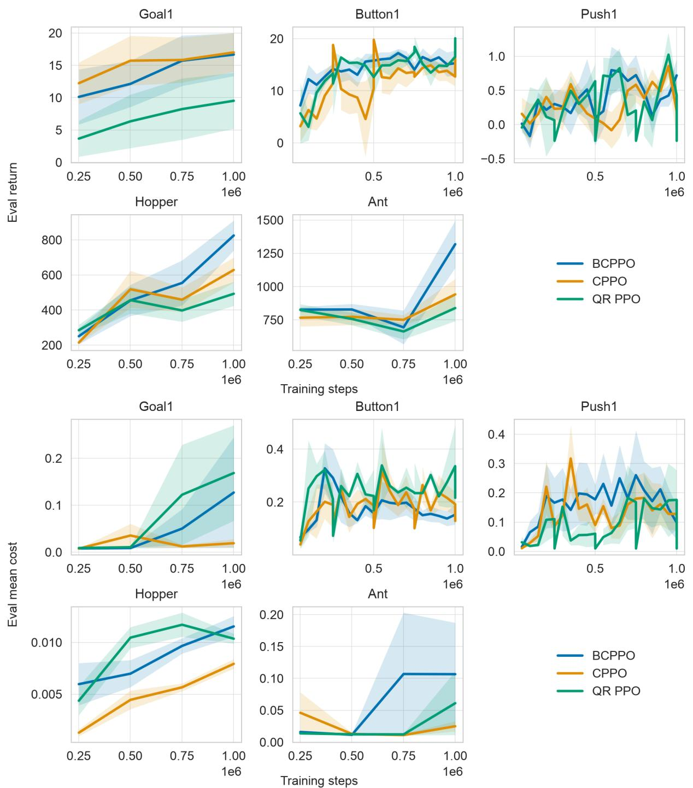  
Figure 3: Periodic main-experiment performance diagnostics: (a) return and (b) mean cost. The cost is the episode-average rate used by the main table.

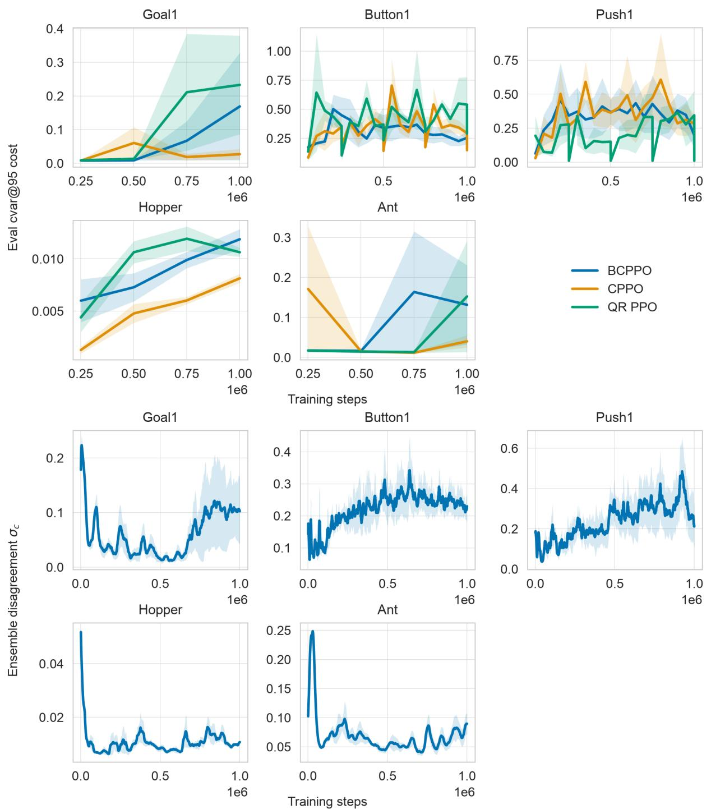  
Figure 4: Periodic risk diagnostics: (a) empirical CVaR@95 from each checkpoint’s recorded evaluation episodes and (b) BCPPO cost-critic disagreement. The disagreement scale is environment dependent.

<table><tr><td>Variant</td><td>Metric</td><td>Button1</td><td>Push1</td><td>Hopper</td></tr><tr><td rowspan="3">BCPPO</td><td>Return</td><td> $1 6 . 3 4 8 \pm 5 . 1 5 8$ </td><td> $0 . 1 4 9 \pm 0 . 3 4 2$ </td><td> $8 5 1 . 3 2 \pm 1 1 6 0 . 4 9$ </td></tr><tr><td>Cost</td><td> $0 . 2 8 5 \pm 0 . 2 5 6$ </td><td> $0 . 2 9 0 \pm 0 . 2 6 2$ </td><td> $0 . 0 0 7 \pm 0 . 0 0 5$ </td></tr><tr><td>CVaR@95</td><td> $0 . 4 1 4 \pm 0 . 3 2 5$ </td><td> $0 . 5 1 5 \pm 0 . 4 5 4$ </td><td> $0 . 0 0 7 \pm 0 . 0 0 5$ </td></tr><tr><td rowspan="3">no Bachelier</td><td>Return</td><td> $1 5 . 0 5 1 \pm 4 . 7 8 6$ </td><td> $0 . 7 9 9 \pm 0 . 1 8 3$ </td><td> $5 3 4 . 3 6 \pm 1 8 3 . 0 3$ </td></tr><tr><td>Cost</td><td> $0 . 2 1 6 \pm 0 . 1 5 2$ </td><td> $0 . 3 0 5 \pm 0 . 3 3 0$ </td><td> $0 . 0 0 9 \pm 0 . 0 0 6$ </td></tr><tr><td>CVaR@95</td><td> $0 . 3 5 6 \pm 0 . 2 0 4$ </td><td> $0 . 5 5 0 \pm 0 . 5 2 2$ </td><td> $0 . 0 0 9 \pm 0 . 0 0 6$ </td></tr><tr><td rowspan="3">uncertainty bonus</td><td>Return</td><td> $1 4 . 2 6 6 \pm 1 . 2 5 5$ </td><td> $0 . 0 6 9 \pm 0 . 5 5 0$ </td><td> $3 5 4 . 2 2 \pm 2 1 9 . 2 0$ </td></tr><tr><td>Cost</td><td> $0 . 3 5 8 \pm 0 . 1 7 5$ </td><td> $0 . 3 9 4 \pm 0 . 3 3 9$ </td><td> $0 . 0 0 7 \pm 0 . 0 0 4$ </td></tr><tr><td>CVaR@95</td><td> $0 . 5 4 1 \pm 0 . 2 4 0$ </td><td> $0 . 8 4 3 \pm 0 . 5 4 4$ </td><td> $0 . 0 0 7 \pm 0 . 0 0 4$ </td></tr><tr><td rowspan="3">no branch normalization</td><td>Return</td><td> $1 7 . 6 5 1 \pm 2 . 2 9 4$ </td><td> $0 . 0 7 3 \pm 0 . 2 7 0$ </td><td> $5 2 0 . 3 2 \pm 1 0 2 . 2 6$ </td></tr><tr><td>Cost</td><td> $0 . 1 2 2 \pm 0 . 0 0 9$ </td><td> $0 . 1 7 1 \pm 0 . 2 7 6$ </td><td> $0 . 0 1 1 \pm 0 . 0 0 2$ </td></tr><tr><td>CVaR@95</td><td> $0 . 2 3 4 \pm 0 . 0 5 4$ </td><td> $0 . 9 3 4 \pm 1 . 4 7 9$ </td><td> $0 . 0 1 1 \pm 0 . 0 0 2$ </td></tr><tr><td rowspan="3">no anti-windup</td><td>Return</td><td> $1 4 . 4 0 0 \pm 6 . 8 7 4$ </td><td> $0 . 3 9 8 \pm 0 . 4 3 8$ </td><td> $3 4 0 . 3 8 \pm 3 0 7 . 4 6$ </td></tr><tr><td>Cost</td><td> $0 . 4 5 2 \pm 0 . 1 7 0$ </td><td> $0 . 3 2 9 \pm 0 . 2 4 6$ </td><td> $0 . 0 0 8 \pm 0 . 0 0 7$ </td></tr><tr><td>CVaR@95</td><td> $0 . 6 6 8 \pm 0 . 1 6 5$ </td><td> $0 . 5 5 4 \pm 0 . 3 7 8$ </td><td> $0 . 0 0 8 \pm 0 . 0 0 8$ </td></tr></table>

Table 11: Component ablations at 500k steps over five seeds. “no Bachelier” sets $\beta = 0 ; { } ^ {  }$ “uncertainty bonus” moves disagreement to the reward branch; “no branch normalization” disables independent normalization; “no anti-windup” keeps the projected PID update but always accumulates its integral state.

This diagnostic does not compare two structural risk signals. At the defaults, $h ( c _ { 0 } ) \approx 0 . 0 1 4 4 6$ , so the same-β raw variant is approximately 69.2× stronger. Its lower mean SafetyPoint costs and lower Button1/Push1 CVaR therefore reflect a diferent operating scale. With $\beta _ { \mathrm { r a w } } = \beta h ( c _ { 0 } )$ , the two actor penalties are algebraically identical; no empirical superiority claim is made from this table.

<table><tr><td>Setting</td><td>Return</td><td>Cost</td><td>CVaR@95</td></tr><tr><td>Full BCPPO</td><td> $0 . 1 4 9 \pm 0 . 3 4 2$ </td><td> $0 . 2 9 0 \pm 0 . 2 6 2$ </td><td> $0 . 5 1 5 \pm 0 . 4 5 4$ </td></tr><tr><td> $\beta = 0 . 0 5$ </td><td> $0 . 1 9 4 \pm 0 . 3 5 0$ </td><td> $0 . 1 9 7 \pm 0 . 2 3 4$ </td><td> $0 . 4 1 1 \pm 0 . 4 0 9$ </td></tr><tr><td> $\beta = 0 . 1 0$ </td><td> $0 . 2 6 1 \pm 0 . 7 0 1$ </td><td> $0 . 0 7 5 \pm 0 . 0 6 8$ </td><td> $0 . 1 9 0 \pm 0 . 1 5 4$ </td></tr><tr><td> $\beta = 0 . 2 5$ </td><td> $0 . 2 9 8 \pm 0 . 5 7 5$ </td><td> $0 . 2 6 5 \pm 0 . 1 8 5$ </td><td> $0 . 7 3 5 \pm 0 . 5 4 0$ </td></tr><tr><td> $\beta = 0 . 4 0$ </td><td> $0 . 4 5 8 \pm 0 . 5 4 0$ </td><td> $0 . 1 7 3 \pm 0 . 1 3 0$ </td><td> $0 . 3 5 0 \pm 0 . 2 7 6$ </td></tr><tr><td> $\kappa = 0 . 0 0$ </td><td> $0 . 1 0 6 \pm 0 . 9 3 0$ </td><td> $0 . 1 6 9 \pm 0 . 1 3 3$ </td><td> $0 . 6 8 0 \pm 0 . 6 5 4$ </td></tr><tr><td> $\kappa = 0 . 1 0$ </td><td> $0 . 6 5 0 \pm 1 . 1 1 6$ </td><td> $0 . 1 0 8 \pm 0 . 1 0 3$ </td><td> $0 . 2 6 8 \pm 0 . 1 7 6$ </td></tr><tr><td> $\kappa = 0 . 3 0$ </td><td> $- 0 . 1 1 5 \pm 0 . 5 1 2$ </td><td> $0 . 0 8 2 \pm 0 . 1 0 7$ </td><td> $0 . 1 9 4 \pm 0 . 1 8 5$ </td></tr><tr><td> $\alpha = 0 . 9 0$ </td><td> $0 . 5 8 9 \pm 0 . 3 6 1$ </td><td> $0 . 1 5 3 \pm 0 . 1 8 8$ </td><td> $0 . 3 5 4 \pm 0 . 4 2 6$ </td></tr><tr><td> $\alpha = 0 . 9 9$ </td><td> $0 . 3 8 6 \pm 0 . 6 0 0$ </td><td> $0 . 1 9 7 \pm 0 . 2 1 0$ </td><td> $0 . 4 7 9 \pm 0 . 4 6 5$ </td></tr><tr><td> $M = 1$ </td><td> $0 . 5 9 9 \pm 0 . 2 6 3$ </td><td> $0 . 3 4 5 \pm 0 . 4 2 7$ </td><td> $1 . 2 7 5 \pm 1 . 6 0 2$ </td></tr><tr><td> $M = 3$ </td><td> $0 . 4 3 8 \pm 0 . 3 5 6$ </td><td> $0 . 1 8 2 \pm 0 . 1 4 2$ </td><td> $0 . 6 6 6 \pm 0 . 8 5 7$ </td></tr><tr><td> $M = 1 0$ </td><td> $0 . 5 0 6 \pm 0 . 3 7 2$ </td><td> $0 . 2 9 2 \pm 0 . 3 4 8$ </td><td> $0 . 5 1 8 \pm 0 . 5 2 5$ </td></tr></table>

Table 12: Efective-coeficient and ensemble-size sensitivity on Push1 at 500k steps over five seeds. Defaults are $\beta = 0 . 1 5 ,$ $\kappa = 0 . 1 5 , \alpha = 0 . 9 5$ , and $M = 5 ;$ the first three sweeps all change $\beta _ { \mathrm { e f f } } = \beta h ( \Phi ^ { - 1 } ( \bar { \alpha } ) + \kappa )$
<table><tr><td>Variant</td><td>Metric</td><td>Button1</td><td>Push1</td><td>Hopper</td></tr><tr><td></td><td>Return</td><td> $1 6 . 3 4 8 \pm 5 . 1 5 8$ </td><td> $0 . 1 4 9 \pm 0 . 3 4 2$ </td><td> $8 5 1 . 3 2 \pm 1 1 6 0 . 4 9$ </td></tr><tr><td>BCPPO</td><td>Cost</td><td> $0 . 2 8 5 \pm 0 . 2 5 6$ </td><td> $0 . 2 9 0 \pm 0 . 2 6 2$ </td><td> $0 . 0 0 7 \pm 0 . 0 0 5$ </td></tr><tr><td></td><td>CVaR@95</td><td> $0 . 4 1 4 \pm 0 . 3 2 5$ </td><td> $0 . 5 1 5 \pm 0 . 4 5 4$ </td><td> $0 . 0 0 7 \pm 0 . 0 0 5$ </td></tr><tr><td></td><td>Return</td><td> $1 4 . 1 2 4 \pm 7 . 9 5 6$ </td><td> $0 . 4 7 4 \pm 0 . 7 5 0$ </td><td> $6 1 0 . 4 0 \pm 2 5 6 . 3 5$ </td></tr><tr><td>raw  $\sigma _ { c }$ </td><td>Cost</td><td> $0 . 1 7 6 \pm 0 . 1 7 5$ </td><td> $0 . 2 4 5 \pm 0 . 1 3 7$ </td><td> $0 . 0 1 0 \pm 0 . 0 0 5$ </td></tr><tr><td></td><td>CVaR@95</td><td> $0 . 2 8 4 \pm 0 . 2 4 9$ </td><td> $0 . 4 2 7 \pm 0 . 1 8 7$ </td><td> $0 . 0 1 1 \pm 0 . 0 0 5$ </td></tr></table>

Table 13: Unmatched-scale Bachelier versus $\mathrm { r a w } { - } \sigma _ { c }$ diagnostic at 500k steps over five seeds. The $\mathrm { r a w } { - } \sigma _ { c }$ variant keeps the same ensemble, detached cost branch, normalization, anti-windup PID controller, and $\beta ,$ but replaces $\mathcal { R } _ { B }$ by $\sigma _ { c }$ . Since $\mathcal { R } _ { B } = h ( c _ { 0 } ) \sigma _ { c }$ this intentionally changes the efective coeficient by $1 / h ( c _ { 0 } )$

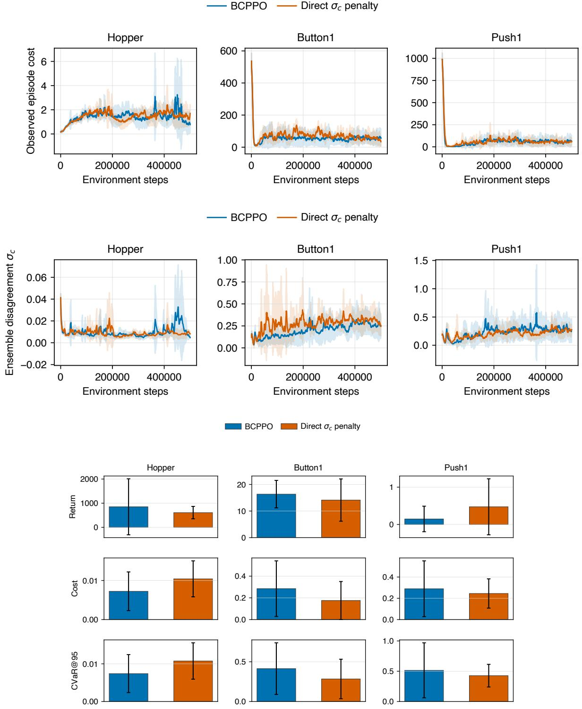  
Figure 5: Unmatched-scale Bachelier versus direct-σc diagnostic: (a) observed cost, (b) ensemble disagreement, and (c) 500kstep final evaluation. Training curves are five-seed mean±standard deviation with a 15-record rolling mean; final bars are mean±standard deviation over five seeds.

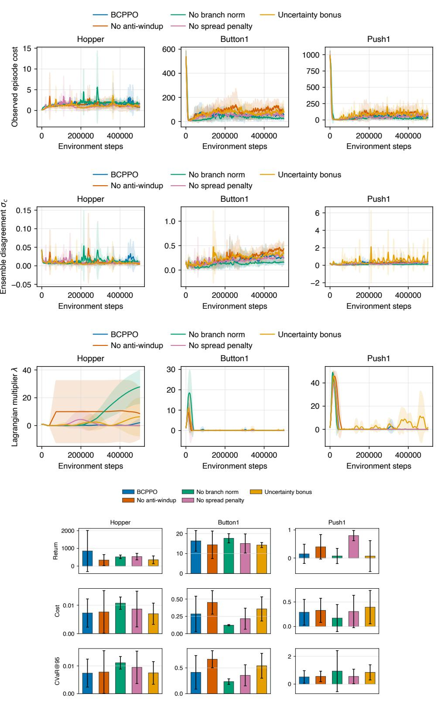  
Figure 6: Mechanism ablations: (a) observed cost, (b) ensemble disagreement, (c) multiplier λ, and (d) 500k-step final evaluation. Training curves are five-seed mean±standard deviation with a 15-record rolling mean; final bars are mean±standard deviation over five seeds.

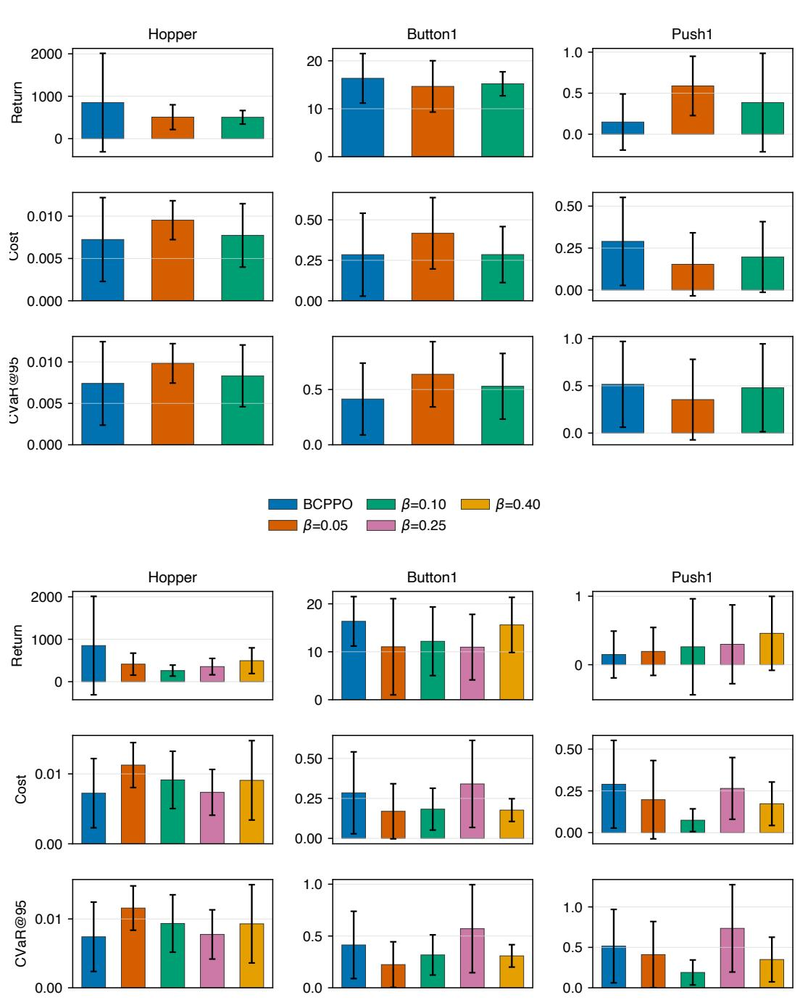  
Figure 7: Efective-coeficient sensitivity at 500k steps: (a) α and (b) β. Bars are five-seed mean±standard deviation.

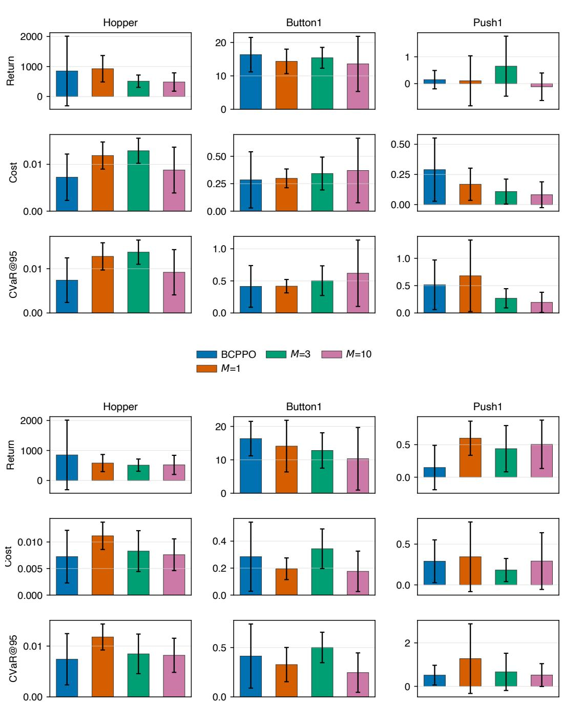  
Figure 8: Sensitivity at 500k steps: (a) κ and (b) ensemble size M. Bars are five-seed mean±standard deviation.