# Ceiling-Clipped Acceptance Histograms Indicate Stranded Speed-up in Block-Difusion Speculative Decoding

Ephrem Wu Advanced Micro Devices, Inc., USA

## Abstract

Speculative decoding speeds up generation using an eficient draft model (drafter) to propose tokens that a target model verifies in one pass, preserving the target’s output distribution. High-acceptance block-difusion drafters, such as DFlash and DFlare, fill an entire block in one parallel pass. In many cycles, the target accepts all draft tokens in the block, so the drafter exhausts its trained block horizon before verification ever fails, with no opportunity to ofer more tokens. We call this unrealized acceptance stranded speed-up. Evaluating a drafter by its per-prompt or per-cycle mean committed length alone hides this phenomenon, whereas the full acceptance histogram exposes this bottleneck as a spike in the ceiling bin, the fraction of cycles that accept the entire block. This spike is analogous to clipped highlights in a photograph, and a large spike suggests block-limited acceptance. We recommend studying the acceptance histogram as a preflight check before spending training compute. Naively widening the block at inference, however, does not recover the speed-up. Once the block outgrows its training size, the drafter’s bidirectional attention shifts its distribution even at early positions, which empirically erodes front-of-block verification. We therefore post-train the drafter to a longer block with a short curriculum that emphasizes the newly exposed positions, a method we call DBloom. Expanding the pretrained DFlash and DFlare drafters from block size 16 to 24 (B16 to B24) across Qwen3-8B and Qwen3-4B targets raises the per-prompt committed length on the high-ceiling benchmarks by a median of +0.8 tokens (up to +1.1 tokens). Once continuation fine-tuning precedes block expansion, the increase is up to 1.37 tokens. The same expansion recipe (without continuation fine-tuning) also raises committed length on all seven benchmarks for Gemma-4-12B-IT, a diferent model family, with a median gain of +0.41 tokens (Arm A). On that family we also run the full continuation-then-expand pipeline (Arm B), which raises committed length over the same B16 drafter by +0.29 to +0.98 tokens across the seven benchmarks. In a pairwise, promptmatched comparison against JetSpec, a contemporary, high-acceptance tree-based drafter not used in our design, DBloom’s committed length exceeds the JetSpec tree drafter’s on every benchmark at tree budgets up to 64 nodes.

## 1 Introduction

Speculative decoding drafts several tokens and verifies them in one target pass, yielding a provably identical distribution to the target’s (Leviathan et al., 2023; Chen et al., 2023). Open-weight autoregressive blockdifusion<sup>1</sup> (Arriola et al., 2025) drafters, such as DFlash (Chen et al., 2026) and DFlare (Zhang et al., 2026a), report a higher mean committed length, the tokens produced per target-and-drafter forward pass, than earlier autoregressive drafters such as EAGLE and EAGLE-3 (Li et al., 2024; 2025). We extend DFlash and DFlare to recover additional speed-up by analyzing their acceptance histograms, a method we call DBloom. Figure 1 shows the result.

In each decode cycle, a block-difusion drafter fills a small block of tokens in a single pass, of which the target accepts a verified prefix. Most evaluations in the literature summarize acceptance by its mean, which cannot distinguish a drafter that often fills the block from one repeatedly cut of at the block boundary, even though it could ofer more acceptable tokens. The per-cycle acceptance histogram can separate these cases because a spike in the ceiling bin, the fraction of cycles in which the target accepts the entire block, indicates that the target keeps accepting draft tokens until the drafter runs out of them. DBloom expands the block to uncap this stranded acceptance.

Committed length τ: Original B16 baselines vs our best (DBloom-DFlare Arm-B B24), Qwen3-8B  


Committed length τ: Original B16 baselines vs our best (DBloom-DFlare Arm-B B24), Qwen3-4B  
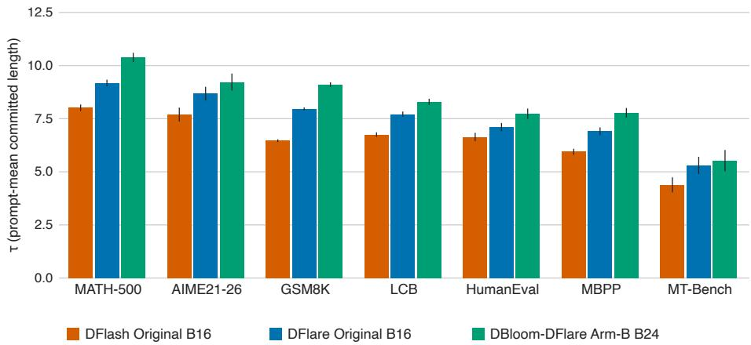

Committed length τ: Gemma-4-12B-IT, original DFlash and our DFlare B16 vs DBloom-DFlare Arm-B B24  
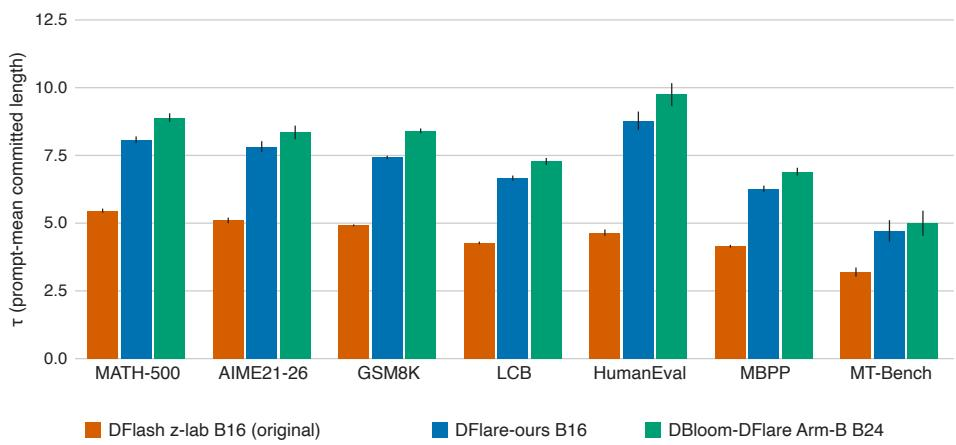  
Figure 1: Block-horizon expansion raises committed length across benchmarks. Per-benchmark prompt-mean committed length τ. Top and middle: the original DFlash and DFlare B16 drafters and our DBloom-DFlare Arm-B B24 drafter, on Qwen3-8B and Qwen3-4B. Bottom: the model-family check on Gemma-4-12B-IT, with the original DFlash and our DFlare B16 drafters against our DBloom-DFlare Arm-B B24. For Gemma-4-12B-IT, the DBloom efect is the DFlare B16 to Arm-B B24 change. The original DFlash bar is an external reference. The expanded drafter clears the baselines on the high-ceiling benchmarks and remains at or above baseline on the low-ceiling ones. Whiskers are 95% CIs.

Unfortunately, naively widening the difusion block at inference does not recover stranded acceptance (Section 3). Expansion improves speed-up only after retraining with a larger block, so a spike in the ceiling bin indicates that this retraining is worthwhile.

We make the following contributions.

1. The ceiling bin flags stranded speed-up. We show that the mean committed length obscures block-limited acceptance, which the acceptance histogram’s ceiling bin reveals. Writing Bk for a block size of k tokens, the ceiling-bin mass correlates with the acceptance gain from expanding the block from B16 to B24 (Spearman $\rho = + 0 . 8 8 \ \mathrm { t o \ + 0 . 9 3 } )$ . We report this result as an indicator that ranks benchmarks by expected gain, noting that the evidence is in-sample and confined to Qwen3-8B and 4B using DFlash and DFlare drafters (Qwen Team, 2025; Chen et al., 2026; Zhang et al., 2026a), with a diferent model-family check on Gemma-4-12B-IT (Gemma Team, 2026).

2. A curriculum that expands the block horizon with about 1% more training data. Once a B16 drafter is trained, widening its horizon to B24 with a horizon-weighted loss over only about 30K expansion prompts raises the per-prompt committed length by a median of +0.8 tokens (up to +1.1) on the high-ceiling benchmarks. That expansion corpus is 1.0% of the DFlare training budget and 2.0% of the DFlash budget, counting the drafter’s own pretraining.

3. A linear block of 24 matches a 256-node tree in committed length. As an out-of-design check, we compare our DBloom-expanded drafters against JetSpec, a concurrent, high-acceptance tree-based decoder we did not use to design DBloom. On Qwen3-8B, in a prompt-matched paired comparison our best DBloom-DFlare drafter shows no statistically significant committed-length loss to JetSpec at any tree budget, up to its 256-node maximum (Section 6.3).

## 2 Background and related work

Draft-model families and our baselines. Speculative-decoding drafters split into autoregressive and block-difusion families. On the autoregressive side, EAGLE autoregressively predicts the target’s secondto-top-layer features, whereas EAGLE-3 predicts tokens directly from fused multi-layer features (Li et al., 2024; 2025). Both methods raise acceptance well above that of the original speculative decoders (Chen et al., 2023; Leviathan et al., 2023), but retain sequential dependence across draft depth. Domino combines a parallel drafter backbone with a lightweight sequential causal-correction head, retaining causal dependence while greatly reducing the cost of autoregressive draft execution (Huang et al., 2026). JetSpec (Hu et al., 2026) trains a causal parallel draft head on the target’s fused hidden states and produces a path-conditioned candidate tree in a single forward pass. It uses a tree-causal attention mask so each node depends on its ancestor tokens along the branch. Since the tree is drafted in one parallel pass, increasing the node budget mostly increases tree-selection and target-verification work instead of adding autoregressive draft depth. We compare against this method as a strong parallel tree-drafting baseline, and Section 6.3 shows that our linear B24 drafter achieves comparable or higher committed length in our evaluation. Block-difusion drafters instead build on the block-difusion language model framework (Arriola et al., 2025), which denoises a sequence in blocks with parallel sampling. Applied to speculative decoding, DFlash (Chen et al., 2026) and DFlare (Zhang et al., 2026a) reserve position 0 of each decode block as an anchor, the bonus token the target committed last cycle, denoise the other B−1 positions in one pass, and let the target accept a prefix of length n, $0 \leq n \leq B - 1$ , before committing the next anchor.

We test DBloom on two high-acceptance block-difusion drafters, the original DFlash and DFlare drafters, and compare it against JetSpec, the strongest tree-based decoder in our setting. DFlash is weaker than DFlare, at least in the evaluated Qwen3 settings, but is the better-known, peer-reviewed drafter, so we expand it as well. The DFlash authors have already examined the signal we build on. Their Table 8 reports that a block-8 drafter fully accepts the block 35.7% of the time on MATH-500, which they interpret as evidence that the block horizon is too short in many cycles. They train a separate drafter for each block size, however, and find that a drafter generalizes to a smaller inference block but not a larger one, leaving adaptive block sizing to future work. We instead turn the full-block fraction into a cross-benchmark indicator of whether the block size limits acceptance (Section 4.1), and recover the lost acceptance by post-training an original drafter to the larger block with little added data (Section 4).

Table 1: Naive block expansion loses speed-up, one row per drafter cell. Each committed-length τ is the mean over the seven benchmarks for the native B16 drafter, the same drafter run at B24 with no training (naive), and the Arm-A B24 expansion (trained). The trained B24 exceeds the native B16, which exceeds the naive B24, on every benchmark and in the mean. The speed-up $\Delta$ under each B24 state is its mean signed relative speed-up change against the native B16, negative for naive on every cell and steepest at 4B, positive for trained. Per-benchmark numbers are in Appendix H.4, and the mechanism (front erosion versus uncapped gain) in Table 10.
<table><tr><td rowspan="2">drafter</td><td rowspan="2">native B16 T</td><td colspan="2">naive B24</td><td colspan="2">trained B24</td></tr><tr><td>T</td><td>speed-up ∆</td><td>T</td><td>speed-up ∆</td></tr><tr><td>DFlare-8B</td><td>7.48</td><td>7.28</td><td>-2%</td><td>8.11</td><td>+7%</td></tr><tr><td>DFlare-4B</td><td>7.54</td><td>3.45</td><td>-52%</td><td>7.99</td><td>+5%</td></tr><tr><td>DFlash-8B</td><td>6.54</td><td>6.27</td><td>-4%</td><td>7.02</td><td>+5%</td></tr><tr><td>DFlash-4B</td><td>6.55</td><td>4.43</td><td>-33%</td><td>6.94</td><td>+5%</td></tr></table>

Scaling the draft budget. A separate line increases acceptance by spending more draft budget per step. JetSpec grows its candidate tree to as many as 256 nodes to increase committed length, leaving open whether the original drafter is already throttled by its block size. DDTree is the block-difusion counterpart of this idea, constructing a draft tree from a block-difusion drafter’s per-position distributions and selecting, under a fixed node budget, the continuations most likely to match the target (Ringel & Romano, 2026). The two methods pull diferent levers. DDTree spends more budget as a tree at a fixed block size, whereas we expand the block horizon by retraining and keep a linear budget of 24. The methods remain complementary since a horizon-expanded drafter could itself be drafted as a tree. Two concurrent works refine this budget lever in ways that complement our horizon expansion. CaDDTree argues that acceptance length alone cannot justify a node budget, and instead selects tree structure and budget to optimize throughput directly, modeling draft and verification latency per round (Zhang et al., 2026b). Our indicator addresses a complementary upstream decision, whether retraining to enlarge the block horizon is worthwhile. After such expansion, a CaDDTree-style method could still optimize tree structure and node budget at inference. BASTION builds query-dependent trees over a block-difusion drafter under a latency budget (Oh et al., 2026). Like CaDDTree, it keeps the trained block fixed and varies the tree, so it applies on top of the wider block we train.

## 3 Why naive block expansion rarely increases speed-up

If a large ceiling bin of a block-difusion drafter’s histogram indicates the block is the bottleneck, the obvious next step is to increase the block size at inference without retraining. In every cell we measured, doing so reduced speed-up.

Table 1 measures this across benchmarks and target sizes. As naive B24 loses speed-up, the ceiling-bin mass drops to near zero everywhere (the native and naive ceiling columns of Table 10). On the 8B targets, accepted length barely changes, and speed-up drops by only a few percent because the larger drafter still predicts most of the block. On the 4B targets, the front rarely survives to the old boundary, so almost no mass reaches the new positions, and speed-up falls sharply (DFlare Qwen3-4B on MATH-500 from 6.5× to 3.0×, a 54% drop in speed-up).

Naive expansion raises committed length on no cell. On the 8B target, a modest ceiling survives past the old boundary, so committed length stays about flat (DFlare Qwen3-8B on MATH-500, $E [ n ] + 1$ dips only from 9.0 to 8.7), whereas on the 4B target the ceiling vanishes and committed length drops (8.8 to 4.1 on MATH-500). Even where the 8B committed length barely moves, speed-up still falls (MATH-500 6.5× to 6.4×) because each cycle costs more and the front erodes.

A block-difusion drafter fills a block in one pass, so a B16 drafter has learned only to unmask a B16 horizon. Run it at B24, and the proposal distribution shifts even at early positions. Empirically, front-of-block verification then erodes. The front of the block therefore sets the committed length, and if an early position fails, the tail never matters. Reliable gains therefore require retraining at the larger block.

## 4 Method

The original DFlash and DFlare drafters are B16. Our method, DBloom, post-trains them to B24, guided by a quick diagnostic that indicates where a larger block will boost acceptance. It inspects the acceptance histogram the original drafter already produces, so it costs one evaluation pass and no training. We start there, then turn to the curriculum that acts on the positions the diagnostic flags.

## 4.1 The acceptance histogram and its ceiling bin

Most evaluations of block-difusion drafters report the mean committed length and little about its distribution. We instead record the full per-cycle acceptance histogram, the empirical distribution of $n \in$ $\{ 0 , 1 , \ldots , B { - } 1 \}$ across decode cycles. The bin at $n = B { - } 1$ is the ceiling bin, the cycles where the target accepts all B−1 draft tokens, and its mass is the block-ceiling fraction.

The ceiling bin is the rightmost bin, and a spike there indicates acceptance is ceiling-clipped. A cycle ends for one of two reasons. When acceptance stops at some $n < B { - } 1$ , the target has rejected a proposed token and discarded the remaining draft tokens. When it reaches $n = B { - } 1$ , no rejection has occurred within the ofered horizon, and the block boundary ends the cycle and censors the count at B−1. A large ceiling bin therefore shows that the original drafter is block-limited and that enlarging the block can recover the clipped acceptance. Appendix F makes this precise, expressing accepted length as a censored sum whose ceiling mass is the clipped part.

We measure this ceiling bin on the original drafter before spending training compute, and a high ceiling indicates where expansion is likely to boost acceptance. Where the ceiling is high, the block is the binding constraint, so expanding the drafter to a larger block converts ceiling-bin mass into longer accepted prefixes. Where it is low, the block rarely limits acceptance, so expansion has little to recover, and we leave those low-ceiling domains out of the expansion corpus (Section 5). Expansion still produces one B24 drafter that we evaluate on every benchmark, so the ceiling bin indicates where a drafter gains from expansion. Section 6 quantifies how well the baseline block-ceiling fraction tracks the realized gain.

## 4.2 Curriculum post-training and the two arms

Section 3 showed that running the original B16 drafter at B24 without retraining loses speed-up, so posttraining is a prerequisite for expansion. When the indicator points to expansion, DBloom post-trains the original drafter. We initialize from the original B16 weights and fine-tune at B24, so the positions the B16 drafter already learned (block ofsets 1 through 15) start from a competent drafter, and the eight new tail positions (ofsets 16 through 23) must be learned. The drafter conditions on the target’s fused hidden states, which are independent of the block size, so the same target responses can label a drafter at any block size. Both steps train on self-distilled prompts and target responses drawn from the separate corpora of Table 2.

We use a two-level (flat-step) horizon weighting on the cross-entropy against the target’s argmax token IDs, with weight 1 on the old positions and a 3× boost on all eight new tail positions, with no decay across the block. This weighting focuses the gradient on the new tail without disturbing the trained front. An ablation over six per-position weighting schemes (Appendix B) finds that the weighting does not move committed length. Acceptance halts at the first mismatch, so the front of the block decides the result, and no tail reweighting can fix it. The flat step is therefore the simplest weighting that trains the new positions.

We reach the expanded B24 drafter by one of two arms that share this short curriculum, corpus, and knobs and difer only in the starting point. Arm A applies the expansion above to the original B16 drafter in a single post-training step. Arm B first runs a B16 continuation fine-tune to strengthen the domains the original corpus under-represented, then expands that continued drafter with the same step as Arm A. DBloom is a horizon-expansion operator. It takes whatever B16 drafter it is given, reads that drafter’s acceptance histogram, and applies the same 30K-prompt expansion. The two arms difer only in the drafter handed to that operator. Arm A expands the original checkpoint directly, which tests data-eficient expansion of a public model. Arm B first strengthens the drafter with a same-block continuation, then expands the result, which tests whether the horizon still limits acceptance once the native-block drafter is stronger. We therefore judge each expansion against the drafter it actually expands. The incremental efect of DBloom is the gain over its input B16 (the original B16 for Arm A, the continuation-trained B16 for Arm B), while the gain over the original B16 is the end-to-end system result.

## 5 Experimental setup

## 5.1 Evaluation design

We evaluate a controlled two-by-two grid of two original block-difusion drafter architectures, DFlash (Chen et al., 2026) and DFlare (Zhang et al., 2026a), each paired with two targets, Qwen3-8B and Qwen3-4B. Crossing drafter architecture with target scale means that a finding that remains valid across all four cells is less likely to be an artifact of one drafter or one target size. Qwen3 is our controlled grid. We additionally check that the expansion recipe and the ceiling indicator transfer to a diferent model family, Gemma-4-12B-IT (Section 6.2). We do not claim that they apply universally.

Alongside this grid, we compare against JetSpec (Hu et al., 2026), a concurrent tree-based drafter, as an out-of-design check. We designed DBloom from the DFlash and DFlare acceptance histograms alone, so JetSpec tests the expanded drafters against a method we did not use to build them. JetSpec releases a single Qwen3-8B draft head, so this comparison is on Qwen3-8B, and we run it at each of its tree-node budgets (Section 6.3).

We do not transcribe reported values and evaluate every drafter ourselves under one consistent protocol, so all comparisons are internally consistent. All decoding is greedy at temperature zero, with a maximum generation length of 16,384 tokens. Every number we report is computed on the full test set. The benchmarks and their full sizes are GSM8K (1,319), MATH-500 (500), the AIME21-26 competition-math set (179), HumanEval (164), MBPP (257), LiveCodeBench (1,055), and MT-Bench (80).

Because we evaluate the original drafters ourselves, we are not tied to the 30-problem AIME25 subset the source papers quote, and the larger AIME21-26 set yields tighter acceptance estimates. Accuracy contamination is not the quantity we measure as committed length depends only on how well the drafter tracks the target on a given prompt.

## 5.2 Metric conventions

We report two committed-length summaries per decode cycle and keep them distinct throughout. Let a prompt p run $c _ { p }$ decode cycles with accepted counts $n _ { p , 1 } , . . . , n _ { p , c _ { p } }$ , and let $\begin{array} { r } { \bar { n } _ { p } = \frac { 1 } { c _ { p } } \sum _ { i } n _ { p , i } } \end{array}$ be its perprompt mean accepted count. Over $P$ prompts,

$$
\tau = 1 + \frac { 1 } { { \cal P } } \sum _ { p } \bar { n } _ { p } , \qquad E [ n ] + 1 = 1 + \frac { \sum _ { p } \sum _ { i } n _ { p , i } } { \sum _ { p } c _ { p } } .\tag{1}
$$

Each counts the tokens the target commits per cycle, namely the n accepted draft tokens plus the one bonus token, so we call τ the prompt-mean committed length and $E [ n ] { + } 1$ the cycle-mean committed length. This per-cycle count is the standard speculative-decoding throughput measure (Leviathan et al., 2023; Chen et al.,

Table 2: The two arms (left) and their training corpora (right). Both arms reach a B24 drafter from the same original B16 drafter and share the identical B24 expansion, so the only diference is Arm B’s same-block B16 continuation.  
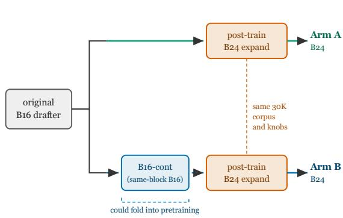

<table><tr><td>Step</td><td>Source domains</td><td>Prompts</td></tr><tr><td colspan="2">Arm A, and Arm-B step 2: from B16 to B24</td><td></td></tr><tr><td rowspan="3">math code total</td><td>OpenMathInstruct-2</td><td>20,000</td></tr><tr><td>rStar-Coder (long competitive)</td><td>10,000</td></tr><tr><td></td><td>~30,000</td></tr><tr><td colspan="2">Arm-B step 1: B16 continuation</td><td></td></tr><tr><td>math</td><td>OpenMathInstruct-2</td><td>250,000</td></tr><tr><td>code</td><td>opc-sft-stage2, rStar-Coder, OpenCodeInstruct</td><td>300,000</td></tr><tr><td>STEM</td><td>Nemotron-v2 STEM (replay)</td><td>60,000</td></tr><tr><td>chat</td><td>Nemotron-v2 chat (replay)</td><td></td></tr><tr><td>total</td><td></td><td>60,000 ~670,000</td></tr></table>

2023). The two metrics difer only in weighting. τ takes the prompt as the statistical unit, while $E [ n ] { + } 1$ averages over all cycles equally. They can diverge by more than a token, most often with $E [ n ] + 1$ below τ when long generations draft poorly, so we report both statistics and keep them separate. Appendix E provides the exact identity and real examples. Every reported value carries a 95% bootstrap confidence interval resampled at the prompt level (a per-prompt-mean bootstrap for τ , a cluster/ratio bootstrap for $E [ n ] { + } 1 )$ . We report the speed-up we measured directly as the ratio of target-only to speculative per-token latency.

Acceptance is measured over EOS-terminated responses. A response that never emits an end-ofsequence (EOS) token runs to the generation-length cap, usually by repeating a phrase. A repeated phrase is easy to predict, so the drafter accepts near the block ceiling and inflates acceptance on the benchmarks where these runaways occur. We therefore compute $\tau , E [ n ] + 1$ , and the block-ceiling fraction over only the EOS-terminated responses. How many responses a run keeps depends on its target, drafter, and decoding temperature, and in our runs the drop concentrated on competition math. The most-filtered cell we observed kept 111 of 179 responses on AIME21-26, 476 of 500 on MATH-500, and 976 of 1055 on LiveCodeBench, and nearly all responses on the four short-generation benchmarks. Speed-up is unafected as it is a decode-timing measurement.

## 5.3 Training data by arm and step

Both arms start with the original B16 drafter and then post-train it. All corpora are self-distilled, so the target regenerates its own responses, and the DFlash and DFlare drafters for a given target share a single corpus per step. Each corpus includes one response for each unique English-only prompt, and is decontaminated against the evaluation sets using 32-gram matching.

The Arm-A expansion and the identical step-2 expansion in Arm B use a 30K-prompt corpus drawn exclusively from high-ceiling domains, since block expansion adds acceptance only where the B16 drafter already saturates the block. We exclude short-form code because its low block ceiling means expansion does not improve committed length.

The Arm-A expansion uses a two-level (flat-step) horizon-weighted loss with boundary 16, a 3× boost on the new tail positions, no decay, a learning rate of $1 \times 1 0 ^ { - 5 }$ , four epochs, and a global batch size of 64. The Arm-B continuation is a same-block (B16) fine-tune at a learning rate of $5 \times 1 0 ^ { - 5 }$ for two epochs, with the STEM and chat slices acting as anti-forgetting replay so that strengthening weak domains does not erode domains the original drafter already handled well. Arm-B step 2 then reuses the Arm-A expansion corpus and knobs, changing only the initialization. Because this continuation stays at the native B16 horizon and only rebalances under-represented domains, the original DFlash and DFlare authors could have folded an equivalent step into their own pretraining before releasing a B16 drafter.

Block-horizon expansion is cheaper than building the B16 drafter it starts from. The ∼30K expansion corpus in Table 2 is 1.2% of the ∼2.4M prompts that trained DFlare and 3.8% of the ∼800K that trained DFlash (Zhang et al., 2026a; Chen et al., 2026). Treating the continuation-trained B16 as the model we actually expand, and counting its full training budget (original pretraining plus our ∼670K same-block continuation), the same 30K expansion is 1.0% of the DFlare budget and 2.0% of the DFlash budget. Training the initial block size is expensive, but widening it to recover committed length costs about one to two percent more samples, and is always a fine-tune of an existing B16 drafter. A control confirms the wider block, rather than the extra 30K data, drives the gain. Post-training the original B16 drafter on the same corpus at block size 16 adds only +0.05 to +0.21 tokens, versus +0.26 to +1.02 for the full B24 expansion (Appendix C, Qwen3-8B DFlare). For Qwen3 that B16 drafter is the original checkpoint. For Gemma-4-12B-IT, for which no original DFlare drafter exists, we first trained the B16 DFlare drafter ourselves and then applied the same expansion. We compare against DFlare as the stronger architecture (the DFlare authors ablate the two at a matched data budget and DFlare still wins (Zhang et al., 2026a)) and report DFlash as a second architecture to show the expansion also lifts a weaker base drafter.

## 5.4 Reproduction gate

As an external reference, we compare our B16 evaluation with the source papers’ (DFlash and DFlare) published acceptance for the original drafters. For each cell with a published value, we record our τ with its 95% bootstrap confidence interval and whether the published value falls within that interval (Appendix H.4). The source papers evaluate under a shorter generation-length cap, whose efect Appendix H.3 isolates. A published value outside our interval reflects that protocol diference. For competition math, the AIME21-26 set we report elsewhere has no published counterpart, so the reference row uses the source papers’ AIME25, which we also evaluate.

## 5.5 Losslessness

Greedy speculative decoding commits exactly the token the target would select at each step, so block-horizon expansion changes only the drafter and therefore only decoding speed. The greedy argmax is not bit-identical across implementations, though, since batching and floating-point reduction order can flip a near-tie and shift where a run reaches end-of-sequence, so EOS-terminated counts vary slightly across runs. We therefore compute τ and $E [ n ] + 1$ over only the EOS-terminated responses, which the runaways would otherwise distort (Section 5.2, Appendix G).

## 6 Results

We present three results corresponding to our three contributions. The ceiling bin indicates where expansion can recover acceptance (Section 6.1). Data-eficient block-horizon expansion increases acceptance and speedup on the high-ceiling benchmarks across the grid (Section 6.2). In a prompt-matched paired comparison the resulting B24 DBloom drafters show no statistically significant committed-length loss to JetSpec at any tree budget up to 256 (Section 6.3). The full per-benchmark tables for all four cells and both arms are in Appendix H.4. Unless noted otherwise, the summary here compares our best configuration, the DBloom-DFlare Arm-B B24 drafter, against the original B16 drafter.

Our evaluation reproduces the source papers’ published B16 acceptance closely on the short-generation benchmarks, where the evaluation protocols coincide. The larger gaps are confined to long-generation math and follow from our longer generation-length cap. Every conclusion below is a comparison at a fixed decoding budget, so it is valid regardless of how our absolute numbers compare with the published ones. Instead of comparing averages, we test whether each published value falls within our 95% bootstrap interval. Appendix H.3 presents the per-cell reproduction tables, the percentage gaps, and a matched-protocol control that isolates the cap.

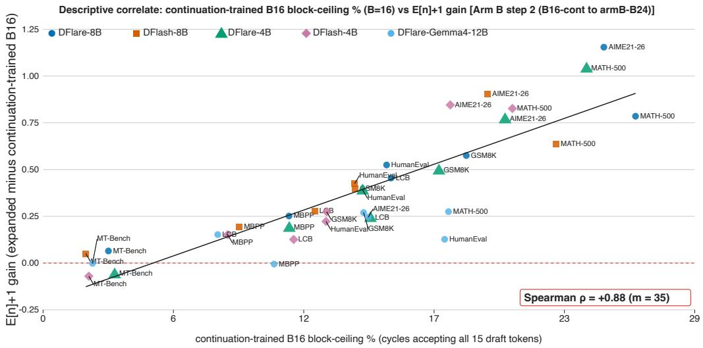  
Figure 2: The block-ceiling indicator. Pre-expansion block-ceiling fraction of the continuation-trained B16 drafter (x) versus the cycle-mean $E [ n ] + 1$ gain of the Arm-B B24 expansion (y), one point per drafterbenchmark pair across the four Qwen cells and the Gemma-4-12B-IT cell, annotated with the Spearman rank correlation.

Table 3: Spearman rank correlation between the pre-expansion block-ceiling fraction and the realized committed-length gain (35 points per arm, one per cell and benchmark across the four Qwen cells and the Gemma-4-12B-IT cell). These points share only about five independent drafters, so we report the rank correlation as a descriptive in-sample summary and omit a nominal confidence interval. A point-resampled interval would assume an independence the data do not have, and a drafter-clustered interval over five units would be too wide to be informative. The association stands whether the gain is the cycle-mean $E [ n ] + 1$ (Figure 2) or the prompt-mean τ.
<table><tr><td>Gain scored by</td><td>Arm A</td><td>Arm B</td></tr><tr><td>E[n]+1 (cycle-mean)</td><td>+0.89</td><td>+0.88</td></tr><tr><td>τ (prompt-mean)</td><td>+0.88</td><td>+0.93</td></tr></table>

## 6.1 The ceiling bin ranks where expansion gains most acceptance

The ceiling-bin fraction tracks the gain from expansion. A benchmark whose original drafter spends more cycles filling the whole block gains more committed length once we widen the block (Figure 2). We form one point per drafter-benchmark pair. Both arms include the four Qwen cells and the Gemma-4-12B-IT cell, one point per cell and benchmark, 35 in all. We plot the committed-length gain against each drafter’s preexpansion block-ceiling fraction. The Spearman rank correlation is high for both arms (Table 3). We score the gain by the cycle-mean $E [ n ] + 1$ , which aligns with the ceiling bin by construction since both count per cycle. The prompt-mean τ shows a comparably high correlation, which Table 3 presents since the DFlash, DFlare, and JetSpec papers report τ .

The ceiling fraction orders benchmarks by expected gain, so we use it as an indicator. Appendix H.1 presents the per-arm scatters and the within-cell correlations.

## 6.2 Expansion raises acceptance and speed-up across the grid

We evaluate two claims separately. Arm A tests the 30K-prompt data-eficiency claim, while Arm B shows the best attainable result after an additional same-horizon continuation. Block-horizon expansion boosts committed length and speed-up on the high-ceiling benchmarks across all four cells, and the short 30Kprompt recipe captures those gains. Figure 1 (top and middle panels) shows per-benchmark τ for the original

DFlash and DFlare B16 drafters alongside our best DBloom-DFlare Arm-B B24 drafter, on Qwen3-8B and Qwen3-4B. The expanded drafter clears both baselines by a wide margin on the high-ceiling benchmarks and remains at or just above baseline on the low-ceiling ones, consistent with the pattern the ceiling fraction anticipates. At the smaller 4B scale, the same pattern applies, though the ordering among the high-ceiling benchmarks is not strict (GSM8K gains more than AIME21-26).

Table 4: Expansion gain across all seven benchmarks (per-prompt committed length τ, EOS-terminated prompts). The original B16 drafter is the original DFlare model (Zhang et al., 2026a), Cont B16 is our continuation-trained B16 drafter, and Arm-B B24 is our DBloom expansion of Cont B16. The first $\Delta \tau$ is the B24-expansion gain over Cont B16, which is the y-axis of Figure 9. The second is the full-pipeline gain over the original B16. Per-stage tables for both arms, with 95% confidence intervals, are in Appendix H.
<table><tr><td rowspan="2">Benchmark</td><td colspan="5">Qwen3-8B</td><td colspan="5">Qwen3-4B</td></tr><tr><td>Original B16 T</td><td>Cont B16 T</td><td>Arm-B B24 T</td><td> $\Delta \tau$  (over Cont B16)</td><td> $\Delta \tau$  (over Original B16)</td><td>Original B16 T</td><td>Cont B16 T</td><td>Arm-B B24 T</td><td> $\Delta \tau$  (over Cont B16)</td><td> $\Delta \tau$  (over Original B16)</td></tr><tr><td>GSM8K</td><td>7.86</td><td>8.41</td><td>9.23</td><td>+0.82</td><td>+1.37</td><td>7.96</td><td>8.45</td><td>9.10</td><td>+0.65</td><td>+1.14</td></tr><tr><td>MATH-500</td><td>9.17</td><td>9.42</td><td>10.54</td><td>+1.12</td><td>+1.37</td><td>9.18</td><td>9.30</td><td>10.39</td><td>+1.08</td><td>+1.21</td></tr><tr><td>AIME21-26</td><td>8.63</td><td>8.53</td><td>9.58</td><td>+1.05</td><td>+0.95</td><td>8.68</td><td>8.50</td><td>9.22</td><td>+0.72</td><td>+0.55</td></tr><tr><td>HumanEval</td><td>7.07</td><td>7.33</td><td>7.93</td><td>+0.59</td><td>+0.86</td><td>7.10</td><td>7.29</td><td>7.74</td><td>+0.45</td><td>+0.63</td></tr><tr><td>MBPP</td><td>6.77</td><td>7.41</td><td>7.72</td><td>+0.31</td><td>+0.94</td><td>6.91</td><td>7.49</td><td>7.78</td><td>+0.29</td><td>+0.87</td></tr><tr><td>LCB</td><td>7.84</td><td>8.05</td><td>8.71</td><td>+0.65</td><td>+0.87</td><td>7.71</td><td>7.89</td><td>8.29</td><td>+0.40</td><td>+0.58</td></tr><tr><td>MT-Bench</td><td>5.00</td><td>5.11</td><td>5.38</td><td>+0.27</td><td>+0.38</td><td>5.30</td><td>5.37</td><td>5.53</td><td>+0.16</td><td>+0.23</td></tr></table>

Table 4 presents the gains numerically for all seven benchmarks per cell, separating DBloom’s incremental efect (the expansion over its input B16) from the end-to-end system gain (over the original B16). Across the grid, the full DBloom-DFlare Arm-B pipeline raises $\tau$ by 0.23 to 1.37 tokens over the original B16 drafter end to end, of which the 30K-prompt B24 expansion contributes the “over Cont $\mathrm { B 1 6 ^ { \circ } }$ column. Arm A shows the same expansion applied directly to the original checkpoint. Within each fixed target-drafter pair, cycle-mean committed length tracks measured decode-only speed-up with high fidelity (Appendix E, Table 9). The cycle-mean $E [ n ] + 1$ rises with τ on those high-ceiling cells. The two statistics can still diverge on a low-ceiling benchmark. On MT-Bench, a few 4B cells raise $\tau$ while $E [ n ] + 1$ dips slightly because long generations that draft poorly pull the cycle-mean below the per-prompt one (the divergence of Appendix E). We therefore report both statistics per cell without claiming that they track each other.

The gain extends beyond this best configuration. Aggregating all four cells and both arms over the three high-ceiling benchmarks yields $4 \times 2 \times 3 = 2 4$ comparisons. Judged against the drafter each B24 actually expands (Arm A over the original B16, Arm B over the continuation-trained B16), the median $\Delta \tau \ \mathrm { i s } + 0 . 8$ (up to +1.1). Judged end to end against the original B16, the median is +1.0 (up to +1.7). A Holm correction over either family (Appendix H.2) leaves all 24 significantly positive with zero significantly negative.

The picture difers on the low-ceiling benchmarks, where the ceiling fraction indicates little room for expansion. There, the Arm-A expansion yields only small gains, and the smallest is within noise. On DFlash Qwen3-4B, the MBPP $\Delta \tau$ is +0.07 [-0.01, +0.14] (ns), an interval that includes zero, so we report it as no measurable change. Arm B lifts these benchmarks more, but that gain comes almost entirely from the B16 continuation. On MBPP for DFlash Qwen3-8B, the continuation supplies +0.80 of $\tau$ while the B24 expansion adds only +0.21. This matches the indicator, which tracks the incremental value of a wider block instead of the domain-rebalancing continuation. Appendix H.4 shows the per-cell and per-arm numbers, with the paired interval for every comparison.

To test whether the expansion result is specific to Qwen3, we run the identical Arm-A recipe on Gemma-4-12B-IT, a diferent model family and a larger target. The same short expansion lifts committed length on all seven benchmarks (median $\Delta \tau = + 0 . 4 1$ , from +0.09 to +0.73, every interval above zero), and the ceiling indicator applies within the new cell (within-benchmark Spearman $\rho = + 0 . 8 6$ , above the two-tailed

5% critical value for seven benchmarks). Folding Gemma-4-12B-IT into the Arm-A correlation leaves it unchanged (Spearman $\rho = + 0 . 8 8 )$ . Appendix H.4 shows the per-cell numbers.

The continuation-then-expand Arm-B pipeline also transfers to Gemma-4-12B-IT. Preceding the same B24 expansion with a same-block continuation raises the Arm-B B24 committed length over the DFlare-Gemma B16 drafter by +0.29 to +0.98 tokens across the seven benchmarks, and the ceiling indicator applies within this Arm-B cell as well (within-benchmark Spearman $\rho = + 0 . 6 4 )$ . Folding Gemma-4-12B-IT into the Arm-B correlation leaves it high (Spearman $\rho = + 0 . 9 3$ over 35 points). Our from-scratch DFlare-Gemma is far stronger than z-lab’s DFlash-Gemma drafter for the same target, by +1.8 to +5.1 tokens of committed length at Arm-B B24, though this reference gap reflects our larger training budget as much as the drafter, so we view it as a reference point rather than a matched comparison. Table 18 reports both arms against the DFlash-Gemma reference.

The same indicator that motivates expansion also tells us where to stop. The per-cell tables in Appendix H.4 show the block-ceiling fraction falling from its high pre-expansion values on the high-ceiling benchmarks to a few percent at B24, so the B24 drafter rarely fills this wider block. With little ceiling-bin mass left to convert, our diagnostic flags little speed-up headroom, so we stop at B24 and leave larger blocks, where a longer curriculum might revive the ceiling, to future work.

## 6.3 A linear budget of 24 keeps pace with a 256-node tree in committed length

Against JetSpec’s largest 256-node tree, DBloom-DFlare Arm B is ahead on five of seven benchmarks (positive confidence-interval lower bound) and shows no significant loss on any. JetSpec’s point estimate leads only on AIME21-26, by 0.62 tokens, which is not significant at the 5% level $( p = 0 . 0 7 )$ , and the MT-Bench diference is inconclusive. We report the comparison from the paired committed-length diference $\Delta \tau$ (ours minus JetSpec), computed per prompt on the set that terminated under both methods, so the comparison is matched prompt for prompt (Figure 3). We call a budget cleared when no benchmark’s paired interval falls entirely below zero and a majority fall entirely above it. Because we never used JetSpec to design DBloom, and we measure it ourselves at each tree budget under a common protocol, this is an independent out-of-design check.

The two τ values measure the same quantity, the linear-prefix length the target accepts, but the budget difers in kind. A block-difusion drafter fills its block in one bidirectional pass whose latency is nearly independent of block size, so widening the horizon from 16 to 24 adds little per-cycle draft cost, whereas JetSpec’s node budget grows the candidate nodes the drafter and target must process. Appendix I reports the full per-budget paired $\Delta \tau$ table.

## 7 Analysis and limitations

## 7.1 Loss weighting does not move committed length

Section 4.2 uses a two-level (flat-step) horizon-weighted loss because a six-arm ablation on Qwen3-8B at B24 found no gain from fancier profiles. With the corpus and every other knob fixed, we varied only the per-position weighting across six profiles (our recipe’s flat 3× boost on the new tail positions and five others detailed in Appendix B). Averaged over the five benchmarks, all six fall in the same narrow band, with mean $E [ n ] + 1$ between 6.75 and 6.79 and speed-up between 4.88 and 4.91 times (Table 5). The reason is structural. Acceptance stops at the first mismatch, so an early mismatch means the up-weighted tail is never reached, and all six profiles land in the same $E [ n ] + 1$ range.

We see no movement at this scale, and run the ablation only on Qwen3-8B. Concurrent work reweights along a diferent axis. D-PACE weights draft positions dynamically by their contribution to acceptance length (Wu et al., 2026), and Whalen et al. (2026) raise acceptance with a positional loss that reshapes the front. Both are compatible with our result, which reweights the new tail positions of an expansion whose binding constraint is the front.

DBloom-DFlare B24 minus JetSpec: paired committed-length difference, 95% CI (Qwen3-8B, T=0). Geo-mean: Arm B 8.27 (green filled), Arm A 7.96 (blue hollow)  
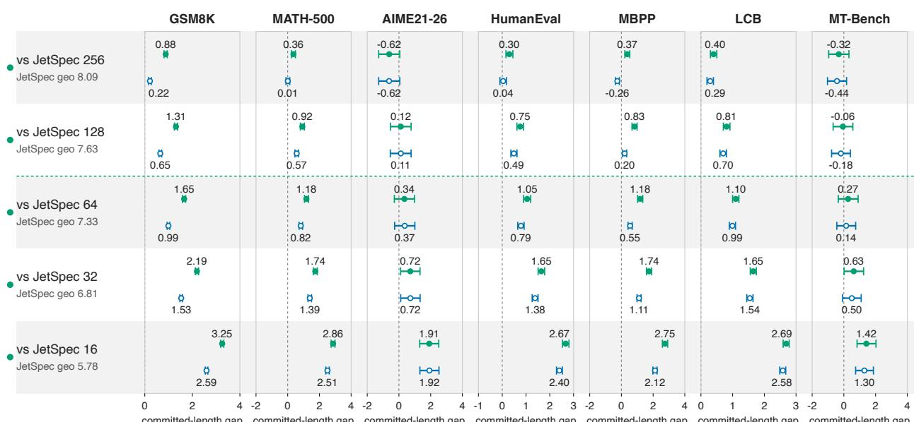  
committed-length gap committed-length gap committed-length gap committed-length gap committed-length gap committed-length gap committed-length gap

Figure 3: DBloom’s linear budget of 24 shows no significant committed-length loss to JetSpec’s tree. This forest plot illustrates paired committed-length diference ∆τ (DBloom-DFlare B24 minus JetSpec) on Qwen3- 8B at each tree-node budget. Each band shows Arm B (green, filled) above Arm A (blue, hollow). Each whisker is the 95% paired-bootstrap confidence interval with a dot at the mean, and the dashed vertical line marks zero. A whisker entirely right of zero is a significant win, and one straddling zero is inconclusive at the 5% level. Each row notes JetSpec’s geometric-mean committed length across the benchmarks at that budget, against our per-arm geometric means in the title. Below the faint horizontal line, both arms exceed JetSpec’s committed length on every benchmark.

## 7.2 Scope

Our controlled study is narrow by design. Its complete grid covers the Qwen3 family at 8B and 4B with two block-difusion drafter architectures, plus a first model-family check on Gemma-4-12B-IT with one DFlare drafter, where the ceiling-gain association and the expansion gains carry over but one target and one drafter do not establish universal transfer. Our confidence intervals are prompt-level bootstraps. To check that the gains are not a lucky-seed artifact, we train the Qwen3-8B DFlare Arm-A drafter under three training seeds. The committed length agrees to within 0.029 tokens across seeds, about 0.07 of that benchmark’s evaluation interval, so seed choice does not move the conclusion (Appendix D).

## 8 Conclusion

A mean committed length cannot tell a draft-limited cycle from a block-limited one. An acceptance histogram can. A spike in its ceiling bin, the cycles that accept the whole block, indicates that block expansion can recover acceptance. Naive inference-time widening loses speed-up, but retraining on about 30K prompts recovers it, raising the high-ceiling committed length by a median ∆τ of +0.8 (up to +1.1) tokens across our grid, and at a linear budget of 24 the result rivals JetSpec up to its 256-node maximum. The ceiling bin thus flags where a wider block pays of before we spend training compute, and extending the recipe to more drafters and targets is the natural next step.

## References

Marianne Arriola, Aaron Gokaslan, Justin T. Chiu, Zhihan Yang, Zhixuan Qi, Jiaqi Han, Subham Sekhar Sahoo, and Volodymyr Kuleshov. Block difusion: Interpolating between autoregressive and difusion

language models. In International Conference on Learning Representations (ICLR), 2025. URL https: //openreview.net/forum?id=tyEyYT267x.

Charlie Chen, Sebastian Borgeaud, Geofrey Irving, Jean-Baptiste Lespiau, Laurent Sifre, and John Jumper. Accelerating large language model decoding with speculative sampling. arXiv preprint arXiv:2302.01318, 2023. URL https://arxiv.org/abs/2302.01318.

Jian Chen, Yesheng Liang, and Zhijian Liu. DFlash: Block Difusion for Flash Speculative Decoding. In Proceedings of the International Conference on Machine Learning (ICML), 2026. Released draft weights: https://huggingface.co/z-lab/Qwen3-8B-DFlash-b16 and https://huggingface.co/ z-lab/Qwen3-4B-DFlash-b16.

Gemma Team. Gemma 4 technical report. 2026. URL https://arxiv.org/abs/2607.02770.

Lanxiang Hu, Zhaoxiang Feng, Yulun Wu, Haoran Yuan, Yujie Zhao, Yu-Yang Qian, Bojun Wang, Peng Zhao, Daxin Jiang, Yibo Zhu, Tajana Rosing, and Hao Zhang. JetSpec: Breaking the scaling ceiling of speculative decoding with parallel tree drafting. arXiv preprint arXiv:2606.18394, 2026. URL https://arxiv. org/abs/2606.18394. Released draft weights: https://huggingface.co/JetSpec/jetspec-qwen3-8b (Qwen3-8B only).

Jianuo Huang, Yaojie Zhang, Qituan Zhang, Hao Lin, Hanlin Xu, and Linfeng Zhang. Domino: Decoupling causal modeling from autoregressive drafting in speculative decoding. arXiv preprint arXiv:2605.29707, 2026. URL https://arxiv.org/abs/2605.29707.

Yaniv Leviathan, Matan Kalman, and Yossi Matias. Fast inference from transformers via speculative decoding. In Proceedings of the 40th International Conference on Machine Learning (ICML), volume 202 of Proceedings of Machine Learning Research, pp. 19274–19286. PMLR, 2023. URL https: //proceedings.mlr.press/v202/leviathan23a.html.

Yuhui Li, Fangyun Wei, Chao Zhang, and Hongyang Zhang. EAGLE: Speculative sampling requires rethinking feature uncertainty. In Proceedings of the 41st International Conference on Machine Learning (ICML), volume 235 of Proceedings of Machine Learning Research, pp. 28935–28948. PMLR, 2024. URL https://proceedings.mlr.press/v235/li24bt.html.

Yuhui Li, Fangyun Wei, Chao Zhang, and Hongyang Zhang. EAGLE-3: Scaling up inference acceleration of large language models via training-time test. In Advances in Neural Information Processing Systems 38 (NeurIPS), 2025. URL http://papers.nips.cc/paper\_files/paper/2025/hash/ c7b5a35ea98b62512a869c19ea7b03cb-Abstract-Conference.html.

Soowon Oh, Nam Cao, Yujin Kim, Hojung Jung, Huzama Ahmad, Sangmin Bae, and Se-Young Yun. Bas tion: Budget-aware speculative decoding with tree-structured block difusion drafting. arXiv preprint arXiv:2605.29727, 2026. URL https://arxiv.org/abs/2605.29727.

Qwen Team. Qwen3 technical report. arXiv preprint arXiv:2505.09388, 2025. URL https://arxiv.org/ abs/2505.09388.

Liran Ringel and Yaniv Romano. Accelerating speculative decoding with block difusion draft trees. arXiv preprint arXiv:2604.12989, 2026. URL https://arxiv.org/abs/2604.12989.

Lexington Whalen, Yuki Ito, and Ryo Sakamoto. Teaching difusion to speculate left-to-right. arXiv preprint arXiv:2606.11552, 2026. URL https://arxiv.org/abs/2606.11552.

Tianyu Wu, Yu Yao, Zhenting Qi, Han Zheng, Zhuohan Wang, Haoran Ma, Lawrence Liao, Himabindu Lakkaraju, Ju Li, and Yilun Du. D-pace: Dynamic position-aware cross-entropy for parallel speculative drafting. arXiv preprint arXiv:2605.18810, 2026. URL https://arxiv.org/abs/2605.18810.

Jiebin Zhang, Zhenghan Yu, Song Liu, Eugene J. Yu, Zheng Li, Dawei Zhu, Jiangshan Duo, Weimin Xiong, Yifan Song, Guanghua Yu, Jianchen Zhu, and Sujian Li. DFlare: Scaling up draft capacity for block difusion speculative decoding. arXiv preprint arXiv:2606.02091, 2026a. URL https://arxiv.org/

abs/2606.02091. Released draft weights: https://huggingface.co/AngelSlim/Qwen3-8b-dflare and https://huggingface.co/AngelSlim/Qwen3-4b-dflare.

Shuai Zhang, Huachuan Qiu, Hongliang He, and Yong Dai. Cost-aware difusion draft trees for speculative decoding. arXiv preprint arXiv:2606.01813, 2026b. URL https://arxiv.org/abs/2606.01813.

## A Training recipe

This appendix provides enough detail to reproduce our expanded drafters. The block-horizon expansion is always a fine-tune, initialized from a B16 checkpoint in contrast to a B24 trained from scratch. The expansion recipe is identical across both architectures (DFlash and DFlare) and every target, with the only per-cell diference being the initialization checkpoint.

Objective. The drafter denoises the B−1 non-anchor positions of a block in a single parallel pass $( K = 1$ one denoise pass per block), conditioned on the target’s fused hidden states. Training is supervised with hard-label cross-entropy against the target’s generated token IDs at each position. Labeling with the target’s generations makes the corpus self-distilled. The target produces those responses at temperature 0.6 for the B16 continuation and greedily for the B24 expansion.

Two-level (flat-step) horizon-weighted loss. When expanding from B16 to B24, the eight newly added tail positions (block ofsets 16 through 23) have never been trained. We weight the per-position cross-entropy with a flat step, assigning weight 1.0 to the old ofsets and a constant 3× boost to all eight new tail positions $( k \geq 1 6 )$ , with no decay across the block. Appendix B shows that this per-position loss weighting does not move committed length beyond this simple step, so we add no further complexity.

Training anchors. We train on sequences of up to 3,072 tokens (the target’s self-distilled prompt and response, generated with a 2,048-token cap). Each training sequence contributes many blocks to the loss via strided block-start positions, from which we sample num\_anchors = 512 per sequence. These training anchors are only a sampling mechanism to cover many block starts within a long sequence. They are unrelated to the inference-time block anchor of Section 2 (position 0 of a decode block, the target’s committed token), which shares the word but not the mechanism.

Per-step optimization. The Arm-A expansion (and the identical Arm-B step 2) uses a learning rate of $1 \times 1 0 ^ { - 5 }$ , four epochs, and a global batch size of 64. The Arm-B step 1 continuation is a same-block (B16) fine-tune at a learning rate of $5 \times 1 0 ^ { - 5 }$ for two epochs, with the STEM and chat replay slices of Table 2 serving as anti-forgetting regularization. All optimization uses AdamW with gradient clipping at 1.0 and a cosine schedule. The training corpora and their sizes are in Table 2.

## B Loss-weighting ablation, per benchmark

Table 5 presents the full six-arm loss-weighting ablation for Qwen3-8B at B24 with the balanced 60K corpus, thinking mode disabled. The metric is $E [ n ] + 1$ , the number of tokens committed per target forward pass, averaged over cycles per benchmark. The last two columns report the mean across the five benchmarks and the measured speed-up. Each arm changes only the per-position weighting, holding the corpus and all other knobs fixed. All six arms fall in the same narrow band on every benchmark, so the weighting does not change committed length at this corpus scale.

Table 5: Six-arm loss-weighting ablation (Qwen3-8B, B24, balanced 60K corpus). Cells are E[n]+1 per benchmark. The last two columns are the mean E[n]+1 and the mean measured speed-up over the five benchmarks. Our final recipe is the flat 3× boost (first row).
<table><tr><td>Per-position weighting</td><td>GSM8K</td><td>MATH-500</td><td>HumanEval</td><td>MBPP</td><td>MT-Bench</td><td>mean</td><td>mean sp</td></tr><tr><td>Flat 3× boost (ours)</td><td>7.92</td><td>9.01</td><td>6.92</td><td>6.20</td><td>3.89</td><td>6.79</td><td>4.91×</td></tr><tr><td>Exp. decay, unit peak</td><td>7.93</td><td>8.90</td><td>6.91</td><td>6.21</td><td>3.82</td><td>6.75</td><td>4.88×</td></tr><tr><td>Exp. decay + 3× tail boost</td><td>7.95</td><td>8.93</td><td>6.89</td><td>6.18</td><td>3.84</td><td>6.76</td><td>4.89×</td></tr><tr><td>Flatter exp. decay</td><td>7.93</td><td>8.93</td><td>6.90</td><td>6.20</td><td>3.82</td><td>6.76</td><td>4.89×</td></tr><tr><td>Frontier (sensitivity)</td><td>7.93</td><td>8.97</td><td>6.90</td><td>6.20</td><td>3.85</td><td>6.77</td><td>4.90×</td></tr><tr><td>Frontier (mid-block bump)</td><td>7.92</td><td>8.98</td><td>6.89</td><td>6.22</td><td>3.85</td><td>6.77</td><td>4.90×</td></tr></table>

Figure 4 shows the six weight profiles. The x-axis is the in-block ofset k (ofset 0 is the anchor, which carries no loss), and the dashed line marks the boundary k = 16 where the eight new B24 tail positions begin. The arms difer only in how they shape the weight across the block. The flat step stays at 1.0 on the old ofsets and 3× on the new tail, the exponential arms decay away from the anchor at two rates with an optional tail boost, and the two frontier arms concentrate weight in the mid-block, where the accepted-length sensitivity diagnostic is largest. Despite these diferent shapes, the committed-length results in Table 5 are indistinguishable.

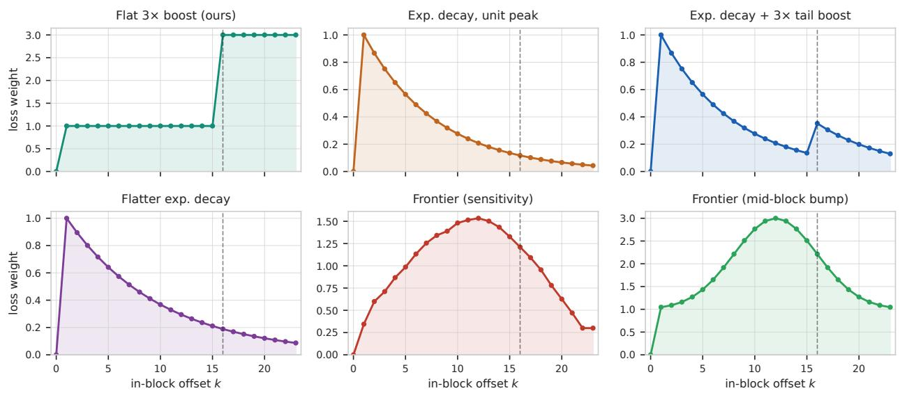  
dashed line: boundary k = 16 (the eight new B24 tail positions begin here)  
Figure 4: Weight versus in-block ofset k for the six loss-weighting profiles in the ablation. Despite their diferent shapes, none changes the committed length (Table 5).

## C Data-versus-expansion control

To confirm that the Arm-A gain comes from the block expansion rather than from post-training on 30K more prompts, we run a spot-check control that post-trains the original B16 DFlare-Qwen3-8B drafter on the same 30K corpus but keeps the block size at 16, with no expansion. Table 6 reports it. The data-only efect is far smaller than the expansion on every benchmark, so the wider block drives the gain.

Table 6: Data-versus-expansion control (Qwen3-8B, DFlare). The B16+30K control post-trains the original B16 drafter on the same 30K expansion corpus but keeps the block size at 16 (no expansion), using the original-B16 loss. Columns give the prompt-mean committed length τ for the original B16, the control, and the Arm-A B24 expansion, then the two paired $\Delta \tau$ over the shared EOS-terminated survivor set: data-only (control minus B16) and expansion (Arm-A B24 minus B16), each with a 95% paired-bootstrap confidence interval. The data-only efect is small and far smaller than the expansion on every benchmark, so the block expansion drives the Arm-A gain and the extra 30K samples add little. This control is an 8B DFlare spotcheck, and extending it to the full four-drafter grid is future work.
<table><tr><td>bench</td><td>B16 T</td><td>B16+30K T</td><td>Arm-A B24</td><td colspan="2"> $\Delta \tau$  data-only</td><td colspan="2"> $\Delta \tau$  expansion</td></tr><tr><td>GSM8K</td><td>7.86</td><td>8.07</td><td>T 8.57</td><td></td><td></td><td></td><td>+0.71 [+0.67, +0.76]</td></tr><tr><td>MATH-500</td><td>9.17</td><td>9.29</td><td>10.19</td><td>+0.12</td><td>+0.21 [+0.18, +0.24] [+0.08, +0.16]</td><td>+1.02</td><td>[+0.92, +1.13]</td></tr><tr><td>AIME21-26</td><td>8.63</td><td>8.68</td><td>9.60</td><td>+0.05</td><td>[+0.01, +0.08]</td><td>+0.98</td><td>[+0.69, +1.28]</td></tr><tr><td>HumanEval</td><td>7.07</td><td>7.16</td><td>7.66</td><td>+0.10</td><td>[+0.05, +0.15]</td><td>+0.60</td><td>[+0.49, +0.71]</td></tr><tr><td>MBPP</td><td>6.77</td><td>6.86</td><td>7.08</td><td>+0.08</td><td>[+0.03, +0.14]</td><td>+0.31</td><td>[+0.22, +0.40]</td></tr><tr><td>LCB</td><td>7.84</td><td>8.01</td><td>8.60</td><td>+0.17</td><td>[+0.14, +0.21]</td><td>+0.76</td><td>[+0.68, +0.83]</td></tr><tr><td>MT-Bench</td><td>5.00</td><td>5.08</td><td>5.26</td><td>+0.08</td><td>[+0.03, +0.13]</td><td>+0.26</td><td>[+0.15, +0.38]</td></tr></table>

## D Seed robustness

We train the Qwen3-8B DFlare Arm-A B24 drafter from the DBloom recipe under three diferent training seeds (feeding the seed to weight initialization, dropout, and data order) and re-evaluate all seven benchmarks. Table 7 reports it. The three seeds agree to within a few hundredths of a token on every benchmark, far inside the evaluation confidence interval, so the acceptance gains are stable to the training seed. This is a Qwen3-8B DFlare spot-check.

Table 7: Seed robustness of the DBloom Arm-A expansion (Qwen3-8B, DFlare). We retrain the DBloom recipe under three training seeds and re-evaluate all seven benchmarks. The seed 42 column is the reported drafter, and the other columns are the two additional seeds. Each τ carries its 95% prompt-bootstrap CI. Across every benchmark the three seeds agree to within a few hundredths of a token, far inside each seed’s own CI, so the reported gains are stable to the training seed. All values are EOS-terminated prompt-mean committed length τ.
<table><tr><td>bench</td><td>seed 42 T</td><td>seed 123 T</td><td>seed 789 T</td><td>max |∆τ|</td></tr><tr><td>GSM8K</td><td> $8 . 5 7 \pm 0 . 0 9$ </td><td> $8 . 5 6 \pm 0 . 0 9$ </td><td> $8 . 5 6 \pm 0 . 0 9$ </td><td>0.016</td></tr><tr><td>MATH-500</td><td> $1 0 . 1 8 \pm 0 . 2 2$ </td><td> $1 0 . 1 8 \pm 0 . 2 2$ </td><td> $1 0 . 1 7 \pm 0 . 2 1$ </td><td>0.008</td></tr><tr><td>AIME21-26</td><td> $9 . 4 2 \pm 0 . 4 1$ </td><td> $9 . 3 9 \pm 0 . 4 1$ </td><td> $9 . 3 9 \pm 0 . 4 1$ </td><td>0.029</td></tr><tr><td>HumanEval</td><td> $7 . 6 6 \pm 0 . 2 0$ </td><td> $7 . 6 7 \pm 0 . 2 0$ </td><td> $7 . 6 5 \pm 0 . 2 0$ </td><td>0.016</td></tr><tr><td>MBPP</td><td> $7 . 0 8 \pm 0 . 2 0$ </td><td> $7 . 0 7 \pm 0 . 1 9$ </td><td> $7 . 0 8 \pm 0 . 1 9$ </td><td>0.011</td></tr><tr><td>LCB</td><td> $8 . 5 5 \pm 0 . 1 5$ </td><td> $8 . 5 5 \pm 0 . 1 5$ </td><td> $8 . 5 4 \pm 0 . 1 5$ </td><td>0.011</td></tr><tr><td>MT-Bench</td><td> $5 . 2 7 \pm 0 . 4 5$ </td><td> $5 . 2 8 \pm 0 . 4 6$ </td><td> $5 . 2 7 \pm 0 . 4 5$ </td><td>0.012</td></tr></table>

## E Why τ and $E [ n ] + 1$ are committed-length statistics, how they relate to acceptance length, and when they difer

In each decode cycle, the target verifies a proposed block, accepts a prefix of n draft tokens $( 0 \leq n \leq B - 1 )$ then commits one guaranteed bonus token, producing n+1 tokens. The two summaries of a run in Section 5.2 both include that bonus token but weight cycles diferently, since τ weights each prompt equally while $E [ n ] + 1$ weights each cycle equally. Calling either one “the acceptance length” obscures both the bonus token and the choice of weighting, so we name each by what it counts, the tokens committed per cycle, with τ promptweighted and $E [ n ] + 1$ cycle-weighted. Both are committed lengths.

The identity. With $c _ { p }$ the cycle count of prompt p and $\bar { n } _ { p }$ its per-prompt mean accepted count, $E [ n ] + 1$ is a cycle-count-weighted average of the same per-prompt means that τ averages evenly. The gap is the weighted-minus-unweighted-mean identity,

$$
E [ n ] { + } 1 - \tau = \frac { \mathrm { C o v } ( c _ { p } , \bar { n } _ { p } ) } { \bar { c } } ,\tag{2}
$$

where $\begin{array} { r } { \overline { { c } } = \frac { 1 } { P } \sum _ { p } c _ { p } } \end{array}$ is the mean cycle count over the P prompts and $\mathrm { C o v } ( c _ { p } , \bar { n } _ { p } )$ is the covariance between a prompt’s cycle count and its per-prompt mean accepted count. The denominator is positive, so the sign depends entirely on whether a prompt’s cycle count is correlated with its acceptance. When long generations draft poorly (negative covariance), the many low-acceptance cycles dominate the cycle-weighted mean and pull $E [ n ] + 1$ below τ . When long generations draft well (positive covariance), $E [ n ] + 1$ rises above $\tau .$ The two summaries are equal only when generation length and acceptance are uncorrelated.

A minimal illustration. Two prompts with ten cycles between them make the mechanism concrete. In Table 8, both cases share the same per-prompt behavior, so $\tau = 5 . 0$ in each, yet the throughput $E [ n ] + 1$ ranges from 3.2 to 6.8 depending on whether the many-cycle prompt is the one the drafter handles well.

Table 8: Identical τ, opposite $E [ n ] + 1$ . Each prompt contributes $\bar { n } _ { p } { + 1 }$ . τ is the unweighted mean of those contributions and $E [ n ] + 1$ the cycle-weighted mean. Both cases share the same per-prompt behavior, so $\tau = 5 . 0$ in each, but $E [ n ] + 1$ follows the many-cycle prompt: below τ when it drafts poorly (Case 1) and above τ when it drafts well (Case 2).
<table><tr><td>Case p</td><td></td><td>Cycles</td><td>Accepted n each cycle</td><td> $\bar { n } _ { p } { + 1 }$ </td><td> $\tau$ </td><td> $E [ n ] + 1$ </td></tr><tr><td rowspan="2">1</td><td>A (short, drafts well)</td><td>2</td><td> $7 , 7$ </td><td>8</td><td>5.0</td><td>3.2</td></tr><tr><td>B (long, drafts poorly)</td><td>8</td><td>1 (eight times)</td><td>2</td><td></td><td></td></tr><tr><td rowspan="2">2</td><td>A (short, drafts poorly)</td><td>2</td><td>1,1</td><td>2</td><td>5.0</td><td>6.8</td></tr><tr><td>B (long, drafts well)</td><td>8</td><td>7 (eight times)</td><td>8</td><td></td><td></td></tr></table>

Real data, both directions. Both cases occur across our runs (greedy $T = 0 ,$ , full test sets, B24, EOSterminated responses only), though the divergence is modest once the runaway generations are filtered out. The negative direction is larger. On MATH-500 with the DBloom-DFlash Qwen3-4B Arm-B B24 drafter, the long, low-acceptance chains dominate the cycle-weighted mean, so $E [ n ] + 1 = 9 . 0 7$ sits 0.38 tokens below $\tau = 9 . 4 5$ , and reporting only τ would overstate throughput. The positive direction appears on AIME21-26 with the DBloom-DFlare Qwen3-8B Arm-A B24 drafter, where the longer generations draft slightly better than the short ones, so $E [ n ] + 1 \ = \ 1 0 . 0 2$ rises 0.41 tokens above $\tau = 9 . 6 0$ and reporting only τ would understate it. The gap is a few tenths of a token in either direction here, but it can grow when a workload’s generation length and acceptance are strongly correlated. The two summaries answer diferent questions. τ is the right per-prompt statistic for a confidence interval and $E [ n ] + 1$ is the right throughput statistic, so we report both summaries and keep them distinct.

Committed length tracks the measured speed-up. That $E [ n ] + 1$ is the throughput statistic is more than definitional. Across every published target-drafter pair, it tracks the measured decode-only speed-up almost perfectly (Table 9). Within a pair, the target, drafter, and block size are fixed, so both arms share one per-cycle overhead and fall on a single committed-length-to-speed-up line, yielding m points per pair (its two arms across all benchmarks). We restrict each run to its own EOS-terminated responses, since the greedy runaways that never emit a stop token inflate length without a matching throughput gain. $E [ n ] + 1$ reaches Pearson $r \geq 0 . 9 7$ in every pair, with a bootstrap lower bound above that of τ throughout, confirming the cycle-weighted summary as the speed-up proxy. Within a fixed target-drafter implementation, cyclemean committed length strongly determines the measured decode-only speed-up. As a token count it stays comparable across stacks, though realized latency depends on the implementation and hardware.

Table 9: Committed length versus measured decode-only speed-up, one Pearson correlation per published target-drafter pair, over its two arms and all benchmarks (m points, one per run). Each run is restricted to its own EOS-terminated responses, so no cross-arm intersection enters. Within a pair the target, drafter, and block size are fixed, so both arms share one per-cycle overhead and fold onto the same line. Intervals are paired percentile bootstrap 95% CIs, matching the CI convention used elsewhere in the paper. In every pair $E [ n ] + 1$ tracks speed-up at $r \geq 0 . 9 7$ with a lower bound above that of τ. Within a fixed target-drafter implementation, cycle-mean committed length strongly determines the measured decode-only speed-up. As a token count it stays comparable across stacks, though realized latency depends on the implementation and hardware.
<table><tr><td>Target</td><td>Drafter</td><td>m</td><td> $r ( E [ n ] + 1 )$ </td><td>95% CI</td><td> $r ( \tau )$ </td><td>95% CI</td></tr><tr><td>Qwen3-4B</td><td>DFlare</td><td>14</td><td>+0.988</td><td> $[ + 0 . 9 7 , + 1 . 0 0 ]$ </td><td>+0.964</td><td> $[ + 0 . 9 0 , + 0 . 9 9 ]$ </td></tr><tr><td>Qwen3-4B</td><td>DFlash</td><td>14</td><td>+0.989</td><td> $[ + 0 . 9 6 , + 1 . 0 0 ]$ </td><td>+0.966</td><td> $[ + 0 . 9 0 , + 0 . 9 9 ]$ </td></tr><tr><td>Qwen3-8B</td><td>DFlare</td><td>14</td><td>+0.997</td><td> $[ + 0 . 9 9 , + 1 . 0 0 ]$ </td><td>+0.965</td><td> $\left[ + 0 . 8 8 , + 0 . 9 9 \right]$ </td></tr><tr><td>Qwen3-8B</td><td>DFlash</td><td>14</td><td>+0.999</td><td> $[ + 1 . 0 0 , + 1 . 0 0 ]$ </td><td>+0.981</td><td> $[ + 0 . 9 4 , + 0 . 9 9 ]$ </td></tr><tr><td>Gemma-4-12B-IT</td><td>DFlare</td><td>14</td><td>+0.978</td><td> $[ + 0 . 9 2 , + 1 . 0 0 ]$ </td><td>+0.889</td><td> $[ + 0 . 6 6 , + 0 . 9 7 ]$ </td></tr></table>

## F Why naive block expansion lowers per-position acceptance, and by how much the accepted length falls

This appendix analyzes the claim in Section 3 in two steps. First, running a drafter trained at block size $B _ { \mathrm { t r } }$ at a larger block B changes the proposal distribution at every position, including the early ones. We explain why this shift happens, and show that at temperature zero it can preserve or break a match the trained block already made but never create one, so it cannot raise an already-accepted position. We do not claim the shift always increases the distance to the target at every position under sampled decoding, and we treat the empirical fact that per-position acceptance falls in every measured cell as just that, an empirical finding. Second, the accepted length sums acceptance over positions and stops at the first rejection, so a drop in per-position rates need not lower it by the same amount. The extra positions a wider block reaches can still be accepted, which recovers some of the length lost at the front. Together, these explain why some cells lose almost no accepted length even though per-position acceptance falls across the block.

Acceptance as a distance. Write $q _ { i } ^ { ( B ) }$ for the drafter’s distribution at masked position i of a B-wide block, and $p _ { i }$ for the target’s true conditional at that position. The target does not depend on $B .$ . Under speculative sampling, the verifier accepts a proposed token $x _ { i } \sim q _ { i } ^ { ( B ) }$ with probability min $( 1 , p _ { i } ( x _ { i } ) / q _ { i } ^ { ( B ) } ( x _ { i } ) )$ so the per-position acceptance rate, conditional on the first $i - 1$ positions having been accepted (the state in which position i is verified), is

$$
\alpha _ { i } ^ { ( B ) } = \sum _ { x } \operatorname * { m i n } \big ( p _ { i } ( x ) , q _ { i } ^ { ( B ) } ( x ) \big ) = 1 - \mathrm { T V } \big ( p _ { i } , q _ { i } ^ { ( B ) } \big ) ,\tag{3}
$$

which equals one minus the total variation distance between the drafter’s proposal and the target’s, where $\begin{array} { r } { \mathrm { T V } ( p , q ) = \frac { 1 } { 2 } \sum _ { x } \vert p ( x ) - q ( x ) \vert } \end{array}$ is the largest gap in probability the two distributions assign to any event. Greedy decoding is the temperature-zero special case, where both sides concentrate on their argmax and $\alpha _ { i } ^ { ( B ) } \in \{ 0 , 1 \}$ recovers exact-match acceptance. The verifier stops at the first rejection, so with $\alpha _ { i } ^ { ( \bar { B } ) }$ read as this conditional rate the accepted length satisfies $\begin{array} { r } { \operatorname* { P r } [ n \geq k ] = \prod _ { i = 1 } ^ { k } \alpha _ { i } ^ { ( B ) } } \end{array}$ and $\begin{array} { r } { E [ n ] = \sum _ { k = 1 } ^ { B - 1 } \prod _ { i = 1 } ^ { k } \alpha _ { i } ^ { ( B ) } } \end{array}$

The proposal depends on the block size. A block-difusion drafter fills its block with bidirectional attention, so every masked position, including an early one, attends to the whole block. Widening the block adds positions that even an early query now attends to, so its attention mixture, and with it the token it proposes, moves away from what the drafter learned at its trained size. The new positions add a second dependence, because the drafter now sees ofsets and a position range it never trained on. Neither efect depends on the head-sharing scheme (MHA, GQA, MQA, MLA) or the positional design (rotary, learned, ALiBi). Both follow from attention being bidirectional over the block. An autoregressive drafter behaves diferently. It computes each position from only the causal prefix, so asking for more positions leaves its earlier proposals untouched, and extending the horizon cannot lower their per-position acceptance. A blockdifusion drafter has no matching guarantee, so widening the block can move its proposal at every position, the early ones included. We do not claim the shift always moves the proposal farther from the target, either at a single position or once the residual stream and later layers recombine the heads. We treat the resulting drop in per-position acceptance as an empirical fact, present in every measured cell.

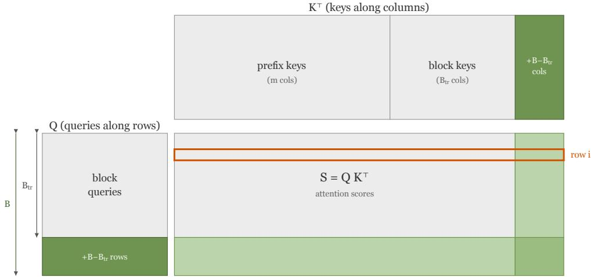  
Figure 5: Attention scores for one block. Expanding the block from the trained size $B _ { \mathrm { t r } }$ to a larger B appends key columns and query rows (green). Even an early query row $i \ll B _ { \mathrm { t r } }$ <sub>r</sub> (orange) gains new score entries, so its attention weights, and thus the token it proposes, shift away from what the drafter learned at its trained size. This drift can reduce per-position acceptance, and it does so across the evaluated cells.

Per-position consequence of greedy decoding. Greedy decoding reduces each acceptance decision to an exact match. At a position the trained block already accepted, the distribution shift can preserve or break that match but cannot improve it further. At a position the trained block rejected, the shift can leave the rejection or correct it. Neither direction is guaranteed at every position, so no consistent pattern holds in general. Empirically, the efect is one-directional. The per-position match rate on the old positions falls in every measured cell, which drives the front erosion analyzed below. Under sampled decoding, the same argument does not apply, yet the ceiling columns of Table 10 show the block-ceiling fraction falling to near zero in every measured cell regardless.

The accepted length is a censored sum. We now turn to the second part. The expected accepted length does not inherit the per-position monotonicity. From Eq. 3, $\begin{array} { r } { E _ { B } [ n ] = \sum _ { k = 1 } ^ { B - 1 } \operatorname* { P r } _ { B } [ n \geq k ] } \end{array}$ is a sum whose number of terms grows with B. Enlarging the block appends new nonnegative terms even as each surviving term shrinks. Writing $P _ { B } ( k ) = \operatorname* { P r } _ { B } [ n \geq k ]$ , the change from the trained block to the larger one splits into a gain and a loss,

$$
E _ { \boldsymbol { B } } [ n ] - E _ { \boldsymbol { B } _ { \mathrm { t r } } } [ n ] = \underbrace { \sum _ { k = B _ { \mathrm { t r } } } ^ { B - 1 } P _ { \boldsymbol { B } } ( k ) } _ { \boldsymbol { G } : \mathrm { ~ u n c a p p e d ~ g a i n } } - \underbrace { \sum _ { k = 1 } ^ { B _ { \mathrm { t r } } - 1 } \left[ P _ { \boldsymbol { B } _ { \mathrm { t r } } } ( k ) - P _ { \boldsymbol { B } } ( k ) \right] } _ { \boldsymbol { L } : \mathrm { ~ f r o n t ~ e r o s i o n } } ,\tag{4}
$$

where G is the survival gained at the newly reachable positions and L is the survival lost on the old positions, nonnegative whenever old-position survival does not increase $( P _ { B } ( k ) \leq P _ { B _ { \mathrm { t r } } } ( k )$ for $k < B _ { \mathrm { t r } } )$ . The accepted length rises if and only if $G > L$ . An upper bound on the uncapped gain is the amount of the block that survives to the new positions,

$$
G \leq ( B - B _ { \mathrm { t r } } ) P _ { B } ( B _ { \mathrm { t r } } ) ,\tag{5}
$$

because $P _ { B } ( k )$ is nonincreasing in k. This bound uses only that $P _ { B }$ is a survival function, so it holds true for any block-difusion drafter. Table 10 reports G, L, and the survival $P _ { B } ( B _ { \mathrm { t r } } )$ per cell. Over EOS-terminated responses, naive expansion raises the accepted length on no cell. Every $G - L$ is at most zero. The size of the fall tracks how much of the block survives to the new positions. On the 8B drafters, a modest ceiling survives past the boundary $( P _ { B } ( B _ { \mathrm { t r } } )$ around 9 to 16%), so G nearly ofsets L and the accepted length stays about flat, dipping slightly (DFlare Qwen3-8B AIME21-26 $G - L = - 0 . 0 1$ , LiveCodeBench −0.08, MATH-500 −0.41, and DFlash Qwen3-8B AIME21-26 −0.07). On the 4B drafters, $P _ { B } ( B _ { \mathrm { t r } } ) \approx 0$ , so $G \approx 0$ and the accepted length falls by essentially the full front erosion. Figure 6 makes G and L concrete on two AIME21-26 cells: a near-flat 8B case where the surviving ceiling almost balances the front loss, and a 4B case where almost no mass clears the boundary so the distribution shifts toward the low bins.

When a rise happens (and why it is unlikely). A simple model makes the condition explicit. Suppose survival at the first newly reachable position is $S = P _ { B } ( B _ { \mathrm { t r } } )$ and decays by a factor $\beta$ per additional position, so $P _ { B } ( B _ { \mathrm { t r } } + j ) = S \beta ^ { j }$ . Then the uncapped gain is a geometric sum,

$$
G = S \frac { 1 - \beta ^ { B - B _ { \mathrm { t r } } } } { 1 - \beta } ,\tag{6}
$$

and $E _ { B } [ n ] > E _ { B _ { \mathrm { t r } } } [ n ]$ if $G > L$ . This model assumes the new positions are homogeneous and independent, so it remains a heuristic. It nonetheless pinpoints the requirement, since a rise needs both a large surviving ceiling S and a capable drafter $\beta .$ . That combination is uncommon because the same block-size shift that exposes the new positions also erodes the front that feeds $S ,$ and when $S \approx 0 ,$ as on every 4B cell, Eq. 5 forces a fall. A speed-up gain is rarer still, since even a flat accepted length does not ofset the wider block’s higher per-cycle cost.

The distributions. Figure 6 contrasts the 8B and 4B DFlare distributions under naive expansion, with the Eq. 4 decomposition overlaid.

## G EOS termination and its efect on committed length

Section 5.2 computes acceptance over EOS-terminated responses. This appendix quantifies why. Table 11 reports, for each original B16 drafter and benchmark, how many responses terminate normally and the prompt-mean committed length with and without the capped runaways. Termination is near-complete on every benchmark except competition math, where it drops to about two thirds and the runaways inflate the committed length the most, as the final column of Table 11 shows. The size of the inflation grows with the generation-length cap (here 16,384 tokens), since a longer cap lets each runaway accumulate more cycles before it stops. For that reason the cycle-mean $E [ n ] + 1$ inflates more than the prompt-mean τ, because a runaway contributes one prompt but many cycles. On the most-filtered cell, DFlare Qwen3-8B on AIME21- 26, including the runaways moves τ from 8.68 to 10.27 (+1.60) but $E [ n ] + 1$ from 8.94 to 11.74 (+2.80), so reporting either statistic over all responses would overstate it.

A runaway need not be easy for the drafter, as the two excerpts below show. The first repeats one line verbatim, so the drafter matches it almost perfectly and its accepted length is high. The second runs to the cap by enumerating a fresh integer on each line, content the drafter cannot anticipate, so its accepted length stays low. Including either kind distorts the estimand, and neither is a representative completed response. Each excerpt lists the drafter’s mean accepted length over the response.

A high-acceptance runaway. A DFlare Qwen3-8B response on AIME21-26 that never emits a stop token and repeats one line verbatim to the generation-length cap. Because the repeated tokens are identical each cycle, the drafter predicts them almost perfectly, so the response accepts a mean of 14.9 tokens, far above a typical completed response.

$$
{ \begin{array} { r l } & { { \mathrm { T r y ~ \oint ~ a _ - 1 ~ \partial ~ = ~ 1 1 ~ , ~ a _ - 2 ~ \partial ~ = ~ 1 ~ , ~ a _ - 3 ~ \partial ~ = ~ 0 ~ \oint : ~ \mathrm { ~ N o t ~ \ v a l ~ i d } } } } \\ & { { \mathrm { T r y ~ \oint ~ a _ - 1 ~ \partial ~ = ~ 1 1 ~ , ~ a _ - 2 ~ \partial ~ = ~ 1 ~ , ~ a _ - 3 ~ \partial ~ = ~ 0 ~ \oint : ~ \mathrm { ~ N o t ~ \ v a l ~ i d } } } } \\ & { { \mathrm { T r y ~ \oint ~ a _ - 1 ~ = ~ 1 1 ~ , ~ a _ - 2 ~ \partial ~ = ~ 1 ~ , ~ a _ - 3 ~ \partial ~ = ~ 0 ~ \oint : ~ \mathrm { ~ N o t ~ \ v a l ~ i d } } } } \end{array} }
$$

Table 10: Mass shift under naive expansion. E[n] is the mean accepted draft length (no bonus token). The change E[n] naive minus native equals the uncapped gain G (mass newly reachable past the old boundary) minus the front erosion L (survival lost on the old positions). G can be no larger than the front surviva $\operatorname* { P r } ( n \geq 1 6 )$ , near zero on the 4B drafters, so their E[n] falls by approximately L. The ceiling columns are the block-ceiling fraction of each state: native is $\mathrm { P r } ( \mathrm { n } { = } 1 5 )$ for the B16 drafter, naive is $\mathrm { P r } ( \mathrm { n = 2 3 } )$ for the same drafter run at B24. Every B16 ceiling, high or low, drops to near zero under naive B24, since the enlarged block is rarely filled. $\operatorname* { P r } ( n \leq 4 )$ is the low-acceptance mass, which grows sharply on the 4B drafters as the distribution slumps to the front.
<table><tr><td rowspan="15">model</td><td>size</td><td>bench</td><td>native E[n]</td><td>naive E[n]</td><td>G uncapped</td><td>L front</td><td> $\operatorname* { P r } ( n \geq 1 6 )$ </td><td>ceiling native</td><td>ceiling naive</td><td> $\operatorname* { P r } ( n \leq 4 )$  native</td><td> $\operatorname* { P r } ( n \leq 4 )$  naive</td></tr><tr><td></td><td>GSM8K</td><td>6.70</td><td>6.34</td><td>0.30</td><td>0.66</td><td>9%</td><td>16%</td><td>1%</td><td>44%</td><td>48%</td></tr><tr><td rowspan="12">8B</td><td>MATH-500</td><td>8.06</td><td>7.65</td><td>0.50</td><td>0.91</td><td>14%</td><td>26%</td><td>1%</td><td>35%</td><td>40%</td></tr><tr><td>HumanEval</td><td>5.96</td><td>5.87</td><td>0.28</td><td>0.38</td><td>8%</td><td>14%</td><td>1%</td><td>52%</td><td>53%</td></tr><tr><td>MBPP</td><td>5.38</td><td>5.07</td><td>0.13</td><td>0.44</td><td>4%</td><td>9%</td><td>0%</td><td>54%</td><td>57%</td></tr><tr><td>MT-Bench</td><td>3.03</td><td>2.88</td><td>0.05</td><td>0.20</td><td>1%</td><td>3%</td><td>0%</td><td>78%</td><td>80%</td></tr><tr><td>AIME21-26</td><td>7.91</td><td>7.90</td><td>0.59</td><td>0.60</td><td>16%</td><td>26%</td><td>1%</td><td>37%</td><td>40%</td></tr><tr><td>LCB</td><td>6.24</td><td>6.16</td><td>0.32</td><td>0.41</td><td>9%</td><td>15%</td><td>1%</td><td>48%</td><td>51%</td></tr><tr><td></td><td>6.66</td><td>2.74</td><td>0.00</td><td>3.92</td><td>0%</td><td>15%</td><td>0%</td><td>44%</td><td></td></tr><tr><td rowspan="6">4B</td><td>GSM8K MATH-500</td><td>7.91</td><td>3.09</td><td>0.00</td><td>4.82</td><td>0%</td><td>24%</td><td>0%</td><td>36%</td><td>81% 76%</td></tr><tr><td>HumanEval</td><td>5.90</td><td>2.28</td><td>0.00</td><td>3.62</td><td>0%</td><td>13%</td><td>0%</td><td>51%</td><td>90%</td></tr><tr><td>MBPP</td><td>5.45</td><td>2.14</td><td>0.00</td><td>3.31</td><td>0%</td><td>9%</td><td>0%</td><td>54%</td><td>93%</td></tr><tr><td>MT-Bench</td><td>3.17</td><td>1.52</td><td>0.00</td><td>1.65</td><td>0%</td><td>3%</td><td>0%</td><td>77%</td><td>97%</td></tr><tr><td>AIME21-26</td><td>7.72</td><td>2.95</td><td>0.00</td><td>4.76</td><td>0%</td><td>22%</td><td>0%</td><td>37%</td><td>80%</td></tr><tr><td>LCB</td><td>6.14</td><td>2.09</td><td>0.00</td><td>4.05</td><td>0%</td><td>14%</td><td>0%</td><td>50%</td><td>94%</td></tr><tr><td rowspan="13">DFlash</td><td>GSM8K</td><td></td><td>5.34</td><td>4.96</td><td>0.15</td><td></td><td>5%</td><td>10%</td><td>0%</td><td>56%</td><td>60%</td></tr><tr><td>MATH-500</td><td></td><td>6.97</td><td>6.61</td><td>0.37</td><td>0.53 0.72</td><td>11%</td><td>20%</td><td>1%</td><td>44%</td><td>49%</td></tr><tr><td>HumanEval</td><td></td><td>5.39</td><td>5.13</td><td>0.21</td><td>0.47</td><td>6%</td><td>12%</td><td>1%</td><td>57%</td><td>60%</td></tr><tr><td>8B</td><td>MBPP</td><td>4.63</td><td>4.33</td><td>0.09</td><td>0.39</td><td>3%</td><td>6%</td><td>0%</td><td>61%</td><td>64%</td></tr><tr><td>MT-Bench</td><td></td><td>2.30</td><td>2.18</td><td>0.03</td><td>0.15</td><td>1%</td><td>2%</td><td>0%</td><td>86%</td><td>87%</td></tr><tr><td>AIME21-26</td><td></td><td>6.91</td><td>6.84</td><td>0.37</td><td>0.44</td><td>11%</td><td>21%</td><td>1%</td><td>45%</td><td>47%</td></tr><tr><td>LCB</td><td>5.45</td><td>5.20</td><td></td><td>0.19</td><td>0.43</td><td>6%</td><td>11%</td><td>0%</td><td>55%</td><td>58%</td></tr><tr><td></td><td></td><td></td><td></td><td></td><td></td><td></td><td></td><td></td><td></td><td></td></tr><tr><td rowspan="6">4B</td><td>GSM8K</td><td>5.24</td><td>3.39</td><td>0.01</td><td>1.86</td><td>0%</td><td>9%</td><td>0%</td><td>56%</td><td></td><td>71%</td></tr><tr><td>MATH-500</td><td>6.83</td><td>4.49</td><td></td><td>0.05</td><td>2.39</td><td>2%</td><td>19%</td><td>0%</td><td>45%</td><td>58%</td></tr><tr><td>HumanEval</td><td>5.43</td><td>3.27</td><td></td><td>0.03 2.19</td><td></td><td>1%</td><td>13%</td><td>0%</td><td>57%</td><td>74%</td></tr><tr><td>MBPP</td><td>4.63</td><td>3.00</td><td></td><td>0.01</td><td>1.64</td><td>0%</td><td>7%</td><td>0%</td><td>62%</td><td>77%</td></tr><tr><td>MT-Bench</td><td>2.40</td><td>1.72</td><td>0.00</td><td>0.69</td><td></td><td>0% 1%</td><td>2% 20%</td><td>0%</td><td>85%</td><td>92%</td></tr><tr><td>AIME21-26 LCB</td><td>6.76 5.30</td><td>4.20 3.12</td><td>0.04 0.03</td><td>2.60 2.21</td><td></td><td>1%</td><td>10%</td><td>0% 0%</td><td>46% 56%</td><td>61% 76%</td></tr></table>

DFlare-8B: AIME21-26  
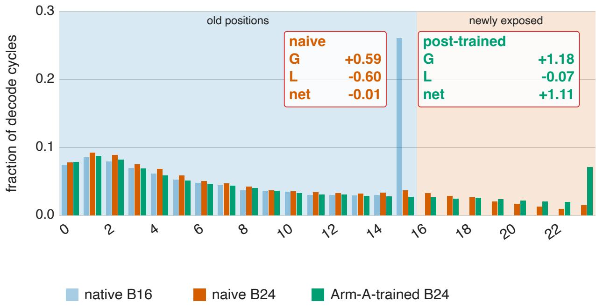

DFlare-4B: AIME21-26  
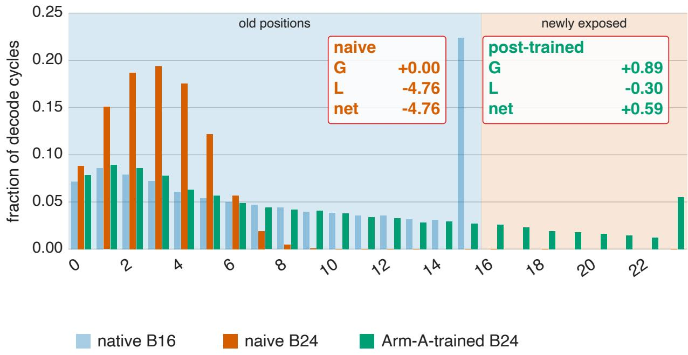  
Figure 6: Per-cycle accepted-length histograms for DFlare on AIME21-26 under naive expansion, on the shared 0 to 23 axis: native B16 (dimmed), naive B24 (original drafter run at B24, no training), and Arm-Atrained B24. Top Qwen3-8B, bottom Qwen3-4B. Shaded bands mark the old positions 1–15 and the newly exposed positions 16–23. Two $G / L / \mathrm { n e t }$ readouts give the Eq. 4 decomposition (old positions lose survival $L ,$ new positions add uncapped gain $G , { \mathrm { n e t } } = G - L )$ : the naive box (text in the naive-B24 color) is the native-to-naive pair, and the post-trained box (text in the Arm-A-trained color) is the native-to-Arm-A-B24 pair, where training achieves $G > L$ . On the 8B target the naive surviving ceiling nearly balances the front loss $\mathrm { ( n e t ~ \mathrm { ~ - ~ } 0 . 0 1 ) }$ . On the 4B target, naive $G \approx 0$ and naive B24 slumps to the low bins (a fall of 4.76). Training relocates mass rightward in both. Every cell is quantified in Table 10.

Table 11: EOS-terminated count and its efect on committed length, per original B16 drafter and benchmark. Each drafter is one row group, identified by its architecture (DFlare or DFlash), target model (Qwen3 or Gemma4), and target size. A response that never emits an end-of-sequence token runs to the generationlength cap. The EOS-terminated column gives the count and percentage of responses that stop normally. τ (EOS) is the prompt-mean committed length over each cell’s own EOS-terminated responses, so it can difer by a few hundredths from the per-cell tables of Appendix H, which measure τ on the shared survivor set across a drafter’s B16, continuation, and B24 stages (for DFlare Qwen3-8B on AIME21-26, 8.68 here versus 8.63 there). τ (all) adds the capped runaways back in, and τ inflation is their diference. Runaways are atypical generations, so including them shifts the estimand toward pathological text. The inflation is positive on most cells because the repetitive runaways are easy for a drafter to predict. A dash marks a cell where every response terminates, so the two estimands coincide. Speed-up is unafected, since it is a decode-timing measurement rather than a per-response acceptance statistic. The DFlare drafter on the Gemma4-12B target is a diferent-model-family reference. That target terminates more often than the Qwen3 targets on competition math, so its inflation is smaller.
<table><tr><td>drafter arch.</td><td>target</td><td>size</td><td>bench</td><td>responses</td><td>EOS-terminated</td><td>T (EOS)</td><td>T (all)</td><td>T inflation</td></tr><tr><td rowspan="12">DFlare</td><td rowspan="12">Qwen3</td><td rowspan="12">8B 4B</td><td>GSM8K</td><td>1319</td><td>1319 (100%)</td><td>7.86</td><td>7.86</td><td></td></tr><tr><td>MATH-500</td><td>500</td><td>480 (96%)</td><td>9.16</td><td>9.34</td><td>+0.19</td></tr><tr><td>HumanEval</td><td>164</td><td>164 (100%)</td><td>7.07</td><td>7.07</td><td></td></tr><tr><td>MBPP</td><td>257</td><td>257 (100%)</td><td>6.77</td><td>6.77</td><td></td></tr><tr><td>MT-Bench</td><td>160</td><td>159 (99%)</td><td>5.00</td><td>5.05</td><td>+0.05</td></tr><tr><td>AIME21-26</td><td>179</td><td>115 (64%)</td><td>8.68</td><td>10.27</td><td>+1.60</td></tr><tr><td>LCB</td><td>1055</td><td>1004 (95%)</td><td>7.81</td><td>8.13</td><td>+0.32</td></tr><tr><td>GSM8K</td><td>1319</td><td>1318 (100%)</td><td>7.95</td><td>7.96</td><td>+0.01</td></tr><tr><td>MATH-500</td><td>500</td><td>479 (96%)</td><td>9.14</td><td>9.31</td><td>+0.17</td></tr><tr><td>HumanEval</td><td>164</td><td>161 (98%)</td><td>7.10</td><td>7.23</td><td>+0.13</td></tr><tr><td>MBPP</td><td>257</td><td>255 (99%)</td><td>6.91</td><td>6.96</td><td>+0.05</td></tr><tr><td>MT-Bench</td><td>160</td><td>160 (100%)</td><td></td><td>5.30</td><td>5.30</td></tr><tr><td></td><td>AIME21-26</td><td>179</td><td>114 (64%)</td><td>8.69</td><td>10.13</td><td>+1.44</td></tr><tr><td></td><td>LCB</td><td>1055</td><td>978 (93%)</td><td>7.69</td><td>8.10</td><td>+0.42</td></tr><tr><td rowspan="6">Gemma4</td><td rowspan="6">12B</td><td>GSM8K</td><td>1319</td><td>1319 (100%)</td><td>7.42</td><td>7.42</td><td></td></tr><tr><td>MATH-500</td><td>500</td><td>492 (98%)</td><td>8.08</td><td>8.10</td><td>+0.02</td></tr><tr><td>HumanEval</td><td>164</td><td>164 (100%)</td><td>8.78</td><td>8.78</td><td></td></tr><tr><td>MBPP</td><td>257</td><td>256 (100%)</td><td>6.27</td><td>6.30</td><td>+0.03</td></tr><tr><td>MT-Bench</td><td>160</td><td>160 (100%)</td><td>4.71</td><td>4.71</td><td></td></tr><tr><td>AIME21-26</td><td>179</td><td>141 (79%)</td><td>7.82</td><td>8.04</td><td>+0.22</td></tr><tr><td rowspan="12">DFlash Qwen3</td><td></td><td>LCB</td><td>1055</td><td>983 (93%)</td><td>6.66</td><td>6.71</td><td>+0.05</td></tr><tr><td rowspan="10">8B</td><td>GSM8K</td><td>1319</td><td>1319 (100%)</td><td></td><td>6.46 6.46</td><td></td><td></td></tr><tr><td>MATH-500</td><td>500</td><td>480 (96%)</td><td></td><td>8.02</td><td>8.17</td><td>+0.15</td></tr><tr><td>HumanEval</td><td>164</td><td>164 (100%)</td><td>6.49</td><td></td><td>6.49</td><td></td></tr><tr><td>MBPP</td><td>257</td><td>257 (100%)</td><td>5.91</td><td></td><td>5.91</td><td></td></tr><tr><td>MT-Bench</td><td>160</td><td>159 (99%)</td><td>4.22</td><td></td><td>4.26</td><td>+0.03</td></tr><tr><td>AIME21-26</td><td></td><td>179</td><td>115 (64%)</td><td>7.73</td><td>8.67</td><td>+0.95</td></tr><tr><td>LCB</td><td>1055</td><td>1004 (95%)</td><td></td><td>6.94</td><td>7.08</td><td>+0.15</td></tr><tr><td>GSM8K</td><td>1319</td><td>1318 (100%)</td><td></td><td>6.46</td><td>6.46</td><td>+0.00</td></tr><tr><td>MATH-500</td><td>500</td><td>479 (96%)</td><td></td><td>7.99</td><td>8.15</td><td>+0.16</td></tr><tr><td>HumanEval</td><td>164</td><td>161 (98%)</td><td>6.64</td><td></td><td>6.74</td><td>+0.10</td></tr><tr><td rowspan="5">4B</td><td>MBPP</td><td>257</td><td>255 (99%)</td><td></td><td>5.95</td><td>5.99</td><td>+0.04</td></tr><tr><td>MT-Bench</td><td></td><td>160</td><td>160 (100%)</td><td>4.38</td><td>4.38</td><td></td></tr><tr><td>AIME21-26</td><td></td><td>179</td><td>114 (64%)</td><td>7.72</td><td>8.84</td><td>+1.12</td></tr><tr><td></td><td></td><td></td><td></td><td>6.72</td><td>7.02</td><td></td></tr><tr><td>LCB</td><td>1055</td><td>978 (93%)</td><td></td><td></td><td></td><td>+0.30</td></tr></table>

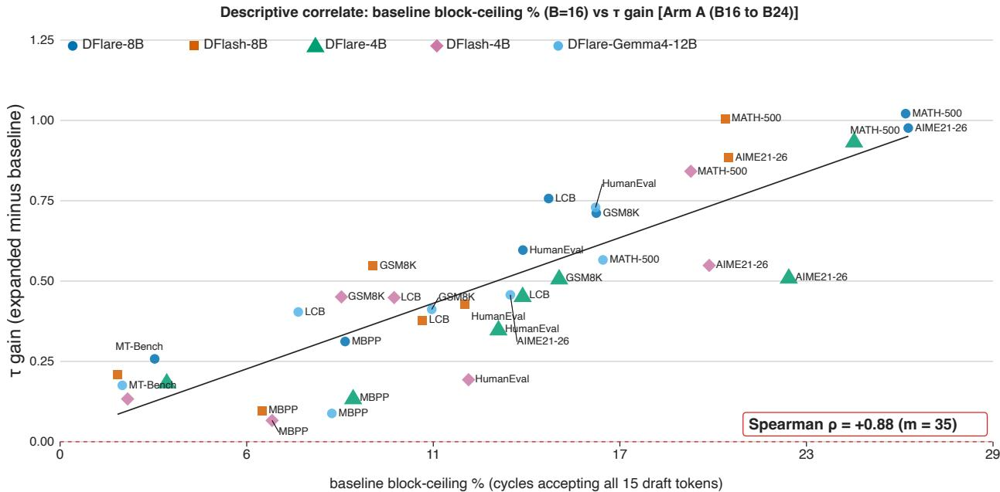  
Figure 7: The Arm-A one-step indicator. Original-B16 block-ceiling fraction (x) versus the τ gain of the Arm-A B24 expansion over the original B16 drafter (y), one point per drafter-benchmark, annotated with the Spearman rank correlation. This panel is the one-step counterpart of the Arm-B indicator in Figure 2. Here both the indicator ceiling and the expansion start from the original B16 drafter. The sample is 35 drafter-benchmark points.

A low-acceptance runaway. A DFlare Qwen3-8B response on AIME21-26 that also runs to the cap, enumerating a diferent large integer on each line. The lines never repeat exactly, so the drafter mispredicts the digits and the response accepts only 8.0 tokens. Runaways thus span both extremes of acceptance, and neither is a representative completed response.

```perl
Try $ a_1 = 10 $, $ a_2 = 234 $:
13803492693581127574869511724554050904902217944340773110325048447598592
Try $ a_1 = 10 $, $ a_2 = 235 $:
27606985387162255149739023449108101809804435888681546220650096895197184
```

## H Full per-cell result tables

This appendix provides the complete per-benchmark tables for all four cells and both arms, plus the JetSpec comparison, from which the summary in Section 6 is drawn. The block-ceiling percentage is the fraction of decode cycles that accept the full block $( n = B { - } 1 )$ .

## H.1 Block-ceiling indicator, full detail.

Figure 2 (Section 6.1) shows the Arm-B indicator on the cycle-mean E[n]+1 gain. Figures 7, 8, and 9 show the other three panels of the $( \tau , E [ n ] + 1 ) \times ( \mathrm { A r m ~ A } , \mathrm { A r m ~ B } )$ set, so both committed-length statistics appear for both arms. The correlation (35 points per arm, the four Qwen cells plus the Gemma-4-12B-IT cell) shares only a few drafters, so we treat it as descriptive. Within each cell, we separately compute the rank correlation across the seven benchmarks. The Arm-B τ gain is $\rho = + 1 . 0 0 , + 1 . 0 0 , + 0 . 9 6 , + 1 . 0 0$ , and +0.64 for DFlare-8B, DFlash-8B, DFlare-4B, DFlash-4B, and Gemma-4-12B-IT, at or above the Spearman two-tailed 5% critical value for seven benchmarks $( | \rho | \approx 0 . 7 8 6 )$ in every Qwen cell, so the same association is visible across cells.

continuation-trained B16 block-ceiling % (cycles accepting all 15 draft tokens)  
Descriptive correlate: baseline block-ceiling % (B=16) vs E[n]+1 gain [Arm A (B16 to B24)]  
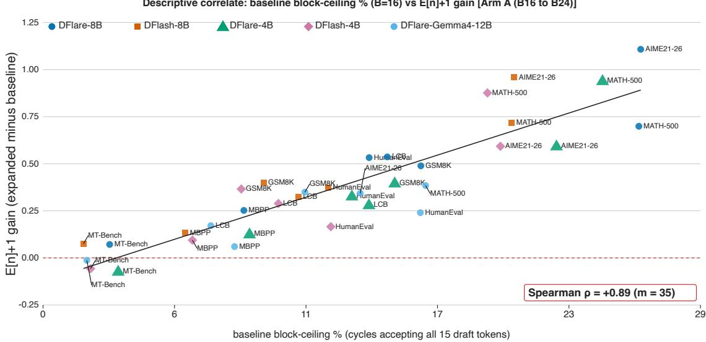  
Figure 8: The Arm-A indicator scored on the cycle-mean $E [ n ] + 1$ gain rather than the prompt-mean τ gain. This is the $E [ n ] + 1$ companion of the $\mathrm { A r m - A } \ \tau$ indicator in Figure 7, over the same 35 drafter-benchmark points and the same original-B16 ceiling on the x-axis, with only the outcome changed. The association is close to the τ version $( \rho = + 0 . 8 9 $ against +0.88).

Descriptive correlate: continuation-trained B16 block-ceiling % (B=16) vs τ gain [Arm B step 2 (B16-cont to armB-B24)]  
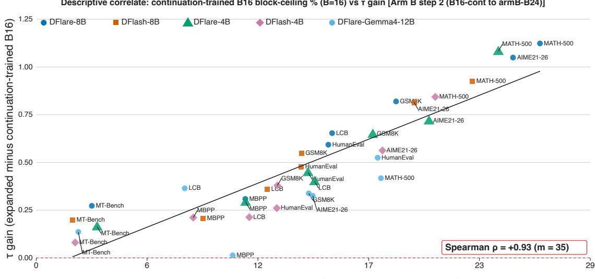  
Figure 9: The Arm-B indicator on the prompt-mean τ gain, the τ companion of the main-text Figure 2, which scores the same points by the cycle-mean $E [ n ] + 1$ . Block-ceiling fraction of the continuation-trained B16 drafter $\left( \mathbf { x } \right)$ versus the τ gain of the Arm-B B24 expansion over that same drafter $\mathrm { ( y ) }$ , one point per drafter-benchmark across the four Qwen cells and the Gemma-4-12B-IT cell, annotated with the Spearman rank correlation. The y-axis is the $^ { 6 6 } \Delta \tau$ (over Cont B16)” column of Table 4.

## H.2 Family-level significance of the expansion gain

Table 4 reports our best configuration. To show typical behavior, we combine all four architecture-target cells and both arms across the three high-ceiling benchmarks, which yields 24 comparisons. We report each comparison two ways: the incremental gain of the B24 expansion over the drafter it expands (Arm A over the original B16, Arm B over the continuation-trained B16), and the end-to-end gain over the original B16. Every $\Delta \tau$ is a paired diference on the same prompts, with a 95% bootstrap confidence interval resampled at the prompt level (the per-cell intervals are in Appendix H.4). These 24 comparisons are nested (cell × arm × benchmark) and not independent, so we describe the distribution. Measured over the drafter each B24 expands, the median $\Delta \tau \ \mathrm { i s + 0 . 8 \ ( r a n g e \ t 0 . 3 8 \ t o + 1 . 1 ) }$ . Measured end to end over the original B16, it is $+ 1 . 0 ~ ( \mathrm { r a n g e } ~ + 0 . 5 ~ \mathrm { t o } ~ + 1 . 7 )$ ). All 24 are positive in both.

We bound the family-wise error with a Holm step-down over the family of per-comparison two-sided p-values. Each comparison’s p-value comes from the same paired prompt bootstrap as its interval (the two-sided value is twice the smaller bootstrap tail probability that $\Delta \tau$ has the opposite sign, clamped at one). Sorting the 24 p-values ascending and testing the j-th against $\alpha / ( 2 4 - j + 1 )$ at $\alpha = 0 . 0 5$ , all 24 remain significant and positive, and none is significant and negative. The method is a consistent gain on high-ceiling benchmarks across every cell and arm. Extending the family to all seven benchmarks yields 56 comparisons (adding the low-ceiling chat and short-form code benchmarks, where expansion has little room to gain). Every $\Delta \tau$ stays positive, with a median of +0.6 and a range from +0.07 to +1.7, and 53 of the 56 remain significantly positive under the same Holm correction. The three that do not clear the correction are small positive gains on low-ceiling benchmarks for the Qwen3-4B direct-expansion (Arm A) cells, so folding in the benchmarks where the method has least room still yields no negative anywhere.

## H.3 Reproduction check and the efect of the generation-length cap

We include the DFlash and DFlare papers’ published τ only as an external reference. We measure every number in this paper (all $\tau , \ E [ n ] + 1$ , and speed-up values, across both arms and all four cells) on one evaluation stack with a fixed protocol, so the comparisons are self-consistent. Rather than compare averages, we test whether each published value falls inside our 95% bootstrap CI. Each cell reports the source paper’s published $\tau ,$ our matched-protocol B16 τ with its CI, the percentage gap, and the verdict (yes / no, with the direction when no). The AIME21-26 set has no published counterpart, so its row is $\mathrm { n / a }$ and competition math is compared on the matched AIME25 row.

The tables below reproduce the published values closely on the short-generation benchmarks, where the evaluation protocols coincide, and read higher on long-generation math. That gap follows from one protocol choice external to our accept/verify path, the generation-length cap. We evaluate at a 16,384-token cap so long responses run to completion, whereas the source papers use a much shorter one (2048 tokens for DFlash). A shorter cap truncates the long math responses and lowers their measured committed length, so an untruncated stack reads a higher τ there and matches on the short benchmarks. The tables below apply the matched 2048-token cap, which is why they align with the published numbers. Our full-cap runs, reported in the main results, are what raise the long-generation τ. Because the block-horizon-expansion conclusions rest solely on within-stack comparisons at a fixed decoding budget, they remain valid regardless of how our absolute numbers compare with the published ones.

Table 12: Qwen3-8B reproduction check: our B16 τ vs the source papers’ published τ .
<table><tr><td rowspan="2">bench</td><td colspan="4">DFlare</td><td colspan="4">DFlash</td></tr><tr><td>paper T T</td><td>our B16 (cap</td><td>% diff</td><td>paper τ in our CI?</td><td>paper T</td><td>our B16 T (cap</td><td>% diff</td><td>paper τ in our CI?</td></tr><tr><td>GSM8K</td><td>7.88</td><td>2048) 7.86±0.07</td><td>-0.3%</td><td>yes</td><td>6.54</td><td>2048) 6.46±0.06</td><td>-1.3%</td><td>no (ours&lt;paper)</td></tr><tr><td>MATH-500</td><td>8.95</td><td>9.14±0.15</td><td>+2.2%</td><td>no (ours&gt;paper)</td><td>7.87</td><td>8.02±0.14</td><td>+1.9%</td><td>no (ours&gt;paper)</td></tr><tr><td>AIME21-26</td><td>n/a</td><td>8.50±0.23</td><td>n/a</td><td>n/a (diff. set)</td><td>n/a</td><td>7.53±0.23</td><td>n/a</td><td>n/a (diff. set)</td></tr><tr><td>HumanEval</td><td>7.08</td><td>7.07±0.17</td><td>-0.2%</td><td>yes</td><td>6.50</td><td>6.49±0.16</td><td>-0.1%</td><td>yes</td></tr><tr><td>MBPP</td><td>6.86</td><td>6.77±0.16</td><td>-1.3%</td><td>yes</td><td>5.95</td><td>5.91±0.14</td><td>-0.6%</td><td>yes</td></tr><tr><td>LCB</td><td>n/a</td><td>7.96±0.12</td><td>n/a</td><td>n/a</td><td>7.27</td><td>7.07±0.11</td><td>-2.7%</td><td>no (ours&lt;paper)</td></tr><tr><td>MT-Bench</td><td>5.09</td><td>5.02±0.39</td><td>-1.4%</td><td>yes</td><td>4.24</td><td>4.24±0.34</td><td>-0.0% +2.9%</td><td>yes</td></tr><tr><td>AIME25 (matched)</td><td>8.12</td><td>8.24±0.43</td><td>+1.5%</td><td>yes</td><td>7.08</td><td>7.28±0.42</td><td></td><td>yes</td></tr></table>

Table 13: Qwen3-4B reproduction check: our B16 τ vs the source papers’ published τ .
<table><tr><td rowspan="2">bench</td><td colspan="4">DFlare</td><td colspan="4">DFlash</td></tr><tr><td>paper T</td><td>our B16 T (cap 2048)</td><td>% diff</td><td>paper τ in our CI?</td><td>paper T</td><td>our B16 T (cap 2048)</td><td>% diff</td><td>paper τ in our CI?</td></tr><tr><td>GSM8K</td><td>7.93</td><td>7.96±0.08</td><td>+0.3%</td><td>yes</td><td>6.53</td><td>6.47±0.06</td><td>-1.0%</td><td>no (ours&lt;paper)</td></tr><tr><td>MATH-500</td><td>8.97</td><td>9.16±0.14</td><td>+2.1%</td><td>no (ours&gt;paper)</td><td>7.84</td><td>8.02±0.14</td><td>+2.3%</td><td>no (ours&gt;paper)</td></tr><tr><td>AIME21-26</td><td>n/a</td><td>8.49±0.22</td><td>n/a</td><td>n/a (diff. set)</td><td>n/a</td><td>7.46±0.21</td><td>n/a</td><td>n/a (diff. set)</td></tr><tr><td>HumanEval</td><td>7.17</td><td>7.17±0.20</td><td>-0.0%</td><td>yes</td><td>6.64</td><td>6.70±0.20</td><td>+0.9%</td><td>yes</td></tr><tr><td>MBPP</td><td>7.08</td><td>6.94±0.19</td><td>-2.0%</td><td>yes</td><td>6.09</td><td>5.98±0.15</td><td>-1.8%</td><td>yes</td></tr><tr><td>LCB</td><td>n/a</td><td>7.92±0.12</td><td>n/a</td><td>n/a</td><td>7.09</td><td>6.96±0.11</td><td>-1.9%</td><td>no (ours&lt;paper)</td></tr><tr><td>MT-Bench</td><td>5.30</td><td>5.30±0.41</td><td>-0.0%</td><td>yes</td><td>4.35</td><td>4.38±0.36 7.12±0.51</td><td>+0.7% -2.0%</td><td>yes</td></tr><tr><td>AIME25 (matched)</td><td>8.35</td><td>8.11±0.52</td><td>-2.9%</td><td>yes</td><td>7.27</td><td></td><td></td><td>yes</td></tr></table>

The per-cell tables below share these conventions. Every τ and E[n]+1 cell carries a 95% bootstrap CI over prompts. The final ∆τ column is the paired diference between the last and first stage on the same prompts, with its own 95% bootstrap CI resampled at the prompt level, and a ∆τ whose interval includes zero is tagged (ns), meaning the change is within noise rather than a directional gain. Original Checkpoint B16 numbers are our own evaluation rather than values copied from the source papers. On the short-form-code benchmarks (HumanEval, MBPP) a few $E [ n ] + 1$ intervals are wide because those benchmarks have few, short generations, so deltas against them are less reliable than on the high-ceiling benchmarks. Competition math uses the AIME21-26 set. Each cell’s table stacks two sub-panels under one caption: the top panel is Arm A (original B16 to Arm-A B24 in one step) and the bottom panel is Arm B (the B16 continuation and Arm-B B24). Both arms start from the same original B16 drafter, so it is shown once, in the top panel, and is the baseline for both the Arm-A ∆τ (top, original B16 to Arm-A B24) and the Arm-B full-pipeline $\Delta \tau$ (bottom, original B16 to Arm-B B24). Placing the two arms adjacent lets the one-step Arm-A B24 and the two-step Arm-B B24 be read against their shared start and against each other. Each table caption below names only its drafter and target.

## H.4 Per-cell results, both arms

Arm B: continuation then expansion.  
Table 14: Qwen3-8B DBloom-DFlare.  
Arm A: direct expansion from the original B16 drafter.
<table><tr><td rowspan="2">bench</td><td colspan="4">Original Checkpoint B16</td><td colspan="4">DBloom-DFlare Arm-A B24</td><td rowspan="2" colspan="2">∆τ (Arm A) ±95%CI</td></tr><tr><td>T</td><td>E[n]+1</td><td>sp</td><td>ceiling%</td><td>T</td><td> $E [ n ] { + } 1$ </td><td>sp ceiling%</td><td></td></tr><tr><td>GSM8K</td><td>7.86±0.07</td><td>7.70±0.24</td><td>5.58×</td><td>16%</td><td> $8 . 5 7 { \pm } 0 . 0 9$ </td><td> $8 . 1 9 { \pm } 0 . 1 0 \ $ </td><td>6.01×</td><td>4%</td><td></td><td>+0.71 [+0.67, +0.76]</td></tr><tr><td>MATH-500</td><td>9.17±0.16</td><td>9.06±0.21</td><td>6.55×</td><td>26%</td><td>10.19±0.22</td><td>9.76±0.25</td><td>7.14×</td><td>6%</td><td></td><td>+1.02 [+0.92, +1.13]</td></tr><tr><td>AIME21-26</td><td> $8 . 6 3 { \pm } 0 . 3 4 $ </td><td> $8 . 9 1 { \pm } 0 . 4 9$ </td><td>6.85×</td><td>26%</td><td> $9 . 6 0 { \pm } 0 . 4 5 $ </td><td> $1 0 . 0 2 { \pm } 0 . 7 5 $ </td><td>7.66×</td><td>7%</td><td></td><td>+0.98 [+0.69, +1.28]</td></tr><tr><td>HumanEval</td><td> $7 . 0 7 { \pm } 0 . 1 7$ </td><td> $6 . 9 6 { \pm } 0 . 1 8$ </td><td>5.04×</td><td>14%</td><td> $7 . 6 6 { \pm } 0 . 2 0 $ </td><td> $7 . 5 0 { \pm } 0 . 2 1 $ </td><td>5.44×</td><td>3%</td><td>+0.60</td><td>[+0.49, +0.71]</td></tr><tr><td>MBPP</td><td> $6 . 7 7 { \pm } 0 . 1 6$ </td><td> $6 . 3 8 { \pm } 0 . 1 6$ </td><td>4.77×</td><td>9%</td><td> $7 . 0 8 { \pm } 0 . 2 0 $ </td><td> $6 . 6 3 { \pm } 0 . 1 7$ </td><td>4.94×</td><td>1%</td><td>+0.31</td><td>[+0.22, +0.40]</td></tr><tr><td>LCB</td><td> $7 . 8 4 { \pm } 0 . 1 2 $ </td><td> $7 . 2 4 { \pm } 0 . 1 2$ </td><td>5.53×</td><td>15%</td><td> $8 . 6 0 { \pm } 0 . 1 5 $ </td><td> $7 . 7 8 { \pm } 0 . 1 5 $ </td><td>5.95×</td><td>3%</td><td></td><td>+0.76 [+0.68, +0.83]</td></tr><tr><td>MT-Bench</td><td>5.00±0.39</td><td>4.03±0.23</td><td>2.97×</td><td>3%</td><td>5.26±0.46</td><td>4.10±0.25</td><td>3.02×</td><td>0%</td><td></td><td>+0.26 [+0.15, +0.38]</td></tr></table>

<table><tr><td rowspan="2">bench</td><td colspan="4">DBloom-DFlare B16 continuation</td><td colspan="4">DBloom-DFlare Arm-B B24</td><td rowspan="2"></td><td rowspan="2" colspan="4">∆τ (over Cont B16) ±95% CI</td></tr><tr><td></td><td>E[n]+1</td><td>sp</td><td>ceiling%</td><td>T</td><td>E[n]+1</td><td>sp</td><td>ceiling%</td></tr><tr><td>GSM8K</td><td>8.41±0.08</td><td>8.18±0.23</td><td>5.96×</td><td>19%</td><td>9.23±0.10</td><td>8.75±0.11</td><td>6.46×</td><td>5%</td><td>+0.82 [+0.77, +0.87]</td><td></td><td></td><td>+1.37 [+1.32, +1.43]</td><td></td></tr><tr><td>MATH-500</td><td>9.42±0.16</td><td>9.16±0.21</td><td>6.69×</td><td>26%</td><td>10.54±0.23</td><td>9.95±0.26</td><td>7.38×</td><td>7%</td><td>+1.12 </td><td>[+1.02, +1.23]</td><td></td><td></td><td>+1.37 [+1.26, +1.49]</td></tr><tr><td>AIME21-26</td><td>8.53±0.34</td><td>8.79±0.49</td><td>6.73×</td><td>25%</td><td>9.58±0.45</td><td>9.95±0.70</td><td>7.54×</td><td>7%</td><td></td><td>+1.05 [+0.78, +1.35]</td><td></td><td></td><td>+0.95 [+0.69, +1.25]</td></tr><tr><td>HumanEval</td><td>7.33±0.17</td><td>7.22±0.18</td><td>5.24×</td><td>15%</td><td>7.93±0.20</td><td>7.74±0.21</td><td>5.63×</td><td>4%</td><td></td><td>+0.59 [+0.48, +0.72]</td><td></td><td>+0.86 [+0.73, +0.99]</td><td></td></tr><tr><td>MBPP</td><td>7.41±0.19</td><td>6.86±0.19</td><td>5.16×</td><td>11%</td><td>7.72±0.22</td><td>7.11±0.20</td><td>5.35×</td><td>2%</td><td></td><td>+0.31 [+0.22, +0.40]</td><td></td><td>+0.94 [+0.81, +1.08]</td><td></td></tr><tr><td>LCB</td><td>8.05±0.12</td><td>7.41±0.12</td><td>5.67×</td><td>15%</td><td>8.71±0.16</td><td>7.86±0.15</td><td>6.02×</td><td>3%</td><td></td><td>+0.65 [+0.58, +0.72]</td><td></td><td>+0.87 [+0.79, +0.94]</td><td></td></tr><tr><td>MT-Bench</td><td>5.11±0.41</td><td>4.03±0.23</td><td>3.00×</td><td>3%</td><td>5.38±0.50</td><td>4.10±0.26</td><td>3.02×</td><td>1%</td><td></td><td>+0.27 [+0.14, +0.42]</td><td></td><td>+0.38 [+0.23, +0.53]</td><td></td></tr></table>

Table 15: Qwen3-8B DBloom-DFlash.  
Arm A: direct expansion from the original B16 drafter.
<table><tr><td rowspan="2">bench</td><td colspan="4">Original Checkpoint B16</td><td colspan="4">DBloom-DFlash Arm-A B24</td><td rowspan="2" colspan="2">∆τ (Arm A) ±95% CI</td></tr><tr><td>T</td><td>E[n]+1</td><td>sp</td><td>ceiling%</td><td>T</td><td>E[n]+1</td><td>sp</td><td>ceiling%</td></tr><tr><td>GSM8K</td><td>6.46±0.06</td><td>6.34±0.19</td><td>4.79×</td><td>10%</td><td>7.01±0.07</td><td>6.74±0.08</td><td>5.18×</td><td>2%</td><td>+0.55</td><td>[+0.51, +0.58]</td></tr><tr><td>MATH-500</td><td>8.03±0.15</td><td>7.97±0.21</td><td>5.96×</td><td>20%</td><td>9.03±0.20</td><td>8.68±0.24</td><td>6.56×</td><td>5%</td><td>+1.01</td><td>[+0.92, +1.09]</td></tr><tr><td>AIME21-26</td><td>7.68±0.33</td><td>7.91±0.46</td><td>5.89×</td><td>21%</td><td> $8 . 5 7 { \pm } 0 . 4 2 $ </td><td>8.87±0.61</td><td>6.28×</td><td>5%</td><td>+0.88</td><td> [+0.65, +1.12]</td></tr><tr><td>HumanEval</td><td>6.49±0.16</td><td>6.39±0.17</td><td>4.86×</td><td>12%</td><td>6.92±0.19</td><td>6.76±0.20</td><td>5.15×</td><td>3%</td><td>+0.43</td><td>[+0.32, +0.54]</td></tr><tr><td>MBPP</td><td>5.91±0.14</td><td>5.63±0.14</td><td>4.39×</td><td>6%</td><td>6.01±0.14</td><td>5.76±0.14</td><td>4.46×</td><td>1%</td><td>+0.10</td><td>[+0.02, +0.17]</td></tr><tr><td>LCB</td><td>6.96±0.11</td><td>6.45±0.11</td><td>5.06×</td><td>11%</td><td>7.34±0.13</td><td>6.78±0.14</td><td>5.25×</td><td>2%</td><td>+0.38</td><td>[+0.32, +0.44]</td></tr><tr><td>MT-Bench</td><td>4.22±0.34</td><td>3.30±0.20</td><td>2.59×</td><td>2%</td><td>4.43±0.41</td><td>3.38±0.22</td><td>2.61×</td><td>0%</td><td>+0.21</td><td>[+0.10, +0.32]</td></tr></table>

<table><tr><td rowspan="2">bench</td><td colspan="4">DBloom-DFlash B16 continuation</td><td colspan="4">DBloom-DFlash Arm-B B24</td><td rowspan="2"></td><td rowspan="2">∆τ (over Cont B16) ±95% CI</td><td rowspan="2"></td><td rowspan="2">∆τ (over Original B16) ±95% CI</td><td rowspan="2"></td></tr><tr><td></td><td>E[n]+1</td><td>sp</td><td>ceiling%</td><td>T</td><td> $E [ n ] + 1$ </td><td>sp ceiling%</td></tr><tr><td>GSM8K</td><td>7.60±0.07</td><td>7.32±0.16</td><td>5.64×</td><td>14%</td><td> $8 . 1 5 { \pm } 0 . 0 9$ </td><td> $7 . 7 2 { \pm } 0 . 1 0 $ </td><td>5.99×</td><td>3%</td><td>+0.55 [+0.51, +0.59]</td><td></td><td></td><td></td><td>+1.69 [+1.64, +1.74]</td></tr><tr><td>MATH-500</td><td>8.81±0.17</td><td>8.53±0.20</td><td>6.44×</td><td>23%</td><td>9.73±0.22</td><td>9.17±0.25</td><td>6.93×</td><td>5%</td><td>+0.93 [+0.83, +1.02]</td><td></td><td></td><td>+1.71 [+1.59, +1.82]</td><td></td></tr><tr><td>AIME21-26</td><td>7.92±0.33</td><td>7.91±0.38</td><td>5.75×</td><td>20%</td><td> $8 . 7 3 { \pm } 0 . 4 1$ </td><td> $8 . 8 2 { \pm } 0 . 4 8$ </td><td>6.08×</td><td>4%</td><td>+0.81 [+0.62, +1.03]</td><td></td><td></td><td>+1.05 [+0.82, +1.28]</td><td></td></tr><tr><td>HumanEval</td><td>6.84±0.17</td><td>6.72±0.18</td><td>5.14×</td><td>14%</td><td> $7 . 3 2 { \pm } 0 . 1 9$ </td><td>7.14±0.20</td><td>5.45×</td><td>3%</td><td>+0.48 [+0.37, +0.59]</td><td></td><td></td><td>+0.83 [+0.71, +0.95]</td><td></td></tr><tr><td>MBPP</td><td>6.72±0.17</td><td>6.26±0.17</td><td>4.94×</td><td>9%</td><td> $6 . 9 3 { \pm } 0 . 1 9$ </td><td> $6 . 4 5 { \pm } 0 . 1 8$ </td><td>5.07×</td><td>1%</td><td>+0.21</td><td>[+0.12, +0.29]</td><td></td><td>+1.01 [+0.89, +1.14]</td><td></td></tr><tr><td>LCB</td><td>7.29±0.11</td><td>6.72±0.11</td><td>5.31×</td><td>12%</td><td> $7 . 6 5 { \pm } 0 . 1 3 $ </td><td> $7 . 0 0 { \pm } 0 . 1 4$ </td><td>5.46×</td><td>2%</td><td>+0.36 [+0.30, +0.42]</td><td></td><td></td><td>+0.68 [+0.62, +0.75]</td><td></td></tr><tr><td>MT-Bench</td><td>4.39±0.37</td><td>3.38±0.21</td><td>2.69×</td><td>2%</td><td> $4 . 5 9 { \pm } 0 . 4 4$ </td><td> $3 . 4 3 { \pm } 0 . 2 3 $ </td><td>2.68×</td><td>0%</td><td>+0.20 [+0.09, +0.31]</td><td></td><td></td><td>+0.36 [+0.23, +0.50]</td><td></td></tr></table>

Table 16: Qwen3-4B DBloom-DFlare.  
Arm A: direct expansion from the original B16 drafter.
<table><tr><td rowspan="2">bench</td><td colspan="4">Original Checkpoint B16</td><td colspan="4">DBloom-DFlare Arm-A B24</td><td rowspan="2" colspan="2">∆τ (Arm A) ±95%CI</td></tr><tr><td></td><td>E[n]+1</td><td>sp</td><td>ceiling%</td><td>T</td><td>E[n]+1</td><td>sp</td><td>ceiling%</td></tr><tr><td>GSM8K</td><td>7.96±0.08</td><td> $7 . 6 6 { \pm } 0 . 0 9$ </td><td>5.61×</td><td>15%</td><td>8.47±0.09</td><td>8.06±0.11</td><td>5.92×</td><td>3%</td><td>+0.51</td><td>[+0.47, +0.55]</td></tr><tr><td>MATH-500</td><td>9.18±0.16</td><td> $8 . 9 1 { \pm } 0 . 1 9$ </td><td>6.48×</td><td>24%</td><td> $1 0 . 1 1 { \pm } 0 . 2 1 $ </td><td> $9 . 8 5 { \pm } 0 . 2 4 $ </td><td>7.05×</td><td>7%</td><td>+0.94 </td><td>[+0.84, +1.03]</td></tr><tr><td>AIME21-26</td><td>8.68±0.32</td><td> $8 . 7 2 { \pm } 0 . 4 2$ </td><td>6.75×</td><td>22%</td><td> $9 . 1 9 { \pm } 0 . 4 0 $ </td><td> $9 . 3 1 { \pm } 0 . 4 4$ </td><td>7.25×</td><td>5%</td><td></td><td>+0.51 [+0.30, +0.72]</td></tr><tr><td>HumanEval</td><td> $7 . 1 0 { \pm } 0 . 1 9$ </td><td> $6 . 9 0 { \pm } 0 . 2 0 \ $ </td><td>5.05×</td><td>13%</td><td>7.46±0.22</td><td> $7 . 2 3 { \pm } 0 . 2 5 $ </td><td>5.24×</td><td>3%</td><td>+0.35</td><td>[+0.26, +0.45]</td></tr><tr><td>MBPP</td><td> $6 . 9 1 { \pm } 0 . 1 8$ </td><td> $6 . 4 5 { \pm } 0 . 1 7$ </td><td>4.82×</td><td>9%</td><td>7.04±0.18</td><td> $6 . 5 7 { \pm } 0 . 1 8$ </td><td>4.93×</td><td>1%</td><td>+0.14 </td><td>[+0.05, +0.23]</td></tr><tr><td>LCB</td><td> $7 . 7 1 { \pm } 0 . 1 2 $ </td><td> $7 . 1 4 { \pm } 0 . 1 2$ </td><td>5.47×</td><td>14%</td><td> $8 . 1 7 { \pm } 0 . 1 4$ </td><td> $7 . 4 2 { \pm } 0 . 1 4$ </td><td>5.73×</td><td>2%</td><td></td><td>+0.45 [+0.39, +0.52]</td></tr><tr><td>MT-Bench</td><td> $5 . 3 0 { \pm } 0 . 4 1$ </td><td> $4 . 1 7 { \pm } 0 . 2 5 $ </td><td>3.12×</td><td>3%</td><td>5.48±0.48</td><td>4.10±0.24</td><td>3.13×</td><td>0%</td><td></td><td>+0.19 [+0.03, +0.34]</td></tr></table>

<table><tr><td rowspan="2">bench</td><td colspan="4">DBloom-DFlare B16 continuation</td><td colspan="4">DBloom-DFlare Arm-B B24</td><td rowspan="2" colspan="2">∆τ (over Cont B16) ±95% CI</td><td rowspan="2" colspan="2">∆τ (over Original B16) ±95%CI</td></tr><tr><td></td><td>E[n]+1</td><td>sp</td><td>ceiling%</td><td>T</td><td>E[n]+1</td><td>sp ceiling%</td><td></td></tr><tr><td>GSM8K</td><td>8.45±0.08</td><td>8.08±0.10</td><td>5.95×</td><td>18%</td><td>9.10±0.11</td><td>8.58±0.12</td><td>6.33×</td><td>4%</td><td></td><td>+0.65 [+0.60, +0.70]</td><td></td><td>+1.14 [+1.09, +1.20]</td></tr><tr><td>MATH-500</td><td>9.30±0.16</td><td>8.94±0.19</td><td>6.57×</td><td>24%</td><td>10.39±0.21</td><td>9.98±0.25</td><td>7.20×</td><td></td><td>+1.08</td><td>[+0.99, +1.18]</td><td></td><td>+1.21 [+1.11, +1.31]</td></tr><tr><td>AIME21-26</td><td>8.50±0.32</td><td>8.51±0.40</td><td>6.53×</td><td>21%</td><td>9.22±0.40</td><td>9.29±0.43</td><td>7.07×</td><td>6% 5%</td><td>+0.72</td><td>[+0.51, +0.92]</td><td></td><td>+0.55 [+0.33, +0.76]</td></tr><tr><td>HumanEval</td><td>7.29±0.20</td><td>7.08±0.22</td><td>5.17×</td><td>14%</td><td>7.74±0.24</td><td>7.47±0.27</td><td>5.41×</td><td>3%</td><td>+0.45</td><td>[+0.35, +0.55]</td><td>+0.63</td><td>[+0.51, +0.75]</td></tr><tr><td>MBPP</td><td>7.49±0.21</td><td>6.89±0.21</td><td>5.19×</td><td>11%</td><td>7.78±0.22</td><td>7.08±0.23</td><td>5.38×</td><td>1%</td><td>+0.29</td><td>[+0.21, +0.38]</td><td>+0.87</td><td>[+0.75, +1.00]</td></tr><tr><td>LCB</td><td>7.89±0.12</td><td>7.27±0.12</td><td>5.56×</td><td>15%</td><td>8.29±0.14</td><td>7.51±0.14</td><td>5.80×</td><td>2%</td><td>+0.40</td><td>[+0.34, +0.47]</td><td>+0.58</td><td>[+0.51, +0.65]</td></tr><tr><td>MT-Bench</td><td>5.37±0.42</td><td>4.14±0.25</td><td>3.13×</td><td>3%</td><td>5.53±0.50</td><td>4.08±0.25</td><td>3.11×</td><td>0%</td><td>+0.16</td><td>[+0.01, +0.31]</td><td>+0.23</td><td>[+0.06, +0.40]</td></tr></table>

Table 17: Qwen3-4B DBloom-DFlash.  
Arm A: direct expansion from the original B16 drafter.
<table><tr><td rowspan="2">bench</td><td colspan="4">Original Checkpoint B16</td><td colspan="4">DBloom-DFlash Arm-A B24</td><td rowspan="2">∆τ (Arm A) ±95%CI</td></tr><tr><td>T</td><td>E[n]+1</td><td>sp</td><td>ceiling%</td><td>T</td><td>E[n]+1</td><td>sp</td><td>ceiling%</td></tr><tr><td>GSM8K</td><td>6.47±0.06</td><td> $6 . 2 4 { \pm } 0 . 0 7$ </td><td>4.79×</td><td>9%</td><td>6.92±0.08</td><td> $6 . 6 0 { \pm } 0 . 0 8 \ $ </td><td>5.10×</td><td>1%</td><td>+0.45 [+0.42, +0.49]</td></tr><tr><td>MATH-500</td><td>8.02±0.15</td><td> $7 . 8 3 { \pm } 0 . 1 8$ </td><td>5.92×</td><td>19%</td><td> $8 . 8 6 { \pm } 0 . 2 0 $ </td><td> $8 . 7 1 { \pm } 0 . 2 5 $ </td><td>6.44×</td><td>5%</td><td>+0.84 [+0.76, +0.92]</td></tr><tr><td>AIME21-26</td><td>7.69±0.33</td><td> $7 . 7 6 { \pm } 0 . 4 6$ </td><td>6.06×</td><td>20%</td><td> $8 . 2 4 { \pm } 0 . 4 0 $ </td><td> $8 . 3 5 { \pm } 0 . 4 6$ </td><td>6.54×</td><td>4%</td><td>+0.55 [+0.33, +0.76]</td></tr><tr><td>HumanEval</td><td>6.64±0.20</td><td>6.43±0.20</td><td>4.92×</td><td>13%</td><td> $6 . 8 3 { \pm } 0 . 2 2 $ </td><td> $6 . 6 0 { \pm } 0 . 2 4$ </td><td>5.02×</td><td>2%</td><td>+0.19 [+0.10, +0.29]</td></tr><tr><td>MBPP</td><td>5.95±0.14</td><td> $5 . 6 3 { \pm } 0 . 1 4$ </td><td>4.43×</td><td>7%</td><td> $6 . 0 1 { \pm } 0 . 1 4$ </td><td> $5 . 7 2 { \pm } 0 . 1 5$ </td><td>4.45×</td><td>1%</td><td>+0.07 [-0.01, +0.14] (ns)</td></tr><tr><td>LCB</td><td>6.75±0.10</td><td>6.30±0.11</td><td>4.97×</td><td>10%</td><td>7.20±0.13</td><td> $6 . 5 9 { \pm } 0 . 1 2 \ $ </td><td>5.25×</td><td>1%</td><td>+0.45 [+0.39, +0.51]</td></tr><tr><td>MT-Bench</td><td>4.38±0.36</td><td>3.40±0.21</td><td>2.68×</td><td>2%</td><td>4.52±0.40</td><td>3.35±0.20</td><td>2.70×</td><td>0%</td><td>+0.13 [+0.02, +0.26]</td></tr></table>

<table><tr><td rowspan="2">bench</td><td colspan="4">DBloom-DFlash B16 continuation</td><td colspan="4">DBloom-DFlash Arm-B B24</td><td rowspan="2">∆τ (over Cont B16) ±95%CI</td><td rowspan="2">∆τ (over Original B16) ±95%CI</td></tr><tr><td>T</td><td>E[n]+1</td><td>sp</td><td>ceiling%</td><td>T</td><td>E[n]+1</td><td>sp ceiling%</td><td></td></tr><tr><td>GSM8K</td><td>7.50±0.08</td><td>7.16±0.09</td><td>5.53×</td><td>13%</td><td>7.88±0.09</td><td>7.43±0.10</td><td>5.77×</td><td>2%</td><td>+0.38 [+0.34, +0.42]</td><td>+1.42 [+1.37, +1.47]</td></tr><tr><td>MATH-500</td><td>8.61±0.16</td><td>8.24±0.19</td><td>5.98×</td><td>21%</td><td>9.45±0.21</td><td>9.07±0.24</td><td>6.33×</td><td>5%</td><td>+0.84 [+0.76, +0.93]</td><td>+1.44 [+1.34, +1.54]</td></tr><tr><td>AIME21-26</td><td>7.79±0.32</td><td>7.56±0.39</td><td>4.47×</td><td>18%</td><td>8.36±0.39</td><td>8.40±0.41</td><td>4.64×</td><td>4%</td><td>+0.56 [+0.34, +0.79]</td><td>+0.66 [+0.45, +0.86]</td></tr><tr><td>HumanEval</td><td>6.83±0.19</td><td>6.63±0.20</td><td>5.05×</td><td>13%</td><td>7.10±0.21</td><td>6.86±0.25</td><td>5.22×</td><td>2%</td><td>+0.26 [+0.18, +0.34]</td><td>+0.46 [+0.36, +0.56]</td></tr><tr><td>MBPP</td><td>6.75±0.18</td><td>6.23±0.18</td><td>4.92×</td><td>8%</td><td>6.96±0.20</td><td>6.38±0.20</td><td>5.07×</td><td>1%</td><td>+0.21 [+0.13, +0.29]</td><td>+1.01 [+0.90, +1.13]</td></tr><tr><td>LCB</td><td>7.20±0.11</td><td>6.61±0.12</td><td>5.21×</td><td>11%</td><td>7.41±0.13</td><td>6.74±0.12</td><td>5.35×</td><td>1%</td><td>+0.21 [+0.16, +0.27]</td><td>+0.66 [+0.60, +0.72]</td></tr><tr><td>MT-Bench</td><td>4.58±0.39</td><td>3.46±0.22</td><td>2.75×</td><td>2%</td><td>4.66±0.43</td><td>3.39±0.21</td><td>2.75×</td><td>0%</td><td>+0.08 [-0.03, +0.21] (ns)</td><td>+0.28 [+0.15, +0.42]</td></tr></table>

Arm B: continuation then expansion.  
Table 18: Gemma-4-12B-IT DBloom-DFlare.  
Arm A: direct expansion from the original B16 drafter.
<table><tr><td rowspan="2">bench</td><td colspan="4">Original Checkpoint B16</td><td colspan="4">DBloom-DFlare Arm-A B24</td><td rowspan="2" colspan="2">∆τ (Arm A) ±95%CI</td></tr><tr><td>T</td><td>E[n]+1</td><td>sp</td><td>ceiling%</td><td>T</td><td>E[n]+1</td><td>sp</td><td>ceiling%</td></tr><tr><td>GSM8K</td><td>7.42±0.07</td><td>7.16±0.09</td><td>6.35×</td><td>11%</td><td>7.84±0.08</td><td>7.51±0.10</td><td>6.63×</td><td>2%</td><td>+0.41</td><td>[+0.38, +0.44]</td></tr><tr><td>MATH-500</td><td>8.08±0.12</td><td>7.81±0.16</td><td>6.90×</td><td>17%</td><td>8.65±0.16</td><td>8.24±0.19</td><td>7.31×</td><td>3%</td><td>+0.58</td><td>[+0.52, +0.64]</td></tr><tr><td>AIME21-26</td><td>7.89±0.21</td><td>7.56±0.21</td><td>6.99×</td><td>14%</td><td>8.36±0.27</td><td>7.91±0.26</td><td>7.33×</td><td>2%</td><td></td><td>+0.46 [+0.34, +0.59]</td></tr><tr><td>HumanEval</td><td>8.78±0.34</td><td>7.41±0.40</td><td>7.22×</td><td>16%</td><td>9.51±0.44</td><td>7.65±0.45</td><td>7.58×</td><td>2%</td><td>+0.73</td><td>[+0.56, +0.89]</td></tr><tr><td>MBPP</td><td>6.27±0.12</td><td>6.07±0.12</td><td>5.40×</td><td>8%</td><td>6.36±0.12</td><td>6.14±0.13</td><td>5.43×</td><td>1%</td><td></td><td>+0.09 [+0.03, +0.15]</td></tr><tr><td>LCB</td><td>6.70±0.10</td><td>5.85±0.07</td><td>5.71×</td><td>8%</td><td>7.11±0.13</td><td>6.02±0.09</td><td>5.92×</td><td>1%</td><td></td><td>+0.40 [+0.35, +0.46]</td></tr><tr><td>MT-Bench</td><td>4.71±0.40</td><td>3.62±0.22</td><td>3.31×</td><td>2%</td><td>4.89±0.45</td><td>3.61±0.23</td><td>3.31×</td><td>0%</td><td></td><td>+0.18 [+0.09, +0.27]</td></tr></table>

<table><tr><td rowspan="2">bench</td><td colspan="4">DFlare-Gemma B16 continuation</td><td colspan="4">DBloom-DFlare Arm-B B24</td><td rowspan="2">∆τ (over Cont B16) ±95% CI</td><td rowspan="2">∆τ (over Original B16)</td><td rowspan="2">±95% CI</td></tr><tr><td>T</td><td>E[n]+1</td><td>sp</td><td>ceiling%</td><td>T</td><td>E[n]+1</td><td>sp ceiling%</td><td></td></tr><tr><td>GSM8K</td><td>8.07±0.07</td><td>7.73±0.10</td><td>6.88×</td><td>14%</td><td>8.41±0.09</td><td>8.00±0.12</td><td>7.09×</td><td>2%</td><td>+0.34 [+0.30, +0.37]</td><td></td><td>+0.98 [+0.94, +1.02]</td><td></td></tr><tr><td>MATH-500</td><td>8.48±0.13</td><td>8.13±0.17</td><td>7.23×</td><td>18%</td><td>8.91±0.16</td><td>8.46±0.20</td><td>7.52×</td><td></td><td>2%</td><td>+0.43 [+0.37, +0.49]</td><td>+0.83 [+0.76, +0.90]</td><td></td></tr><tr><td>AIME21-26</td><td>8.11±0.21</td><td>7.75±0.22</td><td>7.10×</td><td>15%</td><td>8.43±0.27</td><td>7.98±0.26</td><td>7.36×</td><td></td><td>2%</td><td>+0.32 [+0.20, +0.44]</td><td>+0.53 [+0.41, +0.66]</td><td></td></tr><tr><td>HumanEval</td><td>9.22±0.34</td><td>7.82±0.42</td><td>7.60×</td><td>18%</td><td>9.74±0.42</td><td>7.95±0.47</td><td>7.86×</td><td></td><td>2%</td><td>+0.52 [+0.37, +0.68]</td><td>+0.96 [+0.80, +1.13]</td><td></td></tr><tr><td>MBPP</td><td>6.89±0.15</td><td>6.62±0.15</td><td>5.87×</td><td>10%</td><td>6.91±0.15</td><td>6.63±0.15</td><td>5.87×</td><td></td><td>1%</td><td>+0.02 [-0.04, +0.08] (ns)</td><td>+0.64 [+0.57, +0.71]</td><td></td></tr><tr><td>LCB</td><td>6.96±0.11</td><td>6.01±0.08</td><td>5.89×</td><td>8%</td><td>7.32±0.14</td><td>6.16±0.10</td><td>6.08×</td><td></td><td>1%</td><td>+0.36 [+0.31, +0.42]</td><td>+0.62</td><td>[+0.57, +0.68]</td></tr><tr><td>MT-Bench</td><td>4.86±0.41</td><td>3.68±0.23</td><td>3.38×</td><td>2%</td><td>5.00±0.46</td><td>3.68±0.24</td><td>3.36×</td><td></td><td>0%</td><td>+0.14 [+0.00, +0.29]</td><td>+0.29 [+0.16, +0.42]</td><td></td></tr></table>

## H.5 Gemma-4-12B-IT: original DFlash vs our DFlare at B16

This table is a reference point rather than a matched-budget architecture comparison. The DFlash column is z-lab’s original Gemma-4-12B-IT drafter, while the DFlare column is our from-scratch DFlare drafter for the same target. They difer in training budget and data, so the gap reflects our DFlare training as much as the architecture. ∆τ (last minus first) is our DFlare-ours B16 minus the original DFlash at B16.

Table 19: Gemma-4-12B-IT at B16, original DFlash vs our DFlare.
<table><tr><td rowspan="2">bench</td><td colspan="4">DFlash z-lab B16 (original)</td><td colspan="4">DFlare-ours B16</td><td rowspan="2" colspan="2">∆τ (last-first) ±95% CI</td></tr><tr><td>T</td><td>E[n]+1</td><td>sp</td><td>ceiling%</td><td>T</td><td>E[n]+1</td><td>sp</td><td>ceiling%</td></tr><tr><td>GSM8K</td><td>4.92±0.04</td><td>4.80±0.04</td><td>4.37×</td><td>1%</td><td>7.42±0.07</td><td>7.16±0.09</td><td>6.35×</td><td>11%</td><td>+2.51</td><td>[+2.46, +2.55]</td></tr><tr><td>MATH-500</td><td>5.46±0.07</td><td>5.29±0.09</td><td>4.78×</td><td>2%</td><td>8.08±0.12</td><td>7.81±0.16</td><td>6.90×</td><td>17%</td><td>+2.62</td><td>[+2.54, +2.70]</td></tr><tr><td>AIME21-26</td><td>5.10±0.10</td><td>4.88±0.12</td><td>4.15×</td><td>1%</td><td>7.82±0.20</td><td>7.50±0.26</td><td>6.99×</td><td>14%</td><td>+2.72</td><td>[+2.59, +2.85]</td></tr><tr><td>HumanEval</td><td>4.65±0.12</td><td>4.39±0.11</td><td>4.10×</td><td>1%</td><td>8.78±0.34</td><td>7.41±0.40</td><td>7.22×</td><td>16%</td><td>+4.13</td><td>[+3.85, +4.42]</td></tr><tr><td>MBPP</td><td>4.15±0.05</td><td>4.08±0.06</td><td>3.70×</td><td>0%</td><td>6.27±0.12</td><td>6.07±0.12</td><td>5.40×</td><td>8%</td><td>+2.12</td><td>[+2.04, +2.21]</td></tr><tr><td>LCB</td><td>4.27±0.05</td><td>3.66±0.06</td><td>3.63×</td><td>0%</td><td>6.66±0.10</td><td>5.79±0.07</td><td>5.71×</td><td>7%</td><td>+2.39</td><td>[+2.33, +2.45]</td></tr><tr><td>MT-Bench</td><td>3.19±0.17</td><td>2.81±0.13</td><td>2.59×</td><td>0%</td><td>4.71±0.40</td><td>3.62±0.22</td><td>3.31×</td><td>2%</td><td>+1.52</td><td>[+1.26, +1.81]</td></tr></table>

## I Matched-prompt JetSpec comparison

Figure 3 plots the paired committed-length diference. This appendix gives the full per-budget tables for both arms. For each JetSpec budget and benchmark we keep only prompts that terminated under both our drafter and that budget, then compute the per-prompt paired ∆τ (ours minus JetSpec) with a 95% pairedbootstrap confidence interval, the same estimator the expansion tables use. Arm B shows no significant loss on any benchmark at any budget, and Arm A shows none through budget 128. No Arm-B interval falls entirely below zero, and the two benchmarks whose Arm-B intervals include zero at the 256-node budget, AIME21-26 and MT-Bench, are inconclusive rather than demonstrated equal. The direct-expansion Arm A has one significant loss, on MBPP at the 256-node budget. Tables 20 and 21 report both arms.

Table 20: Matched-prompt JetSpec comparison (Qwen3-8B, DFlare DBloom Arm-B B24). For each JetSpec tree-node budget and benchmark, the survivor set keeps only prompts that ended with a stop token under both our drafter and that budget (a pairwise matched set), then the per-prompt paired ∆τ is our committed length minus JetSpec’s, with a 95% paired-bootstrap confidence interval. A positive ∆τ whose interva excludes zero is a significant win for our drafter, and an interval that includes zero is inconclusive at the 5% level rather than a demonstrated tie. Unlike the marginal comparison, this pairs every prompt across the two methods, so it removes the diferential EOS-filtering of the per-method survivor sets. Our drafter shows no significant loss on any benchmark at any budget, with no interval falling entirely below zero. The table is folded two budgets per row (each benchmark spans three rows) to save space.
<table><tr><td>bench</td><td>budget</td><td>kept</td><td>T ours</td><td>T JetSpec</td><td>∆τ</td><td>95% CI</td><td></td><td>budget</td><td>kept</td><td>T ours</td><td>T JetSpec</td><td> $\Delta \tau$ </td><td>95% CI</td></tr><tr><td rowspan="3">GSM8K</td><td>16</td><td>1317</td><td>9.23</td><td>5.98</td><td>+3.25</td><td>[+3.19, +3.32]</td><td></td><td>32</td><td>1315</td><td>9.24</td><td>7.05</td><td>+2.19</td><td>[+2.13, +2.26]</td></tr><tr><td>64</td><td>1318</td><td>9.23</td><td>7.58</td><td>+1.65</td><td>[+1.59, +1.72]</td><td></td><td>128</td><td>1317</td><td>9.23</td><td>7.92</td><td>+1.31</td><td>[+1.24, +1.38]</td></tr><tr><td>256</td><td>1316</td><td>9.24</td><td>8.36</td><td>+0.88</td><td>[+0.81, +0.95]</td><td></td><td></td><td></td><td></td><td></td><td></td><td></td></tr><tr><td rowspan="3">MATH-500</td><td>16</td><td>470</td><td>10.56</td><td>7.69</td><td>+2.86</td><td>[+2.74, +2.99]</td><td></td><td>32</td><td>475</td><td>10.54</td><td>8.80</td><td>+1.74</td><td>[+1.62, +1.86]</td></tr><tr><td>64</td><td>466</td><td>10.56</td><td>9.38</td><td>+1.18</td><td>[+1.06, +1.31]</td><td></td><td>128</td><td>465</td><td>10.56</td><td>9.63</td><td>+0.92</td><td>[+0.80, +1.04]</td></tr><tr><td>256</td><td>467</td><td>10.54</td><td>10.18</td><td>+0.36</td><td>[+0.23, +0.49]</td><td></td><td></td><td></td><td></td><td></td><td></td><td></td></tr><tr><td rowspan="3">AIME21-26</td><td>16</td><td>74</td><td>9.45</td><td>7.54</td><td>+1.91</td><td>[+1.31, +2.51]</td><td></td><td>32</td><td>77</td><td>9.44</td><td>8.72</td><td>+0.72</td><td>[+0.11, +1.33]</td></tr><tr><td>64</td><td>73</td><td>9.51</td><td>9.17</td><td>+0.34</td><td>[-0.29, +0.98]</td><td></td><td>128</td><td>74</td><td>9.37</td><td>9.26</td><td>+0.12</td><td>[-0.53, +0.77]</td></tr><tr><td>256</td><td>76</td><td>9.48</td><td>10.10</td><td>-0.62</td><td>[-1.28, +0.05]</td><td></td><td></td><td></td><td></td><td></td><td></td><td></td></tr><tr><td rowspan="3">HumanEval</td><td>16</td><td>164</td><td>7.93</td><td>5.26</td><td>+2.67</td><td>[+2.53, +2.81]</td><td></td><td>32</td><td>163</td><td>7.92</td><td>6.28</td><td>+1.65</td><td>[+1.51, +1.78]</td></tr><tr><td>64</td><td>163</td><td>7.92</td><td>6.88</td><td>+1.05</td><td>[+0.90, +1.20]</td><td></td><td>128</td><td>164</td><td>7.93</td><td>7.17</td><td>+0.75</td><td>[+0.62, +0.89]</td></tr><tr><td>256</td><td>163</td><td>7.93</td><td>7.63</td><td>+0.30</td><td>[+0.16, +0.45]</td><td></td><td></td><td></td><td></td><td></td><td></td><td></td></tr><tr><td rowspan="3">MBPP</td><td>16</td><td>257</td><td>7.72</td><td>4.97</td><td>+2.75</td><td>[+2.59, +2.91]</td><td></td><td>32</td><td>256</td><td>7.72</td><td>5.98</td><td>+1.74</td><td>[+1.59, +1.91]</td></tr><tr><td>64</td><td>256</td><td>7.73</td><td>6.54</td><td>+1.18</td><td>[+1.02, +1.35]</td><td></td><td>128</td><td>257</td><td>7.72</td><td>6.89</td><td>+0.83</td><td>[+0.67, +0.99]</td></tr><tr><td>256</td><td>257</td><td>7.72</td><td>7.34</td><td>+0.37</td><td>[+0.22, +0.53]</td><td></td><td></td><td></td><td></td><td></td><td></td><td></td></tr><tr><td rowspan="3">LCB</td><td>16</td><td>986</td><td>8.69</td><td>6.00</td><td>+2.69</td><td>[+2.59, +2.78]</td><td></td><td>32</td><td>989</td><td></td><td></td><td>+1.65</td><td>[+1.55, +1.75]</td></tr><tr><td>64</td><td>986</td><td>8.70</td><td>7.60</td><td>+1.10</td><td>[+1.00, +1.20]</td><td></td><td>128</td><td>988</td><td>8.69 8.70</td><td>7.04 7.89</td><td>+0.81</td><td></td></tr><tr><td>256</td><td>977</td><td>8.72</td><td>8.32</td><td>+0.40</td><td>[+0.30, +0.50]</td><td></td><td></td><td></td><td></td><td></td><td></td><td>[+0.71, +0.91]</td></tr><tr><td rowspan="3">MT-Bench</td><td>16</td><td>160</td><td>5.39</td><td>3.97</td><td>+1.42</td><td>[+0.83, +2.03]</td><td></td><td>32</td><td>160</td><td>5.39</td><td></td><td>+0.63</td><td>[+0.01, +1.24]</td></tr><tr><td>64</td><td>160</td><td>5.39</td><td>5.12</td><td>+0.27</td><td>[-0.35, +0.90]</td><td></td><td>128</td><td>160</td><td>5.39</td><td>4.76 5.45</td><td>-0.06</td><td>[-0.68, +0.57]</td></tr><tr><td>256</td><td>159</td><td>5.36</td><td>5.68</td><td>-0.32</td><td>[-0.96, +0.32]</td><td></td><td></td><td></td><td></td><td></td><td></td><td></td></tr></table>

Table 21: Matched-prompt JetSpec comparison (Qwen3-8B, DFlare DBloom Arm-A B24). For each JetSpec tree-node budget and benchmark, the survivor set keeps only prompts that ended with a stop token under both our drafter and that budget (a pairwise matched set), then the per-prompt paired ∆τ is our committed length minus JetSpec’s, with a 95% paired-bootstrap confidence interval. A positive ∆τ whose interval excludes zero is a significant win for our drafter, and an interval that includes zero is inconclusive at the 5% level rather than a demonstrated tie. Unlike the marginal comparison, this pairs every prompt across the two methods, so it removes the diferential EOS-filtering of the per-method survivor sets. Our drafter shows no significant loss through budget 128. Only at the 256-node budget does a single benchmark (MBPP) fall entirely below zero. The table is folded two budgets per row (each benchmark spans three rows) to save space.
<table><tr><td>bench</td><td>budget</td><td>kept</td><td>T ours</td><td>T JetSpec</td><td>∆τ</td><td>95% CI</td><td>budget</td><td>kept</td><td>T ours</td><td>T JetSpec</td><td></td><td>∆τ</td><td>95% CI</td></tr><tr><td rowspan="3">GSM8K</td><td>16</td><td>1317</td><td>8.57</td><td>5.98</td><td>+2.59</td><td>[+2.54, +2.65]</td><td></td><td>32</td><td>1315</td><td>8.58</td><td>7.05</td><td>+1.53</td><td>[+1.48, +1.59]</td></tr><tr><td>64</td><td>1318</td><td>8.57</td><td>7.58</td><td>+0.99</td><td>[+0.94, +1.05]</td><td></td><td>128</td><td>1317</td><td>8.57</td><td>7.92</td><td>+0.65</td><td>[+0.60, +0.71]</td></tr><tr><td>256</td><td>1316</td><td>8.58</td><td>8.36</td><td>+0.22</td><td>[+0.16, +0.27]</td><td></td><td></td><td></td><td></td><td></td><td></td><td></td></tr><tr><td rowspan="3">MATH-500</td><td>16</td><td>470</td><td>10.20</td><td>7.69</td><td>+2.51</td><td>[+2.40, +2.62]</td><td></td><td>32</td><td>475</td><td>10.19</td><td>8.80</td><td>+1.39</td><td>[+1.28, +1.50]</td></tr><tr><td>64</td><td>466</td><td>10.20</td><td>9.38</td><td>+0.82</td><td>[+0.71, +0.94]</td><td></td><td>128</td><td>465</td><td>10.20</td><td>9.63</td><td>+0.57</td><td>[+0.46, +0.68]</td></tr><tr><td>256</td><td>467</td><td>10.19</td><td>10.18</td><td>+0.01</td><td>[-0.11, +0.12]</td><td></td><td></td><td></td><td></td><td></td><td></td><td></td></tr><tr><td rowspan="3">AIME21-26</td><td>16</td><td>74</td><td>9.46</td><td>7.54</td><td>+1.92</td><td>[+1.32, +2.52]</td><td></td><td>32</td><td>77</td><td>9.44</td><td>8.72</td><td>+0.72</td><td>[+0.11, +1.33]</td></tr><tr><td>64</td><td>73</td><td>9.53</td><td>9.17</td><td>+0.37</td><td>[-0.27, +1.00]</td><td></td><td>128</td><td>74</td><td>9.37</td><td>9.26</td><td>+0.11</td><td>[-0.54, +0.77]</td></tr><tr><td>256</td><td>76</td><td>9.47</td><td>10.10</td><td>-0.62</td><td>[-1.28, +0.05]</td><td></td><td></td><td></td><td></td><td></td><td></td><td></td></tr><tr><td rowspan="3">HumanEval</td><td>16</td><td>164</td><td>7.66</td><td>5.26</td><td>+2.40</td><td>[+2.28, +2.53]</td><td></td><td>32</td><td>163</td><td>7.66</td><td>6.28</td><td>+1.38</td><td>[+1.26, +1.51]</td></tr><tr><td>64</td><td>163</td><td>7.66</td><td>6.88</td><td>+0.79</td><td>[+0.65, +0.92]</td><td></td><td>128</td><td>164</td><td>7.66</td><td>7.17</td><td>+0.49</td><td>[+0.36, +0.62]</td></tr><tr><td>256</td><td>163</td><td>7.67</td><td>7.63</td><td>+0.04</td><td>[-0.10, +0.17]</td><td></td><td></td><td></td><td></td><td></td><td></td><td></td></tr><tr><td rowspan="3">MBPP</td><td>16</td><td>257</td><td>7.08</td><td>4.97</td><td>+2.12</td><td>[+1.99, +2.25]</td><td></td><td>32</td><td>256</td><td>7.09</td><td>5.98</td><td>+1.11</td><td>[+0.98, +1.24]</td></tr><tr><td>64</td><td>256</td><td>7.09</td><td>6.54</td><td>+0.55</td><td>[+0.42, +0.68]</td><td></td><td>128</td><td>257</td><td>7.08</td><td>6.89</td><td>+0.20</td><td>[+0.08, +0.33]</td></tr><tr><td>256</td><td>257</td><td>7.08</td><td>7.34</td><td>-0.26</td><td>[-0.38, -0.13]</td><td></td><td></td><td></td><td></td><td></td><td></td><td></td></tr><tr><td rowspan="3">LCB</td><td>16</td><td>986</td><td>8.58</td><td>6.00</td><td>+2.58</td><td>[+2.49, +2.68]</td><td></td><td>32 989</td><td></td><td>8.59</td><td>7.04</td><td>+1.54</td><td>[+1.45, +1.64]</td></tr><tr><td>64</td><td>986</td><td>8.59</td><td>7.60</td><td>+0.99</td><td>[+0.90, +1.09]</td><td></td><td>128</td><td>988</td><td>8.59</td><td>7.89</td><td>+0.70</td><td>[+0.60, +0.81]</td></tr><tr><td>256</td><td>977</td><td>8.61</td><td>8.32</td><td>+0.29</td><td>[+0.19, +0.39]</td><td></td><td></td><td></td><td></td><td></td><td></td><td></td></tr><tr><td rowspan="3">MT-Bench</td><td>16</td><td>160</td><td>5.27</td><td>3.97</td><td>+1.30</td><td>[+0.74, +1.87]</td><td></td><td>32</td><td>160</td><td>5.27</td><td>4.76</td><td>+0.50</td><td>[-0.08, +1.09]</td></tr><tr><td>64</td><td>160</td><td>5.27</td><td>5.12</td><td>+0.14</td><td>[-0.44, +0.74]</td><td></td><td>128</td><td>160</td><td>5.27</td><td>5.45</td><td>-0.18</td><td>[-0.78, +0.41]</td></tr><tr><td>256</td><td>159</td><td>5.24</td><td>5.68</td><td>-0.44</td><td>[-1.03, +0.17]</td><td></td><td></td><td></td><td></td><td></td><td></td><td></td></tr></table>