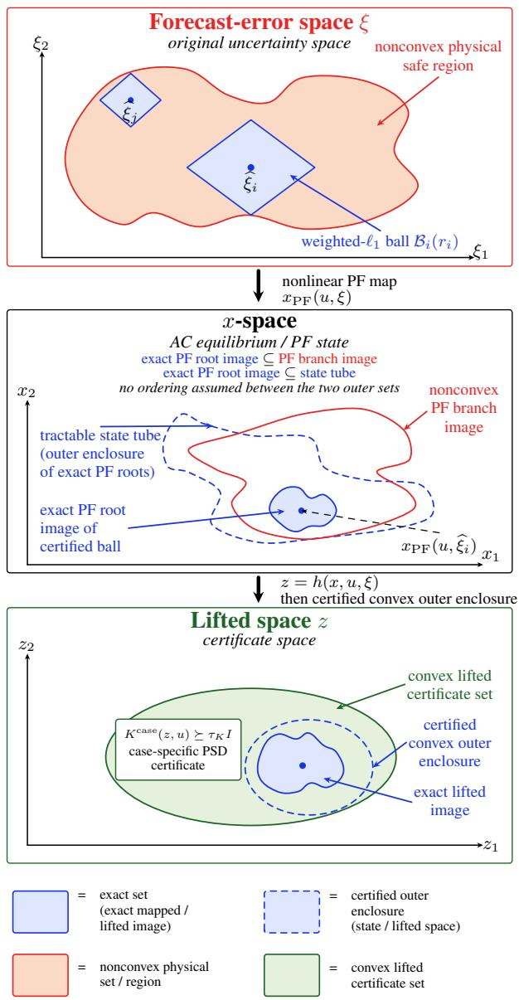
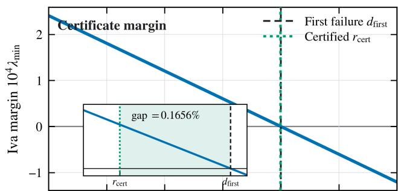
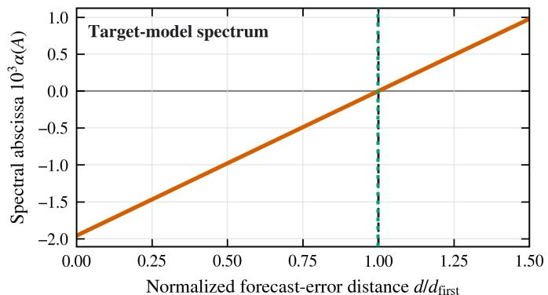
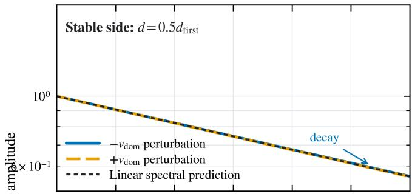
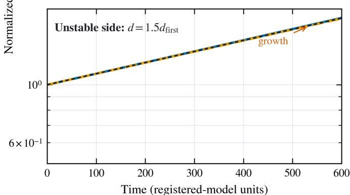

# Certified Safety Radii in Forecast-Error Space for Wasserstein Distributionally Robust Small Signal Stability-Constrained AC Optimal Power Flow via Lifted Spectrahedral Containment

Ziqi Zhang, Student Member, IEEE and Xi Chen, Member, IEEE

Abstract—Directly robustifying small-signal stability in AC optimal power flow (OPF) is challenging since the stability boundary in the original uncertainty space is implicit, highly nonconvex, and changes with the operating decision. This paper exploits an alternative geometry. For a fixed model-specific stability certificate admitting suitable physical lifts, the small-signal stability requirement becomes an affine positive-semidefinite (PSD) constraint in the lifted variables, thereby defining a convex certified safe region. Instead of approximating the nonlinear instability boundary itself, we optimize a sample-wise safe radius in the original uncertainty space and certify, in the lifted space, that the entire power-flow image of the corresponding uncertainty ball is contained in the convex stability region. To this end, a componentwise Perron certificate guarantees existence, uniqueness, and Jacobian regularity of the target AC power-flow branch throughout each ball. An adjoint elimination then provides an exact affine–quadratic representation of the stability-relevant quantities, while rigorous matrix-remainder bounds convert their nonlinear variation into finite robust PSD constraints. The resulting radii are certified lower bounds on the distances from empirical samples to failure and can therefore be coupled directly to the distance-based reformulation of a Wasserstein distributionally robust chance constraint, without directly approximating the instability boundary. Numerical studies demonstrate the effectiveness of the proposed framework.

Index Terms—Distributionally robust optimization, smallsignal stability, Wasserstein ambiguity sets.

## I. INTRODUCTION

sample-distance representation of a 1-Wasserstein distributionally robust chance constraint asks for one number: how far is the sample from the closed failure set? [1] In AC optimal power flow (OPF) with small-signal stability (SSS) requirements, this number is hidden behind the equilibrium map. A forecast error has no direct stability label. It first perturbs the nodal injections, then induces an equilibrium on a nonlinear AC power-flow (PF) branch, and only at that equilibrium can operating limits and the linearized dynamics be assessed. The first loss of safety may therefore be the loss of the target PF branch, a singular PF Jacobian, an operatinglimit violation, or a loss of SSS. Moreover, all of these failure boundaries move with the dispatch decision. The statistical risk model and the physical system thus meet at a specific missing interface: a certified sample-to-failure distance measured in the same forecast-error coordinates and ground metric as the data.

The problem contains an exploitable geometric asymmetry. For the dynamic model specified in each application, a modelspecific SSS theorem can be written, after suitable physical lifting, as an affine positive-semidefinite (PSD) matrix inequality in equilibrium-dependent quantities. This paper exploits the convex geometry of the lifted certificate without moving the data or the transportation metric out of the physical forecasterror space. Instead of constructing an approximation of the entire failure boundary, we certify a ball around each empirical sample whose complete nonlinear PF image remains inside the fixed lifted safety region.

## A. Related Work and Positioning

Closest-bifurcation and closest-security-boundary methods have established systematic procedures for computing critical operating points, limiting directions, and control margins in multidimensional parameter spaces [2]–[5]. Related adversarial-distance formulations have also examined the smallest perturbation that causes an optimization model to fail, including DC-OPF infeasibility [6]. This body of work is organized around locating a critical boundary point and is particularly valuable for mechanism diagnosis, margin assessment, and corrective-control design. The Wasserstein interface considered here requires a different output: a one-sided lower distance for every empirical forecast-error sample to the joint loss of the target PF branch, PF regularity, operating feasibility, or the declared SSS property. We therefore use independently computed boundary distances as benchmarks for radius tightness, while the optimization itself is based on certified interior containment rather than nearest-boundary search.

A second body of work characterizes SSS under multidimensional uncertainty. Small-signal admissible regions, robust SSS regions, polynomial bifurcation surfaces, and structured stability radii describe how stability changes over uncertain injection or dynamic-parameter spaces [7]–[10]. Probabilistic and risk-based studies instead propagate uncertainty to critical damping ratios, spectral indices, or instability probabilities [11], [12]. These approaches provide region-level or distribution-level descriptions of uncertain stability. The object required in the present work is sample-wise and metricspecific: the reported quantity must be a certified lower distance in the operational forecast-error coordinates, and its failure event also includes the nonlinear PF branch and operating limits. Accuracy of a fitted region and the one-sided validity of such a distance are therefore distinct properties.

SSS constraints, including formulations under uncertainty, have also been incorporated directly into economic dispatch [13]–[17]. These studies establish the broader class of stabilityconstrained optimization, including its uncertainty-aware variants, and employ different uncertainty objects, stability representations, and solution mechanisms. The present paper is positioned within this class. Its contribution is not the broad category of stochastic, robust, or distributionally robust SSS-OPF, but the construction of a certified sample-distance interface for operational forecast errors whose consequences are evaluated through the nonlinear AC equilibrium.

The two ends of the required construction are also well developed. Fixed-point conditions for balanced distributionnetwork PF models and convex restrictions for parameterized PF equations provide sufficient solvability guarantees over prescribed parameter regions [18]–[21]. Monotonicity-based methods construct voltage domains containing at most one PF solution [22]. Robust convex restrictions extend these ideas to AC-OPF under uncertain injections [23]. We use these results together with explicit PF-Jacobian regularity, targetbranch propagation, and downstream safety-matrix containment. At the statistical end, Wasserstein distributionally robust optimization provides data-driven performance guarantees and tractable reformulations [1], [24], [25]. The PF literature certifies an equilibrium region, whereas the Wasserstein risk formulation aggregates supplied distances. The interface addressed in this paper is the nonlinear pullback between them: from a fixed convex safety certificate in lifted equilibrium coordinates, through the target AC-PF branch, to a certified lower distance in the original forecast-error metric.

the certified and physical sample-to-failure distances. These sample-wise radii provide the distance information required by the subsequent Wasserstein risk model without explicitly constructing the nonlinear failure boundary or repeatedly solving closest-failure problems.

The main contributions are summarized as follows.

• Certified sample-wise stability distances: We construct decision-dependent safety radii $r _ { i }$ in the original forecasterror space that rigorously lower-bound the implicit sample-to-failure distances associated with the target PF branch, PF regularity, operating limits, and the selected small-signal-stability certificate.

• End-to-end stability-certified WDRO-OPF: We couple these decision-dependent certified radii with the existing exact sample-distance Wasserstein reformulation and jointly optimize them with the dispatch in a sequential conic master, avoiding embedded closest-failure computations.

The remainder of this paper is organized as follows. Section II defines the fixed lifted-PSD certificate, the targetmodel safe sets, and the sample-distance Wasserstein risk interface. Section III develops the regular-root PF tube, the exact adjoint safety-matrix identity, and the finite robust containment conditions. Section IV presents the sequential stability-certified WDRO-OPF, the propagation of the targetbranch label between accepted iterates, and the distributional guarantee. Section V reports the numerical studies, and Section VI concludes the paper.

• Nonlinear PF-to-PSD containment: We develop a selfconsistent component-Perron PF tube and combine it with an exact adjoint elimination and matrix-level quadraticremainder certificates, preserving safety-output cancellations while reducing whole-sample-ball safety to finite SDP/SOCP constraints.

## B. Research Gap and Contributions

A key difficulty lies in the interface between small-signal stability certification and data-driven distributional robustness. Small-signal stability is evaluated at an AC equilibrium that depends implicitly on both the dispatch and the forecast error, whereas sample-distance Wasserstein reformulations require distances to failure directly in the original uncertainty space. These two descriptions are separated by the nonlinear, branchdependent mapping from forecast errors to the corresponding AC equilibrium and then to stability and operating safety, leaving the relevant sample-to-failure distances implicit and difficult to embed directly in OPF without repeatedly solving closest-failure problems. Accordingly, the central question addressed in this work is how to obtain tractable, decisiondependent lower bounds on these distances while preserving the nonlinear AC power-flow branch and a rigorous smallsignal-stability guarantee. For each empirical sample $\widehat { \xi } _ { i } .$ , we therefore seek a decision-dependent certified radius $r _ { i }$ in the original forecast-error space. The corresponding weighted- $\cdot \ell _ { 1 }$ neighborhood is required to remain entirely within the certified safe region, which itself is contained in the target-model safe region. Consequently, $r _ { i }$ is a rigorous lower bound on both

## II. PROBLEM FORMULATION AND DISTANCE-BASED RISK

## A. Fixed Lifted-PSD Stability Certificate

The dispatch vector $u \in \mathcal { U } \subseteq \mathbb { R } ^ { n _ { u } }$ contains the scheduled generation, renewable curtailment, reserves, and continuous control setpoints. The uncertainty vector $\xi ~ \in ~ \mathbb { R } ^ { m }$ records realized-minus-forecast errors in available renewable power and in active and reactive demand. These physical forecast errors remain the coordinates of the statistical model. Fixed allocation and participation factors map them affinely to nodal injections. The steady-state vector $\textit { x } \in \mathbb { R } ^ { n _ { x } }$ contains the rectangular bus voltages $V _ { b } = e _ { b } + \mathrm { j } f _ { b }$ and the balancing and voltage-magnitude auxiliaries required by the operating model. We write its equilibrium equations as $F ( x , u , \xi ) = 0 $ , where $F : \mathbb { R } ^ { n _ { x } } \times \mathbb { R } ^ { n _ { u } } \times \mathbb { R } ^ { m }  \mathbb { R } ^ { n _ { x } }$ . Specifically, F stacks active- and reactive-power balance at the buses, the reference-angle and voltage-control equations, the distributed balancing equation that accounts for AC losses, and any exact voltage-magnitude identities used by the device model. Certificate-specific equilibrium coordinates, when required, are appended to x together with their exact graph equations in F. The construction below requires the resulting equilibrium equations and safety outputs to retain the stated affine–quadratic form. A verified exact root at a base equilibrium and a continuation rule identify the target solution branch, denoted by $x _ { \mathrm { P F } } ( u , \xi ) ; ~ J _ { x } F$ is the powerflow (PF) Jacobian along that branch. Small-signal stability is evaluated for a specified dynamic model. Its controller orders, network and load dynamics, algebraic variables, parameter range, and symmetry-reduced perturbation subspace define the model assumptions. Let $z ~ = ~ h ( x , u , \xi ) ~ \in ~ \mathbb { R } ^ { n _ { z } }$ collect the equilibrium quantities entering the fixed stability certificate and the operating-limit blocks. Before solving the OPF, we fix one complete certificate with the affine symmetric pencil

$$
K ^ { \mathrm { c a s e } } ( z , u ) = K _ { 0 } + K _ { u } ( u ) + \sum _ { a = 1 } ^ { n _ { z } } z _ { a } K _ { a } ,\tag{1}
$$

where $K _ { u }$ is affine and $K _ { a }$ are fixed symmetric matrices. The online stability requirement is $K ^ { \mathrm { c a s e } } ( z , u ) \succeq \tau _ { K } I ,$ , with a prescribed margin $\tau _ { K } > 0$ . Its feasible set in $( z , u )$ is a spectrahedron and is therefore convex.

Several model-specific small-signal stability results admit the affine-PSD interface in (1). Examples include projected network–device stability matrices for lossless grid-forming (GFM) systems [26]. For grid-following (GFL) systems, $\operatorname { g S C R } / \operatorname { g O S C R }$ conditions become PSD network-strength inequalities once the model-specific critical threshold has been certified over the operating domain [27], [28]. For heterogeneous GFM/GFL/HVDC and dynamic-load subsystems, passivity and dissipativity conditions yield KYP or descriptor-KYP inequalities after the storage matrices, supply rates, and multipliers have been fixed offline [29], [30]. When a model-specific stability result requires multiple online matrix conditions, they are imposed jointly. Sections III and IV are stated for this general interface. This study instantiates it with the Iva certificate of [26]. This specialization assumes a fixed, connected, lossless effective network with $B _ { b c } = B _ { c b } \geq 0$ for $b \neq c ,$ under the susceptance and shunt sign conventions of that reference. Loads are fixed-power static loads, with instantaneous load-only buses eliminated by a valid Kron reduction. Each active node uses standard $q { - } V$ droop with fixed $\beta _ { b } ^ { q } > 0$ in an unsaturated operating mode. Conditions 1 of [26] hold uniformly on the certified domain: the modified device-response inverses are real-rational and pole-free on the closed right half-plane, their Hermitian parts are positive definite there, and they satisfy a common high-frequency coercivity bound. The effective node set and an orthonormal basis $O _ { \perp }$ of the uniform-angle complement are fixed. For this specialization, introduce the positive equilibriumvoltage coordinate $\upsilon _ { b } ~ : = ~ \left| V _ { b } \right| > 0$ and append the exact identity $\begin{array} { r } { \boldsymbol { v } _ { b } ^ { 2 } \ : = \ : e _ { b } ^ { 2 } + \ : f _ { b } ^ { 2 } } \end{array}$ to the lossless AC equations. Thus, $x _ { \mathrm { { I v a } } } = \mathrm { { c o l } } ( e , f , v , \ldots )$ , while $F _ { \mathrm { { I v a } } }$ stacks $F _ { \mathrm { A C } } ^ { \mathrm { l o s s l e s s } } ( e , f , u , \xi )$ and these magnitude identities. The certified domain enforces $v _ { b } \geq \underline { { v } } _ { b } > 0$ , thereby selecting the physical magnitude branch. Define $c _ { b c } = e _ { b } e _ { c } + f _ { b } f _ { c } , \sigma _ { b c } = f _ { b } e _ { c } - e _ { b } f _ { c } ,$ , and $w _ { b } = e _ { b } ^ { 2 } + f _ { b } ^ { 2 }$ and collect ${ z _ { \mathrm { I v a } } = \mathrm { c o l } ( \{ c _ { b c } \} , \{ \sigma _ { b c } \} , \{ w _ { b } \} , \{ v _ { b } \} ) }$ . Standard q– V droop gives $k _ { b } ^ { q } = \beta _ { b } ^ { q } / v _ { b }$ . The complete projected pencil is therefore

$$
K _ { \mathrm { I v a } } ( z _ { \mathrm { I v a } } ) = { O _ { \perp } ^ { \mathsf { T } } } \Xi _ { \mathrm { I v a } } ( z _ { \mathrm { I v a } } ) { O _ { \perp } } ,
$$

$$
\Xi _ { \mathrm { I v a } } ( z _ { \mathrm { I v a } } ) = M _ { \mathrm { n e t } } ( c , \sigma , w ) + \left[ 0 \begin{array} { c c } { { 0 } } & { { 0 } } \\ { { 0 } } & { { \mathrm { d i a g } _ { b } ( v _ { b } / \beta _ { b } ^ { q } ) } } \end{array} \right] .\tag{2}
$$

Here, $M _ { \mathrm { n e t } }$ is the steady-state network Jacobian in angle and log-voltage coordinates. Its entries are affine in $( c , \sigma , w )$ while the inverse-droop block is affine in υ because $\beta ^ { q }$ is fixed. Consequently, $K _ { \mathrm { I v a } }$ is affine in $z _ { \mathrm { I v a } } ,$ and $\{ z _ { \mathrm { I v a } } :$ $K _ { \mathrm { I v a } } ( z _ { \mathrm { I v a } } ) \succeq \tau _ { K } I \rbrace$ is a spectrahedron. The full lift used below is $z = \mathrm { c o l } ( z _ { \mathrm { I v a } } , z _ { \mathrm { o p } } )$ , where $z _ { \mathrm { o p } }$ contains any additional affine– quadratic outputs required by the operating-limit blocks and may be empty; $K _ { \mathrm { I v a } }$ has zero coefficients on these coordinates. The magnitude identities in the augmented equilibrium equations remain part of the nonlinear physical graph; they are not relaxed by this lifted geometry. Under these Iva-specific assumptions, [26, Th. 1] makes $K _ { \mathrm { I v a } } ~ \succ ~ 0$ necessary and sufficient for asymptotic stability of the specified linearized closed loop after removal of the uniform-angle mode. The buffered condition $K _ { \mathrm { I v a } } \succeq \tau _ { K } I , \tau _ { K } > 0$ , is the inner certificate used here. The central difficulty remains its physical preimage $\xi \mapsto x _ { \mathrm { P F } } ( u , \xi ) \mapsto h ( x _ { \mathrm { P F } } ( u , \xi ) , u , \xi )$ , which is nonlinear and defined through the selected PF branch.

## B. Certified Safe Set and Sample-Safe Radius

Let $g _ { \ell } ( x , u , \xi ) \ : < \ : 0 , \ : \ell \ : = \ : 1 , \dots , n _ { g }$ , collect the voltage, generation, reserve, and line-flow limits. Let $\alpha _ { \perp } ( A _ { \mathrm { d y n } } ^ { \mathrm { t g t } } )$ denote the spectral abscissa of the target-model linearization. Here, gℓ, $A _ { \mathrm { d y n } } ^ { \mathrm { t g t } ^ { \mathrm { - } } }$ , and $J _ { x } F$ are evaluated at $x = x _ { \mathrm { P F } } ( u , \xi )$ . For a fixed dispatch, the physical safe set is

$S ^ { \mathrm { p h y s } } ( u ) : = \{ \xi : \ x _ { \mathrm { P F } } ( u , \xi )$ exists on the target branch,

$J _ { x } F$ is nonsingular, $g _ { \ell } < 0 \forall \ell , \quad \alpha _ { \perp } ( A _ { \mathrm { d y n } } ^ { \mathrm { t g t } } ) < 0 \} .$

(3)

The superscript phys refers throughout to this specified target model. A higher-fidelity interpretation requires a separate uniform bridge covering its equilibria, regularity, limits, and dynamics. The fixed pencil defines the certified safe set

$S ^ { \mathrm { c e r t } } ( u ) : = \{ \xi : x _ { \mathrm { P F } } ( u , \xi )$ exists on the target branch,

$$
\begin{array} { r l } & { J _ { x } F \mathrm { ~ i s ~ n o n s i n g u l a r , } \quad g _ { \ell } < 0 \forall \ell , } \\ & { K ^ { \mathrm { c a s e } } ( h ( x _ { \mathrm { P F } } ( u , \xi ) , u , \xi ) , u ) \succ 0 \} . } \end{array}\tag{4}
$$

The certificate theorem gives $S ^ { \mathrm { c e r t } } ( u ) \subseteq S ^ { \mathrm { p h y s } } ( u )$ . Let $D \in$ $\mathbb { R } ^ { m \times m }$ be a nonsingular metric matrix fitted independently of the OPF samples and set $\| \delta \| _ { D } = \| D \delta \| _ { 1 }$ . The data and transport remain in forecast-error space; D only sets their scale and directional cost. The strict conditions in (4) make $S ^ { \mathrm { c e r t } } ( u )$ open on the selected branch. Its failure set $\mathcal { F } ^ { \mathrm { c e r t } } ( u ) = \mathbb { R } ^ { \dot { m } } \dot { } \backslash$ $\mathinner { S ^ { \mathrm { c e r t } } \mathopen { \left( u \right) } }$ is therefore closed. For sample ${ \widehat { \xi } } _ { i } ,$ , define

$$
d _ { i } ^ { \mathrm { c e r t } } ( u ) : = \operatorname* { i n f } _ { \xi \in \mathcal { F } ^ { \mathrm { c e r t } } ( u ) } \| D ( \xi - \widehat { \xi } _ { i } ) \| _ { 1 } .\tag{5}
$$

This distance reaches the first loss of the target PF branch, Jacobian regularity, an operating limit, or certified small-signal stability. Computing it directly entails a nonconvex search over an implicitly defined failure boundary. We instead optimize a radius $r _ { i } \geq 0$ by certifying the set inclusion

$$
\mathcal { B } _ { i } ( r _ { i } ) : = \{ \widehat { \xi } _ { i } + \delta : \| D \delta \| _ { 1 } \leq r _ { i } \} \subseteq S ^ { \mathrm { c e r t } } ( u ) .\tag{6}
$$

Denote $d _ { i } ^ { \mathrm { p h y s } } ( u )$ as the analogous distance to $\mathbb { R } ^ { m } \setminus S ^ { \mathrm { p h y s } } ( u )$ then ${ \mathcal { B } } _ { i } ( { \dot { r } } _ { i } ) \subseteq S ^ { \operatorname { c e r t } } ( u ) \implies 0 \leq r _ { i } \leq d _ { i } ^ { \operatorname { c e r t } } ( u ) \leq d _ { i } ^ { \operatorname { p h y s } } ( u )$ Fig. 1 illustrates this inclusion across the forecast-error, PFstate, and lifted spaces.

  
Fig. 1. Geometry of a certified sample-safe radius. A weighted $\ell _ { 1 }$ ball $B _ { i } ( r _ { i } )$ centered at the empirical forecast-error sample $\widehat { \xi } _ { i } ,$ is propagated through the nonlinear target-branch PF map. Its exact root image (solid blue) is contained in a tractable state tube (dashed blue); the tube and the full nonconvex PFbranch image (red) need not contain one another. The exact lifted image is enclosed by a certified convex set that is required to lie inside the modelspecific spectrahedron $K ^ { \mathrm { c a s e } } ( z , u ) \succeq \tau _ { K } I$ (green). With the operating-limit blocks treated in the same way, this proves $\breve { B _ { i } } ( r _ { i } ) \subseteq S ^ { \mathrm { c e r t } } ( u ) \sp { \bullet } \subseteq S ^ { \mathrm { p h y s } } ( u )$ and hence $0 \leq r _ { i } \leq d _ { i } ^ { \mathrm { c e r t } } ( u ) \leq d _ { i } ^ { \mathrm { p h y s } } ( u )$

## C. Exact Wasserstein Risk Aggregation

For realized-minus-forecast error samples $\widehat { \xi } _ { 1 } , \dots , \widehat { \xi } _ { N }$ , let $\begin{array} { r } { \widehat { \mathbb { P } } _ { N } ~ = ~ N ^ { - 1 } \sum _ { i = 1 } ^ { N } \delta _ { \widehat { \xi } _ { i } } } \end{array}$ be the empirical distribution. Using $\| \cdot \| _ { D }$ as the transportation cost, consider the 1-Wasserstein ambiguity set $\mathbb { B } _ { \rho } ( \widehat { \mathbb { P } } _ { N } ) : = \{ \mathbb { Q } : W _ { 1 } ^ { D } ( \mathbb { Q } , \widehat { \mathbb { P } } _ { N } ) \leq \rho \}$ . Such empirical Wasserstein sets admit finite-sample coverage guarantees under standard tail assumptions [24]. Because $S ^ { \mathrm { c e r t } } ( u ) \subseteq$ $\mathit { S } ^ { \mathrm { p h y s } } ( u )$ , controlling certificate failure also controls targetmodel failure. For $\rho > 0 , \alpha \in ( 0 , 1 )$ , and the closed set $\mathcal { F } ^ { \mathrm { c e r t } } ( u )$ , the sample-distance reformulation of [1] gives

$$
\operatorname* { s u p } _ { \mathbb { Q } \in \mathbb { B } _ { \rho } ( \mathbb { P } _ { N } ) } \mathbb { Q } [ \xi \in \mathcal { F } ^ { \mathrm { c e r t } } ( u ) ] \leq \alpha\tag{7}
$$

if and only if there exist $t \geq 0$ and $s _ { i } \geq 0$ such that $d _ { i } ^ { \mathrm { c e r t } } ( u ) \geq$ $\begin{array} { r } { t - s _ { i } , \rho + \frac { 1 } { N } \sum _ { i = 1 } ^ { N } s _ { i } \le \alpha t , \ i \ = \ 1 , \dots , N } \end{array}$ . The certified distance ordering allows the exact distances to be replaced safely by $\begin{array} { r } { r _ { i } \geq \dot { t - s _ { i } } , s _ { i } \geq 0 , \rho + \frac { 1 } { N } \sum _ { i = 1 } ^ { N } s _ { i } \leq \alpha t , t \geq 0 \ i = } \end{array}$ $1 , \ldots , N$ . Conditional on the true distances, the reformulation aggregates the Wasserstein risk exactly. The formulation’s conservatism has two sources: the certified lower bounds $r _ { i } \leq d _ { i } ^ { \mathrm { c e r t } } ( u )$ , and any gap between the fixed certificate and the target-model stability condition. Let $[ N ] : = \{ 1 , \dots , N \}$ , and let $C ( u )$ denote the operating cost. The resulting Wasserstein distributionally robust OPF (WDRO-OPF) has the following oracle form:

$$
\begin{array} { r l } { \underset { u , r , t , s } { \operatorname* { m i n } } } & { C ( u ) } \\ { \mathrm { s . t . } } & { \xi ^ { \mathrm { n o m } } \in \mathcal { S } ^ { \mathrm { c e r t } } ( u ) , \quad \mathcal { B } _ { i } ( r _ { i } ) \subseteq \mathcal { S } ^ { \mathrm { c e r t } } ( u ) , \ \forall i \in [ N ] , } \\ & { r _ { i } \geq t - s _ { i } , \quad r _ { i } , s _ { i } \geq 0 , \ \forall i \in [ N ] , } \\ & { \rho + \displaystyle \frac { 1 } { N } \sum _ { i = 1 } ^ { N } s _ { i } \leq \alpha t , \quad u \in \mathcal { U } , \quad t \geq 0 . } \end{array}\tag{P-oracle}
$$

The nominal condition in (P-oracle) enforces certified feasibility at the prescribed forecast, for which $\xi ^ { \mathrm { n o m } } = 0$ under the usual error convention. The sample blocks control distributional risk.

## III. CERTIFIED SAMPLE-SAFE RADII

Section II reduces the distributionally robust chance constraint to a sample-wise geometric requirement: for each empirical sample $\widehat { \xi _ { i } } ,$ , we must find a radius $r _ { i }$ such that every forecast-error realization in $B _ { i } ( r _ { i } ) = \left\{ \widehat { \xi } _ { i } + \delta : \| D \delta \| _ { 1 } \leq r _ { i } \right\}$ remains inside the certified safe set. The difficulty is that safety cannot be checked directly in the forecast-error coordinates. Each realization first determines an equilibrium through the nonlinear and branch-dependent AC power-flow equations, and the operating and small-signal stability conditions must then be verified at that equilibrium. The required inclusion is established through

$$
\begin{array} { r l } & { \mathcal { B } _ { i } ( r _ { i } ) \xrightarrow { \mathrm { P F } } \bar { x } _ { i } + \mathcal { Y } _ { i } ( \beta _ { i } ) } \\ & { \xrightarrow { \mathrm { a d j o i n t } } \{ \mathsf { M } _ { \kappa } \} _ { \kappa \in \mathcal { K } _ { \mathrm { s a f } } } \xrightarrow { \mathrm { P S D } } \mathcal { S } ^ { \mathrm { c e r t } } ( u ) . } \end{array}\tag{8}
$$

Here, $\bar { x } _ { i } + \mathcal { V } _ { i } ( \beta _ { i } )$ is a certified state tube containing all target-branch equilibria generated by the sample ball, while $\{ \mathsf { M } _ { \kappa } \} _ { \kappa \in \mathcal { K } _ { \mathrm { s a f } } }$ denotes the stability and operating safety-matrix blocks evaluated over that tube. The three arrows in (8) mark successive certificates applied to the same physical PF graph. The first establishes existence, uniqueness, and Jacobian regularity of the target PF branch throughout the uncertainty ball. The second uses exact adjoint identities to expose the dependence of every safety block on the dispatch, forecast error, and a quadratic state remainder. The third bounds these remainders at the matrix level and enforces robust PSD containment over the entire tube. Together, these three steps give $B _ { i } ( r _ { i } ) \subseteq S ^ { \mathrm { c e r t } } ( u ) \subseteq S ^ { \mathrm { p h y s } } ( u )$ , and therefore $0 \leq r _ { i } \leq$ $d _ { i } ^ { \mathrm { c e r t } } ( u ) ~ \leq ~ d _ { i } ^ { \mathrm { p h y s } } ( u )$ . Accordingly, this section constructs a finite conic certificate for a sample-centered ball contained in the nonlinear safe set. For each sample $i ,$ the certificate is constructed around a PF anchor $( \bar { x } _ { i } , \bar { u } , \widehat { \xi _ { i } } )$ associated with the currently accepted dispatch u¯. All local sensitivity coefficients, quadratic majorants, Perron scalings, adjoint quantities, and matrix-remainder bounds are then held fixed while the conic master updates $u , r _ { i } ,$ and the tube variables introduced below. The sequential-iteration superscript is suppressed for clarity. The derivation uses exact coefficients. In the implementation, sparse linear solves and subsequent enclosures are verified with outward rounding [31]; their one-sided numerical errors are absorbed into the fixed majorants and matrix tails.

## A. Branch-Preserving Component-Perron PF Tube

Set $y = x - { \bar { x } } _ { i } , \Delta u = u - { \bar { u } } .$ , and $\delta = \xi - { \widehat { \xi } } _ { i }$ . Under the rectangular-coordinate affine–quadratic contract of Section $\mathrm { I I } ,$ including any case-specific equilibrium augmentation, the $\mathbf { A C }$ equations are quadratic in the state and affine in $( u , \xi ) ;$ ; hence $F ( \bar { x } _ { i } + y , u , \widehat { \xi _ { i } } + \delta ) = F _ { i } ^ { 0 } + J _ { i } y + B _ { i } \Delta u + C _ { i } \delta + Q _ { i } ( y ) ,$ (9) Here, $F _ { i } ^ { 0 } \ : = \ F ( \bar { x } _ { i } , \bar { u } , \widehat { \xi } _ { i } ) , \ J _ { i } \ : = \ \nabla _ { x } F ( \bar { x } _ { i } , \bar { u } , \widehat { \xi } _ { i } ) , \ B _ { i } \ : =$ $\nabla _ { u } F ( \bar { x } _ { i } , \bar { u } , \widehat { \xi _ { i } } )$ , and $\begin{array} { r c l } { C _ { i } } & { \mathrel { \mathop : } = } & { \nabla _ { \xi } F ( \bar { x } _ { i } , \bar { u } , \hat { \xi } _ { i } ) } \end{array}$ . Since $F$ is quadratic in $\begin{array} { r l r } { x , } & { { } [ Q _ { i } ( y ) ] _ { \ell } } & { = } & { { \bf \nabla } y ^ { \top } H _ { i \ell } ^ { \mathrm { s } } y , } \end{array}$ where $H _ { i , \ell } ^ { \mathrm { s } } \quad : = \quad$ $\textstyle { \frac { 1 } { 2 } } \bigtriangledown _ { x x } ^ { 2 } F _ { \ell } ( \bar { x } _ { i } , \bar { u } , \widehat { \xi } _ { i } )$ . Equation (9) is an exact algebraic identity, not a truncated Taylor model. The residual $F _ { i } ^ { \mathrm { { \bar { 0 } } } }$ is retained so that a floating-point PF center is not treated as an exact root. Let $M _ { i } = J _ { i } ^ { - 1 }$ , and let $m _ { i p } ^ { \mathsf { T } }$ denote its p-th row. The PF equation is equivalent to the fixed-point problem

$$
y = \Phi _ { i } ( y ; u , \delta ) : = - M _ { i } \big ( F _ { i } ^ { 0 } + B _ { i } \Delta u + C _ { i } \delta + Q _ { i } ( y ) \big ) .\tag{10}
$$

Fixed-point and convex-restriction methods provide sufficient PF solvability guarantees [18]–[21], while monotonicity-based voltage domains certify that the domain contains at most one PF solution [22]. Robust convex restrictions were subsequently extended to AC-OPF under uncertain injections [23]. Here, the componentwise self-mapping and Perron-scaled contraction conditions are imposed uniformly over each sample-centered forecast-error ball. They certify a unique PF root and a nonsingular PF Jacobian within the tube; separate center-root and continuation conditions associate this root with the target PF branch before its matrix-valued safety image is enclosed. Choose a fixed positive scaling $\varsigma _ { i } \in \mathbb { R } _ { + + } ^ { n _ { x } }$ , let $S _ { i } = \operatorname { D i a g } ( \varsigma _ { i } )$ , and define the component tube

$$
\mathcal { V } _ { i } ( \beta _ { i } ) : = \{ y : ~ | y _ { p } | \leq \varsigma _ { i p } \beta _ { i p } , ~ p = 1 , \ldots , n _ { x } \} ,\tag{11a}
$$

$$
\beta _ { i p } \geq 0 , \qquad \chi _ { i p } \geq \beta _ { i p } ^ { 2 } , \quad p = 1 , \ldots , n _ { x } .\tag{11b}
$$

Route-specific applicability restrictions are imposed as additional tube or safety-block conditions. For the Iva specialization only, the augmented magnitude equations are included in $F ,$ , and the component tube also satisfies $\bar { v } _ { i b } - \varsigma _ { i , v _ { b } } \beta _ { i , v _ { b } } \geq$ $\underline { { v } } _ { b } \ > \ 0$ at every bus b, so the entire tube remains on the positive magnitude branch; here $\bar { v } _ { i b }$ is the voltage-magnitude coordinate of the sample anchor ${ \bar { x } } _ { i } .$ . The inequalities in (11b) are rotated-SOC representable. Define

$$
G _ { i p } : = \sum _ { \ell = 1 } ^ { n _ { x } } m _ { i p , \ell } H _ { i \ell } ^ { \mathrm { s } } , \qquad A _ { i p } : = S _ { i } G _ { i p } S _ { i } .\tag{12}
$$

For each $p = 1 , \ldots , n _ { x }$ and face sign $\varepsilon \in \{ - 1 , + 1 \}$ , a fixed nonnegative vector $d _ { i p } ^ { \varepsilon }$ is used only after verifying

$$
\begin{array} { r } { \mathrm { D i a g } ( d _ { i p } ^ { \varepsilon } ) + \varepsilon A _ { i p } \succeq 0 . } \end{array}\tag{13}
$$

Consequently, $\begin{array} { r } { - \varepsilon y ^ { \mathsf { T } } G _ { i p } y \le \sum _ { q = 1 } ^ { n _ { x } } d _ { i p q } ^ { \varepsilon } \chi _ { i q } } \end{array}$ throughout $\mathcal { \mathrm { V } } _ { i } ( \beta _ { i } )$ Using the exact support function of the weighted $\ell _ { 1 }$ ball, the two signed self-mapping conditions are

$$
\begin{array} { r l } & { - \varepsilon m _ { i p } ^ { \mathsf { T } } ( F _ { i } ^ { 0 } + B _ { i } \Delta u ) + r _ { i } \big \| D ^ { - \mathsf { T } } C _ { i } ^ { \mathsf { T } } m _ { i p } \big \| _ { \infty } } \\ & { \qquad + \displaystyle \sum _ { q = 1 } ^ { n _ { x } } d _ { i p q } ^ { \varepsilon } \chi _ { i q } \leq \varsigma _ { i p } \beta _ { i p } , \quad \varepsilon \in \{ - 1 , + 1 \} . } \end{array}\tag{14}
$$

They guarantee $\Phi _ { i } ( \mathcal { V } _ { i } ( \beta _ { i } ) ; u , \delta ) \subseteq \mathcal { V } _ { i } ( \beta _ { i } )$ for every $\| D \delta \| _ { 1 } \leq$ $r _ { i } .$ To establish uniqueness and Jacobian regularity, define the nonnegative comparison matrix, for $p , k = 1 , \ldots , n _ { x }$

$$
[ \mathcal { L } _ { i } ( \beta _ { i } ) ] _ { p k } : = 2 \sum _ { q = 1 } ^ { n _ { x } } \bigl | [ G _ { i p } ] _ { k q } \bigr | \varsigma _ { i q } \beta _ { i q } .\tag{15}
$$

A fixed Perron scaling $\omega _ { i } \in \mathbb { R } _ { + + } ^ { n _ { x } }$ and a numerical margin $\eta _ { J } \in ( 0 , 1 )$ give the affine contraction condition

$$
\begin{array} { r } { \mathcal { L } _ { i } ( \beta _ { i } ) \omega _ { i } \leq ( 1 - \eta _ { J } ) \omega _ { i } \quad \mathrm { c o m p o n e n t w i s e } . } \end{array}\tag{16}
$$

Theorem 1 (Sample-ball regular-root certificate). Suppose that (9) holds and $J _ { i }$ is nonsingular. If (11)–(16) hold, then, for every $\| D \delta \| _ { 1 } \leq r _ { i } , \quad$ , there exists a unique solution

$$
x _ { \mathrm { P F } } ( u , \widehat { \xi _ { i } } + \delta ) \in \bar { x } _ { i } + \mathcal { V } _ { i } ( \beta _ { i } ) .\tag{17}
$$

The solution depends continuously on $\delta ,$ and $J _ { x } F$ is nonsingular throughout the certified tube. Let $\boldsymbol { x } _ { i } ^ { c }$ denote the exact root at $\delta = 0 . \mathrm { \ } H \mathrm { \Delta } x _ { i } ^ { c }$ has been identified with the target PF branch at initialization or by Proposition $^ { l , }$ then the roots throughout the sample ball inherit this label.

Proof. The verified matrix inequality in (13), the square epigraphs, and $\begin{array} { r } { \operatorname* { s u p } _ { \| D \delta \| _ { 1 } \leq r _ { i } } a ^ { \mathsf { T } } \delta = r _ { i } \| D ^ { - \mathsf { T } } a \| _ { \infty } } \end{array}$ show that (14) is a componentwise self-mapping certificate.

Quadratic polarization and (15) give $| \Phi _ { i } ( y ) - \Phi _ { i } ( y ^ { \prime } ) | \ \leq$ $\mathcal { L } _ { i } ( \beta _ { i } ) | y - y ^ { \prime } |$ . Let $\| v \| _ { \omega _ { i } , \infty } : = \operatorname* { m a x } _ { p } | v _ { p } | / \omega _ { i p }$ . Condition (16) makes $\Phi _ { i }$ a strict contraction in this norm. Banach’s fixedpoint theorem gives existence, uniqueness, and continuous parameter dependence. Finally,

$$
I - D _ { y } \Phi _ { i } ( y ) = M _ { i } J _ { x } F ( \bar { x } _ { i } + y , u , \widehat { \xi _ { i } } + \delta ) ,\tag{18}
$$

and the left-hand side is nonsingular by the Neumann lemma. Since $M _ { i }$ is nonsingular, so is $J _ { x } F$ . For any admissible $\delta ,$ the path $\gamma _ { \delta } \mapsto \gamma _ { \delta } \delta , \gamma _ { \delta } \in [ 0 , 1 ]$ , remains in the convex sample ball. Continuous parameter dependence therefore connects its unique roots to $\boldsymbol { x } _ { i } ^ { c }$ without encountering a singularity, which proves the conditional branch-label statement. □

Because $F _ { i } ^ { 0 }$ is retained, $\bar { x } _ { i }$ is a numerical center rather than an assumed exact solution. The unique exact PF root $x _ { i } ^ { c } ,$ enclosed by the verified isolation tube around $\bar { x } _ { i }$ , belongs to the target branch, whose identity is propagated between accepted iterates as follows.

## B. Exact Adjoint Safety-Matrix Identity

Each lift coordinate used by the stability and operating-limit blocks has the exact form

$$
z _ { a } ( x , u , \xi ) = x ^ { \mathsf { T } } Z _ { a } x + p _ { a } ^ { \mathsf { T } } x + d _ { a } ^ { \mathsf { T } } u + e _ { a } ^ { \mathsf { T } } \xi + f _ { a } .\tag{19}
$$

Here, $Z _ { a } \in \mathbb { R } ^ { n _ { x } \times n _ { x } } , p _ { a } \in \mathbb { R } ^ { n _ { x } } , d _ { a } \in \mathbb { R } ^ { n _ { u } } , e _ { a } \in \mathbb { R } ^ { m }$ , and $f _ { a } \in \mathbb { R }$ , for $a = 1 , \dots , n _ { z }$ . Case-specific linear coordinates are included by setting $Z _ { a } \ = \ 0 ;$ in the Iva specialization, this covers the $v _ { b }$ terms in (2) without approximation. Writing $Z _ { a } ^ { \mathrm { s } } : = ( Z _ { a } + Z _ { a } ^ { \top } ) / 2 , g _ { i a } = 2 Z _ { a } ^ { \mathrm { s } } \bar { x } _ { i } + p _ { a }$ , and $\bar { z } _ { i a } = z _ { a } ( \bar { x } _ { i } , \bar { u } , \widehat { \xi _ { i } } )$ gives

$$
z _ { a } = \bar { z } _ { i a } + g _ { i a } ^ { \mathsf { T } } y + y ^ { \mathsf { T } } Z _ { a } ^ { \mathrm { s } } y + d _ { a } ^ { \mathsf { T } } \Delta u + e _ { a } ^ { \mathsf { T } } \delta .\tag{20}
$$

To eliminate the linear state term without approximating the PF graph, solve the following adjoint system for $\lambda _ { i a } \in \mathbb { R } ^ { n _ { x } } ;$

$$
J _ { i } ^ { \mathsf { T } } \lambda _ { i a } = g _ { i a } .\tag{21}
$$

Lemma 1 (Exact adjoint safety-output identity). On the $P F$ graph (9),

$$
\boxed { z _ { a } = z _ { i a } ^ { 0 } + \widehat { d } _ { i a } ^ { \mathsf { T } } \Delta { u } + \widehat { e } _ { i a } ^ { \mathsf { T } } \delta + y ^ { \mathsf { T } } R _ { i a } y }\tag{22}
$$

holds exactly, where

$$
z _ { i a } ^ { 0 } : = \bar { z } _ { i a } - \lambda _ { i a } ^ { \top } F _ { i } ^ { 0 } ,\tag{23a}
$$

$$
\widehat { d } _ { i a } : = d _ { a } - B _ { i } ^ { \mathsf { T } } \lambda _ { i a } , \qquad \widehat { e } _ { i a } : = e _ { a } - C _ { i } ^ { \mathsf { T } } \lambda _ { i a } ,\tag{23b}
$$

$$
R _ { i a } : = Z _ { a } ^ { \mathrm { s } } - \sum _ { \ell = 1 } ^ { n _ { x } } \lambda _ { i a , \ell } H _ { i \ell } ^ { \mathrm { s } } .\tag{23c}
$$

Proof. Equation (21) gives $g _ { i a } ^ { \mathsf { T } } y = \lambda _ { i a } ^ { \mathsf { T } } J _ { i } y$ . Substituting

$$
J _ { i } y = - F _ { i } ^ { 0 } - B _ { i } \Delta u - C _ { i } \delta - Q _ { i } ( y )
$$

from (9) into (20) yields (22)–(23).

Thus the adjoint step does not replace or linearize the nonlinear PF equations. It removes the first-order state dependence only after the PF equality is imposed, leaving an exact quadratic residual. Only the distinct lift directions appearing in the safety blocks require adjoint right-hand sides.

To treat stability and operating limits uniformly, index their affine symmetric blocks by $\kappa \in { \mathcal { K } } _ { \mathrm { s a f } }$ , and let $n _ { \kappa }$ denote the order of block κ:

$$
\mathsf { M } _ { \kappa } ( z , u ) = \mathsf { M } _ { \kappa 0 } + \mathsf { M } _ { \kappa u } ( u ) + \sum _ { a = 1 } ^ { n _ { z } } z _ { a } \mathsf { B } _ { \kappa a } \succeq 0 .\tag{24}
$$

Here, $\mathsf { M } _ { \kappa 0 } , \ \mathsf { M } _ { \kappa u } ( u )$ , and $\mathsf { B } _ { \kappa a }$ belong to $\mathbb { S } ^ { n _ { \kappa } }$ . The stability block is $K ^ { \mathrm { c a s e } } ( z , u ) - \tau _ { K } I ;$ a scalar upper limit is represented by $\textbf { a } 1 \times 1$ block after its strictness margin is absorbed; and an SOC limit is represented by its standard arrow-PSD block. These are assembled blockwise in the implementation and are not formed as one dense matrix. Let $\widetilde { \delta } = D \delta$ , and let $\widehat { E } _ { i }$ have row a equal to $ { \hat { e } } _ { i a } ^ { \sf T }$ . Lemma 1 gives the exact block identity

$$
\mathsf { M } _ { \kappa } = \mathsf { M } _ { i \kappa } ^ { \mathrm { c } } ( u ) + \sum _ { j = 1 } ^ { m } \widetilde { \delta } _ { j } \mathsf { M } _ { i \kappa j } + \mathcal { R } _ { i \kappa } ( y ) ,\tag{25}
$$

where

$$
\mathsf { M } _ { i \kappa } ^ { \mathrm { c } } ( u ) : = \mathsf { M } _ { \kappa 0 } + \mathsf { M } _ { \kappa u } ( u ) + \sum _ { a = 1 } ^ { n _ { z } } \bigl ( z _ { i a } ^ { 0 } + \widehat { d } _ { i a } ^ { \mathsf { T } } \Delta u \bigr ) \mathsf { B } _ { \kappa a } ,\tag{26a}
$$

$$
\mathsf { M } _ { i \kappa j } : = \sum _ { a = 1 } ^ { n _ { z } } [ \widehat { E } _ { i } D ^ { - 1 } ] _ { a j } \mathsf { B } _ { \kappa a } ,\tag{26b}
$$

$$
\mathcal { R } _ { i \kappa } ( y ) : = \sum _ { a = 1 } ^ { n _ { z } } \bigl ( y ^ { \mathsf { T } } R _ { i a } y \bigr ) \mathsf { B } _ { \kappa a } .\tag{26c}
$$

The nonlinear term in (26c) is an operator-valued quadratic remainder. Combining the output directions before bounding this term retains cancellations that are lost when every lifted coordinate is enclosed independently.

## C. Finite Matrix-Remainder Robust Containment

We next construct a finite, verified lower bound for $\mathcal { R } _ { i \kappa } ( y )$ First, fixed signed output majorants $d _ { i a } ^ { \mathrm { U } } , d _ { i a } ^ { \mathrm { L } } \geq 0$ satisfy

$$
\mathrm { D i a g } ( d _ { i a } ^ { \mathrm { U } } ) - S _ { i } R _ { i a } S _ { i } \succeq 0 , \qquad \mathrm { D i a g } ( d _ { i a } ^ { \mathrm { L } } ) + S _ { i } R _ { i a } S _ { i } \succeq 0 .\tag{27}
$$

Hence, throughout $\mathcal { \mathrm { V } } _ { i } ( \beta _ { i } )$ ,

$$
- L _ { i a } ( \chi _ { i } ) \leq y ^ { \mathsf { T } } R _ { i a } y \leq U _ { i a } ( \chi _ { i } ) , \quad \left\{ U _ { i a } ( \chi _ { i } ) = ( d _ { i a } ^ { \mathsf { U } } ) ^ { \mathsf { T } } \chi _ { i } , \right.\tag{28}
$$

These one-sided bounds preserve residual asymmetry and provide a valid coordinatewise enclosure. For a matrix-level bound, define, for $p , q = 1 , . . . , n _ { x }$

$$
\mathsf C _ { i \kappa , p q } : = \mathsf { \varsigma } _ { i p } \varsigma _ { i q } \sum _ { a = 1 } ^ { n _ { z } } [ R _ { i a } ] _ { p q } \mathsf B _ { \kappa a } .\tag{29}
$$

For $y = S _ { i } \widetilde { y } ,$

$$
\mathcal { R } _ { i \kappa } ( S _ { i } \widetilde { y } ) = \sum _ { p } \widetilde { y } _ { p } ^ { 2 } \mathsf { C } _ { i \kappa , p p } + 2 \sum _ { p < q } \widetilde { y } _ { p } \widetilde { y } _ { q } \mathsf { C } _ { i \kappa , p q } .\tag{30}
$$

Choose a fixed state-interaction core graph $\begin{array} { r l } { \mathcal { G } _ { i \kappa } ^ { \mathrm { c } } } & { { } = } \end{array}$ $( \{ 1 , \ldots , n _ { x } \} , \mathcal { E } _ { i \kappa } ^ { \mathrm { c } } )$ . Let $\mathbf { C } _ { i \kappa } ^ { \mathrm { c } } ~ \in ~ \mathbb { S } ^ { n _ { x } n _ { \kappa } }$ be the block matrix whose diagonal block p is $\mathsf C _ { i \kappa , p p } ,$ whose $( p , q )$ block is $\mathsf C _ { i \kappa , p q }$ for a retained edge, and whose remaining off-diagonal blocks are zero. Fixed matrices $P _ { i \kappa p } \succeq 0$ are accepted only if

$$
\mathbf { C } _ { i \kappa } ^ { \mathrm { c } } + \mathrm { b l k } \mathrm { d i a g } ( P _ { i \kappa 1 } , \ldots , P _ { i \kappa n _ { x } } ) \succeq 0 .\tag{31}
$$

The PSD block matrix in (31) is a degree-two Gram certificate for a matrix polynomial, within the matrix sum-of-squares framework of [32]. The retained core and analytically bounded tail exploit the shared quadratic state factors of the present safety blocks. For a symmetric matrix A, define $| A | _ { \mathrm { m } } : =$ $( A ^ { 2 } ) ^ { \mathrm { { 1 / 2 } } }$ . The component matrix atoms are

$$
\Gamma _ { i \kappa p } : = P _ { i \kappa p } + \sum _ { \stackrel { q = 1 } { q \neq p , ~ \{ p , q \} \notin \mathcal E _ { i \kappa } ^ { c } } } ^ { n _ { x } } | \mathsf C _ { i \kappa , p q } | _ { \mathrm m } \succeq 0 ,\tag{32}
$$

where each omitted undirected edge contributes once to each endpoint. Congruence of (31) by blkdiag $( \widetilde { y } _ { p } I _ { n _ { \kappa } } )$ , together with $2 \widetilde { y } _ { p } \widetilde { y } _ { q } A \succeq - ( \widetilde { y } _ { p } ^ { 2 } + \widetilde { y } _ { q } ^ { 2 } ) | A | _ { \mathrm { m } } ,$ yields

$$
\mathcal { R } _ { i \kappa } ( y ) \succeq - \sum _ { p = 1 } ^ { n _ { x } } \chi _ { i p } \Gamma _ { i \kappa p } .\tag{33}
$$

One closed-form feasible choice is

$$
\begin{array} { l } { \displaystyle P _ { i \kappa p } ^ { \mathrm { c f } } = ( \mathsf C _ { i \kappa , p p } ) _ { - } + \sum _ { \scriptstyle q = 1 \atop { \scriptstyle q \neq p , \ \sqrt { p , q } \in { \mathscr E } _ { i \kappa } ^ { \mathrm { c } } } } ^ { n _ { x } } | \mathsf C _ { i \kappa , p q } | _ { \mathrm { m } } , } \\ { \displaystyle A _ { - } : = \frac { | A | _ { \mathrm { m } } - A } { 2 } . } \end{array}\tag{34}
$$

satisfies (31). A small offline SDP may reduce these matrices, but only a numerically verified feasible solution is retained for the online problem. For each sample–block pair, fix nonnegative split coefficients

$$
\lambda _ { i \kappa } ^ { \mathrm { b o x } } + \lambda _ { i \kappa } ^ { \mathrm { m a t } } = 1 .\tag{35}
$$

They are fixed offline parameters rather than online variables; otherwise products with $\chi _ { i }$ would be bilinear. Introduce $X _ { i \kappa a } \in \mathbb { S } ^ { n _ { \kappa } } , a = 1 , \ldots , n _ { z } .$ , and define

$$
\mu _ { i \kappa a } : = \frac { \lambda _ { i \kappa } ^ { \mathrm { b o x } } } { 2 } \big ( U _ { i a } ( \chi _ { i } ) - L _ { i a } ( \chi _ { i } ) \big ) ,\tag{36a}
$$

$$
\nu _ { i \kappa a } : = \frac { \lambda _ { i \kappa } ^ { \mathrm { b o x } } } { 2 } \bigl ( U _ { i a } ( \chi _ { i } ) + L _ { i a } ( \chi _ { i } ) \bigr ) ,\tag{36b}
$$

$$
X _ { i \kappa a } \succeq \nu _ { i \kappa a } \mathsf { B } _ { \kappa a } , \qquad X _ { i \kappa a } \succeq - \nu _ { i \kappa a } \mathsf { B } _ { \kappa a } ,\tag{36c}
$$

$$
T _ { i \kappa } ( \chi _ { i } ) : = \lambda _ { i \kappa } ^ { \mathrm { m a t } } \sum _ { p = 1 } ^ { n _ { x } } \chi _ { i p } \Gamma _ { i \kappa p } .\tag{36d}
$$

Together with the shifted center terms, the domination LMIs in (36c) give the Matrix-Cube safe counterpart for the asymmetric interval box [33]. The coordinate-box part of the remainder is then bounded below by $\begin{array} { r } { \sum _ { a = 1 } ^ { n _ { z } } \mu _ { i \kappa a } \mathsf { B } _ { \kappa a } - \sum _ { a = 1 } ^ { n _ { z } } X _ { i \kappa a } . } \end{array}$ while (33) bounds the matrix-shaped part by $- T _ { i \kappa } ( \chi _ { i } )$ . Therefore the finite robust counterpart is

$$
\begin{array} { r } { \boxed { \mathsf { M } _ { i \kappa } ^ { \mathrm { c } } ( u ) + \varepsilon r _ { i } \mathsf { M } _ { i \kappa j } + \displaystyle \sum _ { a = 1 } ^ { n _ { z } } \bigl ( \mu _ { i \kappa a } \mathsf { B } _ { \kappa a } - X _ { i \kappa a } \bigr ) \succeq T _ { i \kappa } ( \chi _ { i } ) , } } \\ { \varepsilon \in \{ - 1 , + 1 \} , \quad j = 1 , \ldots , m , \quad \kappa \in \mathcal { K } _ { \mathrm { s a f } } . } \end{array}\tag{37}
$$

Indeed, $\{ { \widetilde \delta } ~ : ~ \| { \widetilde \delta } \| _ { 1 } ~ \le ~ r _ { i } \} ~ = ~ \mathrm { c o n v } \{ \pm r _ { i } { \bf e } _ { j } \} _ { j = 1 } ^ { m }$ , where $\mathbf { e } _ { j }$ is the j-th standard basis vector, so the affine uncertainty dependence is handled exactly by the 2m vertices. The choices $( \lambda ^ { \mathrm { b o x } } , \lambda ^ { \mathrm { m a t } } ) = ( 1 , 0 )$ and (0, 1) recover the signed coordinatebox and pure matrix-remainder certificates, respectively. With these offline quantities fixed, (14), (16), (11b), and (36)–(37) are linear, SOC, or LMI constraints in the online variables. No semi-infinite constraint remains.

## D. Certified-Radius Guarantee

Theorem 2 (Certified sample-safe radius). Fix sample i. Suppose that the declared stability-certificate theorem and all of its applicability conditions hold uniformly on the certified domain. If the hypotheses of Theorem 1 hold, its exact center root carries the target-branch label, the adjoint solves and all numerical bounds have been verified, and (27)–(37) hold for every stability and operating block, then

$$
B _ { i } ( r _ { i } ) \subseteq S ^ { \mathrm { c e r t } } ( u ) \subseteq S ^ { \mathrm { p h y s } } ( u ) .\tag{38}
$$

Consequently,

$$
0 \leq r _ { i } \leq d _ { i } ^ { \mathrm { c e r t } } ( u ) \leq d _ { i } ^ { \mathrm { p h y s } } ( u ) .\tag{39}
$$

Proof. Take any $\xi = \widehat { \xi } _ { i } + \delta \in B _ { i } ( r _ { i } )$ . By Theorem 1, the target PF branch has a unique regular equilibrium with $y \in \mathcal { V } _ { i } ( \beta _ { i } )$ Lemma 1 and (25) give the exact value of every safety block at that equilibrium. Equations (28)–(36d) provide a valid lower bound for the full quadratic matrix remainder. Since $\widetilde { \delta } = D \delta$ lies in the convex hull of the 2m vertices, the LMIs in (37) imply $\mathsf { M } _ { \kappa } ( z , u ) \succeq 0$ for every $\kappa \in { \mathcal { K } } _ { \mathrm { s a f } }$ . Thus all buffered operating limits and the fixed lifted-PSD stability certificate hold, proving the first inclusion in (38). The second inclusion follows from the model-specific certificate theorem. A closed ball contained in the certified safe set cannot intersect its closed failure set, which gives (39). □

The rectangular-coordinate PF expansion, the adjoint identity on the PF graph, and the 2m-vertex reduction of the weighted- $\mathbf { \nabla } \cdot \mathbf { \rho } _ { 1 }$ affine uncertainty are exact. Conservatism enters through the component PF tube, the finite matrix-remainder certificate, and, when the stability pencil provides only a sufficient condition, the gap between $S ^ { \mathrm { c e r t } }$ and $S ^ { \mathrm { p h y s } }$ . The contribution of Theorem 2 is their composition into a certified lower bound $r _ { i }$ on the sample-to-failure distance required by the Wasserstein risk interface of Section II.

## IV. SEQUENTIAL CERTIFIED WDRO-OPF

## A. Convex Master With Fixed Local Bounds

At iteration k, the local construction of Section III uses $\begin{array} { r } { \bar { u } \ = \ u ^ { ( k ) } } \end{array}$ and $\bar { x } _ { i } ~ = ~ \bar { x } _ { i } ^ { ( k ) }$ for $\begin{array} { r c l } { i } & { \in } & { \{ 0 \} \cup [ N ] } \end{array}$ , where $\textit { i } = \textit { 0 }$ denotes the nominal center and $\hat { \xi _ { 0 } } \ : = \ \xi ^ { \mathrm { n o m } }$ . Its bounds are recomputed and fixed. Let $\mathcal { C } _ { i } ^ { ( k ) } ( u , r _ { i } , \zeta _ { i } ) , i \in [ N ]$ denote the conic conditions for $B _ { i } ( r _ { i } ) \ { \stackrel {  } { \subseteq } } \ S ^ { \operatorname { c e r t } } ( u )$ , where $\zeta _ { i }$ collects their auxiliary variables, and let $\mathcal { C } _ { 0 } ^ { ( k ) } ( u , \zeta _ { 0 } )$ denote the nominal block, with $\zeta _ { 0 }$ its auxiliary variables. Write $\zeta =$ $\mathrm { c o l } ( \zeta _ { 0 } , \dots , \zeta _ { N } )$ . Let $W _ { u } \in \mathbb { R } ^ { n _ { u } \times n _ { u } }$ be a fixed nonsingular dispatch scaling and $\Delta _ { k } > 0$ the trust-region radius. Define $\mathcal { U } ^ { ( k ) } : = \{ u \in \mathcal { U } : \| W _ { u } ( u - u ^ { ( k ) } ) \| _ { \infty } \leq \Delta _ { k } \}$ , and let $\bar { r } _ { i } ^ { ( k ) }$ be the corresponding radius limit. The iteration-k master is

$$
\begin{array} { r l r l } { \underset { u , r , t , s , \zeta } { \operatorname* { m i n } } } & { C ( u ) } & & { } \\ { \mathrm { s . t . } } & { u \in \mathcal { U } ^ { ( k ) } , } & { \mathcal { C } _ { 0 } ^ { ( k ) } ( u , \zeta _ { 0 } ) , } & & { } \\ & { \mathcal { C } _ { i } ^ { ( k ) } ( u , r _ { i } , \zeta _ { i } ) , } & { 0 \leq r _ { i } \leq \bar { r } _ { i } ^ { ( k ) } , } & { i \in [ N ] , } \\ & { } & & { r _ { i } \geq t - s _ { i } , \quad s _ { i } \geq 0 , } & { i \in [ N ] , } \\ & { \rho + N ^ { - 1 } \sum _ { i } s _ { i } \leq \alpha t , } & { t \geq 0 . } & & { } \end{array}\tag{40}
$$

For fixed bounds and convex C and $u ,$ this is an SDP/SOCP. Since the PF anchors and bounds are updated between accepted iterates, the overall procedure is sequential and does not provide a global optimum of the original nonlinear WDRO-OPF. For each $i \in \{ 0 \} \cup [ N ]$ , let $\chi _ { i , \mathrm { r o o t } } ^ { ( k ) }$ be a verified enclosure of the exact root carrying the target-branch label at the accepted dispatch $u ^ { ( k ) }$ . For a candidate $u ^ { + }$ , set $\Delta u ^ { + } =$ $u ^ { + } - u ^ { ( k ) }$ . Let $( \bar { \beta _ { i } ^ { 0 } } , \chi _ { i } ^ { 0 } )$ define a strictly feasible starting PF tube and let $( \beta _ { i } ^ { + } , \chi _ { i } ^ { + } )$ be the candidate tube variables evaluated at zero uncertainty radius. Using the same frozen PF bounds, define

$$
\begin{array} { c } { { u ( \gamma ) = u ^ { ( k ) } + \gamma \Delta u ^ { + } , \qquad \beta _ { i } ( \gamma ) = ( 1 - \gamma ) \beta _ { i } ^ { 0 } + \gamma \beta _ { i } ^ { + } , } } \\ { { \chi _ { i } ( \gamma ) = ( 1 - \gamma ) \chi _ { i } ^ { 0 } + \gamma \chi _ { i } ^ { + } , \qquad 0 \leq \gamma \leq 1 , } } \end{array}\tag{41}
$$

with the remaining PF epigraph variables interpolated in the same way.

Proposition 1 (PF branch-label propagation). Suppose that the smooth $P F$ equations, coordinates, discrete operating mode, preconditioner, and frozen local bounds remain unchanged along (41). Assume that $\mathcal { X } _ { i , \mathrm { r o o t } } ^ { ( k ) } \subseteq \bar { x } _ { i } ^ { ( k ) } + \mathcal { Y } _ { i } ( \beta _ { i } ^ { 0 } )$ and that both endpoint PF conditions satisfy the square epigraphs and have strictly positive self-mapping and Perron-contraction margins and positive tube widths. Then the unique roots in the interpolated tubes form a continuous, locally smooth, and regular PF path from the labelled root to the candidate endpoint. At $u ^ { + }$ , construct from an independent PF solve a verified root enclosure with half-width $\Delta x _ { i , \mathrm { r o o t } } ^ { + } \ \in \ \mathbb { R } _ { + } ^ { n _ { x } }$ $\mathcal { X } _ { i , \mathrm { r o o t } } ^ { + } = \{ x : | x - \bar { x } _ { i } ^ { + } | \leq \Delta x _ { i , \mathrm { r o o t } } ^ { + } \}$ . Let $S _ { i } ^ { ( k ) } = \operatorname { D i a g } ( \varsigma _ { i } ^ { ( k ) } )$ be the fixed scaling used in $\mathcal { \mathrm { V } } _ { i }$ at iteration k. If, componentwise,

$$
| \bar { x } _ { i } ^ { + } - \bar { x } _ { i } ^ { ( k ) } | + \Delta x _ { i , \mathrm { r o o t } } ^ { + } \leq S _ { i } ^ { ( k ) } \beta _ { i } ^ { + } ,\tag{42}
$$

then its exact root is the endpoint of that path and inherits the target-branch label.

Proof. The frozen self-mapping and contraction inequalities are affine in the interpolated quantities, while their epigraph constraints are convex; feasibility and the strict contraction margins therefore hold for every $\gamma \in [ 0 , 1 ]$ . Banach’s theorem and (18) give one regular root in each tube. Strict interiority and the implicit-function theorem join these roots into the stated path. Condition (42) places the new root enclosure in the old endpoint tube, whose root is unique, so the two roots coincide. □

This proposition certifies PF branch identity only; it does not assert that the dispatch path satisfies the operating or stability constraints.

## B. Acceptance and Distributional Guarantee

At iteration k, verified local bounds are constructed from PF solutions at $u ^ { ( k ) }$ , and (40) is solved. A candidate is accepted only if independent PF solves verify all safety and Wasserstein conditions and Proposition 1 holds for the nominal and sample centers; otherwise the trust region is reduced and the bounds are recomputed. Verified continuation is used if the direct path or endpoint handoff is inconclusive. The algorithm returns the last accepted iterate after two consecutive accepted iterates meet the prescribed tolerances with positive certified margins.

## V. CASE STUDIES

## A. Mechanism Study: Certified Radius Versus First Failure

We use a two-bus lossless GFM system to quantify how closely the proposed certified radius approaches the first targetmodel failure distance. Both voltage magnitudes are fixed at 1 p.u., and renewable and load forecast errors perturb the active-power transfer across the single line. The uncertainty is measured in the same weighted $\ell _ { 1 }$ metric used by the Wasserstein ambiguity set.

Let $q = D \delta$ . The line transfer can be written as

$$
P ( q ) = P _ { 0 } + { h ^ { \mathsf { T } } q } , \qquad P _ { 0 } = 0 . 6 , \qquad h = ( - 0 . 0 5 , \ 0 . 0 5 ) ^ { \mathsf { T } } .\tag{43}
$$

For this two-bus high-voltage branch,

$$
P = b \sin \phi ,\tag{44}
$$

TABLE I  
CERTIFIED RADIUS VERSUS FIRST TARGET-MODEL FAILURE DISTANCE
<table><tr><td>Quantity</td><td>Value</td></tr><tr><td>Stress fraction</td><td>0.995</td></tr><tr><td>Certified radius  $r _ { \mathrm { c e r t } }$ </td><td>0.0399337418</td></tr><tr><td>First failure distance  $d _ { \mathrm { f i r s t } }$ </td><td>0.0400000000</td></tr><tr><td>Absolute gap  $d _ { \mathrm { f i r s t } } - r _ { \mathrm { c e r t } }$ </td><td> $6 . 6 2 5 8 \times 1 0 ^ { - 5 }$ </td></tr><tr><td>Relative gap</td><td>0.1656%</td></tr><tr><td>Captured distance  $r _ { \mathrm { c e r t } } / d _ { \mathrm { f i r s t } }$ </td><td>99.8344%</td></tr></table>

and the projected Iva matrix is positive definite precisely when

$$
\cos \phi > \frac { 2 b } { 1 / \beta _ { q } + 2 b } .\tag{45}
$$

The reactive-droop coefficient is selected so that the critical transfer is $P _ { \mathrm { c r i t } } = 0 . 6 0 2 \ \mathrm { p . u }$ . Hence the nearest weighted-ℓ failure distance is available in closed form:

$$
\begin{array} { r l } {  { d _ { \mathrm { f i r s t } } = \operatorname* { m i n } _ { h ^ { \top } q = P _ { \mathrm { c r i t } } - P _ { 0 } } \| q \| _ { 1 } } } \\ & { = \frac { P _ { \mathrm { c r i t } } - P _ { 0 } } { \| h \| _ { \infty } } = \frac { 0 . 0 0 2 } { 0 . 0 5 } = 0 . 0 4 . } \end{array}\tag{46}
$$

The opposite transfer direction reaches its boundary at a larger distance. The PF Jacobian remains regular and the operating limits retain positive margins at $d _ { \mathrm { f i r s t } } ;$ therefore, the first event is the loss of small-signal stability of the registered GFM model.

Table I compares this distance with the radius returned by the proposed P1 certificate. The certified radius is 0.03993374, which captures 99.8344% of the exact distance. Its relative conservatism is only 0.1656%.

Fig. 2 explains the corresponding stability mechanism. The horizontal coordinate is the weighted- $\mathbf { \nabla } \cdot \mathbf { \rho } _ { 1 }$ displacement normalized by $d _ { \mathrm { f i r s t } }$ . As the normalized distance reaches one, the minimum eigenvalue of the Iva matrix and the spectral abscissa of the registered dynamic model cross zero at the same point. The certified radius lies immediately inside this boundary.

Immediately inside the boundary, at normalized distance 0.9999, the Iva minimum eigenvalue is $2 . 4 1 \times 1 0 ^ { - 8 }$ and the target-model spectral abscissa i $\mathrm { ~ s ~ } - 1 . 9 6 \times 1 0 ^ { - 7 }$ . Immediately outside, at normalized distance 1.0001, the corresponding values are $- 2 . 4 1 \times 1 0 ^ { - 8 }$ and $1 . 9 6 \times 1 0 ^ { - 7 }$ . At the crossing, the minimum singular value of the PF Jacobian is approximately 0.694, confirming that the stability boundary is reached while the equilibrium branch remains regular.

The nonlinear simulations provide a complementary timedomain interpretation. Perturbations initialized along both signs of the dominant mode decay on the stable side and grow on the unstable side. The fitted growth rates agree with the linearized spectral abscissae within $4 . 2 1 \times 1 0 ^ { - 6 }$ , with coefficients of determination above 0.99999989. Together, these results show that the certified radius closely tracks the first small-signal stability failure while preserving a strict inner safety margin. All statements in this subsection refer to the registered reduced standard-droop GFM target model used by the Iva certificate.

  
(a) Certificate margin and target-model spectral abscissa.

  
(b) Nonlinear trajectories on the stable and unstable sides.

Fig. 2. Mechanism study for the two-bus Iva–GFM system. The dotted line marks the P1 certified radius and the dashed line marks the closed-form first failure distance. The Iva eigenvalue, target-model spectrum, and nonlinear trajectories consistently identify the same stability transition.

## VI. CONCLUSION

This paper developed a certified framework that combines branch-preserving AC power-flow enclosures, lifted PSD stability containment, and exact Wasserstein sample-distance aggregation to obtain tractable and rigorous distributionally robust small-signal stability guarantees.

## REFERENCES

[1] Z. Chen, D. Kuhn, and W. Wiesemann, “Technical note—data-driven chance constrained programs over Wasserstein balls,” Operations Research, vol. 72, no. 1, pp. 410–424, 2024.

[2] I. Dobson, “Computing a closest bifurcation instability in multidimensional parameter space,” Journal of Nonlinear Science, vol. 3, no. 1, pp. 307–327, 1993.

[3] F. L. Alvarado, I. Dobson, and Y. Hu, “Computation of closest bifurcations in power systems,” IEEE Transactions on Power Systems, vol. 9, no. 2, pp. 918–928, 1994.

[4] S. Gomes, Jr., N. Martins, and T. J. M. A. Parreiras, “Computing the closest small-signal security boundary in the control parameter space for large scale power systems,” Electric Power Systems Research, vol. 149, pp. 10–18, 2017.

[5] C. Li, H.-D. Chiang, and Z. Du, “Investigation of an effective strategy for computing small-signal security margins,” IEEE Transactions on Power Systems, vol. 33, no. 5, pp. 5437–5445, 2018.

[6] S. Chevalier and W. A. Wheeler, “Identifying the smallest adversarial load perturbation that renders DC-OPF infeasible,” IEEE Transactions on Power Systems, vol. 41, no. 4, pp. 3161–3171, 2026.

[7] Y. Pan, S. Mei, F. Liu, W. Wei, C. Shen, and J. Hu, “Admissible region of large-scale uncertain wind generation considering small-signal stability of power systems,” IEEE Transactions on Sustainable Energy, vol. 7, no. 4, pp. 1611–1623, 2016.

[8] Y. Pan, F. Liu, L. Chen, J. Wang, F. Qiu, C. Shen, and S. Mei, “Towards the robust small-signal stability region of power systems under perturbations such as uncertain and volatile wind generation,” IEEE Transactions on Power Systems, vol. 33, no. 2, pp. 1790–1799, 2018.

[9] D. Shen, H. Wu, H. Liang, Y. Qiu, H. Xie, and D. Gan, “Accurate polynomial approximation of bifurcation hypersurfaces in parameter space for small signal stability region considering wind generation,” IEEE Transactions on Power Systems, vol. 37, no. 6, pp. 4512–4524, 2022.

[10] X. Jin, Z. Zhou, N. Dai, and Y. Chen, “Robust stability region analysis of weak-grid-following converters with multiple uncertain parameters,” IEEE Transactions on Power Electronics, vol. 41, no. 7, pp. 11 611– 11 628, 2026.

[11] R. Preece, K. Huang, and J. V. Milanovic, “Probabilistic small-´ disturbance stability assessment of uncertain power systems using efficient estimation methods,” IEEE Transactions on Power Systems, vol. 29, no. 5, pp. 2509–2517, 2014.

[12] R. Preece and J. V. Milanovic, “Risk-based small-disturbance security´ assessment of power systems,” IEEE Transactions on Power Delivery, vol. 30, no. 2, pp. 590–598, 2015.

[13] C. Hamon, M. Perninge, and L. Soder, “A stochastic optimal power flow¨ problem with stability constraints—part I: Approximating the stability boundary,” IEEE Transactions on Power Systems, vol. 28, no. 2, pp. 1839–1848, 2013.

[14] P. Pareek and H. D. Nguyen, “A convexification approach for smallsignal stability constrained optimal power flow,” IEEE Transactions on Control of Network Systems, vol. 8, no. 4, pp. 1930–1941, 2021.

[15] J. Wang, F. Fan, Y. Song, Y. Hou, and D. J. Hill, “Stability constrained optimal operation of inverter-dominant microgrids: A two stage robust optimization framework,” IEEE Transactions on Sustainable Energy, vol. 15, no. 3, pp. 1900–1913, 2024.

[16] J. Yu, P. Yong, Z. Yang, and J. Yu, “Stochastic-robust optimal power flow with small-signal stability guarantee under renewable uncertainties,” IEEE Transactions on Sustainable Energy, vol. 16, no. 3, pp. 1711– 1722, 2025.

[17] Z. Chu and F. Teng, “Managing the uncertainty in system dynamics through distributionally robust stability-constrained optimization,” IEEE Transactions on Power Systems, vol. 40, no. 1, pp. 449–462, 2025.

[18] S. Bolognani and S. Zampieri, “On the existence and linear approximation of the power flow solution in power distribution networks,” IEEE Transactions on Power Systems, vol. 31, no. 1, pp. 163–172, 2016.

[19] K. Dvijotham, H. Nguyen, and K. Turitsyn, “Solvability regions of affinely parameterized quadratic equations,” IEEE Control Systems Letters, vol. 2, no. 1, pp. 25–30, 2018.

[20] H. D. Nguyen, K. Dvijotham, and K. Turitsyn, “Constructing convex inner approximations of steady-state security regions,” IEEE Transactions on Power Systems, vol. 34, no. 1, pp. 257–267, 2019.

[21] D. Lee, H. D. Nguyen, K. Dvijotham, and K. Turitsyn, “Convex restriction of power flow feasibility sets,” IEEE Transactions on Control of Network Systems, vol. 6, no. 3, pp. 1235–1245, 2019.

[22] K. Dvijotham, M. Chertkov, and S. H. Low, “A differential analysis of the power flow equations,” in 2015 54th IEEE Conference on Decision and Control (CDC), 2015, pp. 23–30.

[23] D. Lee, K. Turitsyn, D. K. Molzahn, and L. A. Roald, “Robust AC optimal power flow with robust convex restriction,” IEEE Transactions on Power Systems, vol. 36, no. 6, pp. 4953–4966, 2021.

[24] P. M. Esfahani and D. Kuhn, “Data-driven distributionally robust optimization using the Wasserstein metric: Performance guarantees and tractable reformulations,” Mathematical Programming, vol. 171, no. 1– 2, pp. 115–166, 2018.

[25] C. Duan, W. Fang, L. Jiang, L. Yao, and J. Liu, “Distributionally robust chance-constrained approximate AC-OPF with Wasserstein metric,” IEEE Transactions on Power Systems, vol. 33, no. 5, pp. 4924–4936, 2018.

[26] I. Baciˇ c, J. Niehues, P. C. B´ ottcher, C. Dieball, L. R. Gorj¨ ao,˜ A. Benigni, F. Hellmann, and D. Witthaut, “A graph theoretic view on small signal stability of inverter-based power grids,” 2026, arXiv:2607.08260. [Online]. Available: https://arxiv.org/abs/2607.08260

[27] W. Dong, H. Xin, D. Wu, and L. Huang, “Small signal stability analysis of multi-infeed power electronic systems based on grid strength assessment,” IEEE Transactions on Power Systems, vol. 34, no. 2, pp. 1393–1403, 2019.

[28] C. Liu, H. Xin, D. Wu, H. Gao, H. Yuan, and Y. Zhou, “Generalized operational short-circuit ratio for grid strength assessment in power systems with high renewable penetration,” IEEE Transactions on Power Systems, vol. 39, no. 4, pp. 5479–5494, 2024.

[29] A. Rantzer, “On the Kalman–Yakubovich–Popov lemma,” Systems & Control Letters, vol. 28, no. 1, pp. 7–10, 1996.

[30] M. K. Camlibel and R. Frasca, “Extension of Kalman–Yakubovich– Popov lemma to descriptor systems,” Systems & Control Letters, vol. 58, no. 12, pp. 795–803, 2009.

[31] S. M. Rump, “Verification methods: Rigorous results using floating-point arithmetic,” Acta Numerica, vol. 19, pp. 287–449, 2010.

[32] C. W. Scherer and C. W. J. Hol, “Matrix sum-of-squares relaxations for robust semi-definite programs,” Mathematical Programming, vol. 107, no. 1–2, pp. 189–211, 2006.

[33] A. Ben-Tal and A. Nemirovski, “On tractable approximations of uncertain linear matrix inequalities affected by interval uncertainty,” SIAM Journal on Optimization, vol. 12, no. 3, pp. 811–833, 2002.