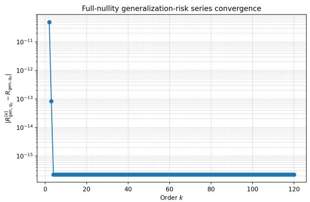
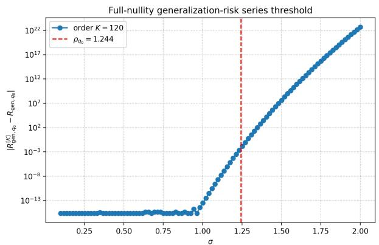
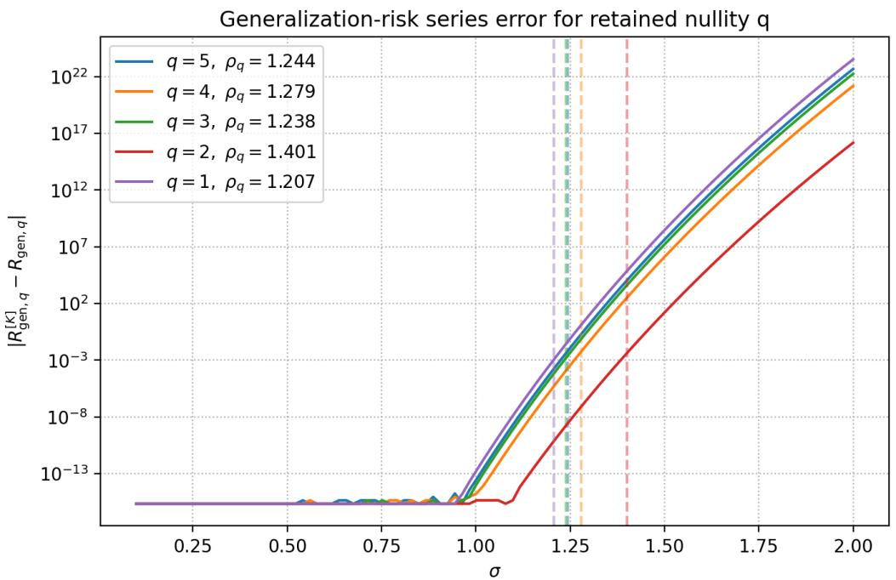
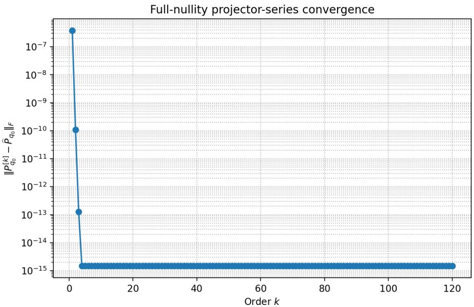
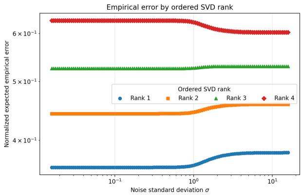
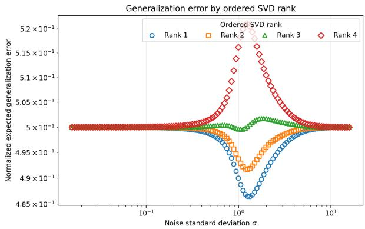
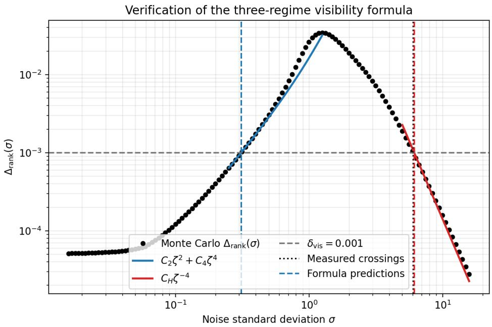
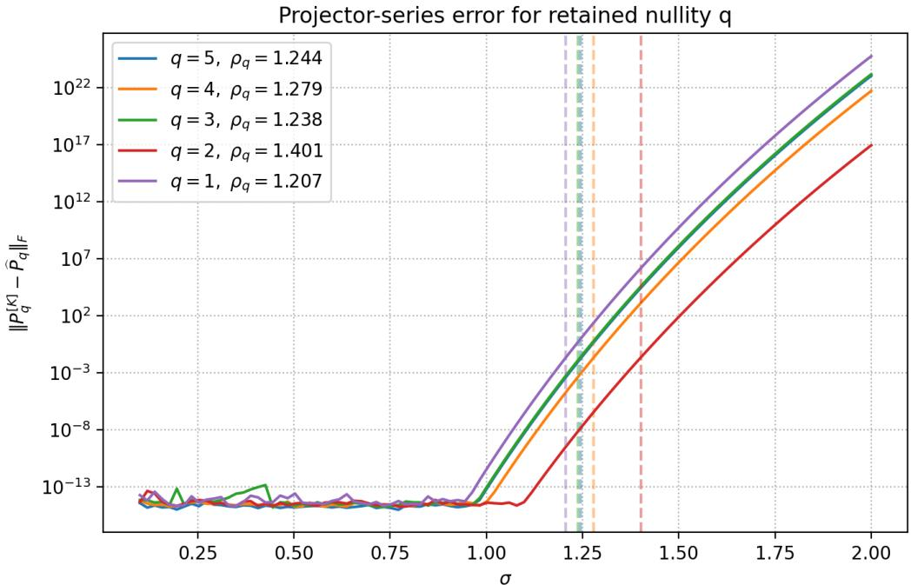

# Compact and Infinite-Order Error Analysis for Null-Space SVD Estimation

Xin Li, Jonathan Cohen, Rami Puzis

September 1, 2026

## Abstract

We study null-space estimation from a noisy matrix. For a simple left null space, we first derive an exact compact expression for the error of the smallest left singular vector. We then give an all-order series for the SVD vector and projector, followed by compact and consistently truncated series forms for the fixed-realization empirical risk and conditional population generalization risk. The recursion extends to a multipledimensional null space by following the complete invariant subspace. The convergence radius is not inferred from an error plot: it is computed independently from the nearest complex exceptional point that joins a retained eigenvalue branch to its complement. A reduced-nullity experiment shows that moving this spectral boundary can increase the radius, although the improvement is not monotone in the retained nullity. For individually ordered null directions under Gaussian training with τ ≥ m, we prove that the Wishart splitting matrix W gives a strict second-order empirical ranking. Gaussian averaging equalizes the leading generalization risks at both small and very large noise, while a column-swap theorem proves strict expected generalization ranking for an isotropic signal subspace. For unequal spikes, an exact population-overlap criterion and a simultaneous 99% Monte Carlo confidence certificate explain the observed intermediate ranking. A sixth-order risk correction improves the lower-crossover estimate in the reported experiment. This equal–ranked–equal phenomenon is a finite-sample diagnostic related to spectral mixing, but its tolerance crossings, the exceptional-point radius, and the asymptotic BBP threshold are three distinct quantities.

## 1 Contributions

The main contributions are as follows.

1. We give an exact, compact reconstruction of the smallest left singular vector for simple nullity. We then derive scalar, block, and basis-free projector recursions to arbitrary order, together with exact fixed-realization compact and coeficient forms for the empirical and population generalization risks.

2. We explain the diferent rank behavior of the two risks. Empirical branch risk is exactly the corresponding ordered sample eigenvalue divided by the number of measurements τ. Its first nonzero small-noise splitting is governed by the efective matrix W. Under Gaussian training with $\tau \geq m$ , this matrix is a nonsingular Wishart and gives a strict expected second-order ranking. For generalization risk, the stated $L ^ { 1 }$ remainder conditions give common small- and large-noise endpoint laws. Under Gaussian training with $\tau \geq m$ , we prove exact strict ranking for an isotropic signal subspace. For unequal signal eigenvalues, we give an exact cumulative population-overlap criterion.

3. Under generic boundary collisions, we characterize the convergence disk of the projector series by the nearest complex exceptional point joining a retained eigenvalue sheet to its complement. We also identify the possible cancellation condition for a scalar generalization risk and show why changing the retained nullity can enlarge or shrink the radius: it moves the spectral boundary and can expose a diferent collision.

4. Numerical experiments verify the compact identities and convergence of the arbitraryorder series. They also verify the exceptional-point radii and the nonmonotonic efect of reducing nullity. For the reported unequal-spike example, a simultaneous 99% Monte Carlo confidence certificate verifies the overlap inequalities and expected generalization ranking at a representative intermediate-noise point. Calibrated fourth- and sixthorder terms accurately predict the lower visibility crossing, while a calibrated inversenoise coeficient predicts the upper crossing.

## 2 Problem setting

Let

$$
Z = H X \in \mathbb { R } ^ { m \times \tau } , \qquad E ( \sigma ) = \sigma { \mathcal E } , \qquad \widetilde { Z } ( \sigma ) = Z + E ( \sigma ) ,\tag{1}
$$

where $H \in \mathbb { R } ^ { m \times n } , ~ X \in \mathbb { R } ^ { n \times \tau }$ , and $\mathcal { E } \in \mathbb { R } ^ { m \times \tau }$ is a fixed standardized unit-variance noise realization. Set

$$
r = \mathrm { r a n k } ( Z ) , \qquad q _ { 0 } = m - r ,\tag{2}
$$

and let $Q _ { 0 } \in \mathbb { R } ^ { m \times q _ { 0 } }$ have orthonormal columns spanning $\mathrm { N u l l } ( Z ^ { T } )$ . If X has full row rank and rank $( H ) = n$ , then $r = n , q _ { 0 } = m - n$ , and the measurement-based and system-based left null spaces coincide.

For $1 \leq q \leq q _ { 0 }$ , the noisy q-dimensional estimator is

$$
\widehat { Q } _ { q } ( \sigma ) \in \arg \operatorname* { m i n } _ { U ^ { T } U = I _ { q } } \| \widetilde { Z } ( \sigma ) ^ { T } U \| _ { F } ^ { 2 } .\tag{3}
$$

The columns of $\widehat { Q } _ { q } ( \sigma )$ are the $q$ smallest left singular vectors of $\widetilde { Z } .$ Because a basis may rotate without changing its subspace, the invariant object is the orthogonal projector

$$
\widehat { P } _ { q } ( \sigma ) = \widehat { Q } _ { q } ( \sigma ) \widehat { Q } _ { q } ( \sigma ) ^ { T } .\tag{4}
$$

The choice $q = q _ { 0 }$ estimates the complete clean null space. Choosing $q < q _ { 0 }$ will be called reducing the retained $n u l l i t y .$

For simple-nullity case $q _ { 0 } = 1$ , write $Q _ { 0 } = \eta$ , where

$$
Z ^ { T } \pmb { \eta } = \mathbf { 0 } , \qquad \| \pmb { \eta } \| _ { 2 } = 1 .\tag{5}
$$

After selecting the sign so that $\eta ^ { T } \widehat { \pmb { \eta } } > 0$ , define

$$
\epsilon ( \sigma ) = \widehat { \pmb { \eta } } ( \sigma ) - \pmb { \eta } .\tag{6}
$$

Throughout, bold ϵ denotes a vector estimation error. We use $R _ { \mathrm { e m p } , q }$ and $R _ { \mathrm { g e n } , q }$ for scalar risks conditional on one finite training realization, and $\varepsilon _ { \mathrm { e m p } , q }$ and $\varepsilon _ { \mathrm { g e n } , q }$ for the corresponding expectations over training realizations.

## 3 Exact eigenvalue problem and compact solution

The SVD estimator is equivalent to a symmetric eigenvalue problem. Define

$$
\begin{array} { c } { { A ( \sigma ) = \widetilde { Z } ( \sigma ) \widetilde { Z } ( \sigma ) ^ { T } = A _ { 0 } + \sigma A _ { 1 } + \sigma ^ { 2 } A _ { 2 } , } } \\ { { A _ { 0 } = Z Z ^ { T } , } } \end{array}\tag{7}
$$

$$
A _ { 1 } = Z \mathcal { E } ^ { T } + \mathcal { E } Z ^ { T } , \qquad A _ { 2 } = \mathcal { E } \mathcal { E } ^ { T } .\tag{8}
$$

For the simple-nullity case $q _ { 0 } = 1$ , the exact estimator satisfies

$$
A ( \sigma ) \widehat { \pmb { \eta } } ( \sigma ) = \lambda ( \sigma ) \widehat { \pmb { \eta } } ( \sigma ) , \qquad \lambda ( \sigma ) = \| \widetilde { Z } ( \sigma ) ^ { T } \widehat { \pmb { \eta } } ( \sigma ) \| _ { 2 } ^ { 2 } .\tag{9}
$$

## 3.1 Compact-form solution for a simple null space

In this subsection $q _ { 0 } = 1$ . For the noise matrix $E = E ( \sigma ) = \sigma \mathcal { E }$ , define

$$
G = ( Z Z ^ { T } ) ^ { + } ,
$$

$$
K = G Z E ^ { T } = ( Z ^ { + } ) ^ { T } E ^ { T } ,\tag{10}
$$

$$
{ \cal L } = G E Z ^ { T } ,
$$

$$
M = G E E ^ { T } ,\tag{11}
$$

$$
\mathcal { Q } = I _ { m } + K + L + M - \lambda G .\tag{12}
$$

Proposition 1 (Exact compact representation and scalar closure). Let $\lambda \in \mathbb { R }$ be such that $\mathcal { Q } = \mathcal { Q } ( \sigma , \lambda )$ is invertible, and define

$$
{ \pmb w } = \ b { \mathcal Q } ^ { - 1 } \pmb \eta , \qquad { \pmb v } = \pmb { \mathcal Q } ^ { - 1 } ( { \pmb K } + { \pmb M } ) \pmb \eta .\tag{13}
$$

Then

$$
\pmb { \eta } ^ { T } \pmb { w } = 1 , \qquad \pmb { v } = \pmb { \eta } - \pmb { w } .\tag{14}
$$

Moreover, λ is an eigenvalue of $A = ( Z + E ) ( Z + E ) ^ { T }$ if and only if it satisfies the scalar closure

$$
\boxed { F ( \boldsymbol { \sigma } , \lambda ) : = \lambda - \pmb { \eta } ^ { T } E ( Z + E ) ^ { T } \pmb { w } = 0 . }\tag{15}
$$

For any such root, the two unit eigenvectors on this eigenline and their errors are

$$
\widehat { \pmb { \eta } } _ { \pm } = \pm \frac { \pmb { w } } { \| \pmb { w } \| _ { 2 } } , \qquad \pmb { \epsilon } _ { \pm } = \pm \frac { \pmb { w } } { \| \pmb { w } \| _ { 2 } } - \pmb { \eta } .\tag{16}
$$

The orientation convention $\eta ^ { T } \widehat { \eta } > 0$ selects the plus branch, so

$$
\boxed { \epsilon = \frac { { \pmb w } } { \| { \pmb w } \| _ { 2 } } - \eta . }\tag{17}
$$

Equivalently, let

$$
\alpha _ { \pm } = - 1 \pm \frac { 1 } { \| \pmb { w } \| _ { 2 } } .\tag{18}
$$

Then

$$
\Big | \epsilon _ { \pm } = \mathcal { Q } ^ { - 1 } \big [ \alpha _ { \pm } I _ { m } - K - M \big ] \pmb { \eta } = \alpha _ { \pm } \pmb { w } - \pmb { v } . \Big |\tag{19}
$$

Normalization also gives the following unsimplified quadratic formula for α. It is equivalent to (18):

$$
\boxed { \alpha = \frac { { \pmb w } ^ { T } { \pmb v } - \pmb \eta ^ { T } { \pmb w } \pm \sqrt { ( { \pmb \eta } ^ { T } { \pmb w } - { \pmb w } ^ { T } { \pmb v } ) ^ { 2 } - \| { \pmb w } \| _ { 2 } ^ { 2 } ( \| { \pmb v } \| _ { 2 } ^ { 2 } - 2 { \pmb \eta } ^ { T } { \pmb v } ) } } { \| { \pmb w } \| _ { 2 } ^ { 2 } } . }\tag{20}
$$

Writing $\beta \ = \ \eta ^ { T } \widehat { \pmb { \eta } }$ , the oriented eigenpair is equivalently characterized by the closed compact system

$$
\boxed { \begin{array} { r l r l r l } { \boldsymbol { \mathcal { Q } } \boldsymbol { \hat { \eta } } = \beta \boldsymbol { \eta } , } & { } & & { \lambda \beta = \boldsymbol { \eta } ^ { T } E ( \boldsymbol { Z } + E ) ^ { T } \boldsymbol { \hat { \eta } } , } & & { \boldsymbol { \hat { \eta } } ^ { T } \boldsymbol { \hat { \eta } } = 1 , } & & { \beta > 0 . } \end{array} }\tag{21}
$$

Along $E ( { \boldsymbol { \sigma } } ) = \sigma { \mathcal { E } }$ , there is a unique analytic root of (15) near $( \sigma , \lambda ) = ( 0 , 0 )$ with $\lambda ( 0 ) = 0$ It is the eigenvalue branch descending from the clean zero eigenvalue.

Proof. Simple nullity gives

$$
G Z Z ^ { T } = ( Z Z ^ { T } ) ^ { + } Z Z ^ { T } = P _ { \mathrm { R a n g e } ( Z ) } = I _ { m } - \eta \eta ^ { T } , \qquad G \eta = { \bf 0 } .\tag{22}
$$

Expanding $A = ( Z + E ) ( Z + E ) ^ { T }$ and using the definitions of K, L, M shows directly where $\mathcal { Q }$ comes from:

$$
\begin{array} { r l } & { G ( A - \lambda I _ { m } ) = G Z Z ^ { T } + G Z E ^ { T } + G E Z ^ { T } + G E E ^ { T } - \lambda G } \\ & { \qquad = \mathcal Q - \eta \eta ^ { T } . } \end{array}\tag{23}
$$

Because G is symmetric and $G \pmb { \eta } = \mathbf { 0 }$ , every nonidentity term in $\mathcal { Q }$ has zero left product with $\eta ^ { T }$ . Hence

$$
\pmb { \eta } ^ { T } \pmb { \mathcal { Q } } = \pmb { \eta } ^ { T } , \qquad \pmb { \eta } ^ { T } \pmb { w } = \pmb { \eta } ^ { T } \pmb { \mathcal { Q } } ^ { - 1 } \pmb { \eta } = 1 .\tag{24}
$$

Also $Z ^ { T } \pmb { \eta } = \mathbf { 0 }$ , so $L \pmb { \eta } = G \mathbf { 0 } = \mathbf { 0 }$ and $G \pmb { \eta } = \mathbf { 0 }$ . Therefore

$$
\mathcal { Q } \pmb { \eta } = \pmb { \eta } + ( K + M ) \pmb { \eta } ,\tag{25}
$$

and multiplication by ${ \mathcal { Q } } ^ { - 1 }$ proves $\pmb { v } = \pmb { \eta } - \pmb { w }$

To prove the scalar closure, put $\pmb { r } = ( A - \lambda I _ { m } ) \pmb { w }$ . Since ${ \mathcal Q } { \boldsymbol w } = \eta$ , (23) and (24) give

$$
G \pmb { r } = \mathcal { Q } \pmb { w } - \pmb { \eta } \pmb { \eta } ^ { T } \pmb { w } = \mathbf { 0 } .\tag{26}
$$

Thus $r \in \mathrm { N u l l } ( G ) = \operatorname { s p a n } \{ \pmb { \eta } \}$ . Furthermore, $\eta ^ { T } Z Z ^ { T } = \mathbf { 0 } ^ { T }$ and $\pmb { \eta } ^ { T } Z E ^ { T } = \mathbf { 0 } ^ { T }$ , so

$$
\eta ^ { T } \boldsymbol { r } = \eta ^ { T } E ( Z + E ) ^ { T } \boldsymbol { w } - \lambda = - F ( \sigma , \lambda ) .\tag{27}
$$

Consequently, $F ( \sigma , \lambda ) = 0$ if and only if $\mathbf { \nabla } \mathbf { r } \ = \ \mathbf { 0 }$ , so every root of the scalar closure is an eigenvalue. Conversely, suppose $( A - \lambda I _ { m } ) \pmb { u } = \mathbf { 0 }$ for some $\mathbf { \boldsymbol { u } } \neq \mathbf { \boldsymbol { 0 } }$ . Applying (23) gives

$$
\mathcal { Q } \mathbf { { u } } = ( \eta ^ { T } \mathbf { { u } } ) \eta .\tag{28}
$$

If $\pmb { \eta } ^ { T } \pmb { u } = 0$ , invertibility of $\mathcal { Q }$ would imply ${ \pmb u } = { \bf 0 }$ , a contradiction. Hence $\gamma : = \eta ^ { T } \pmb { u } \neq 0$ and

$$
\pmb { u } = \gamma \pmb { \mathcal { Q } } ^ { - 1 } \pmb { \eta } = \gamma \pmb { w } .\tag{29}
$$

Thus w is an eigenvector and the preceding calculation forces $F ( \sigma , \lambda ) = 0$ . It also shows that the eigenspace is the single line generated by w. This proves the equivalence in (15); normalization gives (16), and (24) selects the plus sign.

Using $\pmb { v } = \pmb { \eta } - \pmb { w }$ and $\alpha _ { \pm } = - 1 \pm \| \pmb { w } \| _ { 2 } ^ { - 1 }$ , we obtain

$$
\alpha _ { \pm } w - v = \pm \frac { w } { \| w \| _ { 2 } } - \eta ,
$$

which proves (19). Alternatively, substituting $\mathbf { \epsilon } \mathbf { \epsilon } \mathbf { \Sigma } \mathbf { \epsilon } \mathbf { \Sigma } \mathbf { \epsilon } \mathbf { = } \alpha \mathbf { \pmb { w } } - \pmb { v }$ into $\| \pmb { \eta } + \epsilon \| _ { 2 } ^ { 2 } = 1$ gives

$$
\| \pmb { w } \| _ { 2 } ^ { 2 } \alpha ^ { 2 } + 2 ( \eta ^ { T } \pmb { w } - \pmb { w } ^ { T } \pmb { v } ) \alpha + \| \pmb { v } \| _ { 2 } ^ { 2 } - 2 \pmb { \eta } ^ { T } \pmb { v } = 0 .\tag{30}
$$

The quadratic formula is (20); applying (14) reduces its roots to (18).

For the oriented eigenvector, set $\beta = \pmb { \eta } ^ { T } \widehat { \pmb { \eta } } = \Vert \pmb { w } \Vert _ { 2 } ^ { - 1 }$ . Then $\widehat { \pmb { \eta } } = \beta \pmb { w }$ , so $\mathcal { Q } \widehat { \pmb { \eta } } = \beta \pmb { \eta }$ . Multiplying (15) by $\beta$ gives the second identity in (21); the third is normalization. Conversely, the first equation of (21) and invertibility of Q give $\widehat { \pmb { \eta } } = \beta \pmb { w }$ . Its normalization and $\beta > 0$ give $\beta = \| \pmb { w } \| _ { 2 } ^ { - 1 }$ , while the second equation is $\beta F ( \sigma , \lambda ) = 0$ . Thus $F ( \sigma , \lambda ) = 0$ , proving the claimed equivalence of the closed system and the oriented eigenpair.

Finally, for $\begin{array} { r } { E ( \sigma ) = \sigma \mathcal { E } } \end{array}$ , the function

$$
F ( \sigma , \lambda ) = \lambda - \pmb { \eta } ^ { T } \sigma \mathcal { E } ( Z + \sigma \mathcal { E } ) ^ { T } \pmb { \mathcal { Q } } ( \sigma , \lambda ) ^ { - 1 } \pmb { \eta }\tag{31}
$$

is analytic near $( 0 , 0 )$ , because $\mathcal { Q } ( 0 , 0 ) = I _ { m }$ . It satisfies $F ( 0 , 0 ) = 0$ and $\partial _ { \lambda } F ( 0 , 0 ) = 1$ , since the second term has an explicit factor σ. The analytic implicit-function theorem therefore gives the unique local analytic root $\lambda ( \sigma )$ with $\lambda ( 0 ) = 0$ . The preceding equivalence identifies it with the desired eigenvalue branch. □

## 4 Infinite-order recursion

## 4.1 Simple-nullity recursion

Continue to assume $q _ { 0 } = 1$ , and expand

$$
\widehat { \pmb { \eta } } ( \sigma ) = \sum _ { k = 0 } ^ { \infty } \sigma ^ { k } \eta _ { k } , \qquad \eta _ { 0 } = \pmb { \eta } , \qquad \eta _ { \ell } = \pmb { 0 } \quad ( \ell < 0 ) ,\tag{32}
$$

$$
\lambda ( \sigma ) = \sum _ { k = 0 } ^ { \infty } \sigma ^ { k } \lambda _ { k } , \qquad \lambda _ { 0 } = 0 .\tag{33}
$$

Equivalently, these are the Taylor coeficients

$$
\pmb { \eta } _ { k } = \frac { 1 } { k ! } \frac { d ^ { k } \widehat { \pmb { \eta } } } { d \sigma ^ { k } } ( 0 ) , \qquad \lambda _ { k } = \frac { 1 } { k ! } \frac { d ^ { k } \lambda } { d \sigma ^ { k } } ( 0 ) .\tag{34}
$$

The next result is not an independent construction: it is the coeficientwise Taylor expansion of the exact closed compact system in Proposition 1.

Proposition 2 (Taylor expansion of the compact solution). For $k \geq 1$ , write

$$
c _ { k } : = \eta ^ { T } \eta _ { k } , \qquad \eta _ { k } ^ { \perp } : = ( I _ { m } - \eta \eta ^ { T } ) \eta _ { k } .\tag{35}
$$

With empty sums interpreted as zero, the Taylor coeficients are determined sequentially, for every $k \geq 1$ , by

$$
\lambda _ { k } = \pmb { \eta } ^ { T } A _ { 1 } \pmb { \eta } _ { k - 1 } + \pmb { \eta } ^ { T } A _ { 2 } \pmb { \eta } _ { k - 2 } - \sum _ { j = 1 } ^ { k - 1 } \lambda _ { j } \pmb { \eta } ^ { T } \pmb { \eta } _ { k - j } ,\tag{36}
$$

$$
\pmb { \eta } _ { k } ^ { \perp } = G \left( - A _ { 1 } \pmb { \eta } _ { k - 1 } - A _ { 2 } \pmb { \eta } _ { k - 2 } + \sum _ { j = 1 } ^ { k - 1 } \lambda _ { j } \pmb { \eta } _ { k - j } \right) ,\tag{37}
$$

$$
c _ { k } = - \frac { 1 } { 2 } \sum _ { j = 1 } ^ { k - 1 } \pmb { \eta } _ { j } ^ { T } \pmb { \eta } _ { k - j } ,\tag{38}
$$

$$
\pmb { \eta } _ { k } = \pmb { \eta } _ { k } ^ { \perp } + c _ { k } \pmb { \eta } .\tag{39}
$$

The order-K Taylor approximation to the error is

$$
\epsilon ^ { [ K ] } ( \sigma ) = \sum _ { k = 1 } ^ { K } \sigma ^ { k } \eta _ { k } .\tag{40}
$$

Proof. The local analytic root and its oriented eigenvector are supplied by Proposition 1. Define

$$
\beta ( \sigma ) = \eta ^ { T } \widehat \eta ( \sigma ) = \sum _ { k = 0 } ^ { \infty } \sigma ^ { k } c _ { k } , \qquad c _ { 0 } = 1 , \qquad c _ { k } = \eta ^ { T } \eta _ { k } \quad ( k \geq 1 ) .\tag{41}
$$

Since $\begin{array} { r } { E ( \sigma ) = \sigma \mathcal { E } } \end{array}$ , the definitions of $K , L , M$ and (8) give

$$
K + L = \sigma G A _ { 1 } , \qquad M = \sigma ^ { 2 } G A _ { 2 } , \qquad Q = I _ { m } + \sigma G A _ { 1 } + \sigma ^ { 2 } G A _ { 2 } - \lambda ( \sigma ) G .\tag{42}
$$

Moreover, $\pmb { \eta } ^ { T } Z = \mathbf { 0 } ^ { T }$ , and hence

$$
\pmb { \eta } ^ { T } E ( Z + E ) ^ { T } = \pmb { \eta } ^ { T } ( \sigma A _ { 1 } + \sigma ^ { 2 } A _ { 2 } ) .\tag{43}
$$

Therefore, the scalar equation in the closed compact system (21) becomes

$$
\lambda ( \sigma ) \beta ( \sigma ) = \pmb { \eta } ^ { T } ( \sigma A _ { 1 } + \sigma ^ { 2 } A _ { 2 } ) \pmb { \hat { \eta } } ( \sigma ) .\tag{44}
$$

We first expand this scalar identity. Its left-hand side is the Cauchy product

$$
\begin{array} { c } { { \lambda ( \sigma ) \beta ( \sigma ) = \displaystyle \left( \sum _ { j = 0 } ^ { \infty } \sigma ^ { j } \lambda _ { j } \right) \left( \sum _ { \ell = 0 } ^ { \infty } \sigma ^ { \ell } c _ { \ell } \right) } } \\ { { = \displaystyle \sum _ { k = 0 } ^ { \infty } \sigma ^ { k } \sum _ { j = 0 } ^ { k } \lambda _ { j } c _ { k - j } , } } \end{array}
$$

because the exponents contributing to order k satisfy $j + \ell = k$ . Its right-hand side is

$$
\sum _ { k = 0 } ^ { \infty } \sigma ^ { k } \left( \pmb { \eta } ^ { T } A _ { 1 } \pmb { \eta } _ { k - 1 } + \pmb { \eta } ^ { T } A _ { 2 } \pmb { \eta } _ { k - 2 } \right) ,
$$

where $\eta _ { \ell } = \mathbf { 0 }$ for $\ell < 0$ . Equality of Taylor coeficients, together with $\lambda _ { 0 } = 0$ and $c _ { 0 } = 1$ gives

$$
\lambda _ { k } + \sum _ { j = 1 } ^ { k - 1 } \lambda _ { j } c _ { k - j } = \pmb { \eta } ^ { T } A _ { 1 } \pmb { \eta } _ { k - 1 } + \pmb { \eta } ^ { T } A _ { 2 } \pmb { \eta } _ { k - 2 } , \qquad k \geq 1 .\tag{45}
$$

Substituting $c _ { k - j } = \eta ^ { T } \eta _ { k - j }$ and isolating $\lambda _ { k }$ proves (36). Thus the eigenvalue recursion is the Taylor expansion of the scalar closure in Proposition 1.

Next expand the vector equation $\mathcal { Q } \widehat { \pmb { \eta } } = \beta \pmb { \eta }$ from (21). By (42),

$$
\begin{array} { c } { { \displaystyle \mathcal { Q } \widehat { \eta } = \left( I _ { m } + \sigma G A _ { 1 } + \sigma ^ { 2 } G A _ { 2 } - \left( \sum _ { j = 0 } ^ { \infty } \sigma ^ { j } \lambda _ { j } \right) G \right) \left( \sum _ { \ell = 0 } ^ { \infty } \sigma ^ { \ell } \eta _ { \ell } \right) } } \\ { { = \displaystyle \sum _ { k = 0 } ^ { \infty } \sigma ^ { k } \left( \eta _ { k } + G A _ { 1 } \eta _ { k - 1 } + G A _ { 2 } \eta _ { k - 2 } - \sum _ { j = 0 } ^ { k } \lambda _ { j } G \eta _ { k - j } \right) . } } \end{array}
$$

As in the scalar Cauchy product, the inner sum collects precisely the pairs of exponents whose sum is k. On the other side,

$$
\beta \pmb { \eta } = \sum _ { k = 0 } ^ { \infty } \sigma ^ { k } c _ { k } \pmb { \eta } .
$$

Matching the coeficient of $\sigma ^ { k }$ gives

$$
\pmb { \eta } _ { k } + G A _ { 1 } \pmb { \eta } _ { k - 1 } + G A _ { 2 } \pmb { \eta } _ { k - 2 } - \sum _ { j = 0 } ^ { k } \lambda _ { j } G \pmb { \eta } _ { k - j } = c _ { k } \pmb { \eta } .\tag{46}
$$

The $j = 0$ term vanishes because $\lambda _ { 0 } = 0$ , and the $j = k$ term vanishes because $G \pmb { \eta } _ { 0 } = G \pmb { \eta } =$ 0. Rearranging yields

$$
\pmb { \eta } _ { k } - c _ { k } \pmb { \eta } = G \left( - A _ { 1 } \pmb { \eta } _ { k - 1 } - A _ { 2 } \pmb { \eta } _ { k - 2 } + \sum _ { j = 1 } ^ { k - 1 } \lambda _ { j } \pmb { \eta } _ { k - j } \right) .\tag{47}
$$

By (41), the left-hand side is $( I _ { m } - \eta \eta ^ { T } ) \pmb { \eta } _ { k } = \pmb { \eta } _ { k } ^ { \perp }$ . This proves (37): it is the Taylor expansion of the compact vector equation in Proposition 1. This determines only the perpendicular component. Normalization determines the component parallel to η. Expanding

the normalization identity by another Cauchy product gives

$$
\begin{array} { r l } & { 1 = \displaystyle \widehat { \eta } ( \sigma ) ^ { T } \widehat { \eta } ( \sigma ) } \\ & { \quad = \left( \displaystyle \sum _ { \tau = 0 } ^ { \infty } \sigma ^ { r } \eta _ { r } \right) ^ { T } \left( \displaystyle \sum _ { \ell = 0 } ^ { \infty } \sigma ^ { \ell } \eta _ { \ell } \right) } \\ & { \quad = \displaystyle \sum _ { r = 0 } ^ { \infty } \displaystyle \sum _ { \ell = 0 } ^ { \infty } \sigma ^ { r + \ell } \eta _ { r } ^ { T } \eta _ { \ell } } \\ & { \quad = \displaystyle \sum _ { k = 0 } ^ { \infty } \sigma ^ { k } \displaystyle \sum _ { j = 0 } ^ { k } \eta _ { j } ^ { T } \eta _ { k - j } . } \end{array}
$$

The coeficient at order zero is $\eta _ { 0 } ^ { T } \eta _ { 0 } = \| \pmb { \eta } \| _ { 2 } ^ { 2 } = 1$ . Since the right-hand side of the normalization identity is the constant series 1, every coeficient of order $k \geq 1$ must vanish. Hence

$$
0 = \sum _ { j = 0 } ^ { k } \eta _ { j } ^ { T } \pmb { \eta } _ { k - j } , \qquad k \ge 1 .\tag{48}
$$

The endpoint terms $j = 0$ and $j = k$ are

$$
\pmb { \eta } _ { 0 } ^ { T } \pmb { \eta } _ { k } + \pmb { \eta } _ { k } ^ { T } \pmb { \eta } _ { 0 } = 2 \pmb { \eta } ^ { T } \pmb { \eta } _ { k } ,
$$

where $\eta _ { 0 } = \eta$ and the two real scalar products are equal. Separating these endpoint terms gives

$$
0 = 2 \pmb { \eta } ^ { T } \pmb { \eta } _ { k } + \sum _ { j = 1 } ^ { k - 1 } \pmb { \eta } _ { j } ^ { T } \pmb { \eta } _ { k - j } .\tag{49}
$$

Defining $c _ { k } = \eta ^ { T } \eta _ { k }$ and solving (49) for this scalar gives

$$
c _ { k } = - \frac { 1 } { 2 } \sum _ { j = 1 } ^ { k - 1 } \pmb { \eta } _ { j } ^ { T } \pmb { \eta } _ { k - j } ,
$$

which is (38). Both indices in each summand lie between 1 and $k - 1$ , so only previously computed coeficients occur. In particular, the empty sum at k = 1 gives $c _ { 1 } = 0$ , while $c _ { 2 } = - \frac { 1 } { 2 } \| \pmb { \eta } _ { 1 } \| _ { 2 } ^ { 2 } .$

Finally, since $\| \pmb { \eta } \| _ { 2 } = 1$ , the complementary orthogonal projectors are $I _ { m } - \eta \eta ^ { T }$ and $\eta \eta ^ { T }$ Therefore

$$
\begin{array} { c } { \pmb { \eta } _ { k } = ( I _ { m } - \pmb { \eta } \pmb { \eta } ^ { T } ) \pmb { \eta } _ { k } + \pmb { \eta } \pmb { \eta } ^ { T } \pmb { \eta } _ { k } } \\ { = \pmb { \eta } _ { k } ^ { \perp } + c _ { k } \pmb { \eta } . } \end{array}\tag{50}
$$

The first term is the perpendicular component already determined by (37); hence this is precisely (39). The formulas are sequential: first compute $\lambda _ { k }$ , then $\eta _ { k } ^ { \perp }$ , then $c _ { k } .$ , and finally combine the two components to obtain $\eta _ { k }$ . Subtracting $\eta _ { 0 } = \eta$ from the truncated eigenvector series gives (40). Hence (36)–(39) are the Taylor coeficient equations of the exact compact system in Proposition 1, whereas (40) is their order-K truncation. □

The first coeficient is

$$
\lambda _ { 1 } = 0 , \qquad \eta _ { 1 } = - G A _ { 1 } \pmb { \eta } = - G Z \pmb { \mathcal { E } } ^ { T } \pmb { \eta } .\tag{51}
$$

Here $\lambda _ { 1 } = \pmb { \eta } ^ { T } A _ { 1 } \pmb { \eta } = 0$ , because $Z ^ { T } \pmb { \eta } = \mathbf { 0 }$ (and hence $\eta ^ { T } Z = \mathbf { 0 } ^ { T } )$ . Therefore

$$
\begin{array} { r } { \pmb { \epsilon } ( \sigma ) = - \sigma G Z \pmb { \mathcal { E } } ^ { T } \pmb { \eta } + O ( \sigma ^ { 2 } ) = - ( Z ^ { T } ) ^ { + } E ^ { T } \pmb { \eta } + O ( \sigma ^ { 2 } ) , } \end{array}\tag{52}
$$

which is the first-order least-squares expression. At second order,

$$
\lambda _ { 2 } = \pmb { \eta } ^ { T } A _ { 1 } \pmb { \eta } _ { 1 } + \pmb { \eta } ^ { T } A _ { 2 } \pmb { \eta } ,\tag{53}
$$

$$
\pmb { \eta } _ { 2 } = - G ( A _ { 1 } \pmb { \eta } _ { 1 } + A _ { 2 } \pmb { \eta } ) - \frac { 1 } { 2 } \| \pmb { \eta } _ { 1 } \| _ { 2 } ^ { 2 } \pmb { \eta } .\tag{54}
$$

The final term is the normalization correction.

## 4.2 Block recursion for multiple nullity

When $q _ { 0 } > 1$ , the clean matrix determines a null subspace but not preferred individual null vectors. Therefore, the scalar recursion cannot be applied independently to arbitrary columns. Recall that $Q _ { 0 } \in \mathbb { R } ^ { m \times q _ { 0 } }$ is the fixed clean orthonormal frame introduced in the problem setting, with range $: ( Q _ { 0 } ) = \mathrm { N u l l } ( Z ^ { T } )$

Choose a local analytic orthonormal frame $V ( \sigma ) \in \mathbb { R } ^ { m \times q _ { 0 } }$ whose columns span the noisy invariant subspace descending from this clean null space and whose initial value is $V ( 0 ) = Q _ { 0 }$ The matrix

$$
\Lambda ( \sigma ) : = V ( \sigma ) ^ { T } A ( \sigma ) V ( \sigma ) \in \mathbb { R } ^ { q _ { 0 } \times q _ { 0 } }\tag{55}
$$

is the symmetric matrix representing the restriction of $A ( \sigma )$ to that moving frame; it need not be diagonal in the chosen gauge. Expand both matrix-valued functions as

$$
V ( \sigma ) = \sum _ { k = 0 } ^ { \infty } \sigma ^ { k } V _ { k } , \qquad V _ { 0 } = Q _ { 0 } , \qquad V _ { \ell } = 0 _ { m \times q _ { 0 } } \quad ( \ell < 0 ) ,\tag{56}
$$

$$
\Lambda ( \sigma ) = \sum _ { k = 0 } ^ { \infty } \sigma ^ { k } \Lambda _ { k } , \quad \quad \quad \Lambda _ { 0 } = 0 _ { q _ { 0 } \times q _ { 0 } } ,\tag{57}
$$

where every $V _ { k }$ is $m \times q _ { 0 }$ and every $\Lambda _ { k }$ is $q _ { 0 } \times q _ { 0 }$ . These definitions give

$$
A ( \sigma ) V ( \sigma ) = V ( \sigma ) \Lambda ( \sigma ) , \qquad V ( \sigma ) ^ { T } V ( \sigma ) = I _ { q _ { 0 } } .\tag{58}
$$

Proposition 3 (All-order block recursion). For $k \geq 1$ , let

$$
\Lambda _ { k } = Q _ { 0 } ^ { T } A _ { 1 } V _ { k - 1 } + Q _ { 0 } ^ { T } A _ { 2 } V _ { k - 2 } - \sum _ { j = 1 } ^ { k - 1 } ( Q _ { 0 } ^ { T } V _ { k - j } ) \Lambda _ { j } ,\tag{59}
$$

$$
V _ { k } ^ { \perp } = G \left( - A _ { 1 } V _ { k - 1 } - A _ { 2 } V _ { k - 2 } + \sum _ { j = 1 } ^ { k - 1 } V _ { k - j } \Lambda _ { j } \right) ,\tag{60}
$$

$$
\Gamma _ { k } = - \frac { 1 } { 2 } \sum _ { j = 1 } ^ { k - 1 } V _ { j } ^ { T } V _ { k - j } , \qquad V _ { k } = V _ { k } ^ { \perp } + Q _ { 0 } \Gamma _ { k } .\tag{61}
$$

Then $\begin{array} { r } { V ^ { [ K ] } ( \sigma ) = \sum _ { k = 0 } ^ { K } \sigma ^ { k } V _ { k } } \end{array}$ satisfies the invariant subspace equation and orthonormality through order K. The sum defining $\Gamma _ { k }$ is symmetric: transposition followed by the reindexing $j  k - j$ leaves it unchanged. Thus $Q _ { 0 } ^ { T } V _ { k } = \Gamma _ { k }$ is symmetric, or equivalently skew $( Q _ { 0 } ^ { T } V _ { k } ) =$ 0; this choice fixes the otherwise arbitrary internal rotation gauge.

The proof is the matrix version of the proof of Proposition 2. In particular,

$$
\Lambda _ { 1 } = 0 , \qquad V _ { 1 } = - G A _ { 1 } Q _ { 0 } .\tag{62}
$$

The first nonzero splitting inside the clean null space occurs at second order:

$$
\boxed { \Lambda _ { 2 } = W = Q _ { 0 } ^ { T } \big ( A _ { 2 } - A _ { 1 } G A _ { 1 } \big ) Q _ { 0 } . }\tag{63}
$$

The same recursion has a basis-free projector form. Suppressing the full-nullity subscript $q _ { 0 }$ , write $\begin{array} { r } { \widehat { P } ( \sigma ) = V ( \sigma ) V ( \sigma ) ^ { T } = \sum _ { k > 0 } \sigma ^ { k } P _ { k } } \end{array}$ , with $P _ { 0 } = Q _ { 0 } Q _ { 0 } ^ { T } , P _ { - 1 } = 0$ , and $P _ { 0 } ^ { \perp } = I _ { m } - P _ { 0 }$ For $k \geq 1$ , set

$$
S _ { k } = \sum _ { j = 1 } ^ { k - 1 } P _ { j } P _ { k - j } , \qquad C _ { k } = [ A _ { 1 } , P _ { k - 1 } ] + [ A _ { 2 } , P _ { k - 2 } ] ,\tag{64}
$$

where $\left[ B , C \right] = B C - C B$ . The identities ${ \widehat { P } } ( \sigma ) ^ { 2 } = { \widehat { P } } ( \sigma )$ and $[ A ( \sigma ) , { \widehat P } ( \sigma ) ] = 0$ give

$$
\begin{array} { r } { \boxed { P _ { k } = - P _ { 0 } S _ { k } P _ { 0 } + P _ { 0 } ^ { \perp } S _ { k } P _ { 0 } ^ { \perp } - G C _ { k } P _ { 0 } + P _ { 0 } C _ { k } G . } } \end{array}\tag{65}
$$

In particular, $P _ { 1 } = - G A _ { 1 } P _ { 0 } - P _ { 0 } A _ { 1 } G$ . This coordinate-free series is the natural object to compare with the exact SVD projector.

## 5 Finite-sample empirical risk

For a fixed finite training realization $\boldsymbol { \mathcal { T } } = ( \boldsymbol { X } , \boldsymbol { \mathcal { E } } )$ , define the empirical residual risk of the retained $q -$ dimensional estimator by

$$
\boxed { R _ { \mathrm { e m p } , q } ( \sigma ; \mathcal { T } ) = \frac { 1 } { \tau } \| \widetilde { Z } ( \sigma ) ^ { T } \widehat { Q } _ { q } ( \sigma ) \| _ { F } ^ { 2 } = \frac { 1 } { \tau } \operatorname { t r } \Big ( A ( \sigma ) \widehat { P } _ { q } ( \sigma ) \Big ) . }\tag{66}
$$

The expected empirical error used in the portfolio template is the outer training expectation

$$
\varepsilon _ { \mathrm { e m p } , q } ( \sigma ) = \mathbb { E } _ { \mathrm { t r } } [ R _ { \mathrm { e m p } , q } ( \sigma ; \mathcal { T } ) ] , \qquad \mathbb { E } _ { \mathrm { t r } } = \mathbb { E } _ { X , \mathcal { E } } .\tag{67}
$$

For simple nullity, $R _ { \mathrm { e m p } , 1 } ( \sigma ; T ) = \lambda ( \sigma ) / \tau$ , so the compact reconstruction gives the exact empirical risk once λ is supplied.

For complex s near zero, let $P _ { q } ( s )$ denote the analytic continuation of the bottom-q projector, chosen so that

$$
P _ { q } ( \sigma ) = \widehat { P } _ { q } ( \sigma ) , \qquad P _ { q } ( s ) = \sum _ { k \ge 0 } s ^ { k } P _ { q , k } \quad \mathrm { f o r ~ r e a l ~ } \sigma \mathrm { ~ s u f f i c i e n t l y ~ c l o s e ~ t o ~ z e r o } ,\tag{68}
$$

and set $P _ { q , k } = 0$ for $k < 0$ . Since $A ( s ) = A _ { 0 } + s A _ { 1 } + s ^ { 2 } A _ { 2 }$ , the empirical-risk series is

$$
R _ { \mathrm { e m p } , q } ( s ; \mathcal { T } ) = \sum _ { k > 0 } e _ { q , k } s ^ { k } , \qquad \left[ e _ { q , k } = \frac { 1 } { \tau } \mathrm { t r } \big ( A _ { 0 } P _ { q , k } + A _ { 1 } P _ { q , k - 1 } + A _ { 2 } P _ { q , k - 2 } \big ) . \right]\tag{69}
$$

This is a fixed-realization expansion. Passing the series through $\mathbb { E } _ { \mathrm { t r } }$ requires a separate domination or uniform- convergence argument. When such an interchange is justified,

$$
\varepsilon _ { \mathrm { e m p } , q } ( \sigma ) = \sum _ { k \geq 0 } \bar { e } _ { q , k } \sigma ^ { k } , \qquad \bar { e } _ { q , k } = \mathbb { E } _ { \mathrm { t r } } [ e _ { q , k } ] .\tag{70}
$$

Proposition 4 (Second-order origin of the empirical ranking). Let $\lambda _ { ( 0 ) } ( \sigma ) \leq \cdots \leq \lambda _ { ( m - 1 ) } ( \sigma )$ be the increasingly ordered eigenvalues of $A ( \sigma )$ , and let $P _ { ( i ) } ( \sigma )$ be rank-one eigenprojectors from an ordered orthonormal eigenbasis. When an eigenvalue is simple its projector is unique; the associated unit eigenvector is unique up to sign. For $0 \leq i < q _ { 0 }$ , define

$$
R _ { \mathrm { e m p } , i } ^ { \mathrm { o r d } } ( \sigma ; T ) = \frac { 1 } { \tau } \mathrm { t r } \big ( A ( \sigma ) P _ { ( i ) } ( \sigma ) \big ) , \qquad \varepsilon _ { \mathrm { e m p } , i } ^ { \mathrm { o r d } } ( \sigma ) = \mathbb { E } _ { \mathrm { t r } } [ R _ { \mathrm { e m p } , i } ^ { \mathrm { o r d } } ( \sigma ; T ) ] .\tag{71}
$$

Then, exactly for every realization,

$$
\boxed { R _ { \mathrm { e m p } , i } ^ { \mathrm { o r d } } ( \sigma ; T ) = \frac { \lambda _ { ( i ) } ( \sigma ) } { \tau } \Bigg | , \qquad R _ { \mathrm { e m p } , 0 } ^ { \mathrm { o r d } } \leq \cdot \cdot \cdot \leq R _ { \mathrm { e m p } , q _ { 0 } - 1 } ^ { \mathrm { o r d } } . }\tag{72}
$$

For every $1 \leq q \leq q _ { 0 }$ , these branch risks decompose the aggregate risk, both before and after expectation:

$$
R _ { \mathrm { e m p } , q } ( \sigma ; \mathcal { T } ) = \sum _ { i = 0 } ^ { q - 1 } R _ { \mathrm { e m p } , i } ^ { \mathrm { o r d } } ( \sigma ; \mathcal { T } ) , \qquad \varepsilon _ { \mathrm { e m p } , q } ( \sigma ) = \sum _ { i = 0 } ^ { q - 1 } \varepsilon _ { \mathrm { e m p } , i } ^ { \mathrm { o r d } } ( \sigma ) .\tag{73}
$$

If $\mu _ { 0 } \le \cdots \le \mu _ { q _ { 0 } - }$ −1 are the ordered eigenvalues of the efective matrix W in (63), then

$$
\begin{array} { r } { \boxed { R _ { \mathrm { e m p } , i } ^ { \mathrm { o r d } } ( \sigma ; \mathcal { T } ) = \frac { \sigma ^ { 2 } } { \tau } \mu _ { i } + O \tau ( \sigma ^ { 3 } ) , \qquad \sigma \downarrow 0 . } } \end{array}\tag{74}
$$

Thus $W _ { i }$ rather than an arbitrary clean null-space basis, governs the first nonzero smallnoise separations. If W is simple, its locally analytic labelled sheets coincide with $\lambda _ { ( i ) }$ for all suficiently small $\sigma > 0$ . At larger noise, an eigenvalue crossing may exchange sheet labels; the parenthesized index always denotes instantaneous SVD order.

Under the Gaussian assumptions of Section 6.2, suppose also that $\tau \geq m$ . Then

$$
W \sim \mathrm { W i s h a r t } _ { q _ { 0 } } ( \tau - n , I _ { q _ { 0 } } ) , \qquad \varepsilon _ { \mathrm { e m p } , i } ^ { \mathrm { o r d } } ( \sigma ) = \frac { \sigma ^ { 2 } } { \tau } \overline { { \mu } } _ { i } + o ( \sigma ^ { 2 } ) , \quad \overline { { \mu } } _ { i } = \mathbb { E } [ \mu _ { i } ] ,\tag{75}
$$

and $\overline { { \mu } } _ { 0 } < \cdots < \overline { { \mu } } _ { q _ { 0 } - 1 }$ . Let $\overline { { \pmb { \mu } } } = ( \overline { { \mu } } _ { 0 } , \ldots , \overline { { \mu } } _ { q _ { 0 } - 1 } ) ^ { T }$ . Consequently, if $e _ { \mathrm { e m p } }$ collects the expected ordered empirical risks, then

$$
\frac { \varepsilon _ { \mathrm { e m p } , i } ^ { \mathrm { o r d } } ( \sigma ) } { \| e _ { \mathrm { e m p } } ( \sigma ) \| _ { 2 } } \longrightarrow \frac { \overline { { { \mu } } } _ { i } } { \| \overline { { { \mu } } } \| _ { 2 } } ( \sigma \downarrow 0 ) ,\tag{76}
$$

which, when $q _ { 0 } > 1$ , is strictly ranked rather than uniform. Moreover, for every $\sigma > 0$ the Gaussian sample covariance has simple spectrum almost surely, so the expected inequalities in (72) are strict.

Proof. The spectral identity $\mathrm { t r } ( A P _ { ( i ) } ) = \lambda _ { ( i ) }$ proves (72) and, after summing the bottom eigenvalues, (73). To expose the first nonzero term, let $Q _ { 1 }$ span range(Z), put $C =$ $Q _ { 1 } ^ { T } A _ { 0 } Q _ { 1 } > 0$ , and decompose a bottom eigenvector as $\pmb { u } = Q _ { 0 } \phi + Q _ { 1 } \pmb { y }$ . The range equation gives

$$
\pmb { y } = - \sigma C ^ { - 1 } Q _ { 1 } ^ { T } A _ { 1 } Q _ { 0 } \phi + O ( \sigma ^ { 2 } ) .\tag{77}
$$

Substitution into the null-space equation, using $G = Q _ { 1 } C ^ { - 1 } Q _ { 1 } ^ { T }$ , gives

$$
\sigma ^ { 2 } Q _ { 0 } ^ { T } ( A _ { 2 } - A _ { 1 } G A _ { 1 } ) Q _ { 0 } \phi = \lambda ( \sigma ) \phi + O ( \sigma ^ { 3 } ) .\tag{78}
$$

Hermitian degenerate perturbation therefore gives $\lambda _ { ( i ) } ( \sigma ) / \sigma ^ { 2 } \to \mu _ { i }$ , with the remainder in (74); if W is simple, this also identifies the local analytic sheets.

Under the stated rank assumptions, Null $( Z ^ { T } ) = \mathrm { N u l l } ( H ^ { T } )$ , so $Q _ { 0 }$ may be chosen deterministically given H. For Gaussian training, (107) gives, with $Y = Q _ { 0 } ^ { T } { \mathcal { E } }$

$$
\begin{array} { r } { W = Y ( I _ { \tau } - \Pi _ { X } ) Y ^ { T } . } \end{array}\tag{79}
$$

The entries of $Y$ are independent standard Gaussians, while, conditionally on X, $I _ { \tau } - \Pi _ { X }$ is an orthogonal projector of rank $\tau - n$ . Rotational invariance therefore gives the Wishart law in (75). Its spectrum is simple and positive almost surely when $\tau - n \geq q _ { 0 }$ , hence its ordered eigenvalue means are strictly increasing: for $i < j$ , the integrable gap $\mu _ { j } - \mu _ { i }$ is positive almost surely and therefore has positive expectation. Finally, the min–max principle on the trial subspace range(Q0) gives

$$
0 \leq \lambda _ { ( i ) } ( \sigma ) \leq \lambda _ { ( q _ { 0 } - 1 ) } ( \sigma ) \leq \sigma ^ { 2 } \| Q _ { 0 } ^ { T } \mathcal { E } \| _ { 2 } ^ { 2 } \leq \sigma ^ { 2 } \| \mathcal { E } \| _ { 2 } ^ { 2 } , \qquad 0 \leq i < q _ { 0 } .\tag{80}
$$

The upper bound is integrable, so dominated convergence justifies the expected limit and then (76). For $\sigma > 0$ , the columns of $\widetilde { Z }$ are independent $\mathcal { N } ( 0 , H H ^ { T } + \sigma ^ { 2 } I _ { m } )$ vectors. When $\tau \geq m$ , their central Wishart matrix is positive definite with simple spectrum almost surely. Thus the pointwise inequalities are strict almost surely, and so are their expectations.

## 6 Finite-sample generalization risk

## 6.1 Conditional compact and series forms

Let a new measurement, independent of the training matrix, be

$$
\begin{array} { r } { z _ { \mathrm { t e } } = H { \pmb x } _ { \mathrm { t e } } + \sigma e _ { \mathrm { t e } } , \qquad { \mathbb { E } } [ { \pmb x } _ { \mathrm { t e } } { \pmb x } _ { \mathrm { t e } } ^ { T } ] = I _ { n } , \qquad { \mathbb { E } } [ e _ { \mathrm { t e } } e _ { \mathrm { t e } } ^ { T } ] = I _ { m } , } \end{array}\tag{81}
$$

where the two test variables are independent of each other and of the training realization. Assume here that rank $( X ) = \operatorname { r a n k } ( H ) = n .$ , so the clean null spaces of $Z ^ { T }$ and $H ^ { T }$ coincide. Conditional on $\boldsymbol { \mathcal { T } } = ( \boldsymbol { X } , \boldsymbol { \mathcal { E } } )$ , the simple-nullity population risk is

$$
R _ { \mathrm { g e n } } ( \sigma ; T ) = \mathbb { E } \big [ ( \widehat { \pmb { \eta } } ( \sigma ) ^ { T } z _ { \mathrm { t e } } ) ^ { 2 } \ | \ T \big ] .\tag{82}
$$

Writing $B = H H ^ { T }$ , using $H ^ { T } \pmb { \eta } = 0$ , and recalling that $\widehat { \pmb { \eta } }$ is a unit vector gives the exact identity

$$
\boxed { R _ { \mathrm { g e n } } ( \sigma ; \mathcal { T } ) = \widehat { \eta } ( \sigma ) ^ { T } ( B + \sigma ^ { 2 } I _ { m } ) \widehat { \eta } ( \sigma ) = \sigma ^ { 2 } + \epsilon ( \sigma ) ^ { T } B \epsilon ( \sigma ) . }\tag{83}
$$

Consequently, substitution of the compact vector in (19) yields the compact scalar form

$$
\Big | R _ { \mathrm { g e n } } ^ { \mathrm { c o m p } } ( \sigma ; T ) = \sigma ^ { 2 } + ( \alpha { \pmb w } - { \pmb v } ) ^ { T } B ( \alpha { \pmb w } - { \pmb v } ) . \Big |\tag{84}
$$

It is exact whenever the compact eigenvector formula is exact.

For the strict series, substitute $\begin{array} { r } { \pmb { \epsilon } ( \sigma ) = \sum _ { k \geq 1 } \sigma ^ { k } \pmb { \eta } _ { k } } \end{array}$ into (83). Then

$$
R _ { \mathrm { g e n } } ( \sigma ; T ) = \sum _ { \ell \geq 0 } g _ { \ell } \sigma ^ { \ell } , \qquad g _ { 0 } = g _ { 1 } = 0 ,\tag{85}
$$

with the closed coeficient convolution

$$
\boxed { g _ { \ell } = \mathbf { 1 } _ { \{ \ell = 2 \} } + \sum _ { j = 1 } ^ { \ell - 1 } \pmb { \eta } _ { j } ^ { T } B \pmb { \eta } _ { \ell - j } , \qquad \ell \ge 2 . }\tag{86}
$$

Thus an order-K risk approximation retains only $\scriptstyle \sum _ { \ell = 0 } ^ { K } g _ { \ell } \sigma ^ { \ell }$ ; products of vector coeficients whose total degree exceeds K must not be included. This consistent truncation is important when the recursion is compared with the exact SVD risk.

For a retained q-dimensional subspace, the corresponding aggregate risk has the basis-free form

$$
\boxed { R _ { \mathrm { g e n } , q } ( \sigma ; \mathcal { T } ) = q \sigma ^ { 2 } + \mathrm { t r } \Big ( B \widehat { P } _ { q } ( \sigma ) \Big ) . }\tag{87}
$$

Using the analytic continuation in (68), its coeficients are

$$
g _ { q , k } = q { \bf 1 } _ { \{ k = 2 \} } + \mathrm { t r } ( B P _ { q , k } ) .\tag{88}
$$

Thus

$$
R _ { \mathrm { g e n } , q } ^ { [ K ] } ( \sigma ; \mathcal { T } ) = \sum _ { k = 0 } ^ { K } g _ { q , k } \sigma ^ { k } , \qquad \delta _ { \mathrm { g e n } , q } ^ { [ K ] } ( \sigma ) = \big | R _ { \mathrm { g e n } , q } ^ { [ K ] } ( \sigma ; \mathcal { T } ) - R _ { \mathrm { g e n } , q } ( \sigma ; \mathcal { T } ) \big | .\tag{89}
$$

The template’s expected generalization error is

$$
\varepsilon _ { \mathrm { g e n } , q } ( \sigma ) = \mathbb { E } _ { \mathrm { t r } } [ R _ { \mathrm { g e n } , q } ( \sigma ; \mathcal { T } ) ] = q \sigma ^ { 2 } + \mathrm { t r } \Big ( B \mathbb { E } _ { \mathrm { t r } } [ \widehat { P } _ { q } ( \sigma ) ] \Big ) .\tag{90}
$$

For $q = 1$ , this becomes the exact compact expectation

$$
\begin{array} { r } { \varepsilon _ { \mathrm { g e n } } ( \sigma ) = \sigma ^ { 2 } + \mathbb { E } _ { \mathrm { t r } } [ \epsilon ( \sigma ) ^ { T } B \epsilon ( \sigma ) ] . } \end{array}\tag{91}
$$

As for the empirical risk, our compact and series identities hold conditionally for every fixed training realization. If a training ensemble has a common convergence disk and integrable coeficient bounds that justify termwise expectation, then the expected-error series is

$$
\varepsilon _ { \mathrm { g e n } , q } ( \sigma ) = \sum _ { k \geq 0 } \bar { g } _ { q , k } \sigma ^ { k } , \qquad \bar { g } _ { q , k } = \mathbb { E } _ { \mathrm { t r } } [ g _ { q , k } ] .\tag{92}
$$

Without those conditions—in particular for an unbounded Gaussian noise ensemble—the fixed-realization series cannot automatically be averaged term by term. The recursion notebooks therefore verify the conditional risk $R _ { \mathrm { g e n } , q }$ . The ordered-branch experiment introduced below is diferent: it estimates the outer expectation directly by Monte Carlo and uses a local polynomial fit to estimate its low-noise coeficients.

## 6.2 Expected ordered-branch generalization: the equal–ranked– equal law

The aggregate projector in (87) deliberately forgets rotations within the retained subspace. The SVD nevertheless orders the individual vectors by their singular values. We now ask when that empirical ordering is also visible in expected generalization risk.

Assume in this subsection that H has full column rank, that X and E have independent standard-real-Gaussian entries, and that $\tau > n + 1$ . Suppose also that the eigenvalues of the efective splitting matrix W in (63) are simple. Write

$$
W = \Phi \mathrm { d i a g } ( \mu _ { 0 } , \dots , \mu _ { q _ { 0 } - 1 } ) \Phi ^ { T } , \qquad \mu _ { 0 } < \dots < \mu _ { q _ { 0 } - 1 } ,\tag{93}
$$

and let $P _ { i } ^ { W } ( s )$ be the analytic rank-one projector on the spectral sheet whose small-noise limit is $Q _ { 0 } \phi _ { i } \phi _ { i } ^ { T } Q _ { 0 } ^ { T }$ . Thus the branches are selected by W, rather than by an arbitrary basis of the clean null space. For real $\sigma > 0$ suficiently close to zero, $P _ { i } ^ { W } ( \sigma ) = P _ { ( i ) } ( \sigma )$ , where $P _ { \left( i \right) }$ denotes the instantaneous increasingly ordered SVD projector used in the experiments. The notebook label “Rank $i + 1 ^ { \ ' }$ is this instantaneous SVD order; it is not an intrinsic dimension of a null vector.

Define the conditional and expected ordered-direction risks by

$$
R _ { \mathrm { g e n } , i } ^ { \mathrm { o r d } } ( \sigma ; T ) = \sigma ^ { 2 } + \mathrm { t r } \big ( B P _ { ( i ) } ( \sigma ) \big ) ,\tag{94}
$$

$$
\varepsilon _ { \mathrm { g e n } , i } ^ { \mathrm { o r d } } ( \sigma ) = \mathbb { E } _ { \mathrm { t r } } [ R _ { \mathrm { g e n } , i } ^ { \mathrm { o r d } } ( \sigma ; \mathcal { T } ) ] .\tag{95}
$$

For every retained rank $1 \leq q \leq q _ { 0 }$ , the ordered branch risks add to the aggregate risk:

$$
\sum _ { i = 0 } ^ { q - 1 } \varepsilon _ { \mathrm { g e n } , i } ^ { \mathrm { o r d } } ( \sigma ) = \varepsilon _ { \mathrm { g e n } , q } ( \sigma ) .\tag{96}
$$

Let $\pmb { g } ( \sigma )$ collect these $q _ { 0 }$ expected risks and set

$$
p _ { i } ( \sigma ) = \frac { \varepsilon _ { \mathrm { g e n } , i } ^ { \mathrm { o r d } } ( \sigma ) } { \| g ( \sigma ) \| _ { 2 } } , \qquad \Delta _ { \mathrm { r a n k } } ( \sigma ) = \operatorname* { m a x } _ { i } p _ { i } ( \sigma ) - \operatorname* { m i n } _ { i } p _ { i } ( \sigma ) .\tag{97}
$$

At $\sigma = 0$ both numerator and denominator vanish; we define $p _ { i } ( 0 ) = 1 / \sqrt { q _ { 0 } }$ and $\Delta _ { \mathrm { r a n k } } ( 0 ) = 0$ by their small-noise limits. The normalization in (97) is applied after the training expectation, exactly as in the experiment.

For a visibility tolerance $\delta _ { \mathrm { { v i s } } } > 0$ , put

$$
\begin{array} { r } { \mathcal { C } _ { \mathrm { v i s } } = \{ \sigma > 0 : \Delta _ { \mathrm { r a n k } } ( \sigma ) > \delta _ { \mathrm { v i s } } \} . } \end{array}\tag{98}
$$

If this set is one interval, denote its endpoints by $\sigma _ { \mathrm { l o } } \big ( \delta _ { \mathrm { v i s } } \big )$ and $\sigma _ { \mathrm { h i } } ( \delta _ { \mathrm { v i s } } )$ . Multiple components must be reported separately; the definition does not force a three-regime picture.

The expansions below are statements about ensemble expectations. We assume that their displayed remainders hold in $L ^ { 1 }$ , so that the finite expansions may be averaged. Pointwise analyticity for each realization is not enough to supply this property for an unbounded Gaussian ensemble.

Proposition 5 (Small-noise equalization and corrected lower crossover). Let $h _ { \star } = \| H \| _ { 2 }$ and $\zeta = \sigma / h _ { \star }$ . Assume that the ordered expected risks may be expanded through sixth order and that their maximizing and minimizing branches are unique and do not switch near zero. Then

$$
\varepsilon _ { \mathrm { g e n } , i } ^ { \mathrm { o r d } } ( \sigma ) = h _ { \star } ^ { 2 } \zeta ^ { 2 } \left( a + b _ { i } \zeta ^ { 2 } + c _ { i } \zeta ^ { 4 } + O ( \zeta ^ { 6 } ) \right) , \qquad \biggl | a = 1 + \frac { n } { \tau - n - 1 } \biggr | ,\tag{99}
$$

and every branch has the same leading coeficient a. Equivalently,

$$
\boxed { \varepsilon _ { \mathrm { g e n } , i } ^ { \mathrm { o r d } } ( \sigma ) = \left( 1 + \frac { n } { \tau - n - 1 } \right) \sigma ^ { 2 } + O ( \sigma ^ { 4 } ) . }\tag{100}
$$

The first rank-dependent contribution is contained in the $O ( \sigma ^ { 4 } )$ term. If $i _ { + } = \arg \operatorname* { m a x } _ { i } b _ { i }$ $i _ { - } = \arg \operatorname* { m i n } _ { i } b _ { i }$ , and $\bar { b } = q _ { 0 } ^ { - 1 } \sum _ { i } b _ { i }$ , then

$$
\Delta _ { \mathrm { r a n k } } ( \sigma ) = C _ { 2 } \zeta ^ { 2 } + C _ { 4 } \zeta ^ { 4 } + O ( \zeta ^ { 6 } ) ,\tag{101}
$$

where

$$
C _ { 2 } = \frac { b _ { i _ { + } } - b _ { i _ { - } } } { a \sqrt { q _ { 0 } } } ,\tag{102}
$$

$$
C _ { 4 } = { \frac { 1 } { \sqrt { q _ { 0 } } } } \left[ { \frac { c _ { i _ { + } } - c _ { i _ { - } } } { a } } - { \frac { \bar { b } ( b _ { i _ { + } } - b _ { i _ { - } } ) } { a ^ { 2 } } } \right] .\tag{103}
$$

If $C _ { 2 } > 0$ , then, for suficiently small $\delta _ { \mathrm { v i s } }$ such that the discriminant below is nonnegative and the positive root remains in this expansion and no-switch neighborhood, the fourth-order corrected lower crossover is

$$
\left| \sigma _ { \mathrm { l o } } ( \delta _ { \mathrm { v i s } } ) \simeq h _ { \star } \left( \frac { 2 \delta _ { \mathrm { v i s } } } { C _ { 2 } + \sqrt { C _ { 2 } ^ { 2 } + 4 C _ { 4 } \delta _ { \mathrm { v i s } } } } \right) ^ { 1 / 2 } . \right|\tag{104}
$$

For $C _ { 4 } = 0$ , this reduces to $h _ { \star } \sqrt { \delta _ { \mathrm { v i s } } / C _ { 2 } }$

Proof. Let $q _ { i } = Q _ { 0 } \phi _ { i }$ . The first-order component of the i-th branch outside the clean null space is

$$
\pmb { v } _ { i , 1 } = - ( Z ^ { T } ) ^ { + } \mathcal { E } ^ { T } \pmb { q } _ { i } .\tag{105}
$$

Put $\Pi _ { X } = X ^ { T } ( X X ^ { T } ) ^ { - 1 } X$ . Since H has full column rank and X has full row rank almost surely,

$$
Z ^ { T } ( Z Z ^ { T } ) ^ { + } Z = \Pi _ { X } ,\tag{106}
$$

and the efective splitting has the equivalent form

$$
\begin{array} { r } { W = Q _ { 0 } ^ { T } \mathcal { E } ( I _ { \tau } - \Pi _ { X } ) \mathcal { E } ^ { T } Q _ { 0 } . } \end{array}\tag{107}
$$

Thus $\pmb q _ { i }$ is determined by the residual Gaussian block $\mathcal { E } ( I _ { \tau } - \Pi _ { X } )$ , whereas the first-order signal leakage in (105) uses the independent block $\mathcal { E } \Pi _ { X }$ . Moreover,

$$
H ^ { T } { \pmb v } _ { i , 1 } = - ( X X ^ { T } ) ^ { - 1 } X { \mathcal E } ^ { T } { \pmb q } _ { i } .\tag{108}
$$

Conditioning on X and on the residual block therefore gives

$$
\mathbb { E } \big [ { \pmb { v } } _ { i , 1 } ^ { T } B { \pmb { v } } _ { i , 1 } \mid X , W \big ] = \mathrm { t r } \big ( ( X X ^ { T } ) ^ { - 1 } \big ) ,\tag{109}
$$

independently of i. Since $X X ^ { T } \sim \mathrm { { W i s h a r t } } _ { n } ( \tau , I _ { n } )$ ，

$$
\mathbb { E } [ ( X X ^ { T } ) ^ { - 1 } ] = \frac { I _ { n } } { \tau - n - 1 } ,\tag{110}
$$

which proves the value of a after adding the unit test-noise term.

The transformation ${ \mathcal { E } } \mapsto - { \mathcal { E } }$ preserves the Gaussian ensemble and the W-labels but changes the sign of the perturbation parameter. Hence the expected odd coeficients vanish. If $\begin{array} { r } { P _ { i } ^ { \Breve { W } } ( s ) = \Breve { \sum _ { k \geq 0 } } s ^ { k } P _ { i , k } ^ { \Breve { W } } } \end{array}$ is the W-labelled branch projector, then the main generalization series gives

$$
b _ { i } = h _ { \star } ^ { 2 } \mathrm { t r } \big ( B \mathbb { E } _ { \mathrm { t r } } [ P _ { i , 4 } ^ { W } ] \big ) , \qquad c _ { i } = h _ { \star } ^ { 4 } \mathrm { t r } \big ( B \mathbb { E } _ { \mathrm { t r } } [ P _ { i , 6 } ^ { W } ] \big ) .\tag{111}
$$

These are the fourth- and sixth-order coeficients of the existing projector-risk expansion, after the scale $h _ { \star }$ is extracted.

Finally, expanding the common denominator in (97) gives

$$
p _ { i } ( \sigma ) = \frac { 1 } { \sqrt { q _ { 0 } } } \left[ 1 + \frac { b _ { i } - \bar { b } } { a } \zeta ^ { 2 } + \left\{ \frac { c _ { i } - \bar { c } } { a } - \frac { \bar { b } ( b _ { i } - \bar { b } ) } { a ^ { 2 } } + \kappa \right\} \zeta ^ { 4 } + O ( \zeta ^ { 6 } ) \right] ,\tag{112}
$$

where $\bar { c } = q _ { 0 } ^ { - 1 } \sum _ { i } c _ { i }$ and $\kappa$ is independent of i. Taking the range yields (102)– (103). Solving $\delta _ { \mathrm { v i s } } = C _ { 2 } \zeta ^ { 2 } + C _ { 4 } \zeta ^ { 4 }$ for the root continuous from zero gives (104). □

The coeficient fit in the experiment uses

$$
\frac { \varepsilon _ { \mathrm { g e n } , i } ^ { \mathrm { o r d } } ( h _ { \star } \zeta ) } { h _ { \star } ^ { 2 } \zeta ^ { 2 } } = \alpha _ { i } + b _ { i } \zeta ^ { 2 } + c _ { i } \zeta ^ { 4 } + e _ { i } \zeta ^ { 6 } .\tag{113}
$$

The separate intercepts $\alpha _ { i }$ absorb Monte Carlo error in the theoretically common $a ;$ the $e _ { i } { \mathrm { - t e r m } }$ is a nuisance coeficient that prevents the finite fitting interval from contaminating $b _ { i }$ and $c _ { i }$ . Only $b _ { i }$ and $c _ { i }$ enter the corrected threshold.

Proposition 6 (Large-noise equalization and upper crossover). Assume additionally that $\tau \geq m$ , and that the ordered projector expansion at inverse noise has an $L ^ { 1 }$ remainder through fourth order. Set $\overline { { Z } } = Z / h _ { \star } , \overline { { B } } = B / h _ { \star } ^ { 2 }$ , and $t = \zeta ^ { - 1 }$ . Let

$$
\Pi _ { i } ( t ) = \sum _ { k \geq 0 } t ^ { k } \Pi _ { i , k } ^ { ( \infty ) }\tag{114}
$$

be the ordered rank-one eigenprojector of $( { \mathcal { E } } + t { \overline { { Z } } } ) ( { \mathcal { E } } + t { \overline { { Z } } } ) ^ { T }$ . Then

$$
\varepsilon _ { \mathrm { g e n } , i } ^ { \mathrm { o r d } } ( \sigma ) = h _ { \star } ^ { 2 } \left( \zeta ^ { 2 } + c _ { \infty } + d _ { i } ^ { ( \infty ) } \zeta ^ { - 2 } + O ( \zeta ^ { - 4 } ) \right) ,\tag{115}
$$

where

$$
c _ { \infty } = \frac { \mathrm { t r } ( \overline { { B } } ) } { m } = \frac { \| H \| _ { F } ^ { 2 } } { m h _ { \star } ^ { 2 } } , \qquad d _ { i } ^ { ( \infty ) } = \mathrm { t r } \Big ( \overline { { B } } \operatorname { \mathbb { E } } _ { \mathrm { t r } } [ \Pi _ { i , 2 } ^ { ( \infty ) } ] \Big ) .\tag{116}
$$

In unscaled variables, the common leading law is

$$
\boxed { \varepsilon _ { \mathrm { g e n } , i } ^ { \mathrm { o r d } } ( \sigma ) = \sigma ^ { 2 } + \frac { \| H \| _ { F } ^ { 2 } } { m } + O ( \sigma ^ { - 2 } ) . }\tag{117}
$$

Consequently,

$$
\Delta _ { \mathrm { r a n k } } ( \sigma ) = C _ { H } \zeta ^ { - 4 } + O ( \zeta ^ { - 6 } ) , \qquad C _ { H } = \frac { \operatorname * { m a x } _ { i } d _ { i } ^ { ( \infty ) } - \operatorname * { m i n } _ { i } d _ { i } ^ { ( \infty ) } } { \sqrt { q _ { 0 } } } .\tag{118}
$$

When $C _ { H } > 0$ , the leading upper visibility crossover is

$$
\boxed { \sigma _ { \mathrm { h i } } ( \delta _ { \mathrm { v i s } } ) \simeq h _ { \star } \left( \frac { C _ { H } } { \delta _ { \mathrm { v i s } } } \right) ^ { 1 / 4 } . }\tag{119}
$$

Proof. The noise factor $\sigma ^ { 2 }$ changes the eigenvalues of the noisy Gram matrix but not its eigenvectors, so the large-noise problem is exactly the small-t projector problem in (114). At $t = 0 , \mathcal { E } \mathcal { E } ^ { T }$ is a real isotropic Wishart matrix. Its ordered eigenvectors are marginally Haar distributed and independent of its ordered eigenvalues; hence

$$
\mathbb { E } _ { \mathrm { t r } } [ \Pi _ { i , 0 } ^ { ( \infty ) } ] = \frac { I _ { m } } { m }\tag{120}
$$

for every rank i. This gives the common term $c _ { \infty }$ . The symmetry $X \mapsto - X$ preserves the training ensemble and maps $t \mapsto - t$ , so all expected odd inverse-noise coeficients vanish. The first possibly rank-dependent term is therefore the displayed $t ^ { 2 } .$ -coeficient $d _ { i } ^ { ( \infty ) }$ , proving (115).

The common leading norm is $\lVert \pmb { g } ( \sigma ) \rVert _ { 2 } = h _ { \star } ^ { 2 } \sqrt { q _ { 0 } } \zeta ^ { 2 } + O ( 1 )$ . Taking the range of the normalized risks therefore divides the raw diference $h _ { \star } ^ { 2 } ( \operatorname* { m a x } _ { i } d _ { i } ^ { ( \infty ) } - \operatorname* { m i n } _ { i } d _ { i } ^ { ( \infty ) } ) \zeta ^ { - 2 } + O ( \zeta ^ { - 4 } )$ by this common norm. This proves (118); solving its leading term for $\delta _ { \mathrm { v i s } }$ gives (119).

Corollary 1 (Equal–ranked–equal profile). Under the assumptions of the two propositions,

$$
p _ { i } ( \sigma ) \longrightarrow \frac { 1 } { \sqrt { q _ { 0 } } } \quad \mathrm { a s } \sigma \downarrow 0 \quad \mathrm { a n d ~ a s } \sigma  \infty .\tag{121}
$$

Thus rank dependence can first appear at order $\zeta ^ { 2 }$ in the normalized small-noise profile and is $O ( \zeta ^ { - 4 } )$ in the normalized large-noise profile. If $\Delta _ { \mathrm { r a n k } }$ is continuous and not identically zero, it has a positive maximum at a finite, nonzero noise level.

## 6.2.1 Why the intermediate generalization risks are ranked

There is no pointwise implication from empirical ordering to generalization ordering: two sample eigenvectors can exchange their population leakage in an individual trial. Under Gaussian training, however, the complete noisy data matrix has the exact distribution

$$
\widetilde { Z } ( \sigma ) _ { : t } \sim { \mathcal { N } } ( 0 , \Sigma _ { \sigma } ) , \qquad \Sigma _ { \sigma } = B + \sigma ^ { 2 } I _ { m } , \qquad A ( \sigma ) \sim \mathrm { W i s h a r t } _ { m } ( \tau , \Sigma _ { \sigma } ) .\tag{122}
$$

For the next two results, extend the ordered-risk notation to $0 ~ \leq ~ i ~ < ~ m$ using the instantaneous ordered sample eigenvectors. Consequently, if $\widehat { \pmb { u } } _ { ( i ) }$ is the sample eigenvector of increasing rank i, then

$$
\varepsilon _ { \mathrm { g e n } , i } ^ { \mathrm { o r d } } ( \sigma ) = \sigma ^ { 2 } + \mathbb { E } [ \widehat { \pmb u } _ { ( i ) } ^ { T } B \widehat { \pmb u } _ { ( i ) } ] = \mathbb { E } [ \widehat { \pmb u } _ { ( i ) } ^ { T } \Sigma _ { \sigma } \widehat { \pmb u } _ { ( i ) } ] .\tag{123}
$$

The next theorem proves the ranking exactly when the nonzero population eigenvalues are equal.

Theorem 1 (Exact rank ordering for an isotropic signal subspace). Suppose $B = \beta \Pi$ , where $\beta > 0$ and Π is an orthogonal projector with $0 < \mathrm { r a n k } ( \Pi ) < m$ , and suppose $\tau \geq m$ . For every finite $\sigma > 0$ , all ordered expected generalization risks are strictly increasing:

$$
\varepsilon _ { \mathrm { g e n } , 0 } ^ { \mathrm { o r d } } ( \sigma ) < \varepsilon _ { \mathrm { g e n } , 1 } ^ { \mathrm { o r d } } ( \sigma ) < \cdots < \varepsilon _ { \mathrm { g e n } , m - 1 } ^ { \mathrm { o r d } } ( \sigma ) .\tag{124}
$$

In particular, this holds for the bottom $q _ { 0 } = m - n$ branches.

Proof. Condition on the increasingly ordered, almost surely distinct eigenvalues $\lambda _ { ( 0 ) } < \cdots <$ $\lambda _ { ( m - 1 ) }$ of $A ,$ and write $A = U \mathrm { d i a g } ( \lambda _ { ( i ) } ) U ^ { T }$ . The Wishart density in (122), relative to Haar measure on $U$ , is proportional to

$$
\exp \left\{ \kappa _ { \sigma } \sum _ { k = 0 } ^ { m - 1 } \lambda _ { ( k ) } w _ { k } ( U ) \right\} , \qquad w _ { k } ( U ) = { u } _ { ( k ) } ^ { T } \Pi { u } _ { ( k ) } , \qquad \kappa _ { \sigma } = \frac { \beta } { 2 \sigma ^ { 2 } ( \sigma ^ { 2 } + \beta ) } > 0 .\tag{125}
$$

Indeed, $( \sigma ^ { 2 } I + \beta \Pi ) ^ { - 1 } = \sigma ^ { - 2 } I - \beta [ \sigma ^ { 2 } ( \sigma ^ { 2 } + \beta ) ] ^ { - 1 } \Pi$ , and the first term is constant after conditioning on the sample eigenvalues.

Fix $i ~ < ~ j$ , interchange columns i and $j$ of $U _ { : }$ , and denote the result by $U ^ { i j }$ . With $d = w _ { j } ( U ) - w _ { i } ( U )$ , the two log weights difer by

$$
F ( U ) - F ( U ^ { i j } ) = \kappa _ { \sigma } ( \lambda _ { ( j ) } - \lambda _ { ( i ) } ) d .\tag{126}
$$

Pairing every $U$ with $U ^ { i j }$ in the conditional integral for ${ \mathbb E } [ w _ { j } - w _ { i } \mid \lambda ]$ gives an integrand proportional to

$$
d \{ e ^ { F ( U ) } - e ^ { F ( U ^ { i j } ) } \} \ge 0 .\tag{127}
$$

It is positive on a set of positive Haar measure because the sample eigenvalues are distinct and Π is nontrivial. Hence $\mathbb { E } [ w _ { j } \mid \lambda ] > \mathbb { E } [ w _ { i } \mid \lambda ]$ . Averaging over the eigenvalues and using (123) proves (124). □

The theorem also explains why the ranking is most visible in the middle. It is strict at every finite positive noise level, but Propositions 5 and 6 show that its normalized gaps are $O ( \zeta ^ { 2 } )$ as $\zeta \downarrow 0$ and $O ( \zeta ^ { - 4 } )$ as $\zeta  \infty$ . Thus “equal” at the two endpoints means asymptotic equality, not exact equality at a finite $\sigma$

For unequal signal eigenvalues the angular tilt is instead

$$
C _ { \sigma } = \sigma ^ { - 2 } I _ { m } - ( B + \sigma ^ { 2 } I _ { m } ) ^ { - 1 } ,\tag{128}
$$

and the paired swap has the sign of the product of the $B -$ and $C _ { \sigma ^ { - } } \mathrm { R a y l e i g h } .$ -quotient differences. Although these two matrices commute and their eigenvalues have the same order, the two Rayleigh diferences need not have the same sign when there are three or more distinct population eigenvalues. The isotropic proof therefore does not establish a universal unequal-spike theorem. The following identity gives an exact, checkable mechanism without assuming equal spikes.

Proposition 7 (Population-overlap criterion). Let $\begin{array} { r } { B = \sum _ { k = 1 } ^ { m } \beta _ { k } { \pmb v } _ { k } { \pmb v } _ { k } ^ { T } } \end{array}$ , with $0 \leq \beta _ { 1 } \leq \cdots \leq$ $\beta _ { m }$ , and define the expected squared overlaps

$$
\Omega _ { i k } ( \sigma ) = \mathbb { E } [ ( \pmb { v } _ { k } ^ { T } \widehat { \pmb { u } } _ { ( i ) } ) ^ { 2 } ] .\tag{129}
$$

For any $i < j$ , the exact expected-risk gap is

$$
\boxed { \varepsilon _ { \mathrm { g e n } , j } ^ { \mathrm { o r d } } ( \sigma ) - \varepsilon _ { \mathrm { g e n } , i } ^ { \mathrm { o r d } } ( \sigma ) = \sum _ { \ell = 2 } ^ { m } ( \beta _ { \ell } - \beta _ { \ell - 1 } ) \sum _ { k = \ell } ^ { m } ( \Omega _ { j k } - \Omega _ { i k } ) . }\tag{130}
$$

Therefore the risk is ordered whenever every cumulative overlap with the upper population eigenspaces is nondecreasing with sample rank; the order is strict if at least one such inequality is strict across a nonzero population eigenvalue gap.

Proof. Equation (123) gives the gap as $\begin{array} { r } { \sum _ { k } \beta _ { k } ( \Omega _ { j k } - \Omega _ { i k } ) } \end{array}$ . Both rows of Ω sum to one. Summation by parts therefore yields (130), and the stated sign condition follows. □

The infinite-order expansion supplies a complementary local certificate. If, for adjacent ranks, the remainder in (99) obeys $| R _ { i } ( \zeta ) | \ \leq \ M _ { i } \zeta ^ { 6 }$ , then the exact adjacent ordering is guaranteed wherever

$$
( b _ { i + 1 } - b _ { i } ) + ( c _ { i + 1 } - c _ { i } ) \zeta ^ { 2 } > ( M _ { i } + M _ { i + 1 } ) \zeta ^ { 4 } .\tag{131}
$$

Thus the fourth-order coeficient explains the onset and direction of the small-to-intermediate ranking, while higher orders bound the interval over which that conclusion is rigorous. The overlap identity continues to apply outside the Taylor disk.

Observation 1 (Scope of the middle-regime result). The isotropic-subspace result is an exact ensemble theorem. For a general unequal-spike matrix H, (130) is an exact suficient criterion, but endpoint equalization alone does not imply its hypotheses, unimodality of $\Delta _ { \mathrm { r a n k } }$ , or a single connected visibility interval. The unequal-spike experiment below verifies the criterion’s mechanism and supplies a simultaneous 99% Monte Carlo confidence certificate for positive expected risk gaps at one representative middle-noise point.

The visibility crossings depend on $\delta _ { \mathrm { v i s } }$ and on an ensemble-averaged normalized risk. They are therefore neither the fixed-realization Taylor radius $\rho _ { q }$ nor an exact phase-transition or BBP threshold. The formulas are asymptotic crossing approximations unless the omitted remainders are separately bounded.

## 7 Convergence radius and exceptional points

Analytic perturbation theory guarantees a convergent local expansion for an isolated eigenvalue or isolated eigenvalue cluster [1]. Let $\gamma$ be the smallest positive eigenvalue of $A _ { 0 }$ . A norm condition such as

$$
\lVert \sigma A _ { 1 } + \sigma ^ { 2 } A _ { 2 } \rVert _ { 2 } < \frac { 1 } { 2 } \gamma\tag{132}
$$

is a convenient suficient small-noise check, but it is not the exact convergence radius.

To obtain the exact algebraic candidates, analytically continue the real noise scale σ to $s \in \mathbb { C }$ , set $A ( s ) = A _ { 0 } + s A _ { 1 } + s ^ { 2 } A _ { 2 }$ , and define

$$
p ( \lambda , s ) = \operatorname * { d e t } ( \lambda I _ { m } - A ( s ) ) , \qquad D ( s ) = \operatorname { d i s c } _ { \lambda } p ( \lambda , s ) .\tag{133}
$$

A root $s _ { \star }$ of D is an exceptional-point candidate at which two eigenvalue sheets meet. However, not every collision limits a grouped spectral projector. A collision internal to the retained cluster, or internal to its complement, does not destroy the separation between the two groups.

When $q _ { 0 } > 1$ , the discriminant has an exact factor $s ^ { \nu }$ caused by the clean zero cluster. This degeneracy is removable after the branches are labelled by their first nonzero efective splitting. Define

$$
D _ { \mathrm { r e d } } ( s ) = D ( s ) / s ^ { \nu } , \qquad D _ { \mathrm { r e d } } ( 0 ) \not = 0 ,\tag{134}
$$

with $\nu = 0$ when no zero factor is present.

Label the eigenvalue sheets $\lambda _ { a } ( s )$ , and let $\mathcal { T } _ { q }$ be the set of the $q$ retained labels. If sheets $\lambda _ { a }$ and $\lambda _ { b }$ collide at $s _ { \star }$ , the projector convergence radius is

$$
\begin{array} { r }  \boxed { \rho _ { q } = \mathrm { m i n } \left\{ \left| s _ { \star } \right| : D _ { \mathrm { r e d } } ( s _ { \star } ) = 0 , \ \left| \{ a , b \} \cap \mathcal { T } _ { q } \right| = 1 \right\} . } \end{array}\tag{135}
$$

Thus $\rho _ { q }$ is computed independently of the projector-series-error curve. The curve is a numerical validation of (135), not the source of $\rho _ { q }$

Theorem 2 (Gauge-invariant convergence statement). Assume the boundary collisions are generic. The spectral projector onto the retained branch set $\mathcal { T } _ { q }$ is analytic for $| s | < \rho _ { q }$ , and its Taylor series about zero converges to the exact SVD projector in that disk. A compatible analytic frame, including the recursions above, has truncation error $O ( | s | ^ { K + 1 } )$ . $\mathrm { A t } \ | s | > \rho _ { q }$ increasing K cannot make the Taylor series converge to the SVD projector.

## 7.1 Radius of the generalization-risk series

The scalar risk cannot have a singularity closer to zero than its projector, because (87) is a linear functional of that projector plus the entire polynomial $q s ^ { 2 }$ . It may, however, have a larger radius if that linear functional exactly cancels a projector singularity. At a simple exceptional point joining a target sheet a to a complementary sheet b, analytic continuation exchanges the two projectors. Define the scalar sheet diference

$$
\Delta _ { B } ( s ) = \mathrm { t r } ( B [ P _ { a } ( s ) - P _ { b } ( s ) ] ) .\tag{136}
$$

The exceptional point is invisible to the risk only in the special case $\Delta _ { B } ( s ) \equiv 0$ locally. Equivalently, every half-integer term in the local Puiseux expansion must cancel; cancellation of only its leading coeficient is not enough. Therefore

$$
\begin{array}{c} \Big | \rho _ { \mathrm { g e n } , q } = \operatorname* { m i n } \{ | s _ { \star } | : \ D _ { \mathrm { r e d } } ( s _ { \star } ) = 0 , \ | \{ a , b \} \cap \mathcal { Z } _ { q } | = 1 , \ \Delta _ { B } \not = 0 \} . \ \Big |  \end{array}\tag{137}
$$

In particular, $\rho _ { \mathrm { g e n } , q } \ge \rho _ { q }$ , with equality generically.

The generalization notebook uses the same realization as the projector experiment in seriesCheck2.ipynb: random seed $8 , m = 6 , n = 1 , q _ { 0 } = 5$ , and $\tau = 1 0 0$ . In particular,

$$
H = ( - 0 . 4 9 8 3 1 5 2 0 , - 0 . 3 8 3 1 8 0 2 9 , - 0 . 3 9 0 1 9 3 4 5 , - 0 . 1 0 0 7 9 9 3 7 , - 0 . 6 6 2 9 5 6 2 3 , - 0 . 0 5 4 1 5 1 8 5 ) ^ { T } ,\tag{138}
$$

and the two notebooks also share X and the standardized noise direction E. Here $B = H H ^ { T }$ and

$$
R _ { \mathrm { g e n , 5 } } ( s ; \mathcal { T } ) = 5 s ^ { 2 } + \mathrm { t r } ( B P _ { 5 } ( s ) ) .\tag{139}
$$

The closest full-nullity target–complement exceptional point is

$$
s _ { \star , 5 } = - 1 . 1 6 4 0 5 8 7 2 - 0 . 4 3 9 8 2 8 1 2 \mathrm { i } , \qquad \Big | \rho _ { \mathrm { g e n } , 5 } = \rho _ { 5 } = | s _ { \star , 5 } | = 1 . 2 4 4 3 7 9 9 6 . \Big |\tag{140}
$$

The reduced generalization-risk plot uses the same second-order branch labels and the same five radii reported later in Table 4. Thus the projector and generalization experiments now difer only in the scalar error functional plotted on the vertical axis.

The risk coeficient tail is nonzero at this branch point. After removing the generic $k ^ { - 1 / 2 }$ factor, set $h _ { k } = \sqrt { k } g _ { 5 , k }$ and fit

$$
h _ { k } = a h _ { k - 1 } + b h _ { k - 2 } , \qquad \widehat { \rho } _ { \mathrm { g e n , 5 } } = \sqrt { - 1 / b } .\tag{141}
$$

The orders 800–1000 give the independent coeficient estimate $\widehat { \rho } _ { \mathrm { g e n , 5 } } = 1 . 2 4 4 3 7 6 7 6$ . This agrees with the algebraic radius and confirms that the scalar trace does not cancel the closest projector singularity.

The direct SVD comparison gives the following strict-series errors. At the value $\sigma = 2$

<table><tr><td>Noise level</td><td>Order 20</td><td>Order 40</td><td>Order 80</td><td>Order 120</td></tr><tr><td> $0 . 8 \rho _ { \mathrm { g e n , 5 } }$ </td><td> $1 . 6 2 \times 1 0 ^ { - 5 }$ </td><td> $1 . 9 1 \times 1 0 ^ { - 6 }$ </td><td> $1 . 1 7 \times 1 0 ^ { - 1 1 }$ </td><td> $1 . 3 3 \times 1 0 ^ { - 1 4 }$ </td></tr><tr><td> $1 . 2 \rho _ { \mathrm { g e n , 5 } }$ </td><td> $4 . 9 2 \times 1 0 ^ { - 2 }$ </td><td> $2 . 6 2 \times 1 0 ^ { 1 }$ </td><td> $1 . 1 0 \times 1 0 ^ { 3 }$ </td><td> $2 . 4 9 \times 1 0 ^ { 7 }$ </td></tr></table>

Table 1: Conditional population generalization-risk series errors below and above the independently computed convergence radius.

included in the notebook sweep, the exact correction identity remains valid but the Taylor series must diverge because $2 > \rho _ { \mathrm { g e n , 5 } }$

## 8 Reduced nullity

Let

$$
W = \Phi \mathrm { d i a g } ( \mu _ { 0 } , \dots , \mu _ { q _ { 0 } - 1 } ) \Phi ^ { T } , \qquad \mu _ { 0 } \le \cdot \cdot \cdot \le \mu _ { q _ { 0 } - 1 } ,\tag{142}
$$

where W is given by (63), and write $\Phi _ { q } = [ \phi _ { 0 } , \ldots , \phi _ { q - 1 } ]$ . For $1 \leq q < q _ { 0 }$ , if $\mu _ { q - 1 } < \mu _ { q } ,$ the bottom-q SVD subspace has the unique small-noise limit

$$
Q _ { q } = Q _ { 0 } \Phi _ { q } , \qquad { \widehat { P } } _ { q } ( \sigma ) = Q _ { q } Q _ { q } ^ { T } + O ( \sigma ) .\tag{143}
$$

  
Figure 1: Full-nullity conditional generalization-risk series for the shared seed-8 realization. Left: convergence in order at $\sigma = 1 0 ^ { - 3 }$ . Right: the order-120 error $\delta _ { \mathrm { g e n } , q _ { 0 } } ^ { [ 1 2 0 ] }$ over $0 . 1 \leq \sigma \leq 2$ with the independently computed projector radius $\rho _ { q _ { 0 } }$

  
Figure 2: Order-120 conditional generalization-risk series error $\delta _ { \mathrm { g e n } , q } ^ { [ 1 2 0 ] }$ for each retained nullity. The dashed lines are the independently computed projector radii $\rho _ { q } .$ The observed growth at the same boundaries provides numerical evidence that, for this realization, no plotted scalar risk cancels its limiting projector singularity.

For $q = q _ { 0 }$ , simply take $\Phi _ { q _ { 0 } } = \Phi$ and $Q _ { q _ { 0 } } = Q _ { 0 } \Phi$ , which spans the same complete null space as $Q _ { 0 }$ . The values $\mu _ { j }$ label the zero-origin branches because

$$
\lambda ^ { ( j ) } ( \sigma ) = \sigma ^ { 2 } \mu _ { j } + O ( \sigma ^ { 3 } ) .\tag{144}
$$

Reducing nullity from q to $q \mathrm { ~ - ~ } 1$ moves one branch from the retained cluster to its complement. An old limiting collision can become internal, but a previously internal collision can also become a new boundary collision. Consequently,

$$
\rho _ { q - 1 } { \mathrm { ~ m a y ~ b e ~ g r e a t e r ~ o r ~ s m a l l e r ~ t h a n ~ } } \rho _ { q } ;\tag{145}
$$

there is no general monotonicity theorem. Also, the full-nullity recursion in Proposition 3 cannot simply be called with an incomplete clean null basis. Reduced projectors must first be selected by (142) and then continued as a spectral cluster. Reducing q changes the estimated subspace; it extends the convergence range of a diferent, lower-dimensional target and does not repair the original full-nullity projector.

## 9 Numerical verification

All values in this section are generated by the experiment notebooks and their companion library functions. Subspace-recursion errors are reported using the Frobenius distance between orthogonal projectors, so they do not depend on a rotation or sign chosen for the singular vectors. Vector and scalar risk errors are labelled separately.

## 9.1 Compact formula

We first test Proposition 1 on a problem satisfying its one-dimensional-null-space assumption. We use $m = 6 , \tau = 5 0 , \sigma = 0 . 2$ , random seed 17, and construct Z with rank $\mathrm { . ( } Z ) = 5$ . The supplied smallest noisy eigenvalue is

$$
\lambda _ { \mathrm { { S V D } } } = 1 . 7 6 3 7 8 9 0 5 8 3 6 .\tag{146}
$$

The comparison in Table 2 confirms both the compact formula and the need for $M = G E E ^ { T }$

<table><tr><td>Definition of M</td><td>Vector difference from SVD Eigenvector residual</td><td></td></tr><tr><td> $M = ( Z Z ^ { T } ) ^ { + } E E ^ { T }$ </td><td> $4 . 5 1 \times 1 0 ^ { - 1 6 }$ </td><td> $1 . 4 7 \times 1 0 ^ { - 1 4 }$ </td></tr><tr><td> $M = \overset { \cdot } { ( } Z Z ^ { T } ) E E ^ { T }$ </td><td> $3 . 2 8 \times 1 0 ^ { - 1 }$ </td><td> $1 . 8 8 \times 1 0 ^ { 1 }$ </td></tr></table>

Table 2: Verification of the exact compact reconstruction. The correct formula has zero normalization error to machine precision and cond $\left[ \left( \mathcal { Q } \right) = 1 . 3 1 0 7 7 \right.$

The notebook also performs an a-posteriori branchwise check in the multiple-nullity example at $\sigma = 1 0 ^ { - 3 }$ . It obtains

$$
\| \epsilon _ { \mathrm { S V D } } \| _ { 2 } = 3 . 3 3 3 1 4 8 3 6 \times 1 0 ^ { - 5 } , \quad \| \epsilon _ { \mathrm { c o m p a c t } } - \epsilon _ { \mathrm { S V D } } \| _ { 2 } = 2 . 1 9 \times 1 0 ^ { - 1 6 } ,\tag{147}
$$

with eigenvector residual $9 . 1 2 \times 1 0 ^ { - 1 5 }$ . Because the clean vector in that check is matched to the noisy branch after the SVD, the independent simple-nullity test above is the direct validation of the proposition.

## 9.2 Infinite-order convergence

For the multiple-nullity experiment, we use

$$
m = 6 , \qquad n = 1 , \qquad \tau = 1 0 0 ,\tag{148}
$$

and random seed 8. Draw $H _ { 0 } , X$ , and E with independent standard-normal entries, and set $H = H _ { 0 } / \lVert H _ { 0 } \rVert _ { F }$ . Thus $Z = H X , E ( \sigma ) = \sigma \mathcal { E } , \widetilde { Z } = Z + E ( \sigma )$ , and $q _ { 0 } = 5$ At $\sigma = 1 0 ^ { - 3 }$ , the projector-series errors for recursion orders 1, 2, 3, 4, and 120 are

$$
\frac { K } { \| P _ { 5 } ^ { [ K ] } - \widehat { P } _ { 5 } \| _ { F } } \ \Big | 3 . \ 1 3 8 1 \times 1 0 ^ { - 7 } \quad \frac { 2 } { 1 . 0 8 6 9 \times 1 0 ^ { - 1 0 } } \quad \frac { 3 } { 1 . 2 7 3 2 \times 1 0 ^ { - 1 3 } } \quad \frac { 4 } { 1 . 4 5 5 1 \times 1 0 ^ { - 1 5 } } \quad \frac { 1 2 0 } { 1 . 4 5 3 6 \times 1 0 ^ { - 1 5 } }\tag{149}
$$

so four orders reach floating-point accuracy.

  
Figure 3: Convergence of the block recursion to the exact full-nullity SVD projector at $\sigma = 1 0 ^ { - 3 }$

## 9.3 Ordered-branch generalization regimes

This ensemble experiment is separate from the fixed seed-8 study of convergence radii. Set

$$
m = 7 , \qquad n = 3 , \qquad q _ { 0 } = 4 , \qquad \tau = 1 0 0 ,\tag{150}
$$

draw $H _ { 0 }$ with seed 8, and use

$$
H = \frac { 2 H _ { 0 } } { \| H _ { 0 } \| _ { F } } , \qquad h _ { \star } = \| H \| _ { 2 } = 1 . 5 7 9 7 0 4 2 0 .\tag{151}
$$

For each noise value, the notebook averages over 100,000 independent training realizations. A calibration run with seed 73119 uses $0 . 1 5 \le \zeta \le 0 . 4 5$ and $5 \leq \zeta \leq 1 0 ;$ an independent

  
Figure 4: Normalized expected branch risks. Left: empirical risks are ordered exactly, and their second-order separation is governed by W as proved in Proposition 4. Right: generalization risks are nearly equal at the two noise endpoints and visibly separated at intermediate noise. The marker label “Rank $i + 1 ^ { \ ' }$ denotes the ordered SVD rank, not an intrinsic dimension of a null vector.

validation run with seed 20260803 uses 121 logarithmically spaced values over $1 0 ^ { - 2 } \leq \zeta \leq 1 0$ Both risk profiles are normalized only after their Monte Carlo expectations are computed.

The signal covariance in this experiment is not isotropic: its nonzero eigenvalues, in increasing order, are

$$
( \beta _ { 5 } , \beta _ { 6 } , \beta _ { 7 } ) = ( 0 . 7 0 2 3 8 1 8 2 4 , \ 0 . 8 0 2 1 5 2 8 0 6 , \ 2 . 4 9 5 4 6 5 3 7 0 ) .\tag{152}
$$

We therefore checked the unequal-spike mechanism in Proposition 7 directly. A dedicated run with seed 20260803, 3,000,000 independent trials, and ζ = 1 gave the following Monte Carlo estimates of the structural risks and cumulative population-overlap tails. The last three columns are respectively the overlap with all three signal modes, the top two modes, and the top mode.
<table><tr><td>SVD rank</td><td> $\widehat { \mathbb { E } } [ \widehat { \pmb { u } } _ { ( i ) } ^ { T } B \widehat { \pmb { u } } _ { ( i ) } ]$ </td><td> $\textstyle \sum _ { k = 5 } ^ { 7 } { \widehat { \Omega } } _ { i k }$ </td><td> $\textstyle \sum _ { k = 6 } ^ { 7 } { \widehat { \Omega } } _ { i k }$ </td><td> $\widehat \Omega _ { i 7 }$ </td></tr><tr><td>1</td><td>0.131298</td><td>0.13838</td><td>0.07337</td><td>0.01582</td></tr><tr><td>2</td><td>0.160640</td><td>0.17201</td><td>0.09029</td><td>0.01820</td></tr><tr><td>3</td><td>0.204187</td><td>0.22247</td><td>0.11585</td><td>0.02148</td></tr><tr><td>4</td><td>0.283649</td><td>0.31508</td><td>0.16321</td><td>0.02720</td></tr></table>

Table 3: Monte Carlo estimates of signal leakage and overlap tails at the representative middle-noise point $\sigma = \| H \| _ { 2 }$ . Every estimated tail increases with ordered sample rank; the simultaneous certificate below and (130) then establish the expected-risk ordering.

The sampled adjacent structural-risk gaps are

$$
( 0 . 0 2 9 3 4 2 , \ 0 . 0 4 3 5 4 8 , \ 0 . 0 7 9 4 6 1 ) .\tag{153}
$$

This conclusion is not driven by a few pointwise ordered samples: only about 10.1% in a separate 200,000-trial check had all four structural risks ordered. The order therefore appears after expectation, not pointwise. For a distribution-free certificate of the overlap criterion, let $D _ { t , i , \ell }$ be trial t’s diference between ranks $i + 1$ and i in one of the three tail-overlap columns of Table 3. There are $K = 9$ adjacent tail margins and each $D _ { t , i , \ell } \in [ - 1 , 1 ]$ . One-sided Hoefding bounds and a union bound give, with probability at least $1 - \alpha$

$$
\mathbb { E } D _ { i , \ell } \geq \widehat { D } _ { i , \ell } - \sqrt { \frac { 2 } { N } \log \frac { K } { \alpha } } \quad \mathrm { s i m u l t a n e o u s l y ~ f o r ~ a l l ~ } ( i , \ell ) .\tag{154}
$$

For $N = 3 , 0 0 0 , 0 0 0$ and $\alpha = 0 . 0 1$ , the subtraction radius is 0.002130. The smallest sampled tail margin is 0.002382, leaving a positive simultaneous lower endpoint 0.000252. Thus, with at least 99% confidence, all nine population tail inequalities hold. Proposition 7 then proves all three positive expected-risk gaps at this representative middle-noise point; the direct gaps are reported in (153).

The coeficients calibrated from the raw expected generalization risks are

$$
C _ { 2 } = 0 . 0 2 4 3 5 0 , \qquad C _ { 4 } = 0 . 0 4 1 5 4 5 , \qquad C _ { H } = 0 . 2 2 6 5 6 9 .\tag{155}
$$

For $\delta _ { \mathrm { v i s } } = 1 0 ^ { - 3 }$ , the independent validation curve gives

$$
[ \sigma _ { \mathrm { l o } } , \sigma _ { \mathrm { h i } } ] _ { \mathrm { m e a s u r e d } } = [ 0 . 3 1 0 2 , 6 . 0 1 6 1 ] .\tag{156}
$$

The older finite-window linear fit used by the notebook gives 0.2363. This coeficient is not the asymptotic $C _ { 2 }$ in (155): using that $C _ { 2 }$ alone gives 0.3201. For this experiment $C _ { 4 } > 0$ and including it moves the lower prediction to 0.3101. Together with the high-noise formula this gives

$$
[ \sigma _ { \mathrm { l o } } , \sigma _ { \mathrm { h i } } ] _ { \mathrm { p r e d i c t e d } } = [ 0 . 3 1 0 1 , 6 . 1 2 8 8 ] ,\tag{157}
$$

with relative endpoint errors 0.04% and $1 . 8 7 \%$ , respectively.

The calibration validates the asymptotic powers and the corrected crossing formula out of sample; it is not a parameter-free derivation of $C _ { 2 } , C _ { 4 } , C _ { H }$ . At the smallest finite plotted noise there is a genuine population separation of order $C _ { 2 } \zeta ^ { 2 }$ , superimposed on Monte Carlo and floating-point error; (101) forces only its $\zeta \downarrow 0$ limit to be zero. For an isotropic signal subspace the rank order is exact by Theorem 1; for this unequal-spike matrix the overlap tails explain the order and (154) certifies it at the representative middle-noise point.

## 9.4 Exceptional-point and reduced-nullity results

For the same realization, the second-order lifted eigenvalues are

$$
( \mu _ { 0 } , \ldots , \mu _ { 4 } ) = ( 7 2 . 2 1 8 0 , ~ 7 8 . 9 8 6 8 , ~ 1 0 2 . 1 4 3 0 , ~ 1 1 3 . 0 3 2 5 , ~ 1 4 6 . 6 6 5 5 ) .\tag{158}
$$

They are distinct, so every reduced small-noise limit in (143) is unambiguous. The roots of (133) were computed by a rank-preserving rationalization of the compact SVD factors to eight digits, followed by numerical root finding and branch continuation from the W-labels. The reported values are therefore algebraic–numerical estimates for the floating-point realization. One member of each conjugate pair is reported in Table 4; labels $0 , \ldots , 4$ originate in the clean null space, while label 5 is the clean positive-eigenvalue branch.

  
Figure 5: Monte Carlo rank spread $\Delta _ { \mathrm { r a n k } }$ , its calibrated low-noise law $C _ { 2 } \zeta ^ { 2 } + C _ { 4 } \zeta ^ { 4 }$ , and its calibrated high-noise law $C _ { H } \zeta ^ { - 4 }$ . Vertical lines compare the measured and predicted crossings of $\delta _ { \mathrm { v i s } } = 1 0 ^ { - 3 }$

<table><tr><td>Retained nullity q</td><td> $\mathfrak { R } s _ { \star , q }$ </td><td> $\Im s _ { \star , q }$ </td><td> $\rho _ { q } = | s _ { \star , q } |$ </td><td>Collision</td></tr><tr><td>5</td><td>-1.16405872</td><td>-0.43982812</td><td>1.24437996</td><td>(4,5)</td></tr><tr><td>4</td><td>-1.08848353</td><td>-0.67174264</td><td>1.27907567</td><td>(3,5)</td></tr><tr><td>3</td><td>-1.21293931</td><td>-0.24914546</td><td>1.23826299</td><td>(2,3)</td></tr><tr><td>2</td><td>-0.97696847</td><td>-1.00453024</td><td>1.40126671</td><td>(0,5)</td></tr><tr><td>1</td><td>-0.25176277</td><td>-1.18001336</td><td>1.20657201</td><td>(0,1)</td></tr></table>

Table 4: Exceptional points crossing the boundary between the retained cluster and its complement. The thresholds are computed from $Z$ and $\mathcal { E } ,$ not fitted from the projectorseries-error curves.

At $\sigma = 1 . 2 6$ , which lies between $\rho _ { 5 }$ and $\rho _ { 4 }$ , the full-nullity errors at orders 20, 40, 80, 120 are

$$
( 0 . 0 5 4 6 , \ 0 . 0 6 0 1 , \ 0 . 0 5 5 8 , \ 0 . 0 7 1 0 ) ,\tag{159}
$$

while the retained-nullity-four errors are

$$
( 0 . 0 3 4 6 , 0 . 0 1 9 2 , 0 . 0 0 7 5 4 , 0 . 0 0 3 4 2 ) .\tag{160}
$$

Thus the $q = 4$ series converges at this noise level whereas the original $q = 5$ Taylor series does not.

For each q, Taylor coeficients of the selected projector were recovered by a 1024-point Cauchy–Fourier calculation on the circle $| s | = 0 . 9 5 \rho _ { q }$ . The order-120 error is

$$
d _ { q } ^ { [ 1 2 0 ] } ( \sigma ) = \lVert P _ { q } ^ { [ 1 2 0 ] } ( \sigma ) - \widehat { P } _ { q } ( \sigma ) \rVert _ { F } .\tag{161}
$$

  
Figure 6: Order-120 projector-series error for the $q$ smallest left singular-vector subspaces. Dashed lines are the independently computed radii $\rho _ { q }$ . Moving the boundary between the retained cluster and its complement changes the collision that limits convergence.

The results make four points precise.

1. The full-nullity threshold is $\rho _ { 5 } = 1 . 2 4 4 3 7 9 9 6$ , corresponding to $s _ { \star } = - 1 . 1 6 4 0 5 8 7 2 -$ 0.43982812 i.

2. Reducing nullity from 5 to 4 increases the radius to 1.27907567, and $q = 2$ gives the largest radius, $\rho _ { 2 } = 1 . 4 0 1 2 6 6 7 1$

3. The improvement is nonmonotone: $q = 3$ and $q = 1$ expose closer boundary collisions.

<table><tr><td>σ</td><td> $q = 5$ </td><td> $q = 4$ </td><td> $q = 3$ </td><td> $q = 2$ </td><td> $q = 1$ </td></tr><tr><td>1.00</td><td> $5 . 5 6 \times 1 0 ^ { - 1 4 }$ </td><td> $6 . 3 7 \times 1 0 ^ { - 1 5 }$ </td><td> $7 . 8 7 \times 1 0 ^ { - 1 4 }$ </td><td> $3 . 2 4 \times 1 0 ^ { - 1 5 }$ </td><td> $3 . 0 6 \times 1 0 ^ { - 1 2 }$ </td></tr><tr><td>1.20</td><td> $1 . 9 9 \times 1 0 ^ { - 4 }$ </td><td> $9 . 4 6 \times 1 0 ^ { - 6 }$ </td><td> $2 . 7 2 \times 1 0 ^ { - 4 }$ </td><td> $1 . 5 8 \times 1 0 ^ { - 1 0 }$ </td><td> $1 . 0 7 \times 1 0 ^ { - 2 }$ </td></tr><tr><td>1.26</td><td> $7 . 1 0 \times 1 0 ^ { - 2 }$ </td><td> $3 . 3 9 \times 1 0 ^ { - 3 }$ </td><td> $9 . 7 4 \times 1 0 ^ { - 2 }$ </td><td> $5 . 6 8 \times 1 0 ^ { - 8 }$ </td><td> $3 . 8 4 \times 1 0 ^ { 0 }$ </td></tr><tr><td>1.35</td><td> $2 . 8 9 \times 1 0 ^ { 2 }$ </td><td> $1 . 3 8 \times 1 0 ^ { 1 }$ </td><td> $3 . 9 7 \times 1 0 ^ { 2 }$ </td><td> $2 . 3 2 \times 1 0 ^ { - 4 }$ </td><td> $1 . 5 6 \times 1 0 ^ { 4 }$ </td></tr><tr><td>1.40</td><td> $2 . 3 1 \times 1 0 ^ { 4 }$ </td><td> $1 . 1 0 \times 1 0 ^ { 3 }$ </td><td> $3 . 1 7 \times 1 0 ^ { 4 }$ </td><td> $1 . 8 6 \times 1 0 ^ { - 2 }$ </td><td> $1 . 2 5 \times 1 0 ^ { 6 }$ </td></tr><tr><td>1.50</td><td> $9 . 4 2 \times 1 0 ^ { 7 }$ </td><td> $4 . 4 9 \times 1 0 ^ { 6 }$ </td><td> $1 . 2 9 \times 1 0 ^ { 8 }$ </td><td> $7 . 5 7 \times 1 0 ^ { 1 }$ </td><td> $5 . 0 6 \times 1 0 ^ { 9 }$ </td></tr></table>

Table 5: Order-120 Frobenius projector-series errors. Each series is accurate inside its corresponding radius and grows rapidly after that radius is crossed.  
4. The value $\rho _ { 2 } = 1 . 4 0 1 2 6 6 7 1$ is not contradicted by the closer discriminant roots. At 1.206572 both colliding labels (0, 1) are retained by $q = 2 ;$ the candidates at 1.238263, 1.244380, and 1.279076 are internal to its complement. The first collision crossing the q = 2 boundary is (0, 5).

## 10 Relation to the BBP transition

The Baik–Ben Arous–P´ech´e transition describes the asymptotic separation of a population spike from a random-matrix spectral bulk [2]. For the standard additive rectangular model

$$
Y = X _ { 0 } + \frac { \sigma } { \sqrt { \tau } } G , \qquad \frac { m } { \tau } \longrightarrow c ,\tag{162}
$$

a singular-value spike of strength θ separates from the noise bulk under the following condition [3]:

$$
{ \frac { \theta } { \sigma } } > c ^ { 1 / 4 } \qquad \iff \qquad \sigma < \sigma _ { \mathrm { B B P } } = { \frac { \theta } { c ^ { 1 / 4 } } }\tag{163}
$$

The reduced-nullity experiment and BBP theory share the same structural idea: a selected spectral branch is reliable while it is separated from its complement, and changing the selected rank changes which branch crossing is relevant. With several spikes, this naturally leads to a sequence of rank transitions.

The threshold notions are nevertheless diferent by definition. The quantity $\rho _ { q }$ in (135) is finite-dimensional, depends on the realized matrices Z and E, and is the complex-plane Taylor radius along a fixed noise direction. The visibility endpoints $\sigma _ { \mathrm { l o } } ( \delta _ { \mathrm { v i s } } )$ and $\sigma _ { \mathrm { h i } } ( \delta _ { \mathrm { v i s } } )$ instead come from an ensemble-averaged normalized generalization statistic and change with the chosen tolerance. The BBP threshold is a deterministic real-axis phase transition obtained after dimensions grow at a fixed aspect ratio.

The middle visibility interval is consistent with signal–noise mixing in a finite sample. BBP theory also depends on the boundary of the selected rank. The visibility endpoints, however, depend on the tolerance and are not phase transitions.

Establishing an asymptotic connection would require a suitable statistic—for example $\rho _ { q }$ or the location of the maximum rank spread—and a proof, over increasing $( m , \tau )$ and many

noise realizations, that

$$
\rho _ { q } ^ { ( m , \tau ) } \longrightarrow \sigma _ { \mathrm { B B P } }\tag{164}
$$

and that the singular-vector overlap changes at the same limit. The present experiments therefore provide finite-sample analytic mechanisms, or precursors, for BBP-type rank transitions; they do not yet prove an asymptotic identity.

The present realization also demonstrates the distinction numerically. If we insert it naively into the asymptotic normalization, then

$$
c = \frac { 6 } { 1 0 0 } = 0 . 0 6 , \qquad \widehat { \theta } _ { Z } = \frac { s _ { 1 } ( Z ) } { \sqrt { 1 0 0 } } = 1 . 0 4 0 8 8 4 4 , \qquad \sigma _ { \mathrm { B B P } } = \frac { \widehat { \theta } _ { Z } } { c ^ { 1 / 4 } } \approx 2 . 1 0 3 1 2 .\tag{165}
$$

This is not equal to the finite-sample full-nullity radius $\rho _ { 5 } \approx 1 . 2 4 4 3 8$ , as expected for one small realization outside a dimension-growing experiment.

## 11 Conclusion

The compact formula, infinite-order recursion, and exceptional-point analysis describe different aspects of the same SVD estimator. For simple nullity, the compact representation is exact, with the noisy eigenvalue determined by one scalar closure equation, and its correct quadratic term is $M = ( Z Z ^ { T } ) ^ { + } E E ^ { T }$ . The first-order error is the first term of the Taylor expansion of this closed compact system. The conditional population generalization risk is the exact quadratic functional $\boldsymbol { \sigma } ^ { 2 } + \epsilon ^ { T } \boldsymbol { B } \boldsymbol { \epsilon }$ , so it inherits both a compact form and a consistently truncated coeficient convolution. For multiple nullity, the complete basis must be propagated as a block, and the second-order matrix $W$ selects the small-noise branches used by a reduced SVD target. These identities describe the fixed-realization risks $R _ { \mathrm { e m p } , q }$ and $R _ { \mathrm { g e n } , q }$ . The template’s expected errors $\varepsilon _ { \mathrm { e m p } , q }$ and $\varepsilon _ { \mathrm { g e n } , q }$ are their outer training expectations; their coeficient series follows termwise only when expectation and the Taylor expansion can be interchanged.

For ordered SVD branches under Gaussian training, the low-noise analysis proves the common leading law $( 1 + n / ( \tau - n - 1 ) ) \sigma ^ { 2 }$ ; branch dependence first enters through the fourth-order projector coeficients supplied by the infinite-order theory. A separate inversenoise expansion proves a second common endpoint, $\sigma ^ { 2 } + \| H \| _ { F } ^ { 2 } / m$ , with branch diferences of order $\sigma ^ { - 2 }$ . Hence the normalized expected generalization profile is asymptotically uniform at both endpoints. In contrast, empirical branch risks are exactly ordered at every noise level, and their normalized small-noise profile converges to the strictly ordered mean-eigenvalue profile of W ∼ Wishar $\tau _ { q 0 } ( \tau - n , I )$

The middle ordering is also now separated into theorem and experiment. If all nonzero eigenvalues of $H H ^ { T }$ are equal, a conditional Wishart column-swap argument proves strict expected generalization order at every finite positive noise level; the endpoint expansions explain why this order is visible principally at intermediate noise. For unequal spikes, the exact risk-gap identity weights cumulative population-overlap diferences by the population spectral gaps. All relevant overlaps increase with SVD rank in the seed-8 experiment, and a distribution-free concentration bound certifies the three positive adjacent expected gaps at $\sigma = \| H \| _ { 2 }$ with simultaneous 99% Monte Carlo confidence. The sixth-order low-noise term improves the lower-crossover estimate for this experiment, while the high-noise spread is ${ \cal O } ( ( h _ { \star } / \sigma ) ^ { 4 } )$

The exact convergence radius is the nearest exceptional point that crosses the boundary between the retained cluster and its complement. It is computed from the discriminant and branch labels, independently of the observed error curve. A scalar generalization risk generically has the same radius; only an exact cancellation of the exceptional-point monodromy can increase it. In the shared seed-8 experiment no such cancellation occurs, and $\rho _ { \mathrm { g e n , 5 } } = 1 . 2 4 4 3 7 9 9 6$ . The reduced generalization plot uses the same nonmonotone radii as the projector plot, with $q \ = \ 2$ largest at 1.40126671. Reducing nullity can remove the collision that limits one projector and thereby create a larger convergence disk, but the thresholds are not monotone because moving the boundary can expose a diferent, closer collision. In the reproducible experiment, $q = 2$ is optimal among the five tested nullities, with $\rho _ { 2 } = 1 . 4 0 1 2 6 6 7 1$

Finally, the divergence shown in the figures is not a numerical failure of the exact SVD. It is the failure of a Taylor expansion evaluated outside its disk of convergence. The analysis explains when a perturbative SVD error formula stops representing the exact SVD subspace, and it identifies the finite-dimensional spectral-separation mechanism related to BBP-type rank transitions. The visibility interval, the exceptional-point radius, and the asymptotic BBP threshold are related through spectral mixing but remain mathematically distinct quantities.

## References

[1] T. Kato, Perturbation Theory for Linear Operators, Springer, 1995.

[2] J. Baik, G. Ben Arous, and S. P´ech´e, “Phase transition of the largest eigenvalue for nonnull complex sample covariance matrices,” Annals of Probability, vol. 33, no. 5, pp. 1643– 1697, 2005.

[3] F. Benaych-Georges and R. R. Nadakuditi, “The singular values and vectors of low rank perturbations of large rectangular random matrices,” Journal of Multivariate Analysis, vol. 111, pp. 120–135, 2012.