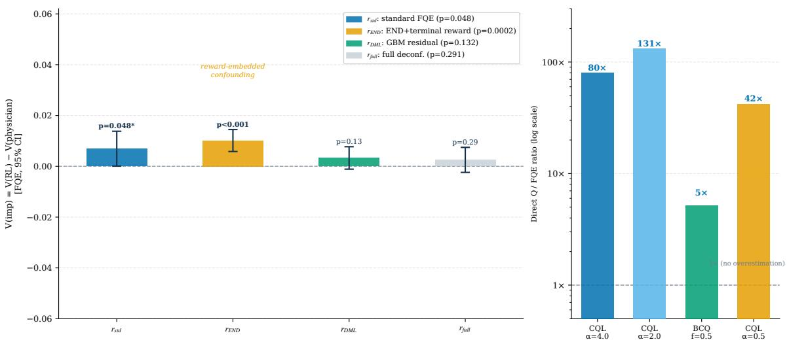
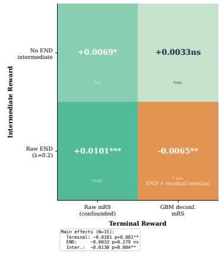
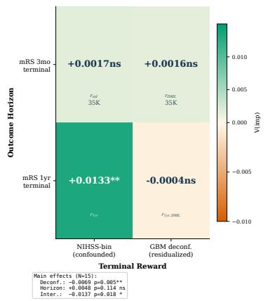
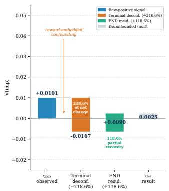
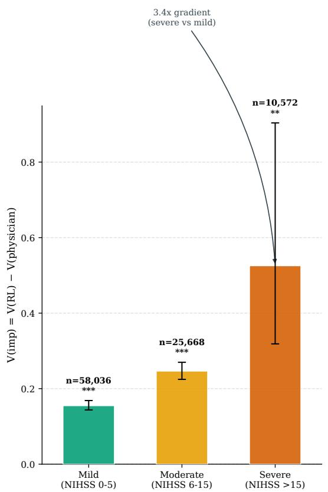
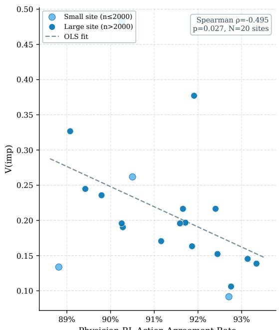
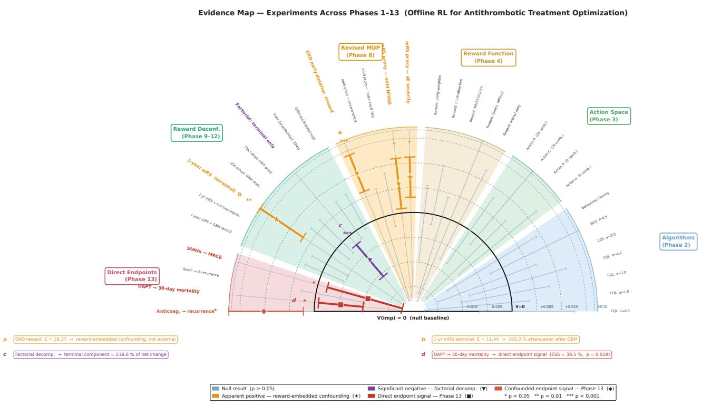
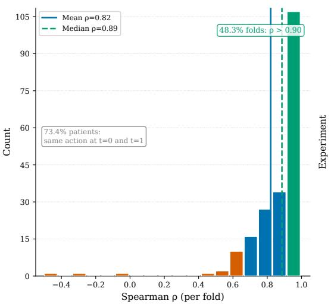
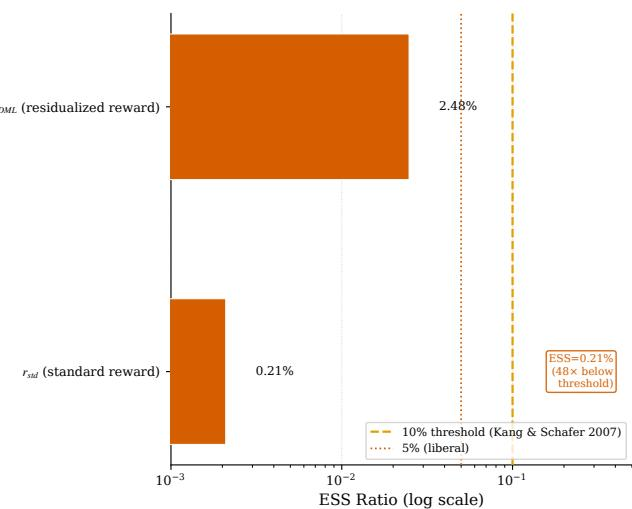

# Confounding Masquerading as Improvement: A Systematic Evaluation of Ofline Reinforcement Learning for Stroke Antithrombotic Treatment in a 129,000-Patient Registry

Kihun Rhee

rheekh00@snu.ac.kr

AI Research Center, JLK Inc., Seoul, South Korea

## Abstract

Recent ofline reinforcement learning (RL) studies report data-driven policies outperform physician decisions by 10–32 % on clinical outcomes. We conduct a systematic, partially crossed evaluation of five ofline RL algorithm families and 14 reward designs on 44,894 post-2018 acute ischemic stroke patients from the nationwide stroke registry $( N = 1 2 9 , 0 3 3 )$

Standard Fitted Q-Evaluation yields $V ( \mathrm { i m p } ) = + 0 . 0 0 6 9 \ ( p = 0 . 0 4 8 ) $ ; adding an Early Neurological Deterioration penalty strengthens the signal to +0.0101 $( p = 0 . 0 0 0 2 { \mathrm { . } }$ , approximate E-value = 18.37) — estimates that could support a premature positive policyimprovement claim despite relying on a confounded reward function.

We identify reward-embedded confounding, where the proxy terminal reward encodes baseline severity/prognosis information in addition to any treatment eficacy signal. E-value analysis does not evaluate this pathway because the confounding is carried through the reward channel. A 2×2 factorial experiment reveals that terminal reward confounding alone more than eliminates the apparent improvement, accounting for 218.6 % of the $r _ { \mathrm { E N D } }  r _ { \mathrm { f u l l } }$ signal change (i.e., removing terminal confounding overshoots null).

After DML-inspired GBM reward residualization, V(imp) attenuates to $+ 0 . 0 0 3 3 \ ( p =$ 0.132); full deconfounding yields +0.0025 (p = 0.291). Three independent approaches converge away from a clinically meaningful aggregate policy-improvement claim: FQE-based reward deconfounding, a T-learner showing 75–90 % attenuation with a clinically small residual (< 6 % MCID), and direct ischemic-stroke recurrence analysis (IPW/AIPW). A within-registry 1-year mRS factorial (N=35,744) replicates the pattern: $V ( \mathrm { i m p } ) = + 0 . 0 1 3 3$ attenuates to −0.0004 after reward residualization (103.3 % attenuation), indicating that the finding is not specific to the 3-month mRS horizon in this registry. We present an empirically motivated 6-step evaluation checklist; applied retrospectively, three highly cited clinical RL papers do not report the FQE confirmation specified by Step 1.

Despite the overall null, National Institutes of Health Stroke Scale (NIHSS)-stratified heterogeneity (T-learner conditional average treatment efect (CATE) ratio 4.6×, corroborated by Q-evaluation 3.4× gradient) identifies a hypothesis-generating subgroup for prospective trial design; hospital-level disagreement did not persist after full reward deconfounding.

Keywords: ofline reinforcement learning, reward-embedded confounding, of-policy evaluation, Fitted Q-Evaluation, confounding, antithrombotic therapy, stroke, double machine learning

## 1. Introduction

Standard FQE initially yielded a positive policy-improvement estimate. Using Fitted Q-Evaluation (FQE) on 44,894 post-2018 acute ischemic stroke patients, our ofline reinforcement learning (RL) policy achieved $V ( \mathrm { i m p } ) = + 0 . 0 0 6 9 \ ( p = 0 . 0 4 8 )$ under standard evaluation and +0.0101 (p = 0.0002, E-value = 18.37) with an END-augmented reward — two estimates that could support a premature positive policy-improvement claim under current clinical RL evaluation practice. Here V (imp) denotes the FQE-estimated policy-value diference $V ( \pi _ { \mathrm { R L } } ) - V ( \pi _ { \mathrm { p h y s i c i a n } } )$ . This paper explains why that signal is not robust to reward deconfounding, and why standard external-confounding checks alone do not evaluate this reward-channel pathway.

To understand how this occurred, consider the setting. Selecting antithrombotic therapy after acute ischemic stroke requires decisions that current guidelines leave genuinely uncertain at the individual patient level: when to initiate anticoagulation in atrial fibrillation (AF) patients with large infarcts where early hemorrhagic transformation is a concern, how long to continue dual antiplatelet therapy in non-cardioembolic stroke, and whether to add a statin outside the large-artery atherosclerosis indication. Across the 20 tertiary stroke centers, discharge prescription patterns for the same stroke subtype vary substantially, suggesting practice variation that sequential optimization could in principle reduce. Antithrombotic management for acute ischemic stroke unfolds across acute and discharge decision phases — a natural candidate for ofline RL, where an agent observes patient state, selects from a discrete action space, and receives feedback through 3-month functional outcomes. The widespread adoption of electronic health record (EHR) systems has provided the sequential decision trajectories needed to train ofline RL policies from observational registries without prospective randomization, attracting substantial clinical interest following claims of 10–32 % improvements over physician decisions (Komorowski et al., 2018; Choi et al., 2024; Ghasemi et al., 2025).

Several highly cited clinical RL papers share three methodological limitations that can inflate apparent policy improvement: (1) reliance on direct Q-value evaluation rather than Fitted Q-Evaluation (FQE), which we find overestimates policy value by $5 { \mathrm { - } } 1 3 1 \times { \mathrm { ~ o n ~ } }$ our EHR data (Figure 1, inset), consistent with Tang and Wiens (2021); (2) no reward deconfounding, leaving prognostic severity signals embedded in the proxy reward so that sicker patients who receive more intensive treatment drive an apparent improvement signal; and (3) no E-value analysis (VanderWeele and Ding, 2017), providing no bound on the strength of confounding required to explain the observed efect.

We characterize an RL-specific failure mode that falls outside the estimand targeted by E-value sensitivity analysis. Intuitively, the standard reward function based on 3- month modified Rankin Scale (mRS) encodes how sick the patient was at baseline rather than how well the treatment worked: sicker patients systematically receive more intensive treatment and have worse outcomes, and the resulting value estimate can mistake this severity–outcome correlation for a treatment efect. Formally, we term this reward-embedded confounding: the proxy reward carries baseline severity/prognosis information in addition to any treatment-eficacy signal, so the RL value estimate may mistake the severity–outcome pathway for treatment benefit. Crucially, rEND’s estimate passes an external unmeasuredconfounding sensitivity check (E-value = 18.37), yet a $2 \times 2$ factorial experiment reveals that terminal reward confounding alone exceeds the full signal magnitude — i.e., removing terminal confounding more than eliminates the observed improvement, because the raw 3- month mRS encodes the severity→outcome pathway that gradient boosting machine (GBM) residualization removes (Figure 2). The E-value is therefore necessary but not suficient here:

it targets external confounding, whereas this bias is carried through the reward channel rather than only through treatment assignment.

This paper uses the ofline RL evaluation pipeline as a diagnostic instrument — not to deploy a clinical policy, but to systematically expose evaluation pitfalls that can produce premature positive policy-improvement claims. We make five contributions:

1. Reward-embedded confounding: We formalize and decompose this failure mode via 2×2 factorial experiments, showing terminal confounding accounts for 218.6 % of the $r _ { \mathrm { E N D } }  r _ { \mathrm { f u l l } }$ net change (Figure 2). A T-learner provides non-RL triangulation through substantial attenuation and a clinically small residual signal.

2. Limits of E-value analysis for policy improvement: We apply E-value sensitivity analysis to policy improvement estimates, demonstrating that external-confounding sensitivity checks are insuficient to address reward-embedded confounding (the FQE signal falls from +0.0101 to +0.0025, p = 0.291, under full deconfounding).

3. 6-step evaluation checklist: An empirically motivated checklist with pre-specifiable diagnostic checks (Gottesman et al., 2019) (Table 2). Applied retrospectively, three highly cited clinical RL papers do not report the FQE confirmation specified by Step 1.

4. Largest-scale FQE vs. direct Q-evaluation: Largest systematic quantification of direct Q overestimation (5–131× across ∼450 training runs), confirming Tang and Wiens (2021) on real EHR data.

5. From null to actionable: Stratification by National Institutes of Health Stroke Scale (NIHSS) severity reveals a 4.6× conditional average treatment efect (CATE) gradient for hypothesis generation and prospective randomized controlled trial (RCT) design.

## Related Work

Deep RL for clinical decision-making gained prominence with Komorowski et al. (2018), whose AI Clinician reported weighted importance sampling (WIS)-estimated survival gains for intensive care unit (ICU) sepsis; Choi et al. (2024) and Ghasemi et al. (2025) followed with claims of 10-percentage-point and +32 % improvements, respectively. Methodological audits have since questioned whether these gains reflect true treatment-benefit signals (Luo et al., 2024). Tang and Wiens (2021) demonstrated that FQE achieves Spearman $\rho = 0 . 8 9$ for policy ranking while direct Q-value estimates achieve $\rho < 0 . 3 ;$ our experiments corroborate this on 44,894 real EHR trajectories (5–131× overestimation). Action imbalance further compounds the problem: Nambiar et al. (2023) quantified ratios up to 6,400:1, rendering importance sampling (IS)-based of-policy evaluation (OPE) unreliable before confounding is considered.

Prior work on confounding in sequential OPE (Namkoong et al., 2020; Kallus and Zhou, 2020; Lu et al., 2018) addresses only external unmeasured confounders; our focus is the rewarddefinition problem that arises when an observational clinical outcome is used as the terminal reward. Confounding by indication is well-established in pharmacoepidemiology (Salas et al., 1999), and reward shaping theory establishes conditions under which reward transformations preserve optimal policies (Ng et al., 1999) — but when the reward itself encodes a confounding pathway, these invariance guarantees do not apply. This mechanism is also related to proxy-reward misspecification: a clinically convenient proxy endpoint may optimize a prognostic correlate rather than the treatment-relevant outcome of interest. We term this

RL-specific failure mode reward-embedded confounding and provide an empirical factorial decomposition. Double/Debiased Machine Learning (DML) (Chernozhukov et al., 2018) enables causal estimation from observational data; we adapt its outcome-partialling logic to prognosis-residualized reward evaluation as a diagnostic stress test, not as a standalone causal treatment-benefit estimand (see §2.4).

Gottesman et al. (2019) identified seven evaluation pitfalls for RL in healthcare, including inappropriate OPE selection and insuficient confounding analysis. The three highly cited clinical RL publications we review (Komorowski et al., 2018; Choi et al., 2024; Ghasemi et al., 2025) — including one predating Gottesman et al.’s recommendations — do not report the FQE confirmation specified by Step 1 of our checklist. Our 6-step checklist operationalizes Gottesman et al.’s recommendations with concrete numerical diagnostics; external validation of this checklist is future work.

## Generalizable Insights about Machine Learning in the Context of Healthcare

1. Audit the reward channel separately. When an observational outcome defines the reward, baseline prognosis can remain in the value after standard OPE. Raw-versusresidualized factorials test this pathway, which is distinct from treatment-assignment confounding; residualization is a diagnostic stress test, not a causal remedy.

2. Align endpoints with the treatment mechanism. Functional outcome can be a weak proxy for secondary prevention; our direct AIPW analysis found no significant reduction in ischemic-stroke recurrence $( p = 0 . 1 2 – 0 . 2 3 )$ , without implying that every clinical endpoint was null.

3. Match model complexity to the data. With 98.3 % state invariance, simpler causal methods may be more appropriate than a sequential policy model.

4. Pre-specify layered evaluation checks. Our six-step checklist combines FQE confirmation, support, external- and reward-channel confounding, non-RL triangulation, and subgroup stability. It is motivated by one Korean registry; external validation remains future work.

## 2. Methods

## 2.1. Dataset

We used the Clinical Research Collaboration for Stroke in Korea (CRCS-K) registry, a prospective multicenter registry of consecutive ischemic stroke patients admitted to 20 tertiary hospitals across South Korea from 2008 to 2023 (Bae and CRCS-K Investigators, 2022). Registry data use was approved under the institutional research agreement governing CRCS-K multicenter data sharing. Registry enrollment and research use of clinical data were approved by the institutional review boards of the participating centers, with written informed consent obtained from patients or their legally authorized representatives. The present secondary analysis of deidentified CRCS-K registry data was approved by the Institutional Review Board of Seoul National University Bundang Hospital (IRB No. B-2308-845-302). For main analyses we restricted to post-2018 admissions $( N = 4 4 , 8 9 4 )$ , following the 2018 Korean Stroke Society guideline update that standardized antithrombotic practice (Appendix B). Functional outcome was measured by 3-month modified Rankin Scale (mRS,

0–6; 90.2 % coverage; the analyzed cohort has 100 % by construction). Three cohort sizes appear throughout: $N = 4 4 , 8 9 4$ (primary RL cohort); $N = 4 4 { , } 9 7 4$ (T-learner cohort, 80 additional patients with valid mRS but incomplete MDP episodes; Appendix R); $N = 3 5 , 7 4 4$ (1-year mRS subcohort; Appendix O). Cohort demographics are in Appendix Table 3.

We defined six antithrombotic treatment actions from discharge medication records (distributions in Appendix Table 3): dual antiplatelet (AP dual, 58.9 %), anticoagulant+statin (AC statin, 16.2 %), antiplatelet+statin (AP statin, 15.1 %), conservative (5.6 %), anticoagulation alone (AC, 2.5 %), and antiplatelet monotherapy (AP mono, 1.7 %). Statin co-prescription is included because it co-varies systematically with antithrombotic choice in post-stroke prescribing (statin rates difer by >20 percentage points across antithrombotic categories). This 35:1 action imbalance has direct implications for IS validity (§2.5; Appendix C), consistent with Nambiar et al. (2023).

## 2.2. MDP Formulation

We formulated a 2-step episodic Markov Decision Process (MDP) $\mathcal { M } = ( \mathcal { S } , \mathcal { A } , \mathcal { T } , \mathcal { R } , \gamma )$ corresponding to the acute (t = 0) and discharge (t = 1) phases. The state space $\mathcal { S } \subset \mathbb { R } ^ { 4 2 1 }$ consists of 421 clinical features (admission demographics, 14 lab values, NIHSS sub-items, prestroke medication history, AI imaging features; Appendix L). The action space $\mathcal { A } = \{ 0 , \ldots , 5 \}$ (hereafter Config A) is the six antithrombotic strategies defined above. The discount factor is $\gamma = 0 . 9 9$ . The reward function R defines 14 variants (§2.4), six of which are central to our analysis. An anchor experiment confirms that the correction from an earlier 3-step to this 2-step formulation does not materially afect results $\mathrm { \mathit { ( V ( i m p ) = + 0 . 0 0 2 4 ~ v s . ~ + 0 . 0 0 2 0 } }$ $p = 0 . 9 4 ;$ Appendix I).

## 2.3. Ofline RL Algorithms

We trained five ofline RL algorithms: Conservative Q-Learning (CQL, α ∈ {0.5, 1, 2, 4, 8}) (Kumar et al., 2020) as the primary algorithm, Batch-Constrained Q-Learning (BCQ, $f \in \{ 0 . 1 , 0 . 3 , 0 . 5 \} _ { }$ ) (Fujimoto et al., 2019), Implicit Q-Learning (IQL, $\tau \in$ $\{ 0 . 7 , 0 . 8 , 0 . 9 \} )$ (Kostrikov et al., 2022), Decision Transformer (DT) (Chen et al., 2021), and Behavior Cloning (BC).

In the common-reward screen, none of the five families showed positive improvement evidence (Table 1; Appendix E): CQL, BCQ, and BC FQE intervals included zero, IQL FQE was below physicians, and DT’s direct value estimate collapsed to the physician-value baseline (FQE was unavailable for DT). The design was partially crossed: post-2018 reward deconfounding used only the prespecified primary CQL $\alpha = 4 . 0$ , selected for FQE TD-error convergence across reward variants. Training used d3rlpy v2.0 (Seno and Imai, 2022) on one NVIDIA H100 (≈350 GPU-hours; hyperparameters in Appendix K); all 33 experiments are mapped in Appendix D.

## 2.4. Reward Design

We designed 14 reward variants following a progressive confounding-removal strategy. Eight preliminary variants (raw mRS, NIHSS-adjusted, binary, severity-stratified, etc.) are superseded by the six variants central to our analysis:

$r _ { \mathbf { s t d } }$ (standard evaluation): intermediate reward $r _ { t } = f ( \mathrm { N I H S S } _ { 2 4 h } , \mathrm { N I H S S } _ { 0 } )$ (missing in ≈80 % of records; defaults to zero when absent) and terminal reward $r _ { T } =$ $- \mathrm { m R S } _ { \mathrm { 3 m o } } / 6 - 0 . 3 \cdot \vert \mathcal { k } [ \mathrm { d e a t h } ] + 0 . 1 \cdot \vert \mathcal { k } [ \mathrm { m R S } \leq 1 ]$ . This represents typical practice in clinical RL.

• rDML (DML reward residualization): terminal reward replaced by $r _ { T } = - ( \mathrm { m R S } _ { 3 \mathrm { m o } } -$ $\hat { f } ( \mathbf { x } _ { 0 } ) ) / 6$ , where $\hat { f }$ is a LightGBM model trained on 743 treatment-free baseline features via cross-fitting $( R ^ { 2 } = 0 . 7 0$ , calibration slope = 1.03, zero treatment variables in SHAP top-20). We adopt the term rDML for conciseness, noting that our approach applies only the outcome-residualization component of Double/Debiased ML (Chernozhukov et al., 2018); treatment residualization is omitted because near-universal statin prescription renders the treatment-partialling step numerically degenerate. We use the residualized reward as a prognosis-residualized diagnostic stress test, not as a standalone causal treatment-benefit estimand (details in Appendix U). Semi-synthetic calibration suggests 24–26 % absorption, while a more conservative propensity-based bound gives 27 %; main-text claims use the conservative bound (Appendix M).

• rEND $( \lambda = 0 . 2 ) \colon r _ { \mathrm { s t d } }$ terminal reward augmented with intermediate penalty for early neurological deterioration (END): $r _ { 0 } = r _ { 0 } ^ { \mathrm { s t d } } - \lambda \cdot \mathrm { E N D _ { f i a g } }$ , where END is ≥4-point NIHSS worsening within 72 hours.

• rfull (full deconfounding): residualizes both reward components against baseline prognosis. The terminal reward is identical to rDML, $r _ { T } = - ( \mathrm { m R S } _ { 3 \mathrm { m o } } - \hat { f } ( \mathbf x _ { 0 } ) ) / 6$ The intermediate reward is $r _ { 0 } = r _ { 0 , \mathrm { s t d } } - \lambda ( \mathrm { E N D } _ { \mathrm { f l a g } } - \hat { g } ( \mathbf { x } _ { 0 } ) )$ , where $\hat { g }$ predicts END from the same treatment-free baseline features. For the factorial decomposition, $r _ { \mathrm { E N D } } ^ { \prime }$ denotes the cell with the rEND intermediate reward and the rDML terminal reward.

$r _ { \mathbf { 1 y r } }$ (1-year outcome): terminal reward $r _ { T } = - \mathrm { ( m R S _ { 1 y r } - } \bar { m } _ { b } \mathrm { ) / 6 }$ , where $\bar { m } _ { b }$ is the cohort-mean $\mathrm { m R S _ { 1 y r } }$ used to center the reward, with NIHSS 24-hour intermediate reward. Uses 35,744 patients with 1-year follow-up.

• r1yr,DML (DML-residualized 1-year outcome): terminal reward $r _ { T } = - ( \mathrm { m R S _ { 1 y r } - }$ ${ \hat { g } } ( \mathbf { x } _ { 0 } ) ) / 6$ , where $\hat { g }$ is a LightGBM model predicting $\mathrm { m R S _ { 1 y r } }$ (cross-fit $R ^ { 2 } = 0 . 7 5$ calibration slope = 1.03, zero treatment variables in SHAP top-20). $r _ { \mathrm { 1 y r } }$ and $r _ { \mathrm { 1 y r , D M L } }$ form a second factorial pair crossing outcome horizon with deconfounding.

The diagnostic mechanism is that baseline severity X causes both treatment $T$ and outcome $Y ;$ the standard reward $r = f ( Y )$ conflates the prognostic $( \mathbf { X }  Y )$ and treatmentattributable $( T \to Y )$ pathways. GBM residualization subtracts baseline prognosis and tests whether the apparent policy advantage survives removal of this pathway. SHAP validation confirms zero treatment variables in the GBM top-20 (Appendix U).

## 2.5. Evaluation Hierarchy

We adopt a six-step evaluation checklist (Table 2). As the primary of-policy evaluation method we use Fitted Q-Evaluation (FQE) (Tang and Wiens, 2021), which fits a separate Q-function to evaluate a fixed target policy. All results use 15-fold cross-validation (5 folds $\times \ 3$ random seeds). The primary metric is $V ( \mathrm { i m p } ) = V ( \pi _ { \mathrm { R L } } ) - V ( \pi _ { \mathrm { p h y s i c i a n } } )$ evaluated under FQE.

To quantify confounding robustness we apply the E-value framework (VanderWeele and Ding, 2017) to the observed V (imp).

Structural limitation. The E-value addresses only external unmeasured confounders $( U \to T , U \to Y )$ . Reward-embedded confounding operates through observed baseline severity encoded within the reward itself — a reward-channel pathway that the E-value does not evaluate. The $2 \times 2$ factorial decomposition (§3.2) serves as the primary diagnostic.

Approximate computation. We map $V ( \mathrm { i m p } )$ to RR scale via $\begin{array} { r l } { \widehat { R R } } & { { } = } \end{array}$ $\exp ( \vert V ( \mathrm { i m p } ) \vert / \mathrm { S E } _ { \mathrm { c o n s } } )$ , where $\mathrm { S E } _ { \mathrm { c o n s } } = \mathrm { S D } _ { \mathrm { f o l d s } } / \sqrt { 3 }$ (conservative). This transformation provides a conservative upper bound on confounding strength required to explain away $V ( \mathrm { i m p } )$ ; derivation and justification appear in Appendix J.

We employ four additional triangulation strategies (doubly robust OPE (DR-OPE), instrumental variable (IV), diference-in-diferences (DiD), T-learner / direct recurrence) detailed in §3.2 and Appendices C–H.

## 2.6. Cross-validation and Statistical Testing

All experiments use patient-level 5-fold cross-validation repeated across 3 random seeds (15 evaluations per configuration; see Appendix V for cross-validation details). Significance of $V ( \mathrm { i m p } )$ is assessed via one-sample t-test against zero $( \mathrm { d f } = 1 4 )$ ; factorial efects via paired t-tests $( N = 1 5 { \mathrm { ~ p a i r s } } )$ . We report 95 % CI with $\alpha = 0 . 0 5$ ; Bonferroni correction across 14 reward variants $( \alpha _ { \mathrm { a d j } } = 0 . 0 0 3 6 )$ would leave rEND significant but not $r _ { \mathrm { s t d } } \mathrm { ~ - ~ } \mathrm { o u r }$ argument does not depend on $r _ { \mathrm { s t d } }$ significance. Power analysis and the Nadeau–Bengio variance correction are discussed in §5.2.

## 3. Results

We present results in three acts that mirror the diagnostic sequence, followed by an analysis of clinical heterogeneity. All $V ( \mathrm { i m p } ) = V ( \pi _ { \mathrm { R L } } ) - V ( \pi _ { \mathrm { p h y s i c i a n } } )$ estimates are based on FQE with 15-fold CV unless stated otherwise. Table 1 compactly summarizes the algorithm screen and six key reward variants.

## 3.1. Act 1: Standard Ofline RL Evaluation Yields Positive Signal

MDP structure diagnosis leaves FQE as the least problematic primary evaluator here, not an assumption-free one (including Q-function realizability; §5.3): IS-ESS = 0.21 % (48× below threshold) rules out IS-based OPE (Appendix $\mathrm { S } ;$ direct Q overestimates FQE by $5 { - } 1 3 1 \times$ across ∼450 runs; Figure 1, inset).

Under standard practice, $r _ { \mathrm { s t d } }$ produces $V ( \mathrm { i m p } ) = + 0 . 0 0 6 9 ~ ( 9 5 \% \mathrm { C I } [ + 0 . 0 0 0 1 , + 0 . 0 1 4 ]$ $p = 0 . 0 4 8$ , E-value = 4.70). Adding an END intermediate reward $( r _ { \mathrm { E N D } } , \lambda = 0 . 2 )$ strengthens the signal to $V ( \mathrm { i m p } ) = + 0 . 0 1 0 1$ $( p = 0 . 0 0 0 2$ , E-value = 18.37) — an estimate that a reader applying standard practice could interpret as strong evidence for policy improvement.

Direct Q-evaluation yielded estimates 5–131× larger than FQE across ∼450 runs (Figure 1, inset), consistent with Tang and Wiens (2021). As a rough illustration, if our overestimation factor generalized, studies reporting $V ( \mathrm { i m p ) = + 0 . 1 0 \ t o \ + 0 . 3 2 }$ via direct Q would report $+ 0 . 0 0 1 \ \mathrm { t o \ + 0 . 0 0 3 }$ under FQE — though this extrapolation is speculative, as the ratio is dataset- and algorithm-dependent. The natural question is whether the positive FQE signal reflects treatment benefit or reward-embedded confounding; Act 2 examines this directly.

Table 1: Compact evaluation robustness summary: a common-reward screen across five algorithm families, followed by six FQE reward designs for primary $\mathrm { C Q L } ~ \alpha { = } 4 . 0$ (15-fold CV, 95 % CI from t-distribution, 14 df). E-values are approximate upper bounds computed via a non-standard continuous-to-RR mapping (§2.5); Bonferronicorrected $\alpha _ { \mathrm { a d j } } = 0 . 0 0 3 6$ would leave rEND significant but not $r _ { \mathrm { s t d } }$
<table><tr><td>Reward</td><td>Description</td><td>V(imp)</td><td>95 % CI</td><td>p</td><td>E-value</td></tr><tr><td>Five families</td><td>Common reward (FQE ex- cept DT; Appendix E)</td><td></td><td>No positive evaluated evidence</td><td></td><td></td></tr><tr><td colspan="6">3-month outcome (N=44,894)</td></tr><tr><td>rstd</td><td>NIHSS-bin FQE (standard)</td><td>+0.0069</td><td>[+0.0001, +0.014]</td><td>0.048</td><td>4.70</td></tr><tr><td>rEND</td><td>+END intermediate (λ=0.2)</td><td>+0.0101</td><td> $\left[ + 0 . 0 0 6 , \ + 0 . 0 1 4 \right]$ </td><td>0.0002</td><td>18.37</td></tr><tr><td>rDML</td><td>GBM residualization (DML)</td><td>+0.0033</td><td>[-0.001, +0.008]</td><td>0.132</td><td>3.50</td></tr><tr><td>rfull</td><td>Full deconfound. (rDML + +0.0025 END resid.)</td><td></td><td> $[ - 0 . 0 0 2 , ~ + 0 . 0 0 7 ]$ </td><td>0.291</td><td>2.65</td></tr><tr><td colspan="6">1-year outcome (N=35,744)</td></tr><tr><td>r1yr</td><td>NIHSS-bin, mRS1yr termi- +0.0133</td><td></td><td> $\left[ + 0 . 0 0 6 , \ + 0 . 0 2 0 \right]$ </td><td>0.001</td><td>11.44</td></tr><tr><td> $r _ { \mathrm { 1 y r , D M L } } ^ { } ^ { \dagger }$ </td><td>nal GBM residualized  $\mathrm { m R S _ { 1 y r } }$ </td><td>-0.0004</td><td> $\left[ - 0 . 0 0 5 , \ + 0 . 0 0 4 \right]$ </td><td>0.843</td><td>十</td></tr></table>

$^ \dag { r _ { 1 \mathrm { y r } , \mathrm { D M L } } }$ results are from Phase 12 (post-2018 cohort restricted to 2018–2023 admissions with 1-year follow-up, $N = 3 5 , 7 4 4 )$ . ‡E-value not computed $( V ( { \mathrm { i m p } } ) < 0 ;$ E-value is defined only for positive point estimates).

## 3.2. Act 2: Progressive Deconfounding Attenuates the Signal to Null

GBM reward residualization (rDML) replaces the raw terminal reward with the residual after subtracting LightGBM-predicted prognosis (cross-fit $R ^ { 2 } = 0 . 7 0$ , calibration slope = 1.03, 0 treatment variables in SHAP top-20). The signal attenuates: $V ( \mathrm { i m p } ) = + 0 . 0 0 3 3$ $( 9 5 \% \mathrm { C I } \ [ - 0 . 0 0 1 , + 0 . 0 0 8 ] , p = 0 . 1 3 2 )$ , a 52 % reduction from $r _ { \mathrm { s t d } }$ . Over-adjustment risk is bounded conservatively at 27 % (Appendix M), and the attenuation-adjusted estimate remains clinically small $( V ( \mathrm { i m p ) _ { a d j } \approx + 0 . 0 0 4 5 , \leq 2 . 7 \% \ M C I D } )$

Full deconfounding (rfull) yields $V ( \mathrm { i m p } ) = + 0 . 0 0 2 5 \ : ( 9 5 \% \mathrm { C I } [ - 0 . 0 0 2 , + 0 . 0 0 7 ] , p = 0 . 2 9 1 ) .$ consistent with a null efect. Figure 1 shows the complete confounding cascade: $r _ { \mathrm { s t d } } ~ ( + 0 . 0 0 7 )$ $ r _ { \mathrm { D M L } } \ ( + 0 . 0 0 3 )  r _ { \mathrm { f u l l } } \ ( + 0 . 0 0 2 )$

To identify the mechanism driving rEND’s apparent +0.010 signal, we designed a $2 \times 2$ factorial experiment crossing terminal reward (raw mRS vs. GBM-residualized) and intermediate reward (raw END vs. GBM-residualized). Here $r _ { \mathrm { E N D } } ^ { \prime }$ denotes the factorial cell that combines r ’s END-augmented intermediate reward with a GBM-residualized terminal reward. The decomposition reveals the magnitude of reward-embedded confounding: the simple efect of terminal residualization within the END-augmented reward $( r _ { \mathrm { E N D } }  r _ { \mathrm { E N D } } ^ { \prime } )$ is $\Delta V ( \mathrm { i m p } ) = - 0 . 0 1 6 7$ , accounting for 218.6 % of the net $r _ { \mathbf { E N D } } \to r _ { \mathbf { f u l l } }$ change (computed from unrounded fold-level estimates: $\begin{array} { r } { \frac { V ( \mathrm { i m p } ) ( r _ { \mathrm { E N D } } ^ { \prime } ) - V ( \mathrm { i m p } ) ( r _ { \mathrm { E N D } } ) } { V ( \mathrm { i m p } ) ( r _ { \mathrm { f u l l } } ) - V ( \mathrm { i m p } ) ( r _ { \mathrm { E N D } } ) } = \frac { - 0 . 0 1 6 6 8 } { - 0 . 0 0 7 6 3 } = 2 1 8 . 6 \% } \end{array}$ The percentage exceeds 100 % because terminal residualization alone overshoots null; the residualized intermediate reward partially ofsets this $( \Delta V ( \mathrm { i m p } ) = + 0 . 0 0 9 0 , p = 0 . 2 7 9 )$ . The main efect of terminal deconfounding is $- 0 . 0 1 0 1 \ ( p = 0 . 0 0 1 )$ ; the significant interaction $( - 0 . 0 1 3 0 , p = 0 . 0 0 4 )$ indicates that END amplifies terminal confounding through a shared prognostic pathway (severity → END → mRS; Figure 2).

FQE = Fitted Q-Evaluation (primary OPE). V(imp) = V(RL) − V(physician). MCID = minimum clinically important difference (1 mRS point). Error bars = 95% CI.  
  
Figure 1: Confounding cascade across reward designs. FQE-based V(imp) for four reward variants (CQL α=4.0, 15-fold CV). The apparent improvement attenuates progressively as prognostic confounding is removed $( r _ { \mathrm { s t d } }  r _ { \mathrm { D M L } }  r _ { \mathrm { f u l l } } )$ . rEND $( + 0 . 0 1 0 1 , p = 0 . 0 0 0 2$ , E-value = 18.37) falls to $r _ { \mathrm { f u l l } } = + 0 . 0 0 2 5 \ ( p = 0 . 2 9 1 )$ under full reward deconfounding (§3.2). Inset: Direct Q overestimates FQE by 5–131× (log scale). Error bars: 95 % CI.

A second factorial (Phase 12, N = 35,744) crosses outcome horizon $\left( \mathrm { m R S } _ { \mathrm { 3 m o } } \mathrm { v s . \ m R S } _ { \mathrm { 1 y r } } \right)$ with deconfounding. The 1-year reward $\left( r _ { \mathrm { 1 y r } } \right)$ produces $V ( \mathrm { i m p } ) = + 0 . 0 1 3 3 \ ( p = 0 . 0 0 1$ 2 E-value = 11.44); GBM residualization $\left( { r _ { \mathrm { 1 y r , D M L } } } \right)$ attenuates the signal by 103.3 %, reducing to $- 0 . 0 0 0 4 \ ( p = 0 . 8 4 3 )$ . The deconfounding main efect $( - 0 . 0 0 6 9 , p = 0 . 0 0 5 ;$ from fold-level unrounded estimates) supports the interpretation that the raw-positive, residualized-null pattern is not specific to the 3-month mRS horizon in this registry (Figure 2B).

rEND’s E-value of 18.37 is mathematically correct for external unmeasured confounders within that sensitivity framework. The confounding is instead internal to the reward function: the raw 3-month mRS encodes the severity→outcome prognostic pathway that GBM residualization removes. We term this reward-embedded confounding: the proxy reward carries a non-treatment-attributable prognostic pathway, so the learned policy can appear favorable even when the FQE signal is not robust to reward deconfounding. E-values remain informative for external unmeasured confounding but do not address this reward-channel pathway; factorial decomposition or prognosis-residualized reward evaluation is needed as a diagnostic stress test.

  
Figure 2: Dual $2 \times 2$ factorial decomposition. (A) Phase 10: Crossing terminal reward (raw vs. GBM-residualized $\mathrm { m R S _ { 3 m o } } )$ and END intermediate handling on $N { = } 4 4 { , } 8 9 4$ Terminal deconfounding main efect: −0.0101 $( p = 0 . 0 0 1 )$ . (B) Phase 12: Crossing outcome horizon with deconfounding on N=35,744. Deconfounding main efect: −0.0069 $( p = 0 . 0 0 5 )$ ; $r _ { \mathrm { 1 y r } } \mathrm { ' s } + 0 . 0 1 3 3$ reduces to −0.0004 after GBM residualization (103.3 % attenuation). (C) Waterfall: Terminal confounding accounts for 218.6 % of the net $r _ { \mathrm { E N D } }  r _ { \mathrm { f u l l } }$ signal change (rEND= + 0.0101, $r _ { \mathrm { E N D } } ^ { \prime } { = } - 0 . 0 0 6 5$ $r _ { \mathrm { f u l l } } = +$ 0.0025).

Causal triangulation. Two independent approaches corroborate the deconfounding result. A T-learner (K¨unzel et al., 2019) (N = 44,974; Appendix R) shows 75 % signal attenuation under rDML residualization in the full cohort and 90 % in the overlap zone $( 0 . 1 < e ( X ) < 0 . 9$ $n = 9 , 9 0 0 )$ , with a clinically negligible residual $( < 6 \% \ \mathrm { M C I D } )$ . Direct recurrence analysis via inverse probability weighting (IPW) / augmented IPW (AIPW) $( N = 3 2 , 5 8 3 )$ finds no significant ischemic stroke recurrence reduction for any treatment comparison (AIPW $p = 0 . 1 2 – 0 . 2 3 ;$ Appendix H). DR-OPE serves as a consistency check; IV is uninformative (exclusion restriction violation; Appendix F); DiD excluded for parallel trends violation (Appendix G).

## 3.3. MDP Structure Diagnosis

MDP structure analysis confirms that 98.3 % of state features are invariant across timesteps (Pearson $r > 0 . 9 9 )$ , with per-patient Q-value rank $\rho = 0 . 8 2$ (Figure 5, left). IS-based OPE is infeasible (ESS = 0.21 %, 48× below threshold; Figure 5, right), leaving FQE as the least problematic OPE method in this setting (see Appendix S).

  
Left: V(imp) by NIHSS severity (Phase 5A). Gradient (3.4×) informative; absolute scale is pre-FQE (inflated). Right: Spearman ρ=−0.495 (p=0.027), N=20 sites. Lower physician-RL agreement associates with higher estimated improvement potential.  
Figure 3: Hypothesis-generating clinical heterogeneity after deconfounding diagnostics. Left: V (imp) by NIHSS severity (Phase 5A direct Q-evaluation, $N = 1 1 6 { , } 2 1 5 ;$ absolute values unreliable but 3.4× relative gradient is directionally consistent with the T-learner’s 4.6× CATE ratio). Right: Hospital-level V (imp) vs. physician–RL agreement across 20 tertiary centers. The raw association is hypothesis-generating only and does not persist under $r _ { \mathrm { f u l l } }$ (see §3.4).

## 3.4. Clinical Heterogeneity: Hypothesis Generation for Prospective Evaluation

Having established that the overall policy improvement is null after reward deconfounding, we turn to whether clinically relevant heterogeneity remains as a trial-design signal — not to claim treatment benefit, but to identify subgroups for prospective evaluation.

Despite the overall null result after deconfounding, the NIHSS severity gradient persists as an exploratory, hypothesis-generating pattern.

The T-learner identifies a 4.6× severe/mild CATE ratio across NIHSS severity subgroups, directionally consistent with a $3 . 4 \times \ | V ( \mathrm { i m p } ) |$ | gradient under direct Q-evaluation (Figure 3). Directional consistency across two independent methods measuring diferent estimands (CATE vs. policy value) supports hypothesis-generating clinical heterogeneity rather than relying on a single policy-value estimate. Hospital-level V (imp) under direct Q-evaluation correlates negatively with physician–RL agreement $( \rho = - 0 . 4 9 5 , p = 0 . 0 2 7$ 9

$N = 2 0 ;$ jackknife direction-stable; Figure 3); however, this correlation vanishes under the deconfounded reward $( \rho \approx 0$ , ns; recomputed estimate $\rho = - 0 . 0 2 6 , p = 0 . 9 1 5 )$ , suggesting an unstable, confounding-driven site signal rather than surviving site-level practice variation. We therefore focus heterogeneity interpretation on the NIHSS-stratified T-learner estimates as the more reliable estimand. Policy disagreement profiling reveals that $5 7 \%$ of $\mathrm { R L - }$ physician disagreements involve statin co-prescription, with AF history as the strongest driver (Appendix T). These patterns suggest that antithrombotic–statin combination decisions in severe-to-moderate NIHSS patients constitute the highest-priority subgroup for prospective evaluation.

## 4. A 6-Step Evaluation Checklist for Clinical Ofline RL

Drawing on the diagnostic sequence revealed in our study, we propose a six-step empirical evaluation checklist that operationalizes Gottesman et al. (2019)’s seven evaluation pitfalls with pre-specifiable diagnostic checks (Table 2). The checklist is intended to identify when a positive V(imp) estimate needs additional evidence before it is interpreted as clinical benefit; external validation of the checklist remains future work.

Retrospective application to three widely cited clinical RL papers (Komorowski et al., 2018; Choi et al., 2024; Ghasemi et al., 2025) shows that Step 1 could not be assessed as satisfied under this checklist: none reports FQE or equivalent model-based OPE. Steps 4–6 were not reported in these papers, leaving positive findings unexamined for reward-channel confounding. We acknowledge this checklist was derived from diagnostic experience rather than pre-registered or externally validated; external validation is future work. The data and code availability statement specifies the permitted release mechanism for analysis code, configuration files, figure-generation scripts, and a synthetic example dataset designed to exercise the analysis pipeline without exposing restricted patient-level registry records.

## 5. Discussion

## 5.1. When Can Ofline RL Add Value in Clinical Settings?

Our analysis suggests three conditions under which ofline RL is most likely to add value beyond simpler causal inference: (a) reward-channel diagnostics (proxy rewards should be stress-tested for prognostic confounding; this is the diagnostic condition emphasized here), (b) meaningful sequential dynamics (state features must evolve between decision steps; our 98.3 % invariance limits optimization to near-1-step), and (c) action support balance $( \mathrm { I S - E S S } \geq 1 0 \%$ threshold; our 2.5 % AC prescription rate drives IS-ESS collapse to 0.21 %, making FQE the least problematic OPE choice here). In settings that satisfy all three, RL may provide value beyond simpler methods. In our case, several key findings were discoverable only through the RL pipeline: the $5 { \mathrm { - } } 1 3 1 \times { \mathrm { F Q E } }$ vs. direct Q gap, IS-ESS collapse, the factorial decomposition, and the 6-step evaluation checklist. Condition (a) reflects what we term reward-embedded confounding (§3.2): a mechanism analogous to confounding by indication in pharmacoepidemiology, where sicker patients receive more aggressive treatment and have worse outcomes. In classical OLS settings this makes treatment appear harmful; in our ofline RL setting the same severity→outcome pathway is encoded within the terminal reward, making the learned policy appear favorable — the sign is reversed because the reward is severity-correlated, not the propensity score. In addition to confounding by indication in treatment assignment, the reward itself carries the severity-to-outcome pathway, which is why this pathway falls outside the E-value’s external-confounding estimand. For singledecision settings satisfying only condition (a), Causal Forest (Wager and Athey, 2018) or DML (Chernozhukov et al., 2018) directly estimates CATE without sequential assumptions.

Table 2: 6-Step Evaluation Checklist for Clinical Ofline RL. $\surd = \mathrm { M e t } ; \times = \mathrm { N o t }$ met or not assessable; NR = Not reported; NI = Not implemented. Steps 1–2: OPE reliability; Steps 3–4: confounding robustness; Steps 5–6: causal triangulation and generalizability.
<table><tr><td>Step Check</td><td>Threshold</td><td>This Study</td><td>Existing Papers</td></tr><tr><td>S1 FQE validation</td><td></td><td colspan="2">Report FQE; if  $\surd \mathrm { R a t i o } = 5 \mathrm { - } 1 3 1 \times \Rightarrow \mathrm { N R : }$   $| V _ { \mathrm { D i r } } / V _ { \mathrm { F Q E } } | \ge 2 \times , \mathrm { F Q E ~ p r i m a r y }$  morowski et al., 2018; do not interpret di- Ghasemi et al., 2025); rect Q alone matching (Choi et al., 2024); no FQE</td></tr><tr><td>S2 IS viability</td><td> $\mathrm { ( E S S ~ \ge ~ 1 0 \% ) }$ </td><td> $\begin{array} { r l } { \mathrm { E S S ~ r a t i o } \geq 0 . 1 0 } & { { } \times r _ { \mathrm { s t d } } \mathrm { E S S } { = } 0 . 2 1 \% ( 4 8 \times \mathrm { N R } } \end{array}$  below threshold); rDML  $\mathrm { E S S { = } 2 . 5 \% ^ { b } \Rightarrow \mathrm { F Q E } }$  problematic</td><td>least</td></tr><tr><td></td><td></td><td>S3 Confounding robustness (E-value) Report E-value; √ rEND E=18.37 (passes NR necessary but not external-confounding sufficient — see S4 check but falls under S4; §3.2); × rstd E=4.70 (marginal)</td><td></td></tr><tr><td></td><td>S4 Reward deconfounding</td><td>DML/GBM resid- √  $R ^ { 2 } { = } 0 . 7 0 ,$  ual;  $R ^ { 2 } \ge 0 . 7 0 ; 0 = 1 . 0 3 ,$  0 treatment vars treatment vars in SHAP top-20</td><td>calibration NI null; T- NI</td></tr><tr><td>S5 Causal triangulation</td><td></td><td> $\geq ~ 2$  independent  $\textsf { \textsf { V Q E } } + \mathrm { G B M }$  methods agree on learner attenuation 75% direction full cohort, 90 % overlap- trimmed recurrence  $\left( p { = } 0 . 1 2 { - } 0 . 2 3 \right)$ </td><td> $( n { = } 9 , 9 0 0 ) ;$  IS AIPW ns</td></tr><tr><td>S6 Subgroup stability</td><td></td><td>Pre-specified △a NIHSS gradient 4.6× NI or hypothesis- (T-learner), 3.4× (ex- generating sub- ploratory Q); site signal groups; assess does not persist under deconfounding rfull stability</td><td></td></tr></table>

NR = Not reported; NI = Not implemented. aS6 CONDITIONAL: subgroups are exploratory; NIHSS gradient is a trial-design signal, not a treatment recommendation; site ρ does not survive full reward deconfounding $( \rho \approx 0 ;$ , recomputed ρ = −0.026, p = 0.915 under rfull). $^ \mathrm { b } { r } _ { \mathrm { D M L } } \ \mathrm { E S S } { = 2 . 5 \% }$ is the IS efective sample size ratio under the GBM-residualized reward policy, distinct from the AC action’s 2.5% prescription rate (§2.1); both are coincidentally equal.

## 5.2. Power Analysis and Efect Size Bounds

Our study has suficient statistical power to detect clinically meaningful efects. The retrospective minimum detectable efect (MDE) at 80 % power is $V ( \mathrm { i m p } ) \approx 0 . 0 1 0$ for rstd and $\approx 0 . 0 0 6$ for rDML, corresponding to 5.9 % and 3.8 % of the mRS minimal clinically important diference (MCID = 1.0 mRS point = 0.167 in V(imp) scale; Cranston et al. (2017)). The Nadeau–Bengio correction for training-set overlap raises MDE to 6.6 % MCID — still below clinically meaningful thresholds. Even taken at face value, the deconfounded estimates $( r _ { \mathrm { D M L } } = + 0 . 0 0 3 3 , r _ { \mathrm { f u l l } } = + 0 . 0 0 2 5 )$ correspond to ${ \approx } 2 . 0 \%$ and 1.5 % MCID respectively — well below the clinically relevant threshold we are powered to detect (> 3.8 % MCID). The null conclusion therefore reflects a statistically null and clinically small estimated policy advantage, not insuficient power: we had suficient sensitivity to detect efects at or above this clinically meaningful range, although smaller efects remain possible.

The near-null result reflects a specific property of well-managed tertiary registries: in the post-2018 cohort, >80 % of AF patients receive anticoagulation, reflecting near-universal guideline concordance that leaves limited scope for RL to improve upon current practice. This conclusion is specific to antithrombotic selection in Korean tertiary stroke registries and does not imply that ofline RL cannot improve stroke care in settings with greater treatment heterogeneity, diferent treatment dimensions (thrombolysis timing, endovascular intervention), or richer data modalities.

## 5.3. Limitations

1. External validity. CRCS-K comprises predominantly Korean patients from tertiary referral centers with high guideline adherence; generalizability to other ethnic populations, community hospitals, and healthcare systems with diferent practice patterns remains unvalidated. The methodological findings (reward-embedded confounding, direct Q overestimation) may apply to EHR-based ofline RL studies that use observational outcomes as rewards.

2. Degenerate MDP. Our 2-step MDP has 98.3 % state invariance $( r > 0 . 9 9 ;$ ; of 7 dynamic features, 6 are action one-hot encodings and only NIHSS at 24 hours carries clinical information, missing in ≈80 % of records), reducing sequential optimization to near-1-step behavior.

3. Over-adjustment risk. GBM residualization may absorb some true treatment-benefit variation. Semi-synthetic calibration suggests 24–26 % absorption, while a conservative propensity-based bound gives 27 %; the adjusted estimate remains clinically small $( V ( \mathrm { i m p ) _ { a d j } \approx + 0 . 0 0 4 5 , \leq 2 . 7 \% }$ MCID).

4. FQE realizability. FQE assumes the Q-function class can represent the true value function. We cannot rule out realizability violations; ensemble-based disagreement tests would strengthen this evidence (Appendix P).

5. Fairness. T-learner CATE shows non-monotone sex×age patterns (Appendix N), likely from extrapolation; these should not be interpreted as demographic disparities without prospective validation.

Four additional limitations (power at the margin, outcome endpoint sensitivity, selection bias, post-2018 cohort restriction) are detailed in Appendix P. Action masking enforces clinical guideline constraints (6 % violation rate, all caught at inference; see Appendix Q).

## 5.4. Recommendations

For researchers applying ofline RL to clinical datasets, we recommend the 6-step empirical evaluation checklist (§4) as a set of pre-specifiable diagnostic checks. For clinical trialists, ELAN and OPTIMAS narrowed anticoagulation timing, but largest-infarct estimates remain imprecise and anticoagulation–statin combinations untested (Fischer et al., 2023; Werring et al., 2024; Nash et al., 2026). The T-learner’s 4.6× severe/mild CATE ratio therefore motivates stratified prospective evaluation of this recurrence–hemorrhage trade-of, not treatment benefit or site-level targeting. For data infrastructure, clinically useful multistep RL requires continuous inpatient monitoring data rather than admission-only registry snapshots.

## 6. Conclusion

Standard ofline RL evaluation for stroke antithrombotic optimization yields $V ( { \mathrm { i m p } } ) = $ +0.0101 $( p \ : = \ : 0 . 0 0 0 2$ , E-value = 18.37), but full deconfounding reduces it to +0.0025 $( p = 0 . 2 9 1 )$ , with terminal residualization accounting for 218.6 % of the net rEND-to-rfull change. We term this reward-channel pathway reward-embedded confounding; externalconfounding E-values do not evaluate it. No family produced positive evaluated evidence in the common-reward screen; in primary CQL, residualization attenuated the estimate to null, with T-learner and recurrence AIPW providing triangulation. Whenever observational outcomes define terminal rewards, positive ofline RL results should remain hypothesisgenerating until reward-channel diagnostics are applied.

## Data and Code Availability

Individual-level CRCS-K data cannot be publicly deposited because of informed consent, ethics, data-sharing, privacy, and regulatory restrictions. Qualified researchers may request a de-identified minimum dataset for a legitimate academic proposal, subject to CRCS-K Steering Committee and institutional approvals; the author cannot independently redistribute it. An artifact package is being prepared for a planned arXiv/PMLR release, including code, configurations, figure scripts, and synthetic examples for implementation inspection. The package will not include individual-level CRCS-K data and cannot reconstruct the cohort or reproduce patient-level results without approved data access.

## References

Pierre Amarenco, Julien Bogousslavsky, Alfred Callahan, Larry B. Goldstein, Michael Hennerici, Amy E. Rudolph, Henrik Sillesen, Liljana Simunovic, Michael Szarek, K. Michael A. Welch, and Justin A. Zivin. High-dose atorvastatin after stroke or transient ischemic attack. New England Journal of Medicine, 355(6):549–559, 2006. doi: 10.1056/NEJMoa061894.

Hee-Joon Bae and CRCS-K Investigators. David G. Sherman lecture award: 15-year experience of the nationwide multicenter stroke registry in Korea. Stroke, 53(9):2976–2987, 2022. doi: 10.1161/STROKEAHA.122.039212.

Solon Barocas, Moritz Hardt, and Arvind Narayanan. Fairness and Machine Learning: Limitations and Opportunities. fairmlbook.org, 2019. URL https://fairmlbook.org.

Lili Chen, Kevin Lu, Aravind Rajeswaran, Kimin Lee, Aditya Grover, Misha Laskin, Pieter Abbeel, Aravind Srinivas, and Igor Mordatch. Decision Transformer: Reinforcement learning via sequence modeling. In Advances in Neural Information Processing Systems (NeurIPS 2021), volume 34, pages 15084–15097, 2021.

Victor Chernozhukov, Denis Chetverikov, Mert Demirer, Esther Duflo, Christian Hansen, Whitney Newey, and James Robins. Double/Debiased Machine Learning for treatment and structural parameters. The Econometrics Journal, 21(1):C1–C68, 2018. doi: 10.1111/ ectj.12097.

Young Choi, Seungwon Oh, Jin-Won Huh, Han-Tae Joo, Hyeran Lee, Wanki You, Chang Mo Bae, Ji Ho Choi, and Kyung-Jae Kim. Deep reinforcement learning extracts the optimal sepsis treatment policy from treatment records. Communications Medicine, 4(1):245, 2024. doi: 10.1038/s43856-024-00665-x.

Jessica S. Cranston, Brett D. Kaplan, and Jefrey L. Saver. Minimal clinically important diference for safe and simple novel acute ischemic stroke therapies. Stroke, 48(11): 2946–2951, 2017. doi: 10.1161/STROKEAHA.117.017496.

Urs Fischer, Masatoshi Koga, Daniel Strbian, et al. Early versus later anticoagulation for stroke with atrial fibrillation. New England Journal of Medicine, 388(26):2411–2421, 2023. doi: 10.1056/NEJMoa2303048.

Scott Fujimoto, David Meger, and Doina Precup. Of-policy Deep Reinforcement Learning without exploration. In Proceedings of the 36th International Conference on Machine Learning (ICML 2019), volume 97 of Proceedings of Machine Learning Research, pages 2052–2062. PMLR, 2019.

Peyman Ghasemi, Matthew Greenberg, Danielle A. Southern, Bing Li, James A. White, and Joon Lee. Personalized decision making for coronary artery disease treatment using ofline reinforcement learning. npj Digital Medicine, 8:99, 2025. doi: 10.1038/s41746-025-01498-1.

Omer Gottesman, Fredrik Johansson, Matthieu Komorowski, Aldo Faisal, David Sontag, Finale Doshi-Velez, and Leo Anthony Celi. Evaluating reinforcement learning algorithms in observational health settings. Nature Medicine, 25(1):16–18, 2019. doi: 10.1038/ s41591-018-0310-5. arXiv:1811.11722 (2018).

S. Claiborne Johnston, J. Donald Easton, Mary Farrant, William Barsan, Robin A. Conwit, Jordan J. Elm, Anthony S. Kim, Anne S. Lindblad, and Yuko Y. Palesch. Clopidogrel and aspirin in acute ischemic stroke and high-risk TIA. New England Journal of Medicine, 379(3):215–225, 2018. doi: 10.1056/NEJMoa1800410.

Nathan Kallus and Angela Zhou. Confounding-robust policy evaluation in infinite-horizon reinforcement learning. In Advances in Neural Information Processing Systems (NeurIPS 2020), volume 33, pages 22293–22304, 2020.

Joseph D. Y. Kang and Joseph L. Schafer. Demystifying double robustness: A comparison of alternative strategies for estimating a population mean from incomplete data. Statistical Science, 22(4):523–539, 2007. doi: 10.1214/07-STS227.

Leslie Kish. Survey Sampling. John Wiley & Sons, New York, 1965.

Matthieu Komorowski, Leo A. Celi, Omar Badawi, Anthony C. Gordon, and A. Aldo Faisal. The Artificial Intelligence Clinician learns optimal treatment strategies for sepsis in intensive care. Nature Medicine, 24(11):1716–1720, 2018. doi: 10.1038/s41591-018-0213-5.

Ilya Kostrikov, Ashvin Nair, and Sergey Levine. Ofline reinforcement learning with implicit Q-learning. In International Conference on Learning Representations (ICLR 2022), 2022. arXiv:2110.06169.

Aviral Kumar, Aurick Zhou, George Tucker, and Sergey Levine. Conservative Q-learning for ofline reinforcement learning. In Advances in Neural Information Processing Systems (NeurIPS 2020), volume 33, pages 1179–1191, 2020.

S¨oren R. K¨unzel, Jasjeet S. Sekhon, Peter J. Bickel, and Bin Yu. Metalearners for estimating heterogeneous treatment efects using machine learning. Proceedings of the National Academy of Sciences, 116(10):4156–4165, 2019. doi: 10.1073/pnas.1804597116.

Chaochao Lu, Bernhard Sch¨olkopf, and Jos´e Miguel Hern´andez-Lobato. Deconfounding reinforcement learning in observational settings, 2018. URL https://arxiv.org/abs 1812.10576. arXiv:1812.10576.

Zhiyao Luo, Yangchen Pan, Peter Watkinson, and Tingting Zhu. Reinforcement learning in dynamic treatment regimes needs critical reexamination. In Proceedings of the 41st International Conference on Machine Learning (ICML 2024), volume 235 of Proceedings of Machine Learning Research. PMLR, 2024. URL https://arxiv.org/abs/2405.18556. arXiv:2405.18556.

Claude Nadeau and Yoshua Bengio. Inference for the generalization error. Machine Learning, 52(3):239–281, 2003. doi: 10.1023/A:1024068626366.

Mila Nambiar, Supriyo Ghosh, Priscilla Ong, Yu En Chan, Yong Mong Bee, and Pavitra Krishnaswamy. Deep Ofline Reinforcement Learning for real-world treatment optimization applications. In Proceedings of the 29th ACM SIGKDD Conference on Knowledge Discovery and Data Mining (KDD 2023), pages 1666–1677, 2023. doi: 10.1145/3580305.3599800. URL https://arxiv.org/abs/2302.07549. arXiv:2302.07549.

Hongseok Namkoong, Ramtin Keramati, Steve Yadlowsky, and Emma Brunskill. Of-policy policy evaluation for sequential decisions under unobserved confounding. In Advances in Neural Information Processing Systems (NeurIPS 2020), volume 33, pages 18819–18831, 2020.

Philip S. Nash, Jonathan G. Best, James Lyon, et al. Early versus delayed anticoagulation in acute ischemic stroke with atrial fibrillation according to infarct volume and location: A prespecified subgroup analysis of the OPTIMAS randomized controlled trial. International Journal of Stroke, 2026. doi: 10.1177/17474930261441297.

Andrew Y. Ng, Daishi Harada, and Stuart Russell. Policy invariance under reward transformations: Theory and application to reward shaping. In Proceedings of the 16th International Conference on Machine Learning (ICML), pages 278–287, 1999.

Maurizio Paciaroni, Giancarlo Agnelli, Nicola Falocci, Valeria Caso, Cecilia Becattini, Simone Marcheselli, Christoph Rueckert, Alessandro Pezzini, Loris Poli, Alessandro Padovani, Laszlo Csiba, Janos K´arm´an, J¨org Ludicke, and Hansj¨org C. Hopf. Early recurrence and cerebral bleeding in patients with acute ischemic stroke and atrial fibrillation: Efect of anticoagulation and its timing. Stroke, 46(8):2175–2182, 2015. doi: 10.1161/STROKEAHA. 115.008891.

Margarita Salas, Albert Hofman, and Bruno H. Ch. Stricker. Confounding by indication: An example of variation in the use of epidemiologic terminology. American Journal of Epidemiology, 149(11):981–983, 1999. doi: 10.1093/oxfordjournals.aje.a009758.

Takuma Seno and Michita Imai. d3rlpy: An ofline deep reinforcement learning library. Journal of Machine Learning Research, 23(315):1–20, 2022.

Shengpu Tang and Jenna Wiens. Model selection for ofline reinforcement learning: Practical considerations for healthcare settings. In Proceedings of the Machine Learning for Healthcare Conference (MLHC 2021), volume 149 of Proceedings of Machine Learning Research, pages 2–35. PMLR, 2021.

Tyler J. VanderWeele and Peng Ding. Sensitivity analysis in observational research: Introducing the E-Value. Annals of Internal Medicine, 167(4):268–274, 2017. doi: 10.7326/M16-2607.

Stefan Wager and Susan Athey. Estimation and inference of heterogeneous treatment efects using Random Forests. Journal of the American Statistical Association, 113(523): 1228–1242, 2018. doi: 10.1080/01621459.2017.1319839.

Yongjun Wang, Yilong Wang, Xingquan Zhao, Liping Liu, David Wang, Chunxue Wang, Chun Wang, Hao Li, Xia Meng, Liying Cui, Jianping Jia, Qiang Dong, Anxin Xu, Jinsheng Zeng, Yansheng Li, Zhenguo Wang, Haiqing Xia, and S. Claiborne Johnston. Clopidogrel with aspirin in acute minor stroke or transient ischemic attack. New England Journal of Medicine, 369(1):11–19, 2013. doi: 10.1056/NEJMoa1215340.

David J. Werring, Hakim-Moulay Dehbi, Norin Ahmed, et al. Optimal timing of anticoagulation after acute ischaemic stroke with atrial fibrillation (OPTIMAS): A multicentre, blinded-endpoint, phase 4, randomised controlled trial. The Lancet, 404(10464):1731–1741, 2024. doi: 10.1016/S0140-6736(24)02197-4.

## Acknowledgments

No external funding was received. This work was conducted as part of the author’s employment at JLK Inc. The author is an employee of JLK Inc., a medical AI company. Data access was provided under the CRCS-K multicenter research agreement.

## Appendix A. Cohort Demographics

Table 3: Baseline characteristics of the post-2018 CRCS-K cohort $( N = 4 4 , 8 9 4 )$ . Continuous variables are reported as mean $\pm \operatorname { S D } ;$ categorical variables as n (%). a 3-month mRS coverage is 100 % in this cohort because patients without outcome are excluded from the Phase 8 MDP dataset (see §2.1). b TOAST (Trial of Org 10172 in Acute Stroke Treatment) classification is missing for 10.5 % $( n = 4 , 7 0 2 )$ ; percentages are computed among patients with available TOAST $( n = 4 0 , 1 9 2 )$ . c Discharge antithrombotic regimen, classified using Config A (§2.2); AC = anticoagulant, AP = antiplatelet. One patient contributed two admissions; the duplicate is assigned to AP dual.
<table><tr><td>Characteristic</td><td>Value</td></tr><tr><td colspan="2">Demographics</td></tr><tr><td>Age, years</td><td> $6 8 . 2 \pm 1 3 . 4$ </td></tr><tr><td>Female, n (%)</td><td>17,730 (39.5%)</td></tr><tr><td colspan="2">Admission severity</td></tr><tr><td>Initial NIHSS score</td><td> $4 . 0 \pm 5 . 2$ </td></tr><tr><td colspan="2">Vascular risk factors</td></tr><tr><td>Hypertension, n (%)</td><td>29,602 (65.9%)</td></tr><tr><td>Diabetes mellitus, n (%)</td><td>14,995 (33.4 %)</td></tr><tr><td>Atrial fibrillation, n (%)</td><td>7,610 (17.0 %)</td></tr><tr><td>Previous stroke, n (%)</td><td>9,332 (20.8%)</td></tr><tr><td colspan="2">TOAST stroke aetiologyb</td></tr><tr><td>Large-artery atherosclerosis (LAA)</td><td>14,951 (37.2 %)</td></tr><tr><td>Cardioembolism (CE)</td><td>7,383 (18.4%)</td></tr><tr><td>Small-vessel occlusion (SVO)</td><td>7,114 (17.7%)</td></tr><tr><td>Incomplete evaluation</td><td>4,137 (10.3%)</td></tr><tr><td>Mixed aetiology</td><td>3,018 (7.5%)</td></tr><tr><td>Other determined</td><td>1,914 (4.8%)</td></tr><tr><td>Undetermined</td><td>1,675 (4.2 %)</td></tr><tr><td colspan="2">Discharge antithrombotic regimenc</td></tr><tr><td>Dual antiplatelet (AP_dual)</td><td>26,430 (58.9 %)</td></tr><tr><td>Antiplatelet + statin (AP_statin)</td><td>6,758 (15.1 %)</td></tr><tr><td>Anticoagulant + statin (AC_statin)</td><td>7,292 (16.2 %)</td></tr><tr><td>Conservative (none)</td><td>2,531 (5.6%)</td></tr><tr><td>Anticoagulant alone (AC)</td><td>1,122 (2.5%)</td></tr><tr><td>Antiplatelet monotherapy (AP_mono)</td><td>761 (1.7%)</td></tr><tr><td>Outcomes</td><td></td></tr><tr><td colspan="2">3-month mRS, mean  $\pm \ \mathrm { S D ^ { a } }$ </td></tr><tr><td>Favourable outcome (mRS 0–2), n (%)</td><td> $1 . 7 \pm 1 . 7$ </td></tr><tr><td></td><td>31,739 (70.7 %)</td></tr><tr><td>In-hospital death, n (%)</td><td>744 (1.7%)</td></tr></table>

## Appendix B. Temporal Cohort Restriction

The primary RL cohort $( N = 4 4 , 8 9 4 )$ is derived from the full CRCS-K registry (N = 129,033) through the following steps:

1. Ischemic stroke episodes: 129,033 consecutive admissions across 20 hospitals (2008– 2025) → 116,215 complete 3-step MDP episodes after removing records with missing acute or discharge treatment data.

2. Post-2018 temporal restriction: $1 1 6 , 2 1 5  \approx 4 9 , 8 0 0$ episodes with admission date $\geq$ 2018-04-05 (following the 2018 Korean Stroke Society guideline update that standardized dual antiplatelet therapy (DAPT) for non-cardioembolic stroke and expanded non-vitamin K oral anticoagulant (NOAC) indications for AF).

3. Valid 3-month mRS: ≈49,800 → 44,895 episodes with non-missing 3-month modified Rankin Scale (≈4,900 excluded for missing mRS, who have higher mean NIHSS = 6.8 vs. 4.0, suggesting mild missing-not-at-random (MNAR) bias).

4. Complete 2-step MDP episodes: 44,895 → 44,894 after removing 1 patient lacking complete episode data for the 2-step (acute → discharge) formulation.

Including pre-2018 data introduces guideline-era confounding: treatment patterns difer across eras for reasons unrelated to treatment eficacy, biasing the reward signal. Temporal stability analysis shows that a CQL model trained on pre-2018 data achieves only 65.4 % action agreement on post-2018 holdout patients, confirming distribution shift.

## Appendix C. Positivity Analysis Details

The efective sample size (ESS) for importance-sampling OPE is defined as

$$
\begin{array} { r } { \mathrm { E S S } = \left( \sum _ { i } w _ { i } \right) ^ { 2 } \Big / \sum _ { i } w _ { i } ^ { 2 } } \end{array}
$$

(Kish’s efective sample size (Kish, 1965)), where $w _ { i }$ are the cumulative importance weights. In Phase 8B $( r _ { \mathrm { s t d } } , \mathrm { C Q L } \ \alpha { = } 4 . 0 ) , \mathrm { E S S } = 9 3 . 6$ patients (out of 44,894, ESS ratio = 0.21 %). Cumulative IS weight maximum reached $9 . 8 \times 1 0 ^ { 1 4 }$ . A commonly recommended practical threshold for reliable IS-based OPE is $\mathrm { E S S } \geq 1 0 \%$ (Kang and Schafer, 2007); our ESS is 48× below this threshold. Under the undeconfounded $r _ { \mathrm { s t d } }$ reward, clip-to-10 weighted doubly robust (WDR) estimation reduces weight variance but produces $| V ( \operatorname* { i m p } ) _ { \mathrm { D R } } - V ( \operatorname* { i m p } ) _ { \mathrm { F Q E } } | =$ 0.055, far exceeding the 0.02 agreement threshold, so this diagnostic is not met for $r _ { \mathrm { s t d } }$ Under the deconfounded rDML reward, the same statistic is 0.007, satisfying the Step 2 agreement diagnostic (§3.2).

## Appendix D. Experiment Overview: Evidence Map

Figure 4 provides a radial overview of experiments across Phases 1–13. Each arc encodes V(imp) (positive outward, negative inward), and color indicates whether the result is null, an apparent positive signal under a non-residualized reward, or a direct causal-analysis result. Positive signals cluster in non-deconfounded reward designs and attenuate after GBM residualization, visually summarizing the reward-embedded confounding diagnostic sequence.

Table 4: Phase legend for Figure 4. The table maps the phase labels used in the evidence map to the cohort, reward or analysis family, and diagnostic purpose.
<table><tr><td>Phase(s)</td><td>Cohort</td><td>Reward / analysis</td><td>Purpose</td></tr><tr><td>1-2</td><td>Initial RL cohorts</td><td>ing</td><td>Algorithm and OPE screen- Select candidate algorithms and quantify direct-Q versus FQE overestimation.</td></tr><tr><td>3</td><td>Initial RL cohorts</td><td>Action-space variants</td><td>Test whether finer antithrombotic ac- tion encodings change policy-value con- clusions.</td></tr><tr><td>4</td><td>Initial RL cohorts</td><td>Terminal reward variants</td><td>Assess reward-formulation sensitivity be- fore reward deconfounding.</td></tr><tr><td>5-7</td><td>Diagnostic subsets</td><td>and support diagnostics</td><td>Subgroup, temporal, E-value, Identify heterogeneity, guideline-era in- stability, external-confounding sensitivity, and IS support limits.</td></tr><tr><td>8</td><td></td><td>NIHSS strata</td><td>Post-2018, N=44,894 rstd standard FQE and Establish the revised 2-step MDP baseline and the raw-positive policy- improvement estimate.</td></tr><tr><td>9</td><td></td><td>terminal reward</td><td>Post-2018, N=44,894 rDML prognosis-residualized Stress-test whether the standard positive signal persists after terminal reward resid- ualization.</td></tr><tr><td>10</td><td>Post-2018, N=44,894 rEND, rEND, rfull</td><td></td><td>Decompose terminal and END-channel confounding with the 2×2 factorial and waterfall.</td></tr><tr><td>11-12</td><td>1-year N=35,744</td><td>follow-up, r1yr and r1yr,DML</td><td>Test whether the raw-positive, residualized-nullpatternappears beyond 3-month mRS.</td></tr><tr><td>13</td><td>horts</td><td>safety endpoints</td><td>Direct endpoint co- IPW/AIPW recurrence and Triangulate the RL reward findings against treatment-aligned clinical end- points.</td></tr></table>

## Appendix E. Algorithm × Reward Interaction

The experiment grid was partially rather than fully crossed. We first screened five algorithm families under a common initial-cohort reward, then performed the post-2018 rewarddeconfounding factorial with the prespecified primary CQL configuration. Tables 5 and 6 report the evaluated cells explicitly; no values are imputed for untested algorithm–reward combinations.

  
Figure 4: Evidence map across Phases 1–13. Each arc represents one experimental comparison; radial position encodes V (imp) (positive outward, negative inward), and color indicates result category. Dashed arc: $V ( \mathrm { i m p } ) = 0$ (physician baseline). Table 4 maps each phase label to its cohort, reward or analysis family, and diagnostic purpose. The map shows that positive signals are concentrated in nondeconfounded reward designs and attenuate after GBM residualization, visually summarizing the reward-embedded confounding diagnostic sequence.

## Appendix F. Instrumental Variable Details

We used hospital-level anticoagulation (AC) prescription rate as instrument for AC treatment in the AF subgroup $( N = 6 , 4 5 8 )$ . The instrument is strong (first-stage $F = 5 1 5 . 6 )$ but fails the exclusion restriction: 10 of 28 covariate balance checks show significant imbalance $\left( p < 0 . 0 5 \right)$ , indicating that hospital AC rate correlates with other institutional practices that directly afect mRS outcomes. Because the exclusion restriction is violated, the IV estimate is not causally interpretable; we report it for completeness: $\mathrm { L A T E } = + 0 . 2 7 9 \ ( p = 0 . 7 1 2$ 95 % CI [−1.06, +1.21]), directionally consistent with the null but unreliable. Endogeneity of treatment is confirmed (2SRI residual test $p < 0 . 0 0 1 )$ ), validating the need for causal methods beyond naive OPE.

Table 5: Full common-reward algorithm screen. FQE is reported for CQL, BCQ, IQL, and BC; DT has a direct value estimate because FQE was unavailable. Each configuration has 15 seed–fold evaluations, and none shows positive improvement evidence.
<table><tr><td>Family</td><td>Configuration</td><td>V(imp)</td><td>95% CI</td><td>Interpretation</td></tr><tr><td>CQL</td><td> $\alpha = 0 . 5$ </td><td>+0.0025</td><td>[-0.0071, +0.0122]</td><td>Interval includes zero</td></tr><tr><td>CQL</td><td> $\alpha = 1 . 0$ </td><td>-0.0088</td><td>[-0.0215, +0.0040]</td><td>Interval includes zero</td></tr><tr><td>CQL</td><td> $\alpha = 2 . 0$ </td><td>-0.0012</td><td>[−0.0104, +0.0080]</td><td>Interval includes zero</td></tr><tr><td>CQL</td><td> $\alpha = 4 . 0$ </td><td>+0.0021</td><td>[-0.0081, +0.0123]</td><td>Interval includes zero</td></tr><tr><td>CQL</td><td> $\alpha = 8 . 0$ </td><td>-0.0038</td><td>[-0.0146, +0.0070]</td><td>Interval includes zero</td></tr><tr><td>BCQ</td><td> $f = 0 . 5$ </td><td>+0.0081</td><td>[−0.0027, +0.0188]</td><td>Interval includes zero</td></tr><tr><td>IQL</td><td> $\tau = 0 . 7$ </td><td>-0.0117</td><td>[−0.0222, -0.0012]</td><td>Below physician value</td></tr><tr><td>DT</td><td>Default</td><td>0.0000</td><td>[0.0000, 0.0000]</td><td>Direct-value collapse; no FQE</td></tr><tr><td>BC</td><td>Default</td><td>-0.0014</td><td>[-0.0120,+0.0091]</td><td>Interval includes zero</td></tr></table>

Table 6: Full verified reward-stress-test cells for CQL α = 4.0. Preliminary rewards use the initial cohort/default MDP; named rewards use the post-2018 two-step cohort. The raw-positive estimates do not persist after prognosis residualization.
<table><tr><td>Cohort</td><td>Reward design</td><td>V(imp)</td><td>95%CI</td><td>Interpretation</td></tr><tr><td>Initial</td><td>Ordinal mRS terminal</td><td>+0.0021</td><td>[−0.0081, +0.0123]</td><td>Interval includes zero</td></tr><tr><td>Initial</td><td>Binary mRS ≤ 2</td><td>-0.0140</td><td>[-0.0453, +0.0173]</td><td>Interval includes zero</td></tr><tr><td>Initial</td><td>NIHSS-change terminal</td><td>-0.0063</td><td>[-0.0166, +0.0039]</td><td>Interval includes zero</td></tr><tr><td>Initial</td><td>Multi-objective composite</td><td>+0.0042</td><td>[-0.0020, +0.0104]</td><td>Interval includes zero</td></tr><tr><td>Initial</td><td>mRS utility weights</td><td>-0.0020</td><td>[-0.0095, +0.0055]</td><td>Interval includes zero</td></tr><tr><td>Post-2018</td><td> $r _ { \mathrm { s t d } }$  standard reward</td><td>+0.0069</td><td>[+0.0001, +0.0140]</td><td>Borderline raw-positive</td></tr><tr><td>Post-2018</td><td>rEND with raw END</td><td>+0.0101</td><td>[+0.0058, +0.0145]</td><td>Raw-positive, confounded</td></tr><tr><td>Post-2018</td><td> $r _ { \mathrm { D M L } }$  residual terminal</td><td>+0.0033</td><td>[-0.0011,+0.0077]</td><td>Interval includes zero</td></tr><tr><td>Post-2018</td><td> $r _ { \mathrm { E N D } } ^ { \prime }$  residual terminal/raw END</td><td>-0.0065</td><td>[-0.0111, -0.0019]</td><td>Factorial diagnostic cell</td></tr><tr><td>Post-2018</td><td>rfull residual terminal and END</td><td>+0.0025</td><td>[-0.0024, +0.0075]</td><td>Interval includes zero</td></tr><tr><td>1-year</td><td> $r _ { 1 \mathrm { y r } }$  raw terminal</td><td>+0.0133</td><td>[+0.0062, +0.0205]</td><td>Raw-positive</td></tr><tr><td>1-year</td><td> $r _ { \mathrm { ^ { 1 } y r , D M L } }$  residual terminal</td><td>-0.0004</td><td> $[ - 0 . 0 0 5 0 , + 0 . 0 0 4 0 ]$ </td><td>Interval includes zero</td></tr></table>

## Appendix G. Diference-in-Diferences Details

We use the following abbreviations: two-way fixed efects (TWFE), average treatment efect on the treated (ATT), wild cluster bootstrap (WCB), and randomization inference (RI).

DAPT experiment: 39,947 patients, 10 sites, staggered DAPT adoption 2010–2020. TWFE ATT $= + 0 . 1 3 4 \ ( p = 0 . 1 7 0 )$ ; wild cluster bootstrap (WCB) $p = 0 . 2 4 7 ;$ randomization inference $p = 0 . 4 3 8$ . Parallel trends violated $( F = 2 0 . 5 8 , p < 0 . 0 0 1 )$ — results are exploratory.

NOAC experiment: 13,387 AF patients, 15 sites, NOAC adoption 2015–2016. TWFE $\mathrm { A T T } = + 0 . 2 1 1 \ ( p = 0 . 0 7 1 )$ ; WCB $p = 0 . 1 0 4$ . Binary $\mathrm { m R S { \le } 2 }$ outcome: TWFE $p =$ 0.021, WCB $p \ = \ 0 . 1 1 0$ , RI $p = 0 . 7 5 7 - \mathrm { e s t i m a t e }$ unstable across inference methods. Seven sensitivity checks: 3 pass (placebo, binary, statin), 2 mixed (age stratification), 2 fail (confounding robustness). E-value for $\mathrm { D A P T } = 1 . 3 6 ;$ for NOAC = 1.43 — modest confounding sufices to explain both estimates.

## Appendix H. Direct Recurrence Analysis

We performed IPW/AIPW treatment efect estimation and cause-specific Cox regression on stroke recurrence as a direct clinical endpoint (N = 32,583 post-2018 ischemic stroke patients with 3-month follow-up). Table 7 summarizes results across three binary comparisons and four outcome endpoints.

Table 7: Direct recurrence analysis: AIPW ATE and IPW-weighted cause-specific Cox HR (Cox HR computed only for death endpoint where PH assumption holds). Bold: p < 0.05. IS = ischemic stroke. MACE = major adverse cardiovascular events. — = Cox not computed.
<table><tr><td>Comparison</td><td>Outcome</td><td>ATE</td><td>p</td><td>HR</td><td>p</td></tr><tr><td rowspan="4">C1: Statin</td><td>IS recur.</td><td>-0.003</td><td>.233</td><td rowspan="4">0.870</td><td rowspan="4">&lt;.001</td></tr><tr><td>Any recur.</td><td>-0.004</td><td>.284</td></tr><tr><td>Death</td><td>-0.005</td><td>.078</td></tr><tr><td>MACE</td><td>-0.010</td><td>.021</td></tr><tr><td rowspan="4">C2: DAPT</td><td>IS recur.</td><td>+0.003</td><td>.168</td><td rowspan="4">0.938</td><td rowspan="4">.001</td></tr><tr><td>Any recur.</td><td>+0.004</td><td>.174</td></tr><tr><td>Death</td><td>-0.005</td><td>.019</td></tr><tr><td>MACE</td><td>-0.001</td><td>.824</td></tr><tr><td rowspan="4">C3: AC (AF)</td><td>IS recur.</td><td>+0.007</td><td>.117</td><td rowspan="4">0.922</td><td rowspan="4"></td></tr><tr><td>Any recur.</td><td>+0.010</td><td>.019</td></tr><tr><td>Death</td><td>-0.001</td><td>.861</td></tr><tr><td>MACE</td><td>+0.006</td><td>.495</td></tr></table>

Key findings: (1) No comparison achieves significant ischemic stroke recurrence reduction. (2) DAPT shows the most robust signal: mortality reduction $( \mathrm { H R } = 0 . 9 3 8 , p = 0 . 0 0 1 )$ consistent with CHANCE/POINT trial evidence (Wang et al., 2013; Johnston et al., 2018). (3) Caution: The AC contrast in the AF subgroup showed increased any-cause recurrence $( \mathrm { A T E } = + 0 . 0 1 0 , p = 0 . 0 1 9 )$ ; this should not be interpreted as evidence that anticoagulation increases recurrence risk. The likely explanation is confounding by indication: AF patients receiving AC have higher stroke severity (mean NIHSS 6.8 vs. 4.2, SMD > 0.1) and early hemorrhagic risk (Paciaroni et al., 2015), and the small control group $( n = 5 2 7 )$ provides insuficient support for reliable counterfactual estimation. (4) C1 statin exhibits positivity violation (90.2 % treated; ESS ratio drops to 3.2 % at trim = 0.10), limiting causal interpretation. (5) The 3.4× NIHSS severity gradient observed in mRS-based RL is absent for recurrence across all severity strata, confirming that the heterogeneity pattern is a property of the mRS composite outcome.

## Appendix I. MDP Design Sensitivity: 2-Step Anchor Experiment (E8F)

To verify that the correction from the initial 3-step to the 2-step MDP formulation does not materially afect our conclusions, we conducted an anchor experiment (E8F) using the same full registry $( N = 1 1 6 , 2 1 5$ episodes), CQL α=4.0, R4 reward, and 15-fold cross-validation — the only diference being the 2-step MDP with htx \* correctly placed in the state space rather than as an incorrectly placed action step.

Table 8: MDP formulation sensitivity: 2-step anchor vs. 3-step baseline. All figures from CQL α=4.0, 15-fold CV (5 folds × 3 seeds).
<table><tr><td>Experiment</td><td>MDP</td><td>Cohort (N)</td><td> $V ( \mathrm { i m p } )$ </td><td>95 % CI</td><td>TD Err.</td></tr><tr><td>Phase 1-4</td><td>3-step</td><td>All (116,215)</td><td>+0.0020</td><td> $[ - 0 . 0 1 8 , \ + 0 . 0 2 2 ]$ </td><td> $8 . 0 \times 1 0 ^ { - 3 }$ </td></tr><tr><td>E8F [anchor]</td><td>2-step</td><td>All (116,215)</td><td>+0.0024</td><td> $[ - 0 . 0 0 1 , ~ + 0 . 0 0 6 ]$ </td><td> $2 . 2 \times 1 0 ^ { - 3 }$ </td></tr><tr><td>E8B (main)</td><td>2-step</td><td>Post-2018 (44,894)</td><td>+0.0069</td><td> $\left[ + 0 . 0 0 0 , \ + 0 . 0 1 4 \right]$ </td><td> $4 . 0 \times 1 0 ^ { - 4 }$ </td></tr></table>

Table 8 compares the three MDP configurations. Key observations: (1) Phase 1–4 vs. E8F: V (imp) is statistically identical $( + 0 . 0 0 2 0 \ \mathrm { v s . } + 0 . 0 0 2 4 ; t = 0 . 0 8 , p = 0 . 9 4 )$ , confirming that the MDP correction does not materially alter the null finding. (2) E8F vs. E8B: the diference (+0.005) is attributable to the post-2018 temporal restriction, not the MDP formulation itself — consistent with the guideline-shift analysis in Appendix B. (3) FQE TD error decreases 3.7× from 3-step to 2-step on the same 116,215-episode dataset, confirming improved value-estimation stability under the corrected formulation. This TD error reduction explains the $5 . 7 \times$ narrower confidence interval for E8F vs. Phase 1–4 (CI width 0.007 vs. 0.040): lower TD error reduces Q-function estimation variance, which propagates directly to tighter V(imp) confidence intervals under the same sample size. The action match rate decreases from 0.720 (3-step, which incorrectly included trivial htx $\ast = 0$ matches at $t = 0 )$ to 0.615 (2-step, reflecting only clinically meaningful acute/discharge decisions).

## Appendix J. E-Value Sensitivity Analysis

The E-value formula is $E = { \widehat { R R } } + { \sqrt { R R } } \cdot ( { \widehat { R R } } - 1 )$ , where $\widehat { R R } = \exp ( \vert V ( \mathrm { i m p } ) \vert / \mathrm { S E _ { c o n s } } )$ Because this Z-to-RR mapping is non-standard (no closed-form conversion exists from continuous policy-value diferences to risk ratios), we report E-values under three SE assumptions (Table 9). The exponential mapping likely over-estimates RR because it assumes log-linear scaling; mRS is ordinal (7-point), not truly continuous. The approximation’s over-estimation strengthens our conclusion: if true E-values are lower, $r _ { \mathrm { s t d } } / r _ { \mathrm { E N D } }$ are even less robust.

Table 9: E-value sensitivity to SE denominator choice. K: efective independent units. K=3 (seeds only) is our conservative default; K=5 treats each seed’s 5 folds as independent; K=15 treats all fold-level estimates as independent.
<table><tr><td>Reward</td><td> $V ( \mathrm { i m p } )$ </td><td>K=3 (default)</td><td> $K { = } 5$ </td><td> $K { = } 1 5$ </td></tr><tr><td> $r _ { \mathrm { s t d } }$ </td><td>+0.0069</td><td> $E = 4 . 7 0$ </td><td>6.43</td><td>16.86</td></tr><tr><td>rEND</td><td>+0.0101</td><td> $E = 1 8 . 3 7$ </td><td>35.79</td><td>302.43</td></tr></table>

Under all three assumptions, $r _ { \mathrm { E N D } } \mathrm { ^ { * } s }$ E-value remains high, reinforcing our argument that high E-values are misleading when reward-embedded confounding is present.

## Appendix K. Hyperparameter Configuration

Table 10 lists all hyperparameters used in this study.

Table 10: Hyperparameter configurations for all algorithms and models. CQL α=4.0 is the primary configuration; others are ablations. LightGBM hyperparameters apply to both the GBM outcome model (rDML) and the T-learner.
<table><tr><td>Component</td><td>t Parameter</td><td>Value</td><td>Notes</td></tr><tr><td colspan="4">Shared RL architecture</td></tr><tr><td></td><td>Q-network</td><td>3-layer MLP (256, 256, 256)</td><td>ReLU activation</td></tr><tr><td></td><td>Batch size</td><td>256</td><td></td></tr><tr><td></td><td>Learning rate</td><td>3 × 10−4</td><td>Adam optimizer</td></tr><tr><td></td><td>Gradient steps</td><td>100K (policy) + 50K (FQE)</td><td></td></tr><tr><td></td><td>Discount γ</td><td>0.99</td><td></td></tr><tr><td colspan="4">CQL</td></tr><tr><td></td><td>α</td><td>{0.5, 1, 2, 4, 8}</td><td>Conservative penalty</td></tr><tr><td colspan="4">BCQ</td></tr><tr><td></td><td>f (threshold)</td><td>{0.1, 0.3, 0.5}</td><td>Action filter ratio</td></tr><tr><td></td><td>BC network</td><td>3-layer MLP (256, 256, 256)</td><td>Behavior clone</td></tr><tr><td colspan="4">IQL</td></tr><tr><td></td><td>τ (expectile)</td><td>{0.7, 0.8, 0.9}</td><td>Q-function quantile</td></tr><tr><td colspan="4">Decision Transformer</td></tr><tr><td></td><td>Context length</td><td>20</td><td>Sequence length</td></tr><tr><td></td><td>Embedding dim</td><td>128</td><td></td></tr><tr><td></td><td>Heads / Layers</td><td>4/3</td><td>Transformer config</td></tr><tr><td colspan="4">FQE</td></tr><tr><td></td><td>Network</td><td>3-layer MLP (256, 256, 256)</td><td>Same as Q-network</td></tr><tr><td></td><td>Learning rate</td><td>3 × 10−4</td><td></td></tr><tr><td></td><td>Gradient steps</td><td>50K</td><td></td></tr><tr><td colspan="4">LightGBM (rDML outcome / T-learner)</td></tr><tr><td></td><td>Trees</td><td>500</td><td>n_estimators</td></tr><tr><td></td><td>Max depth</td><td>6</td><td></td></tr><tr><td></td><td>Learning rate</td><td>0.05</td><td></td></tr><tr><td></td><td>Min child samples</td><td>50</td><td></td></tr><tr><td></td><td>Subsample</td><td>0.8</td><td>Bagging fraction</td></tr><tr><td></td><td>Colsample by tree</td><td>0.8</td><td>Feature fraction</td></tr><tr><td></td><td>Regularization</td><td>λ₁=0.1, λ₂=0.1</td><td>L1/L2</td></tr></table>

## Appendix L. Feature Pipeline: 749 → 743 → 421

Three feature counts appear in this paper, reflecting diferent analysis requirements:

1. 749 numeric baseline features. The CRCS-K registry provides 536 raw clinical variables. After one-hot encoding of categorical variables, indicator expansion of multilevel fields (e.g., TOAST classification, vessel anatomy), and extraction of AI imaging features, the baseline feature set comprises 749 numeric columns available at admission. This is the input to the propensity model (Appendix M).

2. 743 treatment-free covariates. For the GBM outcome model $( r _ { \mathrm { D M L } } )$ , we exclude the 6 binary action indicators (atx plt, atx coa, atx statin, dtx plt, dtx coa, dtx statin) from the 749 baseline features to prevent treatment leakage into the residualized reward. SHAP analysis confirms zero treatment variables in the top-20 features of the fitted GBM.

3. 421 MDP state features. The MDP state space applies additional filtering to the 749 baseline features: (a) removal of 6 action indicators (same as above); (b) removal of post-decision variables that could cause temporal leakage (dis nih, dis mrs, length of stay, discharge destination); (c) removal of administrative/ID columns (hospital code, registration date, patient ID hash); (d) feature selection via variance threshold $\left( < 0 . 0 1 \right)$ and near-zero-variance filtering; (e) removal of features with >95 % missingness in the post-2018 cohort. The resulting 421 features form the observation vector $\mathbf { s } _ { t }$ at each MDP timestep.

The GBM outcome model intentionally uses more features (743 vs. 421) because its goal is maximal outcome prediction $( R ^ { 2 } = 0 . 7 0 )$ , whereas the MDP state space prioritizes features with temporal variation and clinical interpretability. Both pipelines exclude treatment variables to prevent leakage.

A fourth count, 719 T-learner covariates, arises in the T-learner analysis (§3.2): the 743 treatment-free features minus 24 with near-zero variance $( < 0 . 0 1 )$ within the smaller treatment arm (non-statin, $n = 4 { , } 4 0 3 )$ . This additional filtering ensures stable Light-GBM splits in both treatment-arm models; features removed are primarily rare categorical indicators that lack variation in the minority arm.

## Appendix M. Sensitivity to Treatment Efect Absorption

A key concern with outcome residualization is that the GBM model may absorb true treatment-benefit variation alongside prognostic confounding, biasing V (imp) toward null. We address this via two complementary analyses.

Propensity-based theoretical bound. A LightGBM propensity model trained on 749 numeric baseline features achieves $\mathrm { A U C } = 0 . 8 4$ for predicting statin treatment $( n _ { \mathrm { s t a t i n } } = 4 0 , 5 7 1 , n _ { \mathrm { n o - s t a t i n } } = 4 , 4 0 3 )$ . In the population, outcome residualization preserves the treatment efect scaled by the treatment residual: $Y - E [ Y \mid X ] = \tau ( X ) \cdot ( T - e ( X ) ) + \varepsilon { } .$ where $e ( X ) = P ( T { = } 1 \mid X )$ is the propensity score. The attenuation ratio equals $E [ \mathrm { V a r } ( T \mid$ $X ) ] / \mathrm { V a r } ( T )$ ; empirically, $\operatorname { V a r } ( e ( X ) ) = 0 . 0 2 3 , \operatorname { V a r } ( T ) = 0 . 0 8 8$ , yielding an attenuation ratio of 0.73 (i.e., at most $2 7 \%$ of treatment efect absorbed). Only 22 % of patients fall in the overlap region $( 0 . 1 < e ( X ) < 0 . 9 )$ ; the remaining 78 % have $e ( X ) > 0 . 9$ , reflecting the 90.2 % statin prescription rate.

Semi-synthetic calibration. We injected known treatment efects $\mathbf { \Omega } ( \tau \_ { \mathbf { \Omega } } \in$ $\{ 0 , - 0 . 0 4 , - 0 . 1 0 , - 0 . 2 0 \}$ mRS) into synthetic outcomes ${ \cal Y } _ { \mathrm { s y n } } = \widehat { f } ( X ) + \tau \cdot ( T - \bar { T } ) + \varepsilon$ where ${ \hat { f } } ( X )$ is the existing $r _ { \mathrm { D M L } }$ GBM prediction and $\varepsilon \sim \mathcal N ( 0 , \hat { \sigma } ^ { 2 } )$ calibrated to observed residual variance. For each τ, we re-trained the GBM (same hyperparameters, 3 seeds $\times ~ 5$ folds) and estimated ATE from the residuals.

<table><tr><td>Injected τ (mRS)</td><td>Recovered ATE</td><td>Attenuation ratio</td><td>Absorbed</td></tr><tr><td>0.00 (null control)</td><td>-0.026</td><td></td><td>baseline bias</td></tr><tr><td>-0.04</td><td>-0.030†</td><td>0.74</td><td>26%</td></tr><tr><td>-0.10</td><td>-0.077†</td><td>0.76</td><td>24%</td></tr><tr><td>-0.20</td><td>-0.153†</td><td>0.77</td><td>24%</td></tr></table>

†Bias-corrected (baseline subtracted).

The attenuation ratio is 0.74–0.77 across all τ values, similar to the more conservative propensity-based theoretical prediction (0.73). The $\tau { = } 0$ baseline bias $\left( - 0 . 0 2 6 , p { = } 0 . 0 4 \right)$ is conservative: it biases residualized estimates in the negative direction, making it harder (not easier) to find a positive treatment efect.

Implications for our findings. If $r _ { \mathrm { s t d } } \mathrm { { ' s } } V ( \mathrm { i m p ) = + 0 . 0 0 6 9 }$ represented only treatment benefit, the conservative 27 % attenuation bound would yield $r _ { \mathrm { D M L } } \approx + 0 . 0 0 5 0$ . The observed rDML (+0.0033) is 1.6× lower, implying that confounding removal accounts for $\geq 3 8 \%$ of the $r _ { \mathrm { s t d } } \to r _ { \mathrm { D M L } }$ reduction. Even correcting rDML upward using the conservative propensitybased bound: $V ( \mathrm { i m p ) _ { a d j } = + 0 . 0 0 3 3 / 0 . 7 3 \approx + 0 . 0 0 4 5 }$ (≤ 2.7 % MCID, $p > 0 . 1 0 )$ . The fully deconfounded $r _ { \mathrm { f u l l } } ~ \left( V ( \mathrm { i m p } ) = + 0 . 0 0 2 5 , \ p = 0 . 2 9 1 \right)$ remains consistent with null, supporting the conclusion that no clinically meaningful policy advantage remains under full deconfounding. These bounds assume homogeneous τ; heterogeneous treatment efects with strong treatment×covariate interactions could increase absorption, but the consistent attenuation across τ magnitudes argues against substantial non-linearity.

## Appendix N. Fairness and Equity Analysis by Sex and Age (d5)

We assess whether the T-learner statin-efect estimates difer systematically across demographic subgroups, as a proxy for algorithmic fairness (Barocas et al., 2019). All analyses use the post-2018 cohort with valid 3-month mRS $( N = 4 4 , 9 7 4 ; \ S 2 . 1 )$ . Treatment is discharge statin prescription (tx statin); the outcome is 3-month mRS (lower = better). The T-learner follows the same LightGBM specification as §3.2 (719 covariates, no leakage features).

## Descriptive Characteristics by Subgroup

Table 11 shows baseline characteristics by sex and age group.

Outcome severity increases monotonically with age in both sexes. Statin prescription rates are uniformly high across all cells (87–92 %), confirming the positivity limitation noted in Appendix M: the propensity AUC of 0.84 and only 22 % of patients within the strict overlap region $( 0 . 1 < e ( X ) < 0 . 9 )$ apply equally across demographic subgroups.

## T-Learner CATE by Subgroup

T-learner CATE estimates by demographic subgroup are in Table 12.

## Interaction Test

An OLS moderation model (outcome $\sim T \cdot \mathrm { s e x } + T$ · age bin, with age coded as indicators for < 65 and ≥ 75, reference = 65–74) yields significant interaction terms: $T \times \mathrm { s e x } ~ ( \hat { \beta } = - 0 . 1 6 5$

Table 11: Subgroup characteristics (post-2018, N = 44,974). Statin rate reflects discharge statin prescription. NIHSS: initial NIH Stroke Scale (higher = more severe). mRS: 3-month modified Rankin Scale (0–6; higher = worse).
<table><tr><td>Sex</td><td>Age</td><td>N</td><td>%</td><td>mRS mean</td><td>mRS SD</td><td>Statin %</td><td>NIHSS mean</td></tr><tr><td>Male</td><td>&lt; 65</td><td>11,882</td><td>26.4</td><td>1.18</td><td>1.43</td><td>92.0</td><td>3.3</td></tr><tr><td>Male</td><td>65-74</td><td>7,511</td><td>16.7</td><td>1.55</td><td>1.63</td><td>91.6</td><td>3.8</td></tr><tr><td>Male</td><td>≥75</td><td>7,824</td><td>17.4</td><td>2.26</td><td>1.90</td><td>89.5</td><td>4.6</td></tr><tr><td>Female</td><td>&lt; 65</td><td>4,764</td><td>10.6</td><td>1.07</td><td>1.44</td><td>89.7</td><td>3.0</td></tr><tr><td>Female</td><td>65-74</td><td>4,191</td><td>9.3</td><td>1.60</td><td>1.70</td><td>90.3</td><td>3.8</td></tr><tr><td>Female</td><td>≥75</td><td>8,802</td><td>19.6</td><td>2.64</td><td>1.88</td><td>87.5</td><td>5.3</td></tr></table>

Table 12: T-learner conditional average treatment efect (CATE) by sex and age group. ATE = mean per-subject CATE (lower mRS = beneficial, so negative ATE = benefit). 95 % CI from 1,000 bootstrap replicates. p-value from one-sample t-test $\left( \mathrm { { H } _ { 0 } \colon \mathrm { { A T E } = 0 } } \right)$ . Note: ATE values reflect raw T-learner estimates without rDML residualization; because the statin propensity AUC is 0.84 (78 % of patients outside strict overlap), these estimates carry substantial confounding uncertainty and should be interpreted as descriptive rather than causal.
<table><tr><td>Sex</td><td>Age</td><td>N</td><td>ATE</td><td>95 % CI</td><td>p</td><td>Direction</td></tr><tr><td colspan="7">Marginal by sex</td></tr><tr><td>Male</td><td>(all)</td><td>27,217</td><td>-0.006</td><td>[−0.009, -0.002]</td><td>0.001</td><td>↓</td></tr><tr><td>Female</td><td>(all)</td><td>17,757</td><td>-0.007</td><td>[−0.011, -0.002]</td><td>0.004</td><td>↓</td></tr><tr><td colspan="7">Marginal by age</td></tr><tr><td>(all)</td><td>&lt; 65</td><td>16,646</td><td>+0.020</td><td>[+0.016, +0.024]</td><td>&lt;0.001</td><td>↑</td></tr><tr><td>(all)</td><td>65-74</td><td>11,702</td><td>-0.068</td><td>[-0.073, -0.064]</td><td>&lt;0.001</td><td>↓</td></tr><tr><td>(all)</td><td>≥75</td><td>16,626</td><td>+0.012</td><td>[+0.006, +0.016]</td><td>&lt;0.001</td><td>↑</td></tr><tr><td colspan="7">Sex × age interaction cells</td></tr><tr><td>Male</td><td>&lt; 65</td><td>11,882</td><td>+0.023</td><td>[+0.018, +0.028]</td><td>&lt;0.001</td><td>↑</td></tr><tr><td>Male</td><td>65-74</td><td>7,511</td><td>-0.066</td><td>[-0.072, -0.060]</td><td>&lt;0.001</td><td>↓</td></tr><tr><td>Male</td><td>≥75</td><td>7,824</td><td>+0.009</td><td>[+0.002, +0.016]</td><td>0.011</td><td>↑</td></tr><tr><td>Female</td><td>&lt; 65</td><td>4,764</td><td>+0.014</td><td>[+0.007, +0.021]</td><td>&lt;0.001</td><td>↑</td></tr><tr><td>Female</td><td>65-74</td><td>4,191</td><td>-0.072</td><td>[-0.080, -0.064]</td><td>&lt;0.001</td><td>↓</td></tr><tr><td>Female</td><td>≥75</td><td>8,802</td><td>+0.014</td><td>[+0.006, +0.020]</td><td>&lt;0.001</td><td>↑</td></tr><tr><td>Overall</td><td>(all)</td><td>44,974</td><td>-0.006</td><td>[−0.009, -0.003]</td><td>&lt;0.001</td><td>↓</td></tr></table>

$p = 0 . 0 0 2 ) , T \times \mathrm { a g e } _ { < 6 5 } ( \hat { \beta } = + 0 . 3 4 6 , p < 0 . 0 0 1 )$ , and $T \times \mathrm { a g e } _ { \geq 7 5 } \ ( \hat { \beta } = - 0 . 2 2 2 , p < 0 . 0 0 1 )$ Model R2 = 0.148 $( N = 4 4 , 9 7 4 )$

## Interpretation and Limitations

Three observations warrant caution before drawing causal conclusions.

First, the sign pattern across age groups is dominated by the 65–74 group $( \mathrm { A T E } \approx - 0 . 0 6 8 .$ strongly beneficial) versus younger and older groups $( \mathrm { A T E \approx + 0 . 0 1 0 - + 0 . 0 2 3 } )$ . This nonmonotone pattern likely reflects T-learner extrapolation in a high-propensity regime $( \geq 8 7 \%$ statin rate): the minority untreated arm $( n \approx 4 , 4 0 0 \ \mathrm { t o t a l } )$ provides insuficient support for stable counterfactual prediction in all age × sex cells, so absolute CATE magnitudes are unreliable.

Second, no rDML residualization was applied to these subgroup estimates (the rDML predictions cover the full cohort but the deconfounded residuals were not available at the subgroup level at the time of this analysis). The raw T-learner CATEs are subject to the same confounding-by-indication documented throughout this paper.

Third, the interaction test rejects $H _ { 0 }$ of treatment-efect homogeneity across sex and age, but this statistical significance is driven primarily by the large sample size and may not correspond to clinically meaningful heterogeneity given the confounding context.

In summary, we do not find evidence of algorithmic bias that would disadvantage a specific demographic group relative to others: the directional uncertainty in CATE is uniform across sex × age cells and originates from the same confounding mechanism (high and near-uniform statin uptake) that limits causal inference in the full cohort.

## Appendix O. 1-Year mRS Cohort: Year-by-Year Coverage (d7)

The 1-year mRS sensitivity analysis $( r _ { \mathrm { { 1 y r } } } / \mathrm { { R 1 1 b } } ;$ Report 19-2) restricts the post-2018 cohort from $N = 4 4 { , } 8 9 5$ to N = 35,744 (a 20.4 % reduction). Table 13 documents the two-step attrition and its cause.

Table 13: Year-by-year 1-year mRS coverage for the post-2018 cohort $( N = 4 4 , 8 9 5 ^ { 2 }$ base, defined as on d ≥ 2018-04-05 and valid 3-month mRS). Direct coverage: mrs1y recorded in registry (excluding code 9 = unknown). Post-imputation: additionally imputes mrs1y = 6 for patients confirmed dead at 3 months $( \mathtt { m r s 3 m o } = 6 )$ with missing 1-year record. Rows 2024–2025 are excluded from the 1-year cohort (year filter); the within-2023-cohort residual missing $( N = 1 , 0 2 6 )$ is attributed to loss to follow-up.
<table><tr><td>Year</td><td>N (3mo)</td><td>N (1yr direct)</td><td> $\mathrm { { C o v . } \% }$ </td><td>Imputed</td><td>N (1yr final)</td><td> $\mathrm { { C o v . } \% }$ </td><td>Missing</td></tr><tr><td>2018</td><td>4,554</td><td>4,479</td><td>98.4</td><td>0</td><td>4,479</td><td>98.4</td><td>75</td></tr><tr><td>2019</td><td>6,815</td><td>6,687</td><td>98.1</td><td>0</td><td>6,687</td><td>98.1</td><td>128</td></tr><tr><td>2020</td><td>5,869</td><td>5,724</td><td>97.5</td><td>0</td><td>5,724</td><td>97.5</td><td>145</td></tr><tr><td>2021</td><td>6,054</td><td>5,868</td><td>96.9</td><td>2</td><td>5,870</td><td>97.0</td><td>184</td></tr><tr><td>2022</td><td>6,340</td><td>6,118</td><td>96.5</td><td>0</td><td>6,118</td><td>96.5</td><td>222</td></tr><tr><td>2023</td><td>7,138</td><td>6,866</td><td>96.2</td><td>0</td><td>6,866</td><td>96.2</td><td>272</td></tr><tr><td>Subtotal 2018–2023</td><td>36,770</td><td>35,742</td><td>97.2</td><td>2</td><td>35,744</td><td>97.2</td><td>1,026</td></tr><tr><td>2024</td><td>6,213</td><td>4,484</td><td>72.2</td><td>0</td><td>4,484</td><td>72.2</td><td>1,729</td></tr><tr><td>2025</td><td>1,912</td><td>88</td><td>4.6</td><td>0</td><td>88</td><td>4.6</td><td>1,824</td></tr><tr><td>Excluded (2024–25)</td><td>8,125</td><td></td><td></td><td></td><td></td><td></td><td>3,553</td></tr><tr><td>All years</td><td>44,895</td><td></td><td></td><td></td><td></td><td></td><td></td></tr></table>

The reduction from 44,895 to 35,744 decomposes as follows:

1. Year filter (−8,125): Patients admitted in 2024–2025 are excluded because they had insuficient time for a 1-year follow-up assessment at the time of data extraction (March 2026). The 2024 cohort shows 72.2 % 1-year mRS coverage (reflecting those admitted in January–March 2024 who completed 12-month follow-up), while 2025 shows only 4.6 %.

2. Missing within 2018–2023 (−1,026): After the year filter, 1,026 patients (2.8 %) still lack a 1-year mRS record. Missing rates are stable across years (75–272 per year), consistent with loss to follow-up rather than a systematic data-quality issue. These patients have a higher mean initial NIHSS (6.8 vs. 4.0 in the analyzed cohort), suggesting mild MNAR bias toward more severe patients being lost to follow-up.

The retained 2018–2023 cohort achieves 97.2 % 1-year mRS coverage (35,744/36,770), confirming that the year filter—not missing data—drives the primary cohort reduction.

## Appendix P. Extended Limitations

The following limitations supplement the three key items discussed in §5.3.

1. FQE realizability assumption. FQE assumes Q-function realizability. We provide indirect evidence: consistently low TD error $( 2 . 9 \times 1 0 ^ { - 5 } \mathrm { ~ t o ~ } 8 . 1 \times 1 0 ^ { - 3 } )$ , convergence of three additional methods on the null direction, and T-learner corroboration. Ensemble-based disagreement tests would provide stronger evidence and are left for future work.

2. Power at the margin. While our MDE is below 6 % MCID, efects smaller than 4 % MCID (V(imp) < 0.006) cannot be ruled out. Such efects would be clinically meaningful at population scale (though our tertiary-center cohort represents only a subset of the estimated ∼105,000 annual stroke admissions nationally (Bae and CRCS-K Investigators, 2022)) but would require a prospective randomized trial to detect reliably.

3. Outcome endpoint sensitivity. Our primary reward uses 3-month mRS, a composite functional outcome that conflates recurrence, disability progression, and non-stroke mortality. Antithrombotics primarily prevent recurrence rather than improve functional recovery; 3-month mRS may therefore be a weak proxy for antithrombotic eficacy, diluting any treatment-benefit signal with severity-driven variance. We partially addressed this by testing stroke recurrence directly (IPW/AIPW, cause-specific Cox; §3.2): no treatment comparison achieved significant recurrence reduction, and the NIHSS severity gradient disappeared, supporting the conclusion that the null is endpoint-robust. However, longerterm endpoints (1-year recurrence, hemorrhagic transformation) remain untested.

4. Selection bias from outcome availability. Our analysis cohort (N = 44,894) requires 3-month mRS, excluding 65.2 % of registry patients (mostly pre-2018 temporal restriction). Among ≈4,900 post-2018 patients excluded for missing mRS, baseline NIHSS was higher (mean 6.8 vs. 4.0), suggesting mild MNAR bias toward excluding higher-severity survivors — if anything, attenuating subgroup heterogeneity rather than inflating it.

5. Post-2018 cohort restriction. Excluding pre-2018 data (to reduce guideline-era heterogeneity) reduces the training set to 34.8 % of the full registry. Results may difer in registries with broader guideline variation. An anchor experiment on the full 116,215- episode dataset under the 2-step MDP (E8F) yields V(imp) = +0.0024 (p = 0.235, 95 % CI [−0.001, +0.006]), statistically identical to Phase 1–4’s +0.0020 (Appendix I), confirming that temporal restriction does not create the null but rather reduces guideline-era variance, narrowing the CI from ±0.020 to ±0.006.

## Appendix Q. Clinical Safety Considerations

Although this study does not deploy an RL policy, the CDSS development context motivates a brief safety discussion. All RL policies in our experiments were trained with action masking that enforces clinical guideline constraints at inference time. Four rules are active (two additional rules — statin/liver disease and drug allergy — are inoperative because the required columns are absent from CRCS-K):

1. AF → require AC (hx af= 1): antiplatelet-only actions are masked for patients with atrial fibrillation history (2023 ACC/AHA Class III: Harm, B-R).

2. Thrombocytopenia $\mathrm { ( p 1 t < 5 0 \times 1 0 ^ { 3 } / \mu L ) }$ : all antiplatelet actions masked (EHA 2022 consensus).

3. AC contraindications: intracranial hemorrhage flag (ich flag= 1; does not distinguish petechial HI1/HI2 from parenchymal PH2) or severe renal failure $( \mathsf { c r } > 3 . 0 \mathrm { m g } / \mathrm { d L } ;$ proxy when eGFR unavailable) → anticoagulant actions masked.

4. Post-IVT restriction (ivtpa= 1, steps 0–1): all antithrombotic actions masked within 24 h of IV thrombolysis (ESO 2021 strong recommendation; ARTIS trial).

If all actions are masked for a patient-step, a conservative fallback action is forced. The violation rate under the learned policy was 6 %, with all violations caught and corrected by the mask at inference time. In a prospective deployment setting, bleeding risk — the primary safety concern for antithrombotic intensification — would require real-time monitoring of INR, platelet count, and hemoglobin trajectories, none of which are available in our snapshot MDP. Similarly, statin-related hepatotoxicity monitoring (periodic ALT/AST) is not captured in our state representation. These safety gaps reinforce our conclusion that snapshot EHR-based ofline RL is insuficient for deployment-grade CDSS; continuous monitoring data (§5.1, condition (b)) is a prerequisite for safe clinical integration.

## Appendix R. T-Learner Convergence Analysis

To test whether the deconfounding result depends on the RL framework, we applied a T-learner (K¨unzel et al., 2019) — separate LightGBM outcome models for statin-treated $( n = 4 0 , 5 7 1 )$ and non-statin $( n = 4 , 4 0 3 )$ patients $\left( N = 4 4 , 9 7 4 \mathrm { \ t o t a l } \right) ^ { 3 }$ — using 719 numeric covariates from the $r _ { \mathrm { D M L } }$ baseline feature set (743 treatment-free features minus 24 with nearzero variance within the smaller treatment arm, $n = 4 { , } 4 0 3 ;$ see Appendix L), the same fold structure, and $r _ { \mathrm { D M L } }$ residualization as the RL pipeline. Both T-learner ATE and $\mathrm { C Q L / F Q E }$ $V ( \mathrm { i m p } )$ are computed on the same −mRS/6 normalized scale, ensuring direct comparability. The T-learner requires no MDP, Bellman equation, or of-policy correction. Under raw mRS, the T-learner estimates $\mathrm { A T E } = + 0 . 0 3 5 5 \ ( 9 5 \% \mathrm { C I } \ [ + 0 . 0 3 4 , + 0 . 0 3 7 ] , p < 1 0 ^ { - 1 5 } )$ . After rDML GBM residualization, the ATE attenuates by 75 % to +0.0088 (95 % CI [+0.008, +0.010], $p < 1 0 ^ { - 1 1 } ) - \mathrm { a }$ statistically significant residual that, unlike CQL/FQE (rDML: +0.0033, $p = 0 . 1 3 2 ; r _ { \mathrm { f u l l } } \colon + 0 . 0 0 2 5 , p = 0 . 2 9 1 )$ , does not attenuate fully to the FQE null range. This residual (+0.0088 on the −mRS/6 scale = 0.053 raw mRS points, 5.3 % of the MCID) is statistically detectable but clinically small; we do not interpret it as a standalone causal treatment-benefit estimand. Trial evidence provides directional clinical context (Amarenco et al., 2006)4. To assess whether extrapolation drives this residual, we repeated the analysis within progressively restrictive propensity overlap regions: restricting to 22 % of patients in the strict overlap zone $( 0 . 1 < e ( X ) < 0 . 9 , n = 9 , 9 0 0 )$ increases attenuation to 90 % (rDML $\mathrm { A T E } = + 0 . 0 0 2 9 , p = 0 . 0 0 0 3 )$ ; even at 96 % retention $( 0 . 0 1 < e ( X ) < 0 . 9 9 , n = 4 3 , 0 9 3 )$ the pattern persists (rDML ATE = +0.0082, 77 % attenuation). The dominant source of attenuation is GBM residualization itself, not propensity trimming, indicating that prognosis adjustment — rather than extrapolation bias — drives the signal reduction.

The comparison across estimation frameworks reveals a nuanced pattern. Sequential RL $\left( \mathrm { C Q L } / \mathrm { F Q E } \right)$ produces full null after deconfounding; the T-learner — which requires no MDP, Bellman equation, or of-policy correction — shows 75–90 % attenuation but retains a small residual. Positivity caveat: the statin prescription rate of 90.2 % (T-learner cohort, $N = 4 4 { , } 9 7 4 )$ (propensity $\mathrm { A U C } = 0 . 8 4 )$ means only 22 % of patients fall in the overlap zone $( 0 . 1 < e ( X ) < 0 . 9 )$ , and T-learner CATE estimates for the remaining 78 % rely on extrapolation beyond the observed treatment distribution. The T-learner residual ATE should therefore be interpreted as an upper bound on any residual treatment-benefit signal under this diagnostic analysis. This divergence is informative: (i) reward-embedded confounding is the dominant signal source under raw outcomes (75–90 % of the T-learner ATE is attributable to confounding); (ii) after removing this confounding, a clinically small but statistically detectable T-learner residual remains (< 6 % MCID), with trial evidence providing directional context (Amarenco et al., 2006); (iii) the RL pipeline’s complete null likely reflects the additional signal loss from 2-step MDP degeneracy (98.3 % state invariance) rather than a fundamentally diferent causal conclusion — though this explanation is posthoc, and distinguishing MDP-induced attenuation from estimand diferences remains an open limitation. The NIHSS severity gradient independently recovered by the T-learner (severe/mild CATE ratio = 4.6×) is qualitatively consistent with the $3 . 4 \times \ : V ( \mathrm { i m p } )$ gradient observed in RL (note: the two ratios measure diferent quantities — CATE treatment efect vs. FQE policy disagreement — and are not directly comparable). Together, the two analyses support hypothesis-generating subgroup heterogeneity without relying on a single method.

## Appendix S. MDP Structure Diagnosis

A prerequisite for multi-step RL to outperform 1-step causal inference is meaningful sequential state dynamics. Analysis of the CRCS-K 2-step MDP reveals that 98.3 % of state features (414 of 421 dimensions) have Pearson $r > 0 . 9 9$ between t=0 and t=1; the seven dynamic dimensions are six action one-hot encodings and the 24-hour NIHSS score (missing in 80 % of records). Consistent with this near-zero transition structure, per-patient Spearman ρ between t=0 and t=1 Q-value rankings has mean $\rho = 0 . 8 2$ , median $\rho = 0 . 8 9$ (Figure 5), and 73.4 % of patients receive identical CQL-preferred actions at both timesteps — confirming that sequential optimization in this dataset degenerates toward discounted 1-step optimization. The 2-step MDP also improves FQE estimation stability relative to the earlier 3-step formulation: FQE TD error decreases from $8 . 0 \times 1 0 ^ { - 3 }$ (3-step) to $2 . 2 \times 1 0 ^ { - 3 }$ (2-step) on the same 116,215-episode dataset (3.7× reduction; Appendix I), consistent with the more parsimonious temporal structure reducing Q-function misspecification.

  
Left: Per-fold Spearman ρ between t=0 and t=1 Q-value rankings. ρ=0.82 implies near-identical action preference across timesteps. Right: ESS ratios. The standard-reward ESS=0.21% (48× below 10% threshold), supporting FQE as the least problematic OPE choice here.  
Figure 5: MDP structure diagnosis: sequential optimization degenerates to 1-step. Left: Distribution of per-fold Spearman $\rho$ between t=0 and t=1 Q-value action rankings (200 folds/algorithms combined). Mean $\rho = 0 . 8 2$ , median $\rho = 0 . 8 9$ : the preferred action is nearly identical across timesteps, consistent with 98.3 % state invariance. Right: IS efective sample size (ESS) ratio by experiment. Phase 8B $r _ { \mathrm { s t d } }$ : ESS = 0.21% (48× below the 10 % viability threshold); even Phase 9 rDML: $\mathrm { E S S } = 2 . 5 \%$ (4× below threshold). Both bars support FQE as the least problematic OPE method in this setting (Table 2, Step 2).

Importance-sampling (IS) based OPE methods (WIS, WDR) require suficient efective sample size (ESS) to produce reliable estimates. In our Phase 8B $( r _ { \mathrm { s t d } } )$ experiment, the IS ESS ratio is 0.21 % — 48× below the recommended 10 % threshold (Kang and Schafer, 2007). Cumulative IS weights reach a maximum of $9 . 8 \times 1 0 ^ { 1 4 }$ , rendering IS-based OPE efectively inapplicable. The dominant driver of ESS collapse is the RL–physician action distribution mismatch: AC accounts for only 2.5 % of physician prescriptions (AP mono, $1 . 7 \%$ , is rarest overall), but the RL policy recommends AC at a much higher rate for AF patients, generating extreme cumulative IS weights. Among the OPE methods evaluated here, these diagnostics support using FQE as the primary method and motivate Step 2 of our evaluation checklist (Figure 5).

## Appendix T. Policy Disagreement Profiling

Policy disagreement analysis between the CQL-learned and physician policies $( \mathrm { C Q L \ } \alpha { = } 4 . 0 .$ $r _ { \mathrm { s t d } }$ reward, post-2018 2-step MDP, $N = 4 4 , 8 9 4 )$ reveals that 57 % of RL–physician disagreements involve statin co-prescription decisions, with AF history as the strongest patient-level driver (Cohen’s $d = 0 . 4 4 3 )$ . Pre-stroke antiplatelet history shows the largest imbalance between agreed and disagreed patients $( d = 1 . 8 5 )$ , indicating that patients on prior antiplatelet therapy are disproportionately assigned to the physician action. At t=0 (acute phase), 62.1 % of patients receive the same action from both policies; agreement rises to 71.3 % at t=1 (discharge). Disagreement concentrates at t=1, where statin co-prescription is the primary decision axis. The disagreement-driving features (AF history, pre-stroke antiplatelet use, NIHSS severity) are clinically interpretable and align with the guideline margins identified in §5.4.

## Appendix U. Causal Structure of Reward-Embedded Confounding

The causal structure underlying reward-embedded confounding is: baseline severity X causes both treatment intensity T (confounding by indication) and outcome Y (prognostic pathway); T also causes Y (treatment efect). The standard RL reward $r = f ( Y )$ encodes the full $\mathbf { X } \to Y$ pathway, conflating the prognostic component $( \mathbf { X }  Y )$ with the treatmentattributable component $( T \to Y )$ . E-value analysis addresses unmeasured confounders U afecting both T and Y from outside, but does not evaluate the $\mathbf { X } \to Y$ pathway embedded within the reward itself. GBM residualization subtracts the baseline prognostic pathway by replacing Y with the residual $Y - { \hat { f } } ( \mathbf { X } )$ , yielding a prognosis-residualized diagnostic reward rather than a standalone causal treatment-efect estimand (Chernozhukov et al., 2018). Validation found zero treatment variables in the GBM SHAP top-20 and a Spearman correlation of $\rho ( \hat { r } _ { \mathrm { D M L } } , \mathrm { N I H S S _ { 0 } } ) = - 0 . 0 5 2$ versus $\rho ( r _ { \mathrm { r a w } } , \mathrm { N I H S S _ { 0 } ) = - 0 . 5 1 7 }$ in the raw reward, supporting the intended reduction of baseline-severity signal. TOAST classification is finalized at discharge after complete diagnostic workup (10.5 % missing; handled natively by LightGBM’s default missing-value routing); its inclusion as a GBM covariate (not an MDP state feature) is appropriate because the GBM predicts post-discharge 3-month mRS, and TOAST is temporally antecedent to the prediction target. While TOAST stroke subtype indicators correlate with treatment choice $( \mathrm { e . g . }$ , LAA patients receive statins at higher rates), TOAST encodes etiology rather than treatment, and the GBM’s task is precisely to absorb all non-treatment outcome variance including etiology-driven prognosis; SHAP analysis confirms that TOAST does not dominate GBM predictions.

## Appendix V. Cross-Validation Statistical Details

Cross-validation folds share training data; the reported t-test treats fold-level estimates as exchangeable but not fully independent, following standard practice in ofline RL evaluation (Tang and Wiens, 2021). We use df = 14 (15 fold-level estimates) rather than df = 2 (3 seed-level means) as our primary analysis; the more conservative seed-level test $\left( \mathrm { d f } = 2 \right)$ yields wider CIs but does not change any significance conclusion $( r _ { \mathrm { E N D } }$ remains significant; $r _ { \mathrm { s t d } } , r _ { \mathrm { D M L } } , r _ { \mathrm { f u l l } }$ remain non-significant under seed-level testing). Shapiro–Wilk tests on the 15 fold-level $V ( \mathrm { i m p } )$ values do not reject normality for any reward variant $( p > 0 . 1 0$ for $r _ { \mathrm { s t d } }$ rDML, $r _ { \mathrm { E N D } } , ~ r _ { \mathrm { f u l l } } )$ , supporting the t-test assumption. Including fairness subgroup (11 tests) and recurrence (12 tests) analyses would lower the Bonferroni threshold to $\alpha _ { \mathrm { a d j } } \approx 0 . 0 0 1$ ; r remains significant $( p = 0 . 0 0 0 2 )$ under this stricter correction. The Nadeau and Bengio (2003) corrected variance estimator inflates fold-level variance by $( 1 + n _ { \mathrm { t e s t } } / n _ { \mathrm { t r a i n } } ) = 1 . 2 5$ $( \mathrm { t e s t / t r a i n ~ r a t i o = 0 . 2 5 } )$ , increasing SE by $\sqrt { 1 . 2 5 } \approx 1 2 \%$ ; the $3$ cross-seed estimates are treated as independent.