# Converse and Collision-Based Achievability for Node Localization with Hybrid Distance-Spectral Graph Positional Encodings

Zimo Yan1, Yifan Li1, Hao Li1, Zheng Xie1, Chang Liu1, Zheming Tu1, Yuan Wang2

1National University of Defense Technology, Changsha, China

2Wuhan University, Wuhan, China

{yanzimo20, liyifan25, lihao22, xiezheng81, liuchang\_}@nudt.edu.cn, tzm\_nudt@163.com 2024282090042@whu.edu.cn

Abstract—Graph positional encodings are widely used in graph neural networks and graph Transformers, yet it remains unclear when the code itself can identify nodes. We study a hybrid distancespectral encoding that combines anchor-distance profiles with quantized low-frequency Laplacian-energy coordinates. Treating the encoding as an observation map yields a simplex-refined converse, an exact collision factorization $\kappa _ { H } = \kappa _ { D } \kappa _ { S | D } ,$ and the collision information $I _ { H } = - \log \kappa _ { D } - \log \kappa _ { S | D } .$ On random regular graphs, the criterion is made explicit through a boundedcorrelation Gaussian-wave surrogate; for actual Laplacian-energy coordinates, we give the distance-conditioned spectral collision condition sufficient for conditional actual-coordinate achievability. Experiments show that $I _ { H } / \log n$ calibrates localization success, and PE-only structural task probes on Universal Dependencies trees show that hybrid encodings better recover syntactic-tree geometry than distance-only or spectral-only baselines.

## I. INTRODUCTION

Graph neural networks and graph Transformers are widely used for relational data, including graph-based NLP and symbolic reasoning settings where nodes represent tokens, entities, or reasoning states. Their effectiveness often depends on whether such nodes can be distinguished by positional or structural information in the underlying graph. This has made graph positional encoding a central topic in modern graph learning [1], [2], with connections to dependency-based NLP and text-based relational reasoning [3], [4], [5].

Existing positional encodings can be roughly grouped into three classes. Spectral methods use Laplacian eigenvectors, eigenvalues, or invariant spectral features to encode global graph geometry [6]. Distance-based methods describe nodes through shortest-path distances, anchor profiles, or related structural descriptors [7], [8]. Learned and hybrid encoders further combine multiple positional signals inside graph Transformer or GNN architectures [9], [10].

However, downstream performance does not directly reveal how much identifiability is supplied by the positional code itself. Model architecture, optimization, node attributes, edge labels, and task-specific correlations may all obscure the intrinsic resolution of an encoding. Spectral encodings also face sign, basis, and stability issues, while distance encodings may collide when different nodes share the same anchor-distance profile [11]. Thus, a graph-dependent theory is needed to explain when positional encodings can localize nodes, when ambiguity is unavoidable, and which spectral collision bounds suffice for actual-coordinate achievability.

Motivation. This raises the central question: when does a hybrid graph positional encoding contain enough information to localize nodes?

We answer this question at the level of the encoding itself. The hybrid code is treated as an observation map whose fibers are exactly the sets of nodes that remain indistinguishable from positional information alone. This view separates intrinsic identifiability from downstream architectures and leads to a unified theory of converse bounds, collision-based achievability, and spectral collision bounds conditioned on distance collisions. Figure 1 summarizes the hybrid code construction and the resulting two-sided localization framework.

Contributions. The main contributions are as follows:

1) We formulate node localization with hybrid distancespectral positional encodings as an encoding-level observation-map problem. This viewpoint separates intrinsic positional identifiability from downstream architectures, attributes, labels, and optimization effects.

2) The resulting theory provides a two-sided localization criterion. A simplex-refined converse rules out localization below the log n code-budget scale, while $\kappa _ { H } = \kappa _ { D } \kappa _ { S | D }$ yields a collision-information condition for vanishing error. On random regular graphs, Gaussian-wave anticoncentration gives a closed surrogate result and a suffi cient condition for conditional achievability with actual Laplacian coordinates.

3) Synthetic diagnostics and PE-only probes on Universal Dependencies support the theory. The quantity $I _ { H } /$ log n tracks localization success across graph families, while hybrid encodings recover dependency-tree geometry better than distance-only or spectral-only baselines; derangement controls confirm the importance of node-code alignment.

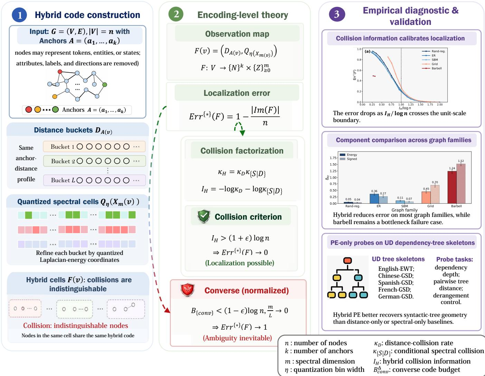  
Fig. 1: Overview of the hybrid positional encoding and the two-sided localization framework.

## II. LITERATURE REVIEW

Graph positional and structural encodings augment graph neural networks and graph Transformers with information that cannot always be recovered from local message passing alone. This motivation is closely related to the expressivity limitations of message-passing GNNs under the Weisfeiler-Leman framework [12], [13], [14]. Such encodings are also important in graph-based NLP and relational reasoning, where vertices may represent tokens, entities, dependency nodes, or reasoning states [3], [4], [5]. Existing methods can be broadly grouped into spectral encodings, distance- and structure-aware encodings, and learned or hybrid positional/structural encoders, while related theory studies their effects on expressivity, stability, generalization, and node distinguishability.

## A. Spectral Positional Encodings

Spectral positional encodings use eigenvalues, eigenvectors, or functions of graph operators to represent global geometry, with foundations in Laplacian eigenmaps and spectral graph representation [15]. Recent graph-learning models incorporate Laplacian features into graph Transformers and GNNs, while diffusion-wavelet embeddings and random feature propagation provide related spectral or propagation-based structural signals [16], [8], [17], [18]. Raw Laplacian eigenvectors suffer from sign ambiguity and basis rotations in repeated eigenspaces; SignNet, BasisNet, PEG, Laplacian Canonization, and stable spectral encodings address these issues through invariance, equivariance, or perturbation-stability mechanisms [6], [19], [20], [11]. Beyond vertex eigenvectors, CycleNet uses projectorbased Hodge-Laplacian cycle-space representations for basisinvariant structural encoding [21]. These methods provide rich global signals, but they do not by themselves characterize when finite-dimensional and quantized spectral codes uniquely identify vertices.

## B. Distance- and Structure-aware Encodings

Distance-based encodings represent nodes through relative topology, including shortest-path distances, anchor-distance profiles, random-walk statistics, and structural attention biases. Position-aware GNNs and Distance Encoding use anchor or distance features to improve node representations and expressive power [22], [7], while Graphormer, GRPE, and rewiring methods inject structural information into attention or graph connectivity [2], [23], [24]. Other methods, such as struc2vec and the Structure-Aware Transformer, model structural similarity or rooted subgraph structure without requiring nodes to be close in the graph [25], [26]. Although these encodings are interpretable, their resolution depends on anchor placement, graph symmetry, receptive-field design, and the number of distinct structural profiles induced on the graph.

## C. Learned and Hybrid Positional/Structural Encoders

Learned and hybrid encoders combine multiple positional signals inside trainable graph architectures. GraphGPS separates local message passing, global attention, and positional or structural encodings, GRIT incorporates graph inductive biases into Transformers, and GPSE learns transferable positional and structural representations [9], [27], [10]. Related graph Transformers, including TokenGT, Exphormer, and directionaware Transformers, represent nodes and edges as tokens, use sparse expander-based attention, or employ magnetic-Laplacian and directional random-walk encodings [28], [29], [30]. These architectures are empirically effective, but their performance reflects the joint effects of the encoding, model capacity, attention mechanism, optimization objective, and dataset. Thus, downstream accuracy alone does not show whether the positional code itself contains enough information to identify nodes.

## D. Positional Identifiability and Graph Localization

Identifying vertices from distances has a long history in graph theory through resolving sets, landmarks, and metric dimension [31], [32], [33], [34]. A resolving set uniquely identifies every vertex by its vector of distances to selected reference vertices, and related work studies metric dimension in graph families and random graph models, including Erdos-˝ Rényi graphs [35]. Graph reconstruction from distance queries provides a nearby perspective, with results for random regular graphs [36]. In graph learning, Weisfeiler-Leman analyses and recent studies of graph Transformers clarify how structural distinctions, positional encodings, and generalization interact [12], [13], [14], [37], [38], [39]. These works motivate an encoding-level analysis, but they do not directly characterize finite-resolution hybrid codes that combine anchor distances with quantized spectral coordinates.

## E. Relation to Closest Prior Work

This work is closest to theoretical analyses of hybrid distance-spectral positional encodings and to graph Transformer positional-encoding methods. A recent information-theoretic study formulated node localization through observation maps and established one-sided image-size converse bounds for positional ambiguity [40]. Building on this identifiability viewpoint, we address the complementary positive question of when distance and spectral code collisions vanish fast enough to enable localization. Compared with that line of work, the new contribution is the collision-achievability framework: we turn the factorization $\kappa _ { H } ~ = ~ \kappa _ { D } \kappa _ { S | D }$ into a deterministic criterion, the information measure $I _ { H }$ , a closed Gaussianwave achievability theorem for random regular graphs, and a a distance-conditioned spectral collision condition for actual Laplacian-energy coordinates. Unlike architecture-level studies, we characterize the information in the positional code itself rather than the performance of a particular downstream model. The UD experiments are therefore PE-only structural task probes: they connect intrinsic localization to syntactic geometry, but are not full dependency parsing or language-model finetuning. As summarized in Fig. 1, our analysis isolates the positional code itself and connects its construction to both converse and collision-based achievability results.

## III. PROBLEM FORMULATION

Let $G = ( V , E )$ be a finite connected simple undirected graph with $n = | V |$ , and let $d _ { G }$ denote shortest-path distance. We study an encoding-level localization problem: only graph structure is observed, while node attributes, edge labels, edge directions, lexical information, and task-specific features are removed. Therefore, vertices assigned the same positional code are indistinguishable to any decoder using this code alone.

Given an ordered anchor list $\mathcal { A } = \left( a _ { 1 } , \ldots , a _ { k } \right)$ , the anchordistance profile of $v \in V$ is

$$
D _ { \cal A } ( v ) = \big ( d _ { \cal G } ( v , a _ { 1 } ) , \dots , d _ { \cal G } ( v , a _ { k } ) \big ) .\tag{1}
$$

The realized profiles form

$$
\begin{array} { r } { \mathcal { T } _ { G , \mathcal { A } } = \{ D _ { \mathcal { A } } ( v ) : v \in V \} , \quad D ( G , \mathcal { A } ) = | \mathcal { T } _ { G , \mathcal { A } } | , } \end{array}\tag{2}
$$

and each $t \in { \mathcal { T } } _ { G , A }$ induces a distance bucket

$$
B _ { t } = \{ v \in V : D _ { \cal A } ( v ) = t \} .\tag{3}
$$

To refine these buckets, we use low-frequency Laplacian energy. Let $\phi _ { 1 } , \ldots , \phi _ { n } \in \mathbb { R } ^ { V }$ be an orthonormal eigenbasis of the normalized graph Laplacian, ordered by nondecreasing eigenvalue. For $m \in \{ 1 , \ldots , n - 1 \}$ , set

$$
X _ { m } ( v ) = n { \bigl ( } \phi _ { 2 } ( v ) ^ { 2 } , \ldots , \phi _ { m + 1 } ( v ) ^ { 2 } { \bigr ) } \in \mathbb { R } _ { \geq 0 } ^ { m } .\tag{4}
$$

The squared coordinates remove sign ambiguity. We use a fixed eigenbasis convention; for repeated eigenspaces, a blockwise projector-energy version can be used without changing the counting arguments.

For $\eta > 0 .$ , define

$$
Q _ { \boldsymbol { \eta } } ( x _ { 1 } , \dots , x _ { m } ) = \big ( \lfloor x _ { 1 } / \eta \rfloor , \dots , \lfloor x _ { m } / \eta \rfloor \big ) ,\tag{5}
$$

$$
Z _ { m , \eta } ( v ) = { \cal Q } _ { \eta } ( X _ { m } ( v ) ) .\tag{6}
$$

The hybrid positional observation map is

$$
F _ { G , A } ^ { ( m , \eta ) } ( v ) = \big ( D _ { A } ( v ) , Z _ { m , \eta } ( v ) \big ) .\tag{7}
$$

A source vertex v is sampled uniformly from V, and the decoder observes only $F _ { G , \mathcal { A } } ^ { ( m , \bar { \eta } ) } ( v _ { \star } )$ . For any positional map $F : V  \mathcal { V }$ , the optimal conditional localization error is

$$
\operatorname { E r r } ^ { \star } ( F ) = \operatorname* { i n f } _ { s \colon \operatorname { I m } ( F ) \to V } \mathbb { P } \big ( s ( F ( v _ { \star } ) ) \neq v _ { \star } \mid G , { \cal A } \big ) .\tag{8}
$$

We ask when $F _ { G , \mathcal { A } } ^ { ( m , \eta ) }$ separates most vertices, and when its preimages remain too large for reliable localization.

## IV. THEORETICAL ANALYSIS

The analysis rests on two complementary views of the same observation map. The converse side counts how many hybrid codes can be produced; the achievability side controls how often two distinct vertices collide under the same code. We use the observation-map identity

$$
\mathrm { E r r } ^ { * } ( F ) = 1 - \frac { | \operatorname { I m } ( F ) | } { | V | } ,\tag{9}
$$

valid for any finite V , map $F : V  \mathcal { V }$ , and uniform source vertex. Thus, small image size implies unavoidable ambiguity, while small pairwise collision probability implies successful localization. All formal proofs are deferred to Appendix A.

## A. A Normalized Converse

The converse is a counting argument. The distance component contributes at most $D ( G , A )$ profiles, while the spectral component is controlled by the total Laplacian-energy mass

$$
\sum _ { v \in V } \sum _ { j = 1 } ^ { m } X _ { m } ( v ) _ { j } = m n ,\tag{10}
$$

which follows from orthonormality. Let $\begin{array} { r l } { S _ { m } ( v ) } & { { } : = } \end{array}$ $\Sigma _ { j = 1 } ^ { m } X _ { m } ( v ) _ { j }$ . After trimming vertices with $S _ { m } ( v ) \ > \ L _ { \ast }$ the remaining spectral vectors lie in the nonnegative simplex $\{ x \in \mathbb { R } _ { > 0 } ^ { m } : \textstyle \sum _ { i } x _ { j } \leq L \}$ . Their quantized codes therefore occupy only finitely many distance-spectral cells. This gives the following image-size bound.

Theorem 1 (Simplex-refined normalized converse). For any finite connected graph $G = ( V , E )$ , anchor set ${ \mathcal { A } } \subseteq V ,$ , spectral dimension $m \in \{ 1 , \ldots , n - 1 \}$ , quantization level $\eta > 0$ , and trimming threshold $L > 0 _ { : }$

$$
\left| \mathrm { I m } ( F _ { G , \cal A } ^ { ( m , \eta ) } ) \right| \leq D ( G , { \cal A } ) { \binom { \lfloor L / \eta \rfloor + m } { m } } + \frac { m n } { L } .\tag{11}
$$

Consequently,

$$
\mathrm { E r r } ^ { * } \big ( F _ { G , 4 } ^ { ( m , \eta ) } \big ) \geq 1 - \frac { D ( G , \mathscr { A } ) } { n } \binom { \lfloor L / \eta \rfloor + m } { m } - \frac { m } { L } .\tag{12}
$$

This bound yields a simplex-refined subcritical principle. If, along a graph sequence,

$$
\log D ( G _ { n } , \mathcal { A } _ { n } ) + \log \binom { \left\lfloor L _ { n } / \eta _ { n } \right\rfloor + m _ { n } } { m _ { n } } \leq ( 1 - \varepsilon ) \log n\tag{13}
$$

for some $\varepsilon > 0 .$ , and $m _ { n } / L _ { n } \to 0$ , then Err $^ * ( F _ { G _ { n } , A _ { n } } ^ { ( m _ { n } , \eta _ { n } ) } )  1$ For random r-regular graphs with random anchors, the standard diameter bound gives ${ \bar { D } } ( { \bar { G } } _ { n } , { \mathcal { A } } _ { n } ) \leq ( C _ { r } \log n + 1 ) ^ { k _ { n } }$ with high probability, yielding the corresponding simplex-refined randomregular subcritical condition in Appendix A. The key message is that localization is impossible when the joint anchor, spectraldimension, and quantization budget remains below the log n scale.

## B. Collision-Based Achievability

We now turn to pairwise collisions. Let $U , V$ be sampled uniformly from V without replacement, and for any map F : $V  \mathcal { V }$ write

$$
\kappa _ { F } = \mathbb { P } ( F ( U ) = F ( V ) ) .\tag{14}
$$

For the hybrid map, a collision requires both a distance collision and a spectral collision inside the same distance bucket. We write

$$
\kappa _ { \mathrm { H } } = \mathbb { P } \Big ( F _ { G , \boldsymbol { A } } ^ { ( m , \eta ) } ( U ) = F _ { G , \boldsymbol { A } } ^ { ( m , \eta ) } ( V ) \Big ) ,
$$

$$
\kappa _ { \mathrm { D } } = \mathbb { P } ( D _ { \mathcal { A } } ( U ) = D _ { \mathcal { A } } ( V ) ) ,\tag{15}
$$

(16)

$$
\kappa _ { \mathrm { S | D } } = \mathbb { P } ( Z _ { m , \eta } ( U ) = Z _ { m , \eta } ( V ) \vert D _ { \cal A } ( U ) = D _ { \cal A } ( V ) ) .\tag{17}
$$

The conditional probability in the third line is defined when $\kappa _ { \mathrm { D } } > 0$ . When $\kappa _ { \mathrm { D } } = 0$ , no distance-colliding pair exists, so the distance component already separates all distinct ordered vertex pairs and necessarily $\kappa _ { \mathrm { H } } = 0$ . In this degenerate case, we adopt the convention $\kappa _ { \mathrm { S | D } } = 0$ . This convention preserves the factorization $\kappa _ { \mathrm { H } } = \kappa _ { \mathrm { D } } \kappa _ { \mathrm { S } | \mathrm { D } }$

When $\kappa _ { \mathrm { D } } > 0 .$ , the conditional collision probability can be written equivalently as

$$
\kappa _ { \mathrm { S | D } } = \frac { \sum _ { t \in \mathcal { T } _ { G , A } } \sum _ { \boldsymbol { u } , \boldsymbol { v } \in B _ { t } } \mathbf { 1 } \{ Z _ { m , \eta } ( \boldsymbol { u } ) = Z _ { m , \eta } ( \boldsymbol { v } ) \} } { \underset { t \in \mathcal { T } _ { G , A } } { \boldsymbol { u } \neq \boldsymbol { v } } \vert B _ { t } \vert ( \vert B _ { t } \vert - 1 ) } .\tag{18}
$$

The denominator counts all ordered pairs of distinct vertices that collide under the anchor-distance code, whereas the numerator counts those pairs that remain indistinguishable after spectral refinement. Thus, $\kappa _ { \mathrm { S | D } }$ measures how much quantized spectral energy resolves the ambiguity left by anchor-distance profiles. When $\kappa _ { \mathrm { D } } = 0$ , the ratio above is not evaluated, and the stated zero convention is used instead.

Lemma 2 (Collision factorization). For any observation map $F : V  \mathcal { V }$ on a finite set $| V | = n ,$

$$
\mathrm { E r r } ^ { * } ( F ) \leq ( n - 1 ) \kappa _ { F } .\tag{19}
$$

Moreover, the hybrid map satisfies the exact factorization

$$
\kappa _ { \mathrm { H } } = \kappa _ { \mathrm { D } } \kappa _ { \mathrm { S } | \mathrm { D } } .\tag{20}
$$

Consequently,

$$
\begin{array} { r } { \mathrm { E r r } ^ { * } \big ( F _ { G , \mathcal { A } } ^ { ( m , \eta ) } \big ) \leq ( n - 1 ) \kappa _ { \mathrm { D } } \kappa _ { \mathrm { S } | \mathrm { D } } . } \end{array}\tag{21}
$$

Theorem 3 (Deterministic collision-achievability criterion). For any deterministic sequence of graphs, anchor sets, spectral dimensions, and quantization levels, if

$$
n \kappa _ { \mathrm { D } } \kappa _ { \mathrm { S } | \mathrm { D } }  0 ,\tag{22}
$$

then

$$
\mathrm { E r r } ^ { * } \big ( F _ { G , A } ^ { ( m , \eta ) } \big )  0 .\tag{23}
$$

The same conclusion holds in probability when the above quantities are random and $n \kappa _ { \mathrm { D } } \kappa _ { \mathrm { S | D } } \stackrel { \mathbb { P } } { \to } 0$

It is therefore natural to define the total collision information

$$
\begin{array} { r } { \mathcal { T } _ { \mathrm { H } } ( G , \mathcal { A } , m , \eta ) : = - \log \kappa _ { \mathrm { D } } - \log \kappa _ { \mathrm { S } | \mathrm { D } } , } \end{array}\tag{24}
$$

with the convention − log 0 = +∞. The achievability condition is then ${ \mathcal { T } } _ { \mathrm { H } } ( G , { \mathcal { A } } , m , \eta ) \geq ( 1 + \varepsilon )$ log n, up to lower-order terms.

C. Random-Regular Achievability and Conditional Spectral Collisions

We instantiate the deterministic collision criterion on random regular graphs by combining a two-source distance distinguisher bound with a bounded-correlation Gaussian-wave anti-concentration bound. Both ingredients are proved in $\mathsf { A p - }$ pendix A-C. The Gaussian-wave surrogate models normalized Laplacian coordinates, since

$$
X _ { m } ( v ) _ { j } = n \phi _ { j + 1 } ( v ) ^ { 2 } = \bigl ( \sqrt { n } \phi _ { j + 1 } ( v ) \bigr ) ^ { 2 } .\tag{25}
$$

The actual-coordinate specialization is stated separately below. Rather than requiring a full distributional transfer from the Gaussian-wave surrogate to actual eigenvectors, the collision criterion only needs a spectral collision bound conditioned on distance collisions.

Definition 4. Fix a graph $G = ( V , E )$ , an anchor set A, a spectral dimension m, and a constant $\rho _ { \star } \in [ 0 , 1 )$ . A random field

$$
\{ \widetilde { Y } _ { j } ( v ) : v \in V , \ 1 \leq j \leq m \}\tag{26}
$$

is called an admissible bounded-correlation Gaussian-wave energy surrogate if, conditionally on G and A, the following conditions hold:

1) for each $j , \ \{ \widetilde { Y } _ { j } ( v ) : v \in V \}$ is a centered Gaussian field;   
2) for every $v \in V$ and every j,

$$
\mathbb { E } [ \widetilde { Y } _ { j } ( v ) ^ { 2 } ] = 1 ;\tag{27}
$$

3) for every u ̸= v and every j,

$$
\left| \mathrm { C o r r } \big ( \widetilde { Y } _ { j } ( u ) , \widetilde { Y } _ { j } ( v ) \big ) \right| \le \rho _ { \star } ;\tag{28}
$$

4) the fields are independent across $j = 1 , \ldots , m$ The associated Gaussian-wave energy coordinate is

$$
\widetilde X _ { m } ( v ) : = \big ( \widetilde Y _ { 1 } ( v ) ^ { 2 } , \dots , \widetilde Y _ { m } ( v ) ^ { 2 } \big ) ,\tag{29}
$$

and its quantized spectral code is

$$
\widetilde { Z } _ { m , \eta } ( v ) : = Q _ { \eta } ( \widetilde { X } _ { m } ( v ) ) .\tag{30}
$$

The closed random-regular theorem uses the following two estimates.

Lemma 5 (Random-regular distance collision decay). Fix $r \geq$ $^ { 3 , }$ and let $G _ { n } \sim \mathcal { G } _ { n , r }$ . Let ${ \mathcal { A } } _ { n } \subseteq V ( G _ { n } )$ be sampled uniformly without replacement, independently of $G _ { n }$ , with $| { \mathcal { A } } _ { n } | = k _ { n }$ Assume

$$
{ \frac { k _ { n } } { \log n } } \to \infty , \quad k _ { n } = o ( ( \log n ) ^ { 2 } ) .\tag{31}
$$

Then there exists a constant $c _ { r } > 0 ,$ , depending only on r, such that, with

$$
I _ { \mathrm { d } , n } ( r ) : = \frac { c _ { r } } { 4 \log n } ,\tag{32}
$$

we have

$$
\kappa _ { \mathrm { D } } ( G _ { n } , \mathcal { A } _ { n } ) \leq \exp \{ - k _ { n } I _ { \mathrm { d } , n } ( r ) \}\tag{33}
$$

with probability tending to one.

Lemma 6 (Gaussian-wave spectral collision decay). Fix $\rho _ { \star } \in$ [0, 1). There exists a constant $C _ { \mathrm { s } } = C _ { \mathrm { s } } ( \rho _ { \star } ) > 0$ such that, for any finite connected graph G, any anchor set A, and any admissible bounded-correlation Gaussian-wave energy surrogate,

$$
\begin{array} { r } { \mathbb { E } \left[ \widetilde { \kappa } _ { \mathrm { S } | \mathrm { D } } \big | G , \boldsymbol { \mathcal { A } } \right] \leq \big ( C _ { \mathrm { s } } \eta \log ( e / \eta ) \big ) ^ { m } , \quad 0 < \eta < e ^ { - 1 } . } \end{array}\tag{34}
$$

Equivalently, with

$$
I _ { \mathrm { s } } ^ { \mathrm { g w } } ( \eta ) : = \log \frac { 1 } { C _ { \mathrm { s } } \eta \log ( e / \eta ) } ,\tag{35}
$$

for any $\omega _ { \mathrm { s } , n }  \infty ,$

$$
\widetilde { \kappa } _ { \mathrm { S } | \mathrm { D } } \leq \exp \left\{ - m _ { n } I _ { \mathrm { s } } ^ { \mathrm { g w } } ( \eta _ { n } ) + \omega _ { \mathrm { s } , n } \right\}\tag{36}
$$

with conditional probability at least $1 - e ^ { - \omega _ { \mathrm { s } , n } }$

Let $\widetilde { F } _ { G _ { n } , \mathcal { A } _ { n } } ^ { ( m _ { n } , \eta _ { n } ) }$ denote the hybrid map whose spectral component is an admissible bounded-correlation Gaussian-wave energy surrogate with correlation bound $\rho _ { \star } \in [ 0 , 1 )$ ). Define

$$
I _ { \mathrm { d } , n } ( r ) : = \frac { c _ { r } } { 4 \log n } , \quad I _ { \mathrm { s } } ^ { \mathrm { g w } } ( \eta ) : = \log \frac { 1 } { C _ { \mathrm { s } } \eta \log ( e / \eta ) } .\tag{37}
$$

Theorem 7 (Closed Gaussian-wave hybrid achievability). Fix $r \geq 3 ,$ , and let $G _ { n } \sim \mathcal { G } _ { n , r }$ . Let ${ \mathcal { A } } _ { n } \subseteq V ( G _ { n } )$ be sampled uniformly without replacement, independently of $G _ { n } ,$ , with $| { \mathcal { A } } _ { n } | = k _ { n } .$ . Assume

$$
{ \frac { k _ { n } } { \log n } } \to \infty , \quad k _ { n } = o { \big ( } ( \log n ) ^ { 2 } { \big ) } .\tag{38}
$$

There exist constants $c _ { r } > 0$ and $C _ { \mathrm { s } } = C _ { \mathrm { s } } ( \rho _ { \star } ) > 0$ such that, if

$$
\eta _ { n } \in ( 0 , e ^ { - 1 } ) , \quad C _ { \mathrm { s } } \eta _ { n } \log ( e / \eta _ { n } ) < 1 ,\tag{39}
$$

and if, for some $\varepsilon > 0$

$$
k _ { n } I _ { \mathrm { d } , n } ( r ) + m _ { n } I _ { \mathrm { s } } ^ { \mathrm { g w } } ( \eta _ { n } ) \geq ( 1 + \varepsilon ) \log n\tag{40}
$$

for all sufficiently large n, then

$$
\mathrm { E r r } ^ { * } \big ( \widetilde { F } _ { G _ { n } , { A _ { n } } } ^ { ( m _ { n } , \eta _ { n } ) } \big ) \ \xrightarrow { \mathbb { P } } \ 0 .\tag{41}
$$

Theorem 7 is closed for the Gaussian-wave energy model. For actual Laplacian-energy coordinates, the remaining ingredient is a spectral collision bound inside distance-collision buckets.

For the actual Laplacian-energy code, write

$$
X _ { n } ( v ) : = n { \bigl ( } \phi _ { 2 } ( v ) ^ { 2 } , \ldots , \phi _ { m _ { n } + 1 } ( v ) ^ { 2 } { \bigr ) } .\tag{42}
$$

For $x , y \in \mathbb { R } _ { > 0 } ^ { m _ { n } }$ , define

$$
H _ { \eta _ { n } } ( x , y ) : = \mathbf { 1 } \big \{ Q _ { \eta _ { n } } ( x ) = Q _ { \eta _ { n } } ( y ) \big \} .\tag{43}
$$

When distance-collision pairs exist, let $\pi _ { \mathrm { D } , n }$ be the uniform measure over ordered pairs $( u , v )$ with u $\neq v$ and $D _ { \boldsymbol { \mathcal { A } } _ { n } } ( \boldsymbol { u } ) =$ $D _ { \boldsymbol { \mathcal { A } } _ { n } } ( \boldsymbol { v } )$ . If no such pair exists, all πD,n-expectations are set to zero.

Let $H _ { \eta _ { n } , \alpha _ { n } } ^ { + }$ be the expanded-cell majorant from $\mathsf { A p - }$ pendix $_ { \mathrm { A - C 5 } }$ , satisfying

$$
0 \leq H _ { \eta _ { n } , \alpha _ { n } } ^ { + } ( x , y ) \leq 1 , \quad H _ { \eta _ { n } } ( x , y ) \leq H _ { \eta _ { n } , \alpha _ { n } } ^ { + } ( x , y ) .\tag{44}
$$

We use

$$
\alpha _ { n } : = \eta _ { n } ( \log n ) ^ { - 2 } .\tag{45}
$$

Define the smoothed conditional spectral collision rate

$$
\Gamma _ { n } ^ { + } : = \mathbb { E } _ { \pi _ { \mathrm { D } , n } } \Big [ H _ { \eta _ { n } , \alpha _ { n } } ^ { + } \big ( X _ { n } ( U ) , X _ { n } ( V ) \big ) \Big ] .\tag{46}
$$

Assumption 1. Fix $r \geq 3 ,$ , and let $G _ { n } \sim \mathcal G _ { n , r }$ . Let ${ \mathcal { A } } _ { n } \subseteq V ( G _ { n } )$ be sampled uniformly without replacement and independently of $G _ { n } .$ . Assume

$$
m _ { n } = O ( \log n ) , \quad \eta _ { n } \in [ n ^ { - c _ { 0 } } , e ^ { - 1 } ) , \quad \alpha _ { n } = \eta _ { n } ( \log n ) ^ { - 2 } ,\tag{47}
$$

where $c _ { 0 } > 0$ is fixed. Suppose that there exist a constant $C _ { \sec , r } > 0 ,$ , depending only on r, and a deterministic sequence $\xi _ { n } = o ( \log n )$ , such that, with probability tending to one,

$$
\Gamma _ { n } ^ { + } \leq \exp \Bigl \{ - m _ { n } I _ { \mathrm { s c } , r } ( \eta _ { n } ) + \xi _ { n } \Bigr \} ,\tag{48}
$$

where

$$
I _ { \mathrm { s c } , r } ( \eta ) : = \log \frac { 1 } { C _ { \mathrm { s c } , r } \eta \log ( e / \eta ) } .\tag{49}
$$

Corollary 1 (Conditional actual Laplacian hybrid achievability). Fix $r \geq 3 ,$ , and let $G _ { n } \sim \mathcal { G } _ { n , r }$ . Let ${ \mathcal { A } } _ { n } \subseteq V ( G _ { n } )$ be sampled uniformly without replacement and independently $o f G _ { n }$ , with $| { \mathcal { A } } _ { n } | = k _ { n }$ . Assume

$$
{ \frac { k _ { n } } { \log n } } \to \infty , \quad k _ { n } = o { \big ( } ( \log n ) ^ { 2 } { \big ) } .\tag{50}
$$

Suppose Assumption 1 holds and

$$
C _ { \mathrm { s c } , r } \eta _ { n } \log ( e / \eta _ { n } ) < 1\tag{51}
$$

for all sufficiently large n. Let

$$
F _ { n } ^ { \mathrm { L a p } } ( v ) : = \bigl ( D _ { A _ { n } } ( v ) , Q _ { \eta _ { n } } ( X _ { n } ( v ) ) \bigr ) .\tag{52}
$$

If there exists $\varepsilon > 0$ such that

$$
k _ { n } I _ { \mathrm { d } , n } ( r ) + m _ { n } I _ { \mathrm { s c } , r } ( \eta _ { n } ) \geq ( 1 + \varepsilon ) \log n\tag{53}
$$

for all sufficiently large n, then

$$
\mathrm { E r r } ^ { * } \left( F _ { n } ^ { \mathrm { L a p } } \right) \ { \stackrel { \mathbb { P } } { \to } } \ 0 .\tag{54}
$$

## D. Two-Sided Localization Criterion

The converse and collision bounds can be summarized by two graph-dependent quantities. Writing $R _ { L , \eta } : = \lfloor L / \eta \rfloor$ ⌋, define the simplex-refined converse code budget

$$
\begin{array} { r l } & { \mathcal { B } _ { \mathrm { c o n v } } ^ { \Delta } ( G , \mathcal { A } , m , \eta , L ) : = \log D ( G , \mathcal { A } ) } \\ & { \qquad + \log { \binom { R _ { L , \eta } + m } { m } } , } \end{array}\tag{55}
$$

and the collision information

$$
\begin{array} { r } { \mathcal { I } _ { \mathrm { H } } ( G , \mathcal { A } , m , \eta ) = - \log \kappa _ { \mathrm { D } } - \log \kappa _ { \mathrm { S } | \mathrm { D } } . } \end{array}\tag{56}
$$

Here, the superscript ∆ denotes the simplex-counting converse budget. The conservative box budget used in the finite-sample design diagnostics is denoted separately by $B _ { \mathrm { c o n v } } ^ { \boxed { \mathrm { U } } }$ in Section V.

Then Theorem 1 and Lemma 2 imply

$$
\begin{array} { r l } & { \quad 1 - \exp \bigl \{ \mathcal { B } _ { \mathrm { c o n v } } ^ { \Delta } ( G , \mathcal { A } , m , \eta , L ) - \log n \bigr \} - \frac { m } { L } } \\ & { \quad \le \mathrm { E r r } ^ { * } \bigl ( F _ { G , \mathcal { A } } ^ { ( m , \eta ) } \bigr ) \le ( n - 1 ) \exp \bigl \{ - \mathcal { D } _ { \mathrm { H } } ( G , \mathcal { A } , m , \eta ) \bigr \} . } \end{array}\tag{57}
$$

Corollary 2 (Graph-dependent design principle). For a sequence of hybrid encodings $F _ { G _ { n } , \bar { A } _ { n } } ^ { ( m _ { n } , \bar { \eta } _ { n } ) }$ , the following two regimes hold.

If there exist $L _ { n } > 0$ and $\varepsilon > 0$ such that

$$
\mathcal { B } _ { \mathrm { c o n v } } ^ { \Delta } ( G _ { n } , \mathcal { A } _ { n } , m _ { n } , \eta _ { n } , L _ { n } ) \leq ( 1 - \varepsilon ) \log n\tag{58}
$$

and $m _ { n } / L _ { n }  0 ,$ , then

$$
\mathrm { E r r } ^ { * } \big ( F _ { G _ { n } , A _ { n } } ^ { ( m _ { n } , \eta _ { n } ) } \big )  1 .\tag{59}
$$

If there exists $\varepsilon > 0$ such that

$$
{ \cal T } _ { \mathrm { H } } ( G _ { n } , { \cal A } _ { n } , m _ { n } , \eta _ { n } ) \geq ( 1 + \varepsilon ) \log n ,\tag{60}
$$

then

$$
\mathrm { E r r } ^ { * } \big ( F _ { G _ { n } , A _ { n } } ^ { ( m _ { n } , \eta _ { n } ) } \big )  0 .\tag{61}
$$

Thus, the hybrid positional encoding admits a two-sided interpretation. Localization is impossible when the simplexrefined code budget after distance partitioning and spectral quantization is below the log n scale, while localization is achievable when the total distance-spectral collision information exceeds the same scale.

## V. EMPIRICAL EVALUATION

## A. Experimental Setup

All experiments instantiate the hybrid observation map in Section III. To avoid overloading the scalar trimming mass $\begin{array} { r } { S _ { m } ( v ) = \sum _ { i = 1 } ^ { m } X _ { m } ( v ) _ { j } } \end{array}$ used in the converse analysis, we denote by $\bar { \Psi _ { m } } ( v )$ the spectral coordinate vector used in a given empirical run. For compactness, the empirical map is written as

$$
F ( v ) = \bigl ( D _ { A } ( v ) , Q _ { \eta } ( \Psi _ { m } ( v ) ) \bigr ) ,\tag{62}
$$

where $D _ { \boldsymbol { \mathcal { A } } } ( \boldsymbol { v } )$ denotes the anchor-distance profile. Depending on the experiment, $\Psi _ { m } ( v )$ is instantiated as actual Laplacianenergy coordinates, signed Laplacian coordinates, or Gaussianwave surrogate coordinates. Unless otherwise specified, anchors are sampled uniformly without replacement, and quantization is performed coordinatewise by floor binning,

$$
Q _ { \eta } ( x ) = \bigl ( \lfloor x _ { 1 } / \eta \rfloor , \ldots , \lfloor x _ { p } / \eta \rfloor \bigr ) , \qquad x \in \mathbb { R } ^ { p } .\tag{63}
$$

a) Synthetic graph diagnostics: The synthetic experiments cover random regular graphs, Erdos–Rényi graphs, stochastic˝ block models, grids, and barbell graphs. The main localization sweep uses graph sizes around $n \in \{ 5 0 0 , 1 0 0 0 , 2 0 0 0 \}$ , with grids instantiated at $n \in \{ 5 2 9 , 1 0 2 4 , 2 0 2 5 \}$ . The parameter grid is

$$
\begin{array} { r l } & { k \in \{ 1 , 2 , 3 , 4 , 5 , 6 , 8 , 1 2 , 1 6 , 2 4 , 3 2 \} , } \\ & { m \in \{ 1 , 2 , 3 , 4 , 6 , 8 , 1 2 , 1 6 \} , } \\ & { \eta \in \{ 0 . 8 , 0 . 6 , 0 . 5 , 0 . 4 , 0 . 3 , 0 . 2 , 0 . 1 \} . } \end{array}
$$

Distance-only, spectral-only, and hybrid encodings are compared under both Laplacian and Gaussian-wave spectral coordinates. A separate collision-transfer sweep uses

$$
\begin{array} { c } { { k \in \{ 2 , 4 , 8 , 1 6 , 3 2 \} , } } \\ { { { } } } \\ { { m \in \{ 2 , 4 , 8 , 1 6 \} , } } \\ { { { } } } \\ { { \eta \in \{ 0 . 7 , 0 . 5 , 0 . 3 , 0 . 1 \} , } } \end{array}
$$

and records the collision identity

$$
\kappa _ { H } = \kappa _ { D } \kappa _ { S | D } , \qquad I _ { H } = - \log \kappa _ { H } .\tag{64}
$$

For rows with $\kappa _ { D } > 0$ , this is equivalently $I _ { H } = - \log \kappa _ { D } -$ log $\kappa _ { S \mid D } .$ . When $\kappa _ { D } ~ = ~ 0 .$ , there are no distance-colliding ordered pairs, so the ordinary conditional estimator of $\kappa _ { S \mid D }$ has no denominator. We mark these cases as distance-saturated and use the convention

$$
\kappa _ { S | D } = 0 , \qquad \kappa _ { H } = 0 , \qquad I _ { H } = + \infty .
$$

Thus, such rows represent successful distance-level saturation rather than numerical failure. Finite discrepancy summaries either exclude these infinite-information rows or report them separately as saturated configurations.

For the main Laplacian-energy hybrid setting, we additionally perform graph-clustered and held-out validation. All $( k , m , \eta )$ configurations generated from the same graph instance are treated as one cluster. Thresholds are calibrated only on disjoint graph groups and evaluated under leave-one-family-out, leave-one-setting-out, leave-one-size-out, and size-extrapolation protocols.

b) Universal Dependencies structural task probes: We conduct real-graph structural task probes on Universal Dependencies trees. Tokens are nodes, head-dependent arcs are converted into undirected edges, and lexical forms, dependency labels, edge directions, and token attributes are excluded. We use English-EWT, Chinese-GSD, Spanish-GSD, French-GSD, and German-GSD, filter sentences to $6 \leq n \leq 8 0$ , and use at most 3000 training sentences per treebank together with all filtered development and test sentences. These probes measure structural information in the positional code and should not be interpreted as full dependency parsing.

The UD comparison includes four encoding families:

NoPE : $F ( v ) = \mathrm { c o n s t } ,$

Distance : $F ( v ) = D _ { \mathcal { A } } ( v ) ,$

SpectralEnergy : $F ( v ) = Q _ { \eta } ( \Psi _ { m } ( v ) ) ,$

HybridEnergy : $F ( v ) = \bigl ( D _ { A } ( v ) , Q _ { \eta } ( \Psi _ { m } ( v ) ) \bigr )$

The UD grid is

$$
k \in \{ 1 , 2 , 4 , 8 \} , \quad m \in \{ 2 , 4 , 8 , 1 6 \} , \quad \eta = 0 . 2 5 ,
$$

with three random anchor trials for each configuration.

c) Metrics: The primary encoding-level metrics are the image-size success rate and its induced localization error,

$$
\operatorname { s u c c } ( F ) = { \frac { \left| \operatorname { I m } ( F ) \right| } { n } } , \quad \operatorname { e r r } ( F ) = 1 - \operatorname { s u c c } ( F ) .\tag{65}
$$

The synthetic diagnostics also report the normalized collision information $I _ { H } /$ log n, the conservative box-budget diagnostic $B _ { \mathrm { c o n v } } ^ { \perp } / \log n$ , and Gaussian-wave surrogate discrepancies, where

$$
B _ { \mathrm { c o n v } } ^ { \perp } = \log D ( G , A ) + m \log ( \lceil L / \eta \rceil + 1 )
$$

is the budget used in the finite-sample sweeps. The simplexrefined budget $B _ { \mathrm { c o n v } } ^ { \Delta }$ used in the theory is no larger than $B _ { \mathrm { c o n v } } ^ { \boxed { \Pi } }$ . For UD trees, we report PE-only structural-probe metrics in addition to encoding-level localization quantities. The surface-position and dependency-depth probes use NMAE, while the pairwise dependency-distance probe uses macro-F1. PE-row derangement controls preserve sentence-level PE marginals but remove node-code alignment. Details are given in Appendix C-B.

B. Mathematical Localization and Surrogate-Discrepancy Diagnostics

We first evaluate the localization mechanism underlying the theoretical results. For each graph and positional-encoding configuration, we compute the optimal localization error $\mathrm { E r r } ^ { * } ( F )$ , the conservative box-budget diagnostic $B _ { \mathrm { c o n v } } ^ { \perp }$ , and the hybrid collision information

$$
I _ { H } = - \log \kappa _ { D } - \log \kappa _ { S | D } .\tag{66}
$$

All localization results are averaged over 10 independent trials.

a) Localization phase transition: Figure 2 summarizes the main localization diagnostics. The empirical error decreases as IH/ log n crosses the unit scale, while the surrogate discrepancy separates expander-like graphs from bottleneck graphs. The design map further shows that low-error configurations are organized most clearly by the achievability-side information ratio $I _ { H } / \log n .$

Table I reports family-level statistics. Hybrid Laplacianenergy encodings substantially outperform both distance-only and spectral-only encodings on random regular, ER, SBM, and grid graphs. Their average error reduction relative to distanceonly encoding ranges from 63.9% to 80.6%. Barbell graphs provide a contrasting failure case: their hybrid error remains close to the distance-only error, their information level remains subcritical, and their surrogate discrepancy is the largest.

b) Collision decomposition and Gaussian-wave transfer: We next examine the collision decomposition and the Gaussianwave transfer diagnostic used in the achievability theory. For each configuration, we compute the distance collision rate $\kappa _ { \mathrm { D } }$ , the weighted conditional spectral collision rate $\kappa _ { \mathrm { S | D } }$ , and the hybrid collision rate $\kappa _ { \mathrm { H } }$ . The implementation follows the deterministic identity

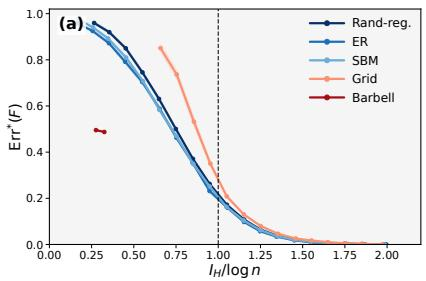

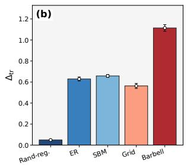

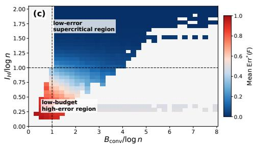  
Fig. 2: Localization diagnostics. (a) Error versus $I _ { H } / \log n$ . (b) Gaussian-wave surrogate discrepancy $\Delta _ { \mathrm { t r } } .$ . (c) Design map in the $( B _ { \mathrm { c o n v } } ^ { \perp } / \log n , I _ { H } / \log n )$ plane.

TABLE I: Family-level localization summary. D, S, and H denote distance-only, spectral-only, and hybrid encodings.
<table><tr><td>Graph</td><td>D Err. S Err. H Err. H</td><td> $I _ { H } /$ </td><td>log n  $\Delta _ { \mathrm { t r } }$ </td><td> $\Delta \mathrm { E r r } .$ </td></tr><tr><td>Rand-reg.</td><td>0.409 0.364</td><td>0.079</td><td>1.710</td><td>0.049 0.001</td></tr><tr><td>ER</td><td>0.471 0.513</td><td>0.170</td><td>1.443</td><td>0.6290.073</td></tr><tr><td>SBM</td><td>0.424 0.475</td><td>0.123</td><td>1.522</td><td>0.6580.043</td></tr><tr><td>Grid</td><td>0.225 0.721</td><td>0.051</td><td>1.651</td><td>0.563 0.024</td></tr><tr><td>Barbell</td><td>0.495 0.886</td><td>0.490</td><td>0.309</td><td>1.1140.347</td></tr></table>

$$
\kappa _ { \mathrm { H } } = \kappa _ { \mathrm { D } } \kappa _ { \mathrm { S | D } } , \quad I _ { \mathrm { H } } = - \log \kappa _ { \mathrm { H } } = - \log \kappa _ { \mathrm { D } } - \log \kappa _ { \mathrm { S | D } } ,\tag{67}
$$

with the extended-real convention $- \log 0 \ = \ + \infty$ . Across 33,600 evaluated configurations, the maximum numerical factorization error is $9 . 9 1 8 \times 1 0 ^ { - 1 7 }$ , and the maximum discrepancy in the additive information identity is $3 . 5 5 3 \times 1 0 ^ { - 1 5 }$ on finite-information configurations. No violation of the collisionto-error inequality or the conservative box-budget converse corollary is observed.

Figure 3 summarizes the two main diagnostics. Panel (a) shows that localization error is organized by the information ratio $I _ { H } / \log n \colon$ the mean error drops from 0.515 in the lowinformation regime to 0.003 in the high-information regime. Panel (b) reports the hard Gaussian-wave surrogate discrepancy

$$
\Delta _ { \mathrm { t r } } = \frac { | I _ { S | D } ^ { \mathrm { L a p } } - I _ { S | D } ^ { \mathrm { G W } } | } { \log n } .\tag{68}
$$

The gap is smallest on expander-like random regular graphs, where it is 0.050 for energy coordinates and 0.035 for signed coordinates. It is substantially larger on bottleneck graphs, especially barbell graphs, where the corresponding gaps increase to 1.240 and 1.520. These hard-collision discrepancies indicate closer agreement between the Gaussian-wave surrogate and actual Laplacian coordinates on expander-like graphs, and weaker agreement on bottleneck graphs. They do not, by them selves, establish the conditional spectral-collision assumption for actual coordinates. The corresponding diagnostic based on the expanded-cell majorant is reported in Appendix C-A.

(a)  
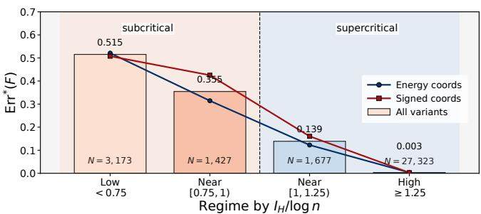

(b)  
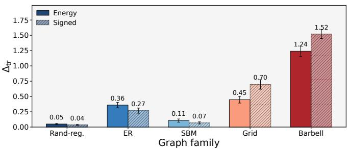  
Fig. 3: Collision decomposition and hard Gaussian-wave transfer diagnostics. (a) Regime-binned localization error by $I _ { H } / \log n$ . (b) Hard surrogate discrepancy $\Delta _ { \mathrm { t r } } = | I _ { S | D } ^ { \mathrm { L a p } } - $ $I _ { S | D } ^ { \mathrm { G W } } | /$ log n across graph families.

c) Unified graph-dependent design diagnostics: Finally, we consolidate the localization and collision diagnostics into a single graph-dependent design analysis. For each configuration, we compare the conservative converse-side box budget and the achievability-side normalized collision information,

$$
\frac { B _ { \mathrm { c o n v } } ^ { \perp } } { \log n } , \quad \frac { I _ { H } } { \log n } .\tag{69}
$$

This directly evaluates the graph-dependent design principle: configurations with insufficient effective code budget should remain difficult to localize, whereas configurations with $I _ { H } >$ log n should be localizing.

Table II summarizes the main Laplacian-energy hybrid setting over 25,256 configurations, covering five graph families and seven graph settings, with graph sizes ranging from $n =$ 494 to $n = 2 0 2 5$ . The achievability-side rule $I _ { H } / \log n \geq 1$ is highly predictive of localization success. Using $\mathrm { E r r } ^ { * } ( F ) \leq 0 . 1$ as success, it achieves precision 0.930 and recall 0.9998. With the relaxed threshold Err $^ { * } ( F ) \leq 0 . 2$ , the precision and recall become 0.990 and 0.991, respectively.

TABLE II: Unified graph-dependent design diagnostics for the Laplacian-energy hybrid positional encoding. We write $b =$ $B _ { \mathrm { c o n v } } ^ { \perp } /$ log n and $h = I _ { H } / \log n$ . Succ. denotes $\mathrm { E r r } ^ { * } ( F ) \leq 0 . 1$ and High denotes $\mathrm { E r r } ^ { * } ( F ) \geq 0 . 9$
<table><tr><td colspan="6">(a) Design-plane regions</td></tr><tr><td>b</td><td>h</td><td>Count</td><td>Mean</td><td>Med.</td><td>Succ./High</td></tr><tr><td>&lt; 1</td><td>&lt; 1</td><td>1,150</td><td>0.829</td><td>0.850</td><td>0.000/0.340</td></tr><tr><td> $< 1$ </td><td>≥1</td><td>0</td><td></td><td>No configurations observed</td><td></td></tr><tr><td> $\geq 1$ </td><td>&lt; 1</td><td>5,033</td><td>0.463</td><td>0.488</td><td>0.001/0.002</td></tr><tr><td>≥1</td><td>≥1</td><td>19,073</td><td>0.019</td><td>0.001</td><td>0.930/0.000</td></tr><tr><td colspan="6">(b) Prediction quality of design rules</td></tr><tr><td>Rule / target</td><td></td><td>TP</td><td>FP</td><td>FN Prec.</td><td>Rec.</td></tr><tr><td> $h \geq 1 , \ \mathrm { E r r } ^ { * } \leq 0 . 1$ </td><td>17,745</td><td>1,328</td><td></td><td>0.930</td><td>0.9998</td></tr><tr><td> $h \geq 1 , { \mathrm { ~ E r r } } ^ { * } \leq 0 . 2$ </td><td>18,883</td><td>190</td><td>166</td><td>0.990</td><td>0.991</td></tr><tr><td> $b < 1 , { \mathrm { ~ E r r } } ^ { * } \geq 0 . 9$ </td><td>391</td><td>759</td><td>10</td><td>0.340</td><td>0.975</td></tr></table>

TABLE III: Held-out and graph-clustered validation for the Laplacian-energy hybrid encoding. The target is $\mathrm { E r r } ^ { * } ( F ) \leq$ 0.1, and $h = I _ { H } / \log n$ . All reported scores are graph-cluster macro metrics. $\vec { \bf \Phi } ^ { 6 6 } \mathrm { A v g } . \vec { \bf \Phi } ^ { , 5 }$ denotes the unweighted mean over held out folds. The barbell negative-control fold is excluded from family and setting averages because it contains no positive success cases.
<table><tr><td>Protocol</td><td>Threshold</td><td>AUC</td><td>Prec.</td><td>Rec.</td><td>F1</td></tr><tr><td>Clustered, theory rule</td><td>1.0000</td><td>0.9995</td><td>0.9393</td><td>0.9999</td><td>0.9685</td></tr><tr><td>Clustered, calibration reference</td><td>1.1545</td><td>0.9995</td><td>0.9928</td><td>0.9925</td><td>0.9926</td></tr><tr><td>Leave-one-family-out, Avg.</td><td>1.1546</td><td>0.9993</td><td>0.9914</td><td>0.9903</td><td>0.9908</td></tr><tr><td>Leave-one-setting-out,  $\operatorname { A v g } .$ </td><td>1.1562</td><td>0.9995</td><td>0.9929</td><td>0.9919</td><td>0.9924</td></tr><tr><td>Leave-one-size-out, Avg.</td><td>1.1619</td><td>0.9995</td><td>0.9933</td><td>0.9892</td><td>0.9912</td></tr><tr><td>Size extrapolation, Avg.</td><td>1.1876</td><td>0.9994</td><td>0.9996</td><td>0.9754</td><td>0.9873</td></tr></table>

The converse-side rule is more conservative. The region $B _ { \mathrm { c o n v } } ^ { \perp } / \log n < 1$ and $I _ { H } / \log n < 1$ has mean localization error 0.829 and median error 0.850. The rule $B _ { \mathrm { c o n v } } ^ { \perp } / \log n < 1$ detects very high-error configurations $\mathrm { E r r } ^ { * } ( F ) \geq 0 . 9$ with recall 0.975, although its precision is 0.340. Overall, $I _ { H } / \log n$ provides a sharp success-side diagnostic, while $B _ { \mathrm { c o n v } } ^ { \perp } /$ log n identifies a conservative failure-side regime. The corresponding design-map visualizations are reported in Appendix C-A.

d) Held-out and graph-clustered validation: Because the design sweep reuses graph instances across parameter settings, we further evaluate the Laplacian-energy hybrid setting with graph-clustered and held-out validation. The expanded sweep contains 129,360 configurations from 210 graph-instance clusters. Configurations from the same graph are grouped as one cluster, and held-out thresholds are calibrated only on disjoint training graph groups.

Table III shows that $I _ { H } / \log n$ remains a stable success-side diagnostic after clustering by graph instance and transferring thresholds across unseen graph families, structural settings, and graph sizes.

C. Real-graph structural task probes on Universal Dependencies

This experiment evaluates whether the localization advantage observed on synthetic graphs also translates into taskrelevant structural recovery on real dependency-tree graphs. The goal is not full dependency parsing or language-model finetuning, because the positional codes are computed from gold dependency trees. Instead, UD is used as a controlled PE-only structural task-probe benchmark: tokens are nodes, undirected dependency arcs are edges, and lexical forms, dependency labels, edge directions, and token attributes are excluded. Thus, any predictive signal must come from the positional code computed on the unlabeled undirected dependency-tree skeleton.

This design keeps the experiment aligned with the theory. The theoretical claims concern the intrinsic resolution of a positional observation map, whereas end-to-end downstream accuracy would mix positional information with lexical features, model architecture, optimization, and task-specific correlations. The UD probes therefore serve as a middle ground between pure localization diagnostics and full downstream benchmarks: they test whether a code that better localizes nodes also supports recovery of syntactic geometry on real graphs.

We use five UD treebanks, with at most 3000 training sentences per treebank and the full official development and test splits after length filtering. The comparison includes NoPE, distance-only anchor codes, Laplacian-energy codes, and the hybrid distance-energy code.

a) PE-only structural task protocol: We evaluate three supervised probes using only positional codes as input. The surface-position probe predicts normalized token order and tests whether the undirected dependency-tree skeleton carries a weak word-order signal. The dependency-depth probe predicts

$$
y _ { \mathrm { d e p t h } } ( v ) = \frac { d _ { G } ( v , r ) } { \operatorname* { m a x } _ { u \in V } d _ { G } ( u , r ) } ,\tag{70}
$$

where r is the dependency root. This probe measures whether the code captures node-level syntactic geometry. The pair wise dependency-distance probe predicts a clipped bucket of $d _ { G } ( u , v )$ from the pair representation

$$
\big [ F ( u ) + F ( v ) , | F ( u ) - F ( v ) | , F ( u ) \odot F ( v ) \big ] ,\tag{71}
$$

and tests whether pairwise tree geometry can be recovered from the code.

For the added dependency-depth and pairwise-distance probes, no new hyperparameter search is performed. The configurations selected by the original surface-position development protocol are frozen and reused. This makes the additional probes confirmatory: they test whether configurations chosen from a weak surface-order signal also support more direct tree-structural recovery.

b) Main UD structural-probe results: Table IV summarizes the results. The surface-position probe shows only modest gains: HybridEnergy reduces the average NMAE from 0.262 to 0.257. This is expected, since linear word order is only partially determined by the undirected dependency-tree skeleton.

TABLE IV: UD structural task probes. Position and depth use NMAE; pairwise distance uses macro-F1. D, S, and H denote distance-only, spectral-energy, and hybrid-energy encodings. $\Delta _ { \mathrm { a l i g n } }$ is the real-minus-null alignment margin from PE-row derangement.
<table><tr><td>Probe</td><td>Metric</td><td>NoPE</td><td>D</td><td>S</td><td>H</td><td> $\Delta _ { \mathrm { a l i g n } } ^ { S }$ </td><td> $\Delta _ { \mathrm { a l i g n } } ^ { H }$ </td></tr><tr><td>Position</td><td>NMAE↓</td><td>0.262</td><td>0.260</td><td>0.258</td><td>0.257</td><td>0.00011</td><td>0.00097</td></tr><tr><td>Depth</td><td>NMAE↓</td><td>0.224</td><td>0.190</td><td>0.196</td><td>0.173</td><td>0.0347</td><td>0.0509</td></tr><tr><td>Pairwise dist. Macro-F1 ↑</td><td></td><td>0.074</td><td>0.642</td><td>0.532</td><td>0.812</td><td>0.3919</td><td>0.5881</td></tr></table>

In contrast, the depth and pairwise-distance probes show a much clearer separation. HybridEnergy achieves the best depth NMAE and the best pairwise-distance macro-F1, outperforming both distance-only and spectral-energy encodings. This indicates that anchor distances and Laplacian-energy coordinates capture complementary aspects of dependency-tree geometry.

The PE-row derangement control separates node-code alignment from marginal PE statistics. Within each sentence, PE rows are deranged while targets are kept fixed. This preserves sentence-level PE statistics, feature dimension, and code budget, but removes the alignment between a token and its own graph code. The alignment margin $\Delta _ { \mathrm { a l i g n } }$ in Table IV is the realcondition gain over NoPE minus the corresponding deranged condition gain. HybridEnergy has the larger alignment-specific margin across all three probes, showing that its gains are not explained solely by the marginal distribution of PE values.

c) Design ablations on UD localization: Table V reports UD design diagnostics. These ablations are not additional downstream benchmarks; rather, they test how the structuralprobe behavior changes under the design variables suggested by the theory.

Anchor placement has the strongest effect. Root and farthest anchors both improve over random anchors, with farthest anchors giving the best localization and the best surfaceposition recovery. This is consistent with the role of anchor profiles in reducing distance-bucket ambiguity. The signedcoordinate block separates within-tree collision control from cross-sentence probe stability. Signed Laplacian coordinates greatly reduce collisions and increase $I _ { H } / \log n .$ , but they do not improve prediction accuracy. This suggests that low collision inside a single tree is not sufficient for cross-sentence probing: the coordinate system must also be stable enough across different trees.

The quantization block follows the expected diagnostic trend. Coarser η reduces $I _ { H } / \log n$ and slightly increases collision error, while probe performance remains stable for $\eta \leq 0 . 5$ and weakens mildly at $\eta = 1 . 0 .$ Additional protocol details, configuration-level diagnostics, and the compact derangement table are provided in Appendix C-B.

## VI. CONCLUSIONS AND LIMITATIONS

## A. Discussions

This paper studied node localization from hybrid graph positional encodings that combine anchor-distance profiles with quantized low-frequency Laplacian-energy coordinates. By viewing the encoding as an observation map, we separated intrinsic positional identifiability from downstream architectures, attributes, and task-specific features. The normalized converse identifies subcritical code budgets, while the collision analysis gives $\kappa _ { H } = \kappa _ { D } \kappa _ { S | D }$ and the information measure $I _ { H }$ . Experiments show that $I _ { H } / \log n$ calibrates localization success, and UD structural task probes further show that this localization information supports recovery of syntactictree geometry, especially dependency depth and pairwise tree distance.

TABLE V: UD localization ablations. Anchor and sign blocks use three treebanks. Quantization reports probe metrics on two treebanks and diagnostic metrics on five treebanks. NMAE and $\mathrm { E r r } ^ { * } ( F )$ are lower better; other metrics are higher better.
<table><tr><td>Ablation</td><td>Setting</td><td>Lang.</td><td>NMAE</td><td>T</td><td>IH/ log n</td><td>Err*(F)</td><td> $B _ { \mathrm { c o n v } } / \log n$ </td></tr><tr><td>Anchor</td><td>random-H</td><td>3</td><td>0.261</td><td>0.088</td><td>3.687</td><td>0.030</td><td>13.90</td></tr><tr><td></td><td>root-H</td><td>3</td><td>0.241</td><td>0.214</td><td>3.612</td><td>0.032</td><td>13.89</td></tr><tr><td></td><td>farthest-H</td><td>3</td><td>0.188</td><td>0.528</td><td>3.846</td><td>0.024</td><td>13.90</td></tr><tr><td>Sign</td><td>S-energy</td><td>3</td><td>0.260</td><td>0.100</td><td>1.994</td><td>0.133</td><td>12.95</td></tr><tr><td></td><td>S-signed</td><td>3</td><td>0.261</td><td>0.077</td><td>4.889</td><td>0.005</td><td>12.95</td></tr><tr><td></td><td>H-energy</td><td>3</td><td>0.261</td><td>0.088</td><td>3.687</td><td>0.030</td><td>13.90</td></tr><tr><td></td><td>H-signed</td><td>3</td><td>0.262</td><td>0.082</td><td>4.901</td><td>0.004</td><td>13.90</td></tr><tr><td>Quant.</td><td> $\mathrm { H } , \eta = 0 . 1 2 5$ </td><td>2/5</td><td>0.260</td><td>0.096</td><td>3.338</td><td>0.042</td><td>17.17</td></tr><tr><td></td><td>H,  $\eta = 0 . 2 5$ </td><td>2/5</td><td>0.260</td><td>0.097</td><td>3.335</td><td>0.042</td><td>14.09</td></tr><tr><td></td><td> $\mathrm { H } , \eta = 0 . 5$ </td><td>2/5</td><td>0.260</td><td>0.095</td><td>3.329</td><td>0.043</td><td>11.14</td></tr><tr><td></td><td> $\mathrm { { H } } , \eta = 1 . 0$ </td><td>2/5</td><td>0.261</td><td>0.087</td><td>3.313</td><td>0.044</td><td>8.41</td></tr></table>

## B. Limitations

The main theoretical limitation is that the actual-Laplacian specialization is conditional on Assumption 1, which requires a distance-conditioned spectral collision bound for low-frequency Laplacian-energy coordinates. The formulation also focuses on finite, connected, undirected, and unweighted graphs, whereas practical graph learning and NLP systems often include directions, labels, attributes, and task-specific features. Accordingly, the UD experiments should be interpreted as PE-only structural task probes on unlabeled undirected dependency-tree skeletons, not as full dependency parsing or language-model fine-tuning. Repeated or nearly repeated eigenspaces may also introduce basis-stability issues, even though squared energy coordinates remove sign ambiguity.

## C. Future Extensions

Future work should establish Assumption 1 from quantitative eigenvector universality or related local laws, and extend the actual-coordinate analysis beyond random regular graphs to other random and structured families, including bottleneck regimes. Another direction is to develop basis-invariant projector-energy or canonical spectral codes for repeated and nearly repeated eigenspaces, together with non-asymptotic, $I _ { H ^ { - } }$ guided choices of anchors, spectral dimension, and quantization. Extending the framework to directed, labeled, weighted, and attributed graphs, and testing whether encoding-level collision information predicts gains in full downstream architectures, would connect the theory to dependency parsing, relation classification, and graph reasoning.

[1] V. P. Dwivedi, C. K. Joshi, A. T. Luu, T. Laurent, Y. Bengio, and X. Bresson, “Benchmarking graph neural networks,” Journal of Machine Learning Research, vol. 24, no. 43, pp. 1–48, 2023.

[2] C. Ying, T. Cai, S. Luo, S. Zheng, G. Ke, D. He, Y. Shen, and T.-Y. Liu, “Do transformers really perform badly for graph representation?” in Advances in Neural Information Processing Systems, vol. 34, 2021, pp. 28 877–28 888.

[3] D. Marcheggiani and I. Titov, “Encoding sentences with graph convolu tional networks for semantic role labeling,” in Proceedings of the 2017 Conference on Empirical Methods in Natural Language Processing, 2017, pp. 1506–1515.

[4] K. Sinha, S. Sodhani, J. Dong, J. Pineau, and W. L. Hamilton, “CLUTRR: A diagnostic benchmark for inductive reasoning from text,” in Proceedings of the 2019 Conference on Empirical Methods in Natural Language Processing and the 9th International Joint Conference on Natural Language Processing, 2019, pp. 4506–4515.

[5] M.-C. de Marneffe, C. D. Manning, J. Nivre, and D. Zeman, “Universal dependencies,” Computational Linguistics, vol. 47, no. 2, pp. 255–308, 2021.

[6] D. Lim, J. Robinson, L. Zhao, T. Smidt, S. Sra, H. Maron, and S. Jegelka, “Sign and basis invariant networks for spectral graph representation learning,” in International Conference on Learning Representations, 2023.

[7] P. Li, Y. Wang, H. Wang, and J. Leskovec, “Distance encoding: Design provably more powerful neural networks for graph representation learning,” in Advances in Neural Information Processing Systems, vol. 33, 2020, pp. 4465–4478.

[8] V. P. Dwivedi, A. T. Luu, T. Laurent, Y. Bengio, and X. Bresson, “Graph neural networks with learnable structural and positional representations,” in International Conference on Learning Representations, 2022.

[9] L. Rampasek, M. Galkin, V. P. Dwivedi, A. T. Luu, G. Wolf, and D. Beaini, “Recipe for a general, powerful, scalable graph transformer,” in Advances in Neural Information Processing Systems, vol. 35, 2022, pp. 14 501–14 515.

[10] S. Cantürk, R. Liu, O. Lapointe-Gagné, V. Létourneau, G. Wolf, D. Beaini, and L. Rampášek, “Graph positional and structural encoder,” in Proceedings of the 41st International Conference on Machine Learning, ser. Proceedings of Machine Learning Research, vol. 235. PMLR, 2024, pp. 5533–5566.

[11] Y. Huang, W. Lu, J. Robinson, Y. Yang, M. Zhang, S. Jegelka, and P. Li, “On the stability of expressive positional encodings for graphs,” in International Conference on Learning Representations, 2024.

[12] K. Xu, W. Hu, J. Leskovec, and S. Jegelka, “How powerful are graph neural networks?” in International Conference on Learning Representations, 2019.

[13] C. Morris, M. Ritzert, M. Fey, W. L. Hamilton, J. E. Lenssen, G. Rattan, and M. Grohe, “Weisfeiler and leman go neural: Higher-order graph neural networks,” in Proceedings of the AAAI Conference on Artificial Intelligence, vol. 33, no. 1, 2019, pp. 4602–4609.

[14] C. Morris, Y. Lipman, H. Maron, B. Rieck, N. M. Kriege, M. Grohe, M. Fey, and K. Borgwardt, “Weisfeiler and leman go machine learning: The story so far,” Journal of Machine Learning Research, vol. 24, no. 333, pp. 1–59, 2023.

[15] M. Belkin and P. Niyogi, “Laplacian eigenmaps for dimensionality reduction and data representation,” Neural Computation, vol. 15, no. 6, pp. 1373–1396, 2003.

[16] D. Kreuzer, D. Beaini, W. L. Hamilton, V. Létourneau, and P. Tossou, “Rethinking graph transformers with spectral attention,” in Advances in Neural Information Processing Systems, vol. 34, 2021, pp. 21 618– 21 629. [Online]. Available: https://proceedings.neurips.cc/paper\_files/ paper/2021/hash/b4fd1d2cb085390fbbadae65e07876a7-Abstract.html

[17] C. Donnat, M. Zitnik, D. Hallac, and J. Leskovec, “Learning structural node embeddings via diffusion wavelets,” in Proceedings of the 24th ACM SIGKDD International Conference on Knowledge Discovery and Data Mining, 2018, pp. 1320–1329.

[18] M. Eliasof, F. Frasca, B. Bevilacqua, E. Treister, G. Chechik, and H. Maron, “Graph positional encoding via random feature propagation,” in Proceedings ofthe 40th International Conference on Machine Learning, ser. Proceedings of Machine Learning Research, vol. 202. PMLR, 2023, pp. 9202–9223.

[19] H. Wang, H. Yin, M. Zhang, and P. Li, “Equivariant and stable positional encoding for more powerful graph neural networks,” in International Conference on Learning Representations, 2022.

[20] G. Ma, Y. Wang, and Y. Wang, “Laplacian canonization: A minimalist approach to sign and basis invariant spectral embedding,” in Advances in Neural Information Processing Systems, vol. 36, 2023, pp. 11 296–11 337.

[21] Z. Yan, T. Ma, L. Gao, Z. Tang, C. Chen, and Y. Wang, “Cycle invariant positional encoding for graph representation learning,” in Proceedings of the Second Learning on Graphs Conference, ser. Proceedings of Machine Learning Research, vol. 231. PMLR, 2024, pp. 4:1–4:21.

[22] J. You, R. Ying, and J. Leskovec, “Position-aware graph neural networks,” in Proceedings of the 36th International Conference on Machine Learning, ser. Proceedings of Machine Learning Research, vol. 97. PMLR, 2019, pp. 7134–7143. [Online]. Available: https://proceedings.mlr.press/v97/you19b.html

[23] W. Park, W. Chang, D. Lee, J. Kim, and S.-w. Hwang, “GRPE: Relative positional encoding for graph transformer,” arXiv preprint arXiv:2201.12787, 2022. [Online]. Available: https://arxiv.org/abs/2201. 12787

[24] R. Brüel-Gabrielsson, M. Yurochkin, and J. Solomon, “Rewiring with positional encodings for graph neural networks,” Transactions on Machine Learning Research, 2023. [Online]. Available: https: //openreview.net/forum?id=dn3ZkqG2YV

[25] L. F. R. Ribeiro, P. H. P. Saverese, and D. R. Figueiredo, “struc2vec: Learning node representations from structural identity,” in Proceedings of the 23rd ACM SIGKDD International Conference on Knowledge Discovery and Data Mining, 2017, pp. 385–394.

[26] D. Chen, L. O’Bray, and K. Borgwardt, “Structure-aware transformer for graph representation learning,” in Proceedings of the 39th International Conference on Machine Learning, ser. Proceedings of Machine Learning Research, vol. 162. PMLR, 2022, pp. 3469–3489.

[27] L. Ma, C. Lin, D. Lim, A. Romero-Soriano, P. K. Dokania, M. Coates, P. H. S. Torr, and S.-N. Lim, “Graph inductive biases in transformers without message passing,” in Proceedings of the 40th International Conference on Machine Learning, ser. Proceedings of Machine Learning Research, vol. 202. PMLR, 2023, pp. 23 321–23 337. [Online]. Available: https://proceedings.mlr.press/v202/ma23c.html

[28] J. Kim, D. Nguyen, S. Min, S. Cho, M. Lee, H. Lee, and S. Hong, “Pure transformers are powerful graph learners,” in Advances in Neural Information Processing Systems, vol. 35, 2022, pp. 14 582–14 595.

[29] H. Shirzad, A. Velingker, B. Venkatachalam, D. J. Sutherland, and A. K. Sinop, “Exphormer: Sparse transformers for graphs,” in Proceedings of the 40th International Conference on Machine Learning, ser. Proceedings of Machine Learning Research, vol. 202. PMLR, 2023, pp. 31 613– 31 632.

[30] S. Geisler, Y. Li, D. J. Mankowitz, A. T. Cemgil, S. Günnemann, and C. Paduraru, “Transformers meet directed graphs,” in Proceedings of the 40th International Conference on Machine Learning, ser. Proceedings of Machine Learning Research, vol. 202. PMLR, 2023, pp. 11 144–11 172.

[31] P. J. Slater, “Leaves of trees,” in Proceedings of the Sixth Southeastern Conference on Combinatorics, Graph Theory, and Computing, ser. Congressus Numerantium, vol. 14, 1975, pp. 549–559.

[32] F. Harary and R. A. Melter, “On the metric dimension of a graph,” Ars Combinatoria, vol. 2, pp. 191–195, 1976.

[33] S. Khuller, B. Raghavachari, and A. Rosenfeld, “Landmarks in graphs,” Discrete Applied Mathematics, vol. 70, no. 3, pp. 217–229, 1996.

[34] G. Chartrand, L. Eroh, M. A. Johnson, and O. R. Oellermann, “Resolvability in graphs and the metric dimension of a graph,” Discrete Applied Mathematics, vol. 105, no. 1–3, pp. 99–113, 2000.

[35] B. Bollobás, D. Mitsche, and P. Prałat, “Metric dimension for random graphs,” The Electronic Journal of Combinatorics, vol. 20, no. 4, p. P1, 2013.

[36] C. Mathieu and H. Zhou, “A simple algorithm for graph reconstruction,” in 29th Annual European Symposium on Algorithms, ser. Leibniz International Proceedings in Informatics, vol. 204. Schloss Dagstuhl – Leibniz-Zentrum für Informatik, 2021, pp. 68:1–68:18. [Online]. Available: https://drops.dagstuhl.de/entities/document/10.4230/LIPIcs. ESA.2021.68

[37] N. Keriven and S. Vaiter, “What functions can graph neural networks compute on random graphs? the role of positional encoding,” in Advances in Neural Information Processing Systems, vol. 36, 2023.

[38] M. Black, Z. Wan, G. Mishne, A. Nayyeri, and Y. Wang, “Comparing graph transformers via positional encodings,” in Proceedings of the 41st International Conference on Machine Learning, ser. Proceedings of

Machine Learning Research, vol. 235. PMLR, 2024, pp. 4103–4139. [Online]. Available: https://proceedings.mlr.press/v235/black24b.html

[39] H. Li, M. Wang, T. Ma, S. Liu, Z. Zhang, and P.-Y. Chen, “What improves the generalization of graph transformers? a theoretical dive into the self-attention and positional encoding,” in Proceedings of the 41st International Conference on Machine Learning, ser. Proceedings of Machine Learning Research, vol. 235, 2024, pp. 28 784–28 829.

[40] Z. Yan, Z. Xie, C. Liu, Y. Lv, and R. Duan, “Information-theoretic limits of node localization under hybrid graph positional encodings,” 2026. [Online]. Available: https://arxiv.org/abs/2603.25030

## APPENDIX A THEORETICAL DERIVATIONS

This appendix provides the full theoretical derivations for the results stated in Section IV. For readability, each result is restated before its proof.

## A. Proofs for the Normalized Refined Converse

We first prove the deterministic image-size bound and then specialize it to random regular graphs using the standard logarithmic diameter control.

1) Proof of Theorem 1:

Theorem (Restatement of Theorem 1). For anyfinite connected graph $G = ( V , E )$ , anchor set ${ \mathcal { A } } \subseteq V ,$ spectral dimension $m \in \{ 1 , \ldots , n - 1 \}$ }, quantization level $\eta > 0 ;$ , and trimming threshold $L > 0 _ { : }$

$$
\left| \mathrm { I m } ( F _ { G , \cal A } ^ { ( m , \eta ) } ) \right| \leq D ( G , { \cal A } ) { \binom { \lfloor L / \eta \rfloor + m } { m } } + \frac { m n } { L } .\tag{72}
$$

Consequently,

$$
\mathrm { E r r } ^ { * } \big ( F _ { G , 4 } ^ { ( m , \eta ) } \big ) \geq 1 - \frac { D ( G , \mathscr { A } ) } { n } \binom { \lfloor L / \eta \rfloor + m } { m } - \frac { m } { L } .\tag{73}
$$

Proof. Let

$$
S _ { m } ( v ) : = \sum _ { j = 1 } ^ { m } X _ { m } ( v ) _ { j } .\tag{74}
$$

By orthonormality of the Laplacian eigenbasis,

$$
\sum _ { v \in V } S _ { m } ( v ) = m n .\tag{75}
$$

Decompose

$$
V _ { \mathrm { i n } } : = \{ v \in V : S _ { m } ( v ) \leq L \} , \quad V _ { \mathrm { o u t } } : = V \setminus V _ { \mathrm { i n } } .\tag{76}
$$

Then

$$
\big | \mathrm { I m } ( F _ { G , A } ^ { ( m , \eta ) } ) \big | \leq \big | F _ { G , A } ^ { ( m , \eta ) } ( V _ { \mathrm { i n } } ) \big | + | V _ { \mathrm { o u t } } | .\tag{77}
$$

We first bound the trimmed part. Since $S _ { m } ( v ) > L$ for $v \in V _ { \mathrm { o u t } }$

$$
L | V _ { \mathrm { o u t } } | \leq \sum _ { v \in V _ { \mathrm { o u t } } } S _ { m } ( v ) \leq \sum _ { v \in V } S _ { m } ( v ) = m n .\tag{78}
$$

Hence

$$
\left. V _ { \mathrm { o u t } } \right. \le \frac { m n } { L } .\tag{79}
$$

It remains to count the possible codes on $V _ { \mathrm { i n } }$ . For $v \in V _ { \mathrm { i n } }$ write

$$
q ( v ) : = Q _ { \eta } ( X _ { m } ( v ) ) \in \mathbb { Z } _ { \geq 0 } ^ { m } .\tag{80}
$$

Since $X _ { m } ( v ) _ { j } \geq 0$ and $\begin{array} { r } { \sum _ { j = 1 } ^ { m } X _ { m } ( v ) _ { j } \leq L . } \end{array}$

$$
\sum _ { j = 1 } ^ { m } q ( v ) _ { j } = \sum _ { j = 1 } ^ { m } \left\lfloor \frac { X _ { m } ( v ) _ { j } } { \eta } \right\rfloor \leq \left| \frac { 1 } { \eta } \sum _ { j = 1 } ^ { m } X _ { m } ( v ) _ { j } \right| \leq \left\lfloor \frac { L } { \eta } \right\rfloor .\tag{81}
$$

Set

$$
R : = \left\lfloor { \frac { L } { \eta } } \right\rfloor .\tag{82}
$$

Thus the quantized spectral code belongs to

$$
\mathcal { Q } _ { m , R } : = \left\{ \boldsymbol { q } \in \mathbb { Z } _ { \geq 0 } ^ { m } : \sum _ { j = 1 } ^ { m } q _ { j } \leq R \right\} .\tag{83}
$$

By the standard stars-and-bars count,

$$
| \mathcal { Q } _ { m , R } | = { \binom { R + m } { m } } .\tag{84}
$$

The distance component takes at most $D ( G , A )$ values. Therefore,

$$
\big | F _ { G , A } ^ { ( m , \eta ) } ( V _ { \mathrm { i n } } ) \big | \le D ( G , A ) \binom { \lfloor L / \eta \rfloor + m } { m } .\tag{85}
$$

Combining the estimates gives

$$
\left| \mathrm { I m } ( F _ { G , \cal A } ^ { ( m , \eta ) } ) \right| \leq D ( G , { \cal A } ) { \binom { \lfloor L / \eta \rfloor + m } { m } } + \frac { m n } { L } .\tag{86}
$$

Finally, the observation-map identity gives

$$
\mathrm { E r r } ^ { * } \big ( F _ { G , 4 } ^ { ( m , \eta ) } \big ) = 1 - \frac { \big | \mathrm { I m } ( F _ { G , 4 } ^ { ( m , \eta ) } ) \big | } { n } .\tag{87}
$$

Substituting the image-size bound proves the stated error lower bound. □

## 2) Random-regular subcritical regime:

Corollary (Random-regular subcritical regime). Fix $r \geq 3 .$ Suppose $G _ { n } \sim \mathcal { G } _ { n , r }$ is the uniform random r-regular graph on n vertices, and ${ \mathcal { A } } _ { n } \subseteq V ( G _ { n } )$ is sampled uniformly without replacement, independently of $G _ { n }$ , with $| { \mathcal { A } } _ { n } | = k _ { n }$ . Then there exists a constant $C _ { r } > 0 _ { i }$ , depending only on r, such that for any $L _ { n } > 0$

$$
\begin{array} { r } { \mathrm { E r r } ^ { * } \big ( F _ { G _ { n } , A _ { n } } ^ { ( m _ { n } , \eta _ { n } ) } \big ) \ge 1 - \frac { ( C _ { r } \log n + 1 ) ^ { k _ { n } } } { n } \big ( \frac { \lfloor L _ { n } / \eta _ { n } \rfloor + m _ { n } } { m _ { n } } \big ) - \frac { m _ { n } } { L _ { n } } } \end{array}\tag{88}
$$

with probability tending to one as $n  \infty .$

In particular, if

$$
\frac { m _ { n } } { L _ { n } }  0\tag{89}
$$

and

$$
( C _ { r } \log n + 1 ) ^ { k _ { n } } { \binom { \lfloor L _ { n } / \eta _ { n } \rfloor + m _ { n } } { m _ { n } } } = o ( n ) ,\tag{90}
$$

then

$$
\mathrm { E r r } ^ { * } ( F _ { G _ { n } , A _ { n } } ^ { ( m _ { n } , \eta _ { n } ) } ) \stackrel { \mathbb { P } } {  } 1 .\tag{91}
$$

Equivalently, choosing $\begin{array} { r l } { L _ { n } } & { { } = } \end{array}$ log log n, the preceding condition is implied by

$$
m _ { n } = o ( \log \log n )\tag{92}
$$

and, for some $\varepsilon > 0 ,$

$$
k _ { n } \log ( C _ { r } \log n + 1 ) + \log \big ( \frac { \log \log n } { \eta _ { n } } \big | + m _ { n } \big ) \leq ( 1 - \varepsilon ) \log n\tag{93}
$$

for all sufficiently large n.

Moreover, $i f 0 < \eta _ { n } \leq 1$ for all sufficiently large n, then the above logarithmic budget is implied, up to lower-order terms absorbed by the slack ε log n, by

$$
k _ { n } \log \log n + m _ { n } \log \frac { 1 } { \eta _ { n } } + m _ { n } \log \log \log n \le ( 1 - \varepsilon ) \log n .\tag{94}
$$

Proof. We use the standard diameter estimate for fixed-degree random regular graphs. Since $r \geq 3$ is fixed, there exists a constant $C _ { r } > 0$ , depending only on r, such that

$\mathbb { P } ( G _ { n }$ is connected and diam $( G _ { n } ) \leq C _ { r } \log n )  1$ . (95) Let this high-probability event be denoted by ${ \mathcal { E } } _ { n }$

On ${ \mathcal { E } } _ { n } ,$ each coordinate of the anchor-distance profile takes values in

$$
\{ 0 , 1 , \ldots , \dim ( G _ { n } ) \} .\tag{96}
$$

Hence

$$
D ( G _ { n } , { \cal A } _ { n } ) \leq \left( \mathrm { d i a m } ( G _ { n } ) + 1 \right) ^ { k _ { n } } \leq ( C _ { r } \log n + 1 ) ^ { k _ { n } } .\tag{97}
$$

Applying Theorem 1 on ${ \mathcal { E } } _ { n }$ gives

$$
\begin{array} { r } { \mathrm { E r r } ^ { * } \big ( F _ { G _ { n } , A _ { n } } ^ { ( m _ { n } , \eta _ { n } ) } \big ) \geq 1 - \frac { ( C _ { r } \log n + 1 ) ^ { k _ { n } } } { n } \big ( \frac { \lfloor L _ { n } / \eta _ { n } \rfloor + m _ { n } } { m _ { n } } \big ) - \frac { m _ { n } } { L _ { n } } . } \end{array}\tag{98}
$$

Since $\mathbb { P } ( \mathcal { E } _ { n } )  1$ , the first claim follows.

For the convergence statement, define

$$
a _ { n } : = \frac { ( C _ { r } \log { n } + 1 ) ^ { k _ { n } } } { n } { \binom { \left\lfloor L _ { n } / \eta _ { n } \right\rfloor + m _ { n } } { m _ { n } } } , \quad b _ { n } : = \frac { m _ { n } } { L _ { n } } .\tag{99}
$$

The assumptions give $a _ { n } \to 0$ and $b _ { n } \to 0$ . Thus, for any fixed $\delta > 0$ , with probability tending to one,

$$
\begin{array} { r } { \mathrm { E r r } ^ { * } \big ( F _ { G _ { n } , A _ { n } } ^ { ( m _ { n } , \eta _ { n } ) } \big ) \geq 1 - a _ { n } - b _ { n } > 1 - \delta . } \end{array}\tag{100}
$$

This proves

$$
\mathrm { E r r } ^ { * } ( F _ { G _ { n } , A _ { n } } ^ { ( m _ { n } , \eta _ { n } ) } ) \stackrel { \mathbb { P } } {  } 1 .\tag{101}
$$

It remains to justify the logarithmic sufficient conditions. Set $L _ { n } = \log \log n$ . Then $m _ { n } = o ( \log \log n )$ implies $m _ { n } / L _ { n } \to 0$ Moreover,

$$
\begin{array} { r l } & { ( C _ { r } \log n + 1 ) ^ { k _ { n } } \bigg ( \Big \lfloor \frac { \log \log n } { \eta _ { n } } \Big \rfloor + m _ { n } \bigg ) } \\ & { = \exp \left\{ k _ { n } \log ( C _ { r } \log n + 1 ) + \log \bigg ( \Big \lfloor \frac { \log \log n } { \eta _ { n } } \Big \rfloor + m _ { n } \bigg ) \right\} . } \end{array}\tag{102}
$$

Therefore, the displayed logarithmic budget with positive slack implies the required $o ( n )$ condition.

Finally, since

$$
{ \binom { R + m } { m } } \leq ( R + 1 ) ^ { m }\tag{103}
$$

for all $R , m \geq 0$ , the simplex-refined budget is no larger than the previous box budget. Hence, for $0 < \eta _ { n } \le 1$ and $L _ { n } = \log \log n ,$

$$
\log \left( \left\lfloor { \frac { \log \log n } { \eta _ { n } } } \right\rfloor + m _ { n } \right) \leq m _ { n } \log \left( \left\lceil { \frac { \log \log n } { \eta _ { n } } } \right\rceil + 1 \right) _ { \ldots }\tag{104}
$$

As in the box-counting bound,

$$
\begin{array} { r } { m _ { n } \log \left( \left\lceil \frac { \log \log n } { \eta _ { n } } \right\rceil + 1 \right) \leq m _ { n } \log \frac { 1 } { \eta _ { n } } + m _ { n } \log \log \log n + O ( m _ { n } ) . } \end{array}\tag{105}
$$

Also,

$$
\log ( C _ { r } \log n + 1 ) \leq \log \log n + O ( 1 ) .\tag{106}
$$

The remaining $O ( k _ { n } ) + O ( m _ { n } )$ terms are $o ( \log n )$ under the stated budget and $m _ { n } = o ( \log \log n )$ , and can be absorbed by reducing the slack. This proves the simplified sufficient condition. □

## B. Proofs for Collision-Based Achievability

This appendix proves the collision identities used in Section IV-B. The key point is that hybrid collisions decompose exactly into distance collisions and residual spectral collisions inside distance buckets.

## 1) Proof of Lemma 2:

Lemma (Restatement of Lemma 2). For any observation map $F : V  \mathcal { V }$ on a finite set V with $| V | = n ,$

$$
\mathrm { E r r } ^ { * } ( F ) \leq ( n - 1 ) \kappa _ { F } .\tag{107}
$$

Moreover, the hybrid map satisfies the exact factorization

$$
\kappa _ { \mathrm { H } } = \kappa _ { \mathrm { D } } \cdot \kappa _ { \mathrm { S | D } } .\tag{108}
$$

Consequently,

$$
\begin{array} { r } { \mathrm { E r r } ^ { * } \big ( F _ { G , \mathcal { A } } ^ { ( m , \eta ) } \big ) \leq ( n - 1 ) \kappa _ { \mathrm { D } } \kappa _ { \mathrm { S } | \mathrm { D } } . } \end{array}\tag{109}
$$

Proof. We first prove the general collision bound. Let

$$
y _ { F } : = \operatorname { I m } ( F ) .\tag{110}
$$

For each $y \in \mathcal { V } _ { F }$ , define the fiber

$$
C _ { y } : = \{ v \in V : F ( v ) = y \} ,\tag{111}
$$

and write

$$
\begin{array} { r } { s _ { y } : = | C _ { y } | . } \end{array}\tag{112}
$$

Since $y _ { F }$ is the image of F, each fiber is nonempty, and hence

$$
\begin{array} { r } { s _ { y } \geq 1 , \quad y \in \mathcal { V } _ { F } . } \end{array}\tag{113}
$$

Moreover, the fibers $\{ C _ { y } \} _ { y \in \mathcal { V } _ { F } }$ form a partition of V, so

$$
\sum _ { y \in y _ { F } } s _ { y } = n .\tag{114}
$$

By the image-size identity,

$$
\mathrm { E r r } ^ { * } ( F ) = 1 - { \frac { | \mathrm { I m } ( F ) | } { n } } .\tag{115}
$$

Since

$$
| \operatorname { I m } ( F ) | = | \mathcal { V } _ { F } | = \sum _ { y \in \mathcal { V } _ { F } } 1 ,\tag{116}
$$

we obtain

$$
\begin{array} { r l } & { \mathrm { E r r } ^ { * } ( F ) = 1 - \displaystyle \frac { | \mathcal { V } _ { F } | } { n } } \\ & { \quad \quad \quad = \displaystyle \frac { n - | \mathcal { V } _ { F } | } { n } } \\ & { \quad \quad \quad = \displaystyle \frac { \sum _ { y \in \mathcal { V } _ { F } } s _ { y } - \sum _ { y \in \mathcal { V } _ { F } } 1 } { n } } \\ & { \quad \quad \quad = \displaystyle \frac { 1 } { n } \sum _ { y \in \mathcal { V } _ { F } } ( s _ { y } - 1 ) . } \end{array}\tag{117}
$$

Next, because $U , V$ are sampled uniformly from V without replacement, the collision rate of F is

$$
\kappa _ { F } = \mathbb { P } ( F ( U ) = F ( V ) ) = \frac { 1 } { n ( n - 1 ) } \sum _ { \stackrel { u , v \in V } { u \neq v } } \mathbf { 1 } \{ F ( u ) = F ( v ) \} .\tag{118}
$$

The ordered pairs $( u , v )$ with $u \ne v$ and $F ( u ) = F ( v ) = y$ are exactly the ordered pairs inside the fiber $C _ { y }$ . Their number is

$$
s _ { y } ( s _ { y } - 1 ) .\tag{119}
$$

Therefore,

$$
\kappa _ { F } = \frac { 1 } { n ( n - 1 ) } \sum _ { y \in \mathcal { V } _ { F } } s _ { y } ( s _ { y } - 1 ) .\tag{120}
$$

Multiplying both sides by n − 1, we get

$$
( n - 1 ) \kappa _ { \cal F } = \frac { 1 } { n } \sum _ { y \in \mathcal { V } _ { F } } s _ { y } ( s _ { y } - 1 ) .\tag{121}
$$

Since $s _ { y } \geq 1$ , we have

$$
s _ { y } - 1 \leq s _ { y } ( s _ { y } - 1 )\tag{122}
$$

for every $y \in \mathcal { V } _ { F }$ . Hence

$$
\begin{array} { l } { \displaystyle \mathrm { E r r } ^ { * } ( { \cal F } ) = \frac { 1 } { n } \sum _ { y \in \mathcal { V } _ { F } } ( s _ { y } - 1 ) } \\ { \displaystyle \le \frac { 1 } { n } \sum _ { y \in \mathcal { V } _ { F } } s _ { y } ( s _ { y } - 1 ) } \\ { \displaystyle = ( n - 1 ) \kappa _ { F } . } \end{array}\tag{123}
$$

This proves the first claim.

We now prove the factorization for the hybrid map. Recall that

$$
F _ { G , A } ^ { ( m , \eta ) } ( v ) = \left( D _ { A } ( v ) , Z _ { m , \eta } ( v ) \right) .\tag{124}
$$

Thus two vertices u $\not = v$ collide under the hybrid map if and only if

$$
D _ { \mathcal { A } } ( u ) = D _ { \mathcal { A } } ( v )\tag{125}
$$

and

$$
Z _ { m , \eta } ( u ) = Z _ { m , \eta } ( v ) .\tag{126}
$$

The first condition means that u and v lie in the same distance bucket $B _ { t }$ for some $t \in { \mathcal { T } } _ { G , A }$ . Therefore,

$$
\begin{array} { l } { \kappa _ { \mathrm { H } } = \mathbb { P } \big ( F _ { G , \boldsymbol { \mathcal { A } } } ^ { ( m , \eta ) } ( U ) = F _ { G , \boldsymbol { \mathcal { A } } } ^ { ( m , \eta ) } ( V ) \big ) } \\ { = \frac { 1 } { n ( n - 1 ) } \displaystyle \sum _ { { t } \in { \mathcal { T } } _ { G , \boldsymbol { \mathcal { A } } } } \sum _ { u , v \in B _ { t } \atop u \ne v } \mathbf { 1 } \{ Z _ { m , \eta } ( u ) = Z _ { m , \eta } ( v ) \} . } \end{array}\tag{127}
$$

For each t, by the definition of $\kappa _ { \mathrm { S } } ( B _ { t } )$ , we have

$$
\sum _ { u , v \in B _ { t } \atop u \neq v } \mathbf { 1 } \{ Z _ { m , \eta } ( u ) = Z _ { m , \eta } ( v ) \} = | B _ { t } | ( | B _ { t } | - 1 ) \kappa _ { \mathrm { S } } ( B _ { t } ) .\tag{128}
$$

This identity also holds when $| B _ { t } | \leq 1$ , because both sides are then equal to zero. Hence

$$
\kappa _ { \mathrm { H } } = \frac { 1 } { n ( n - 1 ) } \sum _ { t \in \mathcal { T } _ { G , A } } | B _ { t } | ( | B _ { t } | - 1 ) \kappa _ { \mathrm { S } } ( B _ { t } ) .\tag{129}
$$

Let

$$
W : = \sum _ { t \in \mathcal { T } _ { G , A } } | B _ { t } | ( | B _ { t } | - 1 ) .\tag{130}
$$

Then

$$
\kappa _ { \mathrm { D } } = \frac { W } { n ( n - 1 ) } .\tag{131}
$$

If $W = 0$ , then every bucket has size at most one. Hence there are no distance collisions, so

$$
\kappa _ { \mathrm { D } } = 0 .\tag{132}
$$

There are also no hybrid collisions, and therefore

$$
\kappa _ { \mathrm { H } } = 0 .\tag{133}
$$

By convention,

$$
\kappa _ { \mathrm { S | D } } = 0 .\tag{134}
$$

Thus

$$
\kappa _ { \mathrm { H } } = 0 = \kappa _ { \mathrm { D } } \kappa _ { \mathrm { S } | \mathrm { D } } .\tag{135}
$$

Consider the case $W > 0$ . By definition,

$$
\kappa _ { \mathrm { S | D } } = \frac { \sum _ { t \in { \mathcal { T } } _ { G , A } } | B _ { t } | ( | B _ { t } | - 1 ) \kappa _ { \mathrm { S } } ( B _ { t } ) } { W } .\tag{136}
$$

Therefore,

$$
\begin{array} { r l } & { \kappa _ { \mathrm { D } } \kappa _ { \mathrm { S } | \mathrm { D } } = \frac { W } { n ( n - 1 ) } \cdot \frac { \sum _ { t \in \mathcal { T } _ { G , A } } \vert B _ { t } \vert ( \vert B _ { t } \vert - 1 ) \kappa _ { \mathrm { S } } ( B _ { t } ) } { W } } \\ & { \qquad = \frac { 1 } { n ( n - 1 ) } \displaystyle \sum _ { t \in \mathcal { T } _ { G , A } } \vert B _ { t } \vert ( \vert B _ { t } \vert - 1 ) \kappa _ { \mathrm { S } } ( B _ { t } ) } \\ & { \qquad = \kappa _ { \mathrm { H } } . } \end{array}\tag{137}
$$

This proves the exact factorization

$$
\kappa _ { \mathrm { H } } = \kappa _ { \mathrm { D } } \kappa _ { \mathrm { S } | \mathrm { D } } .\tag{138}
$$

This factorization is purely deterministic and does not rely on any independence assumption between the distance and spectral components.

Finally, applying the general collision bound to the hybrid observation map gives

$$
\mathrm { E r r } ^ { * } \big ( F _ { G , \cal A } ^ { ( m , \eta ) } \big ) \leq ( n - 1 ) \kappa _ { \mathrm { H } } .\tag{139}
$$

Using the factorization just proved, we obtain

$$
\begin{array} { r } { \mathrm { E r r } ^ { * } \big ( F _ { G , \cal A } ^ { ( m , \eta ) } \big ) \leq ( n - 1 ) \kappa _ { \mathrm { D } } \kappa _ { \mathrm { S } | \mathrm { D } } . } \end{array}\tag{140}
$$

The proof is complete.

## 2) Equal-distance representation for random anchors:

Lemma (Equal-distance representation for random anchors). Suppose A consists of k vertices sampled uniformly from V without replacement. Then

$$
\mathbb { E } _ { A } \kappa _ { \mathrm { D } } = \mathbb { E } _ { U , V } \left[ \frac { ( | \operatorname { E q } _ { G } ( U , V ) | ) _ { k } } { ( n ) _ { k } } \right] ,\tag{141}
$$

where U, V are sampled uniformly from V without replacement. In particular,

$$
\mathbb { E } _ { A } \kappa _ { \mathrm { D } } \leq \mathbb { E } _ { U , V } \left[ \beta _ { G } ( U , V ) ^ { k } \right] .\tag{142}
$$

Proof. Fix two distinct vertices $u , v \in V$ . By definition,

$$
D _ { \mathcal { A } } ( u ) = D _ { \mathcal { A } } ( v )\tag{143}
$$

if and only if

$$
d _ { G } ( u , a ) = d _ { G } ( v , a )\tag{144}
$$

for every anchor $a \in A .$ . Equivalently,

$$
{ \mathcal { A } } \subseteq \operatorname { E q } _ { G } ( u , v ) ,\tag{145}
$$

where

$$
\operatorname { E q } _ { G } ( u , v ) = \{ a \in V : d _ { G } ( a , u ) = d _ { G } ( a , v ) \} .\tag{146}
$$

Let

$$
b ( u , v ) : = | \operatorname { E q } _ { G } ( u , v ) | .\tag{147}
$$

Since A is a uniformly sampled k-subset of V, we have

$$
\mathbb { P } _ { \mathcal { A } } \big ( D _ { \mathcal { A } } ( u ) = D _ { \mathcal { A } } ( v ) \big ) = \frac { { \binom { b ( u , v ) } { k } } } { { \binom { n } { k } } } = \frac { ( b ( u , v ) ) _ { k } } { ( n ) _ { k } } .\tag{148}
$$

The equality remains valid when $b ( u , v ) < k$ , in which case both sides are zero.

Now recall that $U , V$ are sampled uniformly from V without replacement. Hence

$$
\begin{array} { r l } & { \mathbb { E } _ { A } \kappa _ { \mathrm { D } } = \mathbb { E } _ { A } \left[ \mathbb { P } _ { U , V } \big ( D _ { A } ( U ) = D _ { A } ( V ) \big ) \right] } \\ & { \qquad = \mathbb { E } _ { U , V } \left[ \mathbb { P } _ { A } \big ( D _ { A } ( U ) = D _ { A } ( V ) \big ) \right] } \\ & { \qquad = \mathbb { E } _ { U , V } \left[ \frac { \big ( | \mathrm { E q } _ { G } ( U , V ) | \big ) _ { k } } { ( n ) _ { k } } \right] . } \end{array}\tag{149}
$$

This proves the claimed identity.

It remains to prove the inequality. Let

$$
b : = | \operatorname { E q } _ { G } ( u , v ) | .\tag{150}
$$

If $b < k ,$ , then

$$
{ \frac { ( b ) _ { k } } { ( n ) _ { k } } } = 0 \leq \left( { \frac { b } { n } } \right) ^ { k } .\tag{151}
$$

If $b \geq k ,$ , then

$$
{ \frac { ( b ) _ { k } } { ( n ) _ { k } } } = \prod _ { i = 0 } ^ { k - 1 } { \frac { b - i } { n - i } } .\tag{152}
$$

For each $0 \leq i \leq k - 1$ , since $b \leq n ,$

$$
{ \frac { b - i } { n - i } } \leq { \frac { b } { n } } .\tag{153}
$$

Therefore,

$$
{ \frac { ( b ) _ { k } } { ( n ) _ { k } } } \leq \left( { \frac { b } { n } } \right) ^ { k } .\tag{154}
$$

Using

$$
\beta _ { G } ( u , v ) = \frac { | \operatorname { E q } _ { G } ( u , v ) | } { n } ,\tag{155}
$$

we obtain

$$
{ \frac { ( | \operatorname { E q } _ { G } ( u , v ) | ) _ { k } } { ( n ) _ { k } } } \leq \beta _ { G } ( u , v ) ^ { k } .\tag{156}
$$

Taking expectation over U, V gives

$$
\mathbb { E } _ { A } \kappa _ { \mathrm { D } } \leq \mathbb { E } _ { U , V } \left[ \beta _ { G } ( U , V ) ^ { k } \right] .\tag{157}
$$

The proof is complete.

## 3) Proof of Theorem 3:

Theorem (Restatement of Theorem 3). For a deterministic sequence of graphs, anchor sets, spectral dimensions, and quantization levels, if

$$
n \kappa _ { \mathrm { D } } \kappa _ { \mathrm { S | D } }  0 ,\tag{158}
$$

then

$$
\mathrm { E r r } ^ { * } \big ( F _ { G , A } ^ { ( m , \eta ) } \big )  0 .\tag{159}
$$

Moreover, if the quantities above are random and

$$
n \kappa _ { \mathrm { D } } \kappa _ { \mathrm { S | D } } \stackrel { \mathbb { P } } {  } 0 ,\tag{160}
$$

then

$$
\mathrm { E r r } ^ { * } ( F _ { G , A } ^ { ( m , \eta ) } ) \stackrel { \mathbb { P } } {  } 0 .\tag{161}
$$

Proof. For each graph in the sequence, apply Lemma 2 to the hybrid observation map

$$
F _ { G , A } ^ { ( m , \eta ) } .\tag{162}
$$

By the collision bound and the exact factorization proved there, we have

$$
\begin{array} { r } { \mathrm { E r r } ^ { * } \big ( F _ { G , \mathcal { A } } ^ { ( m , \eta ) } \big ) \leq ( n - 1 ) \kappa _ { \mathrm { D } } \kappa _ { \mathrm { S } | \mathrm { D } } . } \end{array}\tag{163}
$$

Since $n - 1 \leq n$ , it follows that

$$
\begin{array} { r } { \mathrm { E r r } ^ { * } \big ( F _ { G , \boldsymbol { A } } ^ { ( m , \eta ) } \big ) \le n \kappa _ { \mathrm { D } } \kappa _ { \mathrm { S } | \mathrm { D } } . } \end{array}\tag{164}
$$

If

$$
n \kappa _ { \mathrm { D } } \kappa _ { \mathrm { S } | \mathrm { D } }  0 ,\tag{165}
$$

then by the squeeze theorem,

$$
\mathrm { E r r } ^ { * } \big ( F _ { G , A } ^ { ( m , \eta ) } \big )  0 .\tag{166}
$$

The deterministic claim follows.

The convergence-in-probability claim is identical. If

$$
n \kappa _ { \mathrm { D } } \kappa _ { \mathrm { S } | \mathrm { D } } \stackrel { \mathbb { P } } {  } 0 ,\tag{167}
$$

then the deterministic inequality

$$
0 \leq \mathrm { E r r } ^ { * } \big ( F _ { G , \cal A } ^ { ( m , \eta ) } \big ) \leq n \kappa _ { \mathrm { D } } \kappa _ { \mathrm { S | D } }\tag{168}
$$

implies

$$
\mathrm { E r r } ^ { * } ( F _ { G , A } ^ { ( m , \eta ) } ) \stackrel { \mathbb { P } } {  } 0 .\tag{169}
$$

The proof is complete.

□

C. Proofs for Random-Regular Achievability under Collision Decay

This appendix provides the random-regular ingredients used in Section IV-C. We first control distance collisions through a two-source distinguisher estimate, then prove the Gaussian-wave spectral anti-concentration bound, and finally combine the two estimates to obtain the closed Gaussianwave achievability theorem. The final part introduces the expanded-cell majorant and states the conditional spectralcollision assumption sufficient for actual Laplacian-energy coordinates.

## 1) Two-source distinguisher bound:

Theorem (Two-source distinguisher bound on random regular graphs). Fix $r \geq 3 .$ . Let $G _ { n } \sim \mathcal { G } _ { n , r }$ be the uniform random r-regular graph on n vertices. There exists a constant $c _ { r } > 0 ,$ depending only on r, such that with probability tending to one,

$$
\left| { \mathcal { D } } _ { G _ { n } } ( u , v ) \right| \geq { \frac { c _ { r } n } { \log n } }\tag{170}
$$

for every pair u $, \neq \tau$ satisfying $d _ { G _ { n } } ( u , v ) \geq 2 .$

Proof. We use the structural distinguisher lemma of Mathieu and Zhou [36, Lemma 12]. Their definition of a distinguisher for a vertex pair $\{ u , v \}$ is a vertex a satisfying

$$
\left| d _ { G } ( a , u ) - d _ { G } ( a , v ) \right| > 1 .\tag{171}
$$

Since graph distances are integer-valued, this is exactly the set

$$
\mathcal { D } _ { G } ( u , v ) = \left\{ a \in V ( G ) : \left| d _ { G } ( a , u ) - d _ { G } ( a , v ) \right| \geq 2 \right\} .\tag{172}
$$

We first work in the configuration model. Mathieu and Zhou prove that, for fixed $r \geq 3 .$ , if $G _ { n } ^ { \prime }$ is the multigraph generated by a uniform random r-regular configuration, then for every fixed unordered vertex pair $\{ u , v \}$

$$
\mathbb { P } \left( d _ { G _ { n } ^ { \prime } } ( u , v ) \geq 2 \mathrm { ~ a n d ~ } \left| \mathcal { D } _ { G _ { n } ^ { \prime } } ( u , v ) \right| \leq \frac { 3 n } { \log n } \right) = o ( n ^ { - 2 } ) .\tag{173}
$$

Equivalently, outside an event of probability $o ( n ^ { - 2 } )$ , every non adjacent fixed pair has at least $3 n /$ log n strong distinguishers.

There are at most $n ( n - 1 ) / 2$ unordered vertex pairs. Therefore, by a union bound,

$$
\mathbb { P } \left( \exists u \neq v : d _ { G _ { n } ^ { \prime } } ( u , v ) \geq 2 \mathrm { ~ a n d ~ } \left| \mathscr { D } _ { G _ { n } ^ { \prime } } ( u , v ) \right| \leq \frac { 3 n } { \log n } \right)\tag{174}
$$

$$
\leq { \frac { n ( n - 1 ) } { 2 } } \cdot o ( n ^ { - 2 } ) = o ( 1 ) .\tag{175}
$$

Hence, with probability tending to one in the configuration model,

$$
\left| { \mathcal { D } } _ { G _ { n } ^ { \prime } } ( u , v ) \right| > { \frac { 3 n } { \log n } }\tag{176}
$$

holds simultaneously for every pair $\textit { u } \neq \textit { v }$ satisfying $d _ { G _ { n } ^ { \prime } } ( u , v ) \geq 2$

It remains to pass from the configuration model to the uni form simple r-regular graph. For fixed $r \geq 3$ , the configuration model is simple with probability bounded away from zero. Conditioning on the simplicity event therefore transfers any $1 - o ( 1 )$ event in the configuration model to a $1 - o ( 1 )$ event under the uniform simple r-regular graph model. Thus the same simultaneous distinguisher bound holds for $G _ { n } \sim { \mathcal G } _ { n , r } .$

Taking, for instance, any fixed constant

$$
0 < c _ { r } < 3\tag{177}
$$

gives

$$
\left| { \mathcal { D } } _ { G _ { n } } ( u , v ) \right| \geq { \frac { c _ { r } n } { \log n } }\tag{178}
$$

simultaneously for all $u \ne v$ with $d _ { G _ { n } } ( u , v ) ~ \geq ~ 2$ , with probability tending to one. This proves the theorem. □

## 2) Equal-distance moment decay:

Proposition (Equal-distance moment decay from two-source competition). Fix $r \geq 3 .$ . Let $G _ { n } \sim \mathcal { G } _ { n , r }$ , and let $U , V$ be sampled uniformly from $V ( G _ { n } )$ without replacement. Suppose

$$
{ \frac { k _ { n } } { \log n } } \to \infty\tag{179}
$$

and

$$
k _ { n } = o { \left( \left( \log n \right) ^ { 2 } \right) } .\tag{180}
$$

Let $c _ { r } > 0$ be the constant in Theorem A-C1, and define

$$
I _ { \mathrm { d } , n } ( r ) : = \frac { c _ { r } } { 4 \log n } ,\tag{181}
$$

$$
\omega _ { \mathrm { d } , n } : = \frac { c _ { r } k _ { n } } { 4 \log n } .\tag{182}
$$

Then

$$
\omega _ { \mathrm { d } , n } \to \infty ,\tag{183}
$$

and with probability tending to one over $G _ { n }$

$$
\mathbb { E } _ { U , V } \left[ \beta _ { G _ { n } } ( U , V ) ^ { k _ { n } } \middle | G _ { n } \right] \leq \exp \{ - k _ { n } I _ { \mathrm { d } , n } ( r ) - \omega _ { \mathrm { d } , n } \} .\tag{184}
$$

Proof. Let ${ \mathcal { E } } _ { n }$ denote the high-probability event from Theorem A-C1. Thus

$$
\mathbb { P } ( \mathcal { E } _ { n } )  1 .\tag{185}
$$

We condition on a graph $G _ { n }$ for which ${ \mathcal { E } } _ { n }$ holds.

Recall that

$$
\operatorname { E q } _ { G _ { n } } ( u , v ) = \left\{ a \in V ( G _ { n } ) : d _ { G _ { n } } ( a , u ) = d _ { G _ { n } } ( a , v ) \right\} ,\tag{186}
$$

and

$$
\beta _ { G _ { n } } ( u , v ) = \frac { | \operatorname { E q } _ { G _ { n } } ( u , v ) | } { n } .\tag{187}
$$

Since every vertex in $\mathcal { D } _ { G _ { n } } ( u , v )$ distinguishes u and v, we have

$$
{ \mathcal { D } } _ { G _ { n } } ( u , v ) \subseteq V ( G _ { n } ) \backslash \operatorname { E q } _ { G _ { n } } ( u , v ) .\tag{188}
$$

Therefore, on ${ \mathcal { E } } _ { n }$ , for every $u \neq v$ with $d _ { G _ { n } } ( u , v ) \geq 2 .$

$$
\begin{array} { r l } & { \vert \mathrm { E q } _ { G _ { n } } ( u , v ) \vert \leq n - \vert \mathcal { D } _ { G _ { n } } ( u , v ) \vert } \\ & { \qquad \leq n - \frac { c _ { r } n } { \log n } . } \end{array}\tag{189}
$$

Consequently,

$$
\beta _ { G _ { n } } ( u , v ) \leq 1 - \frac { c _ { r } } { \log n }\tag{190}
$$

for every non-adjacent pair $u \neq v$

It remains to control adjacent ordered pairs. Define

$$
\mathsf { A d j } _ { n } : = \left\{ ( u , v ) \in V ( G _ { n } ) ^ { 2 } : u \neq v , \ d _ { G _ { n } } ( u , v ) = 1 \right\}\tag{191}
$$

Since $G _ { n }$ is r-regular,

$$
| \mathsf { A d j } _ { n } | = r n .\tag{192}
$$

Because $U , V$ are sampled uniformly without replacement,

$$
\mathbb { P } \left( ( U , V ) \in \mathsf { A d j } _ { n } | G _ { n } \right) = \frac { | \mathsf { A d j } _ { n } | } { n ( n - 1 ) }\tag{193}
$$

(194)

$$
= { \frac { r } { n - 1 } } .\tag{195}
$$

Using the trivial bound

$$
\beta _ { G _ { n } } ( u , v ) \leq 1\tag{196}
$$

on adjacent pairs and the two-source bound on non-adjacent pairs, we get

$$
\mathbb { E } _ { U , V } \left[ \beta _ { G _ { n } } ( U , V ) ^ { k _ { n } } \middle | G _ { n } \right] \leq \frac { r } { n - 1 } + \left( 1 - \frac { c _ { r } } { \log n } \right) ^ { k _ { n } } .\tag{197}
$$

For all sufficiently large $n ,$ we have

$$
0 < \frac { c _ { r } } { \log n } < 1 .\tag{198}
$$

Hence

$$
\left( 1 - \frac { c _ { r } } { \log n } \right) ^ { k _ { n } } \leq \exp \left\{ - \frac { c _ { r } k _ { n } } { \log n } \right\} .\tag{199}
$$

Therefore,

$$
\mathbb { E } _ { U , V } \left[ \beta _ { G _ { n } } ( U , V ) ^ { k _ { n } } \middle | G _ { n } \right] \leq \frac { r } { n - 1 } + \exp \left\{ - \frac { c _ { r } k _ { n } } { \log n } \right\}\tag{200}
$$

Define

$$
A _ { n } : = \exp \left\{ - \frac { c _ { r } k _ { n } } { 2 \log n } \right\} .\tag{201}
$$

Since

$$
{ \frac { k _ { n } } { \log n } }  \infty ,\tag{202}
$$

we have

$$
\exp \left\{ - \frac { c _ { r } k _ { n } } { \log n } \right\} = o ( A _ { n } ) .\tag{203}
$$

Moreover, since

$$
k _ { n } = o { \left( ( \log n ) ^ { 2 } \right) } ,\tag{204}
$$

we have

$$
{ \frac { c _ { r } k _ { n } } { 2 \log n } } = o ( \log n ) .\tag{205}
$$

Thus

$$
\frac { r } { n - 1 } = \exp \{ - \log n + O ( 1 ) \}\tag{206}
$$

$$
= o ( A _ { n } ) .\tag{207}
$$

Combining these two estimates gives, for all sufficiently large n,

$$
{ \frac { r } { n - 1 } } + \exp \left\{ - { \frac { c _ { r } k _ { n } } { \log n } } \right\} \leq A _ { n } .\tag{208}
$$

Hence, on ${ \mathcal { E } } _ { n }$

$$
\mathbb { E } _ { U , V } \left[ \beta _ { G _ { n } } ( U , V ) ^ { k _ { n } } \middle | G _ { n } \right] \leq \exp \left\{ - \frac { c _ { r } k _ { n } } { 2 \log n } \right\} .\tag{209}
$$

Finally, by the definitions

$$
I _ { \mathrm { d } , n } ( r ) = { \frac { c _ { r } } { 4 \log n } }\tag{210}
$$

and

$$
\omega _ { \mathrm { d } , n } = { \frac { c _ { r } k _ { n } } { 4 \log n } } ,\tag{211}
$$

we have

$$
k _ { n } I _ { \mathrm { d } , n } ( r ) + \omega _ { \mathrm { d } , n } = k _ { n } \cdot \frac { c _ { r } } { 4 \log n } + \frac { c _ { r } k _ { n } } { 4 \log n }
$$

$$
= { \frac { c _ { r } k _ { n } } { 2 \log n } } .\tag{212}
$$

(213)

Therefore,

$$
\mathbb { E } _ { U , V } \left[ \beta _ { G _ { n } } ( U , V ) ^ { k _ { n } } \mid G _ { n } \right] \leq \exp \{ - k _ { n } I _ { \mathrm { d } , n } ( r ) - \omega _ { \mathrm { d } , n } \} .
$$

Since

(214)

$$
{ \frac { k _ { n } } { \log n } }  \infty ,\tag{215}
$$

we also have

$$
\omega _ { \mathrm { d } , n }  \infty .\tag{216}
$$

The proof is complete.

□

3) Distance collision decay:

Corollary (Distance collision decay from two-source competition). Fix $r \geq 3 .$ Let $G _ { n } \sim \mathcal { G } _ { n , r } ,$ and let ${ \mathcal { A } } _ { n } \subseteq V ( G _ { n } )$ be sampled uniformly without replacement, independently $o f G _ { n } ,$ with

$$
| { \mathcal { A } } _ { n } | = k _ { n } .\tag{217}
$$

Suppose

$$
{ \frac { k _ { n } } { \log n } } \to \infty\tag{218}
$$

and

$$
k _ { n } = o { \left( \left( \log n \right) ^ { 2 } \right) } .\tag{219}
$$

Then, with

$$
I _ { \mathrm { d } , n } ( r ) = \frac { c _ { r } } { 4 \log n } ,\tag{220}
$$

we have

$$
\kappa _ { \mathrm { D } } ( G _ { n } , \mathcal { A } _ { n } ) \leq \exp \{ - k _ { n } I _ { \mathrm { d } , n } ( r ) \}\tag{221}
$$

with probability tending to one as $n \to \infty$

Proof. Let

$$
\mathcal { E } _ { n } : = \left\{ \mathbb { E } _ { U , V } \left[ \beta _ { G _ { n } } ( U , V ) ^ { k _ { n } } \middle | G _ { n } \right] \leq \exp \{ - k _ { n } I _ { \mathrm { d } , n } ( r ) - \omega _ { \mathrm { d } , n } \} \right\} .\tag{222}
$$

By Proposition A-C2,

$$
\mathbb { P } ( \mathcal { E } _ { n } )  1 .\tag{223}
$$

Condition on a graph $G _ { n }$ for which ${ \mathcal { E } } _ { n }$ holds. By Lemma A-B2, applied conditionally on $G _ { n }$

$$
\begin{array} { r } { \mathbb { E } _ { \mathcal { A } _ { n } } \left[ \kappa _ { \mathrm { D } } ( G _ { n } , \mathcal { A } _ { n } ) \vert G _ { n } \right] \leq \mathbb { E } _ { U , V } \left[ \beta _ { G _ { n } } ( U , V ) ^ { k _ { n } } \Big \vert G _ { n } \right] } \\ { \leq \exp \{ - k _ { n } I _ { \mathrm { d } , n } ( r ) - \omega _ { \mathrm { d } , n } \} . } \end{array}\tag{224}
$$

Since

$$
\kappa _ { \mathrm { D } } ( G _ { n } , \mathcal { A } _ { n } ) \geq 0 ,\tag{225}
$$

Markov’s inequality gives

$$
\mathbb { P } _ { \boldsymbol { \mathcal { A } } _ { n } } \left( \kappa _ { \mathrm { D } } ( G _ { n } , \boldsymbol { \mathcal { A } } _ { n } ) > \exp \{ - k _ { n } I _ { \mathrm { d } , n } ( \boldsymbol { r } ) \} \mid G _ { n } \right)\tag{226}
$$

$$
< \frac { \mathbb { E } _ { A _ { n } } \left[ \kappa _ { \mathrm { D } } \left( G _ { n } , \mathcal { A } _ { n } \right) \vert G _ { n } \right] } { \kappa _ { n } }
$$

$$
\exp \{ - k _ { n } I _ { \mathrm { d } , n } ( \boldsymbol { r } ) \}\tag{227}
$$

$$
\leq e ^ { - \omega _ { \mathrm { d } , n } } .\tag{228}
$$

Therefore,

$$
\mathbb { P } \left( \kappa _ { \mathrm { D } } ( G _ { n } , \mathcal { A } _ { n } ) > \exp \{ - k _ { n } I _ { \mathrm { d } , n } ( r ) \} \right)\tag{229}
$$

$$
\begin{array} { r } { \le \mathbb { P } ( \mathcal { E } _ { n } ^ { c } ) + e ^ { - \omega _ { \mathrm { d } , n } } . } \end{array}\tag{230}
$$

Since

$$
\mathbb { P } ( \mathcal { E } _ { n } ^ { c } )  0\tag{231}
$$

and

$$
e ^ { - \omega _ { \mathrm { d } , n } }  0 ,\tag{232}
$$

we conclude that

$$
\mathbb { P } ( \kappa _ { \mathrm { D } } ( G _ { n } , \mathcal { A } _ { n } ) \leq \exp \{ - k _ { n } I _ { \mathrm { d } , n } ( r ) \} )  1 .\tag{233}
$$

The proof is complete.

□

4) Gaussian-wave surrogate model: The Gaussian-wave surrogate is used as a reference model for

$$
X _ { m } ( v ) _ { j } = n \phi _ { j + 1 } ( v ) ^ { 2 } = \bigl ( \sqrt { n } \phi _ { j + 1 } ( v ) \bigr ) ^ { 2 } .\tag{234}
$$

Definition (Admissible bounded-correlation Gaussian-wave surrogate). Fix a finite graph $G = ( V , E )$ , an anchor set A, a spectral dimension m, and a constant $\rho _ { \star } \in [ 0 , 1 )$ . A random field

$$
\{ \widetilde { Y } _ { j } ( v ) : v \in V , \ 1 \leq j \leq m \}\tag{235}
$$

is an admissible bounded-correlation Gaussian-wave surrogate if, conditionally on G and A, the following conditions hold:

1) for each $j , \ \{ \widetilde { Y } _ { j } ( v ) : v \in V \}$ is a centered Gaussian field;   
2) for every $v \in V$ and every j,

$$
\mathbb { E } [ \widetilde { Y } _ { j } ( v ) ^ { 2 } ] = 1 ;\tag{236}
$$

3) for every u $\neq v$ and every $j ,$

$$
\left| \mathrm { C o r r } \big ( \widetilde { Y } _ { j } ( u ) , \widetilde { Y } _ { j } ( v ) \big ) \right| \le \rho _ { \star } ;\tag{237}
$$

4) the fields are independent across $j = 1 , \ldots , m$

The associated energy coordinate and quantized spectral code are

$$
\widetilde X _ { m } ( v ) : = \big ( \widetilde Y _ { 1 } ( v ) ^ { 2 } , \dots , \widetilde Y _ { m } ( v ) ^ { 2 } \big ) ,\tag{238}
$$

and

$$
\widetilde { Z } _ { m , \eta } ( v ) : = Q _ { \eta } ( \widetilde { X } _ { m } ( v ) ) .\tag{239}
$$

5) Expanded-cell majorant: For $x , y \in \mathbb { R } _ { > 0 } ^ { m }$ , define

$$
H _ { \eta } ( x , y ) : = \mathbf { 1 } \{ Q _ { \eta } ( x ) = Q _ { \eta } ( y ) \} .\tag{240}
$$

For a smoothing scale $\alpha \geq 0$ , define

$$
H _ { \eta , \alpha } ^ { + } ( x , y ) : = \mathbf { 1 } \Bigl \{ \exists q \in \mathbb { Z } _ { \geq 0 } ^ { m } :
$$

$$
x _ { i } , y _ { i } \in [ q _ { i } \eta - \alpha , ( q _ { i } + 1 ) \eta + \alpha ] , \ \forall i \Big \} .\tag{241}
$$

Then

$$
H _ { \eta } ( x , y ) \le H _ { \eta , \alpha } ^ { + } ( x , y )\tag{242}
$$

for all $x , y \in \mathbb { R } _ { > 0 } ^ { m }$

6) Gaussian-Wave Spectral Collision Estimate: We first prove a one-dimensional estimate for squared correlated Gaussian variables. This small-ball estimate is the main ingredient in the Gaussian-wave spectral anti-concentration proof below.

Lemma 8 (Quantized collision of correlated squared Gaussians). Fix $\rho _ { \star } \in [ 0 , 1 )$ . There exists a constant $C _ { \rho _ { \star } } > 0$ such that the following holds. Let (G, H) be a centered bivariate Gaussian vector satisfying

$$
\mathbb { E } [ G ^ { 2 } ] = \mathbb { E } [ H ^ { 2 } ] = 1\tag{243}
$$

and

$$
| \operatorname { C o r r } ( G , H ) | \leq \rho _ { \star } .\tag{244}
$$

Then, for every $\eta \in ( 0 , e ^ { - 1 } )$

$$
\mathbb { P } \left( \left\lfloor \frac { G ^ { 2 } } { \eta } \right\rfloor = \left\lfloor \frac { H ^ { 2 } } { \eta } \right\rfloor \right) \leq C _ { \rho _ { \star } } \eta \log ( e / \eta ) .\tag{245}
$$

Proof. Let

$$
\rho : = \operatorname { C o r r } ( G , H ) .\tag{246}
$$

The joint density of (G, H) is

$$
p _ { \rho } ( g , h ) = \frac { 1 } { 2 \pi \sqrt { 1 - \rho ^ { 2 } } } \exp \left\{ - \frac { g ^ { 2 } - 2 \rho g h + h ^ { 2 } } { 2 ( 1 - \rho ^ { 2 } ) } \right\} .\tag{247}
$$

Let

$$
X : = G ^ { 2 } , \quad Y : = H ^ { 2 } .\tag{248}
$$

The joint law of (X, Y ) has a density $f _ { \rho }$ on $( 0 , \infty ) ^ { 2 }$ . By summing over the four sign choices of G and $H ,$ and using $| \rho | \le \rho _ { \star } < 1$ , there exist constants $C _ { \rho _ { \star } } , c _ { \rho _ { \star } } > 0$ , depending only on $\rho _ { \star }$ , such that

$$
f _ { \rho } ( x , y ) \leq C _ { \rho _ { \star } } ( x y ) ^ { - 1 / 2 } \exp \{ - c _ { \rho _ { \star } } ( x + y ) \} , \quad x , y > 0 .\tag{249}
$$

For $\ell = 0 , 1 , 2 , \ldots$ define

$$
I _ { \ell } : = [ \ell \eta , ( \ell + 1 ) \eta ) .\tag{250}
$$

Then

$$
\mathbb { P } \left( \left\lfloor { \frac { G ^ { 2 } } { \eta } } \right\rfloor = \left\lfloor { \frac { H ^ { 2 } } { \eta } } \right\rfloor \right) = \sum _ { \ell = 0 } ^ { \infty } \int _ { I _ { \ell } } \int _ { I _ { \ell } } f _ { \rho } ( x , y ) d x d y .\tag{251}
$$

For $\ell = 0$ , using the density bound without the exponential factor,

$$
\int _ { 0 } ^ { \eta } \int _ { 0 } ^ { \eta } f _ { \rho } ( x , y ) d x d y \leq C _ { \rho _ { \star } } \left( \int _ { 0 } ^ { \eta } x ^ { - 1 / 2 } d x \right) ^ { 2 }\tag{252}
$$

$$
\leq C _ { \rho _ { \star } } \eta .\tag{253}
$$

For $1 \leq \ell \leq \lfloor 1 / \eta \rfloor$ , we have $x , y \ge \ell \eta$ on $I _ { \ell } \times I _ { \ell }$ . Hence

$$
\int _ { I _ { \ell } } \int _ { I _ { \ell } } f _ { \rho } ( x , y ) d x d y \leq C _ { \rho _ { \star } } \eta ^ { 2 } ( \ell \eta ) ^ { - 1 }\tag{254}
$$

$$
= C _ { \rho _ { \star } } \frac { \eta } { \ell } .\tag{255}
$$

Therefore,

$$
\sum _ { \ell = 1 } ^ { \lfloor 1 / \eta \rfloor } \int _ { I _ { \ell } } \int _ { I _ { \ell } } f _ { \rho } ( x , y ) d x d y \leq C _ { \rho _ { \star } } \eta \log ( e / \eta ) .\tag{256}
$$

Finally, for $\ell > 1 / \eta .$ , the exponential decay gives

$$
\int _ { I _ { \ell } } \int _ { I _ { \ell } } f _ { \rho } ( x , y ) d x d y \leq C _ { \rho _ { \star } } \eta ^ { 2 } e ^ { - 2 c _ { \rho _ { \star } } \ell \eta } .\tag{257}
$$

Thus

$$
\sum _ { \ell > 1 / \eta } \int _ { I _ { \ell } } \int _ { I _ { \ell } } f _ { \rho } ( x , y ) d x d y \le C _ { \rho _ { \star } } \eta .\tag{258}
$$

Combining the three ranges yields

$$
\mathbb { P } \left( \left\lfloor \frac { G ^ { 2 } } { \eta } \right\rfloor = \left\lfloor \frac { H ^ { 2 } } { \eta } \right\rfloor \right) \le C _ { \rho _ { \star } } \eta \log ( e / \eta ) .\tag{259}
$$

The proof is complete.

□

## 7) Gaussian-wave spectral anti-concentration:

Theorem (Gaussian-wave spectral anti-concentration). Fix $\rho _ { \star } \in [ 0 , 1 )$ . There exists a constant

$$
C _ { \mathrm { s } } = C _ { \mathrm { s } } ( \rho _ { \star } ) > 0\tag{260}
$$

such that the following holds. Let $G = ( V , E )$ be a finite connected graph, let ${ \mathcal { A } } \subseteq V$ be any anchor set, and let

$$
\{ \widetilde { Y } _ { j } ( v ) : v \in V , \ 1 \leq j \leq m \}\tag{261}
$$

be an admissible bounded-correlation Gaussian-wave surrogate with parameter $\rho _ { \star }$ . Then, for every $\eta \in ( 0 , e ^ { - 1 } )$ ),

$$
\mathbb { E } \left[ \widetilde { \kappa } _ { \mathrm { S } | \mathrm { D } } \middle | G , \mathcal { A } \right] \leq \left( C _ { \mathrm { s } } \eta \log ( e / \eta ) \right) ^ { m } .\tag{262}
$$

Consequently, $f o r$ any sequence $\left( G _ { n } , { \mathcal { A } } _ { n } , m _ { n } , \eta _ { n } \right)$ and any sequence $\omega _ { \mathrm { s } , n }  \infty$ , we have

$$
\widetilde { \kappa } _ { \mathrm { S } | \mathrm { D } } \leq \exp \left\{ - m _ { n } I _ { \mathrm { s } } ^ { \mathrm { r w } } ( \eta _ { n } ) + \omega _ { \mathrm { s } , n } \right\}\tag{263}
$$

with probability at least $1 - e ^ { - \omega _ { \mathrm { s } , n } }$ , conditionally on $G _ { n } , A _ { n } ,$ where

$$
I _ { \mathrm { s } } ^ { \mathrm { g w } } ( \eta ) : = \log \frac { 1 } { C _ { \mathrm { s } } \eta \log ( e / \eta ) } .\tag{264}
$$

Proof. Fix G and A, and condition on the induced distance buckets

$$
\{ B _ { t } \} _ { t \in \mathcal { T } _ { G , A } } .\tag{265}
$$

Let

$$
W : = \sum _ { t \in \mathcal { T } _ { G , A } } | B _ { t } | ( | B _ { t } | - 1 ) .\tag{266}
$$

If $W ~ = ~ 0$ , then there are no distance-collision pairs. By convention,

$$
{ \widetilde { \kappa } } _ { \mathrm { S | D } } = 0 ,\tag{267}
$$

and the claim is immediate.

Assume $W > 0$ . Fix an ordered pair $u \ne v$ . For each spectral coordinate j, admissibility of the Gaussian-wave surrogate gives

$$
\mathbb { E } [ \widetilde { Y } _ { j } ( u ) ^ { 2 } ] = \mathbb { E } [ \widetilde { Y } _ { j } ( v ) ^ { 2 } ] = 1\tag{268}
$$

and

$$
\left| \mathrm { C o r r } \big ( \widetilde { Y } _ { j } ( u ) , \widetilde { Y } _ { j } ( v ) \big ) \right| \le \rho _ { \star } .\tag{269}
$$

Therefore, by Lemma 8,

$$
\mathbb { P } \left( \left\lfloor \frac { \widetilde { Y } _ { j } ( u ) ^ { 2 } } { \eta } \right\rfloor = \left\lfloor \frac { \widetilde { Y } _ { j } ( v ) ^ { 2 } } { \eta } \right\rfloor \right) \le C _ { \rho _ { \star } } \eta \log ( e / \eta ) .\tag{270}
$$

The Gaussian fields are independent across $j .$ Hence

$$
\begin{array} { r } { \mathbb { P } \Big ( \widetilde { Z } _ { m , \eta } ( u ) = \widetilde { Z } _ { m , \eta } ( v ) \Big ) \leq \big ( C _ { \rho _ { \star } } \eta \log ( e / \eta ) \big ) ^ { m } . } \end{array}\tag{271}
$$

Set

$$
C _ { \mathrm { s } } : = C _ { \rho _ { \star } } .\tag{272}
$$

Using the definition of the weighted within-bucket spectral collision rate, we obtain

$$
\mathbb { E } \left[ \widetilde { \kappa } _ { \mathrm { S } | \mathrm { D } } \middle | G , A \right] = \frac { 1 } { W } \sum _ { \substack { t \in \mathcal { T } _ { G , A } \underset { u \neq v } { \sum } } } \sum _ { \substack { u , v \in B _ { t } } } \mathbb { P } \left( \widetilde { Z } _ { m , \eta } ( u ) = \widetilde { Z } _ { m , \eta } ( v ) \right)\tag{273}
$$

$$
\leq \frac { 1 } { W } \sum _ { t \in \mathcal { T } _ { G , A } } | B _ { t } | ( | B _ { t } | - 1 ) \big ( C _ { \mathrm { s } } \eta \log ( e / \eta ) \big ) ^ { m }\tag{274}
$$

$$
{ \bf \Gamma } = { \left( C _ { \bf s } \eta \log ( e / \eta ) \right) } ^ { m } .\tag{275}
$$

For the high-probability statement, Markov’s inequality gives

$$
\mathbb { P } \left( \widetilde { \kappa } _ { \mathrm { S } | \mathrm { D } } > e ^ { \omega _ { \mathrm { s } , n } } \left( C _ { \mathrm { s } } \eta _ { n } \log ( e / \eta _ { n } ) \right) ^ { m _ { n } } \big | G _ { n } , \mathcal { A } _ { n } \right)\tag{276}
$$

$$
\leq e ^ { - \omega _ { \mathrm { s } , n } } .\tag{277}
$$

By the definition of $I _ { \mathrm { s } } ^ { \mathrm { r w } }$ , this is equivalent to

$$
\widetilde { \kappa } _ { \mathrm { S } | \mathrm { D } } \leq \exp \left\{ - m _ { n } I _ { \mathrm { s } } ^ { \mathrm { r w } } ( \eta _ { n } ) + \omega _ { \mathrm { s } , n } \right\}\tag{278}
$$

with conditional probability at least $1 - e ^ { - \omega _ { \mathrm { s } , n } }$ . The proof is complete. □

8) Proof of Theorem 7: Let $\widetilde { F } _ { G _ { n } , \mathcal { A } _ { n } } ^ { ( m _ { n } , \eta _ { n } ) }$ denote the hybrid observation map whose spectral component is an admissible bounded-correlation Gaussian-wave energy surrogate with correlation bound $\rho _ { \star } ~ \in ~ [ 0 , 1 )$ . For constants $c _ { r } \ > \ 0$ and $C _ { \mathrm { s } } = C _ { \mathrm { s } } ( \rho _ { \star } ) > 0$ , write

$$
I _ { \mathrm { d } , n } ( r ) : = \frac { c _ { r } } { 4 \log n } , \quad I _ { \mathrm { s } } ^ { \mathrm { g w } } ( \eta ) : = \log \frac { 1 } { C _ { \mathrm { s } } \eta \log ( e / \eta ) } .\tag{279}
$$

Theorem (Restatement of Theorem 7). Fix $r \geq 3$ , and let $G _ { n } \sim \mathcal { G } _ { n , r }$ . Let ${ \mathcal { A } } _ { n } \subseteq V ( G _ { n } )$ be sampled uniformly without replacement, independently of $G _ { n } ,$ with $| { \mathcal { A } } _ { n } | = k _ { n }$ . Assume

$$
{ \frac { k _ { n } } { \log n } } \to \infty , \quad k _ { n } = o { \big ( } ( \log n ) ^ { 2 } { \big ) } .\tag{280}
$$

There exist constants $c _ { r } > 0$ and $C _ { \mathrm { s } } = C _ { \mathrm { s } } ( \rho _ { \star } ) > 0$ such that, if

$$
\eta _ { n } \in ( 0 , e ^ { - 1 } ) , \quad C _ { \mathrm { s } } \eta _ { n } \log ( e / \eta _ { n } ) < 1\tag{281}
$$

for all sufficiently large n, and if, for some $\varepsilon > 0 ,$

$$
k _ { n } I _ { \mathrm { d } , n } ( r ) + m _ { n } I _ { \mathrm { s } } ^ { \mathrm { g w } } ( \eta _ { n } ) \geq ( 1 + \varepsilon ) \log n\tag{282}
$$

for all sufficiently large n, then

$$
\mathrm { E r r } ^ { * } ( \widetilde { F } _ { G _ { n } , A _ { n } } ^ { ( m _ { n } , \eta _ { n } ) } ) \stackrel { \mathbb { P } } {  } 0 .\tag{283}
$$

Proof. By Corollary A-C3, with probability tending to one,

$$
\begin{array} { r } { \kappa _ { \mathrm { D } } ( G _ { n } , \mathcal { A } _ { n } ) \leq \exp \{ - k _ { n } I _ { \mathrm { d } , n } ( r ) \} . } \end{array}\tag{284}
$$

Let

$$
\begin{array} { r } { E _ { \mathrm { D } , n } : = \left\{ \kappa _ { \mathrm { D } } ( G _ { n } , \mathcal { A } _ { n } ) \leq \exp \{ - k _ { n } I _ { \mathrm { d } , n } ( r ) \} \right\} . } \end{array}\tag{285}
$$

Then

$$
\mathbb { P } ( E _ { \mathrm { D } , n } )  1 .\tag{286}
$$

Choose any deterministic sequence $\omega _ { \mathrm { s } , n }  \infty$ such that

$$
\omega _ { \mathrm { s } , n } = o ( \log n ) .\tag{287}
$$

By Theorem A-C7, conditionally on $G _ { n } , A _ { n }$

$$
\mathbb { P } \Big ( \widetilde { \kappa } _ { \mathrm { S } | \mathrm { D } } \leq \exp \big \{ - m _ { n } I _ { \mathrm { s } } ^ { \mathrm { g w } } ( \eta _ { n } ) + \omega _ { \mathrm { s } , n } \big \} \ \Big | \ G _ { n } , \mathcal { A } _ { n } \Big )
$$

$$
\geq 1 - e ^ { - \omega _ { \mathrm { s } , n } } .\tag{288}
$$

Therefore the spectral event

$$
\begin{array} { r } { E _ { \mathrm { S } , n } : = \left\{ \mathcal { \widetilde { \kappa } } _ { \mathrm { S } | \mathrm { D } } \leq \exp \bigl \{ - m _ { n } I _ { \mathrm { s } } ^ { \mathrm { g w } } ( \eta _ { n } ) + \omega _ { \mathrm { s } , n } \bigr \} \right\} } \end{array}\tag{289}
$$

satisfies

$$
\mathbb { P } ( E _ { \mathrm { S } , n } ) \geq 1 - e ^ { - \omega _ { \mathrm { s } , n } }  1 .\tag{290}
$$

Hence

$$
\mathbb { P } ( E _ { \mathrm { D } , n } \cap E _ { \mathrm { S } , n } )  1 .\tag{291}
$$

On $E _ { \mathrm { D } , n } \cap E _ { \mathrm { S } , n }$ , the exact hybrid collision factorization gives

$$
\widetilde { \kappa } _ { \mathrm { H } } = \kappa _ { \mathrm { D } } \widetilde { \kappa } _ { \mathrm { S } | \mathrm { D } } .\tag{292}
$$

Thus

$$
\widetilde { \kappa } _ { \mathrm { H } } \leq \exp \bigl \{ - k _ { n } I _ { \mathrm { d } , n } ( r ) - m _ { n } I _ { \mathrm { s } } ^ { \mathrm { g w } } ( \eta _ { n } ) + \omega _ { \mathrm { s } , n } \bigr \} .\tag{293}
$$

By the budget condition,

$$
k _ { n } I _ { \mathrm { d } , n } ( r ) + m _ { n } I _ { \mathrm { s } } ^ { \mathrm { g w } } ( \eta _ { n } ) \geq ( 1 + \varepsilon ) \log n .
$$

Since $\omega _ { \mathrm { s } , n } = o ( \log n )$ , for all sufficiently large n,

(294)

$$
{ \widetilde { \kappa } } _ { \mathrm { H } } \leq n ^ { - 1 - \varepsilon / 2 } .\tag{295}
$$

Consequently,

$$
( n - 1 ) \widetilde { \kappa } _ { \mathrm { H } } \leq n \widetilde { \kappa } _ { \mathrm { H } } \leq n ^ { - \varepsilon / 2 }  0\tag{296}
$$

on an event whose probability tends to one.

Applying the deterministic collision-achievability criterion to the Gaussian-wave hybrid observation map gives

$$
\mathrm { E r r } ^ { * } \big ( \widetilde { F } _ { G _ { n } , A _ { n } } ^ { ( m _ { n } , \eta _ { n } ) } \big ) \leq ( n - 1 ) \widetilde { \kappa } _ { \mathrm { H } } .\tag{297}
$$

Therefore,

$$
\mathrm { E r r } ^ { * } ( \widetilde { F } _ { G _ { n } , A _ { n } } ^ { ( m _ { n } , \eta _ { n } ) } ) \stackrel { \mathbb { P } } {  } 0 .\tag{298}
$$

The proof is complete.

9) Laplacian achievability under an actual spectral collision bound:

Assumption (Restatement of Assumption 1). Fix $r \geq 3 ,$ and let $G _ { n } \sim \mathcal { G } _ { n , 1 }$ . Let ${ \mathcal { A } } _ { n } \subseteq V ( G _ { n } )$ be sampled uniformly without replacement and independently of $G _ { n }$ . Let

$$
X _ { n } ( v ) : = n \bigl ( \phi _ { 2 } ( v ) ^ { 2 } , \ldots , \phi _ { m _ { n } + 1 } ( v ) ^ { 2 } \bigr ) \in \mathbb { R } _ { \ge 0 } ^ { m _ { n } } .\tag{299}
$$

On the event

$$
\sum _ { t \in \mathcal { T } _ { G n } , A _ { n } } | B _ { t } | ( | B _ { t } | - 1 ) > 0 ,\tag{300}
$$

define

$$
\pi _ { \mathrm { D } , n } ( u , v ) : = \frac { \mathbf { 1 } \big \{ u \neq v , D _ { A _ { n } } ( u ) = D _ { A _ { n } } ( v ) \big \} } { \sum _ { t \in \mathcal { T } _ { G _ { n } , A _ { n } } } | B _ { t } | ( | B _ { t } | - 1 ) } .\tag{301}
$$

If the denominator is zero, all $\pi _ { \mathrm { D } , n }$ -expectations below are set to zero.

Let

$$
H _ { \eta _ { n } } ( x , y ) : = \mathbf { 1 } \big \{ Q _ { \eta _ { n } } ( x ) = Q _ { \eta _ { n } } ( y ) \big \} .\tag{302}
$$

Let $H _ { \eta _ { n } , \alpha _ { n } } ^ { + }$ be the expanded-cell majorantfrom Appendix A-C5, satisfying

$$
0 \leq H _ { \eta _ { n } , \alpha _ { n } } ^ { + } ( x , y ) \leq 1 , \quad H _ { \eta _ { n } } ( x , y ) \leq H _ { \eta _ { n } , \alpha _ { n } } ^ { + } ( x , y ) .\tag{303}
$$

Set

$$
\alpha _ { n } : = \eta _ { n } ( \log n ) ^ { - 2 } .\tag{304}
$$

Define

$$
\Gamma _ { n } ^ { + } : = \mathbb { E } _ { \pi _ { \mathrm { D } , n } } \Big [ H _ { \eta _ { n } , \alpha _ { n } } ^ { + } \big ( X _ { n } ( U ) , X _ { n } ( V ) \big ) \Big ] .\tag{305}
$$

Assume

$$
m _ { n } = O ( \log n ) , \quad \eta _ { n } \in [ n ^ { - c _ { 0 } } , e ^ { - 1 } ) , \quad \alpha _ { n } = \eta _ { n } ( \log n ) ^ { - 2 } ,\tag{306}
$$

where $c _ { 0 } > 0$ is fixed. Suppose that there exist a constant $C _ { \mathrm { s c } , r } > 0 ,$ depending only on r, and a deterministic sequence $\xi _ { n } = o ( \log n )$ , such that, with probability tending to one,

$$
\Gamma _ { n } ^ { + } \leq \exp \Bigl \{ - m _ { n } I _ { \mathrm { s c } , r } ( \eta _ { n } ) + \xi _ { n } \Bigr \} ,\tag{307}
$$

where

$$
I _ { \mathrm { s c } , r } ( \eta ) : = \log \frac { 1 } { C _ { \mathrm { s c } , r } \eta \log ( e / \eta ) } .\tag{308}
$$

Lemma (Actual Laplacian spectral collision decay). Under Assumption A-C9, with probability tending to one,

$$
\kappa _ { \mathrm { S | D } } ^ { \mathrm { L a p } } \leq \exp \Bigl \{ - m _ { n } I _ { \mathrm { s c } , r } ( \eta _ { n } ) + \xi _ { n } \Bigr \} .\tag{309}
$$

Proof. If

$$
\sum _ { t \in \mathcal { T } _ { G n } , A _ { n } } | B _ { t } | ( | B _ { t } | - 1 ) = 0 ,\tag{310}
$$

then $\kappa _ { \mathrm { D } } = 0$ , and the hybrid collision probability is zero. The claim is immediate under the stated convention.

We therefore work on the event where distance-collision pairs exist. For the actual Laplacian-energy coordinates,

$$
\kappa _ { \mathrm { S | D } } ^ { \mathrm { L a p } } = \mathbb { E } _ { \pi _ { \mathrm { D } , n } } \Big [ H _ { \eta _ { n } } \big ( X _ { n } ( U ) , X _ { n } ( V ) \big ) \Big ] .\tag{311}
$$

Since $H _ { \eta _ { n } } \leq H _ { \eta _ { n } , \alpha _ { n } } ^ { + }$ , we have

$$
\begin{array} { r l } & { \kappa _ { \mathrm { S } | \mathrm { D } } ^ { \mathrm { L a p } } \leq \mathbb { E } _ { \pi _ { \mathrm { D } , n } } \Big [ H _ { \eta _ { n } , \alpha _ { n } } ^ { + } \big ( X _ { n } ( U ) , X _ { n } ( V ) \big ) \Big ] } \\ & { \quad \quad = \Gamma _ { n } ^ { + } . } \end{array}\tag{312}
$$

The result follows from Assumption A-C9.

Corollary (Restatement of Corollary 1). Assume the hypotheses of Corollary A-C3. Let

$$
F _ { n } ^ { \mathrm { L a p } } ( v ) : = \bigl ( D _ { A _ { n } } ( v ) , Q _ { \eta _ { n } } ( X _ { n } ( v ) ) \bigr ) .\tag{313}
$$

Suppose Assumption A-C9 holds and

$$
C _ { \mathrm { s c } , r } \eta _ { n } \log ( e / \eta _ { n } ) < 1\tag{314}
$$

for all sufficiently large n. If there exists $\varepsilon > 0$ such that

$$
k _ { n } I _ { \mathrm { d } , n } ( r ) + m _ { n } I _ { \mathrm { s c } , r } ( \eta _ { n } ) \geq ( 1 + \varepsilon ) \log n\tag{315}
$$

for all sufficiently large n, then

$$
\mathrm { E r r } ^ { * } \left( F _ { n } ^ { \mathrm { L a p } } \right) \ { \stackrel { \mathbb { P } } { \to } } \ 0 .\tag{316}
$$

Proof. By Corollary A-C3, with probability tending to one,

$$
\begin{array} { r } { \kappa _ { \mathrm { D } } \leq \exp \{ - k _ { n } I _ { \mathrm { d } , n } ( r ) \} . } \end{array}\tag{317}
$$

By Lemma A-C9, with probability tending to one,

$$
\kappa _ { \mathrm { S | D } } ^ { \mathrm { L a p } } \leq \exp \Bigl \{ - m _ { n } I _ { \mathrm { s c } , r } ( \eta _ { n } ) + \xi _ { n } \Bigr \} .\tag{318}
$$

The exact hybrid collision factorization gives

$$
\kappa _ { \mathrm { H } } ^ { \mathrm { L a p } } = \kappa _ { \mathrm { D } } \kappa _ { \mathrm { S | D } } ^ { \mathrm { L a p } } .\tag{319}
$$

Therefore, with probability tending to one,

$$
\kappa _ { \mathrm { H } } ^ { \mathrm { L a p } } \leq \exp \Bigl \{ - k _ { n } I _ { \mathrm { d } , n } ( r ) - m _ { n } I _ { \mathrm { s c } , r } ( \eta _ { n } ) + \xi _ { n } \Bigr \} .\tag{320}
$$

Using (315) and $\xi _ { n } = o ( \log n )$ , we obtain

$$
\begin{array} { r l } & { ( n - 1 ) \kappa _ { \mathrm { H } } ^ { \mathrm { L a p } } \leq \exp \Bigl \{ \log n - ( 1 + \varepsilon ) \log n + o ( \log n ) \Bigr \} } \\ & { \qquad = \exp \Bigl \{ - \varepsilon \log n + o ( \log n ) \Bigr \} . } \end{array}\tag{321}
$$

Thus

$$
( n - 1 ) \kappa _ { \mathrm { H } } ^ { \mathrm { L a p } } \ \stackrel { \mathbb { P } } {  } 0 .\tag{322}
$$

The deterministic collision-achievability criterion then gives

$$
\mathrm { E r r } ^ { * } \left( F _ { n } ^ { \mathrm { L a p } } \right) \ { \stackrel { \mathbb { P } } { \to } } \ 0 .\tag{323}
$$

The proof is complete.

## D. Proofs for Two-Sided Localization Bounds

This appendix proves the graph-dependent design principle stated in Section IV-D. The impossibility side follows from the simplex-refined normalized image-size converse, while the achievability side follows from the hybrid collision factorization.

## 1) Proof of Corollary 2:

Proof. We first prove the impossibility regime. By Theorem 1,

$$
\begin{array} { l } { \displaystyle \mathrm { E r r } ^ { * } \big ( \boldsymbol { F } _ { G _ { n } , A _ { n } } ^ { ( m _ { n } , \eta _ { n } ) } \big ) } \\ { \geq 1 - \frac { D ( G _ { n } , \mathcal { A } _ { n } ) } { n } \Big ( \lfloor \boldsymbol { L } _ { n } / \eta _ { n } \rfloor + m _ { n } \Big ) - \frac { m _ { n } } { L _ { n } } . } \end{array}\tag{324}
$$

Using the definition

$$
\begin{array} { r l } & { ~ \mathcal { B } _ { \mathrm { c o n v } } ^ { \Delta } ( G _ { n } , \mathcal { A } _ { n } , m _ { n } , \eta _ { n } , L _ { n } ) } \\ & { \mathrel { \mathop : } = \log D ( G _ { n } , \mathcal { A } _ { n } ) + \log \binom { \left\lfloor L _ { n } / \eta _ { n } \right\rfloor + m _ { n } } { m _ { n } } , } \end{array}\tag{325}
$$

the preceding bound becomes

$$
\begin{array} { r l } & { \quad \mathrm { E r r } ^ { * } \big ( F _ { G _ { n } , A _ { n } } ^ { ( m _ { n } , \eta _ { n } ) } \big ) } \\ & { \geq 1 - \exp \bigl \{ \mathcal { B } _ { \mathrm { c o n v } } ^ { \Delta } ( G _ { n } , \mathcal { A } _ { n } , m _ { n } , \eta _ { n } , L _ { n } ) - \log n \bigr \} - \frac { m _ { n } } { L _ { n _ { s } } } . } \end{array}\tag{326}
$$

If

$$
\mathcal { B } _ { \mathrm { c o n v } } ^ { \Delta } ( G _ { n } , \mathcal { A } _ { n } , m _ { n } , \eta _ { n } , L _ { n } ) \leq ( 1 - \varepsilon ) \log n\tag{327}
$$

and $m _ { n } / L _ { n }  0 .$ then

$$
\begin{array} { r l } & { \exp \bigl \{ \mathcal { B } _ { \mathrm { c o n v } } ^ { \Delta } \bigl ( G _ { n } , \mathcal { A } _ { n } , m _ { n } , \eta _ { n } , L _ { n } \bigr ) - \log n \bigr \} } \\ & { \leq n ^ { - \varepsilon }  0 . } \end{array}\tag{328}
$$

Therefore,

$$
\mathrm { E r r } ^ { * } \big ( F _ { G _ { n } , A _ { n } } ^ { ( m _ { n } , \eta _ { n } ) } \big )  1 .\tag{329}
$$

We next prove the achievability regime. By Lemma 2,

$$
\begin{array} { r } { \mathrm { E r r } ^ { * } \big ( F _ { G _ { n } , A _ { n } } ^ { ( m _ { n } , \eta _ { n } ) } \big ) \leq ( n - 1 ) \kappa _ { \mathrm { D } } \kappa _ { \mathrm { S } | \mathrm { D } } . } \end{array}\tag{330}
$$

Using

$$
\begin{array} { r } { \mathbb { Z } _ { \mathrm { H } } ( G _ { n } , \boldsymbol { A } _ { n } , m _ { n } , \eta _ { n } ) = - \log \kappa _ { \mathrm { D } } - \log \kappa _ { \mathrm { S } | \mathrm { D } } , } \end{array}\tag{331}
$$

we obtain

$$
\mathrm { E r r } ^ { * } \big ( F _ { G _ { n } , \mathcal { A } _ { n } } ^ { ( m _ { n } , \eta _ { n } ) } \big ) \leq ( n - 1 ) \exp \{ - \mathcal { T } _ { \mathrm { H } } ( G _ { n } , \mathcal { A } _ { n } , m _ { n } , \eta _ { n } ) \}\tag{332}
$$

If

$$
{ \cal T } _ { \mathrm { H } } ( G _ { n } , { \cal A } _ { n } , m _ { n } , \eta _ { n } ) \geq ( 1 + \varepsilon ) \log n ,\tag{333}
$$

then

$$
\begin{array} { r l } & { ( n - 1 ) \exp \{ - \mathcal { T } _ { \mathrm { H } } ( G _ { n } , \mathcal { A } _ { n } , m _ { n } , \eta _ { n } ) \} } \\ & { \leq { ( n - 1 ) n ^ { - 1 - \varepsilon } } } \\ & { \leq n ^ { - \varepsilon }  0 . } \end{array}\tag{334}
$$

Thus,

$$
\mathrm { E r r } ^ { * } \big ( F _ { G _ { n } , A _ { n } } ^ { ( m _ { n } , \eta _ { n } ) } \big )  0 .\tag{335}
$$

The proof is complete.

## APPENDIX B DETAILED EXPERIMENTAL PROTOCOL

## A. Synthetic diagnostics

The synthetic localization experiment uses five graph families: random r-regular graphs with $r \in \{ 3 , 6 , 1 0 \}$ , Erdos-Rényi˝ graphs with average degree 6, stochastic block models with 4 blocks and $( c _ { \mathrm { i n } } , c _ { \mathrm { o u t } } ) = ( 1 4 , 2 )$ , two-dimensional grids, and barbell graphs. For non-grid graphs, $n \in \{ 5 0 0 , 1 0 0 0 , 2 0 0 0 \}$ ; for grids, $n \in \{ 5 2 9 , 1 0 2 4 , 2 0 2 5 \}$ . Each configuration uses 10 graph trials.

We evaluate

$$
k \in \{ 1 , 2 , 3 , 4 , 5 , 6 , 8 , 1 2 , 1 6 , 2 4 , 3 2 \} ,\tag{336}
$$

and

$$
\begin{array} { c } { { m \in \{ 1 , 2 , 3 , 4 , 6 , 8 , 1 2 , 1 6 \} , } } \\ { { \eta \in \{ 0 . 8 , 0 . 6 , 0 . 5 , 0 . 4 , 0 . 3 , 0 . 2 , 0 . 1 \} . } } \end{array}\tag{337}
$$

The spectral variants are

$$
\mathtt { l a p \_ e n e r g y } , \quad \mathtt { g w \_ e n e r g y } , \quad \mathtt { l a p \_ s i g n e d } , \quad \mathtt { g w \_ s i g n e d } .\tag{338}
$$

For eigenvector $\phi _ { j }$

$$
S _ { j } ^ { \mathrm { e n e r g y } } ( v ) = n \phi _ { j } ( v ) ^ { 2 } , \quad S _ { j } ^ { \mathrm { s i g n e d } } ( v ) = \sqrt { n } \phi _ { j } ( v ) .\tag{339}
$$

The collision-transfer experiment uses the same graph families with

$$
\begin{array} { r l } & { n \in \{ 5 0 0 , 1 0 0 0 , 2 0 0 0 \} , } \\ & { k \in \{ 2 , 4 , 8 , 1 6 , 3 2 \} , } \\ & { m \in \{ 2 , 4 , 8 , 1 6 \} , } \\ & { \eta \in \{ 0 . 7 , 0 . 5 , 0 . 3 , 0 . 1 \} . } \end{array}\tag{340}
$$

Each setting uses 5 graph trials. Diagnostics based on the expanded-cell majorant sample 20,000 ordered pairs from distance-collision buckets and use $\alpha / \eta \in \{ 0 . 0 5 , 0 . 1 0 \}$

## B. Universal Dependencies structural task probes

Each UD sentence is converted into an unlabeled undirected dependency-tree skeleton. Tokens are nodes, each headdependent relation gives one undirected edge, and multiword tokens and empty nodes are skipped. More specifically, only integer-token CoNLL-U rows are retained; non-integer IDs corresponding to multiword tokens or empty nodes are ignored, and edges whose heads are not retained are skipped. We keep sentences with a valid dependency root whose resulting skeleton is connected and satisfies $6 \leq n \leq 8 0$ . The requested treebanks are

$$
\begin{array} { r l } { \mathrm { U D \mathrm { \_ E n g l i s h - E W T , } \quad U D \mathrm { \_ C h i n e s e - G S D , } \quad U D \mathrm { \_ S p a n i s h - G S D , } } } & { } \\ { \mathrm { U D \mathrm { \_ F r e n c h - G S D , } \quad U D \mathrm { \_ G e r m a n - G S D . } } } \end{array}\tag{341}
$$

The UD root directory is discovered automatically. The implementation first searches for a local ud-treebanks-v2.18 directory and then falls back to nearby directories containing

UD\_\* treebank folders. The resolved path is recorded in the experiment log. If a requested treebank is unavailable, a predefined alias is used. The aliases are Spanish-AnCora for Spanish-GSD, German-HDT for German-GSD, French-Sequoia and French-ParisStories for French-GSD, English-GUM for English-EWT, and Chinese-GSDSimp for Chinese-GSD. Alias replacements and unavailable treebanks are written to the log.

Splits are inferred from the CoNLL-U filenames. Files containing -train., -dev., or -test. are assigned to the corresponding official split; other files are assigned to an unknown split. Each treebank uses at most 3000 training sentences and all available development and test sentences after filtering. If a split exceeds its limit, sentences are sampled without replacement using a deterministic treebank-specific seed. Unknown-split sentences, when present, are capped at 20. If an official train/dev/test partition is not available after loading, the probe code falls back to a deterministic random 70%/15%/remaining train/dev/test split.

For each sentence graph, we precompute all-pairs shortestpath distances, normalized-Laplacian energy coordinates $n \phi _ { j } ( v ) ^ { 2 }$ , signed coordinates ${ \sqrt { n } } \phi _ { j } ( v )$ , and basic graph statistics. The normalized Laplacian is $\dot { \mathcal { L } } = I - D ^ { - \bar { 1 } / 2 } \bar { A } D ^ { - 1 / 2 }$ and the nontrivial eigenvectors $j = 2 , \ldots , m + 1$ are used. For signed coordinates, eigenvector signs are fixed by making the largest-magnitude entry positive. Energy coordinates are signinvariant. Lexical forms, dependency labels, edge directions, POS tags, and token attributes are not used by the supervised probes. Dependency labels and POS tags are stored only for encoding-level ambiguity diagnostics.

## C. UD probe protocol

The UD experiments use only PE codes as input. The surfaceposition probe predicts normalized token position

$$
y _ { \mathrm { p o s } } ( v ) = \frac { i ( v ) } { n - 1 } .\tag{342}
$$

The dependency-depth probe predicts normalized distance to the dependency root,

$$
y _ { \mathrm { d e p t h } } ( v ) = \frac { d _ { G } ( v , r ) } { \operatorname* { m a x } _ { u \in V } d _ { G } ( u , r ) } .\tag{343}
$$

The pairwise dependency-distance probe predicts a clipped bucket of $d _ { G } ( u , v )$ from

$$
\left[ F ( u ) + F ( v ) , | F ( u ) - F ( v ) | , F ( u ) \odot F ( v ) \right] .\tag{344}
$$

The probe input is the code representation produced by the PE module. Distance features are divided by the sentencegraph diameter. Quantized spectral bins are cast to floatingpoint features. NoPE is represented by a constant feature. For HybridEnergy, the input concatenates normalized anchordistance features and quantized Laplacian-energy bins. Features are standardized using the training split mean and standard deviation for each treebank and configuration, and the same transformation is applied to development and test examples.

The node-level probes use a three-layer MLP with hidden dimension 128, dropout 0.10, AdamW optimizer, learning rate

$1 0 ^ { - 3 }$ , weight decay $1 0 ^ { - 4 }$ , batch size 1024, and SmoothL1 loss. The regression head uses a sigmoid output for normalized targets. Training uses early stopping with patience 8 and at most 50 epochs. The model seeds are {42, 43, 44}. The pairwise-distance probe uses the same training budget on the pair representation above.

The original surface-position grid is

$$
\begin{array} { c } { { k \in \{ 1 , 2 , 4 , 8 \} , } } \\ { { m \in \{ 2 , 4 , 8 , 1 6 \} , } } \\ { { \eta = 0 . 2 5 . } } \end{array}\tag{345}
$$

For Distance and HybridEnergy, random anchors are sampled without replacement within each sentence graph. Three random anchor trials are used. The anchor RNG is deterministic and depends on the global seed, the graph identifier, the encoding, the anchor strategy, and the configuration indices. NoPE uses a single constant-code configuration, and SpectralEnergy uses no anchors.

For the depth and pairwise-distance probes, no new hyperparameter search is performed. We freeze the HybridEnergy configurations selected by development-set NMAE in the surface-position protocol. The selected $( k , m )$ values for English, Chinese, Spanish, French, and German are

$$
( 1 , 1 6 ) , \quad ( 4 , 4 ) , \quad ( 8 , 4 ) , \quad ( 4 , 4 ) , \quad ( 1 , 1 6 ) ,\tag{346}
$$

respectively, with $\eta = 0 . 2 5$

We report NMAE, RMSE, ordinal pair accuracy, mean Kendall-τ, and 4-bin/8-bin accuracy for the surface-position probe; NMAE for the depth probe; and macro-F1 for the pairwise-distance probe. Ordinal pair accuracy is computed within each sentence by comparing the predicted and true order of token pairs; prediction ties are counted as half-correct. Mean Kendall-τ is averaged over sentence graphs, with undefined values set to zero. The 4-bin and 8-bin accuracies use equalwidth bins over the normalized interval.

## D. Encoding-level UD diagnostics

For each encoding, we compute

$$
\mathrm { E r r } ^ { * } ( F ) = 1 - { \frac { | \mathrm { I m } ( F ) | } { n } } ,\tag{347}
$$

as well as $\kappa ( F ) , I ( F ) / \log n , I _ { D } / \log n .$ $I _ { H } / \log n ,$ $I _ { S | D } / \log n$ and $B _ { \mathrm { c o n v } } / \log n$ The collision rates are computed from code-fiber counts over ordered vertex pairs sampled without replacement. The distance-conditioned quantity is computed as $\kappa _ { S | D } ~ = ~ \kappa _ { H } / \kappa _ { D }$ when $\kappa _ { D } ~ > ~ 0$ When $\kappa _ { D } = 0$ , we use the theoretical convention $\kappa _ { S | D } = 0$ and $I _ { S | D } = + \infty$ , while capped information ratios use the numerical floor $\epsilon = 1 0 ^ { - 3 0 0 }$ . Information ratios are capped at 5 for aggregation.

The converse diagnostic uses $L = 4 . 0$ and the implemented conservative box-budget version of $B _ { \mathrm { c o n v } }$ . In addition to localization diagnostics, we compute code-fiber task ambiguity for stored categorical labels, including exact surface position, 4-bin and 8-bin surface position, root-depth buckets, UPOS, and dependency relation labels. These diagnostics measure encoding-level localization and label ambiguity and are reported separately from the supervised UD structural-probe metrics.

## E. UD ablations

We run three design-variable ablation groups, with the quantization group split into a diagnostics-only block and a smaller probe block:

• Anchor strategy: random, root, and farthest anchors with $k \in \{ 1 , 4 , 8 \} , m \in \{ 8 , 1 6 \}$ , and $\eta \ : = \ : 0 . 2 5$ . This block uses English-EWT, Chinese-GSD, and German-GSD. Random anchors use three trials. Root anchors use the dependency root as the first anchor; for $k > 1$ remaining anchors are sampled randomly. Farthest anchors start from the dependency root and then greedily add the node maximizing the minimum distance to the current anchor set. Since farthest $k = 1$ duplicates root $k = 1$ , it is skipped.

• Spectral type: energy versus signed coordinates with $k \in$ $\{ 4 , 8 \} , m \in \{ 8 , 1 6 \}$ , and $\eta = 0 . 2 5$ . This block compares SpectralEnergy and HybridEnergy against SpectralSigned and HybridSigned on English-EWT, Chinese-GSD, and German-GSD.

• Quantization: $\eta \in \{ 0 . 1 2 5 , 0 . 2 5 , 0 . 5 , 1 . 0 \}$ with $k \in \{ 4 , 8 \}$ and $m \in \{ 8 , 1 6 \}$ . The quantization diagnostics are computed on all five treebanks, while the reduced quantization probe is run on English-EWT and Chinese-GSD.

The reduced ablation probe uses model seed 42, at most 30 epochs, and patience 6. All ablation blocks use the same PE construction, feature standardization, optimizer, and MLP architecture as the main surface-position probe unless otherwise stated.

## F. PE-row derangement control

The PE-row derangement control computes PE features on the true dependency tree and then deranges feature rows within each sentence while keeping targets fixed. This preserves sentence length, feature dimension, and PE marginals, but breaks token-level PE-target alignment. The control wrapper intercepts PE-computer outputs and applies the same withinsentence row index to row-indexed feature arrays for a given graph, configuration, control mode, and shuffle seed. Square allpairs matrices are not row shuffled. The default control mode is derangement, which enforces no fixed points when $n > 1 ;$ if random attempts fail, a cyclic shift is used. The implementation also supports ordinary row permutation and row resampling with replacement excluding each token’s original row, but these are not the default paper setting.

The default grid is

$$
\begin{array} { c } { { k \in \{ 4 , 8 \} , } } \\ { { m \in \{ 8 , 1 6 \} , } } \\ { { \eta = 0 . 2 5 . } } \end{array}\tag{348}
$$

It compares NoPE, Distance, SpectralEnergy, and HybridEnergy. Probe results are run on English-EWT, Chinese-GSD,

and German-GSD; diagnostics are computed using the loaded five-treebank graph store. The default seeds are

$$
{ \mathrm { m o d e l ~ s e e d s } } = \{ 4 2 , 4 3 , 4 4 \} ,
$$

$$
\mathrm { d e r a n g e m e n t ~ s e e d s } = \{ 2 0 2 6 0 6 1 1 , 2 0 2 6 0 6 1 2 , 2 0 2 6 0 6 1 3 \} .\tag{349}
$$

The null-control runs use the same MLP architecture and optimizer as the main probe, with a shorter training budget of at most 20 epochs and patience 5. Shuffle audits record fixed-point counts, unique-row fractions, and duplicate selected rows for reproducibility. The same row-derangement definition is used wherever a derangement control is reported for the surface-position, dependency-depth, and pairwise-distance probe features.

For more details on datasets and hyperparameter configurations, please refer to https://anonymous.4open.science/r/ Converse-and-Collision-Based-Achievability-0DDC.

Use of AI assistants. AI assistants were used to support code development, including debugging and boilerplate generation. All experimental results, analyses, and claims were produced and verified by the authors.

## APPENDIX C

## SUPPLEMENTARY EMPIRICAL DIAGNOSTICS

A. Additional diagnostics for mathematical localization and transfer

This appendix provides supplementary diagnostics for the mathematical localization, collision-decomposition, Gaussianwave transfer, and unified design-map experiments in Section V-B. The results verify the implementation invariants used in the theory, report the full sensitivity and transfer diagnostics omitted from the main text, and provide additional visualizations for the graph-dependent design map.

a) Implementation invariants: For the localization experiment, the 566,790 evaluated observation maps and 2,267,160 conservative box-budget rows exactly match their expected counts. The maximum numerical discrepancy in

$$
\mathrm { E r r } ^ { * } ( F ) = 1 - { \frac { | \operatorname { I m } ( F ) | } { n } }\tag{350}
$$

is $2 . 2 2 0 \times 1 0 ^ { - 1 6 }$ , while the collision-to-error inequality has no observed violation. The maximum factorization error in

$$
\kappa _ { H } = \kappa _ { D } \kappa _ { S | D }\tag{351}
$$

is $2 . 7 7 6 \times 1 0 ^ { - 1 7 }$ . Hybrid encoding is never worse than its distance-only component, and no violation of either the collision-to-error inequality or the conservative box-budget converse corollary is observed.

The empirical conditional collision estimator before applying the above convention is non-estimable for 19.39% of the evaluated hybrid configurations. These cases occur only when $\kappa _ { \mathrm { D } } ~ = ~ 0 .$ , meaning that the distance code has already separated all nodes and no residual distance-collision measure remains. Following the convention above, we set $\kappa _ { \mathrm { S | D } } = 0 , \kappa _ { \mathrm { H } } = 0 , I _ { \mathrm { H } } = + \infty$ for these distance-saturated configurations. They therefore represent successful saturation rather than numerical failure. In finite diagnostic plots, such infinite-information rows are either marked as saturated or excluded from finite discrepancy summaries.

TABLE VI: Sanity checks for the collision-decomposition and transfer diagnostics.
<table><tr><td>Diagnostic</td><td>Value</td><td>Status</td></tr><tr><td>Raw rows / expected rows</td><td> $3 3 , 6 0 0 / 3 3 , 6 0 0$ </td><td>complete</td></tr><tr><td>Smoothed rows / upper bound</td><td> $1 3 , 7 5 2 / 1 8 , 9 0 0$ </td><td>valid</td></tr><tr><td>max|κH −  $\kappa _ { D } \kappa _ { S | D } |$ </td><td> $9 . 9 1 8 \times 1 0 ^ { - 1 7 }$ </td><td>numerical zero</td></tr><tr><td>max  $| I _ { H } - I _ { D } - I _ { S | D } |$ </td><td> $3 . 5 5 3 \times 1 0 ^ { - 1 5 }$ </td><td>numerical zero</td></tr><tr><td>Collision-to-error violations</td><td>0</td><td>none</td></tr><tr><td>Box-budget converse violations</td><td>0</td><td>none</td></tr><tr><td>Rows with  $H _ { \eta , \alpha } ^ { + } < H _ { \eta }$ </td><td>0</td><td>none</td></tr></table>

For the collision-decomposition experiment, the raw experiment contains 33,600 evaluated configurations, matching the expected count exactly. The expanded-cell diagnostic contains 13,752 rows, below the theoretical upper bound of 18,900 because configurations with $\kappa _ { D } ~ = ~ 0$ have no residual distance-collision measure and are already separated by the distance code. Table VI reports the corresponding implementation checks. All deterministic identities hold up to machine precision.

b) Localization sensitivity: Figure 4 provides the complete sensitivity analysis for the number of anchors. Increasing the number of anchors monotonically improves the distance code, while larger spectral dimension and finer quantization generally reduce the residual within-bucket collision rate. The qualitative conclusion is also stable across the evaluated truncation choices used to compute the conservative box-budget diagnostic $B _ { \mathrm { c o n v } } ^ { \boxed { \Pi } }$ . In the low-complexity configuration search, every non-barbell setting that reaches $\mathrm { E r r } ^ { * } ( F ) \ \leq \ 0 . 1$ has $I _ { H } / \log n > 1 ;$ no evaluated barbell configuration reaches this threshold.

c) Information regimes and Gaussian-wave transfer: Table VII gives a regime-binned localization summary. The four regimes are defined by

$$
I _ { H } / \log n \in ( - \infty , 0 . 7 5 ) , \quad [ 0 . 7 5 , 1 ) , \quad [ 1 , 1 . 2 5 ) , \quad [ 1 . 2 5 , \infty ) .\tag{352}
$$

The mean localization error decreases monotonically across these regimes, from 0.515 in the low-information regime to 0.003 in the high-information regime. This supports the use of $I _ { H } / \log n$ as a finite-sample diagnostic for the achievability side of the theory.

TABLE VII: Regime-binned localization summary over all spectral variants.
<table><tr><td>Regime</td><td>Rows</td><td>Mean Err.</td><td>Median Err.</td><td>Mean IH / log n</td></tr><tr><td>Low (&lt; 0.75)</td><td>3,173</td><td>0.515</td><td>0.493</td><td>0.386</td></tr><tr><td>Near-below [0.75, 1)</td><td>1,427</td><td>0.355</td><td>0.342</td><td>0.879</td></tr><tr><td>Near-above [1, 1.25)</td><td>1,677</td><td>0.139</td><td>0.129</td><td>1.127</td></tr><tr><td>High (≥ 1.25)</td><td>27,323</td><td>0.003</td><td>0.000</td><td>1.919</td></tr></table>

Table VIII reports the hard surrogate discrepancy

$$
\Delta _ { \mathrm { t r } } = \frac { | I _ { S | D } ^ { \mathrm { L a p } } - I _ { S | D } ^ { \mathrm { G W } } | } { \log n } .\tag{353}
$$

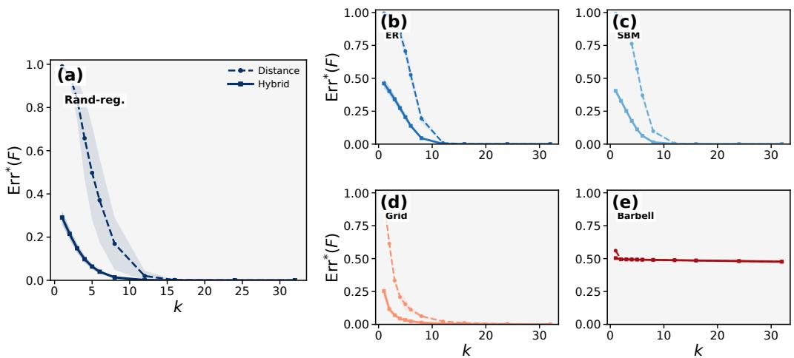  
Fig. 4: Sensitivity to the number of anchors $k .$ The random-regular setting is enlarged because it is the graph family directly aligned with the main theoretical achievability result. The four smaller panels show ER, SBM, grid, and barbell graphs. Solid curves denote hybrid Laplacian-energy encodings, while dashed curves denote distance-only encodings. Shaded regions are 95% confidence intervals.

Random regular graphs have the smallest gap, confirming that the Gaussian-wave surrogate is most accurate on expander-like graphs. The gap is moderate for SBM graphs, larger for ER and grid graphs, and largest for barbell graphs. The barbell case is a useful negative control: its low-frequency Laplacian eigenvectors are dominated by the global bottleneck and are therefore poorly approximated by independent Gaussian-wave coordinates.

TABLE VIII: Hard Gaussian-wave surrogate discrepancy. Values are averaged over graph sizes, anchors, spectral dimensions, quantization levels, and trials.
<table><tr><td>Graph family</td><td>Energy gap</td><td>Signed gap</td></tr><tr><td>Random regular</td><td>0.050</td><td>0.035</td></tr><tr><td>SBM</td><td>0.106</td><td>0.068</td></tr><tr><td>ER</td><td>0.359</td><td>0.268</td></tr><tr><td>Grid</td><td>0.448</td><td>0.696</td></tr><tr><td>Barbell</td><td>1.240</td><td>1.520</td></tr></table>

We also evaluate the smoothed surrogate discrepancy for the expanded-cell majorant $H _ { \eta , \alpha } ^ { + }$ ，

$$
\Delta _ { \mathrm { t r } } ^ { + } ( \alpha ) = \frac { | I _ { S | D } ^ { + , \mathrm { L a p } } ( \alpha ) - I _ { S | D } ^ { + , \mathrm { G W } } ( \alpha ) | } { \log n } .\tag{354}
$$

Table IX reports the family-level averages, while Figure 5 shows the full distribution over graph sizes, anchors, spectral dimensions, quantization levels, and trials. The same qualitative ordering persists under smoothing: random regular and SBM graphs have small gaps, ER and grid graphs have intermediate gaps, and barbell graphs have the largest gap. This is consistent with Corollary 1: actual Laplacian achievability requires Gaussian-wave anti-concentration together with a distanceconditioned spectral-collision bound for the actual Laplacianenergy coordinates.

TABLE IX: Smoothed Gaussian-wave surrogate discrepancy for energy coordinates.
<table><tr><td>Graph family</td><td> $\alpha / \eta = 0 . 0 5$ </td><td> $\alpha / \eta = 0 . 1 0$ </td></tr><tr><td>Random regular</td><td>0.086</td><td>0.082</td></tr><tr><td>SBM</td><td>0.141</td><td>0.144</td></tr><tr><td>ER</td><td>0.482</td><td>0.478</td></tr><tr><td>Grid</td><td>0.646</td><td>0.693</td></tr><tr><td>Barbell</td><td>1.602</td><td>1.565</td></tr></table>

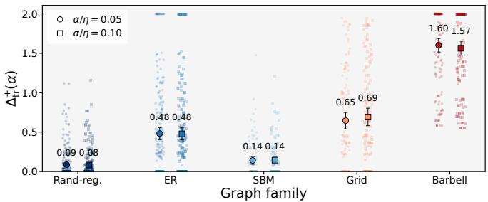  
Fig. 5: Expanded-cell surrogate-to-actual spectral-collision diagnostics for energy coordinates. Faint points show individual grouped configurations, and large markers with error bars show family-level means with 95% confidence intervals.

d) Unified design-map diagnostics: We further provide the binned design-map diagnostic corresponding to Table II. To avoid overplotting from dense configuration-level scatter points, Figure 6 aggregates configurations with similar values of $B _ { \mathrm { c o n v } } ^ { \perp } \bar { / } \log n$ and $I _ { H } / \log n$ . The horizontal axis is the normalized conservative box-budget diagnostic, the vertical axis is the normalized hybrid collision information, and color indicates the mean empirical localization error $\mathrm { E r r } ^ { * } ( F )$ within each bin. The dashed reference lines mark the box-budget failure-side reference $B _ { \mathrm { c o n v } } ^ { \perp } / \log n = 1$ and the achievabilityside threshold $I _ { H } / \log n = 1$

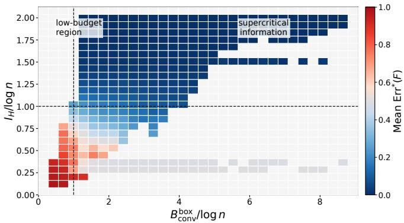  
Fig. 6: Binned unified graph-dependent design map for the Laplacian-energy hybrid positional encoding. Each bin aggregates configurations with similar values of $B _ { \mathrm { c o n v } } ^ { \perp } / \log n$ and $I _ { H } /$ log n; color indicates the mean empirical localization error $\mathrm { E r r } ^ { * } ( F )$ within the bin. The dashed reference lines mark the box-budget reference $B _ { \mathrm { c o n v } } ^ { \perp } / \log n = 1$ and the achievabilityside threshold $I _ { H } / \log n = 1$

Table X reports the graph-setting breakdown for the Laplacian-energy hybrid design diagnostics. The random regular and grid families are well organized by the information diagnostic and achieve low average localization error. The barbell graph is the most difficult case: its mean information ratio is only 0.309, and no configuration reaches $\mathrm { E r r } ^ { * } ( F ) \leq 0 . 1$ This confirms that localization is governed by graph-dependent collision geometry, not only by the raw choices of $k , m$ , and η.

TABLE X: Graph-setting summary for the Laplacian-energy hybrid design diagnostics.
<table><tr><td>Graph setting</td><td>Mean err.</td><td>Median err.</td><td>Mean  $I _ { H } /$  log n</td><td>Succ.</td></tr><tr><td>Random regular, r = 3</td><td>0.045</td><td>0.000</td><td>1.816</td><td>0.902</td></tr><tr><td>Grid</td><td>0.051</td><td>0.004</td><td>1.651</td><td>0.865</td></tr><tr><td>Random regular, r = 6</td><td>0.085</td><td>0.000</td><td>1.688</td><td>0.818</td></tr><tr><td>Random regular, r = 10</td><td>0.107</td><td>0.000</td><td>1.625</td><td>0.776</td></tr><tr><td>SBM</td><td>0.123</td><td>0.002</td><td>1.522</td><td>0.741</td></tr><tr><td>ER, average degree 6</td><td>0.170</td><td>0.004</td><td>1.443</td><td>0.675</td></tr><tr><td>Barbell</td><td>0.490</td><td>0.491</td><td>0.309</td><td>0.000</td></tr></table>

## B. Additional details for the UD structural task probes

a) Treebanks and graph construction: The UD experiments use English-EWT, Chinese-GSD, Spanish-GSD, French-GSD, and German-GSD. Sentences with length outside [6, 80] are removed. For each treebank, we use at most 3000 training sentences and evaluate on the full official development and test splits.

Each sentence is converted into an unlabeled undirected dependency-tree skeleton. Tokens are nodes, dependency arcs are treated as undirected edges, and lexical forms, dependency labels, edge directions, and token attributes are excluded. This construction matches the encoding-level setting of the paper: the probes test what syntactic geometry can be recovered from positional codes alone, rather than from lexical or label-specific information.

b) Surface-position selection protocol: The original surface-position probe is used to select configurations. The grid is

$$
\begin{array} { c } { { k \in \{ 1 , 2 , 4 , 8 \} , } } \\ { { m \in \{ 2 , 4 , 8 , 1 6 \} , } } \\ { { \eta = 0 . 2 5 , } } \end{array}\tag{355}
$$

with three random-anchor trials and three probe seeds.

For each treebank, the HybridEnergy configuration with the best development-set NMAE on the surface-position probe is selected. The selected $( k , m )$ values for English, Chinese, Spanish, French, and German are

$$
( 1 , 1 6 ) , \quad ( 4 , 4 ) , \quad ( 8 , 4 ) , \quad ( 4 , 4 ) , \quad ( 1 , 1 6 ) ,\tag{356}
$$

respectively, with $\eta = 0 . 2 5 .$

The selected HybridEnergy surface-position probe improves over NoPE by 0.0055 NMAE on average, corresponding to a 2.08% relative reduction, and improves Kendall-τ by 0.118. Its average NMAE improvements over Distance-only and SpectralEnergy are 1.27% and 0.33%, respectively. These gains are modest, which is expected because undirected dependency tree structure only weakly determines linear word order.

c) Confirmatory depth and pairwise-distance probes: The dependency-depth and pairwise dependency-distance probes are added as more direct structural probes. No new hyperparameter search is performed for these probes. Instead, the HybridEnergy configurations selected by the surface-position development protocol are frozen and reused. This makes the depth and pairwise-distance evaluation confirmatory rather than another tuning round.

The depth probe predicts normalized distance to the dependency root, and therefore measures node-level syntactic geometry. The pairwise-distance probe predicts a clipped bucket of tree distance from a pairwise combination of two positional codes. These two probes are closer to the graph geometry used to construct the positional encodings, and therefore serve as task-relevant structural tests on real dependency-tree graphs.

d) Configuration-level localization diagnostics: Figure 7 gives the configuration-level diagnostic view supporting the UD surface-position results. Higher $I _ { H } /$ log n regimes produce larger average gains over the NoPE baseline, and the selected best-performing configurations occupy the low-collision, higher-rank-recovery region. This supports the main paper’s interpretation that the collision information is informative not only for exact node localization, but also for structural probe performance on real dependency trees.

e) PE-row derangement control: Table XI reports the compact derangement summary used to compute the alignment margins in the main text. For each sentence, positional codes are first computed from the original dependency-tree skeleton. The rows of the node-feature matrix are then deranged within the same sentence while targets are kept unchanged. This preserves sentence length, feature dimension, PE marginal statistics, and code budget, but removes the alignment between each token and its own graph positional code.

(a)  
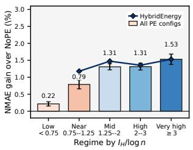

(b)  
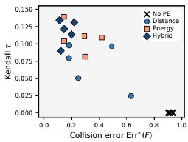  
Fig. 7: UD dependency-tree localization diagnostics. (a) NMAE gain over the NoPE baseline after grouping nontrivial PE configurations by $I _ { H } / \log n$ . Bars summarize all PE configura tions, and the line shows the HybridEnergy subset. (b) Bestconfiguration diagnostic map for each treebank and encoding family, comparing exact collision error $\mathrm { E r r } ^ { * } ( F )$ with Kendall rank recovery.

For NMAE-based probes, $\Delta _ { \mathrm { r e a l } }$ is the reduction over NoPE in the real condition. For the pairwise-distance probe, $\Delta _ { \mathrm { r e a l } }$ is the macro-F1 gain over NoPE. The alignment margin $\Delta _ { \mathrm { a l i g n } }$ subtracts the corresponding deranged-condition gain. HybridEnergy has the larger alignment-specific margin on all three probes, indicating that its advantages are not explained solely by sentence-level PE marginal statistics.

TABLE XI: Compact PE-row derangement control on UD. Position uses the original surface-position control; depth and pairwise distance use the frozen structural-probe protocol. S and H denote SpectralEnergy and HybridEnergy. For position and depth, the metric is NMAE, lower better; for pairwise distance, the metric is macro-F1, higher better. NoPE is the real-condition baseline used to compute the gains; its null value is identical or numerically negligible after derangement.
<table><tr><td>Probe</td><td>Metric</td><td>Enc.</td><td>NoPE</td><td>Real</td><td>Null</td><td> $\Delta _ { \mathrm { r e a l } }$ </td><td> $\Delta _ { \mathrm { a l i g n } }$ </td></tr><tr><td>Position</td><td>NMAE↓</td><td>S</td><td>0.26386</td><td>0.26021</td><td>0.26034</td><td></td><td>0.00364 0.00011</td></tr><tr><td>Position</td><td>NMAE↓</td><td>H</td><td>0.26386</td><td>0.26053</td><td>0.26151</td><td>0.00332</td><td>0.00097</td></tr><tr><td>Depth</td><td>NMAE↓</td><td>S</td><td>0.2252</td><td>0.1910</td><td>0.2257</td><td>0.0342</td><td>0.0347</td></tr><tr><td>Depth</td><td>NMAE ↓</td><td>H</td><td>0.2252</td><td>0.1748</td><td>0.2257</td><td>0.0504</td><td>0.0509</td></tr><tr><td>Pairwise dist. Macro-F1 ↑</td><td></td><td>S</td><td>0.0769</td><td>0.5748</td><td>0.1829</td><td>0.4979</td><td>0.3919</td></tr><tr><td></td><td>Pairwise dist. Macro-F1 ↑</td><td>H</td><td>0.0769</td><td>0.7911</td><td>0.2029</td><td>0.7142</td><td>0.5881</td></tr></table>

f) Additional notes on UD design ablations: The averaged UD ablation table is reported in the main text because it is visually compact and directly supports the experimental narrative. Here we clarify its interpretation.

The anchor block isolates the effect of structural referencepoint selection. Root and farthest anchors both improve over random anchors, and farthest anchors give the strongest surfaceposition recovery and the lowest localization error. This is consistent with the role of anchor profiles in reducing distancebucket ambiguity.

The signed-coordinate block separates within-tree collision control from cross-sentence probe stability. Signed Laplacian coordinates reduce collisions and increase $I _ { H } / \log n$ , but they do not improve probe accuracy. This suggests that exact withintree separability is not sufficient for cross-sentence structural prediction: the coordinate system must also be stable across different dependency trees.

The quantization block verifies the expected diagnostic trend. Coarser η reduces $I _ { H } / \log n$ and mildly increases $\mathrm { E r r } ^ { * } ( F )$ Probe performance remains stable for $\eta \leq 0 . 5$ and weakens mildly at $\eta \ : = \ : 1 . 0$ , indicating that the UD probes are not overly sensitive to small changes in quantization once the code remains in a sufficiently resolved regime.