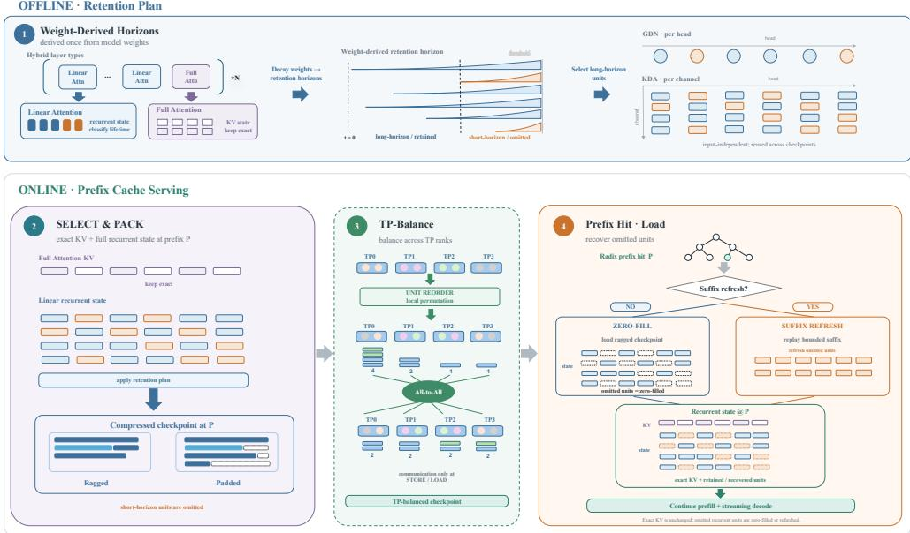
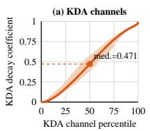
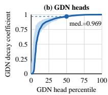
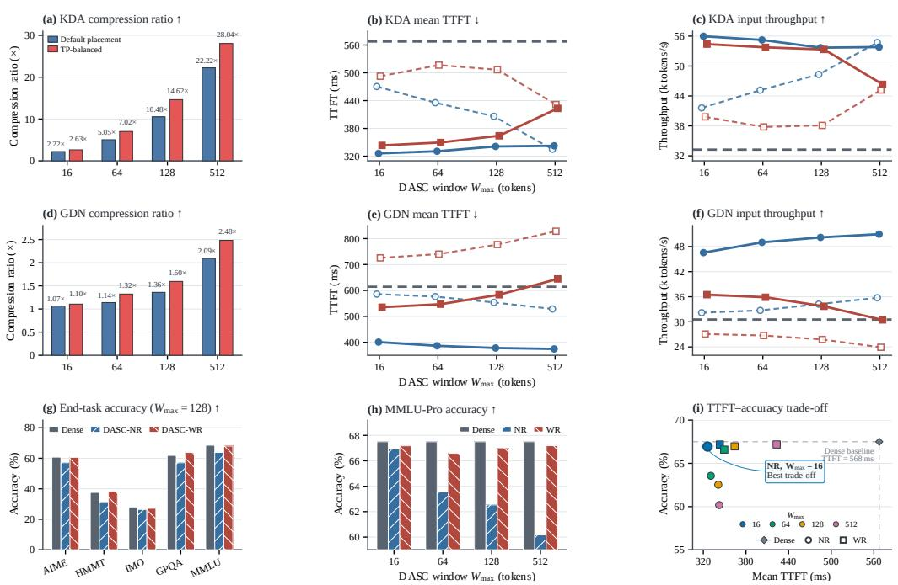
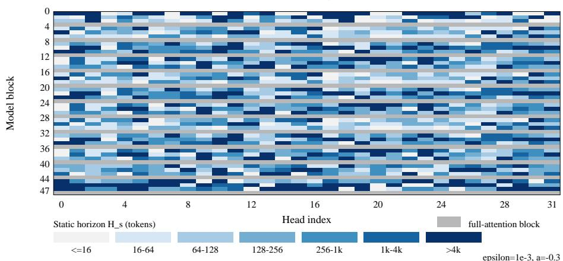
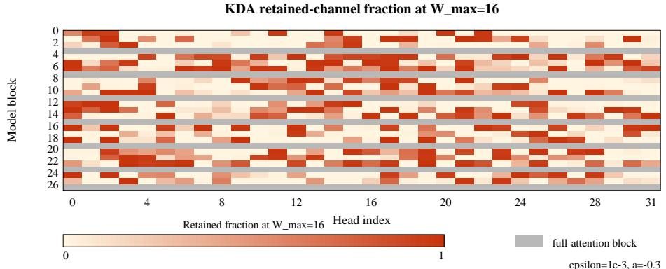
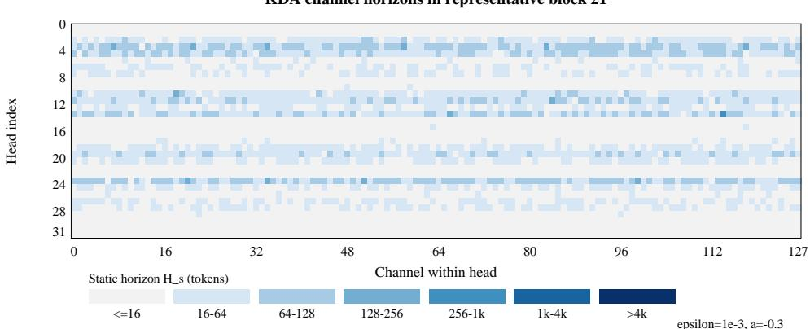

# DASC: DECAY-AWARE STATE COMPRESSION FOR HY-BRID LINEAR-ATTENTION SERVING

Yanqi Yu1∗ Pingwei Sun2 Jianchao Tan2 Tao Zhang3

Yuchen Xie2 Xunliang Cai2 Yao Liu1†

1East China Normal University 2Meituan 3South China University of Technology yqyu@stu.ecnu.edu.cn, liuyao@cc.ecnu.edu.cn {sunpingwei,tanjianchao02}@meituan.com

## ABSTRACT

Hybrid linear-attention architectures have recently scaled to large open-weight models, offering quality competitive with full attention while substantially reducing key/value (KV) cache growth. However, their in-place recurrent-state updates complicate cache management: prefix reuse requires state checkpoints alongside full-attention KV, while storing state checkpoints in full increases memory pressure, leading to more evictions and repeated prefill. By analyzing the decay structure of Gated DeltaNet (GDN) and Kimi Delta Attention (KDA), we find that different heads and channels retain prefix information over markedly different timescales, which we term retention horizons. This variation suggests substantial compression potential in persistent state checkpoints. Building on this observation, we introduce Decay-Aware State Compression (DASC), which derives retention horizons from model weights, selects long-horizon state units, and packs them into a ragged state checkpoint layout. To integrate efficiently with tensorparallel inference engines, DASC furtherly balances compressed state checkpoints across TP ranks. On reuse, DASC either zero-fills omitted units or refreshes them from a bounded suffix with additional compute cost. Across retrieval and endto-end reasoning benchmarks on Kimi-Linear, conservative DASC configurations remain close to full caching while compressing KDA recurrent state checkpoints by 2.63×. Under fixed state checkpoint memory budgets, the resulting capacity gains reduce mean Time to First Token (TTFT) by 42.6% and improve input throughput by 68.4%. At larger compression ratio, suffix refresh recovers much of the accuracy lost to more aggressive omission, at the cost of additional replay computation. Qwen with GDN exhibits a similar quality–efficiency trend, showing that DASC extends from channel-wise KDA to head-wise GDN.

## 1 INTRODUCTION

Hybrid linear-attention architectures now underpin trillion-parameter open-weight models, including Qwen3.8-2.4T-A95B and the 2.8T-parameter Kimi K3 (Qwen Team, 2026; Kimi Team, 2026). These models interleave full-attention layers with linear-attention layers that summarize the prefix in fixed-size recurrent states. This hybrid design retains strong model quality while slowing key/value (KV) cache growth. However, its in-place recurrent-state updates introduce a new challenge for prefix caching.

Unlike full-attention KV, a recurrent state is overwritten as tokens arrive and does not preserve earlier prefix boundaries. Prefix caching therefore materializes full state checkpoints at regular token intervals alongside KV blocks (Zheng et al., 2024; Dao, 2026). Because each state checkpoint contains large state matrices for all linear-attention layers, frequent state checkpointing quickly exhausts HBM, while sparse state checkpointing increases replay or repeated prefill. This tension makes it important to determine which state units must be retained at each state checkpoint.

  
Figure 1: Overview of DASC. Weight-derived retention horizons select long-horizon state units, which are packed into TP-balanced ragged state checkpoints. On reuse, omitted units are either zero-filled or refreshed from a bounded suffix.

Our analysis reveals a structured answer: recurrent-state units have widely different retention horizons. Many forget distant tokens quickly, while a smaller subset remains persistent. This variation follows the model architecture, appearing across heads in Gated DeltaNet (GDN) and across channels in Kimi Delta Attention (KDA). Moreover, the decay parameters stored in model weights provide an input-independent estimate of these horizons. We validate this signal against observed token-dependent decay, state magnitudes, and readout contributions. Causal ablations further show why selection must be conservative: recurrent states can be redundant for simple recall yet remain important for multi-key, aggregation, and reasoning tasks.

We translate these findings into Decay-Aware State Compression (DASC). Before serving, DASC constructs a static selection plan that retains long-horizon heads for GDN or channels for KDA. At runtime, the selected units are flat-packed into ragged state checkpoints, balanced across tensorparallel ranks, and integrated into the radix-cache store and load paths; full-attention KV remains unchanged. On a cache hit, DASC-NR zero-fills omitted units and adds no model computation, whereas DASC-WR can spend additional compute to refresh them from a bounded suffix. This separation makes the common path inexpensive while providing a recovery mechanism when more aggressive compression is worthwhile.

We evaluate both the selection signal and its serving consequences on Qwen3-Next and Kimi-Linear (Qwen Team, 2025; Kimi Team, 2025). At a conservative KDA threshold, ragged storage fits 2.63× as many recurrent state checkpoints within the same state-memory budget while remaining close to full-cache quality across retrieval and end-to-end tasks. Under a fixed state checkpoint memory budget, this higher cache residency reduces mean Time to First Token (TTFT) by 42.6% and improves input throughput by 68.4% on Kimi-Linear. At more aggressive thresholds, suffix refresh recovers much of the accuracy lost through omission at the cost of additional replay computation. Qwen3-Next exhibits a similar quality–efficiency trend, showing that DASC extends from channel-wise KDA to head-wise GDN.

## Our contributions are:

• We characterize decay heterogeneity in GDN and KDA recurrent states and define weight-derived retention horizons as an input-independent signal for selecting state units.

• We design and implement DASC in SGLang. It selects long-horizon units, packs them into ragged state checkpoints, balances compressed state checkpoints across TP ranks, and supports either zero-fill or bounded-suffix refresh on reuse.

• Experiments on Qwen3-Next and Kimi-Linear show that conservative DASC configurations remain close to full-cache quality while compressing KDA recurrent state checkpoints by 2.63×. Under a fixed state checkpoint memory budget, DASC reduces mean Time to First Token (TTFT) by 42.6% and improves input throughput by 68.4%; Qwen3-Next exhibits a similar quality– efficiency trend.

## 2 RELATED WORK

Linear attention and hybrid architectures. Linear attention and state-space models replace the context-length-dependent KV cache of softmax attention with a fixed-size recurrent state (Katharopoulos et al., 2020; Gu & Dao, 2023; Dao & Gu, 2024). Delta-rule and gated variants add content-dependent updates and adaptive decay (Yang et al., 2024b;a), while hybrid models interleave recurrent and full-attention layers to retain exact token retrieval (Lieber et al., 2024; Ren et al., 2024; Kimi Team, 2025). Unlike architecture and training work, we study how the resulting recurrent states should be represented in a serving-time prefix cache.

Prefix caching and full-attention KV management. SGLang’s RadixAttention organizes shared prefixes in a radix tree, while vLLM’s PagedAttention provides block-grained KV allocation and reuse (Zheng et al., 2024; Kwon et al., 2023). Hierarchical systems extend reusable KV across GPU and host memory (Gao et al., 2024; Jin et al., 2024); quantization, eviction, and sparsification further reduce token-indexed KV storage (Hooper et al., 2024; Liu et al., 2024; Zhang et al., 2023; Xiao et al., 2024; Li et al., 2024). These methods are complementary to DASC, which leaves full-attention KV unchanged and compresses the recurrent state checkpoint stored alongside it.

Hybrid recurrent-state prefix caching and replay. Processing a prefix through a recurrent layer produces one boundary state summarizing all preceding tokens, so reuse requires storing that state or recomputing it. Kimi K3 persists KDA states for prefix reuse (Kimi Team, 2026); Marconi instead improves which hybrid prefix entries are admitted and evicted based on reuse and compute– memory utility (Pan et al., 2025). ReplaySSM caches recent SSM inputs and reconstructs states on demand, targeting decode-time state traffic and rollback (Dao, 2026). DASC changes a different axis—the representation size of each persistent boundary state checkpoint—so it can complement entry-management and replay policies.

## 3 RETENTION HETEROGENEITY IN HYBRID RECURRENT STATES

This section first uses a controlled cache ablation to identify task-specific redundancy in recurrent state checkpoints. The decay structure of GDN and KDA then motivates a weight-derived, inputindependent metric for estimating retention horizons. Empirical validation confirms its reliability for unit selection, providing the basis for DASC.

## 3.1 RECURRENT STATES IN HYBRID PREFIX CACHES

A gated delta-rule layer summarizes the processed sequence in a recurrent state $S _ { t } \in \mathbb { R } ^ { d _ { v } \times d _ { k } }$ , which a query reads as $o _ { t } = S _ { t } q _ { t }$ . KDA updates this state as

$$
S _ { t } ~ = ~ S _ { t - 1 } \operatorname { D i a g } ( \alpha _ { t } ) \left( I - \beta _ { t } k _ { t } k _ { t } ^ { \top } \right) ~ + ~ \beta _ { t } v _ { t } k _ { t } ^ { \top } , \qquad \alpha _ { t } \in ( 0 , 1 ) ^ { d _ { k } } ,\tag{1}
$$

where $\alpha _ { t }$ controls input-dependent forgetting and $\beta _ { t }$ the update strength (Kimi Team, 2025). The three terms attenuate the old state, remove content aligned with $k _ { t }$ , and write the new key–value association. Earlier, GDN parameterized gated decay per head (Yang et al., 2024a); KDA increases this granularity by exposing channel-wise decay within each head.

Unlike full attention, a delta-rule layer carries only this fixed-size state forward. Reusing prefix p therefore requires both exact full-attention KV and each recurrent layer’s boundary state $\bar { S } ^ { ( \bar { l } ) } ( p )$ . In prefix caching, each reusable prefix requires its own recurrent state checkpoint; if the state checkpoint is not cached, the state must be recomputed through prefill.

Table 1: Evidence for recurrent-state compression opportunity. (a) Cached-state intervention on RULER NIAH-S1. (b) Within-layer Spearman correlations between weight-derived horizons and observed signals, reported as median [IQR].  
(a) Cached-state intervention
<table><tr><td>Intervention</td><td>GDN</td><td>KDA</td><td>Observation</td></tr><tr><td>BASELINE</td><td>1.000</td><td>1.000</td><td>reference</td></tr><tr><td>ZERO-FULL-KV</td><td>0.000</td><td>0.000</td><td>retrieval fails</td></tr><tr><td>ZERO-LINEAR</td><td>0.990</td><td>1.000</td><td>≤ 1-point change</td></tr><tr><td>ZERO-BOTH</td><td>0.000</td><td>0.000</td><td>sanity check</td></tr></table>

(b) Static horizons vs. observed signals
<table><tr><td>Model</td><td>Pair</td><td>Median</td><td>IQR</td></tr><tr><td>GDN</td><td> $H _ { s } , H _ { e }$ </td><td>.801</td><td>[.699, .877]</td></tr><tr><td>GDN</td><td> $H _ { s } , \lVert S \rVert _ { F }$ </td><td>.632</td><td>[.541, .706]</td></tr><tr><td>GDN</td><td> $H _ { s } , \lVert o \rVert _ { 2 }$ </td><td>.537</td><td>[.422, .630]</td></tr><tr><td>KDA</td><td> $H _ { s } , H _ { e }$ </td><td>.856</td><td>[.843, .878]</td></tr><tr><td>KDA</td><td> $H _ { s } , \lVert S \rVert _ { F }$ </td><td>.533</td><td>[.462, .602]</td></tr><tr><td>KDA</td><td> $H _ { s } , \lVert o \rVert _ { 2 }$ </td><td>.402</td><td>[.329, .477]</td></tr></table>

## 3.2 RECURRENT STATE CHECKPOINTS CONTAIN TASK-SPECIFIC REDUNDANCY

We probe these two cache components on RULER NIAH-S1 using five needle depths and $N =$ 100 examples per depth. For Qwen3-Next-80B and Kimi-Linear-48B, we cache the shared prefix and zero its full-attention KV, recurrent state checkpoints, both, or neither before reuse. Every intervention reuses the same fully cached prefix, so any accuracy difference comes from the zeroed cache component rather than from differences in cache hits.

Removing full-attention KV reduces accuracy to zero, whereas removing recurrent state checkpoints changes it by at most one point (Table 1(a)). This single-key result exposes compression headroom in recurrent state checkpoints and motivates evaluation on harder multi-key, aggregation, and reasoning tasks in §5.2.

## 3.3 STATIC HORIZONS ENABLE INPUT-INDEPENDENT SELECTION

The intervention reveals compression headroom but not which state units should be retained. Although the input-dependent decay gate provides a natural retention signal, collecting it for every prompt would make the selection request-dependent. An offline serving plan instead requires a fixed metric derived without calibration data.

To build this metric, we first consider the GDN parameterization of the log-decay $g = \log \alpha _ { t }$ (Yang et al., 2024a):

$$
g = - \exp ( A _ { \mathrm { l o g } } ) \mathrm { s o f t p l u s } ( a + d t _ { \mathrm { b i a s } } ) ,\tag{2}
$$

where $A _ { \mathrm { l o g } }$ and $d t _ { \mathrm { b i a s } }$ are learned decay parameters and a is the input-dependent gate logit. For the static metric, we fix $a = - 0 . 3$ , making g independent of the input. Because $g < 0$ , the decay gate attenuates information over η tokens by $e ^ { g \eta }$ . We define the static retention horizon as the number of tokens required for this decay factor to fall to ϵ:

$$
H _ { s } = \frac { \ln \epsilon } { g } .\tag{3}
$$

We empirically set $\epsilon = 1 0 ^ { - 3 }$ throughout our experiments. Compared with $a = 0$ , choosing $a =$ −0.3 produces slower decay and longer horizons, deliberately biasing the metric toward retaining more units.

The decay parameterization yields one $H _ { s }$ per head for GDN and per key channel for KDA. Figure 2 shows broad KDA channel decay (median $\alpha = 0 . 4 7 1$ interquartile range (IQR) [0.170, 0.774]) but predominantly slow GDN head decay (0.969, [0.894, 0.997]). At a 16-token cutoff, 90.6% of KDA heads contain channels on both sides, so head-level aggregation would hide substantial variation. These profiles motivate head-wise selection for GDN and channel-wise selection for KDA. Appendix Figures 4–6 give layerwise profiles.

  
Figure 2: Weight-only decay profiles for KDA and GDN.

## 3.4 WEIGHT-DERIVED HORIZONS TRACK OBSERVED DECAY

To test the weight-derived $H _ { s }$ against input-dependent behavior, we use 32 length-stratified ShareGPT prefixes. For prefix p, recurrent layer l, and state unit u (a head in GDN or a key channel within a head in KDA), let $\mathcal { T } _ { p }$ denote the non-padding token positions and $g _ { p , t , l , u }$ the observed log-decay of unit u at token t. Averaging over the prefix gives the empirical horizon

$$
\bar { g } _ { p , l , u } ^ { ( e ) } = \frac { 1 } { | \mathcal { T } _ { p } | } \sum _ { t \in \mathcal { T } _ { p } } g _ { p , t , l , u } , \qquad H _ { p , l , u } ^ { ( e ) } = \frac { \ln \epsilon } { \bar { g } _ { p , l , u } ^ { ( e ) } } .\tag{4}
$$

We also measure whether longer-horizon units carry more observed activity at the final prefix position $T .$ . Suppressing prefix, layer, and time indices, let $S _ { h }$ denote a GDN head state and $\dot { S } _ { h , k }$ a KDA state channel. The state and final-query readout magnitudes are

$$
M _ { S } ( \boldsymbol { u } ) = \left\{ \| S _ { h } \| _ { F } , \quad \boldsymbol { u } = h \left( \mathrm { G D N } \right) , \right. \qquad M _ { R } ( \boldsymbol { u } ) = \left\{ \| S _ { h } q _ { h } \| _ { 2 } , \quad \boldsymbol { u } = h \left( \mathrm { G D N } \right) , \right. \qquad\tag{5}
$$

For $\mathrm { K D A } , M _ { R }$ measures per-channel readout activity rather than its net contribution to the summed output.

For each prefix–layer pair, we compute the Spearman rank correlation coefficient $\rho$ across its heads (GDN) or channels (KDA) between $H _ { s }$ and each of $H _ { e } , M _ { S } ,$ , and $M _ { R }$ . Table 1(b) reports medians and IQRs over 1,152 GDN and 640 KDA prefix–layer comparisons. The median $H _ { s } – H _ { \epsilon }$ e correlation is 0.801 for GDN and 0.856 for KDA; the corresponding correlations with state magnitude are 0.632 and 0.533, and those with readout magnitude are 0.537 and 0.402. Thus $H _ { s }$ strongly preserves empirical horizon ordering and is moderately associated with observed activity, supporting it as a selection signal rather than a complete importance measure.

## 4 DECAY-AWARE STATE COMPRESSION

Using the weight-derived static horizons $H _ { s }$ introduced in $\ S 3 ,$ DASC constructs an input-independent compression plan for recurrent state checkpoints. It retains long-horizon units, omits short-horizon units from persistent storage, and optionally refreshes omitted units when a cached prefix is reused. Figure 1 summarizes the resulting store and load paths.

## 4.1 DECAY-AWARE SELECTION AND STORAGE

DASC constructs a fixed selection mask by comparing each unit’s static horizon $H _ { s } ( u )$ with a threshold $W _ { \mathrm { m a x } }$ . A unit is global and retained when $H _ { s } ( u ) > W _ { \mathrm { m a x } }$ ; otherwise, it is local and omitted from the persistent state checkpoint. Selection follows the architecture’s decay granularity: one complete head state for GDN and one key channel $( h , k )$ , corresponding to $S _ { h , : , k } ^ { ( \bar { l } ) }$ , for KDA. Because $H _ { s }$ depends only on model weights, the mask is constructed once offline without calibration prompts or online profiling.

Let L be the number of recurrent linear-attention layers, excluding full-attention layers, and let nl and $r _ { l }$ be the total and retained state-unit counts in layer l, respectively. A unit is one head in GDN and one (head, k) channel in KDA. Units have equal cost within the temporal-state tensor, so ragged storage keeps $\textstyle \sum _ { l } r _ { l }$ temporal units instead of $\sum _ { l } n _ { l }$ . Recurrent state checkpoints use SGLang’s default mixed precision: the temporal state is FP32 and the convolution state is BF16; BF16 model execution is a separate setting. Let $B _ { \mathrm { t e m p } }$ and $B _ { \mathrm { c o n v } }$ denote their physical bytes. The temporal-only and complete state checkpoint compression ratios are

$$
C _ { \mathrm { t e m p } } ^ { \mathrm { r a g } } = \frac { \sum _ { l = 1 } ^ { L } n _ { l } } { \sum _ { l = 1 } ^ { L } r _ { l } } , \qquad C _ { \mathrm { c k p t } } ^ { \mathrm { r a g } } = \frac { B _ { \mathrm { t e m p } } ^ { \mathrm { d e n s e } } + B _ { \mathrm { c o n v } } } { B _ { \mathrm { t e m p } } ^ { \mathrm { r a g } } + B _ { \mathrm { c o n v } } } .\tag{6}
$$

Under a fixed full state checkpoint memory budget, $C _ { \mathrm { c k p t } }$ is the state checkpoint capacity multiplier. A padded temporal layout reserves the largest retained count $R _ { \mathrm { m a x } } = \operatorname* { m a x } _ { l } r _ { l }$ for every layer, even though only $r _ { l }$ entries are valid in layer l, giving $C _ { \mathrm { t e m p } } ^ { \mathrm { p a d } } = ( \sum _ { l } n _ { l } ) / ( L R _ { \mathrm { m a x } } )$ . The ragged layout flat-packs each layer’s retained units with offsets. Defining ${ \overline { { r } } } = L ^ { - 1 } \textstyle \sum _ { l } r _ { l }$ , its temporal compression is $( \sum _ { l } n _ { l } ) / ( \bar { L } \bar { r } )$ , and its layout gain over padded storage is $R _ { \operatorname* { m a x } } / \bar { r }$ . Reported capacity ratios include the uncompressed BF16 convolution state and the per-rank TP bottleneck (Appendix B); the gain is large for KDA’s imbalanced retained counts and modest for GDN’s more uniform profile.

## 4.2 LOAD POLICIES

On a cache hit, DASC loads the retained global units exactly. DASC-NR (the default) leaves omitted local units at zero. DASC-WR instead replays a bounded suffix from a zero-initialized scratch recurrent state and copies only the refreshed local units into the active state; the stored global state checkpoint and cached full-attention KV remain unchanged. Let $\mathcal { L } _ { \mathrm { l o c a l } }$ denote the omitted units. Each unit’s horizon is rounded up to a power of two and clamped to $[ 4 , W _ { \mathrm { m a x } } ]$ , and DASC-WR uses the longest resulting window:

$$
W _ { u } = \mathrm { c l a m p } ( \mathrm { n e x t . p o w 2 } ( H _ { s } ( u ) ) , 4 , W _ { \mathrm { m a x } } ) \qquad W _ { \mathrm { r e p l a y } } = \operatorname* { m a x } _ { u \in \mathcal { L } _ { \mathrm { l o c a l } } } W _ { u } .\tag{7}
$$

Increasing $W _ { \mathrm { m a x } }$ omits more units and improves state checkpoint compression, but can increase DASC-NR approximation error and DASC-WR replay cost. DASC-WR remains approximate because it does not recover local-state history preceding the replay window.

## 4.3 TP-BALANCED PLACEMENT

Tensor parallelism balances computation across ranks, but decay-aware selection can leave their compressed state checkpoint payloads highly uneven. Let $U _ { r }$ denote the persistent-state payload on rank r. Because a logical state checkpoint is sharded across all TP ranks, the number of resident state checkpoints is limited by the most heavily loaded rank, maxr $U _ { r }$

DASC balances state checkpoint payloads in two stages. First, a model-load-time permutation redistributes linear-attention head bundles across TP ranks. Applying the same permutation to all coupled model tensors makes this an exact reindexing with no additional per-token communication. Second, during state checkpoint storage, DASC treats the entire TP group as a shared storage pool and redistributes packed state units to balance the payload across ranks. Specifically, the target per-rank slot width is $\begin{array} { r } { C = \lceil \sum _ { r } U _ { r } / T \rceil } \end{array}$ , where T is the TP degree. During STORE, a variable-split all-to-all sends only remotely owned units; LOAD applies the inverse transfer before restoring the computelocal state layout. Communication is therefore confined to state checkpoint store and load, while recurrent prefill and decoding remain compute-local. Both balancing stages are exact and introduce no additional approximation.

## 5 EXPERIMENTS

We evaluate DASC for quality, matched-HBM serving, and the accuracy–latency trade-off of suffix refresh.

## 5.1 SETUP

Models and hardware. We evaluate Qwen3-Next-80B-A3B-Instruct, which contains 36 GDN and 12 full-attention layers (Qwen Team, 2025), and Kimi-Linear-48B-A3B-Instruct, which contains 20 KDA and 7 full-attention layers (Kimi Team, 2025). We refer to these models as Qwen-GDN and Kimi-KDA, respectively, throughout the experiments and appendix. They expose decay at head and channel granularity, respectively. All experiments run on Hopper-architecture GPUs.

Benchmarks. Long-context quality is evaluated on all 13 RULER subtasks at 4k, 8k, and 16k context lengths, with N = 30 instances per subtask–length setting (Hsieh et al., 2024). The endto-end suite covers mathematical reasoning with the MathArena releases of AIME 2026 Parts I and II and HMMT February 2026 (Dekoninck et al., 2026), together with IMO-AnswerBench (Luong et al., 2025); general reasoning with GPQA-Diamond (Rein et al., 2024) and MMLU-Pro (Wang et al., 2024); and conversational memory with LoCoMo (Maharana et al., 2024).

Implementation and evaluation protocol. We implement DASC in SGLang (Zheng et al., 2024). All experiments use TP8; within one experiment, arms share requests and seeds. Model weights and execution are unquantized BF16, while temporal/convolution states are FP32/BF16. Unless noted, DASC-NR and ragged storage are used. Compression is relative to the dense mixed-precision state checkpoint and excludes unchanged full-attention KV. Each subsection states its distinct cachepopulation, traffic, aggregation, and memory-budget controls; Appendix C gives full protocols. Appendix C specifies the statistical units and repeated-sampling protocols.

Table 2: RULER accuracy at 4k, 8k, and 16k for dense state checkpoints and ragged DASC-NR at the two extreme $W _ { \mathrm { m a x } }$ settings. Appendix D gives the complete Kimi-KDA and Qwen-GDN sweeps.
<table><tr><td>Model</td><td>Config</td><td>Len</td><td>S1</td><td>S2</td><td>S3</td><td>MK1</td><td>MK2</td><td>MK3</td><td>MQ</td><td>MV</td><td>CWE</td><td>FWE</td><td>QA-H</td><td>QA-S</td><td>VT</td><td>Avg</td></tr><tr><td rowspan="10">K-DA</td><td rowspan="2">dense</td><td>4k</td><td>1.00 1.00</td><td>1.00</td><td>1.00</td><td>1.00 1.00</td><td>1.00 1.00</td><td>1.00 1.00</td><td>1.00 1.00</td><td>0.99 1.00</td><td>1.00</td><td>0.89 0.94</td><td>0.57 0.62</td><td>0.90 0.86</td><td>1.00 1.00</td><td>0.95</td></tr><tr><td>8k</td><td></td><td>1.00</td><td>1.00</td><td></td><td></td><td></td><td></td><td></td><td>1.00</td><td></td><td></td><td></td><td></td><td>0.96 0.95</td></tr><tr><td rowspan="3"></td><td>16k</td><td>1.00</td><td>1.00</td><td>1.00</td><td>1.00</td><td>1.00</td><td>1.00</td><td>1.00</td><td>0.99</td><td>1.00</td><td>0.94</td><td>0.57</td><td>0.93</td><td>0.98</td><td></td></tr><tr><td>4k</td><td>1.00</td><td>1.00</td><td>1.00</td><td>1.00</td><td>1.00</td><td>1.00</td><td>1.00</td><td>0.99</td><td>1.00</td><td>0.89</td><td>0.59</td><td>0.90</td><td>1.00</td><td>0.95</td></tr><tr><td> $W _ { \mathrm { m a x } } = 1 6$  8k</td><td>1.00</td><td>1.00</td><td>1.00</td><td>1.00</td><td>1.00</td><td>1.00</td><td>1.00</td><td>1.00</td><td>1.00</td><td>0.94</td><td>0.59</td><td>0.87</td><td>1.00</td><td>0.95</td></tr><tr><td rowspan="3"></td><td>16k</td><td>1.00</td><td>1.00</td><td>1.00</td><td>1.00</td><td>1.00</td><td>1.00</td><td>1.00</td><td>1.00</td><td>1.00</td><td>0.94</td><td>0.56</td><td>0.88</td><td>0.99</td><td>0.95</td></tr><tr><td>4k</td><td>1.00</td><td>0.99</td><td>1.00</td><td>1.00</td><td>1.00</td><td>1.00</td><td>0.98</td><td>0.87</td><td>0.75</td><td>0.86</td><td>0.53</td><td>0.86</td><td>1.00</td><td>0.91</td></tr><tr><td>8k</td><td>1.00 1.00</td><td>1.00</td><td>1.00</td><td>0.96</td><td>0.97</td><td>0.95</td><td>1.00</td><td>0.85</td><td>0.76</td><td>0.92</td><td>0.59</td><td>0.80</td><td>0.96</td><td>0.90</td></tr><tr><td rowspan="3">dense</td><td>16k</td><td></td><td>0.98</td><td>1.00</td><td>0.82</td><td>0.95</td><td>0.98</td><td>1.00</td><td>0.83</td><td>0.72</td><td>0.94</td><td>0.52</td><td>0.79</td><td>0.92</td><td>0.88</td></tr><tr><td>4k</td><td>1.00</td><td>1.00</td><td>1.00</td><td>1.00</td><td>1.00</td><td>1.00</td><td>0.74</td><td>0.97</td><td>0.39</td><td>0.98</td><td>0.57</td><td>0.92</td><td>0.37</td><td>0.84</td></tr><tr><td>8k</td><td>1.00</td><td>1.00</td><td>1.00</td><td>1.00</td><td>1.00</td><td>1.00</td><td>0.75</td><td>0.84</td><td>0.35</td><td>0.97</td><td>0.62</td><td>0.82</td><td>0.40</td><td>0.83</td></tr><tr><td rowspan="7">n-GDN</td><td rowspan="3"></td><td>16k</td><td>1.00</td><td>1.00</td><td>1.00</td><td>1.00</td><td>1.00</td><td>1.00</td><td>0.75</td><td>0.73</td><td>0.29</td><td>0.93</td><td>0.51</td><td>0.83</td><td>0.41</td><td>0.80</td></tr><tr><td>4k</td><td>1.00</td><td>1.00</td><td>1.00</td><td>1.00</td><td>1.00</td><td>1.00</td><td>0.74</td><td>0.98</td><td>0.38</td><td>0.97</td><td>0.57</td><td>0.92</td><td>0.38</td><td>0.84</td></tr><tr><td>8k</td><td>1.00</td><td>1.00</td><td>1.00</td><td>1.00</td><td>1.00</td><td>1.00</td><td>0.75</td><td>0.86</td><td>0.34</td><td>0.97</td><td>0.60</td><td>0.84</td><td>0.40</td><td>0.83</td></tr><tr><td rowspan="3"></td><td>16k</td><td>1.00</td><td>1.00</td><td>1.00</td><td>1.00</td><td>1.00</td><td>1.00</td><td>0.75</td><td>0.74</td><td>0.31</td><td>0.93</td><td>0.53</td><td>0.84</td><td>0.42</td><td>0.81</td></tr><tr><td>4k</td><td>1.00</td><td>1.00</td><td>1.00</td><td>1.00</td><td>1.00</td><td>1.00</td><td>0.73</td><td>0.94</td><td>0.35</td><td>0.97</td><td>0.56</td><td>0.92</td><td>0.35</td><td>0.83</td></tr><tr><td>8k</td><td>1.00</td><td>1.00</td><td>1.00</td><td>1.00</td><td>1.00</td><td>0.97</td><td>0.75</td><td>0.86</td><td>0.35</td><td>0.97</td><td>0.62</td><td>0.84 0.85</td><td>0.40</td><td>0.83</td></tr><tr><td> $W _ { \mathrm { m a x } } = 1 0 2 4$ </td><td>16k</td><td>1.00</td><td>1.00</td><td>1.00</td><td>1.00</td><td>1.00</td><td>0.87</td><td>0.75</td><td>0.75</td><td>0.27</td><td>0.93</td><td>0.49</td><td></td><td>0.38</td><td>0.79</td></tr></table>

Table 3: End-task quality for dense state checkpoints, ragged DASC-NR, and count-matched random selection. DASC entries are point estimates; Random entries are mean±sample SD over five masks. LoCoMo reports token F1; all other rows report accuracy. Hit is the shared token-weighted cache hit rate. † marks Kimi-KDA comparisons with Holm-adjusted $p < 0 . 0 5$  
Ragged DASC-NR, by $W _ { \mathrm { m a x } }$
<table><tr><td rowspan="2">Model Benchmark</td><td rowspan="2"></td><td rowspan="2">Hit</td><td rowspan="2">Dense</td><td colspan="3">56 Vmax</td><td rowspan="2"></td><td colspan="2"> $W _ { \mathrm { m a x } } = 1 2 8$ </td></tr><tr><td> $W _ { \mathrm { m a x } } = 1 6$  DASC</td><td>Random</td><td> $W _ { \mathrm { m a x } } = 6 4$  DASC Random</td><td>DASC</td><td>Random</td></tr><tr><td rowspan="6">Ki-DA</td><td>AIME 2026</td><td>0.762 0.6073</td><td></td><td>0.6042</td><td> $0 . 5 6 3 5 \pm 0 . 0 3 5 6$ </td><td>0.5406</td><td> $0 . 5 1 5 4 \pm 0 . 0 3 2 9$ </td><td>|0.5708†</td><td> $0 . 4 7 4 4 \pm 0 . 0 2 5 2$ </td></tr><tr><td>HMMT 2026 Feb</td><td>0.705</td><td>0.3759</td><td>0.3864†</td><td> $0 . 3 4 2 4 \pm 0 . 0 1 6 0$ </td><td>0.3343</td><td> $0 . 3 0 6 3 \pm 0 . 0 1 6 7$ </td><td>0.3106</td><td> $0 . 2 7 4 2 \pm 0 . 0 1 8 0$ </td></tr><tr><td>IMOAnswerBench</td><td></td><td>0.5460.2787</td><td>0.2681</td><td> $0 . 2 6 6 3 \pm 0 . 0 0 6 3$ </td><td>0.2719</td><td> $0 . 2 5 6 9 \pm 0 . 0 0 6 6$ </td><td>0.2644</td><td> $0 . 2 4 5 6 \pm 0 . 0 0 6 6$ </td></tr><tr><td>GPQA-Diamond</td><td></td><td>0.7160.6187</td><td>0.6133†</td><td> $0 . 5 7 4 9 \pm 0 . 0 1 8 9$ </td><td>0.5581</td><td> $0 . 5 4 2 2 \pm 0 . 0 0 8 3$ </td><td>0.5704†</td><td> $0 . 5 3 0 9 \pm 0 . 0 1 1 1$ </td></tr><tr><td>MMLU-Pro</td><td></td><td>0.7520.6750</td><td>0.6732†</td><td> $0 . 6 5 5 0 \pm 0 . 0 0 4 6$ </td><td>0.6458†</td><td> $0 . 6 3 4 3 \pm 0 . 0 0 1 5$ </td><td>0.6386†</td><td> $0 . 6 2 3 6 \pm 0 . 0 0 2 8$ </td></tr><tr><td>LoCoMo (F1)</td><td></td><td>0.9930.4995</td><td>0.4986</td><td> $0 . 4 8 8 3 \pm 0 . 0 0 9 3$ </td><td>0.4899</td><td> $0 . 4 6 4 0 \pm 0 . 0 0 7 0$ </td><td>0.4824</td><td> $0 . 4 5 6 8 \pm 0 . 0 1 4 1$ </td></tr><tr><td rowspan="4">-DN</td><td></td><td>0.621</td><td>0.6771</td><td>0.6875</td><td> $0 . 6 7 3 6 \pm 0 . 0 1 5 7$ </td><td>0.6771</td><td> $0 . 6 8 1 4 \pm 0 . 0 1 7 3$ </td><td>0.6760</td><td> $0 . 6 8 0 2 \pm 0 . 0 0 9 5$ </td></tr><tr><td>AIME 2026 HMMT 2026 Feb</td><td>0.578</td><td>0.3883</td><td>0.3864</td><td> $0 . 3 8 6 8 \pm 0 . 0 0 7 2$ </td><td>0.3807</td><td> $0 . 3 9 7 6 \pm 0 . 0 1 6 7$ </td><td>0.3958</td><td> $0 . 3 8 7 2 \pm 0 . 0 0 7 8$ </td></tr><tr><td>IMOAnswerBench</td><td>0.499</td><td>0.3375</td><td>0.3400</td><td> $0 . 3 4 4 0 \pm 0 . 0 0 9 0$ </td><td>0.3387</td><td> $0 . 3 4 7 2 \pm 0 . 0 1 2 5$ </td><td>0.3419</td><td> $0 . 3 4 2 6 \pm 0 . 0 0 7 2$ </td></tr><tr><td>GPQA-Diamond</td><td>0.819</td><td>0.6960</td><td>0.7014</td><td> $0 . 7 0 1 4 \pm 0 . 0 0 8 9$ </td><td>0.7052</td><td> $0 . 6 9 9 8 \pm 0 . 0 0 6 4$ </td><td>0.7045</td><td> $0 . 7 0 3 4 \pm 0 . 0 0 4 7$ </td></tr><tr><td></td><td>LoCoMo (F1)</td><td></td><td>0.9930.4074</td><td>0.4158</td><td> $0 . 4 1 0 5 \pm 0 . 0 0 2 0$ </td><td>0.4153</td><td> $0 . 4 1 3 3 \pm 0 . 0 0 3 3$ </td><td>0.4161</td><td> $0 . 4 1 0 1 \pm 0 . 0 0 3 8$ </td></tr></table>

## 5.2 QUALITY UNDER RECURRENT-STATE COMPRESSION

RULER fixes the slot count and averages three post-warmup replay rounds over $N = 3 0$ unique instances. The single-needle diagnostic is saturated: dense and DASC-NR both score 1.000 for both models at every tested $W _ { \mathrm { m a x } }$ . We therefore report the broader RULER retrieval, extraction, QA, and tracking suite. Table 2 shows dense and ragged DASC-NR at $W _ { \mathrm { m a x } } = 1 6$ and 1024; Appendix D gives complete sweeps.

At $W _ { \mathrm { m a x } } ~ = ~ 1 6$ , Kimi-KDA scores $0 . 9 5 / 0 . 9 5 / 0 . 9 5$ at 4k/8k/16k versus dense $0 . 9 5 / 0 . 9 6 / 0 . 9 5 ;$ Qwen-GDN scores $0 . 8 4 / 0 . 8 3 / 0 . 8 1$ versus $0 . 8 4 / 0 . 8 3 / 0 . 8 0$ Thus every displayed aggregate is within 0.01 of dense. At $W _ { \mathrm { m a x } } = 1 0 2 4 .$ , Kimi-KDA drops by $0 . 0 4 / 0 . 0 6 / 0 . 0 7$ , with the largest 16k losses on MK1, MV, CWE, and QA-S. Qwen-GDN aggregates remain within 0.01, although MK3 falls from 1.00 to 0.87 at 16k. Section 5.4 evaluates suffix refresh.

End-task quality. Unlike RULER, Table 3 uses normal concurrent serving; scores average repeated generations per problem without hit conditioning. It compares dense state checkpoints, ragged DASC-NR, and count-matched Random. For each layer and $W _ { \mathrm { m a x } } ,$ each of five fixed Random masks uniformly retains the same number of units as DASC, holding compression fixed to isolate the benefit of decay-aware ranking. Arms share the slot count, and the token-weighted hit rate is shown once. At $W _ { \mathrm { m a x } } ~ = ~ 1 6$ , DASC remains within 1.3 percentage points of dense on every row. On Kimi-KDA, it exceeds the five-mask Random mean in all 15 reasoning comparisons, with seven remaining significant after Holm correction. Qwen-GDN remains within 1.7 points of dense, with mixed DASC–Random differences. Appendix Table 5 gives complete Kimi-KDA paired inference.

  
Figure 3: KDA/GDN compression and matched-HBM performance: (a,d) state checkpoint compression; $^ { ( \mathrm { b , c , e , f } ) }$ TTFT and input throughput. KDA only: (g,h) strict warm/replay accuracy; (i) cross-workload operating points pairing replay-only accuracy with matched-HBM TTFT. Arrows mark preferred directions.

Composition with state quantization. Prior work shows that recurrent states can be quantized alongside mode weights and activations (Tianqi et al., 2025). Quantization reduces the bits per retained value, whereas DASC reduces the number of retained units, making the two complementary. We combine $W _ { \mathrm { m a x } } = 1 6$ channel selection, INT8 state checkpoint storage, and DASC-NR on the five Kimi-KDA end tasks, yielding 8.11× state checkpoint capacity relative to the dense mixed-precision reference. Appendix E.2 gives the protocol.

Table 4: DASC at $W _ { \mathrm { m a x } } ~ = ~ 1 6$ (INT8: 8.11×).
<table><tr><td>Task</td><td>Dense</td><td>DASC Native</td><td>DASC INT8</td></tr><tr><td>AIME</td><td>0.6073</td><td>0.6042</td><td>0.6219</td></tr><tr><td>HMMT</td><td>0.3759</td><td>0.3864</td><td>0.3722</td></tr><tr><td>IMO</td><td>0.2787</td><td>0.2681</td><td>0.2781</td></tr><tr><td>GPQA</td><td>0.6187</td><td>0.6133</td><td>0.6130</td></tr><tr><td>MMLU</td><td>0.6750</td><td>0.6732</td><td>0.6748</td></tr></table>

## 5.3 MATCHED-HBM SERVING

Matched-HBM serving uses a controlled MMLU-Pro-derived prefix-reuse workload, ragged storage, and a fixed complete per-rank state checkpoint budget including temporal and convolution state; only the state checkpoint configuration varies. Figure 3 connects the resulting compression to serving performance.

With workload and HBM fixed, extra slots arise only from fewer bytes per state checkpoint.

State checkpoint capacity. Figure $\mathrm { 3 ( a , d ) }$ shows that compression depends on selection granularity. With TP-balanced placement, channel-wise KDA achieves 2.63–28.04× compression across

$W _ { \mathrm { m a x } } = 1 6 { - } 5 1 2$ , while head-wise GDN achieves 1.10–2.48×. TP balancing improves both by reducing the worst-rank state checkpoint footprint.

This gap follows selection granularity: KDA drops channels within mixed heads, whereas GDN drops whole heads.

Serving performance. Figure $^ { 3 ( \mathrm { b , c , e , f } ) }$ reports three-seed serving means. For KDA, TP-balanced placement reduces TTFT by 25.4–42.6% and improves input-token throughput by 39.3–68.4%. At $W _ { \mathrm { m a x } } = 1 6$ , DASC-NR reduces TTFT from 567.6 to 326.0 ms and raises throughput from 33.25 to 55.98 k tokens/s. GDN shows a similar trend: at $W _ { \mathrm { m a x } } = 5 1 2 .$ , DASC-NR reduces TTFT from 614.4 to 374.5 ms and improves throughput from 30.56 to 50.96 k tokens/s. For KDA at $W _ { \mathrm { m a x } } = 5 1 2$ an indivisible 113-column head prevents TP balancing from eliminating remote ownership. The resulting all-to-all communication, combined with longer suffix replay, largely offsets the capacity benefit in the DASC-WR serving path.

## 5.4 DASC-WR: ACCURACY–LATENCY TRADE-OFF

All experiments in this subsection use Kimi-KDA; accordingly, Figure 3(g–i) contains only KDA results. Table 3 reports normal concurrent-serving accuracy. Figure ${ 3 } ( \mathrm { g , h } )$ instead reports replayonly accuracy from separate strict warm/replay runs. Panel (i) pairs that accuracy with matched-HBM TTFT, so it is a cross-workload system trade-off rather than a single-run metric.

DASC-NR zero-fills omitted units; DASC-WR instead spends bounded replay compute to refresh them. Appendix Table 8 isolates the per-hit suffix-refresh cost under fixed slots.

Accuracy recovery. At $W _ { \mathrm { m a x } } = 1 2 8$ , Figure $3 ( \mathbf { g } )$ shows that DASC-WR improves all five end-task estimates over DASC-NR by $0 . 8 – 7 . 4$ percentage points. It matches or exceeds Dense on HMMT and GPQA and remains within 0.7 points on AIME, IMO, and MMLU-Pro.

Figure 3(h) shows the same MMLU-Pro trend: DASC-NR decreases from 66.94% to 60.17% as $\bar { W _ { \mathrm { m a x } } }$ grows, whereas DASC-WR remains at 66.59–67.19%, close to the 67.50% Dense baseline.

Accuracy–latency trade-off. Figure 3(i) shows a favorable operating point for DASC-NR at $W _ { \mathrm { m a x } } = 1 6$ as the best trade-off, reducing TTFT by 42.6% with only a 0.56-point accuracy loss.

At $W _ { \mathrm { m a x } } = 1 2 8$ , DASC-WR recovers 4.43 points for 23.0 ms of additional TTFT. At $W _ { \mathrm { m a x } } = 5 1 2 ,$ it recovers 7.02 points and remains within 0.31 points of Dense while retaining 25.4% lower TTFT. Thus, DASC-NR is the default for efficiency, while DASC-WR recovers accuracy under aggressive compression.

## 6 LIMITATIONS

We evaluate hybrid architectures only; transfer to purely linear-attention or state-space models remains open. All serving experiments use TP8; scaling to larger TP degrees remains untested. Benefits are also architecture-dependent: GDN exposes head-grained decay and therefore yields smaller state checkpoint capacity and serving gains than channel-grained KDA, motivating finer-grained compression for such architectures.

## 7 CONCLUSION

We presented DASC, combining decay-aware selection, ragged storage, and TP-balanced placement for hybrid prefix caches. On Kimi-KDA, it remains near dense quality while providing 2.63× state checkpoint capacity, 42.6% lower mean TTFT, and 68.4% higher input-token throughput under matched HBM. Suffix replay recovers accuracy at aggressive compression; Qwen-GDN extends DASC to head-wise decay.

Overall, DASC turns retention heterogeneity into an input-independent state checkpoint policy for hybrid serving.

## REFERENCES

Tri Dao. ReplaySSM: Cache SSM inputs, not state. https://dao-lab.ai/blog/2026/ replayssm/, 2026. Technical report.

Tri Dao and Albert Gu. Transformers are SSMs: Generalized models and efficient algorithms through structured state space duality. International Conference on Machine Learning (ICML), 2024.

Jasper Dekoninck, Nikola Jovanovic, Tim Gehrunger, K´ ari R´ ognvaldsson, Ivo Petrov, Chenhao Sun,¨ and Martin Vechev. Beyond benchmarks: MathArena as an evaluation platform for mathematics with LLMs. arXiv preprint arXiv:2605.00674, 2026. doi: 10.48550/arXiv.2605.00674. URL https://arxiv.org/abs/2605.00674.

Bin Gao, Zhuomin He, Puru Sharma, et al. CachedAttention: Cost-efficient large language model serving with reusable KV cache. USENIX Annual Technical Conference (ATC), 2024.

Albert Gu and Tri Dao. Mamba: Linear-time sequence modeling with selective state spaces. arXiv preprint arXiv:2312.00752, 2023.

Coleman Hooper, Sehoon Kim, Hiva Mohammadzadeh, et al. KVQuant: Towards 10 million context length LLM inference with KV cache quantization. Advances in Neural Information Processing Systems (NeurIPS), 2024.

Cheng-Ping Hsieh, Simeng Sun, Samuel Kriman, Shantanu Acharya, Dima Rekesh, Fei Jia, and Boris Ginsburg. RULER: What’s the real context size of your long-context language models? arXiv preprint arXiv:2404.06654, 2024.

Chao Jin, Zili Zhang, Xuanlin Jiang, et al. RAGCache: Efficient knowledge caching for retrievalaugmented generation. arXiv preprint arXiv:2404.12457, 2024.

Angelos Katharopoulos, Apoorv Vyas, Nikolaos Pappas, and Franc¸ois Fleuret. Transformers are RNNs: Fast autoregressive transformers with linear attention. International Conference on Machine Learning (ICML), 2020.

Kimi Team. Kimi linear: An expressive, efficient attention architecture. arXiv preprint, 2025.

Kimi Team. Kimi K3: Open frontier intelligence. Technical report, Moonshot AI, 2026. URL https://github.com/MoonshotAI/Kimi-K3/blob/main/k3\_tech\_ report.pdf.

Woosuk Kwon, Zhuohan Li, Siyuan Zhuang, et al. Efficient memory management for large language model serving with PagedAttention. In ACM Symposium on Operating Systems Principles (SOSP), 2023.

Yuhong Li, Yingbing Huang, Bowen Yang, et al. SnapKV: LLM knows what you are looking for before generation. Advances in Neural Information Processing Systems (NeurIPS), 2024.

Opher Lieber, Barak Lenz, Hofit Bata, et al. Jamba: A hybrid transformer-mamba language model. arXiv preprint arXiv:2403.19887, 2024.

Zirui Liu, Jiayi Yuan, Hongye Jin, et al. KIVI: A tuning-free asymmetric 2bit quantization for KV cache. International Conference on Machine Learning (ICML), 2024.

Thang Luong, Dawsen Hwang, Hoang H. Nguyen, Golnaz Ghiasi, Yuri Chervonyi, Insuk Seo, Junsu Kim, Garrett Bingham, Jonathan Lee, Swaroop Mishra, Alex Zhai, Clara Huiyi Hu, Henryk Michalewski, Jimin Kim, Jeonghyun Ahn, Junhwi Bae, Xingyou Song, Trieu Hoang Trinh, Quoc V. Le, and Junehyuk Jung. Towards robust mathematical reasoning. In Proceedings of the 2025 Conference on Empirical Methods in Natural Language Processing, pp. 35418–35442, 2025. doi: 10.18653/v1/2025.emnlp-main.1794.

Adyasha Maharana, Dong-Ho Lee, Sergey Tulyakov, Mohit Bansal, Francesco Barbieri, and Yuwei Fung. Evaluating very long-term conversational memory of LLM agents. In Annual Meeting of the Associationfor Computational Linguistics (ACL), 2024.

Rui Pan, Zhuang Wang, Zhen Jia, Can Karakus, Luca Zancato, Tri Dao, Yida Wang, and Ravi Netravali. Marconi: Prefix caching for the era of hybrid LLMs. In Proceedings of Machine Learning and Systems, volume 7, 2025. URL https://proceedings.mlsys.org/paper\_files/paper/2025/hash/ 7c180af017258d239bac6248d1eb26ac-Abstract-Conference.html.

Qwen Team. Qwen3-next: Towards ultimate training and inference efficiency. Technical Report, 2025.

Qwen Team. Qwen3.8-Max: A new bar for coding and cowork, August 2026. URL https: //qwen.ai/blog?id=qwen3.8.

David Rein, Betty Li Hou, Asa Cooper Stickland, Jackson Petty, Richard Yuanzhe Pang, Julien Dirani, Julian Michael, and Samuel R. Bowman. GPQA: A graduate-level Google-proof q&a benchmark. arXiv preprint arXiv:2311.12022, 2024.

Liliang Ren, Yang Liu, Yadong Lu, Yelong Shen, Chen Liang, and Weizhu Chen. Samba: Simple hybrid state space models for efficient unlimited context language modeling. arXiv preprint arXiv:2406.07522, 2024.

Chen Tianqi, Yuanteng Chen, Peisong Wang, Weixiang Xu, Zeyu Zhu, and Jian Cheng. Qmamba: Towards more efficient mamba models via post-training quantization. In Findings of the Association for Computational Linguistics: ACL 2025, pp. 10594–10610. Association for Computational Linguistics, 2025. doi: 10.18653/v1/2025.findings-acl.551. URL https: //aclanthology.org/2025.findings-acl.551/.

Yubo Wang, Xueguang Ma, Ge Zhang, Yuansheng Ni, Abhranil Chandra, Shiguang Guo, Weiming Ren, Aaran Arulraj, Xuan He, Ziyan Jiang, Tianle Li, Max Ku, Kai Wang, Alex Zeng, Chloe Ling Yu, Wen Liang Keoop, Jiaqi Lin, Yijia Sun, Haoran Chen, Jiahao Li, Vish Bhat, Jean Mercat, Leon King, Zhengzhong Xu, Sally Xia, Rekha Iyer, Harshit Mudumba, Joel Hestness, and Wenhu Chen. MMLU-Pro: A more robust and challenging multi-task language understanding bench mark. arXiv preprint arXiv:2406.01574, 2024.

Guangxuan Xiao, Yuandong Tian, Beidi Chen, Song Han, and Mike Lewis. Efficient streaming language models with attention sinks. International Conference on Learning Representations (ICLR), 2024.

Songlin Yang, Jan Kautz, and Ali Hatamizadeh. Gated delta networks: Improving mamba2 with delta rule. arXiv preprint arXiv:2412.06464, 2024a.

Songlin Yang, Bailin Wang, Yu Zhang, Yikang Shen, and Yoon Kim. Parallelizing linear transformers with the delta rule over sequence length. Advances in Neural Information Processing Systems (NeurIPS), 2024b.

Zhenyu Zhang, Ying Sheng, Tianyi Zhou, et al. H2O: Heavy-hitter oracle for efficient generative inference of large language models. Advances in Neural Information Processing Systems (NeurIPS), 2023.

Lianmin Zheng, Liangsheng Yin, Zhiqiang Xie, et al. SGLang: Efficient execution of structured language model programs. Advances in Neural Information Processing Systems (NeurIPS), 2024.

GDN static retention horizons by model block and head  
  
Figure 4: Static horizons of all Qwen-GDN heads $( a = - 0 . 3 , \epsilon = 1 0 ^ { - 3 } )$ , in model-block/head order. Gray rows are full-attention blocks.

  
Figure 5: Fraction of global Kimi-KDA channels per layer–head pair at $W _ { \mathrm { m a x } } = 1 6$ . Zero/one means all 128 channels are omitted/stored; gray rows are full-attention blocks.

## A ADDITIONAL RETENTION-HORIZON ANALYSIS

## A.1 LAYERWISE STRUCTURE

Figures 4–6 retain the architectural ordering removed by Figure $2 \mathrm { { : } } \mathrm { { s } }$ pooled profiles. Their bins match the tested $W _ { \mathrm { m a x } }$ values: a unit becomes local when $W _ { \mathrm { m a x } }$ exceeds its static horizon.

Qwen-GDN varies across heads; Kimi-KDA also varies within heads, supporting the respective selection granularities. Layer-dependent widths motivate ragged storage. These maps are architectural profiles, not evidence that omitted units are unimportant.

## A.2 STATIC-HORIZON VALIDATION

For the post-hoc validation summarized in Table 1(b), we construct a deterministic set of 32 prefixes from the unfiltered cleaned ShareGPT V3 release (anon8231489123/ShareGPT Vicuna unfiltered; 94,145 conversations). Turns are serialized as alternating User: and Assistant: blocks. We process target lengths 16,384, 8,192, 4,096, and 1,024 in descending order so that long conversations are not consumed by shorter tiers, selecting eight prefixes per tier. For each target T, we first retain conversations with at least 3.5T characters, tokenize the first 500 eligible candidates, sort them by token count, and deterministically choose the eight shortest candidates with at least $T$ tokens. If fewer than eight qualify, the longest available candidates are used. Selected sequences are left-truncated to $T$ tokens, retaining the final T tokens. Qwen-GDN and Kimi-KDA use the same selected raw conversations and their own tokenizers; the recorded source-array indices are released with the analysis output. No random sampling seed is used. Each prefix is processed independently; prefixes are not concatenated. We run a full BF16 forward pass through Qwen-GDN (36 GDN layers) and Kimi-KDA (20 KDA layers), hook the observed token-dependent gates in every linear-attention layer, and execute the corresponding delta-rule recurrence to obtain the recurrent state and final-query readout magnitudes. No analysis prefix is used to construct the deployed mask.

  
Figure 6: Channel horizons in Kimi-KDA block 21, whose retained fraction (0.375) is closest to the layer median (0.360). Indices retain architectural order.

Empirical horizons and activity metrics follow Eqs. 4 and 5. The static horizon $H _ { s }$ uses the same $\epsilon = 1 0 ^ { - 3 }$ and representative input $a = - 0 . 3$ as the serving plan. We calculate Spearman correlations across units separately for every prefix and layer, then report their median and IQR. This avoids treating units from different layers or tokens from different prefixes as independent observations.

## B BUFFER LAYOUT DETAILS

Padded (Scheme 1). Let $R _ { \mathrm { m a x } } ~ = ~ \operatorname* { m a x } _ { 1 \leq l \leq L } r _ { l }$ , where L is the number of recurrent linearattention layers. For GDN, where one retained unit is a complete head state, the pool is [L, slots, $R _ { \operatorname* { m a x } } , d _ { v } , d _ { k } ]$ For KDA, where one retained unit is a (head, k) column, it is $[ L ,$ slots, $R _ { \operatorname* { m a x } } , d _ { v } ]$ ]. Only the first $r _ { l }$ entries of layer l are valid; the remaining entries are padding. A single wide layer thus pins every layer’s temporal allocation, giving $\begin{array} { r } { C _ { \mathrm { t e m p } } ^ { \mathrm { p a d } } = ( \sum _ { l = 1 } ^ { L } n _ { l } ) / ( L R _ { \mathrm { m a x } } ) } \end{array}$ Complete state checkpoint compression additionally includes the BF16 convolution state as in Eq. 6.

Ragged (Scheme 2). Each layer contributes only its own $r _ { l }$ retained units, with offsets $o _ { 0 } = 0$ and $o _ { l + 1 } = o _ { l } + r _ { l }$ . GDN uses [slots, $\textstyle \sum _ { l = 1 } ^ { L } r _ { l } , d _ { v } , d _ { k } ]$ , whereas KDA uses $[ \mathrm { s l o t s } , \sum _ { l = 1 } ^ { L } r _ { l } , d _ { v } ]$ ; layer l occupies $[ o _ { l } , o _ { l + 1 } )$ . With $\begin{array} { r } { \overline { { r } } = \frac { 1 } { L } \sum _ { l = 1 } ^ { L } r _ { l } . } \end{array}$ , the temporal layout achieves $C _ { \mathrm { t e m p } } ^ { \mathrm { r a g } } = ( \sum _ { l = 1 } ^ { L } n _ { l } ) / ( L \overline { { r } } )$ The retained values match the padded layout, so accuracy is layout-independent. The resulting temporal-layout gain, $C _ { \mathrm { t e m p } } ^ { \mathrm { r a g } } / C _ { \mathrm { t e m p } } ^ { \mathrm { p a d } } = R _ { \mathrm { m a x } } / \bar { r } .$ , is large when layers are imbalanced—KDA’s perchannel classification produces one heavy layer and many near-empty ones, whereas GDN’s perhead global fractions are comparatively even.

## C EVALUATION PROTOCOL AND STATISTICAL ANALYSIS

## C.1 SHARED SYSTEM AND STATE CHECKPOINT ACCOUNTING

All formal experiments run in SGLang with tensor parallelism (TP) 8. Model execution and weights use BF16 without model quantization. Recurrent state checkpoints use SGLang’s default mixed precision: FP32 temporal state and BF16 convolution state. They use Route A, ragged state checkpoint storage in the head-aware extra buffer pool, LRU eviction, mem-fraction-static=0.80, the overlap scheduler disabled, and cache telemetry enabled. Dense is the same cache path with $W _ { \mathrm { m a x } } = \bar { 0 }$ , retaining the complete mixed-precision state checkpoint. Across arms, model weights, tokenizer and chat template, frozen input IDs, prompt hashes, request order, and sampling seeds are identical.

Matched-HBM serving accounts for the complete recurrent state checkpoint rather than only the compressed temporal payload. I $\ r _ { \ r } b _ { r } ^ { \mathrm { t e m p o r a l } } ( W , \bar { m } )$ is the temporal bytes per physical slot on TP rank r under placement m, and $b ^ { \mathrm { c o n v } }$ is the native-precision convolution-state footprint, then

$$
b _ { \mathrm { b o t t l e n e c k } } ^ { \mathrm { f u l l } } ( W , m ) = \operatorname* { m a x } _ { r } \left[ b _ { r } ^ { \mathrm { t e m p o r a l } } ( W , m ) + b ^ { \mathrm { c o n v } } \right] , \qquad N ( W , m ) = \left\lfloor \frac { B } { b _ { \mathrm { b o t t l e n e c k } } ^ { \mathrm { f u l l } } ( W , m ) } \right\rfloor - 1 .\tag{8}
$$

The subtraction reserves allocator slot 0. The per-rank budgets are 694,681,600 bytes for Kimi-KDA and 1,236,271,104 bytes for Qwen-GDN, each equal to 128 dense physical slots and therefore 127 deployable dense slots. Full-attention KV allocation is unchanged across arms and excluded from the reported state checkpoint compression ratio.

## C.2 MATCHED-HBM PERFORMANCE PROTOCOL

For each architecture, the formal matrix contains 25 arms: one dense arm and $4 \times 3 \times 2 \ \mathrm { D A S C }$ arms from $W _ { \mathrm { m a x } } \in \{ 1 6 , 6 4 , 1 2 8 , 5 1 2 \}$ , three TP placements, and DASC-NR/DASC-WR. The raw placements are reported as No TP balancing (off), Storage-balanced control (storage), and DASC TP-balanced placement (hybrid). The last is an internal DASC placement policy, not a separate system. Storage-balanced and DASC TP-balanced arms have the same worst-rank bytes and slot count at a fixed $W _ { \mathrm { m a x } } ;$ ; their latency difference therefore reflects placement, moved units, and state checkpoint boundary communication rather than cache capacity.

The controlled reuse-distance workload is derived from all 12,032 MMLU-Pro test prompts and has six phases: the dense, W = 16, 64, 128, and 512 capacity boundaries, followed by the full dataset. Boundary target sizes are $Q _ { \mathrm { t a r g e t } } ( W ) = \lceil N _ { \mathrm { o f f } } ( W ) / \bar { 0 } . 8 5 \rceil$ , using the live No-TP-balancing capacity. This yields 80/36/16/8/4/1 blocks for Kimi-KDA and 80/76/71/59/38/1 for Qwen-GDN. The denseboundary phase is replayed six times and each remaining phase once. For every phase, block, and seed, execution is

flush → untimed streaming cache fill → telemetry → seeded shuffle → timed streaming replay → telemetry.

All arms use concurrency 96, chunked-prefill-size=8192, one deterministic output token, and request-order seeds {42, 123, 7}. Only replay requests enter the performance metrics. Consequently, this is a controlled cache-fill/replay serving workload that retains queueing, state checkpoint lookup/load, prefill, and first-token computation; it is not a natural-arrival production trace and does not measure long-decode throughput.

For measured replay seed s, token-weighted external cache hit and input throughput are

$$
H _ { s } = \frac { \sum _ { i } C _ { i } } { \sum _ { i } L _ { i } } , \qquad \mathrm { T h r o u g h p u t } _ { s } ^ { \mathrm { i n p u t } } = \frac { \sum _ { i } L _ { i } } { T _ { s } ^ { \mathrm { r e p l a y } } } ,\tag{9}
$$

where $L _ { i } = C _ { i } { + } N _ { i }$ is prompt length and $C _ { i } / N _ { i }$ are cached/new prompt tokens. Warm-up traffic and internal DASC-WR suffix replay are excluded. Streaming TTFT is measured client-side from HTTP request transmission to the first SSE token chunk and includes network, queueing, state checkpoint load, prefill, and first-token computation. Ratios are computed within each seed before reporting the arithmetic mean and sample standard deviation across the three seeds.

## C.3 QUALITY-EVALUATION PROTOCOLS

RULER. Each subtask–length–arm setting uses the same $N = 3 0$ unique instances. One cachepopulation warm-up pass is followed by three measured replay rounds. Warm-up accuracy and token counts are discarded; for each instance we average the three replay scores before comparing dense and DASC through paired instance-level differences. Thus each subtask–length setting contributes $N = 3 0$ independent instances, not $N = 9 0$ . Replay hit is computed by pooling cached and new tokens over the three measured rounds according to Eq. 9; the rounds check replay stability but do not inflate inferential N. The complete per-subtask sweeps are in Tables 6 and 7; Table 2 reproduces the dense and extreme-window DASC-NR subsets for direct comparison.

Strict warm/replay accuracy. Figure 3(g–i) is separate from Table 3’s normal concurrent-serving stream. Panel (g) reports replay-only accuracy for five reasoning benchmarks at $W _ { \mathrm { m a x } } = 1 2 8$ after warm-up; panels (h,i) use the fixed-slot MMLU-Pro sweep below. Panel (i) pairs this accuracy with matched-HBM TTFT from a separate workload. The formal MMLU-Pro study fixes 512 state checkpoint slots, 192 questions per block, concurrency 256, and prompt-only state checkpointing, so dense, DASC-NR, and DASC-WR retain the same prompt boundaries and continuation states cannot evict them. Kimi-KDA evaluates dense plus DASC-NR/DASC-WR at $W _ { \mathrm { m a x } } \in \{ 1 6 , 6 4 , 1 2 8 , 5 1 2 \}$ Qwen-GDN evaluates dense plus DASC-NR at $W _ { \mathrm { m a x } } \in \{ 1 6 , 6 4 , 1 2 8 \}$ . Each block is flushed, filled by one warm request per question $( \pm \Sigma \Sigma - \mathrm { i } \mathrm { d } { = } 0 )$ , checked for at least 272 available slots, and then replayed seven times per question $( \mathtt { t r y \_ i d = 1 } , \mathtt { \_ . . . , 7 } )$ . Warm outputs are sanity checks only; reported accuracy uses replay outputs. Every block must have zero replay eviction, token hit $> 0 . 7 0$ , and at least 95% loaded requests; each complete arm must have at least 99% aggregate loaded requests, and the cross-arm common loaded-pair coverage must be at least 95%.

A SHA256-derived seed is fixed for every (question id, try id) pair and shared across arms. The statistical unit is the unique question, not an individual generation. We report replay accuracy and paired accuracy on the intersection of loaded (question, try) pairs across arms; paired deltas are relative to dense on that same set. Kimi-KDA uses temperature 1.0 and top-p 1.0; Qwen-GDN uses temperature 0.7, top-p 0.8, top-k 20, and presence penalty 1.5. Both evaluate the complete 12,032- question test set with eight total generations per question (one warm and seven measured replay generations).

Five-benchmark end-task suite. The separate end-task comparison in Table 3 does not use the strict two-stage MMLU-Pro protocol above. Prompts and sampling seeds are paired across cache arms, and all generations run through the normal concurrent serving path. We evaluate all unique problems in AIME 2026 $( N = 3 0 )$ , HMMT 2026 Feb $( N = 3 3 )$ , IMOAnswerBench $( N = 4 0 0 )$ GPQA-Diamond $( N = 1 9 8 )$ , and MMLU-Pro $( N = 1 2 , 0 3 2 )$ , with 32, 32, 4, 16, and 8 repeated generations per problem, respectively. The unique problem remains the statistical unit. Repeated prompts may reuse prefix-cache entries, but hit status is neither enforced nor joined to individual scored generations. Table 3 therefore reports accuracy over the actual serving stream, not hit conditioned accuracy, together with the separately aggregated token-weighted hit rate. The countmatched random selector uses mask seeds {1234, 2027, 3407, 4519, 5683} and we report their sample mean and standard deviation.

LoCoMo. LoCoMo is evaluated separately because it is a conversational-memory QA benchmark rather than a repeated-sampling reasoning benchmark. Each arm evaluates the same 1,986 questions with one greedy decode per question. Questions associated with the same multi-session conversation reuse its serialized conversation history as the cached prefix; the question is the statistical unit, and the reported score aggregates question-level token F1 under the same normal concurrent serving path without per-generation hit labels.

Paired inference against random selection. For each Kimi-KDA benchmark and $W _ { \mathrm { m a x } } \in$ {16, 64, 128}, we average generations within each problem, average the five random-mask scores, and form a paired problem-level difference. We bootstrap unique problems 10,000 times while keeping all generations and arms together. Table 5 reports percentile 95% confidence intervals, two-sided centered-bootstrap p-values, and Holm adjustment over 15 comparisons. Inference is conditional on the five evaluated masks.

Table 5: Paired Kimi-KDA DASC–five-mask-random comparison. Differences/CIs are percentage points; p is two-sided centered-bootstrap, and $p _ { \mathrm { H o l m } }$ adjusts 15 comparisons. †: $p _ { \mathrm { H o l m } } < 0 . 0 5$
<table><tr><td>Benchmark</td><td> $W _ { \mathrm { m a x } }$ </td><td>N</td><td>DASC—random</td><td>95% CI</td><td>p</td><td>PHolm</td></tr><tr><td rowspan="3">AIME 2026</td><td>16</td><td>30</td><td>+4.06</td><td>[+1.13, +7.21]</td><td>0.0098</td><td>0.0784</td></tr><tr><td>64</td><td>30</td><td>+2.52</td><td>[−0.85, +5.96]</td><td>0.1453</td><td>0.2940</td></tr><tr><td>128</td><td>30</td><td>+9.65</td><td>[+5.69, +13.81]</td><td>&lt; 0.0001</td><td>0.0015†</td></tr><tr><td rowspan="3">HMMT 2026 Feb</td><td>16</td><td>33</td><td>+4.39</td><td>[+1.82, +7.23]</td><td>0.0018</td><td>0.0162†</td></tr><tr><td>64</td><td>33</td><td>+2.80</td><td>[+0.34, +5.51]</td><td>0.0338</td><td>0.2028</td></tr><tr><td>128</td><td>33</td><td>+3.64</td><td>[+0.45, +6.88]</td><td>0.0259</td><td>0.1813</td></tr><tr><td rowspan="3">IMOAnswerBench</td><td>16</td><td>400</td><td>+0.19</td><td>[−1.46, +1.90]</td><td>0.8310</td><td>0.8310</td></tr><tr><td>64</td><td>400</td><td>+1.50</td><td>[−0.24, +3.26]</td><td>0.0980</td><td>0.2940</td></tr><tr><td>128</td><td>400</td><td>+1.88</td><td>[+0.10, +3.71]</td><td>0.0442</td><td>0.2210</td></tr><tr><td rowspan="3">GPQA-Diamond</td><td>16</td><td>198</td><td>+3.84</td><td>[+2.07, +5.57]</td><td>&lt; 0.0001</td><td>0.0015†</td></tr><tr><td>64</td><td>198</td><td>+1.59</td><td>[−0.01, +3.18]</td><td>0.0511</td><td>0.2210</td></tr><tr><td>128</td><td>198</td><td>+3.95</td><td>[+2.05, +5.85]</td><td>&lt; 0.0001</td><td>0.0015†</td></tr><tr><td rowspan="3">MMLU-Pro</td><td>16</td><td>12,032</td><td>+1.82</td><td>[+1.58, +2.06]</td><td>&lt; 0.0001</td><td>0.0015†</td></tr><tr><td>64</td><td>12,032</td><td>+1.14</td><td>[+0.90, +1.39]</td><td>&lt; 0.0001</td><td>0.0015†</td></tr><tr><td>128</td><td>12,032</td><td>+1.50</td><td> $[ + 1 . 2 5 , + 1 . 7 4 ]$ </td><td>&lt; 0.0001</td><td>0.0015†</td></tr></table>

## D COMPLETE QUALITY RESULTS

Tables 6 and 7 report the complete Kimi-KDA and Qwen-GDN RULER sweeps; Table 2 gives the main-text subset.

<table><tr><td>Table 6: Full replay-only Kimi-KDA RULER sweep Arm</td><td></td><td>Len</td><td>S1</td><td>S2</td><td>S3</td><td>MK1</td><td>MK2</td><td>MK3</td><td> $( N = 3 0$  MQ MV</td><td>CWE</td><td>per subtask-length; replay only). FWE</td><td></td><td>QA-H</td><td>QA-S</td><td>VT</td><td>Avg</td></tr><tr><td>baslie</td><td>dense</td><td>4k 8k</td><td>1.00 1.00</td><td>1.00 1.00</td><td>1.00 1.00</td><td>1.00 1.00</td><td>1.00 1.00</td><td>1.00 1.00</td><td>1.00 1.00</td><td>0.99 1.00</td><td>1.00 1.00</td><td>0.89 0.94</td><td>0.57 0.62</td><td>0.90 0.86</td><td>1.00 1.00</td><td>0.95 0.96</td></tr><tr><td rowspan="7">DASSCNR</td><td></td><td>16k 4k</td><td>1.00 1.00 1.00</td><td>1.00 1.00</td><td>1.00 1.00</td><td>1.00 1.00 1.00</td><td>1.00 1.00 1.00</td><td>1.00 1.00 1.00</td><td>1.00 1.00 1.00</td><td>0.99 0.99</td><td>1.00 1.00</td><td>0.94 0.89</td><td>0.57 0.59</td><td>0.93 0.90</td><td>0.98 1.00 1.00</td><td>0.95 0.95 0.95</td></tr><tr><td> $W _ { \mathrm { m a x } } 1 6$ </td><td>8k 16k 4k</td><td>1.00 1.00</td><td>1.00 1.00 1.00</td><td>1.00 1.00 1.00</td><td>1.00 1.00</td><td>1.00 1.00</td><td>1.00 1.00</td><td>1.00 1.00</td><td>1.00 1.00 0.96</td><td>1.00 1.00 1.00</td><td>0.94 0.94 0.89</td><td>0.59 0.56 0.58</td><td>0.87 0.88 0.92</td><td>0.99 1.00</td><td>0.95 0.95</td></tr><tr><td> $W _ { \mathrm { m a x } } 6 4$ </td><td>8k 16k 4k</td><td>1.00 1.00 1.00</td><td>1.00 1.00 1.00</td><td>1.00 1.00 0.98</td><td>1.00 1.00 1.00</td><td>1.00 1.00 1.00</td><td>1.00 1.00 1.00</td><td>1.00 1.00 1.00</td><td>0.97 0.98 0.97</td><td>0.99 0.99 0.89</td><td>0.93 0.95 0.89</td><td>0.59 0.55 0.53</td><td>0.78 0.84 0.91</td><td>1.00 0.99 1.00</td><td>0.94 0.95 0.94</td></tr><tr><td> $W _ { \mathrm { m a x } } 1 2 8$ </td><td>8k 16k 4k</td><td>1.00 1.00 1.00</td><td>1.00 1.00 1.00</td><td>0.97 0.97 1.00</td><td>1.00 0.98 0.99</td><td>1.00 1.00 1.00</td><td>1.00 1.00 1.00</td><td>1.00 1.00 1.00</td><td>0.95 0.97 0.89</td><td>0.91 0.82 0.85</td><td>0.93 0.94 0.86</td><td>0.57 0.53 0.47</td><td>0.85 0.92 0.87</td><td>1.00 1.00 0.99</td><td>0.94 0.93 0.92</td></tr><tr><td> $W _ { \mathrm { m a x } } 5 1 2$ </td><td>8k 16k 4k</td><td>1.00 1.00 1.00</td><td>1.00 1.00 0.99</td><td>1.00 1.00 1.00</td><td>0.96 0.88 1.00</td><td>1.00 0.97 1.00</td><td>0.97 0.98 1.00</td><td>1.00 1.00 0.98</td><td>0.86 0.89</td><td>0.70 0.66</td><td>0.91 0.94</td><td>0.62 0.57</td><td>0.85 0.85</td><td>0.98 0.96 1.00</td><td>0.91 0.90 0.91</td></tr><tr><td> $W _ { \mathrm { m a x } } 1 0 2 4$ </td><td>8k 16k</td><td>1.00 1.00 1.00</td><td>1.00 0.98</td><td>1.00 1.00</td><td>0.96 0.82</td><td>0.97 0.95 1.00</td><td>0.95 0.98</td><td>1.00 1.00</td><td>0.87 0.85 0.83</td><td>0.75 0.76 0.72</td><td>0.86 0.92 0.94</td><td>0.53 0.59 0.52</td><td>0.86 0.80 0.79</td><td>0.96 0.92</td><td>0.90 0.88 0.95</td></tr><tr><td rowspan="7">DASCVWR</td><td> $W _ { \mathrm { m a x } } 1 6$ </td><td>4k 8k 16k</td><td>1.00 1.00</td><td>1.00 1.00 1.00</td><td>1.00 1.00 1.00</td><td>1.00 1.00 1.00</td><td>1.00 1.00 1.00 1.00 1.00</td><td>1.00</td><td>1.00 1.00</td><td>1.00 1.00 0.99</td><td>1.00 1.00 1.00</td><td>0.89 0.94 0.94</td><td>0.59 0.57 0.57</td><td>0.90 0.86 0.87</td><td>1.00 1.00 0.99</td><td>0.95 0.95</td></tr><tr><td> $W _ { \mathrm { m a x } } 6 4$ </td><td>4k 8k 16k</td><td>1.00 1.00 1.00</td><td>1.00 1.00 1.00</td><td>1.00 1.00 1.00</td><td>0.98 1.00 1.00</td><td>1.00 1.00 1.00 1.00 1.00 1.00</td><td></td><td>1.00 1.00 1.00</td><td>0.96 0.95 0.97</td><td>1.00 1.00 0.91</td><td>0.89 0.93 0.94</td><td>0.57 0.60 0.58</td><td>0.90 0.82 0.87</td><td>1.00 0.99 0.96</td><td>0.95 0.95 0.94 0.94</td></tr><tr><td> $W _ { \mathrm { m a x } } 1 2 8$ </td><td>4k 8k 16k</td><td>1.00 1.00 1.00</td><td>1.00 1.00 1.00</td><td>1.00 1.00 1.00</td><td>0.99 0.97 1.00</td><td>1.00 1.00 1.00</td><td>1.00 1.00 0.97</td><td>1.00 1.00 1.00</td><td>0.91 0.88 0.85</td><td>0.95 0.95 0.87</td><td>0.88 0.93 0.94</td><td>0.56 0.60 0.58</td><td>0.90 0.84 0.87</td><td>1.00 0.98 0.99</td><td>0.93 0.93 0.94</td></tr><tr><td> $W _ { \mathrm { m a x } } 5 1 2$ </td><td>4k 8k 16k</td><td>1.00 1.00 1.00</td><td>1.00 1.00 1.00</td><td>1.00 1.00 1.00</td><td>1.00 0.95 0.96</td><td>1.00 0.99 0.98</td><td>1.00 1.00 1.00</td><td>1.00 1.00 1.00</td><td>0.89 0.82 0.84</td><td>0.96 0.98 0.81</td><td>0.88 0.93 0.94</td><td>0.57 0.59 0.64</td><td>0.90 0.84 0.88</td><td>1.00 0.99 0.99</td><td>0.93 0.93</td></tr><tr><td> $W _ { \mathrm { m a x } } 1 0 2 4$ </td><td>4k 8k 16k</td><td>1.00 1.00 1.00</td><td>1.00 1.00 1.00</td><td>1.00 1.00 1.00</td><td>0.98 0.95 1.00</td><td>1.00 0.99 1.00</td><td>1.00 1.00 1.00</td><td>1.00 1.00 1.00</td><td>0.96 0.86 0.87</td><td>0.97 0.97 0.96</td><td>0.88 0.93 0.94</td><td>0.57 0.60 0.65</td><td>0.90 0.82 0.88</td><td>1.00 1.00 1.00</td><td>0.94 0.93 0.95</td></tr></table>

Table 7: Full replay-only Qwen-GDN RULER sweep $( N = 3 0$ per subtask–length; replay only; MK3/CWE corrected).
<table><tr><td></td><td>Arm</td><td>Len</td><td>S1</td><td>S2</td><td>S3</td><td>MK1</td><td>MK2</td><td>MK3</td><td>MQ</td><td>MV</td><td>CWE</td><td>FWE</td><td>QA-H</td><td>QA-S</td><td>VT</td><td>Avg</td></tr><tr><td rowspan="6">bassine</td><td>dense</td><td>4k 8k 16k</td><td>1.00 1.00 1.00</td><td>1.00 1.00 1.00</td><td>1.00 1.00 1.00</td><td>1.00 1.00 1.00</td><td>1.00 1.00 1.00</td><td>1.00 1.00 1.00</td><td>0.74 0.75 0.75</td><td>0.97 0.84 0.73</td><td>0.39 0.35 0.29</td><td>0.98 0.97 0.93</td><td>0.57 0.62 0.51</td><td>0.92 0.82 0.83</td><td>0.37 0.40 0.41</td><td>0.84 0.83 0.80</td></tr><tr><td> $W _ { \mathrm { m a x } } 1 6$ </td><td>4k 8k</td><td>1.00 1.00</td><td>1.00 1.00</td><td>1.00 1.00</td><td>1.00 1.00</td><td>1.00 1.00</td><td>1.00 1.00</td><td>0.74 0.75</td><td>0.98 0.86</td><td>0.38 0.34</td><td>0.97 0.97</td><td>0.57 0.60</td><td>0.92 0.84</td><td>0.38 0.40</td><td>0.84 0.83</td></tr><tr><td></td><td>16k 4k</td><td>1.00 1.00</td><td>1.00 1.00</td><td>1.00 1.00</td><td>1.00 1.00</td><td>1.00 1.00</td><td>1.00 1.00</td><td>0.75 0.74</td><td>0.74 0.97</td><td>0.31 0.36</td><td>0.93 0.97</td><td>0.53 0.55</td><td>0.84 0.92</td><td>0.42 0.36</td><td>0.81 0.84</td></tr><tr><td> $W _ { \mathrm { m a x } } 6 4$ </td><td>8k 16k</td><td>1.00 1.00 1.00</td><td>1.00 1.00 1.00</td><td>1.00 1.00 1.00</td><td>1.00 1.00 1.00</td><td>1.00 1.00 1.00</td><td>1.00 1.00 1.00</td><td>0.75 0.75 0.75</td><td>0.85 0.74 0.94</td><td>0.37 0.28 0.40</td><td>0.97 0.93 0.97</td><td>0.61 0.50 0.57</td><td>0.82 0.82 0.92</td><td>0.39 0.42 0.38</td><td>0.83 0.80 0.84</td></tr><tr><td> $W _ { \mathrm { m a x } } 1 2 8$ </td><td>4k 16k 4k</td><td>1.00 1.00 1.00</td><td>1.00 1.00 1.00</td><td>1.00 1.00 1.00</td><td>1.00 1.00 1.00</td><td>1.00 1.00 1.00</td><td>0.99 0.94 0.97</td><td>0.75 0.75 0.75</td><td>0.85 0.73 0.96</td><td>0.40 0.30</td><td>0.97 0.93</td><td>0.61 0.53 0.55</td><td>0.82 0.85 0.92</td><td>0.41 0.43 0.36</td><td>0.83 0.80 0.83</td></tr><tr><td> $W _ { \mathrm { m a x } } 5 1 2$ </td><td>8k 16k</td><td>1.00 1.00 1.00</td><td>1.00 1.00 1.00</td><td>1.00 1.00 1.00</td><td>1.00 1.00 1.00</td><td>1.00 1.00 1.00</td><td>0.96 0.89 1.00</td><td>0.75 0.75 0.73</td><td>0.86 0.75 0.94</td><td>0.30 0.30 0.24 0.35</td><td>0.97 0.97 0.93 0.97</td><td>0.58 0.53</td><td>0.82 0.87</td><td>0.39 0.40 0.35</td><td>0.82 0.80 0.83</td></tr><tr><td rowspan="5">DASCVWR</td><td> $W _ { \mathrm { m a x } } 1 0 2 4$ </td><td>4k 8k 16k</td><td>1.00 1.00 1.00</td><td>1.00 1.00</td><td>1.00 1.00</td><td>1.00 1.00</td><td>1.00 0.97 1.00 0.87</td><td>0.75 0.75</td><td>0.86 0.75</td><td>0.35 0.27</td><td>0.97 0.93</td><td></td><td>0.56 0.62 0.49</td><td>0.92 0.84 0.85</td><td>0.40 0.38</td><td>0.83 0.79</td></tr><tr><td> $W _ { \mathrm { m a x } } 1 6$ </td><td>48k 16k</td><td>1.00 1.00 1.00</td><td>1.00 1.00 1.00</td><td>1.00 1.00 1.00</td><td>1.00 1.00 1.00</td><td>1.00 1.00 1.00 1.00 1.00 1.00</td><td>0.75 0.75 0.75</td><td>0.96 0.85 0.75</td><td>0.20 0.54 0.43</td><td></td><td>0.97 0.97 0.93</td><td>0.56 0.60 0.51</td><td>0.92 0.84 0.85</td><td>0.37 0.39 0.42</td><td>0.83 0.84 0.82</td></tr><tr><td> $W _ { \mathrm { m a x } } 6 4$ </td><td>4k 8k 16k</td><td>1.00 1.00 1.00</td><td>1.00 1.00 1.00</td><td>1.00 1.00 1.00</td><td>1.00 1.00 1.00</td><td>1.00 1.00 1.00</td><td>1.00 1.00 1.00</td><td>0.74 0.75 0.75</td><td>0.94 0.86 0.72</td><td>0.23 0.53 0.34</td><td>0.98 0.97 0.93</td><td>0.57 0.61 0.51</td><td>0.92 0.82 0.83</td><td>0.38 0.40 0.42</td><td>0.83 0.84 0.81</td></tr><tr><td> $W _ { \mathrm { m a x } } 1 2 8$ </td><td>4k 8k 16k</td><td>1.00 1.00 1.00</td><td>1.00 1.00 1.00</td><td>1.00 1.00 1.00</td><td>1.00 1.00 1.00</td><td>1.00 1.00 1.00</td><td>1.00 1.00 1.00</td><td>0.74 0.75 0.75</td><td>0.95 0.85 0.76</td><td>0.24 0.54 0.37</td><td>0.97 0.97 0.93</td><td>0.55 0.58 0.50</td><td>0.92 0.82 0.85</td><td>0.38 0.40 0.41</td><td>0.83 0.84 0.81</td></tr><tr><td> $W _ { \mathrm { m a x } } 5 1 2$ </td><td>4k 8k 16k</td><td>1.00 1.00 1.00</td><td>1.00 1.00 1.00</td><td>1.00 1.00 1.00</td><td>1.00 1.00 1.00</td><td>1.00 1.00 0.98</td><td>1.00 0.98 0.90</td><td>0.75 0.75 0.75</td><td>0.95 0.86 0.74</td><td>0.21 0.54 0.43</td><td>0.97 0.97 0.93</td><td>0.54 0.60 0.53</td><td>0.92 0.82 0.85</td><td>0.38 0.39 0.43</td><td>0.82 0.84 0.81</td></tr><tr><td> $W _ { \mathrm { m a x } } 1 0 2 4$ </td><td></td><td>4k 8k 16k</td><td>1.00 1.00</td><td>1.00 1.00 1.00</td><td>1.00 1.00 1.00</td><td>1.00 1.00 1.00</td><td>1.00 0.99 1.00 0.97 0.98 0.83</td><td>0.73 0.75</td><td>0.75</td><td>0.94 0.83 0.76</td><td>0.24 0.43 0.35</td><td>0.97 0.97 0.93</td><td>0.57 0.61 0.50</td><td>0.92 0.82 0.83</td><td>0.39 0.40 0.48</td><td>0.83 0.83 0.80</td></tr></table>

## E STATE QUANTIZATION AND DASC COMPOSITION

## E.1 INT8 STATE CHECKPOINT PROTOCOL

All unquantized dense and DASC arms use SGLang’s default mixed-precision recurrent state checkpoint: FP32 temporal state and BF16 convolution state. Model weights and execution remain BF16 and are not quantized. For INT8 arms, we quantize only the cached FP32 temporal recurrent state $S ;$ convolution state remains BF16 and the active temporal state used by recurrence remains FP32. Quantization is symmetric signed INT8 over [−127, 127], without a zero point. For a state tensor $\bar { S } \in \mathbb { R } ^ { L \times H \times d _ { v } \times \check { d } _ { k } }$ , one scale is used for each (l, h, k) tuple and shared over $d _ { v } .$

$$
a _ { l , h , k } = \operatorname* { m a x } _ { v } | S _ { l , h , v , k } | , \qquad s _ { l , h , k } = \frac { \operatorname* { m a x } ( a _ { l , h , k } , 1 0 ^ { - 8 } ) } { 1 2 7 } , \qquad q = \mathrm { c l i p } ( \mathrm { r o u n d } ( S / s ) , - 1 2 7 , 1 2 7 ) .\tag{10}
$$

The maximum, division, and rounding are computed in $\mathrm { F P 3 2 } ; q$ is stored as INT8 and s in the temporal source dtype (FP32 here). On a cache hit, the state checkpoint is dequantized once as $\hat { S } = q \varepsilon$ into a fresh active FP32 temporal-state slot; subsequent recurrence and decoding use native precision. Thus state checkpoints are quantized once at insertion and dequantized once on reuse, rather than repeatedly quantized during recurrence. Conv1D window states remain BF16 because their footprint is small. Reported HBM includes the INT8 payload, FP32 scales, BF16 convolution windows, and the reserved allocator slot. These overheads produce the measured 3.88× quantization-only full state checkpoint compression rather than the ideal temporal-payload 4×.

## E.2 END-TASK COMPOSITION PROTOCOL

We compare the dense mixed-precision reference with ragged DASC-NR at $W _ { \mathrm { m a x } } = 1 6 .$ , storing the selected temporal state in the symmetric INT8 format defined above. On a hit, the state checkpoint is dequantized once into the active FP32 temporal state before recurrence continues. The composition provides 8.11× state checkpoint capacity relative to the dense mixed-precision state checkpoint. Full-attention KV remains unchanged. We use the same normal concurrent-serving protocol, complete problem sets, generation counts, prompts, and sampling seeds as Table 3; LoCoMo is not included in this composition experiment.

## F ADDITIONAL SERVING AND REFRESH RESULTS

## F.1 FIXED-SLOT SUFFIX-REFRESH COST

This diagnostic is separate from the six-phase matched-HBM performance experiment. To isolate reconstruction cost from cache-capacity effects, we fix the Kimi-KDA state checkpoint pool at 899 slots for every $W _ { \mathrm { m a x } }$ and compare DASC-NR and DASC-WR on the same 200-conversation, 1,051- prefix workload. The five request-order seeds are paired across arms; the resulting hit rates remain approximately 0.80. Table 8 reports the latency difference and its per-hit normalization. The latter is computed as $\Delta \mathrm { T T F T } \times 1 0 5 1 / N _ { \mathrm { h i t } }$ and therefore isolates the average cost of one reconstruction event under this workload.

Table 8: Fixed-slot Kimi-KDA suffix-refresh cost. Every arm has 899 state checkpoint slots. Values are mean±SD over five paired request-order seeds; ∆TTFT is DASC-WR minus DASC-NR.
<table><tr><td></td><td colspan="2">Hit rate</td><td colspan="2">TTFT (ms)</td><td rowspan="2"></td><td rowspan="2">∆TTFT (ms) Replay tok./hit Cost/hit (ms)</td><td rowspan="2"></td></tr><tr><td> $W _ { \mathrm { m a x } }$ </td><td>DASC-NR</td><td>DASC-WR</td><td>DASC-NR</td><td>DASC-WR</td></tr><tr><td>16</td><td> $. 8 1 0 7 \pm . 0 1 5 1$ </td><td> $. 8 0 6 1 \pm . 0 1 5 1$ </td><td> $1 6 8 . 6 \pm 1 5 . 4$ </td><td> $2 3 0 . 4 \pm 9 . 0$ </td><td> $6 1 . 8 \pm 9 . 0$ </td><td>16.0</td><td>67.0</td></tr><tr><td>64</td><td> $. 8 1 0 8 \pm . 0 1 7 6$ </td><td> $. 8 0 7 3 \pm . 0 1 5 2$ </td><td> $1 6 8 . 2 \pm { 8 . 0 }$ </td><td> $2 4 7 . 1 \pm 4 . 9$ </td><td> $7 8 . 9 \pm 4 . 6$ </td><td>64.0</td><td>85.5</td></tr><tr><td>128</td><td> $. 8 0 8 4 \pm . 0 1 6 2$ </td><td> $. 8 0 6 1 \pm . 0 1 3 3$ </td><td> $1 7 1 . 3 \pm 8 . 0$ </td><td> $2 7 1 . 2 \pm 7 . 5$ </td><td> $1 0 0 . 0 \pm 4 . 6 $ </td><td>127.7</td><td>108.4</td></tr><tr><td>512</td><td> $. 8 0 1 8 \pm . 0 1 5 9$ </td><td> $. 8 0 9 9 \pm . 0 1 5 6$ </td><td> $1 6 2 . 3 \pm 7 . 4$ </td><td> $3 9 2 . 8 \pm 1 6 . 0$ </td><td> $2 3 0 . 5 \pm 1 3 . 5$ </td><td>483.3</td><td>249.3</td></tr><tr><td>1024</td><td> $. 8 0 6 5 \pm . 0 1 6 1$ </td><td> $. 8 0 6 6 \pm . 0 1 8 2$ </td><td> $1 5 4 . 3 \pm 7 . 9$ </td><td> $5 4 7 . 6 \pm 5 . 8$ </td><td> $3 9 3 . 3 \pm 1 2 . 6$ </td><td>841.0</td><td>426.0</td></tr></table>