No External Teacher, No Hint, No Verifiable Reward, Zero External Supervision

# DOES ON-POLICY DISTILLATION REALLY DISTILL? FROM NOISY TEACHER TO SELF-IMPROVEMENT

Yi Ding, Ruqi Zhang

Department of Computer Science, Purdue University, USA {ding432,ruqiz}@purdue.edu

Hugging Face ‡ Github

## ABSTRACT

On-policy distillation (OPD) offers dense token-level supervision as an alternative to the sparse outcome-level advantages of reinforcement learning with verifiable rewards (RLVR). However, the teacher scores student-generated trajectories that are inherently off-policy for it, so the reliability of its supervision, and hence the source of the student’s improvement, remains unclear. We quantitatively analyze teacher supervision during OPD training and find substantial noise whose prevalence increases with teacher scale. Surprisingly, the student policy is insensitive to such noise, converging to comparable performance regardless of whether noisy supervision is retained or removed. Does OPD distill at all? By analyzing what drives its gains, we find that learning concentrates on low log-probability tokens, and using a single fixed negative advantage matches the performance of teacherprovided ones. This suggests that OPD works largely by suppressing low logprobability tokens, which requires no teacher. These findings motivate On-Policy Self-Adaptation (OPSA), a supervision-free method using entropy-adaptive negative advantages. It assigns stronger learning signals to high-entropy positions, suppressing tail tokens, and evenly redistributing probability mass among head tokens. Compared with the base Qwen3-1.7B, OPSA improves Avg@32 by 35.41 points on AIME24, corresponding to a 263% relative gain, and more than doubles Pass@32 across all three benchmarks. It also outperforms OPD by 16.77 points in Avg@32 on AIME24. Extensive experiments and analyses across model families and tasks further demonstrate its effectiveness and generalizability.

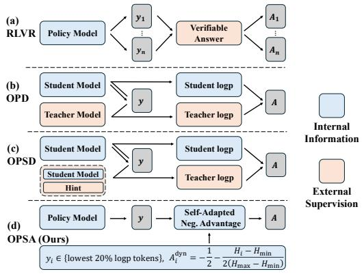

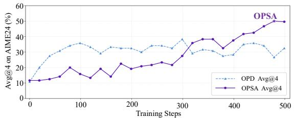

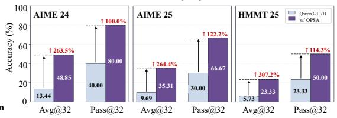  
Figure 1: Left: Overview of different on-policy reinforcement learning algorithms. Unlike existing methods that derive advantages from external supervision, OPSA enables self-improvement with no external supervision by assigning entropy-adaptive negative advantages to low-probability tokens. This suppresses tail tokens and redistributes their mass among head tokens, sharpening low-entropy positions while preserving diversity at high-entropy forks. Right: Training dynamics and performance of OPSA. OPSA eliminates the teacher supervision used in OPD, and further outperforms OPD by 12% in Avg@4. On Qwen3-1.7B, OPSA improves Avg@32 by 263-307% across math ematical reasoning benchmarks and more than doubles Pass@32.

## 1 INTRODUCTION

Reinforcement learning (RL) has become a dominant post-training paradigm to improve reasoning capabilities of large language models (LLMs) (Guo et al., 2025; Yang et al., 2025; GLM-5-Team et al., 2026), offering stronger performance and generalization than offline methods such as supervised fine-tuning (SFT) (Chu et al., 2025; Chen et al., 2025). Reinforcement learning with verifiable rewards (RLVR), including GRPO (Shao et al., 2024) and DAPO (Yu et al., 2026), samples multiple responses per question and assigns advantages by normalizing verifiable rewards within each group (Fig. 1(a)). However, response-level rewards provide coarse and sparse supervision for long-horizon reasoning (Yue et al., 2025). Moreover, when responses within a group share the same correctness outcome, their normalized advantages vanish (Wang et al., 2026b; Ding et al., 2026), weakening the learning signal and making training unstable or prone to collapse.

On-Policy Distillation (OPD) (Agarwal et al., 2024; Gu et al., 2024) addresses this limitation by using a strong teacher to provide token-level advantages through reverse Kullback-Leibler (KL) optimization on student-sampled trajectories (Fig. 1(b)) (Burnham & Anderson, 2001; Lu & Lab, 2025). However, it requires shared vocabularies and white-box access to teacher logits, restricting teacher selection. On-Policy Self-Distillation (OPSD) (Hubotter et al. ¨ , 2026; Zhao et al., 2026; Shenfeld et al., 2026) retains the same OPD paradigm but replaces the external teacher with the policy itself conditioned on hints, such as reference answers (Fig. 1(c)). Constructing such hints still requires additional sampling or annotation and may risk information leakage (Yang et al., 2026).

More fundamentally, OPD and OPSD share the same advantage-assignment paradigm, which asks the teacher to score student-sampled prefixes that are inherently off-policy for it. This raises the question of whether the teacher can still provide reliable supervision in such off-policy contexts (Xie et al., 2026; Fu et al., 2026; Hou et al., 2026). Our analysis reveals a substantial fraction of noisy teacher supervision, where noisy means a negative advantage on a correct answer or a positive advantage on an incorrect one, and this fraction grows with teacher scale. Surprisingly, training exclusively on these noisy trajectories achieves performance comparable to both standard OPD and OPD trained with the noisy trajectories removed, suggesting that OPD’s gains may not arise from the behavior matching it is designed to achieve. This raises a fundamental question: what actually drives student improvement in OPD?

To answer this question, we analyze OPD’s gains from the perspectives of token selection and learning signals. We find that (i) improvement is driven primarily by low log-probability tokens sampled by the student, and (ii) negative advantages are critical, as replacing all OPD advantages with a single fixed negative value yields comparable performance. These observations suggest that OPD’s gains come from suppressing low-probability tokens sampled by the student, requiring no teacher. Fixed negative advantages reproduce much of OPD’s gains, but they discard its fine-grained tokenlevel signals by treating all tokens equally. We therefore study how much negative signal each token should receive, and find that token entropy determines it, with stronger signal at high-entropy positions giving better performance.

Altogether, we propose On-Policy Self-Adaptation (OPSA), a supervision-free token-level RL method that assigns entropy-adaptive negative advantages to low-probability tokens (Fig. 1(d)). We summarize our contributions as follows:

• We find that teacher supervision in OPD is highly noisy and uncover a surprising insensitivity of the student policy to such noise. Training exclusively with noisy supervision, excluding noisy supervision, and standard OPD all converge to comparable accuracy after similar numbers of training steps.

• We identify the key drivers of OPD improvement: effective learning is concentrated on low-logp student-sampled tokens, and fixed negative advantages on these tokens can match standard OPD. This suggests that OPD’s gains stem less from teacher distillation than from suppressing low-probability tokens, questioning the necessity of teacher supervision.

• We propose On-Policy Self-Adaptation, a supervision-free token-level RL method. It reshapes the policy distribution by suppressing tail-token probabilities and redistributing the probability mass among head tokens. This sharpens the distribution at low-entropy positions while preserving diversity at high-entropy fork tokens to support effective exploration.

• We show through extensive experiments that OPSA generalizes across model families and tasks. On Qwen3-1.7B, OPSA improves Avg@32 by 263%–307% relative to the base model across the three benchmarks and more than doubles Pass@32 on each benchmark.

## 2 TEACHER SUPERVISION IN OPD IS HIGHLY NOISY, BUT STUDENTS IMPROVE REGARDLESS

## 2.1 PRELIMINARY

On-Policy Distillation (OPD) (Agarwal et al., 2024; Gu et al., 2024) optimizes the reverse Kullback–Leibler (KL) divergence between the student and teacher distributions over the same prefixes, which is computed using the K1 estimator (Lu & Lab, 2025):

$$
\mathrm { K L } ( \pi _ { s } \mid \mid \pi _ { t } ) = \mathbb { E } _ { y \sim \pi _ { s } ( \cdot \mid x ) } \sum _ { i = 1 } ^ { \lfloor y \mid } \left[ \log \pi _ { s } ( y _ { i } \mid x ; y _ { < i } ) - \log \pi _ { t } ( y _ { i } \mid x ; y _ { < i } ) \right] ,\tag{1}
$$

where $y _ { < i } = [ y _ { 1 } , \cdot \cdot \cdot , y _ { i - 1 } ]$ denotes prefixes of the response $y$ sampled from student policy $\pi _ { s }$ In practice, OPD provides token-level advantage signals $A _ { i }$ for the student policy during the Reinforcement Learning (RL) training, and the loss function can be written as:

$$
\mathcal { L } _ { \mathrm { O P D } } = - \mathbb { E } \left[ \frac { 1 } { | y | } \sum _ { i = 1 } ^ { | y | } A _ { i } \log \pi _ { s } ( y _ { i } | x ; y _ { < i } ) \right] , \quad A _ { i } = \log \frac { \pi _ { t } ( y _ { i } \mid x ; y _ { < i } ) } { \pi _ { s } ( y _ { i } \mid x ; y _ { < i } ) } .\tag{2}
$$

The loss function optimizes the student policy by assigning positive or negative credits to the studentsampled tokens based on teachers’ preference, pushing it closer to teachers’ behavior in each state.

## 2.2 NOISY TEACHER SIGNALS IN OPD

Since the KL divergence is computed conditioned on prefixes sampled from the student distribution, the teacher must score trajectories it would not generate. This raises a key concern: can the teacher provide reliable supervision in such off-policy settings (Fu et al., 2026; Xie et al., 2026; Wang et al., 2026a)?

Definition of Noisy Signals. Previous work (Hou et al., 2026) often measures supervision noise at the trajectory level. However, the quality of intermediate reasoning steps is difficult to assess quantitatively, as a per-token reference for what the supervision should be is generally unavailable. Therefore, we focus on tokens corresponding to verifiable final answers enclosed in \boxed{}, whose correctness is determined by the verifier. We call the supervision noisy when the sign of the teacher-provided advantage on these tokens disagrees with the verifiable reward, i.e., when incorrect answers receive positive advantages or correct answers receive negative ones. Such supervision provides the student with misleading learning signals during RL training.

Setup. We use Qwen3-1.7B as the student policy $\pi _ { s }$ with thinking mode disabled, and use Qwen3-4B/30B-A3B/235B-A22B-Instruct as teacher $\pi _ { t }$ , respectively. For the following analysis, we randomly sample one correct and one incorrect response from $\pi _ { s }$ for each of 500 questions in DAPO-17k (Yu et al., 2026), with correctness verified based on ground-truth answers.

Teacher Supervision is Highly Noisy, and Noisier at Scale. As shown in Fig. 2(a), supervision from teacher models of all sizes contains substantial noise. For the 4B teacher, 20.4% of correct trajectories receive negative advantages on their answer tokens, while 40.8% of incorrect trajectories receive positive advantages, yielding an overall noise rate of 30.6%. The noise rate increases with teacher size, from 30.6% for the 4B teacher to 34.7% for the 30B-A3B teacher and 50.6% for the 235B-A22B teacher. In addition, the largest teacher consistently tends to assign negative advantages: 97.8% of answer tokens enclosed in \boxed{} receive negative advantages even when the answer is correct, while 96.6% also receive negative advantages when the answer is incorrect. This leads to an overall noise rate of approximately 50%. These results suggest that, as the teacher becomes more capable, its supervision on student-generated trajectories becomes overwhelmingly negative and increasingly insensitive to answer correctness. We attribute this to the growing distributional mismatch between the student and teacher policies, which makes student-generated trajectories increasingly off-policy from the teacher’s perspective.

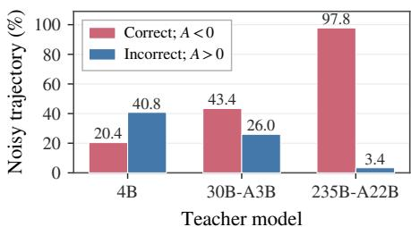  
(a) Reward-advantage direction mismatch

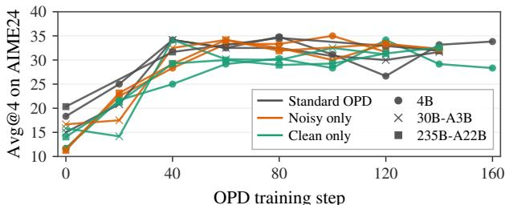  
(b) Training dynamics under different supervision  
Figure 2: Performance of Qwen3-1.7B as the student model under supervision from teachers of different scales. (a): The proportion of teacher-provided advantage signals whose directions disagree with verifiable rewards on student-sampled trajectories. Red and blue bars denote noise rates in correct and incorrect trajectories, respectively. (b): Avg@4 performance on AIME24 during OPD training with different variants of teacher-provided advantage signals.

## 2.3 STUDENTS ARE INSENSITIVE TO NOISE IN TEACHER SUPERVISION

Analysis in Section 2.2 reveals that OPD training involves a substantial amount of noisy tokenlevel supervision. To isolate its effect on learning, we conduct a controlled filtering experiment by partitioning trajectories according to whether they contain noisy signals defined in Section 2.2. We compare standard OPD trained on all trajectories against two variants trained exclusively on trajectories with or without noisy signals. As shown in Fig. 2(b), all three settings converge to comparable performance after a similar number of gradient steps. Remarkably, even when training is restricted to trajectories containing noisy advantages, the student improves at a rate comparable to standard OPD. This finding reveals a surprising insensitivity of OPD to supervision noise in the teacher-provided advantages. In particular, when the teacher supervision is substantially noisy, the student’s improvement may not come from matching the teacher’s behavior. This raises a more fundamental question:

## Research Question

OPD improves student performance even when teacher supervision is highly noisy. This suggests that the gains may not comefrom knowledge transfer, the mechanism OPD is built on. What, then, drives student improvement in OPD?

## 3 WHERE DOES STUDENT IMPROVEMENT COME FROM?

In this section, we progressively disentangle where the performance gains of OPD come from. Specifically, Sections 3.1 and 3.2 investigate which tokens affect improvement and what kinds of learning signals are effective, respectively. We summarize our findings as follows:

## Key Findings

• Which Tokens? Most high-log-probability tokens sampled by the student provide negligible gradients and little effective learning signal. OPD’s performance gains instead arise primarily from the small fraction of low-log-probability tokens. (§3.1)

• Which Signals? Negative advantages, which constitute the majority of OPD signals, are the ones that matter. Notably, replacing all OPD advantages, both positive and negative, with a fixed negative value yields performance comparable to standard OPD. (§3.2)

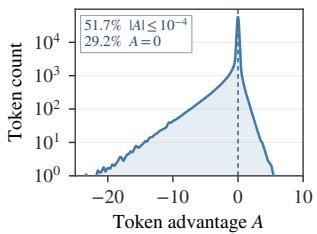  
(a) Advantage distribution

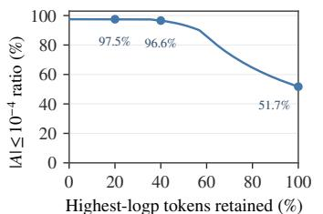  
(b) Zero advantage dominates high logp

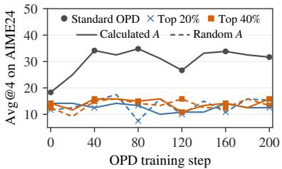  
(c) Training across top-logp fractions  
Figure 3: Qwen3-1.7B student with 4B-Instruct teacher. (a): Token-level advantage distribution during OPD, with most tokens receiving near-zero advantages. (b): Fraction of near-zero advantages among tokens within different top-percentile ranges of student logp. (c): Training only on top-logp tokens yields limited improvement, suggesting that these tokens provide weak learning signals.

## 3.1 WHICH TOKENS CONTRIBUTE TO OPD TRAINING?

Findings in Section 2.3 suggest that not all tokens generated by the student policy contribute effective learning signals for OPD. Revisiting the loss in Eq. 2, let $z _ { t } ^ { v }$ denote the logit for token v conditioned on context $y _ { < t }$ . We have the logit-level gradients for each token (Zhu et al., 2026; Jia et al., 2026):

$$
- \frac { \partial \mathcal { L } _ { \mathrm { O P D } } } { \partial z _ { t } ^ { v } } \propto \left\{ \begin{array} { l l } { A _ { t } \left( 1 - \pi _ { s } ( v \mid x ; y _ { < t } ) \right) , } & { \mathrm { i f ~ } v = y _ { t } \mathrm { ( s a m p l e d \ t o k e n ) } } \\ { - A _ { t } ( \pi _ { s } ( v \mid x ; y _ { < t } ) ) , } & { \mathrm { i f ~ } v \neq y _ { t } \mathrm { ( u n s a m p l e d \ t o k e n ) } } \end{array} \right. .\tag{3}
$$

We observe that the gradient vanishes in two regimes: when $| A _ { t } |$ is small, and when $\pi _ { s } ( y _ { t } \mid x , y _ { < t } )$ approaches one for the sampled token. Tokens in either regime have negligible impact on training.

Token Mass Concentrates at Near-Zero Advantages. We visualize the distribution of tokenlevel advantages in Fig. 3(a). A substantial fraction of the tokens is concentrated near zero: 29.2% of tokens have exactly zero advantage, and 51.7% have advantage magnitude below $1 0 ^ { - 4 }$

Near-Zero Advantages Coincide with the Student’s High-Logp Tokens. Fig. 3(b) shows that tokens with near-zero advantages $( | A | < 1 0 ^ { - 4 } )$ are concentrated among those assigned high log probability by the student. When the student is extremely confident in a token, the teacher, conditioned on the same student-generated prefix, often assigns similarly high probability to that token, resulting in only a negligible difference between their logp and, consequently, an advantage close to zero.

High-Logp Tokens Contribute Nothing to On-Policy Training. To test whether high-logp tokens provide any effective learning signal, we conduct controlled on-policy training experiments. Specifically, we train on varying proportions of the student’s top-logp tokens using either the original OPD advantages (calculated A) or random advantages (random A) sampled evenly from [−1, 1]. As shown in Fig. 3(c), restricting training to these tokens yields no noticeable improvement in the student’s AIME24 performance. Interestingly, the performance remains essentially unchanged even when the original advantages are replaced with random values. These results suggest that highlogp tokens provide no effective learning signal during on-policy training, largely regardless of the advantages assigned to them.

## 3.2 WHICH LEARNING SIGNALS DRIVE POLICY IMPROVEMENT?

Revisiting the formulation of the OPD advantage in Eq. 2, the reverse KL is computed on studentsampled trajectories, which are inherently off-policy for the teacher. The teacher therefore assigns lower probabilities to many sampled tokens, resulting in predominantly negative advantages, consistent with the results in Fig. 3(a). A related observation appears in the RL setting as well, where Zhu et al. (2026) show that Negative Sample Reinforcement (NSR), which learns only from negative signals, can improve policy performance. This motivates us to ask whether the gains achieved by OPD are driven primarily by its large proportion of negative advantages, rather than by the specific supervision provided by the teacher.

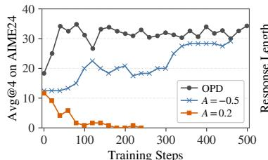  
(a) Avg@4 on AIME24

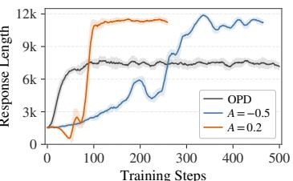  
(b) Response Length

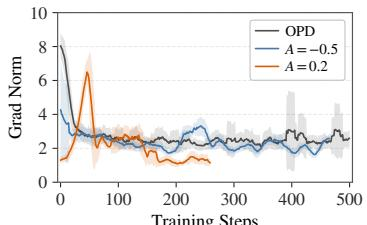  
(c) Grad Norm  
Figure 4: Training dynamics of standard OPD and on-policy training with fixed advantages.

We use Qwen3-1.7B as the student model and compare three advantage assignment schemes. The first follows standard OPD, using Qwen3-4B-Instruct as the teacher model to compute tokenlevel advantages. The other two are teacher-free variants that assign a fixed advantage of −0.5 or +0.2 to each selected token. Since high-logp tokens provide little effective training gradient (Section 3.1), we restrict training to the 20% of tokens with the lowest student logp.

A Fixed Negative Advantage Alone Improves Students. We report the training dynamics of the different advantage-assignment schemes in Fig. 4. First, OPD restricted to the 20% of tokens with the lowest student log-probabilities achieves performance comparable to that of full-token OPD, further supporting the findings in Section 3.1. More notably, training with a fixed negative advantage yields a steady improvement in the student policy’s avg@4 performance on AIME24. Similar to standard OPD, the response length also increases gradually throughout training and eventually stabilizes at approximately 12K tokens. In contrast, training with a fixed positive advantage leads to policy collapse: during the first 40 training steps, the response length progressively decreases to nearly zero while the gradient norm explodes. After the collapse, the policy produces degenerate outputs consisting largely of seemingly random or garbled tokens.

## Takeaway

Our analysis suggests that OPD gains may arise not from distilling teacher knowledge, but from suppressing low-probability tokens sampled by the student itself, an operation that requires no teacher at all. This observation motivates the method introduced in Section 4.

## 4 METHODOLOGY

Section 3 showed that OPD’s improvements survive the removal of the teacher, of positive advantages, and of all but the lowest-logp tokens. The remaining question is: given that negative signal on low-logp tokens is what drives improvement, how much negative signal should each such token receive? Section 4.1 shows that token entropy determines the amount of signal; Section 4.2 turns the findings into On-Policy Self-Adaptation (OPSA), a supervision-free training algorithm, and Section 4.3 analyzes why it works.

## 4.1 ENTROPY DETERMINES THE AMOUNT OF NEGATIVE SIGNALS

Section 3.1 suggested that low-logp tokens are the ones that matter, but logp alone does not dis tinguish two very different situations. A token can have low log probability because the policy is uncertain, with probability mass spread across many plausible tokens, so that even head tokens have relatively low logp. Or the student distribution is sharply concentrated on only a few tokens, while the sampled token happens to fall in the tail of a confident distribution. Wang et al. (2026c); He et al. (2026) have shown that high-entropy tokens play an important role in reinforcement learning and may benefit from stronger learning signals. Motivated by these findings, we compare two entropy-aware schemes that dynamically adjust the magnitude of the negative advantage:

$$
A _ { i } ^ { \mathrm { { d y n } } } = A _ { i } ^ { \mathrm { { f u x } } } - \frac { 1 } { 4 } \delta \cdot r _ { i } , \quad r _ { i } = 2 \frac { H _ { i } - H _ { \operatorname* { m i n } } } { H _ { \operatorname* { m a x } } - H _ { \operatorname* { m i n } } } - 1 ,\tag{4}
$$

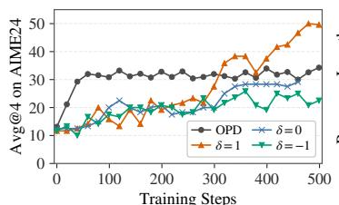  
(a) Avg@4 on AIME24

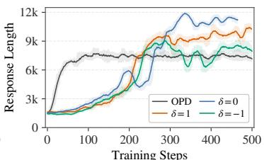  
(b) Response Length

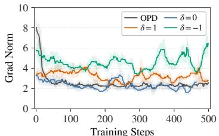  
(c) Grad Norm  
Figure 5: Training dynamics of on-policy training with dynamic negative advantages.

where $H _ { \mathrm { m i n } }$ and $H _ { \mathrm { m a x } }$ are the minimum and maximum entropy over the lowest-20%-logp positions within each response, so that $r _ { i } \in [ - 1 , 1 ]$ measures a token’s entropy relative to its own rollout. The parameter δ controls the relationship between the advantage magnitude $| A _ { i } |$ and the token entropy $H _ { i } \colon \delta = 1$ assigns larger-magnitude negative advantages to higher-entropy tokens, $\delta = - 1$ reverses this, and $\delta = 0$ recovers the fixed-negative-advantage setting of Section 3.2.

Adaptive Advantages with $\delta = 1$ Outperform OPD. The results in Fig. 5 show that, surprisingly, when the magnitude of the negative advantage is positively correlated with token entropy $( \delta = 1 )$ the policy exhibits steady improvement in avg@4 on AIME24, ultimately reaching 50.0% and substantially outperforming standard OPD at 35.13%. Comparing the positively correlated $( \delta = 1 )$ and negatively correlated $( \delta = - 1 )$ variants further demonstrates that on-policy training benefits substantially from assigning larger-magnitude negative advantages to high-entropy tokens. In contrast, the negatively correlated variant becomes unstable between steps 350 and 450, maintains consistently higher gradient norms throughout training, and ultimately performs slightly worse than the fixed-negative-advantage baseline. These results highlight the importance of concentrating stronger learning signals on high-entropy tokens for effective and stable on-policy training.

## 4.2 ON-POLICY SELF-ADAPTATION

These results give a complete on-policy training recipe, which we call On-Policy Self-Adaptation (OPSA). OPSA updates only the lowest-logp tokens, assigns them negative advantages, and scales the magnitude with entropy. It requires no external supervision of any kind, including teacher signals, ground-truth rewards, or reference answers. Setting $A _ { i } ^ { \mathrm { { f i x } } } \ = \ - \frac { 3 } { 4 }$ and $\delta = 1$ in Eq. (4) and restricting the update to $S _ { \mathrm { l o w e s t 2 0 } }$ , the training objective of OPSA is defined as follows:

$$
\mathcal { L } _ { \mathrm { O P S A } } = - \mathbb { E } \left[ \frac { 1 } { | S _ { \mathrm { l o w e s t 2 0 } } | } \sum _ { i \in S _ { \mathrm { l o w e s t 2 0 } } } A _ { i } ^ { \mathrm { d y n } } \log \pi _ { \theta } ( y _ { i } | x ; y _ { < i } ) \right] , \ A _ { i } ^ { \mathrm { d y n } } = - \frac { 1 } { 2 } - \frac { H _ { i } - H _ { \mathrm { m i n } } } { 2 ( H _ { \mathrm { m a x } } - H _ { \mathrm { m i n } } ) }\tag{5}
$$

Since OPSA eliminates the need for a teacher model during training, it avoids additional forward passes through a teacher model to compute advantages. Instead, advantages are derived directly from the student policy’s token-level entropy, introducing negligible computational overhead and substantially reducing training time. Detailed efficiency results are reported in the Appendix B.3.

## 4.3 WHY DOES OPSA WORK?

To further understand the mechanism of OPSA, we conduct a detailed analysis by categorizing tokens into four cases based on token entropy and sampled-token probability: (a) a tail token at a high-entropy position, (b) a head token at a high-entropy position, (c) a tail token at a low-entropy position, and (d) a head token at a low-entropy position. Based on the logit-level gradients in Eq. 3, Fig. 6 illustrates how the negative advantages in OPSA reshape the policy distribution in each case.

Tail Tokens: OPSA Suppresses Low-Probability Reasoning Branches. During on-policy training, stochastic sampling is typically used instead of greedy decoding to maintain rollout diversity. At relatively high sampling temperatures, however, extremely low-probability tail tokens may occasionally be sampled, causing the reasoning process to enter unlikely and potentially erroneous branches. Because OPSA adaptively assigns negative advantages to the 20% of policy-generated tokens with the lowest logp, its policy update suppresses these sampled tail tokens and reallocates their probability mass to higher-probability head tokens, as illustrated in Fig. 6(a)(c). In this way, OPSA steers subsequent reasoning away from low-probability branches and toward more confident alternatives.

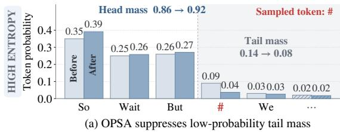

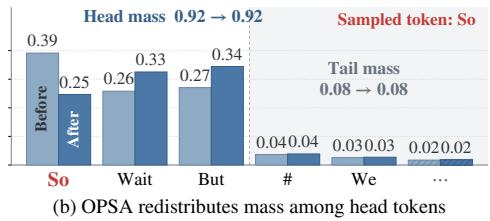

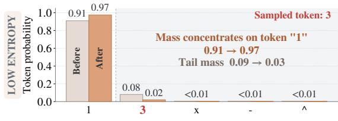  
(c) OPSA avoids sampling low-confidence tokens

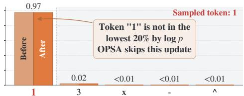  
(d) OPSA maintains high-confidence tokens  
Figure 6: Examples of OPSA updates. (a) At high-entropy positions, OPSA suppresses sampled tail tokens and reallocates probability to head tokens. (b) At high-entropy positions, OPSA redistributes probability among head tokens, with little effect on the tail. (c) OPSA avoids sampling tail tokens at low-entropy positions. (d) OPSA preserves high-confidence predictions.

Head Tokens: OPSA Evenly Redistributes Mass Without Collapsing Diversity. Suppressing tail tokens makes sampling increasingly head-dominated, which raises the concern of diversity collapse. Fig. 6(b) shows why this does not occur. At a high-entropy position, the negative advantage assigned to a sampled head token redistributes probability mass among competing head tokens rather than further sharpening the distribution onto a single prediction, while leaving the tail-token probabilities largely unaffected. This behavior preserves output diversity and the policy’s ability to explore alternative reasoning paths. Moreover, because OPSA updates only the 20% of sampled tokens with the lowest student log-probabilities, high-confidence tokens at low-entropy positions are typically excluded from training. As shown in Fig. 6(d), OPSA therefore preserves confident predictions at low-entropy positions, where high precision is particularly important (Zhang et al., 2026b).

Reshaped Distribution Enables Reflective Reasoning. Consistent with prior observations (Ding et al., 2026; Zhao et al., 2025a), we find that high token-level entropy is closely associated with selfreflective reasoning behavior. At such high-entropy positions, the model is more likely to generate reflective tokens such as “wait” and “but”, which often signal reflection or self-correction and lead to higher-quality reasoning. The example in Fig. 6 illustrates how OPSA increases the total probability mass of the head-token set at high-entropy positions while redistributing it more evenly within the set. This makes diverse reflective branches more likely to be explored. We provide a quantitative analysis of this phenomenon in Section 5.3.2.

## 5 EXPERIMENTS

## 5.1 EXPERIMENTAL SETUP

Models and Datasets. Our experiments cover models from the Qwen3 (Yang et al., 2025) and Qwen3.5 (Team, 2026) families, including Qwen3-1.7B, Qwen3-4B, and Qwen3.5-9B. All models are trained and evaluated in non-thinking mode, unless otherwise specified. All models are trained on DAPO-17k (Yu et al., 2026) using only the questions, without access to labels and groundtruth answers. We evaluate the models on three in-domain mathematical reasoning benchmarks, AIME24, AIME25, and HMMT25, as well as the out-of-domain benchmark MBPP+ (Liu et al., 2023) (Code), and GPQA-Diamond (Rein et al., 2023) (Q&A).

<table><tr><td>Methods</td><td>Dense Signal</td><td>No Verifiable Reward</td><td>No External Teacher</td><td>No Hint</td></tr><tr><td>RLVR (Shao et al., 2024)</td><td></td><td></td><td></td><td></td></tr><tr><td>TTRL (Zuo et al., 2026)</td><td>XXV√</td><td></td><td>V√</td><td>v√</td></tr><tr><td>OPD (Lu &amp; Lab, 2025)</td><td></td><td></td><td></td><td>V</td></tr><tr><td>OPSD (Zhao et al., 2026)</td><td></td><td>XVVV</td><td>×&gt;</td><td>x</td></tr><tr><td>OPSA (Ours)</td><td>J</td><td>√</td><td>J</td><td>√</td></tr></table>

Table 1: Comparison of supervision signals in different on-policy training methods.

<table><tr><td rowspan="3">Methods</td><td colspan="6">Math (I.D.)</td><td colspan="2">0.0.D.</td></tr><tr><td colspan="2">AIME24</td><td colspan="2">AIME25</td><td colspan="2">HMMT25</td><td colspan="2">MBPP+ GPQAD</td></tr><tr><td>avg@32</td><td>pass@32</td><td>avg@32</td><td>pass@32</td><td>avg@32</td><td>pass@32</td><td>avg@32</td><td></td></tr><tr><td>Qwen3-1.7B</td><td>13.44</td><td>40.00</td><td>9.69</td><td>30.00</td><td>5.73</td><td>23.33</td><td>58.24</td><td>27.92</td></tr><tr><td>w/ OPSA Δ</td><td>48.85 +35.41</td><td>80.00</td><td>35.31</td><td>66.67</td><td>23.33</td><td>50.00</td><td>59.44</td><td>32.40 +4.48</td></tr><tr><td></td><td>↑263.5%↑ 100.0%</td><td>+40.00</td><td>+25.62</td><td>+36.67 ↑264.4%↑122.2%</td><td>+17.60</td><td>+26.67 ↑307.2%↑114.3%</td><td>+1.20 ↑2.1%</td><td>↑16.0%</td></tr><tr><td>Qwen3-4B</td><td>23.33</td><td>56.67</td><td>20.52</td><td>56.67</td><td>13.13</td><td>33.33</td><td>66.93</td><td>38.46</td></tr><tr><td>w/ OPSA</td><td>62.08</td><td>83.33</td><td>58.44</td><td>83.33</td><td>37.40</td><td>60.00</td><td>68.35</td><td>41.29</td></tr><tr><td>Δ</td><td>+38.75</td><td>+26.66</td><td>+37.92</td><td>+26.66</td><td>+24.27</td><td>+26.67</td><td>+1.42</td><td>+2.83</td></tr><tr><td></td><td>↑166.1%</td><td>↑47.0%</td><td>↑184.8%</td><td>↑47.0%</td><td>↑184.8%</td><td>↑80.0%</td><td>↑2.1%</td><td>↑7.4%</td></tr><tr><td>Qwen3.5-9B</td><td>76.35</td><td>93.33</td><td>56.04</td><td>93.33</td><td>44.48</td><td>86.67</td><td>77.33</td><td>70.53</td></tr><tr><td>w/ OPSA</td><td>87.81</td><td>96.67</td><td>76.98</td><td>96.67</td><td>67.40</td><td>93.33</td><td>79.27</td><td>73.70</td></tr><tr><td>Δ</td><td>+11.46 ↑15.0%</td><td>+3.34 ↑3.6%</td><td>+20.94 ↑37.4%</td><td>+3.34 ↑3.6%</td><td>+22.92 ↑51.5%</td><td>+6.66 ↑7.7%</td><td>+1.94 ↑2.5%</td><td>+3.17 ↑4.5%</td></tr></table>

Table 2: Performance of OPSA across different models on in-domain mathematical and out-ofdomain code generation and general Q&A tasks. All models are evaluated in non-thinking mode.

Baselines. We compare OPSA with representative on-policy training methods, including reinforcement learning with verifiable rewards (RLVR), such as GRPO (Shao et al., 2024); Test-Time Reinforcement Learning (TTRL) (Zuo et al., 2026), which does not require external supervision; standard On-Policy Distillation (OPD) (Lu & Lab, 2025); and On-Policy Self-Distillation (OPSD) (Zhao et al., 2026), which replaces an external teacher with hints corresponding to questions. Table 1 summarizes the key properties of these methods. OPSA combines their desirable characteristics: it provides dense token-level learning signals while requiring neither verifiable rewards, external teacher models, nor auxiliary hints.

Implementation Details. We implement OPSA using the slime (Zhu et al., 2025) framework and optimize the objective in Eq. 5. The loss is computed only over the 20% of policy-sampled tokens with the lowest log-probabilities. All experiments are conducted on 8 NVIDIA H100 or H200 GPUs.

## 5.2 MAIN RESULTS

OPSA Consistently Improves Different Models. Table 2 demonstrates that OPSA substantially improves performance across model families and scales. For the Qwen3 series, OPSA more than doubles Avg@32 on every mathematical reasoning benchmark. In particular, for Qwen3-1.7B, it yields relative improvements of 263% on both AIME24 and AIME25, and 307% on HMMT25, indicating a substantial enhancement in mathematical reasoning capability. To verify that these gains are not limited to models with relatively limited post-training, we further evaluate OPSA on the Qwen3.5 series. Despite the already strong mathematical reasoning performance of Qwen3.5-9B, which achieves Avg@32 scores of 76.35 on AIME24 and 44.48 on HMMT25, OPSA delivers consistent additional improvements of 11.46 and 22.92 points, respectively. Moreover, OPSA consistently improves Pass@32. Across the Qwen3 series, it yields relative gains ranging from 50% to 122%. For Qwen3.5-9B, despite the base model already achieving near-saturated Pass@32, OPSA further improves them by 3.34 and 6.66 points on AIME and HMMT25, respectively.

<table><tr><td rowspan="2">Methods</td><td colspan="2">AIME24</td><td colspan="2">AIME25</td><td colspan="2">HMMT25</td><td colspan="2">Average</td></tr><tr><td>avg@32 pass@32</td><td></td><td>avg@32</td><td>pass@32</td><td>avg@32</td><td>2 pass@32</td><td>avg@32 pass@32</td><td></td></tr><tr><td>Qwen3-1.7B</td><td>13.44</td><td>40.00</td><td>9.69</td><td>30.00</td><td>5.73</td><td>23.33</td><td>9.62</td><td>31.11</td></tr><tr><td>+ GRPO</td><td>33.96</td><td>70.00</td><td>25.31</td><td>50.00</td><td>15.10</td><td>43.33</td><td>24.79</td><td>54.44</td></tr><tr><td>+ TTRL</td><td>19.90</td><td>30.00</td><td>9.79</td><td>30.00</td><td>5.73</td><td>23.33</td><td>11.81</td><td>27.78</td></tr><tr><td>+ OPD</td><td>32.08</td><td>73.33</td><td>20.52</td><td>50.00</td><td>13.85</td><td>40.00</td><td>22.15</td><td>54.44</td></tr><tr><td>+ OPSD</td><td>33.33</td><td>73.33</td><td>22.50</td><td>53.33</td><td>14.90</td><td>43.33</td><td>23.58</td><td>56.67</td></tr><tr><td>+ OPSA</td><td>48.85</td><td>80.00</td><td>35.31</td><td>66.67</td><td>23.33</td><td>50.00</td><td>35.83</td><td>65.56</td></tr><tr><td> $\Delta { = } \mathrm { O P S A - R L } _ { b e s t }$ </td><td>+14.89</td><td>+6.67</td><td>+10.00</td><td>+13.34</td><td>+8.23</td><td>+6.67</td><td>+11.04</td><td>+8.89</td></tr><tr><td>Qwen3-1.7BThinking</td><td>46.56</td><td>80.00</td><td>36.25</td><td>73.33</td><td>22.92</td><td>60.00</td><td>35.24</td><td>71.11</td></tr><tr><td>+ OPSA</td><td>52.50</td><td>83.33</td><td>42.79</td><td>73.33</td><td>26.85</td><td>60.00</td><td>40.71</td><td>72.22</td></tr></table>

Table 3: Comparison of different on-policy RL methods on Qwen3-1.7B.

OPSA Outperforms Baselines Using Zero External Supervision. We compare OPSA with several representative on-policy RL baselines. For clarity, TTRL performs test-time training directly on AIME24, and we evaluate its best checkpoint; OPD uses Qwen3-4B-Instruct as the teacher model. As shown in Table 3, OPSA consistently outperforms all baselines in both Avg@32 and Pass@32 while requiring no external supervision. Averaged across the three benchmarks, OPSA surpasses the best baseline by 11.04 points in Avg@32 and 8.89 points in Pass@32. Although TTRL is also free from external supervision, its self-consistency-based training tends to sharpen the policy distribution around a local optimum, substantially degrading Pass@k. OPSD removes the external teacher by conditioning the student policy on additional hints to construct a teacher distribution. However, we find that it yields meaningful gains only when thinking mode is disabled for the student but enabled for the teacher, thereby creating a substantial distributional mismatch at the first token position. OPD and GRPO, two widely adopted post-training methods, achieve comparable overall performance. As shown in Table 6 in Appendix B.3, OPD, OPSD, and OPSA require fewer rollout generations during training and are therefore substantially more efficient than GRPO.

Generalization of OPSA. To evaluate its out-of-domain generalization, we further test the models on the code-generation benchmark MBPP+ and general Q&A benchmark GPQA-Diamond. As shown in Table 2, OPSA consistently improves both tasks across different models, demonstrating its ability to generalize beyond the training domain. Additionally, we disable thinking mode (enable thinking=false) during all on-policy rollouts used for OPSA training. Table 3 also reports performance when thinking mode is enabled at inference time. Interestingly, with thinking mode disabled, the OPSA model achieves performance comparable to that of the base model with thinking mode enabled, suggesting that OPSA shifts the policy toward longer-form reasoning behaviors. Enabling thinking mode for the OPSA model yields further improvements, demonstrating that the gains from OPSA remain complementary to the model’s native thinking capability.

## 5.3 MORE ANALYSIS AND ABLATION

## 5.3.1 OPSA ELICITS REFLECTIVE LONG-FORM REASONING

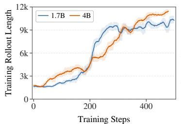  
(a) Rollout length during training

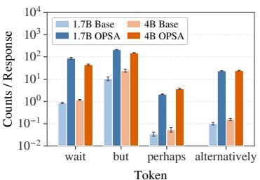  
(b) Reflective token count

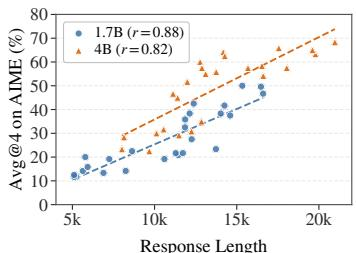  
(c) Length accuracy relationship  
Figure 7: OPSA elicits long-form reasoning by generating more reflective tokens compared to base models. Moreover, AIME24 Avg@4 performance increases positively with response length.

Section 4.3 shows that, at high-entropy positions, OPSA redistributes probability mass among head tokens rather than concentrating it on a single prediction. Such positions often correspond to “fork” tokens in the chain of thought (Wang et al., 2026c; Zhang et al., 2026b), where different tokens may initiate distinct reasoning branches. Fig. 7(a) shows that the response length increases steadily throughout OPSA training. To better understand this change, we compare the frequency of reflective tokens in reasoning trajectories before and after training. As shown in Fig. 7(b), the OPSA-trained model produces substantially more reflective expressions, indicating more frequent reflection and self-correction during reasoning. We further observe a clear positive correlation between response length and answer accuracy. Together, these findings suggest that OPSA promotes exploration at high-entropy forks, leading the model toward longer and potentially more productive reasoning branches characterized by increased reflection and self-correction.

Performance Drops When Fork Tokens Are Masked.   
To validate whether OPSA’s gains primarily arise from   
probability redistribution at fork tokens in the chain of   
thought, we conduct an ablation study by masking fork   
positions whose head-token sets contain reflective words,   
thereby excluding these positions from training. As   
shown in Fig. 8, masking these fork tokens largely elim  
inates the increases in both response length and accuracy   
observed under OPSA. Moreover, the response length   
collapses at approximately 300 training steps. These re  
sults demonstrate that applying OPSA at fork positions   
suppresses low-probability tail tokens while redistribut  
ing probability mass among competing head tokens. This   
encourages the policy to explore longer and more reflec  
tive reasoning branches, which appears to be a major sour ce of its performance improvement. More details are given in Appendix B.3. details are given in Appendix B.3.

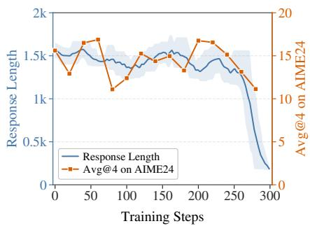  
Figure 8: Training dynamics of OPSA when masking fork tokens.

## 5.3.2 OPSA DOESN’T HURT MODELS’ DIVERSITY

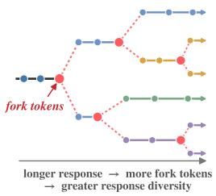  
(a) Tree-Style Reasoning Pattern

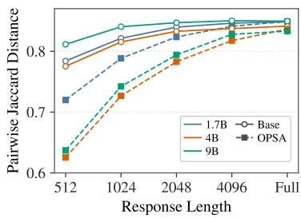  
(b) Pairwise 4-gram Jaccard Distance

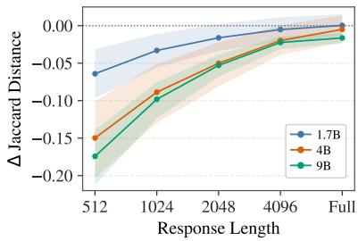  
(c) Jaccard Distance  
Figure 9: Diversity analysis of OPSA. (a) As reasoning length increases, more opportunities for branching arise. At each fork, OPSA distributes probability more evenly across alternative tokens, allowing multiple sampling to explore different reasoning paths and thereby increasing response diversity. (b–c) Jaccard-distance comparisons on AIME24 before and after OPSA training, using 32 sampled responses per problem.

Although the analysis in Section 4.3 shows that OPSA sharpens the overall token distribution, particularly at low-entropy positions, it redistributes probability mass among competing head tokens at high-entropy fork positions. This mechanism allows OPSA to preserve response diversity in longform reasoning. We quantify diversity using Jaccard distance (JD) (Broder, 1997; Wang & Wan, 2018), where lower values indicate greater similarity between responses. Fig. 9 reports JD for the base and OPSA-trained models across different response lengths. As the number of generated tokens increases, the JD gap between the two models gradually narrows and eventually approaches zero, indicating that OPSA preserves a level of long-form response diversity comparable to that of the base model. This result suggests that OPSA continues to explore alternative reasoning branches at successive fork positions, producing the branching, tree-like reasoning patterns illustrated in Fig. 9(a)

without causing diversity collapse. The Pass@32 results in Table 2 provide further evidence that OPSA-induced distribution sharpening neither restricts the policy’s exploration space nor degrades its pass@k performance.

## 5.3.3 ABLATION STUDY OF THE FRACTION OF TRAINED TOKENS

We have examined the advantage-assignment scheme of OPSA in Section 3.2, where negative advantages positively correlated with token entropy yield the strongest improvement. Here, we ablate the proportion of low-log-probability tokens used for training. Fig. 10 reports the Avg@4 training curves when OPSA is applied to the lowest 10%, 20% (ours), 30%, and 40% of tokens ranked by their on-policy log-probabilities.

Training on only the bottom 10% performs substantially worse than the other settings. We find that these tokens consist almost entirely of low-probability tail tokens outside the top-1 prediction. Applying negative advantages exclusively to them over-sharpens the policy distribution and causes a pronounced entropy decrease, thereby limiting further improvement. In contrast, the 20%, 30%, and 40% settings all increase Avg@4 to above 45. These results indicate that OPSA is not highly sensitive to the exact token-selection ratio and that training on only the bottom 20% of sampled tokens is sufficient to achieve substantial gains.

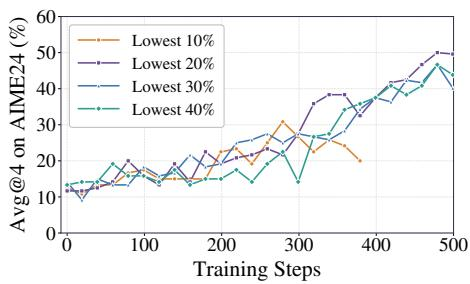  
Figure 10: Ablation study of OPSA with different training token ratios.

## 6 RELATED WORKS

Supervision Signals in On-Policy Distillation. OPD optimizes a student policy on its selfgenerated trajectories. GKD (Agarwal et al., 2024) combines student-generated and supervised trajectories under flexible divergence objectives, while MiniLLM (Gu et al., 2024) adopts reverse KL distillation to reduce exposure bias. More recently, Lu & Lab (2025) improve OPD efficiency for reasoning tasks using the K1 estimator. Another line of work (Zhao et al., 2026; Shenfeld et al., 2026; Hubotter et al.¨ , 2026) replaces the external teacher with the same policy conditioned on additional hints, yielding on-policy self-distillation (OPSD). However, OPSD retains the OPD training paradigm, leaving unresolved whether the constructed teacher can provide reliable supervision on student-generated trajectories. Recent studies aim to avoid potential training noise in OPD through token selection (Xu et al., 2026; Fu et al., 2026) or fine-grained credit assignment (Xing et al., 2026; Xie et al., 2026; Hou et al., 2026), but still rely on external supervision. In contrast, we investigate the source of OPD’s gains and propose OPSA, which enables self-improvement without external supervision.

Label-Free Policy Improvement. Label-free training enables a policy to improve using signals derived from the model itself, without external supervision. Self-rewarding methods (Yuan et al., 2024; Ding & Zhang, 2026) use an LLM-as-a-Judge (Zheng et al., 2023) to score the model’s own responses and construct reward signals. TTRL (Zuo et al., 2026) and EMPO (Zhang et al., 2026a) instead infer pseudo-gold answers from GRPO rollouts through majority voting or clustering, and then use them for reward assignment. Intuitor (Zhao et al., 2025b) adopts self-certainty, using trajectorylevel entropy as a reward to encourage the policy toward more confident outputs. However, these methods depend heavily on the policy’s initial capability. If the correct answer does not lie near a mode of the policy distribution, coarse trajectory-level rewards may reinforce an incorrect mode, causing the policy to become increasingly overconfident and ultimately leading to a collapse in Pass@k. In contrast, OPSA does not force the policy to converge toward any self-generated reward signal. Instead, it provides finer-grained token-level learning signals through entropy-adaptive negative advantages, simultaneously improving precision at low-entropy positions and exploration at high-entropy fork tokens, thereby enhancing the policy’s overall reasoning capability.

## 7 CONCLUSION

The central contribution of this work is a systematic investigation into the source of performance gains in OPD. We find that much of OPD’s improvement can be reproduced without teacher supervision by assigning fixed negative advantages to low-probability tokens, while scaling these advantages according to token-level entropy further enhances performance. Building on these findings, we introduce On-Policy Self-Adaptation (OPSA), an external-supervision-free framework that enables policy self-improvement through entropy-adaptive negative advantages.

Our analysis shows that OPSA suppresses low-probability tail tokens while redistributing probability mass among competing head tokens. This adaptively sharpens the overall token distribution, improving prediction confidence at low-entropy positions while preserving exploration at high-entropy reasoning forks. As a result, OPSA encourages longer and more reflective reasoning trajectories, leading to substantial improvements in both Avg@32 and Pass@32.

Notably, OPSA outperforms OPD without teacher supervision while exhibiting similar training dynamics, including response-length growth. This observation calls for a reexamination of the mechanism underlying OPD with the K1 estimator: its gains may arise not only from making the student imitate a stronger teacher, but also from reshaping the student policy’s own probability distribution. More broadly, our results show that the policy’s internal token-level uncertainty can itself provide an effective fine-grained learning signal for on-policy self-improvement, without rewards, reference answers, or teacher-provided supervision.

## REFERENCES

Rishabh Agarwal, Nino Vieillard, Yongchao Zhou, Piotr Stanczyk, Sabela Ramos Garea, Matthieu Geist, and Olivier Bachem. On-policy distillation of language models: Learning from selfgenerated mistakes. In International Conference on Learning Representations, volume 2024, pp. 21246–21263, 2024.

Andrei Z Broder. On the resemblance and containment of documents. In Proceedings. Compression and Complexity ofSEQUENCES 1997 (Cat. No. 97TB100171), pp. 21–29. IEEE, 1997.

Kenneth P Burnham and David R Anderson. Kullback-leibler information as a basis for strong inference in ecological studies. Wildlife research, 28(2):111–119, 2001.

Hardy Chen, Haoqin Tu, Fali Wang, Hui Liu, Xianfeng Tang, Xinya Du, Yuyin Zhou, and Cihang Xie. Sft or rl? an early investigation into training r1-like reasoning large vision-language models. arXiv preprint arXiv:2504.11468, 2025.

Tianzhe Chu, Yuexiang Zhai, Jihan Yang, Shengbang Tong, Saining Xie, Dale Schuurmans, Quoc V Le, Sergey Levine, and Yi Ma. Sft memorizes, rl generalizes: A comparative study of foundation model post-training. arXiv preprint arXiv:2501.17161, 2025.

Yi Ding and Ruqi Zhang. Sherlock: Self-correcting reasoning in vision-language models. Advances in Neural Information Processing Systems, 38:101638–101672, 2026.

Yi Ding, Ziliang Qiu, Bolian Li, and Ruqi Zhang. Learning self-correction in vision–language models via rollout augmentation. In Forty-third International Conference on Machine Learning, 2026.

Yuqian Fu, Haohuan Huang, Kaiwen Jiang, Jiacai Liu, Zhuo Jiang, Yuanheng Zhu, and Dongbin Zhao. Revisiting on-policy distillation: Empirical failure modes and simple fixes. arXiv preprint arXiv:2603.25562, 2026.

GLM-5-Team, :, Aohan Zeng, Xin Lv, Zhenyu Hou, Zhengxiao Du, Qinkai Zheng, Bin Chen, Da Yin, Chendi Ge, Chenghua Huang, Chengxing Xie, Chenzheng Zhu, Congfeng Yin, Cunxiang Wang, Gengzheng Pan, Hao Zeng, Haoke Zhang, Haoran Wang, Huilong Chen, Jiajie Zhang, Jian Jiao, Jiaqi Guo, Jingsen Wang, Jingzhao Du, Jinzhu Wu, Kedong Wang, Lei Li, Lin Fan, Lucen Zhong, Mingdao Liu, Mingming Zhao, Pengfan Du, Qian Dong, Rui Lu, Shuang-Li, Shulin Cao, Song Liu, Ting Jiang, Xiaodong Chen, Xiaohan Zhang, Xuancheng Huang, Xuezhen Dong, Yabo Xu, Yao Wei, Yifan An, Yilin Niu, Yitong Zhu, Yuanhao Wen, Yukuo Cen, Yushi Bai, Zhongpei

Qiao, Zihan Wang, Zikang Wang, Zilin Zhu, Ziqiang Liu, Zixuan Li, Bojie Wang, Bosi Wen, Can Huang, Changpeng Cai, Chao Yu, Chen Li, Chengwei Hu, Chenhui Zhang, Dan Zhang, Daoyan Lin, Dayong Yang, Di Wang, Ding Ai, Erle Zhu, Fangzhou Yi, Feiyu Chen, Guohong Wen, Hailong Sun, Haisha Zhao, Haiyi Hu, Hanchen Zhang, Hanrui Liu, Hanyu Zhang, Hao Peng, Hao Tai, Haobo Zhang, He Liu, Hongwei Wang, Hongxi Yan, Hongyu Ge, Huan Liu, Huanpeng Chu, Jia’ni Zhao, Jiachen Wang, Jiajing Zhao, Jiamin Ren, Jiapeng Wang, Jiaxin Zhang, Jiayi Gui, Jiayue Zhao, Jijie Li, Jing An, Jing Li, Jingwei Yuan, Jinhua Du, Jinxin Liu, Junkai Zhi, Junwen Duan, Kaiyue Zhou, Kangjian Wei, Ke Wang, Keyun Luo, Laiqiang Zhang, Leigang Sha, Liang Xu, Lindong Wu, Lintao Ding, Lu Chen, Minghao Li, Nianyi Lin, Pan Ta, Qiang Zou, Rongjun Song, Ruiqi Yang, Shangqing Tu, Shangtong Yang, Shaoxiang Wu, Shengyan Zhang, Shijie Li, Shuang Li, Shuyi Fan, Wei Qin, Wei Tian, Weining Zhang, Wenbo Yu, Wenjie Liang, Xiang Kuang, Xiangmeng Cheng, Xiangyang Li, Xiaoquan Yan, Xiaowei Hu, Xiaoying Ling, Xing Fan, Xingye Xia, Xinyuan Zhang, Xinze Zhang, Xirui Pan, Xu Zou, Xunkai Zhang, Yadi Liu, Yandong Wu, Yanfu Li, Yidong Wang, Yifan Zhu, Yijun Tan, Yilin Zhou, Yiming Pan, Ying Zhang, Yinpei Su, Yipeng Geng, Yong Yan, Yonglin Tan, Yuean Bi, Yuhan Shen, Yuhao Yang, Yujiang Li, Yunan Liu, Yunqing Wang, Yuntao Li, Yurong Wu, Yutao Zhang, Yuxi Duan, Yuxuan Zhang, Zezhen Liu, Zhengtao Jiang, Zhenhe Yan, Zheyu Zhang, Zhixiang Wei, Zhuo Chen, Zhuoer Feng, Zijun Yao, Ziwei Chai, Ziyuan Wang, Zuzhou Zhang, Bin Xu, Minlie Huang, Hongning Wang, Juanzi Li, Yuxiao Dong, and Jie Tang. Glm-5: from vibe coding to agentic engineering, 2026. URL https://arxiv.org/abs/2602.15763.

Yuxian Gu, Li Dong, Furu Wei, and Minlie Huang. Minillm: Knowledge distillation of large language models. In International Conference on Learning Representations, volume 2024, pp. 32694–32717, 2024.

Daya Guo, Dejian Yang, Haowei Zhang, Junxiao Song, Peiyi Wang, Qihao Zhu, Runxin Xu, Ruoyu Zhang, Shirong Ma, Xiao Bi, et al. Deepseek-r1: Incentivizing reasoning capability in llms via reinforcement learning. arXiv preprint arXiv:2501.12948, 2025.

Yuhang He, Haodong Wu, Siyi Liu, Hongyu Ge, Hange Zhou, Keyi Wu, Zhuo Zheng, Qihong Lin, Zixin Zhong, and Yongqi Zhang. Where hindsight credit can reside: A signed-capacity view of token updates in rlvr. arXiv preprint arXiv:2604.11056, 2026.

Wenjin Hou, Shangpin Peng, Weinong Wang, Zheng Ruan, Yue Zhang, Zhenglin Zhou, Mingqi Gao, Yifei Chen, Kaiqi Wang, Hongming Yang, et al. Uni-opd: Unifying on-policy distillation with a dual-perspective recipe. arXiv preprint arXiv:2605.03677, 2026.

Jonas Hubotter, Frederike L¨ ubeck, Lejs Behric, Anton Baumann, Marco Bagatella, Daniel Marta,¨ Ido Hakimi, Idan Shenfeld, Thomas Kleine Buening, Carlos Guestrin, et al. Reinforcement learning via self-distillation. arXiv preprint arXiv:2601.20802, 2026.

Nan Jia, Haojin Yang, Xing Ma, Jiesong Lian, Shuailiang Zhang, Weipeng Zhang, Ke Zeng, Xunliang Cai, and Zequn Sun. Asymmetric on-policy distillation: Bridging exploitation and imitation at the token level. arXiv preprint arXiv:2605.06387, 2026.

Jiawei Liu, Chunqiu Steven Xia, Yuyao Wang, and Lingming Zhang. Is your code generated by chatgpt really correct? rigorous evaluation of large language models for code generation. Advances in neural information processing systems, 36:21558–21572, 2023.

Kevin Lu and Thinking Machines Lab. On-policy distillation. Thinking Machines Lab: Connectionism, 2025. doi: 10.64434/tml.20251026. https://thinkingmachines.ai/blog/on-policy-distillation.

David Rein, Betty Li Hou, Asa Cooper Stickland, Jackson Petty, Richard Yuanzhe Pang, Julien Dirani, Julian Michael, and Samuel R Bowman. Gpqa: A graduate-level google-proof q&a benchmark. arXiv preprint arXiv:2311.12022, 2023.

Zhihong Shao, Peiyi Wang, Qihao Zhu, Runxin Xu, Junxiao Song, Xiao Bi, Haowei Zhang, Mingchuan Zhang, YK Li, Yang Wu, et al. Deepseekmath: Pushing the limits of mathematical reasoning in open language models. arXiv preprint arXiv:2402.03300, 2024.

Idan Shenfeld, Mehul Damani, Jonas Hubotter, and Pulkit Agrawal. Self-distillation enables con-¨ tinual learning. arXiv preprint arXiv:2601.19897, 2026.

Qwen Team. Qwen3.5: Accelerating productivity with native multimodal agents, February 2026. URL https://qwen.ai/blog?id=qwen3.5.

Bing Wang, Shaotian Yan, Chen Shen, Sinan Fan, Ximing Li, Rui Miao, Xiaosong Yuan, Zhanming Shen, Jieping Ye, et al. Backtracking when it strays: Mitigating dual exposure biases in llm reasoning distillation. arXiv preprint arXiv:2605.19433, 2026a.

Haozhe Wang, Chao Qu, Zuming Huang, Wei Chu, Fangzhen Lin, and Wenhu Chen. Vl-rethinker: Incentivizing self-reflection of vision-language models with reinforcement learning. Advances in Neural Information Processing Systems, 38:30865–30891, 2026b.

Ke Wang and Xiaojun Wan. Sentigan: Generating sentimental texts via mixture adversarial networks. In IJCAI, pp. 4446–4452, 2018.

Shenzhi Wang, Le Yu, Chang Gao, Chujie Zheng, Shixuan Liu, Rui Lu, Kai Dang, Xiong-Hui Chen, Jianxin Yang, Zhenru Zhang, et al. Beyond the 80/20 rule: High-entropy minority tokens drive effective reinforcement learning for llm reasoning. Advances in Neural Information Processing Systems, 38:115452–115486, 2026c.

Yan Xie, Sijie Zhu, Tiansheng Wen, Bo Chen, and Yifei Wang. On the position bias of on-policy distillation. arXiv preprint arXiv:2606.22600, 2026.

Xingrun Xing, Haoqing Wang, Boyan Gao, Ziheng Li, and Yehui Tang. Trust region on-policy distillation. arXiv preprint arXiv:2606.01249, 2026.

Yuanda Xu, Hejian Sang, Zhengze Zhou, Ran He, Zhipeng Wang, and Alborz Geramifard. Tip: Token importance in on-policy distillation. arXiv preprint arXiv:2604.14084, 2026.

An Yang, Anfeng Li, Baosong Yang, Beichen Zhang, Binyuan Hui, Bo Zheng, Bowen Yu, Chang Gao, Chengen Huang, Chenxu Lv, et al. Qwen3 technical report. arXiv preprint arXiv:2505.09388, 2025.

Chenxu Yang, Chuanyu Qin, Qingyi Si, Minghui Chen, Naibin Gu, Dingyu Yao, Zheng Lin, Weiping Wang, Jiaqi Wang, and Nan Duan. Self-distilled rlvr. arXiv preprint arXiv:2604.03128, 2026.

Qiying Yu, Zheng Zhang, Ruofei Zhu, Yufeng Yuan, Xiaochen Zuo, Yu Yue, Weinan Dai, Tiantian Fan, Gaohong Liu, Lingjun Liu, et al. Dapo: An open-source llm reinforcement learning system at scale. Advances in Neural Information Processing Systems, 38:113222–113244, 2026.

Weizhe Yuan, Richard Yuanzhe Pang, Kyunghyun Cho, Xian Li, Sainbayar Sukhbaatar, Jing Xu, and Jason Weston. Self-rewarding language models. arXiv preprint arXiv:2401.10020, 2024.

Yu Yue, Yufeng Yuan, Qiying Yu, Xiaochen Zuo, Ruofei Zhu, Wenyuan Xu, Jiaze Chen, Chengyi Wang, TianTian Fan, Zhengyin Du, et al. Vapo: Efficient and reliable reinforcement learning for advanced reasoning tasks. arXiv preprint arXiv:2504.05118, 2025.

Qingyang Zhang, Haitao Wu, Changqing Zhang, Peilin Zhao, and Yatao Bian. Right question is already half the answer: Fully unsupervised llm reasoning incentivization. Advances in neural information processing systems, 38:67345–67372, 2026a.

Ruixiang Zhang, Richard He Bai, Huangjie Zheng, Navdeep Jaitly, Ronan Collobert, and Yizhe Zhang. Embarrassingly simple self-distillation improves code generation. arXiv preprint arXiv:2604.01193, 2026b.

Jiachen Zhao, Yiyou Sun, Weiyan Shi, and Dawn Song. Can aha moments be fake? towards quantifying decorative and true thinking in chain-of-thought. arXiv preprint arXiv:2510.24941, 2025a.

Siyan Zhao, Zhihui Xie, Mengchen Liu, Jing Huang, Guan Pang, Feiyu Chen, and Aditya Grover. Self-distilled reasoner: On-policy self-distillation for large language models. arXiv preprint arXiv:2601.18734, 2026.

Xuandong Zhao, Zhewei Kang, Aosong Feng, Sergey Levine, and Dawn Song. Learning to reason without external rewards. arXiv preprint arXiv:2505.19590, 2025b.

Lianmin Zheng, Wei-Lin Chiang, Ying Sheng, Siyuan Zhuang, Zhanghao Wu, Yonghao Zhuang, Zi Lin, Zhuohan Li, Dacheng Li, Eric Xing, et al. Judging llm-as-a-judge with mt-bench and chatbot arena. Advances in neural information processing systems, 36:46595–46623, 2023.

Xinyu Zhu, Mengzhou Xia, Zhepei Wei, Wei-Lin Chen, Danqi Chen, and Yu Meng. The surprising effectiveness of negative reinforcement in llm reasoning. Advances in Neural Information Processing Systems, 38:126546–126573, 2026.

Zilin Zhu, Chengxing Xie, Xin Lv, and slime Contributors. slime: An llm post-training framework for rl scaling. https://github.com/THUDM/slime, 2025. GitHub repository. Corresponding author: Xin Lv.

Yuxin Zuo, Kaiyan Zhang, Li Sheng, Shang Qu, Ganqu Cui, Xuekai Zhu, Haozhan Li, Xinwei Long, Ermo Hua, Biqing Qi, et al. Ttrl: Test-time reinforcement learning. Advances in Neural Information Processing Systems, 38:131459–131483, 2026.

## A LIMITATIONS AND FUTURE DIRECTIONS

Due to limited computational resources, our experiments focus on relatively small models of up to 9B parameters. It therefore remains unclear whether OPSA scales effectively to larger models or mixture-of-experts architectures. Moreover, our analysis suggests that OPSA primarily operates by redistributing the policy’s existing probability mass. Its benefits may therefore be limited for heavily post-trained models whose output distributions are already overly sharp and exhibit very low entropy. Although OPSA requires no external annotations and can serve as a plug-and-play post-training method, it may not substantially expand the policy’s underlying exploration frontier, as reflected by the relatively modest improvements in thinking-mode Pass@k. A promising direction is to combine OPSA’s fine-grained negative-advantage assignment with other reinforcement learning methods to further improve policy exploration. In addition, OPSA outperforms OPD without teacher supervision while exhibiting similar training dynamics, including response-length growth. This finding calls for a reexamination of the mechanism underlying OPD with the K1 estimator and motivates further theoretical analysis to identify the true source of OPD’s performance gains.

## B EXPERIMENTAL DETAILS

## B.1 TRAINING CONFIGURATION

<table><tr><td>Hyperparameter</td><td>Value</td></tr><tr><td>Framework</td><td>slime(0.2.4)</td></tr><tr><td>Training engine</td><td>Megatron (0.16.0rc0)</td></tr><tr><td>Rollout engine</td><td>SGLang(0.5.14)</td></tr><tr><td>GPUs</td><td>8xH100 GPUs</td></tr><tr><td>Learning rate</td><td>1×10−⁶</td></tr><tr><td>Rollout batch size</td><td>64</td></tr><tr><td>n samples per prompt</td><td>1</td></tr><tr><td>Enable Thinking</td><td>False</td></tr><tr><td>Global batch size</td><td>64</td></tr><tr><td>Training decoding</td><td>Temperature 1.0, top-k -1, top-p 1.0, max response length 12000</td></tr><tr><td>Evaluation decoding Save &amp; Evaluation frequency</td><td>Temperature 0.7, top-k 20, top-p 0.8, max response length 32768</td></tr><tr><td></td><td>Save every 20 steps, validate every 20 steps</td></tr><tr><td>Checkpoint selection metric</td><td>Avg@4 on validation set</td></tr></table>

Table 4: Training hyperparameters for OPSA.

We provide the detailed OPSA training configuration in Table 4. For rollout during training, we adopt the default decoding parameters from the slime repository. For evaluation, we use the decoding parameters recommended in the Qwen3 model card. Following prior work (Zhao et al., 2026; Hou et al., 2026), we select the best checkpoint for each method based on Avg@4 performance.

## B.2 EVALUATION CONFIGURATION

<table><tr><td>Hyperparameter</td><td>Value</td></tr><tr><td>Rollout engine</td><td>SGLang (0.5.14)</td></tr><tr><td>Temperature</td><td>0.7</td></tr><tr><td>Top-k</td><td>20</td></tr><tr><td>Top-p</td><td>0.8</td></tr><tr><td>Max new tokens</td><td>32768</td></tr><tr><td>Enable thinking</td><td>False</td></tr><tr><td>Samples per prompt</td><td>32</td></tr><tr><td>Metric</td><td>Avg @32 &amp; Pass @32</td></tr></table>

Table 5: Evaluation hyperparameters for OPSA.

We provide the detailed evaluation configuration in Table 5. We use SGLang for inference, generate 32 responses per prompt with thinking mode disabled, and report both Avg@32 and Pass@32.

## B.3 MORE DETAILS

<table><tr><td rowspan="2">Methods</td><td rowspan="2">Training Step Time (s)</td><td colspan="3">Inference</td></tr><tr><td>Token Counts</td><td>Time (s)</td><td>Avg@32</td></tr><tr><td>Qwen3-1.7B</td><td></td><td>4457</td><td>1.78</td><td>13.44</td></tr><tr><td>+ GRPO</td><td>186.2</td><td>19108</td><td>5.27</td><td>33.96</td></tr><tr><td>+ OPD</td><td>61.2</td><td>15286</td><td>5.73</td><td>32.08</td></tr><tr><td>+ OPSA</td><td>46.3</td><td>23205</td><td>6.58</td><td>48.85</td></tr><tr><td>Qwen3-4B</td><td></td><td>8015</td><td>3.31</td><td>23.33</td></tr><tr><td>+OPSA</td><td>68.6</td><td>20972</td><td>6.97</td><td>62.08</td></tr><tr><td>Qwen3.5-9B</td><td></td><td>6847</td><td>5.29</td><td>76.35</td></tr><tr><td>+ OPSA</td><td>214.7</td><td>9695</td><td>6.31</td><td>87.81</td></tr></table>

Table 6: Training and inference overhead of OPSA compared to baselines.

Training and Inference Overhead of OPSA. We compare the training and inference overhead of different methods in Table 6. OPSA and OPD train faster than GRPO because they do not require extensive rollout sampling to construct response groups. OPSA is even more efficient than OPD, as it neither deploys an additional teacher model nor performs forward passes through a larger and slower teacher. This allows more GPUs to be allocated to policy rollout and optimization. At inference time, OPSA steers the policy toward more reflective reasoning branches, producing longer responses while achieving higher accuracy.

Reflective Word Set for Experiments in Fig. 8. We list the detailed reflective word set used in experiments in Fig. 8 as follows:

Reflective Word Set   
"wait", "however", "but", "alternatively", "hmm", "perhaps",   
"check", "might", "actually"

Following the standard OPSA training procedure, we first identify the 20% of token positions with the lowest student log-probabilities. At each selected position, we inspect the student’s top-5 candidate tokens. If any candidate belongs to the predefined reflective word set, we classify the position as a reflective fork and exclude it from the training objective.

Jaccard Distance in Section 5.3.2. We measure response diversity using the pairwise Jaccard distance between sets of token-level 4-grams. For each response, we retain its first L tokens, where $L \in \{ 5 1 2 ,$ 1024, 2048, 4096, Full}, and denote the resulting set of unique 4-grams by $\mathcal { G } _ { 4 } ( r ^ { ( \leq L ) } )$ . The distance between two responses is defined as

$$
d _ { \mathrm { J } } ( r _ { i } , r _ { j } ; L ) = 1 - \frac { \Big | \mathscr { G } _ { 4 } ( r _ { i } ^ { ( \le L ) } ) \cap \mathscr { G } _ { 4 } ( r _ { j } ^ { ( \le L ) } ) \Big | } { \Big | \mathscr { G } _ { 4 } ( r _ { i } ^ { ( \le L ) } ) \cup \mathscr { G } _ { 4 } ( r _ { j } ^ { ( \le L ) } ) \Big | } .\tag{6}
$$

For each AIME24 problem, we average the distance over all response pairs among the R = 32 sampled responses, and then report the macro-average over all $P = 3 0$ problems:

$$
D _ { \mathrm { J } } ( L ) = \frac { 1 } { P } \sum _ { p = 1 } ^ { P } \frac { 2 } { R ( R - 1 ) } \sum _ { 1 \leq i < j \leq R } d _ { \mathrm { J } } ( r _ { p , i } , r _ { p , j } ; L ) .\tag{7}
$$

A larger $D _ { \mathrm { J } } ( L )$ indicates greater response diversity. We additionally report the difference between OPSA and the base model as

$$
\Delta D _ { \mathrm { J } } ( L ) = D _ { \mathrm { J } } ^ { \mathrm { O P S A } } ( L ) - D _ { \mathrm { J } } ^ { \mathrm { B a s e } } ( L ) .\tag{8}
$$

<table><tr><td>Methods</td><td colspan="2">AIME24 avg@32 pass@32</td><td colspan="2">AIME25 avg@32 pass@32</td><td colspan="2">HMMT25 avg@32 pass@32</td><td colspan="2">Average</td></tr><tr><td></td><td></td><td></td><td></td><td></td><td></td><td></td><td></td><td>avg@32 pass@32</td></tr><tr><td>Qwen3-1.7B</td><td>13.44</td><td>40.00</td><td>9.69</td><td>30.00</td><td>5.73</td><td>23.33</td><td>9.62</td><td>31.11</td></tr><tr><td>+ GRPO</td><td>33.96</td><td>70.00</td><td>25.31</td><td>50.00</td><td>15.10</td><td>43.33</td><td>24.79</td><td>54.44</td></tr><tr><td>+ NSR</td><td>32.08</td><td>73.33</td><td>24.17</td><td>60.00</td><td>16.15</td><td>43.33</td><td>24.13</td><td>58.89</td></tr><tr><td>+ OPSA</td><td>48.85</td><td>80.00</td><td>35.31</td><td>66.67</td><td>23.33</td><td>50.00</td><td>35.83</td><td>65.56</td></tr></table>

Table 7: Comparison of different on-policy RL methods on Qwen3-1.7B.

## C ADDITIONAL RESULTS

## C.1 COMPARISON TO NEGATIVE SAMPLE REINFORCEMENT

NSR (Zhu et al., 2026) decomposes RLVR trajectories into correct and incorrect samples and performs trajectory-level reinforcement learning with negative advantages. Specifically, it assigns a fixed negative advantage to every token in an incorrect trajectory, thereby improving exploration while maintaining stable policy entropy during training. The key distinction between OPSA and NSR is that OPSA requires no supervisory signal, including verifiable rewards. Instead, it assigns token-level negative advantages to low-log-probability tokens across all trajectories and dynamically modulates these advantages according to token entropy, enabling substantially finer-grained optimization. Combined with our analysis in Section 4.3, these results suggest that OPSA suppresses low-probability tail tokens and redistributes their probability mass more evenly among highprobability head tokens. This mechanism preserves accuracy at low-entropy positions while enhancing exploration at high-entropy fork tokens. As shown in Table 7, OPSA consistently outperforms both GRPO and NSR in single-sample accuracy and pass@k, validating the effectiveness of our approach. The results further demonstrate that applying negative advantages to low-probability tokens even within correct trajectories is important for improving model performance.

## C.2 LOW ENTROPY CAN STILL SUPPORT EFFECTIVE EXPLORATION

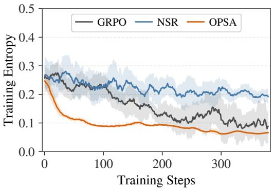  
(a) Training Entropy

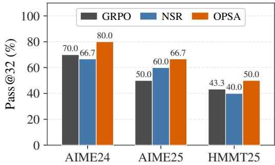  
(b) Pass@32 Performance  
Figure 11: Training dynamics of different methods on Qwen3-1.7B and pass@32 performance.

As shown in Figure 11, OPSA exhibits substantially lower training entropy than GRPO and NSR while consistently achieving higher pass@32 on AIME24, AIME25, and HMMT25. This result demonstrates that aggregate entropy alone is not a reliable indicator of a model’s exploration ability. Effective exploration depends more critically on how uncertainty is allocated across token positions. At high-entropy fork tokens, OPSA maintains a relatively balanced probability distribution among plausible head tokens, enabling the model to explore multiple promising reasoning branches. At low-entropy positions, it further concentrates probability mass on high-confidence tokens, improving sampling accuracy and preventing trajectories from entering implausible, low-confidence branches. Consequently, OPSA achieves lower overall entropy without sacrificing diversity and meaningful exploration at critical decision points, consistent with our analysis in Section 5.3.2.

## C.3 PERFORMANCE COMPARISON UNDER SIMILAR TOKEN BUDGETS

<table><tr><td>Methods</td><td>Token Counts</td><td>Avg@32</td></tr><tr><td>Qwen3-1.7B</td><td>4457</td><td>13.44</td></tr><tr><td>+ GRPO</td><td>19108</td><td>33.96</td></tr><tr><td> $+ \mathrm { G R P O } ( ^ {  } \mathrm { w a i t } ^ { \cdot \cdot } )$ </td><td>23261</td><td>32.81</td></tr><tr><td>+ OPD</td><td>15286</td><td>32.08</td></tr><tr><td> $+ \mathrm { O P D } ( ^ {  } \mathrm { w a i t } ^ { \prime } )$ </td><td>23472</td><td>31.67</td></tr><tr><td>+ OPSA</td><td>23205</td><td>48.85</td></tr></table>

Table 8: AIME24 performance of different RL strategy on similar inference token budgets.

To verify that OPSA’s gains are not merely a consequence of generating longer responses, we construct a token-budget-matched inference control for the GRPO and OPD baselines. Specifically, we first generate a baseline response, remove its terminal \boxed{} answer, append a single “wait” token to the remaining reasoning trace, and then resume decoding. A minimum generation-length constraint is applied so that the resulting responses approximately match the average response length of the OPSA-trained model. We evaluate the first complete \boxed{} answer produced after reaching the target token budget while keeping all other decoding settings unchanged. As shown in Table 8, allocating additional inference-time tokens does not improve the baselines, and OPSA continues to substantially outperform both GRPO and OPD under comparable response lengths. These results indicate that OPSA’s improvements cannot be explained by response length alone. Instead, they are consistent with OPSA reshaping the policy distribution to improve precision at low-entropy positions and encourage exploration at high-entropy positions, thereby steering generation toward more effective reflective reasoning branches.

## C.4 OPSA AS A COLD-STARTING FOR GRPO TRAINING

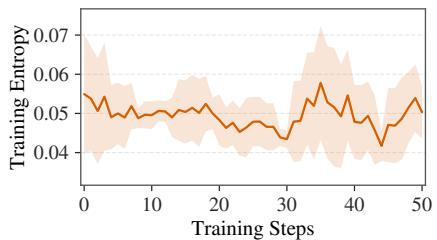  
(a) Training Entropy

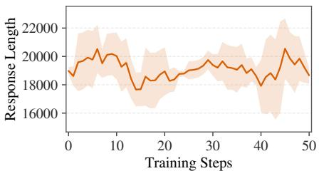

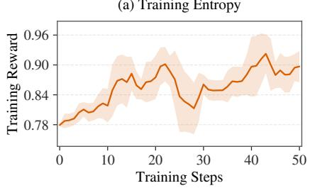  
(c) Training Reward

(b) Response Length  
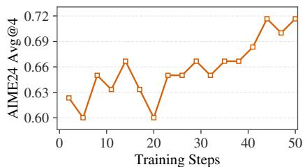  
(d) AIME24 Avg@4  
Figure 12: Training dynamics of GRPO training started from the OPSA cold-starting 4B model.

OPSA demonstrates strong effectiveness during post-training, improving both accuracy and Pass@k while preserving sampling diversity. In this section, we investigate whether OPSA, as an externalsupervision-free method, can serve as a “free-lunch” cold start before further RL training and enable additional performance gains. We conduct experiments on Qwen3-4B, using an OPSA checkpoint as the initialization and further training it with GRPO on DAPO-17k. Figure 12 reports the resulting training dynamics. On the validation set, Avg@4 continues to improve steadily, increasing by approximately 9 points after 40 training steps, while the training curve remains smooth without signs of collapse. These results suggest that OPSA can provide an effective cold start for subsequent RL training, further extending the model’s capabilities.