# Driving on Memory

Christian Löwens1,3 Thorben Funke1 Alexandru Paul Condurache2,3

1Bosch Research 2Automated Driving, Bosch 3University of Lübeck

{christian.loewens, thorben.funke, alexandrupaul.condurache}@bosch.com

## Abstract

End-to-end autonomous driving models plan future trajectories from raw sensor input. While earlier driving benchmarks often measured deviation from the human trajectory, current benchmarks such as NAVSIM and Bench2Drive evaluate models with richer simulation-based metrics intended to capture safe and compliant driving. A high benchmark score should reflect that a model can understand the scene in front of it and act accordingly. But how much of that score specifically comes from reacting to the dynamic part of that scene?

To probe this, we remove a model’s camera input and replace it with memories from prior drives at the same location. The retrieved memories can provide persistent scene information, including road layout and location-conditioned regularities, but not the current traffic state. Surprisingly, memory is nearly sufficient on NAVSIM, reaching or even exceeding the performance of leading end-to-end methods without actually observing the evaluated scene. Our results suggest that a high NAVSIM score does not require a planner to react to the current traffic scene and should be treated with caution. This effect is benchmark-dependent: driving from memory causes substantially larger performance drops on Bench2Drive and RealEngine. We provide our code at github.com/boschresearch/MemoryDrivoR.

## 1 Introduction

End-to-end autonomous driving benchmarks can be read as tests of whether models understand the current driving situation. If a planner achieves a high benchmark score, the natural interpretation is that it has perceived the road layout, detected relevant traffic participants, inferred their intents and the rules of the scene, and planned accordingly. This interpretation is important: benchmark scores guide model design and leaderboard claims, and they are used to argue that modern driving systems are becoming better at scene understanding. Yet a high score does not by itself identify which information the model used. A benchmark can reward the intended capability, but it can also reward exploiting simpler cues that are correlated with the desired behavior.

This ambiguity has already appeared in end-to-end driving, where earlier benchmarks measured deviation from the human trajectory. It became especially visible on nuScenes, where a model without camera input can achieve surprisingly high benchmark scores from ego status alone, including speed and navigation command [34, 63]. It goes without saying that this result does not show that perception is unnecessary for driving. It shows that high scores can come from exploiting regularities in the test rather than from having a holistic scene understanding. Recent benchmarks such as NAVSIM [7, 14] and Bench2Drive [23] were designed to include more demanding maneuvers, with simulation-based evaluation and richer metrics. Indeed, simple ego-status baselines perform much worse on these benchmarks. This motivates our question: do stronger benchmarks require models to understand the current situation, or can high scores still be achieved from comparatively weaker signals?

To this end, we distinguish between static and dynamic environmental information contained in the camera’s input. Static information includes mostly map-like structure, but also persistent location priors such as typical crowdedness. Dynamic information includes the actual traffic participants, signal phase, weather, and other transient factors. In this work, we ask how much benchmark performance can be achieved from the static parts of the traffic scene alone.

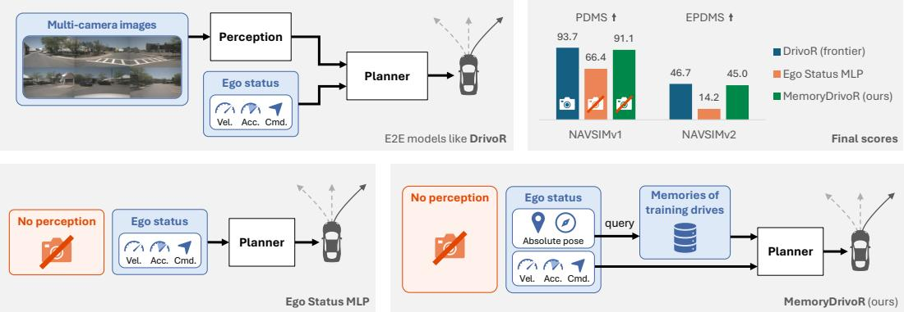  
Figure 1: MemoryDrivoR. We introduce a novel analytic baseline for testing how much benchmark performance depends on camera input from the evaluated scene. MemoryDrivoR replaces camera input with memories from previous sensor-rich traversals. These memories carry static information but cannot describe the dynamics of the current traffic scene. In contrast to other baselines without cameras such as Ego Status MLP [34], MemoryDrivoR achieves surprisingly strong NAVSIM performance and approaches leading camera-based methods like DrivoR [28], suggesting that the benchmark does not strongly demand reactions to the current situation.

Thus, we introduce MemoryDrivoR, a new approach to instantiate this comparison as illustrated in Fig. 1. Starting from DrivoR [28], a transformer-based end-to-end planner, we build a memory bank from previous camera-based traversals in the training data. Each memory stores latent scene tokens together with the global pose at which they were observed. During inference, MemoryDrivoR retrieves nearby memories and injects them into the planner to replace the camera input of the evaluated scene. Thus, by design the planner can only access static and quasi-static information.

We apply this method to audit popular end-to-end benchmarks and find surprising results: Memory-DrivoR nearly reaches the performance of state-of-the-art camera-based models on both NAVSIMv1 and NAVSIMv2 by using this static information with additional cues from the initial ego status. On Bench2Drive and RealEngine, the same intervention is not nearly as effective. We attribute this to their closed-loop evaluation with more demanding scenarios and, in the case of Bench2Drive, longer routes and an initial ego status that is not informative. We also analyze camera-based performance under geographical splits to inspect whether models perceive static information at test time or memorize it during training. Our core contributions are:

• We introduce a novel stress test for end-to-end driving benchmarks by removing the camera input of the evaluated scene and substituting it with memories from previous drives.

• Using our test, we show that NAVSIM scores can be very high even without seeing the current traffic scene. Our approach is close to state-of-the-art camera-based methods.

• We show that other benchmarks, such as Bench2Drive and RealEngine, are robust to our baseline and discuss the resulting insights for the design of future benchmarks.

• We distinguish our findings from location overfitting, which is not supported by the behavior of end-to-end models under geographical splits.

## 2 Related Work

Shortcut learning in end-to-end driving benchmarks. Several recent works caution that strong benchmark scores can arise from shortcuts that do not require perceiving the current traffic scene. AD-MLP [63] first exposed this issue on nuScenes [6] open-loop planning, where predicted trajectories are compared with recorded futures. It showed that a simple non-perceptual planner using ego status, including navigation command, and past ego trajectory could achieve competitive scores. Ego-MLP [34] sharpened the critique by removing the reliance on past trajectories. It also showed that nuScenes contains many straightforward driving cases and introduced road-compliance analysis to reveal failures that displacement metrics alone hide. The same concern also appears under richer planning scores. In nuPlan [26], PDM-Open [13] showed that a planner can achieve a high open-loop score by following a selected centerline while largely ignoring dynamic agents. We ask a related question: how far can benchmark performance be pushed when given additional static information? Instead of relying only on centerlines, we use previous drives as a richer source of persistent context.

Modern benchmark responses. Modern driving benchmarks explicitly try to avoid the weaknesses of open-loop trajectory matching. WOD-E2E [55] is a large-scale end-to-end benchmark built on the Waymo Open Dataset [50], with an emphasis on challenging long-tail scenarios. NAVSIMv1 [14] targets the ego status shortcut by filtering the OpenScene dataset [42] with a constant-velocity baseline to remove near-trivial scenes and replacing the displacement metric with a short non-reactive simulation scoring compliance, progress, and comfort. The paper interprets its ego-status MLP result as evidence that ego status remains useful but no longer competitive with sensor-based planners.

NAVSIMv2 [7] further hardens the setup by adding a pseudo-simulation stage: the agent is evaluated not only from the recorded observation, but also from pre-generated synthetic viewpoints, while background traffic is made reactive. Other photorealistic simulators like HUGSIM [65] or RealEngine [25] evaluate fully in closed loop, meaning the planner’s actions affect subsequent simulator states. CARLA [16] is a common game-engine simulator for closed-loop driving [8, 11, 44] and is used by Bench2Drive [23] to design a benchmark with 44 interactive scenarios. Its authors report that AD-MLP fails on Bench2Drive, unlike on nuScenes, because the data distribution is less dominated by straight-driving cases. We use these benchmarks to ask whether shortcuts remain possible when additional static information is available.

Memory and map priors. MemoryDrivoR is related to a growing line of work that reuses information from previous drives. Neural Map Prior [54] builds and updates a learned global map prior from repeated traversals, then uses it to improve online mapping under occlusion and adverse conditions. PreSight [61] constructs a city-scale NeRF and reuses it to improve mapping and occupancy prediction. Others [30, 59, 64] incorporate memory to enhance background recognition in object detection. Jia et al. [24] leverage Google Street View images as an additional input for perception, planning, and world-modeling. Concurrently, PriorEye [58] augments planners with route-conditioned memories derived from previous drives.

These works use historical context mainly as a performance aid for perception or planning. We use the same idea as an analytic probe: memory provides a proxy for static scene information, letting us test how much benchmark performance can be supported without observing the current traffic scene.

## 3 Method

The key novelty of MemoryDrivoR is to audit end-to-end driving benchmarks by replacing camera observations with memories that approximate the scene’s static information but provide no access to its current dynamics. We implement this intervention by storing previous camera-based traversals in a pose-indexed memory bank. At query time, the model cannot access images from the evaluated scene. Instead, it retrieves memories observed near the current position, conditions them on their relative pose, and uses them as context for the trajectory planner. Fig. 2 summarizes our approach.

## 3.1 Base Architecture

We build on DrivoR [28], which uses a vision transformer (ViT) to encode multi-view camera images from a single frame into a set of register tokens [12] that summarize the current scene. Its planner module includes two transformer decoders: one proposes trajectories from ego-status queries, and the other scores those trajectories. Both decoders perform cross-attention with the scene tokens. The trajectory with the highest score is selected as the final prediction. We chose this architecture because its planner interface gives a controlled intervention point for compressed memory tokens.

## 3.2 Memory Aggregation and Training

Construction. The memory bank is constructed from traversals of the training set. For each selected frame i, we run the frozen vision encoder from DrivoR and store the resulting scene tokens $Z _ { i } \in \mathbb { R } ^ { n \times c }$ with the ego pose $q _ { i } = ( x _ { i } , y _ { i } , \psi _ { i } )$ , where $x _ { i } , y _ { i }$ are ground-plane coordinates and $\psi _ { i }$ is heading. In what follows, we refer to the stored tokens as memory tokens.

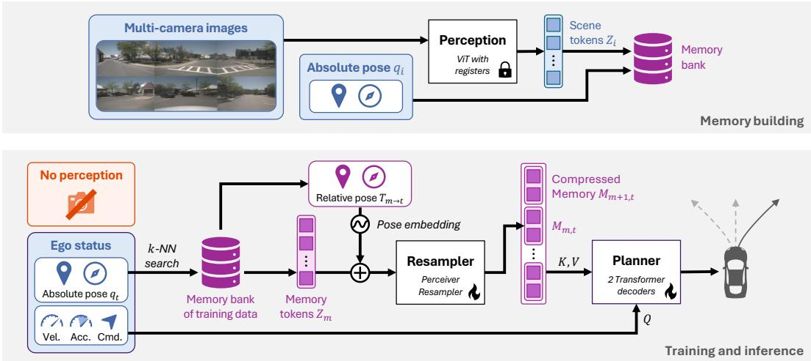  
Figure 2: Method overview. Previous camera-based traversals are encoded and stored in a poseindexed memory bank. At query time, MemoryDrivoR removes online perception of the evaluated scene, retrieves nearby memories using the current pose, adds a relative-pose embedding, and passes the compressed memory tokens to the unchanged DrivoR planner.

Retrieval. At query frame t, MemoryDrivoR uses the current ego pose $q _ { t }$ to run a nearest-neighbor search over the stored bank poses. The retrieval operator returns up to k memories from eligible previous traversals whose stored positions lie within a radius $r ,$ ranked by their distance. To ensure diversity, we select at most one memory from each traversal. We denote the returned indices by $\mathcal { N } ( t )$

Injection. Each retrieved memory is used as a latent representation from its original viewpoint, without geometric warping into the current camera view. Instead, we encode where the memory was observed relative to the current ego pose. For a pose $q _ { i } ,$ , let $T _ { i } \in S E ( 2 )$ be its homogeneous transform. For a memory pose $q _ { m }$ and current pose $q _ { t }$ , we compute the relative transform as $T _ { m  t } = T _ { t } ^ { - 1 } T _ { m }$ A trainable pose embedder takes the flattened $T _ { m  t } ,$ normalizes the translation by a fixed range, applies a sinusoidal encoding [37], and maps the result with a two-layer MLP to a c-dimensional embedding. The same pose embedding is then added to each memory token of $Z _ { m }$

A learned transformer-based resampler [2] compresses each pose-conditioned memory into a reduced set of ℓ memory tokens, which are then projected by a linear layer to produce the final memory $M _ { m , t }$ The resampler learns to filter out outdated dynamic information about the environment that would otherwise distract the planner (see App. A.6). We concatenate all compressed memories in $\mathcal { N } ( t )$ and use them as a substitute for the keys K and values V of the two transformer decoders inside the planner. If no memories are available, we skip the corresponding cross-attention layers. The downstream planner, including the trajectory decoder and scorer, is identical to the one from DrivoR.

Training. While the pose embedder and resampler are trained from scratch, we initialize the planner from pretrained DrivoR weights and fine-tune it on the memory tokens instead of camera-based tokens. MemoryDrivoR retains DrivoR’s supervised objectives: an imitation loss over candidate trajectories and binary cross-entropy scorer losses for subscores such as no-at-fault collision, drivable-area and driving-direction compliance, time-to-collision, progress, and comfort.

## 4 Experiments

We use MemoryDrivoR to audit two of the most widely adopted recent benchmarks in end-to-end driving [20], NAVSIM and Bench2Drive, and find markedly different demands for interaction. As supporting evaluations, we run the frozen NAVSIMv1 models on HUGSIM-nuScenes and RealEngine. We also ablate HD maps as an alternative to memory and additionally test for location overfitting.

## 4.1 Main Benchmarks

NAVSIMv1 [14] is a non-reactive simulation benchmark built on top of the OpenScene [42] redistribution of nuPlan [26], filtered to challenging scenarios. The agent is queried once on a real sensor frame and predicts a fixed 4 s trajectory, which is then evaluated with background actors replaying their recorded futures. It reports the Predictive Driver Model Score (PDMS), which combines multi plicative penalties of no at-fault collisions (NC) and drivable area compliance (DAC) with a weighted average of time to collision (TTC), ego progress (EP), and comfort (C).

NAVSIMv2 [7] extends this protocol with a pseudo-simulation stage: after the first rollout (Stage 1), the agent is re-evaluated on synthetic observations rendered around plausible future states with a 3D Gaussian Splatting [27] pipeline. In version 2, the surrounding traffic is reactive via the Intelligent Driver Model [52]. The headline metric is the extended PDM score (EPDMS), which adds lane keeping (LK), history comfort (HC), and extended comfort (EC) as weighted terms and driving direction compliance (DDC) and traffic light compliance (TLC) as multiplicative penalties.

Bench2Drive [23] is based on the CARLA [16] simulator. It provides a training set collected by a privileged expert across 12 towns and 23 weather conditions. The evaluation runs 220 routes with 5 routes per scenario. Unlike NAVSIM, it evaluates the agent fully in closed loop, with updated sensor input after each planning step. We report the two headline metrics, driving score (DS) and success rate (SR), along with the auxiliary subscores efficiency (Eff.) and comfort.

## 4.2 Implementation Details

Architecture. The 2-layer resampler compresses the n = 64 register tokens from the frozen DrivoR ViT-S, conditioned on the relative pose, into ℓ = 8 memory tokens. We ablate our pose embedder and resampler in App. A.5. The ego status is encoded into a single embedding and added to 64 learned trajectory queries. For NAVSIM, it concatenates the 2D ego velocity, 2D ego acceleration, and the 4D one-hot-encoded driving command. For Bench2Drive, we select only 1D speed and the 6D command.

Retrieval. MemoryDrivoR retrieves up to k = 10 nearest memories within a radius of r = 20 m. As NAVSIM does not provide absolute ego poses in the official benchmark, we add them to enable pose-based retrieval. The NAVSIM memory bank contains all samples from the standard navtrain split, while the Bench2Drive memory bank uses the larger Bench2Drive-Full training set to ensure coverage. App. B.1 reports retrieval statistics and additional Bench2Drive filters.

Training. For NAVSIM, we initialize MemoryDrivoR with the DrivoR weights and fine-tune it for 5 additional epochs, keeping all other hyperparameters, including the learning rate and batch size, unchanged. For Bench2Drive, we fine-tune for 20 epochs starting from our DrivoR reimplementation, since the original model was not evaluated on this benchmark. Details are provided in App. B.2.

Baselines. We compare MemoryDrivoR with the original camera-based DrivoR and with a no-camera DrivoR control, obtained by removing scene tokens from the planner. Concretely, we skip the cross-attention layers in both planner decoders, so trajectory proposal and scoring are conditioned only on the ego-status token. We also report leading camera-based end-to-end methods and simple baselines, including constant velocity and an ego status MLP.

## 4.3 Results

NAVSIMv1. The final results for NAVSIMv1 are shown in Tab. 1. With camera input removed, DrivoR already improves over the ego-status MLP, so the architecture accounts for part of the gap. When we add memory, MemoryDrivoR reaches a PDMS of 91.1, approaching the current camerabased state of the art. The result suggests that most NAVSIMv1 benchmark performance can be achieved from ego status and static information, not from direct access to the current traffic scene.

The DAC subscore changes least between DrivoR and MemoryDrivoR, consistent with memory preserving stable road geometry. However, even NC and TTC do not collapse despite their dependence on current actors. As demonstrated in Fig. 3, MemoryDrivoR drives generally more conservatively than DrivoR, especially at locations where dense traffic is likely. This helps to avoid collisions and reduce other noncompliant behavior as driving slower simply leads to fewer interactions over the evaluated 4 s horizon. Thus, the only substantial score reduction we measure is in ego progress.

Table 1: NAVSIMv1 navtest comparison with camera-based state-of-the-art methods.
<table><tr><td>Method</td><td>Venue</td><td colspan="2">Cam Mem</td><td>NC</td><td>DAC</td><td>TTC</td><td>C</td><td>EP</td><td>PDMS ↑</td></tr><tr><td>PDM-Closed‡ [13]</td><td>CoRL23</td><td colspan="2">privileged</td><td>94.6</td><td>99.8</td><td>86.9</td><td>99.9</td><td>89.9</td><td>89.1</td></tr><tr><td>Human driver [14]</td><td></td><td colspan="2"></td><td>100.0</td><td>100.0</td><td>100.0</td><td>99.9</td><td>87.5</td><td>94.8</td></tr><tr><td>UniAD8 [21]</td><td>CVPR23</td><td>V</td><td>X</td><td>97.8</td><td>91.9</td><td>92.9</td><td>100.0 78.8</td><td></td><td>83.4</td></tr><tr><td>LTFv6† [41]</td><td>CVPR26</td><td>√</td><td>X</td><td>97.5</td><td>95.4</td><td>93.8</td><td>100.0</td><td>80.9</td><td>86.4</td></tr><tr><td>DiffusionDrive† [35]</td><td>CVPR25</td><td>√</td><td>X</td><td>98.2</td><td>96.2</td><td>94.7</td><td>100.0</td><td>82.2</td><td>88.0</td></tr><tr><td>AutoVLA [66]</td><td>NeurIPS25</td><td>√</td><td>X</td><td>98.4</td><td>95.6</td><td>98.0</td><td>99.9</td><td>81.9</td><td>89.1</td></tr><tr><td>ReCogDrive [31]</td><td>ICLR26</td><td>√</td><td>X</td><td>97.9</td><td>97.3</td><td>94.9</td><td>100.0</td><td>87.3</td><td>90.8</td></tr><tr><td>DriveSuprim [57]</td><td>AAAI26</td><td>√</td><td>X</td><td>98.6</td><td>98.6</td><td>95.5</td><td>100.0 91.3</td><td></td><td>93.5</td></tr><tr><td>RAP-DINO† [19]</td><td>ICLR26</td><td>√</td><td>X</td><td>99.1</td><td>98.9</td><td>96.7</td><td>100.090.3</td><td></td><td>93.8</td></tr><tr><td>DrivoR [28]</td><td>CVPR26</td><td>√</td><td>X</td><td>99.0</td><td>98.9</td><td>96.7</td><td>100.0</td><td>90.0</td><td>93.7</td></tr><tr><td>Constant Velocity†</td><td></td><td>X</td><td>X</td><td>68.0</td><td>57.8</td><td>50.0</td><td>100.0</td><td>19.4</td><td>20.7</td></tr><tr><td>Ego Status MLP†</td><td></td><td>X</td><td>X</td><td>93.1</td><td>78.3</td><td>84.0</td><td>100.0 63.2</td><td></td><td>66.4</td></tr><tr><td>DrivoR</td><td></td><td>×</td><td>X</td><td>96.1</td><td>85.6</td><td>91.1</td><td>100.0</td><td>62.8</td><td>72.9</td></tr><tr><td>MemoryDrivoR (ours)</td><td></td><td>X</td><td>√</td><td>98.3</td><td>98.5</td><td>95.3</td><td>100.0</td><td>86.0</td><td>91.1</td></tr></table>

† Results from the public leaderboard [3]. ‡ Results from [32]. § Results from [14].  
Ego Ego + camera Ego + memory Human Nearest memory path

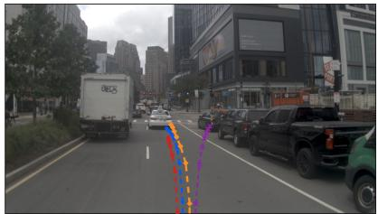  
(a) Current camera

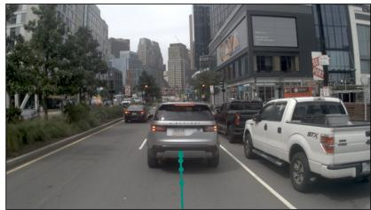  
(b) Retrieved memory

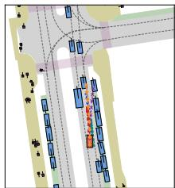  
(c) Paths  
Figure 3: Qualitative example. We compare the planner prediction based on different sources of information on a NAVSIMv1 lane change. The center image is associated with the closest retrieved memory for the current sample. Each point marks a 0.5 s waypoint. More examples in App. A.8.

We further investigated interesting scenes in which MemoryDrivoR stopped before a crosswalk or at a red traffic light. In most of those cases, the model already receives a braking signal from the initial ego status. Its memory of the static world, such as the crosswalk ahead, then provides the additional context needed to continue the braking. Since the evaluation horizon is short, the initial ego status is highly valuable to the model and already provides a cue about the anticipated maneuver.

The initial ego-status information, together with the defensive driving behavior, also explains the scenarios in which the model avoids collisions with a lead vehicle. In those cases, the ego-status baseline achieves similar performance even without memory, as static information is less important.

NAVSIMv2 preserves the same qualitative story, as shown in Tab. 2. Even without cameras, the stronger DrivoR architecture improves markedly over the ego-status MLP and approaches camerabased methods such as LTFv6 [41], a result that has not previously been shown. Adding memory brings it close to DrivoR and well above other recent camera-based methods. This remains true even though NAVSIMv2 is more realistic than NAVSIMv1, with reactive traffic and shifted Stage 2 starting points. The component scores are close to those of DrivoR, with slightly stronger results on metrics tied to static information. Again, the metrics most tied to dynamic information, such as collision and traffic-light compliance, do not substantially drop. The main tradeoff appears in ego progress.

Table 2: NAVSIMv2 navhard\_two\_stage comparison with camera-based methods.
<table><tr><td>Method</td><td rowspan="2">Cam Mem Stage</td><td rowspan="2"></td><td rowspan="2"></td><td>NC</td><td>DAC</td><td>DDC</td><td>TLC</td><td>EP</td><td></td><td>TTC</td><td>LK</td><td>HC EC</td><td>EPDMS↑</td></tr><tr><td></td><td>S1 94.4</td><td>98.8</td><td>100.0</td><td>99.5</td><td>100.0</td><td>93.5</td><td>99.3</td><td>87.7 36.0</td><td></td></tr><tr><td rowspan="2">PDM-Closed‡ [13]</td><td rowspan="2">privileged</td><td rowspan="2"></td><td>S2</td><td>90.5</td><td>90.6</td><td>95.4</td><td>98.4</td><td>100.0</td><td>86.6</td><td>674.2</td><td>91.9</td><td>29.7</td><td rowspan="2">56.6</td></tr><tr><td>S1</td><td>96.6</td><td>86.7</td><td>99.2</td><td>99.6</td><td>84.5</td><td>95.1</td><td>94.4</td><td>97.8 76.4</td><td>31.9</td></tr><tr><td rowspan="2">LTFv6† [41] RAP-DINO† [19]</td><td rowspan="2">√</td><td rowspan="2">X</td><td>S2</td><td>79.9</td><td>75.6</td><td>86.3</td><td>97.9</td><td>89.6</td><td></td><td>76.1 50.1</td><td>95.2 66.7</td><td></td><td rowspan="2"></td></tr><tr><td>S1</td><td>97.1</td><td>94.4</td><td>98.8</td><td>99.8</td><td>83.9</td><td>96.9</td><td></td><td>94.7 96.4 66.2</td><td></td></tr><tr><td rowspan="2">ZTRS† [33]</td><td rowspan="2">√</td><td rowspan="2">×</td><td>S2</td><td>83.2</td><td>83.9</td><td>87.4</td><td>98.0</td><td>86.9</td><td>80.4 52.3</td><td></td><td>95.2 52.4</td><td></td><td rowspan="2">39.6</td></tr><tr><td>S1</td><td>98.9</td><td>97.6</td><td>100.0</td><td>100.0</td><td>66.7</td><td>98.9</td><td></td><td>96.2 96.7 44.0</td><td></td></tr><tr><td rowspan="2">DrivoR* [28]</td><td rowspan="2">√ √</td><td rowspan="2">X ×</td><td>S2</td><td>91.1</td><td>90.4</td><td>95.8</td><td>99.0</td><td>63.6</td><td>89.8</td><td></td><td>60.4 97.6 66.1</td><td></td><td rowspan="2">48.1</td></tr><tr><td>S1</td><td>99.3</td><td>95.8</td><td>99.3</td><td>99.8</td><td>73.5</td><td>99.3</td><td></td><td>94.2 97.6 70.7</td><td></td></tr><tr><td rowspan="2">Constant Velocity†</td><td rowspan="2">X</td><td rowspan="2">X</td><td>S2</td><td>89.8</td><td>86.4</td><td>90.8</td><td>98.3</td><td>71.3</td><td>88.2</td><td>51.8</td><td>99.0 76.8</td><td>46.7</td><td rowspan="2"></td></tr><tr><td>S1</td><td>88.9</td><td>42.9</td><td>70.7</td><td>99.3</td><td>77.5</td><td></td><td>87.3 78.7</td><td>97.1</td><td>60.4 11.5</td></tr><tr><td rowspan="2">Ego Status MLP†</td><td rowspan="2">X</td><td rowspan="2">×</td><td>S2</td><td>83.2</td><td>59.1</td><td>76.5</td><td>98.1</td><td>71.4</td><td></td><td>81.1 48.0</td><td>97.2 62.0</td><td></td><td rowspan="2"></td></tr><tr><td>S1</td><td>93.2</td><td>55.8</td><td>86.7</td><td>99.3</td><td>81.2</td><td>92.2</td><td>83.6</td><td>97.6 77.8</td><td></td><td>14.2</td></tr><tr><td rowspan="2">DrivoR</td><td rowspan="2"></td><td rowspan="2"></td><td>S2</td><td>77.2</td><td>51.9</td><td>74.4</td><td>98.3</td><td>77.1</td><td></td><td>75.1 40.9</td><td></td><td>97.8 79.9</td><td rowspan="2"></td></tr><tr><td>S1</td><td>95.4</td><td>72.2</td><td>93.7</td><td>100.0</td><td>67.4</td><td>94.4</td><td>83.8</td><td>97.6 68.4</td><td></td><td>28.3</td></tr><tr><td rowspan="2">MemoryDrivoR</td><td rowspan="2">X</td><td rowspan="2">×</td><td>S2</td><td>88.2</td><td>271.7</td><td>87.8</td><td>99.3</td><td>56.1</td><td></td><td>86.1 48.1</td><td></td><td>99.0 80.9</td><td rowspan="2"></td></tr><tr><td>S1</td><td>98.2</td><td>95.8</td><td>99.0</td><td>100.0</td><td>72.0</td><td>98.0</td><td></td><td>92.0 97.6 69.3</td><td></td><td>45.0</td></tr><tr><td>(ours)</td><td>×</td><td>r</td><td>S2</td><td>88.2</td><td>89.1</td><td>92.2</td><td>98.7</td><td>58.4</td><td></td><td></td><td>87.6 52.0 98.3 75.2</td><td></td><td></td></tr></table>

† Results from the public leaderboard [4]. ‡ Results from [7]. ∗ Results reproduced by us.

Bench2Drive. The Bench2Drive results are shown in Tab. 3, with the corresponding multi-ability breakdown and failure analysis in App. A.1. MemoryDrivoR substantially outperforms the no-camera baselines but remains far below the camera-based model and stronger planners. The routes successfully completed by MemoryDrivoR average about 110 m and 79 s. While still short compared to other CARLA benchmarks [44, 11, 8], this is far beyond the 4 s horizon evaluated in NAVSIMv1 and makes it more challenging to drive from memory alone. We evaluate collisions by distance traveled in App. A.2 and find that the performance gap between MemoryDrivoR and DrivoR widens as travel distance increases. In

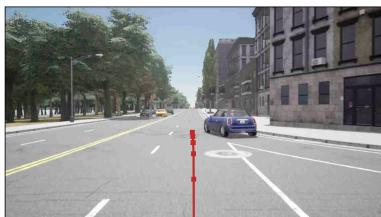  
Figure 4: Successes in Bench2Drive. In less complex HighwayCutIn scenarios, Memory DrivoR learns to slow down at the merge. Waypoints are shown at 0.5 s intervals.

contrast to NAVSIM, the initial ego status does not provide any meaningful information that could be exploited since each scenario starts with the vehicle standing still.

However, MemoryDrivoR still completes 21 of 220 routes without infractions. The most striking scenario type is the HighwayCutIn shown in Fig. 4, where the planner completes all five routes. Although another vehicle ahead merges from an on-ramp, the scene contains very few other agents overall and can be handled by always slowing down before the merge.

## 4.4 Additional Benchmarks

Furthermore, we test our NAVSIMv1 models on two additional photorealistic closed-loop benchmarks, namely HUGSIM-nuScenes [65] and RealEngine [25].

RealEngine provides a non-reactive open- and closed-loop evaluation of 14 NAVSIMv1 scenes. In addition, it executes 21 safety tests with synthetically inserted counterfactual actors and 28 multiagent interactions in which two instances of the evaluated planner model are deployed. The open-loop scores in Tab. 4 are consistent with our results on NAVSIM. However, in a true closed-loop setting, the gap between DrivoR and both no-camera baselines grows substantially, even though the evaluation uses the same short horizon. After the first planning step in closed loop, the initial ground-truth ego status is not available to the models anymore, since this information gets updated at each timestamp, leading to uncharted state spaces. An architecture that stores the historic status could prevent this. Moreover, the gap for MemoryDrivoR increases when RealEngine inserts additional actors. The collision-related metrics account for most of this loss.

Table 3: Bench2Drive closed-loop comparison with camera-based methods.
<table><tr><td>Method</td><td>Venue</td><td>Cam Mem</td><td></td><td>Eff.</td><td>Comfort</td><td>SR↑ DS ↑</td></tr><tr><td>Think2Drive† [29]</td><td>ECCV24</td><td>privileged</td><td></td><td>269.1</td><td>26.0</td><td>85.4 91.9</td></tr><tr><td>LEAD [41]</td><td>CVPR26</td><td>privileged</td><td></td><td></td><td>一</td><td>92.3 97.0</td></tr><tr><td>UniAD† [21]</td><td>CVPR23</td><td>√</td><td>X</td><td>129.2</td><td>43.6</td><td>16.4 45.8</td></tr><tr><td>RAP-ResNet [19]</td><td>ICLR26</td><td>√</td><td>X</td><td>165.5</td><td>23.6</td><td>37.3 66.4</td></tr><tr><td>ReCogDrive [31]</td><td>ICLR26</td><td>√</td><td>X</td><td>138.2</td><td>17.5</td><td>45.5 71.4</td></tr><tr><td>AutoVLA [66]</td><td>NeurIPS25</td><td>√</td><td>X</td><td>146.9</td><td>39.3</td><td>57.7 78.8</td></tr><tr><td>DriveSuprim [57]</td><td>AAAI26</td><td>√</td><td>X</td><td>238.8</td><td>20.9</td><td>60.0 83.0</td></tr><tr><td>SimLingo [46]</td><td>CVPR25</td><td>√</td><td>X</td><td>244.2</td><td>25.5</td><td>66.8 85.9</td></tr><tr><td>DrivoR* [28]</td><td>CVPR26</td><td>√</td><td>X</td><td>167.8</td><td>36.5</td><td>30.5 61.0</td></tr><tr><td>AD-MLP† [63]</td><td></td><td>X</td><td>X</td><td>48.5</td><td>22.6</td><td>0.0 18.1</td></tr><tr><td>DrivoR*</td><td></td><td>X</td><td>X</td><td>225.3</td><td>86.9</td><td>2.411.6</td></tr><tr><td>MemoryDrivoR (ours)</td><td></td><td>X</td><td>√</td><td>176.4</td><td>49.9</td><td>9.5 34.7</td></tr></table>

† Results from [56]. ∗ Results are based on our own implementation.

Table 4: RealEngine PDMS across evaluation protocols on NAVSIM scenes.
<table><tr><td>Method</td><td>Cam</td><td>LiDAR</td><td>Mem</td><td></td><td>Open-Loop ↑ Base Closed-Loop ↑</td><td></td><td>Safety test ↑ Multi-agent ↑</td></tr><tr><td>DiffusionDrive† [35]</td><td>√</td><td>V</td><td>X</td><td>69.5</td><td>61.3</td><td>53.8</td><td>51.9</td></tr><tr><td>DrivoR</td><td>√</td><td>X</td><td>X</td><td>86.6</td><td>88.2</td><td>53.8</td><td>63.9</td></tr><tr><td>Constant Velocity†</td><td>X</td><td>X</td><td>X</td><td>46.8</td><td>46.8</td><td>36.3</td><td>27.4</td></tr><tr><td>DrivoR</td><td>X</td><td>X</td><td>X</td><td>65.6</td><td>55.1</td><td>39.2</td><td>51.9</td></tr><tr><td>MemoryDrivoR (ours)</td><td>X</td><td>X</td><td>√</td><td>87.1</td><td>72.3</td><td>28.1</td><td>43.4</td></tr></table>

† Results from [25].

HUGSIM-nuScenes evaluates closed-loop episodes, which last up to 56 s in case of MemoryDrivoR. As shown in Tab. 5, MemoryDrivoR attains a HUGSIM driving score (HD-Score) of 32.2%, compared with 36.4% for the camera-based DrivoR. We do not observe a performance gap like in Bench2Drive or RealEngine. This may be because that the 87 scenarios in HUGSIM-nuScenes are derived from 12 mostly straight routes and therefore generally simple to solve. This result shows that MemoryDrivoR can compete with camera-based models even over longer evaluation horizons in closed loop when interaction with the dynamic world is limited. Further details are provided in App. A.3.

Table 5: HUGSIM-nuScenes 0-shot evaluation of the DrivoR models
<table><tr><td>Method</td><td></td><td>Cam MemHD-Score ↑</td></tr><tr><td>UniAD†</td><td>√ X</td><td>36.7</td></tr><tr><td>DrivoR</td><td>√ X</td><td>36.4</td></tr><tr><td>DrivoR</td><td>× ×</td><td>29.1</td></tr><tr><td>MemoryDrivoR</td><td>× √</td><td>32.2</td></tr></table>

† Trained on nuScenes.

## 4.5 Ablations

Would HD maps show the same effect? A natural question is whether an HD map could provide the same audit signal, similar in spirit to a centerline-based planner such as PDM-Open [13]. We treat this as a narrower baseline: unlike an HD map, memory can also encode coarse location-conditioned regularities such as typical crowdedness or recurring congestion. These remain priors rather than observations of the current scene.

Table 6: HD-map ablation for DrivoR inputs.
<table><tr><td>Input</td><td>NAVSIMv1 NAVSIMv2 PDMS ↑</td><td>EPDMS ↑</td></tr><tr><td>Ego + cameras</td><td>93.7</td><td>46.7</td></tr><tr><td>Ego</td><td>72.9</td><td>28.3</td></tr><tr><td>Ego + HD map</td><td>86.6</td><td>40.8</td></tr><tr><td>Ego + memory</td><td>91.1</td><td>45.0</td></tr></table>

Table 7: Geographical split results for DrivoR on held-out evaluation locations.  
(a) NAVSIMv2-Geo (Pittsburgh)
<table><tr><td>Training locations</td><td>EPDMS ↑</td></tr><tr><td>Original (all cities)</td><td>39.0</td></tr><tr><td>w/o Pittsburgh</td><td>42.7</td></tr></table>

(b) Bench2Drive-Geo (Town11+13)
<table><tr><td>Training locations</td><td>Eff.</td><td>Comfort</td><td>SR↑ DS ↑</td></tr><tr><td>Original (all cities)</td><td>155.8</td><td>36.6</td><td>24.1 61.0</td></tr><tr><td>w/o Town11+13</td><td>165.6</td><td>30.2</td><td>27.7 61.2</td></tr></table>

To examine the difference, we modify DrivoR to use HD-map inputs. We adapt the BERT-based vector encoder of PriorDrive [62] for nearby static map elements and their attributes. The resulting map tokens replace the camera-derived scene tokens used by the planner, analogously to our memory-token injection. For full implementation details and component results, we refer the reader to App. B.3.

The NAVSIM results are shown in Tab. 6. The map-baseline closes a substantial part of the gap to camera-based DrivoR, but remains below MemoryDrivoR. These results support the hypothesis that memory can capture richer static information and is therefore a better source for this kind of audit.

Does memorization explain performance? The preceding results show that high NAVSIM performance can be achieved from static information. This makes it important to rule out a more prosaic explanation: that the model was rewarded for memorizing test locations during training, rather than perceiving static scene information at test time. For NAVSIM and Bench2Drive, training and test overlap substantially. This leaves open the possibility that models may overfit to location-specific regularities already encoded in their weights, a failure mode documented in online mapping [60, 36].

We therefore run evaluations on both benchmarks using geographical subsets. In NAVSIMv2-Geo, we remove Pittsburgh samples from training, retaining approximately 80% of the original training set, and evaluate only on Pittsburgh scenarios, which constitute 40% of the original test. In Bench2Drive-Geo, we remove Town11 and Town13 from training, again retaining 80% of the original trainval set, and evaluate only on those towns, which constitute 25% of the original test set. The relevant comparison is therefore between camera-based DrivoR trained on the standard split and the same model trained on the geographical split. If performance were primarily caused by memorization of those locations, removing them from training should substantially reduce performance.

As shown in Tab. 7, we observe no such degradation. After removing the test locations from the training data, the overall benchmark score even increased slightly in both cases. For the DrivoR models evaluated here, this makes memorization of geography an unlikely primary explanation. Geographical splits therefore control for location memorization, but they do not fix the benchmark behavior exposed by our earlier experiments: a model evaluated on held-out geography can still perceive static information at test time.

## 5 Discussion

## 5.1 Interpretation

In both NAVSIM benchmarks we see that the recorded ego status reveals whether critical actions like braking are already initiated. Memory supplies the necessary road context, and the planner can then choose a conservative continuation. Although ego status is an intended input, over a short test horizon it can partly reveal the logged maneuver. High scores in collision- and traffic-light-related metrics therefore do not necessarily show that a model identified the current actors or signal states. And since our setting already reaches 91.1 PDMS on NAVSIMv1, the benchmark has little remaining score headroom to reward additional interaction capabilities.

In Bench2Drive, with the same underlying planner, removing access to dynamic information substantially lowers the final benchmark performance. This is the diagnostic gap our audit seeks to expose, and Bench2Drive moves toward it by evaluating closed-loop behavior over routes much longer than NAVSIM, a kind of test the research community should emphasize more. Its longer routes create more opportunities for collisions with other agents and reduce the dominant influence of the ego status. While NAVSIMv2 extends the evaluation horizon with simulated futures for an additional 4 s, those futures still start from rule-compliant waypoints with legitimate ego status. This reduces the chance that model errors compound into the kinds of closed-loop failures measured in Bench2Drive.

Since our HUGSIM-nuScenes results show that a long test horizon alone is insufficient, future benchmarks should also include counterfactual actors, as in RealEngine, to require necessary interactions and to better assess deployment-relevant driving capabilities.

## 5.2 Limitations

Our protocol assumes repeated traversals of the same locations and high relative pose accuracy across traversals. This precludes evaluation on benchmarks such as WOD-E2E [55], where poses are not provided. When absolute ego poses are available, however, a related audit could retrieve street-level views and encode them with the same perception backbone into latent memories, following the spatial retrieval paradigm of Jia et al. [24]. Such a variant would extend the audit to datasets without repeated logged traversals, while shifting the main caveats to pose alignment and domain gap. To test whether our approach can be applied to benchmarks with less precise localization or fewer traversals, App. A.4 provides a sensitivity test. The results suggest that MemoryDrivoR remains useful under consumer-grade pose accuracy and with fewer traversals, albeit with a weaker diagnostic signal.

## 6 Conclusion

We introduced MemoryDrivoR as a new approach for auditing end-to-end driving benchmarks by substituting camera input from the evaluated scene with memory from previous drives. On NAVSIM, this setup achieves surprisingly high performance, competitive with leading camera-based methods despite relying only on ego status and static environmental information. The Bench2Drive result qualifies this finding. There, evaluation runs over longer closed-loop routes with scenarios designed around traffic interactions, and the same intervention becomes much less successful.

Importantly, MemoryDrivoR does not establish the limit of what ego status and static information can support. Future work with better retrieval, richer memory representations, and more capable planner architectures could make it a sharper tool for benchmark auditing.

## References

[1] 3DRealCar Contributors. 3DRealCar toolkit repository and dataset license statement. https: //github.com/xiaobiaodu/3DRealCar\_Toolkit, 2026. Accessed August 28, 2026.

[2] Jean-Baptiste Alayrac, Jeff Donahue, Pauline Luc, Antoine Miech, Iain Barr, Yana Hasson, Karel Lenc, Arthur Mensch, Katherine Millican, Malcolm Reynolds, Roman Ring, Eliza Rutherford, Serkan Cabi, Tengda Han, Zhitao Gong, Sina Samangooei, Marianne Monteiro, Jacob Menick, Sebastian Borgeaud, Andrew Brock, Aida Nematzadeh, Sahand Sharifzadeh, Mikolaj Binkowski, Ricardo Barreira, Oriol Vinyals, Andrew Zisserman, and Karen Simonyan. Flamingo: A visual language model for few-shot learning. In Advances in Neural Information Processing Systems (NeurIPS), 2022.

[3] Autonomous Grand Challenge. NAVSIM v1 Navtest end-to-end driving leaderboard. https: //huggingface.co/spaces/AGC2024-P/e2e-driving-navtest, 2024. Public leaderboard on Hugging Face, accessed April 22, 2026.

[4] Autonomous Grand Challenge. NAVSIM v2 NavHard end-to-end driving leaderboard. https: //huggingface.co/spaces/AGC2025/e2e-driving-navhard, 2025. Public leaderboard on Hugging Face, accessed April 22, 2026.

[5] Bench2Drive Contributors. Bench2Drive repository and license statement. https://github.com/ Thinklab-SJTU/Bench2Drive, 2026. Accessed May 6, 2026.

[6] Holger Caesar, Varun Bankiti, Alex H. Lang, Sourabh Vora, Venice Erin Liong, Qiang Xu, Anush Krishnan, Yu Pan, Giancarlo Baldan, and Oscar Beijbom. nuScenes: A multimodal dataset for autonomous driving. In Proceedings of the IEEE/CVF Conference on Computer Vision and Pattern Recognition (CVPR), 2020.

[7] Wei Cao, Marcel Hallgarten, Tianyu Li, Daniel Dauner, Xunjiang Gu, Caojun Wang, Yakov Miron, Marco Aiello, Hongyang Li, Igor Gilitschenski, Boris Ivanovic, Marco Pavone, Andreas Geiger, and Kashyap Chitta. Pseudo-simulation for autonomous driving. In Proceedings of the Conference on Robot Learning (CoRL), 2025.

[8] CARLA Autonomous Driving Leaderboard. CARLA leaderboard 2.0: Evaluation criteria. https://leaderboard.carla.org/evaluation\_v2\_0/, 2025. Accessed May 6, 2026.

[9] CARLA Simulator Contributors. CARLA 0.9.15 release. https://github.com/carla-simulator/ carla/releases/tag/0.9.15, 2023. Accessed May 6, 2026.

[10] CARLA Simulator Contributors. CARLA 0.9.15 repository license statement. https://github. com/carla-simulator/carla/tree/0.9.15, 2026. Accessed May 6, 2026.

[11] Kashyap Chitta, Aditya Prakash, Bernhard Jaeger, Zehao Yu, Katrin Renz, and Andreas Geiger. TransFuser: Imitation with transformer-based sensor fusion for autonomous driving. IEEE Transactions on Pattern Analysis and Machine Intelligence, 45(11):12878–12895, 2023.

[12] Timothée Darcet, Maxime Oquab, Julien Mairal, and Piotr Bojanowski. Vision transformers need registers. In International Conference on Learning Representations (ICLR), 2024.

[13] Daniel Dauner, Marcel Hallgarten, Andreas Geiger, and Kashyap Chitta. Parting with misconceptions about learning-based vehicle motion planning. In Proceedings ofthe Conference on Robot Learning (CoRL), 2023.

[14] Daniel Dauner, Marcel Hallgarten, Tianyu Li, Xinshuo Weng, Zhiyu Huang, Zetong Yang, Hongyang Li, Igor Gilitschenski, Boris Ivanovic, Marco Pavone, Andreas Geiger, and Kashyap Chitta. NAVSIM: Data-driven non-reactive autonomous vehicle simulation and benchmarking. In Advances in Neural Information Processing Systems (NeurIPS), Datasets and Benchmarks Track, 2024.

[15] Jacob Devlin, Ming-Wei Chang, Kenton Lee, and Kristina Toutanova. BERT: Pre-training of deep bidirectional transformers for language understanding. In Proceedings ofthe North American Chapter ofthe Associationfor Computational Linguistics: Human Language Technologies (NAACL-HLT), 2019.

[16] Alexey Dosovitskiy, German Ros, Felipe Codevilla, Antonio Lopez, and Vladlen Koltun. CARLA: An open urban driving simulator. In Proceedings of the Conference on Robot Learning (CoRL), 2017.

[17] DrivoR Contributors. DrivoR repository, model weights, and license statement. https://github. com/valeoai/DrivoR, 2026. Accessed May 6, 2026.

[18] Yuheng Du, Sheng Yang, Lingxuan Wang, Zhenghua Hou, Chengying Cai, Zhitao Tan, Mingxia Chen, Shi-Sheng Huang, and Qiang Li. RTMap: Real-time recursive mapping with change detection and localization. In Proceedings of the IEEE/CVF International Conference on Computer Vision (ICCV), 2025.

[19] Lan Feng, Yang Gao, Éloi Zablocki, Quanyi Li, Wuyang Li, Sichao Liu, Matthieu Cord, and Alexandre Alahi. RAP: 3D rasterization augmented end-to-end planning. In International Conference on Learning Representations (ICLR), 2026.

[20] Tianshuai Hu, Xiaolu Liu, Song Wang, Yiyao Zhu, Ao Liang, Lingdong Kong, Guoyang Zhao, Zeying Gong, Jun Cen, Zhiyu Huang, Xiaoshuai Hao, Linfeng Li, Hang Song, Xiangtai Li, Jun Ma, Shaojie Shen, Jianke Zhu, Dacheng Tao, Ziwei Liu, and Junwei Liang. Visionlanguage-action models for autonomous driving: Past, present, and future. arXiv preprint arXiv:2512.16760, 2025.

[21] Yihan Hu, Jiazhi Yang, Li Chen, Keyu Li, Chonghao Sima, Xizhou Zhu, Siqi Chai, Senyao Du, Tianwei Lin, Wenhai Wang, Lewei Lu, Xiaosong Jia, Qiang Liu, Jifeng Dai, Yu Qiao, and Hongyang Li. Planning-oriented autonomous driving. In Proceedings ofthe IEEE/CVF Conference on Computer Vision and Pattern Recognition (CVPR), 2023.

[22] HUGSIM Contributors. HUGSIM repository and license statement. https://github.com/ hyzhou404/HUGSIM, 2026. Accessed August 28, 2026.

[23] Xiaosong Jia, Zhenjie Yang, Qifeng Li, Zhiyuan Zhang, and Junchi Yan. Bench2Drive: Toward multi-ability benchmarking of closed-loop end-to-end autonomous driving. In Advances in Neural Information Processing Systems (NeurIPS), Datasets and Benchmarks Track, 2024.

[24] Xiaosong Jia, Chenhe Zhang, Yule Jiang, Songbur Wong, Zhiyuan Zhang, Chen Chen, Shaofeng Zhang, Xuanhe Zhou, Xue Yang, Junchi Yan, and Yu-Gang Jiang. Spatial retrieval augmented autonomous driving. In Proceedings of the IEEE/CVF Conference on Computer Vision and Pattern Recognition (CVPR), 2026.

[25] Junzhe Jiang, Nan Song, Jingyu Li, Xiatian Zhu, and Li Zhang. RealEngine: Simulating autonomous driving in realistic context. arXiv preprint arXiv:2505.16902, 2025.

[26] Napat Karnchanachari, Dimitris Geromichalos, Kok Seang Tan, Nanxiang Li, Christopher Eriksen, Shakiba Yaghoubi, Noushin Mehdipour, Gianmarco Bernasconi, Whye Kit Fong, Yiluan Guo, and Holger Caesar. Towards learning-based planning: The nuPlan benchmark for real-world autonomous driving. In Proceedings ofthe IEEE International Conference on Robotics and Automation (ICRA), 2024.

[27] Bernhard Kerbl, Georgios Kopanas, Thomas Leimkühler, and George Drettakis. 3D Gaussian splatting for real-time radiance field rendering. ACM Transactions on Graphics, 42(4):139:1– 139:14, 2023.

[28] Ellington Kirby, Alexandre Boulch, Yihong Xu, Yuan Yin, Gilles Puy, Éloi Zablocki, Andrei Bursuc, Spyros Gidaris, Renaud Marlet, Florent Bartoccioni, Anh-Quan Cao, Nermin Samet, Tuan-Hung Vu, and Matthieu Cord. Driving on registers. In Proceedings of the IEEE/CVF Conference on Computer Vision and Pattern Recognition (CVPR), 2026.

[29] Qifeng Li, Xiaosong Jia, Shaobo Wang, and Junchi Yan. Think2Drive: Efficient reinforcement learning by thinking in latent world model for quasi-realistic autonomous driving (in CARLAv2). In European Conference on Computer Vision (ECCV), 2024a.

[30] Yiming Li, Zehong Wang, Yue Wang, Zhiding Yu, Zan Gojcic, Marco Pavone, Chen Feng, and Jose M. Alvarez. Memorize what matters: Emergent scene decomposition from multitraverse. In Advances in Neural Information Processing Systems (NeurIPS), 2024b.

[31] Yongkang Li, Kaixin Xiong, Xiangyu Guo, Fang Li, Sixu Yan, Gangwei Xu, Lijun Zhou, Long Chen, Haiyang Sun, Bing Wang, Kun Ma, Guang Chen, Hangjun Ye, Wenyu Liu, and Xinggang Wang. ReCogDrive: A reinforced cognitive framework for end-to-end autonomous driving. In International Conference on Learning Representations (ICLR), 2026.

[32] Zhenxin Li, Kailin Li, Shihao Wang, Shiyi Lan, Zhiding Yu, Yishen Ji, Zhiqi Li, Ziyue Zhu, Jan Kautz, Zuxuan Wu, Yu-Gang Jiang, and Jose M. Alvarez. Hydra-MDP: End-to-end multimodal planning with multi-target Hydra-Distillation. arXiv preprint arXiv:2406.06978, 2024c.

[33] Zhenxin Li, Wenhao Yao, Zi Wang, Xinglong Sun, Jingde Chen, Nadine Chang, Maying Shen, Jingyu Song, Zuxuan Wu, Shiyi Lan, and Jose M. Alvarez. ZTRS: Zero-imitation end-to-end autonomous driving with trajectory scoring. arXiv preprint arXiv:2510.24108, 2025.

[34] Zhiqi Li, Zhiding Yu, Shiyi Lan, Jiahan Li, Jan Kautz, Tong Lu, and Jose M. Alvarez. Is ego status all you need for open-loop end-to-end autonomous driving? In Proceedings of the IEEE/CVF Conference on Computer Vision and Pattern Recognition (CVPR), 2024d.

[35] Bencheng Liao, Shaoyu Chen, Haoran Yin, Bo Jiang, Cheng Wang, Sixu Yan, Xinbang Zhang, Xiangyu Li, Ying Zhang, Qian Zhang, and Xinggang Wang. DiffusionDrive: Truncated diffusion model for end-to-end autonomous driving. In Proceedings of the IEEE/CVF Conference on Computer Vision and Pattern Recognition (CVPR), 2025.

[36] Adam Lilja, Junsheng Fu, Erik Stenborg, and Lars Hammarstrand. Localization is all you evaluate: Data leakage in online mapping datasets and how to fix it. In Proceedings of the IEEE/CVF Conference on Computer Vision and Pattern Recognition (CVPR), 2024.

[37] Ben Mildenhall, Pratul P. Srinivasan, Matthew Tancik, Jonathan T. Barron, Ravi Ramamoorthi, and Ren Ng. NeRF: Representing scenes as neural radiance fields for view synthesis. In European Conference on Computer Vision (ECCV), 2020.

[38] Motional. nuScenes dataset terms. https://www.nuscenes.org/terms-of-use, 2021. Accessed August 28, 2026.

[39] Motional. nuPlan devkit repository and license statement. https://github.com/motional/ nuplan-devkit, 2026. Accessed May 6, 2026.

[40] NAVSIM Contributors. NAVSIM repository and license statement. https://github.com/ autonomousvision/navsim, 2026. Accessed May 6, 2026.

[41] Long Nguyen, Micha Fauth, Bernhard Jaeger, Daniel Dauner, Maximilian Igl, Andreas Geiger, and Kashyap Chitta. LEAD: Minimizing learner-expert asymmetry in end-to-end driving. In Proceedings ofthe IEEE/CVF Conference on Computer Vision and Pattern Recognition (CVPR), 2026.

[42] OpenScene Contributors. OpenScene: The largest up-to-date 3D occupancy prediction benchmark in autonomous driving. https://github.com/OpenDriveLab/OpenScene, 2023.

[43] OpenScene Contributors. OpenScene repository and license statement. https://github.com/ OpenDriveLab/OpenScene, 2026. Accessed May 6, 2026.

[44] Aditya Prakash, Kashyap Chitta, and Andreas Geiger. Multi-modal fusion transformer for end-to-end autonomous driving. In Proceedings of the IEEE/CVF Conference on Computer Vision and Pattern Recognition (CVPR), 2021.

[45] RealEngine Contributors. RealEngine repository and license statement. https://github.com/ fudan-zvg/RealEngine, 2026. Accessed August 28, 2026.

[46] Katrin Renz, Long Chen, Elahe Arani, and Oleg Sinavski. SimLingo: Vision-only closedloop autonomous driving with language-action alignment. In Proceedings ofthe IEEE/CVF Conference on Computer Vision and Pattern Recognition (CVPR), 2025.

[47] SJTU ReThinkLab. Bench2Drive-Full dataset card. https://huggingface.co/datasets/rethinklab/ Bench2Drive-Full, 2026a. Accessed May 6, 2026.

[48] SJTU ReThinkLab. Bench2Drive dataset card. https://huggingface.co/datasets/rethinklab/ Bench2Drive, 2026b. Accessed May 6, 2026.

[49] Street Gaussians Contributors. Street Gaussians license statement. https://github.com/zju3dv/ street\_gaussians/blob/main/LICENSE, 2026. Accessed August 28, 2026.

[50] Pei Sun, Henrik Kretzschmar, Xerxes Dotiwalla, Aurelien Chouard, Vijaysai Patnaik, Paul Tsui, James Guo, Yin Zhou, Yuning Chai, Benjamin Caine, Vijay Vasudevan, Wei Han, Jiquan Ngiam, Hang Zhao, Aleksei Timofeev, Scott Ettinger, Maxim Krivokon, Amy Gao, Aditya Joshi, Sheng Zhao, Shuyang Cheng, Yu Zhang, Jonathon Shlens, Zhifeng Chen, and Dragomir Anguelov. Scalability in perception for autonomous driving: Waymo Open Dataset. In Proceedings ofthe IEEE/CVF Conference on Computer Vision and Pattern Recognition (CVPR), 2020.

[51] Matthew Tancik, Pratul P. Srinivasan, Ben Mildenhall, Sara Fridovich-Keil, Nithin Raghavan, Utkarsh Singhal, Ravi Ramamoorthi, Jonathan T. Barron, and Ren Ng. Fourier features let networks learn high frequency functions in low dimensional domains. In Advances in Neural Information Processing Systems (NeurIPS), 2020.

[52] Martin Treiber, Ansgar Hennecke, and Dirk Helbing. Congested traffic states in empirical observations and microscopic simulations. Physical Review E, 62(2):1805–1824, 2000.

[53] X-Dimensional Representations Lab. HUGSIM dataset card. https://huggingface.co/datasets/ XDimLab/HUGSIM, 2026. Accessed August 28, 2026.

[54] Xuan Xiong, Yicheng Liu, Tianyuan Yuan, Yue Wang, Yilun Wang, and Hang Zhao. Neural map prior for autonomous driving. In Proceedings ofthe IEEE/CVF Conference on Computer Vision and Pattern Recognition (CVPR), 2023.

[55] Runsheng Xu, Hubert Lin, Wonseok Jeon, Hao Feng, Yuliang Zou, Liting Sun, John Gorman, Kate Tolstaya, Sarah Tang, Brandyn White, Ben Sapp, Mingxing Tan, Jyh-Jing Hwang, and Dragomir Anguelov. WOD-E2E: Waymo Open Dataset for end-to-end driving in challenging long-tail scenarios. In Proceedings of the IEEE/CVF Conference on Computer Vision and Pattern Recognition (CVPR), 2026.

[56] Zhenjie Yang, Xiaosong Jia, Qifeng Li, Xue Yang, Maoqing Yao, and Junchi Yan. Raw2Drive: Reinforcement learning with aligned world models for end-to-end autonomous driving (in CARLA v2). In Advances in Neural Information Processing Systems (NeurIPS), 2025.

[57] Wenhao Yao, Zhenxin Li, Shiyi Lan, Zi Wang, Xinglong Sun, Jose M. Alvarez, and Zuxuan Wu. DriveSuprim: Towards precise trajectory selection for end-to-end planning. In Proceedings of the AAAI Conference on Artificial Intelligence, 2026.

[58] Kyuhwan Yeon, Benjamin Ramtoula, and Daniele De Martini. PriorEye: Geospatial visual priors for end-to-end autonomous driving. In European Conference on Computer Vision (ECCV), 2026.

[59] Yurong You, Katie Z. Luo, Xiangyu Chen, Junan Chen, Wei-Lun Chao, Wen Sun, Bharath Hariharan, Mark Campbell, and Kilian Q. Weinberger. Hindsight is 20/20: Leveraging past traversals to aid 3D perception. In International Conference on Learning Representations (ICLR), 2022.

[60] Tianyuan Yuan, Yicheng Liu, Yue Wang, Yilun Wang, and Hang Zhao. StreamMapNet: Streaming mapping network for vectorized online HD map construction. In Proceedings ofthe IEEE/CVF Winter Conference on Applications ofComputer Vision (WACV), 2024a.

[61] Tianyuan Yuan, Yucheng Mao, Jiawei Yang, Yicheng Liu, Yue Wang, and Hang Zhao. PreSight: Enhancing autonomous vehicle perception with city-scale NeRF priors. In European Conference on Computer Vision (ECCV), 2024b.

[62] Shuang Zeng, Xinyuan Chang, Xinran Liu, Yujian Yuan, Shiyi Liang, Zheng Pan, Mu Xu, and Xing Wei. PriorDrive: Enhancing online HD mapping with unified vector priors. In Proceedings ofthe AAAI Conference on Artificial Intelligence, 2026.

[63] Jiang-Tian Zhai, Ze Feng, Jinhao Du, Yongqiang Mao, Jiang-Jiang Liu, Zichang Tan, Yifu Zhang, Xiaoqing Ye, and Jingdong Wang. Rethinking the open-loop evaluation of end-to-end autonomous driving in nuScenes. arXiv preprint arXiv:2305.10430, 2023.

[64] Brady Zhou and Philipp Krähenbühl. Compressed map priors for 3D perception. arXiv preprint arXiv:2601.00139, 2026.

[65] Hongyu Zhou, Longzhong Lin, Jiabao Wang, Yichong Lu, Dongfeng Bai, Bingbing Liu, Yue Wang, Andreas Geiger, and Yiyi Liao. HUGSIM: A real-time, photo-realistic and closedloop simulator for autonomous driving. IEEE Transactions on Pattern Analysis and Machine Intelligence, 48(4):4673–4691, 2026.

[66] Zewei Zhou, Tianhui Cai, Seth Z. Zhao, Yun Zhang, Zhiyu Huang, Bolei Zhou, and Jiaqi Ma. AutoVLA: A vision-language-action model for end-to-end autonomous driving with adaptive reasoning and reinforcement fine-tuning. In Advances in Neural Information Processing Systems (NeurIPS), 2025.

## Appendix Overview

This appendix collects supporting material for the discussion in the main paper. It reports additional results, including an analysis of specific failure scenarios, component ablations, and extra qualitative examples. It also provides implementation details for memory retrieval, the planner for Bench2Drive, and the HD-map baseline. It concludes with a discussion of societal impacts.

## A Additional Results

## A.1 Failure Analysis

Bench2Drive groups its 220 routes into five ability families: Merging, Overtaking, Emergency Brake, Give Way, and Traffic Sign. Tab. 8 reports the corresponding scores for the methods considered above whenever per-family results are available. Removing camera input lowers performance across every ability family. Thus, even after separating routes by ability type, we do not find a category that can be solved from memory alone. MemoryDrivoR retains its strongest residual performance on Merging, consistent with the HighwayCutIn result in Fig. 4, where it completes all 5 routes.

Since those ability families are quite broad, we also grouped all 220 routes by disjoint interaction types. Tab. 9 reports success rates and driving scores for MemoryDrivoR and camera-based DrivoR. While MemoryDrivoR has a lower score for every interaction type, we see that its losses are concentrated in interactions that require observing the current scenario. Among the types with at least 25 routes, the largest gaps occur for pedestrians and cyclists, cut-ins and sudden obstacles, and traffic-controlled junctions. Specifically, MemoryDrivoR produces more pedestrian collisions, collisions in cut-in/hard braking scenarios, and red-light violations.

For NAVSIM, we group all 12,146 NAVSIMv1 scenes and 450 NAVSIMv2 scenes by self-derived multi-label interaction types using the ground-truth traffic state. As shown in Tab. 10, the largest gaps occur for lead vehicles on NAVSIMv1 and vehicle merges on NAVSIMv2, while the smallest gaps occur for vehicle merges on NAVSIMv1 and red lights on NAVSIMv2. However, in contrast to Bench2Drive, no interaction type in NAVSIM produces a clear separation in favor of DrivoR. This suggests that these interaction types do not consistently demand responses to the current dynamic scenario that are strong enough to distinguish the two planners.

## A.2 Controlled Evaluation Horizon

To quantify the influence of the evaluation horizon, we measure the ratio of routes where a model did not collide with any dynamic object as a function of the cumulative trajectory length per route. We use distance rather than time to avoid rewarding models that drive slowly. Fig. 5 shows the plot for Bench2Drive. The gap widens overall with distance traveled, showing that the longer the route, the more likely MemoryDrivoR is to collide with other traffic participants relative to DrivoR.

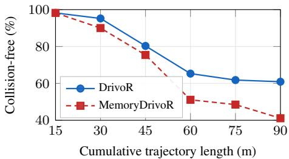  
Figure 5: Ratio of collision-free routes by traveled distance on Bench2Drive.

## A.3 Detailed HUGSIM Results

HUGSIM [65] is a photorealistic closed-loop simulator built from reconstructed real-world scenes with controllable traffic actors. Although it builds on four datasets, nuScenes is the only one with sufficient spatial overlap and pose information across traversals for our retrieval setup. HUGSIM requests a new plan every 0.25 seconds and terminates on collision, route deviation, completion, agent failure, or its step limit. We evaluate on all 87 nuScenes scenarios in HUGSIM based on the test protocol used by DrivoR. The full breakdown by difficulty can be found in Tab. 11.

## A.4 Sensitivity Tests

The main experiments use accurate global poses and k = 10 retrieved memories to isolate how much benchmark performance is achievable from static information alone. This setting gives the cleanest diagnostic, but the audit should also tolerate less accurate poses and fewer repeated traversals to be widely applicable. Fig. 6 probes this with two sensitivity tests. The first perturbs the poses used for memory construction and retrieval. The second restricts the number of retrieved memories.

Table 8: Bench2Drive multi-ability breakdown.
<table><tr><td>Method</td><td colspan="7">Cam. Mem. Merge Overtake Emerg. Brake Give Way Traf. Sign Mean ↑</td></tr><tr><td>Think2Drive‡ [29]</td><td>privileged</td><td></td><td>81.3</td><td>83.9</td><td>90.2</td><td>90.0</td><td>87.7 86.3</td></tr><tr><td>UniAD† [21]</td><td>√</td><td>X</td><td>14.1</td><td>17.8</td><td>21.7</td><td>10.0 14.2</td><td>15.6</td></tr><tr><td>ReCogDrive [31]</td><td>√</td><td>X</td><td>29.7</td><td>20.0</td><td>69.1 20.0</td><td>71.3</td><td>42.0</td></tr><tr><td>SimLingo [46]</td><td>√</td><td>X</td><td>60.0</td><td>60.0</td><td>78.3</td><td>50.0 77.9</td><td>65.3</td></tr><tr><td>DrivoR* [28]</td><td>V</td><td>X</td><td>20.0</td><td>17.7</td><td>50.0</td><td>50.0 40.5</td><td>35.7</td></tr><tr><td>AD-MLP† [63]</td><td>X</td><td>X</td><td>0.0</td><td>0.0</td><td>0.0</td><td>0.0 4.4</td><td>0.9</td></tr><tr><td>DrivoR*</td><td>X</td><td>X</td><td>5.6</td><td>0.0</td><td>0.0</td><td>0.0 9.6</td><td>3.0</td></tr><tr><td>MemoryDrivoR (ours)</td><td>X</td><td>√</td><td>13.8</td><td>6.7</td><td>11.7</td><td>0.0 13.2</td><td>9.0</td></tr></table>

† Results from [23]. ‡ Results are from [56]. ∗ Results are based on our own implementation.

Table 9: Bench2Drive failure analysis. We report success rate and driving score.
<table><tr><td rowspan="2">Interaction</td><td rowspan="2">#</td><td colspan="2">MemoryDrivoR</td><td colspan="2">DrivoR</td><td rowspan="2">ΔDS</td></tr><tr><td>SR</td><td>DS</td><td>SR</td><td>DS</td></tr><tr><td>Control loss due to poor road conditions</td><td>5</td><td>60.0</td><td>60.0</td><td>100.0</td><td>100.0</td><td>-40.0</td></tr><tr><td>Emergency-vehicle yielding</td><td>5</td><td>0.0</td><td>32.3</td><td>0.0</td><td>70.0</td><td>-37.7</td></tr><tr><td>Pedestrians and cyclists</td><td>30</td><td>3.3</td><td>28.2</td><td>36.7</td><td>64.5</td><td>-36.3</td></tr><tr><td>Cut-ins, hard braking, and sudden obstacles</td><td>25</td><td>28.0</td><td>47.8</td><td>68.0</td><td>82.0</td><td>-34.2</td></tr><tr><td>Signalized and traffic-controlled junctions</td><td>45</td><td>4.4</td><td>29.5</td><td>26.7</td><td>62.7</td><td>-33.2</td></tr><tr><td>Obstacle avoidance and lane borrowing</td><td>45</td><td>6.7</td><td>27.6</td><td>17.8</td><td>49.4</td><td>-21.8</td></tr><tr><td>Unsignalized junctions and turning conflicts 30</td><td></td><td>3.3</td><td>34.9</td><td>23.3</td><td>54.4</td><td>-19.5</td></tr><tr><td>Merging, flow crossing, and lane changes</td><td>35</td><td>11.4</td><td>43.2</td><td>20.0</td><td>54.6</td><td>-11.4</td></tr></table>

Inaccurate poses. For the pose-noise check, the perturbations are Gaussian and applied to both the current ego pose and the memory-bank poses at evaluation time. This simulates applying the audit with inaccurate localization data. We sweep the longitudinal standard deviation and adjust the lateral and yaw values linearly with the same ratio used by RTMap for localization-noise simulation [18]. The nominal noise-trained model was fine-tuned with (0.85, 0.75, 1.5) standard deviations for yaw, lateral, and longitudinal translation, respectively. The heavy-noise model used (1.7, 1.5, 3.0).

The pose-noise curves show that the audit does not collapse as soon as localization is imperfect. At the nominal noise level, which can be seen as consumer-grade accuracy, the same model falls to 86.9 PDMS, while noise-trained variants remain near 88–89 PDMS. Under the largest perturbation, noise training trades clean-pose performance for robustness: the heavy-noise model reaches 84.2 PDMS, compared with 78.5 for the clean-trained model. These scores remain well above DrivoR without cameras, so the diagnostic signal weakens but remains visible under moderate pose noise.

Fewer traversals. For the k-sensitivity check, we use the clean MemoryDrivoR checkpoint and keep the retrieval radius fixed at r = 20 m. Reducing k limits how much historical evidence is available to the planner at each query. The k = 0 point denotes the DrivoR control without cameras.

The k-sweep shows that the audit also does not require many retrieved memories per query. The main NAVSIMv1 gain appears as soon as one memory is available: k = 1 reaches 89.8 PDMS. Increasing k then gives smaller gains and saturates near 91.1 PDMS for k ≥ 6. This suggests that sparse historical coverage can still reveal whether a benchmark score is driven by persistent scene context rather than by observing the current scene.

Table 10: NAVSIM failure analysis by interaction type.
<table><tr><td>Benchmark</td><td>Interaction</td><td>#</td><td>MemoryDrivoR</td><td>DrivoR</td><td>∆</td></tr><tr><td rowspan="5">NAVSIMv1 PDMS ↑</td><td>Lead vehicle</td><td>5,409</td><td>90.7</td><td>93.4</td><td>-2.7</td></tr><tr><td>Dense traffic</td><td>5,915</td><td>91.2</td><td>93.6</td><td>-2.4</td></tr><tr><td>...</td><td></td><td></td><td></td><td></td></tr><tr><td>Bicyclist Vehicle merge</td><td>694 135</td><td>91.1</td><td>92.0</td><td>-0.9</td></tr><tr><td></td><td></td><td>92.2</td><td>91.5</td><td>+0.8</td></tr><tr><td rowspan="5">NAVSIMv2 EPDMS ↑</td><td>Vehicle merge</td><td>44</td><td>46.8</td><td>53.0</td><td>-6.2</td></tr><tr><td>Pedestrian</td><td>199</td><td>47.4</td><td>53.2</td><td>-5.8</td></tr><tr><td>... Traffic-signal scene</td><td>207</td><td>47.9</td><td>49.2</td><td></td></tr><tr><td></td><td></td><td></td><td></td><td>-1.3</td></tr><tr><td>Red light on route</td><td>98</td><td>49.9</td><td>50.3</td><td>-0.4</td></tr></table>

Table 11: HUGSIM-nuScenes HD-Score by difficulty. Brackets give scenario counts. Zero-shot evaluation of the DrivoR models trained on NAVSIMv1.
<table><tr><td>Method</td><td></td><td></td><td></td><td>Cam. Mem. Easy [12] Medium [33] Hard [19]</td><td>Extreme [23]</td><td>Overall [87]</td></tr><tr><td>UniAD†</td><td>V</td><td>X</td><td>75.9</td><td>46.4 29.9</td><td>7.9</td><td>36.7</td></tr><tr><td>DrivoR</td><td>√</td><td>X</td><td>84.6</td><td>18.0 32.0</td><td>41.1</td><td>36.4</td></tr><tr><td>DrivoR</td><td>X</td><td>X</td><td>59.2</td><td>19.7 22.1</td><td>32.4</td><td>29.1</td></tr><tr><td>MemoryDrivoR</td><td>X</td><td>√</td><td>83.6</td><td>19.0 17.1</td><td>36.9</td><td>32.2</td></tr></table>

† Trained on nuScenes.

## A.5 Component Ablation

We ablate the pose embedder and the resampler, the two main components of MemoryDrivoR, on NAVSIMv1 and report the numbers on the held-out validation set navval in Tab. 12. We optimized the retrieval settings for k, the maximum number of memories per sample, and the maximum search radius r, when no pose information is available or when no resampler is used. Relative-pose conditioning is the dominant factor: removing it keeps PDMS at 82.6 even when the resampler is enabled, while pose-aware retrieval raises performance to 88.4–88.9. The resampler adds a smaller gain on top of pose-aware retrieval.

Table 12: Ablation of the main components of our method on NAVSIMv1 navval.
<table><tr><td>r (m)</td><td>k</td><td>Pose Resampler PDMS</td><td></td><td>Δ</td></tr><tr><td>5</td><td>4</td><td>X</td><td>X 82.6</td><td></td></tr><tr><td>5</td><td>10</td><td>X</td><td>√ 82.6</td><td>+0.0</td></tr><tr><td>20</td><td>4</td><td>√</td><td>X 88.4</td><td>+5.8</td></tr><tr><td>20</td><td>10</td><td>√</td><td>√ 88.9</td><td>+6.3</td></tr></table>

## A.6 Role of the Resampler

To examine how much the resampler filters out dynamic information, we ran an additional probing experiment comparing its output with the original register tokens. As a compression baseline, we also reduced the register tokens using PCA.

For every memory sample, we rasterized a 64 m × 64 m area into a $3 2 \times 3 2$ bird’s-eye-view (BEV) grid. For each representation, we trained one decoder for six map classes (centerlines, lane dividers, drivable roadblocks, crosswalks, stop lines, and intersections) and another decoder for three object classes (vehicles, pedestrians, and bicycles). All decoders used 1,024 learned BEV queries, one crossattention layer, and a two-layer feed-forward block, while the input representations remained frozen. We trained 18 decoders in total (3 representations, 2 target sets, and 3 seeds) using class-weighted binary cross-entropy and AdamW (learning rate $3 . 0 \times 1 0 ^ { - 4 }$ , weight decay $1 0 ^ { - 4 }$ , batch size 32, up to 20 epochs, and early stopping after five epochs). We constructed a probe dataset from NAVSIMv1- Geo by sampling 12,000 training frames and 2,000 validation frames from non-Pittsburgh drives, along with 4,000 test frames from Pittsburgh drives. The memories come from our model trained on the standard NAVSIMv1 split, while the decoders and PCA used this geographical split.

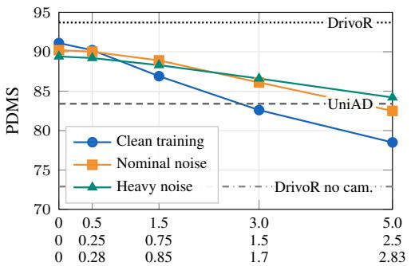  
Noise std. (lon. [m] / lat. [m] / yaw [◦])

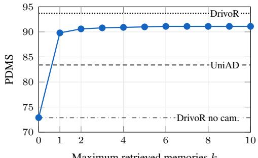  
Maximum retrieved memories k  
Figure 6: Sensitivity tests for MemoryDrivoR on NAVSIMv1. Left: pose-noise robustness. The three x-axis rows report longitudinal, lateral, and yaw noise standard deviations during evaluation. Right: sensitivity to the maximum number of retrieved memories. The labeled horizontal reference lines show DrivoR, UniAD, and the no-camera DrivoR baseline.

We report the results in Tab. 13. Map prediction changes little after the resampler. The average precision (AP) decreases by 0.54 points and the intersection over union (IoU) by 0.17 points. The drop is larger for agents, where AP decreases by 2.94 points and IoU by 2.30 points. PCA removes less agent information while losing more map information. The experiment therefore supports our hypothesis that the resampler keeps static information while reducing information about agents observed during previous drives.

Table 13: Probing memory.
<table><tr><td rowspan="2">Representation Tokens</td><td rowspan="2"></td><td colspan="2">Map</td><td colspan="2">Agent</td></tr><tr><td>AP</td><td>IoU</td><td>AP</td><td>IoU</td></tr><tr><td>Raw memory</td><td>64</td><td>49.7</td><td>34.1</td><td>10.9</td><td>7.8</td></tr><tr><td>PCA</td><td>8</td><td>48.1</td><td>33.2</td><td>9.3</td><td>6.5</td></tr><tr><td>Resampled</td><td>8</td><td>49.1</td><td>33.9</td><td>7.9</td><td>5.5</td></tr></table>

## A.7 Fusing Camera with Memory

For completeness, Tab. 14 reports a fusion ablation, where we do not remove the current camera input. Instead, we concatenate retrieved memory tokens with tokens from the evaluated scene and add a learned source flag so that the planner can distinguish memory from current camera input. During training, we drop all current-scene tokens of a sample with probability p = 0.2, encouraging the model to use memory when making predictions. If no memory tokens are available for such a sample, the planner skips its cross-attention layers.

The results can be seen as an upper bound for our chosen DrivoR-based planner, where both dynamic and static information are available. The effect of fusion is small across benchmarks, especially compared with the memory gains from the main audits.

## A.8 Qualitative Examples

Fig. 7 shows additional NAVSIMv1 cases comparing MemoryDrivoR with DrivoR and its control without cameras. The examples illustrate that MemoryDrivoR often slows down where dense traffic is likely, but can be more progressive when the retrieved scene suggests less congestion.

Table 14: Camera and memory fusion ablation across benchmarks.
<table><tr><td>Input</td><td>NAVSIMv1 PDMS ↑</td><td>NAVSIMv2 EPDMS ↑</td><td>Bench2Drive DS↑</td><td>Bench2Drive SR↑</td></tr><tr><td>Mem.</td><td>91.1</td><td>45.0</td><td>34.7</td><td>9.5</td></tr><tr><td>Cam.</td><td>93.7</td><td>46.7</td><td>61.0</td><td>30.5</td></tr><tr><td>Cam. + Mem.</td><td>93.7</td><td>47.3</td><td>63.2</td><td>33.6</td></tr></table>

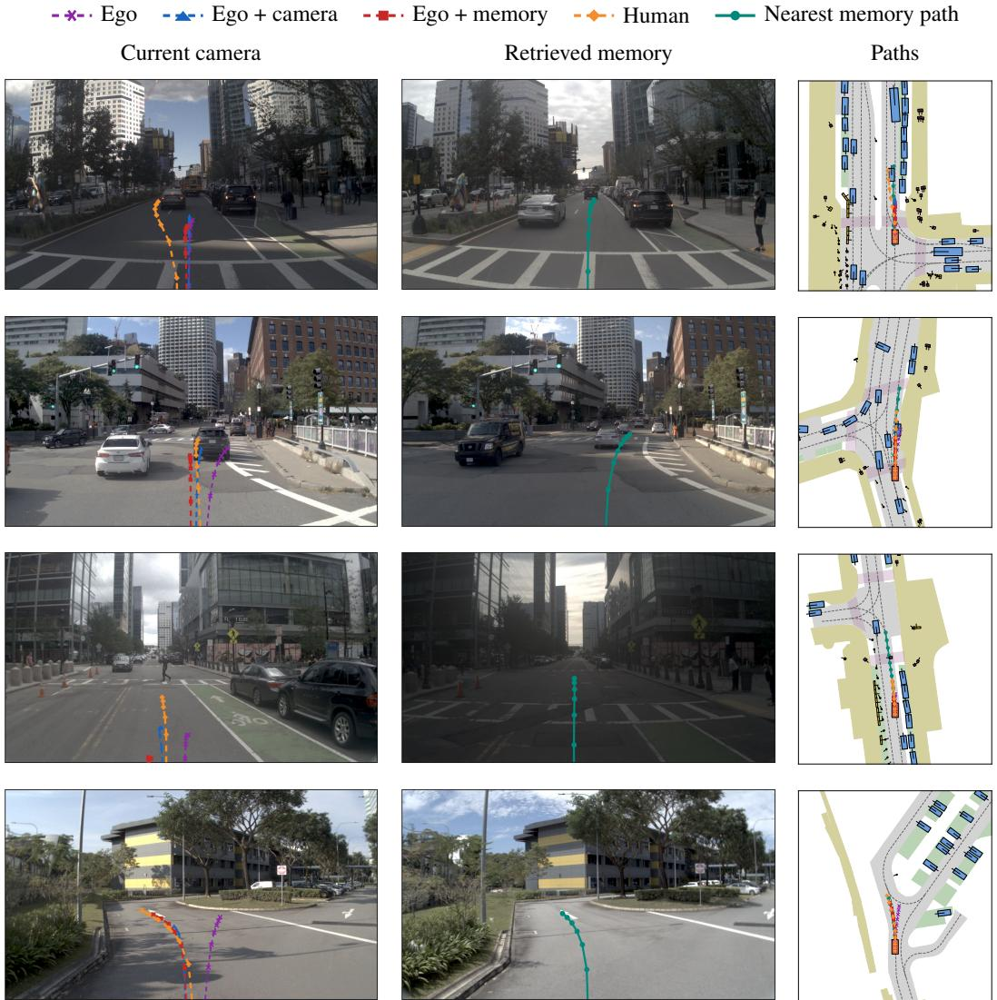  
Figure 7: Additional examples comparing DrivoR inputs on NAVSIMv1. Each row follows the format of Fig. 3: the left panel shows the evaluated scene, the middle panel shows the closest retrieved memory, and the right panel overlays ego-only, camera-based, memory-based, and human-reference trajectories over the tested horizon. Compared with the camera-based model, MemoryDrivoR tends to drive more conservatively in locations where dense traffic is expected, but can make more progress in less crowded locations.

## B Additional Implementation Details

## B.1 Memory Retrieval

For both NAVSIM versions, we construct the memory bank from all samples in the standard training split, navtrain. The complete bank occupies only 6.3 GB across all four cities combined, which is smaller than the checkpoints of tested vision-language-action models such as AutoVLA [66] and ReCogDrive [31]. Most retrieved memories come from drives recorded several weeks before or after the evaluated sample, as shown in Fig. 8.

The standard Bench2Drive training set has sparser repeated-location coverage than NAVSIM, so we build the memory bank from the Bench2Drive-Full training dataset containing 10 times more drives. Because the dataset is sampled at 10 Hz, we subsample before storage and keep a memory only after the ego vehicle has moved at least 1.5 m or after 5 s has elapsed. We also exclude extreme weather and low-light conditions by filtering the bank to Bench2Drive training scenes with weather IDs {0–3, 5–7, 15, 18, 26}. After these filters, the Bench2Drive bank occupies 21.2 GB across all 12 towns. Fig. 9 reports the average number of retrieved memories for both benchmarks.

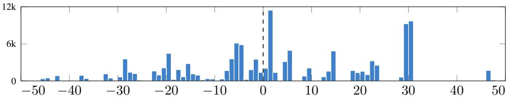  
Figure 8: Distribution of relative timestamps in days for all retrieved memories in NAVSIMv1 navtest. Negative values indicate memories from future training samples.

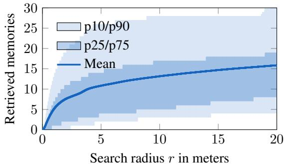  
(a) NAVSIMv1 navtest (bank: navtrain)

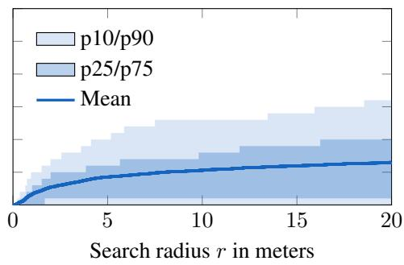  
(b) Bench2Drive (bank: Bench2Drive-Full)  
Figure 9: Memory retrieval. Average number of memories retrieved per test sample within a search radius r. Bands show the 10th/90th and 25th/75th percentiles. Bank denotes the data split used for the memory bank. Bench2Drive numbers can vary because evaluation is closed loop.

## B.2 DrivoR Implementation for Bench2Drive

For training with Bench2Drive, we keep DrivoR’s proposal-based planner and loss structure, but replace the NAVSIM simulation-based target scores with simpler non-reactive geometric targets for the same score heads. Unlike NAVSIM, these targets do not include driving-direction compliance.

As with NAVSIM, the model predicts 64 candidate trajectories, each represented by 6 waypoints over a 3 s horizon. The vision-based model also uses four RGB cameras: front, front-left, front-right, and rear. The trajectory loss is a best-of-64 L1 imitation loss on the predicted trajectories. Score heads are trained with binary cross-entropy losses for no-collision, drivable-area compliance, time-to-collision, ego progress, and comfort.

For MemoryDrivoR and the DrivoR baseline without camera, the internal trajectory score often chose stationary trajectories, i.e., the ego vehicle never started to drive. We therefore use progress-only proposal selection, setting the subscore weights of all other components to zero. This changes only the model’s trajectory selection, not the closed-loop Bench2Drive evaluation metric. It improves the driving score from 0.5 to 11.6 for ego-status DrivoR and from 26.6 to 34.7 for MemoryDrivoR. For camera-based DrivoR, this did not improve performance, so we kept the original subscore weights.

We train the DrivoR base model for 20 epochs with AdamW, a global batch size of 64, and a learning rate of $1 0 ^ { - 4 }$ . For the memory-based fine-tuning, we use the same settings. For full reproducibility, we refer the reader to our code.

## B.3 HD-Map Baseline

For the HD-map baseline, we represent the static map from nuPlan [26] as a set of vector instances around the ego vehicle. Lane and lane-connector objects are decomposed into centerline, leftboundary, and right-boundary polylines. We also include static polygonal elements such as stop lines, crosswalks, intersections, roadblocks, roadblock connectors, walkways, and car-park areas. Each map instance is transformed into the ego frame and uniformly sampled to a fixed number of points.

Table 15: Full NAVSIMv1 HD-map results compared with other DrivoR inputs.
<table><tr><td>Input NC</td><td>DAC TTC C</td><td>EP</td><td>PDMS↑</td></tr><tr><td>Ego + cameras 99.0</td><td>98.9 96.7 100.0</td><td>90.0</td><td>93.7</td></tr><tr><td>Ego 96.1</td><td>85.6 91.1</td><td>100.0 62.8</td><td>72.9</td></tr><tr><td>Ego + HD map 97.9</td><td>96.3 94.4</td><td>100.0 79.2</td><td>86.6</td></tr><tr><td>Ego + memory</td><td>98.3 98.5 95.3</td><td>100.0 86.0</td><td>91.1</td></tr></table>

Table 16: Full NAVSIMv2 HD-map results compared with other DrivoR inputs.
<table><tr><td>Input</td><td>Stage</td><td>NC</td><td>DAC</td><td>DDC</td><td>TLC EP</td><td>TTC</td><td>LK HC</td><td>EC</td><td>EPDMS ↑</td></tr><tr><td>Ego + cameras</td><td>S1</td><td>99.3</td><td>95.8</td><td>99.3</td><td>99.8</td><td>73.5 99.3</td><td>94.2</td><td>97.6 70.7</td><td>46.7</td></tr><tr><td rowspan="2">Ego</td><td>S2</td><td>89.8</td><td>86.4</td><td>90.8</td><td>98.3</td><td>71.3</td><td>88.2 51.8 99.0 76.8</td><td>8 97.6 68.4</td><td></td></tr><tr><td>S1 S2</td><td>95.4 88.2</td><td>72.2 271.7</td><td>93.7 87.8</td><td>100.0 99.3</td><td></td><td>67.4 94.4 83.8 356.1 86.1 48.1 99.0 80.9</td><td></td><td>28.3</td></tr><tr><td>Ego +</td><td>S1</td><td>97.8</td><td>90.9</td><td>97.3</td><td></td><td></td><td>100.0 71.8 97.1 90.4 97.6 76.0</td><td></td><td>40.8</td></tr><tr><td>HD map</td><td>S2</td><td>88.3</td><td>84.8</td><td>92.1</td><td>99.3</td><td></td><td>59.5 87.6 51.4 98.0 74.4</td><td></td><td></td></tr><tr><td>Ego +</td><td>S1</td><td>98.2</td><td>95.8</td><td>99.0</td><td></td><td></td><td>100.0 72.0 98.0 92.0 97.6 69.3</td><td></td><td>45.0</td></tr><tr><td>memory</td><td>S2</td><td>88.2</td><td>89.1</td><td>92.2</td><td>98.7</td><td></td><td>58.4 87.6 52.0 98.3 75.2</td><td></td><td></td></tr></table>

Each instance is encoded with its semantic element type, geometry type, and available static attributes. The attributes include route membership, whether the element is traffic-light controlled, stop-line subtype, and speed limit when available. For lane and lane-connector elements, we additionally encode local direction from the baseline heading. We do not use dynamic traffic-light state, surrounding actors, camera features, or any other current-scene observation beyond the ego-status input.

The encoder follows the main idea of PriorDrive’s Unified Vector Encoder [62], which treats vectorized map elements as ordered point sequences and uses attention to capture both within-instance structure and relationships across instances. In our adaptation, coordinates and directions are embedded with random Fourier features [51]. We add learned embeddings for the geometry type, semantic map-element type, route-membership flag, traffic-light-control flag, and stop-line subtype, and project the scalar speed limit when available. A BERT encoder [15] first processes the points within each map instance. A second BERT encoder then processes the resulting instance tokens across the local map. The final map tokens are projected to DrivoR’s planner dimension c and used as the planner’s keys K and values V in place of camera-derived scene tokens.

Tab. 15 and Tab. 16 expand the aggregate HD-map comparison in Tab. 6 with the full NAVSIMv1 and NAVSIMv2 component scores.

## B.4 Compute Resources

Tab. 17 summarizes the completed runs used for memory-bank construction, training, and evaluation. NAVSIM evaluation is offline, whereas Bench2Drive, HUGSIM-nuScenes, and RealEngine use closed-loop simulation. The NAVSIM memory bank adds 6.3 GB of storage across the four cities, and the filtered Bench2Drive memory bank adds 21.2 GB across all 12 towns, excluding the original benchmark datasets. The HUGSIM-nuScenes memory bank adds 2.2 GB for 34,149 nuScenes trainval keyframes. RealEngine reuses the NAVSIMv1 memory bank. The NAVSIMv1 MemoryDrivoR run uses the original DrivoR checkpoint, and the HUGSIM-nuScenes and RealEngine evaluations use frozen NAVSIMv1 checkpoints without simulator-specific training.

Table 17: Compute resources for memory construction, training, and evaluation.
<table><tr><td>Benchmark</td><td>Run</td><td></td><td>CPUs GPUs</td><td>GPU type</td><td>Epochs</td><td>Wall time (h)</td><td>Peak mem. (GB)</td></tr><tr><td colspan="6">Memory bank construction</td><td></td><td></td></tr><tr><td>NAVSIMv1</td><td>Memory bank</td><td>5</td><td>2</td><td>RTX 6000 Ada</td><td></td><td>3.5</td><td>39.8</td></tr><tr><td>NAVSIMv2</td><td>Memory bank</td><td>5</td><td>2</td><td>RTX 3090</td><td></td><td>4.5</td><td>40.3</td></tr><tr><td>Bench2Drive</td><td>Memory bank</td><td>20</td><td>2</td><td>H200 MIG</td><td></td><td>1.9</td><td>105.8</td></tr><tr><td>HUGSIM-nuScenes</td><td>Memory bank</td><td>9</td><td>4</td><td>RTX A6000</td><td></td><td>0.6</td><td>32.9</td></tr><tr><td colspan="6">Training</td><td></td><td></td></tr><tr><td>NAVSIMv2</td><td>Reproduced DrivoR</td><td>20</td><td>4</td><td>RTX A6000</td><td>10</td><td>56.1</td><td>114.6</td></tr><tr><td>NAVSIMv1</td><td>MemoryDrivoR</td><td>20</td><td>4</td><td>RTX 6000 Ada</td><td>5</td><td>54.0</td><td>132.8</td></tr><tr><td>NAVSIMv2</td><td>MemoryDrivoR</td><td>20</td><td>4</td><td>RTX A6000</td><td>5</td><td>80.7</td><td>133.0</td></tr><tr><td>Bench2Drive</td><td>Reimplemented DrivoR</td><td>20</td><td>2</td><td>H200 MIG</td><td>20</td><td>18.3</td><td>47.8</td></tr><tr><td>Bench2Drive</td><td>MemoryDrivoR</td><td>20</td><td>2</td><td>H200 MIG</td><td>20</td><td>15.2</td><td>91.5</td></tr><tr><td colspan="6">Evaluation</td><td></td><td></td></tr><tr><td>NAVSIMv1</td><td>MemoryDrivoR</td><td>3</td><td>1</td><td>RTX 3090</td><td></td><td>1.4</td><td>18.3</td></tr><tr><td>NAVSIMv2</td><td>MemoryDrivoR</td><td>3</td><td>1</td><td>RTX A5000</td><td></td><td>1.3</td><td>37.2</td></tr><tr><td>Bench2Drive</td><td>DrivoR</td><td>4</td><td>1</td><td>A100 80GB</td><td></td><td>45.1</td><td>9.4</td></tr><tr><td>Bench2Drive</td><td>MemoryDrivoR</td><td>4</td><td>1</td><td>A100 80GB</td><td></td><td>42.2</td><td>30.3</td></tr><tr><td>RealEngine</td><td>DrivoR</td><td>8</td><td>1</td><td>RTX 6000 Ada</td><td></td><td>0.3</td><td>12.0</td></tr><tr><td>RealEngine</td><td>MemoryDrivoR</td><td>4</td><td>1</td><td>RTX A6000</td><td></td><td>0.2</td><td>8.0</td></tr><tr><td>HUGSIM-nuScenes</td><td>DrivoR</td><td>1</td><td>1</td><td>RTX 6000 Ada</td><td></td><td>1.2</td><td>3.8</td></tr><tr><td>HUGSIM-nuScenes</td><td>MemoryDrivoR</td><td>9</td><td>1</td><td>RTX 6000 Ada</td><td></td><td>2.7</td><td>6.5</td></tr></table>

For the Bench2Drive evaluation rows, CPUs and GPUs are per route job. The listed wall time is the final completed evaluation summed over 220 route jobs plus aggregation. Each HUGSIM-nuScenes evaluation row corresponds to one full-suite job covering all 87 scenarios plus aggregation. The simulator and planner processes share the listed GPU. For RealEngine, the values cover all evaluation settings within one job. The table excludes preliminary, failed, video-rendering, and exploratory runs, so the full research project used more compute than the completed runs reported here.

## B.5 Existing Asset Licenses

We use existing assets for non-commercial academic evaluation and do not redistribute raw benchmark or simulator data. We build on DrivoR and use its released NAVSIM checkpoints to initialize MemoryDrivoR. The license for the DrivoR code and checkpoints is Apache License 2.0 [28, 17]. NAVSIM code and benchmark assets are released under the Apache License 2.0. Its OpenScene v1.1 data inherit OpenScene and nuPlan terms: CC BY-NC-SA 4.0 plus the nuPlan Dataset License Agreement for Non-Commercial Use. The nuPlan devkit is Apache License 2.0 [40, 43, 39].

For Bench2Drive V0.0.3 and Bench2Drive-Full, its official repository states CC BY-NC-ND 4.0, while the Hugging Face dataset cards currently list Apache License 2.0. We document both and follow the more restrictive repository notice [5, 48, 47]. Bench2Drive runs on CARLA 0.9.15 and AdditionalMaps\_0.9.15. CARLA code is under the MIT License, CARLA assets are under CC-BY, and Unreal Engine 4 follows its own terms [16, 10, 9].

RealEngine code is released under the MIT License [45]. Its bundled Street Gaussians [49] camerarendering code is restricted to educational, research, and non-profit use. HUGSIM code [22] and its Hugging Face distribution [53] of scenes, scenarios, and reconstructed 3DRealCar models are released under the MIT License, while the underlying 3DRealCar dataset is released under the Apache License 2.0 [1]. The HUGSIM-nuScenes scene reconstructions derive from nuScenes data and therefore remain subject to the linked CC BY-NC-SA 4.0 license and the additional nuScenes Dataset Terms [38].

## C Societal Impacts

This work introduces a method for auditing benchmarks, not a deployed driving system. Its main positive effect is methodological: it can help benchmark designers, reviewers, and practitioners identify when high autonomous-driving benchmark scores can be obtained from ego status and persistent scene context without much reliance on the current traffic scene. Making this failure mode visible can reduce overconfidence in leaderboard progress.

The result can also be misused or misread. A practitioner could treat the NAVSIM findings as evidence that cameras or understanding of the current scene are less important for real-world driving, or could optimize a model for benchmark score by exploiting repeated locations and static regularities. Such uses would be unsafe. Our experiments support only a benchmark-level claim, and the Bench2Drive contrast shows that the effect is benchmark dependent.