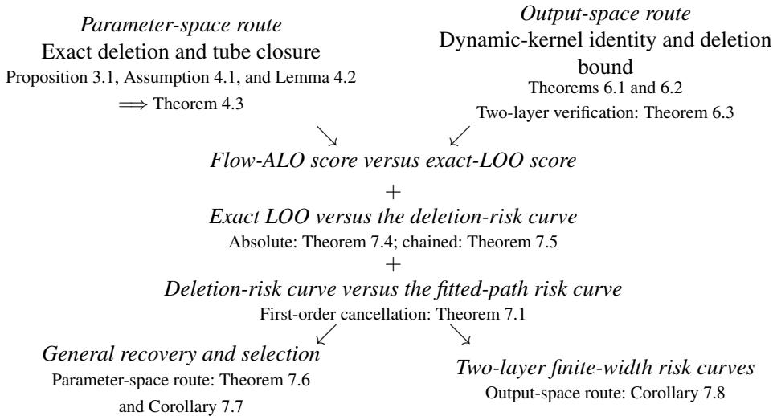

# ESTIMATING POPULATION-RISK CURVES ALONG NONCONVEXGRADIENT FLOWS FROM THE TRAINING SAMPLE

BY MINGZHI SONG1,a

1Department of Mathematics, The University of Hong Kong, asongmingzhi123@gmail.com

We estimate the conditional population-risk curve of a realized smooth nonconvex gradient flow from the training sample. Flow approximate leaveone-out (Flow-ALO) propagates a deletion response and evaluates omitted observations at approximate deleted paths. The risk-curve error decomposes into response approximation, exact-LOO fluctuation, and deletion-tofull risk transfer. On each fixed finite horizon, bounded centered trainingloss gradients, a one-sided Hessian lower bound, locally Lipschitz Hessians, and a strict tube-closure condition yield an explicit $( n - 1 ) ^ { - 2 }$ bound for the deletion-response error. Bounded evaluation-loss gradients transfer the deletion-response bound to the score without requiring the Hessian to be invertible. Direct first-order jackknife cancellation and exact-LOO concentration control deletion-to-full risk transfer and fluctuation, respectively, completing recovery of the conditional population-risk curve. For bounded smooth two-layer mean-field networks training both layers, the score-error bound is uniform in width.

1. Introduction. Can the fitting sample estimate a fitted model’s population-risk curve without external validation? Training loss reuses the fitted observations; a validation split preserves independence but leaves fewer observations for fitting. Exact leave-one-out (LOO) cross-validation avoids both problems but requires n additional training trajectories for the full curve.

Static approximate leave-one-out (ALO) replaces endpoint refits by local primal–dual approximations or a Newton correction [39, 40], while infinitesimal-jackknife methods linearize fitted procedures with respect to data weights [12, 13]. Building on these endpoint approximations and iterative response methods [25], we ask when a continuous-time deletion response estimates the sample-conditional population-risk curve of the realized smooth nonconvex fitted path. Estimating the sample-conditional curve requires a distinct three-part argument: response approximation, exact-LOO concentration, and comparison of size-(n − 1) deletion learners with the realized size-n learner.

1.1. Contributions. The central contribution is the high-probability finite-sample comparison in Theorem 7.6 between the Flow-ALO score and the sample-conditional risk of the realized full-sample gradient flow, uniformly over a predetermined compact set of training times and fixed-dimensional hyperparameters within one model, without an external validation sample. Absolute exact-LOO concentration recovers risk levels; chained exact-LOO concentration identifies the curve only up to a common sample-dependent shift. Under either route, Corollary 7.7 bounds the excess risk of a measurable approximate Flow-ALO minimizer.

The Flow-ALO-to-exact-LOO comparison is a pathwise approximation for nonconvex training dynamics. On a common finite-horizon tube, Assumption 4.1 allows indefinite deleted-objective Hessians subject to a uniform lower bound and local Hessian Lipschitzness, with bounded centered forcing and a strict tube-closure margin. Under Assumption 4.1 and the evaluation-gradient bound in (27), Theorem 4.3 gives a uniform order-(n−1)−2 error between the Flow-ALO and exact-LOO scores.

Exact-LOO concentration and deletion-to-full transfer solve the statistical problem left by a deletion-response approximation. Under a deterministic finite loss range, uniform replaceone stability, and uniform continuity for size- $( n - 1 )$ learners on a compact index set, Theorem 7.4 gives a uniform high-probability bound between the exact-LOO score and the average population risk of the deletion fits. Theorem 7.5 instead controls anchored increments by mixed stability and metric entropy, replacing absolute level control by one sample-dependent shift common to all training-time–hyperparameter pairs. For deletion-to-full transfer, Theorem 7.1 combines cancellation of the average first deletion-chord derivative with a uniform second-derivative bound to give an order- $( n - 1 ) ^ { - 2 }$ cross-size error.

The output-space route expresses the response approximation through a dynamic-kernel difference; for the two-layer verification, this route yields constants uniform in width. Theorems 6.1 and 6.2 express prediction and score errors through the difference between the exact deletion and response dynamic kernels. For a bounded smooth scalar-output two-layer mean-field network with both layers trained and nonnegative weight decay, Theorem 6.3 compares the exact and response prediction paths on each common finite horizon and at each common finite width. It bounds the dynamic-kernel difference by $O ( n ^ { - 1 } )$ with constants uniform in width. The $O ( n ^ { - 1 } )$ kernel bound gives an $O ( n ^ { - 2 } )$ error between the Flow-ALO and exact-LOO scores. Combining that error with single-anchor bounded-difference concentration, chained increment concentration, and deletion-to-full transfer gives the finite-widthfamily risk-curve bound in Corollary 7.8.

1.2. Problem formulation. Let $( \Omega , \mathcal { F } , \mathbb { P } )$ be a probability space, $( \boldsymbol { \ Z } , \boldsymbol { \mathcal { Z } } )$ a measurable observation space, and $P _ { 0 }$ a probability measure on $( Z , { \mathcal { Z } } )$ . Let $( Z _ { i } ) _ { i \geq 1 }$ be independent and identically distributed measurable maps from $( \Omega , { \mathcal { F } } )$ to $( Z , { \mathcal { Z } } )$ with common law $P _ { 0 }$ , and, for every $n \geq 2$ , put $[ n ] : = \{ 1 , \dots , n \}$ and let $S _ { n } : \Omega  { \cal Z } ^ { n } , S _ { n } = ( { \cal Z } _ { 1 } , \ldots , { \cal Z } _ { n } )$ , be the ${ \mathcal { F } } / { \mathcal { Z } } ^ { \otimes n }$ measurable random sample. At fixed $n ,$ write $S : = S _ { n }$ . A predetermined object is deterministic, independent of the training sample and auxiliary randomness, and may depend on n unless stated otherwise. Let Θ be a finite-dimensional real Hilbert space, let $d _ { \lambda } \in \{ 1 , 2 , \ldots \}$ be deterministic and fixed independently of $n ,$ , let $\Lambda \subset \mathbb { R } ^ { d _ { \lambda } }$ be a nonempty compact set of within-model hyperparameter vectors, with scalar weight decay as the $d _ { \lambda } = 1$ specialization, and fix a deterministic $\theta _ { 0 } \in \Theta$ . For every $( \lambda , z ) \in \Lambda \times { \cal Z }$ , let $\ell _ { \lambda , z } ^ { \mathrm { t r } } , \ell _ { \lambda , z } ^ { \mathrm { e v } } : \Theta \to$ R be the training and evaluation losses, respectively; every loss integral in the manuscript is assumed measurable and finite. Fix a deterministic $T \in [ 0 , \infty )$ and a metric $d _ { \mathcal { H } } : ( [ 0 , \infty ) \times \Lambda ) ^ { 2 } \to [ 0 , \infty )$ and let $\mathcal { H } \subset [ 0 , T ] \times \Lambda$ be a predetermined nonempty dH-compact set, equipped with the d -Borel σ-field $B ( \mathcal { H } )$ . Write $\delta _ { z }$ for the Dirac probability measure at $z \in { \mathbb Z }$ . The sampledependent empirical law on $( \boldsymbol { \ Z } , \boldsymbol { \mathcal { Z } } )$ is $\begin{array} { r } { P _ { n } = n ^ { - 1 } \bar { \sum _ { \substack { j = 1 } } ^ { n } \delta _ { Z _ { j } } } } \end{array}$ . For $\lambda \in \Lambda$ , define the full-sample empirical training objective $F _ { P _ { n } , \lambda } : \Theta \to \mathbb { R } ;$ ; whenever the gradient flow of $F _ { P _ { n } , \lambda }$ from $\theta _ { 0 }$ exists on [0, T], denote the gradient flow by $\theta ^ { \lambda } : [ 0 , T ]  \Theta$

$$
F _ { P _ { n } , \lambda } ( \theta ) = \frac { 1 } { n } \sum _ { j = 1 } ^ { n } \ell _ { \lambda , Z _ { j } } ^ { \mathrm { t r } } ( \theta ) , \qquad \dot { \theta } _ { t } ^ { \lambda } = - \nabla F _ { P _ { n } , \lambda } ( \theta _ { t } ^ { \lambda } ) , \quad \theta _ { 0 } ^ { \lambda } = \theta _ { 0 } .\tag{1}
$$

For $i \in \left\lceil n \right\rceil$ , let $S _ { - i } : \Omega \to \mathsf { Z } ^ { n - 1 }$ be the ${ \mathcal { F } } / { \mathcal { Z } } ^ { \otimes ( n - 1 ) }$ -measurable deleted sample $( Z _ { j } ) _ { j \in [ n ] \backslash \{ i \} }$ and let $\begin{array} { r } { P _ { - i } = ( n - 1 ) ^ { - 1 } \sum _ { j \in [ n ] \backslash \{ i \} } \delta _ { Z _ { j } } } \end{array}$ be the sample-dependent empirical law of $S _ { - i }$ on $( \boldsymbol { \ Z } , \boldsymbol { \mathcal { Z } } )$ . For $\lambda \in \Lambda$ , define the deleted-sample empirical training objective $F _ { P _ { - i } , \lambda } : \Theta \to$ R by

  
FIG 1. Theorem dependencies for the central continuous-time results. Theorem 7.6 and Corollary 7.7 use the parameter-space response and either exact-LOO concentration route. Corollary 7.8 uses the two-layer output-space response and chained exact-LOO concentration. Theorem 7.1 supplies deletion-to-full transfer in Theorem 7.6 and Corollaries 7.7 and 7.8.

$\begin{array} { r l } { F _ { P _ { - i } , \lambda } ( \theta ) = ( n - 1 ) ^ { - 1 } \sum _ { j \in [ n ] \backslash \{ i \} } \ell _ { \lambda , Z _ { j } } ^ { \mathrm { t r } } ( \theta ) } & { { } } \end{array}$ for $\theta \in \Theta$ . Whenever the gradient flow of $F _ { P _ { - i } , \lambda }$ from $\theta _ { 0 }$ exists on $[ 0 , T ]$ , denote the gradient flow by $\theta _ { - i } ^ { \lambda } : [ 0 , T ] \to \Theta$

Whenever all full and deleted paths required on H exist on [0, T], define the sampledependent map $( \mathsf { C } _ { n } ^ { \mathrm { { L O O } } } , \mathsf { R } _ { S } ^ { - } , \mathsf { R } _ { S } ) : \hat { \mathcal { H } } \to \mathbb { R } ^ { 3 }$ by

(2)

$$
\mathsf { C } _ { n } ^ { \mathrm { L O O } } ( t , \lambda ) = \frac { 1 } { n } \sum _ { i = 1 } ^ { n } \ell _ { \lambda , Z _ { i } } ^ { \mathrm { e v } } ( \theta _ { - i , t } ^ { \lambda } ) ,\tag{3}
$$

$$
\mathsf { R } _ { S } ^ { - } ( t , \lambda ) = \frac { 1 } { n } \sum _ { i = 1 } ^ { n } \int \ell _ { \lambda , z } ^ { \mathrm { e v } } ( \theta _ { - i , t } ^ { \lambda } ) \mathrm { d } { P } _ { 0 } ( z ) ,\tag{4}
$$

$$
\mathsf { R } _ { S } ( t , \lambda ) = \int \ell _ { \lambda , z } ^ { \mathrm { e v } } ( \theta _ { t } ^ { \lambda } ) \ \mathrm { d } { P } _ { 0 } ( z ) .
$$

${ \mathsf { C } } _ { n } ^ { \mathrm { { L O O } } }$ evaluates observation $Z _ { i }$ under $\theta _ { - i } ^ { \lambda } ; \mathsf { R } _ { S } ^ { - }$ and $\mathsf { R } _ { S }$ instead integrate the deletion and full fits against $P _ { 0 }$ . The subscript S records the realized fitting sample, held fixed in (3) and (4); throughout, $\mathsf { R } _ { S }$ is called the sample-conditional risk of the realized fitted path, or sampleconditional risk for short.

Flow-ALO replaces each deleted path $\theta _ { - i } ^ { \lambda }$ by $\theta ^ { \lambda } + d _ { i } ^ { \lambda }$ , where $d _ { i } ^ { \lambda }$ is a linear response driven along the full path, and averages the omitted losses at those response paths. Sections 2–3 give the forcing, response ODE, and score definitions once.

1.3. Related work. Static endpoint ALO uses local corrections at a fitted regularized estimator for risk assessment and tuning [32, 39]. Wilson, Kasy and Mackey [40, Theorem 2] give a deterministic $O ( n ^ { - 2 } )$ approximate-versus-exact-CV assessment bound, uniform over λ at regularized-ERM endpoints under the curvature, derivative-moment, and Hessian-smoothness conditions stated by Wilson–Kasy–Mackey. The Wilson–Kasy–Mackey comparisons concern fitted endpoints and exact CV rather than population risk along a training path, the target studied here.

Finite data-weight reweighting is treated by first- and higher-order infinitesimal-jackknife expansions [12, 13]. Training-path influence methods propagate data sensitivity through paths or iterate sequences [17, 29, 34], and Wang et al. [38, Sections 2–3] formulate iteratesequence-specific LOO influence and approximate terminal influence for ordered SGD. Litman and Guo [24, Theorem G.10 and Corollary G.13] derive an infinitesimal reweighting derivative and a finite-perturbation Taylor remainder. The reweighting and path-influence results provide sensitivity approximations; Theorem 4.3 instead controls the normalized deleteone nonlinear path and held-out score to second order, uniformly on a predetermined compact time–hyperparameter set.

Iterative approximate CV propagates delete-one surrogates along optimization iterates. For full-batch gradient descent at a fixed objective, Luo, Ren and Barber [25, Assumptions 4.1– 4.3 and 4.5 and Theorems 4.4 and 4.6] prove iteration-uniform $O ( n ^ { - 2 } )$ IACV-to-exact-LOO parameter and CV-score errors. The full-batch-GD result of Luo–Ren–Barber does not assume global convexity, but requires every deleted-objective Hessian to be uniformly positive and bounded along all full-data iterates, together with global Hessian Lipschitzness, pathwise gradient bounds, common initialization, and step- and sample-size restrictions [25, Assumptions 4.1–4.3 and 4.5 and Theorem 4.4]. Luo–Ren–Barber [25, Equation (16), Theorem 4.6, and the discussion after Theorem 4.6] control the exact iterative LOO score and discuss using the exact iterative LOO score for early stopping, but give neither population-risk concentration nor an oracle for the selected iterate.

Direct same-training-data risk work studies optimization iterates. In proportional least squares, Patil, Wu and Tibshirani [30, Equation (12) and Theorems 2–3] prove uniform convergence of exact LOOCV along a growing gradient-descent path to sample-conditional prediction risk and asymptotically risk-optimal early stopping. Bellec and Tan [4, Theorem 2.1 and Corollary 2.3] construct root-n-accurate conditional-risk estimators and a stopping oracle for a fixed number of broad updates in proportional Gaussian linear models. At fixed iterations, Tan and Bellec [36, Theorems 3.6–3.7] recover robust-regression prediction error up to a tuning-independent noise term. Han and Xu [16, Definition 2.4 and Theorem 3.3] give a fully data-driven estimator of conditional generalization error defined using a fresh covariate and noise resampled from the realized empirical noises. Han and Imaizumi [15, Theorems 4.2–4.3] give state-evolution-based same-data generalization estimates for proportional finite-width networks.

Adjacent continuous-time work addresses different inferential targets. For squared-loss gradient flow governed by a fixed positive-semidefinite prediction operator, Yao et al. [41, Theorem 2 and Corollary 1] prove asymptotic risk-ratio optimality of a training-sample REML stopping rule. Li and Giessing [23, Theorems 2–3] establish an infinite-horizon functional central limit theorem and an algorithm-aware covariance estimator for a parameter path relative to a population flow. For kernel regression, Cheng, Chen and Lin [10, Theorems 4 and 11] give sup-norm rates for continuous kernel gradient flow and simultaneous bands over covariates at scaled times.

Conditioning on the fitted sample changes the target of cross-validation. Litman and Guo [24, Lemma 6.1 and Theorem F.6] give expectation-level cross-validation and generalizationgap identities. In Gaussian ordinary least squares, Bates, Hastie and Tibshirani [3, Theorems 1–2 and Corollary 2] show that LOOCV can be asymptotically uncorrelated with fluctuations of realized conditional error.

Algorithmic stability relates one-sample perturbations to generalization [7, 18]. For continuous-time sum-separable optimizers with bounded updates and Lipschitz loss that contract in a uniformly conditioned Riemannian metric, Kozachkov, Wensing and Slotine [21, Section 2.1, Theorem 3, and Remark 1] obtain an exponentially decaying initialization transient and an $O ( n ^ { - 1 } )$ replace-one stability floor; common initialization removes the transient and gives the analogous horizon-independent LOO stability.

For iid Euclidean data, Avelin and Viitasaari [2, Definitions 2.3 and 2.6, Assumption 3.1, Theorem 3.6, and Remark 3.4] obtain two-sided pointwise concentration of the LOO score about the realized full-sample learner’s conditional risk under the log-Sobolev, evaluated-loss dataset-gradient, error-stability, and expected-loss-growth conditions of Avelin–Viitasaari. Their model-selection discussion notes that the same bounds can be applied to the loss difference of two estimators for model selection [2, Section 7]. Their full-sample centering, however, assumes an expected deletion-to-full error-stability bound, and the cited analysis controls exact LOO rather than approximating it or proving a realized-sample deletion-tofull comparison [2, Definition 2.6, Assumption 3.1, Theorem 3.6, and Remark 3.4].

Neural-network verification draws on several dynamic regimes. Jacot, Gabriel and Hongler [19, Theorem 2] prove finite-horizon uniform NTK convergence to a constant infinitewidth kernel. Chen et al. [8, Definition 4, Theorems 2–3, and Corollary 1] introduce the loss path kernel, represent terminal loss as a general kernel machine, and derive a Rademacher generalization-gap bound. Chen et al. [9, Assumption 4.2, Lemmas 4.3–4.5, and Theorem 5.2] give a stability-localized, one-sided high-probability terminal-time bound whose leading term is computed from the training-set loss path kernel. Sun and Valaee [35, Propositions 3.1–3.3 and Equations (5)–(13)] derive a dual NTK-coordinate endpoint-removal influence approximation for a ridge-regularized linearized model. Mean-field analyses give fixed-horizon dimension-free approximation [27], evolving two-time kernels [5], finite-width kernel and prediction fluctuations [6], and finite-to-mean-field control over structured polynomial horizons [14, Theorems 7 and 9]. Shallow-network stability is studied by Richards and Kuzborskij and Lei et al. [22, 33]. The model verification in Theorem 6.3 instead trains both layers and controls the same-width delete-one dynamic-kernel mismatch with constants uniform in width.

2. Setup and targets. Section 1 defines the probability space, observation space, parameter space, hyperparameter set, and loss maps. An unsubscripted $\| \cdot \|$ denotes the norm of the ambient Hilbert or Euclidean space. For a linear map A, $\begin{array} { r } { \| A \| _ { \mathrm { o p } } = \operatorname* { s u p } _ { \| v \| \leq 1 } \| A v \| ; } \end{array}$ for a multilinear map, the supremum is over one vector of norm at most one in each argument. $I _ { E } : E \to E$ denotes the identity on a finite-dimensional real Hilbert space $E ;$ when a typed operator expression fixes $E _ { \mathrm { { : } } }$ we abbreviate $I _ { E }$ by $I .$ For each finite signed measure $P$ on $( Z , { \mathcal { Z } } )$ with $P ( Z ) = 1$ and each $\lambda \in \Lambda$ , define the real-valued objective $F _ { P , \lambda }$ on the set of $\theta \in \Theta$ for which $z \mapsto \ell _ { \lambda , z } ^ { \mathrm { t r } } ( \theta )$ is Z-measurable and $| P |$ -integrable, where $| P |$ is the total-variation measure of $P ,$ , by

$$
F _ { P , \lambda } \mathopen { } \mathclose \bgroup \left( \theta \aftergroup \egroup \right) = \int \ell _ { \lambda , z } ^ { \mathrm { t r } } \mathopen { } \mathclose \bgroup \left( \theta \aftergroup \egroup \right) \ \mathrm { d } P ( z ) .\tag{5}
$$

More generally, for any $| P |$ -integrable map $g$ from Z to a finite-dimensional real vector space, write $\begin{array} { r } { P g : = \int g ( z ) \mathrm { d } P ( z ) } \end{array}$ . For an integrable family $z \mapsto g _ { z }$ , the notation $P g _ { Z }$ means $\begin{array} { r } { { \bar { \int } } g _ { z } \ \mathrm { d } P ( z ) ; } \end{array}$ ; the capital $Z$ marks the integration coordinate. Every population-risk evaluationloss integrand is assumed ${ \mathcal { Z } } { \mathrm { - m e a s u r a b l e } }$ and $P _ { \mathrm { 0 } } { \mathrm { - i n t e g r a b l e } }$ . Equip Θ and Λ with the respective Borel σ-fields. The phrase one common evaluation rule means that there are a measurable output space $( \vee , B _ { \vee } )$ , a jointly measurable map $\mathfrak { f } : \Lambda \times \Theta \times Z \to \vee$ , and one fixed measurable map $L _ { \mathrm { e v } } : \mathsf { V } \times \mathsf { Z } \to$ R such that $\ell _ { \lambda , z } ^ { \mathrm { e v } } ( \theta ) = L _ { \mathrm { e v } } ( \mathfrak { f } ( \lambda , \theta , z ) , z )$ . In the supervised special case, let $( \mathcal { X } , { B _ { \mathcal { X } } } )$ and $( \mathcal { V } , B _ { \mathcal { V } } )$ be measurable spaces, take $( \boldsymbol { Z } , \boldsymbol { \mathcal { Z } } ) = ( \boldsymbol { \mathcal { X } } \times \boldsymbol { \mathcal { Y } } , \boldsymbol { B _ { \mathcal { X } } } \otimes \boldsymbol { B _ { \mathcal { Y } } } )$ , let $f _ { \lambda , \theta } : \mathcal { X } \to \vee$ for $( \lambda , \theta ) \in \Lambda \times \Theta$ , and let $\varphi : \mathsf { V } \times \mathsf { \mathcal { V } } \to$ R be measurable. Then one common evaluation rule means, for every $( \lambda , \theta , x , y , v ) \in \Lambda \times \Theta \times \mathcal { X } \times \mathcal { Y } \times \mathsf { V } ,$

$$
\begin{array} { r } { \mathfrak { f } ( \lambda , \theta , ( x , y ) ) = f _ { \lambda , \theta } ( x ) , \qquad L _ { \mathrm { e v } } ( v , ( x , y ) ) = \varphi ( v , y ) . } \end{array}
$$

When $d _ { \lambda } = 1$ and $\Lambda \subset [ 0 , \infty )$ , the scalar weight-decay setup is the special case $\ell _ { \lambda , z } ^ { \mathrm { t r } } = \ell _ { z } + \lambda R$ and $\ell _ { \lambda , z } ^ { \mathrm { e v } } = \ell _ { z }$ , where $R : \Theta \to \mathbb { R }$ and $\ell _ { z } : \Theta \to \mathbb { R }$ for $z \in { \mathbb Z }$ do not depend on λ. For each mass-one finite signed measure $P$ admitted by (5) and $\lambda \in \Lambda$ , let $\theta ^ { P , \lambda } : [ 0 , T ] \to \Theta$ solve

$$
\dot { \theta } _ { t } ^ { P , \lambda } = - \nabla F _ { P , \lambda } ( \theta _ { t } ^ { P , \lambda } ) , \qquad \theta _ { 0 } ^ { P , \lambda } = \theta _ { 0 } \in \Theta .\tag{6}
$$

All deletions and values of $\lambda$ share the deterministic $\theta _ { 0 }$ from (1). Section 1 defines the predetermined horizon $T$ , metric $d _ { \mathcal { H } }$ , and candidate set H. For $\lambda \in \Lambda$ , write the whole path as $\theta ^ { \lambda } : = \theta ^ { P _ { n } , \lambda }$

The normalized measure $P _ { - i }$ and the directions $P _ { n } - \delta _ { Z _ { i } }$ satisfy

$$
P _ { - i } = P _ { n } + \frac { P _ { n } - \delta _ { Z _ { i } } } { n - 1 } , \qquad \frac { 1 } { n } \sum _ { i = 1 } ^ { n } ( P _ { n } - \delta _ { Z _ { i } } ) = 0 .\tag{7}
$$

For $i \in [ n ] , t \in [ 0 , T ]$ , and $\lambda \in \Lambda$ , whenever the required first and second parameter derivatives exist, define along the full trajectory the centered gradient $c _ { i , t } ^ { \lambda } \in \Theta$ and centered Hessian $C _ { i , t } ^ { \lambda } : \Theta \to \Theta$ by

(8)

$$
c _ { i , t } ^ { \lambda } = \nabla \ell _ { \lambda , Z _ { i } } ^ { \mathrm { t r } } ( \theta _ { t } ^ { \lambda } ) - \frac { 1 } { n } \sum _ { j = 1 } ^ { n } \nabla \ell _ { \lambda , Z _ { j } } ^ { \mathrm { t r } } ( \theta _ { t } ^ { \lambda } ) ,\tag{9}
$$

$$
C _ { i , t } ^ { \lambda } = \nabla ^ { 2 } \ell _ { \lambda , Z _ { i } } ^ { \mathrm { t r } } ( \theta _ { t } ^ { \lambda } ) - \frac { 1 } { n } \sum _ { j = 1 } ^ { n } \nabla ^ { 2 } \ell _ { \lambda , Z _ { j } } ^ { \mathrm { t r } } ( \theta _ { t } ^ { \lambda } ) .
$$

For $i \in [ n ] , t \in [ 0 , T ]$ , and $\lambda \in \Lambda$ , the deletion identities along the full path are

$$
\nabla F _ { P _ { - i } , \lambda } \bigl ( \theta _ { t } ^ { \lambda } \bigr ) = \nabla F _ { P _ { n } , \lambda } \bigl ( \theta _ { t } ^ { \lambda } \bigr ) - \frac { c _ { i , t } ^ { \lambda } } { n - 1 } ,\tag{10}
$$

$$
\nabla ^ { 2 } F _ { P _ { - i } , \lambda } ( \theta _ { t } ^ { \lambda } ) = \nabla ^ { 2 } F _ { P _ { n } , \lambda } ( \theta _ { t } ^ { \lambda } ) - \frac { C _ { i , t } ^ { \lambda } } { n - 1 } .
$$

The exact leave-one-out score, average deletion-learner population risk, and full-sample population risk were defined in Equations (2) to (4). The training observations determine the approximate risk-curve family $\widetilde { \mathsf { C } } _ { n } ( t , \lambda )$ in (18); the primary target is the uniform error of $\widetilde { \mathsf { C } } _ { n } ( t , \lambda )$ as an estimator of $\mathsf { R } _ { S } ( t , \lambda )$ , either in absolute level or up to one common sample-dependent shift. Approximate minimization over $\mathcal { H } .$ as in Corollary 7.7, remains a consequence.

3. Individual-deletion response and Flow-ALO. For $i \in [ n ] , \lambda \in \Lambda$ , and any interval $\Im \subseteq [ 0 , T ]$ on which the full and deleted flows exist, define the exact deletion displacement $\Delta _ { i } ^ { \lambda } : \mathsf { \bar { J } } \to \mathsf { \bar { \Theta } }$ by $\Delta _ { i , t } ^ { \lambda } = \theta _ { - i , t } ^ { \lambda } - \theta _ { t } ^ { \lambda }$ for $t \in \Im$ . Integrating the deleted-objective Hessian along the segment from ${ \theta } _ { t } ^ { { \lambda } }$ to $\theta _ { - i , t } ^ { \lambda }$ yields the exact dynamics of $\Delta _ { i , t } ^ { \lambda }$

PROPOSITION 3.1 (Exact deletion dynamics). Fix $i \in [ n ] , \lambda \in \Lambda$ , and $T ^ { \prime } \in [ 0 , T ]$ , and suppose both flows exist on $[ 0 , T ^ { \prime } ]$ . Suppose $F _ { P _ { - i } , \lambda }$ is twice continuously differentiable on the line segments joining ${ \theta } _ { t } ^ { { \lambda } }$ to $\theta _ { - i , t } ^ { \lambda }$ for every $t \in [ 0 , T ^ { \prime } ]$ . Then, for $0 \leq t \leq T ^ { \prime }$

$$
\dot { \Delta } _ { i , t } ^ { \lambda } = - \overline { { B } } _ { i , t } ^ { \lambda } \Delta _ { i , t } ^ { \lambda } + \frac { c _ { i , t } ^ { \lambda } } { n - 1 } , \qquad \Delta _ { i , 0 } ^ { \lambda } = 0 ,\tag{11}
$$

where the secant operator $\overline { { B } } _ { i , t } ^ { \lambda } : \Theta \to \Theta$ is

$$
\overline { { B } } _ { i , t } ^ { \lambda } = \int _ { 0 } ^ { 1 } \nabla ^ { 2 } F _ { P _ { - i } , \lambda } ( \theta _ { t } ^ { \lambda } + u \Delta _ { i , t } ^ { \lambda } ) \mathrm { ~ d } u .\tag{12}
$$

TABLE 1  
Assumption and notation glossary. Every bound is required only on the index set specified by the invoking result.
<table><tr><td>Object or constant</td><td>Meaning and principal use</td></tr><tr><td> $\overline { { P _ { 0 } , P _ { n } , P _ { - i } } }$ </td><td>Population, empirical, and normalized delete-one laws; risk target and deletion chords.</td></tr><tr><td> $\theta ^ { \lambda } , \theta _ { - i } ^ { \lambda } , d _ { i } ^ { \lambda }$ </td><td>Full flow, deleted flow, and linear deletion response; Proposition 3.1 and Theo- rem 4.3.</td></tr><tr><td> $\widetilde { \mathsf { C } } _ { n } , \mathsf { C } _ { n } ^ { \mathrm { L O O } } , \mathsf { R } _ { S } ^ { - } , \mathsf { R } _ { S }$ </td><td>Approximate score, exact-LOO score, average deletion risk, and realized full- sample risk in the three transfers of Figure 1.</td></tr><tr><td> $\| \cdot \| , \| \cdot \| \mathrm { o p } , \| \cdot \| _ { \mathrm { T V } } , d _ { \mathcal { H } }$ </td><td>Parameter, operator, signed-measure, and candidate-index geometries for dynamic bounds, jackknife chords, and covering arguments.</td></tr><tr><td> $M , L _ { 3 } , \kappa , G _ { \mathrm { o u t } }$ </td><td>Centered-gradient bound, Hessian-Lipschitz constant, one-sided-curvature pa- rameter, and evaluation-gradient bound; in Assumption 4.1 and Theorem 4.3.</td></tr><tr><td> $C _ { P P }$ </td><td>Bound for the population-risk second derivative along each deletion chord after division by  $\| h _ { i } \| _ { \mathrm { T V } } ^ { 2 } ;$  Theorem 7.1.</td></tr><tr><td> $B _ { n - 1 } ^ { \mathrm { r n g } } , \beta _ { n - 1 } , \omega _ { n - 1 }$ </td><td>Deterministic loss-range length, replace-one stability, and candidate modulus at learner size</td></tr><tr><td> $L _ { n - 1 } ^ { \mathrm { h y p } } , \beta _ { n - 1 } ^ { \mathrm { m i x } }$ </td><td> $n - 1$  in Theorem 7.4. Candidate Lipschitz and mixed replace-one stability constants in Theorem 7.5.</td></tr><tr><td> $\underline { { D _ { \mathrm { d y n } } } }$ </td><td>Composed dynamic-kernel mismatch in Theorems 6.1 and 6.2.</td></tr></table>

Supplement Section S.A proves Proposition 3.1. Flow-ALO replaces the unknown secant operator in Equation (11) by the deleted Hessian evaluated on the observed full-sample path,

$$
B _ { i , t } ^ { \lambda } = \nabla ^ { 2 } F _ { P _ { - i } , \lambda } ( \theta _ { t } ^ { \lambda } ) = \nabla ^ { 2 } F _ { P _ { n } , \lambda } ( \theta _ { t } ^ { \lambda } ) - \frac { C _ { i , t } ^ { \lambda } } { n - 1 } ,\tag{13}
$$

and define the Flow-ALO response by

$$
\dot { d } _ { i , t } ^ { \lambda } = - B _ { i , t } ^ { \lambda } d _ { i , t } ^ { \lambda } + \frac { c _ { i , t } ^ { \lambda } } { n - 1 } , \qquad d _ { i , 0 } ^ { \lambda } = 0 .\tag{14}
$$

With simultaneous staging on the full-sample path, a forward-Euler discretization of (14) matches the full-batch IACV recursion of Luo, Ren and Barber [25, Section 2.3, Equation (12)], after accounting for the present objective normalization. For $i \in [ n ] , \lambda \in \Lambda$ , and $0 \leq s \leq t \leq T$ , let $U _ { i } ^ { \lambda } ( t , s ) : \Theta \to \Theta$ be the fundamental solution defined by

$$
\partial _ { t } U _ { i } ^ { \lambda } ( t , s ) = - B _ { i , t } ^ { \lambda } U _ { i } ^ { \lambda } ( t , s ) , \qquad U _ { i } ^ { \lambda } ( s , s ) = I .\tag{15}
$$

The response in (14) therefore has the Duhamel representation

$$
d _ { i , t } ^ { \lambda } = \frac { 1 } { n - 1 } \int _ { 0 } ^ { t } U _ { i } ^ { \lambda } ( t , s ) c _ { i , s } ^ { \lambda } \mathrm { ~ d } s .\tag{16}
$$

The correction − $C _ { i , t } ^ { \lambda } / ( n - 1 )$ in Equation (13) acts at every later propagation time; we call the accumulated centered-Hessian propagation resummation.

The term resummation distinguishes $\bar { d } _ { i } ^ { \lambda }$ from a literal derivative at the full empirical law. Put $H _ { t } ^ { \lambda } = \nabla ^ { 2 } F _ { P _ { n } , \lambda } ( \theta _ { t } ^ { \lambda } )$ . Suppose the $C ^ { 1 } ( [ 0 , T ] ; \Theta )$ -valued map $\varepsilon \mapsto \theta ^ { P _ { n } + \varepsilon ( P _ { n } - \bar { \delta _ { Z _ { i } } } ) , \lambda }$ is defined near zero and differentiable at zero. Suppose also that $( \varepsilon , x ) \mapsto \nabla F _ { P _ { n } + \varepsilon ( P _ { n } - \delta _ { Z _ { i } } ) , \lambda } ( x )$ is continuously differentiable on a neighborhood of $\{ 0 \} \times \{ \theta _ { t } ^ { \lambda } : 0 \leq t \leq T \}$ . Define the scaled derivative of the empirical-weight path

$$
g _ { i , t } ^ { \lambda } = \frac { 1 } { n - 1 } \left. \frac { \partial } { \partial \varepsilon } \theta _ { t } ^ { P _ { n } + \varepsilon ( P _ { n } - \delta _ { Z _ { i } } ) , \lambda } \right| _ { \varepsilon = 0 } .
$$

Differentiating the flow gives the conventional full-Hessian influence ODE

$$
\dot { g } _ { i , t } ^ { \lambda } = - H _ { t } ^ { \lambda } g _ { i , t } ^ { \lambda } + \frac { c _ { i , t } ^ { \lambda } } { n - 1 } , \qquad g _ { i , 0 } ^ { \lambda } = 0 .\tag{17}
$$

Hence $g _ { i } ^ { \lambda }$ , not $d _ { i } ^ { \lambda }$ , is the scaled data-weight derivative at $P _ { n }$ . Flow-ALO instead incorporates the centered-Hessian correction in (13) throughout propagation.

The resulting same-sample Flow-ALO score is

$$
\widetilde { \mathsf { C } } _ { n } ( t , \lambda ) = \frac { 1 } { n } \sum _ { i = 1 } ^ { n } \ell _ { \lambda , Z _ { i } } ^ { \mathrm { e v } } ( \theta _ { t } ^ { \lambda } + d _ { i , t } ^ { \lambda } ) .\tag{18}
$$

Equation (18) evaluates each omitted loss at the approximate deleted parameter $\theta _ { t } ^ { \lambda } + d _ { i , t } ^ { \lambda }$ and, unlike a first-order loss correction, retains quadratic and higher-order effects when the training-point evaluation gradient vanishes at interpolation.

4. Deterministic approximation theory. Equation (14) approximates the exact deletion displacement in Equation (11) by replacing the secant Hessian with $B _ { i , t } ^ { \lambda } = \nabla ^ { 2 } F _ { P _ { - i } , \lambda } ( \theta _ { t } ^ { \lambda } )$ on the full path; Theorem 4.3 bounds the error uniformly on $[ 0 , T ]$ . Pathwise constants in Section 4 refer to the realized sample S unless declared deterministic. For $x \in \Theta$ and $r > 0 .$ write $B ( x , r ) = \{ y \in \Theta : \| y - x \| < r \}$ for the open radius-r ball.

For $\kappa \geq 0$ , define the nonnegative propagation-gain functions $\phi _ { \kappa } , \mathcal { I } _ { \kappa } : [ 0 , \infty )  [ 0 , \infty )$ by

$$
\phi _ { \kappa } ( t ) = \left\{ \begin{array} { l l } { ( e ^ { \kappa t } - 1 ) / \kappa , } & { \kappa > 0 , } \\ { t , } & { \kappa = 0 , } \end{array} \right. \quad \mathcal { T } _ { \kappa } ( t ) = \left\{ \begin{array} { l l } { \{ e ^ { 2 \kappa t } - 1 - 2 \kappa t e ^ { \kappa t } \} / \kappa ^ { 3 } , } & { \kappa > 0 , } \\ { t ^ { 3 } / 3 , } & { \kappa = 0 . } \end{array} \right.\tag{19}
$$

ASSUMPTION 4.1 (Full-path tube regularity). For every $\lambda \in \Lambda$ , thefull path ${ \theta } _ { t } ^ { { \lambda } }$ exists on $[ 0 , T ]$ . There are common constants $r _ { \mathrm { t u b e } } > 0$ and $\kappa , L _ { 3 } , M \in [ 0 , \infty )$ such that, with the open full-path tube

$$
{ \mathfrak { T } } _ { r _ { \mathrm { t u b e } } } ^ { \lambda } \subset \Theta , \qquad { \mathfrak { T } } _ { r _ { \mathrm { t u b e } } } ^ { \lambda } = \bigcup _ { 0 \leq t \leq T } B ( \theta _ { t } ^ { \lambda } , r _ { \mathrm { t u b e } } ) ,\tag{20}
$$

$F _ { P _ { - i } , \lambda }$ is twice continuously differentiable on ${ \mathfrak { T } } _ { r _ { \mathrm { t u b e } } } ^ { \lambda }$ for every $i \in [ n ]$ and $\lambda \in \Lambda$ . Uniformly over $i \in [ n ]$ and $\lambda \in \Lambda$

(21)

$$
\nabla ^ { 2 } F _ { P _ { - i } , \lambda } ( x ) \succeq - \kappa I , \qquad x \in { \mathfrak { T } } _ { r _ { \mathrm { t u b e } } } ^ { \lambda } ,\tag{22}
$$

$$
\| \nabla ^ { 2 } F _ { P _ { - i } , \lambda } ( x ) - \nabla ^ { 2 } F _ { P _ { - i } , \lambda } ( y ) \| _ { \mathrm { o p } } \le L _ { 3 } \| x - y \| , ~ x , y \in B ( \theta _ { t } ^ { \lambda } , r _ { \mathrm { t u b e } } ) , ~ 0 \le t \le T .
$$

Moreover,

$$
\operatorname* { s u p } _ { 1 \leq i \leq n , \ : 0 \leq t \leq T } \| c _ { i , t } ^ { \lambda } \| \leq M , \qquad ( n - 1 ) ^ { - 1 } M \phi _ { \kappa } ( T ) < r _ { \mathrm { t u b e } } .\tag{23}
$$

A uniform Hessian bound on a common neighborhood of the tubes gives (21), a uniform third-derivative bound gives (22), and the strict margin in (23) keeps the deleted path and response inside the tube.

LEMMA 4.2 (Full-path tube closure). Under Assumption 4.1, for every $i \in [ n ]$ and $\lambda \in \Lambda$ the deleted flow $\theta _ { - i , t } ^ { \lambda }$ and the response $d _ { i , t } ^ { \lambda }$ exist uniquely on $[ 0 , T ]$ . Moreover, $f o r 0 \leq t \leq T$

$$
\operatorname* { m a x } \{ \| \theta _ { - i , t } ^ { \lambda } - \theta _ { t } ^ { \lambda } \| , \| d _ { i , t } ^ { \lambda } \| \} \leq ( n - 1 ) ^ { - 1 } M \phi _ { \kappa } ( t ) < r _ { \mathrm { t u b e } } .\tag{24}
$$

Consequently, at each time t, the line segments joining any two of $\cdot \theta _ { t } ^ { \lambda } , \theta _ { - i , t } ^ { \lambda } ,$ , and $\theta _ { t } ^ { \lambda } + d _ { i , t } ^ { \lambda }$ are contained in $B ( \theta _ { t } ^ { \lambda } , r _ { \mathrm { t u b e } } )$

Supplement Section S.A proves Lemma 4.2. Lemma 4.2 localizes the exact and response curves in $B ( \theta _ { t } ^ { \lambda } , r _ { \mathrm { t u b e } } )$ , enabling full-horizon comparison of the two curves.

THEOREM 4.3 (Uniform finite-horizon error). Under Assumption 4.1,

$$
\operatorname* { s u p } _ { 1 \leq i \leq n } \operatorname* { m a x } \{ \| \Delta _ { i , t } ^ { \lambda } \| , \| d _ { i , t } ^ { \lambda } \| \} \leq ( n - 1 ) ^ { - 1 } M \phi _ { \kappa } ( t ) , \qquad 0 \leq t \leq T ,\tag{25}
$$

and

$$
\operatorname* { s u p } _ { 1 \leq i \leq n , 0 \leq t \leq T } \| \Delta _ { i , t } ^ { \lambda } - d _ { i , t } ^ { \lambda } \| \leq \frac { L _ { 3 } M ^ { 2 } } { 2 } ( n - 1 ) ^ { - 2 } \mathcal { I } _ { \kappa } ( T ) .\tag{26}
$$

If, in addition, there is a finite $G _ { \mathrm { o u t } } \geq 0$ such that

$$
\begin{array} { c } { \displaystyle \operatorname* { s u p } _ { 1 \leq i \leq n , 0 \leq t \leq T , \ : \lambda \in \Lambda } \| \nabla \ell _ { \lambda , Z _ { i } } ^ { \mathrm { e v } } ( x ) \| \leq G _ { \mathrm { o u t } } , } \\ { \displaystyle x \in B ( \bar { \theta _ { t } ^ { \lambda } } , r _ { \mathrm { t u b e } } ) } \end{array}\tag{27}
$$

then

$$
\operatorname* { s u p } _ { ( t , \lambda ) \in \mathcal { H } } \vert \widetilde { \mathsf { C } } _ { n } ( t , \lambda ) - \mathsf { C } _ { n } ^ { \mathrm { L O O } } ( t , \lambda ) \vert \leq \frac { G _ { \mathrm { o u t } } L _ { 3 } M ^ { 2 } } { 2 } ( n - 1 ) ^ { - 2 } \mathcal { T } _ { \kappa } ( T ) .\tag{28}
$$

Supplement Section S.A proves Theorem 4.3. For full-batch gradient descent, Luo, Ren and Barber [25, Assumptions 4.1–4.3 and 4.5 and Theorems 4.4 and 4.6] establish alliteration $O ( n ^ { - 2 } )$ IACV parameter and CV-score accuracy under common initialization of the full, deleted, and IACV iterates. Their conditions also include two-sided Hessian-eigenvalue bounds, individual-gradient and Hessian-Lipschitz bounds, a held-out-loss condition, and step- and sample-size restrictions. Theorem 4.3 gives the continuous-time finite-horizon counterpart under one-sided tube curvature and makes the dependence on $\mathcal { I } _ { \kappa } ( T )$ explicit. Theorem 4.3 allows $\nabla ^ { 2 } F _ { P _ { - i } , \lambda } \succeq - \kappa I$ on a fixed continuous-time tube, with horizon dependence in $\mathcal { I } _ { \kappa } ( T )$ . Population-risk comparison also uses Theorems 7.1, 7.4 and 7.5. The parameter and score radii in (26) and (28) are dimension-independent whenever $L _ { 3 } , M , G _ { \mathrm { o u t } }$ and $\mathcal { I } _ { \kappa } ( T )$ are common scalar envelopes.

Under Assumption 4.1 and the empirical-weight-path differentiability conditions used to derive (17), an extra envelope $\mathrm { s u p } _ { 1 \leq i \leq n , 0 \leq t \leq T , }$ λ∈Λ $\| C _ { i , t } ^ { \lambda } \| _ { \mathrm { o p } } \le K _ { C } < \infty$ yields the conventional full-Hessian response comparison

$$
\begin{array} { r l r } {  { \operatorname* { s u p } _ { 1 \leq i \leq n , \lambda \in \Lambda } \operatorname* { s u p } _ { 0 \leq t \leq T } \| \Delta _ { i , t } ^ { \lambda } - g _ { i , t } ^ { \lambda } \| \leq \frac { 1 } { ( n - 1 ) ^ { 2 } } \int _ { 0 } ^ { T } e ^ { \{ \kappa + K _ { C } / ( n - 1 ) \} ( T - s ) } } } \\ & { } & { \times \{ K _ { C } M \phi _ { \kappa } ( s ) + \frac { L _ { 3 } M ^ { 2 } } { 2 } \phi _ { \kappa } ( s ) ^ { 2 } \} \mathrm { d } s . } \end{array}\tag{29}
$$

Supplement Section S.A derives (29). The comparison radius in (29) is $O ( n ^ { - 2 } )$ along sequences for which $T , \kappa , K _ { C } , L _ { 3 }$ , and M remain bounded. Resummation removes the separate $K _ { C }$ premise; the resummed response is also the formulation used for the width-uniform output-space verification in Section 6.

Affine deleted gradients eliminate the secant-Hessian remainder entirely.

COROLLARY 4.4 (Quadratic exactness). Fix $T ^ { \prime } \in [ 0 , T ]$ and suppose every full and deleted flow indexed by $i \in [ n ]$ and $\lambda \in \Lambda$ exists on $[ 0 , T ^ { \prime } ]$ $I f \nabla F _ { P _ { - i } , \lambda }$ is affine in θ for every $i \in [ n ]$ and $\lambda \in \Lambda$ , then $d _ { i , t } ^ { \lambda } = \Delta _ { i , t } ^ { \lambda }$ for every $i \in [ n ] , \lambda \in \Lambda$ , and $t \in [ 0 , T ^ { \prime } ]$ . Thus, for every $( t , \lambda ) \in \mathcal { H } \cap ( [ 0 , T ^ { \prime } ] \times \Lambda ) , \widetilde { \mathsf { C } } _ { n } ( t , \lambda ) = \mathsf { C } _ { n } ^ { \mathrm { { L O O } } } ( t , \lambda )$ exactly.

Supplement Section S.A proves Corollary 4.4. The exactness is independent of propagator size.

5. A long-time obstruction. We construct a one-dimensional pitchfork that exhibits logarithmic-time instability under smoothness.

EXAMPLE 5.1 (Long-time amplification at a pitchfork). For each even n, specialize $( \mathsf Z , \mathcal Z ) = ( \{ - 1 , + 1 \} , 2 ^ { \{ - 1 , + 1 \} } )$ and $\Theta = \mathbb { R }$ , and take the deterministic sample having $n / 2$ observations equal to +1 and $n / 2$ equal $\mathrm { ~ t o ~ } - 1$ . Fix an additive loss offset $C \in \mathbb { R }$ . For $z \in \{ - 1 , + 1 \}$ let

$$
\ell _ { z } ( x ) = { \frac { 1 } { 4 } } ( x ^ { 2 } - 1 ) ^ { 2 } - z x + C , \qquad R ( x ) = { \frac { 1 } { 2 } } x ^ { 2 } .\tag{30}
$$

Set $d _ { \lambda } = 1$ , fix $\lambda \in ( 0 , 1 )$ , take $\Lambda = \{ \lambda \}$ and the common initialization $\theta _ { 0 } = x _ { 0 } = 0$ , specialize $\ell _ { \lambda , z } ^ { \mathrm { t r } } = \ell _ { z } + \lambda R$ and $\ell _ { \lambda , z } ^ { \mathrm { e v } } = \ell _ { z }$ , and let $P _ { 0 }$ be uniform on $\{ - 1 , + 1 \}$ . For every fixed $\vartheta \in$ $( 0 , { \sqrt { 1 - \lambda } } )$ and all sufficiently large even $n ,$ define a logarithmic time and risk gap by

$$
T _ { n , \vartheta } ^ { \lambda } = \frac { \log \{ 1 + ( n - 1 ) ( 1 - \lambda - \vartheta ^ { 2 } ) \vartheta \} } { 1 - \lambda - \vartheta ^ { 2 } } = O _ { \vartheta , \lambda } ( \log n ) ,\tag{31}
$$

$$
\left| \frac { 1 } { n } \sum _ { i = 1 } ^ { n } \int \ell _ { z } ( \theta _ { - i , { \cal T } _ { n , \vartheta } ^ { \lambda } } ^ { \lambda } ) \mathrm { d } { \cal P } _ { 0 } ( z ) - \int \ell _ { z } ( \theta _ { { \cal T } _ { n , \vartheta } ^ { \lambda } } ^ { \lambda } ) \mathrm { d } { \cal P } _ { 0 } ( z ) \right| \geq \frac { \vartheta ^ { 2 } } { 4 } .
$$

At $t = 0$ , the absolute risk difference in (31) is zero.

Supplement Section S.A verifies Example 5.1. Deleting $\mathbf { a } + 1 \mathbf { o r } - 1$ observation changes the forcing from 0 to $\mp ( n - 1 ) ^ { - 1 }$ . The full path stays at the unstable equilibrium 0, while each deleted path reaches distance at least ϑ at $T _ { n , \vartheta } ^ { \lambda } \mathrm { . }$ . Thus (31) gives an $O _ { \vartheta , \lambda } ( \log n )$ time and a risk gap at least $\vartheta ^ { 2 } / 4$ , explaining the explicit horizon in Theorem 4.3. Equation (31) is a deterministic balanced-sample statement; an iid fixed-confidence lower bound would require a separate random-sample argument.

6. Exact output-space error representations. The parameter-space bound in Theorem 4.3 can inherit width-dependent derivative envelopes for networks. This section instead expresses the prediction error through an output-space dynamic-kernel mismatch and verifies the resulting dimension-free criterion for a smooth two-layer mean-field network with both layers included in the gradient flow.

Fix a baseline training probability measure $P$ on the underlying measurable observation space $Z ,$ a finite signed perturbation direction h on $( \boldsymbol { \ Z } , \boldsymbol { \mathcal { Z } } )$ with $h ( Z ) = 0 ,$ , and a perturbation scale $\varepsilon \in \mathbb { R }$ . Write $| h |$ for the total-variation measure of $h .$ , define the perturbed unit-mass finite signed measure $P ^ { \varepsilon } = P + \varepsilon h$ , and, for each $\lambda \in \Lambda$ , define the signed-measure forcing map

$$
g _ { h } ^ { \lambda } : \Theta \to \Theta , \qquad g _ { h } ^ { \lambda } ( \theta ) = \int \nabla \ell _ { \lambda , z } ^ { \mathrm { t r } } ( \theta ) \mathrm { d } h ( z ) .
$$

Throughout the shared output-space development, differentiation under the integral sign is valid for the loss integrals with respect to $P , P ^ { \varepsilon }$ , and h. In the shared output-space development, a Bochner integral is the norm limit of simple-function integrals; for finite-dimensional $\Theta ,$ the Bochner integral is simply coordinatewise Lebesgue integration [11, Chapter II, Section 2]. Each result in the shared development assumes that all required flows exist on $[ 0 , T ]$ and all required Bochner integrals are well defined, except when flow existence is part of the conclusion. For each $\lambda \in \Lambda$ , let $\theta ^ { P , \lambda } , \theta ^ { P ^ { \varepsilon } , \lambda } : [ 0 , T ] \to \Theta$ be the flows trained under $P$ and $P ^ { \varepsilon }$ , respectively, from the common deterministic $\theta _ { 0 } \in \Theta$ in (1), and define the perturbation displacement path $\Delta ^ { \lambda } : [ 0 , T ] \to \Theta , \qquad \Delta _ { t } ^ { \lambda } = \theta _ { t } ^ { P ^ { \varepsilon } , \lambda } - \theta _ { t } ^ { P , \lambda }$ . For $\lambda \in \Lambda$ and $t \in [ 0 , T ]$ , define the perturbed-objective Hessian operator $B _ { t } ^ { 0 , \lambda } : \Theta \to \Theta$ along the unperturbed flow by

$$
B _ { t } ^ { 0 , \lambda } = \nabla ^ { 2 } F _ { P ^ { \varepsilon } , \lambda } ( \theta _ { t } ^ { P , \lambda } ) .
$$

For each $\lambda \in \Lambda$ , let the perturbation-response path $d ^ { \lambda } : [ 0 , T ] \to \Theta$ solve

$$
\dot { d } _ { t } ^ { \lambda } = - B _ { t } ^ { 0 , \lambda } d _ { t } ^ { \lambda } - \varepsilon g _ { h } ^ { \lambda } ( \theta _ { t } ^ { P , \lambda } ) , \qquad d _ { 0 } ^ { \lambda } = 0 .\tag{32}
$$

For sample deletion and $i \in [ n ]$ , take $P = P _ { n } , h = P _ { n } - \delta _ { Z _ { i } }$ , and $\varepsilon = ( n - 1 ) ^ { - 1 }$ . Then $( \theta _ { t } ^ { P , \lambda } , \theta _ { t } ^ { \bar { P ^ { \varepsilon } } , \lambda } , d _ { t } ^ { \lambda } ) = ( \theta _ { t } ^ { \lambda } , \theta _ { - i , t } ^ { \lambda } , \bar { d _ { i , t } ^ { \lambda } } )$ and $- g _ { h } ^ { \lambda } ( \theta _ { t } ^ { \lambda } ) = c _ { i , t } ^ { \lambda }$

For the output-space results, let the output dimension $k \in \{ 1 , 2 , \ldots \}$ , let $( \mathcal { X } , { B _ { \mathcal { X } } } )$ and $( \mathcal { V } , B _ { \mathcal { V } } )$ be measurable spaces, and specialize $( Z , { \mathcal { Z } } )$ to the product σ-field. Write $z =$ $( x _ { z } , y _ { z } ) \in \mathcal { X } \times \mathcal { Y }$ . Let $f : \mathcal { \Theta } \times \mathcal { X } \to \mathbb { R } ^ { \bar { k } }$ and $\varphi : \mathbb { R } ^ { k } \times \mathcal { V } \to \mathbb { R }$ , with $f _ { \boldsymbol \theta } ( x ) : = f ( \boldsymbol \theta , x ) . \operatorname { S p e } .$ cialize the common output space and evaluation rule by setting $( \mathsf { V } , \mathsf { B } _ { \mathsf { V } } ) = ( \mathbb { R } ^ { k } , \mathsf { B } ( \mathbb { R } ^ { k } ) )$ $\mathfrak { f } ( \lambda , \theta , ( x , y ) ) = f _ { \theta } ( x )$ , and $L _ { \mathrm { e v } } ( v , ( x , y ) ) = \varphi ( v , y )$ for $\lambda \in \Lambda , \theta \in \Theta , v \in \mathbb { R } ^ { k }$ , and $( x , y ) \in$ $\mathcal { X } \times \mathcal { V }$ . Set $\ell _ { \lambda , z } ^ { \mathrm { e v } } ( \theta ) = : \ell _ { z } ( \theta ) = \varphi ( f _ { \theta } ( x _ { z } ) , y _ { z } )$ . Suppose that, for every $\lambda \in \Lambda$ , there is a map $r _ { \lambda } : \Theta \to \mathbb { R }$ such that $\ell _ { \lambda , z } ^ { \mathrm { t r } } = \ell _ { z } + r _ { \lambda }$ for every $z \in { \mathbb { Z } }$ . For $\lambda \in \Lambda , t \in [ 0 , T ] , x \in \mathcal { X }$ , and $z \in { \mathbb { Z } }$ whenever the prediction Jacobian and outer-loss gradient exist, define

$$
J _ { t } ^ { \lambda } ( x ) = D _ { \theta } f _ { \theta _ { \star } ^ { P , \lambda } } ( x ) : \Theta \to \mathbb { R } ^ { k } , \qquad a _ { t } ^ { \lambda } ( z ) = \nabla _ { f } \varphi ( f _ { \theta _ { \star } ^ { P , \lambda } } ( x _ { z } ) , y _ { z } ) \in \mathbb { R } ^ { k } .
$$

Here $\nabla _ { f }$ is the Euclidean gradient in the first argument of $\varphi ,$ , and ∗ denotes the Hilbert adjoint, so $J _ { t } ^ { \lambda } ( x ) ^ { * } : \mathbb { R } ^ { k }  { \bar { \Theta } }$ . For $\lambda \in \Lambda$ and $0 \leq s \leq t \leq T$ , define the segment-averaged Hessian $\overline { { B } } _ { t } ^ { \lambda } : \Theta \to \Theta$ , and let $\overline { { U } } ^ { \lambda } ( t , s ) : \Theta \to \Theta$ be the fundamental solution generated by $- \overline { { B } } _ { t } ^ { \lambda }$

$$
\overline { { B } } _ { t } ^ { \lambda } = \int _ { 0 } ^ { 1 } \nabla ^ { 2 } F _ { P ^ { c } , \lambda } ( \theta _ { t } ^ { P , \lambda } + u \Delta _ { t } ^ { \lambda } ) \mathrm { d } u , \qquad \partial _ { t } \overline { { U } } ^ { \lambda } ( t , s ) = - \overline { { B } } _ { t } ^ { \lambda } \overline { { U } } ^ { \lambda } ( t , s ) , \quad \overline { { U } } ^ { \lambda } ( s , s ) = I .\tag{33}
$$

Let $U ^ { 0 , \lambda } ( t , s ) : \Theta \to \Theta$ be the unperturbed propagator, generated by $- B _ { t } ^ { 0 , \lambda }$ and initialized by $U ^ { 0 , \lambda } ( s , s ) = I$ . For $\lambda \in \Lambda , \ t \in [ 0 , T ]$ , and $x \in \mathcal { X }$ , define the chord Jacobians $\overline { { J } } _ { t } ^ { \Delta , \lambda } ( x ) , \overline { { J } } _ { t } ^ { d , \lambda } ( x ) : \Theta \to \mathbb { R } ^ { k }$ by

$$
\overline { { J } } _ { t } ^ { \Delta , \lambda } ( x ) = \int _ { 0 } ^ { 1 } D _ { \theta } f _ { \theta _ { t } ^ { P , \lambda } + u \Delta _ { t } ^ { \lambda } } ( x ) \mathrm { d } u , \qquad \overline { { J } } _ { t } ^ { d , \lambda } ( x ) = \int _ { 0 } ^ { 1 } D _ { \theta } f _ { \theta _ { t } ^ { P , \lambda } + u d _ { t } ^ { \lambda } } ( x ) \mathrm { d } u .\tag{34}
$$

THEOREM 6.1 (Exact dynamic-kernel mismatch identity). Fix $\lambda \in \Lambda$ and $x \in \mathcal { X }$ . Suppose $F _ { P ^ { \varepsilon } , \lambda }$ is twice continuously differentiable near every point $\theta _ { s } ^ { P , \lambda } + u \Delta _ { s } ^ { \lambda }$ and $f _ { \boldsymbol { \theta } } ( \boldsymbol { x } )$ is continuously differentiable near every point in $\{ \theta _ { t } ^ { P , \lambda } + u \Delta _ { t } ^ { \lambda } , \theta _ { t } ^ { P , \lambda } + u d _ { t } ^ { \lambda } \}$ , for $s , t \in [ 0 , T ]$ and $u \in [ 0 , 1 ]$ . Suppose, for |h|-almost every z and every $s \in [ 0 , T ]$ , that $\theta \mapsto f _ { \theta } ( x _ { z } )$ is differentiable at $\overline { { \theta _ { s } ^ { P , \lambda } } }$ and $\varphi ( \cdot , y _ { z } )$ is differentiable at $f _ { \theta _ { \mathrm { e } } ^ { P , \lambda } } ( x _ { z } )$ . For $0 \leq s \leq t \leq T$ and |h|-almost every $z \in { \cal Z } ,$ , define the chord and resummed dynamic-kernel operators $\begin{array} { r } { \mathcal { K } ^ { \mathrm { c h } , \dot { \lambda } } ( t , s ; x , z ) , \mathcal { K } ^ { \mathrm { r e s } , \lambda } ( t , s ; x , z ) : \mathbb { R } ^ { k } \to \mathbb { R } ^ { k } } \end{array}$ by

(35)

$$
K ^ { \mathrm { c h } , \lambda } ( t , s ; x , z ) = \overline { { J } } _ { t } ^ { \Delta , \lambda } ( x ) \overline { { U } } ^ { \lambda } ( t , s ) J _ { s } ^ { \lambda } ( x _ { z } ) ^ { * } ,\tag{36}
$$

$$
K ^ { \mathrm { r e s , } \lambda } ( t , s ; x , z ) = { \overline { { J } } } _ { t } ^ { d , \lambda } ( x ) U ^ { 0 , \lambda } ( t , s ) J _ { s } ^ { \lambda } ( x _ { z } ) ^ { * } .
$$

Then

$$
f _ { \theta _ { t } ^ { P ^ { \varepsilon } , \lambda } } ( x ) - f _ { \theta _ { t } ^ { P , \lambda } } ( x ) = - \varepsilon \int _ { 0 } ^ { t } \int K ^ { \mathrm { c h } , \lambda } ( t , s ; x , z ) a _ { s } ^ { \lambda } ( z ) \mathrm { d } h ( z ) \mathrm { d } s ,\tag{37}
$$

(38)

$$
f _ { \theta _ { t } ^ { P , \lambda } + d _ { t } ^ { \lambda } } ( x ) - f _ { \theta _ { t } ^ { P , \lambda } } ( x ) = - \varepsilon \int _ { 0 } ^ { t } \int K ^ { \mathrm { r e s } , \lambda } ( t , s ; x , z ) a _ { s } ^ { \lambda } ( z ) \mathrm { d } h ( z ) \mathrm { d } s .\tag{39}
$$

$$
f _ { \theta _ { t } ^ { P ^ { c , \lambda } } } ( x ) - f _ { \theta _ { t } ^ { P , \lambda } + d _ { t } ^ { \lambda } } ( x ) = - \varepsilon \int _ { 0 } ^ { t } \int \{ K ^ { \mathrm { c h } , \lambda } - K ^ { \mathrm { r e s } , \lambda } \} ( t , s ; x , z ) a _ { s } ^ { \lambda } ( z ) \mathrm { d } h ( z ) \mathrm { d } s .
$$

for every $t \in [ 0 , T ]$

Supplement Section S.B proves Theorem 6.1. Sun and Valaee [35, Propositions 3.1–3.3 and Equations (5)–(13)] reduce an endpoint-removal influence system from parameter to dataset–output dimension for their ridge-regularized linearized model under the stated convexity and rank conditions. Here (39) exactly compares nonlinear deleted and response trajectories, and Theorem 6.3 verifies the $O ( n ^ { - 1 } )$ finite-horizon kernel mismatch in (49).

Fix a realized sample. For deletion $i ,$ write $Z _ { i } = ( x _ { i } , y _ { i } )$ and $h _ { i } = P _ { n } - \delta _ { Z _ { i } }$ , and put h = $( h _ { i } ) _ { i = 1 } ^ { n }$ . Let $\kappa _ { i } ^ { \mathrm { c h } , \lambda }$ and $\mathcal { K } _ { i } ^ { \mathrm { r e s } , \lambda }$ denote the kernels in Equations (35) and (36) specialized to deletion i.

$| h _ { i } |$ denotes the total-variation measure of $h _ { i }$ . For a measurable map $\eta : Z \to [ 0 , \infty ]$ , the $| h _ { i } |$ -essential supremum is the least $C \in [ 0 , \infty ]$ satisfying $| h _ { i } | ( \{ z \in Z : \eta ( z ) > C \bar { \} } ) = 0$ . For empirical $h _ { i } .$ , the essential supremum is the maximum over atoms of positive $| h _ { i } |$ -mass, with value zero when $| h _ { i } | = 0$ . Since, for $\begin{array} { r } { i \in [ n ] , h _ { i } = n ^ { - 1 } \sum _ { j \in [ n ] \backslash \{ i \} } ( \hat { \delta _ { Z _ { j } } } - \delta _ { Z _ { i } } ) } \end{array}$ and $\| h _ { i } \| _ { \mathrm { T V } } =$ $| h _ { i } | ( \mathbb { Z } )$ , the triangle inequality gives $\Vert h _ { i } \Vert _ { \mathrm { T V } } \leq 2 ( n - 1 ) / { \overset { } { n } } \leq 2$ . For a nonempty set $\alpha \neq$ ${ \mathcal { X } } _ { \mathrm { e v } } \subseteq { \mathcal { X } } _ { \mathrm { \ell } }$ , let $\mathcal { L } _ { i } ^ { \lambda } ( t , s ; x , \bar { z } ) : \mathbb { R } ^ { k } \overset { } {  } \mathbb { R } ^ { k }$ be a linear operator for every $i \in [ n ] , ( t , \lambda ) \in { \mathcal { H } } , 0 \leq$ $s \leq t , x \in \mathcal { X } _ { \mathrm { e v } }$ , and $z \in { \mathbb { Z } }$ . Assume $z \mapsto \| \mathcal { L } _ { i } ^ { \lambda } ( t , s ; x , z ) \| _ { \mathrm { o p } }$ is Z-measurable for every such $( i , t , s , \lambda , x )$ and define the extended nonnegative uniform kernel seminorm $\| \mathcal { L } \| _ { \infty , \mathrm { o p } ; \mathcal { X } _ { \mathrm { e v } } , \mathbf { h } } \in$ $[ 0 , \infty ] \ \mathsf { b y }$

$$
\| \mathcal { L } \| _ { \infty , \mathrm { o p } ; \mathcal { X } _ { \mathrm { e v } } , \mathbf { h } } = \operatorname* { s u p } _ { \substack { 1 \leq i \leq n , \ ( t , \lambda ) \in \mathcal { H } , \ 0 \leq s \leq t } } \exp _ { z \in \mathbb { Z } } ^ { | h _ { i } | } \| \mathcal { L } _ { i } ^ { \lambda } ( t , s ; x , z ) \| _ { \mathrm { o p } } .\tag{40}
$$

For the chord and response kernels, set $\mathcal { L } _ { i } ^ { \lambda } = \mathcal { K } _ { i } ^ { \mathrm { c h } , \lambda } - \mathcal { K } _ { i } ^ { \mathrm { r e s } , \lambda }$ , so that Equation (40) bounds the kernel difference $\mathcal { K } _ { i } ^ { \mathrm { c h } , \lambda } - \mathcal { K } _ { i } ^ { \mathrm { r e s } , \lambda }$ uniformly over $i , ( t , \lambda ) \in \mathcal { H } , 0 \leq s \leq t , x \in \mathcal { X } _ { \mathrm { e v } }$ , and $| h _ { i } |$ -almost every z.

THEOREM 6.2 (Output-space deletion bound). Fix a realized sample, ${ \mathcal { H } } \subset [ 0 , T ] \times \Lambda ,$ and a nonempty set ofevaluation inputs $\emptyset \neq { \mathcal { X } } _ { \mathrm { e v } } \subseteq { \mathcal { X } }$ . Suppose the identities in Theorem 6.1 holdfor every $i \in [ n ] , ( t , \lambda ) \in \mathcal { H } ,$ , and $x \in \mathcal { X } _ { \mathrm { e v } }$ . Suppose there arefinite nonnegative constants $A _ { \mathrm { t r } }$ and $D _ { \mathrm { d y n } }$ such that

$$
\operatorname* { s u p } _ { 1 \leq i \leq n , ~ ( t , \lambda ) \in \mathcal { H } } \exp _ { z \in \mathcal { Z } } \| a _ { s } ^ { \lambda } ( z ) \| \leq A _ { \mathrm { t r } } , \qquad \| K ^ { \mathrm { c h } , \lambda } - K ^ { \mathrm { r e s } , \lambda } \| _ { \infty , \mathrm { o p } ; \mathcal { X } _ { \mathrm { e v } } , \mathbf { h } } \leq D _ { \mathrm { d y n } } .\tag{41}
$$

Then

$$
\operatorname* { s u p } _ { 1 \leq i \leq n , \ ( t , \lambda ) \in \mathcal { H } } \Vert f _ { \theta _ { - i , t } ^ { \lambda } } ( x ) - f _ { \theta _ { t } ^ { \lambda } + d _ { i , t } ^ { \lambda } } ( x ) \Vert \leq \frac { 2 T } { n } A _ { \mathrm { t r } } D _ { \mathrm { d y n } } .\tag{42}
$$

If $x _ { i } \in \mathcal { X } _ { \mathrm { e v } }$ for every $i \in [ n ]$ and $\varphi ( \cdot , y _ { i } )$ is continuously differentiable on a neighborhood of the line segmentjoining $f _ { \theta _ { t } ^ { \lambda } + d _ { i , t } ^ { \lambda } } ( x _ { i } )$ and $f _ { \theta _ { - i , t } ^ { \lambda } } ( x _ { i } )$ for every i and $( t , \lambda ) \in \mathcal { H }$ , define

$$
\bar { a } _ { i , t } ^ { \mathrm { o u t } , \lambda } = \int _ { 0 } ^ { 1 } \nabla _ { f } \varphi \Big ( f _ { \theta _ { t } ^ { \lambda } + d _ { i , t } ^ { \lambda } } ( x _ { i } ) + u \{ f _ { \theta _ { - i , t } ^ { \lambda } } ( x _ { i } ) - f _ { \theta _ { t } ^ { \lambda } + d _ { i , t } ^ { \lambda } } ( x _ { i } ) \} , y _ { i } \Big ) \mathrm { d } u .
$$

If, for a finite $A _ { \mathrm { e v } } \geq 0 , \| \bar { a } _ { i , t } ^ { \mathrm { o u t } , \lambda } \| \leq A _ { \mathrm { e v } }$ uniformly over $1 \leq i \leq n$ and $( t , \lambda ) \in \mathcal { H }$ , then

$$
\operatorname* { s u p } _ { ( t , \lambda ) \in \mathcal { H } } \vert C _ { n } ^ { \mathrm { L O O } } ( t , \lambda ) - \widetilde { \mathsf { C } } _ { n } ( t , \lambda ) \vert \leq \frac { 2 T } { n } A _ { \mathrm { e v } } A _ { \mathrm { t r } } D _ { \mathrm { d y n } } .\tag{43}
$$

Supplement Section S.B proves Theorem 6.2.

The kernel-difference premise in (41) admits a factorwise check. For deletion i, write $\overline { { U } } _ { i } ^ { \lambda }$ $\overline { { J } } _ { i , t } ^ { \Delta , \lambda }$ , and $\overline { { J } } _ { i , t } ^ { d , \lambda }$ for the deletion-specialized objects in Equations (33) and (34). The deletion specialization of $U ^ { 0 , \lambda }$ is the response propagator $U _ { i } ^ { \lambda }$ defined in (15). Suppose finite nonnegative constants $J _ { \mathrm { t r } } , G _ { \mathrm { c h } } , J _ { d } , E _ { J } , E _ { U }$ satisfy, uniformly over $i \in [ n ] , ( t , \lambda ) \in \mathcal { H } , 0 \leq s \leq t ,$ , and $x \in \mathcal { X } _ { \mathrm { e v } }$

$$
\begin{array} { r l } & { \quad \vert { h } _ { i } \vert } \\ & { \quad \mathrm { e s s s u p } \vert \vert J _ { s } ^ { \lambda } ( x _ { z } ) \vert \vert _ { \mathrm { o p } } \leq J _ { \mathrm { t r } } , \qquad \vert \vert \overline { { U } } _ { i } ^ { \lambda } ( t , s ) \vert \vert _ { \mathrm { o p } } \leq G _ { \mathrm { c h } } , } \\ & { \quad \quad z \in \mathbb { Z } } \\ & { \quad \Vert \overline { { J } } _ { i , t } ^ { d , \lambda } ( x ) \Vert _ { \mathrm { o p } } \leq J _ { d } , \qquad \Vert \overline { { U } } _ { i } ^ { \lambda } ( t , s ) - U _ { i } ^ { \lambda } ( t , s ) \Vert _ { \mathrm { o p } } \leq E _ { U } , } \\ & { \quad \quad \quad \quad \Vert \overline { { J } } _ { i , t } ^ { \Delta , \lambda } ( x ) - \overline { { J } } _ { i , t } ^ { d , \lambda } ( x ) \Vert _ { \mathrm { o p } } \leq E _ { J } . } \end{array}\tag{44}
$$

The kernel definitions in Equations (35) and (36), the bounds in (44), operator-norm submultiplicativity, and $\| J _ { s } ^ { \lambda } ( x _ { z } ) ^ { * } \| _ { \mathrm { o p } } = \| J _ { s } ^ { \lambda } ( x _ { z } ) \| _ { \mathrm { o p } }$ give

$$
\begin{array} { r l } & { \quad K _ { i } ^ { \mathrm { c h } , \lambda } ( t , s ; x , z ) - K _ { i } ^ { \mathrm { r e s } , \lambda } ( t , s ; x , z ) } \\ & { \quad \quad = \{ \overline { { J } } _ { i , t } ^ { \Delta , \lambda } ( x ) - \overline { { J } } _ { i , t } ^ { d , \lambda } ( x ) \} \overline { { U } } _ { i } ^ { \lambda } ( t , s ) J _ { s } ^ { \lambda } ( x _ { z } ) ^ { * } } \\ & { \quad \quad \quad \quad + \overline { { J } } _ { i , t } ^ { d , \lambda } ( x ) \{ \overline { { U } } _ { i } ^ { \lambda } ( t , s ) - U _ { i } ^ { \lambda } ( t , s ) \} J _ { s } ^ { \lambda } ( x _ { z } ) ^ { * } . } \\ & { \quad \quad \quad \quad \quad \left\| K ^ { \mathrm { c h } , \lambda } - K ^ { \mathrm { r e s } , \lambda } \right\| _ { \infty , \mathrm { o p } ; \mathcal { X } _ { \mathrm { e v } } , \mathbf { h } } \leq J _ { \mathrm { t r } } \{ G _ { \mathrm { c h } } E _ { J } + J _ { d } E _ { U } \} . } \end{array}\tag{45}
$$

Equation (45) verifies the second inequality in (41) with $D _ { \mathrm { d y n } } = J _ { \mathrm { t r } } \{ G _ { \mathrm { c h } } E _ { J } + J _ { d } E _ { U } \}$ . A common $K _ { \mathrm { d y n } }$ envelope for both kernels permits $D _ { \mathrm { d y n } } = 2 \dot { K } _ { \mathrm { d y n } }$ ; the conditions in Corollary 4.4 with $T ^ { \prime } = T$ permit $D _ { \mathrm { d y n } } = 0$

For the scalar-output two-layer mean-field specialization with nonnegative weight decay, set $d _ { \lambda } = 1 , k = 1$ , let the input dimension d $\in \{ 1 , 2 , \ldots \} , \Lambda \subset [ 0 , \infty )$ be the predetermined nonempty compact set, set the deterministic $\lambda _ { \operatorname* { m a x } } = \operatorname* { m a x } \Lambda \in [ 0 , \infty )$ , and specialize $\mathcal { X }$ to a measurable subset of $\mathbb { R } ^ { d }$ equipped with the Borel sigma-field of X . Let the activation be $\sigma : \mathbb { R } $ R. For each width $m \geq 1$ , let $\Theta _ { m } = ( \mathbb { R } \times \bar { \mathbb { R } } ^ { d } ) ^ { m }$ and fix the deterministic array $q _ { 0 } ^ { ( m ) } = ( q _ { 1 , 0 } ^ { ( m ) } , \ldots , q _ { m , 0 } ^ { ( m ) } ) \in \Theta _ { m }$ . For the width-m model, take the generic parameter space and initialization to be $\Theta = \Theta _ { m }$ and $\theta _ { 0 } = q _ { 0 } ^ { ( m ) }$ . Identify the generic parameter θ with the particle array $q = ( q _ { 1 } , \dots , q _ { m } )$ . For $r \in \{ 1 , \ldots , m \}$ , write $q _ { r } = ( a _ { r } , w _ { r } ) \in \mathbb R \times \mathbb R ^ { d }$ . Use $q _ { 0 } ^ { ( m ) }$ as the common initialization of every width-m full and deleted flow; each width-m deletion response starts from $0 \in \Theta _ { m }$ . When m is fixed, suppress the superscript (m) on the initial particles. For $q \in \Theta _ { m }$ , let $f _ { m , q } : \mathcal { X }  \mathbb { R }$ be the predictor and $R _ { m } : \Theta _ { m } \to [ 0 , \infty )$ the regularizer. Equip $\Theta _ { m }$ with the inner product $\langle \cdot , \cdot \rangle _ { m } : \Theta _ { m } ^ { 2 } \to \mathbb { R }$ and the induced norm $\| \cdot \| _ { m } : \Theta _ { m } \to [ 0 , \bar { \infty } )$ . For $u = ( u _ { r } ) _ { r = 1 } ^ { m } , v = ( v _ { r } ) _ { r = 1 } ^ { m } \in \Theta _ { m }$ , define $f _ { m , q } , \langle \cdot , \cdot \rangle _ { m } , \| \cdot \| _ { m }$ , and $R _ { m }$ by

$$
f _ { m , q } ( x ) = \frac { 1 } { m } \sum _ { r = 1 } ^ { m } a _ { r } \sigma ( w _ { r } ^ { \top } x ) , \langle u , v \rangle _ { m } = \frac { 1 } { m } \sum _ { r = 1 } ^ { m } u _ { r } ^ { \top } v _ { r } ,\tag{46}
$$

$$
\| u \| _ { m } = \langle u , u \rangle _ { m } ^ { 1 / 2 } , \qquad R _ { m } ( q ) = \frac 1 2 \| q \| _ { m } ^ { 2 } .
$$

Define $\ell _ { \lambda , z } ^ { \mathrm { e v } } , \ell _ { \lambda , z } ^ { \mathrm { t r } } : \Theta _ { m } \to \mathbb { R }$ by $\ell _ { \lambda , z } ^ { \mathrm { e v } } ( q ) = : \ell _ { z } ( q ) = \varphi ( f _ { m , q } ( x _ { z } ) , y _ { z } )$ and $\ell _ { \lambda , z } ^ { \mathrm { t r } } ( q ) = \ell _ { z } ( q ) +$ $\lambda R _ { m } ( q )$ . Although the candidate set remains Λ, (46) and the definitions of $\ell _ { \lambda , z } ^ { \mathrm { e v } }$ and $\ell _ { \lambda , z } ^ { \mathrm { t r } }$ define the objective and flows for every $\lambda \in [ 0 , \lambda _ { \operatorname* { m a x } } ] ;$ every λ-derivative in the main paper or supplement refers to the extended objectives and flows. All gradients and adjoints use $\langle \cdot , \cdot \rangle _ { m }$ . Let ${ \mathcal { K } } _ { m , i } ^ { \mathrm { { c h } , \lambda } }$ and $\mathcal { K } _ { m , i } ^ { \mathrm { r e s } , \lambda }$ denote the deletion-i kernels in Equations (35) and (36) for the width-m model in (46). For $\star \in \{ \mathrm { c h } , \mathrm { r e s } \}$ , write $\mathcal { K } _ { m } ^ { \star , \lambda } : = ( \mathcal { K } _ { m , i } ^ { \star , \lambda } ) _ { i = 1 } ^ { n }$ for the corresponding deletion-indexed kernel field. For scalar $g : \mathbb { R } \to \mathbb { R }$ , define the extended sup norm $\| g \| _ { \infty } = \operatorname* { s u p } _ { u \in \mathbb { R } } | g ( u ) | \in [ 0 , \infty ]$ , and set $\boldsymbol { \sigma } ^ { ( 0 ) } = \boldsymbol { \sigma }$

THEOREM 6.3 (Two-layer mean-field verification). For $m \geq 1 , n \geq 2$ , and a realized sample $S = ( ( x _ { j } , y _ { j } ) ) _ { i = 1 } ^ { n } \in Z ^ { n }$ , Equation (46) defines the model and Hilbert geometry. Fix $T \in [ 0 , \infty )$ and let ${ \mathcal { H } } \subset [ 0 , T ] \times \Lambda$ . Suppose $\sigma \in C ^ { 3 } ( \mathbb { R } ) , \ \varphi ( \cdot , y ) \in C ^ { 3 } ( \mathbb { R } )$ for every $y \in$ $\mathcal { V } .$ . Let $X , Q _ { 0 } , ( \mathsf { S } _ { j } ) _ { i = 0 } ^ { 3 } ,$ , and $( \mathsf { L } _ { j } ) _ { j = 1 } ^ { 3 }$ be finite nonnegative deterministic constants. Suppose $\mathrm { m a x } _ { 1 \leq j \leq n } \| x _ { j } \| \leq X$ , and max $\because P \leq m \| q _ { r , 0 } \| \leq Q _ { 0 }$ . Suppose also that

$$
\| \sigma ^ { ( j ) } \| _ { \infty } \leq \mathsf { S } _ { j } \quad ( 0 \leq j \leq 3 ) , \qquad \displaystyle \operatorname* { s u p } _ { u \in \mathbb { R } } | \partial _ { u } ^ { j } \varphi ( u , y ) | \leq \mathsf { L } _ { j } \quad ( 1 \leq j \leq 3 ) .\tag{47}
$$

Then, for $1 \leq i \leq n$ and $\lambda \in \Lambda$ , the paths ${ \theta } _ { \cdot } ^ { \lambda } , \ { \theta } _ { - i . } ^ { \lambda } .$ , and the deletion response $d _ { i , \cdot } ^ { \lambda }$ in Equation (14) exist uniquely on $[ 0 , T ]$ . Moreover, there are finite deterministic constants $K _ { \mathrm { k e r } , T } , C _ { \mathrm { k e r } , T } \in [ 0 , \infty )$ , depending only on $T , \lambda _ { \operatorname* { m a x } } , X , Q _ { 0 } , ( \mathsf { S } _ { j } ) _ { j = 0 } ^ { 3 } ,$ , and $( \mathsf { L } _ { j } ) _ { j = 1 } ^ { 3 }$ , such that, uniformly for $\lambda \in \Lambda .$

(48)

$$
\operatorname* { m a x } _ { \star \in \{ \mathrm { c h } , \mathrm { r e s } \} } \| \mathcal { K } _ { m } ^ { \star , \lambda } \| _ { \infty , \mathrm { o p } ; \{ x \in \mathcal { X } : \| x \| \leq X \} , \mathbf { h } } \leq K _ { \mathrm { k e r } , T } ,\tag{49}
$$

$$
\| \mathcal { K } _ { m } ^ { \mathrm { c h } , \lambda } - \mathcal { K } _ { m } ^ { \mathrm { r e s } , \lambda } \| _ { \infty , \mathrm { o p } ; \{ x \in \mathcal { X } : \| x \| \leq X \} , \mathbf { h } } \leq \frac { C _ { \mathrm { k e r } , T } } { n - 1 } .
$$

Consequently,

(50)

$$
\operatorname* { s u p } _ { 1 \leq i \leq n , \ ( t , \lambda ) \in \mathcal { H } } \| f _ { m , \theta _ { - i , t } ^ { \lambda } } ( x ) - f _ { m , \theta _ { t } ^ { \lambda } + d _ { i , t } ^ { \lambda } } ( x ) \| \leq \frac { 2 T \mathsf { L } _ { 1 } C _ { \mathrm { k e r } , T } } { n ( n - 1 ) } ,\tag{51}
$$

$$
\operatorname* { s u p } _ { ( t , \lambda ) \in \mathcal { H } } | \mathbb { C } _ { n } ^ { \mathrm { L O O } } ( t , \lambda ) - \widetilde { \mathbb { C } } _ { n } ( t , \lambda ) | \leq \frac { 2 T \mathbb { L } _ { 1 } ^ { 2 } C _ { \mathrm { k e r } , T } } { n ( n - 1 ) } .
$$

Supplement Section S.B proves Theorem 6.3.

A direct substitution illustrates the primitive model class. For $y \in \{ - 1 , 1 \} , \sigma ( v ) = \operatorname { t a n h } v ,$ and $\varphi ( u , y ) = \log ( 1 + e ^ { - y u } )$ , one may take

$$
( \mathsf { S } _ { 0 } , \mathsf { S } _ { 1 } , \mathsf { S } _ { 2 } , \mathsf { S } _ { 3 } ) = ( 1 , 1 , 2 , 6 ) , \qquad ( \mathsf { L } _ { 1 } , \mathsf { L } _ { 2 } , \mathsf { L } _ { 3 } ) = ( 1 , 1 / 4 , 1 / 4 ) ,
$$

with $c _ { \varphi } = \log 2$ and $L _ { 0 } = 0$ in the later risk-curve specialization.

The mean-field approximation of Mei, Misiakiewicz and Montanari [27] compares finitewidth particle dynamics with a distributional limit, while Bordelon and Pehlevan [5] study evolving two-time kernels at infinite width and leading finite-width kernel and prediction fluctuations [6]. At each finite m, (49) compares the exact-deletion and response kernels, both at width $m ,$ with a bound uniform in m.

7. Estimating population-risk curves from the training sample. Call a deterministic anchor $( t _ { 0 } , \lambda _ { 0 } ) \in \mathcal { H }$ integrable at sample size n if

$$
P _ { 0 } | \ell _ { \lambda _ { 0 } , Z } ^ { \mathrm { e v } } ( \theta _ { - i , t _ { 0 } } ^ { \lambda _ { 0 } } ) | < \infty \quad \mathrm { a l m o s t ~ s u r e l y ~ f o r ~ e v e r y ~ } i \in [ n ] .\tag{52}
$$

For such an anchor, the uniform errors are

$$
\begin{array} { l l } { { \displaystyle \operatorname* { s u p } _ { ( t , \lambda ) \in \mathcal { H } } \vert \widetilde { \mathsf { C } } _ { n } ( t , \lambda ) - { \mathsf { C } } _ { n } ^ { \mathrm { L O O } } ( t , \lambda ) \vert } } & { { \quad \mathrm { T h e o r e m s ~ 4 . 3 ~ a n d ~ } \mathsf { C } _ { n } ^ { \mathrm { \Lambda } } } } \\ { { \displaystyle \operatorname* { s u p } _ { ( t , \lambda ) \in \mathcal { H } } \vert { \mathsf { C } } _ { n } ^ { \mathrm { L O O } } ( t , \lambda ) - { \mathsf { R } } _ { S } ^ { - } ( t , \lambda ) \vert } } & { { \quad \mathrm { T h e o r e m ~ 7 . 4 } , } } \\ { { \displaystyle \operatorname* { s u p } _ { ( t , \lambda ) \in \mathcal { H } } \vert [ { \mathsf { C } } _ { n } ^ { \mathrm { L O O } } - { \mathsf { R } } _ { S } ^ { - } ] ( t , \lambda ) - [ { \mathsf { C } } _ { n } ^ { \mathrm { L O O } } - { \mathsf { R } } _ { S } ^ { - } ] ( t _ { 0 } , \lambda _ { 0 } ) \vert } } & { { \quad \mathrm { T h e o r e m ~ 7 . 5 } , } } \\ { { \displaystyle \operatorname* { s u p } _ { ( t , \lambda ) \in \mathcal { H } } \vert { \mathsf { R } } _ { S } ^ { - } ( t , \lambda ) - { \mathsf { R } } _ { S } ( t , \lambda ) \vert } } & { { \quad \mathrm { T h e o r e m ~ 7 . 1 } . } } \end{array}
$$

Theorem 7.6 gives the explicit regularity-event curve bound (83). Corollary 7.7 gives observable time-zero centering under chained concentration and the excess-risk bound (86) for a measurable approximate Flow-ALO minimizer.

7.1. Second-order comparison of deletion and full-sample risks. Fix $( t , \lambda ) \in \mathcal { H }$ . For a probability measure $P$ on $( Z , { \mathcal { Z } } )$ , let $\theta _ { t } ^ { P , \lambda }$ solve

$$
\dot { \theta } _ { t } ^ { P , \lambda } = - \nabla F _ { P , \lambda } ( \theta _ { t } ^ { P , \lambda } ) , \qquad \theta _ { 0 } ^ { P , \lambda } = \theta _ { 0 } .
$$

The average population risk of the deletion learners $\mathsf { R } _ { S } ^ { - }$ and the full-sample risk $\mathsf { R } _ { S }$ were defined in Equations (3) and (4). For $i \in [ n ]$ , put $h _ { i } : = \tilde { P _ { n } } - \delta _ { Z _ { i } }$ ; then (7) gives

$$
P _ { - i } = P _ { n } + \frac { h _ { i } } { n - 1 } , \qquad \frac { 1 } { n } \sum _ { i = 1 } ^ { n } h _ { i } = 0 .\tag{53}
$$

The zero-average deletion-direction identity in (53) is the signed-measure counterpart of the first-order bias cancellation underlying the classical delete-one jackknife [28, 31].

For a finite signed measure $h$ on $( \boldsymbol { \ Z } , \boldsymbol { \mathcal { Z } } )$ , let $| h |$ be the total-variation measure of $h ,$ , write $\| h \| _ { \mathrm { T V } } = | h | ( Z )$ , and let $\mathcal { M } _ { 0 }$ be the real normed space, under $\| \cdot \| _ { \mathrm { T V } }$ , of finite signed measures $h$ on $( Z , { \mathcal { Z } } )$ satisfying $h ( Z ) = 0$ . For the realized sample S, let $\mathfrak { P } _ { S }$ be the sampledependent set of probability measures on $( Z , { \mathcal { Z } } )$ forming the deletion chords

$$
\mathfrak { P } _ { S } = \{ P _ { n } + s h _ { i } / ( n - 1 ) : i \in [ n ] , s \in [ 0 , 1 ] \} .\tag{54}
$$

Let $\nu _ { S } \subset \mathcal { M } _ { 0 }$ be the finite-dimensional subspace $\mathcal { V } _ { S } = \operatorname { s p a n } \{ h _ { 1 } , \ldots , h _ { n } \}$ and, for $i \in [ n ]$ and $( t , \lambda ) \in \mathcal { H }$ , define the sample-dependent chord map $\psi _ { i , t , \lambda } : [ 0 , ( n - 1 ) ^ { - 1 } ] \to \mathbb { R }$ by

$$
\psi _ { i , t , \lambda } ( u ) = P _ { 0 } \ell _ { \lambda , Z } ^ { \mathrm { e v } } ( \theta _ { t } ^ { P _ { n } + u h _ { i } , \lambda } ) .\tag{55}
$$

With $a = ( n - 1 ) ^ { - 1 }$ , the definition of the deletion chords gives

$$
\mathsf { R } _ { S } ^ { - } ( t , \lambda ) - \mathsf { R } _ { S } ( t , \lambda ) = \frac { 1 } { n } \sum _ { i = 1 } ^ { n } \{ \psi _ { i , t , \lambda } ( a ) - \psi _ { i , t , \lambda } ( 0 ) \} .\tag{56}
$$

THEOREM 7.1 (Dynamic jackknife cancellation). Suppose the deletion-chord differentiability condition

$$
\psi _ { i , t , \lambda } \in C ^ { 2 } ( [ 0 , ( n - 1 ) ^ { - 1 } ] ; \mathbb { R } ) \quad f o r e \nu e r y i \in [ n ] a n d ( t , \lambda ) \in \mathcal { H }\tag{57}
$$

holds. Suppose also that the direct averagedfirst-order cancellation condition

$$
\operatorname* { s u p } _ { ( t , \lambda ) \in \mathcal { H } } \left| \frac { 1 } { n } \sum _ { i = 1 } ^ { n } \psi _ { i , t , \lambda } ^ { \prime } ( 0 ) \right| = 0\tag{58}
$$

holds, and that there is a finite $C _ { P P } \geq 0 ,$ , possibly depending on the realized sample $S ,$ , such that (59) holds uniformly over $i \in [ n ]$ and $( t , \lambda ) \in \mathcal { H }$

$$
\operatorname* { s u p } _ { 0 \leq u \leq ( n - 1 ) ^ { - 1 } } | \psi _ { i , t , \lambda } ^ { \prime \prime } ( u ) | \leq C _ { P P } \Vert h _ { i } \Vert _ { \mathrm { T V } } ^ { 2 } .\tag{59}
$$

Then,

$$
\operatorname* { s u p } _ { ( t , \lambda ) \in \mathcal { H } } | \mathsf { R } _ { S } ^ { - } ( t , \lambda ) - \mathsf { R } _ { S } ( t , \lambda ) | \leq \frac { 2 C _ { P P } } { ( n - 1 ) ^ { 2 } } .\tag{60}
$$

Moreover, for any anchor $( t _ { 0 } , \lambda _ { 0 } ) \in \mathcal { H } .$

$$
\operatorname* { s u p } _ { ( t , \lambda ) \in \mathcal { H } } \left| [ \mathsf { R } _ { S } - \mathsf { R } _ { S } ^ { - } ] ( t , \lambda ) - [ \mathsf { R } _ { S } - \mathsf { R } _ { S } ^ { - } ] ( t _ { 0 } , \lambda _ { 0 } ) \right| \leq \frac { 4 C _ { P P } } { ( n - 1 ) ^ { 2 } } .\tag{61}
$$

Supplement Section S.C proves Theorem 7.1. The curvature premise has the following direct functional check. The factor $\| h _ { i } \| _ { \mathrm { T V } } ^ { 2 }$ in (59) comes from taking two derivatives in the signed training-measure direction $h _ { i }$ . A direct sufficient condition is that, uniformly over $( t , \lambda ) \in \mathcal { H }$ , the risk map

$$
Q \longmapsto P _ { 0 } \ell _ { \lambda , Z } ^ { \mathrm { { e v } } } ( \theta _ { t } ^ { Q , \lambda } )
$$

have a twice Fréchet-differentiable extension to a relative TV-norm neighborhood of the whole deletion-chord set $\mathfrak { P } s$ in $P _ { n } + \mathcal { V } _ { S }$ , and that

$$
\left| D ^ { 2 } \Big [ Q \mapsto P _ { 0 } \ell _ { \lambda , Z } ^ { \mathrm { e v } } ( \theta _ { t } ^ { Q , \lambda } ) \Big ] ( P ) [ g , g ] \right| \leq C _ { P P } \| g \| _ { \mathrm { T V } } ^ { 2 } , \qquad P \in \mathfrak { P } _ { S } , \quad g \in \mathcal { V } _ { S } .
$$

The chain rule along $P _ { n } + u h _ { i }$ then gives

$$
\psi _ { i , t , \lambda } ^ { \prime \prime } ( u ) = D ^ { 2 } [ Q \mapsto P _ { 0 } \ell _ { \lambda , Z } ^ { \mathrm { e v } } ( \theta _ { t } ^ { Q , \lambda } ) ] ( P _ { n } + u h _ { i } ) [ h _ { i } , h _ { i } ] .
$$

Since $\nu _ { S }$ is finite dimensional and $\mathfrak { P } _ { S } \times \mathcal { H }$ is compact, joint continuity in $( P , t , \lambda )$ of the Hessian in its TV-bilinear operator norm is one simple fixed-sample check for a finite, possibly sample-dependent $C _ { P P }$ . Differentiability only at $P _ { n }$ is not enough, because (59) ranges over every point of every deletion chord.

Supplement Corollary S.C.1 verifies (58) and (59) from normalized-direction continuous measure-response bounds.

Litman and Guo [24, Lemma 6.1 and Theorem F.6] use exchangeability to identify the expectation of leave-one-out evaluation with the population risk of a size- $( n - 1 )$ learner and express an expected generalization gap through sample-replacement self-influences. The twicedifferentiable deletion chords, (58), and (59) in Theorem 7.1 control the distinct realizedsample difference $\mathsf { R } _ { S } ^ { - } - \mathsf { R } _ { S }$

Example 7.2 verifies (58) directly and also gives an absolute curve bound for an unbounded evaluation loss.

EXAMPLE 7.2 (Quadratic mean flow). Let $( \mathbb { Z } , \mathcal { Z } ) = ( \mathbb { R } , B ( \mathbb { R } ) ) , \Theta = \mathbb { R } , d _ { \lambda } = 1 , \Lambda =$ {0}, ${ \mathcal { H } } = [ 0 , T ] \times \{ 0 \}$ , and $\theta _ { 0 } = 0$ , and suppress the singleton hyperparameter from the notation. Set

$$
\ell _ { 0 , z } ^ { \mathrm { t r } } ( \theta ) = \ell _ { 0 , z } ^ { \mathrm { e v } } ( \theta ) = \frac { 1 } { 2 } ( \theta - z ) ^ { 2 } .
$$

Write $a _ { t } = 1 - e ^ { - t } , \overline { { Z } } _ { n } = P _ { n } Z$ , and $\widehat { m } _ { 2 , n } = P _ { n } Z ^ { 2 }$ . For every mass-one finite signed measure P with $| P | Z ^ { 2 } < \infty$ , the quantity $P Z$ is finite, and the identity $\nabla F _ { P } ( \theta ) = P ( \theta - Z ) = \theta - P Z$ follows because P has mass one. Hence (6) becomes $\dot { \theta } _ { t } ^ { P } = \dot { P } Z - \dot { \theta } _ { t } ^ { \dot { P } }$ and, with $\theta _ { 0 } ^ { P } = 0$ , has solution $\theta _ { t } ^ { P } = ( 1 - e ^ { - t } ) P Z = a _ { t } P Z$ . Consequently,

$$
\theta _ { - i , t } - \theta _ { t } = d _ { i , t } = \frac { a _ { t } ( \overline { { Z } } _ { n } - Z _ { i } ) } { n - 1 } , \qquad \widetilde { \mathsf { C } } _ { n } ( t ) = \mathsf { C } _ { n } ^ { \mathrm { L O O } } ( t ) .\tag{62}
$$

If $\mu = P _ { 0 } Z$ and $m _ { 2 } = P _ { 0 } Z ^ { 2 } < \infty$ , the risk functional $\begin{array} { r } { \rho _ { t } ( P ) = \frac { 1 } { 2 } P _ { 0 } ( a _ { t } P Z - Z ) ^ { 2 } } \end{array}$ satisfies, for $h \in \mathcal { V } _ { S }$

$$
{ \cal D } \rho _ { t } ( P _ { n } ) [ h ] = a _ { t } ( a _ { t } { \overline { { Z } } } _ { n } - \mu ) h Z , \qquad { \cal D } ^ { 2 } \rho _ { t } ( P _ { n } ) [ h , h ] = a _ { t } ^ { 2 } ( h Z ) ^ { 2 } .
$$

The first derivative is linear in $h ,$ and $\textstyle n ^ { - 1 } \sum _ { i = 1 } ^ { n } h _ { i } = 0$ . For the fixed horizon $T ,$ , define the finite sample-dependent constant

$$
C _ { P P } : = ( 1 - e ^ { - T } ) ^ { 2 } \operatorname* { m a x } \left( \left\{ \frac { ( \overline { { Z } } _ { n } - Z _ { i } ) ^ { 2 } } { \| h _ { i } \| _ { \mathrm { T V } } ^ { 2 } } : 1 \leq i \leq n , \ h _ { i } \neq 0 \right\} \cup \{ 0 \} \right) .\tag{63}
$$

For every $i \in [ n ] , u \in [ 0 , ( n - 1 ) ^ { - 1 } ]$ , and $t \in [ 0 , T ] , h _ { i } Z = \overline { { Z } } _ { n } - Z _ { i }$ and $| \psi _ { i , t , 0 } ^ { \prime \prime } ( u ) | =$ $a _ { t } ^ { 2 } ( h _ { i } Z ) ^ { 2 }$ . If $h _ { i } \neq 0 .$ , the maximum in (63) and $a _ { t } ^ { 2 } \leq ( 1 - e ^ { - T } ) ^ { 2 }$ give (59). If $h _ { i } = 0$ , then $P _ { n } + u h _ { i } = P _ { n }$ and $| \psi _ { i , t , 0 } ^ { \prime \prime } ( u ) | = 0$ . Expanding $\mathsf { R } _ { S } ^ { - } ( t ) - \mathsf { R } _ { S } ( t )$ and $\widetilde { \mathsf { C } } _ { n } ( t ) - \mathsf { R } _ { S } ( t )$ gives

(64)

$$
\mathsf { R } _ { S } ^ { - } ( t ) - \mathsf { R } _ { S } ( t ) = \frac { a _ { t } ^ { 2 } } { 2 n ( n - 1 ) ^ { 2 } } \sum _ { i = 1 } ^ { n } ( Z _ { i } - \overline { { Z } } _ { n } ) ^ { 2 } ,\tag{65}
$$

$$
\begin{array} { l } { \displaystyle \widetilde { \mathsf { C } } _ { n } ( t ) - \mathsf { R } _ { S } ( t ) = \frac { 1 } { 2 } ( \widehat { m } _ { 2 , n } - m _ { 2 } ) + a _ { t } \overline { { Z } } _ { n } ( \mu - \overline { { Z } } _ { n } ) } \\ { \displaystyle \qquad + \left\{ \frac { a _ { t } } { n - 1 } + \frac { a _ { t } ^ { 2 } } { 2 ( n - 1 ) ^ { 2 } } \right\} ( \widehat { m } _ { 2 , n } - \overline { { Z } } _ { n } ^ { 2 } ) . } \end{array}
$$

Supplement Section S.C derives (62)–(65), including the intervening derivative and curvature formulas. Thus the individual displacement in (62) is ordinarily $O ( \bar { n } ^ { - 1 } )$ , while the first-order term $D \rho _ { t } ( P _ { n } ) [ h _ { i } ]$ cancels after averaging; if the sample variance is $O ( 1 )$ , (64) is $O ( n ^ { - 2 } )$ uniformly over $0 \leq t \leq T$

COROLLARY 7.3 (Unbounded quadratic-loss risk curve). In Example 7.2, suppose deterministic $0 < M _ { 2 } , M _ { 4 } < \infty$ satisfy $P _ { 0 } Z ^ { 2 } \leq M _ { 2 }$ and $P _ { 0 } Z ^ { 4 } \leq M _ { 4 }$ . For $\delta \in ( 0 , 1 )$ define

$$
u _ { n , { \delta } } = \sqrt { \frac { 2 M _ { 2 } } { n { \delta } } } , \qquad v _ { n , { \delta } } = \sqrt { \frac { 2 M _ { 4 } } { n { \delta } } } .
$$

With probability at least $1 - \delta ,$

$$
\begin{array} { r l r } {  { \operatorname* { s u p } _ { 0 \leq t \leq T } \vert \widetilde { \mathsf { C } } _ { n } ( t ) - \mathsf { R } _ { S } ( t ) \vert \leq \frac { v _ { n , \delta } } { 2 } + \bigl ( \sqrt { M _ { 2 } } + u _ { n , \delta } \bigr ) u _ { n , \delta } } } \\ & { } & { \quad + \{ \cfrac { 1 } { n - 1 } + \frac { 1 } { 2 ( n - 1 ) ^ { 2 } } \} ( M _ { 2 } + v _ { n , \delta } ) . } \end{array}\tag{66}
$$

Forfixed δ, the bound in (66) is $O ( n ^ { - 1 / 2 } )$

Supplement Section S.C proves Corollary 7.3; Example $7 . 2$ and Corollary 7.3 need no global loss or stability bound because $P _ { 0 } Z ^ { 2 } \le M _ { 2 }$ and $P _ { 0 } Z ^ { 4 } \leq M _ { 4 }$ control the empirical moments in (65).

7.2. Concentration of the exact $L O O p a t h .$ For the generic concentration layer, we first introduce notation for a candidate-indexed learner. Let $( \mathcal { U } , \rho )$ be a predetermined nonempty compact metric candidate space, and equip $\mathcal { U }$ with the Borel sigma-field generated by $\rho .$ . For $N \geq 1$ and $u \in \mathcal { U }$ , let $L _ { N , u } : Z ^ { N } \times Z \to$ R be the scalar loss obtained by evaluating the learner indexed by u under one common evaluation rule. Let ${ \sf s } _ { N } , { \sf s } _ { N } ^ { \prime } \in \sf Z ^ { N }$ denote generic size-N samples, and write ${ \mathsf s } _ { N } \sim { \mathsf s } _ { N } ^ { \prime }$ when the two samples differ in at most one coordinate. Assume $P _ { 0 } L _ { n - 1 , u } ( S _ { - i } , Z )$ is finite for every $i \in [ n ]$ and $u \in \mathcal { U } .$ , and define the sample-dependent fields ${ \mathsf { C } } _ { n , \mathcal { U } } ^ { \mathrm { L O O } } , { \mathsf { R } } _ { S , \mathcal { U } } ^ { - } : \mathcal { U } \to$ R by the samplewise formulas

$$
\mathsf { C } _ { n , \mathcal { U } } ^ { \mathrm { L O O } } ( u ) = \frac { 1 } { n } \sum _ { i = 1 } ^ { n } L _ { n - 1 , u } ( S _ { - i } , Z _ { i } ) , \qquad \mathsf { R } _ { S , \mathcal { U } } ^ { - } ( u ) = \frac { 1 } { n } \sum _ { i = 1 } ^ { n } P _ { 0 } L _ { n - 1 , u } ( S _ { - i } , Z ) .
$$

For exact LOO, the learner sample size is $N = n - 1$ , and the stability term is $\beta _ { n - 1 }$ from (69). The response in (14), by contrast, is propagated along the size-n full-sample path through (13).

The two concentration routes use the joint-measurability condition

$$
( \mathsf { s } _ { n - 1 } , z , u ) \longmapsto L _ { n - 1 , u } ( \mathsf { s } _ { n - 1 } , z ) \quad \mathrm { i s ~ j o i n t l y ~ m e a s u r a b l e } .\tag{67}
$$

Assume there is a deterministic interval $I _ { n - 1 } \subset \mathbb { R }$ of finite length $B _ { n - 1 } ^ { \mathrm { r n g } }$ such that

$$
L _ { n - 1 , u } ( \mathsf { s } _ { n - 1 } , z ) \in I _ { n - 1 } \quad \mathrm { f o r ~ e v e r y ~ } u \in \mathcal { U } , \quad \mathsf { s } _ { n - 1 } \in \mathsf { Z } ^ { n - 1 } , \quad z \in \mathsf { Z } .\tag{68}
$$

For each $N \geq 1$ , define the deterministic extended-nonnegative global uniform replace-one stability $\beta _ { N } \in [ 0 , \infty ]$ by

$$
\beta _ { N } = \operatorname* { s u p } _ { \substack { u \in \mathcal { U } , \mathsf { s } _ { N } , \mathsf { s } _ { N } ^ { \prime } \in \mathbb { Z } ^ { N } , \mathsf { s } _ { N } \sim \mathsf { s } _ { N } ^ { \prime } } } | L _ { N , u } ( \mathsf { s } _ { N } , z ) - L _ { N , u } ( \mathsf { s } _ { N } ^ { \prime } , z ) | .\tag{69}
$$

Equation (69) is a same-size replace-one form of global uniform stability. Bousquet and Elisseeff [7, Definition 6 and the following paragraph] define the delete-one form, which implies the corresponding replace-one bound with constant $2 \beta$ . Hardt, Recht and Singer [18, Definition 2.1] use the same-size replace-one formulation and analyze stochastic gradient methods under loss- and schedule-specific conditions. For iid Euclidean data, under their finite-log-Sobolev, evaluated-loss dataset-gradient, error-stability, and linear-or-quadratic expectedloss-growth conditions, Avelin and Viitasaari [2, Definitions 2.3 and 2.6, Assumption 3.1, Theorem $3 . 6 ,$ and Remark 3.4] give two-sided pointwise concentration of the LOO score about the full-sample learner’s conditional risk. Theorems 7.4 and 7.5 instead control a compact-index supremum about average deletion-learner risk before the separate deletionto-full transfer in Theorem 7.1. Suppose also that $\omega _ { n - 1 } : [ 0 , \infty ) \to [ 0 , \infty )$ is deterministic and nondecreasing, $\omega _ { n - 1 } ( r )$ ↓ 0 as $r \downarrow 0$ , and the size- $\cdot ( n - 1 )$ evaluated-loss process has, for every $r \geq 0$ and $u , v \in \mathcal { U }$ , the modulus

$$
\rho ( u , v ) \leq r \quad \Longrightarrow \quad \operatorname* { s u p } _ { \mathfrak { s } _ { n - 1 } \in \mathbb { Z } ^ { n - 1 } } | L _ { n - 1 , u } ( \mathfrak { s } _ { n - 1 } , z ) - L _ { n - 1 , v } ( \mathfrak { s } _ { n - 1 } , z ) | \leq \omega _ { n - 1 } ( r ) .\tag{70}
$$

For $r > 0$ , define $\mathcal { N } ( \mathcal { U } , \rho , r )$ as the minimum cardinality of a finite $\tau \subset u$ such that every $u \in \mathcal { U }$ has $v \in { \mathcal { T } }$ with $\rho ( u , v ) \leq r ;$ compactness of U makes $\mathcal { N } ( \mathcal { U } , \rho , r )$ finite. Every entropy integral in the manuscript with lower endpoint zero is understood as an improper integral: for every $D \in ( 0 , \infty )$ and nonnegative measurable $g : ( 0 , D ]  [ 0 , \infty ]$ , write $\begin{array} { r } { \int _ { 0 } ^ { \bar { D _ { } } } g ( u ) } \end{array}$ du := $\begin{array} { r } { \operatorname* { l i m } _ { \varepsilon \downarrow 0 } \int _ { \varepsilon } ^ { D } g ( u ) } \end{array}$ du.

For the single-model flow, take $\mathcal { U } = \mathcal { H } , u = ( t , \lambda )$ , and $\rho = d _ { \mathcal { H } }$ . For ${ \sf s } _ { N } = ( z _ { 1 } , \dots , z _ { N } )$ define the empirical measure $\begin{array} { r } { P _ { { \mathsf { s } } _ { N } } = N ^ { - 1 } \sum _ { j = 1 } ^ { N } \delta _ { z _ { j } } } \end{array}$ . Then whenever the corresponding flow exists through t, set $L _ { N , ( t , \lambda ) } ( \mathfrak { s } _ { N } , z ) = \ell _ { \lambda , z } ^ { \mathrm { e v } } ( \theta _ { t } ^ { P _ { \mathfrak { s } _ { N } } , \lambda } )$ . Under the single-model specialization, (67) with $\mathcal { U } = \mathcal { H }$ and $u = ( t , \lambda )$ is the required total joint-measurability condition. By Equations (2) and (3), $\mathsf { C } _ { n , \mathcal { U } } ^ { \mathrm { L O O } } ( t , \dot { \lambda } ) \stackrel { } { = } \mathsf { C } _ { n } ^ { \mathrm { L O O } } ( t , \dot { \lambda } )$ and $\mathsf { R } _ { S , \mathcal { U } } ^ { - } ( t , \lambda ) = \mathsf { R } _ { S } ^ { - } ( t , \lambda )$ . Whenever ${ \mathsf { C } } _ { n } ^ { \mathrm { L O O } } ( i , \lambda )$ and $\mathsf { R } _ { S } ^ { - } ( t , \lambda )$ are real-valued, define the sample-dependent LOO discrepancy process $D _ { S }$ H → R by

$$
D _ { S } ( t , \lambda ) = { \sf C } _ { n } ^ { \mathrm { L O O } } ( t , \lambda ) - { \sf R } _ { S } ^ { - } ( t , \lambda ) .\tag{71}
$$

THEOREM 7.4 (Uniform concentration of LOO). Assume (68), finite $\beta _ { n - 1 }$ in (69), the size- $( n - 1 )$ modulus (70), and (67). For $r > 0$ and $\delta \in ( 0 , 1 )$ , let $s _ { n } ( r , \delta ) , c _ { n } ^ { - } \in [ 0 , \infty )$ be the finite deterministic concentration radius and bounded-difference coefficient defined in Equations (73) and (74). Then, with probability at least $1 - \delta$

$$
\operatorname* { s u p } _ { u \in \mathcal { U } } | \mathsf { C } _ { n , \mathcal { U } } ^ { \mathrm { L O O } } ( u ) - \mathsf { R } _ { S , \mathcal { U } } ^ { - } ( u ) | \leq s _ { n } ( r , \delta ) ,\tag{72}
$$

where

(73)

$$
\begin{array} { r } { s _ { n } ( r , \delta ) = 2 \omega _ { n - 1 } ( r ) + c _ { n } ^ { - } \sqrt { \displaystyle \frac { n } { 2 } \log \frac { 2 \mathcal { N } ( \mathcal { U } , \rho , r ) } { \delta } } , } \\ { c _ { n } ^ { - } = \displaystyle \frac { B _ { n - 1 } ^ { \mathrm { r n g } } } { n } + \frac { 2 ( n - 1 ) } { n } \beta _ { n - 1 } . \qquad } \end{array}\tag{74}
$$

Supplement Section S.C proves Theorem 7.4. For the single-model flow specialization, Supplement Proposition S.C.3 gives gradient-flow sufficient conditions for both the finite stability premise $\beta _ { n - 1 } < \infty$ and the modulus in (70). Under sample-size-uniform metriccomparison, curvature, and primitive bounds at fixed $T _ { \mathbf { \delta } }$ , Supplement Proposition S.C.3 gives $\beta _ { n - 1 } = O ( ( n - 1 ) ^ { - 1 } )$ and $\omega _ { n - 1 } ( r ) = { \cal O } ( r )$ ; thus the choice $r = n ^ { - 1 / 2 }$ contributes $2 \omega _ { n - 1 } ( r ) = O ( n ^ { - 1 / 2 } )$ to (73). Supplement Theorem S.C.2 gives a horizon-independent absolute-route result under uniform positive contraction. For $\mathcal { U } = \mathcal { H }$ , Theorem 7.4 controls the LOO level; relative concentration controls anchored increments and hence the risk curve up to a selection-invariant common shift. Under the standing dH-compactness of $\mathcal { H } .$ , for each $N \geq 1$ define the deterministic extended-nonnegative global hyperparameter-Lipschitz constant $L _ { N } ^ { \mathrm { h y p } } \in [ 0 , \infty ]$ and mixed replace-one stability constant $\beta _ { N } ^ { \mathrm { m i x } } \in [ 0 , \infty ]$ by

$$
\begin{array} { r l } & { L _ { N } ^ { \mathrm { h y p } } = \underset { \underset { 5 _ { N } \in \mathbb Z ^ { N } , \ \varepsilon \in \mathbb Z ^ { \prime } } { \operatorname* { s u p } } } { \operatorname* { s u p } } \frac { \big | L _ { N , p } \big ( \mathsf { s } _ { N } , z \big ) - L _ { N , p ^ { \prime } } \big ( \mathsf { s } _ { N } , z \big ) \big | } { d _ { \mathcal { H } } \big ( p , p ^ { \prime } \big ) } , } \\ & { ( 7 6 ) } \\ & { \beta _ { N } ^ { \mathrm { m i x } } = \underset { \underset { 5 _ { N } , \varepsilon _ { N } ^ { \prime } \in \mathbb Z ^ { \prime } } { \operatorname* { s u p } } } { \operatorname* { s u p } } \frac { \big | \big \{ L _ { N , p } \big ( \mathsf { s } _ { N } , z \big ) - L _ { N , p } \big ( \mathsf { s } _ { N } ^ { \prime } , z \big ) \big \} - \big \{ L _ { N , p ^ { \prime } } \big ( \mathsf { s } _ { N } , z \big ) - L _ { N , p ^ { \prime } } \big ( \mathsf { s } _ { N } ^ { \prime } , z \big ) \big \} \big | } { d _ { \mathcal { H } } \big ( p , p ^ { \prime } \big ) } . } \end{array}\tag{75}
$$

When H is a singleton, both suprema in Equations (75) and (76) are defined to be zero. Define the deterministic diameter $D _ { \mathcal { H } } \in [ 0 , \infty )$ and entropy integral $\mathfrak { E } ( \mathcal { H } , d _ { \mathcal { H } } ) \in [ 0 , \infty ]$ by

$$
D _ { \mathcal { H } } = \mathrm { d i a m } ( \mathcal { H } , d _ { \mathcal { H } } ) , \qquad \mathfrak { E } ( \mathcal { H } , d _ { \mathcal { H } } ) = \int _ { 0 } ^ { D _ { \mathcal { H } } } \sqrt { \log \mathcal { N } ( \mathcal { H } , d _ { \mathcal { H } } , u ) } \mathrm { d } u .\tag{77}
$$

THEOREM 7.5 (Chained relative concentration of LOO). Assume $L _ { n - 1 } ^ { \mathrm { h y p } } , \beta _ { n - 1 } ^ { \mathrm { m i x } } < \infty f o r$ the quantities in Equations (75) and (76), assume ${ \mathfrak { E } } ( { \mathcal { H } } , d _ { { \mathcal { H } } } ) < \infty .$ for the entropy integral

in (77), and assume (67) with $\mathcal { U } = \mathcal { H }$ and $\boldsymbol { u } = ( t , \lambda )$ . Define the finite deterministic mixedincrement scale $a _ { n } ^ { \mathrm { m i x } } \in [ 0 , \infty )$ by

$$
a _ { n } ^ { \mathrm { m i x } } = L _ { n - 1 } ^ { \mathrm { h y p } } + ( n - 1 ) \beta _ { n - 1 } ^ { \mathrm { m i x } } .\tag{78}
$$

For a deterministic anchor $( t _ { 0 } , \lambda _ { 0 } ) \in \mathcal { H }$ , define the sample-dependent anchored increment process $D _ { S } ^ { \circ } ( \cdot ; t _ { 0 } , \lambda _ { 0 } ) : \mathcal { H } \to \mathbb { R } b y$

$$
\begin{array} { l }  { \displaystyle { D _ { S } ^ { \circ } ( t , \lambda ; t _ { 0 } , \lambda _ { 0 } ) = \frac { 1 } { n } \sum _ { i = 1 } ^ { n } \bigl [ L _ { n - 1 , ( t , \lambda ) } ( S _ { - i } , Z _ { i } ) - L _ { n - 1 , ( t _ { 0 } , \lambda _ { 0 } ) } ( S _ { - i } , Z _ { i } ) } } \\ { { \displaystyle ~ - ~ P _ { 0 } \{ L _ { n - 1 , ( t , \lambda ) } ( S _ { - i } , Z ) - L _ { n - 1 , ( t _ { 0 } , \lambda _ { 0 } ) } ( S _ { - i } , Z ) \} \bigr ] . } } \end{array}\tag{79}
$$

There is a universal constant $C _ { \mathrm { c h } } \in ( 0 , \infty )$ such that,for every deterministic anchor $( t _ { 0 } , \lambda _ { 0 } )$ and every $\delta \in ( 0 , 1 )$ , thefinite deterministic chained radius $s _ { n } ^ { \mathrm { c h } } ( \delta ) \in [ 0 , \infty )$ is defined in (80), and, with probability at least $1 - \delta ,$

$$
\operatorname* { s u p } _ { ( t , \lambda ) \in \mathcal { H } } \vert D _ { S } ^ { \circ } ( t , \lambda ; t _ { 0 } , \lambda _ { 0 } ) \vert \leq s _ { n } ^ { \mathrm { c h } } ( \delta ) : = \frac { C _ { \mathrm { c h } } a _ { n } ^ { \mathrm { m i x } } } { \sqrt { n } } \left\{ \mathfrak { E } ( \mathcal { H } , d _ { \mathcal { H } } ) + D _ { \mathcal { H } } \sqrt { \log \frac { 4 } { \delta } } \right\} .\tag{80}
$$

Ifthe deterministic anchor satisfies (52), then $D _ { S } : { \mathcal { H } } \to \mathbb { R }$ is real-valued and

$$
D _ { S } ^ { \circ } ( t , \lambda ; t _ { 0 } , \lambda _ { 0 } ) = D _ { S } ( t , \lambda ) - D _ { S } ( t _ { 0 } , \lambda _ { 0 } ) , \qquad ( t , \lambda ) \in \mathcal { H } .
$$

Supplement Section S.C proves Theorem 7.5. Supplement Proposition S.C.4 gives finitehorizon gradient-flow conditions under which $L _ { N } ^ { \mathrm { h y p } } = O ( 1 )$ and $\beta _ { N } ^ { \mathrm { m i x } } = { \cal O } ( N ^ { - 1 } )$ , and hence $a _ { n } ^ { \mathrm { m i x } } = O ( 1 )$ under a sample-size-uniform metric-comparison constant and sample-sizeuniform displayed primitives. The bounds from Supplement Proposition S.C.4 are finitehorizon; the constants implicit in $L _ { N } ^ { \mathrm { h y p } } = O ( 1 )$ and $\beta _ { N } ^ { \mathrm { m i x } } = { \cal O } ( N ^ { - 1 } )$ may depend on T . Supplement Theorem S.C.2’s horizon-independent result concerns the absolute route. Equation (75) propagates anchor integrability.

7.3. Training-sample recovery ofpopulation-risk curves. Patil, Wu and Tibshirani [30, Equation (12) and Theorems 2–3] obtain asymptotically path-uniform LOOCV consistency in proportional high-dimensional least squares. Bellec and Tan [4, Theorem 2.1 and Corollary 2.3] estimate conditional risk and justify selection over a fixed number of broad updates in proportional Gaussian linear models. At an endpoint, Adusumilli, Kasy and Wilson [1, Lemma 4] show for ridge and lasso ERM in a fixed-dimensional local-to-zero regime that n-fold CV is asymptotically uniformly equivalent to SURE up to a data-dependent, tuningindependent constant. They also give the corresponding limiting tuned-loss and truncatedrisk conclusions [1, Theorem 1 and Corollary 1]; see also Section 1.3. Theorem 7.6 gives a high-probability finite-sample bound on a predetermined compact continuous-time domain for a smooth, possibly nonconvex flow. Theorem 7.6 separates response approximation, exact-LOO fluctuation, and cross-size terms and permits either absolute recovery or recovery up to a sample-dependent common shift.

THEOREM 7.6 (Finite-sample population-risk curve recovery). Let $\tau _ { n } \in [ 0 , 1 )$ be deterministic, and let $\overline { { { M } } } _ { n } , \overline { { { L } } } _ { 3 , n } , \overline { { { \kappa } } } _ { n } , \overline { { { G } } } _ { \mathrm { o u t } , n } , \overline { { { C } } } _ { P P , n }$ be deterministic nonnegative scalars. Suppose a measurable event $\mathcal { E } _ { n } ^ { \mathrm { r e g } }$ satisfies $\mathbb { P } ( \mathcal { E } _ { n } ^ { \mathrm { r e g } } ) \geq 1 - \tau _ { n }$ . On $\mathcal { E } _ { n } ^ { \mathrm { r e g } }$ , suppose Assumption 4.1 and (27) hold. On $\mathcal { E } _ { n } ^ { \mathrm { r e g } }$ , suppose also that Equations (57) and (58) hold and that, for a finite $\ C _ { P P } \geq 0 , \ ( 5 9 )$ holds uniformly over $i \in [ n ]$ and $( t , \lambda ) \in \mathcal { H }$ . On $\mathcal { E } _ { n } ^ { \mathrm { r e g } }$ , suppose furthermore that the constants $M , L _ { 3 } , \kappa , G _ { \mathrm { o u t } } , C _ { P P }$ satisfy

$$
M \leq \overline { { M } } _ { n } , \quad L _ { 3 } \leq \overline { { L } } _ { 3 , n } , \quad \kappa \leq \overline { { \kappa } } _ { n } , \quad G _ { \mathrm { o u t } } \leq \overline { { G } } _ { \mathrm { o u t } , n } , \quad C _ { P P } \leq \overline { { C } } _ { P P , n } .\tag{81}
$$

Assume globally one ofthe two enumerated sets ofconcentration hypotheses.

Absolute. For $\mathcal { U } = \mathcal { H }$ and $\rho = d _ { \mathcal { H } }$ , a deterministic interval $I _ { n - 1 }$ offinite length $B _ { n - 1 } ^ { \mathrm { r n g } }$ satisfies (68), $\beta _ { n - 1 } < \infty$ for the quantity in (69), the deterministic nondecreasing modulus $\omega _ { n - 1 }$ satisfies $\begin{array} { r } { \operatorname* { l i m } _ { v \downarrow 0 } \omega _ { n - 1 } ( v ) = 0 } \end{array}$ and (70), and (67) holds. Fix $r > 0$ with $\mathcal { N } ( \mathcal { H } , d _ { \mathcal { H } } , r ) < \infty .$

Chained. The quantities in Equations (75) and (76) satisfy $L _ { n - 1 } ^ { \mathrm { h y p } } , \beta _ { n - 1 } ^ { \mathrm { m i x } } < \infty$ , the entropy integral in (77) satisfies $\mathfrak { E } ( \mathcal { H } , d _ { \mathcal { H } } ) < \infty$ , and (67) holds with $\mathcal { U } = \mathcal { H }$ and $u = ( t , \lambda )$ . A deterministic anchor $( t _ { 0 } , \lambda _ { 0 } ) \in \mathcal { H }$ satisfies (52).

For the absolute route, set the deterministic $C _ { S } = 0$ and the finite deterministic radius $s _ { n } ^ { \star } ( \delta ) = s _ { n } ( r , \delta )$ ; for the chained route, set the sample-dependent $C _ { S } = D _ { S } ( t _ { 0 } , \lambda _ { 0 } )$ and the finite deterministic radius $s _ { n } ^ { \star } ( \delta ) = s _ { n } ^ { \mathrm { c h } } ( \delta )$ . Thus $s _ { n } ^ { \star } : ( 0 , 1 ) \to [ 0 , \infty )$ . For $\delta \in ( 0 , 1 - \tau _ { n } )$ define thefinite deterministic risk-curve recovery radius $\mathfrak { r } _ { n } : ( 0 , 1 - \tau _ { n } ) \to [ 0 , \infty )$ by

$$
\mathfrak { r } _ { n } ( \delta ) = \frac { \overline { { G } } _ { \mathrm { o u t } , n } \overline { { L } } _ { 3 , n } \overline { { M } } _ { n } ^ { 2 } } { 2 ( n - 1 ) ^ { 2 } } \mathcal { T } _ { \overline { { \kappa } } _ { n } } ( T ) + s _ { n } ^ { \star } ( \delta ) + \frac { 2 \overline { { C } } _ { P P , n } } { ( n - 1 ) ^ { 2 } } .\tag{82}
$$

Then there is a measurable event $\mathcal { O } _ { n , \delta }$ with $\mathbb { P } ( \mathcal { O } _ { n , \delta } ) \ge 1 - \delta - \tau _ { n }$ such that, on ${ \mathcal { O } } _ { n , \delta } ,$

$$
\operatorname* { s u p } _ { ( t , \lambda ) \in \mathcal { H } } \left| \widetilde { \mathsf { C } } _ { n } ( t , \lambda ) - \mathsf { R } _ { S } ( t , \lambda ) - C _ { S } \right| \leq \mathfrak { r } _ { n } ( \delta ) .\tag{83}
$$

Supplement Section S.C proves Theorem 7.6.

COROLLARY 7.7 (Time-zero centering and same-sample selection). Under the hypotheses and notation of Theorem 7.6, fix $\delta \in ( 0 , 1 - \tau _ { n } )$ and let $\mathcal { O } _ { n , \delta }$ be the event supplied by Theorem 7.6.

1. If the chained route uses the deterministic integrable anchor $( t _ { 0 } , \lambda _ { 0 } ) = ( 0 , \lambda _ { 0 } ) \in \mathcal { H }$ and allflows startfrom the common deterministic initialization in (6), then, on $\mathcal { O } _ { n , \delta }$

$$
\operatorname* { s u p } _ { ( t , \lambda ) \in \mathcal { H } } \left| \left\{ \widetilde { \mathsf { C } } _ { n } ( t , \lambda ) - \widetilde { \mathsf { C } } _ { n } ( 0 , \lambda _ { 0 } ) \right\} - \left\{ \mathsf { R } _ { S } ( t , \lambda ) - \mathsf { R } _ { S } ( 0 , \lambda _ { 0 } ) \right\} \right| \leq \mathsf { r } _ { n } ( \delta ) .\tag{84}
$$

2. For either concentration route, let $\zeta _ { n } : \Omega \to [ 0 , \infty )$ be F-measurable. If an $\mathcal { F } / B ( \mathcal { H } )$ measurable selector $( \widehat { t } , \widehat { \lambda } ) : \Omega \to \mathcal { H }$ satisfies

$$
\widetilde { \mathsf { C } } _ { n } ( \widehat { t } , \widehat { \lambda } ) \leq \operatorname* { i n f } _ { ( t , \lambda ) \in \mathcal { H } } \widetilde { \mathsf { C } } _ { n } ( t , \lambda ) + \zeta _ { n } ,\tag{85}
$$

then, on $\mathcal { O } _ { n , \delta }$

$$
\mathsf { R } _ { S } ( \widehat { t } , \widehat { \lambda } ) - \operatorname* { i n f } _ { ( t , \lambda ) \in \mathcal { H } } \mathsf { R } _ { S } ( t , \lambda ) \leq 2 \mathfrak { r } _ { n } ( \delta ) + \zeta _ { n } .\tag{86}
$$

Supplement Section S.C proves Corollary 7.7.

In Corollary $7 . 8 , d _ { \lambda } = 1$ and λ is nonnegative weight decay. Assume the hypotheses of Theorem 6.3 and deterministic $c _ { \varphi } \in \mathbb { R } , L _ { 0 } \geq 0$ , and measurable $Z _ { 0 } \subseteq Z$ such that $P _ { 0 } ( Z _ { 0 } ) = 1$ $\| x \| \leq X$ , and $c _ { \varphi } \leq \varphi ( 0 , y ) \leq c _ { \varphi } +$ L on $Z _ { 0 }$ . Use the trace σ-field $\mathcal { Z } _ { 0 } = \{ A \cap Z _ { 0 } : A \in \mathcal { Z } \}$ and restrict $P _ { 0 }$ to $Z _ { 0 }$

For each $n \geq 2$ , fix a nonempty finite deterministic width set $\mathcal { W } _ { n } \subset \{ 1 , 2 , . . . \}$ and deterministic initial particles $q _ { r , 0 } ^ { ( m ) } \in \mathbb { R } \times \mathbb { R } ^ { d }$ satisfying, for some deterministic $Q _ { 0 } < \infty$ $\begin{array} { r } { \operatorname* { m a x } _ { m \in \mathcal { W } _ { n } , 1 \leq r \leq m } \| q _ { r , 0 } ^ { ( m ) } \| \leq Q _ { 0 } } \end{array}$ . For every $m \in \mathcal { W } _ { n }$ , fix a deterministic nonempty compact $\mathcal { H } _ { m } \subset [ 0 , T ] \times \Lambda$ under $d _ { 1 } ( ( t , \lambda ) , ( t ^ { \prime } , \lambda ^ { \prime } ) ) = | t - t ^ { \prime } | + | \lambda - \lambda ^ { \prime } |$ . Equip $\begin{array} { r } { \mathcal { U } _ { n } = \bigsqcup _ { m \in \mathcal { W } _ { n } } \{ m \} \times \mathcal { H } _ { m } } \end{array}$ with the finite topological-sum Borel field. For $N \geq 1$ and $u = ( m , t , \lambda ) \in \mathcal { U } _ { n }$ , define $L _ { N , u } ( \mathfrak { s } _ { N } , ( x , y ) ) = \varphi ( f _ { m . \theta ^ { P _ { 5 _ { N } } , \lambda } } ( x ) , y )$ whenever the flow exists, and require joint measurability on $Z _ { 0 } ^ { N } \times Z _ { 0 } \times \mathcal { U } _ { n }$ . Write $\widetilde { \mathsf { C } } _ { n , m }$ and $\mathsf { R } _ { S , m }$ for the width-m specializations on $\mathcal { H } _ { m }$ . For $m \in \mathcal { W } _ { n }$ and $v > 0$ , define $\mathscr { N } _ { m } ( v ) = \mathscr { N } ( \mathscr { H } _ { m } , d _ { 1 } , v )$ and $D _ { m } = \mathrm { d i a m } ( \mathcal { H } _ { m } , d _ { 1 } )$ . For $\delta \in ( 0 , 1 )$ set

$$
\mathfrak { E } _ { m } = \int _ { 0 } ^ { D _ { m } } \sqrt { \log \mathcal { N } _ { m } ( v ) } \mathrm { d } v , \qquad D _ { \mathcal { W } } = \operatorname* { m a x } _ { m \in \mathcal { W } _ { n } } D _ { m } ,
$$

$$
{ \mathfrak { E } } _ { \mathcal { W } } = \operatorname* { m a x } _ { m \in \mathcal { W } _ { n } } \mathfrak { E } _ { m } , \qquad { \mathfrak { L } } _ { n , \mathcal { W } , \delta } = \log \frac { 8 | \mathcal { W } _ { n } | } { \delta } .
$$

$\mathcal { N } _ { m } , D _ { m } , \mathfrak { E } _ { m } , D _ { \mathcal { W } } , \mathfrak { E } _ { \mathcal { W } }$ and $\mathfrak { L } _ { n , \mathcal { W } , \delta }$ may depend on $n .$

COROLLARY 7.8 (Two-layer mean-field risk curves). For the two-layer model in (46) and the deterministic finite width family $\mathcal { W } _ { n } , f o r ~ N \ge 1$ write ${ \mathsf s } _ { N } \sim { \mathsf s } _ { N } ^ { \prime }$ when $\mathsf { s } _ { N } , \mathsf { s } _ { N } ^ { \prime } \in \mathsf { Z } _ { 0 } ^ { N }$ differ in at most one coordinate. For $m \in \mathcal { W } _ { n }$ and $N \geq 1$ , define

$$
\begin{array} { r l } & { \beta _ { N , m } = \underset { ( t , \lambda ) \in \mathcal { H } _ { m } , \mathfrak { s } _ { N } , \mathfrak { s } _ { N } ^ { \vee } \in \mathbb { Z } _ { 0 } ^ { N } } { \operatorname* { s u p } } | { L } _ { N , ( m , t , \lambda ) } ( \mathfrak { s } _ { N } , z ) - { L } _ { N , ( m , t , \lambda ) } ( \mathfrak { s } _ { N } ^ { \prime } , z ) | , } \\ & { } \\ & { \beta _ { N , m } ^ { \mathrm { m i x } } = \underset { ( t , \lambda ) , ( t ^ { \prime } , \lambda ^ { \prime } ) \in \mathcal { H } _ { m } , ( t , \lambda ) \not = ( t ^ { \prime } , \lambda ^ { \prime } ) } { \operatorname* { s u p } } \frac { 1 } { d _ { 1 } ( ( t , \lambda ) , ( t ^ { \prime } , \lambda ^ { \prime } ) ) } } \\ & { \qquad \mathfrak { s } _ { N } , \mathfrak { s } _ { N } ^ { \prime } \in \mathbb { Z } _ { 0 } ^ { N } , \mathfrak { s } _ { N } \mathfrak { s } _ { N } ^ { \prime } , z \in \mathbb { Z } _ { 0 } } \\ & { \qquad \times \left| { L } _ { N , ( m , t , \lambda ) } ( \mathfrak { s } _ { N } , z ) - { L } _ { N , ( m , t , \lambda ) } ( \mathfrak { s } _ { N } ^ { \prime } , z ) \right. } \\ & { \qquad \quad \left. - { L } _ { N , ( m , t ^ { \prime } , \lambda ^ { \prime } ) } ( \mathfrak { s } _ { N } , z ) + { L } _ { N , ( m , t ^ { \prime } , \lambda ^ { \prime } ) } ( \mathfrak { s } _ { N } ^ { \prime } , z ) \right| . } \end{array}
$$

When $\mathcal { H } _ { m }$ is a singleton, define $\beta _ { N , m } ^ { \mathrm { m i x } } = 0$ . There are finite nonnegative deterministic constants $B _ { T } , C _ { \beta , T } , C _ { \mathrm { h y p } , T }$ and $C _ { \Delta , T } , C _ { P P , T } ,$ , depending only on $Q _ { 0 } , X , T , \lambda _ { \operatorname * { m a x } } , L _ { 0 } , ( \mathsf { S } _ { j } ) _ { j = 0 } ^ { 3 } ,$ and $( \mathsf { L } _ { j } ) _ { j = 1 } ^ { 3 }$ , such that $L _ { N , ( m , t , \lambda ) } ( \mathsf { s } _ { N } , z )$ lies in one deterministic interval of length $B _ { T }$ uniformly over $m \in \mathcal { W } _ { n } , ~ N \geq 1 , ~ ( t , \lambda ) \in \mathcal { H } _ { m } , ~ \mathfrak { s } _ { N } \in \mathbb { Z } _ { 0 } ^ { N }$ , and $z \in { \cal Z } _ { 0 }$ . Uniformly over $m \in \mathcal { W } _ { n }$ and $N \geq 1$ , the bounds $\beta _ { N , m } \leq C _ { \beta , T } / N$ and $\beta _ { N , m } ^ { \mathrm { m i x } } \leq C _ { \Delta , T } / N$ hold, (70) holds on $\left( \mathcal { U } , \rho \right) = \left( \mathcal { H } _ { m } , d _ { 1 } \right)$ with $\omega _ { n - 1 } ( r ) = C _ { \mathrm { h y p } , T } r _ { 1 }$ , and the deletion-chord hypotheses of Theorem 7.1 hold with curvature $C _ { P P , T }$ . Define the finite deterministic simultaneous concentration radius $s _ { n , \mathcal { W } } ^ { \mathrm { m f , c h } } : ( 0 , 1 ) \to [ 0 , \infty )$ by

$$
s _ { n , \mathcal { W } } ^ { \mathrm { m f , c h } } ( \delta ) = \frac { B _ { T } + 2 C _ { \beta , T } } { \sqrt { 2 n } } \sqrt { \mathfrak { L } _ { n , \mathcal { W } , \delta } } + \frac { C _ { \mathrm { c h } } ( C _ { \mathrm { h y p } , T } + C _ { \Delta , T } ) } { \sqrt { n } } \left\{ \mathfrak { E } _ { \mathcal { W } } + D _ { \mathcal { W } } \sqrt { \mathfrak { L } _ { n , \mathcal { W } , \delta } } \right\} .\tag{87}
$$

For every $\delta \in ( 0 , 1 )$ , with probability at least $1 - \delta$

$$
\operatorname* { m a x } _ { m \in \mathcal { W } _ { n } } \operatorname* { s u p } _ { ( t , \lambda ) \in \mathcal { H } _ { m } } \left| \widetilde { \mathsf { C } } _ { n , m } ( t , \lambda ) - \mathsf { R } _ { S , m } ( t , \lambda ) \right| \leq \frac { 2 T \mathsf { L } _ { 1 } ^ { 2 } C _ { \mathrm { k e r } , T } } { n ( n - 1 ) } + \frac { 2 C _ { P P , T } } { ( n - 1 ) ^ { 2 } } + s _ { n , \mathcal { W } } ^ { \mathrm { m f , c h } } ( \delta ) .\tag{88}
$$

Supplement Section S.C proves Corollary 7.8.

## APPENDIX S.A: PROOFS FOR DELETION DYNAMICS AND DETERMINISTIC APPROXIMATION

PROOF OF PROPOSITION 3.1. By Equation (6) with $P = P _ { - i } ,$ the deleted path satisfies $\dot { \theta } _ { - i , t } ^ { \lambda } = - \nabla F _ { P _ { - i } , \lambda } ( \theta _ { - i , t } ^ { \lambda } )$ , while Equation (6) with $P = P _ { n }$ gives $\dot { \theta } _ { t } ^ { \lambda } = - \nabla F _ { P _ { n } , \lambda } ( \theta _ { t } ^ { \lambda } )$ ). Subtracting the full-sample equation from the deleted-path equation and using $\Delta _ { i , t } ^ { \lambda } = \theta _ { - i , t } ^ { \lambda } - \theta _ { t } ^ { \lambda }$ gives

$$
\dot { \Delta } _ { i , t } ^ { \lambda } = - \{ \nabla F _ { P _ { - i } , \lambda } ( \theta _ { t } ^ { \lambda } + \Delta _ { i , t } ^ { \lambda } ) - \nabla F _ { P _ { - i } , \lambda } ( \theta _ { t } ^ { \lambda } ) \} - \{ \nabla F _ { P _ { - i } , \lambda } ( \theta _ { t } ^ { \lambda } ) - \nabla F _ { P _ { n } , \lambda } ( \theta _ { t } ^ { \lambda } ) \} .
$$

The first brace equals $\overline { { B } } _ { i , t } ^ { \lambda } \Delta _ { i , t } ^ { \lambda }$ by the fundamental theorem of calculus. By Equation (10), the second brace equals $- ( n - 1 ) ^ { - 1 } c _ { i , t } ^ { \lambda }$ . Therefore, Equation (11) holds. □

PROOF OF LEMMA 4.2. Fix $i \in [ n ]$ and $\lambda \in \Lambda$ . Along the full path, $B _ { i , t } ^ { \lambda } = \nabla ^ { 2 } F _ { P _ { - i } , \lambda } ( \theta _ { t } ^ { \lambda } )$ and $c _ { i , t } ^ { \lambda }$ are continuous, so the linear response equation (14) has a unique solution on $[ 0 , T ]$ [20, Theorem 3.2]. Define the response-norm path $\gamma : [ 0 , T ]  [ 0 , \infty )$ by $\gamma ( t ) = \| d _ { i , t } ^ { \lambda } \|$ . For $t < T$ , the upper-right Dini derivative of $\gamma , D ^ { + } \gamma ( t ) : = \operatorname* { l i m } \operatorname* { s u p } _ { \varepsilon \downarrow 0 } \{ \gamma ( t + \varepsilon ) - \gamma ( t ) \} / \varepsilon$ is the upper limiting right slope and does not require differentiability; see Tao [37, Section 1.6].

If $d _ { i , t } ^ { \lambda } \neq 0 , ( 1 4 )$ gives

$$
D ^ { + } \gamma ( t ) = \frac { \langle d _ { i , t } ^ { \lambda } , - B _ { i , t } ^ { \lambda } d _ { i , t } ^ { \lambda } + c _ { i , t } ^ { \lambda } / ( n - 1 ) \rangle } { \| d _ { i , t } ^ { \lambda } \| } .
$$

The curvature bound (21) and the forcing bound (23) then give $D ^ { + } \gamma ( t ) \le \kappa \gamma ( t ) + M / ( n - 1 )$ $\operatorname { I f } d _ { i , t } ^ { \lambda } = 0 , ( 1 4 )$ and differentiability give $d _ { i , t + \varepsilon } ^ { \lambda } = \varepsilon c _ { i , t } ^ { \lambda } / ( n - 1 ) + o ( \varepsilon ) \mathrm { a s } \varepsilon \downarrow 0$ . Therefore the definition of $D ^ { + }$ gives $\begin{array} { r } { D ^ { + } \gamma ( t ) = \operatorname* { l i m } _ { \varepsilon \downarrow 0 } \| d _ { i , t + \varepsilon } ^ { \lambda } \| / \varepsilon = \| c _ { i , t } ^ { \lambda } \| / ( n - 1 ) \leq M / ( n - 1 ) } \end{array}$ ). Hence $D ^ { + } \gamma ( t ) \leq \kappa \gamma ( t ) + M / ( n - 1 )$ holds for every $t < T$ . Apply the scalar comparison lemma of Khalil [20, Lemma 3.4] to the scalar equation $\dot { \eta } = \kappa \eta + M / ( n - 1 )$ with $\eta ( 0 ) = \gamma ( 0 ) = 0$ where $\eta : [ 0 , T ]  [ 0 , \infty )$ . Khalil’s Lemma 3.4 gives $\gamma ( t ) \leq \eta ( t )$ for $t < T$ , while solving the scalar equation and using (19) gives $\begin{array} { r } { \eta ( t ) = M ( n - 1 ) ^ { - 1 } \int _ { 0 } ^ { t } e ^ { \kappa ( t - s ) } d s = M ( n - 1 ) ^ { - 1 } \phi _ { \kappa } ( t ) } \end{array}$ Continuity of $\gamma \mathrm { g i v e s } \gamma ( T ) \leq M ( n - 1 ) ^ { - 1 } \phi _ { \kappa } ( T )$

By Assumption 4.1, the deleted vector field $x \mapsto - \nabla F _ { P _ { - i } , \lambda } ( x )$ is continuously differentiable, and hence locally Lipschitz, on ${ \mathfrak { T } } _ { r _ { \mathrm { t u b e } } } ^ { \lambda }$ . The deleted initial-value problem therefore has a unique local solution from $\theta _ { 0 }$ . Put $\Delta _ { i , t } ^ { \lambda } = \theta _ { - i , t } ^ { \lambda } - \theta _ { t } ^ { \lambda }$ , and stop the local solution, if necessary, at the first time $\| \Delta _ { i , t } ^ { \lambda } \| = r _ { \mathrm { t u b e } }$ . Before that time, the line segment from ${ \theta } _ { t } ^ { { \lambda } }$ to $\theta _ { - i , t } ^ { \lambda }$ lies in $B ( \theta _ { t } ^ { \lambda } , r _ { \mathrm { t u b e } } )$ , and the exact deletion equation (11), the one-sided Hessian bound (21), and the forcing bound in (23) yield

$$
D ^ { + } \| \Delta _ { i , t } ^ { \lambda } \| \leq \kappa \| \Delta _ { i , t } ^ { \lambda } \| + ( n - 1 ) ^ { - 1 } M .
$$

The differential inequality gives $\| \Delta _ { i , t } ^ { \lambda } \| \leq ( n - 1 ) ^ { - 1 } M \phi _ { \kappa } ( t ) < r _ { \mathrm { t u b e } } ,$ so the stopping boundary cannot be reached. Choose r with $( n - 1 ) ^ { - 1 } M \phi _ { \kappa } ( T ) < r < r _ { \mathrm { t u b e } }$ . Were the maximal deleted solution to end at or before $T ,$ , the maximal deleted solution would remain in the compact set

$$
\{ \theta _ { t } ^ { \lambda } + v : 0 \leq t \leq T , v \in \Theta , \| v \| \leq r \} \subset \mathfrak { T } _ { \mathrm { r u b e } } ^ { \lambda } .
$$

The continuation criterion for locally Lipschitz finite-dimensional ordinary differential equations [20, Theorem 3.3] would then extend the maximal deleted solution, a contradiction. Consequently, the deleted solution exists on $[ 0 , T ]$ and Equation (24) holds. The segment claim follows from convexity of $B ( \theta _ { t } ^ { \lambda } , r _ { \mathrm { t u b e } } )$ for each $t \in [ 0 , T ]$ □

PROOF OF THEOREM 4.3. Fix i and λ. The lower Hessian bound in (21) and the integral form of the gradient increment imply

$$
\left. \Delta _ { i , t } ^ { \lambda } , \nabla F _ { { P } _ { - i } , \lambda } ( \theta _ { t } ^ { \lambda } + \Delta _ { i , t } ^ { \lambda } ) - \nabla F _ { { P } _ { - i } , \lambda } ( \theta _ { t } ^ { \lambda } ) \right. \geq - \kappa \| \Delta _ { i , t } ^ { \lambda } \| ^ { 2 } .
$$

Taking an upper right derivative of the norm in Equation (11) therefore yields $D ^ { + } \Vert \Delta _ { i , t } ^ { \lambda } \Vert \leq$ $\kappa \| \Delta _ { i . t } ^ { \lambda } \| + ( n - 1 ) ^ { - 1 } M$ . Equation (14) and the inequality $B _ { i , t } ^ { \lambda } \succeq - \kappa I$ from (21) give $D ^ { + } \| d _ { i , t } ^ { \lambda } \| \leq \kappa \| d _ { i , t } ^ { \lambda } \| + ( n - 1 ) ^ { - 1 } M$ . Let $\eta : [ 0 , T ]  [ 0 , \infty )$ solve

$$
\dot { \eta } ( t ) = \kappa \eta ( t ) + \frac { M } { n - 1 } , \qquad \eta ( 0 ) = 0 .\tag{S.A.0a}
$$

Since $\lVert \Delta _ { i , 0 } ^ { \lambda } \rVert = \lVert d _ { i , 0 } ^ { \lambda } \rVert = 0$ , Khalil’s Dini-derivative comparison lemma [20, Lemma 3.4] applied to (S.A.0a) gives $\| \Delta _ { i , t } ^ { \lambda } \| \le \eta ( t )$ and $\lvert | d _ { i , t } ^ { \lambda } \rvert | \leq \eta ( t )$ . The scalar solution has the integral form

$$
\eta ( t ) = \frac { M t } { n - 1 } + \kappa \int _ { 0 } ^ { t } \eta ( s ) \ : \mathrm { d } s .\tag{S.A.0b}
$$

Since $\kappa , M \geq 0$ by Assumption 4.1, the Grönwall–Bellman inequality [20, Lemma A.1] applied to (S.A.0b) gives

$$
\eta ( t ) \leq \frac { M t } { n - 1 } + \frac { \kappa M } { n - 1 } \int _ { 0 } ^ { t } s e ^ { \kappa ( t - s ) } \ \mathrm { d } s = \frac { M } { n - 1 } \phi _ { \kappa } ( t ) .
$$

The inequalities $\| \Delta _ { i , t } ^ { \lambda } \| \leq \eta ( t )$ and $\lvert | d _ { i , t } ^ { \lambda } \rvert | \leq \eta ( t )$ , together with $\eta ( t ) \leq M ( n - 1 ) ^ { - 1 } \phi _ { \kappa } ( t )$ give Equation (25).

Define the remainder path $r _ { i , \cdot } ^ { \lambda } : [ 0 , T ]  \Theta \mathfrak { b } \mathfrak { y } r _ { i , t } ^ { \lambda } = \Delta _ { i , t } ^ { \lambda } - d _ { i , t } ^ { \lambda }$ . Subtracting (14) from (11) gives

$$
\dot { r } _ { i , t } ^ { \lambda } = - B _ { i , t } ^ { \lambda } r _ { i , t } ^ { \lambda } - \{ \nabla F _ { P _ { - i } , \lambda } ( \theta _ { t } ^ { \lambda } + \Delta _ { i , t } ^ { \lambda } ) - \nabla F _ { P _ { - i } , \lambda } ( \theta _ { t } ^ { \lambda } ) - B _ { i , t } ^ { \lambda } \Delta _ { i , t } ^ { \lambda } \} .\tag{S.A.0c}
$$

By Lemma 4.2, the deletion chord is contained in $B ( \theta _ { t } ^ { \lambda } , r _ { \mathrm { t u b e } } )$ . Using $B _ { i , t } ^ { \lambda } = \nabla ^ { 2 } F _ { P _ { - i } , \lambda } ( \theta _ { t } ^ { \lambda } )$ ， the integral Taylor formula and the Hessian Lipschitz bound in (22) give

$$
\begin{array} { r l } {  { \big \| \nabla F _ { P _ { - i } , \lambda } ( \theta _ { t } ^ { \lambda } + \Delta _ { i , t } ^ { \lambda } ) - \nabla F _ { P _ { - i } , \lambda } ( \theta _ { t } ^ { \lambda } ) - B _ { i , t } ^ { \lambda } \Delta _ { i , t } ^ { \lambda } \big \| } } \\ & { = \bigg \| \displaystyle \int _ { 0 } ^ { 1 } \big \{ \nabla ^ { 2 } F _ { P _ { - i } , \lambda } ( \theta _ { t } ^ { \lambda } + u \Delta _ { i , t } ^ { \lambda } ) - \nabla ^ { 2 } F _ { P _ { - i } , \lambda } ( \theta _ { t } ^ { \lambda } ) \big \} \Delta _ { i , t } ^ { \lambda } \mathrm { d } u \bigg \| } \\ & { \leq \displaystyle \int _ { 0 } ^ { 1 } L _ { 3 } u \| \Delta _ { i , t } ^ { \lambda } \| ^ { 2 } \mathrm { d } u = \frac { L _ { 3 } } { 2 } \| \Delta _ { i , t } ^ { \lambda } \| ^ { 2 } . } \end{array}\tag{S.A.0d}
$$

For $v \in \Theta$ and $0 \leq s \leq \tau \leq t \leq T$ , the initial condition in (15) gives $U _ { i } ^ { \lambda } ( s , s ) v = v$ . The curvature bound (21), integration from s to t, and maximization over $\| v \| = 1$ give

$$
\frac { 1 } { 2 } \frac { \mathrm { d } } { \mathrm { d } \tau } \| U _ { i } ^ { \lambda } ( \tau , s ) v \| ^ { 2 } = - \langle U _ { i } ^ { \lambda } ( \tau , s ) v , B _ { i , \tau } ^ { \lambda } U _ { i } ^ { \lambda } ( \tau , s ) v \rangle \leq \kappa \| U _ { i } ^ { \lambda } ( \tau , s ) v \| ^ { 2 } ,\tag{S.A.0e}
$$

$$
\| U _ { i } ^ { \lambda } ( t , s ) \| _ { \mathrm { o p } } \leq e ^ { \kappa ( t - s ) } .
$$

Since $r _ { i , 0 } ^ { \lambda } = 0$ , variation of constants applied to (S.A.0c) gives

$$
r _ { i , t } ^ { \lambda } = - \int _ { 0 } ^ { t } U _ { i } ^ { \lambda } ( t , s ) \big \{ \nabla F _ { P _ { - i } , \lambda } ( \theta _ { s } ^ { \lambda } + \Delta _ { i , s } ^ { \lambda } ) - \nabla F _ { P _ { - i } , \lambda } ( \theta _ { s } ^ { \lambda } ) - B _ { i , s } ^ { \lambda } \Delta _ { i , s } ^ { \lambda } \big \} \ \mathrm { d } s .\tag{S.A.0f}
$$

Taking norms in (S.A.0f) and applying (S.A.0d), (S.A.0e), and (25) gives

$$
\begin{array} { l } { \displaystyle \| r _ { i , t } ^ { \lambda } \| \leq \frac { L _ { 3 } } { 2 } \int _ { 0 } ^ { t } e ^ { \kappa ( t - s ) } \| \Delta _ { i , s } ^ { \lambda } \| ^ { 2 } \mathrm { d } s } \\ { \displaystyle \leq \frac { L _ { 3 } M ^ { 2 } } { 2 } ( n - 1 ) ^ { - 2 } \int _ { 0 } ^ { t } e ^ { \kappa ( t - s ) } \phi _ { \kappa } ( s ) ^ { 2 } \mathrm { d } s . } \end{array}\tag{S.A.0g}
$$

Using (19), direct integration gives

$$
\int _ { 0 } ^ { t } e ^ { \kappa ( t - s ) } \phi _ { \kappa } ( s ) ^ { 2 } ~ \mathrm { d } s = \left\{ \begin{array} { l l } { \{ e ^ { 2 \kappa t } - 1 - 2 \kappa t e ^ { \kappa t } \} / \kappa ^ { 3 } , } & { \kappa > 0 , } \\ { t ^ { 3 } / 3 , } & { \kappa = 0 , } \end{array} \right. = \mathcal { I } _ { \kappa } ( t ) .\tag{S.A.0h}
$$

Differentiating the integral in $( \mathrm { { S . A . 0 h } ) }$ gives $\mathcal { I } _ { \kappa } ^ { \prime } ( t ) = \phi _ { \kappa } ( t ) ^ { 2 } + \kappa \mathcal { I } _ { \kappa } ( t ) \geq 0 ,$ , so $\mathcal { I } _ { \kappa } ( t ) \leq$ $\mathcal { I } _ { \kappa } ( T )$ for $0 \leq t \leq T$ . Substituting $r _ { i , t } ^ { \lambda } = \bar { \Delta } _ { i , t } ^ { \lambda } - \ddot { d } _ { i , t } ^ { \lambda }$ into $( \mathbf { S } . \mathbf { A } . 0 \mathbf { g } )$ and taking the supremum over $1 \leq i \leq n , 0 \leq t \leq T$ , and $\lambda \in \Lambda$ gives Equation (26). The mean-value theorem for $\ell _ { \lambda , Z _ { i } } ^ { \mathrm { e v } }$ gives

$$
\begin{array} { r } { | \ell _ { \lambda , Z _ { i } } ^ { \mathrm { e v } } ( \theta _ { t } ^ { \lambda } + \Delta _ { i , t } ^ { \lambda } ) - \ell _ { \lambda , Z _ { i } } ^ { \mathrm { e v } } ( \theta _ { t } ^ { \lambda } + d _ { i , t } ^ { \lambda } ) | \leq G _ { \mathrm { o u t } } \| \Delta _ { i , t } ^ { \lambda } - d _ { i , t } ^ { \lambda } \| . } \end{array}
$$

Average over i to obtain Equation (28).

DERIVATION OF EQUATION (29). Fix i and λ, and put $e _ { i , t } ^ { \lambda } = \Delta _ { i , t } ^ { \lambda } - g _ { i , t } ^ { \lambda }$ . Subtracting (17) from the exact secant equation gives

$$
\dot { e } _ { i , t } ^ { \lambda } = - H _ { t } ^ { \lambda } e _ { i , t } ^ { \lambda } + ( H _ { t } ^ { \lambda } - \overline { { B } } _ { i , t } ^ { \lambda } ) \Delta _ { i , t } ^ { \lambda } , \qquad e _ { i , 0 } ^ { \lambda } = 0 .
$$

Because $B _ { i , t } ^ { \lambda } = H _ { t } ^ { \lambda } - C _ { i , t } ^ { \lambda } / ( n - 1 )$ , Assumption 4.1 and the extra Hessian envelope imply

$$
H _ { t } ^ { \lambda } \succeq - \{ \kappa + K _ { C } / ( n - 1 ) \} I .
$$

The identity $B _ { i , t } ^ { \lambda } = H _ { t } ^ { \lambda } - C _ { i , t } ^ { \lambda } / ( n - 1 )$ , the integral definition of $\overline { { B } } _ { i , t } ^ { \lambda }$ , and (22) give

$$
\| H _ { t } ^ { \lambda } - \overline { { B } } _ { i , t } ^ { \lambda } \| _ { \mathrm { o p } } \leq \frac { K _ { C } } { n - 1 } + \frac { L _ { 3 } } { 2 } \| \Delta _ { i , t } ^ { \lambda } \| .
$$

The propagator generated by $- H _ { t } ^ { \lambda }$ therefore has operator norm at most $\exp [ \{ \kappa + K _ { C } / ( n -$ $1 ) \} ( t - s ) ]$ . Variation of constants, followed by (25), yields

$$
\begin{array} { r l r } {  { \| e _ { i , t } ^ { \lambda } \| \le \int _ { 0 } ^ { t } e ^ { \{ \kappa + K _ { C } / ( n - 1 ) \} ( t - s ) } \{ \displaystyle \frac { K _ { C } } { n - 1 } + \frac { L _ { 3 } } { 2 } \| \Delta _ { i , s } ^ { \lambda } \| \} \| \Delta _ { i , s } ^ { \lambda } \| \ \mathrm { d } s } } \\ & { } & { \leq \frac { 1 } { ( n - 1 ) ^ { 2 } } \int _ { 0 } ^ { t } e ^ { \{ \kappa + K _ { C } / ( n - 1 ) \} ( t - s ) } \{ K _ { C } M \phi _ { \kappa } ( s ) + \frac { L _ { 3 } M ^ { 2 } } { 2 } \phi _ { \kappa } ( s ) ^ { 2 } \} \ \mathrm { d } s . } \end{array}
$$

Increasing the upper limit and replacing t by $T$ in the nonnegative exponential factor proves Equation (29). □

PROOF OF COROLLARY 4.4. Fix $T ^ { \prime }$ from Corollary $4 . 4 , i \in [ n ]$ , and $\lambda \in \Lambda$ . If the deleted objective gradient is affine, then

$$
\nabla F _ { P _ { - i } , \lambda } ( \theta _ { t } ^ { \lambda } + \Delta _ { i , t } ^ { \lambda } ) - \nabla F _ { P _ { - i } , \lambda } ( \theta _ { t } ^ { \lambda } ) - B _ { i , t } ^ { \lambda } \Delta _ { i , t } ^ { \lambda } = 0 .
$$

The difference $\Delta _ { i , t } ^ { \lambda } - d _ { i , t } ^ { \lambda }$ therefore starts from zero and satisfies

$$
\begin{array} { r } { \partial _ { t } ( \Delta _ { i , t } ^ { \lambda } - d _ { i , t } ^ { \lambda } ) = - B _ { i , t } ^ { \lambda } ( \Delta _ { i , t } ^ { \lambda } - d _ { i , t } ^ { \lambda } ) . } \end{array}
$$

Since $t \mapsto B _ { i , t } ^ { \lambda }$ is continuous on $[ 0 , T ^ { \prime } ]$ , the vector field $\xi \mapsto - B _ { i , t } ^ { \lambda } \xi$ on Θ is globally Lipschitz in $\xi ,$ uniformly in t. Khalil [20, Theorem 3.2] therefore gives uniqueness on $[ 0 , T ^ { \prime } ]$ for the initial-value problem $\dot { \xi } _ { t } = - B _ { i , t } ^ { \lambda } \xi _ { t } , \xi _ { 0 } = 0$ . Since $\xi _ { t } = 0$ is a solution, $\Delta _ { i , t } ^ { \lambda } = \dot { d } _ { i , t } ^ { \lambda }$ for every $t \in [ 0 , T ^ { \prime } ]$ □

VERIFICATION OF EXAMPLE 5.1. By (30), $\partial _ { x } \ell _ { z } ( x ) = x ^ { 3 } - x - z$ and $R ^ { \prime } ( x ) = x$ . For the full empirical measure or any deleted empirical measure $P _ { \mathrm { { : } } }$ write the scalar empirical mean as $\begin{array} { r } { \bar { z } _ { P } : = \int _ { \{ - 1 , 1 \} } z \mathrm { d } P ( z ) \in \mathbb { R } } \end{array}$ . Averaging the loss derivative and negating the resulting objective gradient give

$$
\begin{array} { c } { { \partial _ { x } F _ { P , \lambda } ( x ) = P \partial _ { x } \ell _ { Z } ( x ) + \lambda R ^ { \prime } ( x ) = x ^ { 3 } - ( 1 - \lambda ) x - \bar { z } _ { P } , } } \\ { { \dot { x } _ { t } ^ { P , \lambda } = - \partial _ { x } F _ { P , \lambda } ( x _ { t } ^ { P , \lambda } ) = ( 1 - \lambda ) x _ { t } ^ { P , \lambda } - ( x _ { t } ^ { P , \lambda } ) ^ { 3 } + \bar { z } _ { P } . } } \end{array}\tag{S.A.1}
$$

For each fixed P, the drift $x \mapsto ( 1 - \lambda ) x - x ^ { 3 } + \bar { z } _ { P }$ in $( \mathsf { S } . \mathsf { A } . 1 )$ is polynomial in x, hence locally Lipschitz. For the balanced full sample, $\bar { z } _ { P _ { n } } = 0$ and $x _ { 0 } ^ { P _ { n } , { \lambda } } = 0$ by Example 5.1. At $x = 0 .$ the drift equals $( 1 - \lambda ) 0 - 0 ^ { 3 } + \bar { z } _ { P _ { n } } = 0$ . Thus the constant path solves the full-sample initialvalue problem, and local Lipschitz continuity makes the constant solution unique: $\overset { \cdot } { x _ { t } ^ { P _ { n } , \lambda } } = 0$ for every t.

Deleting a +1 observation gives $\bar { z } _ { P _ { - i } } = - ( n - 1 ) ^ { - 1 }$ , and deleting ${ \bf a } - 1$ observation gives $\bar { z } _ { P _ { - i } } = ( n - 1 ) ^ { - 1 }$ . By symmetry, the magnitudes of all deleted trajectories equal the maximal solution $\mathfrak { k } _ { n , \lambda } : [ 0 , \tau _ { \operatorname* { m a x } } ) \to \mathbb { R }$ , with $\tau _ { \mathrm { m a x } } \in ( 0 , \infty ]$ , of

$$
\begin{array} { r l } & { \dot { \mathfrak { x } } _ { n , \lambda } ( t ) = b _ { n , \lambda } ( { \mathfrak { x } } _ { n , \lambda } ( t ) ) , \quad { \mathfrak { x } } _ { n , \lambda } ( 0 ) = 0 , } \\ & { \quad b _ { n , \lambda } : \mathbb { R }  \mathbb { R } , \qquad b _ { n , \lambda } ( r ) = ( 1 - \lambda ) r - r ^ { 3 } + ( n - 1 ) ^ { - 1 } . } \end{array}
$$

The polynomial $b _ { n , \lambda }$ is locally Lipschitz, so the initial-value problem has a unique maximal solution. For all sufficiently large $n ,$

$$
b _ { n , \lambda } ( 0 ) = ( n - 1 ) ^ { - 1 } > 0 , \qquad b _ { n , \lambda } ( 1 ) = - \lambda + ( n - 1 ) ^ { - 1 } < 0 .
$$

Thus $b _ { n , \lambda } ( 0 ) > 0$ points the trajectory into [0, 1] at the lower boundary, while $b _ { n , \lambda } ( 1 ) < 0$ points the trajectory into [0, 1] at the upper boundary. A first-exit argument using uniqueness gives $\mathfrak { x } _ { n , \lambda } ( t ) \in [ 0 , 1 ]$ ] throughout the maximal interval of existence. If the maximal interval had a finite right endpoint, boundedness of $b _ { n , \lambda }$ on [0, 1] would make $\mathfrak { x } _ { n , \lambda }$ uniformly Lipschitz up to the endpoint and hence give a limiting value in [0, 1]. Local existence from the limiting value would extend the solution past the finite endpoint, a contradiction. Hence the maximal interval is $[ 0 , \infty )$

Fix $\vartheta \in ( 0 , \sqrt { 1 - \lambda } )$ and define the finite deterministic positive lower-growth rate $c _ { \vartheta , \lambda } : =$ $1 - \lambda - \vartheta ^ { 2 } > 0$ . While $\mathfrak { x } _ { n , \lambda } ( t ) \leq \vartheta , \dot { \mathfrak { x } } _ { n , \lambda } ( t ) \geq c _ { \vartheta , \lambda } \mathfrak { x } _ { n , \lambda } ( t ) + ( n - 1 ) ^ { - 1 }$ . Until $\mathfrak { x } _ { n , \lambda } ( t ) = \vartheta$ , the integrating-factor calculation gives

$$
\begin{array} { c } { \displaystyle \frac { \mathrm { d } } { \mathrm { d } t } \{ e ^ { - c _ { \vartheta , \lambda } t } \} _ { n , \lambda } ( t ) \} \geq \displaystyle \frac { e ^ { - c _ { \vartheta , \lambda } t } } { n - 1 } , } \\ { \displaystyle \mathfrak { x } _ { n , \lambda } ( t ) \geq \displaystyle \frac { e ^ { c _ { \vartheta , \lambda } t } - 1 } { ( n - 1 ) c _ { \vartheta , \lambda } } . } \end{array}
$$

The lower bound equals ϑ at

$$
T _ { n , \vartheta } ^ { \lambda } = \frac { 1 } { c _ { \vartheta , \lambda } } \log \{ 1 + ( n - 1 ) c _ { \vartheta , \lambda } \vartheta \} = O _ { \vartheta , \lambda } ( \log n ) .\tag{S.A.2}
$$

Thus $\mathfrak { x } _ { n , \lambda }$ reaches ϑ no later than $T _ { n , \vartheta } ^ { \lambda }$ . Substituting $c _ { \vartheta , \lambda } = 1 - \lambda - \vartheta ^ { 2 }$ into (S.A.2) gives the formula for $T _ { n , \vartheta } ^ { \lambda }$ in (31). At $\mathfrak { x } _ { n , \lambda } ( t ) = \vartheta , b _ { n , \lambda } ( \vartheta ) = c _ { \vartheta , \lambda } \vartheta + ( n - 1 ) ^ { - 1 } > 0$ , so $\mathfrak { x } _ { n , \lambda }$ cannot subsequently cross ϑ downwards.

Under the balanced population law, for $\vartheta \leq | x | \leq 1$ 9

$$
P _ { 0 } \ell _ { Z } ( x ) - P _ { 0 } \ell _ { Z } ( 0 ) = - \frac { x ^ { 2 } } { 4 } ( 2 - x ^ { 2 } ) \leq - \frac { \vartheta ^ { 2 } } { 4 } .
$$

At $T _ { n , \vartheta } ^ { \lambda } \mathrm { , }$ every deleted trajectory has magnitude in [ϑ, 1], whereas the full trajectory is zero. Therefore

$$
\frac { 1 } { n } \sum _ { i = 1 } ^ { n } \Big \{ P _ { 0 } \ell _ { Z } ( \theta _ { - i , T _ { n , \vartheta } ^ { \lambda } } ^ { \lambda } ) - P _ { 0 } \ell _ { Z } ( 0 ) \Big \} \leq - \frac { \vartheta ^ { 2 } } { 4 } .
$$

The contrast $\mathsf { R } _ { S } ^ { - } ( T _ { n , \vartheta } ^ { \lambda } , \lambda ) - \mathsf { R } _ { S } ( T _ { n , \vartheta } ^ { \lambda } , \lambda )$ in (31) is therefore at most $- \vartheta ^ { 2 } / 4 ,$ so (31) follows. At time zero all trajectories coincide, completing the verification. □

## APPENDIX S.B: PROOFS FOR THE OUTPUT-SPACE AND TWO-LAYER MEAN-FIELD RESULTS

PROOF OF THEOREM 6.1. The exact deletion difference satisfies

$$
\dot { \Delta } _ { t } ^ { \lambda } = - \overline { { B } } _ { t } ^ { \lambda } \Delta _ { t } ^ { \lambda } - \varepsilon g _ { h } ^ { \lambda } ( \theta _ { t } ^ { P , \lambda } ) ,
$$

and hence

$$
\Delta _ { t } ^ { \lambda } = - \varepsilon \int _ { 0 } ^ { t } \overline { { U } } ^ { \lambda } ( t , s ) g _ { h } ^ { \lambda } ( \theta _ { s } ^ { P , \lambda } ) \mathrm { d } s .
$$

For every $s \in [ 0 , T ]$ and for |h|-almost every z, the chain rule gives

$$
\begin{array} { r } { \nabla \ell _ { z } ( \theta _ { s } ^ { P , \lambda } ) = J _ { s } ^ { \lambda } ( x _ { z } ) ^ { * } a _ { s } ^ { \lambda } ( z ) . } \end{array}
$$

The z-independent difference between $\ell _ { \lambda , z } ^ { \mathrm { t r } }$ and $\ell _ { z }$ integrates to zero because $h ( Z ) = 0$ . Integrating the pointwise chain-rule identity with respect to h therefore gives

$$
g _ { h } ^ { \lambda } ( \theta _ { s } ^ { P , \lambda } ) = \int J _ { s } ^ { \lambda } ( x _ { z } ) ^ { * } a _ { s } ^ { \lambda } ( z ) \mathrm { d } h ( z ) .
$$

The chord fundamental theorem of calculus gives $f _ { \theta _ { \star } ^ { P ^ { \varepsilon } , \lambda } } ( x ) - f _ { \theta _ { \star } ^ { P , \lambda } } ( x ) = \overline { { J } } _ { t } ^ { \Delta , \lambda } ( x ) \Delta _ { t } ^ { \lambda }$ , proving Equation (37). Applying the chord argument to the response $d _ { t } ^ { \lambda }$ and the propagator representation of $d _ { t } ^ { \lambda }$ in Equation (32) gives Equation (38). Subtracting (37) and (38) gives Equation (39).

PROOF OF THEOREM 6.2. The deletion normalization gives

$$
( n - 1 ) ^ { - 1 } \| h _ { i } \| _ { \mathrm { T V } } \leq \frac { 2 } { n } .
$$

By Equation (39), the kernel-mismatch and training-gradient envelope then give, for every $x \in \mathcal { X } _ { \mathrm { e v } }$ ，

$$
\| f _ { \theta _ { - i , t } ^ { \lambda } } ( x ) - f _ { \theta _ { t } ^ { \lambda } + d _ { i , t } ^ { \lambda } } ( x ) \| \leq ( n - 1 ) ^ { - 1 } \int _ { 0 } ^ { t } { D _ { \mathrm { d y n } } A _ { \mathrm { t r } } \| h _ { i } \| _ { \mathrm { T V } } \ \mathrm { d } s } \leq \frac { 2 T } { n } A _ { \mathrm { t r } } D _ { \mathrm { d y n } } .
$$

Thus, Equation (42) holds. The scalar chord fundamental theorem of calculus for the omittedpoint loss gives

$$
\begin{array} { r } { | \ell _ { Z _ { i } } ( \theta _ { - i , t } ^ { \lambda } ) - \ell _ { Z _ { i } } ( \theta _ { t } ^ { \lambda } + d _ { i , t } ^ { \lambda } ) | \le A _ { \mathrm { e v } } \| f _ { \theta _ { - i , t } ^ { \lambda } } ( x _ { i } ) - f _ { \theta _ { t } ^ { \lambda } + d _ { i , t } ^ { \lambda } } ( x _ { i } ) \| . } \end{array}
$$

Average over i and take the supremum over $( t , \lambda ) \in \mathcal { H }$ to obtain Equation (43).

PROOF OF THEOREM 6.3. Fix $m \in \{ 1 , 2 , \ldots \}$ . For a block vector $u = ( u _ { 1 } , \ldots , u _ { m } ) \in$ $\Theta _ { m }$ , the normalized Hilbert norm $\begin{array} { r } { \| u \| _ { m } = ( m ^ { - 1 } \sum _ { r = 1 } ^ { m } \| u _ { r } \| ^ { 2 } ) ^ { 1 / 2 } } \end{array}$ is the root-mean-square particle norm, whereas $\| u \| _ { \mathrm { b , \infty } } = \operatorname* { m a x } _ { 1 \leq r \leq m } \| u _ { r } \|$ is the largest particle-block norm. For a linear map $H : \Theta _ { m } \to \Theta _ { m }$ , we use the induced operator norms

$$
\| H \| _ { m \to m } = \operatorname* { s u p } _ { u \in \Theta _ { m } \setminus \{ 0 \} } \frac { \| H u \| _ { m } } { \| u \| _ { m } } , \qquad \| H \| _ { \mathrm { b } , \infty \to \mathrm { b } , \infty } = \operatorname* { s u p } _ { u \in \Theta _ { m } \setminus \{ 0 \} } \frac { \| H u \| _ { \mathrm { b } , \infty } } { \| u \| _ { \mathrm { b } , \infty } } .
$$

For $A \geq 0$ , the output-weight strip with bound A is

$$
\{ q = ( q _ { r } ) _ { r = 1 } ^ { m } \in \Theta _ { m } : \operatorname* { m a x } _ { 1 \leq r \leq m } \vert a _ { r } \vert \leq A \} , \qquad q _ { r } = ( a _ { r } , w _ { r } ) .
$$

The output-weight strip bounds every scalar output weight $a _ { r }$ and leaves the hidden weights $w _ { r }$ unrestricted.

For $x \in \mathcal { X }$ with $\| x \| \leq X$ and one particle (one hidden unit) $p = ( a , w ) \in \mathbb { R } \times \mathbb { R } ^ { d }$ , the scalar network contribution of $p$ is $a \sigma ( w ^ { \top } x )$ . The Euclidean gradient with respect to $p$ is

$$
\nabla _ { p } \{ a \sigma ( w ^ { \top } x ) \} = \big ( \sigma ( w ^ { \top } x ) , a \sigma ^ { \prime } ( w ^ { \top } x ) x \big ) .
$$

The Euclidean Hessian with respect to $p ,$ viewed as a linear map on $\mathbb { R } ^ { d + 1 }$ , is

$$
\nabla _ { p } ^ { 2 } \{ a \sigma ( w ^ { \top } x ) \} = \binom { 0 } { \sigma ^ { \prime } ( w ^ { \top } x ) x a \sigma ^ { \prime \prime } ( w ^ { \top } x ) x x ^ { \top } } .
$$

The deterministic map $A \mapsto ( B _ { A } , D _ { A } , E _ { A } ) : [ 0 , \infty ) \to [ 0 , \infty ) ^ { 3 }$ is defined by

$$
B _ { A } = { \sf S } _ { 0 } + A { \sf S } _ { 1 } X , \qquad D _ { A } = 2 { \sf S } _ { 1 } X + A { \sf S } _ { 2 } X ^ { 2 } , \qquad E _ { A } = 3 { \sf S } _ { 2 } X ^ { 2 } + A { \sf S } _ { 3 } X ^ { 3 } .\tag{S.B.1}
$$

The quantity $B _ { A }$ bounds the one-particle gradient norm, $D _ { A }$ bounds the one-particle Hessian norm, and $E _ { A }$ bounds the one-particle Hessian Lipschitz modulus. Indeed, for another particle $p ^ { \prime } = ( a ^ { \prime } , w ^ { \prime } ) , \operatorname { i f } \| x \| \leq X$ and the output-weight coordinate of every point $( 1 - u ) p + u p ^ { \prime }$ $0 \leq u \leq 1$ , has absolute value at most A, then

$$
\begin{array} { c } { \| \nabla _ { p } \{ a \sigma ( w ^ { \top } x ) \} \| \leq B _ { A } , } \\ { \| \nabla _ { p } ^ { 2 } \{ a \sigma ( w ^ { \top } x ) \} \| _ { \mathrm { o p } } \leq D _ { A } , } \\ { \| \nabla _ { p } ^ { 2 } \{ a \sigma ( w ^ { \top } x ) \} - \nabla _ { p ^ { \prime } } ^ { 2 } \{ a ^ { \prime } \sigma ( w ^ { \prime ^ { \top } } x ) \} \| _ { \mathrm { o p } } \leq E _ { A } \| p - p ^ { \prime } \| . } \end{array}\tag{S.B.2}
$$

The gradient, Hessian, and Hessian-Lipschitz bounds in Equation (S.B.2) depend on the output-weight bound A and are uniform over all hidden weights w, $w ^ { \prime } \in \mathbb { R } ^ { d }$ . For a full particle array $q = ( q _ { 1 } , \ldots , q _ { m } ) \in \Theta _ { m }$ , write $J _ { q } ( x ) = D _ { q } f _ { m , q } ( x ) : \Theta _ { m } $ R for the derivative of the network output with respect to all particles. The adjoint $J _ { q } ( \boldsymbol { x } ) ^ { * } : \mathbb { R }  \Theta _ { m }$ is characterized, for $u \in \Theta _ { m }$ and $c \in \mathbb { R }$ , by $\langle J _ { q } ( x ) ^ { * } c , u \rangle _ { m } = c J _ { q } ( x ) u$ and is therefore taken in the normalized Hilbert inner product. The second derivative $D ^ { 2 } f _ { m , q } ( x ) : \Theta _ { m } \times \Theta _ { m } \to \mathbb { R }$ is a continuous bilinear form. For $u , v \in \Theta _ { m }$ and $c \in \mathbb { R }$ , we have

(S.B.3)

$$
J _ { q } ( x ) u = \frac { 1 } { m } \sum _ { r = 1 } ^ { m } \nabla _ { q _ { r } } \{ a _ { r } \sigma ( w _ { r } ^ { \top } x ) \} ^ { \top } u _ { r } , ~ J _ { q } ( x ) ^ { * } c = \left( \nabla _ { q _ { r } } \{ a _ { r } \sigma ( w _ { r } ^ { \top } x ) \} c \right) _ { r = 1 } ^ { m } ,\tag{S.B.4}
$$

$$
D ^ { 2 } f _ { m , q } ( x ) [ u , v ] = \frac { 1 } { m } \sum _ { r = 1 } ^ { m } u _ { r } ^ { \top } \nabla _ { q _ { r } } ^ { 2 } \{ a _ { r } \sigma ( w _ { r } ^ { \top } x ) \} v _ { r } .
$$

For full arrays $q , q ^ { \prime }$ in the output-weight strip with bound A and $x \in \mathcal { X }$ with $\| x \| \leq X$ , Equations (S.B.3) and (S.B.4) give

(S.B.5)

$$
\begin{array} { r } { \| J _ { q } ( \boldsymbol { x } ) \| _ { \mathrm { o p } } \leq B _ { A } , \qquad \| J _ { q } ( \boldsymbol { x } ) - J _ { q ^ { \prime } } ( \boldsymbol { x } ) \| _ { \mathrm { o p } } \leq D _ { A } \| q - q ^ { \prime } \| _ { \mathrm { b , \infty } } , } \end{array}\tag{S.B.6}
$$

$$
\| D ^ { 2 } f _ { m , q } ( x ) \| _ { \mathrm { o p } } \leq D _ { A } , \| D ^ { 2 } f _ { m , q } ( x ) - D ^ { 2 } f _ { m , q ^ { \prime } } ( x ) \| _ { \mathrm { o p } } \leq E _ { A } \| q - q ^ { \prime } \| _ { \mathrm { b , \infty } } .
$$

For $j \in \{ 1 , 2 \} , \partial _ { 1 } ^ { j } \varphi$ denotes the jth derivative of $\varphi$ with respect to the scalar first argument. For $z = ( x , y ) \in Z$ with $\| x \| \le X , q \in \Theta _ { m }$ , and $v \in \Theta _ { m }$ , the gradient and Hessian of one observation’s loss satisfy

$$
\begin{array} { r } { \nabla \ell _ { z } ( q ) = \bigl ( \partial _ { 1 } \varphi ( f _ { m , q } ( x ) , y ) \nabla _ { q _ { r } } \{ a _ { r } \sigma ( w _ { r } ^ { \top } x ) \} \bigr ) _ { r = 1 } ^ { m } , } \end{array}\tag{S.B.7}
$$

$$
\nabla ^ { 2 } \ell _ { z } ( q ) v = \bigl ( \partial _ { 1 } ^ { 2 } \varphi ( f _ { m , q } ( x ) , y ) \{ J _ { q } ( x ) v \} \nabla _ { q _ { r } } \{ a _ { r } \sigma ( w _ { r } ^ { \top } x ) \}
$$

$$
+ \left. \partial _ { 1 } \varphi ( f _ { m , q } ( x ) , y ) \nabla _ { q _ { r } } ^ { 2 } \{ a _ { r } \sigma ( w _ { r } ^ { \top } x ) \} v _ { r } \right) _ { r = 1 } ^ { m } .
$$

The Hessian of the weight-decay term is $\lambda I .$ . For $A \geq 0 , q \in \Theta _ { m }$ in the output-weight strip with bound $A , \lambda \in \Lambda$ , and every probability measure $P$ on $( Z , { \mathcal { Z } } )$ satisfying $P \{ ( x , { \bar { y } } ) \in Z  \bar  $ $\| x \| \leq X \} = 1$ , Equations $( \mathbf { S . B . } 2 ) \mathbf { - } \left( \mathbf { S . B . } 7 \right)$ imply

$$
\begin{array} { r } { \operatorname* { m a x } \left\{ \| \nabla ^ { 2 } F _ { P , \lambda } ( q ) \| _ { m \to m } , \| \nabla ^ { 2 } F _ { P , \lambda } ( q ) \| _ { \mathrm { b } , \infty \to \mathrm { b } , \infty } \right\} \le \mathsf { L } _ { 2 } B _ { A } ^ { 2 } + \mathsf { L } _ { 1 } D _ { A } + \lambda _ { \operatorname* { m a x } } . } \end{array}\tag{S.B.8}
$$

In Equation (S.B.8), the $m  m$ norm uses the root-mean-square particle norm, whereas the $\mathrm { b } , \infty \to \mathrm { b } , \infty$ norm uses the largest particle-block norm. The $m $ m and $\mathrm { b } , \infty \to \mathrm { b } , \infty$ Hessian bounds in Equation (S.B.8) are uniform over $q \in \Theta _ { m }$ in the output-weight strip with bound $A , \lambda \in \Lambda$ , and probability measures $P$ satisfying $P \{ ( x , y ) \in Z : \bar { \| x \| } \leq \bar { X } \} = 1$

Fix $i \in [ n ]$ and $\lambda \in \Lambda$ ; the coordinate identities in (S.B.9a) hold for $1 \leq r \leq m$ and $0 \leq$ $t \leq T$ . Write the particle blocks of the full and deleted paths as $\theta _ { t } ^ { \lambda } = ( ( a _ { r , t } ^ { \lambda } , w _ { r , t } ^ { \lambda } ) ) _ { r = 1 } ^ { m }$ and $\theta _ { - i , t } ^ { \lambda } = ( ( a _ { - i , r , t } ^ { \lambda } , w _ { - i , r , t } ^ { \lambda } ) ) _ { r = 1 } ^ { m }$ . For a locally Lipschitz function $g : [ 0 , T ]  \mathbb { R }$ and $0 \leq t <$ $T ,$ , write $D ^ { + } g ( t ) = \operatorname* { l i m } \operatorname* { s u p } _ { \varepsilon \downarrow 0 } \{ g ( t + \varepsilon ) - g ( t ) \} / \varepsilon$ for the upper-right Dini derivative of $g .$ Here $P _ { n }$ is the full empirical measure, $P _ { - i }$ is the deletion-i empirical measure. For every measurable Bochner-integrable map $\eta _ { \mathrm { o b s } } : ( Z , \mathcal { Z } ) \to E$ into a finite-dimensional real vector space $\begin{array} { r } { E , P _ { n } [ \eta _ { \mathrm { o b s } } ] = n ^ { - 1 } \sum _ { i = 1 } ^ { n } \eta _ { \mathrm { o b s } } \dot { ( Z _ { j } ) } } \end{array}$ and $\begin{array} { r } { P _ { - i } [ \eta _ { \mathrm { o b s } } ] = ( n - 1 ) ^ { - 1 } \sum _ { j \in [ n ] \backslash \{ i \} } \eta _ { \mathrm { o b s } } ( Z _ { j } ) } \end{array}$ . The full-path and deletion-i coordinate equations are

$$
\dot { a } _ { r , t } ^ { \lambda } = - P _ { n } \Big [ \partial _ { 1 } \varphi ( f _ { m , \theta _ { t } ^ { \lambda } } ( x ) , y ) \sigma ( ( w _ { r , t } ^ { \lambda } ) ^ { \top } x ) \Big ] - \lambda a _ { r , t } ^ { \lambda } ,
$$

$$
\begin{array} { r } { \dot { w } _ { r , t } ^ { \lambda } = - P _ { n } \Big [ \partial _ { 1 } \varphi ( f _ { m , \theta _ { t } ^ { \lambda } } ( x ) , y ) a _ { r , t } ^ { \lambda } \sigma ^ { \prime } ( ( w _ { r , t } ^ { \lambda } ) ^ { \top } x ) x \Big ] - \lambda w _ { r , t } ^ { \lambda } , } \end{array}\tag{S.B.9a}
$$

$$
\begin{array} { r } { \dot { a } _ { - i , r , t } ^ { \lambda } = - P _ { - i } \Big [ \partial _ { 1 } \varphi ( f _ { m , \theta _ { - i , r } ^ { \lambda } } ( x ) , y ) \sigma ( ( w _ { - i , r , t } ^ { \lambda } ) ^ { \top } x ) \Big ] - \lambda a _ { - i , r , t } ^ { \lambda } , } \end{array}
$$

$$
\begin{array} { r } { \dot { w } _ { - i , r , t } ^ { \lambda } = - P _ { - i } \Big [ \partial _ { 1 } \varphi ( f _ { m , \theta _ { - i , r } ^ { \lambda } } ( x ) , y ) a _ { - i , r , t } ^ { \lambda } \sigma ^ { \prime } ( ( w _ { - i , r , t } ^ { \lambda } ) ^ { \top } x ) x \Big ] - \lambda w _ { - i , r , t } ^ { \lambda } . } \end{array}
$$

Applying $D ^ { + }$ to the maxima over $1 \leq r \leq m$ of $\lvert a _ { r , t } ^ { \lambda } \rvert , \lVert w _ { r , t } ^ { \lambda } \rVert , \lvert a _ { - i , r , t } ^ { \lambda } \rvert$ , and $\| w _ { - i , r , t } ^ { \lambda } \|$ , and using Equation (S.B.9a), Equation (47), and nonnegative weight decay gives

$$
D ^ { + } \operatorname* { m a x } _ { 1 \leq r \leq m } | a _ { r , t } ^ { \lambda } | \leq \mathsf { L } _ { 1 } \mathsf { S } _ { 0 } , \qquad D ^ { + } \operatorname* { m a x } _ { 1 \leq r \leq m } \| w _ { r , t } ^ { \lambda } \| \leq \mathsf { L } _ { 1 } \mathsf { S } _ { 1 } X \operatorname* { m a x } _ { 1 \leq r \leq m } | a _ { r , t } ^ { \lambda } | ,\tag{S.B.9b}
$$

$$
D ^ { + } \operatorname* { m a x } _ { 1 \leq r \leq m } | a _ { - i , r , t } ^ { \lambda } | \leq \mathsf { L } _ { 1 } \mathsf { S } _ { 0 } , D ^ { + } \operatorname* { m a x } _ { 1 \leq r \leq m } \| w _ { - i , r , t } ^ { \lambda } \| \leq \mathsf { L } _ { 1 } \mathsf { S } _ { 1 } X \operatorname* { m a x } _ { 1 \leq r \leq m } | a _ { - i , r , t } ^ { \lambda } | .
$$

For every $1 \leq i \leq n , \lambda \in \Lambda$ , and $0 \leq t \leq T$ , integrating Equation (S.B.9b) gives

$$
\operatorname* { m a x } \biggl \{ \operatorname* { m a x } _ { 1 \leq r \leq m } | a _ { r , t } ^ { \lambda } | , \operatorname* { m a x } _ { 1 \leq r \leq m } | a _ { - i , r , t } ^ { \lambda } | \biggr \} \leq A _ { T } : = Q _ { 0 } + \mathsf { L } _ { 1 } \mathsf { S } _ { 0 } T ,\tag{S.B.9}
$$

$$
\operatorname* { m a x } \biggl \{ \operatorname* { m a x } _ { 1 \leq r \leq m } \| w _ { r , t } ^ { \lambda } \| , \operatorname* { m a x } _ { 1 \leq r \leq m } \| w _ { - i , r , t } ^ { \lambda } \| \biggr \} \leq Q _ { 0 } + \mathsf { L } _ { 1 } \mathsf { S } _ { 1 } X \left( Q _ { 0 } T + \frac { \mathsf { L } _ { 1 } \mathsf { S } _ { 0 } } { 2 } T ^ { 2 } \right) .
$$

$A _ { T } \in [ 0 , \infty )$ is the finite deterministic output-weight radius for all full and deleted paths through time $T \colon A _ { T }$ depends only on the fixed mean-field primitives and $T _ { \mathbf { \delta } }$ , not on m, n, or the realized sample. The maps $q \mapsto - \nabla F _ { P _ { n } , \lambda } ( q )$ and $q \mapsto - \nabla F _ { P _ { - i } , \lambda } ( q )$ in Equation (S.B.9a) are locally Lipschitz. Equation (S.B.9) keeps each maximal full-data or deletion-i trajectory in a fixed compact ball before time T. If either $\theta _ { \cdot } ^ { \lambda }$ or $\theta _ { - i , } ^ { \lambda }$ had a finite maximal time $t _ { \mathrm { m a x } } \leq T$ boundedness of $q \mapsto - \nabla F _ { P _ { n } , \lambda } ( q )$ or $q \mapsto - \nabla F _ { P _ { - i } , \lambda } ( q )$ would make $\theta _ { \cdot } ^ { \lambda }$ or $\theta _ { - i , } ^ { \lambda }$ Cauchy as $t \uparrow t _ { \mathrm { m a x } }$ . Local existence from the limiting particle array would then extend the maximal fulldata or deletion-i trajectory beyond $t _ { \mathrm { m a x } }$ , contradicting maximality. Hence $\theta _ { \cdot } ^ { \lambda }$ and $\theta _ { - i , } ^ { \lambda }$ extend uniquely through [0, T]. In Equation (14), $B _ { i , t } ^ { \lambda } : \Theta _ { m } \to \Theta _ { m }$ is the Hessian coefficient and $c _ { i , t } ^ { \lambda } \in \Theta _ { m }$ is the centered sample-gradient forcing: one training-loss gradient minus the empirical average of the training-loss gradients. Since $\sigma \in C ^ { 3 }$ and $\varphi ( \cdot , y ) \in C ^ { 3 }$ , the definitions in Equations (8) and (13) imply that $t \mapsto B _ { i , t } ^ { \lambda }$ and $t \mapsto c _ { i , t } ^ { \lambda }$ are continuous on $[ 0 , T ]$ along the full path. Consequently, the affine response vector field $\rangle \mapsto - B _ { i , t } ^ { \lambda } v + c _ { i , t } ^ { \lambda } / ( n - 1 )$ on $\Theta _ { m }$ from Equation (14) is globally Lipschitz in v, uniformly for $0 \leq t \leq T$ . Khalil’s global-Lipschitz existence-and-uniqueness theorem [20, Theorem 3.2] therefore gives a unique deletion response $d _ { i , . } ^ { \lambda }$ on [0, T]. Define

$$
\begin{array} { r l } & { B _ { \mathrm { j a c } , T } = B _ { A _ { T } } , } \\ & { \qquad \Gamma = { \sf L } _ { 2 } B _ { \mathrm { j a c } , T } ^ { 2 } + { \sf L } _ { 1 } D _ { A _ { T } } + \lambda _ { \mathrm { m a x } } , } \\ & { \qquad \Xi = { \sf L } _ { 3 } B _ { \mathrm { j a c } , T } ^ { 3 } + 3 { \sf L } _ { 2 } B _ { \mathrm { j a c } , T } D _ { A _ { T } } + { \sf L } _ { 1 } E _ { A _ { T } } . } \end{array}\tag{S.B.10}
$$

$B _ { \mathrm { j a c } , T }$ bounds the network Jacobian, Γ bounds the objective Hessian, and $\Xi$ bounds the Hessian Lipschitz modulus throughout the output-weight strip with bound $A _ { T }$ , which contains the full path and every deletion-i path. The constants $B _ { \mathrm { j a c } , T } , \Gamma$ , and $\Xi$ are finite, nonnegative, and deterministic functions only of the fixed mean-field primitives and $T ;$ none of $B _ { \mathrm { j a c } , T } , \Gamma$ , and Ξ depends on m, $n ,$ or the realized sample. Differentiating the full Hessian in Equation (S.B.7) and comparing $q$ with $q ^ { \prime }$ produces four contributions. The change in $\partial _ { 1 } ^ { 2 } \varphi$ contributes $\mathsf { L } _ { 3 } B _ { \mathrm { i a c } , T } ^ { 3 }$ . The differences in the two network-Jacobian factors in the $\partial _ { 1 } ^ { 2 } \varphi$ term contribute $2 \mathsf { L } _ { 2 } B _ { \mathrm { j a c } , T } ^ { \prime } D _ { A _ { T } }$ . The change in $\partial _ { 1 } \varphi$ contributes $\mathsf { L } _ { 2 } B _ { \mathrm { j a c } , T } D _ { A _ { T } }$ . The network-output Hessian contributes $\mathsf { L } _ { 1 } E _ { A _ { T } }$ . Fix $q , q ^ { \prime } \in \Theta _ { m } , \lambda \in \Lambda$ , and a probability measure $P$ on $( Z , { \mathcal { Z } } )$ satisfying $P \{ ( x , y ) \in Z : \| x \| \leq X \}$ = 1. If every array $( 1 - u ) q + u q ^ { \prime } , 0 \leq u \leq 1$ , lies in the output-weight strip with bound $A _ { T }$ , the $m  m$ and $\mathrm { b } , \infty \to \mathrm { b } , \infty$ induced operator norms satisfy

$$
\begin{array} { r } { \| \nabla ^ { 2 } F _ { P , \lambda } ( q ) - \nabla ^ { 2 } F _ { P , \lambda } ( q ^ { \prime } ) \| _ { m \to m } \leq \Xi \| q - q ^ { \prime } \| _ { \mathrm { b , \infty } } , } \\ { \| \nabla ^ { 2 } F _ { P , \lambda } ( q ) - \nabla ^ { 2 } F _ { P , \lambda } ( q ^ { \prime } ) \| _ { \mathrm { b , \infty \to b , \infty } } \leq \Xi \| q - q ^ { \prime } \| _ { \mathrm { b , \infty } } . } \end{array}\tag{S.B.10a}
$$

The propagation gain $\begin{array} { r } { \phi _ { \Gamma } ( T ) = \int _ { 0 } ^ { T } e ^ { \Gamma s } } \end{array}$ ds is defined in Equation (19). Set the deletiondisplacement scale

$$
A _ { \Delta } = 2 \mathsf { L } _ { 1 } B _ { \mathrm { j a c } , T } \phi _ { \Gamma } ( T ) .\tag{S.B.11}
$$

$A _ { \Delta } \in [ 0 , \infty )$ is a finite deterministic deletion-displacement scale. $A _ { \Delta }$ depends only on the fixed mean-field primitives and $T ,$ not on $m , n ,$ , or the realized sample. For the centered sample gradient $c _ { i , t } ^ { \lambda }$ in Equation (8), the weight-decay gradient $\lambda \theta _ { t } ^ { \lambda }$ cancels. The data-loss gradient bound in Equation (S.B.7) therefore gives $\| c _ { i , t } ^ { \lambda } \| _ { \mathrm { b , \infty } } \leq 2 \mathsf { L } _ { 1 } B _ { \mathrm { j a c } , T }$ . Write $\Delta _ { i , t } ^ { \lambda } = \theta _ { - i , t } ^ { \lambda } - \theta _ { t } ^ { \lambda }$ for the exact deletion displacement. Equation (11) has the factor $1 / ( n - 1 )$ established in Equation (10). Convexity of the output-weight strip with bound $A _ { T }$ places $\{ \theta _ { t } ^ { \lambda } + u \Delta _ { i , t } ^ { \lambda } : 0 \leq u \leq 1 \}$ in the output-weight strip with bound $A _ { T }$ . The Hessian bound Γ from Equations (S.B.8) and (S.B.10), together with $\Delta _ { i , 0 } ^ { \lambda } = 0$ , gives

$$
D ^ { + } \| \boldsymbol { \Delta } _ { i , t } ^ { \lambda } \| _ { \mathrm { b , \infty } } \leq \Gamma \| \boldsymbol { \Delta } _ { i , t } ^ { \lambda } \| _ { \mathrm { b , \infty } } + \frac { 2 \mathsf { L } _ { 1 } B _ { \mathrm { j a c } , T } } { n - 1 } .\tag{S.B.12a}
$$

Khalil’s scalar comparison lemma [20, Lemma 3.4], applied to Equation (S.B.12a) and the scalar path $\eta : [ 0 , T ]  [ 0 , \infty )$ satisfying $\dot { \eta } = \Gamma \eta + 2 \mathsf { L } _ { 1 } B _ { \mathrm { j a c } , T } / ( n - 1 )$ with $\eta ( 0 ) = 0$ , then gives

$$
\operatorname* { s u p } _ { 1 \leq i \leq n , \ : 0 \leq t \leq T } \| \Delta _ { i , t } ^ { \lambda } \| _ { \mathrm { b , \infty } } \leq ( n - 1 ) ^ { - 1 } A _ { \Delta } .\tag{S.B.12}
$$

Fix $1 \leq i \leq n$ and $\lambda \in \Lambda$ . In Equation (14), the Hessian coefficient $B _ { i , t } ^ { \lambda }$ has induced block-maximum operator norm at most Γ, and the forcing $c _ { i , t } ^ { \lambda } / ( n - 1 )$ has norm at most $2 \mathsf { L } _ { 1 } B _ { \mathrm { j a c } , T } / ( n - 1 )$ . For $0 \leq s \leq t \leq T$ , the homogeneous response propagator $U _ { i } ^ { \lambda } ( t , s )$ $\Theta _ { m } \to \Theta _ { m }$ solves $\partial _ { t } U _ { i } ^ { \lambda } ( t , s ) = - B _ { i , t } ^ { \lambda } U _ { i } ^ { \lambda } ( t , s )$ with $U _ { i } ^ { \lambda } ( s , s ) = I$ . For every $v \in \Theta _ { m }$ , the response-propagator generator equation gives

$$
D ^ { + } \| U _ { i } ^ { \lambda } ( t , s ) v \| _ { \mathrm { b , \infty } } \leq \Gamma \| U _ { i } ^ { \lambda } ( t , s ) v \| _ { \mathrm { b , \infty } } .\tag{S.B.13a}
$$

The variation-of-constants formula in Equation (16) reads

$$
d _ { i , t } ^ { \lambda } = \frac { 1 } { n - 1 } \int _ { 0 } ^ { t } U _ { i } ^ { \lambda } ( t , s ) c _ { i , s } ^ { \lambda } \mathrm { ~ d } s .
$$

Applying Khalil’s comparison lemma [20, Lemma 3.4] to Equation (S.B.13a), followed by substitution in Equation (16) using $\| c _ { i , s } ^ { \lambda } \| _ { \mathrm { b , \infty } } \leq 2 \mathsf { L } _ { 1 } B _ { \mathrm { j a c } , T }$ , gives

$$
\begin{array} { r l } & { \| U _ { i } ^ { \lambda } ( t , s ) \| _ { \mathrm { b , \infty \to b , \infty } } \le e ^ { \Gamma ( t - s ) } , \qquad 0 \le s \le t \le T , } \\ & { \underset { 1 \le j \le n , 0 \le t \le T } { \operatorname* { s u p } } \| d _ { j , t } ^ { \lambda ^ { \prime } } \| _ { \mathrm { b , \infty } } \le ( n - 1 ) ^ { - 1 } A _ { \Delta } . } \end{array}\tag{S.B.13}
$$

For $\lambda \in \Lambda$ and $0 \leq s \leq t \leq T$ , the propagators $\overline { { { U } } } ^ { \lambda } ( t , s ) , U ^ { 0 , \lambda } ( t , s ) : \Theta _ { m } \to \Theta _ { m }$ in Equation (33) are generated by $- \overline { { B } } _ { t } ^ { \lambda }$ and $- B _ { t } ^ { 0 , \lambda }$ . The secant Hessian $\overline { { B } } _ { t } ^ { \lambda }$ averages the deletedobjective Hessian along the exact deletion segment, whereas $B _ { t } ^ { 0 , \lambda }$ is the deleted-objective Hessian on the full path. Define the enlarged-strip constants $A _ { + } , B _ { + }$ , and $D _ { + }$ by

$$
A _ { + } = A _ { T } + A _ { \Delta } , \qquad B _ { + } = B _ { A _ { + } } , \qquad D _ { + } = D _ { A _ { + } } .\tag{S.B.14}
$$

$A _ { + }$ is the response-strip output-weight radius, while $B _ { + }$ and $D _ { + }$ are the network-Jacobian and output-Hessian envelopes on the $A _ { + }$ strip. The constants $A _ { + } , B _ { + }$ , and $D _ { + }$ are finite nonnegative deterministic functions only of the fixed mean-field primitives and $T$ , independent of $m , n ,$ , and the sample. For $q , q ^ { \prime } \in \Theta _ { m }$ and $\lambda \in \Lambda$ , whenever $( 1 - u ) q + u q ^ { \prime }$ lies in the output-weight strip with bound $A _ { + }$ for every $0 \leq u \leq 1$ , the chain rule and Equations $( \mathbf { S . B . 5 } ) \mathbf { - \ } ( \mathbf { S . B . 6 } )$ give, uniformly in every probability measure $P$ on $( \boldsymbol { \ Z } , \boldsymbol { \mathcal { Z } } )$ satisfying $P \{ ( x , y ) \in Z : \| x \| \leq X \} = 1$

$$
\begin{array} { r } { \mathrm { S . B . 1 5 ) ~ } \| \nabla ^ { 2 } F _ { P , \lambda } ( q ) - \nabla ^ { 2 } F _ { P , \lambda } ( q ^ { \prime } ) \| _ { m \to m } \le \{ \mathrm { L } _ { 3 } B _ { + } ^ { 3 } + 3 \mathrm { L } _ { 2 } B _ { + } D _ { + } + \mathrm { L } _ { 1 } E _ { A _ { + } } \} \| q - q ^ { \prime } \| _ { \mathrm { b , \infty } } . } \end{array}
$$

The block-maximum induced operator norm satisfies

$$
\begin{array} { r } { \| \nabla ^ { 2 } F _ { P , \lambda } ( q ) - \nabla ^ { 2 } F _ { P , \lambda } ( q ^ { \prime } ) \| _ { \mathrm { b , \infty \to b , \infty } } \leq \{ \mathsf { L } _ { 3 } B _ { + } ^ { 3 } + 3 \mathsf { L } _ { 2 } B _ { + } D _ { + } + \mathsf { L } _ { 1 } E _ { A _ { + } } \} \| q - q ^ { \prime } \| _ { \mathrm { b , \infty } } . } \end{array}\tag{S.B.16}
$$

The change in $\partial _ { 1 } ^ { 2 } \varphi$ contributes $\mathsf { L } _ { 3 } B _ { + } ^ { 3 }$ , the two Jacobian differences contribute $2 \mathsf { L } _ { 2 } B _ { + } D _ { + }$ , the change in $\partial _ { 1 } \varphi$ contributes $\mathsf { L } _ { 2 } B _ { + } D _ { + }$ , and the network-output Hessian difference contributes $\mathsf { L } _ { 1 } E _ { A _ { - } }$ to the constants in Equations (S.B.15) and (S.B.16).

For the remaining chord and kernel estimates, fix $i \in [ n ] , \lambda \in \Lambda , 0 \leq s \leq t \leq T$ , an evaluation input $x \in \mathcal { X }$ with $\| x \| \leq X$ , and $z = ( x _ { z } , y _ { z } ) \in Z$ with $\| x _ { z } \| \leq X$ . The chord Jacobians $\overline { { J } } _ { t } ^ { \bar { \Delta } , \lambda } ( x ) , \overline { { J } } _ { t } ^ { d , \lambda } ( x ) : \Theta _ { m } \to \mathbb { R }$ in Equation (34) are network derivatives averaged along two explicit segments: $\overline { { J } } _ { t } ^ { \Delta , \lambda } ( x )$ uses $\{ \theta _ { t } ^ { \lambda } + u \Delta _ { i , t } ^ { \lambda } : 0 \leq u \leq 1 \}$ , whereas $\overline { { J } } _ { t } ^ { d , \lambda } ( x )$ uses $\{ \theta _ { t } ^ { \lambda } + u d _ { i , t } ^ { \lambda } : 0 \leq u \leq 1 \}$ . The full and deleted paths lie in the output-weight strip with bound $A _ { T }$ , so convexity places the exact-deletion segment in the output-weight strip with bound $A _ { T }$ . Equation (S.B.13) places the response segment in the output-weight strip with bound $A _ { + }$ . The exact-deletion and response segments therefore lie in the output-weight strip with bound $A _ { + }$ ; by convexity, for each $0 \leq u \leq 1$ , the segment joining $\theta _ { t } ^ { \lambda } + u \Delta _ { i , t } ^ { \lambda }$ to $\theta _ { t } ^ { \lambda } + u d _ { i , t } ^ { \lambda }$ also lies in the output-weight strip with bound $A _ { + }$ . Equations (S.B.12) and (S.B.13) imply $\| \Delta _ { i , t } ^ { \lambda } - d _ { i , t } ^ { \lambda } \| _ { \mathrm { b , \infty } } \overset { \cdot } { \leq } 2 ( n - \bar { 1 } ) ^ { - 1 } \dot { A _ { \Delta } }$ , and the integral of the chord parameter u over [0, 1] is $1 / 2 ;$ hence

$$
\| \overline { { J } } _ { t } ^ { \Delta , \lambda } ( x ) - \overline { { J } } _ { t } ^ { d , \lambda } ( x ) \| _ { \mathrm { o p } } \leq ( n - 1 ) ^ { - 1 } A _ { \Delta } D _ { + } .\tag{S.B.17}
$$

The exact-deletion segment lies in the output-weight strip with bound $A _ { T }$ . The definitions of $\overline { { B } } _ { t } ^ { \lambda } , B _ { t } ^ { 0 , \lambda }$ in Equation (33) give

$$
\overline { { B } } _ { t } ^ { \lambda } - B _ { t } ^ { 0 , \lambda } = \int _ { 0 } ^ { 1 } \left\{ \nabla ^ { 2 } F _ { P _ { - i } , \lambda } ( \theta _ { t } ^ { \lambda } + u \Delta _ { i , t } ^ { \lambda } ) - \nabla ^ { 2 } F _ { P _ { - i } , \lambda } ( \theta _ { t } ^ { \lambda } ) \right\} \mathrm { d } u ,\tag{S.B.18}
$$

$$
\begin{array} { r l r } {  { \| \overline { { B } } _ { t } ^ { \lambda } - B _ { t } ^ { 0 , \lambda } \| _ { \mathrm { o p } } \leq \Xi \int _ { 0 } ^ { 1 } u \| \Delta _ { i , t } ^ { \lambda } \| _ { \mathrm { b , \infty } } \mathrm { d } u } } \\ & { } & { \leq \frac { 1 } { 2 } ( n - 1 ) ^ { - 1 } A _ { \Delta } \Xi . } \end{array}
$$

The operator identity in (S.B.18) follows from (S.B.12). The operator-norm inequality in (S.B.18) follows from (S.B.10a). The exact-deletion segment and full path lie in the outputweight strip with bound $A _ { T }$ , so Equation (S.B.8) gives $\| \overline { { B } } _ { t } ^ { \lambda } \| _ { \mathrm { o p } } , \| B _ { t } ^ { 0 , \lambda } \| _ { \mathrm { o p } } \leq \Gamma$ . For every $v \in \Theta _ { m }$ , the generator equations in Equation (33) give

$$
D ^ { + } \| \overline { { U } } ^ { \lambda } ( t , s ) v \| _ { m } \leq \Gamma \| \overline { { U } } ^ { \lambda } ( t , s ) v \| _ { m } ,\tag{S.B.19a}
$$

$$
D ^ { + } \| U ^ { 0 , \lambda } ( t , s ) v \| _ { m } \leq \Gamma \| U ^ { 0 , \lambda } ( t , s ) v \| _ { m } .
$$

Khalil’s comparison lemma [20, Lemma 3.4], applied to Equation (S.B.19a), gives

$$
\operatorname* { m a x } \Bigl \{ \| \overline { { U } } ^ { \lambda } ( t , s ) \| _ { \mathrm { o p } } , \| U ^ { 0 , \lambda } ( t , s ) \| _ { \mathrm { o p } } \Bigr \} \le e ^ { \Gamma ( t - s ) } .\tag{S.B.19b}
$$

The propagator-difference variation-of-constants identity and norm bound are

$$
\overline { { U } } ^ { \lambda } ( t , s ) - U ^ { 0 , \lambda } ( t , s ) = - \int _ { s } ^ { t } \overline { { U } } ^ { \lambda } ( t , r ) ( \overline { { B } } _ { r } ^ { \lambda } - B _ { r } ^ { 0 , \lambda } ) U ^ { 0 , \lambda } ( r , s ) \mathrm { d } r ,\tag{S.B.19}
$$

$$
\begin{array} { r } { \Vert \overline { { U } } ^ { \lambda } ( t , s ) - U ^ { 0 , \lambda } ( t , s ) \Vert _ { \mathrm { { o p } } } \leq \frac { 1 } { 2 } ( n - 1 ) ^ { - 1 } A _ { \Delta } \Xi ( t - s ) e ^ { \Gamma ( t - s ) } . } \end{array}
$$

The inequality in Equation (S.B.19) follows by substituting the secant-Hessian bound in Equation (S.B.18) into the variation-of-constants identity and applying the $\overline { { U } } ^ { \lambda }$ and $U ^ { 0 , \lambda }$ propagator bounds in Equation (S.B.19b). Only the response parameter segment can leave the output-weight strip with bound $A _ { T }$ , and Equation (S.B.13) keeps $\{ \theta _ { t } ^ { \lambda } + \bar { u d } _ { i , t } ^ { \lambda } : 0 \leq u \leq 1 \}$ in the output-weight strip with bound $A _ { + }$ . The kernel formulas in Equations (35) and (36), the Jacobian bounds in Equation (S.B.5), and the propagator envelope in Equation (S.B.19b) therefore give the width-independent uniform bound in Equation (48) with

$$
K _ { \mathrm { k e r } , T } = B _ { + } B _ { \mathrm { j a c } , T } e ^ { \Gamma T } .\tag{S.B.20}
$$

The product difference in Equations (35) and (36) is

(S.B.20a)

$$
\begin{array} { r l } & { \mathcal { K } _ { m , i } ^ { \mathrm { c h } , \lambda } ( t , s ; x , z ) - \mathcal { K } _ { m , i } ^ { \mathrm { r e s } , \lambda } ( t , s ; x , z ) = \big \{ \overline { { J } } _ { t } ^ { \Delta , \lambda } ( x ) - \overline { { J } } _ { t } ^ { d , \lambda } ( x ) \big \} \overline { { U } } ^ { \lambda } ( t , s ) J _ { \theta _ { s } } ( x _ { z } ) ^ { * } } \\ & { \qquad + \overline { { J } } _ { t } ^ { d , \lambda } ( x ) \big \{ \overline { { U } } ^ { \lambda } ( t , s ) - U ^ { 0 , \lambda } ( t , s ) \big \} J _ { \theta _ { s } } ( x _ { z } ) ^ { * } . } \end{array}
$$

The three operator-factor bounds are

$$
\begin{array} { r l } & { \| \overline { { U } } ^ { \lambda } ( t , s ) \| _ { \mathrm { o p } } \leq e ^ { \Gamma ( t - s ) } , \quad \| \overline { { J } } _ { t } ^ { d , \lambda } ( x ) \| _ { \mathrm { o p } } \leq B _ { + } , } \\ & { \| J _ { \theta _ { s } ^ { \lambda } } ( x _ { z } ) \| _ { \mathrm { o p } } \leq B _ { \mathrm { j a c } , T } . } \end{array}\tag{S.B.20b}
$$

The $\overline { { U } } ^ { \lambda } ( t , s )$ bound in Equation (S.B.20b) uses Equation (S.B.19b). The $\overline { { J } } _ { t } ^ { d , \lambda } ( x )$ and $J _ { \theta _ { \mathrm { e } } ^ { \lambda } } ( x _ { z } )$ bounds use Equation (S.B.5) together with the response- and full-path strip bounds in Equations (S.B.9) and (S.B.13). Combining Equation (S.B.20b) with Equations (S.B.17), (S.B.19) and (S.B.20a) gives

$$
\| K _ { m , i } ^ { \mathrm { c h } , \lambda } ( t , s ; x , z ) - K _ { m , i } ^ { \mathrm { r e s } , \lambda } ( t , s ; x , z ) \| _ { \mathrm { o p } } \leq ( n - 1 ) ^ { - 1 } A _ { \Delta } B _ { \mathrm { j a c } , T } e ^ { \Gamma T } \left( D _ { + } + \frac { T } { 2 } B _ { + } \Xi \right) .
$$

Thus the kernel-mismatch constant in Equation (49) can be taken as

$$
C _ { \mathrm { k e r } , T } = A _ { \Delta } B _ { \mathrm { j a c } , T } e ^ { \Gamma T } \left( D _ { + } + \frac { T } { 2 } B _ { + } \Xi \right) .\tag{S.B.21}
$$

Equation (47) also gives the uniform training- and evaluation-loss output-gradient bounds $A _ { \mathrm { t r } } = A _ { \mathrm { e v } } = \mathsf { L } _ { 1 }$ . On the evaluation domain $\mathcal { X } _ { \mathrm { e v } } = \{ x \in \mathcal { X } : \| x \| \leq X \}$ , Equation (49) and Equation (S.B.21) verify the kernel-difference premise of Theorem 6.2 with $D _ { \mathrm { d y n } } =$ $C _ { \ker , T } / ( n - 1 )$ . Substituting $A _ { \mathrm { t r } } = A _ { \mathrm { e v } } = \mathsf { L } _ { 1 }$ and $D _ { \mathrm { d y n } } = C _ { \mathrm { k e r } , T } / ( n - 1 )$ into Equations (42) and (43) gives Equations (50) and (51). □

## APPENDIX S.C: PROOFS FOR POPULATION-RISK-CURVE RECOVERY AND SELECTION

## S.C.1. Deletion-to-full risk and exact-LOO concentration.

PROOF OF THEOREM 7.1. Let $h _ { i } = P _ { n } - \delta _ { Z }$ . By Equation (53), $P _ { - i } = P _ { n } + ( n - 1 ) ^ { - 1 } h _ { i }$ and $\textstyle n ^ { - 1 } \sum _ { i = 1 } ^ { n } h _ { i } = 0$ . One-dimensional Taylor’s formula on the deletion chord gives (S.C.1)

$$
\psi _ { i , t , \lambda } ( ( n - 1 ) ^ { - 1 } ) = \psi _ { i , t , \lambda } ( 0 ) + ( n - 1 ) ^ { - 1 } \psi _ { i , t , \lambda } ^ { \prime } ( 0 ) + \int _ { 0 } ^ { ( n - 1 ) ^ { - 1 } } ( ( n - 1 ) ^ { - 1 } - u ) \psi _ { i , t , \lambda } ^ { \prime \prime } ( u ) \mathrm { d } u .
$$

The average of the linear terms vanishes by (58). Averaging (S.C.1), using (56), and then using $\| h _ { i } \| _ { \mathrm { T V } } \leq 2$ gives

$$
| \mathsf { R } _ { S } ^ { - } ( t , \lambda ) - \mathsf { R } _ { S } ( t , \lambda ) | \leq \frac { C _ { P P } } { 2 n ( n - 1 ) ^ { 2 } } \sum _ { i = 1 } ^ { n } \| h _ { i } \| _ { \mathrm { T V } } ^ { 2 } \leq \frac { 2 C _ { P P } } { ( n - 1 ) ^ { 2 } } .
$$

The averaged remainder bound proves Equation (60). Subtracting $[ \mathsf { R } _ { S } - \mathsf { R } _ { S } ^ { - } ] ( t _ { 0 } , \lambda _ { 0 } )$ from $[ \mathsf { R } _ { S } - \mathsf { R } _ { S } ^ { - } ] ( t , \lambda )$ and applying the $2 C _ { P P } ( n - 1 ) ^ { - 2 }$ bound at (t, λ) and at $( t _ { 0 } , \lambda _ { 0 } )$ proves Equation (61). □

CALCULATIONS FOR EXAMPLE 7.2. For $i \in [ n ]$ , let $h _ { i } = P _ { n } - \delta _ { Z _ { i } }$ . Then $P _ { - i } = P _ { n } +$ $( n - 1 ) ^ { - 1 } h _ { i }$ and $h _ { i } Z = \overline { { Z } } _ { n } - Z _ { i }$ . The exact displacement $\theta _ { - i , t } - \theta _ { t }$ and the response $d _ { i , t }$ both start from zero and solve

$$
{ \dot { x } } _ { t } = - x _ { t } + { \frac { h _ { i } Z } { n - 1 } } ,
$$

because $P _ { - i } Z - P _ { n } Z = h _ { i } Z / ( n - 1 )$ and, in the response equation, $B _ { i , t } = 1 , c _ { i , t } = h _ { i } Z$ , and $C _ { i , t } = 0$ . Thus $x _ { t } = a _ { t } h _ { i } Z / ( n - 1 )$ . This proves the displacement identity in (62); because $\theta _ { t } + d _ { i , t } = \theta _ { - i , t } ,$ the held-out losses also agree term by term, which proves the score equality. For every $t \in [ 0 , T ] , h \in \mathcal { V } _ { S }$ , and $u \in \mathbb { R }$

$$
\rho _ { t } ( P _ { n } + u h ) = \frac { 1 } { 2 } \left\{ m _ { 2 } - 2 a _ { t } \mu ( \overline { { { Z } } } _ { n } + u h Z ) + a _ { t } ^ { 2 } ( \overline { { { Z } } } _ { n } + u h Z ) ^ { 2 } \right\} .
$$

Differentiating the map $u \mapsto \rho _ { t } ( P _ { n } + u h )$ at $u = 0$ gives $D \rho _ { t } ( P _ { n } ) [ h ] = a _ { t } ( a _ { t } { \overline { { Z } } } _ { n } - \mu ) h Z$ and $D ^ { 2 } \rho _ { t } ( { P _ { n } } ) [ h , h ] = \dot { a } _ { t } ^ { 2 } ( h Z ) ^ { 2 }$ , as stated in Example 7.2. Fix $i \in [ n ] , t \in [ 0 , T ]$ , and $u \in$ $[ 0 , ( n - 1 ) ^ { - 1 } ]$ . Along the ith deletion chord, $| \psi _ { i , t , 0 } ^ { \prime \prime } ( \bar { u } ) | = a _ { t } ^ { 2 } ( h _ { i } Z ) ^ { 2 }$ . If $h _ { i } \neq 0$ , then

$$
| \psi _ { i , t , 0 } ^ { \prime \prime } ( u ) | \leq ( 1 - e ^ { - T } ) ^ { 2 } \frac { ( h _ { i } Z ) ^ { 2 } } { \| h _ { i } \| _ { \mathrm { T V } } ^ { 2 } } \| h _ { i } \| _ { \mathrm { T V } } ^ { 2 } \leq C _ { P P } \| h _ { i } \| _ { \mathrm { T V } } ^ { 2 } ;
$$

if $h _ { i } = 0$ , then $P _ { n } + u h _ { i } = P _ { n }$ and $| \psi _ { i , t , 0 } ^ { \prime \prime } ( u ) | = 0 = C _ { P P } \| h _ { i } \| _ { \mathrm { T V } } ^ { 2 }$ . The $h _ { i } \neq 0$ and $h _ { i } = 0$ bounds verify (59) with $C _ { P P }$ defined in (63).

The quadratic Taylor identity is exact:

$$
\rho _ { t } ( P _ { - i } ) - \rho _ { t } ( P _ { n } ) = \frac { a _ { t } ( a _ { t } \overline { { Z } } _ { n } - \mu ) } { n - 1 } h _ { i } Z + \frac { a _ { t } ^ { 2 } } { 2 ( n - 1 ) ^ { 2 } } ( h _ { i } Z ) ^ { 2 } .
$$

Averaging, using n− ${ } ^ { - 1 } \sum _ { i } h _ { i } Z = 0$ and $h _ { i } Z = \overline { { Z } } _ { n } - Z _ { i }$ , gives (64). Finally,

$$
P _ { - i } Z = \overline { { Z } } _ { n } - \frac { Z _ { i } - \overline { { Z } } _ { n } } { n - 1 } , \qquad a _ { t } P _ { - i } Z - Z _ { i } = ( a _ { t } - 1 ) \overline { { Z } } _ { n } - \left( 1 + \frac { a _ { t } } { n - 1 } \right) ( Z _ { i } - \overline { { Z } } _ { n } ) .
$$

Since $n ^ { - 1 } \textstyle \sum _ { i } ( Z _ { i } - { \overline { { Z } } } _ { n } ) = 0 ,$

$$
2 \widetilde { \mathsf { C } } _ { n } ( t ) = ( 1 - a _ { t } ) ^ { 2 } \overline { { \mathsf { Z } } } _ { n } ^ { 2 } + \left( 1 + \frac { a _ { t } } { n - 1 } \right) ^ { 2 } ( \widehat { m } _ { 2 , n } - \overline { { \mathsf { Z } } } _ { n } ^ { 2 } ) ,
$$

$$
\begin{array} { r } { 2 \mathsf { R } _ { S } ( t ) = m _ { 2 } - 2 a _ { t } \mu \overline { { Z } } _ { n } + a _ { t } ^ { 2 } \overline { { Z } } _ { n } ^ { 2 } . } \end{array}
$$

Subtracting these expressions and collecting powers of $a _ { t }$ gives (65).

PROOF OF COROLLARY 7.3. By Cauchy–Schwarz, $\mu ^ { 2 } \le P _ { 0 } Z ^ { 2 } \le M _ { 2 }$ . Moreover,

$$
\mathrm { V a r } ( \overline { { Z } } _ { n } ) \leq \frac { M _ { 2 } } { n } , \qquad \mathrm { V a r } ( \widehat { m } _ { 2 , n } ) \leq \frac { M _ { 4 } } { n } .
$$

Define the Chebyshev event

$$
\mathcal { Q } _ { n , \delta } : = \{ \left| \overline { { Z } } _ { n } - \mu \right| \leq u _ { n , \delta } \} \cap \{ \left| \widehat { m } _ { 2 , n } - m _ { 2 } \right| \leq v _ { n , \delta } \} .
$$

Chebyshev’s inequality and a union bound give $\begin{array} { r } { \mathbb { P } ( \mathcal { Q } _ { n , \delta } ) \geq 1 - \delta . \operatorname { O n } \mathcal { Q } _ { n , \delta } , | \overline { { Z } } _ { n } | \leq \sqrt { M _ { 2 } } + } \end{array}$ $u _ { n , \delta }$ and the nonnegative sample variance satisfies $\widehat { m } _ { 2 , n } - \overline { { Z } } _ { n } ^ { 2 } \leq \widehat { m } _ { 2 , n } \leq M _ { 2 } + v _ { n , \delta }$ . Since $0 \leq a _ { t } \leq 1$ , substituting $| \overline { { Z } } _ { n } | \leq \sqrt { M _ { 2 } } + u _ { n , \delta }$ and $\widehat { m } _ { 2 , n } - \overline { { Z } } _ { n } ^ { 2 } \leq M _ { 2 } + v _ { n , \delta }$ into (65) proves (66), uniformly over $0 \leq t \leq T$ □

S.C.1.1. Continuous measure responses. The curvature bound in Corollary S.C.1 uses the first two derivatives of the flow with respect to an affine perturbation of the training measure. The real normed space $\mathcal { M } _ { 0 }$ from Section 7.1 consists of zero-mass finite signed measures on $( Z , { \mathcal { Z } } )$ , equipped with $\| h \| _ { \mathrm { T V } } = | h | ( Z )$ . Fix $\lambda \in \Lambda$ , a probability measure $P$ on $( Z , { \mathcal { Z } } )$ , and $h \in \mathcal { M } _ { 0 }$ . Let $\mathcal { T } _ { P , h } \subset$ R be an interval containing zero. For every $\alpha \in \mathcal { I } _ { P , h }$ , assume that $F _ { P + \alpha h , \lambda }$ is defined and that (6) with training measure $P + \alpha h$ has a solution on $[ 0 , T ]$ Write $\theta _ { t } ^ { \alpha , \lambda } = \theta _ { t } ^ { P + \alpha h , \lambda }$

For every $t \in [ 0 , T ]$ , assume that the map $\alpha \mapsto \theta _ { t } ^ { \alpha , \lambda } : \mathcal { T } _ { P , h } \to \Theta$ is twice continuously differentiable on $\mathcal { T } _ { P , h }$ , with one-sided derivatives at the endpoints. Assume also that the first two α-derivatives commute with the time derivative:

$$
\partial _ { t } \partial _ { \alpha } ^ { k } \theta _ { t } ^ { \alpha , \lambda } = \partial _ { \alpha } ^ { k } \partial _ { t } \theta _ { t } ^ { \alpha , \lambda } , \qquad 0 \leq t \leq T , \quad \alpha \in { \cal { Z } } _ { P , h } , \quad k \in \{ 1 , 2 \} .
$$

Let $\mathcal { O } \subset \Theta$ be an open set containing $\{ \theta _ { s } ^ { \alpha , \lambda } : 0 \leq s \leq T , \ \alpha \in \mathcal { I } _ { P , h } \}$ . On ${ \mathcal { O } } ,$ suppose that, for each $z \in { \cal Z }$ , the map $\theta \mapsto \ell _ { \lambda , z } ^ { \mathrm { t r } } ( \theta )$ is $C ^ { 3 }$ . For every $\theta \in \mathcal { O } , \alpha \in \mathcal { T } _ { P , h }$ , and $k = 1 , 2 , 3$ assume that the integrals against $P +$ αh and h both exist and that $\nabla _ { \theta } ^ { k } F _ { P + \alpha h , \lambda } ( \theta ) =$ $\begin{array} { r } { \int \nabla _ { \theta } ^ { k } \ell _ { \lambda , z } ^ { \mathrm { t r } } ( \theta ) \mathrm { d } ( P + \alpha \mathbf { \bar { h } } ) ( z ) } \end{array}$ . For the evaluation loss, suppose that the map

$$
\mathcal { O } \longrightarrow \mathbb { R } , \qquad \theta \longmapsto P _ { 0 } \ell _ { \lambda , Z } ^ { \mathrm { e v } } ( \theta ) = \int _ { \mathsf { Z } } \ell _ { \lambda , z } ^ { \mathrm { e v } } ( \theta ) ~ \mathrm { d } P _ { 0 } ( z )
$$

is $C ^ { 2 }$ . Assume that the first two derivatives of $P _ { 0 } \ell _ { \lambda , Z } ^ { \mathrm { e v } }$ are obtained by differentiating under $P _ { 0 }$

At $\alpha = 0$ , define the response paths $u _ { \cdot } ^ { \lambda } [ h ] , u _ { \cdot } ^ { ( 2 ) , \lambda } [ h , h ] : [ 0 , T ] \to \Theta$ by

$$
u _ { t } ^ { \lambda } [ h ] = \partial _ { \alpha } \theta _ { t } ^ { \alpha , \lambda } \Big | _ { \alpha = 0 } , \qquad u _ { t } ^ { ( 2 ) , \lambda } [ h , h ] = \partial _ { \alpha } ^ { 2 } \theta _ { t } ^ { \alpha , \lambda } \Big | _ { \alpha = 0 } .
$$

Along the base path, for every $0 \leq t \leq T$ , define linear operators $A _ { t } ^ { \lambda } , H _ { h , t } ^ { \lambda } : \Theta \to \Theta$ , a vector $g _ { h , t } ^ { \lambda } \in \Theta$ , and a bilinear map $\mathsf { T } _ { t } ^ { \lambda } : \Theta \times \Theta \to \Theta$ by

$$
\begin{array} { c } { { \displaystyle { \cal A } _ { t } ^ { \lambda } = \nabla ^ { 2 } { \cal F } _ { P , \lambda } ( \theta _ { t } ^ { P , \lambda } ) , } } \\ { { \displaystyle { \cal g } _ { h , t } ^ { \lambda } = \int \nabla \ell _ { \lambda , z } ^ { \mathrm { t r } } ( \theta _ { t } ^ { P , \lambda } ) \mathrm { d } h ( z ) , } } \\ { { \displaystyle { \cal H } _ { h , t } ^ { \lambda } = \int \nabla ^ { 2 } \ell _ { \lambda , z } ^ { \mathrm { t r } } ( \theta _ { t } ^ { P , \lambda } ) \mathrm { d } h ( z ) . } } \end{array}
$$

Define $\mathsf { T } _ { t } ^ { \lambda }$ by the Riesz identity

$$
\langle v , \mathsf { T } _ { t } ^ { \lambda } [ u , w ] \rangle = \nabla _ { \theta } ^ { 3 } F _ { P , \lambda } ( \theta _ { t } ^ { P , \lambda } ) [ v , u , w ] , \qquad u , v , w \in \Theta .
$$

For every $\theta \in { \mathcal { O } }$ and $\alpha \in \mathcal { I } _ { P , h }$ , the affine dependence of (5) on the training measure gives

$$
\nabla F _ { P + \alpha h , \lambda } ( \theta ) = \nabla F _ { P , \lambda } ( \theta ) + \alpha \int \nabla \ell _ { \lambda , z } ^ { \mathrm { t r } } ( \theta ) \mathrm { d } h ( z ) .
$$

Differentiating (6) once with respect to α at $\alpha = 0$ gives

$$
\dot { u } _ { t } ^ { \lambda } [ h ] = - A _ { t } ^ { \lambda } u _ { t } ^ { \lambda } [ h ] - g _ { h , t } ^ { \lambda } , \qquad u _ { 0 } ^ { \lambda } [ h ] = 0 .\tag{S.C.2}
$$

Differentiating $\nabla F _ { P , \lambda } ( \theta _ { t } ^ { \alpha , \lambda } )$ twice with respect to α and evaluating at $\alpha = 0$ gives the two chain-rule terms $A _ { t } ^ { \lambda } u _ { t } ^ { ( 2 ) , \lambda } [ h , h ]$ and $\mathsf { T } _ { t } ^ { \lambda } [ u _ { t } ^ { \lambda } [ h ] , u _ { t } ^ { \lambda } [ h ] ]$ . Differentiating the affine perturbation twice at $\alpha = 0$ gives

$$
\partial _ { \alpha } ^ { 2 } \left\{ \alpha \int \nabla \ell _ { \lambda , z } ^ { \mathrm { t r } } ( \theta _ { t } ^ { \alpha , \lambda } ) \mathrm { d } h ( z ) \right\} \bigg \vert _ { \alpha = 0 } = 2 H _ { h , t } ^ { \lambda } u _ { t } ^ { \lambda } \big [ h \big ] .
$$

The factor two is the coefficient of the cross term in the second-order product rule. Because the common initialization does not depend on $\alpha ,$ the second response satisfies

$$
\begin{array} { r l r } & { \dot { u } _ { t } ^ { ( 2 ) , \lambda } [ h , h ] = - A _ { t } ^ { \lambda } u _ { t } ^ { ( 2 ) , \lambda } [ h , h ] - 2 H _ { h , t } ^ { \lambda } u _ { t } ^ { \lambda } [ h ] } & \\ & { \quad \quad \quad - \textsf { T } _ { t } ^ { \lambda } [ u _ { t } ^ { \lambda } [ h ] , u _ { t } ^ { \lambda } [ h ] ] , \quad \quad u _ { 0 } ^ { ( 2 ) , \lambda } [ h , h ] = 0 . } & \end{array}\tag{S.C.3}
$$

The ordinary chain rule for the $C ^ { 2 }$ population-risk map gives

(S.C.4)

$$
\begin{array} { r l } & { \quad \displaystyle \frac { \mathrm { d } } { \mathrm { d } \alpha } P _ { 0 } \ell _ { \lambda , Z } ^ { \mathrm { e v } } ( \theta _ { t } ^ { P + \alpha h , \lambda } ) \bigg | _ { \alpha = 0 } = \langle P _ { 0 } \nabla \ell _ { \lambda , Z } ^ { \mathrm { e v } } ( \theta _ { t } ^ { P , \lambda } ) , u _ { t } ^ { \lambda } [ h ] \rangle , } \\ & { \quad \displaystyle \frac { \mathrm { d } ^ { 2 } } { \mathrm { d } \alpha ^ { 2 } } P _ { 0 } \ell _ { \lambda , Z } ^ { \mathrm { e v } } ( \theta _ { t } ^ { P + \alpha h , \lambda } ) \bigg | _ { \alpha = 0 } = P _ { 0 } \nabla ^ { 2 } \ell _ { \lambda , Z } ^ { \mathrm { e v } } ( \theta _ { t } ^ { P , \lambda } ) [ u _ { t } ^ { \lambda } [ h ] , u _ { t } ^ { \lambda } [ h ] ] } \\ & { \quad \quad \quad \quad \quad \quad \quad \quad \quad \quad \quad \quad \quad \quad \quad \quad \quad \quad \quad + \langle P _ { 0 } \nabla \ell _ { \lambda , Z } ^ { \mathrm { e v } } ( \theta _ { t } ^ { P , \lambda } ) , u _ { t } ^ { ( 2 ) , \lambda } [ h , h ] \rangle . } \end{array}\tag{S.C.5}
$$

At $P = P _ { n }$ , the sample-dependent real linear deletion-direction subspace from Section 7.1 is $\gamma _ { S } =$ span $\{ h _ { 1 } , \ldots , h _ { n } \} \subseteq M _ { 0 }$ , where $h _ { i } = P _ { n } - \delta _ { Z _ { i } }$ as in Equation (53). Then, for every $g \in \mathcal { V } _ { S }$ , let $u _ { \cdot } ^ { \lambda } [ g ] : [ 0 , T ] \to \Theta$ denote the unique solution of (S.C.2) with $h = g .$ . The forcing $g _ { g , t } ^ { \lambda }$ is linear in g, while $A _ { t } ^ { \lambda }$ is independent of ${ g } ;$ uniqueness therefore makes $g \mapsto u _ { t } ^ { \lambda } [ g ]$ $\dot { \nu _ { S } }  \Theta$ linear for each fixed $( t , \lambda )$ . For each deletion direction $h _ { i }$ , the derivative of the actual chord $\alpha \mapsto \theta _ { t } ^ { P _ { n } + \alpha h _ { i } , \lambda }$ solves (S.C.2) with $h = h _ { i }$ , and hence equals $u _ { t } ^ { \lambda } [ h _ { i } ]$ . By (S.C.4),

$$
\begin{array} { r } { \psi _ { i , t , \lambda } ^ { \prime } ( 0 ) = \left. P _ { 0 } \nabla \ell _ { \lambda , Z } ^ { \mathrm { e v } } ( \theta _ { t } ^ { \lambda } ) , u _ { t } ^ { \lambda } [ h _ { i } ] \right. . } \end{array}
$$

The map from $\nu _ { S }$ to R given by $g \mapsto \langle P _ { 0 } \nabla \ell _ { \lambda . Z } ^ { \mathrm { e v } } ( \theta _ { t } ^ { \lambda } ) , u _ { t } ^ { \lambda } [ g ] \rangle$ is linear, agrees with $\psi _ { i , t , \lambda } ^ { \prime } ( 0 )$ at every $h _ { i }$ , and supplies the linear-functional sufficient condition for (58).

For $\kappa \geq 0$ , define the nonnegative response-gain function $\chi _ { \kappa } : [ 0 , \infty )  [ 0 , \infty )$ by

$$
\chi _ { \kappa } ( t ) = \left\{ \begin{array} { l l } { ( \kappa t e ^ { \kappa t } - e ^ { \kappa t } + 1 ) / \kappa ^ { 2 } , } & { \kappa > 0 , } \\ { t ^ { 2 } / 2 , } & { \kappa = 0 . } \end{array} \right.\tag{S.C.6}
$$

COROLLARY S.C.1 (A sufficient deletion-chord curvature bound). Fix $\kappa \in [ 0 , \infty )$ . For every $i \in [ n ] , 0 \leq \alpha _ { 0 } \leq ( n - 1 ) ^ { - 1 }$ , and $P = P _ { n } + \alpha _ { 0 } h _ { i } \in \mathfrak { P } _ { S }$ with $h _ { i } \neq 0 ;$ , define the sampledependent realized normalized deletion direction $\widetilde { h } _ { i } : = h _ { i } / \| h _ { i } \| _ { \mathrm { T V } } \in \mathcal { M } _ { 0 }$ . For every $\lambda \in$ $\Lambda$ and $t \in [ 0 , T ]$ , suppose there is an interval containing zero on which the flows trained under $P + \alpha \tilde { h } _ { i }$ exist, the map $\alpha \mapsto \theta _ { t } ^ { P + \alpha \widetilde { h } _ { i } , \lambda }$ is twice continuously differentiable, and thefirst and second α-derivatives of $\cdot \theta _ { t } ^ { P + \alpha \widetilde { h } _ { i } , \lambda }$ commute with the time derivative and may be passed through the training and population-risk integrals. Suppose there are $G _ { h } , H _ { h } , J _ { 3 } , G _ { 0 } , H _ { 0 } \in$ $\lbrack 0 , \infty )$ , possibly depending on the realized sample $S ,$ , such that, uniformly over $i \in [ n ]$ with $h _ { i } \neq 0 , \alpha _ { 0 } \in [ 0 , ( n - 1 ) ^ { - 1 } ] , \lambda \in \Lambda$ , and $t \in [ 0 , T ]$

$$
\left\| \int \nabla \ell _ { \lambda , z } ^ { \mathrm { t r } } ( \theta _ { t } ^ { P , \lambda } ) \mathrm { d } \widetilde { h } _ { i } ( z ) \right\| \leq G _ { h } , \quad \left\| \int \nabla ^ { 2 } \ell _ { \lambda , z } ^ { \mathrm { t r } } ( \theta _ { t } ^ { P , \lambda } ) \mathrm { d } \widetilde { h } _ { i } ( z ) \right\| _ { \mathrm { o p } } \leq H _ { h } ,
$$

$$
\| \nabla _ { \boldsymbol { \theta } } ^ { 3 } F _ { P , \lambda } ( \boldsymbol { \theta } _ { t } ^ { P , \lambda } ) \| _ { \mathrm { o p } } \leq J _ { 3 } , \quad \nabla ^ { 2 } F _ { P , \lambda } ( \boldsymbol { \theta } _ { t } ^ { P , \lambda } ) \succeq - \kappa I ,
$$

$$
\| P _ { 0 } \nabla \ell _ { \lambda , Z } ^ { \mathrm { e v } } ( \theta _ { t } ^ { P , \lambda } ) \| \le G _ { 0 } , \quad \| P _ { 0 } \nabla ^ { 2 } \ell _ { \lambda , Z } ^ { \mathrm { e v } } ( \theta _ { t } ^ { P , \lambda } ) \| _ { \mathrm { o p } } \le H _ { 0 } .
$$

The averagedfirst-order cancellation condition (58) holds, and the curvature condition (59) holds with

$$
C _ { P P } = H _ { 0 } G _ { h } ^ { 2 } \phi _ { \kappa } ( T ) ^ { 2 } + G _ { 0 } \{ 2 H _ { h } G _ { h } \chi _ { \kappa } ( T ) + J _ { 3 } G _ { h } ^ { 2 } \mathcal { I } _ { \kappa } ( T ) \} .\tag{S.C.7}
$$

$H h _ { i } = 0 ,$ , then $P _ { n } + \alpha _ { 0 } h _ { i } = P _ { n }$ for every $0 \leq \alpha _ { 0 } \leq ( n - 1 ) ^ { - 1 }$ . Consequently, the scalar chord map $\alpha _ { 0 } \mapsto \psi _ { i , t , \lambda } ( \alpha _ { 0 } )$ in (55) is constant, so $\psi _ { i , t , \lambda } ^ { \prime \prime } ( \alpha _ { 0 } ) = 0 \mathrm { . }$

PROOF OF COROLLARY S.C.1. For every $( t , \lambda ) \in \mathcal { H }$ , the forcing $g \mapsto g _ { g , t } ^ { \lambda }$ is linear on $\nu _ { S }$ , so uniqueness in (S.C.2) makes $g \mapsto u _ { t } ^ { \lambda } [ g ]$ linear on $\nu _ { S }$ . Equations (S.C.4) and (53) then give

$$
\frac { 1 } { n } \sum _ { i = 1 } ^ { n } \psi _ { i , t , \lambda } ^ { \prime } ( 0 ) = \left. P _ { 0 } \nabla \ell _ { \lambda , Z } ^ { \mathrm { e v } } ( \theta _ { t } ^ { \lambda } ) , u _ { t } ^ { \lambda } \left[ \frac { 1 } { n } \sum _ { i = 1 } ^ { n } h _ { i } \right] \right. = 0 ,
$$

which proves (58).

Fix $\bar { i } \in [ n ] , \alpha _ { 0 } \in [ 0 , ( n - 1 ) ^ { - 1 } ] , \lambda \in \Lambda$ , and $0 \leq t \leq T$ . If $h _ { i } = 0$ , then the map $\psi _ { i , t , \lambda }$ in (55) is constant on $[ 0 , ( n - 1 ) ^ { - 1 } ]$ , so $\psi _ { i , t , \lambda } ^ { \prime \prime } ( \alpha _ { 0 } ) = 0$ . Suppose $ { h _ { i } } \neq 0$ and set $P = P _ { n } + \alpha _ { 0 } h _ { i }$ and $\widetilde { h } _ { i } = h _ { i } / \Vert h _ { i } \Vert _ { \mathrm { T V } }$ . For $0 \leq r \leq s \leq t$ , let $U ^ { \lambda } ( s , r ) : \Theta \to \Theta$ solve

$$
\partial _ { s } U ^ { \lambda } ( s , r ) = - A _ { s } ^ { \lambda } U ^ { \lambda } ( s , r ) , \qquad U ^ { \lambda } ( r , r ) = I .
$$

For every $v \in \Theta$ , the lower Hessian bound $A _ { s } ^ { \lambda } \succeq - \kappa I$ gives

$$
\frac { 1 } { 2 } \frac { \mathrm { ~ d ~ } } { \mathrm { d } s } \| U ^ { \lambda } ( s , r ) v \| ^ { 2 } = - \langle U ^ { \lambda } ( s , r ) v , A _ { s } ^ { \lambda } U ^ { \lambda } ( s , r ) v \rangle \leq \kappa \| U ^ { \lambda } ( s , r ) v \| ^ { 2 } .
$$

Gronwall’s inequality and ${ \cal U } ^ { \lambda } ( r , r ) = I$ yield $\| U ^ { \lambda } ( s , r ) \| _ { \mathrm { o p } } \leq e ^ { \kappa ( s - r ) }$

At the base measure $P$ and in the direction $\ddot { h } _ { i }$ , the common flow initialization is independent of the perturbation parameter, so the initial values in Equations (S.C.2) and (S.C.3) are zero. Integrating Equations (S.C.2) and (S.C.3) against $\hat { U } ^ { \lambda } ( s , \bar { r } )$ from time 0 to s gives

$$
\begin{array} { r l r } & { } & { u _ { s } ^ { \lambda } [ \widetilde { h } _ { i } ] = - \displaystyle \int _ { 0 } ^ { s } U ^ { \lambda } ( s , r ) g _ { \widetilde { h } _ { i } , r } ^ { \lambda } \mathrm { d } r , } \\ & { } & { u _ { s } ^ { ( 2 ) , \lambda } [ \widetilde { h } _ { i } , \widetilde { h } _ { i } ] = - \displaystyle \int _ { 0 } ^ { s } U ^ { \lambda } ( s , r ) \Big \{ 2 H _ { \widetilde { h } _ { i } , r } ^ { \lambda } u _ { r } ^ { \lambda } [ \widetilde { h } _ { i } ] + \mathsf { T } _ { r } ^ { \lambda } [ u _ { r } ^ { \lambda } [ \widetilde { h } _ { i } ] , u _ { r } ^ { \lambda } [ \widetilde { h } _ { i } ] ] \Big \} \mathrm { d } r . } \end{array}
$$

For $0 \leq r \leq t$ , the normalized direction satisfies

$$
\| g _ { \tilde { h } _ { i } , r } ^ { \lambda } \| \leq G _ { h } , \qquad \| H _ { \tilde { h } _ { i } , r } ^ { \lambda } \| _ { \mathrm { o p } } \leq H _ { h } , \qquad \| \Upsilon _ { r } ^ { \lambda } [ v , v ] \| \leq J _ { 3 } \| v \| ^ { 2 } , \qquad v \in \Theta .
$$

Consequently, for $0 \leq s \leq t$

$$
\| u _ { s } ^ { \lambda } [ \widetilde { h } _ { i } ] \| \leq G _ { h } \int _ { 0 } ^ { s } e ^ { \kappa ( s - r ) } \mathrm { d } r = G _ { h } \phi _ { \kappa } ( s ) .
$$

The integral formula for $u _ { t } ^ { ( 2 ) , \lambda } [ \widetilde { h } _ { i } , \widetilde { h } _ { i } ] , \| u _ { r } ^ { \lambda } [ \widetilde { h } _ { i } ] \| \leq G _ { h } \phi _ { \kappa } ( r )$ , and (S.C.6) and (19) give

$$
\begin{array} { r l r } {  { \| u _ { t } ^ { ( 2 ) , \lambda } [ \widetilde { h } _ { i } , \widetilde { h } _ { i } ] \| \le 2 H _ { h } G _ { h } \int _ { 0 } ^ { t } e ^ { \kappa ( t - r ) } \phi _ { \kappa } ( r ) \mathrm { d } r } } \\ & { } & \\ & { } & { \qquad + J _ { 3 } G _ { h } ^ { 2 } \int _ { 0 } ^ { t } e ^ { \kappa ( t - r ) } \phi _ { \kappa } ( r ) ^ { 2 } \mathrm { d } r } \\ & { } & \\ & { } & { \qquad = 2 H _ { h } G _ { h } \chi _ { \kappa } ( t ) + J _ { 3 } G _ { h } ^ { 2 } \mathcal { I } _ { \kappa } ( t ) . } \end{array}
$$

For $t \ge 0 , \phi _ { \kappa } ^ { \prime } ( t ) = e ^ { \kappa t } , \chi _ { \kappa } ^ { \prime } ( t ) = \phi _ { \kappa } ( t ) + \kappa \chi _ { \kappa } ( t )$ , and $\mathcal { T } _ { \kappa } ^ { \prime } ( t ) = \phi _ { \kappa } ( t ) ^ { 2 } + \kappa \mathcal { T } _ { \kappa } ( t )$ are nonnegative, so the gains are nondecreasing. Applying (S.C.5) gives

$$
\begin{array} { r l } & { \bigg | \displaystyle \frac { \mathrm { d } ^ { 2 } } { \mathrm { d } \alpha ^ { 2 } } P _ { 0 } \ell _ { \lambda , Z } ^ { \mathrm { e v } } ( \theta _ { t } ^ { P + \alpha \widetilde { h } _ { i } , \lambda } ) \bigg | _ { \alpha = 0 } \bigg | } \\ & { \quad \le H _ { 0 } \| u _ { t } ^ { \lambda } [ \widetilde { h } _ { i } ] \| ^ { 2 } + G _ { 0 } \| u _ { t } ^ { ( 2 ) , \lambda } [ \widetilde { h } _ { i } , \widetilde { h } _ { i } ] \| } \\ & { \quad \le H _ { 0 } G _ { h } ^ { 2 } \phi _ { \kappa } ( T ) ^ { 2 } + G _ { 0 } \{ 2 H _ { h } G _ { h } \chi _ { \kappa } ( T ) + J _ { 3 } G _ { h } ^ { 2 } \mathcal { I } _ { \kappa } ( T ) \} = C _ { P P } . } \end{array}
$$

For every $\eta$ such that $\alpha _ { 0 } + \eta \in [ 0 , ( n - 1 ) ^ { - 1 } ]$

$$
\psi _ { i , t , \lambda } ( \alpha _ { 0 } + \eta ) = P _ { 0 } \ell _ { \lambda , Z } ^ { \mathrm { e v } } \big ( \theta _ { t } ^ { P + \eta \| h _ { i } \| _ { \mathrm { T V } } \widetilde { h } _ { i } , \lambda } \big ) .
$$

Twice differentiating at $\eta = 0$ , with one-sided derivatives when $\alpha _ { 0 }$ is a chord endpoint, gives

$$
\begin{array} { r l r } {  { | \psi _ { i , t , \lambda } ^ { \prime \prime } ( \alpha _ { 0 } ) | = \| h _ { i } \| _ { \mathrm { T V } } ^ { 2 } | \frac { \mathrm { d } ^ { 2 } } { \mathrm { d } \alpha ^ { 2 } } P _ { 0 } \ell _ { \lambda , Z } ^ { \mathrm { e v } } ( \theta _ { t } ^ { P + \alpha \widetilde { h } _ { i } , \lambda } ) | _ { \alpha = 0 } } } \\ & { } & { \leq C _ { P P } \| h _ { i } \| _ { \mathrm { T V } } ^ { 2 } . } \end{array}
$$

Taking the supremum over $i , \alpha _ { 0 } , t ,$ , and λ proves (59).

## S.C.1.2. Exact-LOO concentration.

PROOF OF THEOREM 7.4. Fix $r > 0$ with $\mathcal { N } ( \mathcal { U } , \rho , r ) < \infty$ and $\delta \in ( 0 , 1 )$ . Define the sample-dependent real-valued process $D _ { S , \mathcal { U } } : \mathcal { U }  \mathbb { R }$ by $D _ { S , \mathcal { U } } ( u ) = \mathbb { C } _ { n , \mathcal { U } } ^ { \mathrm { L O O } } ( u ) - \mathbb { R } _ { S , \mathcal { U } } ^ { - } ( u )$ and fix $u \in \mathcal { U } .$ Fix $j \in [ n ]$ and an arbitrary deterministic $z _ { j } ^ { \prime } \in \mathsf { Z }$ . Replace $Z _ { j }$ by $z _ { j } ^ { \prime }$ and let $S ^ { \prime } : \Omega \to Z ^ { n }$ be the resulting measurable random sample. Because $S _ { - i } ^ { \prime } = S _ { - j }$ , the difference between the $i = j \ \mathrm { L O O }$ contributions for S and $S ^ { \prime }$ satisfies $n ^ { - 1 } \bar { | } L _ { n - 1 , u } ( S _ { - j } , Z _ { j } ) -$ $L _ { n - 1 , u } ( S _ { - j } , z _ { j } ^ { \prime } ) | \leq B _ { n - 1 } ^ { \mathrm { r n g } } / n$ . Each of the other $n - 1$ LOO-score summands changes by at most $\beta _ { n - 1 } / n$ . The corresponding population-risk term $n ^ { - 1 } P _ { 0 } L _ { n - 1 , u } ( S _ { - j } , Z )$ is unchanged, and each of the other population-risk summands changes by at most $\beta _ { n - 1 } / n$ . Thus, since $j \in [ n ]$ and $z _ { j } ^ { \prime } \in Z$ were arbitrary,

$$
| D _ { S , \mathcal { U } } ( u ) - D _ { S ^ { \prime } , \mathcal { U } } ( u ) | \leq \frac { B _ { n - 1 } ^ { \mathrm { r n g } } } { n } + 2 ( n - 1 ) \frac { \beta _ { n - 1 } } { n } = c _ { n } ^ { - } .
$$

Moreover, $\mathbb { E } D _ { S , \mathcal { U } } ( u ) = 0 \colon$ conditional on $S _ { - i }$ the omitted observation $Z _ { i }$ has law $P _ { 0 }$ . If $c _ { n } ^ { - } = 0$ , every coordinate oscillation is zero, so $D _ { S , \mathcal { U } } ( u )$ is almost surely constant and the centering gives $D _ { S , \mathcal { U } } ( u ) = 0$ almost surely. For $c _ { n } ^ { - } > 0$ and $x > 0$ , McDiarmid’s boundeddifferences inequality [26, Lemma 1.2] gives

$$
\mathbb { P } \{ | D _ { S , \mathcal { U } } ( u ) | > x \} \le 2 \exp \left\{ - \frac { 2 x ^ { 2 } } { n ( c _ { n } ^ { - } ) ^ { 2 } } \right\} .\tag{S.C.8}
$$

Let $\mathcal { T } _ { r } \subset \mathcal { U }$ be a deterministic finite r-net with $| \mathcal { T } _ { r } | \leq \mathcal { N } ( \mathcal { U } , \rho , r )$ . For any $u \in \mathcal { U } ,$ , choose $v \in \mathcal T _ { r }$ with $\rho ( u , v ) \leq r$ . The modulus in (70) gives

$$
\left| \mathsf { C } _ { n , \mathcal { U } } ^ { \mathrm { L O O } } ( u ) - \mathsf { C } _ { n , \mathcal { U } } ^ { \mathrm { L O O } } ( v ) \right| \leq \frac { 1 } { n } \sum _ { i = 1 } ^ { n } \left| L _ { n - 1 , u } ( S _ { - i } , Z _ { i } ) - L _ { n - 1 , v } ( S _ { - i } , Z _ { i } ) \right| \leq \omega _ { n - 1 } ( r ) ,\tag{S.C.9}
$$

$$
\left| \mathsf { R } _ { S , \mathcal { U } } ^ { - } ( u ) - \mathsf { R } _ { S , \mathcal { U } } ^ { - } ( v ) \right| \leq \frac { 1 } { n } \sum _ { i = 1 } ^ { n } P _ { 0 } \left| L _ { n - 1 , u } ( S _ { - i } , Z ) - L _ { n - 1 , v } ( S _ { - i } , Z ) \right| \leq \omega _ { n - 1 } ( r ) .
$$

The triangle inequality and (S.C.9) imply

$$
\begin{array} { r } { | D _ { S , \mathcal { U } } ( u ) - D _ { S , \mathcal { U } } ( v ) | \leq \left| \mathbb { C } _ { n , \mathcal { U } } ^ { \mathrm { L O O } } ( u ) - \mathbb { C } _ { n , \mathcal { U } } ^ { \mathrm { L O O } } ( v ) \right| + \left| \mathbb { R } _ { S , \mathcal { U } } ^ { - } ( u ) - \mathbb { R } _ { S , \mathcal { U } } ^ { - } ( v ) \right| \leq 2 \omega _ { n - 1 } ( r ) . } \end{array}\tag{S.C.10}
$$

Set

$$
q _ { n , r , \delta } = c _ { n } ^ { - } \left\{ \frac { n } { 2 } \log \frac { 2 \mathcal { N } ( \mathcal { U } , \rho , r ) } { \delta } \right\} ^ { 1 / 2 } .\tag{S.C.11}
$$

Thus $q _ { n , r , \delta } \in [ 0 , \infty )$ is a finite deterministic net threshold. If $c _ { n } ^ { - } > 0$ , apply (S.C.8) with $x = q _ { n , r , \delta }$ , sum over $v \in \mathcal T _ { r }$ , and use $| \mathcal { T } _ { r } | \leq \mathcal { N } ( \mathcal { U } , \rho , r )$ to obtain

$$
\mathbb { P } \left\{ \underset { v \in \mathcal { T } _ { r } } { \operatorname* { m a x } } \left| D _ { S , \mathcal { U } } ( v ) \right| > q _ { n , r , \delta } \right\} \leq 2 \mathcal { N } ( \mathcal { U } , \rho , r ) \exp \left\{ - \frac { 2 q _ { n , r , \delta } ^ { 2 } } { n ( c _ { n } ^ { - } ) ^ { 2 } } \right\} = \delta .\tag{S.C.12}
$$

If $c _ { n } ^ { - } = 0$ , every $D _ { S , \mathcal { U } } ( v )$ for $v \in \mathcal T _ { r }$ is zero almost surely, and $q _ { n , r , \delta } = 0$ by (S.C.11), so the probability in (S.C.12) is zero. Thus the event $\{ \mathrm { m a x } _ { v \in \mathcal { T } _ { r } } | D _ { S , \mathcal { U } } ( v ) | \leq q _ { n , r , \delta } \}$ has probability at least $1 - \delta$ in both cases. On the event $\{ \operatorname* { m a x } _ { v \in \mathcal { T } _ { r } } | D _ { S , \mathcal { U } } ( v ) | \leq q _ { n , r , \delta } \}$ , (S.C.10) gives

$$
\operatorname* { s u p } _ { u \in \mathcal { U } } | D _ { S , \mathcal { U } } ( u ) | \leq q _ { n , r , \delta } + 2 \omega _ { n - 1 } ( r ) = s _ { n } ( r , \delta ) ,\tag{S.C.13}
$$

where the equality in (S.C.13) uses (73). Moreover, (70) and $\omega _ { n - 1 } ( s ) \downarrow 0$ as $s \downarrow 0$ make both score and deletion-risk sample paths continuous in u. Fix a deterministic countable dense subset $\mathcal { U } _ { 0 } \subset \mathcal { U }$ . The joint measurability assumed in Theorem 7.4 makes $D _ { S , \mathcal { U } } ( v )$ a measurable function of $S$ for every $v \in \mathcal { U } _ { 0 }$ , while continuity gives $\begin{array} { r } { \operatorname* { s u p } _ { u \in \mathcal { U } } | D _ { S , \mathcal { U } } ( u ) | = } \end{array}$ $\mathrm { s u p } _ { v \in \mathcal { U } _ { 0 } } | D _ { S , \mathcal { U } } ( v ) |$ . The map $S \mapsto \operatorname* { s u p } _ { u \in \mathcal { U } } | D _ { S , \mathcal { U } } ( u ) |$ is therefore measurable, so the event in $( 7 2 )$ is measurable. The probability bound in (S.C.12) for $c _ { n } ^ { - } > 0$ , the almost-sure equalities $D _ { S , \mathcal { U } } ( v ) = 0$ for $v \in \mathcal T _ { r }$ when $c _ { n } ^ { - } = 0$ , and (S.C.13) give

$$
1 - \delta \leq \mathbb { P } \left\{ \operatorname* { m a x } _ { v \in \mathcal { T } _ { r } } \left. D _ { S , \mathcal { U } } ( v ) \right. \leq q _ { n , r , \delta } \right\} \leq \mathbb { P } \left\{ \operatorname* { s u p } _ { u \in \mathcal { U } } \left. D _ { S , \mathcal { U } } ( u ) \right. \leq s _ { n } ( r , \delta ) \right\} ,
$$

which proves (72).

PROOF OF THEOREM 7.5. For $p = ( t , \lambda ) \in \mathcal { H }$ , write $L _ { n - 1 , p } = L _ { n - 1 , ( t , \lambda ) }$ . For $\mathsf { s } _ { n } \in \mathsf { Z } ^ { n }$ let $\mathfrak { D } _ { p } ( \mathsf { s } _ { n } )$ be the expression in Equation (79) with $S = \mathsf { s } _ { n }$ . The resulting deterministic measurable map is $\mathfrak { D } _ { p } : \overline { { ( Z ^ { n } , \mathcal { Z } ^ { \otimes n } ) \overset { , } {  } ( \mathbb { R } , \mathcal { B } ( \mathbb { R } ) ) } }$ . Put $X _ { p } : = \mathfrak { D } _ { p } ( S ) : \Omega \to \mathbb { R }$ for the resulting measurable random variable. For $p , q \in { \mathcal { H } }$ , define the deterministic evaluated-loss increment map

$$
\begin{array} { r l } & { L _ { p , q } ^ { \mathrm { i n c } } : ( \mathbb { Z } ^ { n - 1 } \times \mathbb { Z } , \mathbb { Z } ^ { \otimes ( n - 1 ) } \otimes \mathbb { Z } ) \longrightarrow ( \mathbb { R } , \mathcal { B } ( \mathbb { R } ) ) , } \\ & { \qquad L _ { p , q } ^ { \mathrm { i n c } } ( { \mathsf { a } } , { \mathsf { z } } ) = L _ { n - 1 , p } ( { \mathsf { a } } , { \mathsf { z } } ) - L _ { n - 1 , q } ( { \mathsf { a } } , { \mathsf { z } } ) , \quad ( { \mathsf { a } } , { \mathsf { z } } ) \in \mathbb { Z } ^ { n - 1 } \times \mathbb { Z } . } \end{array}
$$

$L _ { p , q } ^ { \mathrm { i n c } }$ is measurable. The LOO contrast between p and q consists of an evaluation term and a population-centering term:

$$
X _ { p } - X _ { q } = \frac { 1 } { n } \sum _ { i = 1 } ^ { n } \left[ \underbrace { L _ { p , q } ^ { \mathrm { i n c } } ( S _ { - i } , Z _ { i } ) } _ { \mathrm { L O O ~ e v a l u a t i o n ~ t e r m } } - \underbrace { P _ { 0 } L _ { p , q } ^ { \mathrm { i n c } } ( S _ { - i } , Z ) } _ { \mathrm { p o p u l a t i o n - c e n t e r i n g ~ t e r m } } \right] .
$$

For every $\mathsf { a } \in \mathsf { Z } ^ { n - 1 }$ and $z \in { \mathbb { Z } }$ , Equation (75) gives

$$
\begin{array} { r } { | L _ { p , q } ^ { \mathrm { i n c } } ( \mathsf { a } , z ) | \leq L _ { n - 1 } ^ { \mathrm { h y p } } d _ { \mathcal { H } } ( p , q ) . } \end{array}
$$

Conditional independence of $Z _ { i }$ and $S _ { - i }$ then gives

$$
{ \mathbb E } \{ L _ { p , q } ^ { \mathrm { i n c } } ( S _ { - i } , Z _ { i } ) \mid S _ { - i } \} = P _ { 0 } L _ { p , q } ^ { \mathrm { i n c } } ( S _ { - i } , Z ) , \qquad { \mathbb E } ( X _ { p } - X _ { q } ) = 0 .
$$

Fix $j \in [ n ]$ and an arbitrary deterministic replacement $z _ { j } ^ { \prime } \in { \cal Z }$ , and let

$$
S ^ { ( j ) } = ( Z _ { 1 } , \ldots , Z _ { j - 1 } , z _ { j } ^ { \prime } , Z _ { j + 1 } , \ldots , Z _ { n } ) : \Omega  { \ o { \mathrm { Z } ^ { n } } } .
$$

$S ^ { ( j ) }$ is a measurable random element under ${ \mathcal { Z } } ^ { \otimes n }$ . Let $S _ { - i } ^ { ( j ) } : \Omega  { \cal Z } ^ { n - 1 }$ be the measurable random element obtained by deleting observation i from $S ^ { ( j ) }$ . Since $S _ { - j } ^ { ( j ) } = S _ { - j }$ , the changes of the $i = j \mathrm { L O O }$ evaluation term and the $i = j$ population-centering term are, respectively,

$$
\begin{array} { r l } & { \frac { 1 } { n } \left| L _ { p , q } ^ { \mathrm { i n c } } ( S _ { - j } , Z _ { j } ) - L _ { p , q } ^ { \mathrm { i n c } } ( S _ { - j } ^ { ( j ) } , z _ { j } ^ { \prime } ) \right| = \frac { 1 } { n } \left| L _ { p , q } ^ { \mathrm { i n c } } ( S _ { - j } , Z _ { j } ) - L _ { p , q } ^ { \mathrm { i n c } } ( S _ { - j } , z _ { j } ^ { \prime } ) \right| \leq \frac { 2 L _ { n - 1 } ^ { \mathrm { h y p } } } { n } d _ { \mathcal { H } } ( p , q ) , } \\ & { \frac { 1 } { n } \left| P _ { 0 } \left\{ L _ { p , q } ^ { \mathrm { i n c } } ( S _ { - j } , Z ) - L _ { p , q } ^ { \mathrm { i n c } } ( S _ { - j } ^ { ( j ) } , Z ) \right\} \right| = 0 . } \end{array}
$$

For $i , j \in [ n ]$ with $i \neq j$ , the samples $S _ { - i }$ and $S _ { - i } ^ { ( j ) }$ differ in exactly one coordinate. Hence Equation (76) gives the two separate bounds

$$
\begin{array} { r l } & { \displaystyle \frac { 1 } { n } \left| { \cal L } _ { p , q } ^ { \mathrm { i n c } } ( S _ { - i } , Z _ { i } ) - { \cal L } _ { p , q } ^ { \mathrm { i n c } } ( S _ { - i } ^ { ( j ) } , Z _ { i } ) \right| \leq \frac { \beta _ { n - 1 } ^ { \mathrm { m i x } } } { n } d _ { { \mathcal { H } } } ( p , q ) , } \\ & { \displaystyle \frac { 1 } { n } \left| P _ { 0 } \left\{ { \cal L } _ { p , q } ^ { \mathrm { i n c } } ( S _ { - i } , Z ) - { \cal L } _ { p , q } ^ { \mathrm { i n c } } ( S _ { - i } ^ { ( j ) } , Z ) \right\} \right| \leq \frac { \beta _ { n - 1 } ^ { \mathrm { m i x } } } { n } d _ { { \mathcal { H } } } ( p , q ) . } \end{array}
$$

For every $j \in [ n ]$ and every deterministic replacement $z _ { j } ^ { \prime } \in { \cal Z }$ , the coordinate oscillation is

$$
\begin{array} { r l } & { \quad \left\{ \Phi _ { p , i } ( S ) - \Im \alpha _ { q } ( S ) \right\} - \left\{ \Im \alpha _ { p , i } ( S ^ { ( i ) } ) - \Im \alpha _ { q } ( S ^ { ( i ) } ) \right\} \Biggr | } \\ & { \quad \le \cfrac { 1 } { n } \left| L _ { p , i } ^ { \mathrm { R e q } } ( S ) - \mathcal { L } _ { p , j } ^ { ( i ) } ) - L _ { p , i } ^ { \mathrm { R e q } } ( S , z ) \right| } \\ & { \quad \quad + \cfrac { 1 } { n } \coth \frac { 1 } { n } \left| L _ { p , i } ^ { \mathrm { i n c } } ( S , z ; L _ { s } ) - L _ { p , i } ^ { \mathrm { R e q } } ( S , z ; L _ { s } ) \right| } \\ & { \quad \quad + \displaystyle \sum _ { i \in \mathbb { N } / \backslash \backslash \{ i , \atop p \} } \frac { 1 } { n } \left| N _ { p } \left\{ { L _ { p , i } ^ { \mathrm { R e q } } } ( S , z ; L ) - \mathcal { L } _ { p , i } ^ { \mathrm { i n c } } ( S _ { - i } ^ { ( i ) } , Z _ { p } ^ { ( i ) } ) \right\} \right| } \\ & { \quad \le \left\{ \displaystyle \frac { 2 L _ { p , i } ^ { \mathrm { R e q } } } { n } + \displaystyle \sum _ { i \in \mathbb { N } / \backslash \{ i , \atop p \} } \frac { 2 \delta _ { p , i - 1 } ^ { \mathrm { R e q } } } { n } \right\} \cfrac { 1 } { n } \partial _ { \mathbb { N } } ( p , q ) } \\ & { \quad \quad - \displaystyle 2 \{ L _ { p , i } ^ { \mathrm { R e q } } ( S , \cdots ) \} \rho _ { \mathrm { s } - 1 } ^ { \mathrm { R e q } } \delta _ { p , i - 1 } ^ { \mathrm { R e q } } \mathcal { L } _ { p , i } ^ { \mathrm { R e q } } ( p , q ) , } \end{array}\tag{S.C.14}
$$

McDiarmid’s bounded-differences moment-generating-function argument [26, Lemma 5.8 and the proof of Theorem $6 . 7 ]$ , applied also to the negative increment, now gives, for every $\xi \in \mathbb { R }$

$$
\begin{array} { r l r } {  { \log \mathbb { E } \exp \{ \xi ( X _ { p } - X _ { q } ) \} \le \frac { \xi ^ { 2 } } { 8 } \sum _ { j = 1 } ^ { n } \{ \frac { 2 a _ { n } ^ { \mathrm { m i x } } } { n } d _ { \mathcal { H } } ( p , q ) \} ^ { 2 } } } \\ & { } & { \quad = \frac { \xi ^ { 2 } ( a _ { n } ^ { \mathrm { m i x } } ) ^ { 2 } d _ { \mathcal { H } } ( p , q ) ^ { 2 } } { 2 n } . \quad } \end{array}\tag{S.C.15}
$$

We now give the finite-level chaining calculation. If $D _ { \mathcal { H } } = 0$ , then $\mathcal { H } = \{ ( t _ { 0 } , \lambda _ { 0 } ) \}$ and $\begin{array} { r } { \operatorname* { s u p } _ { p \in \mathcal { H } } | X _ { p } | = | X _ { ( t _ { 0 } , \lambda _ { 0 } ) } | = 0 , } \end{array}$ . If $a _ { n } ^ { \mathrm { m i x } } = 0$ , then Equation (78) gives $L _ { n - 1 } ^ { \mathrm { h y p } } = 0$ , so $L _ { p , q } ^ { \mathrm { i n c } } ( \mathsf { a } , z ) = 0$ by Equation (75) and hence $\begin{array} { r } { \operatorname* { s u p } _ { p \in \mathcal { H } } | X _ { p } | = 0 } \end{array}$ . Hence assume $D _ { \mathcal { H } } > 0$ and $a _ { n } ^ { \mathrm { m i x } } > 0$ , and set $\epsilon _ { k } = 2 ^ { - k } D _ { \mathcal { H } }$ for $k \in \{ 0 , 1 , 2 , \ldots \}$ . Each $\epsilon _ { k }$ is a finite positive deterministic mesh radius. Put the deterministic set $\mathcal { T } _ { 0 } = \{ ( t _ { 0 } , \lambda _ { 0 } ) \}$ and define $\Pi _ { 0 } : \mathcal { H }  \mathcal { T } _ { 0 }$ by $\Pi _ { 0 p } = \left( t _ { 0 } , \lambda _ { 0 } \right)$ . The diameter gives

$$
d _ { \mathcal { H } } ( \boldsymbol { p } , \Pi _ { 0 } \boldsymbol { p } ) \leq D _ { \mathcal { H } } = \epsilon _ { 0 } , \qquad \boldsymbol { p } \in \mathcal { H } .
$$

For $k \geq 1$ , choose a deterministic finite $\epsilon _ { k } .$ -net $\mathcal { T } _ { k }$ with $| \mathcal { T } _ { k } | \le \mathcal { N } ( \mathcal { H } , d _ { \mathcal { H } } , \epsilon _ { k } )$ and a deterministic map $\Pi _ { k } : \mathcal { H } \xrightarrow { } \mathcal { T } _ { k }$ satisfying

$$
d _ { \mathcal { H } } ( p , \Pi _ { k } p ) = \operatorname* { m i n } _ { v \in \mathcal { T } _ { k } } d _ { \mathcal { H } } ( p , v ) \leq \epsilon _ { k } , \qquad p \in \mathcal { H } .
$$

The level-k projection-link set is

$$
\begin{array} { r } { \mathcal L _ { k } ^ { \mathrm { p r o j } } : = \{ ( \Pi _ { k } p , \Pi _ { k - 1 } p ) : p \in \mathcal H \} \subseteq \mathcal T _ { k } \times \mathcal T _ { k - 1 } . } \end{array}
$$

Thus $\mathcal { L } _ { k } ^ { \mathrm { p r o j } }$ is a finite deterministic set for every $k \geq 1$ . Consequently, for every $p \in \mathcal H$ , the link lengths and the number of distinct links satisfy

$$
\begin{array} { c } { { d _ { \mathcal { H } } ( \Pi _ { k } p , \Pi _ { k - 1 } p ) \leq d _ { \mathcal { H } } ( \Pi _ { k } p , p ) + d _ { \mathcal { H } } ( p , \Pi _ { k - 1 } p ) \leq \epsilon _ { k } + \epsilon _ { k - 1 } = \frac { 3 } { 2 } \epsilon _ { k - 1 } , } } \\ { { | { \mathcal { L } } _ { k } ^ { \mathrm { p r o j } } | \leq | { \mathcal { T } } _ { k } | | { \mathcal { T } } _ { k - 1 } | . } } \end{array}
$$

For $u , v \in \mathcal { H }$ with $d _ { \mathcal { H } } ( u , v ) > 0 , \ r > 0$ , and $\xi > 0$ , Markov’s inequality applied to $\exp \{ \xi ( X _ { u } - X _ { v } ) \}$ and Equation (S.C.15) gives the exponential, or Chernoff, bound

$$
\mathbb { P } \{ X _ { u } - X _ { v } > r \} \le \exp \left\{ - \xi r + \frac { \xi ^ { 2 } ( a _ { n } ^ { \mathrm { m i x } } ) ^ { 2 } d _ { \mathcal { H } } ( u , v ) ^ { 2 } } { 2 n } \right\} .
$$

The exponent is minimized at $\xi = n r / \{ ( a _ { n } ^ { \mathrm { m i x } } ) ^ { 2 } d _ { \mathcal { H } } ( u , v ) ^ { 2 } \}$ . Interchanging u and v and using $d _ { \mathcal { H } } ( v , u ) = d _ { \mathcal { H } } ( u , v )$ therefore yields

$$
\operatorname* { m a x } \{ \mathbb { P } \{ X _ { u } - X _ { v } > r \} , \mathbb { P } \{ X _ { v } - X _ { u } > r \} \} \leq \exp \left\{ - \frac { n r ^ { 2 } } { 2 ( a _ { n } ^ { \mathrm { m i x } } ) ^ { 2 } d _ { \mathcal { H } } ( u , v ) ^ { 2 } } \right\} .
$$

Since $\{ | X _ { u } - X _ { v } | > r \} = \{ X _ { u } - X _ { v } > r \} \cup \{ X _ { v } - X _ { u } > r \}$ , a union bound gives

$$
{ \mathbb P } \{ | X _ { u } - X _ { v } | > r \} \le 2 \exp \left\{ - \frac { n r ^ { 2 } } { 2 ( a _ { n } ^ { \mathrm { m i x } } ) ^ { 2 } d \mathcal { H } ( u , v ) ^ { 2 } } \right\} .
$$

For $d _ { \mathcal { H } } ( u , v ) = 0$ , the metric property instead gives

$$
d _ { \mathcal { H } } ( u , v ) = 0 \quad \Longrightarrow \quad u = v \quad \Longrightarrow \quad X _ { u } - X _ { v } = 0 .
$$

For $k \geq 1$ , set the finite positive deterministic scalars $\delta _ { k } = 2 ^ { - k } \delta$ and

$$
b _ { k } : = \frac { 3 a _ { n } ^ { \mathrm { m i x } } \epsilon _ { k - 1 } } { 2 \sqrt { n } } \sqrt { 2 \log \frac { 2 | \mathcal { T } _ { k } | | \mathcal { T } _ { k - 1 } | } { \delta _ { k } } } .
$$

The threshold $b _ { k }$ depends only on the deterministic mesh, covering numbers, n, and δ. For each $( u , v ) \in \mathcal { L } _ { k } ^ { \mathrm { p r o j } }$ with $d _ { \mathcal { H } } ( u , v ) > 0$ , the inequality $d _ { \mathcal { H } } ( u , v ) \leq 3 \epsilon _ { k - 1 } / 2$ yields

$$
\begin{array} { r l } & { \mathbb { P } \{ | X _ { u } - X _ { v } | > b _ { k } \} \le 2 \exp \left\{ - \frac { n b _ { k } ^ { 2 } } { 2 ( a _ { n } ^ { \mathrm { m i x } } ) ^ { 2 } d _ { \mathcal { H } } ( u , v ) ^ { 2 } } \right\} } \\ & { \qquad \le 2 \exp \left\{ - \frac { n b _ { k } ^ { 2 } } { 2 ( a _ { n } ^ { \mathrm { m i x } } ) ^ { 2 } ( 3 \epsilon _ { k - 1 } / 2 ) ^ { 2 } } \right\} = \frac { \delta _ { k } } { | \mathcal { T } _ { k } | | \mathcal { T } _ { k - 1 } | } . } \end{array}
$$

Zero-length links have zero increment almost surely. Thus the union bound at level k gives

$$
\mathbb { P } \left\{ \operatorname* { m a x } _ { ( u , v ) \in \mathcal { L } _ { k } ^ { \mathrm { p r o j } } } | X _ { u } - X _ { v } | > b _ { k } \right\} \leq \sum _ { ( u , v ) \in \mathcal { L } _ { k } ^ { \mathrm { p r o j } } } \mathbb { P } \{ | X _ { u } - X _ { v } | > b _ { k } \} \leq \delta _ { k } .
$$

Define the sample-dependent simultaneous link event

$$
\Omega _ { \delta } ^ { \mathrm { c h } } : = \bigcap _ { k \geq 1 } \left\{ \sum _ { \left( u , v \right) \in \mathcal { L } _ { k } ^ { \mathrm { p r o j } } } \left. X _ { u } - X _ { v } \right. \leq b _ { k } \right\} .
$$

$\Omega _ { \delta } ^ { \mathrm { c h } }$ belongs to $\mathcal { F }$ because the nets are deterministic and the finite-level increments are measurable. A second union bound gives

$$
\mathbb { P } ( \Omega _ { \delta } ^ { \mathrm { c h } } ) \geq 1 - \sum _ { k \geq 1 } \delta _ { k } = 1 - \delta .
$$

On $\Omega _ { \delta } ^ { \mathrm { c h } }$ , the projection increments satisfy

$$
| X _ { \Pi _ { k } p } - X _ { \Pi _ { k - 1 } p } | \leq b _ { k } , \qquad p \in \mathcal { H } , \quad k \geq 1 .
$$

Since the covering numbers increase as the mesh shrinks,

$$
\log ( | \mathcal { T } _ { k } | | \mathcal { T } _ { k - 1 } | ) \leq 2 \log \mathcal { N } ( \mathcal { H } , d _ { \mathcal { H } } , \epsilon _ { k } ) .
$$

Also,

$$
\sum _ { k \geq 1 } \epsilon _ { k - 1 } \sqrt { \log \mathcal { N } ( \mathcal { H } , d _ { \mathcal { H } } , \epsilon _ { k } ) } \leq 4 \int _ { 0 } ^ { D _ { \mathcal { H } } } \sqrt { \log \mathcal { N } ( \mathcal { H } , d _ { \mathcal { H } } , u ) } \mathrm { d } u ,
$$

because the integral on $[ \epsilon _ { k + 1 } , \epsilon _ { k } ]$ is at least $( \epsilon _ { k } / 2 ) \sqrt { \log \mathcal { N } ( \mathcal { H } , d _ { \mathcal { H } } , \epsilon _ { k } ) }$ . The remaining dyadic term satisfies

$$
\sum _ { k \ge 1 } \epsilon _ { k - 1 } \sqrt { \log ( 2 ^ { k + 1 } / \delta ) } \le C _ { \mathrm { c h } } D _ { \mathcal { H } } \sqrt { \log ( 4 / \delta ) }
$$

after enlarging, if necessary, the universal constant $C _ { \mathrm { c h } }$ in Theorem 7.5. The definition of $b _ { k }$ and ${ \sqrt { x + y } } \leq { \sqrt { x } } + { \sqrt { y } }$ therefore imply

$$
\sum _ { k \geq 1 } b _ { k } \leq \frac { C _ { \mathrm { c h } } a _ { n } ^ { \operatorname* { m i x } } } { \sqrt { n } } \left\{ \mathfrak { E } ( \mathcal { H } , d _ { \mathcal { H } } ) + D _ { \mathcal { H } } \sqrt { \log \frac { 4 } { \delta } } \right\} .
$$

For every deterministic integer $K _ { \mathrm { c h } } \geq 1$ , on $\Omega _ { \delta } ^ { \mathrm { c h } } , X _ { \Pi _ { 0 } p } = X _ { \left( t _ { 0 } , \lambda _ { 0 } \right) } = 0$ and the telescoping identity gives, simultaneously for $p \in \mathcal H$

$$
| X _ { \Pi _ { K _ { \mathrm { c h } } } p } | = \left| \sum _ { k = 1 } ^ { K _ { \mathrm { c h } } } \{ X _ { \Pi _ { k } p } - X _ { \Pi _ { k - 1 } p } \} \right| \le \sum _ { k = 1 } ^ { K _ { \mathrm { c h } } } b _ { k } .
$$

For every $p , q \in { \mathcal { H } }$ , Equation (75) gives the sample-path bound

$$
| X _ { p } - X _ { q } | \leq \frac { 1 } { n } \sum _ { i = 1 } ^ { n } \left\{ | L _ { p , q } ^ { \mathrm { i n c } } ( S _ { - i } , Z _ { i } ) | + P _ { 0 } | L _ { p , q } ^ { \mathrm { i n c } } ( S _ { - i } , Z ) | \right\} \leq 2 L _ { n - 1 } ^ { \mathrm { h y p } } d _ { \mathcal { H } } ( p , q ) .
$$

Thus $p \mapsto X _ { p }$ is $2 L _ { n - 1 } ^ { \mathrm { h y p } }$ -Lipschitz and hence continuous for every sample. The Lipschitz bound and $d _ { \mathcal { H } } ( p , \Pi _ { K _ { \mathrm { c h } } } p ) \le \epsilon _ { K _ { \mathrm { c h } } } \to 0$ give $X _ { \Pi _ { K _ { \mathrm { c h } } p } } \Lrightarrow X _ { p }$ for every $p \in \mathcal H$ . On $\Omega _ { \delta } ^ { \mathrm { c h } }$ , letting $\begin{array} { r } { K _ { \mathrm { c h } }  \infty \mathrm { i n } | X _ { \Pi _ { K _ { \mathrm { c h } } } p } | \leq \sum _ { k = 1 } ^ { K _ { \mathrm { c h } } } b _ { k } } \end{array}$ , and then taking the supremum over $p \in \mathcal H$ , gives

$$
\operatorname* { s u p } _ { p \in \mathcal { H } } | X _ { p } | \leq \sum _ { k \geq 1 } b _ { k } \leq s _ { n } ^ { \mathrm { c h } } ( \delta ) .
$$

Since every $\mathcal { T } _ { k }$ is finite and $d _ { \mathcal { H } } ( p , \Pi _ { k } p ) \leq \epsilon _ { k } \downarrow 0$ , the deterministic set $\textstyle \bigcup _ { k > 0 } \mathcal { T } _ { k }$ is countable and dense in H. Continuity therefore gives, samplewise, $\begin{array} { r } { \operatorname* { s u p } _ { p \in \mathcal { H } } | X _ { p } | = \operatorname* { s u p } _ { p \in \cup _ { k \geq 0 } \mathcal { T } _ { k } } | X _ { p } | } \end{array}$

For every fixed $p \in \bigcup _ { k > 0 } \mathcal { T } _ { k } , X _ { p } = \mathfrak { D } _ { p } ( S )$ is measurable, so ${ \mathrm { s u p } } _ { p \in \bigcup _ { k > 0 } { \mathcal { T } } _ { k } } | X _ { p } |$ is a countable supremum of measurable random variables. Hence ${ \mathrm { s u p } } _ { p \in { \mathcal { H } } } | X _ { p } |$ is measurable. Thus the measurable event $\begin{array} { r } { \{ \operatorname* { s u p } _ { p \in { \mathcal { H } } } | X _ { p } | \leq s _ { n } ^ { \mathrm { c h } } ( \delta ) \} } \end{array}$ contains $\Omega _ { \delta } ^ { \mathrm { c h } }$ , and (80) follows:

$$
\mathbb { P } \left\{ \operatorname* { s u p } _ { p \in \mathcal { H } } \left| X _ { p } \right| \leq s _ { n } ^ { \mathrm { c h } } ( \delta ) \right\} \geq \mathbb { P } ( \Omega _ { \delta } ^ { \mathrm { c h } } ) \geq 1 - \delta .
$$

## S.C.2. Risk-curve recovery.

PROOF OF THEOREM 7.6. For the absolute route, let $\mathcal { C } _ { n , \delta }$ be a measurable event supplied by Theorem 7.4, with $\mathbb { P } ( \mathcal { C } _ { n , \delta } ) \ge 1 - \delta$ . On $\mathcal { C } _ { n , \delta }$

$$
\operatorname* { s u p } _ { ( t , \lambda ) \in \mathcal { H } } \left| \mathsf { C } _ { n } ^ { \mathrm { L O O } } ( t , \lambda ) - \mathsf { R } _ { S } ^ { - } ( t , \lambda ) - C _ { S } \right| \leq s _ { n } ^ { \star } ( \delta ) , \qquad C _ { S } = 0 .
$$

Under the chained route, the integrable anchor and Theorem 7.5 give a measurable event $\mathcal { C } _ { n , \delta }$ with probability at least $1 - \delta$ on which

$$
\operatorname* { s u p } _ { ( t , \lambda ) \in \mathcal { H } } \left. \mathsf { C } _ { n } ^ { \mathrm { L O O } } ( t , \lambda ) - \mathsf { R } _ { S } ^ { - } ( t , \lambda ) - C _ { S } \right. \leq s _ { n } ^ { \star } ( \delta ) , \quad C _ { S } = D _ { S } ( t _ { 0 } , \lambda _ { 0 } ) , \quad s _ { n } ^ { \star } ( \delta ) = s _ { n } ^ { \mathrm { c h } } ( \delta ) .
$$

On $\mathcal { E } _ { n } ^ { \mathrm { r e g } }$ , Equation (28) and (81) give

$$
\operatorname* { s u p } _ { ( t , \lambda ) \in \mathcal { H } } \vert \widetilde { \mathsf { C } } _ { n } ( t , \lambda ) - \mathsf { C } _ { n } ^ { \mathrm { L O O } } ( t , \lambda ) \vert \leq \frac { \overline { { G } } _ { \mathrm { o u t } , n } \overline { { L } } _ { 3 , n } \overline { { M } } _ { n } ^ { 2 } } { 2 ( n - 1 ) ^ { 2 } } \mathcal { T } _ { \overline { { \kappa } } _ { n } } ( T ) .
$$

Here $\begin{array} { r } { \mathcal { I } _ { \kappa } ( T ) = \int _ { 0 } ^ { T } e ^ { \kappa ( T - s ) } \phi _ { \kappa } ( s ) ^ { 2 } } \end{array}$ ds is nondecreasing in $\kappa \geq 0$ , because both factors in the integrand are nondecreasing in κ. On $\mathcal { E } _ { n } ^ { \mathrm { r e g } }$ , Equations (60) and (81) give

$$
\operatorname* { s u p } _ { ( t , \lambda ) \in \mathcal { H } } | \mathsf { R } _ { S } ^ { - } ( t , \lambda ) - \mathsf { R } _ { S } ( t , \lambda ) | \leq \frac { 2 \overline { { C } } _ { P P , n } } { ( n - 1 ) ^ { 2 } } .
$$

For every $( t , \lambda ) \in \mathcal { H }$ , the triangle inequality gives, on ${ \mathcal { C } } _ { n , \delta } \cap { \mathcal { E } } _ { n } ^ { \mathrm { r e g } }$

$$
\begin{array} { r l } & { | \widetilde { \mathsf { C } } _ { n } ( t , \lambda ) - \mathsf { R } _ { S } ( t , \lambda ) - C _ { S } | } \\ & { \quad \le | \widetilde { \mathsf { C } } _ { n } ( t , \lambda ) - { \mathsf { C } } _ { n } ^ { \mathrm { L O O } } ( t , \lambda ) | + | { \mathsf { C } } _ { n } ^ { \mathrm { L O O } } ( t , \lambda ) - { \mathsf { R } } _ { S } ^ { - } ( t , \lambda ) - C _ { S } | + | { \mathsf { R } } _ { S } ^ { - } ( t , \lambda ) - \mathsf { R } _ { S } ( t , \lambda ) | } \\ & { \quad \le \mathsf { r } _ { n } ( \delta ) . } \end{array}
$$

Taking $\mathcal { O } _ { n , \delta } = \mathcal { C } _ { n , \delta } \cap \mathcal { E } _ { n } ^ { \mathrm { r e g } }$ proves Equation (83), since $\mathbb { P } ( \mathcal { O } _ { n , \delta } ) \ge 1 - \delta - \tau _ { n }$

PROOF OF COROLLARY 7.7. For the time-zero chained anchor, (14) gives $d _ { i , 0 } ^ { \lambda _ { 0 } } = 0$ , and the common initialization in (6) gives

$$
\mathsf { C } _ { n } ^ { \mathrm { L O O } } ( 0 , \lambda _ { 0 } ) = \widetilde { \mathsf { C } } _ { n } ( 0 , \lambda _ { 0 } ) , \qquad \mathsf { R } _ { S } ^ { - } ( 0 , \lambda _ { 0 } ) = \mathsf { R } _ { S } ( 0 , \lambda _ { 0 } ) .
$$

Hence

$$
\begin{array} { r } { C _ { S } = D _ { S } ( 0 , \lambda _ { 0 } ) = \widetilde { \mathsf { C } } _ { n } ( 0 , \lambda _ { 0 } ) - { \mathsf { R } } _ { S } ( 0 , \lambda _ { 0 } ) . } \end{array}
$$

Substituting $C _ { S } = \widetilde { \mathsf { C } } _ { n } ( 0 , \lambda _ { 0 } ) - \mathsf { R } _ { S } ( 0 , \lambda _ { 0 } )$ into (83) proves Equation (84).

If (85) holds, then on $\mathcal { O } _ { n , \delta }$ , for every $( t , \lambda ) \in \mathcal { H }$

$$
\begin{array} { r } { \mathsf { R } _ { S } ( \widehat { t } , \widehat { \lambda } ) \le \widetilde { \mathsf { C } } _ { n } ( \widehat { t } , \widehat { \lambda } ) - C _ { S } + \mathtt { r } _ { n } ( \delta ) \le \widetilde { \mathsf { C } } _ { n } ( t , \lambda ) - C _ { S } + \mathtt { r } _ { n } ( \delta ) + \zeta _ { n } \le \mathsf { R } _ { S } ( t , \lambda ) + 2 \mathtt { r } _ { n } ( \delta ) + \zeta _ { n } . } \end{array}
$$

Taking the infimum over $( t , \lambda ) \in \mathcal { H }$ proves Equation (86).

If $\zeta _ { n } \equiv \zeta > 0$ is deterministic and the map $Q : \Omega \times \mathcal { H }  \mathbb { R }$ defined by $Q ( \xi , t , \lambda ) =$ $[ \widetilde { \mathsf { C } } _ { n } ( t , \lambda ) ] ( \xi )$ is $\mathcal { F } \otimes B ( \mathcal { H } )$ -measurable and continuous in $( t , \lambda )$ for every $\xi \in \Omega$ , then an $\mathcal { F } / B ( \mathcal { H } )$ )-measurable selector satisfying (85) exists. The compact metric space H is separable, so fix a deterministic dense sequence $p _ { k } = ( t _ { k } , \lambda _ { k } ) , k \geq 1$ . Samplewise continuity gives, for every $\xi \in \Omega$

$$
m ( \xi ) : = \operatorname* { i n f } _ { ( t , \lambda ) \in \mathcal { H } } Q ( \xi , t , \lambda ) = \operatorname* { i n f } _ { k \geq 1 } Q ( \xi , p _ { k } ) .
$$

Each $Q ( \cdot , p _ { k } )$ is ${ \mathcal { F } } .$ -measurable, so $m = \operatorname* { i n f } _ { k > 1 } Q ( \cdot , p _ { k } ) : \Omega \to ]$ R is measurable. For deterministic $\zeta > 0$ , the definition of the infimum gives, for every $\xi \in \Omega$ , an index k satisfying $Q ( \xi , p _ { k } ) < m ( \xi ) + \zeta$ . Thus, for every $\xi \in \Omega$ , the set $\left\{ k \geq 1 : Q ( \xi , p _ { k } ) \leq m ( \xi ) + \zeta \right\}$ is nonempty. Define

$$
J _ { \zeta } : \Omega \to \{ 1 , 2 , \ldots \} , \qquad J _ { \zeta } ( \xi ) = \operatorname * { m i n } \{ k \geq 1 : Q ( \xi , p _ { k } ) \leq m ( \xi ) + \zeta \} .
$$

For every $k \geq 1$

$$
\{ J _ { \zeta } = k \} = \{ Q ( \cdot , p _ { k } ) \leq m + \zeta \} \cap \bigcap _ { j < k } \{ Q ( \cdot , p _ { j } ) > m + \zeta \} \in \mathcal { F } .
$$

Thus $J _ { \zeta }$ is measurable for the discrete sigma-field. Define $\widehat { p } _ { \zeta } = ( \widehat { t } _ { \zeta } , \widehat { \lambda } _ { \zeta } ) = p _ { J _ { \zeta } }$ . For every $A \in B ( { \dot { \mathcal { H } } } )$ ,

$$
\{ { \widehat { p } } _ { \zeta } \in A \} = \bigcup _ { \{ k : p _ { k } \in A \} } \{ J _ { \zeta } = k \} \in { \mathcal { F } } .
$$

Therefore $\widehat { p } _ { \zeta } : \Omega \to \mathcal { H }$ is $\mathcal { F } / B ( \mathcal { H } )$ -measurable and satisfies (85) with $\zeta _ { n } \equiv \zeta$

Tanh–logistic example. For labels $y \in \{ - 1 , 1 \}$ , activation $\sigma ( v ) = \operatorname { t a n h } ( v )$ , and outer loss $\varphi ( u , y ) = \log ( 1 + e ^ { - \bar { y } u } )$ , (47) holds with

$$
( S _ { 0 } , S _ { 1 } , S _ { 2 } , S _ { 3 } ) = ( 1 , 1 , 2 , 6 ) , \qquad ( \mathsf { L } _ { 1 } , \mathsf { L } _ { 2 } , \mathsf { L } _ { 3 } ) = ( 1 , 1 / 4 , 1 / 4 ) , \qquad c _ { \varphi } = \log 2 , \quad L _ { 0 } = 0 .
$$

Hence the tanh–logistic specification meets the smoothness premise of Corollary 7.8. Under the support, initialization, and measurability hypotheses of Corollary 7.8, for width and candidate families fixed in n, (88) is $O ( n ^ { - 1 / 2 } ) \dot { + } \dot { O ( n ^ { - 2 } ) }$ at fixed horizon and confidence.

PROOF OF COROLLARY 7.8. Set

$$
A _ { T } = Q _ { 0 } + \mathsf { L } _ { 1 } \mathsf { S } _ { 0 } T , \quad W _ { T } = Q _ { 0 } + \mathsf { L } _ { 1 } \mathsf { S } _ { 1 } X \left( Q _ { 0 } T + \frac { \mathsf { L } _ { 1 } \mathsf { S } _ { 0 } } { 2 } T ^ { 2 } \right) , \quad Q _ { T } = ( A _ { T } ^ { 2 } + W _ { T } ^ { 2 } ) ^ { 1 / 2 } ,
$$

$$
B _ { \mathrm { j a c } , T } = { \sf S } _ { 0 } + A _ { T } { \sf S } _ { 1 } X , \quad D _ { A _ { T } } = 2 { \sf S } _ { 1 } X + A _ { T } { \sf S } _ { 2 } X ^ { 2 } , \quad E _ { A _ { T } } = 3 { \sf S } _ { 2 } X ^ { 2 } + A _ { T } { \sf S } _ { 3 } X ^ { 3 } ,
$$

$$
\begin{array} { r } { \Gamma _ { 0 } = \mathrm { L } _ { 2 } B _ { \mathrm { j a c } , T } ^ { 2 } + \mathrm { L } _ { 1 } D _ { A _ { T } } , \quad \Gamma = \Gamma _ { 0 } + \lambda _ { \operatorname* { m a x } } , \quad \Xi = \mathrm { L } _ { 3 } B _ { \mathrm { j a c } , T } ^ { 3 } + 3 \mathrm { L } _ { 2 } B _ { \mathrm { j a c } , T } D _ { A _ { T } } + \mathrm { L } _ { 1 } E _ { A _ { T } } . } \end{array}
$$

The constants

$$
A _ { T } , W _ { T } , Q _ { T } , B _ { \mathrm { j a c } , T } , D _ { A _ { T } } , E _ { A _ { T } } ,
$$

$$
\Gamma _ { 0 } , \Gamma , \Xi
$$

are finite nonnegative deterministic functions only of the fixed mean-field primitives and $T ,$ independent of $m , n ,$ , and the realized sample. For a particle array $q = ( q _ { 1 } , \ldots , q _ { m } ) \in \Theta _ { m }$ and a linear map $\mathsf { R } : \Theta _ { m } \to \Theta _ { m }$ , define

$$
\| q \| _ { \mathrm { b , \infty } } = \operatorname* { m a x } _ { 1 \leq r \leq m } \| q _ { r } \| ,\tag{S.C.16}
$$

$$
\| \mathsf { R } \| _ { m \to m } = \operatorname* { s u p } _ { \boldsymbol { u } \in \Theta _ { m } \atop \| \boldsymbol { u } \| _ { m } \leq 1 } \| \mathsf { R } \boldsymbol { u } \| _ { m } , \quad \| \mathsf { R } \| _ { \mathrm { b , \infty \to b , \infty } } = \operatorname* { s u p } _ { \boldsymbol { u } \in \Theta _ { m } \atop \| \boldsymbol { u } \| _ { \mathrm { b , \infty } } \leq 1 } \| \mathsf { R } \boldsymbol { u } \| _ { \mathrm { b , \infty } } .
$$

The proof of Theorem 6.3 gives the particle-radius bound (S.B.9), the network-derivative bounds (S.B.5)–(S.B.6), and the objective-Hessian and Hessian-Lipschitz bounds (S.B.8) and (S.B.10a). Thus, $A _ { T } , W _ { T } , Q _ { T } , B _ { \mathrm { j a c } , T } , D _ { A _ { T } } , E _ { A _ { T } } , \Gamma _ { 0 } , \Gamma$ , and $\Xi$ provide the particle-radius, Jacobian, Hessian, and Hessian-Lipschitz envelopes. Work on the full-P0-measure set $Z _ { 0 }$ from the setup of Corollary 7.8. For $N \geq 1 , m \in \mathcal { W } _ { n } , \thinspace \thinspace \mathsf { s } \in Z _ { 0 } ^ { N } , \thinspace \lambda \in \Lambda$ , and $0 \leq t \leq T$ , write $q _ { t } ^ { \mathsf { s } , \lambda } = ( ( a _ { r , t } ^ { \mathsf { s } , \lambda } , w _ { r , t } ^ { \mathsf { s } , \lambda } ) ) _ { r = 1 } ^ { m }$ for the common-initialization width-m flow trained on s. The argument establishing (S.B.9) applies to every empirical law $P _ { s }$ and gives

$$
\operatorname* { s u p } _ { N \geq 1 , \ m \in \mathcal { W } _ { n } , \ \mathsf { s } \in { \mathbb Z } _ { 0 } ^ { N } } \operatorname* { m a x } _ { 1 \leq r \leq m } | a _ { r , \tau } ^ { \mathsf { s } , \lambda } | \leq A _ { T } .
$$

Fix $m \in \mathcal { W } _ { n }$ and a particle array $q = ( ( a _ { r } , w _ { r } ) ) _ { r = 1 } ^ { m } \in \Theta _ { m }$ satisfying $\begin{array} { r } { \operatorname* { m a x } _ { 1 \leq r \leq m } \left| a _ { r } \right| \leq A _ { T } } \end{array}$ For every $( x , y ) \in Z _ { 0 }$ , Equations (46)–(47) imply

$$
\begin{array} { r l r } {  { \vert f _ { m , q } ( x ) \vert \le \frac { 1 } { m } \sum _ { r = 1 } ^ { m } \vert a _ { r } \vert \vert \sigma ( w _ { r } ^ { \top } x ) \vert \le \mathsf { S } _ { 0 } A _ { T } , } } \\ & { } & { \quad \quad \quad \quad \quad \quad c _ { \varphi } - \mathsf { L } _ { 1 } \mathsf { S } _ { 0 } A _ { T } \le \varphi ( f _ { m , q } ( x ) , y ) \le c _ { \varphi } + L _ { 0 } + \mathsf { L } _ { 1 } \mathsf { S } _ { 0 } A _ { T } . } \end{array}
$$

Set

$$
B _ { T } = L _ { 0 } + 2 \mathsf { L } _ { 1 } \mathsf { S } _ { 0 } A _ { T } , \qquad C _ { \beta , T } = 2 \mathsf { L } _ { 1 } ^ { 2 } B _ { \mathrm { j a c } , T } ^ { 2 } \phi _ { \Gamma } ( T ) .\tag{S.C.17}
$$

$B _ { T }$ is the loss-range length and $C _ { \beta , T } / N$ is the width-uniform replace-one stability bound at sample size N. Both constants are finite, nonnegative, and deterministic functions only of the fixed mean-field primitives and $T ,$ independent of $m , n ,$ and the sample. The bounds in (S.C.17) place every evaluated loss directly in the common deterministic interval $[ c _ { \varphi } -$ $\mathsf { L } _ { 1 } \mathsf { S } _ { 0 } A _ { T } , c _ { \varphi } + L _ { 0 } + \mathsf { L } _ { 1 } \mathsf { S } _ { 0 } A _ { T } \mathsf { I }$ of length $B _ { T }$

Fix $N \geq 1 , m \in \mathcal { W } _ { n } , \lambda \in \Lambda$ , and $\mathsf { s } _ { N } , \mathsf { s } _ { N } ^ { \prime } \in \mathsf { Z } _ { 0 } ^ { N }$ with ${ \mathsf s } _ { N } \sim { \mathsf s } _ { N } ^ { \prime }$ . Define the neighboringflow difference path $e ^ { \mathsf { s } _ { N } , \mathsf { s } _ { N } ^ { \prime } , \lambda } : [ 0 , T ] \to \Theta _ { m }$ by $e _ { s } ^ { \mathsf { s } _ { N } , \mathsf { s } _ { N } ^ { \prime } , \lambda } = q _ { s } ^ { \mathsf { s } _ { N } , \hat { \lambda } ^ { * } } - q _ { s } ^ { \mathsf { s } _ { N } ^ { \prime } , \lambda }$ , and write $e _ { s }$ for $e _ { s } ^ { \mathsf { s } _ { N } , \mathsf { s } _ { N } ^ { \prime } , \lambda }$ in the present neighboring-flow comparison. For $0 \leq s < T$ , define $D ^ { + } \| e _ { s } \| _ { \mathrm { b } , \infty } : =$ lim su $\mathrm { p } _ { \varepsilon \downarrow 0 } \{ | | e _ { s + \varepsilon } | | _ { \mathrm { b , \infty } } - | | e _ { s } | | _ { \mathrm { b , \infty } } \} / \varepsilon$ as the upper-right Dini derivative of the map $s \mapsto$ $\| e _ { s } \| _ { \mathrm { b , \infty } }$ . The neighboring vector fields and paths satisfy

$$
\begin{array}{c} \begin{array} { r l r } {  { e _ { 0 } = 0 , } } \\ & { } & { \operatorname* { s u p } _ { \substack { \begin{array} { l } { \| \nabla F _ { P _ { s _ { N } } , \lambda } ( q ) - \nabla F _ { P _ { s _ { N } ^ { \prime } } , \lambda } ( q ) \| _ { \mathrm { b } , \infty } \leq \frac { 2 \mathsf { L } _ { 1 } B _ { \mathrm { j a c } , T } } { N } , } \end{array} } } \| \nabla F _ { P _ { s _ { N } } , \lambda } ( q ) - \nabla F _ { P _ { s _ { N } ^ { \prime } } , \lambda } ( q ) \| _ { \mathrm { b } , \infty } \leq \frac { 2 \mathsf { L } _ { 1 } B _ { \mathrm { j a c } , T } } { N } , } \\ & { } & { \operatorname* { m a x } _ { 1 \leq r \leq m } | a _ { r } | \leq A _ { T } } \end{array}  \end{array}
$$

$$
\begin{array} { l } { \displaystyle { D ^ { + } \| e _ { s } \| _ { \mathrm { b , \infty } } \leq \Gamma \| e _ { s } \| _ { \mathrm { b , \infty } } + \frac { 2 \mathsf { L } _ { 1 } B _ { \mathrm { j a c } , T } } { N } , } } \\ { \displaystyle { \| e _ { s } \| _ { \mathrm { b , \infty } } \leq \frac { 2 \mathsf { L } _ { 1 } B _ { \mathrm { j a c } , T } } { N } \phi _ { \Gamma } ( s ) \leq \frac { 2 \mathsf { L } _ { 1 } B _ { \mathrm { j a c } , T } } { N } \phi _ { \Gamma } ( T ) . } } \end{array}
$$

At every t with $( t , \lambda ) \in \mathcal { H } _ { m }$ and for every $z \in \mathrm { Z } _ { 0 }$

$$
| L _ { N , ( m , t , \lambda ) } ( \mathsf { s } _ { N } , z ) - L _ { N , ( m , t , \lambda ) } ( \mathsf { s } _ { N } ^ { \prime } , z ) | \leq \mathsf { L } _ { 1 } B _ { \mathrm { j a c } , T } \| e _ { t } \| _ { \mathsf { b } , \infty } \leq \frac { C _ { \beta , T } } { N } .
$$

Taking the suprema in (69) proves $\beta _ { N , m } \leq C _ { \beta , T } / N$ , uniformly in m and $N$

To control the hyperparameter increments, let

$$
\begin{array} { r } { G = \mathsf { L } _ { 1 } B _ { \mathrm { j a c } , T } , \qquad V _ { T } = G + \lambda _ { \mathrm { m a x } } Q _ { T } , \qquad C _ { \mathrm { h y p } , T } = G \{ V _ { T } + Q _ { T } \phi _ { \Gamma } ( T ) \} . } \end{array}
$$

$G , V _ { T }$ , and $C _ { \mathrm { h y p } , T }$ are, respectively, finite deterministic nonnegative loss-gradient, particlespeed, and hyperparameter-modulus envelopes. None of $G , V _ { T }$ , and $C _ { \mathrm { h y p } , T }$ depends on anything other than the fixed mean-field primitives and $T ;$ in particular, none depends on $m , n ,$ or the sample. For every $N \geq 1 , m \in \bar { \mathcal { W } } _ { n } , \mathsf { s } _ { N } \in Z _ { 0 } ^ { N }$ , and $\lambda , \lambda ^ { \prime } \in \Lambda$ , the flow bounds give

$$
\operatorname* { s u p } _ { 0 \leq t \leq T } \| \dot { q } _ { t } ^ { s _ { N } , \lambda } \| _ { \mathrm { b , \infty } } \leq V _ { T } , \qquad \operatorname* { s u p } _ { 0 \leq t \leq T } \| q _ { t } ^ { s _ { N } , \lambda } - q _ { t } ^ { s _ { N } , \lambda ^ { \prime } } \| _ { \mathrm { b , \infty } } \leq Q _ { T } \phi _ { \Gamma } ( T ) | \lambda - \lambda ^ { \prime } | .
$$

The inequality

$$
\operatorname* { s u p } _ { 0 \leq t \leq T } \| q _ { t } ^ { \mathsf { s } _ { N } , \lambda } - q _ { t } ^ { \mathsf { s } _ { N } , \lambda ^ { \prime } } \| _ { \mathsf { b } , \infty } \leq Q _ { T } \phi _ { \Gamma } ( T ) | \lambda - \lambda ^ { \prime } |
$$

follows by coupling the two flows and bounding the additional forcing by $Q _ { T } | \lambda - \lambda ^ { \prime } |$ The $B _ { \mathrm { j a c } , T ^ { - 1 } }$ Lipschitz output map and ${ \mathsf { L } } _ { 1 } { \mathsf { - I } }$ Lipschitz outer loss prove, with the normalized candidate-Lipschitz supremum defined to be zero when every $\mathcal { H } _ { m } , m \in \mathcal { W } _ { n }$ , is a singleton,

$$
\operatorname* { s u p } _ { \substack { N \geq 1 , m \in \mathcal { W } _ { n } , \mathbf { \Phi } _ { s N } \in \mathbb { Z } _ { 0 } ^ { N } } } \frac { \big | L _ { N , ( m , t , \lambda ) } \big ( \mathbf { { s } } _ { N } , \boldsymbol { z } ) - L _ { N , ( m , t ^ { \prime } , \lambda ^ { \prime } ) } \big ( \mathbf { { s } } _ { N } , \boldsymbol { z } \big ) \big | } { d _ { 1 } \big ( ( t , \lambda ) , ( t ^ { \prime } , \lambda ^ { \prime } ) \big ) } \leq C _ { \mathrm { h y p } , \boldsymbol { T } } .
$$

We next verify mixed stability. Fix $N \geq 1 , m \in \mathcal { W } _ { n }$ , neighboring $\mathsf { s } _ { N } , \mathsf { s } _ { N } ^ { \prime } \in \mathsf { Z } _ { 0 } ^ { N }$ , and $\lambda \in \Lambda$ For $\mathsf { s } \in \{ \mathsf { s } _ { N } , \mathsf { s } _ { N } ^ { \prime } \}$ and $0 \leq t \leq T$ , put $v _ { t } ^ { \mathsf { s } , \lambda } = \partial _ { \lambda } q _ { t } ^ { \mathsf { s } , \lambda } \in \Theta _ { m }$ . Set

$$
C _ { q , T } = 2 G \phi _ { \Gamma } ( T ) , \qquad C _ { \dot { q } , T } = \Gamma C _ { q , T } + 2 G , \qquad U _ { \lambda , T } = Q _ { T } \phi _ { \Gamma } ( T ) .
$$

$C _ { q , T } , C _ { \dot { q } , T }$ , and $U _ { \lambda , T }$ are finite deterministic nonnegative envelopes for neighboring-path displacement, neighboring-speed difference, and decay sensitivity. The constants $C _ { q , T } , C _ { \dot { q } , T } .$ and $U _ { \lambda , T }$ depend only on the fixed mean-field primitives and $T$ . The vector-field comparison with $C _ { q , T } = 2 G \phi _ { \Gamma } ( T )$ gives $\| q _ { t } ^ { \mathsf { s } _ { N } , \lambda } - q _ { t } ^ { \mathsf { s } _ { N } ^ { \prime } , \lambda } \| \mathrm { b } , \infty \leq C _ { q , T } / N$ . Comparing the two vector fields once more yields

$$
\| \dot { q } _ { t } ^ { \mathsf { s } _ { N } , \lambda } - \dot { q } _ { t } ^ { \mathsf { s } _ { N } ^ { \prime } , \lambda } \| _ { \mathrm { b } , \infty } \leq \frac { C _ { \dot { q } , T } } { N } .\tag{S.C.18}
$$

Because the initialization is common across samples and independent of $\lambda ,$ , each decay sensitivity starts from zero and, for $\mathsf { s } \in \{ \mathsf { s } _ { N } , \mathsf { s } _ { N } ^ { \prime } \}$ , satisfies

$$
\dot { v } _ { t } ^ { \mathsf { s } , \lambda } = - \nabla ^ { 2 } F _ { P _ { \mathsf { s } } , \lambda } ( q _ { t } ^ { \mathsf { s } , \lambda } ) v _ { t } ^ { \mathsf { s } , \lambda } - q _ { t } ^ { \mathsf { s } , \lambda } , \qquad \| v _ { t } ^ { \mathsf { s } , \lambda } \| _ { \mathsf { b } , \infty } \leq U _ { \lambda , T } .
$$

At a common parameter array, replacing one observation changes the empirical Hessian by at most $2 \Gamma _ { 0 } / N$ in block-maximum operator norm. The pathwise Hessian Lipschitz bound is $\Xi .$ . The upper-right Dini derivative of $\| v _ { t } ^ { \mathsf { s } _ { N } , \lambda } - v _ { t } ^ { \mathsf { s } _ { N } ^ { \prime } , \lambda } \| _ { \mathsf { b } , \infty }$ gives

$$
D ^ { + } \| v _ { t } ^ { \mathsf { s } _ { N } , \lambda } - v _ { t } ^ { \mathsf { s } _ { N } , \lambda } \| _ { \mathsf { b } , \infty } \leq \Gamma \| v _ { t } ^ { \mathsf { s } _ { N } , \lambda } - v _ { t } ^ { \mathsf { s } _ { N } ^ { \prime } , \lambda } \| _ { \mathsf { b } , \infty } + \frac { ( \Xi C _ { q , T } + 2 \Gamma _ { 0 } ) U _ { \lambda , T } + C _ { q , T } } { N } .
$$

Define

$$
C _ { u , T } = \{ ( \Xi C _ { q , T } + 2 \Gamma _ { 0 } ) U _ { \lambda , T } + C _ { q , T } \} \phi _ { \Gamma } ( T ) .
$$

$C _ { u , T } \in [ 0 , \infty )$ is the finite deterministic neighboring decay-sensitivity envelope; $C _ { u , T }$ depends only on the fixed mean-field primitives and $T .$ . Then $\begin{array} { r } { \operatorname* { s u p } _ { 0 \leq t \leq T } \| v _ { t } ^ { \mathsf { s } _ { N } , \lambda } - v _ { t } ^ { \mathsf { s } _ { N } ^ { \prime } , \lambda } \| _ { \mathsf { b } , \infty } \leq } \end{array}$ $C _ { u , T } / N$

For every $z \in Z _ { 0 }$ , every $q = ( ( a _ { r } , w _ { r } ) ) _ { r = 1 } ^ { m } \in \Theta _ { m }$ with max $1 \leq r \leq m \left| a _ { r } \right| \leq A _ { T }$ , and every $v , v ^ { \prime } \in \Theta _ { m }$ , the first and second parameter derivatives of the evaluated loss obey

$$
| D \ell _ { z } ( q ) [ v ] | \leq G \| v \| _ { \mathrm { b , \infty } } , \qquad | D ^ { 2 } \ell _ { z } ( q ) [ v , v ^ { \prime } ] | \leq \Gamma _ { 0 } \| v \| _ { \mathrm { b , \infty } } \| v ^ { \prime } \| _ { \mathrm { b , \infty } } .
$$

For each $z \in { \cal Z } _ { 0 }$ , define the neighboring-sample loss gap $g _ { { \bf 5 } _ { N } , { \bf 5 } _ { N } ^ { \prime } , z } : [ 0 , T ] \times \Lambda $ R by

$$
g _ { \mathsf { s } _ { N } , \mathsf { s } _ { N } ^ { \prime } , z } ( t , \lambda ) = \ell _ { z } ( q _ { t } ^ { \mathsf { s } _ { N } , \lambda } ) - \ell _ { z } ( q _ { t } ^ { \mathsf { s } _ { N } ^ { \prime } , \lambda } ) \mathrm { . }
$$

For every $( t , \lambda ) \in [ 0 , T ] \times \Lambda$ , the derivative bounds give

$$
\begin{array} { r l r l } & { | \partial _ { t } g _ { \mathsf { s } _ { N } , \mathsf { s } _ { N } ^ { \prime } , z } ( t , \lambda ) | \leq \displaystyle \frac { C _ { t , T } } { N } , \qquad } & & { C _ { t , T } = G C _ { \dot { q } , T } + \Gamma _ { 0 } V _ { T } C _ { q , T } , } \\ & { | \partial _ { \lambda } g _ { \mathsf { s } _ { N } , \mathsf { s } _ { N } ^ { \prime } , z } ( t , \lambda ) | \leq \displaystyle \frac { C _ { \lambda , T } } { N } , \qquad } & & { C _ { \lambda , T } = G C _ { u , T } + \Gamma _ { 0 } U _ { \lambda , T } C _ { q , T } . } \end{array}
$$

Endpoint decay derivatives are interpreted one-sided. The fundamental theorem of calculus in t and λ proves

$$
\beta _ { N , m } ^ { \mathrm { m i x } } \leq \frac { C _ { \Delta , T } } { N } , \qquad C _ { \Delta , T } = \operatorname* { m a x } \{ C _ { t , T } , C _ { \lambda , T } \} .\tag{S.C.19}
$$

$C _ { t , T }$ and $C _ { \lambda , T }$ are the finite deterministic nonnegative time- and decay-increment envelopes, and $C _ { \Delta , T }$ is the mixed-stability maximum of $C _ { t , T }$ and $C _ { \lambda , T }$ . None of $C _ { t , T } , C _ { \lambda , T }$ , and $C _ { \Delta , T }$ depends on anything other than the fixed mean-field primitives and $T ;$ in particular, none depends on m, n, or the sample. Only the existing $C ^ { 3 }$ bounds enter through Ξ.

We apply exact-LOO concentration to the width-m evaluated-loss processes on the full-$P _ { \mathrm { 0 ^ { - } m e a s u r e } }$ space $Z _ { 0 }$ . Membership in the common finite interval of length $B _ { T }$ makes every deterministic anchor integrable. For each $m \in \mathcal { W } _ { n }$ , fix a deterministic anchor $( t _ { 0 , m } , \lambda _ { 0 , m } ) \in$ $\mathcal { H } _ { m }$ and let $D _ { S , m }$ and $D _ { S , m } ^ { \circ }$ denote the width-m processes in Equations (71) and (79). Let $L _ { n - 1 , m } ^ { \mathrm { h y p } }$ and $\beta _ { n - 1 , m } ^ { \mathrm { m i x } }$ denote the corresponding width-m quantities in Equations (75) and (76), and put

$$
\delta _ { * } = \frac { \delta } { 2 | \mathcal { W } _ { n } | } , \qquad a _ { n , m } ^ { \mathrm { m i x } } = L _ { n - 1 , m } ^ { \mathrm { h y p } } + ( n - 1 ) \beta _ { n - 1 , m } ^ { \mathrm { m i x } } \le C _ { \mathrm { h y p } , T } + C _ { \Delta , T } .
$$

Here $\delta _ { * } \in ( 0 , 1 )$ and $a _ { n , m } ^ { \mathrm { m i x } } \in [ 0 , \infty )$ are finite deterministic scalars. Define

$$
r _ { n , \delta } ^ { \mathrm { a n c } } = \frac { B _ { T } + 2 C _ { \beta , T } } { \sqrt { 2 n } } \sqrt { \log \frac { 4 | \mathcal { W } _ { n } | } { \delta } } ,
$$

$$
\begin{array} { r l r } {  { r _ { n , m , \delta } ^ { \mathrm { c h } } = \frac { C _ { \mathrm { c h } } a _ { n , m } ^ { \mathrm { m i x } } } { \sqrt { n } } \{ \mathfrak { E } _ { m } + D _ { m } \sqrt { \mathfrak { L } _ { n , \mathcal { W } , \delta } } \} } } \\ & { } & { \leq \frac { C _ { \mathrm { c h } } ( C _ { \mathrm { h y p } , T } + C _ { \Delta , T } ) } { \sqrt { n } } \{ \mathfrak { E } _ { m } + D _ { m } \sqrt { \mathfrak { L } _ { n , \mathcal { W } , \delta } } \} . } \end{array}
$$

The radii $r _ { n , \delta } ^ { \mathrm { a n c } }$ and $r _ { n , m , \delta } ^ { \mathrm { c h } }$ are finite nonnegative deterministic scalars. The quantity $\delta _ { * }$ depends only on $n , \delta ,$ , and ${ \mathcal { W } } _ { n } ; a _ { n , m } ^ { \operatorname* { m i x } }$ depends only on $n , L _ { n - 1 , m } ^ { \mathrm { h y p } } .$ , and $\beta _ { n - 1 , m } ^ { \mathrm { m i x } } ; r _ { n , \delta } ^ { \mathrm { a n c } }$ depends only on $n , \delta , \mathcal { W } _ { n } , B _ { T }$ , and $C _ { \beta , T } ;$ and $r _ { n , m , \delta } ^ { \mathrm { c h } }$ depends only on $n , m , \delta , \mathcal { W } _ { n } , a _ { n , m } ^ { \mathrm { m i x } } , D _ { m }$ and $\mathfrak { E } _ { m } . \ \mathrm { A l l }$ four quantities are independent of the realized sample. Define the measurable map ${ \mathfrak { D } } _ { m } ^ { \mathrm { a n c } } : ( { \boldsymbol { Z } } ^ { n } , { \boldsymbol { \mathcal { Z } } } ^ { \otimes n } ) \to ( \mathbb { R } , B ( \mathbb { R } ) )$ as follows. For $\mathsf { s } _ { n } \in \mathsf { Z } _ { 0 } ^ { n }$ , let ${ \mathfrak { D } } _ { m } ^ { \mathrm { a n c } } ( \mathsf { s } _ { n } )$ equal the expression in Equation (71) at $( t _ { 0 , m } , \lambda _ { 0 , m } )$ with $S = \mathsf { s } _ { n } ;$ set $\mathfrak { D } _ { m } ^ { \mathrm { a n c } } ( \mathfrak { s } _ { n } ) = 0$ for $\mathsf { s } _ { n } \in Z ^ { n } \setminus Z _ { 0 } ^ { n }$ . Thus $D _ { S , m } ( t _ { 0 , m } , \lambda _ { 0 , m } ) = \mathfrak { D } _ { m } ^ { \mathrm { a n c } } ( S )$ almost surely. For every $i \in [ n ]$ , conditional centering, the common range length $B _ { T }$ , and $\beta _ { n - 1 , m } \leq C _ { \beta , T } / ( n - 1 )$ give

$$
\begin{array} { r l } & { \mathbb { E } \big [ L _ { n - 1 , ( m , t _ { 0 , m } , \lambda _ { 0 , m } ) } ( S _ { - i } , Z _ { i } ) \mid S _ { - i } \big ] } \\ & { \qquad = P _ { 0 } L _ { n - 1 , ( m , t _ { 0 , m } , \lambda _ { 0 , m } ) } ( S _ { - i } , Z ) , } \end{array}
$$

$$
\mathbb { E } \mathfrak { D } _ { m } ^ { \mathrm { a n c } } ( S ) = 0 ,
$$

$$
\operatorname* { s u p } _ { \mathbf { s } _ { n } , \mathbf { s } _ { n } ^ { \prime } \in \mathbb { Z } _ { n } ^ { n } } \vert \mathfrak { D } _ { m } ^ { \mathrm { a n c } } ( \mathbf { s } _ { n } ) - \mathfrak { D } _ { m } ^ { \mathrm { a n c } } ( \mathbf { s } _ { n } ^ { \prime } ) \vert \leq \frac { B _ { T } } { n } + \frac { 2 ( n - 1 ) } { n } \frac { C _ { \beta , T } } { n - 1 } = \frac { B _ { T } + 2 C _ { \beta , T } } { n } .
$$

Apply Theorem 7.5 and McDiarmid’s inequality [26, Lemma 1.2]. For every $m \in \mathcal { W } _ { n }$

$$
\begin{array} { r } { \mathbb { P } \Bigg \{ \underset { ( t , \lambda ) \in \mathcal { H } _ { m } } { \operatorname* { s u p } } \left| D _ { S , m } ^ { \circ } ( t , \lambda ; t _ { 0 , m } , \lambda _ { 0 , m } ) \right| > r _ { n , m , \delta } ^ { \mathrm { c h } } \Bigg \} \leq \delta _ { * } , } \\ { \mathbb { P } \big \{ | D _ { S , m } ( t _ { 0 , m } , \lambda _ { 0 , m } ) | > r _ { n , \delta } ^ { \mathrm { a n c } } \big \} \leq \delta _ { * } . } \end{array}
$$

The failure allocation $\delta _ { * }$ satisfies

$$
\log \frac { 4 } { \delta _ { * } } = \mathfrak { L } _ { n , \mathcal { W } , \delta } , \qquad \log \frac { 2 } { \delta _ { * } } = \log \frac { 4 | \mathcal { W } _ { n } | } { \delta } \le \mathfrak { L } _ { n , \mathcal { W } , \delta } .
$$

Define the simultaneous event $\mathcal { C } _ { n , \delta } \in \mathcal { F }$ by

(S.C.20)

$$
\mathcal { C } _ { n , \delta } = \bigcap _ { m \in \mathcal { W } _ { n } } \left\{ \big | D _ { S , m } ( t _ { 0 , m } , \lambda _ { 0 , m } ) \big | \leq r _ { n , \delta } ^ { \mathrm { a n c } } , \operatorname* { s u p } _ { ( t , \lambda ) \in \mathcal { H } _ { m } } \big | D _ { S , m } ^ { \circ } ( t , \lambda ; t _ { 0 , m } , \lambda _ { 0 , m } ) \big | \leq r _ { n , m , \delta } ^ { \mathrm { c h } } \right\} .
$$

A union bound over the chaining and anchor events gives

$$
\mathbb { P } ( \mathcal { C } _ { n , \delta } ^ { c } ) \leq \sum _ { m \in \mathcal { W } _ { n } } ( \delta _ { * } + \delta _ { * } ) = \delta .
$$

The identity $D _ { S , m } ^ { \circ } ( t , \lambda ; t _ { 0 , m } , \lambda _ { 0 , m } ) = D _ { S , m } ( t , \lambda ) - D _ { S , m } ( t _ { 0 , m } , \lambda _ { 0 , m } )$ gives, on ${ \mathcal { C } } _ { n , \delta } ,$

$$
\begin{array} { r l } & { \displaystyle \underset { m \in \mathcal { W } _ { n } } { \operatorname* { m a x } } \underset { ( t , \lambda ) \in \mathcal { H } _ { m } } { \operatorname* { s u p } } | D _ { S , m } ( t , \lambda ) | \leq r _ { n , \delta } ^ { \mathrm { a n c } } + \underset { m \in \mathcal { W } _ { n } } { \operatorname* { m a x } } r _ { n , m , \delta } ^ { \mathrm { c h } } } \\ & { \quad \quad \quad \quad \leq \frac { B _ { T } + 2 C _ { \beta , T } } { \sqrt { 2 \pi } } \sqrt { \mathfrak { L } _ { n , \mathcal { W } , \delta } } } \\ & { \quad \quad \quad \quad + \frac { C _ { \mathrm { c h } } \left( C _ { \mathrm { h y p } , T } + C _ { \Delta , T } \right) } { \sqrt { n } } \left\{ \mathfrak { E } _ { \mathcal { W } } + D _ { \mathcal { W } } \sqrt { \mathfrak { L } _ { n , \mathcal { W } , \delta } } \right\} } \\ & { \quad \quad \quad = s _ { n , \mathcal { W } } ^ { \mathrm { m f , c h } } ( \delta ) . } \end{array}
$$

For deletion-chord curvature, fix $m \in \mathcal { W } _ { n }$ and a realization $\xi \in \Omega$ such that $S ( \xi ) =$ $( Z _ { 1 } ( \xi ) , \ldots , Z _ { n } ( \xi ) ) \in { \sf Z } _ { 0 } ^ { n }$ ; suppress $\xi$ from the sample coordinates, $P _ { n }$ , and $h _ { i }$ . Fix $i \in [ n ]$ $\lambda \in \Lambda , 0 \leq \alpha _ { 0 } \leq ( n - 1 ) ^ { - 1 }$ , and $P = P _ { n } + \alpha _ { 0 } h _ { i }$ . Since $h _ { i } = P _ { n } - \delta _ { Z _ { i } }$

$$
P = { \frac { 1 - ( n - 1 ) \alpha _ { 0 } } { n } } \delta _ { Z _ { i } } + { \frac { 1 + \alpha _ { 0 } } { n } } \sum _ { j \in [ n ] \backslash \{ i \} } \delta _ { Z _ { j } } , \qquad P ( Z ) = 1 , \qquad P ( \overline { { Z } } _ { 0 } ) = 1 .
$$

Write $\theta _ { t } ^ { P , \lambda } = ( ( a _ { r , t } ^ { P , \lambda } , w _ { r , t } ^ { P , \lambda } ) ) _ { r = 1 } ^ { m }$ . The coordinate inequalities in (S.B.9b), with $P$ in place of $P _ { n }$ , give

$$
\operatorname* { s u p } _ { 0 \leq t \leq T } \operatorname* { m a x } _ { 1 \leq r \leq m } | a _ { r , t } ^ { P , \lambda } | \leq A _ { T } , \qquad \operatorname* { s u p } _ { 0 \leq t \leq T } \operatorname* { m a x } _ { 1 \leq r \leq m } \| w _ { r , t } ^ { P , \lambda } \| \leq W _ { T } , \qquad \operatorname* { s u p } _ { 0 \leq t \leq T } \| \theta _ { t } ^ { P , \lambda } \| _ { \mathrm { b , \infty } } \leq Q _ { T } .
$$

Suppose $h _ { i } \neq 0$ and define the sample-dependent realized normalized deletion direction $\widetilde { h } _ { i } : = h _ { i } / \| h _ { i } \| _ { \mathrm { T V } } \in { \mathcal { M } } _ { 0 }$ . Put

$$
\mathcal { T } _ { i , \alpha _ { 0 } } = [ - \alpha _ { 0 } \Vert h _ { i } \Vert _ { \mathrm { T V } } , \{ ( n - 1 ) ^ { - 1 } - \alpha _ { 0 } \} \Vert h _ { i } \Vert _ { \mathrm { T V } } ] .
$$

$\mathcal { T } _ { i , \alpha _ { 0 } } \subset \mathbb { R }$ is the realized-sample- and chord-base-dependent interval of admissible perturbations that keeps $P + \alpha \widetilde { h } _ { i }$ on the original deletion chord. For every $\alpha \in \mathcal { I } _ { i , \alpha _ { 0 } }$ and $q \in \Theta _ { m }$ ,

$$
- \nabla F _ { P + \alpha \widetilde { h } _ { i } , \lambda } ( q ) = - \nabla F _ { P , \lambda } ( q ) - \alpha \int \nabla \ell _ { \lambda , z } ^ { \mathrm { t r } } ( q ) \mathrm { d } \widetilde { h } _ { i } ( z ) .
$$

The $C ^ { 3 }$ assumptions in Theorem 6.3 give the vector-field map

$$
\mathcal { T } _ { i , \alpha _ { 0 } } \times \Theta _ { m } \to \Theta _ { m } , \qquad ( \alpha , q ) \mapsto - \nabla F _ { P + \alpha \widetilde { h } _ { i } , \lambda } ( q ) ,
$$

with a jointly $C ^ { 2 }$ extension to an open neighborhood of the deletion-chord trajectories. For $0 \leq \beta _ { 0 } \leq ( n - 1 ) ^ { - 1 }$ , the jointly $C ^ { 2 }$ neighborhood contains $\theta _ { t } ^ { P _ { n } + \beta _ { 0 } h _ { i } , \lambda }$ for every $0 \leq t \leq T$ Differentiating in α gives Equations (S.C.2) and (S.C.3), with one-sided derivatives at chord endpoints:

$$
\dot { u } _ { t } ^ { \lambda } [ \widetilde { h } _ { i } ] = - A _ { t } ^ { \lambda } u _ { t } ^ { \lambda } [ \widetilde { h } _ { i } ] - g _ { \widetilde { h } _ { i } , t } ^ { \lambda } ,
$$

$$
\dot { u } _ { t } ^ { ( 2 ) , \lambda } [ \widetilde { h } _ { i } , \widetilde { h } _ { i } ] = - A _ { t } ^ { \lambda } u _ { t } ^ { ( 2 ) , \lambda } [ \widetilde { h } _ { i } , \widetilde { h } _ { i } ] - 2 H _ { \widetilde { h } _ { i } , t } ^ { \lambda } u _ { t } ^ { \lambda } [ \widetilde { h } _ { i } ] - \mathsf { T } _ { t } ^ { \lambda } [ u _ { t } ^ { \lambda } [ \widetilde { h } _ { i } ] , u _ { t } ^ { \lambda } [ \widetilde { h } _ { i } ] ] , ~ u _ { 0 } ^ { ( 2 ) , \lambda } [ \widetilde { h } _ { i } , \widetilde { h } _ { i } ] = 0 .
$$

Because $\widetilde { h } _ { i } ( Z ) = 0 , \| \widetilde { h } _ { i } \| _ { \mathrm { T V } } = 1$ , and $\ell _ { \lambda , z } ^ { \mathrm { t r } } = \ell _ { z } + \lambda R _ { m }$ , the penalty terms cancel:

$$
g _ { \tilde { h } _ { i } , t } ^ { \lambda } = \int \nabla \ell _ { z } ( \theta _ { t } ^ { P , \lambda } ) \ \mathrm { d } \tilde { h } _ { i } ( z ) + \lambda \nabla R _ { m } ( \theta _ { t } ^ { P , \lambda } ) \tilde { h } _ { i } ( Z ) = \int \nabla \ell _ { z } ( \theta _ { t } ^ { P , \lambda } ) \ \mathrm { d } \tilde { h } _ { i } ( z ) ,
$$

$$
H _ { \widetilde { h } _ { i } , t } ^ { \lambda } = \int \nabla ^ { 2 } \ell _ { z } ( \theta _ { t } ^ { P , \lambda } ) \mathrm { d } \widetilde { h } _ { i } ( z ) + \lambda I \widetilde { h } _ { i } ( z ) = \int \nabla ^ { 2 } \ell _ { z } ( \theta _ { t } ^ { P , \lambda } ) \mathrm { d } \widetilde { h } _ { i } ( z ) .
$$

For $0 \leq t \leq T$ and every $v \in \Theta _ { m }$ , Equations (S.B.7)–(S.B.8) and (S.B.10a) give

$$
\| g _ { \widetilde { h } _ { i } , t } ^ { \lambda } \| _ { \mathrm { b , \infty } } \leq \mathsf { L } _ { 1 } B _ { \mathrm { j a c } , T } = G ,
$$

$$
\| H _ { \widetilde { h } _ { i } , t } ^ { \lambda } \| _ { \mathrm { b } , \infty  \mathrm { b } , \infty } \leq \mathsf { L } _ { 2 } B _ { \mathrm { j a c } , T } ^ { 2 } + \mathsf { L } _ { 1 } D _ { A _ { T } } = \Gamma _ { 0 } ,
$$

$$
\| A _ { t } ^ { \lambda } \| _ { \mathrm { b , \infty \to b , \infty } } \leq \Gamma _ { 0 } + \lambda _ { \mathrm { m a x } } = \Gamma ,
$$

$$
\begin{array} { r } { \Vert \ T _ { t } ^ { \lambda } [ v , v ] \Vert _ { \mathrm { b } , \infty } \leq ( \mathrm { L } _ { 3 } B _ { \mathrm { j a c } , T } ^ { 3 } + 3 \mathrm { L } _ { 2 } B _ { \mathrm { j a c } , T } D _ { A _ { T } } + \mathrm { L } _ { 1 } E _ { A _ { T } } ) \Vert v \Vert _ { \mathrm { b } , \infty } ^ { 2 } = \Xi \Vert v \Vert _ { \mathrm { b } , \infty } ^ { 2 } . } \end{array}
$$

Variation of constants in Equations (S.C.2) and (S.C.3) yields

$$
\| u _ { t } ^ { \lambda } [ \widetilde { h } _ { i } ] \| _ { \mathrm { b , \infty } } \leq \int _ { 0 } ^ { t } e ^ { \Gamma ( t - s ) } G \mathrm { d } s \leq G \phi _ { \Gamma } ( T ) = : U _ { T } ,
$$

$$
\begin{array} { r l r } {  { \| u _ { t } ^ { ( 2 ) , \lambda } [ \widetilde { h } _ { i } , \widetilde { h } _ { i } ] \| _ { \mathrm { b , \infty } } \leq \int _ { 0 } ^ { t } e ^ { \Gamma ( t - s ) } \{ 2 \Gamma _ { 0 } U _ { T } + \Xi U _ { T } ^ { 2 } \} \mathrm { d } s } } \\ & { } & { \leq \{ 2 \Gamma _ { 0 } U _ { T } + \Xi U _ { T } ^ { 2 } \} \phi _ { \Gamma } ( T ) = : W _ { T } ^ { \mathrm { r e s p } } . } \end{array}
$$

For every $q = ( ( a _ { r } , w _ { r } ) ) _ { r = 1 } ^ { m } \in \Theta _ { m }$ with $\mathrm { n a x } _ { 1 \leq r \leq m } \left| a _ { r } \right| \leq A _ { T }$ and every $v \in \Theta _ { m }$ , integrating the pointwise derivative estimates over $P _ { 0 }$ , using $P _ { 0 } ( Z _ { 0 } ) = 1$ , gives

$$
| P _ { 0 } D \ell _ { Z } ( q ) [ v ] | \leq G \| v \| _ { \mathrm { b , \infty } } , \qquad | P _ { 0 } D ^ { 2 } \ell _ { Z } ( q ) [ v , v ] | \leq \Gamma _ { 0 } \| v \| _ { \mathrm { b , \infty } } ^ { 2 } .
$$

The $P _ { 0 } D \ell _ { Z }$ inequality uses (S.B.2) and (S.B.5); the $P _ { 0 } D ^ { 2 } \ell _ { Z }$ inequality uses (S.B.2) and (S.B.7). Define the width-uniform curvature constant

$$
\begin{array} { r } { C _ { P P , T } = \Gamma _ { 0 } U _ { T } ^ { 2 } + G W _ { T } ^ { \mathrm { r e s p } } . } \end{array}\tag{S.C.21}
$$

The constants $U _ { T } , W _ { T } ^ { \mathrm { r e s p } }$ , and $C _ { P P , T }$ are finite, nonnegative, and deterministic functions only of the fixed mean-field primitives and $T _ { \mathbf { \delta } }$ , independent of $m , n ,$ , and the sample. The homogeneity relations and (S.C.5) give

$$
u _ { t } ^ { \lambda } [ h _ { i } ] = \| h _ { i } \| _ { \mathrm { T V } } u _ { t } ^ { \lambda } [ \widetilde { h } _ { i } ] , \qquad u _ { t } ^ { ( 2 ) , \lambda } [ h _ { i } , h _ { i } ] = \| h _ { i } \| _ { \mathrm { T V } } ^ { 2 } u _ { t } ^ { ( 2 ) , \lambda } [ \widetilde { h } _ { i } , \widetilde { h } _ { i } ] ,
$$

$$
| \psi _ { i , t , \lambda } ^ { \prime \prime } ( \alpha _ { 0 } ) | \leq \Gamma _ { 0 } \| u _ { t } ^ { \lambda } [ h _ { i } ] \| _ { \mathrm { b } , \infty } ^ { 2 } + G \| u _ { t } ^ { ( 2 ) , \lambda } [ h _ { i } , h _ { i } ] \| _ { \mathrm { b } , \infty } \leq C _ { P P , T } \| h _ { i } \| _ { \mathrm { T V } } ^ { 2 } .
$$

At $P _ { n }$ , uniqueness in (S.C.2) gives

$$
u _ { t } ^ { \lambda } [ \alpha h + \beta h ^ { \prime } ] = \alpha u _ { t } ^ { \lambda } [ h ] + \beta u _ { t } ^ { \lambda } [ h ^ { \prime } ] , \qquad \alpha , \beta \in \mathbb { R } , \quad h , h ^ { \prime } \in \mathcal { V } _ { S } ,
$$

so (S.C.4) supplies the linear-functional sufficient condition, and hence the direct cancellation in (58). If $h _ { i } = 0$ , then $P _ { n } + \alpha _ { 0 } h _ { i } = P _ { n }$ and $\psi _ { i , t , \lambda } ^ { \prime \prime } ( \alpha _ { 0 } ) = 0$

Equations (51) and (60), with $C _ { P P } = C _ { P P , T }$ , give the deterministic envelopes, for $m \in$ $\mathcal { W } _ { n }$ and $( t , \lambda ) \in \mathcal { H } _ { m }$

$$
\bar { a } _ { n } ( m , t , \lambda ) = \frac { 2 T \mathsf { L } _ { 1 } ^ { 2 } C _ { \mathrm { k e r } , T } } { n ( n - 1 ) } , \qquad \bar { b } _ { n } ( m , t , \lambda ) = \frac { 2 C _ { P P , T } } { ( n - 1 ) ^ { 2 } } .
$$

Put

$$
\mathfrak { c } _ { n , T } ^ { \mathrm { m f } } = \frac { 2 T \mathrm { L } _ { 1 } ^ { 2 } C _ { \mathrm { k e r } , T } } { n ( n - 1 ) } + \frac { 2 C _ { P P , T } } { ( n - 1 ) ^ { 2 } } , \qquad \mathfrak { c } _ { n , W , T } ^ { \mathrm { m f } } ( \delta ) = \mathfrak { c } _ { n , T } ^ { \mathrm { m f } } + \mathfrak { s } _ { n , W } ^ { \mathrm { m f , c h } } ( \delta ) .
$$

${ \mathfrak { c } } _ { n , T } ^ { \mathrm { m f } } \in [ 0 , \infty )$ is the finite deterministic common modelwise correction, and $\varepsilon _ { n , \mathcal { W } , T } ^ { \mathrm { m f } } : ( 0 , 1 ) \to$ $[ 0 , \infty )$ is the finite deterministic simultaneous curve radius. The correction ${ \mathfrak { c } } _ { n , T } ^ { \mathrm { m f } }$ may depend on $n , T$ , and the fixed mean-field primitives. The radius $\varepsilon _ { n , \mathcal { W } , T } ^ { \mathrm { m f } } ( \delta )$ may additionally depend on $\delta , \mathcal { W } _ { n } .$ , and $( \mathcal { H } _ { m } ) _ { m \in \mathcal { W } _ { n } }$ . Neither quantity depends on the realized sample. On $\mathcal { C } _ { n , \delta }$ , for every $m \in \mathcal { W } _ { n }$ and $( t , \lambda ) \in \mathcal { H } _ { m }$ , the Flow-ALO–LOO, LOO–deletion-risk, and deletion– full-risk differences satisfy

$$
\begin{array} { r l } & { | \widetilde { \mathsf { C } } _ { n , m } ( t , \lambda ) - \mathsf { R } _ { S , m } ( t , \lambda ) | } \\ & { \quad \le | \widetilde { \mathsf { C } } _ { n , m } ( t , \lambda ) - \mathsf { C } _ { n , m } ^ { \mathrm { L O O } } ( t , \lambda ) | + | \mathsf { C } _ { n , m } ^ { \mathrm { L O O } } ( t , \lambda ) - \mathsf { R } _ { S , m } ^ { - } ( t , \lambda ) | } \\ & { \qquad + | \mathsf { R } _ { S , m } ^ { - } ( t , \lambda ) - \mathsf { R } _ { S , m } ( t , \lambda ) | \le \bar { a } _ { n } ( m , t , \lambda ) + s _ { n , \mathcal { N } } ^ { \mathrm { m f , c h } } ( \delta ) + \bar { b } _ { n } ( m , t , \lambda ) = \varepsilon _ { n , \mathcal { W } , T } ^ { \mathrm { m f } } ( \delta ) . } \end{array}
$$

Taking the maximum over m and supremum over $\mathcal { H } _ { m }$ proves (88).

S.C.3. Uniformly contractive risk curves. Positive curvature of every empirical and deletion-chord objective gives a model-independent sufficient condition for a risk-curve radius that does not grow with the time horizon. The curvature requirement is global over the sample class because the exact-LOO concentration step uses the uniform stability in (69).

For $N \geq 1$ and ${ \sf s } _ { N } = ( z _ { 1 } , \dots , z _ { N } ) \in Z ^ { N }$ , define the empirical probability measure $P _ { { \mathsf { s } } _ { N } } =$ $N ^ { - 1 } \sum _ { j = 1 } ^ { N } \delta _ { z _ { j } }$ . For every $n \geq 2 .$ , let $\mathfrak { P } _ { n } ^ { \mathrm { c t r } }$ be the deterministic class of probability measures (S.C.22)

$$
\begin{array} { r l } & { \mathfrak { P } _ { n } ^ { \mathrm { c t r } } = \left\{ P _ { s _ { N } } : N \in \{ n - 1 , n \} , \ : s _ { N } \in \mathsf { Z } ^ { N } \right\} } \\ & { \qquad \cup \left\{ P _ { \mathsf { s } _ { n } } + \alpha ( P _ { \mathsf { s } _ { n } } - \delta _ { z _ { i } } ) : \mathsf { s } _ { n } = ( z _ { 1 } , \ldots , z _ { n } ) \in \mathsf { Z } ^ { n } , \ : i \in [ n ] , 0 \leq \alpha \leq ( n - 1 ) ^ { - 1 } \right\} . } \end{array}
$$

The second set in (S.C.22) contains every normalized deletion chord from a size-n empirical measure to a ${ \mathrm { s i z e } } - ( n - 1 )$ empirical measure.

## S.C.3.1. Conditionsfor uniformly contractive risk curves. Fix deterministic constants

$$
\mu > 0 , \qquad G _ { \mathrm { t r } } , H _ { \mathrm { t r } } , J _ { 3 } , G _ { \mathrm { e v } } , H _ { \mathrm { e v } } , L _ { \mathrm { t r } } ^ { \lambda } , L _ { \mathrm { e v } } ^ { \lambda } , B _ { \mathrm { r n g } } \in [ 0 , \infty ) ,
$$

and a deterministic convex set $\kappa \subseteq \Theta$ containing $\theta _ { 0 }$ . Define the deterministic response enlargement

$$
\begin{array} { r } { \mathcal { K } _ { \mu } ^ { + } = \{ \theta + v : \theta \in \mathcal { K } , v \in \Theta , \| v \| \leq 2 G _ { \mathrm { t r } } / \mu \} . } \end{array}
$$

Assume the following conditions hold for every $n \geq 2 .$ , every $P \in \mathfrak { P } _ { n } ^ { \mathrm { c t r } }$ , and every $\lambda \in \Lambda$ The flow in (6) exists on $[ 0 , \infty )$ and remains in $\kappa .$ . The objective $F _ { P , \lambda }$ is $C ^ { 3 }$ on an open neighborhood of K, and, uniformly over $\theta \in { \mathcal { K } }$

$$
\begin{array} { r l } { \nabla ^ { 2 } F _ { P , \lambda } ( { \boldsymbol { \theta } } ) \succeq { \mu } I , \quad } & { \| \nabla ^ { 3 } F _ { P , \lambda } ( { \boldsymbol { \theta } } ) \| _ { \mathrm { o p } } \leq J _ { 3 } , } \\ { \underset { z \in \mathsf { Z } } { \operatorname* { s u p } } \| \nabla \ell _ { \lambda , z } ^ { \mathrm { t r } } ( { \boldsymbol { \theta } } ) \| \leq G _ { \mathrm { t r } } , \quad } & { \underset { z \in \mathsf { Z } } { \operatorname* { s u p } } \| \nabla ^ { 2 } \ell _ { \lambda , z } ^ { \mathrm { t r } } ( { \boldsymbol { \theta } } ) \| _ { \mathrm { o p } } \leq H _ { \mathrm { t r } } . } \end{array}\tag{S.C.23}
$$

Every evaluation loss is $C ^ { 2 }$ in $\theta$ on an open neighborhood of ${ \mathcal { K } } _ { \mu } ^ { + }$ and satisfies, uniformly over $( z , \lambda , \theta ) \in { \sf Z } \times \Lambda \times { \cal K } _ { \mu } ^ { + }$

$$
\| \nabla \ell _ { \boldsymbol { \lambda } , z } ^ { \mathrm { e v } } ( \theta ) \| \le G _ { \mathrm { e v } } , \qquad \| \nabla ^ { 2 } \ell _ { \boldsymbol { \lambda } , z } ^ { \mathrm { e v } } ( \theta ) \| _ { \mathrm { o p } } \le H _ { \mathrm { e v } } .\tag{S.C.24}
$$

There is one deterministic interval of length $B _ { \mathrm { r n g } }$ containing $\ell _ { \lambda , z } ^ { \mathrm { e v } } ( \theta )$ for every $( z , \lambda , \theta ) \in$ ${ \cal Z } \times \Lambda \times \mathcal { K }$ . For every $P \in \mathfrak { P } _ { n } ^ { \mathrm { c t r } } , \theta \in \mathcal { K }$ , and $\lambda , \lambda ^ { \prime } \in \Lambda$ , assume

$$
\begin{array} { r l r } & { } & { \| \nabla F _ { P , \lambda } ( \theta ) - \nabla F _ { P , \lambda ^ { \prime } } ( \theta ) \| \le L _ { \mathrm { t r } } ^ { \lambda } \| \lambda - \lambda ^ { \prime } \| , } \\ & { } & { \displaystyle \operatorname* { s u p } _ { z \in \mathsf { Z } } | \ell _ { \lambda , z } ^ { \mathrm { e v } } ( \theta ) - \ell _ { \lambda ^ { \prime } , z } ^ { \mathrm { e v } } ( \theta ) | \le L _ { \mathrm { e v } } ^ { \lambda } \| \lambda - \lambda ^ { \prime } \| . } \end{array}\tag{S.C.25}
$$

For every realized deletion chord, assume the twice-continuous measure-response and differentiation-under-the-integral conditions in Section S.C.1.1 hold on each finite time interval, including at every base measure on the chord and in the normalized deletion direction. For every $n \geq 2 .$ , let $T _ { n } \in [ 0 , \infty )$ be deterministic and define

$$
\mathbf { t } _ { \mu } ( t ) = \int _ { 0 } ^ { t } e ^ { - \mu s } \mathrm { d } s , \qquad d _ { \mu } ( ( t , \lambda ) , ( t ^ { \prime } , \lambda ^ { \prime } ) ) = | \mathbf { t } _ { \mu } ( t ) - \mathbf { t } _ { \mu } ( t ^ { \prime } ) | + \| \lambda - \lambda ^ { \prime } \| .\tag{S.C.26}
$$

Let $\mathcal { H } _ { n } \subseteq [ 0 , T _ { n } ] \times \Lambda$ be a predetermined nonempty $d _ { \mu } { \mathrm { - c o m p a c t } }$ set. For $0 \leq t \leq T _ { n }$ , let $\theta _ { t } ^ { \lambda } = \theta _ { t } ^ { P _ { n } , \lambda }$ and $\dot { \theta } _ { - i , t } ^ { \lambda } = \theta _ { t } ^ { P _ { - i } , \lambda }$ , define $\Delta _ { i , t } ^ { \lambda } = \theta _ { - i , t } ^ { \lambda } - \theta _ { t } ^ { \lambda }$ , and let $d _ { i , t } ^ { \lambda }$ solve (14). On $\mathcal { H } _ { n }$ , use the definitions of $\widetilde { \mathsf { C } } _ { n } , \mathsf { C } _ { n } ^ { \mathrm { L O O } } , \mathsf { R } _ { S } ^ { - } , \mathsf { R } _ { S }$ , and $\psi _ { i , t , \lambda }$ from Equations (2) to (4), (18) and (55).

$$
L _ { N , ( t , \lambda ) } ( \mathsf { s } _ { N } , z ) = \ell _ { \lambda , z } ^ { \mathrm { e v } } ( \theta _ { t } ^ { P _ { \mathsf { s } _ { N } } , \lambda } ) , \qquad N \in \{ n - 1 , n \} ,
$$

defines the evaluated-loss process on $Z ^ { N } \times Z \times \mathcal { H } _ { n }$ . Assume the map

$$
( \mathsf { s } _ { n - 1 } , z , t , \lambda ) \longmapsto L _ { n - 1 , ( t , \lambda ) } ( \mathsf { s } _ { n - 1 } , z )
$$

is jointly measurable on ${ Z ^ { n - 1 } \times Z \times \mathcal { H } _ { n } }$

THEOREM S.C.2 (Time-uniform risk curves under contraction). Suppose the conditions in Section S.C.3.1 hold. Let $D _ { \Lambda } = \mathrm { d i a m } ( \Lambda , \| \cdot \| )$ and define thefinite deterministic constants

$$
C _ { \mathrm { A L O } , \mu } = { \frac { 2 G _ { \mathrm { e v } } J _ { 3 } G _ { \mathrm { t r } } ^ { 2 } } { \mu ^ { 3 } } } ,\tag{S.C.27}
$$

$$
C _ { P P , \mu } = \frac { H _ { \mathrm { e v } } G _ { \mathrm { t r } } ^ { 2 } } { \mu ^ { 2 } } + G _ { \mathrm { e v } } \left\{ \frac { 2 H _ { \mathrm { t r } } G _ { \mathrm { t r } } } { \mu ^ { 2 } } + \frac { J _ { 3 } G _ { \mathrm { t r } } ^ { 2 } } { \mu ^ { 3 } } \right\} ,
$$

$$
C _ { \mathrm { h y p } , \mu } = \operatorname* { m a x } \left\{ G _ { \mathrm { e v } } G _ { \mathrm { t r } } , L _ { \mathrm { e v } } ^ { \lambda } + \frac { G _ { \mathrm { e v } } L _ { \mathrm { t r } } ^ { \lambda } } { \mu } \right\} , \quad \quad \quad D _ { \mu } = \mu ^ { - 1 } + D _ { \Lambda } .
$$

For $\delta \in ( 0 , 1 )$ , define

$$
\begin{array} { l } { \displaystyle \mathfrak { r } _ { n , \mu } ^ { \mathrm { c t r } } ( \delta ) = \frac { C _ { \mathrm { A L O } , \mu } + 2 C _ { P P , \mu } } { ( n - 1 ) ^ { 2 } } + \frac { 2 C _ { \mathrm { h y p } , \mu } } { \sqrt { n } } } \\ { \displaystyle \qquad + \frac { B _ { \mathrm { r n g } } + 4 G _ { \mathrm { e v } } G _ { \mathrm { t r } } / \mu } { \sqrt { 2 n } } \left[ ( d _ { \lambda } + 1 ) \log \{ 1 + 4 D _ { \mu } \sqrt { n } \} + \log \frac { 2 } { \delta } \right] ^ { 1 / 2 } . } \end{array}\tag{S.C.28}
$$

Then there is a measurable event with probability at least $1 - \delta$ on which

$$
\operatorname* { s u p } _ { ( t , \lambda ) \in \mathcal { H } _ { n } } | \widetilde { \mathsf { C } } _ { n } ( t , \lambda ) - \mathsf { R } _ { S } ( t , \lambda ) | \leq \mathfrak { r } _ { n , \mu } ^ { \mathrm { c t r } } ( \delta ) .\tag{S.C.29}
$$

The radius in (S.C.28) is independent $o f T _ { n } .$

PROOF OF THEOREM S.C.2. Fix $n \geq 2$ . Every full, deleted, or neighboring training flow in this proof remains in the convex set K by hypothesis. For any continuous Hessian path $H _ { t } \succeq \mu I$ on $\kappa ,$ let $U _ { H } ( t , s )$ be the fundamental solution generated by $- H$ . For $v \in \Theta$ and $0 \leq s \leq t$

$$
\frac { \mathrm { d } } { \mathrm { d } t } \| { \cal U } _ { H } ( t , s ) v \| ^ { 2 } = - 2 \langle { \cal U } _ { H } ( t , s ) v , H _ { t } { \cal U } _ { H } ( t , s ) v \rangle \leq - 2 \mu \| { \cal U } _ { H } ( t , s ) v \| ^ { 2 } .
$$

Gronwall’s inequality gives the uniform propagator bound

$$
\| U _ { H } ( t , s ) \| _ { \mathrm { o p } } \le e ^ { - \mu ( t - s ) } , \qquad 0 \le s \le t < \infty .\tag{S.C.30}
$$

The convexity of K and the first inequality in (S.C.23) make (S.C.30) applicable to every full-path, exact-deletion secant, response, measure-response, and neighboring-flow segment propagator used in the proof.

For $i \in [ n ]$ , the centered gradient in (8) satisfies $\| c _ { i , t } ^ { \lambda } \| \leq 2 G _ { \mathrm { t r } }$ . Variation of constants in Equations (11) and (14) and (S.C.30) therefore gives, for every $t \geq 0$ and $\lambda \in \Lambda$

$$
\| \Delta _ { i , t } ^ { \lambda } \| \vee \| d _ { i , t } ^ { \lambda } \| \leq \frac { 2 G _ { \mathrm { t r } } } { n - 1 } \int _ { 0 } ^ { t } e ^ { - \mu ( t - s ) } \mathrm { d } s \leq \frac { 2 G _ { \mathrm { t r } } } { \mu ( n - 1 ) } .\tag{S.C.31}
$$

In particular, $\theta _ { t } ^ { \lambda } + d _ { i , t } ^ { \lambda } \in \mathcal { K } _ { \mu } ^ { + }$ . The third-derivative bound in (S.C.23) and Equations (12) and (13) give

$$
\| \overline { { B } } _ { i , t } ^ { \lambda } - B _ { i , t } ^ { \lambda } \| _ { \mathrm { o p } } \leq \int _ { 0 } ^ { 1 } J _ { 3 } u \| \Delta _ { i , t } ^ { \lambda } \| \ \mathrm { d } u = \frac { J _ { 3 } } { 2 } \| \Delta _ { i , t } ^ { \lambda } \| .
$$

For $r _ { i , t } ^ { \lambda } = \Delta _ { i , t } ^ { \lambda } - d _ { i , t } ^ { \lambda }$ , subtraction of (14) from (11) yields

$$
\dot { r } _ { i , t } ^ { \lambda } = - B _ { i , t } ^ { \lambda } r _ { i , t } ^ { \lambda } - ( \overline { { B } } _ { i , t } ^ { \lambda } - B _ { i , t } ^ { \lambda } ) \Delta _ { i , t } ^ { \lambda } , \qquad r _ { i , 0 } ^ { \lambda } = 0 .
$$

Equations (S.C.30) and (S.C.31) imply

$$
\operatorname* { s u p } _ { t \geq 0 } \| \Delta _ { i , t } ^ { \lambda } - d _ { i , t } ^ { \lambda } \| \leq \frac { J _ { 3 } } { 2 } \int _ { 0 } ^ { \infty } e ^ { - \mu s } \left\{ \frac { 2 G _ { \mathrm { t r } } } { \mu ( n - 1 ) } \right\} ^ { 2 } \mathrm { d } s = \frac { 2 J _ { 3 } G _ { \mathrm { t r } } ^ { 2 } } { \mu ^ { 3 } ( n - 1 ) ^ { 2 } } .\tag{S.C.32}
$$

The set $\mathcal { K } _ { \mu } ^ { + }$ is convex. The evaluation-gradient bound in (S.C.24), the mean-value formula on the segment joining $\theta _ { - i , t } ^ { \lambda }$ to $\theta _ { t } ^ { \lambda } + d _ { i , t } ^ { \lambda }$ , and (S.C.32) give

$$
\operatorname* { s u p } _ { ( t , \lambda ) \in \mathcal { H } _ { n } } | \widetilde { \mathsf { C } } _ { n } ( t , \lambda ) - \mathsf { C } _ { n } ^ { \mathrm { L O O } } ( t , \lambda ) | \leq \frac { C _ { \mathrm { A L O } , \mu } } { ( n - 1 ) ^ { 2 } } .\tag{S.C.33}
$$

We next bound the deletion-chord curvature. Fix $i \in [ n ]$ with $h _ { i } \neq 0 , 0 \leq \alpha _ { 0 } \leq ( n - 1 ) ^ { - 1 }$ and $P = P _ { n } + \alpha _ { 0 } h _ { i }$ . For $\widetilde { h } _ { i } = h _ { i } / \Vert h _ { i } \Vert _ { \mathrm { T V } }$ , the bounds in (S.C.23) imply, along the path trained under $P _ { \mathrm { : } }$

$$
\left\| \int \nabla \ell _ { \lambda , z } ^ { \mathrm { t r } } \mathrm { d } \widetilde { h } _ { i } ( z ) \right\| \le G _ { \mathrm { t r } } , \qquad \left\| \int \nabla ^ { 2 } \ell _ { \lambda , z } ^ { \mathrm { t r } } \mathrm { d } \widetilde { h } _ { i } ( z ) \right\| _ { \mathrm { o p } } \le H _ { \mathrm { t r } } .
$$

Variation of constants in Equations (S.C.2) and (S.C.3) and (S.C.30) gives, uniformly over $t \geq 0$ and $\lambda \in \Lambda$

$$
\| u _ { t } ^ { \lambda } [ \widetilde { h } _ { i } ] \| \leq \frac { G _ { \mathrm { t r } } } { \mu } ,\tag{S.C.34}
$$

$$
\| u _ { t } ^ { ( 2 ) , \lambda } [ \widetilde { h } _ { i } , \widetilde { h } _ { i } ] \| \leq \frac { 2 H _ { \mathrm { t r } } G _ { \mathrm { t r } } } { \mu ^ { 2 } } + \frac { J _ { 3 } G _ { \mathrm { t r } } ^ { 2 } } { \mu ^ { 3 } } .
$$

The population averages of the two evaluation derivatives in (S.C.24) are bounded by $G _ { \mathrm { e v } }$ and $H _ { \mathrm { e v } }$ . Substitution of (S.C.34) into (S.C.5), followed by the degree-two homogeneity of the second response in the signed direction, gives

$$
\operatorname* { s u p } _ { \begin{array} { c } { ( t , \lambda ) \in \mathscr { H } _ { n } } \\ { 0 \leq \alpha _ { 0 } \leq ( n - 1 ) ^ { - 1 } } \end{array} } | \psi _ { i , t , \lambda } ^ { \prime \prime } ( \alpha _ { 0 } ) | \leq C _ { P P , \mu } \Vert h _ { i } \Vert _ { \mathrm { T V } } ^ { 2 } .\tag{S.C.35}
$$

For $h _ { i } = 0$ , the deletion chord is constant and (S.C.35) holds with a zero left-hand side. The first response in (S.C.2) is linear in the signed direction at $P _ { n }$ , so the argument in Section S.C.1.1 verifies (58). Applying Theorem 7.1 with (S.C.35) yields

$$
\operatorname* { s u p } _ { ( t , \lambda ) \in \mathcal { H } _ { n } } | \mathsf { R } _ { S } ^ { - } ( t , \lambda ) - \mathsf { R } _ { S } ( t , \lambda ) | \leq \frac { 2 C _ { P P , \mu } } { ( n - 1 ) ^ { 2 } } .\tag{S.C.36}
$$

For the exact-LOO concentration term, fix $N \in \{ n - 1 , n \}$ and neighboring ${ \sf s } _ { N } , { \sf s } _ { N } ^ { \prime } \in \sf Z ^ { N }$ The coupled paths and every segment joining them lie in $\kappa .$ . Write $x _ { t } = \theta _ { t } ^ { P _ { s _ { N } } , \lambda }$ and $y _ { t } =$ $\theta _ { t } ^ { P _ { s _ { N } ^ { \prime } } , \lambda }$ . Splitting the gradient difference at $y _ { t }$ gives

$$
\dot { x } _ { t } - \dot { y } _ { t } = - \overline { { H } } _ { t } ( x _ { t } - y _ { t } ) - \{ \nabla F _ { P _ { s _ { N } } , \lambda } ( y _ { t } ) - \nabla F _ { P _ { s _ { N } } ^ { \prime } , \lambda } ( y _ { t } ) \} ,
$$

where the segment Hessian $\overline { { H } } _ { t } \succeq \mu I$ . The neighboring empirical-gradient difference in braces has norm at most $2 G _ { \mathrm { t r } } / N$ . Variation of constants, followed by the evaluation-gradient bound, therefore gives

$$
\operatorname* { s u p } _ { t \ge 0 } \left\| x _ { t } - y _ { t } \right\| \le \frac { 2 G _ { \mathrm { t r } } } { \mu N } , \qquad \beta _ { N } \le \frac { 2 G _ { \mathrm { e v } } G _ { \mathrm { t r } } } { \mu N } .\tag{S.C.37}
$$

For $P = P _ { { \mathsf { s } } _ { N } }$ , define $v _ { t } ^ { P , \lambda } = \nabla F _ { P , \lambda } ( \theta _ { t } ^ { P , \lambda } )$ . Differentiating along the flow gives

$$
\dot { v } _ { t } ^ { P , \lambda } = - \nabla ^ { 2 } F _ { P , \lambda } ( \theta _ { t } ^ { P , \lambda } ) v _ { t } ^ { P , \lambda } .
$$

Since $\| v _ { 0 } ^ { P , \lambda } \| \leq G _ { \mathrm { t r } }$ , (S.C.30) yields

$$
\| v _ { t } ^ { P , \lambda } \| \leq G _ { \mathrm { t r } } e ^ { - \mu t } , \qquad t \geq 0 .\tag{S.C.38}
$$

For $\lambda , \lambda ^ { \prime } \in \Lambda$ , subtract the two flow equations and use the segment Hessian of $F _ { P , \lambda }$ together with the first inequality in (S.C.25). Variation of constants gives

$$
\operatorname* { s u p } _ { t \geq 0 } \| \theta _ { t } ^ { P , \lambda } - \theta _ { t } ^ { P , \lambda ^ { \prime } } \| \leq \frac { L _ { \operatorname { t r } } ^ { \lambda } } { \mu } \| \lambda - \lambda ^ { \prime } \| .\tag{S.C.39}
$$

Equations (S.C.24), (S.C.25), (S.C.38), and (S.C.39) imply, for $p = ( t , \lambda ) , p ^ { \prime } = ( t ^ { \prime } , \lambda ^ { \prime } ) \in \mathcal { H } _ { n }$ every $\mathsf { s } _ { N } \in \mathsf { Z } ^ { N }$ , and every $z \in { \mathbb { Z } }$

$$
\begin{array} { r } { | L _ { N , p } ( \mathsf { s } _ { N } , z ) - L _ { N , p ^ { \prime } } ( \mathsf { s } _ { N } , z ) | \leq C _ { \mathrm { h y p } , \mu } d _ { \mu } ( p , p ^ { \prime } ) . } \end{array}\tag{S.C.40}
$$

The transformed time interval in (S.C.26) has length at most $\mu ^ { - 1 }$ . The map $( t , \lambda ) \mapsto$ $( \mathrm { t } _ { \mu } ( t ) , \lambda )$ takes ${ \mathcal { H } } _ { n }$ into $\mathbb { R } ^ { d _ { \lambda } + 1 }$ equipped with the norm $( a , b ) \mapsto | a | + \| b \|$ and preserves $d _ { \mu }$ . The image has diameter at most $D _ { \mu }$ . For $r > 0$ , take a maximal r-separated subset of the image. The open norm balls of radius $r / 2$ around the selected points are disjoint and are contained in a ball of radius $D _ { \mu } + r / 2$ around any one selected point. Comparing their $( d _ { \lambda } + 1 )$ -dimensional volumes and using maximality to obtain an r-net whose centers belong to ${ \mathcal { H } } _ { n }$ gives

$$
\mathcal { N } ( \mathcal { H } _ { n } , d _ { \mu } , r ) \leq \left( 1 + \frac { 2 D _ { \mu } } { r } \right) ^ { d _ { \lambda } + 1 } \leq \left( 1 + \frac { 4 D _ { \mu } } { r } \right) ^ { d _ { \lambda } + 1 } .\tag{S.C.41}
$$

Use Theorem 7.4 with $r = n ^ { - 1 / 2 }$ , the range length $B _ { \mathrm { r n g } }$ , the stability bound (S.C.37), the modulus (S.C.40), and the covering bound (S.C.41). Equation (74) then gives

$$
c _ { n } ^ { - } \leq \frac { B _ { \mathrm { r n g } } + 4 G _ { \mathrm { e v } } G _ { \mathrm { t r } } / \mu } { n } .
$$

With probability at least $1 - \delta .$

$$
\begin{array} { r l r } { \underset { ( t , \lambda ) \in \mathcal { H } _ { n } } { \operatorname* { s u p } } | C _ { n } ^ { \mathrm { L O O } } ( t , \lambda ) - \mathsf { R } _ { S } ^ { - } ( t , \lambda ) | \leq \frac { 2 C _ { \mathrm { h y p } , \mu } } { \sqrt { n } } } & { } & \\ { + \frac { B _ { \mathrm { r n g } } + 4 G _ { \mathrm { e v } } G _ { \mathrm { t r } } / \mu } { \sqrt { 2 n } } } & { } & \\ { \times \left[ ( d _ { \lambda } + 1 ) \log \{ 1 + 4 D _ { \mu } \sqrt { n } \} + \log \frac { 2 } { \delta } \right] ^ { 1 / 2 } . } \end{array}\tag{S.C.42}
$$

On the event in (S.C.42), add the three bounds (S.C.33), (S.C.42), and (S.C.36). The resulting right-hand side is (S.C.28), which proves (S.C.29). □

For fixed $d _ { \lambda }$ and fixed constants in (S.C.27), the radius in (S.C.28) is $O ( \sqrt { \log n / n } +$ $n ^ { - 2 } )$ . Removing the finite-net logarithm requires the additional mixed-stability premise of Theorem 7.5; positive curvature alone supplies only the ordinary stability in (S.C.37).

For a direct verification of the first inequality in (S.C.23), suppose $\ell _ { \lambda , z } ^ { \mathrm { t r } } = \bar { \ell } _ { \lambda , z } ^ { \mathrm { t r } } + R _ { \lambda }$ on K, where $\nabla ^ { 2 } \bar { \ell } _ { \lambda , z } ^ { \mathrm { t r } } \succeq - \Gamma I$ and $\nabla ^ { 2 } R _ { \lambda } \succeq ( \Gamma + \mu ) I$ uniformly over $( z , \lambda , \theta ) \in { \cal Z } \times \Lambda \times \mathcal { K }$ . Every probability measure in (S.C.22) then gives $\nabla ^ { 2 } F _ { P , \lambda } \succeq \mu I$ on $\kappa .$

S.C.4. Finite-horizon gradient-flow stability bounds. For the neighboring-flow and candidate-index checks, fix $N \geq 1$ and finite deterministic $G _ { \mathrm { t r } } , K _ { \mathrm { e v } } \geq 0$ . For ${ \mathsf s } _ { N } \in { \mathsf Z } ^ { N }$ , let $P _ { { \mathsf { s } } _ { N } }$ denote the empirical measure of $\mathsf { \mathsf { S } } N$ and write $\theta _ { t } ^ { \mathsf { s } _ { N } , \lambda } = \theta _ { t } ^ { P _ { \mathsf { s } _ { N } } , \lambda }$ whenever the flow exists. For $p = ( t , \lambda ) \in \mathcal { H }$ , define the map $L _ { N , p } : Z ^ { N } \times Z \to \mathbb { R }$ by $L _ { N , p } ( \mathsf { s } _ { N } , z ) = \ell _ { \lambda , z } ^ { \mathrm { e v } } ( \theta _ { t } ^ { \mathsf { s } _ { N } , \lambda } )$ , and let $\beta _ { N }$ and $L _ { N } ^ { \mathrm { h y p } }$ be the constants of $\{ L _ { N , p } : p \in \mathcal { H } \}$ in Equations (69) and (75).

S.C.4.1. Neighboring-flow conditions. For every neighboring ${ \sf s } _ { N } , { \sf s } _ { N } ^ { \prime } \in \sf Z ^ { N }$ and $\lambda \in \Lambda$ assume the coupled flows exist on $[ 0 , T ]$ from a common initialization. Assume that, for every $t \in [ 0 , T ] , F _ { P _ { s _ { N } } , \lambda }$ is $C ^ { 2 }$ on an open neighborhood of the segment joining $\theta _ { t } ^ { \mathsf { s } _ { N } , \lambda }$ and $\theta _ { t } ^ { \mathsf { s } _ { N } ^ { \prime } , \lambda }$ . For $0 \leq s \leq t \leq T$ , define the segment Hessian and fundamental solution $\overline { { { H } } } _ { \mathsf { s } _ { N } , \mathsf { s } _ { N } ^ { \prime } , \lambda } ( t ) , \Phi _ { \mathsf { s } _ { N } , \mathsf { s } _ { N } ^ { \prime } , \lambda } ( t , s ) : \Theta \to \Theta$ by

$$
\overline { { H } } _ { \mathsf { s } _ { N } , \mathsf { s } _ { N } ^ { \prime } , \lambda } ( t ) = \int _ { 0 } ^ { 1 } \nabla _ { \theta } ^ { 2 } F _ { P _ { \mathsf { s } _ { N } } , \lambda } \bigl ( \theta _ { t } ^ { \mathsf { s } _ { N } ^ { \prime } , \lambda } + u ( \theta _ { t } ^ { \mathsf { s } _ { N } , \lambda } - \theta _ { t } ^ { \mathsf { s } _ { N } ^ { \prime } , \lambda } ) \bigr ) \ \mathrm { d } u ,\tag{S.C.43}
$$

$$
\partial _ { t } \Phi _ { \mathsf { s } _ { N } , \mathsf { s } _ { N } ^ { \prime } , \lambda } ( t , s ) = - \overline { { H } } _ { \mathsf { s } _ { N } , \mathsf { s } _ { N } ^ { \prime } , \lambda } ( t ) \Phi _ { \mathsf { s } _ { N } , \mathsf { s } _ { N } ^ { \prime } , \lambda } ( t , s ) , \qquad \Phi _ { \mathsf { s } _ { N } , \mathsf { s } _ { N } ^ { \prime } , \lambda } ( s , s ) = I .
$$

Define the deterministic extended-nonnegative amplification factor $\mathfrak { A } _ { N , T } \in [ 0 , \infty ]$ by

$$
\mathfrak { A } _ { N , T } = \operatorname* { s u p } _ { \substack { \lambda \in \Lambda , \ : \mathbf { s } _ { N } , \ : \mathbf { s } _ { N } ^ { \prime } \in \mathbb { Z } ^ { N } , \ : \mathbf { s } _ { N } \sim \mathbf { s } _ { N } ^ { \prime } } } \int _ { 0 } ^ { t } \| \Phi _ { \mathbf { s } _ { N } , \mathbf { s } _ { N } ^ { \prime } , \lambda } ( t , s ) \| _ { \mathrm { o p } } \mathrm { d } s .\tag{S.C.44}
$$

Suppose $G _ { \mathrm { t r } }$ and $K _ { \mathrm { e v } }$ bound, uniformly over neighboring $\mathsf { s } _ { N } , \mathsf { s } _ { N } ^ { \prime } \in \mathsf { Z } ^ { N } , \lambda \in \Lambda , t \in [ 0 , T ]$ and $z \in { \cal Z }$ , the norm $\| \nabla \ell _ { \lambda , z } ^ { \mathrm { t r } } ( \theta _ { t } ^ { \mathsf { s } _ { N } , \lambda } ) \|$ by $G _ { \mathrm { t r } }$ and the Lipschitz constant of $\ell _ { \lambda , z } ^ { \mathrm { e v } }$ on every coupled segment by $K _ { \mathrm { e v } }$

S.C.4.2. Candidate-index conditions. Assume a finite deterministic $C _ { \mathrm { m e t } } \geq 0$ satisfies

$$
\vert t - t ^ { \prime } \vert + \vert \vert \lambda - \lambda ^ { \prime } \vert \vert \le C _ { \mathrm { m e t } } d \varkappa ( ( t , \lambda ) , ( t ^ { \prime } , \lambda ^ { \prime } ) ) , \qquad ( t , \lambda ) , ( t ^ { \prime } , \lambda ^ { \prime } ) \in \mathcal { H } .\tag{S.C.45}
$$

Assume all size-N sample flows exist on [0, T] from a common λ-independent initialization. Assume

$$
\| \nabla \ell _ { \lambda , z } ^ { \mathrm { t r } } ( \theta _ { t } ^ { \mathsf { s } _ { N } , \lambda } ) \| \leq G _ { \mathrm { t r } }
$$

uniformly over $\mathsf { s } _ { N } \in Z ^ { N } , t \in [ 0 , T ] , \lambda \in \Lambda$ , and $z \in { \mathbb { Z } }$ . Uniformly over $\mathsf { s } _ { N } \in Z ^ { N } , t , t ^ { \prime } \in [ 0 , T ] .$ $\lambda , \lambda ^ { \prime } , \widetilde { \lambda } \in \Lambda$ , and $z \in { \mathbb Z }$ , assume $\theta \mapsto \ell _ { \widetilde { \lambda } , z } ^ { \mathrm { e v } } ( \theta )$ is $K _ { \mathrm { e v } } – \mathrm { I }$ Lipschitz on the segment joining $\theta _ { t } ^ { \mathsf { s } _ { N } , \lambda }$ and $\theta _ { t ^ { \prime } } ^ { \mathsf { s } _ { N } , \lambda ^ { \prime } }$ . Suppose finite deterministic $L _ { \mathrm { t r } } ^ { \lambda } , L _ { \mathrm { e v } } ^ { \lambda } \ge 0$ satisfy, uniformly over ${ \sf s } _ { N } \in Z ^ { N } , t \in$ $[ 0 , T ] , z \in Z$ , and $\lambda , \lambda ^ { \prime } \in \Lambda$

$$
\begin{array} { r l } { \| \nabla F _ { P _ { s _ { N } } , \lambda } ( \theta _ { t } ^ { { \mathsf { s } } _ { N } , \lambda ^ { \prime } } ) - \nabla F _ { P _ { s _ { N } } , \lambda ^ { \prime } } ( \theta _ { t } ^ { { \mathsf { s } } _ { N } , \lambda ^ { \prime } } ) \| \leq L _ { \mathrm { t r } } ^ { \lambda } \| \lambda - \lambda ^ { \prime } \| , } & { } \\ { | \ell _ { \lambda , z } ^ { \mathrm { e v } } ( \theta _ { t } ^ { { \mathsf { s } } _ { N } , \lambda ^ { \prime } } ) - \ell _ { \lambda ^ { \prime } , z } ^ { \mathrm { e v } } ( \theta _ { t } ^ { { \mathsf { s } } _ { N } , \lambda ^ { \prime } } ) | \leq L _ { \mathrm { e v } } ^ { \lambda } \| \lambda - \lambda ^ { \prime } \| . } & { } \end{array}\tag{S.C.46}
$$

Assume $F _ { P _ { s _ { N } } , \lambda }$ is $C ^ { 2 }$ around every segment joining same-sample flows at the same time and two hyperparameter values, and that, for a deterministic $\underline { { \mu } } _ { \mathrm { h y p } } \in \mathbb { R }$ , the corresponding segment Hessian satisfies

$$
\int _ { 0 } ^ { 1 } \nabla ^ { 2 } F _ { P _ { s _ { N } } , \lambda } \big ( \theta _ { t } ^ { \mathsf { s } _ { N } , \lambda ^ { \prime } } + u ( \theta _ { t } ^ { \mathsf { s } _ { N } , \lambda } - \theta _ { t } ^ { \mathsf { s } _ { N } , \lambda ^ { \prime } } ) \big ) \mathrm { d } u \succeq \underline { { \mu } } _ { \mathrm { h y p } } I\tag{S.C.47}
$$

uniformly over $\mathsf { s } _ { N } \in Z ^ { N } , t \in [ 0 , T ]$ , and $\lambda , \lambda ^ { \prime } \in \Lambda$ . Define

$$
C _ { \mathrm { m o d } , T } = C _ { \mathrm { m e t } } \operatorname* { m a x } \left\{ K _ { \mathrm { e v } } G _ { \mathrm { t r } } , L _ { \mathrm { e v } } ^ { \lambda } + K _ { \mathrm { e v } } L _ { \mathrm { t r } } ^ { \lambda } \int _ { 0 } ^ { T } e ^ { - \mu _ { \mathrm { h y p } } s } \mathrm { d } s \right\} .\tag{S.C.48}
$$

PROPOSITION S.C.3 (Finite-horizon stability and modulus). Under the neighboringflow conditions in Section S.C.4.1,

$$
\beta _ { N } \leq \frac { 2 K _ { \mathrm { e v } } G _ { \mathrm { t r } } } { N } \mathfrak { U } _ { N , T } .\tag{S.C.49}
$$

If, in addition, $\overline { { H } } _ { \mathsf { s } _ { N } , \mathsf { s } _ { N } ^ { \prime } , \lambda } ( t ) \succeq \underline { { \mu } } I$ for a deterministic $\underline { { \boldsymbol { \mu } } } \in \mathbb { R }$ , uniformly over neighboring $\mathsf { s } _ { N } , \mathsf { s } _ { N } ^ { \prime } \in \mathsf { Z } ^ { N } , \lambda \in \Lambda$ , and $t \in [ 0 , T ]$ , then

$$
\mathfrak { A } _ { N , T } \leq \int _ { 0 } ^ { T } e ^ { - \underline { { \mu } } s } \mathrm { d } s .\tag{S.C.50}
$$

Under the candidate-index conditions in Section S.C.4.2, the hyperparameter-Lipschitz constant satisfies

$$
L _ { N } ^ { \mathrm { h y p } } \leq C _ { \mathrm { m o d } , T } .\tag{S.C.51}
$$

When $N = n - 1$ , the modulus condition (70) holds with

$$
\omega _ { n - 1 } ( r ) = C _ { \mathrm { m o d } , T } r , \qquad r \geq 0 .\tag{S.C.52}
$$

PROOF OF PROPOSITION S.C.3. Fix ${ \mathsf s } _ { N } \sim { \mathsf s } _ { N } ^ { \prime }$ and $\lambda \in \Lambda$ . After relabeling the coordinate of a possible replacement, write

$$
{ \sf s } _ { N } = ( z _ { 1 } , z _ { 2 } , . . . , z _ { N } ) , \qquad { \sf s } _ { N } ^ { \prime } = ( z _ { 1 } ^ { \prime } , z _ { 2 } , . . . , z _ { N } ) ,
$$

and define the neighboring-flow difference path $e ^ { \lambda } : [ 0 , T ] \to \Theta$ by $e _ { t } ^ { \lambda } = \theta _ { t } ^ { \mathsf { s } _ { N } , \lambda } - \theta _ { t } ^ { \mathsf { s } _ { N } ^ { \prime } , \lambda }$ . The segment fundamental theorem of calculus and Equation (S.C.43) give

$$
\nabla F _ { P _ { s _ { N } } , \lambda } ( \theta _ { t } ^ { { \mathsf { s } } _ { N } , \lambda } ) - \nabla F _ { P _ { s _ { N } } , \lambda } ( \theta _ { t } ^ { { \mathsf { s } } _ { N } ^ { \prime } , \lambda } ) = \overline { { H } } _ { { \mathsf { s } } _ { N } , { \mathsf { s } } _ { N } ^ { \prime } , \lambda } ( t ) e _ { t } ^ { \lambda } .
$$

Along $\theta _ { t } ^ { \mathsf { s } _ { N } ^ { \prime } , \lambda }$ , let $\ b _ { t } ^ { \mathsf { s } _ { N } , \mathsf { s } _ { N } ^ { \prime } , \lambda } \in \Theta$ denote the empirical-field forcing discrepancy:

$$
\begin{array} { r l } & { \mathsf { b } _ { t } ^ { \mathsf { s } _ { N } , \mathsf { s } _ { N } ^ { \prime } , \lambda } : = \nabla F _ { P _ { \mathsf { s } _ { N } } , \lambda } ( \theta _ { t } ^ { \mathsf { s } _ { N } ^ { \prime } , \lambda } ) - \nabla F _ { P _ { \mathsf { s } _ { N } ^ { \prime } } , \lambda } ( \theta _ { t } ^ { \mathsf { s } _ { N } ^ { \prime } , \lambda } ) } \\ & { \qquad = \cfrac { 1 } { N } \{ \nabla \ell _ { \lambda , z _ { 1 } } ^ { \mathrm { t r } } ( \theta _ { t } ^ { \mathsf { s } _ { N } ^ { \prime } , \lambda } ) - \nabla \ell _ { \lambda , z _ { 1 } ^ { \prime } } ^ { \mathrm { t r } } ( \theta _ { t } ^ { \mathsf { s } _ { N } ^ { \prime } , \lambda } ) \} , \qquad \quad \lVert \mathsf { b } _ { t } ^ { \mathsf { s } _ { N } , \mathsf { s } _ { N } ^ { \prime } , \lambda } \rVert \le \cfrac { 2 G _ { \mathrm { t r } } } { N } . } \end{array}
$$

Consequently,

(S.C.53)

$$
\dot { e } _ { t } ^ { \lambda } = - \overline { { H } } _ { \mathsf { s } _ { N } , \mathsf { s } _ { N } ^ { \prime } , \lambda } ( t ) e _ { t } ^ { \lambda } - \mathsf { b } _ { t } ^ { \mathsf { s } _ { N } , \mathsf { s } _ { N } ^ { \prime } , \lambda } , \qquad e _ { 0 } ^ { \lambda } = 0 , \qquad e _ { t } ^ { \lambda } = - \int _ { 0 } ^ { t } \Phi _ { \mathsf { s } _ { N } , \mathsf { s } _ { N } ^ { \prime } , \lambda } ( t , s ) \mathsf { b } _ { s } ^ { \mathsf { s } _ { N } , \mathsf { s } _ { N } ^ { \prime } , \lambda } \mathrm { d } s .
$$

Equation (S.C.53) and Equation (S.C.44) imply

$$
\operatorname* { s u p } _ { 0 \leq t \leq T } \| e _ { t } ^ { \lambda } \| \leq \frac { 2 G _ { \mathrm { t r } } } { N } \mathfrak { A } _ { N , T } .
$$

The segment joining $\theta _ { t } ^ { \mathsf { s } _ { N } , \lambda }$ to $\theta _ { t } ^ { \mathsf { s } _ { N } ^ { \prime } , \lambda }$ is a coupled segment, so the assumed $K _ { \mathrm { e v } } – \mathrm { I }$ ipschitz bound gives, uniformly over $z \in { \mathbb { Z } }$ and $0 \leq t \leq T$

$$
| \ell _ { \lambda , z } ^ { \mathrm { e v } } ( \theta _ { t } ^ { \mathsf { s } _ { N } , \lambda } ) - \ell _ { \lambda , z } ^ { \mathrm { e v } } ( \theta _ { t } ^ { \mathsf { s } _ { N } ^ { \prime } , \lambda } ) | \leq K _ { \mathrm { e v } } \| e _ { t } ^ { \lambda } \| \leq \frac { 2 K _ { \mathrm { e v } } G _ { \mathrm { t r } } } { N } \mathfrak { U } _ { N , T } .
$$

Taking the supremum in (69) proves Equation (S.C.49).

To bound the amplification factor, fix $0 \leq s \leq t \leq T$ and $v \in \Theta$ . For $r \in [ s , t ]$ , the uniform bound $\overline { { H } } _ { \mathsf { s } _ { N } , \mathsf { s } _ { N } ^ { \prime } , \lambda } ( r ) \succeq \underline { { \mu } } I$ gives

$$
\frac { 1 } { 2 } \frac { \mathrm { d } } { \mathrm { d } r } \| \Phi _ { \mathsf { s } _ { N } , \mathsf { s } _ { N } ^ { \prime } , \lambda } ( r , s ) v \| ^ { 2 } = - \big \langle \Phi _ { \mathsf { s } _ { N } , \mathsf { s } _ { N } ^ { \prime } , \lambda } ( r , s ) v ,
$$

$$
\overline { { H } } _ { \mathsf { s } _ { N } , \mathsf { s } _ { N } ^ { \prime } , \lambda } ( r ) \Phi _ { \mathsf { s } _ { N } , \mathsf { s } _ { N } ^ { \prime } , \lambda } ( r , s ) v \rangle
$$

$$
\leq - \underline { { \mu } } \| \Phi _ { s _ { N } , s _ { N } ^ { \prime } , \lambda } ( r , s ) v \| ^ { 2 } .
$$

Multiplying the resulting scalar inequality by $e ^ { 2 \mu ( r - s ) }$ gives

$$
\frac { \mathrm { d } } { \mathrm { d } r } \left\{ e ^ { 2 \mu ( r - s ) } \| \Phi _ { s _ { N } , s _ { N } ^ { \prime } , \lambda } ( \boldsymbol { r } , s ) \boldsymbol { v } \| ^ { 2 } \right\} \le 0 .
$$

Since $\Phi _ { \mathsf { { s } } _ { N } , \mathsf { { s } } _ { N } ^ { \prime } , \lambda } ( s , s ) = I$ , it follows directly that $\| \Phi _ { \mathsf { s } _ { N } , \mathsf { s } _ { N } ^ { \prime } , \lambda } ( t , s ) \| _ { \mathrm { o p } } \leq e ^ { - \underline { { \mu } } ( t - s ) }$ . Uniformly in $0 \leq t \leq T$

$$
\int _ { 0 } ^ { t } e ^ { - \underline { { \mu } } ( t - s ) } \mathrm { d } s \leq \left\{ \begin{array} { l l } { ( 1 - e ^ { - \underline { { \mu } } T } ) / \underline { { \mu } } , } & { \underline { { \mu } } > 0 , } \\ { T , } & { \underline { { \mu } } = 0 , } \\ { ( e ^ { | \underline { { \mu } } | T } - 1 ) / | \underline { { \mu } } | , } & { \underline { { \mu } } < 0 . } \end{array} \right.
$$

Taking the supremum over $\lambda \in \Lambda$ , neighboring ${ \sf s } _ { N } , { \sf s } _ { N } ^ { \prime } \in { \sf Z } ^ { N }$ , and $0 \leq t \leq T$ in (S.C.44) proves Equation (S.C.50).

For the candidate modulus, fix $\mathsf { s } _ { N } \in \mathsf { Z } ^ { N }$ and $p = ( t , \lambda ) , p ^ { \prime } = ( t ^ { \prime } , \lambda ^ { \prime } ) \in \mathcal { H }$ . The empirical objective is the average of the training losses, so the $G _ { \mathrm { t r } }$ bound gives

$$
\lVert \dot { { \boldsymbol { \theta } } } _ { s } ^ { s _ { N } , \lambda } \rVert = \lVert \nabla F _ { P _ { s _ { N } } , \lambda } ( { \boldsymbol { \theta } } _ { s } ^ { s _ { N } , \lambda } ) \rVert \leq G _ { \mathrm { t r } } , \qquad 0 \leq s \leq T .\tag{S.C.54}
$$

Consequently,

$$
\lVert { \boldsymbol { \theta } } _ { t } ^ { \mathsf { s } _ { N } , \lambda } - { \boldsymbol { \theta } } _ { t ^ { \prime } } ^ { \mathsf { s } _ { N } , \lambda } \rVert \leq G _ { \mathrm { t r } } | t - t ^ { \prime } | .\tag{S.C.55}
$$

For the hyperparameter increment, define $q : [ 0 , T ] \to \Theta$ by $q _ { s } = \theta _ { s } ^ { \mathsf { s } _ { N } , \lambda } - \theta _ { s } ^ { \mathsf { s } _ { N } , \lambda ^ { \prime } }$ and

$$
\begin{array} { r l r } {  { \overline { { H } } _ { \mathrm { h y p } , s } : = \int _ { 0 } ^ { 1 } \nabla ^ { 2 } F _ { P _ { s _ { N } } , \lambda } \big ( \theta _ { s } ^ { \mathsf { s } _ { N } , \lambda ^ { \prime } } + u \big ( \theta _ { s } ^ { \mathsf { s } _ { N } , \lambda } - \theta _ { s } ^ { \mathsf { s } _ { N } , \lambda ^ { \prime } } \big ) \big ) \mathrm { d } u \in \mathcal { L } ( \Theta ) , } } \\ & { } & { \quad b _ { s } : = \nabla F _ { P _ { s _ { N } } , \lambda } \big ( \theta _ { s } ^ { \mathsf { s } _ { N } , \lambda ^ { \prime } } \big ) - \nabla F _ { P _ { s _ { N } } , \lambda ^ { \prime } } \big ( \theta _ { s } ^ { \mathsf { s } _ { N } , \lambda ^ { \prime } } \big ) \in \Theta . } \end{array}
$$

The segment fundamental theorem of calculus and (S.C.46) give

$$
\dot { q } _ { s } = - \overline { { H } } _ { \mathrm { h y p } , s } q _ { s } - b _ { s } , \qquad \| b _ { s } \| \leq L _ { \mathrm { t r } } ^ { \lambda } \| \lambda - \lambda ^ { \prime } \| .
$$

When $q _ { s } \neq 0$ , taking the inner product with $q _ { s } / \lVert q _ { s } \rVert$ and using (S.C.47) gives the required Dini bound. When $q _ { s } = 0 , D ^ { + } \| q _ { s } \| = \| \dot { q } _ { s } \| = \| b _ { s } \| \leq L _ { \mathrm { t r } } ^ { \lambda } \| \lambda - \lambda ^ { \prime } \|$ . In both cases,

$$
D ^ { + } \| q _ { s } \| \leq - \underline { { \mu } } _ { \mathrm { h y p } } \| q _ { s } \| + L _ { \mathrm { t r } } ^ { \lambda } \| \lambda - \lambda ^ { \prime } \| , \qquad q _ { 0 } = 0 .
$$

Khalil’s scalar comparison lemma [20, Lemma 3.4] therefore yields, uniformly over $0 \leq s \leq$ $T .$

$$
\lVert { \boldsymbol { \theta } } _ { s } ^ { s _ { N } , \lambda } - { \boldsymbol { \theta } } _ { s } ^ { s _ { N } , \lambda ^ { \prime } } \rVert \leq L _ { \mathrm { t r } } ^ { \lambda } \lVert \lambda - \lambda ^ { \prime } \rVert \int _ { 0 } ^ { T } e ^ { - \underline { { \mu } } _ { \mathrm { h y p } } u } \mathrm { d } u .\tag{S.C.56}
$$

For $z \in { \mathbb { Z } }$ , the triangle inequality followed by (S.C.46), (S.C.55), and (S.C.56) gives

$$
\begin{array} { r l } & { \displaystyle \big | L _ { N , p } \big ( \mathbf { s } _ { N } , z \big ) - L _ { N , p ^ { \prime } } \big ( \mathbf { s } _ { N } , z \big ) \big | } \\ & { \mathrm { \quad ~ \leq | \ell _ { \boldsymbol { \lambda } , z } ^ { \mathrm { e v } } ( \theta _ { t } ^ { \mathrm { s v } , \lambda } ) - \ell _ { \boldsymbol { \lambda } , z } ^ { \mathrm { e v } } ( \theta _ { t ^ { \prime } } ^ { \mathrm { s v } , \lambda } ) | } } \\ & { \mathrm { \quad ~ \ ~ \ } + | \ell _ { \boldsymbol { \lambda } , z } ^ { \mathrm { e v } } ( \theta _ { t ^ { \prime } } ^ { \mathrm { s v } , \lambda } ) - \ell _ { \boldsymbol { \lambda } , z } ^ { \mathrm { e v } } ( \theta _ { t ^ { \prime } } ^ { \mathrm { s v } , \lambda ^ { \prime } } ) | } \\ & { \mathrm { \quad ~ \ ~ \ } + | \ell _ { \boldsymbol { \lambda } , z } ^ { \mathrm { e v } } ( \theta _ { t ^ { \prime } } ^ { \mathrm { s v } , \lambda ^ { \prime } } ) - \ell _ { \boldsymbol { \lambda } ^ { \prime } , z } ^ { \mathrm { e v } } ( \theta _ { t ^ { \prime } } ^ { \mathrm { s v } , \lambda ^ { \prime } } ) | } \\ &  \mathrm  \quad \quad \ ~ \leq  { K _ { \mathrm { e v } } } G _ { \mathrm { t r } } | t - t ^ { \prime } | + \left\{ \int _ { \mathrm { e v } } ^ { \lambda } + K _ { \mathrm { e v } } L _ { \mathrm { t r } } ^ { \lambda } \int _ { 0 } ^ { T } e ^ { - \frac { \mu _ { \mathrm { b v } } n } { 2 \mathrm { \ i } \mathrm { \ i } a } } \mathrm { \Bigg \} \| \boldsymbol { \lambda } - \boldsymbol { \lambda } ^ { \prime } \right| } \\ & { \mathrm { \quad \ ~ \ } \leq C _ { \mathrm { m o d } , T } d \mu ( p , p ^ { \prime } ) , } \end{array}
$$

where the bound by $C _ { \mathrm { m o d } , T } d _ { \mathcal { H } } ( p , p ^ { \prime } )$ uses (S.C.45) and (S.C.48). Taking the supremum over ${ \mathsf s } _ { N } \in { \mathsf Z } ^ { N }$ and $z \in { \mathbb { Z } }$ proves (S.C.51). At $N = n - 1$ , (S.C.51) shows that the choice in (S.C.52) satisfies (70). □

For fixed T, suppose the conditions in Sections S.C.4.1 and S.C.4.2 hold uniformly in N. Suppose also that $\overline { { H } } _ { \mathsf { s } _ { N } , \mathsf { s } _ { N } ^ { \prime } , \lambda } ( t ) \succeq \underline { { \mu } } I$ uniformly over $N _ { \ast }$ neighboring ${ \sf s } _ { N } , { \sf s } _ { N } ^ { \prime } \in \sf { Z } ^ { N }$ $\lambda \in \Lambda$ , and $t \in [ 0 , T ]$ , and that $\bar { C } _ { \mathrm { m e t } } , \bar { G } _ { \mathrm { t r } } , \bar { K } _ { \mathrm { e v } } , L _ { \mathrm { t r } } ^ { \lambda } , L _ { \mathrm { e v } } ^ { \lambda } , \underline { { \mu } } .$ , and $\underline { { \mu } } _ { \mathrm { h y p } }$ are independent of $N$ Then (S.C.49), (S.C.50), and (S.C.52) give $\beta _ { n - 1 } = O ( ( n - 1 ) ^ { - 1 } ) , \omega _ { n - 1 } ( r ) = O ( r )$ , and $2 \omega _ { n - 1 } ( n ^ { - 1 / 2 } ) = O ( n ^ { - 1 / 2 } )$ in (73). Direct integration gives

$$
\int _ { 0 } ^ { T } e ^ { - \underline { { \mu } } _ { \mathrm { h y p } } s } \mathrm { d } s = \left\{ \begin{array} { l l } { ( 1 - e ^ { - \underline { { \mu } } _ { \mathrm { h y p } } T } ) / \underline { { \mu } } _ { \mathrm { h y p } } , } & { \underline { { \mu } } _ { \mathrm { h y p } } > 0 , } \\ { T , } & { \underline { { \mu } } _ { \mathrm { h y p } } = 0 , } \\ { ( e ^ { | \underline { { \mu } } _ { \mathrm { h y p } } | T } - 1 ) / \vert \underline { { \mu } } _ { \mathrm { h y p } } \vert , } & { \underline { { \mu } } _ { \mathrm { h y p } } < 0 . } \end{array} \right.
$$

When $\underline { { \mu } } _ { \mathrm { h y p } } > 0 , ( 1 - e ^ { - \underline { { \mu } } _ { \mathrm { h y p } } T } ) / \underline { { \mu } } _ { \mathrm { h y p } } \leq \underline { { \mu } } _ { \mathrm { h y p } } ^ { - 1 }$

A sufficient derivative bound for the mixed increment in (76) uses a deterministic nonempty convex set containing every flow along the hyperparameter chord hull.

S.C.4.3. Mixed-increment conditions. Fix $N \geq 1$ , let $\Lambda _ { \star } = \mathrm { c o n v } ( \Lambda )$ , and fix a deterministic nonempty convex set $\kappa \subseteq \Theta$ . Suppose a finite deterministic $C _ { \mathrm { m e t } } \geq 0$ satisfies (S.C.45). Suppose the training and evaluation losses admit extensions to a deterministic common open set $O \subseteq \mathbb { R } ^ { d _ { \lambda } } \times \Theta$ containing $\Lambda _ { \star } \times \kappa$ . Fix the extensions, continue to denote them by $\ell _ { \lambda , z } ^ { \mathrm { t r } }$ and $\ell _ { \lambda , z } ^ { \mathrm { e v } }$ , and suppose $( \lambda , \theta ) \mapsto \nabla _ { \theta } \ell _ { \lambda , z } ^ { \mathrm { t r } } ( \theta )$ is continuously differentiable and $( \lambda , \theta ) \mapsto \ell _ { \lambda , z } ^ { \mathrm { e v } } ( { \dot { \theta } } )$ is continuously differentiable with a continuous second derivative in $\theta ,$ for every $z \in { \cal Z } .$ For ${ \sf s } _ { N } = ( z _ { 1 } , \dots , z _ { N } ) \in Z ^ { N }$ and every $( \lambda , \theta ) \in { \mathcal { O } }$ , define

$$
F _ { P _ { s _ { N } } , \lambda } ( \theta ) = \frac { 1 } { N } \sum _ { j = 1 } ^ { N } \ell _ { \lambda , z _ { j } } ^ { \mathrm { t r } } ( \theta )
$$

and suppose the gradient flow generated by $F _ { P _ { s _ { N } } , \lambda }$ exists on $[ 0 , T ]$ from the same $\lambda -$ independent initialization $\theta _ { 0 }$ and remains in $\kappa ,$ uniformly over $\mathsf { \mathsf { S } } N$ and $\lambda \in \Lambda _ { \star }$ ⋆. Denote the resulting flow by $\theta _ { t } ^ { P _ { s _ { N } } , \lambda }$

Fix finite deterministic constants

$$
\begin{array} { r l } { \underline { { \mu } } _ { \mathrm { m i x } } \in \mathbb { R } , \qquad G _ { \mathrm { t r } } , H _ { \mathrm { t r } } , J _ { 3 } , B _ { \mathrm { t r } , \lambda } , J _ { \mathrm { t r } , \lambda } , G _ { \mathrm { e v } } , H _ { \mathrm { e v } } , B _ { \mathrm { e v } , \lambda } , M _ { \mathrm { e v } , \lambda } \in [ 0 , \infty ) . } \end{array}
$$

For ${ \sf s } _ { N } \in Z ^ { N } , z \in Z , \lambda \in \Lambda ,$ ⋆, and $\theta , \theta ^ { \prime } \in \mathcal { K }$ , assume

$$
\begin{array} { r l r l } & { \nabla _ { \theta } ^ { 2 } F _ { P _ { s _ { N } } , \lambda } ( \theta ) \succeq \underline { { \mu } } _ { \mathrm { m i x } } I , } & & { \| \nabla _ { \theta } \ell _ { \lambda , z } ^ { \mathrm { t r } } ( \theta ) \| \leq G _ { \mathrm { t r } } , } \\ & { \| \nabla _ { \theta } ^ { 2 } \ell _ { \lambda , z } ^ { \mathrm { t r } } ( \theta ) \| _ { \mathrm { o p } } \leq H _ { \mathrm { t r } } , } & & { \| \nabla _ { \theta } ^ { 2 } \ell _ { \lambda , z } ^ { \mathrm { t r } } ( \theta ) - \nabla _ { \theta } ^ { 2 } \ell _ { \lambda , z } ^ { \mathrm { t r } } ( \theta ^ { \prime } ) \| _ { \mathrm { o p } } \leq J _ { 3 } \| \theta - \theta ^ { \prime } \| , } \end{array}\tag{S.C.57}
$$

and, with $A _ { \lambda , z } ( \theta ) = D _ { \lambda } \nabla _ { \theta } \ell _ { \lambda , z } ^ { \mathrm { t r } } ( \theta ) \in \mathcal L ( \mathbb R ^ { d _ { \lambda } } , \Theta )$

$$
\begin{array} { r l r l r } { \| A _ { \lambda , z } ( \theta ) \| _ { \mathrm { o p } } \le B _ { \mathrm { t r } , \lambda } , } & { } & & { \| A _ { \lambda , z } ( \theta ) - A _ { \lambda , z } ( \theta ^ { \prime } ) \| _ { \mathrm { o p } } \le J _ { \mathrm { t r } , \lambda } \| \theta - \theta ^ { \prime } \| , } \end{array}\tag{S.C.58}
$$

$$
\begin{array} { r l r } & { \| \nabla _ { \theta } \ell _ { \lambda , z } ^ { \mathrm { e v } } ( \theta ) \| \le G _ { \mathrm { e v } } , \quad \quad } & { \| \nabla _ { \theta } ^ { 2 } \ell _ { \lambda , z } ^ { \mathrm { e v } } ( \theta ) \| _ { \mathrm { o p } } \le H _ { \mathrm { e v } } , } \end{array}\tag{S.C.59}
$$

$$
\| D _ { \lambda } \ell _ { \lambda , z } ^ { \mathrm { e v } } ( \theta ) \| _ { \mathrm { o p } } \leq B _ { \mathrm { e v } , \lambda } , \| D _ { \lambda } \ell _ { \lambda , z } ^ { \mathrm { e v } } ( \theta ) - D _ { \lambda } \ell _ { \lambda , z } ^ { \mathrm { e v } } ( \theta ^ { \prime } ) \| _ { \mathrm { o p } } \leq M _ { \mathrm { e v } , \lambda } \| \theta - \theta ^ { \prime } \| .
$$

Here $D _ { \lambda } \ell _ { \lambda , z } ^ { \mathrm { e v } } ( \theta ) \in \mathcal { L } ( \mathbb { R } ^ { d _ { \lambda } } , \mathbb { R } )$ . The operator norms in Equations (S.C.58) and (S.C.59) use the Euclidean norm on $\mathbb { R } ^ { d _ { \lambda } }$ , the ambient norm on $\Theta ,$ and absolute value on R, as appropriate.

Define the finite constants

(S.C.60)

$$
\begin{array} { r l } & { \times \backprime \times \backprime , } \\ & { \dot { \phi } _ { \mathrm { m i x } , T } = \int _ { 0 } ^ { T } e ^ { - \frac { \mu } { 2 } } \mathrm { e } ^ { - \frac { \nu } { 2 } } \mathrm { d } s , } \\ & { C _ { q , T } = H _ { \mathrm { t r } } C _ { q , T } + 2 G _ { \mathrm { t r } } , } \\ & { C _ { u , T } = \left\{ ( { { J _ { S } } } _ { \mathrm { T } } , \mathscr { C } _ { q , T } + 2 H _ { \mathrm { t r } } ) U _ { \lambda , T } + { { J _ { \mathrm { t r } } } } _ { \mathrm { \lambda } } G _ { q , T } + 2 { B _ { \mathrm { t r } } } _ { \lambda } \right\} { \phi } _ { \mathrm { m i x } , T } , } \\ & { C _ { t , T } = G _ { \mathrm { e v } } C _ { \dot { q } , T } + H _ { \mathrm { e v } } G _ { \mathrm { t r } } C _ { q , T } , } \\ & { C _ { \lambda , T } = G _ { \mathrm { c v } } C _ { u , T } + ( { M _ { \mathrm { e v } } } _ { \lambda } + { M _ { \mathrm { e v } } } _ { \lambda } ) C _ { q , T } , } \\ & { C _ { \mathrm { h y p } , T } ^ { \mathrm { d e v } } = C _ { \mathrm { m i n } } \operatorname* { m a x } \left\{ G _ { \mathrm { e v } } G _ { \mathrm { t r } } , { B _ { \mathrm { e v } } } _ { \lambda } + G _ { \mathrm { e v } } U _ { \lambda , T } \right\} , } \\ & { C _ { \mathrm { m i x } , T } = C _ { \mathrm { m i n } } \operatorname* { m a x } \left\{ { G _ { \mathrm { t r } } } , C _ { \lambda , T } \right\} . } \end{array}
$$

For $( t , \lambda ) \in [ 0 , T ] \times \Lambda _ { \star }$ , define the extended evaluated-loss map $\overline { { L } } _ { N , ( t , \lambda ) } : Z ^ { N } \times Z \to \mathbb { R }$ by

$$
\begin{array} { r } { \overline { { L } } _ { N , ( t , \lambda ) } ( \mathsf { s } _ { N } , z ) = \ell _ { \lambda , z } ^ { \mathrm { e v } } ( \theta _ { t } ^ { P _ { \mathsf { s } _ { N } } , \lambda } ) . } \end{array}
$$

For $p \in \mathcal { H } .$ set $L _ { N , p } = \overline { { L } } _ { N , p } .$

PROPOSITION S.C.4 (Finite-horizon mixed gradient-flow increments). Under the mixedincrement conditions in Section S.C.4.3, the constants of the process $\{ L _ { N , p } : p \in \mathcal { H } \}$ in Equations (75) and (76) satisfy

$$
L _ { N } ^ { \mathrm { h y p } } \leq C _ { \mathrm { h y p } , T } ^ { \mathrm { d e r } } , \qquad \beta _ { N } ^ { \mathrm { m i x } } \leq \frac { C _ { \mathrm { m i x } , T } } { N } .\tag{S.C.61}
$$

In particular, at $N = n - 1$

$$
a _ { n } ^ { \mathrm { m i x } } \leq C _ { \mathrm { h y p } , T } ^ { \mathrm { d e r } } + C _ { \mathrm { m i x } , T } .\tag{S.C.62}
$$

PROOF OF PROPOSITION S.C.4. Fix neighboring samples ${ \sf s } _ { N } , { \sf s } _ { N } ^ { \prime } \in \sf Z ^ { N }$ . For every $\eta \in$ $\Lambda _ { \star }$ , define paths $x ^ { \eta } , y ^ { \eta } , e ^ { \eta } : [ 0 , T ]  \Theta$ by

$$
\boldsymbol { x } _ { t } ^ { \eta } = \boldsymbol { \theta } _ { t } ^ { P _ { s _ { N } } , \eta } , \qquad \boldsymbol { y } _ { t } ^ { \eta } = \boldsymbol { \theta } _ { t } ^ { P _ { s _ { N } ^ { \prime } } , \eta } , \qquad \boldsymbol { e } _ { t } ^ { \eta } = \boldsymbol { x } _ { t } ^ { \eta } - \boldsymbol { y } _ { t } ^ { \eta } .
$$

The exact empirical-field decomposition is

$$
\begin{array} { r l } { \dot { x } _ { t } ^ { \eta } - \dot { y } _ { t } ^ { \eta } = - \{ \nabla F _ { P _ { s _ { N } } , \eta } ( x _ { t } ^ { \eta } ) - \nabla F _ { P _ { s _ { N } } , \eta } ( y _ { t } ^ { \eta } ) \} } & { } \\ { - \left\{ \nabla F _ { P _ { s _ { N } } , \eta } ( y _ { t } ^ { \eta } ) - \nabla F _ { P _ { s _ { N } ^ { \prime } } , \eta } ( y _ { t } ^ { \eta } ) \right\} . } \end{array}
$$

The lower-Hessian and individual-gradient bounds in (S.C.57) give

$$
D ^ { + } \| e _ { t } ^ { \eta } \| \leq - \underline { { \mu } } _ { \operatorname* { m i x } } \| e _ { t } ^ { \eta } \| + \frac { 2 G _ { \operatorname { t r } } } { N } , \qquad e _ { 0 } ^ { \eta } = 0 .
$$

Khalil’s scalar comparison lemma [20, Lemma 3.4] gives

$$
\Vert e _ { t } ^ { \eta } \Vert \leq \frac { 2 G _ { \mathrm { t r } } } { N } \int _ { 0 } ^ { t } e ^ { - \underline { { \mu } } _ { \mathrm { m i x } } ( t - s ) } \mathrm { d } s \leq \frac { C _ { q , T } } { N } .
$$

The Hessian and individual-gradient bounds in (S.C.57) therefore give, uniformly over $\eta \in$ $\Lambda _ { \star }$ and $0 \leq t \leq T$

$$
\| e _ { t } ^ { \eta } \| \leq \frac { C _ { q , T } } { N } , \qquad \| \dot { x } _ { t } ^ { \eta } - \dot { y } _ { t } ^ { \eta } \| \leq H _ { \mathrm { t r } } \| e _ { t } ^ { \eta } \| + \frac { 2 G _ { \mathrm { t r } } } { N } \leq \frac { C _ { \dot { q } , T } } { N } .\tag{S.C.63}
$$

For $\mathsf { s } \in \{ \mathsf { s } _ { N } , \mathsf { s } _ { N } ^ { \prime } \}$ and $\eta \in \Lambda ,$ ⋆, compactness of the parameter–state path $\{ ( \eta , \theta _ { t } ^ { P _ { s } , \eta } ) : 0 \leq$ $t \leq T \} \subset \mathcal { O }$ and the $C ^ { 1 }$ vector-field extension give nearby flows through time $T$ and differentiable dependence on an ambient neighborhood of $\eta$ [20, Theorem 3.5 and Section 3.3]. Thus the sensitivity path $u ^ { \mathsf { s } , \eta } : [ 0 , T ]  \mathcal { L } ( \mathbb { R } ^ { d _ { \lambda } } , \Theta )$ , defined by $u _ { t } ^ { s , \eta } = D _ { \eta } \theta _ { t } ^ { P _ { s } , \eta }$ , satisfies

$$
\begin{array} { r } { \dot { u } _ { t } ^ { s , \eta } = - \nabla _ { \theta } ^ { 2 } F _ { P _ { s } , \eta } ( \theta _ { t } ^ { P _ { s } , \eta } ) u _ { t } ^ { s , \eta } - D _ { \eta } \nabla _ { \theta } F _ { P _ { s } , \eta } ( \theta _ { t } ^ { P _ { s } , \eta } ) , \qquad u _ { 0 } ^ { s , \eta } = 0 . } \end{array}\tag{S.C.64}
$$

Because $\theta _ { 0 }$ is hyperparameter-independent, $u _ { 0 } ^ { s , \eta } = 0$ in (S.C.64). Equations (S.C.57) and (S.C.58) give

$$
D ^ { + } \| u _ { t } ^ { \mathsf { s } , \eta } \| _ { \mathrm { o p } } \leq - \underline { { \mu } } _ { \mathrm { m i x } } \| u _ { t } ^ { \mathsf { s } , \eta } \| _ { \mathrm { o p } } + B _ { \mathrm { t r } , \lambda } , \qquad u _ { 0 } ^ { \mathsf { s } , \eta } = 0 .
$$

Khalil’s scalar comparison lemma [20, Lemma 3.4] therefore gives, uniformly over $0 \leq t \leq$ $T ,$

$$
\| u _ { t } ^ { \mathsf { s } , \eta } \| _ { \mathrm { o p } } \leq B _ { \mathrm { t r } , \lambda } \int _ { 0 } ^ { t } e ^ { - \underline { { \mu } } _ { \operatorname* { m i x } } ( t - r ) } \mathrm { d } r \leq U _ { \lambda , T } .
$$

Taking the supremum over the sample and hyperparameter indices gives

$$
\underset { 0 \leq t \leq T } { \operatorname* { s u p } } \Vert u _ { t } ^ { \mathsf { s } _ { N } , \eta } \Vert _ { \mathrm { o p } } \leq U _ { \lambda , T } .\tag{S.C.65}
$$

Define the neighboring-sensitivity path $w ^ { \eta } : [ 0 , T ]  \mathcal { L } ( \mathbb { R } ^ { d _ { \lambda } } , \Theta )$ by $w _ { t } ^ { \eta } = u _ { t } ^ { \mathsf { s } _ { N } , \eta } - u _ { t } ^ { \mathsf { s } _ { N } ^ { \prime } , \eta }$ The exact add-and-subtract decompositions are

$$
\begin{array} { r l } & { \nabla _ { \theta } ^ { 2 } F _ { P _ { s _ { N } } , \eta } ( x _ { t } ^ { \eta } ) - \nabla _ { \theta } ^ { 2 } F _ { P _ { s _ { N } ^ { \prime } } , \eta } ( y _ { t } ^ { \eta } ) } \\ & { \quad = \{ \nabla _ { \theta } ^ { 2 } F _ { P _ { s _ { N } } , \eta } ( x _ { t } ^ { \eta } ) - \nabla _ { \theta } ^ { 2 } F _ { P _ { s _ { N } } , \eta } ( y _ { t } ^ { \eta } ) \} + \{ \nabla _ { \theta } ^ { 2 } F _ { P _ { s _ { N } } , \eta } ( y _ { t } ^ { \eta } ) - \nabla _ { \theta } ^ { 2 } F _ { P _ { s _ { N } ^ { \prime } } , \eta } ( y _ { t } ^ { \eta } ) \} , } \\ & { D _ { \eta } \nabla _ { \theta } F _ { P _ { s _ { N } } , \eta } ( x _ { t } ^ { \eta } ) - D _ { \eta } \nabla _ { \theta } F _ { P _ { s _ { N } ^ { \prime } } , \eta } ( y _ { t } ^ { \eta } ) } \\ & { \quad = \{ D _ { \eta } \nabla _ { \theta } F _ { P _ { s _ { N } } , \eta } ( x _ { t } ^ { \eta } ) - D _ { \eta } \nabla _ { \theta } F _ { P _ { s _ { N } } , \eta } ( y _ { t } ^ { \eta } ) \} + \{ D _ { \eta } \nabla _ { \theta } F _ { P _ { s _ { N } } , \eta } ( y _ { t } ^ { \eta } ) - D _ { \eta } \nabla _ { \theta } F _ { P _ { s _ { N } ^ { \prime } } , \eta } ( y _ { t } ^ { \eta } ) \} . } \end{array}
$$

Equations (S.C.57), (S.C.58), and (S.C.63) therefore give

$$
\begin{array} { r l } & { \| \nabla _ { \theta } ^ { 2 } F _ { P _ { s _ { N } } , \eta } ( x _ { t } ^ { \eta } ) - \nabla _ { \theta } ^ { 2 } F _ { P _ { s _ { N } ^ { \prime } } , \eta } ( y _ { t } ^ { \eta } ) \| _ { \mathrm { o p } } \leq \frac { J _ { 3 } C _ { q , T } + 2 H _ { \mathrm { t r } } } { N } , } \\ & { \| D _ { \eta } \nabla _ { \theta } F _ { P _ { s _ { N } } , \eta } ( x _ { t } ^ { \eta } ) - D _ { \eta } \nabla _ { \theta } F _ { P _ { s _ { N } ^ { \prime } } , \eta } ( y _ { t } ^ { \eta } ) \| _ { \mathrm { o p } } \leq \frac { J _ { \mathrm { t r } , \lambda } C _ { q , T } + 2 B _ { \mathrm { t r } , \lambda } } { N } . } \end{array}
$$

Define $H _ { x , t } ^ { \eta } , H _ { y , t } ^ { \eta } \in \mathcal { L } ( \Theta )$ and $a _ { x , t } ^ { \eta } , a _ { y , t } ^ { \eta } \in \mathcal { L } ( \mathbb { R } ^ { d _ { \lambda } } , \Theta )$ by

$$
H _ { x , t } ^ { \eta } = \nabla _ { \theta } ^ { 2 } F _ { P _ { s _ { N } } , \eta } ( x _ { t } ^ { \eta } ) , \qquad H _ { y , t } ^ { \eta } = \nabla _ { \theta } ^ { 2 } F _ { P _ { s _ { N } ^ { \prime } } , \eta } ( y _ { t } ^ { \eta } ) ,
$$

$$
a _ { x , t } ^ { \eta } = D _ { \eta } \nabla _ { \theta } F _ { P _ { s _ { N } } , \eta } ( x _ { t } ^ { \eta } ) , \quad a _ { y , t } ^ { \eta } = D _ { \eta } \nabla _ { \theta } F _ { P _ { s _ { N } ^ { \prime } } , \eta } ( y _ { t } ^ { \eta } ) .
$$

Subtracting the two equations in (S.C.64) gives

$$
\dot { w } _ { t } ^ { \eta } = - H _ { x , t } ^ { \eta } w _ { t } ^ { \eta } - ( H _ { x , t } ^ { \eta } - H _ { y , t } ^ { \eta } ) u _ { t } ^ { s _ { N } ^ { \prime } , \eta } - ( a _ { x , t } ^ { \eta } - a _ { y , t } ^ { \eta } ) , \qquad w _ { 0 } ^ { \eta } = 0 .
$$

By (S.C.57), the same energy estimate and integrating-factor argument show that the propagator generated by − $\cdot H _ { x , t } ^ { \eta }$ has operator norm at most $e ^ { - \underline { { \mu } } _ { \mathrm { m i x } } ( t - s ) }$ . Variation of constants and (S.C.65) give

$$
\| w _ { t } ^ { \eta } \| _ { \mathrm { o p } } \leq \frac { 1 } { N } \int _ { 0 } ^ { t } e ^ { - \mu _ { \operatorname* { m i x } } ( t - s ) } \left\{ \big ( J _ { 3 } C _ { q , T } + 2 H _ { \mathrm { t r } } \big ) U _ { \lambda , T } + J _ { \mathrm { t r } , \lambda } C _ { q , T } + 2 B _ { \mathrm { t r } , \lambda } \right\} \mathrm { d } s \leq \frac { C _ { u , T } } { N } .
$$

Hence

$$
\operatorname* { s u p } _ { \eta \in \Lambda _ { \star } } \| w _ { t } ^ { \eta } \| _ { \mathrm { o p } } \leq \frac { C _ { u , T } } { N } .\tag{S.C.66}
$$

For $z \in { \mathbb { Z } }$ , define the neighboring evaluated-loss gap $g _ { z } : [ 0 , T ] \times \Lambda _ { \star } $ R by

$$
g _ { z } ( t , \eta ) = \ell _ { \eta , z } ^ { \mathrm { e v } } ( x _ { t } ^ { \eta } ) - \ell _ { \eta , z } ^ { \mathrm { e v } } ( y _ { t } ^ { \eta } ) .
$$

The chain rule and Equations (S.C.57), (S.C.59), (S.C.63), (S.C.65) and (S.C.66) give

(S.C.67)

$$
| \partial _ { t } g _ { z } ( t , \eta ) | \leq G _ { \mathrm { e v } } \Vert \dot { x } _ { t } ^ { \eta } - \dot { y } _ { t } ^ { \eta } \Vert + H _ { \mathrm { e v } } \Vert e _ { t } ^ { \eta } \Vert \Vert \dot { y } _ { t } ^ { \eta } \Vert \leq \frac { C _ { t , T } } { N } ,\tag{S.C.68}
$$

$$
\| D _ { \eta } g _ { z } ( t , \eta ) \| _ { \mathrm { o p } } \le G _ { \mathrm { e v } } \| w _ { t } ^ { \eta } \| _ { \mathrm { o p } } + H _ { \mathrm { e v } } \| e _ { t } ^ { \eta } \| \| u _ { t } ^ { s _ { N } ^ { \prime } , \eta } \| _ { \mathrm { o p } } + M _ { \mathrm { e v } , \lambda } \| e _ { t } ^ { \eta } \| \le \frac { C _ { \lambda , T } } { N } .
$$

The bound $\| \dot { y } _ { t } ^ { \eta } \| \le G _ { \mathrm { t } }$ used in (S.C.67) follows from the individual-gradient bound in (S.C.57).

For $p = ( t , \lambda ) , p ^ { \prime } = ( t ^ { \prime } , \lambda ^ { \prime } ) \in \mathcal { H } ,$ , integrating first in time and then along the line segment from λ to λ′, which lies in $\Lambda _ { \star }$ , and applying (S.C.67), (S.C.68), and (S.C.45) gives

$$
| g _ { z } ( p ) - g _ { z } ( p ^ { \prime } ) | \leq \frac { 1 } { N } \{ C _ { t , T } | t - t ^ { \prime } | + C _ { \lambda , T } \| \lambda - \lambda ^ { \prime } \| \} \leq \frac { C _ { \operatorname* { m i x } , T } } { N } d _ { \mathcal H } ( p , p ^ { \prime } ) .
$$

Taking the suprema in (76) proves $\beta _ { N } ^ { \mathrm { m i x } } \le C _ { \mathrm { m i x } , T } / N$ in (S.C.61).

For one sample, the chain rule gives

$$
\begin{array} { r l } & { \quad \partial _ { t } \overline { { L } } _ { N , ( t , \lambda ) } ( \mathsf { s } _ { N } , z ) = \left. \nabla _ { \theta } \ell _ { \lambda , z } ^ { \mathrm { e v } } ( \theta _ { t } ^ { P _ { \mathrm { s } _ { N } } , \lambda } ) , \dot { \theta } _ { t } ^ { P _ { \mathrm { s } _ { N } } , \lambda } \right. , } \\ & { \quad D _ { \lambda } \overline { { L } } _ { N , ( t , \lambda ) } ( \mathsf { s } _ { N } , z ) [ v ] = D _ { \lambda } \ell _ { \lambda , z } ^ { \mathrm { e v } } ( \theta _ { t } ^ { P _ { \mathrm { s } _ { N } } , \lambda } ) [ v ] + \left. \nabla _ { \theta } \ell _ { \lambda , z } ^ { \mathrm { e v } } ( \theta _ { t } ^ { P _ { \mathrm { s } _ { N } } , \lambda } ) , u _ { t } ^ { \mathsf { s } _ { N } , \lambda } v \right. , \qquad v \in \mathbb { R } ^ { d \lambda } . } \end{array}
$$

Thus

$$
\begin{array} { r } { \begin{array} { c } { \vert \partial _ { t } \overline { { L } } _ { N , ( t , \lambda ) } ( \mathsf { s } _ { N } , z ) \vert \leq G _ { \mathrm { e v } } G _ { \mathrm { t r } } , } \\ { \vert \vert D _ { \lambda } \overline { { L } } _ { N , ( t , \lambda ) } ( \mathsf { s } _ { N } , z ) \vert \vert _ { \mathrm { o p } } \leq B _ { \mathrm { e v } , \lambda } + G _ { \mathrm { e v } } U _ { \lambda , T } . } \end{array} } \end{array}\tag{S.C.69}
$$

Integrating the time and hyperparameter derivative bounds in (S.C.69) first in time and then along the line segment from λ to $\lambda ^ { \prime } .$ , and applying (S.C.45), gives

$$
\begin{array} { r } { | \overline { { L } } _ { N , p } ( \mathsf { s } _ { N } , z ) - \overline { { L } } _ { N , p ^ { \prime } } ( \mathsf { s } _ { N } , z ) | \leq C _ { \mathrm { h y p } , T } ^ { \mathrm { d e r } } d \varkappa ( p , p ^ { \prime } ) . } \end{array}
$$

Restricting to $p , p ^ { \prime } \in \mathcal { H }$ and taking the supremum in (75) proves $L _ { N } ^ { \mathrm { h y p } } \le C _ { \mathrm { h y p } , T } ^ { \mathrm { d e r } }$ in (S.C.61). Substituting $N = n - 1$ into (78) proves (S.C.62). □

If $C _ { \mathrm { m e t } }$ and the constants in Equations (S.C.57) to (S.C.60) are bounded uniformly in N at fixed T , then Equations (S.C.61) and (S.C.62) give $a _ { n } ^ { \mathrm { m i x } } = O ( 1 )$ .

## REFERENCES

[1] ADUSUMILLI, K., KASY, M. and WILSON, A. (2026). From Cross-Validation to SURE: Asymptotic Risk of Tuned Regularized Estimators. arXiv:2603.20388v2.

[2] AVELIN, B. and VIITASAARI, L. (2023). Concentration Inequalities for Leave-One-Out Cross Validation. arXiv:2211.02478v3.

[3] BATES, S., HASTIE, T. and TIBSHIRANI, R. (2024). Cross-Validation: What Does It Estimate and How Well Does It Do It? J. Amer. Statist. Assoc. 119 1434–1445. https://doi.org/10.1080/01621459.2023. 2197686

[4] BELLEC, P. C. and TAN, K. (2026). Uncertainty Quantification for Iterative Algorithms in Linear Models with Application to Early Stopping. Ann. Statist. 54 1315–1344. https://doi.org/10.1214/25-AOS2606

[5] BORDELON, B. and PEHLEVAN, C. (2022). Self-Consistent Dynamical Field Theory of Kernel Evolution in Wide Neural Networks. In Adv. Neural Inf. Process. Syst. 35 32240–32256. Curran Associates, Inc. https://doi.org/10.52202/068431-2336

[6] BORDELON, B. and PEHLEVAN, C. (2023). Dynamics of Finite Width Kernel and Prediction Fluctuations in Mean Field Neural Networks. In Adv. Neural Inf. Process. Syst. 36 9707–9750. Curran Associates, Inc. https://doi.org/10.52202/075280-0426

[7] BOUSQUET, O. and ELISSEEFF, A. (2002). Stability and Generalization. J. Mach. Learn. Res. 2 499–526.

[8] CHEN, Y., HUANG, W., WANG, H., LOH, C., SRIVASTAVA, A., NGUYEN, L. and WENG, L. (2023). Analyzing Generalization of Neural Networks through Loss Path Kernels. In Adv. Neural Inf. Process. Syst. 36 70948–70982. Curran Associates, Inc. https://doi.org/10.52202/075280-3108

[9] CHEN, Y., WANG, Z., HUANG, W., HAN, A., SUZUKI, T. and MAZUMDAR, A. (2025). Generalization Bound of Gradient Flow through Training Trajectory and Data-dependent Kernel. In Adv. Neural Inf. Process. Syst. 38 9183–9224. Curran Associates, Inc. https://doi.org/10.52202/085713-0311

[10] CHENG, Y., CHEN, Z. and LIN, Q. (2026). Optimal Confidence Band for Kernel Gradient Flow Estimator. arXiv:2605.05768v1.

[11] DIESTEL, J. and UHL, J. J. JR. (1977). Vector Measures. Mathematical Surveys 15. American Mathematical Society, Providence, RI. https://doi.org/10.1090/surv/015

[12] GIORDANO, R., JORDAN, M. I. and BRODERICK, T. (2019). A Higher-Order Swiss Army Infinitesimal Jackknife. arXiv:1907.12116v1.

[13] GIORDANO, R., STEPHENSON, W., LIU, R., JORDAN, M. I. and BRODERICK, T. (2019). A Swiss Army Infinitesimal Jackknife. In Proc. Mach. Learn. Res. 89 1139–1147.

[14] GLASGOW, M., WU, D. and BRUNA, J. (2025). Mean-Field Analysis of Polynomial-Width Two-Layer Neural Network Beyond Finite Time Horizon. In Proc. Mach. Learn. Res. 291 2461–2539.

[15] HAN, Q. and IMAIZUMI, M. (2025). Precise Gradient Descent Training Dynamics for Finite-Width Multi-Layer Neural Networks. arXiv:2505.04898v1.

[16] HAN, Q. and XU, X. (2026). Gradient Descent Inference in Empirical Risk Minimization. Ann. Statist. 54 1232–1261. https://doi.org/10.1214/25-AOS2600

[17] HARA, S., NITANDA, A. and MAEHARA, T. (2019). Data Cleansing for Models Trained with SGD. In Adv. Neural Inf. Process. Syst. 32 4213–4222. Curran Associates, Inc.

[18] HARDT, M., RECHT, B. and SINGER, Y. (2016). Train Faster, Generalize Better: Stability of Stochastic Gradient Descent. In Proc. Mach. Learn. Res. 48 1225–1234.

[19] JACOT, A., GABRIEL, F. and HONGLER, C. (2018). Neural Tangent Kernel: Convergence and Generalization in Neural Networks. In Adv. Neural Inf. Process. Syst. 31 8571–8580. Curran Associates, Inc.

[20] KHALIL, H. K. (2002). Nonlinear Systems, 3rd ed. Prentice Hall, Upper Saddle River, NJ.

[21] KOZACHKOV, L., WENSING, P. M. and SLOTINE, J.-J. (2023). Generalization as Dynamical Robustness— The Role of Riemannian Contraction in Supervised Learning. Trans. Mach. Learn. Res.

[22] LEI, Y., JIN, R. and YING, Y. (2022). Stability and Generalization Analysis of Gradient Methods for Shallow Neural Networks. In Adv. Neural Inf. Process. Syst. 35 38557–38570. Curran Associates, Inc. https://doi.org/10.52202/068431-2794

[23] LI, T. and GIESSING, A. (2026). Statistical Inference on Gradient Flows. arXiv:2606.01257v1.

[24] LITMAN, E. and GUO, G. (2026). A Theory of Generalization in Deep Learning. arXiv:2605.01172v1.

[25] LUO, Y., REN, Z. and BARBER, R. F. (2023). Iterative Approximate Cross-Validation. In Proc. Mach. Learn. Res. 202 23083–23102.

[26] MCDIARMID, C. (1989). On the Method of Bounded Differences. In Surveys in Combinatorics, 1989, (J. Siemons, ed.). London Mathematical Society Lecture Note Series 141 148–188. Cambridge University Press, Cambridge. https://doi.org/10.1017/CBO9781107359949.008

[27] MEI, S., MISIAKIEWICZ, T. and MONTANARI, A. (2019). Mean-Field Theory of Two-Layers Neural Networks: Dimension-Free Bounds and Kernel Limit. In Proc. Mach. Learn. Res. 99 2388–2464.

[28] MILLER, R. G. (1974). The Jackknife—A Review. Biometrika 61 1–15. https://doi.org/10.1093/biomet/ 61.1.1

[29] NICKL, P., XU, L., TAILOR, D., MÖLLENHOFF, T. and KHAN, M. E. (2023). The Memory-Perturbation Equation: Understanding Model’s Sensitivity to Data. In Adv. Neural Inf. Process. Syst. 36 26923– 26949. Curran Associates, Inc. https://doi.org/10.52202/075280-1170

[30] PATIL, P., WU, Y. and TIBSHIRANI, R. J. (2024). Failures and Successes of Cross-Validation for Early-Stopped Gradient Descent. In Proc. Mach. Learn. Res. 238 2260–2268.

[31] QUENOUILLE, M. H. (1956). Notes on Bias in Estimation. Biometrika 43 353–360. https://doi.org/10. 1093/biomet/43.3-4.353

[32] RAHNAMA RAD, K. and MALEKI, A. (2020). A Scalable Estimate of the Out-of-Sample Prediction Error via Approximate Leave-One-Out Cross-Validation. J. R. Stat. Soc. Ser. B Stat. Methodol. 82 965–996. https://doi.org/10.1111/rssb.12374

[33] RICHARDS, D. and KUZBORSKIJ, I. (2021). Stability & Generalisation of Gradient Descent for Shallow Neural Networks without the Neural Tangent Kernel. In Adv. Neural Inf. Process. Syst. 34 8609–8621. Curran Associates, Inc.

[34] SCHIOPPA, A., FILIPPOVA, K., TITOV, I. and ZABLOTSKAIA, P. (2023). Theoretical and Practical Perspectives on What Influence Functions Do. In Adv. Neural Inf. Process. Syst. 36 27560–27581. Curran Associates, Inc. https://doi.org/10.52202/075280-1198

[35] SUN, Z. and VALAEE, S. (2026). Extending Kernel Trick to Influence Functions. arXiv:2605.11239v1.

[36] TAN, K. and BELLEC, P. C. (2024). Estimating Generalization Performance Along the Trajectory of Proximal SGD in Robust Regression. In Adv. Neural Inf. Process. Syst. 37 48309–48346. Curran Associates, Inc. https://doi.org/10.52202/079017-1531

[37] TAO, T. (2011). An Introduction to Measure Theory. Graduate Studies in Mathematics 126. American Mathematical Society, Providence, RI. https://doi.org/10.1090/gsm/126

[38] WANG, J. T., SONG, D., ZOU, J., MITTAL, P. and JIA, R. (2025). Capturing the Temporal Dependence of Training Data Influence. In International Conference on Learning Representations.

[39] WANG, S., ZHOU, W., LU, H., MALEKI, A. and MIRROKNI, V. (2018). Approximate Leave-One-Out for Fast Parameter Tuning in High Dimensions. In Proc. Mach. Learn. Res. 80 5228–5237.

[40] WILSON, A., KASY, M. and MACKEY, L. (2020). Approximate Cross-Validation: Guarantees for Mode Assessment and Selection. In Proc. Mach. Learn. Res. 108 4530–4540.

[41] YAO, M., WANG, R., LIN, X., LIU, L. and LIU, Z. (2026). Gradient-Flow Optimization as Dynamic Random-Effects Inference: Testing and Early Stopping with Applications to Deep Learning. arXiv:2605.27991v4.