# Functional Degeneracy in Neural Networks: Measurement and Pruning

Maria Matveev1,2 Pascal Esser1,2

Ayush Bharadwaj3 Lucius Bushnaq4 Gitta Kutyniok1,2,5,6

1Department of Mathematics, LMU Munich

2Munich Center for Machine Learning (MCML)

3Independent

4Goodfire AI

5Institute for Robotics and Mechatronics, DLR-German Aerospace Center 6Department of Physics and Technology, University of Tromsø

## Abstract

A central question in modern machine learning is how much a trained model can be compressed without changing its behavior, to reduce the memory, compute and energy required to deploy it. To study this, we quantify functional degeneracy through the behavioral recovery rank, defined as the number of leading behavioral-Hessian eigendirections required to recover a trained model's performance. Using the behavioral recovery rank as a geometric benchmark for compression, we find that structural and magnitude pruning retain more degrees of freedom, even after the task is saturated. This gap suggests that functional redundancy is distributed across parameter directions and is not exposed by individual weights or neurons.

## 1 Introduction

Trained neural networks exhibit substantial functional redundancy: many parameter directions can be perturbed or removed with little effect on the function realized by the network [14, 26, 27, 16]. To quantify the extent of this redundancy, we ask:

Q1: How many parameter directions are required to preserve the learned function?

A high degree of degeneracy indicates that the learned function is insensitive to many parameter directions, placing the solution in a broad, approximately flat region associated with generalization and stable optimization [13, 20, 24, 12, 31]. This redundancy also provides the basis for model compression: if many parameters have little influence on the learned function, retaining only a suitable subset may preserve its approximate performance while reducing the memory, compute, and energy required for deployment [17, 11]. Although model sizes continue to grow, achievable compression is still often measured post-hoc by applying a particular method [5]. It therefore becomes increasingly important to assess the available redundancy as a property of the model, and to determine how effectively existing compression methods exploit it. This motivates our second question:

Q2: How much of this redundancy do we actually exploit through pruning?

Contributions. To shed light on these questions, we make the following contributions:

(i) We introduce the behavioral recovery rank, the number of leading behavioral Hessian eigendirections needed to recover a model's performance to a given tolerance. This provides a theoretically grounded way to measure approximate functional degeneracy of a model (Section 2, Appendix D-E)

(ii) We use controlled nonlinear teacher-student experiments, where task complexity is known, to show that the behavioral recovery rank separates capacity-limited from task-saturated regimes. The

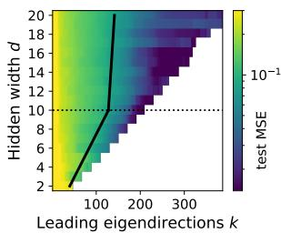

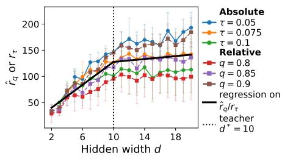

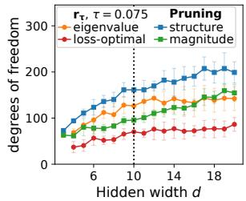  
(a) Test MSE for projecting on vary- (b) Behavioral recovery rank extracted from the pro- (c) Pruning and behavioral recoving number of eigendirections.jection curves, mean and std. over 5 runs. ery rank at a fixed loss threshold.

Figure 1: Task-saturated and capacity-limited regimes for non-linear teacher-student regression.   
Trend-lines (piecewise regression) of both regimes are given in black.

behavioral recovery rank grows with student width and flattens once the student exceeds the teacher width (Figure 1(a)–(b)). On MNIST, it grows sublinearly with width (Figure 2).

(iii) We find that structural and magnitude pruning do not exhibit such flattening, i.e. the parameters they retain keep growing past the teacher's width (Figure 1(c)). Under loss-optimal ordering of directions, both pruning methods retain more parameters than the behavioral recovery rank.

Together, these findings suggest that functional redundancy beyond task saturation is not exposed by weight- or neuron-level structure, and is therefore only partially accessible to standard pruning.

Related Work. Our questions are motivated by several works on degeneracies in neural network parameterizations. Grigsby et al. [14] characterize exact degeneracies, and follow-up work formalizes this perspective through functional dimension, given by the rank of the Jacobian of the realization map on a finite-probe¹ set [15]. However, we argue that, for understanding task performance, the definition of exact symmetry is too narrow: a parameter direction can have only a small effect on the realized behavior of the model without being exactly redundant. This viewpoint is reinforced by the works on intrinsic dimension, showing that many tasks can be solved in subspaces far smaller than the parameter space [28, 1], and by analyses of the loss Hessian, whose spectrum typically shows a large near-zero bulk alongside few outliers [35, 33, 36, 37, 32].

Pruning removes weights or neurons from a trained network while preserving its function. Unstructured methods rank individual weights by magnitude [16] or by a local quadratic model of the loss [27]. Structured methods remove whole neurons and therefore yield computational speed-ups, ranking neurons by norm or by an estimated change in the loss [29, 30]. Both are typically combined with retraining and evaluated by what fraction of the parameter count can be removed while still meeting an accuracy threshold [5]. We expand on these works in Appendix B.

## 2 Methodology

Quantifying degeneracy: Behavioral recovery rank. We first equip the neighborhood of the parameters at a checkpoint during training with a geometry that tracks changes in functional behavior, and then quantify how many of the directions it identifies as behaviorally most relevant are needed to retain a model's performance.

Formally, for a model $f _ { \theta }$ parametrized by $\theta \in \mathbb { R } ^ { p }$ , following Bushnaq et al. [6], we consider the behavioral $\boldsymbol { l o s s ^ { 2 } }$ for two sets of parameters $\tilde { \theta }$ and $\theta _ { * }$

$$
L _ { \mathrm { b e h } } ( { \widetilde { \theta } } ; \theta _ { * } , \mathcal { P } ) = \frac { 1 } { 2 | \mathcal { P } | } \sum _ { x \in \mathcal { P } } \| f _ { \widetilde { \theta } } ( x ) - f _ { \theta _ { * } } ( x ) \| ^ { 2 } ,\tag{1}
$$

where $\mathcal { P } = \{ x _ { i } \} _ { i = 1 } ^ { n }$ is a probe set, and $\| \cdot \|$ denotes the $\ell _ { 2 }$ norm. This loss equips the neighborhood of θ with a geometry tied directly to preservation of learned behavior: perturbations are small when the predictions $f _ { \tilde { \theta } } ( x ) , x \in \mathcal { P }$ , compared to the reference model's predictions $f _ { \boldsymbol { \theta } _ { * } } ( \boldsymbol { x } )$ are nearly unchanged on the probe set. This is in contrast to the empirical loss. Instead of comparing model predictions to ground-truth labels, the behavioral loss compares predictions to those of a reference checkpoint and can therefore be interpreted as a form of local self-distillation, with the checkpoint itself acting as the teacher [19]. By construction, $\theta _ { * }$ is a global minimizer of $L _ { \mathrm { b e h } } ( \tilde { \theta } ; \theta _ { * } , \mathcal { P } )$ , so the first-order term in its Taylor expansion around $\theta _ { * }$ vanishes. Consequently, the leading nontrivial local object is the behavioral Hessian $H _ { \mathrm { b e h } } ( \theta _ { * } ) : = \nabla _ { \tilde { \theta } } ^ { 2 } L _ { \mathrm { b e h } } ( \tilde { \theta } ; \theta _ { * } , \mathcal { P } ) | _ { \tilde { \theta } = \theta ^ { * } }$ , whose structure we discuss further in Appendix E. A second-order Taylor expansion yields $\begin{array} { r } { L _ { \mathrm { b e h } } ( \dot { \theta _ { * } } + \delta ; \theta _ { * } , \mathcal { P } ) = \frac { 1 } { 2 } \delta ^ { \top } H _ { \mathrm { b e h } } ( \theta _ { * } ) \delta + o ( \| \delta \| ^ { 2 } ) } \end{array}$ for $\delta \in \mathbb { R } ^ { p }$ . Thus, the leading eigenvectors of $H _ { \mathrm { b e h } } ( \theta _ { * } )$ identify perturbation directions that induce the largest changes in model behavior on the probe set. Formally, let $\Pi _ { k } ^ { \mathrm { ( b e h ) } }$ denote the projection onto the top-k eigenspace of $H _ { \mathrm { b e h } } ( \theta _ { * } )$ . Given a reference point $\theta _ { \mathrm { r e f } }$ , we reconstruct the learned displacement with respect to $\theta _ { \mathrm { r e f } }$ by

$$
\begin{array} { r } { \hat { \theta } _ { k } = \theta _ { \mathrm { r e f } } + \Pi _ { k } ^ { \mathrm { ( b e h ) } } \big ( \theta _ { * } - \theta _ { \mathrm { r e f } } \big ) , } \end{array}\tag{2}
$$

where we consider the initialization $\theta _ { 0 }$ or 0 as the reference point $\theta _ { \mathrm { r e f } } .$ We define the behavioral recovery rank as the smallest number of leading eigendirections k such that the projected checkpoint $f _ { \hat { \theta } _ { k } }$ recovers a given performance level.³ For a “lower-is-better" metric $\mathcal { M } ,$ such as the empirical training/test loss, with tolerance $\tau > 0 , q \in ( 0 , 1 ]$ and $\begin{array} { r } { \mathcal { M } _ { \leq k } = \operatorname* { m i n } _ { j \leq k } \mathcal { M } ( \widehat { \theta } _ { j } ) } \end{array}$ , we define:

$$
\mathrm { R e l a t i v e : ~ } \hat { r } _ { q } = \operatorname* { m i n } _ { k \in [ p ] } \bigg \{ k : \frac { \mathcal { M } ( \theta _ { \mathrm { r e f } } ) - \mathcal { M } _ { \le k } } { \mathcal { M } ( \theta _ { \mathrm { r e f } } ) - \mathcal { M } ( \theta _ { * } ) } \ge q \bigg \} , \quad \mathrm { T h r e s h o l d : ~ } r _ { \tau } = \operatorname* { m i n } _ { k \in [ p ] } \big \{ k : \mathcal { M } ( \hat { \theta } _ { k } ) \le \tau \big \} .
$$

Intuitively, a small behavioral recovery rank means that the trained model's behavior can be recovered from a low-dimensional part of the trained solution; if this rank grows much more slowly than parameter count, additional parameters mainly enlarge the degeneracy.

In our main experiments, we use the train set as the probe set to compute the behavioral loss in Eq. (1) at a trained model checkpoint $\theta _ { * }$ . We ablate this choice in Appendix G. We estimate the top-k eigenspaces of the Hessian using matrix-free Lanczos iteration; see Appendix C.2 for details.

Pruning baselines. We apply two one-shot gradient-free baselines to the same checkpoints. Magnitude pruning removes the globally smallest weights [16]; structural pruning removes neurons greedily with respect to M. For each we report the smallest number of retained parameters for which the model performance M stays within tolerance threshold τ, counting for structural pruning all parameters attached to surviving neurons. This way, both quantities count degrees of freedom retained to meet the tolerance τ, in the coordinate basis for pruning and in the behavioral-Hessian eigenbasis for $r _ { \tau }$ . We chose two baselines of varying removal granularity, and for comparability with the projection experiments, we do not retrain. We additionally report a refitted variant and apply the same pipeline to the teacher itself in Appendix F.

Model and data. We study degeneracy in two settings of varying difficulty. Firstly, in nonlinear teacher-student regression, we fix a teacher model and vary student width from under- to overcomplete, which allows for a systematic control of the network capacity relative to the data complexity. Secondly, we complement these experiments with width-scaled MLPs on a standard classification task (MNIST [9]). For all experiments, we train with Adam without weight decay [25] for a fixed number of steps. We provide details on both setups in Appendix C.1.

## 3 Results and Discussion

Equipped with this methodology, we can now work towards answering our two introductory questions.

Q1: The task-saturated and capacity-limited regimes. The teacher-student setting allows us to observe the transition between two regimes directly, because task complexity is fixed by the teacher width, giving us a priori control over model capacity relative to the task. While the student is capacity-limited (narrower than the teacher), added parameters improve performance gradually as a large fraction of the available directions contributes to the learned behavior as shown in Figure 1(b). As the student matches or exceeds the teacher width, the task becomes saturated: the recovery curves in Figure 1(a) become increasingly steep, only a limited number of leading directions is needed to approach the final performance, and additional directions yield diminishing improvements. The

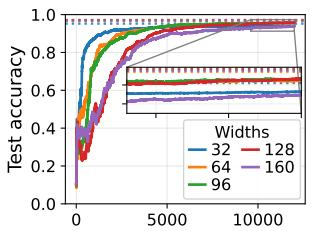  
Leading eigendirections k

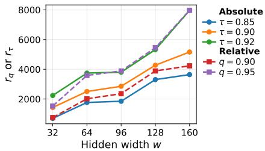

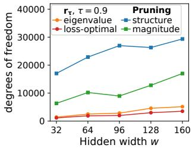  
(a) Test accuracy under projection, (b) Leading eigendirections k required to reach an (c) Comparison of behavioral recovcompared to final accuracy (dotted). accuracy threshold τ, for different widths. ery rank to two pruning baselines.

Figure 2: On MNIST, wider models need more directions to recover performance, indicating additional behaviorally relevant directions, but sublinear growth relative to width.

piecewise regression in Figure 1(b) reveals that the growth of the behavioral recovery rank for these threshold levels slows from 11 to 1.3 directions per added neuron (21 parameters). Absolute and relative recovery criteria exhibit the same qualitative transition.

For MNIST, the task complexity is unknown, and the operating regime must therefore be inferred from the scaling of the rank. Figure 2(a)–(b) shows that wider models achieve higher accuracy and require more leading eigendirections to recover their performance. The recovery rank grows sublinearly with width under both absolute and relative criteria. Thus, the investigated models remain capacity-limited in the sense that width introduces additional behaviorally relevant directions, but these directions grow substantially more slowly than the number of parameters.

Q2: Redundancy accessible to pruning. We now use the behavioral recovery rank as a geometric benchmark for assessing how much of the identified redundancy is exploited by pruning. Figure 1(c) compares the behavioral recovery rank with structural and magnitude pruning at a fixed performance threshold. Once the student width reaches the teacher width, the behavioral recovery rank slows markedly, whereas the number of parameters retained by both pruning methods continues to grow. Hence, the additional redundancy arising beyond task saturation is not effectively exposed by these one-shot pruning criteria, which therefore underestimate the degeneracy present in this regime.

The red curve in Figure 1(c) reports the same projection experiment but orders directions by $\lambda _ { j } \langle v _ { j } , \theta _ { \ast } - \theta _ { \mathrm { r e f } } \rangle ^ { 2 }$ rather than by $\lambda _ { j }$ alone. Under the quadratic model, this ordering minimizes the behavioral loss for a fixed budget of k directions on the probe set. It approximately halves the recovery rank, indicating even greater degeneracy than the eigenvalue ordering reveals, and both pruning baselines retain more degrees of freedom at every width. Since individual behavioral eigendirections can mix parameters across all hidden units, whereas structural and magnitude pruning remove units or weights in the original parameterization, the observed gap suggests that the redundant directions are not aligned with these architectural coordinates. The ordering persists on MNIST, where the recovery rank keeps growing because these models remain capacity-limited (Figure 2(c)).

Discussion. The behavioral recovery rank provides a task-dependent distinction between nominal model size and the effective number of parameter directions needed to preserve learned behavior. Pruning operates locally, on the individual weights and units that the architecture provides, whereas each behavioral eigendirection combines all parameters. Although low-dimensional, this eigenbasis representation is not directly feasible for compression, since each basis element is as large as the dense model. The behavioral recovery rank bounds instead what a function-adapted basis could remove. Consistent with this, closed-form output refitting recovers much of the gap (Appendix F). Whether such a basis is also inexpensive to describe, for instance via structured families such as layerwise or blockwise transforms, and how to utilize it for compression remain open.

Because the behavioral recovery rank flattens while the parameter count and the free parameters retained by pruning continue to grow, compression measured only relative to the original parameter count may understate the redundancy that remains once task complexity is saturated. This opens an avenue towards predictive theory, since degeneracy fixed by the task could be measured on a small model and used to bound what compression can achieve on larger ones.

Limitations and future work. Our experiments are restricted to two small settings in which repeated behavioral-Hessian eigensolves remain tractable. Making the rank operational will require additional work, such as blockwise restriction or subsampling of the probe set. Establishing whether the identified regimes persist at scale will further require broader architectures and datasets, together with ablations over the probe set, reference point and parametrization that separate genuine capacity effects from width-dependent optimization and regularization. We compare against two one-shot pruning baselines, which may understate the compression a full pipeline with retraining or quantization could achieve. Finally, a theoretical characterization of the behavioral recovery rank could clarify under which conditions these width-scaling regimes persist, support compression or generalization guarantees, and connect the observed transitions to phenomena such as double descent [4].

## Acknowledgments

MM, PE and GK acknowledge the support by the Munich Center for Machine Learning (MCML). MM and GK are supported by the DAAD programme Konrad Zuse Schools of Excellence in Artificial Intelligence, sponsored by the German Federal Ministry of Research, Technology and Space.

## References

[1] Armen Aghajanyan, Sonal Gupta, and Luke Zettlemoyer. Intrinsic dimensionality explains the effectiveness of language model fine-tuning. In Chengqing Zong, Fei Xia, Wenjie Li, and Roberto Navigli, editors, Proceedings of the 59th Annual Meeting of the Association for Computational Linguistics and the 11th International Joint Conference on Natural Language Processing (Volume 1: Long Papers), pages 7319–7328, Online, August 2021. Association for Computational Linguistics.

[2] Shun-ichi Amari and Hiroshi Nagaoka. Methods of Information Geometry. Translations of Mathematical Monographs. American Mathematical Society, 2000.

[3] Yasaman Bahri, Ethan Dyer, Jared Kaplan, Jaehoon Lee, and Utkarsh Sharma. Explaining neural scaling laws. Proceedings of the National Academy of Sciences, 2024.

[4] Mikhail Belkin, Daniel Hsu, Siyuan Ma, and Soumik Mandal. Reconciling modern machinelearning practice and the classical bias-variance trade-off. Proceedings of the National Academy of Sciences, 2019.

[5] Davis Blalock, Jose Javier Gonzalez Ortiz, Jonathan Frankle, and John Guttag. What is the state of neural network pruning? In I. Dhillon, D. Papailiopoulos, and V. Sze, editors, Proceedings of Machine Learning and Systems, volume 2, pages 129–146, 2020.

[6] Lucius Bushnaq, Jake Mendel, Stefan Heimersheim, Dan Braun, Nicholas Goldowsky-Dill, Kaarel Hänni, Cindy Wu, and Marius Hobbhahn. Using degeneracy in the loss landscape for mechanistic interpretability, 2024.

[7] Lawrence Cayton. Algorithms for manifold learning. Technical Report CS2008-0923, University of California, San Diego, 2005.

[8] Jeremy Cohen, Simran Kaur, Yuanzhi Li, J Zico Kolter, and Ameet Talwalkar. Gradient descent on neural networks typically occurs at the edge of stability. In International Conference on Learning Representations, 2021.

[9] Li Deng. The mnist database of handwritten digit images for machine learning research. IEEE Signal Processing Magazine, 2012.

[10] Zhou Fan and Zhichao Wang. Spectra of the conjugate kernel and neural tangent kernel for linear-width neural networks. Advances in neural information processing systems, 2020.

[11] Jonathan Frankle and Michael Carbin. The lottery ticket hypothesis: Finding sparse, trainable neural networks. In International Conference on Learning Representations, 2019.

[12] Timur Garipov, Pavel Izmailov, Dmitrii Podoprikhin, Dmitry Vetrov, and Andrew G Wilson. Loss surfaces, mode connectivity, and fast ensembling of dnns. In S. Bengio, H. Wallach, H. Larochelle, K. Grauman, N. Cesa-Bianchi, and R. Garnett, editors, Advances in Neural Information Processing Systems, volume 31. Curran Associates, Inc., 2018.

[13] Ian Goodfellow, Yoshua Bengio, and Aaron Courville. Deep Learning. MIT Press, 2016.

[14] J. Elisenda Grigsby, Kathryn Lindsey, and David Rolnick. Hidden symmetries of ReLU networks. In Proceedings of the 40th International Conference on Machine Learning, Proceedings of Machine Learning Research, 2023.

[15] J. Elisenda Grigsby, Kathryn Lindsey, Robert Meyerhoff, and Chenxi Wu. Functional dimension of feedforward ReLU neural networks. Advances in Mathematics, 2025.

[16] Song Han, Jeff Pool, John Tran, and William J. Dally. Learning both weights and connections for efficient neural network. In C. Cortes, N. Lawrence, D. Lee, M. Sugiyama, and R. Garnett, editors, Advances in Neural Information Processing Systems, volume 28. Curran Associates, Inc., 2015.

[17] Song Han, Huizi Mao, and William J. Dally. Deep compression: Compressing deep neural network with pruning, trained quantization and huffman coding. In International Conference on Learning Representations, 2016.

[18] Babak Hassibi, David Stork, and Gregory Wolff. Optimal brain surgeon: Extensions and performance comparisons. In J. Cowan, G. Tesauro, and J. Alspector, editors, Advances in Neural Information Processing Systems, volume 6. Morgan-Kaufmann, 1993.

[19] Geoffrey Hinton, Oriol Vinyals, and Jeff Dean. Distilling the knowledge in a neural network. arXiv preprint arXiv:1503.02531, 2015.

[20] Sepp Hochreiter and Jürgen Schmidhuber. Flat minima. Neural Computation, 1997.

[21] Jordan Hoffmann, Sebastian Borgeaud, Arthur Mensch, Elena Buchatskaya, Trevor Cai, Eliza Rutherford, Diego de Las Casas, Lisa Anne Hendricks, Johannes Welbl, Aidan Clark, Thomas Hennigan, Eric Noland, Katherine Millican, George van den Driessche, Bogdan Damoc, Aurelia Guy, Simon Osindero, Karén Simonyan, Erich Elsen, Oriol Vinyals, Jack Rae, and Laurent Sifre. An empirical analysis of compute-optimal large language model training. In Advances in Neural Information Processing Systems, 2022.

[22] Arthur Jacot, Franck Gabriel, and Clément Hongler. Neural tangent kernel: Convergence and generalization in neural networks. Advances in neural information processing systems, 2018.

[23] Jared Kaplan, Sam McCandlish, Tom Henighan, Tom B. Brown, Benjamin Chess, Rewon Child, Scott Gray, Alec Radford, Jeffrey Wu, and Dario Amodei. Scaling laws for neural language models. 2020.

[24] Nitish Shirish Keskar, Dheevatsa Mudigere, Jorge Nocedal, Mikhail Smelyanskiy, and Ping Tak Peter Tang. On large-batch training for deep learning: Generalization gap and sharp minima. In International Conference on Learning Representations, 2017.

[25] Diederik P. Kingma and Jimmy Ba. Adam: A method for stochastic optimization. In International Conference on Learning Representations, 2015.

[26] Edmund Lau, Zach Furman, George Wang, Daniel Murfet, and Susan Wei. The local learning coefficient: A singularity-aware complexity measure. In The 28th International Conference on Artificial Intelligence and Statistics, 2025.

[27] Yann LeCun, John Denker, and Sara Solla. Optimal brain damage. In D. Touretzky, editor Advances in Neural Information Processing Systems, volume 2. Morgan-Kaufmann, 1989.

[28] Chunyuan Li, Heerad Farkhoor, Rosanne Liu, and Jason Yosinski. Measuring the intrinsic dimension of objective landscapes. In International Conference on Learning Representations 2018.

[29] Hao Li, Asim Kadav, Igor Durdanovic, Hanan Samet, and Hans Peter Graf. Pruning filters for efficient convnets. In International Conference on Learning Representations, 2017.

[30] Pavlo Molchanov, Arun Mallya, Stephen Tyree, Iuri Frosio, and Jan Kautz. Importance estimation for neural network pruning. In 2019 IEEE/CVF Conference on Computer Vision and Pattern Recognition (CVPR), pages 11256–11264, 2019. doi: 10.1109/CVPR.2019.01152.

[31] Behnam Neyshabur, Srinadh Bhojanapalli, David McAllester, and Nati Srebro. Exploring generalization in deep learning. In I. Guyon, U. Von Luxburg, S. Bengio, H. Wallach, R. Fergus, S. Vishwanathan, and R. Garnett, editors, Advances in Neural Information Processing Systems, volume 30. Curran Associates, Inc., 2017.

[32] Lorenzo Noci, Alexandru Meterez, Thomas Hofmann, and Antonio Orvieto. Super consistency of neural network landscapes and learning rate transfer. In Advances in Neural Information Processing Systems, 2024.

[33] Vardan Papyan. The full spectrum of deepnet hessians at scale: Dynamics with SGD training and sample size. arXiv preprint arXiv:1811.07062, 2018.

[34] Yousef Saad. Numerical Methods for Large Eigenvalue Problems. Society for Industrial and Applied Mathematics, 2011.

[35] Levent Sagun, Utku Evci, V. Ugur Guney, Yann Dauphin, and Leon Bottou. Empirical analysis of the hessian of over-parametrized neural networks, 2018.

[36] Sidak Pal Singh and Thomas Hofmann. Closed form of the hessian spectrum for some neural networks. In High-dimensional Learning Dynamics 2024: The Emergence of Structure and Reasoning, 2024.

[37] Sidak Pal Singh, Gregor Bachmann, and Thomas Hofmann. Analytic insights into structure and rank of neural network hessian maps. In M. Ranzato, A. Beygelzimer, Y. Dauphin, P.S. Liang, and J. Wortman Vaughan, editors, Advances in Neural Information Processing Systems, 2021.

[38] Sumio Watanabe. Algebraic Geometry and Statistical Learning Theory. Cambridge University Press, 2009.

[39] Nick Whiteley, Annie Gray, and Patrick Rubin-Delanchy. Statistical exploration of the manifold hypothesis. Journal of the Royal Statistical Society Series B: Statistical Methodology, 2026.

## A Ethical Considerations

## A.1 Impact statement

This paper presents work whose goal is to advance the field of Machine Learning. There are many potential societal consequences of our work, none of which we feel must be specifically highlighted here.

## A.2 Disclosure of AI use

We utilized AI tools for support with coding, editing, and ideation. All AI-generated suggestions were critically reviewed and refined by the authors, and we take full responsibility for the work presented.

## B Extended Related Work Discussion

In the following, we discuss the related work directions outlined in the introduction in more detail.

Scaling laws describe how model loss varies with model size, data, and compute [23]. Hoffmann et al. [21] show that model size and token count should be scaled together, and Bahri et al. [3] emphasize that different regimes can exhibit different exponents. This motivates studying how the behavioral recovery rank varies with the hidden size of the model.

Singular learning theory studies model complexity through the local singular structure around a solution [38]. The local learning coefficient (LLC) quantifies how the volume of a low-loss region shrinks as one zooms in around a local minimum [26]. Following this local perspective, we adopt the behavioral loss introduced by Bushnaq et al. [6]. In their framework, the LLC of the behavioral loss defines an effective parameter count, and the rank of its Hessian gives a tractable lower bound on the corresponding local dimension. They further connect this functional degeneracy to concrete network properties, such as linear dependence in both the activations and the backpropagated gradients, and use the so-called interaction basis to interpret the model independent of parameterization.

Hessian analysis. Training is often studied through the Hessian of the training or validation loss. A recurring phenomenon, observed empirically and analyzed in simplified settings, is that the loss Hessian possesses a spectrum with a large near-zero bulk together with a small set of outliers [35, 33, 36]. Analytic work further shows that such rank deficiency can follow from architectural structure itself such as width, depth, and bias configuration [37]. More recently, Noci et al. [32] show that under $\mu \mathrm { P }$ parametrization, certain spectral properties of the loss Hessian remain largely stable across model sizes, a phenomenon they call super consistency. Works on the Edge-of-stability further connect the loss-curvature to optimization dynamics via the learning rate [8]. Together, these results suggest that increasing parameter count need not create proportionally many new relevant loss curvature directions. By contrast, our behavioral construction replaces supervised targets by the outputs of a fixed trained checkpoint on a probe set, instead of the curvature induced by the labels. This can be viewed as local self-distillation with the checkpoint itself as the teacher [19]. We discuss the connection of both second-order objects in Appendix E.2.

Intrinsic dimension. The works on intrinsic dimension suggest that once a model family is sufficiently large, the actual dimensionality required to solve a task remains relatively stable [28]. Aghajanyan et al. [1] report similarly low intrinsic dimensionality in language-model fine-tuning. Intrinsic dimension is defined through training in random low-dimensional subspaces, whereas our statistic is computed after training in a Hessian-aligned subspace around a fixed checkpoint. Still, these results provide a clear prior for our setting: the dimension relevant to the learned solution may grow substantially more slowly than the total number of parameters. This is also echoed by the manifold hypothesis, which posits that high-dimensional data concentrate near lower-dimensional structure [7, 39].

Functional dimension measures the local dimension of the realized function class and can be computed on finite batches via the rank of the evaluation-map Jacobian [15]. Grigsby et al. [14] show that exact degeneracies of ReLU networks can depend on architectural parameters. The same finite-probe Jacobian also appears in the empirical Neural Tangent Kernel theory [22], its spectrum was analyzed in [10]. However, we use this object post hoc around trained checkpoints, rather than to analyze training dynamics near initialization. We discuss these connections in Appendix E.

Pruning. Pruning asks which parameters can be removed from a trained network while preserving its function. The classical saliency methods estimate the effect of removing a weight through a local quadratic model of the loss, either under a diagonal approximation of the Hessian [27] or using its inverse to additionally compensate the remaining weights [18]. Magnitude pruning replaces this by the far cheaper proxy of weight size [16], which remains competitive at scale and forms the first stage of standard compression pipelines [17]. Unstructured sparsity does not translate into speedups on dense hardware without specialized kernel support. Structured pruning methods remove neurons, directly impacting the weight matrix size involved in the computation, by ranking them by norm [29] or by a first-order estimate of the induced change in the loss [30]. These methods are typically combined with retraining [16] and evaluated by what fraction of the parameter count can be removed while still meeting an accuracy threshold [5]. In either case the criterion is expressed in the coordinate basis of the parameterization, whereas the behavioral recovery rank counts directions in the eigenbasis of the behavioral Hessian, which need not align with any weight or unit. To compare with the projection experiments, we do not retrain and use a greedy pruning approach, as described in Section 2.

## C Experimental details

This section provides the detailed experimental configuration used throughout the paper, including datasets, model architectures, training procedures, and implementation specifics. We describe both the synthetic teacher-student regression setup and the MNIST classification experiments in Section C.1, together with the optimization settings and computational methods used to analyze the resulting models in Section C.2.

## C.1 Data, models, training

In this section, we introduce the datasets and experimental setups. We describe the data generation process for the synthetic regression experiments in Section C.1.1 as well as the preprocessing and training configuration for MNIST classification in Section C.1.2.

## C.1.1 Nonlinear teacher-student regression

In order to systematically control model capacity, we utilize a synthetic teacher-student regression setup with two-layer ReLU MLPs.

For this, we sample the inputs according to

$$
x \sim \mathcal { N } ( 0 , I _ { d _ { \mathrm { i n } } } ) .
$$

The teacher network $f _ { T }$ generates regression targets $y = f _ { T } ( x ) + \varepsilon \mathrm { w i t h } \varepsilon \sim \mathcal { N } ( 0 , \sigma ^ { 2 } I )$

Both teacher and student are two-layer ReLU networks, with bias terms. For the experiments in the main paper, the teacher has architecture $1 0  1 0  1 0$ and the student has architecture $1 0  d  1 0$ , and the data is noise-less. These choices are ablated in Appendix G.

For each width $d \in \{ 2 , \ldots , 2 0 \}$ , we draw 2048 training examples and 512 test examples. Students are trained with full-batch Adam for 4000 optimization steps using learning rate $1 \dot { 0 } ^ { - 3 }$ and $\beta _ { 1 } =$ $0 . 9 , \beta _ { 2 } = 0 . 9 9 9 , \varepsilon = 1 e - 8$ and no weight decay. The task loss is mean-squared error to the teacher outputs. For the projection experiments, we use the reference point $\theta _ { \mathrm { r e f } } = 0$ . We ablate this choice in Figure 4.

## C.1.2 MNIST

For the classification experiment, we train width-scaled MLPs on MNIST. Images are flattened to vectors in $\mathbb { R } ^ { 7 8 4 }$ , normalized using the empirical mean and standard deviation of the selected training subset.

The model is a two-hidden-layer ReLU MLP

$$
7 8 4 \to h _ { 1 } \to h _ { 2 } \to 1 0 .
$$

In width-scaled runs, we set $h _ { 1 } = h _ { 2 } = w$ and sweep

$$
w \in \{ 3 2 , \ 6 4 , \ 9 6 , \ 1 2 8 , \ 1 6 0 \} .
$$

We train with Adam for 2000 optimization steps using learning rate $1 0 ^ { - 3 } , \beta _ { 1 } = 0 . 9 , \beta _ { 2 } = 0 . 9 9 9 , \varepsilon =$ $1 e - 8$ , mini-batch size 64, no weight decay and cross-entropy loss. For the projection experiments, we use the initialization as reference point $\theta _ { \mathrm { r e f } } = \theta _ { 0 }$ and a probe size of 10000.

## C.2 Implementation

All experiments are implemented in PyTorch and were run on NVIDIA RTX 2080 Ti, TITAN RTX or RTX A6000. In total, the reported MNIST experiments required approximately 150 GPU-hours of compute; we note that this is an estimate given the heterogeneous compute environment.

Since explicitly forming the behavioral Hessian is computationally expensive, we instead access it through matrix-free eigensolves. For this, we work with the equivalent dual operator $| P | ^ { - 1 } J _ { P } J _ { P } ^ { \top }$ in probe-output space (see Appendix E), implemented via Jacobian-vector and vector-Jacobian products. We estimate the leading eigenspaces using symmetric Lanczos iteration with full orthogonalization [34]. The number of Lanczos steps is chosen as min $( D , \operatorname* { m a x } ( 4 k , 6 0 ) )$ for a target of k leading eigenpairs, where $D = | \mathcal { P } | m$ is the dimension of the operator. Eigenpairs are retained by the scaleinvariant criterion $\lambda _ { j } > \mathrm { { 1 0 ^ { - 6 } } } \lambda _ { 1 }$ , since an absolute cutoff would depend on the output scale, which varies across widths. Parameter-space eigenvectors are recovered lazily as $v _ { j } = J _ { \mathcal { P } } ^ { \top } u _ { j } / \lVert J _ { \mathcal { P } } ^ { \top } u _ { j } \rVert$ and re-orthonormalized by modified Gram-Schmidt before being accumulated.

## D Variants of the behavioral recovery rank

Higher-is-better metrics. Recall that

Relative:

$$
\hat { r } _ { q } = \operatorname* { m i n } _ { k \in [ p ] } \left\{ k : \frac { \mathcal { M } ( \theta _ { \mathrm { r e f } } ) - \mathcal { M } _ { \le k } } { \mathcal { M } ( \theta _ { \mathrm { r e f } } ) - \mathcal { M } ( \theta _ { * } ) } \ge q \right\} , \qquad \mathcal { M } _ { \le k } = \operatorname* { m i n } _ { j \le k } \mathcal { M } ( \hat { \theta } _ { j } ) .\tag{3}
$$

Threshold :

$$
r _ { \tau } = \operatorname* { m i n } _ { k \in [ p ] } \big \{ k : \mathcal { M } ( \widehat { \theta } _ { k } ) \leq \tau \big \} .\tag{4}
$$

Then equations (3) and (4) give the forms used for the teacher-student experiments, where $\mathcal { M }$ is a loss. For a “higher-is-better" metric $\mathcal { M }$ , such as the accuracy used in the MNIST experiments, with $q \in ( 0 , 1 ]$ and $\tau > 0$ , the corresponding definitions are

Relative: $\hat { r } _ { q } = \operatorname* { m i n } _ { k \in [ p ] } \left\{ k : \mathcal { M } ( \hat { \theta } _ { k } ) \geq q \mathcal { M } ( \theta _ { * } ) \right\}$ or Threshold: $r _ { \tau } = \operatorname* { m i n } _ { k \in [ p ] } \left\{ k : \mathcal { M } ( \widehat { \theta } _ { k } ) \geq \tau \right\}$

The MNIST experiments use accuracy, since it is a classification task.

Ordering the directions Throughout the main paper $\hat { r } _ { q }$ and $r _ { \tau }$ project onto the top-k eigendirections ordered by decreasing eigenvalue $\lambda _ { j }$

We will derive a different version, which lower bounds it. For this, let $\{ v _ { j } \}$ be the orthonormal eigenvectors of $H _ { \mathrm { b e h } } ( \theta _ { * } )$ with eigenvalues $\lambda _ { j }$ , and expand the learned displacement $\theta _ { * } - \theta _ { \mathrm { r e f } }$ in this basis. Retaining an index set S gives the reconstruction

$$
\hat { \theta } _ { S } = \theta _ { \mathrm { r e f } } + \sum _ { j \in S } \langle v _ { j } , \theta _ { * } - \theta _ { \mathrm { r e f } } \rangle v _ { j } ,
$$

so the unrecovered component of the displacement is

$$
\widehat { \theta } _ { S } - \theta _ { * } = - \sum _ { j \notin S } \langle v _ { j } , \theta _ { * } - \theta _ { \mathrm { r e f } } \rangle v _ { j } , \qquad \left\| \widehat { \theta } _ { S } - \theta _ { * } \right\| ^ { 2 } = \sum _ { j \notin S } \langle v _ { j } , \theta _ { * } - \theta _ { \mathrm { r e f } } \rangle ^ { 2 } .
$$

Evaluating the second-order model of the behavioral loss at ${ \hat { \theta } } _ { S }$ and using orthonormality of the eigenbasis gives the exact identity

$$
\frac { 1 } { 2 } \big ( \hat { \theta } _ { S } - \theta _ { * } \big ) ^ { \top } H _ { \mathrm { b e h } } ( \theta _ { * } ) \big ( \hat { \theta } _ { S } - \theta _ { * } \big ) = \frac { 1 } { 2 } \sum _ { j \notin S } \lambda _ { j } \langle v _ { j } , \theta _ { * } - \theta _ { \mathrm { r e f } } \rangle ^ { 2 } ,\tag{5}
$$

and $L _ { \mathrm { b e h } } ( \hat { \theta } _ { S } ; \theta _ { * } , \mathcal { P } )$ agrees with (5) up to $o \big ( \big \| \hat { \theta } _ { S } - \theta _ { * } \big \| ^ { 2 } \big )$ . It is minimized when the eigendirections are ordered decreasing according to the corresponding $\ddot { \lambda _ { j } } \langle v _ { j } , \theta _ { * } - \theta _ { \mathrm { r e f } } \rangle ^ { 2 }$ . We define the corresponding statistic as the loss-optimal behavioral recovery rank $r _ { \tau } ^ { \mathrm { o p t } } \leq r _ { \tau }$ .

For two reasons, the eigenvalue ordering is our main definition. First, $\{ \lambda _ { j } , v _ { j } \}$ depend only on $H _ { \mathrm { b e h } } ( \theta _ { * } )$ , and hence on the model and the probe distribution, whereas $\lambda _ { j } \big < v _ { j } , \dot { \theta _ { * } } - \theta _ { \mathrm { r e f } } \big >$ depends in addition on $\theta _ { \mathrm { r e f } } , \mathrm { i . e }$ . on where the optimizer landed. As a result, the loss-optimal rank mixes local geometry with the training trajectory. Second, the loss-optimal can only be applied within the whole eigenspace that has actually been computed, with the other definition only requiring the top of the spectrum.

## E Behavioral Hessian geometry

This appendix develops the geometric interpretation of the behavioral Hessian introduced in Section 2 and relates it to several established objects in optimization and representation theory. The sections are tied together through a common geometric object: the Jacobian of the finite-probe evaluation map, $J _ { \mathcal { P } } ( \bar { \theta _ { * } } )$ . Each section studies how different notions of local model geometry arise from this same Jacobian, but viewed from different perspectives and in different spaces.

• In Section E.1, the Jacobian defines the behavioral Hessian as the parameter-space Gram matrix $J _ { \mathcal { P } } ^ { \top } J _ { \mathcal { P } }$ , which characterizes the local sensitivity of model outputs to parameter perturbations.

• Section E.2 shows that the same structure appears within the generalized Gauss-Newton component of the task-loss Hessian, thereby connecting behavioral geometry to standard optimization curvature.

• In Section E.3, the rank and kernel of the Jacobian are related to functional dimension, linking flat parameter directions to infinitesimal function-preserving transformations.

• Section E.4 then considers the dual object $J _ { \mathcal { P } } J _ { \mathcal { P } } ^ { \top }$ , namely the empirical NTK, which acts in function space rather than parameter space while sharing the same nonzero spectrum.

• Finally, Section E.5 interprets the same Gram structure statistically as an empirical Fisher information matrix, providing an information-geometric interpretation in terms of local identifiability and informative directions.

Taken together, the appendix shows that behavioral curvature, optimization curvature, functional degeneracy, NTKs, and Fisher information can all be understood as different manifestations of the same local Jacobian geometry induced by the probe evaluation map.

## E.1 Behavioral Hessian geometry

In this section, we discuss the behavioral Hessian introduced in Section 2. Throughout this appendix, let $\theta _ { * } \in \mathbb { R } ^ { p }$ be a trained checkpoint, $m = \dim ( f _ { \theta } ( x ) )$ the output dimension, and let $\mathcal { P }$ be a finite probe set. We define the finite-probe evaluation map

$$
F _ { \mathcal { P } } ( \boldsymbol { \theta } ) = \big ( f _ { \boldsymbol { \theta } } ( \boldsymbol { x } ) \big ) _ { \boldsymbol { x } \in \mathcal { P } } \in \mathbb { R } ^ { | \mathcal { P } | m } ,
$$

where m is the output dimension and we stack all outputs. Let

$$
J _ { \mathcal { P } } ( \theta ) = \frac { \partial F _ { \mathcal { P } } ( \theta ) } { \partial \theta }
$$

denote its Jacobian. We can now write the behavioral loss in vector notation as

$$
L _ { \mathrm { b e h } } ( \theta ; \theta _ { * } , \mathcal { P } ) = \frac { 1 } { 2 | \mathcal { P } | } \left\| F _ { \mathcal { P } } ( \theta ) - F _ { \mathcal { P } } ( \theta _ { * } ) \right\| _ { 2 } ^ { 2 } .
$$

Differentiating once gives

$$
\nabla _ { \boldsymbol { \theta } } L _ { \mathrm { b e h } } ( \boldsymbol { \theta } ; \boldsymbol { \theta } _ { * } , \mathcal { P } ) = \frac { 1 } { | \mathcal { P } | } J _ { \mathcal { P } } ( \boldsymbol { \theta } ) ^ { \top } \left( F _ { \mathcal { P } } ( \boldsymbol { \theta } ) - F _ { \mathcal { P } } ( \boldsymbol { \theta } _ { * } ) \right) .
$$

Differentiating again yields

$$
\nabla _ { \boldsymbol { \theta } } ^ { 2 } L _ { \mathrm { b e h } } ( \boldsymbol { \theta } ; \boldsymbol { \theta } _ { * } , \mathcal { P } ) = \frac { 1 } { | \mathcal { P } | } J _ { \mathcal { P } } ( \boldsymbol { \theta } ) ^ { \top } J _ { \mathcal { P } } ( \boldsymbol { \theta } ) + \frac { 1 } { | \mathcal { P } | } \sum _ { i = 1 } ^ { | \mathcal { P } | m } \left( F _ { \mathcal { P } } ( \boldsymbol { \theta } ) - F _ { \mathcal { P } } ( \boldsymbol { \theta } _ { * } ) \right) _ { i } \nabla _ { \boldsymbol { \theta } } ^ { 2 } \big ( F _ { \mathcal { P } } ( \boldsymbol { \theta } ) \big ) _ { i } .
$$

$\operatorname { A t } \theta = \theta _ { * }$ , the residual is zero. Therefore the second term vanishes, and the behavioral Hessian is the Jacobian Gram matrix

$$
H _ { \mathrm { b e h } } ( \theta _ { * } ; \mathcal { P } ) = \nabla _ { \theta } ^ { 2 } L _ { \mathrm { b e h } } ( \theta _ { * } ; \theta _ { * } , \mathcal { P } ) = \frac { 1 } { | \mathcal { P } | } J _ { \mathcal { P } } ( \theta _ { * } ) ^ { \top } J _ { \mathcal { P } } ( \theta _ { * } ) .\tag{6}
$$

We also highlight that by Equation (6),

$$
\mathrm { r a n k } \big ( H _ { \mathrm { b e h } } ( \theta _ { * } ; \mathcal { P } ) \big ) = \mathrm { r a n k } \big ( J _ { \mathcal { P } } ( \theta _ { * } ) \big ) \leq \mathrm { m i n } \{ p , | \mathcal { P } | m \} .
$$

Thus the behavioral Hessian is necessarily rank-limited by both parameter dimension and probe-output dimension. In particular, $\mathrm { i f ~ } | \mathcal { P } | m < p$ , then its nullspace has dimension at least $p - | \mathcal { P } | m$

## E.2 Connection to the task loss Hessian

Let $\mathcal { X } = \{ x _ { i } \} _ { i = } ^ { N }$ 1denote the training data, $\{ y _ { i } \} _ { i = 1 } ^ { N }$ corresponding outputs and consider the supervised task loss

$$
L _ { \mathrm { t a s k } } ( \theta ) = \frac { 1 } { N } \sum _ { i = 1 } ^ { N } \ell ( f _ { \theta } ( x _ { i } ) , y _ { i } ) .
$$

Define the corresponding stacked evaluation map $F _ { \mathcal { X } } ( \theta ) = \left( f _ { \theta } ( x _ { i } ) \right) _ { i = 1 } ^ { N } \in \mathbb { R } ^ { N m }$ with $J _ { \mathcal { X } } ( \theta ) =$ $\frac { \partial F _ { \mathcal { X } } ( \theta ) } { \partial \theta }$ its Jacobian.

The Hessian of the task loss at $\theta _ { * }$ decomposes into a generalized Gauss-Newton term and a curvatureresidual term:

$$
\nabla _ { \theta } ^ { 2 } L _ { \mathrm { t a s k } } ( \theta _ { * } ) = H _ { \mathrm { G N } } ( \theta _ { * } ) + R _ { \mathrm { c u r v } } ( \theta _ { * } )
$$

with

$$
H _ { \mathrm { G N } } ( \theta _ { * } ) = J _ { \mathcal { X } } ( \theta _ { * } ) ^ { \top } \left[ \frac { 1 } { N } \mathrm { b l o c k d i a g } _ { i = 1 } ^ { N } \left( \nabla _ { 1 } ^ { 2 } \ell ( a , y _ { i } ) \big | _ { a = f _ { \theta _ { * } } ( x _ { i } ) } \right) \right] J _ { \mathcal { X } } ( \theta _ { * } ) ,
$$

where the Hessian $\nabla _ { 1 } ^ { 2 } \ell$ is taken with respect to the first component, the model output $f _ { \boldsymbol { \theta } } ( \boldsymbol { x } _ { i } )$ . The remaining term is

$$
R _ { \mathrm { c u r v } } ( \theta _ { * } ) = \frac { 1 } { N } \sum _ { i = 1 } ^ { N } \sum _ { j = 1 } ^ { m } \frac { \partial \ell } { \partial f _ { j } } \big ( f _ { \theta _ { * } } ( x _ { i } ) , y _ { i } \big ) \nabla _ { \theta } ^ { 2 } f _ { \theta , j } ( x _ { i } ) \big | _ { \theta = \theta _ { * } } .
$$

If the probe set is chosen as the training set, $\mathcal { P } = \mathcal { X }$ , and l is the MSE-loss, the behavioral Hessian becomes the Gauss-Newton component of the task Hessian:

$$
H _ { \mathrm { b e h } } ( \theta _ { * } ; \mathcal { P } ) = H _ { \mathrm { G N } } ( \theta _ { * } ) .
$$

## E.3 Connection to functional dimension

Following Grigsby et al. [15], the batch functional dimension at $\theta _ { * }$ on a finite probe set $\mathcal { P }$ is

$$
\mathrm { F D } _ { \mathcal { P } } ( \theta _ { * } ) = \mathrm { r a n k } \big ( J _ { \mathcal { P } } ( \theta _ { * } ) \big ) .
$$

The full local functional dimension is obtained by taking the supremum over finite probe sets,

$$
\mathrm { F D } ( \theta _ { * } ) = \operatorname* { s u p } _ { \mathcal { Q } } \operatorname { r a n k } \big ( J _ { \mathcal { Q } } ( \theta _ { * } ) \big ) .
$$

Thus $\mathrm { F D } _ { \mathcal { P } } ( \theta _ { * } ) \leq \mathrm { F D } ( \theta _ { * } )$

We know from Equation (6) that the behavioral Hessian is the Jacobian Gram matrix $J _ { \mathcal { P } } ^ { \top } J _ { \mathcal { P } }$ , which has the same kernel as $J _ { \mathcal { P } }$ and hence

$$
\operatorname { r a n k } \big ( H _ { \mathrm { b e h } } ( \theta _ { * } ; \mathcal { P } ) \big ) = \operatorname { F D } _ { \mathcal { P } } ( \theta _ { * } ) \leq \operatorname { F D } ( \theta _ { * } ) .
$$

This connects our local loss-geometry statistic to exact functional degeneracy: Directions in the kernel for all finite probe sets are infinitesimal degeneracies of the realization map: to first order, they do not change the represented function.

## E.4 Connection to the empirical NTK

The same evaluation-map Jacobian also defines the empirical neural tangent kernel on the probe set. The empirical NTK at $\theta _ { * }$ is

$$
K _ { \mathcal { P } } ( \boldsymbol { \theta } _ { * } ) = \frac { 1 } { \vert \mathcal { P } \vert } J _ { \mathcal { P } } ( \boldsymbol { \theta } _ { * } ) J _ { \mathcal { P } } ( \boldsymbol { \theta } _ { * } ) ^ { \top } \in \mathbb { R } ^ { \vert \mathcal { P } \vert m \times \vert \mathcal { P } \vert m } .
$$

Thus the behavioral Hessian and the empirical NTK have the same nonzero eigenvalues as well as the same rank. The two matrices act on different spaces. The empirical NTK acts on probe-set output perturbations, whereas the behavioral Hessian acts on parameter perturbations.

## E.5 Connection to Information Geometry

The identification of the behavioral Hessian as a Jacobian Gram matrix in Equation (6) gives us a natural connection to information geometry (IG) [2]. As a central element in IG, we study the Fisher Information Matrix (FIM) which is defined as the expected outer product of the log-likelihood gradients of a parameterized distribution $p ( \boldsymbol { y } | \boldsymbol { x } , \boldsymbol { \theta } )$

$$
\begin{array} { r } { \mathcal { T } ( \theta ) = \mathbb { E } _ { x \sim \mathcal { P } } \left[ \nabla _ { \theta } \log p ( y | x , \theta ) \nabla _ { \theta } \log p ( y | x , \theta ) ^ { \top } \right] ; } \end{array}
$$

which can equivalently be expressed as the negative expectation of the Hessian.

In the following we outline how this can be connected to the behavioral loss. Starting from the stacked evaluation map $F _ { \mathcal { X } } ( \theta ) = \left( f _ { \theta } ( x _ { i } ) \right) _ { i = 1 } ^ { N } \in \mathbb { R } ^ { N m }$ , the loss

$$
L _ { \mathrm { b e h } } ( \theta ) = \frac { 1 } { 2 | \mathcal { P } | } \left\| F _ { \mathcal { P } } ( \theta ) - F _ { \mathcal { P } } ( \theta _ { * } ) \right\| ^ { 2 }
$$

can be reinterpreted as a negative $l o g { - } l i k e l i h o o d ^ { 4 }$ under a Gaussian observation model on the outputs

$$
F _ { \mathcal { P } } ( \theta _ { * } ) = F _ { \mathcal { P } } ( \theta ) + \varepsilon , \quad \varepsilon \sim \mathcal { N } ( 0 , I )
$$

equivalently we can write

$$
p ( F _ { \mathcal { P } } ( \theta ) \mid \theta ) \propto \exp \left( - \vert \mathcal { P } \vert L _ { \mathrm { b e h } } ( \theta ) \right)
$$

where locally around $\theta _ { * }$ , we have defined a parametric statistical model over the probe set output and

$$
L _ { \mathrm { b e h } } ( \theta ) = - \frac { 1 } { | \mathcal { P } | } \log p ( F _ { \mathcal { P } } ( \theta _ { * } ) \mid \theta ) + \mathrm { c o n s t a n t }
$$

Therefore the FIM naturally emerges as

$$
\begin{array} { r l } & { \mathcal { I } ( \theta ) = \mathbb { E } _ { { x } \sim \mathcal { P } } \left[ \nabla _ { \theta } \log p ( y | { x } , \theta ) \nabla _ { \theta } \log p ( y | { x } , \theta ) ^ { \top } \right] } \\ & { \quad \quad = \displaystyle \frac { 1 } { | \mathcal { P } | } J _ { \mathcal { P } } ( \theta ) ^ { \top } J _ { \mathcal { P } } ( \theta ) . } \end{array}
$$

So at $\theta _ { * }$

$$
\begin{array} { r } { \mathcal { T } ( \theta _ { * } ) = H _ { \mathrm { b e h } } ( \theta _ { * } ; \mathcal { P } ) , } \end{array}
$$

and the behavioral Hessian is exactly the empirical Fisher Information Matrix of this probe-induced model.

This gives us directly the interpretation that behavioral degeneracy is linked to statistical nonidentifiability under the probe distribution, which directly links back to the previously discussed notion of functional dimension. Similarly, the rank can be interpreted as an information-geometric notion where the behavioral recovery rank $\hat { r } _ { q }$ becomes the minimal number of informationally significant directions needed to recover performance. Finally, we can recall that we previously noted

$$
H _ { \mathrm { b e h } } = \frac { 1 } { | \mathcal { P } | } J ^ { \top } J , \quad K _ { \mathcal { P } } = \frac { 1 } { | \mathcal { P } | } J J ^ { \top } .
$$

From an IG viewpoint, we can therefore see $H _ { \mathrm { b e h } }$ as a metric on the parameter space and $K _ { \mathcal { P } }$ as a metric on the function space, which describes a dual relationship via the evaluation map.

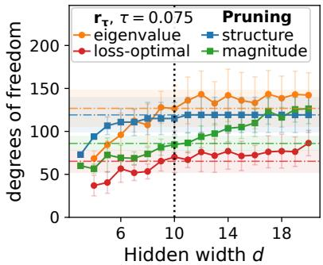  
(a) Noiseless.

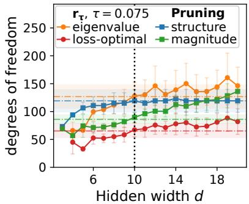  
(b) $\sigma ^ { 2 } = 0 . 0 1$  
Figure 3: We repeat the pruning experiments of Figure 1(c), refitting the student's output layer in closed form after each removal. The dash-dotted lines show a teacher control: the same pipeline applied to the teacher network itself. With refitting, structure pruning curves flatten similarly to the recovery rank, approaching the teacher's compressible level. Magnitude pruning still increases notably.

## F Pruning with refitting

The baselines in Section 2 delete parameters and leave the remainder untouched. We additionally report a reftted variant in which the output layer is refitted after each removal. Since the network output is linear in the final layer given the surviving hidden activations, the optimal weights for a fixed set of retained units are available in closed form as a least-squares solution, so no gradient steps are required and the procedure remains one-shot. The refit is computed on the training split and respects the sparsity pattern, in that entries removed by pruning are held at zero and only the surviving support is re-solved.

The refitted variant quantifies whether the retained units still span enough of the function, since their contributions are recombined optimally afterwards. This is a substantial intervention, since the output layer comprises roughly half of the weights in these two-layer students.

Figure 3 repeats Figure 1(c) under this refitting, together with the same quantities measured on the teacher network itself (dash-dotted). The retained degrees of freedom fall substantially for structure pruning, and greedy neuron removal becomes approximately flat in width rather than continuing to grow. Part of the gap reported in Section 3 therefore reflects the absence of compensation rather than the coordinate basis alone, although both baselines remain above the loss-optimal recovery rank. We do not repeat this variant on MNIST, since the closed form relies on a squared-error objective and has no counterpart under cross-entropy.

## G Further experimental results

In this appendix, we provide further experimental results that were omitted in the main paper for brevity.

## G.1 Teacher-student Experiments

Changes of probe set and reference point. Figures 4–5 suggest that the recovery behavior is qualitatively stable under changes of probe set and reference point, suggesting that the observed trends are not tied to a particular reconstruction choice. For $\theta _ { \mathrm { r e f } } = \theta _ { 0 }$ , the curve flattens less for widths exceeding teacher width, but still significantly.

Changes of model architecture We change parts of our teacher/student architecture to test the robustness of the findings and show Figure 1 under these changes. In practice, we modify the input size (Figure 6), output size (Figure 7), and both (Figure 8). As an additional ablation, we add noise to the training data in our base architecture $( 1 0  d  1 0 $ , described in Appendix C.1.1), shown in Figure 9. Finally, Figure 10 compares the final MSE on the test/train set with and without noise, where a slight double descent is visible. These experiments confirm that our findings on the teacher-student model seem robust across different architectural parameters.

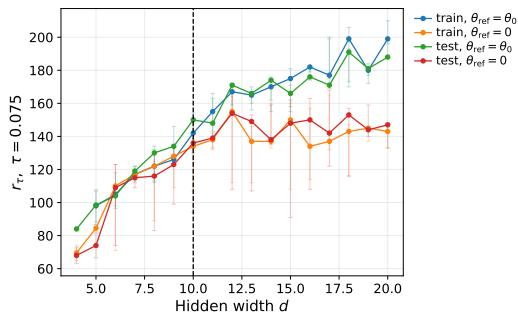  
(a) Test MSE.

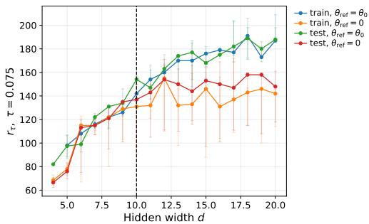  
(b) Train MSE.

Figure 4: Ablations experiments, confirming robustness under reconstruction choices. We vary the probe set and $\theta _ { \mathrm { r e f } } ,$ mean over 5 runs. The behavioral recovery rank growth is larger in the task-saturated regime for $\theta _ { \mathrm { r e f } } = \theta _ { 0 }$ in comparison to $\theta _ { \mathrm { r e f } } = 0$ , but still significantly flattens more than in the capacity-limited regime.  
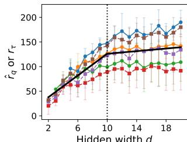  
Hidden width d

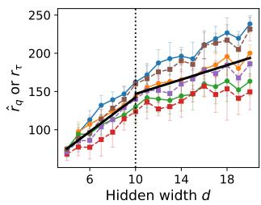

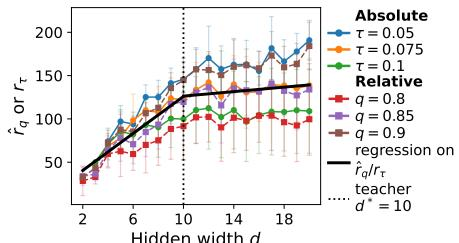  
Hidden width d  
(a) Same as Figure 1 (b), but the test (b) Same as Figure 1 (b), but $\theta _ { \mathrm { r e f } } = \left( \mathrm { c } \right)$ Same as Figure 1 (b), but train MSE, not test set is used as probe set. $\theta _ { 0 }$ MSE  
Figure 5: Ablation experiments: Detailed curves for different behavioral rank thresholds, showing the ranks for selected curves of Figure 4.

Spectral structure. The spectral structure of the behavioral Hessian further supports the interpretation of Figure 1. Figure 11 (a) shows that the leading eigenvalues remain separated from a broad tail across widths, while Figure 11 (b) and Figure 11 (c) indicate that a limited subset of eigenmodes captures most of the spectral mass even as the parameter count grows.

## G.2 MNIST

Evolution over training. Figure 12 shows test loss and accuracy evolution over training, reaching final accuracies exceeding .95, for all considered widths.

Projection. In Figure 13, we show the projection impact also on the training loss and accuracy.

Spectral structure. Figure 14 shows a concentrated behavioral spectrum, further supporting the view that only a restricted subset of local parameter directions dominates functional recovery.

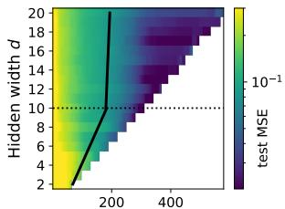  
Leading eigendirections k

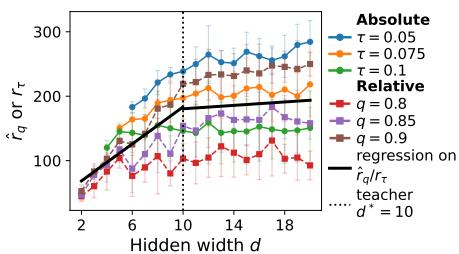

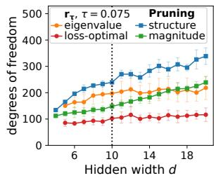  
(a) Test MSE for projecting on vary- (b) Behavioral recovery rank extracted from the pro- (c) Pruning and behavioral recoving number of eigendirections.jection curves, mean and std. over 5 runs. ery rank to loss threshold.

Figure 6: Same setup as Figure 1, but with input dimension set to 20.  
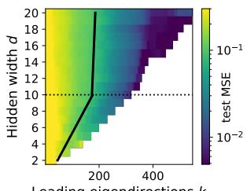

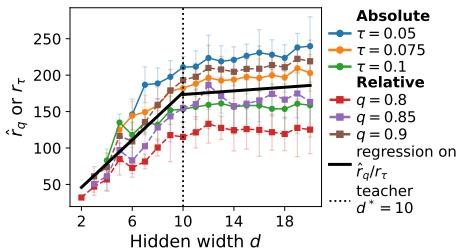

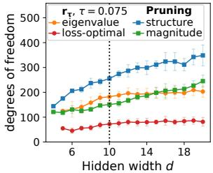  
(a) Test MSE for projecting on vary- (b) Behavioral recovery rank extracted from the pro- (c) Pruning and behavioral recoving number of eigendirections. jection curves, mean and std. over 5 runs. ery rank to loss threshold.

Figure 7: Same setup as Figure 1, but with output dimension set to 20.  
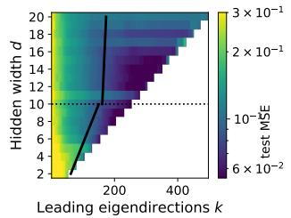  
(a) Test MSE for projecting on varying number of eigendirections.

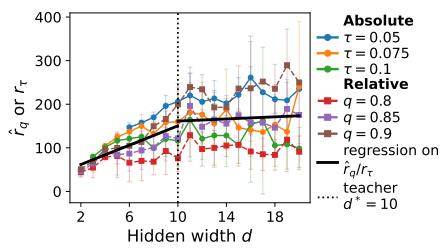  
(b) Behavioral recovery rank extracted from the projection curves, mean and std. over 5 runs.

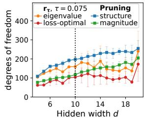  
(c) Pruning and behavioral recovery rank to loss threshold.

Figure 8: Same setup as Figure 1, but with input dimension set to 20, and output dimension 5.  
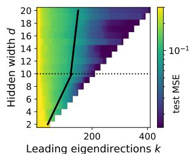

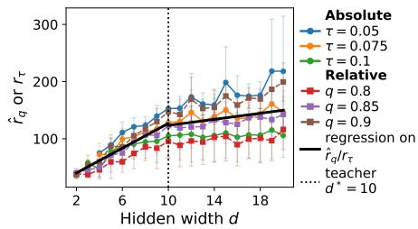

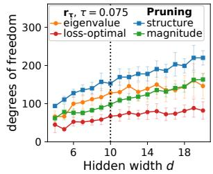  
(a) Test MSE for projecting on vary- (b) Behavioral recovery rank extracted from the pro- (c) Pruning and behavioral recoving number of eigendirections.jection curves, mean and std. over 5 runs. ery rank to loss threshold.  
Figure 9: Same setup as Figure 1, but with noise $\sigma ^ { 2 } = 0 . 0 1$ . The same regimes emerge.

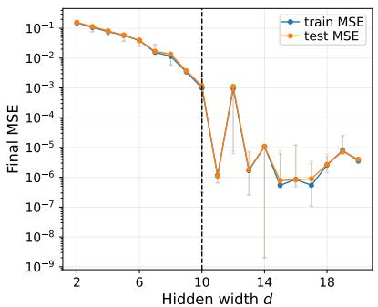  
(a) Noiseless.

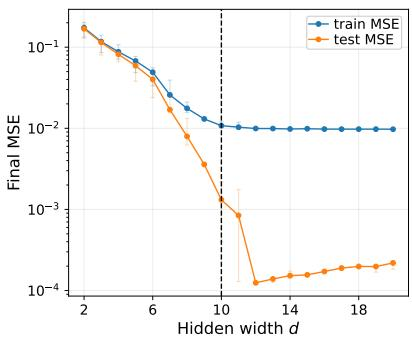  
(b) $\sigma ^ { 2 } = 0 . 0 1$  
Figure 10: We show final MSE for different student widths d. While in the noiseless setting, the training and test losses almost match, for the setting with noise, the students' train mean errors recover the noise level, with a slight double-descent-like behavior. The test data is noiseless.

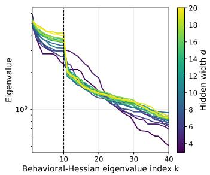  
(a) Top eigenvalues of the behavioral Hes. sian, for different student widths.

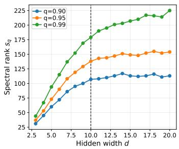  
(b) Number of eigenvalues needed to reach $q \times \textstyle \sum _ { i } \lambda _ { i }$

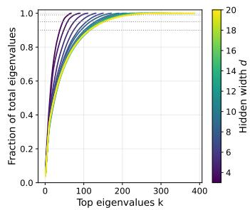  
(c) For different students, we plot the proportion of the top k eigenvalues among all $\sum _ { i } ^ { k } \lambda _ { i } / \sum _ { i } \dot { \lambda } _ { i }$ . Dotted lines indicate the thresholds $\dot { q } = 0 . 9 0 , 0 . 9 5 , 0 . 9 9$

Figure 11: Spectral quantities for the teacher-student experiments, for one seed.  
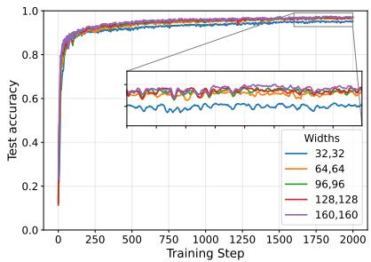  
(a) Test accuracy.

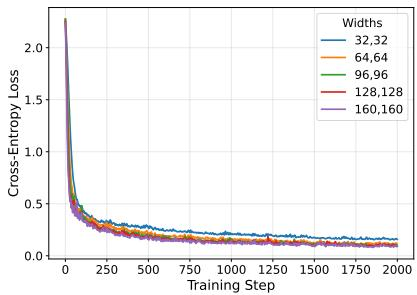  
(b) Test loss.  
Figure 12: For different widths of the MLP on MNIST, we report the accuracy and loss over the test set. The final accuracy exceeds 95% for all widths.

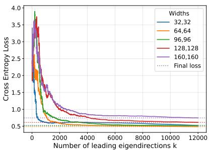  
(a) Training loss.

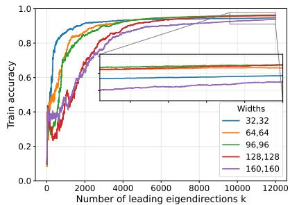  
(b) Training accuracy.  
Figure 13: Additional MNIST experiments, showing the training loss and training accuracy over the number of leading eigendirections.

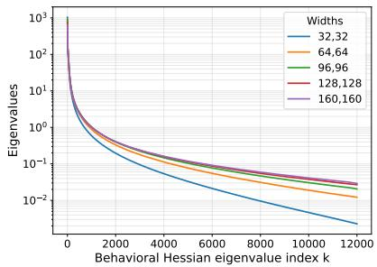  
(a) Eigenvalues over k, for different widths.

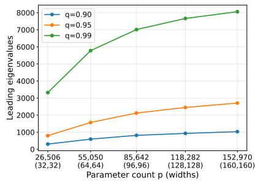  
(b) Number of eigenvalues needed to reach q × $\Sigma _ { i } ^ { m } \lambda _ { i }$ among the top $m = 1 2 0 0 0$ ones, for different widths.

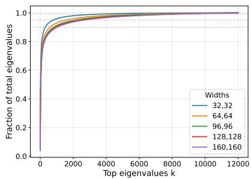  
(c) Proportion of the top k eigenvalues among the top 12, 000 ones, $\begin{array} { r } { \bar { \sum _ { i } ^ { k } \lambda _ { i } / \sum _ { i } ^ { 1 2 , 0 0 0 } \lambda _ { i } } , } \end{array}$ for different widths. Dotted lines indicate the thresholds $q = 0 . 9 0 , 0 . 9 5 , 0 . 9 9$  
Figure 14: Spectral quantities for the MNIST experiments.