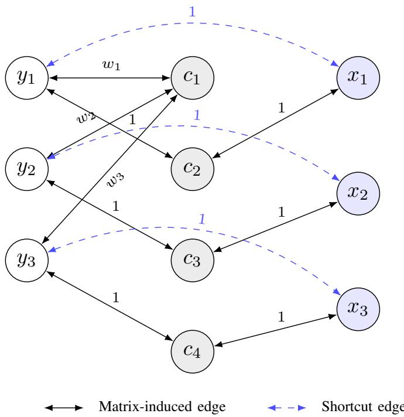

# Graph4BiLO: Graph Neural Network Approximation for Bilevel Mixed-Integer Linear Optimization

Jessica D. Elrefaei, Kaixun Hua, Seungbae Kim, Hoang Nam Tran, and Juan S. Borrero

Abstract—Bilevel mixed-integer linear optimization problems model hierarchical decision processes in which a leader anticipates the optimal response of a follower. Although expressive, these problems are computationally challenging because lowerlevel optimality is embedded in the leader’s feasible region. Valuefunction reformulations replace the nested follower optimization with a constraint involving the follower’s optimal value, but evaluating this value function exactly can itself be expensive. This paper introduces Graph4BiLO, a graph neural network (GNN) approach for learning bilevel value functions from variable– constraint graph representations. In contrast to fixed-length multilayer perceptron (MLP) representations, the GNN uses shared message-passing parameters and can therefore be applied across multiple problem sizes with a single trained model. The learned ReLU network is encoded exactly as mixed-integer linear constraints and embedded in an approximate single-level formulation. A repair step subsequently re-solves the follower problem for the selected leader decision to recover a bilevelfeasible follower response. We evaluate Graph4BiLO on knapsack interdiction instances with 20–100 items against the exact MibS solver and the learning-based Neur2BiLO method. Graph4BiLO obtains objective values comparable to Neur2BiLO across all tested sizes while avoiding size-specific neural networks. An additional out-of-distribution experiment demonstrates zero-shot transfer from 20-item training instances to previously unseen 40- and 60-item instances. However, embedding message passing at every graph node substantially increases the resulting mixedinteger formulation size and solve time. These results identify a central tradeoff between size-generalizable graph representations and the computational cost of embedding GNNs within optimization models.

Index Terms—bilevel optimization, mixed-integer linear optimization, graph neural networks, value-function approximation, machine learning for optimization

## I. INTRODUCTION

Bilevel optimization models hierarchical decision making between two optimization problems, where a leader acts while anticipating the optimal response of a follower [1], [2]. When integrality restrictions are present, bilevel mixed-integer linear optimization problems (BMILPs) can represent interdiction, pricing, network design, and other strategic decision problems, but the nested optimality requirement makes them substantially more difficult than conventional single-level mixed-integer linear programs [3].

A useful perspective is provided by the lower-level value function. For a fixed leader decision, the value function returns the follower’s optimal objective value. This allows the nested follower optimization to be expressed through follower feasibility together with a value-function optimality constraint [4]. The resulting formulation is single-level in form, but it does not altogether eliminate the fundamental computational difficulty: evaluating the exact value function may require solving a mixed-integer optimization problem for each leader decision encountered during optimization [3].

Recent learning-based methods address this bottleneck by approximating the lower-level value function with a neural network. Neur2BiLO, for example, combines a permutationinvariant DeepSets representation with a multilayer perceptron (MLP) predictor to learn bilevel value functions [5]. Zhou et al. developed a learning-based approach for bilevel programs with binary tender in which a MLP approximates the lower-level optimal value as a function of the linking binary variables, and the learned value function is then embedded in a single-level mixed-integer reformulation [6]. ReLU networks are particularly attractive in this setting because a trained network can be represented exactly using mixed-integer linear constraints and embedded directly in an optimization model [7], [8].

Although the set-based Neur2BiLO architecture is in principle compatible with variable-sized instances, its reported knapsack-interdiction experiments train a separate neural network for each problem size [5], [9]. In contrast, we explicitly evaluate Graph4BiLO using a single model across multiple problem sizes, including zero-shot transfer to previously unseen sizes without retraining or fine-tuning. Optimization problems also possess natural relational structure: variables participate in constraints through coefficients, and the sparsity pattern of the constraint matrix defines a graph. GNNs provide a natural mechanism for exploiting this structure because their local update rules share parameters across nodes and can operate on variable-sized graphs. Recent work has further demonstrated that trained GNNs can be formulated using mixed-integer programming and embedded directly within larger optimization models [10].

Graph-based representations have consequently been used in a variety of single-level combinatorial and mixed-integer optimization settings, including learning branch-and-bound policies [11], GNN-guided predict-and-search methods [12], and scalable primal heuristics [13]. More recently, GNNs have also been applied to bilevel interdiction problems. Kwon et al. developed a GNN-based heuristic for the knapsack interdiction problem [14], while Zhang et al. proposed a multipartite

GNN framework for network interdiction problems [15]. To our knowledge, however, prior GNN-based bilevel approaches have not considered learning the lower-level value function from a variable–constraint representation and embedding the resulting GNN surrogate directly within a value-function reformulation.

Knapsack interdiction itself has been studied extensively from both complexity and exact-optimization perspectives. Caprara et al. analyze the computational complexity of bilevel knapsack variants [16] and develop exact methods for bilevel knapsack problems with interdiction constraints [17]. Fischetti et al. further study interdiction games and structural monotonicity properties with applications to knapsack problems [18].

This paper introduces Graph4BiLO, a GNN-based valuefunction approximation framework for BMILPs. Graph4BiLO represents an optimization instance as a variable–constraint graph, trains a GNN to predict the lower-level value function from sampled leader decisions, encodes the trained ReLU network as mixed-integer linear constraints, and embeds the prediction in a single-level approximation. We study the framework using knapsack interdiction and compare it with MibS [19] and Neur2BiLO [5].

The principal contributions are:

• a variable–constraint graph representation for learning bilevel value functions;

• a GNN surrogate whose shared parameters permit one trained model to process multiple problem sizes;

• an end-to-end optimization framework that embeds the trained ReLU GNN in a mixed-integer approximation and repairs the resulting follower solution; and

• a computational study comparing Graph4BiLO with exact and learning-based baselines, evaluating zero-shot generalization to unseen problem sizes, and quantifying the predictive and computational tradeoffs associated with GNN depth and global information sharing.

## II. BILEVEL VALUE-FUNCTION FORMULATION

## A. Bilevel Mixed-Integer Linear Optimization

Consider the linear BMILP

$$
\begin{array} { r l } { \underset { x , y } { \operatorname* { m i n } } } & { f ^ { \top } x + g ^ { \top } y } \\ { \mathrm { s . t . } } & { A x + B y \geq a , } \\ & { x \in \mathbb { Z } ^ { p _ { x } } \times \mathbb { R } ^ { q _ { x } } , } \\ & { y \in \underset { y ^ { \prime } } { \operatorname { a r g m a x } } \left\{ q ^ { \top } y ^ { \prime } : C x + D y ^ { \prime } \geq b , \ y ^ { \prime } \in \mathbb { Z } ^ { p _ { y } } \times \mathbb { R } ^ { q _ { y } } \right\} } \end{array}
$$

where all matrices and vectors are of appropriate dimensions. The leader selects $x ,$ while the follower responds with an optimal solution y. Thus, lower-level optimality is part of the leader’s feasible region. Discrete bilevel linear optimization can be $\Sigma _ { 2 } ^ { P }$ -hard, reflecting the additional complexity introduced by the nested optimality requirement [20].

## B. Value-Function Reformulation

Define the follower value function

$$
\phi ( x ) = \operatorname* { m a x } \left\{ q ^ { \top } y : C x + D y \geq b , \ y \in \mathbb { Z } ^ { p _ { y } } \times \mathbb { R } ^ { q _ { y } } \right\} .
$$

For any follower-feasible $y , q ^ { \top } y \leq \phi ( x )$ by definition of the maximum. Consequently, follower feasibility together with

$$
q ^ { \top } y \geq \phi ( x )
$$

forces equality and therefore lower-level optimality. The bilevel model can thus be written as

$$
\begin{array} { r l } { \underset { x , y } { \operatorname* { m i n } } } & { f ^ { \top } x + g ^ { \top } y } \\ { \mathrm { s . t . } } & { A x + B y \ge a , } \\ & { C x + D y \ge b , } \\ & { q ^ { \top } y \ge \phi ( x ) , } \\ & { x \in \mathbb { Z } ^ { p _ { x } } \times \mathbb { R } ^ { q _ { x } } , } \\ & { y \in \mathbb { Z } ^ { p _ { y } } \times \mathbb { R } ^ { q _ { y } } . } \end{array}
$$

The nested optimization has been replaced by a value-function constraint, but evaluating $\phi ( x )$ can itself require solving a difficult discrete optimization problem. In the knapsack interdiction setting considered here, each exact value-function evaluation requires solving a 0–1 knapsack problem, a classical NP-hard combinatorial optimization problem [21].

## III. GRAPH4BILO

## A. Overview

Graph4BiLO approximates the exact value function with a learned GNN surrogate. For a fixed problem class, random problem instances are generated and leader decisions $x ^ { ( i ) }$ are sampled. For each sample, the lower-level problem is solved exactly to obtain $\phi ( x ^ { ( i ) } )$ . The corresponding optimization instance and sampled decision are represented as a graph $\mathcal { G } ( \boldsymbol { x } ^ { ( i ) } )$ , producing supervised graph–value pairs

$$
\Big ( \mathcal { G } ( x ^ { ( i ) } ) , \phi ( x ^ { ( i ) } ) \Big ) _ { i = 1 } ^ { N } .
$$

A GNN $\phi _ { G } ( \cdot ; \theta )$ is trained on these pairs. After training, θ is fixed, the ReLU network is encoded as mixed-integer linear constraints, and the surrogate is embedded into an approximate single-level optimization problem using established mixedinteger formulations for trained ReLU networks [7], [8]. Finally, the candidate leader decision is retained while the original follower problem is re-solved exactly to repair the follower solution.

## B. Bilevel Formulation

We evaluate Graph4BiLO on knapsack interdiction. The leader interdicts items subject to an interdiction budget, while the follower packs the remaining items to maximize profit. The leader therefore seeks to minimize the follower’s optimal achievable profit:

$$
\begin{array} { r l } { \underset { x \in \{ 0 , 1 \} ^ { n } } { \operatorname* { m i n } } } & { \phi ( x ) } \\ { \mathrm { s . t . } } & { v ^ { \top } x \leq K , } \end{array}
$$

where the follower value function is

$$
\phi ( x ) = \operatorname* { m a x } _ { y \in \{ 0 , 1 \} ^ { n } } \left\{ c ^ { \top } y : w ^ { \top } y \leq d , \ x + y \leq 1 \right\} .
$$

Here, $c _ { i } , \ w _ { i }$ , and $v _ { i }$ denote item profit, knapsack weight, and interdiction cost, respectively; d is the follower capacity and $K$ is the leader interdiction budget.

For fixed x, the follower constraints can be written compactly as

$$
F y + L x \leq f ,
$$

where

$$
F = { \binom { w ^ { \top } } { I } } , \qquad L = { \binom { 0 ^ { \top } } { I } } , \qquad f = { \binom { d } { 1 } } .
$$

## C. Variable–Constraint Graph Construction

A central idea in Graph4BiLO is to represent each bilevel instance as a graph rather than as a fixed-length feature vector. For the knapsack-interdiction formulation introduced above, the matrices F and L directly define the interactions between follower variables, leader variables, and constraints. Graph4BiLO uses these algebraic dependencies to construct a heterogeneous variable–constraint graph. The graph contains three node types:

• follower-variable nodes $y _ { i }$

• leader-variable nodes $x _ { k }$ , and

• constraint nodes $c _ { j }$

The graph is constructed directly from the nonzero pattern of the matrices F and L. Specifically:

1) If $F _ { j i } \neq 0 ,$ , add a bidirectional edge between follower node $y _ { i }$ and constraint node $c _ { j }$ with edge weight $F _ { j i }$

2) If $L _ { j k } \neq 0$ , add a bidirectional edge between leader node $x _ { k }$ and constraint node $c _ { j }$ with edge weight $L _ { j k }$

3) If $F _ { j i } \neq 0$ and $L _ { j k } \neq 0$ occur in the same constraint row j, add a bidirectional shortcut edge between $y _ { i }$ and $x _ { k }$ In the knapsack interdiction case, these shortcut edges are assigned unit weight.

The variable–constraint representation is natural because an edge is created precisely when a variable directly participates in a constraint. Thus, the graph preserves the dependency structure of the underlying optimization model rather than imposing an arbitrary notion of neighborhood. Message passing can consequently be interpreted as propagating information along the same interactions that determine feasibility and objective value in the optimization problem, an idea that has also motivated variable–constraint graph representations for single-level MILPs [11].

For example, in knapsack interdiction, the capacity constraint is connected to every follower variable $y _ { i }$ through an edge weighted by $w _ { i }$ . These edges expose to the GNN both which items compete for the common knapsack capacity and the strength of their contribution to that constraint. In contrast, each linking constraint $x _ { i } + y _ { i } \le 1$ connects the leader decision $x _ { i }$ directly to the corresponding follower decision $y _ { i } .$ , capturing the key interdiction mechanism: selecting $x _ { i } = 1$ prevents the follower from selecting item i. The additional $x _ { i } - y _ { i }$ shortcut edge makes this leader–follower interaction directly accessible during message passing rather than requiring information to travel through the intermediate constraint node.

  
Fig. 1. Variable–constraint graph representation for a three-item knapsack interdiction instance. Follower-variable nodes are shown on the left, constraint nodes in the center, and leader-variable nodes on the right. Solid edges are induced directly from the matrices $F$ and $L ,$ while dashed edges are shortcut edges between leader and follower variables that co-occur in the same constraint row.

The matrix-induced edges therefore preserve the sparse algebraic structure of the follower problem, while the shortcut edges provide a direct connection between leader and follower variables that co-occur in the same linking constraint.

For knapsack interdiction, there is one capacity constraint and $n$ linking constraints of the form $x _ { i } ~ +$ $y _ { i } ~ \leq ~ 1$ . Consequently, a problem with n items yields n follower-variable nodes, n leader-variable nodes, and (n + 1) constraint nodes, for a total of (3n + 1) nodes.

Fig. 1 illustrates the resulting graph representation for a three-item knapsack interdiction instance. The node $c _ { 1 }$ corresponds to the knapsack capacity constraint, while the nodes $c _ { 2 } , c _ { 3 } , c _ { 4 }$ correspond to the linking constraints $x _ { i } + y _ { i } \leq 1$ The weights $w _ { 1 } , w _ { 2 } , w _ { 3 }$ label the capacity-constraint edges, and the unit-weight edges reflect the coefficients in the linking constraints.

## D. Heterogeneous GNN Architecture

Because the variable–constraint representation contains distinct leader-variable, follower-variable, and constraint node types, Graph4BiLO uses a heterogeneous message-passing architecture rather than a single homogeneous graph convolution. Heterogeneous GNNs allow message and update functions to depend on node and edge type, and PyTorch Geometric provides the HeteroConv abstraction for assigning separate graph-convolution operators to different relation types [22]. This construction is closely related to relational GNN formulations in which distinct edge relations are assigned separate learned transformations [23]. Graph4BiLO adopts this principle using six directed relation types,

$$
\mathcal { R } = \{ y  c , \ c  y , \ x  c , \ c  x , \ x  y , \ y  x \} .
$$

Thus, leader-variable $( x ) ,$ , follower-variable $( y ) .$ , and constraint nodes (c) all participate in message passing and are updated at every GNN layer.

Conceptually, the architecture performs three steps. First, heterogeneous node features are mapped into a common hidden space so that information associated with leader decisions, follower decisions, and constraints can interact. Second, relation-specific message passing propagates information along the algebraic dependencies encoded by the optimization model. Finally, a pooling-and-broadcast operation supplies each node with graph-level context before the variable-sized collection of node representations is reduced to a fixeddimensional graph embedding for value prediction.

Let $t \in \{ y , x , c \}$ index follower-variable, leader-variable, and constraint node types, with $n _ { t }$ nodes and feature matrix $X _ { t } \in \mathbb { R } ^ { n _ { t } \times f }$ . Each node type is independently projected into a common d-dimensional hidden space:

$$
H _ { t } ^ { ( 0 ) } = X _ { t } W _ { t } ^ { \mathrm { i n } } + \mathbf { 1 } _ { n _ { t } } ( b _ { t } ^ { \mathrm { i n } } ) ^ { \top } , \qquad t \in \{ y , x , c \} .
$$

The type-specific projections place semantically different nodes in a common hidden space while retaining separate learned transformations for each type.

Unlike a homogeneous GNN, Graph4BiLO assigns separate learned parameters to each directed relation. Separate transformations are used because messages between different node types have different optimization meanings. For example, a constraint-to-variable message communicates information about the restrictions acting on a decision, whereas a leader-tofollower message communicates the direct effect of interdiction. Because these transformations are learned independently, different relations can encode effects in different directions; for example, greater interdiction can be associated with lower follower profit, whereas selecting more follower items can be associated with higher follower profit. Let $A _ { t  s }$ denote the weighted adjacency matrix associated with messages sent from source node type t to destination node type s. For layer ℓ, the relation-specific graph convolution can be written as

$$
\begin{array} { r l r } {  { M _ { t  s } ^ { ( \ell ) } = H _ { s } ^ { ( \ell - 1 ) } W _ { \mathrm { s e l f } , t  s } ^ { ( \ell ) } } } \\ & { } & { + A _ { t  s } H _ { t } ^ { ( \ell - 1 ) } W _ { \mathrm { n b r } , t  s } ^ { ( \ell ) } } \\ & { } & { + \mathbf { 1 } _ { n _ { s } } ( b _ { \mathrm { n b r } , t  s } ^ { ( \ell ) } ) ^ { \top } , \quad \quad } \end{array}
$$

where $W _ { \mathrm { s e l f } , t  s } ^ { ( \ell ) }$ and $W _ { \mathrm { n b r } , t  s } ^ { ( \ell ) }$ are relation-specific $d \times d$ weight matrices and $b _ { \mathrm { n b r } , t  s } ^ { ( \ell ) } \in \mathbb { R } ^ { d }$

For each destination type, incoming relation-specific messages are summed and passed through a ReLU:

$$
H _ { s } ^ { ( \ell ) } = \mathrm { R e L U } ( \sum _ { \substack { t : ( t  s ) \in \mathcal { R } } } M _ { t  s } ^ { ( \ell ) } ) , \qquad s \in \{ y , x , c \} .
$$

Local message passing only communicates information within the receptive field created by the chosen number of GNN layers. However, the follower value $\phi ( x )$ is a graphlevel quantity that may depend on interactions across the complete optimization instance. Graph4BiLO therefore supplements local message passing with a global pooling-andbroadcast operation, providing every node with a summary of the entire instance without requiring additional local messagepassing layers. Therefore, after the final message-passing layer, Graph4BiLO applies a global pooling-and-broadcast operation. Mean pooling is first performed separately over the three node types:

$$
\begin{array} { l } { { \displaystyle \bar { h } _ { y } = \frac { 1 } { n _ { y } } \sum _ { i = 1 } ^ { n _ { y } } H _ { y } ^ { ( L ) } [ i , : ] , } } \\ { { \displaystyle \bar { h } _ { x } = \frac { 1 } { n _ { x } } \sum _ { i = 1 } ^ { n _ { x } } H _ { x } ^ { ( L ) } [ i , : ] , } } \\ { { \displaystyle \bar { h } _ { c } = \frac { 1 } { n _ { c } } \sum _ { i = 1 } ^ { n _ { c } } H _ { c } ^ { ( L ) } [ i , : ] . } } \end{array}
$$

These representations are concatenated to form a global graph summary

$$
g = [ \bar { h } _ { y } \parallel \bar { h } _ { x } \parallel \bar { h } _ { c } ] \in \mathbb { R } ^ { 3 d } ,
$$

where ∥ denotes concatenation.

The global representation is then broadcast back to every node and combined with the node’s local representation through a type-specific learned transformation:

$$
\widetilde { H } _ { t } = \mathrm { R e L U } \left( [ H _ { t } ^ { ( L ) } \parallel \mathbf { 1 } _ { n _ { t } } g ] W _ { t } ^ { \mathrm { b r } } + \mathbf { 1 } _ { n _ { t } } \left( b _ { t } ^ { \mathrm { b r } } \right) ^ { \top } \right) , \qquad t \in \{ y , x , c \} .
$$

Thus, each node retains its locally propagated representation while also receiving graph-level context. Separate broadcast transformations are learned for follower-variable, leadervariable, and constraint nodes.

The broadcast-enhanced node embeddings are then mean pooled separately by type:

$$
\begin{array} { c } { { { \widetilde { h } _ { y } } = \displaystyle \frac { 1 } { n _ { y } } \sum _ { i = 1 } ^ { n _ { y } } { { \widetilde { H } _ { y } } [ i , : ] } , } } \\ { { { \widetilde { h } _ { x } } = \displaystyle \frac { 1 } { n _ { x } } \sum _ { i = 1 } ^ { n _ { x } } { { \widetilde { H } _ { x } } [ i , : ] } , } } \\ { { { \widetilde { h } _ { c } } = \displaystyle \frac { 1 } { n _ { c } } \sum _ { i = 1 } ^ { n _ { c } } { { \widetilde { H } _ { c } } [ i , : ] } . } } \end{array}
$$

The pooled representations are concatenated to form

$$
h _ { G } = [ \widetilde { h } _ { y } \parallel \widetilde { h } _ { x } \parallel \widetilde { h } _ { c } ] \in \mathbb { R } ^ { 3 d } .
$$

This second pooling step converts the variable number of node representations into a fixed-dimensional graph representation. Consequently, the dimensionality of the final readout does not depend on the number of items in the optimization instance.

The structural graph representation is supplemented with two problem-level reference features that provide additional global information about the scale of the follower objective:

$$
z = [ h _ { G } \parallel r _ { 1 } \parallel r _ { 2 } ] \in \mathbb { R } ^ { 3 d + 2 } .
$$

Here, $r _ { 1 }$ is the follower objective obtained for the reference case with no interdiction, $x = 0$ , while $r _ { 2 }$ is the additional $1 . 2 5 { \times } K$ objective feature used by the model, where K denotes the interdiction budget.

Finally, a linear readout produces the predicted lower-level value:

$$
\begin{array} { r } { \hat { \phi } = w ^ { \top } z + b , \qquad w \in \mathbb { R } ^ { 3 d + 2 } , \quad b \in \mathbb { R } . } \end{array}
$$

The resulting prediction defines the learned value-function approximation $\phi _ { G } ( x ; \theta )$

The heterogeneous formulation allows each semantic relation in the optimization graph to learn a distinct transformation while sharing the parameters associated with that relation across all nodes and problem instances. Because these operations do not depend on a fixed number of nodes, the same trained Graph4BiLO model can be applied to graphs with different numbers of variables and constraints.

## E. Training Objective

The supervised training set is

$$
\mathcal { D } = \left\{ \left( \mathcal { G } ^ { ( i ) } , x ^ { ( i ) } , \phi ( x ^ { ( i ) } ) \right) \right\} _ { i = 1 } ^ { N } .
$$

The model is trained by minimizing the Huber loss between the predicted and exact lower-level objective values. Let

$$
e _ { i } = \phi _ { G } ( \mathcal { G } ^ { ( i ) } , x ^ { ( i ) } ; \theta ) - \phi ( x ^ { ( i ) } ) .
$$

Using threshold $\delta = 2 .$ , the sample-wise loss is

$$
\begin{array} { r } { \mathcal { L } _ { 2 } ( e _ { i } ) = \left\{ \begin{array} { l l } { \frac { 1 } { 2 } e _ { i } ^ { 2 } , } & { | e _ { i } | \leq 2 , } \\ { 2 \left( | e _ { i } | - 1 \right) , } & { | e _ { i } | > 2 . } \end{array} \right. } \end{array}
$$

The training objective is therefore

$$
\operatorname* { m i n } _ { \theta } \frac { 1 } { N } \sum _ { i = 1 } ^ { N } \mathcal { L } _ { 2 } \Big ( \phi _ { G } ( \mathcal { G } ^ { ( i ) } , x ^ { ( i ) } ; \theta ) - \phi ( x ^ { ( i ) } ) \Big ) .
$$

The Huber loss behaves quadratically for small prediction errors and linearly for larger errors, reducing the influence of large residuals compared with mean squared error while still encouraging accurate value-function prediction.

## IV. EMBEDDING THE LEARNED VALUE FUNCTION

## A. Mixed-Integer ReLU Encoding

Because the network uses ReLU activations, it can be embedded exactly in a mixed-integer linear model once valid preactivation bounds are available [7], [8]. For a single neuron,

$$
z = W x + b , \qquad h = \operatorname* { m a x } \{ 0 , z \} ,
$$

with $L \leq z \leq U$ . Introducing a binary activation indicator $\delta$ yields

$$
\begin{array} { r l } & { h \geq z , } \\ & { h \geq 0 , } \\ & { h \leq z - L ( 1 - \delta ) , } \\ & { h \leq U \delta , } \\ & { \delta \in \{ 0 , 1 \} . } \end{array}
$$

Applying these constraints to every hidden ReLU gives an exact MILP representation of the trained neural network.

## B. Approximate Single-Level Knapsack Model

Graph4BiLO replaces the exact follower value with the learned approximation,

$$
\phi ( x ) \approx \phi _ { G } ( x ; \theta ) .
$$

For knapsack interdiction, the approximate single-level model is

$$
\begin{array} { r l } { \underset { x , y , s \geq 0 } { \mathrm { m i n } } } & { c ^ { \top } y + \lambda s } \\ { \mathrm { s . t . } } & { v ^ { \top } x \leq K , } \\ & { w ^ { \top } y \leq d , } \\ & { x + y \leq 1 , } \\ & { c ^ { \top } y \geq \phi _ { G } ( x ; \theta ) - s , } \\ & { x , y \in \{ 0 , 1 \} ^ { n } . } \end{array}
$$

The trained parameters θ are fixed during optimization. The nonnegative slack variable s protects the approximate formulation against infeasibility caused by value-function overprediction, while λ penalizes the relaxation in the objective.

## C. Repair and Bilevel Feasibility

The approximate model returns a candidate (ˆx, yˆ). Graph4BiLO keeps the leader decision fixed and re-solves the original follower problem:

$$
y ^ { r } \in \arg \operatorname* { m a x } _ { y \in \{ 0 , 1 \} ^ { n } } \left\{ c ^ { \top } y : w ^ { \top } y \leq d , \hat { x } + y \leq 1 \right\} .
$$

The exact follower value is then

$$
\phi ( \hat { x } ) = c ^ { \top } y ^ { r } .
$$

Replacing $\hat { y }$ with $y ^ { r }$ restores lower-level optimality. The optimality residual

$$
\phi ( \hat { x } ) - c ^ { \top } y ^ { r } = 0
$$

therefore verifies that the repaired follower decision is optimal for the selected leader decision.

## V. COMPUTATIONAL EXPERIMENTS

## A. Experimental Setup

The study uses 10,000 generated knapsack interdiction instances: 2,000 instances for each problem size $n \_ { \mathrm { ~ \in ~ } }$ {20, 40, 60, 80, 100}. One leader decision is sampled per instance, and the corresponding ground-truth value is obtained by solving the follower knapsack problem exactly. The data are divided into 80% training, 10% validation, and 10% test sets using a stratified split.

The GNN uses two message-passing layers with hidden dimension 32, mean pooling, and a linear readout. Training uses AdamW with learning rate $1 0 ^ { - 3 }$ for up to 500 epochs.

We compare Graph4BiLO with two baselines. MibS is an exact branch-and-cut solver for mixed-integer bilevel linear optimization [19]. Neur2BiLO is a learning-based valuefunction approximation method that combines a permutationinvariant DeepSets representation with an MLP predictor [5]. For each problem size, all three methods are evaluated on the same 10 knapsack-interdiction test instances, with a maximum optimization time of 3600 seconds per instance.

## B. Computational Performance

Table I reports mean objective values and solve times. Because the leader minimizes the follower’s optimal profit, lower objective values are preferred.

Graph4BiLO achieves mean objective values close to Neur2BiLO across all tested sizes. From $n = 4 0$ onward, both learning-based approaches return substantially lower mean objectives than MibS within the imposed time limit. Graph4BiLO and Neur2BiLO remain especially close: their mean objectives differ by 0.02 at n = 40, 0.01 at $n = 6 0 , 0 . 0 3$ at $n = 8 0$ , and 0.04 at $n = 1 0 0$

At n = 20, Graph4BiLO obtains a slightly higher mean objective (0.58) than MibS (0.55) and Neur2BiLO (0.54). This small gap is consistent with the relative advantages of the competing methods at the smallest problem size. MibS can solve the smaller bilevel instances more effectively within the time limit, while the reported Neur2BiLO benchmark uses a separately trained model for each problem size [5], [9]. Graph4BiLO instead uses a single set of learned parameters across all five sizes. Thus, Neur2BiLO benefits from size-specific specialization in this comparison, whereas Graph4BiLO trades some specialization for cross-size parameter sharing and generalization.

The principal difference is computational time. Neur2BiLO solves the approximate optimization problem in approximately 0.1 seconds on average, whereas Graph4BiLO requires 29.52 seconds at $n = 2 0$ , 1049.44 seconds at $n = 4 0$ , and reaches the one-hour limit for $n \geq 6 0$ . Thus, the graph representation provides cross-size parameter sharing but produces a substantially larger embedded optimization model.

## C. Generalization to Unseen Problem Sizes

A principal advantage of the graph-based representation is that the same trained model can be applied to instances containing different numbers of variables and constraints.

To evaluate this capability directly, we conduct an out-ofdistribution (OOD) size experiment in which Graph4BiLO is trained exclusively on 2,000 knapsack-interdiction instances of size $n = 2 0$ and is then applied, without retraining or finetuning, to previously unseen instances of sizes $n = 4 0$ and $n = 6 0$ . Thus, no labeled lower-level training samples from either OOD size are used to train the model. Because the reported Neur2BiLO knapsack-interdiction experiments use size-specific training and checkpoints [5], we do not include it as a benchmark in this experiment, which specifically evaluates zero-shot transfer of a single trained model to unseen problem sizes.

This setting is particularly relevant when supervised label generation is computationally expensive. Each Graph4BiLO training target requires solving the lower-level optimization problem to obtain the exact value $\phi ( x )$ . Under a size-specific training protocol, generating a new model for each problem dimension also requires generating a corresponding set of exact lower-level training labels. The ability to reuse a single trained model across sizes can therefore reduce this repeated datageneration cost, particularly when the lower-level problem is itself computationally expensive. In contrast, Graph4BiLO shares its message-passing parameters across variable-sized graphs, allowing the cost of training-data generation and model fitting to be amortized across multiple problem sizes.

The results in Table II demonstrate that a Graph4BiLO model trained only on $n = 2 0$ instances can be embedded and solved directly on substantially larger problem sizes without generating a new training set or retraining the network. At $n = 4 0$ , the OOD Graph4BiLO model obtains a mean leader objective of 0.978 with a mean solve time of only 2.92 seconds. In comparison, MibS reaches the 3,600-second time limit and reports a mean objective of 1.895.

The same pattern persists at $n = 6 0$ , where Graph4BiLO obtains a mean objective of 1.609 in 5.81 seconds, while MibS reaches the 3,600-second time limit with a mean objective of 3.489. Thus, the zero-shot model remains effective even when the problem size triples from the $n = 2 0$ instances used for training to $n = 6 0$ at test time.

More broadly, the experiment illustrates a practical setting in which the variable-sized graph representation can provide an advantage over size-specific neural surrogates. Training independent models for $n = 2 0 .$ , 40, and 60 using 2,000 samples per size would require 6,000 labeled lower-level solves in total, in addition to three separate training procedures. The OOD Graph4BiLO experiment instead uses only the 2,000 labeled $n = 2 0$ samples and a single trained model. Although predictive and optimization performance may degrade as the test distribution moves farther from the training size, the ability to obtain solutions for unseen problem dimensions without additional label generation or retraining can be particularly valuable when exact lower-level solves are expensive, such as routing problems or traveling salesman problems [24], [25].

TABLE I  
MEAN COMPUTATIONAL PERFORMANCE ON KNAPSACK INTERDICTION
<table><tr><td rowspan="2">n</td><td colspan="2">Graph4BiLO</td><td colspan="2">MibS</td><td colspan="2">Neur2BiLO</td></tr><tr><td>Obj.</td><td>Time (s)</td><td>Obj.</td><td>Time (s)</td><td>Obj.</td><td>Time (s)</td></tr><tr><td>20</td><td>0.58</td><td>29.52</td><td>0.55</td><td>2864.89</td><td>0.54</td><td>0.11</td></tr><tr><td>40</td><td>0.99</td><td>1049.44</td><td>1.81</td><td>3600.00</td><td>0.97</td><td>0.06</td></tr><tr><td>60</td><td>1.66</td><td>3600.21</td><td>3.62</td><td>3600.00</td><td>1.65</td><td>0.08</td></tr><tr><td>80</td><td>2.10</td><td>3600.19</td><td>4.89</td><td>3600.00</td><td>2.07</td><td>0.11</td></tr><tr><td>100</td><td>2.66</td><td>3600.34</td><td>6.68</td><td>3600.00</td><td>2.62</td><td>0.15</td></tr><tr><td>Overall</td><td>1.60</td><td>2375.94</td><td>3.63</td><td>3452.98</td><td>1.57</td><td>0.10</td></tr></table>

TABLE II

OUT-OF-DISTRIBUTION GENERALIZATION FROM $n = 2 0$ TRAINING INSTANCES TO UNSEEN KNAPSACK-INTERDICTION SIZES. GRAPH4BILO IS EVALUATED WITHOUT RETRAINING OR FINE-TUNING.
<table><tr><td>OOD Size</td><td>Method</td><td>Mean Objective</td><td>Mean Solve Time (s)</td></tr><tr><td>40</td><td>MibS</td><td>1.895</td><td>3600</td></tr><tr><td>40</td><td>Graph4BiLO, λ = 0.1</td><td>0.978</td><td>2.92</td></tr><tr><td>60</td><td>MibS</td><td>3.489</td><td>3600</td></tr><tr><td>60</td><td>Graph4BiLO, λ = 0.1</td><td>1.609</td><td>5.81</td></tr></table>

## D. Architecture Ablation

To examine the effect of message-passing depth on both predictive accuracy and the computational cost of the embedded formulation, we conduct an ablation study using knapsackinterdiction instances of size $n = 2 0$ . The hidden dimension is fixed at $d = 4 .$ , while the number of message-passing layers is varied from one to four. All architectures are trained and evaluated using the same data-generation procedure and train–test setting. We additionally evaluate the four-layer architecture without the global pooling-and-broadcast operation to isolate the effect of this component. Because the ablation models use a much smaller hidden dimension than the main Graph4BiLO configuration (d = 4 versus $d = 3 2 )$ , their absolute solve times are substantially lower and should be interpreted primarily as relative comparisons among ablation settings rather than as directly comparable to the runtimes in Table I.

Table III shows that increasing message-passing depth does not produce a monotonic improvement in predictive accuracy. The two-layer model achieves the lowest Huber loss, MAE, and RMSE, whereas the three- and four-layer models do not improve upon these values. Moreover, the additional messagepassing layers substantially increase the computational burden of the embedded formulation. The one-layer model solves in only 0.28 seconds on average, compared with 3.20, 4.30, and 3.49 seconds for the two-, three-, and four-layer architectures, respectively.

Interestingly, prediction accuracy and optimization performance are not perfectly aligned. Although the two-layer model provides the lowest prediction errors, the one-layer architecture produces the lowest mean leader objective, 0.5395, followed by the four-layer model at 0.5767. This suggests that small differences in value-function prediction error do not necessarily translate directly into corresponding differences in the leader decisions selected by the embedded optimization model.

The broadcast ablation further illustrates the tradeoff between predictive quality and computational cost. Removing the global broadcast from the four-layer model reduces mean solve time from 3.49 to 1.42 seconds, but increases the Huber loss from 0.010679 to 0.014493, the MAE from 0.118443 to 0.130136, and the mean leader objective from 0.5767 to 0.7060. Thus, the global broadcast appears to improve the quality of the learned value-function representation and the resulting optimization solution, although this benefit comes at the cost of a more difficult embedded formulation.

Overall, these results provide little evidence that increasing local message-passing depth beyond two layers improves value-function prediction for this benchmark. This is particularly relevant because deeper networks not only introduce additional ReLU variables and constraints into the embedded MILP, but also require bounds to be propagated through more successive neural-network layers. Together with the representation-similarity analysis in Section V-F, the ablation suggests that the potential benefit of a larger local receptive field must be balanced against both representation homogenization and increased optimization complexity.

## E. Embedded Formulation Size

The formulation-size increase follows directly from the GNN architecture. For a knapsack-interdiction instance with n items, the graph contains

$$
\vert V \vert = 3 n + 1
$$

nodes. For $n = 1 0 0 .$ , this gives

$$
| V | = 3 0 1 .
$$

TABLE III  
ARCHITECTURE ABLATION ON $n = 2 0$ KNAPSACK-INTERDICTION INSTANCES WITH HIDDEN DIMENSION d = 4. LOWER VALUES ARE PREFERRED FOR ALL REPORTED METRICS, INCLUDING THE LEADER OBJECTIVE.
<table><tr><td>Architecture</td><td>Huber Loss</td><td>MAE</td><td>RMSE</td><td>Mean Objective</td><td>Mean Solve Time (s)</td></tr><tr><td> $1 \ \mathrm { l a y e r } , \ d = 4$ </td><td> $1 . 1 5 7 \times 1 0 ^ { - 2 }$ </td><td> $1 . 1 6 7 \times 1 0 ^ { - 1 }$ </td><td> $1 . 5 2 1 \times 1 0 ^ { - 1 }$ </td><td>0.540</td><td>0.280</td></tr><tr><td> $2 { \mathrm { ~ l a y e r s , ~ } } d = 4$ </td><td> $\mathbf { 1 . 0 1 3 \times 1 0 ^ { - 2 } }$ </td><td> $\mathbf { 1 . 1 4 8 \times 1 0 ^ { - 1 } }$ </td><td> $\mathbf { 1 . 4 2 4 \times 1 0 ^ { - 1 } }$ </td><td>0.600</td><td>3.200</td></tr><tr><td> $3 \ \mathrm { l a y e r s } , d = 4$ </td><td> $1 . 1 3 8 \times 1 0 ^ { - 2 }$ </td><td> $1 . 1 9 2 \times 1 0 ^ { - 1 }$ </td><td> $1 . 5 0 8 \times 1 0 ^ { - 1 }$ </td><td>0.651</td><td>4.300</td></tr><tr><td> $4 \ \mathrm { l a y e r s } , d = 4$ </td><td> $1 . 0 6 8 \times 1 0 ^ { - 2 }$ </td><td> $1 . 1 8 4 \times 1 0 ^ { - 1 }$ </td><td> $1 . 4 6 1 \times 1 0 ^ { - 1 }$ </td><td>0.577</td><td>3.490</td></tr><tr><td> $4 \ \mathrm { l a y e r s } , d = 4 ,$  no broadcast</td><td> $1 . 4 4 9 \times 1 0 ^ { - 2 }$ </td><td> $1 . 3 0 1 \times 1 0 ^ { - 1 }$ </td><td> $1 . 7 0 3 \times 1 0 ^ { - 1 }$ </td><td>0.706</td><td>1.420</td></tr></table>

Each message-passing layer produces a d-dimensional ReLU representation for every graph node. In addition, the global pooling-and-broadcast operation applies a final ddimensional ReLU transformation to every node. The global broadcast therefore leaves the graph topology unchanged but adds another node-wise nonlinear transformation to the embedded network, providing a direct explanation for the solve-time increase observed in the broadcast ablation below (Table III). Thus, with L message-passing layers and hidden dimension d, the number of node-wise hidden ReLU activations is approximately

$$
| V | d ( L + 1 ) ,
$$

where the additional term accounts for the post-messagepassing broadcast transformation.

For the architecture used in the main experiments, $d = 3 2$ and L = 2. At n = 100, this gives

$$
3 0 1 ( 3 2 ) ( 3 ) = 2 8 { , } 8 9 6
$$

embedded ReLU activations. Without the broadcast transformation, the corresponding count would be

$$
3 0 1 ( 3 2 ) ( 2 ) = 1 9 , 2 6 4 .
$$

Each ambiguous ReLU may require a binary activation indicator together with continuous pre- and post-activation variables. The embedded GNN can therefore introduce up to approximately 28,896 binary variables and 57,792 continuous variables at $n = 1 0 0$ . Under the standard big-M encoding, counting one affine relation together with four ReLU inequalities per hidden activation gives up to approximately

$$
2 8 , 8 9 6 ( 5 ) = 1 4 4 , 4 8 0
$$

affine and activation constraints, in addition to the pooling, broadcast, readout, graph-specific relations, and original optimization constraints.

## F. Tradeoff Between Receptive Coverage and GNN Depth

A fundamental challenge for local message-passing GNNs is that information can travel only one graph hop per layer. This is particularly important for optimization problems because the quantity being predicted may depend on interactions across the entire optimization instance rather than only on a node’s immediate neighborhood. Ideally, the learned representation should therefore allow information from all relevant variables and constraints to influence the prediction.

For the knapsack-interdiction graph used in Graph4BiLO, the graph diameter is four. Consequently, four local messagepassing layers are sufficient, and for some node pairs necessary, for information to propagate between arbitrary nodes through graph edges. A four-layer model therefore represents the depth at which every node can, in principle, receive information originating from the entire graph through local message passing alone.

Increasing the number of layers to obtain this full receptive coverage, however, introduces two competing effects. First, repeated neighborhood aggregation can cause initially distinct node representations to become increasingly similar, reducing the ability of the network to preserve node-specific information. Second, because Graph4BiLO is embedded directly inside a mixed-integer optimization model, every additional message-passing layer introduces another collection of nodewise ReLU activations and their associated mixed-integer constraints. Thus, increasing depth simultaneously increases representational reach and the computational burden of the embedded model.

To examine the first effect at the depth required for complete local graph coverage, we train a four-layer Graph4BiLO model with hidden dimension d = 4 on n = 20 knapsack-interdiction instances. For each held-out test graph and each messagepassing layer, we compute the cosine similarity between all distinct pairs of nodes of the same type and average the off-diagonal values. Similarity approaching one indicates that different nodes have developed nearly parallel representations and therefore retain less node-specific distinction.

Table IV shows that by the fourth message-passing layer, when information can propagate across the full graph, representations within each node type have become highly similar. Mean pairwise cosine similarity reaches 0.947 for followervariable nodes, 0.970 for constraint nodes, and 0.986 for leader-variable nodes. The progression is not monotonic across intermediate layers, so the results do not imply that every additional layer necessarily increases similarity. Rather, they show the depth required for complete local graph coverage coincides with substantial representation homogenization.

The subsequent global broadcast increases the similarities further, to 0.985, 1.000, and 0.997, respectively. This is expected because the same graph-level summary is supplied to every node. The broadcast is useful precisely because it provides global context without requiring additional local message-passing layers, but it also illustrates the tension between sharing global information and preserving distinct local representations.

TABLE IV  
MEAN WITHIN-TYPE PAIRWISE COSINE SIMILARITY ACROSS MESSAGE-PASSING DEPTH FOR A FOUR-LAYER GRAPH4BILO MODEL WITH HIDDEN DIMENSION d = 4, TRAINED AND EVALUATED ON $n = 2 0$ KNAPSACK-INTERDICTION INSTANCES. LAYER 4 CORRESPONDS TO THE DEPTH REQUIRED FOR COMPLETE LOCAL RECEPTIVE COVERAGE OF THE GRAPH.
<table><tr><td>Node  $\mathrm { T y p e }$ </td><td>Layer 0</td><td>Layer 1</td><td>Layer 2</td><td>Layer 3</td><td>Layer 4</td><td>Post-Broadcast</td></tr><tr><td>Follower-variable (Y)</td><td>0.931</td><td>0.955</td><td>0.892</td><td>0.689</td><td>0.947</td><td>0.985</td></tr><tr><td>Constraint (c)</td><td>0.935</td><td>0.889</td><td>0.701</td><td>0.890</td><td>0.970</td><td>1.000</td></tr><tr><td>Leader-variable (x)</td><td>0.736</td><td>0.593</td><td>0.991</td><td>0.650</td><td>0.986</td><td>0.997</td></tr></table>

The second cost of increasing depth is computational. In the embedded formulation, every additional message-passing layer creates another d-dimensional ReLU representation for every graph node. The architecture ablation in Section V-D confirms that deeper models are substantially more expensive to optimize: on $n = 2 0$ instances with $d = 4 ,$ the one-layer model solves in 0.28 seconds on average, whereas the two-, three-, and four-layer models require 3.20, 4.30, and 3.49 seconds, respectively.

These results expose a central limitation of using local message-passing GNNs inside optimization models. Capturing the full structure of an optimization problem may require a receptive field spanning the complete graph, which in this case requires four message-passing layers. Yet increasing depth to obtain that coverage can both homogenize node representations and enlarge the embedded mixed-integer formulation. Graph4BiLO must therefore balance the benefit of broader information propagation against two costs: loss of node-level distinction and increased optimization complexity.

For this reason, the main Graph4BiLO configuration (Table I) uses two local message-passing layers followed by a global pooling-and-broadcast operation. The two messagepassing layers provide local multi-hop interaction without incurring the full depth required for complete graph traversal, while the broadcast step supplies every node with a summary of the entire optimization instance. This design is intended to balance local structural reasoning, global information access, and the computational cost of the embedded GNN.

## VI. DISCUSSION

## A. Practical Guidance

The results suggest that the choice between Graph4BiLO and a more compact learning-based surrogate should depend primarily on how the model will be used. When optimization repeatedly occurs at a single fixed problem size, a compact surrogate such as Neur2BiLO is attractive: on the present knapsack-interdiction benchmark it achieves essentially the same objective quality as Graph4BiLO while producing a much smaller and faster embedded optimization model. Similarly, when instances are sufficiently small and certified optimality is important, an exact bilevel solver remains preferable when its computational cost is acceptable.

Graph4BiLO becomes more attractive when a common model must be reused across a family of problem sizes. Its shared message-passing parameters are independent of the number of graph nodes, and the OOD experiment demonstrates that a model trained exclusively at $n = 2 0$ can be applied directly to previously unseen $n = 4 0$ and $n = 6 0$ instances without retraining or fine-tuning. This property is especially relevant when generating supervised targets is costly, since every label requires an exact lower-level solve. Under a sizespecific training protocol, supporting $n \ = \ 2 0 ,$ , 40, and 60 with 2,000 training examples per size would require 6,000 lower-level solves and three training procedures; the OOD Graph4BiLO experiment uses 2,000 labeled $n = 2 0$ instances and a single trained model. The potential savings become more important when the follower itself is a difficult combinatorial optimization problem, as in traveling-salesman and vehiclerouting variants [24], [25].

The practical tradeoff is therefore not simply predictive accuracy versus computational efficiency. Graph4BiLO exchanges a substantially larger embedded MILP for structural parameter sharing and demonstrated cross-size transfer. A practitioner solving one fixed problem dimension may reasonably prefer the more compact representation, whereas applications involving changing problem dimensions, expensive label generation, or optimization structures whose connectivity carries important information provide a stronger motivation for the graph-based formulation. This tradeoff can also be moderated by selecting a smaller hidden dimension d, which reduces the number of embedded ReLU activations and therefore the size of the resulting mixed-integer formulation.

## B. Limitations and Future Directions

Several limitations define the scope of the present results. First, the cross-size experiment establishes zero-shot transfer for Graph4BiLO but does not establish that Graph4BiLO has superior cross-size generalization to every other variablesize neural architecture. In particular, although the reported Neur2BiLO knapsack experiments use size-specific training and checkpoints [5], [9], its set-based architecture is in principle compatible with variable-sized inputs. A direct comparison between alternative architectures trained under the same crosssize protocol would therefore be valuable future work.

Second, the present evaluation is limited to knapsack interdiction, and generalizing the results to other bilevel problem classes is an important direction for future work.

Third, embedding the GNN directly within the optimization model remains the principal scalability limitation. Every nodewise ReLU activation can introduce additional continuous variables, binary activation indicators, and linear constraints, so the size of the embedded formulation grows with the number of graph nodes, hidden dimension, and messagepassing depth. The architecture ablation further shows that increasing depth does not monotonically improve prediction quality, while the representation-similarity analysis indicates substantial homogenization at the full four-hop depth. Future work should therefore investigate whether the mixed-integer representation of the trained GNN can be reduced without altering the underlying network or sacrificing its predictive and cross-size generalization benefits.

Finally, approximation error interacts directly with feasibility of the learned value-function constraint. The current slack variable prevents overprediction from rendering the surrogate model infeasible, and the final exact follower solve restores lower-level optimality for the selected leader decision. Future work should investigate uncertainty-aware, conservative, or one-sided value-function learning objectives that explicitly account for the different optimization consequences of underprediction and overprediction.

## VII. CONCLUSION

This paper introduced Graph4BiLO, a graph neural network framework for approximating value functions in bilevel mixedinteger linear optimization. Graph4BiLO represents optimization instances as variable–constraint graphs, learns the follower value function using shared message-passing parameters, and embeds the trained ReLU network directly in a single-level mixed-integer formulation. A final exact follower solve repairs the learned solution and restores lower-level optimality.

On knapsack interdiction instances with 20–100 items, Graph4BiLO produced objective values comparable to Neur2BiLO while using one trained model across multiple problem sizes. The primary limitation was optimization time: the node-wise ReLU representation creates a large number of additional binary and continuous variables, causing the embedded MILP to become difficult to solve for larger instances. The results therefore suggest that GNNs are a promising structural representation for learned bilevel value functions, while highlighting the computational cost of their mixed-integer embeddings as the primary remaining scalability challenge.

## REFERENCES

[1] J. F. Bard, “Practical bilevel optimization,” The Netherlands: Kluwer Academic Publishers, 1998.

[2] S. Dempe, Foundations of bilevel programming. Springer, 2002.

[3] S. Vasquez, L. Lozano, and W.-J. van Hoeve, “A single-level reformu-´ lation of binary bilevel programs using decision diagrams: S. vasquez´ et al.” Mathematical Programming, pp. 1–54, 2025.

[4] S. Dempe, J. Dutta, and B. Mordukhovich, “New necessary optimality conditions in optimistic bilevel programming,” Optimization, vol. 56, no. 5-6, pp. 577–604, 2007.

[5] J. Dumouchelle, E. Julien, J. Kurtz, and E. B. Khalil, “Neur2BiLO: Neural bilevel optimization,” in Advances in Neural Information Processing Systems, 2024.

[6] B. Zhou, R. Jiang, and S. Shen, “Learning to solve bilevel programs with binary tender,” in International Conference on Learning Representations, vol. 2024, 2024, pp. 31 886–31 908.

[7] M. Fischetti and J. Jo, “Deep neural networks and mixed integer linear optimization,” Constraints, vol. 23, no. 3, pp. 296–309, 2018.

[8] R. Anderson, J. Huchette, W. Ma, C. Tjandraatmadja, and J. P. Vielma, “Strong mixed-integer programming formulations for trained neural networks,” Mathematical Programming, vol. 183, no. 1, pp. 3–39, 2020.

[9] Khalil Research, “Neur2BiLO: Neural bilevel optimization,” https: //github.com/khalil-research/Neur2BiLO, 2024, gitHub repository, accessed August 21, 2026.

[10] S. Zhang, J. S. Campos, C. Feldmann, F. Sandfort, M. Mathea, and R. Misener, “Augmenting optimization-based molecular design with graph neural networks,” Computers & Chemical Engineering, vol. 186, p. 108684, 2024.

[11] M. Gasse, D. Chetelat, N. Ferroni, L. Charlin, and A. Lodi, “Exact´ combinatorial optimization with graph convolutional neural networks,” Advances in neural information processing systems, vol. 32, 2019.

[12] Q. Han, L. Yang, Q. Chen, X. Zhou, D. Zhang, A. Wang, R. Sun, and X. Luo, “A gnn-guided predict-and-search framework for mixed-integer linear programming,” arXiv preprint arXiv:2302.05636, 2023.

[13] F. Canturk, T. Varol, R. Aydo¨ gan, and O.˘ O.¨ Ozener, “Scalable primal¨ heuristics using graph neural networks for combinatorial optimization,” Journal of Artificial Intelligence Research, vol. 80, pp. 327–376, 2024.

[14] S. Kwon, H. Choi, and S. Park, “Deep learning based high accuracy heuristic approach for knapsack interdiction problem,” Computers & Operations Research, vol. 176, p. 106965, 2025.

[15] L. Zhang, Z. Chen, C.-T. Lu, and L. Zhao, “Network interdiction goes neural,” in Proceedings of the 31st ACM SIGKDD Conference on Knowledge Discovery and Data Mining V.2, ser. KDD ’25. New York, NY, USA: Association for Computing Machinery, 2025, p. 3774–3785. [Online]. Available: https://doi.org/10.1145/3711896.3737063

[16] A. Caprara, M. Carvalho, A. Lodi, and G. J. Woeginger, “A study on the computational complexity of the bilevel knapsack problem,” SIAM Journal on Optimization, vol. 24, no. 2, pp. 823–838, 2014.

[17] ——, “Bilevel knapsack with interdiction constraints,” INFORMS Journal on Computing, vol. 28, no. 2, pp. 319–333, 2016.

[18] M. Fischetti, I. Ljubic, M. Monaci, and M. Sinnl, “Interdiction games´ and monotonicity, with application to knapsack problems,” INFORMS Journal on Computing, vol. 31, no. 2, pp. 390–410, 2019.

[19] S. Tahernejad, T. K. Ralphs, and S. T. DeNegre, “A branch-and-cut algorithm for mixed integer bilevel linear optimization problems and its implementation,” Mathematical Programming Computation, vol. 12, no. 4, pp. 529–568, 2020.

[20] R. G. Jeroslow, “The polynomial hierarchy and a simple model for competitive analysis,” Mathematical programming, vol. 32, no. 2, pp. 146–164, 1985.

[21] R. M. Karp, “Reducibility among combinatorial problems,” in Complexity of Computer Computations: Proceedings of a symposium on the Complexity of Computer Computations, held March 20–22, 1972, at the IBM Thomas J. Watson Research Center, Yorktown Heights, New York, and sponsored by the Office of Naval Research, Mathematics Program, IBM World Trade Corporation, and the IBM Research Mathematical Sciences Department. Springer, 1972, pp. 85–103.

[22] M. Fey and J. E. Lenssen, “Fast graph representation learning with PyTorch Geometric,” in ICLR Workshop on Representation Learning on Graphs and Manifolds, 2019.

[23] M. Schlichtkrull, T. N. Kipf, P. Bloem, R. Van Den Berg, I. Titov, and M. Welling, “Modeling relational data with graph convolutional networks,” in European semantic web conference. Springer, 2018, pp. 593–607.

[24] C. H. Papadimitriou, “The euclidean travelling salesman problem is npcomplete,” Theoretical Computer Science, vol. 4, no. 3, pp. 237–244, 1977.

[25] J. K. Lenstra and A. H. G. R. Kan, “Complexity of vehicle routing and scheduling problems,” Networks, vol. 11, no. 2, pp. 221–227, 1981.