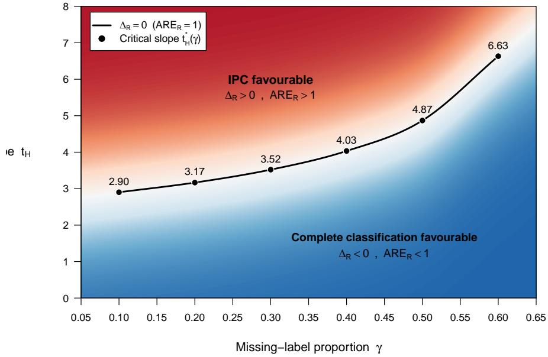
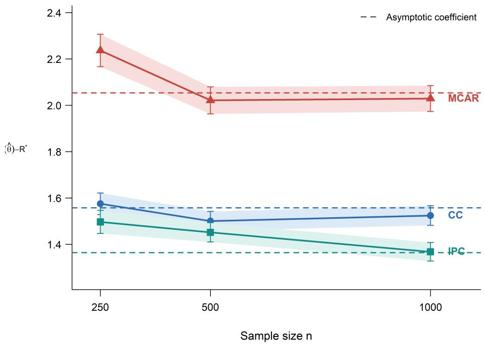
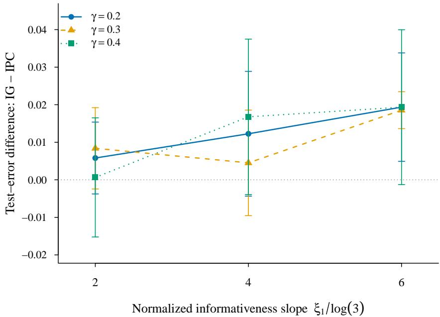

# Informative Label Missingness in Multiclass Classification: Information Geometry and Excess Risk

Fariborz Setoudehtazangi1 and Geofrey J. McLachlan∗2

1Dipartimento di Scienze Statistiche, Universit\`a di Padova, Padova, Italy 2School of Mathematics and Physics, The University of Queensland, Australia

## Abstract

Informative label missingness can change the usual eficiency ordering between completely and partially labelled classifiers because the pattern of missing labels may itself carry information about the classification model. We develop a general likelihoodbased theory for this phenomenon in parametric multiclass classification. An eficientinformation decomposition separates information lost through unavailable class memberships from information contributed by the missing-label mechanism. We then derive a quadratic expansion of plug-in excess risk over the active pairwise faces of the multiclass Bayes boundary, showing that classification eficiency depends on how information gains and losses align with directions that perturb the decision boundary. This yields a classification-weighted generalized-eigenvalue criterion under which informative partial classification may have smaller asymptotic classification risk without globally domi nating complete classification in Fisher information. Near missing completely at random, with the marginal missing-label proportion fixed, redistribution of missing labels changes lost class-label information at first order, whereas eficient information from the missingness pattern appears only at second order. Three-class quadratic discriminant calculations, finite-sample experiments, and a semi-synthetic multiclass application illustrate the resulting regime-dependent behaviour.

Keywords: Bayes classifier; classification risk; Fisher information; informative missingness;   
missing class labels; multiclass classification; semi-supervised learning.

## 1 Introduction

Classification from partially labelled data arises when the feature vectors in a training sample are observed but the class memberships of some observations are unavailable. This problem has a long history in statistical discriminant analysis and is now commonly viewed as a form of semi-supervised learning (McLachlan, 1975; Dempster et al., 1977; Chapelle et al., 2006;

Van Engelen and Hoos, 2020; Ahfock and McLachlan, 2020). From a likelihood perspective, the unavailable class memberships constitute missing data, so labelled and unlabelled observations can be combined through the likelihood of the corresponding finite-mixture model. When label availability is unrelated to the observed data, an observation whose class membership is unknown is generally less informative for estimating a classification rule than the same observation with its label observed. The resulting loss of information and its implications for discriminant eficiency were studied in early work on partially classified samples (O’Neill, 1978; Ganesalingam and McLachlan, 1978; McLachlan and Scot, 1995); related questions concerning the statistical value of labelled and unlabelled observations have also been considered from a learning theory perspective (Castelli and Cover, 1996).

The comparison changes when label availability is related to the classification problem. In many applications, labels are assigned selectively. For example, a human expert may be more likely to leave an observation unclassified when its features place it in a region of substantial class overlap. The observed pattern of label availability can then contain information about parameters governing the classifier. Such situations are naturally described within a missingdata framework (Rubin, 1976; Mealli and Rubin, 2015). If M denotes the indicator that the class label $Z$ is unavailable and $\mathbf { Y }$ is the observed feature vector, we consider mechanisms satisfying

$$
M \perp Z \mid { \pmb Y } , \qquad \operatorname* { P r } ( M = 1 \mid { \pmb Y } = { \pmb y } ) = q ( { \pmb y } ; { \pmb \theta } , { \pmb \xi } ) ,
$$

where $\pmb \theta$ parameterizes the classification model and ξ contains parameters specific to the missing-label mechanism. Although M is conditionally independent of the latent class given the observed features, the mechanism need not be ignorable for likelihood inference on $\theta _ { ; }$ because its distribution may itself depend on $\pmb \theta .$

A counterintuitive consequence of this dependence was developed by Ahfock and McLachlan (2020). For two homoscedastic Gaussian classes, they modelled the probability of a missing label as a function of classification uncertainty and showed that the information carried by the missing-label indicators can exceed the information lost through the unavailable class memberships. Consequently, an estimated Bayes rule based on a partially classified sample can have a smaller asymptotic expected error rate than the corresponding rule based on a completely classified sample. Their formulation was motivated by the observation that unclassified observations may concentrate near class boundaries, and related the missingness probability to classification entropy or, in the binary Gaussian setting, to the squared discriminant function (McLachlan and Ahfock, 2019; Ahfock and McLachlan, 2020). This phenomenon and its relation to statistical semi-supervised learning have subsequently been reviewed by Ahfock and McLachlan (2023).

The phenomenon is not confined numerically to the homoscedastic binary model. In particular, Lyu (2024) studied Bayes-rule estimation under a specified missing-data mechanism for Gaussian mixture models and considered two- and three-component settings with unequal covariance matrices through simulation and real-data illustrations. More recent work has continued to emphasize the implications of informative missingness in semi-supervised learning and the roles of class overlap, the proportion of missing labels, and the strength of the association between missingness and classification uncertainty (Wu et al., 2026). Thus there is evidence that favourable informative missingness can arise beyond the particular

Gaussian configuration in which the phenomenon was first analysed.

What remains less understood is the classification-risk geometry of this phenomenon in a general multiclass problem. Existing analytic results explaining eficiency gains from informative label missingness have been developed primarily through binary discriminant structures. In a multiclass problem, however, the Bayes rule is determined by several pairwise equality surfaces, only portions of which form active decision boundaries, and these surfaces may meet at triple or higher-order class junctions. More importantly, global improvement in Fisher information is stronger than what classification itself requires. Information gained in a parameter direction that barely moves the Bayes boundary may have little efect on classification risk, whereas a gain concentrated in a strongly boundary-relevant direction may be substantially more important.

This issue connects informative label missingness with the classical asymptotic theory of estimated discriminant rules. Previous work has studied the efect of parameter estimation on classification error and developed large-sample and higher-order risk expansions for discriminant procedures (O’Neill, 1980; Taniguchi, 1994; Ducinskas and Saltyte, 2002). A central implication of this literature is that parameter-estimation precision and classification performance are not interchangeable: classification risk depends on how estimation error perturbs the decision rule. For informative partial classification, a comparison of Fisher information alone therefore does not reveal which information gains and losses are relevant to classification.

The aim of this paper is to connect these two strands of theory. We first derive an eficientinformation decomposition for a general parametric multiclass model with informative label missingness. After eliminating the parameters specific to the missing-label mechanism, the information for the classification model is

$$
I _ { \mathrm { P C } } ^ { \mathrm { e f f } } = I _ { \mathrm { C C } } - E \big [ q ( \pmb { Y } ) I _ { Z | \pmb { Y } } ( \pmb { Y } ) \big ] + I _ { M } ^ { \mathrm { e f f } } ,\tag{1.1}
$$

where the second term is the information lost through unavailable class memberships and ${ \pmb { I } } _ { M } ^ { \mathrm { e f f } } \succeq { \bf 0 }$ is the eficient information contributed by the missing-label indicators. The weighting by $q ( \pmb { Y } )$ is important: the information cost of missing labels depends not only on how many labels are unavailable but also on where in the feature space they are missing. Missing completely at random is recovered as a special case in which the missingness indicators contribute no information about the classification parameters.

We then relate this information structure to classification performance by deriving a local quadratic excess-risk expansion for regular multiclass Bayes classifiers. The leading curvature is determined by the active pairwise Bayes faces, namely the portions of pairwise equality surfaces on which the corresponding two classes jointly attain the Bayes maximum. Under regularity and transversality conditions, triple and higher-order Bayes junctions do not contribute to the leading quadratic term. If $\widehat { \pmb { \theta } }$ is asymptotically normal with asymptotic covariance matrix $V .$ , then

$$
E \Big \{ R ( \widehat { \pmb \theta } ) \Big \} - R ^ { * } = \frac { 1 } { 2 n } \mathrm { t r } ( { \pmb H } _ { R } { \pmb V } ) + o \big ( n ^ { - 1 } \big ) ,\tag{1.2}
$$

where $H _ { R }$ is the curvature matrix induced by the active Bayes faces.

Combining the information and risk calculations yields the main classification-specific comparison. Let A and J denote the relevant eficient information matrices under complete classification and informative partial classification, respectively. The leading classification advantage of the latter is governed by

$$
\Delta _ { R } = \mathrm { t r } \left[ { \pmb H } _ { R } \left( { \pmb A } ^ { - 1 } - { \pmb J } ^ { - 1 } \right) \right] .\tag{1.3}
$$

Thus a smaller asymptotic classification risk does not require $J \succeq A$ . A partially classified experiment may lose information in some parameter directions and nevertheless improve classification if its information gains are suficiently concentrated in directions that move the active Bayes boundary. A generalized-eigenvalue representation makes this distinction explicit by separating relative information gain or loss from the classification relevance of the corresponding parameter direction. Favourable informative missingness is therefore a directional alignment phenomenon rather than simply a question of global Fisher-information dominance.

We also examine how this advantage emerges as a missing-label mechanism departs from missing completely at random while the marginal proportion of missing labels is held fixed. Locally, redistributing the missing labels according to classification uncertainty alters the loss of conditional class-label information at first order, whereas the eficient information carried by the missingness indicators appears only at second order. Hence a weakly informative mechanism need not initially improve classification and may instead make it worse. Whether a favourable regime subsequently emerges depends on the global information geometry and its alignment with the active decision boundaries.

The theory is illustrated using a three-class Gaussian quadratic discriminant model with unequal covariance matrices. This is the smallest setting that allows curved pairwise Bayes faces and a genuine multiclass junction to arise simultaneously while the decision geometry remains directly interpretable. We examine how the classification-risk comparison varies with the proportion of missing labels, the strength of uncertainty dependence, class separation, prior imbalance, covariance heterogeneity, and the choice of entropy- or Gini-based uncertainty measures. The population calculations reveal face-specific gains and losses and geometry-dependent transitions between unfavourable and favourable regimes. A finitesample Monte Carlo experiment then assesses the asymptotic predictions under likelihood estimation; in the reference configuration, the theoretical classification-risk coeficients, empirical quadratic approximations, and directly evaluated scaled excess risks are in close agreement.

The contribution of this paper is therefore not to establish that informative label missingness can sometimes be beneficial—that phenomenon is already known—nor simply to demonstrate it for another class-conditional distribution. Rather, we develop a general multiclass framework that explains how information gained and lost through informative label missingness is translated into classification risk through the geometry of the active Bayes boundary. This perspective identifies when and where the missingness pattern can improve classification and shows why favourable partial classification does not require global information dominance.

The remainder of the paper is organized as follows. Section 2 introduces the general partially labelled model and derives the eficient-information decomposition. Section 3 considers eficient classifier information in the presence of nuisance parameters. Section 4 develops the multiclass excess-risk geometry, and Section 5 gives the classification-weighted spectral characterization and studies local departures from missing completely at random. Section 6 specializes the framework to quadratic discriminant analysis. Sections 7 and 8 present the population and finite-sample investigations, respectively. Section 9 provides a semi-synthetic application to the Vertebral Column data. Section 10 discusses the main findings, limitations, and directions for further research, and Section 11 concludes.

## 2 General model and information decomposition

Let $Y \in \mathcal { Y } \subseteq \mathbb { R } ^ { p }$ denote the observed feature vector and let $Z \in \{ 1 , \ldots , g \}$ denote the corresponding class label. We assume a parametric class model of the form

$$
\operatorname* { P r } _ { \pmb { \theta } } ( Z = k ) = \pi _ { k } , \qquad \pmb { Y } \mid Z = k \sim f _ { k } ( \pmb { y } ; \pmb { \vartheta } _ { k } ) , \qquad k = 1 , \dots , g ,
$$

where $\pmb { \theta } = \left( \pi ^ { \top } , \pmb { \vartheta } _ { 1 } ^ { \top } , \dots , \pmb { \vartheta } _ { q } ^ { \top } \right) ^ { \top }$ denotes an identifiable finite-dimensional parameter vector, with a suitable parameterization of the class probabilities ${ \pmb { \pi } } = ( \pi _ { 1 } , . . . , \pi _ { g } ) ^ { \top }$

The joint class-feature density is

$$
p _ { \pmb { \theta } } ( \pmb { y } , Z = k ) = \pi _ { k } f _ { k } ( \pmb { y } ; \pmb { \vartheta } _ { k } ) ,
$$

and the marginal feature density is

$$
p _ { \pmb \theta } ( \pmb y ) = \sum _ { k = 1 } ^ { g } \pi _ { k } f _ { k } ( \pmb y ; \pmb \vartheta _ { k } ) .
$$

The posterior class probabilities are therefore

$$
\tau _ { k } ( \pmb { y } ; \pmb \theta ) = \operatorname* { P r } _ { \pmb \theta } ( Z = k \mid \mathbf Y = \pmb y ) = \frac { \pi _ { k } f _ { k } ( \pmb y ; \pmb \vartheta _ { k } ) } { p _ { \pmb \theta } ( \pmb y ) } .
$$

The corresponding Bayes classifier assigns y to a class maximizing $\tau _ { k } ( \pmb { y } ; \pmb \theta )$ , or equivalently, $\pi _ { k } f _ { k } ( \pmb { y } ; \pmb { \vartheta } _ { k } )$

Let

$$
M = { \left\{ \begin{array} { l l } { 1 , } & { { \mathrm { i f ~ t h e ~ c l a s s ~ l a b e l ~ i s ~ u n a v a i l a b l e } } , } \\ { 0 , } & { { \mathrm { i f ~ t h e ~ c l a s s ~ l a b e l ~ i s ~ o b s e r v e d } } . } \end{array} \right. }
$$

We assume throughout that

$$
M \perp Z \mid { \mathbf { } } Y ,\tag{2.1}
$$

while allowing the probability of label absence to depend on both the observed features and the parameters of the classification model:

$$
\operatorname* { P r } _ { \pmb { \theta } , \pmb { \xi } } ( M = 1 \mid \mathbf { Y } = \pmb { y } ) = q ( \pmb { y } ; \pmb { \theta } , \pmb { \xi } ) ,\tag{2.2}
$$

where $\pmb { \xi }$ denotes parameters specific to the missing-label mechanism and

$$
0 < q ( { \pmb y } ; { \pmb \theta } , { \pmb \xi } ) < 1
$$

on the relevant support.

The observed datum for one individual is

$$
\mathcal { O } = ( \boldsymbol { Y } , M , ( 1 - M ) Z ) .
$$

Under (2.1), its density can be written as

$$
\begin{array} { r l } { \displaystyle p _ { \pmb { \theta } , \pmb { \xi } } ( \pmb { \mathcal { O } } ) = p _ { \pmb { \theta } } ( \pmb { Y } ) \tau _ { Z } ( \pmb { Y } ; \pmb { \theta } ) ^ { 1 - M } } & { } \\ { \times q ( \pmb { Y } ; \pmb { \theta } , \pmb { \xi } ) ^ { M } \left\{ 1 - q ( \pmb { Y } ; \pmb { \theta } , \pmb { \xi } ) \right\} ^ { 1 - M } . } & { } \end{array}\tag{2.3}
$$

Consequently, the individual observed-data log-likelihood is

$$
\begin{array} { r } { \ell _ { \mathrm { o b s } } ( \pmb { \theta } , \pmb { \xi } ) = \log p _ { \pmb { \theta } } ( \pmb { Y } ) + ( 1 - M ) \log \tau _ { Z } ( \pmb { Y } ; \pmb { \theta } ) \qquad } \\ { + M \log q ( \pmb { Y } ; \pmb { \theta } , \pmb { \xi } ) + ( 1 - M ) \log \left\{ 1 - q ( \pmb { Y } ; \pmb { \theta } , \pmb { \xi } ) \right\} . } \end{array}\tag{2.4}
$$

Expression (2.4) separates three sources of information: the marginal distribution of the features, the observed class labels, and the pattern of label availability. The last component is absent from an ignorable analysis when the missing-label mechanism is treated as ancillary to the classification model.

To quantify the contribution of an observed class label at a given feature value, define the conditional class score

$$
\begin{array} { r } { S _ { Z | \boldsymbol { Y } } = \nabla _ { \boldsymbol { \theta } } \log \tau _ { Z } ( \boldsymbol { Y } ; \boldsymbol { \theta } ) , } \end{array}
$$

and its conditional Fisher information

$$
\begin{array} { r } { I _ { Z | Y } ( \pmb { \theta } ; \pmb { y } ) = E _ { \pmb { \theta } } \left[ S _ { Z | Y } \pmb { S } _ { Z | Y } ^ { \top } \ | \ \pmb { Y } = \pmb { y } \right] . } \end{array}\tag{2.5}
$$

This matrix measures the additional information provided by observing the class membership after the feature vector is known.

For the missing-label mechanism, write

$$
q _ { \pmb { \theta } } = { \frac { \partial q } { \partial \pmb { \theta } } } , \qquad q _ { \pmb { \xi } } = { \frac { \partial q } { \partial \pmb { \xi } } } ,
$$

and define

$$
B _ { a b } = E \left[ \frac { q _ { a } q _ { b } ^ { \top } } { q ( 1 - q ) } \right] , \qquad a , b \in \{ \pmb { \theta } , \pmb { \xi } \} ,\tag{2.6}
$$

where the arguments of $q$ are suppressed for notational simplicity.

The following result gives the central information decomposition.

Theorem 2.1. Assume that the model is locally identifiable and satisfies the standard regularity conditions for Fisher-information calculations, including common support in a neighborhood of the true parameter, diferentiability with respect to $( \pmb \theta , \pmb \xi )$ , interchange of diferentiation and integration, finite second moments of the relevant score functions, and nonsingularity of $B _ { \xi \xi }$ . Then the eficient Fisher information for $\theta ,$ after eliminating the missingness-specific nuisance parameter $\xi$ , is

$$
\begin{array} { r } { I _ { \mathrm { P C } } ^ { \mathrm { e f f } } ( \pmb { \theta } ) = I _ { \mathrm { C C } } ( \pmb { \theta } ) - D ( \pmb { \theta } , \pmb { \xi } ) + I _ { M } ^ { \mathrm { e f f } } ( \pmb { \theta } , \pmb { \xi } ) , } \end{array}\tag{2.7}
$$

where

$$
\begin{array} { r } { D ( \pmb { \theta } , \pmb { \xi } ) = E \left[ q ( \pmb { Y } ; \pmb { \theta } , \pmb { \xi } ) \pmb { I } _ { Z | \pmb { Y } } ( \pmb { \theta } ; \pmb { Y } ) \right] , } \end{array}\tag{2.8}
$$

and

$$
\pmb { I } _ { M } ^ { \mathrm { e f f } } = \pmb { B } _ { \theta \theta } - \pmb { B } _ { \theta \xi } \pmb { B } _ { \xi \xi } ^ { - 1 } \pmb { B } _ { \xi \theta } \succeq \mathbf { 0 } .\tag{2.9}
$$

Here $I _ { \mathrm { C C } } ( \pmb { \theta } )$ denotes the Fisher information that would be available if all class labels were observed.

The proof is given in Supplementary Section S1.

The decomposition in (2.7) separates two efects that are otherwise confounded in a partially labelled sample. The matrix D is the information lost because some class memberships are not observed. Importantly, it is not determined solely by the marginal missing-label proportion. Instead, each feature value is weighted by both its probability of losing the label and the conditional information that the label would have provided. In contrast, ${ \cal I } _ { M } ^ { \mathrm { e f f } }$ is the eficient information conveyed by the missing-label indicators after the missingness-specific parameters have been removed.

For the finite mixture model considered here, $I _ { Z | Y }$ has a particularly useful form. Define the class-specific score

$$
\pmb { s } _ { k } ( \pmb { y } ) = \nabla _ { \pmb { \theta } } \log \left\{ \pi _ { k } f _ { k } ( \pmb { y } ; \pmb { \vartheta } _ { k } ) \right\} ,
$$

and

$$
\overline { { \pmb { s } } } ( \pmb { y } ) = \sum _ { k = 1 } ^ { g } \tau _ { k } ( \pmb { y } ; \pmb { \theta } ) \pmb { s } _ { k } ( \pmb { y } ) .
$$

Since

$$
\nabla _ { \pmb \theta } \log \tau _ { k } ( \pmb y ; \pmb \theta ) = \pmb s _ { k } ( \pmb y ) - \overline { { \pmb s } } ( \pmb y ) ,
$$

we obtain

$$
\begin{array} { l } { { \displaystyle I _ { Z | Y } ( \pmb \theta ; \pmb y ) = \sum _ { k = 1 } ^ { g } \tau _ { k } ( \pmb y ; \pmb \theta ) \left\{ \pmb s _ { k } ( \pmb y ) - \overline { s } ( \pmb y ) \right\} } } \\ { { \displaystyle ~ \times \left\{ \pmb s _ { k } ( \pmb y ) - \overline { s } ( \pmb y ) \right\} ^ { \top } . } } \end{array}\tag{2.10}
$$

Thus the information supplied by the class label is the posterior covariance of the class-specific score vectors. This representation will be useful below when we examine how uncertaintydependent missingness redistributes label information across the feature space.

A direct consequence of Theorem 2.1 is the standard missing-completely-at-random benchmark.

Corollary 2.2. Suppose

$$
q ( { \pmb Y } ; { \pmb \theta } , { \pmb \xi } ) = \gamma , \qquad 0 < \gamma < 1 ,
$$

where $\gamma$ is variation-independent of $\pmb { \theta } .$ . Then

$$
{ \pmb I } _ { M } ^ { \mathrm { e f f } } = { \bf 0 } ,
$$

and

$$
\begin{array} { r } { I _ { \mathrm { P C } } ^ { \mathrm { e f f } } = I _ { \mathrm { C C } } - \gamma E \left[ I _ { Z | Y } ( \pmb { \theta } ; \mathbf { Y } ) \right] \preceq I _ { \mathrm { C C } } . } \end{array}\tag{2.11}
$$

Hence randomly removing class labels cannot increase Fisher information about the classification model. Any favourable information efect must arise because the observed pattern of missing labels is itself informative about $\pmb \theta .$

Theorem 2.1 concerns the complete identifiable data-model parameter $\theta ,$ after eliminating only the missingness-specific parameter $\xi .$ . In many classification models, however, some components of $\pmb \theta$ may be nuisance parameters for a particular classifier parameter or functional of interest. Eliminating such nuisance parameters does not generally preserve the simple additive form in (2.7). The resulting eficient classifier information is considered in the next section.

## 3 Eficient classifier information in the presence of nuisance parameters

The decomposition in (2.7) concerns the full identifiable parameter $\theta ,$ after eliminating only the missingness-specific parameter $\xi .$ . In some classification models, however, the inferential target depends on only part of $\theta ,$ with the remaining components acting as nuisance parameters. Eliminating these additional nuisance parameters need not preserve the additive information decomposition of Section 2.

Write

$$
\pmb \theta = { \binom { \beta } { \lambda } } , \qquad \pmb \beta \in \mathbb { R } ^ { r } , \quad \lambda \in \mathbb { R } ^ { s } ,
$$

where $\beta$ is the parameter of interest and $\boldsymbol { \lambda }$ is nuisance. Here “nuisance” is meant in the inferential sense: the target depends on $\beta _ { ; }$ , whereas λ is eliminated by eficient-score projection. Parameters that determine the Bayes decision boundary are therefore not nuisance when classification risk itself is the target.

Let

$$
A = I _ { \mathrm { C C } } ( \theta ) , \qquad K = I _ { M } ^ { \mathrm { e f f } } - D , \qquad J = I _ { \mathrm { P C } } ^ { \mathrm { e f f } } = A + K ,
$$

and partition A and K conformably with $( \beta ^ { \top } , \lambda ^ { \top } ) ^ { \top }$

$$
A = \left( \begin{array} { l l } { { { \cal A } _ { \beta \beta } } } & { { { \cal A } _ { \beta \lambda } } } \\ { { { \cal A } _ { \lambda \beta } } } & { { { \cal A } _ { \lambda \lambda } } } \end{array} \right) , \qquad K = \left( \begin{array} { l l } { { K _ { \beta \beta } } } & { { K _ { \beta \lambda } } } \\ { { K _ { \lambda \beta } } } & { { K _ { \lambda \lambda } } } \end{array} \right) .
$$

Under complete classification, the eficient information for $\beta$ is the Schur complement

$$
\begin{array} { r } { \pmb { A } _ { \mathrm { e f f } } ( \beta ) = \pmb { A } _ { \beta \beta } - \pmb { A } _ { \beta \lambda } \pmb { A } _ { \lambda \lambda } ^ { - 1 } \pmb { A } _ { \lambda \beta } . } \end{array}\tag{3.1}
$$

To express the corresponding information under partial classification, define $\pmb { R } = \pmb { A } _ { \beta \lambda } \pmb { A } _ { \lambda \lambda } ^ { - 1 }$ and

$$
\widetilde { \pmb { K } } _ { \beta \beta } = \pmb { K } _ { \beta \beta } - \pmb { R } \pmb { K } _ { \lambda \beta } - \pmb { K } _ { \beta \lambda } \pmb { R } ^ { \top } + \pmb { R } \pmb { K } _ { \lambda \lambda } \pmb { R } ^ { \top } ,\tag{3.2}
$$

$$
\widetilde { \pmb { K } } _ { \beta \lambda } = \pmb { K } _ { \beta \lambda } - \pmb { R } \pmb { K } _ { \lambda \lambda } .\tag{3.3}
$$

These quantities describe the perturbation induced by partial classification after orthogonalization with respect to the complete-data nuisance score.

Proposition 3.1. Assume that ${ \pmb A } _ { \lambda \lambda }$ and ${ \pmb J } _ { \lambda \lambda } = { \pmb A } _ { \lambda \lambda } + { \pmb K } _ { \lambda \lambda }$ are nonsingular. Then the eficient Fisher information for $\beta$ under informative partial classification is

$$
\begin{array} { r } { \pmb { J } _ { \mathrm { e f f } } ( \pmb { \beta } ) = \pmb { A } _ { \mathrm { e f f } } ( \pmb { \beta } ) + \widetilde { \pmb { K } } _ { \beta \beta } - \widetilde { \pmb { K } } _ { \beta \lambda } \pmb { J } _ { \lambda \lambda } ^ { - 1 } \widetilde { \pmb { K } } _ { \lambda \beta } . } \end{array}\tag{3.4}
$$

Moreover,

$$
{ \cal C } _ { K } = \widetilde { K } _ { \beta \lambda } J _ { \lambda \lambda } ^ { - 1 } \widetilde { K } _ { \lambda \beta } \succeq { \bf 0 } .\tag{3.5}
$$

The proof is given in Supplementary Section S2. Proposition 3.1 shows that eliminating additional nuisance parameters introduces a nonnegative coupling penalty. In particular,

$$
J _ { \mathrm { e f f } } ( \beta ) - A _ { \mathrm { e f f } } ( \beta ) = \widetilde { K } _ { \beta \beta } - C _ { K } .\tag{3.6}
$$

Thus $\widetilde { \pmb { K } } _ { \beta \beta }$ represents the net information perturbation in the complete-data eficient direction for $\beta ,$ whereas $C _ { K }$ measures the loss arising from the coupling of that direction with the nuisance score under partial classification. A positive perturbation in the classifier-relevant block is therefore not suficient for an information gain; it must also dominate this coupling penalty.

If $\bar { \boldsymbol { K } } _ { \beta \lambda } = \mathbf { 0 }$ , then $C _ { K } = \mathbf { 0 }$ and

$$
J _ { \mathrm { e f f } } ( \beta ) = A _ { \mathrm { e f f } } ( \beta ) + \widetilde { K } _ { \beta \beta } .\tag{3.7}
$$

In this case, informative partial classification does not recouple the complete-data eficient score for $\beta$ with the nuisance score, and the additive form is recovered after nuisance elimination.

This distinction is relevant when inference concerns a lower-dimensional classifier parameter. In the multiclass risk analysis that follows, however, all parameters determining the Bayes decision boundary are retained in the classifier-relevant vector. Thus, for quadratic discriminant analysis, the class probabilities, means, and covariance matrices are not eliminated as nuisance parameters.

## 4 Excess-risk geometry for multiclass Bayes classification

The information decompositions in Sections 2 and 3 describe how informative label missingness afects the precision with which the parameters of a classification model can be estimated.

To determine whether these changes improve classification, however, the information matrix must be related to the geometry of the Bayes decision boundary. We develop this connection here.

For $k = 1 , \dots , g$ , define the prior-weighted class density $r _ { k } ( { \pmb y } ; { \pmb \theta } ) = \pi _ { k } f _ { k } ( { \pmb y } ; { \pmb \vartheta } _ { k } )$ , and write $r _ { k } ^ { 0 } ( { \pmb y } ) = r _ { k } ( { \pmb y } ; { \pmb \theta } _ { 0 } )$ at the true parameter $\pmb { \theta } _ { 0 }$ . The Bayes classifier is

$$
C _ { 0 } ( \pmb { y } ) = \arg \operatorname* { m a x } _ { 1 \leq k \leq g } r _ { k } ^ { 0 } ( \pmb { y } ) ,\tag{4.1}
$$

with an arbitrary fixed rule for breaking ties on sets of probability zero. For $\pmb \theta$ in a neighborhood of $\pmb { \theta } _ { 0 } .$ , let

$$
C _ { \pmb { \theta } } ( \pmb { y } ) = \arg \operatorname* { m a x } _ { k } r _ { k } ( \pmb { y } ; \pmb { \theta } )
$$

denote the corresponding plug-in classifier, so that $C _ { \theta _ { 0 } } = C _ { 0 }$ . For a local perturbation h, write

$$
C _ { h } ( \boldsymbol { y } ) : = C _ { \theta _ { 0 } + h } ( \boldsymbol { y } ) .
$$

For $k \neq l .$ , define the pairwise weighted-density contrast

$$
g _ { k l } ( \pmb { y } ; \pmb { \theta } ) = r _ { k } ( \pmb { y } ; \pmb { \theta } ) - r _ { l } ( \pmb { y } ; \pmb { \theta } ) .\tag{4.2}
$$

Not every equality surface $\{ g _ { k l } = 0 \}$ contributes to the Bayes decision boundary. Only the portion on which classes k and l jointly attain the largest prior-weighted density is relevant.

Definition 4.1. The active Bayes face separating classes k and l is

$$
\mathcal { F } _ { k l } = \left\{ \pmb { y } : r _ { k } ^ { 0 } ( \pmb { y } ) = r _ { l } ^ { 0 } ( \pmb { y } ) > \operatorname* { m a x } _ { m \not \in \{ k , l \} } r _ { m } ^ { 0 } ( \pmb { y } ) \right\} .\tag{4.3}
$$

The distinction between a pairwise equality surface and an active face is essential in the multiclass setting. If $r _ { k } ^ { 0 } ( { \pmb y } ) = r _ { l } ^ { 0 } ( { \pmb y } )$ while a third class has a strictly larger weighted density, perturbing the k-versus-l comparison does not change the Bayes decision locally and therefore does not contribute to the leading excess risk.

For $\boldsymbol { s } \in \mathcal { F } _ { k l }$ , let $\pmb { b } _ { k l } ( \pmb { s } ) = \nabla _ { \pmb { \theta } } g _ { k l } ( \pmb { s } ; \pmb { \theta } _ { 0 } )$ . This vector describes the first-order change in the k-versus-l contrast induced by a local parameter perturbation at the boundary point s.

We impose regularity conditions excluding singular decision geometry. For each nonempty active face, assume

$$
\nabla _ { \pmb { y } } g _ { k l } ( \pmb { s } ; \pmb { \theta } _ { 0 } ) \neq \mathbf { 0 } , \qquad \pmb { s } \in \mathcal { F } _ { k l } .\tag{4.4}
$$

The regular part of $\mathcal { F } _ { k l }$ is then a $( p - 1 )$ -dimensional smooth hypersurface. At points where $r \geq 3$ classes tie at the Bayes maximum, we additionally assume transversality: $r - 1$ independent pairwise contrast gradients span the normal space of the corresponding tie stratum. Ties of positive Lebesgue measure are excluded. When the feature support is unbounded, we additionally assume the tail condition stated in Supplementary Section S4. When one or more active faces are noncompact, we also assume the regular-exhaustion and boundaryintegrability conditions stated there.

Let

$$
R ( \pmb \theta ) = \operatorname* { P r } _ { \pmb \theta _ { 0 } } \{ C _ { \pmb \theta } ( \pmb Y ) \neq Z \}
$$

denote the classification risk of the rule determined by θ, evaluated under the true distribution $\pmb { \theta } _ { 0 }$ , and let $R ^ { * } = R ( \pmb { \theta } _ { 0 } )$ denote the Bayes risk. The local geometry of the excess risk is characterized by the following result.

Theorem 4.2. Suppose that the active Bayes boundary lies in the interior of the common feature support and that the class-weighted densities are twice continuously diferentiable in $( y , \theta )$ in a neighborhood of the active Bayes boundary. Assume that the active pairwise faces satisfy (4.4), that higher-order active tie sets satisfy the stated transversality condition, and that ties of positive Lebesgue measure are absent. When the feature support is unbounded, we additionally assume the tail condition stated in Supplementary Section $S 4 .$ When one or more active faces are noncompact, we also assume the regular-exhaustion and boundaryintegrability conditions stated there. Then, as $\mathbf { \Sigma } _ { h  0 }$

$$
R ( \pmb \theta _ { 0 } + \pmb h ) - R ^ { * } = \frac { 1 } { 2 } \pmb h ^ { \top } \pmb H _ { R } \pmb h + o \big ( \| \pmb h \| ^ { 2 } \big ) ,\tag{4.5}
$$

where

$$
\pmb { H } _ { R } = \sum _ { 1 \leq k < l \leq g } \pmb { H } _ { k l } , \qquad \pmb { H } _ { k l } = \int _ { \mathcal { F } _ { k l } } \frac { \pmb { b } _ { k l } ( \pmb { s } ) \pmb { b } _ { k l } ( \pmb { s } ) ^ { \top } } { \| \nabla _ { \pmb { y } } \pmb { g } _ { k l } ( \pmb { s } ; \pmb { \theta } _ { 0 } ) \| } d \pmb { S } ( \pmb { s } ) .\tag{4.6}
$$

In particular, ${ \pmb { H } } _ { R } \succeq \mathbf { 0 }$ . Generic triple and higher-order Bayes junctions do not contribute to the quadratic term.

A proof is given in Supplementary Sections S3–S4. The argument localizes classification disagreement to a thin neighborhood of the Bayes boundary and uses the pairwise contrast $g _ { k l }$ as a coordinate normal to each active face. The loss incurred by crossing the k-versus-l boundary is then $| g _ { k l } |$ , and integration across the displaced boundary yields the quadratic contribution in (4.6). Under transversality, higher-order junctions are lower-dimensional and contribute only to higher-order terms.

The matrix $H _ { R }$ therefore defines a local classification-relevance metric on the parameter space. For any direction v,

$$
v ^ { \top } H _ { R } \pmb { v } = \sum _ { k < l } \int _ { \mathcal { F } _ { k l } } \frac { \left\{ \pmb { b } _ { k l } ( \pmb { s } ) ^ { \top } \pmb { v } \right\} ^ { 2 } } { \| \nabla _ { \pmb { y } } g _ { k l } ( \pmb { s } ; \pmb { \theta } _ { 0 } ) \| } d S ( \pmb { s } ) .\tag{4.7}
$$

Thus a direction v is locally irrelevant to classification if and only if $\pmb { b } _ { k l } ( \pmb { s } ) ^ { \top } \pmb { v } = 0$ for dSalmost every s on every active face $\begin{array} { r } { \mathcal { F } _ { k l } ; } \end{array}$ equivalently, it produces no first-order displacement of the active Bayes boundary.

An equivalent representation in terms of pairwise log-contrasts, which is convenient for the QDA calculations in Section 6, is given in Supplementary Section S4.

Theorem 4.2 immediately yields an asymptotic classification-risk expansion for regular parameter estimators.

Corollary 4.3. Suppose that

$$
{ \sqrt { n } } \left( { \widehat { \pmb { \theta } } } _ { n } - \pmb { \theta } _ { 0 } \right) \ { \xrightarrow { d } } \ N ( \mathbf { 0 } , V ) ,
$$

and that, for some $\delta > 0$

$$
\operatorname* { s u p } _ { n } E \left\| { \sqrt { n } } \left( { \widehat { \pmb \theta } } _ { n } - { \pmb \theta } _ { 0 } \right) \right\| ^ { 2 + \delta } < \infty .
$$

Then

$$
n \left\{ R ( \widehat { \pmb \theta } _ { n } ) - R ^ { * } \right\} \stackrel { d } { \longrightarrow } \frac 1 2 \pmb { Z } ^ { \top } \pmb { H } _ { R } \pmb { Z } , \qquad \pmb { Z } \sim N ( \mathbf { 0 } , V ) ,\tag{4.8}
$$

and

$$
E \left\{ R ( { \widehat { \pmb \theta } } _ { n } ) \right\} - R ^ { * } = { \frac { 1 } { 2 n } } \operatorname { t r } \left( \pmb { H } _ { R } \pmb { V } \right) + o ( n ^ { - 1 } ) .\tag{4.9}
$$

The proof and the corresponding weighted- $- \chi ^ { 2 }$ representation of the limiting quadratic form are given in Supplementary Section S4. For an eficient likelihood estimator, $V = I _ { \mathrm { e f f } } ^ { - 1 }$ 2 and hence

$$
E \left\{ R ( \widehat { \pmb \theta } _ { n } ) \right\} - R ^ { * } = \frac { 1 } { 2 n } \mathrm { t r } \left( { \cal H } _ { R } { \cal I } _ { \mathrm { e f f } } ^ { - 1 } \right) + o ( n ^ { - 1 } ) .\tag{4.10}
$$

This expression provides the required link between the information calculations of Sections 2– 3 and classification performance: information gains matter only insofar as they occur in directions to which $H _ { R }$ assigns classification relevance.

Let A and J denote the relevant eficient information matrices under complete and informative partial classification, respectively. Their leading expected excess-risk diference is determined by

$$
\Delta _ { R } = \mathrm { t r } \left[ { \pmb H } _ { R } \left( { \pmb A } ^ { - 1 } - { \pmb J } ^ { - 1 } \right) \right] ,\tag{4.11}
$$

since

$$
E \left\{ R ( \widehat { \pmb \theta } _ { \mathrm { C C } } ) \right\} - E \left\{ R ( \widehat { \pmb \theta } _ { \mathrm { P C } } ) \right\} = \frac { \Delta _ { R } } { 2 n } + o ( n ^ { - 1 } ) .\tag{4.12}
$$

Thus $\Delta _ { R } > 0$ characterizes favourable informative missingness at the leading $n ^ { - 1 }$ order in expected classification risk. The next section examines this criterion through the relative information geometry of the two experiments.

## 5 Classification-weighted information and favourable missingness

The previous section shows that, for a regular estimator with asymptotic covariance matrix $V / n$ , the leading excess classification risk is governed by

$$
\operatorname { t r } \left( { \cal H } _ { R } V \right) .
$$

Thus the comparison between complete and partial classification depends not only on the amount of information available, but also on the directions in which that information is gained or lost relative to the geometry of the active Bayes boundary.

Let A and J denote the relevant eficient information matrices under complete and informative partial classification, respectively, and assume throughout that $\mathbf A \succ \mathbf 0$ and $\mathbf { \nabla } J \succ \mathbf { 0 }$ The leading diference in expected excess classification risk is

$$
\Delta _ { R } = \mathrm { t r } \left[ { \pmb H } _ { R } \left( { \pmb A } ^ { - 1 } - { \pmb J } ^ { - 1 } \right) \right] .\tag{5.1}
$$

By (4.12), $\Delta _ { R } > 0$ implies that informative partial classification has the smaller expected excess classification risk at the leading $n ^ { - 1 }$ order.

The corresponding asymptotic relative eficiency is

$$
\mathrm { A R E } _ { R } = { \frac { \operatorname { t r } \left( H _ { R } A ^ { - 1 } \right) } { \operatorname { t r } \left( H _ { R } J ^ { - 1 } \right) } } ,\tag{5.2}
$$

provided the denominator is positive. Hence $\mathrm { A R E } _ { R } > 1$ if and only if $\Delta _ { R } > 0$ . We use $\Delta _ { R }$ as the primary criterion because it admits an additive directional decomposition.

Let $A ^ { 1 / 2 }$ denote the symmetric positive-definite square root of A, with inverse $A ^ { - 1 / 2 }$ 2 and define

$$
{ \cal C } = { \cal A } ^ { - 1 / 2 } J { \cal A } ^ { - 1 / 2 } , \qquad W = { \cal A } ^ { - 1 / 2 } H _ { R } { \cal A } ^ { - 1 / 2 } .\tag{5.3}
$$

Write

$$
\begin{array} { r } { \boldsymbol { C } = \boldsymbol { Q } \boldsymbol { \Lambda } \boldsymbol { Q } ^ { \intercal } , \qquad \boldsymbol { \Lambda } = \mathrm { d i a g } ( \lambda _ { 1 } , \dots , \lambda _ { r } ) , } \end{array}
$$

where $Q ^ { \top } Q = I$ and $\lambda _ { j } > 0$ . For the jth eigenvector $\mathbf { \Delta } \mathbf { q } _ { j }$ , define

$$
w _ { j } = \mathbf { q } _ { j } ^ { \intercal } W \mathbf { q } _ { j } \geq 0 .\tag{5.4}
$$

Theorem 5.1. Under the conditions above,

$$
\Delta _ { R } = \sum _ { j = 1 } ^ { r } w _ { j } \frac { \lambda _ { j } - 1 } { \lambda _ { j } } .\tag{5.5}
$$

Consequently, if $\mathcal { P } = \{ j : \lambda _ { j } > 1 \}$ and $\mathcal { N } = \{ j : \lambda _ { j } < 1 \}$ , then $\Delta _ { R } > 0$ if and only if

$$
\sum _ { j \in \mathcal { P } } w _ { j } \frac { \lambda _ { j } - 1 } { \lambda _ { j } } > \sum _ { j \in \mathcal { N } } w _ { j } \frac { 1 - \lambda _ { j } } { \lambda _ { j } } .\tag{5.6}
$$

The proof is given in Supplementary Section S5.

The generalized eigenvalues in Theorem 5.1 have a direct statistical interpretation. If ${ \pmb v } _ { j } = { \pmb A } ^ { - 1 / 2 } { \pmb q } _ { j }$ , then

$$
J { \pmb v } _ { j } = \lambda _ { j } { \pmb A } { \pmb v } _ { j } ,\tag{5.7}
$$

and, under the normalization $\pmb { v } _ { j } ^ { \top } \pmb { A } \pmb { v } _ { j } = 1$

$$
\lambda _ { j } = \pmb { v } _ { j } ^ { \top } \pmb { J } \pmb { v } _ { j } .
$$

Thus $\lambda _ { j } > 1$ indicates greater information under partial classification than under complete classification in direction $v _ { j }$ , whereas $\lambda _ { j } < 1$ indicates less information in that direction.

Moreover,

$$
w _ { j } = \pmb { v } _ { j } ^ { \top } \pmb { H } _ { R } \pmb { v } _ { j } .\tag{5.8}
$$

Hence $w _ { j }$ measures the classification relevance of the same direction. By (4.7), it is large when perturbation in $v _ { j }$ moves one or more active Bayes faces substantially.

Theorem 5.1 therefore characterizes favourable informative missingness as an alignment phenomenon. Global Fisher-information dominance is not required: $J \ \not \subset A$ is compatible with $\Delta _ { R } > 0$ whenever information gains occur primarily in directions receiving large classification weights.

For interpretation, define

$$
G _ { R } = \sum _ { \lambda _ { j } > 1 } w _ { j } \frac { \lambda _ { j } - 1 } { \lambda _ { j } } , \qquad L _ { R } = \sum _ { \lambda _ { j } < 1 } w _ { j } \frac { 1 - \lambda _ { j } } { \lambda _ { j } } .\tag{5.9}
$$

Then

$$
\Delta _ { R } = G _ { R } - L _ { R } .\tag{5.10}
$$

Thus informative partial classification is favourable precisely when its classification-weighted information gains exceed the corresponding losses.

Two limiting cases follow immediately. If $J \succeq A$ , then all $\lambda _ { j } \geq 1$ and hence $\Delta _ { R } \geq 0$ Conversely, if $J \preceq A$ , then $\Delta _ { R } \leq 0$ . Neither matrix ordering is required in the general case.

## 5.1 Local departures from missing completely at random

We now examine how favourable informative missingness can emerge as the missing-label mechanism departs continuously from missing completely at random. Let $U _ { \pmb \theta } ( \pmb Y )$ be a smooth scalar measure of classification uncertainty and consider

$$
q _ { t } ( { \pmb y } ; { \pmb \theta } ) = \mathrm { e x p i t } \left\{ \alpha ( t ) + t U _ { \pmb \theta } ( { \pmb y } ) \right\} , \qquad t \geq 0 .\tag{5.11}
$$

For comparisons across $t ,$ the intercept $\alpha ( t )$ is calibrated at the true parameter $\pmb { \theta } _ { 0 }$ so that

$$
E _ { \pmb { \theta } _ { 0 } } \left[ q _ { t } ( \pmb { Y } ; \pmb { \theta } _ { 0 } ) \right] = \gamma , \qquad 0 < \gamma < 1 .\tag{5.12}
$$

Thus t changes the locations at which labels are unavailable while keeping their marginal proportion fixed. At $t = 0 , q _ { 0 } ( { \pmb y } ) = \gamma$ , and the mechanism reduces to MCAR.

Equation (5.12) defines a sequence of population experiments; it is not imposed as a constraint on the likelihood for arbitrary θ. In estimation, the missingness intercept and slope remain ordinary nuisance parameters.

Write $U ( Y ) = U _ { \theta _ { 0 } } ( Y )$ and

$$
G ( Y ) = \nabla _ { \pmb { \theta } } U _ { \pmb { \theta } } ( \pmb { Y } ) \big | _ { \pmb { \theta = \theta } _ { 0 } } .
$$

The following proposition describes the local behavior of the information decomposition around MCAR.

Proposition 5.2. Assume that

$$
\mathrm { V a r } \{ U ( { \cal Y } ) \} > 0 , \qquad E \{ U ( { \cal Y } ) ^ { 2 } \} < \infty , \qquad E \{ \| G ( { \cal Y } ) \| ^ { 2 } \} < \infty ,
$$

and that the required diferentiations with respect to t and θ may be interchanged with expectation in a neighborhood of $( t , \pmb \theta ) = ( 0 , \pmb \theta _ { 0 } )$ , with suficient local smoothness for the Taylor expansions below. Then

$$
\alpha ( 0 ) = \mathrm { l o g i t } ( \gamma ) , \qquad \alpha ^ { \prime } ( 0 ) = - E \{ U ( { \bf Y } ) \} ,\tag{5.13}
$$

and

$$
q _ { t } ( { \pmb Y } ) = \gamma + t \gamma ( 1 - \gamma ) \left[ U ( { \pmb Y } ) - E \{ U ( { \pmb Y } ) \} \right] + O ( t ^ { 2 } ) .\tag{5.14}
$$

The label-information loss

$$
{ \cal D } ( t ) = E \left[ q _ { t } ( { \cal Y } ) { \cal I } _ { Z | { \cal Y } } ( { \cal Y } ) \right]
$$

satisfies

$$
{ \pmb D } ^ { \prime } ( 0 ) = \gamma ( 1 - \gamma ) E \left[ \left[ U ( { \pmb Y } ) - E \{ U ( { \pmb Y } ) \} \right] I _ { Z | { \pmb Y } } ( { \pmb Y } ) \right] .\tag{5.15}
$$

By contrast, the eficient information contributed by the missing-label mechanism satisfies

$$
\pmb { I } _ { M } ^ { \mathrm { e f f } } ( t ) = t ^ { 2 } \gamma ( 1 - \gamma ) \pmb { \nu } _ { U } + o ( t ^ { 2 } ) ,\tag{5.16}
$$

where

$$
{ \pmb { \mathscr { V } } } _ { U } = E \left[ \pmb { G } \pmb { G } ^ { \top } \right] - E \left[ \pmb { G } \pmb { X } ^ { \top } \right] E \left[ \pmb { X } \pmb { X } ^ { \top } \right] ^ { - 1 } E \left[ \pmb { X } \pmb { G } ^ { \top } \right] \succeq \mathbf { 0 } ,\tag{5.17}
$$

with

$$
\begin{array} { r } { X = \binom { 1 } { U ( Y ) } . } \end{array}
$$

Finally, if

$$
\begin{array} { r } { J _ { 0 } = A - \gamma E \left[ I _ { Z | Y } ( Y ) \right] , } \end{array}
$$

then the derivative of the classification advantage at MCAR is

$$
\Delta _ { R } ^ { \prime } ( 0 ) = - \mathrm { t r } \left[ { \cal H } _ { R } { \cal J } _ { 0 } ^ { - 1 } { \cal D } ^ { \prime } ( 0 ) { \cal J } _ { 0 } ^ { - 1 } \right] .\tag{5.18}
$$

The proof is given in Supplementary Section S6.

Proposition 5.2 reveals an asymmetry in how informative missingness first enters the experiment. Redistributing missing labels changes the conditional class-label information loss at order t, whereas the eficient information carried by the missingness indicators appears only at order $t ^ { 2 }$ . Weak dependence between label absence and classification uncertainty therefore need not improve classification.

In particular, if ${ \pmb D } ^ { \prime } ( 0 ) \succeq { \bf 0 }$ and

$$
\mathrm { t r } \left[ { \cal H } _ { R } { \cal J } _ { 0 } ^ { - 1 } { \cal D } ^ { \prime } ( 0 ) { \cal J } _ { 0 } ^ { - 1 } \right] > 0 ,
$$

then $\Delta _ { R } ^ { \prime } ( 0 ) < 0$ . A small departure from MCAR then initially worsens classification. This can occur, for example, when observations with above-average uncertainty are also those for which the true class label carries greater classification-relevant information.

The result is local: it does not imply that $\Delta _ { R } ( t )$ is monotone, nor that it must eventually become positive. Whether a favourable regime emerges for larger t depends on the global information geometry of the missingness mechanism. This behavior is examined numerically in Section 7.

## 6 Three-class quadratic discriminant analysis

We illustrate the preceding theory using Gaussian quadratic discriminant analysis (QDA). The purpose is not to introduce a new classification model, but to examine the information– risk framework in a setting where the Bayes geometry is genuinely multiclass and nonlinear. Unequal covariance matrices produce curved pairwise decision boundaries, all distributional parameters may afect the classifier, and diferent active faces may meet at multiclass junctions.

Let $Z \in \{ 1 , 2 , 3 \}$ , with $\Pr ( Z = k ) = \pi _ { k }$ , and

$$
{ \pmb Y } \mid Z = k \sim N _ { p } \left( { \pmb \mu } _ { k } , { \pmb \Sigma } _ { k } \right) , \qquad k = 1 , 2 , 3 ,\tag{6.1}
$$

where $\pi _ { k } > 0 , \sum _ { k = 1 } ^ { 3 } \pi _ { k } = 1$ , and $\Sigma _ { k } \succ \mathbf { 0 }$ . The prior-weighted class densities are

$$
\begin{array} { r } { r _ { k } ( { \pmb y } ) = \pi _ { k } \phi _ { p } \left( { \pmb y } ; { \pmb \mu } _ { k } , { \pmb \Sigma } _ { k } \right) , } \end{array}\tag{6.2}
$$

and the Bayes rule assigns y to the class maximizing $r _ { k } ( y )$

Although the theory in Sections 2–5 is stated for arbitrary $g$ and $p ,$ the numerical analysis uses $g = 3$ and $p = 2$ . This is the smallest configuration that allows curved active pairwise faces and a genuine three-class junction to occur simultaneously while remaining directly visualizable.

## 6.1 Bayes geometry and risk curvature

For $k \neq l$ , define the log weighted-density contrast

$$
d _ { k l } ( { \pmb y } ) = \log \frac { r _ { k } ( { \pmb y } ) } { r _ { l } ( { \pmb y } ) } .\tag{6.3}
$$

Under (6.1),

$$
\begin{array} { l } { { \displaystyle d _ { k l } ( { \pmb y } ) = \log \frac { \pi _ { k } } { \pi _ { l } } - \frac { 1 } { 2 } \log \frac { \left| { \pmb \Sigma } _ { k } \right| } { \left| { \pmb \Sigma } _ { l } \right| } } } \\ { ~ - \frac { 1 } { 2 } ( { \pmb y } - { \pmb \mu } _ { k } ) ^ { \top } { \pmb \Sigma } _ { k } ^ { - 1 } ( { \pmb y } - { \pmb \mu } _ { k } ) } \\ { ~ + \frac { 1 } { 2 } ( { \pmb y } - { \pmb \mu } _ { l } ) ^ { \top } { \pmb \Sigma } _ { l } ^ { - 1 } ( { \pmb y } - { \pmb \mu } _ { l } ) . } \end{array}\tag{6.4}
$$

Thus $\{ \pmb { y } : d _ { k l } ( \pmb { y } ) = 0 \}$ is a quadratic hypersurface. For three classes, the corresponding active face is

$$
\mathcal { F } _ { k l } = \left\{ \pmb { y } : d _ { k l } ( \pmb { y } ) = 0 , \ r _ { k } ( \pmb { y } ) = r _ { l } ( \pmb { y } ) > r _ { m } ( \pmb { y } ) \right\} ,\tag{6.5}
$$

where $m \not \in \{ k , l \}$

Diferentiation with respect to the feature vector gives

$$
\nabla _ { \pmb { y } } d _ { k l } ( \pmb { y } ) = - \pmb { \Sigma } _ { k } ^ { - 1 } ( \pmb { y } - \pmb { \mu } _ { k } ) + \pmb { \Sigma } _ { l } ^ { - 1 } ( \pmb { y } - \pmb { \mu } _ { l } ) ,\tag{6.6}
$$

so a regular point of $\mathcal { F } _ { k l }$ satisfies

$$
\Sigma _ { k } ^ { - 1 } ( { \pmb y } - { \pmb \mu } _ { k } ) \neq \Sigma _ { l } ^ { - 1 } ( { \pmb y } - { \pmb \mu } _ { l } ) .
$$

At a three-class junction $y ^ { \dagger }$ ,

$$
r _ { 1 } ( { \pmb y } ^ { \dag } ) = r _ { 2 } ( { \pmb y } ^ { \dag } ) = r _ { 3 } ( { \pmb y } ^ { \dag } ) ,\tag{6.7}
$$

or equivalently $d _ { 1 2 } ( { \pmb y } ^ { \dagger } ) = d _ { 1 3 } ( { \pmb y } ^ { \dagger } ) = 0$ . For $p = 2$ , transversality requires

$$
\operatorname* { d e t } \left( \nabla _ { \pmb { y } } d _ { 1 2 } ( \pmb { y } ^ { \dagger } ) ^ { \top } \right) \neq 0 .\tag{6.8}
$$

Under this condition the junction is isolated and, by Theorem 4.2, contributes only a higherorder term to the local excess risk.

For the class probabilities, we use class 3 as the baseline and write

$$
\alpha _ { 1 } = \log \frac { \pi _ { 1 } } { \pi _ { 3 } } , \qquad \alpha _ { 2 } = \log \frac { \pi _ { 2 } } { \pi _ { 3 } } .\tag{6.9}
$$

A convenient theoretical parameter vector is

$$
\pmb { \theta } = \left( \alpha ^ { \top } , \pmb { \mu } _ { 1 } ^ { \top } , \pmb { \mu } _ { 2 } ^ { \top } , \pmb { \mu } _ { 3 } ^ { \top } , \mathrm { v e c h } ( \pmb { \Sigma } _ { 1 } ) ^ { \top } , \mathrm { v e c h } ( \pmb { \Sigma } _ { 2 } ) ^ { \top } , \mathrm { v e c h } ( \pmb { \Sigma } _ { 3 } ) ^ { \top } \right) ^ { \top } .
$$

For numerical optimization, the covariance matrices are represented instead through unconstrained log-Cholesky coordinates, which guarantee positive definiteness. Information and risk quantities are transformed consistently between the two parameterizations; the scalar criteria in Section 5 are invariant under smooth nonsingular reparameterization.

The derivatives of the pairwise discriminant with respect to the two class means are

$$
\nabla _ { \mu _ { k } } d _ { k l } ( { \pmb y } ) = \Sigma _ { k } ^ { - 1 } ( { \pmb y } - { \pmb \mu } _ { k } ) , \qquad \nabla _ { \mu _ { l } } d _ { k l } ( { \pmb y } ) = - \Sigma _ { l } ^ { - 1 } ( { \pmb y } - { \pmb \mu } _ { l } ) .\tag{6.10}
$$

The corresponding covariance derivatives and their transformation to vech coordinates are given in Supplementary Section S7, while the log-Cholesky parameterization used for numerical optimization is described in Supplementary Section S9.

Using the equivalent log-contrast representation given in Supplementary Section S4, the contribution of the active k-versus-l face to the classification-risk curvature is

$$
H _ { k l } = \int _ { \mathcal { F } _ { k l } } \frac { c _ { k l } ( \pmb { s } ) } { \| \nabla _ { \pmb { y } } d _ { k l } ( \pmb { s } ) \| } \pmb { a } _ { k l } ( \pmb { s } ) \pmb { a } _ { k l } ( \pmb { s } ) ^ { \top } d S ( \pmb { s } ) ,\tag{6.11}
$$

where $c _ { k l } ( \pmb { s } ) = r _ { k } ( \pmb { s } ) = r _ { l } ( \pmb { s } )$ and $\mathbf { { a } } _ { k l } ( \pmb { { \mathscr { s } } } ) = \nabla _ { \pmb { \theta } } d _ { k l } ( \pmb { { \mathscr { s } } } )$ . For three classes,

$$
{ \pmb H } _ { R } = { \pmb H } _ { 1 2 } + { \pmb H } _ { 1 3 } + { \pmb H } _ { 2 3 } .\tag{6.12}
$$

This face-wise decomposition later allows classification gains and losses to be attributed to individual pairwise decision boundaries.

## 6.2 Information and uncertainty-dependent missingness

For QDA, the complete-classification Fisher information has a convenient block structure. For ${ \pmb { \alpha } } = ( \alpha _ { 1 } , \alpha _ { 2 } ) ^ { \top }$ 2

$$
\pmb { I } _ { \alpha } = \binom { \pi _ { 1 } ( 1 - \pi _ { 1 } ) } { - \pi _ { 1 } \pi _ { 2 } } \quad \tau _ { 2 } ( 1 - \pi _ { 2 } ) \int ,\tag{6.13}
$$

while the information for the mean and covariance parameters of class k is

$$
\begin{array} { r } { \pmb { I } _ { \mu _ { k } } = \pi _ { k } \pmb { \Sigma } _ { k } ^ { - 1 } , \qquad \pmb { I } _ { \pmb { \Sigma } _ { k } } = \frac { \pi _ { k } } { 2 } \pmb { D } _ { p } ^ { \top } \left( \pmb { \Sigma } _ { k } ^ { - 1 } \otimes \pmb { \Sigma } _ { k } ^ { - 1 } \right) \pmb { D } _ { p } , } \end{array}\tag{6.14}
$$

where $D _ { p }$ is the duplication matrix. The prior score is orthogonal to the within-class distributional scores, and the mean and covariance scores are orthogonal in expectation within each class. Hence the complete-classification information is block diagonal in these coordinates. Further details are given in Supplementary Section S7.

The general theory does not require a particular missing-label mechanism. For the numerical analysis, we consider mechanisms driven by posterior classification uncertainty, with

$$
\tau _ { k } ( \pmb { y } ) = \frac { r _ { k } ( \pmb { y } ) } { \sum _ { l = 1 } ^ { 3 } r _ { l } ( \pmb { y } ) } .
$$

Our primary uncertainty measure is normalized Shannon entropy,

$$
U _ { H } ( pmb { y } ) = \frac { - \sum _ { k = 1 } ^ { 3 } \tau _ { k } ( \pmb { y } ) \log \tau _ { k } ( \pmb { y } ) } { \log 3 } , \qquad 0 \le U _ { H } ( \pmb { y } ) \le 1 ,\tag{6.15}
$$

with missing-label probability

$$
q _ { H } ( { \pmb y } ) = \mathrm { e x p i t } \left\{ \xi _ { 0 } + \xi _ { 1 } U _ { H } ( { \pmb y } ) \right\} .\tag{6.16}
$$

Positive $\xi _ { 1 }$ makes labels more likely to be unavailable in regions of greater posterior uncertainty.

To assess sensitivity to the uncertainty functional, we also consider normalized Gini uncertainty,

$$
U _ { G } ( { \pmb y } ) = \frac { 3 } { 2 } \left\{ 1 - \sum _ { k = 1 } ^ { 3 } \tau _ { k } ( { \pmb y } ) ^ { 2 } \right\} , \qquad 0 \le U _ { G } ( { \pmb y } ) \le 1 ,\tag{6.17}
$$

with

$$
q _ { G } ( { \pmb y } ) = \mathrm { e x p i t } \left\{ \zeta _ { 0 } + \zeta _ { 1 } U _ { G } ( { \pmb y } ) \right\} .\tag{6.18}
$$

Because both uncertainty measures are normalized to $[ 0 , 1 ]$ , their slope parameters have a more comparable interpretation than under their unscaled forms.

For a specified marginal missing-label proportion $\gamma ,$ the intercept in either mechanism is calibrated so that

$$
E \{ q ( { \pmb Y } ) \} = \gamma .\tag{6.19}
$$

Changing the slope therefore redistributes the unavailable labels across feature space while preserving their expected proportion, corresponding directly to the fixed- $^ { - \gamma }$ comparison in Proposition 5.2.

For a generic uncertainty functional $U _ { \pmb \theta } ( \pmb y )$ ，

$$
\nabla _ { \pmb \theta } \tau _ { k } ( \pmb y ) = \tau _ { k } ( \pmb y ) \left\{ \pmb s _ { k } ( \pmb y ) - \overline { s } ( \pmb y ) \right\} ,\tag{6.20}
$$

where $\pmb { s } _ { k }$ and s are defined in Section 2. These derivatives enter the missingness-information blocks in Theorem 2.1; explicit entropy and Gini derivatives are given in Supplementary Section S7.

## 6.3 Population criteria for the numerical analysis

For a specified QDA configuration and missing-label mechanism, the population comparison requires the complete-classification information $A = I _ { \mathrm { C C } }$ , the partially classified information

$$
\pmb { J } = \pmb { A } - \pmb { D } + \pmb { I } _ { M } ^ { \mathrm { e f f } } , \qquad \pmb { D } = E \left[ q ( \pmb { Y } ) \pmb { I } _ { Z | \pmb { Y } } ( \pmb { Y } ) \right] ,\tag{6.21}
$$

and the classification-risk curvature ${ \pmb { H } } _ { R }$ from (6.11)–(6.12). Here

$$
{ \pmb I } _ { M } ^ { \mathrm { e f f } } = { \cal B } _ { \theta \theta } - { \cal B } _ { \theta \xi } { \cal B } _ { \xi \xi } ^ { - 1 } { \cal B } _ { \xi \theta } ,
$$

as in Theorem 2.1.

The corresponding leading excess-risk coeficients are

$$
\begin{array} { r } { \mathcal { E } _ { \mathrm { C C } } = \operatorname { t r } \left( \pmb { H } _ { R } \pmb { A } ^ { - 1 } \right) , \qquad \mathcal { E } _ { \mathrm { P C } } = \operatorname { t r } \left( \pmb { H } _ { R } \pmb { J } ^ { - 1 } \right) , } \end{array}\tag{6.22}
$$

with

$$
\Delta _ { R } = \mathcal { E } _ { \mathrm { C C } } - \mathcal { E } _ { \mathrm { P C } } , \qquad \mathrm { A R E } _ { R } = \frac { \mathcal { E } _ { \mathrm { C C } } } { \mathcal { E } _ { \mathrm { P C } } } .\tag{6.23}
$$

For $p = 2 .$ , each ${ \cal { H } } _ { k l }$ is a one-dimensional integral along the active portion of the corresponding quadratic boundary. These integrals are evaluated numerically after identifying the active contour segments. Population expectations entering D and ${ \cal I } _ { M } ^ { \mathrm { e f f } }$ are evaluated independently using deterministic quadrature or high-accuracy Monte Carlo integration. Numerical implementation and validation details are provided in Supplementary Section S9.

## 7 Numerical investigation

We use the three-class QDA model to examine the implications of the information–risk theory developed above. The numerical analysis has three main objectives: to verify the regular multiclass geometry required by Theorem 4.2 in a nontrivial unequal-covariance setting; to examine the transition between unfavourable and favourable informative missingness as the amount and location of missing labels vary; and to assess the sensitivity of this transition to class separation, prior imbalance, covariance heterogeneity, and the choice of uncertainty functional.

All quantities in this section are population quantities. In particular, A, D, ${ \cal I } _ { M } ^ { \mathrm { e f f } }$ , J, and $H _ { R }$ are evaluated at the generating parameter rather than estimated from finite samples.

## 7.1 Reference configuration and baseline comparison

The reference model has class probabilities

$$
( \pi _ { 1 } , \pi _ { 2 } , \pi _ { 3 } ) = ( 0 . 3 5 , 0 . 3 5 , 0 . 3 0 ) ,
$$

means

$$
{ \pmb \mu } _ { 1 } = \left( \begin{array} { c } { { - 1 . 5 } } \\ { { 0 } } \end{array} \right) , \qquad { \pmb \mu } _ { 2 } = \left( \begin{array} { c } { { 1 . 5 } } \\ { { 0 } } \end{array} \right) , \qquad { \pmb \mu } _ { 3 } = \left( \begin{array} { c } { { 0 } } \\ { { 2 } } \end{array} \right) ,\tag{7.1}
$$

and covariance matrices

$$
\Sigma _ { 1 } = \left( \begin{array} { l l } { 1 } & { 0 . 3 0 } \\ { 0 . 3 0 } & { 0 . 7 0 } \end{array} \right) , \qquad \Sigma _ { 2 } = \left( \begin{array} { l l } { 0 . 8 0 } & { - 0 . 2 0 } \\ { - 0 . 2 0 } & { 1 . 2 0 } \end{array} \right) , \qquad \Sigma _ { 3 } = \left( \begin{array} { l l } { 1 . 3 0 } & { 0 . 4 0 } \\ { 0 . 4 0 } & { 0 . 8 0 } \end{array} \right) .\tag{7.2}
$$

All three covariance matrices are positive definite, and each class has a nonempty Bayes region.

The corresponding Bayes geometry contains a genuine three-class junction. Solving $d _ { 1 2 } ( { \pmb y } ) = d _ { 1 3 } ( { \pmb y } ) = 0$ gives

$$
\begin{array} { r } { \pmb { y } ^ { \dag } \approx ( 0 . 1 4 9 , \ 0 . 8 2 4 ) ^ { \top } . } \end{array}\tag{7.3}
$$

At this point, $r _ { 1 } ( { \pmb y } ^ { \dagger } ) = r _ { 2 } ( { \pmb y } ^ { \dagger } ) = r _ { 3 } ( { \pmb y } ^ { \dagger } )$ . The associated spatial gradients are

$$
\nabla _ { \ b { y } } d _ { 1 2 } ( \pmb { y } ^ { \dagger } ) \approx ( - 3 . 0 7 0 , - 0 . 1 1 7 ) ^ { \top } , \qquad \nabla _ { \ b { y } } d _ { 1 3 } ( \pmb { y } ^ { \dagger } ) \approx ( - 0 . 8 1 7 , - 2 . 3 4 5 ) ^ { \top } .
$$

Their absolute determinant is approximately 7.10, confirming that the junction is transversal rather than tangential and hence satisfies (6.8). The reference configuration therefore provides a genuinely multiclass setting with unequal covariance matrices, curved active Bayes boundaries, and a regular three-class junction.

The classification-risk curvature matrix was obtained by numerical integration over the three active Bayes faces. Under complete classification, the leading excess-risk coeficient is

$$
\mathcal { E } _ { \mathrm { C C } } = \mathrm { t r } \left( \pmb { H } _ { R } \pmb { A } ^ { - 1 } \right) = 1 . 5 5 8 1 ,\tag{7.4}
$$

so that $E \{ R ( \widehat { \pmb { \theta } } _ { \mathrm { C C } } ) \} - R ^ { * } \approx 0 . 7 7 9 1 / n$ to first order.

We next consider entropy-dependent missingness with marginal missing-label proportion $\gamma = 0 . 3 0$ and slope $t _ { H } = 4 \log 3$ . Calibrating the intercept so that $E \{ q _ { H } ( \pmb { Y } ) \} = 0 . 3 0$ gives $\xi _ { 0 } = - 2 . 5 5 8 3$ . The corresponding population coeficients are

$$
\begin{array} { r } { \mathcal { E } _ { \mathrm { C C } } = 1 . 5 5 8 1 , \qquad \mathcal { E } _ { \mathrm { M C A R } } = 2 . 0 5 4 1 , \qquad \mathcal { E } _ { \mathrm { P C } } = 1 . 3 6 4 5 , } \end{array}
$$

which yield

$$
\mathrm { A R E } _ { R , \mathrm { P C : C C } } = 1 . 1 4 1 9 , \qquad \mathrm { A R E } _ { R , \mathrm { M C A R : C C } } = 0 . 7 5 8 6 ,
$$

and

$$
\Delta _ { R } = \mathcal { E } _ { \mathrm { C C } } - \mathcal { E } _ { \mathrm { P C } } = 0 . 1 9 3 6 .
$$

Thus the same 30% marginal rate of unavailable labels is detrimental under MCAR but favourable when missingness depends suficiently strongly on classification uncertainty and the mechanism is incorporated into the likelihood. Numerical integration and reparameterization checks are reported in Supplementary Section S9.

Table 1: Critical normalized entropy slope $t _ { H } ^ { \star } ( \gamma )$ for the reference QDA configuration. For $t _ { H } < t _ { H } ^ { \star }$ , complete classification has the smaller leading excess risk; for $t _ { H } > t _ { H } ^ { \star }$ , informative partial classification is favourable.
<table><tr><td>Missing-label proportion  $\gamma$ </td><td>Critical slope  $t _ { H } ^ { \star }$ </td></tr><tr><td>0.10</td><td>2.90</td></tr><tr><td>0.20</td><td>3.17</td></tr><tr><td>0.30</td><td>3.52</td></tr><tr><td>0.40</td><td>4.03</td></tr><tr><td>0.50</td><td>4.87</td></tr><tr><td>0.60</td><td>6.63</td></tr></table>

## 7.2 Phase transition under uncertainty-dependent missingness

To examine how this favourable regime emerges, we vary the strength of dependence on normalized entropy while holding the marginal missing-label proportion fixed. For each pair $( t _ { H } , \gamma )$ , the intercept in

$$
q _ { H } ( { \pmb y } ) = \mathrm { e x p i t } \left\{ \xi _ { 0 } + t _ { H } U _ { H } ( { \pmb y } ) \right\}
$$

is recalibrated so that $E \{ q _ { H } ( Y ) \} = \gamma$

At $t _ { H } = 0$ , the mechanism is MCAR and, consistently with Corollary 2.2, $\mathrm { A R E } _ { R } < 1$ for every positive missing-label rate considered. As $t _ { H }$ increases, missing labels become increasingly concentrated in regions of high posterior uncertainty and the relative eficiency eventually crosses one. We define the critical slope by

$$
t _ { H } ^ { \star } ( \gamma ) = \operatorname* { i n f } \left\{ t _ { H } : \Delta _ { R } ( \gamma , t _ { H } ) > 0 \right\} .\tag{7.5}
$$

The resulting values are reported in Table 1.

The critical slope increases monotonically over the range considered and rises more rapidly at larger missing-label proportions. Stronger dependence between missingness and classification uncertainty is therefore required to ofset the greater loss of class-label information as $\gamma$ increases.

Figure 1 displays the corresponding phase boundary. The numerically determined critical slopes satisfy $\Delta _ { R } = 0$ , equivalently $\mathrm { A R E } _ { R } = 1$ , and separate the unfavourable and favourable regimes over the range considered.

Population phase diagram for normalized entropy−dependent missingness

  
Figure 1: Population phase boundary for the reference QDA model under normalized entropy-dependent missingness. Points denote the numerically determined critical slopes satisfying $\Delta _ { R } ~ = ~ 0$ , equivalently $\mathrm { A R E } _ { R } = 1$ ; the connecting curve displays the evolution of the boundary over the range considered.

This phase structure is consistent with Proposition 5.2. Near MCAR, changing the uncertainty slope first redistributes the loss of class-label information, whereas the eficient information supplied by the missingness indicators enters only at second order. The dependence must therefore become suficiently strong before the latter contribution can ofset the former.

## 7.3 Sensitivity to model geometry and uncertainty specification

We next examine how the favourable regime changes when the geometry of the classification problem is altered. Three perturbations are considered: class separation, prior imbalance, and covariance heterogeneity. Throughout these comparisons, unless otherwise stated, the missing-label proportion is $\gamma = 0 . 3 0$ and the normalized entropy slope is $t _ { H } = 4 \log 3$

Class overlap. We first scale the reference means according to

$$
\pmb { \mu } _ { k } ( s ) = s \pmb { \mu } _ { k } ^ { ( 0 ) } , \qquad s > 0 ,\tag{7.6}
$$

while holding the covariance matrices and class probabilities fixed. Values $s < 1$ increase overlap, whereas $s > 1$ increase separation.

Under severe overlap $( s = 0 . 4 0 )$ , the missingness pattern does not compensate for the information carried by the unavailable labels. The comparison becomes favourable between $s = 0 . 4 0$ and $s = 0 . 5 0$ , reaches its largest relative advantage near the reference configuration, and then gradually weakens as the classes become more separated. This nonmonotone behaviour reflects the competing information sources. Under strong overlap, observing the true class membership is highly informative, so removing labels is costly. At moderate separation, posterior uncertainty remains concentrated around active decision boundaries, allowing the missingness pattern to provide information in classification-relevant directions. Under strong separation, both experiments have increasingly small excess-risk coeficients, and the relative advantage diminishes.

Table 2: Population classification eficiency along the class-separation path.
<table><tr><td>S</td><td> $\mathcal { E } _ { \mathrm { C C } }$ </td><td> $\mathcal { E } _ { \mathrm { P C } }$ </td><td> $\mathrm { A R E } _ { R }$ </td></tr><tr><td>0.40</td><td>4.121</td><td>4.313</td><td>0.955</td></tr><tr><td>0.50</td><td>3.083</td><td>3.039</td><td>1.014</td></tr><tr><td>0.60</td><td>2.523</td><td>2.379</td><td>1.061</td></tr><tr><td>0.75</td><td>2.042</td><td>1.835</td><td>1.113</td></tr><tr><td>0.90</td><td>1.722</td><td>1.511</td><td>1.140</td></tr><tr><td>1.00</td><td>1.558</td><td>1.365</td><td>1.142</td></tr><tr><td>1.15</td><td>1.352</td><td>1.196</td><td>1.130</td></tr><tr><td>1.30</td><td>1.162</td><td>1.046</td><td>1.111</td></tr><tr><td>1.50</td><td>0.926</td><td>0.847</td><td>1.093</td></tr><tr><td>1.70</td><td>0.698</td><td>0.652</td><td>1.071</td></tr><tr><td></td><td></td><td></td><td></td></tr><tr><td>2.00</td><td>0.406</td><td>0.386</td><td>1.051</td></tr></table>

Prior imbalance. We next vary the class-3 prior according to

$$
\pi _ { 1 } ( \omega ) = \pi _ { 2 } ( \omega ) = \frac { 1 - \omega } { 2 } , \qquad \pi _ { 3 } ( \omega ) = \omega ,\tag{7.7}
$$

while retaining the reference means, covariance matrices, missing-label rate, and uncertainty slope.

Informative partial classification is favourable over a broad range of class probabilities but ceases to be favourable when class 3 becomes suficiently rare or dominant. The largest relative advantage occurs for moderately balanced priors. The face-specific calculations clarify the reversal under strong imbalance. At $\pi _ { 3 } = 0 . 0 5$ , the relative eficiencies associated with faces 12, 13, and 23 are approximately 1.040, 0.968, and 0.856, respectively. Thus the gain associated with the 12 boundary is insuficient to compensate for losses on the two boundaries involving the rare third class. At the reference prior $\pi _ { 3 } = 0 . 3 0$ , the corresponding eficiencies are 1.134, 1.139, and 1.151, so all three active faces contribute favourably. Additional face-specific results are reported in Supplementary Section S8.

Covariance heterogeneity. To examine the role of nonlinear boundary geometry, define

$$
\overline { { \Sigma } } = \sum _ { k = 1 } ^ { 3 } \pi _ { k } \Sigma _ { k } ^ { ( 0 ) }
$$

and

$$
\Sigma _ { k } ( \rho ) = ( 1 - \rho ) \overline { { \Sigma } } + \rho \Sigma _ { k } ^ { ( 0 ) } , \qquad 0 \leq \rho \leq 1 ,
$$

Table 3: Population classification eficiency as the prior probability of class 3 varies.
<table><tr><td> $\pi _ { 3 }$ </td><td> $\mathcal { E } _ { \mathrm { C C } }$ </td><td> $\mathcal { E } _ { \mathrm { P C } }$ </td><td> $\mathrm { A R E } _ { R }$ </td></tr><tr><td>0.03</td><td>1.634</td><td>1.862</td><td>0.877 0.937</td></tr><tr><td>0.05 0.08</td><td>1.633 1.620</td><td>1.742 1.602</td><td>1.011</td></tr><tr><td>0.10</td><td>1.615</td><td>1.546</td><td>1.044</td></tr><tr><td>0.20</td><td>1.578</td><td>1.407</td><td>1.121</td></tr><tr><td>0.30</td><td></td><td></td><td></td></tr><tr><td></td><td>1.558</td><td>1.365</td><td>1.142</td></tr><tr><td>0.40</td><td>1.542</td><td>1.345</td><td>1.147</td></tr><tr><td>0.50</td><td>1.529</td><td>1.338</td><td>1.143</td></tr><tr><td>0.60</td><td>1.513</td><td>1.338</td><td>1.131</td></tr><tr><td>0.70</td><td>1.487</td><td>1.343</td><td>1.107</td></tr><tr><td>0.80</td><td>1.435</td><td>1.354</td><td>1.060</td></tr><tr><td></td><td></td><td></td><td></td></tr><tr><td>0.90</td><td>1.322</td><td>1.367</td><td>0.968</td></tr></table>

where $\Sigma _ { k } ^ { ( 0 ) }$ denotes the reference covariance matrix. Thus $\rho = 0$ gives a common-covariance model with linear Bayes boundaries, whereas $\rho = 1$ recovers the reference QDA model. Detailed results for this path are reported in Supplementary Table S1. The classification advantage is stable along the path: the relative eficiency decreases only modestly from 1.160 under common covariance matrices to 1.142 in the reference QDA model. Thus, within this controlled family, the favourable regime persists as the Bayes geometry changes continuously from linear to curved. The ignored-mechanism coeficient remains substantially larger than both the complete-classification and correctly modelled partial-classification coeficients throughout the path.

Taken together, the three geometric perturbations show that the classification advantage is sensitive to the underlying Bayes geometry but not uniformly so. Within the ranges examined here, class overlap and prior imbalance can change the sign of $\Delta _ { R }$ , whereas covariance heterogeneity primarily changes its magnitude. Additional face-specific and geometrydependent phase-boundary calculations are reported in Supplementary Section S8.

Finally, replacing normalized Shannon entropy with normalized Gini uncertainty produces the same qualitative phase structure. For both uncertainty measures, the critical slope increases with the marginal missing-label proportion. In the reference configuration, normalized Gini uncertainty reaches the favourable region at a smaller slope than normalized Shannon entropy for each value of $\gamma$ examined. This comparison is a robustness check rather than an ordering of the two uncertainty measures; it shows that the phase-transition phenomenon is not specific to entropy-based missingness. Detailed values are reported in Supplementary Table S4.

## 7.4 Directional information anatomy

We conclude the population investigation by using the spectral representation in Theorem 5.1 to examine why the reference informative mechanism is favourable. Recall that

$$
\Delta _ { R } = \sum _ { j } w _ { j } \frac { \lambda _ { j } - 1 } { \lambda _ { j } } .
$$

The generalized eigenvalues are not uniformly larger than one. Hence the partially classified experiment does not dominate complete classification in the Loewner order. Instead, several directions with $\lambda _ { j } > 1$ also carry substantial classification weights $w _ { j }$ , and their combined contribution outweighs the losses in directions with $\lambda _ { j } < 1$

The four largest positive directional contributions are approximately

$$
0 . 0 8 7 7 , \qquad 0 . 0 5 7 1 , \qquad 0 . 0 5 3 6 , \qquad 0 . 0 3 5 2 ,
$$

whereas the two largest negative contributions are approximately

$$
- 0 . 0 3 1 3 \qquad \mathrm { a n d } \qquad - 0 . 0 3 0 3 .
$$

Summing over all generalized directions gives

$$
\sum _ { j } w _ { j } \frac { \lambda _ { j } - 1 } { \lambda _ { j } } = 0 . 1 9 3 6 0 1 ,
$$

which agrees to numerical precision with the direct calculation

$$
\Delta _ { R } = \mathcal { E } _ { \mathrm { C C } } - \mathcal { E } _ { \mathrm { P C } } = 0 . 1 9 3 6 0 1 .
$$

This decomposition provides the numerical counterpart of Theorem 5.1. The favourable result does not arise from a uniform increase in Fisher information: some parameter directions lose information. The improvement occurs because the gains are concentrated suficiently strongly in directions that receive substantial classification-risk weight.

## 8 Finite-sample validation

We next examine whether the population information–risk comparison is reflected in finite samples. The purpose is not to compare alternative classification procedures broadly, but to assess three implications of the theory: whether the empirical covariance of the estimators approaches its information-based limit, whether the excess classification risk exhibits the predicted $n ^ { - 1 }$ behaviour, and whether the population criterion correctly predicts the relative classification performance of complete and partially classified samples. In this section, IPC denotes informative partial classification.

## 8.1 Simulation design and estimation

Data are generated from the reference three-class QDA configuration of Section 7.1. For each observation,

$$
Z _ { i } \sim \mathrm { M u l t i n o m i a l } ( 1 ; \pi _ { 1 } , \pi _ { 2 } , \pi _ { 3 } ) , \qquad Y _ { i } \mid Z _ { i } = k \sim N _ { 2 } ( \pmb { \mu } _ { k } , \pmb { \Sigma } _ { k } ) .
$$

We consider $n \in \{ 2 5 0 , 5 0 0 , 1 0 0 0 \}$ , with $B = 5 0 0$ Monte Carlo replications at each sample size.

For every generated complete sample, three observation experiments are constructed. Under complete classification (CC), all class labels are observed. Under MCAR, each label is independently unavailable with probability $\gamma = 0 . 3 0$ . The third experiment uses informative partial classification with

$$
q ( { \pmb y } ) = \mathrm { e x p i t } \left\{ \xi _ { 0 } + t _ { H } U _ { H } ( { \pmb y } ) \right\} ,\tag{8.1}
$$

where $\gamma = 0 . 3 0 , t _ { H } = 4 \log 3 $ , and $U _ { H }$ is normalized posterior entropy. The intercept is calibrated under the generating model so that $E \{ q ( { \pmb Y } ) \} = 0 . 3 0$ , giving $\xi _ { 0 } = - 2 . 5 5 8 3$ . Thus MCAR and IPC have the same marginal proportion of unavailable labels but difer in their location: under IPC, missing labels are concentrated more strongly in regions of high posterior uncertainty.

The population coeficients for this configuration are

$$
\begin{array} { r } { K _ { \mathrm { C C } } = 1 . 5 5 8 1 , \qquad K _ { \mathrm { M C A R } } = 2 . 0 5 4 1 , \qquad K _ { \mathrm { I P C } } = 1 . 3 6 4 5 , } \end{array}
$$

corresponding to $\mathrm { A R E } _ { R , \mathrm { I P C : C C } } = 1 . 1 4 1 9$ and $\mathrm { A R E } _ { R , \mathrm { M C A R : C C } } = 0 . 7 5 8 6$ . The theory therefore predicts a classification advantage for IPC and an eficiency loss under MCAR.

The same generated complete sample is used to construct all three experiments within each replication, reducing Monte Carlo variation in their comparison. Under $\mathrm { I P C } ,$ the missingness parameters $\pmb { \xi } = ( \xi _ { 0 } , t _ { H } ) ^ { \top }$ are estimated jointly with $\theta ;$ the population calibration $E \{ q ( { \pmb Y } ) \} = \gamma$ is used only to define the generating experiment and is not imposed during estimation. Covariance matrices are parameterized through lower log-Cholesky factors to ensure positive definiteness. Numerical optimization uses multiple starting values and standard convergence and admissibility checks. Further computational details are provided in Supplementary Section S9.

## 8.2 Evaluation criteria

For an estimate ${ \widehat { \pmb \theta } } ,$ let $\widehat { C } ( \pmb { y } ) = \arg \operatorname* { m a x } _ { k } r _ { k } ( \pmb { y } ; \widehat { \pmb { \theta } } )$ denote the corresponding plug-in Bayes classifier. We evaluate its excess population risk using

$$
\boldsymbol { \mathcal { X } } ( \widehat { \pmb { \theta } } ) = E _ { \pmb { \theta } _ { 0 } } \left[ \operatorname* { m a x } _ { 1 \leq k \leq 3 } \tau _ { 0 k } ( \pmb { Y } ) - \tau _ { 0 , \widehat { C } ( \pmb { Y } ) } ( \pmb { Y } ) \right] ,\tag{8.2}
$$

where $\tau _ { 0 k }$ is the posterior class probability under the generating parameter. This criterion evaluates the fitted decision rule under the true population distribution rather than through empirical error on a finite test sample.

The expectation in (8.2) is evaluated using a common stratified Monte Carlo population sample of size 600,000, with 200,000 observations generated conditionally from each class and class-specific averages weighted by the true mixing proportions. The same population sample is used for every fitted classifier.

For method $m ,$ define the scaled excess-risk estimate

$$
\widehat { \mathcal { K } } _ { m , n } = 2 n \frac { 1 } { B _ { m } } \sum _ { b \in \mathcal { C } _ { m } } \mathcal { X } \left( \widehat { \pmb { \theta } } _ { m } ^ { ( b ) } \right) ,\tag{8.3}
$$

where $\mathcal { C } _ { m }$ is the set of usable replications and $B _ { m } = | \boldsymbol { \mathcal { C } } _ { m } |$ . The theory shows that

$$
\widehat { { \cal K } } _ { m , n } \longrightarrow { \cal K } _ { m } = \mathrm { t r } \left( { \cal H } _ { R } { \cal V } _ { m } \right) ,\tag{8.4}
$$

where $V _ { \mathrm { C C } } = A ^ { - 1 } , ~ V _ { \mathrm { I P C } } = J ^ { - 1 }$ , and $V _ { \mathrm { M C A R } }$ is obtained from the corresponding partially classified information matrix.

As an independent covariance check, let

$$
\widehat { V } _ { m , n } = n \widehat { \mathrm { C o v } } ( \widehat { \pmb { \theta } } _ { m } ) .
$$

We assess the classification-relevant discrepancy through

$$
D _ { R , m } ( n ) = { \frac { \left| \operatorname { t r } \left( \pmb { H } _ { R } \pmb { \widehat { V } } _ { m , n } \right) - \operatorname { t r } \left( \pmb { H } _ { R } \pmb { V } _ { m } \right) \right| } { \operatorname { t r } \left( \pmb { H } _ { R } \pmb { V } _ { m } \right) } } .\tag{8.5}
$$

## 8.3 Finite-sample results

Table 4 reports the scaled excess classification risks. The theoretical ordering is

$$
\mathcal { K } _ { \mathrm { I P C } } < \mathcal { K } _ { \mathrm { C C } } < \mathcal { K } _ { \mathrm { M C A R } } ,\tag{8.6}
$$

and this ordering is reproduced at every sample size considered.

The finite-sample results approach the population predictions as the sample size increases. At $n = 1 0 0 0$ , the scaled risks are 1.5247, 2.0294, and 1.3682 for CC, MCAR, and IPC, respectively, compared with theoretical limits 1.5581, 2.0541, and 1.3645. In particular, the IPC result difers from its first-order limit by only about 0.004.

The corresponding finite-sample IPC-to-CC relative eficiencies are approximately 1.052, 1.034, and 1.114 for $n = 2 5 0 , 5 0 0$ , and 1000, respectively, compared with the population value 1.142. Thus the favourable population comparison is already clearly visible at the largest sample size.

Table 4: Finite-sample scaled excess classification risk. Values are Monte Carlo averages over usable fits of $2 n \{ R ( { \widehat { \pmb { \theta } } } ) - R ^ { * } \}$ , with Monte Carlo standard errors in parentheses. The final column gives the corresponding asymptotic coeficient ${ \ K } _ { m } = \operatorname { t r } ( \pmb { H } _ { R } \pmb { V } _ { m } )$
<table><tr><td>n</td><td>Method</td><td>Usable fits</td><td> $2 n \{ R ( { \widehat { \pmb { \theta } } } ) - R ^ { * } \}$ </td><td> $\kappa _ { m }$ </td></tr><tr><td>250</td><td>CC</td><td>500</td><td>1.5756 (0.0466)</td><td>1.5581</td></tr><tr><td rowspan="4">500</td><td>MCAR</td><td>500</td><td>2.2367 (0.0697)</td><td>2.0541</td></tr><tr><td>IPC</td><td>463</td><td>1.4971 (0.0497)</td><td>1.3645</td></tr><tr><td>CC</td><td>500</td><td>1.5008 (0.0416)</td><td>1.5581</td></tr><tr><td>MCAR</td><td>500</td><td>2.0217 (0.0583)</td><td>2.0541</td></tr><tr><td rowspan="4">1000</td><td>IPC</td><td>485</td><td>1.4521 (0.0416)</td><td>1.3645</td></tr><tr><td>CC</td><td>500</td><td>1.5247 (0.0424)</td><td>1.5581</td></tr><tr><td>MCAR</td><td>499</td><td>2.0294 (0.0559)</td><td>2.0541</td></tr><tr><td>IPC</td><td>491</td><td>1.3682 (0.0398)</td><td>1.3645</td></tr></table>

  
Figure 2: Finite-sample scaled excess classification risk for complete classification (CC), missing completely at random (MCAR), and informative partial classification $\mathrm { ( I P C ) }$ . Points show Monte Carlo averages of $2 n \{ R ( { \widehat { \pmb { \theta } } } ) - R ^ { * } \}$ , with error bars representing one Monte Carlo standard error across usable fits. Dashed horizontal lines show the corresponding asymptotic coeficients $\mathrm { t r } ( { \cal H } _ { R } V _ { m } )$

Numerical convergence also improves with sample size. All CC fits were usable, while the IPC convergence rates were 92.6%, 97.0%, and 98.2% for $n = 2 5 0 , 5 0 0$ , and 1000, respectively.

The covariance calculation provides an independent validation of the information approximation; detailed covariance diagnostics are reported in Supplementary Table S5. At n = 1000, the classification-weighted covariance discrepancies are approximately 1.4%, 0.5%, and 0.7% for CC, MCAR, and IPC, respectively. A further check based directly on the quadratic risk approximation gives 1.5341, 2.0407, and 1.3735, respectively. These values are close both to the directly evaluated scaled risks 1.5247, 2.0294, and 1.3682, and to their theoretical limits. The agreement among direct population risk, the local quadratic approximation, and the information-based covariance calculation provides a numerical validation of the mechanism underlying (8.4).

The paired comparisons require a diferent interpretation. At n = 1000, IPC has smaller excess risk than CC in approximately 55.6% of paired usable replications, while the average paired diference favours IPC. This is not inconsistent with the theory, which concerns expected excess classification risk rather than the probability that IPC outperforms CC in each individual sample.

Overall, the finite-sample experiment reproduces the central population prediction. Removing 30% of labels under MCAR increases classification risk, whereas under the informative mechanism the missingness indicators provide additional information about classifier-relevant parameters. In the configuration considered here, this contribution is suficiently aligned with the active Bayes boundary that IPC has smaller expected excess classification risk than complete classification, both asymptotically and in the finite samples examined.

## 9 Application to the Vertebral Column data

To examine how informative label missingness and explicit modelling of its mechanism behave in a real multiclass classification geometry, we considered the three-class Vertebral Column data set from the UCI Machine Learning Repository (Barreto and Neto, 2005). The data contain 310 observations classified as disk hernia (DH), spondylolisthesis (SL), or normal (NO), with six continuous biomechanical measurements. Because the original data are fully labelled, the observed feature vectors and class labels were retained, while label availability was generated according to the uncertainty-dependent mechanism considered in the preceding sections. The analysis is therefore semi-synthetic: the classification problem is observed, whereas the missing-label process is imposed.

The QDA implementation in Section 6 is two-dimensional. Variable selection was therefore carried out within each outer training sample to avoid selecting the most favourable pair using observations on which predictive performance was subsequently evaluated. Specifically, for every outer cross-validation fold, all 15 pairs formed from the six biomechanical variables were compared by an inner five-fold stratified cross-validation, and the pair with the largest complete-classification accuracy was retained. The purpose of this step was to define a common two-dimensional classification representation before generating the semisynthetic missing-label indicators. Feature standardization, variable selection, generation of the missing-label indicators, and model fitting were all performed using the outer training sample only. Across the 50 outer folds of the main experiment, sacral slope together with degree of spondylolisthesis was selected in 72% of the folds, pelvic radius together with degree of spondylolisthesis in 18%, and lumbar lordosis angle together with degree of spondylolisthesis in the remaining 10%.

For a feature vector $y ,$ let

$$
U _ { H } ( y ; \theta ) = - \frac { 1 } { \log 3 } \sum _ { k = 1 } ^ { 3 } \tau _ { k } ( y ; \theta ) \log \{ \tau _ { k } ( y ; \theta ) \}
$$

denote normalized classification entropy. Within each outer training sample, a completeclassification QDA fit with estimate $ { \hat { \theta } } _ { \mathrm { C C } }$ was first obtained and used only to construct the semi-synthetic missing-label mechanism. Writing

$$
U _ { H } ^ { \mathrm { r e f } } ( y ) = U _ { H } ( y ; \widehat { \theta } _ { \mathrm { C C } } ) ,
$$

labels were made unavailable according to

$$
\begin{array} { r } { \mathrm { l o g i t } \{ q _ { \mathrm { g e n } } ( y ) \} = \xi _ { 0 } + \xi _ { 1 } U _ { H } ^ { \mathrm { r e f } } ( y ) , } \end{array}\tag{9.1}
$$

where $\xi _ { 0 }$ was calibrated within the outer training sample so that the average missing-label probability equalled a prespecified value $\gamma .$ . The main setting used $\gamma = 0 . 3 0$ and $\xi _ { 1 } = 4 \log 3 .$ matching the reference mechanism used in the population and finite-sample investigations. The complete-classification estimate was used only to generate the missing-label indicators. In the IPC fit, the classification and missingness parameters were subsequently estimated jointly.

Four procedures were compared. CC used all training labels. MCAR removed labels independently of the features at the same nominal missing-label proportion and treated the missingness mechanism as ignorable. IG used the informatively incomplete training sample but ignored the missingness mechanism. IPC used exactly the same informatively incomplete training sample as IG while jointly modelling the classification model and the uncertaintydependent missing-label mechanism. Predictive performance was evaluated on the untouched outer test folds. The main analysis used ten repetitions of five-fold stratified cross-validation. All four procedures converged in all 50 outer fits.

Table 5 summarizes the resulting predictive performance. Complete classification had the smallest mean misclassification rate, 0.2119, followed by MCAR, IPC, and IG. IPC therefore did not improve the 0–1 error over CC in the reference setting. The comparison between IG and IPC is more directly informative about the value of modelling the missinglabel mechanism because the two procedures use the same informatively incomplete training samples. Relative to IG, IPC reduced the mean log loss from 0.5185 to 0.5015 and the mean Brier score from 0.2899 to 0.2822, whereas the reduction in mean misclassification error was much smaller, from 0.2248 to 0.2235.

At the repeat level, the mean paired diferences $R _ { \mathrm { I G } } { - } R _ { \mathrm { I P C } }$ were 0.0013 for misclassification error, 0.0171 for log loss, and 0.0077 for Brier score. Thus, under the reference mechanism, explicit modelling of the informative missing-label process had a clearer efect on probabilistic prediction than on the resulting 0–1 decision rule.

The generated missing-label pattern was clearly uncertainty-selective. Under the reference mechanism, the empirical missing-label proportion was 0.300 on average. The mean normalized entropy among observations whose labels were unavailable was 0.641, compared with 0.249 among labelled observations, corresponding to an average fold-level diference of approximately 0.392. Thus the mechanism systematically concentrated missing labels in regions of substantially greater classification uncertainty. The average fitted slope of the missingness model was 4.86, compared with the generating value 4 log $3 \simeq 4 . 3 9$

Table 5: Repeated nested cross-validation results for the Vertebral Column data under the reference missingness mechanism $\gamma = 0 . 3 0$ and $\xi _ { 1 } = 4 \log 3$ . Values are averages over ten repeated five-fold outer cross-validations.
<table><tr><td>Method</td><td>Error rate</td><td>Log loss</td><td>Brier score</td></tr><tr><td>CC</td><td>0.2119</td><td>0.4803</td><td>0.2749</td></tr><tr><td>MCAR</td><td>0.2152</td><td>0.5064</td><td>0.2813</td></tr><tr><td>IG</td><td>0.2248</td><td>0.5185</td><td>0.2899</td></tr><tr><td>IPC</td><td>0.2235</td><td>0.5015</td><td>0.2822</td></tr></table>

To examine the role of informativeness more directly, we repeated the analysis over the prespecified grid

$$
\gamma \in \{ 0 . 2 0 , 0 . 3 0 , 0 . 4 0 \} , \qquad \xi _ { 1 } \in \{ 2 \log 3 , 4 \log 3 , 6 \log 3 \} .
$$

Five repeated outer cross-validations were used for each configuration, with the same nested variable-selection procedure. Table 6 reports the CC, IG, and IPC error rates, together with the paired repeat-level diference

$$
\Delta _ { \mathrm { I G , I P C } } = R _ { \mathrm { I G } } - R _ { \mathrm { I P C } } ,
$$

so that positive values favour explicit modelling of the informative missing-label mechanism.

Across the sensitivity grid, the benefit of modelling the informative mechanism became more consistent as the dependence of missingness on classification uncertainty strengthened. At $\xi _ { 1 } = 2 \log 3$ , the paired IPC improvement over IG was small for all three missing-label proportions. At $\xi _ { 1 } = 4 \log 3$ , IPC again improved on IG throughout the grid, although the magnitude varied with $\gamma .$ Under the strongest mechanism, $\xi _ { 1 } ~ = ~ 6 \log 3$ , the paired reductions in error were approximately 0.0194, 0.0185, and 0.0194 for $\gamma = 0 . 2 0 , 0 . 3 0$ , and 0.40, respectively. In the corresponding repeat-level comparisons, IPC had lower error than IG in all paired repetitions for $\gamma = 0 . 2 0$ and $\gamma = 0 . 3 0$ , and in four of the five repetitions for $\gamma = 0 . 4 0$

Numerical convergence was stable across the sensitivity analysis. All methods converged in every fit for eight of the nine configurations. The only exception was IPC at $\gamma = 0 . 3 0$ and $\xi _ { 1 } = 6 \log 3$ , for which 24 of the 25 outer fits were usable.

This progression is displayed in Figure 3. The vertical bars summarize repeat-level variation and are intended as descriptive stability intervals rather than independent-sample confidence intervals.

Table 6: Sensitivity to the missing-label proportion $\gamma$ and informativeness strength $\xi _ { 1 }$ . Positive values of $\Delta _ { \mathrm { I G , I P C } }$ favour IPC.
<table><tr><td> $\xi _ { 1 } / \log 3$  CC IG  $\gamma$  IPC</td></tr><tr><td>0.20 2</td></tr><tr><td>0.2110 0.2129 0.2071 0.0058</td></tr><tr><td>0.30 2 0.2110 0.2226 0.2142 0.0084</td></tr><tr><td>0.40 2 0.2110 0.2290 0.2284 0.0006</td></tr><tr><td>0.20 4 0.2110 0.2200 0.2077 0.0123</td></tr><tr><td>0.30 4 0.2110 0.2303 0.2258 0.0045 0.40 4 0.2110 0.2361 0.2194</td></tr><tr><td>0.0168</td></tr><tr><td>0.20 6 0.2110 0.2213 0.2019 0.0194 0.30 6 0.2110 0.2406 0.2323 0.0185†</td></tr><tr><td>0.40 6 0.2110 0.2445 0.2252 0.0194</td></tr></table>

† For $\gamma = 0 . 3 0$ and $\xi _ { 1 } = 6 \log 3 ,$ one IPC fold did not satisfy the convergence criterion. The displayed IG and IPC values are method-specific averages over complete repetitions, whereas $\Delta _ { \mathrm { I G , I P C } }$ is the paired mean diference over the four repetitions complete for both methods. Consequently, for this setting, $\Delta _ { \mathrm { I G , I P C } }$ need not equal the diference between the two displayed marginal means.

  
Figure 3: Paired test-error diference between ignoring (IG) and modelling (IPC) the informative missinglabel mechanism in the Vertebral Column application, plotted against the normalized informativeness slope $\xi _ { 1 } / \log 3$ . Positive values favour IPC. Points are mean paired diferences across complete cross-validation repetitions; vertical bars are descriptive 95% t-intervals across the repeat-level paired diferences and are not interpreted as independent-sample confidence intervals.

The comparison with complete classification remained regime-dependent. IPC did not uniformly outperform CC across the configurations considered. For example, at $\gamma = 0 . 2 0$ and $\xi _ { 1 } = 6 \log 3$ , the mean IPC error was 0.2019, compared with 0.2110 for CC, whereas CC had the smaller mean error at $\gamma = 0 . 3 0$ and $\gamma = 0 . 4 0$ under the same uncertainty slope. These finite-sample comparisons are not interpreted as evidence of general dominance of partial over complete classification.

Rather, the semi-synthetic application is consistent with the regime-dependent behavior emphasized by the theoretical development. Weak uncertainty dependence provides only limited benefit from modelling the missing-label process, whereas stronger dependence can make the observed pattern of label availability increasingly useful. At the same time, informative missingness alone does not guarantee that partial classification will outperform complete classification. The population and Monte Carlo investigations in Sections 7 and 8 provide the direct evaluation of the classification-weighted information criterion and its asymptotic risk implications; the present application provides a complementary finite-sample illustration on an observed multiclass classification geometry.

## 10 Discussion

This paper has examined informative label missingness from the perspective of classification risk rather than parameter estimation alone. The central issue is not simply whether a partially classified experiment contains more or less Fisher information than complete classification, but whether the information that is lost and gained lies in parameter directions that afect the Bayes decision boundary.

The eficient-information decomposition separates two efects of informative label missingness: the loss of conditional class-label information when labels are unavailable and the eficient information carried by the missing-label indicators themselves. This distinction also makes clear that the cost of missing labels depends on where they occur in feature space, rather than only on their marginal frequency. Under missing completely at random, the missingness indicators carry no information about the classification parameters, and only the loss of class-label information remains.

The excess-risk analysis provides the corresponding decision-theoretic interpretation. To second order, classification risk is governed by perturbations of the active pairwise Bayes faces. Pairwise equality surfaces that are not active decision boundaries do not contribute, and, under the regularity and transversality conditions considered here, generic triple and higher-order junctions do not contribute to the leading quadratic term. The resulting matrix $H _ { R }$ therefore defines a classification-specific weighting of parameter uncertainty: estimation error matters according to the extent to which it perturbs the active Bayes geometry.

Combining these two results shows why a comparison based solely on the Loewner ordering of Fisher information matrices can be too strong for classification. The partially classified experiment may lose information in some directions and gain it in others while nevertheless achieving smaller leading excess classification risk. What matters is whether the gains occur in directions that receive suficiently large classification weights. The generalized eigenvalue representation makes this alignment between information and decision-boundary geometry explicit. Thus favourable informative missingness is a directional phenomenon rather than a

consequence of global information dominance.

The local analysis around missing completely at random further qualifies this conclusion. With the marginal missing-label proportion held fixed, a small departure from MCAR redistributes the loss of class-label information at first order, whereas the eficient information supplied by the missingness pattern appears only at second order. Informativeness is therefore not automatically beneficial: weak dependence between missingness and classification uncertainty may initially worsen classification, and a favourable regime, when it exists, may arise only after that dependence becomes suficiently strong.

The three-class QDA calculations illustrate these mechanisms in a setting with curved decision boundaries and a genuine multiclass junction. The numerical results also show that favourable missingness is not universal. Its magnitude is reduced under severe class overlap, can reverse under suficiently strong class imbalance, and is comparatively stable along the covariance-heterogeneity path examined here. Entropy- and Gini-based missingness mechanisms yield the same qualitative phase structure, while the face-specific and spectral decompositions show that an overall classification advantage can coexist with losses on particular decision faces or information directions.

The finite-sample experiment provides a separate check of the asymptotic predictions. Under the reference configuration, the ordering implied by the population risk coeficients is reproduced over the sample sizes considered. Moreover, the directly evaluated excess risks, their quadratic approximations, and the risk-weighted empirical covariance calculations approach the corresponding theoretical quantities as the sample size increases. This agreement supports the information–geometry explanation of the observed classification advantage, rather than only the sign of a particular numerical comparison.

The real-data application provides a complementary finite-sample illustration. The observed feature vectors and class labels are retained from the Vertebral Column data, while label availability is generated according to the uncertainty-dependent mechanism. Informative label removal was concentrated among observations with substantially greater classification uncertainty, and explicitly modelling the missingness mechanism generally improved prediction relative to treating the same informative pattern as ignorable. The improvement in misclassification error was modest under weak or moderate uncertainty dependence but became appreciable under the strongest mechanism considered. At the same time, informative partial classification did not uniformly outperform complete classification. This behavior is consistent with the theoretical distinction developed above: informativeness alone is not suficient for favourable partial classification, because the information carried by the missingness indicators must also compensate for the lost class-label information in classifier-relevant directions.

There is no paradox in the possibility that informative partial classification outperforms complete classification under the experiments compared here. The two experiments do not difer only in the number of observed labels. Under informative partial classification, the missing-label indicator is itself an observed random variable whose distribution may depend on the classification parameters. It can therefore contribute information that is absent from the complete-classification experiment, in which the corresponding missingness process is not observed.

The scope of the results is nevertheless limited by the assumptions underlying the analysis. The theory is parametric and relies on regular likelihood asymptotics and suficiently smooth, transversal Bayes-boundary geometry. Nonregular boundaries, singular models, and highdimensional regimes in which the parameter dimension grows with the sample size require diferent arguments. The conditional-independence assumption $M \perp Z \mid Y$ also excludes mechanisms in which label availability depends directly on the latent class after conditioning on the features; such settings raise additional identification issues. Furthermore, any information gain from the missingness indicators depends on an adequate model for $q ( \pmb { y } ; \pmb { \theta } , \pmb { \xi } )$ Misspecification may remove that gain and can introduce bias, making sensitivity analysis and robust or semiparametric formulations important extensions.

The present analysis treats the label-missingness mechanism as given. An important extension is to reverse the problem and choose a labelling or abstention mechanism to minimize classification risk subject to a labelling budget. The classification-weighted information criterion developed here provides a natural starting point for such a design problem. Further extensions include high-dimensional classifiers, covariate-dependent class probabilities, alternative classification losses, semiparametric missingness mechanisms, and settings involving multiple forms of incomplete information.

## 11 Conclusion

The main conclusion is that the statistical value of a partially labelled sample cannot be determined by the proportion of observed labels or by an unweighted comparison of Fisher information matrices alone. When label missingness is informative, classification performance depends on how the resulting information gains and losses align with the parameter directions that perturb the active Bayes decision boundary.

The theory developed here formalizes this principle by linking eficient information under informative partial classification to the local geometry of multiclass excess risk. The numerical investigations and the application to the Vertebral Column data further illustrate that the resulting classification advantage is regime-dependent rather than universal. It explains how partial classification can be unfavourable near MCAR yet become favourable as the missingness mechanism becomes suficiently informative, and why such an improvement can occur without global information dominance over complete classification. The relevant comparison is therefore not simply how much information is available, but where that information lies relative to the geometry of the classification problem.

## References

Barreto, G. and Neto, A. (2005). Vertebral column. UCI Machine Learning Repository. doi:10.24432/C5K89B.

Ahfock, D. and McLachlan, G. J. (2020). An apparent paradox: a classifier based on a partially classified sample may have smaller expected error rate than that if the sample were completely classified. Statistics and Computing, 30(6):1779–1790.

Saltyte, J. and Duˇcinskas, K. (2002). Comparison of two estimators of mean function in LDA ˇ of spatially correlated Gaussian data. Mathematical Modelling and Analysis, 7(1):169–176.

McLachlan, G. and Ahfock, D. (2019). Estimation of classification rules from partially classified data. In Conference of the International Federation of Classification Societies, pages 149–157. Springer.

Wu, J., Wang, Y.-G., and McLachlan, G. J. (2026). Informative missingness and its implications in semi-supervised learning. The Innovation Informatics, 2(2):100033. doi:10.59717/j.xinn-inform.2026.100033.

O’Neill, T. J. (1980). The general distribution of the error rate of a classification procedure with application to logistic regression discrimination. Journal of the American Statistical Association, 75(369):154–160.

Taniguchi, M. (1994). Higher order asymptotic theory for discriminant analysis in exponential families of distributions. Journal of Multivariate Analysis, 48(2):169–187.

Ducinskas, K. and Saltyte, J. (2002). Second-order asymptotic expansion for the risk in classification of curved exponential populations. Statistics & Probability Letters, 59(3):271– 279.

Dempster, A. P., Laird, N. M., and Rubin, D. B. (1977). Maximum likelihood from incomplete data via the EM algorithm. Journal of the Royal Statistical Society: Series B (Methodological), 39(1):1–22.

McLachlan, G. J. (1975). Iterative reclassification procedure for constructing an asymptotically optimal rule of allocation in discriminant analysis. Journal of the American Statistical Association, 70(350):365–369.

Chapelle, O., Sch¨olkopf, B., and Zien, A., editors (2006). Semi-Supervised Learning. MIT Press, Cambridge, MA.

Van Engelen, J. E. and Hoos, H. H. (2020). A survey on semi-supervised learning. Machine Learning, 109(2):373–440.

Ahfock, D. and McLachlan, G. J. (2023). Semi-supervised learning of classifiers from a statistical perspective: A brief review. Econometrics and Statistics, 26:124–138.

O’Neill, T. J. (1978). Normal discrimination with unclassified observations. Journal of the American Statistical Association, 73(364):821–826.

Ganesalingam, S. and McLachlan, G. J. (1978). The eficiency of a linear discriminant function based on unclassified initial samples. Biometrika, 65(3):658–665.

McLachlan, G. J. and Scot, D. (1995). Asymptotic relative eficiency of the linear discriminant function under partial nonrandom classification of the training data. Journal of Statistical Computation and Simulation, 52(4):415–426.

Castelli, V. and Cover, T. M. (1996). The relative value of labeled and unlabeled samples in pattern recognition with an unknown mixing parameter. IEEE Transactions on Information Theory, 42(6):2102–2117.

Rubin, D. B. (1976). Inference and missing data. Biometrika, 63(3):581–592.

Mealli, F. and Rubin, D. B. (2015). Clarifying missing at random and related definitions, and implications when coupled with exchangeability. Biometrika, 102(4):995–1000.

Lyu, Z. (2024). Analysis of estimating the Bayes rule for Gaussian mixture models with a specified missing-data mechanism. Computational Statistics, 39(7):3727–3751. doi:10.1007/s00180-023-01447-0.

## S1 Proof of the information decomposition

This section proves Theorem 2.1 and Corollary 2.2.

Proof of Theorem 2.1. For one observation, write $\mathcal { O } = ( \pmb { Y } , M , ( 1 - M ) Z )$ . Under $M \perp Z \mid \boldsymbol { Y }$ ， the observed-data log-likelihood is

$$
\begin{array} { r } { \ell _ { \mathrm { o b s } } ( \pmb { \theta } , \pmb { \xi } ) = \log p _ { \pmb { \theta } } ( \pmb { Y } ) + ( 1 - M ) \log \tau _ { Z } ( \pmb { Y } ; \pmb { \theta } ) \qquad } \\ { + M \log q ( \pmb { Y } ; \pmb { \theta } , \pmb { \xi } ) + ( 1 - M ) \log \left\{ 1 - q ( \pmb { Y } ; \pmb { \theta } , \pmb { \xi } ) \right\} . } \end{array}\tag{S1.1}
$$

Let

$$
S _ { Y } = \nabla _ { \pmb { \theta } } \log p _ { \pmb { \theta } } ( \pmb { Y } ) , \qquad S _ { Z | \pmb { Y } } = \nabla _ { \pmb { \theta } } \log \tau _ { Z } ( \pmb { Y } ; \pmb { \theta } ) ,
$$

and, for notational simplicity, write $q = q ( \boldsymbol { Y } ; \boldsymbol { \theta } , \boldsymbol { \xi } )$ . The score contributions arising from the Bernoulli missing-label mechanism are

$$
{ \cal S } _ { M , \theta } = \frac { M - q } { q ( 1 - q ) } q _ { \theta } , \qquad { \cal S } _ { M , \xi } = \frac { M - q } { q ( 1 - q ) } q _ { \xi } ,\tag{S1.2}
$$

where $q _ { \pmb { \theta } } = \partial q / \partial \pmb { \theta }$ and $q _ { \pmb { \xi } } = \partial q / \partial \pmb { \xi }$ . Hence

$$
{ \cal S } _ { \theta } = { \cal S } _ { Y } + ( 1 - M ) { \cal S } _ { Z | Y } + { \cal S } _ { M , \theta } , \qquad { \cal S } _ { \xi } = { \cal S } _ { M , \xi } .\tag{S1.3}
$$

The conditional class score has mean zero:

$$
\begin{array} { c } { { E \left[ { \pmb S } _ { Z | { \pmb Y } } \mid { \pmb Y } = { \pmb y } \right] = \displaystyle \sum _ { k = 1 } ^ { g } \tau _ { k } ( { \pmb y } ; { \pmb \theta } ) \nabla _ { \pmb \theta } \log \tau _ { k } ( { \pmb y } ; { \pmb \theta } ) } } \\ { { = \displaystyle \sum _ { k = 1 } ^ { g } \nabla _ { \pmb \theta } \tau _ { k } ( { \pmb y } ; { \pmb \theta } ) = { \bf 0 } . } } \end{array}\tag{S1.4}
$$

Also, since $M \mid \mathbf { Y } \sim$ Bernoulli(q),

$$
E ( M - q \mid \mathbf { Y } ) = 0 ,
$$

and therefore, by (S1.2),

$$
E \left[ { \pmb S } _ { M , \pmb \theta } \ \vert \ \mathbf Y \right] = \mathbf 0 , \qquad E \left[ { \pmb S } _ { M , \pmb \xi } \ \vert \ \mathbf Y \right] = \mathbf 0 .\tag{S1.5}
$$

These conditional-mean identities imply the orthogonality needed below. First,

$$
E \left[ \pmb { S } _ { Y } \left\{ ( 1 - M ) \pmb { S } _ { Z | Y } \right\} ^ { \top } \right] = \mathbf { 0 } ,
$$

because, conditional on Y, M and $Z$ are independent and $E ( S _ { Z \mid Y } \mid Y ) = \mathbf { 0 }$ . Similarly,

$$
E \left[ S _ { Y }  { \cal S } _ { M , \pmb { \theta } } ^ { \top } \right] = E \left[ S _ { Y } \cal S _ { M , \pmb { \xi } } ^ { \top } \right] = \bf { 0 } .
$$

Finally, conditioning on Y and using $M \perp Z \mid \boldsymbol { Y }$

$$
\begin{array} { r l } & { E \left[ ( 1 - M ) \pmb { S } _ { Z | \pmb { Y } } \pmb { S } _ { M , \pmb { \theta } } ^ { \top } \mid \pmb { Y } \right] } \\ & { \quad \quad = E \left[ ( 1 - M ) \pmb { S } _ { M , \pmb { \theta } } ^ { \top } \mid \pmb { Y } \right] E \left[ \pmb { S } _ { Z | \pmb { Y } } \mid \pmb { Y } \right] = \mathbf { 0 } , } \end{array}
$$

with the same conclusion for $S _ { M , \xi }$ . Thus the marginal feature score, the observed-label score, and the missingness score contribute orthogonally to Fisher information.

If all labels were observed, the score for $\pmb \theta$ would be $\pmb { S } _ { \mathrm { C C } } = \pmb { S } _ { Y } + \pmb { S } _ { Z | Y }$ . Using (S1.4),

$$
\begin{array} { r } { I _ { \mathrm { C C } } = I _ { Y } + E \left[ I _ { Z | Y } ( \pmb { \theta } ; \pmb { Y } ) \right] , \qquad I _ { Y } = E \left[ S _ { Y } \pmb { S } _ { Y } ^ { \top } \right] . } \end{array}\tag{S1.6}
$$

Under partial classification, the observed-label score is $( 1 - M ) { \cal S } _ { Z | Y }$ . Its conditional Fisher-information contribution is therefore

$$
E \left[ ( 1 - M ) ^ { 2 } S _ { Z | { \cal Y } } { \cal S } _ { Z | { \cal Y } } ^ { \top } \left| \right. Y \right] .
$$

Since $( 1 - M ) ^ { 2 } = 1 - M$ , conditional independence gives

$$
\begin{array} { r l } & { E \left[ ( 1 - M ) \pmb { S } _ { Z | \pmb { Y } } \pmb { S } _ { Z | \pmb { Y } } ^ { \top } \mid \pmb { Y } \right] } \\ & { \quad \quad = E ( 1 - M \mid \pmb { Y } ) E \left[ \pmb { S } _ { Z | \pmb { Y } } \pmb { S } _ { Z | \pmb { Y } } ^ { \top } \mid \pmb { Y } \right] } \\ & { \quad \quad = ( 1 - q ) \pmb { I } _ { Z | \pmb { Y } } ( \pmb { \theta } ; \pmb { Y } ) . } \end{array}\tag{S1.7}
$$

Hence the information lost relative to complete classification is

$$
{ \pmb { D } } = E \left[ q ( { \pmb Y } ; { \pmb \theta } , { \pmb \xi } ) { \pmb I } _ { Z | { \pmb Y } } ( { \pmb \theta } ; { \pmb Y } ) \right] .\tag{S1.8}
$$

It remains to determine the information supplied by the missing-label indicators. From (S1.2) and

$$
E \left[ ( M - q ) ^ { 2 } \mid \mathbf { Y } \right] = q ( 1 - q ) ,
$$

their Fisher-information blocks are

$$
B _ { a b } = E \left[ \frac { q _ { a } q _ { b } ^ { \top } } { q ( 1 - q ) } \right] , \qquad a , b \in \{ \pmb { \theta } , \pmb { \xi } \} .\tag{S1.9}
$$

Combining these blocks with the preceding orthogonality relations, the joint observed-data Fisher information for $( \pmb \theta ^ { \top } , \pmb \xi ^ { \top } ) ^ { \top }$ is

$$
{ \cal I } _ { \mathrm { o b s } } = \left( \begin{array} { c c } { { I _ { \mathrm { C C } } - D + B _ { \theta \theta } } } & { { B _ { \theta \xi } } } \\ { { B _ { \xi \theta } } } & { { B _ { \xi \xi } } } \end{array} \right) .\tag{S1.10}
$$

The eficient Fisher information for $\theta ,$ after eliminating the missingness-specific nuisance parameter $\xi ,$ is the Schur complement of $B _ { \xi \xi }$

$$
\begin{array} { r } { I _ { \mathrm { P C } } ^ { \mathrm { e f f } } = I _ { \mathrm { C C } } - D + B _ { \theta \theta } } \\ { - B _ { \theta \xi } B _ { \xi \xi } ^ { - 1 } B _ { \xi \theta } . } \end{array}\tag{S1.11}
$$

Therefore, with

$$
{ \pmb I } _ { M } ^ { \mathrm { e f f } } = { \cal B } _ { \theta \theta } - { \cal B } _ { \theta \xi } { \cal B } _ { \xi \xi } ^ { - 1 } { \cal B } _ { \xi \theta } ,\tag{S1.12}
$$

we obtain

$$
\begin{array} { r } { { \cal I } _ { \mathrm { P C } } ^ { \mathrm { e f f } } = { \cal I } _ { \mathrm { C C } } - D + { \cal I } _ { M } ^ { \mathrm { e f f } } . } \end{array}\tag{S1.13}
$$

It remains only to verify that ${ \cal I } _ { M } ^ { \mathrm { e f f } }$ is positive semidefinite. The Bernoulli information matrix

$$
B = \left( \begin{array} { l l } { B _ { \theta \theta } } & { B _ { \theta \xi } } \\ { B _ { \xi \theta } } & { B _ { \xi \xi } } \end{array} \right)
$$

is the covariance matrix of the joint missingness score

$$
\left( S _ { M , \pmb \theta } ^ { \top } , S _ { M , \pmb \xi } ^ { \top } \right) ^ { \top } ,
$$

and is therefore positive semidefinite. By assumption, $B _ { \xi \xi }$ is nonsingular; being a nonsingular principal submatrix of a positive semidefinite matrix, it is positive definite. Its Schur complement is therefore positive semidefinite, which gives

$$
{ \pmb { I } } _ { M } ^ { \mathrm { e f f } } \succeq { \bf 0 } .
$$

This proves Theorem 2.1.

roof of Corollary 2.2. Under missing completely at random,

$$
q ( { \pmb Y } ; { \pmb \theta } , { \pmb \xi } ) = \gamma , \qquad 0 < \gamma < 1 ,
$$

where $\gamma$ is variation-independent of $\pmb \theta .$ Hence $q _ { \pmb { \theta } } = \mathbf { 0 }$ , and consequently

$$
B _ { \theta \theta } = { \bf 0 } , \qquad B _ { \theta \xi } = { \bf 0 } .
$$

It follows that ${ \pmb { I } } _ { M } ^ { \mathrm { e f f } } = { \bf 0 }$ . Moreover, the label-information loss reduces to

$$
D = \gamma E \left[ I _ { Z | Y } ( \pmb \theta ; \pmb Y ) \right] .
$$

Substituting these expressions into the information decomposition established above gives

$$
I _ { \mathrm { P C } } ^ { \mathrm { e f f } } = I _ { \mathrm { C C } } - \gamma E \left[ I _ { Z | Y } ( \pmb { \theta } ; \pmb { Y } ) \right] .\tag{S1.14}
$$

Since $I _ { Z | Y } ( \pmb \theta ; Y )$ is positive semidefinite for every Y, its expectation is positive semidefinite, and therefore

$$
I _ { \mathrm { P C } } ^ { \mathrm { e f f } } \preceq I _ { \mathrm { C C } } .
$$

This proves Corollary 2.2.

## S2 Proof of the nuisance-parameter information result

This section proves Proposition 3.1.

Proof of Proposition 3.1. Partition the complete-classification information matrix according to $\pmb { \theta } = ( \beta ^ { \top } , \pmb { \lambda } ^ { \top } ) ^ { \top }$ as

$$
\begin{array} { r } { \pmb { A } = \left( \begin{array} { l l } { \pmb { A } _ { \beta \beta } } & { \pmb { A } _ { \beta \lambda } } \\ { \pmb { A } _ { \lambda \beta } } & { \pmb { A } _ { \lambda \lambda } } \end{array} \right) , } \end{array}
$$

and suppose that $\mathbf { A } _ { \lambda \lambda }$ is nonsingular. Since A is a Fisher-information matrix and $\mathbf { A } _ { \lambda \lambda }$ is a nonsingular principal block, $\mathbf { A } _ { \lambda \lambda }$ is positive definite. Define

$$
\pmb { R } = \pmb { A } _ { \beta \lambda } \pmb { A } _ { \lambda \lambda } ^ { - 1 } .
$$

If $S _ { \beta }$ and $S _ { \lambda }$ are the corresponding complete-classification score components, then the eficient score for $\beta$ relative to $\lambda$ is

$$
S _ { \beta } ^ { \mathrm { e f f } } = S _ { \beta } - R S _ { \lambda } .
$$

Indeed,

$$
E \left[ S _ { \beta } ^ { \mathrm { e f f } } S _ { \lambda } ^ { \top } \right] = A _ { \beta \lambda } - R A _ { \lambda \lambda } = \mathbf { 0 } ,
$$

and its covariance is the usual Schur complement

$$
\begin{array} { r } { \pmb { A } _ { \mathrm { e f f } } ( \beta ) = \pmb { A } _ { \beta \beta } - \pmb { A } _ { \beta \lambda } \pmb { A } _ { \lambda \lambda } ^ { - 1 } \pmb { A } _ { \lambda \beta } . } \end{array}\tag{S2.1}
$$

After eliminating the missingness-specific parameter ξ, Theorem 2.1 gives

$$
{ \pmb J } = { \pmb A } + { \pmb K } , \qquad { \pmb K } = { \pmb I } _ { M } ^ { \mathrm { e f f } } - { \pmb D } .
$$

Write

$$
K = \left( \begin{array} { l l } { K _ { \beta \beta } } & { K _ { \beta \lambda } } \\ { K _ { \lambda \beta } } & { K _ { \lambda \lambda } } \end{array} \right)
$$

and introduce the nonsingular block-triangular matrix

$$
\begin{array} { r } { T = \left( \begin{array} { c c } { I _ { r } } & { - R } \\ { \mathbf { 0 } } & { I _ { s } } \end{array} \right) . } \end{array}
$$

Multiplication of the score vector by T replaces $S _ { \beta }$ by $S _ { \beta } - R S _ { \lambda }$ while leaving $S _ { \lambda }$ unchanged.   
The corresponding information matrix is therefore transformed by congruence.

For the complete-classification information,

$$
T A T ^ { \top } = \left( \begin{array} { c c } { { { \bf A } _ { \mathrm { e f f } } ( \beta ) } } & { { { \bf 0 } } } \\ { { { \bf 0 } } } & { { { \cal A } _ { \lambda \lambda } } } \end{array} \right) .\tag{S2.2}
$$

The vanishing of-diagonal block follows from ${ \pmb A } _ { \beta \lambda } - { \pmb R } { \pmb A } _ { \lambda \lambda } = { \pmb 0 }$ , while the upper-left block is (S2.1).

Applying the same transformation to the perturbation K gives

$$
T K T ^ { \top } = \left( \widetilde { \underline { { K } } } _ { \beta \beta } \quad \widetilde { \underline { { K } } } _ { \beta \lambda } \right) ,\tag{S2.3}
$$

where

$$
\widetilde { \pmb { K } } _ { \beta \beta } = \pmb { K } _ { \beta \beta } - \pmb { R } \pmb { K } _ { \lambda \beta } - \pmb { K } _ { \beta \lambda } \pmb { R } ^ { \top } + \pmb { R } \pmb { K } _ { \lambda \lambda } \pmb { R } ^ { \top } ,\tag{S2.4}
$$

$$
\widetilde { \pmb { K } } _ { \beta \lambda } = \pmb { K } _ { \beta \lambda } - \pmb { R } \pmb { K } _ { \lambda \lambda } ,\tag{S2.5}
$$

and $\widetilde { \pmb { K } } _ { \lambda \beta } = \widetilde { \pmb { K } } _ { \beta \lambda } ^ { \top }$ because K is symmetric.

Combining (S2.2) and (S2.3) yields

$$
\pmb { J } ^ { \star } : = \pmb { T } \pmb { J } \pmb { T } ^ { \top } = \left( \begin{array} { c c } { \pmb { A } _ { \mathrm { e f f } } ( \beta ) + \widetilde { \pmb { K } } _ { \beta \beta } } & { \widetilde { \pmb { K } } _ { \beta \lambda } } \\ { \widetilde { \pmb { K } } _ { \lambda \beta } } & { \pmb { J } _ { \lambda \lambda } } \end{array} \right) ,\tag{S2.6}
$$

where

$$
{ \cal J } _ { \lambda \lambda } = { \cal A } _ { \lambda \lambda } + { \cal K } _ { \lambda \lambda } .
$$

Because T is nonsingular and its transformation replaces the score for $\beta$ by that score minus a linear combination of the nuisance score while leaving the nuisance-score space unchanged, the eficient information for $\beta$ is invariant under this transformation. Equivalently, it is obtained as the Schur complement of the lower-right block of $J ^ { \star }$ . Therefore

$$
J _ { \mathrm { e f f } } ( \beta ) = A _ { \mathrm { e f f } } ( \beta ) + \widetilde { K } _ { \beta \beta } - \widetilde { K } _ { \beta \lambda } J _ { \lambda \lambda } ^ { - 1 } \widetilde { K } _ { \lambda \beta } .\tag{S2.7}
$$

This is the first assertion of Proposition 3.1.

Now define

$$
{ \cal C } _ { K } = \widetilde { K } _ { \beta \lambda } { \cal J } _ { \lambda \lambda } ^ { - 1 } \widetilde { K } _ { \lambda \beta } .\tag{S2.8}
$$

The matrix $J _ { \lambda \lambda }$ is a principal block of the eficient Fisher-information matrix J. Under the assumed nonsingularity, it is therefore positive definite, and so is $\pmb { J } _ { \lambda \lambda } ^ { - 1 }$ . Consequently, for every $\pmb { x } \in \mathbb { R } ^ { r }$

$$
\begin{array} { r l } & { \pmb { x } ^ { \top } \pmb { C } _ { K } \pmb { x } = \left( \widetilde { \pmb { K } } _ { \lambda \beta } \pmb { x } \right) ^ { \top } \pmb { J } _ { \lambda \lambda } ^ { - 1 } \left( \widetilde { \pmb { K } } _ { \lambda \beta } \pmb { x } \right) } \\ & { \qquad \ge 0 . } \end{array}\tag{S2.9}
$$

Thus

$$
C _ { K } \succeq \mathbf { 0 } ,
$$

which proves the second assertion.

For completeness, the sequential nuisance elimination used above is equivalent to eliminating λ and ξ jointly from the full observed-data information matrix. If that matrix is partitioned according to $( \beta ^ { \top } , \lambda ^ { \top } , \pmb { \xi } ^ { \top } ) ^ { \top }$ , the quotient identity for Schur complements gives, under the required invertibility conditions,

$$
\mathrm { S c h u r } _ { ( \lambda , \xi ) } \left( { \cal I } _ { \mathrm { o b s } } \right) = \mathrm { S c h u r } _ { \lambda } \left\{ \mathrm { S c h u r } _ { \xi } \left( { \cal I } _ { \mathrm { o b s } } \right) \right\} .\tag{S2.10}
$$

Thus eliminating the missingness-specific nuisance parameter first and then the data-model nuisance parameter gives exactly the same eficient information for $\beta$ as their joint elimination.

This completes the proof of Proposition 3.1.

## S3 Proof of the multiclass excess-risk expansion

This section establishes the local boundary calculation underlying Theorem 4.2.

Proof of Theorem 4.2. For an arbitrary deterministic classifier C, evaluated under the true parameter $\pmb { \theta } _ { 0 }$

$$
R ( C ) = 1 - \int r _ { C ( \pmb { y } ) } ^ { 0 } ( \pmb { y } ) d \pmb { y } ,
$$

where $r _ { k } ^ { 0 } ( { \pmb y } ) = r _ { k } ( { \pmb y } ; { \pmb \theta } _ { 0 } )$ . Since the Bayes classifier $C _ { 0 }$ maximizes the prior-weighted class density pointwise,

$$
R ^ { * } = 1 - \int \operatorname* { m a x } _ { 1 \leq k \leq g } r _ { k } ^ { 0 } ( { \pmb y } ) d { \pmb y } .
$$

Consequently,

$$
R ( C ) - R ^ { * } = \int \left\{ \operatorname* { m a x } _ { k } r _ { k } ^ { 0 } ( { \pmb y } ) - r _ { C ( { \pmb y } ) } ^ { 0 } ( { \pmb y } ) \right\} d { \pmb y } .\tag{S3.1}
$$

For the classifier $C _ { h }$ determined by $\pmb { \theta } _ { 0 } + \pmb { h }$ , this becomes

$$
R ( \pmb \theta _ { 0 } + \pmb h ) - R ^ { * } = \int \left\{ r _ { C _ { 0 } ( \pmb y ) } ^ { 0 } ( \pmb y ) - r _ { C _ { h } ( \pmb y ) } ^ { 0 } ( \pmb y ) \right\} d \pmb y ,\tag{S3.2}
$$

up to the immaterial choice of classifier on sets of Bayes ties of probability zero.

We first localize the region in which $C _ { h }$ can difer from $C _ { 0 }$ . Let

$$
\begin{array} { r } { m ( \pmb { y } ) = r _ { ( 1 ) } ^ { 0 } ( \pmb { y } ) - r _ { ( 2 ) } ^ { 0 } ( \pmb { y } ) , } \end{array}
$$

where $r _ { ( 1 ) } ^ { 0 }$ and $r _ { ( 2 ) } ^ { 0 }$ denote the largest and second-largest values among $\{ r _ { 1 } ^ { 0 } ( { \pmb y } ) , \dots , r _ { g } ^ { 0 } ( { \pmb y } ) \}$ On any compact set separated from the Bayes boundary, continuity implies $m ( { \pmb y } ) \geq c$ for some $c > 0$ . Joint diferentiability in $( y , \theta )$ gives, uniformly on such a set,

$$
\operatorname* { m a x } _ { k } \left| r _ { k } ( \pmb { y } ; \pmb { \theta } _ { 0 } + \pmb { h } ) - r _ { k } ^ { 0 } ( \pmb { y } ) \right| = O ( \| \pmb { h } \| ) .
$$

It follows that, for suficiently small $h ,$ a change in the winning class is possible only where

$$
m ( { \pmb y } ) = O ( \| { \pmb h } \| ) .
$$

Thus the disagreement between the true and perturbed classifiers is confined to a shrinking neighborhood of the Bayes boundary.

Consider now an interior point s of an active face $\mathcal { F } _ { k l }$ . By definition,

$$
r _ { k } ^ { 0 } ( s ) = r _ { l } ^ { 0 } ( s ) > r _ { m } ^ { 0 } ( s ) , \qquad m \notin \{ k , l \} .
$$

The strict inequality implies that, in a suficiently small neighborhood of $s ,$ classes other than k and l remain separated from the two leading classes. By continuity in the parameter, this remains true for all suficiently small h. Hence, locally, both $C _ { 0 }$ and $C _ { h }$ are determined solely by the sign of

$$
g _ { k l } ( \pmb { y } ; \pmb { \theta } ) = r _ { k } ( \pmb { y } ; \pmb { \theta } ) - r _ { l } ( \pmb { y } ; \pmb { \theta } ) .
$$

Write $g _ { k l } ^ { 0 } ( \pmb { y } ) = g _ { k l } ( \pmb { y } ; \pmb { \theta } _ { 0 } )$ . At a regular point of the face, $\nabla _ { y } g _ { k l } ^ { 0 } ( s ) \neq \mathbf { 0 }$ . On a suficiently small tubular neighborhood of a compact regular portion of $\mathcal { F } _ { k l }$ , define

$$
V _ { k l } ( \pmb { y } ) = \frac { \nabla _ { \pmb { y } } g _ { k l } ^ { 0 } ( \pmb { y } ) } { \| \nabla _ { \pmb { y } } g _ { k l } ^ { 0 } ( \pmb { y } ) \| ^ { 2 } } .
$$

Let $\Phi _ { k l } ( s , u )$ be the associated local flow, initialized at $\Phi _ { k l } ( s , 0 ) = s$ . Along this flow,

$$
\begin{array} { c } { { { \displaystyle \frac { \partial } { \partial u } g _ { k l } ^ { 0 } \left\{ \Phi _ { k l } ( s , u ) \right\} = \nabla _ { y } g _ { k l } ^ { 0 } \left\{ \Phi _ { k l } ( s , u ) \right\} ^ { \top } V _ { k l } \left\{ \Phi _ { k l } ( s , u ) \right\} } } } \\ { { { } } } \\ { { = 1 . } } \end{array}
$$

Since $g _ { k l } ^ { 0 } ( s ) = 0$ , it follows that

$$
g _ { k l } ^ { 0 } \left\{ \Phi _ { k l } ( \pmb { s } , u ) \right\} = u .\tag{S3.3}
$$

Thus u is the pairwise contrast itself and provides a normal coordinate to the true boundary.

The corresponding volume element satisfies, uniformly on compact regular portions of the face,

$$
d \pmb { y } = \left\{ \frac { 1 } { \| \nabla _ { \pmb { y } } g _ { k l } ^ { 0 } ( \pmb { s } ) \| } + O ( | \boldsymbol { u } | ) \right\} d S ( \pmb { s } ) d \boldsymbol { u } .\tag{S3.4}
$$

This follows from the coarea formula, or equivalently from the Jacobian of the local tubular coordinate map.

Define

$$
\begin{array} { r } { { b } _ { k l } ( \pmb { s } ) = \nabla _ { \pmb { \theta } } g _ { k l } ( \pmb { s } ; \pmb { \theta } _ { 0 } ) . } \end{array}
$$

A Taylor expansion in the parameter, together with smoothness of the coordinate map, gives

$$
\begin{array} { r l } & { g _ { k l } \left\{ \Phi _ { k l } ( s , u ) ; \pmb { \theta } _ { 0 } + \pmb { h } \right\} = u + { \pmb { b } } _ { k l } ( s ) ^ { \top } \pmb { h } } \\ & { \qquad + O \left( | u | \left. \pmb { h } \right. + \left. \pmb { h } \right. ^ { 2 } \right) , } \end{array}\tag{S3.5}
$$

uniformly on compact regular portions of $\mathcal { F } _ { k l }$ . Let $u _ { h } ( s )$ denote the normal coordinate of the perturbed k-versus-l boundary. The implicit-function theorem applied to (S3.5) yields

$$
\begin{array} { r } { u _ { \pmb { h } } ( \pmb { s } ) = - \pmb { b } _ { k l } ( \pmb { s } ) ^ { \top } \pmb { h } + O ( \| \pmb { h } \| ^ { 2 } ) , } \end{array}\tag{S3.6}
$$

again uniformly on such compact portions.

Within this local binary neighborhood, disagreement between the true and perturbed rules occurs precisely in the strip between the two boundaries. The excess loss at y is

$$
\left| r _ { k } ^ { 0 } ( { \pmb y } ) - r _ { l } ^ { 0 } ( { \pmb y } ) \right| = | g _ { k l } ^ { 0 } ( { \pmb y } ) | = | u | ,
$$

where the last equality follows from (S3.3). Therefore, for a fixed boundary point $s ,$ the excess-risk contribution per unit surface measure from the displaced strip is

$$
\begin{array} { c l } { \displaystyle \Delta R _ { k l , s } ( \boldsymbol { h } ) = \int _ { \operatorname* { m i n } \{ 0 , u _ { h } ( s ) \} } ^ { \operatorname* { m a x } \{ 0 , u _ { h } ( s ) \} } \left. u \right. \left\{ \frac { 1 } { \left. \nabla _ { y } g _ { k l } ^ { 0 } ( s ) \right. } + O ( \left. u \right. ) \right\} d u } \\ { \displaystyle = \frac 1 2 \frac { u _ { h } ( s ) ^ { 2 } } { \left. \nabla _ { y } g _ { k l } ^ { 0 } ( s ) \right. } + O ( \left. h \right. ^ { 3 } ) . } \end{array}\tag{S3.7}
$$

Using (S3.6),

$$
\Delta R _ { k l , s } ( \pmb { h } ) = \frac { 1 } { 2 } \frac { \left\{ \pmb { b } _ { k l } ( \pmb { s } ) ^ { \top } \pmb { h } \right\} ^ { 2 } } { \| \nabla _ { \pmb { y } } g _ { k l } ^ { 0 } ( \pmb { s } ) \| } + O ( \| \pmb { h } \| ^ { 3 } ) .\tag{S3.8}
$$

Integrating over any compact regular portion $\mathcal { F } _ { k l } ^ { ( 0 ) } \subset \mathcal { F } _ { k l }$ that is bounded away from higherorder Bayes tie sets gives

$$
\Delta R _ { k l } ^ { ( 0 ) } ( { \pmb h } ) = \frac { 1 } { 2 } { \pmb h } ^ { \top } { \pmb H } _ { k l } ^ { ( 0 ) } { \pmb h } + o ( \| { \pmb h } \| ^ { 2 } ) ,\tag{S3.9}
$$

where

$$
\pmb { H } _ { k l } ^ { ( 0 ) } = \int _ { \mathscr { F } _ { k l } ^ { ( 0 ) } } \frac { \pmb { b } _ { k l } ( \pmb { s } ) \pmb { b } _ { k l } ( \pmb { s } ) ^ { \top } } { \| \nabla _ { \pmb { y } } g _ { k l } ^ { 0 } ( \pmb { s } ) \| } d S ( \pmb { s } ) .\tag{S3.10}
$$

It remains to control neighborhoods of higher-order Bayes tie sets and to justify extending the preceding facewise calculation to the whole active boundary. Let $\varepsilon = \| h \|$ . Consider a point at which $r \geq 3$ classes tie at the Bayes maximum. By the transversality assumption, in a neighborhood of such a point one may choose $r - 1$ independent pairwise contrasts as local normal coordinates, say

$$
\begin{array} { r } { { \pmb u } = ( u _ { 1 } , \dots , u _ { r - 1 } ) ^ { \top } , \qquad u _ { j } = g _ { k _ { 1 } k _ { j + 1 } } ^ { 0 } ( { \pmb y } ) . } \end{array}
$$

The constant-rank theorem then provides local coordinates $( s , u )$ , where s parameterizes the tie stratum and the associated Jacobian is bounded above and below on compact coordinate neighborhoods.

A perturbation $\theta _ { 0 } + h$ changes each of these pairwise contrasts by $O ( \varepsilon )$ , uniformly on such a compact neighborhood. Consequently, a change in the genuinely r-way ordering can occur only when

$$
\| \mathbf { \boldsymbol { u } } \| = O ( \varepsilon ) .
$$

Since there are $r - 1$ independent normal coordinates, the volume of this region is $O ( \varepsilon ^ { r - 1 } )$ per unit measure of the tie stratum. Moreover, because the competing prior-weighted densities agree on the tie stratum and are continuously diferentiable, their diferences throughout this region are $O ( \varepsilon )$ . Hence the excess-risk contribution of the neighborhood of an r-way transversal tie is

$$
O ( \varepsilon ^ { r - 1 } ) O ( \varepsilon ) = O ( \varepsilon ^ { r } ) = o ( \varepsilon ^ { 2 } ) , \qquad r \geq 3 .
$$

The same argument controls the portions of the adjacent active pairwise faces removed when forming regular tubular neighborhoods. For a triple tie, for example, the excluded portion of an adjacent face has surface measure $O ( \varepsilon )$ , while its displaced-strip contribution per unit surface measure is $O ( \varepsilon ^ { 2 } )$ , giving $O ( \varepsilon ^ { 3 } )$ . More generally, the corresponding contribution near an r-way transversal tie is of order $O ( \varepsilon ^ { r } )$

Therefore neighborhoods of higher-order tie strata contribute only $o ( \varepsilon ^ { 2 } )$ . Away from these neighborhoods, the active pairwise faces are regular and the preceding tubular-coordinate calculation applies uniformly on compact portions. Moreover, by transversality and smoothness, the integrand

$$
\frac { \pmb { b } _ { k l } ( \pmb { s } ) \pmb { b } _ { k l } ( \pmb { s } ) ^ { \top } } { \Vert \nabla _ { \pmb { y } } g _ { k l } ^ { 0 } ( \pmb { s } ) \Vert }
$$

is locally bounded near each higher-order tie stratum. The portion of an active pairwise face lying within an $O ( \varepsilon )$ neighborhood of a triple-tie stratum has surface measure $O ( \varepsilon )$ , and the corresponding diference between the truncated and full quadratic coeficients is therefore $O ( \varepsilon )$ . After multiplication by $\| \boldsymbol h \| ^ { 2 } = \varepsilon ^ { 2 }$ , this contributes $O ( \varepsilon ^ { 3 } ) = o ( \varepsilon ^ { 2 } )$ . Higher-order tie strata give still smaller orders. Consequently, the truncated face integrals may be replaced by the integrals over the full active faces at quadratic order. Thus, for each active pair $k < l .$

$$
\Delta R _ { k l } ( \pmb { h } ) = \frac { 1 } { 2 } \pmb { h } ^ { \top } \pmb { H } _ { k l } \pmb { h } + o ( \| \pmb { h } \| ^ { 2 } ) ,\tag{S3.11}
$$

where

$$
H _ { k l } = \int _ { \mathcal { F } _ { k l } } \frac { \boldsymbol { b } _ { k l } ( \boldsymbol { s } ) \boldsymbol { b } _ { k l } ( \boldsymbol { s } ) ^ { \top } } { \| \nabla _ { \boldsymbol { y } } g _ { k l } ^ { 0 } ( \boldsymbol { s } ) \| } d \boldsymbol { S } ( \boldsymbol { s } ) .\tag{S3.12}
$$

Thus only the regular active pairwise faces contribute to the quadratic term.

For compact active boundaries on bounded feature support, summing the preceding facewise expansions over all active pairs $k < l$ gives

$$
R ( \theta _ { 0 } + h ) - R ^ { * } = \frac { 1 } { 2 } h ^ { \top } H _ { R } h + o ( \| h \| ^ { 2 } ) , \qquad H _ { R } = \sum _ { k < l } H _ { k l } .
$$

This establishes the quadratic expansion directly in the bounded-support case. Supplementary Section S4 extends the argument to unbounded feature supports under the stated tail condition and, when one or more active faces are noncompact, the additional regularexhaustion and boundary-integrability conditions.

Finally, for any vector v,

$$
\begin{array} { r l } & { { \pmb v } ^ { \top } { \pmb H } _ { R } { \pmb v } = \displaystyle \sum _ { k < l } \int _ { { \mathcal F } _ { k l } } \frac { \left\{ { \pmb b } _ { k l } ( { \pmb s } ) ^ { \top } { \pmb v } \right\} ^ { 2 } } { \left\| \nabla _ { \pmb y } g _ { k l } ^ { 0 } ( { \pmb s } ) \right\| } d { \cal S } ( { \pmb s } ) } \\ & { \geq 0 . } \end{array}
$$

Hence ${ \pmb { H } } _ { R } \succeq \mathbf { 0 }$ , completing the proof of Theorem 4.2.

## S4 Noncompact boundaries and tail conditions

This section states the tail condition used when the feature support is unbounded and the additional regular-exhaustion and boundary-integrability conditions required when one or more active Bayes faces are noncompact. It then completes the corresponding extension of Theorem 4.2.

Let

$$
\begin{array} { r } { \mathcal { K } _ { L } = \left\{ \pmb { y } \in \pmb { \mathscr { y } } : \Vert \pmb { y } \Vert \leq L \right\} , \qquad \pmb { \mathscr { F } } _ { k l } ^ { ( L ) } = \mathcal { F } _ { k l } \cap \mathcal { K } _ { L } . } \end{array}
$$

For each active pair $k < l ,$ define the truncated curvature matrix

$$
\pmb { H } _ { k l } ^ { ( L ) } = \int _ { \mathscr { F } _ { k l } ^ { ( L ) } } \frac { \pmb { b } _ { k l } ( \pmb { s } ) \pmb { b } _ { k l } ( \pmb { s } ) ^ { \top } } { \| \nabla _ { \pmb { y } } g _ { k l } ( \pmb { s } ; \pmb { \theta } _ { 0 } ) \| } d S ( \pmb { s } ) ,\tag{S4.1}
$$

where

$$
\begin{array} { r } { { b } _ { k l } ( \pmb { s } ) = \nabla _ { \pmb { \theta } } g _ { k l } ( \pmb { s } ; \pmb { \theta } _ { 0 } ) . } \end{array}
$$

For noncompact active faces, we assume the following regular-exhaustion condition in addition to boundary integrability. Tail control is imposed separately whenever the feature support is unbounded. There exists an increasing sequence $L _ { m } \to \infty$ such that, for every m, each regular active face intersects $\partial { \cal K } _ { L _ { m } }$ transversely whenever the intersection is nonempty.

We further assume the boundary-integrability condition

$$
\int _ { \mathcal { F } _ { k l } } \frac { \left\| b _ { k l } ( \pmb { s } ) \right\| ^ { 2 } } { \left\| \nabla _ { \pmb { y } } g _ { k l } ( \pmb { s } ; \pmb { \theta } _ { 0 } ) \right\| } d S ( \pmb { s } ) < \infty \qquad \mathrm { f o r ~ e v e r y ~ n o n e m p t y ~ } \mathcal { F } _ { k l } .\tag{S4.2}
$$

This condition guarantees that the matrix integral defining ${ \mathbf { } } H _ { k l }$ is finite and that

$$
\begin{array} { r } { \pmb { H } _ { k l } ^ { ( L ) } \longrightarrow \pmb { H } _ { k l } \qquad \mathrm { a s } L  \infty . } \end{array}
$$

A separate condition is required to control classification disagreement in the tails. Let

$$
\Delta _ { h } ( { \pmb y } ) = r _ { C _ { 0 } ( { \pmb y } ) } ^ { 0 } ( { \pmb y } ) - r _ { C _ { h } ( { \pmb y } ) } ^ { 0 } ( { \pmb y } ) \geq 0
$$

denote the pointwise excess loss. We assume

$$
\operatorname* { l i m } _ { L \to \infty } \operatorname* { l i m } _ { h \to 0 } \operatorname* { s u p } \frac { 1 } { \| h \| ^ { 2 } } \int _ { { \cal K } _ { L } ^ { c } } \Delta _ { h } ( { \pmb y } ) d { \pmb y } = 0 .\tag{S4.3}
$$

Thus, after scaling by the quadratic order $\| \pmb { h } \| ^ { 2 }$ , the contribution to excess risk from suficiently far into the tails is uniformly negligible for small perturbations.

To complete the proof of Theorem 4.2, fix $L < \infty$ such that the active faces intersect $\partial { \cal K } _ { L }$ transversely whenever the intersections are nonempty. For the noncompact extension we use an increasing sequence of such regular truncation radii tending to infinity. On $\displaystyle \kappa _ { L }$ , the regular portions of the active faces are compact after excluding arbitrarily small neighborhoods of transversal higher-order junctions and of their intersections with $\partial { \cal K } _ { L }$ . The latter intersections are codimension two in the ambient feature space. Their $O ( \| h \| )$ neighborhoods within an active face have surface measure $O ( \| h \| )$ , while the displaced-strip excess risk per unit surface measure is $O ( \| h \| ^ { 2 } )$ . Their total contribution is therefore $O ( \| h \| ^ { 3 } ) = o ( \| h \| ^ { 2 } )$ Hence the local argument of Supplementary Section S3 gives

$$
\int _ { { \mathcal { K } } _ { L } } \Delta _ { h } ( { \boldsymbol { y } } ) d { \boldsymbol { y } } = { \frac { 1 } { 2 } } { \boldsymbol { h } } ^ { \top } { \boldsymbol { H } } _ { R } ^ { ( L ) } { \boldsymbol { h } } + o _ { L } \left( \| { \boldsymbol { h } } \| ^ { 2 } \right) ,\tag{S4.4}
$$

where

$$
\pmb { H } _ { R } ^ { ( L ) } = \sum _ { k < l } \pmb { H } _ { k l } ^ { ( L ) } .
$$

For each fixed L, the remainder in (S4.4) is $o ( \| h \| ^ { 2 } )$ as $\mathbf { \Sigma } _ { h  0 }$

By (S4.2),

$$
{ \pmb H } _ { R } ^ { ( L ) } \longrightarrow { \pmb H } _ { R } = \sum _ { k < l } { \pmb H } _ { k l } \mathrm { a s } ~ L  \infty .
$$

Moreover, (S4.3) implies that, for every $\varepsilon > 0$ , L can be chosen suficiently large so that

$$
\operatorname* { l i m } _ { h \to 0 } \operatorname* { s u p } \frac { 1 } { \| h \| ^ { 2 } } \int _ { { \cal K } _ { L } ^ { c } } \Delta _ { h } ( { \pmb y } ) d { \pmb y } < \varepsilon .
$$

To make the limiting argument explicit, write

$$
\mathscr { R } ( \pmb { h } ) = R ( \pmb { \theta } _ { 0 } + \pmb { h } ) - R ^ { * } .
$$

Then

$$
\begin{array} { r l } & { \frac { \displaystyle \big \| \mathcal { R } ( h ) - \frac { 1 } { 2 } h ^ { \top } H _ { R } h \big \| } { \displaystyle \| h \| ^ { 2 } } } \\ & { \qquad \displaystyle \leq \frac { \displaystyle \left| \int _ { K _ { L } } \Delta _ { h } ( y ) d y - \frac { 1 } { 2 } h ^ { \top } H _ { R } ^ { ( L ) } h \right| } { \displaystyle \| h \| ^ { 2 } } } \\ & { \qquad + \frac { 1 } { \displaystyle \| h \| ^ { 2 } } \int _ { K _ { L } ^ { c } } \Delta _ { h } ( y ) d y + \frac { 1 } { 2 } \left\| H _ { R } ^ { ( L ) } - H _ { R } \right\| _ { \mathrm { o p } } . } \end{array}
$$

For each fixed L, the first term tends to zero as $h  0$ by (S4.4). The second term can be made arbitrarily small by choosing L suficiently large, by (S4.3), while the third term tends to zero as $L \to \infty$ by (S4.2). Hence

$$
R ( \pmb \theta _ { 0 } + \pmb h ) - R ^ { * } = \frac { 1 } { 2 } \pmb h ^ { \top } \pmb H _ { R } \pmb h + o \left( \| \pmb h \| ^ { 2 } \right) .\tag{S4.5}
$$

Hence the quadratic excess-risk expansion established in Supplementary Section S3 remains valid for noncompact active Bayes boundaries under (S4.2) and (S4.3).

Equivalent log-contrast representation. When the prior-weighted class densities are strictly positive in a neighborhood of an active face, define

$$
d _ { k l } ( { \pmb y } ; { \pmb \theta } ) = \log \frac { r _ { k } ( { \pmb y } ; { \pmb \theta } ) } { r _ { l } ( { \pmb y } ; { \pmb \theta } ) } .
$$

On $\mathcal { F } _ { k l }$ , let

$$
\begin{array} { r } { c _ { k l } ( \pmb { s } ) = r _ { k } ^ { 0 } ( \pmb { s } ) = r _ { l } ^ { 0 } ( \pmb { s } ) , \qquad \pmb { a } _ { k l } ( \pmb { s } ) = \nabla _ { \pmb { \theta } } d _ { k l } ( \pmb { s } ; \pmb { \theta } _ { 0 } ) . } \end{array}
$$

Because

$$
g _ { k l } = r _ { k } - r _ { l } ,
$$

diferentiation on the active face gives

$$
{ { b } _ { k l } } ( \pmb { s } ) = { { c } _ { k l } } ( \pmb { s } ) { { a } _ { k l } } ( \pmb { s } )
$$

and

$$
\nabla _ { \pmb { y } } g _ { k l } ( \pmb { s } ; \pmb { \theta } _ { 0 } ) = c _ { k l } ( \pmb { s } ) \nabla _ { \pmb { y } } d _ { k l } ( \pmb { s } ; \pmb { \theta } _ { 0 } ) .
$$

Since $c _ { k l } ( \pmb { s } ) > 0$ , substitution into the direct-contrast representation yields

$$
\pmb { H } _ { k l } = \int _ { \mathcal { F } _ { k l } } \frac { c _ { k l } ( \pmb { s } ) } { \| \nabla _ { \pmb { y } } d _ { k l } ( \pmb { s } ; \pmb { \theta } _ { 0 } ) \| } \pmb { a } _ { k l } ( \pmb { s } ) \pmb { a } _ { k l } ( \pmb { s } ) ^ { \top } d \pmb { S } ( \pmb { s } ) .
$$

Thus the direct-contrast representation requires no positivity assumption, whereas the equivalent log-contrast form is often more convenient for the QDA calculations.

Proof of Corollary 4.3. Let

$$
\begin{array} { r } { \pmb { h } _ { n } = \widehat { \pmb { \theta } } _ { n } - \pmb { \theta } _ { 0 } . } \end{array}
$$

By Theorem 4.2,

$$
R ( \widehat { \pmb { \theta } } _ { n } ) - R ^ { * } = \frac { 1 } { 2 } { h } _ { n } ^ { \top } { \pmb { H } } _ { R } { \pmb { h } } _ { n } + o _ { p } ( n ^ { - 1 } ) ,
$$

because $\pmb { h } _ { n } = O _ { p } ( n ^ { - 1 / 2 } )$ . Hence

$$
n \left\{ R ( { \widehat { \pmb \theta } } _ { n } ) - R ^ { * } \right\} = { \frac { 1 } { 2 } } \left( { \sqrt { n } } { \pmb h } _ { n } \right) ^ { \top } { \pmb H } _ { R } \left( { \sqrt { n } } { \pmb h } _ { n } \right) + o _ { p } ( 1 ) .\tag{S4.6}
$$

By assumption,

$$
{ \sqrt { n } } \pmb { h _ { n } } \ { \overset { d } { \longrightarrow } } \ Z , \qquad Z \sim N ( \mathbf { 0 } , V ) .
$$

Since the map x $\mapsto \pmb { x } ^ { \top } \pmb { H } _ { R } \pmb { x }$ is continuous, the continuous mapping theorem and Slutsky’s theorem applied to (S4.6) give

$$
n \left\{ R ( \widehat { \pmb { \theta } } _ { n } ) - R ^ { * } \right\} \xrightarrow { d } \frac { 1 } { 2 } Z ^ { \top } H _ { R } { \cal Z } .\tag{S4.7}
$$

If the nonzero eigenvalues of ${ \pmb V } ^ { 1 / 2 } { \pmb H } _ { R } { \pmb V } ^ { 1 / 2 }$ are $\rho _ { 1 } , \ldots , \rho _ { m }$ , then

$$
\frac { 1 } { 2 } \pmb { Z } ^ { \top } \pmb { H } _ { R } \pmb { Z } \triangleq \frac { 1 } { 2 } \sum _ { j = 1 } ^ { m } \rho _ { j } \chi _ { 1 , j } ^ { 2 } ,
$$

where the $\chi _ { 1 , j } ^ { 2 }$ variables are independent.

To justify convergence of expectations, let

$$
\begin{array} { r } { { X } _ { n } = \sqrt { n } ( \widehat { \pmb { \theta } } _ { n } - \pmb { \theta } _ { 0 } ) . } \end{array}
$$

By Theorem 4.2, there exist $\varepsilon > 0$ and $C < \infty$ such that

$$
0 \leq R ( \pmb \theta _ { 0 } + \pmb h ) - R ^ { * } \leq C \| \pmb h \| ^ { 2 }
$$

whenever $\| h \| \leq \varepsilon$ . Hence, on the event $\{ \| \widehat { \pmb { \theta } } _ { n } - \pmb { \theta } _ { 0 } \| \leq \varepsilon \}$

$$
n \left\{ R ( \widehat { \pmb { \theta } } _ { n } ) - R ^ { * } \right\} \leq C \| \mathbf { X } _ { n } \| ^ { 2 } .
$$

Let

$$
Y _ { n } = n \left\{ R ( \widehat { \pmb \theta } _ { n } ) - R ^ { * } \right\} , \qquad A _ { n } = \left\{ \| \widehat { \pmb \theta } _ { n } - { \pmb \theta } _ { 0 } \| \leq \varepsilon \right\} .
$$

On $A _ { n } ,$

$$
0 \leq Y _ { n } \mathbf { 1 } _ { A _ { n } } \leq C \Vert X _ { n } \Vert ^ { 2 } .
$$

Since

$$
\operatorname* { s u p } _ { n } E \| X _ { n } \| ^ { 2 + \delta } < \infty ,
$$

the family $\{ \| X _ { n } \| ^ { 2 } \}$ is uniformly integrable, and hence so is $\{ Y _ { n } \mathbf { 1 } _ { A _ { n } } \}$

On $A _ { n } ^ { c }$ , since

$$
0 \leq R ( \widehat { \pmb { \theta } } _ { n } ) - R ^ { * } \leq 1 ,
$$

we have

$$
E \left( Y _ { n } \mathbf { 1 } _ { A _ { n } ^ { c } } \right) \leq n \operatorname* { P r } ( A _ { n } ^ { c } ) .
$$

Moreover, Markov’s inequality gives

$$
n \operatorname* { P r } ( A _ { n } ^ { c } ) = n \operatorname* { P r } \left\{ \| X _ { n } \| > \varepsilon { \sqrt { n } } \right\} \leq { \frac { \operatorname* { s u p } _ { m } E \| X _ { m } \| ^ { 2 + \delta } } { \varepsilon ^ { 2 + \delta } n ^ { \delta / 2 } } } \longrightarrow 0 .
$$

Thus

$$
Y _ { n } \mathbf { 1 } _ { A _ { n } ^ { c } } \longrightarrow 0 \qquad \mathrm { i n } \ L ^ { 1 } .
$$

Since an $L ^ { 1 } .$ -convergent family is uniformly integrable, $\{ Y _ { n } \mathbf { 1 } _ { A _ { n } ^ { c } } \}$ is uniformly integrable. Consequently, since

$$
Y _ { n } = Y _ { n } \mathbf { 1 } _ { A _ { n } } + Y _ { n } \mathbf { 1 } _ { A _ { n } ^ { c } } ,
$$

the family $\left\{ Y _ { n } \right\}$ is uniformly integrable. Combining this with the convergence in distribution in (S4.7) yields

$$
\begin{array} { r l } & { n \left[ E \left\{ R ( \widehat { \pmb { \theta } } _ { n } ) \right\} - R ^ { * } \right] \longrightarrow \frac { 1 } { 2 } E \left( Z ^ { \top } H _ { R } Z \right) } \\ & { \qquad = \displaystyle \frac { 1 } { 2 } \operatorname { t r } \left( { \pmb { H } } _ { R } V \right) , } \end{array}\tag{S4.8}
$$

where the final equality follows from $E ( Z Z ^ { \top } ) = V$ . Equivalently,

$$
E \left\{ R ( { \widehat { \pmb \theta } } _ { n } ) \right\} - R ^ { * } = { \frac { 1 } { 2 n } } \operatorname { t r } \left( \pmb { H } _ { R } \pmb { V } \right) + o ( n ^ { - 1 } ) .
$$

This proves Corollary 4.3.

## S5 Proof of the classification-weighted spectral criterion

This section proves Theorem 5.1.

Proof of Theorem 5.1. Since $\mathbf A \succ \mathbf 0$ and $\mathbf { \nabla } J \succ \mathbf { 0 }$ , the relative information matrix

$$
C = A ^ { - 1 / 2 } J A ^ { - 1 / 2 }
$$

is symmetric positive definite. Hence

$$
{ \pmb J } = A ^ { 1 / 2 } { \pmb C } A ^ { 1 / 2 } , \qquad { \pmb J } ^ { - 1 } = A ^ { - 1 / 2 } { \pmb C } ^ { - 1 } A ^ { - 1 / 2 } ,
$$

and therefore

$$
\pmb { A } ^ { - 1 } - \pmb { J } ^ { - 1 } = \pmb { A } ^ { - 1 / 2 } \left( \pmb { I } - \pmb { C } ^ { - 1 } \right) \pmb { A } ^ { - 1 / 2 } .\tag{S5.1}
$$

Substituting (S5.1) into

$$
\Delta _ { R } = \mathrm { t r } \left[ { \pmb H } _ { R } \left( { \pmb A } ^ { - 1 } - { \pmb J } ^ { - 1 } \right) \right]
$$

and using cyclic invariance of the trace gives

$$
\Delta _ { R } = \operatorname { t r } \left[ { \pmb W } \left( { \pmb I } - { \pmb C } ^ { - 1 } \right) \right] , \qquad { \pmb W } = { \pmb A } ^ { - 1 / 2 } { \pmb H } _ { R } { \pmb A } ^ { - 1 / 2 } .\tag{S5.2}
$$

Because ${ \pmb { H } } _ { R } \succeq \mathbf { 0 }$ , the matrix W is also positive semidefinite.

$$
\begin{array} { r } { \boldsymbol { C } = \boldsymbol { Q } \boldsymbol { \Lambda } \boldsymbol { Q } ^ { \intercal } , \qquad \boldsymbol { \Lambda } = \mathrm { d i a g } ( \lambda _ { 1 } , \dots , \lambda _ { r } ) , } \end{array}
$$

where $Q ^ { \top } Q = I$ and $\lambda _ { j } > 0$ for all $j .$ . Then

$$
\begin{array} { r } { C ^ { - 1 } = \pmb { Q } \pmb { \Lambda } ^ { - 1 } \pmb { Q } ^ { \top } . } \end{array}
$$

Using (S5.2) and cyclic invariance once more,

$$
\begin{array} { r } { \Delta _ { R } = \operatorname { t r } \left[ W Q \left( I - \Lambda ^ { - 1 } \right) Q ^ { \top } \right] } \\ { = \operatorname { t r } \left[ Q ^ { \top } W Q \left( I - \Lambda ^ { - 1 } \right) \right] . } \end{array}\tag{S5.3}
$$

Since $I - \Lambda ^ { - 1 }$ is diagonal, only the diagonal elements of $Q ^ { \top } W Q$ contribute to the trace. Writing

$$
w _ { j } = \mathbf { q } _ { j } ^ { \intercal } W \mathbf { q } _ { j } \geq 0 ,
$$

where $\mathbf { \Delta } \mathbf { q } _ { j }$ is the jth column of $Q _ { i }$ , we obtain

$$
\Delta _ { R } = \sum _ { j = 1 } ^ { r } w _ { j } \left( 1 - \frac { 1 } { \lambda _ { j } } \right) = \sum _ { j = 1 } ^ { r } w _ { j } \frac { \lambda _ { j } - 1 } { \lambda _ { j } } .\tag{S5.4}
$$

This proves the spectral representation in Theorem 5.1.

Separating the terms corresponding to information gains and losses gives

$$
\Delta _ { R } = \sum _ { \lambda _ { j } > 1 } w _ { j } \frac { \lambda _ { j } - 1 } { \lambda _ { j } } - \sum _ { \lambda _ { j } < 1 } w _ { j } \frac { 1 - \lambda _ { j } } { \lambda _ { j } } .\tag{S5.5}
$$

Terms for which $\lambda _ { j } = 1$ vanish. Since every $w _ { j } \geq 0$ , equation (S5.5) shows that $\Delta _ { R } > 0$ if and only if

$$
\sum _ { \lambda _ { j } > 1 } w _ { j } \frac { \lambda _ { j } - 1 } { \lambda _ { j } } > \sum _ { \lambda _ { j } < 1 } w _ { j } \frac { 1 - \lambda _ { j } } { \lambda _ { j } } ,
$$

which is the classification-weighted gain–loss criterion stated in Theorem 5.1.

If an eigenvalue λ has multiplicity greater than one, the individual eigenvectors within its eigenspace are not uniquely determined. The total contribution of that eigenspace to $\Delta _ { R }$ however, is invariant. If $P _ { \lambda }$ denotes the orthogonal projector onto the eigenspace associated with λ, then

$$
\sum _ { j : \lambda _ { j } = \lambda } w _ { j } = \sum _ { j : \lambda _ { j } = \lambda } \pmb { q } _ { j } ^ { \top } \pmb { W } \pmb { q } _ { j } = \mathrm { t r } \left( \pmb { W } \pmb { P } _ { \lambda } \right) .
$$

Hence the total contribution of this eigenspace is

$$
\left( 1 - \frac 1 \lambda \right) \mathrm { t r } \left( W P _ { \lambda } \right) ,\tag{S5.6}
$$

This completes the proof.

## S6 Proof of the local departure from MCAR result

This section proves Proposition 5.2. Throughout this section, expectations are taken under the true data-generating parameter $\pmb { \theta } _ { 0 }$

Proof of Proposition 5.2. Write

$$
U = U _ { \pmb \theta _ { 0 } } ( \pmb Y ) , \qquad \pmb G = \nabla _ { \pmb \theta } U _ { \pmb \theta } ( \pmb Y ) \big | _ { \pmb \theta = \pmb \theta _ { 0 } } ,
$$

and let

$$
q _ { t } = \mathrm { e x p i t } \left\{ \alpha ( t ) + t U \right\} .
$$

The calibration condition is

$$
E ( q _ { t } ) = \gamma , \qquad 0 < \gamma < 1 .\tag{S6.1}
$$

To justify the local dependence of the calibrating intercept on t, define

$$
F ( a , t ) = E \left[ \exp \mathrm { i t } \{ a + t U \} \right] - \gamma .
$$

At $t = 0$ , the equation $F ( a , 0 ) = 0$ gives

$$
\exp \mathrm { i t } ( a ) = \gamma ,
$$

and hence

$$
\alpha ( 0 ) = \log \mathrm { i t } ( \gamma ) .\tag{S6.2}
$$

Moreover,

$$
\left. \frac { \partial F ( a , t ) } { \partial a } \right| _ { ( a , t ) = ( \alpha ( 0 ) , 0 ) } = \gamma ( 1 - \gamma ) > 0 .
$$

Under the stated regularity conditions, the implicit-function theorem therefore yields a locally diferentiable solution $a = \alpha ( t )$ of $F \{ \alpha ( t ) , t \} = 0$ in a neighborhood of $t = 0$

Diferentiating the calibration identity with respect to t, with diferentiation under the expectation justified by the stated regularity conditions, gives

$$
0 = E \left[ q _ { t } ( 1 - q _ { t } ) \left\{ \alpha ^ { \prime } ( t ) + U \right\} \right] .
$$

Evaluating at $t = 0$ , where $q _ { 0 } = \gamma$ , yields

$$
0 = \gamma ( 1 - \gamma ) \left[ \alpha ^ { \prime } ( 0 ) + E ( U ) \right] ,
$$

and therefore

$$
\alpha ^ { \prime } ( 0 ) = - E ( U ) .\tag{S6.3}
$$

A first-order Taylor expansion of $q _ { t }$ around $t = 0$ now gives

$$
\begin{array} { l } { { q _ { t } = q _ { 0 } + t \left. \frac { d q _ { t } } { d t } \right| _ { t = 0 } + O ( t ^ { 2 } ) } } \\ { { \ = \gamma + t \gamma ( 1 - \gamma ) \left\{ \alpha ^ { \prime } ( 0 ) + U \right\} + O ( t ^ { 2 } ) } } \\ { { \ = \gamma + t \gamma ( 1 - \gamma ) \left\{ U - E ( U ) \right\} + O ( t ^ { 2 } ) . } } \end{array}\tag{S6.4}
$$

This establishes the first expansion in Proposition 5.2.

For the label-information loss, write

$$
\pmb { I } _ { Z | Y } = \pmb { I } _ { Z | Y } ( \pmb { \theta } _ { 0 } ; \pmb { Y } ) .
$$

Along the sequence of population experiments only the missing-label mechanism varies with $t ,$ whereas the data-generating classification model remains fixed at $\pmb { \theta } _ { 0 }$ . Thus

$$
{ \cal D } ( t ) = E \left[ q _ { t } { \cal I } _ { Z | Y } \right] .
$$

Under the stated regularity conditions, diferentiation may be passed under the expectation. Since

$$
\left. \frac { d q _ { t } } { d t } \right| _ { t = 0 } = \gamma ( 1 - \gamma ) \left\{ U - E ( U ) \right\} ,
$$

it follows that

$$
{ \cal D } ^ { \prime } ( 0 ) = \gamma ( 1 - \gamma ) E \left[ \{ U - E ( U ) \} I _ { Z | Y } \right] .\tag{S6.5}
$$

We next consider the eficient information supplied by the missing-label indicators. For likelihood inference, the intercept and uncertainty slope are ordinary nuisance parameters. Write

$$
\begin{array} { r } { \pmb { \xi } = ( \xi _ { 0 } , \xi _ { 1 } ) ^ { \top } , \qquad q ( \pmb { y } ; \pmb { \theta } , \pmb { \xi } ) = \mathrm { e x p i t } \left\{ \xi _ { 0 } + \xi _ { 1 } U _ { \pmb { \theta } } ( \pmb { y } ) \right\} . } \end{array}
$$

Along the population path considered here, the true nuisance value is

$$
\pmb { \xi } ( t ) = \{ \alpha ( t ) , t \} ^ { \top } .
$$

At $( \theta _ { 0 } , \pmb { \xi } ( t ) )$ , define

$$
\pmb { X } = \binom { 1 } { U } .
$$

The derivatives of the missingness probability are

$$
q _ { \pmb \theta } = t q _ { t } ( 1 - q _ { t } ) \pmb { G } , \qquad q _ { \pmb \xi } = q _ { t } ( 1 - q _ { t } ) \pmb X .\tag{S6.6}
$$

Therefore the Bernoulli information blocks of Theorem 2.1 are

$$
\begin{array} { r } { B _ { \theta \theta } ( t ) = t ^ { 2 } E \left[ q _ { t } ( 1 - q _ { t } ) { G } { G } ^ { \top } \right] , } \end{array}\tag{S6.7}
$$

$$
\begin{array} { r } { B _ { \theta \xi } ( t ) = t E \left[ q _ { t } ( 1 - q _ { t } ) \boldsymbol { G } \boldsymbol { X } ^ { \top } \right] , } \end{array}\tag{S6.8}
$$

$$
\begin{array} { r } { B _ { \xi \xi } ( t ) = E \left[ q _ { t } ( 1 - q _ { t } ) \pmb { X } \pmb { X } ^ { \top } \right] . } \end{array}\tag{S6.9}
$$

$$
\mathrm { A s } \ t  0 ,
$$

$$
q _ { t } ( 1 - q _ { t } ) \longrightarrow \gamma ( 1 - \gamma ) \qquad \mathrm { a l m o s t ~ s u r e l y } ,
$$

and

$$
0 \leq q _ { t } ( 1 - q _ { t } ) \leq \frac { 1 } { 4 } .
$$

The assumed second-moment conditions imply

$$
E \| \pmb { G } \| ^ { 2 } < \infty , \qquad E \| \pmb { X } \| ^ { 2 } < \infty ,
$$

and, by the Cauchy–Schwarz inequality,

$$
E \left( \left\| \pmb { G } \right\| \left\| \pmb { X } \right\| \right) < \infty .
$$

Dominated convergence therefore gives

$$
\begin{array} { r } { E \left[ q _ { t } ( 1 - q _ { t } ) \pmb { G } \pmb { G } ^ { \top } \right] = \gamma ( 1 - \gamma ) E \left[ \pmb { G } \pmb { G } ^ { \top } \right] + o ( 1 ) , } \\ { E \left[ q _ { t } ( 1 - q _ { t } ) \pmb { G } \pmb { X } ^ { \top } \right] = \gamma ( 1 - \gamma ) E \left[ \pmb { G } \pmb { X } ^ { \top } \right] + o ( 1 ) , } \\ { E \left[ q _ { t } ( 1 - q _ { t } ) \pmb { X } \pmb { X } ^ { \top } \right] = \gamma ( 1 - \gamma ) E \left[ \pmb { X } \pmb { X } ^ { \top } \right] + o ( 1 ) . } \end{array}
$$

Consequently,

$$
B _ { \theta \theta } ( t ) = t ^ { 2 } { \gamma } ( 1 - { \gamma } ) E \left[ G G ^ { \top } \right] + o ( t ^ { 2 } ) ,\tag{S6.10}
$$

$$
B _ { \theta \xi } ( t ) = t \gamma ( 1 - \gamma ) E \left[ G X ^ { \top } \right] + o ( t ) ,\tag{S6.11}
$$

$$
B _ { \xi \xi } ( t ) = \gamma ( 1 - \gamma ) E \left[ X X ^ { \top } \right] + o ( 1 ) .\tag{S6.12}
$$

The assumption Var $( U ) > 0$ implies that $E ( \pmb { X } \pmb { X } ^ { \top } )$ is positive definite. Indeed, for ${ \textbf { } } a =$ $( a _ { 0 } , a _ { 1 } ) ^ { \top } \neq \mathbf { 0 }$

$$
\begin{array} { r } { \pmb { a } ^ { \top } E \left[ \pmb { X } \pmb { X } ^ { \top } \right] \pmb { a } = E \left[ ( a _ { 0 } + a _ { 1 } U ) ^ { 2 } \right] > 0 , } \end{array}
$$

because a nonzero afine function of a nondegenerate random variable cannot vanish almost surely. Hence $B _ { \xi \xi } ( t )$ is nonsingular for all suficiently small t, and

$$
\pmb { B } _ { \xi \xi } ( t ) ^ { - 1 } = \frac { 1 } { \gamma ( 1 - \gamma ) } E \left[ \pmb { X } \pmb { X } ^ { \top } \right] ^ { - 1 } + o ( 1 ) .\tag{S6.13}
$$

Using the eficient-information formula

$$
\begin{array} { r } { \pmb { I } _ { M } ^ { \mathrm { e f f } } ( t ) = \pmb { B } _ { \theta \theta } ( t ) - \pmb { B } _ { \theta \xi } ( t ) \pmb { B } _ { \xi \xi } ( t ) ^ { - 1 } \pmb { B } _ { \xi \theta } ( t ) , } \end{array}
$$

and substituting (S6.10)–(S6.13), we obtain

$$
\pmb { I } _ { M } ^ { \mathrm { e f f } } ( t ) = t ^ { 2 } \gamma ( 1 - \gamma ) \pmb { \nu } _ { U } + o ( t ^ { 2 } ) ,\tag{S6.14}
$$

where

$$
\pmb { \mathscr { V } } _ { U } = E \left[ \pmb { G } \pmb { G } ^ { \top } \right] - E \left[ \pmb { G } \pmb { X } ^ { \top } \right] E \left[ \pmb { X } \pmb { X } ^ { \top } \right] ^ { - 1 } E \left[ \pmb { X } \pmb { G } ^ { \top } \right] .\tag{S6.15}
$$

To verify that ${ \pmb { \nu } } _ { U } \succeq \mathbf { 0 }$ , define

$$
\pmb { C } = E \left[ \pmb { G } \pmb { X } ^ { \top } \right] E \left[ \pmb { X } \pmb { X } ^ { \top } \right] ^ { - 1 } .
$$

Then

$$
E \left[ ( { \pmb { G } } - { \pmb { C } } { \pmb { X } } ) ( { \pmb { G } } - { \pmb { C } } { \pmb { X } } ) ^ { \top } \right] = { \pmb { \mathscr { V } } } _ { U } .\tag{S6.16}
$$

The left-hand side is a second-moment matrix and is therefore positive semidefinite. Hence

$$
{ \nu _ { U } } \succeq \mathbf { 0 } .
$$

It remains to obtain the derivative of the classification advantage. Let

$$
\pmb { J } ( t ) = \pmb { A } - \pmb { D } ( t ) + \pmb { I } _ { M } ^ { \mathrm { e f f } } ( t )
$$

denote the eficient information under the partially classified experiment. At $t = 0$ 2

$$
\begin{array} { r } { \pmb { J } ( 0 ) = \pmb { A } - \gamma \pmb { E } \left[ \pmb { I } _ { Z | \pmb { Y } } \right] = \pmb { J } _ { 0 } . } \end{array}
$$

Since $\pmb { I } _ { M } ^ { \mathrm { e f f } } ( t ) = \pmb { O } ( t ^ { 2 } )$ 2

$$
\left. \frac { d } { d t } { \cal I } _ { M } ^ { \mathrm { e f f } } ( t ) \right| _ { t = 0 } = { \bf 0 } ,
$$

and therefore

$$
\begin{array} { r } { { \cal J } ^ { \prime } ( 0 ) = - { \cal D } ^ { \prime } ( 0 ) . } \end{array}\tag{S6.17}
$$

Now

$$
\Delta _ { R } ( t ) = \mathrm { t r } \left[ { \cal H } _ { R } \left\{ { \cal A } ^ { - 1 } - { \cal J } ( t ) ^ { - 1 } \right\} \right] .
$$

Using the matrix derivative identity

$$
\frac { d } { d t } \pmb { J } ( t ) ^ { - 1 } = - \pmb { J } ( t ) ^ { - 1 } \pmb { J } ^ { \prime } ( t ) \pmb { J } ( t ) ^ { - 1 } ,
$$

we obtain

$$
\begin{array} { r l } & { \Delta _ { R } ^ { \prime } ( 0 ) = \mathrm { t r } \left[ { \cal H } _ { R } { \cal J } _ { 0 } ^ { - 1 } { \cal J } ^ { \prime } ( 0 ) { \cal J } _ { 0 } ^ { - 1 } \right] } \\ & { \qquad = - \mathrm { t r } \left[ { \cal H } _ { R } { \cal J } _ { 0 } ^ { - 1 } { \cal D } ^ { \prime } ( 0 ) { \cal J } _ { 0 } ^ { - 1 } \right] , } \end{array}\tag{S6.18}
$$

where the second equality follows from (S6.17). This is the final assertion of the proposition.

Thus the label-information loss may change at first order in t, whereas the eficient information contributed by the missing-label mechanism begins only at order $t ^ { 2 } .$ . This completes the proof of Proposition 5.2. □

## S7 Quadratic discriminant calculations

This section gives the score, Fisher-information, and uncertainty derivatives used for the three-class QDA illustration in Section 6. The parameterization is

$$
\pmb { \theta } = \left(  { \pmb { \alpha } } ^ { \top } , \pmb { \mu } _ { 1 } ^ { \top } , \pmb { \mu } _ { 2 } ^ { \top } , \pmb { \mu } _ { 3 } ^ { \top } , \pmb { \sigma } _ { 1 } ^ { \top } , \pmb { \sigma } _ { 2 } ^ { \top } , \pmb { \sigma } _ { 3 } ^ { \top } \right) ^ { \top } ,
$$

where ${ \pmb { \alpha } } = ( \alpha _ { 1 } , \alpha _ { 2 } ) ^ { \top }$ parameterizes the class probabilities relative to class 3 and $\sigma _ { k } =$ vech $\left( \Sigma _ { k } \right)$

Class probabilities and QDA discriminants. Using class 3 as the baseline, let

$$
\alpha _ { 1 } = \log \frac { \pi _ { 1 } } { \pi _ { 3 } } , \qquad \alpha _ { 2 } = \log \frac { \pi _ { 2 } } { \pi _ { 3 } } .
$$

Then, with $D _ { \alpha } = 1 + \exp ( \alpha _ { 1 } ) + \exp ( \alpha _ { 2 } )$

$$
\pi _ { 1 } = \frac { \exp ( \alpha _ { 1 } ) } { D _ { \alpha } } , \qquad \pi _ { 2 } = \frac { \exp ( \alpha _ { 2 } ) } { D _ { \alpha } } , \qquad \pi _ { 3 } = \frac { 1 } { D _ { \alpha } } .
$$

If $\pmb { e } _ { 1 } = ( 1 , 0 ) ^ { \top } , \pmb { e } _ { 2 } = ( 0 , 1 ) ^ { \top }$ , and $e _ { 3 } = ( 0 , 0 ) ^ { \top }$ , then

$$
\nabla _ { \alpha } \log { \frac { \pi _ { k } } { \pi _ { l } } } = \boldsymbol { e } _ { k } - \boldsymbol { e } _ { l } .\tag{S7.1}
$$

The complete-classification score and information for α are

$$
S _ { \alpha } = \binom { \mathbb { I } ( Z = 1 ) - \pi _ { 1 } } { \mathbb { I } ( Z = 2 ) - \pi _ { 2 } } , \qquad I _ { \alpha } = \binom { \pi _ { 1 } ( 1 - \pi _ { 1 } ) } { - \pi _ { 1 } \pi _ { 2 } } \quad \underbrace { - \pi _ { 1 } \pi _ { 2 } } _ { \pi _ { 2 } ( 1 - \pi _ { 2 } ) } \Biggr ) .
$$

For ${ \pmb x } _ { k } = { \pmb y } - { \pmb \mu } _ { k }$ , the pairwise QDA discriminant is

$$
\begin{array} { l } { { d _ { k l } ( { \pmb y } ) = \log \displaystyle \frac { \pi _ { k } } { \pi _ { l } } - \frac { 1 } { 2 } \log \displaystyle \frac { | { \pmb \Sigma } _ { k } | } { | { \pmb \Sigma } _ { l } | } - \frac { 1 } { 2 } { \pmb x } _ { k } ^ { \top } { \pmb \Sigma } _ { k } ^ { - 1 } { \pmb x } _ { k } } } \\ { { \displaystyle ~ + \frac { 1 } { 2 } { \pmb x } _ { l } ^ { \top } { \pmb \Sigma } _ { l } ^ { - 1 } { \pmb x } _ { l } } . } \end{array}\tag{S7.2}
$$

Its spatial derivative is

$$
\nabla _ { \pmb { y } } d _ { k l } ( \pmb { y } ) = - \Sigma _ { k } ^ { - 1 } \pmb { x } _ { k } + \Sigma _ { l } ^ { - 1 } \pmb { x } _ { l } ,\tag{S7.3}
$$

while the derivatives with respect to the class means are

$$
\nabla _ { \mu _ { k } } d _ { k l } = \Sigma _ { k } ^ { - 1 } { \pmb x } _ { k } , \qquad \nabla _ { \mu _ { l } } d _ { k l } = - \Sigma _ { l } ^ { - 1 } { \pmb x } _ { l } .
$$

All mean blocks corresponding to classes other than k and l are zero.

For the covariance terms, the standard identities

$$
d \log | \Sigma | = \mathrm { t r } \left( \Sigma ^ { - 1 } d \Sigma \right) , \qquad d \Sigma ^ { - 1 } = - \Sigma ^ { - 1 } ( d \Sigma ) \Sigma ^ { - 1 }
$$

give, under symmetric covariance perturbations,

$$
\frac { \partial d _ { k l } } { \partial \Sigma _ { k } } = \frac { 1 } { 2 } \left[ \Sigma _ { k } ^ { - 1 } \pmb { x } _ { k } \pmb { x } _ { k } ^ { \top } \Sigma _ { k } ^ { - 1 } - \Sigma _ { k } ^ { - 1 } \right] ,\tag{S7.4}
$$

$$
\frac { \partial d _ { k l } } { \partial \Sigma _ { l } } = - \frac { 1 } { 2 } \left[ \Sigma _ { l } ^ { - 1 } \pmb { x } _ { l } \pmb { x } _ { l } ^ { \top } \Sigma _ { l } ^ { - 1 } - \Sigma _ { l } ^ { - 1 } \right] .\tag{S7.5}
$$

If $\pmb { \sigma } _ { k } = \mathrm { v e c h } ( \pmb { \Sigma } _ { k } )$ and $D _ { p }$ denotes the duplication matrix, then

$$
\nabla _ { \sigma _ { k } } d _ { k l } = D _ { p } ^ { \top } \mathrm { v e c } \left( \frac { \partial d _ { k l } } { \partial \Sigma _ { k } } \right) ,\tag{S7.6}
$$

with the analogous expression for class l. Together with (S7.1), these derivatives form

$$
\pmb { a } _ { k l } ( \pmb { y } ) = \nabla _ { \pmb { \theta } } d _ { k l } ( \pmb { y } ) ,
$$

the log-contrast boundary-sensitivity vector. On an active face $\mathcal { F } _ { k l }$ , where

$$
c _ { k l } ( \pmb { s } ) = r _ { k } ( \pmb { s } ) = r _ { l } ( \pmb { s } ) ,
$$

the relation between the density contrast $g _ { k l } = r _ { k } - r _ { l }$ and the log contrast $d _ { k l }$ gives

$$
\nabla _ { \pmb \theta } g _ { k l } ( \pmb s ) = c _ { k l } ( \pmb s ) \pmb a _ { k l } ( \pmb s ) , \qquad \nabla _ { \pmb y } g _ { k l } ( \pmb s ) = c _ { k l } ( \pmb s ) \nabla _ { \pmb y } d _ { k l } ( \pmb s ) .
$$

Hence the corresponding surface-integral contribution is

$$
H _ { k l } = \int _ { \mathcal { F } _ { k l } } \frac { c _ { k l } ( \pmb { s } ) } { \| \nabla _ { \pmb { y } } d _ { k l } ( \pmb { s } ) \| } \pmb { a } _ { k l } ( \pmb { s } ) \pmb { a } _ { k l } ( \pmb { s } ) ^ { \top } d S ( \pmb { s } ) .
$$

Complete-classification Fisher information. For class $k _ { : }$ the contribution to the mean score is

$$
S _ { \mu _ { k } } = \mathbb { I } ( Z = k ) { \Sigma } _ { k } ^ { - 1 } ( { Y } - { \pmb { \mu } } _ { k } ) ,
$$

and therefore

$$
I _ { \mu _ { k } } = E \left[ S _ { \mu _ { k } } S _ { \mu _ { k } } ^ { \top } \right] = \pi _ { k } \Sigma _ { k } ^ { - 1 } .\tag{S7.7}
$$

For $\pmb { \sigma } _ { k } = \mathrm { v e c h } ( \pmb { \Sigma } _ { k } )$ , the covariance-information block is

$$
\pmb { I } _ { \sigma _ { k } } = \frac { \pi _ { k } } { 2 } \pmb { D } _ { p } ^ { \top } \left( \pmb { \Sigma } _ { k } ^ { - 1 } \otimes \pmb { \Sigma } _ { k } ^ { - 1 } \right) \pmb { D } _ { p } .\tag{S7.8}
$$

The mean and covariance scores within a Gaussian class are orthogonal because the relevant centered third moments vanish. Scores for distributional parameters belonging to diferent classes are orthogonal because their class indicators are mutually exclusive. The prior score is also orthogonal to the within-class mean and covariance scores, since each latter score has conditional mean zero given $Z .$ . Consequently, in the parameterization above,

$$
\begin{array} { r } { I _ { \mathrm { C C } } = \mathrm { b l o c k d i a g } \left( I _ { \alpha } , I _ { \mu _ { 1 } } , I _ { \mu _ { 2 } } , I _ { \mu _ { 3 } } , I _ { \sigma _ { 1 } } , I _ { \sigma _ { 2 } } , I _ { \sigma _ { 3 } } \right) . } \end{array}\tag{S7.9}
$$

Posterior probabilities and uncertainty derivatives. Let

$$
r _ { k } ( { \pmb y } ; { \pmb \theta } ) = \pi _ { k } f _ { k } ( { \pmb y } ) , \qquad \tau _ { k } ( { \pmb y } ) = \frac { r _ { k } ( { \pmb y } ) } { \sum _ { j = 1 } ^ { 3 } r _ { j } ( { \pmb y } ) } ,
$$

and define

$$
\begin{array} { r } { { \pmb s } _ { k } ( { \pmb y } ) = \nabla _ { \pmb \theta } \log r _ { k } ( { \pmb y } ) , \qquad { \pmb \overline { s } } ( { \pmb y } ) = \displaystyle \sum _ { j = 1 } ^ { 3 } \tau _ { j } ( { \pmb y } ) { \pmb s } _ { j } ( { \pmb y } ) . } \end{array}
$$

Diferentiating the normalized posterior probability gives

$$
\nabla _ { \pmb \theta } \tau _ { k } ( \pmb y ) = \tau _ { k } ( \pmb y ) \left\{ \pmb s _ { k } ( \pmb y ) - \overline { s } ( \pmb y ) \right\} .\tag{S7.10}
$$

For Shannon entropy

$$
H ( \pmb { y } ) = - \sum _ { k = 1 } ^ { 3 } \tau _ { k } ( \pmb { y } ) \log \tau _ { k } ( \pmb { y } ) ,
$$

the identity $\begin{array} { r } { \sum _ { k } \nabla _ { \pmb { \theta } } \tau _ { k } ( \pmb { y } ) = \mathbf { 0 } } \end{array}$ and (S7.10) yield

$$
\nabla _ { \pmb \theta } H ( \pmb y ) = - \sum _ { k = 1 } ^ { 3 } \tau _ { k } ( \pmb y ) \log \tau _ { k } ( \pmb y ) \left\{ \pmb s _ { k } ( \pmb y ) - \overline { s } ( \pmb y ) \right\} .\tag{S7.11}
$$

Thus, for the normalized entropy uncertainty $U _ { H } = H /$ log 3,

$$
\nabla _ { \pmb { \theta } } U _ { H } ( \pmb { y } ) = \frac { 1 } { \log 3 } \nabla _ { \pmb { \theta } } H ( \pmb { y } ) .\tag{S7.12}
$$

For Gini uncertainty

$$
G ( \pmb { y } ) = 1 - \sum _ { k = 1 } ^ { 3 } \tau _ { k } ( \pmb { y } ) ^ { 2 } ,
$$

we similarly obtain

$$
\begin{array} { l } { \displaystyle \nabla _ { \theta } G ( \pmb { y } ) = - 2 \sum _ { k = 1 } ^ { 3 } \tau _ { k } ( \pmb { y } ) \nabla _ { \theta } \tau _ { k } ( \pmb { y } ) } \\ { \displaystyle = - 2 \sum _ { k = 1 } ^ { 3 } \tau _ { k } ( \pmb { y } ) ^ { 2 } \left\{ \pmb { s } _ { k } ( \pmb { y } ) - \overline { { \pmb { s } } } ( \pmb { y } ) \right\} . } \end{array}\tag{S7.13}
$$

Since $U _ { G } = ( 3 / 2 ) G$ for three classes,

$$
\nabla _ { \pmb \theta } U _ { G } ( \pmb y ) = - 3 \sum _ { k = 1 } ^ { 3 } \tau _ { k } ( \pmb y ) ^ { 2 } \left\{ \pmb s _ { k } ( \pmb y ) - \overline { s } ( \pmb y ) \right\} .\tag{S7.14}
$$

Finally, for the logistic missing-label mechanism

$$
\begin{array} { r } { q ( \pmb { y } ; \pmb { \theta } , \pmb { \xi } ) = \mathrm { e x p i t } \left\{ \xi _ { 0 } + \xi _ { 1 } U _ { \pmb { \theta } } ( \pmb { y } ) \right\} , \qquad \pmb { \xi } = ( \xi _ { 0 } , \xi _ { 1 } ) ^ { \top } , } \end{array}
$$

the required derivatives are

$$
\begin{array} { r } { q _ { \pmb { \theta } } = q ( 1 - q ) \xi _ { 1 } \nabla _ { \pmb { \theta } } U _ { \pmb { \theta } } ( \pmb { y } ) , } \end{array}\tag{S7.15}
$$

$$
q _ { \pm } = q ( 1 - q ) \binom { 1 } { U _ { \theta } ( \pmb { y } ) } .\tag{S7.16}
$$

Substitution of (S7.15)–(S7.16) into the Bernoulli information formula of Theorem 2.1 gives

$$
\boldsymbol { B _ { \theta \theta } } = E \left[ q ( 1 - q ) \xi _ { 1 } ^ { 2 } \boldsymbol { \nabla _ { \theta } } U _ { \theta } ( \boldsymbol { Y } ) \boldsymbol { \nabla _ { \theta } } U _ { \theta } ( \boldsymbol { Y } ) ^ { \top } \right] ,\tag{S7.17}
$$

$$
\begin{array} { r l } { B _ { \theta \xi } = E \left[ q ( 1 - q ) \xi _ { 1 } \nabla _ { \theta } U _ { \theta } ( \mathbf { Y } ) \left( 1 } & { { } U _ { \theta } ( \mathbf { Y } ) \right) \right] , } \end{array}\tag{S7.18}
$$

$$
\begin{array} { r } { B _ { \xi \xi } = E \left[ q ( 1 - q ) \binom { 1 } { U _ { \theta } ( Y ) } \left( 1 \begin{array} { c c } { U _ { \theta } ( Y ) } \end{array} \right) \right] . } \end{array}\tag{S7.19}
$$

These expressions, together with the conditional label-information loss, provide the matrices used to evaluate ${ \cal I } _ { M } ^ { \mathrm { e f f } }$ and $I _ { \mathrm { P C } } ^ { \mathrm { e f f } }$ in the QDA experiments.

## S8 Additional population robustness results

This section reports additional population calculations complementing the numerical investigation in Section 7. The results examine the stability of the classification comparison under covariance heterogeneity, its decomposition across active Bayes faces under prior imbalance, the dependence of the phase boundary on the classification geometry, and the robustness of that phase structure to the choice of posterior-uncertainty functional.

Covariance heterogeneity. Let

$$
\overline { { \Sigma } } = \sum _ { k = 1 } ^ { 3 } \pi _ { k } \Sigma _ { k } ^ { ( 0 ) }
$$

and consider the path

$$
\Sigma _ { k } ( \rho ) = ( 1 - \rho ) \overline { { \Sigma } } + \rho \Sigma _ { k } ^ { ( 0 ) } , \qquad 0 \leq \rho \leq 1 .
$$

The model therefore varies continuously from common-covariance linear discrimination at $\rho = 0$ to the reference QDA configuration at $\rho = 1$ . Table S1 reports the corresponding population risk coeficients.

Informative partial classification remains favourable throughout this path. The relative eficiency decreases only modestly, from 1.160 under common covariance matrices to 1.142 in the reference QDA model. Thus, within this controlled family, increasing covariance heterogeneity weakens the magnitude of the advantage slightly but does not change its sign. The substantially larger values of $\mathcal { E } _ { \mathrm { I G } }$ also show that ignoring the informative missingness mechanism performs markedly worse throughout the path.

Face-specific eficiency under prior imbalance. The global classification comparison may conceal diferent behavior across the active pairwise boundaries. For an active pair $k < l ,$ define the face-specific asymptotic relative eficiency by

$$
\mathrm { A R E } _ { k l } = { \frac { \mathrm { t r } \left( H _ { k l } A ^ { - 1 } \right) } { \mathrm { t r } \left( H _ { k l } J ^ { - 1 } \right) } } ,
$$

Table S1: Classification eficiency along the covariance-heterogeneity path $\Sigma _ { k } ( \rho )$
<table><tr><td> $\rho$ </td><td> $\mathcal { E } _ { \mathrm { C C } }$ </td><td> $\mathcal { E } _ { \mathrm { I G } }$ </td><td> $\mathcal { E } _ { \mathrm { P C } }$ </td><td> $\mathrm { A R E } _ { R }$ </td></tr><tr><td>0.00</td><td>1.652</td><td>2.723</td><td>1.425</td><td>1.160</td></tr><tr><td>0.20</td><td>1.651</td><td>2.720</td><td>1.425</td><td>1.159</td></tr><tr><td>0.40</td><td>1.644</td><td>2.712</td><td>1.422</td><td>1.156</td></tr><tr><td>0.60</td><td>1.627</td><td>2.688</td><td>1.412</td><td>1.152</td></tr><tr><td>0.80 1.00</td><td>1.599 1.558</td><td>2.648 2.585</td><td>1.395 1.365</td><td>1.147 1.142</td></tr></table>

Table S2: Critical normalized entropy slopes under selected class-separation levels.
<table><tr><td>S</td><td> $\gamma = 0 . 1 0$   $\gamma = 0 . 3 0$   $\gamma = 0 . 5 0$ </td></tr><tr><td>0.75 3.04</td><td>3.57 4.62</td></tr><tr><td>2.90</td><td>3.52 4.87</td></tr><tr><td>1.00 1.30 2.90</td><td>3.67 5.38</td></tr></table>

provided the denominator is positive. Thus $\mathrm { A R E } _ { k l } \ > \ 1$ means that informative partial classification has the smaller leading excess-risk contribution associated with the k-versus-l active Bayes face.

In the rare-class configuration $\pi _ { 3 } = 0 . 0 5$ , the approximate face-specific relative eficiencies are

$$
\mathrm { A R E _ { 1 2 } } = 1 . 0 4 0 , \qquad \mathrm { A R E _ { 1 3 } } = 0 . 9 6 8 , \qquad \mathrm { A R E _ { 2 3 } } = 0 . 8 5 6 .
$$

Thus the informative mechanism remains favourable for the boundary separating the two common classes but loses eficiency along both faces involving the rare third class. The combined efect yields $\mathrm { A R E } _ { R } < 1$

For the reference prior $\pi _ { 3 } = 0 . 3 0$ , the corresponding values are

$$
\mathrm { A R E _ { 1 2 } } = 1 . 1 3 4 , \qquad \mathrm { A R E _ { 1 3 } } = 1 . 1 3 9 , \qquad \mathrm { A R E _ { 2 3 } } = 1 . 1 5 1 ,
$$

so all three active faces contribute favourably to the global result. At the opposite extreme, with $\pi _ { 3 } = 0 . 9 0$ 2

$$
\mathrm { A R E _ { 1 2 } } = 0 . 9 3 1 , \qquad \mathrm { A R E _ { 1 3 } } = 0 . 9 3 8 , \qquad \mathrm { A R E _ { 2 3 } } = 1 . 0 5 1 .
$$

The global deterioration under strong prior imbalance therefore again reflects heterogeneous face-specific contributions: only the 2-versus-3 boundary remains favourable.

Geometry-dependent phase boundaries. The critical normalized entropy slope also varies with the underlying Bayes geometry. Table S2 reports the thresholds for selected classseparation values, while Table S3 gives the corresponding thresholds for selected class-3 prior probabilities.

These thresholds confirm that the existence and location of a favourable regime depend jointly on the missing-label proportion and the classification geometry. In particular, for $\pi _ { 3 } = 0 . 1 0$ and $\gamma = 0 . 5 0$ , no crossing was observed over the mechanism range examined. The classification relative eficiency increased toward one at moderate uncertainty slopes but remained below one and subsequently declined as the uncertainty dependence became stronger. Thus stronger informativeness alone does not guarantee a favourable classification regime.

Table S3: Critical normalized entropy slopes under selected class-3 prior probabilities.
<table><tr><td> $\pi _ { 3 }$   $\gamma = 0 . 1 0$ </td><td> $\gamma = 0 . 3 0$ </td><td> $\gamma = 0 . 5 0$ </td></tr><tr><td>0.10</td><td>3.07</td><td>4.07 no crossing observed</td></tr><tr><td>0.30</td><td>2.90</td><td>3.52 4.87</td></tr><tr><td>0.80</td><td>3.05</td><td>3.95 6.54</td></tr></table>

Table S4: Critical normalized uncertainty slopes for entropy- and Gini-dependent missingness in the reference QDA configuration.
<table><tr><td> $\gamma$ </td><td>Entropy  $t _ { H } ^ { \star }$ </td><td>Gini  $t _ { G } ^ { \star }$ </td></tr><tr><td>0.10</td><td>2.90</td><td>2.35</td></tr><tr><td>0.30</td><td>3.52</td><td>2.84</td></tr><tr><td>0.50</td><td>4.87</td><td>3.88</td></tr></table>

Entropy versus Gini uncertainty. To assess whether the phase-transition behavior is specific to normalized Shannon entropy, we repeated the reference population calculation using the normalized Gini uncertainty defined in Section 6. Both uncertainty functionals take values in [0, 1], so their logistic slopes operate on the same normalized range. For each value of γ, the mechanism intercept was recalibrated to preserve the specified marginal missing-label proportion.

The two uncertainty measures produce the same qualitative phase structure: the critical slope increases with the marginal missing-label proportion under both mechanisms. For the reference QDA configuration, the Gini-based mechanism reaches the favourable region at a smaller normalized slope than the entropy-based mechanism for each value of $\gamma$ examined. Because the two uncertainty functionals have diferent shapes even after normalization, these numerical thresholds should not be interpreted as a general eficiency ordering between entropy and Gini uncertainty. Their role here is instead to show that the transition between unfavourable and favourable informative missingness is not specific to the entropy specification.

## S9 Additional computational details for the finite-sample study

This section gives implementation details and numerical diagnostics for the finite-sample experiment reported in Section 8.

Parameterization, optimization, and convergence. For numerical optimization, each covariance matrix was represented through a lower log-Cholesky factor,

$$
\begin{array} { r } { \Sigma _ { k } = \pmb { L } _ { k } \pmb { L } _ { k } ^ { \top } , \qquad \pmb { L } _ { k } = \left( \begin{array} { c c } { \exp ( \ell _ { k 1 } ) } & { 0 } \\ { \ell _ { k 2 } } & { \exp ( \ell _ { k 3 } ) } \end{array} \right) , } \end{array}
$$

which guarantees positive definiteness throughout the optimization.

The complete-classification estimator was obtained in closed form. The MCAR and IPC estimators were obtained by numerical maximization of their respective observed-data likelihoods. Three starting values were used for each numerical fit in the final Monte Carlo experiment. For IPC, the optimization vector contains the 17 QDA parameters together with the two missingness parameters $( \xi _ { 0 } , t _ { H } )$

A numerical fit was retained only when the optimizer reported successful termination, the estimated parameter vector was not numerically located at an optimization bound, and the relative finite-diference gradient was below the prespecified convergence tolerance. The resulting numbers of usable fits were

<table><tr><td>n</td><td>CC</td><td>MCAR IPC</td></tr><tr><td>250</td><td>500</td><td>500 463</td></tr><tr><td>500</td><td>500</td><td>500 485</td></tr><tr><td>1000</td><td>500</td><td>499 491</td></tr></table>

corresponding to IPC convergence rates of 92.6%, 97.0%, and 98.2%, respectively.

Population quantities and parameterization checks. The information matrices entering the asymptotic comparison were evaluated under the true generating model. The active-face curvature matrix ${ \pmb { H } } _ { R }$ was obtained by numerical contour integration over the three active pairwise Bayes boundaries.

In the log-Cholesky coordinates used for numerical optimization,

$$
\mathrm { t r } ( { \bf H } _ { R } ) = 0 . 7 2 2 7 9 3 5 0 8 5 ,
$$

whereas in the $( \alpha , \pmb { \mu } , \mathrm { v e c h } ( \pmb { \Sigma } ) )$ coordinates used in the theoretical presentation,

$$
\mathrm { t r } ( { \bf H } _ { R } ) = 0 . 6 0 3 5 6 1 6 9 0 2 .
$$

The diference is expected because the trace of ${ \pmb { H } } _ { R }$ itself is parameterization dependent. By contrast, the classification-risk coeficients $\mathrm { t r } ( \pmb { H } _ { R } \pmb { V } _ { m } )$ are invariant under the corresponding smooth coordinate transformation.

For the reference configuration, the resulting asymptotic coeficients are

$$
\begin{array} { r } { K _ { \mathrm { C C } } = 1 . 5 5 8 1 4 7 0 8 8 5 , \qquad K _ { \mathrm { M C A R } } = 2 . 0 5 4 0 7 5 8 5 1 4 , \qquad K _ { \mathrm { I P C } } = 1 . 3 6 4 5 4 6 1 9 9 5 . } \end{array}
$$

Hence

$$
\mathrm { A R E } _ { R , \mathrm { I P C : C C } } = 1 . 1 4 1 8 7 9 3 2 1 5 , \qquad \mathrm { A R E } _ { R , \mathrm { M C A R : C C } } = 0 . 7 5 8 5 6 3 5 5 9 1 .
$$

Numerical evaluation of population excess risk. For a fitted parameter vector ${ \widehat { \pmb \theta } } ,$ excess risk was evaluated as

$$
\boldsymbol { \mathcal { X } } ( \widehat { \pmb { \theta } } ) = E _ { \pmb { \theta } _ { 0 } } \left[ \operatorname* { m a x } _ { k } \tau _ { 0 k } ( \pmb { Y } ) - \tau _ { 0 , \widehat { C } ( \pmb { Y } ) } ( \pmb { Y } ) \right] .
$$

The expectation was approximated with a common stratified population sample of 600,000 observations, consisting of 200,000 draws conditionally from each class. Class-specific averages were then weighted by the true class probabilities. The same population sample was used for every converged fitted classifier, thereby reducing numerical integration noise in comparisons across methods and Monte Carlo replications.

The integration variability was small relative to the sampling variability of the fitted classifiers. At $n = 1 0 0 0$ , the scaled integration Monte Carlo standard errors were approximately

$$
0 . 0 0 8 2 , \qquad 0 . 0 0 9 9 , \qquad 0 . 0 0 7 3
$$

for CC, MCAR, and IPC, respectively, compared with replication Monte Carlo standard errors

$$
0 . 0 4 2 4 , \qquad 0 . 0 5 5 9 , \qquad 0 . 0 3 9 8 .
$$

Thus the uncertainty in the reported finite-sample comparisons is dominated by variation across fitted training samples rather than by the numerical population-risk calculation.

Quadratic risk and covariance validation. Since the quadratic expansion gives

$$
R ( \widehat { \pmb \theta } ) - R ^ { * } = \frac { 1 } { 2 } ( \widehat { \pmb \theta } - { \pmb \theta } _ { 0 } ) ^ { \top } { \pmb H } _ { R } ( \widehat { \pmb \theta } - { \pmb \theta } _ { 0 } ) + o _ { p } ( n ^ { - 1 } ) ,
$$

the directly evaluated excess risk was compared on the scale

$$
2 n \chi ( { \widehat { \theta } } ) ,
$$

for which the asymptotic coeficient is $\mathrm { t r } ( \pmb { H } _ { R } \pmb { V } _ { m } )$ . Correspondingly, the local quadratic approximation was checked by evaluating

$$
n ( \widehat { \pmb { \theta } } - \pmb { \theta } _ { 0 } ) ^ { \top } \pmb { H } _ { R } ( \widehat { \pmb { \theta } } - \pmb { \theta } _ { 0 } )
$$

for each usable fit. At n = 1000, the Monte Carlo averages were

$$
1 . 5 3 4 1 , \qquad 2 . 0 4 0 7 , \qquad 1 . 3 7 3 5
$$

for CC, MCAR, and IPC, respectively. The corresponding directly evaluated values of $\chi ( \widehat { \pmb { \theta } } )$ were

$$
1 . 5 2 4 7 , \qquad 2 . 0 2 9 4 , \qquad 1 . 3 6 8 2 ,
$$

Table S5: Covariance diagnostics for the finite-sample Monte Carlo experiment.
<table><tr><td>n</td><td>Method</td><td> $D _ { V , m } ( n )$ </td><td> $D _ { R , m } ( n )$ </td><td>Empirical trace</td><td>Theoretical trace</td></tr><tr><td>250</td><td>CC</td><td>0.1573</td><td>0.0134</td><td>1.5373</td><td>1.5581</td></tr><tr><td rowspan="3"></td><td>MCAR</td><td>0.1608</td><td>0.0530</td><td>2.1629</td><td>2.0541</td></tr><tr><td>IPC</td><td>0.1965</td><td>0.0480</td><td>1.4300</td><td>1.3645</td></tr><tr><td>CC</td><td>0.1550</td><td>0.0476</td><td>1.4840</td><td>1.5581</td></tr><tr><td rowspan="4">1000</td><td>MCAR</td><td>0.1777</td><td>0.0261</td><td>2.0005</td><td>2.0541</td></tr><tr><td>IPC</td><td>0.1773</td><td>0.0442</td><td>1.4248</td><td>1.3645</td></tr><tr><td>CC</td><td>0.1249</td><td>0.0142</td><td>1.5361</td><td>1.5581</td></tr><tr><td>MCAR</td><td>0.1205</td><td>0.0051</td><td>2.0435</td><td>2.0541</td></tr><tr><td></td><td>IPC</td><td>0.1309</td><td>0.0068</td><td>1.3739</td><td>1.3645</td></tr></table>

while the theoretical coeficients were

$$
1 . 5 5 8 1 , \qquad 2 . 0 5 4 1 , \qquad 1 . 3 6 4 5 .
$$

The agreement among these three calculations provides a direct numerical check of the quadratic risk approximation and of its information-based asymptotic limit.

For the covariance calculation, define

$$
\widehat { V } _ { m , n } = n \widehat { \mathrm { C o v } } ( \widehat { \pmb { \theta } } _ { m } ) .
$$

Let $V _ { m }$ denote the asymptotic covariance matrix for method $m$ . The empirical covariance matrices were compared with their theoretical limits using the relative Frobenius discrepancy

$$
D _ { V , m } ( n ) = \frac { \left\| \widehat { \mathbf { V } } _ { m , n } - \mathbf { V } _ { m } \right\| _ { F } } { \left\| \mathbf { V } _ { m } \right\| _ { F } } ,
$$

and the classification-weighted discrepancy

$$
D _ { R , m } ( n ) = { \frac { \left| \operatorname { t r } \left( \pmb { H } _ { R } \pmb { \widehat { V } } _ { m , n } \right) - \operatorname { t r } \left( \pmb { H } _ { R } \pmb { V } _ { m } \right) \right| } { \operatorname { t r } \left( \pmb { H } _ { R } \pmb { V } _ { m } \right) } } .
$$

Accordingly, the “Empirical trace” and “Theoretical trace” columns below refer respectively to

$$
\mathrm { t r } \left( { \pmb H } _ { R } { \widehat V } _ { m , n } \right) \qquad \mathrm { a n d } \qquad \mathrm { t r } \left( { \pmb H } _ { R } { \pmb V } _ { m } \right) .
$$

The full covariance discrepancy is reduced by $n = 1 0 0 0$ , although the improvement is not monotone across all intermediate sample sizes because it weights all parameter directions equally. The classification-weighted discrepancy is substantially smaller at $n = 1 0 0 0 $ : approximately 1.4%, 0.5%, and 0.7% for CC, MCAR, and $\mathrm { I P C }$ , respectively. This latter comparison is the more directly relevant diagnostic for the excess-risk theory, since only covariance error in directions weighted by ${ \pmb { H } } _ { R }$ contributes to the leading classification risk.

Paired comparisons and reproducibility. Because CC and IPC were constructed from the same complete sample within each Monte Carlo replication, their excess risks can also be compared pairwise. Among replications in which both estimators were usable, the mean scaled paired diference

$$
2 n \left\{ \mathcal { X } _ { \mathrm { C C } } - \mathcal { X } _ { \mathrm { I P C } } \right\}
$$

was

$$
0 . 1 0 1 8 , \qquad 0 . 0 4 6 2 , \qquad 0 . 1 4 9 7
$$

for $n = 2 5 0 , 5 0 0$ , and 1000, respectively. The proportions of paired replications in which IPC had the smaller excess risk were

$$
0 . 5 3 8 , \qquad 0 . 5 0 9 , \qquad 0 . 5 5 6 .
$$

These proportions are not expected to approach one: the theoretical result concerns the diference in expected excess risk, not samplewise stochastic dominance.

The final simulation used B = 500 independent complete samples at each sample size and was implemented in R. The same generated complete sample was used to construct CC, MCAR, and IPC within each replication.