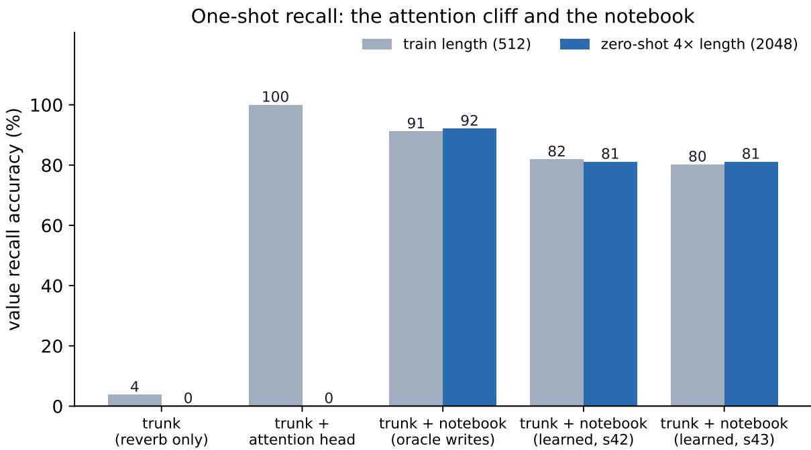
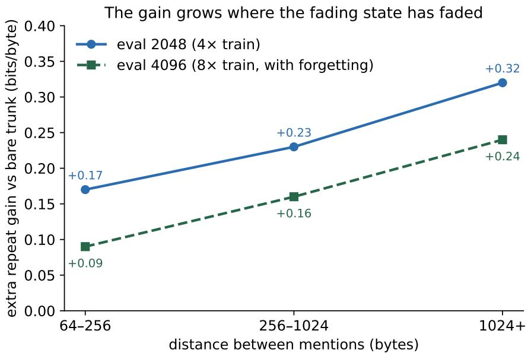
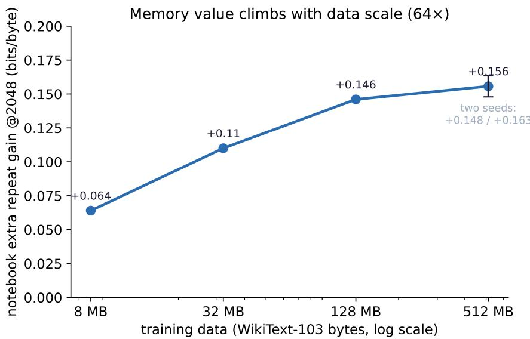

# Kathleen Remembers: Length-Invariant One-Shot Recall Without Attention

George Fountzoulas Department of Computer Engineering & Informatics Frederick University, Nicosia, Cyprus george.fountzoulas.research@gmail.com

August 2026

## Abstract

Recurrent, attention-free sequence models — the family to which Kathleen belongs, alongside state-space models and linear-attention variants — share a known structural weakness: a fading state cannot perform exact recall of something seen once, far in the past. The transformer answer, quadratic-cost attention over a growing window, is exactly what this series set out to avoid. We add to the Kathleen trunk a second memory layer — a notebook: a fixed-key holographic (HRR) associative store with a learned local write gate, a self-gating raw read, and write-triggered forgetting — 25K parameters that attach to the logits of any trunk. (1) Mechanism. On a controlled needle-in-haystack task, the notebook reaches 80–82% one-shot recall at 4× the training length (learned gates, two seeds) where the bare trunk scores ∼4% and a parameter-matched attention head scores 100% inside its training length and 0% beyond it. The route to this result is reported as a ten-round, fully pre-registered forensic sequence: three independent length leaks (gate receptive fields too narrow to represent the correct write rule; $\ell _ { 2 }$ normalization amplifying empty-memory noise; trained trunk logits drifting out of range at unseen lengths) are isolated with oracle gates, counterfactual read-outs, and gate autopsies, and each is closed by construction rather than by tuning. The final design’s addressing is length-invariant by construction — fixed random content keys composed over a 7-byte window with unitary role keys — and the memory alone, untrained, recalls at 90% accuracy identically at 512, 2048 and 4096 bytes. Because the store is a linear superposition, two capabilities follow from arithmetic alone: selective unlearning — one subtraction erases one fact to chance (4.3/3.1%, chance 3.8) while retained facts are unharmed (84%), at both lengths — and per-token attribution — counterfactual erasure names the source fact of every correct byte with 100% provenance, at zero interference with ordinary prediction. (2) Real text. On WikiText-2 bytes, the notebook improves prediction of repeated rare words by +0.15–0.27 bits/byte over the same trunk, the gain growing with the distance between mentions and holding zero-shot at 4× training length, at zero overall cost; the write gate learns with no supervision to spend its ink on content words $( \beta = 0 . 2 8$ on repeated-word bytes vs 0.19 elsewhere). Write-triggered forgetting — decay tied to write mass, not to time, so no clock re-enters the design — eliminates the only observed failure mode (memory pollution at 8× length: first-mention cost +0.33 → −0.004). (3) Scope and scale. Two honest boundaries: a parameter-matched attention head does generalize on natural-text repetition (its collapse is specific to surgical one-shot recall), so the notebook’s claim is exact recall at $O ( L )$ , not repetition in general; and attached to a word-level model the notebook is largely absorbed — exact recall needs questions with exact answers, which bytes provide and words do not. Within its habitat the value scales: on a WikiText-103 ladder (8 → 32 → 128 → 512 MB) the notebook’s zero-shot repeat gain rises monotonically (+0.06 → +0.11 → +0.15 → +0.16 bits/byte, two seeds at the top rung) at zero-to-negative overall cost throughout. Memory, in this family, is not a small-model crutch but a capability that matures with the model. All experiments are pre-registered, seeds reported, and reproducible on a single free-tier GPU.

## 1 Introduction

Papers 1–3 of this series built a byte-level, attention-free architecture — wavetable encoding, multiscale reverberant state, causal convolutions — and showed it classifies [19], learns without pretraining, and writes [20], at sub-million parameter scale, beating parameter-matched transformers on data scaling throughout. Paper 3 closed with a diagnosis rather than a victory lap: the reverberant state is a lossy compressor by design. It holds a fading summary of everything, and therefore an exact copy of nothing. Ask a Kathleen model to reproduce a key–value pair it saw once, two thousand bytes ago, and it fails — not from lack of scale but from the shape of its memory. The same diagnosis applies, in the published record, to the whole attention-free family: state-space models [3, 4] and linear-attention variants [7, 5] trade the transformer’s total-recall window for � (�) cost, and give up exact long-range recall in the bargain.

This paper adds the missing organ. The design goal was set by three constraints the series already committed to: �(�) (no quadratic window), constant state (a fixed-size memory, not a growing cache), and byte-native (no tokenizer, no positional table). The result — we call it the notebook — is a 25K-parameter module that attaches to the logits of any trunk:

• fixed content keys: every byte value owns a random unit vector in � = 2048 dimensions, drawn once and never trained; keys for a position are composed from the last 7 bytes with unitary role vectors (an �-gram bundle in the HRR/holographic tradition [1, 2]). Addresses depend on what the text says, never on where — length generalization by construction, not by hope.

• a learned local write gate: a small causal convolution over a 16-byte window decides what is worth writing. It cannot see sequence length, absolute position, or global state — so it cannot learn a length-dependent policy even by accident.

• a self-gating read: the retrieved vector’s raw magnitude is the gate. An empty or irrelevant memory returns near-zero and adds nothing; a hit returns a large vector and speaks. No read gate is learned, because none is needed.

• write-triggered forgetting: each write erases a little of what came before (mem ← (1 − ��) mem + � write). Decay is tied to write mass — to content — not to elapsed time, so no clock re-enters the design and junk cannot accumulate with length.

The contributions, in the order the paper argues them:

1. A mechanism result. One-shot key–value recall at 4× the training length with fully learned gates (80–82%, two seeds), where the bare recurrent trunk scores ∼4% and a parameter-matched attention head scores 0% (Section 3). The memory path alone, untrained, is length-flat to at least 8× (90% at 512/2048/4096).

2. A forensic method result. The path to (1) required isolating three independent length leaks — none of which was the memory itself. We argue the isolation tools (oracle gates, counterfactual read-outs, gate autopsies at two lengths, pre-registered verdicts for every round) are as reusable as the design (Section 3.3).

3. An algebraic-consequences result. Because the store is a linear superposition, erasure is subtraction and provenance is counterfactual subtraction: one fact is unlearned to chance with the others unharmed, and every correct byte names its source fact with 100% provenance — both length-invariant, both without retraining (Section 4).

4. A real-text result. The notebook pays on natural text exactly where theory predicts — repeated rare words at distance — at zero overall cost, with an unsupervised write gate that discovers content-word salience (Section 5).

5. Two honest boundaries. Attention does generalize on loose natural-text repetition (its zero-shot collapse is specific to exact recall); and the notebook is absorbed by a word-level model, because words do not ask questions with exact answers (Section 6).

6. A scaling result. On an 8 → 512 MB data ladder the notebook’s zero-shot value rises monotonically (+0.06 → +0.16 bits/byte, two seeds at the top rung, zero-to-negative overall cost throughout): memory in this family matures with the model instead of being replaced by it (Section 7).

## 2 The two-layer memory

## 2.1 The trunk (recap)

The Kathleen trunk is unchanged from Papers 2–3: byte embedding, � blocks of {multi-scale reverb bank ∥ causal depthwise convolution, sigmoid-mixed, + FFN}, layer norm, and a linear head. The reverb bank is a bank of leaky integrators with input-dependent decay in three half-life regimes (fast/medium/slow) — the “timing layer”: it knows that something happened and roughly when, but stores a fading mixture, not retrievable items. All models in this paper use � = 96–128, 2–3 blocks, 0.2–0.5M parameters.

## 2.2 The notebook

One associative store per model, holographic (circular-convolution binding in FFT space [1]), dimension $d _ { \mathrm { h r r } } = 2 0 4 8$ . Write, at every position �:

$$
\begin{array} { r } { \mathbf k \mathbf e \mathbf y _ { t } = \ell _ { 2 } \Big ( \sum _ { j = 0 } ^ { 6 } \mathrm { r o l e } _ { j } \circledast \mathrm { c k } [ x _ { t - j } ] \Big ) } \end{array}
$$

$$
( { \mathrm { f i x e d } } )\tag{1}
$$

$$
\beta _ { t } = \sigma \big ( \mathrm { c o n v } _ { 1 6 } ( x ) _ { t } \big )
$$

$$
( { \mathrm { l e a r n e d } } )\tag{2}
$$

$$
\mathrm { m e m } \gets ( 1 - g \beta _ { t } ) \mathrm { m e m } + \beta _ { t } \left( \mathrm { k e y } _ { t - 1 } \circledast \mathrm { c k } [ x _ { t } ] \right)\tag{3}
$$

Read, at every position �:

$$
r _ { t } = \mathrm { m e m } \circledast ^ { \dagger } \mathrm { k e y } _ { t }
$$

$$
( \mathrm { u n b i n d } )\tag{4}
$$

$$
\mathrm { l o g i t s } \ + = s \cdot \left( \boldsymbol { r } _ { t } \cdot \mathbf { C K } ^ { \top } \right)
$$

$$
( { \mathrm { r a w } } )\tag{5}
$$

with ⊛ circular convolution, $\circledast ^ { \dagger }$ correlation (unbinding), ck[�] the fixed random unit key of byte $^ { b , }$ CK the $2 5 6 \times d _ { \mathrm { h r r } }$ key table, rol $; _ { j }$ fixed unitary vectors (unit magnitude spectrum, random phase), � a learned forget rate $( \sigma ( \cdot ) \cdot 0 . 2 )$ , and � a learned scalar. Cost per position is $O ( d _ { \mathrm { h r r } } \log d _ { \mathrm { h r r } } )$ ; the whole scan is parallel (cumulative sums, chunked where forgetting is active). Parameter count: the conv gate + two scalars ≈ 25K; the key tables are bufers, not parameters.

## 2.3 Why each piece is what it is

Every design choice above is the survivor of a measured failure, reported in Section 3:

• Fixed keys, not learned projections of the hidden state: learned state-keys inherit the state’s lengthdependence; fixed content keys are length-blind by construction (Round $^ { 6 , }$ after Rounds 1–5 established the delta-rule/learned-key variant fails zero-shot).

• Local write gate, not a gatefrom the hidden state: the trunk’s hidden state drifts at unseen lengths, and a gate computed from it sags measurably (� at needles: 0.49 at � = 512 → 0.11 at � = 2048, Round 8 autopsy). A byte-local gate cannot sag with length. Its window must be ≥ the needle span: with an 8-byte window the gate cannot represent the correct write rule and never trains (Rounds 7–8, diagnosed in Round 9) — the fix is width, not optimization.

• Raw self-gating read, not ℓ2-normalized read with a learned gate: normalizing the retrieved vector amplifies empty-memory noise to unit norm at every position; training then shrinks the output scale, muting real hits along with the noise (Round 8’s oracle arm trained to only 55–65% for exactly this reason). Raw magnitudes carry the hit/no-hit information for free.

• Write-triggered forgetting, not time decay and not delta-rule erasure: time decay would reintroduce a clock (and length dependence); and with unitary keys the delta rule’s targeted erasure is algebraically equivalent to global decay — a unitary key’s power spectrum is flat, so “erase along this key” and “erase everything a little” are the same operation (Section 5.3). The honest option is the cheap one.

• Variable-length training (final ingredient, in the trunk not the notebook): a trunk trained at one fixed length learns readout weights tuned to slow-integrator values that sit elsewhere at 4× length; its logits drift and shout over a perfectly correct memory (Round 9/10: memory-only counterfactual 90% at 2048 while the full model scored 0.5%). Training on lengths {128 . . . 512} cures the trunk; 2048+ remains genuinely zero-shot.

## 3 The needle laboratory

## 3.1 Task

Byte-level haystack of random filler words. One or more needles — <MARK> key value (6 + 6 bytes) — planted at uniform positions; a query <MARK> key ? at the end; the model must emit value byte-by-byte, teacher-forced accuracy measured on the value bytes, binned by needle→query distance. Train at � = 512 (later: variable 128–512), evaluate in-distribution and zero-shot at � = 2048 (and 4096 in diagnostics). Multi-needle variants plant 4 pairs (interference); no-mark variants remove <MARK> (salience).

## 3.2 Headline arms (final round)

Identical trunks, identical data, identical budget; two seeds for the learned arm (Figure 1):

<table><tr><td>arm</td><td>params</td><td>train (far bin, L = 512)</td><td>zero-shot L = 2048 (far bin)</td></tr><tr><td>trunk (reverb) only</td><td>195K</td><td>3.8%</td><td>0.0%</td></tr><tr><td>trunk + attention head</td><td>211K</td><td>100%</td><td>0.0%</td></tr><tr><td>trunk + notebook (oracle write mask)</td><td>195K</td><td>91.2%</td><td>92.1%</td></tr><tr><td>trunk + notebook (learned local gates, s42)</td><td>212K</td><td>81.9%</td><td>81.1%</td></tr><tr><td>trunk + notebook (learned local gates, s43)</td><td>212K</td><td>80.2%</td><td>81.1%</td></tr></table>

Table 1: Needle-in-haystack recall, final round. All arms share trunk, data, and budget.

The counterfactual read-out (same trained weights, logits from one component at a time) attributes the recall entirely to the memory: memory-only ≈ full model at every length; trunk-only ≈ chance. The attention head is the honest mirror: perfect inside its training length, zero beyond it — the known zero-shot length clif of softmax attention [17, 16], reproduced at 200K scale.

  
Figure 1: One-shot recall at training length (512) and zero-shot at 4× length (2048). The attention head is perfect inside its training length and zero beyond it; the notebook is length-invariant.

## 3.3 The forensic path (ten rounds, all pre-registered)

We report the route because the failures carry the information:

• R1 — proof of life. Delta-rule fast-weight notebook [8] with gates learned from the hidden state: 100% train, 97% zero-shot. First evidence the two-layer design can work at all.

• R2 — it breaks. Same design, 4 needles or no markers: total failure (3–4%), and zero-shot at 4× collapses to 0% in every multi-needle configuration tested thereafter.

• R3–R5 — discovery dynamics, and a harness bug. Longer budgets and curricula: multi-needle is learnable (a discrete “click” arrives after 2–6K steps, timing seed-dependent); a construction-order confound (modules built before seeding) was found and fixed — reported because silent RNG-order bugs of this kind can flip qualitative conclusions and rarely get documented.

• R6 — the archive lesson. Replacing learned state-keys with fixed content keys (from this group’s earlier HRR work) removes the learning clif entirely (68% at step 500 vs thousands of dark steps), half-solves salience (no-mark: 4% → 53–64%), and exposes a capacity ceiling (∼80% at � = 512 with indiscriminate writing). Zero-shot: still 0 — the keys were never the leak.

• R7 — capacity vs gates, 2 × 2. � = 2048 lifts training to 96–97% (noise was the plateau); zero-shot still ∼0; gates computed from a local byte window fail to train at all (3–4%).

• R8 — oracle round. Perfect byte-computed write gates, no learning in the gate path: zero-shot still 0 — the verdict says the leak lives in the memory path. The gate autopsy simultaneously documents the trunk-gate sag (�@needle 0.49 → 0.11 at 4×). Two leaks visible at once; neither is the memory.

• Local diagnostics (CPU, zero training). The memory alone — oracle writes, no trunk, no gradient — scores 58–68%flat at 512/2048/4096; with a clean write mask, 90.3/89.6% at 512/2048. Twenty seconds on a laptop settles what three GPU rounds circled: the memory is length-proof; everything else leaks. The $\ell _ { 2 }$ noise-amplification and the 8-byte gate myopia fall out of the same session.

• R9 — assembly. Raw self-gating read + 16-byte local gate: local gates train for the first time (85–86%, two seeds; the failure was representational width, not optimization). Zero-shot 0.5% — by elimination (the memory path has one trained scalar), the trained trunk logits drift at unseen lengths. The untrained trunk is verified length-stable; training creates the drift.

• R10 — the cure. Variable-length training (128–512). Oracle: 91 → 92% (no degradation at 4×); learned gates: 80–82% → 81%, two seeds, flat across distance bins. Verdict: the synthetic arc is complete.

Three separate leaks — gate representational width, read-path noise amplification, trunk logit drift — each invisible while the others were present, each isolated by an oracle or counterfactual rather than by tuning. None of them was the associative memory, which was length-invariant from the day it had content keys.

## 4 Consequences of the algebra: unlearning and attribution

Because the store is a linear superposition of key–value bindings, two capabilities follow from the arithmetic itself — no retraining, no new parameters, no architectural change. We validate both on the multi-needle rig (5 facts per window, $d _ { \mathrm { h r r } } = 2 0 4 8$ , learned write gates, trained as in Section 3), at the training length and zero-shot at 4×.

## 4.1 Selective unlearning by subtraction

To erase one fact, subtract its writes: recompute the bound vectors of the fact’s span from the input (the keys are fixed and content-derived, so this needs no stored bookkeeping beyond the span itself) and subtract them from the memory vector. One vector subtraction, cost �(span); the other facts are untouched.

<table><tr><td></td><td>before</td><td>erased fact</td><td>retained facts</td><td>memory-only, erased</td></tr><tr><td>L = 512 (train)</td><td>82.5%</td><td>4.3%</td><td>84.1%</td><td>3.5%</td></tr><tr><td>L = 2048 (zero-shot)</td><td>81.0%</td><td>3.1%</td><td>84.5%</td><td>2.6%</td></tr></table>

Table 2: Algebraic unlearning (chance = 3.8%). The erased fact drops to chance; the four retained facts are unharmed; the memory-only counterfactual confirms the fact is absentfrom the store, not merely outvoted.

The erased fact falls to chance level while the retained facts are, if anything, marginally cleaner (less superposition crosstalk), and the efect is length-invariant (Table 2). The memory-only read-out at the erased fact’s query is itself at chance: the information is gone from the store, not suppressed downstream. This is forgetting with a guarantee — the mechanism-level primitive that data-deletion obligations (e.g. GDPR’s right to erasure) ask of deployed models and that gradient-trained weights cannot ofer without retraining.

## 4.2 Per-token attribution

The same subtraction, used counterfactually, yields provenance: for each emitted byte, erase each stored fact in turn and measure the drop in the chosen byte’s logit; the fact whose erasure drops it most is the primary source. Component attribution (trunk vs. notebook) falls out of the two-path logit sum for free.

  
Figure 2: Extra repeat gain vs distance between mentions (WikiText-2 bytes). The notebook’s benefit grows exactly where the fading state has faded, and holds at 4× and 8× the training length.

At both lengths, on bytes the model gets right: provenance is 100% — every correct value byte names the fact (and hence the write position) it came from; 96.4/95.2% of correct value bytes are memory-decisive (the trunk alone would not have produced them); the notebook’s interference with ordinary filler prediction is $+ 0 . 1 5 / + 0 . 0 3$ percentage points (i.e. none). The self-gating margin separates hit from no-hit reads by $4 . 1 { \times } / 3 . 9 { \times } - 9 3 \% / 8 7 \%$ of the measured oracle ceiling (4.4×), which is set by HRR superposition crosstalk, not by the gate. The model can therefore emit, alongside every byte, a faithful audit line of the form “notebook, fact #2, written at position 255, logit drop 1.1” — a property attention heat-maps approximate but do not guarantee [12], and one we exploit again in the unlearning demo above: attribution and erasure are the same subtraction read in two directions.

## 5 Real text: the repeat probe

## 5.1 Probe

No marks, no planted needles. On WikiText-2 bytes [18], partition test-window word bytes: a word (alphabetic, ≥ 4 chars) whose same form occurred ≥ 64 bytes earlier in the window is a repeat; first occurrences are the control. Report bits/byte on each set, and extra repeat gain: $( \mathrm { b p b } _ { \mathrm { f i r s t } } - \mathrm { b p b } _ { \mathrm { r e p e a t } } )$ minus the same diference for the bare trunk — what the notebook adds beyond the trunk’s own handling of repetition. Train varlen 128–512; evaluate at 512 and zero-shot 2048/4096.

## 5.2 Result

Two seeds: extra repeat gain +0.19/+0.15 at 512, +0.27/+0.24 at 2048 — the gain grows where the reverb state has faded (Figure 2), which is the two-layer design’s signature prediction. Overall bpb cost: −0.02 (the notebook arm is marginally better overall). The write gate, trained only by the language-modeling loss, discovers salience: $\beta = 0 . 2 8$ on repeated-word bytes vs 0.19 elsewhere. The bare trunk’s own repeat “gain” is negative (−0.16): repeated rare words are harder than first mentions for a fading state, not easier.

## 5.3 The one failure, and forgetting

At 4096 (8× training length) the plain notebook begins to charge rent: first-mention bpb degrades +0.33 over the trunk — with $\beta \approx 0 . 1 9$ everywhere, thousands of positions fill the store with junk and superposition noise leaks into ordinary prediction. Write-triggered forgetting (mem ← (1 − ��) mem + � · write, � learned) eliminates the cost entirely $( + 0 . 3 3  - 0 . 0 0 4 )$ while keeping every distance bin’s gain positive $( + 0 . 0 9 / + 0 . 1 6 / + 0 . 2 4 ~ \mathrm { a t } ~ 4 0 9 6 )$ . The trade is real — near-bin gains shrink (the eraser takes some useful ink too) — and it is near-optimal for this mechanism: with unitary keys, delta-rule targeted erasure reduces algebraically to global decay (flat key spectrum ⇒ “erase this key” ≡ “erase everything slightly”), so no smarter eraser exists inside the FFT superposition design.

## 5.4 Scope: what attention does here

A parameter-matched one-head attention twin, same trunk, same training: on natural text its repeat gains are large $( + 0 . 8 3 \cdot \cdot \cdot + 1 . 0 4 )$ and — unlike on the needle — hold at 2048 zero-shot. Loose copying over many mentions and soft context matches is attention’s home game, and it generalizes there. The needle collapse is specific to surgical one-shot recall. The claim this paper makes is therefore scoped precisely: exact recall of once-seen material at $O ( L )$ and constant state — plus the practical note that the attention twin could not even be evaluated at 4096 within the same memory budget (its $O ( L ^ { 2 } )$ matrices do not fit), while the notebook runs at any length.

## 6 The wrong habitat: a word-level negative result

Attached to the series’ word-level generation model (Paper 3’s composer: 10K vocabulary, ∼3M params), the same recipe — content keys per word, 3-gram bundles, 8-word gate — is largely absorbed: extra repeat gain +0.07/−0.06 at the training length (two seeds), +0.08/+0.13 at 4× zero-shot, gate selectivity none $( \beta$ flat at 0.16). Cost, as everywhere: zero.

The explanation is structural, and we consider it a finding rather than a disappointment. Exact-recall memory answers questions that have exact answers. At byte level such questions are everywhere: having seen wond, the continuation erful is deterministic given the memory. At word level the question “which word follows?” almost never has an exact answer — the surrounding words of a repeated mention difer from its first occurrence, so a key built from context matches nothing. The notebook’s habitat is bytes and signals: exactly the levels where this series operates and where tokenized models do not.

## 7 Scaling: the ladder

The question a scaling reviewer asks: does more data make the trunk absorb the notebook? On the Paper-3 byte ladder (WikiText-103 slices; same model recipe minus the positional table, varlen 64–256; budget-matched arms), at 8/32/128/512 MB (Figure 3):

The value of the notebook rises monotonically with data — 64× data, 2.4× gain — at zero-to-negative overall cost on every rung, and the 512 MB point carries a two-seed error bar (±0.008). The bare trunk’s repeat gain is negative on every rung $( - 0 . 0 4 \cdots - 0 . 0 5 )$ : long-range exact recall does not emerge from data scale in this family; it must be built in. (Sanity: the 32 MB trunk point, 2.01 bpb, reproduces the corresponding Paper-3 ladder point [20].) The parameter-matched attention twin, run on the 512 MB rung, posts a +0.79 extra repeat gain — natural-text repetition is its home game, as Section 5.4 scoped — while remaining $O ( L ^ { 2 } )$ and unevaluable at 4096 within the same memory budget; the comparison the paper makes is exact recall at $O ( L )$ , and there the twin scores zero (Section 3).

<table><tr><td>rung</td><td>trunk bpb@256</td><td>+nb bpb@256</td><td>extra repeat gain @2048 (8×)</td></tr><tr><td>8MB</td><td>2.2197</td><td>2.2166</td><td>+0.064</td></tr><tr><td>32 MB</td><td>2.0122</td><td>2.0041</td><td>+0.110</td></tr><tr><td>128 MB</td><td>1.9652</td><td>1.9596</td><td>+0.146</td></tr><tr><td>512MB</td><td>1.9650</td><td>1.9573</td><td>+0.156 (seeds 42/43: +0.148/+0.163)</td></tr></table>

Table 3: The ladder: the notebook’s value rises monotonically with data, at zero-to-negative overall cost on every rung.

  
Figure 3: Notebook extra repeat gain at 8× training length vs training data (log axis). 64× data, 2.4× gain; two-seed error bar at the top rung.

## 8 Related work

State-space and gated-recurrent models (S4 [3], Mamba [4], RWKV [5], Grifin [6]): �(�) trunks with fading state; documented weakness at exact long-range recall; our trunk is architecturally kin and inherits the diagnosis, which the notebook addresses.

Linear attention / fast weight programmers [7, 8, 9]: the delta-rule notebook of Round 1 is this family; the literature’s length-generalization failures match our Rounds 2–5, and the content-key redesign is the departure point.

Explicit memory modules (NTM/DNC [10, 11]; Memorizing Transformers [12]; Titans [13]; memory layers [14]): learned read/write against a separate store, typically with learned keys and/or attention-based addressing. The notebook difers in its fixed, content-derived, provably length-blind addressing and its 25K-parameter budget.

Holographic reduced representations / VSA [1, 2]: the binding/bundling algebra and unitary keys are classical; the contributions here are the learned when-to-write under an LM loss, the self-gating raw read, write-triggered forgetting, and the length-invariance measurements in a trained end-to-end model.

Length generalization in transformers (RoPE extensions [15], YaRN [16], ALiBi [17]): an entire engineering literature works around the attention length clif we reproduce at small scale; the notebook sidesteps rather than patches it, at � (�).

Retrieval-augmented decoding (Paper 3, §5.2 [20]): non-parametric phrase memory at decode time; the notebook is the train-time, in-context counterpart. The provenance finding there (own-corpus only) and the habitat finding here (bytes only) are the same lesson at two levels: memory helps where its answers are exact.

## 9 Limitations

• Scale. All results are 0.2–3.4M parameters, ≤ 512 MB data, single GPU. The ladder’s monotonic trend is four points with a two-seed error bar at the top; the compute-optimal regime beyond ∼0.5M parameters remains unexplored.

• Salience without structure. Un-marked needle detection is half-solved (53–64%); the wide local gate alone does not solve it (4%), and a hybrid local+context gate is future work. On natural text this matters less (the gate finds content words), but structured domains without markers will need it.

• Attention comparison scope. The attention twin is one causal head on the same trunk, budget-matched — the honest small mirror, not a tuned modern transformer with rotary extrapolation tricks.

• Forgetting trades gain for safety. The eraser costs some near-distance gain; the algebra (unitary keys ⇒ no targeted erase) says this is inherent to the superposition design, but alternative store geometries (e.g., slot-based) could reopen it.

• Word-level absorption is reported as a boundary of the method, not resolved.

## 10 Conclusion and the road ahead

Paper 3 ended by naming the fading state’s weakness; this paper removes it without betraying the series’ constraints. A 25K-parameter notebook — fixed holographic content keys, a myopically local learned write gate, a read that gates itself, and forgetting tied to writing rather than to time — gives an attention-free byte model one-shot recall that survives 4–8× the training length, pays on real text precisely where the recurrent state fades, costs nothing anywhere, and appreciates with data scale. Because the store is algebraic, the model also does two things gradient-trained weights cannot: it forgets on command with a guarantee (one subtraction, one fact, chance-level erasure, no collateral) and it shows its sources (100% per-token provenance by counterfactual erasure). The route mattered as much as the destination: three separate length leaks, none in the memory itself, each found by oracle and counterfactual rather than by search.

The road ahead follows the series’ arc. (1) Scale: a compute-optimal pass over the two-layer recipe. (2) Salience: hybrid gating for structure-free domains. (3) Signals: the notebook’s habitat is raw streams the natural next flagship is audio and sensor data, where “remember the signature you saw once, however far back, on-device” is not a benchmark but the product. Kathleen reads, writes, and now remembers; next she hears.

Disclosure. The memory mechanism described in this paper (content-keyed holographic superposition with locally learned write gates, raw self-gating readout, and write-triggered forgetting) is the subject of U.S. Provisional Patent Application No. 64/140,260, filed August 25, 2026.

## A Recipe card (exact hyperparameters)

Trunk: � = 96 (needle rig) / 128 (ladder), 2–3 blocks, multi-scale reverb (fast 0.50–0.90, med 0.90– 0.99, slow 0.95–0.9995), causal conv � = 7, FFN ×2, dropout 0.1 (text), no positional table. Notebook: $d _ { \mathrm { h r r } } = 2 0 4 8$ , content keys $N ( 0 , I ) \ \ell _ { 2 }$ -normalized (bufer), role keys unitary (7 for bytes, 3 for words), write gate: Embedding(�, 32) → causal Conv1d(32, 32, �=16) → GELU → Linear(32, 1), bias init +2; scale init 2000; forget $g = \sigma ( g _ { \mathrm { l o g i t } } ) \cdot 0 . 2 , g _ { \mathrm { l o g i t } }$ init −2; chunked scan, chunk 128–256, keep clamped ≥ 0.75. Training: AdamW lr 3e−3 (rig) / 2e−3 (ladder), wd 0.01, clip 1.0, batch 24–64, varlen per batch. Eval: teacher-forced value-byte accuracy (needle); bits/byte with repeat masks (text). Seeds 42/43; all construction after seeding (see R3–R5 harness note).

## B Full experiment registry

<table><tr><td>#</td><td>experiment</td><td>verdict (pre-registered)</td><td>key numbers</td></tr><tr><td>1</td><td>NEEDLE R1 — delta notebook, state gates</td><td>NOTEBOOK</td><td>100% train / 97% ZS (s42)</td></tr><tr><td>2</td><td>NEEDLE R2 — multi-needle, no-mark</td><td>BOTH FAIL</td><td>3–4% all hard arms</td></tr><tr><td>3</td><td>NEEDLE R3 — budget vs curriculum</td><td>(confounded; superseded)</td><td>harness RNG-order bug found</td></tr><tr><td>4</td><td>NEEDLE R4 — replication/seed sweep</td><td>ROBUST SINGLE</td><td>click timing seed-dependent</td></tr><tr><td>5</td><td>NEEDLE R5 — multi-needle budget/capacity</td><td>SLOW CLICK</td><td>click at 2–6K steps; ZS 0%</td></tr><tr><td>6</td><td>NEEDLE R6 — fixed content keys</td><td>(threshold artifact)</td><td>instant learning; nomark 53–64%; ZS 0</td></tr><tr><td>7</td><td>NEEDLE R7 — gates × capacity 2×2</td><td>(capacity solved)</td><td>2048: 96–97%; local gates dead; ZS ~0</td></tr><tr><td>8</td><td>NEEDLE R8 — oracle gates + autopsy</td><td>MEMORY LEAK (superseded)</td><td>oracle ZS 0; β sag 0.49 → 0.11</td></tr><tr><td>9</td><td>local diagnostics — untrained memory</td><td>(length-proof)</td><td>90.3/89.6% @ 512/2048, zero training</td></tr><tr><td>10</td><td>NEEDLE R9 — raw read + wide local gate</td><td>GATE SHORTFALL → drift</td><td>local gates alive 85–86%; ZS 0.5%</td></tr><tr><td>11</td><td>NEEDLE R10 — varlen training</td><td>CURED</td><td>81% ZS learned gates ×2 seeds</td></tr><tr><td>12</td><td>TEXT 1 — repeat probe WT-2</td><td>REAL LICK</td><td>extra +0.15–0.27; β 0.28 vs 0.19</td></tr><tr><td>13</td><td>TEXT 2 — distance bins + attn twin</td><td>FADES (scoped)</td><td>attn +0.83–1.04 on text; junk cost @4096</td></tr><tr><td>14</td><td>TEXT 3 — forgetting</td><td>CLEAN INK</td><td>first-cost +0.33 → −0.004</td></tr><tr><td>15</td><td>UNION — word-level composer</td><td>SWALLOWED (structural)</td><td>extra ≤ +0.13; β flat</td></tr><tr><td>16</td><td>LADDER — 8/32/128 MB</td><td>CLIMBS</td><td>+0.064 → +0.110 → +0.146</td></tr><tr><td>17</td><td>LADDER-512 — big rung, twin, 2 seeds</td><td>CLIMBS TO 512</td><td>+0.156 mean; attn +0.79 on text</td></tr><tr><td>18</td><td>UNLEARN — erase one fact by subtraction</td><td>UNLEARNED</td><td>erased 4.3/3.1% (chance 3.8); retained 84%</td></tr><tr><td>19</td><td>ATTRIB — component + fact provenance</td><td>ATTRIBUTED</td><td>provenance 100%/100%; filler ∆ ≈ 0</td></tr></table>

Table 4: Every experiment in the program, with its pre-registered verdict. JSON reports accompany the scripts.

## References

[1] T. A. Plate. Holographic Reduced Representations. IEEE Transactions on Neural Networks, 1995.

[2] P. Kanerva. Hyperdimensional Computing: An Introduction to Computing in Distributed Representation with High-Dimensional Random Vectors. Cognitive Computation, 2009.

[3] A. Gu, K. Goel, C. Ré. Eficiently Modeling Long Sequences with Structured State Spaces. In ICLR, 2022.

[4] A. Gu, T. Dao. Mamba: Linear-Time Sequence Modeling with Selective State Spaces. arXiv:2312.00752, 2023.

[5] B. Peng et al. RWKV: Reinventing RNNs for the Transformer Era. In Findings of EMNLP, 2023.

[6] S. De et al. Grifin: Mixing Gated Linear Recurrences with Local Attention for Eficient Language Models. arXiv:2402.19427, 2024.

[7] A. Katharopoulos, A. Vyas, N. Pappas, F. Fleuret. Transformers are RNNs: Fast Autoregressive Transformers with Linear Attention. In ICML, 2020.

[8] I. Schlag, K. Irie, J. Schmidhuber. Linear Transformers are Secretly Fast Weight Programmers. In ICML, 2021.

[9] S. Yang, B. Wang, Y. Zhang, Y. Shen, Y. Kim. Parallelizing Linear Transformers with the Delta Rule over Sequence Length. In NeurIPS, 2024.

[10] A. Graves, G. Wayne, I. Danihelka. Neural Turing Machines. arXiv:1410.5401, 2014.

[11] A. Graves et al. Hybrid Computing Using a Neural Network with Dynamic External Memory. Nature, 2016.

[12] Y. Wu, M. N. Rabe, D. Hutchins, C. Szegedy. Memorizing Transformers. In ICLR, 2022.

[13] A. Behrouz, P. Zhong, V. Mirrokni. Titans: Learning to Memorize at Test Time. arXiv:2501.00663, 2025.

[14] V.-P. Berges et al. Memory Layers at Scale. arXiv:2412.09764, 2024.

[15] J. Su, M. Ahmed, Y. Lu, S. Pan, W. Bo, Y. Liu. RoFormer: Enhanced Transformer with Rotary Position Embedding. Neurocomputing, 2024.

[16] B. Peng, J. Quesnelle, H. Fan, E. Shippole. YaRN: Eficient Context Window Extension of Large Language Models. In ICLR, 2024.

[17] O. Press, N. A. Smith, M. Lewis. Train Short, Test Long: Attention with Linear Biases Enables Input Length Extrapolation. In ICLR, 2022.

[18] S. Merity, C. Xiong, J. Bradbury, R. Socher. Pointer Sentinel Mixture Models. In ICLR, 2017.

[19] G. Fountzoulas. Kathleen: Oscillator-Based Byte-Level Text Classification Without Tokenization or Attention. arXiv:2604.07969, 2026.

[20] G. Fountzoulas. Kathleen Writes: Autoregressive Generation and Data Scaling Without Attention. arXiv:2608.04678, 2026.