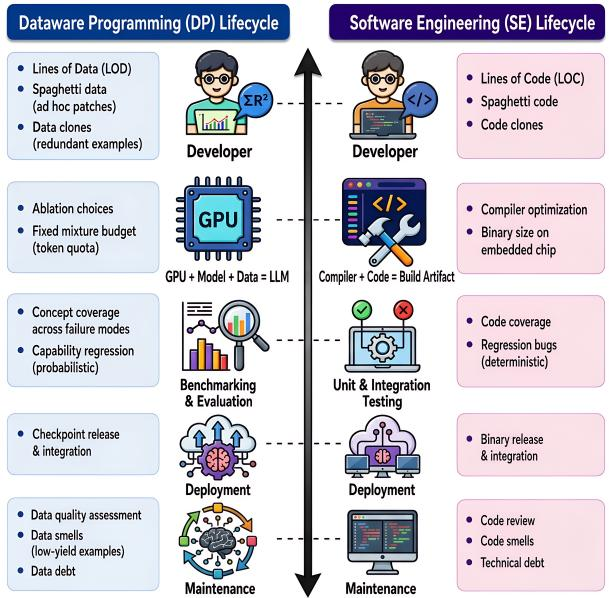
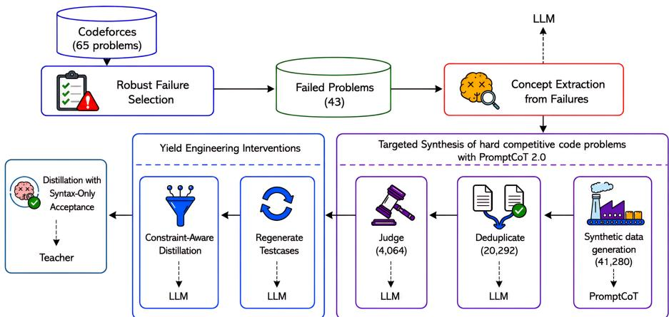
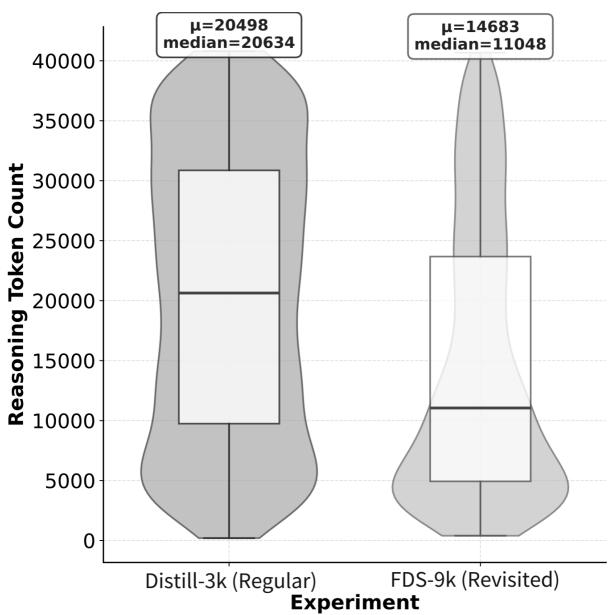
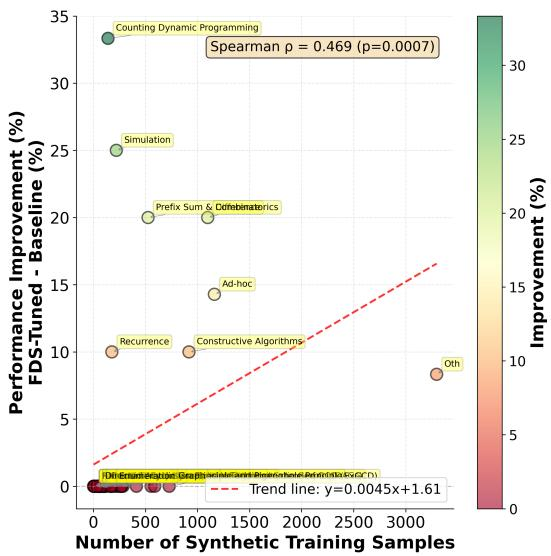
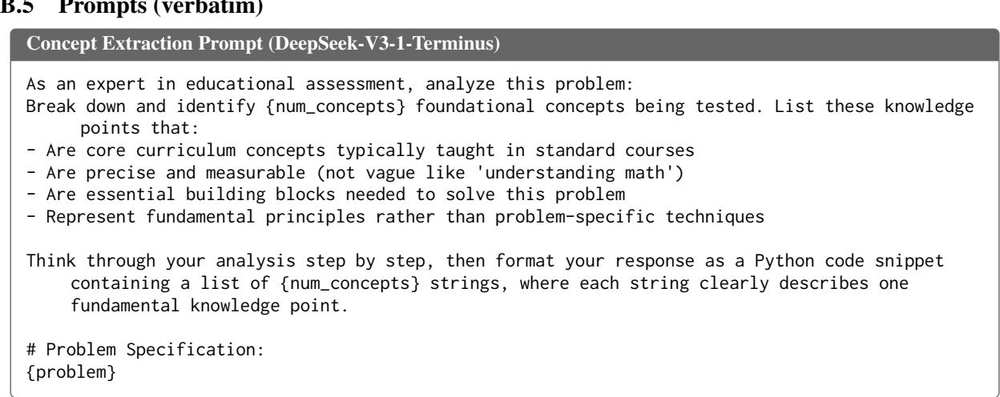
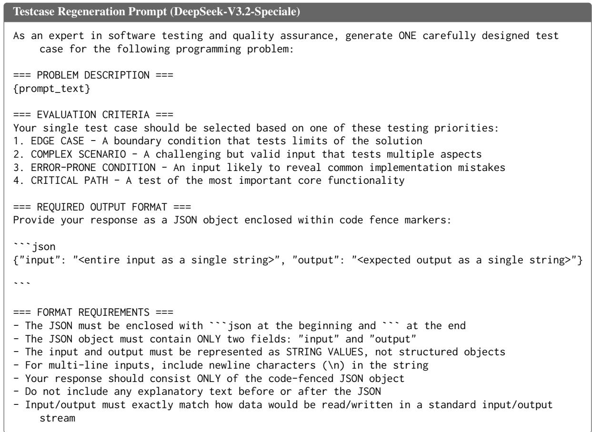
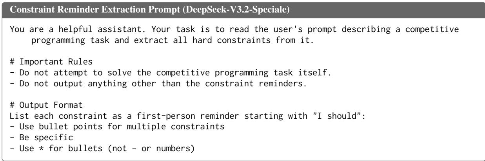
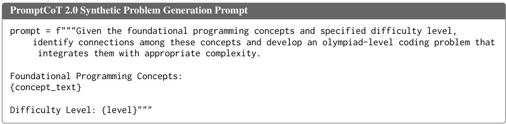
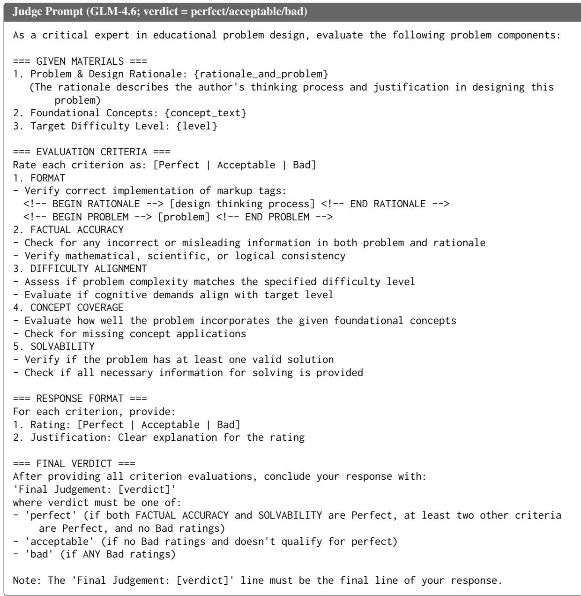

# LLM Post-Training as Brownfield Maintenance: An Industrial Perspective on Dataware Engineering

Gopi Krishnan Rajbahadur1 Amir M. Ebrahimi1 Boyuan Chen2 Ahmed E. Hassan1

1Queen’s University, Canada

2Centre for Software Excellence, Huawei Technologies, Canada grajbahadur@acm.org amir.ebrahimi@cs.queensu.ca boyuan.chen1@huawei.com ahmed@cs.queensu.ca

## Abstract

Industrial post-training is a brownfield regime. Teams inherit a deployed checkpoint and must land targeted improvements under fixed compute and mixture budgets without regressing the rest. The maintained artifact is increasingly dataware: behavior governed by a curated post-training mixture, updated via bounded mixture patches rather than clean-slate retraining. From an industrial code-generation improvement effort, we offer a maintainer’s perspective on why this work is hard in practice, distilling three recurring challenges, zero-sum mixture design, yield as the binding metric, and end-to-end integration under uncertainty, and arguing that progress depends less on one-off recipes than on an engineering discipline for programming dataware. In our case study, interventions that raised the conversion of teacher distillation into usable training data increased accepted supervision by 2.84× while using the same solution teacher and four solution attempts per candidate problem. In our primary evaluation, the yield-engineered patch improved CodeForces pass@1 by +2.59 points (+3.11 pass@3) and held-out LiveCodeBench v6 pass@1 by +6.11 (+8.05 pass@3), all statistically significant across 16 stochastic evaluations of each benchmark from one fixed checkpoint per condition, with internal AIME and MATH regression suites within tolerance.

## 1 Introduction

A familiar production mandate in industrial posttraining is deceptively simple: improve a specific capability without degrading the rest. In our case, improve code generation where our model struggled. We started from a brownfield baseline, an inherited checkpoint whose capabilities and failure modes could not be erased by starting fresh. For many teams, this is the everyday reality.

The challenges and constraints are equally familiar and far less negotiable. First, the post-training mixture budget is fixed due to limited compute windows and shared cluster time, so any new data must earn its place by displacing existing data (Challenge C1: zero-sum mixture design) (Xie et al., 2023; Liu et al., 2025). Second, the data that would close the gap is scarce. For hard domains like competitive programming, high-quality human data is rare, so the obvious move is to distill from a stronger teacher. But distillation is costly, and the bottleneck is how much of what it produces is usable after verification (Challenge C2: yield as the binding metric). Finally, even hard-won data is difficult to integrate into the mixture: it must lift the target capability without degrading the rest, yet capability losses surface as statistical shifts that take repeated, expensive evaluation to detect, and a local patch can induce non-local effects on global behavior (Challenge C3: end-to-end system integration).

Recent open recipes (Ben Allal et al., 2025) have made the greenfield creation phase increasingly accessible and well documented, but once a model is deployed the reality shifts from creation to maintenance. The flexibility of greenfield development disappears: teams cannot simply expand the mixture. These warnings are not new. A decade ago, Sculley et al.’s seminal NeurIPS paper (Sculley et al., 2015) framed deployed ML as technical debt, and Brooks (Brooks, 1975) had argued earlier still that systems fail when parts are optimized without end-to-end coherence; post-training inherits both, except the coupling now lives in data and evaluation rather than code.

When the “system” is a large language model (LLM), much of the coupling and the ensuing complexity is encoded in the data itself, and posttraining is programming with data: each training example is an instruction, the mixture is the program, and the checkpoint is the compiled binary. In that sense, the maintained artifact is dataware, a system whose behavior is specified by a data program, the post-training mixture. Like mature software, it evolves by bounded patches rather than clean-slate rebuilds. This is brownfield software maintenance applied to an inherited checkpoint. Figure 1 summarizes the structural parallels (e.g., Lines of Code → Lines of Data), a maintainer’s vocabulary for recurring pitfalls.

  
Figure 1: Structural parallels between brownfield software maintenance and brownfield LLM post-training.

We document this regime from the maintainer’s perspective and argue that treating data as code must become an operational contract, not a metaphor. From there, our paper makes three contributions. First, we frame industrial post-training as brownfield maintenance and distill the three coupled challenges (C1–C3) described above. Second, we report an industrial case study of failure-driven synthesis (FDS). Mining stable failures to guide synthetic data is established practice (Liang et al., 2025; Li et al., 2025a; Cheng et al., 2024). Our contribution is what adopting it in production demands, with outcomes validated by running one fixed checkpoint per condition on each benchmark 16 times, yielding 16 stochastic generations per task, and by reporting the operational signatures (yield, cost, coverage, stability) that decide feasibility. Third, we turn the recurring lessons into an agenda of five reviewable contracts for programming dataware and illustrate them with our case study.

## 2 The Challenges of Data Programming

In the brownfield regime, post-training feels less like “building a model” and more like maintaining a mission-critical codebase on a release train. The community already has strong tools for synthesis, filtering, and mixture allocation (Wang et al., 2023; Xie et al., 2023; Fan et al., 2024; Li et al., 2025b). The maintainer’s pain is that these pieces interact in ways that are hard to anticipate and expensive to validate end-to-end. We take C1–C3 in turn, showing how each manifests in practice and why naive fixes fail under the constraints that bind in production.

Challenge C1: Zero-Sum Mixture Design The first hard limit is capacity. Token quotas, compute windows, and shared cluster time impose a fixed post-training mixture budget (Li et al., 2025b). Every new example must earn its place by displacing or reweighting existing content (Xie et al., 2023; Fan et al., 2024; Liu et al., 2025). In maintenance, allocation becomes zero-sum: the model already encodes broad capabilities, so non-targeted additions yield diminishing returns while consuming scarce capacity, and the mixture quietly accumulates low-yield content as data debt, echoing Lehman’s laws of software evolution (Lehman, 1980). This changes the first question from “what data would help?” to “what data is worth displacing to make room for it?”

Challenge C2: Yield as the Binding Metric Once capacity is fixed, what binds is not how much we can distill from the teacher but how much of it becomes usable after verification. We use yield engineering to mean the deliberate design of upstream and in-loop controls that raise distillation yield, the number of valid, trainable solutions per unit distillation effort (teacher tokens, attempts). Within a fixed budget, these controls target avoidable failure modes in the data pipeline: underspecified or inconsistent problems, unhelpful long traces, and low-verifiability outputs. In our baseline (the case study of Section 3), distillation over 4,064 hard synthetic problems produced only 3,412 syntactically valid solutions (median valid solutions per problem: 0). When the teacher cannot solve a problem, effort produces cost but no signal, creating a yield trap: a team can do everything right, good prompts, good filters, and still watch the usable fraction collapse, because generation cost scales linearly while signal plateaus (Ahmad et al.,

2025; He et al., 2025).

Challenge C3: End-to-End System Integration In brownfield post-training, the hard part is rarely proposing a change; it is integrating it safely. Regressions are stochastic: a mixture edit can improve one capability while degrading another, and evaluation noise can mask the damage. A single benchmark evaluation provides only one stochastic generation per task, so an apparent aggregate gain can depend on decoding noise. Section 4 therefore runs one fixed checkpoint per condition on each benchmark 16 times, yielding 16 stochastic generations per task, and reports confidence intervals over tasks. This is the “flight test” problem: unlike deterministic unit tests, validating a change requires statistical judgment under variance (Madaan et al., 2024; Rajput et al., 2025). CodeForces-based evaluation is especially unstable across runs and contest selection (Zheng et al., 2026). In production, that variance becomes an operational question: under fixed budgets, how many runs are enough before we can trust that an improvement is real? Teams face a painful tradeoff, either replicate heavily and stall, or ship a change that wins once on a “hero” run and regresses later.

Compounding this, post-training inherits a combinatorial debugging surface. Pipelines expose many coupled decisions (data sources, templates, thresholds, quality gates, mixing weights) with nonlinear interactions. Exhaustively ablating even five decision points with three options each already costs $3 ^ { 5 } \ : = \ : 2 4 3$ configurations before any replication. Under industrial budgets, “just ablate $\mathrm { i t } ^ { \prime \prime }$ is off the table, so diagnosis degrades into best-guess trial and error.

The hardest failures appear at end-to-end integration. Components that look strong in isolation (a synthesis recipe, a filtering rule, a teacher model, mixing weights) can fail once combined under the same budget and regression constraints, exactly the loss of conceptual integrity Brooks warned against (Brooks, 1975). The symptom in post-training is non-local side effects: a local mixture edit that helps coding can destabilize unrelated behavior, because the update interacts with the inherited mixture and learned representations in hard-to-predict ways (Wang et al., 2024). Maintainers then stop asking “is this dataset good?” and ask “will it compose with what the model already is?”

Summary. These challenges are coupled: fixed budgets (C1) make yield the binding constraint (C2), and yield-focused changes amplify integration risk (C3).

## 3 A Maintenance Industrial Example

The Failure-Driven Synthesis (FDS) recipe is standard in both industry and academia: mine a model’s stable failures, extract the concepts behind them, and synthesize targeted training data. The same pattern recurs across settings: reinforcement learning (RL) for mathematical reasoning with the PromptCoT-style synthesis we also use (SwS; Liang et al., 2025); a trained proposer that surfaces failure-inducing queries for safety, honesty, and math (ReverseGen; Li et al., 2025a); distillation of 553K instruction-tuning examples from the reasoning failures of multimodal models (Stan et al., 2026); automated weakness detection feeding targeted improvement data (AutoDetect; Cheng et al., 2024); and synthesis around failure regions to steer second-stage fine-tuning and RL (Logics-STEM; Xu et al., 2026). We claim no novelty for it. What these works leave undocumented is what it takes to run the recipe in an industrial setting, where the three challenges of Section 2 bind at once. Prior work typically reports the gains; we document what it costs to reach them under production constraints.

## 3.1 Setting: a bounded patch on a live system (C1, C3)

We start from TuringThinker-7B $( \mathcal { M } _ { 0 } )$ , an internal general-purpose, reasoning-capable checkpoint, and target improved competitive-programming performance within a fixed training budget. $\mathcal { M } _ { 0 }$ is a deployed checkpoint, so capability improvements ship on a release cadence gated by an internal regression suite. Its post-training mixture is capacitybounded (C1): we cannot disclose the exact token budget, but the code-related allocation was roughly 650K training examples (Lines of Data, or LOD). Because any change must integrate without degrading global behavior (C3), the FDS patch is a bounded modification to the post-training “data program” (Figure 1): it may displace at most 2% of the 650K, and the full patch shipped in production contains 9,697 examples, about 1.5% of the code allocation. For controlled evaluation, Section 4.1 uses a 3,412-example coverage-first subset, FDS-3K-Cov. In production, a capability patch enters the mixture only by displacing matched-volume, lower-quality synthetic code data, with reweighting confined to the code allocation, and only if it clears a strict acceptance gate: it must improve the target benchmarks (CodeForces and LiveCodeBench v6) while AIME and MATH, our internal regression suite, fall by no more than one point. This protects existing math and general-reasoning capabilities while we patch the model’s code.

## 3.2 From stable failures to a yield-positive data patch

FDS turns reproducible failures into a targeted patch that fits within a fixed mixture budget. Figure 2 shows the pipeline, with its C1–C3 stage tags and funnel counts.

Stability first: deciding what is worth fixing (C3). Single-pass evaluation is unreliable under stochastic generation, so before synthesizing anything we narrowed the target to failures we could trust by defining the failure set $\mathcal { F }$ as the intersection across repeated evaluations: a task enters $\mathcal { F }$ only if none of its N samples passes in any of the R mining runs, $\begin{array} { r } { \mathcal { F } = \bigcap _ { r = 1 } ^ { \bar { R } } \{ q \ | } \end{array}$ pass@ $N ( q , \mathcal { M } _ { 0 } ) _ { r } = 0 \}$ . We use $R = 3$ and $N = 3$ for mining, and separately run each fixed checkpoint on each benchmark 16 times, yielding 16 stochastic generations per task for the variance-aware reporting of Section 4. This deliberately prioritizes precision over recall: under a fixed budget, we prefer to spend synthesis and distillation effort on durable weaknesses rather than chase evaluation noise.

Structure next: keeping patches coherent (C3). A naive response to $\mathcal { F }$ is to synthesize “more hard problems”, but in practice that quickly becomes unstructured accumulation that integrates poorly with the base model (C3). To preserve conceptual integrity, we routed synthesis through a small concept taxonomy extracted from the model’s own failure modes: an LLM tagger (DeepSeek-V3-1- Terminus, prompt in Appendix B) labeled each failure in $\mathcal { F }$ with curriculum-level concepts (e.g., Dynamic Programming, Two Pointers), keeping the five it judged most essential to solving each problem. We then generated concept-conditioned problems with PromptCoT 2.0 (Zhao et al., 2025). Because the distillation budget is the binding cost, we moved quality checks left: we semantically deduplicated the candidates and applied an LLM judge (GLM-4.6, Appendix B) to keep only coherent, solvable problems, the pool eligible for distillation (Figure 2).

Yield finally: two interventions to escape the yield trap (C2). Even after filtering, distillation exposed the real bottleneck: on hard synthetic problems, teachers frequently fail to produce valid solutions, so distillation cost grows faster than the distillation yield resulting in a yield trap (C2). In practice, two failure modes dominated, and each forced an explicit intervention; neither is novel on its own.

Intervention 1: Testcase Rectification. We observed specification misalignment, where example testcases contradicted the statement. We therefore regenerate representative I/O before distillation, a standard data-cleaning step.

Intervention 2: Constraint Injection. We observed inefficient reasoning, where the teacher spent tokens re-checking constraints without producing runnable code. We therefore prepend the extracted constraints to focus its reasoning, an instance of Thinking Intervention (Wu et al., 2025).

Neither intervention is novel, but both are seldom reported as part of published failure-drivensynthesis pipelines, an omission that leaves teams in the yield trap. Both serve one objective: improving distillation yield.

Keeping the loop affordable (C1, C2, C3). Under fixed budgets (C1) and a combinatorial intervention surface (C3), execution-based verification inside the loop was not feasible. We instead allowed at most four teacher queries per synthetic problem, in both the standard and FDS settings, and gated admission with a deterministic Tree-sitter check (Tree-sitter contributors, 2026): a response is kept only if it parses as valid Python. The check is syntactic, not semantic, so it cannot guarantee correctness. It is purely a cost-control gate that raises yield per teacher token (C2).

## 4 Experimental Setup and Results

## 4.1 Setup

We evaluate five continued-training conditions from the same TuringThinker-7B checkpoint, organized into three setups: Base, Additive, and Mixture replacement (Table 2).

Mixture replacement is our primary brownfield setting: a capability patch must fit within a capacitybounded training mixture and therefore displace existing data. The additive conditions provide a less constrained reference, testing whether the synthesized supervision remains useful when mixture capacity is relaxed and no rehearsal examples need be removed. Comparing the two setups therefore separates the value of the new supervision from the difficulty of integrating it under a fixed mixture budget.

  
Figure 2: FDS pipeline. Stage tags: stable-failure identification (C3), concept-conditioned synthesis and quality gates (C1), yield-optimized distillation (C2). Funnel: 41,280 generated → 20,292 deduplicated → 4,064 judgeapproved.

<table><tr><td>Signature</td><td>Challenge(s) Evidence</td><td></td></tr><tr><td>Budget</td><td>C1</td><td>Mean teacher tokens/attempt -28% (20,498 → 14,683); median trace length —46.5% (20,634 → 11,048) at the same</td></tr><tr><td>Yield</td><td>C2</td><td>four-attempt cap (Figure 3). Usable supervision ×2.84 at fixed at- tempts: 3,412 → 9,697 accepted solutions.</td></tr><tr><td>Coverage</td><td>C2, C3</td><td>Non-zero problem coverage 1,044 → 2,699; 1,695 (63%) were zero-yield un- der baseline.</td></tr><tr><td>Stability</td><td>C3</td><td>Each fixed checkpoint is evaluated 16 times per benchmark. Mixture-replacement FDS- 3K-Cov pass@1: CodeForces 15.19 [8.75, 22.40]; LCBv6 48.75 [42.61, 54.86] (95%</td></tr><tr><td>Integration C1, C3</td><td></td><td>task-bootstrap CIs). Patch = 3.5% of the continued-training mixture by example count (9,697 of 278,895); in deployment it enters by displacing matched-volume, lower-quality</td></tr></table>

Table 1: Operational signatures of the FDS case study.

Base. The Base (no patch) condition trains on the inherited 269,198-example rehearsal mixture alone, controlling for the continued-training step.

Additive. We append one of two evaluation patches to the same rehearsal mixture: Distill-3K contains 3,412 solutions from standard distillation, and FDS-3K-Cov contains 3,412 coverage-first examples from the yield-engineered corpus. We construct FDS-3K-Cov without inspecting benchmark outcomes by retaining at least one example for each of the 2,699 FDS task IDs and filling the remaining 713 slots uniformly at random. It matches Distill-3K in added examples and total example count, but not in content, task distribution, or token count.

For a fair comparison with Distill-3K, Table 2 uses FDS-3K-Cov.

Mixture replacement. We insert either Distill-3K or FDS-3K-Cov while removing 3,412 rehearsal examples, keeping the total mixture size fixed by example count. Displacement is restricted to duplicate records and alternate responses whose prompts remain represented, so no prompt is removed entirely.

The patch-generation comparison is solutionteacher-attempt-matched: both pipelines use the same solution teacher, the same four-attempt cap per candidate problem, and fixed solutiondecoding settings. This budget excludes the auxiliary calls for testcase rectification and constraint extraction; FDS therefore evaluates the complete yield-engineering package rather than the causal effect of an individual intervention. The auxiliary models (tagger, generator, judge) are named in Section 3.2, and the models used for testcase regeneration and constraint extraction are named in Appendix B.5. Student training uses identical hyperparameters across conditions (32K context, batch size 64, 6 epochs), with no condition-specific hyperparameter search.

We evaluate on CodeForces (65 tasks; Zheng et al., 2026) and LiveCodeBench v6 (LCBv6; 175 tasks; Jain et al., 2025). For each condition, we run one fixed checkpoint on each benchmark 16 times under fixed decoding settings, obtaining n=16 stochastic generations per task. Following standard code-generation evaluation (Chen et al., 2021), for a task $q \ { \mathrm { w i t h } } \ c _ { q }$ execution-correct generations we compute pass@d k $\left( q \right) = 1 - \left( { } ^ { n - c _ { q } } \mathrm { ) } / \binom { n } { k } \right.$ and average the task-level estimates across the benchmark;

we report $k \in \{ 1 , 3 \}$ . Pass@1 measures singlesample reliability, while pass@3 estimates the probability that at least one solution succeeds under a three-generation budget. Following variance-aware evaluation practice (Miller, 2024; Madaan et al., 2024), we obtain 95% confidence intervals by nonparametric bootstrap over benchmark tasks. For comparisons against Base, we bootstrap paired task-level differences and regard a difference as statistically significant when its 95% interval excludes zero. All training data is decontaminated against both benchmarks’ problem statements and hidden tests using n-gram overlap and embeddingsimilarity matching. Full harness details are in Appendix B.2.

## 4.2 Results

Table 2 shows that yield engineering makes the targeted supervision substantially more useful across both studied setups. In the additive setup, standard Distill-3K remains close to Base: its changes range from −0.14 to +1.13 points across CodeForces and LCBv6, with no statistically significant improvement. In contrast, FDS-3K-Cov improves all four target metrics: CodeForces pass@1 and pass@3 increase by +1.05 and +1.60 points, while LCBv6 pass@1 and pass@3 increase by +6.75 and +8.88. The LCBv6 gains are statistically significant. Thus, when mixture capacity is relaxed, the yield-engineered corpus provides substantially more effective supervision than the same-sized standard-distillation patch.

The same advantage largely persists in our primary brownfield setting, mixture replacement. Both patches significantly outperform Base on all four target metrics, showing that targeted supervision can survive displacement of rehearsal data. However, FDS-3K-Cov provides the strongest overall target-benchmark profile: it improves Code-Forces pass@1 by +2.59 points and pass@3 by +3.11, and LCBv6 pass@1 and pass@3 by +6.11 and +8.05. Relative to Distill-3K, FDS-3K-Cov is higher on three of the four target metrics, including both held-out LCBv6 measures; Distill-3K is higher only on CodeForces pass@3 (+3.70 versus +3.11). These results make the yield-engineered corpus the more consistently useful patch across the additive and capacity-constrained settings.

Importantly, this improvement is not confined to the failures used to construct the patch. Failure mining used only the 65 CodeForces tasks, whereas LCBv6 was never used for mining and serves as the held-out transfer benchmark. The substantially larger LCBv6 gains from FDS-3K-Cov therefore indicate transfer beyond the specific failures that drove synthesis. The gains are also concentrated in targeted areas rather than appearing as a uniform robustness shift: concept-level improvement increases with targeted synthetic volume (Appendix Figure 4), which we treat as diagnostic rather than causal because mixture effects remain coupled.

Crucially, the stronger downstream utility does not come at the expense of the deployment gate or distillation efficiency. Under mixture replacement, FDS-3K-Cov raises AIME from 53.33 to 57.78 while changing MATH from 93.33 to 93.00; across all displayed conditions, regression-suite changes remain within the one-point tolerance. At the same time, the yield-engineering interventions increase accepted supervision from 3,412 to 9,697 solutions (2.84×) under the same four-attempt cap, while reducing mean teacher tokens per attempt by 28% and median trace length by 46.5%. The corpus that is more consistently useful downstream is therefore also materially more efficient to produce.

## 5 Toward a Discipline of Programming Dataware

From industrial example to discipline. Software engineering matured by turning ad-hoc practice into shared methods and a culture of reliability, and post-training is at the same inflection point: open playbooks share creation practice (Ben Allal et al., 2025), while maintenance contracts and tooling are still missing (Sculley et al., 2015; Madaan et al., 2024). Frontier labs are converging on the same inversion: a recent Microsoft AI report frames its goal as a hill-climbing machine that outlasts any single model (The Microsoft AI Team, 2026), but for the greenfield case. We document the maintenance loop after the model ships.

Essential vs. accidental complexity. Following Brooks’ distinction, essential complexity here includes probabilistic outputs, non-local interactions, and a continuous, high-dimensional capability surface; these demand fundamental research. Accidental complexity comes from our tools and norms: we rarely measure how much teacher distillation becomes usable supervision, change mixtures without accounting for displacement, or integrate patches without explicit acceptance criteria. In our example the dominant costs were accidental: yield collapse made naive distillation uneco-

<table><tr><td rowspan="2">Setup</td><td rowspan="2">Condition</td><td colspan="2">CodeForces</td><td colspan="2">LCBv6 (held-out)</td><td colspan="2">Regression (avg@3)</td></tr><tr><td>pass@1</td><td>pass@3</td><td>pass@1</td><td>pass@3</td><td>AIME</td><td>MATH</td></tr><tr><td>Base</td><td></td><td>Base (no patch) 12.60 [6.92, 18.94]</td><td>20.66 [12.46, 29.56]</td><td></td><td>42.64 [36.36, 48.93] 52.67[45.86, 59.45]</td><td>53.33 93.33</td><td></td></tr><tr><td rowspan="2">Additive</td><td>Distill-3K</td><td>12.88 [6.92, 19.62]</td><td>20.52 [12.45, 29.34]</td><td></td><td>43.75 [37.46, 50.11] 53.80 [46.97, 60.67]</td><td>61.67 93.87</td><td></td></tr><tr><td>FDS-3K-Cov</td><td>13.65 [7.69, 20.29]</td><td>22.26 [13.98, 31.28]</td><td></td><td>49.39* [43.25, 55.50]61.55* [55.11, 67.88] 59.4492.40</td><td></td><td></td></tr><tr><td>Mixture</td><td>Distill-3K</td><td></td><td></td><td></td><td>14.90* [8.75, 21.83]24.36* [15.88, 33.49] 47.18* [40.75, 53.57] 56.96* [50.12, 63.72]63.8993.33</td><td></td><td></td></tr><tr><td rowspan="2">replacement</td><td>FDS-3K-Cov</td><td></td><td></td><td></td><td>15.19* [8.75, 22.40]23.77* [15.04, 33.05]48.75* [42.61, 54.86]60.72* [54.22, 67.11] 57.7893.00</td><td></td><td></td></tr><tr><td></td><td></td><td></td><td></td><td></td><td></td><td></td></tr></table>

\* paired 95% bootstrap interval for the difference vs. Base excludes zero. Bold = best result in column.

Table 2: Downstream performance across the Base, additive, and mixture-replacement setups. We run one trained checkpoint per condition on each benchmark 16 times, yielding n=16 stochastic generations per task. Values are percentages; brackets give 95% nonparametric bootstrap confidence intervals over benchmark tasks (20,000 replicates).

nomic, and variance made single-run iteration nonactionable (Table 1).

An agenda framed as engineering contracts. Five recurring lessons can become explicit, reviewable contracts, each tagged with the challenge it addresses.

(1) Per-LOD valuation (C1). We need scalable estimates of a patch’s marginal value within a mixture, so teams can justify its budget share and negotiate trade-offs explicitly rather than implicitly.

(2) Probabilistic regression frameworks (C3). Regression is statistical and rarely localized: a single stochastic benchmark evaluation can produce a noisy aggregate, so single-evaluation deltas are not actionable. We need variance-aware acceptance criteria and regression gates calibrated to real evaluation regimes. In our experiments, each fixed checkpoint is evaluated 16 times per benchmark, and Table 2 reports task-bootstrap intervals.

(3) Experimental design for programming dataware (C1, C3). When interactions make diagnosis hard and exhaustive ablation is unaffordable, we need information-efficient experiment design: sequential planning, fractional-factorial thinking, and proxy gates that move validation earlier.

(4) Integration expectations and displacement accounting (C1, C3). Mixture components need explicit expectations: what they target, what budget they consume, what they displace, and what regressions they risk. Patch sizing, displacement baselines, and conservative merges should be shared practice, not ad-hoc craft.

(5) Reporting what makes progress feasible (C2, C3). The data program is the living part of the dataware, so reporting only downstream scores hides what determines feasibility: yield per teacher token, cost per accepted sample, gate-survival rates, and return on distillation effort. In our example these signatures (Table 1, Figure 2), not the benchmark deltas, were what made improvement possible.

From art to engineering. The goal is not to eliminate intuition but to codify what works, so we stop paying for it at training-run prices. As models grow more consequential and more expensive, the field needs shared contracts, tools, and protocols that make mixture changes reviewable, testable, and safely integrable.

## 6 Conclusion

Post-training under fixed budgets is brownfield software maintenance: a deployed model improved by budgeted, regression-safe patches, not clean-slate rebuilds. None of the techniques we adopted is new, and that is the point: the open problem is the gap between research and practice, the constraints of adopting published methods safely on a live system. We offer this case study as evidence, not prescription, toward closing that gap: a discipline of programming dataware.

## Limitations

This is an industry perspective paper grounded in one case study: a single internal checkpoint family (TuringThinker-7B), one domain (competitive programming), and two benchmarks of 65 and 175 tasks. We do not provide full factorial ablations over all intervention dimensions; this is partly a direct consequence of the ablation-explosion constraint discussed in Section 2. Some implementation details, such as the exact mixture composition, the teacher model’s identity, the actual token cap, and other internal measurements, cannot be fully disclosed due to the competitive nature of this setting; the core message is not the technique or the exact curves but the operating regime and the engineering constraints that bind.

In Table 2, Distill-3K and FDS-3K-Cov are matched by added example count (3,412 each), but not by content, task distribution, or token count. FDS evaluates the complete yield-engineering package rather than an isolated intervention, so the comparison does not disentangle coverage, data composition, and other pipeline effects. Attribution is also inherently partial because FDS data is mixed with a larger rehearsal mixture during continued training. The full 9,697-example FDS-9K patch was shipped in production but is omitted from the controlled benchmark table.

Our distillation acceptance gate is syntax-only (complete Tree-sitter-valid code). This can admit semantically incorrect programs, so yield should be interpreted as an operational proxy for usable supervision rather than direct correctness. We mitigate this limitation by reserving execution-verified correctness checks for benchmark evaluation on CodeForces and LCBv6. Execution-based verification likewise stands in for human evaluation in this domain.

The strongest evidence in this paper is therefore in a code setting with objective execution feedback, and results may not transfer to other code domains such as repository-level workflows. Code editing and agentic software tasks are the planned second instantiation of the regime; no second domain is claimed here. Extending the same engineering discipline to less-verifiable domains (for example, open-ended instruction following) requires stronger verification and accounting standards than we provide here. Our claim is therefore scoped: constrained end-to-end yield engineering can materially improve a brownfield post-training loop in practice. We do not claim universal superiority of this pipeline across models, domains, or mixture designs.

## Ethical Considerations

We follow the ACL Code of Ethics and focus on improving a competitive-programming code model via failure-driven synthetic data generation. We do not use user or personal data.

Data and licensing. Competitive-programming problems may be subject to platform-specific terms. We treat evaluation artifacts as internal and avoid releasing hidden tests or proprietary logs.

Model misuse. Improved code-generation capability has dual-use risk. We mitigate by focusing on contest-style tasks and pipeline reliability rather than deployment guidance.

Synthetic data risks. Synthetic supervision can introduce artifacts. We use judge-based filtering and a deterministic syntax gate to reduce malformed data admission.

Environmental considerations. Post-training can be compute-intensive; a core objective of our interventions is reducing token and compute cost while maintaining evaluation integrity.

## References

Wasi Uddin Ahmad, Sean Narenthiran, Somshubra Majumdar, Aleksander Ficek, Siddhartha Jain, Jocelyn Huang, Vahid Noroozi, and Boris Ginsburg. 2025. OpenCodeReasoning: Advancing data distillation for competitive coding. In Second Conference on Language Modeling.

Loubna Ben Allal, Lewis Tunstall, Nouamane Tazi, Elie Bakouch, Ed Beeching, Carlos Miguel Patiño, Clé- mentine Fourrier, Thibaud Frere, Anton Lozhkov, Colin Raffel, Leandro von Werra, and Thomas Wolf. 2025. The Smol training playbook: The secrets to building world-class LLMs. Hugging Face. Accessed 2026-06-12.

Frederick P. Brooks, Jr. 1975. The Mythical Man-Month: Essays on Software Engineering. Addison-Wesley Publishing Company, Reading, Massachusetts.

Mark Chen, Jerry Tworek, Heewoo Jun, Qiming Yuan, Henrique Ponde de Oliveira Pinto, Jared Kaplan, Harri Edwards, Yuri Burda, Nicholas Joseph, Greg Brockman, Alex Ray, Raul Puri, Gretchen Krueger, Michael Petrov, Heidy Khlaaf, Girish Sastry, Pamela Mishkin, Brooke Chan, Scott Gray, and 39 others. 2021. Evaluating large language models trained on code. arXiv preprint arXiv:2107.03374.

Jiale Cheng, Yida Lu, Xiaotao Gu, Pei Ke, Xiao Liu, Yuxiao Dong, Hongning Wang, Jie Tang, and Minlie Huang. 2024. AutoDetect: Towards a unified framework for automated weakness detection in large language models. In Findings of the Association for Computational Linguistics: EMNLP 2024, pages 6786–6803, Miami, Florida, USA. Association for Computational Linguistics.

Simin Fan, Matteo Pagliardini, and Martin Jaggi. 2024. DOGE: Domain reweighting with generalization estimation. In Proceedings of the 41st International

Conference on Machine Learning, volume 235 of Proceedings of Machine Learning Research, pages 12895–12915. PMLR.

Muyu He, Muhammad Ali Shafique, Anand Kumar, Tsach Mackey, and Nazneen Rajani. 2025. The valley of code reasoning: Scaling knowledge distillation of large language models. arXiv preprint arXiv:2510.06101.

Naman Jain, King Han, Alex Gu, Wen-Ding Li, Fanjia Yan, Tianjun Zhang, Sida I. Wang, Armando Solar-Lezama, Koushik Sen, and Ion Stoica. 2025. Live-CodeBench: Holistic and contamination free evaluation of large language models for code. In International Conference on Learning Representations, volume 2025, pages 58791–58831.

Meir M. Lehman. 1980. Programs, life cycles, and laws of software evolution. Proceedings ofthe IEEE, 68(9):1060–1076.

Qintong Li, Jiahui Gao, Sheng Wang, Renjie Pi, Xueliang Zhao, Chuan Wu, Xin Jiang, Zhenguo Li, and Lingpeng Kong. 2025a. Forewarned is forearmed: Harnessing LLMs for data synthesis via failure-induced exploration. In International Conference on Learning Representations, volume 2025, pages 10746–10767.

Yuan Li, Zhengzhong Liu, and Eric Xing. 2025b. Data mixing optimization for supervised fine-tuning of large language models. In Proceedings ofthe 42nd International Conference on Machine Learning, volume 267 of Proceedings of Machine Learning Research, pages 35419–35437. PMLR.

Xiao Liang, Zhong-Zhi Li, Yeyun Gong, Yang Wang, Hengyuan Zhang, Yelong Shen, Ying Nian Wu, and Weizhu Chen. 2025. SwS: Self-aware weaknessdriven problem synthesis in reinforcement learning for LLM reasoning. In Advances in Neural Information Processing Systems, volume 38, pages 56801– 56839. Curran Associates, Inc.

Qian Liu, Xiaosen Zheng, Niklas Muennighoff, Guangtao Zeng, Longxu Dou, Tianyu Pang, Jing Jiang, and Min Lin. 2025. RegMix: Data mixture as regression for language model pre-training. In International Conference on Learning Representations, volume 2025, pages 38305–38339.

Lovish Madaan, Aaditya K. Singh, Rylan Schaeffer, Andrew Poulton, Sanmi Koyejo, Pontus Stenetorp, Sharan Narang, and Dieuwke Hupkes. 2024. Quantifying variance in evaluation benchmarks. arXiv preprint arXiv:2406.10229.

Evan Miller. 2024. Adding error bars to evals: A statistical approach to language model evaluations. arXiv preprint arXiv:2411.00640.

Prateek Rajput, Abdoul Aziz Bonkoungou, Yewei Song, Abdoul Kader Kabore, Iyiola E. Olatunji, Jacques Klein, and Tegewende Bissyande. 2025. Dynamic stability of LLM-generated code. arXiv preprint arXiv:2511.07463.

D. Sculley, Gary Holt, Daniel Golovin, Eugene Davydov, Todd Phillips, Dietmar Ebner, Vinay Chaudhary, Michael Young, Jean-François Crespo, and Dan Dennison. 2015. Hidden technical debt in machine learning systems. In Advances in Neural Information Processing Systems, volume 28. Curran Associates, Inc.

Gabriela Ben Melech Stan, Estelle Aflalo, Avinash Madasu, Vasudev Lal, and Phillip Howard. 2026. Learning from reasoning failures via synthetic data generation. Proceedings ofthe AAAI Conference on Artificial Intelligence, 40(30):25608–25616.

The Microsoft AI Team. 2026. MAI-Thinking-1: Building a hill-climbing machine. Technical report, Microsoft AI.

Tree-sitter contributors. 2026. Tree-sitter. Project website. Accessed 2026-06-12.

Yifan Wang, Yafei Liu, Chufan Shi, Haoling Li, Chen Chen, Haonan Lu, and Yujiu Yang. 2024. InsCL: A data-efficient continual learning paradigm for finetuning large language models with instructions. In Proceedings of the 2024 Conference of the North American Chapter of the Association for Computational Linguistics: Human Language Technologies (Volume 1: Long Papers), pages 663–677, Mexico City, Mexico. Association for Computational Linguistics.

Yizhong Wang, Yeganeh Kordi, Swaroop Mishra, Alisa Liu, Noah A. Smith, Daniel Khashabi, and Hannaneh Hajishirzi. 2023. Self-Instruct: Aligning language models with self-generated instructions. In Proceedings ofthe 61st Annual Meeting ofthe Associationfor Computational Linguistics (Volume 1: Long Papers), pages 13484–13508, Toronto, Canada. Association for Computational Linguistics.

Tong Wu, Chong Xiang, Jiachen T. Wang, G. Edward Suh, and Prateek Mittal. 2025. Effectively controlling reasoning models through thinking intervention. arXiv preprint arXiv:2503.24370.

Sang Michael Xie, Hieu Pham, Xuanyi Dong, Nan Du, Hanxiao Liu, Yifeng Lu, Percy S. Liang, Quoc V. Le, Tengyu Ma, and Adams Wei Yu. 2023. DoReMi: Optimizing data mixtures speeds up language model pretraining. In Advances in Neural Information Processing Systems, volume 36, pages 69798–69818. Curran Associates, Inc.

Mingyu Xu, Cheng Fang, Keyue Jiang, Yuqian Zheng, Yanghua Xiao, Baojian Zhou, Qifang Zhao, Suhang Zheng, Xiuwen Zhu, Jiyang Tang, Yongchi Zhao, Yijia Luo, Zhiqi Bai, Yuchi Xu, Wenbo Su, Wei Wang, Bing Zhao, Lin Qu, and Xiaoxiao Xu. 2026. Logics-STEM: Empowering LLM reasoning via failuredriven post-training and document knowledge enhancement. arXiv preprint arXiv:2601.01562.

Xueliang Zhao, Wei Wu, Jian Guan, Zhuocheng Gong, and Lingpeng Kong. 2025. PromptCoT 2.0: Scaling prompt synthesis for large language model reasoning. arXiv preprint arXiv:2509.19894.

Shenyu Zheng, Ximing Dong, Xiaoshuang Liu, Gustavo Oliva, Chong Chun Yong, Dayi Lin, Boyuan Chen, Shaowei Wang, and Ahmed E. Hassan. 2026. When Elo lies: Hidden biases in Codeforces-based evaluation of large language models. arXiv preprint arXiv:2602.05891.

## Appendix A: Responsible NLP Checklist (summary)

This section provides a brief, paper-internal summary of items commonly requested by the ACL Rolling Review ethics policy and ACL submission checklists. Some checklist items are completed in the submission form (e.g., ARR Responsible NLP Checklist); we include this summary to make key information explicit in the PDF.

## Data.

• We do not use user data or personal data; the work uses competitive-programming problems and model-generated synthetic problems.

• We do not release proprietary evaluation artifacts (e.g., hidden tests or internal logs).

• We run deduplication and decontamination checks (n-gram overlap and embedding similarity) against evaluation benchmarks prior to fine-tuning (Section 4.1).

## Human subjects.

• No human subjects were recruited, surveyed, or compensated for this study.

## Compute and efficiency.

• We report a 46.5% reduction in median teacher reasoning-trace length (mean −28%) under constraint injection with rectified testcases (Figure 3) as evidence of reduced distillation cost.

## Risks and mitigations.

• We discuss dual-use risks of improved code generation and mitigate by focusing on contest problems rather than exploit development (see Ethical Considerations).

• We discuss risks of LLM-judge bias and preference leakage and mitigate by anchoring acceptance in syntax validity (Tree-sitter).

Writing Assistance We used an AI-based writing assistant for language editing (clarity/grammar). All technical content, claims, and conclusions were written and verified by the authors.

## Appendix B: Reproducibility: Pipelines, Experiments, and Prompts

This appendix provides an overview of our methodology, summarizes the concrete experiment instantiation used in this paper, and reproduces the core prompts used in the standard and FDS pipelines. Our goal is to make the implementation choices (models, filters, and acceptance criteria) explicit so results can be interpreted and replicated.

## B.1 Pipeline definitions (operational order)

While Figure 2 illustrates the closed loop, the operational step order used in our runs is:

Standard pipeline (used for Distill-3K). (1) collect evaluation logs on the target benchmark; (2) filter-in test-failing problems; (3) extract concepts; (4) generate synthetic problems; (5) deduplicate; (6) exclude low-quality problems; (7) distill solutions with a fixed attempt cap of 4 teacher queries per synthetic problem (Tree-sitter syntax gate; no execution-based filtering).

FDS pipeline (used for FDS-9K and FDS-3K-Cov). Steps (1)–(6) are identical; then (7) testcase rectification: regenerate and correct representative testcases; (8) constraint injection: extract constraint reminders (thinking-intervention sequences); (9) distill solutions with the same fixed attempt cap of 4 teacher queries per synthetic problem (Tree-sitter syntax gate).

## B.2 Benchmarks and Evaluation Protocol

We evaluate on two execution-verified coding benchmarks using fixed decoding settings. For each condition, we run one fixed checkpoint on each benchmark 16 times, obtaining n=16 stochastic generations per task. Let $c _ { q }$ denote the number of generations for task $q$ that compile and pass all tests. Following the standard estimator of Chen et al. (2021), we compute

$$
{ \widehat { \mathrm { p a s s @ } } } k ( q ) = 1 - { \frac { { \binom { n - c _ { q } } { k } } } { { \binom { n } { k } } } } , \qquad k \in \{ 1 , 3 \} ,\tag{1}
$$

and report the mean of the task-level estimates. Pass@1 reduces to $c _ { q } / n$ and measures singlegeneration reliability; pass@3 estimates whether at least one of three independently sampled solutions succeeds, without partitioning the 16 observed generations into arbitrary triplets. We compute 95% confidence intervals by nonparametric bootstrap over benchmark tasks. For comparisons against Base, each bootstrap replicate uses the same resampled task indices for both conditions, yielding a paired distribution of the mean difference; an interval excluding zero is treated as statistically significant. AIME and MATH report avg@3, the mean across three stochastic regression-suite evaluations; each evaluation score is the fraction of tasks answered correctly. Decoding settings are identical across all conditions and runs. All training data is decontaminated against benchmark problem statements and hidden tests using n-gram overlap and embedding-similarity matching; evaluation uses the benchmarks’ hidden tests where applicable. Failure mining uses the separate, stricter protocol defined in Section 3.2.

CodeForces. The CodeForces benchmark consists of 65 competitive-programming tasks (Zheng et al., 2026), of which 43 are test-failing and 22 testpassing in the base evaluation logs (“test-passing” means solved at least once across the R × N = 9 mining samples; the 43 test-failing tasks form the mining pool for F). We evaluate using an offline compile-and-run harness aligned with competitiveprogramming norms: a generation is correct only if the program compiles and passes all hidden tests. The 16 benchmark evaluations yield n=16 generations per task; we estimate pass@1 and pass@3 using the estimator above, then average over the 65 tasks.

LiveCodeBench v6 (LCBv6). LCBv6 contains 175 tasks and emphasizes longer-context problem specifications (Jain et al., 2025). The 16 benchmark evaluations yield n=16 generations per task, from which we report pass@1 and pass@3 using the same execution-based estimator. LCBv6 is never used for failure mining and serves as the held-out transfer benchmark.

Conditions. Table 2 reports Base plus additive and mixture-replacement variants of two 3,412- example evaluation patches (Section 4.1):

• Base: the checkpoint after continued training on the 269,198-example rehearsal mixture alone (no new code data).

• Distill-3K: standard pipeline without yield engineering, producing 3,412 Tree-sitter-valid synthetic solutions.

• FDS-3K-Cov: a 3,412-example coveragefirst subset produced with yield engineering (testcase rectification + constraint injection).

The evaluations of the final shipped is omitted from the controlled table so the FDS and standarddistillation patches are matched by added example count.

## B.3 Key derived artifacts and counts

Figure 2 annotates the end-to-end sizes for one representative run. In particular, adding testcase rectification + constraint injection increases successful distillations from 3,412 to 9,697 solutions (0.84 → 2.39 solutions/problem on average), while simultaneously reducing median reasoning length (Figure 3).

## B.4 Additional plots (space-saving)

This appendix includes only figures that directly support the paper’s core claims (efficiency and benchmark outcomes) and that aid interpretation of the aggregate metrics reported in the main text. Throughout the operational plots, Base refers to the rehearsal-only TuringThinker-7B condition, and Distill-3K and FDS-9K refer to the corresponding fine-tuned models. These plots retain the full-patch production analysis; Table 2 uses FDS-3K-Cov for the example-count-matched evaluation.

Reasoning-length distribution (cost/latency evidence). The main text reports a 46.5% (median) reduction in teacher reasoning length under constraint injection with rectified testcases. Figure 3 provides a compact visualization of the full distribution shift (median, interquartile range, and outliers), serving as supporting evidence for the cost claim.

Targeted data volume vs. improvement (diagnostic, not the main claim). Figure 4 visualizes the relationship between targeted synthetic data volume (per concept) and downstream improvement on CodeForces. We treat this as a diagnostic for iteration planning (e.g., whether generating more targeted data tends to translate into more robust gains), rather than as primary evidence of effectiveness. Across extracted concepts, downstream CodeForces improvement correlates positively with targeted synthetic volume (Spearman ρ = 0.469, p = 0.0007, n = 49 concepts; Figure 4). The headline benchmark results are reported in Table 2.

  
Figure 3: Teacher reasoning length distribution. The FDS interventions shift traces shorter: median trace length falls 46.5% (mean 28%).

  
Figure 4: Targeted synthetic volume (per concept) versus downstream improvement. The positive trend (Spearman $\rho = 0 . 4 6 9 )$ indicates gains concentrate in areas with higher targeted supervision.

  
Figure 5: Verbatim concept-extraction prompt used with DeepSeek-V3-1-Terminus.

  
Figure 6: Verbatim testcase-regeneration prompt used with DeepSeek-V3.2-Speciale.

Figure 7: Verbatim constraint-reminder extraction prompt used with DeepSeek-V3.2-Speciale.  
  
Figure 8: Verbatim PromptCoT 2.0 synthetic-problem generation prompt.

  
Figure 9: Verbatim problem-quality judge prompt used with GLM-4.6.