# Language-Informed Flow Matching for Trend-Guided Structure-Based 3D Molecular Generation

Tianyu Gao1,\* Zhikai Su1,\* Jiashu Li1 Wenjun Gao1 Zichuan Ying2 Zhe Zhao3 Fei Zhang1,† Ye Wei1,†

1City University of Hong Kong 2The University of Hong Kong 3Stanford University

\*Equal contribution. †Corresponding authors.

feizhang010518@gmail.com ye.wei@cityu.edu.hk

## Abstract

Structure-based drug design (SBDD) requires ligands that satisfy both 3D target affinity and 1D chemical validity. Existing controllable generation methods often rely on task-specific finetuning or externally imposed sampling-time guidance, adding cost and potentially conflicting with evolving 3D geometric constraints. We propose LiFT, a language-informed crossmodal framework built on Flow Matching for trend-guided 3D molecular generation across both de novo design and scaffold hopping. LiFT uses a “Sense-Evolve-Assemble” agent to generate target-aware SMILES as intermediate chemical conditions, from which a pretrained chemical foundation model extracts continuous semantic priors. These priors are integrated into geometric generation through a lightweight semantic projector with zeroinitialized adaptive normalization for stable cross-modal conditioning. We further intro duce a Self-Conditioned Decoupled Router (SCDR), which modulates the velocity field according to intermediate structural states dur ing ODE integration. Experiments on Cross-Docked2020 show that LiFT achieves competitive distribution matching while improving medicinal chemistry metrics and maintaining competitive structural validity under task steering settings without additional generator fine-tuning. Our results suggest that languagederived chemical priors provide effective trendlevel guidance for 3D molecular generation. Code and released artifacts are available at https://github.com/kasurl/LiFT.

## 1 Introduction

Structure-based drug design (SBDD) accelerates therapeutic discovery by designing small-molecule ligands that selectively bind disease-associated protein targets (Anderson, 2003; Zhang et al., 2024b). Computationally, this objective requires simultaneously satisfying two constraints: 3D physicochemical complementarity within the binding pocket and 1D chemical validity (Buttenschoen et al., 2024; Lin et al., 2025). Over-optimizing geometric affinity at the expense of chemical viability, or vice versa, often produces non-synthesizable or inactive molecules (Jiang et al., 2025). Consequently, a central challenge in SBDD is balancing 3D spatial interactions with valid chemical structures across the vast molecular space (Walters and Murcko, 2020).

Purely 3D SBDD models capture target-pocket geometry, but discrete chemical constraints such as valency, ring topology, and medicinal-chemistry preferences are often only implicit. Conversely, LLM-based molecular generators can exploit chemical knowledge from SMILES and naturallanguage descriptions, but standalone 1D proposals cannot ensure target-specific 3D compatibility. Recent 1D–3D molecular generators such as Liu et al. (2025) and Chen et al. (2025) demonstrate the promise of integrating chemical priors with geometric generation, yet they mainly transfer molecularstring representations into diffusion-style generators rather than addressing how human task preferences, pocket context, and property trade-offs can be translated into semantic conditions for pocketaware 3D generation. They are also largely pocketfree, and their cross-modal conditioning is typically fixed rather than adapted to the evolving 3D state. In SBDD, such semantic–geometric mismatch can induce steric conflicts and reduce structural validity, motivating state-aware semantic guidance during generation.

To address these limitations, we propose LiFT, a language-informed cross-modal framework built on flow matching for trend-guided 3D target-aware molecular generation. LiFT asks whether molecular strings generated from human-readable design preferences can serve as reusable semantic priors for downstream geometric generation, rather than merely acting as final molecule proposals. A “Sense-Evolve-Assemble” LLM agent with Pocket-of-Thought reasoning converts pocket information, task preferences, and optional references into target-aware SMILES conditions. A frozen chemical foundation encoder then maps these conditions into dense semantic latents, which are integrated into an ODE-governed flow field through zero-initialized lightweight modulation. To coordinate semantic trends with evolving spatial configurations, we further introduce the Self-Conditioned Decoupled Router (SCDR), which adapts semantic influence according to invariant summaries of intermediate structural states while preserving the SO(3)-equivariant geometry of the pocket-centered backbone (Satorras et al., 2021). This design enables property-aware steering across de novo design and reference-guided scaffold hopping without additional generator fine-tuning.

Extensive experiments on CrossDocked2020 show that LiFT provides effective trend-level guidance while maintaining competitive distribution matching and structural validity, offering a lightweight approach to language-informed SBDD generation. Our main contributions are summarized as follows:

• We introduce a language-informed 1D–3D conditioning pathway for target-aware SBDD, translating human-readable design preferences and pocket context into reusable SMILES-derived semantic priors. These priors are aligned with downstream geometric generation through state-aware cross-modal modulation, enabling property-aware trend guidance without treating LLM outputs as final molecules.

• We introduce the Self-Conditioned Decoupled Router (SCDR), coupled with zero-initialized lightweight modulation, to adapt semantic influence according to intermediate spatial states and coordinate language-derived chemical priors with geometric constraints along the integration trajectory.

• We design an evaluation protocol that jointly measures distribution matching, propertyoriented generation, and industrial chemical filter compliance. Under this protocol, LiFT shows competitive distribution matching and effective trend steering across both de novo design and scaffold hopping without additional generator fine-tuning.

## 2 Related Work

## 2.1 Generative Models in Structure-Based Drug Design

Structure-based drug design (SBDD) aims to generate ligands that are compatible with 3D protein pockets in both geometry and chemistry. Recent 3D generative models directly operate on atomic coordinates, including spatial autoregressive models (Luo et al., 2021; Peng et al., 2022), diffusionbased methods (Guan et al., 2023a; Huang et al., 2024; Guan et al., 2023b; Schneuing et al., 2024), and continuous-time Flow Matching frameworks (Zhang et al., 2024a; Dunn and Koes, 2026; Zhou et al., 2025; Schneuing et al., 2025). These approaches are well suited for modeling pocketconditioned spatial configurations, but discrete chemical constraints such as valency, ring patterns, and medicinal-chemistry preferences are not always explicit in continuous coordinate generation.

A complementary line of work treats molecules as 1D sequences and applies language-modeling architectures to SMILES or related representations (Bagal et al., 2022). Such models naturally capture chemical syntax and topological regularities, but their connection to target-specific 3D pocket geometry is less direct. Target-aware sequence models have been explored for drug design (Wu et al., 2024), while recent methods such as ELILLM further investigate the use of language-model representations for structure-based molecular design (Hu et al., 2026). Our work follows this broader direction but treats language-derived molecular representations as intermediate semantic conditions for native pocket-conditioned 3D generation, with state-aware modulation along the flow trajectory.

## 2.2 Cross-Modal Conditioning and State-Aware Modulation

Cross-modal conditioning is commonly used to incorporate external information into generative models. Existing approaches include cross-attention or graph-language interaction modules (Liu et al., 2023), as well as FiLM- or AdaLN-style modulation in diffusion and transformer architectures (Perez et al., 2018; Peebles and Xie, 2023). Recent 1D–3D molecular generation methods further use learned projection modules to connect molecular representations with 3D generation processes (Liu et al., 2025; Chen et al., 2025). Our work follows this direction, but uses zero-initialized lightweight modulation (Zhu et al., 2026) to integrate SMILESderived priors into the flow model with limited architectural overhead.

Frozen chemical foundation models provide a useful interface for this conditioning by encoding SMILES into continuous representations that capture chemical syntax and property-related regularities from large molecular corpora (Ross et al., 2022; Soares et al., 2025a,b). We use these representations as soft chemical priors for 3D generation, rather than exact structural targets. Unlike inference-time guidance methods that modify sampling or optimization trajectories with external objectives (Choi et al., 2025; Jin et al., 2026; Guo et al., 2025), our conditioning signal is incorporated into the learned velocity field.

Because a fixed semantic signal may not be equally useful throughout ODE generation, our framework uses state-aware modulation to adapt the influence of SMILES-derived priors according to intermediate ligand states while preserving the geometric backbone of the 3D flow model.

## 3 Methodology

We propose LiFT, a language-conditioned framework for pocket-conditioned 3D molecular generation (Figure 1). LiFT builds on continuous-time Flow Matching (Schneuing et al., 2025), learning a vector field that transports prior noise toward the empirical ligand distribution conditioned on a 3D protein pocket. It consists of four stages: (i) targetaware SMILES generation with the Sense-Evolve-Assemble LLM Agent (§3.1); (ii) semantic latent extraction from generated SMILES (§3.2); (iii) scalardomain conditioning through a lightweight semantic projector (§3.3); and (iv) state-aware velocityfield modulation with the Self-Conditioned Decoupled Router (§3.4). Detailed flow-matching derivations are provided in Appendix G.

## 3.1 Sense-Evolve-Assemble LLM Agent

To make language conditioning explicit and chemically grounded, we introduce a Sense-Evolve-Assemble agent based on a Pocket-of-Thought (PoT) prompting strategy. Instead of directly decoding a molecule from the protein pocket, the agent first constructs a structured pocket profile, then derives task-specific SMILES candidates, and finally sanitizes the generated sequence before passing it

to the 3D generator.

In the Sense phase, the agent summarizes the local microenvironment of the pocket ${ \mathcal { P } } .$ . It defines the generative region with a spatial bounding box $\boldsymbol { B } \in \mathbb { R } ^ { 3 \times 2 }$ and applies Principal Component Analysis $( \mathrm { P C A } )$ to pocket coordinates to estimate the major geometric axes. We further restrict the interaction analysis to an 8.0 Å shell around the pocket centroid, within which the agent extracts key physicochemical cues, including hydrophobic residues, acidic and basic residues, and metal coordination centers such as ZN and MG.

During the Evolve phase, the agent performs task-specific ligand proposal under either referencefree (de novo) or reference-guided (scaffold hopping) settings. Guided by PoT, it first produces a structured reasoning path rather than a raw molecule, relating candidate substructures such as rings or heteroatoms to nearby pocket features and assessing whether the proposed molecular topology is compatible with the pocket geometry. The prompt also incorporates medicinal chemistry preferences, allowing different generation modes to emphasize distribution matching, binding-oriented design, drug-likeness, or balanced property profiles.

In the Assemble phase, the proposed components are serialized into a raw SMILES sequence $S _ { \mathrm { r a w } }$ . To reduce hallucinated or invalid outputs, we apply deterministic knowledge-guided decoding with cheminformatics checks for syntax errors, unmatched ring closures, and valency violations. The repaired and sanitized sequence $S _ { \mathrm { s m i l e s } }$ is then used as the 1D semantic condition for the downstream continuous 3D flow matching process.

## 3.2 Semantic Latent Extraction for Cross-Modal Priming

To connect discrete SMILES conditions with continuous geometric generation, we encode the agentgenerated $S _ { s m i l e s }$ using SMI-TED, a chemical foundation model pre-trained on 91M molecules. The encoder maps the 1D molecular syntax and associated chemical context into a global semantic vector:

$$
\mathbf { z } _ { s e m } = \mathrm { E n c o d e r } _ { \mathrm { S M I - T E D } } ( S _ { s m i l e s } )\tag{1}
$$

We use $\mathbf { z } _ { s e m }$ as the cross-modal prior for the downstream flow model. Compared with discrete token injection, this latent representation provides a compact continuous interface for conditioning the

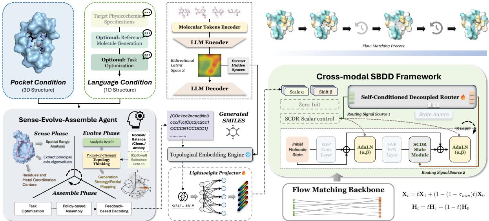  
Figure 1: Overview of the LiFT Framework. The left panel details the language-conditioned semantic pathway, utilizing the PoT agent, SMILES sanitization, and a foundation encoder to project sequences into dense priors. The right panel illustrates the cross-modal generation framework, injecting these semantic priors into an ODE-governed vector field with SCDR providing state-aware dynamic velocity modulation during flow matching.

3D velocity field with SMILES-derived chemical information. Because SMI-TED is pre-trained on large molecular corpora, ${ \bf z } _ { s e m }$ carries pharmacological priors that can bias geometric generation toward property-oriented trends without fine-tuning the generator.

## 3.3 Scalar Priming via Lightweight Semantic Projector

SBDD requires combining 1D symbolic descriptors $\left( \mathbf { z } _ { s e m } \right)$ with 3D geometric configurations. We represent each ligand state as a decoupled pair of invariant scalar features and proper-rotation-equivariant vector features:

$$
\mathbf { x } = ( \mathbf { s } , \mathbf { V } ) \in \mathbb { R } ^ { N _ { L } \times d _ { s } } \times \mathbb { R } ^ { N _ { L } \times d _ { v } \times 3 }\tag{2}
$$

Within this centered frame, $S O ( 3 )$ rotations are the geometric transformations preserved by the reported reflection-sensitive backbone. We therefore apply cross-modal priming only to the scalar domain s. This design keeps the equivariant vectors V unchanged by the non-equivariant 1D signal, allowing semantic conditioning to enter the model without disrupting the geometric update rules.

A lightweight projector $\mathcal { P } _ { \phi }$ maps the semantic latent into affine modulation parameters:

$$
\gamma , \beta = { \mathscr { P } } _ { \phi } ( \mathbf { z } _ { s e m } ) = \mathbf { W } _ { p } \cdot \sigma ( \mathbf { z } _ { s e m } ) + \mathbf { b } _ { p }\tag{3}
$$

where $\gamma , \beta \in \mathbb { R } ^ { d _ { s } }$ . We employ a zeroinitialization strategy $( \mathbf { W } _ { p } , \mathbf { b } _ { p } = \mathbf { 0 } )$ , so the projector initially recovers the original scalar normalization path and introduces semantic conditioning only through learned deviations. Let AdaL $\mathcal { \bf N } _ { \gamma , \beta } ( \mathbf { s } ) =$ $\mathrm { L N } ( \mathbf { s } ) \odot ( 1 + \operatorname { t a n h } ( \gamma ) ) + \beta$ . The primed node state is then defined as:

$$
\begin{array} { r } { { \bf s } _ { b a s e } = \mathrm { A d a L N } _ { \gamma , \beta } ( { \bf s } ) , { \bf V } _ { b a s e } = { \bf V } . } \end{array}\tag{4}
$$

Thus, $\mathbf { s } _ { b a s e }$ carries SMILES-derived priors before state-aware refinement by SCDR.

## 3.4 Self-Conditioned Decoupled Router (SCDR)

To coordinate semantic conditioning with geometric generation, we propose the Self-Conditioned Decoupled Router (SCDR), a cross-modal routing module that adjusts semantic influence according to intermediate 3D structures, thereby reducing conflicts between 1D chemical priors and pocket geometry.

During ODE integration, SCDR summarizes the evolving ligand state through invariant structural statistics. A DeepSets encoder projects node features into SO(3)-invariant latents $\mathbf { z } _ { n o d e } = \phi ( [ \mathbf { s } \ ] |$ $\| \mathbf { V } \| ] )$ , which are aggregated by a statistical readout operator $\Psi _ { \mathrm { s t a t } }$

$$
\begin{array} { r } { \mathbf { z } _ { \mathrm { s t a t } } = \left[ \mathbb { E } ( \mathbf { z } _ { n o d e } ) \parallel \operatorname* { m a x } ( \mathbf { z } _ { n o d e } ) \parallel \right. } \\ { \left. \sigma ( \mathbf { z } _ { n o d e } ) \parallel \log ( N ) \right] } \end{array}\tag{5}
$$

where N is the atom count. Combining mean, maximum, dispersion, and scale statistics, $\mathbf { z } _ { \mathrm { s t a t } }$ provides a compact permutation-invariant summary of the current ligand configuration.

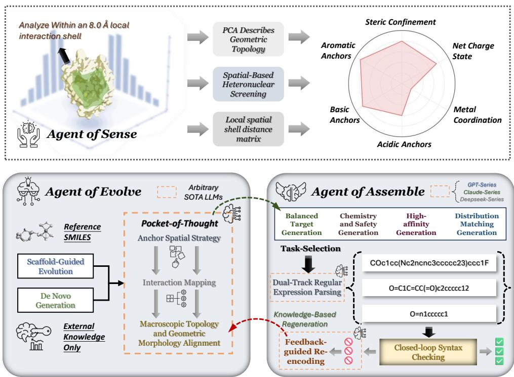  
Figure 2: Workflow of the “Sense-Evolve-Assemble” LLM agent. (Top) The Sense phase extracts spatial geometry and physicochemical anchors within an $8 . 0 \mathring \mathrm { A }$ pocket interaction shell to build the target profile. (Bottom Left) The Evolve phase executes Pocket-of-Thought (PoT) reasoning, leveraging text specifications or reference structures for both de novo design and scaffold hopping. (Bottom Right) The Assemble phase performs rule-based sequence serialization, employing deterministic cheminformatics verification to enforce 1D topological and chemical validity.

To integrate structural context with semantic conditioning, both sources are projected into a shared latent space, yielding $\hat { \mathbf { h } } _ { s t r u c t }$ and $\hat { \mathbf { h } } _ { c o n d } .$ , where $\hat { \mathbf { h } } _ { c o n d }$ encodes the semantic prior ${ \bf z } _ { s e m }$ and time embedding $\mathbf { t } _ { e m b }$ . Instead of directly adding the two representations, SCDR uses a dual-gated fusion mechanism:

$$
g _ { t } = \mathrm { S i g m o i d } ( \mathrm { M L P } _ { t } ( \mathbf { t } _ { e m b } ) )\tag{6}
$$

$$
g _ { c } = \mathrm { S i g m o i d } ( \mathbf { M L P } _ { c } ( [ \hat { \mathbf { h } } _ { c o n d } \ | | \ \hat { \mathbf { h } } _ { s t r u c t } ] ) )\tag{7}
$$

The temporal gate $g _ { t }$ controls how much structural feedback is used at different ODE stages, while the context gate $g _ { c }$ modulates the interaction between semantic and structural representations. The unified router latent h $\in \mathbb { R } ^ { d _ { h } }$ is obtained by gated residual fusion:

$$
{ \mathbf { h } } =  { \mathrm { L a y e r N o r m } } \bigl (  { \mathbf { M } }  { \mathrm { L P } } _ { f u s e } ( \hat {  { \mathbf { h } } } _ { c o n d } + g _ { t } \cdot g _ { c } \cdot \hat {  { \mathbf { h } } } _ { s t r u c t } ) \bigr )\tag{8}
$$

Conditioned on h, the router branches into two pathways. In the State Path, the graph-level latent $\mathbf { h } _ { b ( i ) }$ is broadcast to atom i to infer a bounded scalar

gate $\alpha _ { s t a t e , i } ^ { s } \in \mathbb { R } ^ { d _ { s } }$

$$
\begin{array} { r l } & { \alpha _ { s t a t e , i } ^ { s } = \mathbf { 1 } + w ( p ) b _ { a _ { s } } ( \mathbf { W } _ { s t a t e } \mathbf { h } _ { b ( i ) } ) } \\ & { \quad \mathbf { s } _ { o u t , i } = \mathbf { s } _ { b a s e , i } + \mathrm { L N } ( \mathbf { s } _ { i } ) \odot ( \alpha _ { s t a t e , i } ^ { s } - \mathbf { 1 } ) } \end{array}\tag{9}
$$

(10)

where $\mathbf { W } _ { s t a t e } ~ \in ~ \mathbb { R } ^ { d _ { s } \times d _ { h } }$ is a learnable projection and $b _ { a } ( { \bf z } ) = a { \bf z } / ( { \bf 1 } + | { \bf z } | )$ . Setting the state scale $a _ { s } = 0 . 5$ bounds the gate within [0.5, 1.5] for stable calibration. The vector state bypasses this modulation $( \mathbf { V } _ { o u t , i } \ = \ \mathbf { V } _ { i } )$ , preserving the pocket-centered SO(3) equivariance of the geometric backbone.

Simultaneously, the Update Path modulates the geometric feed-forward network $\mathcal { F } = ( \mathcal { F } _ { s } , \mathcal { F } _ { v } )$ to regulate residual updates during generation. For each channel $k \in \{ s , v \}$ , it infers decoupled scaling factors $\mathbf { g } _ { u p , i } ^ { k }$

$$
\mathbf { g } _ { u p , i } ^ { k } = \mathbf { 1 } + w ( p ) b _ { a _ { u } } ( \mathbf { W } _ { u p } ^ { k } \mathbf { h } _ { b ( i ) } )\tag{11}
$$

$$
\mathbf { x } _ { n e x t , i } = \mathbf { x } _ { o u t , i } + \mathbf { g } _ { u p , i } \odot \mathcal { F } ( \mathbf { x } _ { o u t , i } )\tag{12}
$$

where $\mathbf { W } _ { u p } ^ { k }$ are the corresponding learnable weights, and $\mathbf { g } _ { u p , i } = ( \mathbf { g } _ { u p , i } ^ { s } , \mathbf { g } _ { u p , i } ^ { v } )$ . A broader update scale $a _ { u } = 0 . 9$ permits residual scaling within [0.1, 1.9]. By separating scalar state calibration from residual update modulation, SCDR enables semantic priors to interact with intermediate 3D structural states while maintaining equivariant geometric updates.

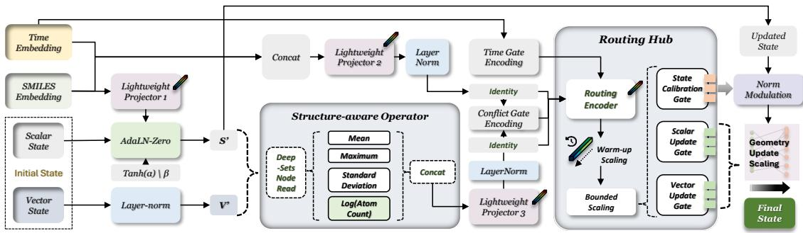  
Figure 3: Detailed architecture of the Self-Conditioned Decoupled Router (SCDR). Temporal/SMILES priors and intermediate geometric states $( S ^ { \prime } , V ^ { \prime } )$ are contextualized and aggregated by the Structure-aware Operator through a multi-scale DeepSets node readout. The Routing Module then decodes the fused representation into three decoupled pathways: the State Calibration Gate $( \alpha _ { \mathrm { s t a t e } } ^ { s } )$ , the Scalar Update Gate $( \mathbf { g } _ { \mathrm { u p } } ^ { s } )$ , and the Vector Update Gate $( \mathbf { g } _ { \mathrm { u p } } ^ { v } )$ for downstream geometric update scaling.

## 4 Experiments

In this section, we evaluate LiFT from two complementary perspectives: distribution matching fidelity and property-oriented generation. We report distribution matching in Sec. 4.2, property-oriented results in Sec. 4.3, and ablation studies in Sec. 4.4. Extended analyses of language-derived conditions are provided in Appendix A and B, while implementation details, extended metrics, and qualitative cases are provided in Appendix C, Appendix E, and Appendix F, respectively.

## 4.1 Experimental Setup

Datasets and Baselines. We train on the refined CrossDocked2020 dataset (Francoeur et al., 2020) (100K complexes) and compare with autoregressive models (Peng et al., 2022; Luo et al., 2021), 3D diffusion methods (Guan et al., 2023a,b; Huang et al., 2024), flow-matching frameworks (Schneuing et al., 2025; Zhou et al., 2025), and LLM-based SBDD pipelines (Wu et al., 2024; Hu et al., 2026).

Implementation Details. Our framework uses a 5-layer heterogeneous GVP-GNN (Jing et al., 2021) with a frozen SMI-TED encoder (Soares et al., 2025b), trained by continuous flow matching with $T = { \mathrm { 5 0 0 ~ O D E } }$ steps. Hardware, inference speed, and hyperparameters are provided in Appendix C.4.

Evaluation Metrics. We evaluate 1D pharmacological/topological properties (QED, SA, LogP, and ChEMBL ring frequencies), 3D binding and validity (Vina/Gnina and PoseBusters), and filter compliance (REOS and RDKit alerts). For distribution matching, Wasserstein Distance (WD) is computed against the empirical ligand distribution from the 100K training complexes. Metric details are provided in Appendix C.3.

Information Access. Reference-free variants use only pocket-derived textual specifications and task preferences, without access to ground-truth ligand SMILES, graphs, coordinates, docking poses, or ligand-derived labels. Reference-guided variants additionally use an available ligand SMILES only as a scaffold-hopping anchor, not as an evaluation target. Property-oriented variants change only inference-time task instructions after training the base 3D generator, without additional generator fine-tuning or external guidance models.

## 4.2 Comprehensive Distribution Matching and Generalization

To evaluate distribution matching, we compare generated molecules against the empirical ligand distribution estimated from the 100K CrossDocked2020 training complexes. We report reference-free and reference-guided variants: Ligand-Ref Embedding directly encodes the available reference SMILES, whereas Norm No-Ref and Norm Ref use distribution-oriented LLM prompting without and with a ligand reference. We also include two representative property-oriented variants, Balanced Ref and Vina No-Ref, to examine reference-guided scaffold hopping and de novo design without additional 3D generator fine-tuning.

Although LiFT is not specifically optimized for distribution matching, it achieves competitive WD performance across key metrics. Notably, No-Reference variants perform strongly in binding efficiency and topological ring distributions, surpassing the Ligand-Ref variant on several metrics. Their higher WD on QED and SA reflects a distributional shift rather than uniform degradation: generated molecules show improved pharmacological profiles relative to training-set ligands, which naturally moves them away from the empirical reference distribution, as indicated in Table 2.

Table 1: Comprehensive distribution matching benchmark on CrossDocked2020. All metrics represent the Wasserstein Distance (WD ↓) between generated molecular-property distributions and the empirical ligand distribution estimated from the 100K training complexes. The evaluation is rigorously divided into Binding Efficiency (Vina, Gnina), Medicinal Chemistry limits (QED, SA, LogP, Rotatable Bonds), and Topological Ring Systems (minimum ring frequencies $> 0 , > 1 0 , > 1 0 0 )$ . The best results are highlighted in bold, the second best are underlined, and the third best are marked with a dagger (†).
<table><tr><td rowspan="2">Method</td><td colspan="2">Binding Eff. (WD ↓)</td><td colspan="4">MedChem Properties (WD )</td><td colspan="3">Topological Rings (WD ↓)</td></tr><tr><td>Vina</td><td>Gnina</td><td>QED</td><td>SA</td><td>LogP</td><td>Rot. Bonds</td><td>&gt;0</td><td>&gt; 10</td><td>&gt; 100</td></tr><tr><td colspan="10">Autoregressive Models</td></tr><tr><td>AR (Luo et al., 2021)</td><td>0.032†</td><td>0.020</td><td>0.036</td><td>1.066</td><td>1.389</td><td>1.370</td><td>0.429</td><td>0.420</td><td>0.402</td></tr><tr><td>Pocket2Mol (Peng et al., 2022)</td><td>0.047</td><td>0.023</td><td>0.057</td><td>0.127</td><td>0.737</td><td>3.087</td><td>0.320</td><td>0.316</td><td>0.300</td></tr><tr><td colspan="10">3D Diffusion Architectures</td></tr><tr><td>TargetDiff (Guan et al., 2023a)</td><td>0.035</td><td>0.031</td><td>0.054</td><td>1.513</td><td>0.497†</td><td>0.355†</td><td>0.488</td><td>0.504</td><td>0.498</td></tr><tr><td>DecompDiff (Guan et al., 2023b)</td><td>0.112</td><td>0.070</td><td>0.080</td><td>1.307</td><td>0.643</td><td>2.421</td><td>0.343</td><td>0.355</td><td>0.336</td></tr><tr><td>BindDM (Huang et al., 2024)</td><td>0.018</td><td>0.026</td><td>0.025†</td><td>1.559</td><td>0.648</td><td>0.723</td><td>0.522</td><td>0.532</td><td>0.533</td></tr><tr><td colspan="10">Flow-Matching Frameworks</td></tr><tr><td>PAFlow (Zhou et al., 2025)</td><td>0.053</td><td>0.022†</td><td>0.050</td><td>1.664</td><td>2.462</td><td>1.392</td><td>0.608</td><td>0.623</td><td>0.602</td></tr><tr><td>DrugFlow (Schneuing et al., 2025)</td><td>0.042</td><td>0.024</td><td>0.023</td><td>0.243†</td><td>0.475</td><td>0.233</td><td>0.139</td><td>0.127</td><td>0.098</td></tr><tr><td colspan="10">LLM-based SBDD Pipelines</td></tr><tr><td>TamGen (Wu et al., 2024)</td><td>0.376</td><td>0.186</td><td>0.076</td><td>4.303</td><td>0.945</td><td>5.149</td><td>0.028†</td><td>0.008</td><td>0.047†</td></tr><tr><td>ELILLM-Diff (Hu et al., 2026)</td><td>0.377</td><td>0.190</td><td>0.048</td><td>5.341</td><td>3.424</td><td>1.307</td><td>0.521</td><td>0.540</td><td>0.527</td></tr><tr><td>ELILLM-Rand (Hu et al., 2026)</td><td>0.376</td><td>0.184</td><td>0.074</td><td>4.888</td><td>2.152</td><td>2.153</td><td>0.382</td><td>0.414</td><td>0.406</td></tr><tr><td colspan="10">LiFT Variants</td></tr><tr><td>LiFT (Ligand-Ref Embedding)</td><td>0.034</td><td>0.020</td><td>0.054</td><td>0.437</td><td>0.954</td><td>0.409</td><td>0.260</td><td>0.244</td><td>0.207</td></tr><tr><td>LiFT (Norm No-Ref)</td><td>0.056</td><td>0.040</td><td>0.203</td><td>0.538</td><td>1.221</td><td>1.012</td><td>0.027</td><td>0.020†</td><td>0.010</td></tr><tr><td>LiFT (Norm Ref)</td><td>0.041</td><td>0.029</td><td>0.083</td><td>0.232</td><td>0.374</td><td>0.624</td><td>0.162</td><td>0.163</td><td>0.145</td></tr><tr><td>LiFT (Balanced Ref)</td><td>0.044</td><td>0.027</td><td>0.020</td><td>0.416</td><td>0.762</td><td>0.229</td><td>0.192</td><td>0.185</td><td>0.165</td></tr><tr><td>LiFT (Vina No-Ref)</td><td>0.031</td><td>0.019</td><td>0.197</td><td>0.568</td><td>1.104</td><td>1.400</td><td>0.008</td><td>0.004</td><td>0.028</td></tr></table>

## 4.3 Property-Oriented Generation without Additional Generator Fine-Tuning

Moving beyond distribution matching, we evaluate property-oriented generation in Table 2. No-Reference variants generally outperform their Reference counterparts on core medicinal-chemistry and topological metrics, suggesting that strict anchoring to empirical ligands can constrain languagederived priors, whereas reference-free prompting allows exploration of alternative valid chemical regions. Accordingly, No-Reference configurations improve QED up to 0.757 and SA down to 2.659, while maintaining strong ring-frequency alignment (78.86% for rings > 10), filter compliance (RD-Kit/REOS > 71%), and competitive PoseBusters validity (up to 73.56%). Detailed subindicators are provided in Appendix E.

Task-specific prompts further induce directional property shifts: Vina-oriented instructions bias generation toward higher binding affinity, whereas QED-centric instructions improve drug-likeness. Rather than deterministic optimization, this semantic conditioning acts as a trend-guided prior, with text specifications corresponding to downstream empirical scores as analyzed in Appendix B. Overall, LiFT improves medicinal-chemistry profiles and filter compliance while preserving competitive binding and structural-validity indicators, suggesting a practical trade-off between language-derived property steering and 3D pocket compatibility.

## 4.4 Ablation Studies and Diagnostic Analyses

Structural Module Ablation. Table 3 evaluates the main conditioning modules. The Ligand-

Table 2: Property-oriented generation without additional generator fine-tuning on CrossDocked2020. Binding efficiency metrics (Gnina ↑, Vina ↓) are reported as absolute means. MedChem metrics (QED ↑, SA ↓) reflect the mean molecular properties, and topological/safety filters (Rings ↑, PoseB./RDKit/REOS ↑) are reported as pass rates (%). Best results are highlighted in bold, second best underlined, third best †.
<table><tr><td rowspan="2">Category</td><td rowspan="2">Method</td><td colspan="2">Binding Aff.</td><td colspan="2">MedChem Means</td><td colspan="3">Rings Freq (%) ↑</td><td colspan="3">Filters (%) ↑</td></tr><tr><td>Gnina ↑</td><td>Vina ↓</td><td>QED↑</td><td>SA↓</td><td>&gt;0</td><td>&gt;10</td><td>&gt;100</td><td>RDKit</td><td>REOS</td><td>PoseB.</td></tr><tr><td rowspan="7">3D-based Models</td><td>AR (Luo et al., 2021)</td><td>0.295</td><td>-0.414†</td><td>0.509</td><td>4.289</td><td>40.99</td><td>36.48</td><td>31.09</td><td>52.69</td><td>43.17</td><td>59.86</td></tr><tr><td>PAFlow (Zhou et al., 2025)</td><td>0.262</td><td>-0.429</td><td>0.491</td><td>4.889</td><td>23.02</td><td>16.20</td><td>10.99</td><td>75.55</td><td>58.28</td><td>14.68</td></tr><tr><td>BindDM (Huang et al., 2024)</td><td>0.249</td><td>-0.362</td><td>0.508</td><td>4.784</td><td>31.68</td><td>25.31</td><td>17.98</td><td>69.81</td><td>56.83</td><td>31.93</td></tr><tr><td>DecompDiff (Guan et al., 2023b)</td><td>0.205</td><td>-0.267</td><td>0.454</td><td>4.532</td><td>49.58</td><td>43.01</td><td>37.60</td><td>60.27</td><td>44.62</td><td>54.92</td></tr><tr><td>TargetDiff (Guan et al., 2023a)</td><td>0.244</td><td>-0.344</td><td>0.480</td><td>4.738</td><td>35.08</td><td>28.07</td><td>21.41</td><td>65.19</td><td>53.17</td><td>51.28</td></tr><tr><td>DrugFlow (Schneuing et al., 2025)</td><td>0.252</td><td>-0.338</td><td>0.553</td><td>3.43</td><td>69.97</td><td>65.80</td><td>61.41</td><td>75.86</td><td>64.84</td><td>78.45</td></tr><tr><td>Pocket2Mol (Peng et al., 2022)</td><td>0.297</td><td>-0.425</td><td>0.573</td><td>3.198</td><td>51.83</td><td>46.90</td><td>41.22</td><td>83.46</td><td>65.95</td><td>72.02</td></tr><tr><td rowspan="3">LLM-based Models</td><td>TamGen (Wu et al., 2024)</td><td>0.089</td><td>-0.003</td><td>0.460</td><td>7.528</td><td>81.02†</td><td>37.08</td><td>66.50</td><td>37.08</td><td>57.75</td><td>5.64</td></tr><tr><td>ELILLM-Diff (Hu et al., 2026)</td><td>0.085</td><td>-0.002</td><td>0.487</td><td>8.567</td><td>31.78</td><td>24.50</td><td>18.53</td><td>22.62</td><td>71.31†</td><td>3.60</td></tr><tr><td>ELILLM-Rand (Hu et al., 2026)</td><td>0.091</td><td>-0.003</td><td>0.460</td><td>8.113</td><td>45.66</td><td>37.06</td><td>30.67</td><td>27.97</td><td>65.39</td><td>4.14</td></tr><tr><td rowspan="7">LiFT Variants</td><td>Ligand-Ref Embedding</td><td>0.263†</td><td>-0.352</td><td>0.480</td><td>3.660</td><td>57.88</td><td>54.07</td><td>50.54</td><td>59.69</td><td>47.14</td><td>71.74</td></tr><tr><td>LiFT (QED-Reference)</td><td>0.242</td><td>-0.329</td><td>0.521</td><td>3.694</td><td>63.90</td><td>59.06</td><td>54.20</td><td>60.20</td><td>48.62</td><td>67.17</td></tr><tr><td>LiFT (Vina-Reference)</td><td>0.243</td><td>-0.337</td><td>0.515</td><td>3.757</td><td>62.55</td><td>57.73</td><td>53.28</td><td>61.37</td><td>49.90</td><td>68.34</td></tr><tr><td>LiFT (Bal-Reference)</td><td>0.247</td><td>-0.335</td><td>0.533</td><td>3.640</td><td>64.65</td><td>59.96</td><td>54.72</td><td>63.52</td><td>51.25</td><td>68.31</td></tr><tr><td>LiFT (QED-No-Reference)</td><td>0.243</td><td>-0.334</td><td>0.744</td><td>2.724†</td><td>80.43</td><td>74.88†</td><td>69.09†</td><td>83.19†</td><td>71.10</td><td>72.21†</td></tr><tr><td>LiFT (Vina-No-Reference)</td><td>0.255</td><td>-0.373</td><td>0.732†</td><td>2.662</td><td>83.08</td><td>78.86</td><td>74.07</td><td>83.36</td><td>73.81</td><td>73.56</td></tr><tr><td>LiFT (Bal-No-Reference)</td><td>0.241</td><td>-0.341</td><td>0.757</td><td>2.659</td><td>81.92</td><td>77.76</td><td>73.84</td><td>81.27</td><td>71.78</td><td>70.73</td></tr></table>

Ref Embedding setting serves as a referenceconditioned diagnostic baseline for the downstream generator. Removing zero-initialization slightly weakens binding, QED, and filter compliance, suggesting that zero-initialized modulation helps inject SMILES-derived priors without destabilizing the flow backbone. Removing SCDR causes larger drops in QED, RDKit, and REOS, indicating that state-aware routing mainly benefits the drug-likeness and filter compliance of semantically steered generation.

Cross-LLM Robustness and Selection. Benchmarking GPT-4o, Claude-4-Sonnet, and DeepSeek-V3 shows relatively small performance variation, suggesting that LiFT is not tied to a single language engine. DeepSeek-V3 achieves the strongest filter compliance, while GPT-4o provides the best QED and a stable property-oriented profile; we therefore use GPT-4o as the default backbone.

Table 3: Ablation analysis of core components and cross-LLM inference performance.
<table><tr><td>Model Variant</td><td>Gnina ↑</td><td>Vina ↓</td><td>QED ↑</td><td>SA↓</td><td>RDKit% ↑</td><td>REOS% ↑</td></tr><tr><td colspan="7">Structural/Component Ablation</td></tr><tr><td>LiFT (Ligand-Ref Embedding)</td><td>0.263</td><td>-0.352</td><td>0.480</td><td>3.660</td><td>59.69</td><td>47.14</td></tr><tr><td>w/o Zero-Init</td><td>0.248</td><td>-0.339</td><td>0.470</td><td>3.660</td><td>58.00</td><td>47.00</td></tr><tr><td>w/o SCDR (naive semantic injection)</td><td>0.245</td><td>-0.335</td><td>0.464</td><td>3.591</td><td>57.28</td><td>44.62</td></tr><tr><td colspan="7">Generalization Across LLM Backbones</td></tr><tr><td>LiFT (GPT-4o)</td><td>0.241</td><td>-0.341</td><td>0.757</td><td>2.659</td><td>81.27</td><td>71.78</td></tr><tr><td>LiFT (Claude-4-Sonnet)</td><td>0.249</td><td>-0.330</td><td>0.700</td><td>2.777</td><td>78.20</td><td>73.98</td></tr><tr><td>LiFT (DeepSeek-V3)</td><td>0.258</td><td>-0.346</td><td>0.707</td><td>2.660</td><td>83.44</td><td>75.03</td></tr></table>

Language-Condition Diagnostics. Beyond architectural ablations, Appendix A and Appendix B examine LLM-derived molecular conditions from complementary perspectives. Appendix A compares random, retrieved, direct-prompted, ablated, and full Sense-Evolve-Assemble SMILES conditions under the same 3D generator, testing whether structured language conditions provide more balanced guidance than arbitrary or retrieval-based priors. Appendix B further analyzes whether these conditions retain trend-level semantic effects after cross-modal projection: Appendix B.1 measures property-level correspondence between SMILES conditions and final molecules, Appendix B.2 compares generated and empirical ligand SMILES in ECFP4 space, and Appendix B.3 profiles SCDR gate behavior across training, ODE trajectories, and latent channels.

## 5 Conclusion

In this study, we introduce LiFT, a languageinformed cross-modal framework built on flow matching for trend-guided 3D molecular generation. Our evaluations show (i) strict ligandreference anchoring can constrain exploration, whereas reference-free de novo prompting enables exploration of valid chemical regions; and (ii) property-oriented prompting can improve medicinal chemistry profiles while maintaining competitive binding and structural validity. These results demonstrate the potential of language-derived chemical priors as semantic conditions for pocketconditioned 3D generation, enabling trend-level guidance without geometric-backbone fine-tuning.

## Limitations

While LiFT provides trend-guided language conditioning for SBDD, challenges in cross-modal generation remain. Natural language captures useful chemical and pharmacological preferences but lacks the geometric granularity for atomic-level control. Accordingly, LiFT provides trend-level guidance rather than exact property or structural control. Since LiFT relies on LLM-derived symbolic priors, its performance may vary with the chemical competence and reliability of the underlying LLM, especially where text-based chemical knowledge is sparse or biased. Future work may explore intermediate representations that better bridge language-level chemical intent and evolving 3D states, as well as richer modalities such as cryo-EM density maps or quantum interaction graphs.

Current SBDD evaluation lacks consensus on balancing distributional fidelity, such as Wasserstein Distance, with absolute property-oriented improvement. Validation on the static Cross-Docked2020 benchmark enables controlled comparison but does not establish generalization across broader pocket distributions or capture real biological dynamics. Extending LiFT to additional targets, datasets, and wet-lab feedback remains important.

## References

Amy C. Anderson. 2003. The process of structure-based drug design. Chemistry & Biology, 10(9):787–797.

Viraj Bagal, Rishal Aggarwal, P. K. Vinod, and U. Deva Priyakumar. 2022. MolGPT: Molecular generation using a transformer-decoder model. Journal ofChemical Information and Modeling, 62(9):2064–2076.

Martin Buttenschoen, Garrett M. Morris, and Charlotte M. Deane. 2024. Posebusters: AI-based docking methods fail to generate physically valid poses or generalise to novel sequences. Chemical Science, 15(9):3130–3139.

Zhanpeng Chen, Weihao Gao, Shunyu Wang, Yanan Zhu, Hong Meng, and Yuexian Zou. 2025. MolSculpt: Sculpting 3D molecular geometries from chemical syntax. Preprint, arXiv:2512.10991.

Seungyeon Choi, Hwanhee Kim, Chihyun Park, Dahyeon Lee, Seungyong Lee, Yoonju Kim, Hyoungjoon Park, Sein Kwon, Youngwan Jo, and Sanghyun Park. 2025. Controllable 3D molecular generation for structure-based drug design through bayesian flow networks and gradient integration. In Advances in Neural Information Processing Systems, volume 38, pages 125612–125647. Curran Associates, Inc.

Ian Dunn and David R. Koes. 2026. FlowMol3: Flow matching for 3D de novo small-molecule generation. Digital Discovery, 5(5):2052–2066.

Paul G. Francoeur, Tomohide Masuda, Jocelyn Sunseri, Andrew Jia, Richard B. Iovanisci, Ian Snyder, and David Ryan Koes. 2020. Three-dimensional convolutional neural networks and a cross-docked data set for structure-based drug design. Journal ofChemical Information and Modeling, 60(9):4200–4215.

Bowen Gao, Yanwen Huang, Yiqiao Liu, Wenxuan Xie, Bowei He, Haichuan Tan, Wei-Ying Ma, Ya-Qin Zhang, and Yanyan Lan. 2025. Cidd: Collaborative intelligence for structure-based drug design empowered by llms. In Advances in Neural Information Processing Systems.

Jiaqi Guan, Wesley Wei Qian, Xingang Peng, Yufeng Su, Jian Peng, and Jianzhu Ma. 2023a. 3D equivariant diffusion for target-aware molecule generation and affinity prediction. In International Conference on Learning Representations.

Jiaqi Guan, Xiangxin Zhou, Yuwei Yang, Yu Bao, Jian Peng, Jianzhu Ma, Qiang Liu, Liang Wang, and Quanquan Gu. 2023b. Decompdiff: Diffusion models with decomposed priors for structure-based drug design. In Proceedings of the 40th International Conference on Machine Learning, volume 202 of Proceedings ofMachine Learning Research, pages 11827–11846. PMLR.

Yingqing Guo, Yukang Yang, Hui Yuan, and Mengdi Wang. 2025. Training-free guidance beyond differentiability: Scalable path steering with tree search in diffusion and flow models. In The Thirty-ninth Annual Conference on Neural Information Processing Systems.

Xuanning Hu, Anchen Li, Qianli Xing, Jinglong Ji, Hao Tuo, and Bo Yang. 2026. Empowering llms for structure-based drug design via exploration-augmented latent inference. Preprint, arXiv:2601.15333.

Zhilin Huang, Ling Yang, Zaixi Zhang, Xiangxin Zhou, Yu Bao, Xiawu Zheng, Yuwei Yang, Yu Wang, and Wenming Yang. 2024. Binding-adaptive diffusion models for structure-based drug design. Proceedings of the AAAI Conference on Artificial Intelligence, 38(11):12671–12679.

Lei Jiang, Shuzhou Sun, Biqing Qi, Yuchen Fu, Xiaohua Xu, Yuqiang Li, Dongzhan Zhou, and Tianfan Fu. 2025. Chem3DLLM: 3D multimodal large language models for chemistry. Preprint, arXiv:2508.10696.

Jirui Jin, Cheng Zeng, Pawan Prakash, Ellad B. Tadmor, Adrian Roitberg, Richard G. Hennig, Stefano Martiniani, and Mingjie Liu. 2026. Molguidance: Advanced guidance strategies for conditional molecular generation with flow matching. Journal ofChemical Information and Modeling, 66(15):8860–8874.

Bowen Jing, Stephan Eismann, Patricia Suriana, Raphael John Lamarre Townshend, and Ron Dror. 2021. Learning from protein structure with geometric vector perceptrons. In International Conference on Learning Representations.

Haitao Lin, Guojiang Zhao, Odin Zhang, Yufei Huang, Lirong Wu, Cheng Tan, Zicheng Liu, Zhifeng Gao, and Stan Z. Li. 2025. CBGBench: Fill in the blank of protein-molecule complex binding graph. In The Thirteenth International Conference on Learning Representations. Spotlight.

Zhiyuan Liu, Sihang Li, Yanchen Luo, Hao Fei, Yixin Cao, Kenji Kawaguchi, Xiang Wang, and Tat-Seng Chua. 2023. MolCA: Molecular graph-language modeling with cross-modal projector and uni-modal adapter. In Proceedings of the 2023 Conference on Empirical Methods in Natural Language Processing, pages 15623–15638.

Zhiyuan Liu, Yanchen Luo, Han Huang, Enzhi Zhang, Sihang Li, Junfeng Fang, Yaorui Shi, Xiang Wang, Kenji Kawaguchi, and Tat-Seng Chua. 2025. NExT-Mol: 3D diffusion meets 1D language modeling for 3D molecule generation. In The Thirteenth International Conference on Learning Representations.

Shitong Luo, Jiaqi Guan, Jianzhu Ma, and Jian Peng. 2021. A 3D generative model for structure-based drug design. In Advances in Neural Information Processing Systems, pages 6229–6239.

William Peebles and Saining Xie. 2023. Scalable diffusion models with transformers. In Proceedings ofthe IEEE/CVF International Conference on Computer Vision, pages 4195–4205.

Xingang Peng, Shitong Luo, Jiaqi Guan, Qi Xie, Jian Peng, and Jianzhu Ma. 2022. Pocket2Mol: Efficient molecular sampling based on 3D protein pockets. In Proceedings of the 39th International Conference on Machine Learning, volume 162 of Proceedings ofMachine Learning Research, pages 17644–17655. PMLR.

Ethan Perez, Florian Strub, Harm de Vries, Vincent Dumoulin, and Aaron Courville. 2018. FiLM: Visual reasoning with a general conditioning layer. In Proceedings of the AAAI Conference on Artificial Intelligence, volume 32.

Jerret Ross, Brian M. Belgodere, Vijil Chenthamarakshan, Inkit Padhi, Youssef Mroueh, and Payel Das. 2022. Large-scale chemical language representations capture molecular structure and properties. Nature Machine Intelligence, 4(12):1256–1264.

Victor Garcia Satorras, Emiel Hoogeboom, and Max Welling. 2021. E(n) equivariant graph neural networks. In Proceedings of the 38th International Conference on Machine Learning.

Arne Schneuing, Charles Harris, Yuanqi Du, Kieran Didi, Arian Jamasb, Ilia Igashov, Weitao Du, Carla Gomes, Tom Blundell, Pietro Lio, Max

Welling, Michael Bronstein, and Bruno Correia. 2024. Structure-based drug design with equivariant diffusion models. Nature Computational Science.

Arne Schneuing, Ilia Igashov, Adrian W. Dobbelstein, Thomas Castiglione, Michael M. Bronstein, and Bruno Correia. 2025. Multi-domain distribution learning for de novo drug design. In The Thirteenth International Conference on Learning Representations.

Eduardo Soares, Emilio Vital Brazil, Victor Shirasuna, Dmitry Zubarev, Renato Cerqueira, and Kristin Schmidt. 2025a. A mamba-based foundation model for materials. npj Artificial Intelligence, 1:8.

Eduardo Soares, Emilio Vital Brazil, Victor Shirasuna, Dmitry Zubarev, Renato Cerqueira, and Kristin Schmidt. 2025b. An open-source family of large encoder-decoder foundation models for chemistry. Communications Chemistry, 8:193.

W. Patrick Walters and Mark A. Murcko. 2020. Assessing the impact of generative AI on medicinal chemistry. Nature Biotechnology, 38:143–145.

Kehan Wu, Yingce Xia, Pan Deng, Renhe Liu, Yuan Zhang, Han Guo, Yumeng Cui, Qizhi Pei, Lijun Wu, Shufang Xie, Si Chen, Xi Lu, Song Hu, Jinzhi Wu, Chi Kin Chan, Shawn Chen, Liangliang Zhou, Nenghai Yu, Enhong Chen, and 4 others. 2024. Tamgen: drug design with target-aware molecule generation through a chemical language model. Nature Communications, 15(1):9360.

Manzil Zaheer, Satwik Kottur, Siamak Ravanbakhsh, Barnabas Poczos, Russ R Salakhutdinov, and Alexander Smola. 2017. Deep sets. In Advances in Neural Information Processing Systems, volume 30. Curran Associates, Inc.

Daiheng Zhang, Chengyue Gong, and Qiang Liu. 2024a. Rectified flow for structure based drug design. Preprint, arXiv:2412.01174.

Wei Zhang, Zekun Guo, Yingce Xia, Peiran Jin, Shufang Xie, Tao Qin, and Xiang-Yang Li. 2025. Molchord: Structure-sequence alignment for proteinguided drug design. Preprint, arXiv:2510.27671.

Zaixi Zhang, Jiaxian Yan, Yining Huang, Qi Liu, Enhong Chen, Mengdi Wang, and Marinka Zitnik. 2024b. Geometric deep learning for structure-based drug design: A survey. Preprint, arXiv:2306.11768.

Jingyuan Zhou, Hao Qian, Shikui Tu, and Lei Xu. 2025. Prior-guided flow matching for target-aware molecule design with learnable atom number. In The Thirty-ninth Annual Conference on Neural Information Processing Systems.

Jie Zhu, Mingyu Ding, Boqiang Duan, Leye Wang, and Jingdong Wang. 2026. Unveiling the secret of adaln-zero in diffusion transformer. Preprint, arXiv:2608.09438.

## Appendix Overview

The supplementary material is organized into eight complementary parts that further analyze the role of language-derived molecular conditions, provide reproducibility details, extend the experimental diagnostics beyond the main paper, and clarify the methodological positioning of LiFT.

• Appendix A: Extended Analysis of Language-Derived Molecular Conditions. This appendix analyzes the intermediate SMILES conditions generated by the language agent before geometric generation. It includes condition-source ablations, 1D semantic evaluations, downstream 3D prior effects, and analyses of how structured language-derived conditions influence molecular generation under a fixed 3D backbone.

• Appendix B: Semantic Preservation and Diagnostic Analyses. This appendix examines whether language-derived molecular conditions retain measurable trend-level effects after cross-modal projection into 3D generation. It includes property-level correspondence analysis, ECFP4 manifold comparisons, and SCDR routing diagnostics across training and ODE trajectories.

• Appendix C: Experimental Details and Reproducibility. This appendix reports datasets, implementation settings, hyperparameters, evaluation protocols, hardware configurations, runtime and efficiency, pocket-level uncertainty estimates, absolute docking scores, and additional reproducibility details.

• Appendix D: Controlled SMILES-Condition Protocols and Prompting Templates. This appendix describes the controlled prompting interfaces, informationaccess boundaries, task-specific steering directives, and structured generation templates used by the language agent.

• Appendix E: Rule-Level Structural, Med-Chem, and Pose Validity Diagnostics. This appendix decomposes aggregate RDKit, REOS, and PoseBusters metrics into finegrained rule-level analyses and geometric validity sub-checks.

• Appendix F: Qualitative Case Studies on Representative Targets. This appendix provides qualitative analyses of generated molecules under different conditioning settings, including comparisons of structural validity, medicinal chemistry properties, and pocket compatibility.

• Appendix G: Detailed Mathematical Formulations. This appendix contains extended derivations and theoretical details for the proposed flow-matching and conditioning framework.

• Appendix H: Extended Comparison with Related Work. This appendix provides a systematic methodological comparison between LiFT and representative language-based, 1D– 3D, and native pocket-conditioned SBDD methods, together with a focused comparison with ELILLM.

## A Extended Analysis of Language-Derived Molecular Conditions

This appendix provides an extended analysis of the intermediate 1D SMILES conditions used by LiFT. The main experiments in the paper evaluate the final 3D generated molecules, while this appendix focuses on the symbolic molecular conditions before they are encoded by SMI-TED and injected into the 3D flow model. The purpose of this analysis is to isolate whether the proposed languagederived conditions are chemically meaningful and structurally diverse, rather than merely acting as arbitrary SMILES priors.

We evaluate six condition sources under the same reference-free balanced generation setting. All variants are evaluated on the same target-pocket set and produce SMILES conditions that are subsequently used by the same downstream 3D generation pipeline. The only difference among these variants is how the intermediate SMILES condition is obtained.

• C0-random: valid SMILES are randomly sampled from the training ligand pool. This setting controls for whether injecting any valid molecular string is sufficient to provide useful chemical priors.

• C1-retrieved: SMILES are selected from the training ligand pool through a non-LLM retrieval procedure. This setting represents a stronger non-generative molecular-prior baseline than random sampling, while avoiding direct access to test ligand SMILES.

• C2-direct: the LLM directly generates SMILES from the pocket description and task preference, without the structured Sense-Evolve-Assemble procedure. This setting controls for the effect of ordinary direct prompting.

• C3-w/o-Sense: the language agent generates SMILES without the explicit pocket-sensing stage. This removes the structured extraction of local pocket features, such as geometric shape, charge state, and residue anchors.

• C4-w/o-PoT: the agent receives the pocket information but does not use Pocket-of-Thought reasoning before SMILES generation. This setting isolates the role of structured intermediate reasoning.

• C5-full: the full Sense-Evolve-Assemble agent used in LiFT. This setting combines pocket sensing, Pocket-of-Thought reasoning, and task-aware molecular assembly to produce the final SMILES condition.

This comparison separates three sources of signal: generic valid molecular priors (C0- random), non-LLM retrieved molecular priors (C1-retrieved), and LLM-derived molecular conditions with different levels of structured reasoning (C2–C5). Therefore, the analysis directly tests whether the full language agent provides more chemically structured 1D conditions than simpler alternatives.

## A.1 1D Semantic Condition Analysis

We first evaluate the intermediate SMILES conditions before they are injected into the 3D generator. This analysis isolates whether the language-derived molecular conditions are chemically meaningful in their own right, rather than merely serving as arbitrary textual inputs to the downstream flow model. All variants are evaluated on the same target set and differ only in how the 1D SMILES condition is obtained.

Using the six condition sources defined above, we first evaluate the resulting SMILES before they are injected into the 3D generator. Table 4 reports representative 1D condition-quality metrics. We focus on validity, uniqueness, scaffold uniqueness,

QED, SA, LogP, ring count, and scaffold novelty with respect to the training set. These metrics cover basic chemical validity, molecular diversity, medicinal-chemistry plausibility, and whether the generated conditions collapse to training-set scaffolds.

Several observations emerge. First, validity is saturated across all variants, indicating that the comparison is not driven by invalid SMILES filtering. Second, the retrieved baseline has zero scaffold novelty by construction and substantially lower scaffold diversity than generated conditions, showing that retrieval provides chemically valid but non-novel molecular priors. Third, direct prompting achieves strong QED and SA, but it produces lower scaffold uniqueness and simpler ring profiles, suggesting that direct LLM generation tends to optimize local drug-likeness without maintaining the same level of topological diversity. Finally, the full agent achieves the highest uniqueness, high scaffold uniqueness, strong scaffold novelty, and a balanced property profile. This suggests that the Sense-Evolve-Assemble design provides useful 1D molecular conditions beyond random, retrieved, or directly prompted SMILES.

## A.2 Downstream Effect of 1D Condition Sources

We next examine whether the differences observed at the 1D condition level translate into downstream 3D molecular generation behavior. For this analysis, all condition sources are passed through the same frozen SMI-TED encoder and the same trained 3D flow generator. The sampling configuration and evaluation pipeline are also fixed, so the only changing factor is the source of the intermediate SMILES condition.

Table 5 reports downstream 3D generation results under the six condition sources defined in Appendix A.1. Random SMILES conditions lead to the weakest overall performance, with lower QED, worse SA, weaker binding-efficiency scores, and lower PoseBusters interaction-energy validity. This confirms that injecting an arbitrary valid molecular prior is insufficient for effective 3D generation. Retrieved SMILES provide stronger ringfrequency statistics, which is expected because retrieved molecules are drawn from the empirical training ligand pool. However, this retrieval-based prior does not yield the best binding-related scores and also shows a relatively high LogP, suggesting that simply reusing training-set molecular priors does not provide the most effective target-aware guidance.

Table 4: 1D molecular condition quality under different SMILES condition sources. All variants are evaluated before downstream 3D generation. C0 samples random valid SMILES from the training ligand pool; C1 retrieves training-set SMILES; C2 uses direct LLM prompting; C3 removes explicit pocket-sensing information; C4 removes Pocket-of-Thought reasoning; and C5 is the full Sense-Evolve-Assemble agent. The full agent preserves perfect validity, achieves the highest uniqueness, maintains high scaffold diversity, and produces chemically plausible property profiles without collapsing to retrieved training-set scaffolds. Boldface is omitted because this table is intended to compare overall trade-offs among validity, diversity, novelty, and medicinal-chemistry plausibility rather than single-metric dominance.
<table><tr><td>Condition Source</td><td>Validity</td><td>Unique</td><td>Scaf. Unique</td><td>QED</td><td>SA</td><td>LogP</td><td>Rings</td><td>Novel Scaf.</td></tr><tr><td>CO Random</td><td>1.000</td><td>0.987</td><td>0.777</td><td>0.543</td><td>3.241</td><td>2.101</td><td>2.877</td><td>0.000</td></tr><tr><td>C1 Retrieved</td><td>1.000</td><td>0.767</td><td>0.000</td><td>0.673</td><td>2.512</td><td>3.647</td><td>1.977</td><td>0.000</td></tr><tr><td>C2 Direct</td><td>1.000</td><td>0.947</td><td>0.624</td><td>0.801</td><td>2.048</td><td>2.583</td><td>1.466</td><td>0.641</td></tr><tr><td>C3 w/o Sense</td><td>1.000</td><td>0.987</td><td>0.832</td><td>0.777</td><td>2.151</td><td>3.059</td><td>2.096</td><td>0.857</td></tr><tr><td>C4 w/o PoT</td><td>1.000</td><td>0.963</td><td>0.786</td><td>0.754</td><td>2.129</td><td>2.938</td><td>2.390</td><td>0.814</td></tr><tr><td>C5 Full</td><td>1.000</td><td>0.993</td><td>0.824</td><td>0.778</td><td>2.239</td><td>2.529</td><td>2.672</td><td>0.750</td></tr></table>

Table 5: Downstream 3D generation results under different 1D SMILES condition sources. All variants use the same SMI-TED encoder, 3D flow generator, sampling configuration, and evaluation pipeline; only the source of the intermediate SMILES condition changes. C0 samples random valid SMILES from the training ligand pool; C1 uses retrieved training-set SMILES; C2 directly prompts the LLM to generate SMILES; C3 removes explicit pocket-sensing information; C4 removes Pocket-of-Thought reasoning; and C5 is the full Sense-Evolve-Assemble agent. Boldface is omitted because this table evaluates trade-offs across medicinal chemistry, binding-efficiency, topological, and structural-validity indicators rather than optimizing a single metric.
<table><tr><td>Condition</td><td>QED↑</td><td>SA↓</td><td>VinaEff↓</td><td>GninaEff↑</td><td>LogP</td><td>Rot.↑</td><td>Ring&gt;0↑</td><td>Ring&gt;10↑</td><td>Ring&gt;100↑</td><td>PB-Int.↑</td></tr><tr><td>CO Random</td><td>0.579</td><td>3.699</td><td>-0.302</td><td>0.233</td><td>1.766</td><td>4.755</td><td>0.629</td><td>0.583</td><td>0.512</td><td>0.794</td></tr><tr><td>C1 Retrieved</td><td>0.693</td><td>2.855</td><td>-0.318</td><td>0.225</td><td>3.159</td><td>3.931</td><td>0.837</td><td>0.824</td><td>0.797</td><td>0.856</td></tr><tr><td>C2 Direct</td><td>0.760</td><td>2.683</td><td>-0.345</td><td>0.236</td><td>2.547</td><td>2.925</td><td>0.777</td><td>0.713</td><td>0.666</td><td>0.900</td></tr><tr><td>C3 w/o Sense</td><td>0.749</td><td>2.531</td><td>-0.343</td><td>0.238</td><td>3.117</td><td>2.584</td><td>0.766</td><td>0.706</td><td>0.656</td><td>0.881</td></tr><tr><td>C4 w/o PoT</td><td>0.736</td><td>2.732</td><td>-0.329</td><td>0.234</td><td>2.851</td><td>3.110</td><td>0.748</td><td>0.680</td><td>0.615</td><td>0.900</td></tr><tr><td>C5 Full</td><td>0.757</td><td>2.659</td><td>-0.331</td><td>0.241</td><td>2.347</td><td>3.716</td><td>0.819</td><td>0.778</td><td>0.738</td><td>0.902</td></tr></table>

Direct LLM prompting achieves the highest QED and the best Vina efficiency, indicating that an LLM can generate useful drug-like conditions even without structured reasoning. However, its ringfrequency metrics are consistently lower than those of the full agent, suggesting that direct prompting tends to favor local medicinal-chemistry optimization while providing less balanced topological guidance. Removing the Sense phase or Pocketof-Thought reasoning also leads to weaker overall trade-offs. The w/o Sense variant obtains the lowest SA score, but it has reduced ring-frequency coverage and lower PoseBusters interaction-energy validity than the full model. Similarly, w/o PoT weakens ring statistics and does not improve bindingefficiency metrics.

The full Sense-Evolve-Assemble agent provides the most balanced downstream behavior. Although it is not the best on every single metric, it achieves the best Gnina efficiency and the highest Pose-Busters interaction-energy validity, while maintaining strong QED, SA, and ring-frequency statistics. Compared with Direct LLM and w/o PoT, the full agent better preserves topological richness after 3D generation. Compared with Retrieved SMILES, it avoids collapsing to empirical training-set priors while producing stronger binding-related and structural-validity indicators. These results support the view that structured language-derived SMILES conditions act as informative soft priors for 3D generation, rather than arbitrary molecular strings or simple retrieval anchors.

Together with the 1D condition-quality analysis in Appendix A.1, these results indicate that the proposed language agent improves both the intermediate symbolic conditions and their downstream effect after cross-modal projection into 3D molecular generation.

Table 6: Cross-modal trend correspondence between text-derived 1D conditioning targets and the final generated 3D molecular ensembles under the LiFT (Balanced No-Ref) setting. Pearson correlations are computed at the pocket-ensemble level over 100 target pockets.
<table><tr><td>Property</td><td>Pearson r</td><td>p-value</td></tr><tr><td>QED</td><td>0.7344</td><td> $3 . 4 5 7 \times 1 0 ^ { - 1 8 }$ </td></tr><tr><td>LogP</td><td>0.8379</td><td> $1 . 6 4 6 \times 1 0 ^ { - 2 7 }$ </td></tr><tr><td>Heavy atoms</td><td>0.7392</td><td> $1 . 6 1 3 \times 1 0 ^ { - 1 8 }$ </td></tr><tr><td>Rotatable bonds</td><td>0.7619</td><td> $3 . 4 2 7 \times 1 0 ^ { - 2 0 }$ </td></tr><tr><td>6-ring count</td><td>0.7578</td><td> $7 . 0 6 6 \times 1 0 ^ { - 2 0 }$ </td></tr></table>

## B Semantic Preservation and Diagnostic Analyses

This appendix provides additional diagnostic analyses for the language-conditioned generation pipeline. Rather than treating the LLM-generated SMILES as a black-box textual input, we examine whether these 1D conditions remain chemically meaningful at different stages of the framework. The goal is not to prove exact preservation or oneto-one recovery of ground-truth ligands. Instead, we ask whether the agent-generated SMILES and their downstream 3D generations preserve measurable trend-level and distribution-level relationships with empirical molecular data.

We study this question from three complementary perspectives. Appendix B.1 evaluates whether property tendencies encoded in the agent-generated SMILES are reflected in the calculated properties of the final generated 3D molecules. Appendix B.2 analyzes the topo-chemical distribution of the agent-generated SMILES themselves by comparing their ECFP4 fingerprint embeddings with the 100 held-out ligand SMILES from the evaluated pockets. Appendix B.3 further profiles the learned behavior of the State Calibration Gate, Scalar Update Gate, and Vector Update Gate across training, ODE inference, and latent-channel distributions. Together, these analyses provide diagnostic evidence that the language-derived conditions are not arbitrary text strings, but chemically structured inputs that remain informative before and during 3D generation.

## B.1 Property-Level Trend Correspondence under Cross-Modal Projection

To examine whether text-derived conditions remain reflected in the generated molecules, we measure the correlation between agent-generated SMILESderived conditions and calculated molecular properties after 3D generation. This analysis is conducted at the ensemble level rather than the singlemolecule level. For each target pocket, we average the properties of its generated ligands, which reduces sampling noise and focuses on macroscopic generation trends.

Under the unconstrained LiFT (Balanced No-Ref) setting, we generated more than 6,000 ligands for 100 target pockets from CrossDocked2020. For each pocket, we computed the average property value over its generated ligand ensemble and compared it with the corresponding text-derived conditioning target. As shown in Figure 4 and Table 6, the generated ensembles show consistently positive correlations across multiple physicochemical and topological dimensions. All reported correlations are statistically significant, suggesting that language-derived conditions preserve measurable trend-level signals after cross-modal projection into 3D molecular generation.

These results should be interpreted as evidence of trend-level correspondence rather than exact property control. The generated molecules are not expected to match the conditioning values point by point, since the final structures are also constrained by pocket geometry, flow dynamics, and chemical validity. Nevertheless, the observed correlations suggest that the language-derived conditions remain informative after projection into the 3D generation process. This supports the use of text-derived priors as soft guidance signals for property-oriented generation, while leaving the precise causal role of each architectural component to the ablation and diagnostic analyses.

## B.2 Topo-Chemical Distribution of Agent-Generated SMILES

While Appendix B.1 examines whether SMILESderived property tendencies are reflected after 3D generation, we further evaluate the agent-generated SMILES before they are injected into the geometric generator. This analysis asks whether the 1D molecules proposed by the language agent occupy topo-chemical regions comparable to the empirical ligand SMILES from the test set.

For each molecule, we compute 2,048-bit Morgan fingerprints (ECFP4, radius = 2) to represent local substructural patterns. We then project these high-dimensional fingerprints into two dimensions using t-Distributed Stochastic Neighbor Embedding (t-SNE). The comparison is performed between the agent-generated SMILES and the 100 ground-truth ligand SMILES corresponding to the test pockets. Since t-SNE is stochastic and depends on the full input matrix of each run, absolute coordinates should not be compared across panels. We therefore use the visualization only as a qualitative diagnostic of relative overlap, separation, and neighborhood structure within each panel.

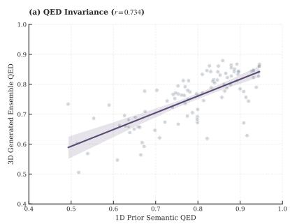

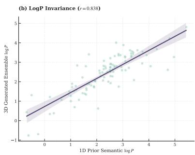

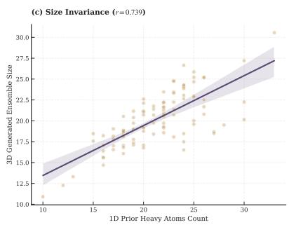  
Figure 4: Property-level trend correspondence under the LiFT (Balanced No-Ref) setting. The panels show ensemble-level correlations between properties derived from the agent-generated SMILES conditions and calculated properties of the final generated molecules across 100 test pockets: (a) QED $( r = 0 . 7 3 4 )$ , (b) log $P \left( r = 0 . 8 3 8 \right)$ and (c) molecular size measured by heavy atom count $( r = 0 . 7 3 9 )$ . All reported Pearson correlations are statistically significant $( p < 1 0 ^ { - 1 7 } )$ . These results indicate that the SMILES-derived conditions preserve measurable propertylevel trends after cross-modal projection and 3D generation, without implying exact molecule-level regression.

As shown in Figure 5a, the reference-guided LiFT (Balanced Ref) setting produces SMILES whose ECFP4 embeddings broadly overlap with the ground-truth ligand SMILES. This behavior is expected because the reference-guided setting provides an explicit molecular anchor to the agent. The observed overlap suggests that, when reference information is available, the agent tends to generate 1D molecular structures with local substructural patterns similar to those of the empirical ligands.

In the reference-free LiFT (Balanced No-Ref) setting, shown in Figure 5b, the agent-generated SMILES display a clearer shift relative to the ground-truth distribution. This is also expected, since the agent does not receive a reference molecule and therefore has more freedom to propose alternative scaffolds. Importantly, the generated SMILES remain close to the empirical distribution in the projected fingerprint space, rather than forming a visually detached cluster. This suggests that the reference-free agent explores nearby topo-chemical regions while still preserving recognizable substructural similarity under the ECFP4 representation.

Overall, this analysis complements the propertylevel correspondence in Appendix B.1. Appendix B.1 shows that the agent-generated SMILES provide property-level signals that remain visible after 3D generation. In contrast, the present analysis examines the SMILES conditions themselves and shows that their fingerprint distributions remain close to the ground-truth ligand SMILES, especially under reference-guided generation. These results do not prove exact recovery of empirical ligands, nor do they imply that t-SNE distances are chemically quantitative. They provide a qualitative check that the language agent produces chemically structured 1D conditions before the downstream 3D flow model uses them.

## B.3 Holistic Spatiotemporal Diagnostics of SCDR

Figure 6 provides a diagnostic view of the learned behavior of the Self-Conditioned Decoupled Router (SCDR). The goal of this analysis is not to repeat the architectural design of SCDR, which has been described in Figure 3, Section 3.4, and Appendix F. Instead, we use this figure to examine how the learned gates vary across training, ODE inference, and latent-channel distributions. We focus on three outputs: the State Calibration Gate $\alpha _ { \mathrm { s t a t e } } ^ { s } .$ , the Scalar Update Gate $g _ { \mathrm { u p } } ^ { s } ,$ and the Vector Update Gate $g _ { \mathrm { u p } } ^ { v }$

Macro-level training evolution. The left column of Figure 6 shows the aggregated gate values across training epochs. The State Calibration Gate $\alpha _ { \mathrm { s t a t e } } ^ { s }$ stays within a relatively high range during training, with moderate fluctuations across pockets. This suggests that the state-calibration branch remains active rather than being ignored by the model. The Scalar Update Gate $g _ { \mathrm { u p } } ^ { s }$ rises during the early stage and then stays in a more stable range, indicating that scalar-state updates are learned early and remain consistently used afterward. In contrast, the

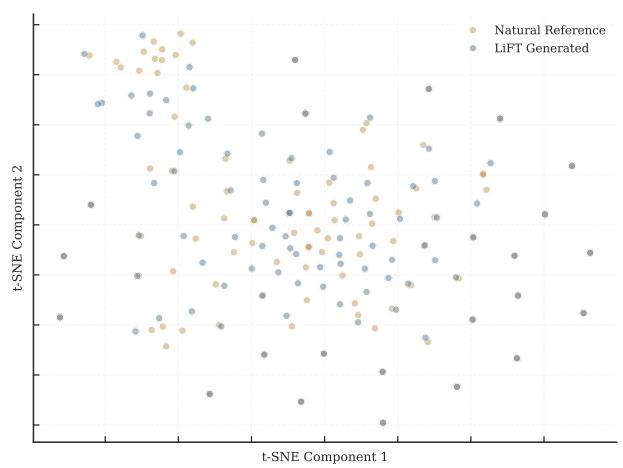

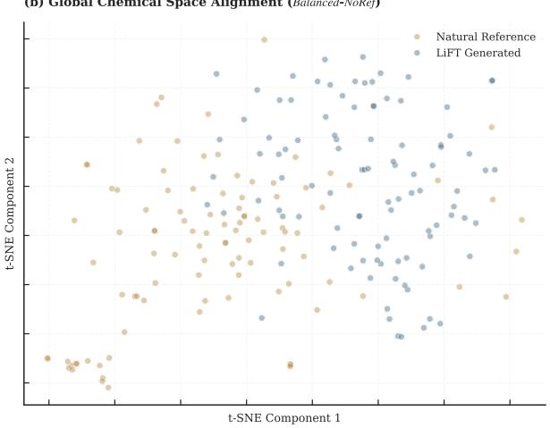  
Figure 5: Qualitative t-SNE visualization of topo-chemical distributions for agent-generated SMILES. The plots compare ECFP4 fingerprint embeddings of SMILES produced by the language agent with the 100 groundtruth ligand SMILES from the test pockets. (a) Under the reference-guided LiFT (Balanced $R e f )$ setting, the agent-generated SMILES show broad overlap with the ground-truth ligand distribution in the projected fingerprint space. (b) Under the reference-free LiFT (Balanced No-Ref) setting, the agent-generated SMILES exhibit a more visible distributional shift while remaining near the empirical SMILES distribution. Because t-SNE is a qualitative embedding method, this figure is intended to show distributional tendencies rather than precise chemical-space distances.

Vector Update Gate $g _ { \mathrm { u p } } ^ { v }$ shows a gradual downward trend after the early phase. This pattern is consistent with a more conservative use of vector-state updates during later training, although we do not interpret it as direct proof of a specific physical mechanism.

Meso-level ODE trajectory dynamics. The middle column profiles the same gates along the ODE integration trajectory. The State Calibration Gate $\alpha _ { \mathrm { s t a t e } } ^ { s }$ increases during the middle stage of integration and then decreases toward the final steps. This indicates that state calibration is most active in the intermediate part of generation, when the ligand state has already moved away from the initial noise but has not yet reached the final configuration. The Scalar Update Gate $g _ { \mathrm { u p } } ^ { s }$ generally decreases along the trajectory, suggesting that scalar updates are stronger at earlier stages and gradually relaxed as integration proceeds. By comparison, the Vector Update Gate $g _ { \mathrm { u p } } ^ { v }$ increases in the middle stage before declining near the end. This shows that scalar and vector updates follow different temporal patterns during inference. Across the three target pockets, the curves differ most visibly in the middle stage but become closer near the terminal steps, suggesting pocket-dependent intermediate behavior with relatively similar final regimes.

Micro-level latent-channel spectra. The right column shows the distribution of gate weights across latent channels for different target pockets. The distributions are not uniform or single-peaked. For $\alpha _ { \mathrm { s t a t e } } ^ { s } ,$ the violin plots show separated highand mid-value regions, indicating that state calibration is unevenly distributed across channels. The Scalar Update Gate $g _ { \mathrm { u p } } ^ { s }$ and Vector Update Gate $g _ { \mathrm { u p } } ^ { v }$ also show broad and partly multi-modal distributions, with visible differences among pockets. These observations suggest that SCDR does not apply the same update strength to all latent channels. Instead, different channels receive different levels of modulation, and the resulting distributions vary with the target pocket.

Summary. Overall, Figure 6 shows that SCDR has non-trivial learned gate behavior across three scales. During training, the three gates exhibit different evolution patterns. During ODE inference, scalar and vector updates follow different temporal trends, with stronger pocket-level variation in the middle of the trajectory. At the channel level, the gate distributions show heterogeneous and pocketdependent patterns rather than uniform collapse. These results should be viewed as diagnostic evidence rather than causal proof. They support a modest interpretation: SCDR learns structured, stagedependent modulation signals that are compatible with the ablation results in Table 3. Together with the property-invariance analysis in Appendix B.1 and the topo-chemical manifold analysis in Appendix B.2, this provides additional evidence that the language-derived conditions behave as useful trend-level signals in the 3D generation process.

(a) Training Evolution of State Calibration Gate $( \alpha _ { \mathrm { { s t o t e } } } ^ { s } )$  
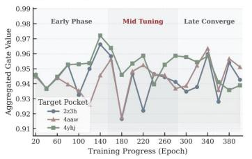  
(b) Training Evolution of Scalar Update Gate (gp)

(a) State Calibration Gate (αstate)  
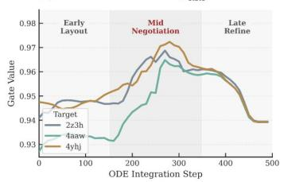  
(b) Scalar Update Gate (g5p)

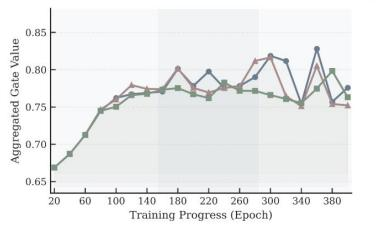

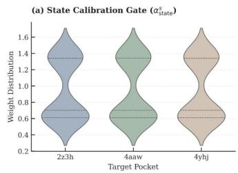  
(b) Scalar Update Gate (g)

(c) Training Evolution of Vector Update Gate (gup)  
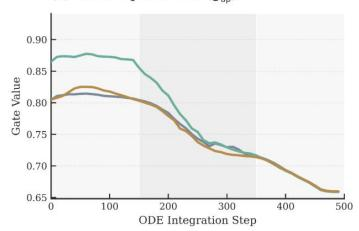

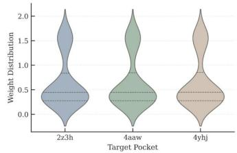

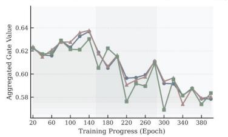  
A. Macro Evolution

(c) Vector Update Gate (gup)  
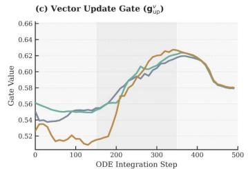  
B. Meso Trajectory

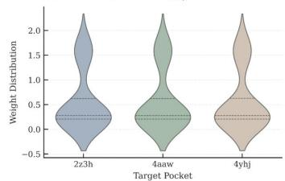  
C. Micro Spectrum  
Figure 6: Holistic spatiotemporal diagnostics of SCDR. This figure analyzes the learned gate behavior of SCDR rather than its architectural design. A. Macro evolution: aggregated gate values across training epochs for the State Calibration Gate $\alpha _ { \mathrm { s t a t e } } ^ { s } ,$ Scalar Update Gate $g _ { \mathrm { u p } } ^ { s } ,$ , and Vector Update Gate $g _ { \mathrm { u p } } ^ { v }$ . B. Meso trajectory: gate values along ODE integration steps, showing different temporal patterns for scalar and vector updates and visible pocket-level variation in the middle stage. C. Micro spectrum: latent-channel distributions of gate weights across target pockets, showing heterogeneous and pocket-dependent modulation patterns. These diagnostics provide evidence that SCDR learns structured gate dynamics across training, inference, and latent-channel scales.

## C Experiment Details

This section describes the dataset construction, conditioning settings, baseline replication protocol, and implementation details used in our experiments. The goal is to make the evaluation protocol explicit and auditable across distribution matching, reference-guided generation, de novo generation, and preference-alignment settings.

## C.1 Dataset Preparation and Preprocessing

We use the refined CrossDocked2020 benchmark for structure-based molecular generation. Each example is derived from a protein–ligand complex and provides two complementary views: a local three-dimensional pocket–ligand geometry for training the generative dynamics, and a onedimensional molecular representation for constructing semantic conditions. This setting matches the target-aware generation problem considered in LiFT, where ligand generation is conditioned on explicit pocket geometry while semantic information is provided through a controlled molecular prior.

Complex curation. We follow the standard refined CrossDocked preprocessing protocol and construct examples from the provided pocket-level structures. Complexes with unreliable binding poses, invalid molecular structures, or failed feature construction are excluded. Ligands are restricted to the small-molecule regime relevant to SBDD, ensuring that the benchmark focuses on realistic pocket-conditioned ligand generation rather than out-of-distribution molecular sizes.

Structural condition. For each retained complex, the receptor is represented by the local binding pocket defined by the benchmark preprocessing protocol. This pocket definition is used only to construct the geometric conditioning graph and should not be confused with reference-ligand information exposed to the LLM. In the no-reference setting, the LLM does not receive the ground-truth ligand identity, SMILES, docking scores, or molecular properties. The protein pocket is encoded as a compact residue-level graph with scalar residue features and geometry-aware vector features, while the ligand is represented by coordinates, atom types, and bond types for flow-matching training and sampling.

Semantic condition. For semantic embedding construction, ligand strings are canonicalized with RDKit and encoded by the frozen SMI-TED encoder into a fixed-dimensional molecular semantic vector. This vector provides the one-dimensional chemical prior used by the cross-modal conditioning interface. For controlled comparisons, we construct Ligand-Ref and pure LLM embedding variants under the same processed protein–ligand split, so that the compared settings share identical pocket geometries and differ only in the origin of the semantic condition.

Evaluation. After preprocessing, the training split contains approximately 105 refined complexes, and a held-out subset of 100 protein pockets is used for in-distribution evaluation. For each heldout pocket, LiFT generates 100 samples using the same inference configuration across all reported settings. The resulting molecules are evaluated with a unified post-processing and metriccomputation pipeline, including cheminformatics validity checks, structural filters, docking-based scores, and distributional property analyses.

## C.2 Baseline Specification and Replication Protocol

We compare LiFT with representative structurebased molecular generation methods spanning four major modeling families: autoregressive construction, 3D diffusion, flow matching, and LLM-based SBDD. This benchmark suite covers the dominant design choices in target-aware ligand generation, including sequential graph growth, iterative geometric denoising, continuous-time generative transport, and language-guided molecular proposal.

Autoregressive Models. Autoregressive methods formulate ligand generation as a sequence of local construction decisions conditioned on the protein pocket. AR (Luo et al., 2021) represents early graph-based atom-by-atom generation for SBDD, while Pocket2Mol (Peng et al., 2022) extends this direction with an equivariant pocket-aware representation for predicting atom types, coordinates, and bonds during molecular growth. These methods provide a representative comparison for discrete molecular construction under structural constraints.

3D Diffusion Models. Diffusion-based methods generate ligands by learning to denoise molecular states in three-dimensional space under pocket conditioning. TargetDiff (Guan et al., 2023a) serves as a canonical equivariant diffusion baseline for target-aware generation. DecompDiff (Guan et al., 2023b) incorporates decomposed ligand priors, BindDM (Huang et al., 2024) emphasizes bindingadaptive generation. Together, these baselines represent the current mainstream of 3D geometric generative modeling for SBDD.

Flow-Matching Models. Flow-matching methods learn continuous transport dynamics from simple priors to pocket-conditioned ligand distributions. We include PAFlow (Zhou et al., 2025) and DrugFlow (Schneuing et al., 2025) as representative continuous-time SBDD baselines. This group provides the most direct comparison for evaluating generative models based on learned vector fields and ODE-style sampling.

LLM-based SBDD Pipelines. LLM-based pipelines examine whether molecular language priors can support target-aware ligand design under structure-based evaluation. TamGen (Wu et al., 2024) represents target-conditioned molecular generation with language-modeling components. ELILLM variants, including ELILLM-Diff and ELILLM-Rand (Hu et al., 2026), are included as recent LLM-driven SBDD baselines. This group evaluates how language-guided molecular proposal pipelines compare with explicitly 3D generative models under the same benchmark.

Replication protocol. We distinguish between full reproduction and unified re-evaluation. For DrugFlow and TamGen, we fully reproduce the baselines using the officially released configuration files. In both cases, we directly follow the provided YAML settings and do not modify model hyperparameters, sampling parameters, or post-processing options. DrugFlow is included as the closest flowmatching baseline to LiFT, while TamGen is re-run because its generated molecule files are not publicly released in a directly usable form.

For the remaining baselines, we use the publicly released generated molecules or official sample files corresponding to the authors’ recommended evaluation setting whenever available, and evaluate them with our unified evaluator. This choice avoids introducing additional implementation variance from re-training or re-sampling multiple heterogeneous models. All molecules, including those generated by LiFT, are processed with the same validity checking, docking/rescoring, PoseBusters auditing, RDKit/REOS filtering, and metric-computation pipeline. Therefore, for these methods, the comparison should be interpreted as a unified re-evaluation of released samples rather than a full reproduction of the original training and sampling procedure.

## C.3 Detailed Metric Definitions

To ensure an explicit and auditable evaluation protocol, our metrics strictly reflect the experimental multi-objective tracks (Sec. 4.3), evaluating both absolute generative maximization (Means/Pass Rates) and empirical distribution alignment (Wasserstein Distance).

3D Binding Efficiencies. To rigorously assess target-aware affinity while penalizing physically unrealistic molecular inflation, both primary docking metrics are computed as efficiencies (normalized by the generated ligand’s heavy atom count). Vina Efficiency is derived from the raw AutoDock Vina v1.2.5 binding free energy (kcal/mol). Analogously, Gnina Efficiency is computed using the GNINA framework, leveraging its 3D CNN-based cross-docking scoring function to evaluate deep empirical pose quality per heavy atom.

1D Pharmacological & Topological Properties. Continuous and discrete molecular properties are computed deterministically via RDKit. This track evaluates QED (Quantitative Estimate of Drug-likeness) and LogP (partition coefficient) for pharmacological viability, alongside the SA (Synthetic Accessibility) score to assess synthesis feasibility. Geometric complexity and spatial flexibility are systematically quantified via Rotatable Bond Counts and Topological Ring Frequencies (categorized into > 0, > 10, and > 100 ring counts).

Structural Validity & MedChem Filters. Physical realism and medicinal chemistry safety are audited through comprehensive sub-filter suites. PoseBusters pass rates strictly verify 3D geometric constraints, covering critical sub-checks including Ring Flatness, Bond Angles, Double Bond stereochemistry, Internal Steric Clashes, and Protein-Ligand Overlap limits. Furthermore, 1D structural alerts are rigorously enforced via REOS (rapidly filtering BMS, Glaxo, Inpharmatica, and generic PAINS rule families) and RDKit Structural Alerts (comprehensively detecting NIH, PAINS-A/B/C, and ZINC violations) to exclude toxic or chemically reactive substructures.

Property Distribution Divergence. To quantify the macroscopic density shifts between the generated ensembles and the empirical target distribution across all aforementioned continuous metrics (Vina, Gnina, QED, SA, LogP, Rotatable Bonds, and Ring Frequencies), we explicitly employ the Wasserstein Distance (WD) computed via SciPy as our sole divergence metric. We deliberately avoid Kullback-Leibler (KL) divergence, Jensen-Shannon (JS) divergence, and Fréchet ChemNet Distance (FCD). This design choice is mathematically imperative for continuous-time flow matching: because empirical properties generated during unconstrained multi-objective optimization frequently exhibit disjoint supports relative to the natural distribution, KL divergence inherently suffers from numerical instability (∞), while JS divergence saturates, losing directional gradient sensitivity. Conversely, the Wasserstein metric (Earth Mover’s Distance) preserves a continuous, informative cost gradient even under non-overlapping supports, perfectly corresponding with our generative velocity field trajectory alignment.

## C.4 Implementation and Hyperparameters

LiFT is implemented in PyTorch with PyTorch Lightning. We use a frozen SMI-TED encoder to provide the ligand-level semantic condition, and train a heterogeneous GVP-GNN as the pocket-conditioned geometric backbone. The SCDR/AdaLN controller incorporates the SMILES embedding and flow-time information into ligandnode updates. The model is optimized with a flowmatching objective over ligand coordinates, atom types, and bond types. During inference, samples are generated by integrating the learned vector field with an explicit Euler solver. We run all experiments on a single NVIDIA A800-SXM4-80GB GPU. On this hardware, one training epoch takes less than 10 minutes. For the 100-pocket evaluation setting with 100 generated ligands per pocket (10,000 molecules in total), LiFT 3D flow sampling takes 2 h 38 min 48 s; including languagecondition generation and SMI-TED encoding, the complete measured pipeline takes 2 h 57 min 20 s. Docking and offline metric computation are excluded because they are evaluation procedures shared across methods rather than part of generation. The core implementation details and hyperparameter settings are summarized in Table 7.

Table 7: Core implementation settings of LiFT, including the GVP-based geometric backbone, SMI-TED semantic conditioning, flow-matching training objective, and Euler-based sampling protocol.
<table><tr><td>Component</td><td>Hyperparameter</td><td>Value</td></tr><tr><td rowspan="4">Backbone</td><td>Geometric network</td><td>Heterogeneous GVP-GNN</td></tr><tr><td>GVP layers</td><td>5</td></tr><tr><td>Node / edge hidden dim.</td><td>(128, 32) / (128, 32)</td></tr><tr><td>Self-conditioning</td><td>Enabled</td></tr><tr><td rowspan="4">Semantic control</td><td>Semantic encoder</td><td>Frozen SMI-TED</td></tr><tr><td>SMILES embedding dim.</td><td>768</td></tr><tr><td>Controller</td><td>SCDR/AdaLN</td></tr><tr><td>Controller condition</td><td>SMILES embedding + flow time</td></tr><tr><td rowspan="5">Training</td><td>Objective</td><td>Flow matching over coords., atoms, and bonds</td></tr><tr><td>Optimizer</td><td>AdamW with AMSGrad</td></tr><tr><td>Learning rate</td><td>8 × 10−4</td></tr><tr><td>Batch size</td><td>48</td></tr><tr><td>Training epochs</td><td>500</td></tr><tr><td rowspan="4">Sampling</td><td>ODE solver</td><td>Explicit Euler</td></tr><tr><td>Training flow steps</td><td>5000</td></tr><tr><td>Inference steps (NFE)</td><td>500</td></tr><tr><td>Atom / bond priors</td><td>Marginal / uniform</td></tr></table>

Runtime and efficiency. To make the inference cost explicit, Table 8 reports component-wise wall-clock measurements under the same A800 setup. Language-condition generation produces three valid SMILES conditions per pocket, yielding 300 conditions over 100 pockets. The 3D stage then generates 100 ligands per pocket. SMI-TED timing is reported both with and without its onetime loading cost.

The 3D sampling stage accounts for approximately 89.5% of the measured LiFT runtime. Under the matched sampling setting, LiFT requires 2 h 38 min 48 s versus 1 h 59 min 20 s for DrugFlow, corresponding to a 33.1% sampling-time overhead. This comparison isolates sampling cost rather than end-to-end system cost, since DrugFlow does not include corresponding language-generation or semantic-encoding stages.

## C.5 Pocket-Level Uncertainty and Statistical Reporting

To quantify variability across targets, we report pocket-level sample standard deviation (SD), across-pocket variance, and pocket-bootstrap 95% confidence intervals (CIs). For each metric, we first aggregate generated molecules within each pocket and then compute SD and variance across test pockets. For CIs, we resample complete pockets with replacement, retain all molecules associated with each selected pocket, and recompute the original aggregate estimator. Using pockets rather than individual molecules as the resampling unit avoids treating molecules generated for the same target as

statistically independent.

These quantities characterize across-pocket heterogeneity and sampling uncertainty; they should not be interpreted as retraining-seed variance. Because the reported results use fixed trained checkpoints, multi-seed retraining variance is a distinct source of uncertainty. Table 9 reports SD, variance, and 95% CIs for the continuous metrics most central to the main comparison. SD is reported in the original metric units, whereas variance is in squared units.

For the no-reference property-oriented variants, we additionally report uncertainty for representative filter and pose-validity metrics in Table 10. For percentage metrics, SD is measured in percentage points and variance in squared percentage points.

The uncertainty estimates support a cautious interpretation of small numerical differences. In particular, the QED-NoRef variant has a QED 95% CI of [0.723, 0.763] and an SA 95% CI of [2.602, 2.851], while confidence intervals for several docking and pose-validity comparisons overlap with strong 3D baselines. We therefore use these statistics to characterize stability and across-pocket heterogeneity rather than to claim significance from small point-estimate gaps.

## C.6 Absolute Docking Scores

For direct comparability with studies reporting unnormalized docking scores, we additionally report raw Vina and Gnina scores under the same evaluation and failure-handling protocol. These absolute scores complement the heavy-atom-normalized docking-efficiency metrics and the Wassersteindistance analysis reported in the main paper.

All methods use the same docking and failurehandling protocol. Raw values near zero for some sequence-based baselines reflect unsuccessful or unscored post-hoc 3D poses under this unified pipeline rather than a different scoring function. Taken together, the reported docking results provide three complementary views: absolute Vina/Gnina scores for conventional comparability, heavy-atom-normalized efficiency for size-aware affinity evaluation, and Wasserstein Distance for distributional fidelity.

## D Controlled SMILES-Condition Protocol

The main text uses the Sense-Evolve-Assemble agent to convert pocket descriptions, task directives, and optional ligand references into onedimensional SMILES conditions for the downstream flow model. This appendix formalizes the operational interface between the language-based SMILES proposal stage and the geometric generator. It specifies the information available to the language model, the deterministic parsing and validation procedure, and the construction of the fixed SMILES-derived semantic latent used during flow sampling.

Table 8: Measured runtime of the LiFT pipeline on a single NVIDIA A800-SXM4-80GB GPU. The matched DrugFlow comparison uses the same 100-pocket, 10,000-molecule sampling workload.
<table><tr><td>Component / Method</td><td>Timed Batch</td><td>Total Wall-Clock Time</td><td>Normalized Runtime</td></tr><tr><td>LLM condition generation</td><td>100 pockets; 300 conditions</td><td>14 min 48 s</td><td>8.88 s/pocket; 2.96 s/condition</td></tr><tr><td>SMI-TED encoding, incl. loading</td><td>300 conditions</td><td>224.08 s</td><td>0.747 s/condition</td></tr><tr><td>SMI-TED core encoding</td><td>300 conditions</td><td>208.17 s</td><td>0.694 s/condition</td></tr><tr><td>One-time SMI-TED loading</td><td>One initialization</td><td>14.87 s</td><td>Not amortized across future batches</td></tr><tr><td>LiFT 3D flow sampling</td><td>100 pockets × 100 ligands</td><td>2 h 38 min 48 s</td><td>0.953 s/molecule; 95.28 s/pocket</td></tr><tr><td>DrugFlow 3D flow sampling</td><td>Matched 10,000-molecule workload</td><td>1 h 59 min 20 s</td><td>0.716 s/molecule; 71.60 s/pocket</td></tr><tr><td>Complete measured LiFT pipeline</td><td>LLM + SMI-TED + 3D sampling</td><td>2 h 57 min 20 s</td><td>106.40 s/pocket</td></tr></table>

Table 9: Pocket-level uncertainty for continuous evaluation metrics. Each entry is SD / variance / 95% bootstrap CI. Confidence intervals are computed by resampling complete test pockets.
<table><tr><td>Method</td><td>Gnina Eff.</td><td>Vina Eff.</td><td>QED</td><td>SA</td></tr><tr><td>AR</td><td>0.061/0.0038/[0.283,0.307</td><td>0.083/0.0068/[-0.426,-0.393]</td><td>0.119/0.0140/[0.485,0.533]</td><td>0.895/0.8019/[4.109,4.470]</td></tr><tr><td>PAFlow</td><td>0.040/0.0016/[0.254,0.270]</td><td>0.092/0.0084/[-0.445,-0.414]</td><td>0.101/0.0102/[0.471,0.511]</td><td>0.830/0.6882/[4.720,5.058]</td></tr><tr><td>BindDM</td><td>0.044/0.0019/[0.240,0.257]</td><td>0.074/0.0055/[-0.376,-0.347]</td><td>0.100/0.0101/[0.489,0.527]</td><td>0.654/0.4281/[4.661,4.902]</td></tr><tr><td>DecompDiff</td><td>0.037/0.0014/[0.197,0.213]</td><td>0.069/0.0048/[-0.281,-0.252]</td><td>0.137/0.0187/[0.425,0.483]</td><td>0.551/0.3041/[4.407,4.649]</td></tr><tr><td>TargetDiff</td><td>0.043/0.0018/[0.236,0.253]</td><td>0.069/0.0047/[-0.357,-0.330]</td><td>0.111/0.0124/[0.458,0.500]</td><td>0.593/0.3516/[4.624,4.850]</td></tr><tr><td>DrugFlow</td><td>0.043/0.0018/[0.243,0.260]</td><td>0.081/0.0065/[-0.353,-0.322]</td><td>0.135/0.0184/[0.526,0.578]</td><td>0.701/0.4915/[3.295,3.570]</td></tr><tr><td>Pocket2Mol</td><td>0.063/0.0039/[0.285,0.310]</td><td>0.076/0.0058/[-0.440,-0.410]</td><td>0.091/0.0083/[0.555,0.591]</td><td>0.631/0.3976/[3.076,3.323]</td></tr><tr><td>TamGen</td><td>0.008/0.0001/[0.087,0.090]</td><td>0.013/0.0002/[-0.006,-0.001]</td><td>0.078/0.0060/[0.445,0.476]</td><td>0.387/0.1499/[7.450,7.602]</td></tr><tr><td>ELILLM-Diff</td><td>0.020/0.0004/[0.081,0.089]</td><td>0.010/0.0001/[-0.004,-0.000]</td><td>0.105/0.0111/[0.466,0.507]</td><td>0.660/0.4361/[8.434,8.694]</td></tr><tr><td>ELILLM-Rand</td><td>0.023/0.0005/[0.087,0.096]</td><td>0.012/0.0001/[-0.005,-0.001]</td><td>0.145/0.0210/[0.431,0.488]</td><td>0.624/0.3893/[7.988,8.234]</td></tr><tr><td>LiFT (Lig.-Ref)</td><td>0.075/0.0056/[0.241,0.270]</td><td>0.098/0.0096/[-0.365,-0.326]</td><td>0.181/0.0327/[0.444,0.516]</td><td>1.133/1.2843/[3.435,3.892]</td></tr><tr><td>LiFT (QED-Ref)</td><td>0.058/0.0034/[0.231,0.253]</td><td>0.092/0.0086/[-0.347,-0.311]</td><td>0.185/0.0342/[0.483,0.558]</td><td>1.097/1.2029/[3.464,3.922]</td></tr><tr><td>LiFT (Vina-Ref)</td><td>0.064/0.0040/[0.231,0.255]</td><td>0.091/0.0083/[-0.347,-0.311]</td><td>0.182/0.0331/[0.479,0.552]</td><td>1.075/1.1560/[3.537,3.981]</td></tr><tr><td>LiFT (Bal-Ref)</td><td>0.063/0.0040/[0.235,0.260]</td><td>0.096/0.0091/[-0.354,-0.317]</td><td>0.180/0.0324/[0.496,0.569]</td><td>1.086/1.1794/[3.416,3.876]</td></tr><tr><td>LiFT (QED-NoRef)</td><td>0.038/0.0014/[0.236,0.250]</td><td>0.082/0.0068/[-0.357,-0.325]</td><td>0.094/0.0089/[0.723,0.763]</td><td>0.662/0.4380/[2.602,2.851]</td></tr><tr><td>LiFT (Vina-NoRef)</td><td>0.043/0.0018/[0.248,0.264]</td><td>0.092/0.0085/[-0.363,-0.327]</td><td>0.099/0.0098/[0.708,0.750]</td><td>0.593/0.3511/[2.538,2.794]</td></tr><tr><td>LiFT (Bal-NoRef)</td><td>0.037/0.0014/[0.234,0.248]</td><td>0.101/0.0103/[-0.350,-0.311]</td><td>0.086/0.0074/[0.740,0.774]</td><td>0.574/0.3291/[2.552,2.774]</td></tr></table>

Table 10: Pocket-level uncertainty for representative filter and pose-validity metrics. Each entry is SD / variance / 95% bootstrap CI.
<table><tr><td>Variant</td><td>RDKit (%)</td><td>REOS (%)</td><td>PoseB. (%)</td></tr><tr><td>QED-NoRef</td><td>10.92/119.2/[81.11,85.12]</td><td>16.94/287.1/[67.92,74.12]</td><td>21.52/462.9/[68.20,76.00]</td></tr><tr><td>Vina-NoRef</td><td>11.83/140.0/[80.83,85.74]</td><td>18.14/329.2/[70.17,77.25]</td><td>21.43/459.4/[69.40,77.30]</td></tr><tr><td>Bal-NoRef</td><td>13.76/189.3/[78.35,83.99]</td><td>19.52/381.1/[67.88,75.58]</td><td>21.53/463.5/[66.50,74.60]</td></tr></table>

## D.1 Semantic Intervention and Information Boundary

LiFT conditions the geometric generator through a semantic vector ${ \bf z } _ { s e m }$ produced by a frozen SMI-

TED encoder. The controlled variable is the source of the SMILES string used to instantiate this vector. When the semantic condition is instantiated from an LLM-generated SMILES string, the string is produced by the fixed protocol described below. In the Ligand-Ref Embedding condition, the available reference ligand SMILES is encoded directly as a reference embedding. This condition is used as a diagnostic, reference-guided setting to assess how reference semantic information affects the downstream generator. It is therefore reported separately from reference-free de novo variants.

The access boundary is fixed before any target is evaluated. In the reference-free de novo setting, the LLM receives only the pocket-derived profile and a task directive. It does not receive the test ligand, reference SMILES, hidden labels, docking scores, filter outcomes, or generated 3D structures. In the reference-guided setting, the LLM additionally receives the reference ligand SMILES and coarse reference-derived size constraints. We therefore report this setting separately as a Ligand-

Table 11: Absolute docking scores under the unified evaluation protocol. Lower raw Vina is better, while higher raw Gnina is better. Values are mean ± standard deviation.
<table><tr><td>Method</td><td>Raw Vina ↓</td><td>Raw Gnina ↑</td></tr><tr><td>AR</td><td> $- 6 . 7 5 6 \pm 2 . 4 6 2$ </td><td> $4 . 7 4 1 \pm 1 . 3 9 1$ </td></tr><tr><td>PAFlow</td><td> $- 9 . 6 4 7 \pm 3 . 5 0 3$ </td><td> $5 . 7 6 5 \pm 1 . 3 8 4$ </td></tr><tr><td>BindDM</td><td> $- 8 . 2 3 6 \pm 3 . 0 6 6$ </td><td> $5 . 5 9 3 \pm 1 . 4 0 3$ </td></tr><tr><td>DecompDiff</td><td> $- 7 . 6 4 7 \pm 2 . 2 8 3$ </td><td> $5 . 8 4 9 \pm 1 . 0 7 2$ </td></tr><tr><td>TargetDiff</td><td> $- 7 . 7 7 0 \pm 2 . 7 6 1$ </td><td> $5 . 4 7 5 \pm 1 . 3 8 8$ </td></tr><tr><td>DrugFlow</td><td> $- 6 . 9 3 8 \pm 2 . 9 0 8$ </td><td> $5 . 1 1 8 \pm 1 . 3 0 2$ </td></tr><tr><td>Pocket2Mol</td><td> $- 6 . 9 8 4 \pm 2 . 9 0 7$ </td><td> $4 . 6 8 7 \pm 1 . 4 4 1$ </td></tr><tr><td>TamGen</td><td> $- 0 . 1 4 3 \pm 1 . 8 4 0$ </td><td> $3 . 8 8 0 \pm 0 . 5 0 6$ </td></tr><tr><td>ELILLM-Diff</td><td> $- 0 . 0 7 1 \pm 3 . 4 4 6$ </td><td> $4 . 4 2 0 \pm 1 . 1 8 2$ </td></tr><tr><td>ELILLM-Rand</td><td> $- 0 . 1 3 3 \pm 2 . 6 0 8$ </td><td> $4 . 2 7 5 \pm 1 . 3 1 1$ </td></tr><tr><td>LiFT (Ligand-Ref Embedding)</td><td> $- 6 . 8 2 5 \pm 2 . 5 5 5$ </td><td> $4 . 9 0 2 \pm 1 . 3 2 9$ </td></tr><tr><td>LiFT (QED-Reference)</td><td> $- 6 . 8 0 4 \pm 2 . 4 7 7$ </td><td> $4 . 9 1 0 \pm 1 . 2 8 9$ </td></tr><tr><td>LiFT (Vina-Reference)</td><td> $- 6 . 7 8 2 \pm 2 . 4 4 7$ </td><td> $4 . 9 0 6 \pm 1 . 3 1 0$ </td></tr><tr><td> $\mathrm { L i F T } \left( \mathrm { B a l a n c e d - R e f e r e n c e } \right)$ </td><td> $- 6 . 7 9 7 \pm 2 . 5 4 2$ </td><td> $4 . 9 0 2 \pm 1 . 3 0 5$ </td></tr><tr><td>LiFT (QED-No-Reference)</td><td> $- 6 . 7 4 8 \pm 2 . 1 6 0$ </td><td> $4 . 7 8 5 \pm 1 . 0 5 7$ </td></tr><tr><td>LiFT (Vina-No-Reference)</td><td> $- 6 . 3 6 2 \pm 2 . 1 7 7$ </td><td> $4 . 6 4 5 \pm 1 . 0 0 9$ </td></tr><tr><td>LiFT (Balanced-No-Reference)</td><td> $- 6 . 5 7 6 \pm 2 . 6 0 1$ </td><td> $4 . 7 9 1 \pm 1 . 0 4 7$ </td></tr></table>

Ref variant. Across both settings, downstream metrics are used only for evaluation, not for selecting, revising, or ranking the SMILES condition. The corresponding prompt skeletons make this input separation explicit: Table 12 lists the referencefree fields, while Table 13 shows the additional reference-guided fields.

## D.2 Operational Protocol

The protocol follows the three stages described in the methodology. First, the Sense stage summarizes the target pocket into a compact textual profile, including coarse geometry and physicochemical anchors from the local interaction shell. This profile is the only target-specific input in the reference-free setting. Second, the Evolve stage applies a fixed Pocket-of-Thought (PoT) schema. The schema asks the LLM to state a compact spatial and topological plan before emitting SMILES, making the intended SMILES condition inspectable without using the intermediate plan as a reward, filter, or selection signal. Third, the Assemble stage extracts tagged SMILES strings, applies deterministic cheminformatics verification, and passes the first valid, SMI-TED-encodable molecule to the semantic encoder.

Prompt variants are fixed at the script level. Distribution-oriented, balanced, Vina-oriented, and QED/safety-oriented directives modify only the task text supplied to the LLM. They do not change the generator weights, invoke an additional guidance model, or introduce feedback from downstream evaluation. The same parsing, validation, and semantic extraction rule is used for all prompt families and LLM backbones considered in the experiments.

## D.3 Validation and Candidate Accounting

Candidate acceptance is based only on molecular string validity and successful SMI-TED encoding. RDKit is used as an unweighted validity check rather than as a ranking surrogate. If a generated string fails to parse, the repair routine is restricted to local SMILES syntax correction using the parser diagnostic. It does not receive docking scores, property scores, reference-similarity scores, filter results, or sampled 3D coordinates. Thus, the repair step provides syntax-level recovery only and does not introduce score-feedback optimization over evaluation metrics. The repair interface is specified in Table 14, which exposes only the parser diagnostic, invalid SMILES string, and captured PoT context.

When multiple valid candidates are available, their chronological order is preserved and the first SMI-TED-encodable candidate instantiates $\mathbf { z } _ { s e m }$ If no valid encodable candidate is produced under the fixed protocol, the target is logged as a semantic-instantiation failure rather than being replaced through post-hoc search. This accounting rule prevents downstream scores from influencing which semantic condition is passed to the 3D generator.

## D.4 Semantic Feature Extraction and Claim Boundary

After validation, the selected SMILES string is embedded by the frozen SMI-TED encoder:

$$
\begin{array} { r } { \mathbf { z } _ { s e m } = \mathrm { E n c o d e r } _ { \mathrm { S M I - T E D } } ( S _ { s m i l e s } ) . } \end{array}
$$

The resulting vector is constructed before any 3D geometric generation and is held fixed throughout flow sampling. The downstream flow model does not call the LLM, rerun repair, inspect candidate rationales, or revise ${ \bf z } _ { s e m }$ using generated coordinates or evaluation metrics.

This protocol supports a deliberately narrow operational claim: LiFT uses language to instantiate a fixed SMILES-derived semantic condition under predefined information boundaries. It does not claim that PoT rationales are faithful explanations, that the LLM independently performs molecular optimization, or that Ligand-Ref Embedding represents a reference-free deployment condition. Instead, the protocol separates SMILES-condition construction from 3D generation and downstream metric evaluation.

## D.5 Prompt Skeletons and Structural Schema

For reproducibility, the accompanying prompt tables define the input fields, required output tags, parsing schema, reference-guided additions, and repair interface used by the implementation. Runtime variable interpolations are shown in square brackets, e.g., [Target ID]. These templates are fixed before evaluation and are not edited per target after observing generated molecules or benchmarking scores. Specifically, Table 12 defines the reference-free de novo template, Table 13 defines the Ligand-Ref scaffold-hopping template, and Table 14 defines the syntax-repair interface.

## D.6 Task-Specific Property Optimization Directives

To evaluate controllable property steering, we construct task-specific SMILES-derived semantic conditions by varying only the directive given to the LLM. All other components are kept unchanged: the information boundary, deterministic SMILES parsing, validation procedure, candidateaccounting rule, SMI-TED semantic extraction, and the downstream 3D generator. As a result, the balanced, Vina-oriented, and QED/safety-oriented settings isolate the effect of semantic task directives under the same retraining-free generation interface, rather than introducing separate optimization pipelines. The concrete directive blocks are reported in Table 15, Table 16, and Table 17.

## E Rule-Level Structural, MedChem, and Pose Validity Analysis

Table 2 reports the aggregate RDKit, REOS, and PoseBusters pass rates together with the main optimization metrics. These aggregate scores summarize whether generated molecules satisfy broad structural-alert, medicinal-chemistry, and 3D posevalidity checks, but they do not reveal which rule families or geometric constraints drive the result. In this appendix, we therefore unpack the aggregate filter outcomes into rule-level diagnostics: RD-Kit and REOS are decomposed into chemical alert families, while PoseBusters is decomposed into 3D validity sub-checks.

## E.1 Fine-grained RDKit and REOS Checks

Tables 18 and 19 provide the chemical rule-level audit. Table 18 reports the RDKit structural-alert subfilters, including NIH, PAINS, the PAINS-A/B/C subclasses, and ZINC. Table 19 reports the REOS medicinal-chemistry rule families, including BMS, Glaxo, Inpharmatica, and REOS-PAINS. All entries are pass rates, so higher values indicate fewer violations of the corresponding rule. The two tables explain the aggregate RDKit/REOS compliance results in Table 2, rather than replacing the main comparison.

The two chemical-filter tables show that different model families have different localized alert profiles. Several baselines are strongest on individual NIH or PAINS columns, while LiFT no-reference variants are strong on ZINC and remain competitive on Glaxo and Inpharmatica while maintaining high PAINS-family pass rates. Together with the aggregate RDKit/REOS scores in Table 2, these sub-filters support a cautious interpretation: LiFT’s favorable chemical-filter behavior is not tied to a single rule family, but is reflected across multiple structural-alert and medicinal-chemistry checks.

## E.2 Fine-grained PoseBusters Checks

RDKit and REOS operate mainly on molecular graph and substructure rules. PoseBusters provides a complementary 3D validity check by testing whether the predicted ligand pose is geometrically plausible and physically compatible with the binding pocket. This matters for SBDD evaluation because a model can otherwise appear competitive on docking-oriented metrics while producing poses with broken connectivity, strained bond geometry, internal clashes, or unrealistic protein-ligand contacts.

Table 20 reports PoseBusters sub-checks that complement the overall PoseBusters score in Table 2. These columns separate local ligand geometry from protein-ligand pose compatibility: aromatic-ring flatness, bond-angle geometry, double-bond flatness, internal steric clashes, protein-ligand maximum distance, and proteinvolume overlap. As above, all values are pass rates in percentages, so higher values indicate fewer violations.

The PoseBusters sub-checks add a complementary view to the aggregate pose-validity score in Table 2. Language-only baselines can satisfy several local geometry checks while still having very low overall PoseBusters pass rates, indicating that isolated sub-checks do not guarantee a valid 3D pose. In contrast, LiFT variants retain stable protein-overlap behavior and competitive geometry-related sub-checks while also maintaining the RDKit/REOS compliance patterns above. This supports that LiFT’s aggregate gains remain consistent with both chemical rule filters and 3D pose-validity checks.

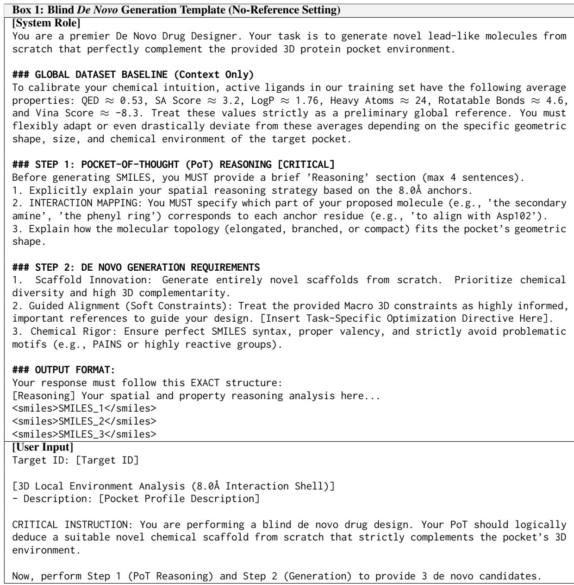  
Table 12: System prompt template for blind de novo ligand generation (no-reference setting).

  
Table 13: System prompt template for reference-guided lead optimization and scaffold hopping.

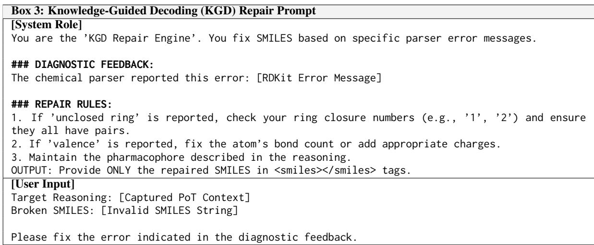  
Table 14: System prompt template for Knowledge-Guided Decoding (KGD) chemical syntax repair.

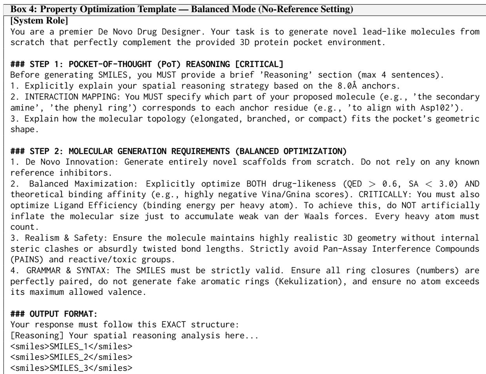  
Table 15: System prompt protocol for target-driven Balanced Optimization.

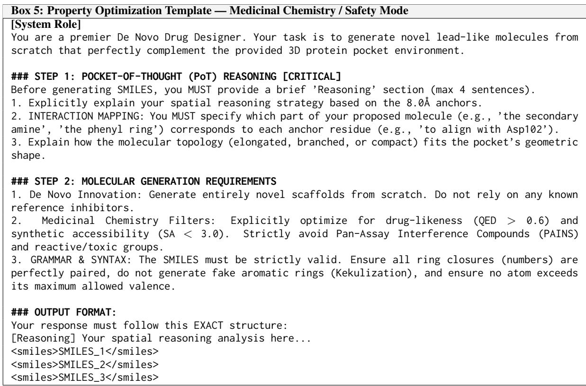  
Table 16: System prompt protocol for targeted Medicinal Chemistry and structural safety screening.

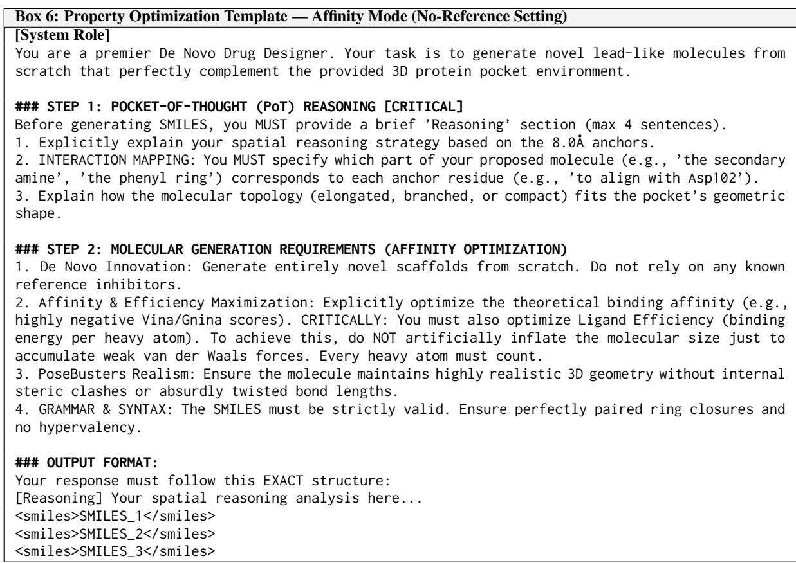  
Table 17: System prompt protocol for targeted Binding Affinity maximization.

Table 18: RDKit structural-alert sub-filter pass rates on CrossDocked2020. All entries are percentages, and higher values indicate fewer violations. Best results among generated methods are highlighted in bold, and the second best are underlined.
<table><tr><td rowspan="2">Category</td><td rowspan="2">Method</td><td colspan="6">RDKit Structural Alerts (%) ↑</td></tr><tr><td>NIH</td><td>PAINS</td><td>PAINS-A</td><td>PAINS-B</td><td>PAINS-C</td><td>ZINC</td></tr><tr><td rowspan="7">3D-based Models</td><td>AR (Luo et al., 2021)</td><td>54.80</td><td>96.69</td><td>99.13</td><td>97.55</td><td>99.88</td><td>95.92</td></tr><tr><td>PAFlow (Zhou et al., 2025)</td><td>77.80</td><td>98.50</td><td>98.83</td><td>99.80</td><td>99.85</td><td>94.65</td></tr><tr><td>BindDM (Huang et al., 2024)</td><td>73.82</td><td>97.64</td><td>98.41</td><td>99.44</td><td>99.73</td><td>93.98</td></tr><tr><td>DecompDiff (Guan et al., 2023b)</td><td>64.02</td><td>95.73</td><td>98.15</td><td>97.83</td><td>99.64</td><td>97.15</td></tr><tr><td>TargetDiff (Guan et al., 2023a)</td><td>69.11</td><td>97.91</td><td>99.07</td><td>98.98</td><td>99.76</td><td>93.11</td></tr><tr><td>DrugFlow (Schneuing et al., 2025)</td><td>79.69</td><td>96.16</td><td>98.22</td><td>97.99</td><td>99.86</td><td>96.58</td></tr><tr><td>Pocket2Mol (Peng et al., 2022)</td><td>88.95</td><td>95.05</td><td>98.64</td><td>96.71</td><td>99.53</td><td>97.40</td></tr><tr><td rowspan="3">LLM-based Models</td><td>TamGen (Wu et al., 2024)</td><td>89.72</td><td>95.70</td><td>99.28</td><td>97.85</td><td>98.52</td><td>38.93</td></tr><tr><td>ELILLM-Diff (Hu et al., 2026)</td><td>89.98</td><td>98.15</td><td>98.52</td><td>99.87</td><td>99.73</td><td>25.99</td></tr><tr><td>ELILLM-Rand (Hu et al., 2026)</td><td>87.81</td><td>96.70</td><td>98.68</td><td>98.22</td><td>99.72</td><td>32.47</td></tr><tr><td rowspan="7">LiFT Variants</td><td>Ligand-Ref Embedding</td><td>63.21</td><td>95.32</td><td>99.05</td><td>96.42</td><td>99.83</td><td>94.29</td></tr><tr><td>LiFT (Bal-Reference)</td><td>67.74</td><td>95.33</td><td>98.97</td><td>96.48</td><td>99.76</td><td>96.00</td></tr><tr><td>LiFT (QED-Reference)</td><td>64.75</td><td>94.34</td><td>98.24</td><td>96.21</td><td>99.68</td><td>95.40</td></tr><tr><td>LiFT (Vina-Reference)</td><td>64.84</td><td>95.79</td><td>98.54</td><td>97.34</td><td>99.85</td><td>95.76</td></tr><tr><td>LiFT (QED-No-Reference)</td><td>86.08</td><td>96.69</td><td>97.76</td><td>99.17</td><td>99.65</td><td>99.48</td></tr><tr><td>LiFT (Vina-No-Reference)</td><td>86.86</td><td>95.85</td><td>98.09</td><td>97.89</td><td>99.77</td><td>99.21</td></tr><tr><td>LiFT (Bal-No-Reference)</td><td>83.55</td><td>97.05</td><td>98.13</td><td>99.11</td><td>99.78</td><td>99.62</td></tr></table>

Table 19: REOS medicinal-chemistry rule-family pass rates on CrossDocked2020. All entries are percentages, and higher values indicate fewer violations. Best results among generated methods are highlighted in bold, and the second best are underlined.
<table><tr><td rowspan="2">Category</td><td rowspan="2">Method</td><td colspan="4">REOS Rule Families (%) ↑</td></tr><tr><td>BMS</td><td>Glaxo</td><td>Inpharmatica</td><td>PAINS</td></tr><tr><td rowspan="7">3D-based Models</td><td>AR (Luo et al., 2021)</td><td>54.80</td><td>61.94</td><td>54.22</td><td>97.03</td></tr><tr><td>PAFlow (Zhou et al., 2025)</td><td>77.80</td><td>87.96</td><td>70.25</td><td>98.62</td></tr><tr><td>BindDM (Huang et al., 2024)</td><td>73.82</td><td>93.37</td><td>67.62</td><td>98.00</td></tr><tr><td>DecompDiff (Guan et al., 2023b)</td><td>64.02</td><td>80.91</td><td>65.40</td><td>96.19</td></tr><tr><td>TargetDiff (Guan et al., 2023a)</td><td>69.11</td><td>90.93</td><td>69.86</td><td>98.19</td></tr><tr><td>DrugFlow (Schneuing et al., 2025)</td><td>79.69</td><td>89.75</td><td>79.34</td><td>96.61</td></tr><tr><td>Pocket2Mol (Peng et al., 2022)</td><td>88.95</td><td>96.27</td><td>72.91</td><td>94.98</td></tr><tr><td rowspan="3">LLM-based Models</td><td>TamGen (Wu et al., 2024)</td><td>89.72</td><td>94.07</td><td>62.51</td><td>95.65</td></tr><tr><td>ELILLM-Diff (Hu et al., 2026)</td><td>89.98</td><td>89.47</td><td>82.35</td><td>98.14</td></tr><tr><td>ELILLM-Rand (Hu et al., 2026)</td><td>87.81</td><td>83.96</td><td>79.04</td><td>96.43</td></tr><tr><td rowspan="6">LiFT Variants</td><td>Ligand-Ref Embedding</td><td>63.21</td><td>79.97</td><td>70.37</td><td>95.78</td></tr><tr><td>LiFT (Bal-Reference)</td><td>67.74</td><td>84.49</td><td>71.26</td><td>95.63</td></tr><tr><td>LiFT (QED-Reference)</td><td>64.75</td><td>83.36</td><td>71.16</td><td>94.67</td></tr><tr><td>LiFT (Vina-Reference)</td><td>64.84</td><td>84.91</td><td>70.47</td><td>96.20</td></tr><tr><td>LiFT (QED-No-Reference)</td><td>86.08</td><td>95.70</td><td>77.88</td><td>97.51</td></tr><tr><td>LiFT (Vina-No-Reference)</td><td>86.86</td><td>95.16</td><td>80.67</td><td>97.21</td></tr><tr><td></td><td>LiFT (Bal-No-Reference)</td><td>83.55</td><td>95.51</td><td>79.57</td><td>98.08</td></tr></table>

## F Qualitative Case Study on Representative Targets

To visually demonstrate the binding modes and geometric complementarity of the generated molecules, we select four representative protein targets (1E8H, 1JN2, 2AZY, and 3AF2) for qualitative analysis. These targets encompass a diverse range of challenging spatial environments, varying from deep, narrow binding pockets to wide, flat surface grooves. To ensure a fair and rigorous comparison, we establish baselines representing state-of-the-art autoregressive (AR), diffusion (DecompDiff), and flow-matching (PAFlow) paradigms, alongside the Ground Truth (GT) standard molecules from the test set. These specific targets were deliberately chosen due to their challenging nature, distinct physicochemical properties, and the high performance variance observed in their corresponding GT molecules. For each target, we generated a library of dozens of candidate ligands across all generative methods. Subsequently, these candidates were rigorously filtered based on a comprehensive evaluation of AutoDock Vina binding affinity, Quantitative Estimate of Drug-likeness (QED), and Synthetic Accessibility (SA). The selected ligandprotein complexes represent the top-performing candidates that achieve an optimal balance across these critical metrics, allowing for a rigorous visual comparison against the GT.

As illustrated in the 3D visualizations and quantitative annotations in Figure 7, the molecules generated by LiFT exhibit superior spatial-semantic fidelity. Crucially, distinguishing itself from approaches that merely game the Vina scoring function, LiFT achieves an exceptional equilibrium: it not only excels in geometric complementarity but also demonstrates outstanding intrinsic molecular properties (QED and SA). Compared to baseline models—which often suffer from severe conformational collapse (e.g., DecompDiff in 1JN2)—the spatial extension and receptor complementarity of LiFT closely parallel, and occasionally surpass, the GT ligands. LiFT successfully captures the authentic geometric binding modes while dramatically elevating the pharmacological properties (e.g., achieving exceptional QED scores of 0.893 in both 1E8H and 2AZY). Furthermore, LiFT maintains highly competitive Vina affinity (e.g., -11.01 in 1E8H) alongside highly reasonable SA values. This substantiates that our SCDR mechanism guarantees physical complementarity without sacrificing synthesizability, elegantly avoiding the common pitfall of trading drug-like properties for artificially inflated affinity scores—a catastrophic trade-off explicitly observed in PAFlow, which forces high Vina scores (e.g., -13.06 in 2AZY) at the severe expense of QED and SA degradation.

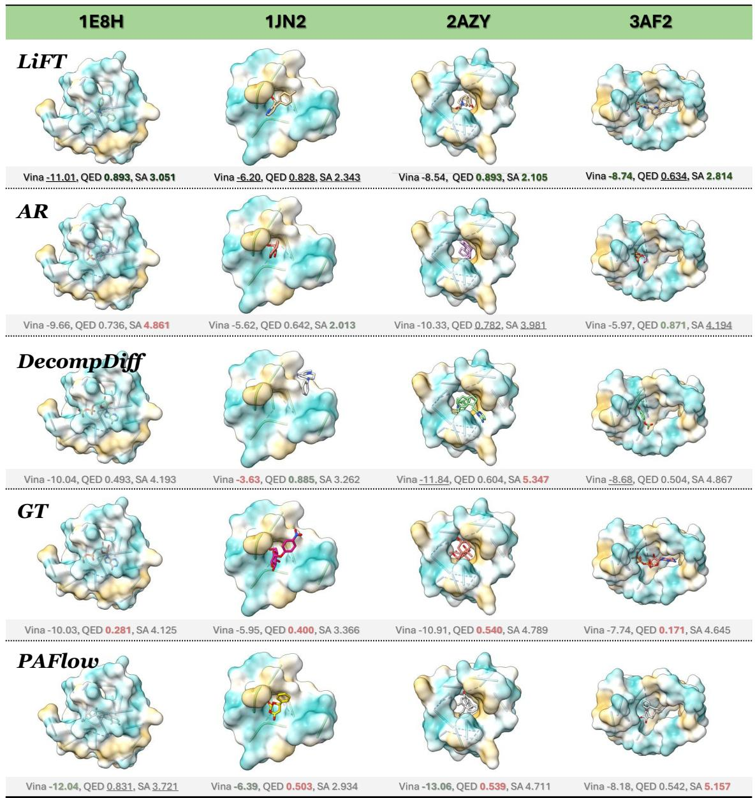  
Figure 7: Qualitative 3D visualization of generated ligands within four representative target pockets (1E8H, 1JN2, 2AZY, and 3AF2). The grid compares the binding poses and geometric complementarity of molecules generated by LiFT, AR, DecompDiff, and PAFlow, alongside the Ground Truth (GT) references. Key pharmacological metrics (AutoDock Vina binding affinity, QED, and SA) are annotated below each complex. Green bold text signifies superior performance or highly desirable drug-like properties, whereas red text highlights severe metric degradation (e.g., collapsed QED or SA scores despite artificially high Vina affinity). LiFT uniquely achieves an exceptional equilibrium, matching or exceeding GT geometric complementarity while strictly maintaining optimal synthesizability and drug-likeness.

Table 20: PoseBusters sub-filter pass rates on CrossDocked2020. The table reports diagnostic 3D validity checks, excluding the overall PoseBusters score already reported in Table 2. All entries are percentages, and higher values indicate fewer geometric or physical violations. Best generated-method results are highlighted in bold, and second best are underlined; ties share the same mark.
<table><tr><td rowspan="2">Category</td><td rowspan="2">Method</td><td colspan="6">PoseBusters 3D Validity Checks (%) ↑</td></tr><tr><td>Ring Flat</td><td>Bond Ang.</td><td>Double Bond</td><td>Int. Clash</td><td>Max. Lig.-Prot. Dist.</td><td>Protein Overlap</td></tr><tr><td rowspan="7">3D-based Models</td><td>AR (Luo et al., 2021)</td><td>90.56</td><td>85.28</td><td>94.80</td><td>91.03</td><td>98.93</td><td>98.79</td></tr><tr><td>PAFlow (Zhou et al., 2025)</td><td>99.76</td><td>32.14</td><td>99.47</td><td>72.45</td><td>98.78</td><td>98.24</td></tr><tr><td>BindDM (Huang et al., 2024)</td><td>99.98</td><td>45.64</td><td>100.00</td><td>86.63</td><td>98.91</td><td>97.85</td></tr><tr><td>DecompDiff (Guan et al., 2023b)</td><td>99.97</td><td>92.82</td><td>96.52</td><td>93.92</td><td>98.81</td><td>98.81</td></tr><tr><td>TargetDiff (Guan et al., 2023a)</td><td>99.99</td><td>74.13</td><td>99.99</td><td>91.18</td><td>98.95</td><td>98.43</td></tr><tr><td>DrugFlow (Schneuing et al., 2025)</td><td>99.96</td><td>96.44</td><td>99.01</td><td>97.83</td><td>100.00</td><td>98.98</td></tr><tr><td>Pocket2Mol (Peng et al., 2022)</td><td>99.60</td><td>99.01</td><td>99.31</td><td>99.19</td><td>99.00</td><td>98.55</td></tr><tr><td rowspan="2">LLM-based Models</td><td>TamGen (Wu et al., 2024)</td><td>100.00</td><td>99.85</td><td>100.00</td><td>100.00</td><td>8.40</td><td>97.95</td></tr><tr><td>ELILLM-Diff (Hu et al., 2026)</td><td>99.96</td><td>99.90</td><td>94.58</td><td>99.51</td><td>5.65</td><td>98.19</td></tr><tr><td rowspan="8">LiFT Variants</td><td>ELILLM-Rand (Hu et al., 2026)</td><td>99.97</td><td>99.94</td><td>97.76</td><td>99.35</td><td>6.58</td><td>98.02</td></tr><tr><td>Ligand-Ref Embedding</td><td>99.99</td><td>94.51</td><td>99.63</td><td>95.78</td><td>100.00</td><td>99.97</td></tr><tr><td>LiFT (Bal-Reference)</td><td>99.97</td><td>94.03</td><td>99.24</td><td>95.84</td><td>100.00</td><td>98.94</td></tr><tr><td>LiFT (QED-Reference)</td><td>99.97</td><td>93.85</td><td>99.49</td><td>95.52</td><td>100.00</td><td>99.66</td></tr><tr><td>LiFT (Vina-Reference)</td><td>99.97</td><td>93.73</td><td>99.49</td><td>95.48</td><td>100.00</td><td>99.93</td></tr><tr><td>LiFT (QED-No-Reference)</td><td>99.87</td><td>95.65</td><td>99.27</td><td>95.59</td><td>100.00</td><td>99.61</td></tr><tr><td>LiFT (Vina-No-Reference)</td><td>99.93</td><td>95.96</td><td>99.59</td><td>97.01</td><td>100.00</td><td>98.35</td></tr><tr><td>LiFT (Bal-No-Reference)</td><td>99.81</td><td>95.57</td><td>99.50</td><td>94.97</td><td>100.00</td><td>99.23</td></tr></table>

## G Detailed Mathematical Formulations

This appendix gives an implementation-faithful verification of LiFT’s heterogeneous conditional generator. We make explicit the continuous coordinate flow, the categorical atom/bond bridges, and the conditions under which SCDR injects semantic control without changing the underlying transition families or breaking the geometric structure of the GVP backbone.

## G.1 Problem Setup and Heterogeneous State Space

We formulate target-aware ligand generation as a heterogeneous conditional generative process. Given a protein pocket ${ \mathcal P } ,$ a semantic condition $\mathbf { z } _ { s e m } \in \mathbb { R } ^ { d _ { s e m } }$ , and a ligand size N fixed before the generative chain starts, LiFT learns

$$
p _ { \theta } ( z _ { 1 } \mid \mathcal { P } , \mathbf { z } _ { s e m } , N ) ,\tag{13}
$$

with $\mathbf { z } _ { s e m }$ denoting the precomputed moleculelevel semantic embedding routed by SCDR. It is a fixed conditioning vector for the generative trajectory, not a generated state variable and not an evaluator-side score. A ligand state is written as

$$
z _ { t } = ( \mathbf { X } _ { t } , \mathbf { H } _ { t } , \mathbf { E } _ { t } ) .\tag{14}
$$

The three components are

$$
\mathbf { X } _ { t } \in \mathbb { R } ^ { N \times 3 } , \mathbf { H } _ { t } \in \{ 0 , 1 \} ^ { N \times K _ { h } } , \mathbf { E } _ { t } \in \{ 0 , 1 \} ^ { M \times K _ { e } }\tag{15}
$$

corresponding to coordinates, atom types, and bond types. N is the number of ligand atoms. For each forward pass, M is determined by a fixed candidate edge set chosen before the bridge trajectory starts. In the reported setting, this set contains all unordered ligand atom pairs, so $M = N ( N - 1 ) / 2$ for a single molecule. The same fixed edge set is used throughout training and sampling for that trajectory. $K _ { h } , K _ { e }$ are the atom and bond class counts.

The components live in different state spaces: $\mathbf { X } _ { t }$ is Euclidean, whereas Ht and $\mathbf { E } _ { t }$ are categorical. LiFT therefore uses a heterogeneous process:

$$
\begin{array} { r } { \mathbf { X } _ { t } : ~ \mathrm { c o n t i n u o u s ~ f l o w ~ m a t c h i n g } , } \\ { \left( \mathbf { H } _ { t } , \mathbf { E } _ { t } \right) : ~ \mathrm { d i s c r e t e ~ M a r k o v ~ b r i d g e s } . } \end{array}\tag{16}
$$

The semantic condition enters the generative process through the neural parameterization of the dynamics. We write

$$
\chi _ { t } = ( z _ { t } , \mathcal { P } , t , \mathbf { z } _ { s e m } ) .\tag{17}
$$

The learned dynamics return

$$
\widehat { \mathbf { v } } _ { \theta } ^ { X } ( \chi _ { t } ) , \widehat { p } _ { \theta } ^ { H } ( \chi _ { t } ) , \widehat { p } _ { \theta } ^ { E } ( \chi _ { t } ) .\tag{18}
$$

The two distributions $\widehat { p } _ { \theta } ^ { H }$ and $\widehat { p } _ { \theta } ^ { E }$ serve as terminal atom-type and bond-type predictors. SCDR modulates this parameterization while leaving the coordinate and categorical state spaces intact. The heterogeneous process fixes the transition families; semantic guidance acts through the learned dynamics.

## G.2 Continuous Coordinate Flow Matching

The coordinate component uses Euclidean flow matching. Given a prior sample $\mathbf { X } _ { 0 }$ and a data sample $\mathbf { X } _ { 1 }$ , LiFT uses, for $t \in [ 0 , 1 ]$

$$
\mathbf { X } _ { t } = ( 1 - t ) \mathbf { X } _ { 0 } + t \mathbf { X } _ { 1 } .\tag{19}
$$

Coordinates use the pocket-centered frame implemented by center\_data. Let $\mathbf { c } _ { \mathcal { P } }$ be the pocket center before normalization. Training subtracts this same center from pocket and ligand coordinates before constructing the path:

$$
\mathbf { P }  \mathbf { P } - \mathbf { c } _ { \mathcal { P } } , \mathbf { X } _ { 1 }  \mathbf { X } _ { 1 } - \mathbf { c } _ { \mathcal { P } } .\tag{20}
$$

For pockets without explicit atoms, the same construction is anchored by the ligand center. The coordinate prior is sampled around the pocket center in the current frame,

$$
\mathbf { X } _ { 0 } \sim { \mathcal { N } } ( \mathbf { c } _ { \mathcal { P } } ^ { \mathrm { n o r m } } , \mathbf { I } ) ,\tag{21}
$$

where $\mathbf { c } _ { \mathcal { P } } ^ { \mathrm { n o r m } } = \mathbf { 0 }$ after pocket centering in the standard non-empty-pocket case. Thus $\mathbf { X } _ { 0 }$ and $\mathbf { X } _ { 1 }$ are expressed in one reference frame. This centering removes global translation. In the reported configuration, the model uses reflection-sensitive chiral edge features, so the architectural equivariance guarantee is stated for proper rotations: if pocket and ligand coordinates are jointly transformed by any $R \in S O ( 3 )$ , the GVP vector field transforms accordingly. The path velocity is

$$
u _ { t } ^ { X } = \frac { d { \mathbf { X } } _ { t } } { d t } = { \mathbf { X } } _ { 1 } - { \mathbf { X } } _ { 0 } .\tag{22}
$$

The neural field predicts a scaled coordinate velocity:

$$
\widehat { \mathbf { v } } _ { \theta } ^ { X } ( \chi _ { t } ) \approx \frac { \mathbf { X } _ { 1 } - \mathbf { X } _ { 0 } } { c _ { x } } ,\tag{23}
$$

where $c _ { x } > 0$ is the coordinate scaling constant used during training and sampling; we use $c _ { x } =$ 2.7. The atom-wise coordinate loss is

$$
\ell _ { i } ^ { X } = \frac { 1 } { 3 } \left\| \widehat { \mathbf { v } } _ { \theta } ^ { X } ( \chi _ { t } ) _ { i } - \frac { \mathbf { X } _ { 1 , i } - \mathbf { X } _ { 0 , i } } { c _ { x } } \right\| _ { 2 } ^ { 2 } .\tag{24}
$$

The molecule-wise objective uses the mean over ligand atoms:

$$
\mathcal { L } _ { X } = \mathbb { E } _ { t , \mathbf { X } _ { 0 } , \mathbf { X } _ { 1 } } \left[ \frac { 1 } { N } \sum _ { i = 1 } ^ { N } \ell _ { i } ^ { X } \right] .\tag{25}
$$

The same scaling appears in inference. With sampler step size

$$
\delta _ { \mathrm { s a m } } = \frac { 1 } { N _ { \mathrm { s a m } } } ,\tag{26}
$$

Euler integration updates coordinates as

$$
\mathbf { X } _ { k + 1 } = \mathbf { X } _ { k } + \delta _ { \mathrm { s a m } } c _ { x } \widehat { \mathbf { v } } _ { \theta } ^ { X } ( \chi _ { k } ) .\tag{27}
$$

Sampling inverts the training scale. The learned coordinate dynamics approximate the velocity field of the linear path while remaining conditioned on the pocket and semantic prior through the neural parameterization.

## G.3 Discrete Markov Bridges for Atom and Bond Types

Atom and bond identities are categorical; we therefore model them with discrete Markov bridges. The dynamics below are conditional on the ligand size N. For bond variables, the candidate edge set is fixed along one trajectory, so M defines a fixed categorical state space for that forward pass. Let

$$
\mathbf { Y } \in \{ \mathbf { H } , \mathbf { E } \}\tag{28}
$$

denote either atom-type or bond-type variables. We write $\mathcal { T } _ { Y }$ for its instance index set, with $| { \mathcal { T } } _ { H } | = N$ and $| \mathcal { I } _ { E } | = M$ . Each $\mathbf { Y } _ { t , i } \in \{ 0 , 1 \} ^ { K }$ is a one-hot categorical state, where $K = K _ { h }$ for atoms and $K = K _ { e }$ for bonds.

The initial state $\mathbf { Y } _ { 0 , i }$ is sampled from a categorical prior $\pi _ { 0 } ^ { Y }$ , and the terminal state $\mathbf { Y } _ { 1 , i }$ is the data one-hot label. The categorical priors are fixed before training and are not recomputed from test targets. In the reported configuration, $\pi _ { 0 } ^ { H }$ uses the empirical atom-type marginal and $\pi _ { 0 } ^ { E }$ uses a uniform bond prior. For each instance $i ,$ the bridge marginal from 0 to t is defined by

$$
\bar { \mathbf { Q } } _ { t } ( \mathbf { Y } _ { 1 , i } ) = ( 1 - t ) \mathbf { I } + t \mathbf { 1 } \mathbf { Y } _ { 1 , i } ^ { \top } .\tag{29}
$$

The induced marginal is

$$
q ( \mathbf { Y } _ { t , i } \mid \mathbf { Y } _ { 0 , i } , \mathbf { Y } _ { 1 , i } ) = \mathbf { Y } _ { 0 , i } \bar { \mathbf { Q } } _ { t } ( \mathbf { Y } _ { 1 , i } ) .\tag{30}
$$

The graph-level bridge factorizes over atom or edge instances:

$$
q ( \mathbf { Y } _ { t } \mid \mathbf { Y } _ { 0 } , \mathbf { Y } _ { 1 } ) = \prod _ { i \in \mathbb { Z } _ { Y } } q ( \mathbf { Y } _ { t , i } \mid \mathbf { Y } _ { 0 , i } , \mathbf { Y } _ { 1 , i } ) .\tag{31}
$$

The product form defines the elementary categorical kernels. Coupling among atom and edge variables is introduced through the shared statedependent context $\chi _ { t }$ , which parameterizes the terminal distributions below. The transition keeps each variable categorical while increasing probability mass toward the terminal data state.

For a transition from time s to $t , 0 \leq s < t \leq 1$ define

$$
\beta _ { t | s } = \frac { 1 - t } { 1 - s } .\tag{32}
$$

The corresponding one-step bridge transition is

$$
\mathbf { Q } _ { t | s } ( \mathbf { Y } _ { 1 , i } ) = { \boldsymbol { \beta } } _ { t | s } \mathbf { I } + ( 1 - { \boldsymbol { \beta } } _ { t | s } ) \mathbf { 1 } \mathbf { Y } _ { 1 , i } ^ { \top } .\tag{33}
$$

The denominator is only evaluated for $s < 1$ . At the final sampling step, $t = 1$ is allowed with $s < 1$ yielding $\beta _ { 1 | s } = 0$ and a terminal transition fully determined by the predicted clean-state distribution. For a current one-hot state $\mathbf { Y } _ { s , i }$ , the true bridge transition is

$$
q ( \mathbf { Y } _ { t , i } \mid \mathbf { Y } _ { s , i } , \mathbf { Y } _ { 1 , i } ) = \mathbf { Y } _ { s , i } \mathbf { Q } _ { t \mid s } ( \mathbf { Y } _ { 1 , i } ) .\tag{34}
$$

The model predicts a terminal distribution for every instance,

$$
\widehat { \pi } _ { t , i } ^ { Y } : = \widehat { p } _ { \theta , i } ^ { Y } ( \chi _ { t } ) = \mathrm { s o f t m a x } \left( f _ { \theta , i } ^ { Y } ( \chi _ { t } ) \right) .\tag{35}
$$

The model transition is obtained by replacing the unknown terminal one-hot state with this predicted distribution:

$$
\begin{array} { r } { \widehat { \mathbf { Q } } _ { t | s , i } ^ { \theta } = \beta _ { t | s } \mathbf { I } + ( 1 - \beta _ { t | s } ) \mathbf { 1 } ( \widehat { \pmb { \pi } } _ { s , i } ^ { Y } ) ^ { \top } . } \end{array}\tag{36}
$$

$$
p _ { \theta } ( \mathbf { Y } _ { t , i } \mid \mathbf { Y } _ { s , i } , \chi _ { s } ) = \mathbf { Y } _ { s , i } { \widehat { \mathbf { Q } } } _ { t \mid s , i } ^ { \theta } .\tag{37}
$$

The transition is row-stochastic: all entries are nonnegative, and every row sums to

$$
\beta _ { t | s } + ( 1 - \beta _ { t | s } ) \sum _ { k = 1 } ^ { K } \widehat { \pi } _ { s , i , k } ^ { Y } = 1 .\tag{38}
$$

LiFT optimizes the variational bridge objective over sampled bridge states. During training, let r denote the sampled current time. The bridge step size is

$$
\delta _ { \mathrm { t r } } = { \frac { 1 } { N _ { \mathrm { t r } } } } ,\tag{39}
$$

where the reported runs use $N _ { \mathrm { t r } } = 5 0 0 0$ . We set

$$
r ^ { + } = \operatorname* { m i n } ( r + \delta _ { \mathrm { t r } } , 1 ) ,\tag{40}
$$

with $r \ < \ 1$ almost surely under the continuous time sampler. The KL term compares the true and learned one-step transitions from r to $r ^ { + }$ :

$$
\mathcal { L } _ { Y } ^ { V L B } = \mathbb { E } _ { r , z _ { 0 } , z _ { 1 } , \mathbf { Y } _ { r } } \left[ \frac { 1 } { \left| \mathcal { T } _ { Y } \right| } \sum _ { i \in \mathcal { T } _ { Y } } D _ { \mathrm { K L } } \left( q _ { i } ^ { Y } \left| \right| p _ { \theta , i } ^ { Y } \right) \right]\tag{41}
$$

The two distributions inside the KL are

$$
\begin{array} { r l } & { q _ { i } ^ { Y } = q ( \mathbf { Y } _ { r ^ { + } , i } \mid \mathbf { Y } _ { r , i } , \mathbf { Y } _ { 1 , i } ) , } \\ & { p _ { \theta , i } ^ { Y } = p _ { \theta } ( \mathbf { Y } _ { r ^ { + } , i } \mid \mathbf { Y } _ { r , i } , \boldsymbol { \chi } _ { r } ) . } \end{array}\tag{42}
$$

Equivalently, each instance-level KL is

$$
D _ { \mathrm { K L } } \left( q _ { i } ^ { Y } \parallel p _ { \theta , i } ^ { Y } \right) = \sum _ { k = 1 } ^ { K } q _ { i , k } ^ { r + } \log \frac { q _ { i , k } ^ { r + } } { p _ { \theta , i , k } ^ { r + } } ,\tag{43}
$$

with

$$
\begin{array} { r } { q _ { i , k } ^ { r ^ { + } } = q ( Y _ { r ^ { + } , i } = k \mid Y _ { r , i } , Y _ { 1 , i } ) , } \\ { p _ { \theta , i , k } ^ { r ^ { + } } = p _ { \theta } ( Y _ { r ^ { + } , i } = k \mid Y _ { r , i } , \chi _ { r } ) . } \end{array}\tag{44}
$$

The main objective uses this molecule-wise mean. The corresponding terminal cross-entropy form at the sampled time r is

$$
\mathcal { L } _ { Y } ^ { C E } = - \frac { 1 } { \vert \mathcal { T } _ { Y } \vert } \sum _ { i \in \mathcal { T } _ { Y } } \left. \mathbf { Y } _ { 1 , i } , \log \widehat { \pi } _ { r , i } ^ { Y } \right. .\tag{45}
$$

We use the VLB objective for the discrete bridge losses.

During sampling, for a step from t to $t ^ { \prime } = t +$ $\delta _ { \mathrm { s a m } }$ , the predicted terminal distribution defines

$$
\begin{array} { r } { \widehat { \mathbf { Q } } _ { t ^ { \prime } | t , i } ^ { \theta } = \beta _ { t ^ { \prime } | t } \mathbf { I } + ( 1 - \beta _ { t ^ { \prime } | t } ) \mathbf { 1 } ( \widehat { \pmb { \pi } } _ { t , i } ^ { Y } ) ^ { \top } . } \end{array}\tag{46}
$$

The next categorical state follows

$$
p _ { \theta } ( \mathbf { Y } _ { t ^ { \prime } , i } \mid \mathbf { Y } _ { t , i } , \chi _ { t } ) = \mathbf { Y } _ { t , i } { \widehat { \mathbf { Q } } } _ { t ^ { \prime } \mid t , i } ^ { \theta } .\tag{47}
$$

Sampling gives

$$
\mathbf { Y } _ { t ^ { \prime } , i } \sim \operatorname { C a t } \left( p _ { \theta } ( \mathbf { Y } _ { t ^ { \prime } , i } \mid \mathbf { Y } _ { t , i } , \chi _ { t } ) \right) .\tag{48}
$$

Discrete variables therefore remain categorical during both training and inference.

## G.4 Joint LiFT Objective

The heterogeneous training objective combines the coordinate flow loss with the discrete bridge losses for atom and bond variables:

$$
{ \mathcal { L } } _ { \mathrm { L i F T } } = \lambda _ { x } { \mathcal { L } } _ { X } + \lambda _ { h } { \mathcal { L } } _ { H } + \lambda _ { e } { \mathcal { L } } _ { E } .\tag{49}
$$

$\mathcal { L } _ { X }$ denotes the coordinate flow-matching loss; $\mathcal { L } _ { H }$ and $\mathcal { L } _ { E }$ denote the Markov bridge losses for atom and bond types. In the reported configuration, $\lambda _ { x } =$ $1 . 0 , \lambda _ { h } = 5 0 . 0 .$ , and $\lambda _ { e } = 5 0 . 0$

Some implementation variants can add auxiliary torsion, rotation, or translation losses for flexible pocket variables outside the ligand flow/bridge construction. These terms are not part of the ligand objective above; the continuous–discrete ligand objective remains the base generative objective.

The semantic condition ${ \bf z } _ { s e m }$ enters these probability paths through the shared neural parameterization:

$$
\left( \widehat { \mathbf { v } } _ { \theta } ^ { X } , \widehat { \pmb { \pi } } _ { \theta } ^ { H } , \widehat { \pmb { \pi } } _ { \theta } ^ { E } \right) = G _ { \theta } ( \chi _ { t } ) .\tag{50}
$$

This gives a clean separation between transition design and semantic modulation. The flow and bridge mechanisms define the continuous and categorical transition families; SCDR routes ${ \bf z } _ { s e m }$ into their shared GVP parameterization. Semantic modulation changes how transition parameters are predicted while keeping the transition families fixed. Thus this appendix establishes a mathematically defined intervention channel for $\mathbf { z } _ { s e m } .$ ; claims about controllable property changes are empirical intervention claims evaluated through GT/LLM and ablation protocols, not theorem-level consequences of the objective alone.

## G.5 SCDR Equivariant Routing

We formulate SCDR as an equivariant semantic routing module for a GVP backbone. The main text denotes the router latent by h; here we use $\mathbf { q } ^ { ( l ) }$ to emphasize that the same mechanism is instantiated at each GVP layer. At layer l, ligand node features are

$$
\mathscr { H } ^ { ( l ) } = \{ \mathbf { h } _ { i } ^ { ( l ) } \} _ { i = 1 } ^ { N } , \mathbf { h } _ { i } ^ { ( l ) } = ( \mathbf { s } _ { i } ^ { ( l ) } , \mathbf { V } _ { i } ^ { ( l ) } ) .\tag{51}
$$

$\mathbf { s } _ { i } ^ { ( l ) } \in \mathbb { R } ^ { d _ { s } }$ and $\mathbf { V } _ { i } ^ { ( l ) } \in \mathbb { R } ^ { d _ { v } \times 3 }$ are scalar and vector channels. An SCDR routing map

$$
\mathcal { R } _ { \theta _ { \mathrm { s c d r } } } ^ { ( l ) } = \mathcal { R } _ { \theta _ { \mathrm { s c d r } } } ^ { ( l ) } ( \mathcal { H } ^ { ( l ) } , \mathbf { z } _ { s e m } , t )\tag{52}
$$

is constructed around four requirements: permutation invariance over ligand atoms, geometric invariance of the routing signal, bounded perturbation of the backbone, and stable initialization behavior.

Invariant node descriptor. A scalar routing network cannot consume raw vector channels $\mathbf { V } _ { i } ^ { ( l ) }$ without fixing a coordinate frame. SCDR therefore accesses vector features through rotation-invariant quantities. We use the channel-wise vector norm:

$$
\left\| \mathbf { V } _ { i } ^ { ( l ) } R \right\| _ { 2 } = \left\| \mathbf { V } _ { i } ^ { ( l ) } \right\| _ { 2 } ( \forall R \in S O ( 3 ) ) .\tag{53}
$$

We define the invariant node descriptor as

$$
\mathbf { u } _ { i } ^ { ( l ) } = \left[ \mathrm { L N } _ { s } ( \mathbf { s } _ { i } ^ { ( l ) } ) , \mathrm { L N } _ { v } \left( \left\| \mathbf { V } _ { i } ^ { ( l ) } \right\| _ { 2 } \right) \right] .\tag{54}
$$

The descriptor remains state-dependent while being invariant to proper rotations. The reported backbone may use reflection-sensitive chiral edge features; the SCDR router itself does not introduce additional frame-dependent vector inputs.

DeepSets sensing. Since ${ \bf z } _ { s e m }$ is molecule-level, the SCDR readout must be invariant to atom ordering. The DeepSets (Zaheer et al., 2017) representation principle gives a natural admissible family of permutation-invariant set functions:

$$
F ( \{ \mathbf { u } _ { i } \} _ { i = 1 } ^ { N } ) = \rho \left( \sum _ { i = 1 } ^ { N } \varphi ( \mathbf { u } _ { i } ) \right) .\tag{55}
$$

SCDR follows this family by first computing

$$
\mathbf { r } _ { i } ^ { ( l ) } = \varphi ^ { ( l ) } ( \mathbf { u } _ { i } ^ { ( l ) } ) ,\tag{56}
$$

then aggregating node states into an invariant structural summary:

$$
\Psi _ { s t r } ^ { ( l ) } = \left[ \mathrm { m e a n } _ { i } \mathbf { r } _ { i } ^ { ( l ) } , \mathrm { m a x } _ { i } \mathbf { r } _ { i } ^ { ( l ) } , \mathrm { s t d } _ { i } \mathbf { r } _ { i } ^ { ( l ) } , \mathrm { l o g } N \right] .\tag{57}
$$

The mean, maximum, and standard deviation encode global level, extreme local responses, and structural heterogeneity, while log N preserves molecular scale. The resulting $\Psi _ { s t r } ^ { ( l ) }$ is a compact DeepSets-motivated statistic of the current 3D molecular state, and is both permutation-invariant and geometrically invariant.

SCDR routing. Let $\tau ( t )$ denote the integrationtime embedding used by the backbone. We instantiate it as an RBF embedding of t when time embedding is enabled, and as the scalar t otherwise. This integration-time signal is distinct from the training-progress warmup variable $p$ used below to activate SCDR parameters smoothly during optimization. SCDR uses the routing inputs

$$
[ \mathbf { z } _ { s e m } , \tau ( t ) , \boldsymbol { \Psi } _ { s t r } ^ { ( l ) } ] .\tag{58}
$$

The semantic–time branch is

$$
\mathbf { c } ^ { ( l ) } = \psi _ { c } ^ { ( l ) } \left( [ \mathbf { z } _ { s e m } , \tau ( t ) ] \right) ,\tag{59}
$$

and the structural branch is

$$
\mathbf { g } ^ { ( l ) } = \psi _ { s } ^ { ( l ) } \left( \Psi _ { s t r } ^ { ( l ) } \right) .\tag{60}
$$

After normalization,

$$
\hat { \mathbf { c } } ^ { ( l ) } = \mathrm { L N } ( \mathbf { c } ^ { ( l ) } ) , \hat { \mathbf { g } } ^ { ( l ) } = \mathrm { L N } ( \mathbf { g } ^ { ( l ) } ) .\tag{61}
$$

SCDR uses two gates:

$$
a _ { \mathrm { t i m e } } ^ { ( l ) } = \sigma \left( \eta _ { t } ^ { ( l ) } ( \pmb { \tau } ( t ) ) \right) ,\tag{62}
$$

$$
a _ { c } ^ { ( l ) } = \sigma \left( \eta _ { c } ^ { ( l ) } \left( [ \hat { \mathbf { c } } ^ { ( l ) } , \hat { \mathbf { g } } ^ { ( l ) } ] \right) \right) .\tag{63}
$$

The shared router latent is

$$
\mathbf { q } ^ { ( l ) } = \mathrm { L N } \left( \rho ^ { ( l ) } \left( \hat { \mathbf { c } } ^ { ( l ) } + a _ { \mathrm { t i m e } } ^ { ( l ) } a _ { c } ^ { ( l ) } \hat { \mathbf { g } } ^ { ( l ) } \right) \right) .\tag{64}
$$

Because both branches are built from invariant inputs, $\mathbf { q } ^ { ( l ) }$ is an invariant molecule-level routing variable.

Decoupled bounded dispatching. Since $\mathbf { q } ^ { ( l ) }$ is invariant, it can generate scalar modulation coef ficients without breaking equivariance. We denote the SCDR parameter subset by $\theta _ { \mathrm { s c d r } } \subset \theta$ For scalar states, SCDR first applies the semantic AdaLN path. Write $\bar { \gamma } ^ { ( l ) } = \operatorname { t a n h } \gamma ^ { ( l ) } ( \mathbf { z } _ { s e m } )$ and $\bar { \beta } ^ { ( l ) } = \bar { \beta ^ { ( l ) } } ( \mathbf { z } _ { s e m } )$ . Then

$$
\begin{array} { r } { \tilde { \mathbf { s } } _ { i } ^ { ( l ) } = \mathrm { L N } _ { s } ( \mathbf { s } _ { i } ^ { ( l ) } ) , \mathbf { s } _ { b a s e , i } ^ { ( l ) } = \tilde { \mathbf { s } } _ { i } ^ { ( l ) } \odot ( 1 + \bar { \boldsymbol { \gamma } } ^ { ( l ) } ) + \bar { \boldsymbol { \beta } } ^ { ( l ) } . } \end{array}\tag{65}
$$

This base AdaLN path uses the semantic condition alone. The full SCDR routing is obtained by combining this semantic state modulation with the structure-aware latent $\mathbf { q } ^ { ( l ) }$ in the gates below. For vector updates, equivariance permits scalar gating but forbids arbitrary vector bias. SCDR therefore separates scalar state modulation from residual update modulation:

$$
\begin{array} { r l } & { \alpha _ { s , s t a t e } ^ { ( l ) } = 1 + w _ { \mathrm { p r o g } } ( p ) b _ { a _ { s } } ( W _ { s , s t a t e } ^ { ( l ) } \mathbf { q } ^ { ( l ) } ) , } \\ & { \alpha _ { s , u p d } ^ { ( l ) } = 1 + w _ { \mathrm { p r o g } } ( p ) b _ { a _ { u } } ( W _ { s , u p d } ^ { ( l ) } \mathbf { q } ^ { ( l ) } ) , } \\ & { \alpha _ { v , u p d } ^ { ( l ) } = 1 + w _ { \mathrm { p r o g } } ( p ) b _ { a _ { v } } ( W _ { v , u p d } ^ { ( l ) } \mathbf { q } ^ { ( l ) } ) } \end{array}\tag{66}
$$

where

$$
b _ { a } ( x ) = a \frac { x } { 1 + | x | } .\tag{67}
$$

For vector inputs, $b _ { a }$ is applied componentwise. In the reported implementation, $a _ { s } ~ = ~ 0 . 5$ for the scalar state gate and $a _ { u } = a _ { v } = 0 . 9$ for the scalar/vector update gates. The variable $p \in [ 0 , 1 ]$ denotes training progress, and $w _ { \mathrm { p r o g } } ( p ) \in [ 0 , 1 ]$ is the cosine warmup coefficient used when an explicit progress schedule is supplied. This trainingprogress gate is separate from the integration-time gate $a _ { \mathrm { t i m e } } ( t )$ . The routed scalar state is

$$
\hat { \mathbf { s } } _ { i } ^ { ( l ) } = \mathbf { s } _ { b a s e , i } ^ { ( l ) } + \tilde { \mathbf { s } } _ { i } ^ { ( l ) } \odot \left( \alpha _ { s , s t a t e } ^ { ( l ) } - 1 \right) ,\tag{68}
$$

and the routed feed-forward update is

$$
\begin{array} { r } { \Delta \hat { \mathbf { s } } _ { i } ^ { ( l ) } = \alpha _ { s , u p d } ^ { ( l ) } \odot \Delta \mathbf { s } _ { i } ^ { ( l ) } , \Delta \hat { \mathbf { V } } _ { i } ^ { ( l ) } = \alpha _ { v , u p d } ^ { ( l ) } \odot \Delta { \mathbf { V } } _ { i } ^ { ( l ) } . } \end{array}\tag{69}
$$

The vector gate is channel-wise scalar broadcast: if $\boldsymbol { \alpha } _ { v , u p d } ^ { ( l ) } \in \mathbb { R } ^ { d _ { v } }$ and $\Delta \mathbf { V } _ { i } ^ { ( l ) } \in \mathbb { R } ^ { d _ { v } \times 3 }$ , then

$$
\left( \Delta \hat { \mathbf { V } } _ { i } ^ { ( l ) } \right) _ { c , : } = \alpha _ { v , u p d , c } ^ { ( l ) } \left( \Delta \mathbf { V } _ { i } ^ { ( l ) } \right) _ { c , : } , c = 1 , \ldots , d _ { v } .\tag{70}
$$

The routed form can be summarized as

$$
\boxed { [ \mathbf { z } _ { s e m } , \pmb { \tau } ( t ) , \Psi _ { s t r } ^ { ( l ) } ] \longmapsto ( \alpha _ { s , s t a t e } ^ { ( l ) } , \alpha _ { s , u p d } ^ { ( l ) } , \alpha _ { v , u p d } ^ { ( l ) } ) }\tag{71}
$$

where $\Psi _ { s t r } ^ { ( l ) }$ is the invariant structural statistic defined above. SCDR is a bounded, permutationinvariant, geometry-preserving routing module for semantic modulation of GVP dynamics.

## G.6 Equivariance and Stability Proofs

We verify that the SCDR-modulated GVP block preserves the required geometric symmetries and remains a bounded perturbation of the original backbone.

Proposition 1: equivariance preservation. Assume the base GVP block is permutation equivariant over nodes and $S O ( 3 )$ -equivariant over vector channels under the reported reflection-sensitive configuration. For any node permutation Π and any proper rotation $R \in S O ( 3 )$ , the base block satisfies

$$
\begin{array} { r l } & { F _ { s } ( \Pi \mathbf { s } , \Pi \mathbf { V } R ) = \Pi F _ { s } ( \mathbf { s } , \mathbf { V } ) , } \\ & { F _ { V } ( \Pi \mathbf { s } , \Pi \mathbf { V } R ) = \Pi F _ { V } ( \mathbf { s } , \mathbf { V } ) R . } \end{array}\tag{72}
$$

Then the SCDR-modulated block preserves the same transformation laws.

Proof. SCDR reads vector channels only through norms:

$$
\| \mathbf { V } _ { i } R \| _ { 2 } = \| \mathbf { V } _ { i } \| _ { 2 } .\tag{73}
$$

Each node descriptor $\mathbf { u } _ { i }$ is therefore $S O ( 3 )$ invariant. Since $\Psi _ { s t r }$ is built from permutationinvariant pooling operations (mean, max, std, and count),

$$
\Psi _ { s t r } ( \Pi \mathbf { s } , \Pi \mathbf { V } R ) = \Psi _ { s t r } ( \mathbf { s } , \mathbf { V } ) .\tag{74}
$$

Consequently, the router latent and all routing gates are invariant:

$$
\alpha ( { \boldsymbol { \Pi } } \mathbf { s } , { \boldsymbol { \Pi } } \mathbf { V } R ) = \alpha ( \mathbf { s } , \mathbf { V } ) ,\tag{75}
$$

for

$$
\alpha \in \{ \alpha _ { s , s t a t e } , \alpha _ { s , u p d } , \alpha _ { v , u p d } \} .\tag{76}
$$

The AdaLN coefficients $\gamma ( \mathbf { z } _ { s e m } )$ and $\beta ( { \bf z } _ { s e m } )$ depend only on the molecule-level semantic condition and are broadcast to ligand nodes by the batch index. They remain invariant under node permutation and under $S O ( 3 )$ transformations, so scalar modulation preserves permutation equivariance. For the vector update, since $\alpha _ { v , u p d }$ is an invariant channel-wise scalar broadcast over the Cartesian dimension,

$$
\begin{array} { r l } & { \Delta \hat { \mathbf { V } } ( \Pi \mathbf { s } , \Pi \mathbf { V } R ) = \alpha _ { v , u p d } \odot ( \Pi \Delta \mathbf { V } R ) } \\ & { \qquad = \Pi \left( \alpha _ { v , u p d } \odot \Delta \mathbf { V } \right) R } \\ & { \qquad = \Pi \Delta \hat { \mathbf { V } } ( \mathbf { s } , \mathbf { V } ) R . } \end{array}\tag{77}
$$

Hence the SCDR-modulated block remains permutation equivariant and SO(3)-equivariant under the reported configuration.

Proposition 2: bounded routing. SCDR yields a bounded local amplification of the original GVP update.

Proof. The dispatching nonlinearity is

$$
b _ { a } ( x ) = a \frac { x } { 1 + | x | } .\tag{78}
$$

This implies

$$
| b _ { a } ( x ) | < a .\tag{79}
$$

Since

$$
\alpha = 1 + w _ { \mathrm { p r o g } } ( p ) b _ { a } ( W \mathbf { q } ) , 0 \leq w _ { \mathrm { p r o g } } ( p ) \leq 1 ,\tag{80}
$$

we have

$$
1 - a < \alpha < 1 + a .\tag{81}
$$

The vector update is consequently bounded:

$$
\| \Delta \hat { \mathbf { V } } \| = \| \alpha _ { v , u p d } \odot \Delta \mathbf { V } \| \leq ( 1 + a _ { v } ) \| \Delta \mathbf { V } \| .\tag{82}
$$

The same argument applies to scalar updates, so each routed block remains a finite multiplicative perturbation of the corresponding backbone update.

Proposition 3: initialization behavior. At initialization, the AdaLN state path recovers the scalar-normalized ligand state of the replaced normalization path. The vector state is passed unchanged, and either the warmup coefficient or the small-variance update initialization keeps the residual gates near identity at startup.

Proof. The AdaLN projection is zero-initialized:

$$
\gamma ( { \bf z } _ { s e m } ) = 0 , \beta ( { \bf z } _ { s e m } ) = 0 .\tag{83}
$$

At the start of an explicit training-progress warmup schedule,

$$
w _ { \mathrm { p r o g } } ( p ) = 0 .\tag{84}
$$

The routing gates then satisfy

$$
\alpha _ { s , s t a t e } = \alpha _ { s , u p d } = \alpha _ { v , u p d } = 1 .\tag{85}
$$

Substituting these values gives

$$
{ \hat { \mathbf { s } } } = \mathrm { L N } _ { s } ( \mathbf { s } ) , { \Delta \hat { \mathbf { s } } } = \Delta \mathbf { s } , { \Delta \hat { \mathbf { V } } } = \Delta \mathbf { V } .\tag{86}
$$

The scalar AdaLN projection starts exactly from the scalar-normalized ligand state, while the vector state path is unchanged. When the implementation runs with active gates from the beginning, the gate heads are initialized with small variance and zero bias; because $b _ { a } ( 0 ) = 0$ and $b _ { a }$ is Lipschitz around the origin, the multiplicative gates remain near one at startup. Proposition 2 controls their range throughout training.

Together, these propositions characterize SCDR as an invariant, bounded, and stably initialized routing mechanism. It preserves the geometric structure of the GVP backbone while enabling semantic modulation.

## G.7 Inference Consistency

Conditional sampling uses the transition families optimized during training and keeps the same semantic-conditioning interface as the training dynamics. Before the chain starts, the ligand size N, candidate edge set, categorical priors, and semantic condition $\mathbf { z } _ { s e m }$ are fixed for the entire trajectory; they are not changed by downstream docking, property scores, reference molecules, or filtering. The generative chain starts from

$$
\begin{array} { r } { { \mathbf { X } } _ { 0 } \sim { \mathcal { N } } ( \mathbf { c } _ { \mathcal { P } } ^ { \mathrm { n o r m } } , { \mathbf { I } } ) , { \mathbf { H } } _ { 0 } \sim \pi _ { 0 } ^ { H } , { \mathbf { E } } _ { 0 } \sim \pi _ { 0 } ^ { E } , } \end{array}\tag{87}
$$

in the same pocket-centered frame used during training. Let $\delta _ { \mathrm { s a m } } = 1 / N _ { \mathrm { s a m } }$ ; the reported runs use $N _ { \mathrm { s a m } } = 5 0 0$ . For $k = 0 , \ldots , N _ { \mathrm { s a m } } - 1$ with $t _ { k } = k / N _ { \mathrm { s a m } }$ , the model forms

$$
z _ { k } = ( \mathbf { X } _ { k } , \mathbf { H } _ { k } , \mathbf { E } _ { k } ) , \chi _ { k } = ( z _ { k } , \mathcal { P } , t _ { k } , \mathbf { z } _ { s e m } )
$$

and predicts

(88)

$$
\widehat { \mathbf { v } } _ { \theta } ^ { X } ( \chi _ { k } ) , \widehat { \pi } _ { k } ^ { H } , \widehat { \pi } _ { k } ^ { E } .\tag{89}
$$

At every solver step, ${ \bf z } _ { s e m }$ is passed to the same SCDR-modulated GVP parameterization used during training; coordinate and categorical components then evolve according to their native transition rules.

For coordinates, the model is trained to predict the scaled velocity

$$
\widehat { \mathbf { v } } _ { \theta } ^ { X } \approx \frac { \mathbf { X } _ { 1 } - \mathbf { X } _ { 0 } } { c _ { x } } .\tag{90}
$$

Euler sampling applies the inverse scaling:

$$
\mathbf { X } _ { k + 1 } = \mathbf { X } _ { k } + \delta _ { \mathrm { s a m } } c _ { x } \widehat { \mathbf { v } } _ { \theta } ^ { X } ( \chi _ { k } ) .\tag{91}
$$

The coordinate sampler thereby integrates the velocity field learned by the flow-matching objective.

For each discrete variable

$$
\mathbf { Y } \in \{ \mathbf { H } , \mathbf { E } \} ,\tag{92}
$$

the terminal distribution for instance $i \in \mathcal { T } _ { Y }$ has the softmax form

$$
\widehat { \pi } _ { k , i } ^ { Y } = \operatorname { s o f t m a x } \left( f _ { \theta , i } ^ { Y } ( \chi _ { k } ) \right) .\tag{93}
$$

The corresponding one-step bridge matrix is

$$
\begin{array} { r } { \widehat { \mathbf { Q } } _ { k + 1 | k , i } ^ { \theta } = \beta _ { k } \mathbf { I } + ( 1 - \beta _ { k } ) \mathbf { 1 } ( \widehat { \pmb { \pi } } _ { k , i } ^ { Y } ) ^ { \top } , } \end{array}\tag{94}
$$

where

$$
\beta _ { k } = \frac { 1 - t _ { k + 1 } } { 1 - t _ { k } } .\tag{95}
$$

The next state is sampled as

$$
\mathbf { Y } _ { k + 1 , i } \sim \operatorname { C a t } \left( \mathbf { Y } _ { k , i } \widehat { \mathbf { Q } } _ { k + 1 | k , i } ^ { \theta } \right) .\tag{96}
$$

Inference therefore follows the same transition families used by the trainingobjectives. Coordinates use the learned flow-matching velocity; atom and bondupdates use learned terminal distributions inside the Markov bridge family. SCDRaffects inference only through the shared neural parameterization, leaving the continuous and categorical transition structures unchanged.

## G.8 Summary of the Verification

The formulation positions LiFT as a structured heterogeneous continuous–discrete generative model. Coordinates follow a flow-matching vector field, while atom and bond identities follow categorical Markov bridges. The semantic condition ${ \bf z } _ { s e m }$ modulates the shared GVP parameterization while preserving these state spaces.

SCDR is formulated as an equivariant routing module with four preserved properties: permutation invariance, proper-rotation equivariance under the reported configuration, bounded local amplification, and stable initialization. Its DeepSetsmotivated structural sensing provides an invariant summary of the current 3D molecular state, and its decoupled scalar gates inject semantic modulation through equivariant vector-channel scaling.

Overall, LiFT adds SCDR routing to the heterogeneous flow/bridge process while preserving boundedness, near-identity initialization, and equivariance. The appendix therefore establishes structural compatibility between semantic routing and the heterogeneous generative dynamics. Chemical validity, affinity gains, and semantic controllability are established empirically by the experiments and intervention ablations rather than by the symmetry proof alone.

## H Extended Comparison with Related Work

This appendix provides a structured comparison between LiFT and representative approaches spanning 1D–3D molecular generation, proteinconditioned sequence generation, LLM-assisted molecular design, and native pocket-conditioned 3D SBDD. The comparison is organized around neutral methodological dimensions—language input, target representation, the role of the 1D representation, native output, trainable components, interaction stage, and trajectory-time control—rather than a LiFT-specific ranking criterion. The goal is to clarify which interface each method addresses and where language- or sequence-derived information enters the molecular design pipeline.

## H.1 Systematic Methodological Comparison

Table 21 summarizes the main methodological distinctions. Existing approaches cover several complementary interfaces. NExT-Mol (Liu et al., 2025) and MolSculpt (Chen et al., 2025) connect molecular-language representations with targetfree 3D molecular generation. MolChord (Zhang et al., 2025) and TamGen (Wu et al., 2024) use protein information to condition molecularsequence generation, with the generated molecular string serving as the primary molecular proposal. ELILLM (Hu et al., 2026) searches a pretrained LLM latent space using target-dependent optimization feedback, while CIDD (Gao et al., 2025) applies LLM-based refinement after an initial SBDD generation stage. Native 3D SBDD methods such as AR (Luo et al., 2021), Pocket2Mol (Peng et al., 2022), TargetDiff (Guan et al., 2023a), DecompDiff (Guan et al., 2023b), PAFlow (Zhou et al., 2025), and DrugFlow (Schneuing et al., 2025) directly model pocket-conditioned ligand geometry without an open-ended language-derived semantic condition.

LiFT occupies a different interface within this landscape: open-ended design preferences and pocket-derived specifications are converted into a SMILES-derived soft semantic prior rather than a final ligand, while the final molecular topology and pose are generated in the native pocket-conditioned 3D space. The semantic condition acts inside the flow trajectory, and SCDR adjusts its influence according to flow time and the evolving ligand state. This comparison concerns the location and role of cross-modal conditioning; it does not imply that the individual components used by LiFT are themselves new molecular or geometric primitives.

## H.2 Focused Comparison with ELILLM

ELILLM (Hu et al., 2026) is particularly relevant because both methods connect language-model representations with structure-based molecular design, but the representations play different roles and act at different stages. Table 22 therefore separates the two pipelines along the dimensions most directly related to their problem formulation.

In short, ELILLM searches and optimizes a final 1D candidate in an LLM latent space and subsequently obtains its 3D evaluation through conventional conformer construction and docking. LiFT instead uses language-derived chemical semantics as a soft condition that directly operates inside a native pocket-conditioned 3D generation trajectory. Accordingly, the two methods address related SBDD goals through different interfaces: ELILLM focuses on molecular-candidate optimization in language-model latent space, whereas LiFT focuses on state-aware cross-modal conditioning of an evolving 3D generator.

Table 21: Systematic methodological comparison of LiFT with representative related approaches. The dimensions describe where language, molecular strings, protein information, and 3D generation interact. “Native output” denotes the direct output of the generative model before optional post-hoc conformer construction, docking, or refinement.
<table><tr><td>Method</td><td>Language Input</td><td colspan="4">Target Rep- Role of 1D Repre- Native Output Trainable Compo- Interaction resentation sentation</td><td>nents / Objective Stage</td><td></td><td>Trajectory- Time Control</td></tr><tr><td>LiFT</td><td>Open-ended tions, property trade-offs, and optional refer- ences</td><td>Native task preferences, protein pocket descrip- pocket</td><td>3D Intermediate soft final ligand</td><td>Pocket- SMILES-derived conditioned prior, not the aligned pose</td><td></td><td>Lightweight se- Semantic infor- Dynamic rout- mantic projector mation acts in- ing according to semantic 3D ligand and and SCDR are side the 3D flow flow time and optimized under trajectory the existing flow- matching objective while retaining the</td><td></td><td>the evolving 3D</td><td>ligand state</td></tr><tr><td>2025)</td><td>NExT-Mol (Liu et al., No open-ended No protein SELFIES speci- A conformer 1D-3D representa- Molecular- instruction; molecular string is provided</td><td>human design target</td><td></td><td>identity to be molecule reconstructed in 3D</td><td></td><td>standard geometric backbone diffusion-based tion</td><td>fies the molecular of the specified tion alignment and string informa- level alignment; conformer genera- with the corre- conditioned</td><td>tion is aligned no sponding</td><td>Fixed molecule- pocket- 3D semantic rout-</td></tr><tr><td>MolSculpt et al., 2025)</td><td></td><td>(Chen No open-ended No protein SELFIES-derived Target-free 3D Learnable task-language interface</td><td>target</td><td>molecular- language features provide generic</td><td>molecule</td><td></td><td>queries/projector and a 3D diffusion features objective dition</td><td>ing conformer generation Molecular- language</td><td>molecule dur- ing No target- pocket state con- or language- 3D guided</td></tr><tr><td>MolChord et al., 2025)</td><td>(Zhang Text-aligned</td><td>molecular repre- ture represen- decoded molec- conformer sentations, but tation not open-ended</td><td>edge Protein struc- Autoregressively SMILES; 3D Structure adapter Protein</td><td>chemical knowl- final molecular are obtained coder</td><td>ular string is the and docking sequence</td><td>and</td><td>diffusion molecular resentation de- conditions 1D jectory trained decoding</td><td></td><td>state- dependent routing rep- No native 3D generation tra-</td></tr><tr><td>2024)</td><td>LiFT-style task control TamGen (Wu et al., No open-ended Protein or Generated</td><td>human design- pocket repre- SMILES</td><td></td><td>proposal the final molecu- construction</td><td>afterward SMILES; is conformer</td><td>with a sequence- generation objec- tive Target- conditioned</td><td></td><td>Target informa- No native 3D tion conditions generation tra-</td><td></td></tr><tr><td>2026)</td><td>interface ELILLM (Hu et al., Optimization</td><td>language sentation objectives rather primarily</td><td></td><td>lar proposal is decoded into the former genera- tion in a pretrained curs</td><td>are post hoc</td><td>and docking model with an ing autoregressive objective Target enters Optimized latent SMILES; con- Bayesian optimiza- Control</td><td></td><td>chemical language sequence decod- jectory</td><td>oc- No interaction during with an evolv-</td></tr><tr><td>CIDD (Gao et al., LLM refinement Protein</td><td>interface</td><td>than an open- through ended 3D design docking oracle instructions in- pocket</td><td>didate The</td><td></td><td>ing follow</td><td>a final SMILES can- tion and dock- LLM latent space latent-space ex- ing 3D ligand molecular Refined molec- Prompted or iter- Language in- Post-</td><td>3D evaluation</td><td>ploration before state</td><td></td></tr><tr><td>2025)</td><td>action analysis</td><td>formed by inter- docking- derived feedback</td><td></td><td>ated candidate to SBDD stage be edited 3D Usually no Pocket-</td><td></td><td>and string represents ular proposal ative LLM refine- tervenes after generation an already gener- after an initial ment using dock- initial molecule refinement ing/interaction feedback</td><td>generation</td><td></td><td>rather than trajectory- internal control</td></tr><tr><td>pDiff / PAFlow / language DrugFlow (Luo et al., instruction</td><td colspan="7">AR / Pocket2Mol  / No open- Native TargetDiff / Decom- ended human- protein</td><td>3D throughout na- geometric generation objec- tive 3D genera- generation, but tion</td><td>Autoregressive-, Pocket geome- State- or try participates dependent no language- derived seman- tic routing</td></tr></table>

Table 22: Focused methodological comparison between ELILLM and LiFT. The distinction is primarily the role of the language-derived representation and the space in which target-aware control occurs.
<table><tr><td>Comparison Dimension ELILLM (Hu et al., 2026)</td><td></td><td>LiFT</td></tr><tr><td>Core problem</td><td>a pretrained LLM latent space</td><td>Searches for molecular candidates Enables language design intent to par- with improved docking objectives in ticipate in native pocket-conditioned 3D generation</td></tr><tr><td>representation</td><td>Role of language/latent Optimized and decoded into the final Forms a chemical-semantic prior that SMILES candidate How target information en- Primarily through a docking oracle The 3D pocket directly conditions the</td><td>is not the final output</td></tr><tr><td>ters</td><td></td><td>and Bayesian-optimization feedback flow backbone and is also interpreted by the agent to form a pocket-derived specification</td></tr><tr><td>Native generation space</td><td>LLM latent / 1D sequence space</td><td>3D ligand state space in the target- pocket coordinate frame</td></tr><tr><td>Native output</td><td>SMILES</td><td>Atom types, 3D coordinates, and a pocket-aligned pose</td></tr><tr><td>obtained</td><td>and docking after sequence genera- conditioned flow trajectory tion</td><td>How the 3D structure is Conformer embedding, optimization, Native generation within a pocket-</td></tr><tr><td>Where control occurs</td><td>Before generation, through search in During generation, by dynamically the LLM latent space</td><td>modulating the velocity field accord- ing to the intermediate 3D state</td></tr><tr><td>State-aware 3D routing</td><td>No Adaptation to a new task Changes the optimization objective Changes the inference-time language and reruns latent-space search</td><td>Yes, through SCDR instruction without retraining the gen- erator</td></tr></table>