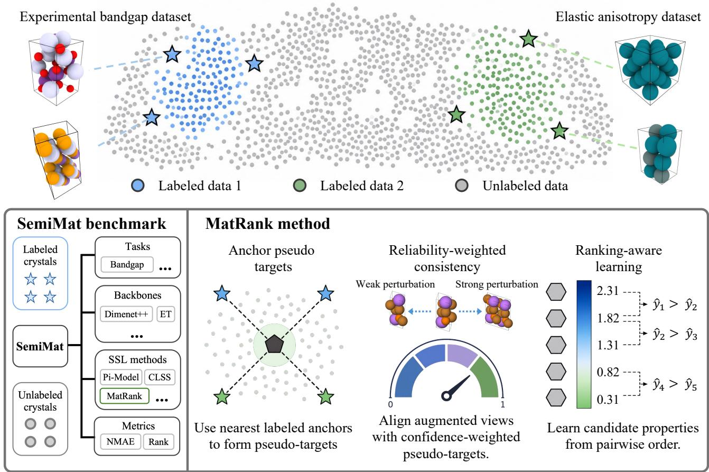
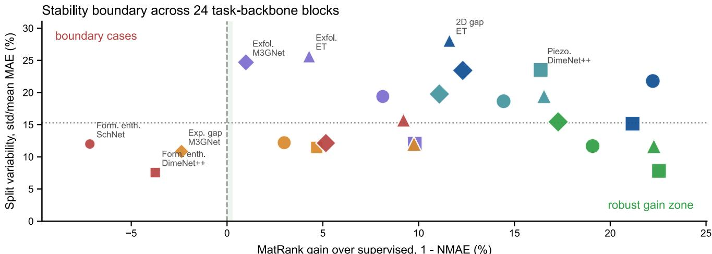

# Learning Materials Properties from Scarce Labels and Unlabeled Crystals

Wentao Li1,†, Yizhe Chen1,†, Jiangjie Qiu1, Yijun Li1, Leyi Zhao1, Xiaonan Wang1,\*

1Beijing Key Laboratory of Artificial Intelligence for Advanced Chemical Engineering Materials,

State Key Laboratory of Chemical Engineering and Low-Carbon Technology,

Department of Chemical Engineering, Tsinghua University

†These authors contributed equally. \*Corresponding author.

## Abstract

Learning materials properties from scarce labels and unlabeled crystals is a central challenge for data-driven materials discovery. We present SemiMat, a controlled benchmark for semi-supervised materials property regression, and MatRank, a reliability-weighted objective for continuous pseudo-label uncertainty. SemiMat fixes labeled and unlabeled crystal inputs, graph-backbone interfaces, validation-only checkpoint selection, held-out test reporting, normalized MAE (NMAE), and method-rank summaries across six scarce-label tasks, four graph backbones, and five predefined split runs. MatRank builds pseudo-targets from labeled anchors, weights them by local reliability and weak-prediction agreement, trains weak and strong graph views consistently, and adds ranking signals so that unlabeled crystals shape both values and candidate order. Across the retained 24 backbone-task blocks, one fixed MatRank objective gives the lowest aggregate held-out test NMAE (0.896) and best average method rank (2.208). The component, OOD, and generated-pool diagnostics identify where the gain is reliable and where further screening evaluation remains necessary. Code is available at https://github.com/littlepeachs/SemiMat.

## Introduction

Materials discovery increasingly requires learning useful property predictors before enough reliable labels exist. Public repositories, high-throughput calculations, and large-scale materials models have expanded the space of candidate crystals, but experimental measurements and high-fidelity simulations remain expensive, uneven, and property dependent (Butler et al. 2018; Merchant et al. 2023; Jain et al. 2013; Choudhary et al. 2020). The bottleneck is therefore not only how accurately a model predicts after labels are available. It is whether learning systems can use abundant unlabeled structures without converting their own uncertain predictions into misleading supervision.

This setting is a dificult form of semi-supervised regression. In classification, confident pseudo-labels can often be thresholded and consistency regularization can be tied to discrete decisions (Chapelle et al. 2006). In materials property prediction, the target is continuous, task scales difer by orders of magnitude, and a numerically sharp pseudo-label can still be wrong. The unlabeled pool is also part of the scientific question: a pool sampled from a broad materials database, a shifted composition range, or a generative model may help representation learning in one task while injecting misleading structure in another.

The field also lacks a controlled protocol for deciding when such unlabeled signals genuinely help. Apparent gains can depend on the property, graph backbone, train/validation/test split, unlabeled pool, seed, and aggregation rule. A single aggregate score hides whether a method improves scarcelabel regression broadly, succeeds only with a favorable encoder, or benefits from a particular unlabeled source. Materials screening adds another constraint: decisions depend on continuous values, yet the order in which candidates are inspected often determines which structures receive further computation or experimental attention.

We address this problem with SemiMat, a controlled benchmark and framework for semi-supervised materials property regression, together with MatRank, a reliabilityweighted algorithm for continuous pseudo-label uncertainty. SemiMat fixes labeled and unlabeled inputs, graph-backbone interfaces, validation-only checkpoint selection, held-out test reporting, split-level MAE, normalized MAE (NMAE), and method-rank summaries across six scarce-label materials tasks, four graph backbones, and five predefined split runs. MatRank builds pseudo-targets from labeled anchors, weights them by local reliability and weak-prediction agreement, trains weak and strong graph views consistently, and adds ranking signals so that unlabeled structures shape both values and candidate order. Across the retained 24 backbonetask blocks, one fixed MatRank objective gives the lowest aggregate held-out test NMAE and best average method rank under validation-selected checkpoints, while the ablation, OOD, and generated-pool experiments define the current evidence boundary. Figure 1 summarizes the benchmark contract and the MatRank training signals.

## Related Work

Machine learning has become a central tool for molecular and materials discovery (Butler et al. 2018; Merchant et al. 2023). Large materials repositories and benchmarks have improved data access and model comparison (Jain et al. 2013; Choudhary et al. 2020; Dunn et al. 2020), but label coverage remains uneven across properties. Experimental measurements, stability-related targets, tensorial responses, and expensive high-fidelity labels are often much smaller than the pool of candidate structures. SemiMat targets this mismatch by treating unlabeled structures as part of the learning protocol, not as unused background data.

  
Figure 1: SemiMat benchmark and MatRank training design. SemiMat fixes labeled and unlabeled inputs, tasks, graph backbones, semi-supervised methods and metrics for auditable scarce-label regression. MatRank turns unlabeled crystals into reliabilityweighted supervision through anchor pseudo-targets, weak–strong view alignment and pairwise order constraints. The workflow separates the benchmark contract from the learning objective while tying both to held-out test evaluation.

Crystal graph learning provides the backbone layer for this protocol. These models build on message passing and graph convolution ideas (Gilmer et al. 2017; Kipf and Welling 2017) and, for 3D structures, increasingly use geometric equivariance (Satorras, Hoogeboom, and Welling 2021; Batzner et al. 2022). CGCNN, MEGNet, SchNet, DimeNet++, GemNet, ALIGNN, M3GNet, and equivariant transformer-style models encode atomistic geometry with diferent inductive biases (Xie and Grossman 2018; Chen et al. 2019; Schütt et al. 2018; Klicpera et al. 2020; Gasteiger et al. 2020, 2021; Choudhary and DeCost 2021; Chen and Ong 2022; Thölke and De Fabritiis 2022; Liao and Smidt 2023). SemiMat does not introduce a new encoder; it asks whether semi-supervised objectives improve regression when the backbone is controlled.

Semi-supervised learning commonly uses entropy minimization, pseudo-labeling, consistency regularization, teacher-student targets, and augmentation-based label guessing (Chapelle et al. 2006; Grandvalet and Bengio 2004; Lee 2013; Laine and Aila 2017; Tarvainen and Valpola 2017;

Berthelot et al. 2019; Xie et al. 2020; Sohn et al. 2020). Realistic SSL studies also show that unlabeled data can hurt when the protocol or pool is mismatched (Oliver et al. 2018). For materials regression, this risk is amplified because confidence is harder to calibrate for continuous pseudo-labels than for classes. MatRank therefore uses pairwise learningto-rank supervision (Burges et al. 2005) as a training signal that complements pointwise regression.

## Problem Setup

Let $D _ { l } = \{ ( G _ { i } , y _ { i } ) \} _ { i = 1 } ^ { n }$ be labeled materials graphs with scalar properties $y _ { i } ~ \in ~ \mathbb R$ , and let $D _ { u } = \{ U _ { j } \} _ { j = 1 } ^ { m }$ be an unlabeled candidate pool available during training. Semi-Mat fixes the task, split, backbone, seed, and unlabeled pool before comparing algorithms. The question is whether unlabeled structures improve scarce-label regression without using test labels for training, checkpoint selection, or hyperparameter tuning. A graph encoder $g _ { \theta }$ and regression head $r _ { \theta }$ predict

$$
{ \hat { y } } _ { i } = r _ { \theta } ( g _ { \theta } ( G _ { i } ) ) .\tag{1}
$$

Reported MAE is computed after returning predictions to the original property scale:

$$
\mathrm { M A E } = \frac { 1 } { | D | } \sum _ { ( G , y ) \in D } | \hat { y } - y | .\tag{2}
$$

Because tasks have diferent units and scales, raw MAE cannot be averaged directly across datasets. We compute the five-split mean MAE for every method within a fixed backbone-task block and normalize it by the supervised mean MAE in that same block:

$$
\mathrm { N M A E } _ { m , b , t } = \frac { \mathrm { M A E } _ { m , b , t } } { \mathrm { M A E } _ { \mathrm { S u p e r v i s e d } , b , t } } .\tag{3}
$$

Lower NMAE is better; supervised training is therefore exactly 1.0 in every block. We also compute method rank within each backbone-task block, which summarizes how often an algorithm appears near the top of local MAE rankings.

## SemiMat Framework

SemiMat specifies a benchmark contract before training: the labeled train/validation/test split, unlabeled pool, graphconstruction interface, backbone, algorithm, seed, and reporting metrics are fixed for each block. The same validation split selects checkpoints for every method, and the held-out test split is used only for final reporting. This separates the benchmark question, whether unlabeled structures help under a controlled protocol, from the method question, whether a new objective improves that protocol.

The framework has four layers. The data layer exposes matched labeled and unlabeled structures; the encoder layer supplies SchNet, DimeNet++, ET, or M3GNet (Schütt et al. 2018; Gasteiger et al. 2020; Thölke and De Fabritiis 2022; Chen and Ong 2022); the algorithm layer runs supervised learning, Pi Model, Mean Teacher, MixMatch, RDA, CLSS, or MatRank (Laine and Aila 2017; Tarvainen and Valpola 2017; Berthelot et al. 2019; Huang, Fu, and Tsao 2024; Dai et al. 2023); and the evaluation layer reports split-level MAE, five-split means, NMAE, and method ranks. Full backbone and baseline descriptions are provided in the supplement.

The contract also specifies exclusions. The final MatRank row is not a per-dataset selector, a per-backbone selector, or a validation rule that chooses among several algorithms. It is one objective applied unchanged to each backbone-task block. This matters for materials discovery because a local improvement can be misleading when tasks difer in label noise, target scale, and geometric complexity. The benchmark therefore exposes both aggregate behavior and local exceptions.

MatRank. MatRank is the new algorithm within Semi-Mat. It is motivated by a regression failure mode: an unlabeled crystal can receive a continuous pseudo-label that is numerically precise but unreliable. MatRank therefore combines four signals: labeled-anchor pseudo-targets, reliabilityweighted weak–strong consistency, cross-set and labeledbatch ranking, and an auxiliary ranking-classifier (ARC) head. The method uses one code path and one fixed objective for all datasets, backbones, and indexed splits.

The algorithm is deliberately conservative about pseudotargets. A nearby labeled anchor is useful when the local neighborhood is sharp and the weak prediction agrees with the anchor estimate. When either condition fails, MatRank reduces the influence of the anchor and relies more on consistency and order constraints. This design keeps the method aligned with the main scientific use case: unlabeled structures should help shape the representation, but they should not inject high-weight numerical targets when the local evidence is weak.

For an unlabeled weak view $u ^ { w }$ with embedding $h _ { u } ^ { w }$ , weak prediction $p _ { u } ^ { w } = f _ { \theta } ( u ^ { w } )$ , and strong prediction $p _ { u } ^ { s } = \mathsf { \bar { f } } _ { \theta } ( u ^ { s } )$ MatRank first retrieves labeled anchors in the current batch. Let $s _ { u i } = \cos ( h _ { u } ^ { w } , h _ { i } ) , \mathcal { N } _ { K } ( u )$ be the top- $K$ anchors, and $\nu ( \cdot )$ be the same target normalizer used by supervised training:

$$
\begin{array} { l } { \displaystyle \alpha _ { u i } = \frac { \exp \left( s _ { u i } / \tau _ { a } \right) } { \sum _ { j \in \mathcal { N } _ { K } ( u ) } \exp \left( s _ { u j } / \tau _ { a } \right) } , } \\ { \displaystyle \hat { y } _ { u } = \nu \left( \sum _ { i \in \mathcal { N } _ { K } ( u ) } \alpha _ { u i } y _ { i } \right) . } \end{array}\tag{4}
$$

Anchor trust combines local neighborhood sharpness and agreement with the weak-view regressor. Let $\Delta s _ { u } = s _ { u , ( 1 ) } -$ $s _ { u , ( K ) } \mathrm { a n d } I _ { b } = [ \ell _ { \mathrm { m i n } } - m _ { c } , \ell _ { \mathrm { m a x } } + m _ { c } ] \colon$

$$
\begin{array} { r l } & { \rho _ { u } = \mathrm { c l i p } [ \sigma ( \gamma _ { A } \Delta s _ { u } ) \exp ( - q | p _ { u } ^ { w } - \hat { y } _ { u } | / \gamma _ { P } ) \ : , 0 , 1 ] , } \\ & { z _ { u } = \Pi _ { I _ { b } } \big ( \rho _ { u } \hat { y } _ { u } + ( 1 - \rho _ { u } ) \mathrm { s g } ( p _ { u } ^ { w } ) \big ) . } \end{array}\tag{5}
$$

Here $\ell _ { \mathrm { m i n } }$ and $\ell _ { \mathrm { m a x } }$ are the minimum and maximum normalized labeled targets in the batch, and Π denotes projection onto that interval. High-reliability anchors move the strong prediction toward nearby labeled values; low-reliability anchors reduce to consistency with the weak prediction.

The ARC head predicts pairwise order from the same graph representation. On labeled pairs it is trained by the sign of $y _ { i } - y _ { j }$ . On unlabeled data, weak ARC probabilities provide hard pseudo-labels for the strong view when their confidence exceeds a threshold. The unlabeled ARC weight

$$
\lambda _ { \mathrm { a r c } } ^ { u } = \mathrm { c l i p } ( \eta _ { 0 } + \eta _ { 1 } ( 1 - \bar { \rho } ) , \eta _ { \mathrm { m i n } } , \eta _ { \mathrm { m a x } } )\tag{6}
$$

increases when batch-level anchor reliability is low, so order consistency can carry more of the unlabeled signal when continuous pseudo-targets are fragile.

The regression branch then uses both absolute consistency and relative order. Let $H _ { \beta }$ denote SmoothL1 loss and

$$
\begin{array} { r l } & { R _ { \delta } ( a , b , \hat { a } , \hat { b } ) = \mathbf { 1 } \{ | a - b | > \delta \} [ m _ { r } - \mathrm { s g n } ( a - b ) ( \hat { a } - \hat { b } ) ] _ { + } . } \\ & { \mathrm { W i t h ~ } \langle \cdot \rangle \mathrm { d e n o t i n g ~ t h e ~ c o r r e s p o n d i n g ~ n o r m a l i z e d ~ a v e r a g e } , } \end{array}
$$

$$
\begin{array} { r l } & { \mathcal { L } _ { \mathrm { c o n s } } = \langle \rho _ { u } H _ { \beta } ( p _ { u } ^ { s } , z _ { u } ) \rangle _ { u } , } \\ & { \mathcal { L } _ { \mathrm { c r o s s } } = \langle \rho _ { u } R _ { \delta _ { l u } } ( \nu ( y _ { i } ) , z _ { u } , p _ { i } , p _ { u } ^ { s } ) \rangle _ { i , u } , } \\ & { \mathcal { L } _ { \mathrm { l a b e l } } = \langle R _ { \delta _ { l l } } ( \nu ( y _ { i } ) , \nu ( y _ { j } ) , p _ { i } , p _ { j } ) \rangle _ { i , j } . } \end{array}\tag{7}
$$

The weak-view consistency term has the same form as ${ \mathcal { L } } _ { \mathrm { c o n s } }$ with $p _ { u } ^ { s }$ replaced by $p _ { u } ^ { w }$ , and $\mathcal { L } _ { \mathrm { s m o o t h } }$ matches weak predictions to their feature-neighbor average. The full fixed objective is

$$
\begin{array} { r l } & { \qquad \mathscr { L } = \mathscr { L } _ { \mathrm { s u p } } + \lambda _ { u } \mathscr { L } _ { \mathrm { s s l } } , } \\ & { \qquad \mathscr { L } _ { \mathrm { s s l } } = \mathscr { L } _ { \mathrm { a r c } } + \mathscr { L } _ { \mathrm { c o n s } } + \omega _ { \mathrm { c r o s s } } \mathscr { L } _ { \mathrm { c r o s s } } + \omega _ { \mathrm { w e a k } } \mathscr { L } _ { \mathrm { w e a k } } } \\ & { \qquad + \omega _ { \mathrm { s m o o t h } } \mathscr { L } _ { \mathrm { s m o o t h } } + \omega _ { \mathrm { l a b e l } } \mathscr { L } _ { \mathrm { l a b e l } } . } \end{array}\tag{8}
$$

Here ${ \mathcal { L } } _ { \mathrm { c o n s } }$ is the reliability-weighted unlabeled regression consistency loss, $\mathcal { L } _ { \mathrm { c r o s s } }$ compares labeled examples with unlabeled stable targets, $\mathcal { L } _ { \mathrm { w e a k } }$ and $\mathcal { L } _ { \mathrm { s m o o t h } }$ regularize weakview predictions, and $\mathcal { L } _ { \mathrm { l a b e l } }$ preserves labeled-batch order. The numerical hyperparameters are listed in the supplement rather than embedded in the method text.

This formulation keeps ranking as a training signal rather than the primary metric. The main tables still evaluate regression MAE on held-out test splits. Ranking enters because candidate ordering can remain informative when absolute continuous pseudo-labels are uncertain. The component ablation below tests this claim by removing the anchor, cross-rank, feature-smoothness, and labeled-rank components from the same DimeNet++ implementation.

## Experiments

We evaluate six scalar materials property tasks: 2D band gap, piezoelectric tensor, exfoliation energy, elastic anisotropy, experimental formation enthalpy, and experimental band gap. The CSV benchmark tables were converted from the processed Matminer task tables released with Chang et al. (Chang, Wang, and Ertekin 2022); task-specific primarysource and processed-table provenance are reported in the supplement. They span electronic, energetic, mechanical, and response-property regimes and range from 495 to 2,086 labeled structures. Each task is paired with an MP-5k unlabeled training pool from the Materials Project (Jain et al. 2013) in the main benchmark; the split sizes are reported in the supplement. We cross the six tasks with SchNet, DimeNet++, ET, and M3GNet, and compare supervised training, Pi Model, Mean Teacher, MixMatch, RDA, CLSS, and MatRank. For every backbone-task block, checkpoints are selected by validation MAE and then evaluated on the held-out test split. The main tables therefore report test MAE after validationonly model selection, with NMAE and method rank used for aggregate comparison. The five runs use predefined split indices 0–4 with a fixed training random state; their dispersion therefore measures split sensitivity under a controlled optimization seed.

## Results

Table 1 gives the full held-out test comparison across six tasks and four backbones. The next tables then test the algorithmic evidence around MatRank: component ablation on DimeNet++, OOD behavior under element-level and labellevel shifts (Koh et al. 2021), and replacement of MP-5k unlabeled structures with samples from an MP-20-pretrained MatterGen checkpoint (Jain et al. 2013; Zeni et al. 2025). All reported test values use validation-selected checkpoints.

The Results section is organized to separate four claims that would otherwise be collapsed into one aggregate number. The main benchmark asks whether a fixed MatRank objective improves scarce-label regression across encoders and tasks. The stability view asks whether those gains are accompanied by acceptable split-level variability. The ablation asks whether the improvement comes from the combined objective rather than from one removable term. The OOD and generated pool experiments then test whether the same objective remains usable when either the evaluation distribution or the unlabeled source changes.

## MatRank Leads the SemiMat Benchmark with Stability Boundaries

MatRank has the lowest overall Avg. NMAE and best average method rank when the last two columns of Table 1 are averaged over the four backbones. Its average NMAE is 0.896, compared with 0.949 for Mean Teacher, 0.973 for Pi Model, 0.987 for MixMatch, 0.988 for CLSS, 1.000 for supervised training, and 1.072 for RDA. Its average method rank is 2.208 across the 24 backbone-task blocks. MatRank also has the lowest backbone-level NMAE for SchNet (0.901), DimeNet++ (0.882), ET (0.877), and M3GNet (0.926), although the best local method remains task-dependent. This heterogeneity is why the complete matrix is reported rather than only the aggregate score.

The local pattern is consistent with the benchmark motivation. MatRank has the lowest MAE in many 2D gap, piezoelectric, and elastic-anisotropy blocks, where unlabeled structure can provide useful geometric regularization. Mean Teacher is the best-performing non-ranking baseline and remains competitive on formation enthalpy and experimental gap, where the pointwise teacher signal can be suficient. RDA obtains the lowest MAE in selected exfoliation-energy blocks but degrades on formation enthalpy, which raises its average NMAE. These cases show why a single aggregate score is not enough for semi-supervised materials regression.

Figure 2 adds the split-variability axis to this comparison. Blocks in the lower-right region are the clearest successes: MatRank improves over supervised training while keeping five-split variability below the median. Blocks near the zerogain line are treated as boundary cases rather than hidden successes, even when their aggregate contribution is positive. This is important for materials tasks because a method that lowers the mean MAE but substantially increases split sensitivity would be harder to reuse in small labeled regimes.

## Reliability and Ranking Components Stabilize MatRank Gains

Table 2 isolates MatRank components on DimeNet++. The full objective has the best Avg. NMAE, while several ablations remain competitive on individual tasks. This pattern supports the intended design: the final method does not depend on one term alone, but on combining anchor reliability, consistency, cross-set ranking, feature smoothness, and labeled-rank preservation.

The ablation also clarifies what the method is not claiming. Removing one component can improve a single task, such as the experimental-gap result for the label-rank ablation, but it weakens the aggregate behavior. Removing the anchor pseudo-label, cross-set ranking, feature-smoothness, or labeled-rank term can improve a local task, but each weakens the aggregate behavior relative to the full objective. These terms therefore act as stabilizers around a pointwise regressor rather than as replacements for regression. Avg. rank is recomputed over the rows retained in this table.

The strongest ablated rows are also informative. The crossrank and feature-smoothness ablations remain close to the full objective in average NMAE, which indicates that MatRank is not a brittle sum of unrelated penalties. The full objective is nevertheless the only row that simultaneously preserves the best aggregate NMAE and the best average rank. This supports the intended design choice: reliability weighting protects continuous pseudo-targets, while ranking terms provide order information when absolute pseudo-label values are uncertain.

  
Task2D gapPiezo.Exfol.ElasticForm. enth.Exp. gapBackboneSchNetDimeNet++∆ETM3GNet  
Figure 2: Stability boundary for MatRank over the 24 task-backbone blocks. Each point is one task and graph backbone. The horizontal axis reports the relative gain over supervised training, 1 − NMAE, and the vertical axis reports five-split variability as std/mean MAE. Colors indicate materials tasks and marker shapes indicate graph backbones. Dashed reference lines mark zero gain and the median split variability. This view separates blocks with stable gains from boundary cases where MatRank improves less or varies more across splits.

## MatRank Retains Bounded Gains Under OOD Shifts

Table 3 reports raw held-out test MAE under element-level and label-level OOD splits. MatRank improves all six tasks in both split types, with larger reductions under the elementlevel shift and smaller but consistent reductions under the harder label-tail shift.

The two OOD settings test diferent stresses. Element-level OOD changes composition coverage, so gains indicate that the learned representation and anchor reliability can transfer beyond the element distribution observed during training. Label-level OOD holds out the high-label tail, a more conservative stress for any pseudo-label method because unlabeled targets near the tail can be systematically harder to estimate. The smaller label-level gains are therefore consistent with the method’s bounded claim.

## Synthetic Crystals Also Benefit Semi-Supervised Regression

Replacing MP-5k unlabeled structures with samples from an MP-20-pretrained MatterGen checkpoint (Jain et al. 2013; Zeni et al. 2025) does not collapse MatRank. As Table 4 shows, the generated pool is similar to the MP-5k pool in aggregate and is slightly better on 2D gap, formation enthalpy, and experimental gap. The experiment changes only the unlabeled pool; the algorithm and validation-only checkpoint protocol are unchanged.

This result suggests that MatRank is not simply memorizing a particular MP-5k pool. The generated structures supply a diferent unlabeled distribution, yet the same reliability and ranking objective remains usable without retuning. The effect sizes are small, so the result should be read as evidence of pool tolerance rather than proof that generated pools are universally better.

Together, these diagnostics make the main comparison more interpretable. The benchmark table shows the aggregate test outcome, the ablation connects that outcome to objective components, the OOD table tests shifted evaluation splits, and the generated-pool table tests a shifted unlabeled source. The evidence therefore supports MatRank as a fixed semisupervised regression objective under the current protocol, while keeping the limits of the claim visible.

## Discussion

SemiMat and MatRank address distinct needs in data-scarce materials modeling. SemiMat makes the comparison controlled across tasks, backbones, unlabeled pools, splits, checkpoint rules, and aggregation metrics. MatRank is one reproducible algorithm within that benchmark, designed for the failure mode that continuous pseudo-labels can be numerically precise but unreliable. The main comparison, component ablation, OOD tests, and generated-pool experiment together support a bounded claim: one fixed MatRank objective gives the best aggregate held-out test NMAE and method rank across the retained 24 backbone-task blocks.

<table><tr><td>Method</td><td>2D gap</td><td>Piezo.</td><td>Exfol.</td><td>Elastic</td><td>Form. enth.</td><td>Exp. gap</td><td>Avg. NMAE Avg. rank</td><td></td></tr><tr><td>SchNet</td></tr><tr><td>Supervised</td><td>0.717±0.1020.173±0.022 27.612±3.8740.812±0.2650.149±0.0180.346±0.042</td><td></td><td></td><td></td><td></td><td>1.000</td><td>5.500</td></tr><tr><td>Pi Model</td><td></td><td>0.671±0.0660.172±0.022 27.017±7.1050.809±0.2080.148±0.017 0.345±0.044</td><td></td><td></td><td>0.666±0.046 0.167±0.021 24.870±2.720 0.768±0.2590.148±0.017 0.346±0.077</td><td></td><td>0.981</td><td>3.830</td></tr><tr><td>Mean Teacher</td><td></td><td></td><td></td><td></td><td>0.681±0.061 0.180±0.015 25.955±3.793 0.791±0.259 0.149±0.012 0.374±0.064</td><td></td><td>0.955 0.997</td><td>2.500</td></tr><tr><td>MixMatch RDA</td><td></td><td></td><td></td><td></td><td>0.684±0.0640.174±0.021 25.718±3.3970.815±0.2450.181±0.0160.328±0.066</td><td></td><td>1.008</td><td>5.000 4.830</td></tr><tr><td>CLSS</td><td></td><td></td><td></td><td></td><td>0.663±0.0450.185±0.015 26.488±4.964 0.788±0.2580.159±0.021 0.339±0.047</td><td></td><td>0.994</td><td>4.170</td></tr><tr><td>MatRank</td><td></td><td></td><td>0.558±0.121 0.148±0.02825.367±4.9180.657±0.077 0.160±0.019 0.336±0.041</td><td></td><td></td><td></td><td>0.900</td><td>2.170</td></tr><tr><td></td></tr><tr><td>DimeNet++</td><td></td><td></td><td>0.639±0.065 0.155±0.02522.404±3.209 0.798±0.2650.123±0.017 0.341±0.032</td><td></td><td></td><td></td><td>1.000</td><td></td></tr><tr><td>Supervised Pi Model</td><td>0.555±0.048 0.152±0.01821.599±4.057 0.776±0.231 0.121±0.018 0.325±0.039</td><td></td><td></td><td></td><td></td><td></td><td>0.953</td><td>6.000 3.170</td></tr><tr><td>Mean Teacher</td><td>0.566±0.0690.150±0.019 21.861±4.271 0.770±0.242 0.118±0.010 0.317±0.047</td><td></td><td></td><td></td><td></td><td></td><td>0.947</td><td>2.830</td></tr><tr><td>MixMatch</td><td>0.592±0.053 0.149±0.025 21.889±3.465 0.767±0.240 0.128±0.018 0.333±0.048</td><td></td><td></td><td></td><td></td><td></td><td>0.973</td><td>4.000</td></tr><tr><td>RDA</td><td>0.611±0.069 0.155±0.022 20.937±4.899 0.776±0.282 0.155±0.019 0.337±0.064</td><td></td><td></td><td></td><td></td><td></td><td>1.018</td><td>5.000</td></tr><tr><td>CLSS</td><td></td><td>0.560±0.033 0.160±0.024 22.063±4.633 0.798±0.221 0.126±0.017 0.316±0.051</td><td></td><td></td><td></td><td></td><td>0.975</td><td>4.670</td></tr><tr><td>MatRank</td><td></td><td>0.504±0.076 0.130±0.030 20.209±2.430 0.618±0.048 0.128±0.010 0.325±0.037</td><td></td><td></td><td></td><td></td><td>0.882</td><td>2.330</td></tr><tr><td></td><td></td><td></td><td></td><td></td><td></td><td></td><td></td><td></td></tr><tr><td>ET</td></tr><tr><td>Supervised</td><td>0.722±0.0680.164±0.024 21.905±3.970 0.863±0.2300.137±0.0160.383±0.086</td><td></td><td></td><td></td><td></td><td></td><td>1.000</td><td>5.670</td></tr><tr><td>Pi Model</td><td>0.626±0.0580.154±0.01823.018±5.5490.870±0.250 0.127±0.013 0.381±0.061</td><td></td><td></td><td></td><td></td><td></td><td>0.964</td><td>4.170</td></tr><tr><td>Mean Teacher</td><td>0.621±0.0350.167±0.01820.384±5.4360.829±0.2180.115±0.0170.370±0.074</td><td></td><td></td><td></td><td></td><td></td><td>0.929</td><td>2.500</td></tr><tr><td>MixMatch</td><td></td><td></td><td></td><td></td><td>0.646±0.064 0.160±0.012 21.698±5.912 0.835±0.242 0.129±0.011 0.358±0.073</td><td></td><td>0.952</td><td>3.670</td></tr><tr><td>RDA</td><td></td><td></td><td></td><td></td><td>0.700±0.1100.173±0.02120.259±3.3350.909±0.1740.213±0.011 0.427±0.074</td><td></td><td>1.112</td><td>5.670</td></tr><tr><td>CLSS</td><td></td><td></td><td></td><td></td><td>0.668±0.0600.179±0.024 21.407±4.0280.859±0.212 0.129±0.0130.370±0.084</td><td></td><td>0.983</td><td>4.500</td></tr><tr><td>MatRank</td><td></td><td></td><td></td><td></td><td>0.638±0.179 0.137±0.02620.967±5.375 0.671±0.078 0.124±0.020 0.346±0.042</td><td></td><td>0.877</td><td>1.830</td></tr><tr><td>M3GNet</td><td></td><td></td><td></td><td></td><td></td><td></td><td></td><td></td></tr><tr><td>Supervised</td><td>0.732±0.054 0.191±0.028 28.527±3.119 0.825±0.2390.138±0.0150.341±0.059</td><td></td><td></td><td></td><td></td><td></td><td>1.000</td><td>4.170</td></tr><tr><td>Pi Model</td><td></td><td></td><td>0.756±0.052 0.187±0.030 27.855±2.3780.825±0.227 0.137±0.006 0.340±0.065</td><td></td><td></td><td></td><td>0.995</td><td>3.330</td></tr><tr><td>Mean Teacher</td><td></td><td></td><td>0.703±0.061 0.188±0.029 27.715±3.188 0.812±0.2270.125±0.007 0.336±0.058</td><td></td><td></td><td></td><td>0.965</td><td>1.830</td></tr><tr><td>MixMatch</td><td></td><td></td><td>0.806±0.217 0.191±0.030 29.699±3.619 0.832±0.230 0.141±0.015 0.343±0.059</td><td></td><td></td><td></td><td>1.028</td><td>5.830</td></tr><tr><td>RDA</td><td></td><td></td><td>0.737±0.0380.184±0.031 28.572±3.761 0.852±0.2220.252±0.0160.367±0.065</td><td></td><td></td><td></td><td>1.149</td><td>5.670</td></tr><tr><td>CLSS MatRank</td><td></td><td></td><td>0.728±0.033 0.191±0.029 28.075±2.071 0.843±0.233 0.140±0.006 0.342±0.066</td><td>0.642±0.1500.170±0.03428.246±6.9740.683±0.1050.131±0.0160.349±0.038</td><td></td><td></td><td>1.003 0.926</td><td>4.670 2.500</td></tr><tr><td></td><td></td><td></td><td></td><td></td><td></td><td></td><td></td><td></td></tr></table>

Table 1: Five-split held-out test MAE across four graph backbones. Task columns report mean±standard deviation in original units. Avg. NMAE is normalized by the supervised MAE for the same task and backbone; Avg. rank averages task-wise method ranks within a backbone. Bold marks the local column best.

This claim should be read as evidence for reliability-aware semi-supervised regression, not as universal dominance. MatRank does not have the lowest MAE in every local task, and ranking is not a substitute for pointwise regression. Mean Teacher, Pi Model, CLSS, and RDA remain competitive in selected blocks. The useful finding is narrower: labeled-anchor reliability, weak–strong consistency, and order-aware losses can be combined without selecting a diferent objective for each dataset or backbone.

Implications and limitations. The practical implication is that unlabeled crystals should be treated as structured but uncertain evidence. MatRank anchors pseudo-targets to nearby labeled examples, reduces their weight when local agreement is weak, and uses relative order when absolute values are less reliable. This design matches materials screening, where candidate priority can matter even when continuous property estimates remain noisy. The benchmark design is equally important: the full task-by-backbone matrix keeps local exceptions visible instead of turning them into a single favorable summary.

Several choices make the evidence auditable. All primary numbers are held-out test results from validation-selected checkpoints. The main table keeps supervised and semisupervised baselines in the same view. The ablation, OOD, and generated-pool tables use the same DimeNet++ implementation to ask whether the components matter, whether the method survives distribution shift, and whether the unlabeled source can change without retuning. These checks do not replace larger deployment studies, but they reduce the risk that the aggregate gain is a reporting artifact.

The same logic motivates how SemiMat should be extended. A future method could improve the encoder, alter the unlabeled pool, change the reliability estimator, or replace the ranking loss. Those changes should be evaluated as separate factors rather than folded into one new score. The benchmark contract therefore makes the reporting unit explicit: task, backbone, seed, split, unlabeled source, validation rule, and raw test MAE should remain visible before aggregate NMAE or average rank is interpreted. This discipline is especially important for heterogeneous materials properties, where an error in experimental band gap may carry a diferent screening cost from an error in exfoliation energy or formation enthalpy.

<table><tr><td>Variant</td><td>2D gap</td><td>Piezo.</td><td>Exfol.</td><td>Elastic</td><td>Form. enth.</td><td> $\operatorname { E x p . } \ g \mathrm { a p }$ </td><td>Avg. NMAE</td><td>Avg. rank</td></tr><tr><td>Supervised</td><td>0.640±0.065</td><td> $0 . 1 5 5 { \scriptstyle \pm 0 . 0 2 5 }$ </td><td></td><td></td><td>22.404±3.2090.798±0.2650.123±0.017</td><td> $0 . 3 4 1 { \pm } 0 . 0 3 2$ </td><td>1.000</td><td>6.000</td></tr><tr><td>w/o anchor PL</td><td> $0 . 5 9 7 { \scriptstyle \pm 0 . 1 5 3 }$ </td><td></td><td>0.125±0.034 21.032±3.869</td><td></td><td>0.620±0.036 0.133±0.006</td><td> $0 . 3 2 3 { \pm } 0 . 0 4 8$ </td><td>0.914</td><td>3.167</td></tr><tr><td>w/o cross-rank</td><td> $0 . 5 4 3 { \pm } 0 . 1 2 8$ </td><td>0.122±0.039</td><td></td><td></td><td>20.796±3.6990.637±0.0610.127±0.011</td><td> $0 . 3 2 9 { \pm } 0 . 0 4 4$ </td><td>0.892</td><td>3.000</td></tr><tr><td>w/o feature smooth.</td><td> $0 . 5 4 1 { \pm } 0 . 0 8 5$ </td><td></td><td></td><td></td><td>0.128±0.03921.618±5.892 0.627±0.076 0.131±0.017</td><td> $0 . 3 2 8 { \pm } 0 . 0 4 9$ </td><td>0.907</td><td>3.500</td></tr><tr><td>w/o label-rank</td><td> $0 . 5 5 8 { \pm } 0 . 0 9 4$ </td><td>0.126±0.040</td><td> $2 2 . 1 0 6 { \scriptstyle \pm 6 . 2 0 1 }$ </td><td></td><td>0.633±0.0520.134±0.009</td><td> $\mathbf { 0 . 3 0 7 \pm 0 . 0 5 7 }$ </td><td>0.909</td><td>3.833</td></tr><tr><td>Full MatRank</td><td> $\mathbf { 0 . 5 0 4 } \pm \mathbf { 0 . 0 7 6 }$ </td><td> $0 . 1 3 0 { \pm } 0 . 0 3 1$ </td><td> $\pm 0 . 2 0 9 { \scriptstyle \pm 2 . 4 3 0 }$ </td><td></td><td>0.618±0.048 0.128±0.010</td><td> $0 . 3 2 5 { \scriptstyle \pm 0 . 0 3 7 }$ </td><td>0.882</td><td>2.333</td></tr></table>

Table 2: DimeNet++ component ablation over six tasks. Supervised and Full MatRank are five-split reference rows; ablated variants report mean±standard deviation over three split runs.
<table><tr><td>OOD split</td><td>Method</td><td>2D gap</td><td>Piezo.</td><td>Exfol.</td><td>Elastic</td><td>Form. enth.</td><td>Exp. gap</td></tr><tr><td>Element-level Supervised</td><td></td><td> $0 . 7 4 3 { \scriptstyle \pm 0 . 3 0 4 }$ </td><td> $0 . 1 9 2 { \scriptstyle \pm 0 . 0 4 5 }$ </td><td> $5 0 . 8 8 7 { \scriptstyle \pm 1 0 . 6 7 7 }$ </td><td> $0 . 6 9 6 { \scriptstyle \pm 0 . 1 2 7 }$ </td><td> $0 . 7 3 4 { \pm } 0 . 5 9 3$ </td><td> $1 . 1 4 4 { \pm } 0 . 5 1 0$ </td></tr><tr><td>Element-level MatRank</td><td></td><td> $\mathbf { 0 . 7 1 7 \pm 0 . 2 7 7 }$ </td><td> $\mathbf { 0 . 1 8 5 { \pm 0 . 0 4 6 } }$ </td><td> ${ \bf 3 8 . 2 9 4 \pm 1 2 . 9 4 4 }$ </td><td> $\mathbf { 0 . 6 8 8 { \pm 0 . 1 5 2 } }$ </td><td> $\mathbf { 0 . 6 4 6 { \overset { . } { = } } 0 . 6 1 4 }$ </td><td> $\mathbf { 1 . 0 6 8 \pm 0 . 4 7 4 }$ </td></tr><tr><td>Label-level</td><td>Supervised</td><td> $1 . 8 7 7 { \scriptstyle \pm 0 . 0 6 4 }$ </td><td> $0 . 5 2 0 { \scriptstyle \pm 0 . 0 2 0 }$ </td><td> $9 7 . 7 0 0 { \pm } 1 . 2 9 1 $ </td><td> $2 . 9 9 5 { \scriptstyle \pm 0 . 0 2 7 }$ </td><td> $0 . 2 5 9 { \pm } 0 . 0 0 9$ </td><td> $2 . 0 9 3 { \pm } 0 . 1 9 1$ </td></tr><tr><td>Label-level</td><td> $\mathbf { M } \mathbf { \dot { a } t R a n k }$ </td><td> $\mathbf { 1 . 7 9 2 { \pm 0 . 0 3 8 } }$ </td><td> $\mathbf { 0 . 5 1 2 \pm 0 . 0 1 5 }$ </td><td> $\mathbf { 9 7 . 3 7 2 { \pm } 1 . 1 0 4 }$ </td><td> $\mathbf { 2 . 9 4 4 { \scriptstyle \pm 0 . 0 4 1 } }$ </td><td> $\mathbf { 0 . 2 5 6 { \overset { . } { = } } 0 . 0 1 0 }$ </td><td> $\mathbf { 2 . 0 7 9 { \scriptstyle \pm 0 . 1 4 7 } }$ </td></tr></table>

Table 3: DimeNet++ OOD raw test MAE over six tasks. Entries are mean±standard deviation in original task units after validation-based checkpoint selection.

<table><tr><td>Task</td><td>Supervised</td><td>MP-5k</td><td>MatterGen</td></tr><tr><td>2D gap</td><td> $0 . 6 4 0 { \scriptstyle \pm 0 . 0 6 5 }$ </td><td> $0 . 5 0 4 { \scriptstyle \pm 0 . 0 7 6 }$ </td><td> $\mathbf { 0 . 5 0 4 } \pm \mathbf { 0 . 0 8 6 }$ </td></tr><tr><td>Piezo.</td><td> $0 . 1 5 5 { \scriptstyle \pm 0 . 0 2 5 }$ </td><td> $\mathbf { 0 . 1 3 0 { \overset { . } { \bot } } 0 . 0 3 1 }$ </td><td> $0 . 1 3 1 { \pm } 0 . 0 2 7$ </td></tr><tr><td>Exfol.</td><td> $2 2 . 4 0 4 { \pm } 3 . 2 0 9$ </td><td> $\pm 0 . 2 0 9 { \scriptstyle \pm 2 . 4 3 0 }$ </td><td> $2 0 . 3 0 4 { \scriptstyle \pm 2 . 2 5 0 }$ </td></tr><tr><td>Elastic</td><td> $0 . 7 9 8 { \pm } 0 . 2 6 5$ </td><td> $\mathbf { 0 . 6 1 8 { \scriptstyle \pm 0 . 0 4 8 } }$ </td><td> $0 . 6 2 6 { \scriptstyle \pm 0 . 0 6 9 }$ </td></tr><tr><td>Form. enth.</td><td> $0 . 1 2 3 { \pm } 0 . 0 1 7$ </td><td> $0 . 1 2 8 { \pm } 0 . 0 1 0$ </td><td> $\mathbf { 0 . 1 2 3 \bot 0 . 0 1 1 }$ </td></tr><tr><td>Exp. gap</td><td> $0 . 3 4 1 { \pm } 0 . 0 3 2$ </td><td> $0 . 3 2 5 { \scriptstyle \pm 0 . 0 3 7 }$ </td><td> $\mathbf { 0 . 3 2 1 { \pm } 0 . 0 3 4 }$ </td></tr></table>

Table 4: DimeNet++ MatRank with MP-5k or MP20- pretrained MatterGen-generated unlabeled structures. Entries are raw test MAE mean±standard deviation over five split runs.

The OOD and generated-pool studies should be interpreted in the same bounded way. The OOD results show that the objective remains useful when the evaluation split changes, but they do not prove invariance to every composition shift or label-tail regime. The generated-pool results show that MatRank can use a diferent unlabeled source without algorithm changes, but they do not imply that generated crystals are always preferable to database crystals. Their role in the paper is diagnostic: they test whether the main benchmark result survives two realistic perturbations to the learning setting. This makes the claim stronger than a single in-distribution table, while keeping it below a deployment guarantee.

The current scope has clear limits. The tasks are scalar regressions, so vector, tensor, or distributional targets would need new normalization, uncertainty reporting, and screening metrics. The generated-pool study tests one MP20- pretrained MatterGen source and should not be generalized to all crystal generators or filtering strategies. MatRank also cannot certify that an unlabeled structure is stable, synthesizable, or inside the intended chemical domain; those checks remain part of data curation and materials validation. Future benchmark extensions should therefore keep the reporting unit at the backbone-task-seed level, while separating improvements due to the encoder, unlabeled pool, semi-supervised objective, and evaluation protocol.

## Conclusion

This paper studies how to learn materials properties from scarce labels and unlabeled crystals without allowing uncertain pseudo-labels to dominate the training signal. SemiMat provides the controlled benchmark contract, and MatRank provides one reliability-weighted, ranking-aware objective under that contract. Across six tasks, four graph backbones, and five split runs, the fixed MatRank objective achieves the lowest aggregate held-out test NMAE and best average method rank under validation-only checkpoint selection. The main boundary is equally important: the evidence supports MatRank as a strong semi-supervised regression baseline for this benchmark, not as a universal solution to materials discovery. Future extensions should keep the same attribution discipline when changing tasks, unlabeled pools, encoders, or screening metrics.

## References

Batzner, S.; Musaelian, A.; Sun, L.; Geiger, M.; Mailoa, J. P.; Kornbluth, M.; Molinari, N.; Smidt, T. E.; and Kozinsky, B. 2022. E(3)-equivariant graph neural networks for data-eficient and accurate interatomic potentials. Nature Communications, 13: 2453.

Berthelot, D.; Carlini, N.; Goodfellow, I.; Papernot, N.; Oliver, A.; and Rafel, C. 2019. MixMatch: A holistic approach to semi-supervised learning. In Advances in Neural Information Processing Systems.

Burges, C.; Shaked, T.; Renshaw, E.; Lazier, A.; Deeds, M.; Hamilton, N.; and Hullender, G. 2005. Learning to rank using gradient descent. In Proceedings of the International Conference on Machine Learning.

Butler, K. T.; Davies, D. W.; Cartwright, H.; Isayev, O.; and Walsh, A. 2018. Machine learning for molecular and materials science. Nature, 559: 547–555.

Chapelle, O.; Schölkopf, B.; and Zien, A., eds. 2006. Semi-Supervised Learning. MIT Press.

Chen, C.; Ye, W.; Zuo, Y.; Zheng, C.; and Ong, S. P. 2019. Graph networks as a universal machine learning framework for molecules and crystals. Chemistry of Materials, 31(9): 3564–3572.

Chen, C.; and Ong, S. P. 2022. A universal graph deep learning interatomic potential for the periodic table. Nature Computational Science, 2(11): 718–728.

Chang, R.; Wang, Y.-X.; and Ertekin, E. 2022. Towards overcoming data scarcity in materials science: Unifying models and datasets with a mixture of experts framework. npj Computational Materials, 8: 242.

Choudhary, K.; Garrity, K. F.; Reid, A. C. E.; DeCost, B.; Biacchi, A. J.; Hight Walker, A. R.; Trautt, Z.; Hattrick-Simpers, J.; Kusne, A. G.; Centrone, A.; et al. 2020. The joint automated repository for various integrated simulations (JARVIS) for data-driven materials design. npj Computational Materials, 6: 173.

Choudhary, K.; and DeCost, B. 2021. Atomistic line graph neural network for improved materials property predictions. npj Computational Materials, 7: 185.

Dai, W.; Du, Y.; Bai, H.; Cheng, K.-T.; and Li, X. 2023. Semisupervised contrastive learning for deep regression with ordinal rankings from spectral seriation. In Advances in Neural Information Processing Systems.

Dunn, A.; Wang, Q.; Ganose, A.; Dopp, D.; and Jain, A. 2020. Benchmarking materials property prediction methods: The Matbench test set and Automatminer reference algorithm. npj Computational Materials, 6: 138.

Gasteiger, J.; Giri, S.; Margraf, J. T.; and Günnemann, S. 2020. Fast and uncertainty-aware directional message passing for non-equilibrium molecules. In Machine Learning for Molecules Workshop, NeurIPS.

Gasteiger, J.; Becker, F.; and Günnemann, S. 2021. GemNet: Universal directional graph neural networks for molecules. In Advances in Neural Information Processing Systems.

Gilmer, J.; Schoenholz, S. S.; Riley, P. F.; Vinyals, O.; and Dahl, G. E. 2017. Neural message passing for quantum chemistry. In Proceedings of the International Conference on Machine Learning.

Grandvalet, Y.; and Bengio, Y. 2004. Semi-supervised learning by entropy minimization. In Advances in Neural Information Processing Systems.

Huang, P.-Y.; Fu, S.-W.; and Tsao, Y. 2024. RankUp: Boosting semi-supervised regression with an auxiliary ranking classifier. In Advances in Neural Information Processing Systems.

Jain, A.; Ong, S. P.; Hautier, G.; Chen, W.; Richards, W. D.; Dacek, S.; Cholia, S.; Gunter, D.; Skinner, D.; Ceder, G.; and Persson, K. A. 2013. Commentary: The Materials Project: A materials genome approach to accelerating materials innovation. APL Materials, 1(1): 011002.

Kipf, T. N.; and Welling, M. 2017. Semi-supervised classification with graph convolutional networks. In International Conference on Learning Representations.

Klicpera, J.; Groß, J.; and Günnemann, S. 2020. Directional message passing for molecular graphs. In International Conference on Learning Representations.

Koh, P. W.; Sagawa, S.; Marklund, H.; Xie, S. M.; Zhang, M.; Balsubramani, A.; Hu, W.; Yasunaga, M.; Phillips, R. L.; Gao, I.; et al. 2021. WILDS: A benchmark of in-the-wild distribution shifts. In Proceedings ofthe International Conference on Machine Learning.

Laine, S.; and Aila, T. 2017. Temporal ensembling for semisupervised learning. In International Conference on Learning Representations.

Lee, D.-H. 2013. Pseudo-label: The simple and eficient semi-supervised learning method for deep neural networks. In ICML Workshop on Challenges in Representation Learning.

Liao, Y.-L.; and Smidt, T. 2023. Equiformer: Equivariant graph attention transformer for 3D atomistic graphs. In International Conference on Learning Representations.

Merchant, A.; Batzner, S.; Schoenholz, S. S.; Aykol, M.; Cheon, G.; Cubuk, E. D.; et al. 2023. Scaling deep learning for materials discovery. Nature, 624: 80–85.

Oliver, A.; Odena, A.; Rafel, C.; Cubuk, E. D.; and Goodfellow, I. 2018. Realistic evaluation of deep semi-supervised learning algorithms. In Advances in Neural Information Processing Systems.

Satorras, V. G.; Hoogeboom, E.; and Welling, M. 2021. E(n) equivariant graph neural networks. In Proceedings of the International Conference on Machine Learning.

Schütt, K. T.; Sauceda, H. E.; Kindermans, P.-J.; Tkatchenko, A.; and Müller, K.-R. 2018. SchNet: A deep learning architecture for molecules and materials. Journal of Chemical Physics, 148(24): 241722.

Sohn, K.; Berthelot, D.; Carlini, N.; Zhang, Z.; Zhang, H.; Rafel, C.; Cubuk, E. D.; Kurakin, A.; and Li, C.-L. 2020. FixMatch: Simplifying semi-supervised learning with consistency and confidence. In Advances in Neural Information Processing Systems.

Tarvainen, A.; and Valpola, H. 2017. Mean teachers are better role models: Weight-averaged consistency targets improve semi-supervised deep learning results. In Advances in Neural Information Processing Systems.

Thölke, P.; and De Fabritiis, G. 2022. TorchMD-NET: Equivariant transformers for neural network based molecular potentials. In International Conference on Learning Representations.

Xie, T.; and Grossman, J. C. 2018. Crystal graph convolutional neural networks for an accurate and interpretable prediction of material properties. Physical Review Letters, 120: 145301.

Xie, Q.; Dai, Z.; Hovy, E.; Luong, M.-T.; and Le, Q. V. 2020. Unsupervised data augmentation for consistency training. In Advances in Neural Information Processing Systems.

Zeni, C.; Pinsler, R.; Zügner, D.; Fowler, A.; Horton, M.; Fu, X.; Shysheya, S.; Crabbé, J.; Sun, L.; Smith, J.; et al. 2025. A generative model for inorganic materials design. Nature, 639: 624–632.