# Learning PDE Time-Stepping with Neural Cellular Automata

Esha Saha1,a and Hao Wang1,a

1Interdisciplinary Lab for Mathematical Ecology and Epidemiology (ILMEE) & The Department of Mathematical and Statistical Sciences, University of Alberta, Edmonton (AB), T6G 2J5, Canada

aCorresponding authors. E-mail: esaha1@ualberta.ca, hao8@ualberta.ca

## Abstract

Classical numerical solvers for partial diferential equations (PDEs) are computationally expensive to solve repeatedly across varying initial conditions, motivating the need for learned surrogates. In this paper, we propose a trainable Neural Cellular Automata (NCA) based surrogate model for learning long time PDE dynamics. Rather than mapping an entire initial field to a full trajectory in one shot, our proposed model learns a small, local, homogeneous update rule that is applied identically and repeatedly at every grid cell, mirroring the locality of diferential operators. We benchmark this framework against three baselines: PDE - Net, a modified physics-informed neural network (PINN), and a Fourier Neural Operator (FNO), on five canonical PDEs (heat, advection, Burgers, Allen - Cahn, and Fisher - KPP), evaluated at temporal domain two times beyond the training temporal domain. The proposed model achieves the lowest long-horizon relative errors on the majority of the experiments.

## 1 Introduction

Partial diferential equations (PDEs) govern the dynamics of a vast range of physical phenomena, from heat conduction and fluid flow to reaction - difusion processes in biology and materials science. Classical numerical methods such as finite diference, finite element, and spectral solvers remain the backbone for simulating such systems, ofering strong convergence guarantees and interpretability Ames (2014). However, these solvers can be computationally expensive, especially in settings where the same equation must be solved repeatedly for varying initial conditions, boundary conditions, or coeficients. This has motivated a growing body of work on learned surrogates: neural networks trained to approximate the solution operator of a PDE directly from data, reducing the cost of simulation across many queries Blechschmidt and Ernst (2021); Luo et al. (2025); Lagaris et al. (1998).

Inspired by the works of Richardson et al. (2024) on learning spatiotemporal dynamics using cellular automata, in this work, we explore Neural Cellular Automata (NCA) as a surrogate for PDE time-stepping. Instead of mapping an entire initial field to an entire trajectory in one shot, the NCA learns a local, homogeneous update rule using a small neural network applied identically and repeatedly at every grid cell using only its immediate neighborhood Mordvintsev et al. (2020); Richardson et al. (2024). This mirrors the locality of diferential operators and trains a model that is, by construction, translation-invariant. Repeated application of the learned rule over many steps produces a full spatiotemporal rollout, which is trained to match trajectories generated by a classical numerical solver.

We test our framework on five canonical PDEs, describe the finite-diference discretization used to generate training trajectories and the initial-condition families used to test the learned dynamics, and benchmark the trained NCA against three baseline learned solvers - PDE - Net, a PINN, and FNO on learning solutions for a temporal domain up to 2 times beyond the training temporal domain (Section 4).

## 2 Related Work

Classical discretization schemes (finite diference, finite element, and spectral methods) remain the basic standard for PDE simulation but have a computational cost that scales with grid resolution and time horizon. Physics-informed neural networks (PINNs) (Raissi et al., 2019) instead parameterize the solution field directly with a neural network and penalize residuals of the governing equation, but typically require retraining for each new initial or boundary condition and can struggle with stif or multi-scale dynamics. PINNs have been widely used to learn and solve PDEs as well as ODEs widely across the literature (Farea et al., 2024; De Florio et al., 2024; Matthews and Bihlo, 2024; Arora et al., 2024; Toscano et al., 2025). Applications of PINNs include fluid dynamics (Cai et al., 2021), air quality modeling Saha et al. (2025); Zhang et al. (2026); Li et al. (2023); Kim et al. (2025), etc. Some recent works have also developed sparse PINNs for data-scarce applications Chen et al. (2021); Saha and Wang (2025).

Neural operators and learned simulators. In order to learn models that are independent of training for specific initial/boundary conditions, a separate line of work learns a mapping between function spaces rather than a single solution instance, often known as operator learning. The Fourier Neural Operator (FNO) Li et al. (2021) parameterizes the solution operator in the spectral domain and generalizes across initial conditions after training, while DeepONet (Lu et al., 2021) uses a branch - trunk architecture to approximate general nonlinear operators. Closely related to the cellular-automaton framework, graph-network-based simulators (Eliasof et al., 2021; Li et al., 2020) represent the domain as a mesh or particle graph and learn local message-passing update rules, and have been extended to learned turbulence and weather models Stachenfeld et al. (2022). PDE - Net Long et al. (2018, 2019) learns a bank of trainable convolutional filters jointly with a pointwise nonlinearity to approximate the local time-stepping operator directly from data.

Neural Cellular Automata. NCA was introduced by Mordvintsev et al. (2020); Hartl et al. (2025) as a diferentiable, locally-updating model capable of growing and regenerating complex target morphologies from a single seed cell, trained end-to-end through a stochastic, asynchronous update rule reminiscent of biological morphogenesis. Follow-up work extended NCA to texture synthesis (Niklasson et al., 2021) and self-classifying and self-organizing behaviors, demonstrating that a shared, local update function can encode rich, globally-coherent spatiotemporal behavior. Many extensions of NCA have been studied such as its variational formulation Palm et al. (2022), attention based NCA Tesfaldet et al. (2022), etc. Richardson et al. Richardson et al. (2024) train NCAs to reproduce spatiotemporal patterns, including Gray–Scott PDE trajectories and image morphing, using local residual updates and a fixed diferential-operator perception. We do not claim a more powerful NCA than Richardson et al. (2024), nor a new morphogenesis objective.

Our contribution is to recast that local-update construction as a learned numerical PDE timestepper : a gated finite-diference perception dictionary, a synchronous residual update without stochastic firing, and a long-horizon comparison against PDE - Net, PINN, and FNO under a shared finite-diference solver on five canonical PDEs. Table 1 makes this positioning explicit. We do not evaluate generalization across PDE coeficients, grid resolution, or boundary conditions, and we treat learned gates as stencil preferences rather than recovered governing equations.

Table 1: Where this work sits relative to prior NCA and learned PDE solvers.
<table><tr><td></td><td>Prior NCA†</td><td>PDE - Net</td><td>FNO</td><td>This work</td></tr><tr><td>Task</td><td>patterns / Gray-Scott PDE stepper 1</td><td></td><td>PDE operator</td><td>PDE stepper</td></tr><tr><td>Local update</td><td>√</td><td>√</td><td>X</td><td>√</td></tr><tr><td>Stochastic firing mask</td><td>√</td><td>X</td><td>X</td><td>X</td></tr><tr><td>Perception</td><td>fixed stencils</td><td></td><td></td><td>learned filters Fourier modes fixed stencils + gates</td></tr><tr><td>Long-horizon</td><td>X</td><td>X</td><td>X</td><td>√</td></tr></table>

†Mordvintsev et al. Mordvintsev et al. (2020) and Richardson et al. Richardson et al. (2024).

## 3 Methodology

## 3.1 Neural Cellular Automata

Notations. Let $\boldsymbol { x } \in \mathbb { R } ^ { 2 }$ denote the spatial coordinates and $t \in [ 0 , T ]$ denote the physical time. We denote the physical solution of a PDE by $u ( x , t )$ , governed by

$$
{ \frac { \partial u } { \partial t } } = F ( u , x , t ) ,
$$

where $\partial u / \partial t$ is the temporal derivative of the physical field.

Following the Neural Cellular Automata formulation of Richardson et al. (2024), we represent the evolving PDE field using a multi-channel NCA state rather than directly evolving the physical field alone. At rollout step k, the NCA state is

$$
z ^ { ( k ) } \in \mathbb { R } ^ { B \times C \times H \times W } ,
$$

where B, C, H, and W denote the batch size, number of channels, height, and width, respectively. The first channel contains the physical PDE variable,

$$
u ^ { ( k ) } = z _ { : , 0 , : , : } ^ { ( k ) } ,
$$

while the remaining $C - 1$ channels are latent states that allow the NCA to retain additional information, such as implicit derivatives or temporal context.

At each rollout step, the NCA first computes a local perception of the current state,

$$
p ^ { ( k ) } = \mathcal { P } \Big ( z ^ { ( k ) } \Big ) ,
$$

where P denotes the gated fixed-stencil perception operation defined below. The perceived features are then passed through the learned update network to obtain a C-channel state update,

$$
\Delta z ^ { ( k ) } = \mathcal { N } _ { \boldsymbol { \theta } } \Big ( p ^ { ( k ) } \Big ) , \qquad \Delta z ^ { ( k ) } \in \mathbb { R } ^ { B \times C \times H \times W } .
$$

The complete NCA state is updated by a synchronous residual step,

$$
z ^ { ( k + 1 ) } = z ^ { ( k ) } + \Delta z ^ { ( k ) } .
$$

Unlike classical morphogenesis NCAs, we do not apply a stochastic cell-firing mask: every cell updates at every step. The physical PDE field after each rollout step is obtained from channel 0,

$$
u ^ { ( k + 1 ) } = z _ { : , 0 , : , : } ^ { ( k + 1 ) } .
$$

Thus, the NCA learns a local transition function over the full multi-channel state, while only the first channel is interpreted as the physical PDE solution. The rollout index k denotes the discrete NCA update step and should not be confused with the continuous physical time variable t used in the PDE formulation. Figure 1 illustrates one forward pass, which consists of three stages:

• Perception. A depthwise convolution with four fixed, non-learned 3×3 filters is applied independently to every channel (with circular padding), producing a perception tensor of shape $( B , 4 C , H , W )$ . The stencil coeficients themselves are not learned; instead, each of the 4C perception channels is multiplied by a trainable scalar gate that controls its contribution to the update network. Specifically, we use the identity, Sobel-x, Sobel-y, and discrete Laplacian kernels

$$
\begin{array} { r } { K _ { I } = \left[ \begin{array} { l l l } { 0 } & { 0 } & { 0 } \\ { 0 } & { 1 } & { 0 } \\ { 0 } & { 0 } & { 0 } \end{array} \right] , \qquad K _ { x } = \frac { 1 } { 8 } \left[ \begin{array} { l l l } { 1 } & { 0 } & { - 1 } \\ { 2 } & { 0 } & { - 2 } \\ { 1 } & { 0 } & { - 1 } \end{array} \right] , \qquad K _ { y } = K _ { x } ^ { \top } , \qquad K _ { \Delta } = \left[ \begin{array} { l l l } { 0 } & { 1 } & { 0 } \\ { 1 } & { - 4 } & { 1 } \\ { 0 } & { 1 } & { 0 } \end{array} \right] . } \end{array}
$$

Writing $g \in \mathbb { R } ^ { 4 C }$ for the learnable gates and indexing channels by $c = 0 , \ldots , C - 1$ , the perception map is

$$
\begin{array} { r } { \mathcal { P } ( z ) = \mathrm { C o n c a t } _ { c , j } \left( g _ { c , j } \left( K _ { j } * z _ { c } \right) \right) , \qquad j \in \{ I , x , y , \Delta \} , } \end{array}
$$

where ∗ denotes spatial convolution. An $\ell _ { 1 }$ penalty $\lambda \| g \| _ { 1 }$ with $\lambda { = } 1 0 ^ { - 4 }$ is applied to the gates to encourage a sparse preference among the fixed local stencils (Section 4.2).

• Neural update. A pointwise MLP implemented by 1×1 convolutions maps the gated perception to a C-channel update:

$$
\Delta z = W _ { 1 } { \mathrm { \ R e L U } } \bigl ( W _ { 0 } { \mathcal { P } } ( z ) \bigr ) .
$$

Because the MLP is applied identically at every spatial location, the resulting rule is translationinvariant. The output layer $W _ { 1 }$ is zero-initialized so that training begins as an identity map, promoting stable early training.

• Residual update. The update is added back to the current stat $\mathrm { ~ ; ~ e ~ , ~ } z ^ { ( k + 1 ) } = z ^ { ( k ) } + \Delta z ^ { ( k ) }$ , with no stochastic masking and no learned step-size scaling in the main multi-PDE experiments.

Training We distinguish three lengths: (i) 10,000 Adam outer steps; (ii) a training rollout of R=500 sequential NCA updates per Adam step; and (iii) backpropagation through time $( \mathrm { B P T T } )$ truncation length K=1. At each Adam step we sample a fresh mini-batch of initial conditions $( B { = } 4 )$ The NCA state $z ^ { ( k ) }$ and the finite-diference scheme $u ^ { ( k ) }$ are advanced in lockstep for R steps. The next NCA input is the model’s own state (no teacher forcing). After each step we detach $z ^ { ( k ) }$ before the next forward pass, so gradients do not flow across time: each MSE term backpropagates through only one NCA application (one-step truncated BPTT). The training loss is the mean MSE between channel 0 and the finite diference solver at every rollout step, plus the gate sparsity penalty $\lambda \| g \| _ { 1 }$ . Evaluation uses the same closed-loop composition with no detach, out to horizon ${ \cal T } { = } 1 0 0 0$ . Unlike morphogenesis NCAs, we do not use a stochastic firing mask.

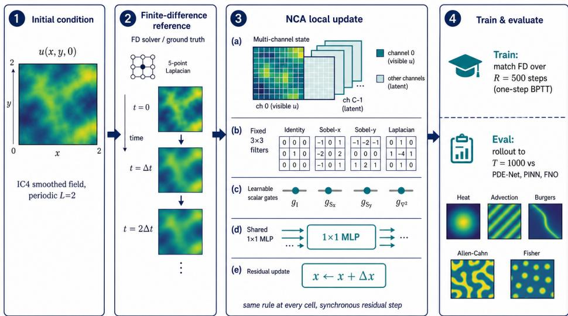  
Figure 1: One NCA forward pass: fixed-filter perception with learnable scalar gates, a shared pointwise MLP producing a proposed update, and a synchronous residual update. Repeated application rolls the state forward in time and is trained against ground-truth finite-diference trajectories.

## Governing PDEs

We consider five canonical PDEs on a two-dimensional grid, spanning difusive, advective, reactive, and bistable dynamics:

$$
\mathrm { H e a t } \colon ~ u _ { t } = \nabla ^ { 2 } u\tag{1}
$$

$$
\mathrm { B u r g e r s : \quad } u _ { t } + u u _ { x } = \nu u _ { x x }\tag{2}
$$

$$
\mathrm { F i s h e r - K P P : } \quad u _ { t } = \nabla ^ { 2 } u + r u ( 1 - u )\tag{3}
$$

$$
\mathrm { A l l e n - C a h n } \colon\ u _ { t } = \epsilon \nabla ^ { 2 } u + u - u ^ { 3 }\tag{4}
$$

$$
\mathrm { A d v e c t i o n } \colon\ u _ { t } + c u _ { x } = 0 .\tag{5}
$$

These PDEs are considered with periodic boundary conditions along with the initial condition:

$$
\tilde { u } _ { 0 } ( x , y ) = ( K * \xi ) ( x , y ) ,
$$

where $\xi ( x , y ) \sim \mathcal { N } ( 0 , 1 )$ , and K denotes a $5 \times 5$ averaging kernel. The normalized field is given by

$$
u _ { 0 } ( x , y ) = \frac { \tilde { u } _ { 0 } ( x , y ) } { \mathrm { S t d } ( \tilde { u } _ { 0 } ) + 1 0 ^ { - 6 } } .
$$

The hidden channels are initialized as $h _ { k } ( x , y ) \sim 0 . 0 1 { \mathcal N } ( 0 , 1 ) , \qquad k = 1 , \ldots , C - 1$ . Algorithm 1 summarizes one NCA step and the one-step-BPTT training / closed-loop evaluation procedures.

## Experimental Setup

The equations are solved on a $6 4 \times 6 4$ grid with $x \in [ 0 , 2 ] \times [ 0 , 2 ] { \mathrm { ~ } } ( { \mathrm { i . e . , } } \Delta x = 1 / 3 2 )$ with appropriate initial conditions (smooth random field obtained by Gaussian noise). We train the model using the spatial snapshots obtained above with a training temporal horizon of $T ~ = ~ 5 0 0$ (the final time $T$ depends on the choice of $\Delta t$ which varies based on the CFL condition for the PDE). For training, each Adam step samples a fresh batch of ICs and advances the finite diference update and model. Post training, we evaluate the learned model based on the following: (i) accuracy of full-field learned solutions of the PDEs from held-out ICs from the training IC family; (ii) temporal extrapolation from training rollout of $T = 5 0 0$ to horizon $T = 1 0 0 0$ (note that it does not evaluate on unseen PDE coeficients, alternative boundary conditions, resolution transfer, or qualitatively diferent IC families as a primary claim). For the PINN baseline, to make the architecture similar to our model, we train a convolutional neural network (CNN) with a combined data-fit and finitediference physics-residual loss. This modification was adopted due to the original PINN formulation performing significantly worse than the CNN architecture. The model is evaluated based on the relative $\ell _ { 2 }$ error defined by $\| \hat { u } - u \| _ { 2 } / \| u \| _ { 2 }$ , where ˆu and u denote the learned and true solutions respectively, i.e., for a particular temporal horizon we compute the errors between the true and learned solution for each time step. We report the mean ± std relative $\ell _ { 2 }$ errors over 200 diferent ICs (from the same family) for diferent time horizons $T \in \{ 1 0 0 , 2 0 0 , 6 0 0 , 8 0 0 , 1 0 0 0 \}$ . For ablation studies and noise robustness experiments, 50 held-out from the family of ICs are used for evaluation. We do not claim coeficient, boundary-condition, resolution, or IC-family transfer as a primary result. PDE parameters and time steps are listed in Table $2 ;$ shared training settings are listed in Table 3. For full reproducibility, the codes (including baseline implementations will be made available at https://github.com/esha-saha.

Algorithm 1 NCA PDE time-stepping: forward step, training, and evaluation   
1: function $\mathrm { N C A S T E P } ( z )$   
2: $p  \mathcal { P } ( z )$ ▷ gated fixed stencils: $I ,$ Sobel-x $/ y ,$ ∆   
3: $\Delta z \gets W _ { 1 } \mathrm { R e L U } ( W _ { 0 } p )$ ▷ pointwise MLP; $W _ { 1 }$ zero-init   
4: Return: $z + \Delta z$ $\triangleright$ synchronous residual; no firing mask   
5: end function   
6: procedure $\mathrm { T R A I N } ( \Phi _ { \mathrm { F D } } , R { = } 5 0 0 , N _ { \mathrm { o p t } } { = } 1 0 ^ { 4 } , B { = } 4 , \lambda { = } 1 0 ^ { - 4 } )$   
7: for $s = 1 , \ldots , N _ { \mathrm { o p t } }$ do   
8: Sample batch of ICs $\{ u _ { 0 } ^ { ( b ) } \} _ { b = 1 } ^ { B }$ from IC4   
9: Initialize $z ^ { ( 0 ) }$ with channel $0 = u _ { 0 }$ and hidden channels $\sim 0 . 0 1 \mathcal { N } ( 0 , 1 )$   
10: $u ^ { ( 0 ) } \gets u _ { 0 } ; \ L \gets 0$   
11: for $k = 0 , \ldots , R - 1$ do   
12: $z ^ { ( k + 1 ) } \gets \mathrm { N C A S T E P } ( z ^ { ( k ) } )$   
13: $u ^ { ( k + 1 ) } \gets \Phi _ { \mathrm { F D } } ( u ^ { ( k ) } )$ ▷ FD solver one step   
14: $L \gets L + \mathrm { M S E } ( z _ { : , 0 , : , : } ^ { ( k + 1 ) } , u ^ { ( k + 1 ) } )$   
15: $z ^ { ( k + 1 ) } \gets \mathrm { D e t a c h } ( z ^ { ( k + 1 ) } )$ ▷ BPTT truncation K=1   
16: end for   
17: $L \gets L / R + \lambda \| g \| _ { 1 }$   
18: Adam update on $( W _ { 0 } , W _ { 1 } , g )$ using $\nabla L$   
19: end for   
20: end procedure   
21: procedure $\mathrm { E v A L U A T E } ( u _ { 0 } , T _ { \mathrm { m a x } } { = } 1 0 0 0 )$   
22: Initialize $z ^ { ( 0 ) }$ from $u _ { 0 }$ as above; $u ^ { ( 0 ) }  u _ { 0 }$   
23: for $k = 0 , \ldots , T _ { \mathrm { m a x } } - 1$ do   
24: $z ^ { ( k + 1 ) } \gets \mathrm { N C A S T E P } ( z ^ { ( k ) } )$ ▷ closed-loop; no detach   
25: $u ^ { ( k + 1 ) } \gets \Phi _ { \mathrm { F D } } ( u ^ { ( k ) } )$   
26: $\rho ^ { ( k + 1 ) } \gets \| z _ { : , 0 , : , : } ^ { ( k + 1 ) } - u ^ { ( k + 1 ) } \| _ { 2 } / \| u ^ { ( k + 1 ) } \| _ { 2 }$   
27: end for   
28: Return: $\{ \rho ^ { ( T ) } \}$ for $T \in \{ 1 0 0$ , 200, 600, 800, 1000}   
29: end procedure

Table 2: Finite-diference solver for the main multi-PDE benchmark (N=64, L=2, periodic boundaries).
<table><tr><td>PDE</td><td>Parameters</td><td>Discrete ∆t</td></tr><tr><td>Heat</td><td> $u _ { t } = \Delta u$ </td><td> $0 . 2 \Delta x ^ { 2 }$ </td></tr><tr><td>Burgers</td><td> $\nu { = } 0 . 1 ;$  upwind flux</td><td> $\operatorname* { m i n } \bigl ( 0 . 4 \Delta x / ( | u | _ { \operatorname* { m a x } } + \varepsilon ) , 0 . 2 \Delta x ^ { 2 } / \nu \bigr )$ </td></tr><tr><td>Fisher - KPPr=1</td><td></td><td> $\operatorname* { m i n } ( 0 . 2 \Delta x ^ { 2 } , 0 . 5 )$ </td></tr><tr><td>Allen-Cahn</td><td> $\varepsilon { = } 1 0 ^ { - 3 } ;$  reaction  $u - u ^ { 3 }$ </td><td> $\operatorname* { m i n } ( 0 . 2 \Delta x ^ { 2 } / \varepsilon , 1 0 ^ { - 3 } )$ </td></tr><tr><td>Advection</td><td> $c { = } 1 ;$  upwind (baselines)</td><td> $0 . 5 \Delta x ~ \mathrm { ( C F L = 0 . 5 ) }$ </td></tr></table>

Table 3: Training and evaluation settings for the main benchmark (Table 4). Ablations use 50 eval seeds; noisy runs use 50 eval seeds for $\sigma { > } 0$  
Setting Value   
Grid / domain $N { = } 6 4 , L { = } 2 , \Delta x { = } 1 / 3 2 .$ , periodic BC   
Initial conditions IC4 smooth Gaussian RF (online sampling)   
Optimizer Adam   
Learning rate $\mathrm { N C A \ / \ P D E - N e t { : } \ 1 0 ^ { - 4 } ; \ F N O { : } \ 5 { \times } 1 0 ^ { - 4 } ; \ P I N N { : } \ 1 0 ^ { - 3 } }$   
Eval horizons $T \in \{ 1 0 0 , 2 0 0 , 6 0 0 , 8 0 0 , 1 0 0 0 \}$ (closed-loop; 200 seeds)   
BPTT truncation K K=1 (detach every step; one-step BPTT)   
NCA capacity C=8 channels, hidden width 128 (∼5.3k params)   
PDE - Net 8 learnable 5×5 filters, hidden 64; same R=500 loop   
FNO Fourier stepper (∼2.36M params); same R=500 detach loop   
PINN IC-conditioned grid CNN (∼208k params); data + IC + physics residual

## 4 Results

Table 4 reports mean relative $\ell _ { 2 }$ error for each temporal horizon for every PDE and model. For the heat equation, NCA achieves the lowest error at every reported horizon, with the advantage becoming evident at long horizons. At T = 1000, which is twice the training temporal horizon, its relative error is 0.561, compared with 0.709 for PDE - Net, 0.824 for FNO, and 1.439 for PINN. Thus, relative to the next-best baseline, PDE - Net, NCA reduces the error at T = 1000 by approximately 21%. The same trend can be found for Burgers and Fisher - KPP. At T = 1000,

Table 4: Mean relative $\ell _ { 2 }$ error. Bold marks the best model per PDE.
<table><tr><td>PDE</td><td>Model</td><td>T=100</td><td>T=200</td><td>T=600</td><td>T=800</td><td>T=1000</td></tr><tr><td rowspan="3">Heat</td><td>NCA</td><td>0.011±0.002</td><td>0.035±0.011</td><td>0.219±0.132</td><td>0.369±0.266</td><td>0.561±0.486</td></tr><tr><td>PDE - Net</td><td>0.067±0.012</td><td>0.080±0.021</td><td>0.292±0.134</td><td>0.479±0.274</td><td>0.709±0.493</td></tr><tr><td>PINN FNO</td><td>0.550±0.082</td><td>0.682±0.109</td><td>1.085±0.289</td><td>1.226±0.467</td><td>1.439±0.761</td></tr><tr><td rowspan="3">Burgers</td><td></td><td>0.290±0.193</td><td>0.397±0.239</td><td>0.663±0.271</td><td>0.754±0.252</td><td>0.824±0.223</td></tr><tr><td>NCA</td><td>0.040±0.008</td><td>0.048±0.013</td><td>0.074±0.032</td><td>0.114±0.091</td><td>0.196±0.229</td></tr><tr><td>PDE - Net</td><td>0.093±0.015</td><td>0.174±0.043</td><td>0.834±0.460</td><td>1.271±0.872</td><td>1.754±1.543</td></tr><tr><td rowspan="3"></td><td>PINN FNO</td><td>0.750±0.176 0.301±0.192</td><td>0.928±0.269</td><td>1.384±0.612 0.697±0.245</td><td>1.551±0.751 0.786±0.219</td><td>1.948±1.244 0.853±0.186</td></tr><tr><td></td><td></td><td>0.417±0.232</td><td></td><td></td><td></td></tr><tr><td>NCA</td><td>0.012±0.002</td><td>0.021±0.007</td><td>0.127±0.065</td><td>0.211±0.133</td><td>0.315±0.244</td></tr><tr><td rowspan="3">Fisher - KPP</td><td>PDE - Net</td><td>0.077±0.013</td><td>0.099±0.027</td><td>0.327±0.154</td><td>0.487±0.265</td><td>0.674±0.420</td></tr><tr><td>PINN</td><td>0.669±0.124</td><td>0.928±0.234</td><td>1.393±0.572</td><td>1.556±0.785</td><td>1.817±1.166</td></tr><tr><td>FNO</td><td>0.290±0.193</td><td>0.398±0.238</td><td>0.661±0.274</td><td>0.751±0.259</td><td>0.820±0.235</td></tr><tr><td rowspan="4">Allen - Cahn</td><td>NCA</td><td>0.008±0.0002</td><td>0.013±0.0003</td><td>0.032±0.001</td><td>0.042±0.002</td><td>0.052±0.003</td></tr><tr><td>PDE - Net</td><td>0.004±0.0001</td><td>0.006±0.0002</td><td>0.010±0.0005</td><td>0.013±0.001</td><td>0.015±0.001</td></tr><tr><td>PINN</td><td>0.069±0.004</td><td>0.109±0.007</td><td>0.076±0.008</td><td>0.106±0.006</td><td>0.126±0.006</td></tr><tr><td>FNO</td><td>0.033±0.002</td><td>0.055±0.003</td><td>0.102±0.006</td><td>0.121±0.008</td><td>0.138±0.010</td></tr><tr><td rowspan="4">Advection</td><td>NCA</td><td>0.097±0.002</td><td>0.184±0.004</td><td>0.388±0.008</td><td>0.428±0.009</td><td>0.457±0.009</td></tr><tr><td>PDE - Net</td><td>0.342±0.026</td><td>0.399±0.029</td><td>0.668±0.047</td><td>0.807±0.068</td><td>0.951±0.099</td></tr><tr><td>PINN</td><td>0.993±0.023</td><td>1.023±0.026</td><td>0.975±0.036</td><td>0.924±0.029</td><td>0.878±0.019</td></tr><tr><td>FNO</td><td>0.343±0.044</td><td>0.362±0.054</td><td>0.407±0.073</td><td>0.424±0.079</td><td>0.437±0.084</td></tr></table>

NCA obtains errors of 0.196 and 0.315, respectively, whereas PDE - Net reaches 1.754 and 0.674. This corresponds to reductions of approximately 89% and 53% relative to PDE - Net on these two equations.

On Burgers, the NCA errors remain below 0.20 throughout the entire evaluated interval, increasing from 0.040 at T = 100 to 0.196 at T = 1000. In contrast, PDE - Net grows from 0.093 to 1.754, while FNO grows from 0.301 to 0.853. Since the objective of the experiment is not merely to obtain a good one-step or short-horizon prediction, but to maintain a stable approximation under repeated application of the learned update rule, these results are particularly important. The widening gap between NCA and the baselines indicates that the learned local dynamics of NCA are more robust to other well-known baselines. A similar pattern is also observed for Fisher - KPP. NCA has the lowest error at all five horizons, starting at 0.012 at T = 100 and reaching 0.315 at T = 1000. PDE - Net remains the closest baseline but its error grows to 0.674, while FNO and PINN reach 0.820 and 1.817, respectively. The large error of PINN at long horizons is consistent with the dificulty of maintaining accurate trajectory predictions when a model is optimized primarily through the PDE residual and boundary/initial-condition constraints.

For Allen - Cahn, however, PDE - Net is consistently more accurate, achieving errors of 0.004, 0.006, 0.010, 0.013, and 0.015 across the five horizons, compared with 0.008, 0.013, 0.032, 0.042, and 0.052 for NCA. Regardless, NCA still maintains a relatively small absolute error throughout the rollout, and its T = 1000 error remains substantially below those of PINN (0.126) and FNO (0.138). The result suggests that PDE - Net is especially well matched to the dynamics of the Allen - Cahn configuration used here, while NCA provides a more consistently strong performance across the broader collection of PDEs. The behavior of PINN is particularly notable across the benchmark. On heat, Burgers, and Fisher - KPP, its relative error exceeds 1.0 before or by the longest rollout horizon, reaching 1.439, 1.948, and 1.817, respectively, at $T = 1 0 0 0$ . These values indicate that the accumulated rollout error becomes comparable to or larger than the magnitude of the reference solution. PINN performs better on Allen–Cahn, where its $T = 1 0 0 0$ error is 0.126, but it remains worse than both NCA and PDE - Net. This consistent degradation at long horizons highlights the diference between learning a solution satisfying the governing equation and learning a stable discrete evolution operator that can be repeatedly applied.

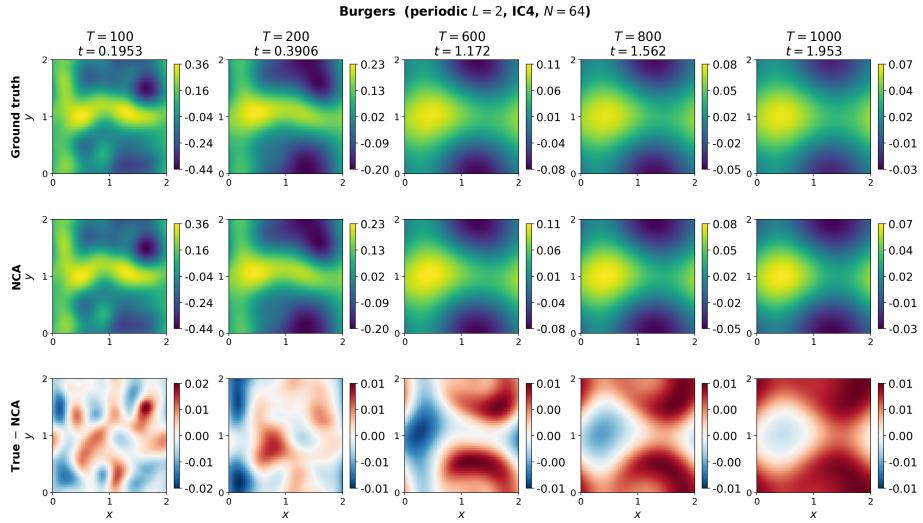  
Figure 2: A sample true and learned solution of the Burgers equation using NCA, along with the diference of true solution and learned solution.

FNO occupies an intermediate position in most of the experiments. It is substantially more accurate than PINN on heat, Burgers, and Fisher - KPP, but remains behind NCA at long horizons. For example, at $T = 1 0 0 0$ , NCA improves over FNO by approximately 32% on heat, 77% on Burgers, and 62% on Fisher - KPP. FNO is the strongest model on the advection experiment at the longest horizon, obtaining a relative error of 0.437 compared with 0.457 for the NCA.

An additional observation from Table 4 is that the performance is more pronounced at longer horizons than at shorter ones. At T = 100, several baselines still produce moderate errors, whereas repeated application of their learned dynamics causes the error to accumulate rapidly. NCA, in contrast, maintains comparatively gradual error growth on Burgers and Fisher - KPP and remains the best-performing model on heat throughout the evaluated interval. This distinction between short- and long-horizon behavior is central to the proposed formulation: a model can achieve a reasonable approximation at an early horizon while still possessing a learned update rule that is unstable or poorly conditioned under repeated composition. The long-horizon results therefore provide a more stringent test of whether the learned operator captures the underlying temporal dynamics rather than simply interpolating the training trajectories. In order to visualize better, we have also plotted the results in Table 4 and Figure 3. The plots show that relative error generally increases with temporal horizon for all methods, but NCA exhibits the most stable long-horizon behavior on the majority of the PDEs, where its error remains consistently below or close to the competing approaches and grows relatively gradually as T increases.

Taken together, Table 4 supports three conclusions.

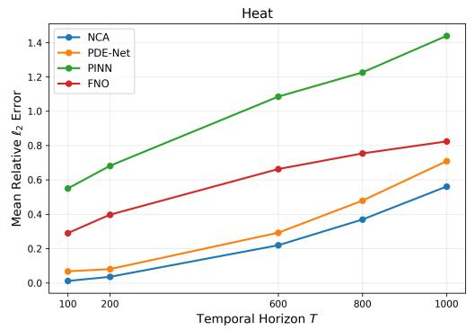

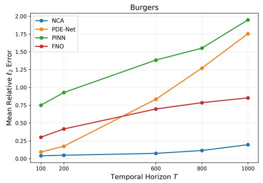

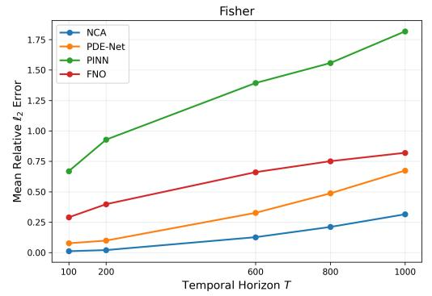

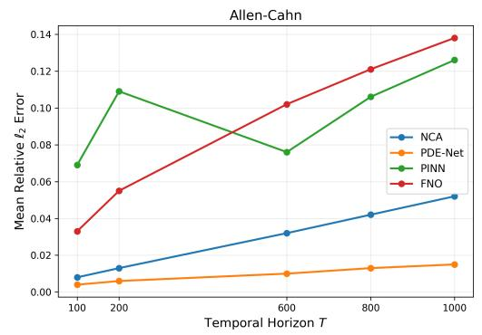

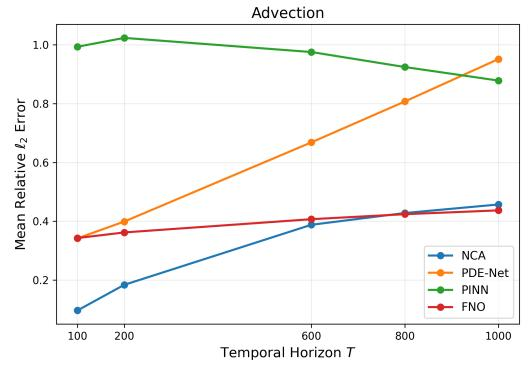  
Figure 3: Error growth across temporal horizon for diferent methods.

1. NCA provides the strongest long-horizon performance on majority of the benchmark PDEs.

2. Its advantage becomes particularly large on Burgers and Fisher - KPP, where the competing models accumulate substantial rollout error.

3. The Allen–Cahn result demonstrates that NCA is not uniformly superior and that the structure of the underlying PDE and initial condition matters.

## 4.1 Robustness to Noise

To test whether the model learning is susceptible to observation noise, we retrained every model with additive Gaussian noise on the training spatiotemporal snapshots,

$$
\begin{array} { r } { u _ { \mathrm { n o i s y } } = u + \sigma \mathrm { s t d } ( u ) \varepsilon , \quad \varepsilon \sim \mathcal { N } ( 0 , 1 ) , } \end{array}
$$

at relative levels $\sigma \in \{ 0 . 0 5 , 0 . 1 0 \}$ (5%, 10%), while keeping evaluation on the clean solutions.

Table 5: Mean relative $\ell _ { 2 }$ error under additive Gaussian training noise of varying strengths.
<table><tr><td rowspan="2">PDE</td><td rowspan="2">Model</td><td colspan="2">σ=0</td><td colspan="2">σ=5%</td><td colspan="2">σ=10%</td></tr><tr><td>T=100</td><td>T=1000</td><td>T=100</td><td>T=1000</td><td>T=100</td><td>T=1000</td></tr><tr><td rowspan="4">Heat</td><td>NCA</td><td>0.011±0.002</td><td>0.561±0.486</td><td>0.017±0.003</td><td>0.246±0.184</td><td>0.018±0.004</td><td>0.271±0.202</td></tr><tr><td>PDE-Net</td><td>0.067±0.012</td><td>0.709±0.493</td><td>0.125±0.015</td><td>2.309±1.373</td><td>0.129±0.024</td><td>1.701±1.016</td></tr><tr><td>FNO</td><td>0.290±0.193</td><td>0.824±0.223</td><td>0.300±0.207</td><td>0.820±0.244</td><td>0.300±0.207</td><td>0.820±0.244</td></tr><tr><td>PINN</td><td>0.550±0.082</td><td>1.439±0.761</td><td>0.574±0.119</td><td>1.428±0.577</td><td>0.572±0.080</td><td>1.907±0.961</td></tr><tr><td rowspan="4">Burgers</td><td>NCA</td><td>0.040±0.008</td><td>0.196±0.229</td><td>0.050±0.009</td><td>0.725±0.371</td><td>0.049±0.010</td><td>0.598±0.300</td></tr><tr><td>PDE-Net</td><td>0.093±0.015</td><td>1.754±1.543</td><td>0.094±0.018</td><td>1.632±1.227</td><td>0.116±0.025</td><td>2.053±1.268</td></tr><tr><td>FNO</td><td>0.301±0.192</td><td>0.853±0.186</td><td>0.306±0.209</td><td>0.841±0.213</td><td>0.306±0.209</td><td>0.841±0.213</td></tr><tr><td>PINN</td><td>0.750±0.176</td><td>1.948±1.244</td><td>0.772±0.131</td><td>1.813±0.876</td><td>0.640±0.104</td><td>2.065±1.042</td></tr><tr><td rowspan="4">Fisher</td><td>NCA</td><td>0.012±0.002</td><td>0.315±0.244</td><td>0.011±0.002</td><td>0.123±0.074</td><td>0.013±0.002</td><td>0.107±0.034</td></tr><tr><td>PDE-Net</td><td>0.077±0.013</td><td>0.674±0.420</td><td>0.099±0.013</td><td>1.927±1.301</td><td>0.094±0.015</td><td>1.183±0.526</td></tr><tr><td>FNO</td><td>0.290±0.193</td><td>0.820±0.235</td><td>0.300±0.204</td><td>0.831±0.220</td><td>0.300±0.204</td><td>0.831±0.220</td></tr><tr><td>PINN</td><td>0.669±0.124</td><td>1.817±1.166</td><td>0.418±0.060</td><td>1.843±0.957</td><td>0.470±0.079</td><td>1.751±0.925</td></tr><tr><td rowspan="4">Allen-Cahn</td><td>NCA</td><td>0.008±0.0002</td><td>0.052±0.003</td><td>0.005±0.000</td><td>0.011±0.001</td><td>0.005±0.000</td><td>0.014±0.001</td></tr><tr><td>PDE-Net</td><td>0.004±0.0001</td><td>0.015±0.001</td><td>0.005±0.000</td><td>0.019±0.002</td><td>0.004±0.000</td><td>0.009±0.001</td></tr><tr><td>FNO</td><td>0.033±0.002</td><td>0.138±0.010</td><td>0.034±0.002</td><td>0.139±0.012</td><td>0.034±0.002</td><td>0.139±0.012</td></tr><tr><td>PINN</td><td>0.069±0.004</td><td>0.126±0.006</td><td>0.059±0.004</td><td>0.083±0.005</td><td>0.072±0.005</td><td>0.093±0.005</td></tr><tr><td rowspan="4">Advection</td><td>NCA</td><td>0.097±0.002</td><td>0.457±0.009</td><td>0.781±0.035</td><td>0.958±0.050</td><td>0.781±0.035</td><td>0.957±0.050</td></tr><tr><td>PDE-Net</td><td>0.342±0.026</td><td>0.951±0.099</td><td>0.322±0.030</td><td>0.633±0.091</td><td>0.324±0.030</td><td>0.480±0.057</td></tr><tr><td>FNO</td><td>0.343±0.044</td><td>0.437±0.084</td><td>0.336±0.052</td><td>0.415±0.103</td><td>0.336±0.052</td><td>0.415±0.103</td></tr><tr><td>PINN</td><td>0.993±0.023</td><td>0.878±0.019</td><td>1.016±0.024</td><td>0.893±0.051</td><td>1.010±0.026</td><td>0.861±0.025</td></tr></table>

The results in Table 5 show that NCA exhibits good robustness to moderate levels of additive Gaussian noise in the training data, although the efect varies across PDEs. For the heat and Fisher - KPP equations, NCA maintains relatively low errors even at 5% and 10% noise, with substantially smaller errors at T=1000 than PDE-Net, FNO, and PINN. On both PDEs the long-horizon error decreases relative to the clean run (heat: 0.561 to 0.246 at 5% noise level; Fisher: 0.315 to 0.123). This robustness may arise from the local fixed-stencil perception used by NCA, which restricts the information passed to the update rule to structured local spatial features and may therefore reduce the influence of high-frequency perturbations introduced by noisy targets. In contrast, PDEs with stronger transport or nonlinear dynamics can be more sensitive to perturbations because smal local errors may be amplified during repeated rollouts. This is clearest for advection, where NCA’s error increases substantially under noisy training, while FNO and PDE-Net remain far more stable. Burgers exhibits an intermediate behavior: although its error increases with noise (0.196 to 0.60 - 0.73 at ${ \cal T } { = } 1 0 0 0 )$ , NCA still retains a lower long-horizon error than PDE-Net, FNO, and PINN. For the Allen - Cahn PDE, at 5% noise NCA attains the lowest error for ${ \cal T } { = } 1 0 0 0$ error (0.011 vs. 0.019), while PDE - Net has lowest errors at 10% noise (0.009 vs. 0.014), suggesting that the inductive bias of the NCA architecture is not equally advantageous for all dynamics or noise levels. Overall, these results suggest that NCA’s local, fixed-stencil perception and gated updates can provide meaningful robustness to noisy training data, particularly for difusion- and reactiondominated dynamics, while transport-dominated equations remain more sensitive to perturbations accumulated during long rollouts.

## 4.2 Interpreting Learned Perception Gates

Each NCA channel multiplies the inputs with four fixed finite diference matrices representing identity, $\partial _ { x } , \partial _ { y }$ , and the Laplacian. Trainable scalar gates multiply with each of these four outputs, together with an $\ell _ { 1 }$ sparsity penalty $\scriptstyle ( \lambda = 1 0 ^ { - 4 } )$ which act as data-driven operator selectors. Table 6 reports the gate magnitude associated with each stencil. Larger magnitudes indicate a preference for the corresponding fixed operator among those available in the perception layer. Values near zero indicate that the corresponding stencil has less importance under the $\ell _ { 1 }$ penalty.

Table 6: NCA learned perception-gate magnitudes. The top two dominant terms are compared with the true operators in the equations. Overlapping operators are highlighted in bold.
<table><tr><td>PDE</td><td>Identity (I)</td><td> $\partial _ { x }$ </td><td> $\partial _ { y }$ </td><td>Laplace (∆)</td><td>Dominant</td><td>True</td></tr><tr><td>Heat</td><td>0.0206</td><td> $0 . 0 0 e + 0 0$ </td><td> $0 . 0 0 e + 0 0$ </td><td>0.0368</td><td>I, Δ</td><td> $\Delta$ </td></tr><tr><td>Burgers</td><td>0.0232</td><td>0.0081</td><td> $0 . 0 0 e + 0 0$ </td><td>0.0374</td><td>Δ, I</td><td> $\partial _ { x } , \mathbf { I }$ </td></tr><tr><td>Fisher -  $\mathrm { K P P }$ </td><td>0.0205</td><td> $0 . 0 0 e + 0 0$ </td><td> $0 . 0 0 e + 0 0$ </td><td>0.0370</td><td>I, ∆</td><td>∆, 1</td></tr><tr><td>Allen Cahn</td><td>0.0167</td><td>0.0019</td><td>0.0016</td><td>0.0062</td><td>∆, I</td><td> $\Delta , \mathrm { I }$ </td></tr><tr><td>Advection</td><td>0.0109</td><td>0.1067</td><td>0.0001</td><td>0.0194</td><td> $\partial _ { x } ,$  ∆</td><td> $\partial _ { x }$ </td></tr></table>

On the heat, Allen - Cahn and Fisher - KPP PDEs, $\partial _ { x }$ and $\partial _ { y }$ gates have the lowest values while the Laplacian gate is largest, followed by the identity channels. This matches closely with the true equations, which are $\Delta$ dominated. Burgers follows the same Laplacian-first pattern but with a relatively larger $\partial _ { x }$ gate, consistent with the viscous Burgers combining difusion and a statedependent advective flux. The model therefore allocates weight to both the Laplacian and the horizontal-derivative stencil, while $\partial _ { y }$ remains inactive. Advection gates allocate the largest entry to $\partial _ { x }$ , which agrees with the true dominating term in the original PDE. Across the five benchmark PDEs where all models share a comparable implementation, the learned gates are sparse and PDEaligned. This supports the discussion in Section 5 that NCA’s fixed, sparse perception filters can potentially learn physically interpretable updates rather than an unconstrained black-box map.

## 5 Discussion

NCA is trained to learn the updates of the next timestep by considering its immediate neighbouring cells. NCA is trained as a one-step map (truncation K = 1) on $R = 5 0 0$ closed-loop steps, then evaluated by composing that map to $T = 1 0 0 0$ . This trains the model on states encountered during closed-loop evolution, while the evaluation directly measures the stability of the resulting update rule over long rollouts. The perception layer uses a dictionary of various finite-diference stencils such as identity, Sobel, Laplacian operators which help in identifying the operators/PDE terms which may be present in the equation. We discuss the results of each of the baseline methods in detail below.

The PDE - Net is trained using learnable $5 \times 5$ filters with a pointwise MLP. The performance is behind NCA on the heat equation at $T = 1 0 0$ (relative error of 0.067 for PDE - Net vs 0.011 for NCA). The gap widens substantially by the time we reach $T = 1 0 0 0 \ ( 0 . 7 0 9$ for PDE - Net vs. 0.561 for NCA). However, PDE - Net outperforms NCA at every horizon for the Allen - Cahn PDE. On Burgers and Fisher - KPP, PDE - Net’s error grows sharply beyond $T = 2 0 0$ (e.g., 0.174 to 1.754 on Burgers between $T = 2 0 0$ and $T = 1 0 0 0 )$ .

The PINN baseline reported in Table 4 uses a CNN with initial condition $u ( x , y , 0 ) = u _ { 0 } ( x , y )$ and a physics residual. The PINN learns $u _ { 0 } \mapsto u ( \cdot , T )$ for a random query horizon $T _ { i }$ whereas NCA/PDE - Net/FNO learn the Markov transition $u ^ { n } \mapsto u ^ { n + 1 }$ and compose it T times. Longhorizon composition is never directly enforced during PINN training, leading to an underperformance beyond the training temporal horizon. Even with normalized residuals, the PINN must simultaneously satisfy the PDE, the initial condition, and data.

On heat, Burgers, and Fisher - KPP its performance in terms of relative errors is between PDE - Net and PINN. At $T = 1 0 0 0$ it is substantially behind NCA. On Allen - Cahn it is close to PDE - Net but beats PINN.

## 5.1 Ablation Study

In this section we provide a controlled ablation on the heat and Burgers equations with a random Gaussian initial condition, $L \ = \ 2$ , and evaluate it for $T \in \{ 1 0 0 , 2 0 0 , 6 0 0 , 8 0 0 , 1 0 0 0 \}$ . We compare the average full field relative errors of NCA, PINNs and FNO for using diferent numbers of trainable parameters and the training and evaluation times. We consider two scenarios for model comparisons: the original version whose results were discussed in Section 4 and a par-matched version where the number of trainable parameters of NCA, FNO and PINNs have been adjusted so they remain fairly similar. In the original version, we consider the best versions of the model i.e., the number of trainable parameters for FNO and PINN are relatively high in comparison to NCA. For the par-matched NCA version, we use at least 64 channels with minimum 128 hidden neurons.

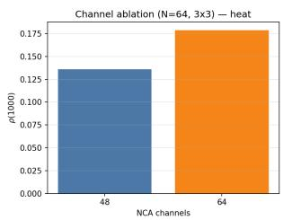  
(a) Heat (N = 64)

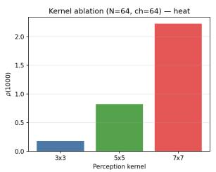

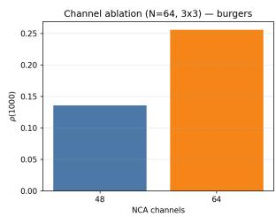

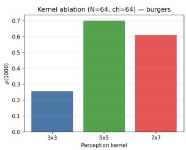  
(b) Burgers (N = 64)  
Figure 4: NCA channel and perception-kernel ablations at $N = 6 4$ . Compact $3 \times 3$ kernels dominate wider $5 \times 5$ and $7 \times 7$ alternatives at long horizon.

Table 7: Comparison of baselines and training times under their best performance along with the number of trainable parameters matched with NCA. “Train (s)” is single-run wall-clock time on one NVIDIA H100 GPU. The times cover the fixed training loop (Adam updates plus online finitediference reference steps) and exclude hyperparameter search and trajectory sampling.
<table><tr><td>PDE</td><td>Protocol</td><td>Model</td><td>Params</td><td>Train (s)</td><td> $T = 1 0 0$ </td><td> $T = 1 0 0 0$ </td></tr><tr><td rowspan="8">Heat</td><td>original</td><td>NCA</td><td>5.3k</td><td>696</td><td>0.016</td><td>0.139</td></tr><tr><td>original</td><td>PDE - Net</td><td>5.1k</td><td>957</td><td>0.080</td><td>0.707</td></tr><tr><td>original</td><td>FNO</td><td>2.36M</td><td>6906</td><td>0.314</td><td>1.026</td></tr><tr><td>original</td><td>PINN</td><td>208k</td><td>195</td><td>0.455</td><td>1.468</td></tr><tr><td>par-matched</td><td>NCA</td><td>61.9k</td><td>2295</td><td>0.010</td><td>0.179</td></tr><tr><td>par-matched</td><td>PDE - Net</td><td>59.0k</td><td>3052</td><td>0.268</td><td>0.979</td></tr><tr><td>par-matched</td><td>FNO</td><td>65.9k</td><td>23063</td><td>0.307</td><td>1.231</td></tr><tr><td>par-matched</td><td>PINN</td><td>52.9k</td><td>380</td><td>0.544</td><td>1.430</td></tr><tr><td rowspan="7">Burgers</td><td>original</td><td>NCA</td><td>5.3k</td><td>871</td><td>0.030</td><td>0.625</td></tr><tr><td>original</td><td>PDE - Net</td><td>5.1k</td><td>1161</td><td>0.087</td><td>0.580</td></tr><tr><td>original</td><td>FNO</td><td>2.36M</td><td>7099</td><td>0.315</td><td>1.015</td></tr><tr><td>original</td><td>PINN</td><td>208k</td><td>442</td><td>0.484</td><td>1.833</td></tr><tr><td>par-matched</td><td>NCA</td><td>61.9k</td><td>2917</td><td>0.036</td><td>0.256</td></tr><tr><td>par-matched</td><td>PDE - Net</td><td>59.0k</td><td>3660</td><td>0.050</td><td>0.407</td></tr><tr><td>par-matched</td><td>FNO</td><td>65.9k</td><td>23283</td><td>0.314</td><td>1.602</td></tr><tr><td></td><td>par-matched</td><td>PINN</td><td>52.9k</td><td>886</td><td>0.536</td><td>2.058</td></tr></table>

Training Time. Here we will be comparing the long rollout relative errors at $T = 1 0 0 0$ as the resolution changes. In the fair versions, as N increases, the performance of NCA improves as well (see Table 7). Additional simulations on Burgers equation indicated that the NCA error decreases monotonically from 0.820 to 0.256 as we changed $N = 3 2$ to $N = 6 4$ . On heat, while errors at $N = 3 2$ are already low at 0.283, the best configuration at $N = 6 4$ gives the lowest error of 0.179. FNO improves with resolution but does not improve enough to be close to NCA, both at the original setting as well as the par-matched setting. When we reduce the parameters of FNO (and increase parameters of NCA) to match closely with NCA, training FNO is almost 10× slower than NCA (e.g., training time of 23000 secs for FNO vs 2300 secs for NCA on heat at $N = 6 4 )$ . When only considering the training time, PINN trains fastest with about 380 secs but its poor performance for longer temporal horizons makes it a costly tradeof for the short training time.

Number of Neighbours for NCA. Our proposed NCA uses a 3×3 fixed-stencil perception kernel with trainable scalar gates. We explore if it would also be useful to consider farther neighbours through a $5 \times 5$ or $7 \times 7$ kernel. Figure 4 shows that widening the NCA perception kernel hurts long-horizon accuracy where at $N = 6 4$ on heat, relative errors at $T = 1 0 0 0$ rise from 0.179 for a $3 \times 3$ kernel to 0.825 for $5 \times 5$ kernel and 2.231 for $7 \times 7$ kernel. The same pattern holds on Burgers. This pattern indicates that for a cell to learn its next temporal update, only the immediate neighbours provide suficient information. Under the tested architecture and training protocol, the 3×3 perception field provides substantially better long-horizon accuracy than the 5×5 and $7 \times 7$ alternatives.

## 6 Conclusions

In this paper, we proposed a Neural Cellular Automata (NCA)-based approach for learning the time evolution of solutions to partial diferential equations (PDEs). The goal was to develop a simple local model that can predict the solution over many time steps while maintaining good accuracy and stability. Comparisons of NCA with PDE - Net, FNO, and a PINN baseline using identical settings indicated that at long time horizons, NCA outperformed the other baselines for a majority of the benchmark PDEs. The results are consistent with the fact that small errors can grow slowly when the learned update is stable but can grow rapidly when it is not. The ablation experiments further showed that NCA performed better on heat and Burgers under diferent resolutions and is optimal only when learning is considered from immediate neighbours.

Limitations and Future Work: While efective, especially for long temporal horizons, the proposed methodology also admits some limitations. Since NCA relies on local interactions, the information available to each cell is limited by the size of its perception field. NCA also uses repeated application of the same local update rule, which can cause small prediction errors to accumulate over long rollouts, particularly when the learned update is not suficiently stable. In addition, the performance of NCA can depend on choices such as the perception kernel, update rule, and training rollout length, and these choices may need to change for diferent types of PDEs. Another limitation is that standard NCA does not explicitly include physical constraints such as conservation laws, boundary conditions, or known symmetries unless these are incorporated into the model or training procedure. Therefore, good prediction accuracy on the PDEs considered here does not necessarily imply that the learned dynamics satisfy the underlying physical laws. Finally, because NCA learns the dynamics from data rather than directly using the known PDE, its ability to generalize to parameter regimes, resolutions, or physical settings that are substantially diferent from those seen during training remains an open question.

Several directions can be explored as a future work. Incorporating known physical properties, such as conservation and symmetry, into the NCA update rule could help improve its reliability and generalization. Another important direction is to investigate adaptive or multi-scale perception mechanisms that can capture both local and longer-range interactions without simply increasing the kernel size. Finally, the interpretability results suggest that NCA could be useful not only for predicting PDE solutions but also for identifying the equations that govern them. By examining and sparsifying the learned filters, it may be possible to identify the important diferential operators and recover an unknown PDE directly from data.

Use of AI: The authors would like to acknowledge the use of AI tools such as ChatGPT and Claude AI for improving manuscript quality and building graphical abstract.

## References

Ames, W.F., 2014. Numerical methods for partial diferential equations. Academic press.

Arora, S., Bihlo, A., Valiquette, F., 2024. Invariant physics-informed neural networks for ordinary diferential equations. Journal of Machine Learning Research 25, 1–24.

Blechschmidt, J., Ernst, O.G., 2021. Three ways to solve partial diferential equations with neural networks—a review. Gamm-mitteilungen 44, e202100006.

Cai, S., Mao, Z., Wang, Z., Yin, M., Karniadakis, G.E., 2021. Physics-informed neural networks (pinns) for fluid mechanics: A review. Acta Mechanica Sinica 37, 1727–1738.

Chen, Z., Liu, Y., Sun, H., 2021. Physics-informed learning of governing equations from scarce data. Nature communications 12, 6136.

De Florio, M., Schiassi, E., Calabr\`o, F., Furfaro, R., 2024. Physics-informed neural networks for 2nd order odes with sharp gradients. Journal of Computational and Applied Mathematics 436, 115396.

Eliasof, M., Haber, E., Treister, E., 2021. Pde-gcn: Novel architectures for graph neural networks motivated by partial diferential equations. Advances in neural information processing systems 34, 3836–3849.

Farea, A., Yli-Harja, O., Emmert-Streib, F., 2024. Understanding physics-informed neural networks: Techniques, applications, trends, and challenges. Ai 5, 1534–1557.

Hartl, B., Levin, M., Pio-Lopez, L., 2025. Neural cellular automata: applications to biology and beyond classical ai. Physics of Life Reviews .

Kim, J., Son, J., Koo, J., 2025. Dynamic estimation of pm2. 5 penetration and removal rates using physics-informed neural networks for indoor air quality management. Building and Environment 278, 113038.

Lagaris, I.E., Likas, A., Fotiadis, D.I., 1998. Artificial neural networks for solving ordinary and partial diferential equations. IEEE transactions on neural networks 9, 987–1000.

Li, B., Hu, Q., Gao, M., Liu, T., Zhang, C., Liu, C., 2023. Physical informed neural network improving the wrf-chem results of air pollution using satellite-based remote sensing data. Atmospheric Environment 311, 120031.

Li, Z., Kovachki, N., Azizzadenesheli, K., Liu, B., Bhattacharya, K., Stuart, A., Anandkumar, A., 2021. Fourier neural operator for parametric partial diferential equations. International Conference on Learning Representations .

Li, Z., Kovachki, N., Azizzadenesheli, K., Liu, B., Stuart, A., Bhattacharya, K., Anandkumar, A., 2020. Multipole graph neural operator for parametric partial diferential equations. Advances in neural information processing systems 33, 6755–6766.

Long, Z., Lu, Y., Dong, B., 2019. Pde-net 2.0: Learning pdes from data with a numeric-symbolic hybrid deep network. Journal of Computational Physics 399, 108925.

Long, Z., Lu, Y., Ma, X., Dong, B., 2018. Pde-net: Learning pdes from data, in: International conference on machine learning, PMLR. pp. 3208–3216.

Lu, L., Jin, P., Pang, G., Zhang, Z., Karniadakis, G.E., 2021. Learning nonlinear operators via DeepONet based on the universal approximation theorem of operators. Nature Machine Intelligence 3, 218–229. doi:10.1038/s42256-021-00302-5.

Luo, K., Zhao, J., Wang, Y., Li, J., Wen, J., Liang, J., Soekmadji, H., Liao, S., 2025. Physicsinformed neural networks for pde problems: a comprehensive review. Artificial Intelligence Review 58, 323.

Matthews, J., Bihlo, A., 2024. Pinnde: Physics-informed neural networks for solving diferential equations. arXiv preprint arXiv:2408.10011 .

Mordvintsev, A., Randazzo, E., Niklasson, E., Levin, M., 2020. Growing neural cellular automata. Distill 5, e23.

Niklasson, E., Mordvintsev, A., Randazzo, E., Levin, M., 2021. Self-organising textures. Distill doi:10.23915/distill.00027.003.

Palm, R.B., Gonz´alez-Duque, M., Sudhakaran, S., Risi, S., 2022. Variational neural cellular automata. International Conference on Learning Representations .

Raissi, M., Perdikaris, P., Karniadakis, G.E., 2019. Physics-informed neural networks: A deep learning framework for solving forward and inverse problems involving nonlinear partial diferential equations. Journal of Computational Physics 378, 686–707. doi:10.1016/j.jcp.2018.10.045.

Richardson, A.D., Antal, T., Blythe, R.A., Schumacher, L.J., 2024. Learning spatio-temporal patterns with neural cellular automata. PLOS Computational Biology 20, e1011589.

Saha, E., Wang, H., 2025. Learning coupled system dynamics under incomplete physical constraints and missing data. arXiv preprint arXiv:2512.23761 .

Saha, E., Wang, O., Chakraborty, A.K., Garcia, P.V., Milne, R., Wang, H., 2025. Dispersion based recurrent neural network model for methane monitoring in albertan tailings ponds. Journal of Environmental Management 395, 127748.

Stachenfeld, K., Fielding, D.B., Kochkov, D., Cranmer, M., Pfaf, T., Godwin, J., Cui, C., Ho, S., Battaglia, P., Sanchez-Gonzalez, A., 2022. Learned coarse models for eficient turbulence simulation. International Conference on Learning Representations .

Tesfaldet, M., Nowrouzezahrai, D., Pal, C., 2022. Attention-based neural cellular automata. Advances in Neural Information Processing Systems 35, 8174–8186.

Toscano, J.D., Oommen, V., Varghese, A.J., Zou, Z., Ahmadi Daryakenari, N., Wu, C., Karniadakis, G.E., 2025. From pinns to pikans: Recent advances in physics-informed machine learning. Machine Learning for Computational Science and Engineering 1, 15.

Zhang, X., Wang, S., Jin, G., Yuan, Z., Yuan, H., Ruan, S., 2026. Eulerian neural network informed by chemical transport for air quality forecasting. Advances in Neural Information Processing Systems 38, 33576–33601.