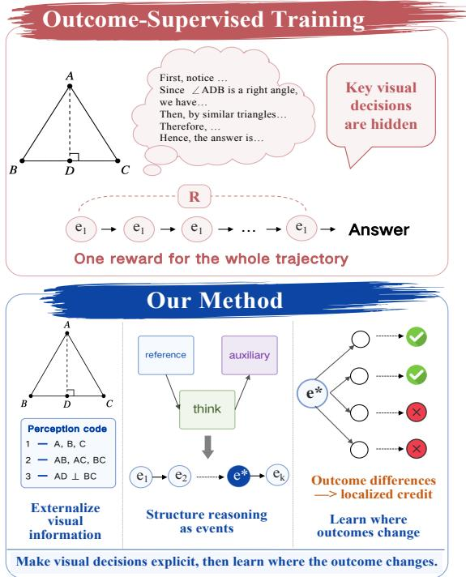
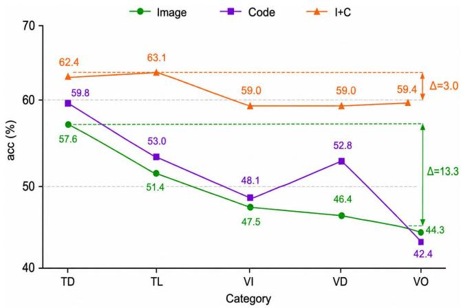
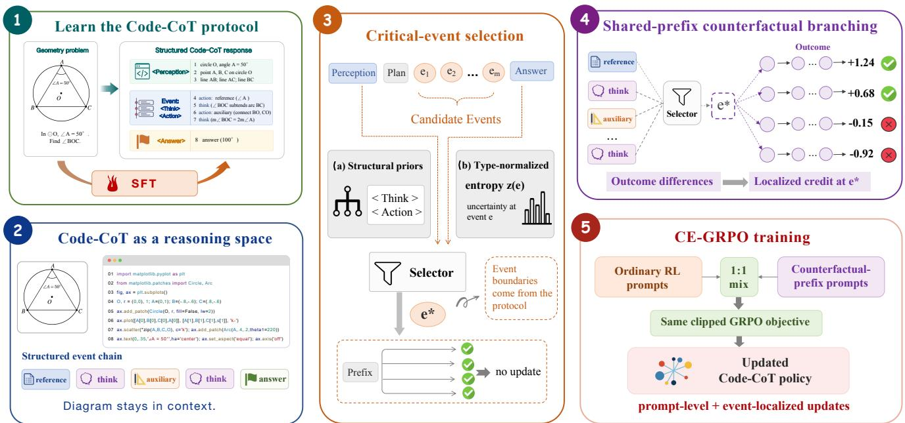
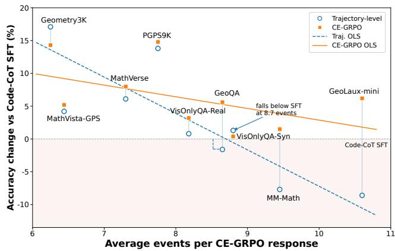
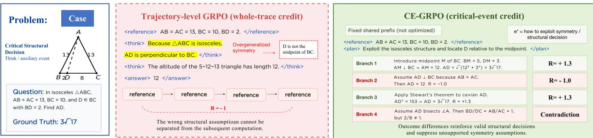

# Learning Where Outcomes Change: Credit-Addressable Reasoning for Multimodal Geometry

Jiani Guo<sup>1,∗</sup>, Junjie Wang<sup>1∗†</sup>, Jie Wu<sup>1</sup>, Pengxiang Zhao<sup>3</sup>, Dongdong Zhang<sup>2†</sup>, Shaohan Huang<sup>2</sup>, Yujiu Yang<sup>1†</sup>, Furu Wei<sup>2</sup>

<sup>1</sup>Tsinghua University <sup>2</sup>Microsoft Research <sup>3</sup>Zhejiang University guojn26@mails.tsinghua.edu.cn, wangjunjie@sz.tsinghua.edu.cn, dozhang@microsoft.com, yang.yujiu@sz.tsinghua.edu.cn

https://github.com/gjn12-31/CE-GRPO

## Abstract

Multimodal geometry reasoning requires VLMs to extract precise visual relations and preserve them through multi-step deduction. Existing free-form traces obscure the decisions that determine the answer, and trajectory-level reinforcement learning distributes a single terminal signal across the entire response. We introduce credit-addressable reasoning, in which the semantic units exposed during inference also define where learning compares alternatives and assigns credit. We instantiate this principle with Code-CoT, which retains the diagram, represents visual relations as line-addressable executable code, and organizes reasoning into typed events, and CE-GRPO, which selects event boundaries using structural priors and type-normalized entropy, samples complete continuations from shared prefixes, and converts outcome diferences into localized advantages. Across nine geometry benchmarks, CE-GRPO achieves an average accuracy of 76.04, outperforming Qwen3-VL-8B and trajectory-level GRPO by 8.09 and 3.43 points, respectively. Its relative advantage increases with the number of intermediate events, demonstrating the value of representation–optimization co-design for long, dependency-heavy multimodal reasoning.

## 1 Introduction

Recent vision-language models (VLMs) have made substantial progress in mathematical reasoning (Shao et al. 2024; Bai et al. 2025a). Geometry, however, remains a stringent test of reliable multimodal reasoning: models must accurately interpret and consistently use diagrammatic relations, while a single error in object binding, angle interpretation, or auxiliary construction can invalidate subsequent deductions (Zhang et al. 2024a; Kamoi et al. 2025; Fu et al. 2026). As shown in Fig. 1, these critical decisions remain implicit in a free-form reasoning trace, while trajectory-level optimization provides only a single outcome signal for the response as a whole. This creates two coupled gaps: a representation gap, where decisive choices lack explicit semantic units, and a credit gap, where terminal feedback cannot distinguish their individual efects.

Prior work has approached these gaps along two largely separate directions. Program-aided methods such as PAL and ToRA organize computation through programs or tools, while formal geometry systems such as AlphaGeometry and GeoTikzBridge translate geometric relations into formal languages or executable representations (Gao et al. 2023; Gou et al. 2024; Trinh et al. 2024; Sun et al. 2026). Fine-grained reinforcement-learning methods such as VinePPO, Segment Policy Optimization, GPO, and GRPO-MA instead estimate local advantages at intermediate states, segments, critical steps, or branched thoughts (Kazemnejad et al. 2024; Yu et al. 2025a; Wang et al. 2026a). The former expose reasoning structure without making it an optimization unit; the lat ter refine update locations but still derive semantic decisions from learned values, fixed boundaries, or token statistics. What remains missing is a semantic unit shared by reasoning and learning. We call this credit-addressable reasoning: inference-time decisions directly govern history correction, future comparison, and credit assignment.

  
Figure 1: Free-form reasoning hides visual decisions and receives one trajectory reward; Code-CoT makes decisions explicit, and CE-GRPO assigns localized credit.

<table><tr><td>Model</td><td>I</td><td>C</td><td>I+C</td><td>∆</td><td> $C _ { \mathrm { s e l f } }$ </td></tr><tr><td>Open models</td><td></td><td></td><td></td><td></td><td></td></tr><tr><td>InternVL3.5-8B Qwen2.5-VL-7B</td><td>45.5 49.4</td><td>47.0 51.2</td><td>63.9 60.6</td><td> $+ 1 8 . 4$   $+ 1 1 . 2$ </td><td>33.4 34.6</td></tr><tr><td>Qwen3.5-9B</td><td>79.9</td><td>46.8</td><td>85.4</td><td> $+ 5 . 5$ </td><td>35.1</td></tr><tr><td colspan="4">Proprietary models</td><td></td><td></td></tr><tr><td>Kimi-K2.6</td><td>88.2</td><td>87.9</td><td>92.6</td><td> $+ 4 . 4$ </td><td></td></tr><tr><td>Claude-Opus-4.8</td><td>87.9</td><td>86.3</td><td>91.1</td><td> $+ 3 . 2$ </td><td></td></tr><tr><td>Gemini-3.1-Pro</td><td>92.3</td><td>89.1</td><td>93.0</td><td> $+ 0 . 7$ </td><td>一</td></tr></table>

Table 1: Mean accuracy on the five MathVerse (Zhang et al. 2024a) subsets. I: diagram only; C: externally generated code only; $I { + C } \colon$ diagram and external code. $\Delta \doteq ( \bar { I } { + } C ) - I$ is the absolute gain in percentage points. $C _ { \mathrm { s e l f } }$ uses selfgenerated code only, with the diagram withheld, and is reported for open models.

To identify such a shared semantic unit, we first examine whether code can serve as an internal reasoning space for geometry. As shown in Table 1, combining the diagram with externally generated code consistently outperforms either modality alone across three open and three proprietary models (details in Section 3). For the three open models, self-generated code trails external code by 11.7–16.6 points under the same code-only setting, identifying reliable code generation as the main bottleneck. These results suggest two design requirements: code should complement rather than replace the image, and its generation must be explicitly learned. We therefore introduce Code-CoT, which retains the original image, produces line-addressable executable Matplotlib perception code, and organizes subsequent reasoning into reference, auxiliary, coordinate, and think events. Each event is both a checkable geometric operation and an addressable unit of credit.

Making decisions addressable does not by itself make their credit localizable. Standard Group Relative Policy Optimization (GRPO) (Shao et al. 2024) compares complete responses from the original problem and assigns the same group-relative advantage throughout each response, treating an event-structured Code-CoT trace as a flat trajectory. We introduce Critical-Event Group Relative Policy Optimization (CE-GRPO), where a critical event is operationally defined as an event boundary whose alternative continuations under the same prefix yield diferent terminal outcomes. CE-GRPO selects candidate events using a structural prior and type-normalized entropy, then fixes the image, question, and complete prefix before each candidate and samples multiple continuations through the final answer, as shown in the lower panel of Fig. 3. Each continuation receives the same terminal reward, while the shared prefix is excluded from the policy loss, so the group-relative advantage updates only the regenerated event and its downstream consequences. Structure provides semantic branch points, entropy allocates the branching budget, and reward variation determines whether a candidate yields a useful credit signal. If all continuations receive the same reward, the group contributes no update, making an uninformative selection computationally wasteful rather than harmful.

Across nine geometry benchmarks, CE-GRPO achieves an average accuracy of 76.04, outperforming the native Qwen3- VL-8B (Bai et al. 2025a) backbone, Code-CoT SFT, and trajectory-level GRPO by 8.09, 6.49, and 3.43 points, respectively, and improving over the backbone on all nine benchmarks. On validly terminated responses, it retains a 3.91-point average gain over trajectory-level GRPO, confirming improvements in solution quality rather than protocol compliance. Ofline analysis further shows that structural selection identifies outcome-changing events about 30% more often than random selection, while the CE-GRPO margin grows by 3.77 points per additional intermediate event $( r = 0 . 8 6 6$ , exact $p = 0 . 0 0 1 6 )$ . Together, these results validate credit-addressable reasoning, particularly for solutions involving longer chains of intermediate decisions.

Our contributions are threefold:

• We formulate credit-addressable reasoning, where the semantic units exposed during inference also define where optimization compares alternatives and assigns credit; a controlled six-model study motivates code as such a shared representation.

• We introduce Code-CoT, which represents diagram perception and geometric operations as executable, addressable events, and CE-GRPO, which compares complete futures from shared prefixes to localize terminal credit without process annotations or an auxiliary value model.

• Across nine geometry benchmarks, our method improves over the backbone on every benchmark and outperforms trajectory-level GRPO on average; closed-only evaluation, selector validation, and event-count analysis further support the mechanism of event-localized credit.

## 2 Related Work

Executable representations for multimodal geometry reasoning. Program-aided methods express reasoning as executable programs or tool calls (Gao et al. 2023; Chen et al. 2023; Gou et al. 2024), while geometry systems convert diagrams into formal relations or code (Lu et al. 2021; Trinh et al. 2024; Sun et al. 2026; Wang et al. 2026b). Recent work further uses rendered code, visual actions, and dynamic constructions (Wang et al. 2025c; Duan et al. 2025; Shi et al. 2026; Su et al. 2025; Wei et al. 2025). Unlike these external or intermediate representations, Code-CoT integrates the original diagram and line-addressable code into typed reasoning events, enabling both verification and policy optimization. Fine-grained credit assignment for reasoning. PPO, GRPO, and DAPO optimize complete responses with sequence-level or terminal rewards (Schulman et al. 2017; Shao et al. 2024; Yu et al. 2025b). Fine-grained methods assign credit to intermediate steps or high-entropy tokens (Kazemnejad et al. 2024; Guo et al. 2025b; Yu et al.

  
Figure 2: Qwen2.5-VL-7B accuracy across the five Math-Verse subsets under diagram-only (I), external-code-only (C), and combined diagram–code $( I { + } C )$ inputs. Combining both modalities reduces the Text-Dominant–Vision-Only gap from 13.3 to 3.0 points.

2025a; Samanta et al. 2026; Wang et al. 2026a, 2025b), while multimodal variants use visual perturbations or auxiliary rewards (Wang et al. 2026d,e; Yu et al. 2026; Wang et al. 2026c; Guo et al. 2025a). CE-GRPO instead branches at Code-CoT event boundaries, allocates computation by typenormalized entropy, and derives local credit from terminal outcome diferences without process labels, value models, or task-specific rewards.

## 3 Motivation: Code as a Reasoning Space

Controlled study. To determine whether code can serve as the shared semantic unit sought above, we study how its utility depends on the available modality and the source ofthe code. MathVerse (Zhang et al. 2024a) presents each problem in five variants that progressively shift information from text to the diagram. We compare diagram only (I), code generated externally by Gemini-3.1-Pro-Preview only (C), both $( I { + } C )$ and self-generated code only $( C _ { \mathrm { s e l f } } )$ . The diagram is withheld under both code-only conditions, so C and $C _ { \mathrm { s e l f } }$ difer only in code source. We evaluate $I , C ,$ and $I { + C }$ on three open and three proprietary models, and additionally evaluate $\bar { C } _ { \mathrm { s e l f } }$ on the open models. Table 1 reports the cross-model means, while Fig. 2 shows the efect of increasing visual dependence. Findings. Three patterns emerge. First, code complements rather than replaces the diagram: $I { + C }$ performs best for all six models and reduces the Qwen2.5-VL-7B Text-Dominant–Vision-Only gap from 13.3 to 3.0 points. Second, code is primarily compensatory: the gain $\Delta { \dot { \ } } = \left( I { + } C \right) - I$ generally decreases as diagram-only accuracy increases, indicating greater utility when native visual reasoning is weaker (Namgoong et al. 2026). Third, reliable generation is the bottleneck: under the same code-only setting, $C _ { \mathrm { s e l f } }$ trails C by 11.7–16.6 points for every open model. This comparison isolates the efect of code source, although it does not separate perception errors from errors in translating a correct perception into code.

Design implications. These findings impose three requirements: code should remain alongside the diagram, be produced by the reasoning model itself, and be explicitly learned rather than merely prompted. We therefore treat code as a persistent, line-addressable reasoning space rather than an external tool or fixed intermediate artifact. Code-CoT realizes this design by expressing visual retrieval, geometric construction, coordinate setup, and deduction as explicit events, providing the semantic units later shared by programmatic verification and localized policy optimization.

## 4 Method

## 4.1 Overview

Given an image–question pair $x = ( I , Q )$ , our policy generates a complete Code-CoT response

$$
Y = \left. C , P , ( e _ { \ell } ) _ { \ell = 1 } ^ { L } , F \right. , \qquad e _ { \ell } \in \mathcal { E } ,\tag{1}
$$

where $C$ is line-addressable executable perception code, $P$ is a solution plan, F is the final answer, and $\varepsilon \ =$ {think, reference, auxiliary, coordinate} defines the intermediate event types.

As shown in Fig. 3, the framework proceeds in five stages. First, supervised fine-tuning installs the Code-CoT protocol from curated traces. The resulting policy retains the diagram and reasons through executable perception code and typed events. CE-GRPO then selects candidate events using structural priors and type-normalized entropy, branches multiple complete futures from a shared prefix, and converts their outcome diferences into event-conditioned credit. Finally, ordinary and counterfactual-prefix prompts are jointly optimized under the same GRPO objective. The event boundaries exposed during reasoning therefore also define the units used during optimization.

At inference, the model autoregressively generates the perception code, reasoning events, and final answer in a single response, without an external solver or test-time branching.

## 4.2 Code-CoT: A Credit-Addressable Reasoning Space

Steps 1–2 in Fig. 3 establish the Code-CoT policy: Step 1 installs the protocol through curated supervision, and Step 2 realizes it as a persistent reasoning space.

Persistent executable representation. The model converts the input diagram into line-numbered, executable Matplotlib perception code $C ,$ while retaining the original image throughout the response. The code therefore complements rather than replaces the visual input, providing a lineaddressable interface for retrieving diagram facts and extending the working geometry. The same policy generates the code, reasoning trace, and final answer within a single response, without an external geometry solver.

Typed event reasoning. After producing C and the solution plan $P ,$ , the model interleaves think events with three typed actions before returning final answer $F$ . reference retrieves code lines supporting a diagram fact, auxiliary extends the working geometry, and coordinate establishes an executable coordinate frame. Subsequent think events reason over the state, while actions are introduced only when required by the solution.

  
Figure 3: Overview of Code-CoT with CE-GRPO. (1) Supervised fine-tuning installs the Code-CoT protocol from curated traces. (2) The model retains the diagram and reasons through executable perception code and typed events. (3) Structural priors and type-normalized entropy select candidate events. (4) Shared-prefix branching compares complete continuations and converts outcome diferences into localized credit. (5) Ordinary and counterfactual-prefix prompts are mixed under the same objective.

## Verification and credit addressability.

Programmatic checkers validate response structure, code executability, line-grounded references, and typed actions; see Appendix A.1. Protocol tags deterministically partition the trace into complete think and action events.

Each event is therefore addressable: CE-GRPO can recover its pre-event prefix and branch alternative continuations from the same state. Therefore, Code-CoT jointly supports programmatic verification and event-conditioned policy optimization.

## 4.3 Learning Code-Grounded Reasoning

Supervised initialization. Step 1 in Fig. 3 internalizes Code-CoT through supervised fine-tuning on 18,302 qualitycontrolled traces. Given an image–question pair $x = ( I , Q )$ the policy learns the complete mapping in Eq. (1),jointly generating perception code, a solution plan, typed events, and the final answer. Each retained trace passes structural, execution, grounding, action-validity, and answer-correctness checks. Reinforcement learning then uses a separate deduplicated problem pool, on which the current policy generates the full Code-CoT response online. See Appendix A.2 for data construction and filtering.

Programmatic reward. We evaluate a generated response y using

$$
R ( x , y ) = \left\{ \begin{array} { r l r } & { \mathrm { ~ - 1 , } } & { y \notin \mathcal { V } , } \\ & { \mathrm { ~ l \mathrm { i } p } ( c ( y ) + \lambda a ( y ) - \Omega ( y ) , - 1 , 1 . 3 ) , } & { y \in \mathcal { V } , } \end{array} \right.\tag{2}
$$

where V denotes the set of structurally valid traces, $c ( y )$ measures answer correctness, $a ( y )$ is the action-valid rate, and $\Omega ( y )$ collects repetition and answer-leakage penalties. We set $\lambda = 0 . 3$ . The reward evaluates both task success and protocol-consistent actions without a learned reward model. See Appendix A.3 for reward details.

Trajectory-level learning. For a group of complete responses $\{ \bar { y } ^ { ( i ) } \} _ { i = 1 } ^ { G }$ sampled for the same input x, standard GRPO (Shao et al. 2024) computes

$$
A _ { x } ^ { ( i ) } = \frac { R \big ( x , y ^ { ( i ) } \big ) - \bar { R } _ { x } } { \sigma _ { R , x } + \delta } ,\tag{3}
$$

where $\bar { R } _ { x }$ and $\sigma _ { R , x }$ denote the mean and standard deviation of the group rewards, respectively, and δ is a small constant for numerical stability. The same advantage $A _ { x } ^ { ( i ) }$ is applied to every generated token in $\boldsymbol y ^ { ( i ) }$ . Although efective for optimizing response-level correctness and validity, trajectory-level GRPO ignores the event decomposition of Code-CoT and treats the structured response as a flat trajectory. CE-GRPO retains the same programmatic reward and GRPO objective, but constructs comparison groups from shared intermediate states, as described next.

## 4.4 Critical-Event Group Relative Policy Optimization

Steps 3–5 in Fig. 3 implement CE-GRPO through candidateevent selection, shared-prefix branching, and mixed policy optimization.

Candidate-event selection. The Code-CoT tags deterministically segment each response into complete think and action events, eliminating the need for an auxiliary segmenter or step detector. In Step 3, CE-GRPO combines a structural prior with type-normalized event entropy to select candidate events. For an event e with token set $\bar { \mathcal T } _ { e }$ , let $\bar { H } ( e )$ denote its mean token entropy. Because entropy scales difer across event types, we normalize each event within its type:

$$
\eta ( e ) = \frac { \bar { H } ( e ) - \mu _ { \kappa ( e ) } } { \sigma _ { \kappa ( e ) } } ,\tag{4}
$$

where $\kappa ( e )$ denotes the event type, and $\mu _ { \kappa ( e ) }$ and $\sigma _ { \kappa ( e ) }$ are its batch-level mean and standard deviation. The structural prior provides semantically meaningful branch points, while η(e) allocates the branching budget among comparable events. The selector does not label an event as critical in advance; criticality is revealed only when sibling futures from the same prefix receive diferent terminal rewards. See Appendix A.4 for selector details.

Shared-prefix branching. In Step 4, for a candidate event $e _ { c }$ beginning at position $s _ { c } ,$ CE-GRPO retains the complete response prefix

$$
z _ { c } = y _ { < s _ { c } } .\tag{5}
$$

It fixes the image, question, and prefix $z _ { c } ,$ then samples G continuations through the final answer:

$$
u ^ { ( j ) } \sim \pi _ { \theta } ( \cdot \mid x , z _ { c } ) , \qquad y ^ { ( j ) } = z _ { c } \oplus u ^ { ( j ) } .\tag{6}
$$

Each branch is evaluated using the programmatic reward in Eq. (2), yielding the state-conditioned advantage

$$
A _ { z _ { c } } ^ { ( j ) } = \frac { R \big ( x , z _ { c } \oplus u ^ { ( j ) } \big ) - \bar { R } _ { z _ { c } } } { \sigma _ { R , z _ { c } } + \delta } ,\tag{7}
$$

where $\bar { R } _ { z _ { c } }$ and $\sigma _ { R , z _ { c } }$ are the mean and standard deviation of rewards among continuations sharing $z _ { c } .$ Because the shared prefix belongs to the prompt and is excluded from the policy loss, the update applies only to the regenerated event and its downstream consequences. If all continuations receive the same reward, the group contributes no policy update, so an uninformative selection primarily wastes computation rather than introducing spurious supervision.

Mixed policy optimization. In Step 5, ordinary and sharedprefix prompts are mixed at a 1:1 ratio. Ordinary groups use the trajectory-level advantage in Eq. (3), whereas sharedprefix groups use the event-conditioned advantage in Eq. (7). Both share the GRPO objective and programmatic reward, preserving global task learning while adding eventconditioned credit. See Appendix A.4–A.5 for prefix and training details.

## 5 Experiments

## 5.1 Experimental Setup

Benchmarks. We evaluate on nine geometry benchmarks spanning four categories: visual grounding with MathVerse (Zhang et al. 2024a), VisOnlyQA-Syn and VisOnlyQA-Real (Kamoi et al. 2025), and MathVista-GPS (Lu et al. 2024); plane geometry with Geometry3K (Lu et al. 2021), PGPS9K (Zhang, Yin, and Liu

2023), and GeoQA (Chen et al. 2021); auxiliary construction with GeoLaux-mini (Fu et al. 2026); and processlevel multimodal reasoning with MM-Math (Sun et al. 2024). For compactness, result tables abbreviate MathVerse, VisOnlyQA-Syn, VisOnlyQA-Real, MathVista-GPS, Geometry3K, and GeoLaux-mini as MathV., VOQA-S, VOQA-R, GPS, Geo3K, and GeoLaux, respectively.

Baselines. We compare with the native Qwen3-VL-8B-Instruct (Bai et al. 2025a), prompting and SFT baselines, general post-training methods (DPO (Rafailov et al. 2023), PPO (Schulman et al. 2017), DAPO (Yu et al. 2025b), and trajectory-level GRPO (Shao et al. 2024)), and criticalevent or counterfactual methods (SRPO-style (Samanta et al. 2026), GPO (Yu et al. 2025a), CFPO (Yu et al. 2026), and GRPO-MA (Wang et al. 2026a)). External references include Qwen2.5-VL-7B-Instruct (Bai et al. 2025b), VL-Rethinker-7B (Wang et al. 2025a), MMR1-Math-v0-7B (MMR1 Team 2025), G-LLaVA-7B (Gao et al. 2025a), and the twostage GDP-4B-RL (Wang et al. 2026b) and GeoTikzBridge-8B (Sun et al. 2026) systems paired with Qwen3-VL-8B. External checkpoints are evaluated using their oficially released prompt templates.

Implementation. Code-CoT SFT initializes from Qwen3- VL-8B-Instruct, freezes the visual encoder, and updates the multimodal aligner and language model. All in-house posttraining methods start from this shared checkpoint; DPO and GPO use LoRA, while the remaining methods use fullparameter updates. Protocol-constrained models must terminate with a non-empty <answer> block. See Appendix A.5 and B.2–B.3 for implementation details.

## 5.2 Main Results

Tables 2 and 3 report the main results.

Overall performance. Code-CoT prompting alone obtains 49.26, 18.69 points below the native backbone, while SFT raises the average to 69.55, showing that the protocol must be learned rather than prompted. CE-GRPO achieves the best average of 76.04, outperforming the backbone, Code-CoT SFT, trajectory-level GRPO, and the strongest fine-grained baseline by 8.09, 6.49, 3.43, and 6.73 points, respectively. It also surpasses the backbone on all nine benchmarks.

Gains on dependency-heavy reasoning. Relative to trajectory-level GRPO, CE-GRPO gains 15.16 points on GeoLaux-mini and 9.44 on MM-Math, where intermediate constructions and decisions afect multiple later steps. By contrast, gains are smaller or mixed on visual-grounding and standard plane-geometry tasks. This pattern supports assigning credit to outcome-sensitive intermediate events rather than uniformly across the full trajectory.

Comparison with two-stage systems. With a single model call, CE-GRPO surpasses GDP-4B-RL → Qwen3-VL-8B by 3.07 points on average, winning seven of nine benchmarks, and outperforms GeoTikzBridge-8B → Qwen3-VL-8B on all nine. GDP leads only on Geometry3K and PGPS9K, suggesting that fixed symbolic parsing favors relation-centric geometry, whereas integrated perception and reasoning better handle dynamic constructions and visual evidence reuse.

<table><tr><td rowspan="2">Method</td><td colspan="4">Visual Grounding</td><td colspan="3">Plane Geometry</td><td>Aux. Constr.</td><td>Process-Level</td><td rowspan="2">Avg.</td></tr><tr><td>MathV.</td><td>VOQA-S</td><td>VOQA-R</td><td>GPS</td><td>Geo3K</td><td>PGPS9K</td><td>GeoQA</td><td>GeoLaux</td><td>MM-Math</td></tr><tr><td colspan="10">Backbone: Qwen3-VL-8B-Instruct</td></tr><tr><td>Training-Free</td><td></td><td></td><td></td><td></td><td></td><td></td><td></td><td></td><td></td><td></td></tr><tr><td>Qwen3-VL-8B-Instruct (native)</td><td>56.85</td><td>51.13</td><td>63.73</td><td>83.19</td><td>64.52</td><td>59.60</td><td>83.16</td><td>77.27</td><td>72.10</td><td>67.95</td></tr><tr><td>with the Code-CoT prompt</td><td>47.49</td><td>40.21</td><td>49.83</td><td>62.96</td><td>44.65</td><td>44.50</td><td>63.26</td><td>47.88</td><td>42.57</td><td>49.26</td></tr><tr><td>Supervised Fine-Tuning</td><td></td><td></td><td></td><td></td><td></td><td></td><td></td><td></td><td></td><td></td></tr><tr><td>Code-CoT SFT</td><td>55.08</td><td>62.89</td><td>70.85</td><td>81.48</td><td>53.31</td><td>52.10</td><td>87.53</td><td>84.24</td><td>78.51</td><td>69.55</td></tr><tr><td>General Post-Training</td><td></td><td></td><td></td><td></td><td></td><td></td><td></td><td></td><td></td><td></td></tr><tr><td>DPO (LoRA, r=64)</td><td>49.06</td><td>60.62</td><td>70.85</td><td>73.15</td><td>46.69</td><td>49.10</td><td>76.66</td><td>65.15</td><td>67.77</td><td>62.12</td></tr><tr><td>PPO (no KL)</td><td>40.18</td><td>52.99</td><td>61.36</td><td>62.50</td><td>39.39</td><td>39.80</td><td>66.84</td><td>53.03</td><td>55.62</td><td>52.41</td></tr><tr><td>DAPO</td><td>55.99</td><td>58.56</td><td>75.93</td><td>76.85</td><td>51.44</td><td>54.40</td><td>84.08</td><td>73.03</td><td>74.50</td><td>67.20</td></tr><tr><td>Trajectory-level GRPO</td><td>61.85</td><td>64.19</td><td>71.86</td><td>86.11</td><td>70.29</td><td>66.30</td><td>86.60</td><td>75.45</td><td>70.88</td><td>72.61</td></tr><tr><td colspan="2">Critical-Event and Counterfactual Post-Training</td><td></td><td></td><td></td><td></td><td></td><td></td><td></td><td></td><td></td></tr><tr><td>SRPO-style (offline self-reset)</td><td>56.19</td><td>62.47</td><td>72.88</td><td>82.41</td><td>55.52</td><td>54.60</td><td>86.21</td><td>77.58</td><td>75.90</td><td>69.31</td></tr><tr><td>GPO (LoRA)</td><td>46.73</td><td>58.35</td><td>68.81</td><td>67.59</td><td>45.33</td><td>45.60</td><td>73.47</td><td>54.55</td><td>64.86</td><td>58.37</td></tr><tr><td>CFPO</td><td>56.50 53.73</td><td>62.27 62.47</td><td>72.20</td><td>81.02</td><td>56.03</td><td>55.50</td><td>86.47</td><td>74.55</td><td>74.10</td><td>68.74</td></tr><tr><td>GRPO-MA</td><td></td><td></td><td>73.56</td><td>81.48</td><td>53.82</td><td>53.90</td><td>83.69</td><td>79.09</td><td>73.49</td><td>68.36</td></tr><tr><td>CE-GRPO (ours)</td><td>62.44(+5.59)</td><td>63.47(+12.34)</td><td>74.24(+10.51)</td><td>86.57(+3.38)</td><td>67.40(+2.88)</td><td>66.90(+7.30)</td><td>92.44(+9.28)</td><td>90.61(+13.34)</td><td>80.32(+8.22)</td><td>76.04(+8.09)</td></tr></table>

Table 2: Results on nine benchmarks; Avg. is the unweighted mean. Bold and underlined values are best and second best. CE-GRPO superscripts are gains over native Qwen3-VL-8B.
<table><tr><td rowspan="2">Method</td><td colspan="4">Visual Grounding</td><td colspan="3">Plane Geometry</td><td>Aux. Constr.</td><td>Process-Level</td><td rowspan="2">Avg.</td></tr><tr><td>MathV.</td><td>VOQA-S</td><td>VOQA-R</td><td>GPS</td><td>Geo3K</td><td>PGPS9K</td><td>GeoQA</td><td>GeoLaux</td><td>MM-Math</td></tr><tr><td colspan="10">External 7B/8B Checkpoints</td><td></td></tr><tr><td>Qwen2.5-VL-7B-Instruct</td><td>49.64</td><td>34.43</td><td>43.39</td><td>65.28</td><td>41.60</td><td>43.00</td><td>76.39</td><td>42.42</td><td>39.46</td><td>48.40</td></tr><tr><td>VL-Rethinker-7B</td><td>54.87</td><td>34.43</td><td>42.71</td><td>69.44</td><td>43.97</td><td>44.40</td><td>77.32</td><td>58.18</td><td>48.49</td><td>52.65</td></tr><tr><td>MMR1-Math-v0-7B</td><td>52.23</td><td>34.43</td><td>43.39</td><td>73.15</td><td>48.39</td><td>50.60</td><td>77.98</td><td>51.52</td><td>42.17</td><td>52.65</td></tr><tr><td>G-LLaVA-7B</td><td>20.13</td><td>25.98</td><td>28.14</td><td>39.81</td><td>8.83</td><td>8.60</td><td>61.27</td><td>3.03</td><td>11.14</td><td>22.99</td></tr><tr><td colspan="10">Two-Stage Perception-Reasoning Systems</td><td></td></tr><tr><td>GDP-4B-RL → Qwen3-VL-8B</td><td>61.65</td><td>52.78</td><td>67.12</td><td>83.80</td><td>71.82</td><td>74.20</td><td>88.86</td><td>77.88</td><td>78.61</td><td>72.97</td></tr><tr><td>GeoTikzBridge-8B → Qwen3-VL-8B</td><td>60.13</td><td>48.87</td><td>69.83</td><td>80.09</td><td>62.48</td><td>64.10</td><td>87.93</td><td>74.55</td><td>78.21</td><td>69.58</td></tr><tr><td>CE-GRPO (ours)</td><td>62.44(+0.79)</td><td>63.47(+10.69)</td><td>74.24(+7.12)</td><td>86.57(+2.77)</td><td>67.40(-4.42)</td><td>66.90(-7.30)</td><td>92.44(+3.58)</td><td>90.61(+12.73)</td><td>80.32(+1.71)</td><td>76.04(+3.07)</td></tr></table>

Table 3: External-checkpoint and two-stage results; CE-GRPO is repeated for reference. Bold and underlined values are best and second best. Its superscripts are gains over GDP-4B-RL → Qwen3-VL-8B; two-stage systems use an extra call.

## 5.3 Ablation Study

Setup. Table 5 compares event selectors with all other components fixed, reporting each variant’s best validation checkpoint. Random prefix samples events uniformly; entropy only ranks them by type-normalized mean token entropy; structure only uses the first geometry-grounded <think> event and <reference> action; and structure + entropy ranks these structurally anchored candidates by entropy.

Structure localizes useful events; entropy prioritizes them. Entropy alone provides only a 0.35-point gain over random selection, whereas structure raises the average to 74.26 and reduces the unclosed-response rate from 12.31% to 7.07%. Combining both signals performs best, reaching 76.04 with the lowest unclosed rate of 4.73%, and is best or tied on seven of nine benchmarks. Its gains over structure alone are particularly pronounced on Geometry3K (+5.43) and GeoLaux-mini (+3.34), indicating that structural priors identify semantically meaningful boundaries while entropy distinguishes informative candidates among them.

## 6 Discussion

Code-CoT training improves diagram-to-code fidelity. To examine whether training improves the executable visual representation itself, Table 4 evaluates the first <perception> block on 100 MathVerse-TD problems. For each diagram, Gemini-3.1-Pro-Preview extracts a fixed set of visible geometric facts, and a condition-blind judge scores each fact as fully covered (1), partially covered (0.5), or missing or contradicted (0); failed renders receive zero recall. Code-CoT SFT raises macro recall from 55.21% to 70.16%, while CE-GRPO further improves it to 80.43%. Render success increases from 89.0% to 99.0%, and recall on successful renders from 62.0% to 81.2%, showing gains in both code executability and geometric fidelity.

<table><tr><td>Condition</td><td>Macro recall</td><td>Render succ.</td><td>Recall | rendered</td></tr><tr><td>Base + prompt</td><td>55.21</td><td>89.0</td><td>62.0</td></tr><tr><td>Code-CoT SFT</td><td>70.16</td><td>95.0</td><td>73.9</td></tr><tr><td>CE-GRPO</td><td>80.43</td><td>99.0</td><td>81.2</td></tr></table>

Table 4: Diagram-to-code fidelity on 100 MathVerse-TD problems. All values are percentages; failed renders receive zero macro recall.

CE-GRPO Improves Solution Quality on Valid Outputs. Strict accuracy combines solution correctness with valid termination. We therefore report each model’s unclosed rate and recompute accuracy on valid outputs, as shown in Table 6. CE-GRPO outperforms trajectory-level GRPO on seven of nine benchmarks, with a mean gain of3.91 points. The largest gains occur on GeoLaux-mini (+12.53), MM-Math (+8.42), and PGPS9K (+5.07). These results show that CE-GRPO improves auxiliary construction and process-level reasoning within completed solutions, not only response completion.

<table><tr><td rowspan="2">Selection signal</td><td colspan="4">Visual Grounding</td><td colspan="3">Plane Geometry</td><td>Aux. Constr.</td><td>Process-Level MM-Math</td><td rowspan="2">Avg.</td><td rowspan="2">Uncl.</td></tr><tr><td>MathV.</td><td>VOQA-S</td><td>VOQA-R</td><td>GPS</td><td>Geo3K</td><td>PGPS9K</td><td>GeoQA</td><td>GeoLaux</td></tr><tr><td>Random prefix</td><td>59.42</td><td>65.57</td><td>75.25</td><td>85.65</td><td>61.46</td><td>60.00</td><td>89.92</td><td>78.48</td><td>76.61</td><td>72.48</td><td>12.31%</td></tr><tr><td>Entropy only</td><td>58.40</td><td>64.33</td><td>72.88</td><td>85.65</td><td>60.78</td><td>61.50</td><td>90.98</td><td>82.42</td><td>78.51</td><td>72.83</td><td>10.26%</td></tr><tr><td>Structure only</td><td>61.19</td><td>65.15</td><td>72.20</td><td>83.80</td><td>61.97</td><td>64.10</td><td>92.44</td><td>87.27</td><td>80.22</td><td>74.26</td><td>7.07%</td></tr><tr><td>Structure + entropy</td><td>62.44</td><td>63.47</td><td>74.24</td><td>86.57</td><td>67.40</td><td>66.90</td><td>92.44</td><td>90.61</td><td>80.32</td><td>76.04</td><td>4.73%</td></tr></table>

Table 5: Event-selector ablation. Uncl. is the mean invalid-termination rate. Bold and underlined values are best and second best among all selectors; lower Uncl. is better.

<table><tr><td rowspan="2">Benchmark</td><td colspan="2">Traj. GRPO</td><td colspan="2">CE-GRPO</td><td rowspan="2">Δ</td></tr><tr><td>Closed Acc.</td><td>Uncl.</td><td>Closed Acc.</td><td>Uncl.</td></tr><tr><td>MathV.</td><td>64.20</td><td>3.66</td><td>66.15</td><td>5.61</td><td>+1.95</td></tr><tr><td>VOQA-S</td><td>64.19</td><td>0.00</td><td>63.73</td><td>0.41</td><td>-0.46</td></tr><tr><td>VOQA-R</td><td>71.86</td><td>0.00</td><td>74.24</td><td>0.00</td><td>+2.38</td></tr><tr><td>GPS</td><td>89.42</td><td>3.70</td><td>91.66</td><td>5.56</td><td>+2.24</td></tr><tr><td>Geo3K</td><td>75.27</td><td>6.62</td><td>73.65</td><td>8.49</td><td>-1.62</td></tr><tr><td>PGPS9K</td><td>70.61</td><td>6.10</td><td>75.68</td><td>11.60</td><td>+5.07</td></tr><tr><td>GeoQA</td><td>90.32</td><td>4.12</td><td>94.96</td><td>2.65</td><td>+4.64</td></tr><tr><td>GeoLaux</td><td>83.00</td><td>9.10</td><td>95.53</td><td>5.15</td><td>+12.53</td></tr><tr><td>MM-Math</td><td>74.39</td><td>4.72</td><td>82.81</td><td>3.01</td><td>+8.42</td></tr><tr><td>Mean</td><td>75.92</td><td>4.22</td><td>79.82</td><td>4.72</td><td>+3.91</td></tr></table>

Table 6: Closed-only accuracy and unclosed-response rate (%). ∆ denotes the closed-only accuracy diference between CE-GRPO and trajectory-level GRPO.
<table><tr><td>Model</td><td>TD</td><td>TL</td><td>VI</td><td>VD</td><td>VO</td><td>All</td><td>Gap↓</td><td>SD↓</td></tr><tr><td>Backbone</td><td>69.92</td><td>62.31</td><td>55.96</td><td>56.22</td><td>39.85</td><td>56.85</td><td>30.07</td><td>9.91</td></tr><tr><td>CE-GRPO</td><td>69.04</td><td>65.99</td><td>62.31</td><td>59.90</td><td>54.95</td><td>62.44</td><td>14.09</td><td>4.87</td></tr><tr><td>∆</td><td>-0.88</td><td>+3.68</td><td>+6.35</td><td></td><td>6 +3.68 +15.10</td><td>+5.59 一</td><td>-15.98</td><td>-5.03</td></tr></table>

Table 7: Accuracy (%) across five MathVerse variants, from Text Dominant (TD) to Vision Only (VO). All is the mean; Gap is |TD − VO|; SD is the population standard deviation (↓: better). ∆ is CE-GRPO minus Backbone.

Code-grounded training narrows the modality gap. Math-Verse shifts the same 788 problems from text-dominant to vision-only inputs. CE-GRPO leaves TD nearly unchanged (−0.88) but gains 15.10 points on VO, reducing the TD–VO gap from 30.07 to 14.09 and SD from 9.91 to 4.87—roughly halving both. The concentration of gains on vision-dependent variants suggests that Code-CoT better preserves and reuses diagram-derived relations, rather than merely improving textdominant reasoning, thereby mitigating the perception bottleneck in Table 1.

  
Figure 4: Accuracy change relative to Code-CoT SFT versus the mean number of complete <think>/<action> events per response. Gray segments connect matched benchmarks; lines show OLS fits, and the horizontal dashed line marks the SFT baseline.

CE-GRPO’s advantage widens with event count. Across the nine benchmarks, we relate the mean number of complete <think> and <action> events in CE-GRPO outputs to each method’s gain over the same Code-CoT SFT checkpoint. As shown in Fig. 4, CE-GRPO’s margin over trajectorylevel GRPO increases by 3.77 points per additional event (r = 0.866, exact $p = 0 . 0 0 1 6 )$ , remaining significant under leave-one-benchmark-out tests $( p \leq 0 . 0 2 8 )$ . This widening is driven by trajectory-level GRPO, whose gain over SFT declines sharply with event count (−5.55 points/event, p = 0.0062), whereas the corresponding CE-GRPO trend is weaker and nonsignificant (−1.78 points/event, $p = 0 . 2 0 4 8 )$ This pattern suggests that whole-trajectory credit difuses over longer reasoning chains, whereas event-localized credit remains efective. For further details, see Appendix C.2.

## 7 Conclusion

This work introduces credit-addressable reasoning, a representation–optimization principle in which the semantic units exposed during inference also define where learning compares alternatives and assigns credit. Code-CoT realizes this principle by retaining the original diagram, representing geometric relations as line-addressable executable code, and organizing reasoning into typed events, while CE-GRPO branches complete continuations from shared event prefixes and converts terminal outcome variation into event-conditioned advantages. Across nine geometry benchmarks, CE-GRPO achieves an average accuracy of 76.04, outperforming Qwen3-VL-8B and trajectory-level GRPO by 8.09 and 3.43 points, respectively, and retaining a 3.91- point advantage on validly terminated responses. Its relative advantage further increases with the number of intermediate events, while selector analyses confirm the value of structurally meaningful event boundaries. The framework is broadly applicable to reasoning tasks with explicit intermediate structure and delayed outcome supervision. These results demonstrate that aligning reasoning representations with credit assignment provides an efective direction for long, dependency-heavy multimodal reasoning.

## References

Bai, S.; Cai, Y.; Chen, R.; Chen, K.; Chen, X.; Cheng, Z.; Deng, L.; Ding, W.; Gao, C.; et al. 2025a. Qwen3-VL Technical Report. arXiv preprint arXiv:2511.21631.

Bai, S.; Chen, K.; Liu, X.; Wang, J.; Ge, W.; Song, S.; Dang, K.; Wang, P.; Wang, S.; Tang, J.; Zhong, H.; Zhu, Y.; Yang, M.; Li, Z.; Wan, J.; Wang, P.; Ding, W.; Fu, Z.; Xu, Y.; Ye, J.; Zhang, X.; Xie, T.; Cheng, Z.; Zhang, H.; Yang, Z.; Xu, H.; and Lin, J. 2025b. Qwen2.5-VL Technical Report. arXiv preprint arXiv:2502.13923.

Chen, J.; Li, T.; Qin, J.; Lu, P.; Lin, L.; Chen, C.; and Liang, X. 2022. UniGeo: Unifying Geometry Logical Reasoning via Reformulating Mathematical Expression. In EMNLP, 3313–3323.

Chen, J.; Tang, J.; Qin, J.; Liang, X.; Liu, L.; Xing, E. P.; and Lin, L. 2021. GeoQA: A Geometric Question Answering Benchmark Towards Multimodal Numerical Reasoning. Association for Computational Linguistics.

Chen, W.; Ma, X.; Wang, X.; and Cohen, W. W. 2023. Program of Thoughts Prompting: Disentangling Computation from Reasoning for Numerical Reasoning Tasks. Trans. Mach. Learn. Res., 2023.

DeepSeek-AI. 2026. DeepSeek-V4. DeepSeek API Documentation. Accessed 2026-07-26.

Duan, C.; Sun, K.; Fang, R.; Zhang, M.; Feng, Y.; Luo, Y.; Liu, Y.; Wang, K.; Pei, P.; Cai, X.; Li, H.; Ma, Y.; and Liu, X. 2025. CodePlot-CoT: Mathematical Visual Reasoning by Thinking with Code-Driven Images. CoRR, abs/2510.11718.

Fu, Y.; Zhu, J.; Zhang, L.; Wu, W.; Zhao, B.; Ma, S.; Zhang, Y.; and Liu, J. 2026. GeoLaux: A Benchmark for Evaluating MLLMs’ Geometry Performance on Long-Step Problems Requiring Auxiliary Lines. In ACL.

Gao, J.; Pi, R.; Zhang, J.; Ye, J.; Zhong, W.; Wang, Y.; Hong, L.; Han, J.; Xu, H.; Li, Z.; and Kong, L. 2025a. G-LLaVA: Solving Geometric Problem with Multi-Modal Large Language Model. In ICLR 2025, Singapore, April 24-28, 2025. OpenReview.net.

Gao, J.; Pi, R.; Zhang, J.; Ye, J.; Zhong, W.; Wang, Y.; Hong, L.; Han, J.; Xu, H.; Li, Z.; and Kong, L. 2025b. G-LLaVA: Solving Geometric Problem with Multi-Modal Large Language Model. In ICLR.

Gao, L.; Madaan, A.; Zhou, S.; Alon, U.; Liu, P.; Yang, Y.; Callan, J.; and Neubig, G. 2023. PAL: Program-aided Language Models. In Krause, A.; Brunskill, E.; Cho, K.; Engelhardt, B.; Sabato, S.; and Scarlett, J., eds., International Conference on Machine Learning, ICML 2023, 23-29 July 2023, Honolulu, Hawaii, USA, volume 202 of Proceedings ofMachine Learning Research, 10764–10799. PMLR.

Google. 2026. Gemini 3.1 Pro Preview.

Google DeepMind. 2025. Gemini 2.5 Pro: Model Card. Google DeepMind. 2026. Gemini 3.1 Pro: Model Card. https://deepmind.google/models/model-cards/gemini-3-1- pro/. Accessed: 2026-07-29.

Gou, Z.; Shao, Z.; Gong, Y.; Shen, Y.; Yang, Y.; Huang, M.; Duan, N.; and Chen, W. 2024. ToRA: A Tool-Integrated Reasoning Agent for Mathematical Problem Solving. In The Twelfth International Conference on Learning Representations, ICLR 2024, Vienna, Austria, May 7-11, 2024. Open-Review.net.

Guo, S.; Pang, L.; Wang, X.; Wang, Y.; Shen, H.; and Zhang, J. 2025a. GeoVLMath: Enhancing Geometry Reasoning in Vision-Language Models via Cross-Modal Reward for Auxiliary Line Creation. CoRR, abs/2510.11020.

Guo, Y.; Xu, L.; Liu, J.; Ye, D.; and Qiu, S. 2025b. Segment Policy Optimization: Efective Segment-Level Credit Assignment in RL for Large Language Models. In Advances in Neural Information Processing Systems.

Jing, J.; Ma, Z.; Liang, J.; Zhao, Q.; Chen, S.; Yang, J.; Por, L. Y.; Tiwari, P.; Bai, J.; Wang, B.; Lu, L.; and Su, Z. 2026. GeoSym127K: Scalable Symbolically-Verifiable Synthesis for Multimodal Geometric Reasoning. CoRR, abs/2605.16371.

Kamoi, R.; Zhang, Y.; Das, S. S. S.; Zhang, R. H.; and Zhang, R. 2025. VisOnlyQA: Large Vision Language Models Still Struggle with Visual Perception of Geometric Information. In Second Conference on Language Modeling.

Kazemnejad, A.; Aghajohari, M.; Portelance, E.; Sordoni, A.; Reddy, S.; Courville, A. C.; and Roux, N. L. 2024. VinePPO: Unlocking RL Potential For LLM Reasoning Through Refined Credit Assignment. CoRR, abs/2410.01679.

Lu, P.; Bansal, H.; Xia, T.; Liu, J.; Li, C.; Hajishirzi, H.; Cheng, H.; Chang, K.; Galley, M.; and Gao, J. 2024. Math-Vista: Evaluating Mathematical Reasoning of Foundation Models in Visual Contexts. In The Twelfth International Conference on Learning Representations, ICLR 2024, Vienna, Austria, May 7-11, 2024. OpenReview.net.

Lu, P.; Gong, R.; Jiang, S.; Qiu, L.; Huang, S.; Liang, X.; and Zhu, S. 2021. Inter-GPS: Interpretable Geometry Problem Solving with Formal Language and Symbolic Reasoning. Association for Computational Linguistics.

MMR1 Team. 2025. MMR1-Math-v0-7B. Hugging Face model card. Accessed 2026-07-27.

Namgoong, H.; Jung, J.; Han, Y.; and Jung, S. 2026. When Does Auxiliary Modality Matter in Solving Geometric Problems? A Comprehensive Study of Textual, Formal, and Visual Modalities. In Demberg, V.; Inui, K.; and Marquez,

L., eds., Proceedings of the 19th Conference of the European Chapter of the Association for Computational Linguistics, EACL 2026 - Volume 2: Short Papers, Rabat, Morocco, March 24-29, 2026, 76–92. Association for Computational Linguistics.

Peng, S.; Fu, D.; Gao, L.; Zhong, X.; Fu, H.; and Tang, Z. 2024. MultiMath: Bridging Visual and Mathematical Reasoning for Large Language Models. CoRR, abs/2409.00147.

Rafailov, R.; Sharma, A.; Mitchell, E.; Manning, C. D.; Ermon, S.; and Finn, C. 2023. Direct Preference Optimization: Your Language Model is Secretly a Reward Model. In Oh, A.; Naumann, T.; Globerson, A.; Saenko, K.; Hardt, M.; and Levine, S., eds., Advances in Neural Information Processing Systems 36: Annual Conference on Neural Information Processing Systems 2023, NeurIPS 2023, New Orleans, LA, USA, December 10 - 16, 2023.

Samanta, A.; Magesh, A.; Jain, A.; Yu, Y.; Jiang, D.; Asadi, K.; Hassani, K.; Sajda, P.; Bhandari, J.; and Efroni, Y. 2026. Credit Assignment with Resets in Language Model Reasoning. CoRR, abs/2605.25507.

Schulman, J.; Wolski, F.; Dhariwal, P.; Radford, A.; and Klimov, O. 2017. Proximal Policy Optimization Algorithms. CoRR, abs/1707.06347.

Shao, Z.; Wang, P.; Zhu, Q.; Xu, R.; Song, J.; Zhang, M.; Li, Y. K.; Wu, Y.; and Guo, D. 2024. DeepSeekMath: Pushing the Limits of Mathematical Reasoning in Open Language Models. CoRR, abs/2402.03300.

Shi, W.; Yu, A.; Fang, R.; Ren, H.; Wang, K.; Zhou, A.; Tian, C.; Fu, X.; Hu, Y.; Lu, Z.; Huang, L.; Liu, S.; Liu, R.; and Li, H. 2026. MathCanvas: Intrinsic Visual Chain-of-Thought for Multimodal Mathematical Reasoning. In ACL.

Su, A.; Wang, H.; Ren, W.; Lin, F.; and Chen, W. 2025. Pixel Reasoner: Incentivizing Pixel Space Reasoning via Curiosity-Driven Reinforcement Learning. In The Thirtyninth Annual Conference on Neural Information Processing Systems.

Sun, J.; Sun, C.; Yang, B.; Li, H.; Chen, X.; Zhang, Y.; Ding, E.; Li, L.; Deng, C.; and Feng, J. 2026. GeoTikzBridge: Advancing Multimodal Code Generation for Geometric Perception and Reasoning. CoRR, abs/2603.22687.

Sun, K.; Bai, Y.; Qi, J.; Hou, L.; and Li, J. 2024. MM-MATH: Advancing Multimodal Math Evaluation with Process Evaluation and Fine-grained Classification. In Findings of the Association for Computational Linguistics: EMNLP 2024, Miami, Florida, USA, November 12-16, 2024.

Trinh, T. H.; Wu, Y.; Le, Q. V.; He, H.; and Luong, T. 2024. Solving olympiad geometry without human demonstrations. Nat., 625(7995): 476–482.

Wang, H.; Huang, Y.; Wang, S.; Ren, G.; and Dong, H. 2026a. Why Tree-Style Branching Matters for Thought Advantage Estimation in GRPO. In Forty-third International Conference on Machine Learning.

Wang, H.; Qu, C.; Huang, Z.; Chu, W.; Lin, F.; and Chen, W. 2025a. VL-Rethinker: Incentivizing Self-Reflection of Vision-Language Models with Reinforcement Learning. CoRR, abs/2504.08837.

Wang, P.; Zhang, M.; Cao, J.; Deng, C.; Ran, D.; Bu, P.; Sun, H.; Zhang, X.; Wang, Y.; Song, J.; Zheng, B.; Yin, F.; and Liu, C. 2026b. Geoparsing: Diagram Parsing for Plane and Solid Geometry with a Unified Formal Language. In Findings ofACL.

Wang, S.; Yu, L.; Gao, C.; Zheng, C.; Liu, S.; Lu, R.; Dang, K.; Chen, X.; Yang, J.; Zhang, Z.; Liu, Y.; Yang, A.; Zhao, A.; Yue, Y.; Song, S.; Yu, B.; Huang, G.; and Lin, J. 2025b. Beyond the 80/20 Rule: High-Entropy Minority Tokens Drive Efective Reinforcement Learning for LLM Reasoning. In Belgrave, D.; Zhang, C.; Montoya, L. N.; Lin, H.; Pascanu, R.; Koniusz, P.; Ghassemi, M.; Chen, N.; Ruíz, I. V. M.; and Loaiza-Bonilla, A., eds., Advances in Neural Information Processing Systems 38.

Wang, Y.; Wang, S.; Cheng, Q.; Fei, Z.; Ding, L.; Guo, Q.; Tao, D.; and Qiu, X. 2025c. VisuoThink: Empowering LVLM Reasoning with Multimodal Tree Search. In ACL.

Wang, Y.; Wang, Y.; Wang, D.; Peng, Z.; Guo, Q.; Tao, D.; and Wang, J. 2026c. GeometryZero: Advancing Geometry Solving via Group Contrastive Policy Optimization. In Liakata, M.; Moreira, V. P.; Zhang, J.; and Jurgens, D., eds., Findings of ACL, 27948–27963. Association for Computational Linguistics.

Wang, Z.; Guo, X.; Stoica, S.; Xu, H.; WANG, H.; Ha, H.; Chen, X.; Chen, Y.; Yan, M.; Huang, F.; and Ji, H. 2026d. Perception-Aware Policy Optimization for Multimodal Reasoning. In The Fourteenth International Conference on Learning Representations.

Wang, Z.; Xiong, F.; Lin, L.; Hu, X.; Wang, Y.; Wang, Y.; Zhang, M.; and Chu, X. 2026e. Visually-Guided Policy Optimization for Multimodal Reasoning. In ACL.

Wei, J.; Jia, C.; Chen, Q.; He, H.; Sun, L.; He, C.; Wu, L.; Yu, B.; and Tan, C. 2025. Geoint-R1: Formalizing Multimodal Geometric Reasoning with Dynamic Auxiliary Constructions. CoRR, abs/2508.03173.

Yu, J.; Cheng, Z.; Wu, X.; and Xing, X. 2025a. GPO: Learning from Critical Steps to Improve LLM Reasoning. CoRR, abs/2509.16456.

Yu, Q.; Zhang, Z.; Zhu, R.; Yuan, Y.; Zuo, X.; Yue, Y.; Dai, W.; Fan, T.; Liu, G.; Liu, J.; Liu, L.; Liu, X.; Lin, H.; Lin, Z.; Ma, B.; Sheng, G.; Tong, Y.; Zhang, C.; Zhang, M.; Zhang, R.; Zhang, W.; Zhu, H.; Zhu, J.; Chen, J.; Chen, J.; Wang, C.; Yu, H.; Song, Y.; Wei, X.; Zhou, H.; Liu, J.; Ma, W.; Zhang, Y.; Yan, L.; Wu, Y.; and Wang, M. 2025b. DAPO: An Open-Source LLM Reinforcement Learning System at Scale. In Advances in Neural Information Processing Systems 38.

Yu, Z.; Sun, W.; Yang, G.; Wu, X.; and Lao, Q. 2026. CFPO: Counterfactual Policy Optimization for Multimodal Reasoning. In Forty-third International Conference on Machine Learning.

Zhang, M.-L.; Yin, F.; and Liu, C.-L. 2023. A Multi-Modal Neural Geometric Solver with Textual Clauses Parsed from Diagram. In IJCAI, 3374–3382.

Zhang, R.; Jiang, D.; Zhang, Y.; Lin, H.; Guo, Z.; Qiu, P.; Zhou, A.; Lu, P.; Chang, K.; Qiao, Y.; Gao, P.; and Li, H. 2024a. MATHVERSE: Does Your Multi-modal LLM Truly See the Diagrams in Visual Math Problems?

Zhang, X.; Zhu, N.; Qin, C.; Li, Y.; Zeng, Z.; and Leng, T. 2024b. Formal Representation and Solution of Plane Geometric Problems. In The 4th Workshop on Mathematical Reasoning and AI at NeurIPS’24.

## Appendix A Methodological Details A.1 Code-CoT Protocol and Verification

Response protocol. Code-CoT places a line-addressable diagram program inside the reasoning trace and treats it as a persistent representation throughout the solution. Given an image I and question Q, the model produces a response following the protocol below:

```html
<perception>
line-numbered executable Matplotlib code
</perception>
↓ grounds subsequent reasoning ↓
PLAN: one-line solution route
↓
<think> reasoning step </think>
↓ when a code operation is needed ↓
<action type="...">
referenced lines or executable code
</action>
↓ use the result in the next step ↓
<think> next reasoning step </think>
<sup>.</sup>. repeat as needed <sup>.</sup>.
<answer>final answer </answer>
```

A valid response begins with exactly one <perception> block, followed by a one-line plan prefixed with PLAN:, an ordered sequence of reasoning and action events, and exactly one non-empty <answer> block. The perception block is generated once and remains unchanged throughout the trace. Each intermediate event is either a reasoning block enclosed by <think> and </think> or an action block of the form <action type="...">. . . </action>. Actions are inserted only when the solution requires a code-grounded retrieval or intervention, rather than after every reasoning step.

Typed actions. Code-CoT defines three action types with distinct efects on the working state. Their operational roles and validity conditions are summarized in Table 8.

A reference action does not modify the working figure; it exposes the perception lines grounding a visual fact. An auxiliary action may introduce connections or extensions, perpendicular or parallel lines, points or midpoints, angle bisectors, circles, transformations, variables, or other explicit constructions. A coordinate action changes the representation of the working geometry by introducing a code-based frame and concrete coordinates. The outputs of auxiliary and coordinate actions become part of the state available to subsequent think events.

Programmatic verification. We parse each response into its perception code, plan, intermediate events, and final answer before evaluating its contents. The structural checker requires exactly one perception block, one plan, and one non-empty answer; balanced and correctly ordered tags; recognized action types; and at least two action events. Responses with missing, duplicated, incomplete, or improperly nested protocol blocks are structurally invalid.

For structurally valid responses, the executability checker runs the perception program and executable action contents in their generated order. The grounding checker validates every reference action against the line addresses and contents of the original perception block. Type-specific checkers then apply the conditions in Table 8 to the auxiliary and coordinate actions. Answer correctness and additional behavioral penalties are evaluated separately as part of the programmatic reward in Section A.3.

<table><tr><td>Type</td><td>Role</td><td>Validity conditions</td></tr><tr><td>reference</td><td>first use.</td><td>Retrieves perception Every cited line exists in the lines supporting a di- perception block, the copied agram fact before its content matches the corre- sponding line, and at most</td></tr><tr><td>auxiliary</td><td>working geometry.</td><td>eight lines are included. Adds an object or re- The operation is supported, all lation to extend the referenced objects already ex- ist, and concrete executable code is provided for every new</td></tr><tr><td></td><td>ecutable coordinate contains no ellipsis place- frame for subsequent holder, and provides concrete reasoning.</td><td>object. coordinate Establishes an ex- The action calls set_frame, coordinate assignments.</td></tr></table>

Table 8: Operational roles and validity conditions of Code-CoT actions.

For a response Y, let n(Y) denote its number of action events and v(Y) the number satisfying their type-specific validity conditions. We define the action-validity rate as

$$
r _ { \mathrm { a c t } } ( Y ) = { \frac { v ( Y ) } { n ( Y ) } } .\tag{8}
$$

Since a structurally valid response contains at least two actions, the denominator is always nonzero. This rate provides a graded signal beyond terminal answer correctness, rewarding traces whose code operations are individually well formed and grounded.

Deterministic event parsing. The protocol tags also provide deterministic boundaries for event-level optimization. A single-pass parser retains each complete think or action block as one event and records its type and span without a learned segmenter or heuristic step detector. The perception block, plan, final answer, and untagged text are excluded from the candidate-event pool. Consequently, every candidate considered by CE-GRPO corresponds to a complete protocol unit, and its preceding prefix can be recovered exactly.

## A.2 Training Data Construction

Supervised fine-tuning (SFT) data. We construct the SFT set from eight geometry datasets covering synthetic diagrams, formal geometry, auxiliary constructions, and multimodal mathematical reasoning. We remove question- and image-level overlaps with the evaluation sets before trace synthesis. After filtering, the SFT set contains 18, 302 examples, with the source distribution reported in Table 9.

Code-CoT trace synthesis. For each retained image I, Gemini-3.1-Pro (Google DeepMind 2026) transcribes the diagram into line-numbered, executable Matplotlib code $C .$ DeepSeek-V4-Pro (DeepSeek-AI 2026) then receives the question Q and code $C ^ { \dagger }$ and generates the one-line plan $P ,$ interleaved reasoning and action events, and final answer $F .$ The reference answer is available only for silent consistency checking during synthesis.

<table><tr><td>Source dataset</td><td>Samples</td></tr><tr><td>MultiMath-Geo (Peng et al. 2024) FormalGeo7K (Zhang et al. 2024b)</td><td>4,974 1,931</td></tr><tr><td>UniGeo (Chen et al. 2022) GeoAux (Fu et al. 2026)</td><td>2,313</td></tr><tr><td>Geo170K (Gao et al. 2025b)</td><td>240 816</td></tr><tr><td>GeoSym127K (Jing et al. 2026) MultiMath-300K (Peng et al. 2024)</td><td>1,183</td></tr><tr><td>PGPS9K (Zhang, Yin, and Liu 2023)</td><td>4,227</td></tr><tr><td>Total</td><td>2,618 18,302</td></tr></table>

Table 9: Retained SFT samples from each source dataset.

Each synthesized example defines the structured target

$$
( I , Q ) \longmapsto Y = \big [ C ; , P ; , ( e _ { \ell } ) * \ell = 1 ^ { L } ; , F \big ] , \quad e * \ell \in \mathcal { E } ,\tag{9}
$$

where E contains the think, reference, auxiliary, and coordinate event types defined in Section A.1. The student model receives the original image and question and predicts the complete response Y , including both the perception program and the code-grounded reasoning trace.

We retain a synthesized trace only if it passes the protocol checks described in Section A.1. Specifically, the response must have a valid structure, executable perception and action code, line-grounded reference actions, valid typed actions, and a correct final answer. This filtering ensures that SFT supervision provides both a valid Code-CoT format and an executable reasoning trajectory.

Reinforcement learning (RL) problem pool. The RL set contains original geometry problems rather than presynthesized Code-CoT traces. The current policy must therefore generate the perception program, reasoning events, actions, and final answer during each rollout. We emphasize harder problems from the hard and expert tiers of GeoSym127K (Jing et al. 2026) and unused PGPS9K (Zhang, Yin, and Liu 2023) training samples, while including a smaller GEOQA (Chen et al. 2021) subset to broaden coverage. After deduplication against the SFT and evaluation sets, the RL pool contains 11, 450 problems. Counterfactual prefixes derived from this pool are constructed separately through the candidate-selection and prefix-harvesting procedure.

## A.3 Optimization Details

We optimize Code-CoT in two stages. First, supervised fine-tuning learns the complete structured response defined in Eq. (1). The resulting checkpoint then initializes reinforcement learning, where ordinary and shared-prefix prompts use the same programmatic reward and clipped GRPO objective but diferent group-relative advantages.

Supervised objective. Given an input $x = ( I , Q )$ and its target response $\boldsymbol { Y } = ( Y _ { 1 } , \ldots , Y _ { | Y | } )$ , we minimize the autoregressive negative log-likelihood

$$
\mathcal { L } _ { \mathrm { S F T } } ( \theta ) = - \mathbb { E } _ { ( x , Y ) \sim \mathcal { D } _ { \mathrm { S F T } } } \left[ \frac { 1 } { | Y | } \sum _ { t = 1 } ^ { | Y | } \log \pi _ { \theta } ( Y _ { t } \mid x , Y _ { < t } ) \right] .\tag{10}
$$

The loss covers the perception code, solution plan, typed events, and final answer.

Programmatic reward. For a generated response y, we define

$$
R ( x , y ) = \left\{ { \begin{array} { r l } { - 1 , } & { y \notin \mathcal { V } , } \\ { \mathrm { c l i p } ( q ( y ) , - 1 , 1 . 3 ) , } & { y \in \mathcal { V } , } \end{array} } \right.\tag{11}
$$

where V is the set of structurally valid responses and

$$
q ( y ) = c ( y ) + 0 . 3 r _ { \mathrm { a c t } } ( y ) - \Omega ( y ) .\tag{12}
$$

Here, $c ( y ) = \mathbb { I } [ \hat { a } ( y ) \equiv a ^ { \star } ]$ denotes answer correctness, and $r _ { \mathrm { a c t } } ( y )$ is the action-validity rate in Eq. (8). The behavioral penalty is

$$
\Omega ( y ) = \Omega _ { \mathrm { d u p } } ( y ) + \Omega _ { \mathrm { r e p } } ( y ) + \Omega _ { \mathrm { l e a k } } ( y ) ,\tag{13}
$$

where the three terms penalize duplicated actions, repetitive generation, and answer leakage, respectively. Multiplechoice answers use exact option matching, while numerical answers allow a 1% relative tolerance. The reward reaches 1.3 when the answer is correct, all actions are valid, and no behavioral penalty is triggered.

Group-relative policy objective. Let ξ denote either an ordinary problem prompt x or a shared-prefix prompt $( x , z _ { c } )$ and let $g ^ { ( i ) }$ be the generated sequence for the i-th member of a group. For ordinary prompts, $g ^ { ( i ) }$ is the complete response and uses the trajectory-level advantage in Eq. (3). For sharedprefix prompts, $g ^ { ( i ) }$ is the regenerated continuation and uses the event-conditioned advantage in Eq. (7). For generated token $g _ { t } ^ { ( i ) }$ , the policy ratio is

$$
\rho _ { i , t } ( \theta ) = \frac { \pi _ { \theta } \left( g _ { t } ^ { ( i ) } \mid \xi , g _ { < t } ^ { ( i ) } \right) } { \pi _ { \theta _ { \mathrm { o l d } } } \left( g _ { t } ^ { ( i ) } \mid \xi , g _ { < t } ^ { ( i ) } \right) } .\tag{14}
$$

Both prompt types maximize

$$
\begin{array} { c l } { \displaystyle J _ { \mathrm { G R P O } } ( \boldsymbol { \theta } ) = \mathbb { E } \Bigg [ \frac { 1 } { Z } \sum _ { i = 1 } ^ { G } \sum _ { t = 1 } ^ { | g ^ { ( i ) } | } \operatorname* { m i n } \Bigg ( \rho _ { i , t } ( \boldsymbol { \theta } ) A _ { \xi } ^ { ( i ) } , } \\ { \displaystyle \mathrm { c l i p } \Big ( \rho _ { i , t } ( \boldsymbol { \theta } ) , 1 - \epsilon _ { \mathrm { l o } } , 1 + \epsilon _ { \mathrm { h i } } \Big ) A _ { \xi } ^ { ( i ) } \Bigg ) \Bigg ] . } \end{array}\tag{15}
$$

where $\begin{array} { r } { Z = \sum _ { i = 1 } ^ { G } | g ^ { ( i ) } | } \end{array}$ is the total number of generated tokens in the group. We use $\delta = 1 0 ^ { - 6 }$ in the advantage normalization, $\epsilon _ { \mathrm { l o } } = 0 . 2$ , and $\epsilon _ { \mathrm { h i } } = 0 . 2 8$ , without an additional KL penalty. Therefore, CE-GRPO changes the prompt construction and grouping state while retaining the same reward and clipped policy objective. Candidate selection and prefix construction are detailed in Section A.4, and the complete training procedure is provided in Section A.5.

## A.4 Candidate-Event Selection and Prefix Construction

Event parsing and entropy estimation. We parse each Code-CoT response using the deterministic protocol boundaries defined in Section A.1. The candidate pool contains complete think, reference, auxiliary, and coordinate events after the perception block. The perception block, solution plan, final answer, and untagged text are excluded. For token position t, we approximate its entropy using the recorded top-20 vocabulary candidates:

$$
H _ { t } = - \sum _ { v \in \mathcal { V } _ { 2 0 } ( t ) } p _ { t , v } \log p _ { t , v } ,\tag{16}
$$

where $\nu _ { 2 0 } ( t )$ denotes the top-20 candidates and $p _ { t , v }$ is the probability assigned to candidate v. For an event e with token set $\mathcal { T } _ { e } ,$ we compute

$$
\bar { H } ( e ) = \frac { 1 } { | \mathcal { T } _ { e } | } \sum _ { t \in \mathcal { T } _ { e } } H _ { t } .\tag{17}
$$

We then standardize $\bar { H } ( e )$ within its event type using Eq. (4). This normalization is necessary because mean raw entropy difers substantially across event types; in our harvested traces, the mean entropy of think events is approximately $7 . 7 \times$ that of reference events.

Candidate-selection rule. The selector combines a structural candidate with an entropy-based candidate. The structural candidate is initialized as the first complete think event, prioritizing the earliest explicit reasoning decision after perception. Let $e _ { \mathrm { f i r s t } }$ denote this event and $e _ { \mathrm { t h i n k } } ^ { \star }$ the think event with the highest type-normalized entropy. We replace $e _ { \mathrm { f i r s t } }$ with $e _ { \mathrm { t h i n k } } ^ { \star }$ only when

$$
\eta ( e _ { \mathrm { t h i n k } } ^ { \star } ) - \eta ( e _ { \mathrm { f i r s t } } ) > 1 .\tag{18}
$$

The second candidate is the action event with the highest type-normalized entropy. With probability 0.15, one selected candidate is replaced by an event sampled uniformly from the candidate pool to preserve exploratory coverage. Ofline selector evaluation uses both ordered candidates, whereas CE-GRPO training uses only the first returned candidate. The selector therefore proposes semantically valid branch points but does not label them as critical in advance.

Prefix construction. We run the Code-CoT SFT policy on 2,000 problems from the RL pool and sample two complete trajectories per problem using the same stochastic decoding configuration adopted for RL rollout collection. For the selected event $e _ { c }$ beginning at position $s _ { c } ,$ we retain the complete prefix $z _ { c } = y _ { < s _ { c } }$ defined in Eq. (5). This truncation removes the candidate event and its entire sufix, requiring the policy to regenerate the event and continue through the final answer. Length and protocol-structure filters yield 3,270 unique shared prefixes. The prefixes are collected once from the initial SFT policy and remain fixed throughout reinforcement learning.

Counterfactual-prefix training rows. Each retained prefix is paired with its original image, question, and reference answer. During rollout, the prefix is supplied as an assistant prefill, so it conditions generation but is excluded from the policy loss. Each prefix is duplicated at most four times, producing 11,450 counterfactual-prefix rows. These rows are mixed at a 1:1 ratio with the 11,450 ordinary RL problems. Ordinary rows construct groups from the original problem and use Eq. (3), whereas counterfactual-prefix rows construct groups from a shared intermediate state and use Eq. (7). If all continuations from a prefix receive the same reward, the group has zero variance and contributes no policy update.

## A.5 Training and Inference Procedure

Model and supervised initialization. We initialize Code-CoT from Qwen3-VL-8B-Instruct (Bai et al. 2025a). Supervised fine-tuning is implemented with ms-swift on the 18,302 traces. We freeze the visual encoder and update the multimodal aligner and language model using a batch size of 64, a learning rate of $1 \times \bar { 1 } 0 ^ { - 5 }$ , and a maximum sequence length of 16,384 for three epochs. The model is trained to predict the complete Code-CoT response, including perception code, the solution plan, typed reasoning events, and the final answer.

CE-GRPO training. CE-GRPO is implemented with veRL and initialized from the Code-CoT SFT checkpoint. We use full-parameter policy updates with a prompt batch size of 64, G = 4 rollouts per prompt, a learning rate of $1 \times 1 0 ^ { - 6 }$ , and a rollout temperature of 0.6, without an additional KL penalty. Ordinary problem prompts and shared-prefix prompts are mixed at a 1:1 ratio. For a shared-prefix prompt, the image, question, and preceding Code-CoT prefix are supplied as context, while only the newly generated continuation contributes to the policy loss.

Inference procedure. CE-GRPO modifies training only and introduces no additional test-time procedure. At inference, the model receives the original image and question and generates the perception code, plan, typed events, and final answer autoregressively in a single response. We use greedy decoding. The original image remains available throughout generation, and no external geometry solver, second-stage reasoning model, or test-time branching is used. A protocolconstrained response is considered valid only if it terminates with a non-empty <answer> block.

## A.6 Prompt Templates

We use separate prompts for diagram transcription, Code-CoT trace synthesis, and policy generation. Ordinary and shared-prefix RL examples use the same policy instruction and difer only in whether an assistant prefix is provided. Table 10 summarizes the templates; model-specific chat wrappers are omitted.

## B Experimental Details

## B.1 Benchmarks and Evaluation Protocol

Benchmarks. We evaluate on nine geometry benchmarks spanning visual grounding, plane-geometry reasoning, auxiliary construction, and process-level multimodal reasoning. Table 11 summarizes their evaluation scope and test-set sizes. Question- and image-level overlaps with the training data are removed as described in Section A.2.

<table><tr><td>Template</td><td>Input</td><td>Instruction and expected output</td><td>Key constraints</td></tr><tr><td>Diagram scription</td><td>tran- Image I</td><td>Convert the diagram into line-numbered, executable Matplotlib code that records visible geometric objects, labels, measurements, and relations. Output only the perception program.</td><td>Preserve the diagram structure; use explicit executable statements; include no ellipses or unresolved placeholders.</td></tr><tr><td colspan="2">Trace synthesis</td><td>Generate a one-line plan, an interleaved sequence of think and typed action events, and one non-empty answer block.</td><td>Ground diagram facts with reference; use auxiliary and coordinate only when needed. The reference answer is used only for silent consistency checking.</td></tr><tr><td colspan="2">Code-CoT policy</td><td>Generate the complete Code-CoT response: a perception block, a plan, typed reasoning events, and the final answer.</td><td>Retain the original image during reason- ing; generate concrete executable actions; invoke no external geometry solver.</td></tr><tr><td colspan="2">Ordinary RL</td><td>Code-CoT policy instruc- Generate the complete response from the tion, image I, and ques- beginning of the perception block through the final answer.</td><td>All generated tokens participate in the pol- icy loss. The response is evaluated us- ing Eq. (2).</td></tr><tr><td colspan="2">Shared-prefix RL</td><td>Code-CoT policy instruc- Continue generation from the boundary tion, image I, question Q, immediately preceding a candidate event, and assistant prefix zc regenerating that event and its complete suffix.</td><td>The prefix conditions generation but is ex- cluded from the policy loss. Only the con- tinuation receives the event-conditioned advantage.</td></tr></table>

Table 10: Prompt templates used for data synthesis, supervised learning, and reinforcement learning. Ordinary and shared-prefix RL use the same policy instruction; the latter additionally supplies the Code-CoT prefix preceding a candidate event as an assistant prefill.
<table><tr><td>Benchmark</td><td>Evaluation scope</td><td>Samples</td></tr><tr><td>MathVerse (Zhang et al. 2024a)</td><td>Visual grounding under five variants with increasing dependence on diagram information.</td><td>3,940</td></tr><tr><td>2025)</td><td>VisOnlyQA-Syn (Kamoi et al. Synthetic questions requiring direct perception of geometric relations.</td><td>485</td></tr><tr><td>2025)</td><td>VisOnlyQA-Real (Kamoi et al. Real-image questions requiring direct geometric perception.</td><td>295</td></tr><tr><td>MathVista-GPS (Lu et al. 2024)</td><td>Geometry problems from the MathVista benchmark.</td><td>216</td></tr><tr><td>Geometry3K (Lu et al. 2021) PGPS9K (Zhang, Yin, and Liu</td><td>Plane-geometry reasoning over diagrams and textual conditions.</td><td>589</td></tr><tr><td>2023)</td><td>Multimodal plane-geometry problem solving.</td><td>1,000</td></tr><tr><td>GeoQA (Chen et al. 2021)</td><td>Multimodal numerical reasoning over geometric diagrams.</td><td>754</td></tr><tr><td>GeoLaux-mini (Fu et al. 2026)</td><td>Long-step geometry reasoning requiring auxiliary constructions.</td><td>330</td></tr><tr><td>MM-Math (Sun et al. 2024)</td><td>Process-level multimodal mathematical reasoning.</td><td>996</td></tr></table>

Table 11: Geometry benchmarks used in evaluation.

Evaluation protocol. We follow the oficial evaluation protocols of all benchmarks and report accuracy on each fixed test set. Unless otherwise stated, all results in the main comparison were obtained through our own end-to-end runs, following the corresponding oficial implementations and evaluation protocols wherever available; no scores were copied directly from prior reports. The overall score is the unweighted mean across the nine benchmarks. For methods following the Code-CoT protocol, a response must terminate with exactly one non-empty <answer> block; otherwise, it is counted as incorrect.

Answer assessment. To handle heterogeneous answer formats, Gemini-3.1-Pro-Preview (Google 2026) and Gemini-2.5-Pro (Google DeepMind 2025) independently assess whether each prediction is equivalent to the reference answer.

For Code-CoT models, the judges evaluate the extracted content of the final <answer> block. For baselines using other response formats, they evaluate the complete response. If the twojudgments disagree, the assessment is repeated until both judges reach the same decision.

## B.2 Baseline Implementations

We compare CE-GRPO with training-free, supervised, general post-training, critical-event and counterfactual posttraining, external-checkpoint, and two-stage baselines.

Shared implementation setting. All in-house post-training baselines initialize from the same Code-CoT SFT checkpoint and retain the Code-CoT response protocol. We preserve the original optimization objective of each method while adapting it to the same multimodal geometry setting. DPO and

<table><tr><td>Method</td><td>Initialization</td><td>ters</td><td>Trainable parame- Training hardware</td><td>Core setting and delivered checkpoint</td></tr><tr><td>Code-CoT SFT</td><td>Qwen3-VL-8B- Instruct</td><td>Language model and 8× A100-80GB aligner; ViT frozen</td><td></td><td>Batch 64, learning rate  $1 \times 1 0 ^ { - 5 }$  , maximum sequence length 16,384; checkpoint 849.</td></tr><tr><td>DPO</td><td>Code-CoT SFT</td><td>LoRA, r = 64, α = 128 (1.95%)</td><td>8× MI300X</td><td>Effective batch 32, learning rate  $1 \times 1 0 ^ { - 5 }$  , 1 epoch; checkpoint 100.</td></tr><tr><td>PPO</td><td>Code-CoT SFT</td><td>Full policy (100%)</td><td>8× MI300X</td><td>Batch 64, 4 rollouts, policy learning rate  $1 \times 1 0 ^ { - 6 }$  , critic learning rate</td></tr><tr><td>DAPO</td><td>Code-CoT SFT</td><td>and a learned critic Full policy (100%)</td><td>8× MI300X</td><td> $2 \times { 1 0 } ^ { - 6 } .$  no KL loss; checkpoint 10. Batch 64, 4 rollouts, learning rate  $1 \times 1 0 ^ { - 6 }$  ; checkpoint 40.</td></tr><tr><td>Trajectory-level GRPO</td><td>Code-CoT SFT</td><td>Full model (100%)</td><td>8× MI300X</td><td>Batch 64, 8 rollouts, learning rate  $1 \times 1 0 ^ { - 6 }$  , temperature 0.6, no KL loss;</td></tr><tr><td>SRPO-style</td><td></td><td></td><td></td><td>checkpoint 90. Batch 64, 4 rollouts, learning rate  $1 \times 1 0 ^ { - 6 } ;$  checkpoint 60.</td></tr><tr><td>GPO adaptation</td><td>Code-CoT SFT Code-CoT SFT</td><td>Full policy (100%) LoRA, r = 64, α =</td><td>8× MI300X 8× MI300X</td><td>Effective batch 32, learning rate 1 × 10  $^ { \cdot 5 } , \beta = 0 . 1 $  , maximum sequence</td></tr><tr><td>CFPO-G adaptation</td><td>Code-CoT SFT</td><td>128 (1.95%) Full policy (100%)</td><td>8× MI300X</td><td>length 16,384; checkpoint 50. Batch 64, 4 rollouts, learning rate  $1 \times 1 0 ^ { - 6 } .$  and uniform CMVE with</td></tr><tr><td>GRPO-MA adaptation</td><td>Code-CoT SFT</td><td>Full policy (100%)</td><td></td><td>coefficient 0.02; checkpoint 50. Batch 64, 4 rollouts, learning rate 1 × 10−6, frozen offline thought branches,</td></tr><tr><td></td><td></td><td></td><td></td><td>and no thought-level credit; checkpoint 50. Batch 64, 4 rollouts, learning rate 1 × 10−6, temperature 0.6, and a 1:1 mix</td></tr></table>

Table 12: Training configurations; percentages denote updated policy parameters, and PPO additionally trains a critic.

GPO use LoRA updates, while the remaining post-training baselines use full-parameter updates. Detailed optimization, hardware, checkpoint, and decoding configurations are reported in Section B.3.

Training-free and supervised baselines. The native baseline evaluates Qwen3-VL-8B-Instruct (Bai et al. 2025a) using its original instruction format. The prompting baseline applies the Code-CoT instruction in Section A.6 to the same frozen backbone without parameter updates. Code-CoT SFT initializes from Qwen3-VL-8B-Instruct and is trained on the supervised traces described in Section A.2, without subsequent reinforcement learning.

General post-training baselines. We compare with DPO (Rafailov et al. 2023), PPO (Schulman et al. 2017), DAPO (Yu et al. 2025b), and trajectory-level GRPO (Shao et al. 2024). Each method is applied to the shared Code-CoT SFT policy under its original optimization formulation. Trajectory-level GRPO forms comparison groups from the original image–question prompt and applies one grouprelative advantage to the complete generated response.

Critical-event and counterfactual baselines. We further compare with SRPO-style (Samanta et al. 2026), GPO (Yu et al. 2025a), CFPO (Yu et al. 2026), and GRPO-MA (Wang et al. 2026a). For SRPO-style, we implement the ofline self-reset variant used in our experiments. The other methods retain their respective critical-step, counterfactual, or branching-based optimization mechanisms while operating on Code-CoT responses. This group provides the closest comparison to CE-GRPO because each method introduces supervision below the complete-trajectory level.

External checkpoints. We evaluate the released checkpoints of Qwen2.5-VL-7B-Instruct (Bai et al. 2025b), VL-Rethinker-7B (Wang et al. 2025a), MMR1-Math-v0-

7B (MMR1 Team 2025), and G-LLaVA-7B (Gao et al. 2025a). These models are evaluated using their oficially released prompt templates, answer formats, and decoding configurations, without adaptation to the Code-CoT protocol.

Two-stage perception–reasoning systems. We additionally evaluate GDP-4B-RL (Wang et al. 2026b) and GeoTikzBridge-8B (Sun et al. 2026) as two-stage systems paired with Qwen3-VL-8B. The first-stage model converts the input diagram into its released intermediate representation, which is then supplied to Qwen3-VL-8B for downstream problem solving. We use the released prompt template for the first stage and the native Qwen3-VL instruction for the second stage. These systems require an additional model call, whereas CE-GRPO generates perception code, intermediate reasoning, and the final answer within one response.

## B.3 Comparison Configurations

Training configurations. Table 12 reports the configuration used to produce each trainable row in the main comparison. All post-training methods initialize from the same Code-CoT SFT checkpoint.

Inference configurations. We run all in-house inference with vLLM on two A100-80GB GPUs. Table 13 reports the answer protocol, prompt, and decoding configuration used for each result group. Models trained under Code-CoT follow its structured answer protocol, while external checkpoints retain their released prompt templates, output formats, and decoding settings.

<table><tr><td>Method or result group</td><td>Code-CoT protocol</td><td>Prompt and decoding</td></tr><tr><td>Qwen3-VL-8B-Instruct</td><td>No</td><td>Native prompt with greedy decoding.</td></tr><tr><td>Qwen3-VL-8B-Instruct with Code-CoT prompt</td><td>Yes</td><td>Code-CoT prompt with greedy decoding.</td></tr><tr><td>Code-CoT SFT</td><td>Yes</td><td>Temperature 0.6, top-p 0.95, top-k 20, and repetition penalty 1.05.</td></tr><tr><td>DPO, PPO, DAPO, trajectory-level GRPO, SRPO-</td><td>Yes</td><td>Greedy decoding.</td></tr><tr><td>style, GPO, CFPO, and GRPO-MA CE-GRPO</td><td>Yes</td><td>Greedy decoding.</td></tr><tr><td>Qwen2.5-VL-7B-Instruct, VL-Rethinker-7B, and No</td><td></td><td>Released prompt templates and model-specific decoding.</td></tr><tr><td>MMR1-Math-v0-7B G-LLaVA-7B</td><td>No</td><td>Released prompt template.</td></tr><tr><td>GDP-4B-RL → Qwen3-VL-8B GeoTikzBridge-8B → Qwen3-VL-8B</td><td>and No</td><td>Released stage-one prompt followed by the native Qwen3-VL prompt in the second stage.</td></tr></table>

Table 13: Inference configurations used in the main evaluation. External models retain their oficially released prompts, decoding settings, and answer formats.  
  
Figure 5: Qualitative comparison between trajectory-level GRPO and CE-GRPO. Trajectory-level GRPO reinforces an entire incorrect solution that overgeneralizes the symmetry of an isosceles triangle. CE-GRPO instead branches from the structura decision preceding the error: continuations based on a valid midpoint construction or Stewart’s theorem receive positive rewards, whereas unsupported perpendicularity and angle-bisector assumptions are suppressed.

## C Additional Results and Analysis

## C.1 Qualitative Examples

Trajectory-level credit cannot isolate the structural error. Figure 5 considers an isosceles triangle with $A B = A C =$ 13, $B C = 1 0 ,$ , and $B D = 2 ,$ , where the correct answer is $A D = 3 { \sqrt { 1 7 } } .$ The incorrect trajectory overgeneralizes the symmetry of $\triangle A B C$ and assumes that the arbitrary cevian AD is perpendicular to BC, yielding $A D = 1 2$ . Trajectorylevel GRPO assigns one advantage to the complete response, so the unsupported structural assumption cannot be distinguished from the subsequent deductions that depend on it.

CE-GRPO converts alternative futures into localized credit. CE-GRPO instead fixes the prefix preceding this structural decision and samples multiple complete continuations. Valid branches either introduce the midpoint of BC or apply Stewart’s theorem, both recovering $A D = 3 { \sqrt { 1 7 } }$ and receiving positive rewards. Branches that assume $A D \perp B C$ or treat AD as an angle bisector produce incorrect or contradictory outcomes. Because only the regenerated event and its sufix participate in the policy loss, these outcome differences reinforce valid uses of symmetry while suppressing unsupported geometric assumptions.

<table><tr><td>Selector</td><td>Crit.@2</td><td>|∆R|</td><td>Tok./critical</td></tr><tr><td>Random</td><td>0.222</td><td>0.327</td><td>81.3k</td></tr><tr><td>Raw entropy</td><td>0.259</td><td>0.376</td><td>75.8k</td></tr><tr><td>Type-normalized entropy</td><td>0.254</td><td>0.374</td><td>75.7k</td></tr><tr><td>Structure</td><td>0.289</td><td>0.405</td><td>85.0k</td></tr><tr><td>Structure + entropy</td><td>0.287</td><td>0.409</td><td>75.0k</td></tr></table>

Table 14: Ofline selector validation on 300 problems (1,998 events per selector). Crit.@2 is the fraction of traces containing at least one outcome-changing event among two selections; |∆R| is the mean absolute reward change; Tok./critical is the token cost per critical event. Bold and underlined values denote the best and second-best results, respectively; lower Tok./critical is better.

## C.2 Ofline Selector Validation

Evaluation protocol. We evaluate each selector ofline on 300 problems, with two candidate events selected from each trace. For each candidate, we preserve the preceding prefix and resample the complete sufix from the same intermediate state. An event is counted as critical when the original and counterfactual trajectories produce diferent terminal outcomes. Accordingly, Crit.@2 measures the fraction of traces containing at least one critical event, |∆R| measures the mean absolute reward change, and Tok./critical measures the associated generation cost.

Structure localizes outcome-sensitive events; entropy improves eficiency. As shown in Table 14, entropy-only selectors improve over random selection but remain weaker than structural selection. The structural prior raises Crit.@2 from 0.222 to 0.289, a 30.2% relative improvement, and increases |∆R| from 0.327 to 0.405, indicating that semantic event boundaries more reliably identify outcome-sensitive branch points. Adding type-normalized entropy retains a comparable Crit.@2 of 0.287, achieves the largest reward change of 0.409, and reduces Tok./critical from 85.0k to 75.0k. These results suggest that structure determines where to branch, while entropy prioritizes informative candidates within the branching budget. Together with the task-level ablation in Section 5.3, this analysis supports the combined selector adopted by CE-GRPO.