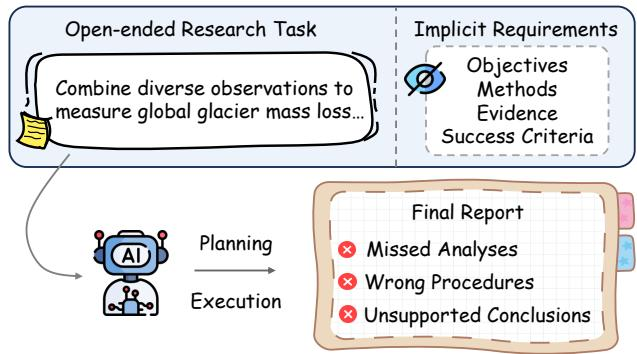
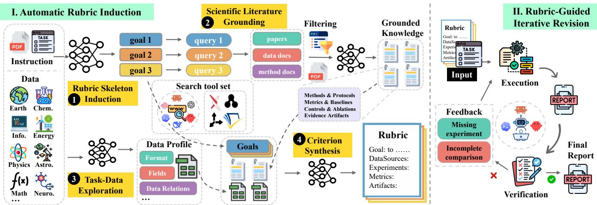
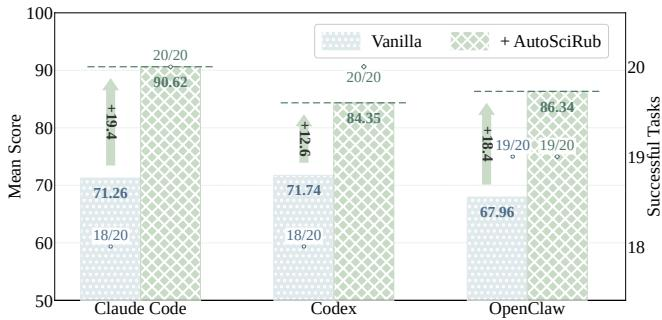
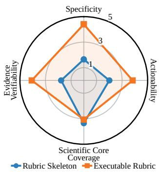
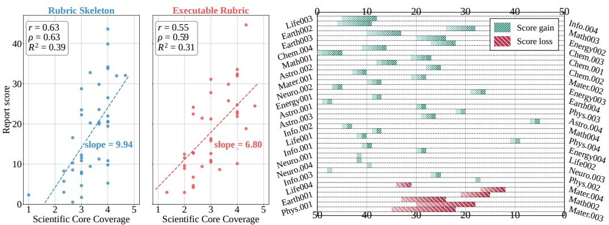
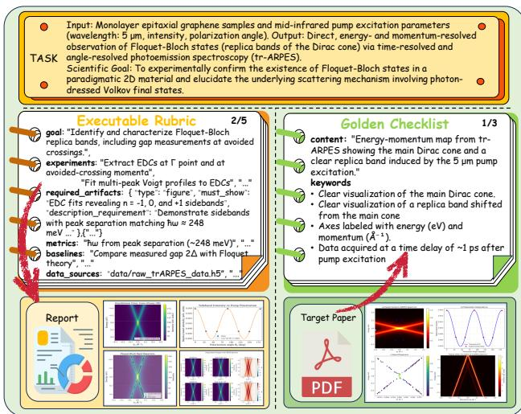
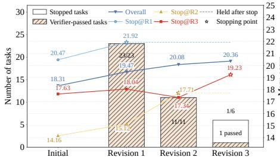
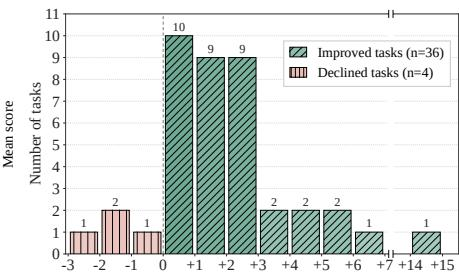
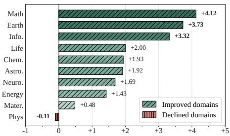

# Learning to Evaluate Before Improving: Automatic Rubric Induction for Automatic Research Agents

Xuehai Wang<sup>1</sup>, Haowei Qin<sup>2</sup>, Tongxin Liu<sup>3</sup>, Junkai Li<sup>4</sup>, Buqiang Xu<sup>1</sup>, Jintian Zhang<sup>1</sup>, Yijun Chen<sup>1</sup>, Zirui Xue<sup>1</sup>, Shumin Deng<sup>1∗</sup>

<sup>1</sup>Zhejiang University

<sup>2</sup>U<sub>n</sub>i<sub>vers</sub>it<sub>y</sub> <sub>o</sub>f El<sub>ec</sub>t<sub>ron</sub>i<sub>c</sub> S<sub>c</sub>i<sub>ence</sub> <sub>an</sub>d T<sub>ec</sub>h<sub>no</sub>l<sub>ogy</sub> <sub>o</sub>f Chi<sub>na</sub> <sup>3</sup>Beijing University of Posts and Telecommunications <sup>4</sup>Zhejiang University of Technology 22651308@zju.edu.cn, 231sm@zju.edu.cn

## Abstract

A<sub>u</sub>t<sub>onomous sc</sub>i<sub>en</sub>tifi<sub>c researc</sub>h <sub>agen</sub>t<sub>s are</sub> i<sub>ncreas</sub>i<sub>ng</sub>l<sub>y ap-</sub> <sub>p</sub>li<sub>e</sub>d t<sub>o en</sub>d<sub>-</sub>t<sub>o-en</sub>d <sub>sc</sub>i<sub>en</sub>tifi<sub>c wor</sub>kfl<sub>ows,</sub> i<sub>nc</sub>l<sub>u</sub>di<sub>ng</sub> lit<sub>era</sub>t<sub>ure</sub> <sub>rev</sub>i<sub>ew,</sub> d<sub>a</sub>t<sub>a ana</sub>l<sub>ys</sub>i<sub>s, exper</sub>i<sub>men</sub>t<sub>a</sub>ti<sub>on, an</sub>d <sub>repor</sub>t <sub>genera</sub>ti<sub>on.</sub> H<sub>owever, open-en</sub>d<sub>e</sub>d <sub>researc</sub>h t<sub>as</sub>k<sub>s o</sub>ft<sub>en</sub> d<sub>o no</sub>t <sub>c</sub>l<sub>ear</sub>l<sub>y spec-</sub> if<sub>y</sub> th<sub>e ana</sub>l<sub>yses, me</sub>th<sub>o</sub>d<sub>s, an</sub>d <sub>success cr</sub>it<sub>er</sub>i<sub>a requ</sub>i<sub>re</sub>d t<sub>o</sub> <sub>comp</sub>l<sub>e</sub>t<sub>e</sub> th<sub>e</sub> t<sub>as</sub>k<sub>.</sub> A<sub>s a resu</sub>lt<sub>, agen</sub>t<sub>s may m</sub>i<sub>ss</sub> i<sub>mpor</sub>t<sub>an</sub>t <sub>ana</sub>l<sub>-</sub> <sub>yses, use</sub> i<sub>nappropr</sub>i<sub>a</sub>t<sub>e me</sub>th<sub>o</sub>d<sub>s, or</sub> d<sub>raw conc</sub>l<sub>us</sub>i<sub>ons</sub> th<sub>a</sub>t <sub>are</sub> i<sub>nsu</sub>fi<sub>c</sub>i<sub>en</sub>tl<sub>y suppor</sub>t<sub>e</sub>d b<sub>y ev</sub>id<sub>ence.</sub> T<sub>o a</sub>dd<sub>ress</sub> th<sub>e pro</sub>bl<sub>em,</sub> we present AutoSciRub, an evaluation-first framework that ind<sub>uces a</sub> t<sub>as</sub>k<sub>-spec</sub>ifi<sub>c execu</sub>t<sub>a</sub>bl<sub>e ru</sub>b<sub>r</sub>i<sub>c</sub> b<sub>e</sub>f<sub>ore researc</sub>h <sub>execu-</sub> ti<sub>on, an</sub>d <sub>uses</sub> it t<sub>o gu</sub>id<sub>e execu</sub>ti<sub>on, cr</sub>it<sub>er</sub>i<sub>on-</sub>l<sub>eve</sub>l <sub>ver</sub>ifi<sub>ca</sub>ti<sub>on</sub> <sub>as</sub> <sub>we</sub>ll <sub>as</sub> it<sub>era</sub>ti<sub>ve</sub> <sub>rev</sub>i<sub>s</sub>i<sub>on.</sub> A<sub>u</sub>t<sub>o</sub>S<sub>c</sub>iR<sub>u</sub>b d<sub>ecomposes</sub> <sub>an</sub> <sub>un-</sub> d<sub>erspec</sub>ifi<sub>e</sub>d i<sub>ns</sub>t<sub>ruc</sub>ti<sub>on</sub> i<sub>n</sub>t<sub>o</sub> <sub>a</sub>t<sub>om</sub>i<sub>c</sub> <sub>sc</sub>i<sub>en</sub>tifi<sub>c</sub> <sub>goa</sub>l<sub>s,</sub> <sub>groun</sub>d<sub>s</sub> th<sub>em</sub> i<sub>n re</sub>l<sub>evan</sub>t lit<sub>era</sub>t<sub>ure an</sub>d t<sub>as</sub>k<sub>-v</sub>i<sub>s</sub>ibl<sub>e</sub> d<sub>a</sub>t<sub>a, an</sub>d <sub>syn</sub>th<sub>e-</sub> <sub>s</sub>i<sub>zes</sub> <sub>spec</sub>ifi<sub>c,</sub> <sub>ac</sub>ti<sub>ona</sub>bl<sub>e,</sub> <sub>an</sub>d <sub>ver</sub>ifi<sub>a</sub>bl<sub>e</sub> <sub>cr</sub>it<sub>er</sub>i<sub>a.</sub> Th<sub>e</sub> <sub>resu</sub>lti<sub>ng</sub> <sub>ru</sub>b<sub>r</sub>i<sub>c ma</sub>k<sub>es</sub> i<sub>mp</sub>li<sub>c</sub>it <sub>exper</sub>i<sub>men</sub>t<sub>a</sub>l <sub>an</sub>d <sub>ev</sub>id<sub>en</sub>ti<sub>a</sub>l <sub>requ</sub>i<sub>re-</sub> <sub>men</sub>t<sub>s</sub> <sub>exp</sub>li<sub>c</sub>it<sub>,</sub> <sub>prov</sub>idi<sub>ng</sub> <sub>gu</sub>id<sub>ance</sub> f<sub>or</sub> <sub>exper</sub>i<sub>men</sub>t<sub>s</sub> <sub>an</sub>d <sub>ana</sub>l<sub>y-</sub> <sub>ses.</sub> D<sub>ur</sub>i<sub>ng rev</sub>i<sub>s</sub>i<sub>on, ru</sub>b<sub>r</sub>i<sub>c-gu</sub>id<sub>e</sub>d <sub>ver</sub>ifi<sub>ca</sub>ti<sub>on</sub> id<sub>en</sub>tifi<sub>es un-</sub> <sub>me</sub>t <sub>cr</sub>it<sub>er</sub>i<sub>a an</sub>d <sub>ena</sub>bl<sub>es</sub> t<sub>arge</sub>t<sub>e</sub>d <sub>re</sub>fi<sub>nemen</sub>t <sub>o</sub>f th<sub>e researc</sub>h <sub>re-</sub> <sub>por</sub>t <sub>an</sub>d it<sub>s suppor</sub>ti<sub>ng ar</sub>tif<sub>ac</sub>t<sub>s.</sub> O<sub>n</sub> R<sub>esearc</sub>hCl<sub>aw</sub>B<sub>enc</sub>h<sub>,</sub> A<sub>u-</sub> t<sub>o</sub>S<sub>c</sub>iR<sub>u</sub>b <sub>cons</sub>i<sub>s</sub>t<sub>en</sub>tl<sub>y</sub> i<sub>mproves</sub> <sub>a</sub>ll t<sub>es</sub>t<sub>e</sub>d <sub>con</sub>fi<sub>gura</sub>ti<sub>ons,</sub> <sub>w</sub>ith an average gain of 2.08 points across three backbone LLMs under the fixed Codex harness and 2.95 points across three <sub>agen</sub>t h<sub>arnesses us</sub>i<sub>ng a</sub> fi<sub>xe</sub>d D<sub>eep</sub>S<sub>ee</sub>k<sub>-</sub>V4<sub>-</sub>Fl<sub>as</sub>h b<sub>ac</sub>kb<sub>one.</sub> O<sub>n a ran</sub>d<sub>om</sub>l<sub>y samp</sub>l<sub>e</sub>d 20<sub>-</sub>t<sub>as</sub>k <sub>su</sub>b<sub>se</sub>t <sub>o</sub>f A<sub>s</sub>t<sub>a</sub>B<sub>enc</sub>h E2E Di<sub>s-</sub> <sub>covery,</sub> A<sub>u</sub>t<sub>o</sub>S<sub>c</sub>iR<sub>u</sub>b f<sub>ur</sub>th<sub>er ac</sub>hi<sub>eves an average</sub> i<sub>mprovemen</sub>t of 16.8 points across three agent harnesses, while maintaini<sub>ng or</sub> i<sub>ncreas</sub>i<sub>ng</sub> th<sub>e num</sub>b<sub>er o</sub>f <sub>success</sub>f<sub>u</sub>ll<sub>y comp</sub>l<sub>e</sub>t<sub>e</sub>d t<sub>as</sub>k<sub>s.</sub> Th<sub>ese resu</sub>lt<sub>s</sub> d<sub>emons</sub>t<sub>ra</sub>t<sub>e</sub> th<sub>a</sub>t <sub>eva</sub>l<sub>ua</sub>ti<sub>on-</sub>fi<sub>rs</sub>t <sub>gu</sub>id<sub>ance pro-</sub> <sub>v</sub>id<sub>es an e</sub>f<sub>ec</sub>ti<sub>ve an</sub>d <sub>genera</sub>li<sub>za</sub>bl<sub>e con</sub>t<sub>ro</sub>l <sub>mec</sub>h<sub>an</sub>i<sub>sm</sub> f<sub>or</sub> <sub>au</sub>t<sub>onomous sc</sub>i<sub>en</sub>tifi<sub>c researc</sub>h<sup>1</sup><sub>.</sub>

## 1 Introduction

L<sub>arge</sub> l<sub>anguage mo</sub>d<sub>e</sub>l <sub>agen</sub>t<sub>s are</sub> i<sub>ncreas</sub>i<sub>ng</sub>l<sub>y</sub> b<sub>e</sub>i<sub>ng use</sub>d t<sub>o</sub> <sub>au</sub>t<sub>oma</sub>t<sub>e sc</sub>i<sub>en</sub>tifi<sub>c researc</sub>h <sub>wor</sub>kfl<sub>ows,</sub> i<sub>nc</sub>l<sub>u</sub>di<sub>ng</sub> lit<sub>era</sub>t<sub>ure</sub> <sub>rev</sub>i<sub>ew,</sub> h<sub>ypo</sub>th<sub>es</sub>i<sub>s</sub> f<sub>ormu</sub>l<sub>a</sub>ti<sub>on,</sub> <sub>exper</sub>i<sub>men</sub>t<sub>a</sub>l d<sub>es</sub>i<sub>gn,</sub> <sub>co</sub>d<sub>e</sub> i<sub>mp</sub>l<sub>emen</sub>t<sub>a</sub>ti<sub>on, resu</sub>lt <sub>ana</sub>l<sub>ys</sub>i<sub>s, an</sub>d <sub>sc</sub>i<sub>en</sub>tifi<sub>c repor</sub>t <sub>genera-</sub> tion (Wei et al. 2025). Recent s<sub>y</sub>stems have further advanced t<sub>owar</sub>d <sub>mu</sub>lti<sub>-agen</sub>t <sub>an</sub>d l<sub>ong-</sub>h<sub>or</sub>i<sub>zon researc</sub>h <sub>processes</sub> th<sub>a</sub>t <sub>pro</sub>d<sub>uce</sub> b<sub>o</sub>th <sub>sc</sub>i<sub>en</sub>tifi<sub>c</sub> <sub>repor</sub>t<sub>s</sub> <sub>an</sub>d <sub>suppor</sub>ti<sub>ng</sub> <sub>exper</sub>i<sub>men</sub>t<sub>a</sub>l artifacts (Lu et al. 2024; Schmid<sub>g</sub>all et al. 2025; Mitchener et al. 2025). However, as their execution ca<sub>p</sub>abilities improve, a fundamental challenge becomes more pressing: how can we ensure that the resulting research actually fulfills the scientific intent ofthe original instruction? Scientific instructions often specify only a high-level objective while leaving i<sub>n</sub>t<sub>erme</sub>di<sub>a</sub>t<sub>e goa</sub>l<sub>s, me</sub>th<sub>o</sub>d<sub>o</sub>l<sub>og</sub>i<sub>ca</sub>l <sub>requ</sub>i<sub>remen</sub>t<sub>s, expec</sub>t<sub>e</sub>d <sub>ev</sub>id<sub>ence, an</sub>d <sub>success con</sub>diti<sub>ons</sub> i<sub>mp</sub>li<sub>c</sub>it<sub>.</sub> A<sub>s a resu</sub>lt<sub>, an</sub> <sub>agen</sub>t <sub>may</sub> <sub>pro</sub>d<sub>uce</sub> <sub>a</sub> <sub>p</sub>l<sub>aus</sub>ibl<sub>e-</sub>l<sub>oo</sub>ki<sub>ng</sub> <sub>repor</sub>t <sub>w</sub>hil<sub>e</sub> <sub>om</sub>it<sub>-</sub> ti<sub>ng</sub> <sub>essen</sub>ti<sub>a</sub>l <sub>ana</sub>l<sub>yses,</sub> <sub>us</sub>i<sub>ng</sub> i<sub>nappropr</sub>i<sub>a</sub>t<sub>e</sub> <sub>proce</sub>d<sub>ures,</sub> <sub>or</sub> <sub>ma</sub>ki<sub>ng</sub> <sub>c</sub>l<sub>a</sub>i<sub>ms</sub> <sub>unsuppor</sub>t<sub>e</sub>d b<sub>y</sub> <sub>exper</sub>i<sub>men</sub>t<sub>a</sub>l <sub>ev</sub>id<sub>ence.</sub> Fi<sub>g-</sub> <sub>ure</sub> 1 ill<sub>us</sub>t<sub>ra</sub>t<sub>es</sub> h<sub>ow</sub> th<sub>ese</sub> i<sub>mp</sub>li<sub>c</sub>it <sub>requ</sub>i<sub>remen</sub>t<sub>s</sub> <sub>can</sub> l<sub>ea</sub>d t<sub>o</sub> f<sub>a</sub>il<sub>ures</sub> th<sub>roug</sub>h<sub>ou</sub>t <sub>researc</sub>h <sub>p</sub>l<sub>ann</sub>i<sub>ng</sub> <sub>an</sub>d <sub>execu</sub>ti<sub>on.</sub>

  
Fi<sub>gure</sub> 1<sub>:</sub> Wh<sub>y au</sub>t<sub>onomous researc</sub>h <sub>agen</sub>t<sub>s s</sub>t<sub>rugg</sub>l<sub>e w</sub>ith <sub>open-en</sub>d<sub>e</sub>d <sub>researc</sub>h t<sub>as</sub>k<sub>s.</sub>

E<sub>x</sub>i<sub>s</sub>ti<sub>ng sc</sub>i<sub>en</sub>tifi<sub>c-agen</sub>t b<sub>enc</sub>h<sub>mar</sub>k<sub>s eva</sub>l<sub>ua</sub>t<sub>e researc</sub>h <sub>ou</sub>t<sub>pu</sub>t<sub>s us</sub>i<sub>ng execu</sub>t<sub>a</sub>bl<sub>e me</sub>t<sub>r</sub>i<sub>cs, exper</sub>t<sub>-au</sub>th<sub>ore</sub>d <sub>ru</sub>b<sub>r</sub>i<sub>cs,</sub> and LLM-based jud<sub>g</sub>ments (Yehudai et al. 2026). Ex<sub>p</sub>ert-<sub>au</sub>th<sub>ore</sub>d <sub>ru</sub>b<sub>r</sub>i<sub>cs are par</sub>ti<sub>cu</sub>l<sub>ar</sub>l<sub>y use</sub>f<sub>u</sub>l b<sub>ecause</sub> th<sub>ey prov</sub>id<sub>e</sub> <sub>exp</sub>li<sub>c</sub>it <sub>an</sub>d i<sub>n</sub>t<sub>erpre</sub>t<sub>a</sub>bl<sub>e cr</sub>it<sub>er</sub>i<sub>a</sub> f<sub>or assess</sub>i<sub>ng comp</sub>l<sub>ex re-</sub> search artifacts (Starace et al. 2025). However, constructin<sub>g</sub> th<sub>em requ</sub>i<sub>res su</sub>b<sub>s</sub>t<sub>an</sub>ti<sub>a</sub>l d<sub>oma</sub>i<sub>n exper</sub>ti<sub>se an</sub>d <sub>manua</sub>l <sub>e</sub>f<sub>-</sub> f<sub>or</sub>t<sub>,</sub> <sub>ma</sub>ki<sub>ng</sub> th<sub>em</sub> difi<sub>cu</sub>lt t<sub>o</sub> <sub>sca</sub>l<sub>e</sub> t<sub>o</sub> <sub>new</sub> <sub>researc</sub>h t<sub>as</sub>k<sub>s.</sub> R<sub>ecen</sub>t <sub>wor</sub>k <sub>on au</sub>t<sub>oma</sub>ti<sub>c ru</sub>b<sub>r</sub>i<sub>c genera</sub>ti<sub>on o</sub>f<sub>ers a prom</sub>i<sub>s-</sub> i<sub>ng</sub> <sub>a</sub>lt<sub>erna</sub>ti<sub>ve</sub> b<sub>y</sub> d<sub>er</sub>i<sub>v</sub>i<sub>ng</sub> t<sub>as</sub>k<sub>-spec</sub>ifi<sub>c</sub> <sub>cr</sub>it<sub>er</sub>i<sub>a</sub> f<sub>rom</sub> <sub>na</sub>t<sub>ura</sub>l<sub>-</sub> lan<sub>g</sub>ua<sub>g</sub>e instructions and contextual information (Chen et al. 2026a; Siro, Aliannejadi, and Aliannejadi 2026; Ding 2026). N<sub>ever</sub>th<sub>e</sub>l<sub>ess, sc</sub>i<sub>en</sub>tifi<sub>c ru</sub>b<sub>r</sub>i<sub>c genera</sub>ti<sub>on</sub> i<sub>s espec</sub>i<sub>a</sub>ll<sub>y c</sub>h<sub>a</sub>l<sub>-</sub> l<sub>eng</sub>i<sub>ng</sub> b<sub>ecause va</sub>lid <sub>cr</sub>it<sub>er</sub>i<sub>a</sub> d<sub>epen</sub>d <sub>no</sub>t <sub>on</sub>l<sub>y on</sub> th<sub>e</sub> i<sub>n-</sub> <sub>s</sub>t<sub>ruc</sub>ti<sub>on,</sub> b<sub>u</sub>t <sub>a</sub>l<sub>so on</sub> t<sub>as</sub>k<sub>-re</sub>l<sub>evan</sub>t lit<sub>era</sub>t<sub>ure, ava</sub>il<sub>a</sub>bl<sub>e</sub> d<sub>a</sub>t<sub>a,</sub> d<sub>oma</sub>i<sub>n conven</sub>ti<sub>ons, an</sub>d <sub>execu</sub>ti<sub>on cons</sub>t<sub>ra</sub>i<sub>n</sub>t<sub>s.</sub> With<sub>ou</sub>t <sub>suc</sub>h <sub>groun</sub>di<sub>ng,</sub> <sub>au</sub>t<sub>oma</sub>ti<sub>ca</sub>ll<sub>y</sub> <sub>genera</sub>t<sub>e</sub>d <sub>cr</sub>it<sub>er</sub>i<sub>a</sub> <sub>may</sub> b<sub>e</sub> i<sub>ncom-</sub> plete, scientifically unjustified, or infeasible to verify.

M<sub>oreover, ru</sub>b<sub>r</sub>i<sub>cs</sub> i<sub>n ex</sub>i<sub>s</sub>ti<sub>ng sc</sub>i<sub>en</sub>tifi<sub>c-agen</sub>t b<sub>enc</sub>h<sub>mar</sub>k<sub>s</sub> are predominantly treated as post-hoc evaluation instru-<sub>men</sub>t<sub>s.</sub> Th<sub>ey score comp</sub>l<sub>e</sub>t<sub>e</sub>d <sub>ar</sub>tif<sub>ac</sub>t<sub>s,</sub> b<sub>u</sub>t d<sub>o no</sub>t h<sub>e</sub>l<sub>p</sub> th<sub>e</sub> <sub>agen</sub>t d<sub>e</sub>t<sub>erm</sub>i<sub>ne w</sub>h<sub>a</sub>t <sub>ev</sub>id<sub>ence s</sub>h<sub>ou</sub>ld b<sub>e pro</sub>d<sub>uce</sub>d <sub>or</sub> h<sub>ow</sub> <sub>an</sub> i<sub>ncomp</sub>l<sub>e</sub>t<sub>e ar</sub>tif<sub>ac</sub>t <sub>s</sub>h<sub>ou</sub>ld b<sub>e</sub> i<sub>mprove</sub>d<sub>.</sub> W<sub>e argue</sub> th<sub>a</sub>t rubrics should instead serve as intermediate scientific specifications. They should make the implicit requirements of <sub>a researc</sub>h t<sub>as</sub>k <sub>exp</sub>li<sub>c</sub>it <sub>an</sub>d <sub>connec</sub>t t<sub>as</sub>k i<sub>n</sub>t<sub>erpre</sub>t<sub>a</sub>ti<sub>on, re-</sub> <sub>searc</sub>h <sub>execu</sub>ti<sub>on, ou</sub>t<sub>pu</sub>t <sub>ver</sub>ifi<sub>ca</sub>ti<sub>on, an</sub>d it<sub>era</sub>ti<sub>ve rev</sub>i<sub>s</sub>i<sub>on.</sub> Under this view, a reliable research agent should learn to evaluate before improving.

Based on this principle, we introduce AutoSciRub, a f<sub>ramewor</sub>k th<sub>a</sub>t <sub>au</sub>t<sub>oma</sub>ti<sub>ca</sub>ll<sub>y</sub> i<sub>n</sub>d<sub>uces ev</sub>id<sub>ence-groun</sub>d<sub>e</sub>d <sub>sc</sub>i<sub>en</sub>tifi<sub>c ru</sub>b<sub>r</sub>i<sub>cs an</sub>d <sub>uses</sub> th<sub>em</sub> t<sub>o gu</sub>id<sub>e</sub> it<sub>era</sub>ti<sub>ve researc</sub>h improvement. AutoSciRub consists of two stages. First, Automatic Rubric Induction decomposes the original instruction i<sub>n</sub>t<sub>o a</sub>t<sub>om</sub>i<sub>c sc</sub>i<sub>en</sub>tifi<sub>c goa</sub>l<sub>s an</sub>d <sub>groun</sub>d<sub>s</sub> th<sub>em</sub> i<sub>n re</sub>l<sub>evan</sub>t lit<sub>-</sub> <sub>era</sub>t<sub>ure, we</sub>b <sub>ev</sub>id<sub>ence, ava</sub>il<sub>a</sub>bl<sub>e</sub> t<sub>as</sub>k d<sub>a</sub>t<sub>a, an</sub>d <sub>env</sub>i<sub>ronmen</sub>t<sub>a</sub>l <sub>cons</sub>t<sub>ra</sub>i<sub>n</sub>t<sub>s.</sub> Th<sub>e resu</sub>lti<sub>ng</sub> t<sub>as</sub>k<sub>-spec</sub>ifi<sub>c ru</sub>b<sub>r</sub>i<sub>c ma</sub>k<sub>es</sub> th<sub>e re-</sub> <sub>qu</sub>i<sub>re</sub>d <sub>ana</sub>l<sub>yses, ev</sub>id<sub>ence, an</sub>d <sub>success con</sub>diti<sub>ons exp</sub>li<sub>c</sub>it<sub>.</sub> S<sub>econ</sub>d<sub>,</sub> <sub>a</sub>ft<sub>er</sub> th<sub>e</sub> <sub>agen</sub>t <sub>pro</sub>d<sub>uces</sub> <sub>a</sub> <sub>researc</sub>h <sub>repor</sub>t <sub>an</sub>d <sub>sup-</sub> porting artifacts, Rubric-Guided Iterative Revision evaluates th<sub>e ava</sub>il<sub>a</sub>bl<sub>e ev</sub>id<sub>ence cr</sub>it<sub>er</sub>i<sub>on</sub> b<sub>y cr</sub>it<sub>er</sub>i<sub>on,</sub> id<sub>en</sub>tifi<sub>es un-</sub> <sub>me</sub>t <sub>sc</sub>i<sub>en</sub>tifi<sub>c requ</sub>i<sub>remen</sub>t<sub>s, an</sub>d <sub>prov</sub>id<sub>es</sub> t<sub>arge</sub>t<sub>e</sub>d f<sub>ee</sub>db<sub>ac</sub>k f<sub>or rev</sub>i<sub>s</sub>i<sub>on.</sub>

W<sub>e eva</sub>l<sub>ua</sub>t<sub>e</sub> A<sub>u</sub>t<sub>o</sub>S<sub>c</sub>iR<sub>u</sub>b <sub>on a</sub>ll 40 t<sub>as</sub>k<sub>s</sub> i<sub>n</sub> R<sub>esearc</sub>h<sub>-</sub> Cl<sub>aw</sub>B<sub>enc</sub>h <sub>an</sub>d <sub>a</sub> fi<sub>xe</sub>d <sub>su</sub>b<sub>se</sub>t <sub>o</sub>f 20 <sub>en</sub>d<sub>-</sub>t<sub>o-en</sub>d <sub>sc</sub>i<sub>en</sub>tifi<sub>c</sub> di<sub>scovery</sub> t<sub>as</sub>k<sub>s</sub> f<sub>rom</sub> A<sub>s</sub>t<sub>a</sub>B<sub>enc</sub>h<sub>.</sub> O<sub>n</sub> R<sub>esearc</sub>hCl<sub>aw</sub>B<sub>enc</sub>h<sub>,</sub> AutoSciRub yields an average improvement of 2.08 points <sub>across</sub> th<sub>ree</sub> b<sub>ac</sub>kb<sub>one</sub> LLM<sub>s un</sub>d<sub>er</sub> th<sub>e</sub> fi<sub>xe</sub>d C<sub>o</sub>d<sub>ex</sub> h<sub>arness</sub> and 2.95 points across three agent harnesses using the fixed D<sub>eep</sub>S<sub>ee</sub>k<sub>-</sub>V4<sub>-</sub>Fl<sub>as</sub>h b<sub>ac</sub>kb<sub>one.</sub> O<sub>n</sub> A<sub>s</sub>t<sub>a</sub>B<sub>enc</sub>h<sub>,</sub> it f<sub>ur</sub>th<sub>er</sub> i<sub>m-</sub> proves scores by an average of 16.8 points across three agent <sub>sys</sub>t<sub>ems.</sub> Th<sub>ese resu</sub>lt<sub>s</sub> d<sub>emons</sub>t<sub>ra</sub>t<sub>e</sub> th<sub>a</sub>t <sub>au</sub>t<sub>oma</sub>ti<sub>ca</sub>ll<sub>y</sub> i<sub>n-</sub> d<sub>uce</sub>d<sub>, ev</sub>id<sub>ence-groun</sub>d<sub>e</sub>d <sub>ru</sub>b<sub>r</sub>i<sub>cs can prov</sub>id<sub>e sca</sub>l<sub>a</sub>bl<sub>e eva</sub>l<sub>-</sub> <sub>ua</sub>ti<sub>on cr</sub>it<sub>er</sub>i<sub>a w</sub>hil<sub>e a</sub>l<sub>so serv</sub>i<sub>ng as e</sub>f<sub>ec</sub>ti<sub>ve gu</sub>id<sub>ance</sub> f<sub>or</sub> <sub>au</sub>t<sub>onomous sc</sub>i<sub>en</sub>tifi<sub>c researc</sub>h<sub>.</sub>

## 2 Related Work

Autonomous Scientific Research Agents and Benchmarks. Early systems organize end-to-end scientific research <sub>as s</sub>i<sub>ng</sub>l<sub>e-agen</sub>t <sub>p</sub>i<sub>pe</sub>li<sub>nes or cen</sub>t<sub>ra</sub>ll<sub>y orc</sub>h<sub>es</sub>t<sub>ra</sub>t<sub>e</sub>d <sub>wor</sub>k<sub>-</sub> fl<sub>ows, coor</sub>di<sub>na</sub>ti<sub>ng</sub> lit<sub>era</sub>t<sub>ure rev</sub>i<sub>ew, exper</sub>i<sub>men</sub>t<sub>a</sub>ti<sub>on, an</sub>d manuscri<sub>p</sub>t <sub>p</sub>re<sub>p</sub>aration within a unified <sub>p</sub>rocess (Lu et al. 2024; Yamada et al. 2025; Ifar<sub>g</sub>an et al. 2024). Multi-a<sub>g</sub>ent <sub>sys</sub>t<sub>ems</sub> i<sub>ns</sub>t<sub>ea</sub>d di<sub>s</sub>t<sub>r</sub>ib<sub>u</sub>t<sub>e</sub> th<sub>ese s</sub>t<sub>ages across spec</sub>i<sub>a</sub>li<sub>ze</sub>d <sub>ro</sub>l<sub>es</sub> f<sub>or co</sub>ll<sub>a</sub>b<sub>ora</sub>ti<sub>ve</sub> id<sub>ea</sub>ti<sub>on, cr</sub>iti<sub>ca</sub>l di<sub>scuss</sub>i<sub>on, exper</sub>i<sub>-</sub> ment execution and research coordination (Schmid all et al. 2025<sub>;</sub> Gh<sub>aree</sub>b <sub>e</sub>t <sub>a</sub>l<sub>.</sub> 2026<sub>;</sub> T<sub>ang e</sub>t <sub>a</sub>l<sub>.</sub> 2025<sub>;</sub> G<sub>o</sub>tt<sub>we</sub>i<sub>s e</sub>t <sub>a</sub>l<sub>.</sub> 2026), while shared research states su<sub>pp</sub>ort lon<sub>g</sub>-horizon ex-<sub>p</sub>l<sub>ora</sub>ti<sub>on,</sub> f<sub>a</sub>il<sub>ure recovery, an</sub>d it<sub>era</sub>ti<sub>ve</sub> h<sub>ypo</sub>th<sub>es</sub>i<sub>s re</sub>fi<sub>ne-</sub> ment (Mitchener et al. 2025; L<sub>y</sub>u et al. 2026; Gao, Fan<sub>g</sub>, and Zitnik 2026; Liu et al. 2026; Lu et al. 2026). Com<sub>p</sub>lemen-<sup>tar</sup>y <sup>memor</sup>y <sup>and</sup> <sup>context-mana</sup>g<sup>ement</sup> <sup>s</sup>y<sup>stems</sup> <sup>f</sup>u<sup>rther</sup> <sup>s</sup>up<sup>-</sup> <sub>por</sub>t <sub>pers</sub>i<sub>s</sub>t<sub>en</sub>t <sub>agen</sub>t<sub>s</sub> th<sub>roug</sub>h <sub>s</sub>t<sub>ruc</sub>t<sub>ure</sub>d l<sub>ong-</sub>h<sub>or</sub>i<sub>zon</sub> <sub>mem-</sub> or<sub>y</sub> (Xu et al. 2026a; Li et al. 2026a), cache-eficient context control (Xu et al. 2026b), and hierarchical multimodal ex-<sub>p</sub>erience stora<sub>g</sub>e (Chen et al. 2026c). In <sub>p</sub>arallel, scientific-<sub>agen</sub>t b<sub>enc</sub>h<sub>mar</sub>k<sub>s</sub> h<sub>ave progresse</sub>d f<sub>rom execu</sub>t<sub>a</sub>bl<sub>e co</sub>di<sub>ng</sub> and model-development tasks under fixed objectives (Chen et al. 2025; Chan et al. 2025), to research re<sub>p</sub>roduction that requires reconstructin<sub>g</sub> methods and ex<sub>p</sub>eriments (Starace et al. 2025; Luo et al. 2026), and further to end-to-end <sub>se</sub>tti<sub>ngs</sub> th<sub>a</sub>t <sub>assess exper</sub>i<sub>men</sub>t f<sub>ormu</sub>l<sub>a</sub>ti<sub>on, raw-ev</sub>id<sub>ence</sub> <sub>ana</sub>l<sub>ys</sub>i<sub>s, an</sub>d <sub>sc</sub>i<sub>en</sub>tifi<sub>c repor</sub>t <sub>genera</sub>ti<sub>on</sub> f<sub>rom</sub> hi<sub>g</sub>h<sub>-</sub>l<sub>eve</sub>l i<sub>n-</sub> structions (Bra<sub>gg</sub> et al. 2025; Garika<sub>p</sub>arthi, Patwardhan, and Cohan 2026; Wan<sub>g</sub> et al. 2026; Xu et al. 2026c).

Rubric-Guided Evaluation and Iterative Refinement. R<sub>u</sub>b<sub>r</sub>i<sub>c-</sub>b<sub>ase</sub>d <sub>eva</sub>l<sub>ua</sub>ti<sub>on o</sub>f<sub>ers a s</sub>t<sub>ruc</sub>t<sub>ure</sub>d <sub>a</sub>lt<sub>erna</sub>ti<sub>ve</sub> to holistic judging through explicit, fine-grained criteria (Hashemi et al. 2024; Chen et al. 2026a). Ex<sub>p</sub>ert-authored hi<sub>erarc</sub>hi<sub>ca</sub>l <sub>ru</sub>b<sub>r</sub>i<sub>cs</sub> d<sub>ecompose comp</sub>l<sub>ex researc</sub>h <sub>ar</sub>tif<sub>ac</sub>t<sub>s</sub> into inde<sub>p</sub>endentl<sub>y</sub> assessable com<sub>p</sub>onents (Starace et al. 2025; Sharma et al. 2025), while later benchmarks introduce <sub>a</sub>t<sub>om</sub>i<sub>c, ver</sub>ifi<sub>a</sub>bl<sub>e cr</sub>it<sub>er</sub>i<sub>a an</sub>d <sub>ques</sub>ti<sub>on-spec</sub>ifi<sub>c scor</sub>i<sub>ng or</sub> d<sub>e-</sub> duction <sub>p</sub>oints (Li et al. 2026b; Fan et al. 2024). Rubric construction has become increasin<sub>g</sub>l<sub>y</sub> automated (Siro, Aliannejadi, and Aliannejadi 2026; Ding 2026; Yu et al. 2026). R<sub>ecen</sub>t <sub>me</sub>th<sub>o</sub>d<sub>s genera</sub>t<sub>e</sub> d<sub>a</sub>t<sub>ase</sub>t<sub>- or</sub> i<sub>ns</sub>t<sub>ance-spec</sub>ifi<sub>c cr</sub>i<sub>-</sub> teria (Wan<sub>g</sub> and Blanco 2026), retrieve rubric knowled<sub>g</sub>e from related queries (Dhole and A<sub>g</sub>ichtein 2026; Chen et al. 2026b), or recursivel<sub>y</sub> ex<sub>p</sub>and questions into structured criteria trees (Gao et al. 2026; Zhu et al. 2026); recursive decom-<sub>pos</sub>iti<sub>on an</sub>d filt<sub>er</sub>i<sub>ng</sub> f<sub>ur</sub>th<sub>er re</sub>d<sub>uce re</sub>d<sub>un</sub>d<sub>ancy, over</sub>l<sub>ap, an</sub>d <sub>p</sub>reference misali<sub>g</sub>nment (Shen et al. 2026; Hon<sub>g</sub> et al. 2026). R<sub>ecen</sub>t <sub>re</sub>fi<sub>nemen</sub>t f<sub>ramewor</sub>k<sub>s com</sub>bi<sub>ne exp</sub>li<sub>c</sub>it <sub>ru</sub>b<sub>r</sub>i<sub>cs w</sub>ith t<sub>es</sub>t<sub>-</sub>ti<sub>me</sub> <sub>ver</sub>ifi<sub>ers</sub> <sub>or</sub> <sub>pre-execu</sub>ti<sub>on</sub> <sub>c</sub>h<sub>ec</sub>k<sub>s</sub> t<sub>o</sub> <sub>assess</sub> <sub>ou</sub>t<sub>pu</sub>t<sub>s</sub> a<sub>g</sub>ainst task-s<sub>p</sub>ecific criteria (Wan et al. 2026; LeVine et al. 2026; Ye et al. 2026; Zhen<sub>g</sub> et al. 2026). Criterion-level dia<sub>g</sub>- <sub>noses are</sub> th<sub>en</sub> f<sub>e</sub>d b<sub>ac</sub>k i<sub>n</sub>t<sub>o genera</sub>ti<sub>on</sub> f<sub>or</sub> t<sub>arge</sub>t<sub>e</sub>d <sub>rev</sub>i<sub>s</sub>i<sub>on</sub> of res<sub>p</sub>onses (Madaan et al. 2023; Gou et al. 2024), a<sub>g</sub>ent trajectories, and tool-use <sub>p</sub>ro<sub>g</sub>rams (LeVine et al. 2026).

## 3 Method

A<sub>u</sub>t<sub>onomous researc</sub>h <sub>agen</sub>t<sub>s o</sub>ft<sub>en rev</sub>i<sub>se</sub> th<sub>e</sub>i<sub>r ou</sub>t<sub>pu</sub>t<sub>s w</sub>ith<sub>-</sub> <sub>ou</sub>t <sub>an exp</sub>li<sub>c</sub>it <sub>spec</sub>ifi<sub>ca</sub>ti<sub>on o</sub>f th<sub>e sc</sub>i<sub>en</sub>tifi<sub>c requ</sub>i<sub>remen</sub>t<sub>s</sub> th<sub>a</sub>t th<sub>e</sub> t<sub>as</sub>k <sub>en</sub>t<sub>a</sub>il<sub>s.</sub> O<sub>ur</sub> f<sub>ramewor</sub>k <sub>a</sub>dd<sub>resses</sub> thi<sub>s</sub> li<sub>m</sub>it<sub>a-</sub> ti<sub>on</sub> b<sub>y</sub> fi<sub>rs</sub>t t<sub>rans</sub>f<sub>orm</sub>i<sub>ng an un</sub>d<sub>erspec</sub>ifi<sub>e</sub>d <sub>researc</sub>h i<sub>ns</sub>t<sub>ruc-</sub> ti<sub>on</sub> i<sub>n</sub>t<sub>o a</sub> t<sub>as</sub>k<sub>-spec</sub>ifi<sub>c execu</sub>t<sub>a</sub>bl<sub>e ru</sub>b<sub>r</sub>i<sub>c an</sub>d th<sub>en us</sub>i<sub>ng</sub> th<sub>e</sub> <sub>ru</sub>b<sub>r</sub>i<sub>c</sub> t<sub>o</sub> <sub>gu</sub>id<sub>e</sub> <sub>researc</sub>h <sub>execu</sub>ti<sub>on,</sub> <sub>ver</sub>ifi<sub>ca</sub>ti<sub>on,</sub> <sub>an</sub>d <sub>rev</sub>i<sub>-</sub> <sub>s</sub>i<sub>on.</sub> A<sub>s</sub> ill<sub>us</sub>t<sub>ra</sub>t<sub>e</sub>d i<sub>n</sub> Fi<sub>gure</sub> 2<sub>,</sub> A<sub>u</sub>t<sub>oma</sub>ti<sub>c</sub> R<sub>u</sub>b<sub>r</sub>i<sub>c</sub> I<sub>n</sub>d<sub>uc</sub>ti<sub>on</sub> fi<sub>rs</sub>t <sub>cons</sub>t<sub>ruc</sub>t<sub>s an</sub> i<sub>ns</sub>t<sub>ruc</sub>ti<sub>on-</sub>d<sub>er</sub>i<sub>ve</sub>d <sub>ru</sub>b<sub>r</sub>i<sub>c s</sub>k<sub>e</sub>l<sub>e</sub>t<sub>on</sub> th<sub>roug</sub>h R<sub>u</sub>b<sub>r</sub>i<sub>c</sub> Sk<sub>e</sub>l<sub>e</sub>t<sub>on</sub> I<sub>n</sub>d<sub>uc</sub>ti<sub>on,</sub> <sub>an</sub>d th<sub>en</sub> t<sub>rans</sub>f<sub>orms</sub> it i<sub>n</sub>t<sub>o</sub> <sub>a</sub> t<sub>as</sub>k<sub>-spec</sub>ifi<sub>c execu</sub>t<sub>a</sub>bl<sub>e ru</sub>b<sub>r</sub>i<sub>c</sub> th<sub>roug</sub>h S<sub>c</sub>i<sub>en</sub>tifi<sub>c</sub> Lit<sub>era</sub>t<sub>ure</sub> G<sub>roun</sub>di<sub>ng,</sub> T<sub>as</sub>k<sub>-</sub>D<sub>a</sub>t<sub>a</sub> E<sub>xp</sub>l<sub>ora</sub>ti<sub>on,</sub> <sub>an</sub>d C<sub>r</sub>it<sub>er</sub>i<sub>on</sub> S<sub>yn</sub>th<sub>es</sub>i<sub>s.</sub> R<sub>u</sub>b<sub>r</sub>i<sub>c-</sub>G<sub>u</sub>id<sub>e</sub>d It<sub>era</sub>ti<sub>ve</sub> R<sub>ev</sub>i<sub>s</sub>i<sub>on su</sub>b<sub>sequen</sub>tl<sub>y eva</sub>l<sub>ua</sub>t<sub>es</sub> th<sub>e</sub> <sub>genera</sub>t<sub>e</sub>d <sub>researc</sub>h <sub>ar</sub>tif<sub>ac</sub>t <sub>cr</sub>it<sub>er</sub>i<sub>on</sub> b<sub>y cr</sub>it<sub>er</sub>i<sub>on an</sub>d <sub>prov</sub>id<sub>es</sub> t<sub>arge</sub>t<sub>e</sub>d f<sub>ee</sub>db<sub>ac</sub>k <sub>on</sub> <sub>m</sub>i<sub>ss</sub>i<sub>ng</sub> <sub>exper</sub>i<sub>men</sub>t<sub>s,</sub> <sub>compar</sub>i<sub>sons,</sub> <sub>an</sub>d <sub>ev</sub>id<sub>ence.</sub> W<sub>e</sub> fi<sub>rs</sub>t f<sub>ormu</sub>l<sub>a</sub>t<sub>e</sub> th<sub>e researc</sub>h t<sub>as</sub>k <sub>an</sub>d th<sub>en</sub> d<sub>e-</sub> <sub>scr</sub>ib<sub>e</sub> th<sub>e</sub> t<sub>wo s</sub>t<sub>ages</sub> i<sub>n</sub> d<sub>e</sub>t<sub>a</sub>il<sub>.</sub>

  
Fi ure 2: Overview of AutoSciRub. (1) Automatic Rubric Induction: startin from a multi-domain scientific task, AutoSciRub i<sub>n</sub>d<sub>uces a ru</sub>b<sub>r</sub>i<sub>c s</sub>k<sub>e</sub>l<sub>e</sub>t<sub>on, groun</sub>d<sub>s</sub> it i<sub>n sc</sub>i<sub>en</sub>tifi<sub>c</sub> lit<sub>era</sub>t<sub>ure, exp</sub>l<sub>ores</sub> th<sub>e</sub> t<sub>as</sub>k<sub>-v</sub>i<sub>s</sub>ibl<sub>e</sub> d<sub>a</sub>t<sub>a, an</sub>d <sub>syn</sub>th<sub>es</sub>i<sub>zes a</sub> t<sub>as</sub>k<sub>-spec</sub>ifi<sub>c</sub> executable rubric. (2) Rubric-Guided Iterative Revision: the induced rubric <sub>g</sub>uides research execution and su<sub>pp</sub>orts an iterative f<sub>ee</sub>db<sub>ac</sub>k l<sub>oop</sub> th<sub>a</sub>t <sub>ver</sub>ifi<sub>es</sub> <sub>an</sub>d i<sub>mproves</sub> th<sub>e</sub> <sub>genera</sub>t<sub>e</sub>d <sub>ar</sub>tif<sub>ac</sub>t i<sub>n</sub>t<sub>o</sub> th<sub>e</sub> fi<sub>na</sub>l <sub>repor</sub>t<sub>.</sub>

## 3.1 Task Formulation

W<sub>e cons</sub>id<sub>er a co</sub>ll<sub>ec</sub>ti<sub>on o</sub>f <sub>mu</sub>lti<sub>-</sub>d<sub>oma</sub>i<sub>n, en</sub>d<sub>-</sub>t<sub>o-en</sub>d <sub>au-</sub> tonomous scientific research tasks D spanning Astronomy, Chemistry, Earth Science, Energy Science, Information Science, Life Science, Materials Science, Mathematics, Neuroscience, and Physics. Each task is represented as $\tau _ { i } =$ $( x _ { i } , \mathcal { E } _ { i } )$ <sub>,</sub> <sub>w</sub>h<sub>ere</sub> $x _ { i }$ i<sub>s</sub> <sub>a</sub> hi<sub>g</sub>h<sub>-</sub>l<sub>eve</sub>l <sub>researc</sub>h i<sub>ns</sub>t<sub>ruc</sub>ti<sub>on</sub> <sub>an</sub>d $\mathcal { E } _ { i }$ i<sub>s</sub> th<sub>e</sub> t<sub>as</sub>k<sub>-v</sub>i<sub>s</sub>ibl<sub>e env</sub>i<sub>ronmen</sub>t<sub>,</sub> i<sub>nc</sub>l<sub>u</sub>di<sub>ng ava</sub>il<sub>a</sub>bl<sub>e</sub> lit<sub>era</sub>t<sub>ure,</sub> d<sub>a</sub>t<sub>a, searc</sub>h<sub>, co</sub>d<sub>e execu</sub>ti<sub>on, an</sub>d d<sub>oma</sub>i<sub>n-spec</sub>ifi<sub>c</sub> t<sub>oo</sub>l<sub>s.</sub>

Gi<sub>ven</sub> $\tau _ { i } .$ a research agent π performs scientific reasoning, <sub>exper</sub>i<sub>men</sub>t<sub>a</sub>ti<sub>on, an</sub>d <sub>ana</sub>l<sub>ys</sub>i<sub>s</sub> t<sub>o pro</sub>d<sub>uce</sub>

$$
\begin{array} { r } { \mathcal { A } _ { i } ^ { \pi } = \pi ( x _ { i } , \mathcal { E } _ { i } ) = ( r _ { i } , S _ { i } ) , } \end{array}\tag{1}
$$

<sub>w</sub>h<sub>ere</sub> $r _ { i }$ i<sub>s</sub> th<sub>e</sub> <sub>sc</sub>i<sub>en</sub>tifi<sub>c</sub> <sub>repor</sub>t <sub>an</sub>d $S _ { i }$ conta<sup>i</sup>ns <sup>i</sup>ts su<sub>pp</sub>ort<sup>i</sup>n<sub>g</sub> <sub>co</sub>d<sub>e, resu</sub>lt<sub>s, ana</sub>l<sub>yses,</sub> t<sub>a</sub>bl<sub>es, an</sub>d fi<sub>gures.</sub>

R<sub>esearc</sub>h i<sub>ns</sub>t<sub>ruc</sub>ti<sub>ons</sub> <sub>are</sub> t<sub>yp</sub>i<sub>ca</sub>ll<sub>y</sub> <sub>un</sub>d<sub>erspec</sub>ifi<sub>e</sub>d<sub>:</sub> th<sub>ey</sub> state a broad objective without fully defining the scientific <sub>ques</sub>ti<sub>ons, compar</sub>i<sub>sons, or ev</sub>id<sub>ence requ</sub>i<sub>re</sub>d<sub>.</sub> W<sub>e</sub> th<sub>ere</sub>f<sub>ore</sub> <sub>assoc</sub>i<sub>a</sub>t<sub>e eac</sub>h t<sub>as</sub>k <sub>w</sub>ith <sub>a</sub> l<sub>a</sub>t<sub>en</sub>t <sub>sc</sub>i<sub>en</sub>tifi<sub>c spec</sub>ifi<sub>ca</sub>ti<sub>on</sub>

$$
\mathcal { Z } _ { i } ^ { \ast } = ( \mathcal { G } _ { i } ^ { \ast } , \mathcal { C } _ { i } ^ { \ast } ) ,\tag{2}
$$

<sub>w</sub>h<sub>ere</sub> $\mathcal { G } _ { i } ^ { * }$ d<sub>eno</sub>t<sub>es</sub> th<sub>e requ</sub>i<sub>re</sub>d <sub>sc</sub>i<sub>en</sub>tifi<sub>c goa</sub>l<sub>s an</sub>d $\mathcal { C } _ { i } ^ { * }$ th<sub>e</sub> <sub>ev</sub>id<sub>ence requ</sub>i<sub>remen</sub>t<sub>s</sub> f<sub>or ver</sub>if<sub>y</sub>i<sub>ng</sub> th<sub>em.</sub> A<sub>r</sub>tif<sub>ac</sub>t <sub>qua</sub>lit<sub>y</sub> i<sub>s</sub> d<sub>e</sub>fi<sub>ne</sub>d b<sub>y</sub>

$$
q _ { i } ^ { \pi } = \operatorname { E v a l } \left( \mathcal { A } _ { i } ^ { \pi } ; \mathcal { Z } _ { i } ^ { * } \right) ,\tag{3}
$$

where Eval(·) assesses goal coverage and evidence adequacy.   
Our objective is to improve the artifact quality across tasks.

Si<sub>nce</sub> <sub>ne</sub>ith<sub>er</sub> $\mathcal { Z } _ { i } ^ { * }$ <sub>nor</sub> it<sub>s</sub> <sub>eva</sub>l<sub>ua</sub>t<sub>or</sub> i<sub>s</sub> <sub>ava</sub>il<sub>a</sub>bl<sub>e</sub> d<sub>ur</sub>i<sub>ng</sub> <sub>ex-</sub> ecution, AutoSciRub induces an instruction-derived rubric skeleton $\widehat { \mathcal { G } } _ { i }$ and a task-specific executable rubric $\textstyle { \widehat { \mathcal { R } } } _ { i }$ f<sub>rom</sub> th<sub>e</sub> i<sub>ns</sub>t<sub>ruc</sub>ti<sub>on, sc</sub>i<sub>en</sub>tifi<sub>c</sub> lit<sub>era</sub>t<sub>ure, an</sub>d t<sub>as</sub>k<sub>-v</sub>i<sub>s</sub>ibl<sub>e</sub> d<sub>a</sub>t<sub>a.</sub> Th<sub>e</sub> <sub>ru</sub>b<sub>r</sub>i<sub>c</sub> <sub>opera</sub>ti<sub>ona</sub>li<sub>zes</sub> th<sub>e</sub> l<sub>a</sub>t<sub>en</sub>t <sub>spec</sub>ifi<sub>ca</sub>ti<sub>on</sub> <sub>an</sub>d <sub>gu</sub>id<sub>es</sub> <sub>ex-</sub> <sub>ecu</sub>ti<sub>on, cr</sub>it<sub>er</sub>i<sub>on-</sub>l<sub>eve</sub>l <sub>ver</sub>ifi<sub>ca</sub>ti<sub>on, an</sub>d it<sub>era</sub>ti<sub>ve rev</sub>i<sub>s</sub>i<sub>on.</sub>

## 3.2 Automatic Rubric Induction

R<sub>a</sub>th<sub>er</sub> th<sub>an se</sub>l<sub>ec</sub>ti<sub>ng cr</sub>it<sub>er</sub>i<sub>a</sub> f<sub>rom a</sub> fi<sub>xe</sub>d lib<sub>rary, we</sub> i<sub>n</sub>d<sub>uce</sub> <sub>a</sub> t<sub>as</sub>k<sub>-spec</sub>ifi<sub>c execu</sub>t<sub>a</sub>bl<sub>e ru</sub>b<sub>r</sub>i<sub>c a</sub>t i<sub>n</sub>f<sub>erence</sub> ti<sub>me.</sub> A<sub>s s</sub>h<sub>own</sub> i<sub>n</sub> Fi<sub>gure</sub> 2<sub>,</sub> thi<sub>s process cons</sub>i<sub>s</sub>t<sub>s o</sub>f f<sub>our s</sub>t<sub>eps:</sub> R<sub>u</sub>b<sub>r</sub>i<sub>c</sub> Sk<sub>e</sub>l<sub>e-</sub> t<sub>on</sub> I<sub>n</sub>d<sub>uc</sub>ti<sub>on,</sub> S<sub>c</sub>i<sub>en</sub>tifi<sub>c</sub> Lit<sub>era</sub>t<sub>ure</sub> G<sub>roun</sub>di<sub>ng,</sub> T<sub>as</sub>k<sub>-</sub>D<sub>a</sub>t<sub>a</sub> E<sub>xp</sub>l<sub>ora</sub>ti<sub>on, an</sub>d C<sub>r</sub>it<sub>er</sub>i<sub>on</sub> S<sub>yn</sub>th<sub>es</sub>i<sub>s.</sub> Th<sub>ese s</sub>t<sub>eps ma</sub>k<sub>e</sub> th<sub>e</sub> i<sub>ns</sub>t<sub>ruc</sub>ti<sub>on</sub>’<sub>s</sub> i<sub>mp</sub>li<sub>c</sub>it <sub>requ</sub>i<sub>remen</sub>t<sub>s exp</sub>li<sub>c</sub>it<sub>, groun</sub>d th<sub>em</sub> i<sub>n</sub> <sub>es</sub>t<sub>a</sub>bli<sub>s</sub>h<sub>e</sub>d <sub>sc</sub>i<sub>en</sub>tifi<sub>c prac</sub>ti<sub>ce an</sub>d t<sub>as</sub>k<sub>-v</sub>i<sub>s</sub>ibl<sub>e resources, an</sub>d <sub>conver</sub>t th<sub>em</sub> i<sub>n</sub>t<sub>o ver</sub>ifi<sub>a</sub>bl<sub>e cr</sub>it<sub>er</sub>i<sub>a.</sub>

Rubric Skeleton Induction. A high-level research instructi<sub>on</sub> <sub>o</sub>ft<sub>en</sub> i<sub>mp</sub>li<sub>es</sub> <sub>mu</sub>lti<sub>p</sub>l<sub>e</sub> <sub>ana</sub>l<sub>yses,</sub> <sub>compar</sub>i<sub>sons,</sub> <sub>an</sub>d i<sub>n</sub>t<sub>er-</sub> <sub>pre</sub>t<sub>a</sub>ti<sub>ons w</sub>ith<sub>ou</sub>t li<sub>s</sub>ti<sub>ng</sub> th<sub>em exp</sub>li<sub>c</sub>itl<sub>y.</sub> W<sub>e organ</sub>i<sub>ze</sub> th<sub>ese</sub> <sub>requ</sub>i<sub>remen</sub>t<sub>s</sub> i<sub>n</sub>t<sub>o</sub> <sub>a</sub> <sub>compac</sub>t <sub>se</sub>t <sub>o</sub>f <sub>a</sub>t<sub>om</sub>i<sub>c</sub> <sub>sc</sub>i<sub>en</sub>tifi<sub>c</sub> <sub>goa</sub>l<sub>s:</sub>

$$
\widehat { \mathcal { G } } _ { i } = \phi _ { \mathrm { i n s t } } ( x _ { i } ) = \left\{ g _ { i , k } \right\} _ { k = 1 } ^ { K _ { i } } ,\tag{4}
$$

<sub>w</sub>h<sub>ere</sub> $K _ { i }$ i<sub>s</sub> th<sub>e num</sub>b<sub>er o</sub>f i<sub>n</sub>d<sub>uce</sub>d <sub>goa</sub>l<sub>s an</sub>d $g _ { i , k }$ = $\left( { { n } _ { i , k } } , { { s } _ { i , k } } \right)$ <sub>con</sub>t<sub>a</sub>i<sub>ns a conc</sub>i<sub>se goa</sub>l <sub>name</sub> $n _ { i , k }$ <sub>an</sub>d <sub>a con-</sub> <sub>cre</sub>t<sub>e</sub> <sub>sc</sub>i<sub>en</sub>tifi<sub>c</sub> <sub>requ</sub>i<sub>remen</sub>t $s _ { i , k }$ <sub>.</sub> T<sub>oge</sub>th<sub>er,</sub> th<sub>ese</sub> <sub>goa</sub>l<sub>s</sub> f<sub>orm</sub> <sub>an</sub> i<sub>ns</sub>t<sub>ruc</sub>ti<sub>on-</sub>d<sub>er</sub>i<sub>ve</sub>d <sub>ru</sub>b<sub>r</sub>i<sub>c s</sub>k<sub>e</sub>l<sub>e</sub>t<sub>on.</sub>

Th<sub>e goa</sub>l<sub>s mus</sub>t b<sub>e</sub> t<sub>racea</sub>bl<sub>e</sub> t<sub>o</sub> th<sub>e</sub> i<sub>ns</sub>t<sub>ruc</sub>ti<sub>on, cover</sub> it<sub>s</sub> <sub>ma</sub>i<sub>n requ</sub>i<sub>remen</sub>t<sub>s, an</sub>d <sub>avo</sub>id <sub>unnecessary over</sub>l<sub>ap.</sub> At thi<sub>s</sub> sta<sub>g</sub>e, t<sup>h</sup>e a<sub>g</sub>ent o<sup>b</sup>serves on<sup>l</sup><sub>y</sub> $x _ { i }$ <sub>an</sub>d d<sub>oes no</sub>t i<sub>n</sub>t<sub>ro</sub>d<sub>uce</sub> <sub>spec</sub>ifi<sub>c me</sub>th<sub>o</sub>d<sub>s, me</sub>t<sub>r</sub>i<sub>cs,</sub> b<sub>ase</sub>li<sub>nes, or expec</sub>t<sub>e</sub>d <sub>resu</sub>lt<sub>s.</sub> Th<sub>e</sub> skeleton therefore defines what the task should address, while later steps determine how each goal should be established.

Scientific Literature Grounding. The rubric skeleton defi<sub>nes</sub> th<sub>e</sub> t<sub>as</sub>k <sub>scope</sub> b<sub>u</sub>t <sub>no</sub>t th<sub>e sc</sub>i<sub>en</sub>tifi<sub>c prac</sub>ti<sub>ce nee</sub>d<sub>e</sub>d t<sub>o sa</sub>ti<sub>s</sub>f<sub>y eac</sub>h <sub>goa</sub>l<sub>.</sub> F<sub>or every</sub> ${ { g } _ { i , k } } ,$ th<sub>e agen</sub>t f<sub>orms</sub> b<sub>roa</sub>d <sub>quer</sub>i<sub>es</sub> <sub>over</sub> <sub>re</sub>l<sub>evan</sub>t <sub>concep</sub>t<sub>s,</sub> <sub>me</sub>th<sub>o</sub>d<sub>s,</sub> <sub>me</sub>t<sub>r</sub>i<sub>cs,</sub> <sub>an</sub>d <sub>s</sub>t<sub>an-</sub> d<sub>ar</sub>d <sub>pro</sub>t<sub>oco</sub>l<sub>s.</sub> It fi<sub>rs</sub>t <sub>consu</sub>lt<sub>s</sub> t<sub>as</sub>k<sub>-prov</sub>id<sub>e</sub>d <sub>re</sub>l<sub>a</sub>t<sub>e</sub>d lit<sub>era-</sub> t<sub>ure</sub> <sub>an</sub>d th<sub>en</sub> <sub>supp</sub>l<sub>emen</sub>t<sub>s</sub> <sub>m</sub>i<sub>ss</sub>i<sub>ng</sub> <sub>coverage</sub> th<sub>roug</sub>h th<sub>e</sub> <sub>na-</sub> ti<sub>ve we</sub>b<sub>-searc</sub>h <sub>capa</sub>bilit<sub>y o</sub>f th<sub>e agen</sub>t h<sub>arness an</sub>d <sub>ex</sub>t<sub>erna</sub>l <sub>serv</sub>i<sub>ces,</sub> i<sub>nc</sub>l<sub>u</sub>di<sub>ng</sub> <sub>ar</sub>Xi<sub>v,</sub> O<sub>pen</sub>Al<sub>ex,</sub> S<sub>eman</sub>ti<sub>c</sub> S<sub>c</sub>h<sub>o</sub>l<sub>ar,</sub> <sub>an</sub>d T<sub>av</sub>il<sub>y.</sub> Th<sub>e</sub> <sub>re</sub>t<sub>r</sub>i<sub>eve</sub>d <sub>sources</sub> <sub>may</sub> i<sub>nc</sub>l<sub>u</sub>d<sub>e</sub> <sub>papers,</sub> <sub>prepr</sub>i<sub>n</sub>t<sub>s,</sub> <sub>o</sub>fi<sub>c</sub>i<sub>a</sub>l d<sub>a</sub>t<sub>ase</sub>t <sub>or</sub> b<sub>enc</sub>h<sub>mar</sub>k <sub>pages,</sub> <sub>me</sub>th<sub>o</sub>d <sub>repos</sub>it<sub>or</sub>i<sub>es,</sub> <sub>an</sub>d <sub>so</sub>ft<sub>ware</sub> d<sub>ocumen</sub>t<sub>a</sub>ti<sub>on.</sub>

Queries avoid lon<sub>g</sub> instruction spans, task identifiers, and t<sub>as</sub>k<sub>-spec</sub>ifi<sub>c</sub> fil<sub>enames.</sub> C<sub>an</sub>did<sub>a</sub>t<sub>e papers are ran</sub>k<sub>e</sub>d b<sub>y re</sub>l<sub>-</sub> <sub>evance</sub> t<sub>o</sub> th<sub>e</sub> i<sub>n</sub>d<sub>uce</sub>d <sub>goa</sub>l<sub>s.</sub> B<sub>e</sub>f<sub>ore</sub> f<sub>u</sub>ll<sub>-</sub>t<sub>ex</sub>t <sub>access,</sub> th<sub>e re-</sub> t<sub>r</sub>i<sub>eva</sub>l l<sub>ayer removes can</sub>did<sub>a</sub>t<sub>es w</sub>h<sub>ose</sub> titl<sub>es ma</sub>t<sub>c</sub>h <sub>a</sub> hidd<sub>en</sub> t<sub>arge</sub>t<sub>-paper</sub> bl<sub>oc</sub>kli<sub>s</sub>t <sub>ma</sub>i<sub>n</sub>t<sub>a</sub>i<sub>ne</sub>d b<sub>y</sub> th<sub>e eva</sub>l<sub>ua</sub>ti<sub>on</sub> h<sub>arness</sub> <sub>an</sub>d <sub>unava</sub>il<sub>a</sub>bl<sub>e</sub> t<sub>o</sub> th<sub>e</sub> i<sub>n</sub>d<sub>uc</sub>ti<sub>on agen</sub>t<sub>.</sub> Th<sub>e agen</sub>t th<sub>en re</sub>t<sub>a</sub>i<sub>ns</sub> fi<sub>ve</sub> t<sub>o seven core papers</sub> f<sub>or</sub> th<sub>e</sub> t<sub>as</sub>k <sub>an</sub>d <sub>consu</sub>lt<sub>s a</sub>dditi<sub>ona</sub>l d<sub>ocumen</sub>t<sub>a</sub>ti<sub>on w</sub>h<sub>en nee</sub>d<sub>e</sub>d<sub>.</sub>

F<sub>or eac</sub>h <sub>goa</sub>l<sub>,</sub> th<sub>e se</sub>l<sub>ec</sub>t<sub>e</sub>d <sub>sources are summar</sub>i<sub>ze</sub>d <sub>as</sub>

$$
{ \cal K } _ { i , k } = \phi _ { \mathrm { l i t } } \left( g _ { i , k } ; \widetilde { \mathcal { L } } _ { i } \right) ,\tag{5}
$$

<sub>w</sub>h<sub>ere</sub> $\widetilde { \mathcal { L } } _ { i }$ i<sub>s</sub> th<sub>e</sub> filt<sub>ere</sub>d <sub>source se</sub>t<sub>.</sub> $\mathcal { K } _ { i , k }$ <sub>recor</sub>d<sub>s re</sub>l<sub>evan</sub>t <sub>me</sub>th<sub>o</sub>d<sub>s an</sub>d <sub>pro</sub>t<sub>oco</sub>l<sub>s,</sub> t<sub>yp</sub>i<sub>ca</sub>l <sub>ana</sub>l<sub>yses, me</sub>t<sub>r</sub>i<sub>cs,</sub> b<sub>ase</sub>li<sub>nes,</sub> <sub>con</sub>t<sub>ro</sub>l<sub>s, a</sub>bl<sub>a</sub>ti<sub>ons, ro</sub>b<sub>us</sub>t<sub>ness c</sub>h<sub>ec</sub>k<sub>s, an</sub>d <sub>use</sub>f<sub>u</sub>l <sub>ev</sub>id<sub>ence</sub> f<sub>orms.</sub> Th<sub>e</sub> i<sub>n</sub>f<sub>orma</sub>ti<sub>on</sub> i<sub>s organ</sub>i<sub>ze</sub>d b<sub>y sc</sub>i<sub>en</sub>tifi<sub>c goa</sub>l <sub>ra</sub>th<sub>er</sub> th<sub>an</sub> b<sub>y</sub> i<sub>n</sub>di<sub>v</sub>id<sub>ua</sub>l <sub>paper.</sub> R<sub>e</sub>t<sub>r</sub>i<sub>eve</sub>d <sub>sources gu</sub>id<sub>e exper</sub>i<sub>-</sub> <sub>men</sub>t <sub>an</sub>d <sub>ev</sub>id<sub>ence</sub> d<sub>es</sub>i<sub>gn</sub> b<sub>u</sub>t <sub>are no</sub>t t<sub>rea</sub>t<sub>e</sub>d <sub>as exper</sub>i<sub>men</sub>t<sub>a</sub>l <sub>ev</sub>id<sub>ence</sub> f<sub>or</sub> th<sub>e curren</sub>t t<sub>as</sub>k<sub>.</sub>

Task-Data Exploration. Literature grounding describes <sub>w</sub>h<sub>a</sub>t i<sub>s</sub> <sub>sc</sub>i<sub>en</sub>tifi<sub>ca</sub>ll<sub>y</sub> <sub>appropr</sub>i<sub>a</sub>t<sub>e,</sub> b<sub>u</sub>t th<sub>e</sub> <sub>propose</sub>d <sub>ana</sub>l<sub>y-</sub> <sub>ses mus</sub>t <sub>a</sub>l<sub>so</sub> b<sub>e suppor</sub>t<sub>e</sub>d b<sub>y</sub> th<sub>e ava</sub>il<sub>a</sub>bl<sub>e resources.</sub> Th<sub>e</sub> <sub>agen</sub>t th<sub>ere</sub>f<sub>ore</sub> <sub>per</sub>f<sub>orms</sub> <sub>a</sub> li<sub>g</sub>ht<sub>we</sub>i<sub>g</sub>ht i<sub>nspec</sub>ti<sub>on</sub> <sub>o</sub>f th<sub>e</sub> t<sub>as</sub>k<sub>-</sub> <sub>v</sub>i<sub>s</sub>ibl<sub>e</sub> d<sub>a</sub>t<sub>a:</sub>

$$
\mathcal { P } _ { i } = { \phi } _ { \mathrm { d a t a } } \left( \mathcal { E } _ { i } \right) ,\tag{6}
$$

<sub>w</sub>h<sub>ere</sub> $\mathcal { P } _ { i }$ <sub>recor</sub>d<sub>s</sub> th<sub>e ava</sub>il<sub>a</sub>bl<sub>e</sub> fil<sub>es an</sub>d d<sub>a</sub>t<sub>ase</sub>t<sub>s,</sub> th<sub>e</sub>i<sub>r</sub> f<sub>or-</sub> <sub>ma</sub>t<sub>s an</sub>d di<sub>mens</sub>i<sub>ons,</sub> k<sub>ey</sub> fi<sub>e</sub>ld<sub>s, un</sub>it<sub>s,</sub> l<sub>a</sub>b<sub>e</sub>l<sub>s, exper</sub>i<sub>men</sub>t<sub>a</sub>l <sub>con</sub>diti<sub>ons, cross-source re</sub>l<sub>a</sub>ti<sub>ons, an</sub>d <sub>re</sub>l<sub>evan</sub>t <sub>cons</sub>t<sub>ra</sub>i<sub>n</sub>t<sub>s.</sub>

Thi<sub>s pro</sub>fil<sub>e</sub> id<sub>en</sub>tifi<sub>es w</sub>hi<sub>c</sub>h d<sub>a</sub>t<sub>a sources suppor</sub>t <sub>eac</sub>h <sub>goa</sub>l <sub>an</sub>d <sub>w</sub>hi<sub>c</sub>h lit<sub>era</sub>t<sub>ure-sugges</sub>t<sub>e</sub>d <sub>ana</sub>l<sub>yses are</sub> f<sub>eas</sub>ibl<sub>e w</sub>ith<sub>ou</sub>t <sub>assum</sub>i<sub>ng unava</sub>il<sub>a</sub>bl<sub>e</sub> l<sub>a</sub>b<sub>e</sub>l<sub>s, con</sub>diti<sub>ons, or re</sub>f<sub>erence va</sub>l<sub>ues.</sub> It i<sub>s use</sub>d <sub>on</sub>l<sub>y</sub> f<sub>or p</sub>l<sub>ann</sub>i<sub>ng;</sub> f<sub>u</sub>ll <sub>exper</sub>i<sub>men</sub>t<sub>s an</sub>d <sub>ana</sub>l<sub>yses</sub> <sub>are</sub> d<sub>e</sub>f<sub>erre</sub>d t<sub>o</sub> t<sub>as</sub>k <sub>execu</sub>ti<sub>on.</sub>

Criterion Synthesis. Finally, the agent combines the <sub>ru</sub>b<sub>r</sub>i<sub>c s</sub>k<sub>e</sub>l<sub>e</sub>t<sub>on,</sub> lit<sub>era</sub>t<sub>ure-groun</sub>d<sub>e</sub>d k<sub>now</sub>l<sub>e</sub>d<sub>ge, an</sub>d t<sub>as</sub>k<sub>-</sub> d<sub>a</sub>t<sub>a pro</sub>fil<sub>e.</sub> It <sub>se</sub>l<sub>ec</sub>t<sub>s</sub> f<sub>eas</sub>ibl<sub>e exper</sub>i<sub>men</sub>t<sub>s an</sub>d <sub>ana</sub>l<sub>yses</sub> f<sub>or</sub> <sub>eac</sub>h <sub>goa</sub>l <sub>an</sub>d <sub>spec</sub>ifi<sub>es</sub> th<sub>e</sub> <sub>ev</sub>id<sub>ence</sub> <sub>nee</sub>d<sub>e</sub>d t<sub>o</sub> <sub>suppor</sub>t th<sub>e</sub> <sub>resu</sub>lti<sub>ng c</sub>l<sub>a</sub>i<sub>ms.</sub> Th<sub>ese requ</sub>i<sub>remen</sub>t<sub>s are syn</sub>th<sub>es</sub>i<sub>ze</sub>d i<sub>n</sub>t<sub>o a</sub> t<sub>as</sub>k<sub>-spec</sub>ifi<sub>c execu</sub>t<sub>a</sub>bl<sub>e ru</sub>b<sub>r</sub>i<sub>c:</sub>

$$
\begin{array} { r } { \widehat { \mathcal { R } } _ { i } = \phi _ { \mathrm { s y n } } \left( \widehat { \mathcal { G } } _ { i } , \{ \mathcal { K } _ { i , k } \} _ { k = 1 } ^ { K _ { i } } , \mathcal { P } _ { i } \right) = \{ \rho _ { i , j } \} _ { j = 1 } ^ { M _ { i } } , } \end{array}\tag{7}
$$

<sub>w</sub>h<sub>ere</sub> $M _ { i }$ i<sub>s</sub> th<sub>e num</sub>b<sub>er o</sub>f <sub>syn</sub>th<sub>es</sub>i<sub>ze</sub>d <sub>cr</sub>it<sub>er</sub>i<sub>a.</sub> E<sub>ac</sub>h <sub>cr</sub>it<sub>e-</sub> <sub>r</sub>i<sub>on</sub> $\rho _ { i , j }$ li<sub>n</sub>k<sub>s</sub> t<sub>o</sub> <sub>one</sub> <sub>or</sub> <sub>more</sub> <sub>sc</sub>i<sub>en</sub>tifi<sub>c</sub> <sub>goa</sub>l<sub>s</sub> <sub>an</sub>d <sub>spec</sub>ifi<sub>es</sub> th<sub>e</sub> <sub>re</sub>l<sub>evan</sub>t d<sub>a</sub>t<sub>a sources, requ</sub>i<sub>re</sub>d <sub>exper</sub>i<sub>men</sub>t<sub>s or ana</sub>l<sub>yses, eva</sub>l<sub>-</sub> <sub>ua</sub>ti<sub>on me</sub>t<sub>r</sub>i<sub>cs an</sub>d <sub>compar</sub>i<sub>sons, expec</sub>t<sub>e</sub>d <sub>ev</sub>id<sub>ence ar</sub>tif<sub>ac</sub>t<sub>s,</sub> <sub>an</sub>d it<sub>s sa</sub>ti<sub>s</sub>f<sub>ac</sub>ti<sub>on con</sub>diti<sub>on.</sub>

Th<sub>e resu</sub>lti<sub>ng ru</sub>b<sub>r</sub>i<sub>c a</sub>li<sub>gns es</sub>t<sub>a</sub>bli<sub>s</sub>h<sub>e</sub>d <sub>sc</sub>i<sub>en</sub>tifi<sub>c prac</sub>ti<sub>ce</sub> <sub>w</sub>ith th<sub>e ev</sub>id<sub>ence</sub> th<sub>a</sub>t <sub>can</sub> b<sub>e pro</sub>d<sub>uce</sub>d f<sub>rom</sub> th<sub>e curren</sub>t t<sub>as</sub>k<sub>,</sub> <sub>prov</sub>idi<sub>ng an exp</sub>li<sub>c</sub>it <sub>spec</sub>ifi<sub>ca</sub>ti<sub>on</sub> f<sub>or su</sub>b<sub>sequen</sub>t <sub>researc</sub>h <sub>execu</sub>ti<sub>on an</sub>d <sub>ver</sub>ifi<sub>ca</sub>ti<sub>on.</sub>

## 3.3 Rubric-Guided Iterative Revision

Th<sub>e</sub> i<sub>n</sub>d<sub>uce</sub>d <sub>ru</sub>b<sub>r</sub>i<sub>c</sub> i<sub>s prov</sub>id<sub>e</sub>d t<sub>o</sub> th<sub>e</sub> b<sub>ac</sub>kb<sub>one researc</sub>h <sub>agen</sub>t <sub>as an execu</sub>ti<sub>on-</sub>ti<sub>me spec</sub>ifi<sub>ca</sub>ti<sub>on.</sub> C<sub>on</sub>diti<sub>one</sub>d <sub>on</sub> ${ \widehat { \mathcal { R } } } _ { i } ,$ th<sub>e agen</sub>t <sub>per</sub>f<sub>orms</sub> th<sub>e requ</sub>i<sub>re</sub>d <sub>exper</sub>i<sub>men</sub>t<sub>s an</sub>d <sub>ana</sub>l<sub>yses an</sub>d <sub>pro</sub>d<sub>uces</sub> <sub>an</sub> i<sub>n</sub>iti<sub>a</sub>l <sub>ar</sub>tif<sub>ac</sub>t $\mathcal { A } _ { i } ^ { ( 0 ) } \stackrel {  } { = } ( r _ { i } ^ { ( 0 ) } , \mathcal { S } _ { i } ^ { ( 0 ) } )$ <sub>,</sub> <sub>con</sub>t<sub>a</sub>i<sub>n</sub>i<sub>ng</sub> th<sub>e repor</sub>t <sub>an</sub>d it<sub>s suppor</sub>ti<sub>ng co</sub>d<sub>e, resu</sub>lt<sub>s,</sub> t<sub>a</sub>bl<sub>es, an</sub>d fi<sub>gures.</sub>

  
Fi<sub>gu</sub>r<sub>e</sub> 3<sub>:</sub> P<sub>e</sub>rf<sub>o</sub>rm<sub>a</sub>n<sub>ce co</sub>m<sub>pa</sub>ri<sub>so</sub>n <sub>o</sub>n A<sub>s</sub>t<sub>a</sub>B<sub>e</sub>n<sub>c</sub>h<sub>.</sub> $\mathbf { A u } .$ t<sub>o</sub>S<sub>c</sub>iR<sub>u</sub>b <sub>cons</sub>i<sub>s</sub>t<sub>en</sub>tl<sub>y</sub> i<sub>mproves mean</sub> b<sub>enc</sub>h<sub>mar</sub>k <sub>scores</sub> <sub>across a</sub>ll th<sub>ree eva</sub>l<sub>ua</sub>t<sub>e</sub>d <sub>agen</sub>t <sub>con</sub>fi<sub>gura</sub>ti<sub>ons.</sub>

Criterion-Level Verification. The initial execution may <sub>s</sub>till l<sub>eave some ru</sub>b<sub>r</sub>i<sub>c requ</sub>i<sub>remen</sub>t<sub>s unme</sub>t<sub>.</sub> At <sub>rev</sub>i<sub>s</sub>i<sub>on roun</sub>d $t ,$ <sub>a ver</sub>ifi<sub>er c</sub>h<sub>ec</sub>k<sub>s eac</sub>h <sub>cr</sub>it<sub>er</sub>i<sub>on aga</sub>i<sub>ns</sub>t th<sub>e curren</sub>t <sub>ar</sub>tif<sub>ac</sub>t<sub>:</sub>

$$
\left( z _ { i , j } ^ { ( t ) } , d _ { i , j } ^ { ( t ) } \right) = \mathrm { V e r i f y } \left( \rho _ { i , j } , \mathcal { A } _ { i } ^ { ( t ) } \right) ,\tag{8}
$$

<sub>w</sub>h<sub>ere</sub> $z _ { i , j } ^ { ( t ) } \in \{ 0 , 1 \}$ i<sub>n</sub>di<sub>ca</sub>t<sub>es w</sub>h<sub>e</sub>th<sub>er</sub> th<sub>e cr</sub>it<sub>er</sub>i<sub>on</sub> i<sub>s sa</sub>t<sub>-</sub> i<sub>s</sub>fi<sub>e</sub>d<sub>, an</sub>d $d _ { i , j } ^ { ( t ) }$ d<sub>escr</sub>ib<sub>es</sub> th<sub>e rema</sub>i<sub>n</sub>i<sub>ng ev</sub>id<sub>ence gap.</sub> Th<sub>e</sub> <sub>ver</sub>ifi<sub>er</sub> <sub>cons</sub>id<sub>ers</sub> th<sub>e</sub> <sub>requ</sub>i<sub>re</sub>d <sub>exper</sub>i<sub>men</sub>t<sub>s,</sub> <sub>repor</sub>t<sub>e</sub>d <sub>resu</sub>lt<sub>s,</sub> <sub>suppor</sub>ti<sub>ng ar</sub>tif<sub>ac</sub>t<sub>s, an</sub>d <sub>w</sub>h<sub>e</sub>th<sub>er</sub> th<sub>e conc</sub>l<sub>us</sub>i<sub>ons are a</sub>d<sub>e-</sub> <sub>qua</sub>t<sub>e</sub>l<sub>y suppor</sub>t<sub>e</sub>d<sub>.</sub> Thi<sub>s cr</sub>it<sub>er</sub>i<sub>on-</sub>l<sub>eve</sub>l <sub>c</sub>h<sub>ec</sub>k id<sub>en</sub>tifi<sub>es spe-</sub> <sub>c</sub>ifi<sub>c om</sub>i<sub>ss</sub>i<sub>ons ra</sub>th<sub>er</sub> th<sub>an re</sub>t<sub>urn</sub>i<sub>ng on</sub>l<sub>y a</sub> h<sub>o</sub>li<sub>s</sub>ti<sub>c score.</sub>

Targeted Revision. Failed criteria and their diagnoses f<sub>orm</sub> th<sub>e</sub> <sub>rev</sub>i<sub>s</sub>i<sub>on</sub> f<sub>ee</sub>db<sub>ac</sub>k $\Delta _ { i } ^ { ( t ) }$ <sub>.</sub> Th<sub>e</sub> <sub>agen</sub>t th<sub>en</sub> <sub>up</sub>d<sub>a</sub>t<sub>es</sub> th<sub>e</sub> <sub>curren</sub>t <sub>ar</sub>tif<sub>ac</sub>t b<sub>y</sub> <sub>a</sub>dd<sub>ress</sub>i<sub>ng</sub> th<sub>ese</sub> <sub>gaps:</sub>

$$
\begin{array} { r } { \boldsymbol { \mathcal { A } } _ { i } ^ { ( t + 1 ) } = \pi _ { \mathrm { r e v } } \left( \boldsymbol { \mathcal { A } } _ { i } ^ { ( t ) } , \boldsymbol { \Delta } _ { i } ^ { ( t ) } , \boldsymbol { \mathcal { E } } _ { i } \mid \widehat { \mathcal { R } } _ { i } \right) . } \end{array}\tag{9}
$$

A <sub>rev</sub>i<sub>s</sub>i<sub>on</sub> <sub>may</sub> <sub>a</sub>dd <sub>m</sub>i<sub>ss</sub>i<sub>ng</sub> <sub>exper</sub>i<sub>men</sub>t<sub>s</sub> <sub>or</sub> <sub>compar</sub>i<sub>sons,</sub> <sub>correc</sub>t <sub>ev</sub>id<sub>ence ar</sub>tif<sub>ac</sub>t<sub>s, s</sub>t<sub>reng</sub>th<sub>en</sub> th<sub>e ana</sub>l<sub>ys</sub>i<sub>s, or remove</sub> <sub>unsuppor</sub>t<sub>e</sub>d <sub>c</sub>l<sub>a</sub>i<sub>ms.</sub> Th<sub>e</sub> <sub>process</sub> <sub>s</sub>t<sub>ops</sub> <sub>w</sub>h<sub>en</sub> <sub>a</sub>ll <sub>cr</sub>it<sub>er</sub>i<sub>a</sub> <sub>are</sub> <sub>sa</sub>ti<sub>s</sub>fi<sub>e</sub>d <sub>or</sub> th<sub>e rev</sub>i<sub>s</sub>i<sub>on</sub> b<sub>u</sub>d<sub>ge</sub>t i<sub>s reac</sub>h<sub>e</sub>d<sub>, y</sub>i<sub>e</sub>ldi<sub>ng</sub> th<sub>e</sub> fi<sub>na</sub>l <sub>ar</sub>tif<sub>ac</sub>t $\mathbf { \mathcal { A } } _ { i } ^ { * } = \mathbf { \mathcal { A } } _ { i } ^ { ( T ) }$

## 4 Experiments

## 4.1 Experimental Setup

Benchmarks and Metrics. We evaluate AutoSciRub on ResearchClawBench (Xu et al. 2026c) and the End-to-End Discover<sub>y</sub> cate<sub>g</sub>or<sub>y</sub> of AstaBench (Bra<sub>gg</sub> et al. 2025). Re-<sub>searc</sub>hCl<sub>aw</sub>B<sub>enc</sub>h <sub>con</sub>t<sub>a</sub>i<sub>ns</sub> 40 t<sub>as</sub>k<sub>s across</sub> t<sub>en sc</sub>i<sub>en</sub>tifi<sub>c</sub> d<sub>o-</sub> <sub>ma</sub>i<sub>ns.</sub> A<sub>s</sub>t<sub>a</sub>B<sub>enc</sub>h <sub>eva</sub>l<sub>ua</sub>t<sub>es en</sub>d<sub>-</sub>t<sub>o-en</sub>d AI <sub>an</sub>d NLP <sub>researc</sub>h f<sub>rom</sub> <sub>exper</sub>i<sub>men</sub>t<sub>a</sub>ti<sub>on</sub> t<sub>o</sub> <sub>repor</sub>t <sub>genera</sub>ti<sub>on,</sub> <sub>an</sub>d <sub>we</sub> <sub>ran</sub>d<sub>om</sub>l<sub>y</sub> <sub>samp</sub>l<sub>e</sub> 20 t<sub>as</sub>k<sub>s</sub> f<sub>rom</sub> it<sub>s</sub> E<sub>asy</sub> <sub>sp</sub>lit<sub>.</sub> W<sub>e</sub> <sub>repor</sub>t th<sub>e</sub> <sub>average</sub> <sub>ru</sub>b<sub>r</sub>i<sub>c-</sub>b<sub>ase</sub>d <sub>score on</sub> b<sub>o</sub>th b<sub>enc</sub>h<sub>mar</sub>k<sub>s an</sub>d t<sub>as</sub>k <sub>comp</sub>l<sub>e</sub>ti<sub>on</sub> <sub>on</sub> A<sub>s</sub>t<sub>a</sub>B<sub>enc</sub>h<sub>.</sub> F<sub>ur</sub>th<sub>er</sub> d<sub>e</sub>t<sub>a</sub>il<sub>s are prov</sub>id<sub>e</sub>d i<sub>n</sub> A<sub>ppen</sub>di<sub>x</sub> A<sub>.</sub>

Implementation Details. We compare each vanilla agent <sub>w</sub>ith it<sub>s</sub> A<sub>u</sub>t<sub>o</sub>S<sub>c</sub>iR<sub>u</sub>b<sub>-augmen</sub>t<sub>e</sub>d <sub>coun</sub>t<sub>erpar</sub>t <sub>un</sub>d<sub>er</sub> id<sub>en</sub>ti<sub>-</sub> <sub>ca</sub>l t<sub>as</sub>k i<sub>npu</sub>t<sub>s,</sub> t<sub>oo</sub>l<sub>s, an</sub>d <sub>execu</sub>ti<sub>on env</sub>i<sub>ronmen</sub>t<sub>s.</sub> F<sub>or</sub> R<sub>e-</sub> <sub>searc</sub>hCl<sub>aw</sub>B<sub>enc</sub>h<sub>, we eva</sub>l<sub>ua</sub>t<sub>e</sub> b<sub>o</sub>th <sub>cross-mo</sub>d<sub>e</sub>l <sub>an</sub>d <sub>cross-</sub> h<sub>arness genera</sub>li<sub>za</sub>ti<sub>on.</sub> I<sub>n cross-mo</sub>d<sub>e</sub>l <sub>eva</sub>l<sub>ua</sub>ti<sub>on, we</sub> fi<sub>x</sub>

<table><tr><td colspan="2">A. Cross-Model Generalization Backbone LLM Setting</td><td colspan="12">Fixed agent harness: Codex</td></tr><tr><td rowspan="2"></td><td></td><td>Overall</td><td>Astro.</td><td>Chem.</td><td>Earth</td><td>Energy</td><td>Info.</td><td>Life</td><td>Mater.</td><td>Math</td><td>Neuro.</td><td>Phys.</td></tr><tr><td>vanilla</td><td>18.66</td><td>29.69</td><td>10.97</td><td>21.25</td><td>17.87</td><td>17.61</td><td>16.02</td><td>17.55</td><td>16.65</td><td>5.60</td><td>33.43</td></tr><tr><td rowspan="2">GPT-5.4 GLM-5.2</td><td>+AutoSciRub</td><td>21.04↑2.38</td><td>31.43↑1.74</td><td>11.62↑0.65</td><td>22.22↑0.97</td><td>22.70↑4.83</td><td>13.92↓3.69</td><td>19.85↑3.83</td><td>22.70↑5.15</td><td>20.57↑3.92</td><td>7.72↑2.12</td><td>37.69↑4.26</td></tr><tr><td>vanilla</td><td>20.86</td><td>31.56</td><td>11.96</td><td>23.99</td><td>17.95</td><td>15.69</td><td>16.88</td><td>22.14</td><td>24.20</td><td>5.84</td><td>38.40</td></tr><tr><td rowspan="2">MiniMax-M3</td><td>+AutoSciRub</td><td>22.73↑1.87</td><td>31.99↑0.43</td><td>17.85↑5.89</td><td>23.25↓0.74</td><td>20.70↑2.75</td><td>18.00↑2.31</td><td>17.34↑0.46</td><td>23.48↑1.34</td><td>23.03↓1.17</td><td>12.58↑6.74</td><td>39.06↑0.66</td></tr><tr><td>vanilla</td><td>19.05</td><td>28.01</td><td>13.36</td><td>19.14</td><td>19.65</td><td>9.31</td><td>15.10</td><td>22.31</td><td>22.96</td><td>6.30</td><td>34.37</td></tr><tr><td></td><td>+AutoSciRub</td><td>21.04↑1.99</td><td>27.10↓0.91</td><td>13.94↑0.58</td><td>21.53↑2.39</td><td>26.46↑6.81</td><td>12.20↑2.89</td><td>17.58↑2.48</td><td>20.86↓1.45</td><td>22.38↓0.58</td><td>12.25↑5.95</td><td>36.10↑1.73</td></tr><tr><td rowspan="2">B. Cross-Harness Generalization Agent Harness</td><td></td><td></td><td>Fixed backbone LLM:</td><td>:  DeepSeek-V4-Flash</td><td></td><td></td><td></td><td></td><td></td><td></td><td></td><td></td></tr><tr><td>Setting</td><td>Overall</td><td>Astro.</td><td>Chem.</td><td>Earth</td><td>Energy</td><td>Info.</td><td>Life</td><td>Mater.</td><td>Math</td><td>Neuro.</td><td>Phys.</td></tr><tr><td rowspan="2">Claude Code</td><td>vanilla</td><td></td><td>28.35</td><td></td><td></td><td></td><td></td><td></td><td></td><td></td><td></td><td></td></tr><tr><td>+AutoSciRub</td><td>16.60 18.74↑2.14</td><td>28.15↓0.20</td><td>9.39 9.48↑0.09</td><td>15.32 20.30↑4.98</td><td>24.60 24.75↑0.15</td><td>9.27 11.06↑1.79</td><td>13.57</td><td>20.09</td><td>12.64</td><td>4.04</td><td>28.70</td></tr><tr><td rowspan="2">OpenClaw</td><td></td><td></td><td></td><td></td><td></td><td></td><td></td><td>12.79↓0.78</td><td>21.30↑1.21</td><td>17.91↑5.27</td><td>7.67↑3.63</td><td>33.95↑5.25</td></tr><tr><td>vanilla</td><td>17.25</td><td>24.26 30.31↑6.05</td><td>8.90 12.59↑3.68</td><td>22.39 22.85↑0.45</td><td>18.93</td><td>9.29</td><td>15.70</td><td>19.07</td><td>15.08</td><td>5.11</td><td>33.71</td></tr><tr><td rowspan="2">OpenScience</td><td>+AutoSciRub</td><td>20.36↑3.11</td><td></td><td></td><td></td><td>25.24↑6.32</td><td>16.20↑6.90</td><td>17.18↑1.47</td><td>17.95↓1.13</td><td>23.12↑8.03</td><td>8.56↑3.45</td><td>29.62↓4.09</td></tr><tr><td>vanilla +AutoSciRub</td><td>14.49 18.09↑3.60</td><td>21.12 26.58↑5.46</td><td>9.59 12.04↑2.45</td><td>15.20 19.34↑4.14</td><td>16.96 22.94↑5.98</td><td>10.68 13.82↑3.14 17.53↑8.24</td><td>9.29</td><td>20.28 16.02↓4.26</td><td>12.05 17.45↑5.40</td><td>7.05 7.06↑0.01</td><td>22.73 28.11↑5.38</td></tr></table>

T<sub>a</sub>bl<sub>e</sub> 1<sub>:</sub> M<sub>a</sub>i<sub>n resu</sub>lt<sub>s on</sub> R<sub>esearc</sub>hCl<sub>aw</sub>B<sub>enc</sub>h<sub>.</sub> P<sub>ane</sub>l A <sub>eva</sub>l<sub>ua</sub>t<sub>es genera</sub>li<sub>za</sub>ti<sub>on across</sub> b<sub>ac</sub>kb<sub>one</sub> LLM<sub>s un</sub>d<sub>er</sub> th<sub>e</sub> fi<sub>xe</sub>d C<sub>o</sub>d<sub>ex</sub> harness, while Panel B evaluates generalization across agent harnesses using the fixed DeepSeek-V4-Flash backbone. Vanilla d<sub>eno</sub>t<sub>es</sub> th<sub>e unmo</sub>difi<sub>e</sub>d <sub>con</sub>fi<sub>gura</sub>ti<sub>on, an</sub>d +A<sub>u</sub>t<sub>o</sub>S<sub>c</sub>iR<sub>u</sub>b d<sub>eno</sub>t<sub>es</sub> th<sub>e same con</sub>fi<sub>gura</sub>ti<sub>on augmen</sub>t<sub>e</sub>d <sub>w</sub>ith <sub>our p</sub>l<sub>ug</sub>i<sub>n</sub> l<sub>ayer.</sub> B<sub>o</sub>ld <sub>va</sub>l<sub>ues</sub> i<sub>n</sub>di<sub>ca</sub>t<sub>e</sub> th<sub>e</sub> b<sub>e</sub>tt<sub>er resu</sub>lt <sub>w</sub>ithi<sub>n eac</sub>h <sub>pa</sub>i<sub>re</sub>d <sub>compar</sub>i<sub>son.</sub> G<sub>reen an</sub>d <sub>re</sub>d <sub>arrows</sub> d<sub>eno</sub>t<sub>e a</sub>b<sub>so</sub>l<sub>u</sub>t<sub>e</sub> i<sub>mprovemen</sub>t<sub>s an</sub>d d<sub>egra</sub>d<sub>a</sub>ti<sub>ons, respec</sub>ti<sub>ve</sub>l<sub>y.</sub>

Codex (O<sub>p</sub>enAI 2026a) as the a<sub>g</sub>ent harness and use GPT-5.4 (O<sub>p</sub>enAI 2026b), GLM-5.2 (Z.ai 2026), and MiniMax-M3 (MiniMax 2026) as backbone models. In cross-harness evaluation, we fix Dee<sub>p</sub>Seek-V4-Flash (Dee<sub>p</sub>Seek-AI 2026) as the backbone model and com<sub>p</sub>are Claude Code (Anthro<sub>p</sub>ic 2026), O<sub>p</sub>enClaw (O<sub>p</sub>enClaw Foundation 2026), and O<sub>p</sub>enScience (S<sub>y</sub>nthetic Sciences 2026). Followin<sub>g</sub> th<sub>e</sub> b<sub>enc</sub>h<sub>mar</sub>k<sub>-spec</sub>ifi<sub>c eva</sub>l<sub>ua</sub>ti<sub>on pro</sub>t<sub>oco</sub>l<sub>s, we use</sub> GPT<sub>-</sub> 5.1 (O<sub>p</sub>enAI 2025) to evaluate re<sub>p</sub>ort qualit<sub>y</sub>.

F<sub>or</sub> A<sub>s</sub>t<sub>a</sub>B<sub>enc</sub>h<sub>, we eva</sub>l<sub>ua</sub>t<sub>e</sub> th<sub>ree represen</sub>t<sub>a</sub>ti<sub>ve agen</sub>t <sub>con-</sub> fi<sub>gura</sub>ti<sub>ons:</sub> Cl<sub>au</sub>d<sub>e</sub> C<sub>o</sub>d<sub>e w</sub>ith D<sub>eep</sub>S<sub>ee</sub>k<sub>-</sub>V4<sub>-</sub>Fl<sub>as</sub>h<sub>,</sub> O<sub>pen-</sub> Cl<sub>aw w</sub>ith D<sub>eep</sub>S<sub>ee</sub>k<sub>-</sub>V4<sub>-</sub>Fl<sub>as</sub>h<sub>, an</sub>d C<sub>o</sub>d<sub>ex w</sub>ith GPT<sub>-</sub>5<sub>.</sub>4<sub>-</sub> <sub>m</sub>i<sub>n</sub>i<sub>.</sub> Th<sub>e genera</sub>t<sub>e</sub>d <sub>ar</sub>tif<sub>ac</sub>t<sub>s are eva</sub>l<sub>ua</sub>t<sub>e</sub>d <sub>us</sub>i<sub>ng</sub> Mi<sub>n</sub>iM<sub>ax-</sub> M3 <sub>as</sub> th<sub>e eva</sub>l<sub>ua</sub>t<sub>or.</sub> A<sub>cross</sub> b<sub>o</sub>th b<sub>enc</sub>h<sub>mar</sub>k<sub>s, eac</sub>h <sub>resu</sub>lti<sub>ng</sub> <sub>su</sub>b<sub>m</sub>i<sub>ss</sub>i<sub>on</sub> i<sub>s</sub> i<sub>n</sub>d<sub>epen</sub>d<sub>en</sub>tl<sub>y score</sub>d th<sub>ree</sub> ti<sub>mes, an</sub>d th<sub>e mean</sub> <sub>score</sub> i<sub>s repor</sub>t<sub>e</sub>d<sub>.</sub> Additi<sub>ona</sub>l i<sub>mp</sub>l<sub>emen</sub>t<sub>a</sub>ti<sub>on</sub> d<sub>e</sub>t<sub>a</sub>il<sub>s,</sub> i<sub>nc</sub>l<sub>u</sub>d<sub>-</sub> i<sub>ng</sub> <sub>agen</sub>t <sub>con</sub>fi<sub>gura</sub>ti<sub>ons,</sub> <sub>promp</sub>t<sub>s,</sub> <sub>an</sub>d <sub>execu</sub>ti<sub>on</sub> <sub>se</sub>tti<sub>ngs,</sub> <sub>are</sub> <sub>prov</sub>id<sub>e</sub>d i<sub>n</sub> A<sub>ppen</sub>di<sub>x</sub> A<sub>.</sub>

## 4.2 Overall Performance

Results on ResearchClawBench. As shown in Table 1, A<sub>u</sub>t<sub>o</sub>S<sub>c</sub>iR<sub>u</sub>b i<sub>mproves</sub> th<sub>e</sub> <sub>overa</sub>ll R<sub>esearc</sub>hCl<sub>aw</sub>B<sub>enc</sub>h <sub>score</sub> i<sub>n a</sub>ll <sub>s</sub>i<sub>x mo</sub>d<sub>e</sub>l<sub>–</sub>h<sub>arness con</sub>fi<sub>gura</sub>ti<sub>ons.</sub> U<sub>n</sub>d<sub>er</sub> th<sub>e</sub> fi<sub>xe</sub>d Codex harness, AutoSciRub yields gains of 2.38 points for GPT-5.4, 1.87 points for GLM-5.2, and 1.99 points for Mi<sub>n</sub>iM<sub>ax-</sub>M3<sub>.</sub> Th<sub>ese ga</sub>i<sub>ns rema</sub>i<sub>n cons</sub>i<sub>s</sub>t<sub>en</sub>t <sub>across mo</sub>d<sub>e</sub>l f<sub>am</sub>ili<sub>es an</sub>d b<sub>ase</sub>li<sub>ne s</sub>t<sub>reng</sub>th<sub>s.</sub> A<sub>mong</sub> th<sub>ese con</sub>fi<sub>gura</sub>ti<sub>ons,</sub> GLM<sub>-</sub>5<sub>.</sub>2 <sub>w</sub>ith A<sub>u</sub>t<sub>o</sub>S<sub>c</sub>iR<sub>u</sub>b <sub>ac</sub>hi<sub>eves</sub> th<sub>e</sub> hi<sub>g</sub>h<sub>es</sub>t <sub>overa</sub>ll <sub>score</sub> of 22.73. Together, the consistent gains across three backbone LLM<sub>s</sub> i<sub>n</sub>di<sub>ca</sub>t<sub>e</sub> th<sub>a</sub>t th<sub>e e</sub>f<sub>ec</sub>ti<sub>veness o</sub>f A<sub>u</sub>t<sub>o</sub>S<sub>c</sub>iR<sub>u</sub>b i<sub>s no</sub>t <sub>mo</sub>d<sub>e</sub>l<sub>-spec</sub>ifi<sub>c.</sub>

Th<sub>e</sub> i<sub>mprovemen</sub>t<sub>s</sub> <sub>are</sub> <sub>s</sub>i<sub>m</sub>il<sub>ar</sub>l<sub>y</sub> <sub>preserve</sub>d <sub>w</sub>h<sub>en</sub> <sub>vary</sub>i<sub>ng</sub> th<sub>e agen</sub>t h<sub>arness.</sub> With D<sub>eep</sub>S<sub>ee</sub>k<sub>-</sub>V4<sub>-</sub>Fl<sub>as</sub>h <sub>as</sub> th<sub>e s</sub>h<sub>are</sub>d backbone, AutoSciRub yields gains of 2.14 points for Claude

Code, 3.11 points for OpenClaw, and 3.60 points for Open-S<sub>c</sub>i<sub>e</sub>n<sub>ce.</sub> Th<sub>e</sub> l<sub>a</sub>r<sub>ge</sub>r O<sub>pe</sub>nCl<sub>aw a</sub>nd O<sub>pe</sub>nS<sub>c</sub>i<sub>e</sub>n<sub>ce ga</sub>in<sub>s</sub> f<sub>u</sub>r<sub>-</sub> th<sub>er s</sub>h<sub>ow</sub> th<sub>a</sub>t A<sub>u</sub>t<sub>o</sub>S<sub>c</sub>iR<sub>u</sub>b <sub>rema</sub>i<sub>ns e</sub>f<sub>ec</sub>ti<sub>ve across agen</sub>t <sub>sys</sub>t<sub>ems w</sub>ith di<sub>s</sub>ti<sub>nc</sub>t <sub>wor</sub>kfl<sub>ows an</sub>d b<sub>ase</sub>li<sub>ne capa</sub>biliti<sub>es.</sub> At th<sub>e</sub> d<sub>oma</sub>i<sub>n</sub> l<sub>eve</sub>l<sub>,</sub> A<sub>u</sub>t<sub>o</sub>S<sub>c</sub>iR<sub>u</sub>b i<sub>mproves</sub> 49 <sub>o</sub>f 60 <sub>pa</sub>i<sub>re</sub>d <sub>com-</sub> <sub>par</sub>i<sub>sons,</sub> i<sub>nc</sub>l<sub>u</sub>di<sub>ng</sub> <sub>cons</sub>i<sub>s</sub>t<sub>en</sub>t <sub>ga</sub>i<sub>ns</sub> i<sub>n</sub> <sub>c</sub>h<sub>em</sub>i<sub>s</sub>t<sub>ry,</sub> <sub>energy</sub> <sub>sc</sub>i<sub>-</sub> <sub>ence, an</sub>d <sub>neurosc</sub>i<sub>ence across a</sub>ll <sub>s</sub>i<sub>x con</sub>fi<sub>gura</sub>ti<sub>ons.</sub> O<sub>vera</sub>ll<sub>,</sub> th<sub>e</sub> i<sub>mprovemen</sub>t<sub>s across</sub> b<sub>ac</sub>kb<sub>one mo</sub>d<sub>e</sub>l<sub>s, agen</sub>t h<sub>arnesses,</sub> <sub>an</sub>d <sub>sc</sub>i<sub>en</sub>tifi<sub>c</sub> d<sub>oma</sub>i<sub>ns</sub> d<sub>emons</sub>t<sub>ra</sub>t<sub>e</sub> th<sub>a</sub>t A<sub>u</sub>t<sub>o</sub>S<sub>c</sub>iR<sub>u</sub>b <sub>gener-</sub> <sub>a</sub>li<sub>zes we</sub>ll t<sub>o</sub> h<sub>e</sub>t<sub>erogeneous sc</sub>i<sub>en</sub>tifi<sub>c researc</sub>h <sub>agen</sub>t<sub>s.</sub>

Generalization to AstaBench. We further evaluate <sub>w</sub>h<sub>e</sub>th<sub>er</sub> th<sub>ese</sub> b<sub>ene</sub>fit<sub>s</sub> t<sub>rans</sub>f<sub>er</sub> t<sub>o a</sub> dif<sub>eren</sub>t t<sub>as</sub>k <sub>co</sub>ll<sub>ec</sub>ti<sub>on</sub> <sub>an</sub>d <sub>eva</sub>l<sub>ua</sub>ti<sub>on</sub> <sub>pro</sub>t<sub>oco</sub>l<sub>.</sub> A<sub>s</sub> <sub>s</sub>h<sub>own</sub> i<sub>n</sub> Fi<sub>gure</sub> 3<sub>,</sub> A<sub>u</sub>t<sub>o</sub>S<sub>c</sub>iR<sub>u</sub>b <sub>su</sub>b<sub>s</sub>t<sub>an</sub>ti<sub>a</sub>ll<sub>y</sub> i<sub>mproves</sub> th<sub>e mean scores o</sub>f <sub>a</sub>ll th<sub>ree eva</sub>l<sub>ua</sub>t<sub>e</sub>d <sub>agen</sub>t<sub>s</sub> <sub>on</sub> th<sub>e</sub> fi<sub>xe</sub>d 20<sub>-</sub>t<sub>as</sub>k A<sub>s</sub>t<sub>a</sub>B<sub>enc</sub>h E<sub>n</sub>d<sub>-</sub>t<sub>o-</sub>E<sub>n</sub>d Di<sub>scovery</sub> subset. It yields gains of 19.36 points for Claude Code, 12.61 points for Codex, and 18.38 points for OpenClaw, corresponding to an average improvement of 16.78 points. Claude C<sub>o</sub>d<sub>e an</sub>d C<sub>o</sub>d<sub>ex a</sub>l<sub>so</sub> i<sub>ncrease</sub> th<sub>e</sub>i<sub>r success</sub>f<sub>u</sub>l<sub>-</sub>t<sub>as</sub>k <sub>coun</sub>t<sub>s</sub> fr<sub>o</sub>m 18/20 t<sub>o</sub> 20/20<sub>.</sub> O<sub>pe</sub>nCl<sub>aw co</sub>m<sub>p</sub>l<sub>e</sub>t<sub>es</sub> 19/20 t<sub>as</sub>k<sub>s u</sub>nd<sub>e</sub>r both settings while gaining 18.38 points, showing that Aut<sub>o</sub>S<sub>c</sub>iR<sub>u</sub>b i<sub>mproves</sub> th<sub>e qua</sub>lit<sub>y o</sub>f <sub>comp</sub>l<sub>e</sub>t<sub>e</sub>d <sub>researc</sub>h <sub>ou</sub>t<sub>pu</sub>t<sub>s</sub> i<sub>n a</sub>dditi<sub>on</sub> t<sub>o</sub> t<sub>as</sub>k <sub>comp</sub>l<sub>e</sub>ti<sub>on.</sub>

## 4.3 Ablation Study

T<sub>a</sub>bl<sub>e</sub> 2 <sub>presen</sub>t<sub>s a cumu</sub>l<sub>a</sub>ti<sub>ve s</sub>t<sub>age-w</sub>i<sub>se a</sub>bl<sub>a</sub>ti<sub>on on a</sub>ll 40 R<sub>esea</sub>r<sub>c</sub>hCl<sub>aw</sub>B<sub>e</sub>n<sub>c</sub>h t<sub>as</sub>k<sub>s us</sub>in<sub>g</sub> O<sub>pe</sub>nCl<sub>aw w</sub>ith D<sub>eep</sub>S<sub>ee</sub>k<sub>-</sub> V4<sub>-</sub>Fl<sub>as</sub>h<sub>.</sub> St<sub>ar</sub>ti<sub>ng</sub> f<sub>rom</sub> th<sub>e</sub> <sub>van</sub>ill<sub>a</sub> <sub>agen</sub>t<sub>,</sub> R<sub>u</sub>b<sub>r</sub>i<sub>c</sub> Sk<sub>e</sub>l<sub>e</sub>t<sub>on</sub> Induction (Skel.) increases the score from 17.25 to 17.61. Thi<sub>s</sub> <sub>mo</sub>d<sub>es</sub>t <sub>ga</sub>i<sub>n</sub> <sub>sugges</sub>t<sub>s</sub> th<sub>a</sub>t <sub>ma</sub>ki<sub>ng</sub> th<sub>e</sub> i<sub>ns</sub>t<sub>ruc</sub>ti<sub>on</sub>’<sub>s</sub> i<sub>m-</sub> <sub>p</sub>li<sub>c</sub>it <sub>sc</sub>i<sub>en</sub>tifi<sub>c</sub> <sub>requ</sub>i<sub>remen</sub>t<sub>s</sub> <sub>exp</sub>li<sub>c</sub>it h<sub>e</sub>l<sub>ps</sub> th<sub>e</sub> <sub>agen</sub>t id<sub>en</sub>tif<sub>y</sub> <sub>w</sub>h<sub>a</sub>t <sub>s</sub>h<sub>ou</sub>ld b<sub>e</sub> i<sub>nves</sub>ti<sub>ga</sub>t<sub>e</sub>d<sub>,</sub> b<sub>u</sub>t <sub>o</sub>f<sub>ers</sub> li<sub>m</sub>it<sub>e</sub>d <sub>gu</sub>id<sub>ance</sub> <sub>on</sub> h<sub>ow</sub> th<sub>ese requ</sub>i<sub>remen</sub>t<sub>s s</sub>h<sub>ou</sub>ld b<sub>e carr</sub>i<sub>e</sub>d <sub>ou</sub>t <sub>an</sub>d <sub>ver</sub>ifi<sub>e</sub>d<sub>.</sub>

  
(a) Rubric quality

  
(b) Scientific core coverage vs. report score.  
(c) Task-level score changes.

Fi<sub>g</sub>ure 4: Rubric qualit<sub>y</sub> and its downstream efects. (a) Mean qualit<sub>y</sub> <sub>p</sub>rofiles of rubric skeletons and executable rubrics across 40 tasks. (b) Association between scientific core covera<sub>g</sub>e and downstream re<sub>p</sub>ort score. (c) Task-level re<sub>p</sub>ort-score chan<sub>g</sub>es f<sub>rom ru</sub>b<sub>r</sub>i<sub>c s</sub>k<sub>e</sub>l<sub>e</sub>t<sub>ons</sub> t<sub>o execu</sub>t<sub>a</sub>bl<sub>e ru</sub>b<sub>r</sub>i<sub>cs.</sub>  
  
Fi<sub>gure</sub> 5<sub>:</sub> C<sub>ompar</sub>i<sub>son</sub> b<sub>e</sub>t<sub>ween an</sub> A<sub>u</sub>t<sub>o</sub>S<sub>c</sub>iR<sub>u</sub>b <sub>execu</sub>t<sub>a</sub>bl<sub>e</sub> <sub>ru</sub>b<sub>r</sub>i<sub>c an</sub>d th<sub>e</sub> b<sub>enc</sub>h<sub>mar</sub>k<sub>-prov</sub>id<sub>e</sub>d <sub>go</sub>ld<sub>en c</sub>h<sub>ec</sub>kli<sub>s</sub>t<sub>.</sub>

Addin<sub>g</sub> the <sub>g</sub>rounded-rubric sta<sub>g</sub>e (Grd.) further raises th<sub>e</sub> <sub>score</sub> t<sub>o</sub> 18<sub>.</sub>31<sub>,</sub> <sub>correspon</sub>di<sub>ng</sub> t<sub>o</sub> <sub>a</sub> <sub>ga</sub>i<sub>n</sub> <sub>o</sub>f 1<sub>.</sub>06 <sub>po</sub>i<sub>n</sub>t<sub>s</sub> <sub>over</sub> th<sub>e</sub> b<sub>ase an</sub>d <sub>an a</sub>dditi<sub>ona</sub>l 0<sub>.</sub>70 <sub>po</sub>i<sub>n</sub>t<sub>s over s</sub>k<sub>e</sub>l<sub>e</sub>t<sub>on</sub> i<sub>n</sub>d<sub>uc</sub>ti<sub>on</sub> <sub>a</sub>l<sub>one.</sub> B<sub>y</sub> <sub>groun</sub>di<sub>ng</sub> th<sub>e</sub> i<sub>n</sub>d<sub>uce</sub>d <sub>goa</sub>l<sub>s</sub> i<sub>n</sub> <sub>sc</sub>i<sub>en</sub>tifi<sub>c</sub> lit<sub>era</sub>t<sub>ure,</sub> <sub>exam</sub>i<sub>n</sub>i<sub>ng</sub> th<sub>e</sub> t<sub>as</sub>k<sub>-v</sub>i<sub>s</sub>ibl<sub>e</sub> d<sub>a</sub>t<sub>a,</sub> <sub>an</sub>d <sub>syn</sub>th<sub>es</sub>i<sub>z</sub>i<sub>ng</sub> f<sub>eas</sub>ibl<sub>e</sub> <sub>exper</sub>i<sub>men</sub>t<sub>s</sub> <sub>an</sub>d <sub>ev</sub>id<sub>ence</sub> <sub>requ</sub>i<sub>remen</sub>t<sub>s,</sub> thi<sub>s</sub> <sub>s</sub>t<sub>age</sub> t<sub>urns a</sub> hi<sub>g</sub>h<sub>-</sub>l<sub>eve</sub>l <sub>ru</sub>b<sub>r</sub>i<sub>c s</sub>k<sub>e</sub>l<sub>e</sub>t<sub>on</sub> i<sub>n</sub>t<sub>o more concre</sub>t<sub>e an</sub>d <sub>ver</sub>ifi<sub>a</sub>bl<sub>e cr</sub>it<sub>er</sub>i<sub>a.</sub>

Rubric-Guided Iterative Revision (Rev.) achieves the best <sub>score o</sub>f 20<sub>.</sub>36<sub>,</sub> i<sub>mprov</sub>i<sub>ng</sub> b<sub>y</sub> 3<sub>.</sub>11 <sub>over</sub> th<sub>e</sub> b<sub>ase an</sub>d 2<sub>.</sub>05 <sub>over</sub> th<sub>e groun</sub>d<sub>e</sub>d<sub>-ru</sub>b<sub>r</sub>i<sub>c se</sub>tti<sub>ng.</sub> Thi<sub>s</sub> l<sub>arges</sub>t i<sub>ncremen</sub>t<sub>a</sub>l <sub>ga</sub>i<sub>n</sub> i<sub>n</sub>di<sub>ca</sub>t<sub>es</sub> th<sub>a</sub>t th<sub>e ru</sub>b<sub>r</sub>i<sub>c</sub> i<sub>s mos</sub>t <sub>e</sub>f<sub>ec</sub>ti<sub>ve w</sub>h<sub>en</sub> it i<sub>s</sub> <sub>use</sub>d <sub>no</sub>t <sub>on</sub>l<sub>y</sub> t<sub>o</sub> <sub>gu</sub>id<sub>e</sub> <sub>execu</sub>ti<sub>on,</sub> b<sub>u</sub>t <sub>a</sub>l<sub>so</sub> t<sub>o</sub> id<sub>en</sub>tif<sub>y</sub> <sub>unme</sub>t <sub>cr</sub>it<sub>er</sub>i<sub>a an</sub>d <sub>suppor</sub>t t<sub>arge</sub>t<sub>e</sub>d <sub>rev</sub>i<sub>s</sub>i<sub>on o</sub>f th<sub>e repor</sub>t <sub>an</sub>d it<sub>s</sub> <sub>suppor</sub>ti<sub>ng</sub> <sub>ar</sub>tif<sub>ac</sub>t<sub>s.</sub> O<sub>vera</sub>ll<sub>,</sub> th<sub>e</sub> <sub>mono</sub>t<sub>on</sub>i<sub>c</sub> <sub>ga</sub>i<sub>ns</sub> <sub>s</sub>h<sub>ow</sub> th<sub>a</sub>t <sub>ru</sub>b<sub>r</sub>i<sub>c s</sub>k<sub>e</sub>l<sub>e</sub>t<sub>on</sub> i<sub>n</sub>d<sub>uc</sub>ti<sub>on, groun</sub>di<sub>ng, an</sub>d it<sub>era</sub>ti<sub>ve rev</sub>i<sub>s</sub>i<sub>on</sub> <sub>p</sub>l<sub>ay</sub> <sub>comp</sub>l<sub>emen</sub>t<sub>ary</sub> <sub>ro</sub>l<sub>es</sub> i<sub>n</sub> t<sub>urn</sub>i<sub>ng</sub> <sub>un</sub>d<sub>erspec</sub>ifi<sub>e</sub>d <sub>researc</sub>h i<sub>ns</sub>t<sub>ruc</sub>ti<sub>ons</sub> i<sub>n</sub>t<sub>o</sub> b<sub>e</sub>tt<sub>er-suppor</sub>t<sub>e</sub>d <sub>researc</sub>h <sub>ou</sub>t<sub>pu</sub>t<sub>s.</sub>

<table><tr><td>Setting</td><td>SKEL.</td><td>GRD.</td><td>REV.</td><td>Score↑</td><td> $\Delta _ { \mathrm { B a s e } }$ </td></tr><tr><td>Base</td><td>x</td><td>x</td><td>x</td><td>17.25</td><td></td></tr><tr><td>w/ Skeleton</td><td>√</td><td>x</td><td>x</td><td>17.61</td><td>+0.36</td></tr><tr><td>w/ Grounded Rubric</td><td>√</td><td>√</td><td>x</td><td>18.31</td><td>+1.06</td></tr><tr><td>Full</td><td>√</td><td>√</td><td>√</td><td>20.36</td><td>+3.11</td></tr></table>

T<sub>a</sub>bl<sub>e</sub> 2<sub>:</sub> St<sub>age-w</sub>i<sub>se cumu</sub>l<sub>a</sub>ti<sub>ve a</sub>bl<sub>a</sub>ti<sub>on on</sub> R<sub>esearc</sub>hCl<sub>aw-</sub> B<sub>enc</sub>h<sub>.</sub> S<sub>kel.</sub> d<sub>eno</sub>t<sub>es</sub> R<sub>u</sub>b<sub>r</sub>i<sub>c</sub> Sk<sub>e</sub>l<sub>e</sub>t<sub>on</sub> I<sub>n</sub>d<sub>uc</sub>ti<sub>on;</sub> G<sub>rd. a</sub>dd<sub>s</sub> S<sub>c</sub>i<sub>en</sub>tifi<sub>c</sub> Lit<sub>era</sub>t<sub>ure</sub> G<sub>roun</sub>di<sub>ng,</sub> T<sub>as</sub>k<sub>-</sub>D<sub>a</sub>t<sub>a</sub> E<sub>xp</sub>l<sub>ora</sub>ti<sub>on, an</sub>d C<sub>r</sub>it<sub>er</sub>i<sub>on</sub> S<sub>yn</sub>th<sub>es</sub>i<sub>s; an</sub>d R<sub>ev. a</sub>dd<sub>s</sub> R<sub>u</sub>b<sub>r</sub>i<sub>c-</sub>G<sub>u</sub>id<sub>e</sub>d It<sub>era</sub>ti<sub>ve</sub> R<sub>ev</sub>i<sub>s</sub>i<sub>on.</sub> S<sub>cores are average</sub>d <sub>over</sub> th<sub>e same</sub> 40 t<sub>as</sub>k<sub>s, an</sub>d $\Delta _ { \mathrm { B a s e } }$ d<sub>eno</sub>t<sub>es</sub> th<sub>e</sub> i<sub>mprovemen</sub>t <sub>over</sub> th<sub>e</sub> b<sub>ase se</sub>tti<sub>ng.</sub>

## 4.4 Analysis

Rubric Induction Produces Executable Guidance. O<sub>pen-en</sub>d<sub>e</sub>d <sub>researc</sub>h i<sub>ns</sub>t<sub>ruc</sub>ti<sub>ons rare</sub>l<sub>y spec</sub>if<sub>y</sub> th<sub>e exper</sub>i<sub>-</sub> <sub>men</sub>t<sub>s, ev</sub>id<sub>ence, an</sub>d <sub>success con</sub>diti<sub>ons nee</sub>d<sub>e</sub>d t<sub>o comp</sub>l<sub>e</sub>t<sub>e</sub> <sub>a</sub> t<sub>as</sub>k<sub>.</sub> Fi<sub>gure</sub> 5 <sub>s</sub>h<sub>ows</sub> h<sub>ow</sub> A<sub>u</sub>t<sub>o</sub>S<sub>c</sub>iR<sub>u</sub>b <sub>a</sub>dd<sub>resses</sub> thi<sub>s un-</sub> d<sub>erspec</sub>ifi<sub>ca</sub>ti<sub>on.</sub> Whil<sub>e</sub> th<sub>e</sub> b<sub>enc</sub>h<sub>mar</sub>k <sub>c</sub>h<sub>ec</sub>kli<sub>s</sub>t <sub>ma</sub>i<sub>n</sub>l<sub>y</sub> d<sub>e-</sub> <sub>scr</sub>ib<sub>es w</sub>h<sub>a</sub>t <sub>s</sub>h<sub>ou</sub>ld <sub>appear</sub> i<sub>n</sub> th<sub>e</sub> fi<sub>na</sub>l <sub>repor</sub>t<sub>,</sub> th<sub>e execu</sub>t<sub>a</sub>bl<sub>e</sub> <sub>ru</sub>b<sub>r</sub>i<sub>c</sub> <sub>a</sub>l<sub>so</sub> <sub>spec</sub>ifi<sub>es</sub> h<sub>ow</sub> th<sub>e</sub> <sub>requ</sub>i<sub>re</sub>d <sub>ev</sub>id<sub>ence</sub> <sub>s</sub>h<sub>ou</sub>ld b<sub>e</sub> <sub>pro</sub>d<sub>uce</sub>d <sub>an</sub>d <sub>ver</sub>ifi<sub>e</sub>d th<sub>roug</sub>h <sub>concre</sub>t<sub>e exper</sub>i<sub>men</sub>t<sub>s, ar</sub>ti<sub>-</sub> f<sub>ac</sub>t<sub>s, me</sub>t<sub>r</sub>i<sub>cs,</sub> b<sub>ase</sub>li<sub>nes, an</sub>d d<sub>a</sub>t<sub>a sources.</sub> It th<sub>ere</sub>f<sub>ore serves</sub> <sub>as an execu</sub>ti<sub>on-</sub>ti<sub>me spec</sub>ifi<sub>ca</sub>ti<sub>on ra</sub>th<sub>er</sub> th<sub>an on</sub>l<sub>y a pos</sub>t<sub>-</sub>h<sub>oc</sub> <sub>eva</sub>l<sub>ua</sub>ti<sub>on</sub> i<sub>ns</sub>t<sub>rumen</sub>t<sub>.</sub>

F<sub>or eac</sub>h <sub>o</sub>f th<sub>e</sub> 40 R<sub>esearc</sub>hCl<sub>aw</sub>B<sub>enc</sub>h t<sub>as</sub>k<sub>s, we compare</sub> th<sub>e</sub> i<sub>ns</sub>t<sub>ruc</sub>ti<sub>on-</sub>d<sub>er</sub>i<sub>ve</sub>d <sub>ru</sub>b<sub>r</sub>i<sub>c</sub> <sub>s</sub>k<sub>e</sub>l<sub>e</sub>t<sub>on</sub> <sub>w</sub>ith th<sub>e</sub> t<sub>as</sub>k<sub>-spec</sub>ifi<sub>c</sub> <sub>execu</sub>t<sub>a</sub>bl<sub>e ru</sub>b<sub>r</sub>i<sub>c pro</sub>d<sub>uce</sub>d <sub>a</sub>ft<sub>er</sub> lit<sub>era</sub>t<sub>ure groun</sub>di<sub>ng,</sub> t<sub>as</sub>k<sub>-</sub> d<sub>a</sub>t<sub>a exp</sub>l<sub>ora</sub>ti<sub>on, an</sub>d <sub>cr</sub>it<sub>er</sub>i<sub>on syn</sub>th<sub>es</sub>i<sub>s.</sub> A<sub>s s</sub>h<sub>own</sub> i<sub>n</sub> Fi<sub>g-</sub> <sub>ure</sub> 4<sub>a,</sub> th<sub>e mean score across</sub> th<sub>e</sub> f<sub>our eva</sub>l<sub>ua</sub>t<sub>e</sub>d di<sub>mens</sub>i<sub>ons</sub> i<sub>ncreases</sub> f<sub>rom</sub> 2<sub>.</sub>20 t<sub>o</sub> 3<sub>.</sub>84<sub>.</sub> Th<sub>e</sub> l<sub>arges</sub>t i<sub>mprovemen</sub>t <sub>occurs</sub> in specificity, which increases from 1.65 to 4.40 (+2.75), followed by evidence verifiability from 1.78 to 4.08 (+2.30) and actionability from 2.00 to 3.83 (+1.83). These improve-<sub>men</sub>t<sub>s s</sub>h<sub>ow</sub> th<sub>a</sub>t <sub>ru</sub>b<sub>r</sub>i<sub>c</sub> i<sub>n</sub>d<sub>uc</sub>ti<sub>on e</sub>f<sub>ec</sub>ti<sub>ve</sub>l<sub>y opera</sub>ti<sub>ona</sub>li<sub>zes</sub> b<sub>roa</sub>d <sub>sc</sub>i<sub>en</sub>tifi<sub>c goa</sub>l<sub>s</sub> i<sub>n</sub>t<sub>o concre</sub>t<sub>e, ac</sub>ti<sub>ona</sub>bl<sub>e, an</sub>d <sub>ver</sub>ifi<sub>a</sub>bl<sub>e</sub> <sub>requ</sub>i<sub>remen</sub>t<sub>s</sub> f<sub>or researc</sub>h <sub>execu</sub>ti<sub>on an</sub>d <sub>ver</sub>ifi<sub>ca</sub>ti<sub>on.</sub>

  
(a) Overall refinement dynamics.

  
(b) Distribution of task-level score changes.

  
(c) Domain-level mean improvement.

Fi<sub>g</sub>ure 6: Anal<sub>y</sub>sis of rubric-<sub>g</sub>uided refinement. (a) Overall score and task sto<sub>pp</sub>in<sub>g</sub> behavior across refinement ste<sub>p</sub>s. (b) Distribution of score chan<sub>g</sub>es from the initial re<sub>p</sub>orts to the final re<sub>p</sub>orts. (c) Mean score im<sub>p</sub>rovement across scientific domains.
<table><tr><td rowspan="2">Revision Round</td><td colspan="2">Rubric-Free Self-Refinement</td><td colspan="2">Rubric-Guided Revision</td></tr><tr><td>Score</td><td>∆</td><td>Score</td><td>∆</td></tr><tr><td>1</td><td>18.80</td><td>+0.49</td><td>19.47</td><td>+1.16</td></tr><tr><td>2</td><td>18.52</td><td>+0.21</td><td>20.08</td><td>+1.77</td></tr><tr><td>3</td><td>19.08</td><td>+0.77</td><td>20.36</td><td>+2.05</td></tr></table>

T<sub>a</sub>bl<sub>e</sub> 3<sub>:</sub> C<sub>ompar</sub>i<sub>son o</sub>f <sub>ru</sub>b<sub>r</sub>i<sub>c-</sub>f<sub>ree se</sub>lf<sub>-re</sub>fi<sub>nemen</sub>t <sub>an</sub>d <sub>ru</sub>b<sub>r</sub>i<sub>c-gu</sub>id<sub>e</sub>d <sub>rev</sub>i<sub>s</sub>i<sub>on across</sub> th<sub>ree rev</sub>i<sub>s</sub>i<sub>on roun</sub>d<sub>s on a</sub>ll 40 ResearchClawBench tasks. ∆ values denote score chan<sub>g</sub>es <sub>re</sub>l<sub>a</sub>ti<sub>ve</sub> t<sub>o</sub> th<sub>e s</sub>h<sub>are</sub>d <sub>unrev</sub>i<sub>se</sub>d b<sub>ase</sub>li<sub>ne score o</sub>f 18<sub>.</sub>31<sub>.</sub>

Rubric Induction Improves Operationalization but Not Scientific Framing. Although rubric induction substanti<sub>a</sub>ll<sub>y</sub> i<sub>mproves</sub> <sub>spec</sub>ifi<sub>c</sub>it<sub>y,</sub> <sub>ac</sub>ti<sub>ona</sub>bilit<sub>y,</sub> <sub>an</sub>d <sub>ev</sub>id<sub>ence</sub> <sub>ver</sub>ifi<sub>-</sub> <sub>a</sub>bilit<sub>y, sc</sub>i<sub>en</sub>tifi<sub>c core coverage s</sub>li<sub>g</sub>htl<sub>y</sub> d<sub>ecreases</sub> f<sub>rom</sub> 3<sub>.</sub>35 t<sub>o</sub> 3<sub>.</sub>07<sub>.</sub> Thi<sub>s con</sub>t<sub>ras</sub>t <sub>sugges</sub>t<sub>s</sub> th<sub>a</sub>t A<sub>u</sub>t<sub>o</sub>S<sub>c</sub>iR<sub>u</sub>b i<sub>s more e</sub>f<sub>-</sub> f<sub>ec</sub>ti<sub>ve a</sub>t t<sub>rans</sub>l<sub>a</sub>ti<sub>ng an</sub> id<sub>en</sub>tifi<sub>e</sub>d <sub>sc</sub>i<sub>en</sub>tifi<sub>c</sub> di<sub>rec</sub>ti<sub>on</sub> i<sub>n</sub>t<sub>o</sub> <sub>concre</sub>t<sub>e an</sub>d <sub>ver</sub>ifi<sub>a</sub>bl<sub>e requ</sub>i<sub>remen</sub>t<sub>s</sub> th<sub>an a</sub>t <sub>rev</sub>i<sub>s</sub>i<sub>ng</sub> th<sub>e un-</sub> d<sub>er</sub>l<sub>y</sub>i<sub>ng</sub> f<sub>ram</sub>i<sub>ng</sub> <sub>o</sub>f th<sub>e</sub> <sub>researc</sub>h <sub>pro</sub>bl<sub>em.</sub>

A<sub>s s</sub>h<sub>own</sub> i<sub>n</sub> Fi<sub>gure</sub> 4b<sub>, sc</sub>i<sub>en</sub>tifi<sub>c core coverage rema</sub>i<sub>ns</sub> <sub>pos</sub>iti<sub>ve</sub>l<sub>y</sub> <sub>assoc</sub>i<sub>a</sub>t<sub>e</sub>d <sub>w</sub>ith <sub>repor</sub>t <sub>qua</sub>lit<sub>y</sub> f<sub>or</sub> b<sub>o</sub>th <sub>ru</sub>b<sub>r</sub>i<sub>c</sub> <sub>s</sub>k<sub>e</sub>l<sub>e-</sub> t<sub>ons an</sub>d <sub>execu</sub>t<sub>a</sub>bl<sub>e ru</sub>b<sub>r</sub>i<sub>cs.</sub> Fi<sub>gure</sub> 4<sub>c</sub> f<sub>ur</sub>th<sub>er s</sub>h<sub>ows</sub> th<sub>a</sub>t <sub>execu</sub>t<sub>a</sub>bl<sub>e ru</sub>b<sub>r</sub>i<sub>cs y</sub>i<sub>e</sub>ld <sub>a mean repor</sub>t<sub>-score ga</sub>i<sub>n o</sub>f 0<sub>.</sub>70 <sub>across a</sub>ll 40 t<sub>as</sub>k<sub>s, w</sub>ith i<sub>mprovemen</sub>t<sub>s o</sub>b<sub>serve</sub>d <sub>on</sub> 34 t<sub>as</sub>k<sub>s.</sub> Th<sub>ese resu</sub>lt<sub>s sugges</sub>t th<sub>a</sub>t A<sub>u</sub>t<sub>o</sub>S<sub>c</sub>iR<sub>u</sub>b i<sub>s e</sub>f<sub>ec</sub>ti<sub>ve a</sub>t t<sub>rans-</sub> l<sub>a</sub>ti<sub>ng an</sub> id<sub>en</sub>tifi<sub>e</sub>d <sub>sc</sub>i<sub>en</sub>tifi<sub>c core</sub> i<sub>n</sub>t<sub>o concre</sub>t<sub>e exper</sub>i<sub>men</sub>t<sub>s</sub> <sub>an</sub>d <sub>ver</sub>ifi<sub>a</sub>bl<sub>e ev</sub>id<sub>ence requ</sub>i<sub>remen</sub>t<sub>s,</sub> b<sub>u</sub>t i<sub>s</sub> l<sub>ess e</sub>f<sub>ec</sub>ti<sub>ve a</sub>t id<sub>en</sub>tif<sub>y</sub>i<sub>ng</sub> th<sub>a</sub>t <sub>core w</sub>h<sub>en</sub> it i<sub>s m</sub>i<sub>ss</sub>i<sub>ng</sub> f<sub>rom</sub> th<sub>e</sub> i<sub>n</sub>iti<sub>a</sub>l <sub>ru</sub>b<sub>r</sub>i<sub>c</sub> <sub>s</sub>k<sub>e</sub>l<sub>e</sub>t<sub>on.</sub> I<sub>n suc</sub>h <sub>cases, groun</sub>di<sub>ng an</sub>d <sub>syn</sub>th<sub>es</sub>i<sub>s may e</sub>l<sub>a</sub>b<sub>o-</sub> <sub>ra</sub>t<sub>e secon</sub>d<sub>ary or o</sub>f<sub>-</sub>t<sub>arge</sub>t <sub>ana</sub>l<sub>yses ra</sub>th<sub>er</sub> th<sub>an correc</sub>t th<sub>e</sub> research direction. Higher-level scientific judgment therefore <sub>rema</sub>i<sub>ns</sub> l<sub>arge</sub>l<sub>y</sub> d<sub>epen</sub>d<sub>en</sub>t <sub>on</sub> th<sub>e</sub> b<sub>ac</sub>kb<sub>one mo</sub>d<sub>e</sub>l<sub>.</sub>

Rubric-Guided Revision Outperforms Generic Self-Refinement. We analyze whether the improvement from it<sub>era</sub>ti<sub>ve rev</sub>i<sub>s</sub>i<sub>on</sub> i<sub>s cause</sub>d b<sub>y ru</sub>b<sub>r</sub>i<sub>c gu</sub>id<sub>ance or mere</sub>l<sub>y</sub> b<sub>y</sub> <sub>g</sub>i<sub>v</sub>i<sub>ng</sub> th<sub>e agen</sub>t <sub>a</sub>dditi<sub>ona</sub>l <sub>oppor</sub>t<sub>un</sub>iti<sub>es</sub> t<sub>o rewr</sub>it<sub>e</sub> it<sub>s re-</sub> <sub>por</sub>t<sub>.</sub> St<sub>ar</sub>ti<sub>ng</sub> f<sub>rom</sub> th<sub>e same c</sub>h<sub>ec</sub>k<sub>po</sub>i<sub>n</sub>t<sub>-</sub>0 <sub>repor</sub>t<sub>s, we com-</sub> <sub>pare ru</sub>b<sub>r</sub>i<sub>c-gu</sub>id<sub>e</sub>d <sub>rev</sub>i<sub>s</sub>i<sub>on w</sub>ith <sub>a ru</sub>b<sub>r</sub>i<sub>c-</sub>f<sub>ree se</sub>lf<sub>-re</sub>fi<sub>nemen</sub>t b<sub>ase</sub>li<sub>ne,</sub> <sub>w</sub>hi<sub>c</sub>h <sub>as</sub>k<sub>s</sub> th<sub>e</sub> <sub>agen</sub>t t<sub>o</sub> i<sub>nspec</sub>t <sub>an</sub>d i<sub>mprove</sub> it<sub>s</sub> <sub>pre-</sub> <sub>v</sub>i<sub>ous ou</sub>t<sub>pu</sub>t <sub>w</sub>ith<sub>ou</sub>t <sub>cr</sub>it<sub>er</sub>i<sub>on-</sub>l<sub>eve</sub>l f<sub>ee</sub>db<sub>ac</sub>k<sub>.</sub> A<sub>s s</sub>h<sub>own</sub> i<sub>n</sub> T<sub>a</sub>bl<sub>e</sub> 3<sub>,</sub> <sub>ru</sub>b<sub>r</sub>i<sub>c-</sub>f<sub>ree</sub> <sub>re</sub>fi<sub>nemen</sub>t i<sub>ncreases</sub> th<sub>e</sub> <sub>average</sub> <sub>score</sub> f<sub>rom</sub> 18<sub>.</sub>31 t<sub>o</sub> <sub>on</sub>l<sub>y</sub> 19<sub>.</sub>08 <sub>a</sub>ft<sub>er</sub> th<sub>ree</sub> <sub>roun</sub>d<sub>s</sub> <sub>an</sub>d <sub>even</sub> <sub>causes</sub> <sub>a regress</sub>i<sub>on a</sub>t <sub>c</sub>h<sub>ec</sub>k<sub>po</sub>i<sub>n</sub>t 2<sub>.</sub> I<sub>n con</sub>t<sub>ras</sub>t<sub>, ru</sub>b<sub>r</sub>i<sub>c-gu</sub>id<sub>e</sub>d <sub>rev</sub>i<sub>-</sub> <sub>s</sub>i<sub>on</sub> i<sub>mproves</sub> th<sub>e score mono</sub>t<sub>on</sub>i<sub>ca</sub>ll<sub>y</sub> t<sub>o</sub> 20<sub>.</sub>36<sub>, y</sub>i<sub>e</sub>ldi<sub>ng a</sub> cumulative improvement of 2.05, compared with only 0.77 <sub>w</sub>ith<sub>ou</sub>t <sub>ru</sub>b<sub>r</sub>i<sub>cs.</sub> Th<sub>us, ru</sub>b<sub>r</sub>i<sub>c-gu</sub>id<sub>e</sub>d <sub>rev</sub>i<sub>s</sub>i<sub>on ac</sub>hi<sub>eves ap-</sub> proximately 2.7 times the cumulative improvement of rubricf<sub>ree se</sub>lf<sub>-re</sub>fi<sub>nemen</sub>t<sub>.</sub> Thi<sub>s resu</sub>lt <sub>s</sub>h<sub>ows</sub> th<sub>a</sub>t th<sub>e ga</sub>i<sub>n</sub> d<sub>oes no</sub>t <sub>come</sub> f<sub>rom repea</sub>t<sub>e</sub>d <sub>rewr</sub>iti<sub>ng a</sub>l<sub>one: exp</sub>li<sub>c</sub>it <sub>cr</sub>it<sub>er</sub>i<sub>a</sub> id<sub>en</sub>tif<sub>y</sub> <sub>concre</sub>t<sub>e</sub> d<sub>e</sub>fi<sub>c</sub>i<sub>enc</sub>i<sub>es an</sub>d di<sub>rec</sub>t th<sub>e agen</sub>t t<sub>owar</sub>d <sub>unsa</sub>ti<sub>s</sub>fi<sub>e</sub>d <sub>sc</sub>i<sub>en</sub>tifi<sub>c requ</sub>i<sub>remen</sub>t<sub>s, w</sub>h<sub>ereas gener</sub>i<sub>c se</sub>lf<sub>-re</sub>fi<sub>nemen</sub>t <sub>pro-</sub> d<sub>uces</sub> l<sub>ess s</sub>t<sub>a</sub>bl<sub>e</sub> i<sub>mprovemen</sub>t<sub>s.</sub>

Fi<sub>gure</sub> 6<sub>a</sub> f<sub>ur</sub>th<sub>er s</sub>h<sub>ows</sub> h<sub>ow</sub> th<sub>e gu</sub>id<sub>e</sub>d i<sub>mprovemen</sub>t <sub>ac-</sub> <sub>cumu</sub>l<sub>a</sub>t<sub>es across rev</sub>i<sub>s</sub>i<sub>on roun</sub>d<sub>s.</sub> Th<sub>e</sub> fi<sub>rs</sub>t <sub>rev</sub>i<sub>s</sub>i<sub>on ra</sub>i<sub>ses</sub> th<sub>e average score</sub> f<sub>rom</sub> 18<sub>.</sub>31 t<sub>o</sub> 19<sub>.</sub>47<sub>, con</sub>t<sub>r</sub>ib<sub>u</sub>ti<sub>ng an</sub> i<sub>m-</sub> provement of 1.16. The second and third rounds add improvements of 0.61 and 0.28, respectively. This decrease in a<sub>gg</sub>re<sub>g</sub>ate <sub>g</sub>a<sup>i</sup>n ma<sup>i</sup>n<sup>l</sup><sub>y</sub> resu<sup>l</sup>ts <sup>f</sup>rom a<sup>d</sup>a<sub>p</sub>t<sup>i</sup>ve sto<sub>pp</sub><sup>i</sup>n<sub>g</sub> rat<sup>h</sup>er th<sub>an</sub> i<sub>ne</sub>f<sub>ec</sub>ti<sub>ve</sub> l<sub>a</sub>t<sub>er rev</sub>i<sub>s</sub>i<sub>ons.</sub> Aft<sub>er</sub> th<sub>e</sub> fi<sub>rs</sub>t <sub>roun</sub>d<sub>,</sub> 23 t<sub>as</sub>k<sub>s</sub> h<sub>ave a</sub>l<sub>rea</sub>d<sub>y passe</sub>d th<sub>e ver</sub>ifi<sub>er,</sub> l<sub>eav</sub>i<sub>ng on</sub>l<sub>y</sub> 17 t<sub>as</sub>k<sub>s</sub> f<sub>or</sub> <sub>a</sub> <sub>secon</sub>d <sub>rev</sub>i<sub>s</sub>i<sub>on</sub> <sub>an</sub>d <sub>s</sub>i<sub>x</sub> f<sub>or</sub> <sub>a</sub> thi<sub>r</sub>d<sub>.</sub> F<sub>or</sub> th<sub>ese</sub> <sub>rema</sub>i<sub>n</sub>i<sub>ng</sub> tasks, the average per-round improvements are still 1.43 and 1.89, respectively. Overall, 35 of the 40 tasks pass within th<sub>ree rev</sub>i<sub>s</sub>i<sub>ons.</sub> Th<sub>ese resu</sub>lt<sub>s sugges</sub>t th<sub>a</sub>t <sub>one rev</sub>i<sub>s</sub>i<sub>on o</sub>f<sub>ers</sub> <sub>a s</sub>t<sub>rong</sub> d<sub>e</sub>f<sub>au</sub>lt <sub>cos</sub>t/<sub>per</sub>f<sub>ormance</sub> t<sub>ra</sub>d<sub>e-o</sub>f<sub>, w</sub>hil<sub>e a</sub>dditi<sub>ona</sub>l <sub>roun</sub>d<sub>s prov</sub>id<sub>e</sub> t<sub>arge</sub>t<sub>e</sub>d i<sub>mprovemen</sub>t<sub>s</sub> f<sub>or</sub> h<sub>ar</sub>d<sub>er</sub> t<sub>as</sub>k<sub>s.</sub>

Th<sub>e</sub> t<sub>as</sub>k<sub>- an</sub>d d<sub>oma</sub>i<sub>n-</sub>l<sub>eve</sub>l <sub>resu</sub>lt<sub>s</sub> i<sub>n</sub> Fi<sub>gures</sub> 6b <sub>an</sub>d 6<sub>c</sub> <sub>s</sub>h<sub>ow</sub> th<sub>a</sub>t th<sub>e overa</sub>ll <sub>ga</sub>i<sub>n</sub> i<sub>s</sub> b<sub>roa</sub>dl<sub>y</sub> di<sub>s</sub>t<sub>r</sub>ib<sub>u</sub>t<sub>e</sub>d <sub>ra</sub>th<sub>er</sub> th<sub>an</sub> d<sub>om</sub>i<sub>na</sub>t<sub>e</sub>d b<sub>y a</sub> f<sub>ew</sub> hi<sub>g</sub>h<sub>-</sub>i<sub>mprovemen</sub>t <sub>cases.</sub> S<sub>pec</sub>ifi<sub>ca</sub>ll<sub>y,</sub> 36 <sub>o</sub>f th<sub>e</sub> 40 <sub>repor</sub>t<sub>s</sub> i<sub>mprove over</sub> th<sub>e</sub>i<sub>r</sub> i<sub>n</sub>iti<sub>a</sub>l <sub>vers</sub>i<sub>ons, an</sub>d <sub>pos-</sub> iti<sub>ve average ga</sub>i<sub>ns are o</sub>b<sub>serve</sub>d i<sub>n mos</sub>t <sub>sc</sub>i<sub>en</sub>tifi<sub>c</sub> d<sub>oma</sub>i<sub>ns.</sub> M<sub>a</sub>th<sub>ema</sub>ti<sub>cs, ear</sub>th <sub>sc</sub>i<sub>ence, an</sub>d i<sub>n</sub>f<sub>orma</sub>ti<sub>on sc</sub>i<sub>ence ac</sub>hi<sub>eve</sub> the largest average improvements of 4.12, 3.73, and 3.32, re-<sub>spec</sub>ti<sub>ve</sub>l<sub>y.</sub> Th<sub>ese</sub> <sub>resu</sub>lt<sub>s</sub> d<sub>emons</sub>t<sub>ra</sub>t<sub>e</sub> th<sub>a</sub>t th<sub>e</sub> i<sub>mprovemen</sub>t <sub>o</sub>f <sub>ru</sub>b<sub>r</sub>i<sub>c-gu</sub>id<sub>e</sub>d <sub>rev</sub>i<sub>s</sub>i<sub>on</sub> i<sub>s cons</sub>i<sub>s</sub>t<sub>en</sub>t <sub>across</sub> t<sub>as</sub>k<sub>s an</sub>d d<sub>o-</sub> <sub>ma</sub>i<sub>ns, ra</sub>th<sub>er</sub> th<sub>an</sub> b<sub>e</sub>i<sub>ng</sub> d<sub>r</sub>i<sub>ven</sub> b<sub>y a s</sub>i<sub>ng</sub>l<sub>e</sub> hi<sub>g</sub>h<sub>-scor</sub>i<sub>ng case.</sub>

## 5 Conclusion

W<sub>e</sub> i<sub>n</sub>t<sub>ro</sub>d<sub>uce</sub>d A<sub>u</sub>t<sub>o</sub>S<sub>c</sub>iR<sub>u</sub>b<sub>,</sub> <sub>a</sub> <sub>genera</sub>l f<sub>ramewor</sub>k th<sub>a</sub>t <sub>au-</sub> t<sub>oma</sub>ti<sub>ca</sub>ll<sub>y</sub> i<sub>n</sub>d<sub>uces</sub> t<sub>as</sub>k<sub>-spec</sub>ifi<sub>c sc</sub>i<sub>en</sub>tifi<sub>c ru</sub>b<sub>r</sub>i<sub>cs an</sub>d <sub>uses</sub> th<sub>em as execu</sub>ti<sub>on-</sub>ti<sub>me gu</sub>id<sub>ance</sub> f<sub>or au</sub>t<sub>onomous researc</sub>h <sub>agen</sub>t<sub>s.</sub> A<sub>u</sub>t<sub>o</sub>S<sub>c</sub>iR<sub>u</sub>b d<sub>ecomposes</sub> <sub>un</sub>d<sub>erspec</sub>ifi<sub>e</sub>d <sub>researc</sub>h i<sub>n-</sub> <sub>s</sub>t<sub>ruc</sub>ti<sub>ons</sub> i<sub>n</sub>t<sub>o sc</sub>i<sub>en</sub>tifi<sub>c goa</sub>l<sub>s, groun</sub>d<sub>s eva</sub>l<sub>ua</sub>ti<sub>on cr</sub>it<sub>er</sub>i<sub>a</sub> i<sub>n ex</sub>t<sub>erna</sub>l <sub>ev</sub>id<sub>ence, an</sub>d <sub>gu</sub>id<sub>es cr</sub>it<sub>er</sub>i<sub>on-</sub>l<sub>eve</sub>l <sub>ver</sub>ifi<sub>ca</sub>ti<sub>on</sub> <sub>an</sub>d <sub>rev</sub>i<sub>s</sub>i<sub>on o</sub>f <sub>genera</sub>t<sub>e</sub>d <sub>researc</sub>h <sub>ar</sub>tif<sub>ac</sub>t<sub>s.</sub> E<sub>xper</sub>i<sub>men</sub>t<sub>s on</sub> R<sub>esearc</sub>hCl<sub>aw</sub>B<sub>enc</sub>h <sub>an</sub>d A<sub>s</sub>t<sub>a</sub>B<sub>enc</sub>h <sub>s</sub>h<sub>ow</sub> th<sub>a</sub>t A<sub>u</sub>t<sub>o</sub>S<sub>c</sub>iR<sub>u</sub>b <sub>cons</sub>i<sub>s</sub>t<sub>en</sub>tl<sub>y</sub> i<sub>mproves</sub> dif<sub>eren</sub>t b<sub>ac</sub>kb<sub>one mo</sub>d<sub>e</sub>l<sub>s an</sub>d <sub>agen</sub>t h<sub>arnesses,</sub> d<sub>emons</sub>t<sub>ra</sub>ti<sub>ng</sub> it<sub>s e</sub>f<sub>ec</sub>ti<sub>veness an</sub>d <sub>genera</sub>li<sub>za</sub>bil<sub>-</sub> it<sub>y as a p</sub>l<sub>ug</sub>i<sub>n</sub> l<sub>ayer</sub> f<sub>or au</sub>t<sub>onomous sc</sub>i<sub>en</sub>tifi<sub>c researc</sub>h<sub>.</sub>

A<sub>n</sub>th<sub>rop</sub>i<sub>c.</sub> 2026<sub>.</sub> Cl<sub>au</sub>d<sub>e</sub> C<sub>o</sub>d<sub>e.</sub> htt<sub>ps:</sub>//<sub>g</sub>ith<sub>u</sub>b<sub>.com</sub>/ <sub>an</sub>th<sub>rop</sub>i<sub>cs</sub>/<sub>c</sub>l<sub>au</sub>d<sub>e-co</sub>d<sub>e.</sub>

Br<sub>agg,</sub> J<sub>.;</sub> D’Ar<sub>cy,</sub> M<sub>.;</sub> B<sub>a</sub>l<sub>epu</sub>r<sub>,</sub> N<sub>.;</sub> B<sub>a</sub>r<sub>e</sub>k<sub>e</sub>t<sub>,</sub> D<sub>.;</sub> D<sub>a</sub>l<sub>v</sub>i<sub>,</sub> B<sub>.; e</sub>t <sub>a</sub>l<sub>.</sub> 2025<sub>.</sub> A<sub>s</sub>t<sub>a</sub>B<sub>enc</sub>h<sub>:</sub> Ri<sub>gorous</sub> B<sub>enc</sub>h<sub>mar</sub>ki<sub>ng</sub> of AI Agents with a Scientific Research Suite. CoRR, <sub>a</sub>b<sub>s</sub>/2510<sub>.</sub>21652<sub>.</sub>

Ch<sub>a</sub>n<sub>,</sub> J<sub>.</sub> S<sub>.;</sub> Ch<sub>ow</sub>dh<sub>u</sub>r<sub>y,</sub> N<sub>.;</sub> J<sub>a</sub>f<sub>e,</sub> O<sub>.;</sub> A<sub>u</sub>n<sub>g,</sub> J<sub>.;</sub> Sh<sub>e</sub>rb<sub>u</sub>rn<sub>,</sub> D<sub>.; e</sub>t <sub>a</sub>l<sub>.</sub> 2025<sub>.</sub> MLE<sub>-</sub>b<sub>enc</sub>h<sub>:</sub> E<sub>va</sub>l<sub>ua</sub>ti<sub>ng</sub> M<sub>ac</sub>hi<sub>ne</sub> L<sub>earn</sub>i<sub>ng</sub> Agents on Machine Learning Engineering. In The Thirteenth International Conference on Learning Representations, ICLR 2025, Singapore, April 24-28, 2025. OpenRe-<sub>v</sub>i<sub>ew.ne</sub>t<sub>.</sub>

Chen, H.; Han, Z.; Yan, Y.; Zhu, Q.; Sun, M.; and Che, W<sub>.</sub> 2026<sub>a.</sub> F<sub>rom</sub> H<sub>o</sub>li<sub>s</sub>ti<sub>c</sub> E<sub>va</sub>l<sub>ua</sub>ti<sub>on</sub> t<sub>o</sub> St<sub>ruc</sub>t<sub>ure</sub>d C<sub>r</sub>it<sub>e-</sub> ria: Rubrics Across the Evolving LLM Landscape. CoRR, <sub>a</sub>b<sub>s</sub>/2606<sub>.</sub>08625<sub>.</sub>

Ch<sub>en,</sub> Y<sub>.;</sub> M<sub>a</sub>i<sub>ga,</sub> A<sub>.;</sub> R<sub>a</sub>h<sub>man</sub>i<sub>,</sub> H<sub>.</sub> A<sub>.; an</sub>d Yil<sub>maz,</sub> E<sub>.</sub> 2026b<sub>.</sub> A<sub>u</sub>t<sub>oma</sub>t<sub>e</sub>d R<sub>u</sub>b<sub>r</sub>i<sub>cs</sub> f<sub>or</sub> R<sub>e</sub>li<sub>a</sub>bl<sub>e</sub> E<sub>va</sub>l<sub>ua</sub>ti<sub>on o</sub>f M<sub>e</sub>di<sub>ca</sub>l Di<sub>a-</sub> logue Systems. arXiv preprint arXiv:2601.15161.

Ch<sub>en,</sub> Y<sub>.;</sub> Xi<sub>ao,</sub> B<sub>.;</sub> Zh<sub>ao,</sub> Y<sub>.;</sub> Xi<sub>a,</sub> H<sub>.;</sub> X<sub>u,</sub> B<sub>.;</sub> F<sub>ang,</sub> J<sub>.;</sub> Li<sub>,</sub> Y<sub>.;</sub> Zh<sub>eng,</sub> Y<sub>.;</sub> W<sub>ang,</sub> X<sub>.;</sub> X<sub>ue,</sub> Z<sub>.;</sub> Zh<sub>ang,</sub> L<sub>.;</sub> Li<sub>,</sub> H<sub>.;</sub> <sub>an</sub>d Zh<sub>ang,</sub> N<sub>.</sub> 2026<sub>c.</sub> Li<sub>g</sub>htM<sub>em-</sub>E<sub>go:</sub> Y<sub>our</sub> AI M<sub>emory</sub> f<sub>or</sub> E<sub>very</sub>d<sub>ay</sub> Life. CoRR, abs/2607.11487.

Chen, Z.; Chen, S.; Nin<sub>g</sub>, Y.; Zhan<sub>g</sub>, Q.; Wan<sub>g</sub>, B.; et al. 2025<sub>.</sub> S<sub>c</sub>i<sub>ence</sub>A<sub>gen</sub>tB<sub>enc</sub>h<sub>:</sub> T<sub>owar</sub>d Ri<sub>gorous</sub> A<sub>ssessmen</sub>t <sub>o</sub>f L<sub>a</sub>n<sub>guage</sub> A<sub>ge</sub>nt<sub>s</sub> f<sub>o</sub>r D<sub>a</sub>t<sub>a-</sub>Dri<sub>ve</sub>n S<sub>c</sub>i<sub>e</sub>ntifi<sub>c</sub> Di<sub>scove</sub>r<sub>y.</sub> In The Thirteenth International Conference on Learning Representations, ICLR 2025, Singapore, April 24-28, 2025. Open-R<sub>ev</sub>i<sub>ew.ne</sub>t<sub>.</sub>

D<sub>eep</sub>S<sub>ee</sub>k<sub>-</sub>AI<sub>.</sub> 2026<sub>.</sub> D<sub>eep</sub>S<sub>ee</sub>k<sub>-</sub>V4<sub>:</sub> T<sub>owar</sub>d<sub>s</sub> Hi<sub>g</sub>hl<sub>y</sub> Eficient Million-Token Context Intelligence. CoRR, <sub>a</sub>b<sub>s</sub>/2606<sub>.</sub>19348<sub>.</sub>

Dh<sub>o</sub>l<sub>e,</sub> K<sub>.</sub> D<sub>.; an</sub>d A<sub>g</sub>i<sub>c</sub>ht<sub>e</sub>i<sub>n,</sub> E<sub>.</sub> 2026<sub>.</sub> R<sub>u</sub>b<sub>r</sub>i<sub>c</sub>RAG<sub>:</sub> T<sub>o-</sub> <sub>war</sub>d<sub>s</sub> I<sub>n</sub>t<sub>erpre</sub>t<sub>a</sub>bl<sub>e an</sub>d R<sub>e</sub>li<sub>a</sub>bl<sub>e</sub> LLM E<sub>va</sub>l<sub>ua</sub>ti<sub>on v</sub>i<sub>a</sub> D<sub>o-</sub> <sub>ma</sub>i<sub>n</sub> K<sub>now</sub>l<sub>e</sub>d<sub>ge</sub> R<sub>e</sub>t<sub>r</sub>i<sub>eva</sub>l f<sub>or</sub> R<sub>u</sub>b<sub>r</sub>i<sub>c</sub> G<sub>enera</sub>ti<sub>on.</sub> I<sub>n</sub> M<sub>o</sub>f<sub>a</sub>t<sub>,</sub> A.; Scholer, F.; Bast, H.; Najork, M.; and Zhang, M., eds., Proceedings of the 49th International ACM SIGIR Conference on Research and Development in Information Retrieval, SIGIR 2026, Melbourne, VIC, Australia, July 20–24, 2026, 3681<sub>–</sub>3687<sub>.</sub> ACM<sub>.</sub>

Di<sub>ng,</sub> L<sub>.</sub> 2026<sub>.</sub> Ad<sub>a</sub>R<sub>u</sub>b<sub>r</sub>i<sub>c:</sub> T<sub>as</sub>k<sub>-</sub>Ad<sub>ap</sub>ti<sub>ve</sub> R<sub>u</sub>b<sub>r</sub>i<sub>cs</sub> f<sub>or</sub> LLM Agent Evaluation. CoRR, abs/2603.21362.

F<sub>a</sub>n<sub>,</sub> Z<sub>.;</sub> W<sub>a</sub>n<sub>g,</sub> W<sub>.;</sub> W<sub>u,</sub> X<sub>.;</sub> <sub>a</sub>nd Zh<sub>a</sub>n<sub>g,</sub> D<sub>.</sub> 2024<sub>.</sub> S<sub>e</sub>d<sub>a</sub>rE<sub>va</sub>l<sub>:</sub> A<sub>u</sub>t<sub>oma</sub>t<sub>e</sub>d E<sub>va</sub>l<sub>ua</sub>ti<sub>on us</sub>i<sub>ng</sub> S<sub>e</sub>lf<sub>-</sub>Ad<sub>ap</sub>ti<sub>ve</sub> R<sub>u</sub>b<sub>r</sub>i<sub>cs.</sub> I<sub>n</sub> Al-Onaizan, Y.; Bansal, M.; and Chen, Y., eds., Findings of the Association for Computational Linguistics: EMNLP 2024, Miami, Florida, USA, November 12-16, 2024, volume EMNLP 2024 of Findings ofACL, 16916–16930. Associati<sub>on</sub> f<sub>or</sub> C<sub>ompu</sub>t<sub>a</sub>ti<sub>ona</sub>l Li<sub>ngu</sub>i<sub>s</sub>ti<sub>cs.</sub>

G<sub>ao,</sub> S<sub>.;</sub> F<sub>ang,</sub> A<sub>.; an</sub>d Zit<sub>n</sub>ik<sub>,</sub> M<sub>.</sub> 2026<sub>.</sub> A<sub>u</sub>t<sub>o</sub>S<sub>c</sub>i<sub>en</sub>ti<sub>s</sub>t<sub>s:</sub> S<sub>e</sub>lf<sub>-</sub>O<sub>rgan</sub>i<sub>z</sub>i<sub>ng</sub> A<sub>gen</sub>t T<sub>eams</sub> f<sub>or</sub> L<sub>ong-</sub>R<sub>unn</sub>i<sub>ng</sub> S<sub>c</sub>i<sub>en</sub>tifi<sub>c</sub> Experimentation. CoRR, abs/2605.28655.

G<sub>ao,</sub> S<sub>.;</sub> S<sub>u,</sub> Y<sub>.;</sub> S<sub>u</sub>i<sub>,</sub> P<sub>.;</sub> Gind<sub>e</sub>r<sub>,</sub> C<sub>.; a</sub>nd Zitnik<sub>,</sub> M<sub>.</sub> 2026<sub>.</sub> Qworld: Question-Specific Evaluation Criteria for LLMs. CoRR, abs/2603.23522.

G<sub>ar</sub>ik<sub>apar</sub>thi<sub>,</sub> A<sub>.;</sub> P<sub>a</sub>t<sub>war</sub>dh<sub>an,</sub> M<sub>.; an</sub>d C<sub>o</sub>h<sub>an,</sub> A<sub>.</sub> 2026<sub>.</sub> R<sub>e-</sub> <sub>sea</sub>r<sub>c</sub>hG<sub>y</sub>m<sub>:</sub> E<sub>va</sub>l<sub>ua</sub>tin<sub>g</sub> L<sub>a</sub>n<sub>guage</sub> M<sub>o</sub>d<sub>e</sub>l A<sub>ge</sub>nt<sub>s o</sub>n R<sub>ea</sub>l<sub>-</sub> World AI Research. CoRR, abs/2602.15112.

Gh<sub>aree</sub>b<sub>,</sub> A<sub>.</sub> E<sub>.;</sub> Ch<sub>ang,</sub> B<sub>.;</sub> Mit<sub>c</sub>h<sub>ener,</sub> L<sub>.;</sub> Yi<sub>u,</sub> A<sub>.;</sub> S<sub>zos</sub>tki<sub>ew</sub>i<sub>cz,</sub> C<sub>.</sub> J<sub>.; e</sub>t <sub>a</sub>l<sub>.</sub> 2026<sub>.</sub> A M<sub>u</sub>lti<sub>-</sub>A<sub>gen</sub>t S<sub>ys</sub>t<sub>em</sub> f<sub>or</sub> Automating Scientific Discovery. Nature, 655: 497–505.

G<sub>o</sub>tt<sub>we</sub>i<sub>s,</sub> J<sub>.;</sub> W<sub>e</sub>n<sub>g,</sub> W<sub>.-</sub>H<sub>.;</sub> D<sub>a</sub>r<sub>y</sub>in<sub>,</sub> A<sub>.;</sub> T<sub>u,</sub> T<sub>.;</sub> Sirk<sub>ov</sub>i<sub>c,</sub> P<sub>.;</sub> <sub>e</sub>t <sub>a</sub>l<sub>.</sub> 2026<sub>.</sub> A<sub>cce</sub>l<sub>era</sub>ti<sub>ng</sub> S<sub>c</sub>i<sub>en</sub>tifi<sub>c</sub> Di<sub>scovery</sub> <sub>w</sub>ith C<sub>o-</sub> Scientist. Nature, 655: 487–496.

G<sub>ou,</sub> Z<sub>.;</sub> Sh<sub>ao,</sub> Z<sub>.;</sub> G<sub>o</sub>n<sub>g,</sub> Y<sub>.;</sub> Sh<sub>e</sub>n<sub>,</sub> Y<sub>.;</sub> Y<sub>a</sub>n<sub>g,</sub> Y<sub>.;</sub> D<sub>ua</sub>n<sub>,</sub> N<sub>.; a</sub>nd Ch<sub>e</sub>n<sub>,</sub> W<sub>.</sub> 2024<sub>.</sub> CRITIC<sub>:</sub> L<sub>a</sub>r<sub>ge</sub> L<sub>a</sub>n<sub>guage</sub> M<sub>o</sub>d<sub>e</sub>l<sub>s</sub> C<sub>a</sub>n S<sub>e</sub>lf<sub>-</sub> Correct with Tool-Interactive Critiquing. In The Twelfth International Conference on Learning Representations, ICLR 2024, Vienna, Austria, May 7-11, 2024. OpenReview.net.

H<sub>as</sub>h<sub>e</sub>mi<sub>,</sub> H<sub>.;</sub> Ei<sub>s</sub>n<sub>e</sub>r<sub>,</sub> J<sub>.;</sub> R<sub>osse</sub>t<sub>,</sub> C<sub>.;</sub> D<sub>u</sub>rm<sub>e,</sub> B<sub>.</sub> V<sub>.; a</sub>nd K<sub>e</sub>d<sub>z</sub>i<sub>e,</sub> C<sub>.</sub> 2024<sub>.</sub> LLM<sub>-</sub>R<sub>u</sub>b<sub>r</sub>i<sub>c:</sub> A M<sub>u</sub>ltidi<sub>mens</sub>i<sub>ona</sub>l<sub>,</sub> C<sub>a</sub>lib<sub>ra</sub>t<sub>e</sub>d A<sub>p-</sub> <sub>proac</sub>h t<sub>o</sub> A<sub>u</sub>t<sub>oma</sub>t<sub>e</sub>d E<sub>va</sub>l<sub>ua</sub>ti<sub>on o</sub>f N<sub>a</sub>t<sub>ura</sub>l L<sub>anguage</sub> T<sub>ex</sub>t<sub>s.</sub> In Ku, L.; Martins, A.; and Srikumar, V., eds., Proceedings of the 62nd Annual Meeting of the Association for Computational Linguistics (Volume 1: Long Papers), ACL 2024, Bangkok, Thailand, August 11-16, 2024, 13806–13834. As-<sub>soc</sub>i<sub>a</sub>ti<sub>on</sub> f<sub>or</sub> C<sub>ompu</sub>t<sub>a</sub>ti<sub>ona</sub>l Li<sub>ngu</sub>i<sub>s</sub>ti<sub>cs.</sub>

H<sub>o</sub>n<sub>g,</sub> H<sub>.;</sub> Li<sub>,</sub> Y<sub>.;</sub> Ch<sub>e</sub>n<sub>,</sub> J<sub>.;</sub> H<sub>uy,</sub> L<sub>.</sub> G<sub>.;</sub> An<sub>a</sub>ni<sub>a</sub>d<sub>ou,</sub> S<sub>.;</sub> Kim<sub>,</sub> J.-j.; and Lin, C. 2026. Can LLMs Write Reliable Rubrics? A Meta-Evaluation for Experiment Reproduction. arXiv preprint arXiv:2607.12835.

If<sub>a</sub>r<sub>ga</sub>n<sub>,</sub> T<sub>.;</sub> H<sub>a</sub>fn<sub>e</sub>r<sub>,</sub> L<sub>.;</sub> K<sub>e</sub>rn<sub>,</sub> M<sub>.;</sub> Al<sub>ca</sub>l<sub>ay,</sub> O<sub>.; a</sub>nd Ki<sub>s</sub>h<sub>o</sub>n<sub>y,</sub> R<sub>.</sub> 2024<sub>.</sub> A<sub>u</sub>t<sub>onomous</sub> LLM<sub>-</sub>d<sub>r</sub>i<sub>ven researc</sub>h f<sub>rom</sub> d<sub>a</sub>t<sub>a</sub> t<sub>o</sub> human-verifiable research papers. CoRR, abs/2404.17605.

L<sub>e</sub>Vi<sub>ne,</sub> W<sub>.;</sub> E<sub>vers,</sub> B<sub>.;</sub> S<sub>a</sub>lt<sub>w</sub>i<sub>c</sub>k<sub>,</sub> S<sub>.; an</sub>d V<sub>en</sub>k<sub>a</sub>t<sub>es</sub>h<sub>,</sub> A<sub>.</sub> 2026<sub>.</sub> R<sub>u</sub>b<sub>r</sub>i<sub>c</sub>R<sub>e</sub>fi<sub>ne:</sub> I<sub>mprov</sub>i<sub>ng</sub> T<sub>oo</sub>l<sub>-</sub>U<sub>se</sub> A<sub>gen</sub>t R<sub>e</sub>li<sub>a</sub>bil<sub>-</sub> ity with Training-Free Pre-Execution Refinement. CoRR, <sub>a</sub>b<sub>s</sub>/2605<sub>.</sub>09730<sub>.</sub>

Li<sub>,</sub> D<sub>.;</sub> Li<sub>u,</sub> Z<sub>.;</sub> W<sub>ang,</sub> J<sub>.;</sub> H<sub>uang,</sub> J<sub>.;</sub> Li<sub>,</sub> F<sub>.;</sub> Ji<sub>a,</sub> B<sub>.;</sub> H<sub>u,</sub> B<sub>.;</sub> <sub>a</sub>nd Zh<sub>a</sub>n<sub>g,</sub> M<sub>.</sub> 2026<sub>a.</sub> L<sub>yc</sub>h<sub>ee</sub>M<sub>e</sub>m<sub>o</sub>r<sub>y</sub> V2<sub>:</sub> Efi<sub>c</sub>i<sub>e</sub>nt L<sub>o</sub>n<sub>g-</sub> T<sub>e</sub>rm M<sub>e</sub>m<sub>o</sub>r<sub>y</sub> f<sub>o</sub>r LLM A<sub>ge</sub>nt<sub>s v</sub>i<sub>a</sub> S<sub>e</sub>m<sub>a</sub>nti<sub>c</sub> S<sub>eg</sub>m<sub>e</sub>nt<sub>-</sub>L<sub>eve</sub>l C<sub>onso</sub>lid<sub>a</sub>ti<sub>on. ar</sub>Xi<sub>v:</sub>2608<sub>.</sub>12990<sub>.</sub>

Li<sub>,</sub> R<sub>.;</sub> D<sub>u,</sub> M<sub>.;</sub> X<sub>u,</sub> B<sub>.;</sub> Zh<sub>u,</sub> C<sub>.;</sub> W<sub>a</sub>n<sub>g,</sub> X<sub>.; e</sub>t <sub>a</sub>l<sub>.</sub> 2026b<sub>.</sub> D<sub>eep</sub>R<sub>esea</sub>r<sub>c</sub>h B<sub>e</sub>n<sub>c</sub>h II<sub>:</sub> Di<sub>ag</sub>n<sub>os</sub>in<sub>g</sub> D<sub>eep</sub> R<sub>esea</sub>r<sub>c</sub>h A<sub>ge</sub>nt<sub>s</sub> via Rubrics from Expert Report. CoRR, abs/2601.08536.

Liu, J.; Qiu, S.; Li, M.; Li, B.; Ji, H.; et al. 2026. AutoRe-<sub>searc</sub>hCl<sub>aw:</sub> S<sub>e</sub>lf<sub>-</sub>R<sub>e</sub>i<sub>n</sub>f<sub>orc</sub>i<sub>ng</sub> A<sub>u</sub>t<sub>onomous</sub> R<sub>esearc</sub>h <sub>w</sub>ith Human-AI Collaboration. CoRR, abs/2605.20025.

L<sub>u,</sub> C<sub>.;</sub> L<sub>u,</sub> C<sub>.;</sub> L<sub>a</sub>n<sub>ge,</sub> R<sub>.</sub> T<sub>.;</sub> F<sub>oe</sub>r<sub>s</sub>t<sub>e</sub>r<sub>,</sub> J<sub>.</sub> N<sub>.;</sub> Cl<sub>u</sub>n<sub>e,</sub> J<sub>.; e</sub>t <sub>a</sub>l<sub>.</sub> 2024<sub>.</sub> Th<sub>e</sub> AI S<sub>c</sub>i<sub>en</sub>ti<sub>s</sub>t<sub>:</sub> T<sub>owar</sub>d<sub>s</sub> F<sub>u</sub>ll<sub>y</sub> A<sub>u</sub>t<sub>oma</sub>t<sub>e</sub>d O<sub>pen-</sub> Ended Scientific Discovery. CoRR, abs/2408.06292.

L<sub>u,</sub> Z<sub>.;</sub> Li<sub>,</sub> D<sub>.;</sub> Shi<sub>,</sub> Y<sub>.;</sub> W<sub>a</sub>n<sub>g,</sub> B<sub>.;</sub> W<sub>a</sub>n<sub>g,</sub> L<sub>.; a</sub>nd H<sub>u,</sub> B<sub>.</sub> 2026<sub>.</sub> St<sub>ruc</sub>t<sub>ure</sub>d E<sub>p</sub>i<sub>so</sub>di<sub>c</sub> E<sub>ven</sub>t M<sub>emory.</sub> I<sub>n</sub> Li<sub>a</sub>k<sub>a</sub>t<sub>a,</sub> M<sub>.;</sub> M<sub>or-</sub> eira, V. P.; Zhang, J.; and Jurgens, D., eds., Proceedings of the 64th Annual Meeting of the Association for Computational Linguistics (Volume 1: Long Papers), ACL 2026, San Diego, California, United States, July 2-7, 2026, 6125–6141. A<sub>ssoc</sub>i<sub>a</sub>ti<sub>on</sub> f<sub>or</sub> C<sub>ompu</sub>t<sub>a</sub>ti<sub>ona</sub>l Li<sub>ngu</sub>i<sub>s</sub>ti<sub>cs.</sub>

L<sub>uo,</sub> Y<sub>.;</sub> Y<sub>u,</sub> Z<sub>.;</sub> W<sub>ang,</sub> X<sub>.;</sub> Zh<sub>u,</sub> Y<sub>.;</sub> Zh<sub>ang,</sub> N<sub>.;</sub> W<sub>e</sub>i<sub>,</sub> L<sub>.;</sub> D<sub>u,</sub> L<sub>.;</sub> Zh<sub>eng,</sub> D<sub>.; an</sub>d Ch<sub>en,</sub> H<sub>.</sub> 2026<sub>.</sub> Wh<sub>a</sub>t M<sub>a</sub>k<sub>es</sub> AI

R<sub>esearc</sub>h R<sub>ep</sub>li<sub>ca</sub>bl<sub>e</sub>? E<sub>xecu</sub>t<sub>a</sub>bl<sub>e</sub> K<sub>now</sub>l<sub>e</sub>d<sub>ge</sub> G<sub>rap</sub>h<sub>s as</sub> S<sub>c</sub>i<sub>-</sub> <sub>en</sub>tifi<sub>c</sub> K<sub>now</sub>l<sub>e</sub>d<sub>ge</sub> R<sub>epresen</sub>t<sub>a</sub>ti<sub>ons.</sub> I<sub>n</sub> Li<sub>a</sub>k<sub>a</sub>t<sub>a,</sub> M<sub>.;</sub> M<sub>ore</sub>i<sub>ra,</sub> V. P.; Zhang, J.; and Jurgens, D., eds., Proceedings of the 64th Annual Meeting of the Association for Computational Linguistics (Volume 2: Short Papers), ACL 2026, San Diego, California, United States, July 2-7, 2026, 841–861. Associ-<sub>a</sub>ti<sub>on</sub> f<sub>or</sub> C<sub>ompu</sub>t<sub>a</sub>ti<sub>ona</sub>l Li<sub>ngu</sub>i<sub>s</sub>ti<sub>cs.</sub>

L<sub>yu,</sub> Y<sub>.;</sub> Zh<sub>a</sub>n<sub>g,</sub> X<sub>.;</sub> Yi<sub>,</sub> X<sub>.;</sub> Zh<sub>ao,</sub> Y<sub>.;</sub> G<sub>uo,</sub> S<sub>.; e</sub>t <sub>a</sub>l<sub>.</sub> 2026<sub>.</sub> E<sub>vo</sub>S<sub>c</sub>i<sub>en</sub>ti<sub>s</sub>t<sub>:</sub> T<sub>owar</sub>d<sub>s</sub> M<sub>u</sub>lti<sub>-</sub>A<sub>gen</sub>t E<sub>vo</sub>l<sub>v</sub>i<sub>ng</sub> AI S<sub>c</sub>i<sub>en</sub>ti<sub>s</sub>t<sub>s</sub> for End-to-End Scientific Discovery. CoRR, abs/2603.08127.

M<sub>a</sub>d<sub>aa</sub>n<sub>,</sub> A<sub>.;</sub> T<sub>a</sub>nd<sub>o</sub>n<sub>,</sub> N<sub>.;</sub> G<sub>up</sub>t<sub>a,</sub> P<sub>.;</sub> H<sub>a</sub>llin<sub>a</sub>n<sub>,</sub> S<sub>.;</sub> G<sub>ao,</sub> L<sub>.;</sub> Wi<sub>eg</sub>r<sub>e</sub>f<sub>e,</sub> S<sub>.;</sub> Al<sub>o</sub>n<sub>,</sub> U<sub>.;</sub> D<sub>z</sub>iri<sub>,</sub> N<sub>.;</sub> Pr<sub>a</sub>bh<sub>u</sub>m<sub>oye,</sub> S<sub>.;</sub> Y<sub>a</sub>n<sub>g,</sub> Y.; Gupta, S.; Majumder, B. P.; Hermann, K.; Welleck, S.; Y<sub>az</sub>d<sub>an</sub>b<sub>a</sub>kh<sub>s</sub>h<sub>,</sub> A<sub>.; an</sub>d Cl<sub>ar</sub>k<sub>,</sub> P<sub>.</sub> 2023<sub>.</sub> S<sub>e</sub>lf<sub>-</sub>R<sub>e</sub>fi<sub>ne:</sub> It<sub>era</sub>ti<sub>ve</sub> R<sub>e</sub>fi<sub>nemen</sub>t <sub>w</sub>ith S<sub>e</sub>lf<sub>-</sub>F<sub>ee</sub>db<sub>ac</sub>k<sub>.</sub> I<sub>n</sub> Oh<sub>,</sub> A<sub>.;</sub> N<sub>aumann,</sub> T<sub>.;</sub> Gl<sub>o</sub>b<sub>erson,</sub> A<sub>.;</sub> S<sub>aen</sub>k<sub>o,</sub> K<sub>.;</sub> H<sub>ar</sub>dt<sub>,</sub> M<sub>.;</sub> <sub>an</sub>d L<sub>ev</sub>i<sub>ne,</sub> S<sub>.,</sub> <sub>e</sub>d<sub>s.,</sub> Advances in Neural Information Processing Systems 36: Annual Conference on Neural Information Processing Systems 2023, NeurIPS 2023, New Orleans, LA, USA, December 10 - 16, 2023.

MiniM<sub>ax.</sub> 2026<sub>.</sub> MiniM<sub>ax</sub> M3<sub>:</sub> Fr<sub>o</sub>nti<sub>e</sub>r C<sub>o</sub>din<sub>g,</sub> 1M C<sub>o</sub>n<sub>-</sub> t<sub>ex</sub>t<sub>,</sub> N<sub>a</sub>ti<sub>ve</sub> M<sub>u</sub>lti<sub>mo</sub>d<sub>a</sub>lit<sub>y—</sub>All i<sub>n</sub> O<sub>ne</sub> M<sub>o</sub>d<sub>e</sub>l<sub>.</sub> htt<sub>ps:</sub> //<sub>www.m</sub>i<sub>n</sub>i<sub>max.</sub>i<sub>o</sub>/bl<sub>og</sub>/<sub>m</sub>i<sub>n</sub>i<sub>max-m</sub>3<sub>.</sub> A<sub>ccesse</sub>d<sub>:</sub> 2026<sub>-</sub>07<sub>-</sub> 24<sub>.</sub>

Mit<sub>c</sub>h<sub>ener,</sub> L<sub>.;</sub> Yi<sub>u,</sub> A<sub>.;</sub> Ch<sub>ang,</sub> B<sub>.;</sub> B<sub>our</sub>d<sub>enx,</sub> M<sub>.;</sub> N<sub>a</sub>d<sub>o</sub>l<sub>s</sub>ki<sub>,</sub> T<sub>.; e</sub>t <sub>a</sub>l<sub>.</sub> 2025<sub>.</sub> K<sub>osmos:</sub> A<sub>n</sub> AI S<sub>c</sub>i<sub>en</sub>ti<sub>s</sub>t f<sub>or</sub> A<sub>u</sub>t<sub>onomous</sub> Discovery. CoRR, abs/2511.02824.

O<sub>pen</sub>AI<sub>.</sub> 2025<sub>.</sub> GPT<sub>-</sub>5<sub>.</sub>1<sub>:</sub> A S<sub>mar</sub>t<sub>er,</sub> M<sub>ore</sub> C<sub>onversa</sub>ti<sub>ona</sub>l Ch<sub>a</sub>tGPT<sub>.</sub> htt<sub>ps:</sub>//<sub>ope</sub>n<sub>a</sub>i<sub>.co</sub>m/ind<sub>ex</sub>/<sub>gp</sub>t<sub>-</sub>5<sub>-</sub>1/<sub>.</sub> A<sub>ccesse</sub>d<sub>:</sub> 2026<sub>-</sub>07<sub>-</sub>24<sub>.</sub>

O<sub>pe</sub>nAI<sub>.</sub> 2026<sub>a.</sub> C<sub>o</sub>d<sub>ex.</sub> htt<sub>ps:</sub>//<sub>g</sub>ith<sub>u</sub>b<sub>.co</sub>m/<sub>ope</sub>n<sub>a</sub>i/<sub>co</sub>d<sub>ex.</sub> O<sub>pe</sub>nAI<sub>.</sub> 2026b<sub>.</sub> Intr<sub>o</sub>d<sub>uc</sub>in<sub>g</sub> GPT<sub>-</sub>5<sub>.</sub>4<sub>.</sub> htt<sub>ps:</sub>//<sub>ope</sub>n<sub>a</sub>i<sub>.co</sub>m/ i<sub>n</sub>d<sub>ex</sub>/i<sub>n</sub>t<sub>ro</sub>d<sub>uc</sub>i<sub>ng-gp</sub>t<sub>-</sub>5<sub>-</sub>4/<sub>.</sub> A<sub>ccesse</sub>d<sub>:</sub> 2026<sub>-</sub>07<sub>-</sub>24<sub>.</sub>

O<sub>pe</sub>nCl<sub>aw</sub> F<sub>ou</sub>nd<sub>a</sub>ti<sub>o</sub>n<sub>.</sub> 2026<sub>.</sub> O<sub>pe</sub>nCl<sub>aw.</sub> htt<sub>ps:</sub>//<sub>g</sub>ith<sub>u</sub>b<sub>.</sub> <sub>co</sub>m/<sub>ope</sub>n<sub>c</sub>l<sub>aw</sub>/<sub>ope</sub>n<sub>c</sub>l<sub>aw.</sub>

S<sub>c</sub>hmid<sub>ga</sub>ll<sub>,</sub> S<sub>.;</sub> S<sub>u,</sub> Y<sub>.;</sub> W<sub>a</sub>n<sub>g,</sub> Z<sub>.;</sub> S<sub>u</sub>n<sub>,</sub> X<sub>.;</sub> W<sub>u,</sub> J<sub>.; e</sub>t <sub>a</sub>l<sub>.</sub> 2025<sub>.</sub> A<sub>ge</sub>nt L<sub>a</sub>b<sub>o</sub>r<sub>a</sub>t<sub>o</sub>r<sub>y:</sub> U<sub>s</sub>in<sub>g</sub> LLM A<sub>ge</sub>nt<sub>s</sub> <sub>as</sub> R<sub>esea</sub>r<sub>c</sub>h A<sub>ss</sub>i<sub>s-</sub> t<sub>a</sub>nt<sub>s.</sub> In Chri<sub>s</sub>t<sub>o</sub>d<sub>ou</sub>l<sub>opou</sub>l<sub>os,</sub> C<sub>.;</sub> Ch<sub>a</sub>kr<sub>a</sub>b<sub>o</sub>rt<sub>y,</sub> T<sub>.;</sub> R<sub>ose,</sub> C<sub>.;</sub> and Peng, V., eds., Findings of the Association for Computational Linguistics: EMNLP 2025, Suzhou, China, November 4-9, 2025, 5977–6043. Association for Computational Lin-<sub>gu</sub>i<sub>s</sub>ti<sub>cs.</sub>

Sh<sub>a</sub>rm<sub>a,</sub> M<sub>.;</sub> Zh<sub>a</sub>n<sub>g,</sub> C<sub>.</sub> B<sub>.</sub> C<sub>.;</sub> B<sub>a</sub>ndi<sub>,</sub> C<sub>.;</sub> W<sub>a</sub>n<sub>g,</sub> C<sub>.;</sub> Ai<sub>c</sub>h<sub>,</sub> A<sub>.;</sub> N<sub>g</sub>hi<sub>e</sub>m<sub>,</sub> H<sub>.;</sub> R<sub>a</sub>bb<sub>a</sub>ni<sub>,</sub> T<sub>.;</sub> Ht<sub>e</sub>t<sub>,</sub> Y<sub>.;</sub> J<sub>a</sub>n<sub>g,</sub> B<sub>.;</sub> B<sub>asu,</sub> S<sub>.;</sub> B<sub>a</sub>l<sub>wan</sub>i<sub>,</sub> A<sub>.;</sub> P<sub>es</sub>k<sub>o</sub>f<sub>,</sub> D<sub>.;</sub> A<sub>yes</sub>t<sub>aran,</sub> M<sub>.;</sub> H<sub>en</sub>d<sub>ryx,</sub> S<sub>.</sub> M<sub>.;</sub> K<sub>ens</sub>tl<sub>er,</sub> B<sub>.; an</sub>d Li<sub>u,</sub> B<sub>.</sub> 2025<sub>.</sub> R<sub>esearc</sub>hR<sub>u</sub>b<sub>r</sub>i<sub>cs:</sub> A B<sub>enc</sub>h<sub>-</sub> m<sub>a</sub>rk <sub>o</sub>f Pr<sub>o</sub>m<sub>p</sub>t<sub>s a</sub>nd R<sub>u</sub>bri<sub>cs</sub> F<sub>o</sub>r E<sub>va</sub>l<sub>ua</sub>tin<sub>g</sub> D<sub>eep</sub> R<sub>esea</sub>r<sub>c</sub>h Agents. CoRR, abs/2511.07685.

Shen, W. F.; Qiu, X.; Whitehouse, C.; Alazraki, L.; Goel, S<sub>.; e</sub>t <sub>a</sub>l<sub>.</sub> 2026<sub>.</sub> R<sub>e</sub>thi<sub>n</sub>ki<sub>ng</sub> R<sub>u</sub>b<sub>r</sub>i<sub>c</sub> G<sub>enera</sub>ti<sub>on</sub> f<sub>or</sub> I<sub>mprov</sub>i<sub>ng</sub> LLM J<sub>u</sub>d<sub>ge</sub> <sub>a</sub>nd R<sub>ewa</sub>rd M<sub>o</sub>d<sub>e</sub>lin<sub>g</sub> f<sub>o</sub>r O<sub>pe</sub>n<sub>-e</sub>nd<sub>e</sub>d T<sub>as</sub>k<sub>s.</sub> CoRR, abs/2602.05125.

Siro, C.; Aliannejadi, P.; and Aliannejadi, M. 2026. Learnin<sub>g</sub> t<sub>o</sub> J<sub>u</sub>d<sub>ge:</sub> LLM<sub>s</sub> D<sub>es</sub>i<sub>g</sub>nin<sub>g a</sub>nd A<sub>pp</sub>l<sub>y</sub>in<sub>g</sub> E<sub>va</sub>l<sub>ua</sub>ti<sub>o</sub>n R<sub>u</sub>bri<sub>cs.</sub> In D<sub>e</sub>mb<sub>e</sub>r<sub>g,</sub> V<sub>.;</sub> In<sub>u</sub>i<sub>,</sub> K<sub>.;</sub> <sub>a</sub>nd M<sub>a</sub>r<sub>quez,</sub> L<sub>.,</sub> <sub>e</sub>d<sub>s.,</sub> Findings of the Association for Computational Linguistics:

EACL 2026, Rabat, Morocco, March 24-29, 2026, Findings <sub>o</sub>f ACL<sub>,</sub> 6371<sub>–</sub>6389<sub>.</sub> A<sub>ssoc</sub>i<sub>a</sub>ti<sub>on</sub> f<sub>or</sub> C<sub>ompu</sub>t<sub>a</sub>ti<sub>ona</sub>l Li<sub>ngu</sub>i<sub>s-</sub> ti<sub>cs.</sub>

St<sub>a</sub>r<sub>ace,</sub> G<sub>.;</sub> J<sub>a</sub>f<sub>e,</sub> O<sub>.;</sub> Sh<sub>e</sub>rb<sub>u</sub>rn<sub>,</sub> D<sub>.;</sub> A<sub>u</sub>n<sub>g,</sub> J<sub>.;</sub> Ch<sub>a</sub>n<sub>,</sub> J<sub>.</sub> S<sub>.; e</sub>t <sub>a</sub>l<sub>.</sub> 2025<sub>.</sub> P<sub>aper</sub>B<sub>enc</sub>h<sub>:</sub> E<sub>va</sub>l<sub>ua</sub>ti<sub>ng</sub> AI’<sub>s</sub> Abilit<sub>y</sub> t<sub>o</sub> R<sub>ep</sub>li<sub>ca</sub>t<sub>e</sub> AI R<sub>esea</sub>r<sub>c</sub>h<sub>.</sub> In Sin<sub>g</sub>h<sub>,</sub> A<sub>.;</sub> F<sub>aze</sub>l<sub>,</sub> M<sub>.;</sub> H<sub>su,</sub> D<sub>.;</sub> L<sub>acos</sub>t<sub>e-</sub>J<sub>u</sub>li<sub>e</sub>n<sub>,</sub> S.; Berkenkamp, F.; Maharaj, T.; Wagstaf, K.; and Zhu, J., eds., Forty-second International Conference on Machine Learning, ICML 2025, Vancouver, BC, Canada, July 13- 19, 2025, volume 267 of Proceedings of Machine Learning Research. PMLR / OpenReview.net.

S<sub>y</sub>nth<sub>e</sub>ti<sub>c</sub> S<sub>c</sub>i<sub>e</sub>n<sub>ces.</sub> 2026<sub>.</sub> O<sub>pe</sub>nS<sub>c</sub>i<sub>e</sub>n<sub>ce:</sub> Th<sub>e</sub> O<sub>pe</sub>n<sub>-</sub>S<sub>ou</sub>r<sub>ce</sub> AI W<sub>or</sub>kb<sub>enc</sub>h f<sub>or</sub> S<sub>c</sub>i<sub>en</sub>tifi<sub>c</sub> R<sub>esearc</sub>h<sub>.</sub> htt<sub>ps:</sub>//<sub>g</sub>ith<sub>u</sub>b<sub>.com</sub>/ <sub>syn</sub>th<sub>e</sub>ti<sub>c-sc</sub>i<sub>ences</sub>/<sub>opensc</sub>i<sub>ence.</sub>

T<sub>a</sub>n<sub>g,</sub> J<sub>.;</sub> Xi<sub>a,</sub> L<sub>.;</sub> Li<sub>,</sub> Z<sub>.; a</sub>nd H<sub>ua</sub>n<sub>g,</sub> C<sub>.</sub> 2025<sub>.</sub> AI<sub>-</sub>R<sub>esea</sub>r<sub>c</sub>h<sub>e</sub>r<sub>:</sub> Autonomous Scientific Innovation. CoRR, abs/2505.18705.

W<sub>an,</sub> Y<sub>.;</sub> F<sub>ang,</sub> T<sub>.;</sub> Li<sub>,</sub> Z<sub>.;</sub> H<sub>uo,</sub> Y<sub>.;</sub> W<sub>ang,</sub> W<sub>.;</sub> Mi<sub>,</sub> H<sub>.;</sub> Y<sub>u,</sub> D<sub>.; an</sub>d L<sub>yu,</sub> M<sub>.</sub> R<sub>.</sub> 2026<sub>.</sub> I<sub>n</sub>f<sub>erence-</sub>Ti<sub>me</sub> S<sub>ca</sub>li<sub>ng o</sub>f V<sub>er</sub>ifi<sub>-</sub> <sub>ca</sub>ti<sub>on:</sub> S<sub>e</sub>lf<sub>-</sub>E<sub>vo</sub>l<sub>v</sub>i<sub>ng</sub> D<sub>eep</sub> R<sub>esearc</sub>h A<sub>gen</sub>t<sub>s v</sub>i<sub>a</sub> T<sub>es</sub>t<sub>-</sub>Ti<sub>me</sub> R<sub>u</sub>b<sub>r</sub>i<sub>c-</sub>G<sub>u</sub>id<sub>e</sub>d V<sub>er</sub>ifi<sub>ca</sub>ti<sub>on.</sub> I<sub>n</sub> Li<sub>a</sub>k<sub>a</sub>t<sub>a,</sub> M<sub>.;</sub> M<sub>ore</sub>i<sub>ra,</sub> V<sub>.</sub> P<sub>.;</sub> Zhang, J.; and Jurgens, D., eds., Findings of the Association for Computational Linguistics, ACL 2026, San Diego, California, United States, July 2-7, 2026, 24822–24835. As-<sub>soc</sub>i<sub>a</sub>ti<sub>on</sub> f<sub>or</sub> C<sub>ompu</sub>t<sub>a</sub>ti<sub>ona</sub>l Li<sub>ngu</sub>i<sub>s</sub>ti<sub>cs.</sub>

W<sub>ang,</sub> Z<sub>.;</sub> B<sub>a</sub>i<sub>,</sub> F<sub>.;</sub> L<sub>uo,</sub> Z<sub>.;</sub> S<sub>u,</sub> J<sub>.;</sub> S<sub>un,</sub> K<sub>.;</sub> Y<sub>u,</sub> X<sub>.;</sub> Li<sub>u,</sub> J<sub>.;</sub>Zh<sub>ou,</sub> K<sub>.;</sub> C<sub>ar</sub>di<sub>e,</sub> C<sub>.;</sub> D<sub>re</sub>d<sub>ze,</sub> M<sub>.;</sub> Xi<sub>ng,</sub> E<sub>.</sub> P<sub>.;</sub> <sub>an</sub>d H<sub>u,</sub> Z<sub>.</sub>2026<sub>.</sub> FIRE<sub>-</sub>B<sub>enc</sub>h<sub>:</sub> E<sub>va</sub>l<sub>ua</sub>ti<sub>ng</sub> A<sub>gen</sub>t<sub>s</sub> <sub>on</sub> th<sub>e</sub> R<sub>e</sub>di<sub>scovery</sub>of Scientific Insi hts. CoRR, abs/2602.02905.

W<sub>ang,</sub> Z<sub>.;</sub> <sub>an</sub>d Bl<sub>anco,</sub> E<sub>.</sub> 2026<sub>.</sub> G<sub>enera</sub>ti<sub>ng</sub> <sub>an</sub>d R<sub>e</sub>fi<sub>n</sub>i<sub>ng</sub> Dynamic Evaluation Rubrics for LLM-as-a-Judge. CoRR, <sub>a</sub>b<sub>s</sub>/2605<sub>.</sub>30568<sub>.</sub>

W<sub>e</sub>i<sub>,</sub> J<sub>.;</sub> Y<sub>a</sub>n<sub>g,</sub> Y<sub>.;</sub> Zh<sub>a</sub>n<sub>g,</sub> X<sub>.;</sub> Ch<sub>e</sub>n<sub>,</sub> Y<sub>.;</sub> Zh<sub>ua</sub>n<sub>g,</sub> X<sub>.;</sub> G<sub>ao,</sub> Z.; Zhou, D.; Wan<sub>g</sub>, G.; Gao, Z.; Cao, J.; Qiu, Z.; He, X.; Zhan<sub>g</sub>, Q.; You, C.; Zhen<sub>g</sub>, S.; Din<sub>g</sub>, N.; Ou<sub>y</sub>an<sub>g</sub>, W.; Don<sub>g</sub>, N<sub>.;</sub> Ch<sub>eng,</sub> Y<sub>.;</sub> S<sub>un,</sub> S<sub>.;</sub> B<sub>a</sub>i<sub>,</sub> L<sub>.; an</sub>d Zh<sub>ou,</sub> B<sub>.</sub> 2025<sub>.</sub> F<sub>rom</sub> AI f<sub>or</sub> S<sub>c</sub>i<sub>ence</sub> t<sub>o</sub> A<sub>gen</sub>ti<sub>c</sub> S<sub>c</sub>i<sub>ence:</sub> A S<sub>urvey on</sub> A<sub>u</sub>t<sub>onomous</sub> Scientific Discovery. CoRR, abs/2508.14111.

X<sub>u,</sub> B<sub>.;</sub> Ch<sub>en,</sub> Y<sub>.;</sub> F<sub>ang,</sub> J<sub>.;</sub> Zh<sub>ong,</sub> R<sub>.;</sub> Y<sub>ao,</sub> Y<sub>.;</sub> Zh<sub>u,</sub> Y<sub>.;</sub> D<sub>u,</sub> L<sub>.; a</sub>nd D<sub>e</sub>n<sub>g,</sub> S<sub>.</sub> 2026<sub>a.</sub> Str<sub>uc</sub>tM<sub>e</sub>m<sub>:</sub> Str<sub>uc</sub>t<sub>u</sub>r<sub>e</sub>d M<sub>e</sub>m<sub>o</sub>r<sub>y</sub> f<sub>or</sub> L<sub>ong-</sub>H<sub>or</sub>i<sub>zon</sub> B<sub>e</sub>h<sub>av</sub>i<sub>or</sub> i<sub>n</sub> LLM<sub>s.</sub> I<sub>n</sub> Li<sub>a</sub>k<sub>a</sub>t<sub>a,</sub> M<sub>.;</sub> M<sub>or-</sub> eira, V. P.; Zhang, J.; and Jurgens, D., eds., Proceedings of the 64th Annual Meeting of the Association for Computational Linguistics (Volume 2: Short Papers), ACL 2026, San Diego, California, United States, July 2-7, 2026, 122–146. A<sub>ssoc</sub>i<sub>a</sub>ti<sub>on</sub> f<sub>or</sub> C<sub>ompu</sub>t<sub>a</sub>ti<sub>ona</sub>l Li<sub>ngu</sub>i<sub>s</sub>ti<sub>cs.</sub>

X<sub>u,</sub> B<sub>.;</sub> X<sub>ue,</sub> Z<sub>.;</sub> Ch<sub>en,</sub> D<sub>.;</sub> F<sub>u,</sub> C<sub>.;</sub> W<sub>u,</sub> C<sub>.;</sub> H<sub>uang,</sub> C<sub>.;</sub> Ji<sub>a</sub>n<sub>g,</sub> C<sub>.;</sub> F<sub>a</sub>n<sub>g,</sub> J<sub>.;</sub> D<sub>e</sub>n<sub>g,</sub> X<sub>.;</sub> Ch<sub>e</sub>n<sub>,</sub> Y<sub>.;</sub> Y<sub>ao,</sub> Y<sub>.;</sub> W<sub>a</sub>n<sub>g,</sub> X<sub>.;</sub> Sh<sub>a</sub>n<sub>g,</sub> J<sub>.;</sub> Y<sub>u,</sub> G<sub>.;</sub> <sub>a</sub>nd Zh<sub>a</sub>n<sub>g,</sub> N<sub>.</sub> 2026b<sub>.</sub> T<sub>o</sub>k<sub>e</sub>nPil<sub>o</sub>t<sub>:</sub> C<sub>ac</sub>h<sub>e-</sub> Eficient Context Management for LLM Agents. CoRR, <sub>a</sub>b<sub>s</sub>/2606<sub>.</sub>17016<sub>.</sub>

Xu, W.; Li, S.; Ye, T.; Cao, Q.; Chen, Y.; et al. 2026c. R<sub>esearc</sub>hCl<sub>aw</sub>B<sub>enc</sub>h<sub>:</sub> A B<sub>enc</sub>h<sub>mar</sub>k f<sub>or</sub> E<sub>n</sub>d<sub>-</sub>t<sub>o-</sub>E<sub>n</sub>d A<sub>u-</sub> tonomous Scientific Research. CoRR, abs/2606.07591.

Y<sub>a</sub>m<sub>a</sub>d<sub>a,</sub> Y<sub>.;</sub> L<sub>a</sub>n<sub>ge,</sub> R<sub>.</sub> T<sub>.;</sub> L<sub>u,</sub> C<sub>.;</sub> H<sub>u,</sub> S<sub>.;</sub> L<sub>u,</sub> C<sub>.; e</sub>t <sub>a</sub>l<sub>.</sub> 2025<sub>.</sub> Th<sub>e</sub> AI S<sub>c</sub>i<sub>en</sub>ti<sub>s</sub>t<sub>-v</sub>2<sub>:</sub> W<sub>or</sub>k<sub>s</sub>h<sub>op-</sub>L<sub>eve</sub>l A<sub>u</sub>t<sub>oma</sub>t<sub>e</sub>d S<sub>c</sub>i<sub>en</sub>tifi<sub>c</sub> Discovery via Agentic Tree Search. CoRR, abs/2504.08066.

Y<sub>e,</sub> H<sub>.;</sub> Li<sub>n,</sub> H<sub>.;</sub> T<sub>ang,</sub> J<sub>.;</sub> L<sub>uo,</sub> Y<sub>.;</sub> Y<sub>ang,</sub> C<sub>.;</sub> S<sub>u,</sub> C<sub>.;</sub> Th<sub>apa,</sub> R<sub>.;</sub>Y<sub>ang,</sub> R<sub>.;</sub> Li<sub>u,</sub> R<sub>.;</sub> Li<sub>,</sub> Z<sub>.;</sub> G<sub>ao,</sub> C<sub>.;</sub> Di<sub>ng,</sub> D<sub>.;</sub> H<sub>e,</sub> G<sub>.;</sub> Zh<sub>ang,</sub>M<sub>.;</sub> S<sub>un,</sub> L<sub>.;</sub> W<sub>ang,</sub> W<sub>.;</sub> Zh<sub>ong,</sub> Y<sub>.;</sub> Sh<sub>en,</sub> Z<sub>.;</sub> H<sub>e,</sub> D<sub>.;</sub> M<sub>a,</sub> J<sub>.;</sub>Erm<sub>o</sub>n<sub>,</sub> S<sub>.;</sub> Li<sub>,</sub> T<sub>.;</sub> Ch<sub>u,</sub> X<sub>.;</sub> W<sub>a</sub>n<sub>g,</sub> J<sub>.</sub> Z<sub>.; a</sub>nd X<sub>u,</sub> Y<sub>.</sub> 2026<sub>.</sub>Evaluation-driven Scaling for Scientific Discovery. CoRR,<sub>a</sub>b<sub>s</sub>/2604<sub>.</sub>19341<sub>.</sub>

Y<sub>e</sub>h<sub>u</sub>d<sub>a</sub>i<sub>,</sub> A<sub>.;</sub> Ed<sub>en,</sub> L<sub>.;</sub> Li<sub>,</sub> A<sub>.;</sub> U<sub>z</sub>i<sub>e</sub>l<sub>,</sub> G<sub>.;</sub> Zh<sub>ao,</sub> Y<sub>.;</sub> B<sub>ar-</sub> H<sub>a</sub>i<sub>m,</sub> R<sub>.;</sub> C<sub>o</sub>h<sub>an,</sub> A<sub>.; an</sub>d Sh<sub>mue</sub>li<sub>-</sub>S<sub>c</sub>h<sub>euer,</sub> M<sub>.</sub> 2026<sub>.</sub> A S<sub>u</sub>r<sub>vey o</sub>n E<sub>va</sub>l<sub>ua</sub>ti<sub>o</sub>n <sub>o</sub>f LLM<sub>-</sub>b<sub>ase</sub>d A<sub>ge</sub>nt<sub>s.</sub> In Li<sub>a</sub>k<sub>a</sub>t<sub>a,</sub> M.; Moreira, V. P.; Zhang, J.; and Jurgens, D., eds., Findings ofthe Associationfor Computational Linguistics, ACL 2026, San Diego, California, United States, July 2-7, 2026, 26690– 26714<sub>.</sub> A<sub>ssoc</sub>i<sub>a</sub>ti<sub>on</sub> f<sub>or</sub> C<sub>ompu</sub>t<sub>a</sub>ti<sub>ona</sub>l Li<sub>ngu</sub>i<sub>s</sub>ti<sub>cs.</sub>

Y<sub>u,</sub> J<sub>.;</sub> X<sub>u,</sub> Z<sub>.;</sub> W<sub>a</sub>n<sub>g,</sub> J<sub>.; a</sub>nd Y<sub>a</sub>n<sub>g,</sub> Y<sub>.</sub> 2026<sub>.</sub> Think<sub>-w</sub>ith<sub>-</sub> R<sub>u</sub>bri<sub>cs:</sub> Fr<sub>o</sub>m E<sub>x</sub>t<sub>e</sub>rn<sub>a</sub>l E<sub>va</sub>l<sub>ua</sub>t<sub>o</sub>r t<sub>o</sub> Int<sub>e</sub>rn<sub>a</sub>l R<sub>easo</sub>nin<sub>g</sub> Guidance. CoRR, abs/2605.07461.

Z<sub>.a</sub>i<sub>.</sub> 2026<sub>.</sub> GLM<sub>-</sub>5<sub>.</sub>2<sub>:</sub> B<sub>u</sub>ilt f<sub>or</sub> L<sub>ong-</sub>H<sub>or</sub>i<sub>zon</sub> T<sub>as</sub>k<sub>s.</sub> htt<sub>ps:</sub> //<sub>z.a</sub>i/bl<sub>og</sub>/<sub>g</sub>l<sub>m-</sub>5<sub>.</sub>2<sub>.</sub> A<sub>ccesse</sub>d<sub>:</sub> 2026<sub>-</sub>07<sub>-</sub>24<sub>.</sub>

Zh<sub>eng,</sub> J<sub>.;</sub> Zh<sub>ang,</sub> J<sub>.;</sub> L<sub>uo,</sub> Y<sub>.;</sub> M<sub>ao,</sub> Y<sub>.;</sub> G<sub>ao,</sub> Y<sub>.;</sub> D<sub>u,</sub> L<sub>.;</sub> Ch<sub>e</sub>n<sub>,</sub> H<sub>.; a</sub>nd Zh<sub>a</sub>n<sub>g,</sub> N<sub>.</sub> 2026<sub>.</sub> C<sub>a</sub>n W<sub>e</sub> Pr<sub>e</sub>di<sub>c</sub>t B<sub>e</sub>f<sub>o</sub>r<sub>e</sub> E<sub>xe-</sub> <sub>cu</sub>ti<sub>ng</sub> M<sub>ac</sub>hi<sub>ne</sub> L<sub>earn</sub>i<sub>ng</sub> A<sub>gen</sub>t<sub>s</sub>? I<sub>n</sub> Li<sub>a</sub>k<sub>a</sub>t<sub>a,</sub> M<sub>.;</sub> M<sub>ore</sub>i<sub>ra,</sub> V. P.; Zhang, J.; and Jurgens, D., eds., Proceedings of the 64th Annual Meeting of the Association for Computational Linguistics (Volume 1: Long Papers), ACL 2026, San Diego, California, United States, July 2-7, 2026, 3941–3974. Asso-<sub>c</sub>i<sub>a</sub>ti<sub>on</sub> f<sub>or</sub> C<sub>ompu</sub>t<sub>a</sub>ti<sub>ona</sub>l Li<sub>ngu</sub>i<sub>s</sub>ti<sub>cs.</sub>

Zh<sub>u,</sub> M<sub>.;</sub> W<sub>e</sub>i<sub>,</sub> C<sub>.;</sub> X<sub>u,</sub> J<sub>.;</sub> Ch<sub>e</sub>n<sub>g,</sub> Y<sub>.;</sub> Ch<sub>e</sub>n<sub>,</sub> Z<sub>.; a</sub>nd H<sub>e,</sub> J<sub>.</sub> 2026<sub>.</sub> DEEPRUBRIC<sub>:</sub> E<sub>v</sub>id<sub>e</sub>n<sub>ce-</sub>Tr<sub>ee</sub> R<sub>u</sub>bri<sub>c</sub> S<sub>upe</sub>r<sub>v</sub>i<sub>s</sub>i<sub>o</sub>n f<sub>o</sub>r Efi<sub>c</sub>i<sub>en</sub>t R<sub>e</sub>i<sub>n</sub>f<sub>orcemen</sub>t L<sub>earn</sub>i<sub>ng o</sub>f D<sub>eep</sub> R<sub>esearc</sub>h A<sub>gen</sub>t<sub>s.</sub> CoRR, abs/2606.17029.

## A Additional Experimental and Methodological Details

## A.1 Benchmark and Evaluation Details

ResearchClawBench. ResearchClawBench contains 40 <sub>en</sub>d<sub>-</sub>t<sub>o-en</sub>d <sub>sc</sub>i<sub>en</sub>tifi<sub>c researc</sub>h t<sub>as</sub>k<sub>s, w</sub>ith f<sub>our</sub> t<sub>as</sub>k<sub>s</sub> f<sub>rom eac</sub>h <sub>o</sub>f t<sub>en</sub> d<sub>oma</sub>i<sub>ns: as</sub>t<sub>ronomy, c</sub>h<sub>em</sub>i<sub>s</sub>t<sub>ry, ear</sub>th <sub>sc</sub>i<sub>ence, energy</sub> <sub>sc</sub>i<sub>ence,</sub> i<sub>n</sub>f<sub>orma</sub>ti<sub>on sc</sub>i<sub>ence,</sub> lif<sub>e sc</sub>i<sub>ence, ma</sub>t<sub>er</sub>i<sub>a</sub>l<sub>s sc</sub>i<sub>ence,</sub> <sub>ma</sub>th<sub>ema</sub>ti<sub>cs, neurosc</sub>i<sub>ence, an</sub>d <sub>p</sub>h<sub>ys</sub>i<sub>cs.</sub> E<sub>ac</sub>h t<sub>as</sub>k i<sub>s con-</sub> <sub>s</sub>t<sub>ruc</sub>t<sub>e</sub>d f<sub>rom a pu</sub>bli<sub>s</sub>h<sub>e</sub>d t<sub>arge</sub>t <sub>paper w</sub>ith <sub>a c</sub>l<sub>ear</sub>l<sub>y</sub> d<sub>e</sub>fi<sub>ne</sub>d <sub>sc</sub>i<sub>en</sub>tifi<sub>c ques</sub>ti<sub>on an</sub>d <sub>access</sub>ibl<sub>e raw</sub> d<sub>a</sub>t<sub>a.</sub> Th<sub>e eva</sub>l<sub>ua</sub>t<sub>e</sub>d <sub>agen</sub>t i<sub>s</sub> <sub>prov</sub>id<sub>e</sub>d <sub>w</sub>ith <sub>a</sub> t<sub>as</sub>k i<sub>ns</sub>t<sub>ruc</sub>ti<sub>on,</sub> <sub>re</sub>l<sub>a</sub>t<sub>e</sub>d lit<sub>era</sub>t<sub>ure,</sub> <sub>raw</sub> d<sub>a</sub>t<sub>a, an</sub>d <sub>a wor</sub>k<sub>space</sub> i<sub>n w</sub>hi<sub>c</sub>h it <sub>can</sub> i<sub>nspec</sub>t fil<sub>es,</sub> i<sub>m-</sub> <sub>p</sub>l<sub>emen</sub>t <sub>ana</sub>l<sub>yses,</sub> <sub>execu</sub>t<sub>e</sub> <sub>exper</sub>i<sub>men</sub>t<sub>s,</sub> <sub>genera</sub>t<sub>e</sub> fi<sub>gures,</sub> <sub>an</sub>d <sub>wr</sub>it<sub>e</sub> <sub>a</sub> fi<sub>na</sub>l <sub>sc</sub>i<sub>en</sub>tifi<sub>c</sub> <sub>repor</sub>t<sub>.</sub> Th<sub>e</sub> hidd<sub>en</sub> t<sub>arge</sub>t <sub>paper</sub> <sub>an</sub>d it<sub>s</sub> <sub>o</sub>fi<sub>c</sub>i<sub>a</sub>l <sub>eva</sub>l<sub>ua</sub>ti<sub>on</sub> <sub>ru</sub>b<sub>r</sub>i<sub>c</sub> <sub>are</sub> <sub>no</sub>t <sub>access</sub>ibl<sub>e</sub> t<sub>o</sub> th<sub>e</sub> <sub>agen</sub>t d<sub>ur</sub>i<sub>ng ru</sub>b<sub>r</sub>i<sub>c</sub> i<sub>n</sub>d<sub>uc</sub>ti<sub>on, researc</sub>h <sub>execu</sub>ti<sub>on, ver</sub>ifi<sub>ca</sub>ti<sub>on, or</sub> <sub>rev</sub>i<sub>s</sub>i<sub>on.</sub>

W<sub>e use</sub> th<sub>e o</sub>fi<sub>c</sub>i<sub>a</sub>l R<sub>esearc</sub>hCl<sub>aw</sub>B<sub>enc</sub>h <sub>eva</sub>l<sub>ua</sub>t<sub>or w</sub>ith<sub>-</sub> <sub>ou</sub>t <sub>mo</sub>dif<sub>y</sub>i<sub>ng</sub> it<sub>s scor</sub>i<sub>ng pro</sub>t<sub>oco</sub>l<sub>.</sub> E<sub>ac</sub>h b<sub>enc</sub>h<sub>mar</sub>k <sub>ru</sub>b<sub>r</sub>i<sub>c</sub> <sub>cons</sub>i<sub>s</sub>t<sub>s o</sub>f <sub>we</sub>i<sub>g</sub>ht<sub>e</sub>d <sub>cr</sub>it<sub>er</sub>i<sub>a assoc</sub>i<sub>a</sub>t<sub>e</sub>d <sub>w</sub>ith <sub>concre</sub>t<sub>e sc</sub>i<sub>en-</sub> tifi<sub>c</sub> <sub>ar</sub>tif<sub>ac</sub>t<sub>s</sub> i<sub>n</sub> th<sub>e</sub> hidd<sub>en</sub> t<sub>arge</sub>t <sub>paper.</sub> Th<sub>e</sub> <sub>ru</sub>b<sub>r</sub>i<sub>c</sub> <sub>con</sub>t<sub>a</sub>i<sub>ns</sub> b<sub>o</sub>th t<sub>ex</sub>t<sub>ua</sub>l <sub>cr</sub>it<sub>er</sub>i<sub>a, w</sub>hi<sub>c</sub>h <sub>assess sc</sub>i<sub>en</sub>tifi<sub>c c</sub>l<sub>a</sub>i<sub>ms, me</sub>th<sub>-</sub> <sub>o</sub>d<sub>s,</sub> <sub>quan</sub>tit<sub>a</sub>ti<sub>ve</sub> <sub>resu</sub>lt<sub>s,</sub> <sub>an</sub>d <sub>exp</sub>l<sub>ana</sub>ti<sub>ons,</sub> <sub>an</sub>d i<sub>mage</sub> <sub>cr</sub>it<sub>e-</sub> <sub>r</sub>i<sub>a,</sub> <sub>w</sub>hi<sub>c</sub>h <sub>assess</sub> fi<sub>gure-</sub>l<sub>eve</sub>l <sub>ev</sub>id<sub>ence.</sub> GPT<sub>-</sub>5<sub>.</sub>1 i<sub>s</sub> <sub>use</sub>d t<sub>o</sub> <sub>eva</sub>l<sub>ua</sub>t<sub>e</sub> th<sub>e</sub> fi<sub>na</sub>l <sub>repor</sub>t <sub>an</sub>d it<sub>s</sub> <sub>suppor</sub>ti<sub>ng</sub> <sub>ar</sub>tif<sub>ac</sub>t<sub>s</sub> <sub>aga</sub>i<sub>ns</sub>t th<sub>ese cr</sub>it<sub>er</sub>i<sub>a.</sub> Th<sub>e resu</sub>lti<sub>ng</sub> t<sub>as</sub>k <sub>score ranges</sub> f<sub>rom</sub> 0 t<sub>o</sub> 100<sub>,</sub> <sub>w</sub>ith <sub>a</sub> <sub>score</sub> <sub>aroun</sub>d 50 i<sub>n</sub>t<sub>en</sub>d<sub>e</sub>d t<sub>o</sub> <sub>represen</sub>t <sub>approx</sub>i<sub>ma</sub>t<sub>e</sub>l<sub>y</sub> t<sub>arge</sub>t<sub>-paper-</sub>l<sub>eve</sub>l <sub>re-</sub>di<sub>scovery un</sub>d<sub>er</sub> th<sub>e</sub> b<sub>enc</sub>h<sub>mar</sub>k <sub>pro</sub>t<sub>o-</sub> <sub>co</sub>l<sub>.</sub>

F<sub>or eac</sub>h <sub>con</sub>fi<sub>gura</sub>ti<sub>on,</sub> th<sub>e overa</sub>ll <sub>score</sub> i<sub>s</sub> th<sub>e ar</sub>ith<sub>me</sub>ti<sub>c</sub> <sub>mean over a</sub>ll 40 t<sub>as</sub>k<sub>s.</sub> E<sub>ac</sub>h d<sub>oma</sub>i<sub>n score</sub> i<sub>s</sub> th<sub>e ar</sub>ith<sub>me</sub>ti<sub>c</sub> <sub>mean over</sub> th<sub>e</sub> f<sub>our</sub> t<sub>as</sub>k<sub>s</sub> b<sub>e</sub>l<sub>ong</sub>i<sub>ng</sub> t<sub>o</sub> th<sub>a</sub>t d<sub>oma</sub>i<sub>n.</sub> All <sub>re-</sub> <sub>por</sub>t<sub>e</sub>d i<sub>mprovemen</sub>t<sub>s are a</sub>b<sub>so</sub>l<sub>u</sub>t<sub>e</sub> dif<sub>erences</sub> b<sub>e</sub>t<sub>ween pa</sub>i<sub>re</sub>d vanilla and +AutoSciRub scores on the same task set.

AstaBench End-to-End Discovery. We additionally eval-<sub>ua</sub>t<sub>e</sub> A<sub>u</sub>t<sub>o</sub>S<sub>c</sub>iR<sub>u</sub>b <sub>on a</sub> fi<sub>xe</sub>d <sub>su</sub>b<sub>se</sub>t <sub>o</sub>f 20 t<sub>as</sub>k<sub>s</sub> f<sub>rom</sub> th<sub>e</sub> E<sub>asy</sub> <sub>sp</sub>lit <sub>o</sub>f th<sub>e</sub> A<sub>s</sub>t<sub>a</sub>B<sub>enc</sub>h E<sub>n</sub>d<sub>-</sub>t<sub>o-</sub>E<sub>n</sub>d Di<sub>scovery</sub> b<sub>enc</sub>h<sub>mar</sub>k<sub>.</sub> Th<sub>e su</sub>b<sub>se</sub>t i<sub>s samp</sub>l<sub>e</sub>d <sub>once</sub> f<sub>rom</sub> th<sub>e or</sub>i<sub>g</sub>i<sub>na</sub>l 40<sub>-</sub>t<sub>as</sub>k t<sub>es</sub>t <sub>se</sub>t <sub>us</sub>i<sub>ng</sub> <sub>ran</sub>d<sub>om</sub> <sub>see</sub>d 20260707<sub>.</sub> Th<sub>e</sub> <sub>samp</sub>li<sub>ng</sub> <sub>proce</sub>d<sub>ure</sub> d<sub>oes no</sub>t <sub>preserve</sub> th<sub>e or</sub>d<sub>er o</sub>f th<sub>e source</sub> d<sub>a</sub>t<sub>ase</sub>t<sub>;</sub> i<sub>ns</sub>t<sub>ea</sub>d<sub>,</sub> th<sub>e</sub> <sub>samp</sub>l<sub>e</sub>d <sub>or</sub>d<sub>er</sub> i<sub>s re</sub>t<sub>a</sub>i<sub>ne</sub>d <sub>as</sub> th<sub>e execu</sub>ti<sub>on or</sub>d<sub>er.</sub> Th<sub>e same</sub> fi<sub>xe</sub>d <sub>su</sub>b<sub>se</sub>t <sub>an</sub>d <sub>execu</sub>ti<sub>on or</sub>d<sub>er are use</sub>d f<sub>or a</sub>ll <sub>eva</sub>l<sub>ua</sub>t<sub>e</sub>d <sub>con</sub>fi<sub>gura</sub>ti<sub>ons.</sub> T<sub>a</sub>bl<sub>e</sub> 4 li<sub>s</sub>t<sub>s</sub> th<sub>e exac</sub>t t<sub>as</sub>k id<sub>en</sub>tifi<sub>ers an</sub>d t<sub>as</sub>k names.

E<sub>ac</sub>h A<sub>s</sub>t<sub>a</sub>B<sub>enc</sub>h t<sub>as</sub>k <sub>requ</sub>i<sub>res an agen</sub>t t<sub>o comp</sub>l<sub>e</sub>t<sub>e an</sub> <sub>en</sub>d<sub>-</sub>t<sub>o-en</sub>d <sub>researc</sub>h <sub>cyc</sub>l<sub>e</sub> i<sub>nvo</sub>l<sub>v</sub>i<sub>ng exper</sub>i<sub>men</sub>t<sub>a</sub>l i<sub>mp</sub>l<sub>emen-</sub> t<sub>a</sub>ti<sub>on, execu</sub>ti<sub>on, resu</sub>lt <sub>ana</sub>l<sub>ys</sub>i<sub>s, an</sub>d t<sub>ec</sub>h<sub>n</sub>i<sub>ca</sub>l <sub>repor</sub>t <sub>gener-</sub> <sub>a</sub>ti<sub>on.</sub> W<sub>e use</sub> th<sub>e o</sub>fi<sub>c</sub>i<sub>a</sub>l t<sub>as</sub>k<sub>-spec</sub>ifi<sub>c ru</sub>b<sub>r</sub>i<sub>cs an</sub>d LLM<sub>-as-</sub> judge evaluation pipeline, with MiniMax-M3 serving as the <sub>eva</sub>l<sub>ua</sub>t<sub>or.</sub>

F<sub>or every ru</sub>b<sub>r</sub>i<sub>c cr</sub>it<sub>er</sub>i<sub>on,</sub> th<sub>e eva</sub>l<sub>ua</sub>t<sub>or</sub> i<sub>n</sub>d<sub>epen</sub>d<sub>en</sub>tl<sub>y ex-</sub> <sub>am</sub>i<sub>nes</sub> th<sub>ree ou</sub>t<sub>pu</sub>t f<sub>ace</sub>t<sub>s:</sub> th<sub>e genera</sub>t<sub>e</sub>d <sub>repor</sub>t<sub>,</sub> th<sub>e gen-</sub> <sub>era</sub>t<sub>e</sub>d <sub>co</sub>d<sub>e, an</sub>d th<sub>e suppor</sub>ti<sub>ng ar</sub>tif<sub>ac</sub>t<sub>s,</sub> i<sub>nc</sub>l<sub>u</sub>di<sub>ng</sub> d<sub>a</sub>t<sub>ase</sub>t<sub>s,</sub> <sub>execu</sub>ti<sub>on</sub> l<sub>ogs,</sub> fi<sub>gures, an</sub>d <sub>mo</sub>d<sub>e</sub>l <sub>ou</sub>t<sub>pu</sub>t<sub>s.</sub> E<sub>ac</sub>h f<sub>ace</sub>t i<sub>s c</sub>l<sub>as-</sub> sified as meets criterion,fails criterion, or no evidence either way. The facet-level assessments are then combined into a bi-<sub>nary ver</sub>di<sub>c</sub>t f<sub>or</sub> th<sub>e correspon</sub>di<sub>ng cr</sub>it<sub>er</sub>i<sub>on.</sub> Th<sub>e o</sub>fi<sub>c</sub>i<sub>a</sub>l t<sub>as</sub>k <sub>score</sub> i<sub>s</sub> th<sub>e</sub> <sub>ar</sub>ith<sub>me</sub>ti<sub>c</sub> <sub>mean</sub> <sub>o</sub>f th<sub>e</sub> bi<sub>nary</sub> <sub>cr</sub>it<sub>er</sub>i<sub>on</sub> <sub>ver</sub>di<sub>c</sub>t<sub>s,</sub> <sub>mu</sub>lti<sub>p</sub>li<sub>e</sub>d b<sub>y</sub> 100 f<sub>or presen</sub>t<sub>a</sub>ti<sub>on.</sub>

I<sub>n a</sub>dditi<sub>on</sub> t<sub>o</sub> th<sub>e mean eva</sub>l<sub>ua</sub>ti<sub>on score, we repor</sub>t th<sub>e</sub> <sub>num</sub>b<sub>er o</sub>f <sub>success</sub>f<sub>u</sub>ll<sub>y comp</sub>l<sub>e</sub>t<sub>e</sub>d t<sub>as</sub>k<sub>s.</sub> A t<sub>as</sub>k i<sub>s cons</sub>id<sub>-</sub> <sub>ere</sub>d <sub>success</sub>f<sub>u</sub>ll<sub>y</sub> <sub>comp</sub>l<sub>e</sub>t<sub>e</sub>d <sub>w</sub>h<sub>en</sub> th<sub>e</sub> <sub>agen</sub>t <sub>run</sub> t<sub>erm</sub>i<sub>na</sub>t<sub>es</sub> <sub>w</sub>ith<sub>ou</sub>t <sub>an execu</sub>ti<sub>on-</sub>l<sub>eve</sub>l f<sub>a</sub>il<sub>ure an</sub>d <sub>pro</sub>d<sub>uces a va</sub>lid <sub>su</sub>b<sub>-</sub> <sub>m</sub>i<sub>ss</sub>i<sub>on</sub> th<sub>a</sub>t <sub>can</sub> b<sub>e</sub> <sub>processe</sub>d <sub>an</sub>d <sub>score</sub>d b<sub>y</sub> th<sub>e</sub> <sub>o</sub>fi<sub>c</sub>i<sub>a</sub>l <sub>eva</sub>l<sub>ua</sub>t<sub>or.</sub>

Models and agent harnesses. We evaluate generalization <sub>a</sub>l<sub>o</sub>n<sub>g</sub> t<sub>wo co</sub>m<sub>p</sub>l<sub>e</sub>m<sub>e</sub>nt<sub>a</sub>r<sub>y axes o</sub>n R<sub>esea</sub>r<sub>c</sub>hCl<sub>aw</sub>B<sub>e</sub>n<sub>c</sub>h<sub>.</sub> In <sub>cross-mo</sub>d<sub>e</sub>l <sub>eva</sub>l<sub>ua</sub>ti<sub>on, we</sub> h<sub>o</sub>ld th<sub>e</sub> C<sub>o</sub>d<sub>ex agen</sub>t h<sub>arness</sub> fi<sub>xe</sub>d <sub>a</sub>nd <sub>va</sub>r<sub>y</sub> th<sub>e</sub> b<sub>ac</sub>kb<sub>o</sub>n<sub>e</sub> LLM <sub>a</sub>m<sub>o</sub>n<sub>g</sub> GPT<sub>-</sub>5<sub>.</sub>4<sub>,</sub> GLM<sub>-</sub> 5<sub>.</sub>2<sub>,</sub> <sub>an</sub>d Mi<sub>n</sub>iM<sub>ax-</sub>M3<sub>.</sub> I<sub>n</sub> <sub>cross-</sub>h<sub>arness</sub> <sub>eva</sub>l<sub>ua</sub>ti<sub>on,</sub> <sub>we</sub> h<sub>o</sub>ld th<sub>e</sub> D<sub>eep</sub>S<sub>ee</sub>k<sub>-</sub>V4<sub>-</sub>Fl<sub>as</sub>h b<sub>ac</sub>kb<sub>one</sub> fi<sub>xe</sub>d <sub>an</sub>d <sub>vary</sub> th<sub>e</sub> <sub>sur-</sub> <sub>roun</sub>di<sub>ng</sub> <sub>agen</sub>t i<sub>mp</sub>l<sub>emen</sub>t<sub>a</sub>ti<sub>on</sub> <sub>among</sub> Cl<sub>au</sub>d<sub>e</sub> C<sub>o</sub>d<sub>e,</sub> O<sub>pen-</sub> Cl<sub>aw, a</sub>nd O<sub>pe</sub>nS<sub>c</sub>i<sub>e</sub>n<sub>ce.</sub>

F<sub>or</sub> A<sub>s</sub>t<sub>a</sub>B<sub>enc</sub>h<sub>,</sub> <sub>we</sub> <sub>eva</sub>l<sub>ua</sub>t<sub>e</sub> th<sub>ree</sub> <sub>represen</sub>t<sub>a</sub>ti<sub>ve</sub> <sub>con</sub>fi<sub>gu-</sub> <sub>ra</sub>ti<sub>ons:</sub> Cl<sub>au</sub>d<sub>e</sub> C<sub>o</sub>d<sub>e w</sub>ith D<sub>eep</sub>S<sub>ee</sub>k<sub>-</sub>V4<sub>-</sub>Fl<sub>as</sub>h<sub>,</sub> O<sub>pen</sub>Cl<sub>aw</sub> <sub>w</sub>ith D<sub>eep</sub>S<sub>ee</sub>k<sub>-</sub>V4<sub>-</sub>Fl<sub>as</sub>h<sub>,</sub> <sub>an</sub>d C<sub>o</sub>d<sub>ex</sub> <sub>w</sub>ith GPT<sub>-</sub>5<sub>.</sub>4<sub>-m</sub>i<sub>n</sub>i<sub>.</sub> Th<sub>e comp</sub>l<sub>e</sub>t<sub>e con</sub>fi<sub>gura</sub>ti<sub>ons an</sub>d <sub>correspon</sub>di<sub>ng</sub> b<sub>enc</sub>h<sub>mar</sub>k <sub>eva</sub>l<sub>ua</sub>t<sub>ors are summar</sub>i<sub>ze</sub>d i<sub>n</sub> T<sub>a</sub>bl<sub>e</sub> 5<sub>.</sub>

For every paired comparison, the vanilla setting denotes the original agent without AutoSciRub. The +AutoSciRub <sub>se</sub>tti<sub>ng</sub> <sub>uses</sub> th<sub>e</sub> <sub>same</sub> b<sub>ac</sub>kb<sub>one</sub> <sub>mo</sub>d<sub>e</sub>l<sub>,</sub> <sub>agen</sub>t h<sub>arness,</sub> t<sub>as</sub>k i<sub>ns</sub>t<sub>ruc</sub>ti<sub>on,</sub> t<sub>as</sub>k<sub>-v</sub>i<sub>s</sub>ibl<sub>e</sub> d<sub>a</sub>t<sub>a,</sub> <sub>wor</sub>k<sub>space,</sub> <sub>an</sub>d <sub>ava</sub>il<sub>a</sub>bl<sub>e</sub> t<sub>oo</sub>l<sub>s,</sub> <sub>w</sub>hil<sub>e a</sub>dditi<sub>ona</sub>ll<sub>y per</sub>f<sub>orm</sub>i<sub>ng ru</sub>b<sub>r</sub>i<sub>c</sub> i<sub>n</sub>d<sub>uc</sub>ti<sub>on, cr</sub>it<sub>er</sub>i<sub>on-</sub> l<sub>eve</sub>l <sub>ver</sub>ifi<sub>ca</sub>ti<sub>on,</sub> <sub>an</sub>d t<sub>arge</sub>t<sub>e</sub>d <sub>rev</sub>i<sub>s</sub>i<sub>on.</sub> A<sub>ccor</sub>di<sub>ng</sub>l<sub>y,</sub> th<sub>e</sub> <sub>pa</sub>i<sub>re</sub>d <sub>con</sub>fi<sub>gura</sub>ti<sub>ons</sub> <sub>are</sub> <sub>con</sub>t<sub>ro</sub>ll<sub>e</sub>d f<sub>or</sub> th<sub>e</sub> <sub>un</sub>d<sub>er</sub>l<sub>y</sub>i<sub>ng</sub> <sub>agen</sub>t <sub>an</sub>d <sub>execu</sub>ti<sub>on</sub> <sub>env</sub>i<sub>ronmen</sub>t<sub>,</sub> b<sub>u</sub>t <sub>are</sub> <sub>no</sub>t <sub>compu</sub>t<sub>e-ma</sub>t<sub>c</sub>h<sub>e</sub>d<sub>,</sub> b<sub>ecause</sub> A<sub>u</sub>t<sub>o</sub>S<sub>c</sub>iR<sub>u</sub>b i<sub>n</sub>t<sub>ro</sub>d<sub>uces</sub> th<sub>e a</sub>dditi<sub>ona</sub>l <sub>mo</sub>d<sub>e</sub>l <sub>ca</sub>ll<sub>s</sub> <sub>requ</sub>i<sub>re</sub>d b<sub>y</sub> th<sub>e me</sub>th<sub>o</sub>d<sub>.</sub>

<table><tr><td>Order</td><td>Task ID</td><td>Task name</td></tr><tr><td>1</td><td>idea-226-simplified</td><td>simple-knowledge-enhanced-vqa</td></tr><tr><td>2</td><td>idea-206-simplified</td><td>selective-entity-quantization</td></tr><tr><td>3</td><td>idea-131-simplified</td><td>simple-semantic-backdoor-defense</td></tr><tr><td>4</td><td>idea-21-simplified</td><td>text-to-code-prompt-retrieval</td></tr><tr><td>5</td><td>idea-78-simplified</td><td>simple-bias-detection-worldmodel</td></tr><tr><td>6</td><td>idea-337-simplified</td><td>medical-verbalization-calibration</td></tr><tr><td>7</td><td>idea-17-simplified</td><td>topic-focused-memory-summarization</td></tr><tr><td>8</td><td>idea-86-simplified</td><td>simple-language-skill-transfer</td></tr><tr><td>9</td><td>idea-259-simplified</td><td>simple-relevance-metrics</td></tr><tr><td>10</td><td>idea-174-simplified</td><td>simple-position-aware-prompts</td></tr><tr><td>11</td><td>idea-5-simplified</td><td>simple-entity-debate</td></tr><tr><td>12</td><td>idea-159-simplified</td><td>confidence-based-contamination-detection</td></tr><tr><td>13</td><td>idea-304-simplified</td><td>dual-task-adversarial-robustness</td></tr><tr><td>14</td><td>idea-192-simplified</td><td>simple-fact-unlearning</td></tr><tr><td>15</td><td>idea-147-simplified</td><td>mini-socratic-code-generation</td></tr><tr><td>16</td><td>idea-301-simplified</td><td>simplified-task-learning-transfer</td></tr><tr><td>17</td><td>idea-134-simplified</td><td>simple-cross-lingual-backdoor</td></tr><tr><td>18</td><td>idea-278-simplified</td><td>visual-entity-knowledge-test</td></tr><tr><td>19</td><td>idea-68-simplified</td><td>evolutionary-prompt-optimization</td></tr><tr><td>20</td><td>idea-141-simplified</td><td>biobert-pet-ner</td></tr></table>

T<sub>a</sub>bl<sub>e</sub> 4<sub>:</sub> Th<sub>e</sub> fi<sub>xe</sub>d 20<sub>-</sub>t<sub>as</sub>k <sub>su</sub>b<sub>se</sub>t <sub>use</sub>d f<sub>or</sub> A<sub>s</sub>t<sub>a</sub>B<sub>enc</sub>h <sub>eva</sub>l<sub>ua</sub>ti<sub>on,</sub> li<sub>s</sub>t<sub>e</sub>d i<sub>n</sub> th<sub>e re</sub>t<sub>a</sub>i<sub>ne</sub>d <sub>execu</sub>ti<sub>on or</sub>d<sub>er.</sub> Th<sub>e</sub> t<sub>as</sub>k<sub>s were samp</sub>l<sub>e</sub>d f<sub>rom</sub> th<sub>e or</sub>i<sub>g</sub>i<sub>na</sub>l 40<sub>-</sub>t<sub>as</sub>k t<sub>es</sub>t <sub>se</sub>t <sub>us</sub>i<sub>ng ran</sub>d<sub>om see</sub>d 20260707<sub>.</sub>
<table><tr><td>Benchmark</td><td>Setting</td><td>Agent harness</td><td>Backbone LLM</td><td>Evaluator</td></tr><tr><td>ResearchClawBench</td><td>Cross-model</td><td>Codex</td><td>GPT-5.4</td><td>GPT-5.1</td></tr><tr><td>ResearchClawBench</td><td>Cross-model</td><td>Codex</td><td>GLM-5.2</td><td>GPT-5.1</td></tr><tr><td>ResearchClawBench</td><td>Cross-model</td><td>Codex</td><td>MiniMax-M3</td><td>GPT-5.1</td></tr><tr><td>ResearchClawBench</td><td>Cross-harness</td><td>Claude Code</td><td>DeepSeek-V4-Flash</td><td>GPT-5.1</td></tr><tr><td>ResearchClawBench</td><td>Cross-harness</td><td>OpenClaw</td><td>DeepSeek-V4-Flash</td><td>GPT-5.1</td></tr><tr><td>ResearchClawBench</td><td>Cross-harness</td><td>OpenScience</td><td>DeepSeek-V4-Flash</td><td>GPT-5.1</td></tr><tr><td>AstaBench</td><td>Transfer</td><td>Claude Code</td><td>DeepSeek-V4-Flash</td><td>MiniMax-M3</td></tr><tr><td>AstaBench</td><td>Transfer</td><td>OpenClaw</td><td>DeepSeek-V4-Flash</td><td>MiniMax-M3</td></tr><tr><td>AstaBench</td><td>Transfer</td><td>Codex</td><td>GPT-5.4-mini</td><td>MiniMax-M3</td></tr></table>

T<sub>a</sub>bl<sub>e</sub> 5<sub>:</sub> M<sub>o</sub>d<sub>e</sub>l<sub>,</sub> <sub>agen</sub>t<sub>-</sub>h<sub>arness,</sub> <sub>an</sub>d <sub>eva</sub>l<sub>ua</sub>t<sub>or</sub> <sub>con</sub>fi<sub>gura</sub>ti<sub>ons</sub> <sub>use</sub>d i<sub>n</sub> th<sub>e</sub> R<sub>esearc</sub>hCl<sub>aw</sub>B<sub>enc</sub>h <sub>an</sub>d A<sub>s</sub>t<sub>a</sub>B<sub>enc</sub>h <sub>exper</sub>i<sub>men</sub>t<sub>s.</sub>

Execution and evaluation protocol. Each task– <sub>con</sub>fi<sub>gura</sub>ti<sub>on</sub> <sub>pa</sub>i<sub>r</sub> i<sub>s</sub> <sub>execu</sub>t<sub>e</sub>d <sub>once,</sub> <sub>pro</sub>d<sub>uc</sub>i<sub>ng</sub> <sub>one</sub> <sub>sc</sub>i<sub>en</sub>tifi<sub>c repor</sub>t <sub>an</sub>d <sub>one se</sub>t <sub>o</sub>f <sub>suppor</sub>ti<sub>ng ar</sub>tif<sub>ac</sub>t<sub>s.</sub> E<sub>ac</sub>h <sub>resu</sub>lti<sub>ng su</sub>b<sub>m</sub>i<sub>ss</sub>i<sub>on</sub> i<sub>s</sub> th<sub>en</sub> i<sub>n</sub>d<sub>epen</sub>d<sub>en</sub>tl<sub>y eva</sub>l<sub>ua</sub>t<sub>e</sub>d th<sub>ree</sub> ti<sub>mes us</sub>i<sub>ng</sub> th<sub>e same</sub> b<sub>enc</sub>h<sub>mar</sub>k <sub>eva</sub>l<sub>ua</sub>t<sub>or an</sub>d <sub>eva</sub>l<sub>ua</sub>ti<sub>on</sub> protocol. The arithmetic mean of the three judge scores is <sub>use</sub>d <sub>as</sub> th<sub>e</sub> t<sub>as</sub>k<sub>-</sub>l<sub>eve</sub>l <sub>score.</sub>

F<sub>or</sub> R<sub>esearc</sub>hCl<sub>aw</sub>B<sub>enc</sub>h<sub>,</sub> th<sub>e</sub> <sub>overa</sub>ll <sub>score</sub> i<sub>s</sub> <sub>compu</sub>t<sub>e</sub>d <sub>as</sub> th<sub>e ar</sub>ith<sub>me</sub>ti<sub>c mean over a</sub>ll 40 t<sub>as</sub>k<sub>-</sub>l<sub>eve</sub>l <sub>scores, an</sub>d <sub>eac</sub>h d<sub>oma</sub>i<sub>n score</sub> i<sub>s compu</sub>t<sub>e</sub>d <sub>over</sub> it<sub>s</sub> f<sub>our cons</sub>tit<sub>uen</sub>t t<sub>as</sub>k<sub>s.</sub> F<sub>or</sub> A<sub>s</sub>t<sub>a</sub>B<sub>enc</sub>h<sub>,</sub> th<sub>e mean score</sub> i<sub>s compu</sub>t<sub>e</sub>d <sub>over</sub> th<sub>e</sub> fi<sub>xe</sub>d 20<sub>-</sub>t<sub>as</sub>k <sub>su</sub>b<sub>se</sub>t<sub>.</sub> S<sub>uccess</sub>f<sub>u</sub>l<sub>-</sub>t<sub>as</sub>k <sub>coun</sub>t<sub>s</sub> <sub>are</sub> <sub>compu</sub>t<sub>e</sub>d i<sub>n</sub>d<sub>epen</sub>d<sub>en</sub>tl<sub>y</sub> f<sub>rom</sub> th<sub>e ru</sub>b<sub>r</sub>i<sub>c-</sub>b<sub>ase</sub>d <sub>eva</sub>l<sub>ua</sub>ti<sub>on scores.</sub>

Within each paired comparison, the vanilla and +AutoSciRub settings receive the same task inputs, task-<sub>v</sub>i<sub>s</sub>ibl<sub>e resources, wor</sub>k<sub>space, an</sub>d t<sub>oo</sub>l <sub>access.</sub> A<sub>va</sub>il<sub>a</sub>bl<sub>e</sub> t<sub>oo</sub>l<sub>s</sub> i<sub>nc</sub>l<sub>u</sub>d<sub>e</sub> th<sub>e</sub> <sub>na</sub>ti<sub>ve</sub> <sub>capa</sub>biliti<sub>es</sub> <sub>o</sub>f th<sub>e</sub> <sub>correspon</sub>di<sub>ng</sub> <sub>agen</sub>t h<sub>ar-</sub> <sub>ness, suc</sub>h <sub>as</sub> fil<sub>e</sub> i<sub>nspec</sub>ti<sub>on, co</sub>d<sub>e execu</sub>ti<sub>on, an</sub>d <sub>we</sub>b <sub>searc</sub>h<sub>,</sub> <sub>as we</sub>ll <sub>as</sub> th<sub>e ex</sub>t<sub>erna</sub>l <sub>re</sub>t<sub>r</sub>i<sub>eva</sub>l <sub>serv</sub>i<sub>ces use</sub>d b<sub>y</sub> A<sub>u</sub>t<sub>o</sub>S<sub>c</sub>iR<sub>u</sub>b<sub>.</sub> Th<sub>e</sub> hidd<sub>en</sub> t<sub>arge</sub>t <sub>paper an</sub>d th<sub>e o</sub>fi<sub>c</sub>i<sub>a</sub>l b<sub>enc</sub>h<sub>mar</sub>k <sub>eva</sub>l<sub>ua</sub>ti<sub>on</sub> <sub>ru</sub>b<sub>r</sub>i<sub>c rema</sub>i<sub>n</sub> i<sub>naccess</sub>ibl<sub>e</sub> t<sub>o</sub> b<sub>o</sub>th <sub>se</sub>tti<sub>ngs</sub> d<sub>ur</sub>i<sub>ng researc</sub>h <sub>execu</sub>ti<sub>on.</sub>

W<sub>e</sub> d<sub>o</sub> <sub>no</sub>t i<sub>mpose</sub> <sub>a</sub> <sub>s</sub>h<sub>are</sub>d <sub>exp</sub>li<sub>c</sub>it <sub>cap</sub> <sub>on</sub> t<sub>o</sub>k<sub>ens,</sub> t<sub>oo</sub>l <sub>ca</sub>ll<sub>s,</sub> <sub>wa</sub>ll<sub>-c</sub>l<sub>oc</sub>k <sub>run</sub>ti<sub>me,</sub> <sub>or</sub> <sub>mone</sub>t<sub>ary</sub> <sub>cos</sub>t <sub>across</sub> h<sub>e</sub>t<sub>eroge-</sub> <sub>neous</sub> <sub>agen</sub>t h<sub>arnesses.</sub> E<sub>ac</sub>h <sub>sys</sub>t<sub>em</sub> i<sub>ns</sub>t<sub>ea</sub>d <sub>opera</sub>t<sub>es</sub> <sub>un</sub>d<sub>er</sub> th<sub>e execu</sub>ti<sub>on, con</sub>t<sub>ex</sub>t<sub>, an</sub>d t<sub>oo</sub>l <sub>cons</sub>t<sub>ra</sub>i<sub>n</sub>t<sub>s o</sub>f it<sub>s na</sub>ti<sub>ve env</sub>i<sub>-</sub> <sub>ronmen</sub>t<sub>.</sub> O<sub>ur pr</sub>i<sub>mary eva</sub>l<sub>ua</sub>ti<sub>on</sub> th<sub>ere</sub>f<sub>ore</sub> f<sub>ocuses on ou</sub>t<sub>pu</sub>t <sub>qua</sub>lit<sub>y</sub> <sub>ra</sub>th<sub>er</sub> th<sub>an</sub> b<sub>u</sub>d<sub>ge</sub>t<sub>-norma</sub>li<sub>ze</sub>d <sub>e</sub>fi<sub>c</sub>i<sub>ency.</sub>

R<sub>u</sub>b<sub>r</sub>i<sub>c-gu</sub>id<sub>e</sub>d <sub>ver</sub>ifi<sub>ca</sub>ti<sub>on an</sub>d <sub>rev</sub>i<sub>s</sub>i<sub>on use a max</sub>i<sub>mum</sub> <sub>o</sub>f th<sub>ree</sub> <sub>rev</sub>i<sub>s</sub>i<sub>on</sub> <sub>roun</sub>d<sub>s</sub> <sub>w</sub>ith <sub>a</sub>d<sub>ap</sub>ti<sub>ve</sub> <sub>ear</sub>l<sub>y</sub> <sub>s</sub>t<sub>opp</sub>i<sub>ng.</sub> T<sub>o</sub> di<sub>s-</sub> ti<sub>ngu</sub>i<sub>s</sub>h th<sub>e e</sub>f<sub>ec</sub>t <sub>o</sub>f <sub>s</sub>t<sub>ruc</sub>t<sub>ure</sub>d <sub>ru</sub>b<sub>r</sub>i<sub>c gu</sub>id<sub>ance</sub> f<sub>rom</sub> th<sub>a</sub>t <sub>o</sub>f <sub>a</sub>dditi<sub>ona</sub>l <sub>oppor</sub>t<sub>un</sub>iti<sub>es</sub> f<sub>or</sub> <sub>rev</sub>i<sub>s</sub>i<sub>on,</sub> <sub>we</sub> <sub>a</sub>dditi<sub>ona</sub>ll<sub>y</sub> <sub>eva</sub>l<sub>u-</sub> <sub>a</sub>t<sub>e</sub> <sub>a</sub> th<sub>ree-roun</sub>d <sub>ru</sub>b<sub>r</sub>i<sub>c-</sub>f<sub>ree</sub> <sub>se</sub>lf<sub>-re</sub>fi<sub>nemen</sub>t b<sub>ase</sub>li<sub>ne</sub> <sub>s</sub>t<sub>ar</sub>ti<sub>ng</sub> f<sub>rom</sub> th<sub>e</sub> <sub>same</sub> i<sub>n</sub>iti<sub>a</sub>l <sub>repor</sub>t<sub>s</sub> <sub>an</sub>d <sub>us</sub>i<sub>ng</sub> th<sub>e</sub> <sub>same</sub> <sub>un</sub>d<sub>er</sub>l<sub>y</sub>i<sub>ng</sub> <sub>researc</sub>h <sub>agen</sub>t<sub>.</sub> Th<sub>e</sub> <sub>comp</sub>l<sub>e</sub>t<sub>e</sub> <sub>ver</sub>ifi<sub>ca</sub>ti<sub>on,</sub> <sub>rev</sub>i<sub>s</sub>i<sub>on,</sub> <sub>ear</sub>l<sub>y-</sub> <sub>s</sub>t<sub>opp</sub>i<sub>ng, an</sub>d <sub>se</sub>lf<sub>-re</sub>fi<sub>nemen</sub>t <sub>pro</sub>t<sub>oco</sub>l<sub>s are</sub> d<sub>escr</sub>ib<sub>e</sub>d i<sub>n</sub> th<sub>e</sub> f<sub>o</sub>ll<sub>ow</sub>i<sub>ng su</sub>b<sub>sec</sub>ti<sub>on.</sub>

## A.2 Rubric Quality Evaluation

Compared rubric variants and scoring protocol. For <sub>eac</sub>h <sub>o</sub>f th<sub>e</sub> 40 R<sub>esearc</sub>hCl<sub>aw</sub>B<sub>enc</sub>h t<sub>as</sub>k<sub>s, we eva</sub>l<sub>ua</sub>t<sub>e</sub> two rubric variants: the instruction-derived rubric skeleton produced after Rubric Skeleton Induction, and the taskspecific executable rubric produced after Scientific Literat<sub>u</sub>r<sub>e</sub> Gr<sub>ou</sub>ndin<sub>g,</sub> T<sub>as</sub>k<sub>-</sub>D<sub>a</sub>t<sub>a</sub> E<sub>xp</sub>l<sub>o</sub>r<sub>a</sub>ti<sub>o</sub>n<sub>, a</sub>nd Crit<sub>e</sub>ri<sub>o</sub>n S<sub>y</sub>n<sub>-</sub> th<sub>es</sub>i<sub>s.</sub>

E<sub>ac</sub>h <sub>ru</sub>b<sub>r</sub>i<sub>c</sub> i<sub>s eva</sub>l<sub>ua</sub>t<sub>e</sub>d <sub>a</sub>l<sub>ong</sub> f<sub>our</sub> di<sub>mens</sub>i<sub>ons:</sub> S<sub>pec</sub>i<sub>-</sub> fi<sub>c</sub>it<sub>y,</sub> A<sub>c</sub>ti<sub>ona</sub>bilit<sub>y,</sub> E<sub>v</sub>id<sub>ence</sub> V<sub>er</sub>ifi<sub>a</sub>bilit<sub>y, an</sub>d S<sub>c</sub>i<sub>en</sub>tifi<sub>c</sub> C<sub>ore</sub> C<sub>overage.</sub> All di<sub>mens</sub>i<sub>ons use a</sub> fi<sub>ve-po</sub>i<sub>n</sub>t <sub>or</sub>di<sub>na</sub>l <sub>sca</sub>l<sub>e,</sub> <sub>w</sub>h<sub>ere a</sub> hi<sub>g</sub>h<sub>er va</sub>l<sub>ue</sub> i<sub>n</sub>di<sub>ca</sub>t<sub>es s</sub>t<sub>ronger ru</sub>b<sub>r</sub>i<sub>c qua</sub>lit<sub>y.</sub> W<sub>e use</sub> MiniMax-M3 as the rubric-quality judge for all evaluations. T<sub>o re</sub>d<sub>uce cross-</sub>di<sub>mens</sub>i<sub>ona</sub>l i<sub>n</sub>t<sub>er</sub>f<sub>erence, we use</sub> f<sub>our s</sub>t<sub>an-</sub> dalone judge prompts, each of which evaluates exactly one dimension. The judge receives only one candidate rubric in <sub>eac</sub>h <sub>ca</sub>ll <sub>an</sub>d i<sub>s exp</sub>li<sub>c</sub>itl<sub>y</sub> i<sub>ns</sub>t<sub>ruc</sub>t<sub>e</sub>d <sub>no</sub>t t<sub>o score</sub> th<sub>e o</sub>th<sub>er</sub> th<sub>ree</sub> di<sub>mens</sub>i<sub>ons.</sub>

For every judge call, the evaluator is provided with the t<sub>as</sub>k i<sub>ns</sub>t<sub>ruc</sub>ti<sub>on, a</sub> d<sub>escr</sub>i<sub>p</sub>ti<sub>on o</sub>f th<sub>e</sub> t<sub>as</sub>k<sub>-v</sub>i<sub>s</sub>ibl<sub>e</sub> d<sub>a</sub>t<sub>a,</sub> th<sub>e</sub> <sub>can</sub>did<sub>a</sub>t<sub>e ru</sub>b<sub>r</sub>i<sub>c, an</sub>d th<sub>e o</sub>fi<sub>c</sub>i<sub>a</sub>l b<sub>enc</sub>h<sub>mar</sub>k <sub>c</sub>h<sub>ec</sub>kli<sub>s</sub>t<sub>.</sub> Th<sub>e</sub> <sub>c</sub>h<sub>ec</sub>kli<sub>s</sub>t i<sub>s use</sub>d <sub>on</sub>l <sub>as eva</sub>l<sub>ua</sub>t<sub>or-s</sub>id<sub>e ev</sub>id<sub>ence</sub> f<sub>or</sub> id<sub>en</sub>ti<sub>-</sub> f<sub>y</sub>i<sub>ng</sub> th<sub>e</sub> i<sub>n</sub>t<sub>en</sub>d<sub>e</sub>d <sub>sc</sub>i<sub>en</sub>tifi<sub>c</sub> <sub>success</sub> <sub>con</sub>diti<sub>ons.</sub> It i<sub>s</sub> <sub>never</sub> <sub>expose</sub>d t<sub>o</sub> th<sub>e</sub> <sub>agen</sub>t d<sub>ur</sub>i<sub>ng</sub> <sub>ru</sub>b<sub>r</sub>i<sub>c</sub> <sub>cons</sub>t<sub>ruc</sub>ti<sub>on,</sub> <sub>researc</sub>h <sub>ex-</sub> ecution, verification, or revision. The judge is instructed to <sub>assess seman</sub>ti<sub>c an</sub>d <sub>sc</sub>i<sub>en</sub>tifi<sub>c equ</sub>i<sub>va</sub>l<sub>ence ra</sub>th<sub>er</sub> th<sub>an</sub> l<sub>ex</sub>i<sub>ca</sub>l <sub>over</sub>l<sub>ap w</sub>ith th<sub>e c</sub>h<sub>ec</sub>kli<sub>s</sub>t<sub>.</sub>

Th<sub>e ru</sub>b<sub>r</sub>i<sub>c s</sub>k<sub>e</sub>l<sub>e</sub>t<sub>on an</sub>d <sub>execu</sub>t<sub>a</sub>bl<sub>e ru</sub>b<sub>r</sub>i<sub>c are eva</sub>l<sub>ua</sub>t<sub>e</sub>d i<sub>n</sub> separate calls. The judge is not provided with the generated <sub>repor</sub>t <sub>or</sub> th<sub>e a</sub>lt<sub>erna</sub>ti<sub>ve ru</sub>b<sub>r</sub>i<sub>c var</sub>i<sub>an</sub>t<sub>.</sub> Th<sub>e overa</sub>ll <sub>qua</sub>lit<sub>y</sub> score of rubric R is com<sub>p</sub>uted as the unwei<sub>g</sub>hted arithmetic <sub>mean o</sub>f th<sub>e</sub> f<sub>our</sub> di<sub>mens</sub>i<sub>on scores:</sub>

$$
Q ( \mathcal { R } ) = \frac { 1 } { 4 } \left( s _ { \mathrm { s p e c } } + s _ { \mathrm { a c t } } + s _ { \mathrm { v e r } } + s _ { \mathrm { c o r e } } \right) ,
$$

<sub>w</sub>h<sub>ere eac</sub>h <sub>score</sub> i<sub>s an</sub> i<sub>n</sub>t<sub>eger</sub> b<sub>e</sub>t<sub>ween</sub> 1 <sub>an</sub>d 5<sub>.</sub>

Evaluation dimensions. Specificity. Specificity measures h<sub>ow prec</sub>i<sub>se</sub>l<sub>y</sub> th<sub>e ru</sub>b<sub>r</sub>i<sub>c s</sub>t<sub>a</sub>t<sub>es w</sub>h<sub>a</sub>t i<sub>s</sub> t<sub>o</sub> b<sub>e</sub> d<sub>one an</sub>d <sub>pro-</sub> d<sub>uce</sub>d<sub>.</sub> A <sub>spec</sub>ifi<sub>c ru</sub>b<sub>r</sub>i<sub>c names</sub> th<sub>e re</sub>l<sub>evan</sub>t <sub>me</sub>th<sub>o</sub>d<sub>s or exper-</sub> i<sub>men</sub>t<sub>s, var</sub>i<sub>a</sub>bl<sub>es, con</sub>diti<sub>ons, me</sub>t<sub>r</sub>i<sub>cs, compara</sub>t<sub>ors,</sub> th<sub>res</sub>h<sub>-</sub> <sub>o</sub>ld<sub>s, an</sub>d <sub>expec</sub>t<sub>e</sub>d <sub>ar</sub>tif<sub>ac</sub>t<sub>s a</sub>t <sub>a</sub> l<sub>eve</sub>l th<sub>a</sub>t <sub>ma</sub>k<sub>es</sub> th<sub>e</sub> i<sub>n</sub>t<sub>en</sub>d<sub>e</sub>d <sub>ana</sub>l<sub>ys</sub>i<sub>s</sub> <sub>unam</sub>bi<sub>guous.</sub> S<sub>pec</sub>ifi<sub>c</sub>it<sub>y</sub> <sub>concerns</sub> th<sub>e</sub> <sub>concre</sub>t<sub>eness</sub> <sub>o</sub>f th<sub>e spec</sub>ifi<sub>ca</sub>ti<sub>on;</sub> it d<sub>oes no</sub>t b<sub>y</sub> it<sub>se</sub>lf <sub>es</sub>t<sub>a</sub>bli<sub>s</sub>h th<sub>a</sub>t th<sub>e p</sub>l<sub>an</sub> i<sub>s execu</sub>t<sub>a</sub>bl<sub>e, sc</sub>i<sub>en</sub>tifi<sub>ca</sub>ll<sub>y va</sub>lid<sub>, or</sub> di<sub>rec</sub>t<sub>e</sub>d <sub>a</sub>t th<sub>e correc</sub>t scientific objective.

Actionability. Actionability measures whether a compet<sub>en</sub>t <sub>agen</sub>t <sub>can</sub> <sub>execu</sub>t<sub>e</sub> th<sub>e</sub> <sub>ru</sub>b<sub>r</sub>i<sub>c</sub> <sub>us</sub>i<sub>ng</sub> th<sub>e</sub> <sub>ava</sub>il<sub>a</sub>bl<sub>e</sub> i<sub>npu</sub>t<sub>s</sub> <sub>w</sub>ith<sub>ou</sub>t i<sub>nven</sub>ti<sub>ng consequen</sub>ti<sub>a</sub>l <sub>par</sub>t<sub>s o</sub>f th<sub>e p</sub>l<sub>an.</sub> A<sub>n ac-</sub> ti<sub>ona</sub>bl<sub>e</sub> <sub>ru</sub>b<sub>r</sub>i<sub>c</sub> <sub>prov</sub>id<sub>es</sub> <sub>su</sub>fi<sub>c</sub>i<sub>en</sub>t <sub>opera</sub>ti<sub>ona</sub>l <sub>s</sub>t<sub>eps,</sub> d<sub>epen-</sub> d<sub>enc</sub>i<sub>es, parame</sub>t<sub>er or me</sub>th<sub>o</sub>d <sub>c</sub>h<sub>o</sub>i<sub>ces,</sub> d<sub>ec</sub>i<sub>s</sub>i<sub>on ru</sub>l<sub>es, an</sub>d <sub>expec</sub>t<sub>e</sub>d <sub>ou</sub>t<sub>pu</sub>t<sub>s</sub> t<sub>o</sub> <sub>suppor</sub>t i<sub>mp</sub>l<sub>emen</sub>t<sub>a</sub>ti<sub>on.</sub> A<sub>c</sub>ti<sub>ona</sub>bilit<sub>y</sub> d<sub>oes no</sub>t <sub>rewar</sub>d d<sub>e</sub>t<sub>a</sub>il th<sub>a</sub>t i<sub>s</sub> i<sub>rre</sub>l<sub>evan</sub>t t<sub>o execu</sub>ti<sub>on an</sub>d d<sub>oes</sub> <sub>no</sub>t <sub>guaran</sub>t<sub>ee</sub> th<sub>a</sub>t <sub>an execu</sub>t<sub>a</sub>bl<sub>e p</sub>l<sub>an a</sub>dd<sub>resses</sub> th<sub>e</sub> t<sub>as</sub>k’<sub>s</sub> <sub>sc</sub>i<sub>en</sub>tifi<sub>c core.</sub>

Evidence Verifiability. Evidence Verifiability measures <sub>w</sub>h<sub>e</sub>th<sub>er</sub> th<sub>e ru</sub>b<sub>r</sub>i<sub>c requ</sub>i<sub>res</sub> i<sub>nspec</sub>t<sub>a</sub>bl<sub>e an</sub>d t<sub>racea</sub>bl<sub>e ev-</sub> id<sub>ence</sub> th<sub>a</sub>t <sub>perm</sub>it<sub>s</sub> i<sub>n</sub>d<sub>epen</sub>d<sub>en</sub>t <sub>ver</sub>ifi<sub>ca</sub>ti<sub>on o</sub>f b<sub>o</sub>th t<sub>as</sub>k <sub>comp</sub>l<sub>e</sub>ti<sub>on an</sub>d th<sub>e resu</sub>lti<sub>ng sc</sub>i<sub>en</sub>tifi<sub>c c</sub>l<sub>a</sub>i<sub>ms.</sub> V<sub>er</sub>ifi<sub>a</sub>bl<sub>e</sub> <sub>ev</sub>id<sub>ence may</sub> i<sub>nc</sub>l<sub>u</sub>d<sub>e quan</sub>tit<sub>a</sub>ti<sub>ve</sub> t<sub>a</sub>bl<sub>es,</sub> fi<sub>gures, mac</sub>hi<sub>ne-</sub> <sub>rea</sub>d<sub>a</sub>bl<sub>e ou</sub>t<sub>pu</sub>t<sub>s, con</sub>t<sub>ro</sub>l<sub>s,</sub> b<sub>ase</sub>li<sub>ne compar</sub>i<sub>sons, uncer</sub>t<sub>a</sub>i<sub>n</sub>t<sub>y</sub> <sub>es</sub>ti<sub>ma</sub>t<sub>es, provenance, an</sub>d <sub>exp</sub>li<sub>c</sub>it li<sub>n</sub>k<sub>s</sub> b<sub>e</sub>t<sub>ween c</sub>l<sub>a</sub>i<sub>ms an</sub>d <sub>genera</sub>t<sub>e</sub>d <sub>resu</sub>lt<sub>s.</sub> Thi<sub>s</sub> di<sub>mens</sub>i<sub>on eva</sub>l<sub>ua</sub>t<sub>es</sub> th<sub>e c</sub>h<sub>ec</sub>k<sub>a</sub>bilit<sub>y</sub> <sub>an</sub>d di<sub>agnos</sub>ti<sub>c va</sub>l<sub>ue o</sub>f th<sub>e ev</sub>id<sub>ence ra</sub>th<sub>er</sub> th<sub>an</sub> th<sub>e num</sub>b<sub>er</sub> <sub>o</sub>f <sub>ar</sub>tif<sub>ac</sub>t<sub>s reques</sub>t<sub>e</sub>d<sub>.</sub>

Scientific Core Coverage. Scientific Core Coverage mea-<sub>sures</sub> th<sub>e ex</sub>t<sub>en</sub>t t<sub>o w</sub>hi<sub>c</sub>h th<sub>e ru</sub>b<sub>r</sub>i<sub>c</sub> f<sub>a</sub>ithf<sub>u</sub>ll<sub>y covers an</sub>d <sub>op-</sub> <sub>era</sub>ti<sub>ona</sub>li<sub>zes</sub> th<sub>e</sub> t<sub>as</sub>k’<sub>s core sc</sub>i<sub>en</sub>tifi<sub>c success con</sub>diti<sub>ons.</sub> It evaluates whether the rubric’s objectives, methods or scientifi<sub>ca</sub>ll<sub>y equ</sub>i<sub>va</sub>l<sub>en</sub>t <sub>a</sub>lt<sub>erna</sub>ti<sub>ves, me</sub>t<sub>r</sub>i<sub>cs, compar</sub>i<sub>sons, ar</sub>ti<sub>-</sub> f<sub>ac</sub>t<sub>s,</sub> <sub>scope,</sub> <sub>conven</sub>ti<sub>ons,</sub> <sub>ev</sub>id<sub>ence,</sub> <sub>an</sub>d <sub>requ</sub>i<sub>re</sub>d <sub>conc</sub>l<sub>us</sub>i<sub>ons</sub> <sub>co</sub>ll<sub>ec</sub>ti<sub>ve</sub>l<sub>y</sub> t<sub>arge</sub>t th<sub>e</sub> i<sub>n</sub>t<sub>en</sub>d<sub>e</sub>d <sub>sc</sub>i<sub>en</sub>tifi<sub>c</sub> <sub>pro</sub>bl<sub>em.</sub> S<sub>cores</sub> d<sub>ecrease w</sub>h<sub>en</sub> i<sub>mpor</sub>t<sub>an</sub>t <sub>success con</sub>diti<sub>ons are om</sub>itt<sub>e</sub>d <sub>or</sub> underweighted, when the rubric drifts toward an adjacent <sub>pro</sub>bl<sub>em, or w</sub>h<sub>en core goa</sub>l<sub>s are rep</sub>l<sub>ace</sub>d b<sub>y non-equ</sub>i<sub>va</sub>l<sub>en</sub>t <sub>prox</sub>i<sub>es.</sub> Alt<sub>erna</sub>ti<sub>ve me</sub>th<sub>o</sub>d<sub>s an</sub>d <sub>ar</sub>tif<sub>ac</sub>t<sub>s rece</sub>i<sub>ve</sub> f<sub>u</sub>ll <sub>cre</sub>dit <sub>w</sub>h<sub>en</sub> th<sub>ey</sub> <sub>prov</sub>id<sub>e</sub> <sub>sc</sub>i<sub>en</sub>tifi<sub>ca</sub>ll<sub>y</sub> <sub>equ</sub>i<sub>va</sub>l<sub>en</sub>t <sub>or</sub> <sub>s</sub>t<sub>ronger</sub> <sub>ev</sub>i<sub>-</sub> d<sub>ence</sub> f<sub>or</sub> th<sub>e same core c</sub>l<sub>a</sub>i<sub>m.</sub>

Th<sub>e</sub> f<sub>our</sub> di<sub>mens</sub>i<sub>ons</sub> <sub>cap</sub>t<sub>ure</sub> <sub>comp</sub>l<sub>emen</sub>t<sub>ary</sub> <sub>proper</sub>ti<sub>es.</sub> A <sub>ru</sub>b<sub>r</sub>i<sub>c may</sub> b<sub>e</sub> hi<sub>g</sub>hl<sub>y spec</sub>ifi<sub>c an</sub>d <sub>ac</sub>ti<sub>ona</sub>bl<sub>e</sub> b<sub>u</sub>t <sub>rece</sub>i<sub>ve</sub> <sub>a</sub> l<sub>ow</sub> S<sub>c</sub>i<sub>en</sub>tifi<sub>c</sub> C<sub>ore</sub> C<sub>overage</sub> <sub>score</sub> if it <sub>prec</sub>i<sub>se</sub>l<sub>y</sub> <sub>opera-</sub> ti<sub>ona</sub>li<sub>zes</sub> th<sub>e wrong ana</sub>l<sub>ys</sub>i<sub>s.</sub> C<sub>onverse</sub>l<sub>y, a conc</sub>i<sub>se ru</sub>b<sub>r</sub>i<sub>c</sub> <sub>may</sub> id<sub>en</sub>tif<sub>y</sub> th<sub>e correc</sub>t <sub>sc</sub>i<sub>en</sub>tifi<sub>c core</sub> b<sub>u</sub>t <sub>rece</sub>i<sub>ve</sub> l<sub>ower</sub> S<sub>pec</sub>ifi<sub>c</sub>it<sub>y or</sub> A<sub>c</sub>ti<sub>ona</sub>bilit<sub>y scores</sub> if i<sub>mpor</sub>t<sub>an</sub>t i<sub>mp</sub>l<sub>emen-</sub> t<sub>a</sub>ti<sub>on c</sub>h<sub>o</sub>i<sub>ces rema</sub>i<sub>n unspec</sub>ifi<sub>e</sub>d<sub>.</sub> E<sub>v</sub>id<sub>ence</sub> V<sub>er</sub>ifi<sub>a</sub>bilit<sub>y</sub> i<sub>s</sub> <sub>assesse</sub>d <sub>separa</sub>t<sub>e</sub>l<sub>y: a sc</sub>i<sub>en</sub>tifi<sub>ca</sub>ll<sub>y a</sub>li<sub>gne</sub>d <sub>an</sub>d <sub>execu</sub>t<sub>a</sub>bl<sub>e</sub> <sub>p</sub>l<sub>an may s</sub>till b<sub>e</sub> difi<sub>cu</sub>lt t<sub>o ver</sub>if<sub>y w</sub>h<sub>en</sub> it d<sub>oes no</sub>t <sub>requ</sub>i<sub>re</sub> i<sub>nspec</sub>t<sub>a</sub>bl<sub>e ou</sub>t<sub>pu</sub>t<sub>s</sub> th<sub>a</sub>t di<sub>rec</sub>tl<sub>y suppor</sub>t it<sub>s conc</sub>l<sub>us</sub>i<sub>ons.</sub>

Complete rubric-quality scoring prompts. The followin<sub>g</sub> f<sub>ou</sub>r <sub>p</sub>r<sub>o</sub>m<sub>p</sub>t<sub>s a</sub>r<sub>e use</sub>d ind<sub>epe</sub>nd<sub>e</sub>ntl<sub>y.</sub> In th<sub>e</sub> JSON t<sub>e</sub>m<sub>-</sub> <sub>p</sub>lates, the value of score is re<sub>p</sub>laced with an inte<sub>g</sub>er from 1 t<sub>o</sub> 5<sub>.</sub> R<sub>u</sub>b<sub>r</sub>i<sub>c</sub> it<sub>em</sub> id<sub>en</sub>tifi<sub>ers re</sub>f<sub>er</sub> t<sub>o goa</sub>l ID<sub>s</sub> f<sub>or ru</sub>b<sub>r</sub>i<sub>c</sub> <sub>s</sub>k<sub>e</sub>l<sub>e</sub>t<sub>ons an</sub>d <sub>cr</sub>it<sub>er</sub>i<sub>on</sub> ID<sub>s</sub> f<sub>or execu</sub>t<sub>a</sub>bl<sub>e ru</sub>b<sub>r</sub>i<sub>cs.</sub>

## Complete Rubric-Quality Scoring Prompts

Th<sub>e</sub> f<sub>o</sub>ll<sub>ow</sub>i<sub>ng</sub> f<sub>our promp</sub>t<sub>s</sub> i<sub>n</sub>d<sub>epen</sub>d<sub>en</sub>tl<sub>y eva</sub>l<sub>ua</sub>t<sub>e</sub> S<sub>pec</sub>ifi<sub>c</sub>it<sub>y,</sub> A<sub>c</sub>ti<sub>ona</sub>bilit<sub>y,</sub> E<sub>v</sub>id<sub>ence</sub> V<sub>er</sub>ifi<sub>a</sub>bilit<sub>y, an</sub>d S<sub>c</sub>i<sub>en</sub>tifi<sub>c</sub> C<sub>ore</sub> Coverage. Each judge call receives one candidate rubric and evaluates exactly one dimension.

pecificity Scoring Prompt   
You are a senior scientific−methods reviewer. Evaluate exactl<sub>y</sub> one construct: SPECIFICITY.   
D<sub>e</sub>fi<sub>n</sub>iti<sub>on:</sub>   
S<sub>pec</sub>ifi<sub>c</sub>it<sub>y</sub> i<sub>s</sub> th<sub>e prec</sub>i<sub>s</sub>i<sub>on w</sub>ith <sub>w</sub>hi<sub>c</sub>h th<sub>e ru</sub>b<sub>r</sub>i<sub>c s</sub>t<sub>a</sub>t<sub>es w</sub>h<sub>a</sub>t i<sub>s</sub> t<sub>o</sub> b<sub>e</sub> d<sub>one an</sub>d <sub>pro</sub>d<sub>uce</sub>d<sub>.</sub> It <sub>concerns w</sub>h<sub>e</sub>th<sub>er</sub> th<sub>e re</sub>l<sub>evan</sub>t <sub>me</sub>th<sub>o</sub>d<sub>s or</sub>   
<sub>exper</sub>i<sub>men</sub>t<sub>s, var</sub>i<sub>a</sub>bl<sub>es, con</sub>diti<sub>ons, me</sub>t<sub>r</sub>i<sub>cs, compara</sub>t<sub>ors,</sub> th<sub>res</sub>h<sub>o</sub>ld<sub>s, an</sub>d <sub>expec</sub>t<sub>e</sub>d <sub>ar</sub>tif<sub>ac</sub>t<sub>s are concre</sub>t<sub>e enoug</sub>h t<sub>o ma</sub>k<sub>e</sub> th<sub>e</sub> i<sub>n</sub>t<sub>en</sub>d<sub>e</sub>d   
<sub>ana</sub>l<sub>ys</sub>i<sub>s</sub> <sub>unam</sub>bi<sub>guous.</sub>   
E<sub>va</sub>l<sub>ua</sub>ti<sub>on ru</sub>l<sub>es:</sub>   
1. Inspect the rubric’s core items rather than rewarding length or technical jargon.   
2<sub>.</sub> C<sub>re</sub>dit <sub>concre</sub>t<sub>e me</sub>th<sub>o</sub>d<sub>s, con</sub>diti<sub>ons, var</sub>i<sub>a</sub>bl<sub>es, me</sub>t<sub>r</sub>i<sub>cs, com ar</sub>i<sub>sons,</sub> th<sub>res</sub>h<sub>o</sub>ld<sub>s, name</sub>d <sub>ou</sub>t <sub>u</sub>t<sub>s, an</sub>d <sub>ar</sub>tif<sub>ac</sub>t <sub>re u</sub>i<sub>remen</sub>t<sub>s w</sub>h<sub>en</sub>   
th<sub>ey</sub> <sub>remove</sub> <sub>genu</sub>i<sub>ne</sub> <sub>am</sub>bi<sub>gu</sub>it<sub>y.</sub>   
3<sub>.</sub> D<sub>o no</sub>t <sub>rewar</sub>d i<sub>rre</sub>l<sub>evan</sub>t d<sub>e</sub>t<sub>a</sub>il <sub>or cop</sub>i<sub>e</sub>d <sub>wor</sub>di<sub>ng</sub> f<sub>rom</sub> th<sub>e</sub> t<sub>as</sub>k <sub>or</sub> b<sub>enc</sub>h<sub>mar</sub>k <sub>c</sub>h<sub>ec</sub>kli<sub>s</sub>t<sub>.</sub>   
4<sub>.</sub> D<sub>o no</sub>t l<sub>ower</sub> th<sub>e score mere</sub>l<sub>y</sub> b<sub>ecause</sub> th<sub>e spec</sub>ifi<sub>e</sub>d <sub>p</sub>l<sub>an may</sub> b<sub>e</sub> difi<sub>cu</sub>lt t<sub>o execu</sub>t<sub>e, sc</sub>i<sub>en</sub>tifi<sub>ca</sub>ll<sub>y ques</sub>ti<sub>ona</sub>bl<sub>e, wea</sub>kl<sub>y ev</sub>id<sub>ence</sub>d<sub>,</sub>   
<sub>or m</sub>i<sub>s</sub>di<sub>rec</sub>t<sub>e</sub>d<sub>;</sub> th<sub>ose ro er</sub>ti<sub>es</sub> b<sub>e</sub>l<sub>on</sub> t<sub>o o</sub>th<sub>er</sub> di<sub>mens</sub>i<sub>ons.</sub>   
5<sub>.</sub> Cit<sub>e ru</sub>b<sub>r</sub>i<sub>c</sub> it<sub>em</sub> ID<sub>s an</sub>d id<sub>en</sub>tif<sub>y</sub> th<sub>e mos</sub>t <sub>consequen</sub>ti<sub>a</sub>l <sub>spec</sub>ifi<sub>e</sub>d <sub>an</sub>d <sub>unspec</sub>ifi<sub>e</sub>d d<sub>e</sub>t<sub>a</sub>il<sub>s.</sub>   
S<sub>core anc</sub>h<sub>ors:</sub>   
1 <sub>=</sub> Th<sub>e ru</sub>b<sub>r</sub>i<sub>c</sub> i<sub>s a</sub>l<sub>mos</sub>t <sub>en</sub>ti<sub>re</sub>l<sub>y gener</sub>i<sub>c; core me</sub>th<sub>o</sub>d<sub>s, con</sub>diti<sub>ons, me</sub>t<sub>r</sub>i<sub>cs, an</sub>d <sub>ou</sub>t<sub>pu</sub>t<sub>s are no</sub>t <sub>concre</sub>t<sub>e</sub>l<sub>y spec</sub>ifi<sub>e</sub>d<sub>.</sub>   
2 <sub>=</sub> A f<sub>ew concre</sub>t<sub>e</sub> d<sub>e</sub>t<sub>a</sub>il<sub>s are presen</sub>t<sub>,</sub> b<sub>u</sub>t <sub>mos</sub>t <sub>consequen</sub>ti<sub>a</sub>l <sub>aspec</sub>t<sub>s rema</sub>i<sub>n am</sub>bi<sub>guous.</sub>   
3 <sub>=</sub> Th<sub>e ma</sub>i<sub>n ana</sub>l<sub>ys</sub>i<sub>s</sub> i<sub>s</sub> id<sub>en</sub>tifi<sub>a</sub>bl<sub>e,</sub> b<sub>u</sub>t i<sub>mpor</sub>t<sub>an</sub>t <sub>con</sub>diti<sub>ons, me</sub>t<sub>r</sub>i<sub>cs, compar</sub>i<sub>sons,</sub> th<sub>res</sub>h<sub>o</sub>ld<sub>s, or ar</sub>tif<sub>ac</sub>t<sub>s are un</sub>d<sub>erspec</sub>ifi<sub>e</sub>d<sub>.</sub>   
4 <sub>=</sub> N<sub>ear</sub>l<sub>y a</sub>ll <sub>core</sub> d<sub>e</sub>t<sub>a</sub>il<sub>s are exp</sub>li<sub>c</sub>it<sub>; on</sub>l<sub>y m</sub>i<sub>nor am</sub>bi<sub>gu</sub>iti<sub>es rema</sub>i<sub>n.</sub>   
5 <sub>=</sub> Th<sub>e core ana</sub>l<sub>ys</sub>i<sub>s</sub> i<sub>s prec</sub>i<sub>se an</sub>d <sub>unam</sub>bi<sub>guous across me</sub>th<sub>o</sub>d<sub>s, con</sub>diti<sub>ons, var</sub>i<sub>a</sub>bl<sub>es, me</sub>t<sub>r</sub>i<sub>cs, compar</sub>i<sub>sons,</sub> th<sub>res</sub>h<sub>o</sub>ld<sub>s, an</sub>d   
<sub>expec</sub>t<sub>e</sub>d <sub>ar</sub>tif<sub>ac</sub>t<sub>s.</sub>   
R<sub>e</sub>t<sub>u</sub>rn JSON <sub>o</sub>nl<sub>y.</sub> S<sub>e</sub>t "<sub>sco</sub>r<sub>e</sub>" t<sub>o a</sub>n int<sub>ege</sub>r fr<sub>o</sub>m 1 t<sub>o</sub> 5<sub>:</sub>   
"di<sub>mens</sub>i<sub>on</sub>"<sub>:</sub> "<sub>spec</sub>ifi<sub>c</sub>it<sub>y</sub>"<sub>,</sub>   
"<sub>score</sub>"<sub>:</sub> 1<sub>,</sub>   
"evidence": "Concise justification citing rubric item IDs.",   
"s<sub>p</sub>ecified\_stren<sub>g</sub>ths": ["..."],   
"remainin<sub>g</sub>\_ambi<sub>g</sub>uities": ["..."]   
TASK INSTRUCTION<sub>:</sub>   
[task\_instruction]   
AVAILABLE−DATA DESCRIPTION   
[available\_data]   
BENCHMARK CHECKLIST −− EVALUATOR−ONLY CONTEXT:   
[benchmark\_checklist]   
RUBRIC TO SCORE<sub>:</sub>   
[rubric]

Actionability Scoring Prompt   
You are a senior scientific−methods reviewer. Evaluate exactl<sub>y</sub> one construct: ACTIONABILITY.   
D<sub>e</sub>fi<sub>n</sub>iti<sub>on:</sub>   
A<sub>c</sub>ti<sub>ona</sub>bilit<sub>y</sub> i<sub>s</sub> th<sub>e</sub> d<sub>egree</sub> t<sub>o</sub> <sub>w</sub>hi<sub>c</sub>h <sub>a</sub> <sub>compe</sub>t<sub>en</sub>t <sub>agen</sub>t <sub>can</sub> <sub>execu</sub>t<sub>e</sub> th<sub>e</sub> <sub>ru</sub>b<sub>r</sub>i<sub>c</sub> <sub>us</sub>i<sub>ng</sub> th<sub>e</sub> <sub>ava</sub>il<sub>a</sub>bl<sub>e</sub> i<sub>npu</sub>t<sub>s</sub> <sub>w</sub>ith<sub>ou</sub>t i<sub>nven</sub>ti<sub>ng</sub>   
<sub>consequen</sub>ti<sub>a</sub>l <sub>par</sub>t<sub>s o</sub>f th<sub>e p</sub>l<sub>an.</sub> It <sub>concerns opera</sub>ti<sub>ona</sub>l <sub>s</sub>t<sub>eps,</sub> d<sub>epen</sub>d<sub>enc</sub>i<sub>es, me</sub>th<sub>o</sub>d <sub>an</sub>d <sub>parame</sub>t<sub>er c</sub>h<sub>o</sub>i<sub>ces,</sub> d<sub>ec</sub>i<sub>s</sub>i<sub>on ru</sub>l<sub>es, an</sub>d   
d<sub>e</sub>li<sub>vera</sub>bl<sub>es</sub> th<sub>a</sub>t <sub>re</sub>d<sub>uce</sub> i<sub>mp</sub>l<sub>emen</sub>t<sub>a</sub>ti<sub>on uncer</sub>t<sub>a</sub>i<sub>n</sub>t<sub>y.</sub>   
E<sub>va</sub>l<sub>ua</sub>ti<sub>on ru</sub>l<sub>es:</sub>   
1<sub>.</sub> D<sub>e</sub>t<sub>erm</sub>i<sub>ne</sub> <sub>w</sub>h<sub>e</sub>th<sub>er</sub> th<sub>e</sub> <sub>ru</sub>b<sub>r</sub>i<sub>c</sub> <sub>supp</sub>li<sub>es</sub> <sub>an</sub> <sub>execu</sub>t<sub>a</sub>bl<sub>e</sub> <sub>rou</sub>t<sub>e</sub> f<sub>rom</sub> th<sub>e</sub> <sub>ava</sub>il<sub>a</sub>bl<sub>e</sub> d<sub>a</sub>t<sub>a</sub> t<sub>o</sub> th<sub>e</sub> <sub>requ</sub>i<sub>re</sub>d <sub>ou</sub>t<sub>pu</sub>t<sub>s.</sub>

You are a senior scientific−methods reviewer. Evaluate exactl<sub>y</sub> one construct: EVIDENCE VERIFIABILITY.   
D<sub>e</sub>fi<sub>n</sub>iti<sub>on:</sub>   
E<sub>v</sub>id<sub>ence</sub> V<sub>er</sub>ifi<sub>a</sub>bilit<sub>y</sub> i<sub>s</sub> th<sub>e</sub> d<sub>egree</sub> t<sub>o w</sub>hi<sub>c</sub>h th<sub>e ru</sub>b<sub>r</sub>i<sub>c requ</sub>i<sub>res</sub> i<sub>nspec</sub>t<sub>a</sub>bl<sub>e an</sub>d t<sub>racea</sub>bl<sub>e ev</sub>id<sub>ence</sub> th<sub>a</sub>t <sub>a</sub>ll<sub>ows an</sub> i<sub>n</sub>d<sub>epen</sub>d<sub>en</sub>t   
<sub>rev</sub>i<sub>ewer</sub> t<sub>o</sub> <sub>ver</sub>if<sub>y</sub> t<sub>as</sub>k <sub>comp</sub>l<sub>e</sub>ti<sub>on</sub> <sub>an</sub>d <sub>eva</sub>l<sub>ua</sub>t<sub>e</sub> <sub>w</sub>h<sub>e</sub>th<sub>er</sub> th<sub>e</sub> <sub>sc</sub>i<sub>en</sub>tifi<sub>c</sub> <sub>c</sub>l<sub>a</sub>i<sub>ms</sub> f<sub>o</sub>ll<sub>ow</sub> f<sub>rom</sub> th<sub>e</sub> <sub>genera</sub>t<sub>e</sub>d <sub>resu</sub>lt<sub>s.</sub>   
E<sub>va</sub>l<sub>ua</sub>ti<sub>on ru</sub>l<sub>es:</sub>   
1. Inspect required quantitative tables, figures, machine−readable outputs, controls, baseline comparisons, uncertaint<sub>y</sub> estimates,   
provenance, and claim−to−evidence links when scientificall<sub>y</sub> applicable.   
2<sub>.</sub> J<sub>u</sub>d <sub>e</sub> th<sub>e</sub> di<sub>a nos</sub>ti<sub>c an</sub>d <sub>con</sub>fi<sub>rma</sub>t<sub>or va</sub>l<sub>ue o</sub>f <sub>ev</sub>id<sub>ence, no</sub>t th<sub>e num</sub>b<sub>er o</sub>f fil<sub>es.</sub>   
3. Credit explicit must−show criteria, metrics, uncertaint<sub>y</sub>, comparison targets, and traceable paths that make an artifact   
i<sub>n</sub>d<sub>epen</sub>d<sub>en</sub>tl<sub>y c</sub>h<sub>ec</sub>k<sub>a</sub>bl<sub>e.</sub>   
4<sub>.</sub> P<sub>ena</sub>li<sub>ze</sub> <sub>ru</sub>b<sub>r</sub>i<sub>cs</sub> th<sub>a</sub>t <sub>a</sub>ll<sub>ow</sub> <sub>conc</sub>l<sub>us</sub>i<sub>ons</sub> t<sub>o</sub> b<sub>e</sub> <sub>asser</sub>t<sub>e</sub>d <sub>w</sub>ith<sub>ou</sub>t <sub>suppor</sub>ti<sub>ng</sub> <sub>resu</sub>lt<sub>s,</sub> <sub>or</sub> <sub>reques</sub>t d<sub>ecora</sub>ti<sub>ve</sub> <sub>ou</sub>t<sub>pu</sub>t<sub>s</sub> th<sub>a</sub>t <sub>canno</sub>t t<sub>es</sub>t th<sub>e</sub>   
<sub>c</sub>l<sub>a</sub>i<sub>ms.</sub>   
5. Do not judge whether the rubric targets the correct scientific goal; that belongs to Scientific Core Coverage.   
S<sub>core anc</sub>h<sub>ors:</sub>   
1 <sub>=</sub> C<sub>onc</sub>l<sub>us</sub>i<sub>ons can</sub> b<sub>e asser</sub>t<sub>e</sub>d <sub>w</sub>ith<sub>ou</sub>t <sub>any</sub> i<sub>nspec</sub>t<sub>a</sub>bl<sub>e suppor</sub>ti<sub>ng ev</sub>id<sub>ence.</sub>   
2 <sub>=</sub> O<sub>u</sub>t<sub>pu</sub>t<sub>s are reques</sub>t<sub>e</sub>d <sub>on</sub>l<sub>y vague</sub>l<sub>y or</sub> l<sub>ac</sub>k <sub>c</sub>h<sub>ec</sub>k<sub>a</sub>bl<sub>e cr</sub>it<sub>er</sub>i<sub>a an</sub>d <sub>c</sub>l<sub>a</sub>i<sub>m</sub> li<sub>n</sub>k<sub>s.</sub>   
3 <sub>=</sub> S<sub>ome core resu</sub>lt<sub>s are</sub> i<sub>nspec</sub>t<sub>a</sub>bl<sub>e,</sub> b<sub>u</sub>t i<sub>mpor</sub>t<sub>an</sub>t <sub>c</sub>l<sub>a</sub>i<sub>ms, compar</sub>i<sub>sons, uncer</sub>t<sub>a</sub>i<sub>n</sub>t<sub>y, or</sub> di<sub>agnos</sub>ti<sub>cs rema</sub>i<sub>n wea</sub>kl<sub>y suppor</sub>t<sub>e</sub>d<sub>.</sub>   
4 <sub>=</sub> C<sub>ore c</sub>l<sub>a</sub>i<sub>ms are suppor</sub>t<sub>e</sub>d b<sub>y c</sub>h<sub>ec</sub>k<sub>a</sub>bl<sub>e quan</sub>tit<sub>a</sub>ti<sub>ve ar</sub>tif<sub>ac</sub>t<sub>s an</sub>d <sub>appropr</sub>i<sub>a</sub>t<sub>e</sub> di<sub>agnos</sub>ti<sub>cs; on</sub>l<sub>y m</sub>i<sub>nor</sub> t<sub>racea</sub>bilit<sub>y gaps rema</sub>i<sub>n.</sub>   
5 <sub>=</sub> Th<sub>e ev</sub>id<sub>ence c</sub>h<sub>a</sub>i<sub>n</sub> i<sub>s comp</sub>l<sub>e</sub>t<sub>e an</sub>d t<sub>racea</sub>bl<sub>e</sub> f<sub>rom me</sub>th<sub>o</sub>d t<sub>o resu</sub>lt t<sub>o c</sub>l<sub>a</sub>i<sub>m,</sub> i<sub>nc</sub>l<sub>u</sub>di<sub>ng con</sub>t<sub>ro</sub>l<sub>s, uncer</sub>t<sub>a</sub>i<sub>n</sub>t<sub>y, compar</sub>i<sub>sons, an</sub>d   
<sub>provenance w</sub>h<sub>ere re</sub>l<sub>evan</sub>t<sub>.</sub>

2<sub>.</sub> Id<sub>en</sub>tif<sub>y</sub> <sub>consequen</sub>ti<sub>a</sub>l <sub>me</sub>th<sub>o</sub>d<sub>s,</sub> <sub>parame</sub>t<sub>ers,</sub> d<sub>epen</sub>d<sub>enc</sub>i<sub>es,</sub> <sub>preprocess</sub>i<sub>ng</sub> <sub>c</sub>h<sub>o</sub>i<sub>ces,</sub> d<sub>ec</sub>i<sub>s</sub>i<sub>on</sub> <sub>ru</sub>l<sub>es,</sub> <sub>or</sub> d<sub>e</sub>li<sub>vera</sub>bl<sub>es</sub> th<sub>a</sub>t th<sub>e</sub> <sub>agen</sub>t   
<sub>wou</sub>ld <sub>o</sub>th<sub>erw</sub>i<sub>se</sub> h<sub>ave</sub> t<sub>o</sub> i<sub>nven</sub>t<sub>.</sub>   
3<sub>.</sub> C<sub>re</sub>dit fl<sub>ex</sub>ibilit<sub>y</sub> <sub>w</sub>h<sub>en</sub> <sub>mu</sub>lti<sub>p</sub>l<sub>e</sub> <sub>c</sub>h<sub>o</sub>i<sub>ces</sub> <sub>are</sub> <sub>genu</sub>i<sub>ne</sub>l<sub>y</sub> i<sub>n</sub>t<sub>erc</sub>h<sub>angea</sub>bl<sub>e</sub> <sub>an</sub>d th<sub>e</sub> <sub>ru</sub>b<sub>r</sub>i<sub>c</sub> <sub>supp</sub>li<sub>es</sub> <sub>a</sub> <sub>soun</sub>d d<sub>ec</sub>i<sub>s</sub>i<sub>on</sub> <sub>ru</sub>l<sub>e</sub> <sub>or</sub> <sub>accep</sub>t<sub>a</sub>bl<sub>e</sub>   
<sup>ran</sup>g<sup>e</sup>.   
4. Do not reward detail that does not help execution. Do not judge whether the chosen scientific target is the correct one; that belongs   
t<sub>o</sub> S<sub>c</sub>i<sub>en</sub>tifi<sub>c</sub> C<sub>ore</sub> C<sub>overage.</sub>   
5<sub>.</sub> Cit<sub>e</sub> <sub>ru</sub>b<sub>r</sub>i<sub>c</sub> it<sub>em</sub> ID<sub>s</sub> <sub>an</sub>d f<sub>ocus</sub> <sub>on</sub> i<sub>mp</sub>l<sub>emen</sub>t<sub>a</sub>ti<sub>on</sub> <sub>consequences.</sub>

S<sub>core anc</sub>h<sub>ors:</sub>   
1 <sub>=</sub> N<sub>o execu</sub>t<sub>a</sub>bl<sub>e rou</sub>t<sub>e</sub> i<sub>s supp</sub>li<sub>e</sub>d<sub>;</sub> th<sub>e agen</sub>t <sub>mus</sub>t d<sub>es</sub>i<sub>gn near</sub>l<sub>y</sub> th<sub>e en</sub>ti<sub>re p</sub>l<sub>an.</sub>   
2 = Major methods, dependencies, parameters, or decisions must be invented.   
3 <sub>=</sub> A<sub>n execu</sub>t<sub>a</sub>bl<sub>e ou</sub>tli<sub>ne ex</sub>i<sub>s</sub>t<sub>s,</sub> b<sub>u</sub>t <sub>some consequen</sub>ti<sub>a</sub>l i<sub>mp</sub>l<sub>emen</sub>t<sub>a</sub>ti<sub>on c</sub>h<sub>o</sub>i<sub>ces rema</sub>i<sub>n unreso</sub>l<sub>ve</sub>d<sub>.</sub>   
4 = The core workflow is directl<sub>y</sub> executable, with onl<sub>y</sub> minor or low−impact choices left open.   
5 = An end−to−end operational plan specifies all consequential steps, dependencies, decision rules, and outputs needed for execution.   
R<sub>e</sub>t<sub>u</sub>rn JSON <sub>o</sub>nl<sub>y.</sub> S<sub>e</sub>t "<sub>sco</sub>r<sub>e</sub>" t<sub>o a</sub>n int<sub>ege</sub>r fr<sub>o</sub>m 1 t<sub>o</sub> 5<sub>:</sub>   
"di<sub>mens</sub>i<sub>on</sub>"<sub>:</sub> "<sub>ac</sub>ti<sub>ona</sub>bilit<sub>y</sub>"<sub>,</sub>   
"<sub>score</sub>"<sub>:</sub> 1<sub>,</sub>   
"evidence": "Concise justification citing rubric item IDs.",   
"executable\_elements": ["..."],   
"missin<sub>g</sub>\_decisions": ["..."]   
TASK INSTRUCTION<sub>:</sub>   
[task\_instruction]   
AVAILABLE−DATA DESCRIPTION:   
[available\_data]   
BENCHMARK CHECKLIST −− EVALUATOR−ONLY CONTEXT:   
[benchmark\_checklist]   
RUBRIC TO SCORE<sub>:</sub>   
[rubric]

## Evidence Verifiability Scoring Prompt

E<sub>va</sub>l<sub>ua</sub>ti<sub>on</sub> <sub>ru</sub>l<sub>es:</sub> Evaluation rules:   
1<sub>.</sub> I<sub>n</sub>f<sub>er</sub> th<sub>e</sub> t<sub>as</sub>k’<sub>s core sc</sub>i<sub>en</sub>tifi<sub>c success con</sub>diti<sub>ons</sub> f<sub>rom</sub> th<sub>e</sub> i<sub>ns</sub>t<sub>ruc</sub>ti<sub>on an</sub>d <sub>ava</sub>il<sub>a</sub>bl<sub>e</sub> d<sub>a</sub>t<sub>a.</sub> U<sub>se</sub> th<sub>e</sub> b<sub>enc</sub>h<sub>mar</sub>k <sub>c</sub>h<sub>ec</sub>kli<sub>s</sub>t <sub>an</sub>d it<sub>s</sub>   
criterion weights, when available, onl<sub>y</sub> as evaluator−side evidence of importance.   
2<sub>.</sub> M<sub>ap eac</sub>h <sub>core con</sub>diti<sub>on</sub> t<sub>o ru</sub>b<sub>r</sub>i<sub>c</sub> it<sub>ems an</sub>d <sub>c</sub>l<sub>ass</sub>if it <sub>as a</sub>li<sub>gne</sub>d<sub>, sc</sub>i<sub>en</sub>tifi<sub>ca</sub>ll <sub>equ</sub>i<sub>va</sub>l<sub>en</sub>t<sub>, par</sub>ti<sub>a</sub>l<sub>, prox , m</sub>i<sub>ss</sub>i<sub>ng, or con</sub>fli<sub>c</sub>ti<sub>ng.</sub>   
3. Judge semantic and scientific−function equivalence, never wording overlap. Alternative methods and artifacts deserve full credit   
<sub>w</sub>h<sub>en</sub> th<sub>ey prov</sub>id<sub>e equ</sub>i<sub>va</sub>l<sub>en</sub>t <sub>or s</sub>t<sub>ronger ev</sub>id<sub>ence</sub> f<sub>or</sub> th<sub>e same core c</sub>l<sub>a</sub>i<sub>m.</sub>   
4. Penalize omission or underweighting of high−importance goals, goal drift, non−equivalent prox<sub>y</sub> substitution, artifact or metric   
<sub>m</sub>i<sub>sma</sub>t<sub>c</sub>h<sub>, scope</sub> dil<sub>u</sub>ti<sub>on,</sub> i<sub>ncompa</sub>tibl<sub>e conven</sub>ti<sub>ons, an</sub>d <sub>conc</sub>l<sub>us</sub>i<sub>on anc</sub>h<sub>or</sub>i<sub>ng.</sub>   
5. Missing low−level implementation detail alone belongs to Specificit<sub>y</sub> or Actionabilit<sub>y</sub> and must not reduce this score when the   
<sub>sc</sub>i<sub>en</sub>tifi<sub>c</sub> t<sub>arge</sub>t <sub>rema</sub>i<sub>ns</sub> i<sub>n</sub>t<sub>ac</sub>t<sub>.</sub>

R<sub>e</sub>t<sub>u</sub>rn JSON <sub>o</sub>nl<sub>y.</sub> S<sub>e</sub>t "<sub>sco</sub>r<sub>e</sub>" t<sub>o</sub> <sub>a</sub>n int<sub>ege</sub>r fr<sub>o</sub>m 1 t<sub>o</sub> 5<sub>:</sub>   
"di<sub>mens</sub>i<sub>on</sub>"<sub>:</sub> "<sub>ev</sub>id<sub>ence\_ver</sub>ifi<sub>a</sub>bilit<sub>y</sub>"<sub>,</sub>   
"<sub>score</sub>"<sub>:</sub> 1<sub>,</sub>   
"evidence": "Concise justification citing rubric item IDs.",   
"verifiable\_artifacts": ["..."],   
"verification\_<sub>g</sub>a<sub>p</sub>s": ["..."]   
TASK INSTRUCTION<sub>:</sub>   
[task\_instruction]   
AVAILABLE−DATA DESCRIPTION:   
[available\_data]   
BENCHMARK CHECKLIST −− EVALUATOR−ONLY CONTEXT:   
[benchmark\_checklist]   
RUBRIC TO SCORE<sub>:</sub>   
[rubric]

## Scientific Core Coverage Scoring Prompt

You are a senior scientific−methods reviewer. Evaluate exactl<sub>y</sub> one construct: SCIENTIFIC CORE COVERAGE.

## D<sub>e</sub>fi<sub>n</sub>iti<sub>on:</sub>

S<sub>c</sub>i<sub>en</sub>tifi<sub>c</sub> C<sub>ore</sub> C<sub>overage</sub> i<sub>s</sub> th<sub>e ex</sub>t<sub>en</sub>t t<sub>o w</sub>hi<sub>c</sub>h th<sub>e ru</sub>b<sub>r</sub>i<sub>c</sub> f<sub>a</sub>ithf<sub>u</sub>ll<sub>y covers an</sub>d <sub>opera</sub>ti<sub>ona</sub>li<sub>zes</sub> th<sub>e</sub> t<sub>as</sub>k’<sub>s core sc</sub>i<sub>en</sub>tifi<sub>c success</sub> conditions through aligned objectives, scientifically equivalent methods, metrics, comparisons, artifacts, scope, conventions, evidence, and required conclusions. It excludes material omission, goal drift, and substitution b<sub>y</sub> adjacent but non−equivalent proxies.

##

## S<sub>core anc</sub>h<sub>ors:</sub>

4 <sub>=</sub> C<sub>ore</sub> <sub>success</sub> <sub>con</sub>diti<sub>ons</sub> <sub>are</sub> f<sub>a</sub>ithf<sub>u</sub>ll<sub>y</sub> <sub>opera</sub>ti<sub>ona</sub>li<sub>ze</sub>d<sub>;</sub> <sub>on</sub>l<sub>y</sub> <sub>m</sub>i<sub>nor</sub> <sub>or</sub> <sub>per</sub>i<sub>p</sub>h<sub>era</sub>l <sub>m</sub>i<sub>sma</sub>t<sub>c</sub>h<sub>es</sub> <sub>rema</sub>i<sub>n,</sub> <sub>an</sub>d <sub>va</sub>lid <sub>equ</sub>i<sub>va</sub>l<sub>en</sub>t <sub>a</sub>lt<sub>erna</sub>ti<sub>ves</sub> <sub>are</sub> <sub>use</sub>d <sub>appropr</sub>i<sub>a</sub>t<sub>e</sub>l<sub>y.</sub>

5 = All core success conditions are tightly covered by aligned or scientifically equivalent objectives, methods, metrics, comparisons, <sub>ar</sub>tif<sub>ac</sub>t<sub>s,</sub> <sub>scope,</sub> <sub>an</sub>d <sub>ev</sub>id<sub>ence,</sub> <sub>w</sub>ith <sub>no</sub> <sub>ma</sub>t<sub>er</sub>i<sub>a</sub>l d<sub>r</sub>ift<sub>,</sub> <sub>om</sub>i<sub>ss</sub>i<sub>on,</sub> <sub>or</sub> <sub>proxy</sub> <sub>rep</sub>l<sub>acemen</sub>t<sub>.</sub>

```csv
R<sub>e</sub>t<sub>urn</sub> JSON <sub>on</sub>l <sub>.</sub> S<sub>e</sub>t "<sub>score</sub>" t<sub>o an</sub> i<sub>n</sub>t<sub>e er</sub> f<sub>rom</sub> 1 t<sub>o</sub> 5<sub>.</sub> Th<sub>e a</sub>ll<sub>owe</sub>d <sub>va</sub>l<sub>ues o</sub>f "i<sub>m or</sub>t<sub>ance</sub>" <sub>are</sub> "<sub>core</sub>"<sub>,</sub> "i<sub>m or</sub>t<sub>an</sub>t"<sub>, an</sub>d
"<sub>per</sub>i<sub>p</sub>h<sub>era</sub>l"<sub>.</sub> Th<sub>e</sub> <sub>a</sub>ll<sub>owe</sub>d <sub>va</sub>l<sub>ues</sub> <sub>o</sub>f "<sub>s</sub>t<sub>a</sub>t<sub>us</sub>" <sub>are</sub> "<sub>a</sub>li<sub>gne</sub>d"<sub>,</sub> "<sub>equ</sub>i<sub>va</sub>l<sub>en</sub>t"<sub>,</sub> "<sub>par</sub>ti<sub>a</sub>l"<sub>,</sub> "<sub>proxy</sub>"<sub>,</sub> "<sub>m</sub>i<sub>ss</sub>i<sub>ng</sub>"<sub>,</sub> <sub>an</sub>d "<sub>con</sub>fli<sub>c</sub>ti<sub>ng</sub>"<sub>:</sub>
"di<sub>mens</sub>i<sub>on</sub>"<sub>:</sub> "<sub>sc</sub>i<sub>en</sub>tifi<sub>c_core_coverage</sub>"<sub>,</sub>
"<sub>score</sub>"<sub>:</sub> 1<sub>,</sub>
"evidence": "Concise justification citing rubric item IDs and core consequences.",
"criterion_audit": [
"<sub>cr</sub>it<sub>er</sub>i<sub>on</sub>"<sub>:</sub> "<sub>...</sub>"<sub>,</sub>
"i<sub>mpor</sub>t<sub>ance</sub>"<sub>:</sub> "<sub>core</sub>"<sub>,</sub>
"<sub>s</sub>t<sub>a</sub>t<sub>us</sub>"<sub>:</sub> "<sub>a</sub>li<sub>gne</sub>d"<sub>,</sub>
```

"rubric\_items": ["R1"],   
"<sub>ra</sub>ti<sub>ona</sub>l<sub>e</sub>"<sub>:</sub> "<sub>...</sub>"   
}   
],   
"core\_<sub>g</sub>a<sub>p</sub>s\_or\_drift": ["..."]   
TASK INSTRUCTION<sub>:</sub>   
[task\_instruction]   
AVAILABLE−DATA DESCRIPTION:   
[available\_data]   
BENCHMARK CHECKLIST −− EVALUATOR−ONLY CONTEXT:   
[benchmark\_checklist]   
RUBRIC TO SCORE<sub>:</sub>

[rubric]

## A.3 Rubric-Guided Revision Evaluation

Experimental configuration and shared initialization. W<sub>e compare ru</sub>b<sub>r</sub>i<sub>c-gu</sub>id<sub>e</sub>d <sub>rev</sub>i<sub>s</sub>i<sub>on w</sub>ith <sub>ru</sub>b<sub>r</sub>i<sub>c-</sub>f<sub>ree</sub> h<sub>o</sub>li<sub>s-</sub> ti<sub>c se</sub>lf<sub>-re</sub>fi<sub>nemen</sub>t <sub>on a</sub>ll 40 R<sub>esearc</sub>hCl<sub>aw</sub>B<sub>enc</sub>h t<sub>as</sub>k<sub>s.</sub> All <sub>c</sub>h<sub>ec</sub>k<sub>po</sub>i<sub>n</sub>t<sub>-</sub>0 <sub>repor</sub>t<sub>s, ver</sub>ifi<sub>ca</sub>ti<sub>on ca</sub>ll<sub>s,</sub> t<sub>arge</sub>t<sub>e</sub>d <sub>rev</sub>i<sub>s</sub>i<sub>ons,</sub> <sub>an</sub>d <sub>ru</sub>b<sub>r</sub>i<sub>c-</sub>f<sub>ree rev</sub>i<sub>s</sub>i<sub>ons are execu</sub>t<sub>e</sub>d <sub>w</sub>ith O<sub>pen</sub>Cl<sub>aw us-</sub> in<sub>g</sub> deepseek/deepseek-v4-flash. There is no se<sub>p</sub>- <sub>ara</sub>t<sub>e</sub>l<sub>y</sub> i<sub>ns</sub>t<sub>an</sub>ti<sub>a</sub>t<sub>e</sub>d <sub>ver</sub>ifi<sub>er mo</sub>d<sub>e</sub>l<sub>.</sub> I<sub>ns</sub>t<sub>ea</sub>d<sub>,</sub> th<sub>e same</sub> O<sub>pen-</sub> Claw a<sub>g</sub>ent invokes the report-verifier skill within th<sub>e</sub> t<sub>as</sub>k <sub>sess</sub>i<sub>on.</sub>

B<sub>o</sub>th <sub>rev</sub>i<sub>s</sub>i<sub>on s</sub>t<sub>ra</sub>t<sub>eg</sub>i<sub>es s</sub>t<sub>ar</sub>t f<sub>rom</sub> th<sub>e same se</sub>t <sub>o</sub>f40 f<sub>rozen</sub> <sub>c</sub>h<sub>ec</sub>k<sub>po</sub>i<sub>n</sub>t<sub>-</sub>0 <sub>repor</sub>t<sub>s an</sub>d fi<sub>gures.</sub> Th<sub>ese c</sub>h<sub>ec</sub>k<sub>po</sub>i<sub>n</sub>t<sub>-</sub>0 <sub>ou</sub>t<sub>pu</sub>t<sub>s</sub> <sub>are genera</sub>t<sub>e</sub>d <sub>un</sub>d<sub>er</sub> th<sub>e</sub> t<sub>as</sub>k<sub>-spec</sub>ifi<sub>c execu</sub>t<sub>a</sub>bl<sub>e ru</sub>b<sub>r</sub>i<sub>c a</sub>ft<sub>er</sub> <sub>p</sub>l<sub>ann</sub>i<sub>ng,</sub> lit<sub>era</sub>t<sub>ure</sub> <sub>groun</sub>di<sub>ng,</sub> <sub>exper</sub>i<sub>men</sub>t d<sub>es</sub>i<sub>gn,</sub> <sub>exper</sub>i<sub>-</sub> <sub>men</sub>t <sub>execu</sub>ti<sub>on,</sub> fi<sub>gure</sub> <sub>genera</sub>ti<sub>on,</sub> <sub>an</sub>d i<sub>n</sub>iti<sub>a</sub>l <sub>repor</sub>t <sub>wr</sub>iti<sub>ng,</sub> b<sub>u</sub>t b<sub>e</sub>f<sub>ore any ver</sub>ifi<sub>er ca</sub>ll <sub>or ver</sub>ifi<sub>er-</sub>d<sub>r</sub>i<sub>ven rev</sub>i<sub>s</sub>i<sub>on.</sub> Th<sub>e</sub>i<sub>r</sub> m<sub>ea</sub>n R<sub>esea</sub>r<sub>c</sub>hCl<sub>aw</sub>B<sub>e</sub>n<sub>c</sub>h <sub>sco</sub>r<sub>e</sub> i<sub>s</sub> 18<sub>.</sub>309083<sub>,</sub> r<sub>epo</sub>rt<sub>e</sub>d <sub>as</sub> 18<sub>.</sub>31 i<sub>n</sub> th<sub>e</sub> <sub>ma</sub>i<sub>n</sub> <sub>paper.</sub>

F<sub>or</sub> th<sub>e ru</sub>b<sub>r</sub>i<sub>c-</sub>f<sub>ree con</sub>diti<sub>on,</sub> th<sub>e canon</sub>i<sub>ca</sub>l <sub>c</sub>h<sub>ec</sub>k<sub>po</sub>i<sub>n</sub>t<sub>-</sub> 0 report.md file and its fi<sub>g</sub>ures are co<sub>p</sub>ied into a new i<sub>so</sub>l<sub>a</sub>t<sub>e</sub>d <sub>wor</sub>k<sub>space.</sub> SHA<sub>-</sub>256 h<sub>as</sub>h<sub>es are compu</sub>t<sub>e</sub>d b<sub>e</sub>f<sub>ore</sub> <sub>an</sub>d <sub>a</sub>ft<sub>er</sub> <sub>copy</sub>i<sub>ng</sub> t<sub>o</sub> <sub>ver</sub>if<sub>y</sub> th<sub>a</sub>t th<sub>e</sub> <sub>s</sub>t<sub>ar</sub>ti<sub>ng</sub> <sub>repor</sub>t <sub>an</sub>d fi<sub>g-</sub> <sub>ures</sub> <sub>are</sub> <sub>unc</sub>h<sub>ange</sub>d<sub>.</sub> W<sub>e</sub> d<sub>o</sub> <sub>no</sub>t <sub>c</sub>l<sub>a</sub>i<sub>m</sub> th<sub>a</sub>t th<sub>e</sub> t<sub>wo</sub> <sub>s</sub>t<sub>ra</sub>t<sub>eg</sub>i<sub>es</sub> <sub>s</sub>h<sub>are an</sub> id<sub>en</sub>ti<sub>ca</sub>l <sub>comp</sub>l<sub>e</sub>t<sub>e wor</sub>k<sub>space: c</sub>h<sub>ec</sub>k<sub>po</sub>i<sub>n</sub>t<sub>-</sub>0 <sub>co</sub>d<sub>e</sub> <sub>an</sub>d <sub>ou</sub>t<sub>pu</sub>t di<sub>rec</sub>t<sub>or</sub>i<sub>es</sub> <sub>are</sub> <sub>no</sub>t f<sub>rozen</sub> <sub>or</sub> <sub>cop</sub>i<sub>e</sub>d b<sub>ecause</sub> th<sub>ey</sub> <sub>may con</sub>t<sub>a</sub>i<sub>n ru</sub>b<sub>r</sub>i<sub>c-re</sub>l<sub>a</sub>t<sub>e</sub>d <sub>s</sub>t<sub>a</sub>t<sub>e an</sub>d l<sub>a</sub>t<sub>er</sub> f<sub>ee</sub>db<sub>ac</sub>k<sub>.</sub> I<sub>ns</sub>t<sub>ea</sub>d<sub>,</sub> th<sub>e ru</sub>b<sub>r</sub>i<sub>c-</sub>f<sub>ree wor</sub>k<sub>space</sub> i<sub>s supp</sub>li<sub>e</sub>d <sub>aga</sub>i<sub>n w</sub>ith th<sub>e or</sub>i<sub>g</sub>i<sub>na</sub>l i<sub>ns</sub>t<sub>ruc</sub>ti<sub>on,</sub> t<sub>as</sub>k d<sub>a</sub>t<sub>a, an</sub>d <sub>re</sub>l<sub>a</sub>t<sub>e</sub>d <sub>wor</sub>k<sub>, an</sub>d th<sub>e agen</sub>t <sub>may</sub> <sub>crea</sub>t<sub>e new co</sub>d<sub>e, ou</sub>t<sub>pu</sub>t<sub>s, an</sub>d <sub>ana</sub>l<sub>yses</sub> d<sub>ur</sub>i<sub>ng re</sub>fi<sub>nemen</sub>t<sub>.</sub>

Criterion-level verification. Before each guided revision, th<sub>e</sub> <sub>curren</sub>t <sub>ar</sub>tif<sub>ac</sub>t i<sub>s</sub> <sub>eva</sub>l<sub>ua</sub>t<sub>e</sub>d b<sub>y</sub> th<sub>e</sub> <sub>same</sub> O<sub>pen</sub>Cl<sub>aw</sub> <sub>agen</sub>t th<sub>roug</sub>h <sub>a ver</sub>ifi<sub>ca</sub>ti<sub>on-on</sub>l<sub>y ca</sub>ll<sub>.</sub> Th<sub>e ver</sub>ifi<sub>er exam</sub>i<sub>nes</sub> th<sub>e</sub> <sub>curren</sub>t <sub>repor</sub>t<sub>,</sub> <sub>genera</sub>t<sub>e</sub>d <sub>exper</sub>i<sub>men</sub>t<sub>s</sub> <sub>an</sub>d <sub>resu</sub>lt<sub>s,</sub> fi<sub>gures</sub> <sub>an</sub>d t<sub>a</sub>bl<sub>es, quan</sub>tit<sub>a</sub>ti<sub>ve va</sub>l<sub>ues, conc</sub>l<sub>us</sub>i<sub>ons, an</sub>d <sub>mec</sub>h<sub>an</sub>i<sub>s</sub>ti<sub>c</sub> <sub>or ana</sub>l<sub>y</sub>ti<sub>ca</sub>l <sub>exp</sub>l<sub>ana</sub>ti<sub>ons.</sub> It <sub>a</sub>l<sub>so c</sub>h<sub>ec</sub>k<sub>s w</sub>h<sub>e</sub>th<sub>er</sub> th<sub>e ar</sub>tif<sub>ac</sub>t<sub>s</sub> <sub>requ</sub>i<sub>re</sub>d b<sub>y</sub> th<sub>e</sub> t<sub>as</sub>k<sub>-spec</sub>ifi<sub>c execu</sub>t<sub>a</sub>bl<sub>e ru</sub>b<sub>r</sub>i<sub>c are presen</sub>t <sub>or</sub> <sub>exp</sub>li<sub>c</sub>itl<sub>y represen</sub>t<sub>e</sub>d i<sub>n</sub> th<sub>e repor</sub>t<sub>,</sub> i<sub>nc</sub>l<sub>u</sub>di<sub>ng</sub> th<sub>e</sub>i<sub>r</sub> fil<sub>enames,</sub> titl<sub>es, cap</sub>ti<sub>ons,</sub> di<sub>sp</sub>l<sub>ay names, an</sub>d d<sub>e</sub>t<sub>a</sub>il<sub>e</sub>d d<sub>escr</sub>i<sub>p</sub>ti<sub>ons.</sub>

Th<sub>e ver</sub>ifi<sub>er</sub> i<sub>s</sub> i<sub>ns</sub>t<sub>ruc</sub>t<sub>e</sub>d t<sub>o</sub> di<sub>s</sub>ti<sub>ngu</sub>i<sub>s</sub>h <sub>genera</sub>t<sub>e</sub>d <sub>exper-</sub> i<sub>men</sub>t<sub>a</sub>l <sub>ev</sub>id<sub>ence</sub> f<sub>rom</sub> <sub>s</sub>t<sub>a</sub>t<sub>emen</sub>t<sub>s</sub> <sub>suppor</sub>t<sub>e</sub>d <sub>on</sub>l<sub>y</sub> b<sub>y</sub> <sub>pr</sub>i<sub>or</sub> lit<sub>era</sub>t<sub>ure.</sub> C<sub>onc</sub>l<sub>us</sub>i<sub>ons are cons</sub>id<sub>ere</sub>d <sub>a</sub>d<sub>equa</sub>t<sub>e</sub>l<sub>y suppor</sub>t<sub>e</sub>d <sub>on</sub>l<sub>y w</sub>h<sub>en</sub> th<sub>ey</sub> f<sub>o</sub>ll<sub>ow</sub> f<sub>rom ev</sub>id<sub>ence pro</sub>d<sub>uce</sub>d <sub>w</sub>ithi<sub>n</sub> th<sub>e</sub> <sub>curren</sub>t t<sub>as</sub>k <sub>execu</sub>ti<sub>on.</sub>

F<sub>or eac</sub>h <sub>sc</sub>i<sub>en</sub>tifi<sub>c goa</sub>l<sub>,</sub> th<sub>e ver</sub>ifi<sub>er recor</sub>d<sub>s w</sub>h<sub>e</sub>th<sub>er</sub> th<sub>e</sub> <sub>repor</sub>t <sub>con</sub>t<sub>a</sub>i<sub>ns</sub> th<sub>e requ</sub>i<sub>re</sub>d <sub>exper</sub>i<sub>men</sub>t<sub>, resu</sub>lt<sub>s,</sub> fi<sub>gure or</sub> t<sub>a</sub>bl<sub>e,</sub> <sub>conc</sub>l<sub>us</sub>i<sub>on,</sub> <sub>an</sub>d <sub>mec</sub>h<sub>an</sub>i<sub>sm</sub> <sub>or</sub> <sub>ana</sub>l<sub>y</sub>ti<sub>ca</sub>l <sub>exp</sub>l<sub>ana</sub>ti<sub>on.</sub> It <sub>a</sub>l<sub>so eva</sub>l<sub>ua</sub>t<sub>es</sub> i<sub>n</sub>di<sub>v</sub>id<sub>ua</sub>l <sub>ru</sub>b<sub>r</sub>i<sub>c</sub> it<sub>ems an</sub>d <sub>pro</sub>d<sub>uces s</sub>t<sub>a-</sub> bl<sub>e</sub> f<sub>ee</sub>db<sub>ac</sub>k it<sub>ems</sub> <sub>spec</sub>if<sub>y</sub>i<sub>ng</sub> th<sub>e</sub> <sub>rema</sub>i<sub>n</sub>i<sub>ng</sub> i<sub>ssue</sub> <sub>an</sub>d th<sub>e</sub> <sub>requ</sub>i<sub>re</sub>d <sub>correc</sub>ti<sub>ve ac</sub>ti<sub>on.</sub>

The top-level overall\_pass field is an LLM judgment rather than a deterministic conjunction of all criterion-level B<sub>oo</sub>l<sub>ean va</sub>l<sub>ues.</sub> A<sub>n ar</sub>tif<sub>ac</sub>t <sub>passes w</sub>h<sub>en a</sub>ll <sub>sc</sub>i<sub>en</sub>tifi<sub>c goa</sub>l<sub>s</sub> h<sub>ave</sub> <sub>su</sub>fi<sub>c</sub>i<sub>en</sub>t <sub>exper</sub>i<sub>men</sub>t<sub>a</sub>l <sub>suppor</sub>t<sub>,</sub> i<sub>n</sub>t<sub>erpre</sub>t<sub>a</sub>ti<sub>on,</sub> <sub>an</sub>d <sub>con-</sub> <sub>c</sub>l<sub>us</sub>i<sub>on coverage, an</sub>d <sub>a</sub>ll hi<sub>g</sub>h<sub>-pr</sub>i<sub>or</sub>it<sub>y ru</sub>b<sub>r</sub>i<sub>c</sub> it<sub>ems are e</sub>i<sub>-</sub> ther satisfied or explicitly and scientifically justified by the <sub>genera</sub>t<sub>e</sub>d <sub>ev</sub>id<sub>ence.</sub> L<sub>ower-pr</sub>i<sub>or</sub>it<sub>y</sub> it<sub>ems are no</sub>t <sub>requ</sub>i<sub>re</sub>d t<sub>o</sub> <sub>pass</sub> i<sub>n</sub>di<sub>v</sub>id<sub>ua</sub>ll<sub>y.</sub> Th<sub>e</sub> <sub>ver</sub>ifi<sub>er</sub> d<sub>oes</sub> <sub>no</sub>t <sub>pro</sub>d<sub>uce</sub> <sub>a</sub> <sub>sep-</sub> arate structured not\_applicable state; an ina<sub>pp</sub>licable requirement may instead be justified in free text while the <sub>correspon</sub>di<sub>ng s</sub>t<sub>ruc</sub>t<sub>ure</sub>d fi<sub>e</sub>ld <sub>rema</sub>i<sub>ns</sub> B<sub>oo</sub>l<sub>ean.</sub>

Th<sub>e</sub> <sub>expec</sub>t<sub>e</sub>d <sub>ver</sub>ifi<sub>er</sub> <sub>ou</sub>t<sub>pu</sub>t f<sub>o</sub>ll<sub>ows</sub> th<sub>e</sub> <sub>sc</sub>h<sub>ema</sub> b<sub>e</sub>l<sub>ow.</sub>

Verifier Output Schema   
"<sub>source</sub>"<sub>:</sub> "<sub>rc</sub>b<sub>enc</sub>h<sub>\_repor</sub>t<sub>\_ver</sub>ifi<sub>er</sub>"<sub>,</sub>   
"<sub>overa</sub>ll<sub>\_pass</sub>"<sub>:</sub> f<sub>a</sub>l<sub>se,</sub>   
"<sub>g</sub>oal\_checks": [   
"<sub>goa</sub>l<sub>\_</sub>id"<sub>:</sub> "G1"<sub>,</sub>   
"<sub>pass</sub>"<sub>:</sub> f<sub>a</sub>l<sub>se,</sub>   
"coverage": {   
"<sub>exper</sub>i<sub>men</sub>t"<sub>:</sub> t<sub>rue,</sub>   
"<sub>resu</sub>lt<sub>s</sub>"<sub>:</sub> t<sub>rue,</sub>   
"fi<sub>gure\_or\_</sub>t<sub>a</sub>bl<sub>e</sub>"<sub>:</sub> f<sub>a</sub>l<sub>se,</sub>   
"<sub>conc</sub>l<sub>us</sub>i<sub>on</sub>"<sub>:</sub> t<sub>rue,</sub>   
"<sub>mec</sub>h<sub>an</sub>i<sub>sm\_or\_ana</sub>l<sub>ys</sub>i<sub>s</sub>"<sub>:</sub> f<sub>a</sub>l<sub>se</sub>   
},   
"missin<sub>g</sub>": ["..."],   
"fixes": ["..."]   
}   
],   
"rubric\_item\_checks": [   
{   
"<sub>ru</sub>b<sub>r</sub>i<sub>c\_</sub>it<sub>em\_</sub>id"<sub>:</sub> "R1"<sub>,</sub>   
"<sub>pass</sub>"<sub>:</sub> f<sub>a</sub>l<sub>se,</sub>   
"missin<sub>g</sub>": ["..."],   
"fixes": ["..."]   
}   
],   
"feedback\_items": [   
"f<sub>ee</sub>db<sub>ac</sub>k<sub>\_</sub>id"<sub>:</sub> "F001"<sub>,</sub>   
"<sub>goa</sub>l<sub>\_</sub>id"<sub>:</sub> "G1"<sub>,</sub>   
"<sub>ru</sub>b<sub>r</sub>i<sub>c\_</sub>it<sub>em\_</sub>id"<sub>:</sub> "R1"<sub>,</sub>   
"i<sub>ssue</sub>"<sub>:</sub> "<sub>.</sub> 1   
..   
"<sub>requ</sub>i<sub>re</sub>d<sub>\_ac</sub>ti<sub>on</sub>"<sub>:</sub> "<sub>...</sub>"   
}   
],   
"artifact\_checks": [   
"<sub>pa</sub>th/<sub>name, presen</sub>t?<sub>,</sub> d<sub>escr</sub>ib<sub>e</sub>d?<sub>,</sub> i<sub>ssue</sub>"   
],   
"re<sub>q</sub>uired\_iterations": ["..."]   
}

The runner reads the to<sub>p</sub>-level overall\_pass value di<sub>rec</sub>tl<sub>y an</sub>d d<sub>oes no</sub>t i<sub>n</sub>d<sub>epen</sub>d<sub>en</sub>tl<sub>y recons</sub>t<sub>ruc</sub>t th<sub>e pass</sub> d<sub>e-</sub> <sub>c</sub>i<sub>s</sub>i<sub>on</sub> f<sub>rom</sub> th<sub>e</sub> i<sub>n</sub>di<sub>v</sub>id<sub>ua</sub>l <sub>c</sub>h<sub>ec</sub>k<sub>s.</sub> If th<sub>e ver</sub>ifi<sub>er ou</sub>t<sub>pu</sub>t i<sub>s</sub> <sub>m</sub>i<sub>ss</sub>i<sub>ng</sub> <sub>or</sub> <sub>canno</sub>t b<sub>e</sub> <sub>parse</sub>d<sub>,</sub> th<sub>e</sub> <sub>runner</sub> t<sub>rea</sub>t<sub>s</sub> th<sub>e</sub> <sub>ar</sub>tif<sub>ac</sub>t <sub>as</sub> n<sub>o</sub>t <sub>pass</sub>in<sub>g a</sub>nd <sub>p</sub>r<sub>ocee</sub>d<sub>s</sub> t<sub>o</sub> r<sub>ev</sub>i<sub>s</sub>i<sub>o</sub>n<sub>.</sub> N<sub>o sepa</sub>r<sub>a</sub>t<sub>e</sub> JSON<sub>-</sub> <sub>sc</sub>h<sub>ema va</sub>lid<sub>a</sub>ti<sub>on or ver</sub>ifi<sub>er-spec</sub>ifi<sub>c re</sub>t<sub>ry</sub> i<sub>s per</sub>f<sub>orme</sub>d<sub>.</sub> A t<sub>as</sub>k <sub>run</sub> i<sub>s</sub> <sub>mar</sub>k<sub>e</sub>d <sub>as</sub> f<sub>a</sub>il<sub>e</sub>d <sub>on</sub>l<sub>y</sub> <sub>w</sub>h<sub>en</sub> th<sub>e</sub> O<sub>pen</sub>Cl<sub>aw</sub> <sub>process</sub> <sub>ex</sub>it<sub>s w</sub>ith <sub>a nonzero s</sub>t<sub>a</sub>t<sub>us.</sub>

Targeted revision and early stopping. If verification does not <sub>p</sub>ass, the current report\_rubric\_check.json is <sub>supp</sub>li<sub>e</sub>d t<sub>o</sub> th<sub>e same</sub> O<sub>pen</sub>Cl<sub>aw agen</sub>t f<sub>or one</sub> t<sub>arge</sub>t<sub>e</sub>d <sub>rev</sub>i<sub>-</sub> <sub>s</sub>i<sub>on.</sub> Th<sub>e</sub> <sub>rev</sub>i<sub>s</sub>i<sub>on</sub> <sub>ca</sub>ll h<sub>as</sub> <sub>access</sub> t<sub>o</sub> th<sub>e</sub> <sub>curren</sub>t <sub>wor</sub>k<sub>space,</sub> INSTRUCTIONS.md, the current re<sub>p</sub>ort, the executable <sub>ru</sub>b<sub>r</sub>i<sub>c,</sub> <sub>goa</sub>l<sub>-</sub>l<sub>eve</sub>l <sub>exper</sub>i<sub>men</sub>t <sub>p</sub>l<sub>ans,</sub> <sub>ex</sub>i<sub>s</sub>ti<sub>ng</sub> <sub>co</sub>d<sub>e,</sub> <sub>ou</sub>t<sub>pu</sub>t<sub>s,</sub> fi<sub>gures, an</sub>d th<sub>e curren</sub>t <sub>ver</sub>ifi<sub>er</sub> f<sub>ee</sub>db<sub>ac</sub>k<sub>.</sub>

Th<sub>e</sub> <sub>agen</sub>t <sub>may</sub> <sub>mo</sub>dif<sub>y</sub> <sub>co</sub>d<sub>e,</sub> <sub>rerun</sub> <sub>or</sub> <sub>a</sub>dd <sub>exper</sub>i<sub>men</sub>t<sub>s</sub> <sub>an</sub>d <sub>ana</sub>l<sub>yses, regenera</sub>t<sub>e</sub> fi<sub>gures or</sub> t<sub>a</sub>bl<sub>es, correc</sub>t <sub>numer</sub>i<sub>ca</sub>l <sub>resu</sub>lt<sub>s, rev</sub>i<sub>se unsuppor</sub>t<sub>e</sub>d <sub>c</sub>l<sub>a</sub>i<sub>ms, an</sub>d <sub>up</sub>d<sub>a</sub>t<sub>e</sub> th<sub>e comp</sub>l<sub>e</sub>t<sub>e</sub> report/report.md. The revision call is instructed not t<sub>o</sub> i<sub>nvo</sub>k<sub>e</sub> th<sub>e ver</sub>ifi<sub>er</sub> it<sub>se</sub>lf<sub>; ver</sub>ifi<sub>ca</sub>ti<sub>on an</sub>d <sub>rev</sub>i<sub>s</sub>i<sub>on are ex-</sub> <sub>ecu</sub>t<sub>e</sub>d <sub>as separa</sub>t<sub>e agen</sub>t <sub>ca</sub>ll<sub>s.</sub>

W<sub>e</sub> <sub>a</sub>ll<sub>ow</sub> <sub>a</sub>t <sub>mos</sub>t th<sub>ree</sub> <sub>rev</sub>i<sub>s</sub>i<sub>on</sub> <sub>roun</sub>d<sub>s.</sub> Th<sub>e</sub> <sub>resu</sub>lti<sub>ng</sub> <sub>execu</sub>ti<sub>on</sub> <sub>sequence</sub> i<sub>s</sub>

$$
V ^ { ( 0 ) } \to R ^ { ( 1 ) } \to V ^ { ( 1 ) } \to R ^ { ( 2 ) } \to V ^ { ( 2 ) } \to R ^ { ( 3 ) } \to V ^ { ( 3 ) } ,
$$

<sub>w</sub>h<sub>ere</sub> $V ^ { ( t ) }$ denotes verification of checkpoint t, and $R ^ { ( t ) }$ denotes the revision producing checkpoint t. Consequently, <sub>eac</sub>h t<sub>as</sub>k <sub>rece</sub>i<sub>ves a</sub>t <sub>mos</sub>t th<sub>ree rev</sub>i<sub>s</sub>i<sub>on ca</sub>ll<sub>s an</sub>d f<sub>our ver-</sub> ifi<sub>ca</sub>ti<sub>on ca</sub>ll<sub>s.</sub> Th<sub>e proce</sub>d<sub>ure</sub> t<sub>erm</sub>i<sub>na</sub>t<sub>es</sub> i<sub>mme</sub>di<sub>a</sub>t<sub>e</sub>l<sub>y w</sub>h<sub>en</sub> a verification call returns overall\_pass=true. If the <sub>ar</sub>tif<sub>ac</sub>t d<sub>oes no</sub>t <sub>pass ear</sub>li<sub>er, a</sub> fi<sub>na</sub>l <sub>ver</sub>ifi<sub>ca</sub>ti<sub>on</sub> i<sub>s per</sub>f<sub>orme</sub>d <sub>a</sub>ft<sub>er</sub> th<sub>e</sub> thi<sub>r</sub>d <sub>rev</sub>i<sub>s</sub>i<sub>on.</sub>

Adaptive stopping and checkpoint aggregation. Rubric-<sub>gu</sub>id<sub>e</sub>d <sub>rev</sub>i<sub>s</sub>i<sub>on genera</sub>t<sub>es an</sub>d <sub>eva</sub>l<sub>ua</sub>t<sub>es on</sub>l<sub>y repor</sub>t<sub>s</sub> th<sub>a</sub>t <sub>are ac</sub>t<sub>ua</sub>ll<sub>y pro</sub>d<sub>uce</sub>d<sub>.</sub> A<sub>cross</sub> th<sub>e</sub> 40 t<sub>as</sub>k<sub>s,</sub> th<sub>e exper</sub>i<sub>men</sub>t <sub>con</sub>t<sub>a</sub>i<sub>ns</sub> 103 di<sub>s</sub>ti<sub>nc</sub>t <sub>repor</sub>t <sub>c</sub>h<sub>ec</sub>k<sub>po</sub>i<sub>n</sub>t<sub>s:</sub> 40 <sub>c</sub>h<sub>ec</sub>k<sub>po</sub>i<sub>n</sub>t<sub>-</sub>0 <sub>repor</sub>t<sub>s,</sub> 40 <sub>c</sub>h<sub>ec</sub>k<sub>po</sub>i<sub>n</sub>t<sub>-</sub>1 <sub>repor</sub>t<sub>s,</sub> 17 <sub>c</sub>h<sub>ec</sub>k<sub>po</sub>i<sub>n</sub>t<sub>-</sub>2 <sub>repor</sub>t<sub>s,</sub> <sub>an</sub>d 6 <sub>c</sub>h<sub>ec</sub>k<sub>po</sub>i<sub>n</sub>t<sub>-</sub>3 <sub>repor</sub>t<sub>s.</sub>

Wh<sub>en</sub> <sub>a</sub> t<sub>as</sub>k <sub>passes</sub> <sub>ver</sub>ifi<sub>ca</sub>ti<sub>on,</sub> <sub>no</sub> <sub>ar</sub>tifi<sub>c</sub>i<sub>a</sub>l <sub>repor</sub>t<sub>s</sub> <sub>are</sub> <sub>genera</sub>t<sub>e</sub>d f<sub>or</sub> l<sub>a</sub>t<sub>er</sub> <sub>rev</sub>i<sub>s</sub>i<sub>on</sub> b<sub>u</sub>d<sub>ge</sub>t<sub>s.</sub> I<sub>ns</sub>t<sub>ea</sub>d<sub>,</sub> it<sub>s</sub> <sub>mos</sub>t <sub>re-</sub> <sub>cen</sub>t <sub>rea</sub>l <sub>repor</sub>t <sub>an</sub>d it<sub>s prev</sub>i<sub>ous</sub>l<sub>y o</sub>bt<sub>a</sub>i<sub>ne</sub>d <sub>score are carr</sub>i<sub>e</sub>d f<sub>orwar</sub>d <sub>w</sub>h<sub>en</sub> <sub>compu</sub>ti<sub>ng</sub> l<sub>a</sub>t<sub>er</sub> <sub>c</sub>h<sub>ec</sub>k<sub>po</sub>i<sub>n</sub>t<sub>-</sub>l<sub>eve</sub>l <sub>means.</sub> Th<sub>e</sub> <sub>carr</sub>i<sub>e</sub>d<sub>-</sub>f<sub>orwar</sub>d <sub>repor</sub>t i<sub>s</sub> <sub>no</sub>t <sub>rerun</sub> <sub>or</sub> <sub>rescore</sub>d<sub>.</sub> Th<sub>us,</sub> <sub>every</sub> <sub>repor</sub>t<sub>e</sub>d <sub>gu</sub>id<sub>e</sub>d <sub>c</sub>h<sub>ec</sub>k<sub>po</sub>i<sub>n</sub>t <sub>mean</sub> i<sub>s compu</sub>t<sub>e</sub>d <sub>over a</sub>ll 40 t<sub>as</sub>k<sub>s,</sub> <sub>w</sub>hil<sub>e</sub> <sub>on</sub>l<sub>y</sub> t<sub>as</sub>k<sub>s</sub> th<sub>a</sub>t h<sub>ave</sub> <sub>no</sub>t <sub>ye</sub>t <sub>s</sub>t<sub>oppe</sub>d <sub>pro</sub>d<sub>uce</sub> <sub>a</sub> <sub>new repor</sub>t <sub>a</sub>t th<sub>e nex</sub>t <sub>rev</sub>i<sub>s</sub>i<sub>on roun</sub>d<sub>.</sub>

E<sub>ac</sub>h <sub>ac</sub>t<sub>ua</sub>ll<sub>y genera</sub>t<sub>e</sub>d <sub>repor</sub>t <sub>c</sub>h<sub>ec</sub>k<sub>po</sub>i<sub>n</sub>t i<sub>s</sub> i<sub>n</sub>d<sub>epen-</sub> d<sub>en</sub>tl<sub>y score</sub>d th<sub>ree</sub> ti<sub>mes</sub> b<sub>y</sub> th<sub>e</sub> GPT<sub>-</sub>5<sub>.</sub>1 R<sub>esearc</sub>hCl<sub>aw-</sub> Bench judge, and the arithmetic mean of the three scores is <sub>use</sub>d <sub>as</sub> it<sub>s</sub> t<sub>as</sub>k<sub>-</sub>l<sub>eve</sub>l <sub>score.</sub>

Rubric-free holistic self-refinement. The rubric-free b<sub>ase</sub>li<sub>ne s</sub>t<sub>ar</sub>t<sub>s</sub> f<sub>rom</sub> th<sub>e same</sub> f<sub>rozen c</sub>h<sub>ec</sub>k<sub>po</sub>i<sub>n</sub>t<sub>-</sub>0 <sub>re-</sub> <sub>por</sub>t <sub>an</sub>d fi<sub>gures</sub> <sub>an</sub>d <sub>uses</sub> th<sub>e</sub> <sub>same</sub> O<sub>pen</sub>Cl<sub>aw</sub> <sub>an</sub>d deepseek/deepseek-v4-flash confi<sub>g</sub>uration. It is <sub>exp</sub>li<sub>c</sub>itl<sub>y pro</sub>hibit<sub>e</sub>d f<sub>rom access</sub>i<sub>ng, cons</sub>t<sub>ruc</sub>ti<sub>ng,</sub> i<sub>n</sub>f<sub>err</sub>i<sub>ng,</sub> <sub>or searc</sub>hi<sub>ng</sub> f<sub>or</sub> th<sub>e</sub> t<sub>as</sub>k<sub>-spec</sub>ifi<sub>c execu</sub>t<sub>a</sub>bl<sub>e ru</sub>b<sub>r</sub>i<sub>c,</sub> th<sub>e</sub> hid<sub>-</sub> d<sub>en</sub> b<sub>enc</sub>h<sub>mar</sub>k <sub>c</sub>h<sub>ec</sub>kli<sub>s</sub>t<sub>,</sub> th<sub>e</sub> t<sub>arge</sub>t <sub>s</sub>t<sub>u</sub>d<sub>y, ru</sub>b<sub>r</sub>i<sub>c scores, or</sub> <sub>pr</sub>i<sub>or ver</sub>ifi<sub>er</sub> f<sub>ee</sub>db<sub>ac</sub>k<sub>.</sub>

At <sub>eac</sub>h <sub>roun</sub>d<sub>,</sub> th<sub>e</sub> <sub>agen</sub>t i<sub>nvo</sub>k<sub>es</sub> th<sub>e</sub> holistic-self-review skill and <sub>p</sub>erforms a h<sub>o</sub>li<sub>s</sub>ti<sub>c</sub> <sub>sc</sub>i<sub>en</sub>tifi<sub>c</sub> <sub>rev</sub>i<sub>ew</sub> f<sub>o</sub>ll<sub>owe</sub>d i<sub>mme</sub>di<sub>a</sub>t<sub>e</sub>l<sub>y</sub> b<sub>y</sub> <sub>one</sub> <sub>rev</sub>i<sub>s</sub>i<sub>on w</sub>ithi<sub>n</sub> th<sub>e same agen</sub>t <sub>ca</sub>ll<sub>.</sub> Th<sub>e agen</sub>t <sub>may use</sub> t<sub>oo</sub>l<sub>s,</sub> <sub>wr</sub>it<sub>e co</sub>d<sub>e, rerun or a</sub>dd <sub>exper</sub>i<sub>men</sub>t<sub>s an</sub>d <sub>ana</sub>l<sub>yses, mo</sub>dif<sub>y</sub> fi<sub>gures an</sub>d t<sub>a</sub>bl<sub>es, rev</sub>i<sub>se resu</sub>lt<sub>s an</sub>d <sub>c</sub>l<sub>a</sub>i<sub>ms, an</sub>d <sub>up</sub>d<sub>a</sub>t<sub>e</sub> th<sub>e</sub> <sup>com</sup>p<sup>lete re</sup>p<sup>ort</sup>.

U<sub>n</sub>lik<sub>e ru</sub>b<sub>r</sub>i<sub>c-gu</sub>id<sub>e</sub>d <sub>rev</sub>i<sub>s</sub>i<sub>on, ru</sub>b<sub>r</sub>i<sub>c-</sub>f<sub>ree se</sub>lf<sub>-re</sub>fi<sub>nemen</sub>t d<sub>oes</sub> <sub>no</sub>t <sub>use</sub> <sub>ver</sub>ifi<sub>er-</sub>b<sub>ase</sub>d <sub>ear</sub>l<sub>y</sub> <sub>s</sub>t<sub>opp</sub>i<sub>ng.</sub> All 40 t<sub>as</sub>k<sub>s</sub> <sub>exe-</sub> <sub>cu</sub>t<sub>e</sub> th<sub>ree rev</sub>i<sub>ew–rev</sub>i<sub>s</sub>i<sub>on cyc</sub>l<sub>es, pro</sub>d<sub>uc</sub>i<sub>ng</sub> 40 <sub>rea</sub>l <sub>repor</sub>t<sub>s</sub> <sub>a</sub>t <sub>eac</sub>h <sub>o</sub>f <sub>c</sub>h<sub>ec</sub>k<sub>po</sub>i<sub>n</sub>t<sub>s</sub> 1<sub>,</sub> 2<sub>, an</sub>d 3<sub>.</sub> I<sub>n</sub> th<sub>e</sub> fi<sub>rs</sub>t <sub>roun</sub>d<sub>,</sub> th<sub>e</sub> <sub>runner requ</sub>i<sub>res</sub> b<sub>e</sub>t<sub>ween one an</sub>d <sub>s</sub>i<sub>x pr</sub>i<sub>or</sub>iti<sub>ze</sub>d i<sub>ssues.</sub> I<sub>n</sub> th<sub>e</sub> <sub>secon</sub>d <sub>an</sub>d thi<sub>r</sub>d <sub>roun</sub>d<sub>s,</sub> <sub>an</sub> <sub>emp</sub>t<sub>y</sub> i<sub>ssue</sub> li<sub>s</sub>t <sub>an</sub>d <sub>a</sub> <sub>no-op</sub> <sub>rev</sub>i<sub>-</sub> <sub>s</sub>i<sub>on are a</sub>ll<sub>owe</sub>d <sub>w</sub>h<sub>en no su</sub>b<sub>s</sub>t<sub>an</sub>ti<sub>ve</sub> d<sub>e</sub>fi<sub>c</sub>i<sub>ency</sub> i<sub>s</sub> id<sub>en</sub>tifi<sub>e</sub>d<sub>.</sub>

E<sub>ac</sub>h <sub>resu</sub>lti<sub>ng</sub> <sub>repor</sub>t i<sub>s</sub> i<sub>n</sub>d<sub>epen</sub>d<sub>en</sub>tl<sub>y</sub> <sub>score</sub>d th<sub>ree</sub> ti<sub>mes</sub> b<sub>y</sub> the same GPT-5.1 judge.

Thi<sub>s</sub> b<sub>ase</sub>li<sub>ne</sub> <sub>con</sub>t<sub>ro</sub>l<sub>s</sub> f<sub>or</sub> <sub>repea</sub>t<sub>e</sub>d <sub>oppor</sub>t<sub>un</sub>iti<sub>es</sub> t<sub>o</sub> i<sub>nspec</sub>t <sub>an</sub>d <sub>rev</sub>i<sub>se</sub> th<sub>e repor</sub>t<sub>,</sub> b<sub>u</sub>t it i<sub>s no</sub>t <sub>a s</sub>t<sub>r</sub>i<sub>c</sub>tl<sub>y compu</sub>t<sub>e-ma</sub>t<sub>c</sub>h<sub>e</sub>d <sub>or wor</sub>k<sub>space-</sub>id<sub>en</sub>ti<sub>ca</sub>l <sub>con</sub>t<sub>ro</sub>l<sub>.</sub> G<sub>u</sub>id<sub>e</sub>d <sub>rev</sub>i<sub>s</sub>i<sub>on separa</sub>t<sub>es</sub> <sub>ver</sub>ifi<sub>ca</sub>ti<sub>on an</sub>d <sub>rev</sub>i<sub>s</sub>i<sub>on</sub> i<sub>n</sub>t<sub>o</sub> t<sub>wo ca</sub>ll<sub>s an</sub>d <sub>uses a</sub>d<sub>ap</sub>ti<sub>ve</sub> <sub>s</sub>t<sub>opp</sub>i<sub>ng, w</sub>h<sub>ereas ru</sub>b<sub>r</sub>i<sub>c-</sub>f<sub>ree re</sub>fi<sub>nemen</sub>t <sub>com</sub>bi<sub>nes rev</sub>i<sub>ew</sub> <sub>an</sub>d <sub>rev</sub>i<sub>s</sub>i<sub>on</sub> i<sub>n</sub>t<sub>o one ca</sub>ll <sub>an</sub>d <sub>a</sub>l<sub>ways per</sub>f<sub>orms</sub> th<sub>ree roun</sub>d<sub>s.</sub> G<sub>u</sub>id<sub>e</sub>d <sub>rev</sub>i<sub>s</sub>i<sub>on</sub> <sub>a</sub>l<sub>so</sub> <sub>re</sub>t<sub>a</sub>i<sub>ns</sub> th<sub>e</sub> <sub>or</sub>i<sub>g</sub>i<sub>na</sub>l <sub>co</sub>d<sub>e</sub> <sub>an</sub>d <sub>ou</sub>t<sub>pu</sub>t <sub>s</sub>t<sub>a</sub>t<sub>e, w</sub>hil<sub>e</sub> th<sub>e ru</sub>b<sub>r</sub>i<sub>c-</sub>f<sub>ree con</sub>diti<sub>on s</sub>t<sub>ar</sub>t<sub>s</sub> f<sub>rom</sub> th<sub>e</sub> f<sub>rozen</sub> <sub>repor</sub>t <sub>an</sub>d fi<sub>gures</sub> i<sub>n a new</sub>l<sub>y</sub> i<sub>n</sub>iti<sub>a</sub>li<sub>ze</sub>d <sub>wor</sub>k<sub>space.</sub>

## B Rubric Output Formats

Thi<sub>s sec</sub>ti<sub>on presen</sub>t<sub>s</sub> th<sub>e ou</sub>t<sub>pu</sub>t f<sub>orma</sub>t<sub>s o</sub>f th<sub>e</sub> i<sub>ns</sub>t<sub>ruc</sub>ti<sub>on-</sub>d<sub>er</sub>i<sub>ve</sub>d <sub>ru</sub>b<sub>r</sub>i<sub>c s</sub>k<sub>e</sub>l<sub>e</sub>t<sub>on an</sub>d th<sub>e</sub> t<sub>as</sub>k<sub>-spec</sub>ifi<sub>c execu</sub>t<sub>a</sub>bl<sub>e ru</sub>b<sub>r</sub>i<sub>c.</sub> O<sub>ne</sub> <sub>comp</sub>l<sub>e</sub>t<sub>e en</sub>t<sub>ry</sub> i<sub>s s</sub>h<sub>own</sub> f<sub>or eac</sub>h f<sub>orma</sub>t<sub>;</sub> th<sub>e rema</sub>i<sub>n</sub>i<sub>ng en</sub>t<sub>r</sub>i<sub>es are om</sub>itt<sub>e</sub>d f<sub>or</sub> b<sub>rev</sub>it<sub>y.</sub>

Instruction-derived rubric skeleton. The rubric skeleton represents the task as a set of atomic scientific goals. Each goal <sub>con</sub>t<sub>a</sub>i<sub>ns a un</sub>i<sub>que</sub> id<sub>en</sub>tifi<sub>er, a conc</sub>i<sub>se</sub> titl<sub>e, an</sub>d <sub>a concre</sub>t<sub>e</sub> t<sub>as</sub>k d<sub>escr</sub>i<sub>p</sub>ti<sub>on.</sub>

Instruction-Derived Rubric Skeleton   
"<sub>g</sub>oals": [   
"<sub>goa</sub>l<sub>\_</sub>id"<sub>:</sub> "G1"<sub>,</sub>   
"title": "Characterize spatial concentration of cloud−seeding projects",   
"task": "Anal<sub>y</sub>ze the geographic distribution of cloud−seeding projects across U.S. states using the published records, and identif<sub>y</sub>   
which states account for the majority of reported activity."   
},   
"<sub>...</sub>"<sub>:</sub> "Additi<sub>ona</sub>l <sub>sc</sub>i<sub>en</sub>tifi<sub>c goa</sub>l<sub>s are om</sub>itt<sub>e</sub>d<sub>.</sub>"   
}   
]   
}

Task-specific executable rubric. The executable rubric augments the scientific goals with concrete experiments, required <sub>ev</sub>id<sub>ence ar</sub>tif<sub>ac</sub>t<sub>s, me</sub>t<sub>r</sub>i<sub>cs, compar</sub>i<sub>sons,</sub> d<sub>a</sub>t<sub>a sources, expec</sub>t<sub>e</sub>d <sub>conc</sub>l<sub>us</sub>i<sub>ons, pr</sub>i<sub>or</sub>iti<sub>es, an</sub>d <sub>execu</sub>ti<sub>on cons</sub>t<sub>ra</sub>i<sub>n</sub>t<sub>s.</sub>

Task-Specific Executable Rubric   
"<sub>source</sub>"<sub>:</sub> "<sub>rc</sub>b<sub>enc</sub>h<sub>\_exper</sub>i<sub>men</sub>t<sub>s\_</sub>d<sub>es</sub>i<sub>gn</sub>"<sub>,</sub>   
"task\_summar<sub>y</sub>": "Reproduce and validate the central empirical conclusions from a published NOAA weather−modification dataset   
of U.S. cloud seeding projects (2000−2025). Generate spatial concentration maps, annual activit<sub>y</sub> d<sub>y</sub>namics, purpose composition,   
and agent−apparatus deplo<sub>y</sub>ment patterns using transparent, script−based anal<sub>y</sub>sis.",   
"selected\_environment": ".venv−rcb−base",   
"<sub>env</sub>i<sub>ronmen</sub>t<sub>\_reason</sub>"<sub>:</sub> "Th<sub>e se</sub>l<sub>ec</sub>t<sub>e</sub>d <sub>env</sub>i<sub>ronmen</sub>t <sub>prov</sub>id<sub>es</sub> th<sub>e pac</sub>k<sub>ages requ</sub>i<sub>re</sub>d f<sub>or</sub> t<sub>a</sub>b<sub>u</sub>l<sub>ar ana</sub>l<sub>ys</sub>i<sub>s, s</sub>t<sub>a</sub>ti<sub>s</sub>ti<sub>ca</sub>l <sub>compu</sub>t<sub>a</sub>ti<sub>on, an</sub>d   
<sub>geospa</sub>ti<sub>a</sub>l <sub>v</sub>i<sub>sua</sub>li<sub>za</sub>ti<sub>on.</sub>"<sub>,</sub>   
"<sub>se</sub>l<sub>ec</sub>t<sub>e</sub>d<sub>\_s</sub>t<sub>ra</sub>t<sub>egy</sub>"<sub>:</sub> "I<sub>n</sub>d<sub>epen</sub>d<sub>en</sub>tl<sub>y</sub> <sub>compu</sub>t<sub>e</sub> th<sub>e</sub> <sub>requ</sub>i<sub>re</sub>d <sub>s</sub>t<sub>a</sub>ti<sub>s</sub>ti<sub>cs</sub> <sub>an</sub>d fi<sub>gures</sub> f<sub>rom</sub> th<sub>e</sub> <sub>s</sub>t<sub>ruc</sub>t<sub>ure</sub>d d<sub>a</sub>t<sub>ase</sub>t <sub>an</sub>d <sub>syn</sub>th<sub>es</sub>i<sub>ze</sub> th<sub>e</sub> <sub>resu</sub>lt<sub>s</sub>   
i<sub>n</sub>t<sub>o an emp</sub>i<sub>r</sub>i<sub>ca</sub>l <sub>assessmen</sub>t<sub>.</sub>"<sub>,</sub>   
"rubric\_items": [   
"id"<sub>:</sub> "R1"<sub>,</sub>   
"linked\_<sub>g</sub>oal\_ids": [   
"G1"   
],   
"goal": "Quantif<sub>y</sub> state−level spatial concentration of cloud seeding projects and produce a choropleth map showing geographic   
di<sub>s</sub>t<sub>r</sub>ib<sub>u</sub>ti<sub>on.</sub>"<sub>,</sub>   
"<sub>exper</sub>i<sub>men</sub>t<sub>\_p</sub>l<sub>an\_pa</sub>th"<sub>:</sub> "<sub>ou</sub>t<sub>pu</sub>t<sub>s</sub>/<sub>goa</sub>l<sub>s</sub>/G1/<sub>exper</sub>i<sub>men</sub>t<sub>\_p</sub>l<sub>an.m</sub>d"<sub>,</sub>   
"ex<sub>p</sub>eriments\_to\_run": [   
"Group records by state and count projects",   
"C<sub>ompu</sub>t<sub>e ran</sub>k<sub>, percen</sub>t<sub>age s</sub>h<sub>are, an</sub>d Gi<sub>n</sub>i <sub>coe</sub>fi<sub>c</sub>i<sub>en</sub>t"<sub>,</sub>   
"M<sub>e</sub>r<sub>ge s</sub>t<sub>a</sub>t<sub>e cou</sub>nt<sub>s w</sub>ith G<sub>eo</sub>JSON <sub>a</sub>nd <sub>ge</sub>n<sub>e</sub>r<sub>a</sub>t<sub>e a c</sub>h<sub>o</sub>r<sub>op</sub>l<sub>e</sub>th m<sub>ap</sub>"<sub>,</sub>   
"Create a state−b<sub>y</sub>−purpose heatmap"   
],   
"re<sub>q</sub>uired\_artifacts": [   
{   
"t<sub>ype</sub>"<sub>:</sub> "fi<sub>gure</sub>"<sub>,</sub>   
"<sub>name</sub>"<sub>:</sub> "<sub>spa</sub>ti<sub>a</sub>l<sub>\_</sub>di<sub>s</sub>t<sub>r</sub>ib<sub>u</sub>ti<sub>on.png</sub>"<sub>,</sub>   
"<sub>expec</sub>t<sub>e</sub>d<sub>\_pa</sub>th"<sub>:</sub> "<sub>repor</sub>t/i<sub>mages</sub>/<sub>spa</sub>ti<sub>a</sub>l<sub>\_</sub>di<sub>s</sub>t<sub>r</sub>ib<sub>u</sub>ti<sub>on.png</sub>"<sub>,</sub>   
"must\_show": "A choropleth map of U.S. states colored by the number of cloud seeding projects, showing strong western   
<sub>concen</sub>t<sub>ra</sub>ti<sub>on an</sub>d id<sub>en</sub>tif<sub>y</sub>i<sub>ng</sub> C<sub>a</sub>lif<sub>orn</sub>i<sub>a,</sub> C<sub>o</sub>l<sub>ora</sub>d<sub>o,</sub> T<sub>exas, an</sub>d Ut<sub>a</sub>h <sub>among</sub> th<sub>e</sub> l<sub>ea</sub>di<sub>ng s</sub>t<sub>a</sub>t<sub>es.</sub>"   
"d<sub>escr</sub>i<sub>p</sub>ti<sub>on\_requ</sub>i<sub>remen</sub>t"<sub>:</sub> "E<sub>xp</sub>l<sub>a</sub>i<sub>n</sub> th<sub>e</sub> <sub>geograp</sub>hi<sub>c</sub> <sub>pa</sub>tt<sub>ern</sub> <sub>o</sub>f <sub>c</sub>l<sub>ou</sub>d <sub>see</sub>di<sub>ng</sub> <sub>ac</sub>ti<sub>v</sub>it<sub>y</sub> <sub>an</sub>d th<sub>e</sub> f<sub>ac</sub>t<sub>ors</sub> <sub>assoc</sub>i<sub>a</sub>t<sub>e</sub>d <sub>w</sub>ith <sub>wes</sub>t<sub>ern</sub>   
<sub>concen</sub>t<sub>ra</sub>ti<sub>on.</sub>"

},   
"t<sub>ype</sub>"<sub>:</sub> "fi<sub>gure</sub>"<sub>,</sub>   
<sup>"</sup>name<sup>"</sup>: <sup>"</sup>state\_<sub>p</sub>ur<sub>p</sub>ose\_<sup>h</sup>eatma<sub>p</sub>.<sub>p</sub>n<sub>g</sub><sup>"</sup>,   
"<sub>expec</sub>t<sub>e</sub>d<sub>\_pa</sub>th"<sub>:</sub> "<sub>repor</sub>t/i<sub>mages</sub>/<sub>s</sub>t<sub>a</sub>t<sub>e\_purpose\_</sub>h<sub>ea</sub>t<sub>map.png</sub>"<sub>,</sub>   
"must\_show": "A state−b<sub>y</sub>−purpose heatmap demonstrating how project purposes var<sub>y</sub> across states."   
"description\_requirement": "Describe how project purposes vary across states and regions."   
},   
"t<sub>ype</sub>"<sub>:</sub> "t<sub>a</sub>bl<sub>e</sub>"<sub>,</sub>   
"<sub>name</sub>"<sub>:</sub> "t<sub>op\_s</sub>t<sub>a</sub>t<sub>es\_</sub>t<sub>a</sub>bl<sub>e</sub>"<sub>,</sub>   
"<sub>expec</sub>t<sub>e</sub>d<sub>\_pa</sub>th"<sub>:</sub> "<sub>repor</sub>t/<sub>repor</sub>t<sub>.m</sub>d"<sub>,</sub>   
"must\_show": "A ranked list of the leading states with project counts and percentage shares.",   
"description\_requirement": "Summarize the state−level concentration statistics."   
}   
],   
"metrics\_or\_values": [   
"Projects per state",   
"P<sub>ercen</sub>t<sub>age s</sub>h<sub>are o</sub>f th<sub>e</sub> t<sub>op</sub> th<sub>ree an</sub>d t<sub>op</sub> fi<sub>ve s</sub>t<sub>a</sub>t<sub>es</sub>"<sub>,</sub>   
"Gi<sub>n</sub>i <sub>coe</sub>fi<sub>c</sub>i<sub>en</sub>t"   
],   
"baselines\_or\_com<sub>p</sub>arisons": [   
"Expected geographical concentration in water−stressed western states"   
],   
"data\_sources": [   
"data/dataset1\_cloud\_seedin<sub>g</sub>\_records/cloud\_seedin<sub>g</sub>\_us\_2000\_2025.csv[state]",   
"data/dataset1\_cloud\_seeding\_records/us\_states.geojson"   
],   
"ex<sub>p</sub>ected\_conclusions": [   
"Cl<sub>ou</sub>d <sub>see</sub>di<sub>ng</sub> i<sub>s</sub> h<sub>eav</sub>il<sub>y concen</sub>t<sub>ra</sub>t<sub>e</sub>d i<sub>n wes</sub>t<sub>ern</sub> U<sub>.</sub>S<sub>. s</sub>t<sub>a</sub>t<sub>es</sub>"<sub>,</sub>   
"California has the highest project count",   
"The spatial distribution reflects water−resource management priorities"   
"<sub>pr</sub>i<sub>or</sub>it<sub>y</sub>"<sub>:</sub> "hi<sub>g</sub>h"<sub>,</sub>   
"<sub>r</sub>i<sub>s</sub>k<sub>\_</sub>if<sub>\_m</sub>i<sub>ss</sub>i<sub>ng</sub>"<sub>:</sub> "L<sub>oss o</sub>f th<sub>e pr</sub>i<sub>mary spa</sub>ti<sub>a</sub>l <sub>ev</sub>id<sub>ence suppor</sub>ti<sub>ng geograp</sub>hi<sub>c concen</sub>t<sub>ra</sub>ti<sub>on c</sub>l<sub>a</sub>i<sub>ms.</sub>"   
"<sub>:</sub> "Additi<sub>ona</sub>l <sub>execu</sub>t<sub>a</sub>bl<sub>e ru</sub>b<sub>r</sub>i<sub>c</sub> it<sub>ems are om</sub>itt<sub>e</sub>d<sub>.</sub>"   
"execution\_<sub>p</sub>lan": [   
.": "Task−level execution steps are omitted."   
"claims\_to\_avoid": [   
"D<sub>o</sub> <sub>no</sub>t <sub>c</sub>l<sub>a</sub>i<sub>m</sub> <sub>causa</sub>l <sub>re</sub>l<sub>a</sub>ti<sub>ons</sub>hi<sub>ps</sub> b<sub>e</sub>t<sub>ween</sub> <sub>c</sub>l<sub>ou</sub>d <sub>see</sub>di<sub>ng</sub> <sub>an</sub>d <sub>prec</sub>i<sub>p</sub>it<sub>a</sub>ti<sub>on</sub> <sub>c</sub>h<sub>anges.</sub>"<sub>,</sub>   
"<sub>... a</sub>dditi<sub>ona</sub>l <sub>unsuppor</sub>t<sub>e</sub>d <sub>c</sub>l<sub>a</sub>i<sub>ms are om</sub>itt<sub>e</sub>d <sub>...</sub>"