# Measuring Memory and Generalization as Separable Geometric Channels: The Topo2 Framework

Zhanbo Zhang∗

Ming Liu

Qing Wang

Anhui iFlytek Yinglian Technology Co., Ltd.

## Abstract

Noisy-trained deep networks simultaneously generalize on clean data and memorize flipped labels. These are usually conflated as pressures on one capacity. We present ${ \mathrm { T o p o } } ^ { 2 } .$ , a measurement framework that makes them causally separable, measurable, and law-governed. Persistent-homology $H _ { 1 }$ structure ofthe representation space separates into a within-class manifold channel $H _ { 1 } ^ { \mathrm { w i t h i n } }$ (a function ofthe training stopping point) and a cross-class channel $H _ { 1 } ^ { \mathrm { c r o s s } }$ (a monotone readout of memorized flipped samples). An intervention, the FM0 prescription (zero loss on flipped samples from epoch 0), reaches each setting’s generalization ceiling while memorizing essentially nothing. Within the framework we establish a law set with graded evidence: (L2) FM0 separation prescription (9/9); (L1) $H _ { 1 } ^ { \mathrm { w i t h i n } }$ as a trainingposition function (mid-rise 6/6; convergence-back CIFAR 3/3, SVHN 2/3); (L3) a ring-construction identity (definitional, not a law); and TLS (memory–generalization topological layering): memory is causally additive, anchored (silencing clean collapses the representation), invertible (stripping memory restores near-ceiling generalization), and quantitatively billable (the memorization cost law, efective slope coeficient $C \approx 0 . 3 8$ at the reference capacity: CIFAR-10 0.3801 / SVHN 0.3806 / CIFAR-100 0.384 / VGG 0.3715, capacity-dependent in general and traced to clean-sample feature displacement). We also publish the framework’s boundaries: a falsification ledger of nine dead ends, and an instrumentvindication section that excludes six families of global statistics as explanations of $H _ { 1 } ^ { \mathrm { w i t h i n } }$ . The framework turns “memorization” from an ill-defined capacity into a measurable, separable, invertible topological layer.

## 1 Introduction

## 1.1 The measurement problem

“Does the model memorize the noise?” is a question every label-noise paper asks, but it is usually answered by a scalar (training loss on noisy samples), which conflates memorization with overfitting, and which cannot distinguish where in the representation the memorized information lives or whether it can be removed. The Topo2 framework replaces this with a geometric measurement + causal intervention toolkit.

A framework of this kind earns its keep in two ways that a single experiment cannot: (i) the instrument must be vindicated — shown to read what it claims to read, against alternatives that could produce the same numbers by accident (Sec. 2.1); and (ii) the framework must state what it does not claim, including a record of hypotheses it actively killed (Sec. 5.5). We take both obligations literally.

## 1.2 Contributions

1. A measurement protocol for the two channels $( H _ { 1 } ^ { \mathrm { w i t h i n } } , ~ H _ { 1 } ^ { \mathrm { c r o s s } } )$ with documented normalization obligations (pipeline-fixed $H _ { 1 } ^ { \mathrm { c r o s s } }$ , rng-noise bounds, dual-scope memory readout) and an instrumentvindication section that excludes six families of global statistics as explanations.

2. A causal intervention (FM0) that produces a clean generalization substrate, enabling overlay (add memory), strip (remove memory), and re-anchor (memory with/without �) experiments.

3. A law set with graded evidence (cross-sectional ⋆, trajectory ♦, causal •) and a running ledger of what was falsified — we argue a framework paper should publish its dead ends as loudly as its laws.

4. A determinism analysis showing that $H _ { 1 } ^ { \mathrm { w i t h i n } }$ is a deterministic function of the RNG sequence (eval cadence included as a training variable) — a necessary condition for turning the trajectory law from observation into prediction.

5. Honest boundary conditions: what the framework cannot claim (independent prediction via $H _ { 1 } ^ { \mathrm { c r o s s } }$ method competitiveness; the residual image term in $C ;$ robustness of the “break” beyond single-seed decompositions).

## 2 Measurement Methods

## 2.1 Instrument vindication (why $H _ { 1 } ^ { \mathrm { w i t h i n } }$ reads what we say it reads)

Before any law can rest on $H _ { 1 } ^ { \mathrm { w i t h i n } } / H _ { 1 } ^ { \mathrm { c r o s s } }$ , we must rule out that the readout is an artifact of the pipeline or a proxy for some already-known global statistic. We do this in three independent moves.

## 2.1.1 The exclusion chain: six global-statistic families falsified

A skeptic might say $H _ { 1 } ^ { \mathrm { w i t h i n } }$ is just class-wise density, or neural collapse, or feature-norm, or spectral shape, or memorization, or a channel-statistic accident. We tested each family directly and each failed to reproduce or predict $H _ { 1 } ^ { \mathrm { w i t h i n } }$ (Table 1; Fig. 1).

The decisive pairing is an FM0 match: eta40\_FM0 (within= 28) vs eta50\_FM0 (within= 16). The two checkpoints are numerically near-indistinguishable: val\_acc agrees to 0.3% (0.966 vs 0.963), and all 14 global feature statistics agree to within ${ \leq } 5 . 8 \%$ relative deviation (median 0.9%, largest: cov\_top\_eig\_mean 2.04 vs 2.16). Yet $H _ { 1 } ^ { \mathrm { w i t h i n } }$ difers by 12 (28 vs 16). Two models that every global statistic — and val\_acc — treats as the same are still separated by the topological readout. $H _ { 1 } ^ { \mathrm { w i t h i n } }$ carries information no global statistic carries.

## 2.1.2 Positive calibration: what $H _ { 1 } ^ { \mathrm { w i t h i n } }$ actually measures

Reading the pipeline source and running decisive synthetic constructions (C2, 10 classes × 200 points × 512 dims, 3 seeds) pins the semantics:

$H _ { 1 } ^ { \mathrm { w i t h i n } } =$ the local-density homogeneity of class-local geometry along intra-class interpolation paths (not “class-manifold topological complexity”). Homogeneous construction (isotropic, locally identical) → high within (32.3 ± 2.6, 3 seeds); hetero-scale construction (locally varying) → lowest $( 1 3 . 7 \pm 2 . 4 )$

Table 1: The exclusion chain: six global-statistic families, each tested directly and each falsified as an explanation of $H _ { 1 } ^ { \mathrm { w i t h i n } }$
<table><tr><td>Global-statistic family</td><td>Probe</td><td>Verdict</td><td>Decisive number</td></tr><tr><td>Class-wise den- sity (kNN density 1) gradient)</td><td>density-breach probe (task</td><td>falsified</td><td>Breakpoint&#x27;s kNN-distance CV change (-0.32) is same order as non-breaking set- tings  $( - 0 . 3 5 / - 0 . 5 4 / - 0 . 2 4 ) $  the synthetic manual predicts a density spike would break  $H _ { 1 } ^ { \mathrm { w i t h i n } }$  , but the real break is not</td></tr><tr><td>Neural collapse</td><td>density-breach probe (task falsified  $2 ) + \mathrm { N C }$  metrics</td><td></td><td>driven by it Breakpoint NC1= 2.25 ≈ other η40 set- tings  $( 2 . 0 6 { - } 2 . 3 0 ) ;$  collapse is preserved (ETF_cos 0.985) yet  $H _ { 1 } ^ { \mathrm { w i } \mathrm { \hat { t h i n } } }$  still breaks →</td></tr><tr><td>Feature norm</td><td>feature-norm probe</td><td>falsified</td><td>collapse does not protect uniformity here Normalization does not restore  $\dot { H } _ { 1 } ^ { \mathrm { w i t h i n . } }$  η40 ORIG within mean 22.3 → norm 24.0 (within stays low under the norming that</td></tr><tr><td>Spectral shape</td><td>spectral-shape probe</td><td>falsified</td><td>should remove a norm driver) Participation ratio of class covariances is  $\eta 5 0$  ORIG 6.69 vs CONV 6.68 (nearly identical) while  $H _ { 1 } ^ { \mathrm { w i t h i n } }$  differs 23.0 vs 30.3 (a gap of 7.3); a spectral summary cannot</td></tr><tr><td>Memorization amount</td><td>memory probe</td><td>falsified</td><td>carry the within difference  $\eta 4 0$  lr01 (non-break) mem 0.97, η40 CONV (break) mem 1.0: both near- saturate, yet within differs 30 vs 22 (a gap</td></tr><tr><td>Channel statistics channel-stat probe</td><td></td><td>falsified</td><td>of 8) 14 channel statistics across 12 check- points: none significantly correlates with  $H _ { 1 } ^ { \mathrm { w } }$  ithin</td></tr></table>

• The synthetic semantic manual quantifies the dominant factor: density variance is the single largest driver (sensitivity $s \colon 0  3 7 . 0 , 0 . 3  2 4 . 3 , 0 . 6  1 7 . 7 , 1 . 0  3 . 0 \mathrm { - }$ one factor alone can crush $H _ { 1 } ^ { \mathrm { w i t h i n } } )$ . Intrinsic dimension / anisotropy are flat (≈26–36, no trend).

$H _ { 1 } ^ { \mathrm { c r o s s } }$ = neighborhood label mixing, with a monotone dose– response to inter-class centroid distance $( \delta = 0 \to 1 5 7 , \delta = 2 4 \to 3 4$ floor). Crucially, topological interleaving does not trigger cross (interleaved crescent 31, orthogonal crossing 34 ≈ separated-Gaussian floor 34) — cross reads local label mixture, not manifold-level link/interleaving structure.

• Pipeline robustness (real ResNet representations): the 9-cell N\_NEIGHBOR × PCA\_DIM core asymmetry holds with no sign flips (cross slope $+ 1 2 9 \dots + 1 7 3$ , within slope $- 3 \ldots + 8 )$ .

Two self-corrections recorded here, both tightening rather than expanding: (i) G1 Gaussian null — pure Gaussian noise through the same pipeline returns wit $\mathrm { h i n } = 3 0 . 3 \pm 8 . 7 ( 5 1 2 . - \mathrm { d } ) / 3 0 . 3 \pm 6 . 0$ (64-d), identical to random and trained networks, so the specific value “within≈ $3 0 ^ { \circ }$ is a pipeline artifact, not an architecture constant; the invariant is correctly stated as zero deviation from the random baseline, not “the value $3 0 ^ { \circ }$ . (ii) C2 semantics — within measures homogeneity, not topological richness; every earlier conclusion (response asymmetry, prediction-power asymmetry, intervention responses, baseline-relative statements) depends only on within’s response/predictive behavior and survives verbatim.

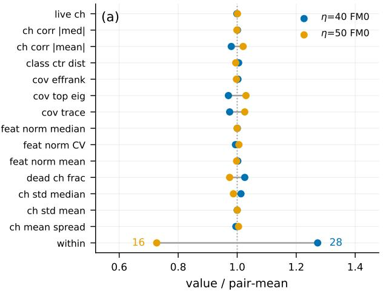

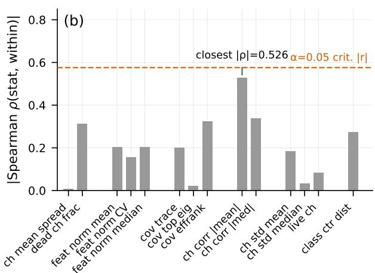  
Figure 1: Instrument vindication by exclusion. (a) The decisive pairing: �40-FM0 vs �50-FM0, same architecture, dataset, seed and protocol. Every one of the 14 channel statistics (all normalized to pair-mean, $x = 1 . 0 )$ is near-indistinguishable between the two checkpoints $( { \leq } 6 \%$ relative deviation), and val\_acc agrees to $0 . 3 \% ( 0 . 9 6 6 \mathrm { v s } 0 . 9 6 3 ) - \mathrm { y e t } H _ { 1 } ^ { \mathrm { w i t h i n } }$ difers by $1 2 \ : ( 2 8 \ : \mathrm { v s } \ : 1 6 $ , the only row drawn with numerical labels). Two models that every global statistic treats as the same are separated by the topological readout. (b) All 14 statistics, grouped into six semantic families, plotted as |Spearman �(stat, within)| over the 12-checkpoint CONV trajectory. None crosses the $\alpha { = } 0 . 0 5$ critical value $( | r | = 0 . 5 7 6$ , dashed red); the closest statistic is annotated once. Six families falsified.

## 2.1.3 Third-party cross-checks

• Neural collapse (NC), pre-registered (three predictions, no post-hoc revision): all three confirmed. (1) Collapse blind spot — clean training collapses class-internal variance $( \mathrm { N C 1 } = 0 . 0 4 \mathrm { - } 0 . 0 5 , \mathrm { E T F } _ { - }$ \_cos 0.99+, kNN acc= 1.0) while $H _ { 1 } ^ { \mathrm { w i t h i n } }$ stays flat: collapse is a uniformity-preserving flow invisible to $H _ { 1 } ^ { \mathrm { w i t h i n } }$ . (2) Memory resists collapse — flipped samples stay scattered in class space (flip\_disp positive), isolated outside class structure. (3) Memory is a local phenomenon — NC metrics organize monotonically (ETF\_cos 0.4→0.99) while cross is U-shaped and $H _ { 1 } ^ { \mathrm { w i t h i n } }$ stays flat (28–38): memorized samples perturb local order without destroying mean-level ETF. An independent instrument confirms our readout is blind to what it should be blind to, and sees what it should see.

• ViT recalibration — the earlier “ViT cross response weak” $\scriptstyle ( \rho = 0 . 4 8 3 )$ was a layer-misalignment artifact: it used ViT block4 intermediate features while CNNs used final-layer features. Re-measured on the final CLS token (matching depth), cross slope recovers to $+ 1 4 2 \dots + 1 5 6$ (ResNet reference +173) — the core asymmetry holds on ViT. Rule extracted: cross-architecture comparison must align extraction to the final representation layer; ViT features being more isotropic (PCA30 explains 0.69–0.80 vs ResNet 0.97–0.99) is a real architectural diference, but it does not change the directional verdict.

## 2.2 The $H _ { 1 }$ pipeline

cross\_class\_decomposition computes $H _ { 1 } ^ { \mathrm { w i t h i n } } / H _ { 1 } ^ { \mathrm { c r o s s } }$ on the test-feature manifold:

$H _ { 1 } ^ { \mathrm { w i t h i n . } } ; H _ { 1 }$ within same-class submanifolds.

$H _ { 1 } ^ { \mathrm { c r o s s . } } \colon H _ { 1 }$ of the cross-class complex (class-connecting loops).

## Normalization obligations (we document these as report-scope requirements):

• cross is a pipeline-normalized quantity: absolute value scales with N\_PAIRS × N\_INTERP. Any comparison must fix the pipeline and state it. Robustness check: varying N\_PAIRS/ N\_INTERP ×4 leaves cross\_fraction at 0.86–0.87.

• rng sampling noise ±15–30% on absolute cross. Fine-grained cross-model contrasts with $\Delta < 3 0 \%$ need error bars; large efects (FM0↔CONT↔full overlay, ≥ 2×) are unafected.

• N\_NEIGHBOR / PCA\_DIM: robust (see Sec. 2.1).

## 2.3 Memory readout: the dual-scope mem\_noisy

mem\_noisy = fraction of flipped train samples whose prediction equals the noisy label, on a no-aug unshufled loader. The “dual scope” pairs it with mem\_clean, the fraction of clean train samples predicted at their true label (the probe’s agree\_true field); mem\_noisy is the decisive readout and is used throughout. This single readout is consistent and decisive across settings: CONT ≈ 0.999 (memorizes everything), FM0 ≈ 0.004 (memorizes nothing), K-half overlay ≈ 0.50. (We document a data pitfall: the legacy mem\_rate field in some fm0\_boundary JSON is buggy and must not be used.)

## 2.4 The intervention (FM0)

Zero loss on flipped samples from epoch 0. Result: generalization at the setting ceiling (SVHN ≈ 0.96, CIFAR-10 ≈ 0.91), memory ≈ 0. A data-driven mask (FM0-hat) recovers 90–97% without the noise distribution. FM0 is an oracle; the FM0-hat mask is deployable (L2) and provides the substrate for all causal operations below.

## 2.5 Causal operations on memory

• Overlay (add): from an FM0 checkpoint, un-freeze � flipped samples (clean loss always on). �: 0 → ALL interpolates FM0 → CONT. Must use the augmented FM0 training loader (no-aug �=0 control collapses — documented pitfall).

• Strip (remove): continue a CONT network clean-only; memory drains (mem 0.999 → 0.11), va recovers toward the FM0 ceiling.

• Re-anchor (memory without �): train memory with clean signal silenced — representation collapses (CIFAR-10: va 0.92 → 0.04). Memory cannot be layered onto collapsed �.

## 2.6 Determinism and the eval cadence (a methodological core asset)

Same seed, same protocol, same mask, logically identical training code — the only diference being the intermediate-eval cadence — yields distinct �50 300-ep $H _ { 1 } ^ { \mathrm { w i t h i n } }$ values (full-test: 16 / 26 / 25 for cadences 25 / none / 100), while val\_acc changes by only ∼0.01 (0.6119 / 0.6135 / 0.6233). An earlier �=2000-subsample run reported 21 / 28 / 31–32; those were subsampling ofsets, retested to the full-test values above. A cadence sweep (0/25/50/100/200) fills the set to {16, 22, 25, 26} (within = 26/16/16/25/22 respectively). Mechanism, traced to a single line: PyTorch’s \_BaseDataLoaderIter.\_\_init\_\_ draws its base seed via torch.empty((),dtype=torch.int64).random\_(), consuming the global torch RNG; each iter(test\_loader) during an intermediate eval therefore perturbs the RNG, changing the subsequent train-loader shufle, hence the training-data order, hence the attractor.

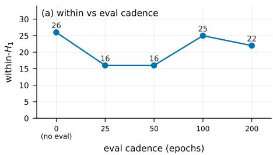

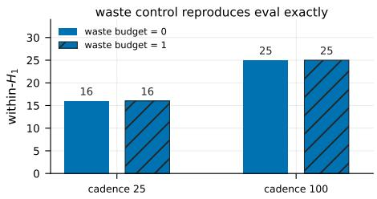  
Figure 2: Determinism: $H _ { 1 } ^ { \mathrm { w i t h i n } }$ as a deterministic function of the eval cadence. (a) Same seed, protocol, mask and training code — only the intermediate-eval cadence (0 / 25 / 50 / 100 / 200, equally spaced categorical axis) difers. $H _ { 1 } ^ { \mathrm { w i t h i n } }$ takes values 26 / 16 / 16 / 25 / 22 (each labeled) while val\_acc moves by only ∼0.01. (b) The waste control (�=1: same number of RNG draws at the same epochs, no eval) reproduces the eval condition exactly — within equal, va bit-identical to 1e-4 — pinning the causal channel to the single global RNG draw in iter(test\_loader). The geometric coordinate resolves (16–26, 38% spread) what the scalar (2% spread) cannot.

We closed the causal chain with a waste control: no eval, but burning the exact same number of RNG draws at the same epochs (�=1 reproduces the eval’s RNG footprint position-precisely). The waste version reproduces the eval version exactly (within equal, va bit-identical to 1e-4) → the eval’s causal channel is uniquely the single global RNG draw in iter(test\_loader). No larger mechanism needed.

Three consequences (Fig. 2):

1. The training trajectory is a deterministic function of the RNG sequence. Same cadence, 2 reps, bit-identical (4/4); waste reproduces the full state (weights + va + within); 12 independent trainings, zero deviation. “Attractor” is deterministic, not chaotic.

2. The geometric coordinate carries more information than the generalization scalar. va ranges over 0.013 (0.6105–0.6233, a 2% relative spread) while within ranges over 10 (16–26, a 38% relative spread): the ring coordinate resolves states the scalar cannot — a direct, decisive, reproducible argument for why a geometric measurement is needed at all.

3. Methodological rule: any same-seed reproducibility claim must declare the eval/save cadence. Intermediate checkpointing (with eval) is itself a training variable. All comparisons mixing checkpoints from diferent cadences need qualification.

## 3 The Law Set

## 3.1 Evidence grading

⋆ cross-sectional · ♦ trajectory (observational) · • causal (intervention).

## 3.2 ${ \bf L 1 } - H _ { 1 } ^ { \mathrm { w i t h i n } }$ is a training-position function (♦⋆)

## 3.2.1 The SVHN 13-point trajectory

$H _ { 1 } ^ { \mathrm { w i t h i n } }$ tracks the training stopping point, not memory. VGG×SVHN, �40, s42, CONV protocol, 13 checkpoints (Table 2, Fig. 3):

Table 2: SVHN 13-point trajectory (VGG, �40, s42, CONV protocol). Three phases: init-collapse (0–25: random 18 → collapse to 6, features unexpanded) → learning expansion (50–175: within plateau 30–37, val\_acc optimal at ∼50 ep) → convergence collapse (225–300: memory saturation mem\_noisy→0.99 plus an overfitting jump coincide, then within drops to 20).
<table><tr><td>epoch</td><td>0</td><td>25</td><td>50</td><td>75</td><td>100</td><td>125</td><td>150</td><td>175</td><td>200</td><td>225</td><td>250</td><td>275</td><td>300</td><td></td></tr><tr><td>within</td><td>18</td><td>6</td><td>32</td><td>33</td><td>30</td><td>33</td><td>34</td><td>37</td><td>28</td><td>32</td><td>28</td><td>32</td><td>20</td><td>mem_noisy is the</td></tr><tr><td>mem_noisy</td><td>.10</td><td>.09</td><td>.02</td><td>.06</td><td>.13</td><td>.47</td><td>.65</td><td>.83</td><td>.88</td><td>.99</td><td>.99</td><td>1.0</td><td>1.0</td><td></td></tr></table>

validated memory readout (Sec. 2.3): the fraction of flipped train samples predicted at their noisy label, recomputed from this run’s 13 intermediate checkpoints over the full train set (no-aug, unshufled).

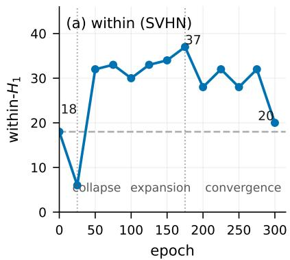

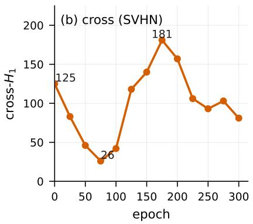

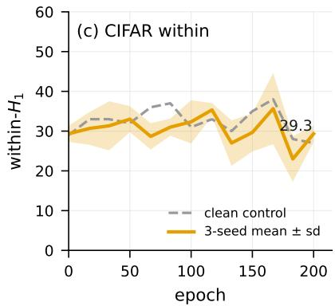  
Figure 3: The trajectory law. (a) SVHN $H _ { 1 } ^ { \mathrm { w i t h i n } }$ (VGG, �40, s42, CONV, 13 checkpoints, single axis): random-init 18 → collapse 6 → expansion plateau 30–37 (peak 37 at ep175) → convergence 20. Vertical reference lines at ep25 / ep175 delimit the three phases (collapse / expansion / convergence, labeled at the bottom). The dashed grey line is the random-init baseline. (b) SVHN $H _ { 1 } ^ { \mathrm { c r o s s } }$ on the same epochs (single axis): 125 → trough 26 at ep75 → monotone rise to the ep175 peak 181, before settling to the converged 81 — a monotone readout of memorized flipped samples. (c) CIFAR reproduction (ResNet, $\eta 5 0 )$ : 3-seed mean ± sd (orange band) over the clean control (grey dashed, flat). The CIFAR trajectory partially reproduces SVHN: converge-to-baseline is 3/3 (strong), while the mid-rise is a weak single-point spike (Sec. 3.2.2); the clean control is flat, showing the convergence descent is specific to fitting noise.

## 3.2.2 CIFAR reproduction, clean control, and an honest bug disclosure

ResNet×CIFAR-10 reproduces the shape: random 29 → mid 33–37 → converged 27 (Fig. 3c). Across 3 seeds the convergence-back-to-random-baseline is 3/3 strong (rand $2 9 . 3 \pm 2 . 1 $ conv $2 9 . 3 \pm 2 . 1$ $\Delta = + 0 . 0 )$ . Two honest qualifications. First, the CIFAR mid-rise is weak (a single-point spike). Second, the CIFAR convergence descent is shallower and noisier than the SVHN 13-point trajectory: SVHN falls from a 37 peak to a 20 endpoint (a 17-point descent on one seed), whereas CIFAR endpoints are 27–32 across seeds (seed sd 2.1, a ≈5-point descent from a 33–37 plateau). The 3/3 fact of converge-to-baseline survives, but the magnitude of the collapse is best read of the SVHN single trajectory and is not a per-seed CIFAR quantity. Third, the SVHN convergence-back is itself 2/3, not 3/3: across the �50 3-seed set, s42 (18 → 21) and s123 (16 → 23) return toward the random baseline, while s456 (21 → 43, +22) does not — a multi-attractor outlier (seed sd ≈ 10) whose mechanism is open. The 6/6 count for L1 is therefore specifically the mid-rise (both datasets, all 3 seeds); the convergence collapse is CIFAR 3/3 and SVHN 2/3. The cross trajectory is a robust memory signature across datasets (CIFAR dip 74–96 → converged 198–225, per-seed rise 102–142, mean ≈127; SVHN trough 26 → peak 181 at ep175), far above the clean control’s converged cross (48). The clean control’s within is flat (28–38), but its cross decays from 178 to 48 — the contrast is

endpoint-only.

The clean control exists because of a bug, and we disclose it. The first version of the CIFAR trajectory script discarded the noisy-label loader and trained on clean labels — a “discarded-return” bug producing $\mathrm { v a } = 0 . 9 4 3$ (clean ceiling) and cross= 48 (flat). We kept that buggy run as the clean control and fixed the script (noisy-label injection + a noise-rate assert that passed at 0.500), giving V2: $\mathrm { v a } { = } 0 . 5 5 8$ (in the CONT range), cross 225. The bug-then-fixed run is itself the clean control: it proves the collapse (the trajectory’s convergence descent) is specific to fitting noise — the clean trajectory is flat. This disclosure is deliberate: the framework’s “honest record” stance applies to its own code as much as to its hypotheses.

Noise robustness: clean vs noise within mean $| \Delta | { = } 4 . 4 <$ seed sd 6.1 — statistically inseparable. L1’s content, stated precisely: the trajectory shape is noise-robust (noise changes the position along it, not its shape); there is no numerical freezing.

## 3.2.3 Protocol = stopping point

The “protocol efects” on �within are duration efects. The three protocols are not discrete categories but stops on one trajectory: ORIG 200ep → 37.5 (plateau), lr01 200ep → 30 (late plateau), CONV 300ep → 22 (past the plateau, collapsed). CONV 200ep→300ep moves within 28→20 — the last 100 epochs move it ≈8, matching the protocol-axis efect (≈9.3). The earlier “protocol axis > noise axis” finding is thereby explained mechanically: protocol changes duration, and duration is the trajectory’s independent variable.

## 3.3 L2 — FM0 separation prescription (⋆, the application anchor)

Epoch-0 zero loss on flipped samples reaches the setting’s generalization ceiling (SVHN 0.96+, CIFAR 0.91+) with memory ≈ 0. Zero exceptions across architectures (9/9), datasets, noise levels. FM0-hat recovers 90–97% and is deployable without the oracle.

## 3.4 L3 — ring-construction identity (♦, instrumental)

## 3.4.1 The identity

The $H _ { 1 } ^ { \mathrm { w i t h i n } }$ ring count decomposes as

$$
{ \mathrm { w i t h i n } } = ( { \mathrm { s i n g l e - p a i r ~ r i n g s } } ) + ( { \mathrm { c r o s s - p a i r ~ s a m e - c l a s s ~ r i n g s } } ) ,
$$

holding per-model with zero residual across 6/6 checkpoints (3 seeds) (Fig. 4). Single-pair rings are the local intrinsic topology of the 10-interpolation-point graph within a position; cross-pair same-class rings connect local graphs at diferent positions of the same class.

## 3.4.2 Honest positioning

This identity is definitional composition, not a law: it is guaranteed by how within is computed, so its value is as a pipeline consistency check and a diagnostic decomposer (what portion of within is local vs position-linking). We state this explicitly rather than dressing a tool up as a discovery.

## 3.4.3 A multi-seed falsification of the tempting mechanism

The single-seed (s42) FM0-pair decomposition looked mechanistic: “the $\eta 4 0 \mathrm { - v s } \mathrm { - } \eta 5 0$ within diference $( \Delta = + 1 2 )$ is entirely carried by cross-pair isolation $( \Delta = + 1 1 )$ , single-pair rings almost unchanged $( \Delta = + 1 ) ^ { \prime }$ Multi-seed killed it: s123 has single-pair dominance with the � direction reversed $( - 6 / + 3 )$ , s456 is mixed (−3/+5); the FM0-pair within diference itself is not robust across seeds $\left( \mathrm { s } 4 2 + 1 2 / \mathrm { s } 1 2 3 - 3 / \mathrm { s } 4 5 6 + 2 \right)$

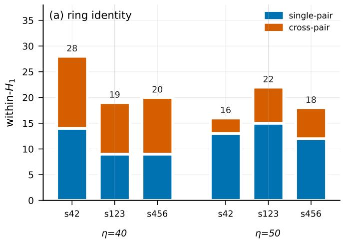

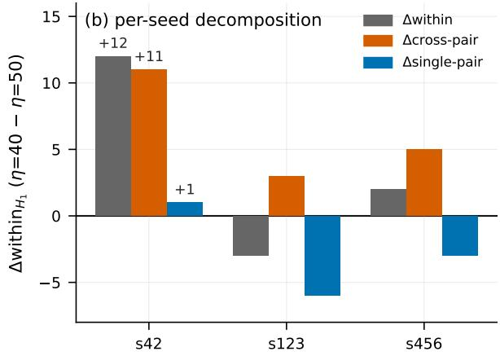  
Figure 4: The ring identity. (a) For each of 3 seeds and both 40 / 50 FM0 pairs, the stacked bar shows within = single-pair rings (blue) + cross-pair same-class rings (orange), total labeled on top. The identity within = single + cross holds with zero residual at all 6 checkpoints (e.g., �40 s42: $1 4 + 1 4 = 2 8 ;$ �50 s42: $1 3 + 3 = 1 6 )$ . (b) Per-seed decomposition of the FM0-pair within diference $( \eta 4 0 - \eta 5 0 )$ into Δsingle + Δcross. The single-seed (s42) reading $( \Delta \mathrm { w i t h i n } = + 1 2 .$ , carried entirely by Δcross-pair = +11) does not survive: s123 is single-pair dominant with the � direction reversed $( - 6 / + 3 )$ , s456 is mixed $( - 3 / + 5 )$ . Only the identity itself and the FM0 val\_acc record (∼0.96) survive multi-seed.

The “break = cross-pair isolation” mechanism is an s42 single-seed decomposition; it does not survive. What survives the multi-seed test is only the identity itself (definitional) and the FM0 val\_acc record (∼0.96 across seeds). Recorded in the falsification ledger (Sec. 5.5).

## 3.5 TLS — memory–generalization topological layering (•)

The four properties are listed in measured-first order: the three directly observed properties precede the fitted cost law.

1. (i) Memory is causally additive. Overlaying memory onto the FM0 substrate scales $H _ { 1 } ^ { \mathrm { c r o s s } }$ monotonically (3/3 seeds): 90→221 / 91→254 / 111→219. At saturation, reaches CONT-level cross.

2. (iii) Memory anchors to �. Silencing clean collapses memory (CIFAR-10: va $0 . 9 2  0 . 0 4 )$ ; the FM0 mask works because � stays in the room.

3. (iv) within is secondary. $H _ { 1 } ^ { \mathrm { w i t h i n } }$ responds to memory within seed noise (its response is a trainingduration artifact).

4. (ii) Memory is quantitatively billable. The memorization cost law (companion paper, all numbers verified):

$$
\mathrm { v a } = \mathrm { v a } _ { \mathrm { F M 0 } } - C \cdot \frac { \eta } { 1 - \eta } \cdot \mathrm { m e m } , \qquad C \approx 0 . 3 8 .\tag{1}
$$

� at the ∼11M reference capacity, across 4 settings (all 3-seed where stated): CIFAR-10 0.3801 $( R ^ { 2 } { = } 0 . 9 9 4 )$ / SVHN 0.3806 $( R ^ { 2 } { = } 0 . 9 9 6 )$ / CIFAR-100 0.384 / VGG 0.3715. Class-count independence at fixed capacity is verified by a decisive experiment (Sec. 5.3); $\eta / ( 1 - \eta )$ beats linear / power-law / $\eta ^ { 2 }$ forms. � is a capacity-dependent efective coeficient, not a universal constant: a CIFAR-10 width sweep (3-seed mean) gives $0 . 4 7 1 {  } 0 . 3 4 2 ( \mathrm { w } 0 . 5 {  } \mathrm { w } 2 . 0 )$ , and the four settings agree near 0.38 because they share the reference capacity. Its mechanism traces to a normalized clean-sample displacement cost $( C \approx 0 . 5 d _ { \mathrm { c l e a n } } , R ^ { 2 } { = } 0 . 9 2$ through origin; Sec. 5.3). A �20 low-noise extrapolation passes on SVHN (�=0.087, ratio 0.92; 5-point through-origin �=0.3803) and deviates on CIFAR-10 (�=0.125, ratio 1.31; 5-point �=0.3820) — the law’s cleanest domain is the mid-noise range �40–60; at low noise the $\eta / ( 1 - \eta )$ form is a first-order approximation with dataset-dependent curvature (see the companion paper’s low-noise extrapolation section). Memory is an invertible layer: stripping CONT restores near-ceiling va.

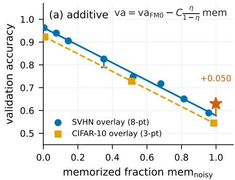

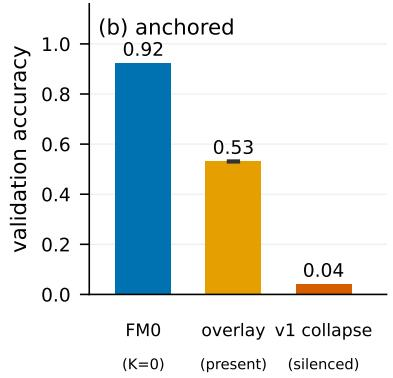

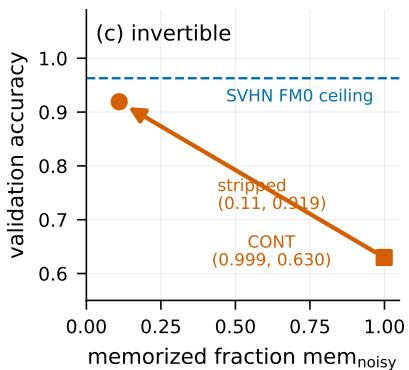  
Figure 5: TLS properties. (a) Additive / billable. SVHN overlay: val\_acc vs memorized fraction, 8 points $( { \mathrm { F M } } 0 \to { \mathrm { K } } = 2 5 0 0 \dots 3 0 0 0 0 \to { \mathrm { A L L } } )$ , with the cost-law fit $\mathrm { v a } = \mathrm { v a } _ { \mathrm { F M 0 } } - C \eta / ( 1 - \eta )$ mem drawn through them (slope −� ≈ −0.386 on SVHN; CIFAR 3-point overlay in orange). K=12500 carries a real 3-seed error bar. Co-training (CONT, ★) sits above the overlay curve at matched memory load (+0.050, SVHN resnet). The SVHN ALL endpoint shown is the ep100 checkpoint of the K=ALL run (mem 0.958, va 0.589); the same run’s later ep160 checkpoint (mem 0.981, va 0.585) saturates slightly higher but is not shown here. (b) Anchored. CIFAR three states: FM0 (K=0) at 0.92, full overlay with clean present at 0.53±0.004 (3-seed), and v1 collapse with clean silenced at 0.04 — memory cannot be layered onto collapsed �. (c) Invertible. Stripping a CONT network (clean-only continuation) drains memory 0.999→0.11 and recovers va 0.630→0.919, approaching the SVHN FM0 ceiling (dashed).

Fig. 5 shows the three measurable properties: additivity (a), anchoring (b), and invertibility (c).

## 3.6 Co-evolution advantage (setting-specific)

At matched memory load, co-training (CONT) exceeds post-hoc overlay: SVHN resnet +0.050 (structural), CIFAR +0.006, VGG +0.013. Setting-specific (SVHN resnet); determining factor open.

## 4 Empirical Panorama (key tables)

Throughout, mem is the memorized fraction mem\_noisy (Sec. 2.3), � the noise rate, and “4 settings” means CIFAR-10 / SVHN / CIFAR-100 / VGG×SVHN with the resnet-family architecture fixed where not stated. Per-claim statistical strength is stated in Sec. 5.4.

Table 3: The law set at a glance. Evidence: ⋆ cross-sectional, ♦ trajectory, • causal.
<table><tr><td>Law</td><td>Evidence</td><td>Key numbers</td><td></td></tr><tr><td>L1 within position</td><td>★6/6</td><td>SVHN 13-pt 18→37→20; CIFAR 29→33–37→27; mid-rise 6/6;</td><td></td></tr><tr><td>L2 FM0 prescription</td><td>★ 9/9</td><td>CIFAR conv=rand 3/3, SVHN conv=rand 2/3  $\mathrm { S V H N 0 . 9 6 + / C I F A R 0 . 9 1 + ; F M 0  – h a t 9 0 { \mathrm { - } } 9 7 \% }$ </td><td></td></tr><tr><td>TLS(i) additive</td><td>• 3/3</td><td>cross 90→221, 91→254, 111→219</td><td></td></tr><tr><td>TLS(iii) anchored</td><td></td><td>va 0.92→0.04 (clean silenced)</td><td>†Effective slope coefficient</td></tr><tr><td>TLS(iv) within secondary</td><td></td><td>∆within within seed sd</td><td></td></tr><tr><td>TLS(ii) cost law</td><td>• 4 settings</td><td> $C \colon 0 . 3 8 0 1 / 0 . 3 8 0 6 / 0 . 3 8 4 / 0 . 3 7 1 5 ^ { \dagger }$ </td><td></td></tr><tr><td>Inverse (strip)</td><td></td><td> $\mathrm { v a } \ 0 . 6 3 { \longrightarrow } 0 . 9 2 ; \mathrm { m e m } \ 0 . 9 9 9 { \longrightarrow } 0 . 1 1$ </td><td></td></tr><tr><td>Co-evolution</td><td></td><td> $\mathrm { S V H N r e s n e t } + 0 . 0 5 0 / \mathrm { C I F A R } + 0 . 0 0 6 / \mathrm { V G G } + 0 . 0 1 3$ </td><td></td></tr><tr><td>Determinism</td><td>◇</td><td>within ∈ {16, 22, 25, 26} same seed, cadence-only; waste w=1 bit-identical</td><td></td></tr></table>

� of the memorization cost law (Eq. 1), one value per setting at the ∼11M reference capacity, all 3-seed where stated: CIFAR-10 0.3801 $( R ^ { 2 } { = } 0 . 9 9 4 )$ , SVHN 0.3806 $( R ^ { 2 } { = } 0 . 9 9 6 )$ , CIFAR-100 0.384, VGG (VGG×SVHN, cross-seed CV 7.7%) 0.3715. Caliber note: 0.3715 is the VGG value and is the lowest of the four, matching the VGG cell’s larger cross-seed variance (Sec. 5.4); all four sit within 3% of 0.38 at the shared reference capacity. � is capacity-dependent in general (Sec. 5.3). Full derivation in the companion paper.

## 5 What the Framework Does NOT Claim

## 5.1 $H _ { 1 } ^ { \mathrm { c r o s s } }$ is not an independent generalization predictor

Partial correlations corr $( H _ { 1 } ^ { \mathrm { c r o s s } }$ , va | mem), $n = 3 7 \colon \mathrm { C I F A R } - 0 . 4 5 \ldots - 0 . 5 6 ( \Delta R ^ { 2 } + 0 . 0 4 6 ) , \mathrm { S V H N } + 0 . 0 8 ( \Delta R ^ { 2 }$ +0.000). Weak and setting-dependent → we call $H _ { 1 } ^ { \mathrm { c r o s s } }$ a geometric signature of memory, not a predictor. The TLS(i) causal scaling is a diferent claim (monotone under intervention) and is unafected.

## 5.2 FM0 is not a SOTA method

CIFAR-10 �40: DivideMix $0 . 9 4 \mathrm { - } 0 . 9 5 > \mathrm { F M 0 }$ oracle $0 . 9 2 > \mathrm { E L R } + 0 . 9 1 > \mathrm { E L R } \ 0 . 8 9 > \mathrm { F M 0 }$ -hat 0.85–0.87 > Co-teaching 0.80–0.84. FM0’s value: mechanistic ceiling + unified language.

## 5.3 � is a reference-capacity value, not a universal constant

The law’s coeficient is capacity-dependent: a CIFAR-10 width sweep (3-seed mean) gives � 0.471→0.342 (w0.5→w2.0). The four settings agree near 0.38 because they share a ∼11M reference capacity, not because � is universal. Its mechanism is traced (companion paper): at fixed image family $C \approx 0 . 5 d _ { \mathrm { c l e a n } }$ (through origin, $R ^ { 2 } { = } 0 . 9 2 )$ , where $d _ { \mathrm { c l e a n } }$ is the normalized clean-sample feature displacement during overlay; a head/backbone swap shows the cost is 100% feature-mediated. Class-count independence at fixed capacity is verified by retraining on 10 superclass labels (a coarse merge of the same CIFAR-100 images): $C { = } 0 . 3 7 0$ vs the fine $C { = } 0 . 3 6 9 ( \eta 5 0 / K { = } 1 2 5 0 0$ caliber). At that caliber the residual image term is ≈ ±0.02 (CIFAR-10 ≈ 0.40 vs $\mathrm { C I F A R - } 1 0 0 \approx 0 . 3 7 )$ , while the law’s �-averaged values (0.3801 / 0.384) agree to ≈1%.

## 5.4 Statistical strength is graded, not uniform

3-seed cells: CIFAR-10 �30/40/50/60, SVHN $\eta 4 0 ,$ CIFAR-100 $\eta 3 0 / \eta 5 0 .$ , VGG $\eta 5 0 .$ . Single-seed cells: SVHN $\eta 3 0 / \eta 5 0 / \eta 6 0 \ : ( \eta 5 0$ corroborated by an 8-point full-curve fit), VGG �30/�60, CIFAR-10 �20, SVHN $\eta 2 0$ . We state strength per number; cross-seed variance on VGG �50 (CV 7.7%) is 2–4× the resnet values.

## 5.5 Falsification ledger

A framework paper should publish its dead ends as loudly as its laws. Each entry: hypothesis / experiment that killed it / lesson.

1. Selective forgetting — Hypothesis: CONT networks “choose” to forget some noise (earlier estimate: ∼49% remembered). Killer: re-measured with the pred=noisy readout on corrected code, CONT memorizes everything (mem\_noisy≈0.999, 9/9 settings-seed); the 0.49 was a legacy mem\_rate field bug. Lesson: memory-load claims must use the validated readout; a single data-source bug can misattribute the most central fact.

2. Ring overload — Hypothesis: CONT underperforms at �=ALL overlay because it “overloads” its rings. Killer: at matched memory load (CONT 0.999 vs �=ALL 0.98) CONT exceeds overlay; no load diference exists. Lesson: matched-load comparisons are mandatory before structural explanations.

3. Crossing point as law (“controlled overlay > CONT”) — Hypothesis: �-half overlay’s va edge over CONT is a law of “controlled memory”. Killer: three confounds not separated (oracle mask knows the noise distribution + half the memory + co-training path) → downgraded to a sampling point on the tradeof curve. Lesson: attribution confusion masquerades as discovery; the curve is the claim, single points are not.

4. Concentration mechanism — Hypothesis: �’s slope constant should shift on non-10-class data because noise:clean concentration difers. Killer: the law-level comparison gives �=0.3801 (CIFAR-10) vs �=0.384 (CIFAR-100), ≈1%; the same CIFAR-100 images retrained on 10 superclass labels give �=0.370 vs the fine �=0.369 (�50 / �=12500 caliber) — atfixed capacity, how flips distribute across classes does not enter �. Lesson: a precise quantitative prediction, when wrong, sharpens the law more than when it is right — and the independence holds only at fixed capacity: � does depend on capacity (Sec. 5.3).

5. G3 generalization prediction (independent predictor) — Hypothesis: $H _ { 1 } ^ { \mathrm { c r o s s } }$ independently predicts generalization gap (initial +0.43 cross-config correlation). Killer: the within-epoch axis runs opposite (organization artifact); cross-config vs within-epoch axes are not interchangeable; partial correlations with mem are weak and setting-dependent (SVHN +0.08, Δ�2 +0.000). Lesson: a correlate on one gradient axis is not a predictor; control the confounding variable (mem) or the claim dies on the next axis.

6. Within invariant “value=30” (G1) — Hypothesis: within≈30 is an architecture-intrinsic constant. Killer: pure Gaussian point clouds through the same pipeline return 30.3 ± 8.7 — the value is a pipeline artifact. Lesson: null baselines are mandatory; the corrected claim (zero deviation from the random baseline) is stronger than the dead one.

7. Six global-statistic mechanisms — Hypothesis: $H _ { 1 } ^ { \mathrm { w i t h i n } }$ is class density / neural collapse / feature norm / spectrum / memory / channel statistics. Killer: all six falsified; decisive FM0 pairing has val\_acc equal to 0.3% and all 14 channel statistics within ≤5.8% relative deviation while within difers by 12. Lesson: instrument vindication by exclusion is the diference between a measurement and a proxy.

8. Density-gradient hypothesis for the break — Hypothesis: the �40 break is caused by intra-class density non-uniformity (the synthetic manual’s dominant within-killer). Killer: the breakpoint’s density change is same-order as non-breaking settings; the break is “uniform + collapsed but within low” — an exclusion combination the density story cannot produce. Lesson: a synthetic sensitivity factor need not be the real-world cause; negative results of a semantic manual are data too.

9. “Memory saturation → break” causal direction (FREEZE\_MEM) — Hypothesis: fitting noise causes the break, so freezing memory should prevent it. Killer: freezing memory gradients at ep225 deepens the break (within 18) while setting a then-record (va 0.879); freezing clean collapses generalization (va 0.457). The break is a product of escaping noise fitting toward pure generalization, not of fitting noise. Lesson: causal direction is decided by intervention, not by temporal coincidence; a “negative” result reversed the mechanism.

Also recorded (Sec. 3.4): the “break = cross-pair isolation” decomposition is an s42 single-seed finding that multi-seed falsification removed from the law set.

## 6 Related Work

• Label-noise learning (DivideMix [Li et al., 2020], ELR [Liu et al., 2020], Co-teaching [Han et al., 2018], and predecessors): method-oriented; FM0 provides a mechanistic ceiling and a common measurement language. See honest SOTA positioning in Sec. 5.2.

• Memorization theory (Zhang et al. 2017 [Zhang et al., 2017] on why nets can memorize; Arpit et al. 2017 [Arpit et al., 2017] on when they do; Feldman [Feldman, 2020] on whether learning requires memorization of the long tail; Feldman & Zhang [Feldman and Zhang, 2020] on which samples and influence): complementary to our where + cost.

• Topological data analysis in deep learning (Naitzat et al. [Naitzat et al., 2020]; surveys [Ballester et al., 2023, Pun et al., 2022]): persistent homology as description; we add causal manipulation (overlay/strip) and a law-governed measurement protocol.

• Generalization theory: bounds on capacity; orthogonal to a billable cost of memorization.

## 7 Discussion and Outlook

• What the framework buys: a common measurement language (two channels, mem\_noisy, FM0 substrate, overlay/strip operators) that converts “does the model memorize” from a scalar heuristic into a causally testable geometric quantity. The determinism result (Sec. 2.6) makes �within a deterministic function of the RNG sequence — a necessary condition for predictability, and what elevates the trajectory from observation to law.

• What remains open: (i) the residual image term in � (≈ ±0.02 at the 50 / �=12500 caliber, beyond the feature-displacement route; Sec. 5.3); (ii) determining factor of the co-evolution advantage (SVHN resnet); (iii) breadth — more architectures/datasets/noise schedules; (iv) the dynamics of within — why convergence reshapes the local-neighborhood graph (the reshufle is quantified but not mechanistically explained); (v) the “chaos region” (�=3 cannot distinguish deterministic-efect-plus-s42-anomaly from true chaos).

• Methodological stance: publish falsified hypotheses (selective forgetting, ring overload, the crossing point as law, the concentration mechanism, G3 independent prediction, the value-30 invariant, the six global statistics, the density-gradient mechanism, the memory-saturation→break direction) alongside confirmed laws. Dead ends delimit the law’s boundary.

## 8 Conclusion

Topo2 makes memorization and generalization measurable, separable, and causally manipulable in the representation geometry. The framework provides: an instrument vindicated against six global-statistic alternatives and two self-corrections (G1, C2); a validated measurement protocol; an intervention (FM0) that cleanly separates the two channels; a law set with graded evidence and a falsification ledger of nine dead ends; and a determinism analysis that makes the trajectory law deterministic (seed-conditional), a necessary condition for predictability. Its flagship quantitative result — the memorization cost law, with efective coeficient $C \approx 0 . 3 8$ at the reference capacity and capacity-dependence in general — is developed in the companion paper.

## References

Devansh Arpit, Stanisław Jastrzębski, Nicolas Ballas, David Krueger, Emmanuel Bengio, Maxinder S. Kanwal, Tegan Maharaj, Asja Fischer, Aaron Courville, Yoshua Bengio, and Simon Lacoste-Julien. A closer look at memorization in deep networks. In International Conference on Machine Learning (ICML), volume 70 of Proceedings ofMachine Learning Research (PMLR), pages 233–242, 2017.

Rubén Ballester, Carles Casacuberta, and Sergio Escalera. Topological data analysis for neural network analysis: A comprehensive survey. arXiv preprint arXiv:2312.05840, 2023.

Vitaly Feldman. Does learning require memorization? A short tale about a long tail. In Proceedings of the 52nd Annual ACM SIGACT Symposium on Theory ofComputing (STOC), pages 954–959, 2020. doi: 10.1145/3357713.3384290.

Vitaly Feldman and Chiyuan Zhang. What neural networks memorize and why: Discovering the long tail via influence estimation. In Advances in Neural Information Processing Systems (NeurIPS), volume 33, pages 2881–2891, 2020.

Bo Han, Quanming Yao, Xingrui Yu, Gang Niu, Miao Xu, Weihua Hu, Ivor Tsang, and Masashi Sugiyama. Co-teaching: Robust training of deep neural networks with extremely noisy labels. In Advances in Neural Information Processing Systems (NeurIPS), volume 31, pages 8536–8546, 2018.

Junnan Li, Richard Socher, and Steven C.H. Hoi. Dividemix: Learning with noisy labels as semi-supervised learning. In International Conference on Learning Representations (ICLR), 2020.

Sheng Liu, Jonathan Niles-Weed, Narges Razavian, and Carlos Fernandez-Granda. Early-learning regularization prevents memorization of noisy labels. In Advances in Neural Information Processing Systems (NeurIPS), volume 33, 2020.

Gregory Naitzat, Andrey Zhitnikov, and Lek-Heng Lim. Topology of deep neural networks. Journal of Machine Learning Research, 21(184):1–40, 2020.

Chi Seng Pun, Si Xian Lee, and Kelin Xia. Persistent-homology-based machine learning: A survey and a comparative study. Artificial Intelligence Review, 55(7):5169–5213, 2022. doi: 10.1007/s10462-022-10146-z.

Chiyuan Zhang, Samy Bengio, Moritz Hardt, Benjamin Recht, and Oriol Vinyals. Understanding deep learning requires rethinking generalization. In International Conference on Learning Representations (ICLR), 2017.