# MolLedger: An Additive Graph Neural Network with Chemically Grounded ADME Attributions

Christina X. Ji Hamilton College cji@hamilton.edu

September 1, 2026

## Abstract

Optimizing absorption, distribution, metabolism, and excretion (ADME) is an important part of small molecule drug discovery. Many machine learning models have been built to predict ADME properties to facilitate this optimization process, but explaining model predictions is challenging. We propose a new graph neural network architecture with built-in meaningful per-atom attributions. Our model MolLedger outputs predictions that are the sum of per-atom scores. MolLedger's additive framework obtains exact interpretability at no cost to performance because the global context vector gives the additive head enough context to produce good per-atom scores. Furthermore, MolLedger produces attributions that are more faithful to chemical properties than other interpretability methods because the auxiliary loss in MolLedger anchors the atom scores to chemical properties. Our case studies comparing interpretations from multiple methods on molecular pairs reveal that MolLedger is much better at producing sensible explanations for predicted property changes.

## 1 Introduction

During the lead optimization phase in drug discovery, chemists spend a significant amount of time changing subgroups in promising candidate drug molecules to improve properties related to absorption, distribution, metabolism, and excretion (ADME) [Jorgensen, 2009]. Machine learning (ML) models can assist in this process by predicting these properties [Wu et al., 2018, Di Lascio et al., 2023, Rich et al., 2024]. Instead of synthesizing each compound and assaying these properties in a lab, chemists can run large virtual screens using computational models to surface the top drug candidates for further exploration. Traditional cheminformatics models predict ADME properties from molecular descriptors and physical properties, such as partial charge distribution, molecular weight, heavy atom count, connectivity indices, van der Waals surface area, polarity, and functional group counts [Ghose and Crippen, 1986, Galvez et al., 1994, Wildman and Crippen, 1999, Ertl et al., 2000, Consonni and Todeschini, 2009]. ML models, such as random forests, gradient boosted trees, and neural networks, leverage these features as well. Graph neural networks (GNNs) are also popular for ADME prediction as they leverage the molecular structure [Liu et al., 2019]. Nodes in the graph carry atom features, while edges carry bond features. Multi-task GNNs output predictions for multiple properties from a shared representation [Du et al., 2023, Gu et al., 2024]. However, these predictions may not always align with chemists' intuition. Making the ML model interpretable provides valuable guidance for medicinal chemists as they decide whether to trust model predictions and which molecules to select from virtual screens [Jiménez-Luna et al., 2020, Wei et al., 2022, Rich et al., 2024, Ito et al., 2025].

Previous works have tackled interpretability for ADME predictions with post-hoc, attention-based, and additivity-constrained approaches. Post-hoc interpretability methods, such as LIME, Grad-CAM, integrated gradients, or occlusion, use gradients or model-agnostic probes to examine how changes in each atom affect the overall prediction [Jiménez-Luna et al., 2020, Wei et al., 2022, Rao et al., 2022, Jamrozik et al., 2024, Ito et al., 2025, Janssen et al., 2026a]. Attention-based methods aggregate the amount of attention each atom is given across all the GNN layers to interpret how each atom contributes to the prediction [Tang et al., 2020, Guo et al., 2022]. While post-hoc and attention-based approaches can compute the relevance of each atom to the prediction, we find that they may not reflect the exact value an atom contributes to the predicted label or align with physical properties. Another common approach to interpretability is to make the model a generalized additive model [Hastie and Tibshirani, 1986]. Bechler-Speicher et al. [2024] apply this principle to GNNs and build a graph neural additive network (GNAN). GNAN replaces message passing with a topology-based weighting, so the final output is a weighted sum of a function of individual features. The total contribution of each atom to the sum can be interpreted as the atom's effect on the property. GNAN's additive formulation reflects the exact contribution of each atom to the prediction, but it obtains this exactness at the expense of performance, and we find that these additive terms do not necessarily correlate with physical properties.

We build a GNN called MolLedger that provides exact chemically grounded atom-level attributions for ADME predictions without sacrificing performance. Like GNAN, the prediction is exactly the sum of atomspecific scores, but the atom scores from MolLedger are computed with message passing and supported by a global context vector to ensure additivity does not hurt performance. These atom scores are also anchored to physical properties for meaningful interpretations. We demonstrate MolLedger achieves similar predictive performance to existing models and produces atom-level attributions that are more faithful to chemical properties than existing interpretability methods. Code for the MolLedger model and our experiments is available at https://github.com/cxji/molledger.

## 2 MolLedger

To create faithful atom-level attributions without affecting performance, MolLedger introduces two novel components: 1) An additive formulation with a global context vector produces predictions that are the sum of per-atom scores but no accuracy is lost. 2) An auxiliary loss anchors per-atom scores to physical properties to ensure that the atom scores are meaningful.

## 2.1 Additive Atom Scores with Global Context

A two-layer multi-layer perceptron (MLP) can be written as $\begin{array} { r } { \hat { y } = \phi _ { 2 } \left( \sum _ { j } \phi _ { 1 } \left( x _ { j } \right) \right) } \end{array}$ and works as a universal approximator [Hornik et al., 1989, Hornik, 1991]. A generalized additive model (GAM) is the sum of nonlinear functions of individual features [Hastie and Tibshirani, 1986] and lacks the $\phi _ { 2 }$ term, reducing the class of functions that can be approximated. Even when neural networks are applied as the $\phi _ { 1 }$ in each additive term, GAMs cannot recover the performance of MLPs [Agarwal et al., 2021, Doohan et al., 2026, Chang et al. 2021]. This creates a tension between building an interpretable model and building a highly accurate model.

We can resolve this tension when we note that our goal is per-atom attribution rather than per-feature attribution. This means our model is only constrained to the form $\begin{array} { r } { \hat { y } = \sum _ { i = 1 } ^ { N _ { a t o m s } } s _ { i } } \end{array}$ , where $s _ { i }$ can be a function of the features for all atoms rather than just the features for atom i. MolLedger performs message passing to learn a representation for each atom that incorporates local context. Instead of computing the score for each atom using only this representation, MolLedger first applies a 2-layer MLP to produce a global context vector from the sum and mean pooled representation. Then, it concatenates this global context vector to each atom's representation and passes this into another 2-layer MLP to produce the score for each atom $s _ { i } .$ Mathematically, MolLedger can be written as:

$$
\hat { y } = \sum _ { i = 1 } ^ { N _ { a t o m s } } s _ { i } = \sum _ { i = 1 } ^ { N _ { a t o m s } } \phi _ { 3 } \left( A _ { i } , \phi _ { 2 } \left( \sum _ { i = 1 } ^ { N _ { a t o m s } } A _ { i } , \frac { 1 } { N _ { a t o m s } } \sum _ { i = 1 } ^ { N _ { a t o m s } } A _ { i } \right) \right)\tag{1}
$$

where $A _ { i }$ is the activation for atom i from message passing. $\phi _ { 2 }$ is the MLP for producing the global context vector, and $\phi _ { 3 }$ is the MLP for producing the per-atom score. Because $\phi _ { 3 }$ takes in both the global context vector and each atom's representation $A _ { i }$ from message passing, MolLedger is able to make predictions that are additive at the atom level without compromising performance.

## 2.2 Auxiliary Loss for Anchors

As there are many ways for the atom scores to sum to the property, training with only the mean squared error loss on the prediction does not automatically result in sensible scores for each atom. To constrain the model to produce reasonable atom-level attributions, we add an auxiliary loss term for each atom to anchor it towards a relevant chemical score. The two properties we use as anchors are Crippen score and topological polar surface area

Properties anchored to Crippen score Wildman and Crippen [1999] define the Crippen score as an estimate of the lipophilicity score of a heavy atom based on its element type, neighboring atoms, and hybridization state. The sum of the Crippen scores of all the heavy atoms in a molecule is its partition coefficient, known as logP. Because logP assumes the molecule is neutral whereas many drug molecules are charged under physiological conditions, logD is an adjusted version of logP that accounts for ionization. Even with this adjustment, logD is highly correlated with the sum of the Crippen scores, so we would expect Crippen to be an excellent anchor for logD.

The two measurements of clearance in mouse and human liver cells are anchored to Crippen as well Hydrophobic molecules are more likely to be metabolized in the liver because they are more likely to cross the cell membrane and bind to the hydrophobic pocket in cytochrome P450. Both kinetic solubility and aqueous solubility are inversely correlated with lipophilicity, so we anchor the atom-level attributions for these two tasks to the negative Crippen value. Plasma protein binding in mouse plasma, brain, and muscle measure fraction unbound. Because plasma proteins also have hydrophobic pockets, the fraction unbound label is also anchored to the negative Crippen value.

Properties anchored to TPSA Topological polar surface area (TPSA) measures the surface area around polar atoms and their attached hydrogens [Ertl et al., 2000]. Higher TPSA implies more polarity. The concentration of a drug inside the cell depends on the influx rate via passive diffusion, active transport, and other mechanisms, as well as the efflux rate via transport pumps like the P-glycoprotein pump (P-gp) highly expressed in endothelial Caco2 cells. High polarity tends to impede passive diffusion, while the Seelig motif for P-gp recognition involves polar atoms [Seelig, 1998]. Therefore, polar drug molecules are less likely to enter and stay inside the cell. Caco2 A-to-B measures the influx rate, while Caco2 efflux ratio measures the rate a drug is pumped out relative to the influx rate. Therefore, Caco2 A-to-B permeability tends to be higher for less polar molecules and is anchored to the negative TPSA score, while Caco2 efflux ratio tends to be higher for more polar molecules and is anchored to the positive TPSA score.

Now that we have established how the different properties relate to Crippen score and TPSA, we will define how MolLedger anchors the atom scores. During training, MolLedger applies an auxiliary loss between the atom scores and the anchor properties. Because these anchors are not on the same scale as the properties themselves, we cannot simply enforce the mean squared error between the anchor and the atom score. Instead, MolLedger enforces the mean squared error of the normalized deviation from the mean in the following loss function for each molecule and each task:

$$
{ \mathcal { L } } = { \frac { 1 } { \sigma _ { y } ^ { 2 } } } \left( y - { \hat { y } } \right) ^ { 2 } + { \frac { \lambda _ { a n c h o r } } { N _ { a t o m s } } } \sum _ { i = 1 } ^ { N _ { a t o m s } } \left( { \frac { s _ { i } - { \bar { s } } } { \sigma _ { s } } } - { \frac { \mathrm { s i g n } _ { a n c h o r } \left( a _ { i } - { \bar { a } } \right) } { \sigma _ { a } } } \right) ^ { 2 }\tag{2}
$$

where $s _ { i }$ is the predicted score for atom i, that is, $\begin{array} { r } { \hat { y } = \sum _ { i = 1 } ^ { N _ { a t o m s } } s _ { i } , } \end{array}$ and $a _ { i }$ is the anchor for atom $\it { i . } \ \sigma _ { y } ^ { 2 }$ is computed on the training set and corrects for the label scale when combining multiple tasks. signanchor is +1 for properties that are positively correlated with the anchor and -1 for properties that are negatively correlated as specified above. The mean and standard deviation of the scores and anchors are computed per-molecule. We tune $\lambda _ { a n c h o r } \in \{ 0 . 1 , 0 . 3 \}$ and compare with the ablation $\lambda _ { a n c h o r } = 0$ to evaluate the effectiveness of this auxiliary loss.

## 3 Experiment Set-up

## 3.1 Datasets

We compiled 11 ADME tasks from the following datasets: 1) ExpansionRx (7,608 unique molecules) [Castellanos et al., 2026] with logD, kinetic solubility, intrinsic clearance measured in mouse and human liver models, Caco2 efflux ratio, Caco2 A-to-B permeability assay, and plasma protein binding in mouse plasma, brain, and muscle. 2) Mollipo (4,200 unique molecules) [Wu et al., 2018, Hu et al., 2020] with logD. 3) Therapeutics data commons (1,930 unique molecules) [Huang et al., 2021| with Caco2 A-to-B permeability assay and half life. 4) ESol (1,117 unique molecules) [Delaney, 2004, Wu et al., 2018] with aqueous solubility. The merged registry includes 14,539 unique molecules. We followed the procedure in Wu et al. [2018] to split the molecules. Molecules were grouped by their Murcko scaffolds [Bemis and Murcko, 1996]. All molecules in the same scaffold were assigned to the same split, yielding roughly 80% train, 10% validation, and 10% test. Labels were converted to the same scale. As input to the model, we provide 9 types of categorical atom features and 3 types of categorical bond features following the convention in Open Graph Benchmark [Hu et al., 2020].

## 3.2 Performance Evaluation

ADME models can be evaluated on three goals: 1) How accurately do they predict the property? This can be measured in terms of mean absolute error (MAE). 2) How well do they rank molecules in a virtual screen? This can be measured through Spearman correlation. 3) How accurately can they predict the change between pairs of molecules that reflect swaps medicinal chemists may perform during lead optimization? This can be evaluated through matched molecular pairs [Tamura et al., 2021, Turk et al., 2017, Lumley et al., 2020, Janssen et al., 2026a]. Predicting property differences between pairs is challenging because a small change can lead to a large property difference, known as an activity cliff [Stumpfe et al., 2014|. Performance on a pair of molecules A and B can be measured as the matched pair ∆ MAE: $\left| \left( y _ { A } - y _ { B } \right) - \left( \hat { y } _ { A } - \hat { y } _ { B } \right) \right|$

To construct matched pairs, we identify pairs of molecules that share a common core and have a single swapped side group similar to how chemists may refine drug candidates. We use the fragment-and-index algorithm implemented in rdkit [Landrum et al., 2024, Hussain and Rea, 2010, Dalke et al., 2018]. The algorithm fragments each molecule by cutting on one acyclic, non-conjugated, single bond. If a single cut is sufficient to break the molecule into two fragments, the smaller fragment is considered the substituent and the larger fragment is considered the core. The substituent fragment may have up to 12 atoms. We supplement these pairs with two special cases: swapping a terminal group that has a single heavy atom connected by a double or triple bond (preserving bond order) and swapping from a hydrogen atom to a terminal group with a single heavy atom. These small changes are also valid optimizations and correspond to changing or adding a single atom node to the graph without changing existing edge features. At least one molecule in each matched pair must be in the test set.

In our evaluations, we compare MolLedger to a standard pooled GNN and an additive GNN to show that adding an increasingly large global context vector bridges the performance drop introduced by the additivity constraint. To evaluate the effect of anchors, we compare MolLedger to a model trained without the anchor loss. We also compare MolLedger to other established ADME models. In Section 1, we introduced GNAN [Bechler-Speicher et al., 2024], a GNN that is linear in feature space, and LigandFormer [Guo et al., 2022], an attention-based GNN. We apply our anchor loss to GNAN to distinguish between the contributions of our more expressive additive framework and the anchor term. As Kamuntavičius et al. [2025] found that models with molecular descriptors perform well on ADME tasks, we also evaluate two models with molecular descriptors: 1) a pooled graph neural network with 227 molecular descriptors from RDKit [Landrum et al., 2024] concatenated to the pooled graph embedding and 2) a gradient boosted tree (GBT) built with only the 227 molecular descriptors.

## 3.3 Interpretability Metrics

Given a well-performing ADME model, the goal would then be to show chemists what factors led to the model's prediction so chemists can evaluate whether they can trust that prediction. The per-atom scores that MolLedger computes can be shown to chemists as the interpretation of how MolLedger arrived at its prediction. To evaluate whether these scores would be helpful to a medicinal chemist, we consider three axes that reflect how well the scores align to chemists' intuition, explain the model's predictions, and account for changes between matched molecular pairs. We define each criterion mathematically below.

Faithfulness Does the atom-level attribution correlate with known per-atom chemical ground truth? This reflects how meaningful the atom-level attributions are for each task. The faithfulness metric for each molecule is defined as the Pearson correlation between the per-atom attribution $s _ { i }$ and the anchor $a _ { i } \colon$

$$
\mathrm { F a i t h f u l n e s s } = \mathrm { P e a r s o n } \left( \left\{ s _ { i } \right\} _ { i = 1 } ^ { N _ { a t o m s } } , \left\{ a _ { i } \right\} _ { i = 1 } ^ { N _ { a t o m s } } \right)\tag{3}
$$

Because there is a trade-off between faithfulness to the anchor and predictive performance, we examine how this metric and performance change with the strength of the anchor loss in Appendix B.

Exactness Do the atom-level attributions sum to the prediction? We report this as the MAE between the sum of the attributions and the predicted label. The exactness gap for each molecule is

$$
\mathrm { E x a c t n e s s ~ g a p } = \left| \hat { y } - \sum _ { i = 1 } ^ { N _ { a t o m s } } s _ { i } \right|\tag{4}
$$

This is 0 by construction for both MolLedger and GNAN.

Localization Given a matched pair, what proportion of the difference between their predicted scores is attributed to the changed R-group rather than the common core? The core is defined as the largest possible matched fragment that can be produced from our bond-cutting logic with the linker atom removed. The linker atom is the atom in this shared fragment that is bonded to the substituent group. Two molecules in a matched pair must have their fragments attached to the same linker atom. Since the neighbors of the linker atom have changed, it is reasonable to expect the attribution to the linker atom to change as well similar to how Crippen score changes depending on an atom's neighbors. Changes to the score on the linker atom are not considered changes to the core. A good explanation associates the change in prediction to the substituent groups and the linker atom, not the common core. Therefore, we measure the proportion of the change attributed to the common core as leakage. With $\mathcal { S } _ { A }$ and $\boldsymbol { S } _ { B }$ as the sets of atoms in the R-groups of molecules A and B in a matched pair and $\mathit { S } _ { \mathit { C } }$ as the set of atoms in the core, leakage can be defined as

$$
{ \mathrm { L e a k a g e } } = { \frac { \left| \sum _ { i \in S _ { C } } s _ { i } ^ { A } - \sum _ { i \in S _ { C } } s _ { i } ^ { B } \right| } { \left| \sum _ { i \in S _ { C } } s _ { i } ^ { A } - \sum _ { i \in S _ { C } } s _ { i } ^ { B } \right| + \left| \sum _ { i \in S _ { A } } s _ { i } ^ { A } - \sum _ { i \in S _ { B } } s _ { i } ^ { B } \right| } }\tag{5}
$$

Janssen et al. [2026a] also measure leakage, but they report the change in scores across the common core, the numerator in our metric. We normalize by the change across both groups to account for molecule size and property scale.

We evaluate these metrics on the atom scores from anchored and unanchored versions of MolLedger and GNAN. We also evaluate the attention-based interpretations from LigandFormer [Guo et al., 2022] and apply integrated gradients (IG), LIME, Grad-CAM, and occlusion for molecules (WISP) to the pooled GNN to compare with other interpretability work for ADME [Ito et al., 2025, Jamrozik et al., 2024, Wei et al., 2022, Janssen et al., 2026a]. Adding molecular descriptors changes the interpretation for atom-level features from the contribution of the atom to the correction after predicting from molecular descriptors, so we only interpret models without molecular descriptors. More information about how these baselines are implemented for a pooled GNN and how the interpretability metrics are evaluated on these baselines is in Appendix C.

## 4 Results

## 4.1 Model Performance

Figure 1 shows the results of the performance evaluation outlined in Section 3.2 on the 5 largest tasks, with results for additional tasks in Figure 8 in Appendix D. Regarding the additive design of MolLedger with the global context vector, constraining the output to be the sum of per-atom scores does not have a negative effect on performance compared to the pooled GNN. In contrast, GNAN's additivity in feature space results in a significant performance degradation on logD, kinetic solubility, and Caco2 A-to-B permeability assay. The ablation of the global context vector in MolLedger has a negative effect on performance for kinetic solubility and Caco2 A-to-B permeability, so the global context vector in MolLedger is essential for giving the model the capacity to capture molecule-wide interactions that affect ADME.

Regarding the effect of introducing the anchor loss in MolLedger, Figure 1 shows the anchor loss does not hurt performance for logD, kinetic solubility, and Caco2 A-to-B permeability. When the anchor loss is introduced for intrinsic clearance in mouse and human liver cells, the MAE for predicting the properties of individual molecules gets worse, but the MAE for predicting the pairwise differences is similar. Overall, constraining the per-atom scores to match physical properties does not affect the ability to rank molecules or predict pairwise differences, a finding that is also confirmed in Figure 5 in Appendix B when we evaluate different strengths of the anchor loss term. Furthermore, when we compare MolLedger to all the other baselines in Figure 1, including LigandFormer, the pooled GNN with descriptors, and a gradient boosted tree with descriptors, we see that MolLedger performance is similar if not better. Thus, both the additive framework and the anchor constraints designed to make MolLedger interpretable do not have a negative effect on performance.

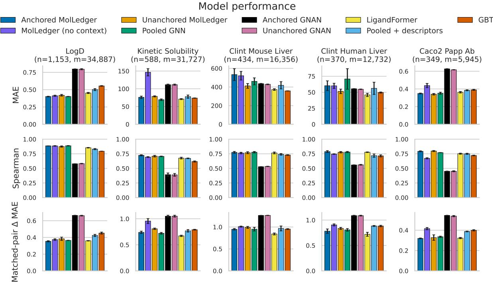  
Figure 1: Performance on the held-out test set for the 5 largest tasks. n is the number of test samples, and m is the number of matched pairs with a molecule from the test set. Mean and standard deviation across 3 random seeds. Remaining tasks are shown in Figure 8 in Appendix D.

## 4.2 Evaluation of Atom-level Attributions

Figure 2 evaluates the interpretability metrics defined in Section 3.3 on the 5 largest tasks, with additional results for other tasks in Figure 9 in Appendix D. Anchoring significantly improves faithfulness to physical properties for MolLedger. Even though the pooled model performs similarly to MolLedger, applying posthoc interpretability methods to the pooled model does not give sensible explanations. The attention weights in LigandFormer do not correspond to how important each atom is according to the physical properties. GNAN claims that it can produce intelligible per-atom scores, but these scores are not sensible for ADME tasks While anchoring does improve faithfulness for GNAN on some tasks, anchoring is much more effective for MolLedger than GNAN. The nonlinear message passing and global context vector in MolLedger allow it to learn from the identities of neighboring atoms and match the atom scores to the anchor properties, whereas the topology-based message passing mechanism in GNAN does not account for the identities of the neighboring atoms and cannot approximate the anchors. As the identity of neighboring atoms affects electronegativity for Crippen score and surface area for TPSA, MolLedger is able to be more faithful to Crippen and TPSA by accounting for the identities of neighboring atoms. Furthermore, as we noted in Section 4.1, this faithfulness to physical properties comes with little cost in performance.

When we defined the exactness gap in Section 3.3 to measure how closely the sum of the per-atom scores in each interpretation explains the predicted score, we noted that MolLedger and GNAN are exact by construction and thus have an exactness gap of 0. Figure 2 evaluates how other methods compare on exactness. In Appendix C, we explain how the attention scores in LigandFormer are designed to sum to 1 rather than the label, so the exactness metric does not apply. IG, Grad-CAM, and LIME are designed to sum to the prediction with their baseline correction terms, so the baseline corrections are removed from the exactness gaps shown in Figure 2. While IG and LIME are close to approximating the prediction, Grad-CAM has an extremely large exactness gap because the gradient is only approximated at a single point and the baseline correction term that is estimated with all-zero activations is likely out of distribution. While WISP claims that their per-atom attributions account for the contributions of each atom, the attributions are not designed to sum to the prediction because the per-atom scores reflect swaps from multiple different baseline molecules that cannot be accounted for with a bias term [Janssen et al., 2026a]. Figure 2 shows that this indeed leads to a large exactness gap for WISP.

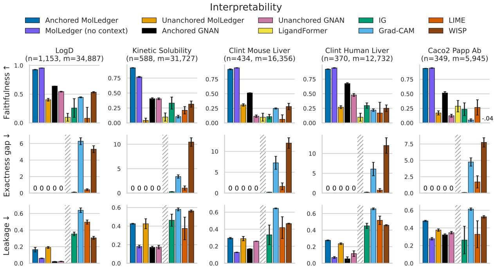  
Figure 2: Interpretability metrics evaluated on the held-out test set for the 5 largest tasks. n is the number of test samples, and m is the number of matched pairs with a molecule from the test set. Mean and standard deviation across 3 random seeds. Methods were not penalized for their bias terms when computing the exactness gap, and changes in the core atom attached to the substituent are not penalized in leakage. Exactness gap and leakage are not defined for LigandFormer's attention scores. Remaining tasks are shown in Figure 9 in Appendix D.

The exactness gap for IG warrants further discussion because it reflects a trade-off between time and exactness that does not affect MolLedger. Figure 6 in Appendix C shows how integrated gradients becomes more exact as the number of steps used to approximate the function increases. However, the time to compute integrated gradients also scales with the number of steps. We chose to run integrated gradients with more steps to give it more exact interpretations, at the cost of integrated gradients taking more than twice as long compared to other interpretability methods besides WISP. Figure 7 in Appendix C shows how MolLedger is much faster to run than all the other interpretability methods, GNAN, and LigandFormer. Grad-CAM is the only method with a similar runtime because its single-point gradient approximation is fairly lightweight, but as we saw in Figure 2, this single-point approximation makes Grad-CAM much less exact.

Figure 2 evaluates how much change each interpretability method attributes to the core versus the substituents. Holding the core constant and only changing scores on the substituents is challenging for all tasks besides logD, even when changes to the linker atom that connects to the substituent are not counted as leakage. LogD is the only property that can almost be decomposed into a sum of per-atom scores. Other properties are affected by interactions across fragments and cannot be separated cleanly between the core and the substituent. The ablation of MolLedger that removes the global context vector and GNAN which does not pass messages between atoms show less leakage of the change into the core, but the performance of these models is much lower. We explore this trade-off further in Figure 4 in Appendix B, where we see that increasing the width of the global context vector also increases leakage until context is saturated Chemical intuition and our ablation results both suggest the trade-off between leakage and performance may be unavoidable. Nonetheless, MolLedger still has less leakage compared to the other interpretability methods besides GNAN on logD and the two intrinsic clearance tasks.

## 4.3 Case Studies

Figure 3 shows the interpretations each method produces on matched molecular pairs with the largest difference in logD, kinetic solubility, and intrinsic clearance in mouse liver cells. In the example for logD, a hydrophilic piperazine in the left molecule is swapped for a hydrophobic methylthiophene. MolLedger correctly attributes negative contributions to atoms in the piperazine and positive contributions to atoms in the methylthiopene. Grad-CAM and WISP provide reasonable attributions as well though Grad-CAM incorrectly ascribes a positive score to a nitrogen in the piperazine. The interpretations from other methods do not align with chemical intuition. Because GNAN does not account for the identity of atom neighbors. GNAN cannot distinguish between carbons in a cyclohexane and carbons in a piperazine. Therefore, while GNAN correctly places negative scores on the polar nitrogens, it is unable to also place negative scores on the carbons in the piperazine. LigandFormer attends to a nitrogen in the piperazine but not to the methylthiophene that is swapped in. IG and LIME place negative scores on both fragments, which does not explain the change in prediction.

The molecular pair for kinetic solubility swaps the lipophilic aromatic ring in methylthiophene for a small polar nitrile. The lipophilic ring allows the former molecule to leave solution, while the small polar nitrile helps the latter compound stay in solution. Anchored MolLedger and WISP are the only methods that correctly place negative attributions on all atoms in the methylthiophene and positive attributions on both atoms in the nitrile. LigandFormer does not attend to the methylthiophene, and GNAN puts little weight on either swapped fragment. Grad-CAM places negative attributions on atoms in both groups, while IG and LIME place positive attributions on atoms in both groups. The opposite attributions that different interpretability methods place on the same GNN demonstrate how posthoc interpretability methods are not reliable for understanding what drives model predictions

In the example for intrinsic clearance in mouse liver cells, a furan is swapped for a hydroxyethyl. Furan is a metabolic soft spot because Cyp450 tends to epoxidize the ring, which is then opened via oxidation to form unstable intermediates. In the molecule on the right, the hydroxyl is polar and therefore reduces the likelihood of that molecule entering the hepatocyte and being cleared. Only MolLedger and IG explain both reasons for the decreased clearance. In contrast, LigandFormer and Grad-CAM do not attribute much weight to the furan, GNAN and LIME do not give the hydroxyl negative scores, and WISP incorrectly places a negative score on the oxygen in the furan. The only valid swap that WISP can compare against to compute the attribution on the oxygen in the furan is a swap from oxygen to sulfur and the resulting thiophene is also a metabolic soft spot. Additional examples for other tasks are shown in Figures 10 and 11. Our analysis in Appendix D reflects on nuances, such as misleading anchors and the introduction of changes that interact with the core.

## 5 Discussion

MolLedger is the first model to our knowledge that provides faithful atom-level attributions that sum exactly to ADME predictions without compromising performance. MolLedger achieves this through two novel components: 1) An additive GNN head that takes in a global context vector. 2) A loss term that anchors per-atom scores to physical properties. Our experiments show that the additivity constraint in MolLedger does not affect performance compared to a pooled GNN and other baselines because the global context vector provides molecule-level information to the individual atom scores that are summed. In our interpretability evaluation, we find that the two novel components in MolLedger allow it to provide per-atom attributions that sum exactly to the ADME prediction and align with physical properties much better than other interpretability methods. Our analysis of ablations of the global context vector and comparisons with GNAN reveal that localizing changes in the interpretability scores between matched molecular pairs to swapped fragments is likely impossible because most ADME properties are affected by interactions across the molecule Our case studies show that the atom-level attributions from MolLedger provide meaningful explanations for how fragment swaps between matched molecular pairs change ADME properties.

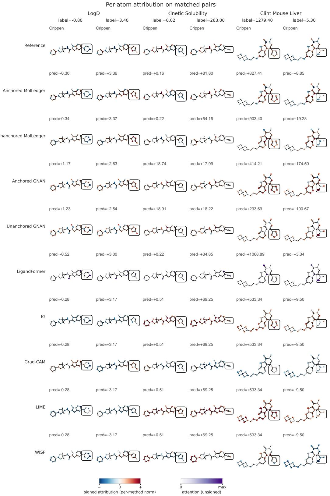  
Figure 3: Per-atom attributions on matched molecular pairs with the largest property change for logD, kinetic solubility, and intrinsic clearance in mouse liver cells. Swapped fragments are shown in a box. The Crippen scores for each atom are shown in the top row for reference.

The explanations that MolLedger produces along with its predictions that match state-of-the-art ADME performance make MolLedger a promising candidate for adoption in virtual screens. Because the interpretations correspond exactly to the predictions, they will help chemists diagnose when the model is reasonable and when chemists should rely on their own intuition instead, building trust in machine learning models. The architectural contributions of MolLedger may also be helpful for other graph-based tasks that have additive explanations or are grounded in per-node properties.

## References

Rishabh Agarwal, Levi Melnick, Nicholas Frosst, Xuezhou Zhang, Ben Lengerich, Rich Caruana, and Geoffrey E Hinton. Neural additive models: Interpretable machine learning with neural nets. Advances in neural information processing systems, 34:4699–4711, 2021.

Maya Bechler-Speicher, Amir Globerson, and Ran Gilad-Bachrach. The intelligible and effective graph neural additive networks. arXiv preprint arXiv:2406.01317, 2024.

Guy W Bemis and Mark A Murcko. The properties of known drugs. 1. molecular frameworks. Journal of medicinal chemistry, 39(15):2887–2893, 1996.

Maria Castellanos, Hugo MacDermott-Opeskin, Jon Ainsley, and Pat Walters. Lessons learned from the openadmet-expansionrx blind challenge: Can we trust zero-shot admet predictions? lessons and reflections from the openadmet-expansionrx blind challenge—evaluating whether zero-shot admet predictions can be trusted in real drug discovery settings., 2026.

Chun-Hao Chang, Rich Caruana, and Anna Goldenberg. Node-gam: Neural generalized additive model for interpretable deep learning. arXiv preprint arXiv:2106.01613, 2021.

Viviana Consonni and Roberto Todeschini. Molecular descriptors. In Recent advances in QSAR studies: methods and applications, pages 29–102. Springer, 2009.

Andrew Dalke, Jerome Hert, and Christian Kramer. mmpdb: An open-source matched molecular pair platform for large multiproperty data sets. Journal of chemical information and modeling, 58(5):902–910 2018.

John S Delaney. Esol: estimating aqueous solubility directly from molecular structure. Journal of chemical information and computer sciences, 44(3):1000–1005, 2004.

Elena Di Lascio, Gregori Gerebtzoff, and Raquel Rodriguez-Perez. Systematic evaluation of local and global machine learning models for the prediction of adme properties. Molecular pharmaceutics, 20(3):1758–1767, 2023.

Jessica Doohan, Lucas Kook, and Kevin Burke. Comparison of generalised additive models and neural networks in applications: A systematic review. Expert Systems with Applications, page 131082, 2026.

Bing-Xue Du, Yi Xu, Siu-Ming Yiu, Hui Yu, and Jian-Yu Shi. Admet property prediction via multi-task graph learning under adaptive auxiliary task selection. Iscience, 26(11), 2023.

Peter Ertl, Bernhard Rohde, and Paul Selzer. Fast calculation of molecular polar surface area as a sum of fragment-based contributions and its application to the prediction of drug transport properties. Journal of medicinal chemistry, 43(20):3714–3717, 2000.

Jorge Galvez, R Garcia, MT Salabert, and Rosa Soler. Charge indexes. new topological descriptors. Journal of Chemical Information and Computer Sciences, 34(3):520–525, 1994.

Arup K Ghose and Gordon M Crippen. Atomic physicochemical parameters for three-dimensional structuredirected quantitative structure-activity relationships i. partition coefficients as a measure of hydrophobicity. Journal of computational chemistry, 7(4):565–577, 1986.

M Gibaldi and D Perrier. Pharmacokinetics. New York, 1982.

Yaxin Gu, Zhuohang Yu, Yimeng Wang, Long Chen, Chaofeng Lou, Chen Yang, Weihua Li, Guixia Liu, and Yun Tang. admetsar3. 0: a comprehensive platform for exploration, prediction and optimization of chemical admet properties. Nucleic acids research, 52(W1):W432–W438, 2024.

Jinjiang Guo, Qi Liu, Han Guo, and Xi Lu. Ligandformer: A graph neural network for predicting compound property with robust interpretation. arXiv preprint arXiv:2202.10873, 2022.

Trevor Hastie and Robert Tibshirani. Generalized additive models. Statistical science, 1(3):297–310, 1986.

Kurt Hornik. Approximation capabilities of multilayer feedforward networks. Neural networks, 4(2):251–257, 1991.

Kurt Hornik, Maxwell Stinchcombe, and Halbert White. Multilayer feedforward networks are universal approximators. Neural networks, 2(5):359–366, 1989.

Weihua Hu, Bowen Liu, Joseph Gomes, Marinka Zitnik, Percy Liang, Vijay Pande, and Jure Leskovec. Strategies for pre-training graph neural networks. arXiv preprint arXiv:1905.12265, 2019.

Weihua Hu, Matthias Fey, Marinka Zitnik, Yuxiao Dong, Hongyu Ren, Bowen Liu, Michele Catasta, and Jure Leskovec. Open graph benchmark: Datasets for machine learning on graphs. Advances in neural information processing systems, 33:22118–22133, 2020.

Kexin Huang, Tianfan Fu, Wenhao Gao, Yue Zhao, Yusuf Roohani, Jure Leskovec, Connor W Coley, Cao Xiao, Jimeng Sun, and Marinka Zitnik. Therapeutics data commons: Machine learning datasets and tasks for drug discovery and development. arXiv preprint arXiv:2102.09548, 2021.

Jameed Hussain and Ceara Rea. Computationally efficient algorithm to identify matched molecular pairs (mmps) in large data sets. Journal of chemical information and modeling, 50(3):339–348, 2010

Shoma Ito, Takuto Koyama, Shigeyuki Matsumoto, Ryosuke Kojima, Yuji Okamoto, Masataka Kuroda Hitoshi Kawashima, Reiko Watanabe, Tomoki Yonezawa, Takaaki Sumiyoshi, et al. Improving adme prediction with multitask graph neural networks and assessing explainability in lead optimization. Journal of Chemical Information and Modeling, 65(21):11796, 2025.

Ewelina Jamrozik, Marek Smieja, and Sabina Podlewska. Admet-print: evaluation of admet properties: prediction and interpretation. Journal of Chemical Information and Modeling, 64(5):1425–1432, 2024.

Kerrin Janssen, Jan M Wollschläger, Jonny Proppe, and Andreas H Göller. When machine learning models learn chemistry i: quantifying explainability with matched molecular pairs. Digital Discovery, 5(2):571– 582, 2026a.

Kerrin Janssen, Jan M Wollschläger, Jonny Proppe, and Andreas H Göller. When machine learning models learn chemistry ii: applying wisp to real-world examples. Digital Discovery, 5(2):583–591, 2026b.

José Jiménez-Luna, Francesca Grisoni, and Gisbert Schneider. Drug discovery with explainable artificial intelligence. Nature Machine Intelligence, 2(10):573–584, 2020.

William L Jorgensen. Efficient drug lead discovery and optimization. Accounts of chemical research, 42(6): 724, 2009.

Gintautas Kamuntavičius, Tanya Paquet, Orestis Bastas, Dainius Šalkauskas, Alvaro Prat, Hisham Abdel Aty, Aurimas Pabrinkis, Povilas Norvaišas, and Roy Tal. Benchmarking ml in admet predictions: the practical impact of feature representations in ligand-based models. Journal of Cheminformatics, 17(1): 108, 2025.

Greg Landrum, Paolo Tosco, Brian Kelley, Ricardo Rodriguez, David Cosgrove, Riccardo Vianello, Peter Gedeck, Gareth Jones, Eisuke Kawashima, Dan Nealschneider, et al. Rdkit: Open-source cheminformatics. Zenodo, Mar 2024. doi: 10.5281/ZENODO.10793672. URL https://www.rdkit.org.

Ke Liu, Xiangyan Sun, Lei Jia, Jun Ma, Haoming Xing, Junqiu Wu, Hua Gao, Yax Sun, Florian Boulnois. and Jie Fan. Chemi-net: a molecular graph convolutional network for accurate drug property prediction. International journal of molecular sciences, 20(14):3389, 2019.

James A Lumley, Prashant Desai, Jibo Wang, Suntara Cahya, and Hongzhou Zhang. The derivation of a matched molecular pairs based adme/tox knowledge base for compound optimization. Journal of Chemical Information and Modeling, 60(10):4757–4771, 2020.

Jiahua Rao, Shuangjia Zheng, Yutong Lu, and Yuedong Yang. Quantitative evaluation of explainable graph neural networks for molecular property prediction. Patterns, 3(12), 2022.

Marco Tulio Ribeiro, Sameer Singh, and Carlos Guestrin. "why should i trust you?" explaining the predictions of any classifier. In Proceedings of the 22nd ACM SIGKDD international conference on knowledge discovery and data mining, pages 1135–1144, 2016.

Alexander S Rich, Yvonne H Chan, Benjamin Birnbaum, Kamran Haider, Joshua Haimson, Michael Hale, Yongxin Han, William Hickman, Klaus P Hoeflich, Daniel Ortwine, et al. Machine learning adme models in practice: Four guidelines from a successful lead optimization case study. ACS Medicinal Chemistry Letters, 15(8):1169–1173, 2024.

Anna Seelig. A general pattern for substrate recognition by p-glycoprotein. European Journal of Biochemistry, 251(1-2):252–261, 1998.

Ramprasaath R Selvaraju, Michael Cogswell, Abhishek Das, Ramakrishna Vedantam, Devi Parikh, and Dhruv Batra. Grad-cam: Visual explanations from deep networks via gradient-based localization. In Proceedings of the IEEE international conference on computer vision, pages 618–626, 2017.

Dagmar Stumpfe, Ye Hu, Dilyana Dimova, and Jürgen Bajorath. Recent progress in understanding activity cliffs and their utility in medicinal chemistry: miniperspective. Journal of medicinal chemistry, 57(1): 18–28, 2014.

Mukund Sundararajan, Ankur Taly, and Qiqi Yan. Axiomatic attribution for deep networks. In International conference on machine learning, pages 3319–3328. PMLR, 2017.

Shunsuke Tamura, Swarit Jasial, Tomoyuki Miyao, and Kimito Funatsu. Interpretation of ligand-based activity cliff prediction models using the matched molecular pair kernel. Molecules, 26(16):4916, 2021.

Bowen Tang, Skyler T Kramer, Meijuan Fang, Yingkun Qiu, Zhen Wu, and Dong Xu. A self-attention based message passing neural network for predicting molecular lipophilicity and aqueous solubility. Journal of cheminformatics, 12(1):15, 2020.

Samo Turk, Benjamin Merget, Friedrich Rippmann, and Simone Fulle. Coupling matched molecular pairs with machine learning for virtual compound optimization. Journal of Chemical Information and Modeling, 57(12):3079–3085, 2017.

Yu Wei, Shanshan Li, Zhonglin Li, Ziwei Wan, and Jianping Lin. Interpretable-admet: a web service for admet prediction and optimization based on deep neural representation. Bioinformatics, 38(10):2863–2871. 2022.

Scott A Wildman and Gordon M Crippen. Prediction of physicochemical parameters by atomic contributions. Journal of chemical information and computer sciences, 39(5):868–873, 1999.

Zhenqin Wu, Bharath Ramsundar, Evan N Feinberg, Joseph Gomes, Caleb Geniesse, Aneesh S Pappu, Karl Leswing, and Vijay Pande. Moleculenet: a benchmark for molecular machine learning. Chemical science, 9(2):513–530, 2018.

Keyulu Xu, Weihua Hu, Jure Leskovec, and Stefanie Jegelka. How powerful are graph neural networks? arXiv preprint arXiv:1810.00826, 2018.

## A Model and Dataset Details

The underlying architecture of MolLedger is a GNN with 4 message-passing blocks. Message passing utilizes the GINEConv operator that takes in both node and edge features [Xu et al., 2018, Hu et al., 2019]. Each message-passing block utilizes a 2-layer MLP that has 256 hidden units, applies batch normalization and ReLU, and outputs a 128-unit vector. The block that produces the global context and pooled GNN output is also a 2-layer MLP with 128 hidden units. It maps to a single scalar in the pooled GNN and a global context vector in MolLedger. Finally, the per-atom head is also a 2-layer MLP with 128 hidden units. All models were trained using an Adam optimizer using learning rate 1e-3 and cosine annealing schedule, batch size 64, 300 epochs, and 3 random seeds on a NVIDIA GeForce RTX 5070 Ti GPU.

When we merged the datasets from the sources outlined in Section 3.1, we converted the labels to the same scale. As Caco2 A-to-B was recorded in 1e-6 cm/s in ExpansionRx and $\log _ { 1 0 } \mathrm { c m / s }$ in Therapeutics data commons (TDC), we converted ExpansionRx to TDC's convention when merging. Kinetic solubility, Caco2 efflux ratio, half life, plasma protein fraction unbound, and clearance were converted to log scale. Human intestinal absorption was excluded as the labels were binary, and binary tasks do not fit with the additive anchored framework. Following Open Graph Benchmark's convention [Hu et al., 2020], the 9 types of categorical atom features provided to the models are atomic number, chirality, degree, formal charge, total attached H-count, number of radical electrons, hybridization, aromaticity, and ring membership. We also provide 3 types of categorical bond features: bond type, stereochemistry, and conjugation.

Half-life is the amount of time it takes for the concentration of a drug in blood or plasma to decrease by 50%. Half-life is high when the molecule is distributed widely and cleared at a slow rate [Gibaldi and Perrier, 1982]. Distribution and clearance are both faster when the molecule is hydrophobic, so half-life is not clearly correlated in either direction. Therefore, no anchor is applied for half-life.

## B Tuning the Context Vector and Anchor Loss in MolLedger

As we introduced in Section 2, MolLedger has two novel components: the additive head with a global context vector and the loss tying each atom's attribution to a physical anchor. To evaluate the two contributions of MolLedger, we perform an in-depth analysis of how the model responds to varying the size of the global context vector and the strength of the anchor loss on validation data.

Figure 4 shows the results of the analysis on global context vector size. Without a global context vector, constraining the head to be additive results in a significant increase in MAE relative to the pooled GNN and LigandFormer baselines for kinetic solubility and Caco2 A-to-B permeability. Once we add a global context vector, the MAE becomes much better on these two tasks. Faithfulness to the anchor also improves when the global context vector is added for kinetic solubility. As we vary the global context vector size from 2 to 16, we see that the benefit saturates around size 8, so we choose a size-8 global context vector. With this global context vector, obtaining interpretability with an additive head no longer compromises performance.

Figure 5 shows how the additional constraint imposed by the anchor loss makes the per-atom attributions significantly more faithful without affecting model performance. We perform this experiment on three variants of the additive head: 1) The first variant of the additive head produces the per-atom scores with a linear function of the atom representation from message passing. The prediction is the sum of the peratom scores $\sum _ { i = 1 } ^ { N _ { a t o m s } } W A _ { i } . 2 )$ The second variant has two independent linear additive heads that both compute per-atom scores from the atom representations from message passing. The output is the sum of the sum of the per-atom scores from one head and the mean of the per-atom scores from the other head: $\begin{array} { r } { \sum _ { i = 1 } ^ { N _ { a t o m s } } W _ { 1 } A _ { i } \stackrel {  } { + } \frac { 1 } { N _ { a t o m s } } \sum _ { i = 1 } ^ { N _ { a t o m s } } W _ { 2 } A _ { i } } \end{array}$ . Having a sum and a mean term allows the model to adjust for molecule size . The per-atom score used to measure faithfulness is then $\begin{array} { r } { W _ { 1 } A _ { i } + \frac { 1 } { N } W _ { 2 } A _ { i } . ~ 3 ) } \end{array}$ The third variant is the additive head in MolLedger with a size-8 global context vector: $\sum _ { i = 1 } ^ { N _ { a t o m s } } \phi _ { 3 } \left( A _ { i } , c \right)$ , where c is the global context vector. c is computed from a concatenation of the sum and the mean of the atom representations from message-passing. Because $\phi _ { 3 }$ is a MLP, two separate additive heads for the final output are not needed. The switch from sum to sum and mean is helpful for kinetic solubility and Caco2 A-to-B permeability as these properties are particularly affected by molecule size. The addition of a global context vector leads to further performance improvement. The global context vector can learn molecule size, as well as other informative features. For all three of these variants, the addition of even a weak anchor loss leads to a significant increase in faithfulness, far outperforming the LigandFormer attention baseline. Increasing anchor strength leads to a small increase in faithfulness with little effect on performance. When we evaluate MolLedger, we choose the best anchor strength for each seed based on the average normalized validation MAE across all tasks.

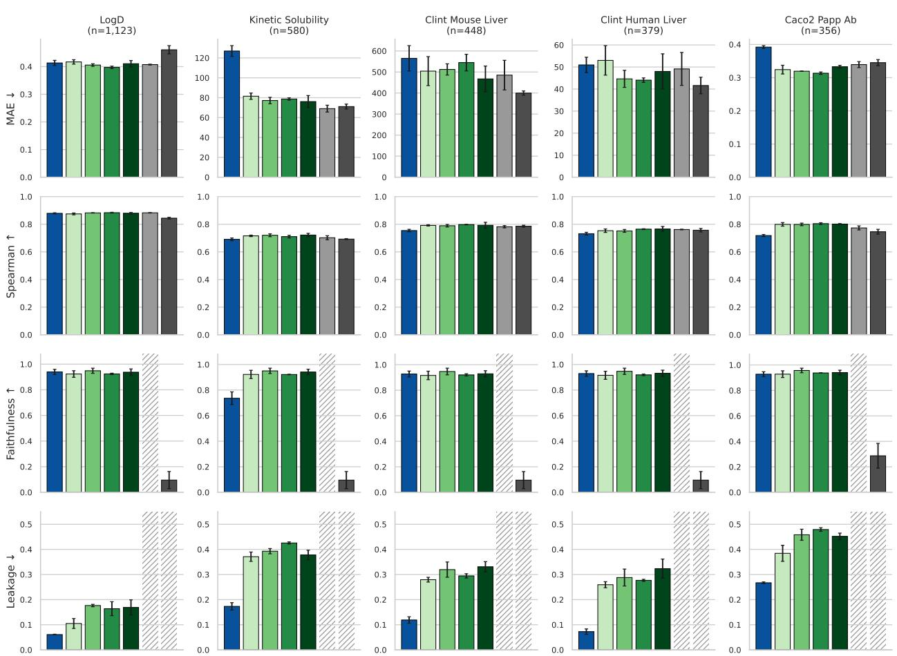  
Figure 4: Performance of MolLedger when varying global context vector dimension. The no-context MolLedger uses the sum and mean form in Figure 5. All variants of MolLedger are trained with the anchor loss. Faithfulness and leakage are not measured for the pooled GNN as they depend on the interpretability method applied. Leakage is not defined for LigandFormer

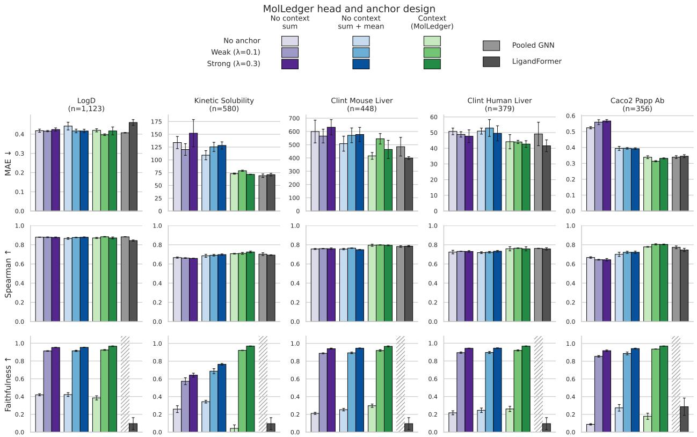  
Figure 5: Performance of MolLedger with varying anchor strength. Three types of heads are evaluated for MolLedger. Faithfulness is not measured for the pooled GNN as it depends on the interpretability method applied.

## C Interpretability Baseline Methods

LigandFormer This attention-based graph neural network was designed to interpret the contribution of each atom to an ADME prediction by taking the average of the amount of attention paid to each atom across query atoms, attention heads, and attention blocks [Guo et al., 2022]. The attention mechanism only appears in the trunk, so the attention weights are the same for all tasks. This does not pose an issue for Guo et al. [2022] as they train separate models for each task. In the multi-task setting we evaluate, the attention weights that come from the trunk are the same for all tasks, so the interpretations from LigandFormer reflect which atoms are informative in general rather than which atoms are informative for a particular task. In addition we evaluate regression tasks, whereas Guo et al. [2022] evaluate classification asks. The attention weights are designed to sum to 1 across atoms in each layer rather than sum to the prediction, so we cannot evaluate exactness for LigandFormer. A substituent may be important in one molecule of the matched pair but not in the other molecule, so the core atoms may receive different attention weights simply due to reallocation of the attention weights. This change in attention to the core cannot be called leakage. Therefore, the only interpretability metric we evaluate for LigandFormer is faithfulness in terms of correlation between the magnitude of the anchor and the attention score.

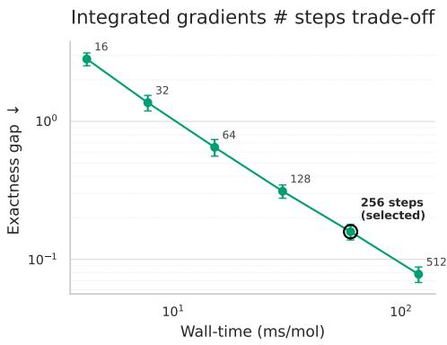  
Figure 6: Exactness vs time trade-off for integrated gradients.

Integrated gradients (IG) The contribution of a feature at a certain point along a function can be approximated by the coefficients in a series of linear approximations from the origin to that point [Sundararajan et al., 2017]. This idea can be extended to graph neural networks. Following Ito et al. [2025], we compute integrated gradients along a path from a graph with the same structure as an all-zero atom embedding to the molecule graph. The per-atom attribution is the sum of the gradients with respect to the embeddings along this path. Because the IG path starts at the all-zero baseline, we account for the prediction for that baseline molecule $\hat { y } _ { b a s e }$ when computing the exactness gap:

$$
\mathrm { E x a c t n e s s \ g a p \ f o r \ i n t e g r a t e d \ g r a d i e n t s } = \left| ( { \hat { y } } - { \hat { y } } _ { b a s e } ) - \sum _ { i = 1 } ^ { N _ { a t o m s } } s _ { i } \right|\tag{6}
$$

Varying the number of steps along the integrated gradients path trades off exactness for runtime. In Figure 6, we explore this tradeoff and choose to set the number of steps to 256. Because most matched pairs have different topologies, they also have different baseline molecules. As the difference between the predicted values for the two baseline molecules cannot be attributed to the core or substituent, it does not appear in the definition of leakage in Equation 5.

Grad-CAM While IG follows a linear approximation in the embedding space that is inputted to a model, gradient-weighted class activation mapping (Grad-CAM) creates a linear approximation in the activation space outputted before the prediction head [Selvaraju et al., 2017]. Originally designed for classification tasks with convolutional neural networks, Grad-CAM computes the gradient of the logit for a class with respect to the activation in a feature channel averaged across pixels in the activation space. Then, to compute how much a pixel contributes to the prediction of a class across all feature channels, Grad-CAM sums the activations across channels weighted by these gradients and gates this sum with ReLU. Wei et al. [2022] adapt Grad-CAM to ADME tasks by taking the gradient of the prediction with respect to the output from the final message-passing layer in the GNN. For task $c ,$ the weight on activation dimension k in this GNN embedding is the average gradient across atoms:

$$
\alpha _ { k } ^ { c } = \frac { 1 } { N _ { a t o m s } } \sum _ { i = 1 } ^ { N _ { a t o m s } } \frac { \partial y ^ { c } } { \partial A _ { i } ^ { k } }\tag{7}
$$

The contribution of atom i to task c is then $\begin{array} { r } { s _ { i } = \sum _ { k } \alpha _ { k } ^ { c } A _ { i } ^ { k } } \end{array}$ . For regression tasks, the contribution of an atom can be positive or negative, so the ReLU is dropped. Similar to IG, the exactness gap measures the difference between the sum of these per-atom attributions and the prediction from a baseline molecule. For Grad-CAM, this baseline molecule has all-zero activations from message passing rather than an all-zero input embedding. When we examine the definition for Grad-CAM, we can observe the two terms that lead to leakage for a core atom with activation ${ \bf A } _ { i } ^ { ( a ) }$ in molecule a and $\mathbf { A } _ { i } ^ { ( b ) }$ in molecule b:

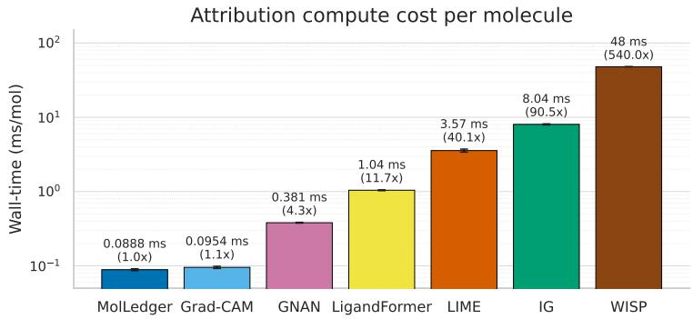  
Figure 7: Time to run each interpretability method.

$$
\mathrm { L e a k a g e ~ f o r ~ c o r e ~ a t o m ~ i ~ i n ~ G r a d - C A M } = \left| { \alpha } ^ { ( a ) } A _ { i } ^ { ( a ) } - { \alpha } ^ { ( b ) } A _ { i } ^ { ( b ) } \right|\tag{8}
$$

$$
= \left| \alpha ^ { ( a ) } \left( A _ { i } ^ { ( a ) } - A _ { i } ^ { ( b ) } \right) + \left( \alpha ^ { ( a ) } - \alpha ^ { ( b ) } \right) A _ { i } ^ { ( b ) } \right|\tag{9}
$$

The first term reflects the change in activations across the two molecules, and the second term reflects the change in gradients with respect to the activation across the pair.

LIME Local interpretable model-agnostic explanation (LIME) samples perturbations of the input, computes model predictions for these perturbed inputs, and fits a linear model on these perturbed input-output pairs [Ribeiro et al., 2016]. Jamrozik et al. [2024] apply LIME to interpret the contributions of substructure fingerprints to ADME predictions from graph neural networks. Because we are interested in per-atom contributions rather than per-substructure contributions, we perform our perturbations to $\tilde { \mathbf { Z } } \in \bar { \left\{ 0 , 1 \right\} } ^ { N _ { a t o m s } }$ , a binary mask indicating whether each atom is present or absent. We gather 300 perturbed samples in this binary space and fit the linear model $\begin{array} { r } { \tilde { \mathbf { Y } } = \hat { \mathbf { W } } \tilde { \mathbf { Z } } + \hat { b } . } \end{array}$ where W is the per-atom contribution. The bias term b is treated like $\hat { y } _ { b a s e }$ in Equation 6 when estimating the exactness gap for LIME. The bias is also omitted when computing leakage.

WISP The interpretability method employed in the workflow for interpretability scoring using matched molecular pairs (WISP) introduced in Janssen et al. [2026a] and Janssen et al. [2026b] is a form of occlusion adapted specifically for molecules. To compute the attribution for an individual atom, the atom is swapped for H, B, C, N, O, F, Si, P, S, Cl, Br, or I where the substitution is valid with implicit hydrogens. The average change in prediction across the valid substitutions is the attribution to that atom. Because there is no single baseline molecule, the exactness gap directly compares the sum of these per-atom attributions to the prediction. The long runtime for WISP in Figure 7 comes from constructing the modified molecules in RDKit and checking for validity.

## D Results on Additional Tasks

In addition to the three case studies in Section 4.3, we analyze 6 examples for other tasks shown in Figures 10 and 11. Starting with the leftmost example in Figure 10, this matched molecular pair for intrinsic clearance in human liver cells is a more nuanced case where the anchor is misleading. The aminopropyl chain in the molecule on the left has negative Crippen scores because it is lipophobic. However, the flexible primary amine chain means Cyp450 could perform O-dealkylation or oxidative deamination and break the chain. Closing a ring to block metabolism is a common med-chem strategy for reducing clearance. The rigid azetidine on the right is much less accessible for oxidation. Unanchored MolLedger is able to learn about the flexible primary amine structure and assign positive attributions to all the atoms in the aminopropyl chain, but it

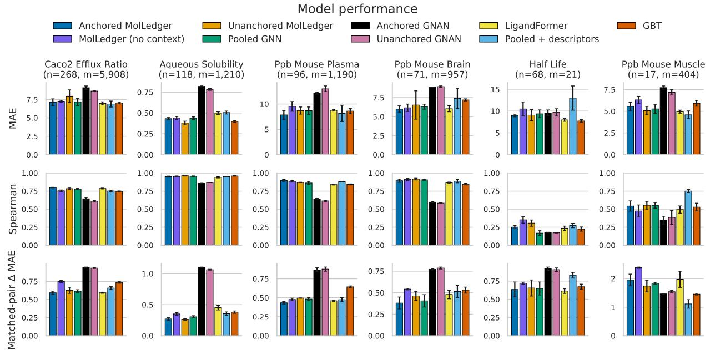  
Figure 8: Performance on smaller tasks as a continuation of Figure 1. n is the number of test samples, and m is the number of matched pairs with a molecule from the test set. Mean and standard deviation across 3 random seeds.

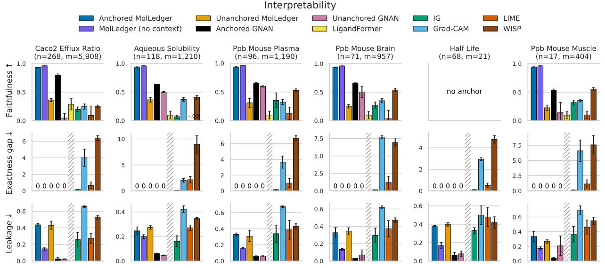  
Figure 9: Interpretability metrics on smaller tasks as a continuation of Figure 2. n is the number of test samples, and m is the number of matched pairs with a molecule from the test set. Mean and standard deviation across 3 random seeds. Exactness gap and leakage are not defined for LigandFormer's attention scores.

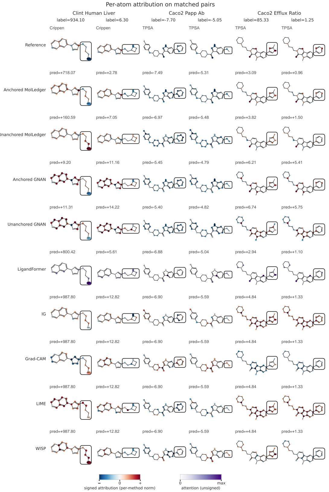  
Figure 10: Per-atom attributions on matched molecular pairs with the largest property change for intrinsic clearance in human liver cells, Caco2 A-to-B permeability assay, and Caco2 efflux ratio. Swapped fragments are shown in a box.

## Per-atom attribution on matched pairs

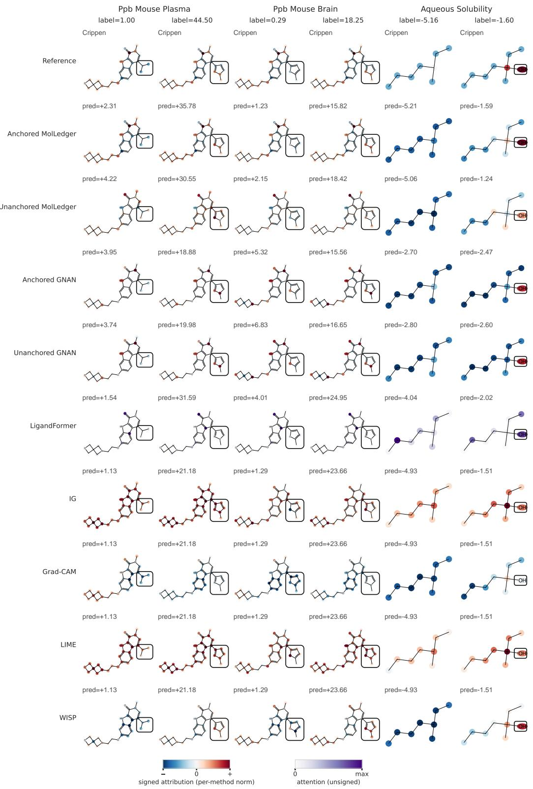  
Figure 11: Per-atom attributions on matched molecular pairs with the largest property change for plasma protein binding in mouse plasma and brain. Swapped fragments are shown in a box. We select a special case for aqueous solubility where a new subgroup is introduced in place of a hydrogen, so the left molecule does not have a box.

has not learned that the azetidine should have negative scores. On the other hand, because the anchors influence the per-atom attributions, anchored MolLedger is able to attribute negative scores to all the atoms in the azetidine ring, but it places negative attributions on the polar oxygen and amino group as well. In contrast, for GNAN, even the unanchored model attributes a negative score to the amino group despite receiving information about the amino group being at the end of a chain from GNAN's topology weighting. GNAN also does not place negative weights around the azetidine besides at the nitrogen. LigandFormer attends strongly to the terminal amino group, but the attention weight does not indicate whether the model believes the amino group leads to faster or slower clearance. Grad-CAM and WISP on the pooled model place positive contributions on all atoms in the aminopropyl chain and negative contributions on all atoms in the azetidine, making them strong interpretations in this case. LIME interprets the contribution of the aminopropyl correctly but not the azetidine, and IG is incorrect on both molecules. These different interpretations of the same model show that we cannot trust the interpretations when they are not directly tied to the prediction.

In the example for Caco2 A-to-B permeability, the swap changes a pyrimidine to a methoxy. The pyrimidine has 2 hydrogen bond acceptors (HBA) that form a Seelig motif and bind to the P-gp transport protein responsible for actively pumping drugs out of a cell [Seelig, 1998]. In contrast, the ether is much less polar, and the Seelig motif is no longer present in the compound on the right. This means the drug tends to stay inside the cell much more. Faithfulness to the TPSA anchor is well-motivated in this case. Anchored MolLedger places more of the negative attribution on the two HBAs, whereas the unanchored model is more diffuse around the ring. Similar trends are observed for GNAN. IG and LIME also seem to capture the right attributions, whereas Grad-CAM and WISP report the wrong direction and LigandFormer does not attend to the two HBAs.

The next example for Caco2 efflux ratio swaps a methylimidazole to a pyrimidine. The sp2-hybridized nitrogen in the imidazole is a strong HBA that anchors the molecule to the P-gp binding site. Once the molecule is anchored to the binding site, a second HBA in the core of the molecule can then form the other part of the Seelig motif. In contrast, the pyrimidine in the molecule on the right cannot act as an anchor in the binding site. The pyrimidine is attached to the core at the carbon next to only one of the nitrogens rather than at the carbon between the two nitrogens as in the example for Caco2 A-to-B. The core displaces the lone pair on the nearby nitrogen, and the other nitrogen is not strong enough to act as the HBA that anchors the molecule in the P-gp binding site. In this case, the TPSA anchors are only partially informative, as they are not strong indicators of donor strength. Anchored MolLedger and anchored GNAN follow the TPSA anchors and attach significance to both nitrogens in both fragments, rather than only to the HBA nitrogen in the imidazole. LigandFormer, Grad-CAM, and WISP put weight on the wrong nitrogen in the imidazole, while IG and LIME place weights all around the rings. All models cannot predict the large Caco2 efflux ratio for the molecule on the left. Even when the pooled GNN does not have an additive constraint, it is still unable to predict the exponential increase that occurs with the methylimidazole compared to the pyrimidine. This is an example of an activity cliff, which is challenging to predict [Stumpfe et al., 2014]. Part of the challenge here is the introduction of a HBA in the methylimidazole affects the value of HBAs in the core. In this case, leakage into the core is justified, but the interpretability methods reflect that the models do not treat the core differently between these two molecules.

In Figure 11, both examples for plasma protein binding in mouse plasma and brain show swaps to methylprazole, a group with two nitrogens that act as HBAs. The left molecule in the mouse plasma pair is fairly lipophilic as the two fluorines are poor HBAs due to electronegativity holding the lone pairs tightly The left molecule in the mouse brain pair is also lipophilic as the oxygen is only weakly polar in the ring. Both of these swaps introduce much stronger HBAs that make the second compound less lipophilic and increase the fraction unbound. Anchored MolLedger, both versions of GNAN, and WASP attribute these changes to the responsible atoms. In contrast, unanchored MolLedger suggests that the two fluorines increase the fraction unbound as it misses how fluorines are weak HBAs in this structure. LigandFormer does not attend to the substituents. Besides a negative attribution placed on the polar oxygen, IG and LIME place positive attributions throughout both substituents, and Grad-CAM places negative attributions throughout both. This once again reflects the issue with posthoc interpretability methods when they yield conflicting interpretations of the same model.

Finally, for aqueous solubility, we select an example of a special case we defined beyond rdkit's matched pair analysis. This pair adds a polar hydroxyl in place of a hydrogen. The left molecule has no heavy atom in its substituent group, and thus the change can only be interpreted with the weight on the hydroxyl in the new molecule. All methods attribute the increase in aqueous solubility to either the hydroxyl or the hydroxyl-bearing carbon that is affected by the swap.