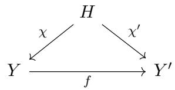
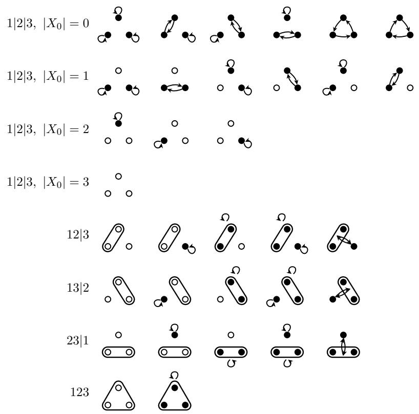
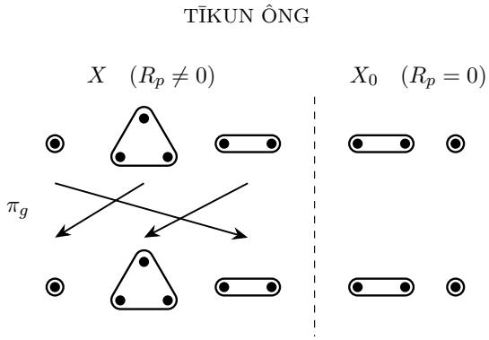

# NO EQUIVARIANT ARCHITECTURE COVERS ALL EQUIVARIANT ATTENTION

T¯IKUN ONGˆ

Abstract. We give a complete characterization of equivariant multi-head self-attention (MHSA): if an MHSA layer is equivariant to a symmetry group G, then G can only act by permuting head-clusters, with QK and OV matrices satisfying an equivariance constraint tied to the group action. As a consequence, we prove that any fixed MHSA architecture that achieves exact equivariance by polynomially parameterizing unconstrained MHSA parameters inevitably leads to expressivity loss within the class of equivariant maps: the equivariance locus of unconstrained MHSA forms a union of extremely many Zariski-irreducible components in a reduced parameter space, and any single architecture covers at most one. For $G = D _ { 4 }$ acting on C copies of the regular representation as the token feature space, we show that there are $\Omega ( C ^ { 6 4 } )$ components for eight attention heads.

## Contents

1. Introduction 1   
2. Related Work 2   
3. Preliminaries: MHSA and Reduced MHSA 3   
4. The Structure Theorem for Equivariant MHSA 3   
5. Proof of Theorem 2 6   
6. No Single Equivariant Architecture Covers All Equivariant MHSAs 8   
7. Geometry of the Equivariance Locus 9   
8. Conclusion and Open Problems 15   
References 16   
Appendix A. Equivariant Vector Bundles 18

## 1. Introduction

Symmetry is naturally present in many learning tasks. Semantic segmentation of aerial or medical images often should not depend on the orientation of the input image. The ground state energy of a molecule does not depend on the spatial reference frame used to encode each atom’s position. Data living in vector bundles over a manifold exist independently of the chosen local frames, which are inevitable for computations. Mathematically, the property of respecting a given symmetry is often formalized as equivariance, which a model may possess either at the architectural level or by learning.

Much efort has been dedicated to designing equivariant architectures. In fact, convolutions are exactly functions that are equivariant to translations. The generalization of convolutions to arbitrary symmetry groups led to the group convolutional neural networks (GCNNs) (Cohen and Welling, 2016; Weiler et al., 2018; Kondor and Trivedi, 2018; Bekkers et al., 2018; Cohen et al., 2020).

Email: tikunong@gmail.com.

Attention (Vaswani et al., 2017) has become a paradigmatic primitive for modern state of the art models. In vision (Dosovitskiy et al., 2021), image patches are interpreted as a sequence of tokens to be processed by multi-head self-attention (MHSA), and the resulting architecture is the Vision Transformer (ViT). Many current widely used vision models are based on variants of the ViT (Liu et al., 2021; Sim´eoni et al., 2025). Rather recently, there have been several works on making attention equivariant (Romero and Cordonnier, 2021; Xu et al., 2023; Fu et al., 2026), including a line of work showing advantages in eficiency at matched accuracy (B¨okman et al., 2025; Nordstr¨om et al., 2026; Ong and B¨okman ˆ , 2026).

While equivariance encodes the correct inductive bias, it is not clear whether imposing layerwise equivariance, which is the most common approach to equivariant learning, could be too rigid. The slightly more precise question we ask is: given some fixed layer, can a constrained version of that layer represent exactly those functions that are both equivariant and representable by the unconstrained one, and nothing more? Note that this is true for linear layers, for which the constrained layer would be a convolution.

In this paper, we prove a structure theorem for equivariant MHSA. That is, assuming that a symmetry group acts on some token feature space V, we give a complete characterization of maps $\mathbb { R } ^ { L } \otimes V  \mathbb { R } ^ { L } \otimes V$ that are both G-equivariant and expressible as a multi-head self-attention.

Based on this result, we show, using algebraic geometry, that the space of equivariant functions is very intricate: it is a union of extremely many “components”, and any given architecture (way of constraining equivariance) can cover at most one component. Hence, an MHSA with hard equivariance constraints can never represent all equivariant functions representable by the unconstrained MHSA. Moreover, as the feature dimension grows, the number of these components proliferates. This serves as a mathematically rigorous mechanism consistent with Sutton (2019), where it is claimed that careful architectural designs to impose inductive bias often do not scale well.

## 2. Related Work

Equivariant architectures. Most existing equivariant neural network architectures are equivariant convolutional neural networks (Cohen and Welling, 2016; Kondor and Trivedi, 2018; Bekkers et al., 2018; Weiler and Cesa, 2019; Weiler et al., 2018; Cohen et al., 2020; Finzi et al., 2020; Weiler et al., 2021, 2026). This paper says nothing about these. Equivariant transformers, on the other hand, rely on equivariant attention, which is the topic of this paper and has been achieved either by lifting features to functions on the group (Hutchinson et al., 2021; Romero and Cordonnier, 2021; Xu et al., 2023; Fu et al., 2026) or working directly in the Fourier space (Fuchs et al., 2020; B¨okman et al., 2025; Nordstr¨om et al., 2026; Ong andˆ B¨okman, 2026).

Universality. Universality of equivariant networks is usually studied in the approximate sense, i.e., uniform convergence on compact sets, for shallow or deep MLPs (Yarotsky, 2018; Ravanbakhsh, 2020; Pacini et al., 2025). Our work concerns exact representation of MHSA, which is what enables the irreducible-component counting in Section 7. We do not say anything about the structure of an MHSA layer that is approximately equivariant.

Identifiability and neuroalgebraic geometry. Identifiability refers to the ability to recover the parameters of a model, up to certain predefined “gauge symmetries”, from the function it represents. Shahverdi et al. (2026) observes that identifiability together with the so-called adjunction property implies layerwise equivariance for equivariant functions. Henry et al. (2026) establishes identifiability for lightning (“linear”, without softmax) self-attention. More recently, Henry (2026) characterizes the generic fiber of ordinary MHSA. The problem of understanding the image and fibers of the realization map of a neural network can sometimes be studied using tools from algebraic geometry. This is the neuroalgebraic geometry program Marchetti et al. (2025). For example, Kohn et al. (2025) study the equivariance locus of a two-layer linear network for cyclic and permutation groups. The irreducible components they find have the same origin as the ones described in Section 7.

## 3. Preliminaries: MHSA and Reduced MHSA

Let V be any finite-dimensional inner product space with an orthogonal decomposition $V = \oplus _ { h \in H } V _ { h }$ into heads. For four linear maps $\phi _ { q } , \phi _ { k } , \phi _ { v } , \phi _ { o } \in \operatorname { E n d } ( V )$ , the multi-head selfattention on L tokens with respect to the given orthogonal decomposition is given by

$$
\mathrm { M H S A } ( x ; \phi _ { q } , \phi _ { k } , \phi _ { v } , \phi _ { o } ) _ { i } = \phi _ { o } \sum _ { h \in H } \frac { \sum _ { j = 1 } ^ { L } \exp ( \langle \phi _ { q } x _ { i } , \pi _ { h } \phi _ { k } x _ { j } \rangle ) \pi _ { h } \phi _ { v } x _ { j } } { \sum _ { j = 1 } ^ { L } \exp ( \langle \phi _ { q } x _ { i } , \pi _ { h } \phi _ { k } x _ { j } \rangle ) } ,\tag{1}
$$

where $x \in \mathbb { R } ^ { L } \otimes V$ is a token sequence and $\pi _ { h } : V \to V _ { h }$ is the orthogonal projection onto the $h -$ th head. Clearly, Eq. (1) depends only on $M _ { h } : = \phi _ { q } ^ { * } \pi _ { h } \phi _ { k }$ (where $( \cdot ) ^ { * }$ is the adjoint/transpose) and $R _ { h } : = \phi _ { o } \pi _ { h } \phi _ { v }$ , the QK and OV matrices in the terminology of Elhage et al. (2021). This motivates the following definition:

Definition 1. For $V = \oplus _ { h \in H } V _ { h }$ and $( M _ { h } ) _ { h \in H } , ( R _ { h } ) _ { h \in H }$ with $M _ { h } , R _ { h } \in \operatorname { E n d } ( V )$ , we define reduced multi-head self-attention (RMHSA) to be

$$
\mathrm { R M H S A } ( x ; ( M _ { h } ) _ { h \in H } , ( R _ { h } ) _ { h \in H } ) _ { i } : = \displaystyle \sum _ { h \in H } \frac { \sum _ { j = 1 } ^ { L } \exp ( \langle x _ { i } , M _ { h } x _ { j } \rangle ) R _ { h } x _ { j } } { \sum _ { j = 1 } ^ { L } \exp ( \langle x _ { i } , M _ { h } x _ { j } \rangle ) } .\tag{2}
$$

Note that “reduced” refers to the reduction in parameterization redundancy, not in expressive power. Indeed, a priori, RMHSA could have more expressive power than MHSA if the ranks of the $M _ { h }$ and $R _ { h }$ are unconstrained.

## 4. The Structure Theorem for Equivariant MHSA

The following theorem is the first of our two main results, which completely characterizes the set of parameters, i.e., pairs $( M , R ) \in \operatorname { E n d } ( V ) ^ { H } \times \operatorname { E n d } ( V ) ^ { H }$ , for which ${ \mathrm { R M H S A } } ( - ; M , R )$ is G-equivariant. Since MHS $\begin{array} { r } { \mathsf { A } ( - ; \phi _ { q } , \phi _ { k } , \phi _ { v } , \phi _ { o } ) = \mathrm { R M H S A } ( - ; ( \phi _ { q } ^ { * } \pi _ { h } \phi _ { k } ) _ { h \in H } , ( \phi _ { o } \pi _ { h } \phi _ { v } ) _ { h \in H } ) } \end{array}$ , the corresponding characterization for MHSA is immediate. We will sometimes refer to this set of parameters as the equivariance locus.

Theorem 2 (Structure of equivariant MHSA). Let G be any group and V a finite-dimensional orthogonal G-representation. Assume $L \ \geq \ 3$ For any $( M _ { h } ) _ { h \in H }$ and $( R _ { h } ) _ { h \in H }$ , the map $\mathrm { R M H S A } ( - ; ( M _ { h } ) _ { h \in H } , ( R _ { h } ) _ { h \in H } ) \ : \ \mathbb { R } ^ { L } \otimes V \ \to \ \mathbb { R } ^ { L } \otimes V$ is G-equivariant if and only if there is a surjective map $\chi : H \to X _ { 0 } \sqcup X$ , where X is a G-set, such that:

(1) $h \mapsto M _ { h }$ is constant along the fibers of χ. Let $M _ { p } : = M _ { h }$ for any $h \in \chi ^ { - 1 } ( p )$

(2) The map $p \mapsto M _ { p }$ is G-equivariant on X. That is, $M _ { g p } = g M _ { p } g ^ { - 1 }$

(3) The map $\begin{array} { r } { p \mapsto R _ { p } : = \sum _ { h \in \chi ^ { - 1 } ( p ) } R _ { h } } \end{array}$ is G-equivariant on X and zero on $X _ { 0 }$

The proof is found in Section 5.

Intuitively, the map χ groups together attention heads h that share the same attention bilinear form $M _ { h }$ , and only the sum $\textstyle \sum _ { h \in \chi ^ { - 1 } ( p ) } R _ { h }$ of the output-projection-value map within each group is subject to equivariance. The data $( H , \chi : H \to X _ { 0 } \sqcup X , G$ action on $X )$ define a recurring object in the rest of the paper, especially in the proof of Theorem 9, so we will give it a name:

Definition 3. Let H be a finite set and G any group. A G-clustering is a G-set X together with a surjective map $\chi : H \to X$ . A partial G-clustering is a disjoint union $Y = X _ { 0 } \sqcup X$ where X is a G-set, together with a surjective map $\chi : H \to Y$ . If $\chi ^ { \prime } : H  X _ { 0 } ^ { \prime } \sqcup X ^ { \prime } = : Y ^ { \prime }$ is another partial G-clustering, a map of partial G-clusterings is a map $f : \check { Y }  Y ^ { \prime }$ such that $f \circ \chi = \chi ^ { \prime } , f ( X _ { 0 } ) \subset X _ { 0 } ^ { \prime } , f ( X ) \subset X ^ { \prime }$ , and $f | _ { X }$ is G-equivariant:

(3)

The map f is an isomorphism if it is bijective.

As a consequence of our definition, there is at most one map between two partial Gclusterings. The only implication of this that will be useful for us is the following: if two partial G-clusterings are isomorphic, then there is a unique isomorphism between them. So, it is always harmless to simply identify them without specifying the isomorphism. See Fig. 1 for all possible $\chi : H \to X _ { 0 } \sqcup X$ for three heads and $G = C _ { 6 }$ up to isomorphism. We will sometimes simply write $\chi : H \to Y$ or just χ to refer to a partial G-clustering, omitting the data specifying the G-action and partition of Y from the notation.

Example 1. For any G and H, there is always a G-clustering obtained by taking the identity map Id $; H  H$ together with the trivial G-action on H. This G-clustering will be denoted by Id.

  
Figure 1. All 33 partial $C _ { \mathrm { 6 ^ { - } c l u s t e r i n g s } }$ of $H = \{ 1 , 2 , 3 \}$ up to isomorphism.

We can now rephrase Theorem 2 in this slightly more technical and condensed language, which will make our discussion in Section 7 easier. First, note that a partial G-clustering $\chi : H \to X _ { 0 } \sqcup X = : Y$ (in fact any surjective map) induces two maps,

$$
\mathcal { P } _ { \chi } : \operatorname { E n d } ( V ) ^ { H } \to \operatorname { E n d } ( V ) ^ { Y }
$$

$$
( R _ { h } ) _ { h \in { H } } \mapsto \Big ( \sum _ { h \in \chi ^ { - 1 } ( p ) } R _ { h } \Big ) _ { p \in Y }\tag{4}
$$

$$
\mathcal { P } _ { \chi } ^ { * } : \operatorname { E n d } ( V ) ^ { Y } \to \operatorname { E n d } ( V ) ^ { H }
$$

$$
( M _ { p } ) _ { p \in Y } \mapsto ( M _ { \chi ( h ) } ) _ { h \in H } ,
$$

which are indeed adjoints of each other.

Theorem 4. Given M, $R \in \operatorname { E n d } ( V ) ^ { H }$ , reduced multi-head self-attention RMHS $\operatorname { A } ( - ; M , R )$ $\mathbb { R } ^ { L } \otimes V  \mathbb { R } ^ { L } \otimes V$ for $L \geq 3$ tokens is G-equivariant if and only if there is a partial G-clustering $\chi : H \to X _ { 0 } \sqcup X = : Y$ such that the following are true:

• There exists $( M _ { p } ) _ { p \in Y }$ such that $\mathcal { P } _ { \chi } ^ { * } ( ( M _ { p } ) _ { p \in Y } ) = ( M _ { h } ) _ { h \in H }$ and $p \mapsto M _ { p }$ is G-equivariant on $X$

• Let $( R _ { p } ) _ { p \in Y } : = \mathcal { P } _ { \chi } ( ( R _ { h } ) _ { h \in H } )$ . Then $p \mapsto R _ { p }$ is G-equivariant on X and zero on $X _ { 0 }$

When the attention bilinear forms $M _ { h }$ are pairwise distinct, a weaker version of Theorem 2 can be obtained by combining the generic identifiability result of Henry (2026) with the framework of Shahverdi et al. (2026), which builds on Marchetti et al. (2024). Theorem 2 is stronger in that it is a global statement: it also describes nongeneric parameter configurations in which several heads share the same attention bilinear form. In this case, the individual efective value maps $R _ { h }$ are not identifiable; only their sums over the corresponding fibers are intrinsic, as noted by Cirrincione (2026), and required to respect equivariance. The global form is crucial to the proof of Theorem 9: it gives a Zariski-closed cover of the equivariance locus (see Section 7), and having control of every member of the cover is necessary for proving maximality of the counted irreducible components.

Example 2. Let $G = \mathbb { Z } / 2 \mathbb { Z } = \{ e , t \}$ with two attention heads $H = \{ 1 , 2 \}$ . If $M _ { 1 } \ne M _ { 2 }$ and $X _ { 0 } = \varnothing$ , then χ is bijective and G acts on H. There are two possibilities: either (a) the action is trivial or $( \mathrm { b } ) \ t . 1 = 2$ and $t . 2 = 1$ . In case $( \mathrm { a } ) , R _ { h }$ and $M _ { h }$ are in $\operatorname { E n d } _ { \mathbb { Z } / 2 \mathbb { Z } } ( V )$ for all $h \in H$ In case (b), $R _ { 1 }$ and $R _ { 2 }$ are related by $t R _ { 1 } t = R _ { 2 }$ , and similarly $t M _ { 1 } t = \dot { M } _ { 2 }$

Example 3. For one head, $. \mathrm { e } . , | H | = 1$ , and $X _ { 0 } = \varnothing ,$ , the equivariance conditions become $M , R \in \operatorname { E n d } _ { G } ( V )$ , recovering Theorem 1 of $\mathrm { { \hat { O } n g } }$ and B¨okman (2026).

Example 4. Consider an arbitrary finite group G. Take $X \ = \ G$ , acted on by G by left multiplication. In this case, the equivariance condition reads $g M _ { g ^ { \prime } } g ^ { - 1 } = M _ { g g ^ { \prime } }$ and similarly for the $R _ { g }$ . In particular, this means $M _ { g } = g M _ { e } g ^ { - 1 }$ and $R _ { g } = g R _ { e } g ^ { - 1 }$ , with $M _ { e }$ and $R _ { e }$ unconstrained.

For a Lie group $G ,$ the connected component $G _ { 0 }$ of the identity must act trivially on the heads 1 (more precisely on $X )$ . That is, there is again a surjective map $\chi : H \to X _ { 0 } \sqcup X$ , where X carries a G-action, for which the equivariance conditions in Theorem 2 hold. However, $G _ { 0 }$ acts on X trivially, so we equivalently have a C-action, where ${ \mathcal { C } } : = G / G _ { 0 }$ is the group of connected components. As a consequence, if G is connected, each head must be G-stable.

Example 5. $G = \mathrm { S O ( 3 ) }$ (or any other connected Lie group) is connected, so C is trivial, and we have $R _ { p } , M _ { p } \in \operatorname { E n d } _ { G } ( V )$ for any $p \in X$

Example 6. $G = \mathrm { O } ( 3 )$ has two connected components, so $\mathcal { C } \cong \mathbb { Z } / 2 \mathbb { Z } = \{ e , t \}$ . In this case, the $M _ { p }$ and $R _ { p }$ still commute with SO(3) for all $p \in X$ , but it can happen that t carries some $p \in X$ to $\boldsymbol { p ^ { \prime } \ne p }$ , for which we have $M _ { p ^ { \prime } } = t M _ { p } t$ and $R _ { p ^ { \prime } } = t R _ { p } t$

## 5. Proof of Theorem 2

The ⇐ direction is direct computation:

$$
\begin{array} { r l } & { \displaystyle \sum _ { h \in H } \frac { \sum _ { j = 1 } ^ { L } \exp ( \langle g x _ { i } , M _ { h } g x _ { j } \rangle ) R _ { h } g x _ { j } } { \sum _ { j = 1 } ^ { L } \exp ( \langle g x _ { i } , M _ { h } g x _ { j } \rangle ) } = \sum _ { p \in X } \frac { \sum _ { j = 1 } ^ { L } \exp ( \langle g x _ { i } , M _ { p } g x _ { j } \rangle ) R _ { p } g x _ { j } } { \sum _ { j = 1 } ^ { L } \exp ( \langle g x _ { i } , M _ { p } g x _ { j } \rangle ) } } \\ & { \displaystyle = \sum _ { p \in X } \frac { \sum _ { j = 1 } ^ { L } \exp ( \langle x _ { i } , M _ { g ^ { - 1 } p } x _ { j } \rangle ) g R _ { g ^ { - 1 } p } x _ { j } } { \sum _ { j = 1 } ^ { L } \exp ( \langle x _ { i } , M _ { g ^ { - 1 } p } x _ { j } \rangle ) } = g \sum _ { p \in X } \frac { \sum _ { j = 1 } ^ { L } \exp ( \langle x _ { i } , M _ { p } x _ { j } \rangle ) R _ { p } x _ { j } } { \sum _ { j = 1 } ^ { L } \exp ( \langle x _ { i } , M _ { p } x _ { j } \rangle ) } } \\ & { \displaystyle = g \sum _ { h \in H } \frac { \sum _ { j = 1 } ^ { L } \exp ( \langle x _ { i } , M _ { h } x _ { j } \rangle ) R _ { h } x _ { j } } { \sum _ { j = 1 } ^ { L } \exp ( \langle x _ { i } , M _ { h } x _ { j } \rangle ) } . } \end{array}\tag{5}
$$

We now prove ⇒.

The equivariance condition for L tokens $( x _ { 1 } , \dots , x _ { L } ) \in \mathbb { R } ^ { L } \otimes V$ and |H| heads $V = \oplus _ { h \in H } V _ { h }$ reads

$$
\sum _ { h \in H } \frac { \sum _ { j = 1 } ^ { L } \exp ( \langle g x _ { i } , M _ { h } g x _ { j } \rangle ) R _ { h } g x _ { j } } { \sum _ { j = 1 } ^ { L } \exp ( \langle g x _ { i } , M _ { h } g x _ { j } \rangle ) } = g \sum _ { h \in H } \frac { \sum _ { j = 1 } ^ { L } \exp ( \langle x _ { i } , M _ { h } x _ { j } \rangle ) R _ { h } x _ { j } } { \sum _ { j = 1 } ^ { L } \exp ( \langle x _ { i } , M _ { h } x _ { j } \rangle ) }\tag{6}
$$

for all $g \in G$ . Hence,

$$
\sum _ { h \in H } \frac { \sum _ { j = 1 } ^ { L } \exp ( \langle x _ { i } , M _ { h } ^ { g } x _ { j } \rangle ) R _ { h } ^ { g } x _ { j } } { \sum _ { j = 1 } ^ { L } \exp ( \langle x _ { i } , M _ { h } ^ { g } x _ { j } \rangle ) } = \sum _ { h \in H } \frac { \sum _ { j = 1 } ^ { L } \exp ( \langle x _ { i } , M _ { h } x _ { j } \rangle ) R _ { h } x _ { j } } { \sum _ { j = 1 } ^ { L } \exp ( \langle x _ { i } , M _ { h } x _ { j } \rangle ) } ,\tag{7}
$$

where $M _ { h } ^ { g } : = g M _ { h } g ^ { - 1 }$ and $R _ { h } ^ { g }  : = g R _ { h } g ^ { - 1 }$ . Setting all tokens to the same $x \in V$ yields $\begin{array} { r } { g \sum _ { h } { R _ { h } g ^ { - 1 } x } = \sum _ { h } { R _ { h } x } } \end{array}$ , or $\textstyle \sum _ { h } R _ { h } \in \operatorname { E n d } _ { G } ( V )$ . Now, set $x _ { j \geq 2 } = x , x _ { 1 } = x + y .$ , and $i = 2$ in $\mathrm { E q . ~ } ( 7 )$ to get

$$
\sum _ { h \in H } \frac { ( L - 1 ) R _ { h } ^ { g } x + e ^ { \langle x , M _ { h } ^ { g } y \rangle } R _ { h } ^ { g } ( x + y ) } { L - 1 + e ^ { \langle x , M _ { h } ^ { g } y \rangle } } = \sum _ { h \in H } \frac { ( L - 1 ) R _ { h } x + e ^ { \langle x , M _ { h } y \rangle } R _ { h } ( x + y ) } { L - 1 + e ^ { \langle x , M _ { h } y \rangle } } .\tag{8}
$$

Cancelling out $\begin{array} { r } { \sum _ { h } R _ { h } ^ { g } x = \sum _ { h } R _ { h } x } \end{array}$ yields

$$
\sum _ { h \in H } \frac { e ^ { \langle x , M _ { h } ^ { g } y \rangle } R _ { h } ^ { g } y } { L - 1 + e ^ { \langle x , M _ { h } ^ { g } y \rangle } } = \sum _ { h \in H } \frac { e ^ { \langle x , M _ { h } y \rangle } R _ { h } y } { L - 1 + e ^ { \langle x , M _ { h } y \rangle } } .\tag{9}
$$

Or, writing $\sigma _ { \alpha } ( s ) : = e ^ { s } / ( \alpha + e ^ { s } )$

$$
\sum _ { h \in H } \sigma _ { L - 1 } ( \langle x , M _ { h } ^ { g } y \rangle ) R _ { h } ^ { g } y = \sum _ { h \in H } \sigma _ { L - 1 } ( \langle x , M _ { h } y \rangle ) R _ { h } y .\tag{10}
$$

Diferentiating Eq. (10) n times with respect to x at $x = 0$ yields

$$
\sigma _ { L - 1 } ^ { ( n ) } ( 0 ) \sum _ { h \in H } ( M _ { h } ^ { g } y ) ^ { \otimes n } \otimes R _ { h } ^ { g } y = \sigma _ { L - 1 } ^ { ( n ) } ( 0 ) \sum _ { h \in H } ( M _ { h } y ) ^ { \otimes n } \otimes R _ { h } y .\tag{11}
$$

Here, the superscript (n) denotes the n-th derivative of a function.

Lemma 5. If α is an integer larger than one, then $\sigma _ { \alpha } ^ { ( n ) } ( 0 ) \neq 0$ for all $n \in \mathbb { N } _ { \geq 0 }$

Proof. Let $\lambda : = 1 / \alpha < 1$ . We can rewrite the sigmoid-like function as

$$
\sigma _ { \alpha } ( x ) = \lambda e ^ { x } { \frac { 1 } { 1 + \lambda e ^ { x } } } = \lambda e ^ { x } \sum _ { b = 0 } ^ { \infty } ( - 1 ) ^ { b } \lambda ^ { b } e ^ { b x } = \sum _ { b = 1 } ^ { \infty } ( - 1 ) ^ { b + 1 } \lambda ^ { b } e ^ { b x } .\tag{12}
$$

Thus

$$
\sigma _ { \alpha } ^ { ( n ) } ( 0 ) = \sum _ { b = 1 } ^ { \infty } ( - 1 ) ^ { b + 1 } \lambda ^ { b } b ^ { n } ,\tag{13}
$$

which can be related to the Eulerian polynomials $A _ { n }$ for $n \geq 1$ (the claim is clearly true for $n = 0 )$

$$
\sigma _ { \alpha } ^ { ( n ) } ( 0 ) = \frac { \lambda A _ { n } ( - \lambda ) } { ( 1 + \lambda ) ^ { n + 1 } } .\tag{14}
$$

So $\sigma _ { \alpha } ^ { ( n ) } ( 0 ) = 0 \Leftrightarrow A _ { n } ( - \lambda ) = 0$ . But $A _ { n }$ is a monic polynomial with constant term 1, so by the rational root theorem, the only possible rational roots are ±1. □

Thus, if the number of tokens is at least three, then for all $n \geq 0$ we have

$$
\sum _ { h \in H } ( M _ { h } ^ { g } y ) ^ { \otimes n } \otimes R _ { h } ^ { g } y = \sum _ { h \in H } ( M _ { h } y ) ^ { \otimes n } \otimes R _ { h } y ,\tag{15}
$$

or

$$
\sum _ { h \in H } ( M _ { h } y ) ^ { \otimes n } \otimes R _ { h } y + \sum _ { h \in H } ( M _ { h } ^ { g } y ) ^ { \otimes n } \otimes ( - R _ { h } ^ { g } y ) = 0 .\tag{16}
$$

Lemma 6. Let V be a finite dimensional real vector space and let $( R _ { i } ) _ { i \in I } , ( M _ { i } ) _ { i \in I }$ be finite indexed families in End(V ). Suppose

$$
\forall n \geq 0 , \forall y \in V : \sum _ { i \in I } ( M _ { i } y ) ^ { \otimes n } \otimes R _ { i } y = 0 .\tag{17}
$$

Partition $I = \textstyle \bigcup _ { p \in Z } C _ { p }$ such that $M _ { i } = M _ { j } \Leftrightarrow \exists p : i , j \in C _ { p }$ . Then $\begin{array} { r } { \sum _ { i \in C _ { p } } R _ { i } = 0 } \end{array}$ for all $p \in Z$ Proof. Roughly speaking, the proof idea is to first prove the claim pointwise and then employ a density argument.

Let

$$
\begin{array} { r l } & { S : = \{ y \in V : \forall i , j : M _ { i } y = M _ { j } y \Leftrightarrow M _ { i } = M _ { j } \} } \\ & { \qquad \cap \left\{ y \in V : \forall i : M _ { i } \neq 0 \Rightarrow M _ { i } y \neq 0 \right\} } \end{array}\tag{18}
$$

Then S is nonempty and open.

Fix $y \in S$ . Find $\alpha \in V ^ { * }$ that separates the $M _ { i } y$ , i.e. $\alpha ( M _ { i } y ) = \alpha ( M _ { j } y ) \Leftrightarrow M _ { i } y = M _ { j } y$ Furthermore, we may assume $\alpha ( M _ { i } y ) = 0 \Leftrightarrow M _ { i } y = 0 ( \Leftrightarrow M _ { i } = 0$ because $y \in S )$ . Define $c _ { p } : = \alpha ( M _ { i } y )$ for any $i \in C _ { p }$ . Then, $\alpha ^ { \otimes n } \otimes$ Id evaluated on Eq. (17) reads

$$
\forall n \geq 0 : \sum _ { p \in Z } c _ { p } ^ { n } \sum _ { i \in C _ { p } } R _ { i } y = 0 .\tag{19}
$$

First, suppose $c _ { p } \neq 0$ for all $p \in Z$ . Then the $c _ { p }$ are nonzero and pairwise distinct. Thus, the matrix with entries ${ \bf V } _ { n p } = c _ { p } ^ { n } , n = 0 , 1 , \ldots , | Z | { \bf \bar { \Sigma } } - 1$ is invertible, so $\begin{array} { r } { \sum _ { i \in C _ { p } } R _ { i } y = 0 } \end{array}$ for all $p \in Z$ and $y \in S$

If $c _ { p _ { 0 } } = 0$ for some $p _ { 0 } \in Z \ ( \Leftrightarrow M _ { i } = 0$ for some i), then the same argument still implies $\begin{array} { r } { \sum _ { i \in C _ { p } } R _ { i } y = 0 } \end{array}$ for $p \in Z \setminus \{ p _ { 0 } \}$ and $y \in S$ , which in turn implies $\begin{array} { r } { \sum _ { i \in C _ { p _ { 0 } } } R _ { i } y = 0 } \end{array}$ since $\begin{array} { r } { \sum _ { i \in I } { \bf \dot { R } } _ { i } y = 0 \mathrm { ~ ( E q . ~ ( 1 7 ) ~ a t ~ } n = 0 \mathrm { ) } } \end{array}$

  
Figure 2. Illustration of the argument that applies Lemma 6 to Eq. (16) to get a partial G-clustering.

Hence, $\begin{array} { r } { \sum _ { i \in C _ { p } } R _ { i } y = 0 } \end{array}$ for all $p \in Z$ and $y \in S$ . Since S is nonempty and open, $\begin{array} { r } { \sum _ { i \in C _ { p } } R _ { i } = } \end{array}$ 0. □

Applied to Eq. (16), the summation index set is $I = H \sqcup H = \textstyle \bigcup _ { p \in Z } C _ { p }$ , partitioned by the values of $( M _ { h } ) _ { h \in H }$ and $( M _ { h } ^ { g } ) _ { h \in H }$ . Partition $\begin{array} { r } { H = \bigcup _ { p \in Y } B _ { p } } \end{array}$ by $( M _ { h } ) _ { h \in H }$ , and write $M _ { p } : = M _ { h }$ for any $h \in B _ { p }$ and $\begin{array} { r } { R _ { p } : = \sum _ { h \in B _ { p } } R _ { h } } \end{array}$ . Clearly, we have $M _ { h } ^ { g } = M _ { h ^ { \prime } } ^ { g } \Leftrightarrow h , h ^ { \prime }$ are in some $B _ { p }$ That is, the partition of $H \sqcup H$ must be coarser than $\left( \bigcup _ { p \in Y } B _ { p } \right) \sqcup \left( \bigcup _ { p \in Y } B _ { p } \right)$ . Define

$$
X _ { 0 } : = \{ p \in Y : R _ { p } = 0 \} \qquad X : = Y \setminus X _ { 0 } .\tag{20}
$$

Define a map $\pi _ { g } : X \to X$ as follows: Take $p \in X$ . Then $R _ { p } \neq 0$ by construction. So, by Lemma 6, there must be exactly one $p ^ { \prime } \in Y$ such that $M _ { p } = \mathbf { \bar { \rho } } M _ { p ^ { \prime } } ^ { g }$ and $R _ { p } = R _ { p ^ { \prime } } ^ { g }$ . But then $R _ { p ^ { \prime } } \neq 0$ , so $p ^ { \prime }$ must belong to X. Put $\pi _ { g } ( p ) = p \prime . \ \mathrm { I f } \ \pi _ { g } ( p _ { 1 } ) = \pi _ { g } \dot { ( p _ { 2 } ) }$ , then $M _ { p _ { 1 } } = M _ { p _ { 2 } }$ , so $\pi _ { g }$ is bijective.

Next, we show that $g \mapsto \pi _ { g }$ is an antihomomorphism. Take $g _ { 1 } , g _ { 2 } \in G$ and $p \in X$ . Let $p ^ { \prime } = \pi _ { g _ { 1 } } ( p ) , p ^ { \prime \prime } = \pi _ { g _ { 2 } } \circ \pi _ { g _ { 1 } } ( p ) \stackrel {  } { = } \pi _ { g _ { 2 } } ( p ^ { \prime } )$ . Then $M _ { p } = M _ { p ^ { \prime } } ^ { g _ { 1 } }$ and $M _ { p ^ { \prime } } = M _ { p ^ { \prime \prime } } ^ { g _ { 2 } }$ , so $M _ { p } = M _ { p ^ { \prime \prime } } ^ { g _ { 1 } g _ { 2 } }$ , i.e., $p ^ { \prime \prime } = \pi _ { g _ { 1 } g _ { 2 } } ( p )$ . That is, $\pi _ { g _ { 1 } g _ { 2 } } = \pi _ { g _ { 2 } } \circ \pi _ { g _ { 1 } }$

Let G act on X by $g \cdot p = \pi _ { g } ^ { - 1 } ( p )$ . Then $M _ { g \cdot p } = M _ { \pi _ { g } ^ { - 1 } ( p ) } = M _ { \pi _ { q } \circ \pi _ { q } ^ { - 1 } ( p ) } ^ { g } = M _ { p } ^ { g }$ , and similarly $R _ { g p } = R _ { p } ^ { g }$ . So $p \mapsto M _ { p }$ and $p \mapsto R _ { p }$ are G-equivariant on X. This concludes the proof of Theorem 4, equivalently Theorem 2, where the partial G-clustering is given by the natural surjection $\chi : H \to Y$ giving the partition. This last argument is illustrated in Fig. 2.

Finally, we would like to remark that the same technique can be used to prove the following identifiability result, which slightly generalizes Henry (2026):

Theorem 7. Suppose M, $R \in \operatorname { E n d } ( V ) ^ { H }$ and $\bar { M } , \bar { R } \in \operatorname { E n d } ( V ) ^ { \bar { H } }$ satisfy

$$
\mathrm { R M H S A } ( - ; M , R ) = \mathrm { R M H S A } ( - ; { \bar { M } } , { \bar { R } } ) : \mathbb { R } ^ { L } \otimes V \to \mathbb { R } ^ { L } \otimes V\tag{21}
$$

for some $L \geq 3$ . Then

$$
\sum _ { h : M _ { h } = m } { R _ { h } } = \sum _ { \bar { h } : \bar { M } _ { \bar { h } } = m } { \bar { R } _ { \bar { h } } }\tag{22}
$$

for any m ∈ End(V ).

## 6. No Single Equivariant Architecture Covers All Equivariant MHSAs

We now discuss our second main result, built on Theorem 2, which is, roughly speaking: “An unconstrained MHSA can represent many more G-equivariant functions than a polynomially parameterized MHSA with exact G-equivariance.” We will quantify this lack of expressivity by

counting how many polynomially parameterized models are needed in order to represent all G-equivariant MHSAs. This motivates the following definition:

Definition 8. Let V be an inner product space with orthogonal decomposition $V = \oplus _ { h \in H } V _ { h }$ Let Λ be any real vector space (parameter space), and let $\beta : \Lambda \to \operatorname { E n d } ( V ) ^ { 4 }$ be polynomial. We define the (β-)polynomially parameterized MHSA to be the parameterized map

$$
\begin{array} { r l } & { \beta \mathrm { \mathrm { - } M H S A : } \left( \mathbb { R } ^ { L } \otimes V \right) \times \Lambda \to ( \mathbb { R } ^ { L } \otimes V ) } \\ & { \qquad ( x , \lambda ) \mapsto \mathrm { M H S A } ( x ; \beta ( \lambda ) ) . } \end{array}\tag{23}
$$

If V is an orthogonal G-representation, a family $\mathcal { M } = ( \beta { \cdot } \mathrm { M H S A } ) _ { \beta \in \mathbf { B } }$ is G-complete if each $\beta { \mathrm { - M H S A } } \in { \mathcal { M } }$ represents only G-equivariant maps and any G-equivariant map expressible by MHSA can be expressed by $\beta { \mathrm { - M H S A } }$ for some $\beta \in \mathbf { B }$

Let $c _ { G , d } ( V )$ denote the number of maximal subrepresentations $W ~ \subset ~ V$ such that $0 ~ <$ dim $W \leq d$ up to isomorphism. For example, if $G = C _ { 4 }$ and $V = \mathrm { A } _ { 1 } \oplus \mathrm { A } _ { 2 } \oplus \mathrm { E } _ { 1 }$ , then there are two such subrepresentations: $\mathrm { A } _ { 1 } \oplus \mathrm { A } _ { 2 }$ and $\mathrm { E _ { 1 } }$ , so $c _ { C _ { 4 } , 2 } ( \mathrm { A } _ { 1 } \oplus \mathrm { A } _ { 2 } \oplus \mathrm { E } _ { 1 } ) = 2$

Theorem 9. Suppose G is finite. A G-complete family of polynomially parameterized MHSA with equal head dimensions d = dim $V / | H |$ necessarily contains at least $\frac { 1 } { | H | ! } c _ { G , d } ( V ) ^ { 2 | H | }$ elements (models).

The proof (Section 7) involves understanding the Zariski-irreducible components of the equivariance locus in the RMHSA parameter space, which we consider to be part of the neuroalgebraic geometry program (Marchetti et al., 2025). These components have the same algebraic origin as the ones in equivariant linear networks (Kohn et al., 2025). The lower bound is obtained by counting only components corresponding to the trivial action on the heads, and including nontrivial actions could only increase the bound.

Example 7. Let G be the trivial group acting on $V = \mathbb { R } ^ { C } , C > 0$ . With $d = \dim V / | H | =$ $C / | H |$ , we have $c _ { G , d } ( V ) = 1$ , and the lower bound is $1 / | H | !$ , which is vacuous.

Example 8. Take $G = D _ { 4 } , V = \mathbb { R } ^ { C } \otimes \mathbb { R } [ D _ { 4 } ] \cong \mathbb { R } ^ { C } \otimes \mathbb { R } ^ { 8 }$ , where $\mathbb { R } [ D _ { 4 } ]$ is the regular representation. With eight equal-dimension heads, we have $d = 8 C / 8 = C .$ , and $c _ { D _ { 4 } , C } ( V )$ is the number of C-dimensional subrepresentations up to isomorphism. So

$$
\begin{array} { r } { c _ { D _ { 4 } , C } ( \mathbb { R } ^ { C } \otimes \mathbb { R } [ D _ { 4 } ] ) = { \binom { C + 3 } { 3 } } + { \binom { C + 1 } { 3 } } + \cdots = \Theta ( C ^ { 4 } ) , } \end{array}\tag{24}
$$

so the bound $| H | ! ^ { - 1 } c _ { D _ { 4 } , C } ( V ) ^ { 2 | H | }$ is $\Theta ( C ^ { 6 4 } )$ . For even $C ,$ this lower bound is

$$
\frac { 1 } { 8 ! } \left[ \frac { ( C + 2 ) ( C + 4 ) ( C ^ { 2 } + 6 C + 6 ) } { 4 8 } \right] ^ { 1 6 } .
$$

For $C = 9 6$ (total token dimension $= 8 C = 7 6 8 )$ , this is about $1 . 6 \times 1 0 ^ { 9 6 }$

## 7. Geometry of the Equivariance Locus

The proof is split into three sections. Section 7.1 merely motivates the machinery we use; the actual proof is completely contained in Sections 7.2, 7.3, and 7.4.

## 7.1. Motivation: Equivariant Vector Bundles

In the proof, we will make heavy use of equivariant vector bundles, the definition and properties of which are reviewed in Appendix A. This is but a convenient way to pack a lot of information into one single object, motivated in three steps as follows:

(1) Let $V , W$ be G-representations. Suppose we want to study the family $\mathcal { F }$ of $G \mathrm { - }$ equivariant linear maps $M \in \mathrm { H o m } _ { G } ( V , W )$ with $\operatorname { r k } ( M ) \leq r$ . It is true that any such M factorizes through some G-representation U of dimension $\leq r$ . That is, $M = \psi _ { 1 } \psi _ { 2 }$ with $\psi _ { 2 } \in \mathrm { H o m } _ { G } ( V , U )$ and $\psi _ { 1 } \in \mathrm { H o m } _ { G } ( U , W )$ . Thus, $\begin{array} { r } { \mathcal { F } = \bigcup _ { U } \mathcal { D } ( V , W ; U ) } \end{array}$ , where ${ \mathcal { D } } ( V , W ; U ) : = \operatorname { H o m } _ { G } ( U , W ) \operatorname { H o m } _ { G } ( V , U )$ , and U ranges over all G-representations of dimension at most r up to isomorphism.

(2) Fix a tuple of integers $( r _ { h } ) _ { h \in H } ,$ , one for each head. Suppose we now want to study the family $\mathcal { F }$ of tuples $M \in \mathrm { H o m } _ { G } ( V , W ) ^ { H }$ such that each $M _ { h }$ has rank at most $r _ { h }$ . The same argument in (1) applies headwise, so, for each $M \in { \mathcal { F } } .$ , we can find $( U _ { h } ) _ { h \in H }$ , where each $U _ { h }$ is a G-representation of dimension at most $r _ { h }$ , such that $M _ { h } \in$ $\mathcal { D } ( V , W ; U _ { h } )$ . Now, pack the $U _ { h }$ into $E : = ( U _ { h } ) _ { h \in H }$ , and define $\Gamma ( E ) : = \bigoplus _ { h \in H } U _ { h }$ which is a G-representation. Let $\mathcal { D } ( V , W ; E )$ be the set of tuples $M \in { \mathrm { H o m } } _ { G } ( V , W ) ^ { H }$ such that there exists $\phi _ { 2 } \in \mathrm { H o m } _ { G } ( V , \Gamma ( E ) ) , \phi _ { 1 } \in \mathrm { H o m } _ { G } ( \Gamma ( E ) , W )$ satisfying $M _ { h } =$ $\phi _ { 1 } \mathrm { e v } _ { h } \phi _ { 2 }$ , where $\mathrm { e v } _ { h } : \Gamma ( E ) \to \Gamma ( E )$ projects onto the h-th summand. Hence, we have $\begin{array} { r } { \mathcal { F } = \bigcup _ { E } \mathcal { D } ( V , W ; E ) } \end{array}$ . Nothing fancy is done: we simply repackaged the $U _ { h }$ into one object, E, which is an equivariant bundle with trivial action on the base space H. This could seem somewhat ad-hoc, since each fiber $U _ { h }$ is really just an independent G-representation. In particular $\begin{array} { r } { \begin{array} { r } { \mathcal { D } ( V , W ; E ) = \prod _ { h \in H } \mathcal { D } ( V , W ; U _ { h } ) } \end{array} } \end{array}$ , and $\mathcal { F }$ is also a product.

(3) Finally, let $H = G / K$ be a homogeneous space, and let $[ e ] \ ( = K )$ denote the identity coset of K. Suppose we want to study the family $\mathcal { F }$ of tuples $M \in { \mathrm { H o m } } ( V , W ) ^ { H }$ such that $h \mapsto M _ { h }$ is G-equivariant and $\operatorname { r k } ( M _ { h } ) \leq r _ { h }$ for each h. That is, $M _ { g h } = g M _ { h } g ^ { - 1 }$ which is exactly the equivariance condition in Theorem 2. The family $\mathcal { F }$ is not a product over H anymore because $M _ { [ e ] }$ determines all the other $M _ { h }$ for $h \in G / K$ . However, (1) still applies to $M _ { [ e ] }$ for the subgroup $K \colon$ : because $M _ { [ e ] } = M _ { [ k e ] } = k M _ { [ e ] } k ^ { - 1 }$ , we have $M _ { [ e ] } \in \operatorname { H o m } _ { K } ( \operatorname { R e s } _ { K } ^ { G } ( V ) , \operatorname { R e s } _ { K } ^ { G } ( W ) )$ , so there is a K-representation of dimension at most $r _ { [ e ] }$ such that

$$
M _ { [ e ] } \in \operatorname { H o m } _ { K } ( U , \mathrm { R e s } _ { K } ^ { G } ( W ) ) \mathrm { H o m } _ { K } ( \mathrm { R e s } _ { K } ^ { G } ( V ) , U ) .\tag{25}
$$

By Frobenius reciprocity,

$$
\begin{array} { r l } & { \mathrm { H o m } _ { K } ( U , \mathrm { R e s } _ { K } ^ { G } ( W ) ) \cong \mathrm { H o m } _ { G } ( \mathrm { I n d } _ { K } ^ { G } ( U ) , W ) } \\ & { \mathrm { H o m } _ { K } ( \mathrm { R e s } _ { K } ^ { G } ( V ) , U ) \cong \mathrm { H o m } _ { G } ( V , \mathrm { I n d } _ { K } ^ { G } ( U ) ) } \end{array}\tag{26}
$$

canonically, so any decomposition $M _ { [ e ] } = \psi _ { 1 } \psi _ { 2 }$ with respect to Eq. (25) gives two G-equivariant maps: $\phi _ { 1 } \in \mathrm { H o m } _ { G } ( \mathrm { I n d } _ { K } ^ { G } ( U ) , W )$ and $\phi _ { 2 } \in \mathrm { H o m } _ { G } ( V , \mathrm { I n d } _ { K } ^ { G } ( U ) )$ . Now, ${ \mathrm { I n d } } _ { K } ^ { G } ( U )$ is nothing but the space of sections $\Gamma ( E )$ of the associated bundle $E = G \times _ { K } U$ (where we view $G  G / K$ as a principal K-bundle), and it is easily shown (see $\mathrm { A p \mathrm { - } }$ pendix A) that the entire tuple $( M _ { h } ) _ { h }$ is given by $M _ { h } = \phi _ { 1 } \mathrm { e v } _ { h } \phi _ { 2 }$ , where $\mathrm { e v } _ { h } : \Gamma ( E ) \to$ $\Gamma ( E )$ again projects onto the h-th fiber. The upshot is that $\begin{array} { r } { \mathcal { F } = \bigcup _ { E } \mathcal { D } ( V , W ; E ) } \end{array}$ still holds with the same definition of $\mathcal { D } ( V , W ; E )$ , but now the union is taken over all G-equivariant vector bundles over $H \ = \ G / K$ , which are in bijection with Krepresentations via $U \mapsto G \times _ { K } U .$ . In this case, the rank constraint is equivalent to $\operatorname { r k } _ { h } ( E ) : = \dim ( E _ { h } ) = \dim U \leq r _ { h }$

In the context of Theorem 2, $V = W$ and we are given a partial G-clustering $\chi : H $ $X \sqcup X _ { 0 }$ , and the objective is to study the family of tuples $( \bar { M } _ { p } ) _ { p \in X } \in \mathrm { E n d } ( V ) ^ { \tilde { X } }$ satisfying $M _ { g p } = g M _ { p } g ^ { - 1 }$ and rank $( M _ { p } ) \ \leq$ dim $V _ { h }$ for all $h \in \chi ^ { - 1 } ( p )$ (and similarly for the $R _ { p }$ with slightly diferent rank constraints). If $\chi = \mathrm { I d }$ (which means a trivial action on H with $X _ { 0 } = \varnothing$ see Example 1), then we are in case (2). In the general case, decompose X into G-orbits, and apply (3) to each orbit $O \subset X$ to get an equivariant bundle $E _ { O }$ , which can then be assembled into an equivariant bundle E over X, where the local ranks can depend on the orbit.

## 7.2. Step 0: Setup and Notations

We will start by fixing some notations. Recall the setting: the token feature space V is a finite-dimensional orthogonal G-representation with some given orthogonal decomposition $V = \oplus _ { h \in H } V _ { h }$ . Assume $L \geq 3$

For a G-equivariant vector bundle $E  X$ , define

$$
\mathcal { D } ( V ; E ) : = \left\{ ( \phi _ { 1 } \mathrm { e v } _ { p } \phi _ { 2 } ) _ { p \in X } : \phi _ { 1 } \in \mathrm { H o m } _ { G } ( \Gamma ( E ) , V ) , \phi _ { 2 } \in \mathrm { H o m } _ { G } ( V , \Gamma ( E ) ) \right\} \subset \mathrm { E n d } ( V ) ^ { X } .\tag{27}
$$

This is the set of all elements M in $\operatorname { E n d } ( V ) ^ { X }$ that satisfy the equivariance condition $M _ { g p } =$ $g M _ { p } g ^ { - 1 }$ and factor through the bundle E in the sense of (3) of Section 7.1.

For $r : X \to \mathbb { N } _ { > 0 }$ , define

$$
\mathcal { D } _ { r } ( V ; X ) : = \Big \{ M \in \mathrm { E n d } ( V ) ^ { X } : \mathrm { r a n k } ( M _ { p } ) \leq r ( p ) , M _ { g p } = g M _ { p } g ^ { - 1 } \Big \} ,\tag{28}
$$

which is the family of elements in $\operatorname { E n d } ( V ) ^ { X }$ that satisfy the same equivariance condition and are rank constrained by $r , \mathrm { i . e . }$ , what we called $\mathcal { F }$ in Section 7.1.

Let Subr(E) be the set of equivalence classes of maximal r-rank-bounded subbundles of E (Definition 15) up to bundle isomorphisms, where maximality is defined with respect to inclusions. Then, the argument in Section 7.1 is formalized as

$$
{ \mathcal { D } } _ { r } ( V ; X ) = \bigcup _ { E \in \mathrm { S u b } ^ { r } ( X \times V ) } { \mathcal { D } } ( V ; E ) .\tag{29}
$$

See Lemma 17 in Appendix A for a proof.

Define

$$
\begin{array} { r l } & { \mathcal { Z } : = \{ ( \phi _ { 2 } \pi _ { h } \phi _ { 1 } ) _ { h \in H } : \phi _ { 1 } , \phi _ { 2 } \in \operatorname { E n d } ( V ) \} = \{ B \in \operatorname { E n d } ( V ) ^ { H } : \operatorname { r a n k } ( B _ { h } ) \leq \dim V _ { h } \} } \\ & { \quad \subset \operatorname { E n d } ( V ) ^ { H } } \\ & { \mathcal { E } : = \Big \{ ( M , R ) \in \mathcal { Z } \times \mathcal { Z } : \operatorname { R M H S A } ( - ; M , R ) : \mathbb { R } ^ { L } \otimes V \to \mathbb { R } ^ { L } \otimes V \mathrm { ~ i s ~ } G \mathrm { - e q u i v a r i a n t } \Big \} } \\ & { \quad \subset \operatorname { E n d } ( V ) ^ { H } \oplus \operatorname { E n d } ( V ) ^ { H } , } \end{array}\tag{30}
$$

That is, E is the subset of the RMHSA equivariance locus satisfying the rank constraints defining Z.

For each partial G-clustering $\chi : H \to X _ { 0 } \sqcup X$ , define the attention width $a ^ { \chi }$ and value width $u ^ { \chi }$ as

$$
\begin{array} { r l r l } & { a ^ { \chi } : X \to \mathbb { N } _ { \geq 0 } } & & { \qquad u ^ { \chi } : X \to \mathbb { N } _ { \geq 0 } } \\ & { p \mapsto \underset { h \in \chi ^ { - 1 } ( p ) } { \operatorname* { m i n } } \dim V _ { h } } & & { \qquad p \mapsto \underset { h \in \chi ^ { - 1 } ( p ) } { \sum } \dim V _ { h } . } \end{array}\tag{31}
$$

Now, set

$$
\mathcal { E } ^ { \chi } : = \Big [ \mathcal { P } _ { \chi } ^ { * } \Big ( \mathrm { E n d } ( V ) ^ { X _ { 0 } } \times \mathcal { D } _ { a ^ { X } } ( V ; X ) \Big ) \cap \mathcal { Z } \Big ] \times \Big [ \mathcal { P } _ { \chi } ^ { - 1 } \Big ( \{ 0 \} ^ { X _ { 0 } } \times \mathcal { D } _ { u ^ { X } } ( V ; X ) \Big ) \cap \mathcal { Z } \Big ] ,\tag{32}
$$

where $\mathcal { D } _ { a x } ( V ; X )$ and ${ \mathcal { D } } _ { u ^ { x } } ( V ; X )$ are defined in Eq. (28). The set $\mathcal { E } ^ { \chi }$ is the subset of $\operatorname { E n d } ( V ) ^ { H } \oplus$ $\operatorname { E n d } ( V ) ^ { H }$ consisting of the RMHSA parameters corresponding to the partial G-clustering $\chi ,$ rank-constrained by the attention and value widths. Clearly, $\mathcal { E } ^ { \chi } = \mathcal { E } ^ { \chi ^ { \prime } } \mathrm { i f } \chi \cong \chi ^ { \prime }$ . By Theorem 4, we have $\textstyle { \mathcal { E } } = \bigcup _ { \chi } { \mathcal { E } } ^ { \chi }$ , where the union is taken over all partial G-clusterings $\chi : H \to X _ { 0 } \sqcup X$ up to isomorphism.

For $E \in \operatorname { S u b } ^ { a ^ { \chi } } ( X \times V )$ and $E ^ { \prime } \in \operatorname { S u b } ^ { u ^ { \chi } } ( X \times V )$ , define

$$
\mathcal E ^ { \chi , E , E ^ { \prime } } = \Big [ \mathcal P _ { \chi } ^ { * } \Big ( \mathrm { E n d } ( V ) ^ { X _ { 0 } } \times \mathcal D ( V ; E ) \Big ) \cap \mathcal Z \Big ] \times \Big [ \mathcal P _ { \chi } ^ { - 1 } \Big ( \{ 0 \} ^ { X _ { 0 } } \times \mathcal D ( V ; E ^ { \prime } ) \Big ) \cap \mathcal Z \Big ] .\tag{33}
$$

Proposition 10. $\begin{array} { r } { \mathcal { E } ^ { \chi } = \bigcup _ { E \in \mathrm { S u b } ^ { a ^ { \chi } } ( X \times V ) } \bigcup _ { E ^ { \prime } \in \mathrm { S u b } ^ { u ^ { \chi } } ( X \times V ) } \mathcal { E } ^ { \chi , E , E ^ { \prime } } } \end{array}$

Proof. This is a straightforward consequence of Lemma 17, more precisely of Eq. (29). □

7.3. Step 1: Geometry of the Equivariance Locus in the RMHSA Parameter Space In the following (especially in Section 7.4), we will let R : End $( V ) ^ { H } \oplus \operatorname { E n d } ( V ) ^ { H } \to \{ \mathbb { R } ^ { L } \otimes V \to$ $\mathbb { R } ^ { L } \otimes V \}$ denote the realization map of RMHSA. Ultimately, we are interested in the class of functions $\Re ( \mathcal { E } )$ . However, we will first work in End $( V ) ^ { H } \oplus \operatorname { E n d } ( V ) ^ { H }$ , where algebraic geometry is more easily applicable.

Proposition 11.

(1) $\mathcal { E } ^ { \chi , E , E ^ { \prime } } \subset \mathrm { E n d } ( V ) ^ { H } \oplus \mathrm { E n d } ( V ) ^ { H }$ is Zariski-closed. $I f \chi$ is injective (hence bijective), then $\varepsilon x , E , E ^ { \prime }$ is irreducible.

(2) For a fixed $\chi , \ i f \ ( E _ { 1 } , E _ { 1 } ^ { \prime } )$ and $( E _ { 2 } , E _ { 2 } ^ { \prime } )$ are not isomorphic, then neither $\mathcal { E } ^ { \chi , E _ { 1 } , E _ { 1 } ^ { \prime } }$ nor $\mathcal { E } ^ { \chi , E _ { 2 } , \bar { E } _ { 2 } ^ { \prime } }$ contains the other.

(3) Consider the trivial G-clustering Id $\colon H  H = X$ (Example 1). For any $E \in$ $\operatorname { S u b } ^ { a ^ { \mathrm { I d } } } ( X \times V )$ and $E ^ { \prime } \in \mathrm { S u b } ^ { u ^ { \mathrm { I d } } } ( X \times V )$ without zero fibers $( i . e .$ . dim $E _ { p } { \mathrm { : } }$ , dim $E _ { p } ^ { \prime } > 0$ for all $p \in X = H )$ , the set $\mathcal { E } ^ { \mathrm { I d } , E , E ^ { \prime } }$ is an irreducible component $( i . e . ,$ maximal irreducible subset) of E.

Proof.

(1)

Since $\mathcal { P } _ { \chi } ^ { * }$ is an injective linear map, the set $\varepsilon x , E , E ^ { \prime }$ , as defined by Eq. (33), is closed by Lemma 18.

If χ is injective, then without loss of generality $\chi = \operatorname { I d } _ { H }$ , in which case $\mathcal { P } _ { \chi } = \operatorname { I d } _ { H }$ . So Eq. (33) reduces to

$$
\mathcal { E } ^ { \chi , E , E ^ { \prime } } = \Big [ \big ( \mathrm { E n d } ( V ) ^ { X _ { 0 } } \times \mathcal { D } ( V ; E ) \big ) \cap \mathcal { Z } \Big ] \times \Big [ \big ( \{ 0 \} ^ { X _ { 0 } } \times \mathcal { D } ( V ; E ^ { \prime } ) \big ) \cap \mathcal { Z } \Big ] .\tag{34}
$$

This is irreducible because it is a Cartesian product of irreducible sets. More precisely, $\mathcal { Z } \subset$ $\operatorname { E n d } ( V ) ^ { X _ { 0 } \sqcup X }$ (defined in Eq. (30)) is rectangular with respect to ${ \mathrm { E n d } } ( V ) ^ { X _ { 0 } } \times { \dot { \mathrm { E n d } } } ( V ) ^ { \mathbf { \tilde { X } } }$ , and both ${ \mathcal { D } } ( V ; E )$ and $\mathcal { D } ( V ; E ^ { \prime } )$ are irreducible by Lemma 18.

(2)

Suppose $\mathcal { E } ^ { \chi , E _ { 1 } , E _ { 1 } ^ { \prime } } \subset \mathcal { E } ^ { \chi , E _ { 2 } , E _ { 2 } ^ { \prime } }$ . Then

$$
\begin{array} { r } { \mathcal { P } _ { \mathcal { X } } ^ { * } \Big ( \mathrm { E n d } ( V ) ^ { X _ { 0 } } \times \mathcal { D } ( V ; E _ { 1 } ) \Big ) \cap \mathcal { Z } \subset \mathcal { P } _ { \mathcal { X } } ^ { * } \Big ( \mathrm { E n d } ( V ) ^ { X _ { 0 } } \times \mathcal { D } ( V ; E _ { 2 } ) \Big ) \cap \mathcal { Z } . } \end{array}\tag{35}
$$

Apply $\mathcal { P } _ { \chi } ( \cdot )$ to both sides to get $^ 2 \mathscr { D } ( V ; E _ { 1 } ) \subset \mathscr { D } ( V ; E _ { 2 } )$ . Similarly, we have

$$
\mathcal { P } _ { \chi } ^ { - 1 } \Big ( \{ 0 \} ^ { X _ { 0 } } \times \mathcal { D } ( V ; E _ { 1 } ^ { \prime } ) \Big ) \cap \mathcal { Z } \subset \mathcal { P } _ { \chi } ^ { - 1 } \Big ( \{ 0 \} ^ { X _ { 0 } } \times \mathcal { D } ( V ; E _ { 2 } ^ { \prime } ) \Big ) \cap \mathcal { Z } .\tag{36}
$$

Again, apply $\mathcal { P } _ { \chi } ( \cdot )$ to $\mathrm { g e t } \ ^ { 3 } \mathcal { D } ( V ; E _ { 1 } ^ { \prime } ) \subset \mathcal { D } ( V ; E _ { 2 } ^ { \prime } )$

By Lemma 18, $E _ { 1 }$ is isomorphic to a subbundle of $E _ { 2 }$ and $E _ { 1 } ^ { \prime }$ is isomorphic to a subbundle of $E _ { 2 } ^ { \prime }$

By maximality, we must have $E _ { 1 } \cong E _ { 2 }$ and $E _ { 1 } ^ { \prime } \cong E _ { 2 } ^ { \prime }$

By (1), $\mathcal { E } ^ { \mathrm { I d } , E , E ^ { \prime } }$ is irreducible. It remains to show maximality. Suppose $\mathcal { E } ^ { \mathrm { I d } , E , E ^ { \prime } } \subset \mathcal { E } ^ { \tilde { \chi } , \tilde { E } , \tilde { E } ^ { \prime } }$ for some partial G-clustering $\tilde { \chi } : H \to \tilde { X } _ { 0 } \sqcup \tilde { X }$ . If $\operatorname { I d } \cong \tilde { \chi }$ , that is, $\tilde { X } _ { 0 } = \varnothing , | \tilde { X } | = | H |$ , and G acts on $\tilde { X }$ trivially, then we must have $( E , E ^ { \prime } ) \cong ( \tilde { E } , \tilde { E } ^ { \prime } )$ by (2), assuming $\tilde { \chi } = \mathrm { I d }$ without loss of generality. Thus, suppose Id $\yen \tilde { \chi }$ . There are three (not mutually exclusive) possibilities:

(a) $\tilde { X } _ { 0 } \neq \emptyset$

(b) $\tilde { \chi }$ has a nontrivial fiber

(c) $\tilde { X } \neq \emptyset$ and the G-action on $\tilde { X }$ is not trivial.

In each of these three cases, we can show $\mathcal { E } ^ { \mathrm { I d } , E , E ^ { \prime } } \setminus \mathcal { E } ^ { \tilde { \chi } , \tilde { E } , \tilde { E } ^ { \prime } }$ is not empty:

In case (a), we can find $( M , R ) \in \mathcal { E } ^ { \mathrm { I d } , E , E ^ { \prime } }$ such that $\begin{array} { r } { \sum _ { h \in \tilde { \chi } ^ { - 1 } ( \tilde { X } _ { 0 } ) } R _ { h } \neq 0 . } \end{array}$

In case (b), suppose $\tilde { \chi } ( h ) = \tilde { \chi } ( h ^ { \prime } )$ with $h \neq h ^ { \prime }$ . Find $( M , R ) \in \mathcal { E } ^ { \mathrm { I d } , E , E ^ { \prime } }$ such that $M _ { h } \ne M _ { h ^ { \prime } }$ In case (c), we may assume $X _ { 0 } = \emptyset$ and $\tilde { \chi }$ is injective, and suppose $g \cdot p = p ^ { \prime }$ with $p \neq p ^ { \prime } \in \tilde { X }$ Then simply take $( M , R ) \in \mathcal { E } ^ { \mathrm { I d } , E , E ^ { \prime } }$ such that $g { \cal M } _ { \tilde { \chi } ^ { - 1 } ( p ) } g ^ { - 1 } \ne { \cal M } _ { \tilde { \chi } ^ { - 1 } ( p ^ { \prime } ) }$ □

Corollary 12. Let $\beta : \Lambda \to \operatorname { E n d } ( V ) ^ { 4 }$ be a polynomial map, where Λ is a finite-dimensional real vector space. Define

$$
\begin{array} { r } { \mathcal { E } ^ { \beta } : = \left\{ ( ( \phi _ { q } ^ { * } \pi _ { h } \phi _ { k } ) _ { h \in H } , ( \phi _ { o } \pi _ { h } \phi _ { v } ) _ { h \in H } ) : ( \phi _ { q } , \phi _ { k } , \phi _ { v } , \phi _ { o } ) \in \beta ( \Lambda ) \right\} \subset \mathrm { E n d } ( V ) ^ { H } \oplus \mathrm { E n d } ( V ) ^ { H } . } \end{array}\tag{37}
$$

If $\mathcal { E } ^ { \beta } \subset \mathcal { E }$ , then there is a triple $( \chi , E , E ^ { \prime } )$ such that $\mathcal { E } ^ { \beta } \subset \mathcal { E } ^ { \chi , E , E ^ { \prime } }$

Proof. $\mathcal { E } ^ { \beta } \subset \mathcal { E }$ implies $\begin{array} { r } { \mathcal { E } ^ { \beta } = \bigcup _ { ( \boldsymbol { \chi } , E , E ^ { \prime } ) } \mathcal { E } ^ { \boldsymbol { \chi } , E , E ^ { \prime } } \cap \mathcal { E } ^ { \beta } } \end{array}$ . Since the $\varepsilon x , E , E ^ { \prime }$ are Zariski-closed, each $\mathcal { E } ^ { \beta } \cap \mathcal { E } ^ { \chi , E , E ^ { \prime } }$ is closed in $\mathcal { E } ^ { \beta }$ . But $\mathcal { E } ^ { \beta }$ is irreducible: it is the image of an irreducible set under a polynomial map. Thus, $\mathcal { E } ^ { \beta } \subset \mathcal { E } ^ { \chi , E , E ^ { \prime } }$ for some $( \chi , E , E ^ { \prime } )$ □

Corollary 13. The set E has at least $| \mathrm { S u b } _ { + } ^ { ( \dim V _ { h } ) _ { h \in H } } ( H \times V ) | ^ { 2 }$ irreducible components, where the subscript $^ { 6 6 } + \prime$ means bundles with zero fibers are excluded.

Note that $\begin{array} { r } { \mathrm { S u b } _ { + } ^ { ( \mathrm { d i m } V _ { h } ) _ { h \in \cal H } } ( { \cal H } \times { \cal V } ) \cong \prod _ { h \in \cal H } \mathrm { S u b } _ { + } ^ { \mathrm { d i m } V _ { h } } ( { \cal V } ) } \end{array}$ , where we think of V as the $G \mathrm { - }$ equivariant vector bundle over one point. Equivalently, $\operatorname { S u b } _ { + } ^ { r } ( V )$ consists of equivalence classes of maximal G-subrepresentations of dimension at most r. In the main text, $| \mathrm { S u b } _ { + } ^ { r } ( V ) |$ is denoted by $c _ { G , r } ( V )$

Example 9.

(1) Let $G = C _ { 3 }$ act on $\mathbb { R } ^ { 2 }$ by $r \mapsto R ( 2 \pi / 3 )$ , which is irreducible (and equivalent to $\mathrm { E } _ { 1 } )$ Then $\mathrm { S u b } _ { + } ^ { 1 } ( \mathbb { R } ^ { 2 } ) = \emptyset$ because there are no one-dimensional subrepresentations.

(2) For the regular representation $\mathbb { R } [ D _ { 4 } ]$ of the dihedral group $D _ { 4 }$ , which decomposes as $\mathrm { A _ { 1 } \oplus A _ { 2 } \oplus B _ { 1 } \oplus B _ { 2 } \oplus 2 E _ { 1 } }$ , we have

$$
\begin{array} { r l } & { \mathrm { S u b ^ { 2 } ( \mathbb { R } [ { \cal D } _ { 4 } ] ) } = \mathrm { S u b _ { + } ^ { 2 } } ( \mathbb { R } [ { \cal D } _ { 4 } ] ) } \\ & { \mathrm { ~ \alpha ~ = \{ A _ { 1 } \oplus A _ { 2 } , A _ { 1 } \oplus B _ { 1 } , A _ { 1 } \oplus B _ { 2 } , A _ { 2 } \oplus B _ { 1 } , A _ { 2 } \oplus B _ { 2 } , B _ { 1 } \oplus B _ { 2 } , E _ { 1 } \} } . } \end{array}\tag{38}
$$

## 7.4. Step 2: Passing to the Function Space

Corollary 13 is a statement made in the parameter space of RMHSA. Transferring this to the function space requires modding out permutations:

Proposition 14. Suppose $\begin{array} { r } { \mathfrak { R } ( \mathcal { E } ^ { \mathrm { I d } , E , E ^ { \prime } } ) \subset \bigcup _ { k = 1 } ^ { N } \mathfrak { R } ( \mathcal { E } ^ { \chi ^ { k } , \tilde { E } ^ { k } , \tilde { E } ^ { \prime k } } ) } \end{array}$ , with $E , E ^ { \prime } \in \operatorname { S u b } _ { + } ^ { ( \dim V _ { h } ) _ { h \in H } } ( H \times$ V ) and $\tilde { E } ^ { k } \in \mathrm { S u b } ^ { a ^ { x ^ { k } } } ( X ^ { k } \times V ) , \tilde { E } ^ { \prime k } \in \mathrm { S u b } ^ { u ^ { x ^ { k } } } ( X ^ { k } \times V )$ . Then there is a $k \in \{ 1 , \ldots , N \}$ and a permutation $\nu \in \operatorname { A u t } ( H )$ such that $\chi ^ { k } \cong \operatorname { I d }$ and $E \hookrightarrow \tilde { E } ^ { k , \nu }$ and $E ^ { \prime } \hookrightarrow \tilde { E } ^ { \prime k , \nu }$ , where $\tilde { E } ^ { k , \nu } , \tilde { E } ^ { \prime k , \nu }$ denote the permuted bundles.

If all heads have the same dimension d := dim $V / | H | = \dim V _ { h }$ , then the same statement holds with $E \cong \tilde { E } ^ { k , \nu }$ and $E ^ { \prime } \cong \tilde { E } ^ { \prime k , \nu }$

(Note: we have implicitly identified $\chi ^ { k }$ with Id, which is harmless because there is only one isomorphism.)

Proof. Let

$$
U : = ( { \mathcal { D } } ( V ; E ) \setminus \mathcal { Q } ) \times ( { \mathcal { D } } ( V ; E ^ { \prime } ) \setminus { \mathcal { Q } } ^ { \prime } ) ,\tag{39}
$$

where

$$
\mathcal { Q } : = \{ M : \exists h \neq h ^ { \prime } M _ { h } = M _ { h ^ { \prime } } \} \cap \mathcal { D } ( V ; E )
$$

$$
\mathcal { Q } ^ { \prime } : = \{ R : \exists h : R _ { h } = 0 \} \cap \mathcal { D } ( V ; E ^ { \prime } ) .\tag{40}
$$

Then U is dense in $\begin{array} { r } { \mathcal { D } ( V ; E ) \times \mathcal { D } ( V ; E ^ { \prime } ) = \mathcal { E } ^ { \mathrm { I d } , E , E ^ { \prime } } } \end{array}$ , since E and $E ^ { \prime }$ do not have zero fibers.

Take $( M , R ) \in U$ . There is some k for which $\Re ( M , R ) \in \Re ( \mathcal { E } ^ { \chi ^ { k } , \tilde { E } ^ { k } , \tilde { E } ^ { \prime k } } )$ . By Theorem 7, for any $\tilde { M } , \tilde { R } \in \operatorname { E n d } ( V ) ^ { H }$ , a necessary condition for $\Re ( M , R ) = \Re ( \tilde { M } , \tilde { R } ) \mathrm { i s } | \{ \tilde { M } _ { h } : \tilde { R } _ { h } \neq 0 \} | = | H |$ Take any $( \tilde { M } , \tilde { R } ) \in \mathcal { E } ^ { \chi ^ { k } , \tilde { E } ^ { k } , \tilde { E } ^ { \prime k } }$ . If $\chi ^ { k }$ is not injective, then $| \{ \tilde { M } _ { h } : \tilde { R } _ { h } \neq 0 \} | \le | X ^ { k } | < | H |$ Thus, suppose $\chi ^ { k }$ is injective. If $X _ { 0 } ^ { k } \neq \emptyset$ , then $| \{ \tilde { M } _ { h } : \tilde { R } _ { h } \neq 0 \} | = | X ^ { k } | < | H |$ . Finally, assume $\chi ^ { k }$ is injective and $X _ { 0 } ^ { k } = \emptyset$ , but $g p = p ^ { \prime }$ for distinct points $p , p ^ { \prime } \in X ^ { k }$ and $g \in G$ . By Theorem 7, there must exist an $h \in H$ such that $\tilde { M } _ { ( \chi ^ { k } ) ^ { - 1 } ( p ) } = M _ { h }$ . But then ${ \tilde { M } } _ { ( \chi ^ { k } ) ^ { - 1 } ( p ^ { \prime } ) } =$ $g { \tilde { M } } _ { ( \chi ^ { k } ) ^ { - 1 } ( p ) } g ^ { - 1 } = M _ { h } = { \tilde { M } } _ { ( \chi ^ { k } ) ^ { - 1 } ( p ) }$ , so again $| \{ \tilde { M } _ { h } : \tilde { R } _ { h } \neq 0 \} | < | H |$ . In other words, we must have $\chi ^ { k } \cong { \mathrm { I d } }$ . Again by Theorem 7, there is a permutation $\nu \in \operatorname { A u t } ( H )$ such that $( M , R ) \in \mathcal { E } ^ { \mathrm { I d } , \tilde { E } ^ { k , \nu } , \tilde { E } ^ { \prime k , \nu } }$ , where $\tilde { E } ^ { k , \nu }$ denotes the permuted bundle.

Hence, we have shown

$$
U \subset \bigcup _ { k : \chi ^ { k } \cong \mathrm { I d } } ^ { N } \bigcup _ { \nu \in \mathrm { A u t } ( H ) } \mathcal { E } ^ { \chi ^ { k } , \tilde { E } ^ { k , \nu } , \tilde { E } ^ { \prime k , \nu } } .\tag{41}
$$

Since $\mathcal { D } ( V ; E ) , \mathcal { D } ( V ; E ^ { \prime } )$ are irreducible (Lemma 18(1)), taking the closure of both sides yields

$$
\mathcal { E } ^ { \mathrm { I d } , E , E ^ { \prime } } \subset \bigcup _ { k : \chi ^ { k } \cong \mathrm { I d } } ^ { N } \bigcup _ { \nu \in \mathrm { A u t } ( H ) } \mathcal { E } ^ { \chi ^ { k } , \tilde { E } ^ { k , \nu } , \tilde { E } ^ { \prime k , \nu } } .\tag{42}
$$

Again by irreducibility, $\mathcal { E } ^ { \mathrm { I d } , E , E ^ { \prime } } \subset \mathcal { E } ^ { \chi ^ { k } , \tilde { E } ^ { k , \nu } , \tilde { E } ^ { \prime k , \nu } }$ for some k and $\nu ,$ which is equivalent to $\mathcal { D } ( V ; E ) \subset \mathcal { D } ( V ; \tilde { E } ^ { k , \nu } )$ and $\mathcal { D } ( V ; E ^ { \prime } ) \subset \mathcal { D } ( V ; \tilde { E } ^ { \prime k , \nu } )$ . By Lemma 18(2), $E \hookrightarrow \tilde { E } ^ { k , \nu }$ and $E ^ { \prime } \hookrightarrow$ $\tilde { E } ^ { \prime k , \nu }$

If the head dimensions are equal, then $E \cong \tilde { E } ^ { k , \nu }$ and $E ^ { \prime } \cong \tilde { E } ^ { \prime k , \nu }$ by maximality of E and $E ^ { \prime }$ among d-rank-bounded subbundles of $H \times V$ □

Finally, we prove Theorem 9. Let $d : = \dim V / | H |$ be the uniform head dimension. Recall that the (rank-bounded) equivariance locus E in the RMHSA parameter space is the union of the $\mathcal { E } ^ { \chi , E , E ^ { \prime } }$ , which are Zariski-closed. Express this as $\textstyle { \mathcal { E } } = \bigcup _ { a \in A } { \mathcal { E } } _ { a }$ . Proposition 14 identifies a subset $A _ { 0 } \subset A$ , namely those with $\chi \cong$ Id and $E , E ^ { \prime } \in \operatorname { S u b } _ { + } ^ { d } ( H \times V )$ , with the following property: there is an $\operatorname { A u t } ( H )$ -action on $A _ { 0 }$ such that if $\begin{array} { r } { \Re ( \mathcal { E } _ { a } ) \subset \bigcup _ { c \in C } \Re ( \mathcal { E } _ { c } ) } \end{array}$ with $a \in A _ { 0 }$ and finite $C \subset A$ , then we can find a $, c \in A _ { 0 } \cap C$ such that $a , c$ are in the same $\operatorname { A u t } ( H ) { \mathrm { - o r b i t } }$

Now, let $( \beta { \mathrm { - M H S A } } ) _ { \beta \in \mathbf { B } }$ be a finite (otherwise there is nothing to prove) G-complete family of polynomially parameterized MHSA. By Corollary 12, there is a map $J : \mathbf { B }  A$ such that $\mathcal { E } ^ { \beta } \subset \mathcal { E } _ { J ( \beta ) }$ . By G-completeness, we have $\begin{array} { r } { \bigcup _ { \beta \in \mathbf { B } } \Re ( \mathcal { E } _ { J ( \beta ) } ) = \bigcup _ { a \in A } \Re ( \mathcal { E } _ { a } ) } \end{array}$ . That is, for any $a \in A _ { 0 }$ , we have ${ \Re ( \mathcal { E } _ { a } ) \subset \bigcup _ { \beta \in \mathbf { B } } \Re ( \mathcal { E } _ { J ( \beta ) } ) }$ . Proposition 14 then implies there is a $\beta$ such that $J ( \beta ) \in A _ { 0 }$ and $a , J ( \beta )$ are in the same Aut(H)-orbit. That is,

$$
{ \cal A } _ { 0 } \subset \mathrm { A u t } ( H ) \cdot ( J ( { \bf B } ) \cap { \cal A } _ { 0 } ) ,\tag{43}
$$

or,

$$
| A _ { 0 } | \leq | H | ! \cdot | J ( \mathbf { B } ) \cap A _ { 0 } | \leq | H | ! \cdot | J ( \mathbf { B } ) | \leq | H | ! \cdot | \mathbf { B } | .\tag{44}
$$

That is,

$$
| \mathbf { B } | \geq { \frac { 1 } { | H | ! } } | \mathrm { S u b } _ { + } ^ { d } ( H \times V ) | ^ { 2 } = { \frac { 1 } { | H | ! } } c _ { G , d } ( V ) ^ { 2 | H | } .\tag{45}
$$

## 8. Conclusion and Open Problems

We prove two theorems, Theorem 2, which characterizes the equivariance locus of MHSA for $L \geq 3$ tokens and any group, and Theorem 9, which gives a lower bound on the number of equivariant architectures needed to recover all equivariant functions expressible by the unconstrained MHSA. Hence, the answer to the question “can a constrained MHSA express exactly the equivariant functions expressible by the unconstrained MHSA, and nothing more?” is no in general, with the lower bound of architectures needed given by $c _ { G , d } ( V ) ^ { 2 | H | } / | H | !$ , scaling as $\Omega ( C ^ { 6 4 } )$ for C copies of the regular representation of $D _ { 4 }$ with eight heads and even C. We would like to remark that our MHSA setting is quite special on purpose but easily generalizable: the sole efect of the orthogonal decomposition $V = \oplus _ { h \in H } V _ { h }$ is to limit the ranks of the $M _ { h }$ and the $R _ { h }$ , through the value and attention widths, and our discussions are still valid for arbitrary rank constraints. Theorem 2 could also be easily generalized to diferent input and output token feature spaces, which is more natural for modular addition, for example.

## 8.1. Outlook

• Going deeper. Theorem 2 covers a single layer of MHSA. The same characterization question remains open for an entire transformer, or even just for a single transformer block. As a piece of empirical evidence, Nanda et al. (2023) found that one transformer block learns Fourier/irrep structures when trained on a modular addition task, which is equivariant, suggesting a plausible extension of Theorem 2.

• Approximate equivariance. The algebro-geometric approach in the proof of Theorem 9 was efective because exact equivariance is translated to clean algebraic constraints on the RMHSA parameters via Theorem 2. In particular, Theorem 2 says nothing about approximately equivariant architectures. It could well be the case that a single component is “close” to all others.

• Classifying existing architectures. It would be interesting to retrospectively classify all equivariant MHSAs that have been proposed so far against Theorem 2: most architectures would have $X _ { 0 } = \emptyset$ and χ injective, but the group action on H and the irrep content of each head are genuine design choices.

• Experiments. Numerical experiments illustrating the separation of the components will appear in a subsequent version. These will involve a teacher-student setup: two students, one unconstrained and one equivariant, trained against an equivariant teacher whose head action and irrep types difer from those of the equivariant student.

## References

Erik J. Bekkers, Maxime W. Lafarge, Mitko Veta, Koen AJ Eppenhof, Josien PW Pluim, and Remco Duits. Roto-Translation Covariant Convolutional Networks for Medical Image Analysis, April 2018. URL https://arxiv.org/abs/1804.03393v3.

Georg B¨okman, David Nordstr¨om, and Fredrik Kahl. Flopping for FLOPs: Leveraging equivariance for computational eficiency, June 2025. URL http://arxiv.org/abs/2502.05169. arXiv:2502.05169 [cs].

Giansalvo Cirrincione. Rank, Head-Channel Non-Identifiability, and Symmetry Breaking: A Precise Analysis of Representational Collapse in Transformers, April 2026. URL http: //arxiv.org/abs/2604.23681. arXiv:2604.23681 [cs.LG].

Taco Cohen, Mario Geiger, and Maurice Weiler. A General Theory of Equivariant CNNs on Homogeneous Spaces, January 2020. URL http://arxiv.org/abs/1811.02017. arXiv:1811.02017 [cs].

Taco S. Cohen and Max Welling. Group Equivariant Convolutional Networks, February 2016. URL https://arxiv.org/abs/1602.07576v3.

Alexey Dosovitskiy, Lucas Beyer, Alexander Kolesnikov, Dirk Weissenborn, Xiaohua Zhai, Thomas Unterthiner, Mostafa Dehghani, Matthias Minderer, Georg Heigold, Sylvain Gelly, Jakob Uszkoreit, and Neil Houlsby. An Image is Worth 16x16 Words: Transformers for Image Recognition at Scale, June 2021. URL http://arxiv.org/abs/2010.11929. arXiv:2010.11929 [cs].

Nelson Elhage, Neel Nanda, Catherine Olsson, Tom Henighan, Nicholas Joseph, Ben Mann, Amanda Askell, Yuntao Bai, Anna Chen, Tom Conerly, Nova DasSarma, Dawn Drain, Deep Ganguli, Zac Hatfield-Dodds, Danny Hernandez, Andy Jones, Jackson Kernion, Liane Lovitt, Kamal Ndousse, Dario Amodei, Tom Brown, Jack Clark, Jared Kaplan, Sam McCandlish, and Chris Olah. A Mathematical Framework for Transformer Circuits. Transformer Circuits Thread, 2021. URL https://transformer-circuits.pub/2021/framework/index.html.

Marc Finzi, Samuel Stanton, Pavel Izmailov, and Andrew Gordon Wilson. Generalizing Convolutional Neural Networks for Equivariance to Lie Groups on Arbitrary Continuous Data, September 2020. URL http://arxiv.org/abs/2002.12880. arXiv:2002.12880 [cs, stat].

Jiahong Fu, Qi Xie, Deyu Meng, and Zongben Xu. Vanilla Group Equivariant Vision Transformer: Simple and Efective, February 2026. URL http://arxiv.org/abs/2602.08047. arXiv:2602.08047 [cs].

Fabian B. Fuchs, Daniel E. Worrall, Volker Fischer, and Max Welling. SE(3)-Transformers: 3D Roto-Translation Equivariant Attention Networks, November 2020. URL http://arxiv. org/abs/2006.10503. arXiv:2006.10503 [cs].

Nathan W. Henry. Generic Fibers and Functional Dimension of Multi-Head Attention. In ICML 2026 Workshop on Weight-Space Symmetries: from Foundations to Practical Applications, 2026. URL https://openreview.net/forum?id=7vPmnHdAPl.

Nathan W. Henry, Giovanni Luca Marchetti, and Kathl´en Kohn. Geometry of Lightning Self-Attention: Identifiability and Dimension, June 2026. URL http://arxiv.org/abs/2408. 17221. arXiv:2408.17221 [cs.LG].

Michael Hutchinson, Charline Le Lan, Sheheryar Zaidi, Emilien Dupont, Yee Whye Teh, and Hyunjik Kim. LieTransformer: Equivariant self-attention for Lie Groups, June 2021. URL http://arxiv.org/abs/2012.10885. arXiv:2012.10885 [cs].

Kathl´en Kohn, Anna-Laura Sattelberger, and Vahid Shahverdi. Geometry of Linear Neural Networks: Equivariance and Invariance Under Permutation Groups. SIAM J. Matrix Anal. Appl., 46(2):1378–1415, June 2025. ISSN 0895-4798, 1095-7162. doi: 10.1137/24M166053X. URL https://epubs.siam.org/doi/10.1137/24M166053X.

Risi Kondor and Shubhendu Trivedi. On the Generalization of Equivariance and Convolution in Neural Networks to the Action of Compact Groups, November 2018. URL http://arxiv. org/abs/1802.03690. arXiv:1802.03690 [stat].

Ze Liu, Yutong Lin, Yue Cao, Han Hu, Yixuan Wei, Zheng Zhang, Stephen Lin, and Baining Guo. Swin Transformer: Hierarchical Vision Transformer using Shifted Windows, August 2021. URL http://arxiv.org/abs/2103.14030. arXiv:2103.14030 [cs].

Giovanni Luca Marchetti, Christopher Hillar, Danica Kragic, and Sophia Sanborn. Harmonics of Learning: Universal Fourier Features Emerge in Invariant Networks, June 2024. URL http://arxiv.org/abs/2312.08550. arXiv:2312.08550 [cs.LG].

Giovanni Luca Marchetti, Vahid Shahverdi, Stefano Mereta, Matthew Trager, and Kathl´en Kohn. Algebra Unveils Deep Learning – An Invitation to Neuroalgebraic Geometry, May 2025. URL http://arxiv.org/abs/2501.18915. arXiv:2501.18915 [cs.LG].

Neel Nanda, Lawrence Chan, Tom Lieberum, Jess Smith, and Jacob Steinhardt. Progress measures for grokking via mechanistic interpretability, January 2023. URL https://arxiv. org/abs/2301.05217v3.

David Nordstr¨om, Johan Edstedt, Fredrik Kahl, and Georg B¨okman. Quick ViTs: Speeding up Vision Transformers through Equivariance, July 2026. URL http://arxiv.org/abs/ 2505.15441. arXiv:2505.15441 [cs.CV].

Marco Pacini, Mircea Petrache, Bruno Lepri, Shubhendu Trivedi, and Robin Walters. On Universality of Deep Equivariant Networks, October 2025. URL http://arxiv.org/abs/ 2510.15814. arXiv:2510.15814 [stat].

Siamak Ravanbakhsh. Universal Equivariant Multilayer Perceptrons. In Proceedings of the 37th International Conference on Machine Learning, pages 7996–8006. PMLR, November 2020. URL https://proceedings.mlr.press/v119/ravanbakhsh20a.html.

David W. Romero and Jean-Baptiste Cordonnier. Group Equivariant Stand-Alone Self-Attention For Vision, March 2021. URL http://arxiv.org/abs/2010.00977. arXiv:2010.00977 [cs].

Vahid Shahverdi, Giovanni Luca Marchetti, Georg B¨okman, and Kathl´en Kohn. Identifiable Equivariant Networks are Layerwise Equivariant, May 2026. URL http://arxiv.org/abs/ 2601.21645. arXiv:2601.21645 [cs.LG].

Oriane Sim´eoni, Huy V. Vo, Maximilian Seitzer, Federico Baldassarre, Maxime Oquab, Cijo Jose, Vasil Khalidov, Marc Szafraniec, Seungeun Yi, Micha¨el Ramamonjisoa, Francisco Massa, Daniel Haziza, Luca Wehrstedt, Jianyuan Wang, Timoth´ee Darcet, Th´eo Moutakanni, Leonel Sentana, Claire Roberts, Andrea Vedaldi, Jamie Tolan, John Brandt, Camille Couprie, Julien Mairal, Herv´e J´egou, Patrick Labatut, and Piotr Bojanowski. DI-NOv3, August 2025. URL http://arxiv.org/abs/2508.10104. arXiv:2508.10104 [cs.CV].

Richard Sutton. The Bitter Lesson, 2019. URL http://www.incompleteideas.net/ IncIdeas/BitterLesson.html.

Ashish Vaswani, Noam Shazeer, Niki Parmar, Jakob Uszkoreit, Llion Jones, Aidan N. Gomez, Lukasz Kaiser, and Illia Polosukhin. Attention Is All You Need, December 2017. URL http://arxiv.org/abs/1706.03762. arXiv:1706.03762 [cs].

Maurice Weiler and Gabriele Cesa. General E(2)-Equivariant Steerable CNNs. In Advances in Neural Information Processing Systems, volume 32. Curran Associates, Inc., 2019. URL https://proceedings.neurips.cc/paper/2019/hash/ 45d6637b718d0f24a237069fe41b0db4-Abstract.html.

Maurice Weiler, Mario Geiger, Max Welling, Wouter Boomsma, and Taco Cohen. 3D Steerable CNNs: Learning Rotationally Equivariant Features in Volumetric Data, October 2018. URL http://arxiv.org/abs/1807.02547. arXiv:1807.02547 [cs].

Maurice Weiler, Patrick Forr´e, Erik Verlinde, and Max Welling. Coordinate Independent Convolutional Networks – Isometry and Gauge Equivariant Convolutions on Riemannian Manifolds, June 2021. URL http://arxiv.org/abs/2106.06020. arXiv:2106.06020 [cs.LG].

Maurice Weiler, Patrick Forr´e, Erik Verlinde, and Max Welling. Equivariant and Coordinate Independent Convolutional Networks: A Gauge Field Theory of Neural Networks. Progress in Data Science. World Scientific, 2026. ISBN 978-981-98-0662-1. doi: 10.1142/14143.

Renjun Xu, Kaifan Yang, Ke Liu, and Fengxiang He. \$E(2)\$-Equivariant Vision Transformer, July 2023. URL http://arxiv.org/abs/2306.06722. arXiv:2306.06722 [cs].

Dmitry Yarotsky. Universal approximations of invariant maps by neural networks, April 2018. URL http://arxiv.org/abs/1804.10306. arXiv:1804.10306 [cs.NE].

T¯ıkun Ong and Georg B¨okman. A Unified Framework for Vision Transformers Equivariant to ˆ Discrete Subgroups of \$\mathrm{O}(2)\$, June 2026. URL http://arxiv.org/abs/2606. 27864. arXiv:2606.27864 [cs.CV].

## Appendix A. Equivariant Vector Bundles

Here, we review the notion of equivariant vector bundles, which are used in Section 7 to decompose the equivariance locus in the parameter space of RMHSA. For our purpose, it is enough to consider finite G-sets as base spaces.

While we worked with an arbitrary group G in Section 5 and Theorem 2, we will assume G is finite in this section.

Definition 15. A G-equivariant vector bundle is a G-equivariant surjective map $\pi : E $ X, where E, X are G-sets, X is finite, $E _ { p } : = \pi ^ { - 1 } ( p )$ is a finite-dimensional vector space for each $p \in X$ , and $g : E _ { p }  E _ { g p }$ is linear.

(1) A section is a map $s : X \to E$ such that $\pi \circ s = \operatorname { I d } _ { X }$ . The space of sections is denoted by Γ(E) and is isomorphic to $\oplus _ { p \in X } E _ { p }$ . It is a G-representation through the action $( g \cdot s ) ( p ) = g \cdot s ( g ^ { - 1 } p )$ . For $p \in X$ , define the evaluation map as $\operatorname { e v } _ { p } : \Gamma ( E ) \to E _ { p } , s \mapsto$ $s ( p )$ . Identifying $E _ { p }$ with the corresponding subspace of $\Gamma ( E )$ , we may think of $\operatorname { e v } _ { p }$ as belonging to End(Γ(E)).

(2) The local rank is $\operatorname { r k } _ { p } ( E ) : = \dim ( E _ { p } )$ , and depends only on the orbit of $p \in X$

(3) If $E ^ { \prime }$ is another G-equivariant vector bundle over X, a bundle homomorphism is a G-equivariant map $\varphi : E \to E ^ { \prime }$ such that $\varphi ( E _ { p } ) \subset E _ { p } ^ { \prime }$ and $\varphi | _ { E _ { p } }$ is linear.

(4) A subbundle is a G-stable subset $D \subset E$ such that $D _ { p } : = D \cap E _ { p }$ is a linear subspace of $E _ { p }$ for each $p \in X$

(5) Given a prescribed function $r : X \to \mathbb { N } _ { \geq 0 }$ , a bundle $\pi : E  X$ is said to be r-rankbounded if $\operatorname { r k } _ { p } ( E ) \leq r ( p )$ for all $p \in X$

We will always assume that each fiber $E _ { p }$ is equipped with an inner product such that the induced inner product on Γ(E) is G-invariant.

Recall that $\operatorname { S u b } ^ { r } ( E )$ is the set of equivalence classes of maximal r-rank-bounded subbundles of E up to bundle isomorphisms (see Section 7.2).

Example 10. For any G-set X and any G-representation V, we can construct the product bundle $\pi _ { 1 } : X \times V \to X$ , where G acts on both factors in $X \times V$

Example 11. Let $K \subset G$ be a subgroup and let W be a K-representation. Let $E : = G \times _ { K } W =$ $\{ [ g , w ] : g \in G , w \in W \}$ where $[ g , w ] = [ g k , k ^ { - 1 } w ]$ for $k \in K$ . Then $\pi : E \to G / K , [ g , w ] \mapsto g K$ is a G-equivariant vector bundle, and $\Gamma ( E ) \cong \mathrm { I n d } _ { K } ^ { G } ( W )$ . For any G-representation $V$ , there is a canonical isomorphism Hom $\kappa ( V , W ) \cong \operatorname { H o m } _ { G } ( V , \Gamma ( E ) )$ given as follows: if $f \in { \mathrm { H o m } } _ { K } ( V , W )$ ， define $\tilde { f } \in \mathrm { H o m } ( V , \Gamma ( E ) )$ by setting $\tilde { f } ( v ) ( g K ) = g f ( g ^ { - 1 } v ) \in E _ { g K }$ . This is well-defined: if $g ^ { \prime } = g k$ , then $g ^ { \prime } f { g ^ { \prime } } ^ { - 1 } = g k f k ^ { - 1 } g ^ { - 1 } = g f g ^ { - 1 }$ because f is K-equivariant. It is easy to check that the map ˜f is G-equivariant. Similarly, we also have adjunction in the other direction Hom $\kappa ( W , V ) \cong \operatorname { H o m } _ { G } ( \Gamma ( E ) , V )$

## Lemma 16. The map $X \to \operatorname { E n d } ( \Gamma ( E ) ) , p \mapsto \operatorname { e v } _ { p }$ is G-equivariant.

Proof. Take a section $s \in \Gamma ( E )$ . Then

$$
\begin{array} { r l } & { \operatorname { e v } _ { g p } ( s ) = s ( g p ) = g g ^ { - 1 } s ( g p ) = g ( g ^ { - 1 } \cdot s ) ( p ) } \\ & { \ = g \cdot \operatorname { e v } _ { p } ( g ^ { - 1 } \cdot s ) = [ g \mathrm { e v } _ { p } g ^ { - 1 } ] ( s ) . } \end{array}\tag{46}
$$

Since s was arbitrary, we have $\mathrm { e v } _ { g p } = g \mathrm { e v } _ { p } g ^ { - 1 }$

The motivation to consider equivariant vector bundles is the following lemma:

Lemma 17. Let $M : X \to \operatorname { E n d } ( V ) , p \mapsto M _ { p }$ and $r : X \to \mathbb { N } _ { > 0 }$ an arbitrary function. The following are equivalent:

(1) The map $p \mapsto M _ { p }$ is G-equivariant, and rank $( M _ { p } ) \leq r ( p )$ for all $p \in X$

(2) There exists a maximal r-rank-bounded subbundle $E \in \operatorname { S u b } ^ { r } ( X \times V )$ and equivariant linear maps $\psi _ { 1 } \in \mathrm { H o m } _ { G } ( V , \Gamma ( E ) ) , \psi _ { 2 } \in \mathrm { H o m } _ { G } ( \Gamma ( E ) , V )$ such that $M _ { p } = \psi _ { 2 } \mathrm { e v } _ { p } \psi _ { 1 }$ for all $p \in X$

More concisely (this is $E q . \ ( 2 9 ) )$

$$
{ \mathcal { D } } _ { r } ( V ; X ) = \bigcup _ { E \in \mathrm { S u b } ^ { r } ( X \times V ) } { \mathcal { D } } ( V ; E ) .\tag{47}
$$

Proof. We may assume $X = G / K$ is a homogeneous space. The general statement is recovered by considering each orbit separately. In this case, r is just a nonnegative integer.

$$
( 1 ) \Rightarrow ( 2 )
$$

Let $p _ { 0 } \in X = G / K$ be the coset of the identity of $G { \mathrm { ~ ( i . e . ~ } } p _ { 0 } = K$ but we use the notation p0 to emphasize that we think of it as a point). Then $M _ { p _ { 0 } } \in \operatorname { E n d } _ { K } ( V )$ . Let $W \subset V$ be a maximal K-subrepresentation of dimension at most r containing im $( M _ { p _ { 0 } } )$ . We can then find $f _ { 1 } \in$ Hom ${ \kappa ( V , W ) , f _ { 2 } \in \mathrm { H o m } _ { K } ( W , V ) }$ such that $f _ { 2 } f _ { 1 } = M _ { p _ { 0 } }$ . Let $E : = G \times _ { K } W$ as in Example 11. Set $\psi _ { 2 } = \tilde { f } _ { 2 } \in \mathrm { H o m } _ { G } ( \Gamma ( E ) , V )$ and $\psi _ { 1 } = { \tilde { f } } _ { 1 } \in$ Hom $_ { G } ( V , \Gamma ( E ) )$ (see Example 11), for which $M _ { p } = \psi _ { 2 } \mathrm { e v } _ { p } \psi _ { 1 }$ . Moreover, rk $\left( E \right) = \dim ( W ) \leq r ,$ so $E \in \operatorname { S u b } ^ { r } ( X \times V )$

$$
( 2 ) \Rightarrow ( 1 )
$$

By Lemma 16, we have ψ2e $\prime { } _ { g p } \psi _ { 1 } = \psi _ { 2 } g \mathrm { e v } _ { p } g ^ { - 1 } \psi _ { 1 } = g \psi _ { 2 } \mathrm { e v } _ { p } \psi _ { 1 } g ^ { - 1 }$

Lemma 18.

(1) ${ \mathcal { D } } ( V ; E )$ is Zariski-closed in End $( V ) ^ { X }$ and irreducible.

(2) $I f E , E ^ { \prime }$ are subbundles of $X \times V$ and $\mathcal { D } ( V ; E ^ { \prime } ) \subset \mathcal { D } ( V ; E )$ , then $E ^ { \prime }$ is isomorphic to a subbundle of E.

Proof.

(1)

D is irreducible because it is the image of an afine space under a polynomial map.

We may assume $X = G / K$ is a homogeneous space; the general case follows from considering each orbit separately and the fact that the Cartesian product of two Zariski-closed sets is closed.

Let $W : = E _ { K }$ be the fiber above the coset of the identity. Consider the map

$$
\begin{array} { r c l } { { } } & { { } } & { { \delta : \operatorname { E n d } _ { K } ( V ) \to \operatorname { E n d } ( V ) ^ { X } } } \\ { { } } & { { } } & { { M \mapsto ( g M g ^ { - 1 } ) _ { g K \in X } . } } \end{array}\tag{48}
$$

The map $\delta$ is a biregular isomorphism from $\operatorname { E n d } _ { K } ( V )$ onto $\delta ( \operatorname { E n d } _ { K } ( V ) )$ , and $\delta ( \operatorname { E n d } _ { K } ( V ) ) \subset$ $\operatorname { E n d } ( V ) ^ { \hat { X } }$ is closed. Moreover, we have $\delta ( D ) = \mathcal { D }$ , where $D : = { \mathrm { H o m } } _ { K } ( W , V ) { \mathrm { H o m } } _ { K } ( V , W ) \subset$ $\operatorname { E n d } _ { K } ( V )$ . It is easy to check that D is closed (decompose $V , W$ into irreps of $K$ , then $D$ consists of exactly those equivariant endomorphisms with per-irrep rank constraints). Therefore, also $\mathcal { D } = \delta ( D )$ is closed in $\operatorname { E n d } ( V ) ^ { X }$

Again, we may assume $X = G / K$ . Let $W , W ^ { \prime }$ be the fibers over K of E and $E ^ { \prime }$ respectively. Since $E , E ^ { \prime } \subset X \times V$ , the fibers $W , W ^ { \prime }$ are subrepresentations of ${ \mathrm { R e s } } _ { K } ^ { G } ( V )$ . Then $\mathcal { D } ( V ; E ^ { \prime } ) \subset$ $\mathcal { D } ( V ; E )$ is equivalent to Hom $\ L _ { K } ( W ^ { \prime } , V ) \mathrm { H o m } _ { K } ( V , W ^ { \prime } ) \subset \mathrm { H o m } _ { K } ( W , \hat { V } ) \mathrm { H o m } _ { K } ( V , W )$ . Clearly, this can only happen if $W ^ { \prime }$ embeds K-equivariantly into $W$ , from which it follows that $E ^ { \prime }$ is isomorphic to a subbundle of $E .$ □

Email address: tikunong@gmail.com