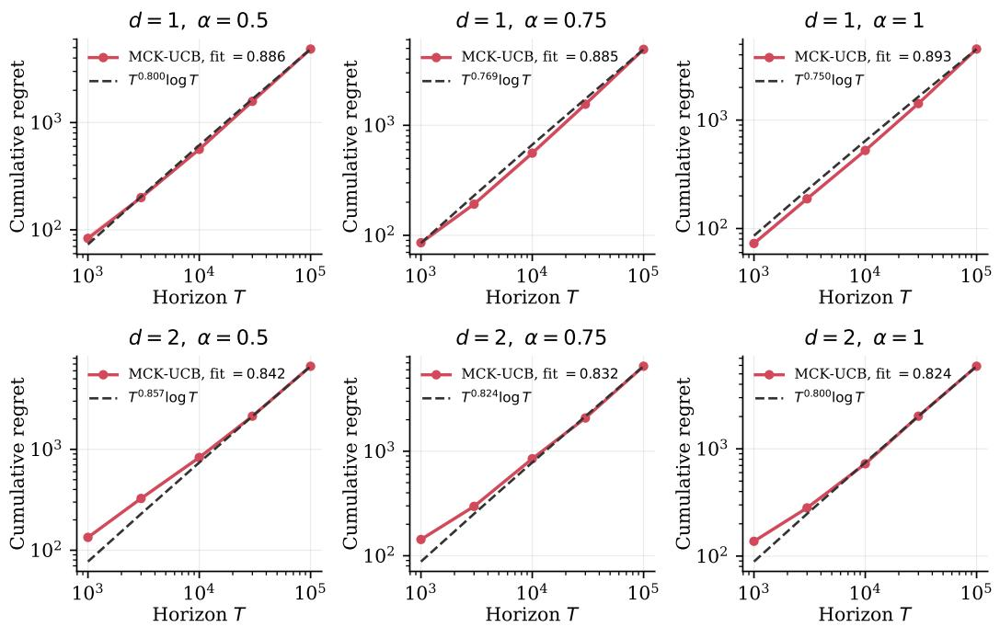
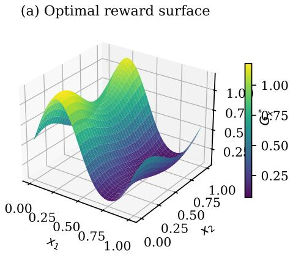
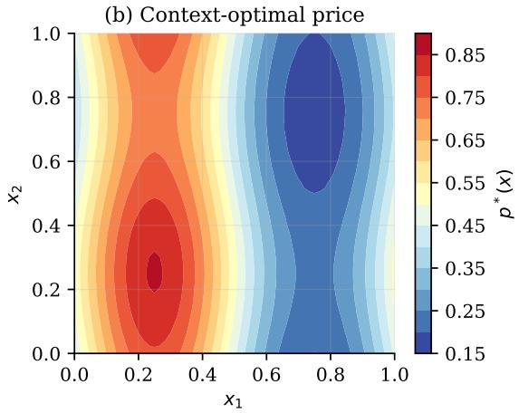
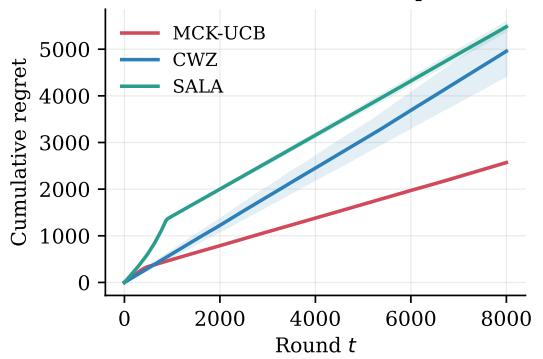
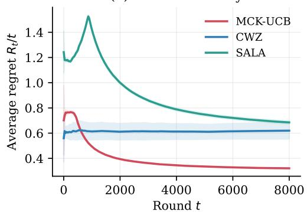
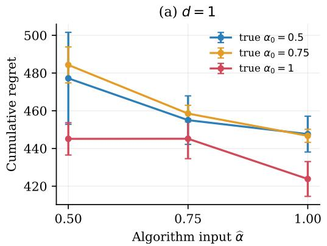
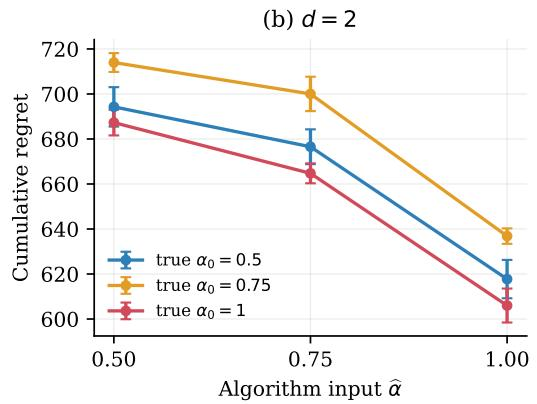

# NONPARAMETRIC CONTEXTUAL PRICING AND IN-VENTORY LEARNING UNDER CENSORED DEMAND

Zean Han\* Jing Liang\* Ruihan Lin Zezhen Ding† Jiheng Zhang

Department of Industrial Engineering and Decision Analytics The Hong Kong University of Science and Technology

zhanax@connect.ust.hk jliangcd@connect.ust.hk rlinah@connect.ust.hk zdingah@connect.ust.hk jiheng@ust.hk

## ABSTRACT

In online retailing, when a product sells out, a retailer often sees only the units sold, not how many customers would have bought it had inventory been available. However, the inventory level determines how much demand is revealed, and this information can influence subsequent decisions and future profits. We study an online selling problem in which, in each round, the seller observes a market context and then makes pricing and stocking decisions based on censored sales data from previous rounds. The challenge is to learn a context-dependent pricing and stocking policy without assuming a particular formula for demand or observing realized profit. To overcome this difficulty, we propose a Mean-Calibrated Kernel UCB (MCK-UCB) algorithm that turns each incomplete sales record into a reliable guide for both inventory and price decisions, using data from past rounds with similar market conditions. This design allows us to learn while serving customers, without a separate exploration phase or the need to recover all demand hidden by stockouts. We prove the minimax optimality of the proposed algorithm, with strictly faster rates when expected profit varies more smoothly with price. Comprehensive numerical experiments have been conducted to confirm the effectiveness of the proposed algorithm.

## 1 INTRODUCTION

Online retailers must repeatedly decide how much to charge and how much inventory to make available, often while demand is still being learned. When a product sells out, the retailer typically sees only the units sold, not how many customers would have bought the product had inventory been available. The sales record is therefore incomplete precisely when demand is strongest. Moreover, inventory affects not only current revenue but also what the seller can learn for future decisions. This missing-demand problem is a familiar obstacle in lost-sales settings (Besbes & Muharremoglu, 2013; Chen et al., 2021; 2024).

The problem becomes more realistic, and harder, when market conditions change. The same price may be attractive in one season, product category, or local market and unattractive in another. These market contexts arrive over time, and the seller cannot know in advance how customers in each context would respond to every possible price and inventory level. At the same time, the sales records available for learning are shaped by the seller’s own earlier stocking decisions: whenever inventory was too low, part of the demand was hidden.

Prior work has addressed important parts of this problem. Censored pricing–inventory models have been studied when the seller repeatedly faces the same demand environment (Chen et al., 2021; 2024). Feature-based inventory models show how censored sales can guide stocking decisions (Ding et al., 2024). Recent contextual pricing–inventory studies also use rich market information, but often start from historical data available before the policy is deployed (Tang et al., 2025; Hu et al., 2026). The online case considered here is different: the seller must learn from the censored records produced by its own past price and inventory decisions.

We study this problem in a nonparametric contextual setting, where demand may vary flexibly with both context and price. The seller cannot pool all past sales as if they came from the same market condition, but also cannot run a separate experiment to reveal the full demand curve at every context. This leads to the following central question:

How can a seller learn a context-dependent pricing and stocking policy when demand is censored by inventory decisions and no parametric demand model is available?

We answer this question through three contributions.

1. An observable learning signal under sales censoring. Sales-only feedback creates an identification problem: raw sales cannot be directly interpreted as either true demand or realized profit. We overcome this difficulty by constructing an observable learning signal from the sales record and end-of-period inventory. The signal uses stockouts and leftover inventory to guide stocking decisions, and uses the consistently visible part of sales as a reference for comparing prices. Intuitively, the seller need not recover the demand hidden by stockouts; it only needs the decision-relevant information that remains visible.

2. Context-aware learning with censored sales. Building on this observable signal, we develop the Mean-Calibrated Kernel UCB (MCK-UCB) algorithm for joint pricing and stocking. The algorithm pools observations only across nearby market contexts, profiles inventory where needed, and learns prices from the same censored sales collected while serving customers. This lets the seller adapt to changing market conditions without running a separate demand-revealing experiment for every context.

3. Minimax-optimal regret rates. We prove matching upper and lower bounds for the proposed method. Under Lipschitz price values, the minimax regret is $\widetilde { \Theta } \left( T ^ { \frac { d + 2 \alpha } { d + 3 \alpha } } \right)$ , while under twice-smooth price values it becomes $\widetilde { \Theta } \left( T ^ { \frac { 2 d + 3 \alpha } { 2 d + 5 \alpha } } \right)$ . These rates quantify the cost of contextual variation: higher context dimension makes learning harder, while smoother variation across contexts allows faster information sharing.

## 2 PROBLEM SETUP

We now describe exactly what the seller knows and what remains hidden. Let $\mathcal { X } = [ 0 , 1 ] ^ { d }$ be the context space, let $\mathcal { P } = [ p _ { \mathrm { m i n } } , p _ { \mathrm { m a x } } ]$ with $p _ { \operatorname* { m i n } } > 0$ be the price range, and let $\mathcal { A } = \mathcal { P } \times [ y _ { \mathrm { m i n } } .$ , ymax] be the set of price–inventory actions. The constants $b \geq 0$ and $h _ { c } \ \geq 0$ are the known per-unit lostsales and holding costs. A context can represent a customer, product, season, local market, or any other information available before the decision.

Operational timing. Inventory $y _ { t }$ is the quantity made available for the current selling period after observing $x _ { t }$ . The formulation represents perishable stock or replenishment between periods: there is no leftover-inventory state and no constraint tying $y _ { t }$ to the preceding period. The benchmark is therefore a contextual action applied repeatedly, rather than the state-dependent periodic-review benchmark in Chen et al. (2021).

At period $t ,$ a context $x _ { t }$ is drawn independently from a distribution $\mu .$ . After observing $x _ { t } .$ , the seller chooses $A _ { t } = ( p _ { t } , y _ { t } ) \in \mathcal { A }$ . Potential demand is $D _ { t } = \lambda ( x _ { t } , p _ { t } ) + \epsilon _ { t } ,$ , where $\lambda : \mathcal { X } \times \mathcal { P } $ R is unknown and conditional on $x _ { t } = x , \epsilon _ { t }$ has an unknown law $F _ { x }$ that does not depend on the chosen price. Given the context sequence, the noises are independent across periods and are fresh relative to past actions and observations. The seller observes only $O _ { t } = \operatorname* { m i n } \{ \bar { D } _ { t } , y _ { t } \}$ . The one-period profit is

$$
r ( ( p , y ) , D ) = p \operatorname* { m i n } \{ D , y \} - b ( D - y ) ^ { + } - h _ { c } ( y - D ) ^ { + } .
$$

The seller can compute the sales term and the stock level, but cannot compute the shortage term when demand exceeds inventory. This is the precise sense in which the reward is censored.

It is useful to separate two kinds of information in the sales record. When $O _ { t } < y _ { t }$ , demand was low enough that the sale reveals the realized demand. When $O _ { t } = y _ { t }$ , the seller only learns that demand reached the stock level. The number of customers who would have bought the product is hidden, and so is the lost-sales part of the profit. Raising inventory can reveal more demand but may also create holding cost; lowering inventory limits holding cost but can hide exactly the observations needed for future pricing. The learner therefore has to use the inventory decision both as an operational choice and as a way of controlling what future data will reveal.

Context makes this feedback problem more realistic but also more delicate. Sales from one market condition cannot simply be pooled with sales from every other condition, because demand levels and residual variation may change with the context. At the same time, treating every context as unrelated would waste the repetition present in nearby customer, product, or seasonal states. The policy must borrow information locally while remembering that both the best price and the right inventory level move with the context.

Define $Q _ { x } ( p , y ) = \mathbb { E } [ r ( ( p , y ) , D ) \mid x , p ] , \mu _ { x } ( p ) = \mathbb { E } [ D \mid x , p ] , G _ { x } ( p ) = \operatorname* { m a x } _ { y } Q _ { x } ( p , y )$ , and $V _ { x } = \operatorname* { m a x } _ { p } G _ { x } ( p )$ . We take a measurable maximizer $p _ { x } ^ { * } \in \arg \operatorname* { m a x } _ { p } G _ { x } ( p )$ . The policy regret is

$$
\mathsf { R e g } _ { T } ( \pi ) = \mathbb { E } _ { \pi } \left[ \sum _ { t = 1 } ^ { T } \{ V _ { x _ { t } } - Q _ { x _ { t } } ( p _ { t } , y _ { t } ) \} \right] .
$$

For inventory profiling, define the stockout probability $S _ { x } ( y \mid p ) = \mathbb { P } ( D \geq y \mid x , p )$ and the critical probability $\tau ( p ) = h _ { c } / ( p + b + h _ { c } )$ . When the conditional demand law is continuous,

$$
\partial _ { y } Q _ { x } ( p , y ) = ( p + b + h _ { c } ) \{ S _ { x } ( y \mid p ) - \tau ( p ) \} .
$$

Thus the stockout indicator gives an observable direction for inventory adjustment even though the full profit is censored.

The location model implies $\mu _ { x } ( p ) = \operatorname { \mathbb { E } } [ D \mid x , p ] = \lambda ( x , p )$ under the conditional mean-zero normalization $\mathbb { E } [ \epsilon _ { t } \ | \ x _ { t } = x ] = 0$ . This equality is used only for analysis; the algorithm does not estimate λ from uncensored means.

Structural assumptions. The assumptions support local information sharing, within-context price calibration, and inventory profiling from stockout events.

Assumption 1 (Context distribution). The contexts $x _ { 1 } , \ldots ,$ xT are i.i.d. draws from an arbitrary distribution supported on $[ 0 , 1 ] ^ { d }$ . No density or lower-mass condition is imposed.

Assumption 2 (Contextual location surface). For some $0 < \alpha \leq 1$ and finite $L _ { x } , L _ { p } , \mid \lambda ( x , p ) -$ $\lambda ( x ^ { \prime } , p ) \bar { | } \leq L _ { x } \left\| x - x ^ { \prime } \right\| ^ { \alpha }$ and $| \lambda ( x , p ) - \lambda ( x , q ) | \leq L _ { p } | p - q |$ . The surface is uniformly bounded and keeps demand nonnegative almost surely.

Assumption 3 (Context-conditioned shared noise and observable quantile). For every $x \in { \mathcal { X } } ,$ , the conditional noise law $F _ { x }$ is shared across all prices. It has mean zero, common compact support $[ \underline { { z } } , \overline { { z } } ]$ , continuous distribution function $F _ { x }$ , and density $f _ { x } .$ . For $u \in ( 0 , 1 )$ , write $z _ { u } ( x ) = F _ { x } ^ { - 1 } ( u )$ Define

$$
\phi ( p ) = \frac { p + b } { p + b + h _ { c } } , \qquad z _ { p } ( x ) = z _ { \phi ( p ) } ( x ) .
$$

There are a known $\rho \in ( 0 , \operatorname* { i n f } _ { p \in { \mathcal { P } } } \phi ( p ) )$ and constants $\kappa , K , m _ { q } , r _ { q } , L _ { F } > 0$ such that thefollowing hold uniformly in $x , x ^ { \prime } .$ . The density is bounded on its support and locally bounded away from zero around the calibration and critical quantiles:

$$
0 \leq f _ { x } ( u ) \leq K , \qquad f _ { x } ( u ) \geq \kappa \quad i f \quad | u - z _ { \rho } ( x ) | \leq r _ { q } o r | u - z _ { p } ( x ) | \leq r _ { q } f o r s o m e \ p \in \mathcal { P } .
$$

The visible calibration quantile is separatedfrom the critical quantile:

$$
z _ { p } ( x ) - z _ { \rho } ( x ) \geq m _ { q } \qquad f o r \mathop { a l l } \ : p \in \mathcal { P } .
$$

Finally, the noisefamily is Holder in context in Kolmogorov distance:¨

$$
\operatorname* { s u p } _ { u \in \mathbb { R } } \left| F _ { x } ( u ) - F _ { x ^ { \prime } } ( u ) \right| \leq L _ { F } \left. x - x ^ { \prime } \right. ^ { \alpha } .
$$

Remark 1 (Role and scope of context-conditioned sharing). The seller is not required to face the same randomness in every context: $F _ { x }$ may differfrom $F _ { x ^ { \prime } }$ . The key restriction is that, conditional on a context, changing the price shifts the demand location without changing the residual shape. This creates a common calibration reference across prices, but it does not cover an arbitraryfamily $F _ { x , p } .$

Remark 2 (No revealing cap). Compact support makes profit and regret bounded, but the support endpoint need not be known or feasible as inventory; in particular, we allow $y _ { \mathrm { m a x } } <$ $\mathrm { \bar { s u p } } _ { x , p } \{ \bar { \lambda ( x , p ) } + \overline { { z } } \}$ . The algorithm uses neither this endpoint nor a demand-revealing action.

Assumption 4 (Inventory regularity and quantile visibility). For every x, p, the equation $S _ { x } ( y \mid$ $p ) = \tau ( p )$ has a unique solution $y _ { x } ^ { * } ( p )$ in the interior of the inventory interval. There are constants $r _ { y } , c _ { y } , C _ { y } > 0$ such that

$$
c _ { y } | y - y _ { x } ^ { * } ( p ) | \leq | S _ { x } ( y \mid p ) - \tau ( p ) | \leq C _ { y } | y - y _ { x } ^ { * } ( p ) |
$$

whenever $| y - y _ { x } ^ { * } ( p ) | \leq r _ { y }$ . Moreover, $G _ { x } ( p ) - Q _ { x } ( p , y ) \leq C _ { y } | y - y _ { x } ^ { * } ( p ) | ^ { 2 }$ on the same neighborhood. The visible-quantile condition requires

$$
y _ { \operatorname* { m i n } } + r _ { y } \le q _ { \rho } ( x , p ) : = \lambda ( x , p ) + z _ { \rho } ( x ) \le y _ { x } ^ { * } ( p ) - m _ { q } \le y _ { \operatorname* { m a x } } - r _ { y } .
$$

Assumption 5 (Price-value regularity). The optimized value is uniformly Lipschitz: $| G _ { x } ( p ) -$ $G _ { x } ( q ) | ~ \leq ~ L _ { G } | p - q |$ . For the smooth-price specialization, we strengthen this condition to $\begin{array} { r } { \operatorname* { s u p } _ { x , p } | \partial _ { p p } G _ { x } ( p ) | \leq L _ { G , 2 } } \end{array}$

How to read these restrictions. The assumptions are meant to isolate the censoring issue rather than to make demand fully observable. Contexts may arrive from an uneven distribution, and some regions may be visited rarely. The learner is not promised a revealing inventory level that uncensors every demand realization. What is available is more modest: nearby contexts have related demand behavior, within a fixed context the residual shape is shared across prices, and a low quantile remains below the critical stocking level. These are exactly the ingredients needed to compare prices from sales records without reconstructing the whole demand distribution.

This distinction matters for the interpretation of the model. The shared-noise condition is not saying that all contexts face the same demand shocks; the noise law may change with the context. It is saying that, once a context is fixed, changing the price shifts the demand location while preserving a common within-context reference. The visible-quantile condition then gives the algorithm a calibration mark that survives censoring. The rest of the paper uses these two facts to turn censored observations into a context-dependent price-learning signal.

Knowledge boundary. The learner knows the horizon, context dimension, action ranges, cost parameters, smoothness exponent, visible quantile level, and kernel. It does not know the demand surface, the context-specific noise laws, the critical inventory levels, or the optimal prices. The fixed tuning convention and the technical consequences of the assumptions are stated in Sections B.1 and B.2.

For $\varepsilon > 0$ , let $\Gamma ( \varepsilon )$ denote the uniform price grid over P with mesh at most $\varepsilon ,$ including both endpoints.

## 3 MEAN-CALIBRATED KERNEL UCB

The construction has three moving pieces: an observable sales-based score, an inventory profiler that makes a low quantile visible, and a contextual UCB rule that compares calibrated prices. The next paragraphs define these pieces before Algorithm 1 records the full policy.

Sales proxy and contextual calibration. The seller needs a score that can be computed from the sales record, even when the lost-sales penalty cannot be computed directly. We construct such a score in two steps. First, we choose the coefficient on leftover stock so that the observable score points toward the same inventory decision as true profit. For $Z _ { c } ( p , y , O ) = p O - c ( p ) ( y - O )$ matching the stockout and nonstockout inventory slopes gives $c ( p ) = p h _ { c } / ( p + b )$ . After normalization, the observable score is $Y ( p , y , O ) = ( p \dot { + } b ) \dot { O } - \mathsf { \bar { h } } _ { c } ( y - \overset { \cdot } { O } )$

This score satisfies the sample-path identity ${ \cal Y } ( p , y , { \cal O } ) ~ = ~ r ( ( p , y ) , { \cal D } ) + b { \cal D }$ Thus, with $\overline { { Q } } _ { x } ( p , y ) \ = \ \mathbb { E } [ Y ( p , y , O ) \ | \ x , p , y ]$ , we have $\overline { { { Q } } } _ { x } ( p , y ) \ : = \ : Q _ { x } ( p , y ) \ : + \ : b \mu _ { x } ( p )$ ; the proxy preserves inventory maximizers and inventory regret gaps. Price comparison still needs one correction: defining $\overline { { G } } _ { x } ( p ) = \operatorname* { m a x } _ { y } \overline { { Q } } _ { x } ( p , y )$ and $q _ { \rho } ( x , p ) = \lambda ( x , p ) + z _ { \rho } ( x )$ , the calibrated target satisfies ${ \overline { { G } } } _ { x } ( p ) - b q _ { \rho } ( x , p ) = G _ { x } ( p ) - b z _ { \rho } ( x )$ . At a fixed context, the remaining offset is common to all prices. Formal statements are collected in Section B.2.

The intuition is an accounting one. The observable score is not the profit; it differs from profit by bD, a demand term the seller does not observe in stockout periods. For inventory choice at a fixed price and context, this extra term is harmless because it does not depend on the stock level. The same sales record can therefore tell the seller which way to move inventory without revealing the missing tail of demand.

The difficulty is price comparison. A price that produces larger mean demand also produces a larger $b \mu _ { x } ( p )$ shift in the observable score, so optimizing the raw score can rank prices differently from optimizing profit. Calibration removes precisely this price-dependent shift. Once the profiler makes a lower demand quantile visible, subtracting $b q _ { \rho } ( x , p )$ leaves only the common context term $- b z _ { \rho } ( x )$ . That common term can vary from one context to another, but within the same context it is shared by all prices, so it does not change the price ranking.

Inventory profiling. Before comparing prices, the seller needs an inventory level that makes $q _ { \rho } ( x , p )$ visible. The profiler searches for this level using only stockout indicators. Once the profiled inventory is safely above $q _ { \rho } ( x , p )$ , the lower ρ-quantile of sales equals the corresponding demand quantile.

Let $K : \mathbb { R } ^ { d }  [ 0 , 1 ]$ be a compactly supported Lipschitz kernel with $K ( u ) = 0$ for $\| u \| > 1$ and $K ( u ) \ge k _ { 0 } > 0$ for $\| u \| \le 1 / 2$ . Set $h _ { \mathrm { p r o f } } : = \varepsilon ^ { 1 / ( 2 \alpha ) } = \sqrt { h }$ and $\Gamma _ { \mathrm { p r o f } } : = \Gamma ( \sqrt { \varepsilon } )$ . Partition $[ 0 , 1 ] ^ { d }$ into a deterministic collection $\{ C _ { z } ^ { \mathrm { p r o f } } : z \in \mathcal { Z } _ { \mathrm { p r o f } } \}$ of axis-aligned cells with diameter at most $h _ { \mathrm { p r o f } }$ . We use z for a representative point of $C _ { z } ^ { \mathrm { p r o f } }$ . Then $| \mathcal { Z } _ { \mathrm { p r o f } } | \le C h _ { \mathrm { p r o f } } ^ { - d }$ . These profiler cells are deliberately coarser than the bandwidth-h cells used only in the kernel counting proof. The asynchronous policy and its profiling-action bound do not require a lower bound on the probability of any cell.

Profiler implementation. For each profiler cell and anchor price $a \in \Gamma _ { \mathrm { p r o f } } .$ , the profiler maintains a bisection interval for the root of $S _ { x } \bar { ( } y \mid a ) = \tau ( a )$ . At a candidate stock level it asks whether a stockout occurred, and then moves the interval up or down. After a batch of observations it stops when the remaining inventory uncertainty is small enough to cause only $O ( \varepsilon )$ value loss. Profiling is asynchronous across cells: a context only advances the unfinished cell it actually belongs to, and a completed cell can immediately start using UCB. For a fine-grid decision price $p ,$ the policy reuses the profile at the nearest anchor instead of running a new inventory search. This is why the algorithm pays for inventory profiling on a coarse grid, while retaining a fine grid for price learning. The oneround profiler update is given in Algorithm 2. The guarantee in Lemma 2 shows that, at $\varepsilon = h ^ { \alpha }$ completed cells return inventories within $O ( \sqrt \varepsilon )$ of the critical level, keep the inventory value loss at $O ( \varepsilon )$ , make $q _ { \rho } ( x , p )$ visible, and use only $\widetilde { \cal O } ( h ^ { - d / 2 } \varepsilon ^ { - 3 / 2 } )$ profiling rounds.

Contextual UCB layer. Once a context cell has a safe inventory profile, the seller can return to price learning. The UCB layer combines two kernel estimates from the same sales history: one for the observable proxy and one for the visible quantile used to calibrate it. The raw proxy is not optimized directly because its price-dependent shift could favor the wrong price. Throughout the UCB concentration and counting analysis, write $\Gamma : = \Gamma _ { \mathrm { d e c } }$ ; the profiler grid is always denoted separately by $\Gamma _ { \mathrm { p r o f } }$

Let $\mathcal T _ { t } ( p )$ be the UCB rounds before t on which price p was played. The kernel effective sample size, proxy estimate, weighted sales CDF, and empirical calibration quantile are

$$
\begin{array} { r l r } {  { W _ { t } ( x , p ) = \sum _ { s \in \mathcal { T } _ { t } ( p ) } K ( ( x _ { s } - x ) / h ) , } } \\ & { } & { \widehat { G } _ { t } ( x , p ) = \frac { \sum _ { s \in \mathcal { T } _ { t } ( p ) } K ( ( x _ { s } - x ) / h ) Y _ { s } } { W _ { t } ( x , p ) } , } \\ & { } & { \widehat { F } _ { t } ( u \mid x , p ) = \frac { \sum _ { s \in \mathcal { T } _ { t } ( p ) } K ( ( x _ { s } - x ) / h ) \mathbf { 1 } \{ O _ { s } \leq u \} } { W _ { t } ( x , p ) } , } \\ & { } & { \widehat { q } _ { \rho , t } ( x , p ) = \operatorname* { i n f } \{ u \in [ 0 , y _ { \operatorname* { m a x } } ] : \widehat { F } _ { t } ( u \mid x , p ) \geq \rho \} . } \end{array}
$$

The ratio-based estimates are used only when $W _ { t } ( x , p ) ~ > ~ 0$ . For $W _ { t } ( x , p ) ~ > ~ 0$ , the weighted empirical CDF is a right-continuous step function determined by finitely many observed triples. The displayed infimum is therefore a measurable statistic of the history. At zero weight the estimate is left undefined and the algorithm uses the infinite index directly. Define the corrected estimate $\widehat { G } _ { t } ^ { \mathrm { c a l } } ( x , p ) = \widehat { \overline { { G } } } _ { t } ( x , p ) - b \widehat { q } _ { \rho , t } ( x , p )$

Algorithm 1 Mean-Calibrated Kernel UCB (MCK-UCB)   
Require: horizon $T ,$ context smoothness $\alpha ,$ visible quantile level $\rho ,$ price mode $s \in$ {Lip, smooth},   
fixed tuning constants $C _ { \mathrm { t u n e } } , h _ { \mathrm { v i s } }$   
1: Fix $a _ { \mathrm { f b } } = ( p _ { \mathrm { m i n } } , y _ { \mathrm { m i n } } )$ and set $\delta = T ^ { - 2 }$   
2: if $s =$ Lip then   
3: Set $\dot { h ^ { \smash { - } } } ( \log ( e T ) / T ) ^ { 1 / ( d + 3 \alpha ) } , \varepsilon = h ^ { \alpha }$ , and $\Delta _ { \mathrm { d e c } } = \varepsilon$   
4: else   
5: Set $h = ( \log ( e T ) / T ) ^ { 2 / ( 2 d + 5 \alpha ) } , \varepsilon = h ^ { \alpha }$ , and $\Delta _ { \mathrm { d e c } } = \sqrt { \varepsilon }$   
6: Set $\Gamma _ { \mathrm { d e c } } = \Gamma ( \Delta _ { \mathrm { d e c } } ) , \Gamma _ { \mathrm { p r o f } } = \Gamma ( \sqrt { \varepsilon } ) .$ , and $h _ { \mathrm { p r o f } } = \varepsilon ^ { 1 / ( 2 \alpha ) } ;$ construct ${ \mathcal { Z } } _ { \mathrm { p r o f } }$ with cell diameter   
at most $h _ { \mathrm { p r o f } } .$ , and initialize the persistent anchor-profiler states in Algorithm 2   
7: if $h > h _ { \mathrm { v i s } }$ then   
8: Play $a _ { \mathrm { f b } }$ on all $T$ rounds and stop   
9: for round $t = 1 , \dots , T$ do   
10: Observe context $x _ { t }$ and let $z = z _ { \mathrm { p r o f } } ( x _ { t } )$   
11: if cell z is not profiled then   
12: Execute the one-round update in Algorithm $2$ and continue   
13: Compute $U _ { t } ( x _ { t } , p ) = + \infty$ if $W _ { t } ( x _ { t } , p ) = 0 ,$ , and otherwise use   
$U _ { t } ( x _ { t } , p ) = \widehat { G } _ { t } ^ { \mathrm { c a l } } ( x _ { t } , p ) + C _ { \mathrm { t u n e } } \sqrt { \frac { \log ( T | \Gamma _ { \mathrm { d e c } } | / h ) } { \operatorname* { m a x } \{ 1 , W _ { t } ( x _ { t } , p ) \} } + C _ { \mathrm { t u n e } } ( \varepsilon + h ^ { \alpha } ) }$   
14: Choose $p _ { t } \in \arg \operatorname* { m a x } _ { p \in \Gamma _ { \mathrm { d e c } } } U _ { t } ( x _ { t } , p )$ , let $a _ { t } = \pi ( p _ { t } )$ and $y _ { t } = \widetilde { y } _ { z } ( a _ { t } )$ , play $( p _ { t } , y _ { t } )$ , and   
observe $O _ { t }$   
15: Append $\left( { { x } _ { t } } , { { O } _ { t } } , { { Y } _ { t } } \right)$ , where $Y _ { t } = ( p _ { t } + b ) O _ { t } - h _ { c } ( y _ { t } - O _ { t } )$ , to the history of $p _ { t }$

MCK-UCB implementation. For price mode $s \ : = \ : \mathrm { L i p }$ , the decision grid has spacing $h ^ { \alpha . }$ for $s =$ smooth, it has spacing $h ^ { \alpha / 2 }$ . In both modes, the context bandwidth is $h ,$ , the target value accuracy is $\varepsilon = h ^ { \alpha }$ , and inventory is profiled on the coarser resolution $h _ { \mathrm { p r o f } } = { \sqrt { h } }$ . On every round, the policy first checks whether the arriving context belongs to an unfinished profiler cell. If $\mathbf { S O } _ { 3 }$ , that round advances the cell’s inventory search. Otherwise the policy computes a calibrated optimistic value for each decision price, chooses the largest one, and reuses the profiled inventory at the nearest anchor. It then stores the observed sale and proxy in that price’s history.

Design choices. The policy is not a separate explore-then-exploit scheme. Each context cell keeps its own profiling state, and a cell switches to price learning as soon as its anchor inventories are certified. This matters when the context distribution is uneven: frequently visited cells should not wait for rare cells, while rare cells should not be forced into price learning before the sales quantile is visible.

The two resolutions also serve different roles. Inventory is profiled on a coarser price grid because the profiler only needs to make the calibration quantile safely observable and keep inventory loss small. Price learning uses a finer decision grid because price comparison is the final optimization problem. Sharing inventory profiles from nearby anchors reduces the number of rounds spent on profiling without changing the calibrated target used by UCB.

The startup fallback makes the policy well defined before the certified visibility resolution is available. Otherwise the policy never waits for global profiler completion: sparse cells remain in profiling mode, while completed cells accumulate UCB observations. The deterministic number of profiling actions is of order $O ( | \Gamma _ { \mathrm { p r o f } } | h _ { \mathrm { p r o f } } ^ { - d } \varepsilon ^ { - 1 } \log ^ { 2 } T ) = \widetilde O ( h ^ { - d / 2 } \varepsilon ^ { - 3 / 2 } ) ;$ all other rounds are UCB rounds. For all sufficiently large $T , \bar { h \cdot \leq \bar { h } _ { \mathrm { v i s } } }$ . The finitely many earlier horizons are covered by bounded regret and a larger theorem constant.

Remark 3 (Concentration and counting). Once a context cell is profiled, the UCB rule behaves like a local price learning problem. The effective sample size is $W _ { t } ( x , \bar { p } )$ , so the statistical uncertainty decreases at the usual $O ( W _ { t } ( x , p ) ^ { - 1 / 2 } )$ scale. The remaining $O ( \varepsilon + h ^ { \alpha } )$ terms come from price resolution and contextual smoothing. Summed along the realized trajectory, the local uncertainties contribute $O ( { \sqrt { T | \Gamma | h ^ { - d } } } )$ . The formal concentration and counting statements are collected in Section F.

## 4 MAIN RESULTS

Let $\Im _ { \mathrm { L i p } }$ denote the instance class satisfying Assumptions 1 to 5 with Lipschitz price values, and let $\Im _ { \mathrm { s m } }$ be its twice-smooth specialization. The formal upper and lower statements, including the fixed numerical envelopes and tuning constants, are given in Section B.

Theorem 1 (Minimax rates for contextual censored sales). Forfixed $b , h _ { c } > 0$ , MCK-UCB achieves the minimax regret rate, up to logarithmicfactors, in both price classes:

$$
\operatorname* { i n f } _ { \pi } \operatorname* { s u p } _ { \mathcal { Z } \in \mathfrak { I } _ { \mathrm { L i p } } } \mathsf { R e g } _ { T } ( \pi ; \mathcal { Z } ) = \widetilde { \Theta } \Big ( T ^ { \frac { d + 2 \alpha } { d + 3 \alpha } } \Big ) , \qquad \operatorname* { i n f } _ { \pi } \operatorname* { s u p } _ { \mathcal { Z } \in \mathfrak { I } _ { \mathrm { s m } } } \mathsf { R e g } _ { T } ( \pi ; \mathcal { Z } ) = \widetilde { \Theta } \Big ( T ^ { \frac { 2 d + 3 \alpha } { 2 d + 5 \alpha } } \Big ) .
$$

The rates quantify the cost of contextual variation. Larger d spreads observations across more local neighborhoods, while larger α allows stronger sharing across nearby contexts. The twice-smooth price class improves the exponent because a coarser price grid is enough to achieve the same ap proximation accuracy.

Where the rates come from. The upper bound has three visible sources. First, the policy spends rounds profiling inventory in coarse context cells and at coarse price anchors. This is the cost of making the calibration quantile observable. Second, after a cell is profiled, the policy runs a contextual optimistic search over prices; nearby contexts share observations through the kernel, but the effective sample size is still local. Third, the continuous price interval is replaced by a finite grid, which creates approximation error.

Suppressing logarithms and constants, the regret accounting has the form

$$
h ^ { - d / 2 } \varepsilon ^ { - 3 / 2 } \ + \ T \varepsilon \ + \ \sqrt { T | \Gamma | h ^ { - d } } .
$$

Here h is the context bandwidth, $\varepsilon \ = \ h ^ { \alpha }$ is the target value accuracy, and |Γ| is the number of decision prices. The first term is profiling, the second is local approximation and inventory error, and the third is the accumulated statistical uncertainty from contextual price learning. For Lipschitz price values, $| \Gamma | \asymp \varepsilon ^ { - 1 }$ , and balancing the last two terms gives the exponent $( d + \bar { 2 } \alpha ) / ( d + 3 \alpha )$ When the optimized value is twice smooth in price, the grid can be coarser, $| \Gamma | \asymp \varepsilon ^ { - 1 / 2 }$ , giving $( 2 d + 3 \alpha ) / ( 2 d + 5 \alpha )$ . The profiling term is designed to remain lower order at these choices.

The matching lower bound says that these costs cannot all be avoided. Censored sales do not contain enough information to reveal the hidden tail for free, and context variation prevents all observations from being pooled into one global pricing problem. The theorem therefore reflects the intrinsic cost of learning from censored contextual demand, not only the design of MCK-UCB.

## 5 EXPERIMENTS

The experiments ask whether the main pieces of the theory behave as expected in finite samples. We instantiate the model with a controlled homoskedastic specification $\dot { F _ { x } } \equiv \mathrm { U n i f } [ - a , a ]$ , which isolates the effects of context dimension, Holder smoothness, inventory profiling, and contextual¨ pooling while preserving the within-context sharing structure used by the algorithm. Complete environment definitions, tuning parameters, baseline specifications, and additional diagnostics are given in Section C.

We vary the horizon, context dimension, and contextual smoothness. For $T \in$ {1000, 3000, 10000, 30000, 100000}, we run five independent repetitions for each pair $( d , \alpha ) \ \in$ $\{ ( 1 , 0 . 5 ) , ( 1 , 0 . 7 5 ) , ( 1 , 1 ) , ( 2 , 0 . 5 ) , ( 2 , 0 . 7 5 ) , ( 2 , 1 ) \}$ . Figure 1 reports mean cumulative regret with 95% confidence bands. The dashed reference in each panel is $T ^ { \beta ( d , \alpha ) } \log T$ , where $\beta ( d , \alpha ) ~ =$ $( d + 2 \alpha ) / ( d + 3 \alpha )$

  
Figure 1: Cumulative-regret scaling of the paper-aligned MCK-UCB policy for different context dimensions d and Holder exponents ¨ α. Solid curves are means over five exogenous trajectories, shaded regions are 95% confidence intervals, and dashed curves give representative $T ^ { \beta ( d , \alpha ) } \log T$ guides.

The fitted log–log slopes, ordered by the panels, are 0.886, 0.885, 0.893, 0.842, 0.832, and 0.824. The corresponding pure-power exponents are 0.800, 0.769, 0.750, 0.857, 0.824, and 0.800. All six finite-sample fits are sublinear. The dashed guides should be read as a scaling diagnostic rather than an estimate of the asymptotic minimax exponent: the experiment is deliberately narrower than the theory, but it shows that the policy can learn from sales-only feedback in a context-dependent environment. Appendix C reports the context geometry, baseline comparisons, smoothness-mismatch diagnostic, and implementation details.

## 6 RELATED WORK

This paper sits at the intersection of four literatures: censored inventory learning, online pricing and inventory control, contextual bandits, and partial monitoring.

Table 1 highlights the main distinction. Prior work typically has context without online joint pricing– inventory learning, or joint pricing–inventory learning without context. Our setting requires both: the same censored sale must guide inventory, price comparison, and local information sharing across market conditions.

Censored pricing and inventory learning. Besbes & Muharremoglu (2013) show that sales-only feedback changes the exploration problem even when inventory is the only decision. The closest pricing–inventory papers are Chen et al. (2021) and Chen et al. (2024). They study nonparametric learning with lost sales and censored demand, but in a context-free setting. The former uses high-inventory exploration and spline estimation, while the latter estimates reward differences from censored data and uses structured search. We retain their useful within-context location-modeling convention, but add contextual pooling and a decision-equivalent calibration target.

Ding et al. (2024) study feature-based inventory control with censored demand and construct an inventory-oriented stochastic subgradient. Our setting also needs the same censored sale to support price comparison, which creates the price-calibration step.

Table 1: Setting comparison with closely related work.
<table><tr><td>Work</td><td>Context</td><td>Decisions</td><td>Feedback and deployment</td></tr><tr><td>Besbes &amp; Muharremoglu (2013)</td><td>No context</td><td>Inventory only</td><td>Online lost-sales feedback; no price decision.</td></tr><tr><td>Chen et al. (2021; 2024)</td><td>No context</td><td>Price and inventory</td><td>Online sales-only feedback; nonparametric but context-free.</td></tr><tr><td>Ding et al. (2024)</td><td>Features or context</td><td>Inventory only</td><td>Online censored-demand inventory control; no price calibration.</td></tr><tr><td>Tang et al. (2025); Hu et al. (2026)</td><td>Features or context</td><td>Pricing or pricing-inventory</td><td>Historical data are available before deployment, rather than collected only</td></tr><tr><td>Abernethy et al. (2016); Verma et al. (2019)</td><td>Model dependent</td><td>Threshold or resource actions</td><td>online. Abstract censored-feedback models, not lost-sales profit with an endogenous</td></tr><tr><td>This paper</td><td>Nonparametric context</td><td>Price and inventory</td><td>inventory threshold. Online sales-only feedback; learns by</td></tr></table>

Contextual and offline pricing–inventory learning. Tang et al. (2025) study feature-based pricing with finite inventory and censored demand using an offline data set of historical features, prices, inventory, and sales. Hu et al. (2026) study contextual joint pricing and inventory control from historical data using a conditional generative model. These works use rich context information but study historical data available before policy deployment. Gundem & Qi (2025) also studies offline sequential pricing and inventory with censored, dependent demand.

Partial monitoring and contextual bandits. Abernethy et al. (2016) analyze threshold bandits in which feedback is revealed only on one side of a threshold, and Verma et al. (2019) study censored semi-bandits for resource allocation. The nonparametric contextual bandit literature studies how nearby contexts can share information (Rigollet & Zeevi, 2010; Perchet & Rigollet, 2013; Qian & Yang, 2016; Guan & Jiang, 2018; Reeve et al., 2018), while Krishnamurthy et al. (2020); Gur et al. (2022) consider continuous actions and smoothness. These papers generally assume that an unbiased reward or loss is available after the action. Here the inventory threshold is endogenous, the reward is a continuous lost-sales profit, and neither the reward nor its gradient is observed.

Contextual dynamic pricing. Qiang & Bayati (2016) and Wang et al. (2025) study pricing with observed covariates under parametric or partially specified demand models. Wang et al. (2021) study nonparametric continuous-action pricing when the observed-reward function may be multimodal. These papers clarify the value of contextual information and of avoiding global concavity, but they do not jointly model an endogenous inventory level that censors the reward. Our contribution is the interaction of these ingredients, together with matching upper and lower bounds under the stated shared-noise subclass.

## 7 CONCLUSION

We studied a seller who must make two decisions at once: how much to charge and how much to stock. The seller sees the context and the resulting sales, but not the demand that was turned away. We showed that, under a nonparametric contextual location model, the visible part of censored sales can still support joint pricing and stocking. MCK-UCB combines inventory profiling, local contextual pooling, and calibrated price learning, and achieves matching minimax rates for the stated Lipschitz and twice-smooth price classes.

The result remains a per-period model without inventory carryover or lead times, and the sharednoise location structure does not cover arbitrary price-dependent noise distributions. Extensions to dynamic inventory states, weaker feedback, or a more general conditional demand law are natural directions for future work.

## REFERENCES

Jacob D. Abernethy, Kareem Amin, and Ruihao Zhu. Threshold bandits, with and without censored feedback. In Advances in Neural Information Processing Systems, volume 29, pp. 4889–4897, 2016.

Omar Besbes and Alp Muharremoglu. On implications of demand censoring in the newsvendor problem. Management Science, 59(6):1407–1424, 2013. doi: 10.1287/mnsc.1120.1654.

Boxiao Chen, Xiuli Chao, and Cong Shi. Nonparametric learning algorithms for joint pricing and inventory control with lost sales and censored demand. Mathematics ofOperations Research, 46 (2):726–756, 2021. doi: 10.1287/moor.2020.1084.

Boxiao Chen, Yining Wang, and Yuan Zhou. Optimal policies for dynamic pricing and inventory control with nonparametric censored demands. Management Science, 70(5):3362–3380, 2024.

Jingying Ding, Woonghee Tim Huh, and Ying Rong. Feature-based inventory control with censored demand. Manufacturing & Service Operations Management, 26(3):1157–1172, 2024. doi: 10. 1287/msom.2021.0135.

Melody Y. Guan and Heinrich Jiang. Nonparametric stochastic contextual bandits. In Proceedings of the Thirty-Second AAAI Conference on Artificial Intelligence, pp. 3119–3125, 2018. doi: 10. 1609/aaai.v32i1.11749.

Korel Gundem and Zhengling Qi. Offline dynamic inventory and pricing strategy: Addressing censored and dependent demand. arXiv preprint arXiv:2504.09831, 2025.

Yonatan Gur, Ahmadreza Momeni, and Stefan Wager. Smoothness-adaptive contextual bandits. Operations Research, 70(6):3198–3216, 2022. doi: 10.1287/opre.2021.2215.

Xiangbin Hu, Xianghua Jiang, Zhisheng Ye, and Xun Zhang. Conditional generative learning for joint pricing and inventory control. Working paper, minor revision at Manufacturing & Service Operations Management, 2026.

Akshay Krishnamurthy, John Langford, Aleksandrs Slivkins, and Chicheng Zhang. Contextual bandits with continuous actions: Smoothing, zooming, and adapting. Journal of Machine Learning Research, 21(137):1–45, 2020.

Vianney Perchet and Philippe Rigollet. The multi-armed bandit problem with covariates. The Annals ofStatistics, 41(2):693–721, 2013. doi: 10.1214/13-AOS1101.

Wei Qian and Yuhong Yang. Kernel estimation and model combination in a bandit problem with covariates. Journal ofMachine Learning Research, 17(149):1–37, 2016.

Sheng Qiang and Mohsen Bayati. Dynamic pricing with demand covariates. arXiv preprint arXiv:1604.07463, 2016.

Henry Reeve, Joseph Mellor, and Gavin Brown. The k-nearest neighbour ucb algorithm for multiarmed bandits with covariates. In Proceedings of Algorithmic Learning Theory, pp. 725–752, 2018.

Philippe Rigollet and Assaf Zeevi. Nonparametric bandits with covariates. In Proceedings of the 23rd Annual Conference on Learning Theory, pp. 54–66, 2010.

Jingwen Tang, Zhengling Qi, Ethan Fang, and Cong Shi. Offline feature-based pricing under censored demand: A causal inference approach. Manufacturing & Service Operations Management, 27(2):535–553, 2025. doi: 10.1287/msom.2024.1061.

Arun Verma, Manjesh K. Hanawal, Arun Rajkumar, and Raman Sankaran. Censored semi-bandits: A framework for resource allocation with censored feedback. In Advances in Neural Information Processing Systems, volume 32, 2019.

Hanzhao Wang, Kalyan Talluri, and Xiaocheng Li. Technical note: On dynamic pricing with covariates. Operations Research, 73(4):1932–1943, 2025.

Yining Wang, Boxiao Chen, and David Simchi-Levi. Multi-modal dynamic pricing. Management Science, 67(10):6136–6152, 2021.

## A ALGORITHM LISTINGS

Algorithm 2 One-Round Two-Resolution Inventory Profiler Update   
Require: horizon $T ,$ coarse profiler partition ${ \mathcal { Z } } _ { \mathrm { p r o f } } .$ , current context $x _ { t }$ , its cell $z = z _ { \mathrm { p r o f } } ( x _ { t } )$   
persistent profiler state for $z ,$ value accuracy ε, anchor grid $\Gamma _ { \mathrm { p r o f } }$ , confidence level $\delta ,$ fixed   
tuning constant $C _ { \mathrm { t u n e } }$   
1: At initialization, set $\overset { \_ } { \eta } = \sqrt { \varepsilon }$ and   
$B _ { y } = 1 + \left\lceil \log _ { 2 } \left( 1 + \frac { y _ { \mathrm { m a x } } - y _ { \mathrm { m i n } } } { C _ { \mathrm { t u n e } } \eta } \right) \right\rceil , \qquad m _ { y } = \left\lceil C _ { \mathrm { t u n e } } \eta ^ { - 2 } \log ( T | \Gamma _ { \mathrm { p r o f } } | | \mathcal { Z } _ { \mathrm { p r o f } } | B _ { y } / \delta ) \right\rceil$   
2: At initialization, for every $( z , a ) \in \mathcal { Z } _ { \mathrm { p r o f } } \times \Gamma _ { \mathrm { p r o f } }$ , initialize $[ L _ { z , a } , U _ { z , a } ] = [ y _ { \mathrm { { m i n } } } , y _ { \mathrm { { m a x } } } ]$   
3: Select the next unfinished anchor a in the round-robin schedule of cell z   
4: Set $p _ { t } = a$ and $y _ { t } = ( L _ { z , a } + U _ { z , a } ) / 2 ,$ , play $( p _ { t } , y _ { t } )$ , observe $O _ { t } ,$ and append $I _ { t } = \mathbf { 1 } \{ O _ { t } \geq y _ { t } \}$   
to the current batch of $( z , a )$   
5: if the current batch contains $m _ { y }$ indicators then   
6: Let $\widehat { S }$ be their average   
7: if $\widehat { S } > \tau ( a ) + 2 \eta$ then   
8: Set $L _ { z , a } = y _ { t }$   
9: else if $\widehat { S } < \tau ( a ) - 2 \eta$ then   
10: Set $U _ { z , a } = y _ { t }$   
11: else   
12: Mark $( z , a )$ finished and set $\widetilde { y } _ { z } ( a ) = y _ { t }$   
13: if $( z , a )$ is unfinished and $U _ { z , a } - L _ { z , a } \leq C _ { \mathrm { t u n e } } \eta$ then   
14: Mark $( z , a )$ finished and set $\smash { \widetilde { y } _ { z } ( a ) = ( L _ { z , a } + U _ { z , a } ) / 2 }$   
15: Clear the completed batch   
16: if all $( z , a ^ { \prime } ) , a ^ { \prime } \in \Gamma _ { \mathrm { p r o f } }$ , are finished then   
17: Mark cell z profiled and define $\widetilde { y } _ { x } ( p ) = \widetilde { y } _ { z } ( \pi ( p ) )$ for $x \in C _ { z } ^ { \mathrm { p r o f } } , p \in \Gamma _ { \mathrm { d e c } } ,$ where $\pi ( p ) \in$   
arg min $_ { \cdot a \in \Gamma _ { \mathrm { p r o f } } } | p - a |$

## B FORMAL STATEMENTS AND TUNING

## B.1 TUNING CONVENTION

The learner knows the horizon, context dimension, action ranges, cost parameters, smoothness exponent, visible quantile level, and kernel. It does not know the demand surface, the contextspecific noise laws, the critical inventory levels, or the optimal prices. Fix numerical constants $\bar { C } _ { \mathrm { t u n e } } , h _ { \mathrm { v i s } } > 0$ . The analysis is stated for fixed choices that dominate the constants needed in batch sizes and confidence radii, including

$$
L _ { x } , L _ { p } , L _ { F } , L _ { \mathrm { l o c } } , K , C _ { y } , Y _ { \mathrm { m a x } } , R _ { \mathrm { m a x } } , c _ { y } ^ { - 1 } , \kappa ^ { - 1 } , r _ { y } ^ { - 1 } , r _ { q } ^ { - 1 } , m _ { q } ^ { - 1 }
$$

and fixed action/kernel constants. The visibility condition requires, for every $h \leq h _ { \mathrm { v i s } } .$

$$
\begin{array} { r l } & { C _ { \mathrm { t u n e } } ( \sqrt { h ^ { \alpha } } + h ^ { \alpha } ) \leq \operatorname* { m i n } \{ r _ { y } , r _ { q } / 2 , m _ { q } / 2 \} , } \\ & { ~ ( L _ { x } + L _ { F } / \kappa ) h ^ { \alpha } \leq \operatorname* { m i n } \{ m _ { q } / 8 , r _ { q } / 4 \} , } \\ & { ~ C _ { \mathrm { t u n e } } h ^ { \alpha } \leq \frac { 1 } { 4 } \sqrt { h ^ { \alpha } } . } \end{array}
$$

where $Y _ { \mathrm { m a x } }$ and $R _ { \mathrm { m a x } }$ are certified bounds on proxy magnitude and one-period regret. Any fixed admissible choices change only multiplicative constants and finite-horizon transients, not the regret exponent. The latent functions, quantiles, and optimizers remain unknown and are never policy inputs.

## B.2 AUXILIARY STATEMENTS

Proposition 1 (Location-model separation). Under Assumptions 2 to $^ { 4 , }$

$$
y _ { x } ^ { * } ( p ) = \lambda ( x , p ) + z _ { p } ( x )
$$

and

$$
\begin{array} { r } { G _ { x } ( p ) = p \lambda ( x , p ) + C _ { x } ( p ) , } \end{array}
$$

where

$$
C _ { x } ( p ) = p \mathbb { E } _ { F _ { x } } [ \operatorname* { m i n } \{ \epsilon , z _ { p } ( x ) \} ] - b \mathbb { E } _ { F _ { x } } [ ( \epsilon - z _ { p } ( x ) ) ^ { + } ] - h _ { c } \mathbb { E } _ { F _ { x } } [ ( z _ { p } ( x ) - \epsilon ) ^ { + } ] .
$$

Moreover, there is a fixed $L _ { \mathrm { l o c } } <$ ∞ such that, uniformly in $p ,$ each of ${ y } _ { x } ^ { * } ( p ) , q _ { \rho } ( x , p ) , G _ { x } ( p )$ , and $\overline { { G } } _ { x } ( \boldsymbol { p } )$ changes by at most $L _ { \mathrm { l o c } } \| x - x ^ { \prime } \| ^ { \alpha }$ between contexts $x , x ^ { \prime } .$

Proposition 2 (Uniform price discretization). Under Assumption ${ 5 , }$

$$
| \Gamma ( \varepsilon ) | \leq 2 + { \frac { p _ { \operatorname* { m a x } } - p _ { \operatorname* { m i n } } } { \varepsilon } }
$$

and

$$
\operatorname* { s u p } _ { x } \left\{ \operatorname* { m a x } _ { p \in \mathcal { P } } G _ { x } ( p ) - \operatorname* { m a x } _ { q \in \Gamma ( \varepsilon ) } G _ { x } ( q ) \right\} \leq L _ { G } \varepsilon .
$$

Under the smooth-price specialization, the grid $\Gamma ( \sqrt { \varepsilon } )$ has cardinality $O ( \varepsilon ^ { - 1 / 2 } )$ and approximation error $O ( \varepsilon )$

Proposition 3 (Exact proxy identity). For every demand realization,

$$
Y ( p , y , O ) = r ( ( p , y ) , D ) + b D .
$$

Consequently, with $\overline { { Q } } _ { x } ( p , y ) = \mathbb { E } [ Y ( p , y , O ) \mid x , p , y ] ,$ , one has $\overline { { Q } } _ { x } ( p , y ) = Q _ { x } ( p , y ) + b \mu _ { x } ( p )$ . In particular, arg max ${ } _ { y } { \overline { { Q } } } _ { x } ( p , y ) = \arg \operatorname* { m a x } _ { y } Q _ { x } ( p , y ) , { \overline { { G } } } _ { x } ( p ) : = \operatorname* { m a x } _ { y } { \overline { { Q } } } _ { x } ( p , y ) = G _ { x } ( p ) + b \mu _ { x } ( p )$ and $\overline { { G } } _ { x } ( p ) - \overline { { Q } } _ { x } ( p , y ) = G _ { x } ( p ) - Q _ { x } ( p , y )$

Lemma 1 (Mean calibration up to a within-context common shift). Under Assumptions 2 and $^ { 3 , }$ define $q _ { \rho } ( x , p ) = \lambda ( x , p ) + z _ { \rho } ( x )$ . Then

$$
\overline { { { G } } } _ { x } ( p ) - b q _ { \rho } ( x , p ) = G _ { x } ( p ) - b z _ { \rho } ( x ) .
$$

For a fixed x, the rightmost offset is independent ofp and y. Hence an upper confidence boundfor the left-hand side orders prices exactly as an upper confidence boundfor $G _ { x } ( \boldsymbol { p } )$

Lemma 2 (Two-resolution asynchronous profiling guarantee). Under Assumptions 1 to 4, take $\varepsilon =$ $h ^ { \alpha }$ . Let $N _ { \mathrm { p r o f } } ( T )$ be the number of rounds up to horizon $\mid T$ on which the asynchronous policy performs a profiling update. Deterministically,

$$
N _ { \mathrm { p r o f } } ( T ) \leq C | \Gamma _ { \mathrm { p r o f } } | h _ { \mathrm { p r o f } } ^ { - d } \varepsilon ^ { - 1 } \log ^ { 2 } \left( \frac { C T | \Gamma _ { \mathrm { p r o f } } | h _ { \mathrm { p r o f } } ^ { - d } } { \delta } \right)
$$

and, with probability at least $1 - \delta ,$ every completed cell has returned estimates satisfying, uniformly in $p \in \Gamma _ { \mathrm { d e c } }$ and x in that cell,

$$
| \widetilde { y } _ { x } ( p ) - y _ { x } ^ { * } ( p ) | \leq C \sqrt { \varepsilon }
$$

and

$$
G _ { x } ( p ) - Q _ { x } ( p , \widetilde { y } _ { x } ( p ) ) = \overline { { G } } _ { x } ( p ) - \overline { { Q } } _ { x } ( p , \widetilde { y } _ { x } ( p ) ) \leq C \varepsilon .
$$

Under the certified resolution $h \leq h _ { \mathrm { v i s } }$

$$
\begin{array} { r } { \widetilde { y } _ { x } ( p ) \geq q _ { \rho } ( x , p ) + m _ { q } / 2 , } \end{array}
$$

so the ρ-quantile of min $\{ D , \widetilde { y } _ { x } ( p ) \}$ equals $q _ { \rho } ( x , p )$ . No completion guarantee for cells that have not received enough arrivals is needed. Since $| \Gamma _ { \mathrm { p r o f } } | = O ( \varepsilon ^ { - 1 / 2 } )$ and $h _ { \mathrm { p r o f } } ^ { - d } = h ^ { - d / 2 }$

$$
N _ { \mathrm { p r o f } } ( T ) \le \widetilde { O } \left( h ^ { - d / 2 } \varepsilon ^ { - 3 / 2 } \right) .
$$

## B.3 UPPER AND LOWER BOUNDS

Theorem 2 (Lipschitz-price contextual upper bound). Under Assumptions 1 to 5, with $s = \mathrm { L i p } ,$ , and with the certified tuning inputs in Section B.1, MCK-UCB satisfies

$$
\mathsf { R e g } _ { T } \leq C T ^ { \frac { d + 2 \alpha } { d + 3 \alpha } } \mathrm { p o l y l o g } ( T ) .
$$

Corollary 1 (Twice-smooth price upper bound). Under the smooth-price specialization in Assumption 5, invoke MCK-UCB with $s =$ smooth, using the same fixed tuning constants and fallback rules. Its price mesh is $\Delta _ { p } = { \sqrt { \varepsilon } } ,$ , with

$$
h = ( \log ( e T ) / T ) ^ { 2 / ( 2 d + 5 \alpha ) } , \qquad \varepsilon = h ^ { \alpha } .
$$

Then

$$
\mathsf { R e g } _ { T } \leq C T ^ { \frac { 2 d + 3 \alpha } { 2 d + 5 \alpha } } \mathrm { p o l y l o g } ( T ) .
$$

Theorem 3 (Context-conditioned shared-noise lower bounds). Assume $b > 0$ and $h _ { c } > 0 ,$ , and let $0 < \alpha \leq 1$ . There exist fixed nondegenerate compact price and inventory ranges and a contextconditioned shared-noise location subclass satisfying Assumptions 1 to 5 such that every policy obeys, under Lipschitz price regularity,

$$
\operatorname* { s u p } _ { \mathcal { T } } \mathsf { R e g } _ { T } ( \pi ; \mathcal { T } ) \geq c T ^ { \frac { d + 2 \alpha } { d + 3 \alpha } } .
$$

Under the twice-smooth price specialization, the lower bound is

$$
c T ^ { \frac { 2 d + 3 \alpha } { 2 d + 5 \alpha } } .
$$

Corollary 2 (Context-conditioned shared-noise minimax rates). Fix common numerical envelopes for all constants in Assumptions 1 to 5 and thefixed tuning constants, as well asfixed action ranges containing the subclass in Theorem 3. Let $\Im _ { \mathrm { L i p } }$ be the resulting context-conditioned shared-noise class with Lipschitz price values, and let $\Im _ { \mathrm { s m } }$ be its twice-smooth specialization. Forfixed $b , h _ { c } > 0$ the upper and lower bounds yield

$$
\operatorname* { i n f } _ { \pi } \operatorname* { s u p } _ { \mathcal { T } \in \mathfrak { I } _ { \mathrm { L i p } } } \mathsf { R e g } _ { T } ( \pi ; \mathcal { T } ) = \widetilde { \Theta } \left( T ^ { \frac { d + 2 \alpha } { d + 3 \alpha } } \right) .
$$

Under twice-smooth price values the corresponding rate is

$$
\operatorname* { i n f } _ { \pi } \operatorname* { s u p } _ { \mathcal { T } \in \mathfrak { I } _ { \mathrm { s m } } } \mathsf { R e g } _ { T } ( \pi ; \mathcal { T } ) = \widetilde { \Theta } \Bigl ( T ^ { \frac { 2 d + 3 \alpha } { 2 d + 5 \alpha } } \Bigr ) .
$$

## C EXPERIMENTAL DETAILS

Experimental environment and feedback. All experiments use $p \in [ 0 . 1 , 1 ] , y \in [ 0 , 2 . 2 ]$ , shortage cost $b = 0 . 4$ , holding cost $h _ { c } = 1$ , and visible quantile level $\rho = 0 . 2$ . Contexts are i.i.d. uniform on $[ 0 , 1 ] ^ { d }$ and

$$
D _ { t } = \lambda ( x _ { t } , p _ { t } ) + \epsilon _ { t } , \qquad O _ { t } = \operatorname * { m i n } \{ D _ { t } , y _ { t } \} ,
$$

where we specify the context-conditioned residual family as $F _ { x } \equiv \mathrm { U n i f } [ - a , a ]$ for every $x .$ . Thus the residual law is the same across prices at each context and, in this controlled design, also does not vary with context. The learner receives only $O _ { t }$ and updates the observable proxy

$$
Y _ { t } = ( p _ { t } + b ) O _ { t } - h _ { c } ( y _ { t } - O _ { t } ) .
$$

For the scaling and mismatch experiments, $a \ = \ 0 . 5$ . The constant residual family has Holder¨ modulus zero, so the environmental exponent $\alpha _ { 0 }$ is introduced through the location surface. To make this smoothness explicit, define the centered cusp

$$
\psi _ { c , \alpha _ { 0 } } ( u ) = | u - c | ^ { \alpha _ { 0 } } - \frac { c ^ { \alpha _ { 0 } + 1 } + ( 1 - c ) ^ { \alpha _ { 0 } + 1 } } { \alpha _ { 0 } + 1 } .
$$

For $d = 1$ , the location surface is

$$
\lambda _ { \alpha _ { 0 } } ( x , p ) = 1 . 5 5 - 0 . 5 8 \psi _ { 0 . 3 5 , \alpha _ { 0 } } ( x ) + 0 . 2 2 \psi _ { 0 . 7 8 , \alpha _ { 0 } } ( x ) - 0 . 4 2 p + 0 . 1 6 p \psi _ { 0 . 6 2 , \alpha _ { 0 } } ( x ) .
$$

For $d = 2 .$ , it is

$$
\begin{array} { r l } & { \lambda _ { \alpha _ { 0 } } ( x , p ) = 1 . 5 5 - 0 . 4 2 \psi _ { 0 . 3 2 , \alpha _ { 0 } } ( x _ { 1 } ) + 0 . 2 8 \psi _ { 0 . 7 9 , \alpha _ { 0 } } ( x _ { 1 } ) } \\ & { \phantom { a a a a a a a a a a a a a a a a a a a a a a a a a a a a a a a a a a a a a a a a a a a a a a a a a a a a a a a a a a a a a a a a a } - 0 . 4 2 \psi _ { 0 . 7 3 , \alpha _ { 0 } } ( x _ { 2 } ) - 0 . 4 2 p } \\ & { \phantom { a a a a a a a a a a a a a a a a a a a a a a a a a a a a a a a a a a a a a a a a a a a a a a a a a a a a a a a a a a a a a a a a a a a a a a a a a a a a a a a a } } \\ & { \phantom { a a a a a a a a a a a a a a a a a a a a a a a a a a a a a a a a a a a a a a a a a a a a a a a a a a a a a a a a a a a a a a a a a a a a a a a a a } + 0 . 1 0 p \psi _ { 0 . 6 1 , \alpha _ { 0 } } ( x _ { 2 } ) . } \end{array}
$$

Each surface is $\alpha _ { 0 }$ -Holder and contains an ¨ α0-order cusp, so changing $\alpha _ { 0 }$ changes the environment rather than only the algorithmic bandwidth.

The two-dimensional baseline comparison uses $a = 0 . 1$ and the instance

$$
\begin{array} { c } { { w ( x ) = 0 . 5 8 + 0 . 4 0 \sin ( 2 \pi x _ { 1 } ) + 0 . 0 7 \sin ( 2 \pi x _ { 2 } ) , } } \\ { { m ( x ) = 1 . 4 2 + 0 . 1 4 \cos ( 2 \pi x _ { 2 } ) + 0 . 0 8 \sin ( 2 \pi ( x _ { 1 } + x _ { 2 } ) ) , } } \\ { { \lambda ( x , p ) = 0 . 1 0 + \displaystyle \frac { m ( x ) } { 1 + \exp ( 1 0 ( p - w ( x ) ) ) } . } } \end{array}
$$

Paper-aligned MCK-UCB implementation. We use the Lipschitz-price mode of Algorithm 1. At declared horizon $T ,$

$$
h = \left( \frac { \log ( e T ) } { T } \right) ^ { 1 / ( d + 3 \alpha ) } , \qquad \varepsilon = h ^ { \alpha } , \qquad h _ { \mathrm { p r o f } } = \varepsilon ^ { 1 / ( 2 \alpha ) } .
$$

The decision-price mesh is $\varepsilon ,$ the profiler-anchor mesh is $\sqrt { \varepsilon } ,$ , and a decision price uses the completed inventory estimate of its nearest anchor. Profiler cells have diameter at most $h _ { \mathrm { p r o f } }$ . Within every unfinished cell, anchors are visited round-robin; each midpoint threshold is held fixed for a batch of

$$
m _ { y } = \left\lceil C _ { \mathrm { t u n e } } \varepsilon ^ { - 1 } \log ( T | \Gamma _ { \mathrm { p r o f } } | | \mathcal { Z } _ { \mathrm { p r o f } } | B _ { y } / T ^ { - 2 } ) \right\rceil
$$

observations and is compared with $\tau ( p ) \pm 2 { \sqrt { \varepsilon } } .$ . Completed cells switch immediately to calibrated kernel UCB, while unfinished cells continue profiling on their own arrivals. Only UCB rounds enter the price-specific proxy and sales-quantile histories. We set $C _ { \mathrm { t u n e } } ~ = ~ 0 . 1$ and $h _ { \mathrm { v i s } } ~ = ~ 1$ before running any simulation and do not select either value by seed, horizon, environment, or observed reward. $C _ { \mathrm { t u n e } }$ is a fixed scale factor in batch lengths and confidence radii; fixed admissible choices affect multiplicative constants and finite-sample transients but not the regret exponent. The value $h _ { \mathrm { v i s } }$ is only a technical startup cutoff. Every experimental bandwidth satisfies $h \leq 1$ , so this cutoff never changes an action in the reported experiments.

The scaling grid contains T ∈ {1000, 3000, 10000, 30000, 100000} and five repetitions for each of

$$
( d , \alpha ) \in \{ ( 1 , 0 . 5 ) , ( 1 , 0 . 7 5 ) , ( 1 , 1 ) , ( 2 , 0 . 5 ) , ( 2 , 0 . 7 5 ) , ( 2 , 1 ) \} .
$$

The top row of Fig. 1 fixes $d = 1$ and the bottom row fixes $d = 2$ . In this experiment the algorithm input equals the environmental smoothness, $\widehat { \alpha } = \alpha _ { 0 } = \alpha$

Smoothness-mismatch diagnostic. We separately fix $T = 8 0 0 0$ and cross $\alpha _ { 0 } \in \{ 0 . 5 , 0 . 7 5 , 1 \}$ in the cusp environment with the algorithm input $\widehat { \alpha } \in \{ 0 . 5 , 0 . 7 5 , 1 \}$ . Each cell uses six repetitions. For fixed $( d , \alpha _ { 0 } , r )$ , all three values of αb receive the same pre-generated context and residual-shock arrays. Figure 4 shows that $\widehat { \alpha } = 1$ has the lowest mean regret for every tested $( d , \alpha _ { 0 } )$ , including the two rough $\alpha _ { 0 } ~ = ~ 0 . 5$ environments. Thus matching $\widehat { \alpha }$ to $\alpha _ { 0 }$ is not empirically necessary on this benchmark. This is a finite-sample robustness diagnostic, not a general smoothness-adaptation guarantee.

Common random numbers and baselines. Our benchmark comparison is designed to isolate the online feedback contribution. The closest available online methods handle joint inventory and pricing with censored demand in the noncontextual setting: the CWZ trisection method of Chen et al. (2024) and a SALA-style implementation based on Chen et al. (2021). They provide relevant pricing–inventory benchmarks rather than model-identical competitors; both implementations pool away the context, whereas MCK-UCB uses contextual kernel estimates. Recent feature-based censored-pricing work is offline and is therefore not a drop-in online baseline for the present experiment.

  
Figure 2: Geometry of the two-dimensional instance used in the baseline comparison. Left: optimized reward $G _ { x } ^ { * } = \mathrm { m a x } _ { p } G _ { x } ( p )$ . Right: context-optimal price $p ^ { * } ( x )$ . The substantial price variation makes context information decision relevant.

(a) Two-dimensional comparison  

(b) Per-round decay  
  
Figure 3: Two-dimensional comparison with neighboring online joint pricing–inventory methods under common exogenous context and residual-shock trajectories. Curves are means over eight repetitions and shaded regions are 95% confidence intervals. CWZ and SALA are noncontextual prior-work baselines and pool away the context, whereas MCK-UCB uses contextual kernel estimates.

Before any policy starts, each seed generates a complete context array and a complete residual-shock array from two independent child random streams. MCK-UCB, CWZ, and SALA receive the same pair $( x _ { t } , \epsilon _ { t } )$ on every calendar round, so their actions cannot change later contexts or shocks. The two-dimensional comparison uses $T = 8 0 0 0$ and eight repetitions. The CWZ implementation uses minimum epoch size 8, sample scale 0.006, and final exploitation fraction 0.35. The SALA-style implementation explores seven prices, uses exploration scale 1.1, estimates a pooled demand curve and residual distribution, and then exploits one price-inventory pair. Both baselines deliberately ignore the context.

We use a two-dimensional instance in which the context changes both willingness to pay and market size. At $T = 8 0 0 0$ , over eight repetitions, the mean cumulative regrets of MCK-UCB, CWZ, and SALA are 2570.1, 4957.7, and 5482.1, respectively.

  
Figure 4: Sensitivity to smoothness mismatch at $T = 8 0 0 0$ . Each curve fixes the true cusp exponent $\alpha _ { 0 }$ and varies the algorithm input $\widehat { \alpha } ;$ points are means over six common-random-number repetitions and error bars are 95% confidence intervals. Left: d = 1. Right: $d = 2$

For reproducibility, the scaling seed $( d , \alpha _ { 0 } , T , r )$ and the mismatch seed $( d , \alpha _ { 0 } , T , r )$ are both

$$
2 0 2 6 0 8 2 4 + 7 9 1 9 d + 1 0 0 0 \alpha _ { 0 } + 9 1 7 6 T + 1 0 0 9 r ,
$$

independently of $\widehat { \alpha }$ in the mismatch experiment. The comparison seed $( T , r )$ is 20260824+9176T+ 1009r. The regret benchmark maximizes $G _ { x } ( p )$ on an 801-point price grid over [0.1, 1]. One-round regret is the expected-value gap

$$
G _ { x _ { t } } ^ { * } - Q _ { x _ { t } } ( p _ { t } , y _ { t } ) ,
$$

not realized-profit noise or price distance. Reported curves are means across repetitions; shaded bands are mean plus or minus 1.96 standard errors.

## D PROOF ROADMAP AND COMMON NOTATION

The main text carries the intuition; this appendix records the technical reasons the intuition is correct. The proofs separate identification, estimation, regret accounting, and hardness. This separation is useful because the learner never observes the true reward. Define the calibrated value

$$
H _ { x } ( p ) : = \overline { { G } } _ { x } ( p ) - b q _ { \rho } ( x , p ) = G _ { x } ( p ) - b z _ { \rho } ( x ) .
$$

The first equality identifies a target that can be estimated from sales, and the second shows that its maximizers are exactly those of $G _ { x }$ . The upper-bound proof then follows the same story as the main text: first make inventory safe, then calibrate the proxy, then use contextual optimism. The formal dependency chain is:

1. Proposition 3 and Lemma 1 establish that a censored observation supplies a bounded proxy sample and a visible quantile correction for $H _ { x } ( p )$

2. Lemma 2 profiles only coarse context cells and $\sqrt { \varepsilon } { \mathrm { - } } { \mathrm { s p a c e d } }$ price anchors, then transfers the nearest anchor estimate to each decision price. The resulting inventory is within $O ( \sqrt \varepsilon )$ of the critical inventory. Its value loss is $O ( \varepsilon )$ , and its positive separation above $q _ { \rho } ( x , p )$ makes the calibration quantile uncensored.

3. Lemmas 3 and 4 give a simultaneous confidence interval for $H _ { x } ( p )$ under adaptive price choices. The radius contains a stochastic term $W _ { t } ( x , p ) ^ { - 1 / 2 }$ and the two bias terms $\varepsilon$ and $h ^ { \alpha }$

4. Lemma 5 sums the stochastic radii. Price discretization and profiling supply the remaining deterministic regret terms, producing the three-term decomposition used in Theorem 2 and Corollary 1.

For the lower bound, we restrict to the admissible subfamily $F _ { x } \equiv F _ { 0 }$ , and that noise law is even revealed to the learner. A value bump $g ( x , p )$ is implemented by the location shift $g ( x , p ) / p ;$ Lemma 7 verifies that these shifts remain inside the model class. The square-root density of the fixed noise law has finite translation energy, so a location shift of size $O ( \Delta )$ contributes only $O ( \Delta ^ { 2 } )$ squared Hellinger information. The complete proof in Section I averages this information over disjoint price supports inside every context cell and then applies a product prior over cell labels. This is the direct-sum step responsible for the factor $h ^ { - d }$

The common compact support of ϵ, boundedness of $\lambda ,$ and compact action sets imply constants $Y _ { \mathrm { m a x } } , R _ { \mathrm { m a x } } < \infty$ such that $| Y _ { t } | \le Y _ { \operatorname* { m a x } }$ and one-round regret is at most $R _ { \mathrm { m a x } }$ on every instance considered below. Constants denoted by $C ,$ , c may change from line to line and depend only on the fixed model constants, never on $T , h , \varepsilon ,$ , or the packing labels.

## E PROOFS FOR THE PROXY AND PROFILING RESULTS

ProofofProposition 1. Fix $x , p ,$ abbreviate $\lambda = \lambda ( x , p )$ , and write $y = \lambda + z$ . By Assumption $^ { 4 , }$ the optimizer is the unique interior solution of the inventory first-order condition. Using Section $2 ,$ this condition is

$$
0 = \partial _ { y } Q _ { x } ( p , y ) = ( p + b + h _ { c } ) \left\{ \mathbb { P } ( \epsilon \geq z ) - \frac { h _ { c } } { p + b + h _ { c } } \right\} .
$$

Since $F _ { x }$ is continuous and $1 - h _ { c } / ( p + b + h _ { c } ) = \phi ( p )$ , its unique solution is $z = F _ { x } ^ { - 1 } ( \phi ( p ) ) =$ $z _ { p } ( x )$ . Hence $y _ { x } ^ { * } ( p ) = \lambda ( x , p ) + z _ { p } ( x )$

At this inventory, the following identities hold sample by sample:

$$
\begin{array} { l } { \operatorname* { m i n } \{ \lambda ( x , p ) + \epsilon , \lambda ( x , p ) + z _ { p } ( x ) \} = \lambda ( x , p ) + \operatorname* { m i n } \{ \epsilon , z _ { p } ( x ) \} , } \\ { ( \lambda ( x , p ) + \epsilon - \lambda ( x , p ) - z _ { p } ( x ) ) ^ { + } = ( \epsilon - z _ { p } ( x ) ) ^ { + } , } \\ { ( \lambda ( x , p ) + z _ { p } ( x ) - \lambda ( x , p ) - \epsilon ) ^ { + } = ( z _ { p } ( x ) - \epsilon ) ^ { + } . } \end{array}
$$

Substitution into the definition of $Q _ { x }$ gives

$$
\begin{array} { r l } & { G _ { x } ( p ) = p \lambda ( x , p ) + p \mathbb { E } _ { F _ { x } } [ \operatorname* { m i n } \{ \epsilon , z _ { p } ( x ) \} ] - b \mathbb { E } _ { F _ { x } } [ ( \epsilon - z _ { p } ( x ) ) ^ { + } ] - h _ { c } \mathbb { E } _ { F _ { x } } [ ( z _ { p } ( x ) - \epsilon ) ^ { + } ] } \\ & { \qquad = p \lambda ( x , p ) + C _ { x } ( p ) . } \end{array}
$$

It remains to prove the asserted context regularity. Put $d _ { x x ^ { \prime } } = \| x - x ^ { \prime } \|$ . For $u \in \{ \rho \} \cup \{ \phi ( p )$ $p \in { \mathcal { P } } \}$ , put $\delta _ { x x ^ { \prime } } = L _ { F } d _ { x x ^ { \prime } } ^ { \alpha }$ . When $\delta _ { x x ^ { \prime } } < \kappa r _ { q }$ , the two quantiles must be within $r _ { q } . $ were, say, $z _ { u } ( x ^ { \prime } ) > z _ { u } ( x ) + r _ { q }$ , integrating $f _ { x } \geq \kappa$ from $z _ { u } ( x )$ to $z _ { u } ( x ) + r _ { q }$ would give $F _ { x ^ { \prime } } ( z _ { u } \dot { ( x ) } + r _ { q } ) \ge$ $F _ { x } ( z _ { u } ( x ) + r _ { q } ) - \delta _ { x x ^ { \prime } } > u _ { 1 }$ , contradicting the definition of $z _ { u } ( x ^ { \prime } )$ . Inside that neighborhood, the same integration argument gives

$$
\kappa | z _ { u } ( x ) - z _ { u } ( x ^ { \prime } ) | \leq \delta _ { x x ^ { \prime } } .
$$

When $\delta _ { x x ^ { \prime } } \geq \kappa r _ { q } .$ , compact support gives

$$
| z _ { u } ( x ) - z _ { u } ( x ^ { \prime } ) | \leq \overline { { z } } - \underline { { z } } \leq \frac { ( \overline { { z } } - \underline { { z } } ) L _ { F } } { \kappa r _ { q } } d _ { x x ^ { \prime } } ^ { \alpha } .
$$

Thus both $z _ { \rho } ( x )$ and $z _ { p } ( x )$ are uniformly Holder in¨ x, and the same is true of $q _ { \rho } ( x , p )$ and $y _ { x } ^ { * } ( p )$ after adding the location bound from Assumption 2.

For completeness, let $P _ { x , p }$ denote the law of $\lambda ( x , p ) + \epsilon$ . In one dimension,

$$
\begin{array} { r l r } {  { W _ { 1 } ( P _ { x , p } , P _ { x ^ { \prime } , p } ) \leq | \lambda ( x , p ) - \lambda ( x ^ { \prime } , p ) | + W _ { 1 } ( F _ { x } , F _ { x ^ { \prime } } ) } } \\ & { } & { \leq \{ L _ { x } + ( \overline { { z } } - \underline { { z } } ) L _ { F } \} d _ { x x ^ { \prime } } ^ { \alpha } , } \end{array}
$$

where the last step uses $\begin{array} { r } { W _ { 1 } ( F _ { x } , F _ { x ^ { \prime } } ) = \int _ { \mathbb { R } } | F _ { x } ( u ) - F _ { x ^ { \prime } } ( u ) | d u } \end{array}$ . For fixed $( p , y )$ , the profit is Lipschitz in demand with constant at most $L _ { r } : = \operatorname* { m a x } \{ p _ { \operatorname* { m a x } } + h _ { c } , b \}$ . The Kantorovich–Rubinstein inequality therefore bounds $| Q _ { x } ( p , y ) - Q _ { x ^ { \prime } } ( p , y ) |$ by a constant times $d _ { x x ^ { \prime } } ^ { \alpha }$ , uniformly in y. Taking maxima over the common inventory interval proves the same bound for $G _ { x } ( p )$ . Finally, ${ \overline { { G } } } _ { x } ( p ) =$ $G _ { x } ( p ) + b \lambda ( x , p ) , \operatorname { s o } \overline { { G } } _ { x } ( p )$ is Holder as well. Choosing one constant that dominates these four¨ bounds proves the last claim. □

Proof of Proposition 2. The displayed cardinality bound follows directly from the construction of $\Gamma ( \varepsilon )$ . A maximizer $p _ { x } ^ { * }$ has a grid point within distance $\varepsilon ;$ the Lipschitz bound then gives

$$
G _ { x } ( p _ { x } ^ { * } ) - \operatorname* { m a x } _ { q \in \Gamma ( \varepsilon ) } G _ { x } ( q ) \leq L _ { G } \varepsilon .
$$

Under the bounded-second-derivative condition, Taylor’s theorem around an interior maximizer gives a loss at most $\textstyle \frac { 1 } { 2 } L _ { G , 2 } | p - p _ { x } ^ { * } | ^ { 2 }$ . The same order follows at a boundary maximizer because both endpoints themselves belong to the grid, and hence the discretization loss is then zero. A grid of mesh $\sqrt { \varepsilon }$ therefore incurs $O ( \varepsilon )$ loss and contains $O ( \varepsilon ^ { - 1 / 2 } )$ points. □

Proof of Proposition 3. The elementary identity

$$
D = \operatorname* { m i n } \{ D , y \} + ( D - y ) ^ { + }
$$

gives

$$
\begin{array} { c } { { r ( ( p , y ) , D ) + b D = p O - b ( D - y ) ^ { + } - h _ { c } ( y - D ) ^ { + } + b \{ O + ( D - y ) ^ { + } \} } } \\ { { = ( p + b ) O - h _ { c } ( y - O ) , } } \end{array}
$$

because $y - O = ( y - D ) ^ { + }$ . This is exactly $Y ( p , y , O )$ . Taking conditional expectations proves $\overline { { Q } } _ { x } ( p , y ) = Q _ { x } ( p , y ) + b \mu _ { x } ( p )$ . The added term is independent of y, so maximizers and inventory gaps agree. □

Proof of Lemma 1. Mean-zero noise gives $\mu _ { x } ( p ) ~ = ~ \lambda ( x , p )$ , while the location family gives $q _ { \rho } ( x , p ) = \lambda ( x , p ) + z _ { \rho } ( x )$ . Substitute both identities into $\overline { { G } } _ { x } ( p ) = G _ { x } ( p ) + b \mu _ { x } ( p )$ □

ProofofLemma 2. Put $\eta = \sqrt { \varepsilon }$ and $h _ { \mathrm { p r o f } } = \varepsilon ^ { 1 / ( 2 \alpha ) }$ . We first construct a single event on which every anchor-price bisection decision is correct. Fix a profiler cell $C _ { z } ^ { \mathrm { p r o f } }$ with positive context probability and an anchor $a \in \Gamma _ { \mathrm { p r o f } }$ . Define its conditional-average stockout curve

$$
\overline { { S } } _ { z } ( y \mid a ) : = \mathbb { E } [ S _ { x _ { t } } ( y \mid a ) \mid x _ { t } \in C _ { z } ^ { \mathrm { p r o f } } ] .
$$

Cells of zero probability receive no arrivals and contribute no profiling rounds. Every individual root in the cell equals $y _ { x } ^ { * } ( a ) = \lambda ( x , a ) + z _ { a }$ , and therefore

$$
\operatorname* { s u p } _ { x , x ^ { \prime } \in C _ { z } ^ { \mathrm { p r o f } } } | y _ { x } ^ { * } ( a ) - y _ { x ^ { \prime } } ^ { * } ( a ) | \leq L _ { \mathrm { l o c } } h _ { \mathrm { p r o f } } ^ { \alpha } = L _ { \mathrm { l o c } } \eta .
$$

Continuity and monotonicity place a root $\overline { { y } } _ { z } ^ { * } ( a )$ of $\overline { { S } } _ { z } ( \cdot \mid a ) = \tau ( a )$ between the smallest and largest individual roots. Consequently

$$
\operatorname* { s u p } _ { x \in C _ { z } ^ { \mathrm { p r o f } } } | \overline { { y } } _ { z } ^ { * } ( a ) - y _ { x } ^ { * } ( a ) | \leq L _ { \mathrm { l o c } } \eta .
$$

The visibility condition keeps this entire root interval inside the region where every conditional density is bounded below. Hence the averaged curve is strictly decreasing there with slope magnitude at least a fixed multiple of $\kappa ,$ so the displayed root is unique in the relevant neighborhood.

The within-cell scheduler depends on the cell index and the past, but not on the exact location of the current context inside the cell. Conditional on an arrival to the cell, the context therefore retains the fixed conditional law used in $\overline { { S } } _ { z }$ . During a fixed threshold batch, each stockout indicator is a bounded martingale difference after subtracting $\overline { { S } } _ { z } ( y \mid a )$ . Hoeffding’s inequality gives stochastic error at most $\eta$ from

$$
m _ { y } \geq C \eta ^ { - 2 } \log \left( \frac { | \Gamma _ { \mathrm { p r o f } } | | \mathcal { Z } _ { \mathrm { p r o f } } | B _ { y } } { \delta } \right)
$$

samples, where

$$
B _ { y } : = 1 + \left\lceil \log _ { 2 } \operatorname* { m a x } \left\{ 1 , \frac { y _ { \operatorname* { m a x } } - y _ { \operatorname* { m i n } } } { C _ { \mathrm { t u n e } } \eta } \right\} \right\rceil
$$

bounds the number of thresholds queried by one bisection. Taking the union bound over the at most $| \Gamma _ { \mathrm { p r o f } } | | \mathcal { Z } _ { \mathrm { p r o f } } | B _ { y }$ adaptive batches yields an event ${ \mathcal { E } } _ { \mathrm { b i s } }$ of probability at least $1 - \delta / 2$ on which

$$
| \widehat { S } - \overline { { S } } _ { z } ( y \mid a ) | \le \eta
$$

for every queried batch. The union bound is valid for adaptive thresholds because the conditional tail bound holds at every batch given its starting history.

We next verify the bisection invariant. Initially $\overline { { y } } _ { z } ^ { * } ( a ) \in [ L _ { z , a } , U _ { z , a } ]$ . The averaged stockout curve is nonincreasing. On $\mathcal { E } _ { \mathrm { b i s } } , \widehat { S } > \tau ( a ) + 2 \eta$ implies $\overline { { S } } _ { z } ( y \mid a ) > \tau ( a ) + \eta ,$ , hence $y < \overline { { y } } _ { z } ^ { * } ( a )$ and replacing the lower endpoint by y preserves the invariant. The symmetric statement holds when $\widehat { S } < \tau ( a ) - 2 \eta$ . In the remaining case,

$$
| \overline { { S } } _ { z } ( y \mid a ) - \tau ( a ) | \leq 3 \eta .
$$

The startup check $h \leq h _ { \mathrm { v i s } }$ and the definition of $C _ { \mathrm { t u n e } }$ keep the relevant neighborhood inside the density-lower-bound region. The averaged-curve slope bound therefore gives

$$
| y - \overline { { y } } _ { z } ^ { * } ( a ) | \leq C \eta .
$$

Outside that neighborhood monotonicity gives a fixed stockout gap, so the ambiguous branch cannot terminate there once $h \leq h _ { \mathrm { v i s } }$ . A width-based termination also has error at most half the final bracket width. Consequently every cell–anchor output satisfies

$$
| \widetilde { y } _ { z } ( a ) - \overline { { y } } _ { z } ^ { * } ( a ) | \leq C \eta .
$$

We now transfer the anchor estimate to a decision price $p \in \Gamma _ { \mathrm { d e c } }$ . Since $\phi$ has bounded derivative and $f _ { x } \geq \kappa$ along the quantile curve $\{ z _ { q } ( x ) : q \in \bar { \mathcal { P } } \}$ ,

$$
\kappa | z _ { p } ( x ) - z _ { a } ( x ) | \leq | F _ { x } ( z _ { p } ( x ) ) - F _ { x } ( z _ { a } ( x ) ) | = | \phi ( p ) - \phi ( a ) | \leq C | p - a | .
$$

Here the first inequality follows by integrating the density between the two quantiles; every intermediate quantile is $z _ { q } ( x )$ for a price between p and a. Thus $p \mapsto z _ { p } ( x )$ is uniformly Lipschitz under the context-conditioned shared-noise assumption. With $a = \pi ( p ) , | p - a | \leq \sqrt { \varepsilon }$ . Since Proposition 1 gives $y _ { x } ^ { * } ( p ) = \lambda ( x , p ) + z _ { p } ( x )$ , for $x \in \bar { C } _ { z } ^ { \mathrm { p r o f } }$

$$
\begin{array} { r l } & { | \widetilde { y } _ { z } ( a ) - y _ { x } ^ { * } ( p ) | \leq | \widetilde { y } _ { z } ( a ) - \overline { { y } } _ { z } ^ { * } ( a ) | + | \overline { { y } } _ { z } ^ { * } ( a ) - y _ { x } ^ { * } ( a ) | + | \lambda ( x , a ) - \lambda ( x , p ) | + | z _ { a } ( x ) - z _ { p } ( x ) | } \\ & { \qquad \leq C \{ \sqrt { \varepsilon } + h _ { \mathrm { p r o f } } ^ { \alpha } + | p - a | \} } \\ & { \qquad \leq C \sqrt { \varepsilon } . } \end{array}
$$

It remains to count the rounds that actually perform profiling. Each cell–anchor pair uses at most $B _ { y }$ batches, and each batch uses $m _ { y }$ arrivals assigned to that cell. Hence every cell uses at most

$$
R _ { \mathrm { p r o f } } \leq C | \Gamma _ { \mathrm { p r o f } } | \varepsilon ^ { - 1 } \log ( 1 / \varepsilon ) \log \left( \frac { T | \Gamma _ { \mathrm { p r o f } } | | \mathcal { Z } _ { \mathrm { p r o f } } | } { \delta } \right)
$$

profiling actions. Since $| \mathcal { Z } _ { \mathrm { p r o f } } | \leq C h _ { \mathrm { p r o f } } ^ { - d }$ , summing this deterministic cap over cells gives, for every arrival realization and every horizon,

$$
N _ { \mathrm { p r o f } } ( T ) \leq C | \Gamma _ { \mathrm { p r o f } } | h _ { \mathrm { p r o f } } ^ { - d } \varepsilon ^ { - 1 } \log ^ { 2 } \left( \frac { C T | \Gamma _ { \mathrm { p r o f } } | h _ { \mathrm { p r o f } } ^ { - d } } { \delta } \right) .
$$

An unfinished cell cannot create waiting loss elsewhere: each arrival to an unfinished cell is one of the actions counted above, and each arrival to a finished cell is a UCB round. On ${ \mathcal { E } } _ { \mathrm { b i s } }$ , every cell that does finish has the accuracy guarantees in Section E. Cells that have not received enough arrivals remain in profiling mode and never supply an uncertified inventory to the UCB history.

Under $h \leq h _ { \mathrm { v i s } } .$ , the certified bound on Section E lies inside the radius in Assumption 4. Its quadratic loss condition and $\varepsilon = h ^ { \alpha } \leq 1$ give

$$
G _ { x } ( p ) - Q _ { x } ( p , \widetilde { y } _ { x } ( p ) ) \leq C \varepsilon .
$$

The equality of the proxy and true inventory gaps follows from Proposition 3. Finally, $y _ { x } ^ { * } ( p ) -$ $q _ { \rho } ( x , p ) \geq m _ { q }$ , and the definition of $h _ { \mathrm { v i s } }$ makes the right-hand side of Section E at most $m _ { q } / 2$ Hence $\smash { \widetilde { y } _ { x } ( p ) \geq q _ { \rho } ( x , p ) + m _ { q } / 2 }$ . At every $u \leq q _ { \rho } ( x , p )$ , censoring is therefore inactive, so the ρ-quantile of sales equals the ρ-quantile of demand. □

## F PROOFS FOR KERNEL CONCENTRATION AND COUNTING

Lemma 3 (Sequential kernel proxy and quantile concentration). Let $\ell _ { T } ( \delta ) = \log ( C T ^ { 4 } | \Gamma | h ^ { - d } / \delta )$ There is an event $\mathcal { E } _ { \mathrm { k e r } }$ with probability at least $1 - \delta$ such that, on its intersection with the profiling event, uniformly over UCB queries with $W _ { t } ( x , p ) > 0$

$$
| \widehat { \overline { { G } } } _ { t } ( x , p ) - \overline { { G } } _ { x } ( p ) | \leq C \left( \sqrt { \frac { \ell _ { T } ( \delta ) } { W _ { t } ( x , p ) } } + \varepsilon + h ^ { \alpha } \right) ,
$$

$$
| \widehat { q } _ { \rho , t } ( x , p ) - q _ { \rho } ( x , p ) | \leq C \left( \sqrt { \frac { \ell _ { T } ( \delta ) } { W _ { t } ( x , p ) } } + h ^ { \alpha } \right) .
$$

Lemma 4 (Kernel calibrated-value confidence). On the intersection ofthe profiling event and $\mathcal { E } _ { \mathrm { k e r } } ,$ uniformly over UCB queries with $W _ { t } ( x , p ) > 0$

$$
\left| \widehat { G } _ { t } ^ { \mathrm { c a l } } ( x , p ) - \{ G _ { x } ( p ) - b z _ { \rho } ( x ) \} \right| \leq C \sqrt { \frac { \ell _ { T } ( \delta ) } { \operatorname* { m a x } \{ 1 , W _ { t } ( x , p ) \} } } + C ( \varepsilon + h ^ { \alpha } ) .
$$

Lemma 5 (Kernel counting). Let $\boldsymbol { \mathcal { U } } _ { T }$ be the set of UCB rounds. For every predictable interleaving rule and price sequence $p _ { t } \in \Gamma$ on those rounds,

$$
\sum _ { t \in \mathcal { U } _ { T } } \frac { 1 } { \sqrt { \operatorname* { m a x } \{ 1 , W _ { t } ( x _ { t } , p _ { t } ) \} } } \leq C \sqrt { T | \Gamma | h ^ { - d } } .
$$

Proof of Lemma 3. We first make the sequential measurability explicit for the interleaved policy. Include the policy’s internal random seed and initialized profiler state in ${ \mathcal { F } } _ { 0 } .$ and let

$$
\begin{array} { r } { \mathcal { F } _ { s - 1 } = \sigma \big ( \mathcal { F } _ { 0 } , ( x _ { r } , p _ { r } , y _ { r } , O _ { r } ) : r < s \big ) , \qquad \mathcal { G } _ { s } = \mathcal { F } _ { s - 1 } \vee \sigma ( x _ { s } ) . } \end{array}
$$

The decision whether round s is a profiling or UCB round, and then the action $( p _ { s } , y _ { s } )$ , are $\mathcal { G } _ { s } -$ measurable. The fresh noise $\epsilon _ { s } \sim F _ { x _ { s } } .$ , and hence the outcome $O _ { s }$ , is generated afterward and is conditionally independent of the past given $( x _ { s } , p _ { s } , y _ { s } )$ . Write $A _ { s } = 1$ when round s is a UCB round.

Fix a query time t, a price $p \in \Gamma$ , and condition on $x _ { t } = x$ . For $s < t ,$ enlarge the pre-outcome sigma-field to

$$
\mathcal { G } _ { s } ^ { ( t ) } = \mathcal { G } _ { s } \vee \sigma ( x _ { t } ) .
$$

This is legitimate because the contexts are i.i.d.: $x _ { t }$ is independent of $\mathcal { F } _ { t - 1 }$ , which already contains each past context and its context-conditioned noise outcome. In particular, adjoining $x _ { t }$ does not change the conditional law of the period- s outcome. Set

$$
\begin{array} { r } { w _ { s } = K \big ( ( x _ { s } - x ) / h \big ) \mathbf { 1 } \big \{ A _ { s } = 1 , p _ { s } = p \big \} , \qquad m _ { s } ^ { Y } = \mathbb { E } [ Y _ { s } \mid \mathcal { G } _ { s } ] . } \end{array}
$$

The weight is $\mathcal { G } _ { s } ^ { ( t ) }$ -measurable, and $\mathbb { E } [ Y _ { s } - m _ { s } ^ { Y } \ | \ { \mathcal { G } } _ { s } ^ { ( t ) } ] = 0 .$ . Hence $w _ { s } ( Y _ { s } - m _ { s } ^ { Y } )$ is a bounded martingale difference in the filtration that reveals $O _ { s }$ after $\mathcal { G } _ { s } ^ { ( t ) }$ . Since $| Y _ { s } - m _ { s } ^ { Y } | \leq 2 Y _ { \mathrm { m a x } }$ and $0 \leq w _ { s } \leq 1$ , Hoeffding’s conditional lemma gives, for every $\theta \in \mathbb { R }$

$$
\mathbb { E } \Big [ \exp \big \{ \theta w _ { s } ( Y _ { s } - m _ { s } ^ { Y } ) - 2 \theta ^ { 2 } Y _ { \operatorname* { m a x } } ^ { 2 } w _ { s } ^ { 2 } \big \} \Big | \mathcal { G } _ { s } ^ { ( t ) } \Big ] \leq 1 .
$$

Thus the product of the factors in Section F is a nonnegative supermartingale. Also,

$$
\sum _ { s < t } w _ { s } ^ { 2 } \le \sum _ { s < t } w _ { s } = W _ { t } ( x , p ) .
$$

Applying the exponential supermartingale inequality on the dyadic events $2 ^ { j - 1 } < W _ { t } ( x , p ) \le 2 ^ { j }$ and assigning failure probability $\delta / ( 2 \bar { C } T | \Gamma | \operatorname { l o \bar { g } } ( e T ) )$ to each query and dyadic level, gives

$$
\left| \sum _ { s < t } w _ { s } ( Y _ { s } - m _ { s } ^ { Y } ) \right| \leq C \sqrt { W _ { t } ( x , p ) \ell _ { T } ( \delta ) }
$$

for this conditional query. The same argument applies to the negative martingale. After division by $W _ { t } ( x , p ) > 0$ , the stochastic proxy error is at most $C \sqrt { \ell _ { T } ( \delta ) / W _ { t } ( x , p ) }$ . This derivation handles the data-dependent effective sample size; no deterministic lower bound on $W _ { t } ( x , p )$ is used.

On the profiling event, every observation with $A _ { s } = 1$ comes from a cell whose profile was already completed before choosing the action. Hence Proposition 3 and Lemma 2 give

$$
| m _ { s } ^ { Y } - \overline { { G } } _ { x _ { s } } ( p ) | = G _ { x _ { s } } ( p ) - Q _ { x _ { s } } ( p , \widetilde { y } _ { x _ { s } } ( p ) ) \leq C \varepsilon .
$$

Moreover, the context-regularity conclusion of Proposition 1 implies, whenever $w _ { s } > 0 .$

$$
| \overline { { G } } _ { x _ { s } } ( p ) - \overline { { G } } _ { x } ( p ) | \leq L _ { \mathrm { l o c } } h ^ { \alpha } .
$$

The weighted average of Section F, combined with Section F, proves

$$
| \widehat { \overline { { G } } } _ { t } ( x , p ) - \overline { { G } } _ { x } ( p ) | \leq C \left\{ \sqrt { \frac { \ell _ { T } ( \delta ) } { W _ { t } ( x , p ) } } + \varepsilon + h ^ { \alpha } \right\} .
$$

We now control the weighted empirical quantile. Put

$$
r _ { \rho } : = \operatorname* { m i n } \{ r _ { q } , m _ { q } / 4 , r _ { y } / 2 \} , \mathcal { U } _ { x , p } = [ q _ { \rho } ( x , p ) - r _ { \rho } , q _ { \rho } ( x , p ) + r _ { \rho } ] .
$$

When $w _ { s } > 0 .$ , context smoothness gives

$$
| q _ { \rho } ( x _ { s } , p ) - q _ { \rho } ( x , p ) | \leq ( L _ { x } + L _ { F } / \kappa ) h ^ { \alpha } .
$$

Together with the profiling margin $\widetilde { y } _ { x _ { s } } ( p ) \geq q _ { \rho } ( x _ { s } , p ) + m _ { q } / 2$ and the certified inequality $( L _ { x } +$ $L _ { F } / \kappa ) h ^ { \alpha } \leq m _ { q } / \bar { 8 } ,$ , this shows that

$$
u \leq q _ { \rho } ( x , p ) + r _ { \rho } \leq q _ { \rho } ( x _ { s } , p ) + r _ { \rho } + m _ { q } / 8 < \widetilde { y } _ { x _ { s } } ( p )
$$

throughout $\mathcal { U } _ { x , p }$ . Thus censoring does not alter the lower-tail indicators:

$$
{ \bf 1 } \{ O _ { s } \leq u \} = { \bf 1 } \{ D _ { s } \leq u \} , \qquad u \in \mathcal { U } _ { x , p } .
$$

Let $\nu _ { T }$ be a deterministic grid of $[ 0 , y _ { \mathrm { m a x } } ]$ with mesh at most $T ^ { - 2 }$ , so $| \mathcal { V } _ { T } | \le C T ^ { 2 }$ . Conditional on $x _ { t } = x ,$ , augment the grid points lying in $\mathcal { U } _ { x , p }$ by the two endpoints of that interval. This queryspecific grid still has at most $C T ^ { 2 } + 2$ points, all inside the uncensored neighborhood. Fix one such point v and set

$$
\xi _ { s } ( v ) = { \bf 1 } \{ O _ { s } \leq v \} - F _ { x _ { s } } ( v - \lambda ( x _ { s } , p ) ) .
$$

The visibility calculation in Section F applies and $\mathbb { E } [ \xi _ { s } ( v ) \mid \mathcal { G } _ { s } ^ { ( t ) } , p _ { s } = p ] = 0$ . Consequently $w _ { s } \xi _ { s } ( z )$ obeys the same exponential-supermartingale bound as the proxy sequence. Allocate failure probability $\bar { \delta / } / ( 2 C T | \Gamma | | \mathcal { V } _ { T } | \log ( e T ) )$ to every $( t , p , v )$ and dyadic weight level. A union bound gives the desired inequality at all relevant grid points.

For an arbitrary $u \in \mathcal { U } _ { x , p } ,$ take adjacent grid points $v _ { - } \leq u \leq v _ { + }$ . Monotonicity gives $\widehat { F } _ { t } ( v _ { - } \mid$ $x , p ) \ \leq \ { \widehat { F } } _ { t } ( u \mid x , p ) \ \leq \ { \widehat { F } } _ { t } ( v _ { + } \mid x , p )$ , while the population CDF changes by at most $K T ^ { - 2 }$ between adjacent points. Absorbing this deterministic term into the radius yields, simultaneously over $u \in \mathcal { U } _ { x , p } ,$

$$
\bigg | \widehat { F } _ { t } ( u \mid x , p ) - \frac { \sum _ { s < t } w _ { s } F _ { x _ { s } } ( u - \lambda ( x _ { s } , p ) ) } { W _ { t } ( x , p ) } \bigg | \leq C \sqrt { \frac { \ell _ { T } ( \delta ) } { W _ { t } ( x , p ) } } .
$$

The upper density bound, the Holder condition on¨ $F _ { x }$ , and $| \lambda ( x _ { s } , p ) - \lambda ( x , p ) | \leq L _ { x } h ^ { \alpha }$ imply

$$
\begin{array} { r l } & { | F _ { x _ { s } } ( u - \lambda ( x _ { s } , p ) ) - F _ { x } ( u - \lambda ( x , p ) ) | } \\ & { \qquad \leq \underset { v } { \operatorname* { s u p } } | F _ { x _ { s } } ( v ) - F _ { x } ( v ) | + K | \lambda ( x _ { s } , p ) - \lambda ( x , p ) | } \\ & { \qquad \leq ( L _ { F } + K L _ { x } ) h ^ { \alpha } . } \end{array}
$$

Consequently,

$$
\operatorname* { s u p } _ { u \in \mathcal { U } _ { x , p } } | \widehat { F } _ { t } ( u \mid x , p ) - F _ { x } ( u - \lambda ( x , p ) ) | \leq e _ { t } , \qquad e _ { t } = C \left\{ \sqrt { \frac { \ell _ { T } ( \delta ) } { W _ { t } ( x , p ) } } + h ^ { \alpha } \right\} .
$$

The target CDF equals $\rho$ at $q _ { \rho } ( x , p )$ . On the fixed neighborhood from Assumption 3, its density is at least $\kappa .$ Suppose first that

$$
\frac { 2 e _ { t } } { \kappa } \leq r _ { \rho } .
$$

Integrating the density lower bound on both sides of $z _ { \rho } ( x )$ gives

$$
F _ { x } ( q _ { \rho } ( x , p ) + 2 e _ { t } / \kappa - \lambda ( x , p ) ) \geq \rho + 2 e _ { t }
$$

and

$$
F _ { x } ( q _ { \rho } ( x , p ) - 2 e _ { t } / \kappa - \lambda ( x , p ) ) \leq \rho - 2 e _ { t } .
$$

Both evaluation points lie in $\mathcal { U } _ { x , p } .$ , so Section F implies that the empirical CDF is below $\rho$ at the lower point and above $\rho$ at the upper point. The defining crossing property of the measurable weighted empirical quantile then yields

$$
| \widehat { q } _ { \rho , t } ( x , p ) - q _ { \rho } ( x , p ) | \leq 2 e _ { t } / \kappa .
$$

Outside the regime in Section $\mathrm { F , }$

$$
e _ { t } \ge e _ { 0 } , \qquad e _ { 0 } : = \frac { \kappa } { 2 } r _ { \rho } > 0 .
$$

Both quantiles lie in the fixed bounded sales interval, so enlarging the universal radius constant by that interval’s diameter divided by $e _ { 0 }$ gives the same order $\mathit { C e } _ { t }$ there as well.

Finally, every bound above was conditional on an arbitrary value $x _ { t } = x$ , and its failure probability does not depend on x. Taking conditional expectations therefore removes this conditioning. A union bound over at most $T | \bar { \Gamma | }$ realized time–price queries, at most $1 + \lceil \log _ { 2 } T \rceil$ dyadic weight levels, and $| \mathcal { V } _ { T } | \le C T ^ { 2 }$ CDF grid points has total failure probability at most $\delta .$ . The logarithm of this cardinality is bounded by $\ell _ { T } ( \delta )$ , completing both simultaneous claims without a union bound over the uncountable context space. □

ProofofLemma 4. By Lemmas 1 and $^ { 3 , }$

$$
\begin{array} { r l } & { \left| \widehat { G } _ { t } ^ { \mathrm { c a l } } ( x , p ) - \{ G _ { x } ( p ) - b z _ { \rho } ( x ) \} \right| } \\ & { \qquad \leq \left| \widehat { \overline { { G } } } _ { t } ( x , p ) - \overline { { G } } _ { x } ( p ) \right| + b \left| \widehat { q } _ { \rho , t } ( x , p ) - q _ { \rho } ( x , p ) \right| , } \end{array}
$$

which is the stated radius after enlarging C.

ProofofLemma 5. Use a deterministic partition of $[ 0 , 1 ] ^ { d }$ into $M \leq C h ^ { - d }$ cells of diameter at most $h / 2$ , and let $j ( t )$ denote the cell containing $x _ { t }$ on a UCB round. Two contexts in the same cell are at distance at most $h / 2$ . Hence every earlier UCB observation in cell $j ( t )$ at price $p _ { t }$ has kernel weight at least $k _ { 0 }$ . Let ${ N } _ { j , p } ( t )$ be the number of such UCB observations strictly before t. Pathwise,

$$
W _ { t } ( x _ { t } , p _ { t } ) \geq k _ { 0 } N _ { j , p _ { t } } ( t ) .
$$

Order the visits to a fixed pair $( j , p )$ by $r = 1 , \ldots , N _ { j , p } ( T )$ . On its r-th visit, the preceding count is $r - 1$ . The first visit contributes one because the denominator in the lemma is truncated at one, and

$$
\sum _ { r = 1 } ^ { N _ { j , p } ( T ) } \frac { 1 } { \sqrt { \operatorname* { m a x } \{ 1 , r - 1 \} } } \leq C \sqrt { N _ { j , p } ( T ) } .
$$

After absorbing $k _ { 0 } ^ { - 1 / 2 }$ , summing this bound and applying Cauchy–Schwarz gives

$$
\begin{array} { r l r } {  { \sum _ { t \in \mathcal { U } _ { T } } \frac { 1 } { \sqrt { \operatorname* { m a x } \{ 1 , W _ { t } ( x _ { t } , p _ { t } ) \} } } \le C \sum _ { j , p } \sqrt { N _ { j , p } ( T ) } } } \\ & { } & { \le C \sqrt { M | \Gamma | \sum _ { j , p } N _ { j , p } ( T ) } } \\ & { } & { \le C \sqrt { | \mathcal { U } _ { T } | | \Gamma | h ^ { - d } } \le C \sqrt { T | \Gamma | h ^ { - d } } . } \end{array}
$$

This argument is deterministic once the context and price sequences are fixed, so it applies to every predictable adaptive interleaving policy. □

## G COMPLETE PROOFS OF THE CONTEXTUAL UPPER BOUNDS

Complete proofofTheorem 2. Let $r = ( d \mathrm { + } 2 \alpha ) / ( d \mathrm { + } 3 \alpha ) < 1$ and $K _ { \mathrm { d e c } } = | \Gamma _ { \mathrm { d e c } } | , K _ { \mathrm { p r o f } } = | \Gamma _ { \mathrm { p r o f } } | .$ The tuning constants are fixed problem constants. Since $h _ { T }  0$ and

$$
K _ { \mathrm { p r o f } } h _ { \mathrm { p r o f } } ^ { - d } \varepsilon ^ { - 1 } \mathrm { p o l y l o g } ( T ) = o ( T ) ,
$$

there is a finite $T _ { 0 }$ such that $h _ { T } \ \leq \ h _ { \mathrm { v i s } }$ for every $T \geq T _ { 0 }$ . For $T < T _ { 0 }$ , every branch of Algorithm 1 has regret at most $R _ { \mathrm { m a x } } T \leq R _ { \mathrm { m a x } } T _ { 0 } ^ { 1 - r } T ^ { \bar { r } }$ , so increasing the theorem constant covers these horizons. We henceforth take $T \geq T _ { 0 } { : }$ ; the deterministic startup fallback is then inactive.

Run the interleaved profiler–UCB policy with $\delta = T ^ { - 2 }$ , and let $\mathcal { E } _ { \mathrm { p r o f } }$ and $\mathcal { E } _ { \mathrm { k e r } }$ denote the events from Lemmas 2 and 3. By definition, $C _ { \mathrm { t u n e } }$ dominates the constants in the profiler and confidence radii. For fixed $d ,$ the logarithm in the index is equivalent up to a constant to $\ell _ { T } ( T ^ { - 2 } )$ ). A union bound gives

$$
\begin{array} { r } { \mathbb { P } ( \mathscr { E } ^ { c } ) \leq 2 T ^ { - 2 } , \qquad \mathscr { E } : = \mathscr { E } _ { \mathrm { p r o f } } \cap \mathscr { E } _ { \mathrm { k e r } } . } \end{array}
$$

On $\mathcal E ^ { c } .$ , total regret is at most $T R _ { \mathrm { m a x } } .$ , so its expected contribution is at most $2 R _ { \mathrm { m a x } } / T$

For every arrival and outcome realization, Lemma 2 bounds the number of profiling rounds by

$$
N _ { \mathrm { p r o f } } ( T ) \le C K _ { \mathrm { p r o f } } h _ { \mathrm { p r o f } } ^ { - d } \varepsilon ^ { - 1 } \mathrm { p o l y l o g } ( T ) .
$$

Every one of these rounds costs at most $R _ { \mathrm { m a x } } ,$ so

$$
\mathsf { R e g } _ { \mathrm { p r o f } } \leq C K _ { \mathrm { p r o f } } h _ { \mathrm { p r o f } } ^ { - d } \varepsilon ^ { - 1 } \mathrm { p o l y l o g } ( T ) .
$$

For the stated bandwidth this quantity is $o ( T ) { \mathrel { \left/ { \vphantom { T } } \right. \kern - delimiterspace } }$ ; arrivals to already completed cells are not included in this charge and are UCB rounds.

Consider a UCB round with $x _ { t } = x$ . Let $p _ { x } ^ { \Gamma }$ maximize $G _ { x }$ over the grid. By Proposition 2,

$$
V _ { x } - G _ { x } ( p _ { x } ^ { \Gamma } ) \leq L _ { G } \varepsilon .
$$

Recall $H _ { x } ( p ) = G _ { x } ( p ) - b z _ { \rho } ( x )$ , and define

$$
\beta _ { t } ( x , p ) = C \left\{ \sqrt { \frac { \ell _ { T } ( T ^ { - 2 } ) } { \operatorname* { m a x } \{ 1 , W _ { t } ( x , p ) \} } } + \varepsilon + h ^ { \alpha } \right\} .
$$

On E, whenever both relevant effective sample sizes are positive,

$$
\begin{array} { r l } & { H _ { x } ( p _ { x } ^ { \Gamma } ) \leq \widehat { G } _ { t } ^ { \mathrm { c a l } } ( x , p _ { x } ^ { \Gamma } ) + \beta _ { t } ( x , p _ { x } ^ { \Gamma } ) } \\ & { \qquad \leq U _ { t } ( x , p _ { x } ^ { \Gamma } ) \leq U _ { t } ( x , p _ { t } ) } \\ & { \qquad \leq H _ { x } ( p _ { t } ) + 2 \beta _ { t } ( x , p _ { t } ) . } \end{array}
$$

The middle inequality is the defining UCB choice. When $W _ { t } ( x , p _ { t } ) > 0$ , a candidate with zero effective sample size has infinite index, so $p _ { x } ^ { \Gamma }$ cannot have zero weight; hence the displayed chain indeed covers this case. When $W _ { t } ( x , p _ { t } ) = \mathbf { \bar { 0 } }$ , boundedness gives $G _ { x } ^ { - } ( p _ { x } ^ { \Gamma } ) - G _ { x } ( p _ { t } ) \leq C$ , which is absorbed by the same right-hand side because max $\{ 1 , W _ { t } ( x , p _ { t } ) \} = 1$ and $\ell _ { T } ( T ^ { - 2 } ) \geq 1$ . Since the common shift cancels, Section G therefore yields for every UCB round

$$
G _ { x } ( p _ { x } ^ { \Gamma } ) - G _ { x } ( p _ { t } ) \leq C \sqrt { \frac { \ell _ { T } ( T ^ { - 2 } ) } { \operatorname* { m a x } \{ 1 , W _ { t } ( x , p _ { t } ) \} } } + C ( \varepsilon + h ^ { \alpha } ) .
$$

The period regret decomposes exactly as

$$
\begin{array} { r l } & { V _ { x } - Q _ { x } ( p _ { t } , \widetilde { y } _ { x } ( p _ { t } ) ) = \{ V _ { x } - G _ { x } ( p _ { x } ^ { \Gamma } ) \} + \{ G _ { x } ( p _ { x } ^ { \Gamma } ) - G _ { x } ( p _ { t } ) \} } \\ & { \qquad + \left\{ G _ { x } ( p _ { t } ) - Q _ { x } ( p _ { t } , \widetilde { y } _ { x } ( p _ { t } ) ) \right\} . } \end{array}
$$

The first term is controlled by Section G, the second by Section G, and the third is at most Cε by Lemma 2. Thus

$$
V _ { x } - Q _ { x } ( p _ { t } , \widetilde { y } _ { x } ( p _ { t } ) ) \leq C \sqrt { \frac { \ell _ { T } ( T ^ { - 2 } ) } { \operatorname* { m a x } \{ 1 , W _ { t } ( x , p _ { t } ) \} } } + C ( \varepsilon + h ^ { \alpha } ) .
$$

Summing Section G over the UCB rounds, applying Lemma 5, adding Section G, and then adding the failure-event contribution gives

$$
\mathsf { R e g } _ { T } \leq C \mathrm { p o l y l o g } ( T ) \left\{ K _ { \mathrm { p r o f } } h _ { \mathrm { p r o f } } ^ { - d } \varepsilon ^ { - 1 } + \sqrt { T K _ { \mathrm { d e c } } h ^ { - d } } + T ( \varepsilon + h ^ { \alpha } ) \right\} .
$$

For the Lipschitz price class, $K _ { \mathrm { d e c } } \le C \varepsilon ^ { - 1 } , K _ { \mathrm { p r o f } } \le C \varepsilon ^ { - 1 / 2 }$ , and $h _ { \mathrm { p r o f } } ^ { - d } = h ^ { - d / 2 }$ . With $\varepsilon = h ^ { \alpha }$ Section G becomes

$$
\mathsf { R e g } _ { T } \leq C \mathrm { p o l y l o g } ( T ) \left\{ h ^ { - ( d + 3 \alpha ) / 2 } + \sqrt { T h ^ { - d - \alpha } } + T h ^ { \alpha } \right\} .
$$

Ignoring logarithmic factors, the choice $h \ = \ T ^ { - 1 / ( d + 3 \alpha ) }$ is equivalent to $T = h ^ { - ( d + 3 \alpha ) } $ , and consequently

$$
h ^ { - ( d + 3 \alpha ) / 2 } = \sqrt { T } , \qquad \sqrt { T h ^ { - d - \alpha } } = T h ^ { \alpha } = T ^ { ( d + 2 \alpha ) / ( d + 3 \alpha ) } .
$$

Since $( d + 2 \alpha ) / ( d + 3 \alpha ) > 1 / 2$ , the profiling term is lower order. The logarithmic modification in Algorithm 1 changes only the polylogarithmic factor, completing the proof. □

Complete proofofCorollary 1. Let $r _ { \mathrm { s m } } = ( 2 d + 3 \alpha ) / ( 2 d + 5 \alpha ) < 1$ . With the smooth bandwidth and grid, $h _ { T }  0$ and the profiling-action bound below is $o ( T )$ , so there is a finite $T _ { 0 , \mathrm { s m } }$ after which the deterministic visibility fallback is inactive. Earlier horizons satisfy $R _ { \operatorname* { m a x } } T ~ \leq$ $R _ { \mathrm { { m a x } } } T _ { 0 . \mathrm { { s m } } } ^ { 1 - r _ { \mathrm { { s m } } } } T ^ { r _ { \mathrm { { s m } } } }$ . For later horizons, the good-event, profiling-action, optimism, and counting argument from Section G through Section G is unchanged. Under the bounded-second-derivative condition, Proposition 2 permits a mesh of width $\sqrt { \varepsilon }$ . It has $K _ { \mathrm { d e c } } = O ( \varepsilon ^ { - 1 / 2 } )$ and price approximation loss $O ( \varepsilon )$ . Therefore Section G becomes

$$
\mathsf { R e g } _ { T } \leq C \mathrm { p o l y l o g } ( T ) \left\{ h ^ { - d / 2 } \varepsilon ^ { - 3 / 2 } + \sqrt { T h ^ { - d } \varepsilon ^ { - 1 / 2 } } + T ( \varepsilon + h ^ { \alpha } ) \right\} .
$$

Substitute $\varepsilon = h ^ { \alpha }$ . Ignoring logarithms, the bandwidth $h = T ^ { - 2 / ( 2 d + 5 \alpha ) }$ satisfies $T = h ^ { - ( d + 5 \alpha / 2 ) }$ so

$$
\begin{array} { r } { h ^ { - d / 2 } \varepsilon ^ { - 3 / 2 } = h ^ { - ( d + 3 \alpha ) / 2 } , } \\ { \sqrt { T h ^ { - d } \varepsilon ^ { - 1 / 2 } } = h ^ { - d - 3 \alpha / 2 } , } \\ { T \varepsilon = h ^ { - d - 3 \alpha / 2 } . } \end{array}
$$

The profiling exponent $( d + 3 \alpha ) / 2$ is strictly smaller than $d + 3 \alpha / 2$ . Finally,

$$
h ^ { - d - 3 \alpha / 2 } = T ^ { ( 2 d + 3 \alpha ) / ( 2 d + 5 \alpha ) } .
$$

The logarithmic factor in the stated bandwidth is again absorbed by polylog(T).

## H PROOFS FOR THE LOWER BOUND CONSTRUCTION

Lemma 6 (Slack flat-value baseline). There exist a smooth compactly supported mean-zero density $f _ { 0 } ,$ intervals $\mathcal { P } _ { 0 } \Subset \mathrm { i n t } ( \mathcal { P } _ { 1 } ) \Subset \mathcal { P } ,$ , a smooth $\lambda _ { 0 } ,$ and $C _ { 0 } , s _ { 0 } \ > \ 0$ such that the constant family $F _ { x } \equiv F _ { 0 }$ satisfies Assumption 3,

$$
I _ { H } : = 4 \int _ { \mathbb { R } } \left. \frac { d } { d z } \sqrt { f _ { 0 } ( z ) } \right. ^ { 2 } d z < \infty ,
$$

$G _ { 0 } ( p ) = p \lambda _ { 0 } ( p ) + C _ { F _ { 0 } } ( p )$ equals $C _ { 0 }$ on ${ \mathcal P } _ { 0 } ,$ , is smaller outside ${ \mathcal P } _ { 0 } ,$ , and is at most $C _ { 0 } - 4 s _ { 0 }$ outside $\mathcal { P } _ { 1 }$ . The baseline can be chosen so that, uniformly in p,

$$
\begin{array} { r } { \lambda _ { 0 } ( p ) + \underline { { z } } , \quad q _ { 0 , \rho } ( p ) - ( y _ { \operatorname* { m i n } } + r _ { y } ) , \quad ( y _ { \operatorname* { m a x } } - r _ { y } ) - y _ { 0 } ^ { * } ( p ) , \quad z _ { p } ^ { 0 } - z _ { \rho } ^ { 0 } - m _ { q } \geq 4 s _ { 0 } , } \end{array}
$$

with $0 < r _ { y } \le r _ { q } ,$ , and $G _ { 0 } , \lambda _ { 0 }$ have uniformly bounded first two price derivatives.

Definition 1 (Normalized context–price packing). Fix the baseline and the interval $\mathcal { P } _ { 0 }$ from Lemma 6. Let

$$
\zeta ( t ) = e ^ { - 1 / t } \mathbf { 1 } \{ t > 0 \} , \qquad \vartheta ( u ) = \frac { \zeta ( 1 / 2 - | u | ) } { \zeta ( 1 / 2 - | u | ) + \zeta ( | u | - 1 / 4 ) } .
$$

Then $\vartheta \in C ^ { \infty } ( \mathbb { R } ; [ 0 , 1 ] )$ , it equals one on $[ - 1 / 4 , 1 / 4 ] _ { ; }$ , and its support $i s \ [ - 1 / 2 , 1 / 2 ]$ . Define the normalized context bump

$$
\Psi ( v ) = \prod _ { \ell = 1 } ^ { d } \vartheta ( v _ { \ell } ) , \qquad v \in \mathbb { R } ^ { d } .
$$

For $0 < h \leq 1 / 4 ,$ , put $m _ { h } \mathrm { ~ . ~ } = \mathrm { ~ \lfloor ( 2 h ) ^ { - 1 } \rfloor ~ }$ , index the multi-indices $r \in \{ 0 , \ldots , m _ { h } - 1 \} ^ { d } b y j =$ $1 , \ldots , M _ { h }$ , where $M _ { h } = m _ { h } ^ { d }$ , and set

$$
\begin{array} { r l } & { c _ { j , \ell } = ( 2 r _ { \ell } + 1 ) h , \qquad \ell = 1 , \dots , d , } \\ & { B _ { j } = c _ { j } + [ - h / 2 , h / 2 ] ^ { d } , } \\ & { B _ { j } ^ { \circ } = c _ { j } + [ - h / 4 , h / 4 ] ^ { d } , } \\ & { \psi _ { j } ( x ) = \Psi \left( \frac { x - c _ { j } } { h } \right) . } \end{array}
$$

Thus the cells $B _ { j } \subset [ 0 , 1 ] ^ { d }$ are pairwise disjoint, supp $( \psi _ { j } ) = B _ { j }$ , and $\psi _ { j } = 1$ on $B _ { j } ^ { \circ }$

Choose once andfor all a closed interval $J = [ p _ { L } , p _ { R } ] \Subset \mathrm { i n t } ( \mathcal { P } _ { 0 } )$ , and write ${ L _ { 0 } } = p _ { R } - p _ { L }$ . For $0 < w \leq L _ { 0 } / 4 ,$ , let

$$
K _ { \Delta } = \left\lfloor { \frac { L _ { 0 } } { 2 w } } \right\rfloor , \qquad p _ { k } = p _ { L } + ( 2 k - 1 ) w , \qquad k = 1 , \dots , K _ { \Delta } ,
$$

and define

$$
\varphi _ { 0 } \equiv 0 , \qquad \varphi _ { k } ( p ) = \vartheta \left( \frac { p - p _ { k } } { w } \right) , \qquad S _ { k } = \{ p : \varphi _ { k } ( p ) > 0 \} .
$$

The sets $\scriptstyle { S _ { k } }$ are pairwise disjoint and contained in J. Finally, let

$$
\Omega _ { 0 } = \{ 0 , 1 , \ldots , K _ { \Delta } \} ^ { M _ { h } } , \qquad \Omega = \{ 1 , \ldots , K _ { \Delta } \} ^ { M _ { h } } ,
$$

and,for every label vector $\omega \in \Omega _ { 0 } ,$ , define

$$
g _ { \omega } ( x , p ) = \Delta \sum _ { j = 1 } ^ { M _ { h } } \psi _ { j } ( x ) \varphi _ { \omega _ { j } } ( p ) .
$$

The augmented set $\Omega _ { 0 }$ contains the zero-label reference experiments; the final hard prior is supported on Ω.

Proposition 4 (Properties of the normalized packing). For the construction in Definition 1, constants depending only on $d , L _ { 0 } ,$ , and the fixed bump ϑ satisfy

$$
c h ^ { - d } \leq M _ { h } \leq C h ^ { - d } , \qquad c w ^ { - 1 } \leq K _ { \Delta } \leq C w ^ { - 1 } .
$$

Under the uniform context distribution,

$$
\mathbb { P } ( x _ { t } \in B _ { j } ) = h ^ { d } , \qquad \mathbb { P } ( x _ { t } \in B _ { j } ^ { \circ } ) = 2 ^ { - d } h ^ { d } .
$$

Moreover, uniformly over $\omega \in \Omega _ { 0 }$

$$
\begin{array} { c } { { \left\| g _ { \omega } \right\| _ { \infty } \leq \Delta , } } \\ { { \left\| \partial _ { p } g _ { \omega } \right\| _ { \infty } \leq C \Delta / w , } } \\ { { \left\| \partial _ { p p } g _ { \omega } \right\| _ { \infty } \leq C \Delta / w ^ { 2 } , } } \\ { { \left. g _ { \omega } ( x , p ) - g _ { \omega } ( x ^ { \prime } , p ) \right. \leq C \Delta h ^ { - \alpha } \left\| x - x ^ { \prime } \right\| ^ { \alpha } . } } \end{array}
$$

For $x \in B _ { j } ^ { \circ }$ , the perturbation reduces exactly to

$$
g _ { \omega } ( x , p ) = \Delta \varphi _ { \omega _ { j } } ( p ) .
$$

Consequently, when $\omega _ { j } = k \geq 1$ , its maximum over $\mathcal { P } _ { 0 }$ is $\Delta ,$ , attained on the plateau of $\varphi _ { k }$ , while it is zerofor every $p \notin \check { S _ { k } }$

Lemma 7 (Stability of lower-bound perturbations). There are $h _ { 0 } , \Delta _ { 0 } , c _ { \Delta } > 0$ and a baselinefrom Lemma 6 such that, for $h \leq h _ { 0 } , \Delta \stackrel { \cdot } { = } c _ { \Delta } h ^ { \alpha } \leq \Delta _ { 0 } ,$ , the packing in Definition 1 with $w = \Delta ,$ , and every $\omega \in \Omega _ { 0 }$

$$
\lambda _ { \omega } ( x , p ) = \lambda _ { 0 } ( p ) + g _ { \omega } ( x , p ) / p
$$

is nonnegative, satisfies all assumptions, and has an optimal price in int $( \mathcal { P } _ { 0 } )$ . The twice-smooth construction satisfies the same claimfor the packing with $w = \sqrt { \Delta }$ and uniformly bounded $\partial _ { p p } G _ { \omega , x }$

Proof of Lemma ${ \it 6 . }$ Let

$$
\widetilde f ( u ) = c _ { f } \exp \left( - \frac { 1 } { 1 - u ^ { 2 } } \right) \mathbf { 1 } \{ | u | < 1 \} .
$$

This density is symmetric and hence mean zero, is positive on every compact subset of $( - 1 , 1 )$ and vanishes to all orders at the endpoints. Therefore $\sqrt { \tilde { f } } \in H ^ { 1 } ( \mathbb { R } )$ . A fixed rescaling $f _ { 0 } ( u ) =$ $a ^ { - 1 } { \widetilde { f } } ( u / a )$ retains these properties and has finite $I _ { H }$ . Since $\rho < \operatorname { i n f } _ { p \in { \mathcal { P } } } \phi ( p )$ and $\phi$ is continuous, after taking the price interval sufficiently small around an interior $p _ { 0 } > 0 ,$ , all relevant probability levels lie in one compact subset of (0, 1). Their quantiles therefore lie in a compact subinterval on which $f _ { 0 }$ admits uniform positive lower and finite upper bounds. Choose $r _ { q } , \kappa ,$ K from this compact subinterval. Write $z _ { u } ^ { 0 } = F _ { 0 } ^ { - 1 } ( u ) , z _ { p } ^ { 0 } = z _ { \phi ( p ) } ^ { 0 }$ , and let $C _ { F _ { 0 } }$ denote the residual-value functional in Proposition 1 for $F _ { 0 }$ . Choose $m _ { q }$ strictly below $\mathrm { n f } _ { p } ( z _ { p } ^ { 0 } - z _ { \rho } ^ { 0 } )$

Choose a location level $\bar { \lambda } ,$ and fixed inventory endpoints, so that $\bar { \lambda } + \underline { { z } } > 0$ and both $\bar { \lambda } + z _ { \rho } ^ { 0 }$ and $\bar { \lambda } + z _ { p } ^ { 0 }$ lie strictly inside the inventory interval. This is possible by first taking the noise scale a small and then centering the inventory interval at $\bar { \lambda } .$ . Define

$$
C _ { 0 } = p _ { 0 } \bar { \lambda } + C _ { F _ { 0 } } ( p _ { 0 } ) , \qquad \lambda _ { \mathrm { H a t } } ( p ) = \frac { C _ { 0 } - C _ { F _ { 0 } } ( p ) } { p } .
$$

The function $C _ { F _ { 0 } }$ is $C ^ { 2 }$ on the chosen price interval: the quantile map $p \mapsto z _ { p } ^ { 0 } { \mathrm { ~ i s ~ } } C ^ { 2 }$ there by the density lower bound, and the truncated expectations defining $C _ { F _ { 0 } }$ may be differentiated under the integral. Hence $\lambda _ { \mathrm { f l a t } }$ is $C ^ { 2 }$ , equals $\bar { \lambda }$ at $p _ { 0 }$ , and remains inside all strict feasibility margins after shrinking the price interval.

Choose $\mathcal { P } _ { 0 } \Subset \mathrm { i n t } ( \mathcal { P } _ { 1 } ) \Subset \mathcal { P }$ around $p _ { 0 }$ and a smooth cutoff $\chi : \mathcal { P }  [ 0 , 1 ]$ that is zero on $\mathcal { P } _ { 0 }$ and one outside $\mathcal { P } _ { 1 }$ , and is strictly positive on $\mathcal { P } \setminus \mathcal { P } _ { 0 }$ . For a sufficiently small fixed $s _ { 0 } > 0$ , set

$$
G _ { 0 } ( p ) = C _ { 0 } - 4 s _ { 0 } \chi ( p ) , \qquad \lambda _ { 0 } ( p ) = \frac { G _ { 0 } ( p ) - C _ { F _ { 0 } } ( p ) } { p } .
$$

Continuity on the compact price interval and the strict margins of $\lambda _ { \mathrm { H a t } }$ permit choosing $s _ { 0 }$ and the interval widths so that all four inequalities in part (iii) hold. The cutoff construction gives part (ii), while $p \ge p _ { \mathrm { m i n } } > 0$ and smoothness of $G _ { 0 } , \bar { C _ { F _ { 0 } } }$ give the derivative bounds in part (iv). This proves every item of the lemma. □

ProofofProposition 4. For $h \leq 1 / 4 , ( 4 h ) ^ { - 1 } \leq m _ { h } \leq ( 2 h ) ^ { - 1 }$ , which yields the first cardinality bound. Similarly, w $\leq L _ { 0 } / 4$ gives $L _ { 0 } / ( 4 w ) \le K _ { \Delta } \le L _ { 0 } / ( 2 w )$ ). The cells and their cores have Lebesgue volumes $h ^ { \bar { d } }$ and $( h / 2 ) ^ { d }$ , respectively, proving Proposition 4 under the uniform context law.

The centers of distinct context cells differ by at least 2h in one coordinate, whereas every $B _ { j }$ has side length h. Hence their supports are disjoint. Likewise, adjacent price centers are 2w apart and each price support has width w, so the sets $\boldsymbol { S _ { k } }$ are pairwise disjoint. The first three bounds in Proposition 4 now follow from $0 \leq \Psi , \vartheta \leq 1$ , the disjoint context supports, and the fixed finite quantities $\| \vartheta ^ { \prime } \| _ { \infty }$ and $\| \vartheta ^ { \prime \prime } \| _ { \infty } .$

It remains to verify the context Holder bound, including pairs of points in different cells. Since¨ Ψ is smooth and compactly supported,

$$
\begin{array} { r } { | \psi _ { j } ( x ) - \psi _ { j } ( x ^ { \prime } ) | \leq C \operatorname* { m i n } \lbrace 1 , h ^ { - 1 } \left\| x - x ^ { \prime } \right\| \rbrace \leq C h ^ { - \alpha } \left\| x - x ^ { \prime } \right\| ^ { \alpha } . } \end{array}
$$

When $x , x ^ { \prime }$ lie in the same cell, or one of them lies outside every cell, this proves the claim directly. When they lie in distinct cells, the separation of the supports gives $\| x - x ^ { \prime } \| \geq h ;$ boundedness by one then gives the same inequality. Multiplication by $\Delta$ proves the last bound in Proposition 4. Finally, $\psi _ { j } = 1 \mathrm { o n } B _ { i } ^ { \circ }$ , all other context bumps vanish there, and $\begin{array} { r } { \operatorname* { m a x } _ { p } \varphi _ { k } ( p ) = 1 } \end{array}$ . This proves Proposition 4 and the final assertion. □

Proof of Lemma 7. We now verify the five assumptions uniformly over the packing.

Assumption 1: context process. The context distribution is uniform on $[ 0 , 1 ] ^ { d }$ , so the i.i.d. requirement in Assumption 1 holds.

Common perturbation bound and slack choice. By Proposition 4, $| g _ { \omega } ( x , p ) | \leq \Delta$ , and, with $\delta \lambda _ { \omega } = g _ { \omega } / p \mathrm { . }$

$$
\left\| \delta \lambda _ { \omega } \right\| _ { \infty } \le A _ { 0 } \Delta , \qquad A _ { 0 } : = p _ { \mathrm { m i n } } ^ { - 1 } .
$$

Fix

$$
\Delta _ { 0 } \leq \operatorname* { m i n } \left\{ \frac { s _ { 0 } } { A _ { 0 } } , \ : s _ { 0 } , \ : 1 \right\} ,
$$

Choose $c _ { \Delta } > 0$ small enough that the context Holder constant below is at most the prescribed¨ $L _ { x }$ Then choose $h _ { 0 } \leq 1 / 4$ so that, for every $h \leq h _ { 0 }$

$$
\Delta = c _ { \Delta } h ^ { \alpha } \leq \Delta _ { 0 } , \qquad \sqrt { \Delta } \leq L _ { 0 } / 4 .
$$

This also guarantees $w \leq L _ { 0 } / 4$ in both price-regularity regimes, so every object in Definition 1 is well defined.

Assumption 2: location surface and nonnegative demand. The baseline margin and Section H give

$$
\lambda _ { \omega } ( x , p ) + \underline { { z } } \geq 4 s _ { 0 } - A _ { 0 } \Delta \geq 3 s _ { 0 } > 0 .
$$

The same inequality and compactness give uniform boundedness of demand.

The context bound in Proposition 4, together with $p \ge p _ { \mathrm { m i n } }$ and $\Delta = c _ { \Delta } h ^ { \alpha }$ , gives

$$
\begin{array} { r } { | \lambda _ { \omega } ( x , p ) - \lambda _ { \omega } ( x ^ { \prime } , p ) | \leq C c _ { \Delta } \left\| x - x ^ { \prime } \right\| ^ { \alpha } . } \end{array}
$$

For price regularity of the demand surface,

$$
\partial _ { p } \left( \frac { g _ { \omega } ( x , p ) } { p } \right) = \frac { \partial _ { p } g _ { \omega } ( x , p ) } { p } - \frac { g _ { \omega } ( x , p ) } { p ^ { 2 } } .
$$

By Proposition 4, the Lipschitz packing has $| \partial _ { p } g _ { \omega } | \le C \Delta / w \le C$ because $w = \Delta$ . In the smooth packing, $w = \sqrt { \Delta }$ , and the same first derivative is even $O ( \sqrt { \Delta } )$ . Combining these bounds with the fixed smooth baseline proves the price-Lipschitz part of Assumption 2 uniformly over the two families.

Assumption 3: context-conditioned shared noise and calibration separation. Set $F _ { x } \equiv F _ { 0 }$ for every context and every packing instance. This constant family has Holder modulus zero. Its¨ mean-zero normalization, compact support, bounds $K , \kappa , r _ { q } .$ , and quantiles $z _ { \rho } ^ { 0 } , z _ { p } ^ { 0 }$ are identical across contexts and across the packing. In particular, Lemma 6 gives

$$
z _ { p } ^ { 0 } - z _ { \rho } ^ { 0 } \geq m _ { q } + 4 s _ { 0 } \geq m _ { q }
$$

uniformly in p, proving Assumption 3.

Assumption 4: inventory root, loss, and visibility. The stockout probability is

$$
\begin{array} { r } { S _ { \omega , x } ( y \mid p ) = 1 - F _ { 0 } ( y - \lambda _ { \omega } ( x , p ) ) . } \end{array}
$$

Its root is

$$
y _ { \omega , x } ^ { * } ( p ) = \lambda _ { \omega } ( x , p ) + z _ { p } ^ { 0 } ,
$$

and the calibration quantile is

$$
q _ { \rho , \omega } ( x , p ) = \lambda _ { \omega } ( x , p ) + z _ { \rho } ^ { 0 } .
$$

Both quantities shift from their baseline values by the same $\delta \lambda _ { \omega } ( x , p )$ . Hence the explicit slack choice gives

$$
\begin{array} { r l } & { q _ { \rho , \omega } ( x , p ) - ( y _ { \operatorname* { m i n } } + r _ { y } ) \geq 4 s _ { 0 } - A _ { 0 } \Delta \geq 3 s _ { 0 } , } \\ & { \quad ( y _ { \operatorname* { m a x } } - r _ { y } ) - y _ { \omega , x } ^ { * } ( p ) \geq 4 s _ { 0 } - A _ { 0 } \Delta \geq 3 s _ { 0 } , } \\ & { \quad \quad y _ { \omega , x } ^ { * } ( p ) - q _ { \rho , \omega } ( x , p ) = z _ { p } ^ { 0 } - z _ { \rho } ^ { 0 } \geq m _ { q } + 4 s _ { 0 } . } \end{array}
$$

The lower density bound around $z _ { p } ^ { 0 }$ gives the local two-sided slope condition in Assumption $4 ;$ the upper density bound gives the matching upper slope. More explicitly, for y in the fixed root neighborhood, the mean-value theorem gives

$$
\begin{array} { r } { \kappa | y - y _ { \omega , x } ^ { * } ( p ) | \leq | S _ { \omega , x } ( y \mid p ) - \tau ( p ) | \leq K | y - y _ { \omega , x } ^ { * } ( p ) | . } \end{array}
$$

Integrating $\partial _ { y } Q = ( p + b + h _ { c } ) ( S - \tau )$ from y to the root yields

$$
0 \leq G _ { \omega , x } ( p ) - Q _ { \omega , x } ( p , y ) \leq \frac { p _ { \operatorname* { m a x } } + b + h _ { c } } { 2 } K | y - y _ { \omega , x } ^ { * } ( p ) | ^ { 2 } .
$$

This is the required quadratic inventory-loss condition after enlarging $C _ { y } .$ Positivity of $f _ { 0 }$ on the radius- $\cdot r _ { q }$ neighborhood of $z _ { p } ^ { 0 }$ also makes the critical root unique. Together with Section H, this proves every part of Assumption 4.

Optimal-price interiority. By Proposition 1, for every price,

$$
G _ { \omega , x } ( p ) = p \lambda _ { \omega } ( x , p ) + C _ { F _ { 0 } } ( p ) = G _ { 0 } ( p ) + g _ { \omega } ( x , p ) .
$$

All price bumps are supported in $J \in \operatorname { i n t } ( \mathcal { P } _ { 0 } )$ . For a context with positive bump amplitude, a point on the corresponding price-bump plateau attains $C _ { 0 } + \Delta \psi _ { j } ( x ) > C _ { 0 }$ , whereas every price outside $\mathcal { P } _ { 0 }$ has value at most $C _ { 0 }$ . With zero bump amplitude, every point of $\mathcal { P } _ { 0 }$ , hence some interior point, is a baseline maximizer. Thus every perturbed instance has an optimal price in the required interior interval, and no price-monotonicity property is used.

Assumption 5: optimized price value. In the Lipschitz construction, Proposition 4 gives $| \partial _ { p } g _ { \omega } | \le C \Delta / w = O ( 1 )$ , yielding the uniform Lipschitz value bound after adding the fixed smooth baseline $G _ { 0 }$ . In the smooth construction, $w = \sqrt { \Delta }$ , so

$$
\begin{array} { r } { | \partial _ { p p } g _ { \omega } ( x , p ) | \le C \Delta / w ^ { 2 } = O ( 1 ) , } \end{array}
$$

which proves the bounded-second-derivative specialization. Outside ${ \mathcal { P } } _ { 0 } .$ , the perturbation vanishes and $G _ { 0 }$ has fixed bounded derivatives. This completes the uniform verification of Assumptions 1 to 5. □

Lemma 8 (Location-family information bound). With $\begin{array} { r } { H ^ { 2 } ( P , Q ) = \frac { 1 } { 2 } \int ( \sqrt { d P } - \sqrt { d Q } ) ^ { 2 } } \end{array}$ , shifts of the baseline density satisfy

$$
H ^ { 2 } ( f _ { 0 } ( \cdot - u ) , f _ { 0 } ( \cdot - v ) ) \leq \frac { I _ { H } } { 4 } | u - v | ^ { 2 } .
$$

Thus neighboring bump instances have one-round squared Hellinger distance $O ( \Delta ^ { 2 } )$ on the affected context–price region and zero elsewhere. The same bound holds for censored sales under every adaptive inventory action.

Proof. Let $s = \sqrt { f _ { 0 } }$ . The fundamental theorem of calculus gives

$$
H ^ { 2 } ( f _ { 0 } ( \cdot - u ) , f _ { 0 } ( \cdot - v ) ) \leq \frac { 1 } { 2 } | u - v | ^ { 2 } \| s ^ { \prime } \| _ { 2 } ^ { 2 } = \frac { I _ { H } } { 8 } | u - v | ^ { 2 } .
$$

For the neighbors used below, ω and $\omega ^ { \prime }$ agree outside one cell $j ,$ , while their labels in that cell are 0 and k. By Definition 1, their locations agree unless $x \in B _ { j }$ and $p \in S _ { k }$ , and everywhere differ by at most $| \bar { g } _ { \omega } ( x , p ) - g _ { \omega ^ { \prime } } ( x , p ) | / p _ { \mathrm { m i n } } \leq \bar { C } \Delta$ . Censoring is a measurable image of demand, so data processing proves the claim. □

## I COMPLETE DIRECT-SUM PROOF OF THE LOWER BOUND

Complete proofofTheorem 3. Fix one of the two price-regularity regimes, set $w = \Delta$ in the Lipschitz regime and $w = \sqrt { \Delta }$ in the twice-smooth regime, and use the family Ω in Definition 1. By Lemma ${ \bar { 7 } } ,$ every member of this family belongs to the claimed model class. It remains to show that no adaptive policy can learn all context-cell labels quickly enough. We give the argument for a deterministic policy; conditioning on a randomized policy’s internal seed and then applying Yao’s principle gives the stated conclusion for randomized policies.

All objects below are those formally constructed in Definition 1; in particular, the price supports $\scriptstyle { S _ { k } }$ are pairwise disjoint and $\psi _ { j } = 1 \ : \mathrm { o n } \ : B _ { j } ^ { \circ }$ . We use the three counts

$$
\begin{array} { c } { { \overline { { { N } } } _ { j , k } = \displaystyle \sum _ { t = 1 } ^ { T } \mathbf { 1 } \big \{ x _ { t } \in B _ { j } , p _ { t } \in \mathcal { S } _ { k } \big \} , } } \\ { { { } } } \\ { { N _ { j } ^ { \circ } = \displaystyle \sum _ { t = 1 } ^ { T } \mathbf { 1 } \big \{ x _ { t } \in B _ { j } ^ { \circ } \big \} , } } \\ { { { } } } \\ { { N _ { j , k } ^ { \circ } = \displaystyle \sum _ { t = 1 } ^ { T } \mathbf { 1 } \big \{ x _ { t } \in B _ { j } ^ { \circ } , p _ { t } \in \mathcal { S } _ { k } \big \} . } } \end{array}
$$

The first count includes the transition shell $B _ { j } \setminus B _ { j } ^ { \circ }$ . This inclusion is essential because observations in that shell also carry information about the label. The core counts will be used only to lower-bound regret.

Fix a cell $j .$ Put an independent uniform prior on the labels of all other cells. Let $\mathbb { P } ^ { ( j , 0 ) }$ be the resulting mixture history law when cell $j$ has no bump, and let $\mathbb { P } ^ { ( j , k ) }$ be the mixture law when its label is k. The no-bump instance is a reference experiment only; it need not receive positive mass under the final prior. Conditional on a fixed configuration of the other labels, adaptive Hellinger tensorization and Lemma 8 give

$$
\begin{array} { r } { H ^ { 2 } ( \mathbb { P } _ { \omega _ { - j } } ^ { ( j , 0 ) } , \mathbb { P } _ { \omega _ { - j } } ^ { ( j , k ) } ) \leq C \Delta ^ { 2 } \mathbb { E } _ { \omega _ { - j } } ^ { ( j , 0 ) } [ \overline { { N } } _ { j , k } ] . } \end{array}
$$

To see why, condition on the history immediately before round t. The policy uses the same action kernel in the two experiments. Their conditional observation laws differ only when $x _ { t } \in B _ { j }$ and $p _ { t } \in S _ { k } ;$ on such a round their locations differ by at most C∆. Censoring at the adaptively chosen inventory is a measurable map of demand, so data processing preserves the $C \Delta ^ { 2 }$ one-round bound. Summing these conditional bounds under the reference law proves Section I.

Squared Hellinger distance is jointly convex. Averaging Section I over the other labels and then over k gives

$$
\begin{array} { r l } { \displaystyle \frac { 1 } { K _ { \Delta } } \sum _ { k = 1 } ^ { K _ { \Delta } } H ^ { 2 } ( { \mathbb P } ^ { ( j , 0 ) } , { \mathbb P } ^ { ( j , k ) } ) \leq \frac { C \Delta ^ { 2 } } { K _ { \Delta } } { \mathbb E } ^ { ( j , 0 ) } \left[ \sum _ { k = 1 } ^ { K _ { \Delta } } \overline { { N } } _ { j , k } \right] } & { } \\ { \leq C \frac { T h ^ { d } \Delta ^ { 2 } } { K _ { \Delta } } . } \end{array}
$$

The second inequality uses disjointness of the price supports and $\mathbb { P } ( x _ { t } \in B _ { j } ) = h ^ { d }$ , as established in Proposition 4. Choose the fixed packing constant $c _ { \Delta }$ and the bandwidth so that

$$
\frac { T h ^ { d } \Delta ^ { 2 } } { K _ { \Delta } } \leq c _ { \mathrm { i n f } }
$$

for a sufficiently small numerical $c _ { \mathrm { i n f } }$ . Since $\mathrm { T V } ( P , Q ) \leq \sqrt { 2 H ^ { 2 } ( P , Q ) }$ , Jensen’s inequality and Section I yield

$$
\frac { 1 } { K _ { \Delta } } \sum _ { k = 1 } ^ { K _ { \Delta } } \mathrm { T V } ( \mathbb { P } ^ { ( j , 0 ) } , \mathbb { P } ^ { ( j , k ) } ) \leq c _ { \mathrm { t v } } ,
$$

where $c _ { \mathrm { t v } }$ can be made smaller than $1 / 8 .$

We next convert indistinguishability into regret. Define

$$
A _ { j , k } = \{ N _ { j } ^ { \circ } > 0 , ~ N _ { j , k } ^ { \circ } \geq N _ { j } ^ { \circ } / 2 \} , \qquad E _ { j , k } = A _ { j , k } ^ { c } \cap \{ N _ { j } ^ { \circ } \geq c _ { B } T h ^ { d } \} .
$$

Because the price supports are disjoint, on every sample path with $N _ { j } ^ { \circ } > 0$ , at most two of the events $A _ { j , k }$ can occur. Therefore

$$
\frac { 1 } { K _ { \Delta } } \sum _ { k = 1 } ^ { K _ { \Delta } } \mathbb { P } ^ { ( j , 0 ) } ( A _ { j , k } ) \leq \frac { 2 } { K _ { \Delta } } .
$$

By Proposition $^ { 4 , }$ the random variable $N _ { j } ^ { \circ }$ is binomial with mean $2 ^ { - d } T h ^ { d }$ , independently of the policy. Under Section I, this mean diverges along the hard sequence; a Chernoff bound gives, for all sufficiently large $T ,$

$$
\mathbb { P } ^ { ( j , 0 ) } ( N _ { j } ^ { \circ } \geq c _ { B } T h ^ { d } ) \geq \frac { 3 } { 4 } .
$$

Equations Section I imply

$$
\frac { 1 } { K _ { \Delta } } \sum _ { k = 1 } ^ { K _ { \Delta } } \mathbb { P } ^ { ( j , k ) } ( E _ { j , k } ) \geq c _ { E } > 0 .
$$

Indeed, the average reference probability is at least $3 / 4 - 2 / K _ { \Delta }$ , and changing from the reference to the alternatives reduces it by at most the average total-variation distance.

By Proposition 4, on $B _ { j } ^ { \circ }$ under label $\omega _ { j } = k$ and for $p \in \mathcal { P } _ { 0 }$ , the optimized value is

$$
G _ { \omega , x } ( p ) = C _ { 0 } + \Delta \varphi _ { k } ( p ) .
$$

Its maximum is $C _ { 0 } + \Delta$ . Every price in $\mathcal { P } _ { 0 }$ but outside $S _ { k }$ has gap exactly $\Delta ;$ every price outside $\mathcal { P } _ { 0 }$ has gap at least $\Delta$ , because the baseline extension is at most $C _ { 0 }$ and all price bumps are supported in $\mathcal { P } _ { 0 }$ . On $E _ { j , k }$ , at least $N _ { j } ^ { \circ } / 2$ core visits use prices outside $\boldsymbol { S _ { k } }$ . Inventory suboptimality is nonnegative,

$$
\begin{array} { r c l } { { \mathsf { R e g } _ { j } : = \displaystyle \sum _ { t : x _ { t } \in B _ { j } ^ { \circ } } \{ V _ { x _ { t } } - Q _ { x _ { t } } ( p _ { t } , y _ { t } ) \} } } \\ { { \ } } & { { \ } } \\ { { \displaystyle \geq \frac { \Delta } { 2 } N _ { j } ^ { \circ } { \bf 1 } \{ E _ { j , k } \} } . } \end{array}
$$

Combining this inequality with Section I proves the cellwise Bayes bound

$$
\frac { 1 } { K _ { \Delta } } \sum _ { k = 1 } ^ { K _ { \Delta } } \mathbb { E } ^ { ( j , k ) } [ \mathsf { R e g } _ { j } ] \geq c T h ^ { d } \Delta .
$$

Now draw $\omega$ uniformly from $\Omega = \{ 1 , \dots , K _ { \Delta } \} ^ { M _ { h } }$ ; equivalently, all cell labels are independent and uniform. For fixed $j ,$ integrating out the other labels gives exactly the mixture experiment above. The conditional observation kernel can depend directly on $\omega _ { j }$ only on rounds with $\boldsymbol { x } _ { t } \in B _ { j }$ , which is precisely the localization used in Section I. The core cells are disjoint, so summing Section I yields Bayes regret

$$
\mathbb { E } _ { \omega \sim \mathrm { U n i f } ( \Omega ) } [ \mathsf { R e g } _ { T } ] \ge c M _ { h } T h ^ { d } \Delta \ge c T \Delta .
$$

Yao’s principle turns Section I into a worst-instance lower bound for every randomized policy.

It remains to solve the information balance. In the Lipschitz construction, $w = \Delta$ and $K _ { \Delta } \asymp \Delta ^ { - 1 }$ so Section I is tight at

$$
T h ^ { d } \Delta ^ { 3 } \asymp 1 .
$$

Together with $\Delta = c _ { \Delta } h ^ { \alpha }$ , this gives

$$
h \asymp T ^ { - 1 / ( d + 3 \alpha ) } , \qquad T \Delta \asymp T ^ { ( d + 2 \alpha ) / ( d + 3 \alpha ) } .
$$

In the twice-smooth construction, $w = \sqrt { \Delta }$ and $K _ { \Delta } \asymp \Delta ^ { - 1 / 2 }$ . Hence

$$
T h ^ { d } \Delta ^ { 5 / 2 } \asymp 1 , \qquad h \asymp T ^ { - 2 / ( 2 d + 5 \alpha ) } ,
$$

and

$$
T \Delta \asymp T ^ { ( 2 d + 3 \alpha ) / ( 2 d + 5 \alpha ) } .
$$

This proves both lower bounds. Enlarging the constants covers the finitely many horizons preceding the hard-sequence regime. □