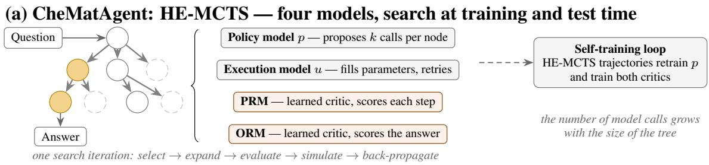
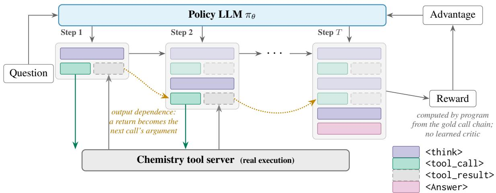
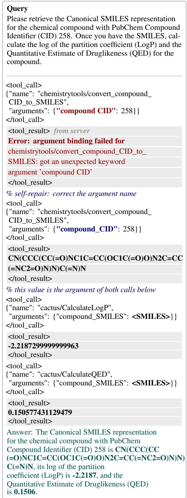

# One Policy Is Enough: Single-Agent Reinforcement Learning Outperforms Tree Search for Chemistry Tool Learning

Armin Dariani<sup>1,2</sup>, Sifan Wu<sup>1,2</sup>, Bang Liu<sup>1,2\*</sup>, Entao Yang<sup>3\*</sup>

<sup>1</sup>DIRO, Université de Montréal

<sup>2</sup>Mila - Quebec Artificial Intelligence Institute

<sup>3</sup>Innovation Campus Delaware, Air Liquide

armin.zolfagharidariani@mila.quebec, sifan.wu@umontreal.ca

bang.liu@umontreal.ca, entao.yang@airliquide.com

Corresponding authors

## Abstract

Chemistry questions often demand exact computation and database lookups that a language model cannot supply from its parameters, so it must reach for external tools. Tool use here is a three-part problem: select the right tool from a large pool, fill it with correctly typed arguments, and chain calls so that each consumes the outputs of the last. CheMatAgent, a previously published system, addresses this with hierarchical evolutionary MCTS: separate policy and execution models searching tool-call trees under two learned critics, one regressed partly onto GPT-assigned scores. We show that a single policy suffices. Our model interleaves reasoning, tool calls, and returns in one left-to-right generation, trained by a supervised warm-up and then outcome-level reinforcement learning against a programmatic reward read directly off the gold call chain, which leaves no learned critic and no judge in the training loop. On ChemToolBench multiple-tool comprehensive chemistry, on both backbones CheMatAgent use, we improve Tool F1 by 5.5% and Return F1 by 9.6% on Qwen-2.5-7B, and by 3.7% and 3.9% on Llama-3.1-8B, compared with their strongest search configuration, at one model invocation per question, against a search whose cost grows with the tree; we also lead answer Pass Rate on Qwen-2.5-7B.

## 1 Introduction

Large language models are increasingly capable on chemistry problems such as molecule generation and reaction prediction (Zhang et al., 2024), but their parameters cannot store every measured property, and they cannot carry out the exact calculations many questions require. The practical remedy is to let the model call external tools as it reasons: cheminformatics libraries, property predictors, database lookups, as in ChemCrow (Bran et al., 2024) and CACTUS (McNaughton et al., 2024).

Building such an agent reliably remains challenging for several reasons. First, chemistry tools are highly specialized and challenging for generalpurpose LLMs to reason. Modern chemistry agents interact with a large collection of tools covering molecular property prediction, reaction analysis, quantum chemistry, database retrieval, and materials simulation. Many tools expose similar interfaces while differing subtly in their underlying assumptions, input requirements, or prediction targets, making accurate tool selection a non-trivial reasoning problem rather than simple retrieval. Second, chemistry tools require structured inputs with strict scientific validity and computational precision. Their arguments often consist of formal chemical representations, such as SMILES strings, molecular identifiers, chemical formulas, or reaction specifications, where syntactic or semantic errors can invalidate execution or lead to scientifically incorrect results. Generating such arguments therefore requires precise structured prediction grounded in chemical knowledge. Third, chemistry problems often require long-horizon tool interaction instead of isolated function calls. Solving a task may involve retrieving molecular information, predicting intermediate properties, and using those outputs to parameterize subsequent computations. Because each tool call depends on the correctness of previous ones, early mistakes propagate through the execution trajectory and compound into downstream failures.

The current state-of-the-art system on Chem-ToolBench, CheMatAgent’s Hierarchical Evolutionary Monte-Carlo Tree Search (HE-MCTS), meets this with machinery. One model plans tool selection while a second fills parameters; a Process Reward Model and an Outcome Reward Model are trained as search critics, the latter regressed onto a mixture of rule-based and GPT-assigned scores; the policy is then fine-tuned on trajectories the search collected. The results are strong and the pipeline is expensive: four models to train and coordinate, plus a per-query search cost the authors themselves note as a drawback. That leaves open whether any of it is necessary.



(b) Ours: single-agent rollout with interleaved tool execution  
  
Figure 1: (a) CheMatAgent’s HE-MCTS (Wu et al., 2025) splits tool selection and parameter filling across two models and searches a tree under two learned critics — a Process Reward Model (PRM) over steps and an Outcome Reward Model (ORM) over answers, the latter trained on a GPT-4o assessment blended with a rule-based check. Four models are trained and deployed, and model calls grow with the tree. (b) One policy π interleaves reasoning with live tool execution in a single generation, so a question costs one model and one LLM call. Context accumulates until step T ends in an answer; faded rows are earlier context, and <tool\_result> spans (dashed) come from the server rather than the policy. A program then scores the trajectory against the gold call chain — no learned critic, no search (§4.1).

Recent advances in reinforcement learning suggest the latter may be possible. Reinforcement learning with verifiable rewards can elicit strong reasoning in a single model (Guo et al., 2025), and the idea extends to tool use (Feng et al., 2026; Jin et al., 2025). Following that line, we train one policy that alternates thinking and tool calls inside a single generation and optimize it end to end with Group Relative Policy Optimization (Shao et al., 2024) against a reward computed directly from the gold call chain. The model reasons, calls a tool, reads the real execution result, and continues until it answers (Figure 1); there is no execution model, no learned critic, and no search. To keep the comparison controlled we reuse CheMatAgent’s benchmark, toolpool, and candidate-tool retrieval, and vary only how the model is trained.

Contributions. (i) We recast chemistry tool learning as single-agent reinforcement learning, in which one policy interleaves reasoning with live tool execution in a single generation, a procedure we call our rollout protocol (§4.1). It is trained with GRPO against a verifiable reward, dispensing with the execution model, the PRM and ORM critics, and the tree search of the previous state of the art (Wu et al., 2025). (ii) We develop a systematic reward framework for multi-tool calling, introducing programmatic rewards that capture answer correctness, tool selection, tool-argument accuracy, and their combinations. We further analyze the trade-offs and failure modes induced by different reward designs, including tool spamming and non-termination. (iii) Our single-policy model consistently outperforms existing SOTA approaches across multiple metrics. It improves Tool F1 by 5.5% and Return F1 by 9.6% on Qwen-2.5-7B, and by 3.7% and 3.9% on Llama-3.1-8B, respectively. To disentangle model improvements from evaluation effects, we further evaluate each untrained backbone under the same rollout protocol, as untrained performance reflects both the evaluation framework and the model capability. Compared with this baseline, supervised warm-up provides a larger contribution than reinforcement learning alone, while reinforcement learning primarily improves tool precision at the expense of recall.

## 2 Related Work

Tool learning: data and methods. Toolformer (Schick et al., 2023) showed that a model can learn on its own when to call an API, and ToolLLM (Qin et al., 2024) scaled this to over 16,000 real APIs with the ToolBench benchmark. Later resources target the two hard parts, choosing a tool and filling its arguments: API-Bank (Li et al., 2023), Seal-Tools (Wu et al., 2024), and ToolACE (Liu et al., 2025), which synthesises function-calling data with a multi-agent pipeline. The Berkeley Function Calling Leaderboard (Patil et al., 2025) is the standard evaluation, now extended to multi-turn, stateful settings. Most of this line teaches tool use by supervised fine-tuning alone. We use SFT only as a warm-up before online RL in which the model calls the tools during training.

LLM agents for chemistry. Science suits toolaugmented agents because answers must be precise and checkable. ChemCrow (Bran et al., 2024) combines eighteen expert tools to plan organic syntheses, CACTUS (McNaughton et al., 2024) pairs open LLMs with cheminformatics packages such as RDKit, SciAgent (Ma et al., 2024) extends toolaugmented reasoning across scientific benchmarks, and ChemLLM (Zhang et al., 2024) instead builds chemical knowledge in through pretraining. Closest to us is CheMatAgent (Wu et al., 2025), the strongest of these, contributing a 137-tool chemistry pool, the ChemToolBench dataset, and HE-MCTS: a policy model and an execution model are kept separate, a trained Process Reward Model and Outcome Reward Model guide tree search, and the policy is fine-tuned step by step on search trajectories. Accuracy is strong, but the pipeline is large and costly at inference, a point the authors themselves raise. We keep their benchmark and toolpool unchanged and ask whether much simpler training reaches the same level.

Reinforcement learning for reasoning and tool use. DeepSeek-R1 (Guo et al., 2025) drew strong reasoning out of a single model almost entirely by reinforcement learning with verifiable rewards, using GRPO (Shao et al., 2024), which drops PPO’s learned critic and scores each sample against its group mean. The recipe then moved to tool use: ReTool (Feng et al., 2026) interleaves code execution with reasoning, and Search-R1 (Jin et al., 2025) does the same for search, masking retrieved tokens to keep training stable, a device we reuse. Closest to our reward design, ToolRL (Qian et al., 2026) decomposes the reward over tool names, parameter names and parameter values rather than matching the answer, Nemotron-Research-Tool-N1 (Zhang et al., 2026) uses a binary format-and-correctness reward on largely single-turn benchmarks, and MatchTIR (Qu et al., 2026) adds turn-level rewards from matched tool traces. We share this recipe and differ in setting and in signal. A chemistry question needs several dependent calls from a large specialized pool, each argument a SMILES string or formula, rather than one code block or one query, and our reward is read off the gold call chain, giving partial credit over tool names and their arguments rather than scoring the answer.

## 3 Task and Benchmark

## 3.1 Problem Formulation

Given a chemistry question q in natural language, an agent must produce a final answer by calling tools from a fixed pool $\mathcal { T } = \{ t _ { 1 } , \ldots , t _ { m } \}$ , each a Python function exposed through an OpenAIstyle JSON signature. Most questions cannot be answered with a single call: they require a chain in which a later call, and the arguments it takes, depend on the values earlier calls returned. The agent must therefore select the right tools and order dependent calls correctly, and it is judged both on how well its calls match a reference and on whether its final answer is correct. Every question is annotated with a validated ground-truth calling chain $C = [ ( t _ { i } , \mathrm { a r g s } _ { i } , r _ { i } ) ] _ { i = 1 } ^ { L }$ recording the tools, their arguments, and their returns; we use C both to build supervised targets and to compute rewards.

## 3.2 ChemToolBench

We use ChemToolBench, the tool-learning benchmark released with CheMatAgent (Wu et al., 2025). It has a chemistry and a materials split, each with single-tool and multi-tool questions partitioned into train, development, and test, and every question is paired with a validated gold calling chain. The chemistry split has 10,441 single-tool and 2,023 multi-tool questions, divided train/development/test as 8353/1044/1044 and 1623/200/200. The materials split is comparable in size (15,742 and 1,623).

<table><tr><td>Source</td><td>Amount</td></tr><tr><td>ChemCrow¹</td><td>8</td></tr><tr><td>CACTUS²</td><td>10</td></tr><tr><td>chemlib3</td><td>24</td></tr><tr><td>pymatgen⁴</td><td>82</td></tr><tr><td>Chemistry Tools⁵</td><td>13</td></tr><tr><td>In total:</td><td>137</td></tr></table>

Table 1: The tool pool by source, counted after organization and rewriting, reproduced from Wu et al. (2025).

Our experiments target the harder multiple-tool chemistry split, whose questions chain between two and six dependent calls, 3.15 on average. We evaluate on all 200 test questions and train on the 1566 of 1623 training questions whose gold chains still reproduce against the current tools (Appendix A). We keep the benchmark and its tools otherwise unchanged and vary only how the model is trained, so any difference in performance is attributable to the training method rather than to the data or the tools.

## 3.3 Chemistry Tool Pool

The chemistry split is served by tools drawn from four libraries (Table 1) and rewritten by Wu et al. (2025) into a uniform, self-describing format. They span cheminformatics utilities, property and structure predictors, reaction and stoichiometry calculators, and drug-likeness scorers, and each is invoked by its library-qualified name (<lib>/<func>) with typed JSON arguments. Some run offline; others call live web services, which is what makes a small number of released gold return values go stale over time (Appendix A).

## 4 Method

## 4.1 Single-Agent Tool-Use Rollout

Figure 1 contrasts the two designs. Where HE-MCTS uses one model to select tools and a separate one to fill their parameters, we use a single policy $\pi _ { \theta }$ that does both. The model talks to a tool server for at most $T \quad = \quad 1 6$ turns. On each turn it writes a short reasoning block inside <think>...</think> and emits one <tool\_call> object of the form {"name": "<lib>/<func>", "arguments": {...}}. The server executes the call and appends its output as a <tool\_result>...</tool\_result> span, and the model opens its next <think> block using the value actually returned. An episode ends when the model writes a single-line Answer: or exhausts the turn and tool-call budget. Because <tool\_result> spans are produced by the server rather than the policy, we mask them out of the training loss and update only on tokens the model generated itself. We call this procedure, one policy interleaving reasoning with live tool execution in a single generation, our rollout protocol. Every model we report, trained or untrained, is run under it, so a difference between rows is a difference in the model and not in the harness. Chains carry this dependency whenever they run, which is why we execute the real tools during training rather than simulating their outputs. Appendix C gives the prompt, the exact trajectory format and a complete rollout (Figure 2) in which a later call’s argument is a value an earlier call returned.

```html
<sup>1</sup>https://github.com/ur-whitelab/
chemcrow-public
<sup>2</sup>https://github.com/pnnl/cactus
<sup>3</sup>https://github.com/harirakul/chemlib
<sup>4</sup>https://github.com/materialsproject/pymatgen
<sup>5</sup>https://github.com/domdfcoding/chemistry_
tools
```

## 4.2 Supervised Fine-Tuning

Reinforcement learning from a cold base model is slow to acquire the tool-calling format, so we optionally warm the policy up with a short round of supervised fine-tuning. We linearise each gold calling chain into the rollout trajectory of §4.1, interleaving a reasoning block, the tool call and its returned result at every step, and set the target final answer to a complete natural-language sentence stating the quantities the question asks for. Training the policy to reproduce these trajectories teaches both the output format and a first approximation of correct tool selection. This checkpoint is the starting point for RL (SFT→RL); we also run RL directly from the base model (RL-only), and find the warm-up is worth at least as much as RL on its own (§7.1).

## 4.3 Programmatic Reward

Let C be the ground-truth calling chain, and let a response produce a set of calls $\hat { C }$ and a final answer aˆ. Every reward below is computed by a program rather than a learned model, and each is mapped linearly to [−1, 1]. This is a deliberate departure from CheMatAgent (Wu et al., 2025), whose search is guided by two learned critics, a Process Reward Model and an Outcome Reward Model, the latter regressed onto a weighted average of a rule-based score and a GPT-assigned one. Our reward needs no such critics and no LLM judge in the training loop. It depends only on C and is therefore cheap, deterministic, and reproducible. The main variants are the following.

$R _ { \mathbf { a n s } }$ (value inclusion). The fraction of the ground-truth return values that appear verbatim, after normalisation, in the final answer aˆ. It does not compare aˆ with a reference answer, but asks only whether the values the tools produced were reported. Full credit requires all of them, and a partial match receives a negative reward.

$R _ { \mathbf { t o o l } }$ and $R _ { \mathbf { t o o l } } ^ { F 1 }$ (tool set). Recall, or its F1 counterpart, over the set of tool names. F1 penalises extra calls, which discourages the shortcut of invoking everything in the pool.

$R _ { \mathbf { c a l l } }$ and $R _ { \mathbf { c a l l } } ^ { F 1 }$ (tool and arguments). As $R _ { \mathrm { t o o l } }$ , but a ground-truth call counts only when its arguments match too, with strings lowercased and floats rounded to six decimals. The $R _ { \mathrm { c a l l } } ^ { F 1 }$ variant treats calls as a list rather than a set, so repeats enlarge the denominator and lower precision, discouraging both spamming and padding.

$R _ { \mathbf { h y b } }$ and $R _ { \mathbf { h y b } } ^ { F 1 }$ (hybrid). An equal mix of a tool reward and the answer reward, $R _ { \mathrm { h y b } } =$ $0 . 5 R _ { \mathrm { t o o l } } + 0 . 5 R _ { \mathrm { a n s } }$ , with $R _ { \mathrm { h y b } } ^ { F 1 }$ formed the same way from $R _ { \mathrm { t o o l } } ^ { F 1 }$ . The policy is scored both on which calls it made and on whether it reported the values those calls returned.

## 4.4 Reinforcement Learning

We train $\pi _ { \theta }$ with GRPO (Shao et al., 2024). For each prompt we sample a group of $n = 5$ rollouts, standardize their rewards within the group to obtain advantages (dispensing with PPO’s value network), and take a clipped policy-gradient step at learning rate $1 \times 1 0 ^ { - 6 }$ . Training runs on the slime post-training stack (Zhu et al., 2025), where Megatron-LM updates the policy while an SGLang server produces the multi-turn rollouts and the two communicate through slime’s data buffer. Both starting points, RL-only and SFT→RL, use identical optimizer settings, so their difference reflects only the warm-up; the backbones and baselines are listed in §5.

## 5 Experimental Setup

We adopt CheMatAgent’s benchmark, tool exposure and scoring rules throughout, so that a difference in the tables is attributable to training.

## 5.1 Benchmark and Backbones

We evaluate on the multiple-tool comprehensivechemistry split of ChemToolBench (Wu et al., 2025), using its full test set of 200 multi-step questions, the same evaluation set CheMatAgent use. A few released gold chains no longer reproduce, because some tools query live services, so we drop those records from the training and development data, leaving 1566 and 196 questions (Appendix A).

We train the same two backbones CheMatAgent report, Qwen-2.5-7B-Instruct (Team, 2024) and Llama-3.1-8B-Instruct (Grattafiori et al., 2024), so that within each block of Table 2 only the training method varies, and add Qwen3-4B (Yang et al., 2025) as a scale check, which appears only in Table 3. Each untrained backbone is measured under the same rollout protocol (§4.1), which separates what training contributes from what the protocol itself does.

## 5.2 Training and Inference

The two stages follow §4.2 (SFT warm-up) and §4.4 (GRPO), with SFT→RL continuing from the warm-up checkpoint and RL-only starting from the base model. The warm-up runs three epochs at learning rate $1 0 ^ { - 5 }$ with batch size 64 over the 1394 training questions whose gold chain can be linearised into a supervised trajectory. Reinforcement learning then runs 100 rollout steps over all 1566, since a rollout is scored against the gold chain directly and needs no linearised target. At evaluation we decode greedily (τ=0), so no difference we report comes from sampling.

## 5.3 Evaluation Metrics

We reimplement CheMatAgent’s metrics against their released scoring code so that our columns and theirs mean the same thing, micro-averaging over the whole test set as they do. Format is the fraction of emitted tool calls that parse. Tool matches tool names with list semantics, so a duplicated call scores as a false positive. Param awards partial credit per parameter value, so a call with two of three arguments right scores 2/3. Return compares the value a call actually produced against the gold return. Pass Rate is answer-level, computed as CheMatAgent do with their grading prompt verbatim and GPT-4o-mini at temperature 0. The judge sees the question, the gold answer and the model’s answer and returns Yes or No, and we report the fraction of Yes over all 200 questions, a missing answer counting as No (Appendix D). None of these is involved in training, where the reward is a separate programmatic function (§4.3).

<table><tr><td></td><td></td><td colspan="3">Tool</td><td colspan="3">Param</td><td colspan="3">Return</td><td>Pass</td></tr><tr><td>Model</td><td>Format</td><td>P</td><td>R</td><td>F1</td><td>P</td><td>R</td><td>F1</td><td>P</td><td>R</td><td>F1</td><td>Rate</td></tr><tr><td>GPT-4o-mini (CoT)</td><td>99.83</td><td>83.22</td><td>78.86</td><td>80.98</td><td>76.04</td><td>72.19</td><td>74.06</td><td>77.05</td><td>73.13</td><td>75.04</td><td>58.00</td></tr><tr><td>Claude-3.5-S (CoT)</td><td>97.42</td><td>83.64</td><td>85.37</td><td>84.50</td><td>76.03</td><td>77.53</td><td>76.77</td><td>74.96</td><td>78.54</td><td>76.71</td><td>57.00</td></tr><tr><td>ChemLLM* (SFT)</td><td>98.10</td><td>76.84</td><td>88.08</td><td>82.07</td><td>68.22</td><td>80.20</td><td>73.72</td><td>68.84</td><td>80.45</td><td>74.19</td><td>53.00</td></tr><tr><td>GPT-4o-mini-M (HE-MCTS)</td><td>1</td><td>85.06</td><td>83.57</td><td>84.31</td><td>88.47</td><td>1</td><td>/</td><td>75.97</td><td>74.64</td><td>75.30</td><td>62.30</td></tr><tr><td>Claude-3.5-S-M (HE-MCTS)</td><td>1</td><td>89.80</td><td>86.27</td><td>88.00</td><td>86.36</td><td>1</td><td>1</td><td>77.55</td><td>74.51</td><td>76.00</td><td>57.06</td></tr><tr><td>Base: Qwen-2.5-7B-Instruct</td><td></td><td></td><td></td><td></td><td></td><td></td><td></td><td></td><td></td><td></td><td></td></tr><tr><td>CheMatAgent-I (no FT)</td><td>51.25</td><td>64.15</td><td>41.81</td><td>50.63</td><td>56.48</td><td>37.36</td><td>44.97</td><td>29.25</td><td>37.20</td><td>32.75</td><td>22.50</td></tr><tr><td>CheMatAgent-M3 (HE-MCTS)</td><td></td><td>91.14</td><td>90.45</td><td>90.80</td><td>89.32</td><td></td><td>1</td><td>81.41</td><td>80.79</td><td>81.10</td><td>67.32</td></tr><tr><td>Ours (SFT→RL)</td><td>100.00</td><td>96.30</td><td>95.23</td><td>95.76</td><td>88.35</td><td>87.36</td><td>87.85</td><td>89.39</td><td>88.39</td><td>88.89</td><td>68.50</td></tr><tr><td>Base: Llama-3.1-8B-Instruct</td><td></td><td></td><td></td><td></td><td></td><td></td><td></td><td></td><td></td><td></td><td></td></tr><tr><td>CheMatAgent-I (no FT)</td><td>75.99</td><td>59.95</td><td>38.31</td><td>46.75</td><td>52.98</td><td>33.71</td><td>41.20</td><td>40.83</td><td>34.34</td><td>37.31</td><td>15.00</td></tr><tr><td>CheMatAgent-I* (SFT)</td><td>99.20</td><td>93.10</td><td>92.21</td><td>92.65</td><td>83.85</td><td>83.15</td><td>83.50</td><td>85.03</td><td>84.90</td><td>84.96</td><td>55.00</td></tr><tr><td>CheMatAgent-M0 (HE-MCTS)</td><td>1</td><td>75.45</td><td>78.45</td><td>76.92</td><td>85.25</td><td>1</td><td>1</td><td>65.09</td><td>67.68</td><td>66.36</td><td>29.19</td></tr><tr><td>CheMatAgent-M1 (HE-MCTS)</td><td>1</td><td>87.74</td><td>87.32</td><td>87.53</td><td>85.92</td><td>1</td><td>/</td><td>75.81</td><td>75.44</td><td>75.62</td><td>69.50</td></tr><tr><td>CheMatAgent-M2 (HE-MCTS)</td><td>1</td><td>93.18</td><td>88.39</td><td>90.79</td><td>95.12</td><td>1</td><td>1</td><td>88.64</td><td>84.07</td><td>86.36</td><td>72.30</td></tr><tr><td>CheMatAgent-M3 (HE-MCTS)</td><td>1</td><td>93.22</td><td>91.73</td><td>92.47</td><td>92.36</td><td>1</td><td>1</td><td>86.09</td><td>84.72</td><td>85.41</td><td>72.20</td></tr><tr><td>Ours (SFT→RL)</td><td>100.00</td><td>96.31</td><td>95.55</td><td>95.93</td><td>89.50</td><td>88.62</td><td>89.06</td><td>90.06</td><td>89.35</td><td>89.70</td><td>64.00</td></tr></table>

Table 2: Main results on the multiple-tool comprehensive-chemistry benchmark, grouped by backbone so that within a block only the training method varies. All rows use the same 200 test questions under CheMatAgent’s evaluation regime, and bold marks the best value within each shared-backbone block. On both backbones our single policy takes every Tool and Return column with no tree search, and on Qwen-2.5-7B it also takes Pass Rate. <sup>∗</sup>: fine-tuned on the comprehensive-chemistry split. “/”: value unavailable.

## 6 Results

Table 2 compares our models against CheMatAgent’s, grouped by backbone so that within a block the base model is held fixed and only the training varies.

Tool selection. The clearest result is on tool selection, the task the HE-MCTS policy model exists to perform. On both shared backbones our model takes Tool precision, recall, and F1 outright. On Qwen-2.5-7B we reach 95.76 Tool F1 against 90.80 for -M3, the strongest configuration they build on that base; on Llama-3.1-8B, 95.93 against 92.47 for -M3 and 92.65 for their supervised I<sup>∗</sup> model. Because the comparison is within a backbone, the same weights, trained differently, select tools better without any search at infer-

## ence.

Parameters and returns. Returns follow the same pattern as tools. We take all three Return columns on both backbones, 89.39/88.39/88.89 against -M3’s 81.41/80.79/81.10 on Qwen-2.5-7B and 90.06/89.35/89.70 against -M2’s 88.64/84.07/86.36 on Llama-3.1-8B. Parameters are more mixed. Param recall and F1 are unavailable for the search rows, so precision is the only Param column on which those rows admit a comparison, and HE-MCTS keeps it on both backbones (89.32 and 95.12 against our 88.35 and 89.50). Against the supervised Llama I<sup>∗</sup> model, which does report all three, we lead every Param column. Whatever the search buys here costs four trained models and a tree search at every question.

Answer Pass Rate. Pass Rate is the metric that most directly reflects what a user receives, and it is where the two backbones part company. On Qwen-2.5-7B a single pass reaches 68.50, ahead of -M3’s 67.32. On that backbone our model leads every column HE-MCTS reports comparably except Param precision, so almost everything the search procedure buys is recovered by training one policy differently. On Llama-3.1-8B we reach 64.00 against 72.30 for -M2, and search retains a clear advantage. Both scores beat every chain-of-thought baseline in the table, including GPT-4o-mini (58.00) and

<table><tr><td rowspan="2">Training</td><td colspan="3">Tool</td><td colspan="3">Param</td><td colspan="3">Return</td><td>Pass</td></tr><tr><td>P</td><td>R</td><td>F1</td><td>P</td><td>R</td><td>F1</td><td>P</td><td>R</td><td>F1</td><td>Rate</td></tr><tr><td colspan="10">Qwen-2.5-7B-Instruct</td></tr><tr><td>none (base)</td><td>85.09</td><td>86.17</td><td>85.62</td><td>75.98</td><td>76.40</td><td>76.19</td><td>76.45</td><td>77.42</td><td>76.94</td><td>54.00</td></tr><tr><td>SFT only</td><td>93.91</td><td>93.16</td><td>93.54</td><td>85.98</td><td>85.25</td><td>85.61</td><td>87.50</td><td>86.80</td><td>87.15</td><td>65.50</td></tr><tr><td>RL only</td><td>94.33</td><td>89.98</td><td>92.11</td><td>85.86</td><td>82.72</td><td>84.26</td><td>88.67</td><td>84.58</td><td>86.57</td><td>60.00</td></tr><tr><td>SFT→RL</td><td>96.30</td><td>95.23</td><td>95.76</td><td>88.35</td><td>87.36</td><td>87.85</td><td>89.39</td><td>88.39</td><td>88.89</td><td>68.50</td></tr><tr><td colspan="10">Llama-3.1-8B-Instruct</td></tr><tr><td>none (base)</td><td>36.70</td><td>84.90</td><td>51.25</td><td>20.82</td><td>54.63</td><td>30.16</td><td>25.50</td><td>58.98</td><td>35.60</td><td>24.50</td></tr><tr><td>SFT only</td><td>94.90</td><td>94.59</td><td>94.75</td><td>87.76</td><td>87.64</td><td>87.70</td><td>88.36</td><td>88.08</td><td>88.22</td><td>69.50</td></tr><tr><td>RL only</td><td>95.31</td><td>93.64</td><td>94.47</td><td>86.86</td><td>85.39</td><td>86.12</td><td>87.86</td><td>86.33</td><td>87.09</td><td>62.50</td></tr><tr><td>SFT→RL</td><td>96.31</td><td>95.55</td><td>95.93</td><td>89.50</td><td>88.62</td><td>89.06</td><td>90.06</td><td>89.35</td><td>89.70</td><td>64.00</td></tr><tr><td colspan="10">Qwen3-4B</td></tr><tr><td>none (base)</td><td>87.88</td><td>73.77</td><td>80.21</td><td>80.84</td><td>67.56</td><td>73.60</td><td>83.14</td><td>69.79</td><td>75.89</td><td>53.00</td></tr><tr><td>SFT only</td><td>93.33</td><td>93.48</td><td>93.41</td><td>84.59</td><td>84.83</td><td>84.71</td><td>86.83</td><td>86.96</td><td>86.89</td><td>65.50</td></tr><tr><td>RL only</td><td>93.10</td><td>77.27</td><td>84.45</td><td>87.90</td><td>72.47</td><td>79.45</td><td>89.27</td><td>74.09</td><td>80.97</td><td>57.00</td></tr><tr><td> $\mathbf { S F T } {  } \mathbf { R L }$ </td><td>96.30</td><td>95.07</td><td>95.68</td><td>88.35</td><td>87.36</td><td>87.85</td><td>90.02</td><td>88.87</td><td>89.44</td><td>68.00</td></tr></table>

Table 3: Contribution of each training stage. All arms use our rollout protocol, the same 200 test questions and the reward $R _ { \mathrm { c a l l } } ^ { F 1 }$ , so they differ only in training (§7.1).

Claude-3.5-Sonnet (57.00), both supervised models (ChemLLM 53.00, Llama-3.1-8B-I<sup>∗</sup> 55.00), and the weaker search configurations (-M0 29.19, Claude-3.5-S-M 57.06).

One asymmetry behind this comparison runs against us and is worth naming. Our reward is computed from the gold call chain and never inspects the final answer (§4.3), so nothing in training optimises Pass Rate. What the table reports is whatever answer quality follows from calling the right tools after a warm-up on complete answers. CheMatAgent’s Outcome Reward Model scores the final answer directly and is regressed in part onto GPT judgements, and it guides the search that selects the trajectories their policy is then fine-tuned on. Their Pass Rate is thus optimised, if indirectly, while ours is a by-product. That our Qwen model still leads suggests a tool-level objective carries most of the distance, while our Llama model shows it is not sufficient everywhere.

## 7 Analysis

## 7.1 What Each Training Stage Contributes

Table 3 runs all four arms (untrained backbone, SFT only, RL only, and the composition) through our rollout protocol on the same 200 questions, so they differ in training and nothing else. Both RL arms use 100 rollout steps under $R _ { \mathrm { c a l l } } ^ { F 1 }$ , and where a supervised stage is present it is the same threeepoch warm-up. Qwen3-4B is added as a scale check.

SFT alone beats RL alone. SFT-only leads every F1 column and Pass Rate on all three backbones. On Tool F1 the margin is 1.43 on Qwen-2.5-7B, 0.28 on Llama-3.1-8B and 8.96 on Qwen3-4B, and on Pass Rate it is 5.50, 7.00 and 8.50. Every cell RL-only takes is a precision cell, the effect the next paragraph isolates.

The two margins have different causes. On the tool columns both stages learn from the same gold call chains, but SFT sees them token by token while RL sees only one number per rollout summarising how well it matched, so the same information reaches the model through a much narrower channel. On Pass Rate the problem is not narrowness but absence. Supervised targets end in a complete natural language answer, so SFT is trained on how to report a result, while our reward reads the call chain alone and never inspects the answer (§4.3). RL has no signal at all for what Pass Rate measures.

## 7.2 Reward Design and Reward Hacking

We ablate the reward with the warm-up removed (Table 4), so a pathology the reward permits appears undamped by an SFT prior. Rewarding recall alone is satisfied by calling everything, and the policy finds that solution. $R _ { \mathrm { c a l l } }$ never charges for calls outside the gold chain and reaches the highest recall of any arm (98.25) by issuing 18.33 calls per question against a gold average of 3.15, half of them repeats, which collapses precision to 19.70 and leaves 97% of episodes exhausting the call budget without answering. One precision term prevents this and nothing further is needed: all three F1 rewards stay within 0.1 of the gold call count, rarely repeat and always terminate, so the gap between 32.82 and 95.38 Tool F1 rests on that term alone. Their remaining differences are secondorder, and we use $R _ { \mathrm { c a l l } } ^ { F 1 }$ because it takes Param and Return, the columns that check arguments. Scoring the answer as well does not help: $R _ { \mathrm { h y b } } ^ { F 1 }$ adds $R _ { \mathrm { a n s } } ,$ which demands each gold return value verbatim: only 57% of numeric returns match exactly where 92% are reported to within 1%, so it feeds noise rather than signal into training, and $R _ { \mathrm { h y b } } ^ { F 1 }$ is the least stable arm.

<table><tr><td></td><td colspan="3">Tool</td><td colspan="3">Param</td><td colspan="3">Return</td><td colspan="3">behaviour</td></tr><tr><td>Reward</td><td>P</td><td>R</td><td>F1</td><td>P</td><td>R</td><td>F1</td><td>P</td><td>R</td><td>F1</td><td>calls</td><td>dup.</td><td>n-term</td></tr><tr><td>extra calls unpenalised</td><td></td><td></td><td></td><td></td><td></td><td></td><td></td><td></td><td></td><td></td><td></td><td></td></tr><tr><td>Rcall (recall, name+args)</td><td>19.70</td><td>98.25</td><td>32.82</td><td>16.13</td><td>85.96</td><td>27.17</td><td>17.88</td><td>89.19</td><td>29.79</td><td>18.33</td><td>49.6%</td><td>97.0%</td></tr><tr><td>precision term added</td><td></td><td></td><td></td><td></td><td></td><td></td><td></td><td></td><td></td><td></td><td></td><td></td></tr><tr><td> $\dot { R } _ { \mathrm { t o o l } } ^ { F 1 }$  (set F1, names)</td><td>95.53</td><td>95.23</td><td>95.38</td><td>82.87</td><td>83.57</td><td>83.22</td><td>85.33</td><td>85.06</td><td>85.19</td><td>3.13</td><td>0.6%</td><td>0.0%</td></tr><tr><td> $R _ { \mathrm { c a l l } } ^ { F 1 } ~ ( \mathrm { l i s t } \mathrm { F } 1 , + \mathrm { a r g s } )$ </td><td>94.33</td><td>89.98</td><td>92.11</td><td>85.86</td><td>82.72</td><td>84.26</td><td>88.67</td><td>84.58</td><td>86.57</td><td>3.06</td><td>1.1%</td><td>0.0%</td></tr><tr><td> $R _ { \mathrm { h y b } } ^ { F 1 } ( \mathrm { t o o l F 1 + v a l u e i n c l . ) }$ </td><td>93.81</td><td>93.96</td><td>93.88</td><td>82.13</td><td>83.29</td><td>82.71</td><td>85.56</td><td>85.69</td><td>85.62</td><td>3.16</td><td>3.9%</td><td>0.0%</td></tr></table>

Table 4: Reward ablation on Qwen-2.5-7B, trained for 100 steps without a warm-up so the reward is the only signal. “calls” is the mean tool calls per question against a gold average of 3.15, “dup.” the share repeating a tool already used, and “n-term” the share of episodes exhausting the 16-call budget without answering (§7.2).

## 7.3 Self-Repair from Execution Feedback

Of the three problems in §1, output-dependent chaining carries a cost the other two problems do not. Because a later call consumes an earlier return, one bad value is inherited by every step after it, even when those steps select and type their own calls correctly. Our protocol executes tools for real in training as well as at test, so a misnamed or wrongly typed call returns an error string rather than a plausible value, and the policy reads it on the next turn. Our models act on this, re-issuing the call with the fault corrected instead of continuing as though it had succeeded. We call this self-repair from execution feedback, and supervision cannot be its source, since gold chains contain only calls that succeed.

Figure 3 in Appendix E shows a case where one mistyped argument name would otherwise have cost both remaining values, however well those two calls were chosen.

## 8 Conclusion

Chemistry tool learning has been approached with heavy, multi-part systems: a separate planner and executor, trained PRM and ORM critics, and inference-time tree search. We showed that this machinery is not necessary. A single policy that interleaves reasoning and tool calls in one pass, warmed up with a short round of SFT and then optimized with GRPO against a simple programmatic reward, matches or exceeds CheMatAgent’s HE-MCTS pipeline on tool, parameter, and return F1 on the same backbones, and is competitive on answer Pass Rate, all at one model invocation per question. Our analysis further shows where each ingredient helps: the supervised warm-up supplies tool recall, RL supplies precision, and list/F1 reward semantics are what keep the policy from hacking the tool score. Verifiable programmatic rewards are enough; no learned reward model or search is required to reach this level.

## Limitations

Scope. We study one benchmark and one domain, the multiple-call comprehensive-chemistry split of ChemToolBench. To our knowledge no other chemistry benchmark pairs questions with multi-call gold chains, so in-domain generalisation cannot be tested, and whether the recipe transfers to other scientific-tool domains is untested. Its chains run two to six calls and our backbones span 4–8B parameters, so longer horizons and larger models are unevaluated.

## Acknowledgments

The authors gratefully acknowledge financial support from Air Liquide and the Mitacs Program (IT46383) for this research. We also acknowledge the computational resources provided by DeltaAI at the National Center for Supercomputing Applications through ACCESS allocation CIS260150 (E.Y., B.L.).

## References

Andrés M. Bran, Sam Cox, Oliver Schilter, Carlo Baldassari, Andrew D. White, and Philippe Schwaller. 2024. Augmenting large language models with chemistry tools. Nature Machine Intelligence, 6(5):525– 535.

Jiazhan Feng, Shijue Huang, Xingwei Qu, Ge Zhang, Yujia Qin, Baoquan Zhong, Chengquan Jiang, Jinxin Chi, and Wanjun Zhong. 2026. Retool: Reinforcement learning for strategic tool use in llms. In International Conference on Learning Representations, volume 2026, pages 37909–37926.

Aaron Grattafiori et al. 2024. The llama 3 herd of models. arXiv preprint arXiv:2407.21783.

Daya Guo, Dejian Yang, Haowei Zhang, Junxiao Song, Ruoyu Zhang, Runxin Xu, Qihao Zhu, Shirong Ma, Peiyi Wang, Xiao Bi, et al. 2025. DeepSeek-R1 incentivizes reasoning in LLMs through reinforcement learning. Nature, 645:633–638.

Bowen Jin, Hansi Zeng, Zhenrui Yue, Jinsung Yoon, Sercan Arik, Dong Wang, Hamed Zamani, and Jiawei Han. 2025. Search-r1: Training llms to reason and leverage search engines with reinforcement learning. arXiv preprint arXiv:2503.09516.

Minghao Li, Yingxiu Zhao, Bowen Yu, Feifan Song, Hangyu Li, Haiyang Yu, Zhoujun Li, Fei Huang, and Yongbin Li. 2023. API-bank: A comprehensive benchmark for tool-augmented LLMs. In Proceedings of the 2023 Conference on Empirical Methods in Natural Language Processing, pages 3102–3116, Singapore. Association for Computational Linguistics.

Weiwen Liu, Xu Huang, Xingshan Zeng, Shuai Yu, Dexun Li, Shuai Wang, Weinan Gan, Zhengying Liu, Yuanqing Yu, Zezhong WANG, et al. 2025. Toolace: Winning the points of llm function calling. In International conference on learning representations, volume 2025, pages 41359–41381.

Yubo Ma, Zhibin Gou, Junheng Hao, Ruochen Xu, Shuohang Wang, Liangming Pan, Yujiu Yang, Yixin Cao, and Aixin Sun. 2024. SciAgent: Toolaugmented language models for scientific reasoning. In Proceedings of the 2024 Conference on Empirical Methods in Natural Language Processing, pages 15701–15736, Miami, Florida, USA. Association for Computational Linguistics.

Andrew D. McNaughton, Gautham Krishna Sankar Ramalaxmi, Agustin Kruel, Carter R. Knutson, Rohith A. Varikoti, and Neeraj Kumar. 2024. CACTUS: Chemistry agent connecting tool usage to science. ACS Omega, 9(46):46563–46573.

Shishir G. Patil, Huanzhi Mao, Fanjia Yan, Charlie Cheng-Jie Ji, Vishnu Suresh, Ion Stoica, and Joseph E. Gonzalez. 2025. The berkeley function calling leaderboard (BFCL): From tool use to agentic evaluation of large language models. In Proceedings

of the 42nd International Conference on Machine Learning, volume 267 of Proceedings of Machine Learning Research, pages 48371–48392. PMLR.

Cheng Qian, Emre Can Acikgoz, Qi He, Hongru Wang, Xiusi Chen, Dilek Hakkani-Tur, Gokhan Tur, and Heng Ji. 2026. Toolrl: Reward is all tool learning needs. Advances in Neural Information Processing Systems, 38:105523–105553.

Yujia Qin, Shihao Liang, Yining Ye, Kunlun Zhu, Lan Yan, Yaxi Lu, Yankai Lin, Xin Cong, Xiangru Tang, Bill Qian, et al. 2024. Toolllm: Facilitating large language models to master 16000+ real-world apis. In International Conference on Learning Representations, volume 2024, pages 9695–9717.

Changle Qu et al. 2026. MatchTIR: Fine-grained supervision for tool-integrated reasoning via bipartite matching. In Proceedings ofthe 64th Annual Meeting of the Association for Computational Linguistics (ACL). ArXiv:2601.10712.

Timo Schick, Jane Dwivedi-Yu, Roberto Dessì, Roberta Raileanu, Maria Lomeli, Eric Hambro, Luke Zettlemoyer, Nicola Cancedda, and Thomas Scialom. 2023. Toolformer: Language models can teach themselves to use tools. In Advances in Neural Information Processing Systems, volume 36, pages 68539–68551. Curran Associates, Inc.

Zhihong Shao, Peiyi Wang, Qihao Zhu, Runxin Xu, Junxiao Song, Xiao Bi, Haowei Zhang, Mingchuan Zhang, Y. K. Li, Y. Wu, and Daya Guo. 2024. DeepSeekMath: Pushing the limits of mathematical reasoning in open language models. arXiv preprint arXiv:2402.03300.

Qwen Team. 2024. Qwen2.5 technical report. arXiv preprint arXiv:2412.15115.

Mengsong Wu, YaFei Wang, Yidong Ming, Yuqi An, Yuwei Wan, Wenliang Chen, Binbin Lin, Yuqiang Li, Tong Xie, and Dongzhan Zhou. 2025. CheMatAgent: Enhancing LLMs for chemistry and materials science through tree-search based tool learning. arXiv preprint arXiv:2506.07551.

Mengsong Wu, Tong Zhu, Han Han, Chuanyuan Tan, Xiang Zhang, and Wenliang Chen. 2024. Seal-tools: Self-instruct tool learning dataset for agent tuning and detailed benchmark. In CCF International Conference on Natural Language Processing and Chinese Computing, pages 372–384. Springer.

An Yang et al. 2025. Qwen3 technical report. arXiv preprint arXiv:2505.09388.

Di Zhang, Wei Liu, Qian Tan, Jingdan Chen, Hang Yan, Yuliang Yan, Jiatong Li, Weiran Huang, Xiangyu Yue, Dongzhan Zhou, Shufei Zhang, Mao Su, Han-Sen Zhong, Yuqiang Li, and Wanli Ouyang. 2024. Chemllm: A chemical large language model. ArXiv, abs/2402.06852.

Shaokun Zhang, Yi Dong, Jieyu Zhang, Jan Kautz, Bryan Catanzaro, Andrew Tao, Qingyun Wu, Zhiding Yu, and Guilin Liu. 2026. Nemotron-researchtool-n1: Exploring tool-using language models with reinforced reasoning. In International Conference on Learning Representations, volume 2026, pages 91437–91453.

Zilin Zhu, Chengxing Xie, Xin Lv, and slime Contributors. 2025. slime: An llm post-training framework for rl scaling. GitHub repository.

## A Refreshing stale gold returns

Some ChemToolBench tools query live services, so for a few records the return stored in the released gold chain is no longer what the tool returns today. A stale chain penalizes a model that calls the right tool with the right arguments and reports what it received, which is the behaviour the metric should reward. The failures are value mismatches in tools whose answer legitimately changes over time, led by chemcrow/PatentCheck, plus a few tools that now raise.

A stale chain is a corrupt supervision target, so we drop the affected records from the data we train on, 57 of 1623 training and 4 of 200 development questions. We drop nothing from the test split.

## B The chemistry tool pool

The chemistry split is served by 55 tools across four libraries. Each is invoked by its library-qualified name with typed JSON arguments, and the model sees only the signature, never the implementation. Ten of the 55 call live web services at request time, which is why a small number of released gold returns no longer reproduce (Appendix A). Table 5 lists the calls the gold chains issue most often.

<table><tr><td>Tool</td><td>Calls</td></tr><tr><td>chemistrytools/get_compound_CID chemistrytools/get_compound_</td><td>732</td></tr><tr><td>MolecularWeight_by_CID</td><td>616</td></tr><tr><td>chem_lib/get_empirical_formula_ by_percent_composition</td><td>446</td></tr><tr><td>chem_lib/calculate_compound_molar_mass</td><td>438</td></tr></table>

Table 5: The most frequently called tools in the gold chains of the multiple-tool chemistry split, counted over train, development and test.

## C Prompts and rollout protocol

One prompt is used for RL rollouts, for SFT targets and for evaluation, so the policy never sees a format at test time that it was not trained on. It is assembled from four parts: the system prompt below, the JSON signatures of the tools exposed for that query, one worked example, and the user turn.

## System prompt.

You are a chemistry assistant that   
solves problems by calling chemistry   
tools. Work strictly ONE step at a   
time:   
1. Write a brief <think>...</think>   
block that reasons about ONLY the next   
single tool call. Do NOT plan multiple   
future steps in advance — you cannot   
know what a tool will return until it is   
actually called, so later steps must be   
decided after seeing real <tool\_result>   
values.   
2. Emit exactly one   
<tool\_call>...</tool\_call> JSON block.   
3. Wait for the <tool\_result>, then   
start the next <think> by incorporating   
what the tool actually returned.   
When you have enough information, give   
a COMPLETE final answer on a single   
line that states, in a full sentence,   
every quantity the question asked for,   
as: Answer: <your complete answer>.

The one-step-at-a-time instruction is what forces the interleaving of §4.1: the model cannot emit a plan for the whole chain, because each later argument may depend on a value it has not yet seen.

Tools and user turn. Tool signatures are inserted as JSON objects inside <tools></tools>, followed by the example, in a chat template whose role delimiters follow the backbone (Qwen or Llama). The user turn is the benchmark query with a fixed suffix instructing the model to emit <tool\_call> blocks and finish with a single Answer: line.

Rollout and supervision. An episode runs for at most T = 16 turns. The server executes each call and appends its output verbatim inside <tool\_result></tool\_result>; because those spans are produced by the tool server rather than the policy, they are masked out of the loss and only model-generated tokens are trained on. Episodes end at the first Answer: line or when the turn budget is exhausted. SFT targets are gold calling chains linearised into exactly this format (reasoning block, call, returned value, repeated) and closed with a complete natural-language answer, so the supervised and RL formats are identical.

## D Answer-level judging

Pass Rate is computed exactly as Wu et al. (2025) compute it, reusing their grading prompt verbatim:

Please evaluate whether the given answer   
to the question is correct according to   
the gold answer. Return "Yes" if it is   
correct, otherwise return "No".   
Question:   
{query}   
Gold Answer:   
{gold}   
Given Answer:   
{pred}   
Whether the given answer is correct:

The judge is GPT-4o-mini at temperature 0. {gold} is their released natural-language gold answer for the question, not the raw tool returns, matching the reference their own response\_generation.py supplies; {pred} is the text after the final Answer: marker in the rollout. Pass Rate is the fraction of Yes verdicts over all 200 test questions, with a missing or empty answer counted as No.

## E A self-repair rollout

Figure 3 is the unedited training rollout discussed in §7.3, in which the model reads an execution error and re-issues the failed call corrected. Gold chains contain only calls that succeed, so this behaviour cannot have been imitated from supervision.

Query (multiple\_1991)   
Please retrieve the PubChem Compound Identifier   
(CID) for the chemical compound ’(5-Bromo-2-   
methoxyphenyl)methanol’, and subsequently, obtain the   
molecular weight of this compound using the retrieved   
CID.   
<think>   
We need to retrieve the PubChem Compound   
Identifier for ’(5-Bromo-2-methoxyphenyl)-   
methanol’, so we call get\_compound\_CID   
with the compound name.   
</think>   
<tool\_call>   
{"name": "chemistrytools/get\_compound\_CID",   
"arguments": {"compound": "(5-Bromo-2-   
methoxyphenyl)methanol"}}   
</tool\_call>   
<tool\_result> from server   
612298   
</tool\_result>   
<think>   
With the PubChem CID (612298) in hand, we   
call get\_compound\_MolecularWeight\_by\_CID   
to obtain its molecular weight.   
</think>   
<tool\_call>   
{"name": "chemistrytools/get\_compound\_   
MolecularWeight\_by\_CID",   
"arguments": {"compound\_CID": 612298}}   
</tool\_call>   
<tool\_result> from server   
217.06   
</tool\_result>   
Answer: The molecular weight of ’(5-Bromo-2-   
methoxyphenyl)methanol’ is 217.06 g/mol.  
Figure 2: A complete, unedited rollout from our Qwen-2.5-7B SFT→RL model. Shaded spans are returned by the tool server and masked from the loss; everything else is generated by the policy. The CID 612298 appears nowhere in the query and cannot be guessed, so the second call can only be written by reading it back out of the first call’s result. This rollout matches the gold chain exactly.

  
Figure 3: Self-repair from execution feedback, in an unedited Qwen-2.5-7B RL-only training rollout; shaded spans are returned by the server. The model writes an argument name with a space, reads the binding error, and re-issues the call corrected. That recovered SMILES is the argument of both later calls, so one uncorrected error would have cost two more values. <SMILES> abbreviates the string, which the rollout repeats in full.